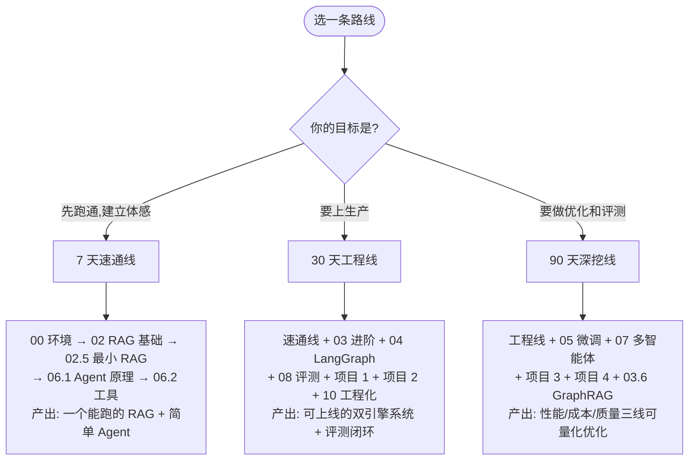

# 《RAG + Agent 双引擎：大模型落地实战》

> 一本从零到生产的中文实战教程。对标"RAG+Agent 双引擎大模型落地实战训练营"的全部内容，  
> 但用可运行的代码、可复现的实验和可验收的标准来讲，而不是用口号。

---

## 这本书是什么

市面上讲大模型的材料分两类：一类讲概念不给代码，读完还是不会做；一类甩一坨代码不讲为什么，换个场景就废。

这本书的目标只有一个：**让你能独立把一个 RAG + Agent 系统从 0 做到生产上线，并且说得清每一个技术决策的理由。**

全书围绕**一个贯穿始终的业务案例**展开——「华成机电」的售后知识库与工单智能助手：

| 维度 | 内容 |
|---|---|
| 数据形态 | PDF 操作手册、Word 维修指南、Excel 备件表、历史工单 CSV、内部 Wiki |
| 用户角色 | 一线客服、现场工程师、售后管理者 |
| 业务指标 | 首次解决率、平均处理时长、人工转接率、知识复用率 |
| 技术挑战 | 私域知识、精确型号/错误码检索、多跳推理、写操作审批、可溯源 |

从第 2 章的最小 RAG，到第 9 章的四个完整项目，用的都是这套数据和这套指标。你会看到同一个系统是怎么一步步从"能跑"变成"能用"再变成"能上生产"的。

---

## 读者画像

- 有 1~3 年后端或算法经验，Python 基础 OK，会用 Linux 和 Docker
- 没系统做过大模型项目，但需要在真实业务里把它落地
- 不满足于调通 API，想搞清楚性能、成本、准确率背后的工程逻辑

如果你完全没写过 Python，建议先补基础再回来；如果你已经在做大模型平台，可以直接跳到第 3、7、8、10 模块。

---

## 完整目录

### [00 · 前置准备](docs/RAG-Agent双引擎实战教程/00-前置准备/)

| 章节 | 内容 |
|---|---|
| [00-本书导读与学习路线](docs/RAG-Agent双引擎实战教程/00-前置准备/00-本书导读与学习路线.md) | 全书地图、三条学习路线、海报名词对照表 |
| [01-开发环境搭建（Python-CUDA-Docker）](docs/RAG-Agent双引擎实战教程/00-前置准备/01-开发环境搭建（Python-CUDA-Docker）.md) | 三种硬件档位、CUDA/PyTorch 版本矩阵、依赖服务 compose、环境自检脚本 |
| [02-Python工程基础速补](docs/RAG-Agent双引擎实战教程/00-前置准备/02-Python工程基础速补.md) | pydantic v2、asyncio 并发限流重试、流式、日志、项目结构、测非确定性函数 |

### [01 · 大模型基础与技术选型](docs/RAG-Agent双引擎实战教程/01-大模型基础与技术选型/)

| 章节 | 内容 |
|---|---|
| [01-大模型原理速览](docs/RAG-Agent双引擎实战教程/01-大模型基础与技术选型/01-大模型原理速览.md) | 只讲影响工程决策的原理：KV Cache 显存、Prefill/Decode、解码参数、幻觉机理 |
| [02-模型全景图与选型方法论](docs/RAG-Agent双引擎实战教程/01-大模型基础与技术选型/02-模型全景图与选型方法论.md) | 六维评估框架、场景推荐矩阵、API vs 自建盈亏平衡、多模型路由 |
| [03-本地部署实战（Ollama-vLLM-SGLang）](docs/RAG-Agent双引擎实战教程/01-大模型基础与技术选型/03-本地部署实战（Ollama-vLLM-SGLang）.md) | vLLM 逐参数详解、量化决策树、压测、统一模型网关 |
| [04-算力配置与成本测算](docs/RAG-Agent双引擎实战教程/01-大模型基础与技术选型/04-算力配置与成本测算.md) | 显存公式、卡型对照、容量规划脚本、TCO 模型、10 个省钱手段 |
| [05-提示工程与结构化输出](docs/RAG-Agent双引擎实战教程/01-大模型基础与技术选型/05-提示工程与结构化输出.md) | 结构化输出三条路线、robust parser、Prompt 版本管理、注入防御、A/B 评测 |

### [02 · RAG 基础篇](docs/RAG-Agent双引擎实战教程/02-RAG基础篇/)

| 章节 | 内容 |
|---|---|
| [01-RAG原理与整体架构](docs/RAG-Agent双引擎实战教程/02-RAG基础篇/01-RAG原理与整体架构.md) | 双链路架构、RAG 七种失败模式、与微调/长上下文的取舍 |
| [02-文档解析与切分策略](docs/RAG-Agent双引擎实战教程/02-RAG基础篇/02-文档解析与切分策略.md) | 解析工具对比、清洗流水线、七种切分策略（含父子块、上下文增强）、元数据设计 |
| [03-Embedding与向量数据库](docs/RAG-Agent双引擎实战教程/02-RAG基础篇/03-Embedding与向量数据库.md) | 模型选型、HNSW/IVF 参数调优、Milvus/pgvector 实战、容量与成本 |
| [04-检索重排生成全链路](docs/RAG-Agent双引擎实战教程/02-RAG基础篇/04-检索重排生成全链路.md) | BM25、RRF 融合、Cross-Encoder 重排、上下文组装、引用机制 |
| [05-从0手写一个最小可用RAG](docs/RAG-Agent双引擎实战教程/02-RAG基础篇/05-从0手写一个最小可用RAG.md) | 跟着敲完就能跑；含全书共用的模拟语料；并指出它的 8 个缺陷 |

### [03 · RAG 进阶与性能优化](docs/RAG-Agent双引擎实战教程/03-RAG进阶与性能优化/)

> 全书技术密度最高的模块，对应海报的「RAG 性能突围」「复杂问题拆解」「准确率优化」。

| 章节 | 内容 |
|---|---|
| [01-查询理解与高级检索策略](docs/RAG-Agent双引擎实战教程/03-RAG进阶与性能优化/01-查询理解与高级检索策略.md) | 改写、Multi-Query、HyDE、Step-Back、路由、槽位抽取、Self-Query |
| [02-混合检索与重排序精调](docs/RAG-Agent双引擎实战教程/03-RAG进阶与性能优化/02-混合检索与重排序精调.md) | 难负样本挖掘、reranker 微调、embedding 领域微调、检索评测框架 |
| [03-复杂问题拆解与多跳检索](docs/RAG-Agent双引擎实战教程/03-RAG进阶与性能优化/03-复杂问题拆解与多跳检索.md) | 问题分解、IRCoT、Self-RAG、CRAG、Text2SQL 分支、递归护栏 |
| [04-性能突围-延迟优化10倍实战](docs/RAG-Agent双引擎实战教程/03-RAG进阶与性能优化/04-性能突围-延迟优化10倍实战.md) | 先测量再优化；11 项优化的收益/代价/风险表；诚实讨论"10 倍"的前提 |
| [05-准确率优化-从70到95的工程路径](docs/RAG-Agent双引擎实战教程/03-RAG进阶与性能优化/05-准确率优化-从70到95的工程路径.md) | badcase 归因决策树、分层提升、忠实度校验、置信度标定、拒答策略 |
| [06-GraphRAG与结构化知识融合](docs/RAG-Agent双引擎实战教程/03-RAG进阶与性能优化/06-GraphRAG与结构化知识融合.md) | 图谱构建、Local/Global Search、Neo4j 实战、成本现实与决策清单 |

### [04 · LangChain 与工程框架](docs/RAG-Agent双引擎实战教程/04-LangChain与工程框架/)

| 章节 | 内容 |
|---|---|
| [01-LangChain核心抽象与LCEL](docs/RAG-Agent双引擎实战教程/04-LangChain与工程框架/01-LangChain核心抽象与LCEL.md) | 六大抽象、LCEL 管道、重试降级、回调与缓存、版本迁移坑 |
| [02-LangGraph状态机编排](docs/RAG-Agent双引擎实战教程/04-LangChain与工程框架/02-LangGraph状态机编排.md) | State/Node/Edge、checkpointer、人在回路、子图、并行、用它重写 CRAG |
| [03-LlamaIndex与框架选型对比](docs/RAG-Agent双引擎实战教程/04-LangChain与工程框架/03-LlamaIndex与框架选型对比.md) | 框架全景对比表、混用方案、200 行裸写版、技术债隔离层 |

### [05 · 微调：LoRA 与 PEFT](docs/RAG-Agent双引擎实战教程/05-微调LoRA与PEFT/)

| 章节 | 内容 |
|---|---|
| [01-微调原理与PEFT家族全解](docs/RAG-Agent双引擎实战教程/05-微调LoRA与PEFT/01-微调原理与PEFT家族全解.md) | 诊断表（该 RAG 还是该微调）、LoRA/QLoRA 原理、超参经验值、防遗忘 |
| [02-数据集构造与清洗](docs/RAG-Agent双引擎实战教程/05-微调LoRA与PEFT/02-数据集构造与清洗.md) | 五条数据来源、质量治理、脱敏、泄漏检查、配比、完整流水线 |
| [03-LoRA-QLoRA实战](docs/RAG-Agent双引擎实战教程/05-微调LoRA与PEFT/03-LoRA-QLoRA实战.md) | Qwen2.5-7B 完整训练脚本、labels mask、loss 曲线解读、消融实验 |
| [04-LLaMA-Factory工程化训练](docs/RAG-Agent双引擎实战教程/05-微调LoRA与PEFT/04-LLaMA-Factory工程化训练.md) | yaml 全解、多卡、DPO、导出、实验管理与可复现 checklist |
| [05-模型合并量化与部署](docs/RAG-Agent双引擎实战教程/05-微调LoRA与PEFT/05-模型合并量化与部署.md) | merge、AWQ/GPTQ/GGUF、vLLM 多 adapter、灰度与回滚、模型资产管理 |
| [06-微调效果评估与何时不该微调](docs/RAG-Agent双引擎实战教程/05-微调LoRA与PEFT/06-微调效果评估与何时不该微调.md) | 三层评估、LLM-as-Judge 去偏、成本收益核算、**红灯清单** |

### [06 · Agent 智能体](docs/RAG-Agent双引擎实战教程/06-Agent智能体/)

| 章节 | 内容 |
|---|---|
| [01-Agent原理与思维链](docs/RAG-Agent双引擎实战教程/06-Agent智能体/01-Agent原理与思维链.md) | CoT/ReAct/Plan-Execute/Reflexion/ToT/ReWOO 对照，Agent 六种失败模式 |
| [02-Function-Calling与工具设计](docs/RAG-Agent双引擎实战教程/06-Agent智能体/02-Function-Calling与工具设计.md) | 手写 tool-calling 循环、工具描述 Bad/Good、工具过多怎么办、10 个业务工具 |
| [03-记忆系统与上下文工程](docs/RAG-Agent双引擎实战教程/06-Agent智能体/03-记忆系统与上下文工程.md) | 短期/长期记忆、结构化状态替代原始消息、上下文预算分配、上下文投毒防御 |
| [04-MCP协议与工具生态](docs/RAG-Agent双引擎实战教程/06-Agent智能体/04-MCP协议与工具生态.md) | 手写 MCP Server/Client、接进 LangGraph、安全模型、企业工具平台化 |
| [05-手写一个生产级Agent](docs/RAG-Agent双引擎实战教程/06-Agent智能体/05-手写一个生产级Agent.md) | 完整状态图、护栏、可观测、流式、审批恢复、三条真实轨迹 |

### [07 · 多智能体协同](docs/RAG-Agent双引擎实战教程/07-多智能体协同/)

| 章节 | 内容 |
|---|---|
| [01-多智能体架构模式全解](docs/RAG-Agent双引擎实战教程/07-多智能体协同/01-多智能体架构模式全解.md) | 六种模式对照、角色切分方法论、成本模型、常见反模式 |
| [02-LangGraph实现Supervisor与Swarm](docs/RAG-Agent双引擎实战教程/07-多智能体协同/02-LangGraph实现Supervisor与Swarm.md) | Supervisor / Handoff / 分层 / 并行 / Generator-Critic 全部可运行 |
| [03-通信-任务分解-冲突消解](docs/RAG-Agent双引擎实战教程/07-多智能体协同/03-通信-任务分解-冲突消解.md) | 结构化任务单、黑板模式、DAG 调度、冲突裁决、幂等与 Saga 补偿 |
| [04-企业级多智能体解决方案](docs/RAG-Agent双引擎实战教程/07-多智能体协同/04-企业级多智能体解决方案.md) | 参考架构、数据权限穿透、审计、降级矩阵、方案书大纲与实施 checklist |

### [08 · 评测体系](docs/RAG-Agent双引擎实战教程/08-评测体系/)

> 对应海报的 `DeepSeek-Harness` 与 `LLM-Wiki`。本书把它们落地为两件具体的工程：**自研评测 harness** 和 **企业知识 Wiki + 金标集工程**。

| 章节 | 内容 |
|---|---|
| [01-大模型与RAG评测方法论](docs/RAG-Agent双引擎实战教程/08-评测体系/01-大模型与RAG评测方法论.md) | 三层评测、检索/生成/拒答指标全套公式与实现、LLM-as-Judge 去偏、统计显著性 |
| [02-LLM-Wiki金标集构建工程](docs/RAG-Agent双引擎实战教程/08-评测体系/02-LLM-Wiki金标集构建工程.md) | 知识治理四步、自动出题与质检、三级金标集、对抗集 |
| [03-DeepSeek-Harness自研评测框架](docs/RAG-Agent双引擎实战教程/08-评测体系/03-DeepSeek-Harness自研评测框架.md) | 从零实现 dataset/adapter/runner/metrics/report/cli，接入 CI 门禁 |
| [04-RAGAS与自动化评测流水线](docs/RAG-Agent双引擎实战教程/08-评测体系/04-RAGAS与自动化评测流水线.md) | RAGAS 实战（国产模型配置）、门禁阈值、在线评测与 AB、badcase 闭环 SOP |

### [09 · 实战项目](docs/RAG-Agent双引擎实战教程/09-实战项目/)

四个项目对应海报上的四个实战，每个都是从需求到部署的完整闭环。

| 项目 | 内容 |
|---|---|
| [项目1-DeepSeek-Harness与LLM-Wiki知识库评测实战](docs/RAG-Agent双引擎实战教程/09-实战项目/项目1-DeepSeek-Harness与LLM-Wiki知识库评测实战.md) | 知识治理 → 300 条金标集 → 自研 harness → 三系统对比 → CI 门禁 → 看板 |
| [项目2-RAG与Agent双引擎智能决策问答系统](docs/RAG-Agent双引擎实战教程/09-实战项目/项目2-RAG与Agent双引擎智能决策问答系统.md) | **旗舰项目**：检索引擎 + 决策引擎、10 个工具、审批流、流式前端、可观测 |
| [项目3-LangChain与LoRA与Agent三位一体智能应用](docs/RAG-Agent双引擎实战教程/09-实战项目/项目3-LangChain与LoRA与Agent三位一体智能应用.md) | 微调小模型做抽取 + LangGraph 编排 + Agent 决策，含完整训练到部署 |
| [项目4-RAG性能突围-查询速度提升10倍](docs/RAG-Agent双引擎实战教程/09-实战项目/项目4-RAG性能突围-查询速度提升10倍.md) | 建基线 → 11 项优化逐项实测 → 质量守门 → 归因拆解"10 倍"从哪来 |

### [10 · 工程化与生产落地](docs/RAG-Agent双引擎实战教程/10-工程化与生产落地/)

| 章节 | 内容 |
|---|---|
| [01-生产架构设计与部署拓扑](docs/RAG-Agent双引擎实战教程/10-工程化与生产落地/01-生产架构设计与部署拓扑.md) | 从 demo 到生产缺的 20 件事、分层架构、零停机索引更新、K8s、多租户 |
| [02-可观测性与链路追踪](docs/RAG-Agent双引擎实战教程/10-工程化与生产落地/02-可观测性与链路追踪.md) | 四类指标清单、trace 数据模型、Langfuse 实战、告警设计、排障 SOP |
| [03-安全合规与幻觉治理](docs/RAG-Agent双引擎实战教程/10-工程化与生产落地/03-安全合规与幻觉治理.md) | 注入攻防、权限穿透、脱敏、幻觉四分类与治理、合规要点、红队用例 |
| [04-成本优化与容量规划](docs/RAG-Agent双引擎实战教程/10-工程化与生产落地/04-成本优化与容量规划.md) | 成本归因中间件、十大省钱手段、TCO 测算、排队论与水位线、配额治理 |
| [05-传统行业落地全过程方法论](docs/RAG-Agent双引擎实战教程/10-工程化与生产落地/05-传统行业落地全过程方法论.md) | 场景选择四象限、七阶段流程与模板、期望管理、ROI 测算、百项 checklist |

### [11 · 能力模型与职业发展](docs/RAG-Agent双引擎实战教程/11-能力模型与职业发展/)

| 章节 | 内容 |
|---|---|
| [01-大模型技术人才能力模型与市场分析](docs/RAG-Agent双引擎实战教程/11-能力模型与职业发展/01-大模型技术人才能力模型与市场分析.md) | 岗位地图、四层能力金字塔与自评表、三条成长路径、面试高频考点、90 天计划 |

### [附录](docs/RAG-Agent双引擎实战教程/附录/)

| 附录 | 内容 |
|---|---|
| [A-常见报错速查表](docs/RAG-Agent双引擎实战教程/附录/A-常见报错速查表.md) | 80+ 条报错，按模块分组，可 Ctrl+F |
| [B-术语中英对照表](docs/RAG-Agent双引擎实战教程/附录/B-术语中英对照表.md) | 200+ 术语、20 组易混概念辨析、60+ 缩写 |
| [C-学习资源与论文清单](docs/RAG-Agent双引擎实战教程/附录/C-学习资源与论文清单.md) | 必读论文、官方文档、开源项目、信息源筛选、每周摄入模板 |

---

## 三条学习路线

| 路线 | 适合谁 | 时长 | 核心产出 |
|---|---|---|---|
| 7 天速通线 | 想先有体感、要做 demo 汇报 | 每天 2~3h | 一个能回答私域问题的 RAG + 会调工具的 Agent |
| 30 天工程线 | 要把系统真正交付上线 | 每天 2~3h | 双引擎问答系统 + 评测体系 + 生产部署 |
| 90 天深挖线 | 要成为团队里那个"能兜底的人" | 每周 10h | 微调能力 + 多智能体 + 性能与准确率的可量化优化 |

详细的逐日/逐周计划见 [00-本书导读与学习路线](docs/RAG-Agent双引擎实战教程/00-前置准备/00-本书导读与学习路线.md)。

---

## 海报名词 → 本书落点

如果你是看着那张训练营海报来的，这张表告诉你每个名词在书里的位置和它的技术本质。

| 海报名词 | 技术本质 | 本书落点 |
|---|---|---|
| RAG + Agent 双引擎 | 检索引擎（知道什么）+ 决策引擎（该怎么办）的双回路架构 | [02.1](docs/RAG-Agent双引擎实战教程/02-RAG基础篇/01-RAG原理与整体架构.md)、[06.1](docs/RAG-Agent双引擎实战教程/06-Agent智能体/01-Agent原理与思维链.md)、[项目 2](docs/RAG-Agent双引擎实战教程/09-实战项目/项目2-RAG与Agent双引擎智能决策问答系统.md) |
| 三位一体智能应用 | LangChain/LangGraph 编排 + LoRA 领域能力内化 + Agent 决策 | [项目 3](docs/RAG-Agent双引擎实战教程/09-实战项目/项目3-LangChain与LoRA与Agent三位一体智能应用.md) |
| 多智能体协同 | Supervisor / Swarm / 分层 / Generator-Critic 等拓扑 | [模块 07](docs/RAG-Agent双引擎实战教程/07-多智能体协同/) |
| Agent 思维链 | CoT、ReAct、Plan-and-Execute、Reflexion、ToT、ReWOO | [06.1](docs/RAG-Agent双引擎实战教程/06-Agent智能体/01-Agent原理与思维链.md) |
| LoRA / PEFT | 参数高效微调，以及**什么时候不该用它** | [模块 05](docs/RAG-Agent双引擎实战教程/05-微调LoRA与PEFT/) |
| DeepSeek-Harness | 本书自研的轻量评测 harness，以 DeepSeek 系列作评判/被测主力 | [08.3](docs/RAG-Agent双引擎实战教程/08-评测体系/03-DeepSeek-Harness自研评测框架.md)、[项目 1](docs/RAG-Agent双引擎实战教程/09-实战项目/项目1-DeepSeek-Harness与LLM-Wiki知识库评测实战.md) |
| LLM-Wiki | 企业知识 Wiki 工程 + 从中派生评测金标集 | [08.2](docs/RAG-Agent双引擎实战教程/08-评测体系/02-LLM-Wiki金标集构建工程.md) |
| 知识库查询速度提升 10 倍 | 先建测量体系，再叠加 11 项优化；**倍数取决于基线与缓存命中率** | [03.4](docs/RAG-Agent双引擎实战教程/03-RAG进阶与性能优化/04-性能突围-延迟优化10倍实战.md)、[项目 4](docs/RAG-Agent双引擎实战教程/09-实战项目/项目4-RAG性能突围-查询速度提升10倍.md) |
| 99.9% 准确率 | 必须先定义"准确率对谁、在什么题集上、怎么判分"；受限题集 + 明确拒答策略下才可能成立 | [03.5](docs/RAG-Agent双引擎实战教程/03-RAG进阶与性能优化/05-准确率优化-从70到95的工程路径.md)、[08.1](docs/RAG-Agent双引擎实战教程/08-评测体系/01-大模型与RAG评测方法论.md) |
| RAG + PEFT 全栈 | 微调让模型学会"怎么用检索到的资料回答"，RAG 负责提供资料 | [05.1](docs/RAG-Agent双引擎实战教程/05-微调LoRA与PEFT/01-微调原理与PEFT家族全解.md)、[05.6](docs/RAG-Agent双引擎实战教程/05-微调LoRA与PEFT/06-微调效果评估与何时不该微调.md) |
| 人才核心能力与市场分析 | 四层能力金字塔 + 自评表 + 成长路径 | [模块 11](docs/RAG-Agent双引擎实战教程/11-能力模型与职业发展/) |

**关于那些数字**：海报上的「10 倍」「300%」「99.9%」不是不可能，但它们永远依附于前提——什么基线、什么负载、什么题集、什么判分口径。本书的做法是把前提摊开写，把测量方法交给你，让你在自己的环境里得出属于自己的数字。书中出现的所有性能与准确率数据均标注为示例性数据，需读者自行复现。

---

## 篇幅总览

全书 **54 个正文文件、约 189,064 行**。这不是一本速读手册——每章都带完整可运行代码、踩坑表和自测题，按模块分布如下：

| 模块 | 章数 | 行数 |
|---|---:|---:|
| 00-前置准备 | 3 | 6,375 |
| 01-大模型基础与技术选型 | 5 | 11,112 |
| 02-RAG基础篇 | 5 | 14,426 |
| 03-RAG进阶与性能优化 | 6 | 19,512 |
| 04-LangChain与工程框架 | 3 | 8,725 |
| 05-微调LoRA与PEFT | 6 | 15,480 |
| 06-Agent智能体 | 5 | 18,672 |
| 07-多智能体协同 | 4 | 11,811 |
| 08-评测体系 | 4 | 14,846 |
| 09-实战项目 | 4 | 36,309 |
| 10-工程化与生产落地 | 5 | 22,298 |
| 11-能力模型与职业发展 | 1 | 1,949 |
| 附录 | 3 | 7,549 |
| **合计** | **54** | **189,064** |

> 实战项目占了近 1/5 的篇幅（36,309 行），因为「能读懂」和「能做出来」之间的距离，只能靠完整的项目来填。

---

## 技术栈基线

全书统一使用以下版本，避免"这段代码在我这跑不通"。

| 类别 | 选型 | 版本 |
|---|---|---|
| Python | CPython | 3.11 |
| 包管理 | uv（同时给 pip 命令） | 最新 |
| 编排框架 | LangChain / LangGraph | 0.3.x / 0.2.x |
| 索引框架 | LlamaIndex | 0.12.x |
| 推理服务 | vLLM（生产）/ Ollama（开发） | 0.6.x |
| 在线模型 | DeepSeek、通义千问及 OpenAI 兼容端点 | — |
| 本地模型 | Qwen2.5-7B/14B-Instruct、DeepSeek-R1-Distill-Qwen-7B | — |
| Embedding | bge-m3、bge-large-zh-v1.5 | — |
| Rerank | bge-reranker-v2-m3 | — |
| 向量库 | Milvus 2.4（生产）/ Chroma（教学）/ pgvector（中小规模） | — |
| 全文检索 | Elasticsearch 8.x / rank_bm25 | — |
| 微调 | PEFT + transformers + trl；LLaMA-Factory | peft 0.13.x |
| 评测 | RAGAS 0.2.x + 自研 harness | — |
| 可观测 | Langfuse 自托管 / OpenTelemetry | — |
| 服务 | FastAPI + Uvicorn；Streamlit 做演示前端 | — |
| 容器 | Docker Compose / K8s | — |

---

## 怎么读这本书

1. **不要只读不敲。** 每章的「三、动手实战」都是可运行的，跑不通比读不懂更值得停下来。
2. **每章末尾的自测题先自己答再看答案。** 答不上来的地方就是你真正的盲区。
3. **踩坑表值得先扫一遍。** 很多坑你会在半小时后遇到，提前看过能省两小时。
4. **实战项目按 Step 顺序做，不要跳。** 每个 Step 都有"预期输出"，对不上就停下来排查。
5. **书里所有性能与准确率数字都是示例性的。** 环境不同结果必然不同，重要的是方法而不是数字本身。

---

## 一句话说明本书的立场

> 大模型落地的难点从来不在于调通一个 API，而在于**你能不能证明它做得好、说得清为什么、并且在成本和延迟的约束下持续做好**。  
> 这本书讲的就是"证明"和"约束"这两件事。
