# 第 0.0 章  本书导读与学习路线

> **本章目标**：读完能做到 …
> 1. 说清楚这本书要把你带到哪个终点：独立交付一套企业级 RAG+Agent 系统
> 2. 在 12 个模块 + 4 个实战项目的完整目录树里，定位到自己该从哪一章开始
> 3. 按 7 天 / 30 天 / 90 天三条路线中的一条，排出自己的逐日（逐周）学习计划
> 4. 复述贯穿全书的业务案例「华成机电售后知识库 + 工单智能助手」的数据形态、角色与指标
> 5. 把海报上那些营销名词（双引擎、三位一体、10 倍提速、99.9% 准确率）一一对应到具体技术与具体章节
>
> **前置知识**：无。这是全书的第一章，只要求你会用命令行、写过 Python。
> **预计用时**：阅读 40 分钟 / 动手 20 分钟（搭目录 + 建仓库骨架）

---

## 一、为什么需要它（问题出发）

### 1.1 一个真实的失败现场

2024 年下半年到 2025 年，几乎每一家有点规模的传统制造企业都做过同一件事：把公司积累了十几年的产品说明书、维修手册、备件清单、历史工单扔进一个向量库，接一个大模型，做一个「智能客服」。

三个月后，这些项目里的大部分停在了同一个位置。典型现场是这样的：

- 演示的时候问「XC-200 型号电机过热怎么处理」，回答得头头是道；
- 上线后一线客服问「昨天那台报 E07 的机器，客户说换了轴承还是不行」，模型开始一本正经地编造一个不存在的「E07 轴承间隙校准流程」；
- 现场工程师问「这批备件还有库存吗，能不能今天发」，模型根本不知道自己该去查 ERP，只会从手册里找一段似是而非的话；
- 管理者问「这个月工单的平均处理时长比上月长了多少」，模型给出一个凭空捏造的百分比。

问题出在哪？出在**大部分团队只做了一半**：他们做了「检索增强生成」，但没做「决策」。

- 只有 RAG，系统就是一个**只会查资料的实习生**：你问它知识库里有的，它答得不错；你问它需要查系统、需要多步推理、需要调用工具的，它只能瞎编。
- 只有 Agent，系统就是一个**没读过公司文档的聪明人**：它会调工具、会拆任务，但它不知道「E07」在你们公司代表什么。

这本书讲的就是把这两半拼起来：**检索引擎（RAG）负责"我知道什么"，决策引擎（Agent）负责"我该做什么"**，两个回路互相喂数据。这就是海报上写的「RAG+Agent 双引擎」。

### 1.2 本书和一门课、一篇博客、一份官方文档的区别

| 资料类型 | 优点 | 它不给你的东西 |
|---|---|---|
| 官方文档（LangChain / Milvus / vLLM） | 准确、最新 | 不告诉你在**你的业务**里该怎么串起来，也不告诉你哪些 API 是坑 |
| 博客/公众号文章 | 短、有共鸣 | 代码基本跑不起来；版本过期；只讲 happy path |
| 视频训练营 | 有人带、有节奏 | 看完记不住；代码不在手上；没有可回查的文字索引 |
| 论文 | 原理深 | 距离工程落地有 6 个月的鸿沟 |
| **本书** | 每章都有完整可运行代码 + 踩坑表 + 生产要点 + 自测题；**同一个业务案例贯穿 12 个模块** | 不替你跑通环境（第 0.1 章会尽力帮你），不替你申请 GPU |

本书对标的是市面上「RAG+Agent 双引擎大模型落地实战训练营」这类课程的完整知识体系，但做成**可自学、可回查、可复制粘贴运行**的形态。

### 1.3 读完这本书你能交付什么

不是「懂了」，是「交付了」。读完全书，你手上应该有这四个可以直接放进简历和述职材料的东西：

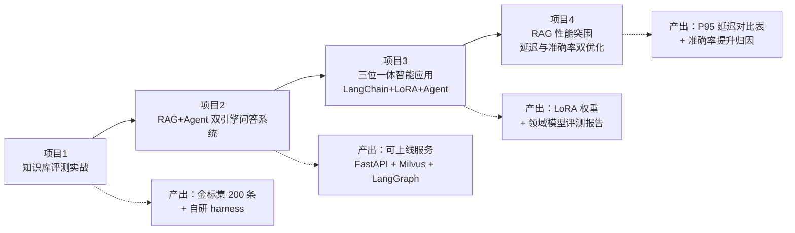

---

## 二、原理拆解：这本书的知识地图

### 2.1 全书结构的底层逻辑

很多人学大模型走的是「模型 → 提示词 → RAG → Agent → 微调」这条线，这条线的问题是：**评测永远排在最后，于是永远没做**。没有评测，你的所有优化都是玄学，你说不清「我把准确率从 70 提到 95」凭什么。

本书的结构刻意做了一件事：**把评测（第 08 模块）放在实战项目（第 09 模块）之前，并且第一个实战项目就是评测项目**。

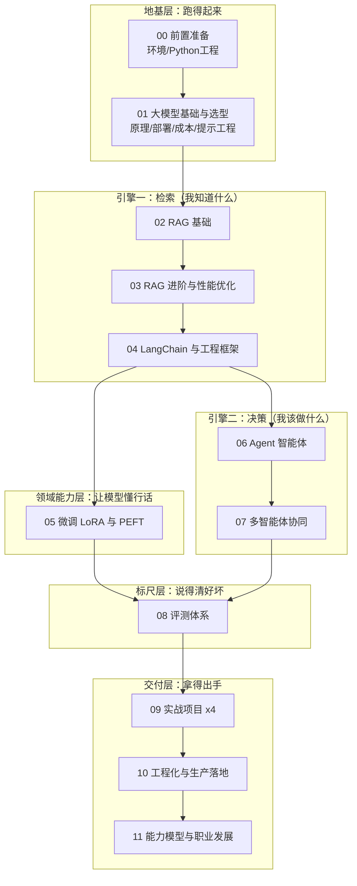

### 2.2 双引擎架构：本书要建的系统长什么样

先把最终形态放在这里，后面每一章都是在往这张图上补零件。

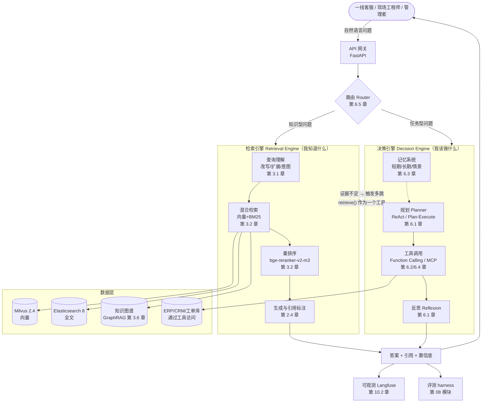

这张图里有三个设计点，是全书反复强调的，现在先记住：

1. **路由在最前面**。不是所有问题都要走 Agent。知识型问题走纯 RAG，延迟 1~2 秒；任务型问题才走 Agent，延迟 5~15 秒。把这个判断做对，平均延迟能砍掉一半以上（第 3.4 章会给实测数据）。
2. **RAG 是 Agent 的一个工具**。在双引擎里，`retrieve(query) -> List[Doc]` 被注册成 Agent 的一个 tool，Agent 可以决定检索几次、用什么 query 检索。这是「双引擎」区别于「RAG 加个插件」的本质。
3. **每一条链路都要能被 trace 和被评测**。Langfuse 埋点和 harness 打分不是上线后再加的，是第一天就要有的。

### 2.3 全书完整目录树

下面是全书的完整 TOC。你可以把这一节当作全书索引，随时回来查。链接均为相对路径，可直接在本地 Markdown 编辑器或 Git 仓库网页端点击跳转。

#### 00 前置准备

- [00-本书导读与学习路线](./00-本书导读与学习路线.md) ← 你在这里
- [01-开发环境搭建（Python-CUDA-Docker）](./01-开发环境搭建（Python-CUDA-Docker）.md)
- [02-Python工程基础速补](./02-Python工程基础速补.md)

#### 01 大模型基础与技术选型

- [01-大模型原理速览](../01-大模型基础与技术选型/01-大模型原理速览.md)
- [02-模型全景图与选型方法论](../01-大模型基础与技术选型/02-模型全景图与选型方法论.md)
- [03-本地部署实战（Ollama-vLLM-SGLang）](../01-大模型基础与技术选型/03-本地部署实战（Ollama-vLLM-SGLang）.md)
- [04-算力配置与成本测算](../01-大模型基础与技术选型/04-算力配置与成本测算.md)
- [05-提示工程与结构化输出](../01-大模型基础与技术选型/05-提示工程与结构化输出.md)

#### 02 RAG 基础篇

- [01-RAG原理与整体架构](../02-RAG基础篇/01-RAG原理与整体架构.md)
- [02-文档解析与切分策略](../02-RAG基础篇/02-文档解析与切分策略.md)
- [03-Embedding与向量数据库](../02-RAG基础篇/03-Embedding与向量数据库.md)
- [04-检索重排生成全链路](../02-RAG基础篇/04-检索重排生成全链路.md)
- [05-从0手写一个最小可用RAG](../02-RAG基础篇/05-从0手写一个最小可用RAG.md)

#### 03 RAG 进阶与性能优化

- [01-查询理解与高级检索策略](../03-RAG进阶与性能优化/01-查询理解与高级检索策略.md)
- [02-混合检索与重排序精调](../03-RAG进阶与性能优化/02-混合检索与重排序精调.md)
- [03-复杂问题拆解与多跳检索](../03-RAG进阶与性能优化/03-复杂问题拆解与多跳检索.md)
- [04-性能突围-延迟优化10倍实战](../03-RAG进阶与性能优化/04-性能突围-延迟优化10倍实战.md)
- [05-准确率优化-从70到95的工程路径](../03-RAG进阶与性能优化/05-准确率优化-从70到95的工程路径.md)
- [06-GraphRAG与结构化知识融合](../03-RAG进阶与性能优化/06-GraphRAG与结构化知识融合.md)

#### 04 LangChain 与工程框架

- [01-LangChain核心抽象与LCEL](../04-LangChain与工程框架/01-LangChain核心抽象与LCEL.md)
- [02-LangGraph状态机编排](../04-LangChain与工程框架/02-LangGraph状态机编排.md)
- [03-LlamaIndex与框架选型对比](../04-LangChain与工程框架/03-LlamaIndex与框架选型对比.md)

#### 05 微调 LoRA 与 PEFT

- [01-微调原理与PEFT家族全解](../05-微调LoRA与PEFT/01-微调原理与PEFT家族全解.md)
- [02-数据集构造与清洗](../05-微调LoRA与PEFT/02-数据集构造与清洗.md)
- [03-LoRA-QLoRA实战](../05-微调LoRA与PEFT/03-LoRA-QLoRA实战.md)
- [04-LLaMA-Factory工程化训练](../05-微调LoRA与PEFT/04-LLaMA-Factory工程化训练.md)
- [05-模型合并量化与部署](../05-微调LoRA与PEFT/05-模型合并量化与部署.md)
- [06-微调效果评估与何时不该微调](../05-微调LoRA与PEFT/06-微调效果评估与何时不该微调.md)

#### 06 Agent 智能体

- [01-Agent原理与思维链](../06-Agent智能体/01-Agent原理与思维链.md)
- [02-Function-Calling与工具设计](../06-Agent智能体/02-Function-Calling与工具设计.md)
- [03-记忆系统与上下文工程](../06-Agent智能体/03-记忆系统与上下文工程.md)
- [04-MCP协议与工具生态](../06-Agent智能体/04-MCP协议与工具生态.md)
- [05-手写一个生产级Agent](../06-Agent智能体/05-手写一个生产级Agent.md)

#### 07 多智能体协同

- [01-多智能体架构模式全解](../07-多智能体协同/01-多智能体架构模式全解.md)
- [02-LangGraph实现Supervisor与Swarm](../07-多智能体协同/02-LangGraph实现Supervisor与Swarm.md)
- [03-通信-任务分解-冲突消解](../07-多智能体协同/03-通信-任务分解-冲突消解.md)
- [04-企业级多智能体解决方案](../07-多智能体协同/04-企业级多智能体解决方案.md)

#### 08 评测体系

- [01-大模型与RAG评测方法论](../08-评测体系/01-大模型与RAG评测方法论.md)
- [02-LLM-Wiki金标集构建工程](../08-评测体系/02-LLM-Wiki金标集构建工程.md)
- [03-DeepSeek-Harness自研评测框架](../08-评测体系/03-DeepSeek-Harness自研评测框架.md)
- [04-RAGAS与自动化评测流水线](../08-评测体系/04-RAGAS与自动化评测流水线.md)

#### 09 实战项目

- [项目1-知识库评测实战](../09-实战项目/项目1-DeepSeek-Harness与LLM-Wiki知识库评测实战.md)
- [项目2-RAG+Agent双引擎问答系统](../09-实战项目/项目2-RAG与Agent双引擎智能决策问答系统.md)
- [项目3-三位一体智能应用](../09-实战项目/项目3-LangChain与LoRA与Agent三位一体智能应用.md)
- [项目4-RAG性能突围](../09-实战项目/项目4-RAG性能突围-查询速度提升10倍.md)

#### 10 工程化与生产落地

- [01-生产架构设计](../10-工程化与生产落地/01-生产架构设计与部署拓扑.md)
- [02-可观测性](../10-工程化与生产落地/02-可观测性与链路追踪.md)
- [03-安全合规与幻觉治理](../10-工程化与生产落地/03-安全合规与幻觉治理.md)
- [04-成本优化与容量规划](../10-工程化与生产落地/04-成本优化与容量规划.md)
- [05-传统行业落地全过程](../10-工程化与生产落地/05-传统行业落地全过程方法论.md)

#### 11 能力模型与职业发展

- [01-大模型技术人才能力模型与市场分析](../11-能力模型与职业发展/01-大模型技术人才能力模型与市场分析.md)

#### 附录

- [A-常见报错速查](../附录/A-常见报错速查表.md)
- [B-术语中英对照](../附录/B-术语中英对照表.md)
- [C-学习资源与论文清单](../附录/C-学习资源与论文清单.md)

### 2.4 技术栈版本基线（全书统一）

全书所有代码基于下面这张表。**不要混版本**——LangChain 0.2 和 0.3 的 import 路径不同，peft 0.10 和 0.13 的 `LoraConfig` 参数不同，照着老博客抄会直接报错。

| 类别 | 选型 | 版本 |
|---|---|---|
| Python | CPython | 3.11 |
| 包管理 | uv（也给 pip 等价命令） | 最新 |
| LLM 框架 | LangChain / LangGraph | langchain 0.3.x / langgraph 0.2.x |
| 索引框架 | LlamaIndex | 0.12.x |
| 推理服务 | vLLM（生产）/ Ollama（本地开发） | vllm 0.6.x |
| 在线模型 | DeepSeek（deepseek-chat / deepseek-reasoner）、通义千问、OpenAI 兼容接口 | — |
| 本地模型 | Qwen2.5-7B-Instruct / Qwen2.5-14B / DeepSeek-R1-Distill-Qwen-7B | — |
| Embedding | bge-m3、bge-large-zh-v1.5、gte-Qwen2-1.5B | — |
| Rerank | bge-reranker-v2-m3 | — |
| 向量库 | Milvus 2.4（生产）/ Chroma（教学）/ Qdrant（对照） | — |
| 全文检索 | Elasticsearch 8.x 或 BM25（rank_bm25） | — |
| 微调 | PEFT + transformers + trl；LLaMA-Factory 工程化 | peft 0.13.x |
| 量化 | bitsandbytes（QLoRA）、AWQ/GPTQ（推理） | — |
| 评测 | RAGAS 0.2.x、DeepEval、自建 harness | — |
| 可观测 | Langfuse（自托管）/ OpenTelemetry | — |
| 服务 | FastAPI + Uvicorn；演示前端 Streamlit / Gradio | — |
| 容器 | Docker Compose | — |

---

## 三、动手实战：三条学习路线

不要从头读到尾。先选路线。

### 3.1 怎么选路线

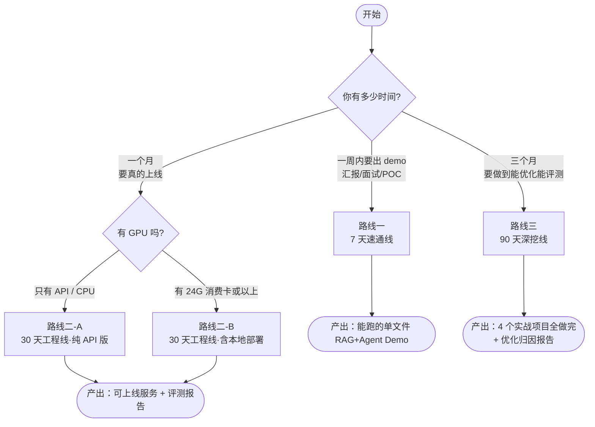

选择建议：

| 你的情况 | 选 | 理由 |
|---|---|---|
| 下周要给领导演示 | 路线一 | 别碰微调、别碰多智能体，把 demo 跑通最重要 |
| 已接到明确项目，要在一个月内交付 | 路线二 | 重点在工程化、可观测、降级，而不是最新论文 |
| 想转岗大模型 / 想在面试里讲得出细节 | 路线三 | 评测和性能优化是区分「会调 API」和「会做系统」的分水岭 |
| 团队里已有人做 RAG，你负责 Agent | 路线三，但跳过 02/03 的动手部分，只读原理 | 你需要知道检索引擎的能力边界 |
| 你是算法出身，想补工程 | 路线二 + 第 10 模块全读 | 你缺的不是模型，是上线 |

### 3.2 路线一：7 天速通线（只求能跑通 demo）

**目标**：第 7 天结束时，你有一个能回答「华成机电售后问题」并能调用「查工单」工具的命令行 demo。
**前提**：只用在线 API（DeepSeek / 通义），不装 CUDA，不装 vLLM，向量库用 Chroma（本地文件，无需 Docker）。8G 内存笔记本足够。

```mermaid
gantt
    title 7 天速通线
    dateFormat  X
    axisFormat Day %s
    section 环境
    环境搭建(API档)        :d1, 0, 1
    section RAG
    RAG 原理 + 切分        :d2, 1, 1
    Embedding + Chroma     :d3, 2, 1
    手写最小 RAG           :d4, 3, 1
    section Agent
    Agent 原理 + 思维链    :d5, 4, 1
    Function Calling       :d6, 5, 1
    section 合体
    双引擎 Demo 合并       :d7, 6, 1
```

| 天 | 读这些章 | 动手产出物 | 验收标准 |
|---|---|---|---|
| D1 | [0.1 环境搭建](./01-开发环境搭建（Python-CUDA-Docker）.md) 的「纯 CPU/API 档」部分 + [0.2 Python 工程基础速补](./02-Python工程基础速补.md) 的 pydantic/asyncio 两节 | `.env` 配好、`check_env.py` 全绿 | `python check_env.py` 输出 API Key 可用 |
| D2 | [1.5 提示工程与结构化输出](../01-大模型基础与技术选型/05-提示工程与结构化输出.md) + [2.1 RAG 原理](../02-RAG基础篇/01-RAG原理与整体架构.md) | 能让模型稳定输出 JSON 的 prompt 模板 | 连续 20 次调用，JSON 解析成功率 100% |
| D3 | [2.2 文档解析与切分](../02-RAG基础篇/02-文档解析与切分策略.md) | 把 3 份 PDF 说明书切成 chunk 并落盘 | `chunks.jsonl` 行数 > 200，无乱码 |
| D4 | [2.3 Embedding 与向量库](../02-RAG基础篇/03-Embedding与向量数据库.md) + [2.5 从 0 手写最小 RAG](../02-RAG基础篇/05-从0手写一个最小可用RAG.md) | `mini_rag.py` 单文件 | 问「E07 报警怎么处理」能引用到正确 chunk |
| D5 | [6.1 Agent 原理与思维链](../06-Agent智能体/01-Agent原理与思维链.md) | 手写一个 ReAct 循环（不用框架） | 能看到 Thought/Action/Observation 三段日志 |
| D6 | [6.2 Function Calling 与工具设计](../06-Agent智能体/02-Function-Calling与工具设计.md) | 两个工具：`query_ticket(id)`、`check_stock(part_no)`（用假数据） | 模型能自主选对工具 |
| D7 | [项目2 双引擎问答系统](../09-实战项目/项目2-RAG与Agent双引擎智能决策问答系统.md) 的第一节「最小可运行版」 | `demo.py`：把 `retrieve()` 注册成 Agent 的工具 | 一个问题里既检索了手册又查了工单 |

**7 天速通线明确不做的事**（省下的时间是它值钱的地方）：
微调、多智能体、Milvus/ES 部署、vLLM、GraphRAG、评测框架、Langfuse。这些在 demo 阶段全是负担。

### 3.3 路线二：30 天工程线（能上生产）

**目标**：第 30 天结束时，你有一个部署在服务器上、有监控、有降级、有评测基线的 RAG+Agent 服务，可以承接真实业务流量。

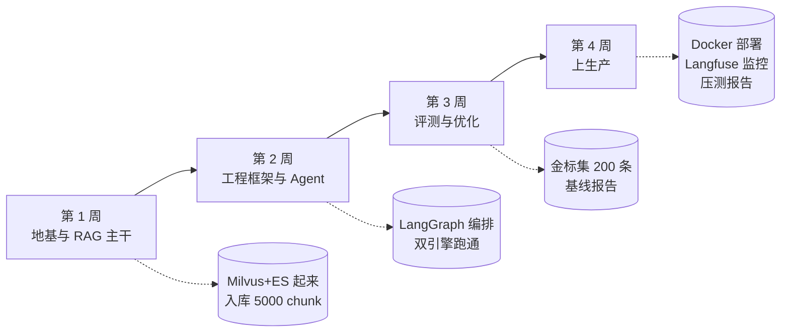

#### 第 1 周：地基与 RAG 主干

| 日 | 章节 | 产出物 |
|---|---|---|
| D1 | [0.1 环境搭建](./01-开发环境搭建（Python-CUDA-Docker）.md) 全文（选「单卡消费级档」或「服务器档」） | docker-compose 全栈起来，`check_env.py` 全绿 |
| D2 | [0.2 Python 工程基础速补](./02-Python工程基础速补.md) 全文 | 按模板建好项目仓库骨架，pytest 能跑 |
| D3 | [1.1 大模型原理速览](../01-大模型基础与技术选型/01-大模型原理速览.md) + [1.2 模型全景图与选型](../01-大模型基础与技术选型/02-模型全景图与选型方法论.md) | 一页纸的选型结论（写明为什么选 Qwen2.5-7B 还是 DeepSeek API） |
| D4 | [1.3 本地部署实战](../01-大模型基础与技术选型/03-本地部署实战（Ollama-vLLM-SGLang）.md) + [1.4 算力与成本](../01-大模型基础与技术选型/04-算力配置与成本测算.md) | vLLM 或 Ollama 起来，吞吐实测数字 |
| D5 | [2.1 RAG 原理](../02-RAG基础篇/01-RAG原理与整体架构.md) + [2.2 文档解析与切分](../02-RAG基础篇/02-文档解析与切分策略.md) | PDF/Word/Excel 三类解析器跑通 |
| D6 | [2.3 Embedding 与向量库](../02-RAG基础篇/03-Embedding与向量数据库.md) | Milvus 建 collection，5000+ chunk 入库 |
| D7 | [2.4 检索重排生成全链路](../02-RAG基础篇/04-检索重排生成全链路.md) + [2.5 手写最小 RAG](../02-RAG基础篇/05-从0手写一个最小可用RAG.md) | 端到端问答跑通，带引用 |

#### 第 2 周：工程框架与 Agent

| 日 | 章节 | 产出物 |
|---|---|---|
| D8 | [4.1 LangChain 核心抽象与 LCEL](../04-LangChain与工程框架/01-LangChain核心抽象与LCEL.md) | 用 LCEL 重写 D7 的链路 |
| D9 | [4.2 LangGraph 状态机编排](../04-LangChain与工程框架/02-LangGraph状态机编排.md) | 画出状态图并跑通 |
| D10 | [4.3 LlamaIndex 与框架选型](../04-LangChain与工程框架/03-LlamaIndex与框架选型对比.md) | 选型决策记录（ADR 文档） |
| D11 | [6.1 Agent 原理与思维链](../06-Agent智能体/01-Agent原理与思维链.md) | ReAct 循环手写版 |
| D12 | [6.2 Function Calling 与工具设计](../06-Agent智能体/02-Function-Calling与工具设计.md) | 4 个真实工具（工单/备件/保修/派单） |
| D13 | [6.3 记忆系统与上下文工程](../06-Agent智能体/03-记忆系统与上下文工程.md) | 多轮对话不丢上下文，token 有上限控制 |
| D14 | [6.5 手写一个生产级 Agent](../06-Agent智能体/05-手写一个生产级Agent.md) | 带超时、重试、工具失败兜底的 Agent |

#### 第 3 周：评测与优化

| 日 | 章节 | 产出物 |
|---|---|---|
| D15 | [8.1 评测方法论](../08-评测体系/01-大模型与RAG评测方法论.md) | 定义你们业务的 5 个核心指标 |
| D16 | [8.2 LLM-Wiki 金标集构建](../08-评测体系/02-LLM-Wiki金标集构建工程.md) | 200 条金标问答对（带标注规范） |
| D17 | [8.3 DeepSeek-Harness 自研评测框架](../08-评测体系/03-DeepSeek-Harness自研评测框架.md) | `harness run` 一条命令出报告 |
| D18 | [8.4 RAGAS 与自动化流水线](../08-评测体系/04-RAGAS与自动化评测流水线.md) | CI 里每次提交自动跑评测 |
| D19 | [3.1 查询理解与高级检索](../03-RAG进阶与性能优化/01-查询理解与高级检索策略.md) | 查询改写上线，对比基线 |
| D20 | [3.2 混合检索与重排序](../03-RAG进阶与性能优化/02-混合检索与重排序精调.md) | 向量+BM25+rerank，指标对比表 |
| D21 | [3.4 性能突围-延迟优化](../03-RAG进阶与性能优化/04-性能突围-延迟优化10倍实战.md) | P95 延迟优化前后对比 |

#### 第 4 周：上生产

| 日 | 章节 | 产出物 |
|---|---|---|
| D22 | [10.1 生产架构设计](../10-工程化与生产落地/01-生产架构设计与部署拓扑.md) | 架构图 + 容量估算 |
| D23 | [10.2 可观测性](../10-工程化与生产落地/02-可观测性与链路追踪.md) | Langfuse 全链路 trace |
| D24 | [10.3 安全合规与幻觉治理](../10-工程化与生产落地/03-安全合规与幻觉治理.md) | 敏感词/越权/拒答策略 |
| D25 | [10.4 成本优化与容量规划](../10-工程化与生产落地/04-成本优化与容量规划.md) | 单次问答成本核算表 |
| D26 | [项目2 双引擎问答系统](../09-实战项目/项目2-RAG与Agent双引擎智能决策问答系统.md) 全文 | 完整服务 |
| D27~D28 | [项目1 知识库评测实战](../09-实战项目/项目1-DeepSeek-Harness与LLM-Wiki知识库评测实战.md) | 评测报告 v1 |
| D29 | [10.5 传统行业落地全过程](../10-工程化与生产落地/05-传统行业落地全过程方法论.md) | 上线 checklist |
| D30 | 压测 + 复盘 | 压测报告、降级预案、值班手册 |

### 3.4 路线三：90 天深挖线（能做优化和评测）

**目标**：第 90 天结束时，你能回答这三个问题并给出数据支撑：
1. 「为什么你们的准确率是 92% 而不是 99%？瓶颈在检索还是生成？」
2. 「你把延迟从 8 秒降到 0.8 秒，每一步各贡献了多少？」
3. 「什么情况下微调比 RAG 划算？你们算过吗？」

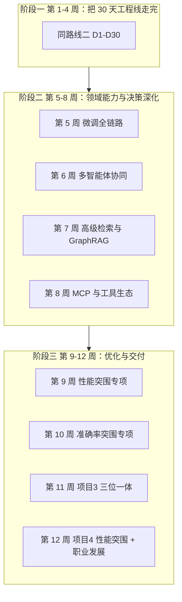

| 周 | 主题 | 章节清单 | 周末产出物（必须有数字） |
|---|---|---|---|
| W1~W4 | 工程线全量 | 同 3.3 节 D1~D30 | 可上线服务 + 评测基线报告 |
| W5 | 微调全链路 | [5.1 微调原理与 PEFT 家族](../05-微调LoRA与PEFT/01-微调原理与PEFT家族全解.md)、[5.2 数据集构造与清洗](../05-微调LoRA与PEFT/02-数据集构造与清洗.md)、[5.3 LoRA/QLoRA 实战](../05-微调LoRA与PEFT/03-LoRA-QLoRA实战.md)、[5.4 LLaMA-Factory](../05-微调LoRA与PEFT/04-LLaMA-Factory工程化训练.md) | 一份 3000 条的领域 SFT 数据集 + 一个 LoRA 权重 |
| W6 | 微调评估与部署 + 多智能体入门 | [5.5 合并量化部署](../05-微调LoRA与PEFT/05-模型合并量化与部署.md)、[5.6 效果评估与何时不该微调](../05-微调LoRA与PEFT/06-微调效果评估与何时不该微调.md)、[7.1 多智能体架构模式](../07-多智能体协同/01-多智能体架构模式全解.md) | 微调前后对比表：领域术语准确率、格式遵循率、通用能力回退量 |
| W7 | 多智能体落地 | [7.2 LangGraph 实现 Supervisor 与 Swarm](../07-多智能体协同/02-LangGraph实现Supervisor与Swarm.md)、[7.3 通信/任务分解/冲突消解](../07-多智能体协同/03-通信-任务分解-冲突消解.md)、[7.4 企业级多智能体方案](../07-多智能体协同/04-企业级多智能体解决方案.md) | 三个 Agent（检索/诊断/派单）协同跑通，带交接日志 |
| W8 | 工具生态与记忆 | [6.4 MCP 协议与工具生态](../06-Agent智能体/04-MCP协议与工具生态.md)、复习 [6.3 记忆系统](../06-Agent智能体/03-记忆系统与上下文工程.md) | 一个自研 MCP Server（暴露工单系统） |
| W9 | 高级检索 | [3.3 复杂问题拆解与多跳检索](../03-RAG进阶与性能优化/03-复杂问题拆解与多跳检索.md)、[3.6 GraphRAG](../03-RAG进阶与性能优化/06-GraphRAG与结构化知识融合.md) | 多跳问题集上的准确率提升数字 |
| W10 | 性能突围专项 | [3.4 延迟优化 10 倍实战](../03-RAG进阶与性能优化/04-性能突围-延迟优化10倍实战.md)、[项目4 RAG 性能突围](../09-实战项目/项目4-RAG性能突围-查询速度提升10倍.md) | 逐项归因的延迟瀑布图 |
| W11 | 准确率突围专项 | [3.5 准确率从 70 到 95 的工程路径](../03-RAG进阶与性能优化/05-准确率优化-从70到95的工程路径.md)、[项目1 知识库评测实战](../09-实战项目/项目1-DeepSeek-Harness与LLM-Wiki知识库评测实战.md) 复盘 | 错误归因表（检索失败 / 生成幻觉 / 金标有误 三类占比） |
| W12 | 三位一体与收尾 | [项目3 三位一体智能应用](../09-实战项目/项目3-LangChain与LoRA与Agent三位一体智能应用.md)、[11.1 能力模型与市场分析](../11-能力模型与职业发展/01-大模型技术人才能力模型与市场分析.md)、[附录 C 论文清单](../附录/C-学习资源与论文清单.md) | 完整项目 + 个人能力雷达图 + 简历项目段落 |

### 3.5 三条路线对照速查

| 维度 | 7 天速通线 | 30 天工程线 | 90 天深挖线 |
|---|---|---|---|
| 硬件要求 | 8G 内存笔记本 | 16G+ 内存，GPU 可选 | 24G 显存起（微调必需） |
| 是否需要 Docker | 否 | 是 | 是 |
| 覆盖模块 | 00/01(部分)/02/06(部分)/09(部分) | 00~04、06、08、09、10 | 全部 12 模块 + 4 项目 |
| 是否做微调 | 否 | 否 | 是 |
| 是否做评测 | 否 | 是（基线级） | 是（归因级） |
| 最终产出 | 单文件 demo | 可上线服务 | 4 个项目 + 优化归因报告 |
| 能应付的面试深度 | 「你用过 RAG 吗」 | 「你的 RAG 怎么上线的」 | 「你的准确率瓶颈在哪，怎么定位的」 |

---

## 四、贯穿全书的业务案例：华成机电

### 4.1 企业背景（虚构但贴近真实）

**华成机电**，一家成立 18 年的中型制造企业，主营传动与电控产品，共四条产品线。

#### 产品线与型号体系（全书统一）

书里各章会从不同产品线取例子——查手册的例子多来自传动线，做结构化抽取的例子多来自电控线。看到不同前缀的型号时，对照这张表即可：

| 前缀 | 产品线 | 典型型号 | 常见故障码 | 主要出现在 |
|---|---|---|---|---|
| `XJ-` | 传动系统（主轴单元、减速机） | XJ-100 / XJ-150 / XJ-200 / XJ-200-B3 / XJ-300 | E041、E043、E051、E057 | 02~08 模块、项目 1 / 2 / 4 |
| `XC-` | 工业电机 | XC-200-4P / XC-200-6P / XC-300-4P | E07、E12 | 项目 3、本章示例 |
| `BP-` | 变频器 | BP-22KW | E21、E33 | 项目 3 |
| `CJ20-` | 接触器等电器元件 | CJ20-40 | — | 项目 3、备件与库存相关示例 |

两条约定贯穿全书：

- **`XJ-500` 是一个不存在的型号**，专门用于「知识库里查不到时该不该拒答」的测试与红队用例。看到它就意味着正确行为是拒答，而不是编一个答案。
- 各章的代码、评测集和统计数字都在自己的产品线内自洽，跨章复用代码时注意替换型号常量。

| 项目 | 数值 |
|---|---|
| 员工规模 | 1200 人 |
| 在产产品型号 | 约 340 个（含停产在保型号约 900 个） |
| 售后服务网点 | 全国 47 个 |
| 一线客服坐席 | 18 人 |
| 现场工程师 | 130 人 |
| 年工单量 | 约 42000 单 |
| 历史工单积累 | 约 28 万条（2016 年至今） |

为什么选制造业售后做主线案例？因为它同时具备本书要讲的**全部四种复杂度**：

1. **文档异构**：PDF 说明书里有图有表、Word 维修手册有版本分支、Excel 备件表是结构化数据、工单是半结构化文本、Wiki 是 Markdown。
2. **术语私有**：「E07」「三级保养」「B 型端盖」这些词通用模型完全不懂——这就是为什么需要 RAG 和微调。
3. **需要动作**：光回答不够，要查库存、要开工单、要派单——这就是为什么需要 Agent。
4. **指标可量化**：首次解决率、平均处理时长、人工转接率，这三个指标能直接算出 ROI——这就是为什么评测有意义。

### 4.2 数据形态

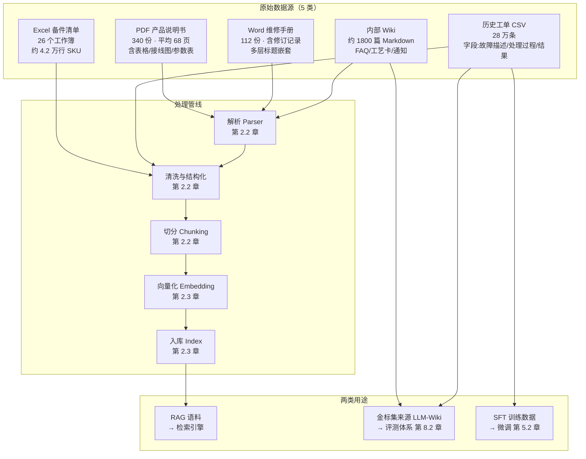

各数据源的详细规格（后续章节会按这张表提供示例数据生成脚本）：

| 数据源 | 格式 | 规模 | 主要难点 | 主讲章节 |
|---|---|---|---|---|
| 产品说明书 | PDF（部分扫描件） | 340 份 / 约 2.3 万页 | 表格跨页、扫描件需 OCR、图注与正文分离 | [2.2 文档解析与切分](../02-RAG基础篇/02-文档解析与切分策略.md) |
| 维修手册 | DOCX | 112 份 | 多版本并存（V1.2 / V2.0 同时在用），必须带版本元数据 | [2.2](../02-RAG基础篇/02-文档解析与切分策略.md) + [10.3 幻觉治理](../10-工程化与生产落地/03-安全合规与幻觉治理.md) |
| 备件清单 | XLSX | 4.2 万行 | 结构化数据不该向量化，应走 SQL 工具 | [6.2 工具设计](../06-Agent智能体/02-Function-Calling与工具设计.md) |
| 历史工单 | CSV | 28 万条 | 口语化、错别字多、隐私字段需脱敏 | [5.2 数据集构造与清洗](../05-微调LoRA与PEFT/02-数据集构造与清洗.md) |
| 内部 Wiki | Markdown | 1800 篇 | 内容新旧混杂，需要时效性权重 | [3.1 查询理解](../03-RAG进阶与性能优化/01-查询理解与高级检索策略.md) + [8.2 金标集](../08-评测体系/02-LLM-Wiki金标集构建工程.md) |

一条典型的历史工单长这样（后续章节的示例数据格式）：

```text
ticket_id: TK-2024-093781
create_time: 2024-07-11 09:23:14
product_model: XC-200-4P
customer: 江苏XX纺织有限公司
channel: 400电话
fault_desc: 客户反映电机运行20分钟后报E07，外壳烫手，风扇在转
first_reply: 建议先测量三相电流是否平衡，检查负载是否超额
process: 工程师上门，实测A相电流18.7A B相17.9A C相26.3A，三相不平衡
        排查发现客户侧接触器C相触点氧化，更换接触器后恢复正常
result: 已解决
resolve_type: 现场处理
duration_hours: 26.5
is_first_call_resolved: false
parts_used: ["CJ20-40接触器"]
```

### 4.3 用户角色与真实诉求

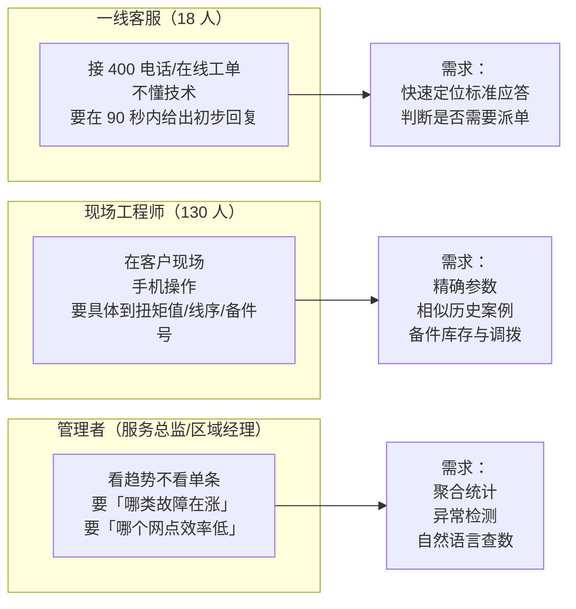

三类角色对系统的要求完全不同，这直接决定了架构里必须有「路由」：

| 角色 | 典型问题 | 走哪个引擎 | 延迟容忍 | 准确率要求 | 错了的代价 |
|---|---|---|---|---|---|
| 一线客服 | 「XC-200 报 E07 是什么意思」 | 纯 RAG | < 2 秒（客户在电话那头） | 高，但可以说「我帮您转技术」 | 中 |
| 一线客服 | 「这个客户还在保修期吗」 | Agent（查 CRM） | < 3 秒 | 必须 100%（涉及收费） | 高 |
| 现场工程师 | 「XC-200 端盖螺栓扭矩多少」 | 纯 RAG，必须带出处 | < 3 秒 | 必须 100%（拧坏了要赔） | 极高 |
| 现场工程师 | 「附近仓库还有 CJ20-40 吗，能调过来吗」 | Agent（查库存 + 调拨） | < 5 秒 | 必须 100% | 高 |
| 现场工程师 | 「有没有和这个现象一样的历史工单」 | RAG（工单库）+ Agent 多跳 | < 10 秒 | 中（给参考即可） | 低 |
| 管理者 | 「上季度华东区 E07 类工单同比涨了多少」 | Agent（Text2SQL） | < 15 秒 | 必须 100%（进汇报材料） | 极高 |

### 4.4 业务指标：项目成败的三把尺子

这三个指标是**全书所有优化的最终裁判**。技术指标（召回率、nDCG、延迟）只有能推动这三个业务指标才有意义。

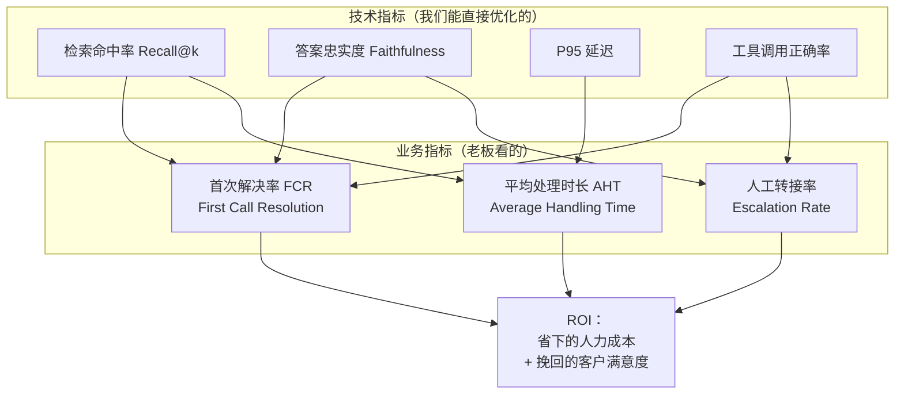

| 业务指标 | 定义 | 项目前基线 | 目标 | 怎么测 | 相关章节 |
|---|---|---|---|---|---|
| 首次解决率 FCR | 不需要二次联系/上门就解决的工单占比 | 61.3%（2024 年全年统计） | 75% | 工单系统 `is_first_call_resolved` 字段 | [8.1](../08-评测体系/01-大模型与RAG评测方法论.md) |
| 平均处理时长 AHT | 工单创建到关闭的平均小时数 | 19.4 小时 | 12 小时 | 工单系统 `duration_hours` 均值 | [3.4](../03-RAG进阶与性能优化/04-性能突围-延迟优化10倍实战.md) |
| 人工转接率 | 客服无法处理转技术支持的比例 | 34.7% | 20% | 工单 `resolve_type` 分布 | [10.5](../10-工程化与生产落地/05-传统行业落地全过程方法论.md) |

> **诚实提示**：上面「项目前基线」的数字是本书为教学设定的虚构基线，代表这类企业的典型量级。你在自己的项目里必须**先花两周把真实基线测出来**，否则后面所有的「提升 X%」都是自说自话。[第 8.1 章](../08-评测体系/01-大模型与RAG评测方法论.md)会讲怎么在没有基线的情况下补测基线。

### 4.5 案例在各模块的切入点

| 模块 | 用这个案例做什么 |
|---|---|
| 01 大模型基础 | 用「E07 是什么」测各家模型，证明通用模型不懂私有术语 |
| 02 RAG 基础 | 解析 340 份 PDF，建第一个可用索引 |
| 03 RAG 进阶 | 「XC-200 和 XC-300 的端盖能互换吗」这类多跳问题 |
| 04 LangChain | 把管线用 LCEL / LangGraph 重构 |
| 05 微调 | 用 28 万条工单造 SFT 数据，让模型学会写维修建议的格式 |
| 06 Agent | 工具：查工单、查库存、查保修、开派单 |
| 07 多智能体 | 诊断 Agent + 备件 Agent + 派单 Agent 协同 |
| 08 评测 | 从 Wiki 和工单里抽 200 条金标问答 |
| 09 实战项目 | 四个项目全部围绕这一个系统展开 |
| 10 工程化 | 真实上线：灰度、监控、降级、成本核算 |
| 11 能力模型 | 用这个项目反推需要什么能力 |

---

## 五、生产级要点：海报名词对照表

你是照着一张海报来的。海报上的词很响亮，但工程师需要知道它们**到底是什么技术、在哪一章、什么条件下成立**。这一节把话说清楚。

### 5.1 名词 → 技术 → 章节 对照表

| 海报名词 | 本质是什么技术 | 落地章节 | 诚实说明 |
|---|---|---|---|
| **RAG+Agent 双引擎** | 检索回路（Retrieval Loop）+ 决策回路（Decision Loop）的双环架构。检索被封装成 Agent 的一个 tool，Agent 可以多次调用；检索结果不足时反向触发 Agent 规划 | [2.1 RAG 原理](../02-RAG基础篇/01-RAG原理与整体架构.md)、[6.5 生产级 Agent](../06-Agent智能体/05-手写一个生产级Agent.md)、[项目2](../09-实战项目/项目2-RAG与Agent双引擎智能决策问答系统.md) | 不是新算法，是一种架构组合方式。价值在于**路由**：知识型走 RAG 省延迟，任务型走 Agent 保正确 |
| **三位一体智能应用** | LangChain/LangGraph（编排层）+ LoRA 微调（领域能力层）+ Agent（决策层）三层叠加 | [4.1 LCEL](../04-LangChain与工程框架/01-LangChain核心抽象与LCEL.md)、[5.3 LoRA 实战](../05-微调LoRA与PEFT/03-LoRA-QLoRA实战.md)、[6.5](../06-Agent智能体/05-手写一个生产级Agent.md)、[项目3](../09-实战项目/项目3-LangChain与LoRA与Agent三位一体智能应用.md) | 「三位一体」是这三层的合称。注意：**大多数项目不需要第二层**，[5.6 何时不该微调](../05-微调LoRA与PEFT/06-微调效果评估与何时不该微调.md) 会给判断标准 |
| **多智能体协同** | Supervisor（主管调度）、Swarm（对等交接）、Pipeline（流水线）三种拓扑，用 LangGraph 的状态机实现 | [7.1 架构模式全解](../07-多智能体协同/01-多智能体架构模式全解.md)、[7.2 Supervisor 与 Swarm](../07-多智能体协同/02-LangGraph实现Supervisor与Swarm.md) | 多智能体**不总是比单智能体好**：token 成本翻 2~5 倍，延迟翻 2~3 倍。只在任务真的可并行或角色真的需要隔离时用 |
| **Agent 思维链** | CoT（Chain-of-Thought）、ReAct（Reason+Act）、Plan-and-Execute、Reflexion（反思重试）四种推理范式 | [6.1 Agent 原理与思维链](../06-Agent智能体/01-Agent原理与思维链.md) | CoT 是提示技巧，ReAct 是循环范式，Reflexion 是带记忆的重试。它们解决的问题不同，不是同一层级的东西 |
| **DeepSeek-Harness** | 一套自研的评测 harness（评测执行框架）：数据集加载 → 多模型并发跑 → 打分器（规则 + LLM-as-Judge）→ 报告生成。之所以叫 DeepSeek-Harness，是因为默认用 DeepSeek 系列做裁判模型和被测模型 | [8.3 DeepSeek-Harness 自研评测框架](../08-评测体系/03-DeepSeek-Harness自研评测框架.md)、[项目1](../09-实战项目/项目1-DeepSeek-Harness与LLM-Wiki知识库评测实战.md) | 这不是官方产品，是本书带你从零实现的框架。用 DeepSeek 做裁判的理由是成本（比 GPT-4 类便宜一个量级）和中文能力，但**裁判模型和被测模型同源会有偏袒**，[8.3](../08-评测体系/03-DeepSeek-Harness自研评测框架.md) 会讲怎么用双裁判交叉验证来缓解 |
| **LLM-Wiki** | 企业内部 Wiki 的双重利用：① 作为 RAG 的高质量语料源；② 作为评测金标集（Golden Set）的抽取来源——Wiki 里的 FAQ 天然是「问题-标准答案」对 | [8.2 LLM-Wiki 金标集构建工程](../08-评测体系/02-LLM-Wiki金标集构建工程.md) | Wiki 直接当金标集有陷阱：Wiki 答案可能过期、可能太笼统。[8.2](../08-评测体系/02-LLM-Wiki金标集构建工程.md) 给出「机器抽取 → 人工复核 → 分层抽样」的完整工程流程 |
| **RAG 查询速度提升 10 倍** | 延迟优化的复合结果：语义缓存、embedding 批处理与 ONNX 加速、向量索引从 FLAT 换 HNSW、rerank 从 cross-encoder 全量改为 top-50 截断、生成侧流式 + 短 prompt + KV Cache、路由跳过不必要的 Agent 循环 | [3.4 性能突围-延迟优化 10 倍实战](../03-RAG进阶与性能优化/04-性能突围-延迟优化10倍实战.md)、[项目4](../09-实战项目/项目4-RAG性能突围-查询速度提升10倍.md) | **成立前提必须写清楚**：见 5.2 节 |
| **性能提升 300%** | 通常指吞吐（QPS）提升，来自并发化、批处理、连接池、异步改造 | [3.4](../03-RAG进阶与性能优化/04-性能突围-延迟优化10倍实战.md)、[10.4 成本优化与容量规划](../10-工程化与生产落地/04-成本优化与容量规划.md) | 吞吐提升和延迟下降经常是**互相矛盾**的（批处理提吞吐但加延迟）。要说清楚优化的是哪个 |
| **99.9% 准确率** | 在**限定问题集**上的答案正确率 | [3.5 准确率从 70 到 95](../03-RAG进阶与性能优化/05-准确率优化-从70到95的工程路径.md)、[8.1](../08-评测体系/01-大模型与RAG评测方法论.md) | 见 5.3 节。简单说：在封闭 FAQ 集上 99.9% 可信，在开放问答上不可信 |

### 5.2 「速度提升 10 倍」成立的前提

本书在 [3.4 章](../03-RAG进阶与性能优化/04-性能突围-延迟优化10倍实战.md) 会给出完整的可复现实验。这里先把方法论讲清楚，避免你被数字忽悠（或者自己忽悠别人）。

**任何性能数字必须同时写明这 6 项，否则无意义**：

```text
1. 硬件环境：CPU 型号/核数、GPU 型号/显存、内存、磁盘类型(NVMe/SATA)、网络
2. 数据规模：文档数、chunk 数、向量维度、索引类型与参数
3. 查询集：多少条查询、query 平均长度、是否包含长尾
4. 并发度：单并发还是 N 并发（单并发的延迟数字毫无参考价值）
5. 统计口径：P50 / P95 / P99，不是平均值（平均值会被长尾掩盖）
6. 是否包含首 token 时间（TTFT）与完整生成时间（TPOT × 输出长度）
```

一个**诚实**的「10 倍」长这样（这是 3.4 章会带你复现的实验结构）：

| 优化项 | P95 延迟 | 相对上一步 | 累计加速 | 代价 |
|---|---|---|---|---|
| 基线：同步串行，FLAT 索引，全量 rerank，非流式 | 8420 ms | — | 1.0x | — |
| + 向量索引 FLAT → HNSW(M=16, ef=64) | 5180 ms | -38% | 1.6x | 召回率 -1.2%（可接受） |
| + rerank 候选从 200 截到 50 | 3640 ms | -30% | 2.3x | 召回率 -0.4% |
| + embedding 批处理 + ONNX Runtime | 2910 ms | -20% | 2.9x | 工程复杂度上升 |
| + 检索与工具调用改为 asyncio 并发 | 1980 ms | -32% | 4.3x | 需要全链路异步改造 |
| + 语义缓存（命中率 41%） | 1240 ms | -37% | 6.8x | 缓存一致性风险，需 TTL 与失效策略 |
| + 流式输出（口径改为 TTFT） | 780 ms | -37% | **10.8x** | **口径变了：这是首 token 时间，不是完整答案时间** |

看到最后一行的备注了吗？**很多「10 倍」是靠最后这一步换口径换来的**。用户感知上确实快了 10 倍（首字出现时间），但完整答案的生成时间只快了 6.8 倍。本书的态度是：可以用 TTFT，但必须标注。

> 上表为方法论示例结构，具体数字在 [3.4 章](../03-RAG进阶与性能优化/04-性能突围-延迟优化10倍实战.md) 的实测环境下给出并附复现脚本。你在自己环境里跑出来的数字会不同，这很正常——**重要的是归因方法，不是具体数字**。

### 5.3 「99.9% 准确率」成立的前提

准确率这个词本身就不严谨。先看它可能指什么：

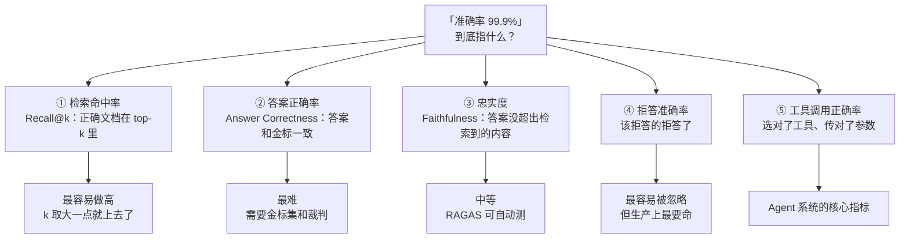

| 场景 | 99.9% 可能成立吗 | 说明 |
|---|---|---|
| 封闭 FAQ 集（200 条固定问题，答案唯一） | 可能 | 本质上是分类/匹配任务，甚至不需要 LLM |
| 检索命中率 Recall@20（文档库 5000 篇） | 可能 | k 取到 20，容错空间大 |
| 开放域问答的答案正确率 | **几乎不可能** | 当前技术水平下，领域优化良好的系统在人工评测下多在 85%~95% 区间 |
| 结构化输出的格式正确率 | 可能 | 用 JSON Schema 约束 + 重试，可以逼近 100% |
| 工具调用正确率（工具数 < 10，描述清晰） | 可能 | 主流模型的 function calling 已经很稳 |
| 「不知道就说不知道」的拒答率 | 难 | 这是 [10.3 幻觉治理](../10-工程化与生产落地/03-安全合规与幻觉治理.md) 的主战场 |

**本书的承诺**：不会让你相信「上线就有 99.9%」。本书会给你的是：
1. 一套能**量出真实数字**的评测体系（第 08 模块）；
2. 一条从 70% 到 90%+ 的**工程路径与归因方法**（[3.5 章](../03-RAG进阶与性能优化/05-准确率优化-从70到95的工程路径.md)）；
3. 在**哪些子任务上**确实可以做到 99%+ 的判断依据。

### 5.4 营销话术 → 工程语言 的翻译词典

面试或者跟业务方沟通时，这张表能救你。

| 听到 | 翻译成工程语言 | 该追问什么 |
|---|---|---|
| 「我们用了大模型」 | 调了 API 还是自己部署了？ | 哪个模型？几 B？量化了吗？ |
| 「我们做了 RAG」 | 有没有 rerank？有没有混合检索？ | Recall@5 是多少？ |
| 「准确率 95%」 | 在什么集合上？谁评的？ | 金标集多大？人评还是机评？裁判模型是谁？ |
| 「速度很快」 | P95 还是平均？并发多少？ | TTFT 还是完整生成？ |
| 「支持多轮对话」 | 有记忆管理吗还是把历史全塞进去？ | 上下文超了怎么办？ |
| 「Agent 能自主决策」 | ReAct 循环最大轮数是多少？ | 死循环怎么截断？工具失败怎么兜底？ |
| 「我们微调了模型」 | 全参还是 LoRA？多少条数据？ | 通用能力回退测了吗？ |
| 「上线了」 | 有监控吗？有降级吗？ | 模型挂了走什么？ |

---

## 六、怎么用这本书

### 6.1 动手环境最低要求

三档环境的详细搭建见 [第 0.1 章](./01-开发环境搭建（Python-CUDA-Docker）.md)，这里先给最低门槛：

| 路线 | CPU | 内存 | 显存 | 磁盘 | 必须联网 | 预估成本 |
|---|---|---|---|---|---|---|
| 7 天速通线 | 4 核 | 8 GB | 不需要 | 20 GB | 是（调 API） | API 费用 < 20 元 |
| 30 天工程线 | 8 核 | 32 GB | 可选（有更好） | 200 GB | 是 | API 费用 100~300 元 + 服务器 |
| 90 天深挖线 | 16 核 | 64 GB | ≥ 24 GB（微调必需） | 1 TB | 是 | 含 GPU 租用，视时长而定 |

> 没有 GPU 也能走完 90 天深挖线的 90%：微调部分可以租用云 GPU 按小时计费（[1.4 算力配置与成本测算](../01-大模型基础与技术选型/04-算力配置与成本测算.md) 会给对比）。

### 6.2 建议的代码仓库结构

本书所有代码建议放在一个仓库里，按下面的结构组织。这个结构在 [第 0.2 章](./02-Python工程基础速补.md) 会详细讲每层职责，这里先建骨架。

```text
huacheng-llm/                          # 你的项目仓库
├── README.md
├── pyproject.toml                     # uv / pip 依赖声明
├── .env.example                       # 环境变量模板（不含真实 key）
├── .gitignore
├── docker/
│   ├── docker-compose.yml             # Milvus + ES + Langfuse + Redis
│   └── .env                           # docker 专用变量
├── app/                               # 应用层：HTTP 接口、依赖注入
│   ├── main.py
│   ├── api/
│   └── schemas/
├── core/                              # 核心：配置、日志、LLM 客户端、异常
│   ├── config.py
│   ├── logger.py
│   └── llm.py
├── rag/                               # 检索引擎
│   ├── loaders/                       # PDF/DOCX/XLSX/CSV 解析
│   ├── splitters/                     # 切分策略
│   ├── embeddings/
│   ├── stores/                        # Milvus / Chroma / ES 适配
│   ├── retrievers/                    # 向量/BM25/混合/多跳
│   └── rerankers/
├── agents/                            # 决策引擎
│   ├── react_agent.py
│   ├── graph/                         # LangGraph 状态机
│   └── multi/                         # 多智能体拓扑
├── tools/                             # Agent 可调用的工具
│   ├── ticket.py                      # 查工单
│   ├── inventory.py                   # 查备件库存
│   ├── warranty.py                    # 查保修
│   └── dispatch.py                    # 开派单
├── finetune/                          # 微调
│   ├── data/                          # SFT 数据构造脚本
│   ├── configs/                       # LLaMA-Factory yaml
│   └── scripts/
├── evals/                             # 评测
│   ├── datasets/                      # 金标集 jsonl
│   ├── harness/                       # 自研 harness
│   ├── judges/                        # 打分器
│   └── reports/
├── data/                              # 原始数据与中间产物（.gitignore）
│   ├── raw/
│   ├── processed/
│   └── index/
├── scripts/                           # 一次性脚本
│   ├── check_env.py                   # 第 0.1 章的环境自检
│   ├── ingest.py                      # 全量入库
│   └── bench.py                       # 压测
├── notebooks/                         # 探索性分析
└── tests/
    ├── unit/
    ├── integration/
    └── conftest.py
```

建骨架的一条命令（在你的工作目录执行）：

```bash
mkdir -p huacheng-llm/{docker,app/{api,schemas},core,rag/{loaders,splitters,embeddings,stores,retrievers,rerankers},agents/{graph,multi},tools,finetune/{data,configs,scripts},evals/{datasets,harness,judges,reports},data/{raw,processed,index},scripts,notebooks,tests/{unit,integration}}
cd huacheng-llm
touch README.md pyproject.toml .env.example .gitignore
find . -type d -not -path '*/\.*' -exec touch {}/__init__.py \; 2>/dev/null
rm -f ./__init__.py ./docker/__init__.py ./data/__init__.py ./notebooks/__init__.py
echo "项目骨架创建完成"
tree -L 2 -d 2>/dev/null || find . -maxdepth 2 -type d | sort
```

预期输出：

```text
项目骨架创建完成
.
├── agents
│   ├── graph
│   └── multi
├── app
│   ├── api
│   └── schemas
├── core
├── data
│   ├── index
│   ├── processed
│   └── raw
├── docker
├── evals
│   ├── datasets
│   ├── harness
│   ├── judges
│   └── reports
├── finetune
│   ├── configs
│   ├── data
│   └── scripts
├── notebooks
├── rag
│   ├── embeddings
│   ├── loaders
│   ├── rerankers
│   ├── retrievers
│   ├── splitters
│   └── stores
├── scripts
├── tests
│   ├── integration
│   └── unit
└── tools
```

### 6.3 每章自测题怎么用

每章末尾有 3 道自测题，答案折叠在 `<details>` 里。用法：

1. **先答后看**。看到题目先在纸上（或注释里）写答案，再展开对照。直接看答案等于没做。
2. **答不上来就回读那一节**，不要往下走。本书的章节依赖很强，前面漏了后面会卡。
3. **把自测题当面试题**。90 天深挖线的读者，建议把所有自测题的答案整理成一份自己的问答手册，面试前过一遍。

### 6.4 阅读约定

| 标记 | 含义 |
|---|---|
| `> **本章目标**` | 本章的可验证产出，读完请自查 |
| ```` ```text ```` 块标注「预期输出」 | 你的运行结果应该和这个基本一致（数字可能不同） |
| 「踩坑与排错」表格 | 建议先扫一遍再动手，能省一半时间 |
| 「生产级要点」小节 | 只做 demo 可跳过；要上线必须读 |
| 中文（English） | 术语首次出现的格式，英文原词用于搜索原始资料 |
| ⚠️ 标注 | 会导致数据丢失、费用超支、安全风险的操作 |

### 6.5 学习节奏建议

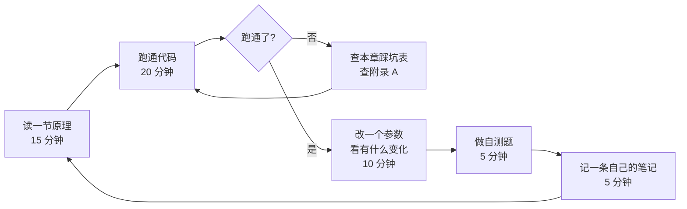

最容易失败的学习方式是「一口气读三章原理，周末再动手」。到周末你会发现三章的代码环境互相冲突，然后放弃。**每一节都要当天跑通**。

---

## 七、常见疑问（开卷 FAQ）

| 疑问 | 回答 |
|---|---|
| 我完全不懂大模型原理，能直接看 RAG 吗？ | 可以，但请至少扫一遍 [1.1 大模型原理速览](../01-大模型基础与技术选型/01-大模型原理速览.md) 的「上下文窗口」「token」「温度」三节，否则后面调参会一头雾水 |
| 我只有 API，没有 GPU，能学完吗？ | 12 个模块里有 11 个可以纯 API 完成。只有 [05 微调模块](../05-微调LoRA与PEFT/01-微调原理与PEFT家族全解.md) 必须要 GPU（可租） |
| 一定要用 LangChain 吗？ | 不一定。[4.3 框架选型对比](../04-LangChain与工程框架/03-LlamaIndex与框架选型对比.md) 会讲什么时候该裸写。本书在 [2.5 章](../02-RAG基础篇/05-从0手写一个最小可用RAG.md) 刻意让你先不用框架手写一遍 |
| 向量库一定要 Milvus 吗？ | 教学用 Chroma（零部署）就够。上生产再上 Milvus。[2.3 章](../02-RAG基础篇/03-Embedding与向量数据库.md) 给三者对照 |
| 我的数据是英文/多语言怎么办？ | 换 embedding 模型即可（bge-m3 本身多语言）。切分策略需要调整，[2.2 章](../02-RAG基础篇/02-文档解析与切分策略.md) 有说明 |
| 书里的数字我复现不出来 | 正常。硬件、数据、模型版本都会影响。重点看**优化方向和归因方法**，不是绝对数字 |
| 代码报错了 | 先查本章「踩坑与排错」表，再查 [附录 A 常见报错速查](../附录/A-常见报错速查表.md)，再去看官方文档 |
| 学完能找到工作吗？ | [11.1 能力模型与市场分析](../11-能力模型与职业发展/01-大模型技术人才能力模型与市场分析.md) 给了能力模型和真实岗位要求拆解。本书提供的是能力，不是承诺 |

---

## 八、本章小结 + 自测题

### 8.1 要点回顾

1. **双引擎 = 检索引擎（我知道什么）+ 决策引擎（我该做什么）**。只做 RAG 的系统不会调工具，只做 Agent 的系统不懂私有术语。两者结合的关键设计是「路由」和「把 retrieve 注册成 tool」。
2. **本书把评测放在实战项目之前**，因为没有评测就没有优化，所有「提升 X%」都是自说自话。第一个实战项目就是评测项目。
3. **三条路线**：7 天速通（纯 API，出 demo）、30 天工程（能上生产）、90 天深挖（能优化能评测）。选一条走完，不要全线并行。
4. **业务案例统一为「华成机电售后知识库 + 工单智能助手」**，涵盖 5 类异构数据、3 类用户角色、3 个业务指标（FCR / AHT / 人工转接率）。
5. **海报上的营销数字都有成立前提**：「10 倍提速」要看口径（TTFT vs 完整生成）、并发度、统计分位；「99.9% 准确率」要看是在封闭 FAQ 集还是开放问答上、是检索命中率还是答案正确率。

### 8.2 自测题

**第 1 题**：某团队说他们的 RAG 系统「响应时间 300 毫秒，比同行快 10 倍」。作为技术负责人，你要追问哪 5 个问题才能判断这个数字的真实性？

<details>
<summary>参考答案</summary>

至少追问这 5 项：

1. **统计口径**：300ms 是平均值、P50 还是 P95？平均值会被少量长尾拉平，生产上必须看 P95/P99。
2. **是否包含生成**：300ms 是首 token 时间（TTFT）还是完整答案返回时间？如果是 TTFT，一个 500 token 的答案实际完成可能还要 3~5 秒。
3. **并发度**：单并发压出来的数字没有参考价值。要问在 QPS = 多少的情况下测的。
4. **数据规模与索引**：文档库 1000 篇和 100 万篇完全不是一个量级。索引类型（FLAT/HNSW/IVF）和参数（ef、nprobe）直接决定延迟和召回的权衡。
5. **是否有缓存、缓存命中率多少**：如果测试查询集重复度高，语义缓存会让数字好看得离谱，但线上长尾查询的真实延迟完全不同。

补充可问：链路里有没有 rerank（rerank 是大头）、embedding 是本地还是远程调用、有没有算上网络往返。

</details>

**第 2 题**：华成机电的现场工程师问「XC-200 端盖螺栓的紧固扭矩是多少」，另一个工程师问「离我最近的仓库有没有 CJ20-40 接触器，今天能调过来吗」。这两个问题在双引擎架构里分别走什么路径？各自的准确率要求和延迟要求有什么不同？为什么？

<details>
<summary>参考答案</summary>

**问题一（扭矩值）**：走**纯 RAG 路径**。
- 路径：查询理解 → 混合检索（向量 + BM25，型号 XC-200 是精确词，BM25 很关键）→ rerank → 生成并**必须标注出处**（哪份手册第几页）。
- 延迟要求：< 3 秒。
- 准确率要求：**必须 100%**，且必须给出处。扭矩值错了会导致端盖变形或螺栓断裂，是安全和赔偿问题。
- 设计要点：这类「参数查询」应该考虑**拒答优于猜测**——检索置信度低于阈值时，直接回「未在手册中检索到该型号的扭矩规格，请查阅纸质手册或联系技术部」，而不是让模型生成一个看起来合理的数字。

**问题二（库存与调拨）**：走 **Agent 路径**。
- 路径：Agent 规划 → 调用 `get_engineer_location()` 获取工程师位置 → 调用 `query_inventory(part_no="CJ20-40", near=位置)` 查库存 → 调用 `check_transfer_eta(from_warehouse, to_site)` 算调拨时效 → 汇总回答。
- 延迟要求：< 5 秒（多次工具调用，容忍度略高）。
- 准确率要求：**必须 100%**，但保证方式不同——这里的正确性来自**工具返回的真实数据**，模型只负责编排和组织语言。所以关键不是模型准不准，而是：工具选对了吗、参数传对了吗、模型有没有在工具返回「无库存」时编造出一个「有库存」。
- 设计要点：工具返回的结构化数据应该**原样呈现关键字段**（仓库名、数量、预计到达时间），而不是让模型复述。这是 [10.3 幻觉治理](../10-工程化与生产落地/03-安全合规与幻觉治理.md) 的核心手法之一。

**本质区别**：前者的正确性来自**语料**（检索得准不准），后者的正确性来自**工具**（调得对不对）。这就是为什么需要两个引擎而不是一个。

</details>

**第 3 题**：你的项目周期只有 3 周，要做一个制造业售后知识问答系统给客户演示并争取签单。老板问你要不要做微调和多智能体。你怎么回答？请给出依据。

<details>
<summary>参考答案</summary>

**结论：3 周内不做微调，不做多智能体。**

依据分三层：

**① 时间预算不够。**
- 微调的真实成本不是训练那几小时，而是**数据构造**。要从 28 万条工单里清洗出 3000~5000 条高质量 SFT 样本，人工复核就要 1~2 周，还需要 GPU 资源和评测基线。3 周内做，只会得到一个效果不明的 LoRA 权重，还不知道它是变好了还是变差了。
- 多智能体会让 token 成本翻 2~5 倍、延迟翻 2~3 倍、调试难度指数上升。演示阶段最怕的就是现场卡顿和不可复现的 bug。

**② 收益不匹配。** 演示要证明的是「这套系统能读懂我们公司的资料并给出准确回答」，这件事**纯 RAG 就能做到**，而且做好检索比做微调的边际收益高得多。参见 [5.6 何时不该微调](../05-微调LoRA与PEFT/06-微调效果评估与何时不该微调.md)：当问题是「模型不知道公司的事」时，答案是 RAG；只有当问题是「模型知道但表达方式/输出格式/推理风格不符合要求」时，微调才是正解。

**③ 3 周应该怎么排（给老板一个替代方案，而不是只说不）。**
- 第 1 周：环境 + 文档解析入库（挑客户最关心的 20 个产品型号的手册，不要全量）+ 最小 RAG 跑通。
- 第 2 周：混合检索 + rerank + 引用标注 + 2 个真实工具（查工单、查库存，接客户测试环境或用脱敏数据）+ 演示界面（Streamlit）。
- 第 3 周：**构建 50 条金标集**并跑一次评测，拿到真实数字；准备演示脚本（含 5 个必胜问题 + 3 个诚实展示边界的问题）；做降级预案（模型超时走关键词检索）。

**加分项**：在演示里主动展示「系统不知道时会说不知道」，这比装作全知全能更能赢得制造业客户的信任——他们最怕的就是系统胡说导致现场事故。并把微调和多智能体作为**二期规划**写进方案，既不放弃机会，也不在一期埋雷。

</details>

---

**上一章** 无（本书起点） | **下一章** [0.1 开发环境搭建（Python-CUDA-Docker）](./01-开发环境搭建（Python-CUDA-Docker）.md)
