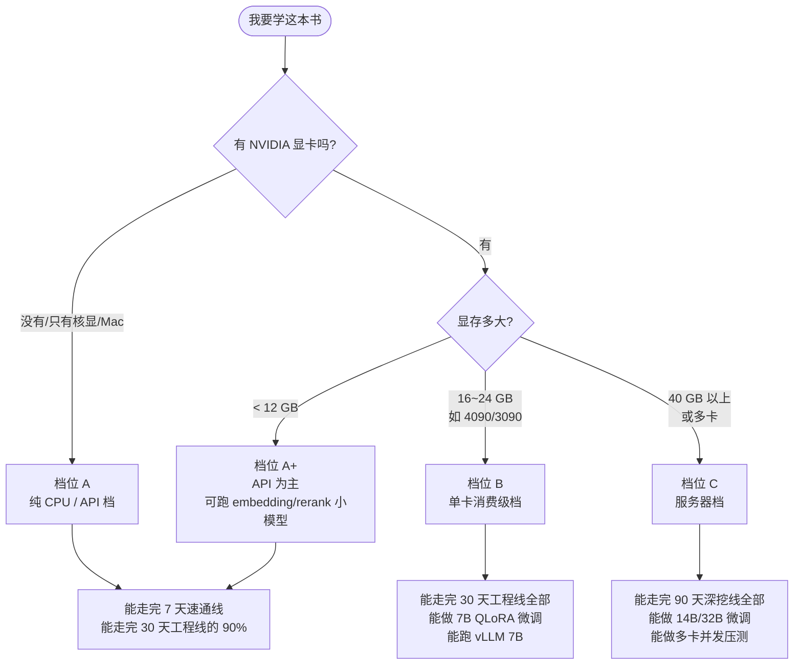
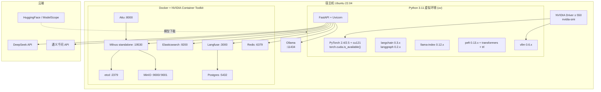
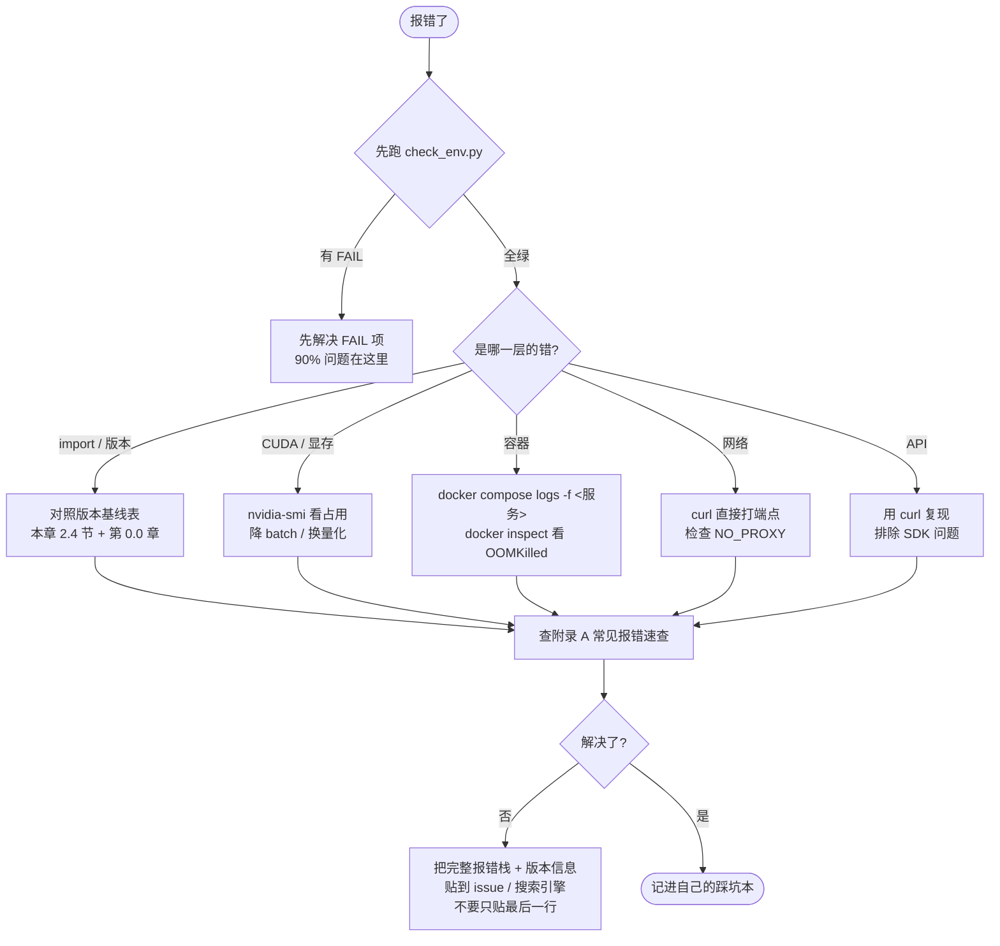

# 第 0.1 章  开发环境搭建（Python / CUDA / Docker）

> **本章目标**：读完能做到 …
> 1. 根据自己的硬件对号入座，选定「纯 CPU/API 档」「单卡消费级档」「服务器档」中的一档，并说清这一档能做什么、不能做什么
> 2. 用 uv 在 10 分钟内搭好 Python 3.11 环境，并配好国内镜像源
> 3. 对照版本矩阵装对 NVIDIA 驱动 / CUDA 12.x / PyTorch，并用三条命令验证 GPU 可用
> 4. 用一份 `docker-compose.yml` 一键拉起 Milvus + Elasticsearch + Langfuse + Redis 全栈，并通过健康检查
> 5. 运行 `check_env.py` 得到一份彩色自检报告，把红色项全部消灭
>
> **前置知识**：[0.0 本书导读与学习路线](./00-本书导读与学习路线.md)（知道自己要走哪条路线）
> **预计用时**：阅读 45 分钟 / 动手 90~180 分钟（视档位与网络而定）

---

## 一、为什么需要它（问题出发）

华成机电的项目启动会上，五个人领了任务，一周后的进度是这样的：

| 人 | 卡在哪 | 实际原因 |
|---|---|---|
| A | `import torch` 后 `torch.cuda.is_available()` 返回 `False` | pip 默认装了 CPU 版 torch，没走 `--index-url` |
| B | Milvus 容器反复重启 | etcd 数据卷权限不对，且宿主机内存只剩 3G |
| C | `huggingface-cli download` 卡在 0% | 没配 `HF_ENDPOINT` 镜像，公司网络不通 |
| D | 微调脚本报 `bitsandbytes` 找不到 CUDA | 装的是 CPU-only 的 bitsandbytes wheel |
| E | Elasticsearch 起来就退出，日志一行没有 | `vm.max_map_count` 太小，且 JVM 堆超过容器内存 |

一周，零产出，全在装环境。这不是他们菜，这是大模型工程的**真实成本结构**：环境问题占新手前两周时间的 60% 以上。

这一章的目标就是把这 60% 压缩到 2 小时。做法是：**先按档位裁剪**（不该装的不装），**再按矩阵对版本**（不猜版本），**最后用自检脚本一次性验收**（不逐个试错）。

---

## 二、原理拆解：三种环境档位

### 2.1 为什么要分档

大模型工程的环境依赖是**强耦合**的：CUDA 版本绑驱动版本，PyTorch 版本绑 CUDA 版本，bitsandbytes 绑 PyTorch，vLLM 绑 PyTorch 和 GPU 架构。一旦你决定「我要做 QLoRA 微调」，这条链上的每一环都被锁死。

反过来说，如果你**只调在线 API**，这条链根本不需要存在——一台 8G 内存的旧笔记本就够。

所以第一步不是装东西，是**判断你要做什么**。



### 2.2 三档能力矩阵

这是本章最重要的一张表。**先看这张表，再决定装什么**。

| 能力项 | 档位 A：纯 CPU/API<br/>(8G 内存笔记本) | 档位 B：单卡消费级<br/>(RTX 4090 24G) | 档位 C：服务器<br/>(A100 80G / H800 / 多卡) |
|---|---|---|---|
| **在线 API 调用**（DeepSeek/通义/OpenAI 兼容） | ✅ 完全可用 | ✅ | ✅ |
| **提示工程 / 结构化输出** | ✅ | ✅ | ✅ |
| **文档解析（PDF/Word/Excel）** | ✅ | ✅ | ✅ |
| **Embedding（在线 API，如通义 text-embedding）** | ✅ | ✅ | ✅ |
| **Embedding（本地 bge-m3，CPU）** | ⚠️ 可跑，约 3~8 doc/s，1 万 chunk 需 20~60 分钟 | ✅ GPU 约 200~600 doc/s | ✅ 更快 |
| **Rerank（本地 bge-reranker-v2-m3）** | ⚠️ CPU 可跑但慢，单次 20 候选约 2~6 秒 | ✅ 单次 < 100 ms | ✅ |
| **Chroma 向量库** | ✅ | ✅ | ✅ |
| **Milvus standalone（Docker）** | ❌ 内存不足（Milvus 全栈建议 ≥ 8G 可用内存） | ✅ | ✅ |
| **Elasticsearch 8** | ❌ 8G 机器上和 Milvus 二选一 | ✅ | ✅ |
| **Langfuse 自托管** | ⚠️ 勉强（Langfuse+PG 约 1.5G） | ✅ | ✅ |
| **Ollama 跑 qwen2.5:7b (Q4)** | ⚠️ 需 ≥ 6G 可用内存，速度约 2~6 tok/s，仅够体验 | ✅ 约 40~80 tok/s | ✅ |
| **vLLM 部署 7B (BF16)** | ❌ | ✅ 需约 15~16 GB 显存 + KV Cache | ✅ |
| **vLLM 部署 14B (BF16)** | ❌ | ⚠️ 需量化（AWQ/GPTQ）才行 | ✅ |
| **vLLM 部署 32B/72B** | ❌ | ❌ | ✅（需多卡 TP） |
| **LoRA 微调 7B (BF16)** | ❌ | ⚠️ 需梯度检查点 + 短序列，紧张 | ✅ |
| **QLoRA 微调 7B (4bit)** | ❌ | ✅ 舒适 | ✅ |
| **QLoRA 微调 14B (4bit)** | ❌ | ⚠️ 序列长度需压到 1024 以内 | ✅ |
| **全参微调 7B** | ❌ | ❌ | ✅（需 ≥ 80G 或多卡 ZeRO-3） |
| **并发压测（100+ QPS）** | ❌ | ⚠️ 单卡受限 | ✅ |
| **多智能体（纯 API 驱动）** | ✅ | ✅ | ✅ |
| **GraphRAG 构图（需大量 LLM 调用）** | ✅ 但 API 费用高 | ✅ | ✅ |

图例：✅ 顺畅 ｜ ⚠️ 能跑但有明显限制 ｜ ❌ 不要尝试

### 2.3 各档位的推荐配置清单

| 档位 | 操作系统 | Python | 装什么 | 不装什么 | 预计磁盘 |
|---|---|---|---|---|---|
| A | Windows 11 / macOS / Ubuntu 22.04 均可 | 3.11 | uv、langchain、chromadb、rank_bm25、pypdf、python-docx、openpyxl、fastapi | CUDA、torch-gpu、vllm、bitsandbytes、Docker 全栈 | 约 15 GB |
| B | Ubuntu 22.04 LTS（强烈推荐）或 WSL2 | 3.11 | A 的全部 + CUDA 12.1/12.4 + torch(cu121) + vllm + peft + bitsandbytes + Docker 全栈 + Ollama | 多卡通信库（NCCL 调优） | 约 250 GB |
| C | Ubuntu 22.04 LTS Server | 3.11 | B 的全部 + deepspeed/accelerate 多卡配置 + Prometheus/Grafana | — | 约 1~2 TB |

> ⚠️ **关于 Windows**：档位 A 用 Windows 原生没问题。档位 B/C 强烈建议用 Ubuntu 或 WSL2。原因：`bitsandbytes`、`flash-attn`、`vllm` 在 Windows 原生环境的支持长期滞后，很多轮子需要自己编译。WSL2 下装 CUDA 的方式和原生 Linux 一致（宿主机装驱动，WSL 内不装驱动只装 toolkit）。

### 2.4 环境全景图



---

## 三、动手实战

### 3.1 Python 3.11 + uv 环境搭建

#### 3.1.1 为什么选 uv

| 工具 | 创建虚拟环境 + 装 50 个包耗时（同网络） | 依赖解析 | 是否管理 Python 版本 |
|---|---|---|---|
| pip + venv | 基准 | 慢，冲突难查 | 否 |
| conda | 比 pip 慢 | 较好，但环境大 | 是 |
| poetry | 与 pip 接近 | 好 | 否 |
| **uv** | **通常快一个数量级**（Rust 实现 + 并行下载 + 全局缓存） | 好 | **是** |

本书统一用 uv，同时给出 pip/conda 的等价命令，你用哪个都行。

#### 3.1.2 安装 uv

```bash
# Linux / macOS
curl -LsSf https://astral.sh/uv/install.sh | sh
# 安装后需要让当前 shell 生效
source "$HOME/.local/bin/env" 2>/dev/null || export PATH="$HOME/.local/bin:$PATH"

# 验证
uv --version
```

```powershell
# Windows PowerShell
powershell -ExecutionPolicy ByPass -c "irm https://astral.sh/uv/install.ps1 | iex"
```

如果 `curl` 访问不通（公司网络），用 pip 装：

```bash
pip install uv -i https://mirrors.aliyun.com/pypi/simple/
```

预期输出：

```text
uv 0.5.x
```

#### 3.1.3 安装 Python 3.11 并建项目

```bash
# uv 可以直接下载管理 Python，不依赖系统 Python
uv python install 3.11
uv python list
```

预期输出（版本号可能不同）：

```text
cpython-3.11.11-linux-x86_64-gnu    /home/you/.local/share/uv/python/cpython-3.11.11-.../bin/python3.11
cpython-3.12.8-linux-x86_64-gnu     <download available>
...
```

在项目目录初始化：

```bash
mkdir -p ~/work/huacheng-llm && cd ~/work/huacheng-llm
uv init --python 3.11 .
uv venv --python 3.11
source .venv/bin/activate        # Windows: .venv\Scripts\activate
python -V
```

预期输出：

```text
Python 3.11.11
```

#### 3.1.4 国内镜像源配置

这是国内环境**最关键的一步**，不配会各种超时。

在项目根目录创建 `pyproject.toml` 的镜像配置（uv 方式）：

```toml
# pyproject.toml 片段
[[tool.uv.index]]
name = "aliyun"
url = "https://mirrors.aliyun.com/pypi/simple/"
default = true

# PyTorch 官方 CUDA 轮子源（清华镜像）
[[tool.uv.index]]
name = "pytorch-cu121"
url = "https://mirrors.tuna.tsinghua.edu.cn/pytorch-wheels/cu121/"
explicit = true

[tool.uv.sources]
torch = { index = "pytorch-cu121" }
torchvision = { index = "pytorch-cu121" }
```

或者用环境变量（对 uv 和 pip 都生效）：

```bash
# 写进 ~/.bashrc
export UV_INDEX_URL="https://mirrors.aliyun.com/pypi/simple/"
export PIP_INDEX_URL="https://mirrors.aliyun.com/pypi/simple/"
export PIP_TRUSTED_HOST="mirrors.aliyun.com"
```

pip 用户的等价配置：

```bash
mkdir -p ~/.pip
cat > ~/.pip/pip.conf <<'EOF'
[global]
index-url = https://mirrors.aliyun.com/pypi/simple/
trusted-host = mirrors.aliyun.com
timeout = 120

[install]
use-mirrors = true
EOF
```

常用镜像源对照：

| 镜像 | URL | 备注 |
|---|---|---|
| 阿里云 | `https://mirrors.aliyun.com/pypi/simple/` | 综合最稳 |
| 清华 TUNA | `https://pypi.tuna.tsinghua.edu.cn/simple` | 高校网络快 |
| 中科大 | `https://pypi.mirrors.ustc.edu.cn/simple/` | 备选 |
| 腾讯云 | `https://mirrors.cloud.tencent.com/pypi/simple` | 腾讯云 ECS 内网快 |
| 华为云 | `https://repo.huaweicloud.com/repository/pypi/simple` | 华为云内网快 |
| PyTorch cu121（清华） | `https://mirrors.tuna.tsinghua.edu.cn/pytorch-wheels/cu121/` | 装 GPU 版 torch 用 |

#### 3.1.5 安装本书依赖

创建 `requirements-base.txt`（档位 A 就装这个）：

```text
# ---- 基础 ----
python-dotenv==1.0.1
pydantic==2.9.2
pydantic-settings==2.6.1
loguru==0.7.2
httpx==0.27.2
tenacity==9.0.0

# ---- LLM 框架（版本基线见第 0.0 章）----
langchain==0.3.7
langchain-core==0.3.15
langchain-community==0.3.5
langchain-openai==0.2.6
langgraph==0.2.45
llama-index==0.12.2

# ---- 文档解析 ----
pypdf==5.1.0
pdfplumber==0.11.4
python-docx==1.1.2
openpyxl==3.1.5
markdown-it-py==3.0.0
beautifulsoup4==4.12.3
lxml==5.3.0

# ---- 检索 ----
chromadb==0.5.18
rank-bm25==0.2.2
pymilvus==2.4.9
elasticsearch==8.15.1
jieba==0.42.1

# ---- 服务 ----
fastapi==0.115.4
uvicorn[standard]==0.32.0
sse-starlette==2.1.3
streamlit==1.39.0
gradio==5.5.0

# ---- 评测与可观测 ----
ragas==0.2.6
langfuse==2.53.9

# ---- 开发 ----
pytest==8.3.3
pytest-asyncio==0.24.0
ruff==0.7.3
rich==13.9.4
```

安装：

```bash
uv pip install -r requirements-base.txt
# pip 等价：pip install -r requirements-base.txt
```

档位 B/C 额外装 `requirements-gpu.txt`（**注意 torch 必须先单独装**，见 3.2 节）：

```text
transformers==4.46.2
accelerate==1.1.1
peft==0.13.2
trl==0.12.1
datasets==3.1.0
bitsandbytes==0.44.1
sentence-transformers==3.3.0
FlagEmbedding==1.3.2
vllm==0.6.4
```

conda 用户的等价流程：

```bash
conda create -n huacheng python=3.11 -y
conda activate huacheng
conda config --add channels https://mirrors.tuna.tsinghua.edu.cn/anaconda/pkgs/main/
conda config --set show_channel_urls yes
pip install -r requirements-base.txt
```

### 3.2 NVIDIA 驱动 / CUDA / cuDNN / PyTorch 版本矩阵

#### 3.2.1 概念先厘清（这是 90% 混乱的来源）


关键事实，记住这三条能省你一天：

1. **`nvidia-smi` 右上角显示的 CUDA Version 是「驱动最高支持的 CUDA 版本」，不是你装的 CUDA 版本。** 它显示 12.4 不代表你装了 CUDA 12.4。
2. **pip 装的 PyTorch wheel 自带 CUDA runtime 和 cuDNN**，所以你**不需要**单独装 CUDA Toolkit 就能跑 PyTorch。只有编译扩展（flash-attn、某些自定义算子）时才需要 `nvcc`。
3. **驱动向下兼容**：驱动 550 能跑 cu118、cu121、cu124 的 wheel；但驱动 470 跑不了 cu121 的 wheel。**驱动只要够新就行，宁高勿低**。

#### 3.2.2 版本矩阵表

| PyTorch | 推荐 CUDA wheel | 最低 NVIDIA 驱动（Linux） | 最低驱动（Windows） | cuDNN | 支持的 GPU 架构 | 本书推荐度 |
|---|---|---|---|---|---|---|
| 2.1.x | cu118 / cu121 | 520+ (cu118: 450+) | 527+ | 8.x | Pascal ~ Ada | 旧项目兼容 |
| 2.2.x | cu118 / cu121 | 525+ | 527+ | 8.9 | Pascal ~ Ada | — |
| 2.3.x | cu118 / cu121 | 525+ | 527+ | 8.9 | Pascal ~ Ada | — |
| **2.4.x** | **cu121** / cu124 | **535+** | 537+ | 9.1 | Pascal ~ Hopper | ⭐ 本书基线 |
| **2.5.x** | **cu121** / cu124 | **535+** | 537+ | 9.1 | Pascal ~ Hopper | ⭐ 本书基线 |
| 2.6.x+ | cu124 / cu126 | 550+ | 550+ | 9.x | Turing ~ Blackwell | 新卡（50 系）必需 |

> 本书统一基线：**PyTorch 2.4.x 或 2.5.x + cu121 + 驱动 ≥ 550**。选 cu121 而不是 cu124 的理由：vllm 0.6.x、bitsandbytes 0.44、flash-attn 的预编译轮子对 cu121 覆盖最全，踩坑最少。具体兼容性以官方发布页为准。

显卡架构与最低要求对照：

| GPU | 架构 | Compute Capability | 显存 | 能做什么 |
|---|---|---|---|---|
| GTX 1080 Ti | Pascal | 6.1 | 11 GB | 只能 FP32/FP16 部分算子，不支持 bf16，不推荐 |
| RTX 2080 Ti | Turing | 7.5 | 11 GB | 支持 FP16，勉强跑 7B 推理（需量化） |
| RTX 3090 | Ampere | 8.6 | 24 GB | ✅ 支持 bf16、flash-attn，QLoRA 7B 可行 |
| RTX 4090 | Ada | 8.9 | 24 GB | ✅ 本书档位 B 标准配置 |
| A100 | Ampere | 8.0 | 40/80 GB | ✅ 档位 C |
| H800 / H100 | Hopper | 9.0 | 80 GB | ✅ 档位 C，支持 FP8 |
| L20 / L40S | Ada | 8.9 | 48 GB | ✅ 性价比推理卡 |

#### 3.2.3 安装驱动（Ubuntu 22.04）

```bash
# 1. 查看推荐驱动
ubuntu-drivers devices

# 2. 安装（推荐用 server 版驱动，不带图形界面依赖）
sudo apt update
sudo apt install -y nvidia-driver-550-server

# 3. 重启
sudo reboot
```

如果要装 CUDA Toolkit（只有需要 `nvcc` 编译时才装）：

```bash
# CUDA 12.1 for Ubuntu 22.04
wget https://developer.download.nvidia.com/compute/cuda/repos/ubuntu2204/x86_64/cuda-keyring_1.1-1_all.deb
sudo dpkg -i cuda-keyring_1.1-1_all.deb
sudo apt update
sudo apt install -y cuda-toolkit-12-1

# 配环境变量，写进 ~/.bashrc
echo 'export CUDA_HOME=/usr/local/cuda-12.1' >> ~/.bashrc
echo 'export PATH=$CUDA_HOME/bin:$PATH' >> ~/.bashrc
echo 'export LD_LIBRARY_PATH=$CUDA_HOME/lib64:$LD_LIBRARY_PATH' >> ~/.bashrc
source ~/.bashrc
```

#### 3.2.4 安装 PyTorch

```bash
# uv 方式（cu121）
uv pip install torch==2.5.1 torchvision==0.20.1 --index-url https://download.pytorch.org/whl/cu121

# 国内镜像方式（清华 pytorch-wheels）
uv pip install torch==2.5.1 torchvision==0.20.1 \
  --index-url https://mirrors.tuna.tsinghua.edu.cn/pytorch-wheels/cu121/

# pip 等价
pip install torch==2.5.1 torchvision==0.20.1 --index-url https://download.pytorch.org/whl/cu121
```

> ⚠️ **最高频的坑**：直接 `pip install torch` 会从 PyPI 装到 **CPU 版**（PyPI 上的 `torch` 默认是 CPU 轮子或最新 CUDA 轮子，取决于平台和版本）。必须带 `--index-url`。验证方法见下一节。

#### 3.2.5 三条验证命令

```bash
# 验证 1：驱动
nvidia-smi
```

预期输出：

```text
Sat Sep 13 10:22:41 2025
+-----------------------------------------------------------------------------------------+
| NVIDIA-SMI 550.90.07              Driver Version: 550.90.07      CUDA Version: 12.4     |
|-----------------------------------------+------------------------+----------------------+
| GPU  Name                 Persistence-M | Bus-Id          Disp.A | Volatile Uncorr. ECC |
| Fan  Temp   Perf          Pwr:Usage/Cap |           Memory-Usage | GPU-Util  Compute M. |
|=========================================+========================+======================|
|   0  NVIDIA GeForce RTX 4090        Off |   00000000:01:00.0 Off |                  Off |
| 30%   35C    P8             22W /  450W |       8MiB /  24564MiB |      0%      Default |
+-----------------------------------------+------------------------+----------------------+
```

注意右上角 `CUDA Version: 12.4` —— 再说一次，这是**驱动支持的最高版本**。

```bash
# 验证 2：CUDA Toolkit（只有装了 toolkit 才有输出）
nvcc -V
```

预期输出：

```text
nvcc: NVIDIA (R) Cuda compiler driver
Copyright (c) 2005-2023 NVIDIA Corporation
Built on Tue_Feb__7_19:32:13_PST_2023
Cuda compilation tools, release 12.1, V12.1.66
Build cuda_12.1.r12.1/compiler.32688072_0
```

没装 toolkit 会提示 `command not found` —— **这不是错误**，纯 PyTorch 使用不需要它。

```bash
# 验证 3：PyTorch 能不能用到 GPU
python - <<'PY'
import torch
print("torch version      :", torch.__version__)
print("compiled cuda      :", torch.version.cuda)
print("cuda available     :", torch.cuda.is_available())
print("device count       :", torch.cuda.device_count())
if torch.cuda.is_available():
    print("device name        :", torch.cuda.get_device_name(0))
    cc = torch.cuda.get_device_capability(0)
    print("compute capability :", f"{cc[0]}.{cc[1]}")
    total = torch.cuda.get_device_properties(0).total_memory / 1024**3
    print("total memory (GiB) :", round(total, 2))
    print("bf16 supported     :", torch.cuda.is_bf16_supported())
    x = torch.randn(4096, 4096, device="cuda", dtype=torch.bfloat16)
    y = x @ x
    torch.cuda.synchronize()
    print("matmul ok          :", tuple(y.shape))
PY
```

预期输出（RTX 4090）：

```text
torch version      : 2.5.1+cu121
compiled cuda      : 12.1
cuda available     : True
device count       : 1
device name        : NVIDIA GeForce RTX 4090
compute capability : 8.9
total memory (GiB) : 23.99
bf16 supported     : True
matmul ok          : (4096, 4096)
```

如果 `torch.__version__` 显示 `2.5.1+cpu`，说明装成 CPU 版了，卸载重装：

```bash
uv pip uninstall torch torchvision
uv pip install torch==2.5.1 torchvision==0.20.1 --index-url https://download.pytorch.org/whl/cu121
```

### 3.3 Docker + NVIDIA Container Toolkit

#### 3.3.1 安装 Docker

```bash
# Ubuntu 22.04，使用阿里云镜像加速安装过程
sudo apt update
sudo apt install -y ca-certificates curl gnupg
sudo install -m 0755 -d /etc/apt/keyrings
curl -fsSL https://mirrors.aliyun.com/docker-ce/linux/ubuntu/gpg | \
  sudo gpg --dearmor -o /etc/apt/keyrings/docker.gpg
sudo chmod a+r /etc/apt/keyrings/docker.gpg

echo "deb [arch=$(dpkg --print-architecture) signed-by=/etc/apt/keyrings/docker.gpg] \
https://mirrors.aliyun.com/docker-ce/linux/ubuntu $(. /etc/os-release && echo $VERSION_CODENAME) stable" | \
  sudo tee /etc/apt/sources.list.d/docker.list > /dev/null

sudo apt update
sudo apt install -y docker-ce docker-ce-cli containerd.io docker-buildx-plugin docker-compose-plugin

# 免 sudo
sudo usermod -aG docker $USER
newgrp docker

docker --version && docker compose version
```

预期输出：

```text
Docker version 27.x.x, build xxxxxxx
Docker Compose version v2.3x.x
```

配置镜像加速（国内必做）：

```bash
sudo mkdir -p /etc/docker
sudo tee /etc/docker/daemon.json <<'EOF'
{
  "registry-mirrors": [
    "https://docker.m.daocloud.io",
    "https://dockerproxy.com",
    "https://docker.nju.edu.cn"
  ],
  "log-driver": "json-file",
  "log-opts": { "max-size": "100m", "max-file": "3" },
  "default-address-pools": [{ "base": "172.30.0.0/16", "size": 24 }]
}
EOF
sudo systemctl daemon-reload
sudo systemctl restart docker
```

> 说明：公共镜像加速地址变动频繁，上面几个若不可用，请用你所在云厂商提供的专属加速地址（阿里云/腾讯云控制台都有）。

#### 3.3.2 安装 NVIDIA Container Toolkit（档位 B/C）

只有需要在容器里用 GPU（比如容器化部署 vLLM）才需要。

```bash
curl -fsSL https://nvidia.github.io/libnvidia-container/gpgkey | \
  sudo gpg --dearmor -o /usr/share/keyrings/nvidia-container-toolkit-keyring.gpg

curl -s -L https://nvidia.github.io/libnvidia-container/stable/deb/nvidia-container-toolkit.list | \
  sed 's#deb https://#deb [signed-by=/usr/share/keyrings/nvidia-container-toolkit-keyring.gpg] https://#g' | \
  sudo tee /etc/apt/sources.list.d/nvidia-container-toolkit.list

sudo apt update
sudo apt install -y nvidia-container-toolkit
sudo nvidia-ctk runtime configure --runtime=docker
sudo systemctl restart docker
```

验证：

```bash
docker run --rm --gpus all nvidia/cuda:12.1.1-base-ubuntu22.04 nvidia-smi
```

预期输出：容器内打印出和宿主机一致的 `nvidia-smi` 表格。

### 3.4 一键拉起全栈：docker-compose.yml

#### 3.4.1 端口规划表

先看端口，避免和你机器上已有服务冲突。

| 服务 | 容器端口 | 宿主机端口 | 用途 | 谁会连它 |
|---|---|---|---|---|
| Milvus | 19530 | 19530 | gRPC 数据面 | pymilvus 客户端 |
| Milvus | 9091 | 9091 | HTTP 健康检查/metrics | 运维、健康探针 |
| etcd | 2379 | 2379 | Milvus 元数据 | 只给 Milvus |
| MinIO | 9000 | 9000 | Milvus 对象存储（S3 协议） | 只给 Milvus |
| MinIO Console | 9001 | 9001 | 网页管理台 | 人（调试用） |
| Attu | 3000 | 8000 | Milvus 可视化 GUI | 人 |
| Elasticsearch | 9200 | 9200 | REST API | elasticsearch-py |
| Elasticsearch | 9300 | — | 集群内部通信，不暴露 | — |
| Langfuse Web | 3000 | 3001 | 观测台 UI + API | 人 + langfuse SDK |
| Postgres | 5432 | 5433 | Langfuse 元数据 | 只给 Langfuse |
| Redis | 6379 | 6379 | 语义缓存 / 限流 / 会话 | 应用 |

> Attu 和 Langfuse 容器内都是 3000，所以宿主机分别映射到 8000 和 3001。Postgres 映射到 5433 是为了避免和你本机可能已有的 Postgres 冲突。

#### 3.4.2 完整的 docker-compose.yml

放在 `docker/docker-compose.yml`：

```yaml
# docker/docker-compose.yml
# 全栈：Milvus(standalone) + etcd + MinIO + Attu + Elasticsearch 8 + Langfuse + Postgres + Redis
# 启动：docker compose --env-file .env up -d
# 适用：档位 B / C。档位 A（8G 内存）请只启动 redis，或改用 Chroma 本地文件模式。

name: huacheng-llm

services:
  # ---------------- Milvus 依赖：etcd ----------------
  etcd:
    container_name: hc-etcd
    image: quay.io/coreos/etcd:v3.5.16
    environment:
      - ETCD_AUTO_COMPACTION_MODE=revision
      - ETCD_AUTO_COMPACTION_RETENTION=1000
      - ETCD_QUOTA_BACKEND_BYTES=4294967296
      - ETCD_SNAPSHOT_COUNT=50000
    volumes:
      - ./volumes/etcd:/etcd
    command: >
      etcd -advertise-client-urls=http://127.0.0.1:2379
           -listen-client-urls http://0.0.0.0:2379
           --data-dir /etcd
    healthcheck:
      test: ["CMD", "etcdctl", "endpoint", "health"]
      interval: 30s
      timeout: 20s
      retries: 3
    networks: [hcnet]

  # ---------------- Milvus 依赖：MinIO ----------------
  minio:
    container_name: hc-minio
    image: minio/minio:RELEASE.2024-05-28T17-19-04Z
    environment:
      MINIO_ROOT_USER: ${MINIO_USER:-minioadmin}
      MINIO_ROOT_PASSWORD: ${MINIO_PASSWORD:-minioadmin}
    ports:
      - "9000:9000"
      - "9001:9001"
    volumes:
      - ./volumes/minio:/minio_data
    command: minio server /minio_data --console-address ":9001"
    healthcheck:
      test: ["CMD", "curl", "-f", "http://localhost:9000/minio/health/live"]
      interval: 30s
      timeout: 20s
      retries: 3
    networks: [hcnet]

  # ---------------- Milvus standalone ----------------
  milvus:
    container_name: hc-milvus
    image: milvusdb/milvus:v2.4.15
    command: ["milvus", "run", "standalone"]
    security_opt:
      - seccomp:unconfined
    environment:
      ETCD_ENDPOINTS: etcd:2379
      MINIO_ADDRESS: minio:9000
      MINIO_ACCESS_KEY_ID: ${MINIO_USER:-minioadmin}
      MINIO_SECRET_ACCESS_KEY: ${MINIO_PASSWORD:-minioadmin}
      COMMON_STORAGETYPE: minio
    volumes:
      - ./volumes/milvus:/var/lib/milvus
    healthcheck:
      test: ["CMD", "curl", "-f", "http://localhost:9091/healthz"]
      interval: 30s
      start_period: 90s
      timeout: 20s
      retries: 5
    ports:
      - "19530:19530"
      - "9091:9091"
    depends_on:
      etcd:
        condition: service_healthy
      minio:
        condition: service_healthy
    deploy:
      resources:
        limits:
          memory: 8G
    networks: [hcnet]

  # ---------------- Milvus GUI：Attu ----------------
  attu:
    container_name: hc-attu
    image: zilliz/attu:v2.4
    environment:
      MILVUS_URL: milvus:19530
    ports:
      - "8000:3000"
    depends_on:
      - milvus
    networks: [hcnet]

  # ---------------- Elasticsearch 8 ----------------
  elasticsearch:
    container_name: hc-es
    image: docker.elastic.co/elasticsearch/elasticsearch:8.15.3
    environment:
      - discovery.type=single-node
      - xpack.security.enabled=false          # 教学环境关闭安全，生产必须开
      - xpack.security.http.ssl.enabled=false
      - "ES_JAVA_OPTS=-Xms2g -Xmx2g"          # 堆内存，不要超过容器内存的一半
      - bootstrap.memory_lock=true
      - cluster.name=huacheng-es
      - action.destructive_requires_name=true
    ulimits:
      memlock: { soft: -1, hard: -1 }
      nofile:  { soft: 65536, hard: 65536 }
    volumes:
      - ./volumes/es:/usr/share/elasticsearch/data
    ports:
      - "9200:9200"
    healthcheck:
      test: ["CMD-SHELL", "curl -s http://localhost:9200/_cluster/health | grep -qE '\"status\":\"(green|yellow)\"'"]
      interval: 20s
      start_period: 60s
      timeout: 10s
      retries: 10
    deploy:
      resources:
        limits:
          memory: 5G
    networks: [hcnet]

  # ---------------- Langfuse 依赖：Postgres ----------------
  postgres:
    container_name: hc-postgres
    image: postgres:16-alpine
    environment:
      POSTGRES_USER: ${PG_USER:-langfuse}
      POSTGRES_PASSWORD: ${PG_PASSWORD:-langfuse_pwd}
      POSTGRES_DB: ${PG_DB:-langfuse}
    volumes:
      - ./volumes/postgres:/var/lib/postgresql/data
    ports:
      - "5433:5432"
    healthcheck:
      test: ["CMD-SHELL", "pg_isready -U ${PG_USER:-langfuse}"]
      interval: 10s
      timeout: 5s
      retries: 5
    networks: [hcnet]

  # ---------------- Langfuse 可观测 ----------------
  langfuse:
    container_name: hc-langfuse
    image: langfuse/langfuse:2
    depends_on:
      postgres:
        condition: service_healthy
    environment:
      DATABASE_URL: postgresql://${PG_USER:-langfuse}:${PG_PASSWORD:-langfuse_pwd}@postgres:5432/${PG_DB:-langfuse}
      NEXTAUTH_URL: http://localhost:3001
      NEXTAUTH_SECRET: ${LANGFUSE_NEXTAUTH_SECRET:-please-change-me-32chars-minimum-xx}
      SALT: ${LANGFUSE_SALT:-please-change-me-salt-value-xxxxx}
      ENCRYPTION_KEY: ${LANGFUSE_ENCRYPTION_KEY:-0000000000000000000000000000000000000000000000000000000000000000}
      TELEMETRY_ENABLED: "false"
      LANGFUSE_ENABLE_EXPERIMENTAL_FEATURES: "false"
    ports:
      - "3001:3000"
    healthcheck:
      test: ["CMD-SHELL", "wget -q -O- http://localhost:3000/api/public/health || exit 1"]
      interval: 20s
      start_period: 60s
      timeout: 10s
      retries: 10
    networks: [hcnet]

  # ---------------- Redis：语义缓存 / 限流 / 会话 ----------------
  redis:
    container_name: hc-redis
    image: redis:7.4-alpine
    command: redis-server --appendonly yes --maxmemory 1gb --maxmemory-policy allkeys-lru
    volumes:
      - ./volumes/redis:/data
    ports:
      - "6379:6379"
    healthcheck:
      test: ["CMD", "redis-cli", "ping"]
      interval: 10s
      timeout: 5s
      retries: 5
    networks: [hcnet]

networks:
  hcnet:
    name: huacheng-net
    driver: bridge
```

配套的 `docker/.env`：

```bash
# docker/.env
MINIO_USER=minioadmin
MINIO_PASSWORD=minioadmin123

PG_USER=langfuse
PG_PASSWORD=langfuse_pwd_change_me
PG_DB=langfuse

# 下面三个必须改成自己的随机值，生成方法见下
LANGFUSE_NEXTAUTH_SECRET=
LANGFUSE_SALT=
LANGFUSE_ENCRYPTION_KEY=
```

生成密钥：

```bash
echo "LANGFUSE_NEXTAUTH_SECRET=$(openssl rand -base64 32)"
echo "LANGFUSE_SALT=$(openssl rand -base64 32)"
echo "LANGFUSE_ENCRYPTION_KEY=$(openssl rand -hex 32)"
```

#### 3.4.3 启动与健康检查

```bash
cd ~/work/huacheng-llm/docker

# 宿主机内核参数：ES 必须（否则 ES 起不来）
sudo sysctl -w vm.max_map_count=262144
# 永久生效
echo "vm.max_map_count=262144" | sudo tee -a /etc/sysctl.conf

mkdir -p volumes/{etcd,minio,milvus,es,postgres,redis}
sudo chown -R 1000:1000 volumes/es      # ES 容器以 uid 1000 运行

docker compose --env-file .env up -d
```

查看状态：

```bash
docker compose ps
```

预期输出（约 2 分钟后全部 healthy）：

```text
NAME           IMAGE                                                  STATUS                    PORTS
hc-attu        zilliz/attu:v2.4                                       Up 2 minutes              0.0.0.0:8000->3000/tcp
hc-es          docker.elastic.co/elasticsearch/elasticsearch:8.15.3    Up 2 minutes (healthy)    0.0.0.0:9200->9200/tcp
hc-etcd        quay.io/coreos/etcd:v3.5.16                            Up 2 minutes (healthy)    2379-2380/tcp
hc-langfuse    langfuse/langfuse:2                                    Up 2 minutes (healthy)    0.0.0.0:3001->3000/tcp
hc-milvus      milvusdb/milvus:v2.4.15                                Up 2 minutes (healthy)    0.0.0.0:19530->19530/tcp, 0.0.0.0:9091->9091/tcp
hc-minio       minio/minio:RELEASE.2024-05-28T17-19-04Z               Up 2 minutes (healthy)    0.0.0.0:9000-9001->9000-9001/tcp
hc-postgres    postgres:16-alpine                                     Up 2 minutes (healthy)    0.0.0.0:5433->5432/tcp
hc-redis       redis:7.4-alpine                                       Up 2 minutes (healthy)    0.0.0.0:6379->6379/tcp
```

逐项手工健康检查：

```bash
# Milvus
curl -s http://localhost:9091/healthz && echo " <- milvus ok"

# Elasticsearch
curl -s http://localhost:9200/_cluster/health | python -m json.tool

# Redis
redis-cli -h 127.0.0.1 ping     # 没装 redis-cli 就用: docker exec hc-redis redis-cli ping

# Langfuse
curl -s http://localhost:3001/api/public/health

# MinIO
curl -s http://localhost:9000/minio/health/live -o /dev/null -w "minio http %{http_code}\n"
```

预期输出：

```text
OK <- milvus ok
{
    "cluster_name": "huacheng-es",
    "status": "green",
    "timed_out": false,
    "number_of_nodes": 1,
    ...
}
PONG
{"status":"OK","version":"2.x.x"}
minio http 200
```

用 Python 验证 Milvus 连接：

```python
# scripts/verify_milvus.py
"""验证 Milvus 连接并做一次建表-插入-检索的最小闭环。"""
from pymilvus import MilvusClient
import random

client = MilvusClient(uri="http://localhost:19530")

COLL = "hc_smoke_test"
if client.has_collection(COLL):
    client.drop_collection(COLL)

client.create_collection(collection_name=COLL, dimension=8, metric_type="COSINE")

rows = [
    {"id": i, "vector": [random.random() for _ in range(8)], "text": f"华成机电测试文档-{i}"}
    for i in range(100)
]
client.insert(collection_name=COLL, data=rows)
client.flush(COLL)

res = client.search(
    collection_name=COLL,
    data=[[random.random() for _ in range(8)]],
    limit=3,
    output_fields=["text"],
)
print("检索结果条数:", len(res[0]))
for hit in res[0]:
    print(f"  id={hit['id']}  distance={hit['distance']:.4f}  text={hit['entity']['text']}")

client.drop_collection(COLL)
print("Milvus 闭环验证通过，测试集合已清理")
```

预期输出：

```text
检索结果条数: 3
  id=37  distance=0.9712  text=华成机电测试文档-37
  id=82  distance=0.9688  text=华成机电测试文档-82
  id=5   distance=0.9541  text=华成机电测试文档-5
Milvus 闭环验证通过，测试集合已清理
```

#### 3.4.4 数据卷说明

| 卷路径 | 内容 | 增长速度 | 删了会怎样 | 备份建议 |
|---|---|---|---|---|
| `volumes/etcd` | Milvus 元数据（collection schema、分区信息） | 慢，< 500 MB | Milvus 认为所有 collection 不存在 | 和 milvus 卷一起备份，单独备份无意义 |
| `volumes/minio` | Milvus 的向量数据与索引文件 | 快，**主要占用** | 数据全丢 | 必须备份 |
| `volumes/milvus` | Milvus 的 WAL、日志 | 中等 | 可能丢失未落盘数据 | 一起备份 |
| `volumes/es` | ES 索引 | 中等，约为原文本 1~2 倍 | 全文索引全丢，可重建 | 可选（能重建） |
| `volumes/postgres` | Langfuse 的 trace 记录 | 快（每次调用都写） | 历史观测数据丢失 | 定期 `pg_dump` |
| `volumes/redis` | AOF 持久化的缓存 | 有上限（maxmemory 1gb） | 缓存冷启动，无数据损失 | 不需要备份 |

磁盘占用估算（华成机电案例，5 万 chunk）：

| 项 | 估算 |
|---|---|
| 原始文档（PDF/Word/Excel/CSV） | 约 6 GB |
| 解析后的 chunk 文本（jsonl） | 约 180 MB |
| bge-m3 向量（1024 维 float32，5 万条） | 5万 × 1024 × 4 B ≈ 205 MB |
| Milvus HNSW 索引开销 | 约为向量的 1.5~2 倍 ≈ 400 MB |
| MinIO 实际占用（含副本与分段） | 约 1 GB |
| ES 索引 | 约 400 MB |
| Langfuse Postgres（跑 1 万次调用后） | 约 300 MB |
| **全栈合计（不含原始文档与模型）** | **约 2.5 GB** |

停止与清理：

```bash
# 停止但保留数据
docker compose stop

# 停止并删除容器（数据卷保留）
docker compose down

# ⚠️ 连数据一起删（不可恢复）
docker compose down -v
rm -rf volumes/
```

### 3.5 Ollama 安装与拉模型

Ollama 是本地开发期最省事的推理服务：一条命令拉模型，自带 OpenAI 兼容接口。

```bash
# Linux 安装
curl -fsSL https://ollama.com/install.sh | sh

# 验证服务
systemctl status ollama --no-pager | head -5
curl -s http://localhost:11434/api/version
```

预期输出：

```text
{"version":"0.5.x"}
```

拉本书用到的两个模型：

```bash
# 对话模型：Qwen2.5 7B Instruct，Q4_K_M 量化，约 4.7 GB
ollama pull qwen2.5:7b

# Embedding 模型：bge-m3，约 1.2 GB
ollama pull bge-m3

ollama list
```

预期输出：

```text
NAME             ID              SIZE      MODIFIED
bge-m3:latest    790764642607    1.2 GB    2 minutes ago
qwen2.5:7b       845dbda0ea48    4.7 GB    5 minutes ago
```

快速测试：

```bash
# 对话
ollama run qwen2.5:7b "用一句话解释什么是 RAG"

# Embedding（OpenAI 兼容接口）
curl -s http://localhost:11434/api/embed -d '{
  "model": "bge-m3",
  "input": "XC-200 电机报 E07 报警"
}' | python -c "import sys,json; d=json.load(sys.stdin); print('维度:', len(d['embeddings'][0]))"
```

预期输出：

```text
维度: 1024
```

Ollama 常用配置（写进 `/etc/systemd/system/ollama.service.d/override.conf`）：

```ini
[Service]
# 允许局域网访问
Environment="OLLAMA_HOST=0.0.0.0:11434"
# 模型存储路径（默认在 /usr/share/ollama/.ollama，磁盘小的机器要改）
Environment="OLLAMA_MODELS=/data/ollama/models"
# 同时加载的模型数
Environment="OLLAMA_MAX_LOADED_MODELS=2"
# 并发请求数
Environment="OLLAMA_NUM_PARALLEL=4"
# 模型空闲多久卸载（默认 5m，开发期可设长）
Environment="OLLAMA_KEEP_ALIVE=30m"
```

```bash
sudo systemctl daemon-reload && sudo systemctl restart ollama
```

> **Ollama vs vLLM 什么时候用哪个**：开发期、单人用、要快速切模型 → Ollama。上生产、要高吞吐、要 PagedAttention 和连续批处理 → vLLM。详见 [1.3 本地部署实战](../01-大模型基础与技术选型/03-本地部署实战（Ollama-vLLM-SGLang）.md)。

### 3.6 模型下载：HuggingFace / ModelScope 双通道

#### 3.6.1 通道对比

| 通道 | 国内速度 | 模型覆盖 | 需要账号 | 推荐场景 |
|---|---|---|---|---|
| HuggingFace 官方 | 通常不可直连 | 最全 | 部分模型需 token | 有稳定代理时 |
| hf-mirror.com 镜像 | 快 | 与官方同步 | 否 | **国内首选** |
| ModelScope（魔搭） | 快 | 中文模型全，国外新模型略滞后 | 部分需登录 | 中文模型首选 |
| 云厂商内部镜像 | 最快 | 看厂商 | 是 | 在对应云上跑时 |

#### 3.6.2 HuggingFace 镜像通道

```bash
uv pip install "huggingface_hub[cli,hf_transfer]"

# 关键：设置镜像端点（写进 ~/.bashrc 永久生效）
export HF_ENDPOINT=https://hf-mirror.com
# 开启高速下载（Rust 实现的并行下载器）
export HF_HUB_ENABLE_HF_TRANSFER=1
# 模型缓存路径（默认 ~/.cache/huggingface，磁盘小要改）
export HF_HOME=/data/hf_home

# 下载完整模型
huggingface-cli download Qwen/Qwen2.5-7B-Instruct \
  --local-dir /data/models/Qwen2.5-7B-Instruct \
  --local-dir-use-symlinks False

# 只下载部分文件（跳过不需要的格式，省流量）
huggingface-cli download Qwen/Qwen2.5-7B-Instruct \
  --include "*.safetensors" "*.json" "*.txt" \
  --exclude "*.bin" "*.pth" "original/*" \
  --local-dir /data/models/Qwen2.5-7B-Instruct

# Embedding 模型
huggingface-cli download BAAI/bge-m3 --local-dir /data/models/bge-m3
# Rerank 模型
huggingface-cli download BAAI/bge-reranker-v2-m3 --local-dir /data/models/bge-reranker-v2-m3
```

预期输出（下载中）：

```text
Downloading 'model-00001-of-00004.safetensors' to '/data/models/Qwen2.5-7B-Instruct/...'
model-00001-of-00004.safetensors:  34%|█████▊           | 1.32G/3.89G [00:41<01:19, 32.3MB/s]
```

**断点续传**：`huggingface-cli download` 默认支持断点续传，网络中断后重新执行同一条命令即可，已下载的分片不会重复下载。用 `--resume-download` 显式声明（新版本已是默认行为）。

Python 方式（可写进脚本，便于批量）：

```python
# scripts/download_models.py
"""从 hf-mirror 批量下载本书用到的模型，支持断点续传与失败重试。"""
import os
os.environ.setdefault("HF_ENDPOINT", "https://hf-mirror.com")
os.environ.setdefault("HF_HUB_ENABLE_HF_TRANSFER", "1")

from huggingface_hub import snapshot_download
from tenacity import retry, stop_after_attempt, wait_exponential

MODELS = [
    ("Qwen/Qwen2.5-7B-Instruct", "/data/models/Qwen2.5-7B-Instruct"),
    ("BAAI/bge-m3", "/data/models/bge-m3"),
    ("BAAI/bge-reranker-v2-m3", "/data/models/bge-reranker-v2-m3"),
    ("BAAI/bge-large-zh-v1.5", "/data/models/bge-large-zh-v1.5"),
]

@retry(stop=stop_after_attempt(5), wait=wait_exponential(multiplier=2, min=4, max=60))
def pull(repo_id: str, local_dir: str) -> str:
    """下载单个模型仓库，失败按指数退避重试最多 5 次。"""
    return snapshot_download(
        repo_id=repo_id,
        local_dir=local_dir,
        max_workers=8,
        allow_patterns=["*.safetensors", "*.json", "*.txt", "*.model", "*.py"],
        ignore_patterns=["*.bin", "*.pth", "*.msgpack", "*.h5", "original/*"],
    )

if __name__ == "__main__":
    for repo, path in MODELS:
        print(f"==> 正在下载 {repo}")
        p = pull(repo, path)
        print(f"    完成: {p}")
    print("全部模型下载完成")
```

#### 3.6.3 ModelScope 通道

```bash
uv pip install modelscope

# CLI 下载
modelscope download --model Qwen/Qwen2.5-7B-Instruct --local_dir /data/models/Qwen2.5-7B-Instruct
modelscope download --model BAAI/bge-m3 --local_dir /data/models/bge-m3
modelscope download --model BAAI/bge-reranker-v2-m3 --local_dir /data/models/bge-reranker-v2-m3
```

Python 方式：

```python
# scripts/download_from_modelscope.py
"""从 ModelScope 下载模型，国内网络下通常比 HF 镜像更稳。"""
from modelscope import snapshot_download

path = snapshot_download(
    "Qwen/Qwen2.5-7B-Instruct",
    cache_dir="/data/models",
    revision="master",
)
print("模型已下载到:", path)
```

> 注意：ModelScope 上的仓库 ID 与 HuggingFace 可能不完全一致（例如某些模型在 ModelScope 上是 `qwen/Qwen2.5-7B-Instruct`，首字母大小写不同）。以魔搭页面显示的为准。

#### 3.6.4 磁盘占用估算表

| 模型 | 参数量 | 精度 | 磁盘占用 | 推理显存（含 KV Cache，2K 上下文） |
|---|---|---|---|---|
| Qwen2.5-0.5B-Instruct | 0.5B | BF16 | 约 1.0 GB | 约 2 GB |
| Qwen2.5-1.5B-Instruct | 1.5B | BF16 | 约 3.1 GB | 约 4.5 GB |
| Qwen2.5-7B-Instruct | 7.6B | BF16 | 约 15.2 GB | 约 17~19 GB |
| Qwen2.5-7B-Instruct-AWQ | 7.6B | INT4 | 约 5.6 GB | 约 7~9 GB |
| Qwen2.5-14B-Instruct | 14.8B | BF16 | 约 29.5 GB | 约 33~36 GB |
| Qwen2.5-14B-Instruct-AWQ | 14.8B | INT4 | 约 9.9 GB | 约 12~14 GB |
| Qwen2.5-32B-Instruct | 32.8B | BF16 | 约 65.5 GB | 约 70+ GB（需多卡） |
| DeepSeek-R1-Distill-Qwen-7B | 7.6B | BF16 | 约 15.2 GB | 约 17~19 GB |
| bge-m3 | 0.57B | FP32 | 约 2.3 GB | 约 2.5 GB |
| bge-large-zh-v1.5 | 0.33B | FP32 | 约 1.3 GB | 约 1.5 GB |
| bge-reranker-v2-m3 | 0.57B | FP32 | 约 2.3 GB | 约 2.5 GB |
| gte-Qwen2-1.5B-instruct | 1.5B | BF16 | 约 3.1 GB | 约 4 GB |

粗算公式（够用就行，精确值看实测）：

$$
\text{模型权重显存(GB)} \approx \text{参数量(B)} \times \text{每参数字节数}
$$

其中每参数字节数：FP32=4，BF16/FP16=2，INT8=1，INT4=0.5。

$$
\text{KV Cache(GB)} \approx \frac{2 \times L \times H_{kv} \times d_{head} \times S \times B \times \text{bytes}}{1024^3}
$$

其中 $L$ 为层数，$H_{kv}$ 为 KV 头数（GQA 下远小于注意力头数），$d_{head}$ 为每头维度，$S$ 为序列长度，$B$ 为 batch size。

> 实操建议：**权重显存 × 1.2 + 预留 2~4 GB** 是安全的上手估算。7B BF16 在 24G 卡上跑推理是舒服的，跑微调就必须 QLoRA。

### 3.7 API Key 管理：.env + pydantic-settings

#### 3.7.1 `.env.example`

```bash
# ============================================================
# 华成机电大模型项目 - 环境变量模板
# 用法：cp .env.example .env 然后填入真实值
# ⚠️ .env 必须加入 .gitignore，绝不能提交到仓库
# ============================================================

# ---------- 应用 ----------
APP_ENV=dev                       # dev | staging | prod
APP_NAME=huacheng-llm
LOG_LEVEL=INFO                    # DEBUG | INFO | WARNING | ERROR

# ---------- DeepSeek ----------
DEEPSEEK_API_KEY=sk-xxxxxxxxxxxxxxxxxxxxxxxxxxxxxxxx
DEEPSEEK_BASE_URL=https://api.deepseek.com/v1
DEEPSEEK_CHAT_MODEL=deepseek-chat
DEEPSEEK_REASONER_MODEL=deepseek-reasoner

# ---------- 通义千问（DashScope，OpenAI 兼容端点） ----------
DASHSCOPE_API_KEY=sk-xxxxxxxxxxxxxxxxxxxxxxxxxxxxxxxx
DASHSCOPE_BASE_URL=https://dashscope.aliyuncs.com/compatible-mode/v1
DASHSCOPE_CHAT_MODEL=qwen-plus
DASHSCOPE_EMBED_MODEL=text-embedding-v3

# ---------- OpenAI 或任意 OpenAI 兼容端点 ----------
OPENAI_API_KEY=
OPENAI_BASE_URL=https://api.openai.com/v1
OPENAI_CHAT_MODEL=gpt-4o-mini

# ---------- 本地 Ollama ----------
OLLAMA_BASE_URL=http://localhost:11434
OLLAMA_CHAT_MODEL=qwen2.5:7b
OLLAMA_EMBED_MODEL=bge-m3

# ---------- 本地 vLLM（OpenAI 兼容） ----------
VLLM_BASE_URL=http://localhost:8001/v1
VLLM_API_KEY=EMPTY
VLLM_MODEL=/data/models/Qwen2.5-7B-Instruct

# ---------- 默认使用哪个 provider ----------
LLM_PROVIDER=deepseek             # deepseek | dashscope | openai | ollama | vllm
EMBED_PROVIDER=ollama             # dashscope | ollama | local

# ---------- 本地模型路径 ----------
LOCAL_EMBED_MODEL_PATH=/data/models/bge-m3
LOCAL_RERANK_MODEL_PATH=/data/models/bge-reranker-v2-m3

# ---------- Milvus ----------
MILVUS_URI=http://localhost:19530
MILVUS_COLLECTION=huacheng_kb
MILVUS_DIM=1024

# ---------- Elasticsearch ----------
ES_HOSTS=http://localhost:9200
ES_INDEX=huacheng_kb

# ---------- Redis ----------
REDIS_URL=redis://localhost:6379/0

# ---------- Langfuse ----------
LANGFUSE_HOST=http://localhost:3001
LANGFUSE_PUBLIC_KEY=pk-lf-xxxxxxxx
LANGFUSE_SECRET_KEY=sk-lf-xxxxxxxx

# ---------- 代理（如需要） ----------
# HTTP_PROXY=http://127.0.0.1:7890
# HTTPS_PROXY=http://127.0.0.1:7890
# NO_PROXY=localhost,127.0.0.1,milvus,elasticsearch,redis,postgres
```

#### 3.7.2 配置类完整代码

```python
# core/config.py
"""全局配置：用 pydantic-settings 从 .env 读取并做类型校验，全项目唯一配置入口。"""
from __future__ import annotations

from enum import Enum
from functools import lru_cache
from pathlib import Path
from typing import Literal

from pydantic import Field, SecretStr, computed_field, field_validator
from pydantic_settings import BaseSettings, SettingsConfigDict

PROJECT_ROOT = Path(__file__).resolve().parent.parent


class LLMProvider(str, Enum):
    """支持的 LLM 供应方枚举。"""
    DEEPSEEK = "deepseek"
    DASHSCOPE = "dashscope"
    OPENAI = "openai"
    OLLAMA = "ollama"
    VLLM = "vllm"


class EmbedProvider(str, Enum):
    """支持的 Embedding 供应方枚举。"""
    DASHSCOPE = "dashscope"
    OLLAMA = "ollama"
    LOCAL = "local"


class Settings(BaseSettings):
    """项目全局配置，实例通过 get_settings() 获取（带缓存）。"""

    model_config = SettingsConfigDict(
        env_file=(PROJECT_ROOT / ".env"),
        env_file_encoding="utf-8",
        case_sensitive=False,
        extra="ignore",
    )

    # ---------- 应用 ----------
    app_env: Literal["dev", "staging", "prod"] = "dev"
    app_name: str = "huacheng-llm"
    log_level: Literal["DEBUG", "INFO", "WARNING", "ERROR"] = "INFO"

    # ---------- DeepSeek ----------
    deepseek_api_key: SecretStr = SecretStr("")
    deepseek_base_url: str = "https://api.deepseek.com/v1"
    deepseek_chat_model: str = "deepseek-chat"
    deepseek_reasoner_model: str = "deepseek-reasoner"

    # ---------- DashScope（通义） ----------
    dashscope_api_key: SecretStr = SecretStr("")
    dashscope_base_url: str = "https://dashscope.aliyuncs.com/compatible-mode/v1"
    dashscope_chat_model: str = "qwen-plus"
    dashscope_embed_model: str = "text-embedding-v3"

    # ---------- OpenAI 兼容 ----------
    openai_api_key: SecretStr = SecretStr("")
    openai_base_url: str = "https://api.openai.com/v1"
    openai_chat_model: str = "gpt-4o-mini"

    # ---------- Ollama ----------
    ollama_base_url: str = "http://localhost:11434"
    ollama_chat_model: str = "qwen2.5:7b"
    ollama_embed_model: str = "bge-m3"

    # ---------- vLLM ----------
    vllm_base_url: str = "http://localhost:8001/v1"
    vllm_api_key: SecretStr = SecretStr("EMPTY")
    vllm_model: str = "/data/models/Qwen2.5-7B-Instruct"

    # ---------- 选择 ----------
    llm_provider: LLMProvider = LLMProvider.DEEPSEEK
    embed_provider: EmbedProvider = EmbedProvider.OLLAMA

    # ---------- 本地模型 ----------
    local_embed_model_path: str = "/data/models/bge-m3"
    local_rerank_model_path: str = "/data/models/bge-reranker-v2-m3"

    # ---------- 中间件 ----------
    milvus_uri: str = "http://localhost:19530"
    milvus_collection: str = "huacheng_kb"
    milvus_dim: int = Field(default=1024, ge=64, le=8192)
    es_hosts: str = "http://localhost:9200"
    es_index: str = "huacheng_kb"
    redis_url: str = "redis://localhost:6379/0"

    # ---------- Langfuse ----------
    langfuse_host: str = "http://localhost:3001"
    langfuse_public_key: SecretStr = SecretStr("")
    langfuse_secret_key: SecretStr = SecretStr("")

    # ---------- 运行时参数 ----------
    request_timeout: float = Field(default=60.0, gt=0)
    max_retries: int = Field(default=3, ge=0, le=10)
    max_concurrency: int = Field(default=10, ge=1, le=200)

    @field_validator("es_hosts")
    @classmethod
    def _validate_es_hosts(cls, v: str) -> str:
        """校验 ES 地址必须以 http 开头，避免漏写协议导致连接失败。"""
        for host in v.split(","):
            if not host.strip().startswith(("http://", "https://")):
                raise ValueError(f"ES_HOSTS 每一项都必须带协议前缀，当前: {host}")
        return v

    @computed_field
    @property
    def active_base_url(self) -> str:
        """根据 llm_provider 返回当前生效的 base_url。"""
        return {
            LLMProvider.DEEPSEEK: self.deepseek_base_url,
            LLMProvider.DASHSCOPE: self.dashscope_base_url,
            LLMProvider.OPENAI: self.openai_base_url,
            LLMProvider.OLLAMA: f"{self.ollama_base_url}/v1",
            LLMProvider.VLLM: self.vllm_base_url,
        }[self.llm_provider]

    @computed_field
    @property
    def active_api_key(self) -> str:
        """根据 llm_provider 返回当前生效的 API Key 明文（仅在调用处使用）。"""
        mapping = {
            LLMProvider.DEEPSEEK: self.deepseek_api_key,
            LLMProvider.DASHSCOPE: self.dashscope_api_key,
            LLMProvider.OPENAI: self.openai_api_key,
            LLMProvider.OLLAMA: SecretStr("ollama"),
            LLMProvider.VLLM: self.vllm_api_key,
        }
        return mapping[self.llm_provider].get_secret_value()

    @computed_field
    @property
    def active_chat_model(self) -> str:
        """根据 llm_provider 返回当前生效的对话模型名。"""
        return {
            LLMProvider.DEEPSEEK: self.deepseek_chat_model,
            LLMProvider.DASHSCOPE: self.dashscope_chat_model,
            LLMProvider.OPENAI: self.openai_chat_model,
            LLMProvider.OLLAMA: self.ollama_chat_model,
            LLMProvider.VLLM: self.vllm_model,
        }[self.llm_provider]

    @computed_field
    @property
    def es_host_list(self) -> list[str]:
        """把逗号分隔的 ES 地址拆成列表。"""
        return [h.strip() for h in self.es_hosts.split(",") if h.strip()]


@lru_cache(maxsize=1)
def get_settings() -> Settings:
    """返回全局唯一的配置实例，进程内只解析一次 .env。"""
    return Settings()


if __name__ == "__main__":
    s = get_settings()
    print(f"环境          : {s.app_env}")
    print(f"LLM Provider  : {s.llm_provider.value}")
    print(f"生效 BaseURL  : {s.active_base_url}")
    print(f"生效模型      : {s.active_chat_model}")
    print(f"API Key 掩码  : {s.active_api_key[:6]}***{s.active_api_key[-4:] if len(s.active_api_key) > 10 else ''}")
    print(f"Milvus        : {s.milvus_uri} / {s.milvus_collection} (dim={s.milvus_dim})")
    print(f"ES 节点       : {s.es_host_list}")
```

运行 `python core/config.py` 预期输出：

```text
环境          : dev
LLM Provider  : deepseek
生效 BaseURL  : https://api.deepseek.com/v1
生效模型      : deepseek-chat
API Key 掩码  : sk-abc***f9d2
Milvus        : http://localhost:19530 / huacheng_kb (dim=1024)
ES 节点       : ['http://localhost:9200']
```

#### 3.7.3 统一的 LLM 客户端

有了配置类，创建客户端就是一行。因为 DeepSeek、通义、vLLM、Ollama 都提供 OpenAI 兼容端点，可以用同一个 SDK。

```python
# core/llm.py
"""统一的 LLM 客户端工厂：所有 provider 走 OpenAI 兼容协议，切换只改 .env。"""
from __future__ import annotations

from functools import lru_cache

from langchain_openai import ChatOpenAI
from openai import AsyncOpenAI, OpenAI

from core.config import get_settings


@lru_cache(maxsize=1)
def get_openai_client() -> OpenAI:
    """返回同步的 OpenAI 兼容客户端，指向 .env 中 LLM_PROVIDER 选定的端点。"""
    s = get_settings()
    return OpenAI(
        api_key=s.active_api_key,
        base_url=s.active_base_url,
        timeout=s.request_timeout,
        max_retries=s.max_retries,
    )


@lru_cache(maxsize=1)
def get_async_openai_client() -> AsyncOpenAI:
    """返回异步的 OpenAI 兼容客户端，用于并发场景。"""
    s = get_settings()
    return AsyncOpenAI(
        api_key=s.active_api_key,
        base_url=s.active_base_url,
        timeout=s.request_timeout,
        max_retries=s.max_retries,
    )


def get_chat_model(temperature: float = 0.0, **kwargs) -> ChatOpenAI:
    """返回 LangChain 的 ChatOpenAI 实例，供 LCEL 链路使用。"""
    s = get_settings()
    return ChatOpenAI(
        model=s.active_chat_model,
        api_key=s.active_api_key,
        base_url=s.active_base_url,
        temperature=temperature,
        timeout=s.request_timeout,
        max_retries=s.max_retries,
        **kwargs,
    )


if __name__ == "__main__":
    client = get_openai_client()
    resp = client.chat.completions.create(
        model=get_settings().active_chat_model,
        messages=[
            {"role": "system", "content": "你是华成机电的售后技术助手，回答要简洁准确。"},
            {"role": "user", "content": "用一句话说明 RAG 和微调的区别。"},
        ],
        temperature=0.0,
        max_tokens=200,
    )
    print("回答:", resp.choices[0].message.content)
    print("用量:", resp.usage)
```

预期输出（内容会变，结构不变）：

```text
回答: RAG 是在推理时检索外部知识注入上下文，让模型"查着答"；微调是修改模型权重，让模型"学会"新的表达方式或领域能力。
用量: CompletionUsage(completion_tokens=48, prompt_tokens=42, total_tokens=90, ...)
```

#### 3.7.4 API Key 安全红线

| 做法 | 允许 | 说明 |
|---|---|---|
| `.env` 文件存 key，`.gitignore` 排除 | ✅ | 标准做法 |
| `.env.example` 只放占位符提交仓库 | ✅ | 方便他人复现 |
| key 写进代码常量 | ❌ | 一旦推到远端就等于泄露，且 GitHub 会扫描 |
| key 写进 Dockerfile ENV | ❌ | 镜像层里明文可见 |
| key 写进 Jupyter Notebook | ❌ | 输出和元数据都可能带上 |
| 生产用 K8s Secret / 云密钥管理服务 | ✅ | 见 [10.1 生产架构设计](../10-工程化与生产落地/01-生产架构设计与部署拓扑.md) |
| 日志里打印完整 key | ❌ | 用 `SecretStr` 就是为了防这个 |
| 给每个环境（dev/staging/prod）不同的 key | ✅ | 便于用量归因与限额 |

`.gitignore` 必须包含：

```text
.env
.env.local
.env.*.local
*.key
*.pem
data/
volumes/
.venv/
__pycache__/
*.pyc
.pytest_cache/
.ruff_cache/
models/
```


### 3.8 环境自检脚本 check_env.py

前面装了这么多东西，需要一个脚本一次性验收。把下面的代码保存为 `scripts/check_env.py`。

```python
# scripts/check_env.py
"""环境自检：逐项检查 Python、依赖、CUDA、显存、中间件端口、API Key，输出彩色报告。"""
from __future__ import annotations

import importlib.metadata as md
import os
import platform
import socket
import subprocess
import sys
import time
from dataclasses import dataclass, field
from typing import Callable

# ---------------- 彩色输出（无依赖，直接用 ANSI） ----------------
class C:
    """ANSI 颜色常量，Windows 10+ 终端与主流 Linux 终端均支持。"""
    RESET = "\033[0m"
    BOLD = "\033[1m"
    DIM = "\033[2m"
    RED = "\033[31m"
    GREEN = "\033[32m"
    YELLOW = "\033[33m"
    BLUE = "\033[34m"
    CYAN = "\033[36m"
    GREY = "\033[90m"


OK, WARN, FAIL, SKIP = "OK", "WARN", "FAIL", "SKIP"
_ICON = {OK: "✔", WARN: "!", FAIL: "✘", SKIP: "-"}
_COLOR = {OK: C.GREEN, WARN: C.YELLOW, FAIL: C.RED, SKIP: C.GREY}


@dataclass
class Result:
    """单项检查的结果。"""
    name: str
    status: str
    detail: str = ""
    hint: str = ""


@dataclass
class Report:
    """整体报告，负责收集与打印。"""
    results: list[Result] = field(default_factory=list)

    def add(self, r: Result) -> None:
        """追加一条结果并立即打印，便于长耗时检查时看到进度。"""
        self.results.append(r)
        color = _COLOR[r.status]
        line = f"  {color}{_ICON[r.status]} [{r.status:<4}]{C.RESET} {r.name:<34} {r.detail}"
        print(line)
        if r.hint and r.status in (WARN, FAIL):
            print(f"        {C.DIM}→ {r.hint}{C.RESET}")

    def summary(self) -> int:
        """打印汇总并返回进程退出码：有 FAIL 返回 1，否则 0。"""
        n_ok = sum(1 for r in self.results if r.status == OK)
        n_warn = sum(1 for r in self.results if r.status == WARN)
        n_fail = sum(1 for r in self.results if r.status == FAIL)
        n_skip = sum(1 for r in self.results if r.status == SKIP)
        print()
        print(f"{C.BOLD}{'=' * 74}{C.RESET}")
        print(
            f"  汇总: {C.GREEN}{n_ok} 通过{C.RESET} / "
            f"{C.YELLOW}{n_warn} 警告{C.RESET} / "
            f"{C.RED}{n_fail} 失败{C.RESET} / "
            f"{C.GREY}{n_skip} 跳过{C.RESET}"
        )
        if n_fail:
            print(f"  {C.RED}存在致命问题，请先解决 FAIL 项再继续后续章节。{C.RESET}")
        elif n_warn:
            print(f"  {C.YELLOW}可以继续，但 WARN 项会限制部分章节的动手实验。{C.RESET}")
        else:
            print(f"  {C.GREEN}环境完备，可以开始第 0.2 章。{C.RESET}")
        print(f"{C.BOLD}{'=' * 74}{C.RESET}")
        return 1 if n_fail else 0


def section(title: str) -> None:
    """打印分区标题。"""
    print(f"\n{C.BOLD}{C.CYAN}【{title}】{C.RESET}")


# ---------------- 各项检查 ----------------
def check_python(rep: Report) -> None:
    """检查 Python 版本是否为 3.11.x。"""
    v = sys.version_info
    ver = f"{v.major}.{v.minor}.{v.micro}"
    if (v.major, v.minor) == (3, 11):
        rep.add(Result("Python 版本", OK, ver))
    elif (v.major, v.minor) in ((3, 10), (3, 12)):
        rep.add(Result("Python 版本", WARN, ver, "本书基线为 3.11，其他版本部分库可能无预编译轮子"))
    else:
        rep.add(Result("Python 版本", FAIL, ver, "请用 uv python install 3.11 安装 3.11"))
    rep.add(Result("解释器路径", OK, sys.executable))
    in_venv = sys.prefix != getattr(sys, "base_prefix", sys.prefix)
    rep.add(
        Result("虚拟环境", OK if in_venv else WARN,
               "已激活" if in_venv else "未激活",
               "建议在虚拟环境中操作，避免污染系统 Python")
    )
    rep.add(Result("操作系统", OK, f"{platform.system()} {platform.release()} / {platform.machine()}"))


def check_packages(rep: Report) -> None:
    """检查关键依赖包是否安装及版本。"""
    expect = {
        "langchain": "0.3",
        "langchain-core": "0.3",
        "langgraph": "0.2",
        "llama-index": "0.12",
        "pydantic": "2.",
        "pydantic-settings": "2.",
        "fastapi": "0.1",
        "chromadb": "0.5",
        "pymilvus": "2.4",
        "elasticsearch": "8.",
        "loguru": "0.7",
    }
    optional = {"torch": "2.", "transformers": "4.4", "peft": "0.13", "vllm": "0.6", "ragas": "0.2"}

    for pkg, prefix in expect.items():
        try:
            ver = md.version(pkg)
            status = OK if ver.startswith(prefix) else WARN
            hint = "" if status == OK else f"本书基线要求 {prefix}x，版本不符可能导致 import 路径不同"
            rep.add(Result(f"包 {pkg}", status, ver, hint))
        except md.PackageNotFoundError:
            rep.add(Result(f"包 {pkg}", FAIL, "未安装", f"uv pip install {pkg}"))

    for pkg, prefix in optional.items():
        try:
            ver = md.version(pkg)
            status = OK if ver.startswith(prefix) else WARN
            rep.add(Result(f"包 {pkg} (可选)", status, ver))
        except md.PackageNotFoundError:
            rep.add(Result(f"包 {pkg} (可选)", SKIP, "未安装", "档位 A 无需安装"))


def check_nvidia(rep: Report) -> None:
    """检查 NVIDIA 驱动、GPU 型号与显存。"""
    try:
        out = subprocess.run(
            ["nvidia-smi", "--query-gpu=name,driver_version,memory.total,memory.used",
             "--format=csv,noheader,nounits"],
            capture_output=True, text=True, timeout=15,
        )
    except (FileNotFoundError, subprocess.TimeoutExpired):
        rep.add(Result("NVIDIA 驱动", SKIP, "未检测到 nvidia-smi", "档位 A（纯 CPU/API）属正常"))
        return

    if out.returncode != 0:
        rep.add(Result("NVIDIA 驱动", FAIL, out.stderr.strip()[:60], "驱动异常，尝试重装 nvidia-driver"))
        return

    for idx, line in enumerate(out.stdout.strip().splitlines()):
        name, drv, total, used = [x.strip() for x in line.split(",")]
        total_gb, used_gb = int(total) / 1024, int(used) / 1024
        drv_major = int(drv.split(".")[0])
        status = OK if drv_major >= 535 else WARN
        hint = "" if status == OK else "驱动 < 535，PyTorch 2.4/2.5 + cu121 可能不可用，建议升级到 550+"
        rep.add(Result(f"GPU[{idx}] {name}", status,
                       f"驱动 {drv} | 显存 {used_gb:.1f}/{total_gb:.1f} GiB", hint))
        if total_gb < 16:
            rep.add(Result(f"GPU[{idx}] 显存容量", WARN, f"{total_gb:.1f} GiB",
                           "< 16 GiB，7B 模型推理需量化，微调请用 QLoRA 并压短序列"))


def check_torch_cuda(rep: Report) -> None:
    """检查 PyTorch 是否能真正使用 GPU，并做一次矩阵乘法冒烟测试。"""
    try:
        import torch
    except ImportError:
        rep.add(Result("PyTorch", SKIP, "未安装", "档位 A 无需安装"))
        return

    rep.add(Result("torch 版本", OK, torch.__version__))
    if "+cpu" in torch.__version__:
        rep.add(Result("torch CUDA 支持", FAIL, "装成了 CPU 版",
                       "uv pip install torch --index-url https://download.pytorch.org/whl/cu121"))
        return

    rep.add(Result("torch 编译 CUDA", OK, str(torch.version.cuda)))
    avail = torch.cuda.is_available()
    if not avail:
        rep.add(Result("torch.cuda.is_available", FAIL, "False",
                       "检查驱动版本与 torch wheel 的 CUDA 版本是否匹配"))
        return
    rep.add(Result("torch.cuda.is_available", OK, f"True (设备数 {torch.cuda.device_count()})"))
    cc = torch.cuda.get_device_capability(0)
    rep.add(Result("计算能力 SM", OK, f"{cc[0]}.{cc[1]}"))
    rep.add(Result("bf16 支持", OK if torch.cuda.is_bf16_supported() else WARN,
                   str(torch.cuda.is_bf16_supported()),
                   "不支持 bf16 时训练需改用 fp16，注意数值稳定性"))
    try:
        t0 = time.perf_counter()
        x = torch.randn(4096, 4096, device="cuda", dtype=torch.float16)
        for _ in range(10):
            _ = x @ x
        torch.cuda.synchronize()
        dt = time.perf_counter() - t0
        tflops = 10 * 2 * (4096 ** 3) / dt / 1e12
        rep.add(Result("GPU 矩阵乘冒烟测试", OK, f"{dt*1000:.0f} ms / 约 {tflops:.1f} TFLOPS(fp16)"))
    except Exception as e:  # noqa: BLE001
        rep.add(Result("GPU 矩阵乘冒烟测试", FAIL, str(e)[:60], "显存不足或驱动异常"))


def _port_open(host: str, port: int, timeout: float = 2.0) -> bool:
    """检测 TCP 端口是否可连通。"""
    try:
        with socket.create_connection((host, port), timeout=timeout):
            return True
    except OSError:
        return False


def check_services(rep: Report) -> None:
    """检查各中间件端口连通性。"""
    services: list[tuple[str, str, int, bool]] = [
        # (名称, host, port, 是否必需)
        ("Milvus gRPC", "127.0.0.1", 19530, False),
        ("Milvus HTTP", "127.0.0.1", 9091, False),
        ("MinIO", "127.0.0.1", 9000, False),
        ("Attu GUI", "127.0.0.1", 8000, False),
        ("Elasticsearch", "127.0.0.1", 9200, False),
        ("Redis", "127.0.0.1", 6379, False),
        ("Langfuse", "127.0.0.1", 3001, False),
        ("Postgres", "127.0.0.1", 5433, False),
        ("Ollama", "127.0.0.1", 11434, False),
        ("vLLM", "127.0.0.1", 8001, False),
    ]
    for name, host, port, required in services:
        alive = _port_open(host, port)
        if alive:
            rep.add(Result(f"服务 {name}", OK, f"{host}:{port} 可连通"))
        else:
            status = FAIL if required else SKIP
            rep.add(Result(f"服务 {name}", status, f"{host}:{port} 不通",
                           "如需该服务，执行 docker compose up -d 或启动对应进程"))


def check_http_health(rep: Report) -> None:
    """对已启动的服务做 HTTP 健康检查，验证不只是端口开着。"""
    try:
        import httpx
    except ImportError:
        rep.add(Result("HTTP 健康检查", SKIP, "httpx 未安装"))
        return

    checks: list[tuple[str, str, Callable[[httpx.Response], bool]]] = [
        ("Milvus healthz", "http://127.0.0.1:9091/healthz", lambda r: r.status_code == 200),
        ("ES cluster health", "http://127.0.0.1:9200/_cluster/health",
         lambda r: r.json().get("status") in ("green", "yellow")),
        ("Langfuse health", "http://127.0.0.1:3001/api/public/health", lambda r: r.status_code == 200),
        ("Ollama version", "http://127.0.0.1:11434/api/version", lambda r: r.status_code == 200),
    ]
    with httpx.Client(timeout=5.0) as client:
        for name, url, ok_fn in checks:
            try:
                resp = client.get(url)
                rep.add(Result(name, OK if ok_fn(resp) else WARN, f"HTTP {resp.status_code}"))
            except Exception:  # noqa: BLE001
                rep.add(Result(name, SKIP, "未启动或不可达"))


def check_api_keys(rep: Report) -> None:
    """检查各 API Key 是否配置，并对已配置的做一次最小调用验证可用性。"""
    try:
        from openai import OpenAI
    except ImportError:
        rep.add(Result("openai SDK", FAIL, "未安装", "uv pip install openai"))
        return

    providers = [
        ("DeepSeek", "DEEPSEEK_API_KEY", os.getenv("DEEPSEEK_BASE_URL", "https://api.deepseek.com/v1"),
         os.getenv("DEEPSEEK_CHAT_MODEL", "deepseek-chat")),
        ("通义千问", "DASHSCOPE_API_KEY",
         os.getenv("DASHSCOPE_BASE_URL", "https://dashscope.aliyuncs.com/compatible-mode/v1"),
         os.getenv("DASHSCOPE_CHAT_MODEL", "qwen-plus")),
        ("OpenAI", "OPENAI_API_KEY", os.getenv("OPENAI_BASE_URL", "https://api.openai.com/v1"),
         os.getenv("OPENAI_CHAT_MODEL", "gpt-4o-mini")),
    ]
    for label, env_key, base_url, model in providers:
        key = os.getenv(env_key, "").strip()
        if not key or key.startswith("sk-xxx"):
            rep.add(Result(f"{label} Key", SKIP, "未配置", f"在 .env 中填写 {env_key}"))
            continue
        masked = f"{key[:6]}***{key[-4:]}" if len(key) > 12 else "***"
        try:
            t0 = time.perf_counter()
            client = OpenAI(api_key=key, base_url=base_url, timeout=20.0, max_retries=0)
            resp = client.chat.completions.create(
                model=model,
                messages=[{"role": "user", "content": "回复两个字：可用"}],
                max_tokens=8, temperature=0.0,
            )
            dt = (time.perf_counter() - t0) * 1000
            content = (resp.choices[0].message.content or "").strip()
            rep.add(Result(f"{label} Key", OK, f"{masked} | {dt:.0f} ms | 返回「{content}」"))
        except Exception as e:  # noqa: BLE001
            rep.add(Result(f"{label} Key", FAIL, f"{masked} | {type(e).__name__}",
                           f"{str(e)[:110]}"))


def check_env_misc(rep: Report) -> None:
    """检查镜像源、代理、HF 端点等易错环境变量。"""
    hf_endpoint = os.getenv("HF_ENDPOINT", "")
    rep.add(Result("HF_ENDPOINT", OK if hf_endpoint else WARN, hf_endpoint or "未设置",
                   "国内建议 export HF_ENDPOINT=https://hf-mirror.com"))
    idx = os.getenv("UV_INDEX_URL") or os.getenv("PIP_INDEX_URL") or ""
    rep.add(Result("pip/uv 镜像源", OK if idx else WARN, idx or "未设置（使用官方源）",
                   "国内建议设置阿里云或清华镜像"))
    for pv in ("HTTP_PROXY", "HTTPS_PROXY", "ALL_PROXY"):
        val = os.getenv(pv) or os.getenv(pv.lower())
        if val:
            no_proxy = os.getenv("NO_PROXY", "") + os.getenv("no_proxy", "")
            has_local = "127.0.0.1" in no_proxy or "localhost" in no_proxy
            rep.add(Result(f"代理 {pv}", OK if has_local else WARN, val,
                           "已设代理但 NO_PROXY 未包含 localhost，本地服务连接会被代理劫持"))
    import shutil
    total, used, free = shutil.disk_usage(os.getcwd())
    free_gb = free / 1024 ** 3
    rep.add(Result("磁盘可用空间", OK if free_gb > 50 else WARN, f"{free_gb:.1f} GiB",
                   "建议至少 200 GiB（含模型与索引）"))
    try:
        import psutil  # type: ignore
        mem = psutil.virtual_memory()
        rep.add(Result("内存", OK if mem.total / 1024**3 >= 16 else WARN,
                       f"{mem.available/1024**3:.1f}/{mem.total/1024**3:.1f} GiB 可用",
                       "< 16 GiB 时不要同时启动 Milvus 和 ES"))
    except ImportError:
        rep.add(Result("内存", SKIP, "psutil 未安装", "uv pip install psutil"))


def main() -> int:
    """依次执行全部检查并打印报告。"""
    try:
        from dotenv import load_dotenv
        load_dotenv(override=False)
    except ImportError:
        pass

    print(f"{C.BOLD}{C.BLUE}")
    print("=" * 74)
    print("   华成机电大模型项目 · 环境自检  (RAG+Agent 双引擎实战教程 第 0.1 章)")
    print("=" * 74)
    print(C.RESET)

    rep = Report()
    section("1/6 Python 运行时")
    check_python(rep)
    section("2/6 依赖包")
    check_packages(rep)
    section("3/6 GPU 与 CUDA")
    check_nvidia(rep)
    check_torch_cuda(rep)
    section("4/6 中间件端口")
    check_services(rep)
    check_http_health(rep)
    section("5/6 API Key 可用性")
    check_api_keys(rep)
    section("6/6 环境变量与资源")
    check_env_misc(rep)
    return rep.summary()


if __name__ == "__main__":
    sys.exit(main())
```

运行：

```bash
uv pip install psutil python-dotenv httpx openai
python scripts/check_env.py
```

档位 B（RTX 4090 + 全栈 Docker 已启动）的预期输出：

```text
==========================================================================
   华成机电大模型项目 · 环境自检  (RAG+Agent 双引擎实战教程 第 0.1 章)
==========================================================================

【1/6 Python 运行时】
  ✔ [OK  ] Python 版本                        3.11.11
  ✔ [OK  ] 解释器路径                          /home/you/work/huacheng-llm/.venv/bin/python
  ✔ [OK  ] 虚拟环境                            已激活
  ✔ [OK  ] 操作系统                            Linux 6.8.0-45-generic / x86_64

【2/6 依赖包】
  ✔ [OK  ] 包 langchain                       0.3.7
  ✔ [OK  ] 包 langchain-core                  0.3.15
  ✔ [OK  ] 包 langgraph                       0.2.45
  ✔ [OK  ] 包 llama-index                     0.12.2
  ✔ [OK  ] 包 pydantic                        2.9.2
  ✔ [OK  ] 包 pydantic-settings               2.6.1
  ✔ [OK  ] 包 fastapi                         0.115.4
  ✔ [OK  ] 包 chromadb                        0.5.18
  ✔ [OK  ] 包 pymilvus                        2.4.9
  ✔ [OK  ] 包 elasticsearch                   8.15.1
  ✔ [OK  ] 包 loguru                          0.7.2
  ✔ [OK  ] 包 torch (可选)                     2.5.1+cu121
  ✔ [OK  ] 包 transformers (可选)              4.46.2
  ✔ [OK  ] 包 peft (可选)                      0.13.2
  ✔ [OK  ] 包 vllm (可选)                      0.6.4
  ✔ [OK  ] 包 ragas (可选)                     0.2.6

【3/6 GPU 与 CUDA】
  ✔ [OK  ] GPU[0] NVIDIA GeForce RTX 4090     驱动 550.90.07 | 显存 0.0/24.0 GiB
  ✔ [OK  ] torch 版本                          2.5.1+cu121
  ✔ [OK  ] torch 编译 CUDA                     12.1
  ✔ [OK  ] torch.cuda.is_available            True (设备数 1)
  ✔ [OK  ] 计算能力 SM                         8.9
  ✔ [OK  ] bf16 支持                           True
  ✔ [OK  ] GPU 矩阵乘冒烟测试                   142 ms / 约 96.8 TFLOPS(fp16)

【4/6 中间件端口】
  ✔ [OK  ] 服务 Milvus gRPC                   127.0.0.1:19530 可连通
  ✔ [OK  ] 服务 Milvus HTTP                   127.0.0.1:9091 可连通
  ✔ [OK  ] 服务 MinIO                         127.0.0.1:9000 可连通
  ✔ [OK  ] 服务 Attu GUI                      127.0.0.1:8000 可连通
  ✔ [OK  ] 服务 Elasticsearch                 127.0.0.1:9200 可连通
  ✔ [OK  ] 服务 Redis                         127.0.0.1:6379 可连通
  ✔ [OK  ] 服务 Langfuse                      127.0.0.1:3001 可连通
  ✔ [OK  ] 服务 Postgres                      127.0.0.1:5433 可连通
  ✔ [OK  ] 服务 Ollama                        127.0.0.1:11434 可连通
  - [SKIP] 服务 vLLM                          127.0.0.1:8001 不通
  ✔ [OK  ] Milvus healthz                     HTTP 200
  ✔ [OK  ] ES cluster health                  HTTP 200
  ✔ [OK  ] Langfuse health                    HTTP 200
  ✔ [OK  ] Ollama version                     HTTP 200

【5/6 API Key 可用性】
  ✔ [OK  ] DeepSeek Key                       sk-abc***f9d2 | 812 ms | 返回「可用」
  ✔ [OK  ] 通义千问 Key                        sk-def***3a71 | 640 ms | 返回「可用」
  - [SKIP] OpenAI Key                         未配置
        → 在 .env 中填写 OPENAI_API_KEY

【6/6 环境变量与资源】
  ✔ [OK  ] HF_ENDPOINT                        https://hf-mirror.com
  ✔ [OK  ] pip/uv 镜像源                       https://mirrors.aliyun.com/pypi/simple/
  ✔ [OK  ] 磁盘可用空间                         612.4 GiB
  ✔ [OK  ] 内存                               48.2/62.7 GiB 可用

==========================================================================
  汇总: 36 通过 / 0 警告 / 0 失败 / 2 跳过
  环境完备，可以开始第 0.2 章。
==========================================================================
```

档位 A（8G 笔记本，只配了 API）的预期输出（节选）：

```text
【3/6 GPU 与 CUDA】
  - [SKIP] NVIDIA 驱动                        未检测到 nvidia-smi
        → 档位 A（纯 CPU/API）属正常
  - [SKIP] PyTorch                            未安装

【4/6 中间件端口】
  - [SKIP] 服务 Milvus gRPC                   127.0.0.1:19530 不通
  ...

==========================================================================
  汇总: 18 通过 / 1 警告 / 0 失败 / 15 跳过
  可以继续，但 WARN 项会限制部分章节的动手实验。
==========================================================================
```

**怎么用这个脚本**：
1. 每次换机器、换网络、升级依赖后都跑一遍；
2. 团队新人入职第一件事就是跑它，`exit code != 0` 就不用往下做；
3. 可以直接塞进 CI，作为「环境冒烟测试」的第一关。

---

## 四、踩坑与排错

这是本章最值钱的一节。下面 18 条覆盖了新手在环境阶段 90% 的问题。

### 4.1 Python 与依赖类

| # | 现象 | 根因 | 解决 |
|---|---|---|---|
| 1 | `pip install torch` 后 `torch.cuda.is_available()` 返回 `False`，`torch.__version__` 带 `+cpu` | PyPI 默认轮子在部分平台是 CPU-only 版；或者被国内镜像源解析到了 CPU 轮子 | 卸载后带 index-url 重装：`uv pip uninstall torch torchvision && uv pip install torch==2.5.1 --index-url https://download.pytorch.org/whl/cu121`。装完必须验证 `torch.__version__` 结尾是 `+cu121` |
| 2 | `ImportError: cannot import name 'RunnableSequence' from 'langchain'` 之类的导入错误 | LangChain 0.1 → 0.2 → 0.3 做过大规模模块拆分，老博客的 import 路径失效 | 认准版本基线 langchain 0.3.x；核心抽象从 `langchain_core` 导入，模型从 `langchain_openai` 导入，社区集成从 `langchain_community` 导入。详见 [4.1 章](../04-LangChain与工程框架/01-LangChain核心抽象与LCEL.md) |
| 3 | `pydantic.errors.PydanticUserError: A non-annotated attribute was detected` | pydantic v1 写法用在了 v2 上（如 `@validator`、`class Config`） | v2 用 `@field_validator` + `model_config = ConfigDict(...)`。本书统一 pydantic 2.9.x，见 [0.2 章](./02-Python工程基础速补.md) |
| 4 | `uv pip install` 报 `No solution found when resolving dependencies` | 版本互相冲突，常见于同时指定了 langchain 和 llama-index 的旧版本 | 先 `uv pip install` 不带版本号看它解析出什么，再逐个 pin。实在冲突就拆两个虚拟环境（RAG 环境 / 微调环境） |
| 5 | 安装某些包时报 `error: Microsoft Visual C++ 14.0 or greater is required`（Windows） | 该包无预编译 wheel，需要本地编译 | 优先找 wheel（`pip install --only-binary :all: <pkg>`）；实在不行装 Build Tools；**或者直接换 WSL2/Linux**（推荐） |
| 6 | 明明装了包，`python` 里 import 不到 | 装到了系统 Python 而不是虚拟环境；或者有多个 Python | `which python && which pip` 对一遍；用 `python -m pip install` 代替 `pip install` 保证同源 |

### 4.2 CUDA 与 GPU 类

| # | 现象 | 根因 | 解决 |
|---|---|---|---|
| 7 | `nvidia-smi` 显示 CUDA 12.4，但装 cu124 的 torch 反而报错 | `nvidia-smi` 显示的是**驱动支持的最高版本**，不是已安装的 toolkit 版本。cu124 轮子对某些库（vllm/bitsandbytes）的支持不如 cu121 完整 | 本书统一用 cu121。驱动 550 完全能跑 cu121 轮子（向下兼容） |
| 8 | `CUDA error: no kernel image is available for execution on the device` | 你的 GPU 架构（Compute Capability）不在这个 wheel 的编译目标里。常见于老卡（Pascal）跑新库，或新卡（Blackwell）跑老库 | 查 GPU 的 SM 版本（`torch.cuda.get_device_capability()`），换匹配的 torch/vllm 版本；老卡建议 torch 2.1~2.3，新卡建议 torch 2.6+ |
| 9 | 安装 `bitsandbytes` 后报 `CUDA Setup failed` / `libbitsandbytes_cpu.so` | 装成了 CPU-only 版，或者 bitsandbytes 找不到 CUDA 库路径 | ① 确认 `pip show bitsandbytes` 版本 ≥ 0.43（新版自带多 CUDA 版本二进制）；② 设置 `export BNB_CUDA_VERSION=121`；③ 确保 `LD_LIBRARY_PATH` 包含 CUDA lib64；④ 用 `python -m bitsandbytes` 自诊断 |
| 10 | `flash-attn` 安装耗时 1 小时以上甚至 OOM | 它默认从源码编译，极耗内存和时间 | 去 flash-attention 的 GitHub Releases 下载**与你的 torch/cuda/python/abi 完全匹配**的预编译 whl 直接装；或设置 `MAX_JOBS=4` 限制并行编译数避免 OOM。**不是必须的库**，7B 推理不装也能跑 |
| 11 | 训练/推理中途 `torch.cuda.OutOfMemoryError` | 显存不够；碎片化；batch/序列过长 | ① 降 batch size 和 `max_seq_length`；② 开梯度检查点 `gradient_checkpointing=True`；③ 换 QLoRA（4bit）；④ 设 `PYTORCH_CUDA_ALLOC_CONF=expandable_segments:True` 缓解碎片；⑤ 推理侧降 vLLM 的 `gpu_memory_utilization` |
| 12 | WSL2 里 `nvidia-smi` 不可用 | 在 WSL 内部装了 Linux 版驱动（错误做法） | WSL2 的正确做法：**宿主机 Windows 装驱动**，WSL 内**只装 CUDA Toolkit**（选 `wsl-ubuntu` 专用包），不要装 `nvidia-driver-*` |

### 4.3 Docker 与中间件类

| # | 现象 | 根因 | 解决 |
|---|---|---|---|
| 13 | Milvus 容器反复 restart，日志里有 `etcd` 连接失败 | ① etcd 没起来就启动了 Milvus；② `volumes/` 目录权限不对；③ 上一次 `docker compose down -v` 没清干净残留数据 | 用 compose 的 `depends_on: condition: service_healthy`（本章 yml 已有）；`sudo chown -R $USER:$USER volumes/`；彻底重来：`docker compose down -v && rm -rf volumes/ && mkdir -p volumes/...` |
| 14 | Milvus 起来了但插入报 `MilvusException: collection not loaded` | Milvus 2.x 检索前必须 `load_collection`，新建索引后也要重新 load | `client.load_collection(name)`；或用 `MilvusClient` 高层 API（会自动处理）。详见 [2.3 章](../02-RAG基础篇/03-Embedding与向量数据库.md) |
| 15 | Elasticsearch 容器启动即退出，`docker logs` 几乎无内容 | ① 宿主机 `vm.max_map_count` 默认 65530，ES 要求 ≥ 262144；② `bootstrap.memory_lock=true` 但没配 `ulimits.memlock`；③ 数据目录属主不是 uid 1000 | `sudo sysctl -w vm.max_map_count=262144`（并写进 `/etc/sysctl.conf`）；compose 里配 `ulimits.memlock: {soft: -1, hard: -1}`；`sudo chown -R 1000:1000 volumes/es` |
| 16 | ES 起来了但 `status: red`，或者一会儿就挂 | JVM 堆设置超过容器内存限制的一半，触发 OOMKilled | `ES_JAVA_OPTS=-Xms2g -Xmx2g` 且容器 `memory: 5G`（堆 ≤ 容器内存的 50%）。`docker inspect hc-es | grep OOMKilled` 可确认 |
| 17 | Langfuse 打不开，日志报数据库连接失败 | Postgres 还没 ready 时 Langfuse 就启动了；或 `DATABASE_URL` 里用了宿主机端口 5433 而不是容器内 5432 | 用 `depends_on: condition: service_healthy`；**容器间通信用服务名和容器端口**（`postgres:5432`），不要用宿主机映射端口 |
| 18 | 容器里的应用连不上宿主机的 Ollama（`localhost:11434` 拒绝连接） | 容器内的 `localhost` 是容器自己 | Linux 用 `--network host` 或 `172.17.0.1`；Docker Desktop（Mac/Win）用 `host.docker.internal`；compose 里可加 `extra_hosts: ["host.docker.internal:host-gateway"]` |
| 19 | `docker compose up` 拉镜像极慢或超时 | 没配镜像加速 | 配 `/etc/docker/daemon.json` 的 `registry-mirrors`（见 3.3.1）；或从可用的镜像站 `docker pull` 后 `docker tag` |
| 20 | 端口冲突 `bind: address already in use` | 宿主机已有服务占用（常见：3000 被前端占、5432 被本地 PG 占、6379 被本地 Redis 占） | `sudo lsof -i :3000` 查占用；改 compose 的宿主机侧端口映射（本章已把 Postgres 映到 5433、Attu 映到 8000） |

### 4.4 网络与下载类

| # | 现象 | 根因 | 解决 |
|---|---|---|---|
| 21 | `huggingface-cli download` 一直卡在 0% 或报 `ConnectionError` | 没配 `HF_ENDPOINT` 镜像，国内直连不通 | `export HF_ENDPOINT=https://hf-mirror.com`；仍慢则改用 ModelScope 通道 |
| 22 | 开了代理后，本地服务（Milvus/ES/Ollama）全连不上 | `HTTP_PROXY` 生效后，requests/httpx 会把 `localhost` 请求也发给代理 | 设置 `export NO_PROXY=localhost,127.0.0.1,::1,milvus,elasticsearch,redis,postgres,ollama`，且**大小写两份都设**（部分库只读小写 `no_proxy`） |
| 23 | 下载模型到一半断了，重跑又从头开始 | 用了 `wget` 或自己写的下载脚本，没做续传 | 用 `huggingface-cli download` / `snapshot_download`（默认续传），或 `modelscope download`。它们按文件分片缓存在 `HF_HOME/hub/blobs` |
| 24 | 磁盘突然满了 | HF 缓存默认在 `~/.cache/huggingface`，pip 缓存在 `~/.cache/pip`，Ollama 模型在 `/usr/share/ollama`，Docker 数据在 `/var/lib/docker` —— 全在系统盘 | 统一改到数据盘：`HF_HOME=/data/hf_home`、`OLLAMA_MODELS=/data/ollama/models`、Docker 的 `data-root` 改 `/data/docker`；清理：`uv cache clean`、`docker system prune -a` |
| 25 | 调用 DeepSeek/通义 API 报 401/403 | Key 复制时带了空格或换行；或者 Key 和 base_url 不匹配（拿通义的 key 调 DeepSeek 端点） | `.env` 里的值不要加引号、不要留尾空格；用 `check_env.py` 的 API 检查项定位到底哪个 provider 不通 |
| 26 | 调用 API 间歇性超时/429 | 并发过高触发限流；或长上下文请求耗时超过默认超时 | 用 `asyncio.Semaphore` 限流 + `tenacity` 指数退避重试（完整代码见 [0.2 章](./02-Python工程基础速补.md)）；把 timeout 调到 60~120 秒 |

### 4.5 排错通用流程



一条实用的信息收集命令，出问题时先跑它再提问：

```bash
# scripts/collect_env_info.sh
echo "=== OS ==="; uname -a; cat /etc/os-release 2>/dev/null | head -2
echo "=== Python ==="; which python; python -V
echo "=== Key packages ==="
python -m pip list 2>/dev/null | grep -iE "^(torch|transformers|peft|vllm|langchain|langgraph|llama-index|pymilvus|elasticsearch|pydantic) "
echo "=== GPU ==="; nvidia-smi 2>/dev/null | head -12 || echo "no nvidia-smi"
echo "=== CUDA ==="; nvcc -V 2>/dev/null | tail -2 || echo "no nvcc"
echo "=== Docker ==="; docker compose ps 2>/dev/null || echo "no docker"
echo "=== Disk ==="; df -h / /data 2>/dev/null
echo "=== Mem ==="; free -h
echo "=== Proxy ==="; env | grep -iE "proxy|hf_endpoint" || echo "no proxy env"
```

---

## 五、生产级要点

开发环境和生产环境不是一回事。下面这些是从「我本地能跑」到「线上稳定运行」必须补的。

### 5.1 开发环境 vs 生产环境差异表

| 维度 | 本章的开发环境 | 生产环境应该怎么做 |
|---|---|---|
| Elasticsearch 安全 | `xpack.security.enabled=false` | **必须开启**，配 TLS + 账号密码 + 角色权限 |
| MinIO 凭据 | `minioadmin/minioadmin` | 强密码，且不对外暴露 9000/9001 |
| Milvus 部署形态 | standalone 单容器 | 集群版（Kubernetes + Operator），QueryNode/DataNode 可独立扩缩容 |
| Postgres | 容器内单实例，无备份 | 托管 RDS 或主从 + 定时备份 + PITR |
| Redis | 单实例，无密码 | 主从/哨兵或集群，设 `requirepass`，不暴露公网 |
| Langfuse | 单容器 | 独立部署，数据库分离，配置保留策略（trace 数据增长很快） |
| 配置管理 | `.env` 文件 | K8s Secret / Vault / 云厂商 KMS；**禁止把 key 打进镜像** |
| 网络 | 全部端口映射到 `0.0.0.0` | 只暴露必要端口，其余走内网；加防火墙/安全组 |
| 资源限制 | `deploy.resources.limits` 粗设 | 按压测结果设 requests/limits，配 HPA |
| 日志 | 打屏 | 结构化 JSON 日志 + 集中采集（见 [0.2 章](./02-Python工程基础速补.md) 和 [10.2 章](../10-工程化与生产落地/02-可观测性与链路追踪.md)） |
| 健康检查 | compose 的 healthcheck | K8s liveness/readiness/startup 三种探针分开配 |
| 模型服务 | Ollama | vLLM + 多副本 + 负载均衡，见 [1.3 章](../01-大模型基础与技术选型/03-本地部署实战（Ollama-vLLM-SGLang）.md) |

### 5.2 资源规划参考

按华成机电的规模（5 万 chunk，日均 3000 次问答，峰值 5 QPS）：

| 组件 | 开发（单机） | 生产建议 |
|---|---|---|
| 应用（FastAPI） | 1 进程 | 2~4 副本，每副本 2C4G |
| Milvus | standalone 8G 内存 | 集群版，QueryNode 2 副本 × 8C32G |
| Elasticsearch | 单节点 2G 堆 | 3 节点 × 8C16G（4G 堆），数据盘 SSD |
| Redis | 1G | 4G，主从 |
| Postgres（Langfuse） | 容器 | 4C8G + 100G SSD |
| GPU（若自建推理） | 1 × 4090 | 2 × L20/A100，或直接用云 API |

### 5.3 成本视角：什么时候不要自建

| 场景 | 建议 | 理由 |
|---|---|---|
| 日均调用 < 1 万次，无数据出境顾虑 | **直接用在线 API** | 自建 GPU 的月成本远高于 API 费用 |
| 有数据合规要求，必须私有化 | 自建 vLLM | 没得选 |
| 需要微调后的专属模型 | 自建（或云上私有部署） | LoRA 权重无法在公有 API 上加载 |
| 峰值明显、平时闲置 | API + 弹性 GPU | 自建卡的利用率往往低于 20%，非常不划算 |

具体的成本测算模型（含 token 单价、GPU 折旧、电费）见 [1.4 算力配置与成本测算](../01-大模型基础与技术选型/04-算力配置与成本测算.md)。

### 5.4 环境一致性：把这一章固化下来

做完这一章，把结果固化成三个文件提交到仓库，新人照着做就不会再踩一遍：

```text
huacheng-llm/
├── docker/docker-compose.yml     # 中间件全栈，版本写死
├── requirements-base.txt          # 依赖，版本写死
├── requirements-gpu.txt           # GPU 依赖，版本写死
├── .env.example                   # 配置模板
├── scripts/check_env.py           # 自检脚本
└── Makefile                       # 常用命令收口
```

一个顺手的 `Makefile`：

```makefile
.PHONY: up down logs ps check install install-gpu clean

up:                 ## 启动全栈中间件
	cd docker && docker compose --env-file .env up -d

down:               ## 停止（保留数据）
	cd docker && docker compose down

logs:               ## 跟踪日志，用法 make logs S=milvus
	cd docker && docker compose logs -f $(S)

ps:                 ## 查看状态
	cd docker && docker compose ps

check:              ## 环境自检
	python scripts/check_env.py

install:            ## 安装基础依赖
	uv pip install -r requirements-base.txt

install-gpu:        ## 安装 GPU 依赖（先装 torch）
	uv pip install torch==2.5.1 torchvision==0.20.1 --index-url https://download.pytorch.org/whl/cu121
	uv pip install -r requirements-gpu.txt

clean:              ## 清理缓存
	uv cache clean || true
	find . -type d -name __pycache__ -exec rm -rf {} + 2>/dev/null || true
```

---

## 六、本章小结 + 自测题

### 6.1 要点回顾

1. **先分档再装**。纯 CPU/API 档能完成本书 11/12 的模块；单卡 24G 能做 QLoRA 7B 和 vLLM 7B；只有 14B+ 微调和多卡压测需要服务器档。照 2.2 节的能力矩阵对号入座，不要装用不上的东西。
2. **`nvidia-smi` 的 CUDA Version 是驱动支持的上限，不是已装版本**。PyTorch 的 pip wheel 自带 CUDA runtime，不需要单独装 Toolkit（除非要编译扩展）。本书基线：驱动 ≥ 550 + torch 2.4/2.5 + cu121。
3. **国内环境三件套必配**：pip/uv 镜像源、`HF_ENDPOINT=https://hf-mirror.com`、Docker registry-mirrors。配了这三样，下载相关的坑能少 80%。
4. **中间件用一份写死版本的 docker-compose.yml 拉起**，ES 要先 `sysctl vm.max_map_count=262144`，容器间通信用服务名+容器端口而不是宿主机映射端口。
5. **`check_env.py` 是这一章的验收标准**。它把 Python 版本、依赖、GPU、端口、API Key 全检一遍并给彩色报告。每换一次环境就跑一次，`exit code != 0` 不往下走。

### 6.2 自测题

**第 1 题**：同事的机器上 `nvidia-smi` 显示 `CUDA Version: 12.4`，驱动 550。他装了 `torch==2.5.1+cu121`，然后问你：「我的驱动是 12.4，torch 是 12.1，版本不一致会不会有问题？要不要重装 CUDA 12.1 Toolkit？」你怎么回答？

<details>
<summary>参考答案</summary>

**不会有问题，也不需要装 CUDA 12.1 Toolkit。** 理由三条：

1. **`nvidia-smi` 显示的 `CUDA Version: 12.4` 是「这个驱动最高支持的 CUDA Driver API 版本」**，不是系统上安装的 CUDA Toolkit 版本。它只说明驱动足够新。

2. **CUDA 的驱动 API 是向下兼容的**。驱动 550 支持 CUDA 12.4，意味着它同样能运行为 CUDA 12.1、12.0、11.8 编译的程序。反过来不成立（老驱动跑不了新 CUDA 编译的程序）。所以「驱动版本 ≥ wheel 的 CUDA 版本」就是安全的。

3. **pip 安装的 PyTorch wheel 自带 CUDA runtime 和 cuDNN 动态库**（在 `site-packages/nvidia/` 目录下），它不依赖系统装的 CUDA Toolkit。只有下面这些情况才需要系统 Toolkit（即 `nvcc`）：
   - 从源码编译扩展（flash-attn、deepspeed 的某些算子、自定义 CUDA kernel）
   - 用 `torch.utils.cpp_extension` 做 JIT 编译
   - 某些库的安装脚本会检查 `CUDA_HOME`

**验证方法**：直接跑本章 3.2.5 节的验证脚本，看 `torch.cuda.is_available()` 是否 `True`，以及矩阵乘法能不能跑通。能跑通就没问题，不要凭版本号猜。

**补充**：如果他非要装 Toolkit，装 12.1 也不会和驱动冲突——系统可以同时装多个 CUDA Toolkit 版本，通过 `CUDA_HOME` 和 `PATH` 切换。但对纯 PyTorch 用户这是多余的。

</details>

**第 2 题**：你在 8G 内存的笔记本上执行 `docker compose up -d` 启动本章的全栈，结果 Milvus 和 ES 交替 OOM 重启。你有三个选择：(a) 加内存条 (b) 只启动部分服务 (c) 换方案。请分别说明每种选择下你会怎么调整，以及这会影响本书的哪些章节。

<details>
<summary>参考答案</summary>

**先算账**：本章全栈的内存需求约为 Milvus 4~8G + etcd 0.3G + MinIO 0.5G + ES 5G（含 2G 堆）+ Postgres 0.5G + Langfuse 1G + Redis 0.2G ≈ **11~15 GB**。8G 机器上启动全栈必然 OOM，这不是配置问题，是物理限制。

**(a) 加内存到 32G**：最省事。加到 32G 后全栈可跑，但 GPU 相关章节（[1.3 本地部署](../01-大模型基础与技术选型/03-本地部署实战（Ollama-vLLM-SGLang）.md)、[05 微调模块](../05-微调LoRA与PEFT/01-微调原理与PEFT家族全解.md)）仍然做不了，因为没有显卡。

**(b) 只启动部分服务**：推荐的分阶段策略。
- 阶段 1（学 RAG 基础，第 02 模块）：**只启 Redis**，向量库用 Chroma 的本地文件模式（`chromadb.PersistentClient`），零额外内存开销。影响：[2.3 章](../02-RAG基础篇/03-Embedding与向量数据库.md) 里 Milvus 相关的实操只能读不能做，但原理和 API 是相通的。
- 阶段 2（学混合检索，第 03 模块）：需要 BM25。**不启 ES，改用 `rank_bm25` 这个纯 Python 库**（本章依赖里已包含）。影响：ES 的分词器配置、索引 mapping、DSL 查询这些内容做不了，需要有机器时补。
- 阶段 3（学可观测，第 10 模块）：Langfuse 有云端免费版可用，把 `LANGFUSE_HOST` 指向云端即可，不需要本地起 Postgres。
- 结论：这条路能覆盖本书 80% 的动手内容。

**(c) 换方案**：
- 方案 1：**把中间件放到云服务器**（1 台 4C16G 的机器），本地只跑 Python 代码，`.env` 里把 `MILVUS_URI`、`ES_HOSTS` 指向远端。这是最贴近真实工作方式的做法（开发机和中间件本来就该分离）。
- 方案 2：**用托管服务**——Zilliz Cloud（Milvus 托管）、阿里云 Elasticsearch、Langfuse Cloud。免运维，有免费额度。影响：docker-compose 的运维细节（[10.1 章](../10-工程化与生产落地/01-生产架构设计与部署拓扑.md)）学不到，但业务代码完全一致。
- 方案 3：**租 GPU 云主机按小时计费**，只在做第 05 微调模块和压测时开机。见 [1.4 算力配置与成本测算](../01-大模型基础与技术选型/04-算力配置与成本测算.md)。

**给 8G 笔记本用户的实际建议**：走 (b) 的阶段策略 + 在需要时用 (c) 方案 3 租 GPU。不要为了「跑通全栈」去折腾 swap 或者极限压缩 JVM 堆，那样只会得到一个随时挂掉、报错莫名其妙的环境，把时间浪费在和 OOM 搏斗上。

</details>

**第 3 题**：团队新人报告：「我在容器化的应用里配置 `OLLAMA_BASE_URL=http://localhost:11434`，但一直连接被拒绝。宿主机上 `curl http://localhost:11434/api/version` 是通的。」请诊断原因并给出至少两种解决方案，说明各自的适用场景。

<details>
<summary>参考答案</summary>

**根因**：容器有自己的网络命名空间，容器内的 `localhost`（127.0.0.1）指的是**容器自己**，不是宿主机。Ollama 跑在宿主机上，容器里当然连不到。这和 Milvus 容器连 etcd 容器要用服务名 `etcd:2379` 是同一类问题。

**解决方案（按推荐度排序）**：

**方案 1：用 `host.docker.internal`（跨平台，推荐）**
```yaml
services:
  app:
    environment:
      OLLAMA_BASE_URL: http://host.docker.internal:11434
    extra_hosts:
      - "host.docker.internal:host-gateway"   # Linux 上必须显式加这行
```
适用场景：开发环境，Docker Desktop（Mac/Windows）原生支持；Linux 上加 `extra_hosts` 后也可用。可移植性最好。

**方案 2：用 docker0 网桥 IP**
```yaml
environment:
  OLLAMA_BASE_URL: http://172.17.0.1:11434
```
先用 `ip addr show docker0` 确认这个 IP。同时要让 Ollama 监听所有网卡（默认只监听 127.0.0.1）：
```bash
sudo systemctl edit ollama
# 加入 Environment="OLLAMA_HOST=0.0.0.0:11434"
sudo systemctl restart ollama
```
适用场景：纯 Linux 环境，不想依赖 `host-gateway` 特性。缺点是 IP 可能随 Docker 配置变化。

**方案 3：`network_mode: host`**
```yaml
services:
  app:
    network_mode: host
```
容器直接共用宿主机网络栈，`localhost` 就是宿主机。
适用场景：Linux 单机调试，图省事。**缺点**：失去网络隔离、端口映射失效、Mac/Windows 上不生效（Docker Desktop 的 host 模式行为不同）、和 compose 里其他服务的 `networks` 配置冲突。生产不推荐。

**方案 4（最推荐的长期做法）：把 Ollama 也容器化，放进同一个 compose 网络**
```yaml
services:
  ollama:
    image: ollama/ollama:latest
    container_name: hc-ollama
    volumes:
      - ./volumes/ollama:/root/.ollama
    ports:
      - "11434:11434"
    # GPU 机器加上（需要 NVIDIA Container Toolkit）
    deploy:
      resources:
        reservations:
          devices:
            - driver: nvidia
              count: all
              capabilities: [gpu]
    networks: [hcnet]

  app:
    environment:
      OLLAMA_BASE_URL: http://ollama:11434   # 用服务名，最干净
    networks: [hcnet]
```
适用场景：希望整套环境可复现、可一键起停。这也是本章 docker-compose 对 Milvus/etcd/MinIO 采用的模式——**同网络内一律用服务名 + 容器端口通信**。

**一个连带的坑**：如果新人机器上设了 `HTTP_PROXY`，即使地址改对了也可能失败，因为 SDK 会把请求发给代理。需要设置 `NO_PROXY=localhost,127.0.0.1,host.docker.internal,ollama,milvus,...`（见本章踩坑表第 22 条）。

</details>

---

**上一章** [0.0 本书导读与学习路线](./00-本书导读与学习路线.md) | **下一章** [0.2 Python 工程基础速补](./02-Python工程基础速补.md)
