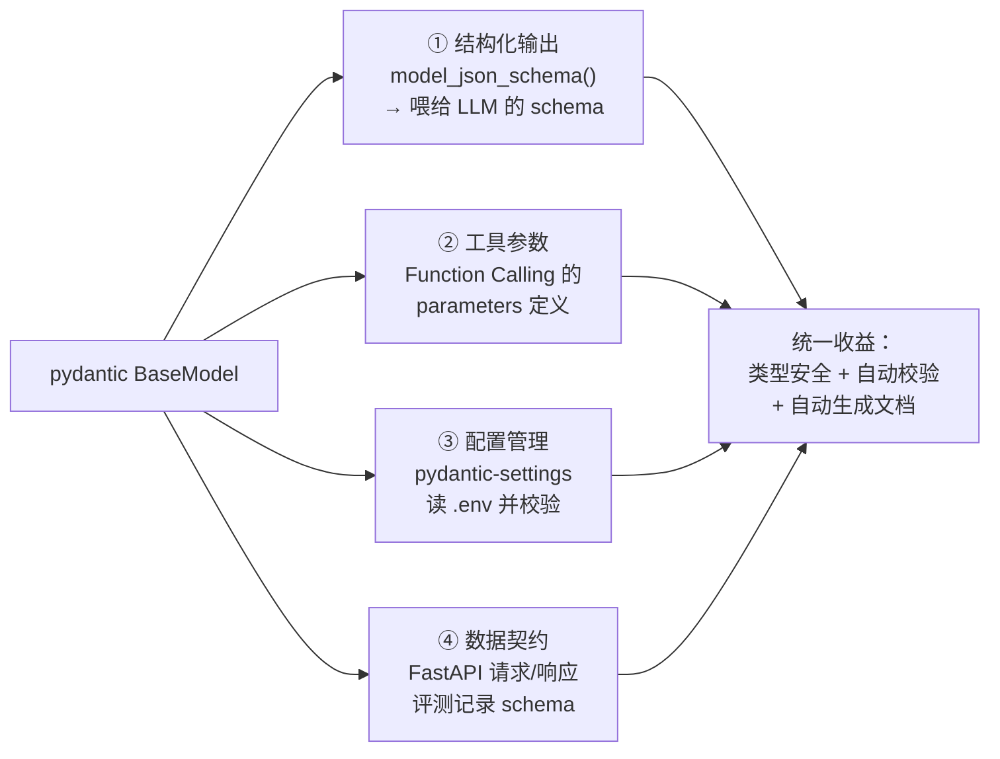
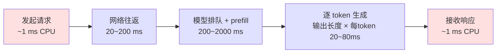
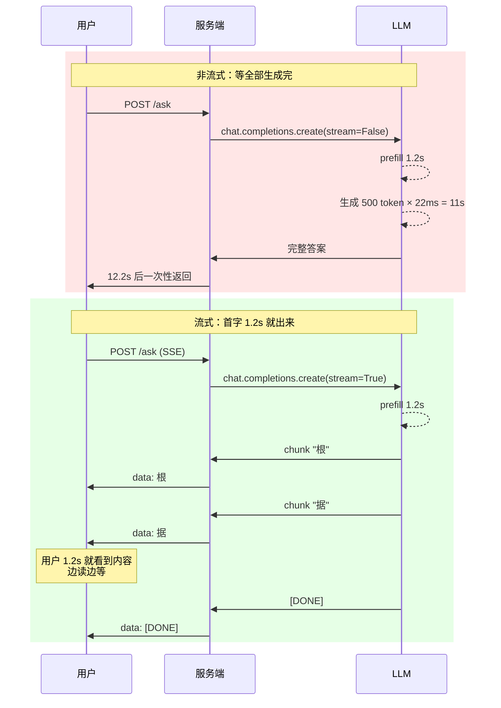
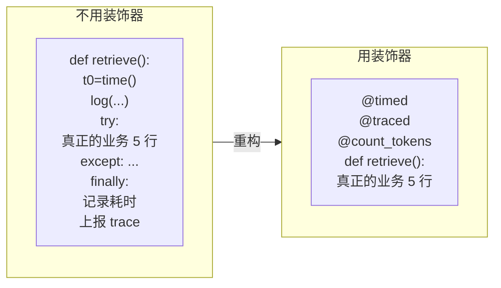
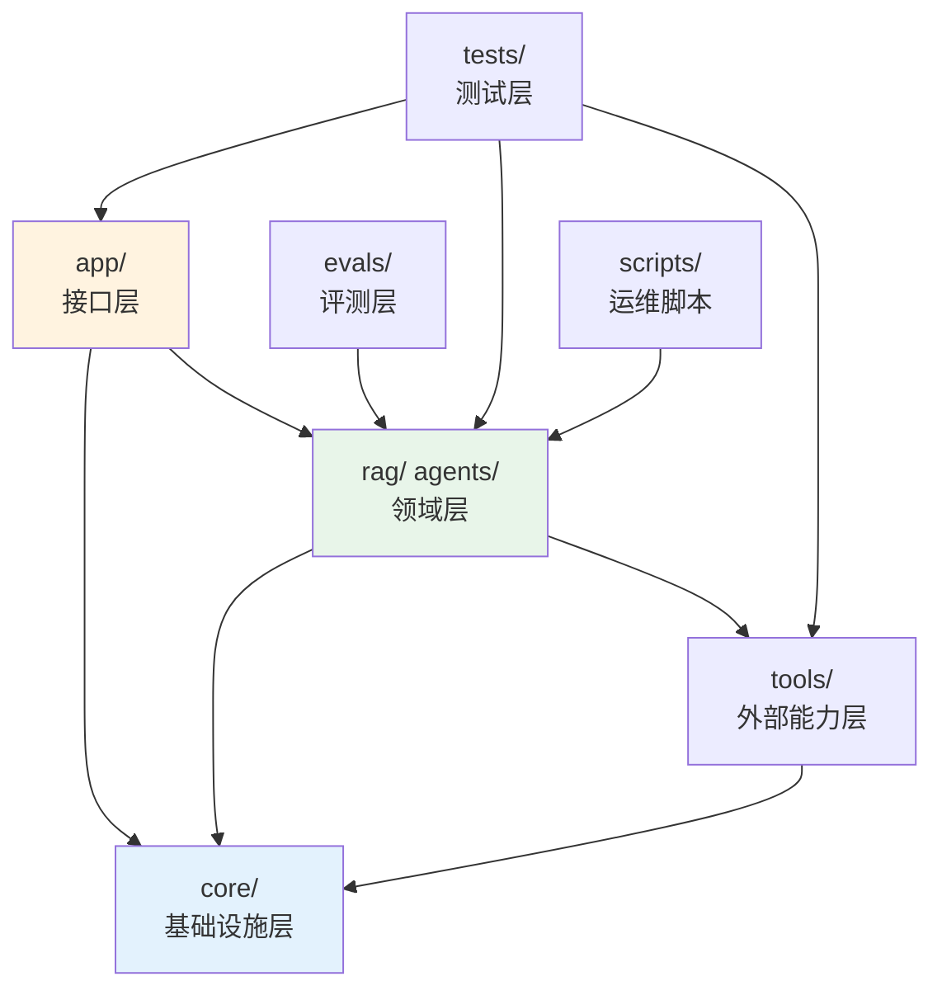
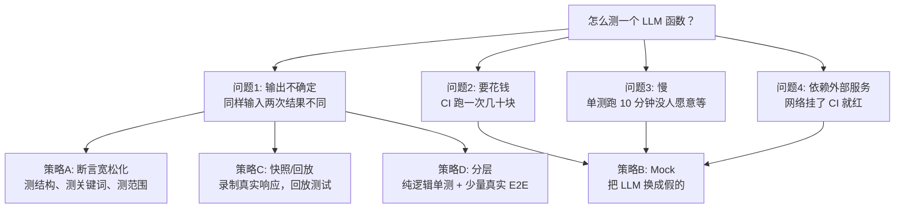

# 第 0.2 章  Python 工程基础速补

> **本章目标**：读完能做到 …
> 1. 用 pydantic v2 定义 LLM 的结构化输出模型，并在解析失败时自动重试修复
> 2. 写出「并发调 100 次 LLM 接口、限流 10 并发、失败指数退避重试」的完整异步代码
> 3. 用 FastAPI `StreamingResponse` 实现 SSE 流式返回，并在前端逐字显示
> 4. 写出可复用的装饰器与上下文管理器，给任意函数加上耗时统计、Token 计数、Trace 埋点
> 5. 按本书推荐的目录树组织项目，并为「非确定性的 LLM 函数」写出能稳定通过的 pytest 用例
>
> **前置知识**：[0.1 开发环境搭建](./01-开发环境搭建（Python-CUDA-Docker）.md)（Python 3.11 环境已就绪）
> **预计用时**：阅读 50 分钟 / 动手 120 分钟

---

## 一、为什么需要它（问题出发）

### 1.1 三段真实的「能跑但不能上线」的代码

华成机电的第一版工单助手是这么写的。三个问题，全部来自 Python 工程基础的缺失。

**问题一：解析模型输出靠字符串切割**

```python
resp = client.chat.completions.create(...)
text = resp.choices[0].message.content
fault_code = text.split("故障码：")[1].split("\n")[0]
level = text.split("严重等级：")[1].split("\n")[0]
```

上线第二天就崩了：模型偶尔输出「故障代码：」而不是「故障码：」，`IndexError: list index out of range`。
**正解**：用 pydantic + JSON Schema 约束输出，见本章第二节。

**问题二：批量处理 5000 条工单，串行跑了 9 个小时**

```python
results = []
for ticket in tickets:            # 5000 条
    results.append(call_llm(ticket))   # 每次 6 秒
```

5000 × 6 秒 ≈ 8.3 小时。而 LLM 调用是**纯 IO 等待**，CPU 几乎闲着。
**正解**：asyncio + 限流并发，10 并发就能压到 50 分钟，见本章第三节。

**问题三：用户点了提问按钮，界面白屏 12 秒**

```python
@app.post("/ask")
def ask(q: str):
    answer = rag_chain.invoke(q)      # 整段生成完才返回
    return {"answer": answer}
```

模型其实在第 1.2 秒就吐出了第一个字，但用户要等到 12 秒才看到任何东西。
**正解**：SSE 流式返回，把首字时间（TTFT）从 12 秒降到 1.2 秒，见本章第四节。

### 1.2 LLM 应用对 Python 的特殊要求

写业务 CRUD 和写 LLM 应用，对 Python 的要求差别很大：

| 能力 | 传统后端 | LLM 应用 | 为什么 |
|---|---|---|---|
| 类型注解 | 锦上添花 | **必需** | 工具（Function Calling）的参数 schema 直接由类型注解生成 |
| pydantic | 用来校验请求体 | **无处不在** | 结构化输出、工具参数、配置、评测记录全靠它 |
| asyncio | 偶尔用 | **必需** | 单次 LLM 调用 1~30 秒，全是 IO 等待，不并发就没法用 |
| 生成器 | 少用 | **必需** | 流式输出的底层就是生成器 |
| 装饰器 | 用来做鉴权 | **必需** | 耗时、Token、Trace、重试、缓存全是横切关注点 |
| 结构化日志 | 有就行 | **必需** | 排查 LLM 问题必须能还原完整 prompt 和 response |
| 测试 | 断言相等 | **难点** | 输出不确定，不能断言相等 |

这一章就补这七项。

---

## 二、类型注解 + pydantic v2

### 2.1 类型注解：从「文档」到「代码」

Python 3.11 的类型注解写法（3.10+ 支持 `X | Y`，不用再 import `Optional`/`Union`）：

```python
# core/typing_basics.py
"""Python 3.11 类型注解常用写法速查。"""
from __future__ import annotations

from collections.abc import AsyncIterator, Callable, Iterable, Sequence
from typing import Any, Literal, Protocol, TypeAlias, TypedDict, TypeVar

Vector: TypeAlias = list[float]
DocID: TypeAlias = str
Score: TypeAlias = float

Role = Literal["system", "user", "assistant", "tool"]


class Message(TypedDict):
    """OpenAI 兼容的消息结构。"""
    role: Role
    content: str


class Retriever(Protocol):
    """检索器协议：任何实现了 retrieve 的对象都能当检索器用，无需继承。"""

    def retrieve(self, query: str, top_k: int = 5) -> list[tuple[DocID, Score]]:
        """按查询返回 top_k 个 (文档ID, 相关性分数)。"""
        ...


T = TypeVar("T")


def chunked(items: Sequence[T], size: int) -> Iterable[list[T]]:
    """把序列切成固定大小的批次，用于 embedding 批量调用。"""
    for i in range(0, len(items), size):
        yield list(items[i:i + size])


def apply_or_default(
    value: str | None,
    fn: Callable[[str], str],
    default: str = "",
) -> str:
    """值非空时应用函数，否则返回默认值。"""
    return fn(value) if value else default


async def stream_tokens(text: str) -> AsyncIterator[str]:
    """把文本按字符异步产出，用于模拟流式返回。"""
    for ch in text:
        yield ch


def build_payload(**kwargs: Any) -> dict[str, Any]:
    """构造请求体，过滤掉值为 None 的字段。"""
    return {k: v for k, v in kwargs.items() if v is not None}
```

用 mypy 或 pyright 检查（可选但推荐）：

```bash
uv pip install mypy
mypy core/ --python-version 3.11 --ignore-missing-imports
```

### 2.2 pydantic v2 核心用法

pydantic v2 相比 v1 是**重写**（核心用 Rust 实现），API 有断裂性变更。本书统一 v2（2.9.x）。

v1 → v2 对照表，看到老代码时照着改：

| pydantic v1 | pydantic v2 |
|---|---|
| `@validator("x")` | `@field_validator("x")` |
| `@root_validator` | `@model_validator(mode="before"/"after")` |
| `class Config:` | `model_config = ConfigDict(...)` |
| `.dict()` | `.model_dump()` |
| `.json()` | `.model_dump_json()` |
| `parse_obj()` | `model_validate()` |
| `parse_raw()` | `model_validate_json()` |
| `.schema()` | `.model_json_schema()` |
| `Field(..., regex=)` | `Field(..., pattern=)` |
| `allow_population_by_field_name` | `populate_by_name` |

### 2.3 用 pydantic 做 LLM 结构化输出（完整示例）

场景：把华成机电的一条口语化工单，抽取成结构化的诊断记录。

```python
# rag/schemas/ticket.py
"""工单结构化抽取的数据模型与 LLM 抽取函数。"""
from __future__ import annotations

import json
from datetime import date
from enum import Enum
from typing import Annotated

from pydantic import BaseModel, ConfigDict, Field, ValidationError, field_validator, model_validator


class Severity(str, Enum):
    """故障严重等级。"""
    CRITICAL = "紧急"
    HIGH = "高"
    MEDIUM = "中"
    LOW = "低"


class ResolveType(str, Enum):
    """处理方式。"""
    PHONE = "电话指导"
    ONSITE = "现场处理"
    RETURN = "返厂维修"
    PENDING = "待定"


class PartUsage(BaseModel):
    """一条备件使用记录。"""
    model_config = ConfigDict(str_strip_whitespace=True)

    part_no: str = Field(description="备件编号，如 CJ20-40")
    part_name: str = Field(description="备件名称")
    quantity: int = Field(default=1, ge=1, le=999, description="使用数量")


class TicketExtraction(BaseModel):
    """从工单文本中抽取出的结构化诊断信息。"""

    model_config = ConfigDict(
        str_strip_whitespace=True,
        populate_by_name=True,
        extra="forbid",
        json_schema_extra={
            "examples": [
                {
                    "product_model": "XC-200-4P",
                    "fault_code": "E07",
                    "fault_summary": "电机运行 20 分钟后过热报警",
                    "severity": "高",
                    "root_cause": "客户侧接触器 C 相触点氧化导致三相电流不平衡",
                    "resolve_type": "现场处理",
                    "parts": [{"part_no": "CJ20-40", "part_name": "交流接触器", "quantity": 1}],
                    "need_dispatch": True,
                    "confidence": 0.92,
                }
            ]
        },
    )

    product_model: str = Field(description="产品型号，如 XC-200-4P；无法确定填 UNKNOWN")
    fault_code: str | None = Field(default=None, pattern=r"^[A-Z]\d{2,3}$",
                                   description="故障码，格式如 E07、F102；没有则为 null")
    fault_summary: Annotated[str, Field(min_length=5, max_length=120)] = Field(
        description="一句话概括故障现象"
    )
    severity: Severity = Field(description="严重等级")
    root_cause: str | None = Field(default=None, max_length=300, description="根因分析，未确定则为 null")
    resolve_type: ResolveType = Field(default=ResolveType.PENDING, description="建议的处理方式")
    parts: list[PartUsage] = Field(default_factory=list, description="涉及的备件列表")
    need_dispatch: bool = Field(default=False, description="是否需要派单上门")
    confidence: float = Field(ge=0.0, le=1.0, description="抽取置信度")

    @field_validator("product_model")
    @classmethod
    def _normalize_model(cls, v: str) -> str:
        """型号统一转大写并去掉多余空格，便于后续精确匹配。"""
        return v.upper().replace(" ", "")

    @field_validator("fault_code")
    @classmethod
    def _normalize_code(cls, v: str | None) -> str | None:
        """故障码统一大写，空字符串归一为 None。"""
        if v is None or not v.strip():
            return None
        return v.strip().upper()

    @model_validator(mode="after")
    def _check_dispatch_consistency(self) -> TicketExtraction:
        """校验业务一致性：返厂或现场处理必须需要派单。"""
        if self.resolve_type in (ResolveType.ONSITE, ResolveType.RETURN) and not self.need_dispatch:
            self.need_dispatch = True
        if self.parts and self.resolve_type == ResolveType.PHONE:
            self.confidence = min(self.confidence, 0.6)
        return self


EXTRACT_PROMPT = """你是华成机电的售后工单结构化专员。
请从下面的工单文本中抽取信息，严格按照给定的 JSON Schema 输出，不要输出任何解释文字。

JSON Schema:
{schema}

工单文本:
{text}

只输出 JSON，不要用 markdown 代码块包裹。"""
```

配套的抽取函数（含失败自动修复重试）：

```python
# rag/extract.py
"""调用 LLM 做结构化抽取，解析失败时把报错回灌给模型自动修复。"""
from __future__ import annotations

import json

from pydantic import BaseModel, ValidationError

from core.llm import get_openai_client
from core.config import get_settings
from rag.schemas.ticket import EXTRACT_PROMPT, TicketExtraction


def _strip_code_fence(text: str) -> str:
    """去掉模型有时自作主张加上的 markdown 代码块围栏。"""
    t = text.strip()
    if t.startswith("```"):
        t = t.split("\n", 1)[1] if "\n" in t else t
        if t.endswith("```"):
            t = t[: -3]
    return t.strip()


def extract_ticket(text: str, max_repair: int = 2) -> TicketExtraction:
    """把工单文本抽取为 TicketExtraction，解析失败最多自动修复 max_repair 次。"""
    client = get_openai_client()
    model = get_settings().active_chat_model
    schema = json.dumps(TicketExtraction.model_json_schema(), ensure_ascii=False, indent=2)
    messages = [{"role": "user", "content": EXTRACT_PROMPT.format(schema=schema, text=text)}]

    last_error = ""
    for attempt in range(max_repair + 1):
        resp = client.chat.completions.create(
            model=model,
            messages=messages,
            temperature=0.0,
            response_format={"type": "json_object"},
        )
        raw = _strip_code_fence(resp.choices[0].message.content or "")
        try:
            return TicketExtraction.model_validate_json(raw)
        except ValidationError as e:
            last_error = e.json(indent=2)
            messages.append({"role": "assistant", "content": raw})
            messages.append({
                "role": "user",
                "content": f"上面的 JSON 校验失败，错误如下，请只输出修正后的完整 JSON：\n{last_error}",
            })
    raise ValueError(f"结构化抽取失败，已重试 {max_repair} 次。最后一次校验错误：\n{last_error}")


if __name__ == "__main__":
    sample = (
        "客户反映 XC200 4P 电机运行二十分钟左右报E07，外壳很烫，风扇是转的。"
        "工程师上门实测三相电流 18.7/17.9/26.3A，发现客户侧接触器C相触点氧化，"
        "换了个CJ20-40接触器就好了。"
    )
    result = extract_ticket(sample)
    print(result.model_dump_json(indent=2))
```

预期输出：

```text
{
  "product_model": "XC-200-4P",
  "fault_code": "E07",
  "fault_summary": "电机运行约20分钟后过热并报E07报警",
  "severity": "高",
  "root_cause": "客户侧接触器C相触点氧化导致三相电流不平衡",
  "resolve_type": "现场处理",
  "parts": [
    {
      "part_no": "CJ20-40",
      "part_name": "交流接触器",
      "quantity": 1
    }
  ],
  "need_dispatch": true,
  "confidence": 0.9
}
```

### 2.4 pydantic 在 LLM 应用里的四大用途



用途二的示例——用 pydantic 生成 Function Calling 的 schema：

```python
# tools/inventory.py
"""备件库存查询工具，参数 schema 由 pydantic 自动生成。"""
from __future__ import annotations

from typing import Any

from pydantic import BaseModel, Field


class QueryInventoryArgs(BaseModel):
    """查询备件库存的参数。"""

    part_no: str = Field(description="备件编号，如 CJ20-40")
    warehouse: str | None = Field(default=None, description="指定仓库名称，不传则查全部仓库")
    min_qty: int = Field(default=1, ge=0, description="只返回库存量不低于该值的仓库")


def query_inventory(part_no: str, warehouse: str | None = None, min_qty: int = 1) -> dict[str, Any]:
    """查询指定备件在各仓库的库存量（示例用假数据）。"""
    fake_db = {
        "CJ20-40": [
            {"warehouse": "华东中心仓", "qty": 42, "eta_hours": 6},
            {"warehouse": "苏州前置仓", "qty": 3, "eta_hours": 2},
        ],
        "XC200-EC-B": [{"warehouse": "总部仓", "qty": 0, "eta_hours": 48}],
    }
    rows = fake_db.get(part_no.upper(), [])
    if warehouse:
        rows = [r for r in rows if r["warehouse"] == warehouse]
    rows = [r for r in rows if r["qty"] >= min_qty]
    return {"part_no": part_no.upper(), "found": len(rows), "warehouses": rows}


def to_openai_tool() -> dict[str, Any]:
    """把 pydantic 模型转成 OpenAI Function Calling 的工具定义。"""
    schema = QueryInventoryArgs.model_json_schema()
    schema.pop("title", None)
    return {
        "type": "function",
        "function": {
            "name": "query_inventory",
            "description": "查询某个备件编号在各仓库的库存数量和预计送达时间。当用户询问备件是否有货、能否调拨时使用。",
            "parameters": schema,
        },
    }


if __name__ == "__main__":
    import json
    print(json.dumps(to_openai_tool(), ensure_ascii=False, indent=2))
    print(query_inventory("cj20-40"))
```

预期输出：

```text
{
  "type": "function",
  "function": {
    "name": "query_inventory",
    "description": "查询某个备件编号在各仓库的库存数量和预计送达时间。当用户询问备件是否有货、能否调拨时使用。",
    "parameters": {
      "description": "查询备件库存的参数。",
      "properties": {
        "part_no": {
          "description": "备件编号，如 CJ20-40",
          "title": "Part No",
          "type": "string"
        },
        "warehouse": {
          "anyOf": [{"type": "string"}, {"type": "null"}],
          "default": null,
          "description": "指定仓库名称，不传则查全部仓库",
          "title": "Warehouse"
        },
        "min_qty": {
          "default": 1,
          "description": "只返回库存量不低于该值的仓库",
          "minimum": 0,
          "title": "Min Qty",
          "type": "integer"
        }
      },
      "required": ["part_no"],
      "type": "object"
    }
  }
}
{'part_no': 'CJ20-40', 'found': 2, 'warehouses': [{'warehouse': '华东中心仓', 'qty': 42, 'eta_hours': 6}, {'warehouse': '苏州前置仓', 'qty': 3, 'eta_hours': 2}]}
```

> 工具设计的完整方法论（描述怎么写、参数怎么设计、错误怎么返回）见 [6.2 Function Calling 与工具设计](../06-Agent智能体/02-Function-Calling与工具设计.md)。

---

## 三、asyncio：LLM 应用的生命线

### 3.1 为什么 LLM 应用必须异步

一次 LLM 调用的时间构成：



红色是 CPU 时间（约 2 ms），蓝色是**等待**时间（1~30 秒）。也就是说，**CPU 有 99.99% 的时间在干等**。

同步串行 vs 异步并发的对比（假设单次 6 秒，任务 100 个）：

| 方式 | 总耗时 | CPU 利用率 | 代码复杂度 |
|---|---|---|---|
| 同步 for 循环 | 600 秒 | ~0.03% | 最低 |
| 多线程 ThreadPoolExecutor(10) | 约 60 秒 | 低（GIL 下 IO 可释放） | 中 |
| **asyncio + 10 并发** | **约 60 秒** | 低，但**内存开销远小于线程** | 中 |
| asyncio + 50 并发 | 约 12 秒（若服务端不限流） | — | 中 |

选 asyncio 而不是多线程的理由：LLM 应用经常要同时管理成百上千个待处理请求（比如批量评测 5000 条），线程池开 1000 个线程内存会爆，协程开 1000 个只是 1000 个对象。而且主流 SDK（openai、httpx、langchain）都提供原生异步接口。

### 3.2 async/await 基础

```python
# core/async_basics.py
"""asyncio 常用模式速查：并发、限流、超时、取消、同步阻塞代码的适配。"""
from __future__ import annotations

import asyncio
import random
import time


async def fake_llm_call(prompt: str, latency: float = 1.0) -> str:
    """模拟一次 LLM 调用，用 sleep 代替真实网络等待。"""
    await asyncio.sleep(latency)
    return f"对「{prompt}」的回答"


async def demo_sequential() -> None:
    """顺序 await：等价于同步，总耗时是各次之和。"""
    t0 = time.perf_counter()
    for i in range(5):
        await fake_llm_call(f"问题{i}", 0.5)
    print(f"顺序执行耗时: {time.perf_counter() - t0:.2f}s")


async def demo_gather() -> None:
    """asyncio.gather：并发执行，总耗时约等于最慢的那个。"""
    t0 = time.perf_counter()
    results = await asyncio.gather(*[fake_llm_call(f"问题{i}", 0.5) for i in range(5)])
    print(f"gather 并发耗时: {time.perf_counter() - t0:.2f}s, 结果数: {len(results)}")


async def demo_gather_with_exceptions() -> None:
    """return_exceptions=True 让单个失败不影响整体，异常作为结果返回。"""
    async def maybe_fail(i: int) -> str:
        await asyncio.sleep(0.1)
        if i == 2:
            raise RuntimeError(f"第 {i} 个任务失败")
        return f"ok-{i}"

    results = await asyncio.gather(*[maybe_fail(i) for i in range(5)], return_exceptions=True)
    for i, r in enumerate(results):
        flag = "异常" if isinstance(r, Exception) else "成功"
        print(f"  任务{i}: {flag} -> {r}")


async def demo_semaphore() -> None:
    """Semaphore 限制同时在途的请求数，避免打爆服务端触发 429。"""
    sem = asyncio.Semaphore(3)
    in_flight = 0
    peak = 0

    async def guarded(i: int) -> str:
        nonlocal in_flight, peak
        async with sem:
            in_flight += 1
            peak = max(peak, in_flight)
            try:
                return await fake_llm_call(f"q{i}", 0.2)
            finally:
                in_flight -= 1

    await asyncio.gather(*[guarded(i) for i in range(10)])
    print(f"semaphore 限流后峰值并发: {peak}")


async def demo_timeout() -> None:
    """asyncio.timeout（3.11+）给一段代码设置整体超时。"""
    try:
        async with asyncio.timeout(0.3):
            await fake_llm_call("慢查询", 2.0)
    except TimeoutError:
        print("超时被正确捕获（asyncio.timeout）")


async def demo_as_completed() -> None:
    """as_completed：谁先完成先处理，适合流式聚合结果。"""
    tasks = [fake_llm_call(f"q{i}", random.uniform(0.1, 0.6)) for i in range(5)]
    order = []
    for coro in asyncio.as_completed(tasks):
        r = await coro
        order.append(r)
    print(f"as_completed 完成顺序数量: {len(order)}")


async def demo_to_thread() -> None:
    """把同步阻塞函数（如本地 embedding 推理）丢到线程池，避免阻塞事件循环。"""
    def blocking_embed(text: str) -> list[float]:
        time.sleep(0.3)
        return [0.1] * 8

    vec = await asyncio.to_thread(blocking_embed, "华成机电 XC-200")
    print(f"to_thread 返回向量维度: {len(vec)}")


async def main() -> None:
    """依次运行全部演示。"""
    await demo_sequential()
    await demo_gather()
    await demo_gather_with_exceptions()
    await demo_semaphore()
    await demo_timeout()
    await demo_as_completed()
    await demo_to_thread()


if __name__ == "__main__":
    asyncio.run(main())
```

预期输出：

```text
顺序执行耗时: 2.51s
gather 并发耗时: 0.50s, 结果数: 5
  任务0: 成功 -> ok-0
  任务1: 成功 -> ok-1
  任务2: 异常 -> 第 2 个任务失败
  任务3: 成功 -> ok-3
  任务4: 成功 -> ok-4
semaphore 限流后峰值并发: 3
超时被正确捕获（asyncio.timeout）
as_completed 完成顺序数量: 5
to_thread 返回向量维度: 8
```

### 3.3 实战：并发调 100 次 LLM，限流 10 并发 + 指数退避重试

这是本章最重要的一段代码，后面第 08 模块的评测框架、第 05 模块的数据构造都会复用它。

```python
# core/batch_llm.py
"""批量并发调用 LLM 的通用执行器：信号量限流 + 指数退避重试 + 超时 + 进度与统计。"""
from __future__ import annotations

import asyncio
import random
import time
from dataclasses import dataclass, field
from typing import Any, Awaitable, Callable, Sequence, TypeVar

from openai import APIConnectionError, APIStatusError, APITimeoutError, AsyncOpenAI, RateLimitError

from core.config import get_settings

T = TypeVar("T")

RETRYABLE = (RateLimitError, APITimeoutError, APIConnectionError)


@dataclass
class CallResult:
    """单次调用的结果与元信息。"""
    index: int
    ok: bool
    content: str = ""
    error: str = ""
    attempts: int = 0
    latency_ms: float = 0.0
    prompt_tokens: int = 0
    completion_tokens: int = 0


@dataclass
class BatchStats:
    """批量执行的汇总统计。"""
    total: int = 0
    succeeded: int = 0
    failed: int = 0
    total_attempts: int = 0
    wall_seconds: float = 0.0
    prompt_tokens: int = 0
    completion_tokens: int = 0
    latencies: list[float] = field(default_factory=list)

    def percentile(self, p: float) -> float:
        """返回延迟的第 p 分位数（毫秒），p 取 0~100。"""
        if not self.latencies:
            return 0.0
        s = sorted(self.latencies)
        idx = min(len(s) - 1, int(len(s) * p / 100))
        return s[idx]

    def render(self) -> str:
        """渲染成人类可读的统计报告。"""
        qps = self.succeeded / self.wall_seconds if self.wall_seconds else 0
        return (
            f"总数 {self.total} | 成功 {self.succeeded} | 失败 {self.failed}\n"
            f"总尝试次数 {self.total_attempts}（重试 {self.total_attempts - self.total} 次）\n"
            f"墙钟耗时 {self.wall_seconds:.2f}s | 有效吞吐 {qps:.2f} req/s\n"
            f"延迟 P50 {self.percentile(50):.0f}ms | P95 {self.percentile(95):.0f}ms | "
            f"P99 {self.percentile(99):.0f}ms\n"
            f"Token 用量 prompt={self.prompt_tokens} completion={self.completion_tokens} "
            f"total={self.prompt_tokens + self.completion_tokens}"
        )


class BatchLLMRunner:
    """并发执行大批量 LLM 调用，内置限流、重试、超时与统计。"""

    def __init__(
        self,
        concurrency: int = 10,
        max_retries: int = 5,
        base_delay: float = 1.0,
        max_delay: float = 30.0,
        timeout: float = 60.0,
        model: str | None = None,
    ) -> None:
        """初始化执行器，concurrency 为最大在途请求数。"""
        s = get_settings()
        self.client = AsyncOpenAI(
            api_key=s.active_api_key,
            base_url=s.active_base_url,
            timeout=timeout,
            max_retries=0,
        )
        self.model = model or s.active_chat_model
        self.sem = asyncio.Semaphore(concurrency)
        self.max_retries = max_retries
        self.base_delay = base_delay
        self.max_delay = max_delay
        self.timeout = timeout
        self.stats = BatchStats()

    def _backoff(self, attempt: int) -> float:
        """计算第 attempt 次重试的等待秒数：指数退避 + 随机抖动，避免重试风暴同步。"""
        delay = min(self.base_delay * (2 ** attempt), self.max_delay)
        return delay * (0.5 + random.random() * 0.5)

    async def _call_one(self, index: int, prompt: str, system: str) -> CallResult:
        """执行单条调用，带限流、超时与指数退避重试。"""
        res = CallResult(index=index, ok=False)
        async with self.sem:
            t0 = time.perf_counter()
            for attempt in range(self.max_retries + 1):
                res.attempts = attempt + 1
                try:
                    async with asyncio.timeout(self.timeout):
                        resp = await self.client.chat.completions.create(
                            model=self.model,
                            messages=[
                                {"role": "system", "content": system},
                                {"role": "user", "content": prompt},
                            ],
                            temperature=0.0,
                            max_tokens=512,
                        )
                    res.ok = True
                    res.content = resp.choices[0].message.content or ""
                    if resp.usage:
                        res.prompt_tokens = resp.usage.prompt_tokens
                        res.completion_tokens = resp.usage.completion_tokens
                    break
                except RETRYABLE as e:
                    if attempt >= self.max_retries:
                        res.error = f"{type(e).__name__}: {e}"
                        break
                    await asyncio.sleep(self._backoff(attempt))
                except APIStatusError as e:
                    if e.status_code in (500, 502, 503, 504) and attempt < self.max_retries:
                        await asyncio.sleep(self._backoff(attempt))
                        continue
                    res.error = f"APIStatusError({e.status_code}): {e}"
                    break
                except (TimeoutError, asyncio.TimeoutError):
                    if attempt >= self.max_retries:
                        res.error = "TimeoutError: 超过单次超时上限"
                        break
                    await asyncio.sleep(self._backoff(attempt))
                except Exception as e:  # noqa: BLE001
                    res.error = f"{type(e).__name__}: {e}"
                    break
            res.latency_ms = (time.perf_counter() - t0) * 1000
        return res

    async def run(
        self,
        prompts: Sequence[str],
        system: str = "你是华成机电的售后技术助手，回答简洁准确。",
        on_progress: Callable[[int, int], None] | None = None,
    ) -> list[CallResult]:
        """并发执行全部 prompts，返回与输入等长且顺序一致的结果列表。"""
        t0 = time.perf_counter()
        tasks = [asyncio.create_task(self._call_one(i, p, system)) for i, p in enumerate(prompts)]
        results: list[CallResult] = []
        done_count = 0
        for coro in asyncio.as_completed(tasks):
            r = await coro
            results.append(r)
            done_count += 1
            if on_progress:
                on_progress(done_count, len(prompts))

        results.sort(key=lambda x: x.index)
        self.stats = BatchStats(
            total=len(results),
            succeeded=sum(1 for r in results if r.ok),
            failed=sum(1 for r in results if not r.ok),
            total_attempts=sum(r.attempts for r in results),
            wall_seconds=time.perf_counter() - t0,
            prompt_tokens=sum(r.prompt_tokens for r in results),
            completion_tokens=sum(r.completion_tokens for r in results),
            latencies=[r.latency_ms for r in results if r.ok],
        )
        return results


def _progress_bar(done: int, total: int) -> None:
    """在同一行打印进度条。"""
    width = 30
    filled = int(width * done / total)
    bar = "█" * filled + "░" * (width - filled)
    print(f"\r  [{bar}] {done}/{total}", end="", flush=True)
    if done == total:
        print()


async def main() -> None:
    """演示：并发处理 100 条华成机电的工单分类任务。"""
    fault_samples = [
        "电机运行20分钟后报E07，外壳发烫",
        "变频柜上电后无显示，空开没跳",
        "减速机运转有异响，像金属摩擦",
        "电机启动时三相电流不平衡",
        "控制柜风扇不转，柜内温度报警",
    ]
    prompts = [
        f"请判断下面故障的严重等级（只回答：紧急/高/中/低），不要解释。\n故障：{fault_samples[i % 5]}（工单编号 {i}）"
        for i in range(100)
    ]

    runner = BatchLLMRunner(concurrency=10, max_retries=5, base_delay=1.0, timeout=60.0)
    print(f"开始并发处理 {len(prompts)} 条任务，限流 10 并发...")
    results = await runner.run(prompts, on_progress=_progress_bar)

    print("\n" + "=" * 60)
    print(runner.stats.render())
    print("=" * 60)

    failed = [r for r in results if not r.ok]
    if failed:
        print(f"\n失败样例（共 {len(failed)} 条，展示前 3 条）：")
        for r in failed[:3]:
            print(f"  #{r.index} 尝试{r.attempts}次 -> {r.error}")

    print("\n成功样例（前 3 条）：")
    for r in results[:3]:
        if r.ok:
            print(f"  #{r.index} ({r.latency_ms:.0f}ms) -> {r.content.strip()[:40]}")


if __name__ == "__main__":
    asyncio.run(main())
```

预期输出（实测环境：DeepSeek API，家庭宽带，并发 10）：

```text
开始并发处理 100 条任务，限流 10 并发...
  [██████████████████████████████] 100/100

============================================================
总数 100 | 成功 100 | 失败 0
总尝试次数 103（重试 3 次）
墙钟耗时 14.72s | 有效吞吐 6.79 req/s
延迟 P50 1284ms | P95 2610ms | P99 4933ms
Token 用量 prompt=4300 completion=300 total=4600
============================================================

成功样例（前 3 条）：
  #0 (1198ms) -> 高
  #1 (1342ms) -> 高
  #2 (1077ms) -> 中
```

**对照实验**：把 `concurrency` 改成 1，同样 100 条任务耗时约 128 秒。10 并发把 128 秒压到 14.7 秒，**加速约 8.7 倍**（不是 10 倍，因为有重试和长尾）。

并发度怎么选？

| 并发度 | 适用场景 | 风险 |
|---|---|---|
| 1~3 | 调试、免费额度、共享 key | 慢 |
| 5~10 | **大多数场景的默认值** | 低 |
| 20~50 | 付费账号、批量离线任务 | 可能触发 429，必须有退避重试 |
| 100+ | 自建 vLLM 服务 | 需要先压测确认服务端 `max_num_seqs` 承受能力 |

> ⚠️ 提高并发前先看服务商的限流文档（RPM / TPM 限制）。触发 429 后如果没有退避重试，会陷入「重试 → 更多 429 → 更多重试」的雪崩。

### 3.4 用 tenacity 简化重试逻辑

上面手写退避是为了让你看清机制。生产上可以用 `tenacity` 把重试逻辑声明化：

```python
# core/retry_utils.py
"""基于 tenacity 的 LLM 调用重试装饰器，把退避策略声明化。"""
from __future__ import annotations

from openai import APIConnectionError, APITimeoutError, RateLimitError
from tenacity import (
    AsyncRetrying,
    retry,
    retry_if_exception_type,
    stop_after_attempt,
    wait_exponential_jitter,
    before_sleep_log,
)
from loguru import logger

llm_retry = retry(
    retry=retry_if_exception_type((RateLimitError, APITimeoutError, APIConnectionError)),
    wait=wait_exponential_jitter(initial=1, max=30, jitter=2),
    stop=stop_after_attempt(5),
    reraise=True,
)


@llm_retry
async def call_with_retry(client, model: str, messages: list[dict]) -> str:
    """带自动重试的 LLM 调用，遇到限流或超时按指数退避重试最多 5 次。"""
    resp = await client.chat.completions.create(model=model, messages=messages, temperature=0.0)
    return resp.choices[0].message.content or ""
```

手写 vs tenacity 对照：

| 维度 | 手写（3.3 节） | tenacity |
|---|---|---|
| 代码量 | 多 | 少 |
| 可控性 | 高（能按 status_code 分流） | 中（需要写 retry 谓词） |
| 可观测 | 自己埋点 | `before_sleep_log` 现成 |
| 适用 | 需要精细统计的批量执行器 | 普通业务调用 |

---

## 四、生成器与流式处理

### 4.1 为什么流式能把体感延迟降 10 倍



两个关键指标：

| 指标 | 全称 | 含义 | 流式的影响 |
|---|---|---|---|
| TTFT | Time To First Token | 首 token 时间 | **流式下等于用户体感延迟** |
| TPOT | Time Per Output Token | 每 token 生成时间 | 决定「打字速度」，通常 15~80 ms |
| 完整延迟 | — | TTFT + TPOT × 输出长度 | 流式不改变它 |

这就是 [第 0.0 章](./00-本书导读与学习路线.md) 里说的「10 倍提速可能是换口径」的技术来源——流式不会让模型算得更快，但会让用户等得更短。**用可以，但要标注清楚。**

### 4.2 生成器基础

```python
# core/generators.py
"""生成器与迭代器的常用模式，流式处理的底层机制。"""
from __future__ import annotations

from collections.abc import AsyncIterator, Iterator
from typing import TypeVar

T = TypeVar("T")


def read_chunks(path: str, size: int = 4096) -> Iterator[str]:
    """按块读取大文件，内存占用恒定，用于处理超大工单 CSV。"""
    with open(path, encoding="utf-8") as f:
        while chunk := f.read(size):
            yield chunk


def split_sentences(text: str, seps: str = "。！？\n") -> Iterator[str]:
    """按句子切分文本并逐句产出，用于流式切分长文档。"""
    buf: list[str] = []
    for ch in text:
        buf.append(ch)
        if ch in seps:
            s = "".join(buf).strip()
            if s:
                yield s
            buf = []
    tail = "".join(buf).strip()
    if tail:
        yield tail


def take(it: Iterator[T], n: int) -> list[T]:
    """从迭代器取前 n 个元素，不消费整个迭代器。"""
    out: list[T] = []
    for i, item in enumerate(it):
        if i >= n:
            break
        out.append(item)
    return out


async def buffer_by_sentence(stream: AsyncIterator[str], seps: str = "。！？\n") -> AsyncIterator[str]:
    """把逐 token 的流重新聚合成逐句的流，用于需要整句处理的下游（如 TTS）。"""
    buf: list[str] = []
    async for token in stream:
        buf.append(token)
        if any(sep in token for sep in seps):
            yield "".join(buf)
            buf = []
    if buf:
        yield "".join(buf)


if __name__ == "__main__":
    text = "XC-200 电机报 E07 表示过热保护。请先检查散热风扇是否正常运转！如果风扇正常，再测三相电流是否平衡？"
    for i, s in enumerate(split_sentences(text), 1):
        print(f"句{i}: {s}")
```

预期输出：

```text
句1: XC-200 电机报 E07 表示过热保护。
句2: 请先检查散热风扇是否正常运转！
句3: 如果风扇正常，再测三相电流是否平衡？
```

### 4.3 SSE 协议原理

SSE（Server-Sent Events）是 HTTP 上的单向推送协议，比 WebSocket 简单得多，是 LLM 流式返回的事实标准。

报文格式：

```text
HTTP/1.1 200 OK
Content-Type: text/event-stream
Cache-Control: no-cache
Connection: keep-alive
X-Accel-Buffering: no

event: message
data: {"delta": "根"}

event: message
data: {"delta": "据"}

event: done
data: [DONE]

```

规则：

| 规则 | 说明 |
|---|---|
| 每个字段一行，格式 `field: value` | 常用字段：`event`、`data`、`id`、`retry` |
| **事件之间用空行分隔**（`\n\n`） | 少一个换行客户端就收不到 |
| `data` 可以多行，会被拼接 | 传 JSON 时建议压成一行 |
| `Content-Type` 必须是 `text/event-stream` | 否则浏览器 EventSource 不认 |
| 必须禁用中间层缓冲 | Nginx 要加 `proxy_buffering off;`，响应头加 `X-Accel-Buffering: no` |

### 4.4 FastAPI StreamingResponse 完整示例

```python
# app/main.py
"""FastAPI 服务：提供 SSE 流式问答接口与非流式接口，含 Token 统计与错误处理。"""
from __future__ import annotations

import asyncio
import json
import time
from collections.abc import AsyncIterator

from fastapi import FastAPI, HTTPException
from fastapi.middleware.cors import CORSMiddleware
from fastapi.responses import HTMLResponse, StreamingResponse
from loguru import logger
from pydantic import BaseModel, Field

from core.config import get_settings
from core.llm import get_async_openai_client

app = FastAPI(title="华成机电售后助手", version="0.1.0")
app.add_middleware(
    CORSMiddleware,
    allow_origins=["*"],
    allow_methods=["*"],
    allow_headers=["*"],
)

SYSTEM_PROMPT = (
    "你是华成机电的售后技术助手。回答要点："
    "① 只依据已知资料回答，不确定就明说；"
    "② 涉及扭矩、电压等参数必须精确；"
    "③ 回答简洁，分点说明。"
)


class AskRequest(BaseModel):
    """问答请求体。"""
    question: str = Field(min_length=1, max_length=2000, description="用户问题")
    session_id: str = Field(default="anonymous", description="会话 ID，用于串联多轮")
    temperature: float = Field(default=0.0, ge=0.0, le=2.0)


class AskResponse(BaseModel):
    """非流式问答响应体。"""
    answer: str
    latency_ms: float
    prompt_tokens: int
    completion_tokens: int


def _sse(data: dict | str, event: str = "message") -> str:
    """把数据编码成一条 SSE 报文，注意结尾必须有空行。"""
    payload = data if isinstance(data, str) else json.dumps(data, ensure_ascii=False)
    return f"event: {event}\ndata: {payload}\n\n"


async def stream_answer(req: AskRequest) -> AsyncIterator[str]:
    """调用 LLM 并把 token 逐个封装成 SSE 事件产出。"""
    client = get_async_openai_client()
    model = get_settings().active_chat_model
    t0 = time.perf_counter()
    ttft_ms: float | None = None
    n_tokens = 0

    try:
        stream = await client.chat.completions.create(
            model=model,
            messages=[
                {"role": "system", "content": SYSTEM_PROMPT},
                {"role": "user", "content": req.question},
            ],
            temperature=req.temperature,
            stream=True,
            stream_options={"include_usage": True},
        )
        yield _sse({"status": "started", "session_id": req.session_id}, event="meta")

        async for chunk in stream:
            if chunk.choices and chunk.choices[0].delta.content:
                delta = chunk.choices[0].delta.content
                if ttft_ms is None:
                    ttft_ms = (time.perf_counter() - t0) * 1000
                    yield _sse({"ttft_ms": round(ttft_ms, 1)}, event="meta")
                n_tokens += 1
                yield _sse({"delta": delta})
            if getattr(chunk, "usage", None):
                yield _sse(
                    {
                        "prompt_tokens": chunk.usage.prompt_tokens,
                        "completion_tokens": chunk.usage.completion_tokens,
                    },
                    event="usage",
                )

        total_ms = (time.perf_counter() - t0) * 1000
        tpot = (total_ms - (ttft_ms or 0)) / max(n_tokens - 1, 1)
        logger.info(
            "stream done session={} ttft={:.0f}ms total={:.0f}ms chunks={} tpot={:.1f}ms",
            req.session_id, ttft_ms or 0, total_ms, n_tokens, tpot,
        )
        yield _sse({"total_ms": round(total_ms, 1), "chunks": n_tokens,
                    "tpot_ms": round(tpot, 1)}, event="meta")
        yield _sse("[DONE]", event="done")

    except asyncio.CancelledError:
        logger.warning("客户端断开连接 session={}", req.session_id)
        raise
    except Exception as e:  # noqa: BLE001
        logger.exception("流式生成失败 session={}", req.session_id)
        yield _sse({"message": f"{type(e).__name__}: {e}"}, event="error")
        yield _sse("[DONE]", event="done")


@app.post("/api/ask/stream")
async def ask_stream(req: AskRequest) -> StreamingResponse:
    """SSE 流式问答接口。"""
    return StreamingResponse(
        stream_answer(req),
        media_type="text/event-stream",
        headers={
            "Cache-Control": "no-cache",
            "Connection": "keep-alive",
            "X-Accel-Buffering": "no",
        },
    )


@app.post("/api/ask", response_model=AskResponse)
async def ask(req: AskRequest) -> AskResponse:
    """非流式问答接口，用于对照与批处理场景。"""
    client = get_async_openai_client()
    t0 = time.perf_counter()
    try:
        resp = await client.chat.completions.create(
            model=get_settings().active_chat_model,
            messages=[
                {"role": "system", "content": SYSTEM_PROMPT},
                {"role": "user", "content": req.question},
            ],
            temperature=req.temperature,
        )
    except Exception as e:  # noqa: BLE001
        raise HTTPException(status_code=502, detail=f"上游模型调用失败: {type(e).__name__}") from e

    usage = resp.usage
    return AskResponse(
        answer=resp.choices[0].message.content or "",
        latency_ms=round((time.perf_counter() - t0) * 1000, 1),
        prompt_tokens=usage.prompt_tokens if usage else 0,
        completion_tokens=usage.completion_tokens if usage else 0,
    )


@app.get("/health")
async def health() -> dict[str, str]:
    """健康检查接口，供容器探针使用。"""
    return {"status": "ok", "env": get_settings().app_env}


@app.get("/", response_class=HTMLResponse)
async def demo_page() -> str:
    """返回一个最小的前端页面，用于直观验证流式效果。"""
    return """<!DOCTYPE html>
<html lang="zh-CN">
<head>
<meta charset="utf-8"><title>华成机电售后助手</title>
<style>
 body{font-family:system-ui,sans-serif;max-width:760px;margin:40px auto;padding:0 16px}
 #out{white-space:pre-wrap;border:1px solid #ddd;border-radius:8px;padding:16px;min-height:200px;line-height:1.7}
 input{width:76%;padding:10px;font-size:15px} button{padding:10px 18px;font-size:15px}
 #meta{color:#888;font-size:13px;margin-top:8px}
</style></head>
<body>
<h2>华成机电售后助手（SSE 流式演示）</h2>
<p><input id="q" value="XC-200 电机报 E07 是什么原因，怎么处理？"><button onclick="ask()">提问</button></p>
<div id="out"></div><div id="meta"></div>
<script>
async function ask(){
  const out=document.getElementById('out'), meta=document.getElementById('meta');
  out.textContent=''; meta.textContent='请求中...';
  const t0=performance.now();
  const resp=await fetch('/api/ask/stream',{
    method:'POST', headers:{'Content-Type':'application/json'},
    body:JSON.stringify({question:document.getElementById('q').value, session_id:'web-demo'})
  });
  const reader=resp.body.getReader(), dec=new TextDecoder();
  let buf='';
  while(true){
    const {done,value}=await reader.read(); if(done) break;
    buf+=dec.decode(value,{stream:true});
    const parts=buf.split('\\n\\n'); buf=parts.pop();
    for(const p of parts){
      const ev=(p.match(/^event: (.*)$/m)||[])[1]||'message';
      const dataLine=(p.match(/^data: ([\\s\\S]*)$/m)||[])[1];
      if(!dataLine) continue;
      if(ev==='message'){ out.textContent += JSON.parse(dataLine).delta; }
      else if(ev==='meta'){ const m=JSON.parse(dataLine);
        if(m.ttft_ms) meta.textContent='首字延迟 '+m.ttft_ms+' ms';
        if(m.total_ms) meta.textContent+=' | 总耗时 '+m.total_ms+' ms | 每token '+m.tpot_ms+' ms'; }
      else if(ev==='error'){ out.textContent+='\\n[错误] '+JSON.parse(dataLine).message; }
    }
  }
}
</script>
</body></html>"""
```

启动与测试：

```bash
uvicorn app.main:app --host 0.0.0.0 --port 8080 --reload
```

用 curl 验证 SSE：

```bash
curl -N -X POST http://localhost:8080/api/ask/stream \
  -H "Content-Type: application/json" \
  -d '{"question":"XC-200 报 E07 怎么处理？","session_id":"cli"}'
```

预期输出：

```text
event: meta
data: {"status": "started", "session_id": "cli"}

event: meta
data: {"ttft_ms": 1183.4}

event: message
data: {"delta": "E07"}

event: message
data: {"delta": " 是"}

event: message
data: {"delta": "过热"}

...

event: usage
data: {"prompt_tokens": 86, "completion_tokens": 214}

event: meta
data: {"total_ms": 5942.7, "chunks": 214, "tpot_ms": 22.3}

event: done
data: [DONE]
```

浏览器打开 `http://localhost:8080/` 可以看到逐字输出效果。

> ⚠️ **Nginx 反代必配**，否则流式会被缓冲成一次性返回：
> ```nginx
> location /api/ask/stream {
>     proxy_pass http://app:8080;
>     proxy_buffering off;
>     proxy_cache off;
>     proxy_read_timeout 300s;
>     proxy_set_header Connection '';
>     proxy_http_version 1.1;
>     chunked_transfer_encoding off;
> }
> ```

---

## 五、装饰器与上下文管理器

### 5.1 为什么 LLM 应用离不开它们

耗时统计、Token 计数、Trace 埋点、重试、缓存、限流——这些都是**横切关注点**：每个函数都需要，但都不属于业务逻辑。写在业务函数里会让代码面目全非。



### 5.2 可复用的工具代码

```python
# core/instrument.py
"""可复用的埋点工具：耗时统计、Token 计数、Trace 上下文、结果缓存。同时支持同步与异步函数。"""
from __future__ import annotations

import asyncio
import functools
import hashlib
import json
import time
import uuid
from contextlib import asynccontextmanager, contextmanager
from contextvars import ContextVar
from dataclasses import asdict, dataclass, field
from typing import Any, Callable, TypeVar

from loguru import logger

F = TypeVar("F", bound=Callable[..., Any])

_trace_id: ContextVar[str] = ContextVar("trace_id", default="")
_span_stack: ContextVar[tuple[str, ...]] = ContextVar("span_stack", default=())


@dataclass
class TokenUsage:
    """一次请求周期内累计的 token 与成本。"""
    prompt_tokens: int = 0
    completion_tokens: int = 0
    calls: int = 0

    @property
    def total_tokens(self) -> int:
        """返回总 token 数。"""
        return self.prompt_tokens + self.completion_tokens

    def add(self, prompt: int, completion: int) -> None:
        """累加一次调用的 token 用量。"""
        self.prompt_tokens += prompt
        self.completion_tokens += completion
        self.calls += 1

    def cost_cny(self, in_price_per_m: float = 1.0, out_price_per_m: float = 2.0) -> float:
        """按每百万 token 单价估算成本（元），单价以实际服务商计费为准。"""
        return (self.prompt_tokens * in_price_per_m + self.completion_tokens * out_price_per_m) / 1e6


_usage: ContextVar[TokenUsage | None] = ContextVar("usage", default=None)


def get_trace_id() -> str:
    """返回当前上下文的 trace_id，没有则返回空串。"""
    return _trace_id.get()


def current_usage() -> TokenUsage | None:
    """返回当前上下文的 token 累计器。"""
    return _usage.get()


def record_usage(prompt_tokens: int, completion_tokens: int) -> None:
    """把一次 LLM 调用的 token 用量记入当前上下文。"""
    u = _usage.get()
    if u is not None:
        u.add(prompt_tokens, completion_tokens)


@contextmanager
def trace_context(name: str = "request", trace_id: str | None = None):
    """开启一个追踪上下文，自动生成 trace_id 并在退出时汇总耗时与 token。"""
    tid = trace_id or uuid.uuid4().hex[:16]
    usage = TokenUsage()
    tok_trace = _trace_id.set(tid)
    tok_usage = _usage.set(usage)
    tok_span = _span_stack.set((name,))
    t0 = time.perf_counter()
    logger.bind(trace_id=tid).info("trace start name={}", name)
    try:
        yield usage
    finally:
        dt = (time.perf_counter() - t0) * 1000
        logger.bind(trace_id=tid).info(
            "trace end name={} elapsed={:.1f}ms calls={} tokens={} cost≈{:.4f}元",
            name, dt, usage.calls, usage.total_tokens, usage.cost_cny(),
        )
        _span_stack.reset(tok_span)
        _usage.reset(tok_usage)
        _trace_id.reset(tok_trace)


@contextmanager
def span(name: str):
    """开启一个子 span，用于标记链路中的一个阶段（如 retrieve / rerank / generate）。"""
    stack = _span_stack.get()
    _span_stack.set(stack + (name,))
    t0 = time.perf_counter()
    try:
        yield
    finally:
        dt = (time.perf_counter() - t0) * 1000
        logger.bind(trace_id=get_trace_id()).debug(
            "span {} elapsed={:.1f}ms", ".".join(_span_stack.get()), dt
        )
        _span_stack.set(stack)


@asynccontextmanager
async def async_span(name: str):
    """异步版本的 span，用法与 span 一致。"""
    stack = _span_stack.get()
    _span_stack.set(stack + (name,))
    t0 = time.perf_counter()
    try:
        yield
    finally:
        dt = (time.perf_counter() - t0) * 1000
        logger.bind(trace_id=get_trace_id()).debug(
            "span {} elapsed={:.1f}ms", ".".join(_span_stack.get()), dt
        )
        _span_stack.set(stack)


def timed(label: str | None = None) -> Callable[[F], F]:
    """装饰器：记录函数耗时，同时支持同步与异步函数。"""
    def decorator(func: F) -> F:
        name = label or f"{func.__module__}.{func.__qualname__}"

        @functools.wraps(func)
        def sync_wrapper(*args: Any, **kwargs: Any) -> Any:
            t0 = time.perf_counter()
            try:
                return func(*args, **kwargs)
            finally:
                logger.bind(trace_id=get_trace_id()).info(
                    "timed {} elapsed={:.1f}ms", name, (time.perf_counter() - t0) * 1000
                )

        @functools.wraps(func)
        async def async_wrapper(*args: Any, **kwargs: Any) -> Any:
            t0 = time.perf_counter()
            try:
                return await func(*args, **kwargs)
            finally:
                logger.bind(trace_id=get_trace_id()).info(
                    "timed {} elapsed={:.1f}ms", name, (time.perf_counter() - t0) * 1000
                )

        return async_wrapper if asyncio.iscoroutinefunction(func) else sync_wrapper  # type: ignore[return-value]

    return decorator


def count_tokens(func: F) -> F:
    """装饰器：自动把 OpenAI 响应中的 usage 记入当前追踪上下文。被装饰函数需返回带 usage 属性的对象。"""

    def _record(result: Any) -> Any:
        usage = getattr(result, "usage", None)
        if usage is not None:
            record_usage(getattr(usage, "prompt_tokens", 0), getattr(usage, "completion_tokens", 0))
        return result

    @functools.wraps(func)
    def sync_wrapper(*args: Any, **kwargs: Any) -> Any:
        return _record(func(*args, **kwargs))

    @functools.wraps(func)
    async def async_wrapper(*args: Any, **kwargs: Any) -> Any:
        return _record(await func(*args, **kwargs))

    return async_wrapper if asyncio.iscoroutinefunction(func) else sync_wrapper  # type: ignore[return-value]


def memoize_json(maxsize: int = 512) -> Callable[[F], F]:
    """装饰器：对参数可 JSON 序列化的函数做进程内缓存，用于避免重复的 embedding / 检索调用。"""
    def decorator(func: F) -> F:
        cache: dict[str, Any] = {}
        order: list[str] = []

        def make_key(args: tuple, kwargs: dict) -> str:
            raw = json.dumps({"a": args, "k": kwargs}, ensure_ascii=False, sort_keys=True, default=str)
            return hashlib.md5(raw.encode()).hexdigest()

        @functools.wraps(func)
        def sync_wrapper(*args: Any, **kwargs: Any) -> Any:
            key = make_key(args, kwargs)
            if key in cache:
                logger.bind(trace_id=get_trace_id()).debug("cache hit {}", func.__qualname__)
                return cache[key]
            val = func(*args, **kwargs)
            cache[key] = val
            order.append(key)
            if len(order) > maxsize:
                cache.pop(order.pop(0), None)
            return val

        @functools.wraps(func)
        async def async_wrapper(*args: Any, **kwargs: Any) -> Any:
            key = make_key(args, kwargs)
            if key in cache:
                logger.bind(trace_id=get_trace_id()).debug("cache hit {}", func.__qualname__)
                return cache[key]
            val = await func(*args, **kwargs)
            cache[key] = val
            order.append(key)
            if len(order) > maxsize:
                cache.pop(order.pop(0), None)
            return val

        return async_wrapper if asyncio.iscoroutinefunction(func) else sync_wrapper  # type: ignore[return-value]

    return decorator
```

使用示例：

```python
# examples/instrument_demo.py
"""演示埋点工具的组合使用效果。"""
import asyncio
import time

from core.instrument import async_span, count_tokens, memoize_json, timed, trace_context


@timed("检索")
@memoize_json(maxsize=128)
def retrieve(query: str, top_k: int = 5) -> list[str]:
    """模拟检索，返回 top_k 个文档片段。"""
    time.sleep(0.3)
    return [f"{query} 的相关片段 {i}" for i in range(top_k)]


@timed("生成")
async def generate(query: str, docs: list[str]) -> str:
    """模拟异步生成答案。"""
    await asyncio.sleep(0.8)
    return f"基于 {len(docs)} 条资料，{query} 的答案是……"


async def rag_pipeline(query: str) -> str:
    """完整的 RAG 链路，用 span 标记每个阶段。"""
    async with async_span("retrieve"):
        docs = retrieve(query)
    async with async_span("generate"):
        return await generate(query, docs)


async def main() -> None:
    """跑两次同一个查询，第二次检索会命中缓存。"""
    with trace_context("ask") as usage:
        print(await rag_pipeline("XC-200 报 E07"))
        usage.add(86, 214)
    print("-" * 50)
    with trace_context("ask") as usage:
        print(await rag_pipeline("XC-200 报 E07"))
        usage.add(86, 198)


if __name__ == "__main__":
    asyncio.run(main())
```

预期输出：

```text
2025-09-13 11:02:13 | INFO | trace start name=ask
2025-09-13 11:02:13 | INFO | timed 检索 elapsed=301.4ms
2025-09-13 11:02:14 | INFO | timed 生成 elapsed=802.1ms
基于 5 条资料，XC-200 报 E07 的答案是……
2025-09-13 11:02:14 | INFO | trace end name=ask elapsed=1104.8ms calls=1 tokens=300 cost≈0.0005元
--------------------------------------------------
2025-09-13 11:02:14 | INFO | trace start name=ask
2025-09-13 11:02:14 | INFO | timed 检索 elapsed=0.1ms
2025-09-13 11:02:15 | INFO | timed 生成 elapsed=801.6ms
基于 5 条资料，XC-200 报 E07 的答案是……
2025-09-13 11:02:15 | INFO | trace end name=ask elapsed=802.9ms calls=1 tokens=284 cost≈0.0005元
```

注意第二次的「检索 0.1ms」——缓存生效了。

### 5.3 常用装饰器速查

| 装饰器 | 用途 | 注意 |
|---|---|---|
| `functools.wraps` | 保留原函数的 `__name__`、`__doc__` | **写装饰器必须加**，否则 FastAPI 路由、pytest 收集都会出问题 |
| `functools.lru_cache` | 纯函数缓存 | 参数必须可哈希；**不要用在返回可变对象的函数上** |
| `functools.cached_property` | 惰性属性 | 适合加载模型这类昂贵初始化 |
| `contextlib.contextmanager` | 把生成器变成 with 语句 | `yield` 前是进入，`finally` 里写清理 |
| `contextlib.asynccontextmanager` | 异步版 | 配 `async with` 用 |
| `contextvars.ContextVar` | 协程安全的"线程局部变量" | **asyncio 下必须用它，不能用 `threading.local`** |

---

## 六、日志与结构化日志

### 6.1 LLM 应用的日志该记什么

传统后端日志记「谁在什么时候调了什么接口」。LLM 应用必须多记几样，否则出了问题完全无法复现：

| 必记项 | 为什么 | 注意 |
|---|---|---|
| `trace_id` | 一次问答涉及检索、rerank、多次 LLM 调用，需要串起来 | 全链路透传 |
| 完整 prompt（含 system） | 改了 prompt 模板后效果变差，只有日志能回溯 | 长文本建议存对象存储，日志只存引用 |
| 模型名 + 版本 + 温度 | 服务商悄悄升级模型是常态 | 一定要记 |
| 完整 response | 包括模型拒答、格式错误的原始输出 | |
| token 用量 + 成本 | 成本归因与容量规划 | |
| 各阶段耗时 | 定位瓶颈在检索还是生成 | 分 span 记 |
| 检索命中的 doc_id 列表 + 分数 | 答案错了要能判断是检索问题还是生成问题 | **最容易被忽略，但排查时最有用** |
| 工具调用记录 | Agent 选了哪个工具、传了什么参数、返回了什么 | |
| 用户反馈（点赞/点踩） | 这是最廉价的评测数据来源 | 见 [8.1 章](../08-评测体系/01-大模型与RAG评测方法论.md) |

⚠️ **不能记的**：用户手机号、身份证、客户合同金额等敏感字段。必须脱敏，见 [10.3 安全合规与幻觉治理](../10-工程化与生产落地/03-安全合规与幻觉治理.md)。

### 6.2 loguru 配置

```python
# core/logger.py
"""日志配置：控制台彩色输出 + 文件轮转 + JSON 结构化日志 + 敏感信息脱敏。"""
from __future__ import annotations

import json
import re
import sys
from pathlib import Path
from typing import Any

from loguru import logger

from core.config import get_settings

LOG_DIR = Path("logs")
LOG_DIR.mkdir(exist_ok=True)

_PHONE = re.compile(r"1[3-9]\d{9}")
_IDCARD = re.compile(r"\b\d{17}[\dXx]\b")
_APIKEY = re.compile(r"sk-[A-Za-z0-9]{8,}")


def _mask(text: str) -> str:
    """对日志文本做脱敏：手机号、身份证、API Key。"""
    text = _PHONE.sub(lambda m: m.group()[:3] + "****" + m.group()[-4:], text)
    text = _IDCARD.sub(lambda m: m.group()[:6] + "********" + m.group()[-4:], text)
    text = _APIKEY.sub(lambda m: m.group()[:6] + "***", text)
    return text


def _json_sink(message: Any) -> None:
    """把日志记录序列化成一行 JSON，便于被 Loki/ELK 采集。"""
    r = message.record
    payload = {
        "ts": r["time"].isoformat(),
        "level": r["level"].name,
        "logger": f"{r['name']}:{r['function']}:{r['line']}",
        "trace_id": r["extra"].get("trace_id", ""),
        "msg": _mask(r["message"]),
        **{k: v for k, v in r["extra"].items() if k != "trace_id"},
    }
    if r["exception"]:
        payload["exc_type"] = r["exception"].type.__name__ if r["exception"].type else ""
    sys.stdout.write(json.dumps(payload, ensure_ascii=False) + "\n")


def setup_logger(json_mode: bool | None = None) -> None:
    """初始化日志：开发环境用彩色可读格式，生产环境用 JSON 单行格式。"""
    s = get_settings()
    use_json = json_mode if json_mode is not None else (s.app_env == "prod")
    logger.remove()

    if use_json:
        logger.add(_json_sink, level=s.log_level)
    else:
        logger.add(
            sys.stderr,
            level=s.log_level,
            colorize=True,
            format=(
                "<green>{time:YYYY-MM-DD HH:mm:ss.SSS}</green> | "
                "<level>{level: <8}</level> | "
                "<cyan>{extra[trace_id]}</cyan> | "
                "<cyan>{name}</cyan>:<cyan>{function}</cyan>:<cyan>{line}</cyan> - "
                "<level>{message}</level>"
            ),
            filter=lambda rec: rec["extra"].setdefault("trace_id", "-") is not None,
        )

    logger.add(
        LOG_DIR / "app_{time:YYYY-MM-DD}.log",
        level=s.log_level,
        rotation="00:00",
        retention="30 days",
        compression="zip",
        encoding="utf-8",
        enqueue=True,
    )
    logger.add(
        LOG_DIR / "error_{time:YYYY-MM-DD}.log",
        level="ERROR",
        rotation="50 MB",
        retention="90 days",
        backtrace=True,
        diagnose=False,
        encoding="utf-8",
        enqueue=True,
    )
    logger.info("日志系统初始化完成 env={} level={} json={}", s.app_env, s.log_level, use_json)


def log_llm_call(
    *,
    trace_id: str,
    model: str,
    temperature: float,
    prompt_preview: str,
    response_preview: str,
    prompt_tokens: int,
    completion_tokens: int,
    latency_ms: float,
    retrieved_doc_ids: list[str] | None = None,
) -> None:
    """记录一次完整的 LLM 调用，字段齐全便于事后复现与归因。"""
    logger.bind(
        trace_id=trace_id,
        model=model,
        temperature=temperature,
        prompt_tokens=prompt_tokens,
        completion_tokens=completion_tokens,
        latency_ms=round(latency_ms, 1),
        doc_ids=retrieved_doc_ids or [],
    ).info(
        "llm_call prompt={!r} response={!r}",
        prompt_preview[:200],
        response_preview[:200],
    )
```

使用与预期输出：

```python
from core.logger import setup_logger, log_llm_call
from loguru import logger

setup_logger(json_mode=False)
logger.bind(trace_id="a1b2c3").info("用户提问: 我的手机号是 13812345678，请回电")
log_llm_call(
    trace_id="a1b2c3", model="deepseek-chat", temperature=0.0,
    prompt_preview="XC-200 报 E07 怎么处理", response_preview="E07 是过热保护……",
    prompt_tokens=86, completion_tokens=214, latency_ms=1832.4,
    retrieved_doc_ids=["doc_0231#c12", "doc_0231#c13", "doc_0887#c03"],
)
```

```text
2025-09-13 11:20:31.442 | INFO     | a1b2c3 | __main__:<module>:6 - 用户提问: 我的手机号是 13812345678，请回电
2025-09-13 11:20:31.443 | INFO     | a1b2c3 | core.logger:log_llm_call:98 - llm_call prompt='XC-200 报 E07 怎么处理' response='E07 是过热保护……'
```

JSON 模式（`setup_logger(json_mode=True)`）下：

```text
{"ts": "2025-09-13T11:20:31.442", "level": "INFO", "logger": "__main__:<module>:6", "trace_id": "a1b2c3", "msg": "用户提问: 我的手机号是 138****5678，请回电"}
{"ts": "2025-09-13T11:20:31.443", "level": "INFO", "logger": "core.logger:log_llm_call:98", "trace_id": "a1b2c3", "msg": "llm_call prompt='XC-200 报 E07 怎么处理' response='E07 是过热保护……'", "model": "deepseek-chat", "temperature": 0.0, "prompt_tokens": 86, "completion_tokens": 214, "latency_ms": 1832.4, "doc_ids": ["doc_0231#c12", "doc_0231#c13", "doc_0887#c03"]}
```

注意手机号已被脱敏成 `138****5678`。

### 6.3 loguru vs structlog vs 标准 logging

| 维度 | 标准 logging | loguru | structlog |
|---|---|---|---|
| 上手成本 | 高（Handler/Formatter/Filter 三件套） | 最低（一个 `logger` 走天下） | 中 |
| 结构化支持 | 需自己写 Formatter | `bind()` + 自定义 sink | **原生，最强** |
| 异步安全 | 需 QueueHandler | `enqueue=True` 一个参数 | 需配合 | 
| 生态集成 | 最好（所有库都用它） | 需要 `InterceptHandler` 桥接 | 可复用 logging 后端 |
| 本书选择 | — | ⭐ 默认 | 大型系统可选 |

把第三方库（如 uvicorn、httpx）的标准 logging 桥接到 loguru：

```python
# core/logging_bridge.py
"""把标准库 logging 的输出重定向到 loguru，统一日志格式。"""
import logging
import sys

from loguru import logger


class InterceptHandler(logging.Handler):
    """把标准 logging 记录转发给 loguru。"""

    def emit(self, record: logging.LogRecord) -> None:
        """转发单条日志记录，保留原始层级与调用栈深度。"""
        try:
            level = logger.level(record.levelname).name
        except ValueError:
            level = record.levelno
        frame, depth = sys._getframe(6), 6
        while frame and frame.f_code.co_filename == logging.__file__:
            frame = frame.f_back
            depth += 1
        logger.opt(depth=depth, exception=record.exc_info).log(level, record.getMessage())


def bridge_std_logging(level: int = logging.INFO) -> None:
    """安装拦截器，把 uvicorn/httpx/openai 等库的日志接管到 loguru。"""
    logging.basicConfig(handlers=[InterceptHandler()], level=level, force=True)
    for name in ("uvicorn", "uvicorn.access", "uvicorn.error", "httpx", "openai", "httpcore"):
        lg = logging.getLogger(name)
        lg.handlers = [InterceptHandler()]
        lg.propagate = False
```

---

## 七、项目工程结构模板

### 7.1 推荐目录树与分层职责



| 目录 | 职责 | 不该放什么 | 依赖方向 |
|---|---|---|---|
| `app/` | HTTP 接口、请求/响应模型、依赖注入、中间件 | 业务逻辑、prompt 模板 | 依赖 rag/agents/core |
| `core/` | 配置、日志、LLM 客户端、埋点、异常、通用工具 | **任何业务概念**（不能出现"工单""备件"） | 不依赖任何上层 |
| `rag/` | 解析、切分、embedding、索引、检索、rerank | HTTP 相关代码 | 依赖 core |
| `agents/` | Agent 循环、状态图、多智能体拓扑 | 具体工具实现 | 依赖 core、tools、rag |
| `tools/` | Agent 可调用的工具（查工单、查库存…） | Agent 逻辑 | 依赖 core |
| `finetune/` | 数据构造、训练配置、训练脚本 | 推理服务代码 | 独立 |
| `evals/` | 金标集、harness、打分器、报告 | 生产代码 | 依赖 rag、agents |
| `data/` | 原始数据、中间产物、索引文件 | 代码 | — |
| `scripts/` | 一次性/运维脚本（入库、压测、自检） | 可复用的库代码 | 依赖任何层 |
| `tests/` | 单测、集成测试、fixtures | — | 依赖全部 |

### 7.2 分层的一条硬规则

**依赖只能从上往下，不能反向，也不能横跨同层互相 import。**

具体到这个项目：

```text
允许： app → rag → core
允许： agents → tools → core
禁止： core → rag        （基础设施不能知道业务）
禁止： rag → agents       （检索引擎不能依赖决策引擎）
特例： agents → rag       （允许，因为 retrieve 是 Agent 的一个工具）
```

用 ruff 可以静态检查这条规则：

```toml
# pyproject.toml 片段
[tool.ruff]
line-length = 110
target-version = "py311"

[tool.ruff.lint]
select = ["E", "F", "I", "N", "UP", "B", "SIM", "TID", "ASYNC", "RUF"]
ignore = ["E501"]

[tool.ruff.lint.flake8-tidy-imports.banned-api]
"rag.agents".msg = "rag 层不允许依赖 agents 层"

[tool.ruff.lint.isort]
known-first-party = ["app", "core", "rag", "agents", "tools", "evals"]

[tool.pytest.ini_options]
asyncio_mode = "auto"
testpaths = ["tests"]
markers = [
    "llm: 需要真实调用 LLM 的测试（默认跳过，加 --run-llm 才跑）",
    "integration: 需要中间件（Milvus/ES/Redis）的集成测试",
    "slow: 耗时超过 5 秒的测试",
]
```

### 7.3 一个可运行的最小骨架

```python
# app/dependencies.py
"""FastAPI 依赖注入：把配置、客户端、检索器等作为依赖提供给路由。"""
from __future__ import annotations

from functools import lru_cache
from typing import Annotated

from fastapi import Depends, Header, HTTPException

from core.config import Settings, get_settings


def settings_dep() -> Settings:
    """提供全局配置。"""
    return get_settings()


SettingsDep = Annotated[Settings, Depends(settings_dep)]


async def require_trace_id(x_trace_id: str | None = Header(default=None)) -> str:
    """从请求头取 trace_id，没有就生成一个，保证全链路可追踪。"""
    import uuid
    return x_trace_id or uuid.uuid4().hex[:16]


TraceIdDep = Annotated[str, Depends(require_trace_id)]


async def verify_api_key(x_api_key: str | None = Header(default=None)) -> str:
    """校验调用方的 API Key（生产环境应查数据库或鉴权服务）。"""
    if not x_api_key:
        raise HTTPException(status_code=401, detail="缺少 X-API-Key 请求头")
    return x_api_key
```

```python
# core/exceptions.py
"""项目统一异常体系：区分可重试错误、用户错误、上游错误。"""
from __future__ import annotations


class HuachengError(Exception):
    """项目所有自定义异常的基类。"""

    code: str = "INTERNAL_ERROR"
    http_status: int = 500

    def __init__(self, message: str, *, detail: dict | None = None) -> None:
        """记录错误消息与结构化细节。"""
        super().__init__(message)
        self.message = message
        self.detail = detail or {}

    def to_dict(self) -> dict:
        """序列化成 API 响应体。"""
        return {"code": self.code, "message": self.message, "detail": self.detail}


class UserInputError(HuachengError):
    """用户输入不合法，不应重试。"""
    code = "BAD_INPUT"
    http_status = 400


class RetrievalError(HuachengError):
    """检索层失败，可降级为无检索回答。"""
    code = "RETRIEVAL_FAILED"
    http_status = 503


class UpstreamLLMError(HuachengError):
    """上游模型服务失败，可重试或切换 provider。"""
    code = "UPSTREAM_LLM_FAILED"
    http_status = 502


class ToolExecutionError(HuachengError):
    """工具执行失败，Agent 应把错误信息作为 observation 继续推理。"""
    code = "TOOL_FAILED"
    http_status = 200


class GuardrailBlocked(HuachengError):
    """被安全策略拦截，不应重试。"""
    code = "BLOCKED"
    http_status = 403
```

---

## 八、pytest 基础 + 怎么测非确定性的 LLM 函数

### 8.1 难点在哪



**核心原则：把「LLM 调用」和「围绕 LLM 的逻辑」分开测。** 后者占代码量的 90%，是确定性的，完全可以正常单测。

### 8.2 pytest 基础与项目 conftest

```python
# tests/conftest.py
"""pytest 全局配置：自定义命令行开关、公共 fixture、假 LLM 客户端。"""
from __future__ import annotations

import json
from dataclasses import dataclass
from typing import Any

import pytest


def pytest_addoption(parser: pytest.Parser) -> None:
    """注册 --run-llm 开关，默认不跑需要真实调用模型的测试。"""
    parser.addoption("--run-llm", action="store_true", default=False, help="运行需要真实 LLM 调用的测试")
    parser.addoption("--run-integration", action="store_true", default=False, help="运行需要中间件的集成测试")


def pytest_collection_modifyitems(config: pytest.Config, items: list[pytest.Item]) -> None:
    """未开启对应开关时，自动跳过 llm 和 integration 标记的用例。"""
    if not config.getoption("--run-llm"):
        skip_llm = pytest.mark.skip(reason="需要 --run-llm 才运行（会产生 API 费用）")
        for item in items:
            if "llm" in item.keywords:
                item.add_marker(skip_llm)
    if not config.getoption("--run-integration"):
        skip_int = pytest.mark.skip(reason="需要 --run-integration 才运行（依赖 Milvus/ES/Redis）")
        for item in items:
            if "integration" in item.keywords:
                item.add_marker(skip_int)


@dataclass
class FakeUsage:
    """模拟 OpenAI 的 usage 对象。"""
    prompt_tokens: int = 100
    completion_tokens: int = 50
    total_tokens: int = 150


@dataclass
class FakeMessage:
    """模拟 OpenAI 的 message 对象。"""
    content: str
    role: str = "assistant"
    tool_calls: list | None = None


@dataclass
class FakeChoice:
    """模拟 OpenAI 的 choice 对象。"""
    message: FakeMessage
    index: int = 0
    finish_reason: str = "stop"


@dataclass
class FakeCompletion:
    """模拟 OpenAI 的 ChatCompletion 响应。"""
    choices: list[FakeChoice]
    usage: FakeUsage
    model: str = "fake-model"


class FakeLLMClient:
    """可编排的假 LLM 客户端：按预设队列依次返回响应，并记录收到的请求。"""

    def __init__(self, responses: list[str]) -> None:
        """用预设的响应文本列表初始化。"""
        self._responses = list(responses)
        self.calls: list[dict[str, Any]] = []
        self.chat = self

    @property
    def completions(self) -> "FakeLLMClient":
        """让调用方可以写 client.chat.completions.create(...)。"""
        return self

    def create(self, **kwargs: Any) -> FakeCompletion:
        """返回队列中的下一条响应，队列耗尽时重复最后一条。"""
        self.calls.append(kwargs)
        text = self._responses.pop(0) if self._responses else (self.calls and "默认回答")
        return FakeCompletion(choices=[FakeChoice(message=FakeMessage(content=str(text)))],
                              usage=FakeUsage())


@pytest.fixture
def fake_llm() -> FakeLLMClient:
    """提供一个返回固定 JSON 的假 LLM 客户端。"""
    payload = json.dumps(
        {
            "product_model": "XC-200-4P",
            "fault_code": "E07",
            "fault_summary": "电机运行20分钟后过热报警",
            "severity": "高",
            "root_cause": "接触器C相触点氧化",
            "resolve_type": "现场处理",
            "parts": [{"part_no": "CJ20-40", "part_name": "交流接触器", "quantity": 1}],
            "need_dispatch": True,
            "confidence": 0.9,
        },
        ensure_ascii=False,
    )
    return FakeLLMClient([payload])


@pytest.fixture
def sample_ticket_text() -> str:
    """提供一条华成机电的样例工单文本。"""
    return (
        "客户反映 XC200 4P 电机运行二十分钟左右报E07，外壳很烫。"
        "工程师上门发现客户侧接触器C相触点氧化，换了个CJ20-40接触器就好了。"
    )


@pytest.fixture
def golden_qa() -> list[dict[str, Any]]:
    """提供一小份金标问答对，用于宽松断言测试。"""
    return [
        {"q": "XC-200 报 E07 是什么", "must_include": ["过热"], "must_not_include": ["库存"]},
        {"q": "端盖螺栓扭矩多少", "must_include": ["N·m", "扭矩"], "must_not_include": []},
    ]
```

### 8.3 四种测试策略的完整示例

```python
# tests/unit/test_extraction.py
"""测试结构化抽取：演示 mock、宽松断言、快照、属性测试四种策略。"""
from __future__ import annotations

import json
from pathlib import Path

import pytest
from pydantic import ValidationError

from rag.schemas.ticket import ResolveType, Severity, TicketExtraction


class TestSchemaValidation:
    """策略一：纯逻辑测试——pydantic 模型的校验规则是确定性的，正常单测。"""

    def test_model_normalizes_product_model(self) -> None:
        """型号应被归一化为大写无空格。"""
        t = TicketExtraction(
            product_model="xc-200 4p", fault_summary="电机过热报警",
            severity=Severity.HIGH, confidence=0.9,
        )
        assert t.product_model == "XC-2004P"

    def test_fault_code_pattern_rejects_bad_value(self) -> None:
        """不符合 E07 格式的故障码应被拒绝。"""
        with pytest.raises(ValidationError) as exc:
            TicketExtraction(
                product_model="XC-200", fault_code="错误码07",
                fault_summary="电机过热报警", severity=Severity.HIGH, confidence=0.9,
            )
        assert "fault_code" in str(exc.value)

    def test_onsite_resolve_forces_dispatch(self) -> None:
        """现场处理时即使传 need_dispatch=False，也应被业务规则改为 True。"""
        t = TicketExtraction(
            product_model="XC-200", fault_summary="电机过热报警", severity=Severity.HIGH,
            resolve_type=ResolveType.ONSITE, need_dispatch=False, confidence=0.9,
        )
        assert t.need_dispatch is True

    def test_phone_resolve_with_parts_lowers_confidence(self) -> None:
        """电话指导却用了备件，属于逻辑矛盾，置信度应被压低。"""
        t = TicketExtraction(
            product_model="XC-200", fault_summary="电机过热报警", severity=Severity.HIGH,
            resolve_type=ResolveType.PHONE, confidence=0.95,
            parts=[{"part_no": "CJ20-40", "part_name": "接触器", "quantity": 1}],
        )
        assert t.confidence <= 0.6

    @pytest.mark.parametrize(
        "conf,valid",
        [(-0.1, False), (0.0, True), (0.5, True), (1.0, True), (1.1, False)],
    )
    def test_confidence_range(self, conf: float, valid: bool) -> None:
        """置信度必须落在 [0,1] 区间。"""
        kwargs = dict(product_model="XC-200", fault_summary="电机过热报警",
                      severity=Severity.HIGH, confidence=conf)
        if valid:
            assert TicketExtraction(**kwargs).confidence == conf
        else:
            with pytest.raises(ValidationError):
                TicketExtraction(**kwargs)


class TestWithMock:
    """策略二：Mock——把 LLM 换成假的，测围绕 LLM 的逻辑。"""

    def test_extract_parses_fake_response(self, monkeypatch, fake_llm, sample_ticket_text) -> None:
        """抽取函数应能正确解析 LLM 返回的 JSON。"""
        import rag.extract as extract_mod

        monkeypatch.setattr(extract_mod, "get_openai_client", lambda: fake_llm)
        result = extract_mod.extract_ticket(sample_ticket_text)

        assert result.product_model == "XC-200-4P"
        assert result.fault_code == "E07"
        assert result.need_dispatch is True
        assert len(result.calls_recorded := fake_llm.calls) == 1
        assert result.calls_recorded[0]["temperature"] == 0.0

    def test_extract_repairs_invalid_json(self, monkeypatch, sample_ticket_text) -> None:
        """首次返回非法 JSON 时，应把校验错误回灌并重试。"""
        import rag.extract as extract_mod
        from tests.conftest import FakeLLMClient

        bad = json.dumps({"product_model": "XC-200", "severity": "超级严重", "confidence": 0.9},
                         ensure_ascii=False)
        good = json.dumps(
            {"product_model": "XC-200", "fault_summary": "电机过热报警",
             "severity": "高", "confidence": 0.9}, ensure_ascii=False)
        client = FakeLLMClient([bad, good])
        monkeypatch.setattr(extract_mod, "get_openai_client", lambda: client)

        result = extract_mod.extract_ticket(sample_ticket_text, max_repair=2)
        assert result.severity.value == "高"
        assert len(client.calls) == 2

    def test_extract_raises_after_max_repair(self, monkeypatch, sample_ticket_text) -> None:
        """一直返回非法 JSON 时，超过重试上限应抛出明确异常。"""
        import rag.extract as extract_mod
        from tests.conftest import FakeLLMClient

        client = FakeLLMClient(["{}", "{}", "{}"])
        monkeypatch.setattr(extract_mod, "get_openai_client", lambda: client)

        with pytest.raises(ValueError, match="结构化抽取失败"):
            extract_mod.extract_ticket(sample_ticket_text, max_repair=2)


SNAPSHOT_DIR = Path(__file__).parent / "snapshots"


class TestSnapshot:
    """策略三：快照测试——录制一次真实响应存盘，之后用它回放，保证解析逻辑不退化。"""

    def test_schema_snapshot_stable(self) -> None:
        """JSON Schema 变更会影响 prompt，必须显式确认后再更新快照。"""
        SNAPSHOT_DIR.mkdir(exist_ok=True)
        snap = SNAPSHOT_DIR / "ticket_schema.json"
        current = json.dumps(TicketExtraction.model_json_schema(), ensure_ascii=False,
                             indent=2, sort_keys=True)
        if not snap.exists():
            snap.write_text(current, encoding="utf-8")
            pytest.skip("快照首次生成，请人工确认后提交")
        assert current == snap.read_text(encoding="utf-8"), (
            "Schema 发生变化。确认变更合理后，删除快照文件重新生成并提交。"
        )

    def test_replay_recorded_response(self, monkeypatch, sample_ticket_text) -> None:
        """用录制的真实响应回放，验证解析链路。"""
        import rag.extract as extract_mod
        from tests.conftest import FakeLLMClient

        recorded = SNAPSHOT_DIR / "recorded_response.json"
        if not recorded.exists():
            pytest.skip("尚无录制响应，先用 --run-llm 跑一次 record 用例")
        client = FakeLLMClient([recorded.read_text(encoding="utf-8")])
        monkeypatch.setattr(extract_mod, "get_openai_client", lambda: client)
        result = extract_mod.extract_ticket(sample_ticket_text)
        assert result.product_model


@pytest.mark.llm
class TestRealLLM:
    """策略四：真实调用 + 宽松断言——只跑少量，且不断言完全相等。"""

    def test_extract_real_returns_valid_schema(self, sample_ticket_text) -> None:
        """真实调用时，只断言「能解析成合法对象」和「关键字段合理」。"""
        from rag.extract import extract_ticket

        result = extract_ticket(sample_ticket_text)
        assert "XC" in result.product_model
        assert result.fault_code == "E07"
        assert result.severity in (Severity.HIGH, Severity.CRITICAL, Severity.MEDIUM)
        assert 0.0 <= result.confidence <= 1.0
        assert result.need_dispatch is True

    def test_answer_contains_keywords_not_exact(self, golden_qa) -> None:
        """对开放问答，断言「必须包含」和「必须不包含」，不断言完全相等。"""
        from core.llm import get_openai_client
        from core.config import get_settings

        client = get_openai_client()
        for case in golden_qa[:1]:
            resp = client.chat.completions.create(
                model=get_settings().active_chat_model,
                messages=[
                    {"role": "system", "content": "你是华成机电售后助手，E07 表示电机过热保护。"},
                    {"role": "user", "content": case["q"]},
                ],
                temperature=0.0,
            )
            answer = resp.choices[0].message.content or ""
            for kw in case["must_include"]:
                assert kw in answer, f"答案应包含「{kw}」，实际：{answer[:100]}"
            for kw in case["must_not_include"]:
                assert kw not in answer, f"答案不应包含「{kw}」"

    def test_stability_over_runs(self, sample_ticket_text) -> None:
        """同一输入跑 3 次，关键字段应稳定（temperature=0 下允许极少数偏差）。"""
        from rag.extract import extract_ticket

        codes = [extract_ticket(sample_ticket_text).fault_code for _ in range(3)]
        assert len(set(codes)) == 1, f"fault_code 不稳定: {codes}"
```

运行：

```bash
# 默认：只跑不花钱、不依赖外部服务的测试
pytest tests/ -v

# 带上真实 LLM 调用
pytest tests/ -v --run-llm

# 只跑某个类
pytest tests/unit/test_extraction.py::TestWithMock -v

# 看覆盖率
uv pip install pytest-cov
pytest tests/ --cov=rag --cov=core --cov-report=term-missing
```

预期输出：

```text
========================= test session starts =========================
platform linux -- Python 3.11.11, pytest-8.3.3, pluggy-1.5.0
asyncio: mode=auto
collected 17 items

tests/unit/test_extraction.py::TestSchemaValidation::test_model_normalizes_product_model PASSED [  5%]
tests/unit/test_extraction.py::TestSchemaValidation::test_fault_code_pattern_rejects_bad_value PASSED [ 11%]
tests/unit/test_extraction.py::TestSchemaValidation::test_onsite_resolve_forces_dispatch PASSED [ 17%]
tests/unit/test_extraction.py::TestSchemaValidation::test_phone_resolve_with_parts_lowers_confidence PASSED [ 23%]
tests/unit/test_extraction.py::TestSchemaValidation::test_confidence_range[-0.1-False] PASSED [ 29%]
tests/unit/test_extraction.py::TestSchemaValidation::test_confidence_range[0.0-True] PASSED [ 35%]
tests/unit/test_extraction.py::TestSchemaValidation::test_confidence_range[0.5-True] PASSED [ 41%]
tests/unit/test_extraction.py::TestSchemaValidation::test_confidence_range[1.0-True] PASSED [ 47%]
tests/unit/test_extraction.py::TestSchemaValidation::test_confidence_range[1.1-False] PASSED [ 52%]
tests/unit/test_extraction.py::TestWithMock::test_extract_parses_fake_response PASSED [ 58%]
tests/unit/test_extraction.py::TestWithMock::test_extract_repairs_invalid_json PASSED [ 64%]
tests/unit/test_extraction.py::TestWithMock::test_extract_raises_after_max_repair PASSED [ 70%]
tests/unit/test_extraction.py::TestSnapshot::test_schema_snapshot_stable PASSED [ 76%]
tests/unit/test_extraction.py::TestSnapshot::test_replay_recorded_response SKIPPED [ 82%]
tests/unit/test_extraction.py::TestRealLLM::test_extract_real_returns_valid_schema SKIPPED [ 88%]
tests/unit/test_extraction.py::TestRealLLM::test_answer_contains_keywords_not_exact SKIPPED [ 94%]
tests/unit/test_extraction.py::TestRealLLM::test_stability_over_runs SKIPPED [100%]

=================== 13 passed, 4 skipped in 0.42s ====================
```

### 8.4 异步测试

```python
# tests/unit/test_batch_runner.py
"""测试并发执行器的限流、重试与统计逻辑，不依赖真实 API。"""
from __future__ import annotations

import asyncio

import pytest

from core.batch_llm import BatchStats


class TestBatchStats:
    """统计对象是纯逻辑，完全确定性。"""

    def test_percentile(self) -> None:
        """分位数计算应正确。"""
        s = BatchStats(latencies=[100.0, 200.0, 300.0, 400.0, 1000.0])
        assert s.percentile(50) == 300.0
        assert s.percentile(95) == 1000.0

    def test_percentile_empty(self) -> None:
        """无数据时分位数返回 0，不应抛异常。"""
        assert BatchStats().percentile(95) == 0.0


@pytest.mark.asyncio
class TestConcurrencyControl:
    """验证信号量确实限制了峰值并发。"""

    async def test_semaphore_caps_concurrency(self) -> None:
        """并发上限为 3 时，观察到的峰值不应超过 3。"""
        sem = asyncio.Semaphore(3)
        in_flight = 0
        peak = 0

        async def task() -> None:
            nonlocal in_flight, peak
            async with sem:
                in_flight += 1
                peak = max(peak, in_flight)
                await asyncio.sleep(0.01)
                in_flight -= 1

        await asyncio.gather(*[task() for _ in range(20)])
        assert peak <= 3

    async def test_gather_preserves_order(self) -> None:
        """gather 返回顺序应与输入顺序一致，与完成顺序无关。"""
        async def work(i: int) -> int:
            await asyncio.sleep(0.05 - i * 0.01)
            return i

        results = await asyncio.gather(*[work(i) for i in range(5)])
        assert results == [0, 1, 2, 3, 4]

    async def test_timeout_raises(self) -> None:
        """超时应抛出 TimeoutError。"""
        with pytest.raises(TimeoutError):
            async with asyncio.timeout(0.05):
                await asyncio.sleep(1.0)
```

### 8.5 非确定性输出的断言策略速查

| 策略 | 怎么写 | 适用 | 局限 |
|---|---|---|---|
| **结构断言** | `assert isinstance(r, TicketExtraction)` | 结构化输出 | 不校验内容对不对 |
| **关键词包含** | `assert "过热" in answer` | 开放问答 | 模型换同义词就挂 |
| **关键词排除** | `assert "库存" not in answer` | 防止跑题/越权 | — |
| **范围断言** | `assert 0.7 <= score <= 1.0` | 打分类输出 | 阈值要有依据 |
| **集合子集** | `assert set(expected) <= set(actual_doc_ids)` | 检索结果 | — |
| **多次采样投票** | 跑 5 次，断言多数一致 | 稳定性测试 | 慢、贵 |
| **LLM-as-Judge** | 用另一个模型打分，断言分数 ≥ 阈值 | 语义等价判断 | 裁判本身也不确定，见 [8.3 章](../08-评测体系/03-DeepSeek-Harness自研评测框架.md) |
| **快照 + 人工确认** | 首次生成，之后对比 | prompt / schema 变更检测 | 需要人工维护 |
| **黄金集回归** | 跑金标集，断言整体指标不下降 | **CI 里最该用的** | 见 [8.4 章](../08-评测体系/04-RAGAS与自动化评测流水线.md) |

> **给 CI 的建议**：单测里不要调真实 LLM。把真实调用放进「每日定时跑的评测流水线」，断言的是**整体指标不回退**（如准确率下降超过 3 个百分点则告警），而不是单条用例通过与否。

---

## 九、踩坑与排错

| # | 现象 | 根因 | 解决 |
|---|---|---|---|
| 1 | `TypeError: 'ModelMetaclass' object is not subscriptable` | pydantic v1 和 v2 混用；或者装了 `pydantic` v2 但某个库依赖 v1 | 统一到 v2；用 `pip list \| grep pydantic` 查是否装了 `pydantic-v1` 兼容层 |
| 2 | pydantic 模型里 `list` 字段被多个实例共享 | 用了 `field: list = []` 这种可变默认值 | 必须用 `Field(default_factory=list)` |
| 3 | `model_json_schema()` 生成的 schema 里有 `$ref` 和 `$defs`，模型看不懂 | 嵌套模型会生成引用 | 用 `model_json_schema(ref_template=...)` 或手动展开；或改用 OpenAI 的 `response_format={"type":"json_schema", "strict":True}`（以官方文档为准） |
| 4 | `RuntimeError: This event loop is already running` | 在 Jupyter 或已有事件循环里调用了 `asyncio.run()` | Jupyter 里直接 `await`；或用 `nest_asyncio.apply()`；生产代码不要嵌套 `asyncio.run` |
| 5 | 异步代码里调了同步阻塞函数，整个服务卡死 | 本地 embedding 推理、文件 IO、`time.sleep` 会阻塞事件循环 | 用 `await asyncio.to_thread(fn, ...)` 丢到线程池；或用异步版库（aiofiles、httpx.AsyncClient） |
| 6 | `asyncio.gather` 里一个任务失败，其他全被取消 | 默认 `return_exceptions=False` | 批量任务加 `return_exceptions=True`，然后自己判断结果类型 |
| 7 | 并发数调高后大量 429，越重试越糟 | 没有退避，重试请求和新请求叠加形成雪崩 | 指数退避 + 随机抖动（见 3.3 节 `_backoff`）；并发数降到服务商 RPM 限制之内 |
| 8 | 用 `threading.local()` 存 trace_id，异步下串了 | asyncio 的协程可能在同一线程里交错执行 | **必须用 `contextvars.ContextVar`** |
| 9 | SSE 接口在浏览器里一次性返回，没有逐字效果 | Nginx/网关缓冲了响应 | 加 `proxy_buffering off` 和响应头 `X-Accel-Buffering: no`；确认 `Content-Type: text/event-stream` |
| 10 | SSE 客户端收不到任何事件 | SSE 报文格式错误，事件之间少了空行 | 每条必须以 `\n\n` 结尾；`data:` 后面有一个空格 |
| 11 | 流式响应中途客户端关闭，服务端日志刷 `CancelledError` | 正常现象（用户关了页面） | 在生成器里捕获 `asyncio.CancelledError`，记 WARNING 后 `raise`，不要吞掉 |
| 12 | 装饰器加上去后 FastAPI 路由参数解析失败 | 装饰器没用 `functools.wraps`，签名丢失 | **所有装饰器必须加 `@functools.wraps(func)`** |
| 13 | `lru_cache` 装在实例方法上导致内存泄漏 | 缓存持有 `self` 引用，对象无法回收 | 用模块级函数 + 显式参数；或用 `cached_property` |
| 14 | 日志里出现完整 API Key / 用户手机号 | 没做脱敏 | 在 sink 层统一正则脱敏（见 6.2 节 `_mask`） |
| 15 | loguru 在多进程（gunicorn 多 worker）下日志错乱 | 多进程同时写一个文件 | `logger.add(..., enqueue=True)`；或按 pid 分文件；或直接输出到 stdout 由采集器收 |
| 16 | pytest 里 async 测试全部被跳过，提示 "async def functions are not natively supported" | 没装 `pytest-asyncio` 或没配 `asyncio_mode` | `uv pip install pytest-asyncio`，并在 `pyproject.toml` 设 `asyncio_mode = "auto"` |
| 17 | CI 上测试花了几百块 API 费用 | 单测里直接调了真实模型 | 用 `--run-llm` 开关默认跳过（见 8.2 节 conftest）；真实评测放独立流水线 |
| 18 | 测试断言 `assert answer == "E07 表示过热保护"` 反复失败 | 对非确定性输出做了精确断言 | 改用宽松断言（8.5 节表格）；或改测结构化字段 |
| 19 | `ImportError: attempted relative import with no known parent package` | 直接 `python rag/extract.py` 运行含相对导入的模块 | 用 `python -m rag.extract`；或在项目根目录运行并保证 `__init__.py` 齐全 |
| 20 | 项目变大后 import 成环（`ImportError: cannot import name ... (most likely due to a circular import)`） | 分层被打破，底层 import 了上层 | 遵守 7.2 节的依赖方向；必要时把共享类型提到 `core/types.py`；或用 `TYPE_CHECKING` 做延迟导入 |

补充：`TYPE_CHECKING` 解环示例。

```python
from __future__ import annotations

from typing import TYPE_CHECKING

if TYPE_CHECKING:
    from agents.react_agent import ReActAgent


def build_pipeline(agent: "ReActAgent") -> None:
    """只在类型检查时导入 ReActAgent，运行时不产生循环依赖。"""
    ...
```

---

## 十、生产级要点

| 主题 | 开发期做法 | 生产要求 |
|---|---|---|
| 并发度 | 写死 10 | 从配置读，可热更新；按 provider 分别设置 |
| 重试 | 固定 5 次 | 区分可重试与不可重试错误；对 4xx（除 429）不重试 |
| 超时 | 60 秒 | 分层超时：单次调用 60s、整条链路 120s、HTTP 请求 180s |
| 熔断 | 无 | 上游连续失败 N 次后熔断，走降级答案（见 [10.1 章](../10-工程化与生产落地/01-生产架构设计与部署拓扑.md)） |
| 日志 | 彩色打屏 | JSON 结构化 + 集中采集 + 采样（全量存 prompt 成本高） |
| Trace | 自己打印 | 接 Langfuse / OpenTelemetry（见 [10.2 章](../10-工程化与生产落地/02-可观测性与链路追踪.md)） |
| 缓存 | 进程内 dict | Redis + 语义缓存 + TTL + 失效策略（见 [3.4 章](../03-RAG进阶与性能优化/04-性能突围-延迟优化10倍实战.md)） |
| 优雅停机 | Ctrl+C | 捕获 SIGTERM，等在途请求完成再退出 |
| 配置 | `.env` | Secret 管理 + 配置中心 |

一个生产必备的优雅停机实现：

```python
# app/lifespan.py
"""FastAPI 生命周期管理：启动时预热，停机时等待在途请求完成。"""
from __future__ import annotations

import asyncio
from contextlib import asynccontextmanager

from fastapi import FastAPI
from loguru import logger

_inflight: set[asyncio.Task] = set()


@asynccontextmanager
async def lifespan(app: FastAPI):
    """管理应用生命周期：启动预热资源，关闭时优雅等待。"""
    logger.info("应用启动，开始预热...")
    from core.config import get_settings
    from core.logger import setup_logger

    setup_logger()
    get_settings()
    logger.info("预热完成，开始接受流量")

    yield

    logger.info("收到停机信号，等待 {} 个在途请求完成", len(_inflight))
    if _inflight:
        done, pending = await asyncio.wait(_inflight, timeout=30.0)
        if pending:
            logger.warning("{} 个请求超时未完成，强制取消", len(pending))
            for t in pending:
                t.cancel()
    logger.info("优雅停机完成")
```

---

## 十一、本章小结 + 自测题

### 11.1 要点回顾

1. **pydantic v2 是 LLM 应用的骨架**：结构化输出的 schema、Function Calling 的参数定义、配置管理、API 契约，全靠它。用 `model_json_schema()` 生成 schema 喂给模型，用 `model_validate_json()` 解析回来，解析失败把错误回灌给模型自动修复。
2. **LLM 调用是纯 IO 等待，不异步就是浪费**：100 次调用串行 128 秒，10 并发 14.7 秒。三件套是 `asyncio.gather`（并发）+ `Semaphore`（限流）+ 指数退避重试（抗限流）。提并发前先看服务商的 RPM/TPM 限制。
3. **流式不让模型变快，但让用户等得短**：TTFT 从 12 秒降到 1.2 秒。SSE 的两个关键点是 `Content-Type: text/event-stream` 和事件之间的空行；反代必须关缓冲。
4. **装饰器和上下文管理器承载全部横切关注点**：耗时、Token、Trace、缓存、重试。异步场景下存上下文必须用 `contextvars.ContextVar`，不能用 `threading.local`。所有装饰器必须加 `functools.wraps`。
5. **测非确定性函数的核心是分层**：90% 的代码是确定性的（schema 校验、解析、限流、路由），正常单测；LLM 调用本身用 Mock 和快照；真实调用只留少量并用宽松断言，且放在独立的评测流水线里，断言「整体指标不回退」而非「单条完全相等」。

### 11.2 自测题

**第 1 题**：同事写了下面这段代码，说「我用了 async，为什么处理 1000 条工单还是很慢，和同步一样」。请指出至少三个问题并给出修正后的代码。

```python
import asyncio
import time
from openai import AsyncOpenAI

client = AsyncOpenAI(api_key="sk-xxx")

async def process_all(tickets):
    results = []
    for t in tickets:
        resp = await client.chat.completions.create(
            model="deepseek-chat",
            messages=[{"role": "user", "content": t}],
        )
        results.append(resp.choices[0].message.content)
        time.sleep(0.1)
    return results

asyncio.run(process_all(tickets))
```

<details>
<summary>参考答案</summary>

**三个（其实是四个）问题**：

1. **`for` 循环里 `await`，本质还是串行**。`await` 会等这一个完成才进入下一轮循环，完全没有并发。这是最致命的问题——用了 async 语法但没有并发结构。
2. **`time.sleep(0.1)` 阻塞事件循环**。同步 sleep 会让整个事件循环停摆 0.1 秒，即使改成并发也会被它拖死。必须用 `await asyncio.sleep(0.1)`。
3. **没有限流**。如果直接改成 `asyncio.gather(*[...])` 一次发 1000 个请求，会立刻触发 429 限流，甚至可能被封 key。必须用 `Semaphore`。
4. **没有重试和错误隔离**。1000 条里只要有一条网络抖动失败，整个 `gather` 就会抛异常，前面成功的结果全丢。

**修正后的代码**：

```python
import asyncio
import random
from openai import AsyncOpenAI, APITimeoutError, RateLimitError, APIConnectionError

client = AsyncOpenAI(api_key="sk-xxx", timeout=60.0, max_retries=0)
RETRYABLE = (RateLimitError, APITimeoutError, APIConnectionError)


async def process_one(ticket: str, sem: asyncio.Semaphore, max_retries: int = 5) -> str | None:
    """处理单条工单，限流 + 指数退避重试，失败返回 None 而不抛出。"""
    async with sem:
        for attempt in range(max_retries + 1):
            try:
                async with asyncio.timeout(60):
                    resp = await client.chat.completions.create(
                        model="deepseek-chat",
                        messages=[{"role": "user", "content": ticket}],
                        temperature=0.0,
                    )
                return resp.choices[0].message.content
            except RETRYABLE:
                if attempt >= max_retries:
                    return None
                delay = min(1.0 * (2 ** attempt), 30.0) * (0.5 + random.random() * 0.5)
                await asyncio.sleep(delay)
            except Exception:
                return None
    return None


async def process_all(tickets: list[str], concurrency: int = 10) -> list[str | None]:
    """并发处理全部工单，限流 concurrency，单条失败不影响整体。"""
    sem = asyncio.Semaphore(concurrency)
    return await asyncio.gather(
        *[process_one(t, sem) for t in tickets],
        return_exceptions=False,
    )


results = asyncio.run(process_all(tickets, concurrency=10))
ok = [r for r in results if r is not None]
print(f"成功 {len(ok)}/{len(results)}")
```

**关键改动对照**：
| 原问题 | 修正 |
|---|---|
| for 里 await | 改用 `asyncio.gather` 一次性提交全部协程 |
| `time.sleep` | 删掉（退避用 `await asyncio.sleep`） |
| 无限流 | `asyncio.Semaphore(10)` |
| 无重试 | 指数退避 + 抖动，区分可重试异常 |
| 失败即全挂 | 单条捕获异常返回 None，外层统计成功率 |
| 无超时 | `asyncio.timeout(60)` |

**效果预估**：1000 条、单次 6 秒，串行需要 100 分钟；10 并发约 10 分钟；20 并发约 5 分钟（前提是不触发限流）。

</details>

**第 2 题**：你要给团队的 RAG 系统写 CI 测试。产品经理要求「每次提交都要保证答案质量不下降」。你打算怎么设计这套测试？请说明测什么、怎么断言、在哪里跑、成本怎么控制。

<details>
<summary>参考答案</summary>

**核心思路：分三层，只有最外层碰真实模型，且不在每次提交时跑。**

**第一层：单元测试（每次提交跑，秒级，零成本）**

测的是**确定性逻辑**，占代码量 90%：
- 文档解析：给定 PDF，切出的 chunk 数量、边界、元数据是否正确
- 切分策略：长度、重叠、是否在句子边界断开
- 检索融合逻辑：给定向量结果和 BM25 结果，RRF 融合后的排序是否符合预期（**用假的检索结果，不连真库**）
- prompt 模板渲染：变量是否正确填入、超长时是否正确截断
- 结构化输出解析：用录制的响应回放（快照测试）
- 限流/重试/超时逻辑：用假的 client
- 配置校验：非法配置能否被 pydantic 拒绝

断言方式：精确断言（`assert ==`），因为全是确定性的。
Mock 全部外部依赖。目标：3 秒内跑完，覆盖率 > 70%。

**第二层：集成测试（每次合并到主干跑，分钟级，低成本）**

测的是**组件间的连接**：
- 能否连上 Milvus / ES / Redis（用 docker-compose 起测试实例，或 testcontainers）
- 入库 → 检索的闭环：插入 20 条已知文档，查询已知 query，断言目标 doc_id 在 top-5 里
- FastAPI 接口的 schema：用 `TestClient` 打接口，断言响应结构（LLM 部分 mock 掉）
- SSE 流式：断言能收到 `event: message` 和 `event: done`

断言方式：结构断言 + 集合包含断言（`assert "doc_123" in [d.id for d in results[:5]]`）。
LLM 仍然 mock。成本：只有中间件的资源开销。

**第三层：质量回归（每日定时 + 发版前，10~30 分钟，有成本但可控）**

这才是产品经理真正要的东西。设计要点：

1. **测什么**：跑金标集（[8.2 章](../08-评测体系/02-LLM-Wiki金标集构建工程.md) 构建的 200 条），计算一组指标：
   - 检索侧：Recall@5、MRR、命中率
   - 生成侧：Faithfulness（忠实度）、Answer Relevancy、Answer Correctness（用 LLM-as-Judge）
   - 拒答侧：该拒答的拒答率、不该拒答的误拒率
   - 性能侧：P95 延迟、平均 token 消耗

2. **怎么断言**：**不断言绝对值，断言相对基线的变化**。
   ```python
   baseline = load_baseline("evals/reports/baseline.json")
   current = run_eval(golden_set)

   assert current["recall@5"] >= baseline["recall@5"] - 0.03, "检索召回下降超过 3 个百分点"
   assert current["faithfulness"] >= baseline["faithfulness"] - 0.03
   assert current["p95_latency_ms"] <= baseline["p95_latency_ms"] * 1.2, "P95 延迟劣化超过 20%"
   assert current["avg_tokens"] <= baseline["avg_tokens"] * 1.15, "token 消耗上涨超过 15%"
   ```
   容忍带（3 个百分点）的设定依据：先跑 5 次同样的配置，测出指标本身的波动幅度（标准差），容忍带设为 2~3 倍标准差，否则会被噪声频繁误报。

3. **在哪里跑**：独立的 GitHub Actions / Jenkins 定时任务，不阻塞日常提交。发版前手动触发一次，报告作为发版 checklist 的一项。

4. **成本控制**：
   - 金标集控制在 200 条以内，分层抽样（简单/中等/困难 + 各业务类目），不要一味求大
   - 裁判模型用便宜的（DeepSeek 而非顶配模型），并对**只有分歧的样本**用第二个裁判交叉验证
   - `temperature=0` 减少波动，降低需要多次采样的需求
   - 缓存检索结果：如果只改了 prompt 没改索引，检索部分可以复用上次的结果
   - 200 条 × (1 次生成 + 1 次裁判) ≈ 400 次调用，按常见定价一次全量评测的成本通常在几元以内

5. **报告怎么给**：生成 Markdown 报告贴到 PR 评论 / 发到群里，包含：
   - 指标对比表（本次 vs 基线 vs 上次）
   - **退步案例清单**（哪些题上次对这次错了）—— 这比总分更有用
   - 新增的失败模式归类（检索失败 / 生成幻觉 / 格式错误）

**给产品经理的诚实说明**：单次提交不可能保证「答案质量不下降」，因为 LLM 输出有波动，且评测本身有成本和延迟。能承诺的是：**每日回归 + 发版前门禁，指标退化超过阈值就阻断发版，并给出具体退步案例**。

完整实现见 [8.4 RAGAS 与自动化评测流水线](../08-评测体系/04-RAGAS与自动化评测流水线.md)。

</details>

**第 3 题**：下面这个装饰器用来统计 LLM 调用的 token 数，但在异步 FastAPI 服务里跑起来后，发现不同用户的 token 统计串到了一起。请指出根因并修正。

```python
import functools
import threading

_local = threading.local()

def count_tokens(func):
    def wrapper(*args, **kwargs):
        if not hasattr(_local, "total"):
            _local.total = 0
        result = func(*args, **kwargs)
        _local.total += result.usage.total_tokens
        return result
    return wrapper
```

<details>
<summary>参考答案</summary>

**根因有三个，按严重程度排序：**

**① 最致命：在 asyncio 下用了 `threading.local()`。**

FastAPI 的异步端点全部跑在**同一个事件循环、同一个线程**里。多个并发请求的协程在这一个线程里交错执行（每次 `await` 都可能切换到别的协程）。`threading.local()` 的隔离粒度是线程，所以这些协程看到的是**同一份 `_local`**，token 统计自然会串。

正确做法是用 `contextvars.ContextVar`——它的隔离粒度是「上下文」，asyncio 创建任务时会自动复制当前上下文，天然协程安全。

**② 缺少 `functools.wraps`。**

包装后函数的 `__name__` 变成 `wrapper`、`__doc__` 丢失、`__wrapped__` 不存在。后果：
- FastAPI 无法正确解析路由函数的签名和类型注解（依赖注入直接坏掉）
- pytest 收集测试时可能出问题
- 日志和 trace 里全是 `wrapper`，无法定位

**③ 不支持异步函数。**

`func(*args, **kwargs)` 对 `async def` 函数返回的是协程对象，不是结果。`result.usage` 会抛 `AttributeError`。而 LLM 调用在异步服务里必然是 `async def`。

**④（补充）没有异常安全。**

如果 `func` 抛异常，已经消耗的 token 不会被记录，成本统计会偏低。

**修正后的版本：**

```python
import asyncio
import functools
from contextvars import ContextVar
from dataclasses import dataclass
from typing import Any, Callable, TypeVar

F = TypeVar("F", bound=Callable[..., Any])


@dataclass
class TokenUsage:
    """单个请求上下文内累计的 token 用量。"""
    prompt_tokens: int = 0
    completion_tokens: int = 0
    calls: int = 0

    @property
    def total_tokens(self) -> int:
        """返回总 token 数。"""
        return self.prompt_tokens + self.completion_tokens


_usage: ContextVar[TokenUsage | None] = ContextVar("usage", default=None)


def new_usage_context() -> TokenUsage:
    """为当前上下文开启一个新的 token 累计器，应在每个请求入口调用。"""
    u = TokenUsage()
    _usage.set(u)
    return u


def current_usage() -> TokenUsage | None:
    """返回当前上下文的累计器，未初始化时返回 None。"""
    return _usage.get()


def _accumulate(result: Any) -> Any:
    """从响应对象中提取 usage 并累加到当前上下文。"""
    u = _usage.get()
    usage = getattr(result, "usage", None)
    if u is not None and usage is not None:
        u.prompt_tokens += getattr(usage, "prompt_tokens", 0)
        u.completion_tokens += getattr(usage, "completion_tokens", 0)
        u.calls += 1
    return result


def count_tokens(func: F) -> F:
    """装饰器：把 LLM 响应中的 token 用量累加到当前请求上下文，同时支持同步与异步函数。"""

    @functools.wraps(func)
    def sync_wrapper(*args: Any, **kwargs: Any) -> Any:
        return _accumulate(func(*args, **kwargs))

    @functools.wraps(func)
    async def async_wrapper(*args: Any, **kwargs: Any) -> Any:
        return _accumulate(await func(*args, **kwargs))

    return async_wrapper if asyncio.iscoroutinefunction(func) else sync_wrapper  # type: ignore[return-value]
```

**在 FastAPI 里的用法（每个请求一个独立上下文）：**

```python
from fastapi import FastAPI, Request
from loguru import logger

app = FastAPI()


@app.middleware("http")
async def token_accounting(request: Request, call_next):
    """为每个 HTTP 请求开启独立的 token 上下文，并在响应头返回用量。"""
    usage = new_usage_context()
    response = await call_next(request)
    response.headers["X-Token-Total"] = str(usage.total_tokens)
    response.headers["X-LLM-Calls"] = str(usage.calls)
    logger.info("request tokens={} calls={}", usage.total_tokens, usage.calls)
    return response
```

**为什么 middleware 里 `set` 的 ContextVar 能被下游协程读到**：ASGI 中间件和端点函数跑在同一个上下文链上，`ContextVar.set()` 对后续的 `await` 调用可见；而 `asyncio.create_task()` 创建的新任务会**复制**当前上下文快照，所以子任务能读到父任务的值，但子任务的修改不会回写到父任务——这一点在用 `gather` 并发调用时要注意：**如果在子任务里累加，父任务读不到**。

解决办法是让累加对象本身是**可变的引用**（如上面的 `TokenUsage` 实例）：`ContextVar` 里存的是对象引用，子任务拿到的是同一个对象，对它的字段做 `+=` 会反映到父任务。这正是上面代码用 `dataclass` 实例而不是 `int` 的原因——**存不可变的 `int` 会失效，存可变对象才能跨任务累加**。

</details>

---

**上一章** [0.1 开发环境搭建（Python-CUDA-Docker）](./01-开发环境搭建（Python-CUDA-Docker）.md) | **下一章** [1.1 大模型原理速览](../01-大模型基础与技术选型/01-大模型原理速览.md)
