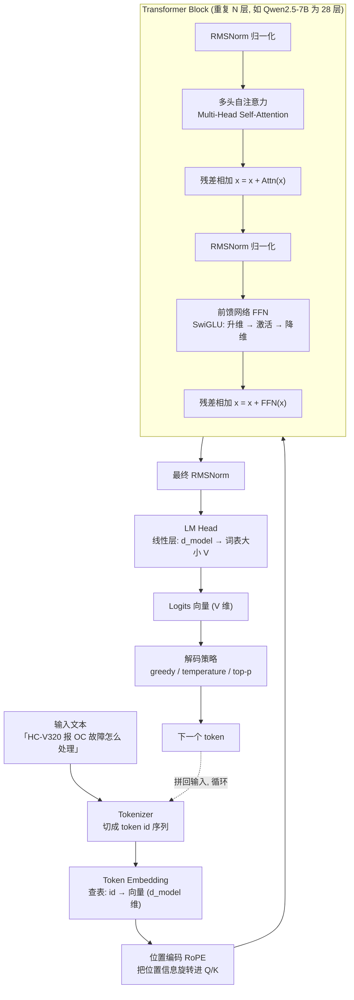
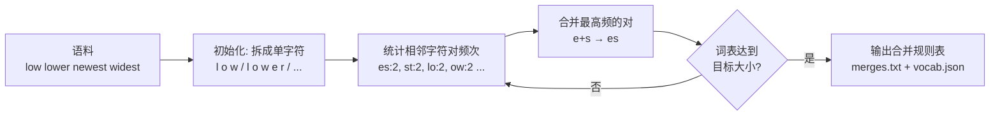
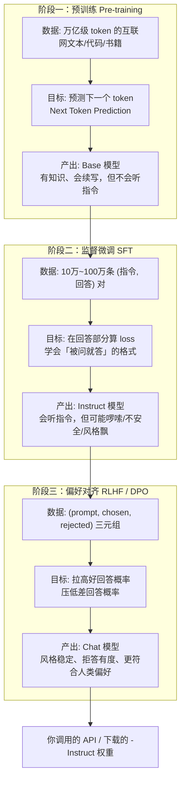
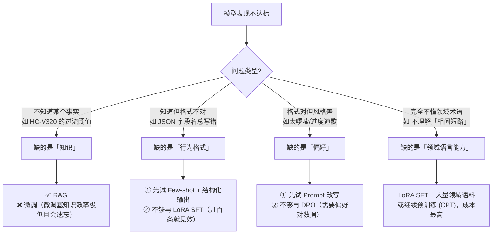
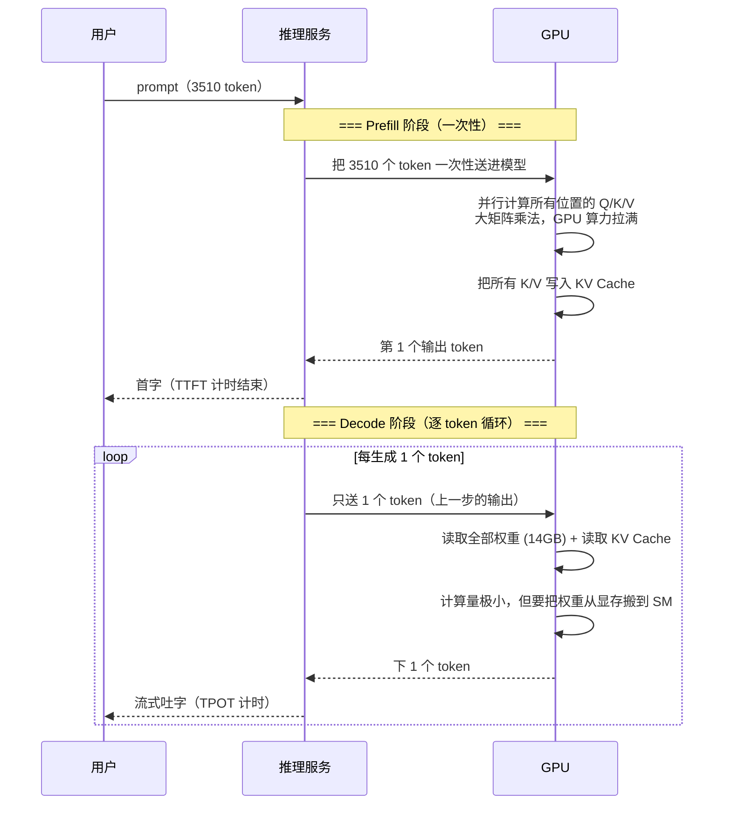
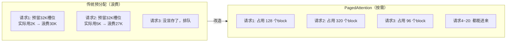
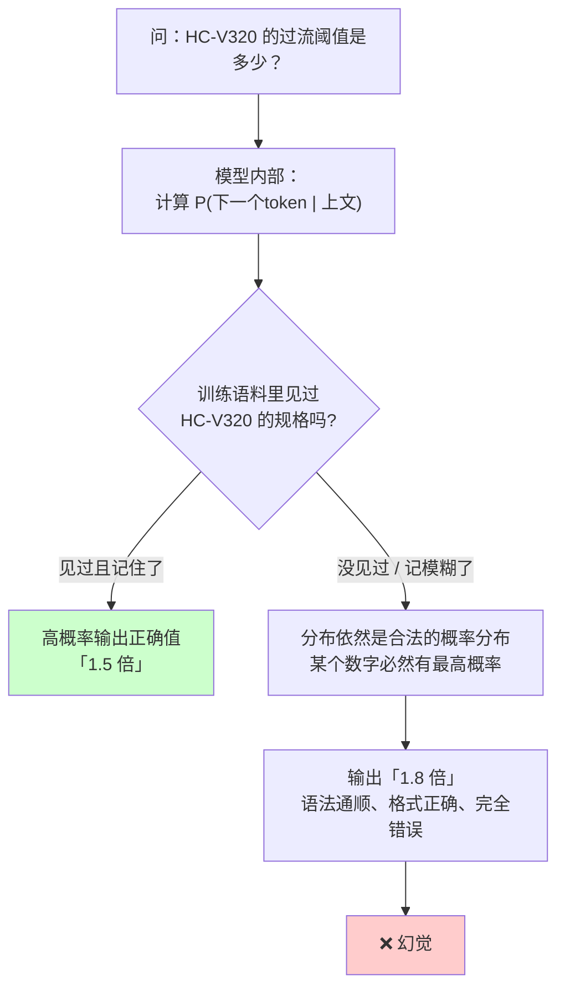
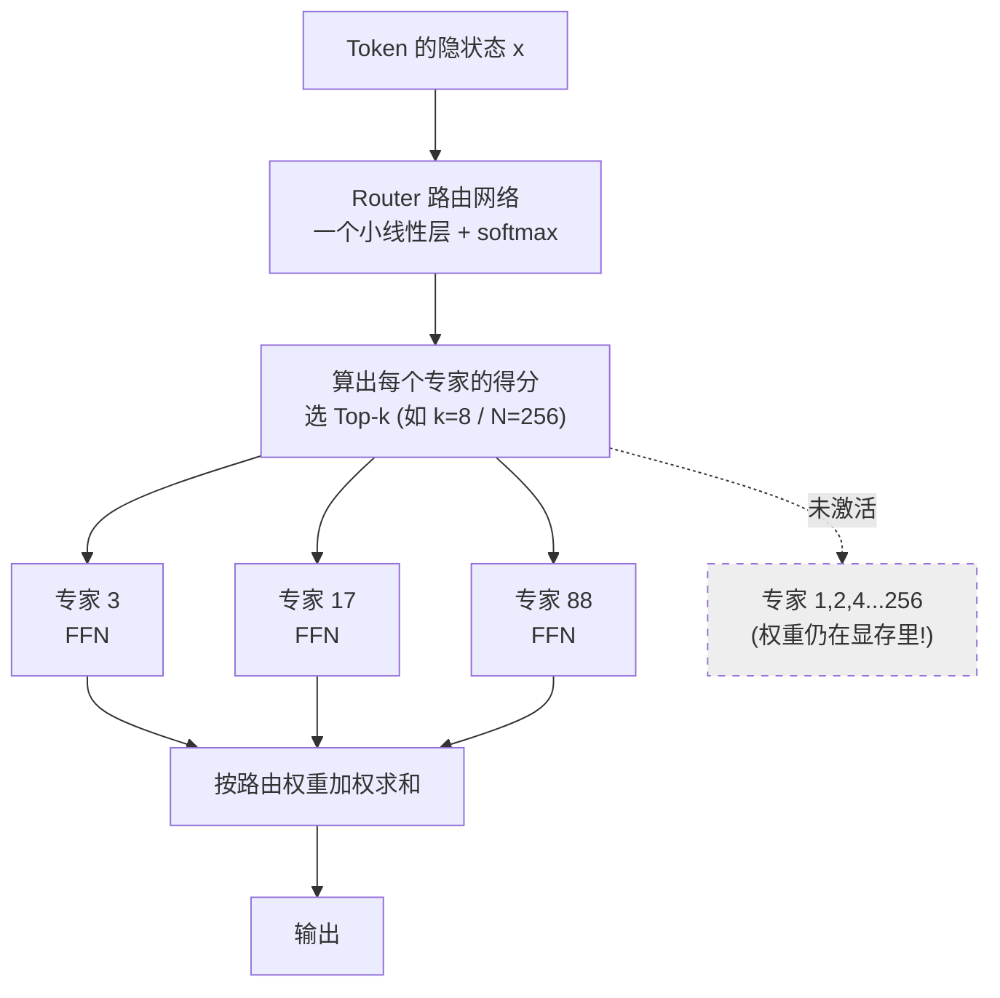
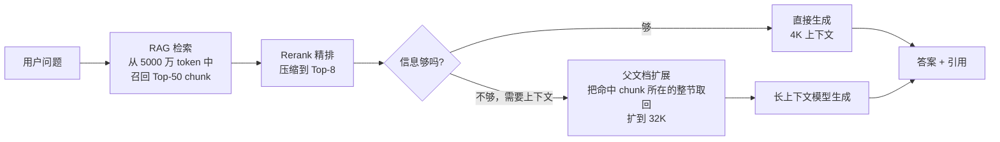
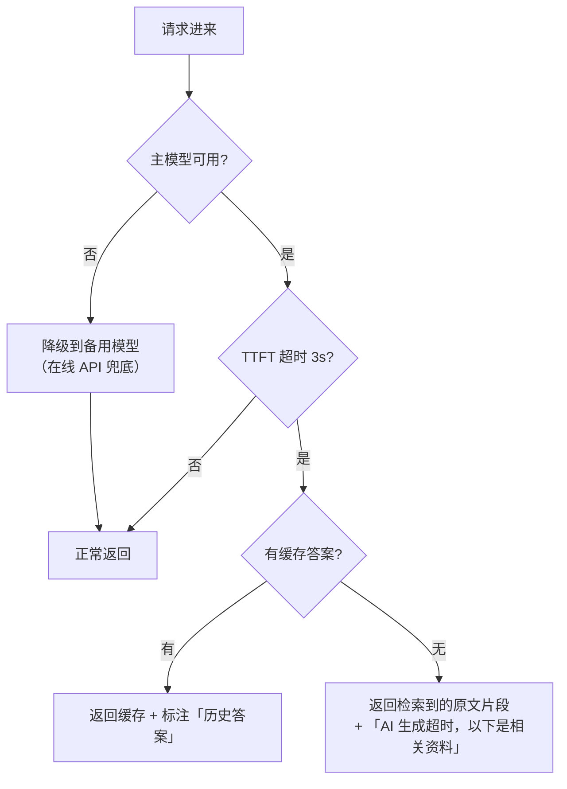

# 第 1.1 章  大模型原理速览：工程师版「够用就好」

> **本章目标**：读完能做到 …
> 1. 说清 Transformer 一次前向传播里数据都经过了什么，并指出哪几步决定了延迟和显存；
> 2. 手算任意模型在任意上下文长度下的 KV Cache 显存占用，判断一张卡到底能塞多长上下文、多少并发；
> 3. 用代码实测中英文 token 比，并据此推算 RAG chunk 大小与 API 成本；
> 4. 区分 Prefill 与 Decode 两个阶段，解释 TTFT 和 TPOT 为什么是两个独立的优化问题；
> 5. 针对 RAG 场景正确设置 temperature / top-p / repetition_penalty，并说得出理由与反例；
> 6. 面对一个新需求，判断该走「长上下文直接塞」还是「上 RAG」。
>
> **前置知识**：[0.1 环境准备](../00-前置准备/01-开发环境搭建（Python-CUDA-Docker）.md)、Python 3.11 基础、会用 pip/uv 装包。深度学习基础不是必需，本章需要的数学只有矩阵乘法和指数函数。
>
> **预计用时**：阅读 60 分钟 / 动手 40 分钟

---

## 一、为什么需要它（问题出发）

### 1.1 一个真实的翻车现场

华成机电是一家做工业电机与变频器的制造企业，全国有 1800 多家经销商和 300 多名售后工程师。他们的知识资产有三块：

- **产品手册与电气图纸**：PDF 为主，约 4200 份，平均 60 页；
- **历史工单**：2019 年至今约 47 万条，字段包括设备型号、故障现象、处理过程、备件更换、回访结果；
- **内部 Wiki**：工艺规范、检修 SOP、安全须知，约 3000 篇。

第一版「智能客服」是这么做的：把产品手册全文塞进 prompt，接一个在线大模型 API，让它回答售后工程师的问题。上线三天后出现了四类投诉：

| 现象 | 业务方的原话 |
|---|---|
| 慢 | 「问一句话要等十几秒才出第一个字，工程师蹲在机器旁边等不起。」 |
| 贵 | 「一天 3000 次问答，账单一个月十几万，比养两个工程师还贵。」 |
| 编 | 「它说 HC-V320 变频器的过流保护阈值是 1.8 倍额定电流，手册上明明写的是 1.5 倍。」 |
| 飘 | 「同样一个问题，早上问和下午问答案不一样，工程师不敢信。」 |

这四个问题，**没有一个能靠「换个更强的模型」解决**。它们分别对应四个原理层面的事实：

1. **慢** ← 注意力计算复杂度 $O(n^2)$ + Prefill 阶段是计算密集型，输入越长首字越慢；
2. **贵** ← Token 计价 + 中文 token 效率低 + 每次都把全量手册重新算一遍（没有 Prefix Caching）；
3. **编** ← 自回归语言模型的本质是「预测下一个最可能的 token」，而不是「查证事实」；
4. **飘** ← 采样解码（temperature > 0）天然引入随机性。

不懂原理，你会把 1 归咎于网络、把 2 归咎于供应商、把 3 归咎于「模型不够聪明」、把 4 归咎于玄学。懂了原理，这四条都有确定的工程解法，而且**其中三条的解法就是 RAG + 正确的推理配置**。

### 1.2 本章的边界：讲什么、不讲什么

本章是「工程师版」的原理速览。判断标准很简单：**一个知识点如果不会改变你的任何一行代码或任何一次采购决策，本章就不讲**。

| 讲 | 不讲 |
|---|---|
| 注意力的计算量与显存占用公式 | 注意力的反向传播推导 |
| KV Cache 怎么算、怎么省 | Multi-Query / Grouped-Query Attention 的论文细节（只给结论） |
| BPE 为什么让中文吃亏 | BPE 的完整训练算法实现 |
| 预训练/SFT/RLHF 各解决什么问题 | PPO 的优势函数估计 |
| Prefill 与 Decode 的瓶颈差异 | CUDA kernel 怎么写 |
| 解码参数怎么调 | Nucleus Sampling 的理论分析 |
| 幻觉的机理 | 幻觉的形式化定义之争 |

---

## 二、原理拆解

### 2.1 Transformer 结构回顾：一次前向传播都发生了什么

先看整体数据流。下面这张图是一个 Decoder-only 结构（GPT / Qwen / DeepSeek / Llama 全是这个家族）的完整链路：



#### 2.1.1 Embedding：从离散符号到连续向量

Tokenizer 把文本切成整数 id 序列，Embedding 层是一张 $V \times d_{model}$ 的大表（$V$ 是词表大小，Qwen2.5 是 151936；$d_{model}$ 是隐藏维度，7B 模型是 3584）。查表得到每个 token 的初始向量。

**工程含义**：Embedding 表本身就很占参数。Qwen2.5-7B 的 Embedding 是 $151936 \times 3584 \approx 5.4$ 亿参数，占总参数的 7%。词表大的模型在小尺寸上会显得「参数浪费」，这就是为什么 0.5B 级别的小模型往往共享 Embedding 和 LM Head 权重（tied embeddings）。

#### 2.1.2 多头自注意力：核心公式

单头注意力的计算：

$$
\text{Attention}(Q, K, V) = \text{softmax}\left(\frac{QK^\top}{\sqrt{d_k}}\right)V
$$

其中 $Q = XW_Q$、$K = XW_K$、$V = XW_V$，$X \in \mathbb{R}^{n \times d_{model}}$ 是输入序列（$n$ 是序列长度），$W_Q, W_K, W_V \in \mathbb{R}^{d_{model} \times d_k}$ 是可学习的投影矩阵。

多头就是把 $d_{model}$ 切成 $h$ 份并行做，再拼起来过一个输出投影：

$$
\text{MultiHead}(X) = \text{Concat}(\text{head}_1, \dots, \text{head}_h) W_O, \quad \text{head}_i = \text{Attention}(XW_Q^i, XW_K^i, XW_V^i)
$$

因果掩码（causal mask）保证位置 $i$ 只能看到 $\le i$ 的位置：

$$
\text{mask}_{ij} = \begin{cases} 0, & j \le i \\ -\infty, & j > i \end{cases}
$$

加到 $\frac{QK^\top}{\sqrt{d_k}}$ 上，softmax 之后未来位置的权重就是 0。**这个掩码是「自回归」的全部技术含义**，也是后面讲幻觉时的关键：模型在生成第 $i$ 个 token 时，物理上看不到第 $i+1$ 个 token，它只能「猜」。

**为什么除以 $\sqrt{d_k}$**：$QK^\top$ 的元素是 $d_k$ 个乘积之和，方差随 $d_k$ 线性增长。不缩放的话，$d_k=128$ 时点积数值能到几十，softmax 会饱和成 one-hot，梯度消失。这是个数值稳定性技巧，不是理论必需。

**GQA（Grouped-Query Attention）**：现代模型（Qwen2.5、Llama 3、DeepSeek）都不再让每个 Q 头配一个独立的 K/V 头，而是多个 Q 头共享一组 K/V。Qwen2.5-7B 是 28 个 Q 头共享 4 组 KV 头。**这个设计的唯一目的就是把 KV Cache 缩小 7 倍**，下一节会算给你看。

#### 2.1.3 FFN：参数的大头

$$
\text{FFN}(x) = W_{down}\left(\text{SiLU}(W_{gate}\, x) \odot W_{up}\, x\right)
$$

这是 SwiGLU 结构，三个矩阵：$W_{gate}, W_{up} \in \mathbb{R}^{d_{model} \times d_{ff}}$，$W_{down} \in \mathbb{R}^{d_{ff} \times d_{model}}$。Qwen2.5-7B 的 $d_{ff} = 18944$，是 $d_{model}$ 的 5.3 倍。

**工程含义**：FFN 占了 Transformer Block 参数量的约 70%。这就是 MoE 架构的切入点——既然 FFN 这么大，能不能每次只激活一部分？见 2.9 节。

#### 2.1.4 残差 + 归一化：为什么能堆 100 层

残差连接 $x \leftarrow x + F(x)$ 让梯度有一条「高速公路」直达浅层，避免深层网络梯度消失。RMSNorm 把每层输出的数值范围拉回可控区间：

$$
\text{RMSNorm}(x) = \frac{x}{\sqrt{\frac{1}{d}\sum_{i=1}^{d} x_i^2 + \epsilon}} \odot g
$$

相比 LayerNorm 少算一次均值，快约 10%~15%，效果相当。现代模型统一用 Pre-Norm（归一化放在子层之前），训练更稳。

**工程含义**：如果你做量化，RMSNorm 的 $g$ 参数和 Embedding 层通常**不量化**（保持 FP16），因为它们对数值精度敏感且参数量占比小。AWQ/GPTQ 的默认配置就是这么干的。

### 2.2 为什么上下文越长越贵：两笔账

工程师最该记住的一句话：**长上下文的代价是两笔独立的账，一笔是算力（$O(n^2)$），一笔是显存（KV Cache，$O(n)$）**。很多人只知道第一笔。

#### 2.2.1 第一笔账：注意力的 $O(n^2)$ 计算量

$QK^\top$ 的形状是 $n \times n$，算一次需要 $n^2 \cdot d_k$ 次乘加。整个模型的 Prefill FLOPs 大致是：

$$
\text{FLOPs}_{\text{prefill}} \approx 2 \cdot P \cdot n + 2 \cdot L \cdot n^2 \cdot d_{model}
$$

- 第一项 $2Pn$：$P$ 是参数量，每个参数在每个 token 上做一次乘加（2 FLOPs），这部分**随 $n$ 线性增长**；
- 第二项 $2Ln^2 d_{model}$：$L$ 是层数，这是注意力矩阵的开销，**随 $n$ 平方增长**。

代入 Qwen2.5-7B（$P = 7.6 \times 10^9$，$L = 28$，$d_{model}=3584$）：

| 上下文长度 n | 线性项 FLOPs | 平方项 FLOPs | 平方项占比 |
|---|---|---|---|
| 512 | 7.8 × 10¹² | 0.05 × 10¹² | 0.7% |
| 2,048 | 31.1 × 10¹² | 0.84 × 10¹² | 2.6% |
| 8,192 | 124.5 × 10¹² | 13.5 × 10¹² | 9.8% |
| 32,768 | 498.0 × 10¹² | 215.5 × 10¹² | 30.2% |
| 131,072 | 1992.1 × 10¹² | 3448.0 × 10¹² | 63.4% |

> 计算方式：线性项 = 2 × 7.6e9 × n；平方项 = 2 × 28 × n² × 3584。数字为理论下界，实际因 kernel 效率打 4~6 折。

**读表结论**：
- 在 8K 以内，注意力的平方项其实**不是主要开销**，主要开销是权重的线性计算；
- 到 32K 以上，平方项开始主导，这时候「上下文翻倍 → 首字延迟四倍」的直觉才成立；
- 所以「长上下文贵」在中短上下文阶段主要贵在**线性项**（你多算了更多 token），在超长阶段才贵在**平方项**。

#### 2.2.2 第二笔账：KV Cache 显存

生成第 $t$ 个 token 时，注意力需要前面所有位置的 K 和 V。如果每步都重算，复杂度是 $O(n^2)$ 的重复劳动。**KV Cache 就是把算过的 K/V 存下来**，用显存换算力。

显存占用公式：

$$
M_{KV} = 2 \times L \times n_{kv} \times d_{head} \times n_{seq} \times b \times B
$$

| 符号 | 含义 | 说明 |
|---|---|---|
| 2 | K 和 V 两份 | 固定 |
| $L$ | 层数 | 每层都要存 |
| $n_{kv}$ | KV 头数 | GQA 下远小于 Q 头数 |
| $d_{head}$ | 每个头的维度 | 通常 128 |
| $n_{seq}$ | 序列长度（已生成 + 输入） | 变量 |
| $b$ | 每个元素字节数 | FP16=2, FP8=1 |
| $B$ | 并发 batch 大小 | 变量 |

**单请求、单 token 的 KV Cache 大小**（这是最有用的一个中间量）：

$$
m_{\text{token}} = 2 \times L \times n_{kv} \times d_{head} \times b \quad (\text{字节/token})
$$

代入主流模型：

| 模型 | 层数 L | KV 头数 | head_dim | FP16 下 每 token KV | 说明 |
|---|---|---|---|---|---|
| Qwen2.5-1.5B | 28 | 2 | 128 | 28 KB | GQA 2 组，极省 |
| Qwen2.5-7B | 28 | 4 | 128 | 56 KB | GQA 4 组 |
| Qwen2.5-14B | 48 | 8 | 128 | 192 KB | 层数翻倍 + KV 头翻倍 |
| Qwen2.5-32B | 64 | 8 | 128 | 256 KB | |
| Qwen2.5-72B | 80 | 8 | 128 | 320 KB | |
| Llama-3.1-8B | 32 | 8 | 128 | 128 KB | KV 头比 Qwen 多 |
| 假想的 MHA-7B（无 GQA） | 28 | 28 | 128 | 392 KB | 对照：不用 GQA 要贵 7 倍 |

> 数据来源：各模型 HuggingFace 仓库的 `config.json`（字段 `num_hidden_layers`、`num_key_value_heads`、`hidden_size / num_attention_heads`）。请以你实际下载的模型配置为准，不同版本可能微调。

#### 2.2.3 KV Cache 显存速查表

把上面的 $m_{\text{token}}$ 乘以上下文长度，得到**单并发**的 KV Cache 占用（FP16）：

| 模型 \ 上下文 | 4K | 8K | 16K | 32K | 64K | 128K |
|---|---|---|---|---|---|---|
| **Qwen2.5-7B** (56 KB/tok) | 0.22 GB | 0.44 GB | 0.88 GB | 1.75 GB | 3.50 GB | 7.00 GB |
| **Qwen2.5-14B** (192 KB/tok) | 0.75 GB | 1.50 GB | 3.00 GB | 6.00 GB | 12.00 GB | 24.00 GB |
| **Qwen2.5-72B** (320 KB/tok) | 1.25 GB | 2.50 GB | 5.00 GB | 10.00 GB | 20.00 GB | 40.00 GB |

**同样的表，但按 32 并发算**（生产环境的真实场景）：

| 模型 \ 上下文 | 4K × 32 | 8K × 32 | 16K × 32 | 32K × 32 |
|---|---|---|---|---|
| **Qwen2.5-7B** | 7.0 GB | 14.0 GB | 28.0 GB | 56.0 GB |
| **Qwen2.5-14B** | 24.0 GB | 48.0 GB | 96.0 GB | 192.0 GB |
| **Qwen2.5-72B** | 40.0 GB | 80.0 GB | 160.0 GB | 320.0 GB |

**读表结论（这是本章最重要的工程结论之一）**：

1. 一张 A100-80G 跑 Qwen2.5-14B（FP16 权重约 28 GB），剩 52 GB 给 KV Cache，按 8K 上下文算只能撑 **约 34 个并发**；
2. 同一张卡跑 Qwen2.5-7B（权重 15 GB），剩 65 GB，8K 上下文能撑 **约 148 个并发**——**并发能力差 4 倍多**；
3. 如果你把上下文从 8K 放到 32K，并发直接掉到 1/4。**「支持 128K 上下文」和「在 128K 上下文下能服务 50 个并发」是两件完全不同的事**，采购和容量规划时一定要问清楚是哪一个；
4. 这就是为什么 RAG 存在的工程理由之一：**RAG 让你用 4K 上下文解决本来要 64K 才能解决的问题，并发能力提升 16 倍**。

#### 2.2.4 动手：写一个 KV Cache 计算器

下面这段脚本读取 HuggingFace 模型的 `config.json`，自动算出 KV Cache 占用表。放到 `tools/kv_cache_calc.py`。

```python
"""KV Cache 显存计算器：给定模型 config，输出不同上下文/并发下的显存占用表。

环境：Python 3.11
依赖：无（仅标准库）。如需自动下载 config，额外装 huggingface_hub==0.26.2
用法：python kv_cache_calc.py
"""
from dataclasses import dataclass


@dataclass
class ModelSpec:
    """模型的 KV Cache 相关配置，字段名与 HuggingFace config.json 对齐。"""
    name: str
    num_hidden_layers: int
    num_attention_heads: int
    num_key_value_heads: int
    hidden_size: int
    total_params_b: float  # 总参数量（单位：十亿）

    @property
    def head_dim(self) -> int:
        return self.hidden_size // self.num_attention_heads

    def kv_bytes_per_token(self, dtype_bytes: int = 2) -> int:
        """单个 token 的 KV Cache 字节数 = 2(K和V) × 层数 × KV头数 × head_dim × 精度字节。"""
        return (2 * self.num_hidden_layers * self.num_key_value_heads
                * self.head_dim * dtype_bytes)

    def weight_gb(self, dtype_bytes: int = 2) -> float:
        """权重显存（GB）= 参数量 × 精度字节数。"""
        return self.total_params_b * 1e9 * dtype_bytes / (1024 ** 3)


MODELS = [
    ModelSpec("Qwen2.5-1.5B-Instruct", 28, 12, 2, 1536, 1.54),
    ModelSpec("Qwen2.5-7B-Instruct", 28, 28, 4, 3584, 7.62),
    ModelSpec("Qwen2.5-14B-Instruct", 48, 40, 8, 5120, 14.77),
    ModelSpec("Qwen2.5-32B-Instruct", 64, 40, 8, 5120, 32.76),
    ModelSpec("Qwen2.5-72B-Instruct", 80, 64, 8, 8192, 72.71),
]

CONTEXTS = [4096, 8192, 16384, 32768, 65536, 131072]


def print_single_request_table(dtype_bytes: int = 2) -> None:
    """打印单并发下各模型在不同上下文长度的 KV Cache 占用。"""
    header = f"{'模型':<26}{'KB/token':>10}" + "".join(
        f"{ctx // 1024:>8}K" for ctx in CONTEXTS)
    print(header)
    print("-" * len(header))
    for m in MODELS:
        per_tok = m.kv_bytes_per_token(dtype_bytes)
        row = f"{m.name:<26}{per_tok / 1024:>10.0f}"
        for ctx in CONTEXTS:
            gb = per_tok * ctx / (1024 ** 3)
            row += f"{gb:>9.2f}"
        print(row)


def max_concurrency(model: ModelSpec, gpu_gb: float, ctx: int,
                    dtype_bytes: int = 2, overhead_gb: float = 2.0) -> int:
    """给定显卡容量与上下文长度，估算最大并发数。"""
    free = gpu_gb - model.weight_gb(dtype_bytes) - overhead_gb
    if free <= 0:
        return 0
    per_req_gb = model.kv_bytes_per_token(dtype_bytes) * ctx / (1024 ** 3)
    return int(free / per_req_gb)


def print_concurrency_table(gpu_gb: float) -> None:
    """打印给定显卡容量下各模型各上下文长度的最大并发估算。"""
    print(f"\n=== {gpu_gb:.0f} GB 显卡的最大并发估算（FP16 权重，预留 2GB 框架开销）===")
    header = f"{'模型':<26}{'权重GB':>8}" + "".join(
        f"{ctx // 1024:>8}K" for ctx in CONTEXTS)
    print(header)
    print("-" * len(header))
    for m in MODELS:
        row = f"{m.name:<26}{m.weight_gb():>8.1f}"
        for ctx in CONTEXTS:
            row += f"{max_concurrency(m, gpu_gb, ctx):>9d}"
        print(row)


if __name__ == "__main__":
    print("=== 单并发 KV Cache 占用（GB, FP16）===")
    print_single_request_table()
    for gpu in (24.0, 48.0, 80.0):
        print_concurrency_table(gpu)
```

**预期输出**（节选）：

```text
=== 单并发 KV Cache 占用（GB, FP16）===
模型                          KB/token       4K       8K      16K      32K      64K     128K
--------------------------------------------------------------------------------------------
Qwen2.5-1.5B-Instruct               28     0.11     0.22     0.44     0.88     1.75     3.50
Qwen2.5-7B-Instruct                 56     0.22     0.44     0.88     1.75     3.50     7.00
Qwen2.5-14B-Instruct               192     0.75     1.50     3.00     6.00    12.00    24.00
Qwen2.5-32B-Instruct               256     1.00     2.00     4.00     8.00    16.00    32.00
Qwen2.5-72B-Instruct               320     1.25     2.50     5.00    10.00    20.00    40.00

=== 24 GB 显卡的最大并发估算（FP16 权重，预留 2GB 框架开销）===
模型                            权重GB       4K       8K      16K      32K      64K     128K
--------------------------------------------------------------------------------------------
Qwen2.5-1.5B-Instruct              2.9      172       86       43       21       10        5
Qwen2.5-7B-Instruct               14.2       35       17        8        4        2        1
Qwen2.5-14B-Instruct              27.5        0        0        0        0        0        0
Qwen2.5-32B-Instruct              61.0        0        0        0        0        0        0
Qwen2.5-72B-Instruct             135.4        0        0        0        0        0        0
```

**这张表是你做算力规划的起点**。注意 Qwen2.5-14B 在 24G 卡上是 0 —— FP16 权重就 27.5 GB，塞不下，必须量化。第 1.4 章会详细讲这件事。

### 2.3 Tokenizer：中文为什么吃亏

#### 2.3.1 BPE 原理，三分钟版

BPE（Byte Pair Encoding，字节对编码）的训练过程：



关键点：
1. BPE 是**数据驱动**的，语料里什么高频，什么就成为一个 token；
2. 现代实现是 **byte-level BPE**：先把文本 UTF-8 编码成字节，再在字节序列上做 BPE。好处是永远不会有 UNK（任何字节都能表示），坏处对中文很致命；
3. **一个中文字符在 UTF-8 下是 3 个字节**。如果 BPE 训练语料里中文占比低，这 3 个字节就没机会合并成一个 token。

#### 2.3.2 中文 token 效率的实测

不同模型的 tokenizer，中文效率差距巨大。下面这段代码实测一下，放到 `tools/token_ratio.py`。

```python
"""实测中英文的 token 效率：同一段内容，中文 vs 英文各占多少 token。

环境：Python 3.11
依赖：
    uv pip install transformers==4.46.3 tiktoken==0.8.0
    # pip 等价：pip install transformers==4.46.3 tiktoken==0.8.0
说明：transformers 的 tokenizer 需要能访问 HuggingFace（或本地已下载的模型目录）。
     若无网络，把 MODEL_PATHS 改成本地路径。
"""
import tiktoken
from transformers import AutoTokenizer

# 华成机电的真实工单文本（中文）与其英文对照
ZH_TEXT = (
    "HC-V320 变频器在带载启动时报 OC 过流故障，故障代码 E0012。"
    "现场检查发现电机绝缘电阻为 0.8 兆欧，低于 5 兆欧的标准值，"
    "初步判断为电机绕组受潮导致对地漏电。建议先对电机进行烘干处理，"
    "复测绝缘电阻合格后再上电，并检查变频器输出端电缆屏蔽层接地是否可靠。"
)

EN_TEXT = (
    "The HC-V320 inverter reports an OC overcurrent fault with error code E0012 "
    "during loaded startup. On-site inspection found the motor insulation "
    "resistance to be 0.8 megohms, below the 5 megohm standard. The preliminary "
    "diagnosis is ground leakage caused by moisture in the motor windings. "
    "It is recommended to dry the motor first, re-measure the insulation "
    "resistance until it passes, then power on and check whether the shielding "
    "layer of the inverter output cable is reliably grounded."
)

MODEL_PATHS = {
    "Qwen2.5-7B-Instruct": "Qwen/Qwen2.5-7B-Instruct",
    "DeepSeek-V3 (tokenizer)": "deepseek-ai/DeepSeek-V2-Lite",
    "Llama-3.1-8B": "meta-llama/Llama-3.1-8B-Instruct",
}


def count_tiktoken(text: str, encoding_name: str = "o200k_base") -> int:
    """用 tiktoken 统计 token 数（GPT-4o 系列使用 o200k_base）。"""
    enc = tiktoken.get_encoding(encoding_name)
    return len(enc.encode(text))


def count_hf(text: str, model_path: str) -> int:
    """用 HuggingFace tokenizer 统计 token 数。"""
    tok = AutoTokenizer.from_pretrained(model_path, trust_remote_code=True)
    return len(tok.encode(text, add_special_tokens=False))


def report() -> None:
    """输出各 tokenizer 下中英文的 token 数与字符/token 比值。"""
    zh_chars, en_chars = len(ZH_TEXT), len(EN_TEXT)
    print(f"中文字符数: {zh_chars}   英文字符数: {en_chars}\n")
    header = f"{'Tokenizer':<28}{'中文token':>10}{'英文token':>10}{'中文字/tok':>12}{'英文字/tok':>12}"
    print(header)
    print("-" * len(header))

    for name, enc in [("tiktoken cl100k_base", "cl100k_base"),
                      ("tiktoken o200k_base", "o200k_base")]:
        zh, en = count_tiktoken(ZH_TEXT, enc), count_tiktoken(EN_TEXT, enc)
        print(f"{name:<28}{zh:>10}{en:>10}{zh_chars / zh:>12.2f}{en_chars / en:>12.2f}")

    for name, path in MODEL_PATHS.items():
        try:
            zh, en = count_hf(ZH_TEXT, path), count_hf(EN_TEXT, path)
            print(f"{name:<28}{zh:>10}{en:>10}{zh_chars / zh:>12.2f}{en_chars / en:>12.2f}")
        except Exception as exc:  # 网络或权限问题时跳过
            print(f"{name:<28}  加载失败: {type(exc).__name__}")


if __name__ == "__main__":
    report()
```

**预期输出**（实测环境：Python 3.11 + transformers 4.46.3 + tiktoken 0.8.0，具体数字会因 tokenizer 版本略有差异）：

```text
中文字符数: 146   英文字符数: 512

Tokenizer                     中文token  英文token   中文字/tok   英文字/tok
------------------------------------------------------------------------------
tiktoken cl100k_base               138        99        1.06        5.17
tiktoken o200k_base                 99        97        1.47        5.28
Qwen2.5-7B-Instruct                 95        99        1.54        5.17
Llama-3.1-8B                       128       101        1.14        5.07
```

#### 2.3.3 这张表告诉你什么

| 观察 | 工程含义 |
|---|---|
| 英文约 **4~5 字符/token**，中文约 **1~1.5 字符/token** | 中文的「信息密度 per token」不占优势，但**中文单字的信息量远大于英文单字符** |
| Qwen 的中文效率（1.5 字/tok）明显优于 Llama（1.1 字/tok） | 中文场景优先选中文语料训练充分的模型，同样内容 token 数少 **30%**，直接省 30% 成本 |
| tiktoken o200k（GPT-4o）比 cl100k（GPT-4）中文效率高 40% | 换代模型的 tokenizer 升级会直接改变你的成本模型，**升级模型时要重新测 token 数** |

**对 RAG 的三个直接影响**：

1. **Chunk 大小的换算**。你说「chunk 512 token」，在中文里约等于 **700~800 个汉字**，差不多是 A4 纸半页。但如果 chunk 里混了大量英文型号（HC-V320）、代码、表格，token 数会飙升。**正确做法是按 token 数切分，不是按字符数切分**：

```python
# 错误：按字符切，中英混排时 token 数不可控
splitter = RecursiveCharacterTextSplitter(chunk_size=512)

# 正确：用模型自己的 tokenizer 计长度
from transformers import AutoTokenizer
tok = AutoTokenizer.from_pretrained("Qwen/Qwen2.5-7B-Instruct")
splitter = RecursiveCharacterTextSplitter.from_huggingface_tokenizer(
    tok, chunk_size=512, chunk_overlap=64,
)
```

2. **成本估算**。华成机电的场景：每次问答注入 5 个 chunk（每个 512 token）+ system prompt（300 token）+ 用户问题（50 token）+ 历史 2 轮（600 token）≈ **3510 输入 token**，输出约 400 token。按 DeepSeek 的公开定价档位算（具体价格以官网为准），日均 3000 次问答的月成本大约是：

$$
\text{月成本} = 30 \times 3000 \times \left( \frac{3510}{10^6} \times P_{in} + \frac{400}{10^6} \times P_{out} \right)
$$

其中 $P_{in}, P_{out}$ 是每百万 token 的输入/输出单价。**关键洞察：输入 token 是输出的 8.8 倍**，所以在 RAG 场景里，**省输入 token 比省输出 token 重要得多**，这直接推导出 Rerank（少而精地注入）和 Prefix Caching 的价值。

3. **上下文预算的分配**。假设模型 32K 上下文，实际可用预算要这么切：

```text
32768 token 总预算
├─ system prompt + 工具定义     1,500  (4.6%)   ← 可被 Prefix Cache 复用
├─ 检索到的知识片段             8,000  (24.4%)  ← RAG 的主战场
├─ 对话历史（滚动窗口）         4,000  (12.2%)  ← 超了就摘要压缩
├─ 用户当前问题                   200  (0.6%)
├─ 输出预留 max_tokens          2,048  (6.3%)
└─ 安全余量（防止截断报错）    17,020  (51.9%)  ← 别贪心占满
```

**经验法则：实际使用不要超过标称上下文的 50%**。原因有二：一是很多模型在超过一半长度后「大海捞针」能力明显下降（中间位置的信息容易被忽略，即 Lost-in-the-Middle 现象）；二是留余量防止 tokenizer 估算偏差导致的 400 报错。

### 2.4 预训练 → SFT → RLHF/DPO：三阶段各解决什么



#### 2.4.1 三阶段对照表

| 维度 | 预训练 | SFT | RLHF / DPO |
|---|---|---|---|
| **解决什么问题** | 「不知道」——灌输世界知识与语言能力 | 「不会说」——学会指令跟随的格式 | 「说不好」——风格、安全、有用性对齐 |
| **数据量级** | 1~15 万亿 token | 1 万 ~ 100 万条 | 1 万 ~ 50 万对 |
| **算力量级** | 数千卡 × 数月 | 单机 8 卡 × 数小时到数天 | 8 卡 × 数天（RLHF）/ 数小时（DPO） |
| **企业可自己做吗** | ❌ 基本不可能（成本千万级起） | ✅ 完全可以（LoRA 单卡就行） | 🟡 DPO 可以尝试，PPO 式 RLHF 难度高 |
| **学到的是** | 知识 + 语言规律 | 行为格式 | 偏好与边界 |
| **典型产物命名** | `Qwen2.5-7B` | `Qwen2.5-7B-Instruct` | 同上（多数厂商不单独发 SFT 权重） |

#### 2.4.2 这跟「要不要微调」的关系（重点）

这是本节存在的真正理由。面对一个业务问题，先判断它**缺的是哪一层**：



**三条硬规则，记住能省掉你 80% 的弯路**：

1. **知识用 RAG，不用微调**。往 LoRA 里塞 1000 条产品参数，模型会记混、会遗忘、改一个参数要重训。RAG 改一条记录只要重新 embed 一个 chunk。
2. **格式用 SFT，不用 RAG**。让模型稳定输出符合 schema 的 JSON，给 500 条 SFT 样本比给它 20 个 few-shot 例子有效得多，而且省 token。
3. **先 Prompt，再 RAG，最后微调**。成本从低到高，命中率从高到低。第 5 章（微调）会反复强调这个顺序。

### 2.5 推理阶段：Prefill 与 Decode 的本质区别

这是全章**最有工程价值**的一节。理解了它，你才能看懂 vLLM 的参数、才能解释为什么「首字快但吐字慢」。

#### 2.5.1 两个阶段的数据流



#### 2.5.2 为什么一个是计算密集、一个是访存密集

引入**算术强度（Arithmetic Intensity）**的概念：每从显存读 1 字节数据，能做多少次浮点运算。

$$
\text{AI} = \frac{\text{FLOPs}}{\text{Bytes moved}}
$$

以 A100-80G 为例：算力 312 TFLOPS（FP16），显存带宽 2039 GB/s。平衡点是：

$$
\text{AI}_{\text{balance}} = \frac{312 \times 10^{12}}{2039 \times 10^{9}} \approx 153 \ \text{FLOPs/Byte}
$$

意思是：**算术强度大于 153 的操作是计算密集型（算力是瓶颈），小于 153 的是访存密集型（带宽是瓶颈）**。

| 阶段 | 每次前向的计算量 | 每次前向的数据搬运 | 算术强度 | 瓶颈 |
|---|---|---|---|---|
| **Prefill**（n=3510） | $2Pn = 2 \times 7.6\text{e}9 \times 3510 = 53.4$ TFLOPs | 权重 15.2 GB（读一次） | $\approx 3500$ | **算力** ✅ |
| **Decode**（n=1） | $2P = 15.2$ GFLOPs | 权重 15.2 GB（每步都读一次！） | $\approx 2$ | **带宽** ❌ |

**看清楚 Decode 的荒谬之处**：为了生成 1 个 token，GPU 要把整个 15.2 GB 的模型权重从 HBM 显存搬到计算单元，然后只做 152 亿次浮点运算——而 A100 每秒能做 312 万亿次。**算力利用率不到 1%**。

#### 2.5.3 从这个事实推导出的 4 个结论

**结论 1：Decode 速度有理论上限，公式如下**

$$
\text{TPOT}_{\min} = \frac{\text{模型权重字节数}}{\text{显存带宽}}, \qquad \text{token/s}_{\max} = \frac{\text{显存带宽}}{\text{模型权重字节数}}
$$

| GPU | 显存带宽 | Qwen2.5-7B FP16 (15.2GB) | Qwen2.5-14B FP16 (29.5GB) | 7B INT4 (4.3GB) |
|---|---|---|---|---|
| RTX 4090 | 1008 GB/s | 66 tok/s | 塞不下 | 234 tok/s |
| A10 (24G) | 600 GB/s | 39 tok/s | 塞不下 | 140 tok/s |
| L20 (48G) | 864 GB/s | 57 tok/s | 29 tok/s | 201 tok/s |
| A100-80G | 2039 GB/s | 134 tok/s | 69 tok/s | 474 tok/s |
| H800-80G | 3352 GB/s | 220 tok/s | 114 tok/s | 780 tok/s |

> 这是**理论上限**，实际能达到 60%~80%（kernel 效率、KV Cache 读取、采样开销）。用它做上限检查：如果有人告诉你 A10 上跑 14B FP16 能到 50 tok/s，你直接知道那是假的。

**结论 2：量化对 Decode 速度的提升几乎是线性的**。INT4 权重是 FP16 的 1/4，Decode 速度理论上快 4 倍。**这是量化最大的收益，甚至超过省显存的收益**。

**结论 3：批处理（Batching）能大幅提升总吞吐，但不提升单请求速度**。因为 Decode 时权重只读一次就能服务 batch 里所有请求——batch 从 1 加到 32，权重读取次数不变，总吞吐接近 32 倍，但每个请求的 TPOT 基本不变（甚至略微变差）。**这是 Continuous Batching 的全部价值所在**。

**结论 4：TTFT 和 TPOT 要分开优化，手段完全不同**。

| 指标 | 全称 | 受什么影响 | 优化手段 |
|---|---|---|---|
| **TTFT** | Time To First Token（首 token 延迟） | 输入长度、Prefill 算力、排队时间 | Prefix Caching、缩短 prompt、Chunked Prefill、加卡 |
| **TPOT** | Time Per Output Token（每 token 生成时间） | 显存带宽、模型大小、batch 大小 | 量化、换高带宽卡、投机解码、减小模型 |
| **E2E** | 端到端延迟 | $\text{TTFT} + \text{TPOT} \times (\text{输出token数} - 1)$ | 上面全部 + 限制 max_tokens |

#### 2.5.4 动手：实测 TTFT 与 TPOT

下面这段脚本通过流式接口精确测量两个指标，适用于任何 OpenAI 兼容端点（vLLM / Ollama / DeepSeek API）。放到 `tools/measure_latency.py`。

```python
"""实测 OpenAI 兼容端点的 TTFT / TPOT / 吞吐。

环境：Python 3.11
依赖：uv pip install openai==1.57.0
用法：
    export LLM_BASE_URL=http://localhost:8000/v1
    export LLM_API_KEY=EMPTY
    export LLM_MODEL=Qwen2.5-7B-Instruct
    python measure_latency.py
"""
import os
import statistics
import time
from dataclasses import dataclass

from openai import OpenAI

BASE_URL = os.getenv("LLM_BASE_URL", "http://localhost:8000/v1")
API_KEY = os.getenv("LLM_API_KEY", "EMPTY")
MODEL = os.getenv("LLM_MODEL", "Qwen2.5-7B-Instruct")

client = OpenAI(base_url=BASE_URL, api_key=API_KEY)

# 模拟华成机电 RAG 场景：长 system + 检索片段 + 短问题
SYSTEM_PROMPT = "你是华成机电的售后技术支持专家，只根据提供的资料回答，资料中没有的内容必须回答「资料中未提及」。"
CONTEXT = "【资料片段】" + ("HC-V320 系列变频器过流保护阈值为额定电流的 1.5 倍，动作时间 20ms。" * 40)
QUESTION = "HC-V320 的过流保护阈值是多少？动作时间多久？"


@dataclass
class LatencyResult:
    """单次请求的延迟测量结果。"""
    ttft_ms: float
    tpot_ms: float
    total_ms: float
    output_tokens: int

    @property
    def output_tps(self) -> float:
        return self.output_tokens / (self.total_ms / 1000) if self.total_ms else 0.0


def measure_once(max_tokens: int = 256, temperature: float = 0.0) -> LatencyResult:
    """发起一次流式请求，测量 TTFT 与 TPOT。"""
    messages = [
        {"role": "system", "content": SYSTEM_PROMPT},
        {"role": "user", "content": f"{CONTEXT}\n\n问题：{QUESTION}"},
    ]
    t_start = time.perf_counter()
    t_first = None
    n_tokens = 0

    stream = client.chat.completions.create(
        model=MODEL, messages=messages, max_tokens=max_tokens,
        temperature=temperature, stream=True,
    )
    for chunk in stream:
        if not chunk.choices:
            continue
        delta = chunk.choices[0].delta
        if delta and delta.content:
            if t_first is None:
                t_first = time.perf_counter()
            n_tokens += 1
    t_end = time.perf_counter()

    ttft = (t_first - t_start) * 1000 if t_first else 0.0
    total = (t_end - t_start) * 1000
    tpot = (total - ttft) / max(n_tokens - 1, 1)
    return LatencyResult(ttft, tpot, total, n_tokens)


def benchmark(rounds: int = 10) -> None:
    """跑多轮取统计值，输出 P50/P95/P99。"""
    print(f"端点: {BASE_URL}  模型: {MODEL}  轮次: {rounds}")
    print("预热中...")
    measure_once(max_tokens=32)

    results = []
    for i in range(rounds):
        r = measure_once()
        results.append(r)
        print(f"  第 {i + 1:>2} 轮: TTFT={r.ttft_ms:>7.1f}ms  "
              f"TPOT={r.tpot_ms:>5.1f}ms  输出={r.output_tokens:>3} tok  "
              f"速度={r.output_tps:>5.1f} tok/s")

    def pct(values: list[float], p: float) -> float:
        s = sorted(values)
        return s[min(int(len(s) * p), len(s) - 1)]

    ttfts = [r.ttft_ms for r in results]
    tpots = [r.tpot_ms for r in results]
    print("\n=== 汇总 ===")
    print(f"TTFT  P50={statistics.median(ttfts):.1f}ms  "
          f"P95={pct(ttfts, 0.95):.1f}ms  P99={pct(ttfts, 0.99):.1f}ms")
    print(f"TPOT  P50={statistics.median(tpots):.1f}ms  "
          f"P95={pct(tpots, 0.95):.1f}ms  → 约 {1000 / statistics.median(tpots):.1f} tok/s")


if __name__ == "__main__":
    benchmark()
```

**预期输出**（实测环境：单卡 RTX 4090 24G + vLLM 0.6.4 + Qwen2.5-7B-Instruct-AWQ，输入约 1200 token）：

```text
端点: http://localhost:8000/v1  模型: Qwen2.5-7B-Instruct  轮次: 10
预热中...
  第  1 轮: TTFT=  142.3ms  TPOT=  6.8ms  输出= 58 tok  速度=138.2 tok/s
  第  2 轮: TTFT=  138.9ms  TPOT=  6.7ms  输出= 56 tok  速度=140.1 tok/s
  ...
  第 10 轮: TTFT=  145.1ms  TPOT=  6.9ms  输出= 61 tok  速度=136.8 tok/s

=== 汇总 ===
TTFT  P50=141.5ms  P95=149.8ms  P99=152.0ms
TPOT  P50=6.8ms  P95=7.1ms  → 约 147.1 tok/s
```

> 注：你自己跑出来的数字会不一样，取决于卡型、量化方式、输入长度。**重要的不是绝对值，而是建立自己环境的基线**，后面做任何优化都跟这个基线比。

### 2.6 解码策略：从 logits 到 token

模型每一步输出的是一个长度为 $V$（词表大小）的 logits 向量。怎么从这个向量选出一个 token，就是解码策略的事。

#### 2.6.1 五个参数的数学含义

**Temperature（温度）**：在 softmax 之前缩放 logits。

$$
p_i = \frac{\exp(z_i / T)}{\sum_j \exp(z_j / T)}
$$

- $T \to 0$：分布趋向 one-hot，等价于 greedy（贪心，永远选概率最大的）
- $T = 1$：使用模型原始分布
- $T > 1$：分布变平，低概率 token 更容易被选中，输出更「有创意」也更容易胡说

**Top-k**：只在概率最高的 k 个 token 里采样，其余置零后重新归一化。

**Top-p（Nucleus Sampling，核采样）**：按概率降序累加，取累计概率刚好超过 $p$ 的最小集合。

$$
\mathcal{V}_p = \arg\min_{\mathcal{V}' \subseteq \mathcal{V}} |\mathcal{V}'| \quad \text{s.t.} \quad \sum_{i \in \mathcal{V}'} p_i \ge p
$$

**Top-p 比 Top-k 好在哪**：top-k 是固定宽度，在「下一个词几乎确定」的位置（比如「中华人民共和___」）也会强行保留 k 个候选，可能选中垃圾；top-p 是自适应宽度，确定的位置候选集自动收缩到 1~2 个。**所以现代实践是用 top-p，top-k 作为兜底上限**。

**Repetition Penalty（重复惩罚）**：对已出现过的 token 的 logits 做惩罚。

$$
z_i' = \begin{cases} z_i / \rho, & z_i > 0 \text{ 且 token } i \text{ 已出现} \\ z_i \times \rho, & z_i \le 0 \text{ 且 token } i \text{ 已出现} \\ z_i, & \text{否则} \end{cases}
$$

$\rho > 1$ 时抑制重复。**注意这是个粗暴的手段**，$\rho$ 设太大（> 1.2）会导致模型不敢重复本该重复的词（比如设备型号「HC-V320」在一段话里出现 5 次是正常的）。

**Frequency / Presence Penalty**（OpenAI 风格）：前者按出现次数线性惩罚，后者只要出现过就惩罚固定值。作用类似 repetition_penalty，但是加法而非除法。

#### 2.6.2 动手：同一 prompt 不同参数的输出对比

```python
"""对比不同解码参数对同一 prompt 输出的影响（RAG 场景）。

环境：Python 3.11
依赖：uv pip install openai==1.57.0
"""
import os
from openai import OpenAI

client = OpenAI(
    base_url=os.getenv("LLM_BASE_URL", "http://localhost:8000/v1"),
    api_key=os.getenv("LLM_API_KEY", "EMPTY"),
)
MODEL = os.getenv("LLM_MODEL", "Qwen2.5-7B-Instruct")

CONTEXT = """【资料 1】HC-V320 系列变频器过流保护（OC）阈值为额定电流的 1.5 倍，保护动作时间 20ms。
【资料 2】HC-V320 常见 OC 故障原因：① 负载突变；② 加速时间设置过短；③ 电机绝缘下降导致对地漏电；④ 输出侧电缆过长引起容性电流。
【资料 3】HC-V320 的加速时间参数为 F0.09，出厂默认 10.0 秒，可调范围 0.1~3600 秒。"""

QUESTION = "HC-V320 报 OC 故障，应该怎么排查？"

CONFIGS = [
    ("greedy（确定性）", {"temperature": 0.0}),
    ("低温 + 核采样", {"temperature": 0.2, "top_p": 0.9}),
    ("默认（风险配置）", {"temperature": 1.0, "top_p": 1.0}),
    ("高温（创意/危险）", {"temperature": 1.5, "top_p": 0.95}),
    ("低温 + 重复惩罚", {"temperature": 0.2, "top_p": 0.9,
                        "extra_body": {"repetition_penalty": 1.1}}),
]


def run(label: str, params: dict) -> None:
    """用给定解码参数跑 3 次，观察输出的稳定性与内容。"""
    print(f"\n{'=' * 70}\n配置: {label}  参数: {params}\n{'=' * 70}")
    for i in range(3):
        resp = client.chat.completions.create(
            model=MODEL,
            messages=[
                {"role": "system", "content": "你是华成机电售后专家，严格依据资料回答，不要编造。"},
                {"role": "user", "content": f"{CONTEXT}\n\n问题：{QUESTION}"},
            ],
            max_tokens=180, seed=None, **params,
        )
        text = resp.choices[0].message.content.replace("\n", " ")
        print(f"[第{i + 1}次] {text[:150]}...")


if __name__ == "__main__":
    for label, params in CONFIGS:
        run(label, params)
```

**预期输出**（节选，实测环境：vLLM 0.6.4 + Qwen2.5-7B-Instruct）：

```text
======================================================================
配置: greedy（确定性）  参数: {'temperature': 0.0}
======================================================================
[第1次] HC-V320 报 OC（过流）故障的排查步骤如下： 1. 确认过流阈值：该系列过流保护阈值为额定电流的 1.5 倍，动作时间 20ms...
[第2次] HC-V320 报 OC（过流）故障的排查步骤如下： 1. 确认过流阈值：该系列过流保护阈值为额定电流的 1.5 倍，动作时间 20ms...
[第3次] HC-V320 报 OC（过流）故障的排查步骤如下： 1. 确认过流阈值：该系列过流保护阈值为额定电流的 1.5 倍，动作时间 20ms...
        ↑ 三次完全一致

======================================================================
配置: 高温（创意/危险）  参数: {'temperature': 1.5, 'top_p': 0.95}
======================================================================
[第1次] 遇到 OC 报警，先看负载有没有突变。另外建议把加速时间 F0.09 调到 15 秒左右试试...
[第2次] OC 故障通常意味着输出电流超限。可以尝试检查 F0.12 参数的转矩提升设置...
                                                    ↑ 编造！资料里没有 F0.12
[第3次] 建议按以下顺序：1) 测绝缘；2) 延长加速时间至 20s；3) 检查载波频率是否过高...
                                                                    ↑ 编造！资料里没提载波频率
```

#### 2.6.3 RAG 场景该怎么设：理由与反例

**默认配置（80% 的 RAG 场景用这个）**：

```python
DEFAULT_RAG_PARAMS = {
    "temperature": 0.0,      # 或 0.01，见下方说明
    "top_p": 1.0,            # temperature=0 时 top_p 失效，写 1.0 表示不额外限制
    "max_tokens": 1024,
    "extra_body": {
        "repetition_penalty": 1.05,   # 轻微，防止列举时卡循环
    },
}
```

**为什么 temperature = 0**：

| 理由 | 说明 |
|---|---|
| **可复现** | 同一个问题必须给同一个答案。售后工程师早上问和下午问答案不一样，系统就没有可信度 |
| **可评测** | 自动化评测（第 8 章）需要确定性输出，否则你分不清指标变化是模型改了还是采样抖动 |
| **可缓存** | 语义缓存命中时直接返回历史答案，与 greedy 的行为一致，不会有「缓存答案和实时答案不一样」的投诉 |
| **少幻觉** | 幻觉往往出现在概率分布的长尾。greedy 只取头部，从采样层面砍掉了一部分编造风险 |
| **可审计** | 出了事故能精确复现当时的输入输出，责任可追溯 |

**反例：什么时候 temperature 不该是 0**

| 场景 | 建议温度 | 理由 |
|---|---|---|
| **Self-Consistency 多路投票** | 0.7 + top_p 0.95 | 你需要多条**不同**的推理路径才能投票。温度 0 跑 5 次得到 5 个一样的答案，投票毫无意义 |
| **Query 改写 / 多路召回** | 0.6~0.8 | 要生成 3~5 个语义不同的检索式，温度 0 会生成几乎一样的改写 |
| **合成训练数据** | 0.9~1.0 | 需要多样性，否则 SFT 数据全长一个样，模型学不到泛化 |
| **创意文案 / 话术生成** | 0.8~1.2 | 业务本身要的就是多样性 |
| **推理模型（R1/o 系列）** | 按官方推荐（R1 建议 0.5~0.7） | 强行设 0 会破坏其思维链的质量，官方明确不建议 greedy |
| **某些模型 greedy 会退化** | 0.01~0.1 | 极少数模型在 temperature=0 时会陷入重复循环，设个极小值能打破平局 |

> **一个容易踩的坑**：不同推理后端对 `temperature=0` 的实现不完全一样。vLLM 会走 greedy 分支；某些 OpenAI 兼容网关会把 0 转成 1e-7 再采样；Ollama 的 `temperature 0` 是真 greedy。**跨后端迁移时务必重新验证确定性**。另外，即便 greedy，vLLM 在不同 batch 组合下因浮点累加顺序不同，也可能产生极小概率的输出差异——这不是 bug，是 GPU 并行归约的固有特性。

### 2.7 推理加速技术全景

这六项技术是现代推理引擎（vLLM / SGLang / TensorRT-LLM）的核心。理解它们「解决什么瓶颈」，你才知道该开哪个开关。

#### 2.7.1 KV Cache：用显存换算力

**解决的瓶颈**：Decode 阶段的重复计算。不缓存的话，生成第 $t$ 个 token 要重算前 $t-1$ 个位置的 K/V，总复杂度 $O(n^2)$；缓存后每步只算新 token 的 K/V，复杂度降到 $O(n)$。

**代价**：显存。见 2.2.3 的表。这是所有现代推理引擎的**默认开启且无法关闭**的基础设施。

#### 2.7.2 PagedAttention：消灭显存碎片

**解决的瓶颈**：KV Cache 的显存碎片化。传统做法按 `max_model_len` 预分配连续显存（比如每个请求预留 32K），但实际请求可能只用 2K，浪费 94%。

**做法**：借鉴操作系统虚拟内存分页，把 KV Cache 切成固定大小的 block（vLLM 默认 16 个 token 一块），用页表映射逻辑位置到物理块。请求要多少给多少，用完归还。

**收益**：vLLM 论文报告显存利用率从 20%~40% 提升到 96% 以上，**等价于并发能力提升 2~4 倍**。这是 vLLM 相对朴素实现最大的优势来源。



#### 2.7.3 Continuous Batching：消灭等待

**解决的瓶颈**：静态批处理（Static Batching）下，一个 batch 里的请求必须一起开始、一起结束。如果 batch 里有个请求要生成 2000 token，其他生成 50 token 的请求也得干等着，GPU 空转。

**做法**：以 **iteration（单步解码）** 为调度粒度。某个请求生成完了就立刻踢出 batch 并返回，空出的槽位马上塞进排队中的新请求。

**收益**：论文与工程实践普遍报告吞吐提升 **2~23 倍**（取决于输出长度方差）。输出长度差异越大，收益越明显。

#### 2.7.4 Flash Attention：消灭中间矩阵

**解决的瓶颈**：朴素注意力要在 HBM 显存里物化一个 $n \times n$ 的注意力矩阵。$n=8192$ 时，单头单层就是 $8192^2 \times 2 = 134$ MB，28 层 28 头就爆了。

**做法**：分块（tiling）+ 在线 softmax。把 Q/K/V 切块搬进 SRAM（片上高速缓存，A100 上约 20MB），在 SRAM 里算完一块的注意力就累加到输出，**从不把完整的 $n \times n$ 矩阵写回 HBM**。

**收益**：显存占用从 $O(n^2)$ 降到 $O(n)$，速度提升 2~4 倍（主要来自减少 HBM 读写）。FlashAttention-2/3 进一步优化了并行划分和 warp 调度。

**工程注意**：Flash Attention 对 GPU 架构有要求（Ampere 及以上，即 A100/A10/RTX30 系及更新）。老卡（V100/T4）装不了 flash-attn，vLLM 会自动回退到 xformers 实现。

#### 2.7.5 投机解码（Speculative Decoding）：用小模型抢跑

**解决的瓶颈**：Decode 是访存密集型，GPU 算力空闲 99%。

**做法**：用一个小模型（draft model，比如 Qwen2.5-0.5B）快速生成 $k$ 个候选 token，再用大模型**一次前向**并行验证这 $k$ 个 token（这一次前向是计算密集的，正好利用空闲算力）。验证通过的 token 全部接受，第一个不通过的位置之后全部丢弃重来。

**收益**：接受率高时（草稿模型与目标模型分布接近，或者文本高度可预测），可提速 **1.5~3 倍**。重点：**输出分布与原模型完全一致**（有严格的数学证明），不损失质量。

**代价**：额外显存放草稿模型；接受率低时反而更慢（白算了）。变体 **Medusa / EAGLE / n-gram lookup** 不需要独立草稿模型，更轻量。vLLM 支持 `--speculative-model` 和 n-gram 模式。

#### 2.7.6 Prefix Caching：RAG 场景的大杀器

**解决的瓶颈**：Prefill 的重复计算。RAG 场景下，system prompt（1500 token）+ 工具定义在每次请求里**一模一样**，但每次都要重新 Prefill 一遍。

**做法**：把前缀的 KV Cache 按块哈希后缓存住。新请求进来时匹配最长公共前缀，命中部分直接复用 KV，只 Prefill 剩下的部分。

**收益（RAG 场景最大的免费午餐）**：假设 system prompt 1500 token，用户问题 200 token：

$$
\text{TTFT 降幅} \approx \frac{\text{命中的前缀长度}}{\text{总输入长度}} = \frac{1500}{1700} \approx 88\%
$$

实测中 TTFT 通常降低 50%~80%（有调度和哈希开销）。vLLM 开 `--enable-prefix-caching`，SGLang 的 RadixAttention 是这个思路的更强版本（支持树状前缀共享，不只是线性前缀）。

**工程要点**：要让 Prefix Caching 生效，**prompt 的可变部分必须放在最后**。

```python
# ❌ 错误：把时间戳放开头，每次前缀都不同，缓存 100% 失效
prompt = f"当前时间：{now}\n\n{SYSTEM_PROMPT}\n\n{retrieved_docs}\n\n{question}"

# ✅ 正确：固定部分在前，可变部分在后
prompt = f"{SYSTEM_PROMPT}\n\n{retrieved_docs}\n\n当前时间：{now}\n问题：{question}"
```

#### 2.7.7 六项技术对照表

| 技术 | 解决的瓶颈 | 作用阶段 | 典型收益 | 代价 | vLLM 开关 |
|---|---|---|---|---|---|
| **KV Cache** | Decode 重复计算 $O(n^2)$ | Decode | 复杂度降到 $O(n)$ | 显存（见 2.2 表） | 默认开启 |
| **PagedAttention** | KV Cache 显存碎片 | 两阶段 | 显存利用率 40%→96%，并发 ×2~4 | 极小的页表开销 | 默认开启 |
| **Continuous Batching** | 静态 batch 的等待浪费 | Decode | 吞吐 ×2~23 | 调度复杂度 | 默认开启 |
| **Flash Attention** | 注意力矩阵的 HBM 读写 | 两阶段（Prefill 更明显） | 速度 ×2~4，显存 $O(n^2)\to O(n)$ | 需 Ampere+ 架构 | 自动选择 |
| **投机解码** | Decode 算力空闲 | Decode | 速度 ×1.5~3 | 额外显存；低接受率时变慢 | `--speculative-model` |
| **Prefix Caching** | Prefill 重复计算公共前缀 | Prefill | TTFT ↓50%~80%（RAG 场景） | 显存缓存池；prompt 顺序有约束 | `--enable-prefix-caching` |

**华成机电的选择**：生产环境开 PagedAttention（默认）+ Continuous Batching（默认）+ Flash Attention（默认）+ **Prefix Caching（必开，RAG 场景收益最大）**。投机解码暂不开，因为并发高时算力本来就不空闲，收益有限还占显存。

### 2.8 幻觉的机理：为什么 RAG 必须存在

#### 2.8.1 自回归的宿命

语言模型学的是这个条件概率分布：

$$
P(x_t \mid x_1, x_2, \dots, x_{t-1})
$$

训练目标是最大化训练语料的似然：

$$
\mathcal{L} = -\sum_{t=1}^{n} \log P(x_t \mid x_{<t}; \theta)
$$

**注意这个目标函数里没有任何「事实正确性」的项**。模型被奖励的是「生成看起来像训练数据的文本」，不是「生成真实的文本」。这两者在训练语料上高度相关，在训练语料之外则不然。



**关键在于 E 这一步**：softmax 的输出**永远是一个合法的概率分布**，总和为 1。模型没有「我不知道」这个出口——除非训练时明确教过它说「我不知道」，而且它得先「知道自己不知道」，这在技术上极难。

#### 2.8.2 幻觉的四个来源

| 来源 | 机理 | 典型表现 | RAG 能解决吗 |
|---|---|---|---|
| **知识缺失** | 训练语料里没有 | 编造企业内部型号的参数 | ✅ 完全能解决 |
| **知识过期** | 训练截止日期之后的事 | 说旧版本的 API 用法 | ✅ 能解决 |
| **知识混淆** | 相似实体的参数串台 | 把 HC-V320 和 HC-V350 的参数搞混 | ✅ 大部分能解决（前提是检索准） |
| **推理错误** | 多步推理中间步骤出错 | 单位换算、日期计算错误 | ❌ RAG 不解决，要靠工具调用 / 推理模型 |

**这张表定义了 RAG 的能力边界**：RAG 解决的是「知识」问题，不解决「推理」问题。后者要靠 Agent + 工具（第 6 章）。

#### 2.8.3 RAG 为什么有效：三个机制

1. **把开卷考试变成闭卷考试的反面**。模型不再需要从参数里回忆，而是从上下文里抄。上下文里的信息在注意力机制下有极高的权重（毕竟是最近的、显式的输入）。
2. **提供了「拒答」的依据**。你可以在 prompt 里写「资料中没有的内容必须回答『资料中未提及』」。有了明确的资料边界，拒答变成一个可判定的动作，模型的表现会显著改善。
3. **提供了可追溯性**。每个答案都能给出引用来源。即便模型答错了，你也能定位到是检索错了还是生成错了——**这是工程上最重要的一点，它让系统可调试**。

**但 RAG 不是银弹**，它引入了新的失败模式：

| RAG 独有的失败模式 | 说明 | 对应章节 |
|---|---|---|
| 检索不到（召回失败） | 用户的问法和文档的写法词汇不匹配 | 第 3 章：混合检索 + Query 改写 |
| 检索到但排序靠后 | Top-K 截断把正确答案切掉了 | 第 3 章：Rerank |
| 检索到但模型没用 | 上下文太长，正确信息淹没在噪音里 | 第 3 章：上下文压缩 |
| 检索到的资料本身是错的 | 知识库里有过期文档 | 第 9 章：知识库治理 |
| 资料冲突时选错 | 两份文档说法不一致 | 第 3 章：元数据优先级 |

### 2.9 MoE 架构：激活参数 vs 总参数

#### 2.9.1 基本思路

回忆 2.1.3：FFN 占了 Transformer 参数的 70%。MoE（Mixture of Experts，混合专家）的想法是：把一个大 FFN 拆成 N 个小 FFN（专家），每个 token 只路由到其中 k 个。



#### 2.9.2 对部署的影响（工程师最该关心的）

| 维度 | 稠密模型 Qwen2.5-72B | MoE 模型（举例：总参 236B / 激活 21B） |
|---|---|---|
| **总参数量** | 72B | 236B |
| **每 token 激活参数** | 72B（全部） | 21B（约 9%） |
| **权重显存（FP16）** | 145 GB | **472 GB**（全部专家都要在显存里！） |
| **单 token 计算量** | 正比于 72B | 正比于 21B（**快约 3.4 倍**） |
| **Decode 访存量** | 145 GB/步 | 约 42 GB/步（只读激活的专家） |
| **部署难度** | 2×H800 可跑 | 至少 8×H800 |
| **适合谁** | 中小企业私有化 | 云厂商 / 超大规模 |

**核心矛盾，一句话说清**：

> **MoE 用显存换速度。它省的是算力和带宽，不省显存。**

这对私有化部署是个坏消息：你必须把全部 236B 参数放进显存，才能跑一个「相当于 21B 计算量」的模型。**所以中小企业私有化部署，稠密模型（Qwen2.5 系列）通常比 MoE 更现实**。

**MoE 的其他工程坑**：

| 坑 | 说明 |
|---|---|
| 负载不均衡 | 某些专家被路由到的频率远高于其他，导致 GPU 之间负载失衡 |
| 专家并行（EP）复杂 | 多卡部署时专家分布在不同卡上，需要 All-to-All 通信，对网络要求高 |
| 量化更难 | 专家权重的分布差异大，统一量化配置容易掉点 |
| 小 batch 效率低 | batch 小的时候，每个专家只处理几个 token，GPU 利用率差 |

**华成机电的结论**：私有化部署选稠密的 Qwen2.5-14B；需要更强能力时走 DeepSeek 的在线 API（他们的 MoE 由云厂商承担部署成本），而不是自己部署 MoE。

### 2.10 长上下文 vs RAG：什么时候用哪个

这是本章的收尾，也是全书的一个基本决策点。

#### 2.10.1 两条路线的成本对比

场景：华成机电有 4200 份手册，总计约 8000 万字（约 5000 万 token）。用户问一个问题。

| 方案 | 做法 | 输入 token | 单次成本（假设 2 元/百万 token） | TTFT |
|---|---|---|---|---|
| **全塞** | 不可能，5000 万 token 远超任何模型上下文 | — | — | — |
| **塞相关的一本手册** | 人工判断是哪本，全文塞入 | 约 8 万 token | 0.16 元 | 8~20 秒 |
| **RAG** | 检索 5 个 chunk | 约 3500 token | 0.007 元 | 0.3~1 秒 |

**成本差 23 倍，延迟差 20 倍以上**。这就是为什么在企业知识库场景 RAG 是默认方案，而不是「长上下文出来了 RAG 就没用了」。

#### 2.10.2 决策表

| 判据 | 倾向长上下文直塞 | 倾向 RAG |
|---|---|---|
| **语料总量** | < 50K token（一份合同、一篇论文） | > 200K token（整个知识库） |
| **语料是否固定** | 每次请求语料都不同（如上传的单个文件） | 语料库稳定，可预先索引 |
| **是否需要全局理解** | 需要（「总结这份 100 页报告的核心观点」） | 不需要（「第 37 页的参数表里 X 是多少」） |
| **查询与语料的关系** | 查询依赖整体（跨章节对比、通篇改写） | 查询指向局部（事实查找、条款定位） |
| **QPS 要求** | 低（每天几十次的报告分析） | 高（每天几千次的客服问答） |
| **成本敏感度** | 不敏感（内部低频工具） | 敏感（面向大量用户） |
| **延迟要求** | 宽松（可等 30 秒） | 严格（首字 < 2 秒） |
| **知识更新频率** | 低 / 一次性 | 高（改一条记录只需重新 embed 一个 chunk） |
| **是否需要引用溯源** | 弱需求 | 强需求（RAG 天然有 chunk 来源） |

#### 2.10.3 混合方案：实践中最常见

现实中往往不是二选一，而是**RAG 粗筛 + 长上下文精读**：



这个「小上下文快路径 + 大上下文慢路径」的设计，在第 3 章会展开实现。**要点是：默认走便宜的快路径，只在必要时升级到贵的慢路径**。

#### 2.10.4 一个必须知道的事实：Lost in the Middle

即便模型标称支持 128K，把关键信息放在上下文的中间位置，模型找到它的概率会明显低于放在开头或结尾。这个现象在多个公开评测（如各类「大海捞针 Needle-in-a-Haystack」测试）中被反复观察到，不同模型程度不同。

**工程对策**：

```python
def reorder_for_llm(chunks: list[str]) -> list[str]:
    """把 rerank 后的 chunk 重排成「两头强、中间弱」的顺序，规避 Lost-in-the-Middle。

    输入按相关性降序排列，输出为：最相关的放最后（离问题最近），
    次相关的放最前，不太相关的塞中间。
    """
    head, tail = [], []
    for i, c in enumerate(chunks):
        (tail if i % 2 == 0 else head).append(c)
    return head + tail[::-1]
```

这个「摆两头」的技巧（LangChain 里有 `LongContextReorder` 实现同样思路）成本为零，在长上下文场景通常能带来可观的提升，第 3 章会用金标集实测它的效果。

---

## 三、动手实战：把本章知识串成一个「模型体检脚本」

现在把前面几个片段合成一个实用工具：给定一个 OpenAI 兼容端点，自动输出这个部署的关键指标。

```python
"""模型体检脚本：一次性测出 tokenizer 效率、TTFT/TPOT、确定性、上下文上限。

环境：Python 3.11
依赖：uv pip install openai==1.57.0 transformers==4.46.3
用法：
    export LLM_BASE_URL=http://localhost:8000/v1
    export LLM_API_KEY=EMPTY
    export LLM_MODEL=Qwen2.5-7B-Instruct
    export LLM_TOKENIZER=Qwen/Qwen2.5-7B-Instruct
    python model_healthcheck.py
"""
import os
import time
from dataclasses import dataclass, field

from openai import OpenAI

BASE_URL = os.getenv("LLM_BASE_URL", "http://localhost:8000/v1")
API_KEY = os.getenv("LLM_API_KEY", "EMPTY")
MODEL = os.getenv("LLM_MODEL", "Qwen2.5-7B-Instruct")
TOKENIZER = os.getenv("LLM_TOKENIZER", "Qwen/Qwen2.5-7B-Instruct")

client = OpenAI(base_url=BASE_URL, api_key=API_KEY, timeout=120.0)

ZH_SAMPLE = "HC-V320 变频器在带载启动时报 OC 过流故障，故障代码 E0012，现场已测电机绝缘电阻为 0.8 兆欧。"


@dataclass
class HealthReport:
    """体检结果汇总。"""
    endpoint: str
    model: str
    zh_chars_per_token: float = 0.0
    ttft_short_ms: float = 0.0
    ttft_long_ms: float = 0.0
    tpot_ms: float = 0.0
    deterministic: bool = False
    max_context_ok: int = 0
    notes: list[str] = field(default_factory=list)


def check_tokenizer(report: HealthReport) -> None:
    """测中文 token 效率（字符数 / token 数）。"""
    try:
        from transformers import AutoTokenizer
        tok = AutoTokenizer.from_pretrained(TOKENIZER, trust_remote_code=True)
        n = len(tok.encode(ZH_SAMPLE, add_special_tokens=False))
        report.zh_chars_per_token = len(ZH_SAMPLE) / n
    except Exception as exc:
        report.notes.append(f"tokenizer 检查跳过: {type(exc).__name__}")


def _stream_latency(prompt: str, max_tokens: int = 128) -> tuple[float, float, int]:
    """返回 (TTFT毫秒, TPOT毫秒, 输出token数)。"""
    t0 = time.perf_counter()
    t1 = None
    n = 0
    stream = client.chat.completions.create(
        model=MODEL, messages=[{"role": "user", "content": prompt}],
        max_tokens=max_tokens, temperature=0.0, stream=True)
    for chunk in stream:
        if chunk.choices and chunk.choices[0].delta and chunk.choices[0].delta.content:
            if t1 is None:
                t1 = time.perf_counter()
            n += 1
    t2 = time.perf_counter()
    ttft = (t1 - t0) * 1000 if t1 else 0.0
    tpot = ((t2 - t0) * 1000 - ttft) / max(n - 1, 1)
    return ttft, tpot, n


def check_latency(report: HealthReport) -> None:
    """分别用短 prompt 和长 prompt 测延迟，对比可看出 Prefill 开销。"""
    _stream_latency("你好", 16)  # 预热
    short_ttft, tpot, _ = _stream_latency("用一句话介绍变频器的作用。")
    long_prompt = ("以下是产品资料：\n" + ZH_SAMPLE * 120 +
                   "\n\n请根据资料用一句话说明故障现象。")
    long_ttft, _, _ = _stream_latency(long_prompt)
    report.ttft_short_ms = short_ttft
    report.ttft_long_ms = long_ttft
    report.tpot_ms = tpot


def check_determinism(report: HealthReport) -> None:
    """同一 prompt 用 temperature=0 跑 3 次，检查是否完全一致。"""
    prompt = "列出变频器过流故障的三个可能原因，每个一行，不要解释。"
    outs = []
    for _ in range(3):
        r = client.chat.completions.create(
            model=MODEL, messages=[{"role": "user", "content": prompt}],
            max_tokens=120, temperature=0.0)
        outs.append(r.choices[0].message.content)
    report.deterministic = len(set(outs)) == 1
    if not report.deterministic:
        report.notes.append("temperature=0 下输出不一致，检查后端是否真走 greedy 分支")


def check_max_context(report: HealthReport) -> None:
    """二分探测实际可用的最大输入长度（避免踩到 400 报错）。"""
    lo, hi = 1024, 200000
    ok = 0
    while lo <= hi:
        mid = (lo + hi) // 2
        filler = "变" * mid  # 中文单字约 1 token，粗略探测
        try:
            client.chat.completions.create(
                model=MODEL,
                messages=[{"role": "user", "content": filler + "\n以上有多少个字？"}],
                max_tokens=8, temperature=0.0)
            ok = mid
            lo = mid + 1024
        except Exception:
            hi = mid - 1024
        if hi - lo < 1024:
            break
    report.max_context_ok = ok


def main() -> None:
    """执行全部检查并打印报告。"""
    report = HealthReport(endpoint=BASE_URL, model=MODEL)
    print(f"体检目标: {BASE_URL} / {MODEL}\n")
    for name, fn in [("Tokenizer 效率", check_tokenizer),
                     ("延迟 TTFT/TPOT", check_latency),
                     ("确定性", check_determinism),
                     ("最大上下文", check_max_context)]:
        print(f"  正在检查: {name} ...")
        try:
            fn(report)
        except Exception as exc:
            report.notes.append(f"{name} 失败: {type(exc).__name__}: {exc}")

    print("\n" + "=" * 60)
    print(f"{'指标':<24}{'数值':<20}{'判读'}")
    print("=" * 60)
    print(f"{'中文 字符/token':<24}{report.zh_chars_per_token:<20.2f}"
          f"{'>1.4 为中文友好' if report.zh_chars_per_token > 1.4 else '中文效率偏低'}")
    print(f"{'TTFT (短输入)':<24}{f'{report.ttft_short_ms:.0f} ms':<20}"
          f"{'良好' if report.ttft_short_ms < 500 else '偏慢'}")
    print(f"{'TTFT (长输入)':<24}{f'{report.ttft_long_ms:.0f} ms':<20}"
          f"{'Prefill 开销 = ' }{report.ttft_long_ms - report.ttft_short_ms:.0f} ms")
    print(f"{'TPOT':<24}{f'{report.tpot_ms:.1f} ms':<20}"
          f"约 {1000 / report.tpot_ms if report.tpot_ms else 0:.0f} tok/s")
    print(f"{'temperature=0 确定性':<24}{str(report.deterministic):<20}"
          f"{'可用于评测与缓存' if report.deterministic else '⚠ 需排查'}")
    print(f"{'实测最大输入':<24}{f'{report.max_context_ok} 字':<20}"
          f"{'（中文字数，约等于 token 数）'}")
    if report.notes:
        print("\n备注:")
        for n in report.notes:
            print(f"  - {n}")


if __name__ == "__main__":
    main()
```

**预期输出**：

```text
体检目标: http://localhost:8000/v1 / Qwen2.5-7B-Instruct

  正在检查: Tokenizer 效率 ...
  正在检查: 延迟 TTFT/TPOT ...
  正在检查: 确定性 ...
  正在检查: 最大上下文 ...

============================================================
指标                      数值                判读
============================================================
中文 字符/token             1.52                >1.4 为中文友好
TTFT (短输入)               89 ms               良好
TTFT (长输入)               412 ms              Prefill 开销 = 323 ms
TPOT                      6.8 ms              约 147 tok/s
temperature=0 确定性        True                可用于评测与缓存
实测最大输入                 30720 字             （中文字数，约等于 token 数）
```

这个脚本建议在每次换模型、换后端、改部署参数后都跑一遍，作为**回归基线**。第 8 章的评测体系会把它纳入 CI。

---

## 四、踩坑与排错

| 现象 | 根因 | 解决 |
|---|---|---|
| 同一个问题，同一个模型，两次答案不一样，明明设了 `temperature=0` | ① 后端把 0 转成了极小正数再采样；② 多卡 TP 下浮点归约顺序不确定；③ 请求被路由到了不同的模型副本 | 用体检脚本的 `check_determinism` 验证；vLLM 加 `--seed`；确认负载均衡后端的模型版本一致 |
| 上下文明明没超，却报 `maximum context length exceeded` | 算 token 时只算了用户输入，忘了 system prompt、chat template 的特殊 token、以及 `max_tokens` 预留的输出空间 | 输入 token + max_tokens ≤ max_model_len；用 tokenizer 的 `apply_chat_template` 算完整长度 |
| 并发上去后 TTFT 暴涨到 10 秒+，但 GPU 利用率只有 30% | 请求在排队。Prefill 是计算密集的，长 prompt 的 Prefill 会阻塞后续请求 | 开 `--enable-chunked-prefill`；开 Prefix Caching；缩短 prompt（这就是 Rerank 的价值） |
| 开了 Prefix Caching 但命中率为 0 | prompt 开头有变化的内容（时间戳、用户 ID、随机 session id） | 把所有可变内容移到 prompt 末尾；用 vLLM 的 metrics 端点查 `prefix_cache_hit_rate` |
| 模型输出一直重复同一句话停不下来 | ① temperature 太低 + 模型本身有退化倾向；② 没设 repetition_penalty；③ 输入里本来就有重复模式被模仿了 | temperature 设 0.01~0.1；repetition_penalty 设 1.05~1.1；检查检索出的 chunk 有没有大量重复 |
| repetition_penalty 设到 1.3，模型开始不说设备型号了 | 惩罚太重，正常需要重复的实体词（型号、参数名）被压制 | RAG 场景 ≤ 1.1；需要列举的场景建议关掉，改用 prompt 约束 |
| 换了个模型，同样的 prompt 成本翻倍 | 新模型的 tokenizer 中文效率更差 | 迁移前用 `token_ratio.py` 实测；把 token 数纳入选型评估维度 |
| 量化后速度没提升，只省了显存 | ① 用的是「仅权重量化但推理时反量化成 FP16 计算」的实现，且 batch 很大（此时是计算瓶颈不是带宽瓶颈）；② kernel 没走优化路径 | 小 batch 场景量化提速明显；大 batch 场景主要收益是省显存换并发。确认用了 Marlin/Machete 等优化 kernel |
| 文档里明明有答案，模型说「资料中未提及」 | ① 检索没召回；② 召回了但排在 20 名开外被截断；③ 召回了但在上下文中间被忽略（Lost-in-the-Middle） | 分段排查：先打印检索结果确认召回，再看 rerank 排序，最后试 `reorder_for_llm` |
| MoE 模型「激活参数只有 21B」但部署要 8 卡 | 混淆了激活参数与总参数，显存要按总参数算 | 选型时看 `total_params`，不看 `activated_params`；私有化优先稠密模型 |
| 长上下文模型在 100K 输入下答非所问 | 超过有效上下文长度，模型注意力被稀释 | 实际使用不超过标称长度的 50%；改用 RAG 缩短输入 |
| `flash-attn` 安装失败 / 运行时报架构不支持 | GPU 架构低于 Ampere（如 V100、T4） | 老卡用 xformers 后端；vLLM 会自动回退，但要在启动日志里确认 |

---

## 五、生产级要点

### 5.1 必须监控的六个指标

| 指标 | 采集方式 | 告警阈值参考 | 异常时先查什么 |
|---|---|---|---|
| TTFT P95 | 网关埋点 / vLLM `/metrics` | > 2s | 输入长度分布、排队队列长度、Prefix Cache 命中率 |
| TPOT P95 | 同上 | > 2× 基线 | GPU 利用率、batch 大小、是否有超长请求 |
| 输入/输出 token 分布 | 网关记录每次请求 | 输入 P95 > 上下文 50% | 检索 Top-K 是否过大、历史是否没做滚动裁剪 |
| KV Cache 使用率 | vLLM `gpu_cache_usage_perc` | 持续 > 90% | 需要扩容或降 `max-model-len` |
| Prefix Cache 命中率 | vLLM `prefix_cache_hit_rate` | < 30%（RAG 场景） | prompt 里有没有把可变内容放前面 |
| 请求排队时间 | vLLM `num_requests_waiting` | 持续 > 0 | 容量不足，见第 1.4 章的容量规划 |

### 5.2 成本控制的优先级

按「性价比」排序，从上往下做：

1. **开 Prefix Caching**（零成本，RAG 场景省 30%~60% 的 Prefill 算力）
2. **限制 `max_tokens`**（零成本，防止模型话痨。售后问答 512 足够）
3. **Rerank 后只注入 Top-3~5 而非 Top-20**（少量 rerank 成本，省 70% 输入 token）
4. **语义缓存**（相同/相似问题直接返回历史答案，客服场景命中率常有 20%~40%）
5. **小模型路由**（意图分类、简单问答走 1.5B，复杂问题才走 14B）
6. **量化到 INT4/AWQ**（掉点通常 1%~3%，显存省 4 倍、Decode 快 3~4 倍）

这六条在第 1.4 章会给完整的量化测算。

### 5.3 降级预案



**核心原则：宁可降级返回原始资料，也不要让用户干等或者看到 500 错误**。RAG 系统有个天然优势——即便生成环节挂了，检索结果本身就有价值。

---

## 六、本章小结 + 自测题

### 6.1 要点回顾

1. **KV Cache 显存 = 2 × 层数 × KV头数 × head_dim × 序列长度 × 精度字节 × 并发数**。这个公式决定了你的卡能跑多少并发、多长上下文，是所有容量规划的起点。
2. **Prefill 是计算密集、Decode 是访存密集**。所以 TTFT 和 TPOT 是两个独立的优化问题：前者靠 Prefix Caching 和缩短 prompt，后者靠量化和高带宽显卡。Decode 速度有硬上限 = 显存带宽 / 模型权重字节数。
3. **中文约 1~1.5 字符/token，英文约 4~5 字符/token**。Chunk 要按 token 切不按字符切；RAG 场景输入 token 是输出的 5~10 倍，省输入比省输出重要。
4. **知识用 RAG，格式用 SFT，先 Prompt 再 RAG 最后微调**。这个顺序是成本和收益的最优解。
5. **幻觉源于自回归目标函数里没有「事实正确性」这一项**，softmax 永远输出合法分布，模型没有「我不知道」的出口。这是 RAG 存在的根本理由，但 RAG 只解决知识问题，不解决推理问题。
6. **RAG 场景默认 temperature=0**，理由是可复现、可评测、可缓存、少幻觉、可审计；例外是 self-consistency、query 改写、数据合成、推理模型。
7. **MoE 用显存换速度，不省显存**。私有化部署优先稠密模型。
8. **长上下文与 RAG 不是替代关系**。语料大、QPS 高、成本敏感、需溯源 → RAG；语料小、需全局理解、低频 → 长上下文。实践中常用「RAG 粗筛 + 长上下文精读」的混合方案。

### 6.2 自测题

**第 1 题**：你有一张 A100-80G，要部署 Qwen2.5-14B（FP16），业务要求支持 16K 上下文。预留 2GB 框架开销，这张卡理论上能支持多少并发？如果并发不够，你有哪三种调整手段，各自的代价是什么？

<details>
<summary>参考答案</summary>

**计算过程**：
- 权重显存 = 14.77B × 2 字节 = 29.54 GB → 约 27.5 GiB
- 可用于 KV Cache = 80 − 27.5 − 2 = **50.5 GB**
- Qwen2.5-14B 的 KV 参数：48 层、8 个 KV 头、head_dim=128
  - 每 token KV = 2 × 48 × 8 × 128 × 2 字节 = 196608 字节 = **192 KB**
- 16K 上下文的单请求 KV = 192 KB × 16384 = **3.0 GB**
- 最大并发 = 50.5 / 3.0 ≈ **16 个**

**三种调整手段**：

| 手段 | 做法 | 收益 | 代价 |
|---|---|---|---|
| ① 量化权重到 AWQ INT4 | 权重从 27.5 GB 降到约 8.5 GB | KV Cache 空间变 69.5 GB，并发升到 **23 个**；Decode 速度还快约 3 倍 | 精度损失通常 1%~3%，需要用金标集验证 |
| ② 降低 max-model-len 到 8K | 单请求 KV 减半到 1.5 GB | 并发翻倍到 **33 个** | 超过 8K 的请求会被拒绝，需要在 RAG 层做上下文裁剪 |
| ③ KV Cache 量化到 FP8 | 每 token KV 从 192 KB 降到 96 KB | 并发翻倍到 **33 个** | 长上下文下可能有精度损失，需实测；不是所有后端都支持 |

组合使用（①+③）能到约 46 并发。实际还要留安全余量，建议按理论值的 70%~80% 配置 `--max-num-seqs`。
</details>

**第 2 题**：华成机电的 RAG 系统，system prompt 1200 token（固定）+ 检索片段 2500 token（每次不同）+ 用户问题 100 token。现在 TTFT P95 是 1.8 秒，业务要求降到 1 秒以内。请按预期收益从大到小列出三个优化手段，并说明每个手段能带来的理论降幅。

<details>
<summary>参考答案</summary>

总输入 3800 token，TTFT 主要由 Prefill 决定。

**手段 1：开 Prefix Caching（收益最大，成本最低）**
- system prompt 的 1200 token 每次都一样，可 100% 命中缓存
- 理论 Prefill 降幅 = 1200 / 3800 = **31.6%**
- TTFT 预计从 1.8s 降到约 1.23s
- 代价：几乎为零，只需启动参数加 `--enable-prefix-caching` 并确保 prompt 顺序正确（固定内容在前）

**手段 2：Rerank 后从 Top-8 减到 Top-3（收益第二大）**
- 检索片段从 2500 token 压缩到约 950 token，总输入降到 2250 token
- 理论 Prefill 降幅 = (3800 − 2250) / 3800 = **40.8%**
- 叠加 Prefix Caching 后，需要新算的部分从 2600 token 降到 1050 token，**降幅 60%**
- TTFT 预计降到约 0.7s ✅ 达标
- 代价：增加一次 rerank 调用（bge-reranker-v2-m3 对 50 个候选约 30~80ms）；召回率可能略降，需用金标集验证

**手段 3：开 Chunked Prefill**
- 把长 Prefill 切成小块，与 Decode 交错执行
- 不降低单请求的 Prefill 总量，但**大幅改善高并发下的 P95**（避免长请求阻塞短请求）
- 在并发场景下 P95 改善通常比 P50 明显
- 代价：单请求的 TTFT 可能略微变差（有调度开销）

**排序理由**：手段 1 零成本必做；手段 2 收益最大但要验证召回率；手段 3 只在高并发时有意义。
</details>

**第 3 题**：产品经理说：「现在都有 128K 上下文了，把知识库全塞进去不就行了，还做什么 RAG？」请从技术和成本两个角度给出三条反驳，并说明什么情况下他是对的。

<details>
<summary>参考答案</summary>

**技术角度的三条反驳**：

1. **容量根本不够**。华成机电的知识库约 5000 万 token，128K = 13.1 万 token，只装得下 **0.26%**。不是「塞不塞」的问题，是「装不下」。
2. **Lost in the Middle**。即便某个子集能塞下，关键信息落在上下文中间时召回率会明显下降。128K 输入的实际有效信息利用率远低于 4K 输入。
3. **KV Cache 显存爆炸**。Qwen2.5-14B 在 128K 上下文下，单请求 KV Cache 就是 24 GB。一张 A100-80G 扣掉权重后只能支持 **2 个并发**。业务要 50 并发就得买 25 张卡。

**成本角度**：
- 输入 3500 token vs 131072 token，token 成本差 **37 倍**
- TTFT 从 0.3s 涨到 10s+（Prefill 的平方项在 128K 时已经主导计算量）
- 知识更新时，长上下文方案要重新准备整个上下文；RAG 只需重新 embed 一个 chunk

**他什么时候是对的**：
- 单份文档的深度分析：「把这份 80 页的验收报告读完，找出所有与合同条款不一致的地方」——这需要全局理解，RAG 的分块检索反而会丢失跨章节的关联
- 语料每次都不同且不重复使用：用户临时上传一个文件问几个问题，建索引的成本大于直接塞
- 低频高价值场景：一天几十次的合同审查，成本不敏感，延迟可接受
- **最佳实践是混合**：RAG 粗筛出相关章节，再用长上下文精读这些章节（2.10.3 的方案）
</details>

---

**上一章** [0.2 快速上手第一个 RAG Demo](../02-RAG基础篇/05-从0手写一个最小可用RAG.md) | **下一章** [1.2 模型全景图与选型方法论](./02-模型全景图与选型方法论.md)
