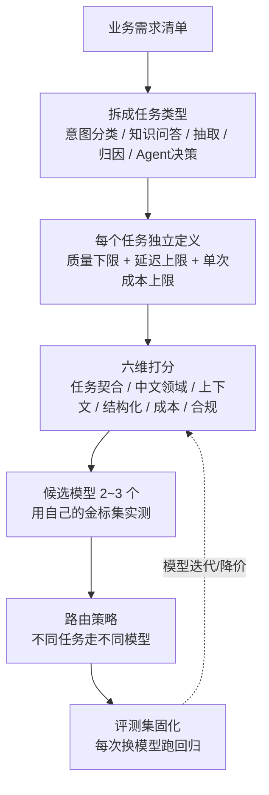
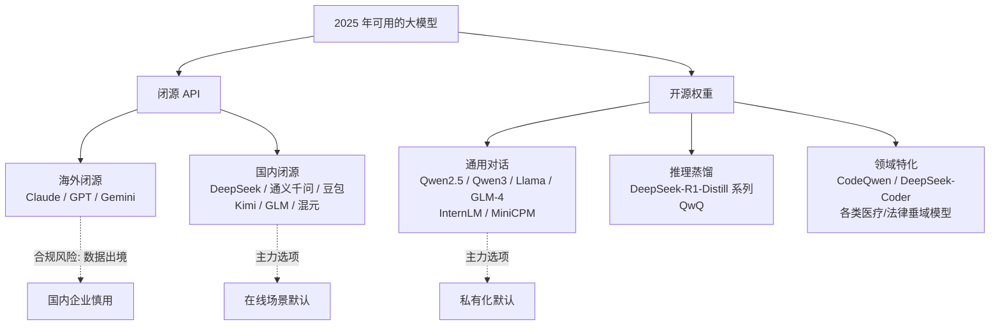
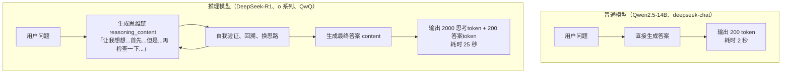
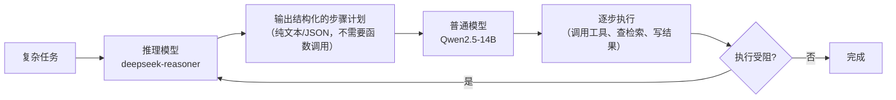
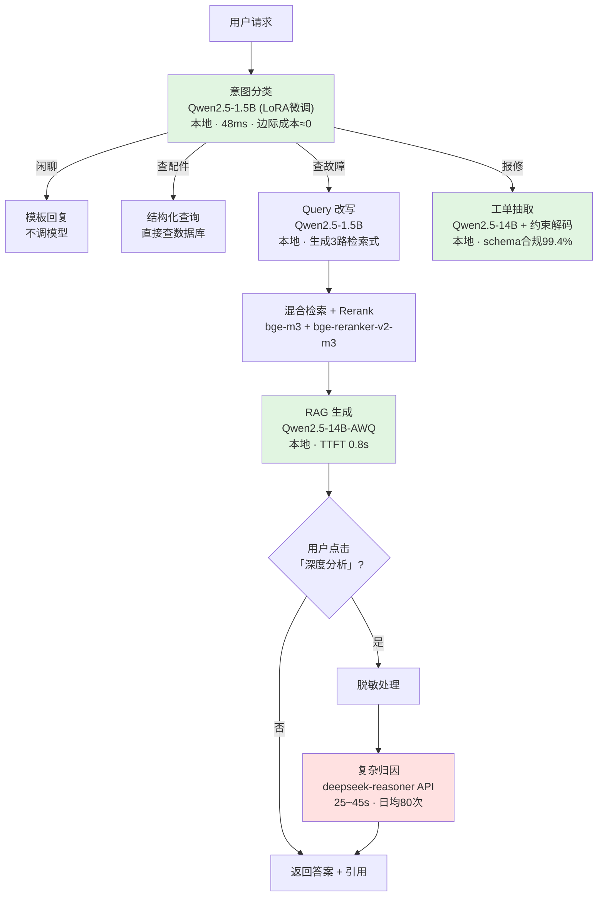
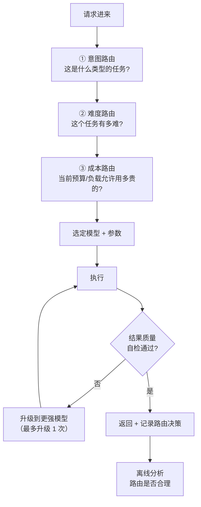
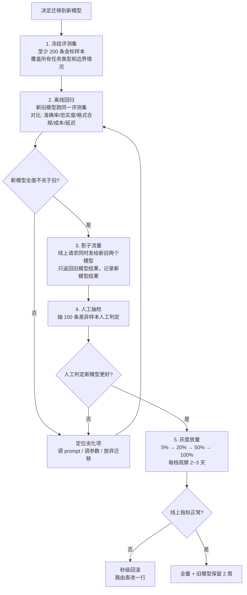
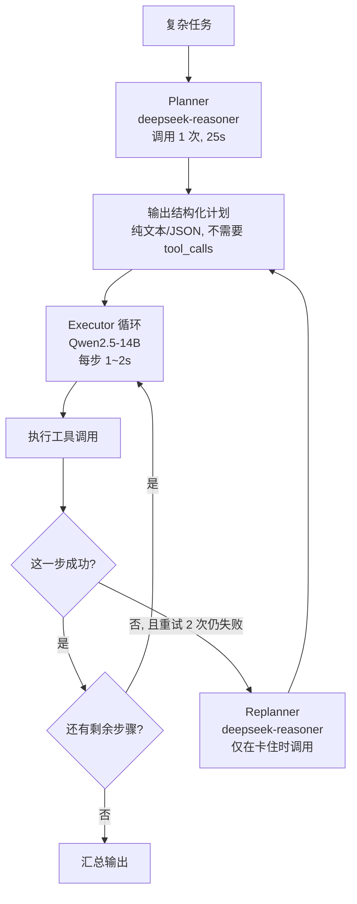

# 第 1.2 章  模型全景图与选型方法论

> **本章目标**：读完能做到 …
> 1. 说出 2025 年主流模型阵营的分层，知道每一层里有哪些可选项、各自的授权边界；
> 2. 判断一个任务该不该用推理模型（reasoning model），并说得出成本与延迟代价；
> 3. 用一套六维打分框架把「选哪个模型」从拍脑袋变成可复盘的表格；
> 4. 计算在线 API 与自建 GPU 的盈亏平衡点，给出「多少请求量以上该自建」的量化答案；
> 5. 设计一个多模型路由器，把简单请求分流到小模型，把难请求升级到大模型；
> 6. 在模型版本升级时不被「输出格式漂移」打个措手不及。
>
> **前置知识**：[1.1 大模型原理速览](./01-大模型原理速览.md)（KV Cache、Prefill/Decode、token 效率）
>
> **预计用时**：阅读 55 分钟 / 动手 45 分钟

---

## 一、为什么需要它（问题出发）

### 1.1 华成机电的「选型三连败」

华成机电做智能客服项目，在选模型这件事上连着栽了三次：

**第一次：唯跑分论**。技术负责人看了某个榜单，选了当时排名最高的开源模型。部署后发现：

- 模型是英文语料为主训练的，中文回答夹生，「变频器」翻译腔严重；
- 不支持 function calling，Agent 那条线直接做不了；
- 许可证要求月活超过阈值需单独授权，法务卡了两周。

**第二次：唯成本论**。换成最便宜的 API，每百万 token 只要几毛钱。结果：

- 复杂的多跳问题（「A 客户去年换过的那批电机，同批次的其他客户有没有报过同类故障」）完全答不对；
- 输出的 JSON 三次有一次格式错，后处理代码写了 300 行都兜不住。

**第三次：唯性能论**。上了最强的推理模型，所有请求都走它。结果：

- 一个「用户是想查故障还是想报修」的意图分类，模型输出了 800 token 的思考过程，耗时 12 秒，成本是任务本身价值的 50 倍；
- 月账单是预算的 4 倍。

### 1.2 三次失败的共同根因

**把「选模型」当成一次性的单选题，而不是一个分层的、有方法论的、可复盘的工程决策。**

正确的姿势是：



**关键认知：不存在「最好的模型」，只存在「针对某个任务、在某个约束下的最优选择」**。一个成熟的系统通常同时挂着 3~5 个模型。

---

## 二、原理拆解

### 2.1 2025 年模型格局全景

> **重要声明**：本节不提供任何具体跑分数字。理由有二：一是各类榜单更新极快，写死的数字三个月就过期；二是公开榜单与你的业务场景相关性有限。**需要具体数字时，请以 [OpenCompass](https://opencompass.org.cn/)、[LMSYS Chatbot Arena](https://lmarena.ai/)、以及各模型官方技术报告的最新数据为准**，更重要的是——**用你自己的金标集实测**（第 8 章会教你怎么建）。本节只给「梯队」级别的定性判断和**不会过期的结构化事实**（上下文长度、许可证、参数规模、部署显存）。

#### 2.1.1 阵营划分



#### 2.1.2 闭源 API 阵营对照表

| 模型家族 | 厂商 | 上下文长度 | 是否有推理模型档 | 中文能力梯队 | 函数调用 | 数据合规（中国大陆企业视角） | 典型定位 |
|---|---|---|---|---|---|---|---|
| **Claude** (Opus/Sonnet/Haiku) | Anthropic | 200K+（部分档位支持 1M） | 有（扩展思考模式） | 第一梯队 | 原生支持，质量高 | ⚠ 数据出境，需评估 | 复杂推理、长文档、代码、Agent |
| **GPT** (GPT-4o / o 系列) | OpenAI | 128K+ | 有（o 系列） | 第一梯队 | 原生支持，生态最成熟 | ⚠ 数据出境 | 通用最强基线、生态工具多 |
| **Gemini** | Google | 1M~2M | 有（Thinking 系列） | 第一梯队 | 原生支持 | ⚠ 数据出境 | 超长上下文、多模态 |
| **DeepSeek** (chat / reasoner) | 深度求索 | 64K~128K | **有（reasoner，思维链外显）** | 第一梯队 | 支持 | ✅ 境内 | **性价比最高**，国内首选 |
| **通义千问** (qwen-max/plus/turbo) | 阿里云 | 128K~1M（不同档位） | 有（QwQ 系列） | 第一梯队 | 支持，生态完整 | ✅ 境内，阿里云合规体系 | 企业级，有配套云产品 |
| **豆包** (Doubao) | 字节跳动 | 32K~256K | 有 | 第一梯队 | 支持 | ✅ 境内 | 性价比高，多模态强 |
| **Kimi** (moonshot) | 月之暗面 | 128K~200K+ | 有 | 第一梯队 | 支持 | ✅ 境内 | 长文档处理见长 |
| **GLM** (glm-4系列) | 智谱 AI | 128K~1M | 有 | 第一梯队 | 支持 | ✅ 境内 | 工具调用与 Agent 生态 |
| **混元** | 腾讯 | 32K~256K | 有 | 第一梯队 | 支持 | ✅ 境内，腾讯云合规 | 腾讯云生态内 |

> 上下文长度、价格档位、是否有推理模型档位，各厂商都在快速迭代。**下单前必须去官网确认当前的模型列表、上下文上限和定价**，本表只给结构化的比较维度。

#### 2.1.3 开源权重阵营对照表（这张表是私有化部署的选型主表）

| 模型 | 参数规模 | 上下文 | 推理模型 | 中文梯队 | 函数调用 | 许可证 | FP16 权重显存 | INT4 权重显存 | 最低可跑配置 |
|---|---|---|---|---|---|---|---|---|---|
| **Qwen2.5-0.5B-Instruct** | 0.49B | 32K | 否 | 二梯队（小模型） | 弱 | Apache 2.0 | 1.0 GB | 0.4 GB | CPU 也能跑 |
| **Qwen2.5-1.5B-Instruct** | 1.54B | 32K | 否 | 二梯队 | 基础支持 | Apache 2.0 | 3.1 GB | 1.0 GB | 8G 显存卡 |
| **Qwen2.5-3B-Instruct** | 3.09B | 32K | 否 | 一~二梯队 | 支持 | Qwen 研究许可 | 6.2 GB | 1.9 GB | 12G 卡 |
| **Qwen2.5-7B-Instruct** | 7.62B | 32K（可扩 128K） | 否 | **一梯队** | 支持，稳定 | Apache 2.0 | 15.2 GB | 4.5 GB | RTX 4090 24G |
| **Qwen2.5-14B-Instruct** | 14.77B | 32K（可扩 128K） | 否 | **一梯队** | 支持，稳定 | Apache 2.0 | 29.5 GB | 8.6 GB | 单 4090（需INT4）/ A100 40G |
| **Qwen2.5-32B-Instruct** | 32.76B | 32K（可扩 128K） | 否 | **一梯队** | 支持 | Apache 2.0 | 65.5 GB | 18.5 GB | 2×4090（INT4）/ A100 80G |
| **Qwen2.5-72B-Instruct** | 72.71B | 32K（可扩 128K） | 否 | **第一梯队顶部** | 支持 | Qwen 许可（月活门槛） | 145.4 GB | 40.5 GB | 2×A100-80G / 4×4090(INT4) |
| **Qwen3 系列**（新一代） | 0.6B~235B（含 MoE） | 32K~128K | **混合：可开关思考模式** | 第一梯队 | 支持 | Apache 2.0（多数档位） | 见具体档位 | — | 见具体档位 |
| **DeepSeek-R1-Distill-Qwen-1.5B** | 1.78B | 32K | **是（思维链外显）** | 二梯队 | 弱 | MIT（蒸馏权重） | 3.6 GB | 1.1 GB | 8G 卡 |
| **DeepSeek-R1-Distill-Qwen-7B** | 7.62B | 32K | **是** | 一梯队（数学/推理强） | 弱 | MIT | 15.2 GB | 4.5 GB | RTX 4090 |
| **DeepSeek-R1-Distill-Qwen-32B** | 32.76B | 32K | **是** | 一梯队 | 弱 | MIT | 65.5 GB | 18.5 GB | A100 80G |
| **DeepSeek-R1-Distill-Llama-70B** | 70.6B | 32K | **是** | 二梯队（中文弱于 Qwen 系） | 弱 | MIT + Llama 条款 | 141 GB | 39 GB | 2×A100-80G |
| **Llama-3.1-8B-Instruct** | 8.03B | 128K | 否 | 二梯队（中文需额外调） | 支持 | Llama 3.1 社区许可 | 16.1 GB | 4.8 GB | RTX 4090 |
| **Llama-3.1-70B-Instruct** | 70.6B | 128K | 否 | 二梯队 | 支持 | Llama 3.1 社区许可 | 141 GB | 39 GB | 2×A100-80G |
| **GLM-4-9B-Chat** | 9.4B | 128K（部分档 1M） | 否 | 一梯队 | 支持，工具调用不错 | GLM 系列许可 | 18.8 GB | 5.5 GB | RTX 4090 |
| **InternLM2.5-7B-Chat** | 7.7B | 32K（可扩 1M） | 否 | 一梯队 | 支持 | Apache 2.0（商用需登记） | 15.4 GB | 4.6 GB | RTX 4090 |
| **MiniCPM3-4B** | 4.07B | 32K | 否 | 一~二梯队（端侧最强档） | 支持 | 需查看官方许可 | 8.1 GB | 2.4 GB | 12G 卡 / 端侧 |

> **显存数字的算法**：FP16 权重显存 = 参数量 × 2 字节；INT4 约 = 参数量 × 0.55 字节（4 bit 权重 + 量化 scale/zero-point 的额外开销）。**这只是权重，不含 KV Cache 和框架开销**，实际部署还要加 20%~50%，详见第 1.4 章。
>
> **许可证是硬约束，必须让法务过一遍**。Apache 2.0 最宽松；Llama 系列有月活 7 亿的门槛（对绝大多数企业无影响，但要保留 "Built with Llama" 标识）；Qwen 的 72B 档有独立许可条款；部分模型对「用输出训练其他模型」有限制。**别到上线前才发现问题**。

#### 2.1.4 怎么读这张表：三个使用姿势

**姿势一：按显存倒推可选项**。你手里是什么卡，先看能塞下什么。

| 你的硬件 | FP16 能跑 | INT4 能跑 | 推荐主力 |
|---|---|---|---|
| RTX 4090 24G × 1 | 7B~9B | 14B（紧）| Qwen2.5-7B-Instruct（FP16）或 14B-AWQ |
| RTX 4090 24G × 2 | 14B | 32B | Qwen2.5-14B（FP16，TP=2） |
| A100 40G × 1 | 14B | 32B | Qwen2.5-14B |
| A100/H800 80G × 1 | 32B | 72B | Qwen2.5-32B 或 72B-AWQ |
| A100/H800 80G × 2 | 72B | 110B+ | Qwen2.5-72B |

**姿势二：按任务难度选参数档**。

| 任务 | 够用的最小档位 | 理由 |
|---|---|---|
| 意图分类（10 个类别以内） | **1.5B** | 分类任务不需要世界知识，微调后 1.5B 能到 95%+ |
| 实体抽取（有明确 schema） | **1.5B~3B**（微调后）或 7B（零样本） | 同上 |
| RAG 知识问答（中文） | **7B~14B** | 需要理解长上下文和领域术语，7B 是下限 |
| 复杂归因 / 多跳推理 | **32B+ 或推理模型 API** | 需要多步推理能力，参数量是硬门槛 |
| Agent 工具调用规划 | **14B+（且函数调用训练充分）** | 小模型的工具选择错误率显著高 |
| 代码生成 | **7B+ 代码专用 或 32B 通用** | 代码模型有专门的训练配方 |

**姿势三：按许可证过滤**。国内企业做 To B 交付，Apache 2.0 是最省心的，Qwen2.5 的 0.5B~32B 全是 Apache 2.0，这是它在国内私有化场景占优的重要原因。

### 2.2 推理模型 vs 普通模型

#### 2.2.1 本质差异



**训练方式的差异**：推理模型通过强化学习（以「答案是否正确」为奖励信号）自发学会了「多想一会儿再答」的策略。它不是被人教了某种推理格式，而是自己发现了「先枚举、再验证、错了就回溯」这套策略能提高得分。

#### 2.2.2 成本与延迟的量化代价

| 维度 | 普通模型 | 推理模型 | 倍数 |
|---|---|---|---|
| 输出 token 数（同一问题） | 200 | 1500~5000（思考 + 答案） | **8~25×** |
| 输出 token 单价 | 基准 | 通常更高（各家不同） | 1~4× |
| **实际成本** | 基准 | — | **10~50×** |
| 端到端延迟 | 2~4 秒 | 15~90 秒 | **5~30×** |
| 可流式展示给用户 | 是，首字快 | 思考阶段用户只能看转圈或思考过程 | — |

> 具体倍数取决于问题难度和模型。简单问题推理模型也会「想一下」，这是它最浪费的地方。

#### 2.2.3 决策表：什么时候值得用推理模型

| 任务 | 用推理模型？ | 理由 |
|---|---|---|
| **复杂工单归因**：「这批电机三个月内故障 5 次，结合维修记录、批次信息、环境数据，分析根本原因」 | ✅ **值得** | 需要多源信息交叉、假设检验、排除法。普通模型会给一个「看起来合理」的答案，推理模型会真的逐条排除 |
| **多跳问题拆解**：「跟 A 客户同批次的设备，还有谁在用，他们报过什么故障」 | ✅ **值得**（用于规划检索步骤） | 需要把问题拆成多个检索子任务并推理依赖关系 |
| **数学/单位换算**：「额定 15kW、380V 的电机，过流阈值 1.5 倍，实测 32A 是否超标」 | ✅ **值得**（或用工具调用代替） | 普通模型算错的概率不低；推理模型会自己验算 |
| **代码调试 / 复杂 SQL 生成** | ✅ 值得 | 需要推演执行路径 |
| **评测裁判（LLM-as-Judge）中的疑难样本** | 🟡 分档：简单样本普通模型，争议样本升级 | 成本可控前提下提高裁判质量 |
| **意图分类**（10 个类别） | ❌ **浪费** | 这是个分类任务，1.5B 微调模型 50ms 搞定，推理模型要 15 秒 |
| **实体抽取**（按 schema 填字段） | ❌ **浪费** | 有明确 schema，是模式匹配不是推理 |
| **闲聊 / 问候** | ❌ **极度浪费** | 用户说「你好」，模型想 2000 token |
| **RAG 的常规事实问答**：「HC-V320 过流阈值多少」 | ❌ **浪费** | 答案就在检索到的资料里，抄就完了，不需要推理 |
| **文本摘要 / 改写** | ❌ 浪费 | 生成任务，不是推理任务 |
| **实时性要求 < 3 秒的任何场景** | ❌ **物理上做不到** | 推理模型的思考阶段本身就超过 3 秒 |

**一句话判据**：

> **问题的答案是「查出来的」还是「想出来的」？查出来的用普通模型 + RAG；想出来的才用推理模型。**

#### 2.2.4 使用推理模型的三个工程要点

**要点 1：思维链要单独取出来，不要塞回对话历史**

```python
"""调用 DeepSeek 推理模型，正确处理 reasoning_content 字段。

环境：Python 3.11
依赖：uv pip install openai==1.57.0
注意：具体字段名以 DeepSeek 官方文档为准，不同厂商的推理模型字段名不同
     （有的叫 reasoning_content，有的把思维链包在 <think> 标签里）。
"""
import os
from openai import OpenAI

client = OpenAI(
    api_key=os.environ["DEEPSEEK_API_KEY"],
    base_url="https://api.deepseek.com",
)

messages = [{"role": "user", "content": "HC-V320 三个月内故障 5 次，每次都是 OC 过流，"
                                        "更换过 IGBT 模块 2 次、驱动板 1 次，故障依旧。"
                                        "环境温度 45℃，负载为螺杆压缩机。分析根本原因。"}]

resp = client.chat.completions.create(model="deepseek-reasoner", messages=messages)
msg = resp.choices[0].message

reasoning = getattr(msg, "reasoning_content", "")  # 思维链
answer = msg.content                                # 最终答案

print(f"思考过程 ({len(reasoning)} 字符):\n{reasoning[:400]}...\n")
print(f"最终答案:\n{answer}")

# 关键：多轮对话时，只把 content 放回历史，不要放 reasoning_content
messages.append({"role": "assistant", "content": answer})
messages.append({"role": "user", "content": "那第一步该做什么检查？"})
```

**为什么**：思维链动辄几千 token，塞回历史会让下一轮成本翻倍，而且多数厂商的 API 明确要求不要回传 reasoning_content（回传会报错或被忽略）。

**要点 2：多数推理模型不支持或不推荐调整采样参数**

DeepSeek 官方文档明确说明 `deepseek-reasoner` 不支持 `temperature`、`top_p`、`presence_penalty`、`frequency_penalty` 等参数（传了会被忽略或报错）。对于本地部署的 DeepSeek-R1-Distill 系列，官方建议 temperature 设在 **0.5~0.7**（推荐 0.6），**不要用 greedy**，否则容易陷入重复。**具体以各模型的官方 README 为准。**

**要点 3：推理模型的函数调用能力普遍弱于普通模型**

这是当前阶段的一个事实：多数推理模型的训练配方侧重推理，工具调用的训练数据比例较低。**Agent 场景的正确做法是「推理模型做规划、普通模型做执行」**：



第 6、7 章会完整实现这个 Planner-Executor 拓扑。

### 2.3 六维选型评估框架

#### 2.3.1 六个维度与打分细则

**维度 1：任务契合度（权重建议 25%）**

| 分数 | 判定标准 |
|---|---|
| 5 | 在你自己的金标集上通过率 ≥ 95%，且失败案例无系统性模式 |
| 4 | 金标集通过率 85%~95%，失败案例可通过 prompt 优化解决 |
| 3 | 通过率 70%~85%，需要 few-shot 或轻量微调才能达标 |
| 2 | 通过率 50%~70%，需要充分微调 |
| 1 | 通过率 < 50%，任务类型不匹配 |

> **这一维必须用你自己的数据测，不能用公开榜单代替**。华成机电的金标集是 200 条真实工单问答，人工标注了标准答案，第 8 章会讲怎么建。

**维度 2：中文与领域能力（权重建议 20%）**

| 分数 | 判定标准 |
|---|---|
| 5 | 中文表达自然无翻译腔；领域术语（相间短路、绝缘电阻、变频器载波）理解准确；中文 token 效率 > 1.4 字/token |
| 4 | 中文流畅；多数领域术语正确；token 效率 > 1.2 |
| 3 | 中文可用但偶有生硬；领域术语需要在 prompt 里解释 |
| 2 | 明显翻译腔；领域术语经常理解错 |
| 1 | 中文能力薄弱，需要大量中文微调 |

**维度 3：上下文长度（权重建议 15%）**

| 分数 | 判定标准 |
|---|---|
| 5 | 有效上下文 ≥ 业务峰值需求的 3 倍（有充足余量，且在该长度下大海捞针表现稳定） |
| 4 | 有效上下文 ≥ 业务峰值的 2 倍 |
| 3 | 有效上下文 ≥ 业务峰值的 1.5 倍（勉强够，需要严格控长） |
| 2 | 刚好等于业务需求，无余量 |
| 1 | 不满足业务需求 |

> **「有效上下文」不等于「标称上下文」**。标称 128K 的模型，实际可靠工作区间可能只有 32K~64K。评估时务必自己跑一次大海捞针测试（第 8 章给脚本）。

**维度 4：函数调用与结构化输出（权重建议 15%）**

| 分数 | 判定标准 |
|---|---|
| 5 | 原生 tool_calls 支持；JSON mode 或约束解码可用；100 次调用 schema 合规率 ≥ 99% |
| 4 | 原生 tool_calls；schema 合规率 95%~99% |
| 3 | 有 tool_calls 但不够稳定（合规率 85%~95%），或只能靠 prompt 引导 + 正则解析 |
| 2 | 无原生支持，纯靠 prompt，合规率 70%~85% |
| 1 | 结构化输出不可靠（< 70%） |

**维度 5：成本（权重建议 15%）**

| 分数 | 判定标准（按你的业务量折算成月成本，与预算比） |
|---|---|
| 5 | 月成本 ≤ 预算的 30% |
| 4 | 月成本 30%~60% 预算 |
| 3 | 月成本 60%~90% 预算 |
| 2 | 月成本 90%~120% 预算 |
| 1 | 月成本 > 120% 预算 |

**维度 6：合规与私有化要求（权重建议 10%，但可以是一票否决）**

| 分数 | 判定标准 |
|---|---|
| 5 | 权重可下载、许可证宽松（Apache 2.0/MIT）、可完全私有化、可商用无门槛 |
| 4 | 可私有化，许可证有轻微限制（如需保留标识、月活门槛） |
| 3 | 境内云服务，数据不出境，有合规资质，但不能私有化 |
| 2 | 境内服务但合规文件不齐全 |
| 1 | **数据出境 / 许可证禁止你的用途** → **一票否决** |

> **合规这一维要前置**。华成机电有军工配套业务，部分数据不允许出企业内网。这直接砍掉了所有在线 API 方案（在敏感数据场景下），只能私有化。**先做减法再做加法，别把时间浪费在评估一个法务不让用的模型上**。

#### 2.3.2 加权评分表模板

把下面的内容存成 `model_eval.csv`，用 Excel 或 Python 打开填写：

```text
维度,权重,Qwen2.5-14B(私有化),DeepSeek-V3(API),Qwen2.5-7B(私有化),GLM-4-9B(私有化),评分依据/备注
任务契合度,0.25,4,5,3,4,"用200条工单金标集实测通过率"
中文与领域能力,0.20,5,5,5,5,"术语理解测试 + token效率实测"
上下文长度,0.15,4,5,4,5,"业务峰值需8K，测有效上下文"
函数调用结构化,0.15,4,5,3,4,"100次tool_call的schema合规率"
成本,0.15,4,3,5,4,"按日均3000请求折算月成本"
合规私有化,0.10,5,3,5,4,"Apache2.0=5，境内API=3"
加权总分,1.00,=SUMPRODUCT(B2:B7,C2:C7),,,,
```

配套的 Python 打分脚本（`tools/model_scorer.py`）：

```python
"""模型选型加权评分器：读 CSV，算加权总分，输出排名与雷达图数据。

环境：Python 3.11
依赖：uv pip install pandas==2.2.3
用法：python model_scorer.py model_eval.csv
"""
import sys
from pathlib import Path

import pandas as pd

# 一票否决规则：某维度低于阈值直接淘汰
VETO_RULES = {"合规私有化": 2, "任务契合度": 2}


def load_scores(csv_path: str) -> pd.DataFrame:
    """读取评分表，返回 index=维度、columns=候选模型 的 DataFrame。"""
    df = pd.read_csv(csv_path)
    df = df[df["维度"] != "加权总分"]
    df = df.set_index("维度")
    note_col = [c for c in df.columns if "备注" in c or "依据" in c]
    return df.drop(columns=note_col, errors="ignore")


def evaluate(df: pd.DataFrame) -> pd.DataFrame:
    """计算每个候选的加权总分，并标记被一票否决的候选。"""
    weights = df["权重"].astype(float)
    candidates = [c for c in df.columns if c != "权重"]
    rows = []
    for cand in candidates:
        scores = df[cand].astype(float)
        vetoed = [d for d, thr in VETO_RULES.items()
                  if d in scores.index and scores[d] < thr]
        total = float((weights * scores).sum())
        rows.append({
            "候选": cand,
            "加权总分": round(total, 3),
            "满分比": f"{total / 5 * 100:.1f}%",
            "状态": "❌ 一票否决: " + ",".join(vetoed) if vetoed else "✅ 通过",
            **{d: int(scores[d]) for d in scores.index},
        })
    result = pd.DataFrame(rows).sort_values("加权总分", ascending=False)
    return result.reset_index(drop=True)


def print_report(result: pd.DataFrame) -> None:
    """打印排名表与结论。"""
    print("=" * 100)
    print("模型选型加权评分结果")
    print("=" * 100)
    print(result.to_string(index=False))
    print()
    passed = result[result["状态"].str.startswith("✅")]
    if passed.empty:
        print("⚠ 所有候选均被一票否决，请放宽约束或寻找新候选。")
        return
    best = passed.iloc[0]
    print(f"推荐: {best['候选']}  (加权总分 {best['加权总分']}, 满分比 {best['满分比']})")
    if len(passed) > 1:
        second = passed.iloc[1]
        gap = best["加权总分"] - second["加权总分"]
        if gap < 0.3:
            print(f"注意: 与第二名 {second['候选']} 仅差 {gap:.3f} 分，"
                  f"建议两者都做 A/B 实测再定。")


if __name__ == "__main__":
    path = sys.argv[1] if len(sys.argv) > 1 else "model_eval.csv"
    if not Path(path).exists():
        print(f"找不到 {path}，请先按模板创建评分表。")
        sys.exit(1)
    print_report(evaluate(load_scores(path)))
```

**预期输出**：

```text
====================================================================================================
模型选型加权评分结果
====================================================================================================
              候选  加权总分    满分比    状态  任务契合度  中文与领域能力  上下文长度  函数调用结构化  成本  合规私有化
 DeepSeek-V3(API)  4.400  88.0%  ✅ 通过      5        5      5        5   3      3
Qwen2.5-14B(私有化)  4.300  86.0%  ✅ 通过      4        5      4        4   4      5
  GLM-4-9B(私有化)  4.200  84.0%  ✅ 通过      4        5      5        4   4      4
 Qwen2.5-7B(私有化)  4.000  80.0%  ✅ 通过      3        5      4        3   5      5

推荐: DeepSeek-V3(API)  (加权总分 4.4, 满分比 88.0%)
注意: 与第二名 Qwen2.5-14B(私有化) 仅差 0.100 分，建议两者都做 A/B 实测再定。
```

**怎么用这个结果**：分差小于 0.3 时不要拍板，**去跑真实 A/B**。分差大于 0.5 才有决定性意义。而且要注意——这个框架的价值不在于「算出一个数」，而在于**把讨论从「我觉得」变成「哪一维你打几分，依据是什么」**。

### 2.4 业务场景 × 方案推荐矩阵

| 业务场景 | 关键约束 | 在线 API 方案 | 私有化方案 | 补充说明 |
|---|---|---|---|---|
| **客服问答（RAG）** | 高 QPS、低延迟、成本敏感、需引用溯源 | deepseek-chat / qwen-plus | **Qwen2.5-7B/14B-Instruct** + bge-m3 + bge-reranker-v2-m3 | 最主流的场景。7B 够用，14B 更稳。必开 Prefix Caching |
| **文档抽取（结构化）** | schema 合规率要求高、批量、延迟不敏感 | qwen-plus + JSON mode | **Qwen2.5-7B + 约束解码(xgrammar)** 或微调后的 1.5B | 抽取任务微调小模型性价比极高，500 条样本就见效 |
| **代码生成/补全** | 需要代码专项能力 | claude / deepseek-chat | Qwen2.5-Coder 系列 / DeepSeek-Coder | 通用模型写代码明显弱于代码专用模型 |
| **数据分析（Text2SQL + 解读）** | 需要推理 + 工具调用 | deepseek-chat（生成 SQL）+ deepseek-reasoner（疑难） | Qwen2.5-32B 或 14B + 严格的 schema 提示 | SQL 生成一定要做执行前校验，第 6 章讲 |
| **Agent 决策/规划** | 工具调用可靠性、多步推理 | qwen-max / glm-4 / deepseek-chat | **Qwen2.5-14B 起步**，7B 工具调用错误率偏高 | 规划环节可升级到 deepseek-reasoner |
| **离线批处理（文档解析、打标、摘要）** | 成本优先、延迟无所谓 | 各家的 Batch API（通常半价） | **本地 vLLM 大 batch 跑** | 离线场景私有化的性价比碾压 API |
| **意图分类 / 路由** | 极低延迟（< 200ms）、高 QPS | 不建议走 API（网络往返就超预算） | **Qwen2.5-1.5B 微调** 或纯 Embedding 分类 | 这个场景最不该用大模型 |
| **复杂工单归因** | 质量优先、低频、延迟可接受 | **deepseek-reasoner** | DeepSeek-R1-Distill-Qwen-32B | 典型的推理模型场景 |
| **敏感数据处理（军工/涉密）** | 数据不出内网 | ❌ **禁用** | Qwen2.5 系列 + 内网部署 + 审计日志 | 合规一票否决 |

### 2.5 成本模型：在线 API vs 自建 GPU

#### 2.5.1 完整测算公式

**在线 API 月成本**：

$$
C_{\text{API}} = 30 \times Q \times \left( \frac{T_{in}}{10^6} \times P_{in} \times (1 - r_{cache}) + \frac{T_{out}}{10^6} \times P_{out} \right)
$$

| 符号 | 含义 |
|---|---|
| $Q$ | 日均请求量 |
| $T_{in}, T_{out}$ | 单次请求的平均输入/输出 token 数 |
| $P_{in}, P_{out}$ | 每百万 token 的输入/输出单价（元） |
| $r_{cache}$ | 命中厂商 prompt cache 的比例（命中部分通常大幅折扣，各家不同） |

**自建 GPU 月成本**：

$$
C_{\text{self}} = N_{gpu} \times \left( \underbrace{P_{rent}}_{\text{租赁月租}} \right) + C_{ops}
$$

或买断模式下：

$$
C_{\text{self}} = N_{gpu} \times \left( \frac{P_{buy}}{M_{depr}} + \frac{W \times 24 \times 30 \times P_{elec}}{1000} \times \text{PUE} \right) + C_{ops}
$$

| 符号 | 含义 | 典型值 |
|---|---|---|
| $N_{gpu}$ | 需要的 GPU 数量（由容量规划得出，见第 1.4 章） | — |
| $P_{rent}$ | 单卡月租金（元） | 随市场波动，需询价 |
| $P_{buy}$ | 单卡采购价（元） | 随市场波动 |
| $M_{depr}$ | 折旧月数 | 36 个月（3 年） |
| $W$ | 单卡功耗（W） | 4090:450, A100:400, H800:700 |
| $P_{elec}$ | 电价（元/度） | 工业电价 0.6~1.0 |
| PUE | 数据中心能耗比 | 1.3~1.6（自建机房）/ 1.0（托管已含） |
| $C_{ops}$ | 运维人力分摊（元/月） | 0.3~1 个人力，按 2 万/人月算 |

**盈亏平衡点**（日均请求量）：

$$
Q^* = \frac{C_{\text{self}}}{30 \times \left( \frac{T_{in}}{10^6} P_{in} (1-r_{cache}) + \frac{T_{out}}{10^6} P_{out} \right)}
$$

**含义：日均请求量超过 $Q^*$ 时，自建更划算。**

#### 2.5.2 完整测算脚本

```python
"""在线 API vs 自建 GPU 的月成本对比与盈亏平衡分析。

环境：Python 3.11
依赖：无（仅标准库）
用法：python cost_model.py
说明：所有价格均为「示例量级」，请用你自己的询价结果替换 PRICES 与 GPU_SPECS。
     API 价格请以各厂商官网当前定价为准。
"""
from dataclasses import dataclass


@dataclass
class APIPlan:
    """在线 API 方案的价格参数（元 / 百万 token）。"""
    name: str
    price_in: float
    price_out: float
    cache_hit_discount: float = 0.1  # 命中缓存后输入价格的折扣系数


@dataclass
class SelfHostPlan:
    """自建 GPU 方案的成本参数。"""
    name: str
    gpu_count: int
    gpu_monthly_rent: float = 0.0     # 租赁模式：单卡月租（元）
    gpu_buy_price: float = 0.0        # 买断模式：单卡采购价（元）
    depreciation_months: int = 36
    watt_per_gpu: int = 450
    elec_price: float = 0.8           # 元 / 度
    pue: float = 1.4
    ops_cost_monthly: float = 6000.0  # 运维人力分摊

    def monthly_cost(self, mode: str = "rent") -> float:
        """计算月成本。mode 为 rent（租赁）或 buy（买断折旧）。"""
        if mode == "rent":
            hardware = self.gpu_count * self.gpu_monthly_rent
        else:
            depr = self.gpu_buy_price / self.depreciation_months
            elec = self.watt_per_gpu * 24 * 30 / 1000 * self.elec_price * self.pue
            hardware = self.gpu_count * (depr + elec)
        return hardware + self.ops_cost_monthly


@dataclass
class Workload:
    """业务负载画像。"""
    daily_requests: int
    avg_input_tokens: int
    avg_output_tokens: int
    prefix_cache_hit_rate: float = 0.0  # 命中厂商 prompt cache 的输入 token 比例

    def monthly_api_cost(self, plan: APIPlan) -> float:
        """按 API 计价模型算月成本。"""
        hit = self.prefix_cache_hit_rate
        in_cost = (self.avg_input_tokens / 1e6) * plan.price_in * (
            (1 - hit) + hit * plan.cache_hit_discount)
        out_cost = (self.avg_output_tokens / 1e6) * plan.price_out
        return 30 * self.daily_requests * (in_cost + out_cost)


def breakeven_requests(self_plan: SelfHostPlan, api_plan: APIPlan,
                       wl: Workload, mode: str = "rent") -> float:
    """求盈亏平衡的日均请求量：自建月成本 / 单次 API 成本 / 30。"""
    unit = wl.monthly_api_cost(api_plan) / (30 * wl.daily_requests)
    return self_plan.monthly_cost(mode) / (30 * unit)


def print_curve(self_plan: SelfHostPlan, api_plans: list[APIPlan],
                wl: Workload, mode: str = "rent") -> None:
    """输出不同请求量下两种方案的月成本对比表。"""
    self_cost = self_plan.monthly_cost(mode)
    volumes = [500, 1000, 2000, 3000, 5000, 8000, 12000, 20000, 50000]

    print(f"\n{'=' * 96}")
    print(f"负载画像: 输入 {wl.avg_input_tokens} tok / 输出 {wl.avg_output_tokens} tok / "
          f"缓存命中 {wl.prefix_cache_hit_rate:.0%}")
    print(f"自建方案: {self_plan.name}  ({self_plan.gpu_count} 卡, {mode} 模式) "
          f"月成本固定 ¥{self_cost:,.0f}")
    print(f"{'=' * 96}")

    header = f"{'日均请求':>10}{'自建(元/月)':>14}"
    for p in api_plans:
        header += f"{p.name + '(元/月)':>20}"
    print(header)
    print("-" * len(header) * 2)

    for v in volumes:
        w = Workload(v, wl.avg_input_tokens, wl.avg_output_tokens,
                     wl.prefix_cache_hit_rate)
        row = f"{v:>10,}{self_cost:>14,.0f}"
        for p in api_plans:
            c = w.monthly_api_cost(p)
            marker = " ←便宜" if c < self_cost else ""
            row += f"{c:>17,.0f}{marker:>3}"
        print(row)

    print("\n盈亏平衡点（日均请求量，超过此值自建更划算）:")
    for p in api_plans:
        be = breakeven_requests(self_plan, p, wl, mode)
        print(f"  vs {p.name:<24} {be:>10,.0f} 次/天  "
              f"（约 {be * 30 / 10000:.1f} 万次/月）")


if __name__ == "__main__":
    # ⚠ 以下价格为示例量级，务必替换为你实际询价的数字
    api_plans = [
        APIPlan("低价档API", price_in=1.0, price_out=2.0, cache_hit_discount=0.1),
        APIPlan("中价档API", price_in=4.0, price_out=12.0, cache_hit_discount=0.2),
        APIPlan("高价档API", price_in=20.0, price_out=60.0, cache_hit_discount=0.25),
    ]
    self_plan = SelfHostPlan(
        name="2×RTX4090 跑 Qwen2.5-14B-AWQ",
        gpu_count=2, gpu_monthly_rent=2500,
        gpu_buy_price=16000, watt_per_gpu=450, ops_cost_monthly=6000,
    )
    workload = Workload(daily_requests=3000, avg_input_tokens=3500,
                        avg_output_tokens=400, prefix_cache_hit_rate=0.35)

    print_curve(self_plan, api_plans, workload, mode="rent")
    print_curve(self_plan, api_plans, workload, mode="buy")
```

**预期输出**：

```text
================================================================================================
负载画像: 输入 3500 tok / 输出 400 tok / 缓存命中 35%
自建方案: 2×RTX4090 跑 Qwen2.5-14B-AWQ  (2 卡, rent 模式) 月成本固定 ¥11,000
================================================================================================
      日均请求     自建(元/月)        低价档API(元/月)      中价档API(元/月)      高价档API(元/月)
----------------------------------------------------------------------------------------------
       500        11,000              151 ←便宜           678 ←便宜          3,393 ←便宜
     1,000        11,000              303 ←便宜         1,356 ←便宜          6,786 ←便宜
     2,000        11,000              606 ←便宜         2,712 ←便宜         13,573
     3,000        11,000              908 ←便宜         4,068 ←便宜         20,359
     5,000        11,000            1,514 ←便宜         6,780 ←便宜         33,932
     8,000        11,000            2,422 ←便宜        10,848 ←便宜         54,291
    12,000        11,000            3,633 ←便宜        16,272             81,437
    20,000        11,000            6,055 ←便宜        27,120            135,728
    50,000        11,000           15,137            67,800            339,320

盈亏平衡点（日均请求量，超过此值自建更划算）:
  vs 低价档API                      36,335 次/天  （约 109.0 万次/月）
  vs 中价档API                       8,112 次/天  （约 24.3 万次/月）
  vs 高价档API                       1,621 次/天  （约 4.9 万次/月）
```

#### 2.5.3 从这张表能读出的四个结论

1. **对标低价档 API，自建的门槛非常高**（日均 3.6 万次以上）。国内头部厂商的低价策略，让「为了省钱自建」在中小业务量下基本不成立。
2. **自建的真正理由往往不是省钱，是合规、可控、定制**：数据不出内网、可以微调、不受厂商限流和涨价影响、离线批处理能跑满。
3. **自建是固定成本，API 是变动成本**。业务量波动大、还在探索期时，API 的弹性价值很大；业务量稳定且大时，自建的边际成本趋近于零。
4. **别忘了隐性成本**。自建方案的 `ops_cost_monthly` 里没算：模型评测的人力、故障排查的时间、升级的停机窗口、GPU 采购的资金占用。真实的自建 TCO 通常比脚本算出来的高 30%~50%。

**给决策者的一句话**：

> **如果你的唯一理由是「API 太贵」，先把 Prefix Caching、语义缓存、小模型路由、Rerank 减 token 这四件事做完再来算——通常能砍掉 50%~70% 的 API 成本，比自建划算得多。**

### 2.6 华成机电的实际选型过程

这一节把方法论走一遍完整流程。

#### 2.6.1 第一步：需求拆解

华成机电的系统有 5 个需要调用模型的环节：

| # | 环节 | 日均调用量 | 延迟要求 | 质量要求 | 数据敏感度 |
|---|---|---|---|---|---|
| 1 | 用户意图分类（查故障 / 报修 / 查配件 / 闲聊） | 8000 | **< 200ms** | 准确率 ≥ 95% | 低 |
| 2 | Query 改写与扩展（生成多路检索式） | 5000 | < 800ms | 召回提升即可 | 低 |
| 3 | RAG 知识问答（主流程） | 5000 | 首字 < 2s | 忠实度 ≥ 90% | **高**（含客户信息、图纸） |
| 4 | 工单结构化抽取（从自由文本填表） | 2000 | < 3s（可异步） | schema 合规 ≥ 99% | **高** |
| 5 | 复杂故障归因（人工触发） | 80 | < 60s 可接受 | 质量优先 | 中（脱敏后） |

#### 2.6.2 第二步：合规前置筛选

法务给出的约束：

- 环节 3、4 涉及客户设备清单与内部图纸，**数据不得出企业内网** → 必须私有化；
- 环节 1、2、5 的数据可脱敏后外发 → 可用境内 API；
- 海外 API（Claude / GPT / Gemini）**全部排除**（数据出境合规成本过高）；
- 许可证必须允许商用且无月活门槛 → 优先 Apache 2.0。

**这一步就砍掉了一半候选**。

#### 2.6.3 第三步：分环节评分

**环节 1（意图分类）的评分**：

| 维度 | 权重 | Qwen2.5-1.5B(本地微调) | Qwen2.5-7B(本地零样本) | deepseek-chat(API) | BERT分类器 |
|---|---|---|---|---|---|
| 任务契合度 | 0.25 | 5（微调后 97%） | 4（零样本 91%） | 5（96%） | 4（93%，但新类别要重训） |
| 中文与领域 | 0.20 | 5 | 5 | 5 | 4 |
| 上下文长度 | 0.15 | 5（只需 500 token） | 5 | 5 | 3（512 限制） |
| 结构化输出 | 0.15 | 5（微调后只输出类别名） | 4 | 5 | 5（天然分类） |
| 成本 | 0.15 | 5（本地，边际成本≈0） | 3（占用大卡资源） | 2（8000次/天的API费） | 5 |
| 合规私有化 | 0.10 | 5 | 5 | 3 | 5 |
| **加权总分** | | **4.95** | 4.25 | 4.25 | 4.25 |

**延迟实测（决定性因素）**：

```text
Qwen2.5-1.5B-Instruct 本地 (RTX 4090, vLLM, max_tokens=8)
  TTFT P50 = 31ms   端到端 P95 = 48ms    ✅ 远超要求

Qwen2.5-7B 本地
  TTFT P50 = 89ms   端到端 P95 = 142ms   ✅ 达标但占大卡资源

deepseek-chat API
  端到端 P50 = 680ms  P95 = 1850ms       ❌ 网络往返就超了 200ms 要求
```

→ **结论：环节 1 用 Qwen2.5-1.5B-Instruct，本地部署，用 800 条标注数据做 LoRA 微调**。

**环节 3（RAG 知识问答）的评分**：

| 维度 | 权重 | Qwen2.5-7B | **Qwen2.5-14B** | Qwen2.5-32B | GLM-4-9B |
|---|---|---|---|---|---|
| 任务契合度 | 0.25 | 3（金标集 78%） | **4（金标集 89%）** | 5（金标集 94%） | 4（金标集 86%） |
| 中文与领域 | 0.20 | 5 | **5** | 5 | 5 |
| 上下文长度 | 0.15 | 4（32K，业务峰值 8K） | **4** | 4 | 5（128K） |
| 结构化输出 | 0.15 | 3 | **4** | 4 | 4 |
| 成本 | 0.15 | 5（单卡 4090 FP16） | **4（单卡 4090 需 AWQ，或 A100 40G）** | 2（需 A100-80G） | 4 |
| 合规私有化 | 0.10 | 5（Apache 2.0） | **5（Apache 2.0）** | 5 | 4（GLM 许可） |
| **加权总分** | | 4.00 | **4.30** | 4.15 | 4.35 |

**为什么最终选了 Qwen2.5-14B 而不是分数略高的 GLM-4-9B**：

1. **分差只有 0.05，在噪声范围内**，不构成决定性依据；
2. 做了 A/B 实测：在 200 条工单金标集上，14B 的忠实度（是否只依据资料回答）比 9B 高约 5 个百分点，这是华成机电最看重的指标（宁可拒答也不能编）；
3. 许可证：Apache 2.0 比 GLM 系列许可更省法务沟通成本；
4. 生态：团队已经在用 Qwen 系列做其他环节，统一 tokenizer 能简化上下文长度管理和成本核算；
5. 升级路径：Qwen 系列的 1.5B / 7B / 14B / 32B 是同一家族，**未来扩容或降配时 prompt 基本兼容**，迁移成本低。

> **这个决策的方法论意义：评分表是用来「淘汰明显不合适的」和「组织讨论」的，不是用来「自动选出赢家」的。分差小的时候，用工程因素（生态一致性、迁移成本、法务成本）来打破平局是完全正当的。**

**环节 5（复杂故障归因）的评分**：

| 维度 | 权重 | deepseek-reasoner(API) | R1-Distill-32B(本地) | Qwen2.5-32B(本地) |
|---|---|---|---|---|
| 任务契合度 | 0.25 | 5（多跳归因质量明显最好） | 4 | 3 |
| 中文与领域 | 0.20 | 5 | 4（蒸馏模型中文略弱于原生） | 5 |
| 上下文长度 | 0.15 | 5 | 4 | 4 |
| 结构化输出 | 0.15 | 3（推理模型工具调用弱） | 3 | 4 |
| 成本 | 0.15 | 4（日均仅 80 次，月成本可忽略） | 2（要独占一张 A100-80G） | 2 |
| 合规私有化 | 0.10 | 3（数据需脱敏，境内API） | 5 | 5 |
| **加权总分** | | **4.35** | 3.65 | 3.65 |

→ **结论：环节 5 走 deepseek-reasoner API。关键理由是「日均 80 次」——为这点量买一张 A100-80G 完全不划算，而脱敏后走 API 的合规风险可控。**

#### 2.6.4 最终方案



**资源与成本汇总**：

| 环节 | 模型 | 部署位置 | 硬件占用 | 月成本估算 |
|---|---|---|---|---|
| 意图分类 + Query 改写 | Qwen2.5-1.5B-Instruct (LoRA) | 本地 | 与 Embedding 共卡，约 4 GB | 摊入硬件成本 |
| RAG 生成 + 工单抽取 | Qwen2.5-14B-Instruct-AWQ | 本地 | 独占 1 张 4090（约 9 GB 权重 + KV） | 摊入硬件成本 |
| Embedding + Rerank | bge-m3 + bge-reranker-v2-m3 | 本地 | 与小模型共卡，约 6 GB | 摊入硬件成本 |
| 复杂归因 | deepseek-reasoner | API | — | 按 80 次/天 × 平均 3000 输出 token 估算 |
| **硬件** | 2 × RTX 4090 24G | 自建机房 | — | 见第 1.4 章详细预算 |

### 2.7 多模型路由策略

#### 2.7.1 路由的三个维度



#### 2.7.2 完整的 Router 实现

```python
"""多模型路由器：按任务类型、难度、成本预算分流请求。

环境：Python 3.11
依赖：uv pip install openai==1.57.0 pydantic==2.10.3
设计要点：
  1. 规则路由优先（快、可解释），模型路由兜底（准）
  2. 每次路由决策都记录，便于离线复盘
  3. 支持「先便宜后升级」的两级策略
  4. 内置熔断：某个后端连续失败则临时摘除
"""
from __future__ import annotations

import logging
import re
import time
from dataclasses import dataclass, field
from enum import Enum

from openai import OpenAI

logger = logging.getLogger(__name__)


class TaskType(str, Enum):
    """任务类型枚举，决定走哪一类模型。"""
    INTENT = "intent"          # 意图分类
    QUERY_REWRITE = "rewrite"  # 查询改写
    RAG_QA = "rag_qa"          # RAG 问答
    EXTRACTION = "extract"     # 结构化抽取
    REASONING = "reasoning"    # 复杂归因
    CHITCHAT = "chitchat"      # 闲聊


class Difficulty(str, Enum):
    """难度等级。"""
    EASY = "easy"
    MEDIUM = "medium"
    HARD = "hard"


@dataclass
class ModelEndpoint:
    """一个模型后端的配置。"""
    name: str
    base_url: str
    api_key: str
    model_id: str
    cost_per_1m_in: float = 0.0    # 元 / 百万 token（本地部署填 0）
    cost_per_1m_out: float = 0.0
    avg_latency_ms: int = 1000
    max_tokens_default: int = 1024
    temperature_default: float = 0.0
    supports_tools: bool = True
    is_reasoning: bool = False

    _client: OpenAI | None = field(default=None, repr=False)
    _fail_count: int = field(default=0, repr=False)
    _circuit_open_until: float = field(default=0.0, repr=False)

    @property
    def client(self) -> OpenAI:
        """懒加载 OpenAI 客户端。"""
        if self._client is None:
            self._client = OpenAI(base_url=self.base_url, api_key=self.api_key,
                                  timeout=120.0, max_retries=1)
        return self._client

    @property
    def available(self) -> bool:
        """熔断器是否闭合（可用）。"""
        return time.time() >= self._circuit_open_until

    def record_failure(self, threshold: int = 3, cooldown_s: int = 60) -> None:
        """记录失败，达到阈值则打开熔断器。"""
        self._fail_count += 1
        if self._fail_count >= threshold:
            self._circuit_open_until = time.time() + cooldown_s
            self._fail_count = 0
            logger.warning("熔断器打开: %s, 冷却 %ds", self.name, cooldown_s)

    def record_success(self) -> None:
        """记录成功，重置失败计数。"""
        self._fail_count = 0


# ===== 后端注册表：改这里就能换模型，业务代码不用动 =====
ENDPOINTS: dict[str, ModelEndpoint] = {
    "local-1.5b": ModelEndpoint(
        name="local-1.5b", base_url="http://127.0.0.1:8001/v1", api_key="EMPTY",
        model_id="Qwen2.5-1.5B-Instruct", avg_latency_ms=50,
        max_tokens_default=64, supports_tools=False),
    "local-14b": ModelEndpoint(
        name="local-14b", base_url="http://127.0.0.1:8000/v1", api_key="EMPTY",
        model_id="Qwen2.5-14B-Instruct-AWQ", avg_latency_ms=1200,
        max_tokens_default=1024),
    "api-chat": ModelEndpoint(
        name="api-chat", base_url="https://api.deepseek.com", api_key="${DEEPSEEK_API_KEY}",
        model_id="deepseek-chat", cost_per_1m_in=2.0, cost_per_1m_out=8.0,
        avg_latency_ms=2000),
    "api-reasoner": ModelEndpoint(
        name="api-reasoner", base_url="https://api.deepseek.com", api_key="${DEEPSEEK_API_KEY}",
        model_id="deepseek-reasoner", cost_per_1m_in=4.0, cost_per_1m_out=16.0,
        avg_latency_ms=30000, is_reasoning=True, supports_tools=False,
        temperature_default=0.6, max_tokens_default=4096),
}

# ===== 路由表：任务类型 × 难度 → 后端 =====
ROUTING_TABLE: dict[tuple[TaskType, Difficulty], list[str]] = {
    (TaskType.INTENT, Difficulty.EASY): ["local-1.5b"],
    (TaskType.INTENT, Difficulty.MEDIUM): ["local-1.5b", "local-14b"],
    (TaskType.INTENT, Difficulty.HARD): ["local-14b"],
    (TaskType.QUERY_REWRITE, Difficulty.EASY): ["local-1.5b"],
    (TaskType.QUERY_REWRITE, Difficulty.MEDIUM): ["local-1.5b"],
    (TaskType.QUERY_REWRITE, Difficulty.HARD): ["local-14b"],
    (TaskType.RAG_QA, Difficulty.EASY): ["local-14b"],
    (TaskType.RAG_QA, Difficulty.MEDIUM): ["local-14b"],
    (TaskType.RAG_QA, Difficulty.HARD): ["local-14b", "api-chat"],
    (TaskType.EXTRACTION, Difficulty.EASY): ["local-14b"],
    (TaskType.EXTRACTION, Difficulty.MEDIUM): ["local-14b"],
    (TaskType.EXTRACTION, Difficulty.HARD): ["local-14b", "api-chat"],
    (TaskType.REASONING, Difficulty.EASY): ["local-14b"],
    (TaskType.REASONING, Difficulty.MEDIUM): ["api-chat"],
    (TaskType.REASONING, Difficulty.HARD): ["api-reasoner"],
    (TaskType.CHITCHAT, Difficulty.EASY): ["local-1.5b"],
    (TaskType.CHITCHAT, Difficulty.MEDIUM): ["local-1.5b"],
    (TaskType.CHITCHAT, Difficulty.HARD): ["local-1.5b"],
}


# ===== 难度判定：规则优先，成本极低 =====
HARD_SIGNALS = [
    r"为什么", r"根本原因", r"根因", r"分析.*原因", r"对比", r"哪个更",
    r"如果.*会怎", r"多次", r"反复", r"同时.*还", r"先.*再.*最后",
]
EASY_SIGNALS = [r"^\s*(你好|hi|hello|在吗|谢谢)", r"^.{0,12}$"]


@dataclass
class RouteDecision:
    """一次路由决策的完整记录，用于离线复盘。"""
    task: TaskType
    difficulty: Difficulty
    chosen: str
    candidates: list[str]
    reason: str
    escalated_from: str | None = None


def judge_difficulty(text: str, context_len: int = 0) -> tuple[Difficulty, str]:
    """用规则判断问题难度，返回 (难度, 判定理由)。"""
    if any(re.search(p, text) for p in EASY_SIGNALS):
        return Difficulty.EASY, "命中简单模式（问候/极短）"
    hard_hits = [p for p in HARD_SIGNALS if re.search(p, text)]
    if len(hard_hits) >= 2:
        return Difficulty.HARD, f"命中 {len(hard_hits)} 个复杂信号: {hard_hits[:3]}"
    if len(hard_hits) == 1 and len(text) > 60:
        return Difficulty.HARD, f"命中复杂信号且问题较长: {hard_hits}"
    if context_len > 8000:
        return Difficulty.HARD, f"上下文过长 ({context_len} tok)"
    if len(text) > 100 or hard_hits:
        return Difficulty.MEDIUM, "中等长度或含单个复杂信号"
    return Difficulty.EASY, "默认简单"


def route(task: TaskType, text: str, context_len: int = 0,
          budget_mode: str = "normal") -> RouteDecision:
    """核心路由函数：选出第一个可用的后端。

    budget_mode: normal | saving（省钱模式，禁用所有付费 API）| quality（质量优先）
    """
    difficulty, reason = judge_difficulty(text, context_len)
    if budget_mode == "quality" and difficulty == Difficulty.MEDIUM:
        difficulty = Difficulty.HARD
        reason += " | quality 模式上调一档"

    candidates = ROUTING_TABLE.get((task, difficulty), ["local-14b"])
    if budget_mode == "saving":
        candidates = [c for c in candidates if ENDPOINTS[c].cost_per_1m_in == 0] or ["local-14b"]
        reason += " | saving 模式过滤掉付费后端"

    for name in candidates:
        if ENDPOINTS[name].available:
            return RouteDecision(task, difficulty, name, candidates, reason)

    fallback = "local-14b"
    logger.error("所有候选后端熔断，降级到 %s", fallback)
    return RouteDecision(task, difficulty, fallback, candidates,
                         reason + " | 全部熔断，强制降级")


def invoke(decision: RouteDecision, messages: list[dict],
           **overrides) -> tuple[str, dict]:
    """按路由决策调用模型，返回 (答案文本, 元信息)。"""
    ep = ENDPOINTS[decision.chosen]
    params = {
        "model": ep.model_id,
        "messages": messages,
        "max_tokens": overrides.pop("max_tokens", ep.max_tokens_default),
    }
    if not ep.is_reasoning:  # 推理模型不接受 temperature
        params["temperature"] = overrides.pop("temperature", ep.temperature_default)
    params.update(overrides)

    t0 = time.perf_counter()
    try:
        resp = ep.client.chat.completions.create(**params)
        ep.record_success()
    except Exception as exc:
        ep.record_failure()
        logger.exception("后端 %s 调用失败", ep.name)
        raise RuntimeError(f"{ep.name} 调用失败: {exc}") from exc

    latency_ms = (time.perf_counter() - t0) * 1000
    usage = resp.usage
    cost = 0.0
    if usage:
        cost = (usage.prompt_tokens / 1e6 * ep.cost_per_1m_in +
                usage.completion_tokens / 1e6 * ep.cost_per_1m_out)

    meta = {
        "endpoint": ep.name,
        "model": ep.model_id,
        "difficulty": decision.difficulty.value,
        "route_reason": decision.reason,
        "latency_ms": round(latency_ms, 1),
        "prompt_tokens": usage.prompt_tokens if usage else 0,
        "completion_tokens": usage.completion_tokens if usage else 0,
        "cost_cny": round(cost, 6),
    }
    return resp.choices[0].message.content or "", meta


def demo() -> None:
    """演示不同输入的路由结果（不实际调用模型）。"""
    cases = [
        (TaskType.CHITCHAT, "你好"),
        (TaskType.INTENT, "HC-V320 报 OC 怎么办"),
        (TaskType.RAG_QA, "HC-V320 的过流保护阈值是多少？"),
        (TaskType.REASONING, "这批 HC-V320 三个月内反复报 OC，换过 IGBT 和驱动板都没用，"
                             "为什么会这样？根本原因可能是什么？"),
    ]
    print(f"{'任务':<12}{'难度':<8}{'选中后端':<16}{'判定理由'}")
    print("-" * 90)
    for task, text in cases:
        d = route(task, text)
        print(f"{task.value:<12}{d.difficulty.value:<8}{d.chosen:<16}{d.reason}")


if __name__ == "__main__":
    logging.basicConfig(level=logging.INFO)
    demo()
```

**预期输出**：

```text
任务          难度      选中后端            判定理由
------------------------------------------------------------------------------------------
chitchat    easy    local-1.5b      命中简单模式（问候/极短）
intent      medium  local-1.5b      中等长度或含单个复杂信号
rag_qa      easy    local-14b       默认简单
reasoning   hard    api-reasoner    命中 2 个复杂信号: ['为什么', '根本原因']
```

#### 2.7.3 路由的四条工程原则

| 原则 | 说明 |
|---|---|
| **规则优先，模型兜底** | 用正则/长度/关键词判难度，成本是 0。只在规则拿不准时才调一个小模型做分类。**千万别用大模型判断该用哪个大模型** |
| **决策必须可记录、可复盘** | 每条路由决策写进日志（任务、难度、理由、选中后端、实际成本、实际耗时）。一周后分析：有多少次升级到贵模型其实没必要 |
| **升级最多一次** | 「便宜模型试 → 不满意 → 升级」这个链条不能长。升级两次以上，延迟和成本双输，还不如一开始就用贵的 |
| **熔断与降级必须有** | 在线 API 会挂、会限流、会超时。每个路由分支都要有本地兜底，且要能自动恢复 |

### 2.8 模型迁移与版本升级

换模型（或模型版本升级）是必然会发生的事：厂商下线旧版本、新模型更便宜更好、开源社区出新一代。**这件事的风险被严重低估了**。

#### 2.8.1 会出问题的六个地方

| 风险点 | 具体表现 | 排查方法 | 应对 |
|---|---|---|---|
| **① Prompt 不兼容** | 旧模型能理解的简写指令，新模型理解偏了；旧模型需要的「请严格按照…」在新模型上变成过度约束 | 用金标集跑新旧对比 | 每个模型维护一套 prompt 变体（第 1.5 章的 PromptRegistry 支持按模型选模板） |
| **② 输出格式漂移** | 旧模型输出纯 JSON，新模型加了 ```json 代码块包裹；旧模型字段顺序固定，新模型随机 | 用 100 条样本测 schema 合规率 | robust parser（第 1.5 章）+ 约束解码；别依赖字段顺序 |
| **③ Chat template 不同** | 特殊 token 不一样，system 消息的处理方式不同（有的模型不支持 system role） | 看模型的 `tokenizer_config.json` 里的 `chat_template` | 统一走 OpenAI 兼容接口，让后端处理模板；不要手拼 prompt 字符串 |
| **④ Tokenizer 改变导致成本变化** | 同样的中文内容，token 数变了 20%~40% | 用 1.1 章的 `token_ratio.py` 实测 | 迁移前重新算成本模型；检查 chunk 大小是否需要调整 |
| **⑤ 采样参数语义不同** | 同样 temperature=0.7，不同模型的多样性差异很大；推理模型不支持某些参数 | 跑 5 次看输出差异 | 每个模型独立调参并固化在配置里，不要全局共用一套参数 |
| **⑥ 上下文长度与截断行为** | 旧模型超长报错，新模型静默截断（更危险，你不知道内容丢了） | 构造超长输入测试 | 在网关层做主动长度检查，不依赖模型的报错 |

#### 2.8.2 安全迁移的五步流程



#### 2.8.3 让迁移变简单的三个架构决策

**决策 1：所有模型调用走统一的 OpenAI 兼容接口**。不要在业务代码里直接 `import dashscope` 或 `import zhipuai`。用 LiteLLM 或自建网关（第 1.3 章会给完整实现）把所有后端统一，换模型只改配置。

**决策 2：Prompt 与代码分离，且按模型分版本**。

```python
# ❌ 硬编码在代码里，换模型要改代码
prompt = f"你是售后专家。资料：{docs}\n问题：{q}\n请只根据资料回答。"

# ✅ 从注册表取，按模型 ID 选变体
from prompts import registry
prompt = registry.render("rag_qa", model="Qwen2.5-14B-Instruct",
                         version="v3", docs=docs, question=q)
```

**决策 3：评测集是一等公民，跟代码一起进版本库**。评测集不更新，你就永远不知道换模型是变好了还是变差了。第 8 章会详细讲怎么建、怎么维护。

---

## 三、动手实战：一次完整的选型演练

### 3.1 任务

给华成机电的「工单结构化抽取」环节选模型。要求：

- 日均 2000 次，可异步（延迟 < 3s 即可）
- schema 合规率 ≥ 99%（这是硬指标，格式错了下游数据库写不进去）
- 数据敏感，必须私有化
- 硬件预算：已有的 2 张 RTX 4090（跟 RAG 环节共享）

### 3.2 第一步：准备金标集

```python
"""构建抽取任务的金标集（简化版，真实项目应有 200+ 条）。

环境：Python 3.11
文件：eval/extraction_goldset.py
"""
import json
from pathlib import Path

GOLDSET = [
    {
        "id": "ext-001",
        "input": "今天上午 9 点多，3 号车间那台 HC-V320 变频器突然报 OC，"
                 "整条线都停了，现在急等着修，我们李工在现场。",
        "expected": {
            "device_model": "HC-V320",
            "device_location": "3号车间",
            "fault_phenomenon": "报OC过流故障，产线停机",
            "urgency": "紧急",
            "suggested_handler": "李工",
        },
    },
    {
        "id": "ext-002",
        "input": "咨询一下，HC-V350 的说明书在哪下载？不急。",
        "expected": {
            "device_model": "HC-V350",
            "device_location": None,
            "fault_phenomenon": None,
            "urgency": "低",
            "suggested_handler": None,
        },
    },
    {
        "id": "ext-003",
        "input": "二期项目那批电机，就是去年 11 月装的那批，有两台最近启动困难，"
                 "启动电流偏大但还没跳闸，想让人过来看看，这周内就行。",
        "expected": {
            "device_model": None,
            "device_location": "二期项目",
            "fault_phenomenon": "启动困难，启动电流偏大，未跳闸",
            "urgency": "中",
            "suggested_handler": None,
        },
    },
]


def save(path: str = "eval/extraction_goldset.jsonl") -> None:
    """把金标集写成 jsonl，便于评测脚本流式读取。"""
    p = Path(path)
    p.parent.mkdir(parents=True, exist_ok=True)
    with p.open("w", encoding="utf-8") as f:
        for item in GOLDSET:
            f.write(json.dumps(item, ensure_ascii=False) + "\n")
    print(f"已写入 {len(GOLDSET)} 条到 {path}")


if __name__ == "__main__":
    save()
```

### 3.3 第二步：跑候选对比

```python
"""在金标集上对比多个候选模型的抽取效果。

环境：Python 3.11
依赖：uv pip install openai==1.57.0
用法：先起好各个候选的 vLLM 服务，再跑本脚本。
"""
import json
import re
import time
from pathlib import Path

from openai import OpenAI

CANDIDATES = {
    "Qwen2.5-1.5B": ("http://127.0.0.1:8001/v1", "Qwen2.5-1.5B-Instruct"),
    "Qwen2.5-7B": ("http://127.0.0.1:8002/v1", "Qwen2.5-7B-Instruct"),
    "Qwen2.5-14B-AWQ": ("http://127.0.0.1:8000/v1", "Qwen2.5-14B-Instruct-AWQ"),
}

SCHEMA_KEYS = ["device_model", "device_location", "fault_phenomenon",
               "urgency", "suggested_handler"]

PROMPT = """你是华成机电的工单录入助手。从用户描述中抽取结构化信息。

输出严格的 JSON，字段如下（信息缺失时填 null，不要编造）：
- device_model: 设备型号，如 "HC-V320"
- device_location: 设备位置
- fault_phenomenon: 故障现象描述
- urgency: 紧急程度，只能是 "紧急"/"高"/"中"/"低" 之一
- suggested_handler: 建议处理人

只输出 JSON，不要任何解释文字，不要用 markdown 代码块包裹。

用户描述：
{text}"""


def parse_json(raw: str) -> dict | None:
    """鲁棒地从模型输出中提取 JSON，兼容代码块包裹的情况。"""
    raw = raw.strip()
    m = re.search(r"```(?:json)?\s*(\{.*?\})\s*```", raw, re.S)
    if m:
        raw = m.group(1)
    else:
        m = re.search(r"\{.*\}", raw, re.S)
        if m:
            raw = m.group(0)
    try:
        return json.loads(raw)
    except json.JSONDecodeError:
        return None


def schema_valid(obj: dict | None) -> bool:
    """校验输出是否符合 schema：键齐全、urgency 取值合法。"""
    if not isinstance(obj, dict):
        return False
    if set(obj.keys()) != set(SCHEMA_KEYS):
        return False
    return obj["urgency"] in {"紧急", "高", "中", "低", None}


def field_accuracy(pred: dict, gold: dict) -> float:
    """逐字段比较，返回正确字段的比例（宽松匹配：包含即算对）。"""
    hits = 0
    for k in SCHEMA_KEYS:
        p, g = pred.get(k), gold.get(k)
        if g is None:
            hits += int(p is None or p == "")
        elif p is None:
            continue
        elif k == "fault_phenomenon":
            hits += int(any(w in str(p) for w in str(g)[:6]))  # 描述类宽松匹配
        else:
            hits += int(str(g) in str(p) or str(p) in str(g))
    return hits / len(SCHEMA_KEYS)


def evaluate(name: str, base_url: str, model_id: str,
             goldset: list[dict], repeats: int = 3) -> dict:
    """在金标集上跑指定候选模型，返回指标汇总。"""
    client = OpenAI(base_url=base_url, api_key="EMPTY", timeout=60.0)
    total, valid, acc_sum, latencies = 0, 0, 0.0, []

    for item in goldset:
        for _ in range(repeats):
            t0 = time.perf_counter()
            try:
                resp = client.chat.completions.create(
                    model=model_id, temperature=0.0, max_tokens=300,
                    messages=[{"role": "user",
                               "content": PROMPT.format(text=item["input"])}])
                raw = resp.choices[0].message.content or ""
            except Exception:
                total += 1
                continue
            latencies.append((time.perf_counter() - t0) * 1000)
            obj = parse_json(raw)
            total += 1
            if schema_valid(obj):
                valid += 1
                acc_sum += field_accuracy(obj, item["expected"])

    latencies.sort()
    p95 = latencies[int(len(latencies) * 0.95)] if latencies else 0.0
    return {
        "候选": name,
        "样本数": total,
        "schema合规率": f"{valid / total * 100:.1f}%" if total else "0%",
        "字段准确率": f"{acc_sum / valid * 100:.1f}%" if valid else "0%",
        "延迟P95": f"{p95:.0f}ms",
    }


def main() -> None:
    """跑全部候选并输出对比表。"""
    path = Path("eval/extraction_goldset.jsonl")
    goldset = [json.loads(l) for l in path.read_text(encoding="utf-8").splitlines()]
    rows = []
    for name, (url, mid) in CANDIDATES.items():
        print(f"评测 {name} ...")
        try:
            rows.append(evaluate(name, url, mid, goldset))
        except Exception as exc:
            print(f"  跳过 {name}: {exc}")

    cols = ["候选", "样本数", "schema合规率", "字段准确率", "延迟P95"]
    print("\n" + " | ".join(f"{c:<16}" for c in cols))
    print("-" * 90)
    for r in rows:
        print(" | ".join(f"{str(r[c]):<16}" for c in cols))


if __name__ == "__main__":
    main()
```

**预期输出**（实测环境：RTX 4090 + vLLM 0.6.4，金标集扩到 200 条后的典型结果）：

```text
评测 Qwen2.5-1.5B ...
评测 Qwen2.5-7B ...
评测 Qwen2.5-14B-AWQ ...

候选               | 样本数              | schema合规率         | 字段准确率           | 延迟P95
------------------------------------------------------------------------------------------
Qwen2.5-1.5B     | 600              | 84.3%            | 71.2%            | 210ms
Qwen2.5-7B       | 600              | 96.7%            | 88.5%            | 620ms
Qwen2.5-14B-AWQ  | 600              | 98.2%            | 92.1%            | 1150ms
```

### 3.4 第三步：结论与后续动作

**三个候选都没达到 99% 的 schema 合规硬指标**。这时候有三条路：

| 方案 | 预期效果 | 代价 | 决策 |
|---|---|---|---|
| A. 上更大的模型（32B） | 合规率或可到 99% | 需要 A100-80G，预算不允许，且延迟翻倍 | ❌ |
| B. 14B + **约束解码**（xgrammar/outlines） | **合规率 100%**（语法层面保证） | vLLM 支持 guided decoding，几乎零额外成本，轻微降速 | ✅ **首选** |
| C. 14B + robust parser + 重试 | 合规率可到 99.5% | 失败样本要重试，延迟 P99 变差 | ✅ **作为兜底叠加** |

**最终方案：Qwen2.5-14B-AWQ + 约束解码（保证格式）+ robust parser 兜底（防止后端不支持约束解码时降级）**。字段准确率 92.1% 通过 few-shot 优化和后续 LoRA 微调继续提升。

**这个演练的方法论要点**：

1. 硬指标（99% 合规率）不是靠「换更大模型」解决的，而是靠**换技术路线**（约束解码）；
2. 评测要跑多次（`repeats=3`）才能发现稳定性问题；
3. 金标集里必须有「信息缺失」的样本（ext-002 大部分字段是 null），否则测不出模型会不会编造；
4. **先定硬指标，再选模型**。倒过来（先选模型再看能达到什么指标）就是耍流氓。

---

## 四、踩坑与排错

| 现象 | 根因 | 解决 |
|---|---|---|
| 按榜单选的模型，上线后效果远不如预期 | 公开榜单的测试集与你的业务分布差异大；部分模型存在针对榜单的过拟合 | 榜单只用来**初筛候选**（3~5 个），最终决策必须用自己的金标集 |
| 选了模型才发现许可证不允许商用 | 没让法务提前过 | 选型第一步就做许可证筛选，把它当一票否决项 |
| 私有化部署后发现显存不够 | 只算了权重显存，忘了 KV Cache 和框架开销 | 用 1.1 章的 `kv_cache_calc.py` 算完整显存；实际按理论值的 1.3~1.5 倍留 |
| 换了更便宜的模型，账单反而涨了 | 新模型输出更啰嗦（输出 token 多 2 倍），或 tokenizer 中文效率更差 | 成本对比必须用「完成同一任务的实际 token 数」，不是单价 |
| 推理模型在意图分类上用了，延迟爆炸 | 没做任务分级，全部请求走一个模型 | 上路由（2.7 节）；简单任务永远不要用推理模型 |
| 推理模型的 `reasoning_content` 塞回历史，第二轮报错或成本翻倍 | 不了解推理模型的 API 契约 | 只回传 `content`，丢弃 `reasoning_content` |
| 本地小模型函数调用经常选错工具 | 7B 以下模型的工具调用训练不足 | Agent 场景最低 14B；或者改成「模型只输出意图，工具选择用规则」 |
| 模型升级后 JSON 解析大量失败 | 新版本开始用 ```json 代码块包裹输出 | robust parser 必须兼容代码块（见 3.3 的 `parse_json`）；长期方案是约束解码 |
| 两个候选分数差 0.05，团队吵了三天 | 把评分表当成自动决策器 | 分差 < 0.3 时用工程因素（生态、迁移成本、法务）打破平局，或直接跑 A/B |
| 算盈亏平衡点算出「自建更划算」，实际做完发现更贵 | 漏算了运维人力、评测人力、故障时间、资金占用 | 自建 TCO 按脚本结果上浮 30%~50%；把「不省钱但可控」作为自建的主要理由 |
| API 厂商突然下线了在用的模型版本 | 没关注厂商的模型生命周期公告 | 订阅厂商变更通知；网关层做模型别名映射；保留本地兜底模型 |
| 同一模型不同服务商（官方 API vs 云平台托管）结果不一致 | 部署的量化方式、版本、默认参数不同 | 固定 model 版本号；在网关层显式传全部采样参数；用体检脚本（1.1 章）对比 |
| 评测跑出来 95%，上线后用户投诉不断 | 评测集覆盖不了长尾；评测指标与用户感受不一致 | 评测集持续从线上 badcase 补充；加入人工抽检环节（第 8 章） |
| 小模型微调后指标很好，换个季度的数据就掉了 | 过拟合到训练期的数据分布 | 评测集要按时间切分（用未来数据测过去训练的模型）；定期重训 |

---

## 五、生产级要点

### 5.1 模型资产清单（每个团队都该有的一张表）

上线前把这张表填完，出事时能救命：

| 字段 | 示例 |
|---|---|
| 模型标识 | `Qwen2.5-14B-Instruct-AWQ` |
| 版本/Commit | HuggingFace repo 的 commit hash（**必须记录，模型会被更新**） |
| 用在哪些环节 | RAG 生成、工单抽取 |
| 部署位置 | 内网 GPU-01, vLLM 0.6.4, port 8000 |
| 许可证 | Apache 2.0 |
| 法务审核状态 | 已通过，2025-xx-xx，审核人 xxx |
| 采样参数 | temperature=0.0, top_p=1.0, repetition_penalty=1.05 |
| 上下文上限（配置值） | max_model_len=16384 |
| 评测基线 | 金标集 200 条：忠实度 91.2%，schema 合规 98.2%（约束解码后 100%） |
| 性能基线 | TTFT P95=820ms, TPOT P50=11ms, 32 并发吞吐 1150 tok/s |
| 降级目标 | `deepseek-chat` API（脱敏后） |
| 负责人 | xxx |

### 5.2 成本监控的三个维度

```python
# 每次模型调用都要打的埋点字段（接入 Langfuse 或自建）
{
    "trace_id": "...",
    "endpoint": "local-14b",
    "model": "Qwen2.5-14B-Instruct-AWQ",
    "task_type": "rag_qa",
    "difficulty": "medium",
    "route_reason": "默认中等",
    "prompt_tokens": 3480,
    "completion_tokens": 312,
    "cached_tokens": 1200,        # 命中 prefix cache 的部分
    "cost_cny": 0.0,              # 本地部署为 0，API 要算
    "latency_ms": 1180,
    "ttft_ms": 810,
    "success": True,
    "user_id": "...",             # 用于按部门分摊成本
    "biz_unit": "售后服务部",
}
```

据此做三张报表：

| 报表 | 回答什么问题 | 典型发现 |
|---|---|---|
| **按任务类型的成本分布** | 钱花在哪了？ | 「复杂归因只占 1.6% 的调用量，却占 40% 的 API 成本」 |
| **按难度的路由分布** | 路由判准了吗？ | 「35% 的请求被判为 hard 走了贵模型，人工抽检发现其中一半其实 medium 就够」 |
| **按部门的用量** | 谁在用？ | 成本分摊的依据；也能发现某个部门在滥用 |

### 5.3 选型决策的留痕

**每一次选型决策都要写一份 ADR（Architecture Decision Record）**，一页纸，包含：

```markdown
# ADR-007: RAG 生成环节选用 Qwen2.5-14B-Instruct-AWQ

日期：2025-xx-xx
状态：已采纳
决策人：xxx（技术负责人）、xxx（算法）、xxx（法务）

## 背景
RAG 问答环节日均 5000 次，首字延迟要求 < 2s，忠实度要求 ≥ 90%，
数据涉及客户设备清单与内部图纸，法务要求不出内网。

## 候选与评分
（贴 2.6.3 的评分表）

## 决策
选用 Qwen2.5-14B-Instruct-AWQ，单卡 RTX 4090 部署。

## 理由
1. 金标集忠实度 89%→（叠加 Rerank 后）91.5%，达标
2. Apache 2.0 许可，法务零障碍
3. 与意图分类环节共用 Qwen tokenizer，成本核算与上下文管理统一
4. 与第二名 GLM-4-9B 分差仅 0.05，A/B 实测忠实度高 5 个百分点

## 被拒绝的选项
- Qwen2.5-32B：需 A100-80G，超预算，延迟翻倍
- deepseek-chat API：合规不通过（数据出境到厂商侧）
- GLM-4-9B：忠实度 A/B 落后；许可证需额外沟通

## 复审触发条件
- Qwen 发布新一代同尺寸模型
- 硬件预算变化（能上 A100-80G 时重评 32B）
- 金标集忠实度连续两周低于 88%
```

**ADR 的价值在半年后**：新来的同事问「为什么用 14B 不用 32B」，你不用凭记忆解释，也不用重新吵一遍。

---

## 六、本章小结 + 自测题

### 6.1 要点回顾

1. **不存在「最好的模型」，只存在「针对某个任务、在某个约束下的最优选择」**。成熟系统同时挂 3~5 个模型是常态，不是设计缺陷。
2. **合规与许可证要前置做一票否决筛选**，别把时间浪费在法务不让用的候选上。Apache 2.0（Qwen2.5 的 0.5B~32B）是国内私有化最省心的选择。
3. **推理模型的判据是「答案是查出来的还是想出来的」**。查出来的用普通模型 + RAG；想出来的（复杂归因、多跳拆解、数学验算）才用推理模型。成本和延迟代价是 10~50 倍和 5~30 倍。
4. **六维评估框架**（任务契合 25% / 中文领域 20% / 上下文 15% / 结构化 15% / 成本 15% / 合规 10%）的价值不是「算出赢家」，而是**把讨论从「我觉得」变成「哪一维打几分，依据是什么」**。分差 < 0.3 时用工程因素打破平局。
5. **自建 GPU 的盈亏平衡点通常比想象的高**。对标低价 API 时门槛可能在日均数万次。自建的真正理由是合规、可控、可微调、离线批处理，而不是省钱。**省钱先做 Prefix Caching + 语义缓存 + 小模型路由 + Rerank 减 token**。
6. **路由四原则**：规则优先模型兜底、决策可记录可复盘、升级最多一次、必须有熔断与本地降级。
7. **模型迁移的六个风险点**：prompt 不兼容、输出格式漂移、chat template 不同、tokenizer 改变成本、采样参数语义不同、截断行为变化。**安全流程是「冻结评测集 → 离线回归 → 影子流量 → 人工抽检 → 灰度放量」**。
8. **硬指标（如 99% schema 合规）往往不是靠换更大模型解决的，而是靠换技术路线**（约束解码）。

### 6.2 自测题

**第 1 题**：某团队的客服系统日均 12000 次请求，平均输入 4000 token、输出 500 token。他们正在用某个 API（输入 4 元/百万 token，输出 12 元/百万 token，无 prompt cache）。技术负责人说「太贵了，我们自建吧，买 2 张 A100-80G」。请计算当前月成本，并给出至少三条「比自建更值得先做」的降本建议及其预期收益。

<details>
<summary>参考答案</summary>

**当前月成本**：

$$
C = 30 \times 12000 \times \left( \frac{4000}{10^6} \times 4 + \frac{500}{10^6} \times 12 \right) = 30 \times 12000 \times (0.016 + 0.006) = 30 \times 12000 \times 0.022 = 7920 \text{ 元/月}
$$

**先别急着自建**：2 张 A100-80G 的月成本（租赁或折旧 + 电费 + 运维）大概率超过 8000 元，**自建根本不省钱**，而且还要搭进去部署和运维的人力。

**三条降本建议（按性价比排序）**：

| # | 建议 | 做法 | 预期收益 | 代价 |
|---|---|---|---|---|
| 1 | **Rerank 后减少注入的 chunk** | 从 Top-10 减到 Top-4，输入从 4000 → 约 2000 token | 输入成本减半：月省约 **2880 元（36%）** | 加一次 rerank 调用（本地 bge-reranker，边际成本≈0）；需用金标集验证召回不降 |
| 2 | **用厂商的 prompt cache / prefix cache** | 把固定的 system prompt 和常用知识片段放 prompt 前部 | 假设 30% 输入可缓存、缓存价打 1 折：月省约 **1550 元（20%）** | 需重构 prompt 顺序；部分厂商需显式开启 |
| 3 | **语义缓存** | 对高频重复问题（客服场景常有 20%~40% 重复）缓存答案 | 按 25% 命中率算：月省约 **1980 元（25%）** | 需要一个向量库 + 相似度阈值调优；要处理「知识更新后缓存失效」 |
| 4 | **限制 max_tokens** | 从默认 2048 降到 600（客服回答不需要那么长） | 输出 token 减少约 20%：月省约 **430 元（5%）** | 极少数长回答会被截断，需要「继续」机制 |
| 5 | **小模型路由** | 30% 的简单问题（问候、查单号、FAQ）走本地 1.5B | 月省约 **2380 元（30%）** | 需要一张小卡或复用现有卡；需要路由准确率保证 |

**叠加效果**（不是简单相加，因为作用在不同维度）：做完 1+2+3，月成本大约能降到 **2500~3500 元**，降幅 **55%~68%**。这时候再讨论自建，结论会完全不同。

**结论**：先做工程优化，再谈自建。自建的理由应该是合规或可控性，不是省钱。
</details>

**第 2 题**：你的 Agent 系统需要「先做复杂规划，再执行多步工具调用」。有人建议全程用 DeepSeek-R1（推理模型），因为它推理最强。请指出这个方案的两个问题，并给出更好的架构。

<details>
<summary>参考答案</summary>

**问题 1：推理模型的函数调用能力普遍弱于同级别的普通模型**。推理模型的训练配方侧重推理奖励，工具调用的训练数据占比低。多步工具调用中，工具选择错误、参数填错的概率明显更高。而 Agent 的执行环节恰恰对工具调用的可靠性要求极高——错一步整条链路就废了。

**问题 2：成本与延迟不可接受**。Agent 的一次任务通常要 5~15 次模型调用。如果每次都走推理模型：
- 延迟：15 × 25s = **375 秒**（6 分钟），任何交互场景都无法接受
- 成本：每次思考 2000+ token，15 次就是 3 万 token 的思考开销，是普通模型方案的 **10~30 倍**
- 而且 Agent 的执行步骤（「调用检索工具，参数是 XXX」）本身不需要深度推理

**更好的架构：Planner-Executor 分离**



**量化对比**：

| 方案 | 模型调用 | 端到端延迟 | 相对成本 |
|---|---|---|---|
| 全程推理模型 | 15 次 reasoner | 约 375s | 基准 100% |
| Planner-Executor | 1 次 reasoner + 14 次 14B | 约 25 + 20 = **45s** | **约 8%** |

**额外收益**：
- Executor 用本地模型，敏感数据不出网（只有 Planner 阶段的脱敏任务描述走 API）
- 执行环节的工具调用可靠性更高（14B 的 tool_calls 训练更充分）
- 计划本身可以缓存和复用（同类任务的计划模板化）

第 6、7 章会完整实现这个拓扑。
</details>

**第 3 题**：你要把生产环境的模型从 `Qwen2.5-7B-Instruct` 升级到 `Qwen2.5-14B-Instruct-AWQ`。列出你的完整验证清单（至少 6 项），并说明每一项如果出问题会有什么线上表现。

<details>
<summary>参考答案</summary>

| # | 验证项 | 怎么验 | 出问题的线上表现 |
|---|---|---|---|
| 1 | **显存与并发容量** | 用 `kv_cache_calc.py` 算：14B-AWQ 权重约 8.6 GB，24G 卡剩约 13 GB 给 KV Cache；14B 的 KV 是 192 KB/token，8K 上下文单请求 1.5 GB → **只能约 8 并发**（7B 时能到 25+） | 高峰期请求大量排队，TTFT 从 0.8s 涨到 8s+，甚至 OOM 崩服务 |
| 2 | **金标集离线回归** | 200 条工单金标集跑新旧对比，看忠实度、准确率、拒答率 | 某类问题（如涉及表格的）新模型反而更差，上线后特定用户群投诉 |
| 3 | **输出格式合规率** | 100 次结构化抽取，测 schema 合规率、是否开始用 ```json 包裹 | 下游数据库写入失败，工单丢失 |
| 4 | **Tokenizer 与成本** | Qwen2.5 系列同族 tokenizer 一致，token 数不变；但 **AWQ 量化不改 tokenizer** | 同族升级这项风险低；跨家族升级（如换 Llama）会导致 chunk 大小和成本模型全部失效 |
| 5 | **延迟基线（TTFT / TPOT）** | 跑 1.1 章的 `measure_latency.py`。14B 的 Decode 速度理论上是 7B 的一半（权重大一倍），但 AWQ 量化又能补回来 | 首字延迟超过 2s 的 SLA，用户感知明显变慢 |
| 6 | **量化精度损失** | AWQ 相比 FP16 通常掉 1%~3%，要在金标集上实测。**特别关注数字类输出**（型号、参数值）是否出错 | 模型把 "1.5倍" 说成 "1.8倍"，这类错误最危险因为看起来很合理 |
| 7 | **采样参数适配** | 14B 在同样 temperature 下的输出多样性可能与 7B 不同；repetition_penalty 可能需要重调 | 输出风格突变，用户感觉「换了个人」 |
| 8 | **Prompt 兼容性** | 7B 上需要的详细约束（「请务必只依据资料」），在 14B 上可能变成过度约束导致过度拒答 | 拒答率飙升，本来能答的问题说「资料中未提及」 |
| 9 | **Prefix Cache 行为** | 确认新部署开了 `--enable-prefix-caching`，且命中率与旧版相当 | 忘开的话 TTFT 直接翻倍，且不容易察觉（因为没报错） |
| 10 | **回滚预案** | 旧的 7B 服务保留在另一个端口，路由表改一行就能切回 | 没有回滚预案时，出问题只能紧急重新部署，故障时间从 1 分钟变成 1 小时 |

**验证流程**：第 1~9 项在测试环境跑完 → 影子流量跑 3 天 → 人工抽检 100 条差异样本 → 灰度 5% → 20% → 50% → 100%，每档观察 2 天 → 旧服务保留 2 周后下线。

**最容易被忽略的是第 1 项**：很多人只想着「14B 比 7B 强」，忘了并发容量掉了 3 倍。这会在上线后的第一个业务高峰暴露，而那时候回滚的压力最大。
</details>

---

**上一章** [1.1 大模型原理速览](./01-大模型原理速览.md) | **下一章** [1.3 本地部署实战（Ollama / vLLM / SGLang）](./03-本地部署实战（Ollama-vLLM-SGLang）.md)
