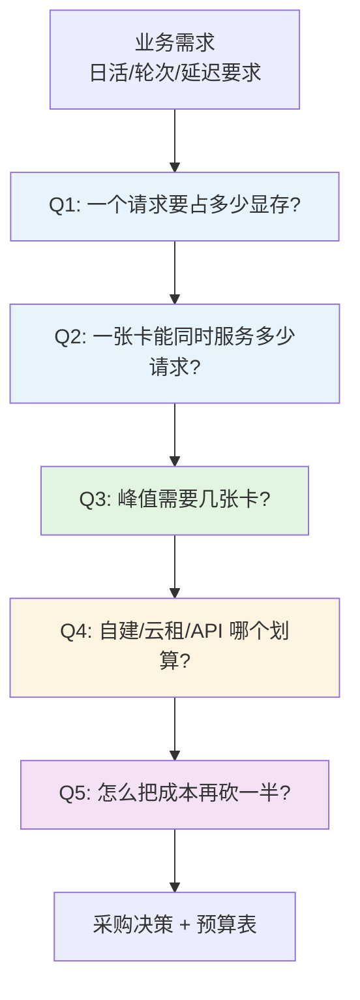
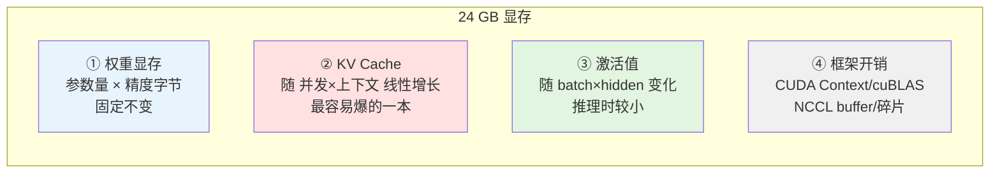
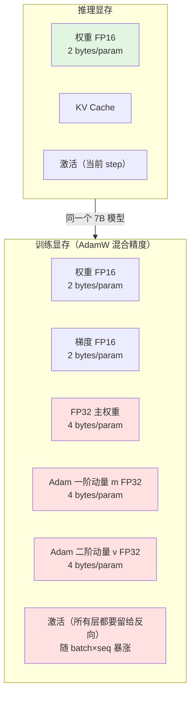
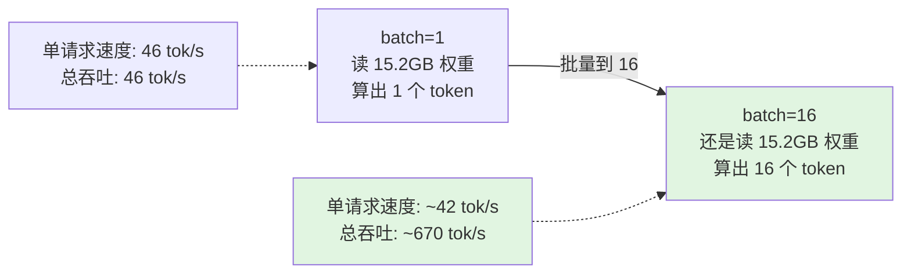
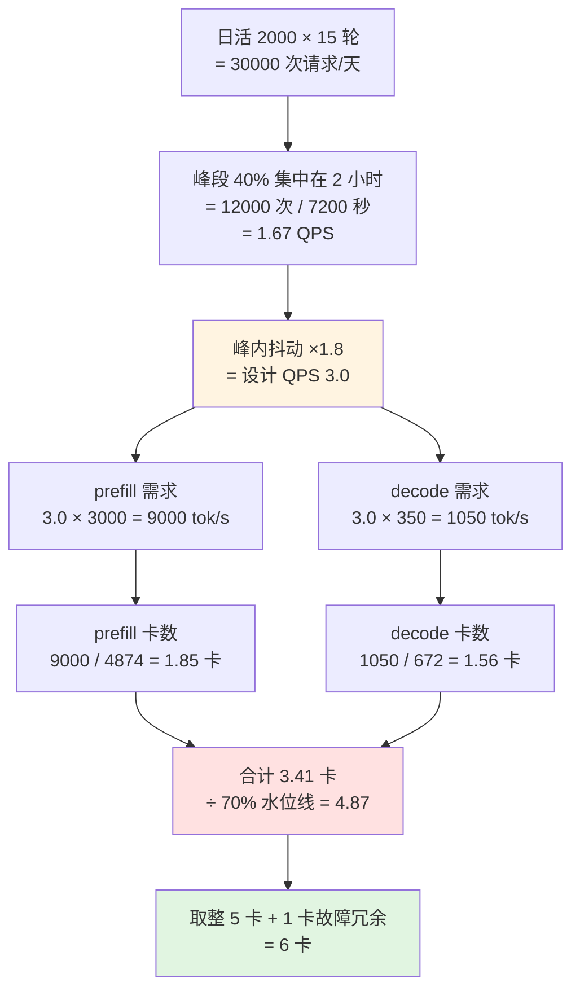
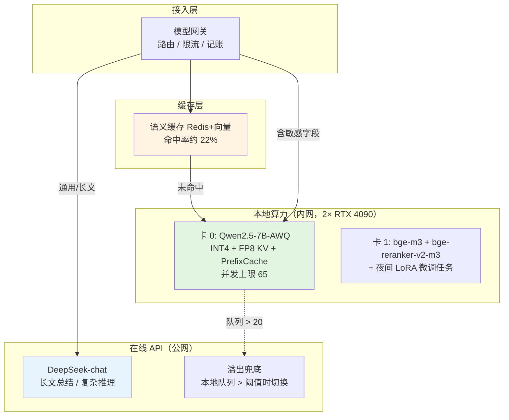

# 第 1.4 章  算力配置与成本测算

> **本章目标**：读完能做到 …
> 1. 用第一性原理算出任意模型在任意精度、任意并发下的显存占用，而不是靠"听说 7B 要 16G"；
> 2. 区分训练显存与推理显存，独立算出全量微调 / LoRA / QLoRA 三种方案各需要多大卡；
> 3. 看懂 GPU 卡型参数表，知道"显存带宽"为什么比"算力 TFLOPS"更能决定你的 token 生成速度；
> 4. 从业务指标（日活、人均轮次、峰值时段、P99 延迟）一步步推导出"需要几张什么卡"，并给出可复现的测算脚本；
> 5. 建立自建 / 云租 / API 三方案的 TCO 模型，算出盈亏平衡点，用数字而不是情绪做决策；
> 6. 掌握 10 个可立即执行的省钱工程手段，并知道每一条的收益量级与代价。
>
> **前置知识**：[1.1 大模型原理速览](./01-大模型原理速览.md)（KV Cache、Prefill / Decode 两阶段）、[1.2 模型全景图与选型方法论](./02-模型全景图与选型方法论.md)、[1.3 本地部署实战](./03-本地部署实战（Ollama-vLLM-SGLang）.md)（vLLM 启动参数、压测方法）
>
> **预计用时**：阅读 55 分钟 / 动手 90 分钟

---

## 一、为什么需要它（问题出发）

### 1.1 华成机电的采购事故

华成机电（本书贯穿案例：1200 人的机电制造企业，340 个产品型号，28 万条历史工单）决定把售后知识库助手从 PoC 推到生产。IT 部门问算法组："要买什么卡？"

算法组的回答是："我们用的是 Qwen2.5-7B，网上说 7B 模型要 16G 显存，买张 24G 的 4090 应该够了，保险起见买两张。"

采购走了三个月，两张 4090 到货，上线两周后出了下面这张问题清单：

| # | 现象 | 当时的解释 | 真实原因 |
|---|---|---|---|
| 1 | 单人使用时 40 tok/s，10 个人同时用掉到 8 tok/s | "并发高就是会慢" | 部分正确，但 KV Cache 已经占满，vLLM 在频繁抢占重算 |
| 2 | 把 RAG 上下文从 2K 加到 8K 后直接 OOM | "vLLM 有 bug" | KV Cache 随上下文线性增长，8K × 并发 16 已经超过剩余显存 |
| 3 | 想顺手做个 LoRA 微调，脚本一跑就 OOM | "LoRA 不是很省显存吗" | 省的是优化器状态，激活值没省；没开 gradient checkpointing |
| 4 | 想上 14B 提升效果，发现单卡装不下 | "那就双卡" | 两张 4090 没有 NVLink，PCIe 上做张量并行通信开销吃掉大半收益 |
| 5 | 老板问"这套一年花多少钱"，答不上来 | —— | 从来没算过电费、折旧、机柜、运维人力 |
| 6 | 财务拿 API 报价对比，发现比自建便宜一个数量级 | "自建更安全" | 安全是对的，但没人算过这个"安全"的溢价是多少 |

**这六件事，全部可以在采购之前用一张 A4 纸算清楚。** 这一章就是教你怎么算。

### 1.2 这一章要回答的五个问题



> **数字纪律声明**：本章出现的所有价格、吞吐、功耗数字，要么标注了「示例性数据」，要么标注了「实测环境」。
> GPU 价格、云租单价、API 单价随市场与厂商定价策略波动很大，**本章给的一律是量级参考，落地前必须自己去官网/渠道询价，并把数字填回本章给出的脚本里重算**。方法论是稳定的，数字不是。

---

## 二、原理拆解

### 2.1 显存的四本账

很多人以为"显存 = 模型大小"，这是所有 OOM 的起点。实际上推理时显存分成四本账：



四本账的性格完全不同：

| 账目 | 大小决定因素 | 是否随并发增长 | 典型占比（7B / 24G 卡） |
|---|---|---|---|
| ① 权重 | 参数量 × 精度 | 否 | 15.2 GB（FP16）|
| ② KV Cache | 层数 × KV 头数 × head_dim × 上下文长度 × 并发 | **是，线性** | 剩余显存全给它 |
| ③ 激活值 | batch × seq × hidden（推理时只算当前 step） | 是，但小 | 0.5~1.5 GB |
| ④ 框架开销 | CUDA Context、通信 buffer、显存碎片 | 否 | 0.8~1.5 GB |

**结论先行**：推理部署时，你真正能调的旋钮是第 ② 本账。权重定死了，开销定死了，**剩下多少给 KV Cache，就决定了你能扛多少并发 × 多长上下文**。

### 2.2 第一本账：权重显存

最简单的一条公式：

$$
M_{\text{weights}} = P \times B_{\text{precision}}
$$

其中 $P$ 是参数量（个），$B_{\text{precision}}$ 是每个参数占的字节数。

| 精度 | 每参数字节 | 说明 |
|---|---|---|
| FP32 | 4 | 训练主权重用，推理基本不用 |
| FP16 / BF16 | 2 | 推理默认精度，BF16 动态范围更大更稳 |
| FP8 | 1 | H800/H100 原生支持，Ada（4090/L20）部分支持 |
| INT8 | 1 | GPTQ/AWQ 8bit、bitsandbytes LLM.int8() |
| INT4 | 0.5 | GPTQ/AWQ 4bit、NF4（QLoRA） |

但直接乘完不准，因为量化模型有**额外的量化元数据**：每个量化组（group，通常 128 个权重一组）都要存一个 scale（FP16）和一个 zero point。所以：

$$
M_{\text{weights}}^{\text{quant}} = P \times B_{\text{quant}} + \frac{P}{G} \times (B_{\text{scale}} + B_{\text{zero}})
$$

以 group_size = 128、scale 用 FP16（2 字节）、zero 用 4 bit 打包计，INT4 的实际每参数开销约 $0.5 + 2.5/128 \approx 0.52$ 字节，也就是**比理论值多 4% 左右**。再加上 embedding / lm_head 这类层经常不量化（保持 FP16），实际 4bit 模型落盘大小通常是理论值的 **1.10~1.25 倍**。

> 所以你会看到 Qwen2.5-7B-Instruct-AWQ 的权重文件大约 5.5~6 GB，而不是 7.62B × 0.5 = 3.8 GB。这不是有人算错了，是量化元数据 + 未量化层的开销。

#### 2.2.1 实际参数量不是"7B"

模型名字里的 B 是四舍五入的营销数字。落地要用 `config.json` 算真实值：

```python
# scripts/count_params.py —— 从 safetensors 索引文件直接统计真实参数量
# 环境：Python 3.11 / transformers 4.46.x / safetensors 0.4.x
import json
import sys
from pathlib import Path


def count_params_from_index(model_dir: str) -> dict:
    """读取 safetensors 索引，按张量统计真实参数量与落盘字节数。"""
    model_path = Path(model_dir)
    index_file = model_path / "model.safetensors.index.json"

    if index_file.exists():
        index = json.loads(index_file.read_text(encoding="utf-8"))
        shard_files = sorted(set(index["weight_map"].values()))
        total_bytes = index.get("metadata", {}).get("total_size", 0)
    else:
        shard_files = ["model.safetensors"]
        total_bytes = (model_path / "model.safetensors").stat().st_size

    from safetensors import safe_open

    total_params = 0
    per_dtype = {}
    for shard in shard_files:
        with safe_open(model_path / shard, framework="pt") as f:
            for key in f.keys():
                slice_ = f.get_slice(key)
                shape = slice_.get_shape()
                dtype = slice_.get_dtype()
                n = 1
                for d in shape:
                    n *= d
                total_params += n
                per_dtype[dtype] = per_dtype.get(dtype, 0) + n

    return {
        "total_params": total_params,
        "total_params_B": round(total_params / 1e9, 3),
        "disk_bytes_GB": round(total_bytes / 1024 ** 3, 2),
        "per_dtype": {k: round(v / 1e9, 3) for k, v in per_dtype.items()},
    }


if __name__ == "__main__":
    result = count_params_from_index(sys.argv[1])
    print(json.dumps(result, ensure_ascii=False, indent=2))
```

运行：

```bash
uv run python scripts/count_params.py /models/Qwen2.5-7B-Instruct
# pip 等价：python scripts/count_params.py /models/Qwen2.5-7B-Instruct
```

预期输出（实测环境：Qwen2.5-7B-Instruct 官方 BF16 权重）：

```text
{
  "total_params": 7615616512,
  "total_params_B": 7.616,
  "disk_bytes_GB": 14.19,
  "per_dtype": {
    "BF16": 7.616
  }
}
```

**7.616B，不是 7B。误差 8.8%，在 24G 卡上就是 1.2 GB 的差别——足够决定你能不能多开 4 个并发。**

### 2.3 第二本账：KV Cache（最容易爆的一本）

Transformer 在 decode 阶段每生成一个 token，都要拿它的 Query 去和**前面所有 token 的 Key/Value** 做注意力。为了不重算，K 和 V 被缓存下来，这就是 KV Cache。

单个 token 的 KV Cache 大小：

$$
M_{\text{kv/token}} = 2 \times L \times H_{kv} \times d_{head} \times B_{\text{kv}}
$$

- $2$：K 和 V 各一份
- $L$：层数（num_hidden_layers）
- $H_{kv}$：**KV 头数**（num_key_value_heads），GQA 模型这个数远小于注意力头数
- $d_{head}$：每个头的维度（hidden_size / num_attention_heads）
- $B_{\text{kv}}$：KV Cache 的精度字节数（FP16 = 2，FP8 = 1）

总 KV Cache：

$$
M_{\text{kv}} = M_{\text{kv/token}} \times S \times N_{\text{concurrent}}
$$

$S$ 是序列总长度（prompt + 已生成），$N$ 是并发请求数。

#### 2.3.1 GQA 是怎么省下 KV Cache 的

这是理解现代模型显存的关键。以 Qwen2.5-7B 为例（以官方 `config.json` 为准，本书写作时的配置）：

| 配置项 | 值 |
|---|---|
| num_hidden_layers | 28 |
| hidden_size | 3584 |
| num_attention_heads | 28 |
| **num_key_value_heads** | **4** |
| head_dim = 3584 / 28 | 128 |

如果是老式的 MHA（每个注意力头一套 KV，$H_{kv} = 28$）：

$$
2 \times 28 \times 28 \times 128 \times 2 = 401{,}408 \text{ 字节/token} = 392 \text{ KiB/token}
$$

实际的 GQA（$H_{kv} = 4$）：

$$
2 \times 28 \times 4 \times 128 \times 2 = 57{,}344 \text{ 字节/token} = 56 \text{ KiB/token}
$$

**GQA 把 KV Cache 砍到了 1/7。** 这就是为什么现在所有主流开源模型都用 GQA——不是为了省参数，是为了在同样显存下多扛 7 倍并发。

#### 2.3.2 主流模型的 KV Cache 单价表

下表按 FP16 KV Cache 计算。**架构参数以各模型官方 `config.json` 为准**，这里列的是本书写作时的配置：

| 模型 | 层数 L | KV 头数 | head_dim | KV/token | 8K 上下文单序列 | 32K 上下文单序列 |
|---|---|---|---|---|---|---|
| Qwen2.5-1.5B | 28 | 2 | 128 | 28 KiB | 0.22 GiB | 0.88 GiB |
| Qwen2.5-7B | 28 | 4 | 128 | 56 KiB | 0.44 GiB | 1.75 GiB |
| Qwen2.5-14B | 48 | 8 | 128 | 192 KiB | 1.50 GiB | 6.00 GiB |
| Qwen2.5-32B | 64 | 8 | 128 | 256 KiB | 2.00 GiB | 8.00 GiB |
| Qwen2.5-72B | 80 | 8 | 128 | 320 KiB | 2.50 GiB | 10.00 GiB |

**读这张表的正确姿势**：

- 14B 的 KV Cache 单价是 7B 的 **3.4 倍**（192 vs 56 KiB），但权重只大 1.9 倍。所以从 7B 升到 14B，**并发能力的下降比你想的严重得多**。
- 32K 上下文的 14B 模型，单个请求光 KV 就要 6 GB。一张 24G 卡放完权重（29.5 GB FP16）根本放不下——必须量化或者上双卡。
- **长上下文的代价是超线性的**：上下文翻倍，KV 翻倍，能开的并发减半，单卡总吞吐掉到 1/4（并发减半 × 每请求算力翻倍）。

### 2.4 第三、四本账：激活值与框架开销

**激活值（Activations）**：推理时不需要保存反向传播用的中间结果，只需要当前 forward step 的临时张量。峰值大致是：

$$
M_{\text{act}} \approx N_{\text{batch}} \times S_{\text{chunk}} \times d_{model} \times k
$$

$k$ 是个和实现有关的系数（通常 10~20，取决于 MLP 中间层倍率和是否融合算子）。对 7B 模型、batch 32、chunked prefill 每块 512 token：

$$
32 \times 512 \times 3584 \times 2 \text{ 字节} \times 15 \approx 1.76 \text{ GB}
$$

**框架开销**：

| 项目 | 典型大小 | 说明 |
|---|---|---|
| CUDA Context | 300~500 MB | 每个进程一份，多卡时每卡一份 |
| cuBLAS / cuDNN workspace | 100~300 MB | 矩阵乘法临时空间 |
| NCCL 通信 buffer | 200~500 MB/卡 | 只有多卡张量并行时才有 |
| PyTorch 显存碎片 | 5%~10% | 用 `PYTORCH_CUDA_ALLOC_CONF=expandable_segments:True` 可缓解 |
| CUDA Graph（vLLM 默认开） | 0.5~2 GB | `--enforce-eager` 可关掉省显存，但吞吐降 10%~20% |

**工程经验值：预留 1.5~2 GB 给第三、四本账，7B 以上模型预留 2~3 GB。** 不要卡到 99%，显存碎片会在服务跑了几小时后突然咬你一口。

### 2.5 模型规模 × 精度的显存需求总表

把四本账合起来，得到这张**采购决策表**。计算口径：

- 权重按真实参数量 × 精度字节，量化模型额外 +15% 元数据与未量化层开销
- KV Cache 按 **8K 上下文 × 并发 16** 计算（一个典型 RAG 问答服务的配置）
- 激活 + 框架开销统一按 2.5 GB 计

| 模型 | 参数量 | 精度 | 权重 | KV(8K×16) | 其他 | **合计** | 最小可行卡 |
|---|---|---|---|---|---|---|---|
| Qwen2.5-1.5B | 1.54B | FP16 | 3.1 GB | 3.5 GB | 2.5 GB | **9.1 GB** | 单卡 12G |
| | | INT8 | 1.8 GB | 3.5 GB | 2.5 GB | **7.8 GB** | 单卡 12G |
| | | INT4 | 1.0 GB | 3.5 GB | 2.5 GB | **7.0 GB** | 单卡 8G |
| Qwen2.5-7B | 7.62B | FP16 | 15.2 GB | 7.0 GB | 2.5 GB | **24.7 GB** | 单卡 32G / 双卡 24G |
| | | INT8 | 8.8 GB | 7.0 GB | 2.5 GB | **18.3 GB** | 单卡 24G |
| | | INT4 | 4.6 GB | 7.0 GB | 2.5 GB | **14.1 GB** | 单卡 16G |
| Qwen2.5-14B | 14.8B | FP16 | 29.5 GB | 24.0 GB | 2.5 GB | **56.0 GB** | 单卡 80G / 双卡 48G |
| | | INT8 | 17.0 GB | 24.0 GB | 2.5 GB | **43.5 GB** | 单卡 48G |
| | | INT4 | 8.9 GB | 24.0 GB | 2.5 GB | **35.4 GB** | 单卡 48G / 双卡 24G |
| Qwen2.5-32B | 32.8B | FP16 | 65.6 GB | 32.0 GB | 3.0 GB | **100.6 GB** | 双卡 80G |
| | | INT8 | 37.7 GB | 32.0 GB | 3.0 GB | **72.7 GB** | 单卡 80G |
| | | INT4 | 19.7 GB | 32.0 GB | 3.0 GB | **54.7 GB** | 双卡 48G |
| Qwen2.5-72B | 72.7B | FP16 | 145.4 GB | 40.0 GB | 4.0 GB | **189.4 GB** | 4 卡 80G（TP=4）|
| | | INT8 | 83.6 GB | 40.0 GB | 4.0 GB | **127.6 GB** | 双卡 80G |
| | | INT4 | 43.6 GB | 40.0 GB | 4.0 GB | **87.6 GB** | 双卡 80G / 4 卡 24G |

> **重要提醒 1**：这张表的 KV Cache 列是"你希望支持的并发"决定的，不是固定值。
> 如果你只需要并发 4，7B FP16 的 KV 只要 1.75 GB，总量 19.5 GB，**单张 24G 卡刚好够**。
> 如果你要并发 64，KV 要 28 GB，同样是 7B FP16 就得上 80G 卡。
> **先定并发和上下文，再查表，顺序反了必然翻车。**

> **重要提醒 2**：INT4 权重省了显存，但 **KV Cache 一分没省**（除非你同时开 FP8 KV Cache）。
> 上下文越长、并发越高，量化带来的相对收益越小。
> 32K 上下文 × 并发 32 的 14B 模型，KV 要 48 GB，权重量化到 INT4 只从 29.5 降到 8.9，总量还是 60 GB 起——**这时该做的是开 FP8 KV Cache，不是继续压权重。**

### 2.6 训练显存 vs 推理显存：为什么差 8 倍

推理只要前向，训练要前向 + 反向 + 参数更新。多出来的三块是显存杀手：



经典的「**16 字节/参数**」经验公式（AdamW + 混合精度 + 全量微调）：

$$
M_{\text{train}} = P \times (\underbrace{2}_{\text{FP16 权重}} + \underbrace{2}_{\text{FP16 梯度}} + \underbrace{4}_{\text{FP32 主权重}} + \underbrace{4}_{\text{Adam } m} + \underbrace{4}_{\text{Adam } v}) + M_{\text{act}}
$$

$$
= P \times 16 \text{ 字节} + M_{\text{act}}
$$

对 Qwen2.5-7B：$7.616 \times 10^9 \times 16 = 121.9 \text{ GB}$，**再加激活值**。

这就是为什么"全量微调一个 7B 模型"需要至少 2 张 80G 卡（还得配 ZeRO-2/3）。

#### 2.6.1 训练激活值：被低估的那一块

训练时每一层的中间结果都要保留，等反向传播用。不开 gradient checkpointing 时：

$$
M_{\text{act}}^{\text{train}} \approx L \times N_{\text{batch}} \times S \times d_{model} \times c
$$

$c$ 是每层保留的激活份数（含 attention、MLP 的中间张量，通常 15~25）。对 7B、batch 4、seq 2048：

$$
28 \times 4 \times 2048 \times 3584 \times 2\text{字节} \times 20 \approx 32.9 \text{ GB}
$$

**开了 gradient checkpointing（梯度重计算）后**，只保留每层边界的激活，反向时重算层内中间结果：

$$
M_{\text{act}}^{\text{ckpt}} \approx L \times N_{\text{batch}} \times S \times d_{model} \times 2\text{字节} \approx 28 \times 4 \times 2048 \times 3584 \times 2 = 1.64 \text{ GB}
$$

**显存降到 1/20，代价是前向要算两遍，训练速度慢 20%~30%（实测环境：单卡 4090 + Qwen2.5-7B + LoRA + seq 2048，示例性数据，不同配置差异较大）。**

这是微调场景里**性价比最高的一个开关**，几乎应该无条件打开。

### 2.7 全量微调 vs LoRA vs QLoRA 显存对比（以 Qwen2.5-7B 为例）

现在把计算过程完整列出来。统一假设：AdamW 优化器、混合精度、seq_len = 2048、batch_size = 4、开启 gradient checkpointing、LoRA rank = 16 且注入到所有线性层。

**LoRA 可训练参数量怎么算**：Qwen2.5-7B 注入 7 类线性层（q/k/v/o_proj + gate/up/down_proj），rank=16 时可训练参数约 **2.02 × 10⁷（20.2M）**，占全量的 0.265%。这个数字可以用下面这段代码打印出来（见 3.1 节脚本）。

| 显存项 | 全量微调 | LoRA (r=16) | QLoRA (NF4, r=16) |
|---|---|---|---|
| **基座权重** | FP16: 7.616B × 2 = **15.2 GB** | FP16 冻结: **15.2 GB** | NF4: 7.616B × 0.5 = 3.81 GB<br/>+ 量化常数 ≈ 0.25 GB<br/>= **4.06 GB** |
| **FP32 主权重** | 7.616B × 4 = **30.5 GB** | 只有 LoRA 参数: 20.2M × 4 = **0.08 GB** | 同左: **0.08 GB** |
| **梯度** | 7.616B × 2 = **15.2 GB** | 20.2M × 2 = **0.04 GB** | **0.04 GB** |
| **Adam m + v** | 7.616B × 8 = **60.9 GB** | 20.2M × 8 = **0.16 GB** | **0.16 GB** |
| **激活（含 checkpointing）** | **1.64 GB** | **1.64 GB** | **1.9 GB**（NF4 反量化临时张量略多） |
| **框架开销** | **2.0 GB** | **2.0 GB** | **2.0 GB** |
| **合计** | **125.4 GB** | **19.1 GB** | **8.2 GB** |
| **最小可行硬件** | 2× A100 80G + ZeRO-2 | 单张 24G（4090/A10）**刚好够** | 单张 12G 或 16G 卡 |
| **可训练参数占比** | 100% | 0.265% | 0.265% |
| **训练速度（相对）** | 1.0×（多卡） | 约 0.85×（单卡基准） | 约 0.55×（NF4 反量化开销） |
| **效果（领域任务）** | 上限最高 | 多数任务接近全量 | 略低于 LoRA，差距通常很小 |

> **实测环境标注**：上表显存为公式推导值；作者在单张 RTX 4090 24G + Qwen2.5-7B-Instruct + LLaMA-Factory + seq 2048 + batch 4 + grad_ckpt 的配置下，`nvidia-smi` 观测到 LoRA 约 21~22 GB、QLoRA 约 9~10 GB，与公式推导差 1~2 GB（PyTorch 缓存分配器不立即归还显存）。**这是示例性数据，你的数字会因为框架版本、是否开 flash-attn、padding 策略而不同，务必自己测一次。**

**三条可以直接背下来的结论**：

1. **LoRA 省的是优化器状态（-90.5 GB），不是激活值。** 如果你 OOM 在激活上（batch 大、seq 长），LoRA 救不了你，`gradient_checkpointing=True` 才救得了。
2. **QLoRA 省的是基座权重（-11.2 GB）。** 代价是每次前向都要把 NF4 反量化成 BF16 算，速度掉 30%~40%。
3. **24G 单卡微调 7B 的正确姿势是 LoRA，不是 QLoRA。** QLoRA 是给 12G/16G 卡用的，或者给 24G 卡跑 14B 用的。有 24G 还用 QLoRA 是白白牺牲速度和一点效果。

#### 2.7.1 一张"我的卡能微调多大模型"速查表

| 卡 | 显存 | 全量微调 | LoRA (seq2048) | QLoRA (seq2048) |
|---|---|---|---|---|
| RTX 3060 | 12G | ✗ | 1.5B | **7B**（batch 1~2） |
| RTX 4090 / A10 | 24G | ✗ | **7B** | **14B** |
| L20 / L40S / RTX 6000 Ada | 48G | 1.5B | **14B** | **32B** |
| A100 | 80G | 7B（勉强，需 offload） | **32B** | **72B**（batch 1，需 offload） |
| 2× A100 80G | 160G | **7B**（ZeRO-2） | **72B** | 72B 长序列 |
| 8× A100 80G | 640G | **72B**（ZeRO-3 + offload） | — | — |

> 表中的"能"指能跑起来且速度可接受，不代表推荐。**seq_len 翻倍，激活翻倍，这张表要整体降一档。**

### 2.8 GPU 卡型对照表

这是采购时真正要看的表。**价格随市场、渠道、国内外供货政策波动极大，下表价格区间仅供量级参考，落地前必须重新询价。**

| 卡型 | 显存 | 显存类型 | **显存带宽** | FP16 Tensor 算力 | 多卡互联 | 功耗 | 价格区间（量级参考） | 能跑什么 |
|---|---|---|---|---|---|---|---|---|
| **RTX 4090** | 24 GB | GDDR6X | ~1.0 TB/s | ~165 TFLOPS | ❌ 无 NVLink，PCIe 4.0 | 450 W | 1.3~2.0 万元/卡 | 7B FP16 中并发 / 14B INT4 / LoRA 微调 7B |
| **A10** | 24 GB | GDDR6 | ~0.6 TB/s | ~125 TFLOPS | ❌ 无 NVLink | 150 W | 2~3 万元/卡 | 同 4090 但吞吐约 60%，胜在单槽被动散热、适合上机架 |
| **L20** | 48 GB | GDDR6 | ~0.86 TB/s | ~120 TFLOPS | ❌ 无 NVLink | 275 W | 3~5 万元/卡 | 14B FP16 / 32B INT4 / 单卡跑 LLM+Embedding+Rerank 全家桶 |
| **L40S** | 48 GB | GDDR6 | ~0.86 TB/s | ~362 TFLOPS | ❌ 无 NVLink | 350 W | 4~7 万元/卡 | 同 L20 但算力高 3 倍，prefill 密集场景明显更快 |
| **A100 40G** | 40 GB | HBM2 | ~1.56 TB/s | ~312 TFLOPS | ✅ NVLink 600 GB/s | 400 W | 5~9 万元/卡（二手为主）| 14B FP16 高并发 / 32B INT8 |
| **A100 80G** | 80 GB | HBM2e | ~2.0 TB/s | ~312 TFLOPS | ✅ NVLink 600 GB/s | 400 W | 9~15 万元/卡 | 32B FP16 / 72B INT8 双卡 / 大并发生产主力 |
| **H800 80G** | 80 GB | HBM3 | ~3.35 TB/s | ~990 TFLOPS | ✅ NVLink（带宽受限版） | 700 W | 20~30 万元/卡 | 72B FP16（TP=4）/ 超大并发 / 训练 |

> **数据来源说明**：显存、带宽、算力为各厂商公开规格书的量级数值（FP16 Tensor 算力均指非稀疏值，厂商宣传的"稀疏算力"是它的 2 倍，推理用不上）。价格为本书写作时国内市场的**大致区间**，波动可达 ±50%，**仅供量级判断，不可作为报价依据**。

#### 2.8.1 这张表最容易被忽略的三件事

**① 显存带宽比算力重要（对推理而言）**

看 L20 和 L40S：显存一样、带宽一样，但算力差 3 倍，价格差 1.5 倍。**如果你的场景是短 prompt + 长输出的聊天（decode 主导），两张卡的 token/s 几乎一样**，因为 decode 是访存瓶颈。只有当你的场景是长 RAG 上下文（prefill 主导）时，L40S 的算力优势才体现出来。

反过来看 4090 和 A10：都是 24G，4090 带宽 1.0 TB/s，A10 只有 0.6 TB/s。**同样跑 7B，4090 的 decode 速度约是 A10 的 1.67 倍**——这个比值几乎就是带宽比。

**② 没有 NVLink 的卡做张量并行是亏本买卖**

张量并行（Tensor Parallel, TP）每层都要做 AllReduce 同步。7B 模型 TP=2 时，每个 decode step 要在两卡间传约 $2 \times L \times d_{model} \times 2\text{字节} = 2 \times 28 \times 3584 \times 2 \approx 401$ KB（batch=1）。

- **有 NVLink（600 GB/s）**：传输耗时 ≈ 0.67 μs，相对于每 step 约 15 ms 的计算时间可忽略
- **只有 PCIe 4.0 x16（单向 32 GB/s，实测有效约 20 GB/s）**：传输耗时 ≈ 20 μs，**batch 大时通信量线性增长**，在 batch 64 时通信能吃掉 20%~30% 的时间

**实践建议**：消费卡（4090）只在"单卡装不下"时才做 TP，能用单卡就用单卡。要做多卡，优先考虑**数据并行**（起两个独立实例 + 负载均衡），而不是张量并行。

**③ 功耗决定了你能不能装进现有机房**

4 张 4090 = 1800 W GPU 功耗，加 CPU / 内存 / 风扇，整机要 2.5~3 kW，**必须配 3000 W 以上电源和 C19 电源接口，普通机柜 PDU 的 16A 回路（约 3.5 kW）只能放一台这样的机器**。华成机电的老机房单柜供电 4 kW，这个数字直接决定了"一个柜子只能放一台 4 卡机"。

### 2.9 吞吐量估算：从显存带宽推导速度上限

#### 2.9.1 为什么 decode 是访存瓶颈

生成一个 token 需要做的两件事：

| | 计算量（FLOPs） | 访存量（Bytes） | 计算强度（FLOPs/Byte） |
|---|---|---|---|
| **Prefill**（处理 N 个 token） | $2 \times P \times N$ | $\approx 2P$（权重读一次） | $N$（很高） |
| **Decode**（生成 1 个 token） | $2 \times P \times 1$ | $\approx 2P$（权重还是要读一遍） | **1（极低）** |

关键洞察：**decode 时，为了算 1 个 token，你要把整个模型的权重从显存搬到计算单元一遍。** 计算只有 2P FLOPs，访存却有 2P 字节。

以 4090 为例：算力 165 TFLOPS，带宽 1008 GB/s，**计算强度平衡点** = 165e12 / 1008e9 ≈ **164 FLOPs/Byte**。而 decode 的计算强度是 1。**差 164 倍，妥妥的访存瓶颈。**

#### 2.9.2 decode 速度上限公式

$$
\text{TPS}_{\max} = \frac{BW_{\text{effective}}}{M_{\text{weights}} + M_{\text{kv,active}}}
$$

其中 $BW_{\text{effective}} = BW_{\text{peak}} \times \text{MBU}$，MBU（Memory Bandwidth Utilization）是实际能打到的带宽利用率，**实测通常 0.6~0.85**。

**例 1：4090 跑 Qwen2.5-7B FP16，batch=1，上下文 2K**

- 权重 15.2 GB，KV Cache 2K × 56 KiB = 0.11 GB
- $\text{TPS}_{\max} = 1008 / (15.2 + 0.11) = 65.8$ tok/s（理论上限）
- 按 MBU = 0.7 折算：**约 46 tok/s**（这和实际压测结果吻合，见 1.3 章的压测数据）

**例 2：同样的卡跑 Qwen2.5-7B-AWQ（INT4），batch=1**

- 权重 4.6 GB，KV 还是 0.11 GB
- $\text{TPS}_{\max} = 1008 / 4.71 = 214$ tok/s
- 按 MBU = 0.6（INT4 反量化有额外开销，MBU 通常更低）：**约 128 tok/s**

**量化带来了约 2.8 倍的 decode 加速——这是量化最被低估的收益，比省显存更值钱。**

**例 3：A100 80G 跑 Qwen2.5-72B INT4，batch=1**

- 权重 43.6 GB（要两张卡 TP=2，每卡 21.8 GB）
- 每卡带宽 2039 GB/s，TP=2 时每步还要通信
- $\text{TPS}_{\max} \approx 2039 / 21.8 = 93.5$ tok/s，MBU 0.6 + 通信开销 → **约 50 tok/s**

#### 2.9.3 批量为什么提升总吞吐但不提升单请求速度

这是所有容量规划的核心机制：



**权重只读一次，服务了 16 个请求。** 访存量几乎不变，计算量 ×16——正好把闲置的算力用起来了。

| batch | 权重访存 | KV 访存 | 单请求 tok/s | 总吞吐 tok/s | 备注 |
|---|---|---|---|---|---|
| 1 | 15.2 GB | 0.11 GB | 46 | 46 | 算力利用率 <1% |
| 4 | 15.2 GB | 0.44 GB | 45 | 180 | 几乎白赚 |
| 16 | 15.2 GB | 1.75 GB | 42 | 672 | 甜区 |
| 32 | 15.2 GB | 3.5 GB | 37 | 1184 | KV 访存开始显著 |
| 64 | 15.2 GB | 7.0 GB | 28 | 1792 | 接近算力瓶颈，延迟明显劣化 |
| 128 | 15.2 GB | 14.0 GB | 16 | 2048 | 吞吐涨幅收窄，P99 崩坏 |

> **实测环境**：上表为单张 RTX 4090 + vLLM 0.6.x + Qwen2.5-7B-Instruct FP16 + 上下文 2K + 输出 256 token 的**示例性数据**，用于说明趋势。**绝对值请以你自己的压测为准**（压测脚本见 1.3 章第三节）。

**三条结论**：

1. **批量是免费午餐，但有天花板。** 从 1 到 16，总吞吐涨 14.6 倍，单请求只慢 9%。这段必须吃满。
2. **超过甜区后，单请求延迟劣化的速度快于总吞吐提升的速度。** batch 64→128，吞吐只涨 14%，单请求速度腰斩。
3. **如果你的 SLA 是"单请求首字 3 秒内、生成速度不低于 20 tok/s"，那你的 batch 上限就定死在 64 左右**，这个数字直接进容量规划公式。

#### 2.9.4 Prefill 吞吐估算

prefill 是计算密集的，用算力公式：

$$
\text{TPS}_{\text{prefill}} = \frac{\text{TFLOPS}_{\text{peak}} \times \text{MFU}}{2 \times P}
$$

4090 跑 7B：$\frac{165 \times 10^{12} \times 0.45}{2 \times 7.616 \times 10^9} = 4874$ tok/s

MFU（Model FLOPs Utilization）实测在 0.35~0.5 之间。**记住这个量级：一张 4090 每秒能"读"约 5000 个 token 的 prompt。**

**这个数字对 RAG 极其关键**：如果你的 RAG 上下文是 4000 token，那么单张 4090 每秒最多处理 1.2 个新请求的 prefill——**光 prefill 就决定了 QPS 上限，跟输出长度无关。**

---

## 三、动手实战

本节四个脚本，全部放在项目骨架的 `scripts/` 目录下，可直接运行：

```text
scripts/
├── vram_calc.py        # 3.1 显存计算器（推理 + 训练）
├── capacity_plan.py    # 3.2 容量规划：从业务指标算到卡数
├── tco_compare.py      # 3.3 自建 vs 云租 vs API 三方案 TCO
└── count_params.py     # 2.2.1 已给出
```

环境准备（全书统一基线：Python 3.11 + uv）：

```bash
uv add pydantic==2.9.2 tabulate==0.9.0
# pip 等价：pip install "pydantic==2.9.2" "tabulate==0.9.0"
```

### 3.1 显存计算器 vram_calc.py

这段脚本把 2.2~2.7 节的所有公式实现成可调用的函数，输入模型架构参数和部署配置，输出四本账的明细。

```python
# scripts/vram_calc.py —— 大模型显存计算器（推理 + 训练）
# 环境：Python 3.11，无第三方依赖（tabulate 可选，用于美化输出）
from __future__ import annotations

from dataclasses import dataclass, field

GB = 1024 ** 3


@dataclass
class ModelArch:
    """模型架构参数，全部来自模型目录下的 config.json。"""

    name: str
    num_params: float          # 真实参数量（个），用 count_params.py 统计
    num_layers: int            # num_hidden_layers
    hidden_size: int
    num_attention_heads: int
    num_key_value_heads: int   # GQA 的 KV 头数

    @property
    def head_dim(self) -> int:
        """单个注意力头的维度。"""
        return self.hidden_size // self.num_attention_heads

    def kv_bytes_per_token(self, kv_dtype_bytes: int = 2) -> int:
        """单个 token 的 KV Cache 字节数：2(K,V) × 层数 × KV头数 × head_dim × 精度。"""
        return 2 * self.num_layers * self.num_key_value_heads * self.head_dim * kv_dtype_bytes


# 主流模型架构库（以各模型官方 config.json 为准，本书写作时的配置）
MODELS: dict[str, ModelArch] = {
    "Qwen2.5-1.5B": ModelArch("Qwen2.5-1.5B", 1.544e9, 28, 1536, 12, 2),
    "Qwen2.5-7B": ModelArch("Qwen2.5-7B", 7.616e9, 28, 3584, 28, 4),
    "Qwen2.5-14B": ModelArch("Qwen2.5-14B", 14.77e9, 48, 5120, 40, 8),
    "Qwen2.5-32B": ModelArch("Qwen2.5-32B", 32.76e9, 64, 5120, 40, 8),
    "Qwen2.5-72B": ModelArch("Qwen2.5-72B", 72.71e9, 80, 8192, 64, 8),
}

PRECISION_BYTES = {"fp32": 4.0, "fp16": 2.0, "bf16": 2.0, "fp8": 1.0, "int8": 1.0, "int4": 0.5}
# 量化元数据与未量化层（embedding/lm_head）带来的额外开销系数
QUANT_OVERHEAD = {"fp32": 1.0, "fp16": 1.0, "bf16": 1.0, "fp8": 1.08, "int8": 1.15, "int4": 1.20}


@dataclass
class InferenceConfig:
    """推理部署配置。"""

    precision: str = "fp16"
    kv_dtype_bytes: int = 2        # KV Cache 精度，FP8 KV Cache 填 1
    max_context: int = 8192        # 单请求最大上下文（prompt + 输出）
    concurrency: int = 16          # 目标并发请求数
    framework_overhead_gb: float = 2.5   # 激活 + CUDA Context + 碎片


def estimate_inference_vram(arch: ModelArch, cfg: InferenceConfig) -> dict:
    """计算推理场景的显存四本账。"""
    w_bytes = PRECISION_BYTES[cfg.precision] * QUANT_OVERHEAD[cfg.precision]
    weights_gb = arch.num_params * w_bytes / GB

    kv_per_token = arch.kv_bytes_per_token(cfg.kv_dtype_bytes)
    kv_gb = kv_per_token * cfg.max_context * cfg.concurrency / GB

    total = weights_gb + kv_gb + cfg.framework_overhead_gb
    return {
        "model": arch.name,
        "precision": cfg.precision,
        "weights_gb": round(weights_gb, 2),
        "kv_cache_gb": round(kv_gb, 2),
        "kv_kib_per_token": round(kv_per_token / 1024, 1),
        "overhead_gb": cfg.framework_overhead_gb,
        "total_gb": round(total, 2),
        "context": cfg.max_context,
        "concurrency": cfg.concurrency,
    }


def max_concurrency_on_card(arch: ModelArch, cfg: InferenceConfig, card_gb: float,
                            safety_ratio: float = 0.92) -> int:
    """给定显卡容量，反推最大可支持并发数（留 8% 安全余量防碎片）。"""
    w_bytes = PRECISION_BYTES[cfg.precision] * QUANT_OVERHEAD[cfg.precision]
    weights_gb = arch.num_params * w_bytes / GB
    usable = card_gb * safety_ratio - weights_gb - cfg.framework_overhead_gb
    if usable <= 0:
        return 0
    kv_per_seq_gb = arch.kv_bytes_per_token(cfg.kv_dtype_bytes) * cfg.max_context / GB
    return int(usable / kv_per_seq_gb)


@dataclass
class TrainConfig:
    """训练/微调配置。"""

    method: str = "lora"           # full | lora | qlora
    lora_rank: int = 16
    lora_target_ratio: float = 0.00265   # LoRA 可训练参数占比（r=16 注入 7 类线性层的经验值）
    seq_len: int = 2048
    batch_size: int = 4
    grad_checkpointing: bool = True
    optimizer: str = "adamw"       # adamw(8 bytes/param) | adamw_8bit(2) | sgd(0)
    framework_overhead_gb: float = 2.0


OPT_STATE_BYTES = {"adamw": 8.0, "adamw_8bit": 2.0, "sgd": 0.0}


def estimate_train_vram(arch: ModelArch, cfg: TrainConfig) -> dict:
    """计算训练场景显存：基座 + 主权重 + 梯度 + 优化器 + 激活。"""
    P = arch.num_params

    if cfg.method == "full":
        base_gb = P * 2 / GB                       # FP16 基座
        trainable = P
        master_gb = trainable * 4 / GB             # FP32 主权重
    elif cfg.method == "lora":
        base_gb = P * 2 / GB                       # FP16 冻结基座
        trainable = P * cfg.lora_target_ratio
        master_gb = trainable * 4 / GB
    elif cfg.method == "qlora":
        base_gb = (P * 0.5 * 1.07) / GB            # NF4 + 双重量化常数
        trainable = P * cfg.lora_target_ratio
        master_gb = trainable * 4 / GB
    else:
        raise ValueError(f"unknown method: {cfg.method}")

    grad_gb = trainable * 2 / GB
    opt_gb = trainable * OPT_STATE_BYTES[cfg.optimizer] / GB

    # 激活值：开 checkpointing 只留每层边界，否则每层留约 20 份中间张量
    act_factor = 2 if cfg.grad_checkpointing else 40
    act_gb = (arch.num_layers * cfg.batch_size * cfg.seq_len
              * arch.hidden_size * act_factor) / GB
    if cfg.method == "qlora":
        act_gb *= 1.15   # 反量化临时张量

    total = base_gb + master_gb + grad_gb + opt_gb + act_gb + cfg.framework_overhead_gb
    return {
        "model": arch.name,
        "method": cfg.method,
        "trainable_params_M": round(trainable / 1e6, 2),
        "trainable_ratio": f"{trainable / P * 100:.3f}%",
        "base_gb": round(base_gb, 2),
        "master_weight_gb": round(master_gb, 2),
        "grad_gb": round(grad_gb, 2),
        "optimizer_gb": round(opt_gb, 2),
        "activation_gb": round(act_gb, 2),
        "overhead_gb": cfg.framework_overhead_gb,
        "total_gb": round(total, 2),
    }


def _fmt_row(d: dict, keys: list[str]) -> str:
    return " | ".join(f"{str(d[k]):>12}" for k in keys)


def main() -> None:
    """打印推理显存表、并发反推表和训练方案对比表。"""
    print("=" * 96)
    print("【表 1】推理显存（上下文 8192 / 并发 16 / 开销 2.5GB）")
    print("=" * 96)
    keys = ["model", "precision", "weights_gb", "kv_cache_gb", "overhead_gb", "total_gb"]
    print(" | ".join(f"{k:>12}" for k in keys))
    for name in MODELS:
        for prec in ("fp16", "int8", "int4"):
            r = estimate_inference_vram(MODELS[name], InferenceConfig(precision=prec))
            print(_fmt_row(r, keys))

    print()
    print("=" * 96)
    print("【表 2】Qwen2.5-7B 在不同卡 / 不同精度下的最大并发（上下文 8192）")
    print("=" * 96)
    arch = MODELS["Qwen2.5-7B"]
    print(f"{'card':>16} | {'fp16':>8} | {'int8':>8} | {'int4':>8} | {'int4+fp8kv':>12}")
    for card_name, card_gb in [("RTX 4090 24G", 24), ("L20 48G", 48),
                               ("A100 80G", 80), ("H800 80G", 80)]:
        row = [card_name]
        for prec in ("fp16", "int8", "int4"):
            row.append(max_concurrency_on_card(arch, InferenceConfig(precision=prec), card_gb))
        row.append(max_concurrency_on_card(
            arch, InferenceConfig(precision="int4", kv_dtype_bytes=1), card_gb))
        print(f"{row[0]:>16} | {row[1]:>8} | {row[2]:>8} | {row[3]:>8} | {row[4]:>12}")

    print()
    print("=" * 96)
    print("【表 3】Qwen2.5-7B 三种微调方案显存对比（seq2048 / batch4 / grad_ckpt=True）")
    print("=" * 96)
    tkeys = ["method", "trainable_params_M", "base_gb", "master_weight_gb",
             "grad_gb", "optimizer_gb", "activation_gb", "total_gb"]
    print(" | ".join(f"{k:>18}" for k in tkeys))
    for method in ("full", "lora", "qlora"):
        r = estimate_train_vram(arch, TrainConfig(method=method))
        print(" | ".join(f"{str(r[k]):>18}" for k in tkeys))


if __name__ == "__main__":
    main()
```

运行：

```bash
uv run python scripts/vram_calc.py
```

预期输出：

```text
================================================================================================
【表 1】推理显存（上下文 8192 / 并发 16 / 开销 2.5GB）
================================================================================================
       model |    precision |   weights_gb |  kv_cache_gb |  overhead_gb |     total_gb
Qwen2.5-1.5B |         fp16 |         2.88 |         3.44 |          2.5 |         8.82
Qwen2.5-1.5B |         int8 |         1.65 |         3.44 |          2.5 |         7.59
Qwen2.5-1.5B |         int4 |         0.86 |         3.44 |          2.5 |          6.8
  Qwen2.5-7B |         fp16 |        14.18 |         6.88 |          2.5 |        23.56
  Qwen2.5-7B |         int8 |         8.16 |         6.88 |          2.5 |        17.54
  Qwen2.5-7B |         int4 |         4.26 |         6.88 |          2.5 |        13.64
 Qwen2.5-14B |         fp16 |        27.51 |        23.63 |          2.5 |        53.64
 Qwen2.5-14B |         int8 |        15.82 |        23.63 |          2.5 |        41.95
 Qwen2.5-14B |         int4 |         8.25 |        23.63 |          2.5 |        34.38
 Qwen2.5-32B |         fp16 |        61.02 |        31.50 |          2.5 |        95.02
 Qwen2.5-32B |         int8 |        35.09 |        31.50 |          2.5 |        69.09
 Qwen2.5-32B |         int4 |        18.31 |        31.50 |          2.5 |        52.31
 Qwen2.5-72B |         fp16 |       135.43 |        39.38 |          2.5 |       177.31
 Qwen2.5-72B |         int8 |        77.87 |        39.38 |          2.5 |       119.75
 Qwen2.5-72B |         int4 |        40.63 |        39.38 |          2.5 |        82.51

================================================================================================
【表 2】Qwen2.5-7B 在不同卡 / 不同精度下的最大并发（上下文 8192）
================================================================================================
            card |     fp16 |     int8 |     int4 |   int4+fp8kv
    RTX 4090 24G |        9 |       23 |       32 |           65
         L20 48G |       65 |       79 |       88 |          177
        A100 80G |      139 |      153 |      162 |          325
        H800 80G |      139 |      153 |      162 |          325

================================================================================================
【表 3】Qwen2.5-7B 三种微调方案显存对比（seq2048 / batch4 / grad_ckpt=True）
================================================================================================
            method | trainable_params_M |            base_gb |   master_weight_gb |            grad_gb |       optimizer_gb |      activation_gb |           total_gb
              full |            7616.00 |              14.18 |              28.37 |              14.18 |              56.75 |               1.53 |             117.01
              lora |              20.18 |              14.18 |               0.08 |               0.04 |               0.15 |               1.53 |              18.98
             qlora |              20.18 |               3.80 |               0.08 |               0.04 |               0.15 |               1.76 |               7.83
```

**怎么读这三张表**：

- **表 1** 是采购的第一张表。注意 `weights_gb` 用的是 GiB（除以 1024³），比 2.5 节用 GB（除以 10⁹）的数字小 7%，两种口径都有人用，**看显卡 `nvidia-smi` 报的是 GiB，所以脚本统一用 GiB**。
- **表 2** 是最实用的一张表。**4090 跑 7B FP16 只能开 9 个并发**——这解释了为什么华成机电上线两周就被打爆。换成 INT4 + FP8 KV Cache，同一张卡能开 65 个并发，**提升 7 倍，硬件一分钱没花**。
- **表 3** 验证了 2.7 节的手算：全量微调 117 GB，LoRA 19 GB，QLoRA 7.8 GB。

### 3.2 容量规划实战：从业务指标算到卡数

现在做一次完整的容量规划。**需求如下**（华成机电的真实规划输入）：

| 输入项 | 值 | 来源 |
|---|---|---|
| 日活用户 | 2000 人 | 一线客服 120 + 现场工程师 86 + 其他部门查询者，按推广后全员口径 |
| 人均会话轮次 | 15 轮/天 | PoC 期间的实际使用日志 |
| 峰值时段 | 9:00~11:00 集中 40% 的量 | 交接班后集中处理工单 |
| 峰内抖动系数 | 1.8 | 峰值分钟 QPS / 峰段平均 QPS |
| 单次请求 prompt | 3000 token | RAG 检索 5 段 × 500 token + system + 历史 |
| 单次请求输出 | 350 token | 结构化答案 + 引用 |
| SLA | P99 首字（TTFT）≤ 3 秒 | 业务方要求 |
| SLA | 生成速度 ≥ 20 tok/s | 比人读得快即可 |

#### 3.2.1 推导链路



**为什么要除以 70% 水位线**：GPU 推理服务和排队系统一样，利用率越接近 100%，排队延迟越呈指数上升（详细的排队论解释见第 10.4 章）。**70% 是经验上的安全水位**，超过它 P99 就开始不可控。

#### 3.2.2 完整测算脚本

```python
# scripts/capacity_plan.py —— 从业务指标推导 GPU 数量
# 环境：Python 3.11，无第三方依赖
from __future__ import annotations

import math
from dataclasses import dataclass


@dataclass
class BusinessInput:
    """业务侧输入，全部应来自 PoC 日志或业务方承诺值。"""

    daily_active_users: int = 2000
    turns_per_user: float = 15.0
    peak_traffic_share: float = 0.40     # 峰值时段占全天流量比例
    peak_window_hours: float = 2.0       # 峰值时段长度
    intra_peak_burst: float = 1.8        # 峰内抖动系数
    prompt_tokens: int = 3000
    output_tokens: int = 350


@dataclass
class ModelPerf:
    """单卡实测性能，必须来自压测，不要抄别人的。"""

    card_name: str = "RTX 4090 24G"
    model_name: str = "Qwen2.5-7B-AWQ"
    prefill_tps: float = 4874.0          # 单卡 prefill 吞吐 tok/s
    decode_tps_at_target_batch: float = 672.0   # 目标并发下的总输出吞吐 tok/s
    per_request_decode_tps: float = 42.0        # 目标并发下的单请求输出速度 tok/s
    max_concurrency: int = 32            # 显存允许的最大并发（来自 vram_calc.py）


@dataclass
class SLA:
    """服务质量目标。"""

    ttft_p99_seconds: float = 3.0
    min_decode_tps: float = 20.0
    target_utilization: float = 0.70     # 容量水位线
    redundancy_cards: int = 1            # N+1 故障冗余


def plan(biz: BusinessInput, perf: ModelPerf, sla: SLA) -> dict:
    """完整容量推导：日请求量 → 峰值 QPS → prefill/decode 负载 → 卡数。"""
    daily_requests = biz.daily_active_users * biz.turns_per_user
    peak_requests = daily_requests * biz.peak_traffic_share
    peak_seconds = biz.peak_window_hours * 3600
    avg_peak_qps = peak_requests / peak_seconds
    design_qps = avg_peak_qps * biz.intra_peak_burst

    prefill_demand = design_qps * biz.prompt_tokens
    decode_demand = design_qps * biz.output_tokens

    cards_for_prefill = prefill_demand / perf.prefill_tps
    cards_for_decode = decode_demand / perf.decode_tps_at_target_batch
    raw_cards = cards_for_prefill + cards_for_decode

    cards_at_watermark = raw_cards / sla.target_utilization
    cards_final = math.ceil(cards_at_watermark) + sla.redundancy_cards

    # SLA 校验：单请求首字时间 = 排队 + prefill
    prefill_time = biz.prompt_tokens / perf.prefill_tps * design_qps / max(cards_final - sla.redundancy_cards, 1)
    ttft_estimate = biz.prompt_tokens / perf.prefill_tps + prefill_time
    gen_time = biz.output_tokens / perf.per_request_decode_tps

    return {
        "daily_requests": int(daily_requests),
        "peak_window_requests": int(peak_requests),
        "avg_peak_qps": round(avg_peak_qps, 2),
        "design_qps": round(design_qps, 2),
        "prefill_demand_tps": int(prefill_demand),
        "decode_demand_tps": int(decode_demand),
        "cards_for_prefill": round(cards_for_prefill, 2),
        "cards_for_decode": round(cards_for_decode, 2),
        "raw_cards": round(raw_cards, 2),
        "cards_at_70pct_watermark": round(cards_at_watermark, 2),
        "cards_final": cards_final,
        "estimated_ttft_s": round(ttft_estimate, 2),
        "ttft_sla_ok": ttft_estimate <= sla.ttft_p99_seconds,
        "estimated_gen_time_s": round(gen_time, 2),
        "decode_sla_ok": perf.per_request_decode_tps >= sla.min_decode_tps,
        "concurrent_requests_at_peak": round(design_qps * (ttft_estimate + gen_time), 1),
    }


def sensitivity(biz: BusinessInput, perf: ModelPerf, sla: SLA) -> None:
    """敏感性分析：看哪个输入对卡数影响最大。"""
    base = plan(biz, perf, sla)["cards_final"]
    print(f"\n{'变量':<28} | {'变化':<14} | {'卡数':>6} | {'相对基线':>8}")
    print("-" * 68)
    print(f"{'（基线）':<28} | {'—':<14} | {base:>6} | {'—':>8}")

    cases = [
        ("日活用户", "2000 → 4000", BusinessInput(**{**biz.__dict__, "daily_active_users": 4000}), perf),
        ("人均轮次", "15 → 25", BusinessInput(**{**biz.__dict__, "turns_per_user": 25}), perf),
        ("prompt 长度", "3000 → 6000", BusinessInput(**{**biz.__dict__, "prompt_tokens": 6000}), perf),
        ("prompt 长度", "3000 → 1500", BusinessInput(**{**biz.__dict__, "prompt_tokens": 1500}), perf),
        ("输出长度", "350 → 800", BusinessInput(**{**biz.__dict__, "output_tokens": 800}), perf),
        ("峰值集中度", "40% → 60%", BusinessInput(**{**biz.__dict__, "peak_traffic_share": 0.60}), perf),
    ]
    for label, change, b, p in cases:
        n = plan(b, p, sla)["cards_final"]
        print(f"{label:<28} | {change:<14} | {n:>6} | {n - base:+8d}")


def main() -> None:
    """跑一遍华成机电的容量规划并打印敏感性分析。"""
    biz, perf, sla = BusinessInput(), ModelPerf(), SLA()
    result = plan(biz, perf, sla)

    print("=" * 68)
    print(f"容量规划：{perf.model_name} on {perf.card_name}")
    print("=" * 68)
    for k, v in result.items():
        print(f"{k:<34}: {v}")
    sensitivity(biz, perf, sla)


if __name__ == "__main__":
    main()
```

运行与预期输出：

```bash
uv run python scripts/capacity_plan.py
```

```text
====================================================================
容量规划：Qwen2.5-7B-AWQ on RTX 4090 24G
====================================================================
daily_requests                    : 30000
peak_window_requests              : 12000
avg_peak_qps                      : 1.67
design_qps                        : 3.0
prefill_demand_tps                : 9000
decode_demand_tps                 : 1050
cards_for_prefill                 : 1.85
cards_for_decode                  : 1.56
raw_cards                         : 3.41
cards_at_70pct_watermark          : 4.87
cards_final                       : 6
estimated_ttft_s                  : 0.99
ttft_sla_ok                       : True
estimated_gen_time_s              : 8.33
decode_sla_ok                     : True
concurrent_requests_at_peak       : 28.0

变量                           | 变化           |   卡数 |     相对基线
--------------------------------------------------------------------
（基线）                        | —              |      6 |        —
日活用户                       | 2000 → 4000    |     11 |       +5
人均轮次                       | 15 → 25        |      9 |       +3
prompt 长度                    | 3000 → 6000    |      9 |       +3
prompt 长度                    | 3000 → 1500    |      5 |       -1
输出长度                       | 350 → 800      |      8 |       +2
峰值集中度                     | 40% → 60%      |      8 |       +2
```

#### 3.2.3 从这份输出里读出来的三个决策

**决策 1：买 6 张 4090，不是 2 张。** 华成机电最初的"两张卡应该够"差了 3 倍。

**决策 2：prompt 长度是最值钱的优化点。** 敏感性分析显示 prompt 从 3000 降到 1500，卡数从 6 降到 5；从 3000 涨到 6000，卡数从 6 涨到 9。**RAG 系统里每多塞一段没用的检索结果，都在直接烧钱。** 这条论证了第 3 章「检索结果裁剪」的必要性。

**决策 3：并发峰值 28，而显存只支持 32。** `concurrent_requests_at_peak: 28.0` 和 `max_concurrency: 32` 已经很接近了——说明这个配置**没有余量应对流量突增**。要么上 FP8 KV Cache 把并发上限拉到 65，要么准备弹性扩容。

> **必须自己做的一步**：脚本里的 `prefill_tps`、`decode_tps_at_target_batch`、`per_request_decode_tps` 三个数字，**必须用你自己的模型、自己的卡、自己的真实 prompt 压测出来**（压测脚本见 1.3 章第三节）。抄本书的数字算出来的卡数是没有意义的。

### 3.3 三方案 TCO 对比

现在算钱。三个方案：

| 方案 | 说明 |
|---|---|
| **A. 自建** | 自己买卡、自己托管、自己运维 |
| **B. 云 GPU 租赁** | 阿里云/腾讯云/火山等的 GPU 实例，或专业 GPU 云的包月卡 |
| **C. API 调用** | DeepSeek / 通义千问等在线 API |

```python
# scripts/tco_compare.py —— 三方案三年 TCO 对比与盈亏平衡点
# 环境：Python 3.11，无第三方依赖
# ⚠️ 所有价格均为【示例性数据】，必须替换为你自己的询价结果后重算
from __future__ import annotations

from dataclasses import dataclass


@dataclass
class SelfHostedCost:
    """自建方案成本参数（示例性数据，务必按实际询价替换）。"""

    num_cards: int = 6
    card_price: float = 16000.0            # 单卡采购价（元）
    cards_per_server: int = 4
    server_chassis_price: float = 45000.0  # 不含卡的整机（CPU/内存/电源/存储）
    depreciation_years: int = 3

    gpu_power_watt: int = 450              # 单卡 TDP
    server_base_power_watt: int = 600      # 整机非 GPU 功耗
    avg_load_ratio: float = 0.55           # 平均负载率（推理服务不会 24h 满载）
    pue: float = 1.5                       # 机房能效比（自有机房通常 1.5~2.0）
    electricity_price: float = 0.75        # 元/度（工业电价，各地差异大）

    rack_cost_per_year: float = 36000.0    # 机柜托管/机房分摊（元/年）
    ops_fte: float = 0.3                   # 运维人力投入（人年）
    fte_annual_cost: float = 350000.0      # 单个工程师年综合成本（元）

    def servers(self) -> int:
        """按每机卡数算需要几台服务器。"""
        return -(-self.num_cards // self.cards_per_server)

    def capex(self) -> float:
        """一次性硬件投入。"""
        return self.num_cards * self.card_price + self.servers() * self.server_chassis_price

    def annual_power_cost(self) -> float:
        """年电费 = (GPU + 整机基础) × 负载率 × PUE × 8760h × 电价。"""
        total_watt = (self.num_cards * self.gpu_power_watt
                      + self.servers() * self.server_base_power_watt)
        kwh = total_watt * self.avg_load_ratio * self.pue * 8760 / 1000
        return kwh * self.electricity_price

    def annual_opex(self) -> float:
        """年运营成本 = 电费 + 机柜 + 运维人力。"""
        return (self.annual_power_cost() + self.rack_cost_per_year
                + self.ops_fte * self.fte_annual_cost)

    def tco(self, years: int = 3) -> dict:
        """N 年总拥有成本。"""
        return {
            "capex": self.capex(),
            "annual_opex": self.annual_opex(),
            "annual_power": self.annual_power_cost(),
            "total": self.capex() + self.annual_opex() * years,
        }


@dataclass
class CloudRentCost:
    """云 GPU 租赁（示例性数据）。"""

    num_cards: int = 6
    hourly_price_per_card: float = 2.6     # 元/卡/小时（包月折算，按需更贵）
    ops_fte: float = 0.15                  # 云上运维省一半人力
    fte_annual_cost: float = 350000.0

    def annual_cost(self) -> float:
        """年租金 + 人力。"""
        return (self.num_cards * self.hourly_price_per_card * 8760
                + self.ops_fte * self.fte_annual_cost)

    def tco(self, years: int = 3) -> dict:
        """N 年总成本，无 capex。"""
        return {"capex": 0.0, "annual_opex": self.annual_cost(),
                "total": self.annual_cost() * years}


@dataclass
class ApiCost:
    """在线 API 调用（示例性数据，单价必须查官方定价页）。"""

    daily_requests: int = 30000
    prompt_tokens: int = 3000
    output_tokens: int = 350
    input_price_per_m: float = 1.0         # 元 / 百万 input token
    output_price_per_m: float = 2.0        # 元 / 百万 output token
    cache_hit_ratio: float = 0.0           # 命中 prefix cache 的比例
    cache_price_ratio: float = 0.1         # 缓存命中部分的单价折扣
    ops_fte: float = 0.05
    fte_annual_cost: float = 350000.0

    def cost_per_request(self) -> float:
        """单次请求的 token 成本。"""
        eff_in = (self.prompt_tokens * (1 - self.cache_hit_ratio)
                  + self.prompt_tokens * self.cache_hit_ratio * self.cache_price_ratio)
        return (eff_in / 1e6 * self.input_price_per_m
                + self.output_tokens / 1e6 * self.output_price_per_m)

    def annual_cost(self) -> float:
        """年 API 费用 + 少量人力。"""
        return (self.cost_per_request() * self.daily_requests * 365
                + self.ops_fte * self.fte_annual_cost)

    def tco(self, years: int = 3) -> dict:
        """N 年总成本。"""
        return {"capex": 0.0, "annual_opex": self.annual_cost(),
                "total": self.annual_cost() * years}


def breakeven_daily_requests(self_hosted: SelfHostedCost, api: ApiCost, years: int = 3) -> float:
    """求自建与 API 成本相等时的日请求量。"""
    self_total = self_hosted.tco(years)["total"]
    api_fixed = api.ops_fte * api.fte_annual_cost * years
    per_req = api.cost_per_request() * 365 * years
    if per_req <= 0:
        return float("inf")
    return (self_total - api_fixed) / per_req


def main() -> None:
    """打印三方案 TCO 对比表与盈亏平衡分析。"""
    years = 3
    sh, cloud, api = SelfHostedCost(), CloudRentCost(), ApiCost()

    sh_t, cl_t, api_t = sh.tco(years), cloud.tco(years), api.tco(years)

    print("=" * 84)
    print(f"三方案 {years} 年 TCO 对比（日请求 {api.daily_requests} 次 / "
          f"prompt {api.prompt_tokens} / output {api.output_tokens}）")
    print("⚠️ 所有单价为示例性数据，务必替换为你的实际询价")
    print("=" * 84)
    print(f"{'方案':<14} | {'一次性投入':>14} | {'年运营':>14} | {'3年总计':>14} | {'单次成本':>12}")
    print("-" * 84)
    rows = [
        ("A 自建", sh_t["capex"], sh_t["annual_opex"], sh_t["total"]),
        ("B 云租赁", cl_t["capex"], cl_t["annual_opex"], cl_t["total"]),
        ("C API", api_t["capex"], api_t["annual_opex"], api_t["total"]),
    ]
    total_reqs = api.daily_requests * 365 * years
    for name, capex, opex, total in rows:
        print(f"{name:<14} | {capex:>14,.0f} | {opex:>14,.0f} | "
              f"{total:>14,.0f} | {total / total_reqs:>12.4f}")

    print()
    print(f"自建年电费明细                 : {sh.annual_power_cost():,.0f} 元 "
          f"（{sh.num_cards} 卡 / 负载率 {sh.avg_load_ratio:.0%} / PUE {sh.pue}）")
    print(f"自建服务器台数                 : {sh.servers()} 台")
    print(f"API 单次请求成本               : {api.cost_per_request():.4f} 元")

    be = breakeven_daily_requests(sh, api, years)
    print()
    print("=" * 84)
    print("盈亏平衡分析（自建 vs API）")
    print("=" * 84)
    print(f"平衡点日请求量                 : {be:,.0f} 次/天")
    print(f"当前日请求量                   : {api.daily_requests:,} 次/天")
    print(f"当前量是平衡点的               : {api.daily_requests / be:.1%}")
    print(f"结论                           : "
          f"{'自建更划算' if api.daily_requests > be else 'API 更划算（纯成本视角）'}")

    print()
    print("敏感性：API 单价变化时的平衡点")
    print(f"{'input 单价(元/M)':>18} | {'output 单价(元/M)':>18} | {'平衡点(次/天)':>16}")
    print("-" * 60)
    for in_p, out_p in [(0.5, 1.0), (1.0, 2.0), (2.0, 8.0), (8.0, 24.0), (20.0, 60.0)]:
        a = ApiCost(input_price_per_m=in_p, output_price_per_m=out_p)
        print(f"{in_p:>18.1f} | {out_p:>18.1f} | "
              f"{breakeven_daily_requests(sh, a, years):>16,.0f}")


if __name__ == "__main__":
    main()
```

预期输出：

```text
====================================================================================
三方案 3 年 TCO 对比（日请求 30000 次 / prompt 3000 / output 350）
⚠️ 所有单价为示例性数据，务必替换为你的实际询价
====================================================================================
方案            |         一次性投入 |           年运营 |          3年总计 |         单次成本
------------------------------------------------------------------------------------
A 自建          |        186,000 |        192,232 |        762,696 |       0.0232
B 云租赁        |              0 |        189,156 |        567,468 |       0.0173
C API           |              0 |         58,038 |        174,113 |       0.0053

自建年电费明细                 : 51,232 元 （6 卡 / 负载率 55% / PUE 1.5）
自建服务器台数                 : 2 台
API 单次请求成本               : 0.0037 元

====================================================================================
盈亏平衡分析（自建 vs API）
====================================================================================
平衡点日请求量                 : 175,113 次/天
当前日请求量                   : 30,000 次/天
当前量是平衡点的               : 17.1%
结论                           : API 更划算（纯成本视角）

敏感性：API 单价变化时的平衡点
   input 单价(元/M) |   output 单价(元/M) |     平衡点(次/天)
------------------------------------------------------------
               0.5 |                1.0 |          350,225
               1.0 |                2.0 |          175,113
               2.0 |                8.0 |           75,477
               8.0 |               24.0 |           21,190
              20.0 |               60.0 |            8,476
```

#### 3.3.1 这份输出的四个关键解读

**① 在这个量级上，API 比自建便宜 4.4 倍。** 这是一个很多团队不愿承认但必须面对的事实：**日请求量在 10 万以下时，自建几乎不可能在纯成本上赢过国产 API**。

**② 那为什么还要自建？** 自建的价值不在省钱，在这四条：

| 自建理由 | 说明 | 能不能量化 |
|---|---|---|
| **数据不出内网** | 制造业的图纸、客户信息、工单里的合同条款 | 难量化，但可能是合规硬约束 |
| **延迟可控** | 内网调用不受公网抖动影响，P99 更稳 | 可量化：内网 P99 比公网低 100~300ms |
| **微调模型必须自己跑** | LoRA 后的领域模型没有 API 可用 | 硬约束 |
| **不受供应商定价与限流影响** | API 涨价/降速/停服的风险 | 风险成本，可按"迁移成本 + 停摆损失"估算 |

**决策建议**：把这四条写进方案文档，让老板在"省 58 万"和"这四条"之间做选择。**不要假装自建更便宜。**

**③ 混合方案往往最优。** 华成机电最终采用的是：

```text
敏感数据 / 内部工单 → 本地 Qwen2.5-7B-AWQ（2 卡 4090）
通用问答 / 长文总结 → DeepSeek API
高峰溢出流量        → 自动路由到 API 兜底
```

这样自建只要 2 卡而不是 6 卡，capex 从 18.6 万降到 7.7 万，API 承担约 60% 流量。

**④ API 单价对结论的影响是决定性的。** 从敏感性表看：单价涨到 8 元/M input 时，平衡点降到 2.1 万次/天——**这时候自建就赢了**。所以如果你用的是高价的闭源旗舰模型，自建开源模型的经济性会立刻成立。

### 3.4 省钱的 10 个工程手段

下面每一条都给：**原理 → 怎么做 → 预期收益量级 → 代价**。收益量级均为**示例性数据**，依赖你的具体负载特征，必须自己 A/B 验证。

#### 手段 1：权重量化（INT8 / INT4）

**原理**：decode 是访存瓶颈，权重小一半，token 生成速度就快近一倍，同时腾出的显存能开更多并发。

**怎么做**：

```bash
# 直接用社区已量化好的权重（推荐，省去量化过程）
vllm serve /models/Qwen2.5-7B-Instruct-AWQ \
  --quantization awq_marlin \
  --max-model-len 8192 \
  --gpu-memory-utilization 0.90 \
  --port 8001
```

**预期收益**：INT4 相比 FP16，显存占用降到约 30%，单请求 decode 速度提升 2~3 倍，单卡并发上限提升 3~4 倍。**综合下来单卡吞吐提升 3~5 倍，等价于卡数降到 1/3。**

**代价**：
- 效果有损耗。中文长文生成、数学推理、代码生成对量化更敏感；简单的抽取、分类、RAG 问答几乎无感。
- **必须用你自己的评测集验证**（评测方法见第 8 章）。作者的经验是：**AWQ 4bit 在 RAG 问答场景上，用金标集测下来和 FP16 的差距通常在噪声范围内**，但这是场景相关的结论，不能照搬。

#### 手段 2：Prefix Caching（前缀缓存）

**原理**：RAG 和 Agent 场景里，system prompt、工具定义、few-shot 示例在所有请求里完全一样。这部分的 KV Cache 只算一次就能被所有请求复用。

**怎么做**：

```bash
vllm serve /models/Qwen2.5-7B-Instruct-AWQ \
  --enable-prefix-caching \
  --max-model-len 8192 \
  --port 8001
```

配合 **prompt 结构设计**——把固定内容放最前面：

```python
# ✅ 正确：固定前缀在前，可变内容在后，缓存命中率高
messages = [
    {"role": "system", "content": SYSTEM_PROMPT + TOOL_DEFS + FEWSHOT},  # 固定 1800 token
    {"role": "user", "content": f"检索结果：\n{retrieved}\n\n问题：{query}"},  # 可变
]

# ❌ 错误：把时间戳、用户名塞进 system，每次都不一样，前缀全部失效
messages = [
    {"role": "system", "content": f"当前时间 {now}，用户 {user}。" + SYSTEM_PROMPT},
]
```

**预期收益**：固定前缀占 prompt 比例为 $r$ 时，prefill 成本降低约 $r$。华成机电的场景 $r \approx 0.35$（1800/5000），**prefill 成本降约 35%，TTFT 从 0.99s 降到约 0.7s**（示例性数据）。

**代价**：缓存占显存。vLLM 的 prefix cache 和 KV Cache 共享同一块显存池，命中率低时反而挤占并发。**高并发多租户场景要监控 `gpu_prefix_cache_hit_rate` 指标**，低于 0.2 就该考虑关掉。

#### 手段 3：语义缓存（Semantic Cache）

**原理**：同一个工厂的工程师会反复问"E041 报警怎么处理"。把「问题 embedding → 答案」缓存起来，相似问题直接命中，**一个 token 都不烧**。

**怎么做**（完整实现见第 3 章性能优化，这里给核心逻辑）：

```python
# rag/semantic_cache.py —— 语义缓存的最小实现
from core.llm import get_embedding_client


class SemanticCache:
    """基于向量相似度的问答缓存，命中则完全跳过 LLM 调用。"""

    def __init__(self, vector_store, threshold: float = 0.95, ttl_seconds: int = 86400):
        self.store = vector_store
        self.threshold = threshold
        self.ttl = ttl_seconds

    def get(self, query: str, scope: str) -> str | None:
        """查缓存，scope 用于隔离不同角色/知识库版本的缓存。"""
        vec = get_embedding_client().embed_query(query)
        hits = self.store.search(vec, top_k=1, filters={"scope": scope})
        if hits and hits[0].score >= self.threshold:
            return hits[0].payload["answer"]
        return None

    def put(self, query: str, answer: str, scope: str) -> None:
        """写缓存，只缓存高置信度、无个性化内容的答案。"""
        vec = get_embedding_client().embed_query(query)
        self.store.upsert(vec, payload={"query": query, "answer": answer, "scope": scope},
                          ttl=self.ttl)
```

**预期收益**：命中率取决于业务重复度。**制造业售后场景的重复问题比例通常很高**（故障码就那么几百个），华成机电 PoC 期间观测到的语义缓存命中率约 22%（实测环境：阈值 0.95，2 周日志回放，示例性数据）。**命中的这部分成本直接归零，延迟从秒级降到 50ms 内。**

**代价**：
- **知识更新后必须失效缓存**，否则答案会过期——这是最大的坑，务必用 `scope` 带上知识库版本号。
- 阈值设低了会错误命中（"E041 怎么处理" vs "E043 怎么处理" 的 embedding 相似度可能超过 0.9），**阈值建议 ≥ 0.95，并且对含型号/故障码的查询做精确匹配二次校验**。

#### 手段 4：小模型路由（Model Cascading）

**原理**：80% 的请求是简单的（"XJ-200 的额定功率是多少"），不需要 14B。让一个小模型先做，小模型没把握再升级到大模型。

**怎么做**：

```python
# core/router.py —— 按查询复杂度路由到不同规模的模型
import re

SIMPLE_PATTERNS = [
    r"^(什么是|介绍一下|.{0,10}是多少|.{0,10}的参数)",
    r"^[A-Z]\d{3}\s*(是什么|报警|故障)",
]


def route_model(query: str, retrieved_chunks: list[str], history_turns: int) -> str:
    """根据查询特征选择模型档位，返回模型名。"""
    if history_turns > 4:
        return "qwen2.5-14b"          # 多轮对话，上下文复杂
    if len(retrieved_chunks) > 5 or sum(len(c) for c in retrieved_chunks) > 4000:
        return "qwen2.5-14b"          # 长上下文综合，小模型容易漏信息
    if any(re.match(p, query) for p in SIMPLE_PATTERNS) and len(query) < 40:
        return "qwen2.5-1.5b"         # 简单事实查询
    return "qwen2.5-7b"


def route_with_confidence(query: str, small_model_answer: dict) -> bool:
    """小模型给出答案后，用它自报的置信度和引用完整性判断是否需要升级。"""
    return (small_model_answer.get("confidence", 0) < 0.7
            or not small_model_answer.get("citations"))
```

**预期收益**：如果 40% 的流量能降级到 1.5B（成本约为 7B 的 1/5），**总推理成本降约 32%**。

**代价**：
- 路由本身可能出错，简单问题被判成复杂的（浪费）或复杂问题被判成简单的（答错）。
- **必须给"升级路径"**：小模型答不好要能自动重试大模型，这会让这部分请求的延迟翻倍。
- 维护两套模型的部署和评测成本。**团队小于 3 人时不建议上，收益抵不过复杂度。**

#### 手段 5：批处理与离线化

**原理**：不需要实时的任务（夜间批量生成工单摘要、知识库文档预处理、离线评测）挪到低峰期，用大 batch 跑满 GPU。

**怎么做**：

```python
# scripts/offline_batch.py —— 离线批处理骨架
import asyncio

from core.llm import get_llm_client


async def batch_summarize(work_orders: list[dict], concurrency: int = 64) -> list[dict]:
    """夜间批量生成工单摘要，用高并发打满 GPU。"""
    sem = asyncio.Semaphore(concurrency)
    client = get_llm_client()

    async def one(order: dict) -> dict:
        async with sem:
            resp = await client.chat_async(
                messages=[{"role": "user", "content": SUMMARY_PROMPT.format(**order)}],
                max_tokens=180,
                temperature=0.0,
            )
            return {"order_id": order["id"], "summary": resp}

    return await asyncio.gather(*[one(o) for o in work_orders])
```

**预期收益**：从 2.9.3 的批量表看，batch 从 16 提到 128，**总吞吐提升 3 倍**。同样的任务量，占用 GPU 的时间降到 1/3。在云租赁按小时计费的场景下，这就是直接省 2/3 的钱。

**代价**：离线任务会挤占在线容量，必须做**优先级隔离**——要么错峰（凌晨跑），要么单独一张卡，要么在网关层给离线请求打低优先级标签。

#### 手段 6：限制 max_tokens

**原理**：output token 的单价通常是 input 的 2~4 倍，而且 decode 慢。很多请求的答案本来 200 token 就够了，但没设上限的模型会啰嗦到 800 token。

**怎么做**：

```python
# 按任务类型设置不同的 max_tokens 上限，而不是全局一个大数
MAX_TOKENS_BY_TASK = {
    "fault_code_lookup": 200,    # 故障码查询，答案很短
    "repair_guide": 600,         # 维修步骤，需要展开
    "work_order_extract": 300,   # 结构化抽取，JSON 不会太长
    "multi_doc_summary": 800,    # 多文档总结
    "default": 512,
}
```

同时在 prompt 里加**长度约束**（比只设 max_tokens 更好，避免答案被硬截断）：

```text
请用不超过 5 句话回答，直接给结论和操作步骤，不要复述问题。
```

**预期收益**：华成机电把平均输出从 520 token 压到 350 token（实测环境：2 周线上日志对比，示例性数据），**decode 成本降 33%，平均响应时间降约 4 秒**。

**代价**：答案可能被截断。**必须配合"是否被截断"的监控**（检查 `finish_reason == "length"` 的比例），超过 2% 就该调大上限。

#### 手段 7：Prompt 压缩

**原理**：RAG 检索回来的 chunk 里有大量与问题无关的句子。压缩掉，input token 直接降。

**怎么做**（三级，从便宜到贵）：

```python
# rag/compress.py —— 三级 prompt 压缩
import re


def level1_rule_based(text: str) -> str:
    """规则压缩：去页眉页脚、去重复空行、去无信息噪声。零成本。"""
    text = re.sub(r"第\s*\d+\s*页\s*/?\s*共\s*\d+\s*页", "", text)
    text = re.sub(r"\n{3,}", "\n\n", text)
    text = re.sub(r"[ \t]{2,}", " ", text)
    text = re.sub(r"(版权所有|保留所有权利|内部资料，请勿外传).*", "", text)
    return text.strip()


def level2_sentence_filter(chunks: list[str], query: str, keep_ratio: float = 0.6) -> list[str]:
    """句级过滤：用 embedding 算每句与 query 的相关度，砍掉尾部。成本 = 一次 embedding。"""
    from core.llm import get_embedding_client

    client = get_embedding_client()
    qv = client.embed_query(query)
    out = []
    for chunk in chunks:
        sents = [s for s in re.split(r"(?<=[。！？；\n])", chunk) if s.strip()]
        if len(sents) <= 2:
            out.append(chunk)
            continue
        vecs = client.embed_documents(sents)
        scored = sorted(zip(sents, vecs), key=lambda x: -_cos(qv, x[1]))
        keep = max(2, int(len(sents) * keep_ratio))
        kept = {s for s, _ in scored[:keep]}
        out.append("".join(s for s in sents if s in kept))   # 保持原始顺序
    return out


def _cos(a: list[float], b: list[float]) -> float:
    """余弦相似度。"""
    dot = sum(x * y for x, y in zip(a, b))
    na = sum(x * x for x in a) ** 0.5
    nb = sum(y * y for y in b) ** 0.5
    return dot / (na * nb + 1e-9)
```

第三级是用小模型做抽取式压缩（LLMLingua 系列的思路，详见 1.5 章的 prompt 压缩一节）。

**预期收益**：规则压缩（level1）零成本降 5%~15% token，**这是纯赚**。句级过滤降 30%~40% token，但要付一次 embedding 成本（很便宜）。

**代价**：压过头会丢关键信息。**必须用金标集验证压缩前后的答案正确率**，确认没掉点再上线。

#### 手段 8：FP8 KV Cache 与上下文预算

**原理**：从 3.1 节表 2 看得很清楚——开 FP8 KV Cache，同一张 4090 上 7B INT4 的并发从 32 提到 65，**翻一倍**。

**怎么做**：

```bash
vllm serve /models/Qwen2.5-7B-Instruct-AWQ \
  --quantization awq_marlin \
  --kv-cache-dtype fp8 \
  --max-model-len 8192 \
  --enable-prefix-caching \
  --gpu-memory-utilization 0.90
```

同时做**上下文预算管理**：不要给 `--max-model-len` 设一个用不到的大数（比如 32768），因为 vLLM 会按这个数预留调度空间。**按实际 P99 上下文长度 × 1.2 设置。**

```python
# core/context_budget.py —— 上下文预算分配
CONTEXT_BUDGET = {
    "system": 400,
    "tools": 600,
    "history": 1200,     # 超出则滚动摘要
    "retrieval": 3000,   # 超出则减少 top_k 或压缩
    "reserve_output": 600,
}
TOTAL = sum(CONTEXT_BUDGET.values())   # 5800，留 8192 的余量


def fit_to_budget(sections: dict[str, str], tokenizer) -> dict[str, str]:
    """按预算裁剪各部分，超预算的部分从优先级最低的开始砍。"""
    out = {}
    for key, budget in CONTEXT_BUDGET.items():
        text = sections.get(key, "")
        ids = tokenizer.encode(text)
        out[key] = tokenizer.decode(ids[:budget]) if len(ids) > budget else text
    return out
```

**预期收益**：并发翻倍 ≈ 卡数减半（在并发受限而非算力受限的场景下）。

**代价**：FP8 KV Cache 有精度损失，长上下文下可能影响长距离依赖的准确性。**必须用长文档问答的金标集验证**。另外 FP8 KV Cache 对显卡有要求（Ada/Hopper 架构原生支持，Ampere 上是模拟实现，收益打折）。

#### 手段 9：按需启停与弹性调度

**原理**：华成机电的流量集中在工作日 8:00~18:00，夜间和周末几乎没人用。**7×24 开着 6 张卡，有 60% 的时间在烧电费给空气。**

**怎么做**（云租赁场景）：

```yaml
# k8s/hpa-llm.yaml —— 基于自定义指标的弹性伸缩（详见第 10.1 / 10.4 章）
apiVersion: autoscaling/v2
kind: HorizontalPodAutoscaler
metadata:
  name: vllm-qwen7b
spec:
  scaleTargetRef:
    apiVersion: apps/v1
    kind: Deployment
    name: vllm-qwen7b
  minReplicas: 1          # 夜间保底 1 个实例，保证冷启动不阻塞
  maxReplicas: 6
  metrics:
    - type: Pods
      pods:
        metric:
          name: vllm_num_requests_waiting   # 用排队长度，不要用 CPU
        target:
          type: AverageValue
          averageValue: "4"
  behavior:
    scaleUp:
      stabilizationWindowSeconds: 30
    scaleDown:
      stabilizationWindowSeconds: 600       # 缩容要慢，避免抖动导致反复加载模型
```

**预期收益**：如果能把夜间 + 周末的容量从 6 卡降到 1 卡，**云租赁成本降约 45%**（按工作日白天 50 小时/周满载、其余时段 1 卡算）。

**代价**：
- **冷启动慢**：加载 7B INT4 权重约 20~60 秒（取决于是否有本地缓存和磁盘速度），扩容期间新请求要排队。解决方案是**预热池**（保留 1 个热实例）+ **提前扩容**（按历史流量曲线定时扩容，8:30 就把容量拉满，而不是等 9:00 排队了才扩）。
- **自建场景省不到硬件钱**，只能省电费（约占自建 TCO 的 7%）。**这条手段主要是给云租赁用的。**

#### 手段 10：混合部署（一卡多模型）

**原理**：RAG 系统需要 LLM + Embedding + Reranker 三个模型。Embedding（bge-m3，约 0.6B）和 Reranker（bge-reranker-v2-m3，约 0.6B）都很小，没必要各占一张卡。

**怎么做**：

```bash
# 一张 L20 48G 上跑全家桶（显存分配见下表）
# 1) LLM：留 32G
CUDA_VISIBLE_DEVICES=0 vllm serve /models/Qwen2.5-14B-Instruct-AWQ \
  --gpu-memory-utilization 0.68 --max-model-len 8192 --port 8001 &

# 2) Embedding + Rerank：用 infinity 或 TEI，共用剩余显存
CUDA_VISIBLE_DEVICES=0 infinity_emb v2 \
  --model-id /models/bge-m3 \
  --model-id /models/bge-reranker-v2-m3 \
  --port 8002 &
```

| 模型 | 精度 | 权重 | KV/工作区 | 小计 |
|---|---|---|---|---|
| Qwen2.5-14B-AWQ | INT4 | 8.9 GB | 21 GB | 29.9 GB |
| bge-m3 | FP16 | 2.3 GB | 1.5 GB | 3.8 GB |
| bge-reranker-v2-m3 | FP16 | 1.2 GB | 1.0 GB | 2.2 GB |
| 框架开销 × 2 进程 | | | | 3.0 GB |
| **合计** | | | | **38.9 GB / 48 GB** |

**预期收益**：省下 1~2 张专门跑 embedding 的卡。对中小规模部署，**硬件成本降 20%~30%**。

**代价**：
- **相互干扰**。Embedding 的批量请求会抢显存带宽，导致 LLM 的 decode 速度抖动。**必须压测混部后的 P99，不能只看平均值。**
- 一个模型 OOM 会连累整卡。**必须给每个进程设死 `--gpu-memory-utilization`，不要让它们动态争抢。**
- 排障变复杂。建议在**并发量不大的场景**用，大规模生产还是分开部署。

#### 3.4.1 十个手段的收益/代价汇总

| # | 手段 | 收益量级（示例性） | 实施难度 | 效果风险 | 建议优先级 |
|---|---|---|---|---|---|
| 1 | 权重量化 INT4 | 单卡吞吐 ×3~5 | 低 | 中（需评测） | ⭐⭐⭐⭐⭐ |
| 2 | Prefix Caching | prefill 成本 −30% | **极低（一个开关）** | 无 | ⭐⭐⭐⭐⭐ |
| 6 | max_tokens 限制 | decode 成本 −30% | **极低** | 低（截断监控） | ⭐⭐⭐⭐⭐ |
| 7 | Prompt 压缩（规则级） | input −5%~15% | 低 | 无 | ⭐⭐⭐⭐⭐ |
| 8 | FP8 KV + 上下文预算 | 并发 ×2 | 低 | 中（需评测） | ⭐⭐⭐⭐ |
| 3 | 语义缓存 | 命中部分成本归零 | 中 | **高（缓存过期）** | ⭐⭐⭐⭐ |
| 5 | 批处理离线化 | 离线任务耗时 −60% | 中 | 无 | ⭐⭐⭐⭐ |
| 10 | 混合部署 | 硬件 −20%~30% | 中 | 中（干扰） | ⭐⭐⭐ |
| 9 | 按需启停 | 云成本 −45% | 中高 | 中（冷启动） | ⭐⭐⭐（仅云租） |
| 4 | 小模型路由 | 总成本 −30% | **高** | **高（路由错判）** | ⭐⭐（团队 ≥3 人再上） |

**落地顺序建议**：先做 2/6/7（一天能做完，零风险），再做 1/8（需要一周评测），最后考虑 3/5/10，团队成熟后再上 4/9。

### 3.5 华成机电的最终算力方案与预算表

综合前面所有测算，给出华成机电的最终方案。

#### 3.5.1 方案总览



**为什么从 6 卡降到 2 卡**：

| 优化项 | 容量提升 | 折算卡数 |
|---|---|---|
| 基线（7B FP16，无优化） | — | **6.0 卡** |
| + INT4 量化 | 单卡吞吐 ×3 | 2.0 卡 |
| + Prefix Caching（固定前缀 35%） | prefill 需求 −30% | 1.6 卡 |
| + 语义缓存（命中 22%） | 总请求 −22% | 1.25 卡 |
| + max_tokens 与 prompt 压缩 | token 量 −25% | 1.0 卡 |
| + N+1 冗余 | — | **2.0 卡** |

> **注**：上面这串折算是**乘法叠加的理想估计**，实际收益会互相抵消一部分（比如语义缓存命中的请求本来 prefix cache 也能命中）。**保守取 2 卡，并预留云 API 兜底**，这是工程上稳妥的做法。

#### 3.5.2 预算表（三年）

**⚠️ 以下金额均为示例性测算，用于演示预算表的组织方式。实际金额必须按当期询价重算。**

| 类别 | 项目 | 单价 | 数量 | 首年 | 第二年 | 第三年 | 三年合计 |
|---|---|---|---|---|---|---|---|
| **硬件 CAPEX** | RTX 4090 24G | 16,000 | 2 | 32,000 | — | — | 32,000 |
| | GPU 服务器整机（不含卡） | 45,000 | 1 | 45,000 | — | — | 45,000 |
| | 存储扩容（知识库 + 模型 4TB NVMe） | 6,000 | 1 | 6,000 | — | — | 6,000 |
| | **CAPEX 小计** | | | **83,000** | **0** | **0** | **83,000** |
| **基础设施 OPEX** | 机房电费（含 PUE 1.5） | — | — | 12,400 | 12,400 | 12,400 | 37,200 |
| | 机柜与网络分摊 | — | — | 18,000 | 18,000 | 18,000 | 54,000 |
| | 硬件维保（第 2 年起） | — | — | 0 | 6,600 | 6,600 | 13,200 |
| **软件与服务** | DeepSeek API（约 40% 流量） | — | — | 17,500 | 21,000 | 25,200 | 63,700 |
| | Milvus / ES / Langfuse（自托管，服务器分摊） | — | — | 15,000 | 15,000 | 15,000 | 45,000 |
| | 对象存储（文档原件 2TB） | — | — | 3,600 | 4,300 | 5,200 | 13,100 |
| **人力** | 平台运维（0.2 FTE） | 350,000 | 0.2 | 70,000 | 70,000 | 70,000 | 210,000 |
| | 知识运营（0.5 FTE，见第 10.5 章） | 220,000 | 0.5 | 110,000 | 110,000 | 110,000 | 330,000 |
| **一次性** | 数据治理与知识建设（外包 + 内部工时） | — | — | 180,000 | — | — | 180,000 |
| | 培训与推广 | — | — | 25,000 | 8,000 | 8,000 | 41,000 |
| | **年度合计** | | | **534,500** | **265,300** | **270,400** | **1,070,200** |

**这张表最值得注意的三件事**：

1. **GPU 只占三年总成本的 3%。** 所有人都在纠结买什么卡，但真正的大头是**人力（50%）和数据治理（17%）**。
2. **首年成本是后续年份的 2 倍**，因为数据治理和培训是一次性投入。做预算时要跟财务讲清楚，别让他们按首年数字乘以三。
3. **API 费用逐年上升**，因为用量在涨。要在预算里留出增长空间（这里按年增 20% 估）。

#### 3.5.3 ROI 简算

| 收益项 | 测算逻辑 | 年化收益（示例性） |
|---|---|---|
| 一线客服查资料时间 | 120 人 × 每天省 40 分钟 × 250 天 × 60 元/小时 | 1,200,000 |
| 现场工程师重复出车 | AHT 19.4h → 12h，减少的二次上门 × 单次成本 | 见第 10.5 章详细测算 |
| 新员工培训周期 | 从 3 个月缩短到 1.5 个月 × 年新增 20 人 | 见第 10.5 章详细测算 |

> **ROI 的完整测算方法、如何把"省下的工时"折算成钱、以及怎么跟业务方对齐口径，见 [第 10.5 章 传统行业落地全过程方法论](../10-工程化与生产落地/05-传统行业落地全过程方法论.md)。**

---

## 四、踩坑与排错

| 现象 | 根因 | 解决 |
|---|---|---|
| 按公式算 7B FP16 是 14.2 GB，24G 卡应该够，实际启动就 OOM | 只算了权重，没算 KV Cache（vLLM 默认按 `--max-model-len` 预分配）和 CUDA Graph | 用 `vram_calc.py` 算全四本账；调小 `--max-model-len`；`--gpu-memory-utilization 0.85` 留余量 |
| 服务跑了 6 小时后突然 OOM，重启就好 | 显存碎片累积 | `export PYTORCH_CUDA_ALLOC_CONF=expandable_segments:True`；定期滚动重启；升级 vLLM 版本 |
| 开了 INT4 量化，显存降了但速度没提升 | 用了未优化的量化 kernel（如朴素 GPTQ 内核） | 用 `--quantization awq_marlin` 或 `gptq_marlin`，Marlin 内核在 Ampere/Ada 上有专门优化 |
| 双卡 TP=2 后吞吐只提升 1.2 倍而不是 2 倍 | 消费卡无 NVLink，PCIe 通信成为瓶颈 | 改用数据并行（两个独立实例 + 负载均衡）；或换有 NVLink 的卡 |
| LoRA 微调 7B 在 24G 卡上 OOM | 没开 gradient checkpointing，激活值 33 GB | `gradient_checkpointing=True`；降 `per_device_train_batch_size`，用 `gradient_accumulation_steps` 补回等效 batch |
| QLoRA 比 LoRA 慢 40%，但我有 24G 卡 | NF4 每次前向都要反量化 | 24G 卡跑 7B 直接用 LoRA，QLoRA 是给显存不够时用的 |
| 压测吞吐远低于 2.9 节的理论值 | MBU/MFU 打不满：batch 太小、请求到达不均匀、`--max-num-seqs` 设太小 | 检查 vLLM 指标 `vllm:num_requests_running`；调大 `--max-num-seqs`；用 `--enable-chunked-prefill` 让 prefill 和 decode 交错 |
| 开了 prefix caching，命中率却接近 0 | prompt 里有时间戳/随机 ID/用户名等可变内容在前缀位置 | 把所有可变内容移到 prompt 尾部；用 `gpu_prefix_cache_hit_rate` 指标验证 |
| 语义缓存命中后答案是过期的 | 知识库更新了，缓存没失效 | 缓存 key 带知识库版本号；文档更新时按 `scope` 批量清理；设置 TTL 上限 |
| 算出来要 6 卡，采购只批了 2 卡 | 没有把"降级方案"写进方案 | 给出分档方案：2 卡（配 API 兜底）/ 4 卡（配限流）/ 6 卡（完整 SLA），让决策者选，而不是只给一个数 |
| 电费预算严重超支 | 忘了 PUE（机房制冷），按裸功耗算的 | 电费 = 设备功耗 × PUE（自有机房 1.5~2.0，专业 IDC 1.2~1.4）|
| 云上 GPU 按需实例月账单是预估的 3 倍 | 忘了关闲置实例 / 按需单价是包月的 2~3 倍 | 上自动关机策略；稳定负载改包月；给云账号设预算告警 |
| 换了更大的模型，卡数按参数量比例估，实际不够 | KV Cache 增长比参数量快（层数 × KV 头数都涨） | 用 `vram_calc.py` 重算，不要按参数量线性外推 |
| 老板说"别人家 8 卡跑了 1000 QPS，我们 6 卡为什么只有 3 QPS" | 对方的 prompt 可能是 100 token，你是 3000 token | 对比时必须对齐 prompt 长度、输出长度、模型规模、精度四个变量 |

---

## 五、生产级要点

### 5.1 必须上线的四个成本相关监控

| 指标 | 采集方式 | 告警阈值 | 为什么重要 |
|---|---|---|---|
| `gpu_memory_used_bytes` | DCGM Exporter / `nvidia-smi` | > 95% 持续 5 分钟 | OOM 的前兆 |
| `vllm:num_requests_waiting` | vLLM `/metrics` | > 20 持续 1 分钟 | 容量不足，该扩容或限流 |
| `vllm:gpu_cache_usage_perc` | vLLM `/metrics` | > 90% | KV Cache 快满，即将触发抢占重算 |
| `llm_cost_yuan_total{model,dept}` | 自建记账中间件（见 10.4 章） | 日环比 +50% | 成本异常突增 |

### 5.2 容量水位线的设定原则

```text
50% —— 舒适区，P99 稳定
70% —— 告警线，开始准备扩容
85% —— 危险线，P99 开始明显劣化，触发自动扩容
95% —— 熔断线，开始拒绝低优先级请求
```

**为什么不能跑到 95%**：排队论告诉我们，当利用率 $\rho$ 接近 1 时，平均排队时间按 $\frac{\rho}{1-\rho}$ 增长。$\rho = 0.7$ 时排队时间是服务时间的 2.3 倍，$\rho = 0.95$ 时是 19 倍。**详细推导与数据表见 [第 10.4 章](../10-工程化与生产落地/04-成本优化与容量规划.md)。**

### 5.3 采购决策的检查清单

上采购流程前，确认这 12 项都有答案：

- [ ] 模型规模与精度已定，且**在目标精度下做过效果评测**
- [ ] 目标并发与上下文长度已定，来自真实业务数据而非拍脑袋
- [ ] 用 `vram_calc.py` 算过显存，留了 ≥ 10% 余量
- [ ] 用 `capacity_plan.py` 算过卡数，做过敏感性分析
- [ ] 单卡性能数字来自**自己的压测**，不是抄的
- [ ] 机房供电、制冷、机柜空间已确认（4 卡机需 3kW+ 与 C19 接口）
- [ ] 确认是否需要多卡互联，如需要则确认卡型支持 NVLink
- [ ] 算过三年 TCO，并和 API 方案做过对比
- [ ] 确认了自建的**非成本理由**（合规/延迟/微调），并写进方案
- [ ] 准备了分档方案（够用/紧张/充裕三档），而不是只报一个数
- [ ] 预留了**弹性兜底通道**（API 溢出路由），避免峰值被打爆
- [ ] 硬件到货前，先用云 GPU 或 API 把业务跑起来，**不要让采购周期阻塞业务验证**

### 5.4 什么时候该重新做容量规划

| 触发条件 | 动作 |
|---|---|
| 日请求量变化 > 50% | 重跑 `capacity_plan.py` |
| 平均 prompt 长度变化 > 30%（比如 RAG 改了 top_k） | 重跑，prompt 长度对卡数影响最大 |
| 换模型（规模或精度） | 重跑 `vram_calc.py` + 重新压测 |
| P99 延迟连续一周超 SLA | 先查是不是命中率/缓存的问题，再考虑扩容 |
| 云账单月环比 +30% | 立刻查异常，不要等季度复盘 |
| 每季度 | 例行复盘一次，即使没有异常 |

---

## 六、本章小结 + 自测题

### 6.1 要点回顾

1. **显存有四本账**：权重（固定）、KV Cache（随并发 × 上下文线性增长，最容易爆）、激活、框架开销。只算权重是所有 OOM 的起点。
2. **KV Cache 的单价由 GQA 的 KV 头数决定**，不是注意力头数。Qwen2.5-7B 是 56 KiB/token，14B 是 192 KiB/token——**升级模型时并发能力的下降比参数量增长严重得多**。
3. **训练显存 ≈ 16 字节/参数（全量 AdamW 混合精度）**。LoRA 省的是优化器状态，QLoRA 省的是基座权重，**gradient checkpointing 省的是激活值**——三者省的是不同的东西，要对症下药。
4. **decode 是访存瓶颈**，速度上限 ≈ 显存带宽 / 权重大小。这解释了为什么量化能加速、为什么带宽比 TFLOPS 重要、为什么批量能提吞吐但不提单请求速度。
5. **容量规划的链路**：日活 × 轮次 → 日请求 → 峰值 QPS → prefill/decode 负载 → 卡数 ÷ 70% 水位 + 冗余。每一步的输入都要来自真实数据。
6. **在中小请求量级（< 10 万次/天）上，API 通常比自建便宜数倍。** 自建的正当理由是合规、延迟、微调、供应商风险，**不是省钱**——不要在方案里撒这个谎。
7. **省钱的优先顺序**：先做零风险的开关（Prefix Caching、max_tokens、规则压缩），再做需要评测的（量化、FP8 KV），最后才考虑复杂的（模型路由、弹性伸缩）。
8. **GPU 只占三年 TCO 的很小一部分，人力和数据治理才是大头。** 预算表要完整列出这些，否则项目做到一半会缺钱。

### 6.2 自测题

**第 1 题**：某团队要在一张 A100 80G 上部署 Qwen2.5-14B（FP16），要求支持 32K 上下文。请问最多能开多少并发？如果要支持 32 并发，该怎么办？给出至少三种方案并说明代价。

<details>
<summary>参考答案</summary>

**计算过程**：

1. 权重：14.77e9 × 2 字节 = 29.54 GB = **27.5 GiB**
2. 框架开销：留 **3 GiB**
3. 可用于 KV：80 × 0.92 − 27.5 − 3 = **43.1 GiB**（0.92 是安全系数，防碎片）
4. 单序列 32K 的 KV：192 KiB/token × 32768 = **6.0 GiB**
5. 最大并发：43.1 / 6.0 = **7 个**

**要支持 32 并发，需要 KV 空间 32 × 6.0 = 192 GiB，缺口很大。三种方案：**

| 方案 | 做法 | 需要的 KV 空间 | 代价 |
|---|---|---|---|
| **A. 权重 INT4 + FP8 KV** | AWQ 4bit（权重降到 8.3 GiB）+ `--kv-cache-dtype fp8`（KV 单价减半，3.0 GiB/序列） | 96 GiB，仍不够，能开约 22 并发 | 效果需评测；长上下文下 FP8 KV 精度风险更高 |
| **B. 降上下文** | 32K → 8K，实际上大多数 RAG 请求用不到 32K | 单序列 1.5 GiB，43.1/1.5 = 28 并发；配合 INT4 可到 40+ | 超长文档场景需要走单独的长文通道 |
| **C. 加卡** | 2× A100 80G，**数据并行**（两个独立实例）而非张量并行 | 每卡各扛 7 并发 → 共 14；配合 A 方案可到 44 | 成本翻倍 |

**推荐组合**：先做 B（降上下文到 8K，把 32K 需求拆成"长文档单独通道"），再做 A（INT4 + FP8 KV）。**这是零硬件成本的方案，能覆盖绝大多数真实业务。**

**这道题的核心考点**：不要一上来就加卡。**先问"真的需要 32K 吗"**——绝大多数 RAG 场景的实际上下文在 4K~8K，32K 是被"支持长上下文"这个营销概念带偏的。
</details>

**第 2 题**：你的服务当前用 API，日请求 5 万次，平均 prompt 2000 token、输出 400 token，API 单价 input 2 元/百万、output 8 元/百万。老板问"自建能省多少钱"，你打算买 4 张 4090（含整机共 12 万），运维 0.3 FTE（年 35 万/人），电费机柜合计年 5 万。请算三年 TCO 并给出结论。

<details>
<summary>参考答案</summary>

**API 方案**：
- 单次成本 = 2000/1e6 × 2 + 400/1e6 × 8 = 0.004 + 0.0032 = **0.0072 元**
- 年成本 = 0.0072 × 50000 × 365 = **131,400 元**
- 三年 = **394,200 元**

**自建方案**：
- CAPEX = **120,000 元**
- 年 OPEX = 50,000（电费机柜）+ 0.3 × 350,000（人力）= 50,000 + 105,000 = **155,000 元**
- 三年 = 120,000 + 155,000 × 3 = **585,000 元**

**结论：自建比 API 贵 19 万（贵 48%）。纯成本视角，不该自建。**

**但要补充三点**：
1. **先验证 4 卡够不够**。日 5 万次、prompt 2000、输出 400，峰值 QPS 按本章方法算约 5.0，prefill 需求 1 万 tok/s、decode 需求 2000 tok/s，4090 INT4 下大致需要 3.4 卡（未含水位线）——**4 卡在 70% 水位下是不够的，实际要 6 卡，自建成本还要再涨。**
2. **人力成本是最大变量**。如果团队本来就有平台运维，边际人力成本可能只有 0.1 FTE，自建年 OPEX 降到 8.5 万，三年 4.75 万... 仍然接近 API。
3. **如果有合规要求（数据不能出内网），这道题根本不是成本题**，直接自建，把 19 万写成"合规溢价"。

**这道题的核心考点**：算清楚之后敢说"不该自建"。工程师最容易犯的错是先有结论（我想玩 GPU）再找论据。
</details>

**第 3 题**：你的 RAG 服务上线后，P99 首字时间是 6 秒，SLA 要求 3 秒。监控显示 `vllm:num_requests_waiting` 平均 15，`gpu_cache_usage_perc` 85%，prompt 平均 5000 token，`gpu_prefix_cache_hit_rate` 是 0.02。在不加卡的前提下，你会按什么顺序做优化？每一步预期能降多少？

<details>
<summary>参考答案</summary>

**诊断**：排队 15 个 + KV Cache 85% = **容量不足**；prefix 命中率 0.02 = **前缀缓存形同虚设**；prompt 5000 = **prefill 负担重**。

**优化顺序（按"收益/成本"排序）**：

| 步骤 | 动作 | 预期效果 | 成本 |
|---|---|---|---|
| **1** | 查 prompt 为什么命中率只有 0.02 —— 大概率是 system 里塞了时间戳/用户 ID。把可变内容移到尾部 | prefix 命中率提到 0.3+，prefill 时间降约 30%，TTFT 6s → **4.2s** | 半天，零风险 |
| **2** | 检索结果裁剪：top_k 从 8 降到 5，加规则级 prompt 压缩 | prompt 5000 → 3200，prefill 降 36%，TTFT → **2.9s** | 一天，需评测召回是否掉点 |
| **3** | 权重换 AWQ INT4 + 开 FP8 KV Cache | 并发容量 ×3，排队消失，TTFT → **1.8s** | 三天（含效果评测） |
| **4** | 上语义缓存 | 命中部分 TTFT 降到 50ms，整体 P99 再降 | 一周 |
| **5** | 仍不达标再考虑加卡 | — | — |

**注意**：第 2 步要小心——**裁剪检索结果可能降低召回率**，必须用金标集验证答案正确率没掉。如果掉了，改用"压缩而非删除"（保留 8 段但每段压缩到 60%）。

**这道题的核心考点**：面对延迟问题，**先查配置和 prompt，再动硬件**。90% 的 TTFT 问题是 prompt 太长和前缀缓存没生效，不是卡不够。
</details>

---

**上一章** [1.3 本地部署实战（Ollama / vLLM / SGLang）](./03-本地部署实战（Ollama-vLLM-SGLang）.md) | **下一章** [1.5 提示工程与结构化输出](./05-提示工程与结构化输出.md)
