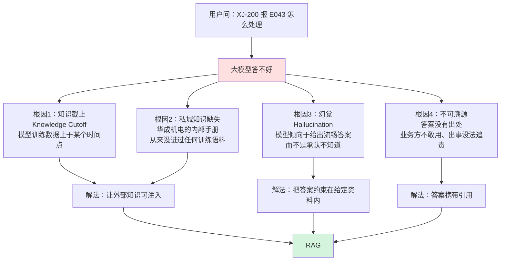
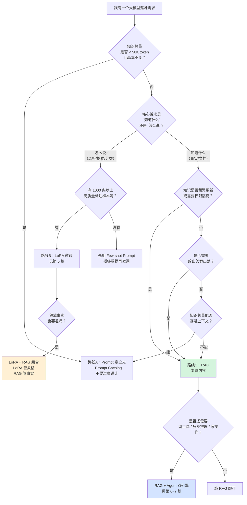
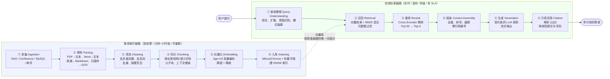
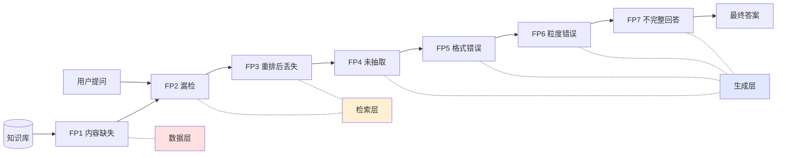
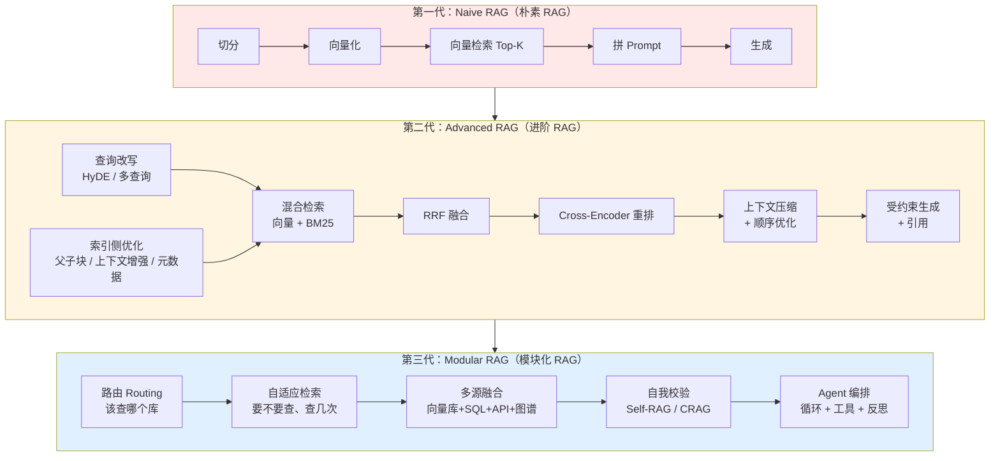
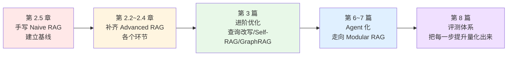
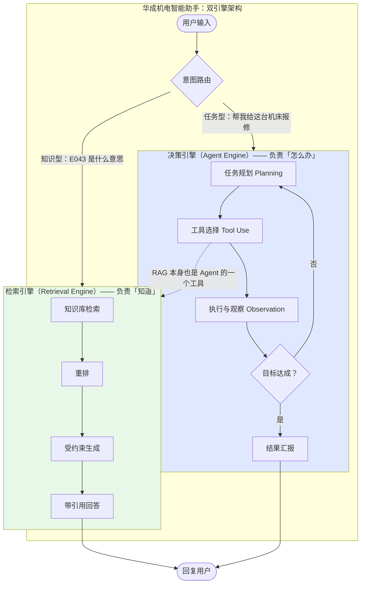
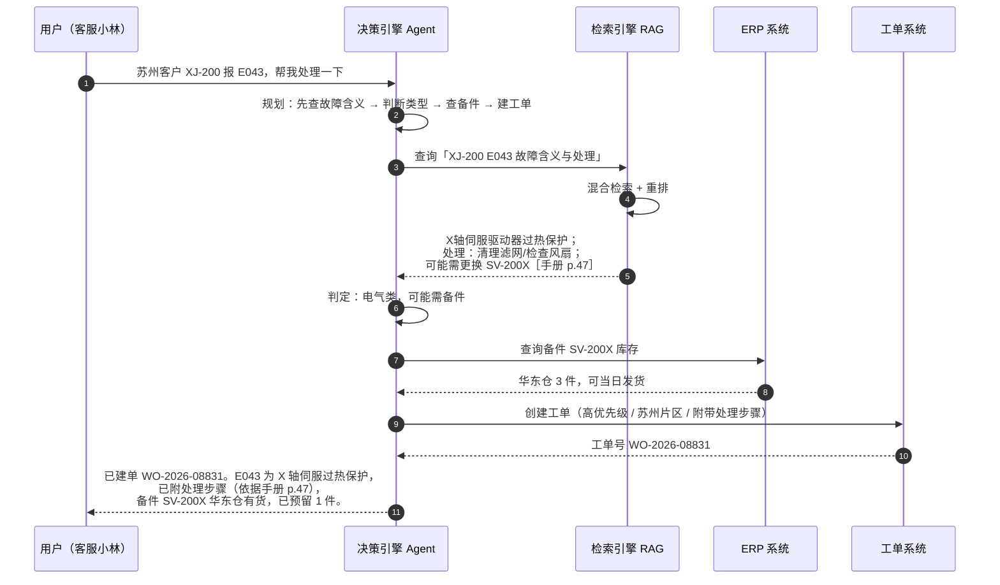
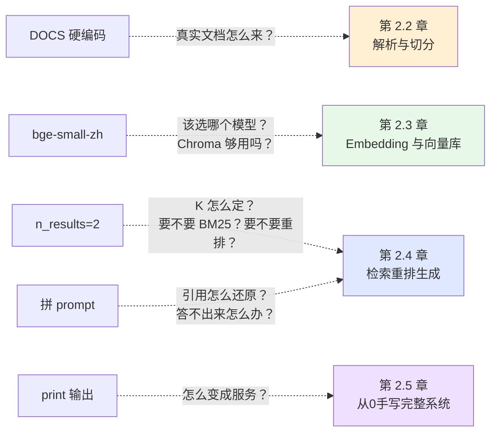
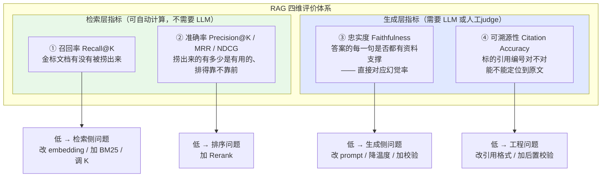

# 第 2.1 章  RAG 原理与整体架构

> **本章目标**：读完能做到 …
> 1. 说清楚大模型为什么答不了「我们公司 XJ-200 机床报 E043 怎么处理」，并能定位到四类根因；
> 2. 在「Prompt 塞全文 / 微调 / RAG」之间做出有依据的技术选型，并能画出决策树给老板看；
> 3. 画出 RAG 的离线索引链路与在线检索链路，说出每个环节最常见的失败模式；
> 4. 拿到一个线上 badcase 时，能在 7 种典型失败模式里定位到具体是哪一种；
> 5. 跑通一段 20 行的最小 RAG 闭环，对整条链路有体感。
>
> **前置知识**：[第 1 章 大模型基础与技术选型](../01-大模型基础与技术选型/)（尤其是 Token、上下文窗口、温度采样、OpenAI 兼容接口的概念）
>
> **预计用时**：阅读 45 分钟 / 动手 20 分钟

---

## 零、贯穿全书的业务案例：华成机电

本书从这一章开始，所有例子都围绕同一家虚构企业展开，请先记住它：

**华成机电（HuaCheng Electromechanical）**，一家中型数控机床制造商，年营收 12 亿，主力产品是 XJ 系列数控车床（XJ-100 / XJ-200 / XJ-200-B3 / XJ-300）。

它的售后体系长这样：

| 角色 | 人数 | 痛点 |
|---|---|---|
| 400 客服坐席 | 18 人 | 客户一报错误码就得翻 PDF，平均 4 分 30 秒才能给出第一句有效回复 |
| 现场服务工程师 | 62 人 | 在客户车间，手机翻 300 页手册，信号还差 |
| 技术支持二线 | 6 人 | 80% 的时间在回答重复问题 |
| 备件仓管 | 9 人 | 工程师问"这个型号还有没有货"要走电话 |

它的知识资产长这样：

| 资产 | 体量 | 形态 |
|---|---|---|
| 产品操作手册 | 47 份 | PDF，其中 11 份是 2015 年前的扫描件 |
| 故障代码手册 | 12 份 | PDF + Excel 混合 |
| 备件目录 | 1 份 | Excel，2.3 万行 |
| 历史工单 | 18.7 万条 | MySQL 表，含自由文本描述 |
| 内部 Wiki | 3100 篇 | Confluence 导出的 HTML |
| 售后政策/保修条款 | 23 份 | Word |

我们要建的东西有两个：
1. **售后知识库问答**（本篇 RAG 引擎负责）——「知道」；
2. **工单智能助手**（第 6~7 篇 Agent 引擎负责）——「怎么办」，会查库存、会建工单、会派工。

这就是海报上那个词：**RAG + Agent 双引擎**。本章末尾会把这个词讲透。

---

## 一、为什么需要它（问题出发）

### 1.1 一个真实到扎心的提问

华成机电的客服小林接到电话：

> 「你好，我们车间那台 XJ-200 报 E043，屏幕上一直闪，工件也夹不住了，怎么搞？」

小林打开公司刚采购的大模型助手，原样输入。得到的回答是：

```text
E043 通常是一个通用的设备错误代码，在不同品牌的数控系统中含义不同。
常见可能包括：
1. 伺服驱动器过载
2. 编码器信号异常
3. 主轴定向失败
建议您查阅设备随机附带的操作手册，或联系设备厂家的技术支持。
```

这段回答的问题在哪？**它每一句都不算错，但它一点用都没有。** 客户要的是"现在按哪个键"，模型给的是"建议查阅手册"。

更糟的情况是，换一个模型、换一个问法，你会得到这样的回答：

```text
XJ-200 数控车床的 E043 错误码表示"液压卡盘压力低于安全阈值"。
处理方法：
1. 检查液压站油位是否低于 MIN 刻度线
2. 检查卡盘压力继电器 KP-3 是否动作
3. 重启液压泵后按 RESET 键复位
```

看起来专业得多，条理清晰，术语像模像样——**但这是编的**。华成机电的 E043 实际含义是"X 轴伺服驱动器过热保护"，跟液压卡盘一点关系没有。一个工程师照着这套"看起来很对"的步骤去查液压站，会白白浪费两小时。

这就是我们要解决的问题的全部。

### 1.2 四类根因，各自对应不同的解法

把上面的失败拆开，一共是四个独立的问题，**不要混为一谈**，因为它们的解法不一样：



逐条说清楚：

**根因 1：知识截止（Knowledge Cutoff）**
任何一个大模型的参数都是某次训练的产物，训练语料有一个时间边界。华成机电 2026 年 3 月发布的 XJ-200-B3 改型，不管你用哪个模型，它都不可能知道。这是**时效性**问题。

**根因 2：私域知识缺失**
这是更根本的问题。即使不考虑时效，华成机电的《XJ-200 维修手册》从来没有在互联网上公开过，它躺在公司 NAS 的一个共享目录里。**没有进过训练语料的知识，参数里就不会有**。这是**知识边界**问题。

**根因 3：幻觉（Hallucination）**
大模型的训练目标是"预测下一个 token 的概率分布"，它被优化成一个流畅的续写器，而不是一个诚实的知识库。当它对 E043 一无所知时，它不会说"不知道"，它会按照"错误码解释"这个文体的统计规律，生成一段最像答案的文本。**流畅度和正确性是两件事**，这一点必须刻进脑子里。

**根因 4：不可溯源**
就算模型碰巧答对了，你也不敢用。华成机电的法务会问：如果工程师照着这个回答操作，把客户的主轴搞坏了，责任谁负？没有出处的答案，在企业场景里等于**不可交付**。这一条常常被工程师忽略，但它是很多 RAG 项目真正能立项的原因——不是因为准确率高，而是因为**能给出"依据第 47 页第 3 条"**。

> 💡 **划重点**：很多团队做 RAG 只盯着根因 1 和 2（把知识塞进去），忽略了 3 和 4（约束模型 + 引用溯源）。结果就是做出来一个"能检索的幻觉机器"。本书第 2.4 章会用大量篇幅讲"怎么让模型闭嘴"。

---

## 二、原理拆解

### 2.1 三条解法：Prompt 塞全文 / 微调 / RAG

在决定用 RAG 之前，先诚实地比较三条路。**不要因为 RAG 火就用 RAG**。

#### 路线 A：Prompt 塞全文（Long Context / In-Context Learning）

思路极其简单：把整本手册塞进上下文窗口。

```python
prompt = f"""以下是 XJ-200 机床的完整操作手册：
{整本手册的 38 万字}

用户问题：XJ-200 报 E043 怎么处理？
"""
```

在 128K ~ 1M 上下文的模型上，这条路**真的可行**，而且在小规模场景下效果很好、实现成本几乎为零。它的问题是：

- **成本线性增长**：每问一次就要重新支付一遍全文的输入 token 费用。38 万字约 25 万 token，按某主流模型 1 元 / 百万输入 token 计算，一次提问 0.25 元；一天 3000 次提问就是 750 元/天，一年 27 万元。而这 3000 次提问里，99% 的内容都是无关的。
- **延迟不可接受**：25 万 token 的 prefill 在单卡 A100 上要好几秒。
- **注意力稀释**：上下文越长，模型对中间部分的召回能力越差（后面 2.3 节会讲的 Lost in the Middle）。
- **有上限**：华成机电全部知识资产远超任何模型的上下文窗口。47 份手册 + 3100 篇 Wiki + 18.7 万条工单，加起来是几十亿 token 量级。

**什么时候该用它**：知识总量 < 50K token 且几乎不变（比如一份 20 页的产品规格书问答）。这种情况下上 RAG 是过度设计，配合 Prompt Caching 成本还能再砍一个数量级。

#### 路线 B：微调（Fine-tuning / LoRA）

思路：把知识"训"进模型参数里。

这是最容易被误解的一条路。**微调擅长教模型"怎么说"，不擅长教模型"知道什么"**。

- 教模型用华成机电的话术风格回答、教模型输出固定的 JSON 工单格式、教模型判断一段工单描述属于哪个故障大类——**微调非常合适**。
- 教模型记住"E043 = X 轴伺服驱动器过热保护"——**微调很不合适**：需要大量重复样本才能让一个事实稳定进参数，改一个事实要重训，而且改完之后你没法验证它到底记没记住，也没法给出处。

灾难性遗忘（Catastrophic Forgetting）也是真实存在的：为了灌知识而过度训练，模型的通用能力会退化。

**什么时候该用它**：需要改变模型的**行为模式**而非**知识内容**时。本书第 5 篇会专门讲 LoRA，并明确给出"RAG 管知识、LoRA 管风格与格式"的组合拳。

#### 路线 C：RAG（Retrieval-Augmented Generation，检索增强生成）

思路：不把知识塞进参数，也不把全文塞进 prompt，而是**每次只把和当前问题相关的那几段塞进去**。

```python
# 伪代码，展示核心思想
相关片段 = 检索(用户问题, 知识库)      # 从 38 万字里捞出最相关的 2000 字
答案 = 大模型(f"根据资料：{相关片段}\n回答：{用户问题}")
```

这一行"检索"就是整个 RAG 工程 90% 的复杂度所在，本篇剩下的四章都在讲它。

#### 三条路线的详细对照

| 维度 | Prompt 塞全文 | 微调（LoRA/SFT） | RAG |
|---|---|---|---|
| **一次性投入成本** | 几乎为零 | 高（数据标注 + 算力 + 调参，人天级到人月级） | 中（建索引流水线，1~3 人周起步） |
| **单次推理成本** | 极高（全文 token 反复付费） | 极低（无额外输入） | 低（只付 Top-K 片段的 token） |
| **知识时效性** | 好（换文件即可） | **差**（要重新训练，周级） | **极好**（改索引即可，分钟级） |
| **知识更新代价** | 换文件，0 成本 | 重新训练，数千元~数万元/次 | 增量重建索引，分钟级、几乎零成本 |
| **可溯源性** | 弱（模型可能不指明出处） | **无**（参数里的知识没有出处） | **强**（天然带 chunk 来源、页码） |
| **适用数据量** | < 50K token | 中（样本量 1K~100K 条，知识总量不敏感） | **无上限**（亿级 chunk 可工程化） |
| **幻觉抑制** | 中（有材料但注意力稀释） | 差（甚至加剧——模型更自信了） | **强**（配合 prompt 约束 + 引用校验） |
| **准确率上限** | 中高（受长上下文召回能力限制） | 中（事实类问题不稳定） | **高**（瓶颈在检索质量，可持续优化） |
| **多轮/复杂推理** | 好 | 好 | 需配合 Query 改写与 Agent（第 3、6 篇） |
| **权限控制** | 难（全文都在 prompt 里） | **不可能**（知识揉进参数，无法按人隔离） | **容易**（检索时按元数据过滤） |
| **对基础模型的依赖** | 需要长上下文模型 | 需要可训练权重（开源模型） | 任意模型，闭源 API 也行 |
| **典型落地周期** | 1 天 | 3~8 周 | 2~6 周 |

> ⚠️ **权限控制这一行是很多企业最终选 RAG 的决定性理由**。华成机电的售后政策里有一部分是"经销商折扣表"，只有内部员工能看；如果走微调，这些知识进了参数，你没有任何办法阻止模型对经销商用户吐出来。而 RAG 只要在检索时加一个 `WHERE 密级 <= 用户级别` 就解决了。

#### 选型决策树



华成机电的场景走到哪一支？知识总量远超上下文 → 核心诉求是"知道什么" → 需要权限隔离 → **RAG**；工单助手还要查库存、建工单 → **RAG + Agent 双引擎**。这就是本书的主线。

---

### 2.2 RAG 全景架构：两条链路

RAG 系统在物理上是**两条几乎独立的链路**，它们跑在不同的时间、不同的机器上，由不同的人维护。新手最常犯的错误是把它们混在一个脚本里，导致既没法批量建索引，也没法低延迟查询。



> 🔑 **架构要点**：两条链路的**唯一耦合点是向量库的 schema**。只要 chunk 的字段定义不变，你可以把整个离线链路推倒重来（换解析器、换切分策略），在线服务一行代码都不用改。反过来也成立。这个解耦是后面做 A/B 实验和双索引热切换（第 2.3 章）的基础。

#### 每个环节的常见失败模式

这张表建议打印出来贴在工位上。排查线上问题时，从上往下过一遍，90% 的 badcase 能定位。

**离线链路：**

| 环节 | 常见失败模式 | 症状 | 定位方法 |
|---|---|---|---|
| ① 采集 | 漏采、增量任务挂了、权限不足导致静默跳过 | 某类问题全答不对 | 对比源系统与索引库的文档数 |
| ② 解析 | 扫描件没走 OCR 得到空文本；双栏 PDF 串行；表格被打散成无意义字符串 | chunk 内容是乱码或空 | 随机抽 20 个 chunk 人工读 |
| ③ 清洗 | 页眉页脚混进正文，每个 chunk 都带"华成机电内部资料 第 12 页" | 检索结果全是噪声 | 统计高频行，看是否为页眉 |
| ④ 切分 | 一个故障处理步骤被从中间切断；表格行与表头分离 | 答案总是缺后半段 | 打印 chunk 边界，看是否断在句中 |
| ⑤ 向量化 | 超过模型 max_length 被静默截断；query/passage 前缀用反 | 相似度分数整体偏低 | 检查 token 长度分布 |
| ⑥ 入库 | 索引没建完就查询；维度对不上；元数据类型错误导致过滤失效 | 检索慢或过滤条件不生效 | 查看索引构建状态与 schema |

**在线链路：**

| 环节 | 常见失败模式 | 症状 | 定位方法 |
|---|---|---|---|
| ① 查询理解 | 多轮对话中的指代没消解（"它怎么修"）；口语化 query 与文档术语不匹配 | 多轮场景下突然答非所问 | 打印改写后的 query |
| ② 召回 | Top-K 太小漏检；只用向量检索，精确型号/错误码召不回 | 明明库里有却搜不到 | 用关键词直接查库确认存在性 |
| ③ 重排 | reranker 与 embedding 领域不匹配；Top-N 留太少把正确答案挤掉 | 召回列表里有，最终答案没有 | 对比 rerank 前后的排名变化 |
| ④ 组装 | 超预算被截断，正确片段恰好被截掉；相关片段被放在上下文正中间 | 长上下文场景下准确率下降 | 打印最终 prompt |
| ⑤ 生成 | 模型无视资料自由发挥；资料里没有却硬答；引用编号乱标 | 答案与引用对不上 | 逐句核对答案与引用片段 |
| ⑥ 引用还原 | 模型输出的编号超出范围；同一编号指向多个片段 | 前端点击来源 404 | 校验编号区间 |

---

### 2.3 RAG 的七种典型失败

Barnett 等人在 2024 年的论文《Seven Failure Points When Engineering a Retrieval Augmented Generation System》里，从三个真实项目里归纳出了 7 个失败点。这套分类非常好用，因为它是**按"问题出在链路哪一段"来分的**，拿到 badcase 直接对号入座。下面用我自己的话讲，并且每一种都给华成机电的具体例子和定位手段。



#### FP1：内容缺失（Missing Content）

**是什么**：知识库里压根就没有这个知识，但系统还是硬答了。

**华成机电例子**：客户问"XJ-200-B3 的最大切削深度是多少"。B3 是 2026 年 3 月的新改型，它的规格书还在产品部的电脑里没归档。系统检索到了 XJ-200 标准版的规格书（切削深度 6mm），模型就答了 6mm。实际 B3 是 8mm。**这是最危险的失败，因为它看起来完全正常**。

**定位方法**：
1. 用 query 的关键词直接在原始文档全文里 grep，确认知识是否真的存在；
2. 看检索到的 Top-1 相似度分数，如果明显低于历史分布（比如平时 0.75，这次 0.41），大概率是内容缺失；
3. 建立"无答案检测"——本书第 2.4 章会实现基于分数阈值 + LLM 判定的双重兜底。

**解法**：内容侧补齐 + 工程侧拒答。**不能靠调检索参数解决**，这是很多团队浪费时间的地方。

#### FP2：Top-K 漏检（Missed the Top Ranked Documents）

**是什么**：知识库里有，检索器也把它排进了结果，但排在第 18 位，而你只取了 Top-5。

**华成机电例子**：问"液压卡盘夹不紧怎么办"。知识库里有一篇《卡盘夹紧力不足排查指南》排在第 12 位，前 5 位全是"卡盘型号对照表""卡盘拆装步骤"这类字面相似但答非所问的文档。

**定位方法**：把 K 临时调到 50，看正确文档在第几位。
- 在 Top-50 里但不在 Top-5 里 → 确诊 FP2，解法是**加重排**（第 2.4 章）；
- 在 Top-50 里都没有 → 是 FP1 或者 embedding 不匹配。

**解法**：混合检索 + Rerank + 提高召回阶段的 K（召回宽、精排准）。

#### FP3：重排后丢失（Not in Context / Consolidation Strategy Limitation）

**是什么**：正确文档进了召回结果，但在"合并、去重、截断到上下文预算"这一步被丢掉了。

**华成机电例子**：问"E043 报警后重启需要注意什么"。召回了 20 个片段，其中第 7 个片段包含"重启前必须先切断 X 轴伺服使能，否则会二次报 E044"。但上下文预算只有 4000 token，前 6 个片段（都是 E043 的定义和成因的重复描述）就吃满了预算，第 7 个被截断了。

**定位方法**：**把最终送进 LLM 的完整 prompt 打印出来**。这是排查 RAG 问题最有效的一招，没有之一。很多人查了半天检索，最后发现正确片段根本没进 prompt。

**解法**：去重（多个片段说同一件事只留一个）、MMR 多样性、按 token 预算智能截断而不是粗暴截尾（第 2.4 章有完整代码）。

#### FP4：未抽取（Not Extracted）

**是什么**：正确答案就在 prompt 里，模型没看见/没提取出来。

**华成机电例子**：给了 8 个片段共 3800 token，正确答案在第 5 个片段的中间部分。模型的回答是"资料中未提及具体的复位步骤"。典型的 **Lost in the Middle**——上下文中间部分的信息最容易被忽略。

**定位方法**：把那个片段单独喂给模型问同一个问题。如果单独喂能答对，就是 FP4，问题出在上下文组织；如果单独喂也答不对，问题在 prompt 设计或模型能力。

**解法**：减少噪声片段、把最相关的放头尾、加引用编号强制模型逐条对照（第 2.4 章）。

#### FP5：格式错误（Wrong Format）

**是什么**：你要求输出表格 / JSON，模型给了一段散文；或者 JSON 缺字段、多了 markdown 围栏。

**华成机电例子**：工单助手要求模型输出

```json
{"错误码": "E043", "故障部件": "X轴伺服驱动器", "处理步骤": ["...", "..."], "预计工时": 1.5}
```

结果模型输出了：

````text
好的，根据资料，我为您整理如下：

```json
{
  "错误码": "E043",
  "故障部件": "X轴伺服驱动器",
  "处理步骤": "1. 检查散热风扇 2. 清理滤网",   // 这里应该是数组
  "预计工时": "1.5小时"                        // 这里应该是数字
}
```

希望对您有帮助！
````

下游的工单系统直接 JSON 解析失败。

**定位方法**：在解析失败时把原始输出完整落日志。**千万不要只 catch 异常不记录原文**。

**解法**：结构化输出（Function Calling / JSON Schema / Pydantic + Instructor）、few-shot 示例、输出后校验重试。第 4 篇 LangChain 会系统讲。

#### FP6：粒度错误（Incorrect Specificity）

**是什么**：答案的详略程度不对。要么太笼统（问具体步骤，给了原则性建议），要么太啰嗦（问"E043 是什么意思"，把整章维修流程背了一遍）。

**华成机电例子**：
- 太笼统：问"E043 第 3 步怎么做"，答"请按照手册中的标准流程操作"；
- 太具体：客服只想知道"这个要不要派工程师上门"，模型输出了 800 字的完整维修工艺。

**根因往往在切分粒度**：chunk 切太大 → 塞进来一大坨，模型倾向于全盘复述；chunk 切太小 → 每个片段只有半句话，模型只能给笼统结论。

**定位方法**：看检索到的 chunk 长度分布和内容完整性。如果一个 chunk 里混了 5 个不相关主题，就是切分问题。

**解法**：改切分策略（第 2.2 章的重点）、父子块、prompt 里明确指定输出粒度和字数。

#### FP7：不完整回答（Incomplete Answer）

**是什么**：答案对，但只答了一部分。

**华成机电例子**：客户问"E041、E043、E057 分别是什么原因？"检索器按整个 query 做了一次向量检索，Top-5 里 4 个是 E043 的，1 个是 E041 的，E057 完全没召回。模型只答了 E041 和 E043，对 E057 只字未提。

**定位方法**：统计 query 中的实体数量与答案中覆盖的实体数量。多实体 query 是重灾区。

**解法**：Query 分解（把复合问题拆成多个子问题分别检索）、Multi-Query 检索、Agent 多步检索（第 3 篇和第 6 篇）。

#### 七种失败速查表

| 编号 | 名称 | 层 | 一句话症状 | 第一诊断动作 | 主要解法 | 本书章节 |
|---|---|---|---|---|---|---|
| FP1 | 内容缺失 | 数据 | 库里根本没有还硬答 | 原文 grep 确认存在性 | 补数据 + 拒答机制 | 2.4 / 2.5 |
| FP2 | Top-K 漏检 | 检索 | 有但没排进来 | K 调到 50 看排第几 | 混合检索 + Rerank | 2.4 |
| FP3 | 重排后丢失 | 检索 | 召回有、prompt 里没有 | 打印最终 prompt | 去重 + 预算管理 | 2.4 |
| FP4 | 未抽取 | 生成 | prompt 里有、答案里没有 | 单片段单独喂一次 | 降噪 + 位置优化 | 2.4 |
| FP5 | 格式错误 | 生成 | 下游解析失败 | 落日志看原始输出 | 结构化输出 + 校验重试 | 4.x |
| FP6 | 粒度错误 | 生成 | 太笼统或太啰嗦 | 看 chunk 长度与主题纯度 | 改切分 + 父子块 | 2.2 |
| FP7 | 不完整回答 | 生成 | 多实体问题只答一部分 | 数实体覆盖率 | Query 分解 + 多路检索 | 3.x / 6.x |

> 📌 后面第 8 篇讲评测时，我们会把这 7 类失败做成一个**badcase 标注体系**，让每个线上差评都能被自动归类。这是 RAG 系统能持续优化的关键基建。

---

### 2.4 RAG 的三代演进：Naive / Advanced / Modular

学术界习惯把 RAG 分成三代（Gao 等人《Retrieval-Augmented Generation for Large Language Models: A Survey》）。这个划分对工程有实际指导意义：**它就是你的项目路线图**。



| 代际 | 典型能力 | 适合什么阶段 | 大致准确率区间（华成机电内部评测集，见第 8 篇） | 本书章节 |
|---|---|---|---|---|
| Naive RAG | 切分 + 向量检索 + 拼 prompt | Demo、POC、证明可行 | 一般在 50%~65% | 第 2.5 章手写 |
| Advanced RAG | 查询改写、混合检索、重排、上下文工程 | 真正上生产的分水岭 | 通常能提到 78%~88% | 第 2.2~2.4、第 3 篇 |
| Modular RAG | 路由、自适应、多源、自校验、Agent | 复杂业务、多知识域、要写操作 | 视任务复杂度，复杂任务提升最明显 | 第 3 篇、第 6~7 篇 |

> ⚠️ **关于准确率数字的诚实说明**：上面的区间来自本书第 8 篇将要构建的华成机电内部评测集（200 题，人工标注金标准答案），**换一个数据集、换一批问题，绝对值会完全不同**。这里给区间只是为了让你有个"每一代大概能提升多少"的量级概念。任何声称"RAG 准确率 99.9%"却不说数据集和评测方法的，都应当被质疑。本书所有性能数字都会标注实测环境。

**本书的路线定位**：



**我们不跳步**。第 2.5 章你会先做出一个"能跑但不够好"的系统，并亲手测出它的基线分数。后面每一章的优化都会回到这个基线上做对比。这是本书和"直接给你一个最终版代码"的教程最大的区别——**你要知道每一行优化代码换来了多少个百分点**。

---

### 2.5 RAG 与 Agent：「双引擎」到底是什么意思

海报上的「RAG + Agent 双引擎」不是营销词，它对应一个非常具体的架构事实：**企业里的请求分两类，一类是"告诉我"，一类是"帮我做"**。这两类请求需要的系统能力完全不同。



#### 两个引擎的能力边界对比

| 维度 | 检索引擎（RAG） | 决策引擎（Agent） |
|---|---|---|
| **核心问题** | 「是什么 / 为什么」 | 「怎么办 / 帮我做」 |
| **执行形态** | 一次性单向流水线 | 循环：思考 → 行动 → 观察 → 再思考 |
| **外部交互** | 只读（查知识库） | 读 + **写**（建工单、扣库存、发通知） |
| **步数** | 固定 1 步 | 不定，1~N 步，运行时决定 |
| **失败代价** | 答错一句话 | 可能真的改了业务数据，需要事务与回滚 |
| **延迟** | 1~3 秒 | 5~60 秒 |
| **可控性** | 高（链路固定） | 低（需要防护栏、步数上限、人工确认） |
| **典型技术** | Embedding、BM25、Rerank、Prompt 约束 | ReAct、Plan-and-Execute、Function Calling、状态机 |
| **本书篇章** | 第 2~3 篇 | 第 6~7 篇 |

#### 单纯 RAG 解决不了的三类问题

**第一类：需要多步推理与信息串联**

> 「上个月报 E043 的那几台机床，是不是都用了同一批次的伺服驱动器？」

这个问题需要：查工单库找出上月 E043 的机床 → 拿到机床序列号 → 查设备台账找到伺服驱动器批次号 → 比对。**一次向量检索不可能完成**，因为第二步的查询条件依赖第一步的结果。RAG 是单向流水线，没有"拿到结果再决定下一步查什么"的能力。

**第二类：需要调用工具获取实时数据**

> 「X 轴伺服驱动器 SV-200X 现在还有几个库存？最快什么时候能发到苏州？」

库存数字在 ERP 里，每分钟都在变，它**不可能**、也**不应该**被灌进向量库。这需要调用 ERP 的 API。物流时效需要调用第三方物流接口。这是 Function Calling 的领域。

**第三类：需要执行写操作**

> 「帮张师傅把这台机床的报修工单建了，优先级设成高，派给苏州片区的李工。」

这会真正修改业务数据。它需要参数校验、权限校验、幂等性、失败回滚、操作审计，甚至需要人工二次确认。RAG 完全不涉及这些。

#### 但是：Agent 离不开 RAG

反过来看，Agent 也不能单独工作。让 Agent 决定"该派哪个工程师"之前，它得先知道"E043 是电气类故障还是机械类故障"——这个知识**只能从 RAG 拿**。

所以最终的形态是：



注意第 3~5 步：**RAG 在这里是 Agent 的一个工具**。这就是"双引擎"的准确含义——不是两个并列的系统，而是**检索引擎为决策引擎提供知识底座，决策引擎调度检索引擎完成任务**。

> 📌 **本书的顺序是有道理的**：先把检索引擎做扎实（第 2~3 篇），再做决策引擎（第 6~7 篇）。反过来做的团队，最后都会发现 Agent 的每一步决策都建立在垃圾检索结果上，越多步错得越离谱。**检索质量是 Agent 质量的上限**。

---

## 三、动手实战：20 行跑通最小 RAG 闭环

理论讲完了，先跑一个能动的东西建立体感。这一节的代码**故意写得很朴素**，是标准的 Naive RAG，细节问题全部留给后面四章。

### 3.1 环境准备

版本严格锁定，与全书基线一致（Python 3.11）：

```bash
# 方式一：uv（推荐，速度快）
uv venv --python 3.11 .venv
source .venv/bin/activate
uv pip install "chromadb==0.5.23" "sentence-transformers==3.3.1" "openai==1.59.6"

# 方式二：pip
python3.11 -m venv .venv
source .venv/bin/activate
pip install "chromadb==0.5.23" "sentence-transformers==3.3.1" "openai==1.59.6"
```

配置 LLM 接入。本书统一用 OpenAI 兼容接口，默认走 DeepSeek（便宜、中文好、兼容性强）：

```bash
export OPENAI_API_KEY="sk-你的-deepseek-key"
export OPENAI_BASE_URL="https://api.deepseek.com/v1"
export RAG_MODEL="deepseek-chat"
```

> 💡 如果你想完全本地跑，把 `OPENAI_BASE_URL` 指向 `http://localhost:11434/v1`（Ollama）、`RAG_MODEL` 设成 `qwen2.5:7b-instruct`，`OPENAI_API_KEY` 随便填个非空字符串即可。后面所有章节的代码都遵循这个约定。

### 3.2 最小闭环代码

创建 `hello_rag.py`：

```python
"""20 行最小 RAG 闭环：华成机电售后知识库 Demo。"""
import os
import chromadb
from chromadb.utils import embedding_functions
from openai import OpenAI

# 1) 准备语料：真实项目里这些来自 PDF 解析，这里先硬编码 5 段
DOCS = [
    "E041：主轴电机过载报警。成因为切削参数过大或主轴轴承磨损。处理：降低进给速度至 80%，检查主轴电流是否超过 12A，若持续超限需更换主轴轴承 SP-100M。",
    "E043：X 轴伺服驱动器过热保护。成因为驱动器散热风扇故障、电控柜滤网堵塞或环境温度超过 40℃。处理：第一步断电后清理电控柜滤网；第二步检查驱动器风扇是否转动；第三步若风扇停转需更换驱动器 SV-200X；复位方法为按 RESET 键保持 3 秒。",
    "E057：刀库换刀超时。成因为刀库定位气缸压力不足或换刀机械手卡滞。处理：检查气源压力是否达到 0.6MPa，手动盘车确认机械手无卡滞。",
    "XJ-200 整机保修期为 12 个月，自验收之日起算。易损件（刀具、皮带、密封圈）不在保修范围内。保修期内非人为故障免费更换备件。",
    "备件 SV-200X 为 XJ-200 系列 X 轴伺服驱动器，功率 2.0kW，适配 XJ-200 与 XJ-200-B3，不适配 XJ-100。标准交付周期 3 个工作日。",
]

# 2) 建索引：用 bge-small-zh 向量化后写入 Chroma（首次运行会自动下载模型，约 100MB）
emb = embedding_functions.SentenceTransformerEmbeddingFunction(model_name="BAAI/bge-small-zh-v1.5")
col = chromadb.Client().get_or_create_collection("huacheng", embedding_function=emb)
col.add(documents=DOCS, ids=[f"doc-{i}" for i in range(len(DOCS))])

# 3) 检索：把问题向量化，取最相似的 2 段
question = "XJ-200 报 E043 怎么处理？需要换件吗？"
hits = col.query(query_texts=[question], n_results=2)["documents"][0]

# 4) 生成：把检索到的片段塞进 prompt，约束模型只依据资料回答
context = "\n\n".join(f"[{i+1}] {d}" for i, d in enumerate(hits))
client = OpenAI(api_key=os.environ["OPENAI_API_KEY"], base_url=os.environ["OPENAI_BASE_URL"])
resp = client.chat.completions.create(
    model=os.getenv("RAG_MODEL", "deepseek-chat"),
    messages=[
        {"role": "system", "content": "你是华成机电售后助手。只依据【资料】回答，资料中没有的信息必须回答“资料中未提及”。每个结论后标注引用编号，如 [1]。"},
        {"role": "user", "content": f"【资料】\n{context}\n\n【问题】{question}"},
    ],
    temperature=0.1,
)
print(resp.choices[0].message.content)
print("\n--- 引用来源 ---")
for i, d in enumerate(hits):
    print(f"[{i+1}] {d[:60]}...")
```

### 3.3 运行与预期输出

```bash
python hello_rag.py
```

```text
E043 为 X 轴伺服驱动器过热保护 [1]，成因包括驱动器散热风扇故障、电控柜滤网堵塞或环境温度超过 40℃ [1]。

处理步骤：
1. 断电后清理电控柜滤网 [1]
2. 检查驱动器风扇是否转动 [1]
3. 若风扇停转，需更换驱动器 SV-200X [1]
复位方法：按 RESET 键保持 3 秒 [1]

关于是否需要换件：仅当第二步确认风扇停转时才需要更换 SV-200X [1]。该备件功率 2.0kW，
适配 XJ-200 与 XJ-200-B3，标准交付周期 3 个工作日 [2]。

--- 引用来源 ---
[1] E043：X 轴伺服驱动器过热保护。成因为驱动器散热风扇故障、电控柜滤网堵塞或环境温度超过 40℃。处...
[2] 备件 SV-200X 为 XJ-200 系列 X 轴伺服驱动器，功率 2.0kW，适配 XJ-200 与 XJ-...
```

> 实测环境：Ubuntu 22.04 / Python 3.11.9 / CPU 推理 embedding（无 GPU）/ DeepSeek-chat API。首次运行含模型下载约 60 秒，之后单次问答约 2.8 秒（embedding 0.05s + 检索 0.01s + LLM 2.7s）。你的实际数字会因网络和硬件而不同。

### 3.4 这 20 行里藏着的全部后续章节

对照着看，你就知道后面四章在干什么了：



试着用这 20 行代码问几个刁钻的问题，你会立刻看到 Naive RAG 的脆弱：

| 你问什么 | 会发生什么 | 对应失败点 |
|---|---|---|
| 「E041、E043、E057 分别是什么？」 | 只会答出其中 1~2 个，因为 `n_results=2` | FP7 不完整回答 |
| 「XJ-100 能用 SV-200X 吗？」 | 可能答"能"，因为片段里"适配 XJ-200"和"不适配 XJ-100"字面都在，模型容易读反 | FP4 未抽取 |
| 「XJ-500 的保修期多久？」 | 会把 XJ-200 的 12 个月套上去 | FP1 内容缺失 |
| 「刚才那个故障，第三步再说一遍」 | 完全不懂"刚才那个"指什么 | 查询理解缺失 |

**把这四个 badcase 记下来**，第 2.5 章我们会把它们做成第一批回归测试用例。

---

## 四、踩坑与排错

| 现象 | 根因 | 解决 |
|---|---|---|
| `sentence-transformers` 首次运行卡在下载 | HuggingFace 直连慢 | 设置镜像：`export HF_ENDPOINT=https://hf-mirror.com`，或提前 `huggingface-cli download BAAI/bge-small-zh-v1.5 --local-dir ./models/bge-small-zh` 后用本地路径 |
| `chromadb` 导入报 `sqlite3` 版本过低 | Chroma 要求 sqlite3 >= 3.35 | `pip install pysqlite3-binary`，并在 import chromadb 前加 `__import__('pysqlite3'); sys.modules['sqlite3']=sys.modules['pysqlite3']` |
| 回答里编了知识库里没有的内容 | system prompt 约束太弱 + 模型温度过高 | `temperature=0.1`，并在 prompt 里明确"资料中未提及"的兜底话术；根本解法见第 2.4 章 |
| 引用编号 [1][2] 和实际来源对不上 | 片段顺序在拼接和展示时不一致 | 用同一个列表对象生成 context 和来源展示，不要重新排序 |
| 相似度看起来都很高（0.9+），但结果不相关 | 用了内积且向量未归一化；或用了不适合中文的模型 | 确认 embedding 已 L2 归一化、距离度量用 cosine；详见第 2.3 章 |
| 中文问题召回全是英文文档 | embedding 模型跨语言对齐把语义相近的中英文拉到一起了 | 用元数据 `language` 字段过滤，或改用单语模型 |
| 每次运行结果都不一样 | `chromadb.Client()` 是内存客户端，进程退出即丢；且 LLM 有随机性 | 用 `chromadb.PersistentClient(path="./chroma_db")` 持久化；`temperature=0` + 固定 seed（如模型支持） |
| 换了 embedding 模型后检索全乱 | 旧向量和新向量在不同语义空间，混在一个 collection 里 | **换模型必须重建整个索引**，且 collection 名字里带模型版本，如 `huacheng_bgem3_v1` |
| API 报 `401 Unauthorized` | `OPENAI_BASE_URL` 少了 `/v1` 或 key 与 base_url 不匹配 | 检查两者是否配套；DeepSeek 的 base_url 必须是 `https://api.deepseek.com/v1` |
| 问题很长时召回质量骤降 | 长 query 的向量被"平均"掉了主题 | 先做 query 改写/摘要，见第 3 篇 |

---

## 五、生产级要点

### 5.1 评价 RAG 好坏的四个维度

在动手优化之前，先想清楚**你要优化哪个数字**。RAG 的评价必须拆成两层：**检索层**和**生成层**。只看最终答案好不好，你永远不知道该改哪里。



#### ① 召回率（Recall@K）

定义：对于评测集里的每个问题，金标准文档出现在 Top-K 结果中的比例。

$$
\text{Recall@K} = \frac{1}{|Q|}\sum_{q \in Q} \frac{|\,\text{Retrieved}_K(q) \cap \text{Relevant}(q)\,|}{|\text{Relevant}(q)|}
$$

**这是 RAG 的天花板指标**。如果 Recall@K = 70%，那么无论你的 LLM 多强、prompt 写得多好，最终准确率都不可能超过 70%。**优化顺序永远是先保召回，再谈精排**。

#### ② 准确率（Precision@K）与排序质量（MRR / NDCG）

Precision 衡量"捞上来的东西有多少是有用的"：

$$
\text{Precision@K} = \frac{1}{|Q|}\sum_{q \in Q} \frac{|\,\text{Retrieved}_K(q) \cap \text{Relevant}(q)\,|}{K}
$$

MRR（Mean Reciprocal Rank）衡量第一个正确结果排在多靠前：

$$
\text{MRR} = \frac{1}{|Q|}\sum_{i=1}^{|Q|} \frac{1}{\text{rank}_i}
$$

NDCG 进一步考虑多个相关文档的分级相关性：

$$
\text{DCG@K} = \sum_{i=1}^{K}\frac{2^{rel_i}-1}{\log_2(i+1)}, \qquad \text{NDCG@K} = \frac{\text{DCG@K}}{\text{IDCG@K}}
$$

**召回率和准确率是一对矛盾**：K 调大，Recall 上升，Precision 下降（噪声变多）。第 2.4 章会给出完整的实验数据，说明为什么工程上的答案是"**召回阶段放宽 K（如 50），重排阶段收紧 N（如 5）**"。

#### ③ 忠实度（Faithfulness）

定义：把答案拆成若干个原子陈述，统计其中能被检索到的上下文支撑的比例。

$$
\text{Faithfulness} = \frac{\text{能被上下文支撑的陈述数}}{\text{答案中的陈述总数}}
$$

这是**幻觉率的倒数**，是企业场景最看重的指标。华成机电的业务方原话是：「宁可答不出来，不能答错」——因为答不出来只是效率损失，答错可能导致设备损坏和赔偿。

> 实践中我们会设两个不同的目标：忠实度要求 ≥ 0.95，而回答率（能给出答案的比例）只要求 ≥ 0.80。**主动拒答是一种特性，不是缺陷**。

#### ④ 可溯源性（Citation Accuracy）

分两个子指标：
- **引用有效率**：模型输出的 `[n]` 编号是否都在给定片段范围内（有些模型会编出 `[7]` 但你只给了 5 个片段）；
- **引用正确率**：编号指向的片段是否真的支撑了那句话。

这个指标很多团队会漏掉，但它决定了前端"点击来源跳转原文"这个功能能不能上线。第 2.4 章会给出完整的引用解析与校验代码。

#### 四个维度的关系

| 指标 | 谁负责 | 优化手段 | 出问题时先查 |
|---|---|---|---|
| 召回率 | 索引 + 检索 | 切分策略、embedding 模型、混合检索、K | 是不是 FP1 或 FP2 |
| 准确率/NDCG | 排序 | Rerank、RRF 融合权重、元数据过滤 | 是不是 FP2 或 FP3 |
| 忠实度 | 生成 | system prompt、温度、上下文降噪、后置校验 | 是不是 FP4 或 FP1 |
| 可溯源性 | 工程 | 引用格式设计、编号校验、片段 ID 映射 | 是不是 FP5 |

第 8 篇会用 RAGAS 0.2.x + 自建 harness（海报里的 **DeepSeek-Harness**）把这四个指标全部自动化，并接入 CI，让每次改动都能自动出一张对比表。

### 5.2 成本、延迟与降级

一个 RAG 请求的成本和延迟构成（以华成机电的规模测算）：

| 阶段 | 典型延迟 | 成本占比 | 降级方案 |
|---|---|---|---|
| Query 改写（LLM 调用） | 300~800ms | ~8% | 高峰期跳过，直接用原 query |
| 向量化 query | 10~50ms | ~0% | 本地模型，可忽略 |
| 向量检索 | 5~30ms | ~0% | 降低 efSearch |
| BM25 检索 | 10~40ms | ~0% | 可并行，不在关键路径 |
| Rerank（Cross-Encoder） | 80~300ms | ~5% | 降级为不重排，直接取向量 Top-5 |
| LLM 生成 | 1500~5000ms | **~85%** | 换小模型 / 缩短上下文 / 开流式改善体感 |
| **合计** | **2~6s** | — | — |

> 📌 **85% 的成本在生成阶段**，所以"缩短上下文"既省钱又降延迟。第 2.4 章的上下文预算控制和第 3 篇的上下文压缩，本质上都是在打这 85%。

### 5.3 上线前必须有的三件事

1. **可观测**：每个请求记录 query、改写后 query、召回 ID 列表及分数、重排后列表、最终 prompt、模型输出、耗时分解。没有这些，线上出问题你只能猜。第 10 篇会用 Langfuse 搭这套。
2. **回归评测集**：至少 50 道题的金标准集，每次改动跑一遍。第 8 篇会讲怎么从历史工单里半自动构造（海报里的 **LLM-Wiki** 就落在这里）。
3. **拒答兜底**：检索分数低于阈值时不要硬答。宁可回复"未在知识库中找到相关内容，已为您转接人工"。

---

## 六、本章小结 + 自测题

### 小结

1. **大模型答不了私域问题有四个独立根因**：知识截止、私域缺失、幻觉、不可溯源。RAG 同时解决这四个，微调只解决不了其中任何一个（它擅长的是"怎么说"）。
2. **三条路线各有适用区间**：知识小而稳定 → Prompt 塞全文；改行为模式 → 微调；知识大、常变、要溯源、要权限 → RAG。华成机电走 RAG，且因为要写操作，最终走向 RAG + Agent。
3. **RAG 是两条链路**：离线索引（采集→解析→清洗→切分→向量化→入库）和在线检索（查询理解→召回→重排→组装→生成→引用），唯一耦合点是向量库 schema。
4. **七种典型失败**（内容缺失、Top-K 漏检、重排后丢失、未抽取、格式错误、粒度错误、不完整回答）是排查 badcase 的标准分类法。第一诊断动作永远是：**打印最终送进 LLM 的完整 prompt**。
5. **四个评价维度**：召回率（天花板）、准确率/NDCG（排序）、忠实度（幻觉）、可溯源性（能不能交付）。优化顺序是先保召回。
6. **双引擎**：检索引擎负责「知道」，决策引擎负责「怎么办」；RAG 是 Agent 的工具之一，检索质量是 Agent 质量的上限。

### 自测题

**第 1 题**：华成机电的法务要求"所有对外回答必须能追溯到具体文档和页码"。如果你的方案是"把所有手册微调进模型"，这个要求能满足吗？为什么？

<details>
<summary>参考答案</summary>

不能。微调把知识编码进了模型参数（权重矩阵），这个过程是**有损且不可逆的**——你无法从某个权重反查出它来自手册第几页。模型输出一句话时，没有任何机制能告诉你这句话对应哪份原始文档。

即使让模型"顺便输出页码"，那个页码本身也是生成出来的，同样会幻觉（模型会编出一个看起来很合理的"第 47 页"）。

可溯源性是 RAG 的**结构性优势**：检索出来的 chunk 本身就携带 `source_file`、`page`、`section` 元数据，答案的引用编号直接映射到具体 chunk，是确定性的、可验证的。这也是本章 2.1 节强调"根因 4 常被忽略但往往是项目能立项的真正原因"的意思。
</details>

**第 2 题**：线上反馈一个 badcase——用户问「XJ-200 的液压卡盘夹紧力标准是多少」，系统回答「资料中未提及」，但你确认《XJ-200 维修手册》第 88 页明确写了「标准夹紧力 18~22 kN」。请给出你的排查步骤，以及每一步分别能排除哪种失败模式。

<details>
<summary>参考答案</summary>

按链路从后往前查，每一步都能砍掉一半可能性：

**第 1 步：打印最终送进 LLM 的完整 prompt。**
- 如果 prompt 里**已经包含**"标准夹紧力 18~22 kN"这句话 → 确诊 **FP4 未抽取**。说明检索没问题，问题在生成侧：可能是噪声片段太多、正确信息在上下文正中间（Lost in the Middle）、或者 prompt 的拒答约束过强导致模型过度保守。解法是降噪、调整片段顺序、放宽拒答阈值。
- 如果 prompt 里**没有** → 继续第 2 步。

**第 2 步：把召回阶段的 K 临时调到 50，看正确 chunk 排第几。**
- 在 Top-50 里，但不在最终 Top-5 里 → 确诊 **FP2 Top-K 漏检**。解法：加 Rerank、加 BM25 混合检索。
- 在 Top-50 里，且排名靠前，但仍没进 prompt → 确诊 **FP3 重排后丢失**（被上下文预算截断了，或被去重逻辑误删了）。解法：检查截断逻辑和去重阈值。
- Top-50 里都没有 → 继续第 3 步。

**第 3 步：直接在向量库里用关键词（如"夹紧力"）做标量/全文查询，确认 chunk 是否存在。**
- 存在但向量检索召不回 → embedding 语义不匹配问题（"夹紧力标准"和"标准夹紧力"这类表述差异，或者纯数字规格类内容向量化效果差）。解法：混合检索（BM25 对这类精确术语很强）。
- **不存在** → 确诊 **FP1 内容缺失**，问题在离线链路。继续第 4 步。

**第 4 步：去原始 PDF 第 88 页看解析结果。**
- 常见情况：第 88 页是个表格，被解析成了"18 22 kN 夹紧力 标准"这样的乱序字符串，或者整页是扫描件没走 OCR 得到空文本。解法见第 2.2 章的表格解析与 OCR 流程。
</details>

**第 3 题**：有人提议「我们知识库才 200 页，直接把全文塞进 128K 上下文就行了，别搞 RAG 这么复杂」。请给出三条支持和三条反对的理由，并说明在华成机电场景下你的最终结论。

<details>
<summary>参考答案</summary>

**支持（这个提议不是没道理）：**
1. 实现成本几乎为零，一天就能上线，POC 阶段极其合适；
2. 没有检索环节，也就没有 FP1~FP3 三类失败，天然规避了 RAG 最难的部分；
3. 配合 Prompt Caching，重复前缀的输入 token 能便宜一个数量级，成本未必真的不可接受。

**反对：**
1. **扩展性**：200 页只是起点。华成机电有 47 份手册 + 3100 篇 Wiki + 18.7 万条工单，一旦要接入，上下文方案立刻崩溃，等于要重做一遍；
2. **权限隔离**：经销商折扣表和内部成本数据在同一批文档里，全文塞进 prompt 意味着任何用户都能通过诱导问出来，这是合规红线；
3. **注意力稀释与延迟**：128K 的 prefill 延迟在秒级，而且中间部分内容的召回质量会明显下降（Lost in the Middle），实际准确率未必比 RAG 高。

**结论**：华成机电应该走 RAG。但这里有个重要的工程判断——**可以先用全文方案做两周 POC 验证业务价值**，同时并行建 RAG 流水线。用全文方案的答案作为"上界参考"（它代表"检索完美"时的效果），RAG 上线后对比这个上界，就知道检索环节损失了多少。这是一个非常实用的基线设定技巧，第 8 篇会再展开。
</details>

---

**上一章** [第 1 篇 大模型基础与技术选型](../01-大模型基础与技术选型/) | **下一章** [第 2.2 章 文档解析与切分策略](./02-文档解析与切分策略.md)
