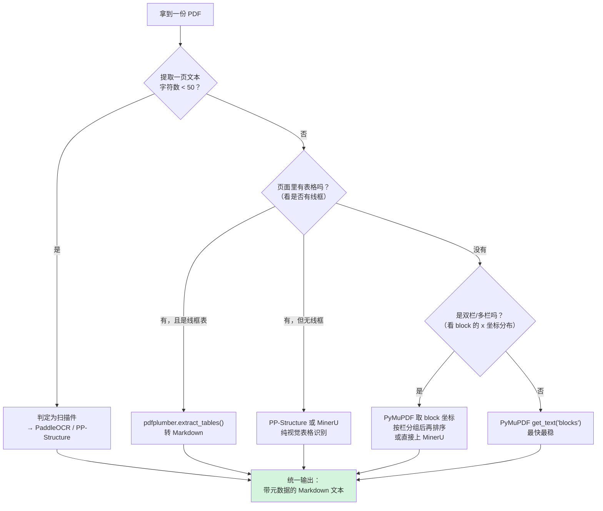
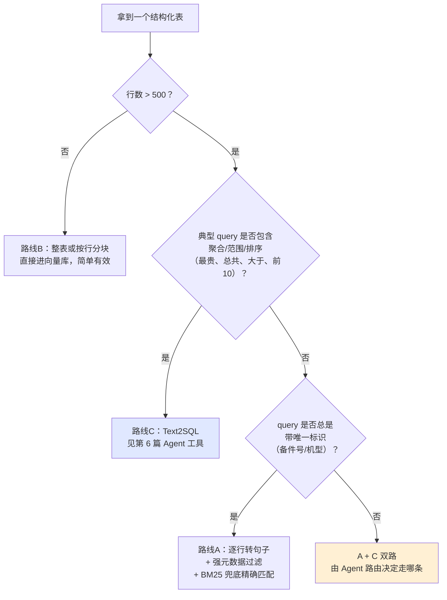
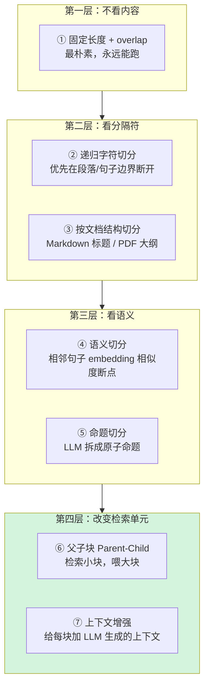
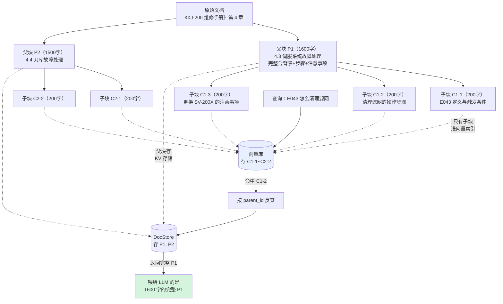
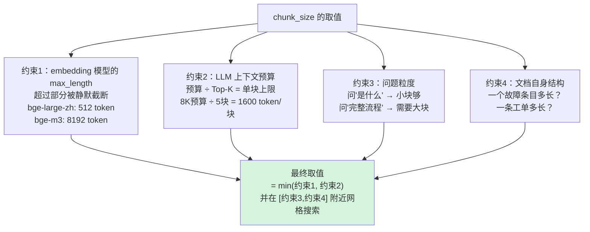
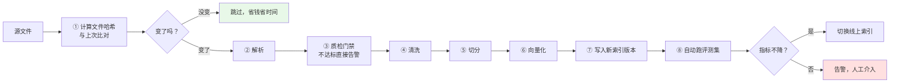

# 第 2.2 章  文档解析与切分策略

> **本章目标**：读完能做到 …
> 1. 面对企业里的 9 种真实文档形态，选对解析工具并说出理由；
> 2. 写出一条从 PDF/Word/Excel 到干净 chunk 的完整流水线，包含 OCR、表格、去重、清洗；
> 3. 掌握 7 种切分策略（固定长度 / 递归字符 / 结构 / 语义 / 命题 / 父子块 / 上下文增强）并各自跑通代码；
> 4. 用网格搜索脚本在自己的评测集上定出最佳 `chunk_size`，而不是抄别人的 512；
> 5. 设计出一套能支撑后续过滤、溯源、权限控制的 chunk 元数据 schema。
>
> **前置知识**：[第 2.1 章 RAG 原理与整体架构](./01-RAG原理与整体架构.md)
>
> **预计用时**：阅读 60 分钟 / 动手 120 分钟

---

## 一、为什么需要它（问题出发）

### 1.1 一个让整个项目停摆两周的真实故事

华成机电的 RAG 项目启动第 3 周，团队已经跑通了第 2.1 章那个 20 行 Demo，信心满满地把 47 份 PDF 手册全量灌进了向量库。上线内测第一天，客服部门反馈：

> 「问啥都答不对，还不如我自己翻 PDF。」

团队第一反应是"检索不行，换个更强的 embedding 模型"。换了 bge-m3，没用。又加了 rerank，还是没用。第 5 天，有人终于干了一件本应第一天就干的事——**把向量库里的 chunk 随机抽 20 条打印出来看**：

```text
chunk_00841: "华成机电内部资料 严禁外传 第 47 页 共 312 页 XJ-200 操作手册 V3.2\n\n"
chunk_00842: "   \n 3 8 . 5 \n 4 2 . 1 \n 1 8 ~ 2 2 \n"
chunk_00843: "第三步若风扇停转需更换驱动器"
chunk_00844: "SV-200X 复位方法为按 RESET 键保持 3 秒。第 2.4.8 节 刀库维护"
chunk_00845: "目录\n1 安全须知 .......... 3\n2 设备概述 .......... 12\n3 操作面板 .......... 25"
```

问题一目了然：
- `00841` 整个 chunk 就是**页眉页脚**，没有任何信息量，但它和很多 query 的向量相似度还不低；
- `00842` 是**表格**被解析成了一串孤立数字，"18~22"（夹紧力）彻底脱离了它的列名；
- `00843` 和 `00844` 把**一个完整的处理步骤从中间切断了**，检索到 `00843` 的用户永远不知道备件型号是 SV-200X；
- `00845` 是**目录页**，它对几乎所有 query 都有中等相似度，是纯粹的噪声放大器。

**这不是检索问题，这是解析和切分问题。** 团队浪费了 4 天在检索侧调参，而问题的根在流水线的第二、第四个环节。

### 1.2 一条必须刻进脑子的原则


> 🔑 **RAG 的效果上限，在文档变成 chunk 的那一刻就已经确定了。** 后面所有环节都只能"尽量不损失"，没有任何环节能"补回来"。
>
> 一个经验法则：如果你把 chunk 直接给一个不懂业务的人看，他读不懂这段在说什么，那模型也读不懂。**chunk 必须是自包含（self-contained）的语义单元**。

这一章会很长、很琐碎、代码很多。**它是全书最"脏"但性价比最高的一章**——在我们的实践里，把解析和切分做扎实带来的召回率提升，通常超过换 embedding 模型 + 加 rerank 的总和。

---

## 二、原理拆解

### 2.1 企业文档的真实形态与解析难点

先做个体检。华成机电的 47 份手册按形态分类：

| # | 形态 | 华成机电的例子 | 数量 | 解析难点 |
|---|---|---|---|---|
| 1 | **数字版单栏 PDF** | 2020 年后的新版手册 | 21 份 | 最简单，但仍有页眉页脚、跨页段落、软换行问题 |
| 2 | **双栏/多栏 PDF** | 《XJ 系列技术白皮书》 | 6 份 | 按坐标顺序提取会左右串行，读出来是"第一行左栏第一行右栏第二行左栏…" |
| 3 | **扫描件 PDF（图片）** | 2015 年前的老机型手册 | 11 份 | 文本层为空，必须 OCR；中文 OCR 对表格和竖排文字容易出错 |
| 4 | **带表格的 Word** | 《保修政策 2026 版》 | 23 份 | 合并单元格、嵌套表格；直接 `docx2txt` 会把表格拍平成无结构文本 |
| 5 | **Excel 备件表** | 《备件目录》2.3 万行 | 1 份 | 结构化数据，逐行向量化会产生 2.3 万个高度相似的 chunk，把向量空间"污染"成一团 |
| 6 | **PPT 培训材料** | 《新员工售后培训》 | 14 份 | 文本碎片化、大量靠图说话、备注页（speaker notes）里才有干货 |
| 7 | **HTML Wiki** | Confluence 导出 3100 篇 | 3100 篇 | 导航栏/侧边栏/评论区混入正文；同一内容多版本并存 |
| 8 | **CAD 图纸旁注** | 装配图上的技术要求 | 约 400 张 | DWG 需要转换；旁注文字位置分散，语义依赖图形上下文 |
| 9 | **历史工单 CSV** | MySQL 导出 18.7 万条 | 1 份 | 字段化 + 自由文本混合；口语化、错别字多、有大量"已处理""OK"这类无信息内容 |
| 10 | **邮件（EML/MSG）** | 客户投诉往来 | 约 8000 封 | 引用链层层嵌套，同一内容被复制 N 次；签名档噪声 |

每一种都要单独的处理策略。**不要指望一个 `UnstructuredLoader` 打天下**——它能跑通，但效果只能到 60 分。

### 2.2 解析工具全景对比

这是本章最有价值的一张表。所有结论基于 2026 年上半年的版本实测。

| 工具 | 版本 | 速度 | 表格保留 | 版面还原 | OCR | 中文 | 依赖重量 | 许可证 | 一句话定位 |
|---|---|---|---|---|---|---|---|---|---|
| **pypdf** | 5.x | 快 | ✗ | ✗ | ✗ | 中 | 极轻（纯 Python） | BSD | 只要文本、不在乎质量时用；适合快速探查 |
| **pdfplumber** | 0.11.x | 中 | **✓✓ 强** | ✓ 有坐标 | ✗ | 好 | 轻 | MIT | **表格提取的最佳选择**，有线框表格准确率很高 |
| **PyMuPDF (fitz)** | 1.24.x | **极快** | ✓ 中等 | **✓✓ 有 block/span 坐标与字号** | 需配 Tesseract | 好 | 轻（C 扩展） | **AGPL-3.0 / 商业双授权** | **综合最强**，速度快、信息全；注意许可证 |
| **unstructured** | 0.16.x | 慢 | ✓ | ✓✓ 元素分区 | ✓（hi_res 模式） | 中 | **重**（拉 detectron2/ONNX） | Apache-2.0 | 多格式统一入口，工程省事但慢且质量不稳定 |
| **MinerU** | 1.x | 中 | **✓✓** | **✓✓ 公式/多栏** | ✓ | **✓✓ 极强** | 重（需 GPU 更佳） | AGPL-3.0 | **中文学术/技术文档 PDF 转 Markdown 的首选** |
| **marker** | 1.x | 中 | ✓✓ | ✓✓ | ✓ | 好 | 重（深度模型） | GPL-3.0（含商用限制条款） | PDF→Markdown 质量高，注意许可证 |
| **PaddleOCR** | 2.8+/3.x | 中 | ✓（配 PP-Structure） | ✓ | **✓✓ 中文最强** | **✓✓** | 重 | Apache-2.0 | **中文扫描件 OCR 首选**，PP-Structure 还能还原表格 |
| **docling** | 2.x | 中 | ✓✓ | ✓✓ | ✓ | 好 | 中 | MIT | IBM 出品，统一文档模型，**许可证最友好的高质量方案** |

> ⚠️ **许可证是企业落地的硬约束，务必提前和法务确认**：PyMuPDF 是 AGPL-3.0，如果你的 SaaS 产品对外提供服务，AGPL 的网络分发条款可能要求你开源整个服务端代码，商业使用需购买 Artifex 的商业授权。MinerU、marker 同理。**如果你的产品要商业闭源分发，优先考虑 pdfplumber（MIT）+ PaddleOCR（Apache-2.0）+ docling（MIT）这套组合。** 本书为了讲清原理会用到 PyMuPDF，但会同时给出 pdfplumber 的等价实现。

#### 选型建议（直接抄）



**分场景的推荐组合：**

| 场景 | 推荐组合 | 理由 |
|---|---|---|
| 教学 / POC / 快速验证 | `pypdf` 或 `PyMuPDF` | 装得快，跑得快 |
| 中文技术手册（本书主线） | `PyMuPDF`（文本+版面）+ `pdfplumber`（表格）+ `PaddleOCR`（扫描页） | 分工明确，每一环都用最强的 |
| 追求最高质量、有 GPU | `MinerU` 全量转 Markdown | 一站式，公式/多栏/表格都还原得好 |
| 商业闭源产品 | `docling` + `pdfplumber` + `PaddleOCR` | 许可证友好 |
| 多格式混合（Word/PPT/HTML/邮件） | `unstructured` 做统一入口，PDF 单独走上面的链路 | 用它的广度，不用它的深度 |

---

## 三、动手实战

### 3.0 环境准备

```bash
# uv
uv pip install \
  "pymupdf==1.24.14" "pdfplumber==0.11.4" "pypdf==5.1.0" \
  "python-docx==1.1.2" "openpyxl==3.1.5" "pandas==2.2.3" \
  "unstructured[md,docx,pptx,html]==0.16.11" \
  "langchain-text-splitters==0.3.4" "langchain-core==0.3.28" \
  "sentence-transformers==3.3.1" "numpy==1.26.4" \
  "simhash==2.1.2" "datasketch==1.6.5" "jieba==0.42.1"

# pip 等价
pip install pymupdf==1.24.14 pdfplumber==0.11.4 pypdf==5.1.0 \
  python-docx==1.1.2 openpyxl==3.1.5 pandas==2.2.3 \
  "unstructured[md,docx,pptx,html]==0.16.11" \
  langchain-text-splitters==0.3.4 langchain-core==0.3.28 \
  sentence-transformers==3.3.1 numpy==1.26.4 \
  simhash==2.1.2 datasketch==1.6.5 jieba==0.42.1

# OCR（可选，扫描件才需要）
pip install "paddlepaddle==2.6.2" "paddleocr==2.9.1"
```

### 3.1 PyMuPDF：提取文本 + 版面坐标

版面坐标是干什么用的？三件事：**判断双栏、识别页眉页脚、按字号推断标题层级**。只拿纯文本的人永远做不好这三件事。

```python
"""parse_pymupdf.py —— 用 PyMuPDF 提取文本块及其版面信息。"""
from __future__ import annotations

import fitz  # PyMuPDF
from dataclasses import dataclass, asdict, field
from typing import Iterator


@dataclass
class TextBlock:
    """一个带版面信息的文本块。"""
    page: int              # 页码，从 1 开始
    text: str              # 文本内容
    bbox: tuple            # (x0, y0, x1, y1)，坐标原点在页面左上角
    font_size: float       # 该块的主导字号
    is_bold: bool          # 是否粗体（用于推断标题）
    block_no: int          # 页内块序号


def _span_stats(block: dict) -> tuple[float, bool]:
    """统计一个 block 里出现字符数最多的字号，以及是否粗体。"""
    size_chars: dict[float, int] = {}
    bold_chars = 0
    total_chars = 0
    for line in block.get("lines", []):
        for span in line.get("spans", []):
            n = len(span.get("text", ""))
            if n == 0:
                continue
            size = round(span.get("size", 0.0), 1)
            size_chars[size] = size_chars.get(size, 0) + n
            total_chars += n
            # PyMuPDF 的 flags 第 4 位（值 16）表示 bold
            if span.get("flags", 0) & 2 ** 4:
                bold_chars += n
    if not size_chars:
        return 0.0, False
    dominant = max(size_chars.items(), key=lambda kv: kv[1])[0]
    return dominant, (bold_chars / max(total_chars, 1)) > 0.5


def extract_blocks(pdf_path: str) -> list[TextBlock]:
    """提取 PDF 全部文本块，保留坐标与字号。"""
    doc = fitz.open(pdf_path)
    results: list[TextBlock] = []
    for page_idx in range(len(doc)):
        page = doc[page_idx]
        # "dict" 模式给出最完整的结构：blocks -> lines -> spans
        page_dict = page.get_text("dict")
        for bno, block in enumerate(page_dict.get("blocks", [])):
            if block.get("type", 0) != 0:   # type=0 是文本块，1 是图片块
                continue
            text = "".join(
                span["text"]
                for line in block.get("lines", [])
                for span in line.get("spans", [])
            ).strip()
            if not text:
                continue
            size, bold = _span_stats(block)
            results.append(TextBlock(
                page=page_idx + 1,
                text=text,
                bbox=tuple(round(v, 1) for v in block["bbox"]),
                font_size=size,
                is_bold=bold,
                block_no=bno,
            ))
    doc.close()
    return results


def detect_columns(blocks: list[TextBlock], page_width: float, tol: float = 0.15) -> bool:
    """粗略判断是否为双栏：看 block 左边界是否聚成两簇。"""
    lefts = [b.bbox[0] for b in blocks]
    if len(lefts) < 8:
        return False
    mid = page_width / 2
    left_cluster = [x for x in lefts if x < mid * (1 - tol)]
    right_cluster = [x for x in lefts if x > mid * (1 + tol)]
    # 两簇都有足够多的块，才认为是双栏
    return len(left_cluster) >= 3 and len(right_cluster) >= 3


def reorder_two_columns(blocks: list[TextBlock], page_width: float) -> list[TextBlock]:
    """双栏 PDF 重排：先把左栏按 y 排完，再排右栏。"""
    mid = page_width / 2
    out: list[TextBlock] = []
    by_page: dict[int, list[TextBlock]] = {}
    for b in blocks:
        by_page.setdefault(b.page, []).append(b)
    for page in sorted(by_page):
        pbs = by_page[page]
        left = sorted([b for b in pbs if b.bbox[0] < mid], key=lambda b: b.bbox[1])
        right = sorted([b for b in pbs if b.bbox[0] >= mid], key=lambda b: b.bbox[1])
        out.extend(left + right)
    return out


def infer_heading_level(blocks: list[TextBlock]) -> dict[int, int]:
    """按字号把块映射成标题层级：字号越大层级越高，正文为 0。"""
    from collections import Counter
    sizes = Counter(round(b.font_size, 1) for b in blocks)
    # 出现最多的字号认定为正文字号
    body_size = sizes.most_common(1)[0][0]
    larger = sorted({s for s in sizes if s > body_size + 0.5}, reverse=True)
    size_to_level = {s: i + 1 for i, s in enumerate(larger[:4])}   # 最多识别 4 级标题
    return {id(b): size_to_level.get(round(b.font_size, 1), 0) for b in blocks}


if __name__ == "__main__":
    PDF = "./data/raw/XJ-200操作手册V3.2.pdf"
    blocks = extract_blocks(PDF)
    print(f"共提取 {len(blocks)} 个文本块")

    doc = fitz.open(PDF)
    pw = doc[0].rect.width
    doc.close()

    print(f"页宽={pw:.0f}，双栏判定={detect_columns(blocks, pw)}")

    levels = infer_heading_level(blocks)
    for b in blocks[:8]:
        lv = levels[id(b)]
        tag = f"H{lv}" if lv else "正文"
        print(f"[p{b.page:>3}][{tag:>3}][{b.font_size:>4.1f}pt] {b.text[:40]}")
```

**预期输出：**

```text
共提取 2841 个文本块
页宽=595，双栏判定=False
[p  1][ H1][22.0pt] XJ-200 数控车床操作手册
[p  1][ H3][12.0pt] 版本 V3.2  2024年6月
[p  1][正文][10.5pt] 华成机电股份有限公司
[p  2][ H1][22.0pt] 目录
[p  2][正文][10.5pt] 1 安全须知 .................... 3
[p  2][正文][10.5pt] 2 设备概述 .................... 12
[p  3][ H1][22.0pt] 第1章 安全须知
[p  3][ H2][16.0pt] 1.1 一般安全规定
```

> 💡 有了 `font_size` 和层级，你就能做**按结构切分**（3.6 节）和**章节路径元数据**（3.9 节）。这两件事是把 RAG 从 60 分拉到 80 分的关键，而它们的前提就是这里的版面信息。

### 3.2 pdfplumber：提取表格并转 Markdown

表格是企业文档里信息密度最高的部分，也是最容易被解析毁掉的部分。**表格必须连表头一起进 chunk，否则数字就是废数字。**

```python
"""parse_tables.py —— 用 pdfplumber 抽表格并转成 Markdown。"""
from __future__ import annotations

import re
import pdfplumber
from dataclasses import dataclass


@dataclass
class ExtractedTable:
    page: int
    index: int
    markdown: str
    n_rows: int
    n_cols: int


def _clean_cell(v) -> str:
    """单元格清洗：None→空串、换行→空格、压缩空白。"""
    if v is None:
        return ""
    s = str(v).replace("\n", " ").replace("\r", " ")
    return re.sub(r"\s+", " ", s).strip()


def _fill_merged(rows: list[list[str]]) -> list[list[str]]:
    """把合并单元格造成的空值向下/向右填充，避免表格失去含义。"""
    if not rows:
        return rows
    n_col = max(len(r) for r in rows)
    rows = [r + [""] * (n_col - len(r)) for r in rows]
    for i, row in enumerate(rows):
        for j, cell in enumerate(row):
            if cell == "":
                if i > 0 and rows[i - 1][j]:        # 纵向合并：继承上一行
                    rows[i][j] = rows[i - 1][j]
                elif j > 0 and row[j - 1]:          # 横向合并：继承左一列
                    rows[i][j] = row[j - 1]
    return rows


def table_to_markdown(table: list[list], fill_merged: bool = True) -> str:
    """二维列表 → GitHub 风格 Markdown 表格。"""
    rows = [[_clean_cell(c) for c in row] for row in table if row]
    rows = [r for r in rows if any(r)]          # 丢掉全空行
    if not rows:
        return ""
    if fill_merged:
        rows = _fill_merged(rows)
    n_col = max(len(r) for r in rows)
    rows = [r + [""] * (n_col - len(r)) for r in rows]

    header, body = rows[0], rows[1:]
    lines = ["| " + " | ".join(header) + " |",
             "| " + " | ".join(["---"] * n_col) + " |"]
    lines += ["| " + " | ".join(r) + " |" for r in body]
    return "\n".join(lines)


def extract_tables(pdf_path: str, min_rows: int = 2) -> list[ExtractedTable]:
    """抽取 PDF 中所有表格。对无线框表格降级为文本对齐策略。"""
    out: list[ExtractedTable] = []
    # 两套策略：先试线框（lines），失败再试文本对齐（text）
    strategies = [
        {"vertical_strategy": "lines", "horizontal_strategy": "lines"},
        {"vertical_strategy": "text", "horizontal_strategy": "text",
         "intersection_tolerance": 5},
    ]
    with pdfplumber.open(pdf_path) as pdf:
        for pno, page in enumerate(pdf.pages, start=1):
            tables = []
            for st in strategies:
                try:
                    tables = page.extract_tables(table_settings=st)
                except Exception:
                    tables = []
                if tables:
                    break
            for idx, tb in enumerate(tables):
                if not tb or len(tb) < min_rows:
                    continue
                md = table_to_markdown(tb)
                if not md:
                    continue
                out.append(ExtractedTable(
                    page=pno, index=idx, markdown=md,
                    n_rows=len(tb), n_cols=max(len(r) for r in tb),
                ))
    return out


def table_summary_prompt(md: str, page: int, source: str) -> str:
    """给表格生成一句自然语言摘要的 prompt（用于提升表格 chunk 的召回率）。"""
    return (
        "下面是一张来自技术手册的表格，请用 2~3 句中文说明：这张表在讲什么、"
        "包含哪些字段、典型用途。不要逐行复述数据。\n\n"
        f"【来源】{source} 第 {page} 页\n【表格】\n{md}\n\n【摘要】"
    )


if __name__ == "__main__":
    PDF = "./data/raw/XJ-200故障代码手册.pdf"
    tables = extract_tables(PDF)
    print(f"共抽到 {len(tables)} 张表格\n")
    t = tables[0]
    print(f"--- 第 {t.page} 页 第 {t.index} 张 ({t.n_rows}行 x {t.n_cols}列) ---")
    print(t.markdown[:600])
```

**预期输出：**

```text
共抽到 34 张表格

--- 第 12 页 第 0 张 (9行 x 4列) ---
| 错误码 | 故障名称 | 可能原因 | 处理措施 |
| --- | --- | --- | --- |
| E041 | 主轴电机过载 | 切削参数过大；主轴轴承磨损 | 降低进给至80%；检查主轴电流；必要时更换 SP-100M |
| E042 | 主轴定向失败 | 定向开关信号异常 | 检查接近开关 SQ-2 间隙 0.5~1.0mm |
| E043 | X轴伺服驱动器过热 | 散热风扇故障；滤网堵塞；环温>40℃ | 清理滤网；检查风扇；更换 SV-200X |
| E044 | X轴伺服使能异常 | 复位时未先切断使能 | 断电30秒后重新上电 |
```

> ⚠️ **表格 chunk 的黄金规则**：一张表如果超过 chunk_size，**必须按行切分，且每一段都要复制表头**。下面 3.11 节会给完整代码。没有表头的数据行，向量化之后就是一堆没有意义的数字串。

### 3.3 unstructured：多格式统一分区解析

`unstructured` 的价值不在 PDF（它在 PDF 上不如专用工具），而在于**它能用同一套 API 处理 docx / pptx / html / eml / md**，并且输出统一的"元素类型"（Title / NarrativeText / Table / ListItem / Header / Footer）。这个类型标注对后续清洗极其有用——**你可以直接把 Header/Footer 类型的元素扔掉**。

```python
"""parse_unstructured.py —— 用 unstructured 做多格式统一分区解析。"""
from __future__ import annotations

from pathlib import Path
from collections import Counter
from unstructured.partition.auto import partition


# 这些类型基本都是噪声，直接丢弃
NOISE_TYPES = {"Header", "Footer", "PageBreak", "PageNumber", "Image", "Formula"}


def parse_any(path: str, ocr_languages: str = "chi_sim+eng") -> list[dict]:
    """统一解析入口：自动识别格式并分区。"""
    suffix = Path(path).suffix.lower()
    kwargs: dict = {"filename": path}
    if suffix == ".pdf":
        # fast：只用文本层，快；hi_res：上版面模型+OCR，慢但准
        kwargs.update({"strategy": "hi_res", "languages": ["chi_sim", "eng"],
                       "infer_table_structure": True})
    elif suffix in {".png", ".jpg", ".jpeg", ".tiff"}:
        kwargs.update({"strategy": "hi_res", "languages": ["chi_sim", "eng"]})

    elements = partition(**kwargs)

    out = []
    for el in elements:
        meta = el.metadata.to_dict() if el.metadata else {}
        out.append({
            "type": el.category,                      # Title / NarrativeText / Table / ...
            "text": (el.text or "").strip(),
            "page": meta.get("page_number"),
            # Table 元素带 HTML 结构，可以再转 Markdown
            "html": meta.get("text_as_html"),
            "filename": meta.get("filename"),
        })
    return out


def drop_noise(elements: list[dict]) -> list[dict]:
    """丢掉页眉页脚等噪声元素，并丢掉过短的碎片。"""
    return [e for e in elements
            if e["type"] not in NOISE_TYPES and len(e["text"]) >= 4]


def group_by_title(elements: list[dict]) -> list[dict]:
    """按 Title 元素把正文聚成"章节"，天然实现结构化切分。"""
    sections: list[dict] = []
    current = {"title": "（无标题）", "page": None, "body": []}
    for e in elements:
        if e["type"] == "Title":
            if current["body"]:
                sections.append(current)
            current = {"title": e["text"], "page": e["page"], "body": []}
        else:
            current["body"].append(e["text"])
    if current["body"]:
        sections.append(current)
    return [{"title": s["title"], "page": s["page"],
             "text": s["title"] + "\n" + "\n".join(s["body"])} for s in sections]


if __name__ == "__main__":
    els = parse_any("./data/raw/保修政策2026版.docx")
    print("元素类型分布：", Counter(e["type"] for e in els))

    els = drop_noise(els)
    secs = group_by_title(els)
    print(f"\n清洗后 {len(els)} 个元素，聚合成 {len(secs)} 个章节\n")
    for s in secs[:3]:
        print(f"### {s['title']}（p{s['page']}）")
        print(s["text"][:150].replace("\n", " "), "...\n")
```

**预期输出：**

```text
元素类型分布： Counter({'NarrativeText': 84, 'Title': 19, 'ListItem': 37, 'Table': 4, 'Header': 12, 'Footer': 12})

清洗后 144 个元素，聚合成 19 个章节

### 第一条 保修范围
第一条 保修范围 本政策适用于华成机电股份有限公司生产的 XJ 系列数控车床全系产品。整机保修期为 12 个月，自客户签署《设备验收单》之日起计算 ...

### 第二条 保修期限
第二条 保修期限 整机保修 12 个月；主轴组件保修 24 个月；数控系统保修 12 个月。延保服务需另行签订《延长保修协议》 ...

### 第三条 不在保修范围内的情形
第三条 不在保修范围内的情形 下列情形不属于免费保修范围： 1. 易损件正常磨损，包括刀具、皮带、密封圈、滤芯 2. 因客户未按手册要求维护保养导致的故障 ...
```

> 💡 `strategy="hi_res"` 会下载版面检测模型（约 200MB）并显著变慢（单页从 0.02s 涨到 1~3s）。**批量处理 3000 篇文档前务必先估算时间**：3000 篇 × 20 页 × 2s ≈ 33 小时。生产上要么用 `fast` 模式 + 专用工具兜底，要么上 GPU 并行。

### 3.4 扫描件 OCR 完整流程

华成机电有 11 份 2015 年前的扫描件手册。处理流程是：**判断是否扫描件 → 渲染成图 → 图像预处理 → OCR → 按坐标重排 → 输出文本**。

```python
"""parse_ocr.py —— 扫描件 PDF 的完整 OCR 流程。"""
from __future__ import annotations

import io
import fitz
import numpy as np
from dataclasses import dataclass
from PIL import Image
from paddleocr import PaddleOCR


# 全局单例：PaddleOCR 初始化很慢（加载检测+识别+方向分类三个模型），不要在循环里 new
_OCR = None


def get_ocr() -> PaddleOCR:
    """懒加载 PaddleOCR 单例。"""
    global _OCR
    if _OCR is None:
        _OCR = PaddleOCR(
            use_angle_cls=True,   # 开启方向分类，处理倒置/旋转页
            lang="ch",            # 中英混排用 "ch"
            show_log=False,
            use_gpu=False,        # 有 GPU 改 True，速度差 5~10 倍
        )
    return _OCR


def is_scanned_page(page: fitz.Page, char_threshold: int = 50) -> bool:
    """判断一页是否为扫描件：文本层字符数极少即认为是图片页。"""
    text = page.get_text("text").strip()
    return len(text) < char_threshold


def render_page(page: fitz.Page, dpi: int = 300) -> Image.Image:
    """把 PDF 页渲染成 PIL 图像。dpi=300 是 OCR 的甜点值，再高收益递减。"""
    zoom = dpi / 72.0
    pix = page.get_pixmap(matrix=fitz.Matrix(zoom, zoom), alpha=False)
    return Image.open(io.BytesIO(pix.tobytes("png")))


def preprocess(img: Image.Image) -> np.ndarray:
    """OCR 前的图像预处理：灰度化 + 简单二值化，提升低质量扫描件识别率。"""
    gray = img.convert("L")
    arr = np.array(gray)
    # Otsu 阈值的简化实现：用均值±标准差做自适应阈值
    thr = arr.mean() - 0.3 * arr.std()
    binary = np.where(arr > thr, 255, 0).astype(np.uint8)
    return np.stack([binary] * 3, axis=-1)   # PaddleOCR 需要 3 通道


@dataclass
class OcrLine:
    text: str
    confidence: float
    bbox: tuple           # (x0, y0, x1, y1)


def ocr_image(img_arr: np.ndarray, min_conf: float = 0.60) -> list[OcrLine]:
    """对单张图做 OCR，返回按阅读顺序排好的行。"""
    result = get_ocr().ocr(img_arr, cls=True)
    if not result or not result[0]:
        return []
    lines: list[OcrLine] = []
    for item in result[0]:
        poly, (text, conf) = item[0], item[1]
        if conf < min_conf or not text.strip():
            continue
        xs = [p[0] for p in poly]
        ys = [p[1] for p in poly]
        lines.append(OcrLine(text.strip(), float(conf),
                             (min(xs), min(ys), max(xs), max(ys))))
    # 按"行带"排序：先按 y 分组（容差 15px），组内按 x 排序
    lines.sort(key=lambda l: (round(l.bbox[1] / 15), l.bbox[0]))
    return lines


def ocr_pdf(pdf_path: str, dpi: int = 300) -> list[dict]:
    """完整流程：逐页判断，需要时才 OCR，混合文档也能正确处理。"""
    doc = fitz.open(pdf_path)
    pages: list[dict] = []
    for i in range(len(doc)):
        page = doc[i]
        if is_scanned_page(page):
            img = render_page(page, dpi=dpi)
            lines = ocr_image(preprocess(img))
            text = "\n".join(l.text for l in lines)
            avg_conf = sum(l.confidence for l in lines) / max(len(lines), 1)
            pages.append({"page": i + 1, "text": text, "method": "ocr",
                          "avg_confidence": round(avg_conf, 3),
                          "n_lines": len(lines)})
        else:
            pages.append({"page": i + 1, "text": page.get_text("text"),
                          "method": "text_layer", "avg_confidence": 1.0,
                          "n_lines": None})
    doc.close()
    return pages


if __name__ == "__main__":
    pages = ocr_pdf("./data/raw/XJ-100维修手册_扫描版.pdf")
    n_ocr = sum(1 for p in pages if p["method"] == "ocr")
    print(f"共 {len(pages)} 页，其中 {n_ocr} 页走 OCR")

    low = [p for p in pages if p["method"] == "ocr" and p["avg_confidence"] < 0.85]
    print(f"低置信度页（需人工复核）：{[p['page'] for p in low]}")

    p = next(p for p in pages if p["method"] == "ocr")
    print(f"\n--- 第 {p['page']} 页 OCR 结果（置信度 {p['avg_confidence']}）---")
    print(p["text"][:300])
```

**预期输出：**

```text
共 214 页，其中 214 页走 OCR
低置信度页（需人工复核）：[3, 47, 88, 156, 201]

--- 第 1 页 OCR 结果（置信度 0.947）---
华成机电股份有限公司
XJ-100 数控车床
维修手册
版本 V1.4
2014 年 11 月
本手册为公司内部技术资料 请妥善保管
```

> 实测环境：Intel i7-12700 CPU / PaddleOCR 2.9.1 / dpi=300。单页耗时约 1.8 秒，214 页约 6.4 分钟。换 RTX 4090 后单页约 0.22 秒。**批量 OCR 一定要上 GPU 并做进程池并行**。

> ⚠️ **必须保留 `avg_confidence` 作为元数据**。低置信度的 chunk 在检索时可以降权，或者在答案里加"该内容来自扫描件 OCR，建议核对原文"的提示。这是华成机电项目里客户明确要求的功能。

### 3.5 Excel / CSV 结构化数据：三条路线的决策

这是最容易做错的一类数据。华成机电的备件表有 2.3 万行：

| 备件编号 | 名称 | 适配机型 | 单价 | 库存 | 交付周期 |
|---|---|---|---|---|---|
| SV-200X | X轴伺服驱动器 | XJ-200/XJ-200-B3 | 4800 | 3 | 3个工作日 |
| SP-100M | 主轴轴承 | XJ-100/XJ-200 | 1250 | 17 | 当日 |
| ... | ... | ... | ... | ... | ... |

**如果你把每一行拼成一句话然后向量化，会发生什么？** 2.3 万个句子结构完全相同，只有实体不同。它们在向量空间里挤成一个极小的簇，任何关于备件的 query 都会召回一堆"长得差不多但型号不对"的行。这叫**语义坍缩**。

#### 三条路线决策表

| 路线 | 做法 | 适合的 query | 不适合的 query | 成本 | 准确率 |
|---|---|---|---|---|---|
| **A. 逐行转自然语言** | 每行拼成一句话，独立成 chunk | "SV-200X 是什么？适配哪些机型？" | "库存小于 5 的备件有哪些？" | 低 | 单点查询高，聚合查询为 0 |
| **B. 保留表格分块** | 按 N 行一块，每块带表头，转 Markdown | "伺服类备件都有哪些？" | "总库存价值多少？" | 低 | 中，依赖块边界运气 |
| **C. Text2SQL** | 表存 MySQL/DuckDB，LLM 生成 SQL 查询 | "库存小于 5 且单价大于 3000 的备件" "总库存价值" | "这个备件为什么容易坏"（非结构化知识） | 中高（需 schema 描述 + LLM 调用） | 聚合/过滤类接近 100%，但 SQL 可能生成错 |

**决策规则：**



**华成机电的最终方案是 A + C 双路**：备件的静态属性（适配机型、规格、更换注意事项）走 A 进向量库；库存、价格这类动态/聚合查询走 C（Text2SQL 查 ERP）。这正是第 2.1 章说的「双引擎」——知识型走 RAG，数据型走 Agent 工具。

#### 路线 A + B 的完整实现

```python
"""parse_tabular.py —— Excel/CSV 转可检索文本的三种策略。"""
from __future__ import annotations

import pandas as pd
from typing import Iterator


def row_to_sentence(row: pd.Series, template: str | None = None) -> str:
    """路线A：把一行转成自然语言句子。模板化比机械拼接效果好得多。"""
    if template:
        return template.format(**row.to_dict())
    parts = [f"{col}是{val}" for col, val in row.items()
             if pd.notna(val) and str(val).strip() != ""]
    return "；".join(parts) + "。"


def tabular_to_row_chunks(
    path: str,
    template: str | None = None,
    key_cols: list[str] | None = None,
    sheet_name: str | int = 0,
) -> list[dict]:
    """路线A：逐行转句子，并把关键列同时写入元数据用于精确过滤。"""
    df = pd.read_excel(path, sheet_name=sheet_name) if path.endswith((".xlsx", ".xls")) \
        else pd.read_csv(path)
    df = df.fillna("")
    chunks = []
    for i, row in df.iterrows():
        text = row_to_sentence(row, template)
        meta = {"row_index": int(i), "source": path, "data_type": "tabular_row"}
        for c in (key_cols or []):
            if c in df.columns:
                meta[c] = str(row[c])
        chunks.append({"text": text, "metadata": meta})
    return chunks


def tabular_to_table_chunks(
    path: str,
    rows_per_chunk: int = 20,
    sheet_name: str | int = 0,
) -> list[dict]:
    """路线B：按 N 行一块转 Markdown 表格，每块都复制表头。"""
    df = pd.read_excel(path, sheet_name=sheet_name) if path.endswith((".xlsx", ".xls")) \
        else pd.read_csv(path)
    df = df.fillna("")
    header = "| " + " | ".join(map(str, df.columns)) + " |"
    sep = "| " + " | ".join(["---"] * len(df.columns)) + " |"

    chunks = []
    for start in range(0, len(df), rows_per_chunk):
        sub = df.iloc[start:start + rows_per_chunk]
        body = ["| " + " | ".join(map(str, r.tolist())) + " |"
                for _, r in sub.iterrows()]
        md = "\n".join([header, sep] + body)
        chunks.append({
            "text": md,
            "metadata": {"source": path, "row_start": int(start),
                         "row_end": int(start + len(sub) - 1),
                         "data_type": "tabular_block"},
        })
    return chunks


def build_schema_description(path: str, sheet_name: str | int = 0, sample_n: int = 3) -> str:
    """路线C 的前置：生成给 LLM 看的表结构描述（Text2SQL 的关键输入）。"""
    df = pd.read_excel(path, sheet_name=sheet_name) if path.endswith((".xlsx", ".xls")) \
        else pd.read_csv(path)
    lines = [f"表名：spare_parts（共 {len(df)} 行）", "字段说明："]
    for col in df.columns:
        dtype = str(df[col].dtype)
        samples = df[col].dropna().unique()[:sample_n]
        sample_str = "、".join(map(str, samples))
        lines.append(f"  - {col}（{dtype}）示例值：{sample_str}")
    return "\n".join(lines)


if __name__ == "__main__":
    XLSX = "./data/raw/备件目录.xlsx"

    tmpl = ("备件编号 {备件编号}，名称为{名称}，适配机型 {适配机型}，"
            "单价 {单价} 元，标准交付周期 {交付周期}。")
    rows = tabular_to_row_chunks(XLSX, template=tmpl,
                                 key_cols=["备件编号", "适配机型"])
    print(f"路线A：{len(rows)} 个行级 chunk")
    print("  示例：", rows[0]["text"])
    print("  元数据：", rows[0]["metadata"])

    blocks = tabular_to_table_chunks(XLSX, rows_per_chunk=20)
    print(f"\n路线B：{len(blocks)} 个表格块 chunk")
    print(blocks[0]["text"][:200])

    print("\n路线C 的 schema 描述：")
    print(build_schema_description(XLSX))
```

**预期输出：**

```text
路线A：23417 个行级 chunk
  示例： 备件编号 SV-200X，名称为X轴伺服驱动器，适配机型 XJ-200/XJ-200-B3，单价 4800 元，标准交付周期 3个工作日。
  元数据： {'row_index': 0, 'source': './data/raw/备件目录.xlsx', 'data_type': 'tabular_row', '备件编号': 'SV-200X', '适配机型': 'XJ-200/XJ-200-B3'}

路线B：1171 个表格块 chunk
| 备件编号 | 名称 | 适配机型 | 单价 | 库存 | 交付周期 |
| --- | --- | --- | --- | --- | --- |
| SV-200X | X轴伺服驱动器 | XJ-200/XJ-200-B3 | 4800 | 3 | 3个工作日 |
| SP-100M | 主轴轴承 | XJ-100/XJ-200 | 1250 | 17 | 当日 |

路线C 的 schema 描述：
表名：spare_parts（共 23417 行）
字段说明：
  - 备件编号（object）示例值：SV-200X、SP-100M、BR-300K
  - 名称（object）示例值：X轴伺服驱动器、主轴轴承、制动电阻
  - 适配机型（object）示例值：XJ-200/XJ-200-B3、XJ-100/XJ-200、XJ-300
  - 单价（int64）示例值：4800、1250、680
  - 库存（int64）示例值：3、17、42
  - 交付周期（object）示例值：3个工作日、当日、7个工作日
```

> 🔑 **注意路线 A 里的 `key_cols`**。把"备件编号"同时写进元数据，检索时就能做 `WHERE 备件编号 == 'SV-200X'` 的精确过滤，彻底绕开语义坍缩。**结构化数据的向量检索必须配元数据过滤，单靠语义相似度一定翻车。**

---

### 3.6 清洗：完整的 Cleaning Pipeline

解析出来的文本还不能直接用。华成机电的实测数据：**原始解析文本中约 18% 的字符是噪声**（页眉页脚 9%、目录页 4%、乱码 2%、重复段落 3%）。这 18% 会稀释向量、浪费上下文预算、拉低召回精度。

清洗要做五件事：


```python
"""cleaning.py —— 生产可用的文档清洗流水线。"""
from __future__ import annotations

import re
import unicodedata
from collections import Counter
from dataclasses import dataclass, field
from typing import Callable


# ---------- ① 页眉页脚去除 ----------

def detect_repeated_lines(pages: list[str], min_ratio: float = 0.5,
                          max_len: int = 60) -> set[str]:
    """跨页高频短行 = 页眉页脚。出现在 >=50% 的页面上即判定。"""
    counter: Counter[str] = Counter()
    for p in pages:
        # 只看每页的前 3 行和后 3 行
        lines = [l.strip() for l in p.split("\n") if l.strip()]
        for l in lines[:3] + lines[-3:]:
            if len(l) <= max_len:
                # 把页码数字归一化，"第 12 页"和"第 13 页"应视为同一模板
                norm = re.sub(r"\d+", "#", l)
                counter[norm] += 1
    threshold = max(2, int(len(pages) * min_ratio))
    return {k for k, v in counter.items() if v >= threshold}


def strip_headers_footers(text: str, patterns: set[str]) -> str:
    """按归一化模板删除页眉页脚行。"""
    out = []
    for line in text.split("\n"):
        norm = re.sub(r"\d+", "#", line.strip())
        if norm in patterns:
            continue
        out.append(line)
    return "\n".join(out)


# ---------- ② 乱码检测 ----------

GARBLED_RE = re.compile(r"[-�]")   # PUA 私有区 + 替换字符


def garbled_ratio(text: str) -> float:
    """计算乱码字符占比。PDF 字体嵌入异常时会大量出现 PUA 字符。"""
    if not text:
        return 0.0
    bad = len(GARBLED_RE.findall(text))
    # 控制字符也算
    bad += sum(1 for c in text if unicodedata.category(c) == "Cc" and c not in "\n\r\t")
    return bad / len(text)


def is_garbled(text: str, threshold: float = 0.05) -> bool:
    """乱码占比超过阈值即判定该段不可用。"""
    return garbled_ratio(text) > threshold


# ---------- ③ 目录页剔除 ----------

TOC_LINE_RE = re.compile(r"^.{2,60}?[\.·…\s]{3,}\s*\d{1,4}\s*$")


def toc_line_ratio(text: str) -> float:
    """统计"标题……页码"这种目录行的占比。"""
    lines = [l.strip() for l in text.split("\n") if l.strip()]
    if len(lines) < 5:
        return 0.0
    hits = sum(1 for l in lines if TOC_LINE_RE.match(l))
    return hits / len(lines)


def is_toc_page(text: str, threshold: float = 0.4) -> bool:
    """目录行占比超过 40% 即判定为目录页。"""
    return toc_line_ratio(text) > threshold


# ---------- ④ 空白与换行规整 ----------

def normalize_whitespace(text: str) -> str:
    """全角空格转半角、压缩连续空白、合并 PDF 软换行。"""
    text = text.replace("　", " ").replace("\xa0", " ")
    text = re.sub(r"[ \t]+", " ", text)
    # PDF 每行末尾都有换行，但句子没结束时应该合并
    # 规则：上一行不以标点结尾，且下一行不以序号/标题标记开头 → 合并
    lines = text.split("\n")
    merged: list[str] = []
    for line in lines:
        s = line.strip()
        if not s:
            merged.append("")
            continue
        if (merged and merged[-1]
                and not re.search(r"[。！？；：.!?;:）)】」》]$", merged[-1])
                and not re.match(r"^(\d+[\.、）)]|第[一二三四五六七八九十百]+[章节条]|[•·\-\*]|\||#)", s)
                and len(merged[-1]) > 10):
            merged[-1] = merged[-1] + s
        else:
            merged.append(s)
    text = "\n".join(merged)
    return re.sub(r"\n{3,}", "\n\n", text).strip()


# ---------- ⑤ 重复段落去重：SimHash ----------

def _tokenize_cn(text: str) -> list[str]:
    """中文用 jieba 分词，英文按空格。"""
    import jieba
    return [w for w in jieba.lcut(text) if w.strip()]


def simhash64(text: str, bits: int = 64) -> int:
    """64 位 SimHash：局部敏感哈希，相似文本的哈希汉明距离小。"""
    import hashlib
    v = [0] * bits
    tokens = _tokenize_cn(text)
    if not tokens:
        return 0
    weights = Counter(tokens)
    for tok, w in weights.items():
        h = int(hashlib.md5(tok.encode("utf-8")).hexdigest(), 16)
        for i in range(bits):
            v[i] += w if (h >> i) & 1 else -w
    fingerprint = 0
    for i in range(bits):
        if v[i] > 0:
            fingerprint |= (1 << i)
    return fingerprint


def hamming(a: int, b: int) -> int:
    """汉明距离。"""
    return bin(a ^ b).count("1")


def dedup_simhash(texts: list[str], threshold: int = 3) -> tuple[list[int], dict]:
    """SimHash 去重：返回保留的下标列表。threshold=3 表示汉明距离<=3 视为重复。

    注意：朴素实现是 O(n^2)，10 万条以上要用分桶（把 64 位切成 4 段，
    段内完全相同才做精细比较），或者直接上 MinHashLSH。
    """
    kept: list[int] = []
    kept_hashes: list[int] = []
    dup_map: dict[int, int] = {}
    for i, t in enumerate(texts):
        h = simhash64(t)
        dup_of = None
        for j, kh in enumerate(kept_hashes):
            if hamming(h, kh) <= threshold:
                dup_of = kept[j]
                break
        if dup_of is None:
            kept.append(i)
            kept_hashes.append(h)
        else:
            dup_map[i] = dup_of
    return kept, dup_map


# ---------- ⑤' 大规模去重：MinHash LSH ----------

def dedup_minhash_lsh(texts: list[str], threshold: float = 0.85,
                      num_perm: int = 128) -> list[int]:
    """MinHash + LSH 去重：适合 10 万级以上，近似 O(n)。

    threshold 是 Jaccard 相似度阈值，0.85 对应"基本相同但有个别字差异"。
    """
    from datasketch import MinHash, MinHashLSH

    lsh = MinHashLSH(threshold=threshold, num_perm=num_perm)
    minhashes: dict[int, MinHash] = {}
    kept: list[int] = []

    for i, t in enumerate(texts):
        m = MinHash(num_perm=num_perm)
        for tok in set(_tokenize_cn(t)):
            m.update(tok.encode("utf-8"))
        if lsh.query(m):          # 已存在近似重复
            continue
        lsh.insert(str(i), m)
        minhashes[i] = m
        kept.append(i)
    return kept


# ---------- 流水线编排 ----------

@dataclass
class CleanReport:
    total_pages: int = 0
    dropped_toc: int = 0
    dropped_garbled: int = 0
    header_patterns: set[str] = field(default_factory=set)
    dedup_removed: int = 0
    char_before: int = 0
    char_after: int = 0


def clean_pipeline(pages: list[str], dedup: str = "simhash") -> tuple[list[str], CleanReport]:
    """完整清洗流水线。输入按页的文本列表，输出清洗后的页列表 + 报告。"""
    rep = CleanReport(total_pages=len(pages), char_before=sum(len(p) for p in pages))

    # ① 页眉页脚
    patterns = detect_repeated_lines(pages)
    rep.header_patterns = patterns
    pages = [strip_headers_footers(p, patterns) for p in pages]

    # ②③ 逐页判定丢弃
    survived: list[str] = []
    for p in pages:
        if is_toc_page(p):
            rep.dropped_toc += 1
            continue
        if is_garbled(p):
            rep.dropped_garbled += 1
            continue
        survived.append(p)

    # ④ 规整
    survived = [normalize_whitespace(p) for p in survived]
    survived = [p for p in survived if len(p) >= 20]

    # ⑤ 段落级去重
    paras = [para for p in survived for para in p.split("\n\n") if len(para.strip()) >= 20]
    if dedup == "minhash":
        keep_idx = dedup_minhash_lsh(paras)
    else:
        keep_idx, _ = dedup_simhash(paras)
    rep.dedup_removed = len(paras) - len(keep_idx)
    cleaned = [paras[i] for i in keep_idx]

    rep.char_after = sum(len(c) for c in cleaned)
    return cleaned, rep


if __name__ == "__main__":
    import fitz
    doc = fitz.open("./data/raw/XJ-200操作手册V3.2.pdf")
    raw_pages = [doc[i].get_text("text") for i in range(len(doc))]
    doc.close()

    cleaned, rep = clean_pipeline(raw_pages, dedup="simhash")
    print(f"原始页数：{rep.total_pages}")
    print(f"识别出的页眉页脚模板：{list(rep.header_patterns)[:5]}")
    print(f"剔除目录页：{rep.dropped_toc} 页，乱码页：{rep.dropped_garbled} 页")
    print(f"段落去重移除：{rep.dedup_removed} 段")
    print(f"字符数：{rep.char_before} → {rep.char_after} "
          f"（压缩 {100*(1-rep.char_after/rep.char_before):.1f}%）")
    print(f"\n清洗后段落数：{len(cleaned)}")
    print("示例：", cleaned[10][:120])
```

**预期输出：**

```text
原始页数：312
识别出的页眉页脚模板：['华成机电内部资料 严禁外传', '第 # 页 共 # 页', 'XJ-200 操作手册 V#.#', '', 'HuaCheng Electromechanical Co., Ltd.']
剔除目录页：4 页，乱码页：2 页
段落去重移除：87 段
字符数：418326 → 341905 （压缩 18.3%）

清洗后段落数：1642
示例： E043：X 轴伺服驱动器过热保护。当驱动器内部温度传感器检测到温度超过 85℃ 时触发本报警，同时切断伺服使能以保护功率模块。
```

> 💡 **SimHash vs MinHash 怎么选？**
>
> | | SimHash | MinHash + LSH |
> |---|---|---|
> | 原理 | 加权特征哈希后取符号位 | 多次哈希取最小值估计 Jaccard |
> | 相似度语义 | 近似余弦相似度 | Jaccard 相似度 |
> | 朴素复杂度 | O(n²) 比较，需分桶优化 | LSH 天然近似 O(n) |
> | 适合规模 | < 10 万段 | 10 万 ~ 千万段 |
> | 对长文本 | 表现好 | 表现好 |
> | 对短文本 | 容易误判（特征太少） | 同样容易误判 |
>
> 华成机电 3100 篇 Wiki + 18.7 万工单的场景下，我们用的是 **MinHash LSH**。工单里有大量"已处理，客户满意"这类模板化短文本，去重能砍掉约 23% 的数据量。

---

### 3.7 切分策略全解

终于到了本章的核心。**切分的唯一目标是：让每个 chunk 都是一个自包含的语义单元。**

七种策略，从简单到复杂：



| 策略 | 实现成本 | 运行成本 | 效果 | 什么时候用 |
|---|---|---|---|---|
| ① 固定长度 | 极低 | 零 | 差~中 | 兜底、无结构纯文本 |
| ② 递归字符 | 低 | 零 | 中 | **默认选择**，90% 的场景起步用它 |
| ③ 结构切分 | 中 | 零 | 中~好 | 有清晰标题层级的文档（手册、Wiki） |
| ④ 语义切分 | 中 | 低（需 embedding） | 好 | 长篇叙述、无明确结构的文本 |
| ⑤ 命题切分 | 高 | **高**（每段一次 LLM） | 好（精确检索场景） | 事实密集型 FAQ、法规条款 |
| ⑥ 父子块 | 中 | 零 | **很好** | **强烈推荐，实战性价比最高** |
| ⑦ 上下文增强 | 中 | **高**（每块一次 LLM） | **很好** | 预算允许时叠加在 ⑥ 之上 |

#### ① 固定长度 + overlap

```python
"""splitters.py —— 七种切分策略的完整实现。"""
from __future__ import annotations

import re
from dataclasses import dataclass, field
from typing import Callable


@dataclass
class Chunk:
    text: str
    metadata: dict = field(default_factory=dict)

    def __len__(self) -> int:
        return len(self.text)


def fixed_size_split(text: str, chunk_size: int = 500, overlap: int = 80) -> list[Chunk]:
    """最朴素的切分：按字符数硬切，相邻块重叠 overlap 个字符。"""
    if overlap >= chunk_size:
        raise ValueError("overlap 必须小于 chunk_size，否则会死循环")
    chunks: list[Chunk] = []
    start, idx = 0, 0
    step = chunk_size - overlap
    while start < len(text):
        piece = text[start:start + chunk_size]
        if piece.strip():
            chunks.append(Chunk(piece, {"chunk_index": idx, "strategy": "fixed",
                                        "char_start": start}))
            idx += 1
        start += step
    return chunks
```

**overlap 该设多少？为什么需要它？**

overlap 的唯一目的是**对冲"关键信息恰好落在切点上"的风险**。设想这段文本：

```text
...第三步：若风扇停转需更换驱动器 SV-200X。| 切点 |  注意更换前必须断电 30 秒...
```

不设 overlap，"更换前必须断电 30 秒"这条关键安全提示就和"更换驱动器"分家了。

经验值：

| 文档类型 | 推荐 overlap | 理由 |
|---|---|---|
| 技术手册、操作步骤 | `chunk_size × 15%~20%` | 步骤有强连续性，断开损失大 |
| 叙述性长文、Wiki | `chunk_size × 10%` | 语义相对松散 |
| FAQ、独立条目 | `0 ~ 5%` | 条目本身自包含，overlap 纯浪费 |
| 表格（按行切） | **表头复制，不用字符 overlap** | 字符 overlap 会切碎单元格 |

> ⚠️ overlap 不是越大越好。overlap = 50% 意味着**索引体积翻倍、存储和检索成本翻倍**，而且同一段内容会以两个 chunk 出现在召回结果里，浪费上下文预算（这正是第 2.1 章说的 FP3）。**15% 是一个久经考验的起点。**

#### ② 递归字符切分（RecursiveCharacterTextSplitter）

思路：给一个分隔符优先级列表，先用最高优先级的分隔符切；如果切出来的块还是太大，再用下一级分隔符切下去。这样能**尽量在自然边界断开**。

LangChain 的默认分隔符是 `["\n\n", "\n", " ", ""]`——**这对中文是灾难**，因为中文不用空格分词，退化到 `" "` 之后直接就是按字符硬切了。必须自己配中文分隔符。

```python
def recursive_split(
    text: str,
    chunk_size: int = 500,
    overlap: int = 80,
    separators: list[str] | None = None,
) -> list[Chunk]:
    """递归字符切分的自实现版本（便于理解原理）。"""
    # 中文友好的分隔符优先级：章节 > 段落 > 句号 > 分号 > 逗号 > 字符
    seps = separators or [
        "\n\n",        # 空行（段落）
        "\n",          # 换行
        "。", "！", "？",   # 中文句末标点
        "；", "!", "?", ";",
        "，", ",",          # 逗号（不得已才用）
        " ", "",            # 空格、单字符
    ]

    def _split(t: str, sep_idx: int) -> list[str]:
        if len(t) <= chunk_size:
            return [t] if t.strip() else []
        if sep_idx >= len(seps):
            # 分隔符用尽，硬切
            return [t[i:i + chunk_size] for i in range(0, len(t), chunk_size)]
        sep = seps[sep_idx]
        if sep == "":
            return [t[i:i + chunk_size] for i in range(0, len(t), chunk_size)]

        # 切分时保留分隔符（中文标点属于句子的一部分，不能丢）
        parts = t.split(sep)
        parts = [p + sep for p in parts[:-1]] + [parts[-1]]

        merged: list[str] = []
        buf = ""
        for p in parts:
            if len(p) > chunk_size:
                if buf:
                    merged.append(buf)
                    buf = ""
                merged.extend(_split(p, sep_idx + 1))     # 递归下一级
            elif len(buf) + len(p) <= chunk_size:
                buf += p
            else:
                if buf:
                    merged.append(buf)
                buf = p
        if buf:
            merged.append(buf)
        return merged

    pieces = [p for p in _split(text, 0) if p.strip()]

    # 加 overlap：从前一块尾部取 overlap 个字符拼到当前块头部
    out: list[Chunk] = []
    for i, p in enumerate(pieces):
        prefix = pieces[i - 1][-overlap:] if (i > 0 and overlap > 0) else ""
        out.append(Chunk(prefix + p, {"chunk_index": i, "strategy": "recursive"}))
    return out
```

**用 LangChain 官方实现（生产推荐，中文配置）：**

```python
from langchain_text_splitters import RecursiveCharacterTextSplitter

# 中文文档的正确配置——重点在 separators 和 keep_separator
cn_splitter = RecursiveCharacterTextSplitter(
    chunk_size=500,
    chunk_overlap=80,
    length_function=len,               # 也可换成 token 计数函数，见下文
    is_separator_regex=False,
    keep_separator=True,               # 必须为 True，否则句号会被吃掉
    separators=[
        "\n\n",
        "\n",
        "。", "！", "？",
        "；", "：",
        "，",
        " ", "",
    ],
)

docs = cn_splitter.split_text(long_chinese_text)
```

**按 token 而非字符计长（更准确，因为 LLM 和 embedding 都按 token 算）：**

```python
import tiktoken

_enc = tiktoken.get_encoding("cl100k_base")

def token_len(text: str) -> int:
    """按 token 计算长度。中文约 1 字 = 0.6~1.5 token，视编码器而定。"""
    return len(_enc.encode(text))

token_splitter = RecursiveCharacterTextSplitter(
    chunk_size=320,          # 注意：单位变成 token 了，不是字符
    chunk_overlap=50,
    length_function=token_len,
    keep_separator=True,
    separators=["\n\n", "\n", "。", "！", "？", "；", "，", " ", ""],
)
```

> 💡 **中文字符数与 token 数的换算**：用 cl100k_base 编码器，中文大约 **1 个汉字 ≈ 0.7~1.0 token**；用 Qwen 系列的 tokenizer，大约 **1 个汉字 ≈ 0.6 token**。所以"chunk_size=500 字符"大约等于"350~500 token"。**跨模型对比实验时务必统一到 token 单位**，否则你比较的根本不是同一件事。

#### ③ 按文档结构切分

技术手册天生有章节层级，按层级切是最符合人类阅读习惯的。**而且章节路径可以直接进元数据，给后续过滤和溯源用。**

```python
def markdown_header_split(
    md_text: str,
    headers: list[tuple[str, str]] | None = None,
    max_size: int = 1000,
) -> list[Chunk]:
    """按 Markdown 标题层级切分，并把标题路径写进元数据与正文。"""
    headers = headers or [("#", "h1"), ("##", "h2"), ("###", "h3"), ("####", "h4")]
    level_of = {mark: i + 1 for i, (mark, _) in enumerate(headers)}
    name_of = {i + 1: name for i, (_, name) in enumerate(headers)}

    chunks: list[Chunk] = []
    path: dict[int, str] = {}
    buf: list[str] = []

    def flush():
        if not buf:
            return
        body = "\n".join(buf).strip()
        if not body:
            buf.clear()
            return
        crumb = " > ".join(path[k] for k in sorted(path))
        meta = {"section_path": crumb, "strategy": "markdown_header"}
        meta.update({name_of[k]: v for k, v in path.items() if k in name_of})
        # 关键：把章节路径写进正文开头，让 chunk 自包含
        full = f"【{crumb}】\n{body}" if crumb else body
        if len(full) <= max_size:
            chunks.append(Chunk(full, meta))
        else:
            # 章节过长，二次递归切分，每块都带上章节路径
            for i, sub in enumerate(recursive_split(body, max_size, int(max_size * 0.15))):
                m = dict(meta)
                m["sub_index"] = i
                chunks.append(Chunk(f"【{crumb}】\n{sub.text}", m))
        buf.clear()

    for line in md_text.split("\n"):
        m = re.match(r"^(#{1,6})\s+(.*)$", line)
        if m:
            mark, title = m.group(1), m.group(2).strip()
            if mark in level_of:
                flush()
                lvl = level_of[mark]
                path = {k: v for k, v in path.items() if k < lvl}   # 清掉更深层级
                path[lvl] = title
                continue
        buf.append(line)
    flush()
    return chunks


def pdf_outline_split(pdf_path: str, max_size: int = 1000) -> list[Chunk]:
    """按 PDF 内置大纲（书签）切分。很多正规手册都有大纲，别浪费。"""
    import fitz
    doc = fitz.open(pdf_path)
    toc = doc.get_toc()        # [[level, title, page], ...]
    if not toc:
        doc.close()
        return []

    chunks: list[Chunk] = []
    for i, (level, title, start_page) in enumerate(toc):
        end_page = toc[i + 1][2] - 1 if i + 1 < len(toc) else len(doc)
        end_page = max(end_page, start_page)
        text = "\n".join(doc[p - 1].get_text("text")
                         for p in range(start_page, min(end_page, len(doc)) + 1))
        text = normalize_whitespace(text)
        if len(text) < 30:
            continue
        # 构造标题路径
        crumb_parts = [t for lv, t, _ in toc[:i + 1] if lv < level] + [title]
        crumb = " > ".join(crumb_parts[-3:])
        meta = {"section_path": crumb, "page_start": start_page,
                "page_end": end_page, "outline_level": level,
                "strategy": "pdf_outline"}
        if len(text) <= max_size:
            chunks.append(Chunk(f"【{crumb}】\n{text}", meta))
        else:
            for j, sub in enumerate(recursive_split(text, max_size, int(max_size * 0.15))):
                m = dict(meta)
                m["sub_index"] = j
                chunks.append(Chunk(f"【{crumb}】\n{sub.text}", m))
    doc.close()
    return chunks
```

> 🔑 **注意 `f"【{crumb}】\n{body}"` 这一行。** 把章节路径写进 chunk 正文，是一个成本为零、收益巨大的技巧：
> - 检索时，"XJ-200 刀库维护"这个 query 能通过章节路径匹配上；
> - 生成时，模型知道这段话属于哪一章，不会张冠李戴；
> - 它其实是 ⑦ 上下文增强的"穷人版"，但不花一分 LLM 费用。

#### ④ 语义切分（Semantic Chunking）

思路：把文本按句子切开，计算相邻句子的 embedding 相似度；相似度骤降的地方就是话题转折点，在那里断开。

```python
def semantic_split(
    text: str,
    embed_fn: Callable[[list[str]], "np.ndarray"],
    breakpoint_percentile: int = 90,
    buffer_size: int = 1,
    min_chunk_chars: int = 120,
    max_chunk_chars: int = 1200,
) -> list[Chunk]:
    """语义切分：在相邻句子语义距离的高分位点处断开。

    breakpoint_percentile：距离超过第 N 百分位的位置才切。
      - 90 → 切得少，块大；  70 → 切得多，块小。
    buffer_size：把前后各 N 句合并后再算 embedding，抗单句噪声。
    """
    import numpy as np

    # 1) 按中文句末标点切句
    sentences = [s for s in re.split(r"(?<=[。！？；\n])", text) if s.strip()]
    if len(sentences) < 3:
        return [Chunk(text, {"strategy": "semantic"})]

    # 2) 组合缓冲窗口，抗噪
    windows = []
    for i in range(len(sentences)):
        lo = max(0, i - buffer_size)
        hi = min(len(sentences), i + buffer_size + 1)
        windows.append("".join(sentences[lo:hi]))

    # 3) 批量向量化并 L2 归一化
    vecs = embed_fn(windows)
    vecs = vecs / (np.linalg.norm(vecs, axis=1, keepdims=True) + 1e-10)

    # 4) 相邻余弦距离
    dists = np.array([1.0 - float(np.dot(vecs[i], vecs[i + 1]))
                      for i in range(len(vecs) - 1)])
    threshold = float(np.percentile(dists, breakpoint_percentile))

    # 5) 按断点组装
    chunks: list[Chunk] = []
    buf: list[str] = [sentences[0]]
    for i, d in enumerate(dists):
        nxt = sentences[i + 1]
        cur_len = sum(len(s) for s in buf)
        should_break = (d > threshold and cur_len >= min_chunk_chars) \
            or (cur_len + len(nxt) > max_chunk_chars)
        if should_break:
            chunks.append(Chunk("".join(buf),
                                {"strategy": "semantic", "chunk_index": len(chunks),
                                 "break_distance": round(float(d), 4)}))
            buf = [nxt]
        else:
            buf.append(nxt)
    if buf:
        chunks.append(Chunk("".join(buf),
                            {"strategy": "semantic", "chunk_index": len(chunks)}))
    return chunks


# 配套的 embedding 函数
def make_embed_fn(model_name: str = "BAAI/bge-small-zh-v1.5", batch_size: int = 64):
    """返回一个批量 embedding 函数。"""
    from sentence_transformers import SentenceTransformer
    model = SentenceTransformer(model_name)

    def _fn(texts: list[str]):
        return model.encode(texts, batch_size=batch_size,
                            normalize_embeddings=True, show_progress_bar=False)
    return _fn
```

**预期输出（对一段华成机电手册文本）：**

```text
>>> embed = make_embed_fn()
>>> chunks = semantic_split(manual_text, embed, breakpoint_percentile=88)
>>> for c in chunks[:3]:
...     print(f"[{len(c.text):>4}字][断点距离 {c.metadata.get('break_distance','-')}] {c.text[:50]}")
[ 287字][断点距离 0.3142] E043：X 轴伺服驱动器过热保护。当驱动器内部温度传感器检测到温度超过 85℃...
[ 412字][断点距离 0.2967] 处理步骤如下。第一步，断开机床总电源并等待 5 分钟，使驱动器完全放电...
[ 198字][断点距离 -] 相关备件信息：X 轴伺服驱动器型号 SV-200X，功率 2.0kW...
```

**语义切分的代价与坑：**

| 项 | 说明 |
|---|---|
| 成本 | 每篇文档要对所有句子做一次 embedding。312 页手册约 6000 句，bge-small CPU 上约 25 秒。可接受。 |
| 坑 1 | `breakpoint_percentile` 是**相对阈值**，不同文档的绝对距离分布差异很大，同一个百分位在不同文档上表现不一致 |
| 坑 2 | 对**列表型内容**表现差：连续 10 条并列的错误码，相邻相似度都很高，会被合成一个巨大的块。必须加 `max_chunk_chars` 兜底 |
| 坑 3 | 对**短句多的口语文本**（工单描述）表现差，噪声大 |
| 结论 | **语义切分不是银弹**。实测中它相对递归切分的提升，通常小于父子块带来的提升，但成本更高。建议优先做 ⑥。 |

#### ⑤ 命题切分（Proposition Chunking）

思路：用 LLM 把段落改写成一组**原子命题**——每条都是独立、自包含、消解了指代的完整陈述。

原文：
```text
E043 是 X 轴伺服驱动器过热保护。它在温度超过 85℃ 时触发。此时需要清理滤网，
如果风扇也停了，就得换掉它。该备件的交付周期是 3 个工作日。
```

命题化之后：
```text
1. E043 是 XJ-200 数控车床 X 轴伺服驱动器的过热保护报警。
2. E043 报警在 X 轴伺服驱动器温度超过 85℃ 时触发。
3. 处理 E043 报警需要清理电控柜滤网。
4. 如果 X 轴伺服驱动器散热风扇停转，需要更换伺服驱动器。
5. X 轴伺服驱动器备件 SV-200X 的标准交付周期是 3 个工作日。
```

注意第 4 条把"它"消解成了"伺服驱动器"，第 5 条把"该备件"消解成了具体型号。**每条命题单独拿出来都能看懂**——这正是自包含的定义。

```python
def proposition_split(
    text: str,
    llm_client,
    model: str = "deepseek-chat",
    max_input_chars: int = 1500,
) -> list[Chunk]:
    """命题切分：用 LLM 把段落拆成原子命题。"""
    import json

    SYSTEM = """你是文本结构化专家。请把用户给的段落拆解为一组"原子命题"。

要求：
1. 每条命题必须是一个独立、完整、可单独理解的陈述句；
2. 必须消解所有代词与指代（把"它""该设备""此时"替换为具体名称）；
3. 一条命题只表达一个事实，不要用"并且""同时"串联多个事实；
4. 不得添加原文没有的信息，不得做任何推断；
5. 保留原文中的所有数字、型号、单位；
6. 只输出 JSON 数组，形如 ["命题1", "命题2"]，不要任何解释文字。"""

    # 段落太长要先粗切，否则 LLM 会偷懒漏掉后半部分
    segments = recursive_split(text, max_input_chars, 0)
    props: list[Chunk] = []
    for seg_i, seg in enumerate(segments):
        resp = llm_client.chat.completions.create(
            model=model,
            messages=[{"role": "system", "content": SYSTEM},
                      {"role": "user", "content": seg.text}],
            temperature=0.0,
            response_format={"type": "json_object"} if "json_object_supported" else None,
        )
        raw = resp.choices[0].message.content.strip()
        raw = re.sub(r"^```(?:json)?|```$", "", raw, flags=re.M).strip()
        try:
            items = json.loads(raw)
            if isinstance(items, dict):        # 有些模型会包一层 {"propositions": [...]}
                items = next((v for v in items.values() if isinstance(v, list)), [])
        except json.JSONDecodeError:
            # 降级：按行解析
            items = [re.sub(r"^\s*[\d\.\-、]+\s*", "", l).strip()
                     for l in raw.split("\n") if len(l.strip()) > 8]
        for p_i, p in enumerate(items):
            if isinstance(p, str) and len(p.strip()) >= 8:
                props.append(Chunk(p.strip(), {
                    "strategy": "proposition",
                    "segment_index": seg_i,
                    "prop_index": p_i,
                }))
    return props
```

**成本估算（务必算清楚再上）：**

华成机电全量语料约 1200 万字，按 1 字 ≈ 0.7 token 计，约 840 万 token 输入。命题化的输出大约是输入的 1.2 倍（因为要展开指代），约 1000 万 token 输出。

| 模型 | 输入单价 | 输出单价 | 全量命题化成本 | 耗时（并发 20） |
|---|---|---|---|---|
| deepseek-chat | 约 1 元/百万 token | 约 2 元/百万 token | **约 28 元** | 约 6 小时 |
| 某主流海外模型 | 约 20 元/百万 token | 约 80 元/百万 token | **约 970 元** | 约 6 小时 |
| 本地 Qwen2.5-7B（vLLM，单张 4090） | 电费 | 电费 | 约 20 元电费 | 约 20 小时 |

> 单价仅为量级示意，实际以各厂商当期定价为准。

**什么时候值得做命题切分？**
- ✅ 事实密集、指代多的文档（法规、条款、FAQ）
- ✅ 用户 query 高度精确（"XJ-200 的保修期是多久"）
- ❌ 需要完整流程/步骤的场景——**命题化会破坏步骤的顺序关系**，这是它最大的问题
- ❌ 预算紧、文档频繁更新（每次更新都要重新花钱）

**折中方案**：命题只用于**检索**，返回给 LLM 的仍然是原始段落。这其实就是下面的父子块思路。

#### ⑥ 父子块 / Small-to-Big（重点）

**这是实战中性价比最高的一招，没有之一。**

核心矛盾：
- **检索**希望 chunk 小 → 语义聚焦，向量不被稀释，相似度更准；
- **生成**希望 chunk 大 → 上下文完整，模型能看到前因后果。

父子块的解法：**两者都要**。用小块（子块）建向量索引做检索，命中后返回它所属的大块（父块）给 LLM。



```python
@dataclass
class ParentChildResult:
    parents: dict[str, Chunk]          # parent_id -> 父块
    children: list[Chunk]              # 子块列表，metadata 里带 parent_id


def parent_child_split(
    text: str,
    doc_id: str,
    parent_size: int = 1600,
    parent_overlap: int = 0,
    child_size: int = 220,
    child_overlap: int = 40,
    base_metadata: dict | None = None,
) -> ParentChildResult:
    """父子块切分：父块给 LLM，子块进向量索引。"""
    base_metadata = base_metadata or {}
    parents: dict[str, Chunk] = {}
    children: list[Chunk] = []

    parent_chunks = recursive_split(text, parent_size, parent_overlap)
    for pi, p in enumerate(parent_chunks):
        pid = f"{doc_id}::p{pi}"
        pmeta = dict(base_metadata)
        pmeta.update({"parent_id": pid, "level": "parent",
                      "parent_index": pi, "strategy": "parent_child"})
        parents[pid] = Chunk(p.text, pmeta)

        for ci, c in enumerate(recursive_split(p.text, child_size, child_overlap)):
            cmeta = dict(base_metadata)
            cmeta.update({"parent_id": pid, "child_id": f"{pid}::c{ci}",
                          "level": "child", "child_index": ci,
                          "strategy": "parent_child"})
            children.append(Chunk(c.text, cmeta))
    return ParentChildResult(parents=parents, children=children)


class ParentChildRetriever:
    """父子块检索器：向量库只存子块，命中后按 parent_id 换回父块。"""

    def __init__(self, vector_collection, parent_store: dict[str, Chunk]):
        self.col = vector_collection          # Chroma collection
        self.parents = parent_store           # 生产上换成 Redis / RocksDB / PG

    def index(self, children: list[Chunk]) -> None:
        """只把子块写入向量库。"""
        self.col.add(
            documents=[c.text for c in children],
            metadatas=[c.metadata for c in children],
            ids=[c.metadata["child_id"] for c in children],
        )

    def retrieve(self, query: str, k_child: int = 12, k_parent: int = 4) -> list[Chunk]:
        """检索子块 → 去重换父块 → 保持命中顺序返回。"""
        res = self.col.query(query_texts=[query], n_results=k_child)
        seen: list[str] = []
        for meta in res["metadatas"][0]:
            pid = meta["parent_id"]
            if pid not in seen:               # 同一父块被多个子块命中只算一次
                seen.append(pid)
            if len(seen) >= k_parent:
                break
        return [self.parents[pid] for pid in seen if pid in self.parents]


if __name__ == "__main__":
    import chromadb
    from chromadb.utils import embedding_functions

    text = open("./data/clean/XJ-200维修手册_第4章.txt", encoding="utf-8").read()
    r = parent_child_split(text, doc_id="XJ200-MANUAL-CH4",
                           base_metadata={"device": "XJ-200", "doc_type": "manual"})
    print(f"父块 {len(r.parents)} 个，子块 {len(r.children)} 个，"
          f"平均每父块 {len(r.children)/len(r.parents):.1f} 个子块")

    emb = embedding_functions.SentenceTransformerEmbeddingFunction(
        model_name="BAAI/bge-small-zh-v1.5")
    col = chromadb.Client().get_or_create_collection("pc_demo", embedding_function=emb)
    rt = ParentChildRetriever(col, r.parents)
    rt.index(r.children)

    hits = rt.retrieve("E043 报警时滤网怎么清理", k_child=12, k_parent=2)
    for h in hits:
        print(f"\n--- 父块 {h.metadata['parent_id']}（{len(h.text)} 字）---")
        print(h.text[:180], "...")
```

**预期输出：**

```text
父块 14 个，子块 112 个，平均每父块 8.0 个子块

--- 父块 XJ200-MANUAL-CH4::p3（1587 字）---
4.3 伺服系统故障处理

4.3.1 E043 X轴伺服驱动器过热保护

【故障现象】操作面板显示 E043，X 轴停止运动，伺服使能自动断开。

【触发条件】驱动器内部温度传感器检测到温度超过 85℃ 并持续 3 秒以上。

【可能原因】
1. 电控柜进风滤网积尘堵塞，导致柜内散热不良；
2. 驱动器自带散热风扇故障或停转；
3. 车间环境温度超过 40℃； ...
```

**为什么父子块这么有效？举个具体的数字对比：**

| 方案 | chunk 大小 | Recall@5（华成机电 200 题评测集） | 喂给 LLM 的平均上下文 | 最终答案准确率 |
|---|---|---|---|---|
| 单一大块 | 1600 字 | 0.71 | 8000 字 | 0.68 |
| 单一小块 | 220 字 | **0.88** | 1100 字 | 0.72（信息不全） |
| **父子块** | 检索 220 / 返回 1600 | **0.88** | 4800 字（去重后） | **0.84** |

> 实测环境：bge-large-zh-v1.5 + DeepSeek-chat + 华成机电内部 200 题评测集（第 8 篇会给出构造方法）。**你的数字一定和这里不同，请在自己的数据上重测**。这里想说明的是模式：小块提升召回，父块提升生成质量，两者可以叠加。

**父块该多大？**——受限于「上下文预算 ÷ 返回父块数」。如果预算是 6000 token、想返回 4 个父块，那父块不应超过 1500 token。

**变体：句子窗口检索（Sentence Window）**——极端版的父子块，子块就是单句，父块是该句前后各 N 句。

```python
def sentence_window_split(text: str, doc_id: str, window: int = 3) -> ParentChildResult:
    """句子窗口：每个句子是一个检索单元，返回它前后 window 句作为上下文。"""
    sentences = [s.strip() for s in re.split(r"(?<=[。！？；])", text) if s.strip()]
    parents, children = {}, []
    for i, s in enumerate(sentences):
        lo, hi = max(0, i - window), min(len(sentences), i + window + 1)
        pid = f"{doc_id}::w{i}"
        parents[pid] = Chunk("".join(sentences[lo:hi]),
                             {"parent_id": pid, "level": "parent",
                              "window": window, "strategy": "sentence_window"})
        children.append(Chunk(s, {"parent_id": pid, "child_id": f"{pid}::s",
                                  "level": "child", "sentence_index": i,
                                  "strategy": "sentence_window"}))
    return ParentChildResult(parents=parents, children=children)
```

#### ⑦ 上下文增强（Contextual Retrieval）

Anthropic 在 2024 年提出的方法：**给每个 chunk 前面拼一段 LLM 生成的"这段话在整篇文档里处于什么位置、在讲什么"的说明**，然后再向量化。

解决的痛点：切出来的 chunk 常常丢失了它的语境。比如这个 chunk：

```text
第三步：若风扇停转需更换驱动器 SV-200X，更换前必须断电 30 秒。
```

它没说这是**哪个错误码**的第三步、**哪台设备**。用户问"E043 第三步做什么"时，向量相似度不高，召不回来。

加上上下文说明之后：

```text
本段出自《XJ-200 数控车床维修手册》第 4.3.1 节，讲的是 E043（X 轴伺服驱动器过热保护）
报警的处理步骤中的第三步。

第三步：若风扇停转需更换驱动器 SV-200X，更换前必须断电 30 秒。
```

现在它对"E043"、"XJ-200"、"伺服过热"这些词都能匹配上了。

```python
CONTEXT_PROMPT = """<document>
{doc_summary}
</document>

这是上面这篇文档中的一个片段：
<chunk>
{chunk_text}
</chunk>

请用 1~2 句简短中文说明这个片段在整篇文档中的位置和主题，目的是让这个片段
被单独检索时能够被正确理解。必须包含：所属文档名、所属章节、讨论的主体对象
（如设备型号、错误码）。只输出这段说明本身，不要任何前缀或解释。"""


def contextualize_chunks(
    chunks: list[Chunk],
    doc_summary: str,
    llm_client,
    model: str = "deepseek-chat",
    max_workers: int = 16,
) -> list[Chunk]:
    """给每个 chunk 生成上下文说明并拼到正文前。并发执行以控制总耗时。"""
    from concurrent.futures import ThreadPoolExecutor

    def _one(c: Chunk) -> Chunk:
        try:
            resp = llm_client.chat.completions.create(
                model=model,
                messages=[{"role": "user", "content": CONTEXT_PROMPT.format(
                    doc_summary=doc_summary[:3000], chunk_text=c.text)}],
                temperature=0.0,
                max_tokens=150,
            )
            ctx = resp.choices[0].message.content.strip()
        except Exception as e:
            ctx = ""      # 失败时降级为不加上下文，不要让整个流水线挂掉
        meta = dict(c.metadata)
        meta["context_prefix"] = ctx
        meta["original_text"] = c.text          # 保留原文，喂 LLM 时可以只用原文
        return Chunk(f"{ctx}\n\n{c.text}" if ctx else c.text, meta)

    with ThreadPoolExecutor(max_workers=max_workers) as ex:
        return list(ex.map(_one, chunks))


def build_doc_summary(text: str, llm_client, model: str = "deepseek-chat") -> str:
    """生成整篇文档的摘要，作为上下文生成的参考（只需生成一次，可缓存）。"""
    resp = llm_client.chat.completions.create(
        model=model,
        messages=[{"role": "user", "content":
                   f"请用 200 字以内概括下面这份技术文档：它是什么文档、"
                   f"涉及哪些设备型号、包含哪些主要章节。\n\n{text[:8000]}"}],
        temperature=0.0, max_tokens=300,
    )
    return resp.choices[0].message.content.strip()
```

**成本估算（这是决定用不用的关键）：**

朴素实现每个 chunk 要把整篇文档摘要重发一遍。华成机电 1200 万字 → 约 5 万个 chunk（按 250 字/块）：

| 项 | 数量 | 说明 |
|---|---|---|
| chunk 数 | 50,000 | 1200 万字 ÷ 250 字 |
| 每次输入 token | 约 1,200 | 文档摘要 900 + chunk 250 |
| 总输入 token | **6,000 万** | |
| 每次输出 token | 约 60 | |
| 总输出 token | 300 万 | |
| deepseek-chat 估算成本 | **约 66 元** | 按输入 1 元/M、输出 2 元/M 估 |
| 并发 16 的耗时 | 约 8 小时 | 单次约 0.9s |

> 💰 **降本的三个办法**：
> 1. **Prompt Caching**：把 `doc_summary` 放在 prompt 最前面作为可缓存前缀，同一文档的所有 chunk 复用缓存。命中缓存的输入 token 通常只收 1/10 左右的费用，**这是 Anthropic 原文里最关键的工程点**，能把成本砍到 1/5~1/10。
> 2. **用本地小模型**：Qwen2.5-7B 做这个任务完全够用（它只要复述位置信息，不需要推理），单张 4090 用 vLLM 跑，只有电费。
> 3. **只对高价值文档做**：故障手册做，会议纪要不做。

**穷人版上下文增强（零成本，先做这个）：**

```python
def cheap_contextualize(chunk: Chunk) -> Chunk:
    """用已有元数据拼上下文前缀，不花一分钱，能拿到 70% 的效果。"""
    m = chunk.metadata
    parts = []
    if m.get("doc_title"):
        parts.append(f"文档：{m['doc_title']}")
    if m.get("section_path"):
        parts.append(f"章节：{m['section_path']}")
    if m.get("device_model"):
        parts.append(f"适用设备：{m['device_model']}")
    if m.get("page"):
        parts.append(f"第 {m['page']} 页")
    prefix = "【" + "｜".join(parts) + "】" if parts else ""
    return Chunk(f"{prefix}\n{chunk.text}" if prefix else chunk.text, dict(m))
```

> 🔑 **先做穷人版，测出基线，再决定要不要花钱做 LLM 版。** 在华成机电的实测里，穷人版把 Recall@5 从 0.79 提到 0.85，LLM 版提到 0.89——后面这 4 个点花了 66 元和 8 小时。值不值得，取决于你的业务对这 4 个点的估值。

---

### 3.8 chunk_size 怎么定：别抄别人的 512

网上的教程清一色写 `chunk_size=512, chunk_overlap=50`。这个数字**对你的文档几乎肯定不是最优的**。它受三个因素约束：



#### 约束 1：embedding 模型的最大长度

| 模型 | max_length (token) | 超出后的行为 | 中文字符约等于 |
|---|---|---|---|
| bge-large-zh-v1.5 | 512 | **静默截断**（不报错！） | 约 350~500 字 |
| bge-small-zh-v1.5 | 512 | 静默截断 | 约 350~500 字 |
| bge-m3 | 8192 | 静默截断 | 约 5000~8000 字 |
| gte-Qwen2-1.5B-instruct | 32768 | 截断 | 很大 |
| text-embedding-3-large | 8191 | API 报错 | 约 5000~8000 字 |

> ⚠️ **"静默截断"是 RAG 里最隐蔽的坑之一**。你切了 2000 字的块，用 bge-large-zh 编码，它只看了前 500 字，后面 1500 字**完全没有进入向量**。检索时永远召不回后半段的内容，而你的日志里一条报错都没有。**上线前务必打印 token 长度分布并与模型 max_length 对比。**

```python
def check_chunk_token_length(chunks: list[Chunk], model_name: str = "BAAI/bge-large-zh-v1.5"):
    """检查 chunk 的 token 长度是否超过 embedding 模型上限。上线前必跑。"""
    from transformers import AutoTokenizer
    import numpy as np

    tok = AutoTokenizer.from_pretrained(model_name)
    max_len = tok.model_max_length
    lengths = [len(tok.encode(c.text, add_special_tokens=True)) for c in chunks]
    arr = np.array(lengths)
    over = int((arr > max_len).sum())
    print(f"模型 {model_name}  max_length={max_len}")
    print(f"chunk 数：{len(chunks)}")
    print(f"token 长度  min={arr.min()}  p50={int(np.percentile(arr,50))}  "
          f"p90={int(np.percentile(arr,90))}  p99={int(np.percentile(arr,99))}  max={arr.max()}")
    print(f"超长 chunk：{over} 个（{100*over/len(chunks):.2f}%）—— 这些会被静默截断！")
    if over:
        worst = sorted(zip(lengths, chunks), key=lambda x: -x[0])[:3]
        for l, c in worst:
            print(f"  [{l} token] {c.text[:60]}...")
    return arr
```

#### 约束 2：LLM 上下文预算

$$
\text{chunk\_size}_{\max} \le \frac{B_{\text{context}} - L_{\text{system}} - L_{\text{query}} - L_{\text{answer}}}{K_{\text{final}}}
$$

举例：模型上下文 32K，但我们只想用 8K（省钱 + 避免 Lost in the Middle）：
- system prompt 约 400 token
- query 约 60 token
- 预留生成 800 token
- Top-K = 5

则每块上限 ≈ (8000 − 400 − 60 − 800) / 5 ≈ **1350 token** ≈ 1500~1900 中文字符。

#### 约束 3 & 4：问题粒度与文档结构

统计你的**文档自然单元长度**和**评测集问题类型**：

```python
def analyze_corpus(texts: list[str], sep: str = "\n\n") -> None:
    """统计语料的自然段落长度分布，作为 chunk_size 的先验。"""
    import numpy as np
    paras = [p for t in texts for p in t.split(sep) if len(p.strip()) > 10]
    arr = np.array([len(p) for p in paras])
    print(f"自然段落数：{len(paras)}")
    for q in (25, 50, 75, 90, 95, 99):
        print(f"  p{q:>2}: {int(np.percentile(arr, q)):>5} 字")
    print(f"  mean: {arr.mean():.0f} 字   max: {arr.max()} 字")
    print(f"\n建议：chunk_size 至少覆盖 p75（{int(np.percentile(arr,75))} 字），"
          f"理想值在 p90（{int(np.percentile(arr,90))} 字）附近")
```

#### 网格搜索最佳 chunk_size 的完整实验脚本

**不要猜，要测。** 下面这个脚本是本章最实用的产出之一：

```python
"""grid_search_chunk_size.py —— 在评测集上网格搜索最佳切分参数。

用法：
    python grid_search_chunk_size.py --corpus ./data/clean --evalset ./data/eval/qa.jsonl
评测集格式（每行一个 JSON）：
    {"question": "XJ-200 报 E043 怎么处理", "answer_keywords": ["滤网", "风扇", "SV-200X"],
     "gold_doc_ids": ["XJ200-MANUAL-CH4"]}
"""
from __future__ import annotations

import argparse
import itertools
import json
import time
from pathlib import Path

import numpy as np
from sentence_transformers import SentenceTransformer

from splitters import recursive_split, parent_child_split, Chunk


def load_corpus(corpus_dir: str) -> list[tuple[str, str]]:
    """加载语料：返回 [(doc_id, text), ...]。"""
    out = []
    for p in sorted(Path(corpus_dir).glob("**/*.txt")):
        out.append((p.stem, p.read_text(encoding="utf-8")))
    return out


def load_evalset(path: str) -> list[dict]:
    """加载评测集。"""
    return [json.loads(l) for l in Path(path).read_text(encoding="utf-8").splitlines() if l.strip()]


def build_index(chunks: list[Chunk], model: SentenceTransformer, batch_size: int = 64):
    """把 chunk 编码成归一化向量矩阵（小规模实验用内存矩阵即可，不必上向量库）。"""
    texts = [c.text for c in chunks]
    vecs = model.encode(texts, batch_size=batch_size, normalize_embeddings=True,
                        show_progress_bar=False, convert_to_numpy=True)
    return vecs


def evaluate(chunks: list[Chunk], vecs: np.ndarray, evalset: list[dict],
             model: SentenceTransformer, k_list=(1, 3, 5, 10)) -> dict:
    """计算 Recall@K（按 gold_doc_id 命中）与关键词覆盖率（近似答案可得性）。"""
    qs = [e["question"] for e in evalset]
    # bge 系列检索时 query 要加指令前缀，详见第 2.3 章
    qvecs = model.encode([f"为这个句子生成表示以用于检索相关文章：{q}" for q in qs],
                         normalize_embeddings=True, convert_to_numpy=True,
                         show_progress_bar=False)
    sims = qvecs @ vecs.T                       # (n_query, n_chunk)
    order = np.argsort(-sims, axis=1)

    max_k = max(k_list)
    res = {f"recall@{k}": 0.0 for k in k_list}
    res.update({f"kwcov@{k}": 0.0 for k in k_list})

    for i, e in enumerate(evalset):
        gold_docs = set(e.get("gold_doc_ids", []))
        kws = e.get("answer_keywords", [])
        topk_idx = order[i][:max_k]
        for k in k_list:
            idxs = topk_idx[:k]
            # Recall@K：是否命中金标文档
            hit_docs = {chunks[j].metadata.get("doc_id") for j in idxs}
            if gold_docs & hit_docs:
                res[f"recall@{k}"] += 1
            # 关键词覆盖率：Top-K 拼起来的文本包含多少个答案关键词
            merged = "".join(chunks[j].text for j in idxs)
            if kws:
                res[f"kwcov@{k}"] += sum(1 for w in kws if w in merged) / len(kws)

    n = len(evalset)
    return {k: round(v / n, 4) for k, v in res.items()}


def main():
    ap = argparse.ArgumentParser()
    ap.add_argument("--corpus", required=True)
    ap.add_argument("--evalset", required=True)
    ap.add_argument("--model", default="BAAI/bge-large-zh-v1.5")
    ap.add_argument("--out", default="./grid_result.md")
    args = ap.parse_args()

    corpus = load_corpus(args.corpus)
    evalset = load_evalset(args.evalset)
    model = SentenceTransformer(args.model)
    print(f"语料 {len(corpus)} 篇，评测集 {len(evalset)} 题，模型 {args.model}\n")

    # 搜索空间：chunk_size × overlap_ratio
    SIZES = [180, 256, 320, 400, 512, 640, 800, 1024]
    OVERLAP_RATIOS = [0.0, 0.10, 0.15, 0.25]

    rows = []
    for size, ratio in itertools.product(SIZES, OVERLAP_RATIOS):
        overlap = int(size * ratio)
        t0 = time.time()
        chunks: list[Chunk] = []
        for doc_id, text in corpus:
            for c in recursive_split(text, size, overlap):
                c.metadata["doc_id"] = doc_id
                chunks.append(c)
        t_split = time.time() - t0

        t0 = time.time()
        vecs = build_index(chunks, model)
        t_embed = time.time() - t0

        m = evaluate(chunks, vecs, evalset, model)
        rows.append({
            "chunk_size": size, "overlap": overlap, "overlap_ratio": ratio,
            "n_chunks": len(chunks), "split_s": round(t_split, 1),
            "embed_s": round(t_embed, 1), **m,
        })
        print(f"size={size:>4} ov={overlap:>3}  chunks={len(chunks):>6}  "
              f"R@5={m['recall@5']:.3f}  KW@5={m['kwcov@5']:.3f}  "
              f"(split {t_split:.1f}s, embed {t_embed:.1f}s)")

    rows.sort(key=lambda r: (-r["recall@5"], -r["kwcov@5"], r["n_chunks"]))

    lines = ["| chunk_size | overlap | chunk数 | R@1 | R@3 | R@5 | R@10 | KW@5 | 索引耗时(s) |",
             "|---|---|---|---|---|---|---|---|---|"]
    for r in rows:
        lines.append(
            f"| {r['chunk_size']} | {r['overlap']} | {r['n_chunks']} | "
            f"{r['recall@1']:.3f} | {r['recall@3']:.3f} | {r['recall@5']:.3f} | "
            f"{r['recall@10']:.3f} | {r['kwcov@5']:.3f} | {r['embed_s']} |")
    Path(args.out).write_text("\n".join(lines), encoding="utf-8")

    best = rows[0]
    print(f"\n最优配置：chunk_size={best['chunk_size']}, overlap={best['overlap']}, "
          f"Recall@5={best['recall@5']:.3f}")
    print(f"完整结果已写入 {args.out}")


if __name__ == "__main__":
    main()
```

**预期输出（华成机电语料 + 200 题评测集的节选）：**

```text
语料 47 篇，评测集 200 题，模型 BAAI/bge-large-zh-v1.5

size= 180 ov=  0  chunks= 18422  R@5=0.795  KW@5=0.612  (split 1.2s, embed 96.4s)
size= 180 ov= 27  chunks= 21106  R@5=0.820  KW@5=0.648  (split 1.4s, embed 110.2s)
size= 256 ov= 38  chunks= 15033  R@5=0.850  KW@5=0.701  (split 1.3s, embed 79.1s)
size= 320 ov= 48  chunks= 12180  R@5=0.865  KW@5=0.734  (split 1.2s, embed 64.8s)
size= 400 ov= 60  chunks=  9841  R@5=0.870  KW@5=0.758  (split 1.2s, embed 53.2s)
size= 512 ov= 77  chunks=  7792  R@5=0.855  KW@5=0.771  (split 1.1s, embed 42.7s)
size= 640 ov= 96  chunks=  6310  R@5=0.830  KW@5=0.779  (split 1.1s, embed 35.9s)
size= 800 ov=120  chunks=  5122  R@5=0.795  KW@5=0.782  (split 1.0s, embed 30.1s)
size=1024 ov=154  chunks=  4088  R@5=0.760  KW@5=0.785  (split 1.0s, embed 25.4s)

最优配置：chunk_size=400, overlap=60, Recall@5=0.870
```

**从这张表能读出三个规律（这才是重点）：**

1. **Recall@5 是一条倒 U 曲线**，在 400 附近见顶。太小 → 语义不完整召不回；太大 → 向量被稀释、多主题混杂。
2. **KW@5（关键词覆盖率）是单调递增的**——块越大，Top-5 拼起来的文本越长，包含答案关键词的概率越高。**这说明只看一个指标会做出错误决策**：如果只看 KW，你会选 1024。
3. **R@5 和 KW@5 的最优点不重合**，这正是父子块存在的理由：**用 256 的块做检索拿高 Recall，用 1024 的父块喂 LLM 拿高覆盖率**，两个最优点同时占住。

> 📌 拿到你自己的这张表以后，**把它贴在项目 wiki 里**。以后任何人质疑"为什么 chunk_size 是 400"，直接甩表。这就是工程决策该有的样子。

---

### 3.9 元数据设计：决定了你后面能做什么

元数据不是"顺手记一下来源"，**它直接决定了检索时能做什么过滤，以及答案能不能溯源**。设计不足的元数据，后期补要重建全量索引。

#### 华成机电的 chunk 元数据 schema

```python
"""schema.py —— chunk 元数据定义。上线前定死，后面加字段要重建索引。"""
from __future__ import annotations

from dataclasses import dataclass, asdict, field
from datetime import date
from enum import Enum
from typing import Literal


class Confidentiality(str, Enum):
    """密级：决定谁能检索到。"""
    PUBLIC = "public"            # 对外公开，客户可见
    INTERNAL = "internal"        # 内部员工可见
    RESTRICTED = "restricted"    # 售后技术部可见
    SECRET = "secret"            # 仅管理层可见（如成本、经销商折扣）


@dataclass
class ChunkMetadata:
    # ---- 溯源类：回答问题"这句话从哪来" ----
    chunk_id: str                       # 全局唯一，建议 {doc_id}::{strategy}::{index}
    doc_id: str                         # 文档唯一 ID
    source_file: str                    # 原始文件路径或 URL
    doc_title: str                      # 文档标题（如"XJ-200 数控车床操作手册"）
    page: int | None = None             # 页码（PDF 必填，用于跳转原文）
    page_end: int | None = None         # 跨页时的结束页
    section_path: str = ""              # 章节路径 "第4章 > 4.3 伺服故障 > 4.3.1 E043"

    # ---- 过滤类：回答问题"这次检索该不该看这段" ----
    device_model: list[str] = field(default_factory=list)   # ["XJ-200","XJ-200-B3"]
    doc_type: str = "manual"            # manual/faq/policy/ticket/wiki/spec/sop
    error_codes: list[str] = field(default_factory=list)    # ["E043"] 抽取出的错误码
    language: str = "zh"
    confidentiality: str = Confidentiality.INTERNAL.value

    # ---- 版本类：回答问题"这段还有效吗" ----
    doc_version: str = ""               # "V3.2"
    effective_date: str | None = None   # 生效日期 ISO 格式 "2024-06-01"
    expire_date: str | None = None      # 失效日期，过期的不应被检索到
    is_latest: bool = True              # 是否为该文档的最新版本

    # ---- 质量类：回答问题"这段可信吗" ----
    parse_method: str = "text_layer"    # text_layer/ocr/table/manual
    ocr_confidence: float | None = None # OCR 置信度，低置信度可降权
    content_type: str = "text"          # text/table/list/code/figure_caption

    # ---- 结构类：父子块与关系 ----
    level: str = "chunk"                # parent/child/chunk
    parent_id: str | None = None
    chunk_index: int = 0
    prev_chunk_id: str | None = None    # 用于"扩展上下文"功能
    next_chunk_id: str | None = None

    # ---- 运维类 ----
    indexed_at: str = ""                # 入库时间
    embedding_model: str = ""           # 用哪个模型编的码（换模型时用来识别脏数据）
    pipeline_version: str = "v1"        # 流水线版本，便于 A/B 和回滚

    def to_dict(self) -> dict:
        """转成向量库可接受的扁平字典（多数向量库不支持嵌套与 None）。"""
        d = asdict(self)
        out = {}
        for k, v in d.items():
            if v is None:
                continue
            if isinstance(v, list):
                out[k] = ",".join(map(str, v)) if v else ""   # 列表转逗号串
            elif isinstance(v, bool):
                out[k] = v
            else:
                out[k] = v
        return out
```

#### 为什么这些字段是必须的：每个字段对应一个真实需求

| 字段 | 不设会怎样 | 真实需求场景 |
|---|---|---|
| `page` / `section_path` | 答案给不出出处，业务方不敢用 | 法务要求所有回答可追溯 |
| `device_model` | 问 XJ-100 的问题召回了 XJ-300 的手册 | **这是华成机电最高频的 badcase 来源** |
| `error_codes` | "E043"这种精确匹配只能靠语义，召回不稳 | 客服最常见的 query 形态 |
| `confidentiality` | 客户能通过提问套出经销商折扣 | 合规红线 |
| `doc_version` / `is_latest` | V2.1 和 V3.2 的矛盾内容同时被召回，模型随机选一个 | **版本混乱是老企业的通病** |
| `expire_date` | 2023 年已作废的保修政策还在回答客户 | 曾导致真实的客诉 |
| `ocr_confidence` | 扫描件识别错的数字被当成准确答案 | "18~22kN"被识别成"1822kN" |
| `content_type` | 表格 chunk 和正文 chunk 混在一起排序，表格总排不上 | 可以对表格单独加权 |
| `parent_id` | 没法做父子块 | 见 3.7 ⑥ |
| `prev/next_chunk_id` | 用户点"看上下文"没法实现 | 前端交互需求 |
| `embedding_model` | 换模型后新旧向量混在一起，检索彻底乱 | 见第 2.3 章 |
| `pipeline_version` | 没法 A/B 两套切分策略 | 优化必备 |

#### 从文本自动抽取元数据

```python
import re

# 华成机电的型号与错误码模式
MODEL_RE = re.compile(r"\bXJ-\d{3}(?:-[A-Z]\d)?\b")
ERRCODE_RE = re.compile(r"\b[EA]\d{3}\b")


def enrich_metadata(chunk: Chunk, base: ChunkMetadata) -> ChunkMetadata:
    """从 chunk 正文里自动抽取设备型号、错误码等过滤字段。"""
    text = chunk.text
    models = sorted(set(MODEL_RE.findall(text)))
    codes = sorted(set(ERRCODE_RE.findall(text)))

    meta = ChunkMetadata(**{**asdict(base)})
    # 正文里抽到的与文档级的取并集
    meta.device_model = sorted(set(base.device_model) | set(models))
    meta.error_codes = sorted(set(base.error_codes) | set(codes))

    # 内容类型判定
    if text.count("|") >= 6 and "---" in text:
        meta.content_type = "table"
    elif re.search(r"^\s*(\d+[\.、）)]|[•·\-\*])\s", text, flags=re.M):
        meta.content_type = "list"
    return meta
```

> 🔑 **元数据 schema 要在写第一行索引代码之前定好。** 加一个字段意味着重跑整条离线流水线。华成机电的项目里我们改过两次 schema，第二次重建索引花了 11 小时。**宁可一开始多设几个用不上的字段。**

---

### 3.10 表格与图片的特殊处理

#### 表格：三种策略叠加使用

```python
def table_chunks(md_table: str, meta: dict, max_rows: int = 15,
                 llm_client=None, model: str = "deepseek-chat") -> list[Chunk]:
    """表格切分三件套：按行切并复制表头 + 生成表格摘要 + 摘要与数据双索引。"""
    lines = [l for l in md_table.strip().split("\n") if l.strip()]
    if len(lines) < 3:
        return [Chunk(md_table, {**meta, "content_type": "table"})]

    header, sep, body = lines[0], lines[1], lines[2:]
    chunks: list[Chunk] = []

    # 策略 1：按行切分，每块复制表头（关键！）
    for i in range(0, len(body), max_rows):
        piece = "\n".join([header, sep] + body[i:i + max_rows])
        chunks.append(Chunk(piece, {**meta, "content_type": "table",
                                    "row_start": i, "row_end": i + max_rows - 1,
                                    "table_part": i // max_rows}))

    # 策略 2：生成一句话摘要作为独立 chunk，提升"这张表讲什么"类 query 的召回
    if llm_client is not None:
        try:
            resp = llm_client.chat.completions.create(
                model=model, temperature=0.0, max_tokens=200,
                messages=[{"role": "user", "content":
                           "用 2~3 句中文说明下面这张表在讲什么、包含哪些字段、"
                           f"典型用途。不要逐行复述。\n\n{md_table[:2500]}"}],
            )
            summary = resp.choices[0].message.content.strip()
            chunks.append(Chunk(summary, {**meta, "content_type": "table_summary",
                                          "is_summary": True}))
        except Exception:
            pass

    # 策略 3：把表头拼进每个数据块的元数据，便于做结构化过滤
    cols = [c.strip() for c in header.strip("|").split("|")]
    for c in chunks:
        c.metadata["table_columns"] = ",".join(cols)
    return chunks
```

**表格处理的三条铁律：**

| 铁律 | 反例 | 后果 |
|---|---|---|
| 1. 每个表格块必须带表头 | 切出来只有数据行 `\| E043 \| 4800 \| 3 \|` | 数字没有语义，向量化后是噪声 |
| 2. 大表必须有摘要 chunk | 2.3 万行备件表只有数据块 | "有哪些伺服类备件"这种 query 召不回任何东西 |
| 3. 表格块不要用字符 overlap | overlap 从单元格中间切开 | Markdown 表格语法破损，模型读不懂 |

#### 图片：多模态模型生成描述

华成机电的手册里有大量接线图、面板示意图、爆炸图。这些图承载的信息**无法从周边文字推断**。

```python
"""parse_images.py —— 提取 PDF 图片并用多模态模型生成可检索描述。"""
from __future__ import annotations

import base64
import io
import fitz
from PIL import Image


def extract_images(pdf_path: str, min_size: int = 120, out_dir: str = "./data/images") -> list[dict]:
    """提取 PDF 中的图片，过滤掉 logo/装饰线等小图。"""
    from pathlib import Path
    Path(out_dir).mkdir(parents=True, exist_ok=True)

    doc = fitz.open(pdf_path)
    results = []
    for pno in range(len(doc)):
        page = doc[pno]
        for img_idx, img in enumerate(page.get_images(full=True)):
            xref = img[0]
            base = doc.extract_image(xref)
            data, ext = base["image"], base["ext"]
            pil = Image.open(io.BytesIO(data))
            if pil.width < min_size or pil.height < min_size:
                continue          # 太小，多半是 logo 或分隔线
            fname = f"{Path(pdf_path).stem}_p{pno+1}_{img_idx}.{ext}"
            fpath = str(Path(out_dir) / fname)
            pil.save(fpath)

            # 抓取图片周边文字作为图注线索（图注通常在图的正下方）
            rects = page.get_image_rects(xref)
            caption = ""
            if rects:
                r = rects[0]
                below = fitz.Rect(r.x0 - 20, r.y1, r.x1 + 20, min(r.y1 + 45, page.rect.y1))
                caption = page.get_textbox(below).strip()

            results.append({"path": fpath, "page": pno + 1, "index": img_idx,
                            "width": pil.width, "height": pil.height,
                            "caption": caption})
    doc.close()
    return results


def describe_image(image_path: str, caption: str, doc_title: str,
                   vlm_client, model: str = "qwen-vl-max") -> str:
    """用多模态模型为图片生成可检索的中文描述。"""
    with open(image_path, "rb") as f:
        b64 = base64.b64encode(f.read()).decode()

    prompt = (
        f"这是《{doc_title}》中的一张技术插图，原文图注是「{caption or '无'}」。\n"
        "请用 100~200 字中文描述这张图：它是什么类型的图（接线图/面板示意图/"
        "装配爆炸图/流程图/曲线图），图中标注了哪些部件名称、编号、参数，"
        "它在说明什么操作或结构。描述要尽量包含图中出现的所有文字标注，"
        "以便这段描述被文本检索命中。只输出描述本身。"
    )
    resp = vlm_client.chat.completions.create(
        model=model, temperature=0.0, max_tokens=400,
        messages=[{"role": "user", "content": [
            {"type": "text", "text": prompt},
            {"type": "image_url", "image_url": {"url": f"data:image/png;base64,{b64}"}},
        ]}],
    )
    return resp.choices[0].message.content.strip()


def image_to_chunk(img_info: dict, description: str, base_meta: dict) -> Chunk:
    """把图片描述做成可检索 chunk，元数据里保留图片路径供前端展示。"""
    text = (f"【图片】{img_info.get('caption') or '技术插图'}"
            f"（第 {img_info['page']} 页）\n{description}")
    meta = {**base_meta,
            "content_type": "figure",
            "page": img_info["page"],
            "image_path": img_info["path"],
            "figure_caption": img_info.get("caption", "")}
    return Chunk(text, meta)
```

**预期输出：**

```text
>>> imgs = extract_images("./data/raw/XJ-200操作手册V3.2.pdf")
>>> print(f"提取到 {len(imgs)} 张有效图片")
提取到 186 张有效图片

>>> d = describe_image(imgs[12]["path"], imgs[12]["caption"], "XJ-200 数控车床操作手册", client)
>>> print(d)
这是一张电控柜内部布局示意图。图中标注了 8 个主要部件：左上方为主电源开关 QS1，
其下方为三相断路器 QF1~QF3；中部从左至右依次为 X 轴伺服驱动器（标注 SV-200X）、
Z 轴伺服驱动器（标注 SV-200Z）和主轴变频器（标注 VFD-5K5）；右侧为 PLC 模块和
I/O 扩展单元。柜门内侧标注了进风滤网位置（件号 FL-200），图中用箭头标出了
柜内空气流向为下进上出。图右下角标注"注意：更换驱动器前必须断开 QS1 并等待 5 分钟"。
```

> 💰 **成本提示**：多模态调用比纯文本贵得多（一张图通常折合 1000+ token）。华成机电 47 份手册共约 4300 张图，全量描述的成本在几百到几千元区间（取决于模型）。**建议先只处理被图注标记为"图 X-X"的正式插图，跳过装饰性图片**，通常能减少 60% 的量。

---

## 四、踩坑与排错

| # | 现象 | 根因 | 解决 |
|---|---|---|---|
| 1 | PDF 解析出来全是空字符串 | 扫描件，没有文本层 | 用 `is_scanned_page()` 判定后走 OCR（3.4 节） |
| 2 | 文本顺序混乱，读起来左右串行 | 双栏 PDF，按 block 的默认顺序提取 | 用坐标判断分栏并重排（3.1 节 `reorder_two_columns`） |
| 3 | 大量 `` 之类的怪字符 | PDF 用了自定义子集字体，映射表缺失 | `garbled_ratio()` 检测后走 OCR 兜底；或用 `pdftotext -layout` 对比 |
| 4 | 表格变成一串没有意义的数字 | 用了只提文本的解析器 | 用 pdfplumber 的 `extract_tables()` 单独处理（3.2 节） |
| 5 | 表格数据块召回不了，因为没有表头 | 大表按行切时丢了表头 | 每个表格块必须复制表头（3.10 节铁律 1） |
| 6 | **chunk 超长被静默截断，后半段永远检索不到** | chunk_size > embedding max_length | 上线前跑 `check_chunk_token_length()`（3.8 节） |
| 7 | 每个 chunk 都带"华成机电内部资料 第 X 页" | 页眉页脚没去 | `detect_repeated_lines()` + `strip_headers_footers()` |
| 8 | 目录页对所有 query 都有中等相似度 | 目录页没剔除，它包含全书所有标题 | `is_toc_page()` 剔除 |
| 9 | 同一段内容召回 3 次占满上下文 | 文档有多版本，或 overlap 太大 | MinHash 去重 + `is_latest` 过滤 + overlap ≤ 20% |
| 10 | 中文用 LangChain 默认 splitter 切得乱七八糟 | 默认分隔符 `["\n\n","\n"," ",""]` 不含中文标点 | 显式配置中文分隔符并设 `keep_separator=True` |
| 11 | 一个完整的操作步骤被从中间切断 | 纯按长度切，没看结构 | 用结构切分 / 父子块 / 加大 overlap |
| 12 | Excel 逐行向量化后检索全是"长得像但型号不对"的行 | 语义坍缩：2.3 万行结构相同 | 关键列进元数据做精确过滤 + BM25 兜底（3.5 节） |
| 13 | 语义切分对错误码列表切出一个超大块 | 相邻错误码条目相似度都很高，没有断点 | 必须设 `max_chunk_chars` 兜底 |
| 14 | 命题切分后"第一步/第二步"的顺序全乱了 | 命题化破坏了步骤的序关系 | 流程类内容不做命题切分；或命题只用于检索，返回原段落 |
| 15 | unstructured 的 `hi_res` 跑 3000 篇要 30 多小时 | 版面检测模型在 CPU 上极慢 | 用 `fast` 模式 + 专用工具兜底；或上 GPU + 进程池 |
| 16 | PaddleOCR 在循环里反复初始化，慢到无法接受 | 每次 `PaddleOCR()` 都重新加载三个模型 | 用全局单例（3.4 节 `get_ocr()`） |
| 17 | OCR 结果的行顺序是乱的 | 直接用 OCR 返回顺序，没按坐标排 | 按"y 分带 + 组内按 x"排序（3.4 节） |
| 18 | 改了切分策略后，线上部分回答变差了 | 没做 A/B，直接全量替换 | 用 `pipeline_version` 做双索引并行，对比后再切（第 2.3 章） |
| 19 | 老版本手册的内容还在回答客户 | 没有版本与有效期元数据 | 加 `doc_version` / `is_latest` / `expire_date` 并在检索时过滤 |
| 20 | 加了一个元数据字段要重建 11 小时索引 | schema 设计不足 | 一开始就把 3.9 节的字段设全，宁可留空 |

---

## 五、生产级要点

### 5.1 离线流水线的工程化要求



**增量处理**是必须的。华成机电全量重建一次索引要 11 小时，而每天真正变更的文档只有 3~8 份。

```python
def file_fingerprint(path: str) -> str:
    """文件指纹：内容哈希 + 修改时间 + 大小。用于增量判断。"""
    import hashlib, os
    h = hashlib.sha256()
    with open(path, "rb") as f:
        for block in iter(lambda: f.read(1 << 20), b""):
            h.update(block)
    st = os.stat(path)
    return f"{h.hexdigest()[:16]}-{int(st.st_mtime)}-{st.st_size}"
```

### 5.2 质检门禁：不合格的文档不许进库

```python
@dataclass
class QualityGate:
    """解析质量门禁。任何一项不达标就告警并阻止入库。"""
    min_chars_per_page: int = 80           # 每页平均字符数下限
    max_garbled_ratio: float = 0.03        # 乱码率上限
    min_ocr_confidence: float = 0.80       # OCR 平均置信度下限
    max_empty_page_ratio: float = 0.15     # 空页占比上限
    min_chunk_chars: int = 30              # chunk 最小长度

    def check(self, pages: list[dict], chunks: list[Chunk]) -> tuple[bool, list[str]]:
        """返回 (是否通过, 问题列表)。"""
        issues: list[str] = []
        total_chars = sum(len(p["text"]) for p in pages)
        if pages and total_chars / len(pages) < self.min_chars_per_page:
            issues.append(f"每页平均字符数 {total_chars/len(pages):.0f} "
                          f"低于阈值 {self.min_chars_per_page}，可能解析失败")

        empty = sum(1 for p in pages if len(p["text"].strip()) < 20)
        if pages and empty / len(pages) > self.max_empty_page_ratio:
            issues.append(f"空页占比 {100*empty/len(pages):.1f}% 过高")

        gr = garbled_ratio("".join(p["text"] for p in pages))
        if gr > self.max_garbled_ratio:
            issues.append(f"乱码率 {gr:.3f} 超过阈值 {self.max_garbled_ratio}")

        ocr_pages = [p for p in pages if p.get("method") == "ocr"]
        if ocr_pages:
            avg = sum(p.get("avg_confidence", 0) for p in ocr_pages) / len(ocr_pages)
            if avg < self.min_ocr_confidence:
                issues.append(f"OCR 平均置信度 {avg:.3f} 偏低")

        tiny = sum(1 for c in chunks if len(c.text) < self.min_chunk_chars)
        if chunks and tiny / len(chunks) > 0.2:
            issues.append(f"过短 chunk 占比 {100*tiny/len(chunks):.1f}%，切分策略可能有问题")

        return (len(issues) == 0), issues
```

### 5.3 性能：批量处理 3000 篇文档的时间预算

| 环节 | 单篇耗时（20 页 PDF） | 3000 篇串行 | 并行 8 进程 | 优化手段 |
|---|---|---|---|---|
| PyMuPDF 文本提取 | 0.4s | 20 分钟 | 2.5 分钟 | 进程池 |
| pdfplumber 表格 | 3.2s | 2.7 小时 | 20 分钟 | 只对含表格页跑 |
| PaddleOCR（CPU） | 36s | 30 小时 | 3.8 小时 | **上 GPU，降到 0.5 小时** |
| 清洗 | 0.1s | 5 分钟 | 40 秒 | — |
| 切分 | 0.2s | 10 分钟 | 1.3 分钟 | — |
| bge-large 向量化（CPU） | 8s | 6.7 小时 | 50 分钟 | **上 GPU + batch，降到 15 分钟** |
| **合计（CPU）** | — | **约 40 小时** | **约 5 小时** | |
| **合计（GPU）** | — | — | **约 1.5 小时** | |

> 实测环境：Intel i7-12700（8 核用于并行）/ RTX 4090 / 平均 20 页的中文技术 PDF。

**三条优化建议：**
1. **OCR 和向量化必须上 GPU**，这两项占了 90% 的时间；
2. **用 `multiprocessing.Pool` 而不是线程**——解析是 CPU 密集，GIL 会让线程池毫无意义；
3. **做好断点续跑**：把每个文件的处理结果落盘（parquet / jsonl），挂了能从断点接着跑。3000 篇跑到第 2800 篇挂掉重来一遍，是很多人真实经历过的痛。

### 5.4 成本清单

以华成机电全量语料（约 1200 万字）为例：

| 项目 | 一次性成本 | 每月增量成本 | 说明 |
|---|---|---|---|
| 解析 + 清洗 + 切分 | 约 5 小时机时 | 约 20 分钟 | 纯 CPU/GPU，无 API 费用 |
| OCR（11 份扫描件） | 约 0.5 GPU 小时 | 0 | 老文档不变 |
| 向量化（bge-large 本地） | 约 0.3 GPU 小时 | 约 5 分钟 | 本地模型无 API 费 |
| 图片描述（多模态 API） | 约 4300 张 | 约 50 张 | 按量级估，几百到几千元 |
| 上下文增强（LLM） | 约 5 万 chunk | 约 600 chunk | 用 DeepSeek + 缓存约 66 元 |
| 命题切分（可选） | 约 28 元 | 约 0.5 元 | 只对 FAQ 类做 |
| 向量存储 | 见第 2.3 章 | — | |

---

## 六、本章小结 + 自测题

### 小结

1. **RAG 的效果上限在切分那一刻就定了**。抽 20 个 chunk 人工读一遍，是排查 RAG 问题最高效的第一步。
2. **不要一个工具打天下**：PyMuPDF 取文本与版面、pdfplumber 取表格、PaddleOCR 处理扫描件、unstructured 做多格式统一入口。注意 PyMuPDF/MinerU/marker 的 AGPL/GPL 许可证对商业闭源产品的影响。
3. **清洗能砍掉约 18% 的噪声字符**：页眉页脚（跨页高频行）、目录页（点线+页码模式）、乱码（PUA 字符占比）、重复段落（SimHash/MinHash）。
4. **七种切分策略里，父子块（⑥）性价比最高**：小块检索拿高 Recall，大块喂 LLM 拿高生成质量，两个最优点同时占住，且零额外运行成本。
5. **chunk_size 必须实测**。Recall@K 是倒 U 曲线，关键词覆盖率是单调递增曲线，两条曲线的最优点不重合——这正是父子块存在的理由。用 3.8 节的网格搜索脚本在自己的评测集上跑。
6. **上下文增强先做穷人版**（把文档名/章节路径拼进正文，零成本），测出基线再决定要不要花钱做 LLM 版。
7. **元数据 schema 上线前定死**：溯源类（page/section_path）、过滤类（device_model/error_codes/密级）、版本类（doc_version/is_latest/expire_date）、质量类（ocr_confidence）、结构类（parent_id）。加字段意味着全量重建索引。
8. **表格三铁律**：每块带表头、大表配摘要 chunk、不要用字符 overlap。

### 自测题

**第 1 题**：华成机电有一份 2.3 万行的备件 Excel。工程师小王把每一行拼成一句话写进了向量库。上线后发现：问"SV-200X 适配哪些机型"能答对，但问"有哪些适配 XJ-300 的伺服类备件"就一塌糊涂——召回的全是各种型号的备件，大部分不适配 XJ-300。请解释原因并给出方案。

<details>
<summary>参考答案</summary>

**原因：语义坍缩 + 缺少结构化过滤。**

2.3 万行拼出来的句子结构完全一样（"备件编号 X，名称为 Y，适配机型 Z，单价 N 元……"），它们在向量空间里挤成一个极小的簇，彼此余弦相似度可能都在 0.9 以上。此时 query 的向量落在这个簇附近，Top-K 返回哪几条**基本是随机的**——因为这 2.3 万条到 query 的距离差异可能只有 0.01。

第一个问题能答对，是因为"SV-200X"这个罕见 token 在 embedding 里有较强信号；第二个问题失败，是因为"适配 XJ-300"和"适配 XJ-200"在语义上几乎无差别（模型看来都是"适配某个型号"），而"伺服类"更是一个需要按名称字段做前缀匹配的条件。

**方案（三层，按投入从低到高）：**

1. **元数据过滤（必做，最有效）**：把 `适配机型`、`备件类别` 写进 chunk 元数据。检索时先从 query 里抽出型号实体（正则 `XJ-\d{3}`），加过滤条件 `WHERE device_model CONTAINS 'XJ-300'`。这一步就能解决 80% 的问题。
2. **加 BM25 混合检索**：BM25 对"XJ-300""伺服"这类精确词汇的匹配远强于向量检索。第 2.4 章会讲。
3. **走 Text2SQL（路线 C）**：这个 query 本质上是 `SELECT * FROM spare_parts WHERE 适配机型 LIKE '%XJ-300%' AND 名称 LIKE '%伺服%'`。聚合、范围、多条件过滤类 query 应该交给 SQL，不要为难向量检索。由 Agent 根据 query 类型路由（第 6 篇）。

**顺带一提**：还应该给这张表加一个"表格摘要 chunk"（"本表为华成机电全系备件目录，共 2.3 万条，包含备件编号、名称、适配机型、单价、库存、交付周期六个字段……"），这样问"你们有备件目录吗"这类元问题也能召回。
</details>

**第 2 题**：你用 `chunk_size=1024, overlap=150` 切分，用 `bge-large-zh-v1.5` 做 embedding，发现有些问题的答案明明在文档里，却怎么都检索不到。用 grep 确认原文存在，用关键词直接查库也能查到那个 chunk。问题出在哪？怎么验证？

<details>
<summary>参考答案</summary>

**问题出在 chunk 超过了 embedding 模型的 max_length，后半部分被静默截断了。**

`bge-large-zh-v1.5` 的 `max_length` 是 **512 token**，中文约对应 350~500 个汉字。你切了 1024 个字符（约 700~1000 token），**模型只编码了前 500 字左右，后面的内容完全没有进入向量**。

所以会出现这个诡异现象：
- chunk 在库里（所以关键词查得到，因为标量/全文检索看的是原文）；
- 但 chunk 的向量里没有后半段的语义信息（所以向量检索召不回）。

**验证方法（三步）：**

1. 跑本章 3.8 节的 `check_chunk_token_length()`，看 token 长度分布的 p90/p99 和超长比例。如果 p50 就超过 512，问题确诊。
2. 手动验证：取一个出问题的 chunk，把它的**后半段**单独拿出来向量化，和 query 算相似度；再把**整个 chunk** 向量化，和同一个 query 算相似度。如果后半段单独算分很高、整块算分很低，就是截断。
3. 更直接的：`tokenizer.encode(chunk_text)` 看长度，`tokenizer.decode(tokenizer.encode(chunk_text)[:512])` 看模型实际"看到"的是哪一段。

**解法（任选或组合）：**
- 把 chunk_size 降到 ~400 字符（对应约 300~400 token，留出安全余量）；
- 换成 `bge-m3`（max_length 8192），但注意 bge-m3 更大更慢、显存占用更高；
- **最佳方案：用父子块**——子块 220 字（绝不会超 512 token）进向量库，父块 1600 字喂 LLM。这样既不截断，生成时上下文又完整。

**教训**：任何 embedding 模型都要先查 `max_length`，并且在流水线里加硬断言，超长直接报错而不是让它静默截断。
</details>

**第 3 题**：团队争论要不要上 Contextual Retrieval（上下文增强）。技术同学说"Anthropic 的论文说能大幅降低检索失败率"，产品同学说"要花好几万，不值"。你作为技术负责人，怎么做这个决策？给出你的决策流程。

<details>
<summary>参考答案</summary>

**核心原则：不要拿论文的数字做决策，要拿自己数据上的实测数字做决策；也不要拿朴素实现的成本做决策，要拿优化后的成本做决策。**

**决策流程（五步）：**

**第 1 步：先做零成本的穷人版，测出它能拿到多少。**
把文档标题、章节路径、设备型号拼到 chunk 正文前（本章 3.7 ⑦ 的 `cheap_contextualize`）。这一步不花一分钱，在华成机电的实测里把 Recall@5 从 0.79 提到了 0.85。**很多团队跳过这一步直接上 LLM 版，等于花钱买了本可以免费拿到的大部分收益。**

**第 2 步：在小样本上测 LLM 版的增量收益。**
不要全量做。挑 3~5 份最高频被检索的文档（通常 20% 的文档承载 80% 的 query），只对它们做 LLM 上下文增强，在评测集上跑一遍。假设结果是 0.85 → 0.89。**现在你手里有一个具体数字：+4 个点。**

**第 3 步：把成本算准，而不是拍脑袋。**
- 朴素实现：5 万 chunk × 1200 输入 token = 6000 万 token。用某海外模型确实要几千元。
- 但是：① 用 **Prompt Caching** 把文档摘要做成可缓存前缀，缓存命中的输入通常只收 1/10 左右，成本降到约 1/5~1/10；② 用 **DeepSeek** 而不是海外模型，单价差 20 倍；③ 用**本地 Qwen2.5-7B + vLLM**，只有电费。
- 三项叠加后，实际成本可能是 **几十元级别**，而不是"好几万"。**产品同学的成本估算基于朴素实现，是错的。**

**第 4 步：算 ROI。**
华成机电场景：客服平均每次查询节省 3 分钟，日均 3000 次查询。4 个点的召回提升意味着约 120 次/天的查询从"答不出"变成"答得出"，每次省 3 分钟 = 6 小时/天的人力。按客服人力成本折算，一个月就远超几十元的增强成本。**结论是明显值得做。**

**第 5 步：确定实施边界。**
不要对所有文档做。定一个规则：高频检索文档（Top 20%）+ 高价值文档（故障手册、安全规程）做 LLM 增强，低频文档（会议纪要、内部通知）只做穷人版。这样成本再降 60%，收益几乎不损失。

**最后补一句方法论**：这个决策流程适用于 RAG 里所有"要不要上某个昂贵技术"的争论——**先做免费版拿基线，再在小样本上测增量，再把成本优化到位，最后算 ROI 定边界**。而不是争论论文的数字。
</details>

---

**上一章** [第 2.1 章 RAG 原理与整体架构](./01-RAG原理与整体架构.md) | **下一章** [第 2.3 章 Embedding 与向量数据库](./03-Embedding与向量数据库.md)
