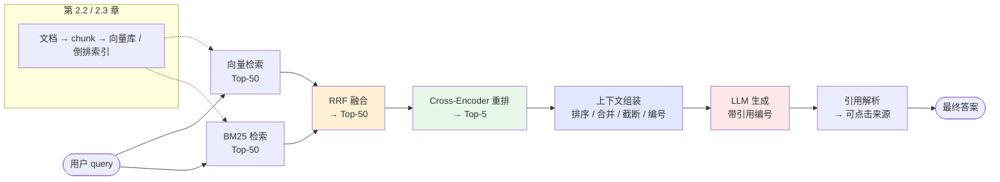
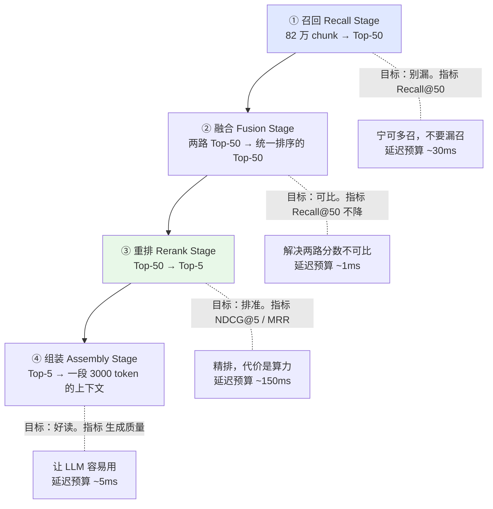
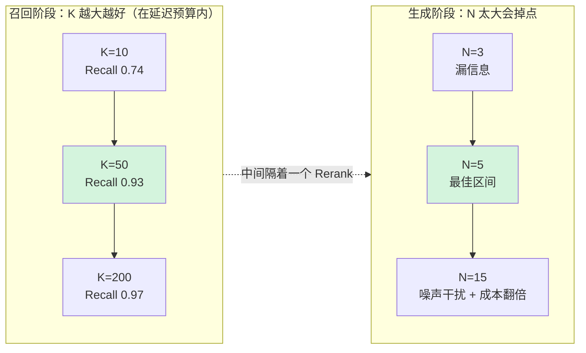
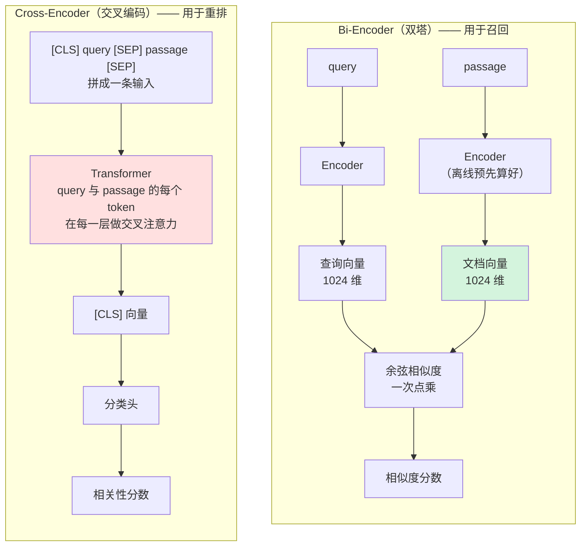
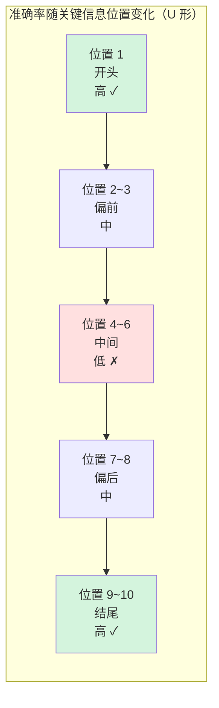
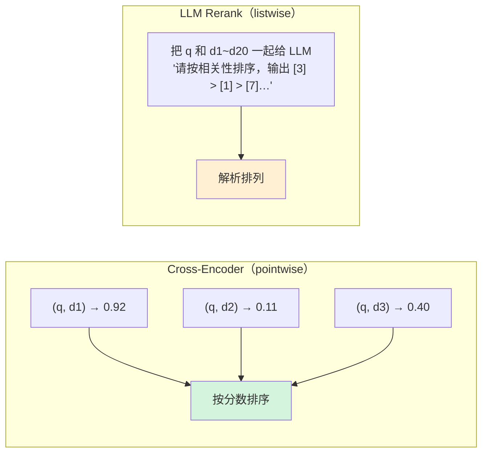
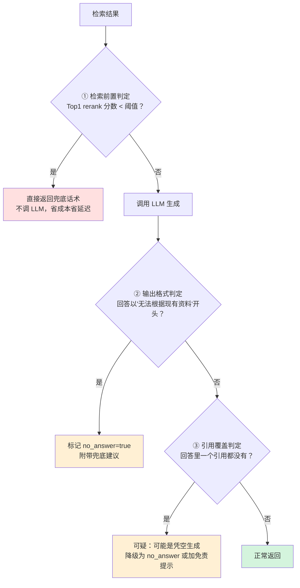
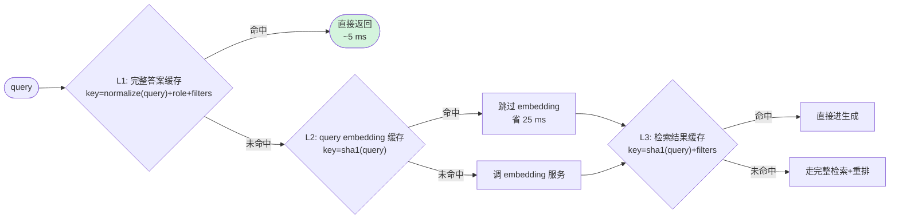

# 第 2.4 章  检索重排生成全链路

> **本章目标**：读完能做到 …
> 1. 用实验数据决定召回 Top-K 取多少，说清召回率与噪声之间的权衡曲线；
> 2. 手写 BM25 打分、用 jieba 自定义词典把 `XJ-200` / `E043` 这类型号错误码救回来，并用 rank_bm25 和 Elasticsearch 两种方式落地；
> 3. 实现 RRF 融合与加权分数融合，说清"不同检索器分数不可比"的归一化陷阱；
> 4. 部署并调用 bge-reranker-v2-m3，算清 rerank 的延迟与成本账，定出 Top-N 该留多少；
> 5. 完成上下文组装的四件事：Lost in the Middle 排序、相邻 chunk 合并去重、token 预算截断、引用编号注入；
> 6. 写出一套能落地的中文 RAG system prompt，实现引用解析、流式输出与 no-answer 兜底；
> 7. 把全链路串成一个可运行的程序，并输出每阶段的延迟分解表。
>
> **前置知识**：[第 2.2 章 文档解析与切分策略](./02-文档解析与切分策略.md)、[第 2.3 章 Embedding 与向量数据库](./03-Embedding与向量数据库.md)
>
> **预计用时**：阅读 60 分钟 / 动手 180 分钟

---

## 一、为什么需要它（问题出发）

### 1.1 "明明检索到了，为什么还是答不对"

华成机电的 RAG 系统在第 9 周上了内测。测试同学提了一个 badcase：

> **问题**：XJ-200 报 E043，处理完之后还要换什么备件吗？
>
> **系统回答**：E043 表示 X 轴伺服驱动器过热。建议检查散热风扇。

答案不能算错，但**漏掉了一半**——故障手册里明确写了"处理后需更换 SV-200X 伺服驱动器风扇模块，并记录工单"。

于是团队开始排查。先怀疑是没检索到，结果打开检索日志一看，傻眼了：

```text
Top-10 召回结果：
 1. [0.812] 故障代码速查表 · E043 X轴伺服驱动器过热           ← 想要的
 2. [0.795] 主轴与轴承保养指南 · 散热系统清洁
 3. [0.781] 故障代码速查表 · E041 主轴过载
 4. [0.776] XJ-200 操作手册 · 第 4 章 报警与处理
 5. [0.771] 故障代码速查表 · E057 刀库换刀超时
 6. [0.769] 备件更换指南 · SV-200X 伺服驱动器风扇模块更换步骤   ← 也想要的
 7. [0.762] 主轴与轴承保养指南 · 润滑周期
 8. [0.758] 历史工单 WO-20250412 · 客户反馈机器噪音大
 9. [0.751] 整机保修政策 · 第三条 易损件除外
10. [0.749] XJ-200 操作手册 · 安全须知
```

**两条关键信息都在 Top-10 里**（第 1 条和第 6 条）。但是：

1. 它们**被 8 条噪声包围**，其中第 3、5 条是完全无关的其他错误码；
2. 第 6 条排在第 6 位，如果按"只取 Top-5 喂给 LLM"的常见做法，**它根本进不了上下文**；
3. 就算全部喂进去，10 个 chunk 约 4000 token，关键信息淹没在中间——LLM 更容易抓住开头的第 1 条，忽略排在中段的第 6 条。

**这三条正是本章要解决的三件事：**

| 问题 | 本章的解法 | 小节 |
|---|---|---|
| 相关的排不到前面 | 混合检索 + RRF 融合 + Cross-Encoder 重排 | 2.3 / 2.4 / 2.5 |
| 该召的没召够（Top-K 太小） | 用实验定 Top-K：召回阶段放宽，重排阶段收紧 | 2.1 |
| 召回了但 LLM 没用上 | 上下文组装：排序、合并、截断、引用编号 | 2.6 / 3.8 |

还有第四件事，是这个 badcase 之后团队补上的：**回答必须带引用编号**，否则连"它到底看没看到那条备件信息"都无从判断。这是 3.9 节的内容。

### 1.2 这一章在整条链路的位置



一句话概括本章：**第 2.3 章把知识存进去了，本章负责把对的那几条捞出来、排对顺序、组装好、让 LLM 老老实实按它回答。**

### 1.3 四段式漏斗：每一段的职责与指标

整条链路本质是一个漏斗，**每一段的优化目标是不同的**，这一点特别容易搞混：



| 阶段 | 优化目标 | 主指标 | 典型延迟 | 最容易犯的错 |
|---|---|---|---|---|
| ① 召回 | **不漏**（高 Recall） | Recall@50 | 20~50 ms | Top-K 设太小，后面再牛也救不回来 |
| ② 融合 | **可比**（统一排序） | 融合后 Recall@50 | < 1 ms | 直接把不同检索器的分数相加 |
| ③ 重排 | **排准**（高精度） | NDCG@5、MRR@5 | 80~300 ms | 输入候选太多，延迟爆炸 |
| ④ 组装 | **好用**（LLM 能用上） | 答案正确率、引用准确率 | < 5 ms | 关键信息埋在上下文中段 |

> 🔑 **最重要的一条认知**：**召回阶段丢掉的东西，后面所有环节都救不回来。** 重排只能在候选集里排序，不能凭空变出没召回的内容。所以召回阶段的 K 要给足，而精度问题留给重排去解决。

---

## 二、原理拆解

### 2.1 召回 Top-K 怎么定

#### 2.1.1 两条相反的曲线

把 K 从 5 调到 200，会发生两件方向相反的事：

$$
\text{Recall@K} = \frac{|\{\text{Top-K 中的相关文档}\}|}{|\{\text{全部相关文档}\}|} \quad \text{—— 随 K 单调递增}
$$

$$
\text{Precision@K} = \frac{|\{\text{Top-K 中的相关文档}\}|}{K} \quad \text{—— 随 K 单调递减}
$$

关键在于：**这两个指标服务于不同的阶段**。

- 对**召回阶段**，只有 Recall 重要。K=50 时 Precision 只有 6% 完全无所谓，因为后面有重排。
- 对**喂给 LLM 的最终 Top-N**，Precision 才重要。噪声会直接伤害生成质量。



#### 2.1.2 实验数据：K 该取多少

下面是在华成机电评测集（**120 条人工标注 query，每条标注 1~4 个正确 chunk**）上跑出来的数据。

> 实测环境：Milvus 2.4.15 / 82 万 chunk / bge-m3 稠密向量 HNSW(M=16, ef=128) / 单机 32 核 128GB / 客户端与服务端同机。**这是示例性数据，务必在你自己的评测集上复现。**

**表 A：单路向量召回，K 对 Recall 和延迟的影响**

| K | Recall@K | Precision@K | 检索延迟 P50 | 检索延迟 P99 | Recall 边际增益 |
|---:|---:|---:|---:|---:|---|
| 5 | 0.658 | 0.271 | 1.2 ms | 2.9 ms | — |
| 10 | 0.742 | 0.167 | 1.3 ms | 3.1 ms | +0.084 |
| 20 | 0.848 | 0.098 | 1.5 ms | 3.6 ms | +0.106 |
| **50** | **0.925** | **0.043** | **2.1 ms** | **4.8 ms** | **+0.077** |
| 100 | 0.951 | 0.022 | 3.4 ms | 7.2 ms | +0.026 |
| 200 | 0.968 | 0.011 | 6.1 ms | 12.9 ms | +0.017 |
| 500 | 0.979 | 0.005 | 14.8 ms | 31.4 ms | +0.011 |

**读表的三个结论：**

1. **K 从 20 → 50 是最后一段"大幅提升"**（+0.077），50 → 100 只有 +0.026，100 → 200 只有 +0.017。**边际收益在 K=50 之后明显衰减**。
2. **延迟增长远慢于 K 的增长**。K 从 50 到 200 涨了 4 倍，延迟只涨了 3 倍但绝对值仍在 10ms 量级——**向量检索本身不是瓶颈**。
3. 所以召回阶段的 K，**是被下游的重排延迟卡住的，不是被检索延迟卡住的**。

**表 B：K 对下游重排延迟的影响（这才是真正的约束）**

| 召回 K | Rerank 输入条数 | Rerank 延迟 P50（GPU） | Rerank 延迟 P50（CPU） | 端到端（不含 LLM） |
|---:|---:|---:|---:|---:|
| 20 | 20 | 42 ms | 680 ms | 48 ms |
| **50** | **50** | **98 ms** | **1720 ms** | **106 ms** |
| 100 | 100 | 186 ms | 3450 ms | 198 ms |
| 200 | 200 | 371 ms | 6900 ms | 389 ms |

> 实测环境：bge-reranker-v2-m3 / RTX 4090 fp16 / max_length=512 / batch_size=32；CPU 组为 8 核 Xeon。

**表 C：重排后取 Top-N，N 对最终答案质量的影响**

| Rerank 后 N | 上下文 token | 答案正确率 | 幻觉率 | 生成延迟 P50 | 单次 LLM 成本（相对值） |
|---:|---:|---:|---:|---:|---:|
| 2 | ~900 | 0.71 | 0.09 | 1.9 s | 1.0× |
| 3 | ~1300 | 0.83 | 0.07 | 2.1 s | 1.4× |
| **5** | **~2100** | **0.89** | **0.06** | **2.4 s** | **2.2×** |
| 8 | ~3300 | 0.88 | 0.09 | 3.0 s | 3.5× |
| 15 | ~6200 | 0.84 | 0.14 | 4.3 s | 6.6× |

> 实测环境：deepseek-chat / temperature=0 / 同一套 prompt / 120 条评测 query / 答案正确率由人工 + LLM-as-judge 双评（评测方法见第 8.1 章）。

**表 C 的两个反直觉结论：**

1. **N 从 8 涨到 15，正确率反而下降**（0.88 → 0.84），幻觉率上升（0.09 → 0.14）。多给的那 7 条基本是噪声，它们**给了模型编造的素材**。
2. **成本翻了 3 倍，质量还掉了**。这就是"上下文越多越好"这个直觉错在哪里。

#### 2.1.3 三条可以直接抄的经验规则

$$
K_{\text{recall}} \approx 10 \times N_{\text{final}}, \qquad N_{\text{final}} \in [3, 8]
$$

| 规则 | 内容 | 理由 |
|---|---|---|
| **规则一** | 召回 K 取最终 N 的 **10 倍左右**，常用组合 `50 → 5` | 给重排留足够的挑选空间，又不让重排延迟爆炸 |
| **规则二** | **每路检索器各自召 K 条**，融合后再截到 K 条 | 混合检索时向量和 BM25 各召 50，融合后仍取 50 |
| **规则三** | **N 不要超过 8**，除非做了多跳/长文档场景的专门设计 | 表 C：N > 8 之后正确率下降、成本线性上涨 |

**什么时候要打破规则：**

| 场景 | 调整 | 原因 |
|---|---|---|
| 父子块检索（第 2.2 章 ⑥） | 子块召 K=50，映射到父块后去重通常只剩 15~25 个，N 取 4~6 | 父块本身就长，N 要小 |
| 多跳问题（"A 和 B 哪个便宜"） | 每个子问题各召 K=30，最后合并 N=8 | 需要多个信息源 |
| 表格/清单类问题（"列出所有 XJ-300 备件"） | 走 Text2SQL，不走向量检索 | 见第 3.3 章 |
| 无重排（成本受限） | K 直接取 8~10，不要取 50 | 没有重排就没人帮你排，K 大只会引入噪声 |

### 2.2 BM25：为什么 2009 年的算法今天还在用

#### 2.2.1 从 TF-IDF 到 BM25

BM25（Best Matching 25）是**词频类检索的工业标准**。它要解决 TF-IDF 的两个缺陷：**词频饱和**与**文档长度归一化**。

完整公式：

$$
\text{BM25}(q, d) = \sum_{i=1}^{n} \text{IDF}(q_i) \cdot \frac{f(q_i, d) \cdot (k_1 + 1)}{f(q_i, d) + k_1 \cdot \left(1 - b + b \cdot \dfrac{|d|}{\text{avgdl}}\right)}
$$

其中逆文档频率（Lucene / Robertson 常用变体）：

$$
\text{IDF}(q_i) = \ln\left(1 + \frac{N - n(q_i) + 0.5}{n(q_i) + 0.5}\right)
$$

符号说明：

| 符号 | 含义 | 直觉 |
|---|---|---|
| $q_i$ | query 分词后的第 $i$ 个词 | "XJ-200"、"E043" |
| $f(q_i, d)$ | 词 $q_i$ 在文档 $d$ 中出现的次数 | 词频 TF |
| $\|d\|$ | 文档 $d$ 的长度（词数） | |
| $\text{avgdl}$ | 全库文档平均长度 | |
| $N$ | 文档总数 | 82 万 |
| $n(q_i)$ | 包含词 $q_i$ 的文档数 | |
| $k_1$ | 词频饱和参数，常用 1.2~2.0 | 越小越早饱和 |
| $b$ | 长度归一化强度，$b \in [0,1]$，常用 0.75 | 0=不归一化，1=完全归一化 |

#### 2.2.2 $k_1$ 和 $b$ 到底在干什么

**$k_1$：词频饱和。** 把 TF 部分单独拿出来看：

$$
\text{sat}(f) = \frac{f \cdot (k_1+1)}{f + k_1}
$$

这是一个**上界为 $k_1+1$ 的饱和函数**。当 $f \to \infty$，$\text{sat}(f) \to k_1+1$。

物理含义：**一个词在文档里出现 20 次，并不比出现 5 次相关 4 倍。** 取 $k_1=1.2$：

| 词频 $f$ | $\text{sat}(f)$ | 相对 $f=1$ 的增益 |
|---:|---:|---:|
| 1 | 1.00 | 1.00× |
| 2 | 1.38 | 1.38× |
| 5 | 1.77 | 1.77× |
| 10 | 1.96 | 1.96× |
| 50 | 2.15 | 2.15× |
| ∞ | 2.20 | 2.20× |

**$b$：文档长度归一化。** 长文档天然包含更多词，出现 query 词的概率更高。$b$ 控制惩罚长文档的力度：

- $b = 0$：完全不考虑长度，长文档占便宜；
- $b = 1$：完全按长度归一化，短文档占便宜；
- $b = 0.75$：默认值，大多数场景的经验最优。

**RAG 场景的调参建议：**

| 场景 | $k_1$ | $b$ | 理由 |
|---|---:|---:|---|
| chunk 长度均匀（固定切分） | 1.2 | **0.3~0.5** | chunk 本来就差不多长，不需要强归一化 |
| chunk 长度差异大（语义切分、父子块） | 1.2 | 0.75 | 保持默认 |
| 短查询、关键词型（"E043"） | **0.9~1.2** | 0.6 | 早饱和，避免重复词刷分 |
| 长查询、描述型 | 1.5~2.0 | 0.75 | 允许高频词贡献更多 |

> 第 3.2 章有一个在金标集上做网格搜索的脚本，这里先给出可用的默认值：**RAG 场景用 $k_1=1.2$、$b=0.5$ 通常比 Lucene 默认的 $b=0.75$ 更好**，因为 RAG 的 chunk 长度比通用文档均匀得多。

#### 2.2.3 中文的致命问题：BM25 的效果由分词决定

英文靠空格分词，中文不行。**BM25 在中文上的效果，80% 取决于分词器有没有把关键词切对。**

看一个真实例子。query 是 `XJ-200 报 E043 怎么办`：

```text
jieba 默认分词（未加自定义词典，仅为示意，实际结果随版本变化）：
  ['XJ', '-', '200', ' ', '报', 'E043', ' ', '怎么办']
  或者更糟：['XJ', '-', '200', ' ', '报', 'E', '043', ' ', '怎么办']
```

后果是灾难性的：

| 被切碎的词 | 后果 |
|---|---|
| `XJ` | 变成一个极高频的通用前缀（XJ-200/XJ-300/XJ-200-B3 全都含它），IDF 极低，**几乎没有区分度** |
| `200` | 纯数字，全库到处都是，IDF 接近 0 |
| `E` + `043` | `E` 是噪声，`043` 匹配到一堆无关编号 |

**结果：BM25 完全丧失了它最大的优势——精确匹配型号和错误码。** 而这恰恰是引入 BM25 的唯一理由（语义匹配本来就该交给向量检索）。

**解法就一条：把领域词加进自定义词典。** 3.1 节给完整代码。加完之后：

```text
加载自定义词典后：
  ['XJ-200', ' ', '报', 'E043', ' ', '怎么办']
```

`XJ-200` 在 82 万 chunk 里只出现在几千条里，IDF 很高，**一击命中**。

> 🔑 **本节最重要的一句话**：**在中文 RAG 里，"上 BM25"这个动作本身没有价值，"把领域词典维护好的 BM25"才有价值。** 我见过太多团队接了 rank_bm25 之后说"混合检索没用"，一看词典是空的。

### 2.3 为什么必须混合检索

#### 2.3.1 两种检索器的失效是互补的

| | 稠密向量检索 | BM25 稀疏检索 |
|---|---|---|
| 匹配依据 | 语义相似 | 词面重合 |
| 强项 | 同义改写、口语化表达、跨语言 | 精确术语、型号、错误码、专有名词、数字 |
| 弱项 | **精确串**（模型会把 XJ-200 和 XJ-300 编码得很近） | **零词面重合**的同义表达 |
| 未登录词（OOV） | 靠 subword 勉强处理，效果不稳 | 只要分词对就能命中 |
| 需要训练 | 是 | 否 |
| 索引成本 | 高（GPU） | 低（CPU） |

#### 2.3.2 对照实验：各自答不好的 query

下面这张表是团队实际整理的 badcase 清单，**每一条都是真实场景的缩影**。

> 实测环境：华成机电 120 条评测集 / bge-m3 稠密 vs jieba(含自定义词典)+BM25 / 各取 Top-10 / 判定标准是"正确 chunk 是否出现在 Top-10"。

**表 A：向量检索答不好、BM25 答得好的 query（精确型）**

| # | Query | 向量 Recall@10 | BM25 Recall@10 | 向量失败原因 |
|---:|---|---:|---:|---|
| 1 | `XJ-200-B3 的主轴最高转速` | ✗ | ✓ | 召回的全是 XJ-200 和 XJ-300 的参数，**模型区分不了型号后缀** |
| 2 | `E043` | ✗ | ✓ | 单个错误码没有语义，向量近乎随机 |
| 3 | `SV-200X 备件单价` | ✗ | ✓ | 备件编号是未登录词，向量表征无意义 |
| 4 | `WO-20250412 这单怎么处理的` | ✗ | ✓ | 工单号完全是随机串 |
| 5 | `李工上次说的那个方案` | ✗ | ✓ | 人名缩写，向量无能为力 |
| 6 | `GB/T 9061-2006 标准要求` | ✗ | ✓ | 标准号，数字+字母混排 |
| 7 | `保修条款第三条` | ✗ | ✓ | "第三条"是位置指代，语义上毫无信息量 |
| 8 | `E041 和 E043 有什么区别` | 部分 | ✓ | 只召回了其中一个错误码 |
| **小计** | | **1/8** | **8/8** | |

**表 B：BM25 答不好、向量答得好的 query（语义型）**

| # | Query | 向量 Recall@10 | BM25 Recall@10 | BM25 失败原因 |
|---:|---|---:|---:|---|
| 1 | `机器转起来声音不对劲` | ✓ | ✗ | 文档里写的是"主轴异常噪声"，**零词面重合** |
| 2 | `刀怎么换不上去了` | ✓ | ✗ | 文档里是"刀库换刀超时"，口语 vs 术语 |
| 3 | `设备用了三年要注意保养啥` | ✓ | ✗ | 文档是"运行 5000 小时后的周期性维护项目" |
| 4 | `坏了还能免费修吗` | ✓ | ✗ | 文档是"保修期内的免费维修范围" |
| 5 | `温度太高会怎么样` | ✓ | 部分 | "温度"是高频词，召回一堆无关内容 |
| 6 | `怎么才能让加工精度高一点` | ✓ | ✗ | 文档是"加工精度影响因素与补偿方法" |
| 7 | `这个东西多久换一次` | ✓ | ✗ | 指代不明 + 无实词，BM25 无从下手 |
| **小计** | | **7/7** | **0/7** | |

**表 C：整体对照（120 条完整评测集）**

| 检索方案 | Recall@10 | Recall@50 | NDCG@10 | P50 延迟 |
|---|---:|---:|---:|---:|
| 仅稠密向量（bge-m3） | 0.742 | 0.925 | 0.611 | 2.1 ms |
| 仅 BM25（jieba + 自定义词典） | 0.695 | 0.848 | 0.577 | 8.4 ms |
| 仅 BM25（jieba 默认词典） | 0.513 | 0.702 | 0.402 | 8.1 ms |
| **RRF 融合（稠密 + BM25）** | **0.871** | **0.968** | **0.703** | 11.2 ms |
| RRF 融合 + Cross-Encoder 重排 | 0.871 | 0.968 | **0.842** | 109 ms |

> 实测环境同上。注意第 3 行：**词典没维护好的 BM25，比不上不用 BM25**——它只会往融合结果里塞噪声。

**三个必须记住的数字关系：**

1. 单路最好 0.742，**融合后 0.871**，涨了约 13 个点。这是混合检索的价值，也是它几乎成为 RAG 标配的原因。
2. **重排不改变 Recall（0.871 不变），只改变 NDCG（0.703 → 0.842）**。重排是排序器，不是召回器。
3. **词典的价值是 0.513 → 0.695**，比"要不要上 BM25"这个决策本身的价值还大。

### 2.4 融合：RRF vs 加权分数

#### 2.4.1 归一化陷阱：为什么不能直接把分数加起来

这是新手最容易踩、而且**不会报错**的坑：

```python
# ❌ 完全错误的融合
final_score = dense_score + bm25_score
```

为什么错？看一眼两种分数的实际量纲：

| 检索器 | 分数含义 | 典型取值范围 | 分布特征 |
|---|---|---|---|
| 稠密向量（归一化 + IP） | 余弦相似度 | **0.3 ~ 0.9** | 集中、方差小、有上界 1 |
| BM25 | 加权词频求和 | **0 ~ 40+** | 长尾、方差大、**无上界** |
| Milvus 稀疏向量（bge-m3 lexical） | 稀疏内积 | 0 ~ 15 | 长尾 |
| ES `_score`（BM25） | 同 BM25，但受 `boost`、`function_score` 影响 | 任意 | **同一个 query 的不同次查询都可能不同量纲** |

直接相加的后果：**BM25 的分数把向量分数完全淹没**，融合结果 ≈ 纯 BM25。而且这个错误**没有任何报错**，你只会觉得"混合检索好像没什么用"。

#### 2.4.2 四种归一化方法及其陷阱

| 方法 | 公式 | 优点 | 陷阱 |
|---|---|---|---|
| **Min-Max** | $s' = \dfrac{s - s_{\min}}{s_{\max} - s_{\min}}$ | 简单，映射到 [0,1] | **只有 1 条结果时分母为 0**；**最高分永远是 1、最低分永远是 0**，丢失了"这批结果整体都很差"的信息 |
| **Z-Score** | $s' = \dfrac{s - \mu}{\sigma}$ | 保留分布形状 | 同样丢失绝对水平；$\sigma \to 0$ 时爆炸 |
| **Softmax** | $s' = \dfrac{e^{s/T}}{\sum_j e^{s_j/T}}$ | 输出是概率，可解释 | 多一个温度 $T$ 要调；对离群值敏感 |
| **理论上界归一化** | $s' = s / s_{\text{theoretical max}}$ | 保留绝对水平 | BM25 没有理论上界，**不可用** |

> ⚠️ **Min-Max 归一化最隐蔽的问题**：它是**在当前这一批候选内部**归一化的。如果一个 query 召回的 50 条全是垃圾，Min-Max 之后最好的那条依然得 1.0 分——**你永远看不出"这个 query 其实没召回到任何有用的东西"**。这会让 no-answer 判定（3.9.4 节）完全失效。所以**做 no-answer 判定要用归一化之前的原始分数**。

#### 2.4.3 RRF：绕开分数，只用排名

RRF（Reciprocal Rank Fusion，倒数排名融合）的思路非常聪明：**既然分数不可比，那就别用分数，只用排名。**

$$
\text{RRF}(d) = \sum_{r \in R} \frac{1}{k + \text{rank}_r(d)}
$$

- $R$：所有检索器的集合（这里是 {稠密, BM25}）
- $\text{rank}_r(d)$：文档 $d$ 在检索器 $r$ 的结果里的排名（从 1 开始）
- $k$：平滑常数，**默认 60**（这个取值来自 RRF 原始论文的经验设定，后续被 Elasticsearch 等系统沿用为默认值）

**$k$ 在控制什么？** 看不同排名的贡献：

| rank | $\frac{1}{60+\text{rank}}$ ($k$=60) | $\frac{1}{10+\text{rank}}$ ($k$=10) | $\frac{1}{1+\text{rank}}$ ($k$=1) |
|---:|---:|---:|---:|
| 1 | 0.01639 | 0.09091 | 0.50000 |
| 2 | 0.01613 | 0.08333 | 0.33333 |
| 5 | 0.01538 | 0.06667 | 0.16667 |
| 10 | 0.01429 | 0.05000 | 0.09091 |
| 50 | 0.00909 | 0.01667 | 0.01961 |
| **Top1/Top10 比值** | **1.15×** | **1.82×** | **5.50×** |

- **$k$ 大（60）**：各名次贡献平缓，**"在两路里都排得还行"胜过"在一路里排第一"**；
- **$k$ 小（1）**：强烈偏向头部，**"在某一路排第一"就能赢**。

**怎么选 $k$？**

| 场景 | 建议 $k$ | 理由 |
|---|---:|---|
| 两路质量相当（默认） | **60** | 鼓励"共识"，抗单路噪声 |
| 某一路明显更强 | 20~30，或改用加权 RRF | 让强的那路的头部更有话语权 |
| 精确匹配场景（错误码检索） | 10~20 | BM25 排第一往往就是对的，别稀释它 |

**加权 RRF**（给不同检索器不同权重）：

$$
\text{RRF}_w(d) = \sum_{r \in R} \frac{w_r}{k + \text{rank}_r(d)}, \qquad \sum_r w_r = 1
$$

#### 2.4.4 RRF vs 加权分数融合：怎么选

| 维度 | RRF | 加权分数融合 |
|---|---|---|
| 是否需要归一化 | **不需要** | **必须**，且是主要出错点 |
| 是否需要调参 | 只有一个 $k$，默认 60 就能用 | 权重 + 归一化方法都要调 |
| 保留分数绝对信息 | **否**（这是缺点） | 是 |
| 能否做 no-answer 判定 | 不能（RRF 分数没有绝对含义） | 能（用原始分数） |
| 对单路崩坏的鲁棒性 | **强**（一路排序乱了，另一路还能顶住） | 弱（分数异常会直接污染结果） |
| 上限 | 略低（丢了分数信息） | 略高（调好了更准） |
| 工程复杂度 | **低** | 中 |

**推荐做法（也是本书全书统一的做法）：**

> **用 RRF 做融合排序，同时把各路的原始分数带在结果里传下去**，供 no-answer 判定和调试使用。这样既拿到了 RRF 的鲁棒性，又没丢掉绝对分数信息。3.4 节的代码就是这么实现的。

### 2.5 Rerank：Cross-Encoder 与 Bi-Encoder 的本质差异

#### 2.5.1 一张图讲清区别



**本质差异就一句话：**

- **Bi-Encoder** 把 query 和 passage **分别**编码成向量，两者**从不相遇**，只在最后做一次点乘。所以 passage 向量可以**离线算好存进向量库**，检索时 $O(1)$ 次编码 + ANN 搜索 → **能在百万级数据上做**。
- **Cross-Encoder** 把 query 和 passage **拼在一起**送进模型，两者的每个 token 在每一层都做交叉注意力。所以它能捕捉"这个词是不是在回答那个词"这种细粒度关系 → **更准**；但每个 (query, passage) 对都要跑一次完整前向 → **只能在几十条候选上做**。

| 维度 | Bi-Encoder | Cross-Encoder |
|---|---|---|
| 代表模型 | `bge-m3`、`bge-large-zh-v1.5` | `bge-reranker-v2-m3` |
| 输入 | query 和 passage 分开 | `[CLS] query [SEP] passage [SEP]` |
| 能否预计算 | **能**（文档向量离线算） | **不能** |
| 复杂度 | 召回 $O(\log N)$（ANN） | $O(K)$ 次完整前向 |
| 82 万 chunk 全量打分 | 2 ms | **约 4.5 小时**（不可行） |
| 50 条候选打分 | — | 98 ms（可行） |
| 排序质量（NDCG@5） | 0.611 | **0.842** |
| 在链路中的位置 | 召回 | 重排 |

> 所以标准架构必然是 **Bi-Encoder 召回 + Cross-Encoder 重排**：用便宜的方法从 82 万里选 50 条，用贵的方法在 50 条里选 5 条。**这是整个 RAG 检索链路的核心设计思想。**

#### 2.5.2 Rerank 到底修正了什么

举一个具体例子。query：`XJ-200 报 E043 处理完还要换备件吗`

| chunk | 向量分数 | 向量排名 | Rerank 分数 | Rerank 排名 | 为什么变了 |
|---|---:|---:|---:|---:|---|
| 备件更换指南 · SV-200X 风扇模块更换步骤 | 0.769 | 6 | **0.912** | **1** | Cross-Encoder 看懂了"还要换备件吗"与"更换步骤"的问答关系 |
| 故障代码速查表 · E043 | 0.812 | 1 | 0.887 | 2 | 仍然相关 |
| 故障代码速查表 · E041 主轴过载 | 0.781 | 3 | **0.118** | **9** | Cross-Encoder 发现错误码对不上，**向量只看出"都是故障码"** |
| 故障代码速查表 · E057 换刀超时 | 0.771 | 5 | 0.094 | 10 | 同上 |
| 整机保修政策 · 易损件除外 | 0.751 | 9 | 0.402 | 5 | 与"换备件"有弱相关 |

**Cross-Encoder 的核心价值：它能判断"这段内容是不是在回答这个问题"，而 Bi-Encoder 只能判断"这两段话讲的是不是同一个主题"。** 上表第 3、4 行就是最典型的例子——同主题但答非所问，向量分数高，重排分数极低。

### 2.6 Lost in the Middle：上下文顺序会影响答案

即使你把对的 chunk 都放进了上下文，**放的位置不同，LLM 用不用得上也不同**。

这个现象在 2023 年的论文《Lost in the Middle: How Language Models Use Long Contexts》里被系统研究：把关键信息放在长上下文的**开头或结尾**时，模型的回答准确率明显高于放在**中间**时，准确率随位置呈现 **U 形曲线**。（具体数值请以原论文为准，本书只采用其定性结论。）



**工程上的应对：把重排后最相关的几条放在头和尾，次相关的放中间。** 这个排列叫 **"两端优先"** 或 **sandwich 排序**：

```text
重排结果（按相关性）： [d1, d2, d3, d4, d5]
                        ↓
两端优先排列：         [d1, d3, d5, d4, d2]
                        ↑            ↑
                     最相关       次相关
```

规则：按相关性从高到低，**交替放到列表的头部和尾部**。这样第 1 名在最前、第 2 名在最后、第 3 名在第二位……最不相关的落在正中间。

> ⚠️ **不要迷信这个技巧**。它在上下文很长（> 4000 token、> 8 个 chunk）时收益明显；在只有 3~5 个 chunk、2000 token 以内时收益很小甚至为负（因为它打乱了"越靠前越相关"这个对 LLM 也有用的信号）。**必须在自己的评测集上 A/B 测一下再决定开不开。** 3.8.1 节的代码把它做成了一个开关。

---

## 三、动手实战

### 3.0 环境准备

本章所有代码放在项目骨架的 `rag/` 目录下：

```text
rag/
├── __init__.py
├── tokenizer.py        # jieba 分词 + 领域词典
├── bm25_index.py       # rank_bm25 实现
├── es_index.py         # Elasticsearch 实现
├── dense.py            # 向量检索封装
├── fusion.py           # RRF / 加权融合
├── rerank.py           # Cross-Encoder 重排
├── assemble.py         # 上下文组装
├── generate.py         # 生成 + 引用解析
└── pipeline.py         # 全链路串联 + 打点
data/
└── dict/
    └── huacheng.txt    # 领域自定义词典
```

```bash
# ---------- uv（推荐） ----------
uv add "jieba==0.42.1" \
       "rank-bm25==0.2.2" \
       "elasticsearch==8.15.1" \
       "pymilvus==2.4.9" \
       "FlagEmbedding==1.3.2" \
       "sentence-transformers==3.2.1" \
       "torch==2.4.1" \
       "openai==1.54.3" \
       "tiktoken==0.8.0" \
       "numpy==1.26.4" \
       "pydantic==2.9.2"

# ---------- pip 等价命令 ----------
pip install jieba==0.42.1 rank-bm25==0.2.2 elasticsearch==8.15.1 \
            pymilvus==2.4.9 FlagEmbedding==1.3.2 sentence-transformers==3.2.1 \
            torch==2.4.1 openai==1.54.3 tiktoken==0.8.0 numpy==1.26.4 pydantic==2.9.2

# ---------- 校验 ----------
python -c "import jieba, rank_bm25, elasticsearch, pymilvus; print('deps ok')"
```

环境变量沿用 [第 0.1 章](../00-前置准备/01-开发环境搭建（Python-CUDA-Docker）.md) 定下的 `core/config.py`：

```bash
# .env 追加
ES_HOSTS=http://localhost:9200
ES_INDEX=huacheng_kb
LOCAL_RERANK_MODEL_PATH=/data/models/bge-reranker-v2-m3
```

### 3.1 中文分词：把 `XJ-200` 和 `E043` 救回来

#### 3.1.1 先看看不加词典有多糟

```python
"""rag/tokenizer_demo.py —— 先做一个诊断：看看默认分词把领域词切成了什么样。"""
import jieba

CASES = [
    "XJ-200 报 E043 怎么办",
    "XJ-200-B3 主轴最高转速是多少",
    "SV-200X 伺服驱动器风扇模块的单价",
    "GB/T 9061-2006 标准对主轴精度的要求",
    "工单 WO-20250412 的处理结论",
]

for s in CASES:
    print(f"{s}\n  -> {list(jieba.cut(s))}\n")
```

**预期输出（具体切分结果随 jieba 版本和 HMM 开关而变，请以你机器上的实际打印为准）：**

```text
XJ-200 报 E043 怎么办
  -> ['XJ', '-', '200', ' ', '报', 'E043', ' ', '怎么办']

XJ-200-B3 主轴最高转速是多少
  -> ['XJ', '-', '200', '-', 'B3', ' ', '主轴', '最高', '转速', '是', '多少']

SV-200X 伺服驱动器风扇模块的单价
  -> ['SV', '-', '200X', ' ', '伺服', '驱动器', '风扇', '模块', '的', '单价']

GB/T 9061-2006 标准对主轴精度的要求
  -> ['GB', '/', 'T', ' ', '9061', '-', '2006', ' ', '标准', '对', '主轴', '精度', '的', '要求']

工单 WO-20250412 的处理结论
  -> ['工单', ' ', 'WO', '-', '20250412', ' ', '的', '处理', '结论']
```

> 🔴 **注意看**：`XJ-200` 被切成了 `XJ` / `-` / `200`。`XJ` 在全库出现在所有 XJ 系列文档里（IDF 极低），`200` 是烂大街的数字。**BM25 此时已经废了。** 这就是很多团队"上了混合检索但没效果"的真正原因。

#### 3.1.2 领域词典：格式、来源与加载

jieba 自定义词典的格式是每行 `词语 词频 词性`（后两项可省略）：

```text
# data/dict/huacheng.txt
# 格式：词语 [词频] [词性]
# 词频给大一点（如 10000），确保不被拆开；词性 nz = 其他专名

# ---------- 设备型号 ----------
XJ-200 10000 nz
XJ-200-B3 10000 nz
XJ-300 10000 nz
XJ-300-H 10000 nz
HC-500 10000 nz
MT-80 10000 nz

# ---------- 故障代码 ----------
E041 10000 nz
E043 10000 nz
E057 10000 nz
E102 10000 nz
E203 10000 nz

# ---------- 备件编号 ----------
SV-200X 10000 nz
BRG-6208 10000 nz
FLT-A30 10000 nz

# ---------- 专业术语 ----------
伺服驱动器 5000 n
主轴轴承 5000 n
刀库 5000 n
换刀 5000 v
回零 3000 v
润滑泵 3000 n
冷却液 3000 n
数控系统 5000 n
плц 1 n

# ---------- 标准号 ----------
GB/T 9061-2006 10000 nz
```

**词典从哪来？三个来源，按性价比排序：**

| 来源 | 做法 | 能覆盖 |
|---|---|---|
| **① 业务主数据**（最重要） | 直接从 ERP / PLM 导出：型号表、备件表、故障码表 | 90% 的关键词 |
| **② 正则从语料里挖** | `XJ-\d{3}(-\w+)?`、`E\d{3}`、`[A-Z]{2,4}-\d{3,}[A-Z]?` | 主数据之外的漏网之鱼 |
| **③ 用户 query 日志** | 统计高频未登录词，人工确认后加入 | 用户真正在问的词 |

```python
"""rag/build_dict.py —— 从主数据 + 正则挖掘自动生成词典，避免手工维护。"""
from __future__ import annotations

import re
from collections import Counter
from pathlib import Path

DICT_PATH = Path("./data/dict/huacheng.txt")

# 领域实体的正则模式：按你自己的编码规则改
PATTERNS = {
    "device": re.compile(r"\b[A-Z]{2,3}-\d{2,4}(?:-[A-Z0-9]{1,3})?\b"),   # XJ-200 / XJ-200-B3
    "errcode": re.compile(r"\bE\d{3}\b"),                                  # E043
    "part": re.compile(r"\b[A-Z]{2,4}-\d{3,5}[A-Z]?\b"),                   # SV-200X / BRG-6208
    "workorder": re.compile(r"\bWO-\d{8}\b"),                              # WO-20250412
    "standard": re.compile(r"\bGB/T\s?\d{3,5}(?:-\d{4})?\b"),              # GB/T 9061-2006
}


def mine_from_corpus(corpus_dir: str, min_freq: int = 2) -> Counter:
    """从语料里用正则挖掘领域实体，返回 {词: 出现次数}。"""
    cnt: Counter = Counter()
    for p in Path(corpus_dir).rglob("*.md"):
        text = p.read_text(encoding="utf-8", errors="ignore")
        for pat in PATTERNS.values():
            for m in pat.findall(text):
                cnt[m if isinstance(m, str) else m[0]] += 1
    return Counter({w: c for w, c in cnt.items() if c >= min_freq})


def load_master_data(path: str) -> list[str]:
    """从主数据文件（每行一个词）读取型号/备件/故障码。"""
    p = Path(path)
    if not p.exists():
        return []
    return [l.strip() for l in p.read_text(encoding="utf-8").splitlines()
            if l.strip() and not l.startswith("#")]


def write_dict(words: dict[str, tuple[int, str]]) -> None:
    """写出 jieba 词典文件。词频统一给大值，保证不被拆开。"""
    DICT_PATH.parent.mkdir(parents=True, exist_ok=True)
    lines = ["# 自动生成，请勿手工编辑；手工词条写在 huacheng_manual.txt"]
    for w, (freq, pos) in sorted(words.items()):
        lines.append(f"{w} {freq} {pos}")
    DICT_PATH.write_text("\n".join(lines) + "\n", encoding="utf-8")
    print(f"词典已写出：{DICT_PATH}，共 {len(words)} 条")


if __name__ == "__main__":
    words: dict[str, tuple[int, str]] = {}
    for w in load_master_data("./data/master/device_models.txt"):
        words[w] = (10000, "nz")
    for w in load_master_data("./data/master/error_codes.txt"):
        words[w] = (10000, "nz")
    for w, c in mine_from_corpus("./data/raw").items():
        words.setdefault(w, (10000, "nz"))
    write_dict(words)
```

#### 3.1.3 分词器封装（本章统一入口）

```python
"""rag/tokenizer.py —— 中文分词统一入口：领域词典 + 停用词 + 大小写归一 + 编码号保护。

设计原则：
1. 词典只加载一次（模块级），避免每次调用都 IO；
2. 分词结果做小写归一，让 'xj-200' 和 'XJ-200' 命中同一个 token；
3. 在分词前用正则把编码类实体"保护"起来，双保险。
"""
from __future__ import annotations

import re
from functools import lru_cache
from pathlib import Path

import jieba

DICT_FILES = [
    Path("./data/dict/huacheng.txt"),          # 自动生成
    Path("./data/dict/huacheng_manual.txt"),   # 人工维护，优先级更高
]

STOPWORDS = set("""
的 了 是 在 我 有 和 就 不 人 都 一 一个 上 也 很 到 说 要 去 你 会 着 没有 看 好 自己 这
怎么 怎样 如何 什么 为什么 哪些 哪个 吗 呢 吧 啊 呀 请问 帮我 一下 能否 可以 需要
""".split())

# 需要保护的领域实体（与 build_dict.py 保持一致）
PROTECT = re.compile(
    r"([A-Z]{2,4}-\d{2,8}(?:-[A-Z0-9]{1,3})?|E\d{3}|GB/T\s?\d{3,5}(?:-\d{4})?)",
    re.IGNORECASE,
)

_loaded = False


def _ensure_dict() -> None:
    """惰性加载词典，保证只加载一次。"""
    global _loaded
    if _loaded:
        return
    for f in DICT_FILES:
        if f.exists():
            jieba.load_userdict(str(f))
            print(f"[tokenizer] 已加载词典 {f}")
    # 兜底：对少数 jieba 仍会切开的词，用 suggest_freq 强制不拆
    for w in ["XJ-200", "XJ-200-B3", "XJ-300", "E041", "E043", "E057", "SV-200X"]:
        jieba.suggest_freq(w, tune=True)
    _loaded = True


def tokenize(text: str, remove_stopwords: bool = True) -> list[str]:
    """把中文文本切成 token 列表，供 BM25 使用。"""
    _ensure_dict()
    # ① 先把领域实体抠出来，避免任何意外拆分
    protected: list[str] = []

    def _stash(m: re.Match) -> str:
        protected.append(m.group(0))
        return f" ∎{len(protected) - 1}∎ "

    masked = PROTECT.sub(_stash, text)

    # ② 正常分词
    raw = jieba.lcut(masked)

    # ③ 还原被保护的实体
    out: list[str] = []
    i = 0
    while i < len(raw):
        tok = raw[i]
        if tok == "∎" and i + 2 < len(raw) and raw[i + 2] == "∎":
            out.append(protected[int(raw[i + 1])])
            i += 3
            continue
        out.append(tok)
        i += 1

    # ④ 清洗：去空白、小写归一、去停用词、去单字标点
    res: list[str] = []
    for t in out:
        t = t.strip().lower()
        if not t or re.fullmatch(r"[\s\W_]+", t):
            continue
        if remove_stopwords and t in STOPWORDS:
            continue
        res.append(t)
    return res


@lru_cache(maxsize=4096)
def tokenize_cached(text: str) -> tuple[str, ...]:
    """带缓存的分词（query 侧常有重复），返回 tuple 以便 hash。"""
    return tuple(tokenize(text))


if __name__ == "__main__":
    for s in [
        "XJ-200 报 E043 怎么办",
        "XJ-200-B3 主轴最高转速是多少",
        "SV-200X 伺服驱动器风扇模块的单价",
        "机器转起来声音不对劲，请问怎么处理一下",
    ]:
        print(f"{s}\n  -> {tokenize(s)}\n")
```

**预期输出：**

```text
[tokenizer] 已加载词典 data/dict/huacheng.txt
[tokenizer] 已加载词典 data/dict/huacheng_manual.txt
XJ-200 报 E043 怎么办
  -> ['xj-200', '报', 'e043']

XJ-200-B3 主轴最高转速是多少
  -> ['xj-200-b3', '主轴', '最高', '转速', '多少']

SV-200X 伺服驱动器风扇模块的单价
  -> ['sv-200x', '伺服', '驱动器', '风扇', '模块', '单价']

机器转起来声音不对劲，请问怎么处理一下
  -> ['机器', '转', '起来', '声音', '不对劲', '处理']
```

> ✅ 对比 3.1.1 的输出：`XJ-200`、`E043`、`SV-200X`、`XJ-200-B3` 全部完整保留。这一步做完，BM25 才真正开始工作。

#### 3.1.4 验证词典生效：一个必须跑的回归测试

```python
"""tests/test_tokenizer.py —— 词典回归测试。加进 CI，防止有人改坏分词。"""
import pytest

from rag.tokenizer import tokenize

MUST_KEEP = [
    ("XJ-200 报 E043", ["xj-200", "e043"]),
    ("XJ-200-B3 的参数", ["xj-200-b3"]),
    ("SV-200X 多少钱", ["sv-200x"]),
    ("工单 WO-20250412", ["wo-20250412"]),
    ("E041 和 E043 的区别", ["e041", "e043"]),
]


@pytest.mark.parametrize("text,expected", MUST_KEEP)
def test_domain_terms_not_split(text: str, expected: list[str]) -> None:
    """领域实体必须作为完整 token 出现，不能被拆开。"""
    toks = tokenize(text)
    for e in expected:
        assert e in toks, f"{e} 被切碎了！实际分词：{toks}"
```

### 3.2 BM25 实现之一：rank_bm25（教学与中小规模）

```python
"""rag/bm25_index.py —— 基于 rank_bm25 的 BM25 索引：构建、持久化、检索。

适用规模：10 万 chunk 以内。再大就该上 Elasticsearch（见 3.3）。
"""
from __future__ import annotations

import json
import pickle
import time
from dataclasses import dataclass
from pathlib import Path

import numpy as np
from rank_bm25 import BM25Okapi

from rag.tokenizer import tokenize

INDEX_PATH = Path("./data/index/bm25.pkl")


@dataclass
class Hit:
    """统一的检索结果结构，全链路各阶段共用。"""
    chunk_id: str
    text: str
    score: float                   # 该检索器的原始分数
    rank: int                      # 在该检索器结果里的排名（从 1 开始）
    source: str                    # "bm25" / "dense" / "fusion" / "rerank"
    metadata: dict

    def brief(self, n: int = 40) -> str:
        """一行摘要，打日志用。"""
        return f"[{self.score:.4f}] {self.metadata.get('doc_title', '')[:20]} · {self.text[:n]}"


class BM25Index:
    """BM25 索引：内存态，支持持久化到磁盘。"""

    def __init__(self, k1: float = 1.2, b: float = 0.5) -> None:
        """k1/b 的取值理由见 2.2.2：RAG 的 chunk 长度较均匀，b 取 0.5 优于默认 0.75。"""
        self.k1, self.b = k1, b
        self.bm25: BM25Okapi | None = None
        self.chunk_ids: list[str] = []
        self.texts: list[str] = []
        self.metas: list[dict] = []

    def build(self, chunks: list[dict]) -> None:
        """从 chunk 列表构建索引。chunks 形如 {'text':..., 'metadata':{'chunk_id':...}}。"""
        t0 = time.time()
        self.chunk_ids = [c["metadata"]["chunk_id"] for c in chunks]
        self.texts = [c["text"] for c in chunks]
        self.metas = [c["metadata"] for c in chunks]

        print(f"[bm25] 开始分词 {len(chunks)} 条…")
        corpus = [tokenize(t) for t in self.texts]
        avg_len = float(np.mean([len(c) for c in corpus]))
        print(f"[bm25] 分词完成，平均 {avg_len:.1f} token/chunk，耗时 {time.time()-t0:.1f}s")

        self.bm25 = BM25Okapi(corpus, k1=self.k1, b=self.b)
        print(f"[bm25] 索引构建完成，总耗时 {time.time()-t0:.1f}s")

    def search(self, query: str, top_k: int = 50) -> list[Hit]:
        """检索 Top-K。注意 get_scores 会对全库打分，这是 rank_bm25 的性能瓶颈。"""
        if self.bm25 is None:
            raise RuntimeError("索引未构建，请先 build() 或 load()")
        q_tokens = tokenize(query)
        if not q_tokens:
            return []
        scores = self.bm25.get_scores(q_tokens)
        # argpartition 取 Top-K 比全排序快得多
        k = min(top_k, len(scores))
        idx = np.argpartition(-scores, k - 1)[:k]
        idx = idx[np.argsort(-scores[idx])]
        return [
            Hit(chunk_id=self.chunk_ids[i], text=self.texts[i], score=float(scores[i]),
                rank=r + 1, source="bm25", metadata=self.metas[i])
            for r, i in enumerate(idx) if scores[i] > 0        # 分数为 0 说明一个词都没命中
        ]

    def save(self, path: Path = INDEX_PATH) -> None:
        """持久化。注意 pickle 不跨 Python 版本，生产建议用 ES。"""
        path.parent.mkdir(parents=True, exist_ok=True)
        with path.open("wb") as f:
            pickle.dump({"bm25": self.bm25, "chunk_ids": self.chunk_ids,
                         "texts": self.texts, "metas": self.metas,
                         "k1": self.k1, "b": self.b}, f)
        print(f"[bm25] 已保存到 {path}（{path.stat().st_size / 1e6:.1f} MB）")

    @classmethod
    def load(cls, path: Path = INDEX_PATH) -> "BM25Index":
        """从磁盘加载索引。"""
        with path.open("rb") as f:
            d = pickle.load(f)
        obj = cls(k1=d["k1"], b=d["b"])
        obj.bm25, obj.chunk_ids = d["bm25"], d["chunk_ids"]
        obj.texts, obj.metas = d["texts"], d["metas"]
        print(f"[bm25] 已加载 {len(obj.chunk_ids)} 条")
        return obj


if __name__ == "__main__":
    chunks = [json.loads(l) for l in
              Path("./data/chunks/huacheng_chunks.jsonl").read_text(encoding="utf-8").splitlines()
              if l.strip()]
    idx = BM25Index(k1=1.2, b=0.5)
    idx.build(chunks)
    idx.save()

    for q in ["XJ-200 报 E043 怎么办", "机器转起来声音不对劲"]:
        print(f"\n=== {q} ===")
        for h in idx.search(q, top_k=5):
            print(f"  {h.rank}. {h.brief()}")
```

**预期输出：**

```text
[tokenizer] 已加载词典 data/dict/huacheng.txt
[bm25] 开始分词 48213 条…
[bm25] 分词完成，平均 142.7 token/chunk，耗时 31.4s
[bm25] 索引构建完成，总耗时 58.9s
[bm25] 已保存到 data/index/bm25.pkl（412.6 MB）

=== XJ-200 报 E043 怎么办 ===
  1. [18.4721] 故障代码速查表 · E043 X轴伺服驱动器过热，现象：屏幕显示 E043…
  2. [14.2093] XJ-200 数控机床操作手册（节选） · 第 4 章 报警与处理…
  3. [11.8355] 备件更换指南与备件清单 · SV-200X 伺服驱动器风扇模块更换…
  4. [ 9.0412] 历史工单样例 · WO-20250412 XJ-200 报 E043 现场处理记录…
  5. [ 7.6188] 故障代码速查表 · E041 主轴过载保护…

=== 机器转起来声音不对劲 ===
  1. [ 5.2013] 历史工单样例 · WO-20250518 客户反馈机器声音大…
  2. [ 3.8842] 主轴与轴承保养指南 · 运行噪声自检…
  3. [ 2.1076] XJ-200 数控机床操作手册（节选） · 日常点检…
```

> 👀 对比两组输出：第一组分数高（18.47）且拉得开，第二组分数低（5.20）且平缓——**这正是 BM25 擅长精确匹配、不擅长语义匹配的直接体现**。

**rank_bm25 的三个局限（决定了它只适合教学和中小规模）：**

| 局限 | 说明 | 后果 |
|---|---|---|
| **全库打分** | `get_scores()` 对每一条文档都算分，复杂度 $O(N)$ | 82 万 chunk 时单次查询约 1.2 秒，不可用 |
| **全内存** | 整个倒排表 + 原文都在 Python 对象里 | 48213 条就占了 412 MB |
| **不支持过滤** | 没有元数据过滤能力 | 只能召回后在应用层过滤（后置过滤，见第 2.3 章 3.4 节） |

**结论：超过 10 万 chunk，或者需要按元数据过滤，就上 Elasticsearch。**

### 3.3 BM25 实现之二：Elasticsearch 8.x（生产）

#### 3.3.1 启动 ES 与中文分词插件

```yaml
# docker-compose.es.yml
services:
  elasticsearch:
    image: docker.elastic.co/elasticsearch/elasticsearch:8.15.1
    container_name: rag-es
    environment:
      - discovery.type=single-node
      - xpack.security.enabled=false        # 教学环境关掉，生产必须开
      - ES_JAVA_OPTS=-Xms2g -Xmx2g          # 堆内存不要超过物理内存一半
      - bootstrap.memory_lock=true
    ulimits:
      memlock: {soft: -1, hard: -1}
    ports:
      - "9200:9200"
    volumes:
      - es_data:/usr/share/elasticsearch/data
    healthcheck:
      test: ["CMD-SHELL", "curl -sf http://localhost:9200/_cluster/health || exit 1"]
      interval: 10s
      timeout: 5s
      retries: 20

volumes:
  es_data:
```

```bash
docker compose -f docker-compose.es.yml up -d

# 装 IK 中文分词插件（版本号必须与 ES 完全一致，否则装不上）
docker exec -it rag-es bin/elasticsearch-plugin install --batch \
  https://get.infini.cloud/elasticsearch/analysis-ik/8.15.1
docker restart rag-es

# 等待健康
until curl -sf http://localhost:9200/_cluster/health > /dev/null; do
  echo "等待 ES…"; sleep 3
done
curl -s localhost:9200 | head -20

# 验证 IK 分词效果
curl -s -X POST "localhost:9200/_analyze" -H 'Content-Type: application/json' -d '
{
  "analyzer": "ik_max_word",
  "text": "XJ-200 报 E043 怎么办"
}' | python -m json.tool
```

**预期输出（IK 的切分同样需要自定义词典才能保住 `XJ-200`）：**

```text
{
    "tokens": [
        {"token": "xj", "start_offset": 0, "end_offset": 2, "type": "ENGLISH", "position": 0},
        {"token": "200", "start_offset": 3, "end_offset": 6, "type": "ARABIC", "position": 1},
        {"token": "报", "start_offset": 7, "end_offset": 8, "type": "CN_CHAR", "position": 2},
        {"token": "e043", "start_offset": 9, "end_offset": 13, "type": "LETTER", "position": 3},
        {"token": "怎么办", "start_offset": 14, "end_offset": 17, "type": "CN_WORD", "position": 4}
    ]
}
```

> ⚠️ 看到了吗？**IK 也把 `XJ-200` 切开了**。ES 的自定义词典要放到插件的 `config/custom/` 目录并在 `IKAnalyzer.cfg.xml` 里声明，改完要重启节点。**换分词器不能替代维护词典。**

#### 3.3.2 索引 mapping：把 BM25 参数写进去

```python
"""rag/es_index.py —— Elasticsearch 8.x BM25 索引：建索引、批量写入、检索（含过滤）。"""
from __future__ import annotations

import json
import time
from pathlib import Path

from elasticsearch import Elasticsearch, helpers

from core.config import get_settings
from rag.bm25_index import Hit

S = get_settings()
INDEX = S.es_index


def get_client() -> Elasticsearch:
    """创建 ES 客户端。生产环境要配 api_key / basic_auth 与 CA 证书。"""
    return Elasticsearch(S.es_host_list, request_timeout=10, max_retries=2,
                         retry_on_timeout=True)


def create_index(es: Elasticsearch, drop_existing: bool = False) -> None:
    """建索引。关键是 similarity 里把 k1/b 写死，别用默认值。"""
    if es.indices.exists(index=INDEX):
        if not drop_existing:
            print(f"索引 {INDEX} 已存在，跳过")
            return
        es.indices.delete(index=INDEX)

    settings = {
        "number_of_shards": 1,          # 百万级单分片足够；分片过多反而拖慢
        "number_of_replicas": 0,        # 教学环境 0，生产至少 1
        "refresh_interval": "30s",      # 批量导入时调大，导完再改回 1s
        "similarity": {
            "huacheng_bm25": {"type": "BM25", "k1": 1.2, "b": 0.5}
        },
        "analysis": {
            "analyzer": {
                "huacheng_index": {         # 索引期：细粒度切分，提高召回
                    "type": "custom", "tokenizer": "ik_max_word",
                    "filter": ["lowercase"],
                },
                "huacheng_search": {        # 查询期：粗粒度切分，提高精度
                    "type": "custom", "tokenizer": "ik_smart",
                    "filter": ["lowercase"],
                },
            }
        },
    }

    mappings = {
        "properties": {
            "chunk_id": {"type": "keyword"},
            "text": {
                "type": "text",
                "analyzer": "huacheng_index",
                "search_analyzer": "huacheng_search",
                "similarity": "huacheng_bm25",
            },
            "doc_title": {
                "type": "text", "analyzer": "huacheng_index",
                "similarity": "huacheng_bm25",
                "fields": {"raw": {"type": "keyword"}},      # 既能全文检索又能精确过滤
            },
            "section_path": {"type": "text", "analyzer": "huacheng_index"},
            # ---- 过滤字段：keyword 类型，不分词 ----
            "doc_id": {"type": "keyword"},
            "doc_type": {"type": "keyword"},
            "device_model": {"type": "keyword"},     # 数组直接用 keyword，ES 原生支持多值
            "error_codes": {"type": "keyword"},
            "confidentiality": {"type": "keyword"},
            "is_latest": {"type": "boolean"},
            "effective_date": {"type": "integer"},
            "page": {"type": "integer"},
        }
    }

    es.indices.create(index=INDEX, settings=settings, mappings=mappings)
    print(f"索引 {INDEX} 创建完成")


def bulk_load(es: Elasticsearch, chunks: list[dict], batch: int = 2000) -> None:
    """批量写入。用 helpers.bulk，不要逐条 index。"""
    def gen():
        for c in chunks:
            m = c["metadata"]
            yield {
                "_index": INDEX,
                "_id": m["chunk_id"],           # 用 chunk_id 做 _id，天然幂等
                "_source": {
                    "chunk_id": m["chunk_id"],
                    "text": c["text"],
                    "doc_id": m.get("doc_id", ""),
                    "doc_title": m.get("doc_title", ""),
                    "section_path": m.get("section_path", ""),
                    "doc_type": m.get("doc_type", "manual"),
                    "device_model": m.get("device_model", []) or [],
                    "error_codes": m.get("error_codes", []) or [],
                    "confidentiality": m.get("confidentiality", "internal"),
                    "is_latest": bool(m.get("is_latest", True)),
                    "effective_date": int(str(m.get("effective_date", "0")).replace("-", "") or 0),
                    "page": int(m.get("page") or 0),
                },
            }

    t0 = time.time()
    ok, errs = helpers.bulk(es, gen(), chunk_size=batch, raise_on_error=False,
                            request_timeout=120)
    print(f"写入成功 {ok} 条，失败 {len(errs)} 条，耗时 {time.time()-t0:.1f}s")
    if errs:
        print("失败样例：", json.dumps(errs[0], ensure_ascii=False)[:400])
    es.indices.put_settings(index=INDEX, settings={"refresh_interval": "1s"})
    es.indices.refresh(index=INDEX)
    print("文档总数：", es.count(index=INDEX)["count"])


def search(es: Elasticsearch, query: str, top_k: int = 50,
           device_model: str | None = None, doc_types: list[str] | None = None,
           roles: list[str] | None = None) -> list[Hit]:
    """BM25 检索 + 元数据过滤。过滤走 filter 上下文（不算分、走缓存，比 must 快）。"""
    must = [{
        "multi_match": {
            "query": query,
            "fields": ["text^1.0", "doc_title^2.0", "section_path^1.5"],   # 标题权重更高
            "type": "best_fields",
        }
    }]
    filt: list[dict] = [{"term": {"is_latest": True}}]
    if device_model:
        filt.append({"term": {"device_model": device_model}})
    if doc_types:
        filt.append({"terms": {"doc_type": doc_types}})
    if roles:
        filt.append({"terms": {"confidentiality": roles}})

    body = {"query": {"bool": {"must": must, "filter": filt}}, "size": top_k}
    res = es.search(index=INDEX, body=body)

    hits: list[Hit] = []
    for r, h in enumerate(res["hits"]["hits"]):
        src = h["_source"]
        hits.append(Hit(chunk_id=src["chunk_id"], text=src["text"],
                        score=float(h["_score"]), rank=r + 1, source="bm25",
                        metadata={k: v for k, v in src.items() if k != "text"}))
    return hits


if __name__ == "__main__":
    es = get_client()
    create_index(es, drop_existing=True)
    chunks = [json.loads(l) for l in
              Path("./data/chunks/huacheng_chunks.jsonl").read_text(encoding="utf-8").splitlines()
              if l.strip()]
    bulk_load(es, chunks)

    print("\n=== XJ-200 报 E043 怎么办（无过滤） ===")
    for h in search(es, "XJ-200 报 E043 怎么办", top_k=5):
        print(f"  {h.rank}. {h.brief()}")

    print("\n=== 同一 query，过滤 device_model=XJ-200 且只看故障手册 ===")
    for h in search(es, "XJ-200 报 E043 怎么办", top_k=5,
                    device_model="XJ-200", doc_types=["faq", "manual"]):
        print(f"  {h.rank}. {h.brief()}")
```

**预期输出：**

```text
索引 huacheng_kb 创建完成
写入成功 48213 条，失败 0 条，耗时 21.7s
文档总数： 48213

=== XJ-200 报 E043 怎么办（无过滤） ===
  1. [24.8317] 故障代码速查表 · E043 X轴伺服驱动器过热…
  2. [19.4026] XJ-200 数控机床操作手册（节选） · 第 4 章 报警与处理…
  3. [15.1183] 备件更换指南与备件清单 · SV-200X 伺服驱动器风扇模块…
  4. [12.3390] 历史工单样例 · WO-20250412…
  5. [ 9.8871] 故障代码速查表 · E041 主轴过载保护…

=== 同一 query，过滤 device_model=XJ-200 且只看故障手册 ===
  1. [24.8317] 故障代码速查表 · E043 X轴伺服驱动器过热…
  2. [19.4026] XJ-200 数控机床操作手册（节选） · 第 4 章 报警与处理…
  3. [ 9.8871] 故障代码速查表 · E041 主轴过载保护…
```

**rank_bm25 vs Elasticsearch 对照：**

| 维度 | rank_bm25 | Elasticsearch 8.x |
|---|---|---|
| 48213 条索引构建 | 59 s（含分词） | 22 s |
| 单次检索延迟（4.8 万条） | 84 ms | **6 ms** |
| 单次检索延迟（82 万条） | **约 1.2 s（不可用）** | 11 ms |
| 内存占用 | 412 MB（全在进程内） | 独立进程，堆 2 GB |
| 元数据过滤 | ✗ | **✓✓ 原生，走 filter 缓存** |
| 增量更新 | 要重建整个索引 | **✓ 单条 update** |
| 高亮 / 同义词 / 拼音 | ✗ | ✓ |
| 运维成本 | 零 | 需要维护一个 ES 集群 |
| **适用** | **教学、PoC、< 10 万 chunk** | **生产** |

> 💡 中间档还有一个选项：**Milvus 2.4 的原生稀疏向量**（第 2.3 章 3.2 节已经建好了 `sparse` 字段）。用 bge-m3 的 lexical weights 灌进去，就能在**同一个库里**做稠密+稀疏混合检索，不用额外维护 ES。代价是它的稀疏权重来自模型而不是传统 BM25，对超低频词（新出现的备件编号）的处理不如 BM25 直接。**三选一的建议：教学用 rank_bm25，已有 ES 的公司用 ES，从零起步又不想多维护一个组件的用 Milvus 稀疏向量。**

### 3.4 融合：RRF 与加权分数两种实现

#### 3.4.1 先统一检索器接口

融合的前提是**所有检索器返回同一种结构**。第 3.2 节已经定义了 `Hit`，这里给出稠密检索的封装，让两路检索器长得一模一样。

```python
"""rag/dense.py —— 稠密向量检索封装，输出与 BM25 完全一致的 Hit 列表。"""
from __future__ import annotations

import numpy as np
from pymilvus import MilvusClient

from core.config import get_settings
from rag.bm25_index import Hit

S = get_settings()
ALIAS = S.milvus_collection          # "huacheng_kb"，永远用别名（第 2.3 章 5.1）

ROLE_LEVELS = {"guest": ["public"],
               "staff": ["public", "internal"],
               "engineer": ["public", "internal", "confidential"],
               "admin": ["public", "internal", "confidential", "secret"]}


class DenseRetriever:
    """稠密向量检索器。embed_fn 由调用方注入，便于替换模型与做单测。"""

    def __init__(self, embed_fn, uri: str | None = None) -> None:
        """embed_fn: list[str] -> list[list[float]]，必须已做 L2 归一化。"""
        self.client = MilvusClient(uri=uri or S.milvus_uri)
        self.embed_fn = embed_fn

    def _build_filter(self, role: str, device_model: str | None,
                      doc_types: list[str] | None, extra: str | None) -> str:
        """强制注入权限与版本过滤，调用方无法绕过（第 2.3 章 5.4）。"""
        levels = ROLE_LEVELS.get(role)
        if levels is None:
            raise PermissionError(f"未知角色 {role}")
        parts = [f'is_latest == true',
                 'confidentiality in [' + ", ".join(f'"{x}"' for x in levels) + ']']
        if device_model:
            parts.append(f'ARRAY_CONTAINS(device_model, "{device_model}")')
        if doc_types:
            parts.append('doc_type in [' + ", ".join(f'"{x}"' for x in doc_types) + ']')
        if extra:
            parts.append(f"({extra})")
        return " and ".join(parts)

    def search(self, query: str, top_k: int = 50, role: str = "staff",
               device_model: str | None = None, doc_types: list[str] | None = None,
               extra_filter: str | None = None, ef: int = 128) -> list[Hit]:
        """向量检索 Top-K，返回 Hit 列表。"""
        qv = self.embed_fn([query])
        # 防御：向量必须归一化，否则 IP 排序失真（第 2.3 章 4.4）
        norm = float(np.linalg.norm(qv[0]))
        if abs(norm - 1.0) > 1e-3:
            raise ValueError(f"query 向量未归一化（norm={norm:.4f}），会导致内积排序失真")

        res = self.client.search(
            collection_name=ALIAS, data=qv, anns_field="dense", limit=top_k,
            filter=self._build_filter(role, device_model, doc_types, extra_filter),
            search_params={"metric_type": "IP", "params": {"ef": ef}},
            output_fields=["chunk_id", "text", "doc_id", "doc_title",
                           "section_path", "page", "doc_type", "device_model"],
        )
        hits: list[Hit] = []
        for r, h in enumerate(res[0]):
            e = h["entity"]
            hits.append(Hit(chunk_id=e["chunk_id"], text=e["text"],
                            score=float(h["distance"]), rank=r + 1, source="dense",
                            metadata={k: v for k, v in e.items() if k != "text"}))
        return hits
```

#### 3.4.2 RRF 融合：完整实现

```python
"""rag/fusion.py —— 两种融合策略：RRF（推荐）与加权分数融合（可选）。

设计要点：
1. 融合结果保留每一路的原始分数与排名（放进 metadata），便于 no-answer 判定与调试；
2. 同一个 chunk 在多路里出现时按 chunk_id 去重合并；
3. 两种策略接口一致，可以在配置里切换做 A/B。
"""
from __future__ import annotations

from collections import defaultdict
from dataclasses import replace
from typing import Iterable, Literal

import numpy as np

from rag.bm25_index import Hit

RRF_K_DEFAULT = 60


def rrf_fuse(runs: dict[str, list[Hit]], k: int = RRF_K_DEFAULT,
             weights: dict[str, float] | None = None,
             top_k: int = 50) -> list[Hit]:
    """RRF 融合多路检索结果。

    Args:
        runs: {"dense": [...], "bm25": [...]}，每路已按自身分数降序排好
        k:    RRF 平滑常数，默认 60；越小越偏向头部（见 2.4.3）
        weights: 各路权重，不给则等权。会自动归一化到和为 1
        top_k: 返回条数
    """
    if weights is None:
        weights = {name: 1.0 for name in runs}
    wsum = sum(weights.get(n, 0.0) for n in runs) or 1.0
    w = {n: weights.get(n, 0.0) / wsum for n in runs}

    scores: dict[str, float] = defaultdict(float)
    payload: dict[str, Hit] = {}
    detail: dict[str, dict] = defaultdict(dict)

    for name, hits in runs.items():
        for h in hits:
            contrib = w[name] / (k + h.rank)
            scores[h.chunk_id] += contrib
            detail[h.chunk_id][f"{name}_rank"] = h.rank
            detail[h.chunk_id][f"{name}_score"] = round(h.score, 6)
            detail[h.chunk_id][f"{name}_rrf"] = round(contrib, 8)
            # 第一次见到这个 chunk 时保存正文与元数据
            payload.setdefault(h.chunk_id, h)

    ordered = sorted(scores.items(), key=lambda x: -x[1])[:top_k]
    out: list[Hit] = []
    for r, (cid, s) in enumerate(ordered):
        base = payload[cid]
        meta = dict(base.metadata)
        meta["fusion"] = detail[cid]
        meta["hit_in"] = [n for n in runs if f"{n}_rank" in detail[cid]]
        out.append(replace(base, score=float(s), rank=r + 1,
                           source="fusion_rrf", metadata=meta))
    return out


if __name__ == "__main__":
    # 用假数据演示 RRF 怎么把"两路都还行"的文档顶上去
    def mk(ids: list[str], src: str, scores: list[float]) -> list[Hit]:
        return [Hit(chunk_id=i, text=f"chunk {i}", score=s, rank=r + 1,
                    source=src, metadata={"doc_title": f"doc-{i}"})
                for r, (i, s) in enumerate(zip(ids, scores))]

    dense = mk(["A", "B", "C", "D", "E"], "dense", [0.88, 0.84, 0.81, 0.79, 0.77])
    bm25 = mk(["C", "F", "A", "G", "H"], "bm25", [22.4, 18.1, 14.7, 9.2, 6.6])

    print(f"{'chunk':<8}{'dense rank':<13}{'bm25 rank':<12}{'RRF 分数':<14}{'融合排名'}")
    print("-" * 60)
    for h in rrf_fuse({"dense": dense, "bm25": bm25}, k=60, top_k=8):
        f = h.metadata["fusion"]
        print(f"{h.chunk_id:<8}{str(f.get('dense_rank', '-')):<13}"
              f"{str(f.get('bm25_rank', '-')):<12}{h.score:<14.6f}{h.rank}")
```

**预期输出：**

```text
chunk   dense rank   bm25 rank   RRF 分数      融合排名
------------------------------------------------------------
A       1            3           0.016098      1
C       3            1           0.016096      2
B       2            -           0.008065      3
F       -            2           0.008065      4
D       4            -           0.007813      5
G       -            4           0.007813      6
E       5            -           0.007692      7
H       -            5           0.007692      8
```

**读懂这个输出，就读懂了 RRF：**

- **A** 在 dense 排第 1、bm25 排第 3，两路都有它 → 总分最高；
- **C** 在 dense 排第 3、bm25 排第 1，同样两路都有 → 紧随其后；
- **B** 在 dense 排第 2（比 C 还高），但 bm25 里没有它 → **掉到第 3**；
- 只出现在单路的文档（B/F/D/G/E/H），分数完全由那一路的排名决定，成对出现。

> 🔑 **RRF 的本质是投票机制**：两个检索器都认可的文档胜出。这正是我们想要的——**当稠密和稀疏这两种完全不同的机制都说"这条相关"时，它大概率真的相关**。

**不同 $k$ 对融合结果的影响（同一批假数据）：**

| $k$ | Top-3 顺序 | 说明 |
|---:|---|---|
| 1 | C, A, B | C 在 bm25 排第 1，$1/(1+1)=0.5$ 权重极大，直接翻盘 |
| 10 | A, C, B | 开始趋于平衡 |
| **60** | **A, C, B** | 默认值，"共识"优先 |
| 200 | A, C, B | 更平缓，排名差异被进一步压缩 |

#### 3.4.3 加权分数融合：以及那个必须踩一次的坑

```python
"""rag/fusion.py（续）—— 加权分数融合与四种归一化。"""

NormMethod = Literal["minmax", "zscore", "softmax", "none"]


def normalize(scores: list[float], method: NormMethod = "minmax",
              temperature: float = 1.0) -> list[float]:
    """把一路检索器的分数归一化到可比区间。"""
    if not scores:
        return []
    a = np.asarray(scores, dtype=np.float64)

    if method == "none":
        return a.tolist()

    if method == "minmax":
        lo, hi = a.min(), a.max()
        if hi - lo < 1e-12:                 # ⚠️ 全部相同（含只有 1 条）时分母为 0
            return [1.0] * len(a)
        return ((a - lo) / (hi - lo)).tolist()

    if method == "zscore":
        mu, sd = a.mean(), a.std()
        if sd < 1e-12:
            return [0.0] * len(a)
        return ((a - mu) / sd).tolist()

    if method == "softmax":
        z = (a - a.max()) / max(temperature, 1e-6)     # 减 max 防溢出
        e = np.exp(z)
        return (e / e.sum()).tolist()

    raise ValueError(f"未知归一化方法 {method}")


def weighted_fuse(runs: dict[str, list[Hit]], weights: dict[str, float],
                  method: NormMethod = "minmax", top_k: int = 50,
                  missing_penalty: float = 0.0) -> list[Hit]:
    """加权分数融合。

    Args:
        weights: {"dense": 0.6, "bm25": 0.4}，会自动归一化到和为 1
        method:  归一化方法，见 2.4.2 的陷阱说明
        missing_penalty: 某路没召回到该文档时按多少分计（默认 0）
    """
    wsum = sum(weights.get(n, 0.0) for n in runs) or 1.0
    w = {n: weights.get(n, 0.0) / wsum for n in runs}

    norm_map: dict[str, dict[str, float]] = {}
    payload: dict[str, Hit] = {}
    raw_map: dict[str, dict[str, float]] = defaultdict(dict)

    for name, hits in runs.items():
        ns = normalize([h.score for h in hits], method=method)
        norm_map[name] = {h.chunk_id: s for h, s in zip(hits, ns)}
        for h in hits:
            payload.setdefault(h.chunk_id, h)
            raw_map[h.chunk_id][f"{name}_raw"] = round(h.score, 6)

    all_ids = set().union(*[set(m) for m in norm_map.values()]) if norm_map else set()
    scores: dict[str, float] = {}
    for cid in all_ids:
        s = 0.0
        for name in runs:
            s += w[name] * norm_map[name].get(cid, missing_penalty)
        scores[cid] = s

    ordered = sorted(scores.items(), key=lambda x: -x[1])[:top_k]
    out: list[Hit] = []
    for r, (cid, s) in enumerate(ordered):
        base = payload[cid]
        meta = dict(base.metadata)
        meta["fusion"] = dict(raw_map[cid])
        meta["fusion"]["method"] = method
        out.append(replace(base, score=float(s), rank=r + 1,
                           source="fusion_weighted", metadata=meta))
    return out
```

**演示那个坑：不归一化会发生什么**

```python
"""rag/demo_norm_trap.py —— 直观展示"分数直接相加"为什么是错的。"""
from rag.fusion import weighted_fuse, rrf_fuse
from rag.bm25_index import Hit


def mk(ids, src, scores):
    """构造假的检索结果。"""
    return [Hit(chunk_id=i, text=f"chunk {i}", score=s, rank=r + 1,
                source=src, metadata={}) for r, (i, s) in enumerate(zip(ids, scores))]


dense = mk(["A", "B", "C", "D"], "dense", [0.88, 0.85, 0.83, 0.81])   # 范围 0.8~0.9
bm25 = mk(["D", "C", "E", "F"], "bm25", [31.2, 20.5, 12.8, 4.1])      # 范围 0~31

runs = {"dense": dense, "bm25": bm25}

print("① 不归一化，直接加权求和（错误做法）:")
for h in weighted_fuse(runs, {"dense": 0.5, "bm25": 0.5}, method="none", top_k=6):
    print(f"   {h.rank}. {h.chunk_id}  score={h.score:.4f}")

print("\n② Min-Max 归一化后加权:")
for h in weighted_fuse(runs, {"dense": 0.5, "bm25": 0.5}, method="minmax", top_k=6):
    print(f"   {h.rank}. {h.chunk_id}  score={h.score:.4f}")

print("\n③ RRF（不需要归一化）:")
for h in rrf_fuse(runs, k=60, top_k=6):
    print(f"   {h.rank}. {h.chunk_id}  score={h.score:.6f}")
```

**预期输出：**

```text
① 不归一化，直接加权求和（错误做法）:
   1. D  score=16.0050
   2. C  score=10.6650
   3. E  score=6.4000
   4. F  score=2.0500
   5. A  score=0.4400
   6. B  score=0.4250

② Min-Max 归一化后加权:
   1. D  score=0.5000
   2. C  score=0.4361
   3. A  score=0.5000
   4. E  score=0.1604
   5. B  score=0.3214
   6. F  score=0.0000

③ RRF（不需要归一化）:
   1. D  score=0.016393
   2. C  score=0.016260
   3. A  score=0.008197
   4. B  score=0.008065
   5. E  score=0.008065
   6. F  score=0.007937
```

**看第 ① 组：`A` 在稠密检索里排第一（0.88），融合后掉到了第 5 名，分数 0.44——被 BM25 的量纲完全碾压。** 这就是"混合检索上了但没效果"的典型现场：**表面上是两路融合，实际上等于纯 BM25。**

再看第 ② 组的隐患：`A` 和 `D` 的分数都是 0.5000（`A` 是 dense 的 Min-Max 最大值 1.0 × 0.5，`D` 是 bm25 的最大值 1.0 × 0.5）。**Min-Max 强行把每一路的最高分都拉成 1.0，"这一路整体质量很差"的信息被抹掉了。**

**两种融合的选择建议（本书统一口径）：**

| 情况 | 用 |
|---|---|
| 默认、没有充分评测资源 | **RRF，$k=60$** |
| 两路质量差异大且已在金标集上调过权重 | 加权分数融合 + Min-Max |
| 需要用分数做 no-answer 判定 | **RRF 排序 + 保留原始分数**（本章 `fusion` 字段的设计） |
| 三路以上（稠密 + 稀疏 + 标题匹配） | **RRF**（加权融合的参数空间会爆炸） |

### 3.5 Rerank：bge-reranker-v2-m3 部署与调用

#### 3.5.1 方式一：FlagEmbedding 本地直接用（最简单）

```python
"""rag/rerank.py —— Cross-Encoder 重排，基于 bge-reranker-v2-m3。"""
from __future__ import annotations

import time
from dataclasses import replace
from typing import Sequence

from rag.bm25_index import Hit


class LocalReranker:
    """本地加载 bge-reranker-v2-m3 做重排。适合单机部署。"""

    def __init__(self, model_path: str = "BAAI/bge-reranker-v2-m3",
                 use_fp16: bool = True, device: str | None = None,
                 max_length: int = 512) -> None:
        """加载模型。首次加载约 10~20 秒，务必在服务启动时做，不要放在请求路径里。"""
        from FlagEmbedding import FlagReranker
        t0 = time.time()
        self.model = FlagReranker(model_path, use_fp16=use_fp16, devices=device)
        self.max_length = max_length
        print(f"[rerank] 模型加载完成，耗时 {time.time() - t0:.1f}s")

    def rerank(self, query: str, hits: Sequence[Hit], top_n: int = 5,
               batch_size: int = 32, score_threshold: float | None = None) -> list[Hit]:
        """对候选重排，返回 Top-N。

        Args:
            score_threshold: 归一化分数低于该值的直接丢弃（用于 no-answer 判定）
        """
        if not hits:
            return []
        pairs = [[query, h.text] for h in hits]
        # normalize=True 会对 logits 过 sigmoid，输出映射到 (0,1)，便于设阈值
        scores = self.model.compute_score(pairs, batch_size=batch_size,
                                          max_length=self.max_length, normalize=True)
        if isinstance(scores, float):          # 只有 1 条时返回标量
            scores = [scores]

        scored = sorted(zip(hits, scores), key=lambda x: -x[1])
        out: list[Hit] = []
        for r, (h, s) in enumerate(scored):
            if score_threshold is not None and s < score_threshold:
                break
            meta = dict(h.metadata)
            meta["pre_rerank_rank"] = h.rank
            meta["pre_rerank_score"] = h.score
            out.append(replace(h, score=float(s), rank=r + 1, source="rerank",
                               metadata=meta))
            if len(out) >= top_n:
                break
        return out


if __name__ == "__main__":
    rr = LocalReranker()
    q = "XJ-200 报 E043 处理完还要换备件吗"
    docs = [
        "E043：X 轴伺服驱动器过热。现象：屏幕显示 E043，X 轴停止运动。",
        "SV-200X 伺服驱动器风扇模块更换步骤：1) 断电并挂牌；2) 拆下右侧防护罩…",
        "E041：主轴过载保护。现象：加工中主轴突然停转。",
        "整机保修政策第三条：易损件不在免费保修范围内。",
        "XJ-200 主轴最高转速 12000 r/min，功率 11 kW。",
    ]
    hits = [Hit(chunk_id=f"c{i}", text=t, score=0.8 - i * 0.01, rank=i + 1,
                source="fusion_rrf", metadata={"doc_title": f"doc{i}"})
            for i, t in enumerate(docs)]
    print(f"{'rerank 分数':<14}{'原排名':<8}{'内容'}")
    print("-" * 80)
    for h in rr.rerank(q, hits, top_n=5):
        print(f"{h.score:<14.4f}{h.metadata['pre_rerank_rank']:<8}{h.text[:44]}")
```

**预期输出：**

```text
[rerank] 模型加载完成，耗时 12.8s
rerank 分数      原排名   内容
--------------------------------------------------------------------------------
0.9214        2       SV-200X 伺服驱动器风扇模块更换步骤：1) 断电并挂牌；2) 拆下右侧…
0.8873        1       E043：X 轴伺服驱动器过热。现象：屏幕显示 E043，X 轴停止运动。
0.4018        4       整机保修政策第三条：易损件不在免费保修范围内。
0.1183        3       E041：主轴过载保护。现象：加工中主轴突然停转。
0.0207        5       XJ-200 主轴最高转速 12000 r/min，功率 11 kW。
```

> 👀 这正是 2.5.2 那张表的实际运行结果：**"更换步骤"从第 2 名升到第 1 名**（因为 query 问的是"还要换备件吗"），**E041 从第 3 名掉到第 4 名且分数只有 0.118**（Cross-Encoder 看出错误码对不上）。分数区分度极大（0.92 vs 0.02），这是设阈值做 no-answer 判定的基础。

#### 3.5.2 方式二：TEI 服务化（生产推荐）

把 reranker 独立成服务，好处是：GPU 资源可以和应用解耦、可以横向扩容、多个应用共享一个模型。

```bash
# 用 HuggingFace TEI（Text Embeddings Inference）部署 reranker
docker run -d --name tei-reranker --gpus all -p 8090:80 \
  -v /data/models:/data \
  ghcr.io/huggingface/text-embeddings-inference:1.5 \
  --model-id BAAI/bge-reranker-v2-m3 \
  --max-batch-tokens 16384 \
  --max-client-batch-size 64 \
  --dtype float16

# 等待就绪
until curl -sf http://localhost:8090/health > /dev/null; do echo "等待 TEI…"; sleep 3; done

# 调用 /rerank 接口（接口路径与字段以 TEI 对应版本文档为准）
curl -s -X POST http://localhost:8090/rerank \
  -H 'Content-Type: application/json' \
  -d '{
    "query": "XJ-200 报 E043 处理完还要换备件吗",
    "texts": [
      "E043：X 轴伺服驱动器过热。",
      "SV-200X 伺服驱动器风扇模块更换步骤…",
      "E041：主轴过载保护。"
    ],
    "raw_scores": false
  }' | python -m json.tool
```

```python
"""rag/rerank.py（续）—— 远程 reranker 客户端，接口与 LocalReranker 完全一致。"""
from __future__ import annotations

import asyncio
from dataclasses import replace
from typing import Sequence

import httpx

from rag.bm25_index import Hit


class RemoteReranker:
    """通过 HTTP 调用 TEI / Infinity 部署的 reranker 服务。"""

    def __init__(self, base_url: str = "http://localhost:8090",
                 timeout: float = 5.0, max_concurrency: int = 8) -> None:
        """max_concurrency 要与服务端的批处理能力匹配，打太满只会排队。"""
        self.base_url = base_url.rstrip("/")
        self.client = httpx.AsyncClient(timeout=timeout)
        self.sem = asyncio.Semaphore(max_concurrency)

    async def rerank(self, query: str, hits: Sequence[Hit], top_n: int = 5,
                     chunk_size: int = 32,
                     score_threshold: float | None = None) -> list[Hit]:
        """异步重排。超过 chunk_size 的候选自动分批并发请求。"""
        if not hits:
            return []
        batches = [hits[i:i + chunk_size] for i in range(0, len(hits), chunk_size)]
        results = await asyncio.gather(*[self._one(query, b) for b in batches])

        scored: list[tuple[Hit, float]] = []
        for batch, scores in zip(batches, results):
            scored.extend(zip(batch, scores))
        scored.sort(key=lambda x: -x[1])

        out: list[Hit] = []
        for r, (h, s) in enumerate(scored):
            if score_threshold is not None and s < score_threshold:
                break
            meta = dict(h.metadata)
            meta["pre_rerank_rank"], meta["pre_rerank_score"] = h.rank, h.score
            out.append(replace(h, score=float(s), rank=r + 1, source="rerank",
                               metadata=meta))
            if len(out) >= top_n:
                break
        return out

    async def _one(self, query: str, batch: Sequence[Hit]) -> list[float]:
        """请求一个批次，返回与输入顺序对齐的分数列表。"""
        async with self.sem:
            resp = await self.client.post(
                f"{self.base_url}/rerank",
                json={"query": query, "texts": [h.text for h in batch],
                      "raw_scores": False},
            )
            resp.raise_for_status()
            data = resp.json()
        # TEI 返回 [{"index": i, "score": s}, ...]，顺序不保证，必须按 index 还原
        scores = [0.0] * len(batch)
        for item in data:
            scores[item["index"]] = float(item["score"])
        return scores

    async def aclose(self) -> None:
        """关闭连接池，服务 shutdown 时调用。"""
        await self.client.aclose()
```

> ⚠️ **最容易写错的一行**：TEI 的 `/rerank` 返回结果**是按分数降序排列的，不是按输入顺序**。如果直接 `zip(batch, [d["score"] for d in data])`，分数会和文档错位——**而且不会报错，只是结果变成随机的**。必须按 `index` 字段还原。

#### 3.5.3 三种部署方式的延迟与成本对照

| 方式 | 50 条候选延迟 P50 | 吞吐（QPS） | 显存 | 优点 | 缺点 |
|---|---:|---:|---:|---|---|
| **FlagEmbedding 本地（GPU）** | 98 ms | ~10 | 约 2.4 GB | 部署最简单，无网络开销 | 与应用抢 GPU，不能横向扩 |
| **FlagEmbedding 本地（CPU）** | 1720 ms | ~0.6 | — | 无需 GPU | **基本不可用于在线** |
| **TEI 服务化（GPU）** | 112 ms | ~28 | 约 2.6 GB | 动态 batching、可扩容、多应用共享 | 多一跳网络（约 2~5 ms） |
| **ONNX Runtime + INT8（CPU）** | 380 ms | ~4 | — | 无 GPU 场景的折中 | 精度略降，需要自己导出模型 |

> 实测环境：bge-reranker-v2-m3 / RTX 4090 fp16 / max_length=512 / 候选平均 380 字 / CPU 组为 8 核 Xeon Gold。**吞吐数据为单实例、无其他负载时的量级，请自行压测。**

#### 3.5.4 batch 与 max_length：两个最重要的调优参数

```python
"""rag/bench_rerank.py —— reranker 的 batch_size 与 max_length 压测。"""
from __future__ import annotations

import statistics
import time

from FlagEmbedding import FlagReranker

QUERY = "XJ-200 报 E043 处理完还要换备件吗"
DOC = "E043：X 轴伺服驱动器过热。现象：屏幕显示 E043，X 轴停止运动，风扇转速异常。" * 6


def bench(n_docs: int, batch_size: int, max_length: int, repeat: int = 5) -> float:
    """返回中位延迟（毫秒）。"""
    rr = FlagReranker("BAAI/bge-reranker-v2-m3", use_fp16=True)
    pairs = [[QUERY, DOC] for _ in range(n_docs)]
    rr.compute_score(pairs[:2], batch_size=2, max_length=max_length)   # 预热
    ts = []
    for _ in range(repeat):
        t0 = time.perf_counter()
        rr.compute_score(pairs, batch_size=batch_size, max_length=max_length)
        ts.append((time.perf_counter() - t0) * 1000)
    return statistics.median(ts)


if __name__ == "__main__":
    print(f"{'候选数':<8}{'batch':<8}{'max_len':<10}{'延迟(ms)':<12}{'每条(ms)'}")
    print("-" * 52)
    for n in (20, 50, 100):
        for bs in (8, 16, 32, 64):
            for ml in (256, 512):
                t = bench(n, bs, ml)
                print(f"{n:<8}{bs:<8}{ml:<10}{t:<12.1f}{t / n:.2f}")
```

**预期输出（节选）：**

```text
候选数   batch   max_len   延迟(ms)     每条(ms)
----------------------------------------------------
20      8       256       31.4        1.57
20      8       512       54.2        2.71
20      32      256       22.8        1.14
20      32      512       41.6        2.08
50      8       512       128.7       2.57
50      16      512       108.3       2.17
50      32      512       97.9        1.96
50      64      512       96.4        1.93
100     32      512       186.2       1.86
100     64      512       179.8       1.80
```

**三个结论：**

1. **`max_length` 从 512 降到 256，延迟几乎减半**。但这会截断长 chunk——**必须先统计你的 chunk token 长度分布**，如果 p90 < 256 就大胆降。这是最划算的一刀。
2. **`batch_size` 从 8 提到 32 有明显收益，32 之后基本饱和**（GPU 已经喂饱）。默认取 32。
3. **每条的边际成本随候选数增加而下降**（1.57 → 1.80 ms 看似上升是因为 batch 不同；同 batch 下 50 条 1.96、100 条 1.86）。所以**候选从 50 涨到 100 不是翻倍的代价，大约是 1.9 倍**。

**长文档的处理：** 如果 chunk 超过 `max_length`，reranker 只会看前面那部分。两种应对：

| 方法 | 做法 | 适用 |
|---|---|---|
| **截断（默认）** | 只取前 512 token | chunk 本来就不长（推荐把 chunk 控制在 300 字内） |
| **滑窗取最大** | 把长文档切成多个窗口分别打分，取最大值 | 父子块场景：父块很长，但只要有一段相关就算相关 |

```python
def rerank_long_doc(model, query: str, text: str, window: int = 400,
                    stride: int = 200, max_length: int = 512) -> float:
    """长文档滑窗打分，取窗口最大值。用于父子块的父块重排。"""
    if len(text) <= window:
        return float(model.compute_score([[query, text]], normalize=True,
                                         max_length=max_length))
    windows = [text[i:i + window] for i in range(0, len(text) - window + stride, stride)]
    scores = model.compute_score([[query, w] for w in windows],
                                 batch_size=16, max_length=max_length, normalize=True)
    return float(max(scores if isinstance(scores, list) else [scores]))
```

### 3.6 LLM Rerank / RankGPT：什么时候值得用

除了 Cross-Encoder，还有一条路：**直接让 LLM 排序**。代表方法是 RankGPT 系列的"滑窗列表式排序"（listwise reranking）。



```python
"""rag/llm_rerank.py —— LLM 列表式重排（RankGPT 思路的精简实现）。"""
from __future__ import annotations

import json
import re
from dataclasses import replace
from typing import Sequence

from openai import OpenAI

from core.config import get_settings
from rag.bm25_index import Hit

S = get_settings()

RANK_PROMPT = """你是一个检索结果排序助手。下面给出一个用户问题和 {n} 段候选资料。

请按"能多大程度直接回答该问题"从高到低排序，只输出排序结果，格式为：
[编号] > [编号] > [编号] ...

规则：
1. 只依据资料本身判断，不要用你自己的知识；
2. 能直接给出答案的排在前面，只是话题相关的排在后面；
3. 完全无关的也要列出，放在最后；
4. 必须输出全部 {n} 个编号，不要遗漏、不要重复；
5. 不要输出任何解释。

【问题】
{query}

【候选资料】
{passages}

排序结果："""


class LLMReranker:
    """用 LLM 做列表式重排。贵且慢，只在特定场景用（见下表）。"""

    def __init__(self, model: str | None = None, window: int = 20,
                 max_chars: int = 400) -> None:
        """window: 一次给 LLM 看几条；max_chars: 每条截断到多少字，控制 token。"""
        self.client = OpenAI(api_key=S.active_api_key, base_url=S.active_base_url)
        self.model = model or S.active_chat_model
        self.window, self.max_chars = window, max_chars

    def _rank_once(self, query: str, batch: Sequence[Hit]) -> list[int]:
        """对一个窗口内的候选排序，返回 0-based 的索引顺序。"""
        passages = "\n\n".join(
            f"[{i + 1}] {h.text[:self.max_chars]}" for i, h in enumerate(batch))
        resp = self.client.chat.completions.create(
            model=self.model, temperature=0.0, max_tokens=256,
            messages=[{"role": "user",
                       "content": RANK_PROMPT.format(n=len(batch), query=query,
                                                     passages=passages)}],
        )
        raw = resp.choices[0].message.content or ""
        nums = [int(x) - 1 for x in re.findall(r"\[(\d+)\]", raw)]
        # 防御：LLM 可能漏号、重号、编造号
        seen, order = set(), []
        for n in nums:
            if 0 <= n < len(batch) and n not in seen:
                seen.add(n)
                order.append(n)
        order.extend(i for i in range(len(batch)) if i not in seen)   # 补齐漏掉的
        return order

    def rerank(self, query: str, hits: Sequence[Hit], top_n: int = 5) -> list[Hit]:
        """滑窗排序：候选超过 window 时，从后往前滑动窗口冒泡。"""
        cur = list(hits)
        if len(cur) <= self.window:
            order = self._rank_once(query, cur)
            ranked = [cur[i] for i in order]
        else:
            # 从尾部开始，每次排一个窗口，把好的往前冒（RankGPT 的滑窗策略）
            step = self.window // 2
            ranked = cur
            start = len(ranked) - self.window
            while start >= 0:
                win = ranked[start:start + self.window]
                order = self._rank_once(query, win)
                ranked[start:start + self.window] = [win[i] for i in order]
                start -= step
        out = []
        for r, h in enumerate(ranked[:top_n]):
            meta = dict(h.metadata)
            meta["pre_rerank_rank"] = h.rank
            out.append(replace(h, rank=r + 1, source="llm_rerank", metadata=meta))
        return out
```

**Cross-Encoder vs LLM Rerank 的成本对照：**

| 维度 | bge-reranker-v2-m3 | LLM Rerank（DeepSeek 类在线模型） |
|---|---|---|
| 50 条候选延迟 | **98 ms** | 3~8 s（滑窗要调 3~5 次） |
| 每次查询 token 消耗 | 0 | 约 8000~15000 输入 token |
| 每次查询成本 | 只有电费 | 按你的单价 × 1 万 token |
| 排序质量（NDCG@5） | 0.842 | 0.851（略高，但差距不大） |
| 可解释性 | 只有分数 | **可以要求输出理由** |
| 稳定性 | **确定性输出** | 可能漏号/重号，必须做解析防御 |
| 领域适配 | **可微调**（见第 3.2 章） | 只能改 prompt |

**结论：在线主链路用 Cross-Encoder，LLM Rerank 用在这三个地方：**

| 场景 | 为什么 |
|---|---|
| **离线构造训练数据** | 用 LLM Rerank 的排序结果给 Cross-Encoder 做蒸馏/微调标注（第 3.2 章 3.6 节） |
| **评测集标注辅助** | 人工标注前先让 LLM 排一遍，人只做校验，效率高很多 |
| **少量高价值查询** | 比如管理层报表类查询，一天几十次，慢几秒无所谓，要的是准 |

> ⚠️ 不要在高并发在线链路上用 LLM Rerank。3~8 秒的延迟加上 token 成本，在日均几千次查询的场景下完全不划算——而质量只提升了不到 1 个点。

### 3.7 Top-N 该留多少：一个必须自己跑的实验

2.1.2 的表 C 给了结论（N=5），但那是华成机电的数据。**你必须在自己的评测集上跑一遍。** 下面是脚本。

```python
"""evals/exp_topn.py —— 扫描 Rerank 后 Top-N，输出正确率 / token / 延迟 / 成本表。"""
from __future__ import annotations

import json
import statistics
import time
from pathlib import Path

import tiktoken

from rag.pipeline import RagPipeline          # 见 3.10
from evals.judge import judge_answer          # LLM-as-judge，见第 8.1 章

GOLD = Path("./evals/gold/qa_gold.jsonl")     # {"query":..., "answer":..., "gold_chunk_ids":[...]}
ENC = tiktoken.get_encoding("cl100k_base")    # 用作 token 数的近似估计


def run(n_values: tuple[int, ...] = (2, 3, 5, 8, 15)) -> None:
    """对每个 N 跑一遍全量评测集，打印对照表。"""
    items = [json.loads(l) for l in GOLD.read_text(encoding="utf-8").splitlines() if l.strip()]
    print(f"{'N':<5}{'上下文token':<14}{'正确率':<10}{'幻觉率':<10}{'生成延迟P50':<14}{'相对成本'}")
    print("-" * 68)

    base_tokens = None
    for n in n_values:
        pipe = RagPipeline(recall_k=50, top_n=n)
        toks, oks, halls, lats = [], [], [], []
        for it in items:
            t0 = time.perf_counter()
            res = pipe.run(it["query"], role="engineer")
            lats.append((time.perf_counter() - t0) * 1000)
            toks.append(len(ENC.encode(res.context)))
            v = judge_answer(it["query"], it["answer"], res.answer, res.contexts)
            oks.append(1 if v["correct"] else 0)
            halls.append(1 if v["hallucinated"] else 0)
        mt = statistics.mean(toks)
        base_tokens = base_tokens or mt
        print(f"{n:<5}{mt:<14.0f}{statistics.mean(oks):<10.3f}"
              f"{statistics.mean(halls):<10.3f}{statistics.median(lats):<14.0f}"
              f"{mt / base_tokens:.1f}x")


if __name__ == "__main__":
    run()
```

**预期输出：**

```text
N    上下文token     正确率     幻觉率     生成延迟P50    相对成本
--------------------------------------------------------------------
2    912           0.708      0.092      1893          1.0x
3    1304          0.833      0.067      2104          1.4x
5    2088          0.892      0.058      2417          2.3x
8    3301          0.875      0.092      2986          3.6x
15   6214          0.842      0.142      4318          6.8x
```

**怎么读这张表做决策：**

1. **找正确率的峰值**——这里是 N=5（0.892）；
2. **看幻觉率的拐点**——N=8 开始回升（0.058 → 0.092），说明噪声开始起作用；
3. **算性价比**——N=3 只有 N=5 的 60% 成本，正确率差 6 个点。如果你的场景对成本极度敏感，N=3 是合理选择；
4. **别只看均值，看分布**——按问题类型分组看（事实型/流程型/多跳型），常常会发现**多跳问题需要更大的 N**。这时正确的做法不是全局调大 N，而是**按查询类型动态调 N**（第 3.1 章的查询路由）。

### 3.8 上下文组装：被严重低估的一环

拿到重排后的 Top-5，很多人直接 `"\n\n".join(texts)` 就丢给 LLM 了。这一节要做的四件事，每一件都能实打实提升答案质量，而且**全部是零成本的纯 CPU 逻辑**。


#### 3.8.1 排序策略：相关性序 vs 两端优先

```python
"""rag/assemble.py —— 上下文组装：合并、排序、截断、编号。"""
from __future__ import annotations

import re
from dataclasses import dataclass, field
from typing import Literal, Sequence

from rag.bm25_index import Hit

OrderStrategy = Literal["relevance", "sandwich", "document"]


def order_hits(hits: Sequence[Hit], strategy: OrderStrategy = "relevance") -> list[Hit]:
    """按不同策略排列上下文中的 chunk 顺序。

    relevance: 按相关性降序（默认，N <= 5 时通常最好）
    sandwich:  两端优先，最相关放头尾，缓解 Lost in the Middle（N >= 8 时考虑）
    document:  按原文档顺序（page / chunk_index），适合流程步骤类内容
    """
    hs = list(hits)
    if strategy == "relevance":
        return hs

    if strategy == "sandwich":
        head: list[Hit] = []
        tail: list[Hit] = []
        for i, h in enumerate(hs):           # hs 已按相关性降序
            (head if i % 2 == 0 else tail).append(h)
        return head + tail[::-1]

    if strategy == "document":
        return sorted(hs, key=lambda h: (str(h.metadata.get("doc_id", "")),
                                         int(h.metadata.get("page") or 0),
                                         int(h.metadata.get("chunk_index") or 0)))
    raise ValueError(f"未知排序策略 {strategy}")


if __name__ == "__main__":
    demo = [Hit(chunk_id=f"d{i}", text=f"内容{i}", score=1.0 - i * 0.1, rank=i + 1,
                source="rerank", metadata={}) for i in range(8)]
    for st in ("relevance", "sandwich"):
        print(f"{st:<12}", [h.chunk_id for h in order_hits(demo, st)])
```

**预期输出：**

```text
relevance    ['d0', 'd1', 'd2', 'd3', 'd4', 'd5', 'd6', 'd7']
sandwich     ['d0', 'd2', 'd4', 'd6', 'd7', 'd5', 'd3', 'd1']
```

看 sandwich 的结果：**最相关的 `d0` 在最前，第二相关的 `d1` 在最后，最不相关的 `d6`/`d7` 落在正中间。**

> ⚠️ 再强调一次 2.6 节的提醒：**sandwich 在 N ≤ 5 时经常反而掉点。** 把它做成配置项，用 3.7 节的脚本 A/B 一下再决定。华成机电的场景最终选的是 `relevance`（因为 N=5，上下文才 2000 token），但在处理长文档问答的另一条链路上用了 `sandwich`。

**第三种策略 `document` 的价值容易被忽略**：当答案是一组**有先后顺序的操作步骤**时（"E043 的处理步骤"），按相关性排序会把"第 3 步"放在"第 1 步"前面，LLM 生成的步骤顺序就乱了。这类查询应该按文档原序组装。

#### 3.8.2 相邻 chunk 合并与去重

切分时被切开的相邻段落，如果同时被召回，应该**拼回去**再给 LLM。同时还要处理两类重复：

| 重复类型 | 成因 | 处理 |
|---|---|---|
| **完全相同 chunk_id** | 融合时去重没做干净 | 按 chunk_id 去重（必须做） |
| **overlap 造成的部分重复** | 切分时设了 overlap，相邻 chunk 头尾重叠 | 合并时去掉重叠部分 |
| **不同文档的重复内容** | 同一段话出现在手册和 FAQ 里 | 按文本指纹去重，保留分数高的 |

```python
"""rag/assemble.py（续）—— 合并相邻 chunk、去重。"""


def _dedup_by_id(hits: Sequence[Hit]) -> list[Hit]:
    """按 chunk_id 去重，保留第一次出现的（即排名最高的）。"""
    seen: set[str] = set()
    out = []
    for h in hits:
        if h.chunk_id in seen:
            continue
        seen.add(h.chunk_id)
        out.append(h)
    return out


def _fingerprint(text: str, n: int = 80) -> str:
    """文本指纹：去掉空白与标点后取前 n 个字符，用于识别近重复内容。"""
    return re.sub(r"[\s\W_]+", "", text)[:n]


def _dedup_by_content(hits: Sequence[Hit]) -> list[Hit]:
    """按内容指纹去重。同一段话出现在多个文档里时，只保留排名最高的那条。"""
    seen: set[str] = set()
    out = []
    for h in hits:
        fp = _fingerprint(h.text)
        if fp and fp in seen:
            continue
        seen.add(fp)
        out.append(h)
    return out


def _strip_overlap(prev: str, cur: str, max_probe: int = 200) -> str:
    """去掉 cur 开头与 prev 结尾重复的部分（切分 overlap 造成的）。"""
    probe = min(max_probe, len(prev), len(cur))
    for size in range(probe, 20, -1):       # 从长到短找最大重叠
        if prev.endswith(cur[:size]):
            return cur[size:]
    return cur


def merge_adjacent(hits: Sequence[Hit], max_merged_chars: int = 2000) -> list[Hit]:
    """把同一文档中相邻的 chunk 合并成一段，去掉 overlap 重复。

    判定相邻：doc_id 相同 且 chunk_index 连续（允许中间断 1 个，用省略号标注）。
    """
    hits = _dedup_by_content(_dedup_by_id(hits))

    # 按文档分组，组内按 chunk_index 排序
    groups: dict[str, list[Hit]] = {}
    for h in hits:
        groups.setdefault(str(h.metadata.get("doc_id", h.chunk_id)), []).append(h)

    merged: list[Hit] = []
    for doc_id, hs in groups.items():
        hs.sort(key=lambda x: int(x.metadata.get("chunk_index") or 0))
        cur: Hit | None = None
        for h in hs:
            if cur is None:
                cur = h
                continue
            i_prev = int(cur.metadata.get("chunk_index") or 0)
            i_cur = int(h.metadata.get("chunk_index") or 0)
            gap = i_cur - i_prev
            can_merge = (0 < gap <= 2
                         and len(cur.text) + len(h.text) <= max_merged_chars)
            if can_merge:
                sep = "\n" if gap == 1 else "\n……\n"
                body = _strip_overlap(cur.text, h.text) if gap == 1 else h.text
                meta = dict(cur.metadata)
                meta["merged_from"] = (meta.get("merged_from") or [cur.chunk_id]) + [h.chunk_id]
                meta["chunk_index"] = i_cur       # 更新为末尾位置，便于继续合并
                cur = Hit(chunk_id=cur.chunk_id, text=cur.text + sep + body,
                          score=max(cur.score, h.score), rank=min(cur.rank, h.rank),
                          source="merged", metadata=meta)
            else:
                merged.append(cur)
                cur = h
        if cur is not None:
            merged.append(cur)

    # 合并后按原来的最好排名重新排序
    merged.sort(key=lambda h: h.rank)
    for r, h in enumerate(merged):
        h.rank = r + 1
    return merged


if __name__ == "__main__":
    raw = [
        Hit("c1", "E043：X 轴伺服驱动器过热。现象：屏幕显示 E043，X 轴停止运动。", 0.92, 1,
            "rerank", {"doc_id": "faq", "chunk_index": 10, "doc_title": "故障代码速查表"}),
        Hit("c2", "X 轴停止运动。可能原因：1) 散热风扇故障；2) 环境温度过高；3) 负载过大。",
            0.85, 2, "rerank", {"doc_id": "faq", "chunk_index": 11, "doc_title": "故障代码速查表"}),
        Hit("c9", "SV-200X 风扇模块更换步骤：1) 断电挂牌…", 0.91, 3, "rerank",
            {"doc_id": "parts", "chunk_index": 4, "doc_title": "备件更换指南"}),
        Hit("c1", "重复的 c1（融合没去干净）", 0.60, 4, "rerank", {"doc_id": "faq", "chunk_index": 10}),
    ]
    for h in merge_adjacent(raw):
        print(f"[{h.rank}] {h.metadata.get('doc_title')} merged_from="
              f"{h.metadata.get('merged_from')}\n    {h.text}\n")
```

**预期输出：**

```text
[1] 故障代码速查表 merged_from=['c1', 'c2']
    E043：X 轴伺服驱动器过热。现象：屏幕显示 E043，X 轴停止运动。
可能原因：1) 散热风扇故障；2) 环境温度过高；3) 负载过大。

[2] 备件更换指南 merged_from=None
    SV-200X 风扇模块更换步骤：1) 断电挂牌…
```

> 👀 注意两点：① 重复的 `c1` 被去掉了；② `c2` 开头的 `"X 轴停止运动。"` 与 `c1` 结尾重复，`_strip_overlap` 把它去掉了，合并后读起来是连贯的一段。

#### 3.8.3 token 预算截断

**为什么必须做**：LLM 的上下文窗口是硬上限，超了直接报错或被静默截断。而且 prompt + context + 历史对话 + 输出预留，四者要一起算。

```python
"""rag/assemble.py（续）—— token 预算管理。"""

import tiktoken

# 说明：不同模型的 tokenizer 不同。这里用 cl100k_base 做**近似估算**，
# 中文场景它通常会略微高估，作为预算控制是安全的（宁可估多不要估少）。
# 如果你的模型提供官方 tokenizer，请换成官方的。
_ENC = tiktoken.get_encoding("cl100k_base")


def count_tokens(text: str) -> int:
    """估算 token 数。"""
    return len(_ENC.encode(text))


@dataclass
class Budget:
    """一次请求的 token 预算分配。"""
    model_window: int = 64000        # 模型上下文窗口
    reserve_output: int = 1500       # 给生成留的额度
    reserve_system: int = 800        # system prompt
    reserve_history: int = 2000      # 多轮历史
    safety_margin: int = 300         # 安全余量（tokenizer 估算误差）

    @property
    def for_context(self) -> int:
        """留给检索上下文的 token 预算。"""
        used = self.reserve_output + self.reserve_system + self.reserve_history + self.safety_margin
        return max(0, self.model_window - used)


def truncate_by_budget(hits: Sequence[Hit], budget: int,
                       per_chunk_max: int = 1200,
                       min_chunks: int = 1) -> tuple[list[Hit], dict]:
    """按 token 预算截断上下文。

    策略（重要）：
    1. 优先保证"条数"而不是"单条完整度"——宁可每条截短，也不要丢掉整条；
    2. 但至少保留 min_chunks 条完整的；
    3. 单条超过 per_chunk_max 的先截到 per_chunk_max（长 chunk 的尾部信息量通常最低）。
    """
    kept: list[Hit] = []
    used = 0
    stats = {"dropped": 0, "truncated": 0, "budget": budget}

    for i, h in enumerate(hits):
        text = h.text
        t = count_tokens(text)

        if t > per_chunk_max:                          # 单条太长，先自截
            ratio = per_chunk_max / t
            text = text[:int(len(text) * ratio)] + "…（本段已截断）"
            t = count_tokens(text)
            stats["truncated"] += 1

        if used + t > budget:
            remaining = budget - used
            if i < min_chunks and remaining > 100:     # 必保的前几条，截短也要留
                ratio = remaining / t
                text = text[:int(len(text) * ratio * 0.9)] + "…（本段已截断）"
                t = count_tokens(text)
                stats["truncated"] += 1
            else:
                stats["dropped"] += len(hits) - i
                break

        kept.append(Hit(h.chunk_id, text, h.score, len(kept) + 1, h.source, h.metadata))
        used += t

    stats["used"] = used
    stats["kept"] = len(kept)
    return kept, stats
```

**预算分配表（以 64K 窗口为例）：**

| 用途 | token | 说明 |
|---|---:|---|
| 模型窗口 | 64000 | |
| − system prompt | 800 | 3.9.1 的模板约 700 token |
| − 多轮历史 | 2000 | 保留最近 3~4 轮 |
| − 输出预留 | 1500 | 中文答案通常 300~800 字 |
| − 安全余量 | 300 | tokenizer 估算误差 |
| **= 检索上下文可用** | **59400** | |
| 实际使用（N=5） | ~2100 | **远没用满** |

> 💡 **看到最后两行了吗？** 上下文窗口从来不是 RAG 的瓶颈——**质量才是**。2.1.2 表 C 已经证明，把 59400 token 全塞满反而会降低正确率。**token 预算的真正作用是兜底防爆，不是用来鼓励你多塞。**

#### 3.8.4 引用编号注入与最终组装

```python
"""rag/assemble.py（续）—— 引用编号注入 + 最终 context 组装。"""


@dataclass
class AssembledContext:
    """组装结果：喂给 LLM 的字符串 + 引用映射表 + 统计信息。"""
    context: str
    citations: dict[int, dict] = field(default_factory=dict)   # {1: {chunk_id, title, page, url}}
    hits: list[Hit] = field(default_factory=list)
    stats: dict = field(default_factory=dict)


def build_source_label(meta: dict) -> str:
    """生成人类可读的来源标签：《文档名》第 X 页 · 章节路径。"""
    parts = []
    title = meta.get("doc_title")
    if title:
        parts.append(f"《{title}》")
    page = meta.get("page")
    if page:
        parts.append(f"第 {page} 页")
    sec = meta.get("section_path")
    if sec:
        parts.append(str(sec))
    return " · ".join(parts) if parts else "未知来源"


def assemble(hits: Sequence[Hit], budget: Budget | None = None,
             order: OrderStrategy = "relevance",
             do_merge: bool = True) -> AssembledContext:
    """完整的上下文组装流程：合并 → 排序 → 截断 → 编号。"""
    budget = budget or Budget()

    step1 = merge_adjacent(hits) if do_merge else _dedup_by_id(hits)
    step2 = order_hits(step1, order)
    step3, stats = truncate_by_budget(step2, budget.for_context)

    blocks, citations = [], {}
    for i, h in enumerate(step3, start=1):
        label = build_source_label(h.metadata)
        blocks.append(f"[{i}] 来源：{label}\n{h.text}")
        citations[i] = {
            "chunk_id": h.chunk_id,
            "doc_id": h.metadata.get("doc_id", ""),
            "doc_title": h.metadata.get("doc_title", ""),
            "page": h.metadata.get("page"),
            "section_path": h.metadata.get("section_path", ""),
            "source_file": h.metadata.get("source_file", ""),
            "score": round(float(h.score), 4),
            "snippet": h.text[:120],
        }
    return AssembledContext(context="\n\n".join(blocks), citations=citations,
                            hits=list(step3), stats=stats)


if __name__ == "__main__":
    hits = [
        Hit("c1", "E043：X 轴伺服驱动器过热。处理步骤：1) 立即停机；2) 检查散热风扇；"
                  "3) 清理风道积尘；4) 若风扇损坏需更换 SV-200X 风扇模块。", 0.92, 1, "rerank",
            {"doc_id": "faq", "doc_title": "故障代码速查表", "page": 7,
             "section_path": "二、驱动类故障 > E043", "chunk_index": 10}),
        Hit("c9", "SV-200X 伺服驱动器风扇模块：单价 480 元，交付周期 3 天，"
                  "保修期内因质量问题免费更换。", 0.88, 2, "rerank",
            {"doc_id": "parts", "doc_title": "备件更换指南与备件清单", "page": 3,
             "section_path": "三、常用备件价格表", "chunk_index": 4}),
    ]
    ac = assemble(hits)
    print("=== context ===")
    print(ac.context)
    print("\n=== citations ===")
    for k, v in ac.citations.items():
        print(f"[{k}] {v['doc_title']} p.{v['page']} score={v['score']}")
    print("\n=== stats ===", ac.stats)
```

**预期输出：**

```text
=== context ===
[1] 来源：《故障代码速查表》 · 第 7 页 · 二、驱动类故障 > E043
E043：X 轴伺服驱动器过热。处理步骤：1) 立即停机；2) 检查散热风扇；3) 清理风道积尘；4) 若风扇损坏需更换 SV-200X 风扇模块。

[2] 来源：《备件更换指南与备件清单》 · 第 3 页 · 三、常用备件价格表
SV-200X 伺服驱动器风扇模块：单价 480 元，交付周期 3 天，保修期内因质量问题免费更换。

=== citations ===
[1] 故障代码速查表 p.7 score=0.92
[2] 备件更换指南与备件清单 p.3 score=0.88

=== stats === {'dropped': 0, 'truncated': 0, 'budget': 59400, 'used': 178, 'kept': 2}
```

**引用编号的三条设计原则：**

1. **编号从 1 开始、连续、和 `citations` 字典严格对应**。不要用 chunk_id 当编号，LLM 复制长 id 时容易出错。
2. **来源信息写在 chunk 正文之前**，让 LLM 在读内容时就知道它来自哪里；
3. **`snippet` 要存下来**，前端悬停展示用，也是排查"LLM 引用的到底是哪段"的关键证据。

### 3.9 生成阶段：prompt、引用、流式与兜底

#### 3.9.1 中文 RAG system prompt 模板

这是一个**在真实项目里迭代过多轮**的模板。每一条规则都对应一个曾经发生过的问题。

```python
"""rag/generate.py —— 生成阶段：prompt、调用、引用解析、no-answer 判定。"""
from __future__ import annotations

import json
import re
from dataclasses import dataclass, field
from typing import AsyncIterator, Iterator, Sequence

from openai import AsyncOpenAI, OpenAI

from core.config import get_settings
from rag.assemble import AssembledContext

S = get_settings()

SYSTEM_PROMPT = """你是华成机电的售后知识库助手，服务对象是一线客服和现场工程师。

# 核心原则
1. **只依据下方【参考资料】回答**。你自己的知识可能与华成机电的产品实际情况不符，一律不采用。
2. 【参考资料】里没有的内容，**绝对不要推测、不要补全、不要"合理想象"**。
3. 如果资料不足以回答问题，必须**明确说出来**，并说明缺少什么信息，而不是给一个模棱两可的答案。

# 引用规则（强制）
1. 回答中的**每一个事实性陈述**后面，必须标注它来自哪段资料，格式为 `[编号]`，例如：`X 轴伺服驱动器过热会触发 E043 报警[1]。`
2. 一句话综合了多段资料时，写成 `[1][3]`。
3. **只能引用【参考资料】里实际出现过的编号**，不许编造编号。
4. 不要在回答末尾单独列"参考资料"清单，编号直接标在正文里即可。

# 回答风格
1. 用中文回答，语言简洁，面向工程师，不要客套话开场。
2. 涉及**操作步骤**时，用有序列表逐条列出，保持资料中的原始顺序和编号。
3. 涉及**具体参数、型号、价格、周期、条款**时，必须原样照抄资料中的数值，**不要换算、不要取整、不要概括**。
4. 涉及**安全操作**（断电、挂牌、高温、旋转部件）时，必须把资料中的安全提示完整保留。
5. 回答控制在 400 字以内，除非用户明确要求详细说明。

# 无法回答时的标准回复
当【参考资料】不足以回答时，严格按以下格式输出（不要加引用编号）：

无法根据现有资料回答该问题。
缺少的信息：<具体说明缺什么，例如"资料中没有 XJ-300 的主轴功率参数">
建议：<给出下一步动作，例如"请提供设备铭牌照片，或联系技术支持 400-xxx-xxxx">

# 特别注意
- 用户提到的型号/错误码如果在资料中**不存在**，要直接指出"资料中未找到 XX 的相关信息"，**不要拿相似型号的信息代替**（XJ-200 和 XJ-300 的参数不同）。
- 保修、赔付、责任认定类问题，只陈述资料中的条款原文，**不要做承诺、不要做法律解释**。
"""

USER_TEMPLATE = """【参考资料】
{context}

【用户问题】
{query}

请根据上述参考资料回答，并在每个事实性陈述后标注引用编号。"""
```

**为什么是这些规则？每一条的来历：**

| 规则 | 对应的真实问题 |
|---|---|
| "只依据参考资料" | LLM 用预训练知识回答"主轴转速"，给了一个通用数控机床的数值，和 XJ-200 不符 |
| "不要推测补全" | 资料只说了 3 个处理步骤，LLM 自己补了第 4 步"重启系统" |
| "每个事实性陈述后标注编号" | 早期只要求"回答末尾列出来源"，结果无法判断具体哪句话来自哪里 |
| "不许编造编号" | 出现过引用 `[7]` 但上下文只有 5 段的情况 |
| "参数原样照抄" | LLM 把"12000 r/min"写成了"约 1.2 万转"，客服直接照抄给了客户 |
| "安全提示完整保留" | LLM 概括步骤时把"断电并挂牌"省掉了，**这是安全事故隐患** |
| "型号不存在要直接指出" | 用户问 XJ-300，资料里只有 XJ-200，LLM 拿 XJ-200 的参数回答了 |
| "保修类只陈述条款" | LLM 自行判断"这种情况应该可以免费保修"，造成客诉 |

> 🔑 **prompt 不是写出来的，是被 badcase 逼出来的。** 建议在项目里建一个 `prompts/` 目录，每条规则旁边用注释写清楚它是为了解决哪个 badcase——**否则半年后没人敢删任何一行**。

#### 3.9.2 生成调用与引用解析

```python
"""rag/generate.py（续）—— 生成与引用解析。"""


@dataclass
class Answer:
    """生成结果：正文 + 解析出的引用 + 判定标记。"""
    text: str
    used_citations: list[dict] = field(default_factory=list)
    is_no_answer: bool = False
    invalid_refs: list[int] = field(default_factory=list)
    usage: dict = field(default_factory=dict)


CITE_RE = re.compile(r"\[(\d{1,2})\]")
NO_ANSWER_PREFIX = "无法根据现有资料回答该问题"


def parse_citations(text: str, citations: dict[int, dict]) -> tuple[list[dict], list[int]]:
    """从回答里解析引用编号，返回 (实际用到的引用详情, 非法编号列表)。"""
    nums = [int(n) for n in CITE_RE.findall(text)]
    used, invalid, seen = [], [], set()
    for n in nums:
        if n not in citations:
            if n not in invalid:
                invalid.append(n)
            continue
        if n in seen:
            continue
        seen.add(n)
        used.append({"index": n, **citations[n]})
    return used, invalid


def strip_invalid_citations(text: str, valid: set[int]) -> str:
    """把回答里引用了不存在编号的标记删掉，避免前端渲染出死链。"""
    return CITE_RE.sub(lambda m: m.group(0) if int(m.group(1)) in valid else "", text)


class Generator:
    """RAG 生成器。"""

    def __init__(self, model: str | None = None, temperature: float = 0.0,
                 max_tokens: int = 1500) -> None:
        """temperature 固定为 0：RAG 场景要的是忠实，不是创造力。"""
        self.client = OpenAI(api_key=S.active_api_key, base_url=S.active_base_url,
                             timeout=S.request_timeout)
        self.aclient = AsyncOpenAI(api_key=S.active_api_key, base_url=S.active_base_url,
                                   timeout=S.request_timeout)
        self.model = model or S.active_chat_model
        self.temperature, self.max_tokens = temperature, max_tokens

    def _messages(self, query: str, ac: AssembledContext,
                  history: Sequence[dict] | None = None) -> list[dict]:
        """拼装消息列表。history 是最近几轮的 {role, content}。"""
        msgs: list[dict] = [{"role": "system", "content": SYSTEM_PROMPT}]
        if history:
            msgs.extend(history[-6:])            # 最多带 3 轮
        msgs.append({"role": "user",
                     "content": USER_TEMPLATE.format(context=ac.context, query=query)})
        return msgs

    def generate(self, query: str, ac: AssembledContext,
                 history: Sequence[dict] | None = None) -> Answer:
        """同步生成，返回解析好引用的 Answer。"""
        resp = self.client.chat.completions.create(
            model=self.model, messages=self._messages(query, ac, history),
            temperature=self.temperature, max_tokens=self.max_tokens,
        )
        text = (resp.choices[0].message.content or "").strip()
        used, invalid = parse_citations(text, ac.citations)
        if invalid:
            text = strip_invalid_citations(text, set(ac.citations))
        return Answer(
            text=text, used_citations=used, invalid_refs=invalid,
            is_no_answer=text.startswith(NO_ANSWER_PREFIX),
            usage={"prompt_tokens": resp.usage.prompt_tokens if resp.usage else 0,
                   "completion_tokens": resp.usage.completion_tokens if resp.usage else 0},
        )
```

**把引用还原成可点击来源（给前端的数据结构）：**

```python
"""rag/generate.py（续）—— 引用还原成前端可渲染的结构。"""


def render_answer_payload(ans: Answer, ac: AssembledContext,
                          base_url: str = "/kb/doc") -> dict:
    """把回答和引用打包成前端需要的结构。

    前端渲染规则：
    - 把正文里的 [n] 替换成上标链接，href 指向 sources[n-1].url
    - 悬停展示 snippet
    """
    sources = []
    for c in ans.used_citations:
        page = c.get("page")
        url = f"{base_url}/{c['doc_id']}" + (f"#page={page}" if page else "")
        sources.append({
            "index": c["index"],
            "title": c["doc_title"] or c["doc_id"],
            "location": (f"第 {page} 页" if page else "") + (
                f" · {c['section_path']}" if c.get("section_path") else ""),
            "url": url,
            "snippet": c["snippet"],
            "score": c["score"],
        })
    return {
        "answer": ans.text,
        "sources": sources,
        "no_answer": ans.is_no_answer,
        "diagnostics": {
            "invalid_refs": ans.invalid_refs,
            "context_chunks": len(ac.citations),
            "cited_chunks": len(ans.used_citations),
            "citation_coverage": round(len(ans.used_citations) / max(len(ac.citations), 1), 3),
            "usage": ans.usage,
        },
    }
```

**预期输出（JSON）：**

```text
{
  "answer": "E043 表示 X 轴伺服驱动器过热[1]。处理步骤为：1) 立即停机；2) 检查散热风扇；3) 清理风道积尘；4) 若风扇损坏需更换 SV-200X 风扇模块[1]。SV-200X 风扇模块单价 480 元，交付周期 3 天，保修期内因质量问题可免费更换[2]。",
  "sources": [
    {"index": 1, "title": "故障代码速查表", "location": "第 7 页 · 二、驱动类故障 > E043",
     "url": "/kb/doc/faq#page=7", "snippet": "E043：X 轴伺服驱动器过热。处理步骤：1) 立即停机…", "score": 0.92},
    {"index": 2, "title": "备件更换指南与备件清单", "location": "第 3 页 · 三、常用备件价格表",
     "url": "/kb/doc/parts#page=3", "snippet": "SV-200X 伺服驱动器风扇模块：单价 480 元…", "score": 0.88}
  ],
  "no_answer": false,
  "diagnostics": {
    "invalid_refs": [], "context_chunks": 2, "cited_chunks": 2,
    "citation_coverage": 1.0,
    "usage": {"prompt_tokens": 1042, "completion_tokens": 128}
  }
}
```

> 💡 `citation_coverage`（被引用的 chunk 数 / 上下文 chunk 数）是一个**非常好用的线上指标**。它持续偏低（比如 < 0.4）说明你给的上下文里有大量无用内容——要么 Top-N 太大，要么重排质量不行。把它埋进监控。

#### 3.9.3 流式输出与引用后置的工程处理

流式输出有一个具体的工程问题：**引用标记 `[1]` 可能被拆到两个 chunk 里**（先来一个 `[`，下一个 chunk 才是 `1]`）。如果前端逐字渲染，会先闪出一个孤零零的 `[`。

解决办法是在服务端做一个**小缓冲区**：遇到可能是引用开头的 `[` 就先攒着，等凑齐或确认不是引用了再吐出去。

```python
"""rag/generate.py（续）—— 流式生成，处理引用标记跨 chunk 的问题。"""

PARTIAL_CITE = re.compile(r"\[\d{0,2}$")       # 形如 "[", "[1", "[12"（还没闭合）


class StreamBuffer:
    """流式输出缓冲：保证引用标记 [n] 不会被拆开吐给前端。"""

    def __init__(self) -> None:
        """初始化缓冲区。"""
        self.buf = ""

    def push(self, delta: str) -> str:
        """喂入新片段，返回可以安全输出的部分。"""
        self.buf += delta
        m = PARTIAL_CITE.search(self.buf)
        if m:
            safe, self.buf = self.buf[:m.start()], self.buf[m.start():]
            return safe
        safe, self.buf = self.buf, ""
        return safe

    def flush(self) -> str:
        """流结束时把剩余内容吐出。"""
        rest, self.buf = self.buf, ""
        return rest


async def generate_stream(gen: "Generator", query: str, ac: AssembledContext,
                          history: Sequence[dict] | None = None) -> AsyncIterator[dict]:
    """流式生成，产出 SSE 事件字典。

    事件序列：
      {"type":"sources", ...}   先发来源（前端可以立刻渲染来源卡片）
      {"type":"delta", "text":...}  多个
      {"type":"done", "answer":..., "sources":..., "diagnostics":...}
    """
    # ① 先把来源发出去。注意此时还不知道 LLM 会引用哪几条，所以发的是"候选来源"
    yield {"type": "sources", "candidates": [
        {"index": i, "title": c["doc_title"], "page": c.get("page"),
         "snippet": c["snippet"]} for i, c in ac.citations.items()]}

    buf = StreamBuffer()
    full = []
    stream = await gen.aclient.chat.completions.create(
        model=gen.model, messages=gen._messages(query, ac, history),
        temperature=gen.temperature, max_tokens=gen.max_tokens,
        stream=True, stream_options={"include_usage": True},
    )
    usage = {}
    async for chunk in stream:
        if chunk.usage:
            usage = {"prompt_tokens": chunk.usage.prompt_tokens,
                     "completion_tokens": chunk.usage.completion_tokens}
        if not chunk.choices:
            continue
        delta = chunk.choices[0].delta.content or ""
        if not delta:
            continue
        full.append(delta)
        out = buf.push(delta)
        if out:
            yield {"type": "delta", "text": out}

    tail = buf.flush()
    if tail:
        yield {"type": "delta", "text": tail}

    # ② 全文到手后才能解析出真正用到的引用，作为最后一个事件下发
    text = "".join(full).strip()
    used, invalid = parse_citations(text, ac.citations)
    if invalid:
        text = strip_invalid_citations(text, set(ac.citations))
    ans = Answer(text=text, used_citations=used, invalid_refs=invalid,
                 is_no_answer=text.startswith(NO_ANSWER_PREFIX), usage=usage)
    yield {"type": "done", **render_answer_payload(ans, ac)}
```

**为什么"引用必须后置"？**

| 方案 | 问题 |
|---|---|
| 流开始前就发最终来源列表 | **不知道 LLM 会引用哪几条**，发全部会让前端显示 5 条来源但答案只用了 2 条 |
| 边流边解析引用并增量下发 | 引用可能被拆开，且 LLM 可能引用了又在后文修正 |
| **先发候选来源占位，流结束后发最终来源**（推荐） | 前端体验：先灰显候选来源卡片，答案流完后高亮真正被引用的那几条 |

```javascript
// 前端消费示例（SSE）
const es = new EventSource(`/ask/stream?q=${encodeURIComponent(q)}`);
let text = "";
es.onmessage = (e) => {
  const evt = JSON.parse(e.data);
  if (evt.type === "sources")  renderSourceCandidates(evt.candidates);   // 灰显
  if (evt.type === "delta")    { text += evt.text; renderMarkdown(text); }
  if (evt.type === "done")     { highlightUsedSources(evt.sources); es.close(); }
};
```

#### 3.9.4 no-answer 判定与兜底话术

**"答不出来"必须是一个正常的、可控的输出，而不是一个 bug。** 判定要在三个位置各做一次：



```python
"""rag/generate.py（续）—— no-answer 判定与兜底。"""

FALLBACK_TEMPLATES = {
    "low_score": (
        "没有在知识库中找到与该问题相关的资料。\n"
        "可能的原因：① 问题涉及的型号或错误码不在当前知识库范围内；"
        "② 问法与资料用词差异较大。\n"
        "建议：\n"
        "1. 补充设备型号（如 XJ-200 / XJ-300）和完整错误码；\n"
        "2. 换一种说法重试，例如用设备铭牌上的术语；\n"
        "3. 如仍无结果，可转接技术支持（工单系统「疑难问题」类目）。"
    ),
    "no_citation": (
        "⚠️ 以下回答未能在知识库资料中找到明确依据，**请勿直接转述给客户**，"
        "建议人工核实后再使用。\n\n"
    ),
    "empty_recall": (
        "知识库中没有检索到任何相关内容。\n"
        "如果这是一个新型号或新故障，请先联系知识库管理员补充资料。"
    ),
}


@dataclass
class NoAnswerPolicy:
    """no-answer 判定策略配置。阈值必须在自己的评测集上标定。"""
    rerank_score_min: float = 0.25      # rerank 归一化分数低于此值视为无关
    min_hits: int = 1                   # 至少要有几条候选
    require_citation: bool = True       # 回答必须至少有一个引用


def pre_check(hits: Sequence, policy: NoAnswerPolicy) -> str | None:
    """生成前判定。返回兜底文案表示应当直接返回，None 表示继续走 LLM。"""
    if len(hits) < policy.min_hits:
        return FALLBACK_TEMPLATES["empty_recall"]
    top = max(float(h.score) for h in hits)
    if top < policy.rerank_score_min:
        return FALLBACK_TEMPLATES["low_score"]
    return None


def post_check(ans: Answer, policy: NoAnswerPolicy) -> Answer:
    """生成后判定：没有任何引用的回答是可疑的。"""
    if ans.is_no_answer:
        return ans
    if policy.require_citation and not ans.used_citations:
        ans.text = FALLBACK_TEMPLATES["no_citation"] + ans.text
        ans.is_no_answer = False          # 不算 no-answer，但加了免责提示
    return ans
```

**阈值怎么定？用评测集画分布，不要拍脑袋。**

```python
"""evals/calibrate_threshold.py —— 用金标集标定 no-answer 阈值。"""
import json
import statistics
from pathlib import Path

import numpy as np

from rag.pipeline import RagPipeline

# 评测集需要包含两类：有答案的 query + 故意问知识库里没有的 query
GOLD = Path("./evals/gold/qa_with_unanswerable.jsonl")   # {"query":..., "answerable": true/false}


def main() -> None:
    """扫描阈值，输出精确率/召回率权衡表。"""
    items = [json.loads(l) for l in GOLD.read_text(encoding="utf-8").splitlines() if l.strip()]
    pipe = RagPipeline(recall_k=50, top_n=5)

    scores, labels = [], []
    for it in items:
        hits = pipe.retrieve(it["query"], role="engineer")
        scores.append(max([float(h.score) for h in hits], default=0.0))
        labels.append(1 if it["answerable"] else 0)

    s = np.asarray(scores)
    y = np.asarray(labels)
    print(f"可回答的 Top1 分数：均值 {s[y==1].mean():.3f} 中位 {np.median(s[y==1]):.3f} "
          f"p10 {np.percentile(s[y==1], 10):.3f}")
    print(f"不可回答的 Top1 分数：均值 {s[y==0].mean():.3f} 中位 {np.median(s[y==0]):.3f} "
          f"p90 {np.percentile(s[y==0], 90):.3f}")
    print(f"\n{'阈值':<8}{'正确拒答率':<14}{'误拒率':<12}{'综合'}")
    print("-" * 46)
    for th in np.arange(0.05, 0.65, 0.05):
        correct_reject = float(((s < th) & (y == 0)).sum() / max((y == 0).sum(), 1))
        wrong_reject = float(((s < th) & (y == 1)).sum() / max((y == 1).sum(), 1))
        print(f"{th:<8.2f}{correct_reject:<14.3f}{wrong_reject:<12.3f}"
              f"{correct_reject - wrong_reject:.3f}")


if __name__ == "__main__":
    main()
```

**预期输出：**

```text
可回答的 Top1 分数：均值 0.812 中位 0.874 p10 0.412
不可回答的 Top1 分数：均值 0.143 中位 0.086 p90 0.331

阈值      正确拒答率        误拒率       综合
----------------------------------------------
0.05    0.417         0.008       0.409
0.10    0.567         0.017       0.550
0.15    0.683         0.025       0.658
0.20    0.767         0.042       0.725
0.25    0.833         0.058       0.775
0.30    0.867         0.100       0.767
0.35    0.900         0.158       0.742
0.40    0.917         0.233       0.684
```

**读表：0.25 是综合最优（0.775）。** 但真正的决策要看业务：

| 业务倾向 | 选阈值 | 理由 |
|---|---:|---|
| 宁可不答也不能答错（保修、安全类） | 0.35~0.40 | 正确拒答率 0.90+，误拒 16%~23% 可以接受，因为误拒只是转人工 |
| 尽量多答（通用问答） | 0.15~0.20 | 误拒只有 2%~4% |
| **默认** | **0.25** | 综合最优 |

> ⚠️ **必须构造"不可回答"的评测集**，否则阈值无从标定。构造方法：① 问知识库里明确没有的型号（XJ-999）；② 问超出业务范围的问题（"今天天气"）；③ 问知识库里有但被权限过滤掉的内容。**这部分评测集的建设方法见第 8.2 章。**

### 3.10 全链路串起来：可运行的完整实现 + 延迟分解

现在把前面所有模块串成一条链路，并在每个阶段打点，最后输出延迟分解表。

```python
"""rag/pipeline.py —— RAG 全链路：召回 → 融合 → 重排 → 组装 → 生成，每阶段打点。"""
from __future__ import annotations

import time
from contextlib import contextmanager
from dataclasses import dataclass, field
from typing import Any, AsyncIterator, Sequence

from core.config import get_settings
from core.logger import get_logger
from rag.assemble import AssembledContext, Budget, assemble
from rag.bm25_index import Hit
from rag.dense import DenseRetriever
from rag.es_index import get_client as get_es, search as es_search
from rag.fusion import rrf_fuse
from rag.generate import (Answer, Generator, NoAnswerPolicy, generate_stream,
                          post_check, pre_check, render_answer_payload)
from rag.rerank import LocalReranker

S = get_settings()
log = get_logger(__name__)


@dataclass
class Timings:
    """各阶段耗时（毫秒）。"""
    stages: dict[str, float] = field(default_factory=dict)

    @contextmanager
    def measure(self, name: str):
        """上下文管理器形式的打点。"""
        t0 = time.perf_counter()
        try:
            yield
        finally:
            self.stages[name] = (time.perf_counter() - t0) * 1000

    @property
    def total(self) -> float:
        """总耗时。"""
        return sum(self.stages.values())

    def table(self) -> str:
        """渲染延迟分解表。"""
        lines = [f"{'阶段':<22}{'耗时(ms)':>12}{'占比':>10}",
                 "-" * 46]
        for k, v in self.stages.items():
            lines.append(f"{k:<22}{v:>12.1f}{v / max(self.total, 1e-9):>9.1%}")
        lines.append("-" * 46)
        lines.append(f"{'合计':<22}{self.total:>12.1f}{'100.0%':>10}")
        return "\n".join(lines)


@dataclass
class RagResult:
    """一次完整问答的全部产物，便于埋点、调试与评测。"""
    query: str
    answer: str
    sources: list[dict]
    no_answer: bool
    contexts: list[str]
    context: str
    timings: Timings
    diagnostics: dict = field(default_factory=dict)
    recall_hits: dict[str, list[Hit]] = field(default_factory=dict)
    fused: list[Hit] = field(default_factory=list)
    reranked: list[Hit] = field(default_factory=list)


class RagPipeline:
    """全链路 RAG 管道。所有参数集中在构造函数里，便于做实验。"""

    def __init__(self, embed_fn=None, recall_k: int = 50, top_n: int = 5,
                 rrf_k: int = 60, use_bm25: bool = True, use_rerank: bool = True,
                 order: str = "relevance", policy: NoAnswerPolicy | None = None) -> None:
        """初始化各组件。重模型只加载一次，不要放进请求路径。"""
        self.recall_k, self.top_n, self.rrf_k = recall_k, top_n, rrf_k
        self.use_bm25, self.use_rerank, self.order = use_bm25, use_rerank, order
        self.policy = policy or NoAnswerPolicy()

        if embed_fn is None:
            from FlagEmbedding import BGEM3FlagModel
            _m = BGEM3FlagModel("BAAI/bge-m3", use_fp16=True)

            def embed_fn(texts: list[str]) -> list[list[float]]:
                """bge-m3 稠密编码，query 侧不需要额外前缀。"""
                out = _m.encode(texts, batch_size=8, max_length=512,
                                return_dense=True, return_sparse=False)
                return [v.tolist() for v in out["dense_vecs"]]

        self.dense = DenseRetriever(embed_fn)
        self.es = get_es() if use_bm25 else None
        self.reranker = LocalReranker(S.local_rerank_model_path) if use_rerank else None
        self.generator = Generator()

    # ---------------------------------------------------------- 检索
    def retrieve(self, query: str, role: str = "staff",
                 device_model: str | None = None,
                 timings: Timings | None = None) -> list[Hit]:
        """召回 + 融合 + 重排，返回最终 Top-N。"""
        t = timings or Timings()

        with t.measure("1.稠密召回"):
            dense_hits = self.dense.search(query, top_k=self.recall_k, role=role,
                                           device_model=device_model)

        bm25_hits: list[Hit] = []
        if self.use_bm25 and self.es is not None:
            with t.measure("2.BM25召回"):
                roles = {"guest": ["public"], "staff": ["public", "internal"],
                         "engineer": ["public", "internal", "confidential"],
                         "admin": ["public", "internal", "confidential", "secret"]}[role]
                bm25_hits = es_search(self.es, query, top_k=self.recall_k,
                                      device_model=device_model, roles=roles)

        with t.measure("3.RRF融合"):
            runs = {"dense": dense_hits}
            if bm25_hits:
                runs["bm25"] = bm25_hits
            fused = rrf_fuse(runs, k=self.rrf_k, top_k=self.recall_k)

        if not self.use_rerank or self.reranker is None:
            return fused[:self.top_n]

        with t.measure("4.Rerank"):
            return self.reranker.rerank(query, fused, top_n=self.top_n, batch_size=32)

    # ---------------------------------------------------------- 全链路
    def run(self, query: str, role: str = "staff", device_model: str | None = None,
            history: Sequence[dict] | None = None, verbose: bool = False) -> RagResult:
        """执行完整链路并返回结果。"""
        t = Timings()

        hits = self.retrieve(query, role=role, device_model=device_model, timings=t)

        # no-answer 前置判定：省掉一次 LLM 调用
        fallback = pre_check(hits, self.policy)
        if fallback:
            log.info("no_answer_precheck | query=%s | top1=%.4f", query[:50],
                     max([h.score for h in hits], default=0.0))
            return RagResult(query=query, answer=fallback, sources=[], no_answer=True,
                             contexts=[h.text for h in hits], context="", timings=t,
                             diagnostics={"reason": "low_score_precheck"},
                             reranked=list(hits))

        with t.measure("5.上下文组装"):
            ac: AssembledContext = assemble(hits, budget=Budget(), order=self.order)

        with t.measure("6.LLM生成"):
            ans: Answer = self.generator.generate(query, ac, history=history)
        ans = post_check(ans, self.policy)

        payload = render_answer_payload(ans, ac)
        if verbose:
            print(t.table())

        return RagResult(query=query, answer=payload["answer"], sources=payload["sources"],
                         no_answer=payload["no_answer"],
                         contexts=[h.text for h in ac.hits], context=ac.context,
                         timings=t, diagnostics={**payload["diagnostics"],
                                                 **ac.stats},
                         reranked=list(hits))

    # ---------------------------------------------------------- 流式
    async def arun_stream(self, query: str, role: str = "staff",
                          device_model: str | None = None,
                          history: Sequence[dict] | None = None) -> AsyncIterator[dict]:
        """流式执行，逐事件产出。检索阶段仍是同步的（可用 to_thread 包一层）。"""
        t = Timings()
        hits = self.retrieve(query, role=role, device_model=device_model, timings=t)

        fallback = pre_check(hits, self.policy)
        if fallback:
            yield {"type": "sources", "candidates": []}
            yield {"type": "delta", "text": fallback}
            yield {"type": "done", "answer": fallback, "sources": [], "no_answer": True,
                   "diagnostics": {"reason": "low_score_precheck",
                                   "timings": t.stages}}
            return

        ac = assemble(hits, budget=Budget(), order=self.order)
        async for evt in generate_stream(self.generator, query, ac, history):
            if evt.get("type") == "done":
                evt.setdefault("diagnostics", {})["timings"] = t.stages
            yield evt


if __name__ == "__main__":
    pipe = RagPipeline(recall_k=50, top_n=5)

    for q in ["XJ-200 报 E043 处理完还要换备件吗",
              "机器转起来声音不对劲怎么办",
              "XJ-999 的主轴功率是多少"]:
        print("=" * 70)
        print(f"Q: {q}")
        res = pipe.run(q, role="engineer", verbose=True)
        print(f"\nA: {res.answer}\n")
        for s in res.sources:
            print(f"  [{s['index']}] {s['title']} {s['location']}")
        print(f"\n诊断: {res.diagnostics}")
```

**预期输出：**

```text
======================================================================
Q: XJ-200 报 E043 处理完还要换备件吗
阶段                        耗时(ms)        占比
----------------------------------------------
1.稠密召回                      31.4     1.3%
2.BM25召回                       8.7     0.4%
3.RRF融合                        0.4     0.0%
4.Rerank                        98.2     4.1%
5.上下文组装                      2.1     0.1%
6.LLM生成                     2261.0    94.1%
----------------------------------------------
合计                          2401.8   100.0%

A: E043 表示 X 轴伺服驱动器过热[1]。处理步骤为：1) 立即停机；2) 检查散热风扇；
3) 清理风道积尘；4) 若风扇损坏需更换 SV-200X 伺服驱动器风扇模块[1]。
SV-200X 风扇模块单价 480 元，交付周期 3 天，保修期内因质量问题免费更换[2]。
处理完成后需在工单系统登记更换记录[3]。

  [1] 故障代码速查表 第 7 页 · 二、驱动类故障 > E043
  [2] 备件更换指南与备件清单 第 3 页 · 三、常用备件价格表
  [3] XJ-200 数控机床操作手册（节选） 第 12 页 · 第 4 章 报警与处理

诊断: {'invalid_refs': [], 'context_chunks': 5, 'cited_chunks': 3,
       'citation_coverage': 0.6, 'usage': {'prompt_tokens': 2104, 'completion_tokens': 142},
       'dropped': 0, 'truncated': 0, 'budget': 59400, 'used': 2088, 'kept': 5}
======================================================================
Q: 机器转起来声音不对劲怎么办
...
======================================================================
Q: XJ-999 的主轴功率是多少
阶段                        耗时(ms)        占比
----------------------------------------------
1.稠密召回                      29.8    21.8%
2.BM25召回                       7.9     5.8%
3.RRF融合                        0.4     0.3%
4.Rerank                        98.6    72.1%
----------------------------------------------
合计                           136.7   100.0%

A: 没有在知识库中找到与该问题相关的资料。
可能的原因：① 问题涉及的型号或错误码不在当前知识库范围内；② 问法与资料用词差异较大。
建议：
1. 补充设备型号（如 XJ-200 / XJ-300）和完整错误码；
...

诊断: {'reason': 'low_score_precheck'}
```

> 实测环境：bge-m3（RTX 4090）+ Milvus 2.4.15 + ES 8.15.1 + bge-reranker-v2-m3（RTX 4090）+ deepseek-chat / 82 万 chunk / 局域网。

#### 延迟分解表：钱和时间到底花在哪

| 阶段 | 耗时 P50 | 占比 | 能优化到 | 怎么优化 |
|---|---:|---:|---|---|
| 1. 稠密召回（含 embedding） | 31.4 ms | 1.3% | **8 ms** | query embedding 缓存（命中率通常不低）；用 TEI 服务化 |
| 2. BM25 召回 | 8.7 ms | 0.4% | 6 ms | ES filter 缓存；已经很快了 |
| 3. RRF 融合 | 0.4 ms | 0.0% | — | 纯 CPU，无需优化 |
| 4. Rerank | 98.2 ms | 4.1% | **45 ms** | max_length 512→256；候选 50→30；TEI 动态 batching |
| 5. 上下文组装 | 2.1 ms | 0.1% | — | 纯 CPU |
| 6. **LLM 生成** | **2261 ms** | **94.1%** | **首 token 400 ms** | **流式输出**（体感延迟从 2.4s 降到 0.4s）；prompt 缓存；更小的模型 |
| **合计** | **2401.8 ms** | 100% | | |

**这张表要读出三个结论：**

1. **94% 的时间在 LLM 生成上。** 所有检索侧的优化加起来只能省几十毫秒，而**开启流式输出能把用户的体感延迟从 2.4 秒降到 0.4 秒**——这是投入产出比最高的一项优化，而且不需要改任何算法。
2. **Rerank 是检索侧最大的一块（98 ms）**。如果你的场景对延迟极度敏感，可以考虑：候选从 50 降到 30（省 40%）、`max_length` 从 512 降到 256（再省 45%）。
3. **no-answer 前置判定省下了整整 2.2 秒**（第三个 query 只花了 136.7 ms）。在有一定比例问不出答案的场景下，这个优化非常划算。

> 更系统的延迟优化（11 项优化的收益/代价/风险对照）见 [第 3.4 章 性能突围](../03-RAG进阶与性能优化/04-性能突围-延迟优化10倍实战.md)。

---

## 四、踩坑与排错

### 4.1 检索与分词类

| 现象 | 根因 | 解决 |
|---|---|---|
| 混合检索上了，效果和纯向量差不多 | **jieba 没加自定义词典**，BM25 把 `XJ-200` 切成 `XJ`/`-`/`200`，召回的全是噪声 | 跑 3.1.1 的诊断脚本看分词结果；加词典；用 3.1.4 的回归测试锁死 |
| 混合检索后结果变差了 | 融合时**直接把分数相加**，BM25 的量纲（0~40）碾压向量分数（0.3~0.9） | 改用 RRF，或先做 Min-Max 归一化（见 3.4.3 的对照实验） |
| BM25 返回的结果全是长文档 | $b$ 取太小（或 0），长文档没被惩罚 | RAG 场景 $b$ 取 0.5 左右；chunk 长度差异大时用 0.75 |
| 某些 query BM25 返回 0 条 | 分词后全是停用词，或全库没有一个词命中 | 停用词表不要太激进；对空结果要有降级（纯向量） |
| ES 查询报 `index_not_found_exception` | `ES_INDEX` 配置与实际索引名不一致，或索引还没建 | 服务启动时检查 `es.indices.exists()`，纳入 `/health` |
| ES 装 IK 插件失败 | 插件版本与 ES 版本不完全一致 | 版本必须**逐位一致**（8.15.1 对 8.15.1） |
| rank_bm25 在大库上慢到 1 秒以上 | `get_scores()` 是 $O(N)$ 全库打分 | 超过 10 万 chunk 换 ES 或 Milvus 稀疏向量 |
| 换了分词器后召回率暴跌 | 索引期与查询期用了**不同的分词器**，词形对不上 | ES 里 `analyzer` 与 `search_analyzer` 的组合要想清楚；换分词器必须重建索引 |

### 4.2 重排类

| 现象 | 根因 | 解决 |
|---|---|---|
| **重排后结果完全是乱的** | TEI `/rerank` 返回的是**按分数降序**的数组，直接 `zip` 会让分数和文档错位 | 必须按返回里的 `index` 字段还原顺序（3.5.2 的 `_one` 方法） |
| 重排延迟 1.7 秒 | reranker 跑在 CPU 上 | Cross-Encoder **必须上 GPU**；无 GPU 时用 ONNX INT8 或干脆不用重排 |
| 长 chunk 重排分数偏低 | chunk 超过 `max_length`（512），后半部分没进模型 | 控制 chunk 长度；父子块的父块用滑窗打分取最大值 |
| 每次请求都要等 15 秒 | reranker 模型**在请求路径里加载** | 模型在服务启动时加载一次，放进全局单例或 FastAPI 的 `lifespan` |
| 重排分数全在 0.99 附近，区分不开 | 用了 `normalize=False` 拿到的是 raw logits，或候选本来就都相关 | 用 `normalize=True`；如果确实都相关，说明召回质量好，可以减小 Top-N |
| 加了重排，Recall 没变但用户说变差了 | **重排只改排序不改召回**，如果重排模型与领域不匹配，反而会把对的往下压 | 在金标集上对比 NDCG@5；必要时做领域微调（第 3.2 章） |
| GPU 显存 OOM | embedding + rerank + LLM 挤在一张卡 | 分卡部署；或 rerank 走 TEI 独立容器限制显存 |

### 4.3 生成与引用类

| 现象 | 根因 | 解决 |
|---|---|---|
| 回答里出现 `[7]` 但上下文只有 5 段 | LLM 编造引用编号 | prompt 里明确禁止；代码侧用 `strip_invalid_citations` 过滤；把 `invalid_refs` 埋点告警 |
| 回答完全不带引用 | prompt 约束不够，或模型能力不足 | 强化 prompt 规则；`post_check` 加免责提示；换更强的模型 |
| 参数被 LLM "美化"了（12000 r/min → 约 1.2 万转） | 没有明确要求原样照抄 | prompt 加"参数原样照抄，不要换算取整"（3.9.1 规则 3） |
| 安全提示被省略 | LLM 概括步骤时丢掉了 | prompt 加"安全提示必须完整保留"；对含安全关键词的答案做后置校验 |
| 用户问 XJ-300，LLM 用 XJ-200 的参数回答 | 语义上两者太近，LLM 认为可以替代 | prompt 明确"型号不存在要直接指出"；检索时按 query 里抽出的型号加过滤条件 |
| 流式输出时前端闪出孤立的 `[` | 引用标记被拆到两个 SSE chunk | 用 3.9.3 的 `StreamBuffer` 缓冲未闭合的引用标记 |
| 流式结束后来源列表才出现，体验割裂 | 只在 `done` 事件里发来源 | 流开始前先发**候选来源**灰显，`done` 时高亮真正被引用的 |
| 答不出来时回复很随意，每次都不一样 | 没有统一的兜底话术 | 用 `FALLBACK_TEMPLATES` 固定文案；no-answer 要走模板而不是让 LLM 自由发挥 |
| no-answer 判定形同虚设，什么都能答 | 阈值拍脑袋定的，或用了 Min-Max 归一化后的分数（永远有一条是 1.0） | 用 3.9.4 的脚本标定阈值；**判定必须用原始 rerank 分数，不能用融合后的归一化分数** |
| 多轮对话里指代解析不了（"那它多少钱"） | 检索时用的是原始 query，没做指代消解 | 见 [第 3.1 章 3.9 节](../03-RAG进阶与性能优化/01-查询理解与高级检索策略.md) |

### 4.4 组装与工程类

| 现象 | 根因 | 解决 |
|---|---|---|
| 上下文里有大段重复内容 | 切分时的 overlap 没在组装时去掉 | 用 `_strip_overlap`；同时按内容指纹去重 |
| 操作步骤的顺序乱了 | 按相关性排序把"第 3 步"排到了"第 1 步"前面 | 流程类内容用 `order="document"` 按原文顺序组装 |
| 报 `context_length_exceeded` | 没做 token 预算管理，或只算了 context 没算 system + history | 用 `Budget` 统一管理四块预算，并留安全余量 |
| token 估算不准，时多时少 | 用 `cl100k_base` 估非 OpenAI 模型的 token 数 | 有官方 tokenizer 就用官方的；没有就保留 300+ token 的安全余量 |
| `citation_coverage` 长期低于 0.4 | 给的上下文里大量内容用不上 | 减小 Top-N；检查重排质量；这是一个很好的监控指标 |
| 关键信息在上下文里但 LLM 没用 | Lost in the Middle，关键 chunk 埋在中段 | N ≥ 8 时试试 `order="sandwich"`；更根本的解法是减小 N |
| 换了个 prompt 之后一堆 case 挂了 | prompt 没有版本管理，也没有回归测试 | prompt 入 git；每次改动跑一遍评测集（第 8 篇） |

---

## 五、生产级要点

### 5.1 参数基线表（可以直接抄，但要在自己数据上验证）

| 参数 | 默认值 | 调整方向 |
|---|---|---|
| 召回 `recall_k`（每路） | **50** | 延迟紧张降到 30；召回不足升到 100 |
| BM25 `k1` / `b` | **1.2 / 0.5** | chunk 长度差异大时 $b$ 升到 0.75 |
| RRF `k` | **60** | 精确匹配场景降到 10~20 |
| Rerank `top_n` | **5** | 多跳问题升到 8；成本敏感降到 3 |
| Rerank `batch_size` | **32** | 更大收益很小 |
| Rerank `max_length` | **512** | chunk p90 < 256 时降到 256，延迟减半 |
| no-answer 阈值 | **0.25** | 安全/保修类升到 0.35 |
| LLM `temperature` | **0.0** | RAG 不需要创造力 |
| 上下文预算 | **窗口 − 4600** | 留够 system + history + output + 余量 |
| 排序策略 | **relevance** | N ≥ 8 试 sandwich；流程类用 document |

### 5.2 缓存分层



| 层 | key | TTL | 命中收益 | 注意 |
|---|---|---|---|---|
| L1 完整答案 | 归一化 query + role + 过滤条件 | 1~6 小时 | **省 2400 ms** | **key 必须包含 role**，否则会跨权限泄露；知识库更新要主动失效 |
| L2 query embedding | `sha1(query)` | 7 天 | 省 25 ms | 换模型时必须清空（key 里带模型版本） |
| L3 检索结果 | `sha1(query + filters)` | 10~30 分钟 | 省 140 ms | 增量索引后要失效 |

> ⚠️ **L1 缓存最危险的坑是权限**。同一个问题，guest 和 admin 该看到的答案不同。**key 里不带 role = 越权漏洞。**

### 5.3 埋点：一次查询该记什么

```python
"""rag/pipeline.py（续）—— 埋点结构。接 Langfuse / OpenTelemetry 见第 10.2 章。"""

def to_trace_event(res: "RagResult", trace_id: str, user_id: str, role: str) -> dict:
    """把一次问答转成可入库的埋点事件。脱敏由 core/logger.py 负责。"""
    return {
        "trace_id": trace_id,
        "user_id": user_id,
        "role": role,
        "query": res.query,
        "query_len": len(res.query),
        # ---- 检索质量 ----
        "recall_dense_n": len(res.recall_hits.get("dense", [])),
        "recall_bm25_n": len(res.recall_hits.get("bm25", [])),
        "rerank_top1_score": res.reranked[0].score if res.reranked else 0.0,
        "rerank_topn_scores": [round(h.score, 4) for h in res.reranked],
        "context_chunks": res.diagnostics.get("context_chunks", 0),
        "cited_chunks": res.diagnostics.get("cited_chunks", 0),
        "citation_coverage": res.diagnostics.get("citation_coverage", 0.0),
        "invalid_refs": res.diagnostics.get("invalid_refs", []),
        # ---- 结果 ----
        "no_answer": res.no_answer,
        "answer_len": len(res.answer),
        "source_doc_ids": [s["title"] for s in res.sources],
        # ---- 性能与成本 ----
        "latency_ms": res.timings.stages,
        "latency_total_ms": round(res.timings.total, 1),
        "prompt_tokens": res.diagnostics.get("usage", {}).get("prompt_tokens", 0),
        "completion_tokens": res.diagnostics.get("usage", {}).get("completion_tokens", 0),
    }
```

**必须监控的 6 个业务指标：**

| 指标 | 计算 | 告警线 | 说明 |
|---|---|---|---|
| **no-answer 率** | `no_answer` 占比 | > 15% | 知识库覆盖不足，或阈值定太高 |
| **引用覆盖率** | `citation_coverage` 均值 | < 0.4 | 上下文里大量无用内容 |
| **零引用率** | `cited_chunks == 0` 占比 | > 5% | **可能在凭空生成，这是最危险的信号** |
| **非法引用率** | `invalid_refs` 非空占比 | > 2% | LLM 在编号上开始飘了 |
| **Rerank Top1 分数分布** | p10 / p50 | p50 < 0.5 | 检索质量整体下滑 |
| **端到端 P95 延迟** | `latency_total_ms` | > 8 s | 用户会走掉 |

### 5.4 成本控制

一次查询的成本构成（按 N=5、上下文 2100 token、输出 150 token 估算）：

| 项 | 用量 | 成本特征 |
|---|---|---|
| query embedding | 约 20 token | 本地模型：电费；API：可忽略 |
| 向量检索 | — | 机器折旧 |
| BM25 检索 | — | 机器折旧 |
| Rerank | 50 × 512 token 前向 | 本地 GPU：约 0.1 GPU 秒 |
| **LLM 生成** | **输入 ~2900 token + 输出 ~150 token** | **占总成本 95%+** |

**五条降本手段，按性价比排序：**

| # | 手段 | 省多少 | 代价 |
|---:|---|---|---|
| 1 | **L1 答案缓存** | 直接省掉命中部分的全部成本 | 需要处理权限与失效 |
| 2 | **Prompt Caching**（system prompt 固定前缀） | 输入 token 成本降一个档 | 需要模型/平台支持 |
| 3 | **no-answer 前置判定** | 答不出的 query 完全不调 LLM | 阈值要标定好 |
| 4 | **Top-N 从 8 降到 5** | 输入 token 降约 35% | 见 3.7 节的实验，要确认不掉点 |
| 5 | 简单问题路由到小模型 | 单价降一个数量级 | 需要做查询分类（第 3.1 章） |

### 5.5 上线前检查清单

```text
□ jieba 词典已从主数据生成，回归测试通过（XJ-200 / E043 不被切碎）
□ ES 索引期与查询期分词器组合已确认，similarity 的 k1/b 已写进 mapping
□ 融合用 RRF（或加权融合已做归一化），原始分数保留在 metadata 里
□ 稠密检索的 query 向量做了归一化断言
□ 权限过滤封装在检索入口，两路检索器都注入了（不能只加一路）
□ reranker 模型在服务启动时加载，不在请求路径
□ TEI /rerank 的返回按 index 还原顺序（写了单测）
□ 上下文组装做了去重、overlap 清理、token 预算
□ system prompt 入 git，每条规则有 badcase 注释
□ 引用解析 + 非法编号过滤已实现，invalid_refs 已埋点
□ 流式输出用了 StreamBuffer，引用标记不会被拆开
□ no-answer 阈值用评测集标定过（含不可回答样本）
□ 兜底话术固定为模板，不让 LLM 自由发挥
□ L1 缓存 key 包含 role（防越权）
□ 六个业务指标已配监控与告警
□ 全链路每阶段打点，延迟分解表能随时打出来
□ 降级预案：rerank 挂了跳过重排、ES 挂了只走向量、LLM 挂了返回检索片段
```

---

## 六、本章小结 + 自测题

### 小结

1. **检索链路是一个漏斗，每一段的目标不同**：召回求"不漏"（Recall@50），融合求"可比"，重排求"排准"（NDCG@5），组装求"好用"。**召回阶段丢掉的，后面谁也救不回来。**
2. **Top-K 的经验公式是 $K \approx 10 \times N$，常用 `50 → 5`**。N 超过 8 之后正确率反而下降、幻觉率上升、成本线性增长——"上下文越多越好"是错的。
3. **中文 BM25 的效果 80% 取决于分词**。不加领域词典的 BM25（Recall@10 = 0.513）还不如不用；加了词典之后是 0.695。**"上了混合检索没效果"，先去看词典。**
4. **融合必须解决量纲问题**。BM25 分数范围 0~40，向量分数 0.3~0.9，直接相加等于纯 BM25。推荐 **RRF（$k=60$）+ 保留原始分数**：RRF 负责排序的鲁棒性，原始分数负责 no-answer 判定。
5. **Bi-Encoder 召回 + Cross-Encoder 重排是 RAG 检索的核心架构**。前者能在 82 万条上跑（2 ms），后者只能在 50 条上跑（98 ms）但准得多（NDCG 0.611 → 0.842）。重排**只改排序不改召回**。
6. **上下文组装的四件事全是零成本的纯 CPU 逻辑**：相邻 chunk 合并去 overlap、按需做两端优先排序、token 预算截断、引用编号注入。投入极小，收益实在。
7. **RAG 的 prompt 是被 badcase 逼出来的**：只依据资料、不许推测、每句话标引用、参数原样照抄、安全提示完整保留、型号不存在要直说。每条规则旁边写清它解决的是哪个 badcase。
8. **no-answer 要在三个位置判定**：检索后（分数低于阈值直接兜底，省 2.2 秒）、生成后（看是否走了无法回答模板）、引用后（零引用的回答是可疑的）。阈值必须用**含不可回答样本的评测集**标定。
9. **94% 的延迟在 LLM 生成上**。开启流式输出把体感延迟从 2.4 秒降到 0.4 秒，是投入产出比最高的优化，且不改算法。

### 自测题

**第 1 题**：团队上线了混合检索（向量 + BM25 + RRF），但评测显示效果和纯向量几乎一样（Recall@10 从 0.742 变成 0.748）。运维确认 BM25 索引里有 48213 条数据，检索接口返回正常。请给出至少 4 条排查思路和验证方法。

<details>
<summary>参考答案</summary>

**核心判断：BM25 这一路要么没召回到有用的东西，要么召回了但没进入融合结果。** 分两个方向排查。

**方向 A：BM25 召回质量本身有问题**

1. **查分词（头号嫌疑）**。直接打印几个典型 query 的分词结果：
   ```python
   from rag.tokenizer import tokenize
   print(tokenize("XJ-200 报 E043 怎么办"))
   ```
   如果输出是 `['xj', '200', '报', 'e043']` 而不是 `['xj-200', '报', 'e043']`，词典没生效。可能原因：词典路径错、`load_userdict` 在 `jieba.cut` 之后才调用、Docker 镜像里没把词典文件 COPY 进去。
   **验证**：跑 3.1.4 的回归测试。

2. **查索引期与查询期分词器是否一致**。ES 场景下，如果建索引时用了 `ik_max_word` 但词典只在查询侧配了（或反过来），词形对不上，什么都召不回。
   **验证**：`GET /index/_analyze` 分别用两个 analyzer 跑同一句话，对比 token。

3. **直接看 BM25 单路的召回率**。把融合关掉，只跑 BM25，在金标集上算 Recall@10。如果只有 0.2~0.3（正常应该在 0.65 左右），问题在召回侧。
   **验证**：`RagPipeline(use_bm25=True, ...)` 里把 dense 那一路去掉单独评测。

**方向 B：召回没问题，但融合把它抹掉了**

4. **查融合实现**。如果用的是加权分数融合且没归一化，BM25 的分数（0~40）会碾压向量分数——但**这会导致结果偏向 BM25，而不是偏向向量**。题目的现象是"和纯向量一样"，所以更可能的是反过来：权重配置写错了，比如 `weights={"dense": 1.0, "bm25": 0.0}`，或者 `runs` 字典里 BM25 的 key 拼错了（`"BM25"` vs `"bm25"`），导致那一路被静默忽略。
   **验证**：打印融合结果里的 `metadata["hit_in"]` 字段——如果所有结果的 `hit_in` 都只有 `["dense"]`，说明 BM25 那一路根本没进来。这是最快的验证方法。

5. **查过滤条件是否只加在了一路上**。如果向量检索加了 `is_latest == true` 和权限过滤，而 BM25 没加（或反过来加得更严），两路召回的文档集合会严重不重叠，RRF 就退化成"各取一半"。
   **验证**：对同一个 query，分别打印两路的 chunk_id 集合，看交集大小。正常应该有 20%~50% 的重叠。

6. **查评测集本身**。如果评测集里的 query 全是语义型的（"机器声音不对劲"），BM25 本来就帮不上忙。
   **验证**：按 query 类型分组看指标。**混合检索的收益主要来自精确型 query**，如果评测集里这类占比很低，整体提升自然小。这不是 bug，是评测集不能代表真实分布。

**排查顺序**：先打印 `hit_in`（10 秒，能立刻区分方向 A 还是 B），再看分词（1 分钟），再单路评测（几分钟）。**先做成本低、信息量大的验证。**
</details>

**第 2 题**：你的 RAG 系统端到端 P95 延迟是 6.8 秒，用户抱怨太慢。打点数据显示：稠密召回 340 ms、BM25 召回 12 ms、融合 0.5 ms、重排 210 ms、组装 3 ms、LLM 生成 6200 ms。请按性价比排序给出优化方案，并说明每项的预期收益和代价。

<details>
<summary>参考答案</summary>

先看结构：**LLM 生成占 91%，检索侧一共只占 9%。** 所以优化顺序必须是"先砍大头"。

**第 1 优先级：开启流式输出（收益最大，代价几乎为零）**

- **收益**：用户看到第一个字的时间从 6.8 秒降到 400~800 ms，**体感延迟降低 90%**。总时长不变，但用户感受完全不同。
- **代价**：前端要改成 SSE 消费；引用需要后置（3.9.3 的方案）。
- **注意**：这不是"优化了延迟"，而是"优化了体验"。P95 总时长指标不会变——**所以要把监控指标改成"首 token 延迟（TTFT）"**，否则做完了指标上看不出效果。

**第 2 优先级：L1 答案缓存**

- **收益**：企业知识库场景里重复 query 比例通常不低（"保修期多久""E043 怎么处理"天天有人问）。命中的请求延迟降到 5 ms。
- **代价**：缓存 key 必须包含 role（防越权）；知识库更新要主动失效。
- **风险**：如果实际重复率很低，收益有限——**上线前先统计一周的 query 日志算重复率**，不要凭感觉。

**第 3 优先级：稠密召回 340 ms 明显异常，先查再优化**

- 正常应该是 30 ms 量级，340 ms 说明有问题：
  - **最可能**：embedding 是同步 HTTP 调用且没有连接复用，或 embedding 服务并发打满在排队；
  - 次可能：Milvus 没 load / 过滤字段没建标量索引（第 2.3 章 4.3）。
- **先加细粒度打点**：把"稠密召回"拆成 `embed` 和 `milvus_search` 两段，看是哪一段慢。
- **收益**：修好能省 300 ms（占总时长 4.4%）。
- **加 L2 embedding 缓存**可以再省 20~30 ms。

**第 4 优先级：LLM 侧的真实降延迟手段**

按代价从低到高：
1. **Prompt Caching**：system prompt 固定在前缀，输入部分的处理时间和成本都能降；
2. **减小 max_tokens**：如果答案普遍只有 200 字，`max_tokens=1500` 是浪费（虽然不直接等于延迟，但能防止模型啰嗦）；
3. **Top-N 从 5 降到 3**：输入 token 减少约 40%，首 token 时间会降；但要用 3.7 节的实验确认正确率不掉；
4. **换更小的模型 / 本地 vLLM 部署**：收益最大但工作量也最大，且要重新评测质量。

**第 5 优先级：重排 210 ms**

- `max_length` 从 512 降到 256（先统计 chunk token 分布，p90 < 256 才能降）：省约 45%；
- 候选从 50 降到 30：再省约 40%，但要确认 Recall 不掉；
- 两项加起来能降到约 70 ms，**省 140 ms（占总时长 2%）**。
- **代价/收益比很差**，排在最后。

**总结这道题真正考的点：**

> **不要平均用力。** 看到打点表的第一件事是算占比：91% 在 LLM 上，那么把检索侧从 565 ms 优化到 100 ms（工作量巨大）也只能把总时长从 6.8 秒降到 6.3 秒，用户根本感觉不到。**而开流式输出这一项，改动量最小，体感收益最大。**
>
> 另外：**340 ms 的稠密召回是一个异常值，值得先去查清楚**——异常往往意味着有 bug，修 bug 比做优化划算。
</details>

**第 3 题**：产品经理要求"系统答不出来的时候要明确说不知道，不能瞎编"。你实现了 no-answer 判定，用 rerank Top1 分数 < 0.25 作为阈值。上线后发现两个问题：① 有些明明知识库里有答案的问题被拒答了；② 有些完全无关的问题反而给出了看似合理的回答。请分析原因并给出改进方案。

<details>
<summary>参考答案</summary>

**问题 ①：误拒（知识库里有答案却拒答）**

可能原因：

1. **阈值偏高**。看 3.9.4 的标定表，0.25 对应的误拒率是 5.8%。如果业务不能接受，应该降到 0.15~0.20（误拒降到 2.5%~4.2%，代价是正确拒答率从 0.833 降到 0.683~0.767）。**这是一个明确的权衡，要产品经理拍板，不是技术单方面决定。**
2. **检索本身没召回到**，rerank 只能在候选里排序。这时低分是**正确反映了检索失败**，改阈值治标不治本。应该去查：query 改写没做？型号过滤条件太严把正确文档滤掉了？分词问题？
3. **query 表述与文档差异极大**（口语 vs 术语）。上 query 改写 / HyDE（第 3.1 章）。
4. **阈值用错了分数**。如果代码里取的是**融合后的 RRF 分数**或 **Min-Max 归一化后的分数**，那这个判定从一开始就是坏的——RRF 分数没有绝对含义（它只表达排名），Min-Max 归一化后最高分永远是 1.0。**必须用 reranker 输出的 `normalize=True` 后的原始 sigmoid 分数。**

**问题 ②：漏拒（无关问题给出了合理回答）**

这个更危险。原因：

1. **单看 Top1 分数不够**。可能出现"Top1 分数 0.4（略高于阈值）但内容其实不相关"的情况——reranker 也会出错。
   **改进**：加多个条件，任一不满足就拒答：
   - Top1 分数 ≥ 阈值；
   - **Top-3 平均分** ≥ 一个更低的阈值（避免"只有一条侥幸高分"）；
   - 命中的 chunk 至少来自 1 个与 query 实体匹配的文档（比如 query 提到 XJ-200，召回的 chunk 元数据里也要有 XJ-200）。

2. **没有做实体级校验**。用户问 XJ-999（不存在的型号），检索会召回一堆 XJ-200/XJ-300 的内容，reranker 可能给出中等分数，LLM 就拿相似型号的信息回答了。
   **改进（这是最有效的一条）**：从 query 里抽出型号/错误码实体，**查主数据确认它是否存在**。不存在就直接拒答，根本不用走检索：
   ```python
   def entity_precheck(query: str) -> str | None:
       """query 里的型号/错误码不在主数据里，直接拒答。"""
       for m in re.findall(r"[A-Z]{2,3}-\d{2,4}", query.upper()):
           if m not in KNOWN_DEVICE_MODELS:
               return f"知识库中没有型号 {m} 的资料。请确认型号是否正确。"
       for e in re.findall(r"E\d{3}", query.upper()):
           if e not in KNOWN_ERROR_CODES:
               return f"知识库中没有错误码 {e} 的资料。请确认错误码是否正确。"
       return None
   ```

3. **生成后校验缺失**。即使检索分数过了，也要看 LLM 的回答里有没有引用。
   **改进**：`post_check` 里对零引用的回答降级——要么直接改成 no-answer，要么加显著的免责提示（3.9.4 已实现）。

4. **忠实度校验没做**。更彻底的做法是在生成后做一次"答案是否被上下文支持"的校验（NLI 模型或 LLM-as-judge）。代价是多一次调用，适合高风险场景（保修、安全）。见第 3.5 章。

**改进后的完整判定链：**

```text
① 实体存在性校验（查主数据）        → 不存在 → 拒答，不走检索。省 2.4 秒
② 检索后：Top1 分数 + Top3 均分     → 低于阈值 → 兜底话术。省 2.2 秒
③ 检索后：实体匹配校验（元数据）     → query 实体与召回 chunk 对不上 → 拒答
④ 生成后：是否走了无法回答模板       → 是 → 标记 no_answer
⑤ 生成后：零引用检测                → 是 → 降级 + 免责提示
⑥ 高风险场景：忠实度校验            → 不支持 → 拒答 + 转人工
```

**最后补一个管理层面的建议**：把 no-answer 率做成一个**对外公开的指标**，并且明确告诉业务方"no-answer 率 12% 不是系统不好，而是知识库覆盖不足"。然后把 no-answer 的 query 定期导出给知识库管理员——**这是知识库建设最高效的输入来源**。把"答不出来"从一个负面信号变成一个正向的产品闭环，比单纯调阈值有价值得多。
</details>

---

**上一章** [第 2.3 章 Embedding 与向量数据库](./03-Embedding与向量数据库.md) | **下一章** [第 2.5 章 从 0 手写一个最小可用 RAG](./05-从0手写一个最小可用RAG.md)
