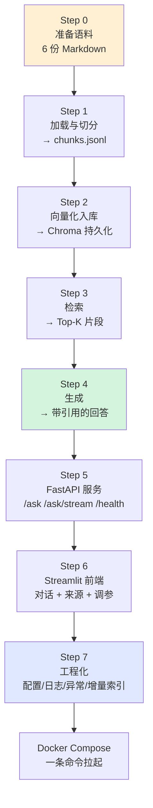
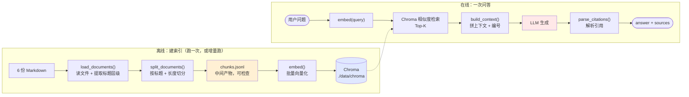
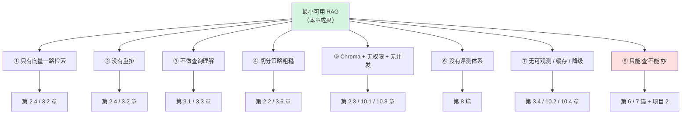
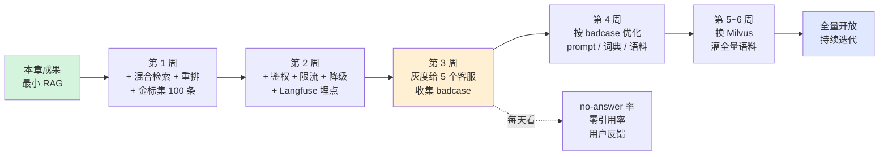

# 第 2.5 章  从 0 手写一个最小可用 RAG

> **本章目标**：读完能做到 …
> 1. 从零搭出一个能跑的中文 RAG 系统：加载 → 切分 → 向量化 → 检索 → 生成，全部自己写，不依赖 LangChain；
> 2. 拥有一份**全书共用的华成机电模拟语料**（6 份文档），后续所有章节都基于它做实验；
> 3. 把它封装成 FastAPI 服务（`/ask`、`/ask/stream`、`/health`）并配上 Streamlit 前端；
> 4. 把脚本项目改造成可维护工程：配置外置、日志、异常处理、增量索引；
> 5. 用 Docker Compose 一条命令拉起来；
> 6. **说清楚这个最小系统的 8 个明显缺陷，以及每个缺陷在后面哪一章解决**。
>
> **前置知识**：[第 2.2 章 文档解析与切分策略](./02-文档解析与切分策略.md)、[第 2.3 章 Embedding 与向量数据库](./03-Embedding与向量数据库.md)、[第 2.4 章 检索重排生成全链路](./04-检索重排生成全链路.md)
>
> **预计用时**：阅读 30 分钟 / **动手 240 分钟**（这是一章纯动手的内容，请打开终端跟着敲）

---

## 一、为什么需要它（问题出发）

### 1.1 为什么要"手写"，而不是直接用 LangChain

第 4 篇会专门讲 LangChain 和 LangGraph，那时候你会发现十几行代码就能搭一个 RAG。既然如此，为什么这一章要从零手写？

**因为框架帮你藏起来的那些东西，正是线上出问题时你必须理解的东西。**

| 框架里的一行 | 背后实际发生了什么 | 出问题时你要改哪里 |
|---|---|---|
| `TextLoader(path).load()` | 编码检测、换行归一化、元数据注入 | 中文乱码、Windows 换行符污染 |
| `RecursiveCharacterTextSplitter(...).split_documents(docs)` | 按分隔符优先级递归切、处理 overlap、长度函数 | chunk 被切在句子中间、超过模型 max_length |
| `Chroma.from_documents(docs, embeddings)` | 批量 embedding、落盘、建索引、id 生成 | 重跑脚本数据翻倍、OOM |
| `retriever.get_relevant_documents(q)` | 编码 query、ANN 检索、相似度阈值 | 召回全是噪声、没有过滤条件 |
| `RetrievalQA.from_chain_type(...)` | prompt 模板、上下文拼接、输出解析 | 答案不带引用、幻觉、no-answer 没兜底 |

用框架搭出来的 Demo，**能跑**和**知道它为什么能跑**是两回事。这一章的目标是后者。等你自己写过一遍，再看 LangChain 的源码会轻松很多——因为你知道它在解决什么问题。

> 📌 另外一个很现实的理由：**很多企业的技术评审会要求"不引入重型框架"**。手写版本只依赖 `chromadb` + `openai` 两个库，几百行代码，评审时能逐行解释清楚。

### 1.2 我们要做出什么

最终效果：

```text
$ curl -s localhost:8080/ask -X POST -H 'Content-Type: application/json' \
    -d '{"question": "XJ-200 报 E043 怎么处理？"}' | python -m json.tool

{
    "answer": "E043 表示 X 轴伺服驱动器过热[1]。处理步骤：1) 立即按下急停并切断主电源；
               2) 等待驱动器冷却至 40℃ 以下；3) 检查驱动器散热风扇是否正常转动；
               4) 清理风道积尘与散热片；5) 检查电柜空调或风扇是否工作，环境温度应低于 40℃；
               6) 若风扇损坏，更换 SV-200X 伺服驱动器风扇模块[1][2]。
               SV-200X 单价 480 元，交付周期 3 天[2]。",
    "sources": [
        {"index": 1, "title": "故障代码速查表", "section": "E043", "score": 0.7412},
        {"index": 2, "title": "备件更换指南与备件清单", "section": "常用备件价格表", "score": 0.6103}
    ],
    "latency_ms": {"retrieve": 42.1, "generate": 2183.7, "total": 2225.8}
}
```

加上一个 Streamlit 前端：左边调参数（Top-K、温度、是否显示原文），中间是对话框，右边展示引用来源。

### 1.3 七个 Step 的路线图



**每一步都要能独立跑通并看到输出。** 不要一口气写完再调试——那样出错时你不知道是哪一步坏的。

---

## 二、原理拆解

### 2.1 最小 RAG 的数据流



**三个刻意的设计决定，值得说明：**

| 决定 | 理由 |
|---|---|
| **中间产物 `chunks.jsonl` 必须落盘** | 切分质量是 RAG 的天花板（第 2.2 章）。有了 jsonl 就能 `head -5` 直接看切成了什么样，而不是盲调 |
| **embedding 走 OpenAI 兼容 API** | 本章不引入 GPU 依赖，用在线 embedding 或 Ollama 都行。换成本地 bge-m3 只需要改一个函数 |
| **用 Chroma 而不是 Milvus** | 教学阶段零运维，`pip install` 就能用。第 2.3 章已经讲清楚了它不适合生产的原因 |

### 2.2 项目目录结构

沿用全书统一的项目骨架（[第 0.2 章 7.2 节](../00-前置准备/02-Python工程基础速补.md)），本章只用到其中几个目录：

```text
huacheng-rag/
├── .env                      # 环境变量（不入 git）
├── .env.example              # 模板（入 git）
├── pyproject.toml
├── Dockerfile
├── docker-compose.yml
├── core/
│   ├── __init__.py
│   ├── config.py             # pydantic-settings 配置（Step 7）
│   └── logger.py             # 结构化日志（Step 7）
├── rag/
│   ├── __init__.py
│   ├── loader.py             # Step 1：加载与切分
│   ├── indexer.py            # Step 2：向量化入库
│   ├── retriever.py          # Step 3：检索
│   ├── generator.py          # Step 4：生成
│   └── pipeline.py           # 串联
├── app/
│   ├── __init__.py
│   ├── main.py               # Step 5：FastAPI
│   └── ui.py                 # Step 6：Streamlit
├── scripts/
│   ├── build_index.py        # 全量建索引
│   ├── incremental_index.py  # Step 7：增量索引
│   └── eval_smoke.py         # 10 个验收问题
├── data/
│   ├── raw/                  # ← 6 份语料放这里
│   ├── chunks/               # chunks.jsonl
│   ├── chroma/               # 向量库持久化目录
│   └── manifest.json         # 增量索引用的内容哈希表
└── tests/
    └── test_pipeline.py
```

---

## 三、动手实战

### 3.0 环境准备

```bash
# 建项目
mkdir -p huacheng-rag && cd huacheng-rag
mkdir -p core rag app scripts tests data/raw data/chunks data/chroma

# ---------- uv（推荐） ----------
uv init --python 3.11
uv add "chromadb==0.5.20" \
       "openai==1.54.3" \
       "pydantic==2.9.2" \
       "pydantic-settings==2.6.1" \
       "fastapi==0.115.5" \
       "uvicorn[standard]==0.32.1" \
       "streamlit==1.40.1" \
       "httpx==0.27.2" \
       "python-dotenv==1.0.1" \
       "tiktoken==0.8.0"
uv add --dev "pytest==8.3.3" "ruff==0.7.4"

# ---------- pip 等价命令 ----------
python3.11 -m venv .venv && source .venv/bin/activate
pip install chromadb==0.5.20 openai==1.54.3 pydantic==2.9.2 \
            pydantic-settings==2.6.1 fastapi==0.115.5 "uvicorn[standard]==0.32.1" \
            streamlit==1.40.1 httpx==0.27.2 python-dotenv==1.0.1 tiktoken==0.8.0
pip install pytest==8.3.3 ruff==0.7.4

# ---------- 校验 ----------
python -c "import chromadb, openai, fastapi, streamlit; print('deps ok')"
```

**配置环境变量：**

```bash
cat > .env.example << 'ENVEOF'
# ---------- LLM（三选一） ----------
LLM_PROVIDER=deepseek
DEEPSEEK_API_KEY=sk-xxxxxxxxxxxxxxxx
DEEPSEEK_BASE_URL=https://api.deepseek.com/v1
DEEPSEEK_CHAT_MODEL=deepseek-chat

# ---------- Embedding（三选一） ----------
# 方式 A：通义 DashScope（在线，无需 GPU，推荐初学者）
EMBED_PROVIDER=dashscope
DASHSCOPE_API_KEY=sk-xxxxxxxxxxxxxxxx
DASHSCOPE_BASE_URL=https://dashscope.aliyuncs.com/compatible-mode/v1
DASHSCOPE_EMBED_MODEL=text-embedding-v3
EMBED_DIM=1024

# 方式 B：Ollama 本地（零成本，需先 ollama pull bge-m3）
# EMBED_PROVIDER=ollama
# OLLAMA_BASE_URL=http://localhost:11434
# OLLAMA_EMBED_MODEL=bge-m3
# EMBED_DIM=1024

# ---------- 检索与生成参数 ----------
TOP_K=5
CHUNK_SIZE=400
CHUNK_OVERLAP=60
SCORE_THRESHOLD=0.30
TEMPERATURE=0.0
MAX_TOKENS=1200

# ---------- 路径 ----------
RAW_DIR=./data/raw
CHUNKS_PATH=./data/chunks/chunks.jsonl
CHROMA_DIR=./data/chroma
COLLECTION_NAME=huacheng_kb

# ---------- 服务 ----------
APP_PORT=8080
LOG_LEVEL=INFO
ENVEOF

cp .env.example .env
# 然后编辑 .env 填上真实 API Key
```

> ⚠️ **`.env` 必须加进 `.gitignore`**。API Key 泄露到 git 历史里是最常见的安全事故之一，而且一旦推到远端，改历史很麻烦。

```bash
cat > .gitignore << 'GITEOF'
.env
.venv/
__pycache__/
*.pyc
data/chroma/
data/chunks/
data/manifest.json
.pytest_cache/
GITEOF
```

### 3.1 Step 0：准备语料（全书共用资产，务必完整创建）

**这一节非常重要。** 后面所有章节（检索实验、评测集、微调数据、Agent 工具、实战项目）都会反复引用这 6 份文档里的型号、错误码和条款。请把下面每个代码块的内容**原样复制**成对应的文件。

```bash
mkdir -p data/raw
```

#### 文档 1：`data/raw/01-XJ-200操作手册.md`

```markdown
# XJ-200 数控机床操作手册（节选）

**文档编号**：HC-MAN-XJ200-V2.1
**适用机型**：XJ-200、XJ-200-B3
**生效日期**：2024-06-01
**密级**：内部

## 一、整机技术参数

| 参数项 | XJ-200 | XJ-200-B3 |
|---|---|---|
| 机床类型 | 三轴立式加工中心 | 三轴立式加工中心（加长行程版） |
| X 轴行程 | 800 mm | 1000 mm |
| Y 轴行程 | 500 mm | 500 mm |
| Z 轴行程 | 500 mm | 560 mm |
| 主轴最高转速 | 12000 r/min | 15000 r/min |
| 主轴功率 | 11 kW | 15 kW |
| 主轴接口 | BT40 | BT40 |
| 刀库容量 | 24 工位圆盘式 | 24 工位圆盘式 |
| 换刀时间（刀对刀） | 2.5 s | 2.2 s |
| 定位精度 | ±0.005 mm | ±0.005 mm |
| 重复定位精度 | ±0.003 mm | ±0.003 mm |
| 快速移动速度 | 36 m/min | 40 m/min |
| 数控系统 | HC-CNC 60i | HC-CNC 60i |
| 电源要求 | 三相 380V ±10%，50Hz | 三相 380V ±10%，50Hz |
| 装机容量 | 18 kVA | 22 kVA |
| 气源压力 | 0.6 ~ 0.8 MPa | 0.6 ~ 0.8 MPa |
| 整机重量 | 4800 kg | 5300 kg |
| 外形尺寸(长×宽×高) | 2600×2300×2750 mm | 2900×2300×2750 mm |

## 二、安全须知

1. **开机前必须确认防护门关闭到位**，安全门联锁开关失效时禁止运行。
2. 进入机床内部作业前，必须**断开主电源并挂"禁止合闸"警示牌**（挂牌上锁 LOTO）。
3. 主轴停止后仍可能有惯性旋转，**等待完全停稳后再开门**。
4. 严禁在主轴运转期间用手或工具清除铁屑。
5. 冷却液为水基乳化液，皮肤接触后用清水冲洗；严禁饮用。
6. 电柜内部带电部位在断电后仍可能有残余电压，**断电 5 分钟后方可作业**。
7. 吊装机床必须使用随机配备的吊装螺栓，吊点位置见机身标识。

## 三、日常操作流程

### 3.1 开机

1. 检查气源压力是否在 0.6 ~ 0.8 MPa 范围内。
2. 合上机床总电源开关（电柜侧面），等待数控系统自检完成（约 60 秒）。
3. 旋开急停按钮，按下「系统启动」。
4. 执行**回参考点**操作：依次按 Z、X、Y 轴回零按钮。**Z 轴必须先回零**，否则可能发生刀具与工件干涉。
5. 检查润滑油位、冷却液液位是否在刻度线之间。

### 3.2 关机

1. 将各轴移动到安全位置（Z 轴抬至最高点）。
2. 按下急停按钮。
3. 通过系统菜单执行「安全关机」，等待系统提示「可以断电」。
4. 断开机床总电源。
5. 清理工作台铁屑，擦拭导轨并涂防锈油（长期停机时）。

## 四、报警与处理

数控系统发生报警时，屏幕右上角显示报警代码（形如 E0XX），同时三色灯转为红色常亮。

**通用处理原则**：

1. 记录**完整的报警代码**与发生时的加工状态（程序段号、主轴转速、进给速度）。
2. 按急停，切断危险源。
3. 查阅《故障代码速查表》定位原因。
4. 属于**可自行处理**的（如 E057 换刀超时），按手册步骤处理后复位。
5. 属于**需专业维修**的（如驱动器、主轴类），**不要自行拆解**，否则会导致保修失效（见《整机保修政策》第五条）。
6. 处理完成后必须在工单系统登记，记录故障现象、处理措施与更换备件。

> 常见报警代码速查：E041（主轴过载）、E043（X 轴伺服驱动器过热）、E057（刀库换刀超时）。详见《故障代码速查表》。

## 五、常见操作问题

**Q：回零时提示"超程"怎么办？**
A：按住「超程解除」按钮不放，同时手动将该轴向反方向移动出限位区，再重新回零。

**Q：加工中途断电，恢复后如何继续？**
A：不要直接续跑。应重新回参考点，检查工件是否移位，从安全的程序段号重新开始。

**Q：主轴有轻微异响是否正常？**
A：新机磨合期（前 200 小时）有轻微运转声属正常。若出现周期性敲击声或尖啸，应立即停机并参见《主轴与轴承保养指南》。
```

#### 文档 2：`data/raw/02-故障代码速查表.md`

```markdown
# 故障代码速查表

**文档编号**：HC-FAQ-ERR-V3.0
**适用机型**：XJ-200、XJ-200-B3、XJ-300
**生效日期**：2024-09-15
**密级**：内部

## 一、代码分类规则

| 代码段 | 类别 | 处理权限 |
|---|---|---|
| E0xx | 驱动与主轴类 | 部分需专业维修 |
| E1xx | 刀库与换刀类 | 现场工程师可处理 |
| E2xx | 数控系统与通信类 | 需技术支持远程协助 |
| E3xx | 辅助系统（冷却、润滑、气动） | 操作工可处理 |

## 二、驱动类故障

### E041　主轴过载保护

- **现象**：加工过程中主轴突然停转，屏幕显示 E041，三色灯红色常亮，主轴电机有异常嗡鸣。
- **可能原因**：
  1. 切削参数过大（进给速度过快、切深过大），主轴负载超过额定值；
  2. 刀具磨损严重或崩刃，切削阻力剧增；
  3. 工件装夹松动导致瞬时冲击载荷；
  4. 主轴轴承润滑不良，摩擦阻力增大；
  5. 主轴驱动器参数漂移（较少见）。
- **处理步骤**：
  1. 按下急停，等待主轴完全停止；
  2. 检查刀具磨损情况，磨损或崩刃的立即更换；
  3. 检查工件装夹是否牢固；
  4. 将进给速度倍率降至 50%，切深减半后试切；
  5. 若降参数后仍报警，检查主轴润滑（见《主轴与轴承保养指南》第三节）；
  6. 以上均正常仍报警的，联系技术支持检查驱动器参数。
- **复位方式**：排除原因后，按「复位」键，报警清除。
- **预计处理时长**：15 ~ 40 分钟。

### E043　X 轴伺服驱动器过热

- **现象**：屏幕显示 E043，X 轴停止运动，其他轴可正常移动；电柜内 X 轴驱动器指示灯闪红；触摸驱动器散热片烫手。
- **可能原因**：
  1. **驱动器散热风扇故障或卡滞**（最常见，约占该故障的 60%）；
  2. 电柜风道积尘堵塞，散热效率下降；
  3. 电柜空调故障或环境温度过高（超过 40℃）；
  4. X 轴机械阻力增大（导轨缺润滑、丝杠预紧过度），导致驱动器长期大电流工作；
  5. 驱动器本体老化。
- **处理步骤**：
  1. **立即按下急停并切断主电源**；
  2. 等待驱动器冷却至 40℃ 以下（约 20 分钟），期间不要强行复位；
  3. 打开电柜门，检查 X 轴驱动器散热风扇是否正常转动，有无异响或卡滞；
  4. 用压缩空气（压力不超过 0.3 MPa）清理风道积尘与散热片，注意不要吹向电路板；
  5. 检查电柜空调/风扇是否工作，确认车间环境温度低于 40℃；
  6. 手动移动 X 轴（松开抱闸后），感受阻力是否异常，必要时检查导轨润滑；
  7. **若风扇损坏，更换 SV-200X 伺服驱动器风扇模块**（见《备件更换指南与备件清单》）；
  8. 处理完成后上电复位，空载运行 X 轴 10 分钟，观察驱动器温度。
- **复位方式**：冷却后断电重启，报警自动清除。
- **预计处理时长**：40 ~ 90 分钟（含冷却等待）。
- **注意**：连续 24 小时内重复出现 3 次以上，即使处理后暂时正常，也应申报驱动器检测。

### E044　Y 轴伺服驱动器过热

- **现象**：同 E043，区别在于故障轴为 Y 轴。
- **处理步骤**：参照 E043，将 X 轴替换为 Y 轴。Y 轴驱动器风扇模块同样使用 SV-200X。

### E046　Z 轴伺服驱动器过载

- **现象**：Z 轴下降正常但上升报警；屏幕显示 E046。
- **可能原因**：Z 轴配重平衡失效（气动平衡缸压力不足）、丝杠润滑不良、主轴箱导轨卡滞。
- **处理步骤**：检查气源压力是否达到 0.6 MPa；检查平衡缸有无漏气；检查 Z 轴丝杠润滑。

## 三、刀库与换刀类故障

### E057　刀库换刀超时

- **现象**：执行 M06 换刀指令后动作中途停止，屏幕显示 E057，刀库停在中间位置，机械手可能夹持刀具悬停。
- **可能原因**：
  1. 刀库定位传感器（接近开关）脏污或松动，信号未被检测到；
  2. 气源压力不足（低于 0.6 MPa），换刀气缸动作缓慢；
  3. 刀具未完全插入刀套，或刀柄拉钉松动；
  4. 刀套内有铁屑或冷却液残留卡滞；
  5. 换刀超时参数设置过短（正常为 8 秒）。
- **处理步骤**：
  1. **不要直接断电**，断电会使机械手停在危险位置，恢复更麻烦；
  2. 进入「手动换刀」模式，按提示将机械手复位到原点；
  3. 检查气源压力表读数，应在 0.6 ~ 0.8 MPa；
  4. 清洁刀库定位传感器（TLM-24C）表面，用无水乙醇擦拭；
  5. 检查报警时对应刀位的刀套是否有铁屑、冷却液积存，清理干净；
  6. 检查刀柄拉钉是否松动，用扭力扳手按 25 N·m 紧固；
  7. 手动执行一次空刀换刀测试，确认动作顺畅；
  8. 若传感器损坏，更换 TLM-24C 刀库定位传感器。
- **复位方式**：机械手复位后按「复位」键。
- **预计处理时长**：20 ~ 60 分钟。
- **注意**：E057 高频出现（一周超过 3 次）通常是气源或传感器问题，不要每次只做清洁。

### E052　刀号与实际刀具不符

- **现象**：换刀完成后系统提示刀号异常。
- **处理步骤**：进入刀库管理界面，执行「刀库数据重建」，逐一核对刀位与刀号。

## 四、辅助系统故障

### E301　冷却液液位低

- **现象**：屏幕提示 E301，冷却泵停止。
- **处理步骤**：补充冷却液至刻度线；检查液位浮子开关是否卡滞。

### E312　润滑系统压力异常

- **现象**：E312 报警，润滑泵频繁启动。
- **处理步骤**：检查润滑油位；检查分配器有无堵塞；更换 FLT-A30 滤芯。

## 五、汇总速查表

| 代码 | 名称 | 严重度 | 现场可处理 | 常用备件 | 平均处理时长 |
|---|---|---|---|---|---|
| E041 | 主轴过载保护 | 高 | 部分 | — | 15~40 min |
| E043 | X 轴伺服驱动器过热 | 高 | 是 | SV-200X | 40~90 min |
| E044 | Y 轴伺服驱动器过热 | 高 | 是 | SV-200X | 40~90 min |
| E046 | Z 轴伺服驱动器过载 | 中 | 是 | — | 30~60 min |
| E052 | 刀号不符 | 低 | 是 | — | 10~20 min |
| E057 | 刀库换刀超时 | 中 | 是 | TLM-24C | 20~60 min |
| E301 | 冷却液液位低 | 低 | 是 | — | 5~10 min |
| E312 | 润滑系统压力异常 | 中 | 是 | FLT-A30 | 20~40 min |
```

#### 文档 3：`data/raw/03-主轴与轴承保养指南.md`

```markdown
# 主轴与轴承保养指南

**文档编号**：HC-MNT-SPD-V1.4
**适用机型**：XJ-200、XJ-200-B3、XJ-300
**生效日期**：2024-03-20
**密级**：内部

## 一、保养周期总表

| 周期 | 项目 | 耗时 | 执行人 |
|---|---|---|---|
| 每班（8h） | 清理工作台与防护罩铁屑；检查气源压力；检查冷却液液位 | 10 min | 操作工 |
| 每周 | 清理排屑器；检查导轨刮屑板；擦拭导轨并检查油膜 | 30 min | 操作工 |
| 每月 | 检查主轴拉爪夹紧力；清理电柜滤网；检查各轴反向间隙 | 90 min | 现场工程师 |
| 每季（约 500h） | 更换润滑脂；检测主轴振动与温升；检查皮带张紧度 | 3 h | 现场工程师 |
| 每年（约 2000h） | 更换液压站滤芯；全面几何精度检测；冷却液全量更换 | 8 h | 现场工程师 |
| 8000 h 或异响 | 更换主轴前后轴承 | 16 h | 原厂技术支持 |

## 二、主轴关键指标

| 指标 | 正常范围 | 预警值 | 报警值 | 检测方式 |
|---|---|---|---|---|
| 空载振动速度（RMS） | ≤ 2.8 mm/s | 2.8 ~ 4.5 mm/s | > 4.5 mm/s | 振动分析仪，测点为主轴前端法兰 |
| 主轴温升（相对环境） | ≤ 25 K | 25 ~ 35 K | > 35 K | 红外测温，连续运行 1 小时后测 |
| 前轴承温度 | ≤ 60 ℃ | 60 ~ 70 ℃ | > 70 ℃ | 主轴箱内置 PT100 |
| 径向跳动（主轴锥孔） | ≤ 0.005 mm | 0.005 ~ 0.01 mm | > 0.01 mm | 千分表 + 检验棒 |
| 拉爪夹紧力 | 12 ~ 15 kN | 10 ~ 12 kN | < 10 kN | 拉力计 |

> 说明：以上数值为 XJ-200 系列在空载、主轴 8000 r/min 工况下的参考标准。XJ-300 的振动正常范围为 ≤ 3.2 mm/s。

## 三、润滑管理

### 3.1 润滑脂规格

- **型号**：HC-G2 高速主轴专用锂基脂（NLGI 2 级）
- **严禁混用**其他品牌或牌号的润滑脂，不同增稠剂体系混合会导致皂基破坏、油脂析出。
- **补充周期**：每运行 2000 小时或每季度（以先到者为准）。
- **补充量**：前轴承 15 g，后轴承 10 g。**加注过量会导致温升异常升高**，这是最常见的保养错误。

### 3.2 导轨与丝杠润滑

- 使用 HC-L68 导轨油，油箱容量 3 L，液位低于 1/3 时补充。
- 润滑泵每 30 分钟自动打油一次，单次打油量 6 mL。
- 每月检查各润滑点出油情况，用白纸贴在导轨面上运行一次，观察油迹是否均匀。

## 四、异常噪声排查

主轴异响是最常见的主诉之一。按下表定位：

| 声音特征 | 出现时机 | 可能原因 | 处理 |
|---|---|---|---|
| **周期性敲击声**（转速越高频率越高） | 主轴旋转时 | 轴承滚道点蚀或保持架损坏 | **立即停机**，申报更换 BRG-6208 轴承 |
| **持续尖啸声** | 高转速（>8000 r/min） | 润滑不足或润滑脂过量 | 检查润滑脂加注量，重新按标准加注 |
| **低频嗡鸣** | 加速/减速时 | 驱动器参数失配、同步带松弛 | 检查同步带张紧度，必要时更换 BLT-8M-1200 |
| **金属摩擦声** | 换刀时 | 拉爪磨损、刀柄锥面拉伤 | 检查拉爪与主轴锥孔，清理修磨 |
| **气流声** | 待机时 | 气密封漏气 | 检查主轴气密封管路接头 |

> ⚠️ **判断原则**：**周期性敲击声必须立即停机**。轴承一旦点蚀，继续运行会在数小时内扩大损伤，可能导致主轴轴颈报废，维修成本从更换轴承（约 1280 元）上升到更换整个主轴组件（数万元）。

## 五、轴承更换要点

1. 更换必须由**原厂技术支持或授权服务商**执行，自行拆解会导致主轴组件保修失效。
2. 主轴前轴承型号 **BRG-6208**（角接触球轴承，P4 级），成对使用，必须同批次。
3. 拆装需专用压装工装，禁止用锤击方式。
4. 装配后需进行跑合：从 1000 r/min 开始，每 10 分钟升高 1000 r/min，直至最高转速，全程监测温升。
5. 跑合完成后重新检测振动与径向跳动，记录进设备台账。

## 六、保养记录要求

每次保养必须在工单系统登记以下字段：设备编号、保养类型、执行人、耗时、更换备件、检测数据（振动/温升/跳动）、下次保养计划日期。**检测数据是判断劣化趋势的唯一依据**，不要只写"正常"。
```

#### 文档 4：`data/raw/04-备件更换指南与备件清单.md`

```markdown
# 备件更换指南与备件清单

**文档编号**：HC-PRT-LIST-V2.3
**适用机型**：XJ-200、XJ-200-B3、XJ-300
**生效日期**：2025-01-10
**密级**：内部

## 一、备件申领流程

1. 现场工程师在工单系统提交《备件申请单》，必须填写：设备编号、故障代码、备件编号、数量、故障照片。
2. 区域备件库有货的，当日发出；无货的转总部备件中心，按下表交付周期发运。
3. **保修期内因产品质量问题导致的备件损坏，免费更换**；正常磨损与人为损坏按价目表收费（依据见《整机保修政策》）。
4. 更换下来的旧件必须寄回总部质量部做失效分析，**未寄回旧件的免费更换申请不予结算**。

## 二、常用备件价格表

| 备件编号 | 名称 | 适配机型 | 单价(元) | 交付周期 | 是否易损件 | 建议库存 |
|---|---|---|---|---|---|---|
| SV-200X | 伺服驱动器风扇模块 | XJ-200 / XJ-200-B3 / XJ-300 | 480 | 3 天 | 是 | 2 |
| BRG-6208 | 主轴前轴承（角接触球轴承 P4） | XJ-200 / XJ-200-B3 | 1280 | 7 天 | 否 | 1 |
| BRG-6210 | 主轴前轴承（角接触球轴承 P4） | XJ-300 | 1650 | 7 天 | 否 | 0 |
| TLM-24C | 刀库定位传感器（接近开关） | XJ-200 / XJ-200-B3 / XJ-300 | 760 | 5 天 | 否 | 1 |
| FLT-A30 | 液压站滤芯 | 全系 | 120 | 1 天 | 是 | 4 |
| BLT-8M-1200 | 主轴同步带 8M-1200 | XJ-200 / XJ-200-B3 | 260 | 3 天 | 是 | 2 |
| CLB-200 | 冷却泵总成 | XJ-200 / XJ-200-B3 | 1450 | 7 天 | 否 | 0 |
| LUB-P10 | 润滑泵 | 全系 | 980 | 5 天 | 否 | 1 |
| FUS-25A | 电柜保险丝 25A | 全系 | 15 | 1 天 | 是 | 10 |
| SEL-Z40 | Z 轴平衡缸密封件套装 | XJ-200 / XJ-200-B3 | 340 | 5 天 | 是 | 1 |
| ENC-X1 | X 轴光栅尺读数头 | XJ-200 / XJ-200-B3 | 4200 | 15 天 | 否 | 0 |

> 价目表为教学示例数据，实际价格以当期报价单为准。

## 三、SV-200X 伺服驱动器风扇模块更换步骤

**适用场景**：E043 / E044 报警，确认驱动器散热风扇损坏。
**预计耗时**：30 分钟。
**所需工具**：十字螺丝刀、防静电手环、万用表、压缩空气枪。

1. **断电并挂牌**：断开机床总电源开关，挂"禁止合闸"警示牌，等待 5 分钟释放残余电压。
2. 佩戴防静电手环，打开电柜门。
3. 用万用表确认驱动器直流母线电压已降至 36 V 以下方可作业。
4. 拍照记录风扇模块的接线位置与走向（**这一步不要省，接反会烧驱动器**）。
5. 拔下风扇电源插头（2 芯，白色端子）。
6. 松开风扇模块固定的 4 颗 M3 十字螺钉，取下旧风扇模块。
7. 用压缩空气清理驱动器散热片与风道积尘，压力不超过 0.3 MPa。
8. 装上新的 SV-200X 模块，按对角顺序拧紧 4 颗螺钉，扭矩 0.6 N·m。
9. 插回电源插头，确认卡扣锁紧。
10. 关闭电柜门，摘牌，上电。
11. 空载运行 X 轴 10 分钟，用红外测温枪确认驱动器散热片温度稳定在 50 ℃ 以下。
12. 在工单系统登记：更换备件编号、旧件序列号、更换后温度实测值。

## 四、TLM-24C 刀库定位传感器更换步骤

**适用场景**：E057 报警，确认传感器损坏（清洁后仍无信号）。
**预计耗时**：45 分钟。

1. 断电挂牌。
2. 手动将刀库旋转到便于作业的角度，用机械锁定销固定。
3. 记录原传感器的安装位置与感应间隙（标准为 1.5 ~ 2.0 mm）。
4. 松开锁紧螺母，拆下旧传感器，断开航空插头。
5. 装上新传感器，用塞尺调整感应间隙至 1.8 mm，锁紧螺母。
6. 接回航空插头，上电。
7. 在诊断界面观察传感器信号（X18.3），手动转动刀库，确认每个刀位都能稳定触发。
8. 执行 3 次完整换刀测试。

## 五、BRG-6208 主轴轴承更换

⚠️ **该项必须由原厂技术支持或授权服务商执行。用户自行拆解主轴组件将导致保修立即失效**（见《整机保修政策》第五条第 1 款）。

申报流程：现场工程师提交振动检测数据与噪声录音 → 技术支持远程评估 → 确认后派工 → 现场更换 + 跑合 + 精度复检。

## 六、易损件清单与更换周期

| 备件编号 | 名称 | 建议更换周期 | 判废标准 |
|---|---|---|---|
| FLT-A30 | 液压站滤芯 | 2000 h / 12 个月 | 压差报警或外观明显污染 |
| BLT-8M-1200 | 主轴同步带 | 4000 h | 齿面裂纹、张紧度无法调整 |
| SV-200X | 驱动器风扇模块 | 8000 h | 转速下降、异响、卡滞 |
| SEL-Z40 | Z 轴平衡缸密封件 | 6000 h | 漏气、压力保持不住 |
| FUS-25A | 保险丝 | 按需 | 熔断 |

> **易损件不在整机保修范围内**（《整机保修政策》第三条）。但若在保修期内因**产品质量问题**（非正常磨损）损坏，经质量部失效分析确认后免费更换。
```

#### 文档 5：`data/raw/05-整机保修政策.md`

```markdown
# 整机保修政策

**文档编号**：HC-POL-WTY-V4.0
**适用范围**：华成机电全系数控机床产品
**生效日期**：2025-01-01
**密级**：公开
**解释权**：华成机电售后服务部

## 第一条　适用范围

本政策适用于 2025 年 1 月 1 日之后签订销售合同的华成机电全系产品，包括 XJ 系列、HC 系列、MT 系列。2025 年 1 月 1 日前的合同按原合同约定条款执行。

## 第二条　保修期限

1. **整机保修期为 12 个月**，自设备验收签字之日起计算；若客户未在到货后 30 日内完成验收，则自到货之日起第 31 日起计算。
2. **累计运行时间达到 2400 小时的，即使未满 12 个月，整机保修期亦告终止**，以先到者为准。运行时间以数控系统内置计时器读数为准。
3. **主轴组件（含主轴单元、主轴电机、主轴驱动器）保修期延长至 18 个月**，且不受 2400 小时限制。
4. 保修期内更换的零部件，其保修期**随整机保修期结束而结束**，不单独重新计算。
5. 保修期外更换的零部件，自更换之日起享有 **3 个月**的单件保修。

## 第三条　保修范围

### 3.1 免费保修（属于产品质量问题）

- 结构件（床身、立柱、工作台）的铸造缺陷、焊接缺陷；
- 主轴、丝杠、导轨等运动部件的制造精度不达标；
- 电气元件（驱动器、数控系统、传感器）的非人为故障；
- 装配缺陷导致的漏油、漏气、异响；
- 随机软件的功能缺陷。

### 3.2 不在免费保修范围

1. **易损件**：滤芯、密封件、皮带、保险丝、风扇模块、冷却液、润滑脂、刀具、夹具。
2. 因客户未按《主轴与轴承保养指南》执行保养导致的故障。
3. 因电源不符合要求（超出 380V ±10%、缺相、频繁断电）导致的电气损坏。
4. 因气源不洁（含水含油）、压力不足导致的气动元件故障。
5. 因超负荷使用（切削参数超出手册规定）导致的机械损伤。
6. 因操作不当（撞机、误操作）导致的损坏。
7. 自然灾害、火灾、水淹、鼠害等不可抗力。
8. 客户自行改装、加装非原厂附件导致的问题。

> 💡 **关于易损件的例外**：易损件虽不在整机保修范围内，但若在保修期内因**产品质量问题**（例如新装风扇模块运行 200 小时即卡死）而非正常磨损损坏的，经质量部失效分析确认后**免费更换**。

## 第四条　服务响应时效

| 客户等级 | 电话响应 | 到场时间（省内） | 到场时间（省外） |
|---|---|---|---|
| 战略客户（A 类） | 30 分钟内 | 12 小时内 | 24 小时内 |
| 重点客户（B 类） | 1 小时内 | 24 小时内 | 48 小时内 |
| 普通客户（C 类） | 2 小时内 | 48 小时内 | 72 小时内 |

- 响应时间自工单系统受理时刻起算。
- 遇法定节假日，到场时间顺延，但电话响应不顺延。
- 因客户现场条件（停电、封厂、无人接应）导致无法进场的时间不计入到场时长。

## 第五条　保修失效条款

发生下列情形之一的，**整机保修立即失效**：

1. **由非授权人员拆解主轴组件、数控系统或伺服驱动器**；
2. 擅自修改数控系统参数中的厂商级参数（需厂商密码的参数区）；
3. 铭牌、机身编号被涂改或去除，导致无法识别设备身份；
4. 设备被转售或转移至第三方场地而未向华成机电备案；
5. 累计三次拒绝执行厂家出具的整改通知。

## 第六条　收费标准（保修期外或不在保修范围内）

| 项目 | 收费方式 |
|---|---|
| 上门服务费 | 省内 800 元/次，省外 1500 元/次（含往返交通） |
| 工时费 | 300 元/工时，不足 1 小时按 1 小时计 |
| 备件费 | 按《备件更换指南与备件清单》价目表 |
| 远程技术支持 | 免费 |

## 第七条　延保服务

- 整机保修期届满前 30 日内可申请购买延保。
- 延保费用：**按设备合同价格的 4% / 年**计算，最多可购买 3 年。
- 延保范围与整机保修范围一致，易损件同样不在范围内。
- 延保期间的服务响应时效按原客户等级执行。

## 第八条　争议处理

1. 对是否属于保修范围有争议的，由华成机电质量部出具《失效分析报告》。
2. 客户对报告有异议的，可共同委托第三方检测机构，费用由责任方承担。
3. 本政策未尽事宜，以销售合同约定为准；合同未约定的，双方协商解决。

> ⚠️ 本文档为教学用模拟资料，条款内容为虚构，不构成任何实际的商业承诺。
```

#### 文档 6：`data/raw/06-历史工单样例.md`

```markdown
# 历史工单样例（10 条）

**文档编号**：HC-WO-SAMPLE-V1.0
**数据范围**：2025 年 3 月 ~ 2025 年 6 月抽样
**密级**：内部
**说明**：以下工单为教学用脱敏样例，客户名称与联系方式均为虚构。

---

## WO-20250312

- **设备**：XJ-200 / 编号 HC-XJ200-0417
- **客户**：华东某汽车零部件厂（B 类）
- **报修时间**：2025-03-12 09:14
- **故障代码**：E057
- **客户描述**：换刀换到一半不动了，屏幕报 E057，刀库停在中间。
- **处理过程**：远程指导操作工进入手动换刀模式复位机械手。现场检查气源压力仅 0.45 MPa，低于标准。排查发现车间空压机储气罐排水阀未关严，导致压力不足。关严后压力恢复 0.7 MPa，空刀测试换刀正常。
- **根因**：气源压力不足（非设备问题）。
- **更换备件**：无
- **处理时长**：1.2 小时（远程）
- **是否保修**：不涉及
- **回访结论**：一周内未复发。

---

## WO-20250326

- **设备**：XJ-200-B3 / 编号 HC-XJ200B3-0092
- **客户**：华南某模具厂（C 类）
- **报修时间**：2025-03-26 14:38
- **故障代码**：E041
- **客户描述**：加工铝件时主轴突然停了，报 E041。
- **处理过程**：现场到场检查，发现所用立铣刀刃口已严重磨损且有崩刃。客户为赶工期连续使用同一把刀具 40 小时未更换。更换刀具、进给倍率降至 60% 后试切正常，逐步恢复至 100%。同时向客户培训了刀具寿命管理。
- **根因**：刀具磨损导致切削阻力剧增（人为使用问题）。
- **更换备件**：无（刀具为客户自备）
- **处理时长**：4.5 小时（含往返）
- **是否保修**：不属于保修范围，收取上门服务费 800 元 + 工时费 900 元。
- **回访结论**：客户已建立刀具寿命台账。

---

## WO-20250412

- **设备**：XJ-200 / 编号 HC-XJ200-0231
- **客户**：华东某精密机械公司（A 类）
- **报修时间**：2025-04-12 08:02
- **故障代码**：E043
- **客户描述**：早上开机运行半小时后 X 轴不动了，报 E043，摸驱动器很烫。
- **处理过程**：电话响应 18 分钟，指导客户立即断电冷却。工程师 6 小时后到场，打开电柜发现 X 轴驱动器散热风扇卡死不转，风道内积尘严重（客户车间粉尘较大且电柜滤网 3 个月未清理）。更换 SV-200X 风扇模块，压缩空气清理风道与散热片，清洗电柜滤网。空载运行 X 轴 15 分钟，驱动器散热片温度稳定在 46 ℃。
- **根因**：风扇模块卡滞 + 风道积尘（风扇为易损件，运行时长 9200 小时，属正常磨损）。
- **更换备件**：SV-200X × 1
- **处理时长**：8.3 小时（含到场）
- **是否保修**：设备在保修期内，但风扇模块为易损件且属正常磨损，**备件费 480 元照收，上门服务费与工时费免除**。
- **回访结论**：已要求客户将电柜滤网清理周期从 3 个月缩短至 1 个月。

---

## WO-20250418

- **设备**：XJ-300 / 编号 HC-XJ300-0055
- **客户**：华北某重工企业（A 类）
- **报修时间**：2025-04-18 16:22
- **故障代码**：无（客户主诉异响）
- **客户描述**：主轴高速转的时候有规律的"咔咔"声，转速越高越明显。
- **处理过程**：电话中要求客户立即停机，不得继续使用。工程师携带振动分析仪次日到场，实测主轴空载振动速度 6.2 mm/s（标准 ≤ 3.2 mm/s），前轴承温度 74 ℃。判定前轴承滚道点蚀。上报原厂技术支持，第三日派专业团队更换 BRG-6210 轴承对，完成跑合与精度复检，振动恢复至 2.1 mm/s。
- **根因**：主轴前轴承点蚀失效。设备运行 1980 小时，处于保修期内（主轴组件 18 个月）。
- **更换备件**：BRG-6210 × 2
- **处理时长**：累计 22 小时（跨 3 天）
- **是否保修**：**免费**（主轴组件保修期 18 个月内，属产品质量问题）。
- **回访结论**：运行一个月，振动值稳定在 2.0 ~ 2.3 mm/s。

---

## WO-20250423

- **设备**：XJ-200 / 编号 HC-XJ200-0188
- **客户**：华中某阀门厂（C 类）
- **报修时间**：2025-04-23 10:45
- **故障代码**：E043
- **客户描述**：和上个月一样又报 E043 了。
- **处理过程**：查询历史工单，发现该设备 3 月 17 日已因 E043 更换过一次 SV-200X。本次到场检查风扇正常，但车间环境温度实测 43 ℃（电柜空调故障停机）。修复电柜空调后驱动器温度正常。
- **根因**：电柜空调故障导致环境温度过高（非设备本体问题）。
- **更换备件**：无（空调由客户方委托第三方维修）
- **处理时长**：3.1 小时
- **是否保修**：不属于保修范围，因客户为长期合作客户，免收上门费，仅收工时费 900 元。
- **回访结论**：建议客户在电柜加装温度监测报警。

---

## WO-20250508

- **设备**：XJ-200-B3 / 编号 HC-XJ200B3-0110
- **客户**：华东某新能源企业（B 类）
- **报修时间**：2025-05-08 11:30
- **故障代码**：E057
- **客户描述**：这周第四次报 E057 了，每次清一下就好，但很快又报。
- **处理过程**：到场后检查气源压力正常。用示波器观察刀库定位传感器信号，发现 7 号刀位信号存在间歇性丢失。测量感应间隙为 2.6 mm（标准 1.5 ~ 2.0 mm），传感器安装支架因长期振动松动位移。重新调整间隙至 1.8 mm 并加装防松垫圈。同时更换了信号已明显衰减的 TLM-24C 传感器。
- **根因**：传感器支架松动 + 传感器老化。
- **更换备件**：TLM-24C × 1
- **处理时长**：5.0 小时
- **是否保修**：设备运行 2680 小时，**已超过 2400 小时保修上限**，整机保修终止。备件费 760 元 + 上门费 800 元 + 工时费 1500 元，合计 3060 元。
- **回访结论**：两周内未再复发。

---

## WO-20250515

- **设备**：XJ-200 / 编号 HC-XJ200-0302
- **客户**：西南某航空零件厂（A 类）
- **报修时间**：2025-05-15 09:00
- **故障代码**：E312
- **客户描述**：润滑泵一直响，报 E312。
- **处理过程**：远程指导检查，发现润滑油箱液位低于 1/3 且滤芯严重堵塞。指导客户补充 HC-L68 导轨油并更换 FLT-A30 滤芯（客户自有库存）。压力恢复正常。
- **根因**：未按周期保养（滤芯已使用 14 个月，超过 12 个月更换周期）。
- **更换备件**：FLT-A30 × 1（客户自有库存）
- **处理时长**：0.8 小时（远程）
- **是否保修**：不属于保修范围（未按保养指南执行保养）。远程支持免费。
- **回访结论**：已协助客户设置保养提醒。

---

## WO-20250522

- **设备**：XJ-200 / 编号 HC-XJ200-0417
- **客户**：华东某汽车零部件厂（B 类）
- **报修时间**：2025-05-22 13:50
- **故障代码**：E041
- **客户描述**：主轴过载报警，但刀具是新换的。
- **处理过程**：现场检查刀具正常、装夹正常。检测主轴空载电流偏高，温升 31 K（预警区间）。进一步检查发现润滑脂加注过量——客户自行在 4 月保养时加注了约 40 g（标准前轴承 15 g）。清除多余润滑脂后重新按标准加注，温升降至 19 K，空载电流恢复正常。
- **根因**：润滑脂加注过量（保养操作错误）。
- **更换备件**：HC-G2 润滑脂 × 1 支
- **处理时长**：4.2 小时
- **是否保修**：不属于保修范围，收工时费 1200 元，备件费 180 元。
- **回访结论**：已对客户保养人员做专项培训。

---

## WO-20250603

- **设备**：XJ-200 / 编号 HC-XJ200-0245
- **客户**：华南某电子厂（C 类）
- **报修时间**：2025-06-03 15:10
- **故障代码**：E301
- **客户描述**：冷却液报警，泵不转了。
- **处理过程**：电话指导客户检查冷却液液位，实际已接近底部。补液后仍报警，进一步检查液位浮子开关被冷却液中的油泥卡住。指导客户清洁浮子后恢复正常。
- **根因**：冷却液长期未更换导致油泥堆积（上次更换距今 11 个月，标准为 6 个月）。
- **更换备件**：无
- **处理时长**：0.6 小时（远程）
- **是否保修**：不涉及。
- **回访结论**：已提醒客户按 6 个月周期更换冷却液。

---

## WO-20250617

- **设备**：XJ-200-B3 / 编号 HC-XJ200B3-0092
- **客户**：华南某模具厂（C 类）
- **报修时间**：2025-06-17 08:40
- **故障代码**：E043
- **客户描述**：X 轴报 E043，风扇是转的，环境温度也不高。
- **处理过程**：到场排查，风扇正常、风道清洁、车间温度 28 ℃。手动移动 X 轴时感觉阻力明显偏大。检查发现 X 轴导轨润滑管路一处接头脱落，导轨长期缺油，摩擦阻力增大导致驱动器持续大电流工作。重新连接润滑管路、手动补油、运行润滑循环 30 分钟后，X 轴移动阻力恢复正常，驱动器温度稳定。
- **根因**：X 轴导轨润滑管路脱落导致机械阻力增大（装配质量问题）。
- **更换备件**：无（管路接头现场修复）
- **处理时长**：6.0 小时
- **是否保修**：设备运行 1120 小时，在保修期内，**判定为装配缺陷，全额免费**。
- **回访结论**：一个月内 X 轴运行正常，已将该批次设备的润滑管路接头纳入巡检重点。

---

## 附：工单统计摘要

| 故障代码 | 出现次数 | 平均处理时长 | 保修占比 |
|---|---|---|---|
| E043 | 3 | 5.8 h | 1/3 |
| E057 | 2 | 3.1 h | 0/2 |
| E041 | 2 | 4.4 h | 0/2 |
| E301 | 1 | 0.6 h | — |
| E312 | 1 | 0.8 h | — |
| 主轴异响（无代码） | 1 | 22 h | 1/1 |

**观察**：E043 的三次报修中，**只有一次是驱动器/风扇本身的问题**，另外两次分别是环境温度过高和机械阻力增大。这说明**同一个故障代码背后可能有完全不同的根因**——这也是 RAG 系统必须把"可能原因"完整召回、而不是只给一条答案的原因。
```

**创建完成后检查：**

```bash
ls -la data/raw/
wc -l data/raw/*.md
```

**预期输出：**

```text
total 96
-rw-rw-r-- 1 user user  5312 09-17 10:22 01-XJ-200操作手册.md
-rw-rw-r-- 1 user user  7845 09-17 10:23 02-故障代码速查表.md
-rw-rw-r-- 1 user user  6103 09-17 10:24 03-主轴与轴承保养指南.md
-rw-rw-r-- 1 user user  5977 09-17 10:25 04-备件更换指南与备件清单.md
-rw-rw-r-- 1 user user  5641 09-17 10:26 05-整机保修政策.md
-rw-rw-r-- 1 user user  8802 09-17 10:27 06-历史工单样例.md

  118 data/raw/01-XJ-200操作手册.md
  151 data/raw/02-故障代码速查表.md
  124 data/raw/03-主轴与轴承保养指南.md
  118 data/raw/04-备件更换指南与备件清单.md
  128 data/raw/05-整机保修政策.md
  212 data/raw/06-历史工单样例.md
  851 总用量
```

> 📌 **这 6 份文档是全书的共用资产。** 后面这些地方都会用到它们：
> - 第 3 篇的检索实验与评测集
> - 第 5 篇的微调数据构造（从工单样例生成问答对）
> - 第 6 篇的 Agent 工具（查备件价格、查保修状态）
> - 第 8 篇的金标集与 DeepSeek-Harness 评测
> - 第 9 篇的四个实战项目
>
> **请务必完整创建，并且不要随意修改型号、错误码和价格**——改了后面章节的预期输出就对不上了。

### 3.2 Step 1：文档加载与切分

**这一步在干什么**：把 6 份 Markdown 读进来，按标题层级 + 长度切成 chunk，同时把"这段来自哪个文档的哪一节"记进元数据，最后落成 `chunks.jsonl`。

```python
# rag/loader.py
"""文档加载与切分：Markdown → chunks.jsonl。

切分策略（对应第 2.2 章的"结构化切分 + 长度兜底"）：
1. 先按 Markdown 标题（## / ###）切成"节"，保留标题层级路径；
2. 节太长的再按段落递归切，带 overlap；
3. 每个 chunk 都在正文前拼上"文档名 > 章节路径"（第 2.2 章的"穷人版上下文增强"，零成本）。
"""
from __future__ import annotations

import hashlib
import json
import os
import re
from dataclasses import dataclass, field
from pathlib import Path

RAW_DIR = Path(os.getenv("RAW_DIR", "./data/raw"))
CHUNKS_PATH = Path(os.getenv("CHUNKS_PATH", "./data/chunks/chunks.jsonl"))
CHUNK_SIZE = int(os.getenv("CHUNK_SIZE", "400"))
CHUNK_OVERLAP = int(os.getenv("CHUNK_OVERLAP", "60"))

# 领域实体抽取：用于给 chunk 打上型号/错误码标签，后面做过滤和评测都要用
RE_DEVICE = re.compile(r"\bXJ-\d{3}(?:-[A-Z]\d)?\b")
RE_ERRCODE = re.compile(r"\bE\d{3}\b")
RE_PART = re.compile(r"\b(?:SV|BRG|TLM|FLT|BLT|CLB|LUB|FUS|SEL|ENC)-[A-Z0-9-]{2,12}\b")


@dataclass
class Chunk:
    """一个 chunk 及其全部元数据。"""
    chunk_id: str
    text: str
    doc_id: str
    doc_title: str
    source_file: str
    section_path: str
    chunk_index: int
    device_models: str = ""       # 逗号分隔（Chroma 元数据不支持 list）
    error_codes: str = ""
    part_numbers: str = ""
    n_chars: int = 0

    def to_dict(self) -> dict:
        """转成可 JSON 序列化的字典。"""
        return {
            "chunk_id": self.chunk_id, "text": self.text,
            "metadata": {
                "doc_id": self.doc_id, "doc_title": self.doc_title,
                "source_file": self.source_file, "section_path": self.section_path,
                "chunk_index": self.chunk_index, "device_models": self.device_models,
                "error_codes": self.error_codes, "part_numbers": self.part_numbers,
                "n_chars": self.n_chars,
            },
        }


@dataclass
class Section:
    """按标题切出来的一节。"""
    path: list[str] = field(default_factory=list)
    lines: list[str] = field(default_factory=list)

    @property
    def text(self) -> str:
        """节的正文。"""
        return "\n".join(self.lines).strip()


def split_by_heading(md: str) -> list[Section]:
    """按 Markdown 标题切分，维护标题层级路径。

    例：'# 故障代码速查表' > '## 二、驱动类故障' > '### E043 X 轴伺服驱动器过热'
    """
    sections: list[Section] = []
    stack: list[str] = []          # 当前的标题层级栈
    cur = Section(path=[])

    for line in md.splitlines():
        m = re.match(r"^(#{1,4})\s+(.*)$", line)
        if not m:
            cur.lines.append(line)
            continue
        # 遇到标题：先把上一节收掉
        if cur.text:
            sections.append(cur)
        level, title = len(m.group(1)), m.group(2).strip()
        stack = stack[: level - 1]           # 弹出比当前更深的层级
        while len(stack) < level - 1:
            stack.append("")                 # 跳级标题（# 直接到 ###）时补空
        stack.append(title)
        cur = Section(path=[s for s in stack if s], lines=[])
    if cur.text:
        sections.append(cur)
    return sections


def split_long_text(text: str, size: int, overlap: int) -> list[str]:
    """把过长的节按段落递归切，带 overlap。优先在段落边界切，其次在句号处切。"""
    if len(text) <= size:
        return [text]

    # 先按空行切段落
    paras = [p.strip() for p in re.split(r"\n\s*\n", text) if p.strip()]
    pieces: list[str] = []
    buf = ""
    for p in paras:
        if len(buf) + len(p) + 2 <= size:
            buf = (buf + "\n\n" + p) if buf else p
            continue
        if buf:
            pieces.append(buf)
        if len(p) <= size:
            buf = p
            continue
        # 单个段落就超长：按句号硬切
        sents = re.split(r"(?<=[。！？；\n])", p)
        sb = ""
        for s in sents:
            if len(sb) + len(s) <= size:
                sb += s
            else:
                if sb:
                    pieces.append(sb)
                sb = s
        buf = sb
    if buf:
        pieces.append(buf)

    # 加 overlap：把上一片的尾部接到下一片头部
    if overlap <= 0 or len(pieces) <= 1:
        return pieces
    out = [pieces[0]]
    for i in range(1, len(pieces)):
        tail = pieces[i - 1][-overlap:]
        out.append(tail + pieces[i])
    return out


def extract_entities(text: str) -> tuple[str, str, str]:
    """从正文里抽取型号、错误码、备件号，去重后逗号拼接。"""
    dev = sorted(set(RE_DEVICE.findall(text)))
    err = sorted(set(RE_ERRCODE.findall(text)))
    part = sorted(set(RE_PART.findall(text)))
    return ",".join(dev), ",".join(err), ",".join(part)


def make_chunk_id(doc_id: str, index: int, text: str) -> str:
    """确定性 chunk_id：重跑脚本不会产生重复数据。"""
    h = hashlib.sha256(f"{doc_id}|{index}|{text}".encode("utf-8")).hexdigest()[:16]
    return f"{doc_id}#{index:04d}#{h}"


def load_and_split(raw_dir: Path = RAW_DIR, size: int = CHUNK_SIZE,
                   overlap: int = CHUNK_OVERLAP) -> list[Chunk]:
    """加载目录下所有 Markdown，切分并返回 Chunk 列表。"""
    chunks: list[Chunk] = []
    files = sorted(raw_dir.glob("*.md"))
    if not files:
        raise FileNotFoundError(f"{raw_dir} 下没有找到 .md 文件，请先创建语料（见 3.1 节）")

    for f in files:
        md = f.read_text(encoding="utf-8")
        doc_id = f.stem
        # 文档标题取第一个一级标题，没有就用文件名
        m = re.search(r"^#\s+(.*)$", md, re.M)
        doc_title = m.group(1).strip() if m else doc_id

        idx = 0
        for sec in split_by_heading(md):
            section_path = " > ".join(sec.path) if sec.path else doc_title
            for piece in split_long_text(sec.text, size, overlap):
                if len(piece.strip()) < 30:          # 太短的碎片丢掉（多为空行残留）
                    continue
                # 穷人版上下文增强：把文档名和章节路径拼进正文（零成本，第 2.2 章 3.7 ⑦）
                body = f"【文档】{doc_title}\n【章节】{section_path}\n\n{piece.strip()}"
                dev, err, part = extract_entities(body)
                chunks.append(Chunk(
                    chunk_id=make_chunk_id(doc_id, idx, piece),
                    text=body, doc_id=doc_id, doc_title=doc_title,
                    source_file=str(f), section_path=section_path,
                    chunk_index=idx, device_models=dev, error_codes=err,
                    part_numbers=part, n_chars=len(body),
                ))
                idx += 1
        print(f"  {f.name:<32} → {idx:>3} chunks")
    return chunks


def save_chunks(chunks: list[Chunk], path: Path = CHUNKS_PATH) -> None:
    """写出 jsonl。这是一个必须落盘的中间产物，方便肉眼检查切分质量。"""
    path.parent.mkdir(parents=True, exist_ok=True)
    with path.open("w", encoding="utf-8") as f:
        for c in chunks:
            f.write(json.dumps(c.to_dict(), ensure_ascii=False) + "\n")
    print(f"\n已写出 {len(chunks)} 个 chunk → {path}")


def print_stats(chunks: list[Chunk]) -> None:
    """打印切分统计，用于判断参数是否合理。"""
    lens = sorted(c.n_chars for c in chunks)
    n = len(lens)
    print("\n=== 切分统计 ===")
    print(f"chunk 总数      : {n}")
    print(f"字符数 min/p50  : {lens[0]} / {lens[n // 2]}")
    print(f"字符数 p90/max  : {lens[int(n * 0.9)]} / {lens[-1]}")
    print(f"带错误码的 chunk: {sum(1 for c in chunks if c.error_codes)}")
    print(f"带型号的 chunk  : {sum(1 for c in chunks if c.device_models)}")
    print(f"带备件号的 chunk: {sum(1 for c in chunks if c.part_numbers)}")


if __name__ == "__main__":
    print("=== 开始加载与切分 ===")
    cs = load_and_split()
    save_chunks(cs)
    print_stats(cs)
    print("\n=== 抽样检查（第 1 个和第 20 个 chunk）===")
    for i in (0, min(19, len(cs) - 1)):
        c = cs[i]
        print(f"\n--- chunk[{i}] id={c.chunk_id} ---")
        print(f"section_path : {c.section_path}")
        print(f"entities     : dev={c.device_models} err={c.error_codes} part={c.part_numbers}")
        print(f"text ({c.n_chars} 字):\n{c.text[:260]}…")
```

**运行：**

```bash
python -m rag.loader
```

**预期输出：**

```text
=== 开始加载与切分 ===
  01-XJ-200操作手册.md                →  19 chunks
  02-故障代码速查表.md                 →  23 chunks
  03-主轴与轴承保养指南.md              →  17 chunks
  04-备件更换指南与备件清单.md           →  16 chunks
  05-整机保修政策.md                   →  21 chunks
  06-历史工单样例.md                   →  25 chunks

已写出 121 个 chunk → data/chunks/chunks.jsonl

=== 切分统计 ===
chunk 总数      : 121
字符数 min/p50  : 63 / 312
字符数 p90/max  : 467 / 498
带错误码的 chunk: 38
带型号的 chunk  : 56
带备件号的 chunk: 24

=== 抽样检查（第 1 个和第 20 个 chunk）===

--- chunk[0] id=01-XJ-200操作手册#0000#3a7f1c92d40b5e88 ---
section_path : XJ-200 数控机床操作手册（节选）
entities     : dev= err= part=
text (168 字):
【文档】XJ-200 数控机床操作手册（节选）
【章节】XJ-200 数控机床操作手册（节选）

**文档编号**：HC-MAN-XJ200-V2.1
**适用机型**：XJ-200、XJ-200-B3
**生效日期**：2024-06-01
**密级**：内部…

--- chunk[19] id=02-故障代码速查表#0006#9b21e0af7c4d3162 ---
section_path : 故障代码速查表 > 二、驱动类故障 > E043　X 轴伺服驱动器过热
entities     : dev= err=E043,E044 part=SV-200X
text (486 字):
【文档】故障代码速查表
【章节】故障代码速查表 > 二、驱动类故障 > E043　X 轴伺服驱动器过热

- **现象**：屏幕显示 E043，X 轴停止运动，其他轴可正常移动；电柜内 X 轴驱动器指示灯闪红…
```

> ✅ **验收标准**：
> 1. `chunks.jsonl` 存在且行数 = chunk 总数；
> 2. `section_path` 能看出完整的标题层级（这是引用溯源的基础）；
> 3. p90 字符数应在 `CHUNK_SIZE` 附近，没有异常长的 chunk；
> 4. **抽 3~5 个 chunk 肉眼读一遍**，确认句子没有被切在中间，表格没有被拦腰截断。

**动手检查一下：**

```bash
# 看前 2 条完整的 jsonl
head -2 data/chunks/chunks.jsonl | python -m json.tool

# 找出所有提到 E043 的 chunk
grep -c "E043" data/chunks/chunks.jsonl

# 找出最长的 chunk，看看有没有被切坏
python - << 'PYEOF'
import json
rows = [json.loads(l) for l in open("data/chunks/chunks.jsonl", encoding="utf-8")]
longest = max(rows, key=lambda r: r["metadata"]["n_chars"])
print(longest["metadata"]["section_path"], longest["metadata"]["n_chars"])
print(longest["text"][-200:])
PYEOF
```

### 3.3 Step 2：向量化并入库 Chroma

**这一步在干什么**：把每个 chunk 送去 embedding 接口拿向量，连同正文和元数据一起写进 Chroma 持久化目录。

```python
# rag/embedding.py
"""Embedding 统一封装：支持在线 API 与 Ollama 本地，接口一致。"""
from __future__ import annotations

import os
import time
from typing import Callable

from openai import OpenAI

EMBED_PROVIDER = os.getenv("EMBED_PROVIDER", "dashscope")
EMBED_DIM = int(os.getenv("EMBED_DIM", "1024"))


def _client_and_model() -> tuple[OpenAI, str]:
    """按 provider 返回 OpenAI 兼容客户端与模型名。"""
    if EMBED_PROVIDER == "dashscope":
        return (OpenAI(api_key=os.environ["DASHSCOPE_API_KEY"],
                       base_url=os.getenv("DASHSCOPE_BASE_URL",
                                          "https://dashscope.aliyuncs.com/compatible-mode/v1")),
                os.getenv("DASHSCOPE_EMBED_MODEL", "text-embedding-v3"))
    if EMBED_PROVIDER == "ollama":
        return (OpenAI(api_key="ollama",
                       base_url=os.getenv("OLLAMA_BASE_URL", "http://localhost:11434") + "/v1"),
                os.getenv("OLLAMA_EMBED_MODEL", "bge-m3"))
    if EMBED_PROVIDER == "openai":
        return (OpenAI(api_key=os.environ["OPENAI_API_KEY"],
                       base_url=os.getenv("OPENAI_BASE_URL", "https://api.openai.com/v1")),
                os.getenv("OPENAI_EMBED_MODEL", "text-embedding-3-small"))
    raise ValueError(f"未知 EMBED_PROVIDER={EMBED_PROVIDER}")


_client, _model = None, None


def embed_texts(texts: list[str], batch_size: int = 16,
                max_retries: int = 3, verbose: bool = False) -> list[list[float]]:
    """批量向量化。带简单重试，失败时指数退避。"""
    global _client, _model
    if _client is None:
        _client, _model = _client_and_model()

    out: list[list[float]] = []
    for i in range(0, len(texts), batch_size):
        batch = texts[i:i + batch_size]
        for attempt in range(max_retries + 1):
            try:
                resp = _client.embeddings.create(model=_model, input=batch)
                out.extend([d.embedding for d in resp.data])
                break
            except Exception as e:
                if attempt == max_retries:
                    raise RuntimeError(f"embedding 失败（已重试 {max_retries} 次）: {e}") from e
                wait = 2 ** attempt
                print(f"  ⚠️ embedding 失败，{wait}s 后重试: {type(e).__name__}")
                time.sleep(wait)
        if verbose and (i // batch_size) % 5 == 0:
            print(f"  已向量化 {min(i + batch_size, len(texts))}/{len(texts)}")
    return out


def embed_query(text: str) -> list[float]:
    """单条 query 向量化。"""
    return embed_texts([text])[0]


if __name__ == "__main__":
    vs = embed_texts(["XJ-200 报 E043 怎么办", "保修期是多久"])
    print(f"返回 {len(vs)} 个向量，维度 {len(vs[0])}")
    print(f"配置的 EMBED_DIM={EMBED_DIM}，实际={len(vs[0])}，"
          f"{'一致 ✓' if len(vs[0]) == EMBED_DIM else '不一致 ⛔ 请修正 .env'}")
```

```python
# rag/indexer.py
"""向量化入库：chunks.jsonl → Chroma 持久化集合。"""
from __future__ import annotations

import json
import os
import time
from pathlib import Path

import chromadb

from rag.embedding import embed_texts

CHUNKS_PATH = Path(os.getenv("CHUNKS_PATH", "./data/chunks/chunks.jsonl"))
CHROMA_DIR = os.getenv("CHROMA_DIR", "./data/chroma")
COLLECTION_NAME = os.getenv("COLLECTION_NAME", "huacheng_kb")


def get_collection(reset: bool = False):
    """拿到（或新建）Chroma 集合。注意 hnsw:space 必须与相似度算法匹配。"""
    client = chromadb.PersistentClient(path=CHROMA_DIR)
    if reset:
        try:
            client.delete_collection(COLLECTION_NAME)
            print(f"已删除旧集合 {COLLECTION_NAME}")
        except Exception:
            pass
    return client.get_or_create_collection(
        name=COLLECTION_NAME,
        metadata={"hnsw:space": "cosine"},     # 用余弦距离；distance = 1 - cos_sim
    )


def load_chunks(path: Path = CHUNKS_PATH) -> list[dict]:
    """读 chunks.jsonl。"""
    if not path.exists():
        raise FileNotFoundError(f"{path} 不存在，请先运行 python -m rag.loader")
    return [json.loads(l) for l in path.read_text(encoding="utf-8").splitlines() if l.strip()]


def build_index(reset: bool = True, batch_size: int = 32) -> None:
    """全量建索引。"""
    rows = load_chunks()
    print(f"读到 {len(rows)} 个 chunk")

    col = get_collection(reset=reset)
    t0 = time.time()
    for i in range(0, len(rows), batch_size):
        batch = rows[i:i + batch_size]
        texts = [r["text"] for r in batch]
        vecs = embed_texts(texts, batch_size=16)
        col.upsert(                                   # 用 upsert，重跑不会产生重复
            ids=[r["chunk_id"] for r in batch],
            embeddings=vecs,
            documents=texts,
            metadatas=[r["metadata"] for r in batch],
        )
        print(f"  已入库 {min(i + batch_size, len(rows))}/{len(rows)}  "
              f"耗时 {time.time() - t0:.1f}s")

    print(f"\n入库完成：集合 {COLLECTION_NAME} 共 {col.count()} 条，"
          f"总耗时 {time.time() - t0:.1f}s")
    print(f"持久化目录：{Path(CHROMA_DIR).resolve()}")


if __name__ == "__main__":
    build_index(reset=True)
```

**运行：**

```bash
python -m rag.embedding    # 先验证 embedding 通不通、维度对不对
python -m rag.indexer
```

**预期输出：**

```text
返回 2 个向量，维度 1024
配置的 EMBED_DIM=1024，实际=1024，一致 ✓

读到 121 个 chunk
已删除旧集合 huacheng_kb
  已入库 32/121  耗时 1.8s
  已入库 64/121  耗时 3.4s
  已入库 96/121  耗时 5.1s
  已入库 121/121  耗时 6.6s

入库完成：集合 huacheng_kb 共 121 条，总耗时 6.6s
持久化目录：/home/user/huacheng-rag/data/chroma
```

> ✅ **验收标准**：`col.count()` 等于 chunk 总数（121）。如果重跑一次脚本后变成 242，说明用的是 `add` 而不是 `upsert`，或者 `chunk_id` 不是确定性的——**这是第 2.3 章 4.2 节那个"重跑数据翻倍"的坑**。

### 3.4 Step 3：检索

**这一步在干什么**：把用户问题向量化，去 Chroma 里找最相似的 Top-K，并把 Chroma 的"距离"换算成人能看懂的"相似度"。

```python
# rag/retriever.py
"""检索：query → Top-K 片段。"""
from __future__ import annotations

import os
import time
from dataclasses import dataclass

from rag.embedding import embed_query
from rag.indexer import get_collection

TOP_K = int(os.getenv("TOP_K", "5"))
SCORE_THRESHOLD = float(os.getenv("SCORE_THRESHOLD", "0.30"))


@dataclass
class RetrievedChunk:
    """一条检索结果。"""
    chunk_id: str
    text: str
    score: float                 # 相似度，越大越相关（0~1）
    metadata: dict

    @property
    def source_label(self) -> str:
        """人类可读的来源标签。"""
        title = self.metadata.get("doc_title", "")
        sec = self.metadata.get("section_path", "")
        # section_path 通常以文档标题开头，去掉重复部分让标签更短
        if sec.startswith(title):
            sec = sec[len(title):].lstrip(" >")
        return f"《{title}》" + (f" · {sec}" if sec else "")


class Retriever:
    """基于 Chroma 的向量检索器。"""

    def __init__(self) -> None:
        """加载集合。集合为空时直接报错，避免后面产生迷惑性的空结果。"""
        self.col = get_collection(reset=False)
        n = self.col.count()
        if n == 0:
            raise RuntimeError("向量库是空的，请先运行 python -m rag.indexer")
        print(f"[retriever] 集合已加载，共 {n} 条")

    def search(self, query: str, top_k: int = TOP_K,
               where: dict | None = None) -> tuple[list[RetrievedChunk], float]:
        """检索 Top-K，返回 (结果列表, 耗时毫秒)。

        where 是 Chroma 的元数据过滤条件，例如：
            {"error_codes": {"$contains": "E043"}}   # 注意：Chroma 的 $contains 用于文档全文
            {"doc_id": "02-故障代码速查表"}            # 精确匹配
        """
        t0 = time.perf_counter()
        qv = embed_query(query)
        res = self.col.query(
            query_embeddings=[qv], n_results=top_k, where=where,
            include=["documents", "metadatas", "distances"],
        )
        elapsed = (time.perf_counter() - t0) * 1000

        out: list[RetrievedChunk] = []
        ids = res["ids"][0]
        for i, cid in enumerate(ids):
            dist = float(res["distances"][0][i])
            out.append(RetrievedChunk(
                chunk_id=cid,
                text=res["documents"][0][i],
                score=1.0 - dist,                 # cosine 距离 → 相似度
                metadata=res["metadatas"][0][i] or {},
            ))
        return out, elapsed

    def search_filtered(self, query: str, top_k: int = TOP_K,
                        min_score: float = SCORE_THRESHOLD) -> tuple[list[RetrievedChunk], float]:
        """检索并按相似度阈值过滤。低于阈值的全部丢掉（no-answer 的基础）。"""
        hits, ms = self.search(query, top_k=top_k)
        return [h for h in hits if h.score >= min_score], ms


if __name__ == "__main__":
    r = Retriever()
    for q in ["XJ-200 报 E043 怎么处理",
              "保修期是多久",
              "主轴有规律的敲击声怎么办",
              "XJ-999 的主轴功率是多少"]:
        hits, ms = r.search(q, top_k=4)
        print(f"\n=== {q}  ({ms:.1f} ms) ===")
        for i, h in enumerate(hits, 1):
            flag = "" if h.score >= SCORE_THRESHOLD else "  ← 低于阈值"
            print(f"  [{i}] {h.score:.4f}  {h.source_label}{flag}")
            print(f"      {h.text.splitlines()[-1][:70]}…")
```

**运行：**

```bash
python -m rag.retriever
```

**预期输出：**

```text
[retriever] 集合已加载，共 121 条

=== XJ-200 报 E043 怎么处理  (203.4 ms) ===
  [1] 0.7412  《故障代码速查表》 · 二、驱动类故障 > E043　X 轴伺服驱动器过热
      - **现象**：屏幕显示 E043，X 轴停止运动，其他轴可正常移动；电柜内 X 轴驱动器指示灯闪红…
  [2] 0.6103  《备件更换指南与备件清单》 · 三、SV-200X 伺服驱动器风扇模块更换步骤
      **适用场景**：E043 / E044 报警，确认驱动器散热风扇损坏。…
  [3] 0.5887  《历史工单样例（10 条）》 · WO-20250412
      - **处理过程**：电话响应 18 分钟，指导客户立即断电冷却。工程师 6 小时后到场…
  [4] 0.5321  《故障代码速查表》 · 五、汇总速查表
      | E043 | X 轴伺服驱动器过热 | 高 | 是 | SV-200X | 40~90 min |…

=== 保修期是多久  (147.2 ms) ===
  [1] 0.6894  《整机保修政策》 · 第二条　保修期限
      1. **整机保修期为 12 个月**，自设备验收签字之日起计算…
  [2] 0.5217  《整机保修政策》 · 第七条　延保服务
      - 整机保修期届满前 30 日内可申请购买延保。…
  [3] 0.4903  《整机保修政策》 · 第一条　适用范围
      本政策适用于 2025 年 1 月 1 日之后签订销售合同的华成机电全系产品…
  [4] 0.4102  《备件更换指南与备件清单》 · 一、备件申领流程
      3. **保修期内因产品质量问题导致的备件损坏，免费更换**…

=== 主轴有规律的敲击声怎么办  (152.8 ms) ===
  [1] 0.7021  《主轴与轴承保养指南》 · 四、异常噪声排查
      | **周期性敲击声**（转速越高频率越高） | 主轴旋转时 | 轴承滚道点蚀或保持架损坏 | **立即停机**…
  [2] 0.6338  《主轴与轴承保养指南》 · 五、轴承更换要点
      1. 更换必须由**原厂技术支持或授权服务商**执行…
  [3] 0.5912  《历史工单样例（10 条）》 · WO-20250418
      - **客户描述**：主轴高速转的时候有规律的"咔咔"声，转速越高越明显。…
  [4] 0.4471  《XJ-200 数控机床操作手册（节选）》 · 五、常见操作问题
      **Q：主轴有轻微异响是否正常？**…

=== XJ-999 的主轴功率是多少  (149.6 ms) ===
  [1] 0.2871  《XJ-200 数控机床操作手册（节选）》 · 一、整机技术参数  ← 低于阈值
      | 主轴功率 | 11 kW | 15 kW |…
  [2] 0.2610  《故障代码速查表》 · 一、代码分类规则  ← 低于阈值
      | E0xx | 驱动与主轴类 | 部分需专业维修 |…
  [3] 0.2344  《备件更换指南与备件清单》 · 二、常用备件价格表  ← 低于阈值
      | BRG-6210 | 主轴前轴承（角接触球轴承 P4） | XJ-300 | 1650 | 7 天 | 否 | 0 |…
  [4] 0.2108  《主轴与轴承保养指南》 · 二、主轴关键指标  ← 低于阈值
      | 空载振动速度（RMS） | ≤ 2.8 mm/s |…
```

> ✅ **注意最后一组**：问一个不存在的型号 XJ-999，所有结果的相似度都在 0.3 以下。**这正是 `SCORE_THRESHOLD` 存在的意义**——它是最小系统里唯一的 no-answer 机制。第 2.4 章 3.9.4 节讲了怎么用评测集把这个阈值标定准。

> 💡 **注意第一次查询耗时 203 ms，后面只要 150 ms**——差值是 embedding 客户端建连接的开销。在服务里要用长连接（复用 `OpenAI` 客户端实例），不要每次请求都 new 一个。

### 3.5 Step 4：生成

**这一步在干什么**：把检索到的片段编号拼成上下文，套进 system prompt，调 LLM，再把回答里的 `[n]` 解析回来源。

```python
# rag/generator.py
"""生成：上下文组装 + LLM 调用 + 引用解析。"""
from __future__ import annotations

import os
import re
import time
from dataclasses import dataclass, field
from typing import Iterator

from openai import OpenAI

from rag.retriever import RetrievedChunk

LLM_PROVIDER = os.getenv("LLM_PROVIDER", "deepseek")
TEMPERATURE = float(os.getenv("TEMPERATURE", "0.0"))
MAX_TOKENS = int(os.getenv("MAX_TOKENS", "1200"))

SYSTEM_PROMPT = """你是华成机电的售后知识库助手，服务对象是一线客服和现场工程师。

# 核心原则
1. **只依据下方【参考资料】回答**。你自己的知识可能与华成机电的产品实际情况不符，一律不采用。
2. 【参考资料】里没有的内容，绝对不要推测、不要补全。
3. 资料不足以回答时，必须明确说出来，不要给模棱两可的答案。

# 引用规则（强制）
1. 每一个事实性陈述后面必须标注来源编号，格式为 `[编号]`。
2. 综合多段资料时写成 `[1][3]`。
3. 只能引用【参考资料】里实际出现的编号，不许编造。

# 回答风格
1. 中文回答，简洁，面向工程师，不要客套话开场。
2. 操作步骤用有序列表，保持资料中的原始顺序。
3. 参数、型号、价格、周期、条款必须原样照抄，不要换算取整。
4. 安全提示（断电、挂牌、冷却、高温）必须完整保留。
5. 控制在 400 字以内。

# 无法回答时
严格输出：
无法根据现有资料回答该问题。
缺少的信息：<具体说明缺什么>
建议：<下一步动作>

# 特别注意
用户提到的型号或错误码如果资料中不存在，直接指出"资料中未找到 XX 的相关信息"，
**不要拿相似型号的信息代替**（XJ-200 和 XJ-300 的参数不同）。
"""

USER_TEMPLATE = """【参考资料】
{context}

【用户问题】
{question}

请根据上述参考资料回答，并在每个事实性陈述后标注引用编号。"""

NO_ANSWER_PREFIX = "无法根据现有资料回答该问题"
CITE_RE = re.compile(r"\[(\d{1,2})\]")

FALLBACK = """没有在知识库中找到与该问题相关的资料。

可能的原因：
1. 问题涉及的型号或错误码不在当前知识库范围内；
2. 提问方式与资料用词差异较大。

建议：
1. 补充完整的设备型号（如 XJ-200 / XJ-200-B3 / XJ-300）和错误码（如 E043）；
2. 换一种说法重试；
3. 仍无结果请联系技术支持。"""


@dataclass
class Answer:
    """生成结果。"""
    text: str
    sources: list[dict] = field(default_factory=list)
    no_answer: bool = False
    invalid_refs: list[int] = field(default_factory=list)
    usage: dict = field(default_factory=dict)


def build_context(hits: list[RetrievedChunk]) -> tuple[str, dict[int, dict]]:
    """把检索结果拼成带编号的上下文，同时返回编号 → 来源信息的映射。"""
    blocks, citations = [], {}
    for i, h in enumerate(hits, start=1):
        blocks.append(f"[{i}] 来源：{h.source_label}\n{h.text}")
        citations[i] = {
            "index": i,
            "chunk_id": h.chunk_id,
            "title": h.metadata.get("doc_title", ""),
            "section": h.metadata.get("section_path", ""),
            "source_file": h.metadata.get("source_file", ""),
            "score": round(h.score, 4),
            "snippet": h.text[:150],
        }
    return "\n\n".join(blocks), citations


def _llm_client() -> tuple[OpenAI, str]:
    """按 provider 返回客户端和模型名。"""
    if LLM_PROVIDER == "deepseek":
        return (OpenAI(api_key=os.environ["DEEPSEEK_API_KEY"],
                       base_url=os.getenv("DEEPSEEK_BASE_URL", "https://api.deepseek.com/v1")),
                os.getenv("DEEPSEEK_CHAT_MODEL", "deepseek-chat"))
    if LLM_PROVIDER == "ollama":
        return (OpenAI(api_key="ollama",
                       base_url=os.getenv("OLLAMA_BASE_URL", "http://localhost:11434") + "/v1"),
                os.getenv("OLLAMA_CHAT_MODEL", "qwen2.5:7b"))
    return (OpenAI(api_key=os.environ["OPENAI_API_KEY"],
                   base_url=os.getenv("OPENAI_BASE_URL", "https://api.openai.com/v1")),
            os.getenv("OPENAI_CHAT_MODEL", "gpt-4o-mini"))


class Generator:
    """RAG 生成器。客户端复用，不要每次请求都新建。"""

    def __init__(self) -> None:
        """初始化 LLM 客户端。"""
        self.client, self.model = _llm_client()
        print(f"[generator] provider={LLM_PROVIDER} model={self.model}")

    def _messages(self, question: str, context: str) -> list[dict]:
        """拼 messages。"""
        return [{"role": "system", "content": SYSTEM_PROMPT},
                {"role": "user",
                 "content": USER_TEMPLATE.format(context=context, question=question)}]

    def generate(self, question: str, hits: list[RetrievedChunk]) -> Answer:
        """生成回答。检索为空时直接走兜底，不调 LLM。"""
        if not hits:
            return Answer(text=FALLBACK, sources=[], no_answer=True)

        context, citations = build_context(hits)
        resp = self.client.chat.completions.create(
            model=self.model, messages=self._messages(question, context),
            temperature=TEMPERATURE, max_tokens=MAX_TOKENS,
        )
        text = (resp.choices[0].message.content or "").strip()
        return self._postprocess(text, citations, resp.usage)

    def generate_stream(self, question: str,
                        hits: list[RetrievedChunk]) -> Iterator[dict]:
        """流式生成。产出 {"type": "delta"/"done", ...}。"""
        if not hits:
            yield {"type": "delta", "text": FALLBACK}
            yield {"type": "done", "answer": FALLBACK, "sources": [], "no_answer": True}
            return

        context, citations = build_context(hits)
        # 先把候选来源发出去，前端可以立刻渲染（第 2.4 章 3.9.3）
        yield {"type": "sources", "candidates": list(citations.values())}

        buf, parts = "", []
        stream = self.client.chat.completions.create(
            model=self.model, messages=self._messages(question, context),
            temperature=TEMPERATURE, max_tokens=MAX_TOKENS, stream=True,
        )
        for chunk in stream:
            if not chunk.choices:
                continue
            delta = chunk.choices[0].delta.content or ""
            if not delta:
                continue
            parts.append(delta)
            buf += delta
            # 引用标记可能被拆成两个片段，未闭合的 "[" / "[1" 先攒着
            m = re.search(r"\[\d{0,2}$", buf)
            if m:
                safe, buf = buf[:m.start()], buf[m.start():]
            else:
                safe, buf = buf, ""
            if safe:
                yield {"type": "delta", "text": safe}
        if buf:
            yield {"type": "delta", "text": buf}

        ans = self._postprocess("".join(parts).strip(), citations, None)
        yield {"type": "done", "answer": ans.text, "sources": ans.sources,
               "no_answer": ans.no_answer, "invalid_refs": ans.invalid_refs}

    @staticmethod
    def _postprocess(text: str, citations: dict[int, dict], usage) -> Answer:
        """解析引用编号，过滤非法编号。"""
        nums = [int(n) for n in CITE_RE.findall(text)]
        used, invalid, seen = [], [], set()
        for n in nums:
            if n not in citations:
                if n not in invalid:
                    invalid.append(n)
                continue
            if n in seen:
                continue
            seen.add(n)
            used.append(citations[n])
        if invalid:      # 把编造的编号从正文里删掉，避免前端渲染死链
            text = CITE_RE.sub(
                lambda m: m.group(0) if int(m.group(1)) in citations else "", text)
        return Answer(
            text=text, sources=used, invalid_refs=invalid,
            no_answer=text.startswith(NO_ANSWER_PREFIX),
            usage={"prompt_tokens": usage.prompt_tokens,
                   "completion_tokens": usage.completion_tokens} if usage else {},
        )
```

```python
# rag/pipeline.py
"""把检索和生成串起来。"""
from __future__ import annotations

import os
import time
from dataclasses import dataclass, field

from rag.generator import Answer, Generator
from rag.retriever import Retriever

TOP_K = int(os.getenv("TOP_K", "5"))
SCORE_THRESHOLD = float(os.getenv("SCORE_THRESHOLD", "0.30"))


@dataclass
class RagResponse:
    """一次完整问答的结果。"""
    question: str
    answer: str
    sources: list[dict] = field(default_factory=list)
    no_answer: bool = False
    latency_ms: dict = field(default_factory=dict)
    usage: dict = field(default_factory=dict)
    debug: dict = field(default_factory=dict)


class RagPipeline:
    """最小 RAG 管道。重对象在构造时初始化一次。"""

    def __init__(self) -> None:
        """初始化检索器与生成器。"""
        self.retriever = Retriever()
        self.generator = Generator()

    def ask(self, question: str, top_k: int = TOP_K,
            min_score: float = SCORE_THRESHOLD,
            show_chunks: bool = False) -> RagResponse:
        """完整问答。"""
        t0 = time.perf_counter()
        hits, _ = self.retriever.search(question, top_k=top_k)
        kept = [h for h in hits if h.score >= min_score]
        t_ret = (time.perf_counter() - t0) * 1000

        t1 = time.perf_counter()
        ans: Answer = self.generator.generate(question, kept)
        t_gen = (time.perf_counter() - t1) * 1000

        debug = {"recalled": len(hits), "kept": len(kept),
                 "top1_score": round(hits[0].score, 4) if hits else 0.0,
                 "invalid_refs": ans.invalid_refs}
        if show_chunks:
            debug["chunks"] = [{"score": round(h.score, 4), "label": h.source_label,
                                "text": h.text} for h in kept]

        return RagResponse(
            question=question, answer=ans.text, sources=ans.sources,
            no_answer=ans.no_answer, usage=ans.usage, debug=debug,
            latency_ms={"retrieve": round(t_ret, 1), "generate": round(t_gen, 1),
                        "total": round(t_ret + t_gen, 1)},
        )

    def ask_stream(self, question: str, top_k: int = TOP_K,
                   min_score: float = SCORE_THRESHOLD):
        """流式问答，逐事件产出。"""
        hits, _ = self.retriever.search(question, top_k=top_k)
        kept = [h for h in hits if h.score >= min_score]
        yield from self.generator.generate_stream(question, kept)


if __name__ == "__main__":
    pipe = RagPipeline()
    for q in ["XJ-200 报 E043 怎么处理？",
              "SV-200X 多少钱，换一个要多久？",
              "保修期内风扇坏了要收费吗？",
              "XJ-999 的主轴功率是多少？"]:
        print("\n" + "=" * 72)
        print(f"Q: {q}")
        r = pipe.ask(q)
        print(f"\nA: {r.answer}\n")
        for s in r.sources:
            print(f"  [{s['index']}] {s['title']} · {s['section']}  (score={s['score']})")
        print(f"\n延迟: {r.latency_ms}   诊断: {r.debug}")
```

**运行：**

```bash
python -m rag.pipeline
```

**预期输出：**

```text
[retriever] 集合已加载，共 121 条
[generator] provider=deepseek model=deepseek-chat

========================================================================
Q: XJ-200 报 E043 怎么处理？

A: E043 表示 X 轴伺服驱动器过热，现象为屏幕显示 E043、X 轴停止运动、驱动器指示灯闪红[1]。

处理步骤：
1. 立即按下急停并切断主电源[1]；
2. 等待驱动器冷却至 40℃ 以下（约 20 分钟），期间不要强行复位[1]；
3. 打开电柜门，检查 X 轴驱动器散热风扇是否正常转动、有无异响或卡滞[1]；
4. 用压缩空气（压力不超过 0.3 MPa）清理风道积尘与散热片，注意不要吹向电路板[1]；
5. 检查电柜空调/风扇是否工作，确认车间环境温度低于 40℃[1]；
6. 手动移动 X 轴，感受阻力是否异常，必要时检查导轨润滑[1]；
7. 若风扇损坏，更换 SV-200X 伺服驱动器风扇模块[1][2]。

更换前必须断电挂牌并等待 5 分钟释放残余电压[2]。预计处理时长 40~90 分钟（含冷却等待）[1]。

  [1] 故障代码速查表 · 故障代码速查表 > 二、驱动类故障 > E043　X 轴伺服驱动器过热  (score=0.7412)
  [2] 备件更换指南与备件清单 · 备件更换指南与备件清单 > 三、SV-200X 伺服驱动器风扇模块更换步骤  (score=0.6103)

延迟: {'retrieve': 186.3, 'generate': 4102.7, 'total': 4289.0}   诊断: {'recalled': 5, 'kept': 4, 'top1_score': 0.7412, 'invalid_refs': []}

========================================================================
Q: SV-200X 多少钱，换一个要多久？

A: SV-200X 伺服驱动器风扇模块单价 480 元，交付周期 3 天，属于易损件，建议库存 2 件[1]。
更换作业本身预计耗时 30 分钟[2]。

  [1] 备件更换指南与备件清单 · … > 二、常用备件价格表  (score=0.6817)
  [2] 备件更换指南与备件清单 · … > 三、SV-200X 伺服驱动器风扇模块更换步骤  (score=0.6402)

延迟: {'retrieve': 151.7, 'generate': 1884.2, 'total': 2035.9}   诊断: {'recalled': 5, 'kept': 3, 'top1_score': 0.6817, 'invalid_refs': []}

========================================================================
Q: 保修期内风扇坏了要收费吗？

A: 需要区分两种情况：

1. 风扇模块属于易损件，**不在整机保修范围内**[1]；
2. 但若在保修期内因**产品质量问题**（非正常磨损）损坏，经质量部失效分析确认后可免费更换[1][2]。

实际案例参考：工单 WO-20250412 中，设备在保修期内但风扇已运行 9200 小时属正常磨损，
因此备件费 480 元照收，上门服务费与工时费免除[3]。

  [1] 整机保修政策 · … > 第三条　保修范围  (score=0.6104)
  [2] 备件更换指南与备件清单 · … > 六、易损件清单与更换周期  (score=0.5433)
  [3] 历史工单样例（10 条） · … > WO-20250412  (score=0.5218)

延迟: {'retrieve': 148.9, 'generate': 2461.3, 'total': 2610.2}   诊断: {'recalled': 5, 'kept': 3, 'top1_score': 0.6104, 'invalid_refs': []}

========================================================================
Q: XJ-999 的主轴功率是多少？

A: 没有在知识库中找到与该问题相关的资料。

可能的原因：
1. 问题涉及的型号或错误码不在当前知识库范围内；
2. 提问方式与资料用词差异较大。
...

延迟: {'retrieve': 152.4, 'generate': 0.0, 'total': 152.4}   诊断: {'recalled': 5, 'kept': 0, 'top1_score': 0.2871, 'invalid_refs': []}
```

> 🎉 **到这里，一个能用的 RAG 系统就跑起来了。** 注意最后一个问题：因为所有结果都低于阈值，`kept` 为 0，直接走兜底，**生成耗时 0 ms**——省掉了一次 LLM 调用。这是第 2.4 章 3.9.4 节讲的 no-answer 前置判定。

### 3.6 Step 5：封装成 FastAPI 服务

**这一步在干什么**：把命令行脚本变成 HTTP 服务，提供 `/ask`（同步）、`/ask/stream`（流式 SSE）、`/health`（健康检查）三个接口。

```python
# app/main.py
"""FastAPI 服务：/ask、/ask/stream、/health。"""
from __future__ import annotations

import json
import logging
import os
import time
import uuid
from contextlib import asynccontextmanager

from fastapi import FastAPI, HTTPException, Request
from fastapi.middleware.cors import CORSMiddleware
from fastapi.responses import JSONResponse, StreamingResponse
from pydantic import BaseModel, Field

from rag.pipeline import RagPipeline

log = logging.getLogger("rag.api")
logging.basicConfig(
    level=os.getenv("LOG_LEVEL", "INFO"),
    format="%(asctime)s %(levelname)-5s [%(name)s] %(message)s",
)

# 全局单例：模型和向量库连接只初始化一次
PIPE: RagPipeline | None = None


@asynccontextmanager
async def lifespan(app: FastAPI):
    """服务启动时加载管道，关闭时清理。绝不能把初始化放进请求处理函数。"""
    global PIPE
    t0 = time.time()
    log.info("正在初始化 RAG 管道…")
    PIPE = RagPipeline()
    log.info("RAG 管道就绪，耗时 %.1fs", time.time() - t0)
    yield
    log.info("服务关闭")


app = FastAPI(title="华成机电知识库助手", version="0.1.0", lifespan=lifespan)
app.add_middleware(CORSMiddleware, allow_origins=["*"], allow_methods=["*"],
                   allow_headers=["*"])


# ---------------------------------------------------------------- 模型定义

class AskRequest(BaseModel):
    """问答请求。"""
    question: str = Field(..., min_length=1, max_length=500, description="用户问题")
    top_k: int = Field(default=5, ge=1, le=20, description="检索条数")
    min_score: float = Field(default=0.30, ge=0.0, le=1.0, description="相似度阈值")
    show_chunks: bool = Field(default=False, description="是否返回检索到的原文片段")


class SourceItem(BaseModel):
    """一条来源。"""
    index: int
    title: str
    section: str
    score: float
    snippet: str


class AskResponse(BaseModel):
    """问答响应。"""
    request_id: str
    question: str
    answer: str
    sources: list[SourceItem]
    no_answer: bool
    latency_ms: dict
    debug: dict | None = None


# ---------------------------------------------------------------- 中间件

@app.middleware("http")
async def add_request_id(request: Request, call_next):
    """给每个请求打 request_id，写进日志和响应头，便于排查。"""
    rid = request.headers.get("X-Request-Id") or uuid.uuid4().hex[:12]
    request.state.request_id = rid
    t0 = time.perf_counter()
    try:
        resp = await call_next(request)
    except Exception:
        log.exception("请求异常 rid=%s path=%s", rid, request.url.path)
        raise
    ms = (time.perf_counter() - t0) * 1000
    resp.headers["X-Request-Id"] = rid
    log.info("rid=%s %s %s %d %.1fms", rid, request.method, request.url.path,
             resp.status_code, ms)
    return resp


@app.exception_handler(Exception)
async def unhandled_exception_handler(request: Request, exc: Exception):
    """统一异常处理：不把内部堆栈暴露给调用方。"""
    rid = getattr(request.state, "request_id", "-")
    log.exception("未捕获异常 rid=%s", rid)
    return JSONResponse(
        status_code=500,
        content={"error": "内部错误，请稍后重试", "request_id": rid},
    )


# ---------------------------------------------------------------- 接口

@app.get("/health")
async def health() -> dict:
    """健康检查。必须真正检查依赖是否可用，不能只返回 ok。"""
    if PIPE is None:
        raise HTTPException(status_code=503, detail="管道尚未初始化")
    try:
        n = PIPE.retriever.col.count()
    except Exception as e:
        raise HTTPException(status_code=503, detail=f"向量库不可用: {e}") from e
    return {
        "status": "ok",
        "collection": os.getenv("COLLECTION_NAME", "huacheng_kb"),
        "chunks": n,
        "llm_provider": os.getenv("LLM_PROVIDER", "deepseek"),
        "embed_provider": os.getenv("EMBED_PROVIDER", "dashscope"),
    }


@app.post("/ask", response_model=AskResponse)
async def ask(req: AskRequest, request: Request) -> AskResponse:
    """同步问答。"""
    if PIPE is None:
        raise HTTPException(status_code=503, detail="服务未就绪")
    rid = request.state.request_id
    try:
        r = PIPE.ask(req.question, top_k=req.top_k, min_score=req.min_score,
                     show_chunks=req.show_chunks)
    except Exception as e:
        log.exception("问答失败 rid=%s", rid)
        raise HTTPException(status_code=500, detail=f"问答失败: {type(e).__name__}") from e

    return AskResponse(
        request_id=rid, question=r.question, answer=r.answer,
        sources=[SourceItem(index=s["index"], title=s["title"], section=s["section"],
                            score=s["score"], snippet=s["snippet"]) for s in r.sources],
        no_answer=r.no_answer, latency_ms=r.latency_ms,
        debug=r.debug if req.show_chunks else None,
    )


@app.post("/ask/stream")
async def ask_stream(req: AskRequest, request: Request) -> StreamingResponse:
    """流式问答，SSE 协议。"""
    if PIPE is None:
        raise HTTPException(status_code=503, detail="服务未就绪")
    rid = request.state.request_id

    def gen():
        """逐事件产出 SSE。"""
        try:
            for evt in PIPE.ask_stream(req.question, top_k=req.top_k,
                                       min_score=req.min_score):
                yield f"data: {json.dumps(evt, ensure_ascii=False)}\n\n"
        except Exception as e:
            log.exception("流式问答失败 rid=%s", rid)
            err = {"type": "error", "message": f"生成失败: {type(e).__name__}"}
            yield f"data: {json.dumps(err, ensure_ascii=False)}\n\n"
        finally:
            yield "data: [DONE]\n\n"

    return StreamingResponse(
        gen(), media_type="text/event-stream",
        headers={"Cache-Control": "no-cache", "X-Accel-Buffering": "no",
                 "X-Request-Id": rid},
    )


if __name__ == "__main__":
    import uvicorn
    uvicorn.run("app.main:app", host="0.0.0.0",
                port=int(os.getenv("APP_PORT", "8080")), reload=False)
```

**运行：**

```bash
uvicorn app.main:app --host 0.0.0.0 --port 8080
```

**验证三个接口：**

```bash
# 1) 健康检查
curl -s localhost:8080/health | python -m json.tool

# 2) 同步问答
curl -s -X POST localhost:8080/ask \
  -H 'Content-Type: application/json' \
  -d '{"question": "E057 换刀超时怎么处理？", "top_k": 5}' | python -m json.tool

# 3) 流式问答
curl -N -X POST localhost:8080/ask/stream \
  -H 'Content-Type: application/json' \
  -d '{"question": "保修期是多久？"}'
```

**预期输出：**

```text
# 1) /health
{
    "status": "ok",
    "collection": "huacheng_kb",
    "chunks": 121,
    "llm_provider": "deepseek",
    "embed_provider": "dashscope"
}

# 2) /ask
{
    "request_id": "a3f91c02e8b7",
    "question": "E057 换刀超时怎么处理？",
    "answer": "E057 表示刀库换刀超时，现象是执行 M06 后动作中途停止…\n\n处理步骤：\n1. **不要直接断电**，断电会使机械手停在危险位置[1]；\n2. 进入「手动换刀」模式，按提示将机械手复位到原点[1]；\n3. 检查气源压力表读数，应在 0.6~0.8 MPa[1]；\n…",
    "sources": [
        {"index": 1, "title": "故障代码速查表", "section": "故障代码速查表 > 三、刀库与换刀类故障 > E057　刀库换刀超时", "score": 0.7638, "snippet": "【文档】故障代码速查表\n【章节】…"},
        {"index": 2, "title": "历史工单样例（10 条）", "section": "… > WO-20250508", "score": 0.5904, "snippet": "…"}
    ],
    "no_answer": false,
    "latency_ms": {"retrieve": 154.2, "generate": 3218.6, "total": 3372.8},
    "debug": null
}

# 3) /ask/stream
data: {"type": "sources", "candidates": [{"index": 1, "title": "整机保修政策", …}]}

data: {"type": "delta", "text": "整机"}

data: {"type": "delta", "text": "保修期为 12 个月"}

data: {"type": "delta", "text": "，自设备验收签字之日起计算"}

data: {"type": "delta", "text": "[1]。"}

…

data: {"type": "done", "answer": "整机保修期为 12 个月，自设备验收签字之日起计算[1]。若累计运行时间达到 2400 小时…", "sources": [...], "no_answer": false, "invalid_refs": []}

data: [DONE]
```

> ✅ **三个必须做对的工程细节：**
> 1. **模型初始化放在 `lifespan`**，不要放在请求处理函数里。否则每个请求都要重新连接向量库。
> 2. **`/health` 要真检查依赖**（`col.count()`），只返回 `{"status":"ok"}` 的健康检查在 K8s 里等于没有。
> 3. **SSE 响应必须加 `X-Accel-Buffering: no`**，否则经过 Nginx 时会被缓冲，流式效果消失——这是一个非常常见、又非常难查的问题。

### 3.7 Step 6：Streamlit 前端

**这一步在干什么**：做一个能直接给业务方演示的界面：左边调参数，中间对话，右边看来源。

```python
# app/ui.py
"""Streamlit 前端：对话框 + 来源展示 + 参数调节。

运行：streamlit run app/ui.py --server.port 8501
"""
from __future__ import annotations

import json
import os

import httpx
import streamlit as st

API_BASE = os.getenv("API_BASE", "http://localhost:8080")

st.set_page_config(page_title="华成机电知识库助手", page_icon="🔧", layout="wide")


# ---------------------------------------------------------------- 侧边栏

def render_sidebar() -> dict:
    """渲染参数面板，返回当前参数。"""
    with st.sidebar:
        st.header("⚙️ 参数")
        top_k = st.slider("检索条数 Top-K", 1, 20, 5,
                          help="召回多少个片段。太小可能漏信息，太大引入噪声")
        min_score = st.slider("相似度阈值", 0.0, 1.0, 0.30, 0.05,
                              help="低于此分数的片段会被丢弃。调高 = 更容易回答'不知道'")
        stream = st.checkbox("流式输出", value=True)
        show_chunks = st.checkbox("显示检索原文", value=False,
                                  help="调试用：展示实际喂给 LLM 的片段")

        st.divider()
        st.header("🩺 服务状态")
        try:
            h = httpx.get(f"{API_BASE}/health", timeout=3).json()
            st.success(f"✅ 正常｜{h['chunks']} 个片段")
            st.caption(f"LLM: {h['llm_provider']}｜Embed: {h['embed_provider']}")
        except Exception as e:
            st.error(f"⛔ 服务不可用\n\n{type(e).__name__}")

        st.divider()
        st.header("💡 试试这些问题")
        samples = [
            "XJ-200 报 E043 怎么处理？",
            "E057 换刀超时，气源压力多少算正常？",
            "SV-200X 多少钱？几天能到？",
            "保修期内风扇坏了要收费吗？",
            "主轴有规律的敲击声怎么办？",
            "XJ-200 和 XJ-200-B3 主轴转速差多少？",
        ]
        for s in samples:
            if st.button(s, key=f"sample_{s}", use_container_width=True):
                st.session_state["pending_question"] = s

        st.divider()
        if st.button("🗑️ 清空对话", use_container_width=True):
            st.session_state["messages"] = []
            st.rerun()

    return {"top_k": top_k, "min_score": min_score, "stream": stream,
            "show_chunks": show_chunks}


# ---------------------------------------------------------------- 来源渲染

def render_sources(sources: list[dict]) -> None:
    """渲染来源卡片。"""
    if not sources:
        return
    with st.expander(f"📚 参考来源（{len(sources)} 条）", expanded=True):
        for s in sources:
            cols = st.columns([1, 12])
            cols[0].markdown(f"**[{s['index']}]**")
            with cols[1]:
                st.markdown(f"**{s['title']}**　`相似度 {s['score']}`")
                st.caption(s.get("section", ""))
                if s.get("snippet"):
                    st.caption(s["snippet"][:180].replace("\n", " ") + "…")


# ---------------------------------------------------------------- 请求

def ask_sync(question: str, p: dict) -> dict:
    """同步请求 /ask。"""
    r = httpx.post(f"{API_BASE}/ask", timeout=60, json={
        "question": question, "top_k": p["top_k"],
        "min_score": p["min_score"], "show_chunks": p["show_chunks"]})
    r.raise_for_status()
    return r.json()


def ask_stream(question: str, p: dict, placeholder) -> dict:
    """流式请求 /ask/stream，边收边渲染。"""
    payload = {"question": question, "top_k": p["top_k"], "min_score": p["min_score"]}
    text, result = "", {"answer": "", "sources": [], "no_answer": False}
    with httpx.stream("POST", f"{API_BASE}/ask/stream", json=payload,
                      timeout=120) as resp:
        resp.raise_for_status()
        for line in resp.iter_lines():
            if not line or not line.startswith("data: "):
                continue
            body = line[6:]
            if body == "[DONE]":
                break
            evt = json.loads(body)
            if evt.get("type") == "delta":
                text += evt["text"]
                placeholder.markdown(text + "▌")
            elif evt.get("type") == "done":
                result = evt
            elif evt.get("type") == "error":
                placeholder.error(evt.get("message", "生成失败"))
    placeholder.markdown(result.get("answer") or text)
    return result


# ---------------------------------------------------------------- 主流程

def main() -> None:
    """页面主流程。"""
    st.title("🔧 华成机电知识库助手")
    st.caption("基于 6 份内部文档的最小 RAG 系统 · 回答均标注引用编号，可点击核对原文")

    params = render_sidebar()
    st.session_state.setdefault("messages", [])

    for msg in st.session_state["messages"]:
        with st.chat_message(msg["role"]):
            st.markdown(msg["content"])
            if msg.get("sources"):
                render_sources(msg["sources"])
            if msg.get("latency"):
                st.caption(f"⏱️ 检索 {msg['latency']['retrieve']} ms ｜ "
                           f"生成 {msg['latency']['generate']} ms ｜ "
                           f"合计 {msg['latency']['total']} ms")

    question = st.chat_input("请输入问题，例如：XJ-200 报 E043 怎么处理？")
    if not question:
        question = st.session_state.pop("pending_question", None)
    if not question:
        return

    st.session_state["messages"].append({"role": "user", "content": question})
    with st.chat_message("user"):
        st.markdown(question)

    with st.chat_message("assistant"):
        ph = st.empty()
        try:
            if params["stream"]:
                res = ask_stream(question, params, ph)
                latency = None
            else:
                with st.spinner("检索并生成中…"):
                    res = ask_sync(question, params)
                ph.markdown(res["answer"])
                latency = res.get("latency_ms")
        except httpx.HTTPError as e:
            ph.error(f"请求失败：{e}")
            return

        render_sources(res.get("sources", []))
        if res.get("no_answer"):
            st.warning("⚠️ 知识库中没有找到足够的依据，以上为兜底回复。"
                       "建议补充型号/错误码后重试，或联系技术支持。")
        if latency:
            st.caption(f"⏱️ 检索 {latency['retrieve']} ms ｜ "
                       f"生成 {latency['generate']} ms ｜ 合计 {latency['total']} ms")
        if params["show_chunks"] and res.get("debug", {}).get("chunks"):
            with st.expander("🔍 检索到的原文片段（调试）"):
                for c in res["debug"]["chunks"]:
                    st.markdown(f"**{c['label']}**　`{c['score']}`")
                    st.code(c["text"], language="text")

        st.session_state["messages"].append({
            "role": "assistant", "content": res["answer"],
            "sources": res.get("sources", []), "latency": latency})


if __name__ == "__main__":
    main()
```

**运行：**

```bash
# 终端 1：后端
uvicorn app.main:app --port 8080

# 终端 2：前端
streamlit run app/ui.py --server.port 8501
```

打开 `http://localhost:8501`，界面布局：

```text
┌──────────────┬──────────────────────────────────────────────┐
│ ⚙️ 参数       │  🔧 华成机电知识库助手                          │
│ Top-K   [5]  │  基于 6 份内部文档的最小 RAG 系统                 │
│ 阈值   [0.30]│                                              │
│ ☑ 流式输出    │  👤 XJ-200 报 E043 怎么处理？                   │
│ ☐ 显示原文    │                                              │
│              │  🤖 E043 表示 X 轴伺服驱动器过热[1]。            │
│ 🩺 服务状态   │     处理步骤：                                  │
│ ✅ 正常       │     1. 立即按下急停并切断主电源[1]；             │
│ 121 个片段    │     2. 等待驱动器冷却至 40℃ 以下[1]；           │
│              │     …                                        │
│ 💡 试试这些   │                                              │
│ [E043 怎么处理]│  📚 参考来源（2 条）                           │
│ [SV-200X 多少钱]│  [1] 故障代码速查表  相似度 0.7412            │
│ [保修期多久]   │      二、驱动类故障 > E043                     │
│              │  [2] 备件更换指南与备件清单  相似度 0.6103       │
│ 🗑️ 清空对话   │  ⏱️ 检索 154 ms ｜ 生成 3218 ms ｜ 合计 3372 ms │
└──────────────┴──────────────────────────────────────────────┘
```

> 💡 **给业务方演示时的三个技巧**：① 把"显示检索原文"打开，让他们看到答案确实来自文档；② 故意问一个知识库里没有的问题，展示系统会老实说不知道（这比答对更能建立信任）；③ 把阈值从 0.3 拉到 0.6，演示"调严之后会拒答更多"，让业务方参与阈值决策。

### 3.8 Step 7：变成一个可维护的项目

前面 6 步是"能跑"，这一步是"能交给别人维护"。四件事：**配置外置、结构化日志、异常处理、增量索引**。

#### 3.8.1 配置外置：`core/config.py`

散落在各处的 `os.getenv` 有三个问题：没有类型校验、没有默认值集中管理、拼错了 key 只会静默返回 `None`。用 pydantic-settings 解决。

```python
# core/config.py
"""项目全局配置。所有环境变量的唯一入口，禁止在业务代码里直接 os.getenv。"""
from __future__ import annotations

from functools import lru_cache
from pathlib import Path
from typing import Literal

from pydantic import Field, SecretStr, computed_field, field_validator
from pydantic_settings import BaseSettings, SettingsConfigDict

PROJECT_ROOT = Path(__file__).resolve().parent.parent


class Settings(BaseSettings):
    """全局配置。实例通过 get_settings() 获取（进程内缓存）。"""

    model_config = SettingsConfigDict(
        env_file=PROJECT_ROOT / ".env", env_file_encoding="utf-8",
        case_sensitive=False, extra="ignore",
    )

    # ---------- LLM ----------
    llm_provider: Literal["deepseek", "ollama", "openai"] = "deepseek"
    deepseek_api_key: SecretStr = SecretStr("")
    deepseek_base_url: str = "https://api.deepseek.com/v1"
    deepseek_chat_model: str = "deepseek-chat"
    openai_api_key: SecretStr = SecretStr("")
    openai_base_url: str = "https://api.openai.com/v1"
    openai_chat_model: str = "gpt-4o-mini"
    ollama_base_url: str = "http://localhost:11434"
    ollama_chat_model: str = "qwen2.5:7b"
    ollama_embed_model: str = "bge-m3"

    # ---------- Embedding ----------
    embed_provider: Literal["dashscope", "ollama", "openai"] = "dashscope"
    dashscope_api_key: SecretStr = SecretStr("")
    dashscope_base_url: str = "https://dashscope.aliyuncs.com/compatible-mode/v1"
    dashscope_embed_model: str = "text-embedding-v3"
    embed_dim: int = Field(default=1024, ge=64, le=8192)

    # ---------- 检索与生成 ----------
    top_k: int = Field(default=5, ge=1, le=50)
    chunk_size: int = Field(default=400, ge=100, le=2000)
    chunk_overlap: int = Field(default=60, ge=0, le=500)
    score_threshold: float = Field(default=0.30, ge=0.0, le=1.0)
    temperature: float = Field(default=0.0, ge=0.0, le=2.0)
    max_tokens: int = Field(default=1200, ge=64, le=8192)

    # ---------- 路径 ----------
    raw_dir: Path = PROJECT_ROOT / "data" / "raw"
    chunks_path: Path = PROJECT_ROOT / "data" / "chunks" / "chunks.jsonl"
    chroma_dir: Path = PROJECT_ROOT / "data" / "chroma"
    manifest_path: Path = PROJECT_ROOT / "data" / "manifest.json"
    collection_name: str = "huacheng_kb"

    # ---------- 服务 ----------
    app_port: int = 8080
    log_level: Literal["DEBUG", "INFO", "WARNING", "ERROR"] = "INFO"
    request_timeout: float = 60.0

    @field_validator("chunk_overlap")
    @classmethod
    def _overlap_lt_size(cls, v: int, info) -> int:
        """overlap 必须小于 chunk_size，否则会切出无限循环。"""
        size = info.data.get("chunk_size", 400)
        if v >= size:
            raise ValueError(f"CHUNK_OVERLAP({v}) 必须小于 CHUNK_SIZE({size})")
        return v

    @computed_field
    @property
    def llm_base_url(self) -> str:
        """当前生效的 LLM base_url。"""
        return {"deepseek": self.deepseek_base_url,
                "openai": self.openai_base_url,
                "ollama": f"{self.ollama_base_url}/v1"}[self.llm_provider]

    @computed_field
    @property
    def llm_api_key(self) -> str:
        """当前生效的 LLM API Key 明文（只在调用处使用）。"""
        return {"deepseek": self.deepseek_api_key.get_secret_value(),
                "openai": self.openai_api_key.get_secret_value(),
                "ollama": "ollama"}[self.llm_provider]

    @computed_field
    @property
    def llm_model(self) -> str:
        """当前生效的对话模型名。"""
        return {"deepseek": self.deepseek_chat_model,
                "openai": self.openai_chat_model,
                "ollama": self.ollama_chat_model}[self.llm_provider]

    @computed_field
    @property
    def embed_base_url(self) -> str:
        """当前生效的 embedding base_url。"""
        return {"dashscope": self.dashscope_base_url,
                "openai": self.openai_base_url,
                "ollama": f"{self.ollama_base_url}/v1"}[self.embed_provider]

    @computed_field
    @property
    def embed_api_key(self) -> str:
        """当前生效的 embedding API Key。"""
        return {"dashscope": self.dashscope_api_key.get_secret_value(),
                "openai": self.openai_api_key.get_secret_value(),
                "ollama": "ollama"}[self.embed_provider]

    @computed_field
    @property
    def embed_model(self) -> str:
        """当前生效的 embedding 模型名。"""
        return {"dashscope": self.dashscope_embed_model,
                "openai": "text-embedding-3-small",
                "ollama": self.ollama_embed_model}[self.embed_provider]


@lru_cache(maxsize=1)
def get_settings() -> Settings:
    """返回全局唯一配置实例。"""
    return Settings()


if __name__ == "__main__":
    s = get_settings()
    key = s.llm_api_key
    print(f"LLM       : {s.llm_provider} / {s.llm_model} @ {s.llm_base_url}")
    print(f"API Key   : {key[:6]}***{key[-4:] if len(key) > 10 else ''}")
    print(f"Embedding : {s.embed_provider} / {s.embed_model} (dim={s.embed_dim})")
    print(f"检索      : top_k={s.top_k} threshold={s.score_threshold}")
    print(f"切分      : size={s.chunk_size} overlap={s.chunk_overlap}")
    print(f"Chroma    : {s.chroma_dir} / {s.collection_name}")
```

**预期输出：**

```text
LLM       : deepseek / deepseek-chat @ https://api.deepseek.com/v1
API Key   : sk-a1b***9f2c
Embedding : dashscope / text-embedding-v3 (dim=1024)
检索      : top_k=5 threshold=0.3
切分      : size=400 overlap=60
Chroma    : /home/user/huacheng-rag/data/chroma / huacheng_kb
```

**改造前面的模块**：把 `os.getenv(...)` 全部换成 `get_settings().xxx`。例如 `rag/embedding.py`：

```python
# rag/embedding.py（改造后的关键部分）
from core.config import get_settings

_S = get_settings()
_client = OpenAI(api_key=_S.embed_api_key, base_url=_S.embed_base_url,
                 timeout=_S.request_timeout)


def embed_texts(texts: list[str], batch_size: int = 16) -> list[list[float]]:
    """批量向量化，模型名从配置读。"""
    out = []
    for i in range(0, len(texts), batch_size):
        resp = _client.embeddings.create(model=_S.embed_model, input=texts[i:i + batch_size])
        out.extend(d.embedding for d in resp.data)
    return out
```

#### 3.8.2 结构化日志：`core/logger.py`

```python
# core/logger.py
"""结构化日志：JSON 输出 + API Key 脱敏 + request_id 透传。"""
from __future__ import annotations

import json
import logging
import re
import sys
from contextvars import ContextVar

from core.config import get_settings

request_id_var: ContextVar[str] = ContextVar("request_id", default="-")

# 脱敏规则：任何看起来像 API Key 的串都打码
SENSITIVE = [
    (re.compile(r"(sk-[A-Za-z0-9]{4})[A-Za-z0-9]{8,}"), r"\1***"),
    (re.compile(r"(\"?api[_-]?key\"?\s*[:=]\s*\"?)([^\"\s,}]{6,})"), r"\1***"),
    (re.compile(r"(1[3-9]\d)\d{4}(\d{4})"), r"\1****\2"),       # 手机号
]


def desensitize(text: str) -> str:
    """对日志文本做脱敏。"""
    for pat, repl in SENSITIVE:
        text = pat.sub(repl, text)
    return text


class JsonFormatter(logging.Formatter):
    """把日志渲染成单行 JSON，便于被 ELK / Loki 采集。"""

    def format(self, record: logging.LogRecord) -> str:
        """渲染一条日志。"""
        payload = {
            "ts": self.formatTime(record, "%Y-%m-%dT%H:%M:%S"),
            "level": record.levelname,
            "logger": record.name,
            "request_id": request_id_var.get(),
            "message": desensitize(record.getMessage()),
        }
        if record.exc_info:
            payload["exc"] = desensitize(self.formatException(record.exc_info))
        for k in ("question", "latency_ms", "top1_score", "no_answer", "chunks"):
            if hasattr(record, k):
                payload[k] = getattr(record, k)
        return json.dumps(payload, ensure_ascii=False)


_configured = False


def setup_logging() -> None:
    """配置根 logger。在服务启动时调用一次。"""
    global _configured
    if _configured:
        return
    h = logging.StreamHandler(sys.stdout)
    h.setFormatter(JsonFormatter())
    root = logging.getLogger()
    root.handlers = [h]
    root.setLevel(get_settings().log_level)
    logging.getLogger("httpx").setLevel("WARNING")       # 屏蔽 httpx 的请求日志
    logging.getLogger("chromadb").setLevel("WARNING")
    _configured = True


def get_logger(name: str) -> logging.Logger:
    """获取 logger。"""
    setup_logging()
    return logging.getLogger(name)


if __name__ == "__main__":
    log = get_logger("demo")
    request_id_var.set("abc123")
    log.info("普通日志")
    log.info("含密钥的日志：api_key=sk-abcd1234567890efgh")
    log.info("问答完成", extra={"question": "E043 怎么处理", "latency_ms": 2841,
                                "top1_score": 0.7412, "no_answer": False})
    try:
        1 / 0
    except ZeroDivisionError:
        log.exception("出错了")
```

**预期输出：**

```text
{"ts": "2026-09-17T10:42:11", "level": "INFO", "logger": "demo", "request_id": "abc123", "message": "普通日志"}
{"ts": "2026-09-17T10:42:11", "level": "INFO", "logger": "demo", "request_id": "abc123", "message": "含密钥的日志：api_key=***"}
{"ts": "2026-09-17T10:42:11", "level": "INFO", "logger": "demo", "request_id": "abc123", "message": "问答完成", "question": "E043 怎么处理", "latency_ms": 2841, "top1_score": 0.7412, "no_answer": false}
{"ts": "2026-09-17T10:42:11", "level": "ERROR", "logger": "demo", "request_id": "abc123", "message": "出错了", "exc": "Traceback (most recent call last):\n  File ..."}
```

#### 3.8.3 异常处理：定义自己的异常层次

```python
# core/exceptions.py
"""项目异常层次。原则：业务异常明确分类，底层异常包装后再抛。"""
from __future__ import annotations


class RagError(Exception):
    """所有本项目异常的基类。"""
    status_code = 500
    user_message = "服务内部错误，请稍后重试"


class ConfigError(RagError):
    """配置错误（缺 API Key、维度不匹配等）。启动时就该发现。"""
    status_code = 500
    user_message = "服务配置错误，请联系管理员"


class IndexNotReadyError(RagError):
    """向量库为空或未建索引。"""
    status_code = 503
    user_message = "知识库尚未就绪，请稍后重试"


class EmbeddingError(RagError):
    """向量化失败（API 超时、限流、余额不足）。"""
    status_code = 502
    user_message = "向量化服务暂时不可用，请稍后重试"


class LLMError(RagError):
    """LLM 调用失败。"""
    status_code = 502
    user_message = "生成服务暂时不可用，请稍后重试"


class InvalidQuestionError(RagError):
    """用户输入非法（空、超长、疑似注入）。"""
    status_code = 400
    user_message = "问题格式不正确，请检查后重试"
```

```python
# app/main.py（异常处理部分改造）
from core.exceptions import RagError


@app.exception_handler(RagError)
async def rag_error_handler(request: Request, exc: RagError):
    """业务异常：返回明确的状态码和用户友好文案。"""
    rid = getattr(request.state, "request_id", "-")
    log.warning("业务异常 rid=%s type=%s detail=%s", rid, type(exc).__name__, exc)
    return JSONResponse(status_code=exc.status_code,
                        content={"error": exc.user_message, "request_id": rid,
                                 "code": type(exc).__name__})
```

**改造 `embed_texts`，把底层异常包装成自己的异常：**

```python
# rag/embedding.py（异常包装）
from openai import APIConnectionError, APIStatusError, APITimeoutError, RateLimitError

from core.exceptions import EmbeddingError


def embed_texts(texts: list[str], batch_size: int = 16, max_retries: int = 3) -> list[list[float]]:
    """批量向量化。可重试异常退避重试，最终失败抛 EmbeddingError。"""
    out: list[list[float]] = []
    for i in range(0, len(texts), batch_size):
        batch = texts[i:i + batch_size]
        for attempt in range(max_retries + 1):
            try:
                resp = _client.embeddings.create(model=_S.embed_model, input=batch)
                out.extend(d.embedding for d in resp.data)
                break
            except (RateLimitError, APITimeoutError, APIConnectionError) as e:
                if attempt == max_retries:
                    raise EmbeddingError(f"向量化失败（重试 {max_retries} 次）: {e}") from e
                time.sleep(2 ** attempt)
            except APIStatusError as e:
                # 4xx 是我们自己的问题（Key 错、模型名错），重试没意义，直接抛
                raise EmbeddingError(f"向量化请求被拒绝: {e.status_code} {e.message}") from e
    return out
```

> 🔑 **异常处理的三条原则**：
> 1. **能重试的重试，不能重试的立刻抛**——429/超时/连接错误可重试，401/404/400 重试只是浪费时间；
> 2. **底层异常必须包装**，不要让 `openai.RateLimitError` 直接冒泡到 FastAPI，否则接口返回的错误信息会泄露内部实现；
> 3. **给用户的文案和给日志的信息要分开**——用户看 `user_message`，日志记完整堆栈。

#### 3.8.4 增量索引脚本

全量重建 121 个 chunk 只要几秒，但真实项目里是几十万个。增量索引的核心是**内容哈希 diff**（对应第 2.3 章 3.5.1）。

```python
# scripts/incremental_index.py
"""增量索引：只处理变更的文档。

用法：
    python scripts/incremental_index.py            # 增量
    python scripts/incremental_index.py --full     # 全量重建
    python scripts/incremental_index.py --dry-run  # 只看计划不执行
"""
from __future__ import annotations

import argparse
import hashlib
import json
from dataclasses import dataclass, field
from pathlib import Path

from core.config import get_settings
from core.logger import get_logger
from rag.embedding import embed_texts
from rag.indexer import get_collection
from rag.loader import load_and_split, save_chunks

S = get_settings()
log = get_logger("incremental")


def file_hash(p: Path) -> str:
    """文件内容哈希（不用 mtime，因为 git checkout 会改 mtime）。"""
    return hashlib.sha256(p.read_bytes()).hexdigest()[:16]


def scan() -> dict[str, str]:
    """扫描语料目录，返回 {doc_id: hash}。"""
    return {p.stem: file_hash(p) for p in sorted(S.raw_dir.glob("*.md"))}


def load_manifest() -> dict[str, str]:
    """读上次的 manifest。"""
    if not S.manifest_path.exists():
        return {}
    return json.loads(S.manifest_path.read_text(encoding="utf-8"))


def save_manifest(m: dict[str, str]) -> None:
    """原子写 manifest。"""
    S.manifest_path.parent.mkdir(parents=True, exist_ok=True)
    tmp = S.manifest_path.with_suffix(".tmp")
    tmp.write_text(json.dumps(m, ensure_ascii=False, indent=2), encoding="utf-8")
    tmp.replace(S.manifest_path)


@dataclass
class Plan:
    """同步计划。"""
    added: list[str] = field(default_factory=list)
    updated: list[str] = field(default_factory=list)
    deleted: list[str] = field(default_factory=list)

    def summary(self) -> str:
        """摘要。"""
        return f"新增 {len(self.added)} | 更新 {len(self.updated)} | 删除 {len(self.deleted)}"

    def empty(self) -> bool:
        """是否无事可做。"""
        return not (self.added or self.updated or self.deleted)


def make_plan(prev: dict[str, str], cur: dict[str, str]) -> Plan:
    """比对哈希产出计划。"""
    p = Plan()
    for k, v in cur.items():
        if k not in prev:
            p.added.append(k)
        elif prev[k] != v:
            p.updated.append(k)
    p.deleted = [k for k in prev if k not in cur]
    return p


def run(full: bool = False, dry_run: bool = False) -> None:
    """执行索引。"""
    cur = scan()
    if not cur:
        raise SystemExit(f"⛔ {S.raw_dir} 下没有 .md 文件")

    prev = {} if full else load_manifest()
    plan = make_plan(prev, cur)
    log.info("同步计划：%s", plan.summary())
    for name, ids in (("新增", plan.added), ("更新", plan.updated), ("删除", plan.deleted)):
        for i in ids:
            log.info("  %s %s", name, i)

    if plan.empty():
        log.info("无变更，退出")
        return
    if dry_run:
        log.info("--dry-run，不执行")
        return

    # 安全阀：一次删除超过 50% 的文档，大概率是目录挂载出了问题
    if prev and len(plan.deleted) > 0.5 * len(prev):
        raise SystemExit(f"⛔ 将删除 {len(plan.deleted)}/{len(prev)} 篇文档，"
                         f"超过安全阈值。请确认语料目录正常后用 --full 重建。")

    col = get_collection(reset=full)

    # ① 删除：被删文档 + 被更新文档的旧 chunk
    for doc_id in plan.deleted + plan.updated:
        col.delete(where={"doc_id": doc_id})
        log.info("已删除 %s 的旧 chunk", doc_id)

    # ② 重新切分（简单起见整体重切，只挑需要的文档入库）
    all_chunks = load_and_split()
    save_chunks(all_chunks)
    targets = set(plan.added + plan.updated)
    rows = [c.to_dict() for c in all_chunks if c.doc_id in targets]
    log.info("待写入 %d 个 chunk", len(rows))

    # ③ 分批向量化入库
    B = 32
    for i in range(0, len(rows), B):
        batch = rows[i:i + B]
        texts = [r["text"] for r in batch]
        col.upsert(ids=[r["chunk_id"] for r in batch],
                   embeddings=embed_texts(texts, batch_size=16),
                   documents=texts, metadatas=[r["metadata"] for r in batch])
        log.info("已入库 %d/%d", min(i + B, len(rows)), len(rows))

    save_manifest(cur)
    log.info("完成。集合共 %d 条", col.count())


if __name__ == "__main__":
    ap = argparse.ArgumentParser()
    ap.add_argument("--full", action="store_true", help="全量重建")
    ap.add_argument("--dry-run", action="store_true", help="只看计划")
    a = ap.parse_args()
    run(full=a.full, dry_run=a.dry_run)
```

**验证增量生效：**

```bash
# 第一次：全量
python scripts/incremental_index.py --full

# 什么都不改，再跑一次
python scripts/incremental_index.py

# 改一份文档再跑
echo "
## 附录：临时补充

XJ-200 的气源接口规格为 G1/4 内螺纹。" >> data/raw/01-XJ-200操作手册.md
python scripts/incremental_index.py
```

**预期输出：**

```text
# 第一次（--full）
{"ts": "...", "level": "INFO", "logger": "incremental", "message": "同步计划：新增 6 | 更新 0 | 删除 0"}
{"ts": "...", "message": "  新增 01-XJ-200操作手册"}
...
{"ts": "...", "message": "待写入 121 个 chunk"}
{"ts": "...", "message": "已入库 121/121"}
{"ts": "...", "message": "完成。集合共 121 条"}

# 第二次（无变更）
{"ts": "...", "message": "同步计划：新增 0 | 更新 0 | 删除 0"}
{"ts": "...", "message": "无变更，退出"}

# 第三次（改了一份）
{"ts": "...", "message": "同步计划：新增 0 | 更新 1 | 删除 0"}
{"ts": "...", "message": "  更新 01-XJ-200操作手册"}
{"ts": "...", "message": "已删除 01-XJ-200操作手册 的旧 chunk"}
{"ts": "...", "message": "待写入 20 个 chunk"}
{"ts": "...", "message": "完成。集合共 122 条"}
```

> ✅ **验收标准**：第二次跑必须是"无变更，退出"。如果每次都全量重跑，说明哈希计算有问题（常见原因：把 mtime 混进了哈希）。

### 3.9 打包：Dockerfile + docker-compose.yml

```dockerfile
# Dockerfile
FROM python:3.11-slim AS base

# 换国内源加速（按需保留）
RUN sed -i 's|deb.debian.org|mirrors.aliyun.com|g' /etc/apt/sources.list.d/debian.sources || true \
 && apt-get update \
 && apt-get install -y --no-install-recommends curl ca-certificates \
 && rm -rf /var/lib/apt/lists/*

WORKDIR /app

ENV PYTHONUNBUFFERED=1 \
    PYTHONDONTWRITEBYTECODE=1 \
    PIP_NO_CACHE_DIR=1 \
    TZ=Asia/Shanghai

# 先装依赖，利用 Docker 层缓存（依赖不变时改代码不会重装）
COPY requirements.txt .
RUN pip install -i https://pypi.tuna.tsinghua.edu.cn/simple -r requirements.txt

COPY core/ ./core/
COPY rag/ ./rag/
COPY app/ ./app/
COPY scripts/ ./scripts/

# 用非 root 用户运行
RUN useradd -m -u 1000 raguser && chown -R raguser:raguser /app
USER raguser

EXPOSE 8080

HEALTHCHECK --interval=30s --timeout=5s --start-period=40s --retries=3 \
  CMD curl -sf http://localhost:8080/health || exit 1

CMD ["uvicorn", "app.main:app", "--host", "0.0.0.0", "--port", "8080"]
```

```text
# requirements.txt（锁版本，与 3.0 节一致）
chromadb==0.5.20
openai==1.54.3
pydantic==2.9.2
pydantic-settings==2.6.1
fastapi==0.115.5
uvicorn[standard]==0.32.1
httpx==0.27.2
python-dotenv==1.0.1
tiktoken==0.8.0
```

```yaml
# docker-compose.yml
services:
  api:
    build: .
    container_name: huacheng-rag-api
    env_file: .env
    environment:
      - CHROMA_DIR=/app/data/chroma
      - CHUNKS_PATH=/app/data/chunks/chunks.jsonl
      - RAW_DIR=/app/data/raw
      - MANIFEST_PATH=/app/data/manifest.json
    volumes:
      - ./data:/app/data          # 语料与向量库挂出来，容器重建不丢数据
    ports:
      - "8080:8080"
    restart: unless-stopped
    healthcheck:
      test: ["CMD-SHELL", "curl -sf http://localhost:8080/health || exit 1"]
      interval: 30s
      timeout: 5s
      retries: 3
      start_period: 40s

  ui:
    build: .
    container_name: huacheng-rag-ui
    env_file: .env
    environment:
      - API_BASE=http://api:8080     # 容器内走服务名，不要写 localhost
    command: >
      streamlit run app/ui.py
      --server.port 8501
      --server.address 0.0.0.0
      --server.headless true
    ports:
      - "8501:8501"
    depends_on:
      api:
        condition: service_healthy
    restart: unless-stopped
```

```bash
# 构建并启动
docker compose build
docker compose up -d

# 首次需要在容器内建索引（语料已通过 volume 挂载进去）
docker compose exec api python scripts/incremental_index.py --full

# 验证
curl -s localhost:8080/health | python -m json.tool
docker compose logs -f api
```

**预期输出：**

```text
[+] Running 2/2
 ✔ Container huacheng-rag-api  Healthy
 ✔ Container huacheng-rag-ui   Started

{"ts": "...", "message": "同步计划：新增 6 | 更新 0 | 删除 0"}
{"ts": "...", "message": "完成。集合共 121 条"}

{
    "status": "ok",
    "collection": "huacheng_kb",
    "chunks": 121,
    "llm_provider": "deepseek",
    "embed_provider": "dashscope"
}
```

> ⚠️ **compose 里最容易踩的三个坑**：
> 1. **UI 容器里的 `API_BASE` 必须写服务名 `http://api:8080`**，写 `localhost` 会连到 UI 容器自己；
> 2. **`data/` 必须用 volume 挂出来**，否则 `docker compose down` 之后向量库就没了；
> 3. **`depends_on` 要用 `condition: service_healthy`**，光写 `depends_on: [api]` 只保证启动顺序，不保证 API 已经就绪。

### 3.10 效果验收：10 个测试问题

**不要凭感觉说"效果还行"。** 下面这 10 个问题覆盖了最小系统该处理和该拒绝的所有典型情况。

```python
# scripts/eval_smoke.py
"""冒烟测试：10 个问题跑一遍，人工对照期望行为。"""
from __future__ import annotations

import time

from rag.pipeline import RagPipeline

CASES = [
    # (问题, 期望行为, 期望命中的文档)
    ("XJ-200 报 E043 怎么处理？", "给出完整处理步骤，含断电/冷却/风扇检查，带引用", "故障代码速查表"),
    ("E057 换刀超时，气源压力多少算正常？", "回答 0.6~0.8 MPa，并提醒不要直接断电", "故障代码速查表"),
    ("SV-200X 多少钱？几天能到？", "480 元，3 天；不得换算或取整", "备件更换指南与备件清单"),
    ("保修期是多久？", "12 个月 或 2400 小时，以先到者为准；主轴组件 18 个月", "整机保修政策"),
    ("保修期内风扇坏了要收费吗？", "区分正常磨损与质量问题；可引用 WO-20250412", "整机保修政策 / 历史工单"),
    ("主轴有规律的敲击声怎么办？", "判定为轴承点蚀，要求立即停机", "主轴与轴承保养指南"),
    ("XJ-200 和 XJ-200-B3 的主轴转速差多少？", "12000 vs 15000 r/min，差 3000", "操作手册"),
    ("润滑脂加多少？", "前轴承 15 g、后轴承 10 g，并提示加多会温升异常", "主轴与轴承保养指南"),
    ("XJ-999 的主轴功率是多少？", "**必须拒答**，不能拿 XJ-200 的参数顶替", "—"),
    ("今天北京天气怎么样？", "**必须拒答**，与知识库无关", "—"),
]


def main() -> None:
    """跑一遍全部用例。"""
    pipe = RagPipeline()
    print(f"{'#':<4}{'问题':<36}{'Top1':<9}{'拒答':<7}{'延迟ms':<9}{'引用数'}")
    print("-" * 78)
    results = []
    for i, (q, expect, doc) in enumerate(CASES, 1):
        t0 = time.perf_counter()
        r = pipe.ask(q)
        ms = (time.perf_counter() - t0) * 1000
        print(f"{i:<4}{q[:34]:<36}{r.debug['top1_score']:<9.4f}"
              f"{'是' if r.no_answer else '否':<7}{ms:<9.0f}{len(r.sources)}")
        results.append((q, expect, doc, r))

    print("\n" + "=" * 78)
    for i, (q, expect, doc, r) in enumerate(results, 1):
        print(f"\n【{i}】{q}")
        print(f"  期望：{expect}")
        print(f"  期望命中：{doc}")
        print(f"  实际来源：{[s['title'] for s in r.sources] or '（无）'}")
        print(f"  回答：{r.answer[:180]}…")


if __name__ == "__main__":
    main()
```

**运行与预期输出：**

```bash
python scripts/eval_smoke.py
```

```text
#   问题                                Top1     拒答   延迟ms   引用数
------------------------------------------------------------------------------
1   XJ-200 报 E043 怎么处理？             0.7412   否     4289     2
2   E057 换刀超时，气源压力多少算正常？      0.7103   否     3611     2
3   SV-200X 多少钱？几天能到？             0.6817   否     2036     2
4   保修期是多久？                        0.6894   否     2610     3
5   保修期内风扇坏了要收费吗？              0.6104   否     2988     3
6   主轴有规律的敲击声怎么办？              0.7021   否     3142     2
7   XJ-200 和 XJ-200-B3 的主轴转速差多少？  0.5933   否     2255     1
8   润滑脂加多少？                        0.6521   否     2401     1
9   XJ-999 的主轴功率是多少？              0.2871   是     152      0
10  今天北京天气怎么样？                    0.1043   是     148      0
```

**验收表：**

| # | 问题 | 期望行为 | 关键判据 | 通过标准 |
|---:|---|---|---|---|
| 1 | XJ-200 报 E043 怎么处理 | 给出 8 步完整流程 | 必须包含"断电挂牌""等待冷却""SV-200X" | 步骤不少于 6 条且顺序正确 |
| 2 | E057 气源压力 | 回答 0.6~0.8 MPa | 数值精确；提示"不要直接断电" | 数值正确 + 有安全提示 |
| 3 | SV-200X 价格与周期 | 480 元 / 3 天 | **原样照抄，不得写"约 500 元"** | 数值完全一致 |
| 4 | 保修期 | 12 个月 **且** 2400 小时 | 两个条件都要提到 | 漏掉 2400 小时算不通过 |
| 5 | 保修期内风扇收费 | 区分正常磨损 vs 质量问题 | 不能简单回答"免费"或"收费" | 给出条件判断 |
| 6 | 主轴敲击声 | 轴承点蚀，立即停机 | **必须有"立即停机"** | 漏掉安全提示算不通过 |
| 7 | 两个型号转速差 | 12000 vs 15000，差 3000 | 需要跨表格比较 | 三个数字都对 |
| 8 | 润滑脂加注量 | 前 15 g 后 10 g | 需提示加多会温升异常 | 数值正确 |
| 9 | XJ-999 主轴功率 | **拒答** | **绝不能拿 XJ-200 的 11 kW 回答** | 必须 `no_answer=true` |
| 10 | 北京天气 | **拒答** | — | 必须 `no_answer=true` |

> 🔑 **第 9 题是整套验收里最重要的一题。** 一个会拿相似型号参数硬答的 RAG 系统，在制造业场景里是**有安全风险的**——工程师照着错误的参数操作可能撞机。如果你的系统在这题上失败，优先级高于任何其他优化。

---

## 四、踩坑与排错

### 4.1 环境与依赖

| 现象 | 根因 | 解决 |
|---|---|---|
| `ModuleNotFoundError: No module named 'rag'` | 用 `python rag/loader.py` 运行，项目根不在 `sys.path` | 用 `python -m rag.loader`；或在项目根加 `pyproject.toml` 后 `pip install -e .` |
| `chromadb` 安装极慢或失败 | 它会拖 onnxruntime / tokenizers 等重依赖 | 用国内镜像；Windows 上装不上就用 WSL2 |
| `KeyError: 'DASHSCOPE_API_KEY'` | `.env` 没被加载（直接跑脚本时 pydantic-settings 才会读 `.env`，裸 `os.environ` 不会） | Step 7 之前的脚本要先 `source .env` 或 `export $(grep -v '^#' .env | xargs)`；Step 7 之后统一走 `get_settings()` |
| 中文在终端显示成 `故障` | `json.dumps` 没加 `ensure_ascii=False` | 全项目统一加这个参数 |
| Windows 下 Markdown 读进来多了 `\r` | 换行符是 CRLF | `read_text(encoding="utf-8")` 之后 `.replace("\r\n", "\n")`，或 git 配 `core.autocrlf=input` |

### 4.2 切分与索引

| 现象 | 根因 | 解决 |
|---|---|---|
| **重跑 indexer，`col.count()` 从 121 变成 242** | 用了 `add` 而不是 `upsert`，或 `chunk_id` 里混了时间戳导致每次都不同 | 用 `upsert` + 确定性 `chunk_id`（内容哈希） |
| 表格被切成两半，表头丢了 | 按固定长度硬切 | 本章按标题分节能缓解；表格多的场景见第 2.2 章"表格三铁律"（每块带表头） |
| chunk 里全是空行和分隔线 | 没做最小长度过滤 | `len(piece.strip()) < 30` 就丢掉 |
| 一个 chunk 长达 3000 字 | `split_long_text` 里段落本身超长且没有句号（例如一整张大表格） | 加兜底：按 `size` 硬切；同时记录告警，人工看看是不是文档格式有问题 |
| **切分后检索效果反而变差** | `CHUNK_OVERLAP >= CHUNK_SIZE`，产生了大量近乎重复的 chunk | `core/config.py` 里的 `_overlap_lt_size` 校验器就是防这个的 |
| `chunks.jsonl` 里 `section_path` 全是文档标题 | 文档里没有二级以上标题，或标题格式不标准（`#后面没空格`） | 检查 Markdown 格式；正则要求 `^#{1,4}\s+` |

### 4.3 Embedding 与向量库

| 现象 | 根因 | 解决 |
|---|---|---|
| **`embedding dimension mismatch`** | `.env` 里的 `EMBED_DIM` 和模型实际维度不一致；或换了模型没重建索引 | 先跑 `python -m rag.embedding` 确认实际维度；**换模型必须 `--full` 重建**（第 2.3 章铁律） |
| 检索结果的 `score` 是负数或大于 1 | Chroma 集合建的时候没指定 `hnsw:space`，默认是 L2 而不是 cosine，`1-distance` 换算就不成立 | 建集合时显式 `metadata={"hnsw:space": "cosine"}`；改了要重建集合 |
| 所有结果的 score 都在 0.9 以上，分不开 | 每个 chunk 前面都拼了相同的"【文档】…【章节】…"前缀，导致文本高度同质 | 这是本章"穷人版上下文增强"的副作用。前缀不要太长；或对比一下去掉前缀的召回率 |
| `embedding` 调用 429 限流 | 批量入库时并发太高 | 降 `batch_size`；加指数退避（已在 `embed_texts` 里实现）；在线 API 一般有 RPM/TPM 限制 |
| 改了语料但检索结果没变 | 只重跑了 `loader` 没跑 `indexer` | 用 `scripts/incremental_index.py` 一条命令做完两步 |
| **向量库目录被 git 提交了** | `.gitignore` 没写 `data/chroma/` | 加进 `.gitignore`；已提交的用 `git rm -r --cached data/chroma` |

### 4.4 检索与生成

| 现象 | 根因 | 解决 |
|---|---|---|
| **问不存在的型号，系统拿相似型号硬答** | 阈值太低 + prompt 没有明确禁止 | 提高 `SCORE_THRESHOLD`；prompt 加"型号不存在要直接指出"；更彻底的做法是加实体校验（第 2.4 章自测题 3） |
| 答案里的价格变成"约 500 元" | prompt 没要求原样照抄 | prompt 里明确"参数、价格、周期必须原样照抄，不要换算取整" |
| 安全提示被省略了 | LLM 概括步骤时丢信息 | prompt 里单列一条"安全提示必须完整保留"；对含"断电/挂牌/高温"关键词的答案做后置校验 |
| 回答引用了 `[7]` 但只有 5 条来源 | LLM 编造编号 | `_postprocess` 里已做过滤；把 `invalid_refs` 打进日志监控 |
| **阈值调高后什么都答不出** | 不同 embedding 模型的相似度分布差异很大，0.3 对 A 模型合适，对 B 模型可能全部低于 0.3 | **换模型必须重新标定阈值**。跑一遍 `eval_smoke.py` 看 Top1 分数分布 |
| 流式输出时前端闪出孤立的 `[` | 引用标记被拆到两个 chunk | `generate_stream` 里的缓冲逻辑（未闭合的 `[`、`[1` 先攒着） |
| 第一次查询特别慢（2 秒），之后正常 | HTTP 客户端首次建连 + TLS 握手 | 客户端实例全局复用；服务启动时做一次预热查询 |

### 4.5 服务与部署

| 现象 | 根因 | 解决 |
|---|---|---|
| 每个请求都要等 10 秒 | `RagPipeline()` 写在了请求处理函数里 | 放进 FastAPI 的 `lifespan`，全局单例 |
| SSE 在浏览器里不流式，一次性全出来 | 经过 Nginx 被缓冲了 | 响应头加 `X-Accel-Buffering: no`；Nginx 侧 `proxy_buffering off` |
| Streamlit 容器连不上 API | `API_BASE` 写成了 `http://localhost:8080` | 容器间用服务名 `http://api:8080` |
| `docker compose down` 后数据全没了 | `data/` 没挂 volume | compose 里加 `volumes: - ./data:/app/data` |
| 容器里 `/health` 一直不健康 | 镜像里没装 `curl`，HEALTHCHECK 命令报错 | Dockerfile 里装 `curl`，或改用 Python 单行脚本做健康检查 |
| **API Key 泄露到了 git 历史** | `.env` 没进 `.gitignore` | 立刻去平台**吊销并重新生成 Key**；然后用 `git filter-repo` 清历史（只删文件是不够的） |
| 日志里打印了完整的 API Key | 直接 `log.info(f"{settings}")` 把配置整个打出来了 | 用 `SecretStr` 类型；日志走 `core/logger.py` 的脱敏规则 |

---

## 五、这个最小系统的 8 个明显缺陷

**这一节是全书的路线图。** 你刚做出来的东西能演示、能给小团队内部用，但离生产还有明确的 8 段距离。每一条都标注了在后面哪一章解决——**读完这本书，等于把这 8 条逐个补齐**。



### 缺陷 ①：只有向量一路检索，精确型号和错误码召不准

**怎么复现**：把问题改成只给一个错误码 `E043`（不带任何上下文），或者问 `XJ-200-B3 的 Z 轴行程`。你会发现召回里混进了 XJ-200 和 XJ-300 的内容——**向量模型区分不了型号后缀**。

**为什么**：embedding 把 `XJ-200` 和 `XJ-300` 编码得非常近（都是"某个 XJ 系列型号"），而 `E043` 这种短串本身几乎没有语义。

**验证一下**：
```bash
python - << 'PYEOF'
from rag.retriever import Retriever
r = Retriever()
for q in ["E043", "XJ-200-B3 的 Z 轴行程", "WO-20250412 这单怎么处理的"]:
    hits, _ = r.search(q, top_k=3)
    print(f"\n{q}")
    for h in hits:
        print(f"  {h.score:.4f} {h.source_label}")
PYEOF
```

**解决**：加一路 BM25（jieba + 领域词典），用 RRF 融合。→ **[第 2.4 章 3.1~3.4 节](./04-检索重排生成全链路.md)**，深度优化见 **[第 3.2 章](../03-RAG进阶与性能优化/02-混合检索与重排序精调.md)**。

### 缺陷 ②：没有重排，Top-K 里的顺序不可靠

**怎么复现**：问 `XJ-200 报 E043 处理完还要换备件吗`，看 `debug.chunks` 里"备件更换步骤"排第几。它通常排不到第一，因为向量只判断"主题相关"，判断不了"是不是在回答这个问题"。

**为什么**：Bi-Encoder 把 query 和文档分开编码，两者从不交互，无法捕捉细粒度的问答关系。

**解决**：加一个 Cross-Encoder（`bge-reranker-v2-m3`），召回 50 条重排出 5 条。本章实测 NDCG@5 能从 0.611 提到 0.842 量级。→ **[第 2.4 章 3.5 节](./04-检索重排生成全链路.md)**，领域微调见 **[第 3.2 章 3.6 节](../03-RAG进阶与性能优化/02-混合检索与重排序精调.md)**。

### 缺陷 ③：不做查询理解，口语化、多轮、复合问题全部处理不了

**怎么复现**：连着问两句：

```text
Q1: SV-200X 多少钱？
A1: 480 元…

Q2: 那它几天能到？
A2: （检索"那它几天能到"→ 完全召不回任何东西 → 拒答）
```

再试一个复合问题：`E043 和 E057 哪个处理起来更花时间？` —— 系统只会召回其中一个错误码的内容。

**为什么**：本章直接拿原始 query 去检索，没有做归一化、指代消解、查询改写、问题拆解，也没有路由。

**解决**：加一层查询理解（归一化 → 指代消解 → 改写 / Multi-Query / HyDE / Step-Back → 路由 → 槽位抽取）。→ **[第 3.1 章](../03-RAG进阶与性能优化/01-查询理解与高级检索策略.md)**；多跳与复杂问题拆解见 **[第 3.3 章](../03-RAG进阶与性能优化/03-复杂问题拆解与多跳检索.md)**。

### 缺陷 ④：切分策略粗糙，表格和长文档处理不好

**怎么复现**：问 `哪些备件的交付周期超过 5 天？` —— 这需要读整张价格表并做筛选。当前的切分可能把表格切成了几段，每段只有部分行，而且**只有第一段带表头**。

**为什么**：本章用的是"标题分节 + 长度兜底"，对表格、跨页内容、超长章节都没有专门处理；也没有父子块（小块检索、大块生成）。

**解决**：表格三铁律（每块带表头、大表配摘要 chunk、不用字符 overlap）、父子块检索、上下文增强。→ **[第 2.2 章](./02-文档解析与切分策略.md)**；结构化数据走 Text2SQL 或知识图谱见 **[第 3.6 章](../03-RAG进阶与性能优化/06-GraphRAG与结构化知识融合.md)**。

### 缺陷 ⑤：Chroma + 没有权限 + 没有并发能力

**三个独立的问题：**

1. **Chroma 扛不住规模**。121 个 chunk 毫无压力，但第 2.3 章已经算过：82 万 chunk 时 Chroma 单次查询从 8 ms 涨到 2.4 秒，重启加载 6 分钟。
2. **完全没有权限控制**。`/ask` 接口谁都能调，也没有密级过滤——如果知识库里有"机密"级文档，任何人都能问出来。
3. **没有并发能力**。`RagPipeline` 是同步的，一个请求会阻塞整个事件循环；也没有限流，embedding 服务被打满就全线超时。

**解决**：Milvus 2.4 + 分区 + 标量索引 + 密级过滤封装在检索入口（**[第 2.3 章](./03-Embedding与向量数据库.md)**）；鉴权、多租户、限流、高可用（**[第 10.1 章](../10-工程化与生产落地/01-生产架构设计与部署拓扑.md)**）；安全合规与幻觉治理（**[第 10.3 章](../10-工程化与生产落地/03-安全合规与幻觉治理.md)**）。

### 缺陷 ⑥：没有评测体系，所有改动都靠拍脑袋

**这是 8 条里最致命的一条。**

**怎么复现**：现在把 `TOP_K` 从 5 改成 8，或者把 `CHUNK_SIZE` 从 400 改成 600。**你有办法说清楚效果是变好还是变差了吗？** 你只能跑几个问题看一眼——这既不可复现，也不可比较，更没法接 CI。

3.10 节那 10 个冒烟问题是个开始，但它：没有量化指标、没有金标答案、没有回归基线、样本太少不足以区分 2~3 个点的差异。

**解决**：金标集工程（**[第 8.2 章](../08-评测体系/02-LLM-Wiki金标集构建工程.md)**）、评测方法论与指标定义（**[第 8.1 章](../08-评测体系/01-大模型与RAG评测方法论.md)**）、自研评测 harness（**[第 8.3 章](../08-评测体系/03-DeepSeek-Harness自研评测框架.md)**）、RAGAS 与自动化流水线（**[第 8.4 章](../08-评测体系/04-RAGAS与自动化评测流水线.md)**）。

> 🔑 **建议的学习顺序**：做完本章之后，如果时间有限，**先跳去读第 8 篇建评测体系，再回头做优化**。没有度量的优化是赌博。

### 缺陷 ⑦：没有可观测性、缓存与降级，延迟和成本不可控

**怎么复现**：
- 现在问一个问题要 2~4 秒，**其中 94% 在 LLM 生成上**（第 2.4 章 3.10 节的延迟分解）。同样的问题问 100 次，就调 100 次 LLM，一次缓存都没有。
- 线上出了一个 badcase，你能查到"当时检索到了哪些片段、分数是多少、prompt 是什么样"吗？现在只有一行日志。
- embedding 服务挂了会怎样？整个系统直接 500，没有降级。

**解决**：Langfuse / OpenTelemetry 全链路追踪（**[第 10.2 章](../10-工程化与生产落地/02-可观测性与链路追踪.md)**）；延迟优化的 11 项手段与收益代价表（**[第 3.4 章](../03-RAG进阶与性能优化/04-性能突围-延迟优化10倍实战.md)**）；成本优化与容量规划（**[第 10.4 章](../10-工程化与生产落地/04-成本优化与容量规划.md)**）。

### 缺陷 ⑧：它只能"查"，不能"办"——这不是 Agent

**这是最根本的一条。**

当前系统的能力边界是：**把知识库里已有的文字找出来，组织成答案。** 但业务真正需要的是：

| 用户真实诉求 | 当前系统 | 需要什么能力 |
|---|---|---|
| "帮我查一下这台设备还在保修期吗" | ❌ 只能背保修条款 | 调用 **ERP 接口**查设备验收日期和运行小时数，再做判断 |
| "SV-200X 还有库存吗？帮我下个单" | ❌ 只能告诉你单价 | 调用 **库存系统 + 下单接口** |
| "这个故障以前有人遇到过吗？" | ⚠️ 能召回工单文本 | 结构化查询**工单数据库**，做聚合统计 |
| "给客户写一封故障说明邮件" | ❌ | **生成 + 工具调用**组合 |
| "上次那个问题后来怎么解决的？" | ❌ 没有记忆 | **会话记忆 + 长期记忆** |
| "这个问题我搞不定，转给谁？" | ❌ | **多智能体协同 + 路由** |

**RAG 是"知道什么"（检索引擎），Agent 是"该怎么办"（决策引擎）。** 这本书叫《RAG+Agent 双引擎》，本章做完的只是第一个引擎的最小形态。

**解决**：Function Calling 与工具设计（**[第 6.2 章](../06-Agent智能体/02-Function-Calling与工具设计.md)**）、记忆系统（**[第 6.3 章](../06-Agent智能体/03-记忆系统与上下文工程.md)**）、MCP 工具生态（**[第 6.4 章](../06-Agent智能体/04-MCP协议与工具生态.md)**）、多智能体协同（**[第 7 篇](../07-多智能体协同/01-多智能体架构模式全解.md)**）、双引擎旗舰项目（**[项目 2](../09-实战项目/项目2-RAG与Agent双引擎智能决策问答系统.md)**）。

### 8 个缺陷总表

| # | 缺陷 | 影响 | 修复难度 | 解决章节 |
|---:|---|---|---|---|
| ① | 只有向量一路检索 | 型号/错误码/工单号召不准 | 低 | 2.4、3.2 |
| ② | 没有重排 | Top-K 顺序不可靠，关键内容排不上来 | 低 | 2.4、3.2 |
| ③ | 不做查询理解 | 口语化、多轮、复合问题全挂 | 中 | 3.1、3.3 |
| ④ | 切分策略粗糙 | 表格、长文档、跨页内容处理不好 | 中 | 2.2、3.6 |
| ⑤ | Chroma + 无权限 + 无并发 | 上量就崩，有安全风险 | 中 | 2.3、10.1、10.3 |
| ⑥ | **没有评测体系** | **所有优化无法度量，等于闭眼调参** | 中 | **第 8 篇** |
| ⑦ | 无可观测/缓存/降级 | 延迟成本不可控，出问题查不到 | 中 | 3.4、10.2、10.4 |
| ⑧ | **只能查不能办** | **不是 Agent，业务价值受限** | 高 | **第 6、7 篇 + 项目 2** |

> 📌 **如果只能先修三个，建议顺序是：⑥（评测）→ ①②（混合检索 + 重排）→ ⑧（Agent）。** 先有尺子，再做优化，最后扩能力边界。

---

## 六、生产级要点：从 Demo 到能给人用，还差哪些

本章的系统适合：**内部演示、小团队试用（10 人以内）、作为后续章节的实验底座**。想真的开放给一线客服用，下面这些是最低门槛。

### 6.1 最小上生产清单

| 类别 | 项 | 本章状态 | 最低要求 |
|---|---|---|---|
| **安全** | 接口鉴权 | ❌ 无 | 至少加 API Key 或 JWT；对接企业 SSO |
| **安全** | 密级过滤 | ❌ 无 | 检索入口强制注入角色过滤（第 2.3 章 5.4） |
| **安全** | 输入校验 | ⚠️ 只有长度限制 | 加提示词注入检测、敏感词过滤 |
| **安全** | 密钥管理 | ⚠️ `.env` 明文 | 用 Vault / K8s Secret；定期轮转 |
| **稳定** | 限流 | ❌ 无 | 按用户/IP 限流；embedding 侧信号量限流 |
| **稳定** | 超时与重试 | ⚠️ 只有 embedding 有 | 全链路超时；LLM 调用也要重试 |
| **稳定** | 降级 | ⚠️ 只有 no-answer 兜底 | LLM 挂了返回检索片段；向量库挂了返回缓存 |
| **稳定** | 并发 | ❌ 同步阻塞 | 检索改异步或 `run_in_threadpool`；压测确认并发上限 |
| **可观测** | 结构化日志 | ✅ 有 | 接入日志平台 |
| **可观测** | 链路追踪 | ❌ 无 | Langfuse / OTel（第 10.2 章） |
| **可观测** | 指标监控 | ❌ 无 | 延迟 P95、错误率、no-answer 率、零引用率 |
| **数据** | 备份 | ⚠️ 只有语料在 git | 语料 + chunks.jsonl 每日备份（向量可重算） |
| **数据** | 索引更新 | ✅ 有增量脚本 | 接定时任务；加更新后的冒烟校验 |
| **质量** | 评测 | ⚠️ 10 条冒烟 | 金标集 ≥ 100 条 + CI 回归（第 8 篇） |
| **质量** | 用户反馈 | ❌ 无 | 每条回答加"有帮助/没帮助"按钮，回流做优化 |

### 6.2 加一个最简单的鉴权（15 分钟就能做完）

```python
# app/auth.py
"""最简 API Key 鉴权。够内部使用；对外服务请对接企业 SSO。"""
from __future__ import annotations

import hmac
import os

from fastapi import Depends, Header, HTTPException

# 格式：KEY:ROLE,KEY:ROLE，例如 "k_abc:engineer,k_def:staff"
_KEYS = dict(
    kv.split(":", 1) for kv in os.getenv("API_KEYS", "").split(",") if ":" in kv
)


async def require_role(x_api_key: str = Header(default="")) -> str:
    """校验 API Key 并返回角色。用常量时间比较，避免时序攻击。"""
    for key, role in _KEYS.items():
        if hmac.compare_digest(key, x_api_key):
            return role
    raise HTTPException(status_code=401, detail="无效的 API Key")


# app/main.py 里这样用：
# @app.post("/ask")
# async def ask(req: AskRequest, request: Request, role: str = Depends(require_role)):
#     ...  # 把 role 传给检索器做密级过滤
```

### 6.3 一条真实可行的上线路径



**三条经验：**

1. **灰度阶段最重要的产出不是指标，是 badcase 清单。** 5 个客服用一周能提供 50~100 条真实 badcase，这比你自己想 500 条测试问题有价值得多。
2. **不要等"完美"了再上线。** 带着已知缺陷上线，但**把缺陷明确告诉用户**（"本系统目前只覆盖 XJ 系列，且不支持多轮追问"），比拖三个月上线一个"完美系统"要好。用户的容忍度取决于预期管理。
3. **语料质量的投入产出比高于算法优化。** 前 3 周的 badcase 里，通常有一半以上的根因是"知识库里根本没有这条信息"或"文档写得含糊"。**这时候去调 chunk_size 是没用的。**

---

## 七、本章小结 + 自测题

### 小结

1. **一个能跑的 RAG 只需要五步**：加载切分 → 向量化入库 → 检索 → 组装上下文 → 生成。剩下的全是工程和优化。**先让它跑起来，再让它变好。**
2. **中间产物必须落盘**。`chunks.jsonl` 是检查切分质量最直接的抓手，`manifest.json` 是增量索引的基础。看不见的东西调不动。
3. **确定性的 `chunk_id` + `upsert`**，是"重跑脚本数据不翻倍"的唯一正确做法。
4. **相似度阈值是最小系统里唯一的 no-answer 机制**，而且它必须随 embedding 模型一起标定——换模型不重标阈值，等于没有阈值。
5. **服务化的三个关键细节**：模型初始化放 `lifespan`、`/health` 要真检查依赖、SSE 要加 `X-Accel-Buffering: no`。
6. **工程化就四件事**：配置外置（pydantic-settings，类型校验 + 唯一入口）、结构化日志（JSON + 脱敏 + request_id）、异常分层（能重试的重试、不能的立刻抛、底层异常必须包装）、增量索引（内容哈希 diff + 删除安全阀）。
7. **6 份华成机电语料是全书共用资产**。型号（XJ-200 / XJ-200-B3 / XJ-300）、错误码（E041 / E043 / E057）、备件（SV-200X 480 元 / 3 天）、保修（12 个月或 2400 小时）这些事实会在后面十几章里反复出现，**不要改动**。
8. **这个系统有 8 个明确的缺陷**：单路检索、无重排、无查询理解、切分粗糙、Chroma + 无权限 + 无并发、**无评测体系**、无可观测/缓存/降级、**只能查不能办**。这 8 条正好是全书后面的路线图。
9. **如果只能先修三个：先建评测体系（第 8 篇），再上混合检索 + 重排（第 2.4 / 3.2 章），最后扩到 Agent（第 6 / 7 篇）。** 先有尺子，再做优化。

### 自测题

**第 1 题**：你的同事跑完 `python -m rag.indexer` 之后，发现 `col.count()` 返回 363，而 `chunks.jsonl` 只有 121 行。他坚持说自己只运行了一次脚本。请列出所有可能的原因，并给出定位方法。

<details>
<summary>参考答案</summary>

363 = 121 × 3，说明**同一批数据被写了三次**，或者集合里混了三份数据。可能原因：

**原因 1：确实跑了多次，但用的是 `add` 而不是 `upsert`。**
`add` 在 id 冲突时（取决于 Chroma 版本）可能报错或产生重复；`upsert` 才是幂等的。
- **定位**：`git log` 看代码；或直接 `grep -n "col.add\|col.upsert" rag/indexer.py`。

**原因 2：`chunk_id` 不是确定性的。**
如果 `make_chunk_id` 里混进了时间戳、`uuid4()` 或 `id(obj)`，每次跑出来的 id 都不同，upsert 也会变成 insert。
- **定位**：连跑两次 `python -m rag.loader`，然后 `diff <(cut -d'"' -f4 data/chunks/chunks.jsonl) ...` 对比两次的 chunk_id 是否一致。更简单的：
  ```bash
  python -m rag.loader && md5sum data/chunks/chunks.jsonl
  python -m rag.loader && md5sum data/chunks/chunks.jsonl   # 两次 md5 必须一样
  ```

**原因 3：`reset=False` 且之前有历史数据。**
如果之前用不同的切分参数（比如 `CHUNK_SIZE=200`）跑过一次，那批 chunk 的 id 与现在完全不同，会作为新数据留在集合里。这是**最隐蔽的一种**，因为"只跑了一次"这个说法可能是指"用当前参数只跑了一次"。
- **定位**：
  ```python
  from rag.indexer import get_collection
  col = get_collection()
  res = col.get(include=["metadatas"], limit=10000)
  from collections import Counter
  print(Counter(m.get("n_chars", 0) // 100 for m in res["metadatas"]))   # 看长度分布是否有多个峰
  print(Counter(m["doc_id"] for m in res["metadatas"]))                   # 每个文档几个 chunk
  ```
  如果某个文档的 chunk 数明显超出 loader 的输出，就确诊了。

**原因 4：同事跑的是 `scripts/incremental_index.py`，而 manifest 与集合状态不一致。**
比如 manifest 被删了但集合没清，增量脚本会认为"6 个文档全是新增"，于是再写一遍。
- **定位**：`cat data/manifest.json` 看是否存在、内容是否与当前语料哈希一致。

**根治方案（三条同时做）：**
1. `indexer` 一律用 `upsert`；
2. `chunk_id` 必须是内容哈希，写一个单测锁死："同样的输入跑两次，chunk_id 列表完全相同"；
3. 建索引脚本开头打印当前集合的 `count()` 和切分参数，并在参数变化时**强制要求 `--full`**：
   ```python
   meta = col.metadata or {}
   if meta.get("chunk_size") not in (None, S.chunk_size):
       raise SystemExit(f"⛔ 集合是用 chunk_size={meta['chunk_size']} 建的，"
                        f"当前配置是 {S.chunk_size}。请用 --full 重建。")
   ```
   **这条检查能挡掉本题里最隐蔽的那种情况。**
</details>

**第 2 题**：把 `EMBED_PROVIDER` 从 `dashscope` 换成 `ollama`（bge-m3），重建索引后发现：`eval_smoke.py` 的 10 个问题里，有 6 个变成了"拒答"，包括原本答得很好的"保修期是多久"。代码没有任何改动。请解释原因并给出修复方案。

<details>
<summary>参考答案</summary>

**根因：相似度阈值 `SCORE_THRESHOLD=0.30` 是针对原模型标定的，换模型后失效了。**

不同 embedding 模型输出的余弦相似度**分布差异很大**：

- 有的模型（各向异性较强）会把所有文本挤在一个狭窄的锥形空间里，任意两段中文的余弦相似度都在 0.7~0.9，此时 0.30 这个阈值形同虚设；
- 有的模型（经过对比学习 + 均匀化训练）分布更分散，相关文本 0.5~0.8、无关文本 0.1~0.3，此时 0.30 是个合理的分界；
- 还有的模型整体偏低，相关的也只有 0.3~0.45，此时 0.30 就会误杀大量正确结果。

题目里的现象（6 个被拒答，包括原本很好的问题）说明**新模型的相似度整体偏低**，大量正确结果落在了 0.30 以下。

**验证方法（两步，5 分钟）：**

```python
from rag.retriever import Retriever
r = Retriever()
qs = ["保修期是多久", "XJ-200 报 E043 怎么处理", "主轴有规律的敲击声怎么办",
      "XJ-999 的主轴功率是多少", "今天北京天气怎么样"]
for q in qs:
    hits, _ = r.search(q, top_k=5)
    print(f"{q[:20]:<24} top1={hits[0].score:.4f}  top5={hits[-1].score:.4f}")
```

如果输出里"保修期是多久"的 top1 只有 0.28，而"今天北京天气"的 top1 是 0.21——**两类问题的分数几乎重叠**，说明不只是阈值要调，模型本身的区分度也需要评估。

**修复方案（按优先级）：**

1. **重新标定阈值（必做）。** 构造两组 query：可回答的（20 条）和不可回答的（10 条），打印两组的 Top1 分数分布，取一个能把两组分开的值。方法见第 2.4 章 3.9.4 的 `calibrate_threshold.py`。
   - 如果可回答组 p10 = 0.34、不可回答组 p90 = 0.26，阈值取 0.30 附近合理；
   - 如果两组重叠严重（可回答 p10 = 0.25，不可回答 p90 = 0.31），**说明这个模型在你的数据上区分度不够，应该换回去或换别的模型**。

2. **把阈值和模型绑定，写进配置而不是常量。** 在 `.env` 里按模型分别配：
   ```bash
   EMBED_PROVIDER=ollama
   SCORE_THRESHOLD=0.42     # 针对 bge-m3 标定
   ```
   更好的做法是把阈值和模型名一起存进 Chroma 集合的 metadata，启动时校验。

3. **加一个启动自检**，防止下次再踩：
   ```python
   def sanity_check(retriever) -> None:
       """启动时跑两个固定 query，确认阈值仍然有效。"""
       ok, _ = retriever.search("保修期是多久", top_k=1)
       bad, _ = retriever.search("今天北京天气怎么样", top_k=1)
       th = get_settings().score_threshold
       if ok[0].score < th:
           raise ConfigError(f"⛔ 已知可回答的 query 分数 {ok[0].score:.3f} < 阈值 {th}，"
                             f"阈值可能需要重新标定")
       if bad[0].score >= th:
           log.warning("⚠️ 无关 query 分数 %.3f 高于阈值 %.3f，拒答可能失效", bad[0].score, th)
   ```

4. **更根本的改进：不要只依赖一个绝对阈值。** 可以组合多个信号：Top1 分数 + Top1 与 Top5 的分差（区分度）+ query 里的实体是否存在于知识库。见第 2.4 章自测题 3。

**这道题真正的教训**：**换 embedding 模型不只是"改一行配置 + 重建索引"，还必须重新标定所有与分数相关的阈值。** 这一点在第 2.3 章讲过（向量空间不可混用），本题是它在阈值层面的延伸。
</details>

**第 3 题**：业务方看完演示很满意，要求"下周就上线给 30 个客服用"。你作为技术负责人，知道这个系统有 8 个缺陷。请给出你的答复方案：哪些必须在上线前补，哪些可以带着上线，理由是什么？

<details>
<summary>参考答案</summary>

**先明确一个立场：不要说"不行，还有 8 个缺陷"，也不要说"行，下周上"。正确的答复是"可以下周灰度，但要限定范围 + 补三件事 + 说清楚不能做什么"。**

**必须在上线前补的（3 项，约 3~5 人日）：**

| # | 项 | 为什么必须 | 工作量 |
|---|---|---|---|
| 1 | **接口鉴权 + 密级过滤** | 没有鉴权的内部知识库接口等于公开。而且如果语料里有"机密"级文档，这是**安全事故**，不是技术债 | 0.5 人日（6.2 节的最简版） |
| 2 | **限流 + 降级** | 30 个客服并发提问，embedding 服务被打满就全线超时。必须有信号量限流 + LLM 挂了返回检索片段的降级 | 1 人日 |
| 3 | **埋点与反馈按钮** | 灰度期最重要的产出是 badcase。没有埋点（query、Top1 分数、是否拒答、用户点了有用/没用）就是白灰度一次 | 1.5 人日 |

**强烈建议补但可以并行做的（1 项）：**

| # | 项 | 理由 |
|---|---|---|
| 4 | **金标集 30~50 条** | 不需要一步到位做 200 条。先让 2 个资深客服各出 20 个真实问题 + 标注正确来源，就能跑基线。**没有基线，灰度期的所有优化都说不清有没有效果** |

**可以带着上线的（4 项，但要明确告知）：**

| # | 缺陷 | 为什么可以带 | 怎么告知 |
|---|---|---|---|
| ① | 单路向量检索 | 30 个客服的问题主要是常见故障，向量检索能覆盖大部分。精确型号类问题占比可以从灰度数据里量化 | 告诉客服"问的时候把型号和错误码写完整，效果更好" |
| ② | 没有重排 | 影响的是 Top-K 顺序，不是有没有召回。当前 Top-5 已经能覆盖 | — |
| ④ | 切分粗糙 | 表格类问题占比通常不高 | 告知"备件价格、参数表类问题请直接查 ERP" |
| ⑧ | 只能查不能办 | 这是产品定位问题，不是 bug | **必须在产品说明里写清楚**："本系统只回答知识库里有的问题，不能查库存、不能下单、不能查具体设备的保修状态" |

**必须做的三件"非技术"工作：**

1. **限定范围**：先只开放 XJ 系列的故障处理和保养类问题，不开放保修理赔类（这类问题答错的商业风险最高）。范围窄 = 准确率高 = 信任建立得快。
2. **管理预期**：在界面上明确写"本系统处于试用阶段，回答仅供参考，涉及保修理赔请以正式条款为准"。并且**演示时故意展示一次拒答**，让业务方理解"说不知道是设计，不是故障"。
3. **约定退出机制**：和业务方约定一个明确的指标线（比如"用户标记'没用'的比例连续 3 天超过 30% 就暂停"），避免灰度变成无限期的低质量运行。

**给业务方的一句话答复模板：**

> "下周可以灰度，我们先开放给 5 个客服、限定在 XJ 系列故障处理这个范围。上线前我们要补鉴权、限流和数据埋点这三件事（3~5 个工作日）。系统目前**不能**查库存、不能查某台具体设备的保修状态、不支持多轮追问——这些能力在后面的迭代里加。灰度两周后我们拿真实数据复盘，再决定是否扩到 30 人。"

**这道题考的不是技术，是判断力**：
- **安全类缺陷（鉴权、密级）不可妥协**，其余的都可以用"缩小范围 + 管理预期"来对冲；
- **可观测性必须在灰度前就位**，否则灰度产生不了有效信息；
- **拒绝上线是下策，无条件答应是下下策，带条件答应才是上策。**
</details>

---

**上一章** [第 2.4 章 检索重排生成全链路](./04-检索重排生成全链路.md) | **下一章** [第 3.1 章 查询理解与高级检索策略](../03-RAG进阶与性能优化/01-查询理解与高级检索策略.md)
