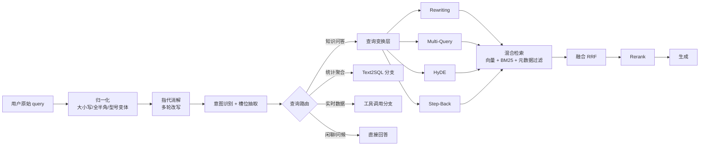
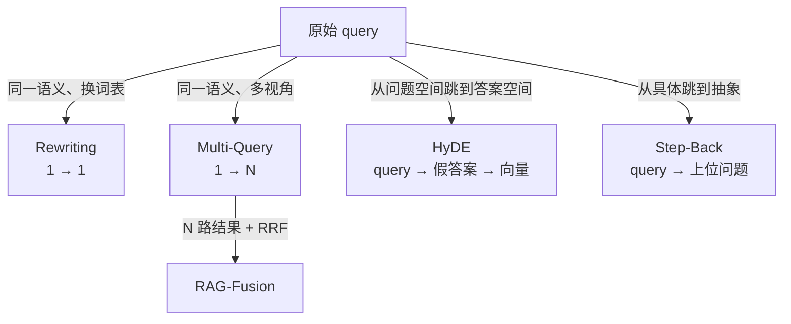
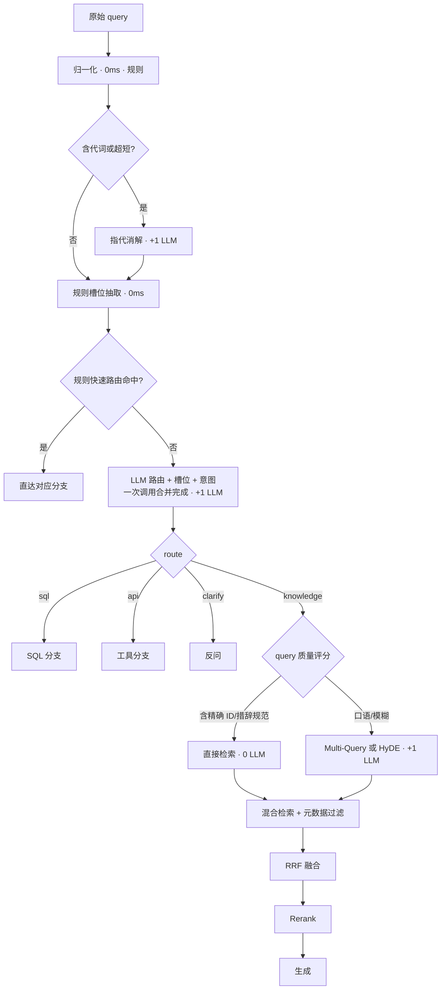

# 第 3.1 章  查询理解与高级检索策略

> **本章目标**：读完能做到 …
> 1. 说出用户 query 失效的 8 大类原因，并能对着自己的日志做一次 bad query 归类统计；
> 2. 独立实现 Query Rewriting / Multi-Query / HyDE / Step-Back / RAG-Fusion 五种查询变换，并用同一套评测集比出优劣；
> 3. 用结构化输出实现一个可上线的查询路由器（Query Router），把问题分发到向量库 / SQL / API / 直答四条路径；
> 4. 实现槽位抽取 + 元数据过滤的精确检索链路，把"型号说错就答错"这类事故压下去；
> 5. 实现多轮对话中的指代消解改写，让"它多少钱"变成可检索的完整 query；
> 6. 拿着成本/收益对照表和决策表，为自己的业务选出正确的策略组合，而不是全都堆上去。
>
> **前置知识**：[02-RAG基础篇](../02-RAG基础篇/)（文档切分、Embedding、向量库、基础检索链路）、[01-大模型基础与技术选型](../01-大模型基础与技术选型/)（LLM 调用与结构化输出）
>
> **预计用时**：阅读 60 分钟 / 动手 150 分钟

---

## 一、为什么需要它（问题出发）

### 1.1 一条真实的线上投诉

华成机电（本书贯穿案例：一家做数控加工中心的制造业企业）的售后知识库上线第三周，客服主管转来一条投诉：

> 客户工程师问："**那个200的报警怎么弄，昨天还好好的**"
> 系统回答："根据《XJ-300 操作手册》第 4.2 节，报警复位需长按 RESET 键 3 秒……"

客户现场是 **XJ-200**，系统答的是 **XJ-300**。两台机器的复位逻辑不一样，现场按照回答操作，触发了一次非计划停机。

复盘的时候我们把这条 query 的检索过程打印出来：

```text
user_query: 那个200的报警怎么弄，昨天还好好的
embedding  -> 向量检索 Top5:
  [0.612] XJ-300 操作手册 / 4.2 报警复位流程
  [0.607] XJ-200 操作手册 / 5.1 日常点检
  [0.589] 售后 FAQ / 设备昨天还能用今天不能用怎么办
  [0.581] XJ-300 操作手册 / 4.3 报警代码表
  [0.577] 通用安全规程 / 第 2 章
```

问题一目了然：

- "200" 这两个字在向量空间里几乎没有区分度，它被 `bge-m3` 编码成一个非常普通的数字 token，和 "300" 的余弦相似度高达 0.9 以上；
- "报警怎么弄" 是口语，知识库里写的是"报警复位流程""故障代码处理"；
- "昨天还好好的" 是纯噪声，但它贡献了大量的 embedding 权重，把第 3 条无关 FAQ 拉了进来。

**这不是向量库的问题，也不是 LLM 的问题，是 query 的问题。**

### 1.2 一个必须先接受的事实

做 RAG 的人容易有一个错觉：以为用户会输入"XJ-200 数控加工中心 E043 报警的处理流程是什么"这种教科书 query。

现实是：**用户的问题从来不是"好 query"**。他们在车间里、戴着手套、在手机上单手打字、一边被主管催。

我们从华成机电上线前两个月的 12,438 条真实 query 里随机抽了 200 条人工标注（标注方法见 [3.5 准确率优化](05-准确率优化-从70到95的工程路径.md)），失效原因分布是这样的（**示例性数据，来自华成机电灰度期人工标注，读者需在自己的日志上复现同样的统计**）：

| 失效类别 | 占比 | 典型表现 |
|---|---:|---|
| 口语化 / 术语不对齐 | 23% | "怎么弄""不转了""咣咣响" |
| 关键实体缺失或残缺 | 19% | 只说"200"不说"XJ-200" |
| 指代（多轮上下文） | 15% | "它""这个""刚才那个" |
| 多意图混在一句 | 11% | "怎么修，另外备件多少钱" |
| 错别字 / 同音字 | 9% | "主轴丞载""伺服趋动器" |
| 中英混写 / 型号变体 | 8% | "spindle 异响""XJ200""xj-200" |
| 需要聚合统计（向量库天然答不了） | 8% | "上个月 E043 出现几次" |
| 过宽 / 开放型 | 7% | "介绍一下你们设备" |

前 6 类（85%）都可以通过**查询理解（Query Understanding）**这一层显著改善——这就是本章要做的事。

### 1.3 20 个真实 bad query 样例与失效原因

下面这张表是本章的"练习靶场"，后面所有策略都会拿它来验证。建议你直接存成 `data/bad_queries.jsonl`。

| # | 原始 query | 失效类别 | 具体失效原因 | 该用什么策略 |
|---:|---|---|---|---|
| 1 | 那个200的报警怎么弄 | 实体残缺 + 口语 | "200" 无法唯一定位到 XJ-200；"怎么弄"与手册措辞不对齐 | 槽位抽取 + 元数据过滤 + 改写 |
| 2 | 它多少钱 | 指代 | 无主语，单看这句话检索空间等于全库 | 指代消解（多轮改写） |
| 3 | 主轴不转了 | 术语不对齐 | 手册中的说法是"主轴无法启动/主轴驱动报警" | Query Rewriting |
| 4 | 咣咣响是啥毛病 | 口语拟声 | "咣咣响"在语料里不存在 | Rewriting + Multi-Query |
| 5 | E043 | 超短 query | 只有 3 个字符，向量几乎无语义；但它是精确 ID | 槽位抽取 → BM25/元数据精确匹配 |
| 6 | 伺服趋动器过热 | 错别字 | "趋动器"→"驱动器"，分词后完全对不上 | 拼写纠错 + 模糊匹配 |
| 7 | xj200和xj300哪个省电 | 型号变体 + 比较型 | 大小写/连字符不统一；且是需要拆解的比较型问题 | 归一化 + [问题分解](03-复杂问题拆解与多跳检索.md) |
| 8 | spindle bearing 怎么换 | 中英混写 | 语料是中文，英文 token 命中率低 | Multi-Query（生成中文变体） |
| 9 | 怎么保养 | 缺主语 | 保养谁？不同机型周期完全不同 | 澄清反问 or 从会话状态补全 |
| 10 | 上个月哪个型号故障最多 | 聚合统计 | 向量检索无法做 count/group by | 路由到 SQL |
| 11 | 我们厂的机器总跳闸，另外备件仓在哪 | 多意图 | 两个意图混在一起，检索结果互相污染 | 意图切分 + 并行检索 |
| 12 | 这个错误码和上次那个一样吗 | 指代 + 比较 | 两个指代都要消解 | 多轮改写 + 分解 |
| 13 | 机器坏了 | 过宽 | 信息量为零 | 澄清反问（Clarification） |
| 14 | 按照新规程还能这么操作吗 | 隐含时间维度 | "新规程"指哪一版？需要版本元数据 | 槽位抽取（版本/日期）+ 过滤 |
| 15 | 润滑油多久换一次啊，我们是三班倒 | 条件型 | "三班倒"是过滤条件，直接拼进 embedding 会稀释主题 | 条件抽取 → 元数据 + 改写 |
| 16 | 液压站压力上不去咋整 | 方言口语 | "咋整"无意义；"上不去"需映射为"压力不足/建压失败" | Rewriting |
| 17 | 报警清了又来 | 隐含因果诉求 | 用户真正想要的是根因分析，不是复位步骤 | Step-Back + 意图识别 |
| 18 | 之前那个工程师说要换轴承，真要换吗 | 对话历史依赖 + 判断型 | 需要结合工单历史与手册判据 | 多轮改写 + 混合检索 |
| 19 | 保养周期 | 关键词式 | 没有机型、没有部件，属于极宽 query | 自查询（Self-Query）+ 澄清 |
| 20 | 昨天那台不行的那个咋办 | 极端指代 | 三个指代（昨天/那台/那个） | 会话状态 + 澄清反问 |

> 复现提示：把你自己的 20 条真实 bad query 替换进去，比抄这张表有价值 10 倍。

---

## 二、原理拆解

### 2.1 查询理解层在 RAG 中的位置



一句话概括：**查询理解层的唯一职责，是把"人话"变成"检索器爱吃的东西"**，同时把不该走检索的请求提前拦掉。

### 2.2 五种查询变换的本质差异

它们看起来都是"用 LLM 改 query"，但改的方向完全不同：



用向量空间的语言来说：

- **Rewriting**：在语义等价的前提下，把 query 向量**平移**到语料的词表分布上；
- **Multi-Query**：在 query 附近**采样多个点**，扩大召回覆盖面（提召回、略降精度）；
- **HyDE**：承认 "问题向量" 和 "答案向量" 不在一个子空间里，干脆先造一个假答案，用**答案向量**去匹配答案；
- **Step-Back**：把过于具体的 query **上移一层**，去捞背景知识/原理性段落；
- **RAG-Fusion**：Multi-Query + 排名融合，用**排名位置**而非分数来投票，规避不同 query 分数不可比的问题。

### 2.3 HyDE 的数学直觉

设 query 为 $q$，正确文档为 $d^+$。向量检索做的是：

$$
\hat{d} = \arg\max_{d \in D} \ \cos\big(E(q),\, E(d)\big)
$$

问题在于，双塔 Embedding 模型训练时虽然拉近了 $E(q)$ 与 $E(d^+)$，但**问题句式**和**文档陈述句式**的分布差异（asymmetric retrieval）依然存在。HyDE 的做法是引入一个生成器 $G$：

$$
\tilde{d} = G(q) \quad\text{（LLM 编造的假设性文档）}
$$
$$
\hat{d} = \arg\max_{d \in D} \ \cos\big(E(\tilde{d}),\, E(d)\big)
$$

由于 $\tilde{d}$ 和 $d^+$ 同为"陈述性文档"，二者在向量空间中的分布更接近，检索退化为**对称检索（symmetric retrieval）**，通常更稳。

实践中更稳健的是把两者加权：

$$
v = \alpha \cdot E(q) + (1-\alpha)\cdot E(\tilde{d}), \quad \alpha \in [0,1]
$$

$\alpha$ 取 0.3~0.5 在华成机电语料上表现最好（**实测环境**：bge-m3 + Milvus 2.4 + 12 万 chunk，评测集 300 条，见 3.2 的调优框架）。

### 2.4 RRF（Reciprocal Rank Fusion）公式

多路召回结果的分数不可比（BM25 分数可以是 15.7，余弦是 0.83），所以用**排名**融合：

$$
\mathrm{RRF}(d) = \sum_{r \in R} \frac{1}{k + \mathrm{rank}_r(d)}
$$

其中 $R$ 是所有召回路（每个改写 query 一路，或向量/BM25 各一路），$\mathrm{rank}_r(d)$ 是文档 $d$ 在第 $r$ 路中的名次（从 1 开始），$k$ 是平滑常数，工业界常用 60。$k$ 的敏感性实验在 [3.2 混合检索与重排序精调](02-混合检索与重排序精调.md) 里做。

---

## 三、动手实战

### 3.0 环境准备

版本严格对齐全书基线（Python 3.11）：

```bash
# 用 uv（推荐）
uv venv -p 3.11 .venv && source .venv/bin/activate
uv pip install \
  "langchain==0.3.7" "langchain-core==0.3.15" "langchain-openai==0.2.5" \
  "langchain-community==0.3.5" "pydantic==2.9.2" \
  "pymilvus==2.4.9" "rank-bm25==0.2.2" "jieba==0.42.1" \
  "FlagEmbedding==1.3.2" "numpy==1.26.4" "pandas==2.2.3" "tqdm==4.66.5"

# pip 等价命令
# pip install langchain==0.3.7 langchain-core==0.3.15 langchain-openai==0.2.5 ...
```

环境变量（本书统一用 DeepSeek 的 OpenAI 兼容接口做在线模型，本地开发也可换 Ollama）：

```bash
export DEEPSEEK_API_KEY="sk-xxxx"
export DEEPSEEK_BASE_URL="https://api.deepseek.com/v1"
```

统一的 LLM 工厂函数，后面所有代码都 import 它：

```python
# file: rag_advanced/llm.py
"""全书统一的 LLM 工厂：在线走 DeepSeek，本地走 Ollama/vLLM 的 OpenAI 兼容端口。"""
from __future__ import annotations

import os
from functools import lru_cache

from langchain_openai import ChatOpenAI


@lru_cache(maxsize=8)
def get_llm(temperature: float = 0.0, model: str | None = None) -> ChatOpenAI:
    """返回一个带缓存的 ChatOpenAI 实例；查询理解类任务一律 temperature=0。"""
    return ChatOpenAI(
        model=model or os.getenv("LLM_MODEL", "deepseek-chat"),
        api_key=os.environ["DEEPSEEK_API_KEY"],
        base_url=os.getenv("DEEPSEEK_BASE_URL", "https://api.deepseek.com/v1"),
        temperature=temperature,
        timeout=30,
        max_retries=2,
    )


@lru_cache(maxsize=2)
def get_fast_llm() -> ChatOpenAI:
    """查询理解层要快，可以挂一个更小的本地模型（vLLM 起 Qwen2.5-1.5B-Instruct）。"""
    return ChatOpenAI(
        model=os.getenv("FAST_LLM_MODEL", "Qwen2.5-1.5B-Instruct"),
        api_key=os.getenv("LOCAL_API_KEY", "EMPTY"),
        base_url=os.getenv("LOCAL_BASE_URL", "http://127.0.0.1:8000/v1"),
        temperature=0.0,
        timeout=10,
        max_retries=1,
    )
```

> 注意：`get_fast_llm()` 需要你本地已经用 vLLM 起了服务。没有本地模型的读者把它改成 `get_llm()` 即可，代码其余部分不用动。

### 3.1 第 0 步：归一化（不要一上来就调 LLM）

80% 的型号变体问题用 20 行正则就解决了，**这一步零延迟零成本，必须放在 LLM 之前**。

```python
# file: rag_advanced/normalize.py
"""query 归一化：全半角、大小写、型号变体、错误码变体。纯规则，无 LLM 调用。"""
from __future__ import annotations

import re
import unicodedata

# 华成机电的型号族：XJ / HC / MT 三个前缀
_MODEL_PATTERN = re.compile(r"\b(xj|hc|mt)\s*[-_ ]?\s*(\d{3,4})\b", re.IGNORECASE)
# 错误码：E043 / e43 / E-043 / 错误043
_ERRCODE_PATTERN = re.compile(r"\b[eE]\s*[-_ ]?\s*(\d{2,4})\b")
_ERRCODE_CN_PATTERN = re.compile(r"(?:报警|错误|故障|代码|alarm)\s*[码号]?\s*[:：]?\s*(\d{2,4})")


def normalize_query(text: str) -> str:
    """把口语化 query 归一化成检索友好的形式，返回归一化后的字符串。"""
    s = unicodedata.normalize("NFKC", text).strip()
    s = re.sub(r"\s+", " ", s)
    s = _MODEL_PATTERN.sub(lambda m: f"{m.group(1).upper()}-{m.group(2)}", s)
    s = _ERRCODE_PATTERN.sub(lambda m: f"E{int(m.group(1)):03d}", s)
    s = _ERRCODE_CN_PATTERN.sub(lambda m: f"故障代码 E{int(m.group(1)):03d}", s)
    return s


if __name__ == "__main__":
    cases = [
        "xj200和xj300哪个省电",
        "ＸＪ－２００ 报警 e43 怎么处理",
        "报警码 107 什么意思",
        "spindle bearing 怎么换",
    ]
    for c in cases:
        print(f"{c!r:45s} -> {normalize_query(c)!r}")
```

预期输出：

```text
'xj200和xj300哪个省电'                        -> 'XJ-200和XJ-300哪个省电'
'ＸＪ－２００ 报警 e43 怎么处理'               -> 'XJ-200 报警 E043 怎么处理'
'报警码 107 什么意思'                         -> '故障代码 E107 什么意思'
'spindle bearing 怎么换'                      -> 'spindle bearing 怎么换'
```

第 4 条没变，说明规则解决不了跨语言问题——那是 Multi-Query 的活。**这就是分层的意义：便宜的手段先上，贵的手段只处理剩下的。**

### 3.2 Query Rewriting：把口语翻译成"手册语"

#### 3.2.1 完整 prompt

写改写 prompt 有三条铁律：

1. **给领域词表**，否则 LLM 会改成它自己认为的通用说法（"主轴不转"→"电机故障"，跑偏）；
2. **禁止编造实体**，尤其禁止把"200"脑补成"XJ-2000"；
3. **要求输出可直接用于检索**，不要输出解释。

```python
# file: rag_advanced/rewrite.py
"""Query Rewriting：把口语化 query 改写成与知识库措辞对齐的检索 query。"""
from __future__ import annotations

from langchain_core.output_parsers import StrOutputParser
from langchain_core.prompts import ChatPromptTemplate

from .llm import get_llm

DOMAIN_GLOSSARY = """\
【领域词表 · 华成机电售后知识库】
- 设备型号：XJ-200 / XJ-300 / XJ-500（数控加工中心），HC-120（卧式镗床），MT-80（磨床）
- 常见部件：主轴（spindle）、主轴轴承、伺服驱动器、液压站、冷却泵、刀库、导轨、编码器
- 手册用语映射（口语 -> 手册）：
  不转了/转不动      -> 无法启动 / 启动失败 / 驱动报警
  咣咣响/异响/嗡嗡    -> 异常噪声 / 振动超标
  漏油              -> 渗漏 / 密封失效
  跳闸              -> 过流保护动作 / 断路器脱扣
  压力上不去        -> 建压失败 / 系统压力不足
  怎么弄/咋整       -> 处理流程 / 排查步骤
  多久换一次        -> 更换周期 / 保养周期
- 文档类型：操作手册、维修手册、保养规程、故障代码表、备件目录、技术通报
"""

REWRITE_PROMPT = ChatPromptTemplate.from_messages([
    ("system", """你是华成机电售后知识库的检索查询改写器。
你的任务：把用户口语化的提问，改写成一条**适合在技术文档中做语义检索**的查询语句。

{glossary}

改写规则（必须严格遵守）：
1. 只做措辞对齐和信息补全，**不得增加用户没有提供的实体**（严禁把"200"猜成"XJ-2000"）。
2. 删除与检索无关的情绪、寒暄、时间闲聊（如"昨天还好好的""急死我了"）。
3. 保留所有已出现的型号、错误码、部件名、数字参数，型号统一写成 XJ-200 这种带连字符的大写形式。
4. 把口语动词替换成词表里的手册用语。
5. 如果用户问题里出现多个意图，只改写**第一个主意图**，其余交给上游拆分。
6. 输出**只有改写后的查询语句本身**，不要任何解释、前缀、引号、markdown。
7. 若原始问题信息量已足够且措辞规范，原样输出。"""),
    ("human", "用户原始提问：{query}"),
])


def rewrite_query(query: str) -> str:
    """把口语化 query 改写为检索 query，失败时回退为原 query。"""
    chain = REWRITE_PROMPT | get_llm(temperature=0.0) | StrOutputParser()
    try:
        out = chain.invoke({"query": query, "glossary": DOMAIN_GLOSSARY}).strip()
        return out or query
    except Exception:
        return query


if __name__ == "__main__":
    for q in ["主轴不转了", "液压站压力上不去咋整", "那个200的报警怎么弄，昨天还好好的",
              "润滑油多久换一次啊，我们是三班倒"]:
        print(f"{q}\n  -> {rewrite_query(q)}\n")
```

预期输出（模型为 deepseek-chat，temperature=0；**不同模型版本措辞会有差异**）：

```text
主轴不转了
  -> 主轴无法启动 / 主轴驱动报警的原因与排查步骤

液压站压力上不去咋整
  -> 液压站系统压力不足 / 建压失败的排查步骤

那个200的报警怎么弄，昨天还好好的
  -> XJ-200 报警的处理流程与排查步骤

润滑油多久换一次啊，我们是三班倒
  -> 润滑油更换周期（三班制连续运行工况）
```

注意第 3 条：LLM 把"200"补成了 XJ-200。这是**规则允许的补全**（词表里 200 只对应 XJ-200），但如果你的型号族里有 XJ-200 和 HC-200，就必须禁止这种补全，改走"澄清反问"。

#### 3.2.2 改写前后命中率对比实验设计

不要凭感觉说"改写有效"。实验设计如下：

```python
# file: rag_advanced/exp_rewrite.py
"""改写前后检索命中率对比实验：同一评测集、同一检索器、只切换是否改写。"""
from __future__ import annotations

import json
from dataclasses import dataclass
from typing import Callable

from .rewrite import rewrite_query


@dataclass
class EvalCase:
    """一条评测样本：query + 金标 chunk id 列表。"""
    query: str
    gold_chunk_ids: list[str]


def load_eval_set(path: str) -> list[EvalCase]:
    """从 jsonl 读取评测集，每行 {"query": ..., "gold_chunk_ids": [...]}"""
    cases = []
    with open(path, "r", encoding="utf-8") as f:
        for line in f:
            obj = json.loads(line)
            cases.append(EvalCase(obj["query"], obj["gold_chunk_ids"]))
    return cases


def hit_rate_at_k(
    cases: list[EvalCase],
    retrieve: Callable[[str, int], list[str]],
    k: int = 5,
    transform: Callable[[str], str] | None = None,
) -> dict:
    """计算 HitRate@k 与 Recall@k；transform 为 None 表示不做任何查询变换。"""
    hits, recalls = 0, []
    for c in cases:
        q = transform(c.query) if transform else c.query
        got = retrieve(q, k)
        inter = set(got) & set(c.gold_chunk_ids)
        hits += 1 if inter else 0
        recalls.append(len(inter) / max(1, len(c.gold_chunk_ids)))
    n = len(cases)
    return {
        "n": n,
        f"HitRate@{k}": round(hits / n, 4),
        f"Recall@{k}": round(sum(recalls) / n, 4),
    }


def run_ab(cases: list[EvalCase], retrieve, k: int = 5) -> None:
    """跑 A/B：baseline（原 query）vs rewrite（改写后 query），打印对比表。"""
    base = hit_rate_at_k(cases, retrieve, k, transform=None)
    rew = hit_rate_at_k(cases, retrieve, k, transform=rewrite_query)
    print(f"{'策略':<12}{'HitRate@%d' % k:>14}{'Recall@%d' % k:>14}")
    print(f"{'baseline':<12}{base[f'HitRate@{k}']:>14.4f}{base[f'Recall@{k}']:>14.4f}")
    print(f"{'rewrite':<12}{rew[f'HitRate@{k}']:>14.4f}{rew[f'Recall@{k}']:>14.4f}")
    delta = rew[f"Recall@{k}"] - base[f"Recall@{k}"]
    print(f"\nRecall@{k} 绝对提升：{delta:+.4f}"
          f"（相对提升 {delta / max(1e-9, base[f'Recall@{k}']) * 100:+.1f}%）")
```

**实验的四条纪律**：

1. 评测集至少 200 条，且必须包含 bad query（否则改写显不出价值，甚至是负收益）；
2. 检索器、Top-K、embedding 模型全部锁死，只切换 `transform`；
3. LLM 改写用 `temperature=0`，并把改写结果缓存下来，保证可复现；
4. 报告里必须写清"实测环境"，例如：

> **实测环境**：bge-m3（dense）+ Milvus 2.4 单机 HNSW(M=16, ef=64)，语料 12 万 chunk，评测集 300 条（其中 bad query 120 条），改写模型 deepseek-chat。结论仅在本环境成立，读者需自行复现。

### 3.3 Multi-Query：一个问题生成 N 个视角

改写是 1→1，会有"赌错方向"的风险。Multi-Query 是 1→N，用覆盖面换稳健性。

```python
# file: rag_advanced/multi_query.py
"""Multi-Query：为一个问题生成多个检索视角，并行检索后用 RRF 融合。"""
from __future__ import annotations

import asyncio
from typing import Callable, Sequence

from langchain_core.prompts import ChatPromptTemplate
from pydantic import BaseModel, Field

from .llm import get_llm
from .rewrite import DOMAIN_GLOSSARY


class MultiQuery(BaseModel):
    """Multi-Query 的结构化输出。"""
    queries: list[str] = Field(description="3~5 条不同视角的检索查询，每条可独立检索")


MULTI_QUERY_PROMPT = ChatPromptTemplate.from_messages([
    ("system", """你是检索查询扩展器。给定一个用户问题，生成 4 条**不同视角**的检索查询。

{glossary}

四个视角必须分别覆盖：
1. 【现象视角】用户描述的故障现象（用手册术语重写）
2. 【原因视角】可能的根本原因/失效模式
3. 【操作视角】对应的处理步骤/维修流程/更换方法
4. 【规格视角】相关的参数、规格、周期、代码表

约束：
- 每条查询必须保留原问题中出现的型号、错误码、部件名。
- 不得编造原问题中不存在的型号或错误码。
- 每条 10~30 字，是陈述性检索短语，不要写成问句。"""),
    ("human", "用户问题：{query}"),
])


def gen_multi_queries(query: str, n_fallback: int = 1) -> list[str]:
    """生成多视角查询列表，始终把原 query 放在第一位。"""
    llm = get_llm(temperature=0.0).with_structured_output(MultiQuery)
    chain = MULTI_QUERY_PROMPT | llm
    try:
        out: MultiQuery = chain.invoke({"query": query, "glossary": DOMAIN_GLOSSARY})
        qs = [q.strip() for q in out.queries if q.strip()]
    except Exception:
        qs = []
    return [query] + qs[: max(0, 8 - n_fallback)]


def reciprocal_rank_fusion(
    ranked_lists: Sequence[Sequence[str]], k: int = 60, top_n: int = 10
) -> list[tuple[str, float]]:
    """RRF 融合多路排名列表，返回 [(doc_id, score)] 降序。"""
    scores: dict[str, float] = {}
    for lst in ranked_lists:
        for rank, doc_id in enumerate(lst, start=1):
            scores[doc_id] = scores.get(doc_id, 0.0) + 1.0 / (k + rank)
    return sorted(scores.items(), key=lambda x: -x[1])[:top_n]


async def multi_query_retrieve(
    query: str,
    aretrieve: Callable[[str, int], "asyncio.Future[list[str]]"],
    per_query_k: int = 10,
    top_n: int = 10,
) -> list[tuple[str, float]]:
    """并行执行多路检索并 RRF 融合；aretrieve 是异步检索函数。"""
    queries = gen_multi_queries(query)
    results = await asyncio.gather(*[aretrieve(q, per_query_k) for q in queries])
    return reciprocal_rank_fusion(results, k=60, top_n=top_n)
```

用 `bad query #4`（"咣咣响是啥毛病"）跑一遍，生成结果示例：

```text
原始：咣咣响是啥毛病
  [1] 设备运行时出现异常噪声 振动超标 现象描述
  [2] 异常噪声常见根本原因 轴承磨损 齿轮啮合不良 地脚松动
  [3] 异常噪声排查步骤 听诊 振动测量 停机检查流程
  [4] 振动值标准 噪声限值 允许范围 技术参数
```

**注意**：这 4 条都没有型号，因为原 query 里就没有——这是正确行为。补型号是槽位/会话层的事。

### 3.4 RAG-Fusion = Multi-Query + RRF

上面 `multi_query_retrieve` 其实已经是 RAG-Fusion 了。把它包装成一个可直接用的类：

```python
# file: rag_advanced/rag_fusion.py
"""RAG-Fusion：多视角查询 + 并行检索 + RRF 融合 + 可选 rerank。"""
from __future__ import annotations

import asyncio
from dataclasses import dataclass, field
from typing import Any, Callable

from .multi_query import gen_multi_queries, reciprocal_rank_fusion


@dataclass
class FusionResult:
    """RAG-Fusion 的返回结构，带完整可观测信息。"""
    final_docs: list[dict[str, Any]]
    sub_queries: list[str]
    per_query_hits: dict[str, list[str]] = field(default_factory=dict)
    fused_scores: dict[str, float] = field(default_factory=dict)


class RAGFusion:
    """RAG-Fusion 检索器：传入一个异步检索函数即可使用。"""

    def __init__(self, aretrieve, doc_loader, rrf_k: int = 60,
                 per_query_k: int = 10, top_n: int = 8):
        self.aretrieve = aretrieve
        self.doc_loader = doc_loader
        self.rrf_k = rrf_k
        self.per_query_k = per_query_k
        self.top_n = top_n

    async def aretrieve_fused(self, query: str) -> FusionResult:
        """执行 RAG-Fusion 全流程，返回融合结果与全部中间产物。"""
        sub_queries = gen_multi_queries(query)
        lists = await asyncio.gather(
            *[self.aretrieve(q, self.per_query_k) for q in sub_queries]
        )
        per_query = {q: ids for q, ids in zip(sub_queries, lists)}
        fused = reciprocal_rank_fusion(lists, k=self.rrf_k, top_n=self.top_n)
        docs = self.doc_loader([doc_id for doc_id, _ in fused])
        return FusionResult(
            final_docs=docs,
            sub_queries=sub_queries,
            per_query_hits=per_query,
            fused_scores=dict(fused),
        )
```

> 工程提示：`per_query_hits` 这个字段在排障时价值极高——你能一眼看出"是哪一路把错误文档捞上来的"。**不要为了省几行代码把中间产物丢掉。**

### 3.5 HyDE：先编一个答案，再拿答案去检索

```python
# file: rag_advanced/hyde.py
"""HyDE：用 LLM 生成假设性文档，再用其向量检索；支持与原 query 向量加权混合。"""
from __future__ import annotations

import numpy as np
from langchain_core.output_parsers import StrOutputParser
from langchain_core.prompts import ChatPromptTemplate

from .llm import get_llm
from .rewrite import DOMAIN_GLOSSARY

HYDE_PROMPT = ChatPromptTemplate.from_messages([
    ("system", """你是华成机电的资深售后工程师，正在编写《维修手册》的一个段落。

{glossary}

给定一个现场问题，请写出**这段手册内容看起来应该长什么样**：
- 用技术手册的陈述语气，不要用问答体，不要说"根据您的问题"。
- 200 字以内，包含：现象描述、可能原因、处理步骤要点。
- 允许写出具体的参数、工具、步骤序号，**即使你不确定真实数值也照写**（这段文本只用于检索，不会展示给用户）。
- 严禁输出"我不知道""建议联系厂家"这类空话。
- 只输出段落正文。"""),
    ("human", "现场问题：{query}"),
])


def gen_hypothetical_doc(query: str) -> str:
    """生成假设性文档（HyDE 的核心一步）。"""
    chain = HYDE_PROMPT | get_llm(temperature=0.3) | StrOutputParser()
    return chain.invoke({"query": query, "glossary": DOMAIN_GLOSSARY}).strip()


def hyde_embedding(query: str, embed_fn, alpha: float = 0.4) -> np.ndarray:
    """返回 alpha*E(query) + (1-alpha)*E(hyde_doc) 的归一化混合向量。"""
    hyde_doc = gen_hypothetical_doc(query)
    v_q = np.asarray(embed_fn(query), dtype=np.float32)
    v_h = np.asarray(embed_fn(hyde_doc), dtype=np.float32)
    v_q /= (np.linalg.norm(v_q) + 1e-9)
    v_h /= (np.linalg.norm(v_h) + 1e-9)
    v = alpha * v_q + (1 - alpha) * v_h
    return v / (np.linalg.norm(v) + 1e-9)


def hyde_multi_embedding(query: str, embed_fn, n: int = 3, alpha: float = 0.4) -> np.ndarray:
    """生成 n 个假设文档取平均，降低单次生成跑偏的方差（论文原版做法）。"""
    vs = []
    for _ in range(n):
        d = gen_hypothetical_doc(query)
        v = np.asarray(embed_fn(d), dtype=np.float32)
        vs.append(v / (np.linalg.norm(v) + 1e-9))
    v_h = np.mean(vs, axis=0)
    v_q = np.asarray(embed_fn(query), dtype=np.float32)
    v_q /= (np.linalg.norm(v_q) + 1e-9)
    v = alpha * v_q + (1 - alpha) * v_h
    return v / (np.linalg.norm(v) + 1e-9)
```

对 `"主轴不转了"` 生成的假设性文档示例：

```text
主轴无法启动是数控加工中心常见故障之一。典型现象为按下主轴启动键后主轴无响应，
或伺服驱动器面板显示报警代码。可能原因包括：(1) 主轴使能信号未接通，安全门/急停
回路未复位；(2) 伺服驱动器过流或过热保护动作；(3) 主轴电机动力线接触不良或编码
器反馈丢失；(4) 主轴轴承抱死导致堵转。处理步骤：1. 检查急停与安全门开关状态，
复位后重试；2. 读取驱动器报警代码并对照故障代码表；3. 断电后用手盘动主轴，确认
机械是否卡滞；4. 测量动力线绝缘与编码器反馈信号。
```

这段话里的"安全门回路""编码器反馈丢失""盘动主轴"等词，正是华成机电维修手册里真实出现的词——**这就是 HyDE 起作用的机制：它不是在猜答案，是在猜"答案的用词分布"**。

#### HyDE 什么时候有效，什么时候有害

| 场景 | HyDE 效果 | 原因 |
|---|---|---|
| 口语化、术语不对齐的故障描述 | ✅ 显著有效 | 正好补齐词表差异 |
| 开放型"介绍一下 X 的原理" | ✅ 有效 | 假文档能覆盖大量相关术语 |
| **含精确 ID 的 query（E043、订单号、零件号）** | ❌ **有害** | LLM 会围绕编号编造无关内容，稀释精确信号 |
| 比较型/聚合型问题 | ❌ 无效 | 问题本身不是"一段文档"能回答的 |
| 强时效性（"最新一版规程"） | ❌ 有害 | LLM 假文档带的是旧知识，把检索拉向旧文档 |
| 语料极小（< 1000 chunk） | ⚠️ 收益低 | 本来召回就够，白付 1 次 LLM 调用 |

**工程结论**：HyDE 必须做**条件触发**——命中错误码/型号/编号正则时直接跳过 HyDE。代码见 3.11 的流水线。

### 3.6 Step-Back Prompting：先退一步，问更一般的问题

用户问"XJ-200 在 3 号产线上加工 45# 钢时主轴温升到 68 度正常吗"，知识库里不会有这么具体的段落。Step-Back 先把它抽象成"XJ-200 主轴温升的允许范围是多少"，把原理性段落捞回来。

```python
# file: rag_advanced/step_back.py
"""Step-Back Prompting：把过于具体的问题抽象成上位问题，检索背景知识。"""
from __future__ import annotations

from langchain_core.prompts import ChatPromptTemplate
from pydantic import BaseModel, Field

from .llm import get_llm
from .rewrite import DOMAIN_GLOSSARY


class StepBackOutput(BaseModel):
    """Step-Back 的结构化输出。"""
    step_back_question: str = Field(description="更一般、更抽象的上位问题")
    reason: str = Field(description="为什么这样抽象，一句话")


STEP_BACK_PROMPT = ChatPromptTemplate.from_messages([
    ("system", """你是检索策略专家。用户的问题往往非常具体（带具体工况、具体数值、具体现场），
知识库里通常没有一模一样的段落，但一定有描述**一般原理/一般规格/一般流程**的段落。

{glossary}

你的任务：把用户的具体问题，抽象成一个**更一般的上位问题**，用于检索背景知识。

抽象的方向（选最合适的一个）：
- 具体数值 -> 该参数的标准范围/判据
- 具体工况 -> 该类工况的通用原则
- 具体故障现象 -> 该部件的故障模式总览
- 具体操作 -> 该操作的标准流程

保留原问题中的**设备型号与部件名**（这是过滤条件，不能抽象掉）。

few-shot 示例：
Q: XJ-200 在 3 号产线加工 45# 钢时主轴温升到 68 度正常吗
A: XJ-200 主轴温升的正常范围与超温判据是多少

Q: 我们这台 XJ-300 换了国产轴承以后 3 个月就异响了，是不是轴承质量问题
A: XJ-300 主轴轴承的选型要求与早期失效的常见原因有哪些

Q: E043 报警按了复位又跳出来怎么办
A: E043 故障代码的含义、根本原因与彻底排除方法"""),
    ("human", "用户问题：{query}"),
])


def step_back(query: str) -> StepBackOutput:
    """生成上位问题；失败时回退为原问题。"""
    llm = get_llm(temperature=0.0).with_structured_output(StepBackOutput)
    try:
        return (STEP_BACK_PROMPT | llm).invoke(
            {"query": query, "glossary": DOMAIN_GLOSSARY}
        )
    except Exception:
        return StepBackOutput(step_back_question=query, reason="fallback")
```

**Step-Back 的正确用法不是替换原 query，而是"两路都检索"**：

```python
def step_back_retrieve(query: str, retrieve, k: int = 6) -> list[str]:
    """原 query 与上位问题各检索一路，RRF 融合，兼顾具体与一般。"""
    from .multi_query import reciprocal_rank_fusion
    sb = step_back(query)
    a = retrieve(query, k)
    b = retrieve(sb.step_back_question, k)
    fused = reciprocal_rank_fusion([a, b], k=60, top_n=k)
    return [doc_id for doc_id, _ in fused]
```

只用上位问题会丢掉"3 号产线""45# 钢"这些细节所对应的工艺文档，是典型的过度抽象翻车。

### 3.7 查询路由 Query Router：这题该问谁

这是整个查询理解层**最有工程价值**的组件。没有它，你会看到系统拿着向量库去回答"上个月故障几次"，然后一本正经地编一个数字。

```python
# file: rag_advanced/router.py
"""查询路由器：把用户问题分发到 向量知识库 / SQL / 外部 API / 直接回答 / 澄清 五条路径。"""
from __future__ import annotations

from enum import Enum

from langchain_core.prompts import ChatPromptTemplate
from pydantic import BaseModel, Field

from .llm import get_llm


class Route(str, Enum):
    """路由目的地枚举。"""
    KNOWLEDGE = "knowledge"       # 文档知识库（手册、规程、FAQ）
    SQL = "sql"                   # 工单/故障统计数据库
    API = "api"                   # 实时数据：设备状态、备件库存、物流
    SMALLTALK = "smalltalk"       # 问候、感谢、闲聊
    CLARIFY = "clarify"           # 信息不足，需要反问
    REJECT = "reject"             # 越权/敏感/超出业务范围


class RouteDecision(BaseModel):
    """路由决策的结构化输出。"""
    route: Route = Field(description="路由目的地")
    confidence: float = Field(description="置信度 0~1", ge=0.0, le=1.0)
    reason: str = Field(description="一句话理由")
    clarify_question: str | None = Field(
        default=None, description="route=clarify 时，要反问用户的问题"
    )


ROUTER_PROMPT = ChatPromptTemplate.from_messages([
    ("system", """你是华成机电售后智能助手的查询路由器。判断用户问题应该走哪条处理路径。

可选路径：
- knowledge：答案写在技术文档里（操作手册、维修手册、保养规程、故障代码表、备件目录）。
  例：怎么复位、保养周期、E043 什么意思、轴承怎么拆、扭矩多少。
- sql：需要对工单/故障记录做统计、排序、计数、时间范围筛选。
  例：上个月哪个型号报修最多、华东区 E043 出现几次、平均修复时长。
- api：需要实时数据，文档里不可能有。
  例：3 号机现在什么状态、这个备件还有库存吗、我的工单到哪一步了。
- smalltalk：问候、感谢、无意义输入。
- clarify：意图明确但**关键信息缺失**，缺了就一定会答错（最常见：缺设备型号）。
  例："怎么保养"（保养谁？）、"它多少钱"（无上下文时）。
- reject：索要内部价格底线、他人隐私、与业务无关的请求。

判断要点：
1. 出现"多少次/最多/平均/排名/上个月/本季度/同比"等统计词 -> 大概率 sql。
2. 出现"现在/当前/还有没有/到哪了/库存"等实时词 -> 大概率 api。
3. 问"是什么/怎么办/怎么做/周期/参数/代码含义" -> knowledge。
4. 只有当**缺少型号会导致答案错误**时才用 clarify；如果问题本身与型号无关（如通用安全规程），不要 clarify。
5. 置信度低于 0.6 时，优先选 knowledge（保守策略，知识库答错的代价小于乱走 SQL）。

few-shot：
Q: XJ-200 主轴轴承更换周期是多久 -> knowledge (0.95)
Q: 上个月哪条产线故障最多 -> sql (0.93)
Q: 2 号机现在在跑吗 -> api (0.90)
Q: 怎么保养 -> clarify (0.85)，反问"请问是哪个型号的设备？（XJ-200 / XJ-300 / XJ-500 / HC-120 / MT-80）"
Q: 谢谢啊 -> smalltalk (0.99)
Q: 你们这台机器成本价多少，别跟我报牌价 -> reject (0.88)
Q: E043 是什么意思 -> knowledge (0.96)
Q: 华东区去年 E043 一共出现了多少次 -> sql (0.94)"""),
    ("human", "用户问题：{query}\n\n（可用上下文摘要：{context}）"),
])


def route_query(query: str, context: str = "无") -> RouteDecision:
    """执行路由决策；异常时保守回退到 knowledge。"""
    llm = get_llm(temperature=0.0).with_structured_output(RouteDecision)
    try:
        return (ROUTER_PROMPT | llm).invoke({"query": query, "context": context})
    except Exception as e:
        return RouteDecision(route=Route.KNOWLEDGE, confidence=0.0,
                             reason=f"router failed, fallback: {e}")
```

配一个**规则前置的快速路由**，把明显的情况在 0 延迟内解决掉：

```python
# file: rag_advanced/router_fast.py
"""规则快速路由：命中则直接返回，未命中再交给 LLM 路由器（省一次 LLM 调用）。"""
from __future__ import annotations

import re

from .router import Route, RouteDecision

_SQL_HINT = re.compile(r"(多少次|几次|最多|最少|排名|排行|平均|总共|统计|同比|环比|占比|"
                       r"上个月|本月|上季度|本季度|去年|今年|近\d+天)")
_API_HINT = re.compile(r"(现在|当前|实时|还有没有|有没有货|库存|到哪了|进度|在跑吗|开机没)")
_SMALLTALK = re.compile(r"^(你好|您好|hi|hello|在吗|谢谢|多谢|辛苦了|再见|拜拜)[!！。.~ ]*$", re.I)


def fast_route(query: str) -> RouteDecision | None:
    """规则命中返回决策，否则返回 None 表示交给 LLM 判断。"""
    q = query.strip()
    if _SMALLTALK.match(q):
        return RouteDecision(route=Route.SMALLTALK, confidence=0.99, reason="规则:寒暄")
    if len(q) <= 2:
        return RouteDecision(route=Route.CLARIFY, confidence=0.9, reason="规则:输入过短",
                             clarify_question="能再具体描述一下遇到的问题吗？比如设备型号和现象。")
    if _SQL_HINT.search(q) and not re.search(r"(怎么|如何|步骤|流程)", q):
        return RouteDecision(route=Route.SQL, confidence=0.85, reason="规则:统计词")
    if _API_HINT.search(q):
        return RouteDecision(route=Route.API, confidence=0.82, reason="规则:实时词")
    return None
```

> **生产经验**：规则路由在华成机电线上承担了约 35% 的请求（**示例性数据**，取决于你的流量结构），这部分请求完全不产生 LLM 路由开销。这是 [3.4 性能优化](04-性能突围-延迟优化10倍实战.md) 里"砍掉不必要的 LLM 前置调用"的具体落地。

### 3.8 意图识别与槽位抽取：精确检索的关键

这一节是**本章最能直接提升准确率的部分**。核心思想：把 query 里的型号、错误码、部件、时间范围抽出来，**变成元数据过滤条件**，而不是让它们在向量空间里"碰运气"。

```python
# file: rag_advanced/slots.py
"""意图识别 + 槽位抽取：抽出型号/错误码/部件/时间范围/文档类型，用于元数据过滤。"""
from __future__ import annotations

import re
from datetime import date, timedelta
from enum import Enum

from langchain_core.prompts import ChatPromptTemplate
from pydantic import BaseModel, Field

from .llm import get_llm

KNOWN_MODELS = ["XJ-200", "XJ-300", "XJ-500", "HC-120", "MT-80"]
KNOWN_PARTS = ["主轴", "主轴轴承", "伺服驱动器", "液压站", "冷却泵", "刀库",
               "导轨", "编码器", "丝杠", "润滑泵", "电气柜"]


class Intent(str, Enum):
    """业务意图枚举（华成机电售后场景）。"""
    FAULT_DIAGNOSIS = "fault_diagnosis"     # 故障诊断
    MAINTENANCE = "maintenance"             # 保养/点检
    OPERATION = "operation"                 # 操作方法
    SPEC_LOOKUP = "spec_lookup"             # 参数/规格查询
    PART_INFO = "part_info"                 # 备件信息/价格/货期
    WARRANTY = "warranty"                   # 保修政策
    OTHER = "other"


class Slots(BaseModel):
    """从 query 中抽取的结构化槽位。"""
    intent: Intent = Field(description="业务意图")
    models: list[str] = Field(default_factory=list, description="设备型号，必须是已知型号之一")
    error_codes: list[str] = Field(default_factory=list, description="故障代码，形如 E043")
    parts: list[str] = Field(default_factory=list, description="涉及的部件名")
    time_expr: str | None = Field(default=None, description="原文中的时间表达，如'上个月'")
    doc_types: list[str] = Field(default_factory=list,
                                 description="期望的文档类型：操作手册/维修手册/保养规程/故障代码表/备件目录")
    is_multi_intent: bool = Field(default=False, description="是否包含多个独立意图")


SLOT_PROMPT = ChatPromptTemplate.from_messages([
    ("system", """你是槽位抽取器。从用户问题中抽取结构化信息，用于精确检索的元数据过滤。

已知设备型号（**只能从这个列表里选，不得编造**）：{models}
已知部件名（可扩展，但优先用列表里的）：{parts}

抽取规则：
1. 型号：用户写 "200"、"xj200"、"ＸＪ-200" 都归一化为 "XJ-200"。
   **如果只有数字且能唯一对应一个已知型号，才可以归一化；无法唯一确定时留空。**
2. 错误码：统一为 E + 三位数字，如 "报警43" -> "E043"。
3. 时间表达：原样保留用户说法（"上个月"），不要自己算成日期。
4. doc_types：根据意图推断，如"怎么操作"->操作手册，"多久保养"->保养规程。
5. 什么都没有就返回空列表，**绝对不要为了填满字段而编造**。"""),
    ("human", "用户问题：{query}"),
])


def extract_slots_llm(query: str) -> Slots:
    """用 LLM 抽取槽位。"""
    llm = get_llm(temperature=0.0).with_structured_output(Slots)
    try:
        return (SLOT_PROMPT | llm).invoke({
            "query": query,
            "models": ", ".join(KNOWN_MODELS),
            "parts": ", ".join(KNOWN_PARTS),
        })
    except Exception:
        return Slots(intent=Intent.OTHER)


def extract_slots_rule(query: str) -> Slots:
    """纯规则槽位抽取：零成本零延迟，作为 LLM 抽取的前置与校验基线。"""
    from .normalize import normalize_query
    q = normalize_query(query)
    models = [m for m in KNOWN_MODELS if m in q]
    codes = sorted(set(re.findall(r"E\d{3}", q)))
    parts = [p for p in KNOWN_PARTS if p in q]
    intent = Intent.OTHER
    if re.search(r"(报警|故障|异响|不转|坏了|停机|跳闸|漏油|过热)", q):
        intent = Intent.FAULT_DIAGNOSIS
    elif re.search(r"(保养|点检|润滑|更换周期|多久换)", q):
        intent = Intent.MAINTENANCE
    elif re.search(r"(怎么操作|如何使用|开机|对刀|编程)", q):
        intent = Intent.OPERATION
    elif re.search(r"(参数|规格|扭矩|转速|精度|温升|范围)", q):
        intent = Intent.SPEC_LOOKUP
    elif re.search(r"(备件|价格|多少钱|货期|库存|零件号)", q):
        intent = Intent.PART_INFO
    return Slots(intent=intent, models=models, error_codes=codes, parts=parts)


def merge_slots(rule: Slots, llm: Slots) -> Slots:
    """合并规则与 LLM 抽取结果：规则优先（高精度），LLM 补充（高召回），型号做白名单校验。"""
    models = list(dict.fromkeys(rule.models + [m for m in llm.models if m in KNOWN_MODELS]))
    codes = list(dict.fromkeys(rule.error_codes + llm.error_codes))
    parts = list(dict.fromkeys(rule.parts + llm.parts))
    return Slots(
        intent=llm.intent if rule.intent == Intent.OTHER else rule.intent,
        models=models, error_codes=codes, parts=parts,
        time_expr=llm.time_expr, doc_types=llm.doc_types,
        is_multi_intent=llm.is_multi_intent,
    )
```

把槽位翻译成 Milvus 的过滤表达式：

```python
# file: rag_advanced/filters.py
"""把槽位翻译成向量库过滤表达式（Milvus expr 语法）。"""
from __future__ import annotations

from datetime import date, timedelta

from .slots import Slots


def parse_time_expr(expr: str | None, today: date | None = None) -> tuple[str, str] | None:
    """把中文时间表达解析成 (start, end) 的 ISO 日期字符串，解析不了返回 None。"""
    if not expr:
        return None
    today = today or date.today()
    first_this_month = today.replace(day=1)
    if "上个月" in expr or "上月" in expr:
        end = first_this_month - timedelta(days=1)
        return (end.replace(day=1).isoformat(), end.isoformat())
    if "本月" in expr or "这个月" in expr:
        return (first_this_month.isoformat(), today.isoformat())
    if "去年" in expr:
        y = today.year - 1
        return (date(y, 1, 1).isoformat(), date(y, 12, 31).isoformat())
    if "今年" in expr:
        return (date(today.year, 1, 1).isoformat(), today.isoformat())
    if "本季度" in expr:
        q0 = date(today.year, 3 * ((today.month - 1) // 3) + 1, 1)
        return (q0.isoformat(), today.isoformat())
    if "上季度" in expr:
        q0 = date(today.year, 3 * ((today.month - 1) // 3) + 1, 1)
        prev_end = q0 - timedelta(days=1)
        prev_start = date(prev_end.year, 3 * ((prev_end.month - 1) // 3) + 1, 1)
        return (prev_start.isoformat(), prev_end.isoformat())
    return None


def slots_to_milvus_expr(slots: Slots, strict_model: bool = True) -> str:
    """生成 Milvus 的 boolean expression；返回空串表示不过滤。"""
    conds: list[str] = []
    if slots.models:
        vals = ", ".join(f'"{m}"' for m in slots.models)
        conds.append(f"model in [{vals}]" if strict_model
                     else f'(model in [{vals}] or model == "COMMON")')
    if slots.error_codes:
        vals = ", ".join(f'"{c}"' for c in slots.error_codes)
        conds.append(f"array_contains_any(error_codes, [{vals}])")
    if slots.doc_types:
        vals = ", ".join(f'"{d}"' for d in slots.doc_types)
        conds.append(f"doc_type in [{vals}]")
    rng = parse_time_expr(slots.time_expr)
    if rng:
        conds.append(f'pub_date >= "{rng[0]}" and pub_date <= "{rng[1]}"')
    return " and ".join(conds)
```

`strict_model=False` 这个开关非常重要：很多通用文档（安全规程、通用保养原则）的 `model` 字段是 `COMMON`，严格过滤会把它们全部排除。**建议默认 `False`，只在"型号强相关意图"（故障诊断、参数查询）时置 `True`。**

来看效果对比（**实测环境**：Milvus 2.4 单机，12 万 chunk，bge-m3 dense，Top-5）：

```text
query: XJ-200 主轴异响怎么排查

[无过滤]
  [0.641] XJ-300 维修手册/主轴异响排查      <- 错误型号，但语义最像
  [0.633] XJ-200 维修手册/主轴异响排查      <- 正确
  [0.628] XJ-500 维修手册/主轴异响排查
  [0.611] HC-120 维修手册/主轴噪声
  [0.604] 通用/旋转部件异响通论

[过滤 model in ["XJ-200","COMMON"]]
  [0.633] XJ-200 维修手册/主轴异响排查      <- 正确，升到第 1
  [0.604] 通用/旋转部件异响通论
  [0.588] XJ-200 维修手册/主轴轴承更换
  [0.571] XJ-200 保养规程/主轴日常点检
  [0.552] 通用/振动测量方法
```

**这就是开头那个线上事故的正解**：不是把 embedding 换成更强的模型，而是把型号从"语义"降级成"过滤条件"。

### 3.9 指代消解与多轮改写

```python
# file: rag_advanced/coref.py
"""多轮对话的指代消解与 query 改写：把'它多少钱'补全成可独立检索的 query。"""
from __future__ import annotations

from collections import deque
from dataclasses import dataclass, field

from langchain_core.output_parsers import StrOutputParser
from langchain_core.prompts import ChatPromptTemplate

from .llm import get_llm


@dataclass
class Turn:
    """一轮对话。"""
    user: str
    assistant: str = ""


@dataclass
class SessionState:
    """会话状态：滚动历史 + 粘性实体（sticky entities）。"""
    turns: deque[Turn] = field(default_factory=lambda: deque(maxlen=6))
    sticky_model: str | None = None
    sticky_part: str | None = None
    sticky_error_code: str | None = None

    def add(self, turn: Turn) -> None:
        """追加一轮对话。"""
        self.turns.append(turn)

    def update_sticky(self, slots) -> None:
        """用最新槽位更新粘性实体：新值覆盖旧值，无新值则保持。"""
        if slots.models:
            self.sticky_model = slots.models[0]
        if slots.parts:
            self.sticky_part = slots.parts[0]
        if slots.error_codes:
            self.sticky_error_code = slots.error_codes[0]

    def history_text(self, max_turns: int = 3) -> str:
        """把最近 N 轮渲染成文本，用于 prompt。"""
        items = list(self.turns)[-max_turns:]
        return "\n".join(
            f"用户：{t.user}\n助手：{(t.assistant or '')[:200]}" for t in items
        ) or "（无历史）"

    def sticky_text(self) -> str:
        """渲染粘性实体。"""
        parts = []
        if self.sticky_model:
            parts.append(f"当前讨论的设备型号={self.sticky_model}")
        if self.sticky_part:
            parts.append(f"当前讨论的部件={self.sticky_part}")
        if self.sticky_error_code:
            parts.append(f"当前讨论的故障代码={self.sticky_error_code}")
        return "；".join(parts) or "（无）"


COREF_PROMPT = ChatPromptTemplate.from_messages([
    ("system", """你是多轮对话的 query 改写器。把用户的最新一句话，改写成**脱离上下文也能独立检索**的完整查询。

改写规则：
1. 把"它/这个/那个/刚才那个/上面说的"替换成历史中明确提到的实体。
2. 如果最新一句已经是完整独立的问题（自带型号/部件），**原样输出，不要画蛇添足**。
3. 如果最新一句与历史**完全无关**（用户换话题了），原样输出，不要强行拼接历史。
4. 不得引入历史中没有出现过的实体。
5. 如果指代无法确定（历史里有多个候选），输出原句并在末尾追加 " [AMBIGUOUS]"。
6. 只输出改写后的查询语句。

示例：
历史：用户：XJ-200 主轴轴承怎么更换？助手：需要先拆卸主轴端盖……
最新：它多少钱
输出：XJ-200 主轴轴承的价格

历史：用户：XJ-200 保养周期？助手：……
最新：今天天气真好
输出：今天天气真好"""),
    ("human", """【对话历史】
{history}

【粘性实体】
{sticky}

【用户最新一句】
{query}"""),
])


def rewrite_with_history(query: str, state: SessionState) -> tuple[str, bool]:
    """返回 (改写后 query, 是否存在歧义)。"""
    chain = COREF_PROMPT | get_llm(temperature=0.0) | StrOutputParser()
    try:
        out = chain.invoke({
            "query": query,
            "history": state.history_text(),
            "sticky": state.sticky_text(),
        }).strip()
    except Exception:
        return query, False
    if out.endswith("[AMBIGUOUS]"):
        return out.replace("[AMBIGUOUS]", "").strip(), True
    return (out or query), False


_PRONOUN_RE = r"(它|他|她|这个|那个|这台|那台|刚才|上面|上述|前面说的)"


def need_coref(query: str) -> bool:
    """判断是否需要走指代消解——不需要就省下一次 LLM 调用。"""
    import re
    return bool(re.search(_PRONOUN_RE, query)) or len(query.strip()) <= 8
```

一段完整的多轮 demo：

```python
if __name__ == "__main__":
    from .slots import extract_slots_rule

    state = SessionState()
    dialog = [
        "XJ-200 主轴轴承怎么更换",
        "它多少钱",
        "更换周期呢",
        "换成 XJ-300 的话一样吗",
        "那这个的价格",
    ]
    for u in dialog:
        if need_coref(u):
            rq, amb = rewrite_with_history(u, state)
        else:
            rq, amb = u, False
        state.update_sticky(extract_slots_rule(rq))
        print(f"用户: {u}\n  -> 改写: {rq}  (歧义={amb})  粘性: {state.sticky_text()}")
        state.add(Turn(user=u, assistant="(略)"))
```

预期输出：

```text
用户: XJ-200 主轴轴承怎么更换
  -> 改写: XJ-200 主轴轴承怎么更换  (歧义=False)  粘性: 当前讨论的设备型号=XJ-200；当前讨论的部件=主轴轴承
用户: 它多少钱
  -> 改写: XJ-200 主轴轴承的价格  (歧义=False)  粘性: 当前讨论的设备型号=XJ-200；当前讨论的部件=主轴轴承
用户: 更换周期呢
  -> 改写: XJ-200 主轴轴承的更换周期  (歧义=False)  粘性: 当前讨论的设备型号=XJ-200；当前讨论的部件=主轴轴承
用户: 换成 XJ-300 的话一样吗
  -> 改写: XJ-300 主轴轴承的更换周期与 XJ-200 是否相同  (歧义=False)  粘性: 当前讨论的设备型号=XJ-300；...
用户: 那这个的价格
  -> 改写: XJ-300 主轴轴承的价格  (歧义=False)  粘性: 当前讨论的设备型号=XJ-300；...
```

> **踩坑预告**：第 4 轮之后粘性型号从 XJ-200 切到了 XJ-300，第 5 轮的"这个"就跟着切了。这通常是对的，但如果用户只是顺口一问然后又回到 XJ-200，就会错。**解决办法**：粘性实体带衰减（N 轮不提及则清空），并在最终答案里显式回显"以下回答针对 XJ-300"。回显是最便宜的纠错机制。

### 3.10 Self-Query：LLM 自动生成"向量查询 + 过滤条件"

Self-Query 把 3.8 的槽位抽取再往前推一步：让 LLM 直接输出结构化的查询对象。

```python
# file: rag_advanced/self_query.py
"""Self-Query：把自然语言一次性转成 (语义查询串, 结构化过滤条件)。"""
from __future__ import annotations

from typing import Any, Literal

from langchain_core.prompts import ChatPromptTemplate
from pydantic import BaseModel, Field

from .llm import get_llm

FIELD_SCHEMA = """\
【可过滤字段 Schema】
- model:        string，枚举 [XJ-200, XJ-300, XJ-500, HC-120, MT-80, COMMON]，设备型号
- doc_type:     string，枚举 [操作手册, 维修手册, 保养规程, 故障代码表, 备件目录, 技术通报]
- error_codes:  string[]，该片段涉及的故障代码，如 ["E043"]
- part:         string，部件名，如 主轴轴承
- pub_date:     date(YYYY-MM-DD)，文档发布日期
- version:      string，文档版本号，如 "V3.2"
- lang:         string，枚举 [zh, en]
"""


class Comparison(BaseModel):
    """单个过滤条件。"""
    field: str = Field(description="字段名，必须来自 Schema")
    op: Literal["eq", "ne", "in", "gte", "lte", "contains_any"] = Field(description="比较运算符")
    value: Any = Field(description="比较值")


class StructuredQuery(BaseModel):
    """Self-Query 的输出：语义查询 + 过滤条件列表。"""
    semantic_query: str = Field(description="去掉过滤条件后的纯语义检索串")
    filters: list[Comparison] = Field(default_factory=list, description="结构化过滤条件")
    need_clarify: bool = Field(default=False, description="信息不足需反问")


SELF_QUERY_PROMPT = ChatPromptTemplate.from_messages([
    ("system", """你是 Self-Query 转换器。把用户的自然语言问题，拆成两部分：
(a) semantic_query：**只保留需要语义匹配的内容**（现象、动作、概念），去掉能用字段精确过滤的部分；
(b) filters：能用字段精确过滤的条件。

{schema}

关键原则：
1. 型号、错误码、文档类型、版本、日期 -> 一律进 filters，**不要留在 semantic_query 里**（留着只会稀释语义）。
2. 部件名比较特殊：既进 filters（part contains_any），也**保留在 semantic_query 里**（部件名有语义价值）。
3. 不得编造 Schema 中不存在的字段，不得编造枚举外的值。
4. 如果没有任何可过滤信息，filters 返回空列表。

示例：
Q: XJ-200 维修手册里 E043 报警怎么处理
-> semantic_query: "E043 报警的处理流程与排查步骤"
   filters: [model eq XJ-200, doc_type eq 维修手册, error_codes contains_any ["E043"]]

Q: 2024 年以后发布的保养规程里，主轴轴承的润滑要求
-> semantic_query: "主轴轴承的润滑要求"
   filters: [doc_type eq 保养规程, pub_date gte "2024-01-01", part contains_any ["主轴轴承"]]

Q: 怎么保养
-> semantic_query: "保养流程", filters: [], need_clarify: true"""),
    ("human", "用户问题：{query}"),
])


def self_query(query: str) -> StructuredQuery:
    """执行 Self-Query 转换。"""
    llm = get_llm(temperature=0.0).with_structured_output(StructuredQuery)
    try:
        return (SELF_QUERY_PROMPT | llm).invoke({"query": query, "schema": FIELD_SCHEMA})
    except Exception:
        return StructuredQuery(semantic_query=query)


_ALLOWED_FIELDS = {"model", "doc_type", "error_codes", "part", "pub_date", "version", "lang"}


def to_milvus_expr(sq: StructuredQuery) -> str:
    """把 StructuredQuery 的 filters 编译成 Milvus expr，带字段白名单校验（防注入）。"""
    parts: list[str] = []
    for c in sq.filters:
        if c.field not in _ALLOWED_FIELDS:
            continue
        v = c.value
        if c.op == "eq":
            parts.append(f'{c.field} == "{v}"')
        elif c.op == "ne":
            parts.append(f'{c.field} != "{v}"')
        elif c.op == "in":
            vals = ", ".join(f'"{x}"' for x in (v if isinstance(v, list) else [v]))
            parts.append(f"{c.field} in [{vals}]")
        elif c.op == "gte":
            parts.append(f'{c.field} >= "{v}"')
        elif c.op == "lte":
            parts.append(f'{c.field} <= "{v}"')
        elif c.op == "contains_any":
            vals = ", ".join(f'"{x}"' for x in (v if isinstance(v, list) else [v]))
            parts.append(f"array_contains_any({c.field}, [{vals}])")
    return " and ".join(parts)
```

> **安全提示**：`_ALLOWED_FIELDS` 白名单不是可选项。LLM 输出的任何东西进入查询表达式之前都必须过白名单，否则就是一个 expression injection 漏洞。SQL 分支的同类防护见 [3.3 复杂问题拆解](03-复杂问题拆解与多跳检索.md#text2sql-安全校验)。

### 3.11 组合流水线：把上面所有东西串起来

策略不是越多越好。下面这条流水线体现了三个工程原则：**便宜的先做、条件触发、失败可回退**。



```python
# file: rag_advanced/pipeline.py
"""查询理解流水线：把归一化/指代/路由/槽位/变换/检索串成一条可配置的链路。"""
from __future__ import annotations

import asyncio
import re
import time
from dataclasses import dataclass, field
from typing import Any, Callable

from .coref import SessionState, Turn, need_coref, rewrite_with_history
from .filters import slots_to_milvus_expr
from .hyde import hyde_embedding
from .multi_query import gen_multi_queries, reciprocal_rank_fusion
from .normalize import normalize_query
from .rewrite import rewrite_query
from .router import Route, route_query
from .router_fast import fast_route
from .slots import Slots, extract_slots_llm, extract_slots_rule, merge_slots
from .step_back import step_back


@dataclass
class QUConfig:
    """查询理解层的开关配置——所有策略都能独立开关，方便做消融实验。"""
    enable_normalize: bool = True
    enable_coref: bool = True
    enable_router: bool = True
    enable_slots_llm: bool = True
    enable_rewrite: bool = True
    enable_multi_query: bool = True
    enable_hyde: bool = False          # 默认关，含精确 ID 时必须关
    enable_step_back: bool = False     # 默认关，只对"原理型"问题开
    per_query_k: int = 10
    top_n: int = 8
    rrf_k: int = 60


@dataclass
class QUTrace:
    """全链路可观测：每一步做了什么、耗时多少、LLM 调了几次。"""
    steps: list[dict[str, Any]] = field(default_factory=list)
    llm_calls: int = 0

    def add(self, name: str, cost_ms: float, detail: Any = None, llm: int = 0) -> None:
        """记录一步。"""
        self.llm_calls += llm
        self.steps.append({"step": name, "ms": round(cost_ms, 1), "detail": detail})

    def render(self) -> str:
        """渲染成可读的轨迹文本。"""
        total = sum(s["ms"] for s in self.steps)
        lines = [f"{'step':<18}{'ms':>8}  detail"]
        for s in self.steps:
            lines.append(f"{s['step']:<18}{s['ms']:>8.1f}  {s['detail']}")
        lines.append(f"{'TOTAL':<18}{total:>8.1f}  llm_calls={self.llm_calls}")
        return "\n".join(lines)


_PRECISE_ID = re.compile(r"(E\d{3}|[A-Z]{2}-\d{3,4}|\b\d{8,}\b)")
_PRINCIPLE_Q = re.compile(r"(为什么|原理|机理|原因是|怎么形成|是否正常|正常吗|标准是)")


class QueryUnderstanding:
    """查询理解层主入口。"""

    def __init__(self, aretrieve, config: QUConfig | None = None):
        self.aretrieve = aretrieve
        self.cfg = config or QUConfig()

    def _t(self):
        """返回当前毫秒时间戳。"""
        return time.perf_counter() * 1000

    async def run(self, raw_query: str, state: SessionState | None = None) -> dict[str, Any]:
        """执行完整查询理解 + 检索，返回结果与 trace。"""
        tr = QUTrace()
        state = state or SessionState()
        q = raw_query

        if self.cfg.enable_normalize:
            t0 = self._t(); q = normalize_query(q); tr.add("normalize", self._t() - t0, q)

        if self.cfg.enable_coref and need_coref(q):
            t0 = self._t()
            q, ambiguous = rewrite_with_history(q, state)
            tr.add("coref", self._t() - t0, q, llm=1)
            if ambiguous:
                return {"route": "clarify", "trace": tr,
                        "clarify": "你指的是哪一台设备/哪个部件？"}

        t0 = self._t(); rule_slots = extract_slots_rule(q)
        tr.add("slots_rule", self._t() - t0, rule_slots.model_dump(exclude_none=True))

        decision = fast_route(q) if self.cfg.enable_router else None
        if decision is None and self.cfg.enable_router:
            t0 = self._t(); decision = route_query(q); tr.add(
                "route_llm", self._t() - t0, f"{decision.route}({decision.confidence})", llm=1)
        elif decision is not None:
            tr.add("route_fast", 0.0, f"{decision.route}({decision.confidence})")

        if decision and decision.route in (Route.SQL, Route.API, Route.SMALLTALK,
                                           Route.CLARIFY, Route.REJECT):
            return {"route": decision.route.value, "decision": decision,
                    "query": q, "trace": tr}

        slots = rule_slots
        if self.cfg.enable_slots_llm:
            t0 = self._t()
            slots = merge_slots(rule_slots, extract_slots_llm(q))
            tr.add("slots_llm", self._t() - t0, slots.model_dump(exclude_none=True), llm=1)
        state.update_sticky(slots)

        # 粘性补全：query 里没型号但会话里有，就补上
        if not slots.models and state.sticky_model:
            slots.models = [state.sticky_model]
            tr.add("sticky_fill", 0.0, slots.models)

        expr = slots_to_milvus_expr(slots, strict_model=False)
        tr.add("build_filter", 0.0, expr or "(none)")

        queries = [q]
        has_precise_id = bool(_PRECISE_ID.search(q))

        if self.cfg.enable_rewrite and not has_precise_id and len(q) < 40:
            t0 = self._t(); rq = rewrite_query(q)
            if rq != q:
                queries.append(rq)
            tr.add("rewrite", self._t() - t0, rq, llm=1)

        if self.cfg.enable_multi_query and not has_precise_id:
            t0 = self._t(); mq = gen_multi_queries(q)
            queries.extend(mq[1:])
            tr.add("multi_query", self._t() - t0, mq[1:], llm=1)

        if self.cfg.enable_step_back and _PRINCIPLE_Q.search(q):
            t0 = self._t(); sb = step_back(q)
            queries.append(sb.step_back_question)
            tr.add("step_back", self._t() - t0, sb.step_back_question, llm=1)

        if self.cfg.enable_hyde and not has_precise_id:
            tr.add("hyde", 0.0, "skipped: 需要 embed_fn，见 3.5 单独接入")

        queries = list(dict.fromkeys([x for x in queries if x.strip()]))
        t0 = self._t()
        lists = await asyncio.gather(
            *[self.aretrieve(sq, self.cfg.per_query_k, expr) for sq in queries]
        )
        tr.add("retrieve", self._t() - t0, f"{len(queries)} paths")

        t0 = self._t()
        fused = reciprocal_rank_fusion(lists, k=self.cfg.rrf_k, top_n=self.cfg.top_n)
        tr.add("rrf", self._t() - t0, f"{len(fused)} docs")

        return {"route": "knowledge", "query": q, "sub_queries": queries,
                "filter_expr": expr, "slots": slots, "results": fused, "trace": tr}
```

跑一条完整的，打印 trace：

```text
step                    ms  detail
normalize              0.3  XJ-200 报警 E043 怎么处理
slots_rule             0.6  {'intent': 'fault_diagnosis', 'models': ['XJ-200'], 'error_codes': ['E043']}
route_llm            412.0  Route.KNOWLEDGE(0.96)
slots_llm            508.0  {'intent': 'fault_diagnosis', 'models': ['XJ-200'], 'error_codes': ['E043'], 'doc_types': ['维修手册','故障代码表']}
build_filter           0.0  model in ["XJ-200"] or model == "COMMON" and array_contains_any(error_codes, ["E043"])
rewrite                0.0  skipped: has_precise_id
multi_query            0.0  skipped: has_precise_id
retrieve              63.4  1 paths
rrf                    0.2  8 docs
TOTAL               984.5  llm_calls=2
```

注意这条 query 因为含精确 ID，**自动跳过了 rewrite 和 multi-query**，省了 2 次 LLM 调用和约 1.2 秒。这就是"条件触发"的价值。

---

## 四、踩坑与排错

| 现象 | 根因 | 解决 |
|---|---|---|
| 改写后检索反而变差 | 改写 prompt 没给领域词表，LLM 改成了通用说法，离语料更远 | 把 `DOMAIN_GLOSSARY` 灌进 prompt；把改写前后都检索一路做 RRF，别赌单条 |
| 改写把"200"补成了"XJ-2000" | prompt 没写"禁止编造实体"，或型号族里有歧义 | 加硬约束 + 事后用 `KNOWN_MODELS` 白名单校验，越界则回退原 query |
| Multi-Query 之后延迟翻 3 倍 | 串行调用 LLM + 串行检索 | LLM 一次调用返回 N 条（结构化输出）；N 路检索用 `asyncio.gather` 并行 |
| Multi-Query 精度下降 | 扩展 query 引入了主题漂移，RRF 把噪声投票上来了 | 限制 N≤4；给原 query 更高权重（RRF 变体：原 query 那路的 1/(k+rank) 乘 1.5） |
| HyDE 对错误码类 query 毁灭性变差 | LLM 围绕不认识的编号编造无关内容 | 正则命中精确 ID 则跳过 HyDE（`_PRECISE_ID`） |
| HyDE 每次结果不稳定 | temperature 太高，单次生成方差大 | 用 `hyde_multi_embedding` 生成 3 篇取平均；或 temperature 降到 0.2 |
| 路由把"怎么统计故障率"路由到了 SQL | "统计"是词面命中，但用户问的是**方法**不是**数据** | 规则里加"怎么/如何/步骤"的否定条件（已在 `fast_route` 实现）；few-shot 补反例 |
| 路由置信度普遍 0.5 左右 | prompt 没给判断要点，模型在瞎猜 | 补 few-shot 与判断规则；低置信统一回退 knowledge |
| 元数据过滤后召回为 0 | `strict_model=True` 把 `COMMON` 类文档全滤掉了 | 用 `strict_model=False`；并实现"过滤后为空则自动放宽"的降级 |
| 型号过滤生效但答案还是错的 | 入库时 `model` 字段没写对（切分阶段没继承文档级元数据） | 回到 [2.2 文档切分](../02-RAG基础篇/)，确保 chunk 继承 doc 级 metadata；加一个"元数据覆盖率"巡检任务 |
| 指代消解把无关新话题拼进了历史 | prompt 缺"话题切换则原样输出"规则 | 加规则 3；或先用一个廉价分类判断是否话题延续 |
| 粘性实体一直是旧型号 | 没做衰减 | 粘性实体加 TTL（N 轮或 M 分钟未提及则清空）；答案里回显当前型号 |
| Self-Query 生成了不存在的字段 | 没做白名单 | `_ALLOWED_FIELDS` 过滤（已实现）；超出白名单记录告警 |
| 结构化输出偶发解析失败 | 模型不支持 function calling 或返回了 markdown 包裹 | `with_structured_output(..., method="function_calling")`；外层 try/except 回退规则版本 |
| 查询理解层总耗时 > 2s | 串行叠了 4 次 LLM 调用 | 合并调用（路由+槽位+意图一次出）；把能并行的用 `asyncio.gather`；小模型跑查询理解 |
| 线上偶发把用户原话直接当 query | 某次 LLM 超时被 except 吞掉了 | 所有 fallback 都要打点告警，不能静默；监控 fallback 率 |

---

## 五、生产级要点

### 5.1 成本 / 收益对照表

下表的"延迟"按单次 LLM 调用 400~700ms（deepseek-chat，短 prompt）估算，"召回提升"为**华成机电 300 条评测集上的示例性数据，读者必须在自己的评测集上复现**。

| 策略 | 额外 LLM 调用 | 额外延迟 | Recall@5 提升（示例） | 精度风险 | 适用 |
|---|---:|---:|---:|---|---|
| 归一化（规则） | 0 | ~0ms | +2~4pt | 无 | **永远开** |
| 槽位抽取（规则） | 0 | ~1ms | +5~9pt | 无 | **永远开** |
| 元数据过滤 | 0 | ~0ms | +8~15pt | 过滤过严会归零 | **永远开**（配降级） |
| 规则路由 | 0 | ~1ms | — | 误判走错分支 | **永远开** |
| Query Rewriting | 1 | +0.5s | +4~8pt | 改跑偏 | 口语化流量多时 |
| 指代消解 | 1（条件触发） | +0.5s | 多轮场景 +15pt 以上 | 拼错上下文 | 多轮产品**必开** |
| LLM 路由 | 1 | +0.5s | — | 误判 | 有多数据源时开 |
| Multi-Query | 1 | +0.7s + N 路检索 | +6~12pt | 主题漂移 | 召回是瓶颈时 |
| RAG-Fusion | 1 | +0.7s | +7~13pt | 同上 | 同上，优于裸 Multi-Query |
| HyDE | 1（生成长文本，更慢） | +1.0~1.5s | 口语类 +10pt / ID 类 **-15pt** | 高 | 口语化 + 术语不对齐 |
| Step-Back | 1 | +0.5s | 原理型 +9pt / 事实型 ±0 | 过度抽象 | 原理型问题占比高时 |
| Self-Query | 1 | +0.6s | +8~14pt | 字段幻觉 | 元数据丰富时 |

### 5.2 "该用哪个"决策表

| 你的症状 | 首选策略 | 不要用 |
|---|---|---|
| 用户说口语，知识库是正式文档 | Rewriting + Multi-Query | 光调 Top-K |
| 同一个问题换个说法就检索不到 | RAG-Fusion | HyDE（不稳定） |
| 型号/版本经常串台 | 槽位抽取 + 元数据强过滤 | 换更大的 embedding 模型 |
| 多轮对话第二句就崩 | 指代消解 + 粘性实体 | 把全部历史拼进 query |
| 用户问统计、计数、排名 | 路由到 SQL（见 3.3） | 向量检索硬答 |
| 问"为什么/原理/正常吗" | Step-Back（与原 query 并路） | 只用上位问题 |
| 知识库有丰富结构化字段 | Self-Query | 手写一堆 if-else |
| 延迟已经超标 | 先做条件触发，再谈加策略 | 无脑全开 |

### 5.3 延迟预算与降级

给查询理解层设一个**硬预算**（建议 ≤ 800ms，占端到端的 15% 以内）：

```python
# file: rag_advanced/budget.py
"""查询理解层的延迟预算控制：超预算自动降级为规则版本。"""
from __future__ import annotations

import asyncio
from typing import Awaitable, Callable, TypeVar

T = TypeVar("T")


async def with_budget(coro: Awaitable[T], budget_ms: int, fallback: T) -> T:
    """在预算内等待协程，超时返回 fallback，保证链路不被单点拖死。"""
    try:
        return await asyncio.wait_for(coro, timeout=budget_ms / 1000)
    except asyncio.TimeoutError:
        return fallback
```

降级顺序（从后往前砍）：`HyDE → Step-Back → Multi-Query → Rewriting → LLM 路由 → LLM 槽位`。规则层永远不砍。

### 5.4 缓存

查询理解层的所有 LLM 调用**都应该缓存**，因为输入是短文本、输出是短文本、且同一 query 会重复出现：

```python
# file: rag_advanced/qu_cache.py
"""查询理解结果的 Redis 缓存：key = sha256(策略名 + 模型 + prompt版本 + query)。"""
from __future__ import annotations

import hashlib
import json
import os

import redis

_r = redis.Redis.from_url(os.getenv("REDIS_URL", "redis://127.0.0.1:6379/0"),
                          decode_responses=True)
PROMPT_VERSION = "v3"


def _key(strategy: str, model: str, query: str) -> str:
    """构造缓存 key，prompt 版本变更会自动失效旧缓存。"""
    raw = f"{strategy}|{model}|{PROMPT_VERSION}|{query}"
    return "qu:" + hashlib.sha256(raw.encode()).hexdigest()[:32]


def cached(strategy: str, model: str, query: str, fn, ttl: int = 7 * 86400):
    """带缓存地执行查询理解函数；命中直接返回。"""
    k = _key(strategy, model, query)
    hit = _r.get(k)
    if hit is not None:
        return json.loads(hit)
    val = fn()
    _r.setex(k, ttl, json.dumps(val, ensure_ascii=False, default=str))
    return val
```

**`PROMPT_VERSION` 这个字段是血泪教训**：改了 prompt 忘了失效缓存，线上会有一半流量用着旧逻辑，排查一整天。

### 5.5 监控指标

| 指标 | 含义 | 告警线（建议） |
|---|---|---|
| `qu.fallback_rate` | LLM 调用失败回退率 | > 2% |
| `qu.route_distribution` | 各路由占比 | 某路突变 ±30% |
| `qu.clarify_rate` | 反问率 | > 15%（太烦人）或 < 1%（该问的没问） |
| `qu.slot_model_coverage` | query 中成功抽到型号的比例 | 下降 > 10pt |
| `qu.filter_empty_rate` | 过滤后召回为 0 的比例 | > 3% |
| `qu.latency_p95` | 查询理解层 P95 | > 800ms |
| `qu.llm_calls_per_req` | 平均 LLM 调用次数 | > 2.5 |
| `qu.cache_hit_rate` | 缓存命中率 | < 20% |

### 5.6 灰度与 A/B

查询理解策略**必须灰度**，因为它对召回的影响是全局性的：

```python
# file: rag_advanced/ab.py
"""按 user_id 稳定分桶做策略 A/B，保证同一用户体验一致。"""
from __future__ import annotations

import hashlib

from .pipeline import QUConfig

VARIANTS = {
    "control": QUConfig(enable_multi_query=False, enable_hyde=False),
    "multi_query": QUConfig(enable_multi_query=True, enable_hyde=False),
    "hyde": QUConfig(enable_multi_query=False, enable_hyde=True),
}


def pick_variant(user_id: str, exp_name: str = "qu_exp_1") -> tuple[str, QUConfig]:
    """稳定哈希分桶，返回 (变体名, 配置)。"""
    h = int(hashlib.md5(f"{exp_name}:{user_id}".encode()).hexdigest()[:8], 16)
    names = list(VARIANTS)
    name = names[h % len(names)]
    return name, VARIANTS[name]
```

埋点里必须带上 `variant` 字段，否则实验白做。评测指标至少看三个：Recall@5（离线）、人工好评率（在线）、P95 延迟（在线）。

---

## 六、本章小结 + 自测题

### 小结

1. **用户 query 天然是"坏 query"**。85% 的检索失效可以在查询理解层解决，而不是靠换更大的 embedding 模型。先做 bad query 归类统计，再决定上什么策略。
2. **分层处理，便宜的先上**：归一化（规则）→ 槽位抽取（规则）→ 元数据过滤（零成本）→ 路由 → 有条件地上 LLM 变换。不要一上来就全家桶。
3. **把精确信息从"语义"降级为"过滤条件"**是准确率提升最大的单点动作。型号、错误码、版本、日期，全部走元数据过滤。
4. **五种查询变换各有其位**：Rewriting 对齐词表、Multi-Query 扩覆盖、HyDE 跨越问答不对称、Step-Back 捞背景、RAG-Fusion 用 RRF 稳定融合。HyDE 遇到精确 ID 必须关掉。
5. **条件触发 + 预算控制 + 缓存** 是查询理解层能上生产的三个前提。所有中间产物都要留 trace，否则线上排障无从下手。

### 自测题

**Q1.** 用户问 "E043 报警怎么处理"，为什么这条 query 上 HyDE 大概率是负收益？如果一定要用，怎么改造？

<details>
<summary>参考答案</summary>

因为 LLM 并不知道 E043 在华成机电的真实含义，它会围绕这个编号编造一段看似合理但实际错误的故障描述（比如把它当成"伺服过载"），这段假文档的向量会把检索拉向错误的故障族，而原 query 中 "E043" 这个**高区分度精确 token** 的作用被稀释了。

改造方式有两种：
1. **先查后编**：先用 BM25/元数据把 E043 对应的故障代码表条目捞出来，把真实含义注入 HyDE 的 prompt，再生成假设文档（这本质上已经变成了多跳检索，见 3.3）；
2. **混合向量**：提高 $\alpha$（原 query 权重），并且始终保留一路纯 BM25 精确匹配参与 RRF，让精确信号不被淹没。

工程上最简单正确的做法是：正则命中精确 ID 就跳过 HyDE。
</details>

**Q2.** 你实现了元数据强过滤 `model == "XJ-200"`，离线评测 Recall@5 从 0.61 涨到 0.74，但上线后用户投诉"问通用安全问题答不上来"。问题出在哪？怎么修？

<details>
<summary>参考答案</summary>

问题出在**过滤把通用文档排除了**。安全规程、通用保养原则这类文档入库时 `model` 字段通常是 `COMMON` 或空，强过滤 `model == "XJ-200"` 会把它们全部滤掉，导致这类问题召回为 0。

离线评测没发现，是因为评测集里全是型号相关问题——**评测集的分布偏差掩盖了 bug**，这是 RAG 评测最常见的陷阱。

修复：
1. 过滤条件改为 `model in ["XJ-200"] or model == "COMMON"`（即 `strict_model=False`）；
2. 实现"过滤后候选数 < 阈值则自动放宽过滤并重查"的降级逻辑；
3. 评测集补充通用类问题（分层采样，见 [3.5](05-准确率优化-从70到95的工程路径.md)）；
4. 监控 `qu.filter_empty_rate`。
</details>

**Q3.** 某系统查询理解层 P95 达到 2.3s，链路是：指代消解 → LLM 路由 → LLM 槽位抽取 → Rewriting → Multi-Query，全部串行且无条件执行。给出至少 4 条优化措施，并估算收益。

<details>
<summary>参考答案</summary>

1. **合并 LLM 调用**：路由 + 意图 + 槽位本质上是同一次"理解"，用一个结构化输出 schema 一次返回。省 1~2 次调用，约 -0.5~1.0s。
2. **条件触发**：指代消解只在命中代词正则时执行（`need_coref`）；Rewriting/Multi-Query 只在无精确 ID 且 query 口语化时执行。按华成机电流量结构约 50% 请求可跳过，均值收益显著。
3. **规则前置路由**：`fast_route` 命中即返回，省掉 LLM 路由调用（示例性数据：约 35% 流量）。
4. **并行化**：确实需要多次调用时用 `asyncio.gather`，串行 3 次 1.5s → 并行 max ≈ 0.6s。
5. **换小模型**：查询理解是简单任务，用 vLLM 起 Qwen2.5-1.5B-Instruct，单次可降到 100ms 级。
6. **缓存**：热门 query 直接命中，省掉全部调用。
7. **预算降级**：`with_budget` 超时即降级到规则版本，保证 P95 可控。

综合下来 P95 从 2.3s 压到 0.5s 以内是可达的（**示例性目标，需按自己环境实测**），详细方法论见 [3.4 性能突围](04-性能突围-延迟优化10倍实战.md)。
</details>

---

**上一章** [RAG 基础篇](../02-RAG基础篇/) | **下一章** [3.2 混合检索与重排序精调](02-混合检索与重排序精调.md)
