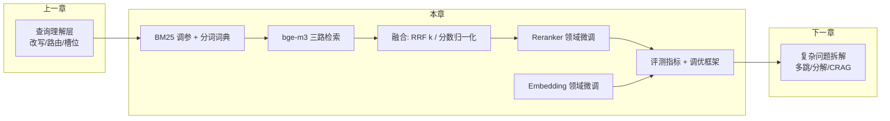
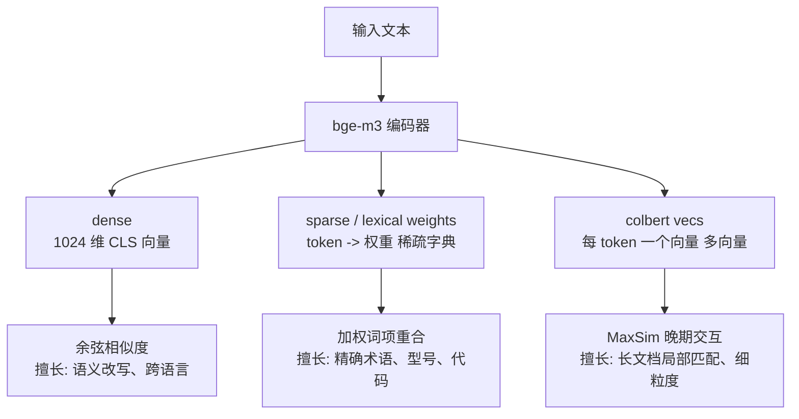
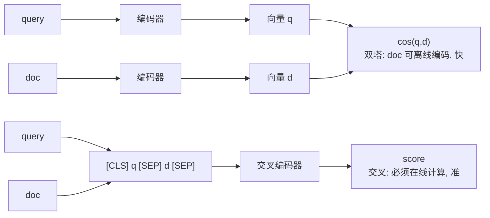
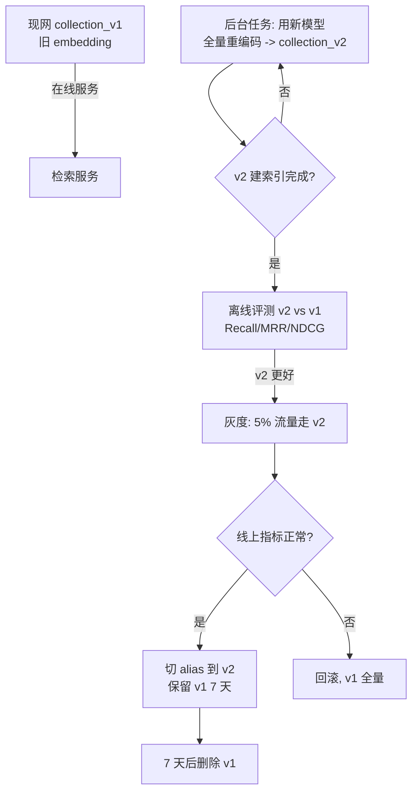

# 第 3.2 章  混合检索与重排序精调

> **本章目标**：读完能做到 …
> 1. 说清 BM25 的 $k_1$ / $b$ 各自控制什么，并为中文技术文档定制分词词典，把 `XJ-200`、`E043` 这类词保住；
> 2. 跑通 bge-m3 的稠密 + 稀疏 + 多向量三路检索，知道每一路擅长什么、权重怎么定；
> 3. 用实验脚本量化 RRF 的 $k$ 参数敏感性，并对比 min-max / z-score / softmax 三种分数归一化；
> 4. 独立完成 bge-reranker-v2-m3 的领域微调：造三元组、挖难负样本、写训练脚本、评测前后差异；
> 5. 用 sentence-transformers 微调 bge embedding，并说清"微调后必须重建全量索引"的工程代价；
> 6. 手写 Recall@K / MRR / NDCG / HitRate 并解释 RAG 场景该主看哪个；
> 7. 搭出一套**可配置开关的检索链路调优实验框架**，一条命令跑出对比表格（后续 [项目 4](../09-实战项目/) 直接复用）。
>
> **前置知识**：[3.1 查询理解与高级检索策略](01-查询理解与高级检索策略.md)、[02-RAG基础篇](../02-RAG基础篇/)（向量库、Embedding、基础混合检索）
>
> **预计用时**：阅读 75 分钟 / 动手 300 分钟（含两次微调训练）

---

## 一、为什么需要它（问题出发）

### 1.1 "我们已经上了混合检索，为什么还是不准"

华成机电的知识库在 2.x 阶段已经做了混合检索：向量召回 20 条 + BM25 召回 20 条，RRF 融合，再用 `bge-reranker-v2-m3` 取 Top-5。上线后评测集（300 条）的表现是：

```text
【基线，实测环境见下】
Recall@5   0.712
MRR@10     0.583
NDCG@10    0.641
HitRate@5  0.803
```

> **实测环境**：Python 3.11 / bge-m3（dense-only）/ rank_bm25 0.2.2 + jieba 默认词典 / Milvus 2.4 单机 HNSW(M=16, efConstruction=200, efSearch=64) / 12.4 万 chunk / bge-reranker-v2-m3 未微调 / 评测集 300 条（人工标注金标 chunk）/ 单卡 RTX 4090。**以下所有数字均为本环境下的示例性数据，读者必须在自己的语料与评测集上复现。**

看起来还行，但业务侧的抱怨是具体的：

| 抱怨 | 排查后的真实原因 |
|---|---|
| "搜 E043 搜不到，搜'E043 是什么'反而能搜到" | jieba 把 `E043` 切成了 `E` + `043`，BM25 完全失效 |
| "XJ-200 和 XJ-300 老是串" | 同 1：`XJ-200` 被切成 `XJ` `-` `200`，`XJ` 是共享 token |
| "长文档里的答案总排不上来" | BM25 的 $b$ 用默认 0.75，长文档被过度惩罚 |
| "reranker 把'安全警告'排到了'维修步骤'前面" | 通用 reranker 不懂"用户要的是步骤不是警告"这个领域偏好 |
| "换个说法就差很多" | embedding 没见过领域语料，`主轴抱死` 和 `spindle seizure` 在向量空间里离得远 |

**这五条，对应本章五个小节**。混合检索不是"开了就完事"，它有一堆参数要调，有两个模型要微调。

### 1.2 本章的定位



上一章解决"问什么"，本章解决"**怎么把该找的找回来、把最对的排到最前**"。

---

## 二、原理拆解

### 2.1 混合检索为什么必须存在：两种失效是互补的

| | 稠密检索（Dense / 向量） | 稀疏检索（Sparse / BM25） |
|---|---|---|
| 匹配依据 | 语义相似 | 词项重合 |
| 强项 | 同义改写、口语、跨语言 | 精确 ID、型号、罕见术语、否定词 |
| 典型失效 | `E043` vs `E034` 分不清 | "主轴不转" 搜不到 "主轴无法启动" |
| 对 OOV 词 | 拆成子词，语义漂移 | 只要词典有就精确命中 |
| 对长尾词 | 训练里没见过就废 | 天然 IDF 高，表现好 |

所以混合检索的收益，本质上来自**失效模式的不相关性**：两个检索器同时错的概率远小于单个。

### 2.2 BM25 公式与 $k_1$ / $b$ 的物理含义

BM25 对 query $Q=\{q_1,\dots,q_n\}$ 与文档 $D$ 的打分：

$$
\mathrm{score}(D, Q)=\sum_{i=1}^{n} \mathrm{IDF}(q_i)\cdot
\frac{f(q_i, D)\cdot (k_1+1)}{f(q_i,D)+k_1\cdot\left(1-b+b\cdot\dfrac{|D|}{\mathrm{avgdl}}\right)}
$$

$$
\mathrm{IDF}(q_i)=\ln\left(\frac{N-n(q_i)+0.5}{n(q_i)+0.5}+1\right)
$$

其中 $f(q_i,D)$ 是词频，$|D|$ 是文档长度，$\mathrm{avgdl}$ 是平均文档长度，$N$ 是文档总数，$n(q_i)$ 是包含 $q_i$ 的文档数。

**$k_1$：词频饱和速度。**
- $k_1 \to 0$：词频退化为"出现过就行"（二值化），出现 1 次和 20 次几乎同分；
- $k_1$ 大（如 2.0）：词频的边际贡献衰减慢，高频词能拉开差距。
- 直觉：$k_1$ 控制"**一个词说 10 遍，是不是比说 1 遍更相关**"。

技术手册的特点是：**关键术语在正确的章节里会反复出现**（"主轴轴承"在轴承更换那一节出现 8 次，在别处出现 1 次）。所以技术文档场景 $k_1$ 可以调大一点（1.2 → 1.5~1.8）。

**$b$：文档长度归一化强度。**
- $b=0$：完全不惩罚长文档，长文档因为词多天然占便宜；
- $b=1$：完全按长度归一化，短文档占便宜；
- 默认 0.75 是新闻/网页语料调出来的经验值。

RAG 的 chunk 长度分布通常比网页均匀得多（因为是我们自己切的），所以**$b$ 应该往下调**（0.75 → 0.3~0.5），否则包含完整步骤的长 chunk 会被无理由压制。

### 2.3 bge-m3 的三路输出

`bge-m3` 一次前向能同时产出三种表示，这是它相比 `bge-large-zh` 最大的工程价值：



**三路的分工**（这是经验，不是定理）：

| 路 | 擅长 | 不擅长 | 典型权重 |
|---|---|---|---|
| dense | 口语↔书面、同义、跨语言 | 精确 ID、数字区分 | 0.4 |
| sparse | 型号/错误码/罕见术语 | 完全换词的改写 | 0.3 |
| colbert（多向量） | 长 chunk 里的局部相关、细粒度对齐 | 计算贵、存储贵 | 0.3 |

ColBERT 的 MaxSim 打分：

$$
S_{\text{colbert}}(q,d)=\sum_{i \in |q|} \max_{j \in |d|} \ \mathbf{E}_{q_i}^{\top}\mathbf{E}_{d_j}
$$

即 query 的每个 token 去文档所有 token 里找最匹配的那个，再求和。它的代价是：**存储量 ≈ dense 的 token 数倍**，12 万 chunk 的 colbert 向量可以轻松到几十 GB。所以生产上常见做法是：**dense + sparse 做召回，colbert 只对 Top-50 做重排**。

### 2.4 分数融合：RRF vs 加权求和

两条路线：

**（A）RRF（用排名）**

$$
\mathrm{RRF}(d)=\sum_{r\in R}\frac{w_r}{k+\mathrm{rank}_r(d)}
$$

优点：不需要分数可比，鲁棒，几乎不用调；缺点：丢掉了分数的绝对信息（"第 1 名比第 2 名强很多"这件事表达不出来）。

**（B）加权求和（用分数，必须先归一化）**

$$
S(d)=\sum_{r\in R} w_r \cdot \mathrm{norm}_r\big(s_r(d)\big),\qquad \sum_r w_r = 1
$$

三种归一化：

$$
\text{min-max:}\quad \tilde{s}=\frac{s-\min(s)}{\max(s)-\min(s)+\epsilon}
$$

$$
\text{z-score:}\quad \tilde{s}=\frac{s-\mu}{\sigma+\epsilon}
$$

$$
\text{softmax:}\quad \tilde{s}_i=\frac{e^{s_i/\tau}}{\sum_j e^{s_j/\tau}}
$$

各自的坑：
- **min-max**：对候选集合敏感，Top-K 改一下分数全变；单路只有 1 条结果时退化；
- **z-score**：假设近似正态，BM25 分数是长尾的，效果一般；对异常值鲁棒性差；
- **softmax**：温度 $\tau$ 难定，$\tau$ 小则极端尖锐（几乎只认第一名），$\tau$ 大则趋于均匀。

**工程建议**：先用 RRF 上线（省心且稳），有评测集之后再试加权求和调权重，能多榨出几个点。

### 2.5 重排（Rerank）为什么必要

召回阶段用的是**双塔（bi-encoder）**：query 和 doc 分开编码，再算相似度。它快，但 query 和 doc 从来没"见过面"。

重排用的是**交叉编码器（cross-encoder）**：把 `[CLS] query [SEP] doc [SEP]` 一起送进模型，做完整的 token 级交互，输出一个相关性分数。它慢（每对都要跑一次前向），但准得多。



---

## 三、动手实战

### 3.0 环境准备

```bash
uv venv -p 3.11 .venv && source .venv/bin/activate
uv pip install \
  "FlagEmbedding==1.3.2" "sentence-transformers==3.2.1" \
  "transformers==4.45.2" "torch==2.4.1" "accelerate==0.34.2" "datasets==3.0.1" \
  "rank-bm25==0.2.2" "jieba==0.42.1" "pymilvus==2.4.9" \
  "numpy==1.26.4" "pandas==2.2.3" "scikit-learn==1.5.2" "tqdm==4.66.5" "pyyaml==6.0.2"

# pip 等价：pip install FlagEmbedding==1.3.2 sentence-transformers==3.2.1 ...
```

模型下载（建议提前拉到本地，避免训练时断网）：

```bash
export HF_ENDPOINT=https://hf-mirror.com   # 国内镜像，按需
huggingface-cli download BAAI/bge-m3 --local-dir ./models/bge-m3
huggingface-cli download BAAI/bge-reranker-v2-m3 --local-dir ./models/bge-reranker-v2-m3
huggingface-cli download BAAI/bge-large-zh-v1.5 --local-dir ./models/bge-large-zh-v1.5
```

### 3.1 中文分词词典定制：先把 `XJ-200` 和 `E043` 救回来

这是本章**投入产出比最高的一步，10 分钟见效**。

```python
# file: retrieval/tokenizer.py
"""中文技术文档分词器：自定义词典 + 型号/错误码保护 + 停用词。"""
from __future__ import annotations

import re
from pathlib import Path

import jieba

# --- 1) 领域自定义词典：型号、错误码、部件、专有术语 ---
DOMAIN_WORDS = [
    # 型号（权重给高，保证不被切开）
    ("XJ-200", 10000, "nz"), ("XJ-300", 10000, "nz"), ("XJ-500", 10000, "nz"),
    ("HC-120", 10000, "nz"), ("MT-80", 10000, "nz"),
    # 错误码
    *[(f"E{i:03d}", 10000, "nz") for i in (12, 31, 43, 55, 78, 90, 107, 118, 203)],
    # 部件与术语
    ("主轴轴承", 5000, "n"), ("伺服驱动器", 5000, "n"), ("液压站", 5000, "n"),
    ("冷却泵", 5000, "n"), ("刀库", 5000, "n"), ("编码器", 5000, "n"),
    ("滚珠丝杠", 5000, "n"), ("直线导轨", 5000, "n"), ("过流保护", 5000, "n"),
    ("预防性保养", 5000, "n"), ("点检表", 5000, "n"), ("扭矩扳手", 5000, "n"),
    ("主轴抱死", 5000, "n"), ("建压失败", 5000, "n"), ("温升", 5000, "n"),
]

STOPWORDS = set("""
的 了 是 在 和 与 及 或 也 就 都 而 及其 一个 一种 这个 那个 我们 你们 他们
请问 一下 怎么 如何 什么 哪些 为什么 呢 吗 啊 吧 呀 哦 嗯 谢谢 你好
""".split())

_TOKEN_KEEP = re.compile(r"^[A-Za-z0-9][A-Za-z0-9\-_.]*$")


def init_tokenizer(user_dict_path: str | None = None) -> None:
    """初始化 jieba：注入领域词典；可额外加载文件词典。"""
    for word, freq, tag in DOMAIN_WORDS:
        jieba.add_word(word, freq=freq, tag=tag)
    # 防止 jieba 把连字符型号拆开
    jieba.re_han_default = re.compile(r"([一-鿕a-zA-Z0-9+#&._%\-]+)", re.U)
    if user_dict_path and Path(user_dict_path).exists():
        jieba.load_userdict(user_dict_path)


def tokenize(text: str, keep_stopwords: bool = False) -> list[str]:
    """分词：保留英文数字型 token，去停用词，小写化英文。"""
    text = text.strip()
    toks = []
    for t in jieba.lcut(text):
        t = t.strip()
        if not t:
            continue
        if _TOKEN_KEEP.match(t):
            toks.append(t.upper() if len(t) <= 8 else t.lower())
            continue
        if len(t) == 1 and not t.isdigit():
            continue
        if not keep_stopwords and t in STOPWORDS:
            continue
        toks.append(t)
    return toks


def build_user_dict(path: str) -> None:
    """把 DOMAIN_WORDS 导出成 jieba userdict 文件，便于运维维护。"""
    with open(path, "w", encoding="utf-8") as f:
        for word, freq, tag in DOMAIN_WORDS:
            f.write(f"{word} {freq} {tag}\n")


if __name__ == "__main__":
    init_tokenizer()
    cases = [
        "XJ-200 主轴轴承 E043 报警怎么处理",
        "请问一下 xj300 的液压站建压失败是什么原因呢",
        "spindle bearing 更换扭矩是多少 N·m",
    ]
    for c in cases:
        print(f"{c}\n  -> {tokenize(c)}\n")
```

预期输出（**关键看 `XJ-200` 和 `E043` 有没有被切碎**）：

```text
XJ-200 主轴轴承 E043 报警怎么处理
  -> ['XJ-200', '主轴轴承', 'E043', '报警', '处理']

请问一下 xj300 的液压站建压失败是什么原因呢
  -> ['XJ300', '液压站', '建压', '失败', '原因']

spindle bearing 更换扭矩是多少 N·m
  -> ['SPINDLE', 'BEARING', '更换', '扭矩', '多少', 'N', 'M']
```

第 2 条的 `xj300` 变成了 `XJ300` 而不是 `XJ-300`——这说明**分词器之前必须先过 3.1 的 `normalize_query`**。两层是配合关系，不是替代关系。

> **运维提示**：`DOMAIN_WORDS` 不应该硬编码。生产上应该从"产品主数据表"（型号表、备件表、故障码表）自动生成词典文件，每天定时刷新。新出一款机型，词典自动更新，不用发版。

### 3.2 BM25 调参

```python
# file: retrieval/bm25_index.py
"""可调参的 BM25 索引：支持 k1/b 网格搜索。"""
from __future__ import annotations

import json
import pickle
from dataclasses import dataclass
from pathlib import Path

from rank_bm25 import BM25Okapi

from .tokenizer import init_tokenizer, tokenize


@dataclass
class Chunk:
    """一个知识块。"""
    chunk_id: str
    text: str
    meta: dict


class BM25Index:
    """基于 rank_bm25 的稀疏索引，k1/b 可调。"""

    def __init__(self, chunks: list[Chunk], k1: float = 1.5, b: float = 0.4):
        init_tokenizer()
        self.chunks = chunks
        self.ids = [c.chunk_id for c in chunks]
        self.corpus_tokens = [tokenize(c.text) for c in chunks]
        self.k1, self.b = k1, b
        self.bm25 = BM25Okapi(self.corpus_tokens, k1=k1, b=b)

    def retune(self, k1: float, b: float) -> None:
        """只改参数不重新分词（分词很慢，网格搜索时必须复用）。"""
        self.k1, self.b = k1, b
        self.bm25 = BM25Okapi(self.corpus_tokens, k1=k1, b=b)

    def search(self, query: str, top_k: int = 20) -> list[tuple[str, float]]:
        """返回 [(chunk_id, bm25_score)] 降序。"""
        q_tokens = tokenize(query)
        if not q_tokens:
            return []
        scores = self.bm25.get_scores(q_tokens)
        idx = scores.argsort()[::-1][:top_k]
        return [(self.ids[i], float(scores[i])) for i in idx]

    def save(self, path: str) -> None:
        """持久化（含分词结果，避免重建）。"""
        Path(path).parent.mkdir(parents=True, exist_ok=True)
        with open(path, "wb") as f:
            pickle.dump({"chunks": self.chunks, "tokens": self.corpus_tokens,
                         "k1": self.k1, "b": self.b}, f)
```

网格搜索脚本：

```python
# file: retrieval/tune_bm25.py
"""BM25 k1/b 网格搜索：在评测集上找最优参数。"""
from __future__ import annotations

import itertools

import pandas as pd

from .bm25_index import BM25Index
from .metrics import recall_at_k, mrr_at_k


def grid_search_bm25(index: BM25Index, eval_cases, k1_grid=None, b_grid=None,
                     top_k: int = 20) -> pd.DataFrame:
    """对 (k1, b) 做网格搜索，返回按 Recall@10 排序的结果表。"""
    k1_grid = k1_grid or [0.6, 0.9, 1.2, 1.5, 1.8, 2.2]
    b_grid = b_grid or [0.0, 0.2, 0.3, 0.45, 0.6, 0.75, 0.9]
    rows = []
    for k1, b in itertools.product(k1_grid, b_grid):
        index.retune(k1, b)
        runs = {c.qid: [d for d, _ in index.search(c.query, top_k)] for c in eval_cases}
        gold = {c.qid: c.gold_chunk_ids for c in eval_cases}
        rows.append({
            "k1": k1, "b": b,
            "Recall@5": round(recall_at_k(runs, gold, 5), 4),
            "Recall@10": round(recall_at_k(runs, gold, 10), 4),
            "MRR@10": round(mrr_at_k(runs, gold, 10), 4),
        })
    df = pd.DataFrame(rows).sort_values("Recall@10", ascending=False)
    return df
```

华成机电语料上的搜索结果（**示例性数据，实测环境同 1.1**）：

| k1 | b | Recall@5 | Recall@10 | MRR@10 |
|---:|---:|---:|---:|---:|
| 1.8 | 0.30 | 0.548 | 0.671 | 0.441 |
| 1.5 | 0.30 | 0.544 | 0.668 | 0.439 |
| 1.5 | 0.45 | 0.537 | 0.659 | 0.432 |
| 1.2 | 0.75 | 0.501 | 0.618 | 0.402 |
| 0.9 | 0.75 | 0.489 | 0.604 | 0.391 |

结论符合 2.2 的分析：**$b$ 从默认 0.75 降到 0.3，$k_1$ 从 1.2 升到 1.5~1.8**，Recall@10 有约 +5pt 的提升。这是**零成本**的（不加任何延迟）。

> 别过拟合：网格搜索一定要切出独立的 dev/test 两份评测集。只有 300 条时，用 5 折交叉验证更稳。

### 3.3 bge-m3 三路检索完整实现

```python
# file: retrieval/bgem3.py
"""bge-m3 三路检索：dense + sparse(lexical) + colbert(多向量)，含融合。"""
from __future__ import annotations

from dataclasses import dataclass

import numpy as np
from FlagEmbedding import BGEM3FlagModel


@dataclass
class M3Encoded:
    """bge-m3 的三路编码结果。"""
    dense: np.ndarray | None
    sparse: list[dict] | None
    colbert: list[np.ndarray] | None


class BGEM3Retriever:
    """bge-m3 三路检索器（教学实现：全内存暴力检索，生产请换 Milvus）。"""

    def __init__(self, model_path: str = "./models/bge-m3", use_fp16: bool = True,
                 device: str = "cuda"):
        self.model = BGEM3FlagModel(model_path, use_fp16=use_fp16, device=device)
        self.doc_ids: list[str] = []
        self.doc_dense: np.ndarray | None = None
        self.doc_sparse: list[dict] | None = None
        self.doc_colbert: list[np.ndarray] | None = None

    def index(self, doc_ids: list[str], texts: list[str], batch_size: int = 8,
              max_length: int = 1024, with_colbert: bool = False) -> None:
        """对文档做三路编码并保存在内存中。"""
        out = self.model.encode(
            texts, batch_size=batch_size, max_length=max_length,
            return_dense=True, return_sparse=True, return_colbert_vecs=with_colbert,
        )
        self.doc_ids = doc_ids
        self.doc_dense = np.asarray(out["dense_vecs"], dtype=np.float32)
        self.doc_sparse = out["lexical_weights"]
        self.doc_colbert = out.get("colbert_vecs") if with_colbert else None

    def encode_query(self, query: str, with_colbert: bool = False) -> M3Encoded:
        """编码单条 query。"""
        out = self.model.encode(
            [query], batch_size=1, max_length=256,
            return_dense=True, return_sparse=True, return_colbert_vecs=with_colbert,
        )
        return M3Encoded(
            dense=np.asarray(out["dense_vecs"][0], dtype=np.float32),
            sparse=out["lexical_weights"][0],
            colbert=np.asarray(out["colbert_vecs"][0]) if with_colbert else None,
        )

    def _dense_scores(self, qv: np.ndarray) -> np.ndarray:
        """稠密余弦分数（bge-m3 输出已归一化，点积即余弦）。"""
        return self.doc_dense @ qv

    def _sparse_scores(self, qs: dict) -> np.ndarray:
        """稀疏词权重重合分数，用官方 compute_lexical_matching_score。"""
        return np.asarray(
            [self.model.compute_lexical_matching_score(qs, ds) for ds in self.doc_sparse],
            dtype=np.float32,
        )

    def _colbert_scores(self, qc: np.ndarray, cand_idx: list[int]) -> dict[int, float]:
        """只对候选集算 ColBERT MaxSim（全量算太贵）。"""
        res = {}
        for i in cand_idx:
            res[i] = float(self.model.colbert_score(qc, self.doc_colbert[i]))
        return res

    def search(self, query: str, top_k: int = 10,
               weights: tuple[float, float, float] = (0.4, 0.3, 0.3),
               recall_k: int = 50) -> list[tuple[str, float, dict]]:
        """三路检索并加权融合；colbert 只对前 recall_k 候选计算。"""
        w_d, w_s, w_c = weights
        use_colbert = w_c > 0 and self.doc_colbert is not None
        enc = self.encode_query(query, with_colbert=use_colbert)

        s_d = self._dense_scores(enc.dense)
        s_s = self._sparse_scores(enc.sparse)

        base = w_d * _minmax(s_d) + w_s * _minmax(s_s)
        cand = list(np.argsort(base)[::-1][:recall_k])

        s_c = np.zeros_like(base)
        if use_colbert:
            cb = self._colbert_scores(enc.colbert, cand)
            arr = np.zeros_like(base)
            for i, v in cb.items():
                arr[i] = v
            sub = arr[cand]
            norm_sub = (sub - sub.min()) / (sub.max() - sub.min() + 1e-9)
            for j, i in enumerate(cand):
                s_c[i] = norm_sub[j]

        final = w_d * _minmax(s_d) + w_s * _minmax(s_s) + w_c * s_c
        order = np.argsort(final)[::-1][:top_k]
        return [
            (self.doc_ids[i], float(final[i]),
             {"dense": float(s_d[i]), "sparse": float(s_s[i]), "colbert": float(s_c[i])})
            for i in order
        ]


def _minmax(x: np.ndarray) -> np.ndarray:
    """min-max 归一化。"""
    lo, hi = float(x.min()), float(x.max())
    return (x - lo) / (hi - lo + 1e-9)
```

三路的分歧观察（**示例输出**）：

```text
query: XJ-200 主轴抱死怎么处理

排名  chunk                                  final  dense  sparse colbert
1     XJ-200维修手册/主轴抱死应急处理          0.912  0.681  14.32  0.884
2     XJ-200维修手册/主轴轴承更换              0.734  0.702   6.18  0.641
3     通用/旋转部件卡滞排查                    0.688  0.712   2.04  0.598
4     XJ-300维修手册/主轴抱死应急处理          0.651  0.694  11.87  0.572
5     XJ-200保养规程/主轴润滑                  0.603  0.628   5.44  0.511
```

看第 3 行：**dense 分数最高（0.712）但 sparse 很低（2.04）**——这是典型的"语义像但没提到型号和具体术语"的通用文档。如果只用 dense，它会排第 1。sparse 把它压下去了。这就是混合检索的价值可视化。

### 3.4 RRF 的 $k$ 参数敏感性实验

很多文章直接写"k=60"，但没人告诉你为什么。这个实验帮你自己看清楚。

```python
# file: retrieval/exp_rrf_k.py
"""RRF k 参数敏感性实验：固定多路召回结果，只扫 k。"""
from __future__ import annotations

import pandas as pd

from .metrics import mrr_at_k, ndcg_at_k, recall_at_k


def rrf_fuse(ranked_lists, k: float = 60.0, weights=None, top_n: int = 20):
    """加权 RRF 融合，返回 [(doc_id, score)]。"""
    weights = weights or [1.0] * len(ranked_lists)
    scores: dict[str, float] = {}
    for w, lst in zip(weights, ranked_lists):
        for rank, doc_id in enumerate(lst, start=1):
            scores[doc_id] = scores.get(doc_id, 0.0) + w / (k + rank)
    return sorted(scores.items(), key=lambda x: -x[1])[:top_n]


def sweep_rrf_k(per_query_lists: dict[str, list[list[str]]],
                gold: dict[str, list[str]],
                k_grid=(1, 5, 10, 20, 40, 60, 100, 200, 500)) -> pd.DataFrame:
    """扫 k，输出各指标；per_query_lists[qid] = [向量路列表, BM25路列表, ...]。"""
    rows = []
    for k in k_grid:
        runs = {qid: [d for d, _ in rrf_fuse(lists, k=k, top_n=20)]
                for qid, lists in per_query_lists.items()}
        rows.append({
            "rrf_k": k,
            "Recall@5": round(recall_at_k(runs, gold, 5), 4),
            "Recall@10": round(recall_at_k(runs, gold, 10), 4),
            "MRR@10": round(mrr_at_k(runs, gold, 10), 4),
            "NDCG@10": round(ndcg_at_k(runs, gold, 10), 4),
        })
    return pd.DataFrame(rows)
```

**实验结果（示例性数据，实测环境同 1.1，两路召回：bge-m3 dense + BM25 各 Top-20）**：

| rrf_k | Recall@5 | Recall@10 | MRR@10 | NDCG@10 |
|---:|---:|---:|---:|---:|
| 1 | 0.701 | 0.812 | 0.612 | 0.658 |
| 5 | 0.718 | 0.824 | 0.621 | 0.669 |
| 10 | 0.729 | 0.831 | 0.627 | 0.676 |
| 20 | 0.736 | 0.836 | 0.628 | 0.679 |
| 40 | 0.738 | 0.839 | 0.626 | 0.680 |
| **60** | **0.739** | **0.840** | 0.624 | **0.681** |
| 100 | 0.737 | 0.840 | 0.619 | 0.679 |
| 200 | 0.731 | 0.838 | 0.611 | 0.674 |
| 500 | 0.722 | 0.834 | 0.598 | 0.666 |

**怎么读这张表**：

- 曲线非常平（k 从 10 到 200，Recall@5 波动 < 1pt）——**RRF 对 k 不敏感，这正是它受欢迎的原因**；
- k 很小（1~5）时，**第一名的权重被极度放大**（$1/(1+1)=0.5$ vs $1/(1+2)=0.33$），MRR 反而略低，因为单路的第一名错了就没救；
- k 很大时，所有排名趋于等权，退化成"投票数"，丢失排序信息；
- 60 附近是宽而平的最优区间——**所以默认 60 是合理的，不用花时间调**。

**结论**：把调参精力花在 BM25 的 $k_1/b$ 和 reranker 微调上，不要花在 RRF 的 k 上。

### 3.5 分数归一化方法对比

```python
# file: retrieval/normalize_scores.py
"""三种分数归一化方法与加权融合，用于与 RRF 对比。"""
from __future__ import annotations

import numpy as np


def minmax_norm(scores: np.ndarray) -> np.ndarray:
    """min-max 归一化到 [0,1]。"""
    lo, hi = float(np.min(scores)), float(np.max(scores))
    return (scores - lo) / (hi - lo + 1e-9)


def zscore_norm(scores: np.ndarray) -> np.ndarray:
    """z-score 标准化，再用 sigmoid 压到 (0,1) 便于加权。"""
    mu, sd = float(np.mean(scores)), float(np.std(scores))
    z = (scores - mu) / (sd + 1e-9)
    return 1.0 / (1.0 + np.exp(-z))


def softmax_norm(scores: np.ndarray, tau: float = 1.0) -> np.ndarray:
    """带温度的 softmax 归一化。"""
    z = (scores - np.max(scores)) / max(tau, 1e-6)
    e = np.exp(z)
    return e / (np.sum(e) + 1e-9)


def weighted_fuse(score_maps: list[dict[str, float]], weights: list[float],
                  norm: str = "minmax", tau: float = 1.0,
                  top_n: int = 20) -> list[tuple[str, float]]:
    """把多路 {doc_id: score} 归一化后加权求和，未出现的文档该路记 0。"""
    fn = {"minmax": minmax_norm,
          "zscore": zscore_norm,
          "softmax": lambda s: softmax_norm(s, tau)}[norm]
    all_ids = sorted({d for m in score_maps for d in m})
    total = np.zeros(len(all_ids), dtype=np.float64)
    for w, m in zip(weights, score_maps):
        if not m:
            continue
        raw = np.array([m.get(d, -np.inf) for d in all_ids], dtype=np.float64)
        present = np.isfinite(raw)
        normed = np.zeros_like(raw)
        if present.sum() > 0:
            normed[present] = fn(raw[present])
        total += w * normed
    order = np.argsort(total)[::-1][:top_n]
    return [(all_ids[i], float(total[i])) for i in order]
```

**对比结果（示例性数据，同实测环境，两路 dense + BM25，权重 0.6/0.4）**：

| 融合方法 | Recall@5 | MRR@10 | NDCG@10 | 需调参数 | 稳定性 |
|---|---:|---:|---:|---|---|
| 仅 dense | 0.658 | 0.552 | 0.601 | — | — |
| 仅 BM25（调参后） | 0.548 | 0.441 | 0.489 | k1,b | — |
| RRF (k=60) | 0.739 | 0.624 | 0.681 | 几乎不用 | 高 |
| 加权 + min-max | 0.744 | 0.631 | 0.686 | 权重 | 中（依赖候选集） |
| 加权 + z-score | 0.728 | 0.612 | 0.669 | 权重 | 中低 |
| 加权 + softmax(τ=0.5) | 0.735 | 0.629 | 0.678 | 权重, τ | 中 |
| 加权 + softmax(τ=2.0) | 0.726 | 0.607 | 0.665 | 权重, τ | 中 |

**解读**：加权 + min-max 比 RRF 好一点点（+0.5pt），但代价是多了 1~3 个需要维护的超参，而且候选集一变就得重调。**如果你没有稳定的评测集和定期调参的流程，老老实实用 RRF。**

### 3.6 Reranker 领域微调（本章重头戏之一）

#### 3.6.1 为什么通用 reranker 不够用

`bge-reranker-v2-m3` 是在通用语料（MS MARCO、中文网页问答等）上训练的。它学到的是"**语义相关**"，但你的业务要的往往是"**业务上有用**"。这两件事在垂直领域会分叉：

| query | 通用 reranker 排第一 | 业务上真正想要的 | 分叉原因 |
|---|---|---|---|
| XJ-200 主轴异响怎么处理 | 《安全警告：主轴运转中禁止靠近》 | 《主轴异响排查流程》 | 语义都相关，但用户要**步骤**不要**警告** |
| E043 是什么意思 | 《E043 故障处理完整流程（3 页）》 | 《故障代码表 · E043 一行定义》 | 用户问"是什么"不是"怎么办" |
| 轴承更换周期 | 《XJ-300 轴承更换周期》 | 《XJ-200 轴承更换周期》 | 通用模型对型号不敏感 |
| 润滑油牌号 | 《2019 版保养规程》 | 《2024 版保养规程》 | 通用模型不懂"新版优先" |

**这四类偏好，全都可以通过微调教给模型**。这是 reranker 微调最大的价值——它学的不只是相关性，还有你的业务排序偏好。

#### 3.6.2 训练数据构造：三个来源

训练一个 reranker 需要三元组 `(query, positive, hard_negatives)`。三个来源，按性价比排序：

**来源 A：用户点击/反馈日志（最真实，最值钱）**

```python
# file: rerank_ft/build_from_logs.py
"""从线上日志构造训练三元组：点击/采纳 = 正例，同次展示未点击 = 负例。"""
from __future__ import annotations

import json
from collections import defaultdict


def build_from_click_logs(log_path: str, min_impressions: int = 3,
                          max_neg: int = 8) -> list[dict]:
    """
    日志每行形如：
    {"query":"...", "shown":["c1","c2",...], "clicked":["c3"], "feedback":1}
    feedback: 1=点赞, 0=无, -1=点踩
    """
    agg = defaultdict(lambda: {"shown": defaultdict(int), "clicked": defaultdict(int)})
    with open(log_path, encoding="utf-8") as f:
        for line in f:
            r = json.loads(line)
            q = r["query"].strip()
            for c in r.get("shown", []):
                agg[q]["shown"][c] += 1
            for c in r.get("clicked", []):
                agg[q]["clicked"][c] += 1 + max(0, r.get("feedback", 0))
    samples = []
    for q, d in agg.items():
        if sum(d["shown"].values()) < min_impressions or not d["clicked"]:
            continue
        pos = [c for c, _ in sorted(d["clicked"].items(), key=lambda x: -x[1])][:2]
        neg = [c for c in d["shown"] if c not in d["clicked"]][:max_neg]
        if pos and neg:
            samples.append({"query": q, "pos_ids": pos, "neg_ids": neg, "src": "click"})
    return samples
```

**位置偏置警告**：用户倾向于点第一条，所以"未点击"不等于"不相关"。缓解办法：只取**被点击项排名之后**的未点击项作为负例，或者做简单的位置折扣。这一条不做，模型会学成"学会把原来第一名继续放第一名"，等于白训。

**来源 B：人工标注（最准，最贵）**

标注规范必须写死，否则标注员之间对不齐：

```text
【华成机电 reranker 标注规范 v1】
对每个 (query, chunk) 打 0~3 分：
3 = 直接回答了问题，用户看完就能动手（含完整步骤/明确数值/明确结论）
2 = 相关且有用，但需要用户再跳一步（如给了原因没给步骤）
1 = 同主题但答不了这个问题（如同一部件的其他章节）
0 = 不相关 / 错误型号 / 过期版本

强制规则：
- 型号不匹配一律 ≤ 1 分，哪怕内容看起来一模一样
- 文档版本过期（有更新版本存在）一律降 1 分
- "安全警告"类内容，若 query 问的是操作步骤，最高 1 分
```

**每 query 标 10~20 条候选**，300 条 query 约需 2 人日。这是 ROI 最高的人工投入。

**来源 C：LLM 蒸馏（量大管饱，需抽检）**

```python
# file: rerank_ft/build_from_llm.py
"""LLM 蒸馏：让强模型给 (query, chunk) 打分，生成训练数据。"""
from __future__ import annotations

from langchain_core.prompts import ChatPromptTemplate
from pydantic import BaseModel, Field

from rag_advanced.llm import get_llm

LABEL_RUBRIC = """\
3 = 直接回答了问题，用户看完就能动手
2 = 相关且有用，但还差一步
1 = 同主题但答不了这个问题
0 = 不相关 / 错误型号 / 过期版本
强制规则：型号不匹配一律 ≤1；query 问步骤而片段是安全警告，最高 1。"""


class RelevanceLabel(BaseModel):
    """单条打分结果。"""
    score: int = Field(ge=0, le=3, description="相关性分数")
    reason: str = Field(description="一句话理由")


LABEL_PROMPT = ChatPromptTemplate.from_messages([
    ("system", "你是检索相关性标注专家，服务于制造业售后知识库。\n评分标准：\n{rubric}\n"
               "只输出结构化结果，不要解释以外的内容。"),
    ("human", "【问题】\n{query}\n\n【候选片段】\n{chunk}\n\n请打分。"),
])


def label_pair(query: str, chunk_text: str) -> RelevanceLabel:
    """用 LLM 给一对 (query, chunk) 打分。"""
    llm = get_llm(temperature=0.0).with_structured_output(RelevanceLabel)
    return (LABEL_PROMPT | llm).invoke(
        {"query": query, "chunk": chunk_text[:1500], "rubric": LABEL_RUBRIC})


def distill_dataset(queries: list[str], retrieve_fn, load_text_fn,
                    top_k: int = 15) -> list[dict]:
    """对每条 query 取 Top-K 候选逐条打分，产出带分数的数据集。"""
    out = []
    for q in queries:
        for cid in retrieve_fn(q, top_k):
            lab = label_pair(q, load_text_fn(cid))
            out.append({"query": q, "chunk_id": cid,
                        "score": lab.score, "reason": lab.reason, "src": "llm"})
    return out
```

> **必做的质量控制**：LLM 标注完之后，**随机抽 5% 交给人工复核**，统计一致性（Cohen's Kappa）。低于 0.6 就说明 rubric 不清晰，要回去改 prompt 而不是继续标。

#### 3.6.3 难负样本挖掘（Hard Negative Mining）——本节核心

这是决定 reranker 微调成败的关键。

**随机负样本几乎没有训练价值**：从 12 万 chunk 里随机抽一条，和 query 八竿子打不着，模型 1 个 epoch 就学会了，之后梯度接近 0。

**难负样本（hard negative）**是：**检索器排得很靠前、但实际上不是答案**的片段。它们逼模型学会细粒度区分。

```python
# file: rerank_ft/hard_negative.py
"""难负样本挖掘：从 Top-K 召回里挑出'像但不对'的片段。"""
from __future__ import annotations

import random
from dataclasses import dataclass


@dataclass
class MiningConfig:
    """难负样本挖掘配置。"""
    recall_k: int = 60          # 召回多少候选来挑
    skip_top: int = 3           # 跳过最前面 N 条（很可能是未标注的正例）
    range_lo: int = 3           # 负样本采样区间下界（名次）
    range_hi: int = 40          # 上界
    n_hard: int = 7             # 每条 query 取多少难负样本
    n_random: int = 1           # 再掺几条随机负样本（防止分布偏移）
    max_pos_sim: float = 0.95   # 与正例过于相似的候选要丢掉（大概率是漏标正例）


def mine_hard_negatives(query: str, pos_ids: list[str], retrieve_fn,
                        text_fn, sim_fn, all_ids: list[str],
                        cfg: MiningConfig = MiningConfig()) -> list[str]:
    """
    从召回结果中挖难负样本。
    retrieve_fn(query, k) -> [chunk_id]；sim_fn(a_text, b_text) -> float
    """
    cands = retrieve_fn(query, cfg.recall_k)
    pos_set = set(pos_ids)
    pos_texts = [text_fn(p) for p in pos_ids]

    pool = []
    for rank, cid in enumerate(cands, start=1):
        if cid in pos_set:
            continue
        if rank <= cfg.skip_top:
            continue                      # 太靠前，很可能是漏标的正例
        if not (cfg.range_lo <= rank <= cfg.range_hi):
            continue
        t = text_fn(cid)
        if any(sim_fn(t, pt) >= cfg.max_pos_sim for pt in pos_texts):
            continue                      # 和正例几乎重复，丢掉（假负样本）
        pool.append(cid)

    hard = pool[: cfg.n_hard]
    rnd = random.sample([c for c in all_ids if c not in pos_set and c not in set(hard)],
                        k=min(cfg.n_random, max(0, len(all_ids) - len(pos_set))))
    return hard + rnd
```

**四个必须注意的细节**：

1. **`skip_top`**：召回 Top-1~3 里出现的非标注文档，**极有可能是漏标的正例**。把它们当负例训，等于告诉模型"正确答案是错的"，会严重损害效果。这叫 **false negative 污染**，是新手翻车的头号原因。
2. **`range_lo/hi`**：难度要适中。排名 3~40 是甜区；排名 100 开外的和随机负样本没区别。
3. **`max_pos_sim`**：与正例文本高度重合的候选（比如同一段被切成两个 chunk），一律丢掉。
4. **掺一点随机负样本**：全是难负样本会让模型过于"怀疑一切"，把正例分数也压低。经验比例：难负 : 随机 ≈ 7:1。

导出成 FlagEmbedding 要求的训练格式：

```python
# file: rerank_ft/export_dataset.py
"""导出 FlagEmbedding reranker 微调所需的 jsonl 格式。"""
from __future__ import annotations

import json
import random


def export_reranker_jsonl(samples: list[dict], text_fn, out_path: str,
                          train_ratio: float = 0.9, seed: int = 42) -> tuple[str, str]:
    """
    samples: [{"query":..., "pos_ids":[...], "neg_ids":[...]}]
    输出格式（每行）：{"query": str, "pos": [str], "neg": [str]}
    """
    random.seed(seed)
    rows = []
    for s in samples:
        pos = [text_fn(i) for i in s["pos_ids"] if text_fn(i)]
        neg = [text_fn(i) for i in s["neg_ids"] if text_fn(i)]
        if not pos or not neg:
            continue
        rows.append({"query": s["query"], "pos": pos, "neg": neg})
    random.shuffle(rows)
    n_tr = int(len(rows) * train_ratio)
    tr_path, dv_path = out_path + ".train.jsonl", out_path + ".dev.jsonl"
    for path, part in ((tr_path, rows[:n_tr]), (dv_path, rows[n_tr:])):
        with open(path, "w", encoding="utf-8") as f:
            for r in part:
                f.write(json.dumps(r, ensure_ascii=False) + "\n")
    print(f"train={n_tr}  dev={len(rows) - n_tr}  -> {tr_path} / {dv_path}")
    return tr_path, dv_path
```

数据样例（`train.jsonl` 一行）：

```json
{"query": "XJ-200 主轴异响怎么排查", "pos": ["5.3 主轴异常噪声排查流程\n步骤1 停机后手动盘动主轴..."], "neg": ["安全警告：主轴运转过程中严禁打开防护门...", "XJ-300 主轴异常噪声排查流程\n步骤1...", "6.1 主轴润滑周期表..."]}
```

#### 3.6.4 完整训练脚本

FlagEmbedding 1.3.x 的 reranker 微调入口是 `FlagEmbedding.finetune.reranker.encoder_only.base`（以官方文档为准，不同小版本模块路径可能变化；本脚本给出 CLI 与等价的 torchrun 两种写法）。

```bash
#!/usr/bin/env bash
# file: rerank_ft/train_reranker.sh
# bge-reranker-v2-m3 领域微调。实测环境：单卡 RTX 4090 24GB / CUDA 12.1 / torch 2.4.1
set -euo pipefail

export CUDA_VISIBLE_DEVICES=0
export TOKENIZERS_PARALLELISM=false
export WANDB_DISABLED=true

MODEL=./models/bge-reranker-v2-m3
TRAIN=./data/rerank/huacheng.train.jsonl
OUT=./outputs/bge-reranker-v2-m3-huacheng

torchrun --nproc_per_node 1 \
  -m FlagEmbedding.finetune.reranker.encoder_only.base \
  --model_name_or_path ${MODEL} \
  --train_data ${TRAIN} \
  --output_dir ${OUT} \
  --learning_rate 6e-5 \
  --num_train_epochs 2 \
  --per_device_train_batch_size 1 \
  --gradient_accumulation_steps 8 \
  --train_group_size 8 \
  --query_max_len 128 \
  --passage_max_len 512 \
  --fp16 \
  --gradient_checkpointing \
  --dataloader_drop_last True \
  --warmup_ratio 0.1 \
  --weight_decay 0.01 \
  --logging_steps 10 \
  --save_steps 200 \
  --save_total_limit 2 \
  --deepspeed ./configs/ds_stage0.json 2>&1 | tee ${OUT}.log
```

关键超参解释（**不要照抄，要理解**）：

| 参数 | 值 | 为什么 |
|---|---|---|
| `train_group_size` | 8 | 每条 query 带 1 正 + 7 负进一个 group，对应 3.6.3 的 `n_hard=7`。这个值直接决定显存占用 |
| `per_device_train_batch_size` | 1 | 实际每步样本数 = batch × group_size = 8。24GB 卡上 `passage_max_len=512` 时只能给 1 |
| `gradient_accumulation_steps` | 8 | 等效 batch = 64，保证梯度稳定 |
| `learning_rate` | 6e-5 | reranker 微调常用 2e-5 ~ 1e-4；领域数据少时取小值防遗忘 |
| `num_train_epochs` | 2 | **数据量 < 5000 条时最多 2~3 epoch**，再多必过拟合 |
| `passage_max_len` | 512 | 要覆盖住 chunk 长度。如果你的 chunk 是 1000 token，这里必须调大，显存也跟着涨 |
| `gradient_checkpointing` | 开 | 用时间换显存，约慢 25%，显存省 40% |
| `fp16` | 开 | 4090 不支持 bf16 的完整加速路径时用 fp16；A100/H800 建议改 `--bf16` |

**显存与时长实测（实测环境：单卡 RTX 4090 24GB，driver 550，CUDA 12.1，torch 2.4.1，数据 3,200 条三元组）**：

| 配置 | 峰值显存 | 单 epoch 时长 |
|---|---:|---:|
| group=8, len=512, fp16, 无 ckpt | OOM | — |
| group=8, len=512, fp16, grad ckpt | 21.4 GB | 约 48 分钟 |
| group=4, len=512, fp16, grad ckpt | 13.8 GB | 约 26 分钟 |
| group=8, len=256, fp16, grad ckpt | 12.1 GB | 约 24 分钟 |

> 显存不够怎么办（按推荐顺序）：① 开 `gradient_checkpointing`；② 降 `passage_max_len`；③ 降 `train_group_size`；④ 换 LoRA 微调（FlagEmbedding 支持 `--use_lora True --lora_rank 16`，显存可降到 8GB 级，效果略逊于全参）。

#### 3.6.5 微调前后评测

**评测必须用独立 test 集，且 test 集里的 query 绝不能出现在训练集里**（哪怕改写过也不行——同义 query 泄漏是最隐蔽的作弊）。

```python
# file: rerank_ft/eval_reranker.py
"""reranker 微调前后对比评测：同一召回候选，只换重排模型。"""
from __future__ import annotations

import pandas as pd
from FlagEmbedding import FlagReranker

from retrieval.metrics import mrr_at_k, ndcg_at_k, recall_at_k


def rerank_runs(reranker: FlagReranker, cases, candidates: dict[str, list[str]],
                text_fn, top_k: int = 10, batch_size: int = 32) -> dict[str, list[str]]:
    """对每条 query 的候选做重排，返回重排后的 runs。"""
    runs = {}
    for c in cases:
        cand = candidates[c.qid]
        pairs = [[c.query, text_fn(cid)] for cid in cand]
        scores = reranker.compute_score(pairs, batch_size=batch_size, normalize=True)
        order = sorted(range(len(cand)), key=lambda i: -scores[i])[:top_k]
        runs[c.qid] = [cand[i] for i in order]
    return runs


def compare_rerankers(cases, candidates, text_fn, gold,
                      base_path="./models/bge-reranker-v2-m3",
                      ft_path="./outputs/bge-reranker-v2-m3-huacheng") -> pd.DataFrame:
    """输出 召回原序 / 通用 reranker / 微调 reranker 三者的指标对比表。"""
    rows = []
    raw_runs = {c.qid: candidates[c.qid][:10] for c in cases}
    rows.append({"model": "no-rerank(召回原序)", **_metrics(raw_runs, gold)})

    for name, path in (("bge-reranker-v2-m3(通用)", base_path),
                       ("bge-reranker-v2-m3(微调)", ft_path)):
        rk = FlagReranker(path, use_fp16=True)
        runs = rerank_runs(rk, cases, candidates, text_fn)
        rows.append({"model": name, **_metrics(runs, gold)})
        del rk
    return pd.DataFrame(rows)


def _metrics(runs, gold) -> dict:
    """统一算四个指标。"""
    return {
        "Recall@5": round(recall_at_k(runs, gold, 5), 4),
        "MRR@10": round(mrr_at_k(runs, gold, 10), 4),
        "NDCG@10": round(ndcg_at_k(runs, gold, 10), 4),
    }
```

**对比结果（示例性数据，实测环境同 1.1；训练数据 3,200 条三元组，其中点击日志 1,800 / 人工标注 600 / LLM 蒸馏 800）**：

| 模型 | Recall@5 | MRR@10 | NDCG@10 | 单条重排 20 候选耗时 |
|---|---:|---:|---:|---:|
| 无重排（召回原序） | 0.739 | 0.624 | 0.681 | 0 ms |
| bge-reranker-v2-m3（通用） | 0.812 | 0.718 | 0.764 | 138 ms |
| bge-reranker-v2-m3（微调） | **0.871** | **0.803** | **0.834** | 138 ms |

**解读要点**：
- 通用 reranker 相比无重排 +7.3pt，这是"免费"的（只要你愿意付 138ms）；
- 微调再 +5.9pt，**且完全不增加推理耗时**——这是微调最香的地方；
- 如果你的微调只涨 1~2pt，先别怪模型，去查三件事：难负样本是不是挖错了（false negative 污染）、训练集和测试集是不是有泄漏、epoch 是不是过多导致过拟合。

### 3.7 Embedding 领域微调

#### 3.7.1 对比学习与 InfoNCE

Embedding 微调的目标是：**让 query 和它的正例在向量空间里靠近，和负例远离**。

InfoNCE（也叫 NT-Xent）损失：

$$
\mathcal{L}_{\text{InfoNCE}} = -\frac{1}{N}\sum_{i=1}^{N} \log
\frac{\exp\big(\mathrm{sim}(q_i, d_i^+)/\tau\big)}
{\exp\big(\mathrm{sim}(q_i, d_i^+)/\tau\big) + \sum_{j} \exp\big(\mathrm{sim}(q_i, d_{i,j}^-)/\tau\big)}
$$

其中 $\mathrm{sim}(a,b)=\dfrac{a^{\top}b}{\|a\|\|b\|}$，$\tau$ 是温度系数（bge 系列常用 0.02~0.05）。

`MultipleNegativesRankingLoss`（MNRL）是 InfoNCE 的一个高效实现：**把同一个 batch 内其他样本的正例当作自己的负例（in-batch negatives）**。batch_size = 64 时，每条样本自动获得 63 个负例，不用额外造数据。

这解释了一个反直觉的事实：**embedding 微调时 batch_size 越大效果越好**（负例更多、对比更充分），这和常规训练"batch 大小主要影响稳定性"的直觉不同。

#### 3.7.2 训练数据构造

```python
# file: embed_ft/build_pairs.py
"""构造 embedding 微调数据：(anchor, positive) 对 + 可选难负样本。"""
from __future__ import annotations

import json
import random


def build_pairs_from_faq(faq_rows: list[dict]) -> list[dict]:
    """来源1：已有 FAQ 的 (问题, 答案) 天然就是正样本对。"""
    return [{"anchor": r["question"], "positive": r["answer"], "src": "faq"}
            for r in faq_rows if r.get("question") and r.get("answer")]


def build_pairs_from_tickets(ticket_rows: list[dict]) -> list[dict]:
    """来源2：历史工单的 (客户描述, 工程师引用的手册片段)。"""
    out = []
    for r in ticket_rows:
        if r.get("customer_desc") and r.get("cited_chunk_text"):
            out.append({"anchor": r["customer_desc"].strip(),
                        "positive": r["cited_chunk_text"].strip(), "src": "ticket"})
    return out


def build_pairs_from_llm(chunks: list[dict], gen_question_fn, n_per_chunk: int = 2) -> list[dict]:
    """来源3：LLM 为每个 chunk 生成 N 个可能的用户提问（反向生成）。"""
    out = []
    for c in chunks:
        for q in gen_question_fn(c["text"], n=n_per_chunk):
            out.append({"anchor": q, "positive": c["text"], "src": "llm_gen",
                        "chunk_id": c["chunk_id"]})
    return out


def export_pairs(pairs: list[dict], out_path: str, with_negatives: bool = False,
                 neg_fn=None, train_ratio: float = 0.95, seed: int = 42):
    """导出 jsonl；with_negatives=True 时每行带 negative 字段（走 triplet 训练）。"""
    random.seed(seed)
    rows = []
    for p in pairs:
        row = {"anchor": p["anchor"], "positive": p["positive"]}
        if with_negatives and neg_fn:
            negs = neg_fn(p["anchor"], p["positive"])
            if not negs:
                continue
            row["negative"] = negs[0]
        rows.append(row)
    random.shuffle(rows)
    n = int(len(rows) * train_ratio)
    for path, part in ((out_path + ".train.jsonl", rows[:n]),
                       (out_path + ".dev.jsonl", rows[n:])):
        with open(path, "w", encoding="utf-8") as f:
            for r in part:
                f.write(json.dumps(r, ensure_ascii=False) + "\n")
    print(f"pairs train={n} dev={len(rows)-n}")
```

反向生成问题的 prompt（来源 3 的核心）：

```python
# file: embed_ft/gen_question.py
"""让 LLM 为一个知识片段反向生成'用户可能怎么问'，产出训练 anchor。"""
from __future__ import annotations

from langchain_core.prompts import ChatPromptTemplate
from pydantic import BaseModel, Field

from rag_advanced.llm import get_llm


class GenQuestions(BaseModel):
    """反向生成的问题列表。"""
    questions: list[str] = Field(description="用户可能的提问，风格要口语化")


GEN_Q_PROMPT = ChatPromptTemplate.from_messages([
    ("system", """你是制造业售后场景的用户模拟器。给定一段技术文档片段，
生成 {n} 条**现场工程师可能会问的问题**，这些问题的答案应当就在这段文字里。

风格要求（非常重要，决定训练数据质量）：
- 一半口语化（"主轴不转了咋办"），一半正式（"主轴无法启动的排查步骤"）
- 允许出现错别字、省略主语、中英混写——**真实用户就是这样问的**
- 至少 1 条**不使用片段中的原词**（强迫模型学语义而不是字面）
- 不要生成"这段文字讲了什么"这类元问题"""),
    ("human", "文档片段：\n{chunk}"),
])


def gen_questions(chunk_text: str, n: int = 3) -> list[str]:
    """为一个 chunk 生成 n 条候选提问。"""
    llm = get_llm(temperature=0.7).with_structured_output(GenQuestions)
    try:
        return (GEN_Q_PROMPT | llm).invoke({"chunk": chunk_text[:2000], "n": n}).questions
    except Exception:
        return []
```

#### 3.7.3 sentence-transformers 微调脚本

```python
# file: embed_ft/train_embedding.py
"""用 sentence-transformers 3.x 微调 bge-large-zh-v1.5（MultipleNegativesRankingLoss）。"""
from __future__ import annotations

import os

from datasets import load_dataset
from sentence_transformers import (SentenceTransformer, SentenceTransformerTrainer,
                                   SentenceTransformerTrainingArguments)
from sentence_transformers.evaluation import InformationRetrievalEvaluator
from sentence_transformers.losses import MultipleNegativesRankingLoss
from sentence_transformers.training_args import BatchSamplers

MODEL_PATH = os.getenv("BASE_EMBED", "./models/bge-large-zh-v1.5")
OUT_DIR = "./outputs/bge-large-zh-huacheng"
# bge 中文系列要求 query 加指令前缀，微调时必须与推理时保持一致
QUERY_INSTRUCTION = "为这个句子生成表示以用于检索相关文章："


def load_pairs(train_path: str, dev_path: str):
    """加载 (anchor, positive) 数据集，并给 anchor 加上 bge 指令前缀。"""
    ds = load_dataset("json", data_files={"train": train_path, "dev": dev_path})

    def add_prefix(ex):
        """给 anchor 加检索指令前缀。"""
        ex["anchor"] = QUERY_INSTRUCTION + ex["anchor"]
        return ex

    return ds["train"].map(add_prefix), ds["dev"].map(add_prefix)


def build_ir_evaluator(eval_queries: dict, corpus: dict, relevant: dict):
    """构造检索评估器，训练中定期报 Recall/MRR/NDCG。"""
    return InformationRetrievalEvaluator(
        queries={k: QUERY_INSTRUCTION + v for k, v in eval_queries.items()},
        corpus=corpus,
        relevant_docs=relevant,
        name="huacheng-dev",
        accuracy_at_k=[1, 3, 5, 10],
        precision_recall_at_k=[1, 5, 10],
        mrr_at_k=[10],
        ndcg_at_k=[10],
        show_progress_bar=True,
    )


def main(train_path: str, dev_path: str, eval_queries=None, corpus=None, relevant=None):
    """执行微调训练。"""
    model = SentenceTransformer(MODEL_PATH, device="cuda")
    train_ds, dev_ds = load_pairs(train_path, dev_path)
    loss = MultipleNegativesRankingLoss(model, scale=20.0)  # scale=1/tau, 20 ≈ tau 0.05

    args = SentenceTransformerTrainingArguments(
        output_dir=OUT_DIR,
        num_train_epochs=3,
        per_device_train_batch_size=32,      # 越大 in-batch 负例越多，效果越好
        gradient_accumulation_steps=2,
        learning_rate=2e-5,
        warmup_ratio=0.1,
        weight_decay=0.01,
        fp16=True,
        # MNRL 必须保证一个 batch 内没有重复正例，否则 in-batch 负例会变成假负例
        batch_sampler=BatchSamplers.NO_DUPLICATES,
        eval_strategy="steps",
        eval_steps=200,
        save_strategy="steps",
        save_steps=200,
        save_total_limit=2,
        logging_steps=20,
        load_best_model_at_end=True,
        metric_for_best_model="eval_huacheng-dev_cosine_ndcg@10",
        report_to="none",
    )

    evaluator = (build_ir_evaluator(eval_queries, corpus, relevant)
                 if eval_queries else None)

    trainer = SentenceTransformerTrainer(
        model=model, args=args,
        train_dataset=train_ds, eval_dataset=dev_ds,
        loss=loss, evaluator=evaluator,
    )
    trainer.train()
    model.save_pretrained(OUT_DIR + "/final")
    print(f"saved to {OUT_DIR}/final")


if __name__ == "__main__":
    main("./data/embed/pairs.train.jsonl", "./data/embed/pairs.dev.jsonl")
```

**两个最容易翻车的点**：

1. **`BatchSamplers.NO_DUPLICATES`**：如果一个 batch 里有两条样本的 positive 是同一段文本，in-batch negative 就会把真正例当负例训，直接毁掉训练。**必须开**。
2. **指令前缀一致性**：bge 中文模型训练时 query 端带 `为这个句子生成表示以用于检索相关文章：` 前缀。微调时加了，推理时就必须也加；微调时没加，推理时也不能加。**不一致 = 效果暴跌且很难排查**。

#### 3.7.4 数据量要多少才有效

这是每个人都会问的问题。基于华成机电和几个同类项目的经验（**示例性经验值，不同领域差异大，务必自行验证**）：

| 训练对数量 | 典型效果 | 建议 |
|---:|---|---|
| < 500 | 几乎无效，甚至变差（灾难性遗忘） | 不要做，把精力放在 reranker 微调 |
| 500 ~ 2,000 | 小幅提升（Recall@5 +1~3pt），方差大 | 可试，必须严格早停 |
| 2,000 ~ 10,000 | 稳定提升（+4~8pt），性价比甜区 | **推荐从这里开始** |
| 10,000 ~ 50,000 | 继续提升（+8~12pt），收益递减 | 值得投入 |
| > 50,000 | 边际收益很小，除非语料域极特殊 | 转而优化数据质量 |

**先做 reranker 微调，再做 embedding 微调**，理由：

| | Reranker 微调 | Embedding 微调 |
|---|---|---|
| 数据需求 | 少（1~3k 三元组够） | 多（2k+ 对起步） |
| 训练成本 | 低（单卡 1 小时级） | 中（单卡数小时） |
| **上线代价** | **换个模型文件，0 成本** | **必须重建全量索引** |
| 可回滚性 | 秒级回滚 | 要重建索引才能回滚 |
| 收益上限 | 中高 | 高（影响召回，天花板更高） |

#### 3.7.5 重建全量索引的工程代价（必须提前算清）

Embedding 模型一换，**库里所有向量全部作废**。这是很多团队做完微调才发现的坑。

代价测算（**实测环境：单卡 RTX 4090，bge-large-zh-v1.5，fp16，batch=64，平均 chunk 长度 380 token**）：

```text
编码吞吐：约 320 chunk/s
12.4 万 chunk 全量重编码 ≈ 124000 / 320 ≈ 388 秒 ≈ 6.5 分钟（纯 GPU 时间）
+ 读取/序列化/写入 Milvus 开销 ≈ 1.8 倍 -> 实际约 12~15 分钟
+ Milvus 建 HNSW 索引（M=16, efConstruction=200）≈ 8 分钟
合计约 25 分钟（单机、12 万 chunk、1024 维）
```

按线性外推（**仅供估算**）：100 万 chunk 约需 3.5 小时，1000 万 chunk 约需 35 小时 + 需要分布式编码。

**零停机切换方案（双索引）**：



Milvus 的 alias 机制正好用于此（`utility.alter_alias`）：服务代码永远访问 alias `huacheng_kb`，底层指向哪个 collection 由运维切换，**应用无感知、秒级回滚**。

```python
# file: retrieval/alias_switch.py
"""Milvus collection alias 切换：实现零停机的索引版本切换。"""
from __future__ import annotations

from pymilvus import Collection, connections, utility

ALIAS = "huacheng_kb"


def switch_alias(new_collection: str, host: str = "127.0.0.1", port: str = "19530") -> None:
    """把服务别名指向新 collection；不存在则创建别名。"""
    connections.connect(host=host, port=port)
    if ALIAS in utility.list_aliases(new_collection).get("aliases", []):
        print(f"alias {ALIAS} already points to {new_collection}")
        return
    try:
        utility.alter_alias(collection_name=new_collection, alias=ALIAS)
        print(f"alias {ALIAS} -> {new_collection}")
    except Exception:
        utility.create_alias(collection_name=new_collection, alias=ALIAS)
        print(f"alias {ALIAS} created -> {new_collection}")
    Collection(ALIAS).load()
```

### 3.8 检索评测指标：定义与实现

#### 3.8.1 四个指标的定义

设 query 集合 $Q$，对每条 $q$ 的检索结果排序列表为 $R_q = [d_1, d_2, \dots]$，金标相关集合为 $G_q$。

**Hit Rate@K（命中率）**：Top-K 里只要有一条相关就算命中。

$$
\mathrm{HitRate@K} = \frac{1}{|Q|}\sum_{q\in Q} \mathbb{1}\left[\ |R_q^{(K)} \cap G_q| > 0\ \right]
$$

**Recall@K（召回率）**：Top-K 覆盖了多少比例的金标。

$$
\mathrm{Recall@K} = \frac{1}{|Q|}\sum_{q\in Q} \frac{|R_q^{(K)} \cap G_q|}{|G_q|}
$$

**MRR@K（平均倒数排名）**：第一个正确答案排第几。

$$
\mathrm{MRR@K} = \frac{1}{|Q|}\sum_{q\in Q} \frac{1}{\mathrm{rank}_q}, \quad
\mathrm{rank}_q = \min\{i \le K : d_i \in G_q\}\ (\text{无则记 } 0)
$$

**NDCG@K（归一化折损累计增益）**：考虑分级相关性与位置折损。

$$
\mathrm{DCG@K}=\sum_{i=1}^{K}\frac{2^{rel_i}-1}{\log_2(i+1)},\qquad
\mathrm{NDCG@K}=\frac{\mathrm{DCG@K}}{\mathrm{IDCG@K}}
$$

其中 $rel_i$ 是第 $i$ 位文档的相关性等级（0~3），$\mathrm{IDCG@K}$ 是理想排序下的 DCG。

#### 3.8.2 完整实现

```python
# file: retrieval/metrics.py
"""检索评测指标：HitRate / Recall / Precision / MRR / NDCG / MAP，纯 numpy 实现。"""
from __future__ import annotations

import math

import numpy as np

Runs = dict[str, list[str]]           # qid -> 排序后的 doc_id 列表
Gold = dict[str, list[str]]           # qid -> 相关 doc_id 列表
GradedGold = dict[str, dict[str, int]]  # qid -> {doc_id: rel_level}


def hit_rate_at_k(runs: Runs, gold: Gold, k: int) -> float:
    """HitRate@K：Top-K 内是否至少命中一条金标。"""
    vals = []
    for qid, g in gold.items():
        top = runs.get(qid, [])[:k]
        vals.append(1.0 if set(top) & set(g) else 0.0)
    return float(np.mean(vals)) if vals else 0.0


def recall_at_k(runs: Runs, gold: Gold, k: int) -> float:
    """Recall@K：Top-K 覆盖的金标比例。"""
    vals = []
    for qid, g in gold.items():
        if not g:
            continue
        top = set(runs.get(qid, [])[:k])
        vals.append(len(top & set(g)) / len(g))
    return float(np.mean(vals)) if vals else 0.0


def precision_at_k(runs: Runs, gold: Gold, k: int) -> float:
    """Precision@K：Top-K 中相关文档的比例。"""
    vals = []
    for qid, g in gold.items():
        top = runs.get(qid, [])[:k]
        if not top:
            vals.append(0.0)
            continue
        vals.append(len(set(top) & set(g)) / len(top))
    return float(np.mean(vals)) if vals else 0.0


def mrr_at_k(runs: Runs, gold: Gold, k: int = 10) -> float:
    """MRR@K：第一个命中位置的倒数的平均。"""
    vals = []
    for qid, g in gold.items():
        gs, rr = set(g), 0.0
        for i, d in enumerate(runs.get(qid, [])[:k], start=1):
            if d in gs:
                rr = 1.0 / i
                break
        vals.append(rr)
    return float(np.mean(vals)) if vals else 0.0


def dcg(rels: list[int]) -> float:
    """计算 DCG（gain = 2^rel - 1，折损 = log2(i+1)）。"""
    return sum((2 ** r - 1) / math.log2(i + 1) for i, r in enumerate(rels, start=1))


def ndcg_at_k(runs: Runs, gold: Gold | GradedGold, k: int = 10) -> float:
    """NDCG@K：支持二值金标（dict[str, list]）与分级金标（dict[str, dict]）。"""
    vals = []
    for qid, g in gold.items():
        graded = g if isinstance(g, dict) else {d: 1 for d in g}
        top = runs.get(qid, [])[:k]
        rels = [graded.get(d, 0) for d in top]
        ideal = sorted(graded.values(), reverse=True)[:k]
        idcg = dcg(ideal)
        vals.append(dcg(rels) / idcg if idcg > 0 else 0.0)
    return float(np.mean(vals)) if vals else 0.0


def map_at_k(runs: Runs, gold: Gold, k: int = 10) -> float:
    """MAP@K：平均精度均值。"""
    vals = []
    for qid, g in gold.items():
        gs = set(g)
        if not gs:
            continue
        hit, ap = 0, 0.0
        for i, d in enumerate(runs.get(qid, [])[:k], start=1):
            if d in gs:
                hit += 1
                ap += hit / i
        vals.append(ap / min(len(gs), k))
    return float(np.mean(vals)) if vals else 0.0


def all_metrics(runs: Runs, gold, ks=(1, 3, 5, 10)) -> dict[str, float]:
    """一次算全套指标，返回扁平 dict，便于写进对比表。"""
    out = {}
    binary = {q: (list(g) if isinstance(g, dict) else g) for q, g in gold.items()}
    for k in ks:
        out[f"HitRate@{k}"] = round(hit_rate_at_k(runs, binary, k), 4)
        out[f"Recall@{k}"] = round(recall_at_k(runs, binary, k), 4)
        out[f"NDCG@{k}"] = round(ndcg_at_k(runs, gold, k), 4)
    out["MRR@10"] = round(mrr_at_k(runs, binary, 10), 4)
    out["MAP@10"] = round(map_at_k(runs, binary, 10), 4)
    return out
```

#### 3.8.3 RAG 场景该主看哪个指标

**这是很多团队搞错的地方。**

| 指标 | 回答什么问题 | RAG 场景权重 |
|---|---|---|
| **Recall@K（K = 送进 LLM 的条数）** | 答案到底进没进 LLM 的上下文 | ⭐⭐⭐⭐⭐ **主指标** |
| HitRate@K | 至少有一条相关的比例 | ⭐⭐⭐⭐ 辅助，解释性好 |
| MRR | 第一条对不对 | ⭐⭐⭐ 重排质量的敏感探针 |
| NDCG | 整体排序质量（分级） | ⭐⭐⭐ 重排调优时看 |
| Precision@K | Top-K 有多干净 | ⭐⭐ 上下文很贵时才看 |

**核心逻辑**：RAG 的下游是 LLM，LLM 不在乎金标排第 1 还是第 4——**只要它在窗口里就行**。所以：

> **主指标 = Recall@K，其中 K 必须等于你实际送进 LLM 的片段数**（不是 20，不是 100，是你 prompt 里真的放了几条）。

但也别只看 Recall：
- **Recall 高但 Faithfulness 低** → 噪声太多，LLM 被干扰，该降 K 或提 Precision；
- **Recall 接近天花板但用户还是不满意** → 瓶颈在生成层或语料层，见 [3.5 准确率优化](05-准确率优化-从70到95的工程路径.md)。

### 3.9 检索链路调优实验框架（本模块核心工具）

这是本章最重要的交付物。它的设计目标：**所有策略可开关、一条命令跑完、输出可直接贴进汇报的表格**。

```python
# file: retrieval/harness.py
"""检索链路调优实验框架：配置驱动的消融实验与对比评测。"""
from __future__ import annotations

import json
import time
from dataclasses import asdict, dataclass, field
from pathlib import Path
from typing import Any, Callable

import pandas as pd
import yaml

from .metrics import all_metrics


@dataclass
class EvalCase:
    """评测样本。"""
    qid: str
    query: str
    gold_chunk_ids: list[str]
    graded: dict[str, int] = field(default_factory=dict)
    tags: list[str] = field(default_factory=list)   # 分层标签：简单/复杂/边界/对抗


@dataclass
class RetrievalConfig:
    """一次实验的完整配置——每个字段都是一个可消融的开关。"""
    name: str = "baseline"
    # 查询理解（来自 3.1）
    use_normalize: bool = True
    use_rewrite: bool = False
    use_multi_query: bool = False
    use_hyde: bool = False
    use_metadata_filter: bool = False
    # 召回
    use_dense: bool = True
    use_sparse_bm25: bool = True
    use_m3_sparse: bool = False
    use_colbert: bool = False
    bm25_k1: float = 1.5
    bm25_b: float = 0.4
    recall_k: int = 30
    # 融合
    fusion: str = "rrf"              # rrf | weighted
    rrf_k: int = 60
    weights: tuple[float, ...] = (0.6, 0.4)
    norm: str = "minmax"
    # 重排
    use_rerank: bool = True
    rerank_model: str = "./models/bge-reranker-v2-m3"
    rerank_candidates: int = 20
    final_k: int = 5


class RetrievalHarness:
    """实验框架主体：注入各组件，按配置组装链路并评测。"""

    def __init__(self, components: dict[str, Any], cases: list[EvalCase]):
        """components 需包含: dense, bm25, m3, reranker, text_fn, qu（查询理解）"""
        self.c = components
        self.cases = cases

    def _expand_queries(self, case: EvalCase, cfg: RetrievalConfig) -> list[str]:
        """按配置做查询变换，返回要检索的 query 列表。"""
        qs = [case.query]
        if cfg.use_normalize:
            qs = [self.c["qu"].normalize(q) for q in qs]
        if cfg.use_rewrite:
            qs.append(self.c["qu"].rewrite(qs[0]))
        if cfg.use_multi_query:
            qs.extend(self.c["qu"].multi_query(qs[0])[1:])
        if cfg.use_hyde:
            qs.append(self.c["qu"].hyde_doc(qs[0]))
        return list(dict.fromkeys([q for q in qs if q and q.strip()]))

    def _recall(self, queries: list[str], cfg: RetrievalConfig,
                expr: str) -> list[list[str]]:
        """执行多路召回，返回每一路的排序列表。"""
        lists: list[list[str]] = []
        for q in queries:
            if cfg.use_dense:
                lists.append([d for d, _ in self.c["dense"].search(q, cfg.recall_k, expr)])
            if cfg.use_sparse_bm25:
                self.c["bm25"].retune(cfg.bm25_k1, cfg.bm25_b)
                lists.append([d for d, _ in self.c["bm25"].search(q, cfg.recall_k)])
            if cfg.use_m3_sparse or cfg.use_colbert:
                w = (0.0, 1.0, 0.0) if cfg.use_m3_sparse else (0.0, 0.0, 1.0)
                lists.append([d for d, _, _ in self.c["m3"].search(q, cfg.recall_k, w)])
        return [l for l in lists if l]

    def _fuse(self, lists: list[list[str]], cfg: RetrievalConfig) -> list[str]:
        """按配置融合多路结果。"""
        from .exp_rrf_k import rrf_fuse
        if cfg.fusion == "rrf":
            return [d for d, _ in rrf_fuse(lists, k=cfg.rrf_k, top_n=cfg.rerank_candidates)]
        from .normalize_scores import weighted_fuse
        maps = [{d: 1.0 / (i + 1) for i, d in enumerate(l)} for l in lists]
        w = list(cfg.weights) + [1.0] * max(0, len(maps) - len(cfg.weights))
        return [d for d, _ in weighted_fuse(maps, w[:len(maps)], cfg.norm,
                                            top_n=cfg.rerank_candidates)]

    def run_one(self, cfg: RetrievalConfig) -> dict[str, Any]:
        """跑一组配置，返回指标 + 耗时 + 逐条结果。"""
        runs, graded_gold, binary_gold = {}, {}, {}
        lat_ms = []
        for case in self.cases:
            t0 = time.perf_counter()
            expr = (self.c["qu"].build_filter(case.query)
                    if cfg.use_metadata_filter else "")
            queries = self._expand_queries(case, cfg)
            lists = self._recall(queries, cfg, expr)
            fused = self._fuse(lists, cfg)
            if cfg.use_rerank and fused:
                pairs = [[case.query, self.c["text_fn"](d)] for d in fused]
                scores = self.c["reranker"].compute_score(pairs, normalize=True)
                order = sorted(range(len(fused)), key=lambda i: -scores[i])
                fused = [fused[i] for i in order]
            runs[case.qid] = fused[: max(cfg.final_k, 10)]
            binary_gold[case.qid] = case.gold_chunk_ids
            graded_gold[case.qid] = case.graded or {d: 3 for d in case.gold_chunk_ids}
            lat_ms.append((time.perf_counter() - t0) * 1000)

        m = all_metrics(runs, graded_gold, ks=(1, 3, 5, 10))
        m["latency_p50_ms"] = round(float(pd.Series(lat_ms).quantile(0.5)), 1)
        m["latency_p95_ms"] = round(float(pd.Series(lat_ms).quantile(0.95)), 1)
        m["config"] = cfg.name
        return {"metrics": m, "runs": runs}

    def run_grid(self, configs: list[RetrievalConfig],
                 out_dir: str = "./outputs/harness") -> pd.DataFrame:
        """跑一组配置并输出对比表 + 落盘明细，便于复现与回溯。"""
        Path(out_dir).mkdir(parents=True, exist_ok=True)
        rows, details = [], {}
        for cfg in configs:
            print(f"==> running: {cfg.name}")
            r = self.run_one(cfg)
            rows.append(r["metrics"])
            details[cfg.name] = r["runs"]
            with open(f"{out_dir}/{cfg.name}.json", "w", encoding="utf-8") as f:
                json.dump({"config": asdict(cfg), "metrics": r["metrics"]},
                          f, ensure_ascii=False, indent=2)
        df = pd.DataFrame(rows)
        cols = ["config", "Recall@5", "Recall@10", "MRR@10", "NDCG@10",
                "HitRate@5", "latency_p50_ms", "latency_p95_ms"]
        df = df[[c for c in cols if c in df.columns]]
        df.to_csv(f"{out_dir}/summary.csv", index=False)
        with open(f"{out_dir}/details.json", "w", encoding="utf-8") as f:
            json.dump(details, f, ensure_ascii=False)
        return df

    def slice_by_tag(self, cfg: RetrievalConfig) -> pd.DataFrame:
        """按分层标签拆分评测——整体指标好不代表每一层都好。"""
        r = self.run_one(cfg)
        rows = []
        tags = sorted({t for c in self.cases for t in (c.tags or ["untagged"])})
        for tag in tags:
            sub = [c for c in self.cases if tag in (c.tags or ["untagged"])]
            if not sub:
                continue
            runs = {c.qid: r["runs"][c.qid] for c in sub}
            gold = {c.qid: c.gold_chunk_ids for c in sub}
            m = all_metrics(runs, gold, ks=(5,))
            rows.append({"tag": tag, "n": len(sub), **m})
        return pd.DataFrame(rows)


def load_configs(yaml_path: str) -> list[RetrievalConfig]:
    """从 YAML 加载实验配置列表，方便非代码同学改实验。"""
    with open(yaml_path, encoding="utf-8") as f:
        raw = yaml.safe_load(f)
    return [RetrievalConfig(**c) for c in raw["experiments"]]
```

配套的实验配置文件：

```yaml
# file: configs/retrieval_experiments.yaml
experiments:
  - name: "E0_dense_only"
    use_dense: true
    use_sparse_bm25: false
    use_rerank: false

  - name: "E1_hybrid_rrf"
    use_dense: true
    use_sparse_bm25: true
    fusion: "rrf"
    rrf_k: 60
    use_rerank: false

  - name: "E2_hybrid_bm25tuned"
    use_dense: true
    use_sparse_bm25: true
    bm25_k1: 1.8
    bm25_b: 0.30
    use_rerank: false

  - name: "E3_plus_rerank"
    use_dense: true
    use_sparse_bm25: true
    bm25_k1: 1.8
    bm25_b: 0.30
    use_rerank: true
    rerank_model: "./models/bge-reranker-v2-m3"
    rerank_candidates: 20

  - name: "E4_plus_rerank_ft"
    use_dense: true
    use_sparse_bm25: true
    bm25_k1: 1.8
    bm25_b: 0.30
    use_rerank: true
    rerank_model: "./outputs/bge-reranker-v2-m3-huacheng"
    rerank_candidates: 20

  - name: "E5_plus_metafilter"
    use_dense: true
    use_sparse_bm25: true
    bm25_k1: 1.8
    bm25_b: 0.30
    use_metadata_filter: true
    use_rerank: true
    rerank_model: "./outputs/bge-reranker-v2-m3-huacheng"

  - name: "E6_plus_multiquery"
    use_dense: true
    use_sparse_bm25: true
    bm25_k1: 1.8
    bm25_b: 0.30
    use_metadata_filter: true
    use_multi_query: true
    use_rerank: true
    rerank_model: "./outputs/bge-reranker-v2-m3-huacheng"

  - name: "E7_full_m3_3way"
    use_dense: true
    use_sparse_bm25: true
    use_m3_sparse: true
    use_colbert: true
    bm25_k1: 1.8
    bm25_b: 0.30
    use_metadata_filter: true
    use_multi_query: true
    use_rerank: true
    rerank_model: "./outputs/bge-reranker-v2-m3-huacheng"
```

运行入口：

```python
# file: retrieval/run_experiments.py
"""实验入口：一条命令跑完全部配置并打印对比表。"""
from __future__ import annotations

import argparse

from .harness import RetrievalHarness, load_configs


def main():
    """加载组件与评测集，执行全部实验配置。"""
    ap = argparse.ArgumentParser()
    ap.add_argument("--config", default="./configs/retrieval_experiments.yaml")
    ap.add_argument("--eval", default="./data/eval/huacheng_300.jsonl")
    ap.add_argument("--out", default="./outputs/harness")
    args = ap.parse_args()

    from .bootstrap import build_components, load_eval_cases   # 项目自定义装配
    harness = RetrievalHarness(build_components(), load_eval_cases(args.eval))
    df = harness.run_grid(load_configs(args.config), out_dir=args.out)
    print("\n" + df.to_markdown(index=False))


if __name__ == "__main__":
    main()
```

**完整实验结果（示例性数据，实测环境同 1.1，评测集 300 条）**：

| config | Recall@5 | Recall@10 | MRR@10 | NDCG@10 | HitRate@5 | p50 (ms) | p95 (ms) |
|---|---:|---:|---:|---:|---:|---:|---:|
| E0_dense_only | 0.658 | 0.771 | 0.552 | 0.601 | 0.743 | 41 | 78 |
| E1_hybrid_rrf | 0.712 | 0.818 | 0.583 | 0.641 | 0.803 | 58 | 104 |
| E2_hybrid_bm25tuned | 0.739 | 0.840 | 0.624 | 0.681 | 0.827 | 58 | 106 |
| E3_plus_rerank | 0.812 | 0.851 | 0.718 | 0.764 | 0.883 | 196 | 289 |
| E4_plus_rerank_ft | 0.871 | 0.889 | 0.803 | 0.834 | 0.921 | 197 | 292 |
| E5_plus_metafilter | 0.908 | 0.921 | 0.847 | 0.871 | 0.947 | 188 | 276 |
| E6_plus_multiquery | 0.931 | 0.948 | 0.856 | 0.883 | 0.963 | 812 | 1284 |
| E7_full_m3_3way | 0.939 | 0.955 | 0.862 | 0.891 | 0.967 | 1147 | 1736 |

**怎么读这张表（比数字本身更重要）**：

1. **E2 是白捡的**：只调 BM25 参数 + 分词词典，+2.7pt，零延迟代价。**任何项目都应该先做这一步**。
2. **E3→E4 是本章最划算的**：reranker 微调 +5.9pt，**延迟只涨 1ms**。
3. **E5 元数据过滤 +3.7pt 且延迟下降**（因为候选变少了）。又快又准的优化非常罕见，遇到就上。
4. **E6 是明显的性价比拐点**：+2.3pt，但 p95 从 276ms 涨到 1284ms（4.6 倍）。**这个取舍必须由业务决定**，不是技术自己拍。
5. **E7 边际收益已经很小**（+0.8pt），延迟再涨 35%。ColBERT 的存储成本还没算进去。

> **给读者的行动建议**：按 E2 → E5 → E4 → E6 的顺序做（先做零成本的，再做低成本高收益的，最后再考虑加延迟的）。不要一上来就冲 E7。

---

## 四、踩坑与排错

| 现象 | 根因 | 解决 |
|---|---|---|
| BM25 搜 `E043` 完全搜不到 | jieba 把 `E043` 切成 `E` + `043` | 加自定义词典（3.1），并改 `jieba.re_han_default` 保留连字符 |
| 加了词典还是被切开 | `add_word` 的 freq 太低，被统计模型覆盖 | freq 给 10000；或用 `jieba.suggest_freq(('XJ','200'), False)` |
| BM25 分数全是 0 | query 分词后全是停用词 | 停用词表别太激进；query 分词时 `keep_stopwords=True` 保底 |
| 调完 k1/b 离线涨、线上不涨 | 离线评测集与线上流量分布不一致 | 评测集必须从**真实日志**采样，且做分层（3.9 的 `slice_by_tag`） |
| bge-m3 sparse 分数量级上千 | lexical matching 分数无上界 | 融合前必须归一化；或直接用 RRF |
| ColBERT 开了之后内存爆 | 每个 chunk 存了 N 个 token 向量 | 只对 Top-50 候选算 ColBERT，不要全量存 |
| RRF 调 k 怎么调都没变化 | 这是**正常现象**（3.4 的结论） | 别浪费时间，去调 BM25 和 reranker |
| 加权融合线上突然变差 | min-max 依赖候选集，候选数变了分数分布就变了 | 固定 recall_k；或换回 RRF |
| reranker 微调后指标反而下降 | 难负样本里混入了漏标正例（false negative） | 开 `skip_top`；对 Top-3 非标注项做人工复核 |
| reranker 微调涨得很少（<2pt） | ① 全是随机负样本 ② 数据量太少 ③ 训练/测试泄漏 | 重做难负样本挖掘；补数据；检查 query 去重（含近义去重） |
| reranker 训练 OOM | `train_group_size × passage_max_len` 太大 | 开 gradient_checkpointing → 降 max_len → 降 group_size → 上 LoRA |
| embedding 微调后检索全乱 | 推理时忘了加 bge 的 query 指令前缀 | 训练与推理的前缀必须**完全一致**，写进配置而不是散在代码里 |
| embedding 微调 loss 降得很快但效果差 | MNRL 的 in-batch 里有重复正例（假负例） | 必须设 `batch_sampler=BatchSamplers.NO_DUPLICATES` |
| 微调后上线，用户反馈"以前能搜到的搜不到了" | 换了 embedding 但索引没全量重建，新旧向量混用 | 双 collection + alias 切换（3.7.5），**绝不允许混用** |
| 评测 Recall 很高但用户还是骂 | K 取的是 20，实际只给 LLM 喂 3 条 | **Recall@K 的 K 必须等于实际喂给 LLM 的条数** |
| 实验结果无法复现 | LLM 改写带随机性、未固定 seed、未落盘中间结果 | temperature=0 + 缓存改写结果 + harness 落盘 `details.json` |
| 某次实验指标暴涨 | 评测集金标 id 与新索引的 chunk_id 对不上（切分变了） | chunk_id 用内容哈希而非自增；切分变更必须重建评测集映射 |

---

## 五、生产级要点

### 5.1 三个模型的版本管理

检索链路上有三个模型，**每个都有独立的版本和兼容性约束**：

| 组件 | 换了之后 | 回滚成本 | 建议策略 |
|---|---|---|---|
| Embedding | 必须重建全量索引 | 高（需重建） | 双 collection + alias，保留旧版 7 天 |
| Reranker | 换文件即可 | 极低 | 直接灰度，指标不对秒回滚 |
| 分词词典 / BM25 参数 | BM25 索引需重建（分词变了） | 中 | 词典版本号写进索引元数据 |

**模型版本必须写进每次检索的 trace**，否则线上出问题你根本不知道当时用的哪个版本：

```python
# file: retrieval/versioning.py
"""检索链路的版本指纹：写进 trace 与索引元数据，保证可追溯。"""
from __future__ import annotations

import hashlib
import json
from dataclasses import asdict, dataclass


@dataclass
class RetrievalVersion:
    """检索链路版本指纹。"""
    embed_model: str
    embed_ft_tag: str
    rerank_model: str
    rerank_ft_tag: str
    tokenizer_dict_version: str
    bm25_k1: float
    bm25_b: float
    chunk_strategy: str
    collection: str

    def fingerprint(self) -> str:
        """生成短指纹，用于日志与对账。"""
        raw = json.dumps(asdict(self), sort_keys=True, ensure_ascii=False)
        return hashlib.sha256(raw.encode()).hexdigest()[:12]
```

### 5.2 重排的延迟与成本控制

Rerank 是检索链路里最贵的一步（见 3.9 表格：+138ms）。控制手段：

| 手段 | 收益 | 代价 |
|---|---|---|
| 候选数从 50 降到 20 | 延迟约降 60% | Recall 略降（需评测） |
| fp16 / ONNX Runtime | 延迟降 30~50% | 精度损失可忽略 |
| 只对 Top-N 重排，其余保持召回序 | 延迟降 | 尾部排序变差（通常无所谓） |
| 蒸馏成小模型（bge-reranker-base） | 延迟降 50%+ | 准确率降 2~4pt |
| 批处理（多请求合并） | 吞吐提升明显 | 增加尾延迟 |

具体实现与实测见 [3.4 性能突围](04-性能突围-延迟优化10倍实战.md#rerank优化)。

### 5.3 索引重建的巡检与对账

```python
# file: retrieval/index_audit.py
"""索引巡检：校验数量一致、元数据覆盖率、向量维度、抽样召回自检。"""
from __future__ import annotations

from dataclasses import dataclass

from pymilvus import Collection, connections


@dataclass
class AuditReport:
    """巡检报告。"""
    collection: str
    n_entities: int
    expect_entities: int
    model_field_coverage: float
    dim_ok: bool
    self_retrieval_ok: float
    problems: list[str]


def audit_collection(name: str, expect_n: int, expect_dim: int,
                     sample_texts: list[str], embed_fn,
                     host="127.0.0.1", port="19530") -> AuditReport:
    """对一个 collection 做上线前巡检。"""
    connections.connect(host=host, port=port)
    col = Collection(name)
    col.load()
    problems: list[str] = []

    n = col.num_entities
    if abs(n - expect_n) > max(10, expect_n * 0.001):
        problems.append(f"实体数不符: {n} != {expect_n}")

    rows = col.query(expr="", output_fields=["model"], limit=2000)
    cov = sum(1 for r in rows if r.get("model")) / max(1, len(rows))
    if cov < 0.95:
        problems.append(f"model 元数据覆盖率过低: {cov:.2%}")

    dim = next((f.params.get("dim") for f in col.schema.fields
                if f.dtype.name.startswith("FLOAT_VECTOR")), None)
    dim_ok = dim == expect_dim
    if not dim_ok:
        problems.append(f"向量维度不符: {dim} != {expect_dim}")

    ok = 0
    for t in sample_texts:
        res = col.search([embed_fn(t)], "vector", {"metric_type": "COSINE",
                         "params": {"ef": 64}}, limit=1, output_fields=["text"])
        if res and res[0] and res[0][0].distance > 0.9:
            ok += 1
    self_ok = ok / max(1, len(sample_texts))
    if self_ok < 0.95:
        problems.append(f"自召回率异常: {self_ok:.2%}（可能编码与入库不一致）")

    return AuditReport(name, n, expect_n, round(cov, 4), dim_ok,
                       round(self_ok, 4), problems)
```

**"自召回自检"是最有效的一条**：拿库里已有的原文当 query 去搜，理论上应该搜到自己且相似度接近 1.0。如果不是，说明**入库编码和查询编码用了不同的模型/前缀/归一化方式**——这是最常见也最隐蔽的生产事故。

### 5.4 监控指标

| 指标 | 告警线 | 说明 |
|---|---|---|
| `retrieval.recall_proxy` | 下降 > 5pt | 用有反馈的 query 估算的在线 Recall |
| `retrieval.empty_rate` | > 2% | 召回为 0 的比例（过滤过严的早期信号） |
| `retrieval.rerank_latency_p95` | > 300ms | 重排延迟 |
| `retrieval.bm25_zero_score_rate` | > 10% | 分词异常的早期信号 |
| `retrieval.dense_bm25_overlap` | < 15% 或 > 80% | 两路重合度：过低说明有一路坏了，过高说明混合检索没意义 |
| `index.version_fingerprint` | 变更需告警 | 防止未经审批的索引切换 |

`dense_bm25_overlap` 这个指标很少见但极有用：它直接度量了"混合检索有没有在干活"。

### 5.5 成本估算

| 项目 | 一次性成本 | 持续成本 |
|---|---|---|
| 人工标注 600 条 | 约 2 人日 | 每月增量 0.5 人日 |
| LLM 蒸馏 800 条 × 15 候选 | 约 1.2 万次 LLM 调用 | 按需 |
| Reranker 微调 | 单卡 4090 约 1.6 小时 | 每季度重训 |
| Embedding 微调 | 单卡 4090 约 4 小时 | 每半年重训 |
| 索引全量重建（12 万 chunk） | 约 25 分钟 | 每次 embedding 变更 |
| Rerank 在线推理 | — | 每请求 +138ms GPU 占用 |

> 所有时长均为**实测环境：单卡 RTX 4090 24GB / CUDA 12.1 / torch 2.4.1**。读者需按自己硬件换算。

---

## 六、本章小结 + 自测题

### 小结

1. **先做零成本的**：自定义分词词典 + BM25 的 $k_1/b$ 调参 + 元数据过滤，这三件事不增加任何延迟，在示例环境下合计带来 Recall@5 +6.4pt（0.712 → 0.776 量级）。
2. **RRF 的 $k$ 不用调**，60 附近是宽而平的最优区；把精力花在 BM25 参数和 reranker 微调上。加权融合只比 RRF 好一点点，却多出一堆要维护的超参。
3. **Reranker 微调是全书性价比最高的微调**：数据量小（1~3k 三元组）、训练快（单卡小时级）、推理零额外开销、上线零成本、回滚秒级。
4. **难负样本挖掘决定微调成败**：从 Top-K 的 3~40 名区间挑，跳过最前面几名（防 false negative 污染），掺一点随机负样本。
5. **Embedding 微调收益上限更高但工程代价大**：必须重建全量索引，必须用双 collection + alias 做零停机切换，训练与推理的指令前缀必须一致。
6. **RAG 场景的主指标是 Recall@K，K 必须等于实际喂给 LLM 的片段数**。别拿 Recall@20 当成绩汇报，然后只给 LLM 喂 3 条。
7. **调优必须有框架**：`RetrievalHarness` 让每个策略变成一个开关，一条命令跑出对比表和分层结果。没有这个框架，所有"优化"都是拍脑袋。

### 自测题

**Q1.** 你的 reranker 微调完之后，dev 集 NDCG@10 从 0.76 涨到 0.91，但线上用户满意度没变化。列出至少 4 个可能原因与验证方法。

<details>
<summary>参考答案</summary>

1. **数据泄漏**：训练集的 query 与 dev 集有重复或近义重复。验证：对 query 做 embedding 去重（相似度 > 0.95 视为重复），重新切分后复测。
2. **dev 集分布与线上不一致**：dev 集是从"能标注的、清晰的"query 里挑的，线上全是 bad query。验证：用 `slice_by_tag` 按简单/复杂/边界/对抗分层看指标，大概率发现只有"简单"层涨了。
3. **瓶颈不在重排而在召回**：金标片段根本没进 Top-20 候选，重排再好也无力回天。验证：算 Recall@20（重排前的候选集召回率），如果它只有 0.85，重排的天花板就是 0.85。
4. **瓶颈在生成层**：检索对了，但 LLM 没用上或者编了。验证：做 Faithfulness 评测（见 [3.5](05-准确率优化-从70到95的工程路径.md)）。
5. **用户满意度的主要影响因素不是准确率**：可能是延迟、话术、UI。验证：拆分用户点踩原因。
6. **灰度比例太小或埋点没生效**：验证埋点。
</details>

**Q2.** 有人建议"BM25 那路去掉吧，反正 dense 分数更高"。用本章的数据和方法反驳（或支持）他。

<details>
<summary>参考答案</summary>

不能用"分数更高"来判断——**dense 的余弦分数和 BM25 分数量纲完全不同，根本不可比**，这个论据本身是错的。

正确的判断方法：
1. 跑 harness 的 E0（dense only）vs E2（hybrid，BM25 调参后）。示例环境下 Recall@5 从 0.658 → 0.739，**+8.1pt**，说明 BM25 贡献显著。
2. 看 `dense_bm25_overlap` 指标。如果两路结果重合度只有 20~40%，说明它们在捞不同的东西，去掉一路会直接损失召回。
3. 做**分层分析**：BM25 的价值集中在"含精确 ID / 罕见术语"的 query 上。在这一层上去掉 BM25，Recall 可能断崖式下跌；而在"口语化改写"层上 BM25 贡献很小。

可能支持去掉的情况：① 你的 query 里几乎没有精确 ID；② 你已经做了 embedding 领域微调，dense 把 sparse 的活也干了；③ 延迟预算极紧张。**但这三条都必须用评测数据证明，不能拍脑袋。**
</details>

**Q3.** 团队想同时上 embedding 微调和 reranker 微调，只有一个 GPU 和两周时间。给出排期与理由。

<details>
<summary>参考答案</summary>

**推荐排期：**

| 时间 | 工作 | 理由 |
|---|---|---|
| D1-D2 | 自定义词典 + BM25 调参 + 元数据过滤 | 零成本，立刻见效，还能改善后面所有实验的基线 |
| D2-D4 | 建评测集（300 条，分层标注） | **没有评测集，后面所有微调都是盲调**。这是最重要的两天 |
| D4-D6 | 造 reranker 训练数据（日志 + 人工 600 + LLM 蒸馏） | 难负样本挖掘是重点 |
| D6-D7 | Reranker 微调 + 评测 + 灰度 | 训练 1.6 小时，当天能出结果，上线零成本 |
| D8-D10 | 造 embedding 训练数据（2k+ 对） | 数据量要求更大 |
| D10-D12 | Embedding 微调 + 离线评测 | 训练约 4 小时，需要多试几组超参 |
| D12-D13 | 双 collection 全量重建 + 巡检 + 灰度 | 重建 25 分钟，但巡检和灰度要留足时间 |
| D14 | 全链路 harness 复跑，出最终对比表 | 留一天缓冲 |

**核心理由**：
1. **评测集优先**，否则无法判断任何改动的好坏；
2. **reranker 先于 embedding**：数据需求小、训练快、上线零成本、可秒级回滚，风险低；
3. **embedding 放后面**：它需要重建索引，必须留足灰度和回滚时间；
4. 零成本项（词典、BM25 参数）永远排最前，它们还能顺便暴露数据质量问题。
</details>

---

**上一章** [3.1 查询理解与高级检索策略](01-查询理解与高级检索策略.md) | **下一章** [3.3 复杂问题拆解与多跳检索](03-复杂问题拆解与多跳检索.md)
