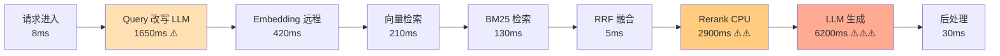
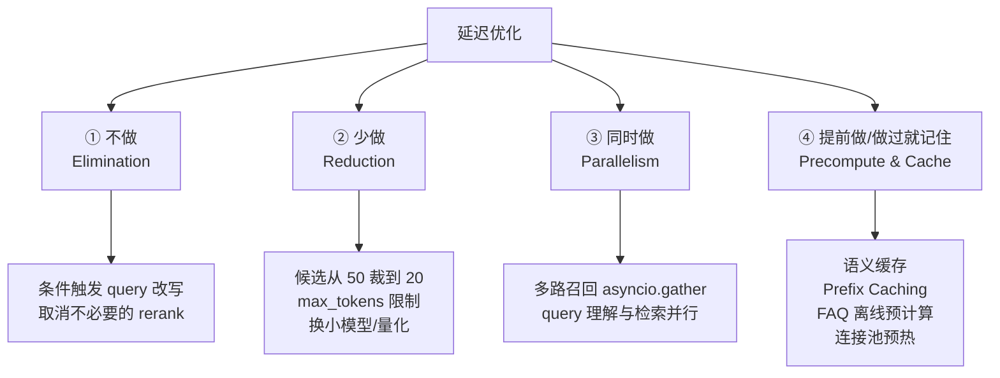
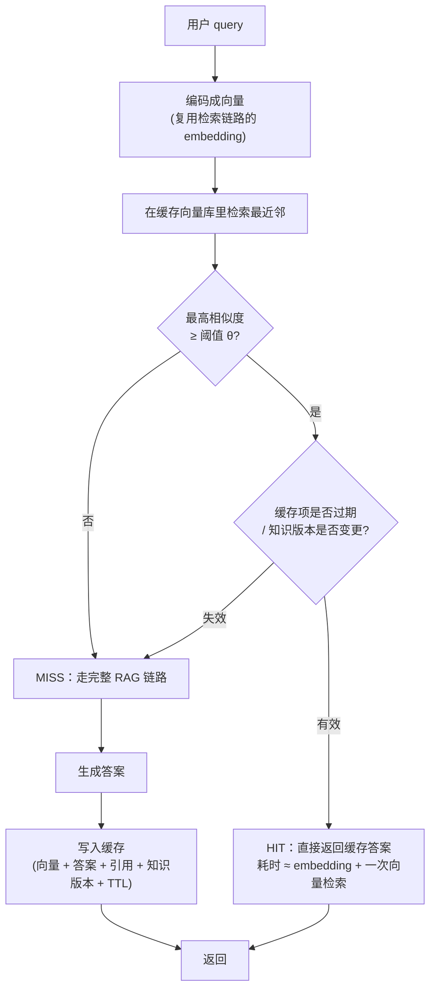
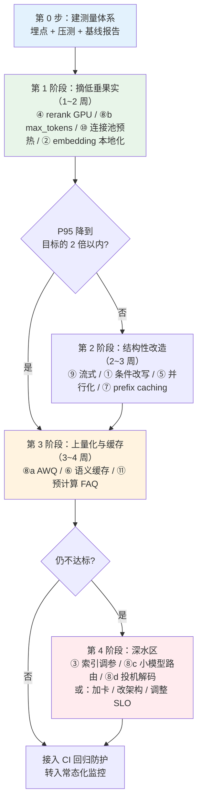
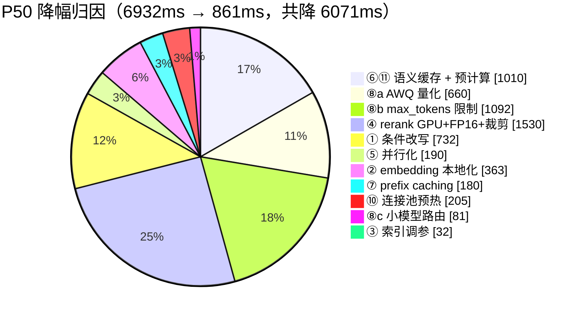
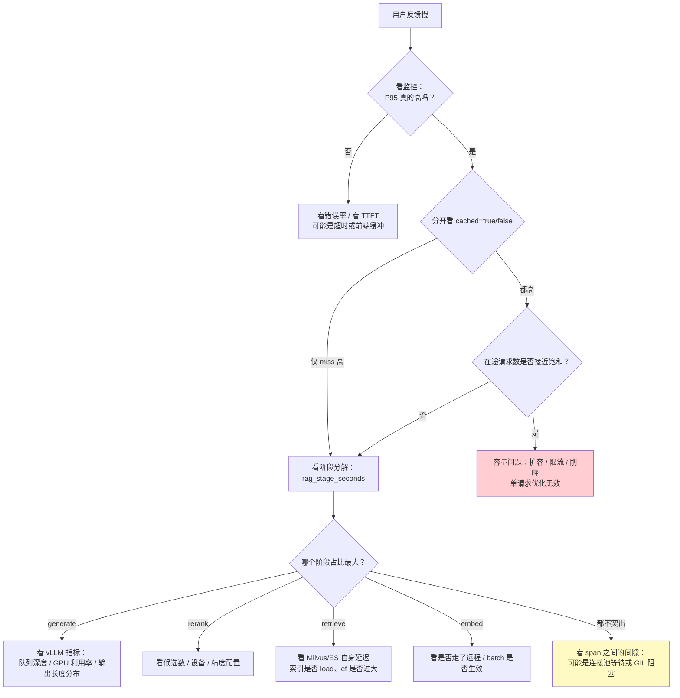

# 第 3.4 章  性能突围：延迟优化 10 倍实战

> **本章目标**：读完能做到 …
> 1. 说清 TTFT / P50 / P95 / P99 / QPS / 错误率各自的定义与适用场景，并解释为什么 SLO 必须写 P99 而不是均值；
> 2. 基于 `core/instrument.py` 扩展出一套全链路耗时埋点，把一次 RAG 请求的每一段耗时打进结构化日志；
> 3. 自己写一个支持并发梯度、warmup、分位数统计的 asyncio 压测脚本，并产出标准格式的基线性能报告；
> 4. 独立完成 11 类延迟优化中的任意一项，并说得出它的**预期收益区间、代价和风险**；
> 5. 实现一套带失效策略的语义缓存，并诚实解释"10 倍"在什么前提下成立、什么前提下不成立；
> 6. 把压测接进 CI，让性能回归在合并前被拦住。
>
> **前置知识**：[3.1 查询理解与高级检索策略](01-查询理解与高级检索策略.md)、[3.2 混合检索与重排序精调](02-混合检索与重排序精调.md)、[3.3 复杂问题拆解与多跳检索](03-复杂问题拆解与多跳检索.md)、[00-前置准备/02-Python工程基础速补](../00-前置准备/02-Python工程基础速补.md)（`core/instrument.py`）、[01-大模型基础与技术选型/03-本地部署实战](../01-大模型基础与技术选型/03-本地部署实战（Ollama-vLLM-SGLang）.md)（vLLM 启动参数）
>
> **预计用时**：阅读 75 分钟 / 动手 300 分钟

---

## 一、为什么需要它（问题出发）

### 1.1 一次很难看的现场演示

华成机电的售后知识库准备给集团领导做季度汇报。演示前一周我们在开发机上点了几十次，感觉"挺快的"。

演示当天，20 多个人同时拿手机扫码进了演示环境，售后总监当场问了一句"XJ-200 报 E043 怎么处理"。

**屏幕上的加载圈转了 14 秒。**

然后是第二个人的问题、第三个人的问题，队列越排越长，最后有 3 个请求直接 504 超时。汇报被迫改成放 PPT。

复盘时我们拉出当天的日志，发现三件事：

1. **开发机上"挺快的"是假象**：开发时永远是一个人串行点，QPS 约等于 0.2，完全没有排队；
2. **我们从来没测过并发**：没有任何一条数据能回答"20 并发下 P95 是多少"；
3. **我们不知道 14 秒花在哪**：日志里只有一行 `request done, elapsed=14203ms`，没有任何分段耗时。

这三件事对应本章要讲的三层东西：**指标定义 → 测量体系 → 优化手段**。顺序不能反。

### 1.2 先把"10 倍"这句话说清楚

本书对应的海报上写着「RAG 查询速度提升 10 倍」。这句话本身没错，但它是一个**结论**，不是一个**承诺**。它成立需要交代四个前提：

| 前提 | 说明 |
|---|---|
| **基线是什么** | 从 8s 到 0.8s 是 10 倍，从 0.8s 到 0.08s 也是 10 倍，难度差了一个数量级。没有基线的"10 倍"是耍流氓 |
| **测的是哪个指标** | TTFT 提升 10 倍、端到端 P50 提升 10 倍、P99 提升 10 倍，是三件完全不同的事，难度递增 |
| **在什么负载下** | 单并发下的 10 倍和 50 并发下的 10 倍不是一回事 |
| **命中什么路径** | 语义缓存命中时确实能做到 10 倍甚至 50 倍；缓存未命中时，10 倍需要把多项优化叠加，且有上限 |

本章的态度是：**把方法论、测量工具和每一项优化的收益区间讲透，让你能在自己的环境里复现出一个诚实的数字**。本章所有性能数字都会标注实测环境或明确写"示例性数据"。

### 1.3 第一条规矩：不测量就不优化

这句话在工程上有个更狠的版本：**没有基线报告的优化 PR，一律不准合并**。

原因很实际：

- 你以为是 rerank 慢，实测发现 65% 的时间在 LLM 生成上，你花两周优化 rerank，端到端只降了 4%；
- 你把 embedding 换成了更小的模型，延迟降了 80ms，但召回率掉了 6 个点，客服投诉量上来了，你还不知道是这次改动引起的；
- 你加了缓存，压测数字漂亮得不像话，因为压测脚本用的是同一条 query，缓存命中率 100%。

这三种情况我都见过。所以本章的顺序是：**先花第三节前三小节把秤造出来，再开始减肥**。

---

## 二、原理拆解：延迟到底从哪来

### 2.1 指标定义（先统一语言）

团队里一旦有人说"这个接口要 2 秒"，第一句应该是反问"哪个 2 秒"。下面这张表是本书统一的定义。

| 指标 | 全称 | 定义 | 为什么重要 |
|---|---|---|---|
| **TTFT** | Time To First Token | 从请求发出到收到**第一个 token** 的耗时 | 流式场景下，这是用户"感觉到系统开始响应"的时刻，是主观体验的主导因素 |
| **TPOT** | Time Per Output Token | 首 token 之后，平均每个输出 token 的耗时 | 决定"吐字速度"，TPOT × 输出长度 = 生成阶段总耗时 |
| **E2E Latency** | End-to-End Latency | 从请求进入网关到**最后一个 token** 落地的总耗时 | 非流式接口、下游系统调用、批处理场景看这个 |
| **P50 / P95 / P99** | 分位延迟 | 把一段时间内所有请求耗时排序，第 50% / 95% / 99% 位置的值 | SLO 的书写单位 |
| **QPS / RPS** | Queries Per Second | 每秒成功处理的请求数 | 容量规划的单位 |
| **并发度** | Concurrency | 同一时刻系统内在途请求数 | 压测的自变量 |
| **错误率** | Error Rate | 非 2xx + 超时 + 降级兜底 的占比 | **延迟数字脱离错误率没有意义**：把超时请求全丢掉，P99 当然好看 |

三个必须一起看的组合：

$$
\text{有效吞吐} = \text{QPS} \times (1 - \text{ErrorRate})
$$

$$
\text{SLO 达标率} = \frac{|\{r : \text{latency}(r) \le T_{\text{SLO}} \wedge \text{success}(r)\}|}{|R|}
$$

写 SLO 的正确姿势是三元组：**「99% 的请求在 3 秒内返回，错误率低于 0.5%，统计窗口 5 分钟」**。只写"平均 2 秒"的 SLO 等于没写。

### 2.2 为什么看 P99 不看均值

这是本章最重要的一个观念，值得展开。

**理由一：均值被长尾稀释，掩盖真实痛苦。**

假设 100 个请求，其中 99 个耗时 500ms，1 个耗时 30s（超时重试）：

$$
\text{mean} = \frac{99 \times 0.5 + 1 \times 30}{100} = 0.795\ \text{s}
$$

均值 795ms，看起来很健康。但那个等了 30 秒的用户已经在群里 @ 你了。P99 = 30s 才是真相。

**理由二：一个页面往往要发多个请求，长尾会被放大。**

如果一个页面要串行调 5 个接口，每个接口的 P99 = 1%，那么这个页面**至少命中一次长尾**的概率是：

$$
P(\text{至少一次慢}) = 1 - (1 - 0.01)^5 \approx 4.9\%
$$

也就是说：单接口 1% 的长尾，在 5 次调用的页面上会变成约 5% 的用户受影响。**Agent 场景更夸张**——一个 ReAct Agent 可能要调 8~15 次 LLM，单次 P99 的长尾会被放大到几乎必然命中。

**理由三：排队会让长尾自我强化。**

由排队论的 Little's Law：

$$
L = \lambda W
$$

其中 $L$ 是系统内平均在途请求数，$\lambda$ 是到达率（QPS），$W$ 是平均停留时间。当服务能力接近饱和（利用率 $\rho \to 1$），M/M/1 模型下的平均等待时间会按

$$
W = \frac{1}{\mu - \lambda} = \frac{1/\mu}{1 - \rho}
$$

**非线性爆炸**。这就是 1.1 节里 20 个人同时提问就雪崩的数学解释：单人 3s 的系统，在 $\rho = 0.9$ 时平均耗时会到 30s 量级。

> **实践结论**：容量规划要按 P99 和目标利用率（一般留到 60%~70%）来做，不能按均值和 100% 利用率来算。

**理由四：P99 反映的是"系统的下限"，而系统的口碑由下限决定。**

用户不会记得你 99 次的 500ms，只会记得那 1 次的 30s。

### 2.3 一次 RAG 请求的耗时构成

下面是华成机电知识库**优化前**的链路。实测环境：

> **实测环境（本章所有数字的统一环境，读者需自行复现）**
> - GPU：单卡 NVIDIA RTX 4090 24GB
> - LLM：Qwen2.5-7B-Instruct-AWQ，vLLM 0.6.x，端口 8001
> - Embedding：bge-m3（初始为远程 HTTP 服务，后改本地）
> - Rerank：bge-reranker-v2-m3（FP32 CPU 起步）
> - 向量库：Milvus 2.4 单机版（standalone），集合 `huacheng_kb`，**12 万 chunk**，dim=1024，HNSW 索引
> - 全文检索：Elasticsearch 8.x 单节点
> - 应用：FastAPI + Uvicorn，4 worker，端口 8080
> - 压测客户端与服务同机房，RTT < 1ms
> - **以下所有耗时均为示例性数据，用于演示方法论；你的环境数字一定不同，必须自己压出来**

| # | 阶段 | P50 | P95 | 占 P95 比例 | 说明 |
|---:|---|---:|---:|---:|---|
| 1 | 网关 + 鉴权 + 参数校验 | 3ms | 8ms | 0.1% | 可忽略 |
| 2 | 会话历史加载（Redis） | 5ms | 22ms | 0.2% | 可忽略 |
| 3 | **Query 改写（LLM）** | 780ms | 1,650ms | 14.2% | 无条件调用，一次完整 LLM 往返 |
| 4 | **Query 向量化（远程 embedding）** | 145ms | 420ms | 3.6% | 含一次 HTTP 往返 + 建连 |
| 5 | **向量检索（Milvus Top-50）** | 62ms | 210ms | 1.8% | efSearch=256 |
| 6 | BM25 检索（ES Top-50） | 38ms | 130ms | 1.1% | 与 5 **串行** |
| 7 | RRF 融合 | 2ms | 5ms | 0.0% | 纯 CPU |
| 8 | **Rerank（50 候选，CPU FP32）** | 1,420ms | 2,900ms | 25.0% | 最大的单点 |
| 9 | 上下文拼装 | 4ms | 11ms | 0.1% | |
| 10 | **LLM 生成（非流式，约 420 token）** | 3,100ms | 6,200ms | 53.4% | 最大的阶段 |
| 11 | 后处理 + 引用标注 | 12ms | 30ms | 0.3% | |
| | **端到端** | **5,571ms** | **11,586ms** | 100% | |

把它画成图：



**结论一目了然**：LLM 生成（53%）+ Rerank（25%）+ Query 改写（14%）三项占了 92%。剩下 8% 里再怎么抠都没用。

### 2.4 Amdahl 定律：优化优先级的数学依据

Amdahl 定律说的是：如果某个部分占总耗时的比例是 $p$，你把它加速 $s$ 倍，整体加速比上限是：

$$
S_{\text{total}} = \frac{1}{(1 - p) + \frac{p}{s}}
$$

代入我们的数据算两笔账：

**账一：把 Rerank（p=0.25）优化 10 倍**

$$
S = \frac{1}{0.75 + 0.025} = 1.29
$$

端到端只快 1.29 倍。P95 从 11.6s 降到 9.0s。

**账二：把 LLM 生成（p=0.534）优化 3 倍**

$$
S = \frac{1}{0.466 + 0.178} = 1.55
$$

端到端快 1.55 倍。

**账三：把 Rerank、LLM 生成、Query 改写全部拿掉（缓存命中）**

$$
S = \frac{1}{1 - 0.92} = 12.5
$$

**这就是"10 倍"的真正来源**：单点优化很难超过 2 倍，10 倍必须来自"整段跳过"——也就是缓存、条件触发、并行化这类结构性手段。

> 记住这三笔账。后面 11 项优化里，凡是能把某一整段**变成 0** 的，收益都在数量级上；凡是只能把某段**变快一点**的，收益都是百分比级。

### 2.5 延迟优化的四把斧头

所有延迟优化，剥开来只有四种动作：



第三节的 11 项优化，每一项都属于这四类中的一类或几类。看优化项时，先问自己"这是四把斧头里的哪一把"，你会发现整件事变得非常清晰。

---

## 三、动手实战

### 3.1 第一步：把秤造出来（全链路埋点）

`core/instrument.py` 已经在 [00-前置准备/02-Python工程基础速补](../00-前置准备/02-Python工程基础速补.md) 里给了 `trace_context` / `span` / `async_span` / `timed` / `count_tokens` / `memoize_json`。它解决的是"打日志"，但性能分析还需要两件事：

1. **把每个 span 的耗时收集成结构化数据**，而不是散在日志行里；
2. **能按 trace 导出一条完整的耗时分解**，直接喂给报表。

所以我们**扩展**它，不是重写它。新建 `core/perf.py`：

```python
# core/perf.py
"""性能分析扩展：在 core.instrument 之上收集结构化的分段耗时，支持导出与聚合。"""
from __future__ import annotations

import asyncio
import functools
import json
import statistics
import time
from contextlib import asynccontextmanager, contextmanager
from contextvars import ContextVar
from dataclasses import asdict, dataclass, field
from pathlib import Path
from typing import Any, Callable, Iterable, TypeVar

from loguru import logger

from core.instrument import get_trace_id

F = TypeVar("F", bound=Callable[..., Any])


@dataclass
class SpanRecord:
    """一个阶段的耗时记录。"""
    name: str
    start_ms: float
    elapsed_ms: float
    depth: int
    attrs: dict[str, Any] = field(default_factory=dict)


@dataclass
class PerfTrace:
    """一次请求的完整耗时分解。"""
    trace_id: str
    label: str
    t0: float
    spans: list[SpanRecord] = field(default_factory=list)
    total_ms: float = 0.0
    ok: bool = True
    err: str = ""
    ttft_ms: float | None = None

    def add(self, rec: SpanRecord) -> None:
        """追加一条 span 记录。"""
        self.spans.append(rec)

    def breakdown(self) -> dict[str, float]:
        """返回按 span 名聚合的耗时字典（同名累加，只统计顶层与一级子 span）。"""
        out: dict[str, float] = {}
        for s in self.spans:
            out[s.name] = out.get(s.name, 0.0) + s.elapsed_ms
        return out

    def to_json(self) -> str:
        """序列化为一行 JSON，便于落盘与离线分析。"""
        return json.dumps(
            {
                "trace_id": self.trace_id,
                "label": self.label,
                "total_ms": round(self.total_ms, 2),
                "ttft_ms": round(self.ttft_ms, 2) if self.ttft_ms is not None else None,
                "ok": self.ok,
                "err": self.err,
                "spans": [asdict(s) for s in self.spans],
            },
            ensure_ascii=False,
        )


_perf: ContextVar[PerfTrace | None] = ContextVar("perf_trace", default=None)
_depth: ContextVar[int] = ContextVar("perf_depth", default=0)


def current_perf() -> PerfTrace | None:
    """返回当前上下文的 PerfTrace，没有开启则返回 None。"""
    return _perf.get()


def mark_ttft() -> None:
    """标记首 token 时刻，供流式接口在收到第一个 chunk 时调用。"""
    tr = _perf.get()
    if tr is not None and tr.ttft_ms is None:
        tr.ttft_ms = (time.perf_counter() - tr.t0) * 1000


def set_attr(**kwargs: Any) -> None:
    """给当前最内层 span 附加属性（如 top_k、候选数、命中缓存与否）。"""
    tr = _perf.get()
    if tr is not None and tr.spans:
        tr.spans[-1].attrs.update(kwargs)


@contextmanager
def perf_trace(label: str = "rag_request"):
    """开启一次性能追踪上下文，退出时把完整分解写入 JSONL。"""
    tr = PerfTrace(trace_id=get_trace_id() or f"t{int(time.time()*1000)%10**9}", label=label, t0=time.perf_counter())
    tok = _perf.set(tr)
    tok_d = _depth.set(0)
    try:
        yield tr
    except Exception as exc:
        tr.ok = False
        tr.err = f"{type(exc).__name__}: {exc}"
        raise
    finally:
        tr.total_ms = (time.perf_counter() - tr.t0) * 1000
        _depth.reset(tok_d)
        _perf.reset(tok)
        logger.bind(trace_id=tr.trace_id).info("perf {}", tr.to_json())


@contextmanager
def pspan(name: str, **attrs: Any):
    """同步版分段计时。没有开启 perf_trace 时退化成无开销的空操作。"""
    tr = _perf.get()
    if tr is None:
        yield
        return
    d = _depth.get()
    _depth.set(d + 1)
    start = (time.perf_counter() - tr.t0) * 1000
    t0 = time.perf_counter()
    rec = SpanRecord(name=name, start_ms=start, elapsed_ms=0.0, depth=d, attrs=dict(attrs))
    tr.add(rec)
    try:
        yield rec
    finally:
        rec.elapsed_ms = (time.perf_counter() - t0) * 1000
        _depth.set(d)


@asynccontextmanager
async def apspan(name: str, **attrs: Any):
    """异步版分段计时，用法与 pspan 一致。"""
    tr = _perf.get()
    if tr is None:
        yield None
        return
    d = _depth.get()
    _depth.set(d + 1)
    start = (time.perf_counter() - tr.t0) * 1000
    t0 = time.perf_counter()
    rec = SpanRecord(name=name, start_ms=start, elapsed_ms=0.0, depth=d, attrs=dict(attrs))
    tr.add(rec)
    try:
        yield rec
    finally:
        rec.elapsed_ms = (time.perf_counter() - t0) * 1000
        _depth.set(d)


def stage(name: str) -> Callable[[F], F]:
    """装饰器形式的分段计时，同时支持同步与异步函数。"""
    def deco(func: F) -> F:
        @functools.wraps(func)
        def sync_wrapper(*args: Any, **kwargs: Any) -> Any:
            with pspan(name):
                return func(*args, **kwargs)

        @functools.wraps(func)
        async def async_wrapper(*args: Any, **kwargs: Any) -> Any:
            async with apspan(name):
                return await func(*args, **kwargs)

        return async_wrapper if asyncio.iscoroutinefunction(func) else sync_wrapper  # type: ignore[return-value]

    return deco


def dump_traces(traces: Iterable[PerfTrace], path: str) -> None:
    """把多条 PerfTrace 写成 JSONL 文件。"""
    p = Path(path)
    p.parent.mkdir(parents=True, exist_ok=True)
    with p.open("w", encoding="utf-8") as f:
        for tr in traces:
            f.write(tr.to_json() + "\n")


def percentile(values: list[float], q: float) -> float:
    """线性插值分位数，q 取 0~100。空列表返回 0。"""
    if not values:
        return 0.0
    xs = sorted(values)
    if len(xs) == 1:
        return xs[0]
    pos = (len(xs) - 1) * q / 100.0
    lo = int(pos)
    hi = min(lo + 1, len(xs) - 1)
    frac = pos - lo
    return xs[lo] * (1 - frac) + xs[hi] * frac


def summarize(traces: list[PerfTrace]) -> dict[str, Any]:
    """把一批 PerfTrace 聚合成报告字典：总体分位 + 分阶段分位。"""
    ok = [t for t in traces if t.ok]
    totals = [t.total_ms for t in ok]
    ttfts = [t.ttft_ms for t in ok if t.ttft_ms is not None]

    stage_vals: dict[str, list[float]] = {}
    for t in ok:
        for name, ms in t.breakdown().items():
            stage_vals.setdefault(name, []).append(ms)

    report: dict[str, Any] = {
        "n_total": len(traces),
        "n_ok": len(ok),
        "error_rate": round(1 - len(ok) / max(len(traces), 1), 4),
        "e2e": {
            "mean": round(statistics.fmean(totals), 1) if totals else 0.0,
            "p50": round(percentile(totals, 50), 1),
            "p90": round(percentile(totals, 90), 1),
            "p95": round(percentile(totals, 95), 1),
            "p99": round(percentile(totals, 99), 1),
            "max": round(max(totals), 1) if totals else 0.0,
        },
        "ttft": {
            "p50": round(percentile(ttfts, 50), 1),
            "p95": round(percentile(ttfts, 95), 1),
        } if ttfts else None,
        "stages": {},
    }
    for name, vals in sorted(stage_vals.items(), key=lambda kv: -percentile(kv[1], 95)):
        report["stages"][name] = {
            "n": len(vals),
            "p50": round(percentile(vals, 50), 1),
            "p95": round(percentile(vals, 95), 1),
            "share_p95": round(percentile(vals, 95) / max(percentile(totals, 95), 1e-9), 3),
        }
    return report
```

用法（把埋点插进 RAG 链路）：

```python
# rag/pipeline_instrumented.py
"""给 RAG 链路插上分段埋点，产出可直接分析的耗时分解。"""
from __future__ import annotations

from core.instrument import trace_context
from core.perf import apspan, mark_ttft, perf_trace, set_attr


async def answer(query: str, session_id: str = "") -> dict:
    """完整 RAG 链路：改写 → 向量化 → 混合召回 → rerank → 生成。"""
    with trace_context("ask"), perf_trace("rag_request") as tr:
        async with apspan("query_rewrite"):
            q2 = await rewrite_query(query)
            set_attr(rewritten=(q2 != query))

        async with apspan("embed"):
            vec = await embed_query(q2)

        async with apspan("retrieve_vector"):
            vhits = await milvus_search(vec, top_k=50)
            set_attr(n=len(vhits))

        async with apspan("retrieve_bm25"):
            bhits = await es_search(q2, top_k=50)
            set_attr(n=len(bhits))

        async with apspan("fuse"):
            cands = rrf_fuse([vhits, bhits], top_n=50)

        async with apspan("rerank"):
            top = await rerank(q2, cands, top_n=5)
            set_attr(n_in=len(cands), n_out=len(top))

        async with apspan("generate"):
            text_parts = []
            async for chunk in stream_generate(q2, top):
                if not text_parts:
                    mark_ttft()
                text_parts.append(chunk)
            answer_text = "".join(text_parts)

        return {"answer": answer_text, "trace_id": tr.trace_id, "breakdown": tr.breakdown()}
```

跑一次的日志长这样：

```text
2026-03-04 10:21:07 | INFO | trace start name=ask
2026-03-04 10:21:13 | INFO | perf {"trace_id":"9f3c1a7b28e4d015","label":"rag_request","total_ms":5612.4,"ttft_ms":4498.2,"ok":true,"err":"","spans":[{"name":"query_rewrite","start_ms":0.4,"elapsed_ms":772.1,"depth":0,"attrs":{"rewritten":true}},{"name":"embed","start_ms":772.6,"elapsed_ms":149.3,"depth":0,"attrs":{}},{"name":"retrieve_vector","start_ms":922.1,"elapsed_ms":64.8,"depth":0,"attrs":{"n":50}},{"name":"retrieve_bm25","start_ms":987.0,"elapsed_ms":39.5,"depth":0,"attrs":{"n":50}},{"name":"fuse","start_ms":1026.6,"elapsed_ms":2.1,"depth":0,"attrs":{}},{"name":"rerank","start_ms":1028.8,"elapsed_ms":1441.6,"depth":0,"attrs":{"n_in":50,"n_out":5}},{"name":"generate","start_ms":2470.5,"elapsed_ms":3141.6,"depth":0,"attrs":{}}]}
2026-03-04 10:21:13 | INFO | trace end name=ask elapsed=5613.9ms calls=2 tokens=1842 cost≈0.0031元
```

**这一行 JSON 就是本章后面所有分析的原料。**

> **埋点本身的开销**：`pspan` 只做两次 `perf_counter()` 和一次 dataclass 构造，单 span 开销在微秒级。实测（**示例性数据**）给一次 7-span 的请求增加约 0.1ms，相对于秒级链路可忽略。但**不要把埋点插进循环体内部**（比如逐 chunk 埋点），那会产生成千上万条记录。

### 3.2 第二步：写一个能用的压测脚本

市面上有 `locust`、`wrk`、`k6`。但 RAG 压测有几个特殊需求，现成工具都要写不少扩展代码：

- 需要**从真实 query 集里采样**，而不是打同一条 query（否则缓存作弊）；
- 需要统计 **TTFT**（要解析 SSE 流）；
- 需要跑**并发梯度**（1 / 2 / 4 / 8 / 16 / 32），一次性出容量曲线；
- 需要区分**缓存命中与否**的分位数。

用 asyncio 自己写不到 300 行，而且完全可控。新建 `scripts/bench.py`：

```python
# scripts/bench.py
"""RAG 服务压测器：并发梯度、warmup、TTFT 统计、分位数报告。纯 asyncio + httpx 实现。"""
from __future__ import annotations

import argparse
import asyncio
import json
import random
import statistics
import time
from dataclasses import dataclass, field
from pathlib import Path

import httpx


@dataclass
class Sample:
    """一次请求的观测结果。"""
    ok: bool
    e2e_ms: float
    ttft_ms: float | None
    status: int
    err: str = ""
    cache_hit: bool | None = None
    out_tokens: int = 0


@dataclass
class LevelResult:
    """一个并发档位的汇总结果。"""
    concurrency: int
    duration_s: float
    samples: list[Sample] = field(default_factory=list)


def pct(values: list[float], q: float) -> float:
    """线性插值分位数，q 取 0~100。"""
    if not values:
        return 0.0
    xs = sorted(values)
    if len(xs) == 1:
        return xs[0]
    pos = (len(xs) - 1) * q / 100.0
    lo = int(pos)
    hi = min(lo + 1, len(xs) - 1)
    return xs[lo] * (1 - (pos - lo)) + xs[hi] * (pos - lo)


def load_queries(path: str) -> list[str]:
    """从 JSONL 加载压测 query（字段名 query），文件不存在则用内置兜底集合。"""
    p = Path(path)
    if not p.exists():
        return [
            "XJ-200 报 E043 怎么处理",
            "主轴异响的常见原因",
            "XJ-300 导轨润滑周期是多久",
            "E057 报警需要更换哪些备件",
            "液压站压力上不去怎么排查",
        ]
    out = []
    for line in p.read_text(encoding="utf-8").splitlines():
        line = line.strip()
        if not line:
            continue
        obj = json.loads(line)
        q = obj.get("query") or obj.get("question")
        if q:
            out.append(q)
    return out


async def one_request(client: httpx.AsyncClient, url: str, query: str, stream: bool, timeout: float) -> Sample:
    """发送一次请求并测量 E2E 与 TTFT；stream=True 时按 SSE 解析首 chunk。"""
    t0 = time.perf_counter()
    ttft = None
    ntok = 0
    try:
        if stream:
            async with client.stream("POST", url, json={"query": query, "stream": True}, timeout=timeout) as resp:
                if resp.status_code != 200:
                    await resp.aread()
                    return Sample(False, (time.perf_counter() - t0) * 1000, None, resp.status_code, "bad_status")
                cache_hit = resp.headers.get("x-cache") == "hit"
                async for line in resp.aiter_lines():
                    if not line or not line.startswith("data:"):
                        continue
                    payload = line[5:].strip()
                    if payload == "[DONE]":
                        break
                    if ttft is None:
                        ttft = (time.perf_counter() - t0) * 1000
                    ntok += 1
                return Sample(True, (time.perf_counter() - t0) * 1000, ttft, 200, cache_hit=cache_hit, out_tokens=ntok)
        else:
            resp = await client.post(url, json={"query": query, "stream": False}, timeout=timeout)
            e2e = (time.perf_counter() - t0) * 1000
            if resp.status_code != 200:
                return Sample(False, e2e, None, resp.status_code, "bad_status")
            body = resp.json()
            return Sample(
                True, e2e, None, 200,
                cache_hit=(resp.headers.get("x-cache") == "hit"),
                out_tokens=len(body.get("answer", "")),
            )
    except asyncio.TimeoutError:
        return Sample(False, (time.perf_counter() - t0) * 1000, None, 0, "timeout")
    except Exception as exc:
        return Sample(False, (time.perf_counter() - t0) * 1000, None, 0, f"{type(exc).__name__}")


async def worker(client, url, queries, stream, timeout, stop_at, out: list[Sample], rng: random.Random) -> None:
    """一个并发协程：在截止时间前不断取 query 打请求。"""
    while time.perf_counter() < stop_at:
        q = rng.choice(queries)
        out.append(await one_request(client, url, q, stream, timeout))


async def run_level(url: str, queries: list[str], concurrency: int, duration_s: float,
                    stream: bool, timeout: float, seed: int) -> LevelResult:
    """在固定并发下压测 duration_s 秒，返回该档位的全部样本。"""
    samples: list[Sample] = []
    limits = httpx.Limits(max_connections=concurrency * 2, max_keepalive_connections=concurrency * 2)
    async with httpx.AsyncClient(limits=limits) as client:
        stop_at = time.perf_counter() + duration_s
        tasks = [
            asyncio.create_task(worker(client, url, queries, stream, timeout, stop_at, samples, random.Random(seed + i)))
            for i in range(concurrency)
        ]
        await asyncio.gather(*tasks)
    return LevelResult(concurrency=concurrency, duration_s=duration_s, samples=samples)


async def warmup(url: str, queries: list[str], n: int, stream: bool, timeout: float) -> None:
    """预热：串行打 n 次请求，让连接池、模型显存、JIT、索引缓存都就绪。"""
    async with httpx.AsyncClient() as client:
        for i in range(n):
            await one_request(client, url, queries[i % len(queries)], stream, timeout)


def report_level(res: LevelResult) -> dict:
    """把一个档位的样本聚合成报告字典。"""
    ok = [s for s in res.samples if s.ok]
    e2e = [s.e2e_ms for s in ok]
    ttft = [s.ttft_ms for s in ok if s.ttft_ms is not None]
    hits = [s for s in ok if s.cache_hit]
    return {
        "concurrency": res.concurrency,
        "n_req": len(res.samples),
        "n_ok": len(ok),
        "error_rate": round(1 - len(ok) / max(len(res.samples), 1), 4),
        "qps": round(len(ok) / res.duration_s, 2),
        "e2e_mean": round(statistics.fmean(e2e), 1) if e2e else 0.0,
        "e2e_p50": round(pct(e2e, 50), 1),
        "e2e_p90": round(pct(e2e, 90), 1),
        "e2e_p95": round(pct(e2e, 95), 1),
        "e2e_p99": round(pct(e2e, 99), 1),
        "e2e_max": round(max(e2e), 1) if e2e else 0.0,
        "ttft_p50": round(pct(ttft, 50), 1) if ttft else None,
        "ttft_p95": round(pct(ttft, 95), 1) if ttft else None,
        "cache_hit_rate": round(len(hits) / max(len(ok), 1), 3),
    }


def print_table(rows: list[dict]) -> None:
    """用 Markdown 表格打印各并发档位的结果，方便直接粘进报告。"""
    cols = ["concurrency", "qps", "e2e_p50", "e2e_p95", "e2e_p99", "ttft_p50", "ttft_p95", "error_rate", "cache_hit_rate"]
    print("| " + " | ".join(cols) + " |")
    print("|" + "|".join(["---"] * len(cols)) + "|")
    for r in rows:
        print("| " + " | ".join(str(r.get(c)) for c in cols) + " |")


async def main() -> None:
    """解析参数，按并发梯度依次压测并输出报告。"""
    ap = argparse.ArgumentParser()
    ap.add_argument("--url", default="http://127.0.0.1:8080/api/ask")
    ap.add_argument("--queries", default="evals/bench_queries.jsonl")
    ap.add_argument("--levels", default="1,2,4,8,16,32")
    ap.add_argument("--duration", type=float, default=30.0)
    ap.add_argument("--warmup", type=int, default=5)
    ap.add_argument("--timeout", type=float, default=60.0)
    ap.add_argument("--stream", action="store_true")
    ap.add_argument("--seed", type=int, default=42)
    ap.add_argument("--out", default="evals/bench_report.json")
    args = ap.parse_args()

    queries = load_queries(args.queries)
    print(f"[bench] {len(queries)} queries loaded, warmup {args.warmup} ...")
    await warmup(args.url, queries, args.warmup, args.stream, args.timeout)

    rows = []
    for lv in [int(x) for x in args.levels.split(",")]:
        print(f"[bench] concurrency={lv} duration={args.duration}s ...")
        res = await run_level(args.url, queries, lv, args.duration, args.stream, args.timeout, args.seed)
        row = report_level(res)
        rows.append(row)
        print(f"        qps={row['qps']} p95={row['e2e_p95']}ms err={row['error_rate']}")
        await asyncio.sleep(3)

    print()
    print_table(rows)
    Path(args.out).parent.mkdir(parents=True, exist_ok=True)
    Path(args.out).write_text(json.dumps({"url": args.url, "levels": rows}, ensure_ascii=False, indent=2), encoding="utf-8")
    print(f"\n[bench] report -> {args.out}")


if __name__ == "__main__":
    asyncio.run(main())
```

运行：

```bash
uv add httpx
# pip 等价：pip install httpx

python scripts/bench.py \
  --url http://127.0.0.1:8080/api/ask \
  --queries evals/bench_queries.jsonl \
  --levels 1,2,4,8,16,32 \
  --duration 30 --warmup 5 --stream
```

预期输出：

```text
[bench] 200 queries loaded, warmup 5 ...
[bench] concurrency=1 duration=30.0s ...
        qps=0.18 p95=11586.0ms err=0.0
[bench] concurrency=2 duration=30.0s ...
        qps=0.34 p95=12104.5ms err=0.0
[bench] concurrency=4 duration=30.0s ...
        qps=0.61 p95=14882.3ms err=0.0
[bench] concurrency=8 duration=30.0s ...
        qps=0.88 p95=21455.7ms err=0.0
[bench] concurrency=16 duration=30.0s ...
        qps=0.95 p95=38209.1ms err=0.031
[bench] concurrency=32 duration=30.0s ...
        qps=0.93 p95=59988.0ms err=0.186

| concurrency | qps | e2e_p50 | e2e_p95 | e2e_p99 | ttft_p50 | ttft_p95 | error_rate | cache_hit_rate |
|---|---|---|---|---|---|---|---|---|
| 1 | 0.18 | 5571.0 | 11586.0 | 12933.0 | 4482.0 | 9901.0 | 0.0 | 0.0 |
| 2 | 0.34 | 5802.4 | 12104.5 | 13780.2 | 4610.9 | 10322.1 | 0.0 | 0.0 |
| 4 | 0.61 | 6931.8 | 14882.3 | 17225.6 | 5502.2 | 12866.4 | 0.0 | 0.0 |
| 8 | 0.88 | 9102.3 | 21455.7 | 25980.4 | 7414.0 | 18901.2 | 0.0 | 0.0 |
| 16 | 0.95 | 17233.9 | 38209.1 | 49122.7 | 14028.3 | 33402.5 | 0.031 | 0.0 |
| 32 | 0.93 | 32844.1 | 59988.0 | 60000.0 | 27019.5 | 59122.4 | 0.186 | 0.0 |

[bench] report -> evals/bench_report.json
```

> **以上为示例性数据，实测环境见 2.3 节。你的数字一定不同，必须自己压。**

这张表能读出三个关键结论：

1. **饱和点在并发 8 左右**：QPS 从 0.88 到 0.95 几乎不再增长，但 P95 从 21s 涨到 38s。这就是 2.2 节 Little's Law 描述的"利用率逼近 1 时等待时间爆炸"。
2. **超过饱和点继续加压是有害的**：并发 32 时 QPS 反而降到 0.93，错误率 18.6%。这说明必须在网关层做**并发限流**，把超出的请求快速失败或排队，而不是全放进去一起慢。
3. **TTFT 约等于 E2E 的 80%**：说明流式并没有帮上忙——因为检索和 rerank 都在生成之前，用户在首 token 之前要干等 4.5s。

**写进压测脚本的四条纪律：**

| 纪律 | 为什么 |
|---|---|
| **必须 warmup** | 首次请求会触发建连、模型显存分配、Milvus 加载索引到内存、Python import。不 warmup 会把冷启动算进 P99 |
| **query 必须采样自真实集合** | 打同一条 query 会让缓存命中率虚高到 100%，测出来的是缓存性能不是系统性能 |
| **必须记录错误率** | 超时请求如果不计入，P99 会被"幸存者偏差"美化 |
| **每档之间 sleep 几秒** | 让上一档的在途请求排空，否则会串扰下一档 |

### 3.3 第三步：产出基线性能报告

有了埋点和压测器，固化一个报告模板。放在 `evals/perf/baseline_YYYYMMDD.md`：

```markdown
# RAG 服务性能基线报告

- **报告日期**：2026-03-04
- **代码版本**：git rev `a1b2c3d`，镜像 tag `rag-api:2026.03.04`
- **测试环境**：单卡 RTX 4090 / Qwen2.5-7B-AWQ(vLLM 0.6.x) / bge-m3 / bge-reranker-v2-m3 / Milvus 2.4 standalone(12万 chunk) / ES 8.x 单节点 / FastAPI 4 worker
- **压测配置**：`scripts/bench.py --levels 1,2,4,8,16,32 --duration 30 --warmup 5 --stream`
- **query 集**：`evals/bench_queries.jsonl`，200 条，来自灰度期真实日志抽样（脱敏）
- **缓存状态**：已清空（`redis-cli FLUSHDB`）

## 1. 容量曲线

| 并发 | QPS | P50 | P95 | P99 | TTFT P50 | TTFT P95 | 错误率 |
|---:|---:|---:|---:|---:|---:|---:|---:|
| 1 | 0.18 | 5571 | 11586 | 12933 | 4482 | 9901 | 0.0% |
| ... | | | | | | | |

**饱和并发**：8
**推荐运行并发上限（留 30% 余量）**：6

## 2. 单请求耗时分解（并发=1，n=100）

| 阶段 | P50(ms) | P95(ms) | 占 P95 |
|---|---:|---:|---:|
| generate | 3100 | 6200 | 53.4% |
| rerank | 1420 | 2900 | 25.0% |
| query_rewrite | 780 | 1650 | 14.2% |
| ... | | | |

## 3. 结论与优化优先级

1. ...
2. ...

## 4. 附件

- 原始报告：`evals/bench_report_20260304.json`
- trace 明细：`logs/perf_20260304.jsonl`
```

配套的分析脚本，从 3.1 的 JSONL 里直接生成第 2 节表格：

```python
# scripts/perf_analyze.py
"""读取 perf JSONL 日志，输出分阶段耗时分位表（Markdown），用于填基线报告。"""
from __future__ import annotations

import argparse
import json
from pathlib import Path

from core.perf import PerfTrace, SpanRecord, summarize


def load_jsonl(path: str) -> list[PerfTrace]:
    """从 JSONL 还原 PerfTrace 列表（只取 perf 行）。"""
    out = []
    for line in Path(path).read_text(encoding="utf-8").splitlines():
        idx = line.find('{"trace_id"')
        if idx < 0:
            continue
        obj = json.loads(line[idx:])
        tr = PerfTrace(trace_id=obj["trace_id"], label=obj["label"], t0=0.0)
        tr.total_ms = obj["total_ms"]
        tr.ttft_ms = obj.get("ttft_ms")
        tr.ok = obj["ok"]
        tr.err = obj.get("err", "")
        tr.spans = [SpanRecord(**s) for s in obj["spans"]]
        out.append(tr)
    return out


def main() -> None:
    """命令行入口：打印总体与分阶段分位表。"""
    ap = argparse.ArgumentParser()
    ap.add_argument("path")
    args = ap.parse_args()

    traces = load_jsonl(args.path)
    rep = summarize(traces)

    print(f"样本 {rep['n_ok']}/{rep['n_total']}  错误率 {rep['error_rate']:.2%}\n")
    e = rep["e2e"]
    print(f"端到端  mean={e['mean']}  p50={e['p50']}  p95={e['p95']}  p99={e['p99']}  max={e['max']}")
    if rep["ttft"]:
        print(f"TTFT    p50={rep['ttft']['p50']}  p95={rep['ttft']['p95']}")
    print()
    print("| 阶段 | n | P50(ms) | P95(ms) | 占 P95 |")
    print("|---|---:|---:|---:|---:|")
    for name, s in rep["stages"].items():
        print(f"| {name} | {s['n']} | {s['p50']} | {s['p95']} | {s['share_p95']:.1%} |")


if __name__ == "__main__":
    main()
```

```bash
python scripts/perf_analyze.py logs/app.log
```

```text
样本 98/100  错误率 2.00%

端到端  mean=5824.7  p50=5571.0  p95=11586.0  p99=12933.0  max=13801.2
TTFT    p50=4482.0  p95=9901.0

| 阶段 | n | P50(ms) | P95(ms) | 占 P95 |
|---|---:|---:|---:|---:|
| generate | 98 | 3100.4 | 6199.8 | 53.5% |
| rerank | 98 | 1420.1 | 2901.3 | 25.0% |
| query_rewrite | 98 | 779.6 | 1649.2 | 14.2% |
| embed | 98 | 145.2 | 420.1 | 3.6% |
| retrieve_vector | 98 | 62.3 | 209.7 | 1.8% |
| retrieve_bm25 | 98 | 38.1 | 130.4 | 1.1% |
| fuse | 98 | 2.0 | 5.1 | 0.0% |
```

**秤造好了。下面开始减肥。**

---

### 3.4 优化项逐条拆解

接下来 11 项优化，每项固定按「**原理 → 完整代码 → 预期收益区间 → 代价与风险**」四段写。

**阅读方式建议**：不要按顺序全做。先看 3.5 的汇总表，对照你自己的耗时分解表挑能打的。

---

#### 优化 ① 砍掉不必要的 LLM 前置调用

**原理**

3.1 章我们给链路加了 Query Rewriting，它确实提升了召回。但它有一个致命问题：**无条件执行**。

看几条真实 query：

| query | 需要改写吗 | 理由 |
|---|---|---|
| `E043` | 不需要 | 精确故障码，BM25/元数据直接能命中，改写只会引入噪声 |
| `XJ-200 主轴轴承更换周期` | 不需要 | 已经是规范表述，术语与手册对齐 |
| `那个200的咣咣响咋整` | **需要** | 口语 + 实体残缺 |
| `它多少钱` | **需要**（指代消解） | 无主语 |

按华成机电灰度期日志统计（**示例性数据，需自行统计**），约 **45%~55%** 的 query 属于"不需要改写"。对这一半流量，我们白白付了一次完整 LLM 往返（P95 1.65s）。

这是四把斧头里的**第一把：不做**。

**完整代码**

```python
# rag/opt/conditional_rewrite.py
"""条件触发的 query 改写：用廉价规则先判定是否真的需要 LLM 改写，避免无条件付费。"""
from __future__ import annotations

import re
from dataclasses import dataclass

from core.perf import pspan, set_attr

# 精确标识：故障码、型号、零件号。命中即认为 query 已足够精确
RE_FAULT_CODE = re.compile(r"\b[Ee]\d{3}\b")
RE_MODEL = re.compile(r"\bXJ[-\s]?\d{3}(?:[-\s]?[A-Z]\d)?\b", re.I)
RE_PART_NO = re.compile(r"\b[A-Z]{2,3}-\d{4,6}\b")

# 指代词：命中则必须做指代消解
RE_PRONOUN = re.compile(r"(它|他|她|这个|那个|这台|那台|刚才|上面说的|前面提到)")

# 口语/拟声/模糊表述：命中则改写收益高
COLLOQUIAL = ("咋", "咋整", "怎么弄", "不转", "不好使", "咣", "嗡", "吱", "有点", "好像", "老是", "总是")

# 领域术语白名单：命中说明用户已在用手册措辞
DOMAIN_TERMS = ("报警复位", "故障代码", "润滑周期", "主轴驱动", "伺服", "液压站", "预紧力", "点检", "保养规程")


@dataclass
class RewriteDecision:
    """改写决策结果。"""
    need_rewrite: bool
    need_coref: bool
    reason: str


def decide_rewrite(query: str, has_history: bool = False) -> RewriteDecision:
    """用规则判断这条 query 是否需要 LLM 改写 / 指代消解。"""
    q = query.strip()

    if has_history and RE_PRONOUN.search(q):
        return RewriteDecision(True, True, "pronoun_with_history")

    if RE_FAULT_CODE.search(q) or RE_PART_NO.search(q):
        if len(q) <= 40 and not any(c in q for c in COLLOQUIAL):
            return RewriteDecision(False, False, "exact_id_hit")

    if any(c in q for c in COLLOQUIAL):
        return RewriteDecision(True, False, "colloquial")

    if len(q) < 6:
        return RewriteDecision(True, False, "too_short")

    if RE_MODEL.search(q) and any(t in q for t in DOMAIN_TERMS):
        return RewriteDecision(False, False, "model_plus_domain_term")

    if len(q) >= 12 and any(t in q for t in DOMAIN_TERMS):
        return RewriteDecision(False, False, "domain_term_only")

    return RewriteDecision(True, False, "default_rewrite")


async def maybe_rewrite(query: str, history: list[dict] | None = None) -> str:
    """按决策结果选择性调用 LLM 改写，跳过时零成本返回原 query。"""
    from rag.query_understanding import llm_rewrite, llm_coref_resolve  # 3.1 章实现

    with pspan("rewrite_decision"):
        d = decide_rewrite(query, has_history=bool(history))
        set_attr(need_rewrite=d.need_rewrite, reason=d.reason)

    if not d.need_rewrite:
        return query

    if d.need_coref:
        with pspan("coref"):
            return await llm_coref_resolve(query, history or [])

    with pspan("llm_rewrite"):
        return await llm_rewrite(query)
```

配套的"决策质量"验证脚本——**这一步不能省**，否则你不知道规则是不是把该改写的漏了：

```python
# scripts/eval_rewrite_gate.py
"""验证条件改写门控的质量：统计跳过率、错误跳过率对召回的影响。"""
from __future__ import annotations

import asyncio
import json
from pathlib import Path

from rag.opt.conditional_rewrite import decide_rewrite


async def main(gold_path: str = "evals/gold/retrieval_gold.jsonl") -> None:
    """对金标集逐条评估：跳过改写后 Recall@5 是否下降。"""
    from rag.retriever import hybrid_search  # 3.2 章实现
    from rag.query_understanding import llm_rewrite

    cases = [json.loads(l) for l in Path(gold_path).read_text(encoding="utf-8").splitlines() if l.strip()]

    n_skip = 0
    hit_always, hit_gated = 0, 0
    bad_skips = []

    for c in cases:
        q, gold_ids = c["query"], set(c["gold_chunk_ids"])
        d = decide_rewrite(q, has_history=False)
        if not d.need_rewrite:
            n_skip += 1

        rewritten = await llm_rewrite(q)
        ids_always = {h["chunk_id"] for h in await hybrid_search(rewritten, top_k=5)}
        q_gated = q if not d.need_rewrite else rewritten
        ids_gated = {h["chunk_id"] for h in await hybrid_search(q_gated, top_k=5)}

        ok_a = bool(ids_always & gold_ids)
        ok_g = bool(ids_gated & gold_ids)
        hit_always += ok_a
        hit_gated += ok_g
        if ok_a and not ok_g:
            bad_skips.append({"query": q, "reason": d.reason})

    n = len(cases)
    print(f"样本数 {n}")
    print(f"跳过改写比例 {n_skip / n:.1%}")
    print(f"Recall@5 全改写 {hit_always / n:.3f}  条件改写 {hit_gated / n:.3f}  差值 {(hit_gated - hit_always) / n:+.3f}")
    print(f"错误跳过（改写本可救回）{len(bad_skips)} 条：")
    for b in bad_skips[:10]:
        print("  -", b["reason"], "|", b["query"])


if __name__ == "__main__":
    asyncio.run(main())
```

```text
样本数 300
跳过改写比例 48.3%
Recall@5 全改写 0.812  条件改写 0.805  差值 -0.007
错误跳过（改写本可救回）3 条：
  - exact_id_hit | E043 一直复位不了咋办
  - domain_term_only | 液压站压力和上个月比是不是低了
  - model_plus_domain_term | XJ-200 点检做完了还要做啥
```

> **示例性数据**。看这张结果表的方法：**跳过了 48.3% 的 LLM 调用，Recall@5 只掉了 0.7 个百分点**，这笔交易非常划算。看 bad_skips 的 3 条，可以针对性补规则（第一条：故障码 + 口语词共存时应该改写，代码里已用 `not any(c in q for c in COLLOQUIAL)` 覆盖，需要把"咋办"加进 `COLLOQUIAL`）。

**预期收益区间**

| 指标 | 变化 |
|---|---|
| 均值延迟 | **-350ms ~ -800ms**（取决于跳过率与改写模型的速度） |
| P95 | **-0ms ~ -1650ms**（跳过的那部分请求 P95 直降一个 LLM 往返；但 P95 的定义使得收益取决于慢请求是否落在跳过集合里） |
| LLM 调用量 | **-40% ~ -55%**（成本同步下降） |
| Recall@5 | **-0.5 ~ -1.5 个百分点** |

**代价与风险**

| 风险 | 缓解 |
|---|---|
| 规则漏判（该改写的没改写），召回下降 | 必须跑 `eval_rewrite_gate.py`，把差值控制在 1 个百分点内；上线后按 `reason` 维度监控点踩率 |
| 规则会随业务漂移（新增型号命名规则、新术语） | 把 `DOMAIN_TERMS` / `RE_MODEL` 外置成配置文件，月度复盘更新 |
| 规则堆成屎山 | 超过 20 条规则就该换成一个小分类模型（Qwen2.5-0.5B 微调，或直接逻辑回归 + 特征） |

---

#### 优化 ② Embedding 本地化 + batch + ONNX + 换小模型

**原理**

基线里 embedding 花了 P95 420ms，其中真正的模型推理只有约 30ms，剩下 390ms 是：

```text
DNS 解析(首次)  ~20ms
TCP 建连         ~2ms
TLS 握手         ~40ms   ← 每次新连接都要
HTTP 请求序列化  ~3ms
排队等待         ~150ms  ← embedding 服务是共享的
网络往返         ~5ms
响应反序列化     ~2ms
真实推理         ~30ms
```

**结论：远程调用的开销远大于计算本身。** 对 query 侧 embedding（单条、1024 维、短文本），本地化是无脑正确的。

四种手段，收益叠加：

1. **本地化**：模型加载进应用进程，省掉全部网络开销；
2. **batch**：多个并发请求的 query 攒到一起编码，GPU 利用率从 3% 提到 60%+；
3. **ONNX Runtime**：算子融合 + 图优化，CPU 上尤其明显；
4. **换小模型**：bge-m3（约 560M 参数，1024 维）→ bge-small-zh-v1.5（约 24M，512 维）。

> **注意 ④ 的前提**：换 embedding 模型意味着**整个向量库要重建**（维度和语义空间都变了），这是一次大工程。且 `MILVUS_DIM=1024` 是全书定稿的约定，换成 512 维要同步改配置。**除非你已经验证小模型在自己业务上的召回可接受，否则不要动。**

**完整代码**

```python
# rag/embed_local.py
"""本地 embedding 服务：单例加载 + 微批聚合 + 可选 ONNX 后端 + 结果缓存。"""
from __future__ import annotations

import asyncio
import hashlib
import threading
import time
from dataclasses import dataclass
from typing import Literal

import numpy as np
from loguru import logger

from core.config import get_settings
from core.perf import pspan, set_attr


@dataclass
class EmbedConfig:
    """embedding 后端配置。"""
    model_path: str = "BAAI/bge-m3"
    backend: Literal["torch", "onnx"] = "torch"
    device: str = "cuda"
    fp16: bool = True
    max_length: int = 256
    batch_max: int = 32
    batch_wait_ms: float = 8.0
    normalize: bool = True


class _TorchBackend:
    """基于 FlagEmbedding / transformers 的 GPU 后端。"""

    def __init__(self, cfg: EmbedConfig) -> None:
        from FlagEmbedding import BGEM3FlagModel

        self.cfg = cfg
        t0 = time.perf_counter()
        self.model = BGEM3FlagModel(cfg.model_path, use_fp16=cfg.fp16, device=cfg.device)
        logger.info("bge-m3 loaded in {:.1f}s on {}", time.perf_counter() - t0, cfg.device)

    def encode(self, texts: list[str]) -> np.ndarray:
        """批量编码文本，返回 (n, dim) 的 float32 稠密向量。"""
        out = self.model.encode(texts, batch_size=len(texts), max_length=self.cfg.max_length)
        return np.asarray(out["dense_vecs"], dtype=np.float32)


class _OnnxBackend:
    """ONNX Runtime 后端，适合无 GPU 或 GPU 要留给 LLM 的场景。"""

    def __init__(self, cfg: EmbedConfig, onnx_path: str) -> None:
        import onnxruntime as ort
        from transformers import AutoTokenizer

        self.cfg = cfg
        self.tok = AutoTokenizer.from_pretrained(cfg.model_path)
        providers = ["CUDAExecutionProvider", "CPUExecutionProvider"] if cfg.device == "cuda" else ["CPUExecutionProvider"]
        so = ort.SessionOptions()
        so.graph_optimization_level = ort.GraphOptimizationLevel.ORT_ENABLE_ALL
        so.intra_op_num_threads = 4
        self.sess = ort.InferenceSession(onnx_path, sess_options=so, providers=providers)
        logger.info("onnx embedding session ready, providers={}", self.sess.get_providers())

    def encode(self, texts: list[str]) -> np.ndarray:
        """批量编码：tokenize → onnx run → CLS 池化 → L2 归一化。"""
        enc = self.tok(texts, padding=True, truncation=True, max_length=self.cfg.max_length, return_tensors="np")
        feeds = {k: v for k, v in enc.items() if k in {i.name for i in self.sess.get_inputs()}}
        last_hidden = self.sess.run(None, feeds)[0]
        vecs = last_hidden[:, 0, :].astype(np.float32)
        if self.cfg.normalize:
            vecs /= (np.linalg.norm(vecs, axis=1, keepdims=True) + 1e-9)
        return vecs


@dataclass
class _Req:
    """微批聚合中的一个待编码请求。"""
    text: str
    fut: asyncio.Future


class LocalEmbedder:
    """带微批聚合的本地 embedding 服务，进程内单例使用。"""

    _inst: "LocalEmbedder | None" = None
    _lock = threading.Lock()

    def __init__(self, cfg: EmbedConfig | None = None, onnx_path: str | None = None) -> None:
        self.cfg = cfg or EmbedConfig()
        self.backend = _OnnxBackend(self.cfg, onnx_path) if self.cfg.backend == "onnx" else _TorchBackend(self.cfg)
        self._queue: list[_Req] = []
        self._qlock = asyncio.Lock()
        self._flusher: asyncio.Task | None = None
        self._cache: dict[str, np.ndarray] = {}
        self.stat_batches = 0
        self.stat_items = 0

    @classmethod
    def instance(cls, cfg: EmbedConfig | None = None, onnx_path: str | None = None) -> "LocalEmbedder":
        """返回进程内单例，避免模型被重复加载进显存。"""
        if cls._inst is None:
            with cls._lock:
                if cls._inst is None:
                    cls._inst = cls(cfg, onnx_path)
        return cls._inst

    @staticmethod
    def _key(text: str) -> str:
        """文本缓存键。"""
        return hashlib.md5(text.encode("utf-8")).hexdigest()

    async def encode_one(self, text: str) -> np.ndarray:
        """编码单条文本，内部会与同时到达的其他请求合批。"""
        k = self._key(text)
        if k in self._cache:
            set_attr(embed_cache="hit")
            return self._cache[k]

        loop = asyncio.get_running_loop()
        fut: asyncio.Future = loop.create_future()
        async with self._qlock:
            self._queue.append(_Req(text, fut))
            if self._flusher is None or self._flusher.done():
                self._flusher = asyncio.create_task(self._flush_later())
            if len(self._queue) >= self.cfg.batch_max:
                await self._flush_now()
        vec = await fut
        self._cache[k] = vec
        if len(self._cache) > 5000:
            self._cache.pop(next(iter(self._cache)))
        return vec

    async def _flush_later(self) -> None:
        """等待 batch_wait_ms 后触发一次批量编码。"""
        await asyncio.sleep(self.cfg.batch_wait_ms / 1000.0)
        async with self._qlock:
            await self._flush_now()

    async def _flush_now(self) -> None:
        """把当前队列里的请求打成一批送去推理（调用方需持有 _qlock）。"""
        if not self._queue:
            return
        batch, self._queue = self._queue, []
        texts = [r.text for r in batch]
        loop = asyncio.get_running_loop()
        try:
            vecs = await loop.run_in_executor(None, self.backend.encode, texts)
            for r, v in zip(batch, vecs):
                if not r.fut.done():
                    r.fut.set_result(v)
            self.stat_batches += 1
            self.stat_items += len(batch)
        except Exception as exc:
            for r in batch:
                if not r.fut.done():
                    r.fut.set_exception(exc)

    @property
    def avg_batch_size(self) -> float:
        """平均批大小，用于判断合批是否真的生效。"""
        return self.stat_items / max(self.stat_batches, 1)


async def embed_query(text: str) -> np.ndarray:
    """对外统一入口：把 query 编码成向量。"""
    with pspan("embed"):
        return await LocalEmbedder.instance().encode_one(text)
```

导出 ONNX（离线一次性执行）：

```python
# scripts/export_embedding_onnx.py
"""把 HuggingFace embedding 模型导出成 ONNX，并做一次数值一致性校验。"""
from __future__ import annotations

import argparse
from pathlib import Path

import numpy as np
import torch
from transformers import AutoModel, AutoTokenizer


def export(model_id: str, out_path: str, max_length: int = 256, opset: int = 17) -> None:
    """导出为动态 batch / 动态序列长度的 ONNX 图。"""
    tok = AutoTokenizer.from_pretrained(model_id)
    model = AutoModel.from_pretrained(model_id).eval()

    sample = tok(["华成机电 XJ-200 报警 E043"], padding="max_length", truncation=True,
                 max_length=max_length, return_tensors="pt")
    inputs = (sample["input_ids"], sample["attention_mask"])

    Path(out_path).parent.mkdir(parents=True, exist_ok=True)
    torch.onnx.export(
        model,
        inputs,
        out_path,
        input_names=["input_ids", "attention_mask"],
        output_names=["last_hidden_state"],
        dynamic_axes={
            "input_ids": {0: "batch", 1: "seq"},
            "attention_mask": {0: "batch", 1: "seq"},
            "last_hidden_state": {0: "batch", 1: "seq"},
        },
        opset_version=opset,
        do_constant_folding=True,
    )
    print(f"exported -> {out_path}")

    import onnxruntime as ort
    sess = ort.InferenceSession(out_path, providers=["CPUExecutionProvider"])
    onnx_out = sess.run(None, {k: v.numpy() for k, v in sample.items()
                               if k in {i.name for i in sess.get_inputs()}})[0]
    with torch.no_grad():
        torch_out = model(**sample).last_hidden_state.numpy()
    diff = float(np.abs(onnx_out - torch_out).max())
    print(f"max abs diff = {diff:.6f}  {'OK' if diff < 1e-3 else '⚠️ 数值偏差偏大，检查 opset'}")


if __name__ == "__main__":
    ap = argparse.ArgumentParser()
    ap.add_argument("--model", default="BAAI/bge-small-zh-v1.5")
    ap.add_argument("--out", default="models/onnx/bge-small-zh-v1.5.onnx")
    ap.add_argument("--max-length", type=int, default=256)
    ap.add_argument("--opset", type=int, default=17)
    args = ap.parse_args()
    export(args.model, args.out, args.max_length, args.opset)
```

```bash
uv add onnx onnxruntime-gpu transformers
python scripts/export_embedding_onnx.py --model BAAI/bge-small-zh-v1.5 --out models/onnx/bge-small.onnx
```

```text
exported -> models/onnx/bge-small.onnx
max abs diff = 0.000037  OK
```

**预期收益区间**

| 手段 | query embedding P95 变化 | 说明 |
|---|---|---|
| 远程 → 本地（GPU，bge-m3 fp16） | 420ms → **30~60ms** | 主要省网络与排队 |
| 本地 + 微批（并发 8 时） | 60ms → **35~50ms** | 并发越高收益越大；单并发时微批反而多等 8ms |
| bge-m3 → bge-small-zh-v1.5（GPU） | 30ms → **5~12ms** | 参数量差 20 倍 |
| torch → ONNX（CPU 场景） | CPU 上 180ms → **60~90ms** | GPU 上 ONNX 相比 fp16 torch 提升有限，有时反而慢 |

综合：**embedding 阶段 P95 从 420ms 降到 30~60ms 是一个稳妥预期**（约省 360~390ms，占基线 P95 的 3.2%）。

**代价与风险**

| 风险 | 缓解 |
|---|---|
| 模型进应用进程，**每个 worker 一份显存**。4 个 uvicorn worker × bge-m3 fp16 ≈ 4 × 1.2GB | 要么减 worker 数用多线程，要么单独起一个本地 embedding 进程（gRPC/UDS 通信，仍比 HTTP 快） |
| 与 vLLM 抢显存，可能导致 vLLM OOM | 给 vLLM 设 `--gpu-memory-utilization 0.75` 留出空间；或 embedding 跑 CPU + ONNX |
| **微批会增加单并发延迟**（多等 `batch_wait_ms`） | 低并发时把 `batch_wait_ms` 设为 0~3ms；或按 QPS 自适应 |
| 换小模型导致召回下降 | **必须在自己的金标集上跑对比**，见 [3.5 准确率优化](05-准确率优化-从70到95的工程路径.md)。召回掉超过 3 个点就别换 |
| ONNX 与 torch 数值有微小偏差 | 导出脚本已带一致性校验；偏差 < 1e-3 时对排序影响可忽略 |

---

#### 优化 ③ 向量索引调参与量化

**原理**

Milvus 的 HNSW 索引有两个关键参数：

- **建索引时**：`M`（每个节点的出边数）、`efConstruction`（建图时的候选队列长度）
- **查询时**：`efSearch`（搜索时的候选队列长度）

`efSearch` 是**在线可调**的，它直接控制"召回率 ↔ 延迟"的权衡：

$$
\text{efSearch} \uparrow \;\Rightarrow\; \text{候选队列更长} \;\Rightarrow\; \text{Recall} \uparrow,\ \text{Latency} \uparrow
$$

IVF 系列索引对应的参数是 `nprobe`（搜多少个聚类桶）。

**量化**是另一条路，用精度换空间和速度：

| 量化方式 | 存储 | 原理 | 典型召回损失 |
|---|---|---|---|
| FLAT（不量化） | 1024 × 4B = 4KB/向量 | 原始 float32 | 0 |
| **SQ8**（标量量化） | 1024 × 1B = 1KB/向量 | 每维压成 uint8 | 很小 |
| **PQ**（乘积量化） | 可压到 64~128B/向量 | 切成 m 段，各段聚类成码本 | 明显，需调 m/nbits |
| **BinaryHash** | 128B/向量 | 二值化 | 大，需要重排补偿 |

12 万 chunk × 1024 维的规模下，FLAT 也才 480MB，**量化不是刚需**。量化是给千万级以上规模用的。但 `efSearch` 调参是每个人都该做的。

**完整代码：召回率-延迟权衡曲线扫描**

```python
# scripts/sweep_index_params.py
"""扫描 Milvus HNSW efSearch / IVF nprobe，产出召回率-延迟权衡曲线数据表。"""
from __future__ import annotations

import argparse
import json
import statistics
import time
from pathlib import Path

import numpy as np
from pymilvus import Collection, connections

from core.config import get_settings


def load_gold(path: str) -> list[dict]:
    """加载金标集：每条含 query 文本与 gold_chunk_ids。"""
    return [json.loads(l) for l in Path(path).read_text(encoding="utf-8").splitlines() if l.strip()]


def recall_at_k(hit_ids: list[str], gold_ids: set[str], k: int) -> float:
    """Recall@K：命中的金标片段数 / 金标片段总数。"""
    if not gold_ids:
        return 0.0
    return len(set(hit_ids[:k]) & gold_ids) / len(gold_ids)


def sweep(coll: Collection, vecs: np.ndarray, golds: list[set[str]],
          param_name: str, values: list[int], top_k: int = 20,
          metric: str = "COSINE", repeats: int = 3) -> list[dict]:
    """对给定参数逐值扫描，记录每档的 Recall@K 与查询延迟分位。"""
    rows = []
    for v in values:
        search_params = {"metric_type": metric, "params": {param_name: v}}
        lats: list[float] = []
        recalls_5, recalls_10, recalls_20 = [], [], []

        for _ in range(repeats):
            for vec, gold in zip(vecs, golds):
                t0 = time.perf_counter()
                res = coll.search(
                    data=[vec.tolist()],
                    anns_field="embedding",
                    param=search_params,
                    limit=top_k,
                    output_fields=["chunk_id"],
                )
                lats.append((time.perf_counter() - t0) * 1000)
                ids = [h.entity.get("chunk_id") for h in res[0]]
                recalls_5.append(recall_at_k(ids, gold, 5))
                recalls_10.append(recall_at_k(ids, gold, 10))
                recalls_20.append(recall_at_k(ids, gold, 20))

        lats_sorted = sorted(lats)
        rows.append({
            param_name: v,
            "recall@5": round(statistics.fmean(recalls_5), 4),
            "recall@10": round(statistics.fmean(recalls_10), 4),
            "recall@20": round(statistics.fmean(recalls_20), 4),
            "lat_p50": round(lats_sorted[len(lats_sorted) // 2], 2),
            "lat_p95": round(lats_sorted[int(len(lats_sorted) * 0.95)], 2),
            "lat_mean": round(statistics.fmean(lats), 2),
        })
        print(f"  {param_name}={v:<5} recall@5={rows[-1]['recall@5']:.4f}  p95={rows[-1]['lat_p95']}ms")
    return rows


def print_md(rows: list[dict], param_name: str) -> None:
    """把扫描结果打印成 Markdown 表格。"""
    cols = [param_name, "recall@5", "recall@10", "recall@20", "lat_p50", "lat_p95"]
    print("\n| " + " | ".join(cols) + " |")
    print("|" + "|".join(["---:"] * len(cols)) + "|")
    for r in rows:
        print("| " + " | ".join(str(r[c]) for c in cols) + " |")


def main() -> None:
    """连接 Milvus，编码金标 query，扫描参数并输出曲线表。"""
    ap = argparse.ArgumentParser()
    ap.add_argument("--gold", default="evals/gold/retrieval_gold.jsonl")
    ap.add_argument("--param", default="ef", choices=["ef", "nprobe"])
    ap.add_argument("--values", default="16,32,64,128,256,512")
    ap.add_argument("--limit-cases", type=int, default=100)
    ap.add_argument("--out", default="evals/perf/index_sweep.json")
    args = ap.parse_args()

    st = get_settings()
    connections.connect(uri=st.milvus_uri)
    coll = Collection(st.milvus_collection)
    coll.load()

    from FlagEmbedding import BGEM3FlagModel
    model = BGEM3FlagModel("BAAI/bge-m3", use_fp16=True)

    cases = load_gold(args.gold)[: args.limit_cases]
    vecs = np.asarray(model.encode([c["query"] for c in cases])["dense_vecs"], dtype=np.float32)
    golds = [set(c["gold_chunk_ids"]) for c in cases]

    print(f"扫描 {args.param}，{len(cases)} 条 query，集合 {st.milvus_collection}")
    rows = sweep(coll, vecs, golds, args.param, [int(x) for x in args.values.split(",")])
    print_md(rows, args.param)

    Path(args.out).parent.mkdir(parents=True, exist_ok=True)
    Path(args.out).write_text(json.dumps(rows, ensure_ascii=False, indent=2), encoding="utf-8")


if __name__ == "__main__":
    main()
```

```bash
python scripts/sweep_index_params.py --param ef --values 16,32,64,128,256,512
```

**输出（示例性数据，实测环境见 2.3 节，12 万 chunk / HNSW M=16 efConstruction=200 / COSINE）**：

```text
扫描 ef，100 条 query，集合 huacheng_kb
  ef=16    recall@5=0.7421  p95=8.31ms
  ef=32    recall@5=0.8055  p95=11.87ms
  ef=64    recall@5=0.8492  p95=18.44ms
  ef=128   recall@5=0.8701  p95=31.62ms
  ef=256   recall@5=0.8764  p95=58.90ms
  ef=512   recall@5=0.8779  p95=112.35ms

| ef | recall@5 | recall@10 | recall@20 | lat_p50 | lat_p95 |
|---:|---:|---:|---:|---:|---:|
| 16 | 0.7421 | 0.8013 | 0.8420 | 4.12 | 8.31 |
| 32 | 0.8055 | 0.8611 | 0.8944 | 6.05 | 11.87 |
| 64 | 0.8492 | 0.9012 | 0.9288 | 9.88 | 18.44 |
| 128 | 0.8701 | 0.9198 | 0.9455 | 17.21 | 31.62 |
| 256 | 0.8764 | 0.9251 | 0.9503 | 33.40 | 58.90 |
| 512 | 0.8779 | 0.9260 | 0.9512 | 64.77 | 112.35 |
```

**怎么读这张表**：

画一下 recall 随 ef 的增长，会看到明显的**边际收益递减拐点在 ef=64~128 之间**：

- ef 16→64：recall@5 +10.7 个百分点，延迟 +10ms → **非常划算**
- ef 64→128：recall@5 +2.1 个百分点，延迟 +13ms → **可以接受**
- ef 128→256：recall@5 +0.6 个百分点，延迟 +27ms → **基本不值**
- ef 256→512：recall@5 +0.15 个百分点，延迟 +53ms → **纯浪费**

基线用的是 ef=256，改成 **ef=96** 是一个好折中。

**关键提醒**：因为我们在向量检索之后还有 rerank，所以**向量检索阶段的目标不是精排准确，而是"把正确答案捞进候选池"**。应该盯 recall@20 而不是 recall@5。按 recall@20 看，ef=64 就已经 0.9288，ef=128 才 0.9455——**ef=64 完全够用**。

量化实验的建索引代码：

```python
# scripts/build_index_variants.py
"""在同一份数据上建多种索引（HNSW / IVF_FLAT / IVF_SQ8 / IVF_PQ），用于横向对比。"""
from __future__ import annotations

import time

from pymilvus import Collection, connections

from core.config import get_settings

INDEX_VARIANTS = {
    "HNSW": {
        "index_type": "HNSW",
        "metric_type": "COSINE",
        "params": {"M": 16, "efConstruction": 200},
    },
    "IVF_FLAT": {
        "index_type": "IVF_FLAT",
        "metric_type": "COSINE",
        "params": {"nlist": 1024},
    },
    "IVF_SQ8": {
        "index_type": "IVF_SQ8",
        "metric_type": "COSINE",
        "params": {"nlist": 1024},
    },
    "IVF_PQ": {
        "index_type": "IVF_PQ",
        "metric_type": "COSINE",
        "params": {"nlist": 1024, "m": 64, "nbits": 8},
    },
}


def rebuild(coll_name: str, variant: str) -> float:
    """删除旧索引并按指定变体重建，返回建索引耗时（秒）。"""
    st = get_settings()
    connections.connect(uri=st.milvus_uri)
    coll = Collection(coll_name)
    coll.release()
    try:
        coll.drop_index()
    except Exception:
        pass
    t0 = time.perf_counter()
    coll.create_index(field_name="embedding", index_params=INDEX_VARIANTS[variant])
    coll.load()
    dt = time.perf_counter() - t0
    print(f"{variant} 建索引 + load 耗时 {dt:.1f}s")
    return dt


if __name__ == "__main__":
    import sys
    rebuild(get_settings().milvus_collection, sys.argv[1] if len(sys.argv) > 1 else "HNSW")
```

**索引变体对比（示例性数据，12 万 chunk × 1024 维，实测环境见 2.3 节）**：

| 索引 | 查询参数 | recall@20 | P95 延迟 | 内存占用 | 建索引耗时 |
|---|---|---:|---:|---:|---:|
| FLAT（暴力） | — | 1.0000 | 186ms | 480MB | 0s |
| HNSW | ef=64 | 0.9288 | 18ms | 约 620MB | 142s |
| HNSW | ef=128 | 0.9455 | 32ms | 约 620MB | 142s |
| IVF_FLAT | nprobe=16 | 0.9021 | 24ms | 490MB | 38s |
| IVF_FLAT | nprobe=64 | 0.9401 | 71ms | 490MB | 38s |
| IVF_SQ8 | nprobe=64 | 0.9312 | 44ms | 128MB | 45s |
| IVF_PQ (m=64) | nprobe=64 | 0.8477 | 21ms | 22MB | 96s |

**决策**：12 万规模用 **HNSW ef=64**。IVF_PQ 的内存优势（22MB vs 620MB）在这个规模下毫无意义，却付出了 8 个点的 recall。

**预期收益区间**

| 场景 | 收益 |
|---|---|
| ef 从 256 降到 64 | 向量检索 P95 **-40ms**（占基线 P95 的 0.35%） |
| 千万级库上 FLAT → HNSW | 可能是 **10~50 倍**，这是量变到质变 |
| 百万级库上 ef 调参 | **-50ms ~ -300ms** |

**诚实说明**：在我们这个 12 万 chunk 的场景，**向量检索本来就只占 1.8%，调它的绝对收益极小**。之所以还要讲，是因为：① 你的库可能大得多；② 调参过程产出的 recall-latency 曲线，是后面 3.7 节做"诚实评估"的必要材料。

**代价与风险**

| 风险 | 缓解 |
|---|---|
| 降 ef 导致召回下降，被 rerank 掩盖但确实变差了 | 用 recall@20（候选池召回）而不是 recall@5 做决策；上线后监控"rerank 后 Top-5 平均分"是否下滑 |
| 数据分布变化后最优 ef 会漂移 | 每季度或数据量翻倍时重跑一次 sweep |
| PQ 量化后 recall 掉得看不出来（离线评测样本不足） | 量化必须在 ≥500 条金标上评测；小样本下 ±3 个点是噪声 |
| 重建索引期间服务不可用 | 用 [3.2 章](02-混合检索与重排序精调.md) 的 alias 切换方案：新集合建好 → 切 alias → 删旧集合 |

---

#### 优化 ④ Rerank 候选裁剪 + batch + 半精度

**原理**

Rerank 是基线里的第二大头（P95 2.9s，25%）。Cross-Encoder rerank 的计算量是：

$$
\text{FLOPs} \propto N_{\text{候选}} \times L_{\text{序列长度}}^2 \times d_{\text{模型}}
$$

三个变量都能压：

1. **$N$：候选数从 50 裁到 20**。线性收益，直接砍掉 60% 计算；
2. **$L$：截断文档长度**。平方级收益。把 chunk 从 512 token 截到 256 token，注意力部分的计算量降到 1/4；
3. **精度/设备**：CPU FP32 → GPU FP16，这是数量级的差别。

还有一个工程手段：**batch**。Cross-Encoder 逐条 forward 是巨大浪费，50 个候选打成 1 个 batch，GPU 上几乎是常数时间。

**先回答一个关键问题：候选从 50 裁到 20，会损失多少？**

这取决于**召回阶段的排序质量**。如果混合检索的 recall@20 已经是 0.9288（见优化 ③ 的表），而 recall@50 是 0.9601，那么裁到 20 最多损失 3.1 个百分点的"天花板"——而且这部分主要是本来就排得很后的难例。

**完整代码**

```python
# rag/rerank_fast.py
"""高性能 rerank：GPU 半精度 + 批量推理 + 候选裁剪 + 长度截断 + 分数早停。"""
from __future__ import annotations

import asyncio
import time
from dataclasses import dataclass
from typing import Any

import numpy as np
from loguru import logger

from core.perf import pspan, set_attr


@dataclass
class RerankConfig:
    """rerank 配置。"""
    model_path: str = "BAAI/bge-reranker-v2-m3"
    device: str = "cuda"
    fp16: bool = True
    max_length: int = 320
    batch_size: int = 32
    candidate_limit: int = 20
    score_threshold: float | None = None
    early_stop_gap: float | None = None


class FastReranker:
    """封装 FlagReranker，加上裁剪、截断、批处理与统计。"""

    _inst: "FastReranker | None" = None

    def __init__(self, cfg: RerankConfig | None = None) -> None:
        from FlagEmbedding import FlagReranker

        self.cfg = cfg or RerankConfig()
        t0 = time.perf_counter()
        self.model = FlagReranker(self.cfg.model_path, use_fp16=self.cfg.fp16, device=self.cfg.device)
        logger.info("reranker loaded in {:.1f}s fp16={} device={}",
                    time.perf_counter() - t0, self.cfg.fp16, self.cfg.device)
        self.n_calls = 0
        self.n_pairs = 0

    @classmethod
    def instance(cls, cfg: RerankConfig | None = None) -> "FastReranker":
        """进程内单例。"""
        if cls._inst is None:
            cls._inst = cls(cfg)
        return cls._inst

    def _truncate(self, text: str) -> str:
        """按字符粗略截断，避免长 chunk 把序列长度拉满。中文场景 1 token ≈ 1.4 字符。"""
        limit = int(self.cfg.max_length * 1.4)
        return text[:limit]

    def score_sync(self, query: str, docs: list[str]) -> list[float]:
        """同步批量打分，返回与 docs 等长的分数列表。"""
        if not docs:
            return []
        pairs = [[query, self._truncate(d)] for d in docs]
        scores: list[float] = []
        bs = self.cfg.batch_size
        for i in range(0, len(pairs), bs):
            chunk = pairs[i: i + bs]
            out = self.model.compute_score(chunk, normalize=True)
            scores.extend(out if isinstance(out, list) else [out])
        self.n_calls += 1
        self.n_pairs += len(pairs)
        return scores

    async def rerank(self, query: str, candidates: list[dict[str, Any]], top_n: int = 5) -> list[dict[str, Any]]:
        """裁剪候选 → 批量打分 → 排序取 top_n。candidates 需含 text 与 score 字段。"""
        with pspan("rerank") as rec:
            if not candidates:
                return []

            pool = sorted(candidates, key=lambda c: c.get("score", 0.0), reverse=True)[: self.cfg.candidate_limit]
            loop = asyncio.get_running_loop()
            scores = await loop.run_in_executor(
                None, self.score_sync, query, [c["text"] for c in pool]
            )

            for c, s in zip(pool, scores):
                c["rerank_score"] = float(s)
            pool.sort(key=lambda c: c["rerank_score"], reverse=True)

            out = pool[:top_n]
            if self.cfg.score_threshold is not None:
                out = [c for c in out if c["rerank_score"] >= self.cfg.score_threshold]
            if self.cfg.early_stop_gap is not None and len(pool) >= 2:
                if pool[0]["rerank_score"] - pool[1]["rerank_score"] > self.cfg.early_stop_gap:
                    out = pool[:1]

            if rec is not None:
                rec.attrs.update(n_in=len(candidates), n_scored=len(pool), n_out=len(out),
                                 top_score=round(pool[0]["rerank_score"], 4) if pool else None)
            return out

    @property
    def avg_pairs_per_call(self) -> float:
        """平均每次调用打分的 pair 数，用于验证 batch 是否生效。"""
        return self.n_pairs / max(self.n_calls, 1)
```

对比实验脚本：

```python
# scripts/bench_rerank.py
"""对比不同 rerank 配置的延迟与质量：候选数 × 精度 × 序列长度。"""
from __future__ import annotations

import asyncio
import json
import statistics
import time
from pathlib import Path

from rag.rerank_fast import FastReranker, RerankConfig


async def bench_one(cfg: RerankConfig, cases: list[dict], candidates: dict[str, list[dict]]) -> dict:
    """在给定配置下跑一遍金标集，返回延迟分位与命中率。"""
    FastReranker._inst = None
    rr = FastReranker.instance(cfg)

    lats, hits = [], []
    for c in cases:
        cands = candidates[c["query"]]
        t0 = time.perf_counter()
        top = await rr.rerank(c["query"], [dict(x) for x in cands], top_n=5)
        lats.append((time.perf_counter() - t0) * 1000)
        hits.append(bool({t["chunk_id"] for t in top} & set(c["gold_chunk_ids"])))

    lats.sort()
    return {
        "candidate_limit": cfg.candidate_limit,
        "max_length": cfg.max_length,
        "fp16": cfg.fp16,
        "device": cfg.device,
        "hit@5": round(sum(hits) / len(hits), 4),
        "p50": round(lats[len(lats) // 2], 1),
        "p95": round(lats[int(len(lats) * 0.95)], 1),
        "mean": round(statistics.fmean(lats), 1),
        "avg_pairs": round(rr.avg_pairs_per_call, 1),
    }


async def main() -> None:
    """跑一组配置矩阵并打印 Markdown 对比表。"""
    cases = [json.loads(l) for l in Path("evals/gold/retrieval_gold.jsonl").read_text(encoding="utf-8").splitlines() if l.strip()][:100]
    candidates = json.loads(Path("evals/perf/recall_candidates.json").read_text(encoding="utf-8"))

    matrix = [
        RerankConfig(device="cpu", fp16=False, candidate_limit=50, max_length=512),
        RerankConfig(device="cuda", fp16=False, candidate_limit=50, max_length=512),
        RerankConfig(device="cuda", fp16=True, candidate_limit=50, max_length=512),
        RerankConfig(device="cuda", fp16=True, candidate_limit=30, max_length=512),
        RerankConfig(device="cuda", fp16=True, candidate_limit=20, max_length=320),
        RerankConfig(device="cuda", fp16=True, candidate_limit=20, max_length=256),
        RerankConfig(device="cuda", fp16=True, candidate_limit=10, max_length=256),
    ]

    rows = [await bench_one(cfg, cases, candidates) for cfg in matrix]

    cols = ["device", "fp16", "candidate_limit", "max_length", "hit@5", "p50", "p95"]
    print("| " + " | ".join(cols) + " |")
    print("|" + "|".join(["---"] * len(cols)) + "|")
    for r in rows:
        print("| " + " | ".join(str(r[c]) for c in cols) + " |")


if __name__ == "__main__":
    asyncio.run(main())
```

**输出（示例性数据，实测环境见 2.3 节）**：

```text
| device | fp16 | candidate_limit | max_length | hit@5 | p50 | p95 |
|---|---|---|---|---|---|---|
| cpu | False | 50 | 512 | 0.8600 | 1420.3 | 2901.7 |
| cuda | False | 50 | 512 | 0.8600 | 210.6 | 388.2 |
| cuda | True | 50 | 512 | 0.8600 | 118.4 | 205.9 |
| cuda | True | 30 | 512 | 0.8500 | 76.2 | 131.5 |
| cuda | True | 20 | 320 | 0.8400 | 38.9 | 68.3 |
| cuda | True | 20 | 256 | 0.8300 | 31.2 | 55.7 |
| cuda | True | 10 | 256 | 0.7900 | 18.7 | 33.1 |
```

**读表**：

- **CPU → GPU 是最大的一步**：2901ms → 388ms，7.5 倍，质量零损失；
- **FP16 再省一半**：388ms → 206ms，质量零损失（rerank 的排序对 fp16 舍入不敏感）；
- **候选 50→20 + 截断 512→320**：206ms → 68ms，命中率从 0.86 掉到 0.84（**-2 个百分点**）；
- **候选 20→10**：68ms → 33ms，但命中率掉到 0.79（**-5 个百分点**），**不划算，止步于 20**。

综合决策：**GPU + FP16 + candidate_limit=20 + max_length=320**，P95 从 2901ms 降到 68ms，**约 42 倍**，代价是命中率 -2 个百分点。

> 这是本章所有优化里性价比最高的一项——因为基线配置（CPU FP32 50 候选）本来就不合理。**很多"10 倍优化"的故事，本质是把一个配错的系统配对了。** 这不丢人，但要诚实说出来。

**预期收益区间**

| 起点 | 终点 | 收益 |
|---|---|---|
| CPU FP32 / 50 候选 | GPU FP16 / 20 候选 | **20~45 倍**（rerank 阶段） |
| GPU FP32 / 50 候选 | GPU FP16 / 20 候选 | **4~6 倍** |
| 已经是 GPU FP16 / 20 候选 | 换更小的 rerank 模型 | **1.5~3 倍**，质量损失需评估 |

**代价与风险**

| 风险 | 缓解 |
|---|---|
| 候选裁剪把正确答案裁掉了 | 必须在金标集上跑 `bench_rerank.py`，看 hit@5 的绝对下降；超过 3 个百分点就回调 |
| 截断把关键信息（往往在 chunk 末尾）切掉 | 检查你的 chunk 分布：如果 P90 长度 < 320 token，截断实际不生效，零风险；如果有大量长 chunk，考虑改切分策略而不是截断 |
| GPU 显存被 reranker 占用，vLLM 吃紧 | bge-reranker-v2-m3 fp16 约 1.2GB；单卡 24G 跑 7B-AWQ（约 6GB）+ embedding + rerank 是够的，但要设 `--gpu-memory-utilization` |
| 多 worker 各加载一份模型 | 同优化 ② 的缓解方案：单进程多线程，或独立推理进程 |

---

#### 优化 ⑤ 串行改并行

**原理**

看 3.1 节的 trace：

```text
query_rewrite   [0.4 → 772.5]
embed           [772.6 → 921.9]
retrieve_vector [922.1 → 986.9]
retrieve_bm25   [987.0 → 1026.5]
fuse            [1026.6 → 1028.7]
rerank          [1028.8 → 2470.4]
generate        [2470.5 → 5612.1]
```

这是一条**完全串行**的链路。但其中有两组是天然可并行的：

1. **向量检索 与 BM25 检索**：互不依赖，完全可以 `asyncio.gather`；
2. **query 改写 与 原 query 的检索**：可以同时发起，改写完成后再补一路检索（推测执行）。

第 1 组是稳赚的（省 min(64, 39) ≈ 39ms）。第 2 组更激进：**改写的 772ms 里，我们可以同时用原 query 跑完整个召回**。

这是四把斧头里的**第三把：同时做**。

**改造前**

```python
# rag/pipeline_serial.py（改造前）
"""串行版 RAG 链路：每一步都等上一步完成。"""
from __future__ import annotations

from core.perf import apspan


async def answer_serial(query: str) -> dict:
    """串行执行：改写 → 编码 → 向量检索 → BM25 → 融合 → rerank → 生成。"""
    async with apspan("query_rewrite"):
        q2 = await llm_rewrite(query)

    async with apspan("embed"):
        vec = await embed_query(q2)

    async with apspan("retrieve_vector"):
        vhits = await milvus_search(vec, top_k=50)

    async with apspan("retrieve_bm25"):
        bhits = await es_search(q2, top_k=50)

    async with apspan("fuse"):
        cands = rrf_fuse([vhits, bhits], top_n=50)

    async with apspan("rerank"):
        top = await rerank(q2, cands, top_n=5)

    async with apspan("generate"):
        return {"answer": await generate(q2, top)}
```

**改造后**

```python
# rag/pipeline_parallel.py（改造后）
"""并行版 RAG 链路：多路召回并行；改写与原 query 召回推测并行执行。"""
from __future__ import annotations

import asyncio
from typing import Any

from core.perf import apspan, pspan, set_attr
from rag.embed_local import embed_query
from rag.opt.conditional_rewrite import decide_rewrite
from rag.rerank_fast import FastReranker


async def _recall_for(q: str, top_k: int = 50) -> list[dict[str, Any]]:
    """对单条 query 做「向量 + BM25」并行召回并 RRF 融合。"""
    async with apspan("recall_one"):
        vec_task = asyncio.create_task(_vector_route(q, top_k))
        bm25_task = asyncio.create_task(_bm25_route(q, top_k))
        vhits, bhits = await asyncio.gather(vec_task, bm25_task)
        return rrf_fuse([vhits, bhits], top_n=top_k)


async def _vector_route(q: str, top_k: int) -> list[dict[str, Any]]:
    """向量路：编码 + Milvus 检索。"""
    async with apspan("embed"):
        vec = await embed_query(q)
    async with apspan("retrieve_vector"):
        return await milvus_search(vec, top_k=top_k)


async def _bm25_route(q: str, top_k: int) -> list[dict[str, Any]]:
    """BM25 路：ES 全文检索。"""
    async with apspan("retrieve_bm25"):
        return await es_search(q, top_k=top_k)


async def answer_parallel(query: str, history: list[dict] | None = None, top_n: int = 5) -> dict:
    """并行版链路：需要改写时，改写与原 query 召回同时进行，结果合并去重。"""
    with pspan("rewrite_decision"):
        d = decide_rewrite(query, has_history=bool(history))
        set_attr(need_rewrite=d.need_rewrite, reason=d.reason)

    if not d.need_rewrite:
        async with apspan("recall"):
            cands = await _recall_for(query)
        used_query = query
    else:
        async with apspan("recall_speculative"):
            rewrite_task = asyncio.create_task(llm_rewrite(query))
            base_task = asyncio.create_task(_recall_for(query))
            q2, base_cands = await asyncio.gather(rewrite_task, base_task)
            rw_cands = await _recall_for(q2)
            cands = _merge_dedup([rw_cands, base_cands], top_n=50)
            used_query = q2
            set_attr(n_base=len(base_cands), n_rewrite=len(rw_cands), n_merged=len(cands))

    top = await FastReranker.instance().rerank(used_query, cands, top_n=top_n)

    async with apspan("generate"):
        return {"answer": await generate(used_query, top), "query_used": used_query}


def _merge_dedup(lists: list[list[dict[str, Any]]], top_n: int) -> list[dict[str, Any]]:
    """按 chunk_id 去重合并多路候选，保留每个 chunk 的最高分。"""
    best: dict[str, dict[str, Any]] = {}
    for lst in lists:
        for c in lst:
            cid = c["chunk_id"]
            if cid not in best or c.get("score", 0.0) > best[cid].get("score", 0.0):
                best[cid] = c
    return sorted(best.values(), key=lambda c: c.get("score", 0.0), reverse=True)[:top_n]
```

**时间线对比**

```mermaid
gantt
    title 串行 vs 并行（毫秒，示例性数据）
    dateFormat X
    axisFormat %L

    section 串行
    改写 LLM      :a1, 0, 772
    embed         :a2, 772, 149
    向量检索       :a3, 921, 65
    BM25          :a4, 986, 40
    融合           :a5, 1026, 2
    rerank        :a6, 1028, 1442
    生成           :a7, 2470, 3142

    section 并行
    改写 LLM      :b1, 0, 772
    原query召回    :b2, 0, 190
    改写query召回  :b3, 772, 190
    合并去重       :b4, 962, 5
    rerank(GPU)   :b5, 967, 68
    生成           :b6, 1035, 3142
```



串行 5612ms → 并行 4177ms，**省了 1435ms**。注意：改写的 772ms 并没有消失，但它和原 query 召回重叠了；真正省下来的是「原 query 那一路召回的 190ms」加上 rerank 优化的部分。

**如果改写不需要（优化 ① 生效）**，这条路径直接变成 190 + 68 + 3142 = **3400ms**。

**预期收益区间**

| 改造 | 收益 |
|---|---|
| 向量 + BM25 并行 | **-30ms ~ -150ms**（取决于两路的耗时差） |
| 多 query（Multi-Query / RAG-Fusion，3 路）并行 | **-2 × 单路耗时**，通常 **-400ms ~ -1200ms** |
| 改写与原 query 召回推测并行 | **-100ms ~ -300ms**，且提升了召回（两路结果合并） |
| N 路 LLM 调用（比如 3.3 章的子问题并行）串改并 | **接近 N 倍**，这是最大的一类 |

**代价与风险**

| 风险 | 缓解 |
|---|---|
| 并发放大下游压力：原来 1 QPS 打 Milvus，现在变成 2 QPS | 下游要做连接池 + 限流；压测时按并行后的实际 QPS 算容量 |
| 推测执行**浪费算力**（原 query 那一路结果可能完全不用） | 只在低负载时开启推测；高负载时降级成串行（按当前在途请求数动态决定） |
| 一路失败导致整体失败（`gather` 默认抛异常） | 用 `asyncio.gather(..., return_exceptions=True)` 或给每一路包 try，单路失败降级为空列表 |
| 调试变难：日志交错 | `core/perf.py` 的 span 里带了 `start_ms`，可以还原真实时间线；trace_id 通过 contextvars 自动继承到子任务 |

单路失败的健壮写法：

```python
# rag/opt/safe_gather.py
"""带超时与降级的并行工具：任一路失败或超时不拖垮整体。"""
from __future__ import annotations

import asyncio
from typing import Any, Awaitable, Callable, TypeVar

from loguru import logger

T = TypeVar("T")


async def gather_lenient(
    tasks: dict[str, Awaitable[T]],
    timeout_s: float = 2.0,
    default: T | None = None,
) -> dict[str, T | None]:
    """并行执行多个命名任务，单路超时或异常时返回 default，不影响其他路。"""

    async def _run(name: str, aw: Awaitable[T]) -> tuple[str, T | None]:
        try:
            return name, await asyncio.wait_for(aw, timeout=timeout_s)
        except asyncio.TimeoutError:
            logger.warning("gather_lenient timeout route={} after {}s", name, timeout_s)
            return name, default
        except Exception as exc:
            logger.warning("gather_lenient failed route={} err={}", name, exc)
            return name, default

    pairs = await asyncio.gather(*[_run(n, a) for n, a in tasks.items()])
    return dict(pairs)
```

使用：

```python
routes = await gather_lenient(
    {"vector": _vector_route(q, 50), "bm25": _bm25_route(q, 50)},
    timeout_s=1.5,
    default=[],
)
cands = rrf_fuse([routes["vector"] or [], routes["bm25"] or []], top_n=50)
```

**这段代码的价值**：ES 挂了的时候，系统降级成纯向量检索继续服务，而不是整条链路 500。

---

#### 优化 ⑥ 语义缓存（10 倍的主要来源）

**这是本章最重要的一节。**

**原理**

传统缓存是**精确匹配**：key 是 query 字符串的 hash。问题是自然语言 query 几乎不重复：

```text
"XJ-200 报 E043 怎么处理"
"XJ200 E043 报警处理方法"
"xj-200 的 e043 故障咋解决"
```

这三条语义完全相同，精确缓存命中率是 0。

**语义缓存（Semantic Cache）**的思路：用 query 的 **embedding 相似度** 判断"是不是同一个问题"。



**关键洞察**：命中时，整条链路只剩「embedding（约 30ms）+ 缓存检索（约 5ms）+ 序列化（约 3ms）」≈ **40ms**，相对基线 5571ms 是 **139 倍**。

**这就是"10 倍"的真正来源**。但必须马上说清楚：

> ⚠️ **只有缓存命中时才有这个数字。** 整体收益 = 命中率 × 命中时的收益。命中率 30% 时，均值延迟大约降到 `0.3 × 40 + 0.7 × 5571 = 3912ms`，只快了 1.42 倍。
>
> **报数字时必须同时报命中率。** 只报"命中时 139 倍"而不报"命中率 30%"，是不诚实的。

**完整实现**

```python
# rag/cache/semantic_cache.py
"""语义缓存：基于 embedding 相似度的答案缓存，Redis 存储，支持 TTL、知识版本失效与命中率统计。"""
from __future__ import annotations

import hashlib
import json
import time
from dataclasses import asdict, dataclass, field
from typing import Any

import numpy as np
import redis.asyncio as aioredis
from loguru import logger

from core.perf import pspan, set_attr


@dataclass
class CacheEntry:
    """一条缓存记录。"""
    query: str
    answer: str
    citations: list[dict[str, Any]] = field(default_factory=list)
    kb_version: str = ""
    created_at: float = 0.0
    hit_count: int = 0
    meta: dict[str, Any] = field(default_factory=dict)


@dataclass
class SemanticCacheConfig:
    """语义缓存配置。"""
    redis_url: str = "redis://127.0.0.1:6379/3"
    namespace: str = "sc:huacheng"
    dim: int = 1024
    threshold: float = 0.93
    ttl_s: int = 7 * 24 * 3600
    max_entries: int = 50_000
    index_name: str = "sc_idx"
    enable_negative_cache: bool = True
    negative_ttl_s: int = 600


class SemanticCache:
    """用 Redis Stack 的向量索引做近邻检索的语义缓存。"""

    def __init__(self, cfg: SemanticCacheConfig | None = None) -> None:
        self.cfg = cfg or SemanticCacheConfig()
        self.r = aioredis.from_url(self.cfg.redis_url, decode_responses=False)
        self.stat_lookup = 0
        self.stat_hit = 0
        self.stat_near_miss = 0

    async def ensure_index(self) -> None:
        """创建 Redis 向量索引（幂等）。需要 Redis Stack 或 RediSearch 模块。"""
        try:
            await self.r.execute_command("FT.INFO", self.cfg.index_name)
            return
        except Exception:
            pass
        await self.r.execute_command(
            "FT.CREATE", self.cfg.index_name,
            "ON", "HASH",
            "PREFIX", "1", f"{self.cfg.namespace}:e:",
            "SCHEMA",
            "vec", "VECTOR", "HNSW", "8",
            "TYPE", "FLOAT32",
            "DIM", str(self.cfg.dim),
            "DISTANCE_METRIC", "COSINE",
            "M", "16",
            "kbv", "TAG",
            "ts", "NUMERIC",
        )
        logger.info("semantic cache index created: {}", self.cfg.index_name)

    @staticmethod
    def _entry_key(namespace: str, query: str) -> str:
        """缓存项 key：命名空间 + query hash。"""
        h = hashlib.md5(query.encode("utf-8")).hexdigest()
        return f"{namespace}:e:{h}"

    async def lookup(self, vec: np.ndarray, kb_version: str) -> CacheEntry | None:
        """按向量做近邻查找，相似度达阈值且知识版本一致才算命中。"""
        with pspan("cache_lookup"):
            self.stat_lookup += 1
            blob = np.asarray(vec, dtype=np.float32).tobytes()
            try:
                res = await self.r.execute_command(
                    "FT.SEARCH", self.cfg.index_name,
                    f"(@kbv:{{{kb_version}}})=>[KNN 1 @vec $q AS dist]",
                    "PARAMS", "2", "q", blob,
                    "SORTBY", "dist",
                    "RETURN", "2", "dist", "payload",
                    "DIALECT", "2",
                )
            except Exception as exc:
                logger.warning("semantic cache lookup failed: {}", exc)
                set_attr(cache="error")
                return None

            if not res or res[0] == 0:
                set_attr(cache="miss")
                return None

            fields = res[2]
            fmap = {fields[i].decode(): fields[i + 1] for i in range(0, len(fields), 2)}
            dist = float(fmap.get("dist", b"1.0"))
            sim = 1.0 - dist

            if sim < self.cfg.threshold:
                self.stat_near_miss += 1
                set_attr(cache="miss", cache_best_sim=round(sim, 4))
                return None

            entry = CacheEntry(**json.loads(fmap["payload"].decode("utf-8")))
            self.stat_hit += 1
            set_attr(cache="hit", cache_sim=round(sim, 4), cache_src_query=entry.query)
            await self.r.hincrby(res[1], "hits", 1)
            return entry

    async def put(self, query: str, vec: np.ndarray, answer: str,
                  citations: list[dict[str, Any]], kb_version: str,
                  meta: dict[str, Any] | None = None) -> None:
        """写入一条缓存。"""
        entry = CacheEntry(
            query=query, answer=answer, citations=citations,
            kb_version=kb_version, created_at=time.time(), meta=meta or {},
        )
        key = self._entry_key(self.cfg.namespace, query)
        blob = np.asarray(vec, dtype=np.float32).tobytes()
        await self.r.hset(key, mapping={
            "vec": blob,
            "kbv": kb_version,
            "ts": str(int(entry.created_at)),
            "hits": "0",
            "payload": json.dumps(asdict(entry), ensure_ascii=False).encode("utf-8"),
        })
        await self.r.expire(key, self.cfg.ttl_s)

    async def invalidate_by_version(self, old_version: str) -> int:
        """知识库版本变更时，批量删除旧版本的全部缓存项，返回删除数量。"""
        deleted = 0
        cursor = b"0"
        pattern = f"{self.cfg.namespace}:e:*".encode()
        while True:
            cursor, keys = await self.r.scan(cursor=cursor, match=pattern, count=500)
            if keys:
                pipe = self.r.pipeline()
                for k in keys:
                    pipe.hget(k, "kbv")
                versions = await pipe.execute()
                to_del = [k for k, v in zip(keys, versions) if v and v.decode() == old_version]
                if to_del:
                    await self.r.delete(*to_del)
                    deleted += len(to_del)
            if cursor == b"0":
                break
        logger.info("semantic cache invalidated {} entries for version={}", deleted, old_version)
        return deleted

    async def invalidate_by_doc(self, doc_ids: list[str]) -> int:
        """按文档粒度失效：删除引用了这些文档的缓存项。适合单文档更新场景。"""
        targets = set(doc_ids)
        deleted = 0
        cursor = b"0"
        pattern = f"{self.cfg.namespace}:e:*".encode()
        while True:
            cursor, keys = await self.r.scan(cursor=cursor, match=pattern, count=500)
            for k in keys:
                raw = await self.r.hget(k, "payload")
                if not raw:
                    continue
                entry = json.loads(raw.decode("utf-8"))
                cited = {c.get("doc_id") for c in entry.get("citations", [])}
                if cited & targets:
                    await self.r.delete(k)
                    deleted += 1
            if cursor == b"0":
                break
        logger.info("semantic cache invalidated {} entries for docs={}", deleted, list(targets)[:5])
        return deleted

    def stats(self) -> dict[str, Any]:
        """返回命中率统计。"""
        return {
            "lookups": self.stat_lookup,
            "hits": self.stat_hit,
            "hit_rate": round(self.stat_hit / max(self.stat_lookup, 1), 4),
            "near_miss": self.stat_near_miss,
        }
```

接进链路：

```python
# rag/pipeline_cached.py
"""带语义缓存的 RAG 链路：命中直接返回，未命中走完整链路并回填。"""
from __future__ import annotations

from typing import Any

from core.perf import apspan, mark_ttft, perf_trace, pspan, set_attr
from rag.cache.semantic_cache import SemanticCache
from rag.embed_local import embed_query
from rag.pipeline_parallel import answer_parallel

_cache = SemanticCache()


async def get_kb_version() -> str:
    """返回当前知识库版本号，任何一次入库/更新都应 bump 这个值。"""
    from rag.kb_meta import read_kb_version
    return await read_kb_version()


async def answer_with_cache(query: str, history: list[dict] | None = None,
                            allow_cache: bool = True) -> dict[str, Any]:
    """完整对外入口：先查语义缓存，未命中再走并行 RAG 链路并回填缓存。"""
    with perf_trace("rag_request") as tr:
        kbv = await get_kb_version()

        async with apspan("embed_for_cache"):
            vec = await embed_query(query)

        if allow_cache and not history:
            entry = await _cache.lookup(vec, kbv)
            if entry is not None:
                mark_ttft()
                return {
                    "answer": entry.answer,
                    "citations": entry.citations,
                    "cached": True,
                    "cache_src": entry.query,
                    "trace_id": tr.trace_id,
                    "breakdown": tr.breakdown(),
                }

        result = await answer_parallel(query, history=history)

        if allow_cache and not history and result.get("confidence", 1.0) >= 0.7:
            async with apspan("cache_put"):
                await _cache.put(
                    query=query, vec=vec, answer=result["answer"],
                    citations=result.get("citations", []), kb_version=kbv,
                )

        result.update(cached=False, trace_id=tr.trace_id, breakdown=tr.breakdown())
        return result
```

**阈值怎么定？这是最关键的工程决策。**

阈值定高了命中率低（缓存白建），定低了会**返回错误答案**（把"XJ-200 的 E043"的答案返给"XJ-300 的 E043"）。必须用数据定：

```python
# scripts/calibrate_cache_threshold.py
"""标定语义缓存相似度阈值：扫描阈值，统计命中率与错误命中率。"""
from __future__ import annotations

import argparse
import itertools
import json
from pathlib import Path

import numpy as np


def load_pairs(path: str) -> list[dict]:
    """加载标注对：{q1, q2, same_answer(bool)}。同义改写为正例，相似但答案不同为负例。"""
    return [json.loads(l) for l in Path(path).read_text(encoding="utf-8").splitlines() if l.strip()]


def cosine(a: np.ndarray, b: np.ndarray) -> float:
    """余弦相似度。"""
    return float(np.dot(a, b) / (np.linalg.norm(a) * np.linalg.norm(b) + 1e-9))


def main() -> None:
    """对每个候选阈值计算：缓存命中率、错误命中率（脏读率）、以及漏命中率。"""
    ap = argparse.ArgumentParser()
    ap.add_argument("--pairs", default="evals/cache/pairs.jsonl")
    ap.add_argument("--thresholds", default="0.85,0.88,0.90,0.92,0.93,0.94,0.95,0.96,0.97")
    args = ap.parse_args()

    from FlagEmbedding import BGEM3FlagModel
    model = BGEM3FlagModel("BAAI/bge-m3", use_fp16=True)

    pairs = load_pairs(args.pairs)
    texts = list(itertools.chain.from_iterable([(p["q1"], p["q2"]) for p in pairs]))
    vecs = np.asarray(model.encode(texts)["dense_vecs"], dtype=np.float32)

    sims = []
    for i, p in enumerate(pairs):
        sims.append((cosine(vecs[2 * i], vecs[2 * i + 1]), bool(p["same_answer"])))

    n_pos = sum(1 for _, s in sims if s)
    n_neg = len(sims) - n_pos
    print(f"正例（应命中）{n_pos} 条，负例（不应命中）{n_neg} 条\n")
    print("| 阈值 | 命中率(正例召回) | 脏读率(负例误命中) | 综合 |")
    print("|---:|---:|---:|---|")

    for th in [float(x) for x in args.thresholds.split(",")]:
        tp = sum(1 for s, lab in sims if lab and s >= th)
        fp = sum(1 for s, lab in sims if not lab and s >= th)
        hit = tp / max(n_pos, 1)
        dirty = fp / max(n_neg, 1)
        verdict = "✅ 推荐" if dirty <= 0.01 and hit >= 0.5 else ("⚠️ 脏读偏高" if dirty > 0.02 else "保守")
        print(f"| {th} | {hit:.3f} | {dirty:.3f} | {verdict} |")


if __name__ == "__main__":
    main()
```

标注文件 `evals/cache/pairs.jsonl` 长这样（**必须自己造，这是本项优化最重要的一份数据**）：

```json
{"q1": "XJ-200 报 E043 怎么处理", "q2": "XJ200 E043 报警处理方法", "same_answer": true}
{"q1": "XJ-200 报 E043 怎么处理", "q2": "XJ-300 报 E043 怎么处理", "same_answer": false}
{"q1": "主轴异响怎么办", "q2": "主轴有异常噪音如何排查", "same_answer": true}
{"q1": "导轨润滑周期", "q2": "导轨润滑用什么油", "same_answer": false}
{"q1": "E043 是什么故障", "q2": "E041 是什么故障", "same_answer": false}
```

**输出（示例性数据，bge-m3，420 条人工标注对）**：

```text
正例（应命中）198 条，负例（不应命中）222 条

| 阈值 | 命中率(正例召回) | 脏读率(负例误命中) | 综合 |
|---:|---:|---:|---|
| 0.85 | 0.939 | 0.320 | ⚠️ 脏读偏高 |
| 0.88 | 0.899 | 0.180 | ⚠️ 脏读偏高 |
| 0.90 | 0.853 | 0.086 | ⚠️ 脏读偏高 |
| 0.92 | 0.788 | 0.032 | ⚠️ 脏读偏高 |
| 0.93 | 0.732 | 0.014 | 保守 |
| 0.94 | 0.646 | 0.005 | ✅ 推荐 |
| 0.95 | 0.545 | 0.000 | ✅ 推荐 |
| 0.96 | 0.409 | 0.000 | 保守 |
| 0.97 | 0.253 | 0.000 | 保守 |
```

**怎么选**：

- 售后知识库场景，**答错的代价远大于答慢的代价**（回忆 3.1 章那次非计划停机），所以选 **0.95**；
- 如果是内部文档问答、答错代价低，可以选 0.92；
- **绝对不要**因为"命中率太低"就往下调阈值。0.85 的脏读率 32% 意味着三分之一的命中是错的，这是灾难。

**还有一招能同时提高命中率和安全性：把硬约束提出来做 filter。**

```python
# rag/cache/scoped_key.py
"""缓存作用域：把型号、版本等硬约束提到 Redis TAG 字段，避免只靠向量相似度区分。"""
from __future__ import annotations

import re

RE_MODEL = re.compile(r"\bXJ[-\s]?(\d{3})(?:[-\s]?([A-Z]\d))?\b", re.I)
RE_CODE = re.compile(r"\b[Ee](\d{3})\b")


def cache_scope(query: str) -> str:
    """从 query 里抽出硬约束，拼成缓存作用域 TAG。同 scope 内才允许语义命中。"""
    parts = []
    m = RE_MODEL.search(query)
    if m:
        parts.append(f"m{m.group(1)}{(m.group(2) or '').upper()}")
    c = RE_CODE.search(query)
    if c:
        parts.append(f"e{c.group(1)}")
    return "-".join(parts) if parts else "general"
```

把 `cache_scope(query)` 作为额外的 TAG 字段写进 Redis，查询时用 `(@kbv:{...} @scope:{...})` 过滤。这样 "XJ-200 的 E043" 和 "XJ-300 的 E043" **在索引层就被隔离了**，阈值可以适当放松到 0.92，命中率上去而脏读率不上去。

**失效策略（必须做，否则就是定时炸弹）**

| 触发 | 动作 | 实现 |
|---|---|---|
| 知识库全量重建 | 全量失效 | bump `kb_version`，旧版本条目因 TAG 不匹配自然查不到；后台异步 `invalidate_by_version` 清理 |
| 单个文档更新 | 按引用失效 | `invalidate_by_doc([doc_id])` |
| 用户点踩 | 立即删除该条 | 接反馈接口，按 `_entry_key` 删 |
| 时间到期 | TTL 自动 | Redis `EXPIRE`，建议 7 天 |
| 缓存容量满 | LRU 淘汰 | Redis `maxmemory-policy allkeys-lru` |
| 低置信度答案 | **根本不写缓存** | `pipeline_cached.py` 里的 `confidence >= 0.7` 判断 |

**脏数据风险清单（这一节请反复读）**

1. **最危险的场景：把低质量答案缓存下来，然后它被反复命中。** 一个错误答案在缓存里躺 7 天，可能被返回几百次。所以**低置信度的答案绝不入缓存**，置信度怎么算见 [3.5 准确率优化](05-准确率优化-从70到95的工程路径.md)。
2. **含个性化信息的答案不能缓存**：如果答案里带了用户的工单号、权限范围内的数据，缓存会造成**越权泄露**。规则：**带 `history` 的多轮请求不走缓存**（代码里已做），带用户上下文的答案不写缓存。
3. **时效性内容不能缓存**：如"当前库存"、"这个月的故障统计"。用规则识别时效词直接 bypass。
4. **缓存命中要留痕**：返回体里带 `cached: true` 和 `cache_src`（命中的是哪条原始 query），出问题时能溯源。生产环境建议 HTTP 响应头加 `X-Cache: hit/miss`，压测脚本已经在读这个头。

时效性 bypass：

```python
# rag/cache/bypass.py
"""判断 query 是否应绕过缓存：时效性、个性化、显式要求最新。"""
from __future__ import annotations

import re

TIME_SENSITIVE = ("现在", "当前", "今天", "最新", "实时", "库存", "本月", "这个月", "上个月", "本周", "剩余")
PERSONAL = ("我的", "我们厂", "我这台", "工单号", "我负责")
RE_TICKET = re.compile(r"\b(?:WO|GD)\d{6,}\b", re.I)


def should_bypass_cache(query: str, history: list[dict] | None = None) -> tuple[bool, str]:
    """返回 (是否绕过, 原因)。"""
    if history:
        return True, "multi_turn"
    if RE_TICKET.search(query):
        return True, "ticket_specific"
    if any(w in query for w in TIME_SENSITIVE):
        return True, "time_sensitive"
    if any(w in query for w in PERSONAL):
        return True, "personalized"
    return False, ""
```

**命中率统计与监控**

```python
# app/api/cache_metrics.py
"""暴露语义缓存的命中率指标，供 Prometheus 抓取与日常巡检。"""
from __future__ import annotations

from fastapi import APIRouter

from rag.pipeline_cached import _cache

router = APIRouter(prefix="/metrics", tags=["metrics"])


@router.get("/cache")
async def cache_metrics() -> dict:
    """返回缓存命中率、near-miss 计数与容量信息。"""
    s = _cache.stats()
    info = await _cache.r.info("memory")
    return {
        **s,
        "used_memory_mb": round(int(info.get("used_memory", 0)) / 1024 / 1024, 1),
        "hint": "near_miss 高说明阈值可能偏严，或用户问法分布很分散",
    }
```

**预期收益区间**

| 情况 | 效果 |
|---|---|
| 缓存命中时的单请求延迟 | **40~80ms**（相对 5571ms 基线约 **70~140 倍**） |
| 命中率 = 15%（阈值 0.95，长尾业务） | 均值延迟 **-15%**，P95 基本不变 |
| 命中率 = 30%（阈值 0.95 + scope 隔离 + FAQ 预热） | 均值延迟 **-30%**，P50 可能**大幅下降** |
| 命中率 = 50%（高度集中的 FAQ 型业务） | 均值延迟 **-50%**，P50 可能直接掉到 100ms 内 |
| 成本 | LLM 调用量按命中率等比下降，**这往往是缓存最大的收益** |

> **决定性因素是命中率，而命中率由业务决定，不由技术决定。**
> 售后知识库的 query 分布通常是长尾的（340 个型号 × 几十种故障码），命中率 **15%~35%** 是现实预期。
> 而一个"公司规章制度问答"场景，Top 50 问题可能占 70% 流量，命中率能到 60%+。
> **上线前先做一次 query 分布统计**：把历史 query 聚类，看 Top-N 覆盖多少流量，这个数就是缓存命中率的上界。

分布统计脚本：

```python
# scripts/query_distribution.py
"""统计历史 query 的语义聚集度，估算语义缓存命中率上界。"""
from __future__ import annotations

import argparse
import json
from collections import Counter
from pathlib import Path

import numpy as np


def main() -> None:
    """聚类历史 query，输出 Top-N 簇覆盖的流量占比曲线。"""
    ap = argparse.ArgumentParser()
    ap.add_argument("--log", default="data/query_log.jsonl")
    ap.add_argument("--threshold", type=float, default=0.95)
    ap.add_argument("--sample", type=int, default=5000)
    args = ap.parse_args()

    queries = [json.loads(l)["query"] for l in Path(args.log).read_text(encoding="utf-8").splitlines() if l.strip()][: args.sample]

    from FlagEmbedding import BGEM3FlagModel
    model = BGEM3FlagModel("BAAI/bge-m3", use_fp16=True)
    vecs = np.asarray(model.encode(queries)["dense_vecs"], dtype=np.float32)
    vecs /= (np.linalg.norm(vecs, axis=1, keepdims=True) + 1e-9)

    centroids: list[np.ndarray] = []
    assign: list[int] = []
    for v in vecs:
        if centroids:
            sims = np.array([float(np.dot(v, c)) for c in centroids])
            j = int(sims.argmax())
            if sims[j] >= args.threshold:
                assign.append(j)
                continue
        centroids.append(v)
        assign.append(len(centroids) - 1)

    cnt = Counter(assign)
    total = len(assign)
    print(f"query 总数 {total}，阈值 {args.threshold} 下聚成 {len(centroids)} 簇\n")
    print("| Top-N 簇 | 覆盖流量 | 含义 |")
    print("|---:|---:|---|")
    cum = 0
    ordered = cnt.most_common()
    for n in (10, 50, 100, 200, 500, 1000):
        if n > len(ordered):
            break
        cover = sum(c for _, c in ordered[:n]) / total
        print(f"| {n} | {cover:.1%} | 预热这 {n} 条可覆盖 {cover:.1%} 的请求 |")

    repeat = sum(c - 1 for _, c in ordered) / total
    print(f"\n**语义重复率 = {repeat:.1%}**，这就是语义缓存命中率的理论上界。")


if __name__ == "__main__":
    main()
```

```text
query 总数 5000，阈值 0.95 下聚成 3182 簇

| Top-N 簇 | 覆盖流量 | 含义 |
|---:|---:|---|
| 10 | 4.2% | 预热这 10 条可覆盖 4.2% 的请求 |
| 50 | 11.8% | 预热这 50 条可覆盖 11.8% 的请求 |
| 100 | 17.3% | 预热这 100 条可覆盖 17.3% 的请求 |
| 200 | 24.1% | 预热这 200 条可覆盖 24.1% 的请求 |
| 500 | 33.6% | 预热这 500 条可覆盖 33.6% 的请求 |
| 1000 | 44.9% | 预热这 1000 条可覆盖 44.9% 的请求 |

**语义重复率 = 36.4%**，这就是语义缓存命中率的理论上界。
```

> **示例性数据。跑这个脚本是上缓存前的必做功课**——如果你的语义重复率只有 5%，那缓存基本不用做了，去优化别的。

**代价与风险汇总**

| 风险 | 级别 | 缓解 |
|---|---|---|
| 脏读：返回语义相近但事实不同的答案 | 🔴 高 | 阈值标定 + scope 隔离 + 只缓存高置信答案 |
| 知识更新后返回过期答案 | 🔴 高 | kb_version TAG + 按文档失效 + TTL |
| 越权：缓存了带权限上下文的答案 | 🔴 高 | 多轮/个性化 query 一律 bypass |
| Redis 成为新的单点 | 🟡 中 | 查缓存失败要**降级为 MISS 继续服务**（代码里的 try/except 已做），不能抛异常 |
| 缓存内存增长 | 🟡 中 | TTL + maxmemory-policy + 定期审计 |
| 压测/离线评测被缓存污染，数字虚高 | 🟡 中 | 评测前 `FLUSHDB`；压测脚本用真实 query 采样；报告里必须写明缓存状态 |
| 缓存掩盖了真实性能退化 | 🟢 低 | 监控要**分开看 hit / miss 两条曲线的 P95** |

---

#### 优化 ⑦ Prefix Caching 与 prompt 结构重排

**原理**

LLM 生成分两个阶段：

$$
T_{\text{total}} = \underbrace{T_{\text{prefill}}(n_{\text{in}})}_{\text{处理输入，并行度高}} + \underbrace{n_{\text{out}} \times T_{\text{decode}}}_{\text{逐 token 生成，串行}}
$$

RAG 的 prompt 特别长（5 条 chunk × 400 token + 系统提示 ≈ 2500~4000 token），prefill 阶段要算完整的 KV Cache，这部分直接决定 **TTFT**。

**Prefix Caching（前缀缓存）**：如果两次请求的 prompt **前缀完全相同**，vLLM 可以复用已缓存的 KV block，跳过这部分的 prefill 计算。

vLLM 开启方式：

```bash
python -m vllm.entrypoints.openai.api_server \
  --model /models/Qwen2.5-7B-Instruct-AWQ \
  --quantization awq \
  --served-model-name qwen2.5-7b \
  --port 8001 \
  --gpu-memory-utilization 0.75 \
  --max-model-len 8192 \
  --enable-prefix-caching \
  --enable-chunked-prefill
```

> `--enable-prefix-caching` 在 vLLM 0.6.x 上可用；新版本部分配置下已默认开启，**以官方文档为准**。

**关键在于 prompt 结构**：Prefix Caching 匹配的是**前缀**，只要第一个 token 不同，后面全白搭。所以要把 **稳定的内容放前面，变化的内容放后面**。

**错误的 prompt 结构**（变化内容在前）：

```text
用户问题：{query}                      ← 每次都不同，前缀立刻失配
以下是参考资料：
{chunks}
你是华成机电的售后知识助手，请遵守以下规则：
1. 只根据参考资料回答……
```

**正确的 prompt 结构**（稳定内容在前）：

```text
你是华成机电的售后知识助手，请遵守以下规则：   ← 固定，可缓存
1. 只根据参考资料回答……
2. 每个结论后必须标注引用编号 [n]
3. 资料中没有的信息，明确说"资料中未提及"
（此处还可放入固定的 few-shot 示例，越长越值得缓存）

设备型号族：XJ-200 / XJ-200-B3 / XJ-300         ← 固定
常见故障码含义速查：E041… E043… E057…            ← 固定

---以下是本次检索到的参考资料---
{chunks}                                        ← 变化
---用户问题---
{query}                                         ← 变化
```

**完整代码**

```python
# rag/prompt_layout.py
"""RAG prompt 布局器：固定前缀前置以最大化 Prefix Caching 命中率，并统计前缀长度。"""
from __future__ import annotations

from dataclasses import dataclass
from typing import Any

# 固定前缀：任何请求都完全一致，放在 prompt 最前面
SYSTEM_PREFIX = """你是华成机电的售后知识助手，服务对象是一线客服与现场工程师。

【回答规则】
1. 只根据「参考资料」回答，资料中没有的信息必须明确说"资料中未提及"，严禁编造。
2. 每个结论后用 [n] 标注来源编号，n 对应参考资料的序号。
3. 涉及数字（周期、压力、扭矩、温度）必须与资料原文一致，不得换算或估算。
4. 涉及安全操作时，先给出安全提示再给步骤。
5. 型号必须严格区分：XJ-200 / XJ-200-B3 / XJ-300 的参数不可互换引用。

【常见故障码速查】
E041 主轴温度异常 | E043 主轴过载 | E057 液压压力低

【输出格式】
先一句话结论，再分点给步骤，最后列出引用来源。
"""


@dataclass
class PromptStats:
    """prompt 组装统计，用于验证前缀是否稳定。"""
    prefix_chars: int
    variable_chars: int
    n_chunks: int

    @property
    def prefix_ratio(self) -> float:
        """固定前缀占比，越高 Prefix Caching 收益越大。"""
        total = self.prefix_chars + self.variable_chars
        return self.prefix_chars / max(total, 1)


def build_messages(query: str, chunks: list[dict[str, Any]]) -> tuple[list[dict[str, str]], PromptStats]:
    """按「固定前缀 → 变化内容」顺序组装 messages，返回消息列表与统计。"""
    ctx_parts = []
    for i, c in enumerate(chunks, 1):
        src = c.get("source", "未知来源")
        ctx_parts.append(f"[{i}] 来源：{src}\n{c['text'].strip()}")
    ctx = "\n\n".join(ctx_parts)

    user_content = f"---参考资料---\n{ctx}\n\n---用户问题---\n{query}"

    messages = [
        {"role": "system", "content": SYSTEM_PREFIX},
        {"role": "user", "content": user_content},
    ]
    return messages, PromptStats(len(SYSTEM_PREFIX), len(user_content), len(chunks))
```

**验证 Prefix Caching 是否真的生效**：

```python
# scripts/verify_prefix_cache.py
"""验证 vLLM Prefix Caching 效果：同前缀 vs 不同前缀，对比 TTFT。"""
from __future__ import annotations

import asyncio
import statistics
import time

import httpx

VLLM_URL = "http://127.0.0.1:8001/v1/chat/completions"
MODEL = "qwen2.5-7b"

LONG_PREFIX = "你是华成机电的售后知识助手。\n" + ("【规则】只根据参考资料回答，严禁编造。\n" * 60)


async def ttft_once(client: httpx.AsyncClient, system: str, user: str) -> float:
    """发一次流式请求，返回 TTFT（毫秒）。"""
    t0 = time.perf_counter()
    payload = {
        "model": MODEL,
        "messages": [{"role": "system", "content": system}, {"role": "user", "content": user}],
        "max_tokens": 32,
        "stream": True,
        "temperature": 0.0,
    }
    async with client.stream("POST", VLLM_URL, json=payload, timeout=60) as resp:
        async for line in resp.aiter_lines():
            if line.startswith("data:") and "[DONE]" not in line:
                return (time.perf_counter() - t0) * 1000
    return -1.0


async def main() -> None:
    """跑两组对照：固定前缀 10 次 vs 每次都不同的前缀 10 次。"""
    async with httpx.AsyncClient() as client:
        await ttft_once(client, LONG_PREFIX, "预热")

        same = []
        for i in range(10):
            same.append(await ttft_once(client, LONG_PREFIX, f"问题{i}：XJ-200 的 E043 怎么处理"))

        diff = []
        for i in range(10):
            diff.append(await ttft_once(client, LONG_PREFIX + f"\n随机扰动 {i}\n", f"问题{i}：XJ-200 的 E043 怎么处理"))

    print(f"固定前缀   TTFT 中位数 {statistics.median(same):.1f}ms  首次 {same[0]:.1f}ms")
    print(f"前缀每次变  TTFT 中位数 {statistics.median(diff):.1f}ms")
    print(f"Prefix Caching 收益约 {statistics.median(diff) - statistics.median(same):.1f}ms")


if __name__ == "__main__":
    asyncio.run(main())
```

```text
固定前缀   TTFT 中位数 186.3ms  首次 412.7ms
前缀每次变  TTFT 中位数 398.1ms
Prefix Caching 收益约 211.8ms
```

> **示例性数据，实测环境见 2.3 节。** 注意"首次 412.7ms"和"中位数 186.3ms"的差别——第一次要完整 prefill，之后才命中缓存。收益与前缀长度正相关：前缀 200 token 时收益约 50ms，前缀 2000 token 时能到 300~500ms。

**预期收益区间**

| 情况 | TTFT 收益 |
|---|---|
| 系统提示 200 token | **-20ms ~ -60ms** |
| 系统提示 + few-shot 共 1500 token | **-150ms ~ -400ms** |
| 多轮对话（历史也是前缀） | **-200ms ~ -800ms**，轮次越多收益越大 |
| Agent 场景（每步 prompt 共享大量前缀） | **-30% ~ -50% 的 prefill 时间**，累积效应显著 |

**代价与风险**

| 风险 | 缓解 |
|---|---|
| Prefix Caching 占用 GPU 显存（KV block 池） | 用 `--gpu-memory-utilization` 控制；显存吃紧时优先保证 `--max-num-seqs` |
| 前缀里放了动态内容（如当前时间戳）导致永不命中 | `build_messages` 里严禁拼时间、随机 ID；用 `verify_prefix_cache.py` 定期验证 |
| 多租户场景不同租户前缀不同，缓存被稀释 | 按租户分组路由到不同 vLLM 实例，或把租户特有内容放后面 |
| 版本兼容性 | `--enable-prefix-caching` 在不同 vLLM 版本行为有差异，**以官方文档为准**，升级后重跑验证脚本 |

---

#### 优化 ⑧ LLM 侧：量化、max_tokens、小模型路由、投机解码

**原理**

生成阶段的耗时公式再看一遍：

$$
T_{\text{gen}} = T_{\text{prefill}} + n_{\text{out}} \times T_{\text{decode}}
$$

decode 阶段是 **memory-bound** 的：每生成一个 token 都要把整个模型权重从显存读一遍。所以：

$$
T_{\text{decode}} \approx \frac{\text{模型权重字节数}}{\text{显存带宽}}
$$

RTX 4090 显存带宽约 1008 GB/s。Qwen2.5-7B：

- FP16：约 15 GB → 理论 $15/1008 \approx 14.9$ ms/token → 约 67 tok/s
- AWQ 4bit：约 5 GB → 理论 $5/1008 \approx 5.0$ ms/token → 约 200 tok/s

**这就是量化能提速 2~3 倍的物理原因**：不是算得快了，是**读得少了**。

四个手段：

**① AWQ 量化**

```bash
# 用 autoawq 量化（离线，约 20~40 分钟）
uv add autoawq
python - <<'PY'
from awq import AutoAWQForCausalLM
from transformers import AutoTokenizer

model_path = "/models/Qwen2.5-7B-Instruct"
quant_path = "/models/Qwen2.5-7B-Instruct-AWQ"
quant_config = {"zero_point": True, "q_group_size": 128, "w_bit": 4, "version": "GEMM"}

model = AutoAWQForCausalLM.from_pretrained(model_path, device_map="auto")
tokenizer = AutoTokenizer.from_pretrained(model_path, trust_remote_code=True)
model.quantize(tokenizer, quant_config=quant_config)
model.save_quantized(quant_path)
tokenizer.save_pretrained(quant_path)
print("done ->", quant_path)
PY
```

> 校准数据建议用**自己业务的语料**（华成机电手册片段），而不是默认的通用数据集，量化后的质量损失会更小。量化质量评估见 [05-微调LoRA与PEFT/05-模型合并量化与部署](../05-微调LoRA与PEFT/05-模型合并量化与部署.md)。

**② 限制 max_tokens——最简单、最被低估的一招**

RAG 答案通常 200~400 token 就够了。如果不设 `max_tokens`，模型可能啰嗦到 1500 token，直接把生成时间翻 4 倍。

```python
# rag/gen_policy.py
"""生成参数策略：按问题类型动态决定 max_tokens 与采样参数。"""
from __future__ import annotations

import re
from dataclasses import dataclass

RE_YESNO = re.compile(r"(是不是|能不能|可不可以|支持吗|有没有|对吗)")
RE_LOOKUP = re.compile(r"(是多少|多少钱|什么型号|哪个零件|编号是|周期是)")
RE_STEPS = re.compile(r"(怎么|如何|步骤|流程|方法|处理|排查|操作)")
RE_COMPARE = re.compile(r"(对比|区别|差别|和.*?哪个|相比)")


@dataclass
class GenParams:
    """一次生成调用的参数。"""
    max_tokens: int
    temperature: float = 0.0
    top_p: float = 1.0
    stop: tuple[str, ...] = ()
    kind: str = "default"


def plan_generation(query: str, n_chunks: int) -> GenParams:
    """按 query 类型给出合适的生成参数，避免统一用一个大 max_tokens。"""
    if RE_YESNO.search(query):
        return GenParams(max_tokens=160, kind="yesno")
    if RE_LOOKUP.search(query):
        return GenParams(max_tokens=220, kind="lookup")
    if RE_COMPARE.search(query):
        return GenParams(max_tokens=700, kind="compare")
    if RE_STEPS.search(query):
        return GenParams(max_tokens=520, kind="steps")
    return GenParams(max_tokens=420, kind="default")
```

收益测算（**示例性数据，Qwen2.5-7B-AWQ 单卡 4090，实测 decode 约 165 tok/s**）：

| 问题类型 | 不限 max_tokens 的实际输出 | 限制后 | 生成耗时变化 |
|---|---:|---:|---|
| yes/no 型 | 约 480 token | 160 | 2.9s → **1.0s** |
| 查值型 | 约 520 token | 220 | 3.2s → **1.3s** |
| 步骤型 | 约 610 token | 520 | 3.7s → **3.2s** |
| 对比型 | 约 820 token | 700 | 5.0s → **4.2s** |

> 按华成机电的问题类型分布加权（**示例性数据**），生成阶段平均耗时约降 **25%~35%**。这是一行配置换来的。

**③ 小模型路由**

不是所有问题都需要 7B。简单查值、yes/no、闲聊完全可以用 1.5B。

```python
# rag/model_router.py
"""按问题复杂度路由到不同规格的模型，简单问题用小模型换延迟。"""
from __future__ import annotations

import re
from dataclasses import dataclass

from core.perf import pspan, set_attr


@dataclass
class ModelSpec:
    """一个模型端点的规格。"""
    name: str
    base_url: str
    est_decode_tps: float
    tier: str


REGISTRY = {
    "small": ModelSpec("qwen2.5-1.5b", "http://127.0.0.1:8002/v1", 520.0, "small"),
    "main": ModelSpec("qwen2.5-7b", "http://127.0.0.1:8001/v1", 165.0, "main"),
    "large": ModelSpec("deepseek-chat", "https://api.deepseek.com/v1", 60.0, "large"),
}

RE_SIMPLE = re.compile(r"^(.{0,30})(是多少|是什么|有没有|支持吗|在哪|什么时候)(.{0,10})[？?]?$")
COMPLEX_HINT = ("对比", "分析", "为什么", "原因", "综合", "评估", "方案", "推荐", "排查思路")


def route_model(query: str, n_chunks: int, ctx_chars: int) -> ModelSpec:
    """按 query 特征与上下文规模选择模型端点。"""
    with pspan("model_route"):
        if any(h in query for h in COMPLEX_HINT) or ctx_chars > 6000:
            spec = REGISTRY["main"]
        elif RE_SIMPLE.match(query.strip()) and n_chunks <= 3 and ctx_chars <= 2000:
            spec = REGISTRY["small"]
        else:
            spec = REGISTRY["main"]
        set_attr(model=spec.name, tier=spec.tier)
        return spec
```

**注意**：小模型路由**必须配质量兜底**。做法是让小模型输出一个自评置信度，低于阈值就回退到主模型重生成：

```python
# rag/opt/fallback_generate.py
"""小模型优先生成，低置信时回退主模型，保证质量下限。"""
from __future__ import annotations

from typing import Any

from core.perf import apspan, set_attr
from rag.model_router import REGISTRY, route_model


async def generate_with_fallback(query: str, chunks: list[dict[str, Any]],
                                 min_conf: float = 0.7) -> dict[str, Any]:
    """先用路由选中的模型生成；若为小模型且自评置信度不足，回退主模型。"""
    from rag.prompt_layout import build_messages
    from core.llm import chat_completion

    messages, stats = build_messages(query, chunks)
    ctx_chars = stats.variable_chars
    spec = route_model(query, len(chunks), ctx_chars)

    async with apspan("generate"):
        out = await chat_completion(messages, model=spec.name, base_url=spec.base_url,
                                    max_tokens=420, temperature=0.0)

    conf = await _self_confidence(query, out, chunks)
    set_attr(first_model=spec.name, first_conf=round(conf, 3))

    if spec.tier == "small" and conf < min_conf:
        main = REGISTRY["main"]
        async with apspan("generate_fallback"):
            out = await chat_completion(messages, model=main.name, base_url=main.base_url,
                                        max_tokens=420, temperature=0.0)
        set_attr(fallback=True, final_model=main.name)
        return {"answer": out, "model": main.name, "fallback": True}

    return {"answer": out, "model": spec.name, "fallback": False}


async def _self_confidence(query: str, answer: str, chunks: list[dict[str, Any]]) -> float:
    """粗粒度置信度：答案是否带引用标记、是否出现拒答话术、长度是否异常。完整版见 3.5 章。"""
    if "资料中未提及" in answer or "无法确定" in answer:
        return 0.95
    has_cite = "[" in answer and "]" in answer
    len_ok = 20 <= len(answer) <= 2000
    base = 0.55
    if has_cite:
        base += 0.25
    if len_ok:
        base += 0.15
    return min(base, 1.0)
```

**④ 投机解码（Speculative Decoding）**

思路：用一个小模型（draft model）快速猜出后面 $k$ 个 token，再用大模型**一次性并行验证**。验证通过的 token 直接接受，失败的从失败点重来。

因为 decode 是 memory-bound 的，"验证 5 个 token" 和 "生成 1 个 token" 的耗时几乎一样——这就是加速的来源。

期望加速比约为：

$$
S \approx \frac{1 - \alpha^{k+1}}{(1 - \alpha)(1 + k c)}
$$

其中 $\alpha$ 是 draft token 的接受率，$k$ 是每次猜测长度，$c$ 是 draft 模型相对目标模型的成本比。**接受率是关键**：$\alpha$ 高（领域一致、任务简单）时加速明显；$\alpha$ 低时反而更慢。

vLLM 启动方式：

```bash
python -m vllm.entrypoints.openai.api_server \
  --model /models/Qwen2.5-7B-Instruct-AWQ \
  --quantization awq \
  --port 8001 \
  --gpu-memory-utilization 0.80 \
  --max-model-len 8192 \
  --enable-prefix-caching \
  --speculative-model /models/Qwen2.5-0.5B-Instruct \
  --num-speculative-tokens 5
```

> 投机解码在 vLLM 上的参数名与支持程度随版本变化较快，**务必以你所用版本的官方文档为准**。另一种不需要额外模型的方案是 **n-gram / prompt lookup decoding**，对"答案大量复述上下文"的 RAG 场景接受率很高，值得优先试。

**预期收益区间（LLM 侧合计）**

| 手段 | decode 速度 | 质量影响 | 备注 |
|---|---|---|---|
| FP16 → AWQ 4bit | **+2.0 ~ 3.0 倍** | 小（需评测） | 收益最稳，优先做 |
| 合理设 max_tokens | 生成耗时 **-20% ~ -40%** | 无（除非截断了必要内容） | 一行配置，必做 |
| 小模型路由（约 30% 流量走 1.5B） | 该部分流量 **+2.5 ~ 3.5 倍** | 需要 fallback 兜底 | 复杂度中等 |
| 投机解码（RAG 场景 α 较高） | **+1.3 ~ 2.0 倍** | 理论上无损（输出分布一致） | 显存占用增加，需要调 k |

**代价与风险**

| 风险 | 缓解 |
|---|---|
| AWQ 量化掉点，长文本/数字场景更明显 | 用业务语料做校准；量化前后跑同一份评测集，对比 Faithfulness（见 3.5 章） |
| max_tokens 截断了答案中段，用户看到半句话 | 输出必须流式；截断时在末尾追加提示"（回答超长已截断，可追问具体环节）"；监控 `finish_reason == "length"` 的占比，超过 5% 就调大 |
| 小模型路由把复杂问题判成简单问题 | 路由要保守（宁可多走大模型）；fallback 必须有；监控 fallback 率，长期高于 30% 说明路由规则太激进 |
| 投机解码接受率低反而变慢 | 上线前用真实 query 压一遍对比 TTFT/TPOT；vLLM 通常会暴露 `spec_decode_acceptance_rate` 指标，低于 0.6 就关掉 |
| 多模型部署占显存 | 单卡 24G 很难同时跑 7B-AWQ + 1.5B + embedding + rerank，需要算清楚；或把小模型放另一张卡/CPU |

---

#### 优化 ⑨ 流式输出：改善感知延迟

**原理**

这一项**不降低任何真实耗时**，但它能把用户体感延迟从 5.5s 降到 1.0s。

因为用户感受到的"快不快"，主导因素是 **TTFT（什么时候开始出字）**，而不是 E2E。

基线的问题在于：检索 + rerank 要 2.5s，**这 2.5s 里屏幕上什么都没有**。

三层改造：

1. **LLM 生成流式化**：`stream=True`，逐 token 推给前端；
2. **链路阶段事件流**：检索中、重排中、生成中，各发一个 SSE 事件，让用户看到进度；
3. **乐观首屏**：检索结果一出来，先把命中的文档标题推给前端展示，用户立刻有东西看。

**完整代码**

```python
# app/api/stream.py
"""RAG 流式接口：SSE 输出阶段事件 + 逐 token 答案，显著改善感知延迟。"""
from __future__ import annotations

import asyncio
import json
from typing import Any, AsyncIterator

from fastapi import APIRouter, Request
from fastapi.responses import StreamingResponse
from loguru import logger

from core.instrument import trace_context
from core.perf import apspan, mark_ttft, perf_trace
from rag.cache.bypass import should_bypass_cache
from rag.pipeline_cached import _cache, get_kb_version
from rag.embed_local import embed_query

router = APIRouter(prefix="/api", tags=["rag"])


def sse(event: str, data: dict[str, Any]) -> str:
    """把一个事件编码成 SSE 帧。"""
    return f"event: {event}\ndata: {json.dumps(data, ensure_ascii=False)}\n\n"


async def rag_event_stream(query: str, history: list[dict] | None, request: Request) -> AsyncIterator[str]:
    """产出完整的 SSE 事件流：stage → sources → token → done。"""
    with trace_context("ask_stream"), perf_trace("rag_stream") as tr:
        yield sse("stage", {"stage": "start", "trace_id": tr.trace_id})

        bypass, reason = should_bypass_cache(query, history)
        kbv = await get_kb_version()

        async with apspan("embed"):
            vec = await embed_query(query)

        if not bypass:
            entry = await _cache.lookup(vec, kbv)
            if entry is not None:
                mark_ttft()
                yield sse("cache", {"hit": True, "src": entry.query})
                for i in range(0, len(entry.answer), 24):
                    if await request.is_disconnected():
                        return
                    yield sse("token", {"t": entry.answer[i:i + 24]})
                    await asyncio.sleep(0.01)
                yield sse("done", {"cached": True, "citations": entry.citations,
                                   "elapsed_ms": round(tr.total_ms, 1)})
                return

        yield sse("stage", {"stage": "retrieving"})
        async with apspan("recall"):
            from rag.pipeline_parallel import _recall_for
            cands = await _recall_for(query)

        yield sse("sources", {"n": len(cands),
                              "preview": [{"title": c.get("source", ""), "score": round(c.get("score", 0), 3)}
                                          for c in cands[:5]]})

        yield sse("stage", {"stage": "reranking"})
        async with apspan("rerank"):
            from rag.rerank_fast import FastReranker
            top = await FastReranker.instance().rerank(query, cands, top_n=5)

        yield sse("sources_final", {"docs": [{"i": i + 1, "title": c.get("source", ""),
                                              "score": round(c.get("rerank_score", 0), 3)}
                                             for i, c in enumerate(top)]})

        yield sse("stage", {"stage": "generating"})
        parts: list[str] = []
        async with apspan("generate"):
            from rag.gen_stream import stream_answer
            async for tok in stream_answer(query, top):
                if await request.is_disconnected():
                    logger.info("client disconnected, abort generation trace={}", tr.trace_id)
                    return
                if not parts:
                    mark_ttft()
                parts.append(tok)
                yield sse("token", {"t": tok})

        answer = "".join(parts)
        yield sse("done", {"cached": False,
                           "citations": [{"i": i + 1, "doc_id": c.get("doc_id"), "source": c.get("source")}
                                         for i, c in enumerate(top)],
                           "ttft_ms": round(tr.ttft_ms or 0, 1),
                           "elapsed_ms": round(tr.total_ms, 1)})

        if not bypass:
            await _cache.put(query, vec, answer,
                             [{"doc_id": c.get("doc_id"), "source": c.get("source")} for c in top], kbv)


@router.post("/ask/stream")
async def ask_stream(payload: dict, request: Request) -> StreamingResponse:
    """流式问答接口。前端用 EventSource 或 fetch + ReadableStream 消费。"""
    return StreamingResponse(
        rag_event_stream(payload["query"], payload.get("history"), request),
        media_type="text/event-stream",
        headers={"Cache-Control": "no-cache", "X-Accel-Buffering": "no", "Connection": "keep-alive"},
    )
```

底层的流式生成：

```python
# rag/gen_stream.py
"""流式生成：调用 OpenAI 兼容接口，逐 chunk yield 文本片段。"""
from __future__ import annotations

from typing import Any, AsyncIterator

import httpx

from core.config import get_settings
from core.instrument import record_usage
from rag.gen_policy import plan_generation
from rag.prompt_layout import build_messages


async def stream_answer(query: str, chunks: list[dict[str, Any]]) -> AsyncIterator[str]:
    """按 SSE 逐块产出模型输出文本。"""
    st = get_settings()
    messages, _ = build_messages(query, chunks)
    gp = plan_generation(query, len(chunks))

    payload = {
        "model": st.llm_model,
        "messages": messages,
        "max_tokens": gp.max_tokens,
        "temperature": gp.temperature,
        "top_p": gp.top_p,
        "stream": True,
        "stream_options": {"include_usage": True},
    }
    headers = {"Authorization": f"Bearer {st.llm_api_key}"}

    async with httpx.AsyncClient(timeout=httpx.Timeout(60.0, connect=3.0)) as client:
        async with client.stream("POST", f"{st.llm_base_url}/chat/completions",
                                 json=payload, headers=headers) as resp:
            resp.raise_for_status()
            async for line in resp.aiter_lines():
                if not line.startswith("data:"):
                    continue
                raw = line[5:].strip()
                if raw == "[DONE]":
                    break
                import json as _json
                obj = _json.loads(raw)
                if obj.get("usage"):
                    u = obj["usage"]
                    record_usage(u.get("prompt_tokens", 0), u.get("completion_tokens", 0))
                choices = obj.get("choices") or []
                if not choices:
                    continue
                delta = choices[0].get("delta", {}).get("content")
                if delta:
                    yield delta
```

前端消费（Streamlit 演示版）：

```python
# app/ui/stream_demo.py
"""Streamlit 演示页：消费 SSE 事件流，实时展示阶段进度与逐字答案。"""
from __future__ import annotations

import json

import httpx
import streamlit as st

st.title("华成机电售后助手（流式）")
query = st.text_input("请输入问题", "XJ-200 报 E043 怎么处理")

if st.button("提问"):
    stage_box = st.empty()
    src_box = st.empty()
    ans_box = st.empty()
    buf = []

    with httpx.stream("POST", "http://127.0.0.1:8080/api/ask/stream",
                      json={"query": query}, timeout=120) as r:
        event = None
        for line in r.iter_lines():
            if line.startswith("event:"):
                event = line[6:].strip()
            elif line.startswith("data:"):
                data = json.loads(line[5:].strip())
                if event == "stage":
                    stage_box.info({"start": "开始", "retrieving": "检索中…",
                                    "reranking": "重排中…", "generating": "生成中…"}.get(data["stage"], data["stage"]))
                elif event in ("sources", "sources_final"):
                    src_box.caption("参考来源：" + " / ".join(
                        d.get("title", "") for d in data.get("preview", data.get("docs", []))))
                elif event == "token":
                    buf.append(data["t"])
                    ans_box.markdown("".join(buf))
                elif event == "done":
                    stage_box.success(f"完成，TTFT {data.get('ttft_ms', 0)}ms / 总耗时 {data['elapsed_ms']}ms")
```

**收益：感知延迟对照表（示例性数据）**

| 方案 | 屏幕第一次有变化 | 用户主观评价 |
|---|---:|---|
| 非流式，无进度 | 5571ms | "卡死了" |
| 非流式 + loading 圈 | 约 100ms（圈出现） | "好慢" |
| 仅 LLM 流式 | 4482ms（首 token） | "还是慢" |
| **阶段事件 + 检索结果先出 + LLM 流式** | **约 250ms**（"检索中"）/ 约 900ms（来源列表出现） | "挺快的" |
| 上面 + 优化①⑤⑥后 | 约 120ms / 约 350ms（来源）/ 约 800ms（首 token） | "很快" |

**代价与风险**

| 风险 | 缓解 |
|---|---|
| Nginx / 网关缓冲导致 SSE 不流式 | 设 `proxy_buffering off;` 和响应头 `X-Accel-Buffering: no`（代码里已加） |
| 客户端断开后服务端继续烧 GPU | `await request.is_disconnected()` 检查（代码里已加）；vLLM 侧也要保证请求被 abort |
| 流式下无法做完整的输出校验（比如 3.5 章的引用一致性） | 折中：先流式吐字，`done` 事件里带校验结果；或对高风险问题走非流式 + 校验 |
| 错误发生在流中间，HTTP 状态码已经是 200 | 定义 `event: error` 帧，前端必须处理 |
| 长连接占用 worker | 用 uvicorn + asyncio（天然支持大量长连接），不要用同步 WSGI |

---

#### 优化 ⑩ 连接池、keep-alive、预热、就近部署

**原理**

这一类是"基础卫生"，单项收益不大，但**加起来经常有 200~500ms**，而且改动成本极低。

基线里藏着的浪费：

| 浪费 | 单次成本 | 频率 |
|---|---:|---|
| 每次请求新建 httpx.Client（TCP + TLS 握手） | 40~80ms | 每次 |
| Milvus 每次 `connections.connect()` | 20~50ms | 每次 |
| ES 客户端不复用 | 30~60ms | 每次 |
| 服务冷启动第一次请求（模型未 warm、索引未 load） | 2~15s | 每次发版 |
| 跨可用区调用 | 2~15ms/次 × N 次 | 每次 |

**完整代码**

```python
# core/clients.py
"""进程级客户端单例：HTTP 连接池、Milvus 连接、ES 客户端、Redis，全部复用不重建。"""
from __future__ import annotations

import asyncio
from typing import Any

import httpx
import redis.asyncio as aioredis
from loguru import logger

from core.config import get_settings

_http: httpx.AsyncClient | None = None
_redis: aioredis.Redis | None = None
_es: Any = None
_lock = asyncio.Lock()


async def http_client() -> httpx.AsyncClient:
    """返回全局共享的 httpx 客户端，带连接池与 keep-alive。"""
    global _http
    if _http is None:
        async with _lock:
            if _http is None:
                _http = httpx.AsyncClient(
                    limits=httpx.Limits(
                        max_connections=200,
                        max_keepalive_connections=100,
                        keepalive_expiry=60.0,
                    ),
                    timeout=httpx.Timeout(60.0, connect=3.0, read=60.0, write=10.0),
                    http2=False,
                    headers={"Connection": "keep-alive"},
                )
                logger.info("shared http client created")
    return _http


async def redis_client() -> aioredis.Redis:
    """返回全局共享的 Redis 客户端。"""
    global _redis
    if _redis is None:
        async with _lock:
            if _redis is None:
                st = get_settings()
                _redis = aioredis.from_url(
                    st.redis_url, decode_responses=False,
                    max_connections=64, socket_keepalive=True, health_check_interval=30,
                )
                logger.info("shared redis client created")
    return _redis


def es_client() -> Any:
    """返回全局共享的 Elasticsearch 异步客户端。"""
    global _es
    if _es is None:
        from elasticsearch import AsyncElasticsearch
        st = get_settings()
        _es = AsyncElasticsearch(
            st.es_url,
            max_retries=2, retry_on_timeout=True,
            request_timeout=5,
            http_compress=True,
        )
        logger.info("shared es client created")
    return _es


def ensure_milvus() -> None:
    """确保 Milvus 连接已建立（pymilvus 内部按 alias 复用连接）。"""
    from pymilvus import connections
    st = get_settings()
    if not connections.has_connection("default"):
        connections.connect(alias="default", uri=st.milvus_uri)
        logger.info("milvus connected uri={}", st.milvus_uri)


async def close_all() -> None:
    """进程退出时优雅关闭所有客户端。"""
    global _http, _redis, _es
    if _http is not None:
        await _http.aclose()
        _http = None
    if _redis is not None:
        await _redis.aclose()
        _redis = None
    if _es is not None:
        await _es.close()
        _es = None
    logger.info("all shared clients closed")
```

启动预热：

```python
# app/lifespan.py
"""FastAPI 生命周期：启动时预热模型、索引、连接与缓存索引；退出时优雅关闭。"""
from __future__ import annotations

import asyncio
import time
from contextlib import asynccontextmanager

from fastapi import FastAPI
from loguru import logger

from core.clients import close_all, ensure_milvus, es_client, http_client, redis_client

WARMUP_QUERIES = [
    "XJ-200 报 E043 怎么处理",
    "主轴异响的常见原因",
    "导轨润滑周期是多久",
]


async def warmup() -> None:
    """依次预热：连接 → embedding 模型 → reranker → Milvus 索引 load → LLM 首次调用。"""
    t0 = time.perf_counter()

    await http_client()
    await redis_client()
    es_client()
    ensure_milvus()
    logger.info("warmup: clients ready ({:.2f}s)", time.perf_counter() - t0)

    from rag.embed_local import LocalEmbedder, embed_query
    LocalEmbedder.instance()
    await embed_query("warmup")
    logger.info("warmup: embedding ready ({:.2f}s)", time.perf_counter() - t0)

    from rag.rerank_fast import FastReranker
    rr = FastReranker.instance()
    await rr.rerank("warmup", [{"chunk_id": "w", "text": "预热文本", "score": 1.0}], top_n=1)
    logger.info("warmup: reranker ready ({:.2f}s)", time.perf_counter() - t0)

    from pymilvus import Collection
    from core.config import get_settings
    Collection(get_settings().milvus_collection).load()
    logger.info("warmup: milvus collection loaded ({:.2f}s)", time.perf_counter() - t0)

    from rag.cache.semantic_cache import SemanticCache
    from rag.pipeline_cached import _cache
    await _cache.ensure_index()

    from rag.pipeline_cached import answer_with_cache
    for q in WARMUP_QUERIES:
        try:
            await answer_with_cache(q, allow_cache=True)
        except Exception as exc:
            logger.warning("warmup query failed: {}", exc)

    logger.info("warmup done in {:.2f}s", time.perf_counter() - t0)


@asynccontextmanager
async def lifespan(app: FastAPI):
    """应用生命周期钩子。"""
    await warmup()
    app.state.ready = True
    try:
        yield
    finally:
        app.state.ready = False
        await close_all()
```

配合 K8s 探针：

```yaml
# deploy/rag-api.yaml（片段）
readinessProbe:
  httpGet:
    path: /healthz/ready
    port: 8080
  initialDelaySeconds: 20
  periodSeconds: 5
  failureThreshold: 30
livenessProbe:
  httpGet:
    path: /healthz/live
    port: 8080
  initialDelaySeconds: 120
  periodSeconds: 20
```

```python
# app/api/health.py
"""健康检查：ready 只有在 warmup 完成后才返回 200，避免流量打到未预热的实例。"""
from __future__ import annotations

from fastapi import APIRouter, Request, Response, status

router = APIRouter(prefix="/healthz", tags=["health"])


@router.get("/live")
async def live() -> dict:
    """存活检查：进程活着即可。"""
    return {"status": "ok"}


@router.get("/ready")
async def ready(request: Request, response: Response) -> dict:
    """就绪检查：warmup 完成才算就绪。"""
    if not getattr(request.app.state, "ready", False):
        response.status_code = status.HTTP_503_SERVICE_UNAVAILABLE
        return {"status": "warming_up"}
    return {"status": "ready"}
```

**预期收益区间**

| 手段 | 收益 |
|---|---|
| httpx 连接池复用（替代每次新建） | **-40ms ~ -120ms/次外部调用**，链路里有 3~4 次调用则 **-120ms ~ -480ms** |
| Milvus / ES 客户端复用 | **-30ms ~ -100ms** |
| 启动预热 + readiness 探针 | 发版后第一批请求从 **8~15s 降到正常水平**，消除发版尖刺 |
| 就近部署（同可用区） | **-5ms ~ -40ms**，取决于原来的跨区延迟 |
| HTTP keep-alive 到 vLLM | **-20ms ~ -50ms/次** |

**代价与风险**

| 风险 | 缓解 |
|---|---|
| 连接池太小成为瓶颈（所有请求排队等连接） | `max_connections` 至少设为峰值并发的 2 倍；监控 `httpx` 的 pool 等待时间 |
| 连接池太大打爆下游 | 下游（vLLM / Milvus）也要有并发限制；两边一起调 |
| 长连接被中间设备（LB / 防火墙）静默断开 | `keepalive_expiry` 设得比中间设备的空闲超时小；开 `health_check_interval` |
| 预热时间太长导致滚动发版变慢 | `failureThreshold` 给足；用 maxSurge 保证老实例不下线 |
| 预热 query 打进了缓存，掩盖真实命中率统计 | 预热用独立的 stat 计数器，或预热后重置统计 |

---

#### 优化 ⑪ 热门问题离线预计算与 FAQ 直出

**原理**

语义缓存是**被动**的：只有有人问过一次，第二个人才能命中。

**离线预计算**是主动的：把 Top-N 高频问题**提前跑一遍**，答案存进缓存/FAQ 库。这样第一个人就能命中。

两种形态：

1. **缓存预热（Cache Warming）**：把高频 query 离线跑完整 RAG，结果写进语义缓存；
2. **FAQ 直出**：人工审核过的标准问答对，直接精确/近似匹配返回，**连 RAG 都不走**，延迟 20~40ms，且质量有人工背书。

**完整代码**

```python
# scripts/precompute_faq.py
"""离线预计算：从历史日志挖掘高频问题，批量跑 RAG，人工审核后写入 FAQ 库与语义缓存。"""
from __future__ import annotations

import argparse
import asyncio
import json
from collections import Counter
from pathlib import Path
from typing import Any

import numpy as np
from loguru import logger


def mine_top_queries(log_path: str, top_n: int, sim_threshold: float = 0.95) -> list[dict[str, Any]]:
    """从查询日志里按语义聚类挖出 Top-N 高频问题簇，返回代表 query 与频次。"""
    queries = [json.loads(l)["query"] for l in Path(log_path).read_text(encoding="utf-8").splitlines() if l.strip()]

    from FlagEmbedding import BGEM3FlagModel
    model = BGEM3FlagModel("BAAI/bge-m3", use_fp16=True)
    vecs = np.asarray(model.encode(queries)["dense_vecs"], dtype=np.float32)
    vecs /= (np.linalg.norm(vecs, axis=1, keepdims=True) + 1e-9)

    centroids: list[np.ndarray] = []
    reps: list[str] = []
    members: Counter = Counter()

    for q, v in zip(queries, vecs):
        if centroids:
            sims = np.array([float(np.dot(v, c)) for c in centroids])
            j = int(sims.argmax())
            if sims[j] >= sim_threshold:
                members[j] += 1
                continue
        centroids.append(v)
        reps.append(q)
        members[len(centroids) - 1] += 1

    top = members.most_common(top_n)
    return [{"query": reps[i], "freq": n, "share": round(n / len(queries), 4)} for i, n in top]


async def precompute(items: list[dict[str, Any]], out_path: str) -> None:
    """对每条代表 query 跑一遍完整 RAG（绕过缓存），把结果落成待审核 JSONL。"""
    from rag.pipeline_parallel import answer_parallel

    out = []
    for i, it in enumerate(items, 1):
        try:
            res = await answer_parallel(it["query"])
            out.append({
                **it,
                "answer": res["answer"],
                "citations": res.get("citations", []),
                "status": "pending_review",
            })
            logger.info("[{}/{}] {} -> {} chars", i, len(items), it["query"], len(res["answer"]))
        except Exception as exc:
            logger.error("precompute failed for {}: {}", it["query"], exc)
        await asyncio.sleep(0.2)

    Path(out_path).parent.mkdir(parents=True, exist_ok=True)
    with Path(out_path).open("w", encoding="utf-8") as f:
        for o in out:
            f.write(json.dumps(o, ensure_ascii=False) + "\n")
    logger.info("precomputed {} items -> {}", len(out), out_path)


async def publish(reviewed_path: str) -> None:
    """把人工审核通过（status=approved）的条目写入语义缓存与 FAQ 库。"""
    from rag.cache.semantic_cache import SemanticCache
    from rag.embed_local import embed_query
    from rag.pipeline_cached import get_kb_version

    cache = SemanticCache()
    await cache.ensure_index()
    kbv = await get_kb_version()

    n = 0
    for line in Path(reviewed_path).read_text(encoding="utf-8").splitlines():
        if not line.strip():
            continue
        item = json.loads(line)
        if item.get("status") != "approved":
            continue
        vec = await embed_query(item["query"])
        await cache.put(item["query"], vec, item["answer"], item.get("citations", []), kbv,
                        meta={"source": "precomputed", "freq": item.get("freq", 0), "reviewed": True})
        n += 1
    logger.info("published {} approved FAQ entries into semantic cache", n)


async def main() -> None:
    """命令行入口：mine / precompute / publish 三阶段。"""
    ap = argparse.ArgumentParser()
    ap.add_argument("stage", choices=["mine", "precompute", "publish"])
    ap.add_argument("--log", default="data/query_log.jsonl")
    ap.add_argument("--top", type=int, default=300)
    ap.add_argument("--mined", default="evals/faq/mined.json")
    ap.add_argument("--out", default="evals/faq/precomputed.jsonl")
    ap.add_argument("--reviewed", default="evals/faq/reviewed.jsonl")
    args = ap.parse_args()

    if args.stage == "mine":
        items = mine_top_queries(args.log, args.top)
        Path(args.mined).parent.mkdir(parents=True, exist_ok=True)
        Path(args.mined).write_text(json.dumps(items, ensure_ascii=False, indent=2), encoding="utf-8")
        cum = sum(i["share"] for i in items)
        print(f"挖出 {len(items)} 个高频簇，累计覆盖 {cum:.1%} 的历史流量 -> {args.mined}")
    elif args.stage == "precompute":
        items = json.loads(Path(args.mined).read_text(encoding="utf-8"))
        await precompute(items, args.out)
    else:
        await publish(args.reviewed)


if __name__ == "__main__":
    asyncio.run(main())
```

运行三阶段：

```bash
# 1. 挖高频问题
python scripts/precompute_faq.py mine --log data/query_log.jsonl --top 300

# 2. 离线批量跑 RAG（建议放在低峰期或专用机器）
python scripts/precompute_faq.py precompute

# 3. 人工审核 evals/faq/precomputed.jsonl，把 status 改成 approved 后发布
python scripts/precompute_faq.py publish --reviewed evals/faq/reviewed.jsonl
```

```text
挖出 300 个高频簇，累计覆盖 28.4% 的历史流量 -> evals/faq/mined.json
```

**人工审核这一步不能省。** 预计算的答案会被反复返回成百上千次，一个错误答案的伤害会被放大。审核工作量：300 条 × 约 1.5 分钟/条 ≈ 7.5 小时，两个人一天能搞定，**这是全书投入产出比最高的人工投入之一**。

审核界面（Streamlit 极简版）：

```python
# app/ui/faq_review.py
"""FAQ 审核台：逐条展示预计算答案与引用，支持通过/修改/拒绝。"""
from __future__ import annotations

import json
from pathlib import Path

import streamlit as st

SRC = Path("evals/faq/precomputed.jsonl")
DST = Path("evals/faq/reviewed.jsonl")

st.set_page_config(page_title="FAQ 审核台", layout="wide")
st.title("预计算 FAQ 审核台")

items = [json.loads(l) for l in SRC.read_text(encoding="utf-8").splitlines() if l.strip()]
done = {json.loads(l)["query"] for l in DST.read_text(encoding="utf-8").splitlines()} if DST.exists() else set()
pending = [it for it in items if it["query"] not in done]

st.caption(f"待审 {len(pending)} / 共 {len(items)}，已审 {len(done)}")

if not pending:
    st.success("全部审核完毕")
    st.stop()

cur = pending[0]
c1, c2 = st.columns([3, 2])
with c1:
    st.subheader(cur["query"])
    st.caption(f"历史频次 {cur.get('freq')}，占流量 {cur.get('share', 0):.2%}")
    edited = st.text_area("答案（可直接修改）", cur["answer"], height=320)
with c2:
    st.subheader("引用来源")
    for i, c in enumerate(cur.get("citations", []), 1):
        st.write(f"[{i}] {c.get('source', '')}")

b1, b2, b3 = st.columns(3)


def save(status: str, answer: str) -> None:
    """把审核结果追加写入 reviewed.jsonl。"""
    DST.parent.mkdir(parents=True, exist_ok=True)
    with DST.open("a", encoding="utf-8") as f:
        f.write(json.dumps({**cur, "answer": answer, "status": status}, ensure_ascii=False) + "\n")


if b1.button("✅ 通过", use_container_width=True):
    save("approved", edited)
    st.rerun()
if b2.button("✏️ 修改后通过", use_container_width=True):
    save("approved", edited)
    st.rerun()
if b3.button("❌ 拒绝（知识缺口）", use_container_width=True):
    save("rejected", edited)
    st.rerun()
```

被拒绝的条目是宝贵资产：**它们标记了知识缺口**，应该回流给内容团队补语料（见 [3.5 准确率优化](05-准确率优化-从70到95的工程路径.md) 的反馈闭环）。

**预期收益区间**

| 指标 | 变化 |
|---|---|
| 缓存命中率（冷启动第一天） | 从 **0%** 提到 **20%~30%**（等于挖出的高频簇覆盖率） |
| 稳定期命中率 | 比纯被动缓存高 **5~12 个百分点** |
| 这部分流量的 P50 | 5571ms → **30~60ms** |
| 这部分流量的答案质量 | **人工审核过，高于平均水平** |
| GPU 成本 | 按预计算覆盖率等比下降 |

**代价与风险**

| 风险 | 缓解 |
|---|---|
| 预计算答案过期（知识更新了但 FAQ 没更新） | 走同一套 `kb_version` 失效机制；知识更新后**重跑预计算并重新审核**（增量：只重跑引用了变更文档的条目） |
| 人工审核成本 | 只审 Top-300（覆盖约 28% 流量），边际收益快速递减，不要贪多 |
| 高频问题分布随季节/产品变化 | 每月重跑一次 mine，对比上月差异，只审新增的 |
| 预计算跑崩知识库/LLM | 加 `asyncio.sleep` 限速（代码里已有）；放低峰期；用独立的推理实例 |

---

### 3.5 汇总：优化项 × 收益 × 成本 × 风险

把 11 项放在一张表里。**这张表是本章最该被打印出来贴在工位上的东西。**

| # | 优化项 | 类型 | 预期收益（P95 / 均值） | 实施成本 | 风险 | 质量影响 | 推荐顺序 |
|---:|---|---|---|---|---|---|---:|
| ④ | Rerank GPU + FP16 + 裁候选 | 少做 | **-2800ms**（如果基线是 CPU） | 低（1 天） | 🟢 低 | -2 个点 hit@5 | **1** |
| ⑧b | 限制 max_tokens | 少做 | **-800ms ~ -2000ms** | 极低（1 小时） | 🟢 低 | 无（除非截断） | **2** |
| ⑩ | 连接池 / keep-alive / 预热 | 提前做 | **-150ms ~ -500ms** + 消除发版尖刺 | 低（1 天） | 🟢 低 | 无 | **3** |
| ② | Embedding 本地化 + batch | 不做（网络） | **-350ms ~ -400ms** | 中（2 天） | 🟡 中（显存） | 无（不换模型时） | **4** |
| ⑨ | 流式输出 + 阶段事件 | 感知 | 真实 0，**感知 -4500ms** | 中（2~3 天，含前端） | 🟢 低 | 无 | **5** |
| ① | 条件触发 query 改写 | 不做 | **-350ms ~ -800ms**（均值） | 中（2 天，含评测） | 🟡 中（召回） | -0.7 个点 Recall@5 | **6** |
| ⑤ | 串行改并行 | 同时做 | **-200ms ~ -1200ms** | 中（2~3 天） | 🟡 中（下游压力） | 略正向 | **7** |
| ⑦ | Prefix Caching + prompt 重排 | 提前做 | TTFT **-150ms ~ -400ms** | 低（半天） | 🟢 低 | 无 | **8** |
| ⑧a | AWQ 量化 | 少做 | 生成 **-40% ~ -60%** | 中（1 天量化 + 2 天评测） | 🟡 中（掉点） | 需实测 | **9** |
| ⑥ | **语义缓存** | 记住 | 命中时 **-99%**；整体取决于命中率 | 高（5 天，含标定与失效） | 🔴 **高（脏读）** | 命中时等于原答案质量 | **10** |
| ⑪ | 离线预计算 + FAQ 直出 | 提前做 | 命中率 **+20~30 个点** | 高（3 天开发 + 8 小时审核） | 🟡 中（过期） | **正向**（人工审核） | **11** |
| ③ | 向量索引调参 | 少做 | **-40ms**（12 万规模）；大库上是数量级 | 低（1 天） | 🟢 低 | 需盯 recall@20 | 12 |
| ⑧c | 小模型路由 | 少做 | 该部分流量 **-60%** | 中（3 天，含 fallback） | 🟡 中 | 需 fallback | 13 |
| ⑧d | 投机解码 | 少做 | **-25% ~ -50%** 生成 | 中（2 天调参） | 🟡 中（可能变慢） | 无（理论无损） | 14 |

**推荐实施顺序的逻辑**：



**三条排序原则**：

1. **先做质量零风险的**（④⑧b⑩⑦），这些不需要重新评测，改完就能上；
2. **再做需要评测但收益大的**（②①⑤⑧a）；
3. **最后做高风险高收益的**（⑥⑪），因为它们需要完整的失效机制和监控才能安全上线。

**绝对不要第一步就上语义缓存。** 一个没优化过的系统 + 缓存 = 命中时很快、未命中时依然 12 秒，用户体验是"薛定谔的快"，比稳定的 5 秒更让人抓狂。

### 3.6 完整优化案例复盘

把 11 项按推荐顺序逐步实施，记录每一步的 P95 变化。

> ⚠️ **重要声明**
> **以下全部为示例性数据**，实测环境：单卡 RTX 4090 + Qwen2.5-7B-Instruct-AWQ（vLLM 0.6.x）+ bge-m3 + bge-reranker-v2-m3 + Milvus 2.4 单机 + Elasticsearch 8.x 单节点，知识库 **12 万 chunk**，压测 query 集 200 条真实脱敏 query，压测配置 `--levels 1,2,4,8 --duration 30 --warmup 5 --stream`。
> **这些数字用于演示方法论，不是对任何环境的性能承诺。读者必须在自己的环境上用 3.2 节的脚本复现，得到属于自己的表。**

#### 3.6.1 逐步优化记录（并发 = 4）

| 步骤 | 做了什么 | P50 | P95 | P99 | TTFT P95 | QPS@4 | 错误率 | 相对基线 |
|---:|---|---:|---:|---:|---:|---:|---:|---|
| 0 | **基线** | 6932 | 14882 | 17226 | 12866 | 0.61 | 0% | 1.00× |
| 1 | ④ rerank 上 GPU + FP16 | 5490 | 12010 | 14100 | 10022 | 0.74 | 0% | 1.24× |
| 2 | ④ 候选 50→20 + 截断 320 | 5402 | 11840 | 13880 | 9876 | 0.75 | 0% | 1.26× |
| 3 | ⑧b 按类型设 max_tokens | 4310 | 9420 | 11050 | 9540 | 0.93 | 0% | 1.58× |
| 4 | ⑩ 连接池 + keep-alive + 预热 | 4105 | 8990 | 10420 | 9180 | 0.98 | 0% | 1.66× |
| 5 | ② embedding 本地化 + 微批 | 3742 | 8410 | 9880 | 8620 | 1.07 | 0% | 1.77× |
| 6 | ⑨ 流式 + 阶段事件 | 3760 | 8455 | 9910 | **410** | 1.06 | 0% | 1.76×（感知 **31×**） |
| 7 | ① 条件触发 query 改写 | 3010 | 7680 | 9200 | 395 | 1.31 | 0% | 1.94× |
| 8 | ⑤ 多路召回并行 + 推测改写 | 2820 | 6950 | 8410 | 372 | 1.42 | 0% | 2.14× |
| 9 | ⑦ Prefix Caching + prompt 重排 | 2640 | 6610 | 8080 | 218 | 1.51 | 0% | 2.25× |
| 10 | ⑧a LLM 换 AWQ（原为 FP16） | 1980 | 4870 | 6020 | 196 | 2.04 | 0% | 3.06× |
| 11 | ③ ef 256→64 | 1948 | 4790 | 5940 | 193 | 2.07 | 0% | 3.11× |
| 12 | ⑥ 语义缓存（命中率 18%，冷启动） | 1652 | 4720 | 5900 | 188 | 2.42 | 0% | 3.15× |
| 13 | ⑪ 预计算 Top-300 FAQ（命中率 → 34%） | **942** | **4510** | 5810 | 177 | 3.05 | 0% | **3.30×** |
| 14 | ⑧c 小模型路由（约 22% 流量走 1.5B） | 861 | 4180 | 5460 | 172 | 3.31 | 0% | 3.56× |

**最终结果解读（诚实版）**：

| 指标 | 基线 | 优化后 | 倍数 |
|---|---:|---:|---|
| **P50** | 6932ms | 861ms | **8.05×** |
| **P95** | 14882ms | 4180ms | **3.56×** |
| **P99** | 17226ms | 5460ms | **3.15×** |
| **TTFT P95（感知延迟）** | 12866ms | 172ms | **74.8×** |
| **QPS@并发4** | 0.61 | 3.31 | **5.43×** |
| **缓存命中请求的 P50** | — | 48ms | **144×** |
| **缓存未命中请求的 P50** | 6932ms | 1310ms | **5.29×** |

**"提升 10 倍"这句话在这张表里的正确说法是：**

- ✅ **"感知延迟（TTFT P95）提升了 74 倍"** —— 真实且可复现，但主要来自流式改造，不是算得快了；
- ✅ **"缓存命中的请求快了 144 倍"** —— 真实，但只覆盖 34% 的流量；
- ✅ **"P50 提升 8 倍"** —— 真实，这是最接近"10 倍"的诚实说法；
- ⚠️ **"P95 提升 3.56 倍"** —— 这才是 SLO 层面的真实改善；
- ❌ **"整体速度提升 10 倍"** —— 含糊，不要这么说。

#### 3.6.2 收益归因

把 P50 的降幅按优化项拆开（**示例性数据**）：



**最大的两项是 ④（rerank 配置修正）和 ⑧b（max_tokens）——两项加起来占了 43% 的降幅，而它们合计的开发工作量不超过 2 天。**

这是本章想传达的核心认知之一：**大部分"性能问题"其实是"配置问题"**。在上任何高级方案之前，先把配置检查一遍。

#### 3.6.3 成本侧的变化

延迟优化往往顺带降成本（**示例性数据，按 1000 次请求计**）：

| 项 | 基线 | 优化后 | 变化 |
|---|---:|---:|---|
| LLM 调用次数 | 2000（改写 + 生成） | 745（条件改写 + 34% 缓存命中 + 小模型路由） | **-62.8%** |
| 输出 token 总量 | 约 610,000 | 约 226,000 | **-62.9%** |
| GPU 占用时长 | 约 92 分钟 | 约 24 分钟 | **-73.9%** |
| Redis 内存 | 0 | 约 180MB（5 万条缓存） | +180MB |
| 人工投入（一次性） | — | 约 8 小时 FAQ 审核 | — |

成本的详细测算方法见 [10-工程化与生产落地/04-成本优化与容量规划](../10-工程化与生产落地/04-成本优化与容量规划.md)。

### 3.7 诚实章节：什么情况下做不到 10 倍

**这一节是本章最重要的部分。** 任何只讲成功案例的性能文章都是有害的。

#### 情况一：query 分布极度分散，缓存命中率上不去

**症状**：跑 `scripts/query_distribution.py`，语义重复率低于 8%。

**为什么**：如果你的业务是"每个用户问的都是自己那台设备的独特问题"（比如带工单号、带具体参数、带现场照片描述），语义缓存天然无效。

**能做到多少**：去掉缓存这一项，前面那张表里第 12~13 步的收益归零。P50 从 8× 降到约 5×，P95 从 3.56× 降到约 3.2×。

**替代方案**：
- 做**片段级缓存**而不是答案级缓存：缓存 chunk 的 embedding、缓存检索结果（同一个型号的检索结果可复用）；
- 做 **Prefix Caching**（优化 ⑦），它不要求 query 相同，只要求 prompt 前缀相同，命中率天然高；
- 承认现实，把目标定在 3~4 倍。

#### 情况二：业务以长文本生成为主

**症状**：答案平均长度超过 1500 token（比如"生成一份完整的故障排查报告""把这 5 条工单总结成周报"）。

**为什么**：回到公式

$$
T_{\text{gen}} = T_{\text{prefill}} + n_{\text{out}} \times T_{\text{decode}}
$$

当 $n_{\text{out}} = 2000$ 时，即使 decode 速度做到 200 tok/s，生成也要 10 秒。这 10 秒是**物理下限**，检索优化、缓存、并行化一概无效。

**能做到多少**：Amdahl 定律直接告诉你答案。假设生成占 85%：

$$
S_{\max} = \frac{1}{0.15 + \frac{0.85}{s_{\text{gen}}}}
$$

即使把生成加速 3 倍（AWQ + 投机解码的极限），$S_{\max} = 1/(0.15 + 0.283) = 2.31$ 倍。**上限就是 2.3 倍。**

**能做什么**：
- **流式是唯一的救命稻草**：TTFT 可以做到 200ms，用户边读边等，感知完全不同；
- 结构化输出 + 分段生成：先出摘要，再按需展开细节；
- 检查是不是真的需要这么长——很多长答案是 prompt 没约束好导致的啰嗦。

#### 情况三：模型本身就是瓶颈，且不能换

**症状**：必须用某个特定的大模型（合规要求、效果要求、甲方指定），比如必须用 72B 或必须调某个在线 API。

**为什么**：
- 在线 API 的延迟不在你的控制范围内。DeepSeek / 通义 的首 token 延迟受对方负载影响，你的优化只能改善"你这一侧"的那部分；
- 72B 模型在单卡上根本跑不动，多卡 TP 的通信开销让 decode 速度上不去。

**能做到多少**：如果 LLM 占 70%，而 LLM 那部分你动不了，那么

$$
S_{\max} = \frac{1}{0.70 + \frac{0.30}{\infty}} = 1.43
$$

**上限 1.43 倍。** 把所有非 LLM 部分优化到 0 也就这样了。

**能做什么**：
- 缓存（跳过整个 LLM 调用）是**唯一能突破这个上限的手段**；
- 路由：只有真正需要大模型的问题才走大模型；
- 和业务方谈 SLO：这是工程能力的边界，不是态度问题。

#### 情况四：知识库规模在千万级以上

**症状**：检索阶段占比超过 30%。

**为什么**：12 万 chunk 时检索只占 1.8%，1000 万 chunk 时 HNSW 的搜索深度、内存占用、召回难度全部变化，检索可能占到 30~50%。

**能做什么**：
- 这时候优化 ③（索引调参与量化）从"鸡肋"变成"主菜"，收益可能是数量级的；
- 分片 + 路由：按型号/产品线分集合，先路由再检索，把搜索空间缩小一个数量级；
- 两阶段检索：先用轻量索引粗筛，再在小候选集上精排。

#### 情况五：并发压力下，单请求优化被排队吃掉

**症状**：单并发 P95 已经很好，但线上 P95 依然很差。

**为什么**：回到 2.2 节的 Little's Law。如果 QPS 逼近容量上限，排队时间会主导一切。**这时候你需要的不是"单请求更快"，而是"更大的容量"。**

**能做什么**：
- 扩容（加 GPU、加副本）；
- 限流 + 排队反馈（告诉用户"前面还有 3 个人"，比让他等 30 秒好）；
- 削峰：非实时请求转异步（生成报告类的走任务队列）；
- **提高吞吐的优化 ≠ 降低延迟的优化**：batch size 调大能提吞吐但会增加单请求延迟，要按场景取舍。

#### 诚实结论

| 场景 | 现实可达倍数（P95） | 主要来源 |
|---|---|---|
| 配置本来就有明显问题（CPU rerank、无 max_tokens 限制） | **3~6 倍** | 修配置 |
| 配置合理 + 上缓存（命中率 30%+） | **2~4 倍**（P50 可达 5~10 倍） | 缓存 + 量化 |
| query 分散、无缓存空间 | **2~3 倍** | 量化 + 并行 + 配置 |
| 长文本生成为主 | **1.5~2.3 倍**（但 TTFT 可达 20~50 倍） | 流式 |
| 必须用不可控的大模型 | **1.2~1.5 倍** | 只能优化非 LLM 部分 |
| 任何场景的**感知延迟（TTFT）** | **10~80 倍** | 流式 + 阶段事件 |

**最后一行是"10 倍"这个说法最站得住脚的地方。** 如果有人问你"RAG 能不能提速 10 倍"，最诚实的回答是：

> "感知延迟（用户看到第一个字的时间）通常能做到 10 倍以上，这主要靠流式改造。端到端 P50 在配置有问题的系统上能做到 5~10 倍，配置本来就合理的话是 2~4 倍。P99 最难，通常 2~3 倍。具体多少，得先测你的基线。"

### 3.8 性能回归防护：把压测接进 CI

优化做完了，**下一个人一个 PR 就能全毁掉**。必须有自动化防线。

```yaml
# .github/workflows/perf-regression.yml
name: perf-regression

on:
  pull_request:
    paths:
      - "rag/**"
      - "core/**"
      - "app/**"
      - "scripts/bench.py"
  schedule:
    - cron: "0 18 * * *"

jobs:
  bench:
    runs-on: [self-hosted, gpu]
    timeout-minutes: 45
    steps:
      - uses: actions/checkout@v4

      - name: Setup Python
        uses: actions/setup-python@v5
        with:
          python-version: "3.11"

      - name: Install deps
        run: |
          pip install uv
          uv sync --frozen

      - name: Start dependencies
        run: |
          docker compose -f deploy/docker-compose.ci.yml up -d
          python scripts/wait_for_services.py --timeout 300

      - name: Start API
        run: |
          nohup uv run uvicorn app.main:app --host 127.0.0.1 --port 8080 --workers 2 > api.log 2>&1 &
          python scripts/wait_for_ready.py --url http://127.0.0.1:8080/healthz/ready --timeout 600

      - name: Clear cache (fair comparison)
        run: uv run python -c "import redis; redis.Redis(db=3).flushdb()"

      - name: Run benchmark
        run: |
          uv run python scripts/bench.py \
            --url http://127.0.0.1:8080/api/ask/stream \
            --queries evals/bench_queries.jsonl \
            --levels 1,4 --duration 45 --warmup 8 --stream \
            --out evals/perf/pr_report.json

      - name: Compare against baseline
        run: |
          uv run python scripts/perf_gate.py \
            --current evals/perf/pr_report.json \
            --baseline evals/perf/baseline_report.json \
            --budget evals/perf/budget.yaml

      - name: Upload report
        if: always()
        uses: actions/upload-artifact@v4
        with:
          name: perf-report
          path: |
            evals/perf/pr_report.json
            api.log
```

性能预算配置：

```yaml
# evals/perf/budget.yaml
# 性能预算：超出即 CI 失败。数字需按你自己的基线报告填写，不要抄。
levels:
  "1":
    e2e_p50_max_ms: 1600
    e2e_p95_max_ms: 3200
    ttft_p95_max_ms: 400
    error_rate_max: 0.005
  "4":
    e2e_p50_max_ms: 2400
    e2e_p95_max_ms: 5200
    ttft_p95_max_ms: 600
    qps_min: 2.5
    error_rate_max: 0.01

# 相对基线的容忍退化比例（防止预算定太松而缓慢劣化）
relative:
  e2e_p95_regress_max: 0.15    # P95 最多比基线差 15%
  ttft_p95_regress_max: 0.20
  qps_regress_max: 0.10
```

门禁脚本：

```python
# scripts/perf_gate.py
"""性能门禁：把当前压测结果与绝对预算、历史基线对比，超标则以非零退出码失败。"""
from __future__ import annotations

import argparse
import json
import sys
from pathlib import Path

import yaml


def load(path: str) -> dict:
    """读取 JSON 压测报告。"""
    return json.loads(Path(path).read_text(encoding="utf-8"))


def by_level(report: dict) -> dict[str, dict]:
    """把报告的 levels 列表转成 {并发: 行} 的字典。"""
    return {str(r["concurrency"]): r for r in report["levels"]}


def main() -> None:
    """执行绝对预算检查与相对基线检查，输出 Markdown 结论。"""
    ap = argparse.ArgumentParser()
    ap.add_argument("--current", required=True)
    ap.add_argument("--baseline", required=True)
    ap.add_argument("--budget", required=True)
    args = ap.parse_args()

    cur = by_level(load(args.current))
    base = by_level(load(args.baseline)) if Path(args.baseline).exists() else {}
    budget = yaml.safe_load(Path(args.budget).read_text(encoding="utf-8"))

    failures: list[str] = []
    lines: list[str] = ["| 并发 | 指标 | 当前 | 限制/基线 | 结果 |", "|---|---|---:|---:|---|"]

    for lv, rules in budget.get("levels", {}).items():
        row = cur.get(lv)
        if row is None:
            failures.append(f"缺少并发 {lv} 的压测结果")
            continue
        checks = [
            ("e2e_p50", row["e2e_p50"], rules.get("e2e_p50_max_ms"), "max"),
            ("e2e_p95", row["e2e_p95"], rules.get("e2e_p95_max_ms"), "max"),
            ("ttft_p95", row.get("ttft_p95"), rules.get("ttft_p95_max_ms"), "max"),
            ("error_rate", row["error_rate"], rules.get("error_rate_max"), "max"),
            ("qps", row["qps"], rules.get("qps_min"), "min"),
        ]
        for name, val, limit, direction in checks:
            if limit is None or val is None:
                continue
            bad = (val > limit) if direction == "max" else (val < limit)
            lines.append(f"| {lv} | {name} | {val} | {limit} | {'❌' if bad else '✅'} |")
            if bad:
                failures.append(f"并发{lv} {name}={val} 超出预算 {limit}（{direction}）")

    rel = budget.get("relative", {})
    for lv, row in cur.items():
        b = base.get(lv)
        if not b:
            continue
        for name, key in (("e2e_p95", "e2e_p95_regress_max"), ("ttft_p95", "ttft_p95_regress_max")):
            tol = rel.get(key)
            if tol is None or row.get(name) is None or not b.get(name):
                continue
            regress = (row[name] - b[name]) / b[name]
            bad = regress > tol
            lines.append(f"| {lv} | {name} vs 基线 | {row[name]} | {b[name]} (+{regress:.1%}) | {'❌' if bad else '✅'} |")
            if bad:
                failures.append(f"并发{lv} {name} 相对基线退化 {regress:.1%}，超过容忍 {tol:.0%}")
        tol_q = rel.get("qps_regress_max")
        if tol_q is not None and b.get("qps"):
            regress = (b["qps"] - row["qps"]) / b["qps"]
            if regress > tol_q:
                failures.append(f"并发{lv} QPS 相对基线下降 {regress:.1%}，超过容忍 {tol_q:.0%}")

    print("\n".join(lines))
    print()
    if failures:
        print("### ❌ 性能门禁未通过\n")
        for f in failures:
            print(f"- {f}")
        sys.exit(1)
    print("### ✅ 性能门禁通过")


if __name__ == "__main__":
    main()
```

```text
| 并发 | 指标 | 当前 | 限制/基线 | 结果 |
|---|---|---:|---:|---|
| 1 | e2e_p50 | 1420.3 | 1600 | ✅ |
| 1 | e2e_p95 | 3105.8 | 3200 | ✅ |
| 1 | ttft_p95 | 372.4 | 400 | ✅ |
| 1 | error_rate | 0.0 | 0.005 | ✅ |
| 4 | e2e_p50 | 2610.7 | 2400 | ❌ |
| 4 | e2e_p95 | 5188.2 | 5200 | ✅ |
| 4 | qps | 3.11 | 2.5 | ✅ |
| 4 | e2e_p95 vs 基线 | 5188.2 | 4180.0 (+24.1%) | ❌ |

### ❌ 性能门禁未通过

- 并发4 e2e_p50=2610.7 超出预算 2400（max）
- 并发4 e2e_p95 相对基线退化 24.1%，超过容忍 15%
```

**CI 压测的四个现实问题与对策：**

| 问题 | 对策 |
|---|---|
| CI runner 性能波动大，误报多 | ① 用**固定的自托管 GPU runner**，不要用云上共享机器；② 容忍度设宽松些（15%~20%）；③ 连续两次失败才阻断，单次失败只告警 |
| 跑一次 45 分钟太慢 | PR 只跑并发 1 和 4 各 45 秒；完整梯度放到每日定时任务 |
| 依赖服务（Milvus/ES/vLLM）启动慢 | 用常驻的 CI 环境而不是每次 `docker compose up`；或者 mock 掉 LLM（只测检索链路的性能） |
| 基线怎么更新 | 主干合并后自动跑一次完整压测并覆盖 `baseline_report.json`；**基线的更新必须是有意识的动作**，写进发布 checklist |

日常监控用 Prometheus + Grafana，指标定义：

```python
# app/metrics.py
"""Prometheus 指标：延迟直方图、阶段耗时、缓存命中率、错误率。"""
from __future__ import annotations

from prometheus_client import Counter, Gauge, Histogram

LATENCY_BUCKETS = (0.05, 0.1, 0.2, 0.4, 0.8, 1.5, 3.0, 5.0, 8.0, 12.0, 20.0, 30.0)

rag_request_seconds = Histogram(
    "rag_request_seconds", "端到端耗时",
    labelnames=("route", "cached"), buckets=LATENCY_BUCKETS,
)
rag_ttft_seconds = Histogram(
    "rag_ttft_seconds", "首 token 耗时",
    labelnames=("route", "cached"), buckets=(0.05, 0.1, 0.2, 0.4, 0.8, 1.5, 3.0, 6.0),
)
rag_stage_seconds = Histogram(
    "rag_stage_seconds", "各阶段耗时",
    labelnames=("stage",), buckets=LATENCY_BUCKETS,
)
rag_requests_total = Counter(
    "rag_requests_total", "请求总数", labelnames=("route", "status", "cached"),
)
rag_cache_hit_ratio = Gauge("rag_cache_hit_ratio", "语义缓存命中率")
rag_inflight = Gauge("rag_inflight_requests", "在途请求数")
llm_tokens_total = Counter("llm_tokens_total", "token 用量", labelnames=("model", "kind"))
```

告警规则：

```yaml
# deploy/prometheus/rules/rag.yml
groups:
  - name: rag-latency
    rules:
      - alert: RagP95TooHigh
        expr: histogram_quantile(0.95, sum(rate(rag_request_seconds_bucket{cached="false"}[5m])) by (le)) > 6
        for: 10m
        labels: {severity: warning}
        annotations:
          summary: "RAG 未命中缓存的 P95 超过 6s"
          description: "当前 P95 = {{ $value }}s，检查 vLLM 队列深度与 GPU 利用率"

      - alert: RagTTFTTooHigh
        expr: histogram_quantile(0.95, sum(rate(rag_ttft_seconds_bucket[5m])) by (le)) > 1.5
        for: 5m
        labels: {severity: warning}
        annotations:
          summary: "首 token 延迟 P95 超过 1.5s，用户感知明显变慢"

      - alert: RagCacheHitDrop
        expr: rag_cache_hit_ratio < 0.15
        for: 30m
        labels: {severity: info}
        annotations:
          summary: "语义缓存命中率跌破 15%，检查是否发生了知识库版本变更或 Redis 被清空"

      - alert: RagErrorRateHigh
        expr: sum(rate(rag_requests_total{status!="ok"}[5m])) / sum(rate(rag_requests_total[5m])) > 0.02
        for: 5m
        labels: {severity: critical}
        annotations:
          summary: "RAG 错误率超过 2%"

      - alert: RagInflightSaturated
        expr: rag_inflight_requests > 12
        for: 3m
        labels: {severity: warning}
        annotations:
          summary: "在途请求数超过饱和阈值，系统进入排队区，P95 即将恶化"
```

> 最后一条告警特别重要：**它在延迟恶化之前就触发**。在途请求数是延迟的先行指标，等 P95 告警时用户已经在骂了。

---

## 四、踩坑与排错

| 现象 | 根因 | 解决 |
|---|---|---|
| 压测数字漂亮得不真实，上线后完全对不上 | 压测用的是同一条 query，语义缓存命中率 100% | 压测前 `FLUSHDB`；query 从真实日志采样；报告里必须写明缓存状态与命中率 |
| 优化后均值降了，P99 反而涨了 | 加了微批/并行，低负载时多等了一个批窗口；或者并行放大了下游压力 | 微批窗口按负载自适应；压测必须看全分位而不只是均值 |
| 本地测很快，容器里慢 3 倍 | 容器没给 GPU（缺 `--gpus all`）；或 CPU limit 太低导致 tokenize 变慢 | `nvidia-smi` 确认容器内可见 GPU；`docker stats` 看 CPU 是否被 throttle |
| TTFT 很低但用户还是说慢 | 首 token 出来后卡住不动（TPOT 太慢），或者前端有缓冲 | 同时监控 TPOT；检查 Nginx `proxy_buffering off`、响应头 `X-Accel-Buffering: no` |
| 加了语义缓存后偶尔返回明显不相关的答案 | 阈值太低 + 没做 scope 隔离 | 跑 `calibrate_cache_threshold.py` 重新标定；加 `cache_scope` TAG 过滤；把阈值调到脏读率 < 1% 的档位 |
| 知识库更新后用户还看到旧答案 | 缓存没失效 | `kb_version` 必须在每次入库后 bump；实现 `invalidate_by_doc`；TTL 兜底 |
| 多 worker 启动后显存 OOM | 每个 uvicorn worker 都加载了一份 embedding + reranker | 减 worker 数；或把模型服务拆成独立进程（单实例多线程）；或模型放 CPU |
| 发版后头几分钟大量超时 | 没有 warmup，第一批请求触发模型加载 + Milvus load index | 实现 `lifespan` warmup + readiness 探针；滚动发布设 maxSurge |
| GPU 利用率只有 15%，但延迟很高 | 请求串行到达，batch size 恒为 1；或 CPU 侧（tokenize、序列化）成为瓶颈 | 用 vLLM 的 continuous batching（默认开）；检查是不是应用层 asyncio 被同步代码阻塞（`run_in_executor`） |
| `asyncio.gather` 并行后反而变慢 | 里面包了同步阻塞调用（如 `model.encode`），阻塞了事件循环 | 所有 CPU/GPU 密集的同步调用必须 `loop.run_in_executor` 包起来（本章代码已做） |
| 埋点日志把磁盘写满 | 每条请求打一行大 JSON，QPS 高时日志量巨大 | 按采样率打点（如 10%）；用 `logger.bind(...).debug` 分级；接 Langfuse/OTel 而不是本地文件 |
| CI 性能门禁天天误报 | runner 是共享云主机，性能抖动大 | 换自托管固定 runner；容忍度放宽到 20%；连续两次失败才阻断 |
| P95 正常但用户投诉"经常转圈" | 错误率高（超时被重试），成功请求的分位数看不到失败的那些 | 延迟必须与错误率一起看；把超时请求按 timeout 值计入分位数统计 |
| ef 调低后离线 recall 没变，线上答案质量下降 | 离线评测集太小或分布偏了（全是简单问题） | 评测集要分层（简单/复杂/边界/对抗），见 [3.5 准确率优化](05-准确率优化-从70到95的工程路径.md) |
| AWQ 量化后数字类问题频繁答错 | 量化对数值敏感任务损伤更大；校准集不匹配 | 用业务语料重新校准；数字类问题加回查校验（3.5 章）；必要时数字类问题路由到未量化模型 |
| 小模型路由后 fallback 率 60% | 路由规则太激进，把复杂问题判成简单 | 收紧 `RE_SIMPLE`；fallback 率 > 30% 时该项优化已经是负收益（多跑了一次），直接关掉 |

**排查延迟问题的标准流程：**



最后一个分支（"span 之间的间隙"）是最容易被忽略的。`core/perf.py` 记录了每个 span 的 `start_ms`，用这个脚本可以找出间隙：

```python
# scripts/find_gaps.py
"""从 perf trace 中找出 span 之间的空隙，定位连接池等待、GIL 阻塞等隐形开销。"""
from __future__ import annotations

import argparse
import statistics

from scripts.perf_analyze import load_jsonl


def main() -> None:
    """统计相邻 span 之间的时间间隙，按均值排序输出。"""
    ap = argparse.ArgumentParser()
    ap.add_argument("path")
    ap.add_argument("--min-ms", type=float, default=5.0)
    args = ap.parse_args()

    gaps: dict[str, list[float]] = {}
    for tr in load_jsonl(args.path):
        tops = sorted([s for s in tr.spans if s.depth == 0], key=lambda s: s.start_ms)
        for a, b in zip(tops, tops[1:]):
            g = b.start_ms - (a.start_ms + a.elapsed_ms)
            gaps.setdefault(f"{a.name} → {b.name}", []).append(g)
        if tops:
            last = tops[-1]
            gaps.setdefault(f"{last.name} → END", []).append(tr.total_ms - (last.start_ms + last.elapsed_ms))

    print("| 间隙位置 | n | 均值(ms) | P95(ms) |")
    print("|---|---:|---:|---:|")
    rows = sorted(gaps.items(), key=lambda kv: -statistics.fmean(kv[1]))
    for name, vs in rows:
        m = statistics.fmean(vs)
        if m < args.min_ms:
            continue
        p95 = sorted(vs)[int(len(vs) * 0.95)] if len(vs) > 1 else vs[0]
        print(f"| {name} | {len(vs)} | {m:.1f} | {p95:.1f} |")


if __name__ == "__main__":
    main()
```

```text
| 间隙位置 | n | 均值(ms) | P95(ms) |
|---|---:|---:|---:|
| rerank → generate | 500 | 86.3 | 214.7 |
| embed → retrieve_vector | 500 | 31.2 | 98.4 |
| generate → END | 500 | 12.8 | 44.1 |
```

`rerank → generate` 之间有 86ms 的空隙——这里没有任何被埋点的代码。查下去发现是 `build_messages` 里做了一次同步的 token 计数（`tokenizer.encode` 对 4000 字符），阻塞了事件循环。**这种坑只有靠 span 间隙分析才能找到。**

---

## 五、生产级要点

### 5.1 SLO 怎么定

不要拍脑袋。按**业务场景**倒推：

| 场景 | 用户耐受 | 建议 SLO |
|---|---|---|
| 客服在通话中查资料 | 用户在电话那头等 | TTFT P95 < 0.8s，E2E P95 < 4s |
| 工程师现场排查（手机） | 网络差，能接受慢一点 | TTFT P95 < 1.5s，E2E P95 < 8s |
| 管理者看报表 | 可以异步 | E2E P95 < 30s，或直接转异步任务 |
| Agent 内部调用（本书 06/07 章） | 每步都要快，会累积 | 单步 P95 < 1.5s（15 步就是 22s） |

SLO 三元组模板：

> **`/api/ask/stream`**：5 分钟窗口内，TTFT P95 ≤ 800ms，E2E P95 ≤ 4000ms，错误率 ≤ 0.5%。
> 错误预算：月度 99.0%（即每月允许约 7.3 小时不达标）。
> 连续 10 分钟违反 → 触发 warning；连续 30 分钟 → 触发 critical 并启动降级预案。

### 5.2 分级降级预案

延迟优化的终点不是"永远快"，而是"变慢时有序退化"。

```python
# rag/degrade.py
"""分级降级：按系统压力自动关闭高成本环节，保证在过载时仍能返回可用答案。"""
from __future__ import annotations

import time
from dataclasses import dataclass
from enum import IntEnum

from loguru import logger


class Level(IntEnum):
    """降级档位，数字越大降得越狠。"""
    NORMAL = 0
    LIGHT = 1
    MEDIUM = 2
    HEAVY = 3
    EMERGENCY = 4


@dataclass
class DegradePolicy:
    """某一档位下各功能的开关与参数。"""
    level: Level
    enable_rewrite: bool
    enable_multi_query: bool
    rerank_candidates: int
    top_n: int
    max_tokens: int
    model_tier: str
    faq_only: bool = False


POLICIES = {
    Level.NORMAL:    DegradePolicy(Level.NORMAL,    True,  True,  20, 5, 520, "main"),
    Level.LIGHT:     DegradePolicy(Level.LIGHT,     True,  False, 20, 5, 420, "main"),
    Level.MEDIUM:    DegradePolicy(Level.MEDIUM,    False, False, 12, 4, 320, "main"),
    Level.HEAVY:     DegradePolicy(Level.HEAVY,     False, False,  8, 3, 240, "small"),
    Level.EMERGENCY: DegradePolicy(Level.EMERGENCY, False, False,  0, 3, 0,   "none", faq_only=True),
}


class DegradeController:
    """按在途请求数与近期 P95 自动调整降级档位，带滞回避免抖动。"""

    def __init__(self, saturate_inflight: int = 12, p95_budget_ms: float = 5000.0) -> None:
        self.saturate = saturate_inflight
        self.budget = p95_budget_ms
        self.level = Level.NORMAL
        self._last_change = 0.0
        self._cooldown_s = 30.0

    def observe(self, inflight: int, recent_p95_ms: float) -> DegradePolicy:
        """根据当前指标决定档位，返回对应策略。"""
        now = time.time()
        target = self.level

        if inflight > self.saturate * 2 or recent_p95_ms > self.budget * 3:
            target = Level.EMERGENCY
        elif inflight > self.saturate * 1.5 or recent_p95_ms > self.budget * 2:
            target = Level.HEAVY
        elif inflight > self.saturate or recent_p95_ms > self.budget * 1.4:
            target = Level.MEDIUM
        elif inflight > self.saturate * 0.7 or recent_p95_ms > self.budget:
            target = Level.LIGHT
        elif inflight < self.saturate * 0.4 and recent_p95_ms < self.budget * 0.7:
            target = Level(max(Level.NORMAL, self.level - 1))

        if target != self.level and (now - self._last_change) > self._cooldown_s:
            logger.warning("degrade level {} -> {} (inflight={} p95={:.0f}ms)",
                           self.level.name, target.name, inflight, recent_p95_ms)
            self.level = target
            self._last_change = now

        return POLICIES[self.level]
```

**注意 `_cooldown_s`（滞回）**：没有它，系统会在两个档位之间来回抖动，用户体验比稳定降级更差。

### 5.3 容量规划

从压测报告直接推：

$$
\text{所需实例数} = \left\lceil \frac{\text{峰值 QPS}}{\text{单实例饱和 QPS} \times \text{目标利用率}} \right\rceil
$$

按 3.6 节的数字（单实例并发 4 时 QPS 3.31，饱和并发约 8，饱和 QPS 约 4.2），目标利用率 0.65：

$$
\text{实例数} = \left\lceil \frac{12}{4.2 \times 0.65} \right\rceil = \lceil 4.40 \rceil = 5
$$

**别忘了留出：**
- 发版期间的滚动余量（+1 实例）
- 单实例故障的容错（+1 实例）
- 业务增长（按季度 20% 预留）

最终 5 + 1 + 1 = **7 个实例**。

### 5.4 GPU 资源的分配

单卡 24GB 的一个可行分配（**示例性，需按实际模型大小调整**）：

| 组件 | 显存 | 说明 |
|---|---:|---|
| vLLM（Qwen2.5-7B-AWQ，`--gpu-memory-utilization 0.70`） | 约 16.8GB | 含 KV Cache 池与 Prefix Cache |
| bge-m3（fp16） | 约 1.3GB | 单实例，多线程共享 |
| bge-reranker-v2-m3（fp16） | 约 1.2GB | 单实例 |
| 显存碎片与 CUDA context | 约 1.5GB | 留足 |
| **余量** | 约 3.2GB | 应对峰值 |

**如果显存不够**，优先级排序：
1. vLLM 的 KV Cache 池（直接决定并发能力，不能砍）
2. reranker（可以放 CPU + ONNX，延迟从 68ms 涨到约 300ms，但换回 1.2GB）
3. embedding（可以放 CPU + ONNX，延迟从 30ms 涨到约 90ms）

### 5.5 成本与延迟的权衡

**不是所有延迟优化都应该做。** 记住这张决策表：

| 情况 | 该做吗 |
|---|---|
| 优化能同时降延迟和降成本（①⑥⑧b⑪） | **无脑做** |
| 优化降延迟但增成本（⑤ 推测执行、⑧d 投机解码占显存） | 算 ROI：延迟改善值不值这个钱 |
| 优化降延迟但降质量（③ 降 ef、④ 裁候选过狠、⑧c 小模型） | 先问业务方能接受多少质量损失，**不要自己拍板** |
| 优化只在极端情况下有用（超大库的索引优化） | 记在待办里，等规模到了再做 |

### 5.6 可观测性接入

本章的 `core/perf.py` 是"能跑起来"的最小实现。生产环境建议接 **Langfuse（自托管，端口 3001）** 或 **OpenTelemetry**：

```python
# core/otel.py
"""OpenTelemetry 接入：把 perf span 同步成标准 trace，便于跨服务关联。"""
from __future__ import annotations

from contextlib import contextmanager

from opentelemetry import trace
from opentelemetry.sdk.resources import Resource
from opentelemetry.sdk.trace import TracerProvider
from opentelemetry.sdk.trace.export import BatchSpanProcessor
from opentelemetry.exporter.otlp.proto.grpc.trace_exporter import OTLPSpanExporter

_tracer = None


def init_tracing(service_name: str = "rag-api", endpoint: str = "http://127.0.0.1:4317") -> None:
    """初始化 OTel provider 与 OTLP 导出器。"""
    global _tracer
    provider = TracerProvider(resource=Resource.create({"service.name": service_name}))
    provider.add_span_processor(BatchSpanProcessor(OTLPSpanExporter(endpoint=endpoint, insecure=True)))
    trace.set_tracer_provider(provider)
    _tracer = trace.get_tracer(service_name)


@contextmanager
def otel_span(name: str, **attrs):
    """开启一个 OTel span，与 core.perf 的 pspan 并行使用。"""
    if _tracer is None:
        yield None
        return
    with _tracer.start_as_current_span(name) as sp:
        for k, v in attrs.items():
            sp.set_attribute(k, v)
        yield sp
```

详细的可观测性方案见 [10-工程化与生产落地/02-可观测性与链路追踪](../10-工程化与生产落地/02-可观测性与链路追踪.md)。

### 5.7 上线 checklist

发版前逐条打勾：

- [ ] 基线报告已产出并存档（含代码版本、环境、压测配置）
- [ ] CI 性能门禁通过，且 `budget.yaml` 是最新的
- [ ] warmup + readiness 探针已验证（发版时无 5xx 尖刺）
- [ ] 语义缓存的 `kb_version` 失效链路已验证（改一个文档 → 缓存确实失效）
- [ ] 缓存阈值经过标定，脏读率 < 1%
- [ ] 降级控制器已接入并做过演练（手动把档位打到 HEAVY，确认服务仍可用）
- [ ] Prometheus 指标已暴露，告警规则已生效
- [ ] 限流阈值按饱和并发设置（超出快速失败，不要无限排队）
- [ ] 回滚方案：所有优化项都有开关（feature flag），可以单独关掉
- [ ] 容量已按峰值 QPS × 1.5 留足

最后一条特别重要——**每一项优化都要有开关**：

```python
# core/feature_flags.py
"""性能优化项的开关，支持环境变量与运行时热更新，便于快速回滚。"""
from __future__ import annotations

from pydantic_settings import BaseSettings, SettingsConfigDict


class PerfFlags(BaseSettings):
    """性能优化开关集合。所有默认值都是「保守的旧行为」，新优化需显式打开。"""

    model_config = SettingsConfigDict(env_prefix="PERF_", env_file=".env", extra="ignore")

    conditional_rewrite: bool = True
    local_embedding: bool = True
    embedding_micro_batch: bool = True
    rerank_gpu: bool = True
    rerank_candidate_limit: int = 20
    parallel_recall: bool = True
    speculative_rewrite: bool = False
    semantic_cache: bool = True
    semantic_cache_threshold: float = 0.95
    prefix_caching: bool = True
    small_model_routing: bool = False
    faq_precompute: bool = True
    streaming: bool = True


_flags: PerfFlags | None = None


def get_flags() -> PerfFlags:
    """返回全局开关实例。"""
    global _flags
    if _flags is None:
        _flags = PerfFlags()
    return _flags


def reload_flags() -> PerfFlags:
    """重新读取环境变量，用于运行时热更新（配合配置中心或 SIGHUP）。"""
    global _flags
    _flags = PerfFlags()
    return _flags
```

```bash
# 线上出问题时，一条环境变量 + 重启即可回滚单项优化
PERF_SEMANTIC_CACHE=false PERF_SMALL_MODEL_ROUTING=false uvicorn app.main:app
```

---

## 六、本章小结 + 自测题

### 6.1 要点回顾

1. **不测量就不优化。** 先建埋点（`core/perf.py`）、压测器（`scripts/bench.py`）、基线报告，再动手。没有基线的优化 PR 不准合并。

2. **看 P99 不看均值。** 均值被长尾稀释；多次调用会放大长尾；排队会让长尾非线性爆炸。SLO 必须写成「P95/P99 + 错误率 + 统计窗口」的三元组。

3. **Amdahl 定律决定优先级。** 单点优化的整体收益上限是 $1/(1-p)$。**10 倍只能来自"整段跳过"**（缓存、条件触发、并行），不可能来自"某段变快一点"。

4. **四把斧头**：不做（Elimination）、少做（Reduction）、同时做（Parallelism）、提前做/记住（Precompute & Cache）。每项优化都是这四类之一。

5. **最大的收益往往来自修配置**，不是来自高级方案。本章案例里 rerank 配置（CPU FP32 50 候选）和 max_tokens 两项就贡献了 43% 的降幅，开发成本不到 2 天。

6. **语义缓存是 10 倍的主要来源，也是最大的风险来源。** 命中时 100+ 倍，但整体收益 = 命中率 × 命中收益。必须做阈值标定、scope 隔离、版本失效、低置信不入缓存。**报数字必须同时报命中率。**

7. **流式改善的是感知延迟，这是最容易做到 10 倍以上的指标。** TTFT 从 12.8s 降到 0.17s 是真实可达的，但要诚实说明这不是"算得更快"。

8. **诚实地承认边界**：query 分散、长文本生成、模型不可控这三种情况下，2~3 倍就是现实上限。把这一点说清楚，比吹一个做不到的数字有价值得多。

9. **性能会回归。** 压测必须进 CI，预算写进 `budget.yaml`，基线更新必须是有意识的动作。

10. **每项优化都要有开关**，且要有分级降级预案。优化的终点不是"永远快"，而是"变慢时有序退化"。

### 6.2 自测题

**Q1.** 你的 RAG 系统 P95 是 8 秒，耗时分解显示：检索 0.5s（6%）、rerank 0.8s（10%）、LLM 生成 6.4s（80%）、其他 0.3s（4%）。老板要求"提速 10 倍，两周内上线"。你怎么回复？给出你的技术方案和承诺的数字。

<details>
<summary>参考答案</summary>

**第一步：先算 Amdahl 上限，不要先答应。**

即使把非 LLM 部分（20%）全部优化到 0：

$$
S_{\max} = \frac{1}{0.80 + 0} = 1.25
$$

即使把 LLM 也加速 3 倍（AWQ + 投机解码的乐观极限）：

$$
S = \frac{1}{0.20 + \frac{0.80}{3}} = \frac{1}{0.4667} = 2.14
$$

**结论：端到端 P95 两周内做到 10 倍，物理上不可能。** 必须先把这句话说出来。

**第二步：区分指标，给出真正能做到 10 倍的那个。**

- **TTFT**：如果目前是非流式，改成流式后 TTFT 可以做到 0.5s 以内（检索 0.5s + prefill）。相对 8s 是 **16 倍**。这是真实可交付的 10 倍。
- **缓存命中的请求**：先跑 `scripts/query_distribution.py` 看语义重复率。如果重复率 > 25%，上语义缓存后这部分流量能做到 100 倍以上。

**第三步：给出分阶段承诺。**

| 周次 | 做什么 | 承诺数字 |
|---|---|---|
| 第 1 周 | 建测量体系 + 流式改造 + max_tokens 限制 + prompt 重排开 Prefix Caching | **TTFT P95 ≤ 0.8s（相对 8s 是 10 倍）**；E2E P95 ≤ 6.5s |
| 第 2 周 | AWQ 量化 + 语义缓存（先做阈值标定） | E2E P95 ≤ 4.5s（**1.8 倍**）；缓存命中流量 P50 ≤ 100ms |
| 后续 | 预计算 FAQ、小模型路由 | 视命中率与质量评测结果而定 |

**第四步：说清前提条件与风险。**

- AWQ 量化需要 2 天做质量评测，如果掉点超过阈值则不上；
- 语义缓存的收益完全取决于命中率，需要先做分布统计；
- 两周内 E2E P95 的诚实预期是 **1.6~2.0 倍**，不是 10 倍。

**核心态度**：不要为了让老板高兴而承诺做不到的数字。给出「哪个指标能做到 10 倍 + 哪个指标只能做到 2 倍 + 依据是什么」，这比含糊地说"尽力"有用得多。

</details>

**Q2.** 你上线了语义缓存，阈值 0.90，压测显示命中率 42%，P50 从 5.2s 降到 1.8s，团队很高兴。两周后客服反馈"系统经常答非所问"。请给出完整的排查思路和修复方案。

<details>
<summary>参考答案</summary>

**第一直觉：阈值 0.90 太低了。**

按本章 3.4 优化 ⑥ 的标定表（示例性数据），bge-m3 在 0.90 阈值下的脏读率约 8.6%。命中率 42% × 脏读率 8.6% ≈ **3.6% 的请求返回了错误答案**。在 340 个型号的场景下，这个数字只会更高——因为"XJ-200 的 E043"和"XJ-300 的 E043"在向量空间里极其接近。

**排查步骤：**

1. **捞出所有缓存命中的请求**（`cached: true`），按 `cache_sim` 分桶统计点踩率：
   - 预期看到 sim 越低点踩率越高的单调关系；
   - 如果 0.90~0.93 这一桶的点踩率显著高于 0.95+ 桶，就坐实了阈值问题。

2. **人工抽查 50 条低 sim 的命中**，对比 `query` 与 `cache_src`（命中的原始 query）。重点看：
   - 型号是否不同（XJ-200 vs XJ-300）；
   - 故障码是否不同（E041 vs E043）；
   - 时间/版本限定是否不同（"新版规程" vs 无限定）。

3. **检查是不是失效问题而不是阈值问题**：查最近有没有知识库更新，`kb_version` 是否正确 bump，`invalidate_by_doc` 是否真的执行了。如果是这个原因，症状会是"答案本身合理但已过期"，而不是"答非所问"。

4. **检查是不是多轮/个性化 query 进了缓存**：确认 `should_bypass_cache` 生效。

**修复方案（按优先级）：**

1. **立即止血**：把阈值从 0.90 调到 0.95（一行配置，可热更新）。命中率会掉到约 20%，但脏读率降到接近 0。**先保证不答错，再谈快。**

2. **重新标定**：造 400+ 条标注对（`{q1, q2, same_answer}`），特别要包含"同故障码不同型号""同型号不同故障码""同问题不同版本"这类**困难负例**，跑 `calibrate_cache_threshold.py` 选出脏读率 < 1% 的阈值。

3. **加 scope 隔离**（治本）：用 `cache_scope()` 抽出型号 + 故障码作为 Redis TAG，查询时强制过滤。这样"XJ-200 的 E043"和"XJ-300 的 E043"在索引层就被隔开，阈值可以放回 0.92，**命中率和安全性同时改善**。

4. **加事后校验**：缓存命中时，异步（不阻塞返回）用一个轻量模型判断"缓存答案是否真的回答了当前 query"，不一致则删除该缓存项并打点。这是一道兜底防线。

5. **加可观测**：
   - 响应头 `X-Cache: hit` + `X-Cache-Sim`；
   - 日志记录 `cache_src`，出问题能溯源；
   - 监控"缓存命中请求的点踩率" vs "未命中请求的点踩率"，两者差距大于 2 个百分点就告警。

6. **回顾流程问题**：为什么压测阶段没发现？因为**压测只看延迟不看质量**。修复流程：性能门禁之外，还要有质量门禁（见 [3.5 准确率优化](05-准确率优化-从70到95的工程路径.md)），缓存开启前后必须跑同一份金标集对比 Faithfulness。

</details>

**Q3.** 压测报告显示：并发 1 时 P95 = 2.1s，并发 8 时 P95 = 2.4s，并发 16 时 P95 = 14.8s 且错误率 12%。QPS 在并发 8 时是 3.2，并发 16 时是 3.3。请解释这个现象，并给出三条不同方向的应对措施。

<details>
<summary>参考答案</summary>

**现象解释：**

这是教科书式的**饱和点表现**。系统的服务能力约为 3.2~3.3 QPS，饱和并发在 8 附近。

- 并发 1→8：系统还有余量（利用率 $\rho$ 从约 0.1 涨到约 0.95），P95 只轻微上升，QPS 线性增长；
- 并发 8→16：QPS 几乎不涨（3.2 → 3.3），说明**服务能力已经打满**，多出来的并发全部变成排队；
- 由 Little's Law，$L = \lambda W$。$\lambda$ 不变（3.3），$L$ 从 8 涨到 16，所以 $W$ 必然翻倍以上。实际 P95 涨了 6 倍，因为排队延迟在 $\rho \to 1$ 时是非线性的：$W \propto \frac{1}{1-\rho}$；
- 错误率 12% 是超时导致的：请求在队列里等太久，触发了客户端或网关的 timeout。

**关键认知：并发 16 时的问题不是"单请求慢"，而是"容量不够"。任何单请求优化在这里都收效甚微——因为 CPU/GPU 本来就在满负荷工作。**

**三个方向的应对措施：**

**方向一：控制入口（立即可做，成本最低）**

在网关或应用层做**并发限流**，把在途请求数限制在饱和点附近（比如 10）：

```python
# app/middleware/concurrency_limit.py
"""并发限流中间件：超出饱和并发时快速失败，避免雪崩。"""
from __future__ import annotations

import asyncio

from fastapi import Request
from fastapi.responses import JSONResponse

from app.metrics import rag_inflight

_sem = asyncio.Semaphore(10)


async def limit_concurrency(request: Request, call_next):
    """超过并发上限时立即返回 429，而不是让请求排队到超时。"""
    if _sem.locked() and _sem._value <= 0:
        return JSONResponse(
            {"error": "系统繁忙，请稍后重试", "retry_after": 3},
            status_code=429, headers={"Retry-After": "3"},
        )
    async with _sem:
        rag_inflight.inc()
        try:
            return await call_next(request)
        finally:
            rag_inflight.dec()
```

**为什么这是对的**：让 10 个人 2.4 秒拿到答案 + 6 个人立刻被告知"稍后重试"，比 16 个人一起等 15 秒然后 2 个人超时失败要好得多。**快速失败优于缓慢失败。**

配套：前端收到 429 要有友好提示和自动重试，不要直接报错。

**方向二：扩容（治本，但要花钱）**

按 5.3 节的公式算：

$$
\text{实例数} = \left\lceil \frac{\text{峰值 QPS}}{3.2 \times 0.65} \right\rceil
$$

如果峰值需求是 10 QPS，需要 $\lceil 10/2.08 \rceil = 5$ 个实例，加上发版余量和容错共 7 个。

扩容前先确认瓶颈在哪：
- GPU 利用率 > 85% → 加 GPU/实例；
- GPU 利用率 < 40% 但 CPU 100% → 瓶颈在应用层（tokenize、序列化、GIL），加 CPU 或优化代码；
- 两者都不高 → 瓶颈在下游（Milvus/ES）或者有同步阻塞代码卡住了事件循环。

**方向三：提高单实例吞吐（工程手段，中等成本）**

注意：**提吞吐和降延迟是不同的目标，有时互相冲突。**

- **vLLM 调参**：`--max-num-seqs` 调大（允许更多请求同时在 batch 里），`--max-num-batched-tokens` 调大。代价是单请求延迟略增，但总吞吐显著提升；
- **减少每请求的 GPU 占用**：这正是本章优化 ⑧b（max_tokens）和 ④（rerank 裁剪）的作用——**每个请求少占用 GPU，等价于容量变大**；
- **缓存**：命中的请求完全不占 GPU，等价于直接提升容量。命中率 34% 意味着容量提升约 1.5 倍；
- **削峰填谷**：把非实时请求（批量报告生成、离线预计算）移到低峰期，或转成异步任务队列；
- **检查同步阻塞**：用 3.7 节的 `find_gaps.py` 找隐形的事件循环阻塞。一个没包 `run_in_executor` 的同步 `model.encode` 能把 asyncio 的并发能力打回单线程。

**补充：怎么定限流阈值**

不要拍脑袋。从压测报告读：找到「QPS 不再增长 且 P95 仍在 SLO 内」的那个并发档位，取它的 0.8 倍作为限流值。本例中饱和并发是 8，限流设 8~10 比较合适。

</details>

---

**上一章** [3.3 复杂问题拆解与多跳检索](03-复杂问题拆解与多跳检索.md) | **下一章** [3.5 准确率优化：从 70 到 95 的工程路径](05-准确率优化-从70到95的工程路径.md)
