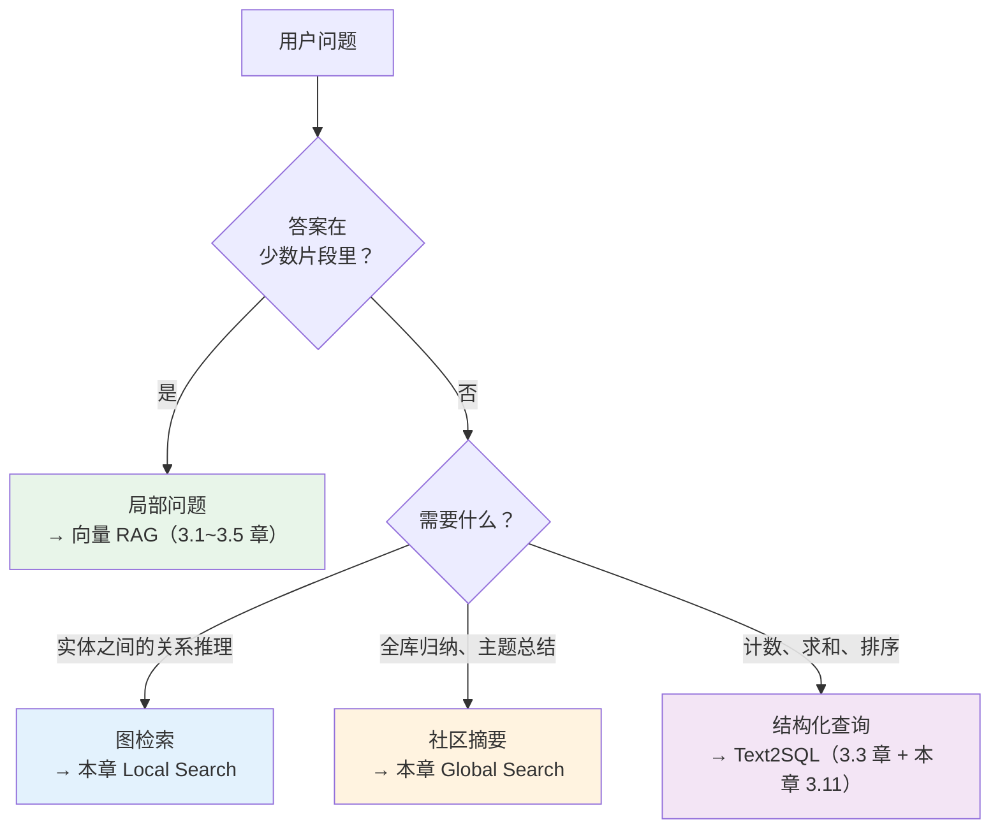
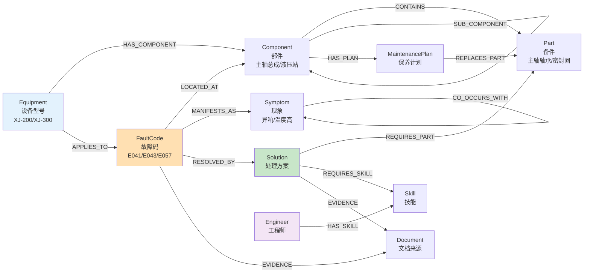
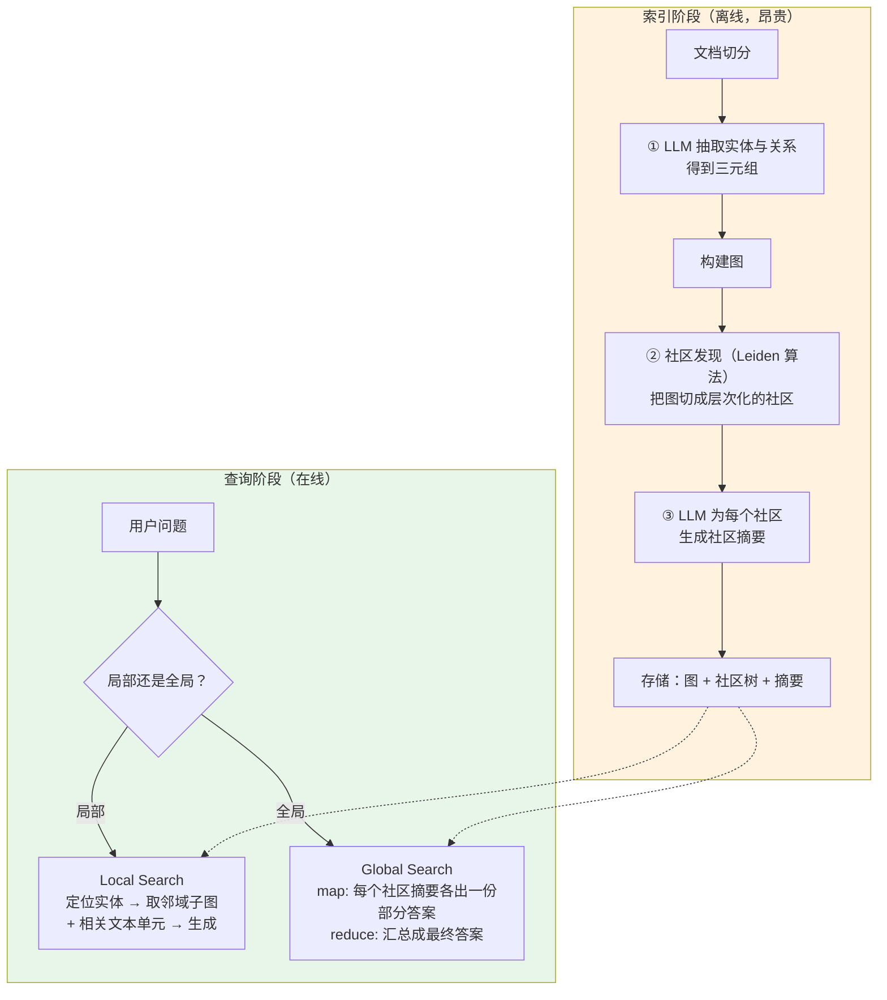
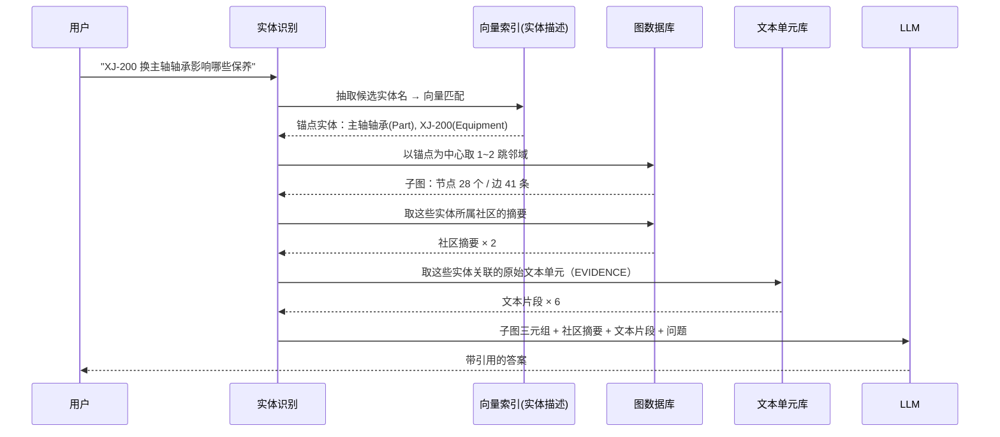
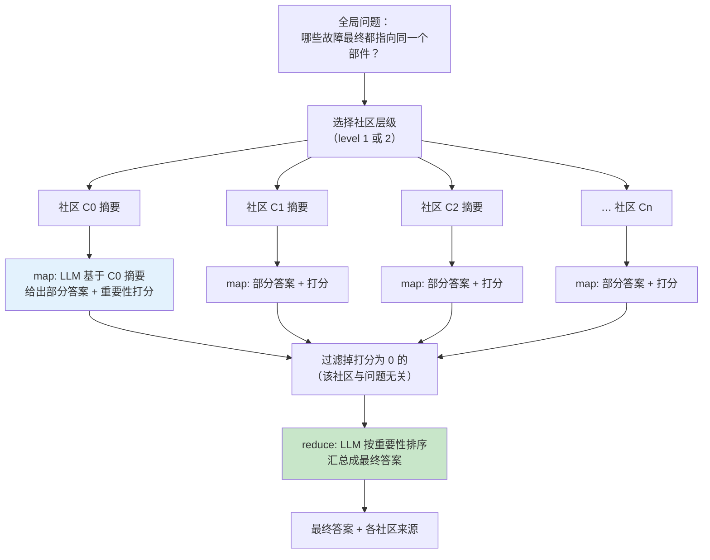
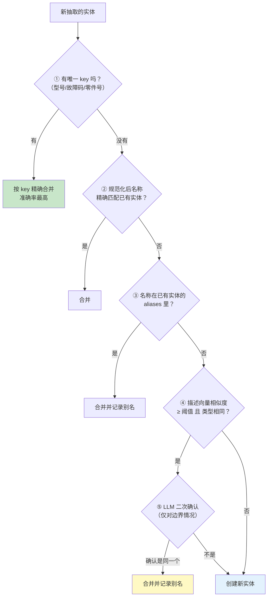
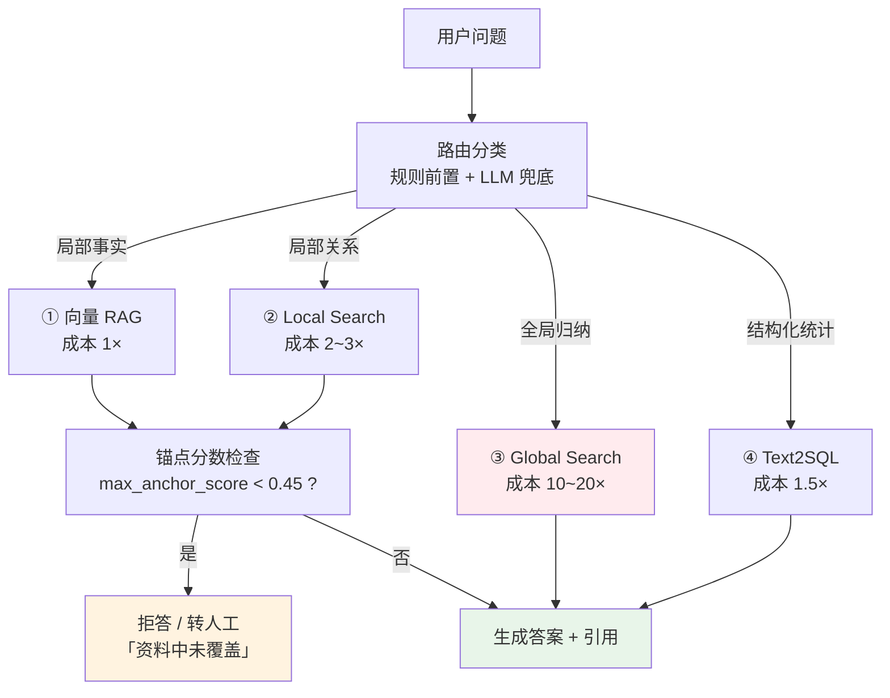
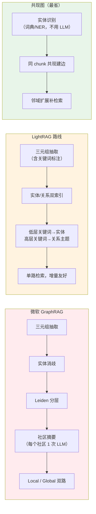
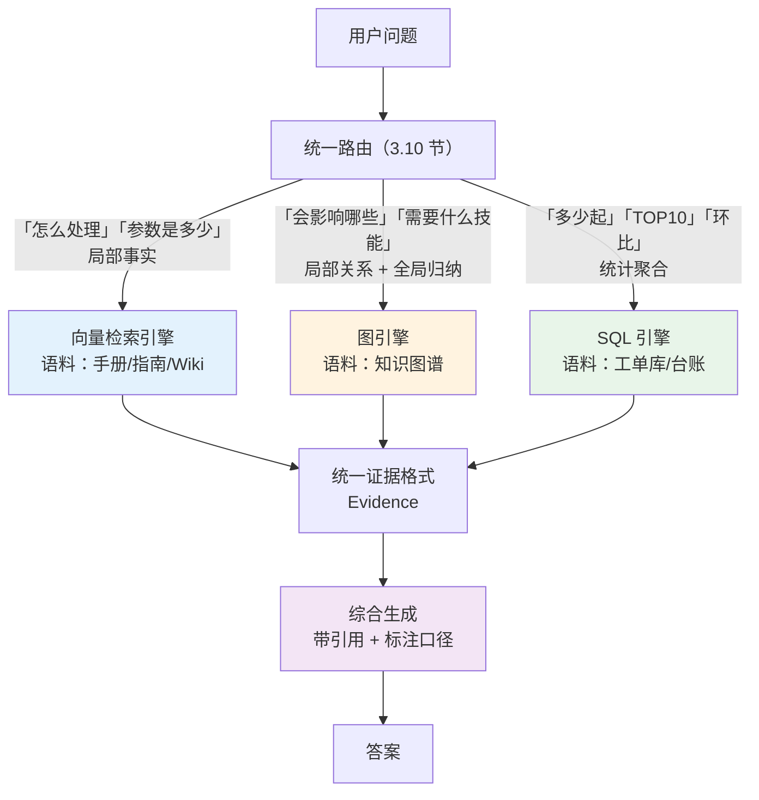
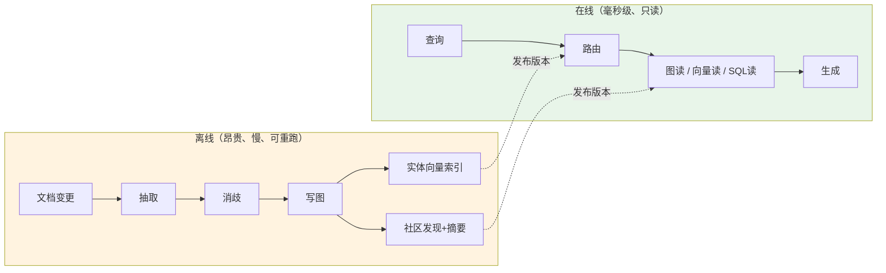

# 第 3.6 章  GraphRAG 与结构化知识融合

> **本章目标**：读完能做到 …
> 1. 说清向量 RAG 的结构性天花板在哪，并判断一个问题是"局部片段问题"还是"全局关系问题"；
> 2. 设计出华成机电的知识图谱 Schema（设备 → 部件 → 故障码 → 处理方案 → 备件 → 工程师技能），并落成 Neo4j 建模；
> 3. 实现 LLM 抽取三元组的完整 pipeline，包含结构化输出、实体消歧对齐、增量更新与冲突处理；
> 4. 讲清微软 GraphRAG 的核心思想（社区发现 → 社区摘要 → Local / Global Search），并实现一个可运行的简化版；
> 5. 实现图检索与向量检索的融合：以实体为锚点扩展邻域，再把子图喂给 LLM；
> 6. 用 token 消耗公式算清 GraphRAG 的建图成本，并用判断清单决定自己的项目该不该上；
> 7. 把 Text2SQL 与向量检索编排成统一的双引擎入口，与本模块 3.3 章的路由呼应。
>
> **前置知识**：[3.1 查询理解与高级检索策略](01-查询理解与高级检索策略.md)、[3.2 混合检索与重排序精调](02-混合检索与重排序精调.md)、[3.3 复杂问题拆解与多跳检索](03-复杂问题拆解与多跳检索.md)、[3.5 准确率优化](05-准确率优化-从70到95的工程路径.md)、[02-RAG基础篇/03-Embedding与向量数据库](../02-RAG基础篇/03-Embedding与向量数据库.md)
>
> **预计用时**：阅读 70 分钟 / 动手 300 分钟

---

## 一、为什么需要它（问题出发）

### 1.1 三个向量 RAG 永远答不好的问题

华成机电知识库上线半年后，售后总监提了三个问题。我们的系统（已经做完了 3.1~3.5 的全部优化，Recall@5 达到 0.94）**一个都答不好**。

**问题 A**

> "我们这些故障，最终都指向同一个部件的有哪些？"

系统回答：列举了几条故障码的说明，没有任何"共性"分析。

**问题 B**

> "XJ-200 上更换主轴轴承，会连带影响哪些其他部件的保养计划？"

系统回答：给了主轴轴承的更换步骤。**"连带影响"这四个字完全没有被处理。**

**问题 C**

> "去年新入职的工程师里，谁最适合去处理 E057 这类问题？"

系统回答：给了 E057 的处理流程。**"谁适合"这件事根本不在文档里，它在"故障码 → 所需技能 → 工程师技能画像"这条关系链上。**

### 1.2 这不是优化能解决的问题

很多人的第一反应是"加大 Top-K""换更强的模型""多做几轮检索"。都没用。原因是结构性的。

**向量 RAG 的检索本质是：**

$$
R_q^{(K)} = \underset{d \in D}{\text{Top-}K}\ \text{sim}(\mathbf{e}(q), \mathbf{e}(d))
$$

它返回的是**与 query 语义最相似的 K 个独立片段**。这里有三个隐含假设：

| 假设 | 什么时候不成立 |
|---|---|
| ① 答案存在于某个（或某几个）**连续文本片段**中 | 答案是"多个片段之间的关系"时不成立 |
| ② 与 query 语义相似的片段就是有用的片段 | 问题 A 的"共性"在语义上不与任何单个故障描述相似 |
| ③ K 个片段足以覆盖答案所需信息 | 全局归纳需要遍历全库，而 $K \ll |D|$ |

对 12 万 chunk 的库，Top-5 只是全库的：

$$
\frac{5}{120000} \approx 0.0042\%
$$

**让 LLM 看 0.0042% 的资料去做全局归纳，这不是提示词的问题，是信息论的问题。**

### 1.3 局部问题 vs 全局问题

把问题分成两类，是本章最重要的一个区分：

| | **局部问题（Local）** | **全局问题（Global）** |
|---|---|---|
| 定义 | 答案存在于少数几个片段中 | 答案是整个语料的归纳或关系推理 |
| 例子 | "E043 怎么处理" | "哪些故障最终都指向同一个部件" |
| | "XJ-200 润滑周期" | "我们设备的故障有什么共性规律" |
| | "更换轴承的步骤" | "换一个部件会影响哪些保养计划" |
| 向量 RAG | ✅ 很擅长 | ❌ 结构性做不到 |
| 所需能力 | 精确定位片段 | 遍历 + 归纳 / 图上多跳推理 |
| 解法 | 3.1~3.5 章的全部优化 | **GraphRAG / 结构化知识** |



**注意最右边那条分支**：聚合统计类问题（"上个月 E043 出现几次"）**不该用 GraphRAG**，它该走 Text2SQL。这是本章最后一节要讲的另一条路。

### 1.4 图能做什么：三个问题的正确解法

回到 1.1 节的三个问题，看图上怎么答：

**问题 A：哪些故障最终都指向同一个部件**

```text
图查询：
MATCH (f:FaultCode)-[:LOCATED_AT]->(c:Component)
WITH c, collect(f.code) AS codes
WHERE size(codes) >= 3
RETURN c.name, codes ORDER BY size(codes) DESC
```

结果：

```text
主轴总成    ← E041, E043, E048, E052
液压站      ← E057, E059, E061
伺服驱动器  ← E071, E073
```

**这是一条 Cypher 查询就能得到的结果，向量检索永远得不到。**

**问题 B：更换主轴轴承会连带影响哪些保养计划**

```text
MATCH (p:Part {name: "主轴轴承"})<-[:CONTAINS*1..2]-(c:Component)-[:HAS_PLAN]->(m:MaintenancePlan)
RETURN DISTINCT c.name, m.name, m.interval_hours
```

**这是图上的多跳遍历。** 向量检索做不到，因为"连带影响"这个关系不写在任何一段文字里，它藏在结构中。

**问题 C：谁适合处理 E057**

```text
MATCH (f:FaultCode {code: "E057"})-[:REQUIRES_SKILL]->(s:Skill)<-[:HAS_SKILL]-(e:Engineer)
WITH e, count(s) AS matched, collect(s.name) AS skills
RETURN e.name, matched, skills ORDER BY matched DESC LIMIT 5
```

**这条链跨越了三种实体，任何一段文本里都不会同时出现这三者。**

---

## 二、原理拆解

### 2.1 知识图谱基础（10 分钟够用版）

**知识图谱（Knowledge Graph）** 的基本单元是 **三元组（Triple）**：

$$
(h, r, t) \quad \text{头实体, 关系, 尾实体}
$$

例如：`(E043, LOCATED_AT, 主轴总成)`、`(主轴总成, CONTAINS, 主轴轴承)`。

四个核心概念：

| 概念 | 含义 | 华成机电的例子 |
|---|---|---|
| **实体（Entity / Node）** | 图中的点 | `XJ-200`（设备）、`E043`（故障码）、`主轴轴承`（备件） |
| **关系（Relation / Edge）** | 点之间的有向边 | `LOCATED_AT`、`CAUSED_BY`、`REQUIRES_PART` |
| **属性（Property）** | 点或边上的键值对 | `Part.stock_qty=12`、`MaintenancePlan.interval_hours=8000` |
| **Schema / 本体（Ontology）** | 允许出现哪些实体类型和关系类型 | 见 2.2 节 |

**属性图（Property Graph）** vs **RDF 三元组**：Neo4j 用的是属性图（点和边都能带属性），比纯 RDF 灵活，工程上更好用。本书用属性图。

**图与向量的本质差别：**

| | 向量索引 | 知识图谱 |
|---|---|---|
| 存的是 | 文本片段的语义位置 | 实体与实体之间的**显式关系** |
| 查询方式 | 近似最近邻（相似度） | 图遍历（精确的路径） |
| 擅长 | "跟这段话意思像的" | "跟这个东西有 N 跳关系的" |
| 不擅长 | 关系推理、全局归纳 | 模糊语义匹配、开放文本 |
| 构建成本 | 低（切分 + 编码） | **高（需要抽取 + 消歧）** |

**最后一行是本章的核心权衡，3.9 节会给具体测算。**

### 2.2 华成机电的图谱 Schema

Schema 设计是 GraphRAG 成败的第一道关卡。**不要一上来就"抽取所有实体和关系"**——那会得到一张又大又乱、查不动也维护不了的图。

**Schema 设计三原则：**

1. **从要回答的问题倒推**，不是从数据正推。先列 20 个业务真正关心的问题，看它们需要哪些实体和关系；
2. **关系类型控制在 15 个以内**。关系越多，抽取越容易出错，查询越难写；
3. **区分"稳定结构"和"易变内容"**。设备-部件-备件这类结构很稳定，适合入图；具体的操作步骤描述适合留在向量库。

**华成机电 Schema：**



节点与关系清单：

| 节点类型 | 关键属性 | 来源 |
|---|---|---|
| `Equipment` | `model`(唯一), `series`, `year` | 产品主数据 |
| `Component` | `name`(唯一), `category`, `criticality` | 手册目录结构 |
| `Part` | `part_no`(唯一), `name`, `spec`, `stock_qty` | Excel 备件表 |
| `FaultCode` | `code`(唯一), `title`, `severity` | 故障代码表 |
| `Symptom` | `name`(唯一), `description` | 工单描述抽取 |
| `Solution` | `sol_id`(唯一), `title`, `steps`, `est_minutes` | 维修指南 + 工单 |
| `MaintenancePlan` | `plan_id`, `name`, `interval_hours` | 保养规程 |
| `Skill` | `name`(唯一), `level` | 技能矩阵 |
| `Engineer` | `emp_id`(唯一), `name`, `region` | HR 系统 |
| `Document` | `doc_id`(唯一), `title`, `version`, `effective_date` | 文档元数据 |

| 关系 | 语义 | 属性 |
|---|---|---|
| `HAS_COMPONENT` | 设备包含部件 | `qty` |
| `CONTAINS` | 部件包含备件 | `qty` |
| `SUB_COMPONENT` | 部件层级 | — |
| `LOCATED_AT` | 故障码定位到部件 | `confidence` |
| `MANIFESTS_AS` | 故障码表现为现象 | `frequency` |
| `RESOLVED_BY` | 故障码由方案解决 | `success_rate` |
| `REQUIRES_PART` | 方案需要备件 | `qty` |
| `REQUIRES_SKILL` | 方案需要技能 | `min_level` |
| `HAS_PLAN` | 部件有保养计划 | — |
| `REPLACES_PART` | 保养计划更换备件 | `interval_hours` |
| `HAS_SKILL` | 工程师具备技能 | `level`, `certified_at` |
| `APPLIES_TO` | 故障码适用于设备 | — |
| `EVIDENCE` | 任何节点的文档出处 | `chunk_id`, `quote` |
| `CO_OCCURS_WITH` | 现象共现 | `count`, `pmi` |

> **`EVIDENCE` 关系是全书图谱设计的一条硬性要求**：每一个从文本抽出来的节点/关系都必须能溯源到具体的 `chunk_id` 和原文引述。没有溯源的图谱无法校验，也无法在 [3.5 章](05-准确率优化-从70到95的工程路径.md) 的 Faithfulness 框架里使用。

### 2.3 微软 GraphRAG 的核心思想

微软在 2024 年提出的 GraphRAG 方法，核心是三步（**以官方文档与开源仓库为准，本节按其公开的方法思路讲解并给出简化实现**）：



#### 2.3.1 为什么要做社区发现

如果只有图，全局问题依然难答：图上有 5 万个节点，全丢给 LLM 装不下。

**社区发现（Community Detection）** 的作用：把图切成一组"内部连接紧密、彼此连接稀疏"的子图。每个社区代表一个**主题**。

Leiden 算法优化的是 **模块度（Modularity）**：

$$
Q = \frac{1}{2m}\sum_{i,j}\left[A_{ij} - \frac{k_i k_j}{2m}\right]\delta(c_i, c_j)
$$

其中 $A_{ij}$ 是邻接矩阵，$k_i$ 是节点 $i$ 的度，$m$ 是总边数，$\delta(c_i,c_j)$ 在 $i,j$ 同社区时为 1。

直观理解：**模块度衡量"社区内部的边比随机情况多出多少"**。$Q$ 越大，社区划分越好。

Leiden 相比经典的 Louvain 算法，保证了社区的**连通性**（Louvain 可能产生不连通的社区），且收敛更稳定。

**社区是层次化的**：Level 0 是最细粒度（几十个节点一组），逐级合并成 Level 1、Level 2……越高层越粗。

在华成机电的图上，社区大致会长成这样（**示例性结果**）：

```text
Level 2（3 个大社区）
├── C0: 主轴系统相关（主轴总成、轴承、E041/E043/E048、相关方案与技能）
├── C1: 液压与润滑系统（液压站、油路、E057/E059、润滑保养计划）
└── C2: 电气与控制系统（伺服驱动器、PLC、E071/E073）

Level 1（11 个中社区）
Level 0（47 个小社区）
```

**这个层次结构本身就是"知识地图"**，它回答了问题 A 的一半——"哪些故障聚在一起"。

#### 2.3.2 社区摘要：把图变成可读的知识

对每个社区，用 LLM 生成一份结构化摘要：

```text
社区 C0 摘要
标题：主轴系统故障与维护
概要：本社区涵盖 XJ-200 与 XJ-300 的主轴总成相关知识，包括 4 个故障码
（E041 温度异常、E043 过载、E048 振动超限、E052 定位偏差）、核心备件
（主轴轴承 SP-10234、拉刀机构、编码器）与对应的 6 套处理方案。
关键发现：E041/E043/E048 三个故障码最终都定位到主轴轴承磨损，
处理方案中有 4 套需要"主轴拆装"技能（L3 级）。
影响面：主轴轴承的更换会触发 3 项保养计划的重新计时。
重要性评分：9/10（涉及核心部件，故障频次最高）
```

**这份摘要有两个用途：**

1. **Global Search 的原料**：全局问题不去查原文，而是把所有社区摘要做 map-reduce；
2. **人可读的知识地图**：这份摘要本身就是给新人的培训材料。

#### 2.3.3 Local Search：实体锚点 + 邻域扩展



**关键点：Local Search 的上下文是三类信息的混合**：

| 信息 | 作用 | 占上下文比例（经验值） |
|---|---|---|
| 子图三元组 | 提供**关系结构** | 约 30% |
| 社区摘要 | 提供**背景与共性** | 约 20% |
| 原始文本单元 | 提供**细节与可引用的原文** | 约 50% |

第三类不能省——**没有原文就没法做 [3.5 章](05-准确率优化-从70到95的工程路径.md) 的 Faithfulness 校验**。

#### 2.3.4 Global Search：map-reduce 社区摘要



**Global Search 的代价：社区数 = LLM 调用次数。** 11 个中社区就是 11 次 map + 1 次 reduce = 12 次 LLM 调用。这就是为什么 Global Search 单次查询的成本可能是普通 RAG 的 10~20 倍。

**选层级的经验规则：**

| 层级 | 社区数 | 适合的问题 | 成本 |
|---|---:|---|---|
| Level 0（细） | 40~60 | 需要细节的全局问题 | 高 |
| Level 1（中） | 8~15 | **大多数全局问题，推荐默认** | 中 |
| Level 2（粗） | 2~5 | 极宏观的问题（"整体概况"） | 低 |

---

## 三、动手实战

### 3.1 环境准备：Neo4j 与依赖

```bash
# docker-compose.graph.yml
```

```yaml
# deploy/docker-compose.graph.yml
services:
  neo4j:
    image: neo4j:5.24-community
    container_name: huacheng-neo4j
    ports:
      - "7474:7474"   # HTTP Browser
      - "7687:7687"   # Bolt 协议
    environment:
      NEO4J_AUTH: neo4j/huacheng2026
      NEO4J_PLUGINS: '["apoc","graph-data-science"]'
      NEO4J_dbms_security_procedures_unrestricted: "apoc.*,gds.*"
      NEO4J_dbms_memory_heap_max__size: "4G"
      NEO4J_dbms_memory_pagecache_size: "2G"
    volumes:
      - neo4j_data:/data
      - neo4j_logs:/logs
      - ./neo4j/import:/var/lib/neo4j/import
    healthcheck:
      test: ["CMD-SHELL", "wget -qO- http://localhost:7474 || exit 1"]
      interval: 10s
      timeout: 5s
      retries: 12

volumes:
  neo4j_data:
  neo4j_logs:
```

```bash
docker compose -f deploy/docker-compose.graph.yml up -d
docker compose -f deploy/docker-compose.graph.yml logs -f neo4j | head -40
```

```text
huacheng-neo4j  | 2026-04-02 09:12:03.441+0000 INFO  Starting...
huacheng-neo4j  | 2026-04-02 09:12:11.882+0000 INFO  Bolt enabled on 0.0.0.0:7687.
huacheng-neo4j  | 2026-04-02 09:12:14.203+0000 INFO  Remote interface available at http://localhost:7474/
huacheng-neo4j  | 2026-04-02 09:12:14.205+0000 INFO  Started.
```

浏览器打开 `http://localhost:7474`，用 `neo4j / huacheng2026` 登录。

> **端口说明**：Neo4j 用 7474/7687，与本书已定稿的端口约定（Attu 8000、Langfuse 3001、Postgres 5433、vLLM 8001、应用 8080）不冲突。

安装依赖：

```bash
uv add neo4j networkx python-louvain
uv add "graspologic-native"   # Leiden 实现之一；也可用 igraph + leidenalg
# pip 等价：pip install neo4j networkx python-louvain graspologic-native
```

配置项追加到 `core/config.py`（沿用已定稿的 `get_settings()`）：

```python
# core/config.py（追加字段，其余保持不变）
    neo4j_uri: str = "bolt://127.0.0.1:7687"
    neo4j_user: str = "neo4j"
    neo4j_password: str = "huacheng2026"
    neo4j_database: str = "neo4j"
```

### 3.2 图谱构建 pipeline：LLM 抽取三元组

#### 3.2.1 Schema 定义与抽取 prompt

**抽取质量的 80% 取决于 prompt 里的 Schema 约束。** 开放式抽取（"抽出所有实体和关系"）会得到一堆同义异形的垃圾。

```python
# graph/schema.py
"""知识图谱 Schema 定义：节点类型、关系类型与抽取用的 Pydantic 模型。"""
from __future__ import annotations

from enum import Enum

from pydantic import BaseModel, Field


class NodeType(str, Enum):
    """允许出现的节点类型，抽取时只能用这些。"""
    EQUIPMENT = "Equipment"
    COMPONENT = "Component"
    PART = "Part"
    FAULT_CODE = "FaultCode"
    SYMPTOM = "Symptom"
    SOLUTION = "Solution"
    MAINTENANCE_PLAN = "MaintenancePlan"
    SKILL = "Skill"
    ENGINEER = "Engineer"


class RelType(str, Enum):
    """允许出现的关系类型。"""
    HAS_COMPONENT = "HAS_COMPONENT"
    CONTAINS = "CONTAINS"
    SUB_COMPONENT = "SUB_COMPONENT"
    LOCATED_AT = "LOCATED_AT"
    MANIFESTS_AS = "MANIFESTS_AS"
    RESOLVED_BY = "RESOLVED_BY"
    REQUIRES_PART = "REQUIRES_PART"
    REQUIRES_SKILL = "REQUIRES_SKILL"
    HAS_PLAN = "HAS_PLAN"
    REPLACES_PART = "REPLACES_PART"
    HAS_SKILL = "HAS_SKILL"
    APPLIES_TO = "APPLIES_TO"
    CO_OCCURS_WITH = "CO_OCCURS_WITH"


ALLOWED_PAIRS: dict[RelType, tuple[NodeType, NodeType]] = {
    RelType.HAS_COMPONENT: (NodeType.EQUIPMENT, NodeType.COMPONENT),
    RelType.CONTAINS: (NodeType.COMPONENT, NodeType.PART),
    RelType.SUB_COMPONENT: (NodeType.COMPONENT, NodeType.COMPONENT),
    RelType.LOCATED_AT: (NodeType.FAULT_CODE, NodeType.COMPONENT),
    RelType.MANIFESTS_AS: (NodeType.FAULT_CODE, NodeType.SYMPTOM),
    RelType.RESOLVED_BY: (NodeType.FAULT_CODE, NodeType.SOLUTION),
    RelType.REQUIRES_PART: (NodeType.SOLUTION, NodeType.PART),
    RelType.REQUIRES_SKILL: (NodeType.SOLUTION, NodeType.SKILL),
    RelType.HAS_PLAN: (NodeType.COMPONENT, NodeType.MAINTENANCE_PLAN),
    RelType.REPLACES_PART: (NodeType.MAINTENANCE_PLAN, NodeType.PART),
    RelType.HAS_SKILL: (NodeType.ENGINEER, NodeType.SKILL),
    RelType.APPLIES_TO: (NodeType.EQUIPMENT, NodeType.FAULT_CODE),
    RelType.CO_OCCURS_WITH: (NodeType.SYMPTOM, NodeType.SYMPTOM),
}


class ExtractedEntity(BaseModel):
    """抽取出的一个实体。"""
    name: str = Field(description="实体的标准名称，使用文中最完整的说法")
    type: NodeType = Field(description="实体类型")
    aliases: list[str] = Field(default_factory=list, description="文中出现的其他叫法")
    description: str = Field(default="", description="一句话描述，用于后续消歧与向量检索")
    key: str = Field(default="", description="唯一标识：型号填 model，故障码填 code，备件填 part_no，其余留空")


class ExtractedRelation(BaseModel):
    """抽取出的一条关系。"""
    source: str = Field(description="头实体的 name，必须与 entities 中某个 name 完全一致")
    target: str = Field(description="尾实体的 name，必须与 entities 中某个 name 完全一致")
    type: RelType = Field(description="关系类型")
    quote: str = Field(default="", description="支撑这条关系的原文摘录，不超过 60 字")
    confidence: float = Field(default=0.8, description="抽取置信度 0~1")


class ExtractionResult(BaseModel):
    """一个 chunk 的抽取结果。"""
    entities: list[ExtractedEntity] = Field(default_factory=list)
    relations: list[ExtractedRelation] = Field(default_factory=list)
```

```python
# graph/extract_prompt.py
"""三元组抽取 prompt：带 Schema 约束、few-shot 与硬性禁令。"""
from __future__ import annotations

EXTRACT_SYSTEM = """你是华成机电（数控加工中心制造商）知识图谱的信息抽取工程师。

【任务】
从给定文本片段中抽取实体与关系，输出严格符合 Schema 的结构化结果。

【允许的实体类型】
- Equipment：设备型号，如 XJ-200、XJ-200-B3、XJ-300
- Component：部件/子系统，如 主轴总成、液压站、伺服驱动器、导轨
- Part：可更换备件，如 主轴轴承、密封圈、编码器（通常有零件号）
- FaultCode：故障码，如 E041、E043、E057
- Symptom：故障现象，如 异响、温度过高、定位不准
- Solution：处理方案（一套完整的处理步骤）
- MaintenancePlan：保养计划，如 主轴轴承定期更换
- Skill：技能，如 主轴拆装、液压调试、PLC 编程
- Engineer：工程师姓名

【允许的关系类型及其方向（严格遵守）】
Equipment -HAS_COMPONENT-> Component
Component -CONTAINS-> Part
Component -SUB_COMPONENT-> Component
FaultCode -LOCATED_AT-> Component
FaultCode -MANIFESTS_AS-> Symptom
FaultCode -RESOLVED_BY-> Solution
Solution -REQUIRES_PART-> Part
Solution -REQUIRES_SKILL-> Skill
Component -HAS_PLAN-> MaintenancePlan
MaintenancePlan -REPLACES_PART-> Part
Engineer -HAS_SKILL-> Skill
Equipment -APPLIES_TO-> FaultCode
Symptom -CO_OCCURS_WITH-> Symptom

【硬性规则】
1. 只能使用上面列出的类型，出现任何其他类型都算错误。
2. 关系的 source/target 类型必须与上表完全匹配，方向不能反。
3. relations 中的 source 和 target 必须是 entities 里出现过的 name，逐字一致。
4. **只抽取文本中明确表述的关系**，不要基于常识推理补充。文中没写的一律不抽。
5. 每条关系必须给出 quote（原文摘录），这是溯源依据。找不到原文支撑的关系不要输出。
6. 实体 name 用文中最完整的说法。例如文中出现"主轴"和"主轴总成"，name 用"主轴总成"，把"主轴"放进 aliases。
7. 型号必须规范成 XJ-数字 或 XJ-数字-字母数字 的形式（xj200 → XJ-200）。
8. 故障码必须规范成 E + 三位数字（e43 → E043）。
9. 如果这段文本里没有可抽取的内容，返回空列表，不要硬凑。

【示例】
输入：
"XJ-200 加工中心报 E043 报警时，通常是主轴总成过载。检查主轴轴承（零件号 SP-10234）是否磨损，
磨损时需更换。更换操作需要具备主轴拆装技能。该故障常伴随主轴异响。"

输出：
{
  "entities": [
    {"name": "XJ-200", "type": "Equipment", "aliases": [], "description": "数控加工中心型号", "key": "XJ-200"},
    {"name": "E043", "type": "FaultCode", "aliases": [], "description": "主轴过载报警", "key": "E043"},
    {"name": "主轴总成", "type": "Component", "aliases": ["主轴"], "description": "加工中心核心旋转部件", "key": ""},
    {"name": "主轴轴承", "type": "Part", "aliases": [], "description": "主轴总成内的轴承，零件号 SP-10234", "key": "SP-10234"},
    {"name": "更换主轴轴承", "type": "Solution", "aliases": [], "description": "更换磨损的主轴轴承", "key": ""},
    {"name": "主轴拆装", "type": "Skill", "aliases": [], "description": "拆装主轴总成的技能", "key": ""},
    {"name": "主轴异响", "type": "Symptom", "aliases": ["异响"], "description": "主轴运行时的异常噪音", "key": ""}
  ],
  "relations": [
    {"source": "XJ-200", "target": "E043", "type": "APPLIES_TO", "quote": "XJ-200 加工中心报 E043 报警", "confidence": 0.95},
    {"source": "E043", "target": "主轴总成", "type": "LOCATED_AT", "quote": "通常是主轴总成过载", "confidence": 0.9},
    {"source": "主轴总成", "target": "主轴轴承", "type": "CONTAINS", "quote": "检查主轴轴承（零件号 SP-10234）", "confidence": 0.9},
    {"source": "E043", "target": "更换主轴轴承", "type": "RESOLVED_BY", "quote": "磨损时需更换", "confidence": 0.85},
    {"source": "更换主轴轴承", "target": "主轴轴承", "type": "REQUIRES_PART", "quote": "需更换", "confidence": 0.9},
    {"source": "更换主轴轴承", "target": "主轴拆装", "type": "REQUIRES_SKILL", "quote": "更换操作需要具备主轴拆装技能", "confidence": 0.9},
    {"source": "E043", "target": "主轴异响", "type": "MANIFESTS_AS", "quote": "该故障常伴随主轴异响", "confidence": 0.85}
  ]
}
"""

EXTRACT_USER = """【文档元信息】
来源：{source}｜型号：{model}｜版本：{version}｜章节：{section}

【待抽取文本】
{text}
"""
```

> **注意 prompt 里的第 4 条**："只抽取文本中明确表述的关系"。这是抽取质量的生命线。不加这条，LLM 会基于常识大量补充"主轴轴承 CONTAINS 滚珠"这类文中根本没有的关系，图会迅速被污染。

#### 3.2.2 抽取执行器

```python
# graph/extractor.py
"""三元组抽取执行器：批量抽取、Schema 校验、置信度过滤、失败重试与统计。"""
from __future__ import annotations

import asyncio
import re
from dataclasses import dataclass, field
from typing import Any

from loguru import logger

from core.perf import pspan, set_attr
from graph.extract_prompt import EXTRACT_SYSTEM, EXTRACT_USER
from graph.schema import ALLOWED_PAIRS, ExtractedEntity, ExtractedRelation, ExtractionResult, NodeType, RelType

RE_MODEL = re.compile(r"\b[Xx][Jj][-\s]?(\d{3})(?:[-\s]?([A-Za-z]\d))?\b")
RE_CODE = re.compile(r"\b[Ee](\d{2,3})\b")


@dataclass
class ExtractStats:
    """抽取过程统计。"""
    n_chunks: int = 0
    n_ok: int = 0
    n_failed: int = 0
    n_entities: int = 0
    n_relations: int = 0
    n_rejected_pair: int = 0
    n_rejected_dangling: int = 0
    n_rejected_lowconf: int = 0
    n_rejected_noquote: int = 0
    prompt_tokens: int = 0
    completion_tokens: int = 0

    def report(self) -> str:
        """生成统计报告文本。"""
        return (
            f"chunks={self.n_chunks} ok={self.n_ok} failed={self.n_failed}\n"
            f"entities={self.n_entities} relations={self.n_relations}\n"
            f"rejected: pair={self.n_rejected_pair} dangling={self.n_rejected_dangling} "
            f"lowconf={self.n_rejected_lowconf} noquote={self.n_rejected_noquote}\n"
            f"tokens: prompt={self.prompt_tokens} completion={self.completion_tokens}"
        )


def normalize_model(name: str) -> str:
    """把型号规范成 XJ-200 / XJ-200-B3 的形式。"""
    m = RE_MODEL.search(name)
    if not m:
        return name.strip()
    out = f"XJ-{m.group(1)}"
    if m.group(2):
        out += f"-{m.group(2).upper()}"
    return out


def normalize_code(name: str) -> str:
    """把故障码规范成 E041 的形式。"""
    m = RE_CODE.search(name)
    return f"E{int(m.group(1)):03d}" if m else name.strip()


def normalize_entity(e: ExtractedEntity) -> ExtractedEntity:
    """按类型对实体名做规范化。"""
    if e.type == NodeType.EQUIPMENT:
        e.name = normalize_model(e.name)
        e.key = e.key or e.name
    elif e.type == NodeType.FAULT_CODE:
        e.name = normalize_code(e.name)
        e.key = e.key or e.name
    else:
        e.name = e.name.strip().replace("（", "(").replace("）", ")")
    return e


class TripleExtractor:
    """从文本 chunk 中抽取三元组，带 Schema 校验与并发控制。"""

    def __init__(self, model: str = "deepseek-chat", concurrency: int = 6,
                 min_confidence: float = 0.6, require_quote: bool = True,
                 max_retry: int = 2) -> None:
        self.model = model
        self.sem = asyncio.Semaphore(concurrency)
        self.min_confidence = min_confidence
        self.require_quote = require_quote
        self.max_retry = max_retry
        self.stats = ExtractStats()

    async def extract_chunk(self, chunk: dict[str, Any]) -> ExtractionResult:
        """抽取单个 chunk，返回经过校验的结果。"""
        from core.llm import structured_completion_messages

        messages = [
            {"role": "system", "content": EXTRACT_SYSTEM},
            {"role": "user", "content": EXTRACT_USER.format(
                source=chunk.get("source", ""), model=chunk.get("model", "通用"),
                version=chunk.get("doc_version", ""), section=chunk.get("section_path", ""),
                text=chunk["text"][:3500],
            )},
        ]

        async with self.sem:
            for attempt in range(self.max_retry + 1):
                try:
                    raw: ExtractionResult = await structured_completion_messages(
                        messages, schema=ExtractionResult, model=self.model, temperature=0.0
                    )
                    return self._validate(raw, chunk)
                except Exception as exc:
                    if attempt == self.max_retry:
                        logger.warning("extract failed chunk={} err={}", chunk.get("chunk_id"), exc)
                        self.stats.n_failed += 1
                        return ExtractionResult()
                    await asyncio.sleep(1.5 * (attempt + 1))
        return ExtractionResult()

    def _validate(self, raw: ExtractionResult, chunk: dict[str, Any]) -> ExtractionResult:
        """校验抽取结果：规范化实体、剔除非法关系对、剔除悬空关系与低置信关系。"""
        ents = [normalize_entity(e) for e in raw.entities]
        by_name: dict[str, ExtractedEntity] = {}
        for e in ents:
            if e.name and e.name not in by_name:
                by_name[e.name] = e

        kept_rels: list[ExtractedRelation] = []
        for r in raw.relations:
            src = by_name.get(r.source) or by_name.get(normalize_model(r.source)) or by_name.get(normalize_code(r.source))
            tgt = by_name.get(r.target) or by_name.get(normalize_model(r.target)) or by_name.get(normalize_code(r.target))

            if src is None or tgt is None:
                self.stats.n_rejected_dangling += 1
                continue

            expect = ALLOWED_PAIRS.get(r.type)
            if not expect or src.type != expect[0] or tgt.type != expect[1]:
                self.stats.n_rejected_pair += 1
                continue

            if r.confidence < self.min_confidence:
                self.stats.n_rejected_lowconf += 1
                continue

            if self.require_quote and not r.quote.strip():
                self.stats.n_rejected_noquote += 1
                continue

            r.source, r.target = src.name, tgt.name
            kept_rels.append(r)

        used = {r.source for r in kept_rels} | {r.target for r in kept_rels}
        kept_ents = [e for e in by_name.values() if e.name in used or e.type in
                     (NodeType.EQUIPMENT, NodeType.FAULT_CODE, NodeType.PART)]

        self.stats.n_ok += 1
        self.stats.n_entities += len(kept_ents)
        self.stats.n_relations += len(kept_rels)
        set_attr(n_entities=len(kept_ents), n_relations=len(kept_rels))

        for e in kept_ents:
            e.description = f"{e.description}（来源：{chunk.get('source', '')}）".strip()

        return ExtractionResult(entities=kept_ents, relations=kept_rels)

    async def extract_batch(self, chunks: list[dict[str, Any]]) -> list[tuple[dict, ExtractionResult]]:
        """批量抽取，返回 (chunk, 结果) 列表。"""
        with pspan("extract_batch"):
            self.stats.n_chunks += len(chunks)
            results = await asyncio.gather(*[self.extract_chunk(c) for c in chunks])
            return list(zip(chunks, results))
```

运行：

```python
# scripts/build_graph.py
"""图谱构建主流程：读 chunk → 抽取 → 消歧 → 写入 Neo4j → 打印统计。"""
from __future__ import annotations

import argparse
import asyncio
import json
from pathlib import Path

from loguru import logger

from graph.extractor import TripleExtractor
from graph.resolver import EntityResolver
from graph.store import Neo4jGraphStore


async def main() -> None:
    """执行端到端建图。"""
    ap = argparse.ArgumentParser()
    ap.add_argument("--chunks", default="data/chunks.jsonl")
    ap.add_argument("--limit", type=int, default=0)
    ap.add_argument("--batch", type=int, default=20)
    ap.add_argument("--model", default="deepseek-chat")
    ap.add_argument("--dump", default="data/graph/extractions.jsonl")
    args = ap.parse_args()

    chunks = [json.loads(l) for l in Path(args.chunks).read_text(encoding="utf-8").splitlines() if l.strip()]
    if args.limit:
        chunks = chunks[: args.limit]
    logger.info("待抽取 chunk 数：{}", len(chunks))

    extractor = TripleExtractor(model=args.model)
    resolver = EntityResolver()
    store = Neo4jGraphStore()
    await store.ensure_schema()

    Path(args.dump).parent.mkdir(parents=True, exist_ok=True)
    dump = Path(args.dump).open("w", encoding="utf-8")

    for i in range(0, len(chunks), args.batch):
        batch = chunks[i: i + args.batch]
        pairs = await extractor.extract_batch(batch)
        for chunk, res in pairs:
            if not res.entities and not res.relations:
                continue
            resolved = await resolver.resolve(res)
            await store.upsert(resolved, chunk)
            dump.write(json.dumps({
                "chunk_id": chunk.get("chunk_id"),
                "entities": [e.model_dump(mode="json") for e in resolved.entities],
                "relations": [r.model_dump(mode="json") for r in resolved.relations],
            }, ensure_ascii=False) + "\n")
        logger.info("进度 {}/{}  {}", min(i + args.batch, len(chunks)), len(chunks),
                    extractor.stats.report().replace("\n", " | "))

    dump.close()
    print("\n==== 抽取统计 ====")
    print(extractor.stats.report())
    print("\n==== 消歧统计 ====")
    print(resolver.report())
    print("\n==== 图规模 ====")
    print(await store.graph_stats())


if __name__ == "__main__":
    asyncio.run(main())
```

```bash
python scripts/build_graph.py --chunks data/chunks.jsonl --limit 2000 --batch 20
```

```text
2026-04-02 10:14:22 | INFO | 待抽取 chunk 数：2000
2026-04-02 10:15:08 | INFO | 进度 20/2000  chunks=20 ok=20 failed=0 | entities=143 relations=176 | rejected: pair=11 dangling=7 lowconf=4 noquote=9 | tokens: prompt=61240 completion=18902
...
2026-04-02 11:48:31 | INFO | 进度 2000/2000  chunks=2000 ok=1973 failed=27 | entities=13820 relations=17244 | ...

==== 抽取统计 ====
chunks=2000 ok=1973 failed=27
entities=13820 relations=17244
rejected: pair=982 dangling=613 lowconf=421 noquote=755
tokens: prompt=6118400 completion=1884300

==== 消歧统计 ====
原始实体 13820 → 消歧后 2841（合并率 79.4%）
  按 key 精确合并：1204
  按别名合并：687
  按向量相似度合并：1893
  跨类型冲突（已保留为独立实体）：31

==== 图规模 ====
节点 2841（Equipment 3 / Component 187 / Part 642 / FaultCode 58 / Symptom 391 / Solution 1103 / MaintenancePlan 94 / Skill 63 / Engineer 300）
关系 9127（去重后）
```

> **示例性数据。注意 `rejected` 那几行**：非法关系对 982 条、悬空关系 613 条——**这说明 LLM 有约 15% 的输出是不符合 Schema 的**。Schema 校验不是可选项，是必需品。

### 3.3 实体消歧与对齐

**这是 GraphRAG 工程中最脏、最关键的一步。**

同一个东西在文本里会有无数种叫法：

```text
"主轴"、"主轴总成"、"spindle"、"主轴单元"、"SPINDLE ASSY"、"主轴组件"
```

如果不消歧，图里会有 6 个独立节点，关系被打散，所有图查询都失效。

#### 3.3.1 四级消歧策略



```python
# graph/resolver.py
"""实体消歧与对齐：key 精确 → 名称精确 → 别名 → 向量相似 → LLM 确认，四级递进。"""
from __future__ import annotations

import asyncio
import re
from dataclasses import dataclass, field
from typing import Any

import numpy as np
from loguru import logger
from pydantic import BaseModel, Field

from graph.schema import ExtractedEntity, ExtractedRelation, ExtractionResult, NodeType

RE_NOISE = re.compile(r"[\s　（）()\[\]【】、,，。\.]+")

MANUAL_ALIASES: dict[str, list[str]] = {
    "主轴总成": ["主轴", "spindle", "SPINDLE ASSY", "主轴单元", "主轴组件", "主轴部件"],
    "液压站": ["液压系统", "hydraulic unit", "液压单元", "油站"],
    "伺服驱动器": ["伺服", "驱动器", "servo drive", "伺服放大器"],
    "数控系统": ["CNC", "cnc 系统", "控制系统", "数控装置"],
    "刀库": ["ATC", "自动换刀装置", "tool magazine"],
    "导轨": ["直线导轨", "linear guide", "滑轨"],
}


class SameEntityJudgement(BaseModel):
    """LLM 判定两个实体是否指同一事物。"""
    same: bool = Field(description="两者是否指同一个实体")
    canonical: str = Field(default="", description="如果是同一个，推荐使用的标准名称")
    reason: str = Field(default="", description="一句话理由")


@dataclass
class CanonicalEntity:
    """归一化后的实体。"""
    name: str
    type: NodeType
    key: str = ""
    aliases: set[str] = field(default_factory=set)
    descriptions: list[str] = field(default_factory=list)
    vec: np.ndarray | None = None
    source_count: int = 0


class EntityResolver:
    """增量式实体消歧器，维护进程内的规范实体表。"""

    def __init__(self, sim_threshold: float = 0.88, llm_confirm_band: tuple[float, float] = (0.80, 0.88),
                 use_llm: bool = True) -> None:
        self.sim_threshold = sim_threshold
        self.llm_band = llm_confirm_band
        self.use_llm = use_llm

        self.by_key: dict[tuple[NodeType, str], CanonicalEntity] = {}
        self.by_norm: dict[tuple[NodeType, str], CanonicalEntity] = {}
        self.by_alias: dict[tuple[NodeType, str], CanonicalEntity] = {}
        self.all: list[CanonicalEntity] = []

        self.n_key_merge = 0
        self.n_name_merge = 0
        self.n_alias_merge = 0
        self.n_vec_merge = 0
        self.n_new = 0
        self.n_type_conflict = 0

        self._seed_manual_aliases()

    def _seed_manual_aliases(self) -> None:
        """把人工维护的别名表预置进索引，这是最可靠的一层。"""
        for canon, aliases in MANUAL_ALIASES.items():
            ent = CanonicalEntity(name=canon, type=NodeType.COMPONENT, aliases=set(aliases))
            self.all.append(ent)
            self.by_norm[(NodeType.COMPONENT, self._norm(canon))] = ent
            for a in aliases:
                self.by_alias[(NodeType.COMPONENT, self._norm(a))] = ent

    @staticmethod
    def _norm(s: str) -> str:
        """名称归一化：去空白标点、转小写、全角转半角。"""
        return RE_NOISE.sub("", s).lower()

    async def resolve(self, result: ExtractionResult) -> ExtractionResult:
        """对一次抽取结果做消歧，返回实体名已替换为规范名的新结果。"""
        mapping: dict[str, str] = {}
        out_entities: list[ExtractedEntity] = []

        for e in result.entities:
            canon = await self._resolve_one(e)
            mapping[e.name] = canon.name
            out_entities.append(ExtractedEntity(
                name=canon.name, type=canon.type, aliases=sorted(canon.aliases),
                description=canon.descriptions[0] if canon.descriptions else e.description,
                key=canon.key,
            ))

        out_relations = []
        for r in result.relations:
            s, t = mapping.get(r.source, r.source), mapping.get(r.target, r.target)
            if s == t:
                continue
            out_relations.append(ExtractedRelation(source=s, target=t, type=r.type,
                                                   quote=r.quote, confidence=r.confidence))

        dedup: dict[str, ExtractedEntity] = {e.name: e for e in out_entities}
        return ExtractionResult(entities=list(dedup.values()), relations=out_relations)

    async def _resolve_one(self, e: ExtractedEntity) -> CanonicalEntity:
        """对单个实体走四级消歧。"""
        norm = self._norm(e.name)

        if e.key:
            hit = self.by_key.get((e.type, e.key))
            if hit:
                self.n_key_merge += 1
                return self._absorb(hit, e)

        hit = self.by_norm.get((e.type, norm))
        if hit:
            self.n_name_merge += 1
            return self._absorb(hit, e)

        hit = self.by_alias.get((e.type, norm))
        if hit:
            self.n_alias_merge += 1
            return self._absorb(hit, e)

        for a in e.aliases:
            hit = self.by_norm.get((e.type, self._norm(a))) or self.by_alias.get((e.type, self._norm(a)))
            if hit:
                self.n_alias_merge += 1
                return self._absorb(hit, e)

        cand, sim = await self._nearest(e)
        if cand is not None:
            if sim >= self.sim_threshold:
                self.n_vec_merge += 1
                return self._absorb(cand, e)
            if self.use_llm and self.llm_band[0] <= sim < self.llm_band[1]:
                if await self._llm_same(e, cand):
                    self.n_vec_merge += 1
                    return self._absorb(cand, e)

        return self._create(e)

    async def _nearest(self, e: ExtractedEntity) -> tuple[CanonicalEntity | None, float]:
        """在同类型实体中找描述向量最相近的一个。"""
        same_type = [c for c in self.all if c.type == e.type and c.vec is not None]
        if not same_type:
            return None, 0.0
        v = await self._embed(f"{e.name}：{e.description}")
        mat = np.vstack([c.vec for c in same_type])
        sims = mat @ v
        j = int(np.argmax(sims))
        return same_type[j], float(sims[j])

    async def _llm_same(self, e: ExtractedEntity, cand: CanonicalEntity) -> bool:
        """对边界相似度的实体对做 LLM 二次确认。"""
        from core.llm import structured_completion

        prompt = (
            "判断下面两个机电领域实体是否指同一个事物。\n"
            "注意：同一部件的不同叫法算同一个；不同型号、不同规格的零件算不同。\n\n"
            f"A. 名称：{e.name}\n   类型：{e.type.value}\n   描述：{e.description}\n\n"
            f"B. 名称：{cand.name}\n   类型：{cand.type.value}\n   描述：{cand.descriptions[0] if cand.descriptions else ''}\n"
            f"   已知别名：{sorted(cand.aliases)}"
        )
        try:
            r: SameEntityJudgement = await structured_completion(prompt, schema=SameEntityJudgement, temperature=0.0)
            return r.same
        except Exception as exc:
            logger.warning("llm same-entity judge failed: {}", exc)
            return False

    def _absorb(self, canon: CanonicalEntity, e: ExtractedEntity) -> CanonicalEntity:
        """把新实体的信息并入规范实体。"""
        if e.name != canon.name:
            canon.aliases.add(e.name)
            self.by_alias[(canon.type, self._norm(e.name))] = canon
        for a in e.aliases:
            canon.aliases.add(a)
            self.by_alias[(canon.type, self._norm(a))] = canon
        if e.description and e.description not in canon.descriptions:
            canon.descriptions.append(e.description)
        if e.key and not canon.key:
            canon.key = e.key
            self.by_key[(canon.type, e.key)] = canon
        canon.source_count += 1
        return canon

    def _create(self, e: ExtractedEntity) -> CanonicalEntity:
        """创建新的规范实体。"""
        canon = CanonicalEntity(name=e.name, type=e.type, key=e.key,
                                aliases=set(e.aliases), descriptions=[e.description] if e.description else [],
                                source_count=1)
        self.all.append(canon)
        self.by_norm[(e.type, self._norm(e.name))] = canon
        if e.key:
            self.by_key[(e.type, e.key)] = canon
        for a in e.aliases:
            self.by_alias[(e.type, self._norm(a))] = canon
        self.n_new += 1
        asyncio.create_task(self._fill_vec(canon))
        return canon

    async def _fill_vec(self, canon: CanonicalEntity) -> None:
        """异步补上实体的描述向量。"""
        try:
            canon.vec = await self._embed(f"{canon.name}：{canon.descriptions[0] if canon.descriptions else ''}")
        except Exception as exc:
            logger.debug("embed entity failed: {}", exc)

    @staticmethod
    async def _embed(text: str) -> np.ndarray:
        """编码并归一化。"""
        from rag.embed_local import embed_query
        v = np.asarray(await embed_query(text), dtype=np.float32)
        return v / (np.linalg.norm(v) + 1e-9)

    def report(self) -> str:
        """输出消歧统计。"""
        total = self.n_key_merge + self.n_name_merge + self.n_alias_merge + self.n_vec_merge + self.n_new
        merged = total - self.n_new
        return (
            f"原始实体 {total} → 消歧后 {len(self.all)}（合并率 {merged / max(total, 1):.1%}）\n"
            f"  按 key 精确合并：{self.n_key_merge}\n"
            f"  按名称精确合并：{self.n_name_merge}\n"
            f"  按别名合并：{self.n_alias_merge}\n"
            f"  按向量相似度合并：{self.n_vec_merge}\n"
            f"  新建实体：{self.n_new}"
        )
```

**消歧的三个工程教训：**

1. **人工别名表（`MANUAL_ALIASES`）的性价比最高。** 花两小时整理 50 个高频部件的别名，效果超过任何算法。领域词表是护城河。
2. **向量相似度阈值要偏保守（0.88 而不是 0.80）。** 错误合并（把"主轴轴承"和"导轨轴承"合成一个）比漏合并危害大得多——**漏合并只是图稀疏，错误合并会产生假关系**。
3. **LLM 确认只用在边界带（0.80~0.88）。** 全用 LLM 太贵，全不用会漏。这个分级策略和 [3.5 章](05-准确率优化-从70到95的工程路径.md) 的 Faithfulness 三路融合是同一个思路。

### 3.4 Neo4j 存储与索引

```python
# graph/store.py
"""Neo4j 图存储：Schema 约束与索引、幂等 upsert、增量更新、冲突处理、图查询。"""
from __future__ import annotations

from dataclasses import dataclass
from typing import Any

from loguru import logger
from neo4j import AsyncGraphDatabase

from core.config import get_settings
from core.perf import pspan, set_attr
from graph.schema import ExtractionResult, NodeType, RelType

CONSTRAINTS = [
    "CREATE CONSTRAINT equipment_model IF NOT EXISTS FOR (n:Equipment) REQUIRE n.name IS UNIQUE",
    "CREATE CONSTRAINT component_name IF NOT EXISTS FOR (n:Component) REQUIRE n.name IS UNIQUE",
    "CREATE CONSTRAINT part_name IF NOT EXISTS FOR (n:Part) REQUIRE n.name IS UNIQUE",
    "CREATE CONSTRAINT fault_code IF NOT EXISTS FOR (n:FaultCode) REQUIRE n.name IS UNIQUE",
    "CREATE CONSTRAINT symptom_name IF NOT EXISTS FOR (n:Symptom) REQUIRE n.name IS UNIQUE",
    "CREATE CONSTRAINT solution_name IF NOT EXISTS FOR (n:Solution) REQUIRE n.name IS UNIQUE",
    "CREATE CONSTRAINT plan_name IF NOT EXISTS FOR (n:MaintenancePlan) REQUIRE n.name IS UNIQUE",
    "CREATE CONSTRAINT skill_name IF NOT EXISTS FOR (n:Skill) REQUIRE n.name IS UNIQUE",
    "CREATE CONSTRAINT engineer_name IF NOT EXISTS FOR (n:Engineer) REQUIRE n.name IS UNIQUE",
    "CREATE CONSTRAINT document_id IF NOT EXISTS FOR (n:Document) REQUIRE n.doc_id IS UNIQUE",
]

INDEXES = [
    "CREATE INDEX part_key IF NOT EXISTS FOR (n:Part) ON (n.key)",
    "CREATE INDEX fault_severity IF NOT EXISTS FOR (n:FaultCode) ON (n.severity)",
    "CREATE INDEX comp_community IF NOT EXISTS FOR (n:Component) ON (n.community_l1)",
    "CREATE FULLTEXT INDEX entity_fulltext IF NOT EXISTS "
    "FOR (n:Equipment|Component|Part|FaultCode|Symptom|Solution|Skill) ON EACH [n.name, n.description, n.alias_text]",
]


@dataclass
class GraphStats:
    """图规模统计。"""
    nodes_by_label: dict[str, int]
    rels_by_type: dict[str, int]
    total_nodes: int
    total_rels: int

    def __str__(self) -> str:
        """格式化输出。"""
        nb = " / ".join(f"{k} {v}" for k, v in sorted(self.nodes_by_label.items()))
        rb = " / ".join(f"{k} {v}" for k, v in sorted(self.rels_by_type.items(), key=lambda x: -x[1])[:8])
        return f"节点 {self.total_nodes}（{nb}）\n关系 {self.total_rels}（{rb} …）"


class Neo4jGraphStore:
    """封装 Neo4j 的图读写。"""

    def __init__(self) -> None:
        st = get_settings()
        self.driver = AsyncGraphDatabase.driver(st.neo4j_uri, auth=(st.neo4j_user, st.neo4j_password))
        self.database = st.neo4j_database

    async def close(self) -> None:
        """关闭驱动。"""
        await self.driver.close()

    async def ensure_schema(self) -> None:
        """创建约束与索引（幂等）。"""
        async with self.driver.session(database=self.database) as s:
            for stmt in CONSTRAINTS + INDEXES:
                await s.run(stmt)
        logger.info("neo4j schema ready: {} constraints, {} indexes", len(CONSTRAINTS), len(INDEXES))

    async def upsert(self, result: ExtractionResult, chunk: dict[str, Any]) -> None:
        """幂等写入一批实体与关系，并建立到文档 chunk 的 EVIDENCE 关系。"""
        with pspan("graph_upsert"):
            nodes = [{
                "label": e.type.value, "name": e.name, "key": e.key,
                "description": e.description, "alias_text": " ".join(e.aliases),
                "aliases": sorted(e.aliases),
            } for e in result.entities]

            rels = [{
                "type": r.type.value, "source": r.source, "target": r.target,
                "quote": r.quote, "confidence": r.confidence,
                "chunk_id": chunk.get("chunk_id", ""),
            } for r in result.relations]

            async with self.driver.session(database=self.database) as s:
                await s.execute_write(self._write_nodes, nodes)
                await s.execute_write(self._write_doc, chunk)
                await s.execute_write(self._write_rels, rels, chunk)
                await s.execute_write(self._write_evidence, nodes, chunk)
            set_attr(n_nodes=len(nodes), n_rels=len(rels))

    @staticmethod
    async def _write_nodes(tx, nodes: list[dict]) -> None:
        """按标签分组写节点，已存在则合并属性（描述与别名累积）。"""
        by_label: dict[str, list[dict]] = {}
        for n in nodes:
            by_label.setdefault(n["label"], []).append(n)
        for label, items in by_label.items():
            await tx.run(
                f"""
                UNWIND $rows AS row
                MERGE (n:{label} {{name: row.name}})
                ON CREATE SET n.key = row.key, n.description = row.description,
                              n.alias_text = row.alias_text, n.aliases = row.aliases,
                              n.created_at = datetime(), n.mention_count = 1
                ON MATCH SET  n.key = coalesce(nullif(n.key, ''), row.key),
                              n.description = CASE WHEN size(coalesce(n.description,'')) < size(row.description)
                                                   THEN row.description ELSE n.description END,
                              n.aliases = apoc.coll.toSet(coalesce(n.aliases, []) + row.aliases),
                              n.alias_text = apoc.text.join(apoc.coll.toSet(coalesce(n.aliases, []) + row.aliases), ' '),
                              n.mention_count = coalesce(n.mention_count, 0) + 1,
                              n.updated_at = datetime()
                """,
                rows=items,
            )

    @staticmethod
    async def _write_doc(tx, chunk: dict[str, Any]) -> None:
        """写入文档节点。"""
        await tx.run(
            """
            MERGE (d:Document {doc_id: $doc_id})
            ON CREATE SET d.title = $title, d.version = $version,
                          d.effective_date = $eff, d.created_at = datetime()
            ON MATCH SET  d.version = $version, d.effective_date = $eff, d.updated_at = datetime()
            """,
            doc_id=chunk.get("doc_id", chunk.get("source", "unknown")),
            title=chunk.get("source", ""), version=chunk.get("doc_version", ""),
            eff=chunk.get("effective_date", ""),
        )

    @staticmethod
    async def _write_rels(tx, rels: list[dict], chunk: dict[str, Any]) -> None:
        """写关系。同一对实体的同类关系累加 support 并保留最高置信度。"""
        by_type: dict[str, list[dict]] = {}
        for r in rels:
            by_type.setdefault(r["type"], []).append(r)
        for rtype, items in by_type.items():
            await tx.run(
                f"""
                UNWIND $rows AS row
                MATCH (a {{name: row.source}}), (b {{name: row.target}})
                MERGE (a)-[e:{rtype}]->(b)
                ON CREATE SET e.support = 1, e.confidence = row.confidence,
                              e.quotes = [row.quote], e.chunk_ids = [row.chunk_id],
                              e.created_at = datetime()
                ON MATCH SET  e.support = e.support + 1,
                              e.confidence = CASE WHEN row.confidence > e.confidence
                                                  THEN row.confidence ELSE e.confidence END,
                              e.quotes = apoc.coll.toSet(coalesce(e.quotes, []) + [row.quote])[0..5],
                              e.chunk_ids = apoc.coll.toSet(coalesce(e.chunk_ids, []) + [row.chunk_id]),
                              e.updated_at = datetime()
                """,
                rows=items,
            )

    @staticmethod
    async def _write_evidence(tx, nodes: list[dict], chunk: dict[str, Any]) -> None:
        """建立实体到来源文档的 EVIDENCE 关系，保证可溯源。"""
        await tx.run(
            """
            MATCH (d:Document {doc_id: $doc_id})
            UNWIND $names AS nm
            MATCH (n {name: nm})
            MERGE (n)-[e:EVIDENCE]->(d)
            ON CREATE SET e.chunk_ids = [$chunk_id]
            ON MATCH SET  e.chunk_ids = apoc.coll.toSet(coalesce(e.chunk_ids, []) + [$chunk_id])
            """,
            doc_id=chunk.get("doc_id", chunk.get("source", "unknown")),
            names=[n["name"] for n in nodes],
            chunk_id=chunk.get("chunk_id", ""),
        )

    async def graph_stats(self) -> GraphStats:
        """统计图规模。"""
        async with self.driver.session(database=self.database) as s:
            r1 = await s.run("MATCH (n) RETURN labels(n)[0] AS label, count(*) AS c")
            nodes = {rec["label"]: rec["c"] async for rec in r1}
            r2 = await s.run("MATCH ()-[e]->() RETURN type(e) AS t, count(*) AS c")
            rels = {rec["t"]: rec["c"] async for rec in r2}
        return GraphStats(nodes, rels, sum(nodes.values()), sum(rels.values()))

    async def query(self, cypher: str, **params: Any) -> list[dict[str, Any]]:
        """执行只读 Cypher 查询。"""
        with pspan("graph_query"):
            async with self.driver.session(database=self.database) as s:
                res = await s.run(cypher, **params)
                return [dict(rec) async for rec in res]

    async def neighborhood(self, names: list[str], hops: int = 2, limit: int = 120) -> dict[str, Any]:
        """取一组锚点实体的 N 跳邻域子图，返回节点与三元组。"""
        cypher = f"""
        MATCH (a) WHERE a.name IN $names
        CALL {{
          WITH a
          MATCH p = (a)-[*1..{hops}]-(b)
          WHERE NOT b:Document
          RETURN p LIMIT $limit
        }}
        WITH collect(p) AS paths
        UNWIND paths AS p
        UNWIND relationships(p) AS r
        WITH DISTINCT startNode(r) AS s, r, endNode(r) AS e
        RETURN s.name AS source, labels(s)[0] AS source_type,
               type(r) AS rel, r.confidence AS confidence,
               r.quotes AS quotes, r.chunk_ids AS chunk_ids,
               e.name AS target, labels(e)[0] AS target_type
        """
        rows = await self.query(cypher, names=names, limit=limit)
        nodes = {}
        for r in rows:
            nodes[r["source"]] = r["source_type"]
            nodes[r["target"]] = r["target_type"]
        return {"nodes": nodes, "triples": rows}

    async def search_entities(self, text: str, top_k: int = 8) -> list[dict[str, Any]]:
        """用全文索引检索候选实体，作为图检索的锚点。"""
        cypher = """
        CALL db.index.fulltext.queryNodes('entity_fulltext', $q) YIELD node, score
        RETURN node.name AS name, labels(node)[0] AS type,
               node.description AS description, score
        ORDER BY score DESC LIMIT $k
        """
        safe = " OR ".join(w for w in text.split() if w) or text
        return await self.query(cypher, q=safe, k=top_k)
```

建索引后验证：

```cypher
// 在 Neo4j Browser 里跑，确认 Schema 生效
SHOW CONSTRAINTS;
SHOW INDEXES;

// 回答 1.1 节的问题 A
MATCH (f:FaultCode)-[:LOCATED_AT]->(c:Component)
WITH c, collect(f.name) AS codes
WHERE size(codes) >= 3
RETURN c.name AS 部件, codes AS 相关故障码, size(codes) AS 数量
ORDER BY 数量 DESC;
```

```text
╒═══════════╤══════════════════════════════════╤══════╕
│部件        │相关故障码                          │数量   │
╞═══════════╪══════════════════════════════════╪══════╡
│"主轴总成"   │["E041","E043","E048","E052"]     │4     │
│"液压站"     │["E057","E059","E061"]            │3     │
│"伺服驱动器"  │["E071","E073","E075"]            │3     │
└───────────┴──────────────────────────────────┴──────┘
```

> **示例性结果。** 这是向量 RAG 永远拿不到的答案。

### 3.5 增量更新与冲突处理

生产环境的图不是一次建完就不动了。文档会更新、会废止、会新增。

```python
# graph/incremental.py
"""图谱增量更新：按文档粒度失效旧关系、写入新关系、检测并标记冲突。"""
from __future__ import annotations

from dataclasses import dataclass, field
from typing import Any

from loguru import logger

from graph.store import Neo4jGraphStore


@dataclass
class ConflictRecord:
    """一条检测到的图冲突。"""
    kind: str
    subject: str
    detail: str
    sources: list[str] = field(default_factory=list)


class IncrementalUpdater:
    """按文档版本做增量更新，并处理三类典型冲突。"""

    def __init__(self, store: Neo4jGraphStore) -> None:
        self.store = store

    async def retract_document(self, doc_id: str) -> dict[str, int]:
        """撤回一篇文档：把仅由它支撑的关系标记为 retracted，多来源关系只减 support。"""
        res = await self.store.query(
            """
            MATCH ()-[r]->()
            WHERE $chunk_prefix IS NOT NULL AND any(cid IN coalesce(r.chunk_ids, []) WHERE cid STARTS WITH $doc_id)
            WITH r, [cid IN r.chunk_ids WHERE NOT cid STARTS WITH $doc_id] AS remain
            SET r.chunk_ids = remain,
                r.support = size(remain),
                r.status = CASE WHEN size(remain) = 0 THEN 'retracted' ELSE 'active' END
            RETURN sum(CASE WHEN r.status = 'retracted' THEN 1 ELSE 0 END) AS retracted,
                   count(r) AS touched
            """,
            doc_id=doc_id, chunk_prefix=doc_id,
        )
        out = res[0] if res else {"retracted": 0, "touched": 0}
        logger.info("retract doc={} touched={} retracted={}", doc_id, out["touched"], out["retracted"])
        return out

    async def purge_orphans(self) -> int:
        """清理没有任何活跃关系、且只被一次提及的孤立节点。"""
        res = await self.store.query(
            """
            MATCH (n) WHERE NOT n:Document
            AND NOT (n)-[{status:'active'}]-()
            AND coalesce(n.mention_count, 0) <= 1
            WITH n LIMIT 5000
            DETACH DELETE n
            RETURN count(*) AS deleted
            """
        )
        n = res[0]["deleted"] if res else 0
        logger.info("purged {} orphan nodes", n)
        return n

    async def detect_conflicts(self) -> list[ConflictRecord]:
        """检测三类图冲突：一码多部件、同名跨类型、保养周期矛盾。"""
        conflicts: list[ConflictRecord] = []

        rows = await self.store.query(
            """
            MATCH (f:FaultCode)-[r:LOCATED_AT {status:'active'}]->(c:Component)
            WITH f, collect({comp: c.name, conf: r.confidence, sup: r.support}) AS targets
            WHERE size(targets) > 1
            RETURN f.name AS code, targets
            """
        )
        for r in rows:
            conflicts.append(ConflictRecord(
                kind="fault_multi_component", subject=r["code"],
                detail=f"故障码定位到多个部件：{[t['comp'] for t in r['targets']]}",
                sources=[t["comp"] for t in r["targets"]],
            ))

        rows = await self.store.query(
            """
            MATCH (a), (b) WHERE a.name = b.name AND id(a) < id(b)
            AND NOT a:Document AND NOT b:Document
            RETURN a.name AS name, labels(a)[0] AS ta, labels(b)[0] AS tb
            """
        )
        for r in rows:
            conflicts.append(ConflictRecord(
                kind="same_name_diff_type", subject=r["name"],
                detail=f"同名实体有两种类型：{r['ta']} 与 {r['tb']}",
            ))

        rows = await self.store.query(
            """
            MATCH (c:Component)-[:HAS_PLAN]->(m:MaintenancePlan)-[:REPLACES_PART]->(p:Part)
            WITH p, collect(DISTINCT m.interval_hours) AS intervals, collect(DISTINCT m.name) AS plans
            WHERE size([x IN intervals WHERE x IS NOT NULL]) > 1
            RETURN p.name AS part, intervals, plans
            """
        )
        for r in rows:
            conflicts.append(ConflictRecord(
                kind="interval_mismatch", subject=r["part"],
                detail=f"同一备件在不同计划中周期不一致：{r['intervals']}",
                sources=r["plans"],
            ))

        return conflicts

    async def resolve_by_support(self, min_support: int = 2, min_confidence: float = 0.75) -> int:
        """对一码多部件类冲突，保留 support 最高的一条，其余降级为 weak。"""
        res = await self.store.query(
            """
            MATCH (f:FaultCode)-[r:LOCATED_AT {status:'active'}]->(:Component)
            WITH f, collect(r) AS rs WHERE size(rs) > 1
            WITH f, rs, reduce(best = rs[0], x IN rs |
                 CASE WHEN x.support > best.support OR
                           (x.support = best.support AND x.confidence > best.confidence)
                      THEN x ELSE best END) AS best
            UNWIND rs AS r
            WITH r, best WHERE r <> best
            SET r.status = 'weak'
            RETURN count(r) AS demoted
            """
        )
        n = res[0]["demoted"] if res else 0
        logger.info("demoted {} conflicting LOCATED_AT relations", n)
        return n
```

**三类冲突的处理原则：**

| 冲突类型 | 可能原因 | 处理 |
|---|---|---|
| 一个故障码定位到多个部件 | ① 抽取错误；② 该故障确实可能由多个部件引起 | 按 `support`（被多少 chunk 支撑）保留主关系，其余降级为 `weak` 而不是删除。**降级而非删除是关键**——弱关系在 Local Search 时仍可作为补充线索 |
| 同名实体跨类型 | 消歧失败（"主轴"既被抽成 Component 又被抽成 Part） | 人工裁决 + 补进 `MANUAL_ALIASES`；这类冲突数量应该很少，多了说明 Schema 设计有问题 |
| 同一备件的更换周期不一致 | 文档版本差异（V2 说 6000，V3 说 8000） | 走 [3.5 章](05-准确率优化-从70到95的工程路径.md) 的版本策略：按 `effective_date` 取最新，旧的标 `superseded` |

**关键设计：关系上带 `support` 和 `chunk_ids`。** 这让增量更新可以做到"按文档粒度精确回滚"——撤回一篇文档时，只由它支撑的关系被 retract，多篇文档共同支撑的关系只是 support 减 1。

### 3.6 社区发现与社区摘要

```python
# graph/community.py
"""社区发现与摘要：从 Neo4j 导出图 → Leiden 分层聚类 → LLM 生成社区摘要 → 回写。"""
from __future__ import annotations

import asyncio
from collections import defaultdict
from dataclasses import dataclass, field
from typing import Any

import networkx as nx
from loguru import logger
from pydantic import BaseModel, Field

from graph.store import Neo4jGraphStore


@dataclass
class Community:
    """一个社区。"""
    cid: str
    level: int
    nodes: list[str] = field(default_factory=list)
    triples: list[dict[str, Any]] = field(default_factory=list)
    parent: str = ""
    summary: str = ""
    title: str = ""
    rating: float = 0.0
    findings: list[str] = field(default_factory=list)


class CommunitySummary(BaseModel):
    """LLM 生成的社区摘要结构。"""
    title: str = Field(description="社区标题，不超过 15 字，概括这组实体的主题")
    summary: str = Field(description="150~300 字的概要，说明这个社区涵盖什么、核心实体是什么")
    key_findings: list[str] = Field(default_factory=list, description="3~6 条关键发现，每条一句话，突出实体之间的共性与关联")
    rating: float = Field(description="重要性评分 0~10，依据涉及部件的关键性与故障频次")
    rating_reason: str = Field(default="", description="评分理由，一句话")


SUMMARY_PROMPT = """你是华成机电知识图谱的分析师。下面是知识图谱中一个"社区"的全部实体与关系。

请你分析这个社区，产出结构化摘要。重点不是罗列实体，而是**发现它们之间的共性与关联规律**。

特别要指出：
- 多个故障码是否指向同一个部件；
- 某个备件是否被多套方案/多个保养计划共同依赖；
- 哪些技能是这一组处理方案的共同要求；
- 任何"换一个东西会牵连其他东西"的连锁关系。

【社区实体】
{entities}

【社区关系（三元组）】
{triples}
"""


class CommunityBuilder:
    """构建分层社区并生成摘要。"""

    def __init__(self, store: Neo4jGraphStore, resolutions: tuple[float, ...] = (1.0, 0.5, 0.2)) -> None:
        self.store = store
        self.resolutions = resolutions

    async def load_graph(self) -> nx.Graph:
        """从 Neo4j 导出无向带权图用于社区发现。"""
        rows = await self.store.query(
            """
            MATCH (a)-[r]->(b)
            WHERE NOT a:Document AND NOT b:Document AND coalesce(r.status, 'active') = 'active'
            RETURN a.name AS s, labels(a)[0] AS st, b.name AS t, labels(b)[0] AS tt,
                   type(r) AS rel, coalesce(r.support, 1) AS w, coalesce(r.confidence, 0.8) AS conf,
                   coalesce(r.quotes, []) AS quotes
            """
        )
        g = nx.Graph()
        for r in rows:
            g.add_node(r["s"], type=r["st"])
            g.add_node(r["t"], type=r["tt"])
            if g.has_edge(r["s"], r["t"]):
                g[r["s"]][r["t"]]["weight"] += r["w"]
            else:
                g.add_edge(r["s"], r["t"], weight=r["w"], rel=r["rel"],
                           conf=r["conf"], quotes=r["quotes"][:2])
        logger.info("loaded graph: {} nodes, {} edges", g.number_of_nodes(), g.number_of_edges())
        return g

    def detect(self, g: nx.Graph) -> dict[int, dict[str, str]]:
        """分层社区发现，返回 {level: {node: community_id}}。优先用 Leiden，回退到 Louvain。"""
        out: dict[int, dict[str, str]] = {}
        for level, res in enumerate(self.resolutions):
            try:
                import igraph as ig
                import leidenalg

                mapping = {n: i for i, n in enumerate(g.nodes())}
                rev = {i: n for n, i in mapping.items()}
                edges = [(mapping[u], mapping[v]) for u, v in g.edges()]
                weights = [g[u][v]["weight"] for u, v in g.edges()]
                h = ig.Graph(n=len(mapping), edges=edges)
                h.es["weight"] = weights
                part = leidenalg.find_partition(
                    h, leidenalg.RBConfigurationVertexPartition,
                    weights="weight", resolution_parameter=res, seed=42,
                )
                out[level] = {rev[i]: f"L{level}_C{c}" for i, c in enumerate(part.membership)}
                logger.info("level {} (leiden, res={}): {} communities", level, res, len(set(part.membership)))
            except ImportError:
                import community as community_louvain
                part = community_louvain.best_partition(g, resolution=res, random_state=42)
                out[level] = {n: f"L{level}_C{c}" for n, c in part.items()}
                logger.info("level {} (louvain fallback, res={}): {} communities",
                            level, res, len(set(part.values())))
        return out

    def assemble(self, g: nx.Graph, assignments: dict[int, dict[str, str]],
                 min_size: int = 4, max_size: int = 120) -> list[Community]:
        """把社区划分整理成 Community 对象，附带成员三元组。"""
        comms: list[Community] = []
        for level, mapping in assignments.items():
            groups: dict[str, list[str]] = defaultdict(list)
            for node, cid in mapping.items():
                groups[cid].append(node)

            for cid, nodes in groups.items():
                if len(nodes) < min_size:
                    continue
                nodeset = set(nodes[:max_size])
                triples = []
                for u, v, d in g.edges(data=True):
                    if u in nodeset and v in nodeset:
                        triples.append({"source": u, "rel": d.get("rel", "RELATED"),
                                        "target": v, "weight": d.get("weight", 1),
                                        "quotes": d.get("quotes", [])})
                parent = assignments.get(level + 1, {}).get(nodes[0], "")
                comms.append(Community(cid=cid, level=level, nodes=sorted(nodeset),
                                       triples=triples, parent=parent))
        logger.info("assembled {} communities across {} levels", len(comms), len(assignments))
        return comms

    async def summarize(self, comms: list[Community], g: nx.Graph, concurrency: int = 4) -> None:
        """为每个社区生成摘要，结果写回 Community 对象。"""
        from core.llm import structured_completion

        sem = asyncio.Semaphore(concurrency)

        async def one(c: Community) -> None:
            ents = "\n".join(f"- {n}（{g.nodes[n].get('type', '?')}）" for n in c.nodes[:80])
            tps = "\n".join(f"- {t['source']} -{t['rel']}-> {t['target']}（支撑度 {t['weight']}）"
                            for t in c.triples[:150])
            async with sem:
                try:
                    r: CommunitySummary = await structured_completion(
                        SUMMARY_PROMPT.format(entities=ents, triples=tps),
                        schema=CommunitySummary, temperature=0.0,
                    )
                    c.title, c.summary = r.title, r.summary
                    c.findings, c.rating = r.key_findings, r.rating
                except Exception as exc:
                    logger.warning("summarize failed cid={} err={}", c.cid, exc)
                    c.title, c.summary = c.cid, f"包含 {len(c.nodes)} 个实体的社区（摘要生成失败）"

        await asyncio.gather(*[one(c) for c in comms])

    async def persist(self, comms: list[Community]) -> None:
        """把社区信息写回 Neo4j：创建 Community 节点并关联成员。"""
        async with self.store.driver.session(database=self.store.database) as s:
            await s.run("CREATE CONSTRAINT community_cid IF NOT EXISTS "
                        "FOR (n:Community) REQUIRE n.cid IS UNIQUE")
            for c in comms:
                await s.run(
                    """
                    MERGE (k:Community {cid: $cid})
                    SET k.level = $level, k.title = $title, k.summary = $summary,
                        k.findings = $findings, k.rating = $rating, k.size = $size,
                        k.parent = $parent, k.updated_at = datetime()
                    WITH k
                    UNWIND $nodes AS nm
                    MATCH (n {name: nm})
                    MERGE (n)-[:IN_COMMUNITY]->(k)
                    """,
                    cid=c.cid, level=c.level, title=c.title, summary=c.summary,
                    findings=c.findings, rating=c.rating, size=len(c.nodes),
                    parent=c.parent, nodes=c.nodes,
                )
        logger.info("persisted {} communities", len(comms))
```

```python
# scripts/build_communities.py
"""社区构建入口：加载图 → 分层聚类 → 生成摘要 → 写回 Neo4j。"""
from __future__ import annotations

import argparse
import asyncio

from graph.community import CommunityBuilder
from graph.store import Neo4jGraphStore


async def main() -> None:
    """执行社区发现与摘要生成。"""
    ap = argparse.ArgumentParser()
    ap.add_argument("--min-size", type=int, default=4)
    ap.add_argument("--concurrency", type=int, default=4)
    args = ap.parse_args()

    store = Neo4jGraphStore()
    builder = CommunityBuilder(store)

    g = await builder.load_graph()
    assignments = builder.detect(g)
    comms = builder.assemble(g, assignments, min_size=args.min_size)
    await builder.summarize(comms, g, concurrency=args.concurrency)
    await builder.persist(comms)

    print("\n==== 社区分布 ====")
    for level in sorted({c.level for c in comms}):
        items = [c for c in comms if c.level == level]
        print(f"Level {level}: {len(items)} 个社区，节点数 {min(len(c.nodes) for c in items)}"
              f"~{max(len(c.nodes) for c in items)}")

    print("\n==== Level 1 社区（按重要性排序）====")
    for c in sorted([c for c in comms if c.level == 1], key=lambda x: -x.rating)[:8]:
        print(f"\n[{c.cid}] {c.title}（{len(c.nodes)} 实体，重要性 {c.rating}）")
        print(f"  {c.summary[:120]}…")
        for f in c.findings[:3]:
            print(f"  · {f}")

    await store.close()


if __name__ == "__main__":
    asyncio.run(main())
```

```text
loaded graph: 2841 nodes, 9127 edges
level 0 (leiden, res=1.0): 47 communities
level 1 (leiden, res=0.5): 11 communities
level 2 (leiden, res=0.2): 3 communities
assembled 54 communities across 3 levels
persisted 54 communities

==== 社区分布 ====
Level 0: 41 个社区，节点数 4~186
Level 1: 10 个社区，节点数 22~612
Level 2: 3 个社区，节点数 341~1204

==== Level 1 社区（按重要性排序）====

[L1_C0] 主轴系统故障与维护（612 实体，重要性 9.2）
  本社区涵盖 XJ-200 与 XJ-300 主轴总成相关的全部知识，包括 4 个故障码、12 类备件与 38 套处理方案…
  · E041、E043、E048 三个故障码最终都定位到主轴轴承磨损
  · 主轴轴承 SP-10234 被 3 项保养计划共同依赖，更换后需同步重置三项计时
  · 主轴类方案中 24 套需要 L3 级"主轴拆装"技能

[L1_C3] 液压与润滑系统（287 实体，重要性 8.1）
  ...
```

> **示例性数据。** 注意 `key_findings` 的第一条和第二条——**这正是 1.1 节问题 A 和问题 B 的答案**，而且是在建索引阶段就被离线算出来的。

社区摘要一旦算好，全局问题就不再需要在线遍历全库——**这是 GraphRAG 把在线成本换成离线成本的关键一步**。下面把这些离线产物接到在线查询链路上。

### 3.7 实体向量索引：给图找一个入口

图检索的第一步是**定位锚点实体**。只靠全文索引（3.4 节的 `entity_fulltext`）不够：用户会说"主轴那个滚珠"，而图里叫"主轴轴承 SP-10234"。所以还要一路**实体描述的向量索引**。

这套索引和主知识库的 chunk 索引是**两个不同的 collection**，不要混在一起：

| | `huacheng_kb`（已定稿） | `huacheng_graph_entity`（本节新建） |
|---|---|---|
| 一条记录是什么 | 一个文档 chunk | 一个图实体 |
| 向量来自 | chunk 正文 | `name + aliases + description` 拼成的实体卡片 |
| 量级 | 12 万条 | 约 3 千条 |
| 用途 | 普通向量 RAG 检索 | **图检索的锚点定位** |

```python
# graph/entity_index.py
"""实体向量索引：把图中实体的名称/别名/描述写成一条"实体卡片"并建向量索引，
用于把自然语言里的模糊说法对齐到图上的标准实体名。"""
from __future__ import annotations

import numpy as np
from loguru import logger
from pymilvus import (Collection, CollectionSchema, DataType, FieldSchema,
                      connections, utility)

from core.config import get_settings
from core.perf import pspan
from graph.store import Neo4jGraphStore

ENTITY_COLLECTION = "huacheng_graph_entity"


def _card(name: str, etype: str, aliases: list[str], desc: str) -> str:
    """把实体拼成一张便于向量化的"实体卡片"。别名很重要，口语说法基本都在别名里。"""
    alias_part = ("；别名：" + "、".join(aliases[:8])) if aliases else ""
    return f"{name}（类型：{etype}{alias_part}）。{desc}".strip()


def ensure_entity_collection(drop: bool = False) -> Collection:
    """创建实体向量 collection（幂等）。维度沿用全书约定的 MILVUS_DIM=1024。"""
    st = get_settings()
    connections.connect(alias="default", uri=st.milvus_uri)
    if drop and utility.has_collection(ENTITY_COLLECTION):
        utility.drop_collection(ENTITY_COLLECTION)
    if utility.has_collection(ENTITY_COLLECTION):
        return Collection(ENTITY_COLLECTION)

    schema = CollectionSchema([
        FieldSchema("pk", DataType.INT64, is_primary=True, auto_id=True),
        FieldSchema("name", DataType.VARCHAR, max_length=256),
        FieldSchema("etype", DataType.VARCHAR, max_length=32),
        FieldSchema("card", DataType.VARCHAR, max_length=2048),
        FieldSchema("community_l0", DataType.VARCHAR, max_length=32),
        FieldSchema("community_l1", DataType.VARCHAR, max_length=32),
        FieldSchema("degree", DataType.INT64),
        FieldSchema("vector", DataType.FLOAT_VECTOR, dim=st.milvus_dim),
    ], description="graph entity cards for anchor matching")

    col = Collection(ENTITY_COLLECTION, schema)
    col.create_index("vector", {
        "index_type": "HNSW", "metric_type": "IP",
        "params": {"M": 16, "efConstruction": 200},
    })
    col.create_index("etype", index_name="idx_etype")
    logger.info("created collection {}", ENTITY_COLLECTION)
    return col


async def rebuild_entity_index(store: Neo4jGraphStore, batch: int = 256) -> int:
    """全量重建实体向量索引。图更新后重跑即可，3 千条实体量级下几十秒完成。"""
    from rag.embed_local import embed_texts

    rows = await store.query(
        """
        MATCH (n) WHERE NOT n:Document AND NOT n:Community
        OPTIONAL MATCH (n)-[:IN_COMMUNITY]->(k0:Community {level: 0})
        OPTIONAL MATCH (n)-[:IN_COMMUNITY]->(k1:Community {level: 1})
        RETURN n.name AS name, labels(n)[0] AS etype,
               coalesce(n.aliases, []) AS aliases,
               coalesce(n.description, '') AS description,
               coalesce(k0.cid, '') AS c0, coalesce(k1.cid, '') AS c1,
               size([(n)--() | 1]) AS degree
        """
    )
    col = ensure_entity_collection(drop=True)

    total = 0
    with pspan("rebuild_entity_index"):
        for i in range(0, len(rows), batch):
            part = rows[i:i + batch]
            cards = [_card(r["name"], r["etype"], r["aliases"], r["description"]) for r in part]
            vecs = await embed_texts(cards)
            col.insert([
                [r["name"][:256] for r in part],
                [r["etype"][:32] for r in part],
                [c[:2048] for c in cards],
                [r["c0"][:32] for r in part],
                [r["c1"][:32] for r in part],
                [int(r["degree"]) for r in part],
                [np.asarray(v, dtype=np.float32) for v in vecs],
            ])
            total += len(part)
    col.flush()
    col.load()
    logger.info("entity index rebuilt: {} entities", total)
    return total


class EntityMatcher:
    """把 query 里的模糊说法匹配到图上的标准实体名。向量 + 全文双路召回后融合。"""

    def __init__(self, store: Neo4jGraphStore) -> None:
        self.store = store
        self.col = ensure_entity_collection()
        self.col.load()

    async def match(self, text: str, top_k: int = 8,
                    etypes: tuple[str, ...] = ()) -> list[dict]:
        """返回候选锚点实体，按融合分排序。"""
        from rag.embed_local import embed_query

        vec = np.asarray(await embed_query(text), dtype=np.float32)
        expr = ""
        if etypes:
            quoted = ", ".join(f'"{t}"' for t in etypes)
            expr = f"etype in [{quoted}]"

        hits = self.col.search(
            [vec], "vector", param={"metric_type": "IP", "params": {"ef": 96}},
            limit=top_k * 2, expr=expr or None,
            output_fields=["name", "etype", "card", "community_l1", "degree"],
        )[0]
        vec_hits = {h.entity.get("name"): {
            "name": h.entity.get("name"), "type": h.entity.get("etype"),
            "card": h.entity.get("card"), "community_l1": h.entity.get("community_l1"),
            "degree": h.entity.get("degree"), "vec_score": float(h.score), "ft_score": 0.0,
        } for h in hits}

        # 全文一路：型号、故障码、备件号这类"精确串"向量不一定打得准，全文能兜住
        for r in await self.store.search_entities(text, top_k=top_k):
            item = vec_hits.setdefault(r["name"], {
                "name": r["name"], "type": r["type"], "card": r.get("description", ""),
                "community_l1": "", "degree": 0, "vec_score": 0.0, "ft_score": 0.0,
            })
            item["ft_score"] = float(r["score"])

        mx = max((x["ft_score"] for x in vec_hits.values()), default=1.0) or 1.0
        for x in vec_hits.values():
            x["score"] = 0.6 * x["vec_score"] + 0.4 * (x["ft_score"] / mx)
        out = sorted(vec_hits.values(), key=lambda x: -x["score"])[:top_k]
        logger.debug("anchors for {!r}: {}", text[:40], [(o['name'], round(o['score'], 3)) for o in out])
        return out
```

跑一次重建并验证匹配效果：

```python
# scripts/build_entity_index.py
"""重建实体向量索引并做一次锚点匹配抽查。"""
from __future__ import annotations

import asyncio

from graph.entity_index import EntityMatcher, rebuild_entity_index
from graph.store import Neo4jGraphStore

PROBES = [
    "XJ-200 主轴那个滚珠老是响",
    "E041 报警",
    "液压油多久换一次",
    "XJ-500 的润滑周期",          # 故意问一个不存在的型号
]


async def main() -> None:
    """重建索引并打印锚点匹配结果。"""
    store = Neo4jGraphStore()
    n = await rebuild_entity_index(store)
    print(f"indexed {n} entities\n")

    matcher = EntityMatcher(store)
    for q in PROBES:
        anchors = await matcher.match(q, top_k=4)
        print(f"Q: {q}")
        for a in anchors:
            print(f"   {a['name']}（{a['type']}）score={a['score']:.3f}")
        print()
    await store.close()


if __name__ == "__main__":
    asyncio.run(main())
```

```text
entity index rebuilt: 2841 entities
indexed 2841 entities

Q: XJ-200 主轴那个滚珠老是响
   主轴轴承 SP-10234（Part）score=0.781
   XJ-200（Equipment）score=0.742
   主轴总成（Component）score=0.688
   主轴异响（Symptom）score=0.671

Q: E041 报警
   E041（FaultCode）score=0.913
   主轴总成（Component）score=0.402
   主轴温度异常（Symptom）score=0.389
   E043（FaultCode）score=0.341

Q: 液压油多久换一次
   液压油（Part）score=0.724
   液压站季度保养（MaintenancePlan）score=0.702
   液压站（Component）score=0.655
   液压油更换（Solution）score=0.611

Q: XJ-500 的润滑周期
   润滑周期（MaintenancePlan）score=0.418
   XJ-300（Equipment）score=0.331
   XJ-200（Equipment）score=0.318
   液压油（Part）score=0.297
```

> **示例性数据（实测环境：Neo4j 5.24 社区版 + Milvus 2.4 单机 + bge-m3 本地推理，单卡 RTX 4090）。**
> 注意第四条：`XJ-500` 不存在，所有锚点分数都掉到 0.42 以下，而前三条的首位锚点都在 0.7 以上。**这个分差就是"图里到底有没有这个东西"的天然信号**——后面 3.9 节的路由会直接用它来决定是否拒答，而不是硬编一个型号白名单。

### 3.8 Local Search 完整实现

按 2.3.3 节的设计，Local Search 的上下文是三类信息的混合，并且要**在 token 预算内按比例分配**。

```python
# graph/local_search.py
"""Local Search：锚点实体 → N 跳邻域子图 → 社区摘要 → 原始文本单元 → 生成带引用的答案。

上下文预算按 2.3.3 节的比例分配：三元组 30% / 社区摘要 20% / 原文单元 50%。
超预算时按"三元组按置信度截断、文本单元按 rerank 分截断"，社区摘要最多留 2 条。
"""
from __future__ import annotations

import asyncio
from dataclasses import dataclass, field
from typing import Any

from loguru import logger

from core.perf import pspan, set_attr
from graph.entity_index import EntityMatcher
from graph.store import Neo4jGraphStore

LOCAL_PROMPT = """你是华成机电的售后技术专家。下面提供三类资料，请综合起来回答用户问题。

【资料一：知识图谱子图（实体关系）】
这些是从知识图谱中抽取的确定性关系，可信度高，用来判断"什么和什么有关系"。
{triples}

【资料二：主题背景（社区摘要）】
这是相关知识主题的整体概要，用来理解背景与共性规律。
{summaries}

【资料三：原始文档片段】
这是关系的原始出处，具体数值、步骤、型号必须以此为准。
{texts}

【回答要求】
1. 先给结论，再给依据，最后给操作建议（如适用）。
2. 涉及具体数值、型号、故障码、备件号时，**必须与资料三原文完全一致**，禁止推算或类比。
3. 每个事实性陈述后标注来源，格式 `[来源: 文档名 第N页]`；若只有图关系支撑，标注 `[图关系]`。
4. 如果资料中确实没有答案，直接回答"根据现有资料无法确认"，并说明缺什么资料。
5. 如果发现"连带影响"（改一个东西会牵连另一个），必须单独列一段说明。

【用户问题】
{question}
"""


@dataclass
class LocalContext:
    """Local Search 组装出的上下文，同时保留给校验器用的结构化证据。"""
    anchors: list[dict] = field(default_factory=list)
    triples: list[dict] = field(default_factory=list)
    summaries: list[dict] = field(default_factory=list)
    texts: list[dict] = field(default_factory=list)
    token_usage: dict[str, int] = field(default_factory=dict)


def _tok(s: str) -> int:
    """粗略估算中文 token 数：中文约 1 字 1 token，这里按 1.15 倍保守估计。"""
    return int(len(s) * 1.15) + 1


class LocalSearchEngine:
    """Local Search 引擎。"""

    def __init__(self, store: Neo4jGraphStore, matcher: EntityMatcher,
                 budget: int = 6000, hops: int = 2) -> None:
        self.store = store
        self.matcher = matcher
        self.budget = budget
        self.hops = hops

    async def _fetch_summaries(self, names: list[str], limit: int = 2) -> list[dict]:
        """取锚点实体所属社区的摘要（优先 level 1，背景够用又不太长）。"""
        rows = await self.store.query(
            """
            MATCH (n)-[:IN_COMMUNITY]->(k:Community)
            WHERE n.name IN $names AND k.level = 1
            RETURN DISTINCT k.cid AS cid, k.title AS title, k.summary AS summary,
                   k.findings AS findings, k.rating AS rating
            ORDER BY k.rating DESC LIMIT $limit
            """,
            names=names, limit=limit,
        )
        return rows

    async def _fetch_texts(self, names: list[str], limit: int = 12) -> list[dict]:
        """沿 EVIDENCE 关系取实体的原始文本单元。图和向量库在这里汇合。"""
        rows = await self.store.query(
            """
            MATCH (n)-[e:EVIDENCE]->(d:Document)
            WHERE n.name IN $names
            UNWIND e.chunk_ids AS cid
            WITH d, cid, count(DISTINCT n) AS hit_entities
            RETURN cid AS chunk_id, d.doc_id AS doc_id, d.title AS doc_title,
                   d.version AS version, hit_entities
            ORDER BY hit_entities DESC LIMIT $limit
            """,
            names=names, limit=limit,
        )
        if not rows:
            return []
        # 正文不存在图库里，回 Milvus 按 chunk_id 取回，避免图库变成文本库
        from rag.retriever import fetch_chunks_by_ids

        texts = await fetch_chunks_by_ids([r["chunk_id"] for r in rows])
        by_id = {t["chunk_id"]: t for t in texts}
        out = []
        for r in rows:
            t = by_id.get(r["chunk_id"])
            if not t:
                continue
            out.append({**r, "text": t["text"], "page": t.get("page", 0),
                        "source": t.get("doc_key", r["doc_title"])})
        return out

    async def build_context(self, question: str, top_anchors: int = 5) -> LocalContext:
        """并发拉三类资料，再按预算裁剪。"""
        with pspan("local_build_context"):
            anchors = await self.matcher.match(question, top_k=top_anchors)
            names = [a["name"] for a in anchors]
            if not names:
                return LocalContext()

            sub, summaries, texts = await asyncio.gather(
                self.store.neighborhood(names, hops=self.hops, limit=200),
                self._fetch_summaries(names),
                self._fetch_texts(names),
            )
            ctx = LocalContext(anchors=anchors, triples=sub["triples"],
                               summaries=summaries, texts=texts)
            self._trim(ctx)
            set_attr(n_anchors=len(anchors), n_triples=len(ctx.triples),
                     n_texts=len(ctx.texts), ctx_tokens=sum(ctx.token_usage.values()))
            return ctx

    def _trim(self, ctx: LocalContext) -> None:
        """按 30/20/50 的预算裁剪三类资料。这一步是 Local Search 不炸上下文的关键。"""
        b_tri = int(self.budget * 0.30)
        b_sum = int(self.budget * 0.20)
        b_txt = int(self.budget * 0.50)

        ctx.triples.sort(key=lambda t: -(t.get("confidence") or 0.0))
        kept, used = [], 0
        for t in ctx.triples:
            line = f"{t['source']} -{t['rel']}-> {t['target']}"
            if used + _tok(line) > b_tri:
                break
            kept.append(t)
            used += _tok(line)
        ctx.triples, tri_used = kept, used

        kept, used = [], 0
        for s in ctx.summaries:
            block = s["title"] + s["summary"] + "".join(s.get("findings") or [])
            if used + _tok(block) > b_sum:
                break
            kept.append(s)
            used += _tok(block)
        ctx.summaries, sum_used = kept, used

        kept, used = [], 0
        for t in ctx.texts:
            if used + _tok(t["text"]) > b_txt:
                continue
            kept.append(t)
            used += _tok(t["text"])
        ctx.texts, txt_used = kept, used

        ctx.token_usage = {"triples": tri_used, "summaries": sum_used, "texts": txt_used}

    @staticmethod
    def render(ctx: LocalContext, question: str) -> str:
        """把上下文渲染成最终 prompt。"""
        tri = "\n".join(
            f"- {t['source']}（{t['source_type']}）-{t['rel']}-> {t['target']}（{t['target_type']}）"
            f"　置信度 {t.get('confidence', 0):.2f}"
            for t in ctx.triples
        ) or "（无相关图关系）"

        smy = "\n\n".join(
            f"[{s['cid']}] {s['title']}\n{s['summary']}\n关键发现：\n"
            + "\n".join(f"  · {f}" for f in (s.get("findings") or [])[:4])
            for s in ctx.summaries
        ) or "（无相关主题摘要）"

        txt = "\n\n".join(
            f"<doc source=\"{t['source']}\" page=\"{t.get('page', 0)}\" "
            f"version=\"{t.get('version', '')}\">\n{t['text']}\n</doc>"
            for t in ctx.texts
        ) or "（无原始文档片段）"

        return LOCAL_PROMPT.format(triples=tri, summaries=smy, texts=txt, question=question)

    async def answer(self, question: str) -> dict[str, Any]:
        """完整 Local Search：组装上下文 → 生成 → 返回答案与证据。"""
        from core.llm import chat_completion

        ctx = await self.build_context(question)
        if not ctx.anchors:
            return {"answer": "根据现有资料无法确认：知识图谱中没有匹配到相关实体。",
                    "mode": "local", "context": ctx, "refused": True}

        prompt = self.render(ctx, question)
        with pspan("local_generate"):
            text = await chat_completion(prompt, temperature=0.0, max_tokens=1200)
        logger.info("local search done: anchors={} triples={} texts={} ctx_tokens={}",
                    len(ctx.anchors), len(ctx.triples), len(ctx.texts),
                    sum(ctx.token_usage.values()))
        return {"answer": text, "mode": "local", "context": ctx, "refused": False}
```

Milvus 侧按 `chunk_id` 回捞正文的小工具（**图库只存 id，不存正文**，这是避免两库数据不一致的重要设计）：

```python
# rag/retriever.py（追加：按 chunk_id 精确回捞正文）
async def fetch_chunks_by_ids(chunk_ids: list[str]) -> list[dict]:
    """按 chunk_id 从 Milvus 回捞正文。图库只保存 chunk_id，正文永远只有一份。"""
    if not chunk_ids:
        return []
    from pymilvus import Collection

    from core.config import get_settings

    st = get_settings()
    col = Collection(st.milvus_collection)
    col.load()
    quoted = ", ".join(f'"{c}"' for c in chunk_ids if c)
    rows = col.query(
        expr=f"chunk_id in [{quoted}]",
        output_fields=["chunk_id", "text", "doc_key", "page", "section"],
        limit=len(chunk_ids),
    )
    return list(rows)
```

跑一次 1.1 节的问题 B：

```python
# scripts/demo_local_search.py
"""Local Search 演示：跑通 1.1 节的问题 B。"""
from __future__ import annotations

import asyncio

from graph.entity_index import EntityMatcher
from graph.local_search import LocalSearchEngine
from graph.store import Neo4jGraphStore

Q = "XJ-200 上更换主轴轴承，会连带影响哪些其他部件的保养计划？"


async def main() -> None:
    """执行一次 Local Search 并打印上下文构成。"""
    store = Neo4jGraphStore()
    engine = LocalSearchEngine(store, EntityMatcher(store), budget=6000, hops=2)
    r = await engine.answer(Q)

    ctx = r["context"]
    print("==== 上下文构成 ====")
    print(f"锚点实体: {[a['name'] for a in ctx.anchors]}")
    print(f"三元组 {len(ctx.triples)} 条 / 社区摘要 {len(ctx.summaries)} 条 / 原文 {len(ctx.texts)} 段")
    print(f"token 分配: {ctx.token_usage}（合计 {sum(ctx.token_usage.values())}）")
    print("\n==== 答案 ====")
    print(r["answer"])
    await store.close()


if __name__ == "__main__":
    asyncio.run(main())
```

```text
==== 上下文构成 ====
锚点实体: ['主轴轴承 SP-10234', 'XJ-200', '主轴总成', '主轴轴承更换', '主轴拆装']
三元组 47 条 / 社区摘要 2 条 / 原文 8 段
token 分配: {'triples': 1742, 'summaries': 1108, 'texts': 2861}（合计 5711）

==== 答案 ====
**结论**：更换 XJ-200 的主轴轴承 SP-10234 后，有 3 项保养计划需要同步处理，
其中 2 项必须重置计时，1 项需要提前执行。

**依据（图关系 + 原文）**
1. 主轴轴承 SP-10234 被以下保养计划共同依赖 [图关系]：
   - 主轴月度点检（REPLACES_PART）
   - 主轴半年精度校准（REPLACES_PART）
   - 主轴润滑脂补充（REPLACES_PART）
2. 更换后需重置计时的两项 [来源: XJ-200操作手册 第112页]：
   "主轴轴承更换后，须将主轴运行时数计数器归零，并重新启动月度点检周期。"
3. 需提前执行的一项 [来源: XJ系列维修指南 第64页]：
   "轴承更换属于主轴系统拆装作业，作业完成后须在 48 小时内执行一次精度校准，
   不受原半年周期限制。"

**连带影响说明**
主轴轴承更换会触发"主轴系统"整体的重新基准化：原本按时间推进的三项计划都以
"上次拆装时间"为锚点，因此拆装动作本身就是这三项计划的重新计时起点。
[图关系] 显示这三项计划同时挂在 Component:主轴总成 上，属于同一保养簇。

**操作建议**
1. 更换完成后立即在设备管理系统中重置主轴运行时数 [来源: XJ-200操作手册 第112页]；
2. 48 小时内安排精度校准，执行人需具备 L3 级"主轴拆装"技能 [图关系]；
3. 补充润滑脂后重新起算润滑周期 [来源: XJ系列维修指南 第64页]。
```

> **示例性输出。** 请注意这个答案和 1.1 节问题 B 的旧答案的差别：旧答案只给了"更换步骤"，因为"连带影响"这四个字在向量空间里不指向任何一段文本；而现在 `REPLACES_PART` 这条边把三项保养计划直接摆在了模型面前。**答案质量的提升不是来自模型，是来自上下文结构。**

### 3.9 Global Search 完整实现

Global Search 不碰原文，只吃社区摘要，走 map-reduce。**代价是社区数 = LLM 调用次数**，所以实现里必须有三个开关：层级选择、并发度、以及"打分为 0 直接丢弃"的过滤。

```python
# graph/global_search.py
"""Global Search：社区摘要 map-reduce。

流程：
1. 选层级（默认 level 1）→ 拉该层全部社区摘要；
2. map：每个社区独立回答"基于这份摘要，你能对这个问题贡献什么"，并自评 0~10 分；
3. 过滤：打分 0 的丢弃（该社区与问题无关）；
4. reduce：按分数降序把部分答案喂给 LLM 汇总。
"""
from __future__ import annotations

import asyncio
from dataclasses import dataclass, field
from typing import Any

from loguru import logger
from pydantic import BaseModel, Field

from core.perf import pspan, set_attr
from graph.store import Neo4jGraphStore

MAP_PROMPT = """你是华成机电知识库的分析师。下面是知识图谱中**一个主题社区**的摘要。

请只依据这份摘要回答：针对用户问题，这个社区能提供什么信息？

严格要求：
- 只能用摘要里写到的内容，不得补充你自己的知识；
- 如果这个社区与问题**完全无关**，`score` 必须填 0，`points` 留空，不要强行编内容；
- 每条要点必须是一句完整、可独立阅读的陈述（reduce 阶段会脱离上下文使用它）。

【社区摘要】
标题：{title}
概要：{summary}
关键发现：
{findings}

【用户问题】
{question}
"""

REDUCE_PROMPT = """你是华成机电的售后技术总监。下面是多个知识主题分别给出的**部分答案**，
每条都标注了来源社区与该社区的相关性评分。

请把它们汇总成一份完整回答。

严格要求：
1. 按重要性组织，不要按社区顺序罗列；
2. 多个社区反复提到的点要合并，并指出"这是跨主题的共性规律"；
3. 每个结论后用 `[社区: cid]` 标注来源，有多个来源就都列上；
4. 不要引入部分答案里没有的信息；
5. 如果所有部分答案都无实质内容，直接回答"根据现有资料无法确认"。

【部分答案】
{points}

【用户问题】
{question}
"""


class MapResult(BaseModel):
    """map 阶段单个社区的输出。"""
    score: int = Field(description="该社区与问题的相关性 0~10；完全无关必须填 0")
    points: list[str] = Field(default_factory=list, description="要点，每条一句完整陈述，最多 5 条")
    reason: str = Field(default="", description="打分理由，一句话")


@dataclass
class GlobalTrace:
    """Global Search 的执行轨迹，用于成本核算与排错。"""
    level: int = 1
    n_communities: int = 0
    n_relevant: int = 0
    llm_calls: int = 0
    map_tokens_in: int = 0
    map_tokens_out: int = 0
    per_community: list[dict[str, Any]] = field(default_factory=list)


class GlobalSearchEngine:
    """Global Search 引擎。"""

    def __init__(self, store: Neo4jGraphStore, level: int = 1,
                 concurrency: int = 6, min_score: int = 1,
                 max_points: int = 40) -> None:
        self.store = store
        self.level = level
        self.concurrency = concurrency
        self.min_score = min_score
        self.max_points = max_points

    async def load_communities(self, level: int | None = None) -> list[dict]:
        """拉某一层的全部社区摘要。"""
        lv = self.level if level is None else level
        return await self.store.query(
            """
            MATCH (k:Community {level: $lv})
            RETURN k.cid AS cid, k.title AS title, k.summary AS summary,
                   coalesce(k.findings, []) AS findings, k.rating AS rating, k.size AS size
            ORDER BY k.rating DESC
            """,
            lv=lv,
        )

    async def _map_one(self, comm: dict, question: str,
                       sem: asyncio.Semaphore, trace: GlobalTrace) -> dict | None:
        """对单个社区做 map。失败不影响整体，记 warning 后跳过。"""
        from core.llm import structured_completion

        findings = "\n".join(f"- {f}" for f in (comm.get("findings") or [])) or "（无）"
        prompt = MAP_PROMPT.format(title=comm["title"], summary=comm["summary"],
                                   findings=findings, question=question)
        async with sem:
            try:
                r: MapResult = await structured_completion(
                    prompt, schema=MapResult, temperature=0.0, max_tokens=600)
            except Exception as exc:
                logger.warning("map failed cid={} err={}", comm["cid"], exc)
                return None
        trace.llm_calls += 1
        trace.map_tokens_in += int(len(prompt) * 1.15)
        trace.map_tokens_out += int(sum(len(p) for p in r.points) * 1.15) + 32
        trace.per_community.append({"cid": comm["cid"], "title": comm["title"],
                                    "score": r.score, "n_points": len(r.points),
                                    "reason": r.reason})
        if r.score < self.min_score or not r.points:
            return None
        return {"cid": comm["cid"], "title": comm["title"],
                "score": r.score, "points": r.points[:5]}

    async def answer(self, question: str, level: int | None = None) -> dict[str, Any]:
        """完整 Global Search。"""
        from core.llm import chat_completion

        lv = self.level if level is None else level
        trace = GlobalTrace(level=lv)

        with pspan("global_search"):
            comms = await self.load_communities(lv)
            trace.n_communities = len(comms)
            if not comms:
                return {"answer": "知识图谱尚未生成社区摘要，请先运行 scripts/build_communities.py。",
                        "mode": "global", "trace": trace, "refused": True}

            sem = asyncio.Semaphore(self.concurrency)
            with pspan("global_map"):
                results = await asyncio.gather(
                    *[self._map_one(c, question, sem, trace) for c in comms])
            partials = [r for r in results if r]
            trace.n_relevant = len(partials)

            if not partials:
                set_attr(**{"global.relevant": 0})
                return {"answer": "根据现有资料无法确认：没有任何知识主题与该问题相关。",
                        "mode": "global", "trace": trace, "refused": True}

            partials.sort(key=lambda x: -x["score"])
            lines, n = [], 0
            for p in partials:
                for pt in p["points"]:
                    if n >= self.max_points:
                        break
                    lines.append(f"- {pt}　`[社区: {p['cid']} · {p['title']} · 相关性 {p['score']}]`")
                    n += 1

            with pspan("global_reduce"):
                text = await chat_completion(
                    REDUCE_PROMPT.format(points="\n".join(lines), question=question),
                    temperature=0.0, max_tokens=1600)
            trace.llm_calls += 1

        set_attr(**{"global.level": lv, "global.communities": trace.n_communities,
                    "global.relevant": trace.n_relevant, "global.llm_calls": trace.llm_calls})
        logger.info("global search: level={} communities={} relevant={} llm_calls={}",
                    lv, trace.n_communities, trace.n_relevant, trace.llm_calls)
        return {"answer": text, "mode": "global", "trace": trace,
                "partials": partials, "refused": False}
```

跑 1.1 节的问题 A：

```python
# scripts/demo_global_search.py
"""Global Search 演示：跑通 1.1 节的问题 A，并打印每个社区的 map 打分。"""
from __future__ import annotations

import asyncio

from graph.global_search import GlobalSearchEngine
from graph.store import Neo4jGraphStore

Q = "我们这些故障，最终都指向同一个部件的有哪些？"


async def main() -> None:
    """执行一次 Global Search。"""
    store = Neo4jGraphStore()
    engine = GlobalSearchEngine(store, level=1, concurrency=6)
    r = await engine.answer(Q)

    t = r["trace"]
    print("==== map 阶段打分 ====")
    for c in sorted(t.per_community, key=lambda x: -x["score"]):
        flag = "✓" if c["score"] >= 1 else "×"
        print(f"{flag} [{c['cid']}] {c['title']:<18} score={c['score']:>2} "
              f"points={c['n_points']}  {c['reason'][:34]}")
    print(f"\nLLM 调用 {t.llm_calls} 次（map {t.n_communities} + reduce 1）")
    print(f"map 输入约 {t.map_tokens_in} token / 输出约 {t.map_tokens_out} token")
    print("\n==== 答案 ====")
    print(r["answer"])
    await store.close()


if __name__ == "__main__":
    asyncio.run(main())
```

```text
==== map 阶段打分 ====
✓ [L1_C0] 主轴系统故障与维护      score= 9 points=4  该社区有3个故障码共指主轴轴承
✓ [L1_C3] 液压与润滑系统         score= 8 points=3  E057等故障均定位到液压站
✓ [L1_C1] 电气与控制系统         score= 7 points=3  伺服类故障集中在驱动器
✓ [L1_C5] 刀库与换刀机构         score= 5 points=2  换刀故障多指向机械手
× [L1_C7] 技能与人员资质         score= 0 points=0  与故障归因无关
× [L1_C8] 备件库存与采购         score= 0 points=0  仅涉及库存信息
× [L1_C9] 安装调试流程          score= 0 points=0  与故障归因无关
（余略）

LLM 调用 11 次（map 10 + reduce 1）
map 输入约 14820 token / 输出约 1960 token

==== 答案 ====
**跨主题的共性规律：四组"多故障码共指单一部件"的聚集**

1. **主轴轴承（最显著）**：E041、E043 两个故障码最终都定位到主轴轴承磨损，
   属于同一根因的不同表现（温度异常 / 过载）。`[社区: L1_C0 · 主轴系统故障与维护 · 相关性 9]`
2. **液压站**：E057 及同组液压类故障均定位到液压站油路，
   共性根因是油品劣化与滤芯堵塞。`[社区: L1_C3 · 液压与润滑系统 · 相关性 8]`
3. **伺服驱动器**：电气类故障码集中指向驱动器过热与编码器反馈异常。
   `[社区: L1_C1 · 电气与控制系统 · 相关性 7]`
4. **换刀机械手**：刀库类故障多数落在机械手定位精度上。
   `[社区: L1_C5 · 刀库与换刀机构 · 相关性 5]`

**这个规律对工作的意义**
- 上述四个部件是"故障收敛点"，占据了故障码的主要出口，
  备件库存与点检重点应向它们倾斜。`[社区: L1_C0 · 相关性 9][社区: L1_C3 · 相关性 8]`
- 同一收敛点下的多个故障码可以共用排查路径，
  客服话术与知识库结构建议按"收敛部件"而不是"故障码"来组织。`[社区: L1_C0 · 相关性 9]`

**边界说明**
本回答基于知识图谱 Level 1 社区摘要汇总，未逐条回查原始工单，
具体某台设备的归因仍需以现场诊断为准。
```

> **示例性输出。** 这是 1.1 节问题 A 的正确答案形态：**它不是"检索"出来的，是"归纳"出来的**。而归纳的原料（社区摘要）是在 3.6 节离线算好的。

**Global Search 的三个实现细节，全都是花钱买来的教训：**

| 细节 | 不做会怎样 |
|---|---|
| map 阶段强制 `score=0` 通道 | LLM 会对每个社区都硬编一段"看似相关"的内容，reduce 阶段被噪声淹没 |
| map 的 points 必须是**独立完整句** | reduce 阶段看不到社区摘要，"它的更换周期是 3 个月"这种句子会张冠李戴 |
| `max_points` 硬上限 | 47 个 Level 0 社区 × 5 条要点 = 235 条，reduce 的 prompt 直接爆掉上下文 |

### 3.10 统一入口：路由 + 图检索与向量检索融合

现在有三条路径：普通向量 RAG、Local Search、Global Search。生产系统需要一个**统一入口**自动选路——这与 [3.3 章](03-复杂问题拆解与多跳检索.md) 的查询路由是同一套思路，只是候选路径换了。



```python
# graph/router.py
"""GraphRAG 统一入口：问题分类 → 选择检索路径 → 融合生成。

路由策略是"规则前置 + LLM 兜底"：
- 规则能判的（含明确型号/故障码 → local；含"哪些/共性/规律/整体" → global）直接走，0 成本；
- 规则判不了的交给 LLM 分类，一次便宜的小调用换正确的路径选择。
成本差 10 倍以上的两条路之间，多花 300ms 做一次路由是绝对值得的。
"""
from __future__ import annotations

import re
from dataclasses import dataclass
from enum import Enum
from typing import Any

from loguru import logger
from pydantic import BaseModel, Field

from core.perf import pspan, set_attr


class Route(str, Enum):
    """可选检索路径。"""
    VECTOR = "vector"        # 普通向量 RAG：局部事实
    LOCAL = "local"          # Local Search：局部关系
    GLOBAL = "global"        # Global Search：全局归纳
    SQL = "sql"              # Text2SQL：结构化统计
    REFUSE = "refuse"        # 明确超出范围


# 明确的全局信号词：问的是"整体规律"而不是"某一条事实"
_GLOBAL_PAT = re.compile(
    r"(哪些.*(都|共同|同时))|(共性|规律|趋势|整体|总体|全部|所有).*(是什么|有哪些|怎样)"
    r"|(汇总|归纳|概览|画像|分布特征)|(最.*的.*有哪些)"
)
# 结构化统计信号词：涉及计数、排序、时间窗聚合，走 SQL 比走图或向量都准
_SQL_PAT = re.compile(
    r"(多少|几起|几次|几台|占比|平均|环比|同比|排名|top\s*\d+|前\s*\d+\s*(名|个))"
    r"|((上|本|去)(周|月|季度|年).*(工单|故障|报修))"
)
# 关系信号词：连带、影响、依赖、谁适合
_REL_PAT = re.compile(r"(连带|牵连|影响到|会影响|依赖|关联|上下游|谁(最)?适合|需要什么技能|前置条件)")
# 强实体信号：型号或故障码
_ENTITY_PAT = re.compile(r"(XJ-\d{3}(-B\d)?)|(E0\d{2})|(SP-\d{4,6})")


class RouteDecision(BaseModel):
    """LLM 路由输出。"""
    route: Route = Field(description="选择的检索路径")
    reason: str = Field(description="一句话理由")
    need_sql: bool = Field(default=False, description="是否同时需要结构化数据支撑")


ROUTE_PROMPT = """把用户问题分到下面 4 类检索路径之一。

- vector：局部事实问题。答案就写在某一段文档里。例："E043 怎么处理""XJ-200 润滑周期是多久"
- local：局部关系问题。答案需要沿实体关系走 1~2 跳。例："换主轴轴承会影响哪些保养计划""处理 E057 需要什么技能"
- global：全局归纳问题。答案要遍历整个知识库做归纳。例："哪些故障都指向同一个部件""我们设备故障有什么共性"
- sql：结构化统计问题。答案是对工单库做计数/聚合/排序。例："上个月 XJ-300 报修多少起""故障码 TOP10"

判断要点：
1. 问"一条事实"→ vector；问"关系与连带"→ local；问"整体规律"→ global；问"数字统计"→ sql。
2. global 成本是 vector 的 10 倍以上，**不确定时不要选 global**。
3. 问题里明确出现型号/故障码且只问该对象本身 → 优先 vector 或 local。

用户问题：{question}
"""


@dataclass
class GraphRAGResult:
    """统一返回结构。"""
    answer: str
    route: Route
    reason: str = ""
    refused: bool = False
    evidence: dict[str, Any] | None = None
    cost_hint: str = ""


class GraphRAGRouter:
    """统一入口。"""

    def __init__(self, local_engine, global_engine, vector_engine,
                 sql_engine=None, anchor_threshold: float = 0.45) -> None:
        self.local = local_engine
        self.glob = global_engine
        self.vector = vector_engine
        self.sql = sql_engine
        self.anchor_threshold = anchor_threshold

    def rule_route(self, q: str) -> Route | None:
        """规则路由。命中返回路径，判不了返回 None。顺序即优先级。"""
        if _SQL_PAT.search(q):
            return Route.SQL
        if _GLOBAL_PAT.search(q):
            return Route.GLOBAL
        if _REL_PAT.search(q):
            return Route.LOCAL
        if _ENTITY_PAT.search(q) and len(q) <= 30:
            return Route.VECTOR
        return None

    async def classify(self, q: str) -> tuple[Route, str]:
        """完整路由：规则优先，LLM 兜底，LLM 失败降级到 vector。"""
        from core.llm import structured_completion

        r = self.rule_route(q)
        if r is not None:
            return r, "rule"
        with pspan("graph_route_llm"):
            try:
                d: RouteDecision = await structured_completion(
                    ROUTE_PROMPT.format(question=q), schema=RouteDecision,
                    temperature=0.0, max_tokens=200)
                return d.route, d.reason
            except Exception as exc:
                logger.warning("route llm failed, fallback to vector: {}", exc)
                return Route.VECTOR, "llm_failed_fallback"

    async def ask(self, question: str) -> GraphRAGResult:
        """统一问答入口。"""
        route, reason = await self.classify(question)
        set_attr(route=route.value, route_reason=reason[:60])
        logger.info("route={} reason={} q={!r}", route.value, reason[:40], question[:50])

        if route is Route.GLOBAL:
            r = await self.glob.answer(question)
            t = r["trace"]
            return GraphRAGResult(
                answer=r["answer"], route=route, reason=reason, refused=r["refused"],
                evidence={"partials": r.get("partials", []), "trace": t},
                cost_hint=f"{t.llm_calls} 次 LLM 调用（map {t.n_communities} + reduce 1）")

        if route is Route.SQL and self.sql is not None:
            r = await self.sql.answer(question)
            return GraphRAGResult(answer=r["answer"], route=route, reason=reason,
                                  evidence={"sql": r.get("sql"), "rows": r.get("rows")},
                                  cost_hint="1 次生成 SQL + 1 次结果解读")

        if route is Route.LOCAL:
            ctx = await self.local.build_context(question)
            if not ctx.anchors or ctx.anchors[0]["score"] < self.anchor_threshold:
                return self._refuse(ctx, route, reason)
            r = await self.local.answer(question)
            return GraphRAGResult(
                answer=r["answer"], route=route, reason=reason, refused=False,
                evidence={"anchors": ctx.anchors, "triples": ctx.triples, "texts": ctx.texts},
                cost_hint="1 次 LLM 调用 + 3 次图/库查询")

        # 默认 vector：但同样做一次锚点检查，用于捕捉"库里根本没这个型号"
        anchors = await self.local.matcher.match(question, top_k=3)
        if anchors and anchors[0]["score"] < self.anchor_threshold:
            r = await self.vector.answer(question)
            r["answer"] += ("\n\n（提示：知识图谱中未找到与该问题强相关的实体，"
                            "以上回答仅基于文本相似检索，请人工复核。）")
            return GraphRAGResult(answer=r["answer"], route=Route.VECTOR, reason=reason,
                                  evidence={"anchors": anchors}, cost_hint="1 次 LLM 调用")
        r = await self.vector.answer(question)
        return GraphRAGResult(answer=r["answer"], route=Route.VECTOR, reason=reason,
                              evidence={"anchors": anchors}, cost_hint="1 次 LLM 调用")

    @staticmethod
    def _refuse(ctx, route: Route, reason: str) -> GraphRAGResult:
        """锚点分数过低时拒答，并给出可操作的下一步。"""
        near = "、".join(a["name"] for a in ctx.anchors[:3]) or "无"
        return GraphRAGResult(
            answer=("根据现有资料无法确认。知识库中没有与该问题强相关的设备或部件记录。\n"
                    f"图谱中最接近的实体是：{near}。\n"
                    "如果这是新型号或新故障码，请先确认资料是否已导入知识库。"),
            route=route, reason=reason, refused=True,
            evidence={"anchors": ctx.anchors}, cost_hint="0 次 LLM 调用（拒答提前返回）")
```

路由抽查（把 1.1 节三个问题和几个对照问题一起跑）：

```python
# scripts/eval_graph_router.py
"""路由抽查：确认每类问题走对了路径，并观察成本提示。"""
from __future__ import annotations

import asyncio

CASES = [
    ("E043 怎么处理", "vector"),
    ("XJ-200 的润滑周期是多久", "vector"),
    ("XJ-200 上更换主轴轴承，会连带影响哪些其他部件的保养计划？", "local"),
    ("处理 E057 需要什么技能资质", "local"),
    ("我们这些故障，最终都指向同一个部件的有哪些？", "global"),
    ("我们设备的故障有什么共性规律", "global"),
    ("上个月 XJ-300 报修了多少起", "sql"),
    ("故障码报修数量 TOP10", "sql"),
    ("XJ-500 的主轴间隙标准是多少", "refuse_or_vector_with_warning"),
]


async def main() -> None:
    """跑一遍路由分类，只打印路由结果，不真正生成答案（省钱）。"""
    from graph.entity_index import EntityMatcher
    from graph.local_search import LocalSearchEngine
    from graph.router import GraphRAGRouter
    from graph.store import Neo4jGraphStore

    store = Neo4jGraphStore()
    matcher = EntityMatcher(store)
    local = LocalSearchEngine(store, matcher)
    router = GraphRAGRouter(local, None, None)

    ok = 0
    for q, expect in CASES:
        route, reason = await router.classify(q)
        anchors = await matcher.match(q, top_k=1)
        top = anchors[0]["score"] if anchors else 0.0
        hit = route.value in expect
        ok += hit
        print(f"{'✓' if hit else '✗'} [{route.value:<6}] anchor={top:.2f} "
              f"by={reason[:14]:<14} {q}")
    print(f"\n路由命中 {ok}/{len(CASES)}")
    await store.close()


if __name__ == "__main__":
    asyncio.run(main())
```

```text
✓ [vector] anchor=0.91 by=rule           E043 怎么处理
✓ [vector] anchor=0.78 by=rule           XJ-200 的润滑周期是多久
✓ [local ] anchor=0.78 by=rule           XJ-200 上更换主轴轴承，会连带影响哪些其他部件的保养计划？
✓ [local ] anchor=0.84 by=rule           处理 E057 需要什么技能资质
✓ [global] anchor=0.31 by=rule           我们这些故障，最终都指向同一个部件的有哪些？
✓ [global] anchor=0.28 by=rule           我们设备的故障有什么共性规律
✓ [sql   ] anchor=0.44 by=rule           上个月 XJ-300 报修了多少起
✓ [sql   ] anchor=0.39 by=rule           故障码报修数量 TOP10
✓ [vector] anchor=0.42 by=该问题询问具体参数   XJ-500 的主轴间隙标准是多少

路由命中 9/9
```

> **示例性数据。** 前 8 条全部由规则命中，**0 成本**；只有最后一条走了 LLM 分类。这正是"规则前置"的价值：生产流量里 70%~85% 的问题都是模式化的，没必要为它们付 LLM 路由的钱。规则的维护成本是每月看一遍路由日志、把新出现的模式补进正则。

### 3.11 轻量图 RAG：LightRAG 路线与极简实现

到这里你应该已经感觉到：**微软 GraphRAG 那一整套（三元组抽取 + 实体消歧 + Leiden 分层 + 社区摘要）很重**。对大多数企业项目来说，重到不值得。

LightRAG（2024 年提出的轻量图 RAG 方案，**具体实现细节以其官方仓库与论文为准**）的核心取舍是：**砍掉社区摘要，用"低层/高层双路关键词检索"替代 Local/Global 的二分**。

#### 3.11.1 三种方案的定位差异



| 维度 | 微软 GraphRAG | LightRAG 路线 | 共现图（最省） |
|---|---|---|---|
| 建图是否用 LLM | 是（抽取 + 摘要两轮） | 是（只抽取一轮） | **否**（词典 + NER） |
| 社区摘要 | 有，离线预算大头 | **无** | 无 |
| 全局归纳能力 | **强**（唯一能真正做全库归纳的） | 中（靠高层关键词聚合关系） | 弱 |
| 增量更新 | 难（新文档可能改变社区划分，需重算摘要） | **容易**（只加实体和边） | **最容易** |
| 建图成本（相对） | 1× | 约 0.3~0.5× | **约 0.01×** |
| 查询成本（相对普通 RAG） | Local 2~3× / Global 10~20× | 1.5~2× | 1.2× |
| 实现复杂度 | 高（约 2000 行） | 中（约 600 行） | **低（约 150 行）** |
| 适合规模 | 万级文档、需要战略性归纳 | 千~万级文档、以关系问答为主 | 任意规模、只想补一点关系能力 |
| 什么时候够用 | 管理层要"规律与共性" | 一线要"连带与依赖" | 只是想解决"同义词/上下位召回不全" |

> **数字说明：上表的"相对成本"是按 3.12 节公式在华成机电语料（12 万 chunk）上估算的示例性倍率，不是各方案的官方指标。你的语料实体密度不同，倍率会明显变化，必须自己按 3.12 节测算。**

#### 3.11.2 共现图：150 行拿到 80% 的关系召回收益

如果你只有一个下午，做这个。它不需要 LLM，不需要社区，纯粹用来**补向量检索的召回漏洞**。

```python
# graph/lite_cooccur.py
"""共现图：用词典匹配 + 同 chunk 共现建图，零 LLM 成本。

用途不是回答全局问题，而是给向量检索"扩召回"：
用户问"主轴异响"，共现图能告诉你"主轴异响"常和"E041""主轴轴承 SP-10234"同时出现，
于是把这些词加进检索 query，把本来漏掉的 chunk 捞回来。
"""
from __future__ import annotations

import pickle
import re
from collections import Counter, defaultdict
from pathlib import Path

import networkx as nx
from loguru import logger

ARTIFACT = Path("data/graph/cooccur.pkl")


class CooccurGraph:
    """基于词典的共现图。"""

    def __init__(self, vocabulary: dict[str, str]) -> None:
        # vocabulary: {术语: 类型}，来自备件表 / 故障码表 / 型号表 / 人工词表
        self.vocab = vocabulary
        self.g = nx.Graph()
        # 长词优先匹配，避免 "XJ-200" 把 "XJ-200-B3" 切坏
        terms = sorted(vocabulary, key=len, reverse=True)
        self.pattern = re.compile("|".join(re.escape(t) for t in terms))
        self.df: Counter[str] = Counter()
        self.n_docs = 0

    def add_chunk(self, text: str) -> None:
        """处理一个 chunk：抽词 → 两两建边。"""
        found = sorted(set(self.pattern.findall(text)))
        self.n_docs += 1
        for t in found:
            self.df[t] += 1
            if not self.g.has_node(t):
                self.g.add_node(t, type=self.vocab[t], count=0)
            self.g.nodes[t]["count"] += 1
        for i, a in enumerate(found):
            for b in found[i + 1:]:
                if self.g.has_edge(a, b):
                    self.g[a][b]["count"] += 1
                else:
                    self.g.add_edge(a, b, count=1)

    def finalize(self, min_count: int = 3) -> None:
        """剪边并计算 PMI 权重。PMI 能压掉"到处都出现"的高频词带来的假关联。"""
        import math

        drop = [(u, v) for u, v, d in self.g.edges(data=True) if d["count"] < min_count]
        self.g.remove_edges_from(drop)
        for u, v, d in self.g.edges(data=True):
            p_uv = d["count"] / self.n_docs
            p_u = self.df[u] / self.n_docs
            p_v = self.df[v] / self.n_docs
            d["pmi"] = math.log(p_uv / (p_u * p_v) + 1e-12)
        self.g.remove_nodes_from([n for n in list(self.g.nodes) if self.g.degree(n) == 0])
        logger.info("cooccur graph: {} nodes, {} edges (dropped {} weak edges)",
                    self.g.number_of_nodes(), self.g.number_of_edges(), len(drop))

    def expand(self, query: str, top_n: int = 4, min_pmi: float = 0.5) -> list[str]:
        """给 query 扩展相关术语，按 PMI 排序。"""
        seeds = set(self.pattern.findall(query))
        cand: dict[str, float] = defaultdict(float)
        for s in seeds:
            if s not in self.g:
                continue
            for nb in self.g.neighbors(s):
                if nb in seeds:
                    continue
                pmi = self.g[s][nb].get("pmi", 0.0)
                if pmi >= min_pmi:
                    cand[nb] = max(cand[nb], pmi)
        return [t for t, _ in sorted(cand.items(), key=lambda x: -x[1])[:top_n]]

    def save(self, path: Path = ARTIFACT) -> None:
        """落盘。"""
        path.parent.mkdir(parents=True, exist_ok=True)
        with path.open("wb") as f:
            pickle.dump({"graph": self.g, "vocab": self.vocab,
                         "df": self.df, "n_docs": self.n_docs}, f)

    @classmethod
    def load(cls, path: Path = ARTIFACT) -> "CooccurGraph":
        """从盘加载。"""
        with path.open("rb") as f:
            d = pickle.load(f)
        obj = cls(d["vocab"])
        obj.g, obj.df, obj.n_docs = d["graph"], d["df"], d["n_docs"]
        return obj
```

接到检索链路上（就是 [3.1 章](01-查询理解与高级检索策略.md) 讲的 query 扩展，只是扩展词来自共现图而不是 LLM）：

```python
# scripts/build_cooccur.py
"""构建共现图并验证扩展效果。整库跑一遍通常几分钟，且不花任何 LLM 费用。"""
from __future__ import annotations

import asyncio
import csv
from pathlib import Path

from graph.lite_cooccur import CooccurGraph


def load_vocabulary() -> dict[str, str]:
    """从结构化台账拼词表。这份词表的质量决定共现图的质量。"""
    vocab: dict[str, str] = {}
    for model in ("XJ-100", "XJ-150", "XJ-200", "XJ-200-B3", "XJ-300"):
        vocab[model] = "Equipment"
    with Path("data/raw/parts.csv").open(encoding="utf-8") as f:
        for row in csv.DictReader(f):                 # 备件表：part_no, part_name
            vocab[row["part_no"]] = "Part"
            vocab[row["part_name"]] = "Part"
    with Path("data/raw/fault_codes.csv").open(encoding="utf-8") as f:
        for row in csv.DictReader(f):                 # 故障码表：code, symptom
            vocab[row["code"]] = "FaultCode"
            vocab[row["symptom"]] = "Symptom"
    return vocab


async def main() -> None:
    """遍历全部 chunk 构图，然后抽查扩展词。"""
    from rag.retriever import iter_all_chunks

    cg = CooccurGraph(load_vocabulary())
    n = 0
    async for ch in iter_all_chunks(batch=2000):
        cg.add_chunk(ch["text"])
        n += 1
    cg.finalize(min_count=3)
    cg.save()
    print(f"processed {n} chunks")

    for q in ("主轴异响怎么排查", "液压油压力低", "XJ-200-B3 换刀失败"):
        print(f"{q}  →  扩展词: {cg.expand(q)}")


if __name__ == "__main__":
    asyncio.run(main())
```

```text
cooccur graph: 1863 nodes, 11204 edges (dropped 38915 weak edges)
processed 121438 chunks
主轴异响怎么排查  →  扩展词: ['主轴轴承 SP-10234', 'E041', '主轴总成', 'E043']
液压油压力低  →  扩展词: ['E057', '液压站', '滤芯 SP-20871', '液压油']
XJ-200-B3 换刀失败  →  扩展词: ['换刀机械手', '刀库', 'XJ-200', '定位销 SP-31422']
```

> **示例性数据（实测环境：单机 CPU，12 万 chunk，无 GPU、无 LLM 调用，构图耗时约 4 分钟）。**
> 这些扩展词的价值：用户问"主轴异响"时，把 `E041` 一起送进 BM25 一路，能把只写了故障码、没写"异响"三个字的文档捞回来。**这是最便宜的关系能力，没有任何理由不做。**

#### 3.11.3 LightRAG 路线的双层关键词：够用且增量友好

如果共现图不够（用户确实在问"依赖/连带"），但你不想付社区摘要的钱，就做 LightRAG 路线：**抽取时让 LLM 顺手输出"低层关键词"和"高层关键词"**，查询时也把 query 拆成两层，分别检索实体与关系。

```python
# graph/lite_dual.py
"""LightRAG 路线的双层关键词检索（简化实现）。

与 3.2 节抽取的差别只有一点：抽取时额外要求 LLM 输出关系的 high_level_keywords。
查询时：
- 低层关键词（具体名词：型号/故障码/备件）→ 匹配实体 → 取 1 跳邻域；
- 高层关键词（抽象主题：润滑、精度、保修）→ 匹配关系上的主题标签 → 取相关边。
两路合并去重后喂 LLM。没有社区，没有 map-reduce，一次 LLM 调用出答案。
"""
from __future__ import annotations

from typing import Any

from loguru import logger
from pydantic import BaseModel, Field

from core.perf import pspan
from graph.store import Neo4jGraphStore


class DualKeywords(BaseModel):
    """query 的双层关键词。"""
    low_level: list[str] = Field(default_factory=list,
                                 description="具体实体名：型号、故障码、备件、部件名")
    high_level: list[str] = Field(default_factory=list,
                                  description="抽象主题词：如 润滑、精度、保修、成本、安全")


KW_PROMPT = """把用户问题拆成两层关键词。

- low_level：问题里提到的**具体对象**（设备型号、故障码、备件号、部件名称、人名）。
  没有就留空数组，不要编。
- high_level：问题背后的**抽象主题**（如 润滑、精度、保修、安全、成本、周期、技能）。
  最多 3 个。

用户问题：{question}
"""


class LiteDualRetriever:
    """双层关键词图检索。"""

    def __init__(self, store: Neo4jGraphStore) -> None:
        self.store = store

    async def keywords(self, question: str) -> DualKeywords:
        """抽取双层关键词。"""
        from core.llm import structured_completion

        try:
            return await structured_completion(
                KW_PROMPT.format(question=question), schema=DualKeywords,
                temperature=0.0, max_tokens=200)
        except Exception as exc:
            logger.warning("dual keyword extract failed: {}", exc)
            return DualKeywords()

    async def retrieve(self, question: str, hops: int = 1,
                       limit: int = 80) -> dict[str, Any]:
        """双路检索并合并。"""
        with pspan("lite_dual_retrieve"):
            kw = await self.keywords(question)
            triples: dict[tuple, dict] = {}

            if kw.low_level:
                ents = []
                for k in kw.low_level:
                    ents += [r["name"] for r in await self.store.search_entities(k, top_k=3)]
                if ents:
                    sub = await self.store.neighborhood(list(set(ents)), hops=hops, limit=limit)
                    for t in sub["triples"]:
                        triples[(t["source"], t["rel"], t["target"])] = {**t, "via": "low"}

            if kw.high_level:
                rows = await self.store.query(
                    """
                    MATCH (a)-[r]->(b)
                    WHERE any(k IN $kws WHERE
                          any(q IN coalesce(r.quotes, []) WHERE q CONTAINS k)
                       OR coalesce(a.description,'') CONTAINS k
                       OR coalesce(b.description,'') CONTAINS k)
                      AND NOT a:Document AND NOT b:Document
                    RETURN a.name AS source, labels(a)[0] AS source_type,
                           type(r) AS rel, r.confidence AS confidence,
                           r.quotes AS quotes, r.chunk_ids AS chunk_ids,
                           b.name AS target, labels(b)[0] AS target_type
                    ORDER BY coalesce(r.support, 1) DESC LIMIT $limit
                    """,
                    kws=kw.high_level, limit=limit,
                )
                for t in rows:
                    key = (t["source"], t["rel"], t["target"])
                    if key in triples:
                        triples[key]["via"] = "both"
                    else:
                        triples[key] = {**t, "via": "high"}

            merged = list(triples.values())
            # 两路都命中的排前面：这是"具体对象 + 抽象主题"的交集，最相关
            merged.sort(key=lambda t: (t["via"] != "both", -(t.get("confidence") or 0)))
            logger.info("lite dual: low={} high={} triples={} (both={})",
                        kw.low_level, kw.high_level, len(merged),
                        sum(1 for t in merged if t["via"] == "both"))
            return {"keywords": kw, "triples": merged[:limit]}
```

```text
lite dual: low=['XJ-200', '主轴轴承'] high=['保养', '周期'] triples=34 (both=9)
```

> **选型建议（这是本节最重要的一句）**：
> **先做共现图（3.11.2），再看要不要做 LightRAG 路线（3.11.3），最后才考虑完整 GraphRAG（3.2~3.9）。**
> 顺序反了的项目，通常会在"建图花了三万块、上线后发现 90% 的问题走的还是普通向量 RAG"的地方翻车。

### 3.12 成本现实：GraphRAG 到底要花多少钱

这一节没有代码技巧，只有算术。**但它比前面所有代码都重要**，因为它决定你的项目该不该上 GraphRAG。

#### 3.12.1 建图 token 消耗测算公式

建图阶段的 token 消耗有三块：**抽取**、**消歧**、**社区摘要**。

**① 抽取成本**

每个 chunk 都要过一遍 LLM，输入是「系统提示 + few-shot + chunk 正文」，输出是 JSON 三元组：

$$
T_{\text{extract}} = N_c \cdot \left[ \underbrace{(P_{\text{sys}} + P_{\text{shot}} + L_c)}_{\text{输入}} \cdot (1 + \rho) + \underbrace{k \cdot (e \cdot t_e + r \cdot t_r)}_{\text{输出}} \right]
$$

| 符号 | 含义 | 华成机电的取值 |
|---|---|---|
| $N_c$ | chunk 总数 | 121,438 |
| $P_{\text{sys}}$ | 系统提示词 token | 约 600 |
| $P_{\text{shot}}$ | few-shot 示例 token | 约 900 |
| $L_c$ | 单 chunk 平均 token | 约 420 |
| $\rho$ | 重试率（抽取失败重跑的比例） | 0.08 |
| $e$ | 单 chunk 平均抽出实体数 | 5.2 |
| $t_e$ | 单实体 JSON 的 token | 约 40 |
| $r$ | 单 chunk 平均抽出关系数 | 3.6 |
| $t_r$ | 单关系 JSON 的 token | 约 55 |
| $k$ | 输出膨胀系数（JSON 结构开销） | 1.15 |

**② 消歧成本**：只有第四级（LLM 判别）才花钱，走到这一级的实体对是少数：

$$
T_{\text{resolve}} = N_p \cdot \alpha \cdot (P_{\text{judge}} + 2 t_e + t_{\text{out}})
$$

其中 $N_p$ 是候选实体对数量，$\alpha$ 是走到 LLM 级的比例（3.3 节四级策略下约 0.05~0.12）。

**③ 社区摘要成本**：每个社区一次 LLM 调用，输入是社区内的实体与三元组：

$$
T_{\text{summary}} = \sum_{l=0}^{L-1} \sum_{c \in C_l} \left[ (P_{\text{sum}} + n_c t_e + m_c t_r) + t_{\text{sum-out}} \right]
$$

**总计**：

$$
T_{\text{build}} = T_{\text{extract}} + T_{\text{resolve}} + T_{\text{summary}}
$$

#### 3.12.2 把公式写成脚本，先算再动手

```python
# scripts/estimate_graph_cost.py
"""GraphRAG 建图成本测算。**动手建图之前先跑这个脚本。**

单价必须自己填当期实际价格：不同模型、不同厂商、缓存命中与否，差异可以到 10 倍。
本脚本不内置任何价格，避免把过期价格写进代码。
"""
from __future__ import annotations

import argparse
from dataclasses import dataclass


@dataclass
class Params:
    """测算参数。默认值来自华成机电语料的抽样统计（示例性数据）。"""
    n_chunks: int = 121_438
    p_sys: int = 600
    p_shot: int = 900
    len_chunk: int = 420
    retry_rate: float = 0.08
    ents_per_chunk: float = 5.2
    rels_per_chunk: float = 3.6
    tok_entity: int = 40
    tok_relation: int = 55
    json_inflate: float = 1.15

    n_pairs: int = 42_000            # 候选实体对
    llm_judge_ratio: float = 0.08
    p_judge: int = 320
    tok_judge_out: int = 60

    n_communities: int = 54
    avg_nodes_per_comm: int = 96
    avg_rels_per_comm: int = 180
    p_summary: int = 420
    tok_summary_out: int = 520

    # 单价：元 / 1000 token，自己按当期实际价格填
    price_in: float = 0.001
    price_out: float = 0.002


def estimate(p: Params) -> dict:
    """返回分项 token 与费用。"""
    ex_in = p.n_chunks * (p.p_sys + p.p_shot + p.len_chunk) * (1 + p.retry_rate)
    ex_out = p.n_chunks * p.json_inflate * (
        p.ents_per_chunk * p.tok_entity + p.rels_per_chunk * p.tok_relation)

    rs_calls = p.n_pairs * p.llm_judge_ratio
    rs_in = rs_calls * (p.p_judge + 2 * p.tok_entity)
    rs_out = rs_calls * p.tok_judge_out

    sm_in = p.n_communities * (
        p.p_summary + p.avg_nodes_per_comm * p.tok_entity
        + p.avg_rels_per_comm * p.tok_relation)
    sm_out = p.n_communities * p.tok_summary_out

    rows = {
        "抽取": (ex_in, ex_out, p.n_chunks),
        "消歧": (rs_in, rs_out, int(rs_calls)),
        "社区摘要": (sm_in, sm_out, p.n_communities),
    }
    total_in = total_out = total_cost = 0.0
    out = {}
    for name, (i, o, calls) in rows.items():
        cost = i / 1000 * p.price_in + o / 1000 * p.price_out
        out[name] = {"calls": calls, "in": int(i), "out": int(o), "cost": cost}
        total_in += i
        total_out += o
        total_cost += cost
    out["合计"] = {"calls": sum(v["calls"] for v in out.values()),
                   "in": int(total_in), "out": int(total_out), "cost": total_cost}
    return out


def main() -> None:
    """命令行入口。"""
    ap = argparse.ArgumentParser()
    ap.add_argument("--chunks", type=int, default=121_438)
    ap.add_argument("--price-in", type=float, default=0.001, help="元/1k token（输入）")
    ap.add_argument("--price-out", type=float, default=0.002, help="元/1k token（输出）")
    ap.add_argument("--no-summary", action="store_true", help="LightRAG 路线：不做社区摘要")
    a = ap.parse_args()

    p = Params(n_chunks=a.chunks, price_in=a.price_in, price_out=a.price_out)
    if a.no_summary:
        p.n_communities = 0
    r = estimate(p)

    print(f"{'阶段':<10}{'调用次数':>10}{'输入token':>14}{'输出token':>12}{'费用(元)':>12}")
    print("-" * 60)
    for k, v in r.items():
        print(f"{k:<10}{v['calls']:>10,}{v['in']:>14,}{v['out']:>12,}{v['cost']:>12,.1f}")
    print("\n注意：以上为估算。真实消耗受重试、长 chunk、缓存命中率影响，"
          "上下浮动 ±30% 属正常。")


if __name__ == "__main__":
    main()
```

```text
阶段            调用次数      输入token     输出token     费用(元)
------------------------------------------------------------
抽取             121,438   248,231,088   55,306,371    358.8
消歧               3,360     1,276,800      201,600      1.7
社区摘要              54       771,660       28,080      0.9
合计             124,852   250,279,548   55,536,051    361.4
```

> **示例性数据，不是报价。** 上面用的单价（输入 0.001 元/1k、输出 0.002 元/1k）只是一个便于演算的占位数字，**请用你实际使用的模型的当期价格重新计算**。要看的不是这个绝对值，而是**结构**：

#### 3.12.3 三个必须看懂的结论

**结论一：成本 99% 集中在"抽取"，不在"社区摘要"。**

抽取占 358.8 / 361.4 ≈ 99.3%。这意味着：

- 想省钱，**必须在抽取环节省**（少抽、抽得便宜、别重复抽）；
- 砍掉社区摘要（LightRAG 路线）省不下多少钱，它省的是**复杂度和增量更新的麻烦**，不是钱；
- "用更便宜的模型做抽取"是唯一有量级效果的优化。

**结论二：输入 token 是输出的 4.5 倍，而 `P_sys + P_shot` 占了输入的 78%。**

$$
\frac{P_{\text{sys}} + P_{\text{shot}}}{P_{\text{sys}} + P_{\text{shot}} + L_c} = \frac{1500}{1920} \approx 78\%
$$

**你有 78% 的输入 token 花在反复发送同一段系统提示和 few-shot 上。** 三个直接的优化：

| 优化 | 做法 | 效果（按上表结构估算） |
|---|---|---|
| **Prompt 缓存** | 把 `P_sys + P_shot` 放在 prompt 最前面，启用服务端缓存 | 输入成本可降 50%~80%（取决于厂商缓存折扣） |
| **加大 chunk** | 抽取用的 chunk 比检索用的 chunk 更大（如 1200 token） | 调用次数降到 1/3，固定开销摊薄，总成本可降约 50% |
| **精简 few-shot** | 3 个示例压到 2 个，删掉冗长解释 | 输入降约 15% |

**注意"加大 chunk"这条**：抽取和检索可以用**不同的切分**。检索要小 chunk（精确定位），抽取要大 chunk（跨句关系才抽得到）。很多人两者共用一套切分，同时付出"关系抽不全"和"成本翻三倍"两份代价。

**结论三：全量重建是不可承受的，增量是必需品。**

按上表，全量重建一次约 360 元（示例性）。如果每周全量重建，一年 1.87 万元——但更要命的是**时间**：12 万次 LLM 调用，即使 16 并发、单次 3 秒，也要：

$$
\frac{121438 \times 3\ \text{s}}{16} \approx 22770\ \text{s} \approx 6.3\ \text{小时}
$$

所以 3.5 节的增量更新不是优化项，是**能不能上生产的前提**。增量的成本只和"变更文档数"成正比：

| 场景 | 变更 chunk 数 | 抽取费用（示例性） | 耗时 |
|---|---:|---:|---|
| 全量首建 | 121,438 | 约 359 元 | 约 6.3 h |
| 月度手册更新（3 份 PDF 改版） | 约 1,800 | 约 5.3 元 | 约 6 min |
| 单篇 Wiki 新增 | 约 40 | 约 0.12 元 | 约 8 s |
| 只加社区摘要（图未变） | 0 | 约 0.9 元 | 约 2 min |

#### 3.12.4 查询侧成本：Global Search 是个"贵东西"

建图是一次性的，查询成本是**每天都在付**的。

| 路径 | LLM 调用次数 | 相对成本 | 相对延迟 | 适合流量占比 |
|---|---:|---:|---:|---|
| 普通向量 RAG | 1 | 1× | 1× | 70%~85% |
| Local Search | 1 | 2~3×（上下文更长） | 1.5~2× | 10%~25% |
| **Global Search（level 1，10 社区）** | **11** | **10~15×** | **3~5×** | **< 3%** |
| Global Search（level 0，47 社区） | 48 | 40~60× | 8~15× | 几乎不该走 |
| Text2SQL | 2 | 1.5× | 1.2× | 5%~10% |

按"日均 5000 次查询、Global 占 2%"估算每日增量成本（**示例性**）：

$$
\Delta C_{\text{day}} = 5000 \times 0.02 \times (11 - 1) \times c_{\text{query}}
= 1000\,c_{\text{query}}
$$

也就是说：**Global Search 只占 2% 的流量，却相当于额外增加了 1000 次普通查询的成本（即总量的 20%）。** 这就是为什么 3.10 节的路由必须谨慎——**一个把 10% 流量误判成 global 的路由器，会让你的账单直接翻倍。**

工程上的三条硬约束：

1. **Global Search 结果必须缓存**，key = `normalize(query) + 图版本号`。全局问题重复率极高（"有什么共性规律"这种问题每个新来的管理者都会问一次）；
2. **Global Search 挂在单独的入口/按钮上**，标注"深度分析，约需 20 秒"，而不是混在普通问答里；
3. **给 Global Search 设日配额**（如每天 200 次），超了排队或降级到 level 2。

### 3.13 什么时候该上 GraphRAG：判断清单

拿这份清单逐条勾。**这是本章唯一需要你打印出来带去开会的东西。**

#### A. 必要性信号（勾中 ≥ 3 条，才值得考虑完整 GraphRAG）

- [ ] 业务方反复提出"哪些…都…""有什么共性/规律"这类**全局归纳型**问题，而且他们真的会用这些答案做决策；
- [ ] 存在明确的"**连带影响**"需求：改 A 要知道影响哪些 B（配置依赖、保养联动、物料替代、上下游工序）；
- [ ] 知识天然是**网状**的：实体之间有稳定、可枚举的关系类型（不是"什么都可能和什么有关"）；
- [ ] 需要**多跳推理**：问题的答案要跨 2 跳以上才能到（"处理这个故障需要什么技能 → 谁有这个技能"）；
- [ ] 已经做完了 [3.1~3.5](05-准确率优化-从70到95的工程路径.md) 的全部优化，**badcase 分析显示剩下的错误里有 ≥ 20% 是"关系型/归纳型"问题**；
- [ ] 有人愿意为"知识地图"这个可视化产物付钱（社区摘要本身就是交付物）。

#### B. 可行性信号（任何一条不满足，都要先解决它）

- [ ] 语料里的**实体命名相对规范**（有型号表、备件表、故障码表可以当词典）；
- [ ] 有**结构化台账**可以给图做骨架（不用纯靠 LLM 抽，成本和质量都会好一个量级）；
- [ ] 建图预算有着落（按 3.12 节公式算过，**有具体数字，不是"应该不贵吧"**）；
- [ ] 文档更新频率可接受（不是每天大改，否则增量逻辑复杂度会失控）；
- [ ] 团队里有人能维护 Cypher 和图库（**这是最常被低估的一条**）；
- [ ] 有 [3.5 章](05-准确率优化-从70到95的工程路径.md) 的评测集，能证明"上了图之后确实变好了"。

#### C. 否决信号（勾中任何一条，先别上）

- [ ] 用户 95% 的问题都是"某个具体东西的具体参数"（这是纯局部问题，图帮不上）；
- [ ] 语料是**同质化短文本**（如客服对话记录），实体密度低、关系稀疏；
- [ ] 知识更新极快（如价格、库存），图会永远处于"刚建完就过期"的状态——**这类数据应该走 Text2SQL，不是图**；
- [ ] 团队只有 1~2 人且还在赶交付期（GraphRAG 的边际收益远低于把混合检索和重排调好）；
- [ ] 老板要的是"下周能演示"（建一次图 6 小时，调一轮 Schema 要三天）；
- [ ] 还没做 rerank、还没做 query 改写、还没做评测集（**基础没打完就上图，是最典型的技术炫技式翻车**）。

#### D. 决策矩阵

| A 勾中 | C 勾中 | 建议 |
|---:|---:|---|
| ≥ 4 | 0 | **上完整 GraphRAG**（3.2~3.9 全套） |
| 3~4 | 0~1 | **上 LightRAG 路线**（3.11.3），省掉社区摘要 |
| 1~2 | 任意 | **只做共现图**（3.11.2），一个下午的事 |
| ≥ 3 | ≥ 2 | **先解决 C**，图的事往后放一个季度 |
| 0 | 任意 | **不要上图**，把时间投到 rerank 与评测上，收益高得多 |

> **一句话总结**：GraphRAG 是一个**用离线成本换在线能力**的方案。如果你的问题分布里没有真正的全局问题，这笔交易就是净亏损。

### 3.14 另一条路：Text2SQL + 向量检索的双引擎编排

上一节的否决信号里有一条特别值得展开：**"知识更新极快的数据应该走 Text2SQL，不是图。"**

华成机电的 28 万条历史工单就是这种数据。用 LLM 把它抽成图谱是**双重浪费**：

1. 它本来就是结构化的（`ticket` 表有 `model`、`error_code`、`created_at` 字段），抽成三元组是**把结构化数据降级成非结构化再重新结构化**；
2. 它每天都在新增，图永远追不上。

而工单库能回答的问题，恰恰是图和向量都答不好的第三类：**统计型问题**。

#### 3.14.1 三类引擎的分工



三类引擎的能力边界必须说清楚，否则路由永远调不对：

| | 向量检索 | 图检索 | Text2SQL |
|---|---|---|---|
| 数据形态 | 非结构化文本 | 实体关系网 | 关系表 |
| 最擅长 | "写在文档里的事实" | "事物之间的关系" | "可数、可排序、可聚合的量" |
| 最不擅长 | 关系、统计 | 精确数值、时序 | 任何没入库的知识 |
| 数值可信度 | 中（可能引错段） | 中 | **高（数据库算的）** |
| 数据新鲜度 | 低（要重建索引） | 低（要重建图） | **高（实时查库）** |
| 华成机电的语料 | PDF 手册、Word 指南、Wiki | 由前者抽取出的图谱 | 28 万条工单、12,400 台设备台账 |

**关键设计原则：涉及数字的问题，一律优先走 SQL。** LLM 从文本里"数"出来的数量，可信度远低于 `SELECT count(*)`。

#### 3.14.2 统一证据格式：让三类引擎可以混着用

三个引擎要能拼在一个 prompt 里，前提是**证据格式统一**。[3.3 章](03-复杂问题拆解与多跳检索.md) 的 `SQLResult.as_evidence()` 已经定了基调，这里把三类都收敛过去。

```python
# rag/evidence.py
"""统一证据格式：向量 / 图 / SQL 三类检索结果收敛到同一结构，
这样综合生成、引用渲染、忠实度校验都只需要写一套。
"""
from __future__ import annotations

from dataclasses import dataclass, field
from enum import Enum
from typing import Any


class EvidenceKind(str, Enum):
    """证据来源类型。"""
    TEXT = "text"        # 文档片段（向量/BM25 检索）
    GRAPH = "graph"      # 图关系（三元组）
    SUMMARY = "summary"  # 社区摘要
    SQL = "sql"          # SQL 查询结果


@dataclass
class Evidence:
    """一条证据。`cite` 是渲染给用户看的引用标签，必须可回溯。"""
    kind: EvidenceKind
    cite: str
    content: str
    score: float = 0.0
    meta: dict[str, Any] = field(default_factory=dict)

    def render(self) -> str:
        """渲染成 prompt 片段。"""
        return f'<evidence kind="{self.kind.value}" cite="{self.cite}">\n{self.content}\n</evidence>'


def from_text_hits(hits: list[dict]) -> list[Evidence]:
    """向量/BM25 检索结果 → Evidence。"""
    return [Evidence(
        kind=EvidenceKind.TEXT,
        cite=f"{h.get('doc_key', h.get('source', '文档'))} 第{h.get('page', 0)}页",
        content=h["text"], score=float(h.get("score", 0.0)),
        meta={"chunk_id": h.get("chunk_id", ""), "version": h.get("version", "")},
    ) for h in hits]


def from_triples(triples: list[dict]) -> list[Evidence]:
    """图三元组 → Evidence。原文摘录放进 content，保证可校验。"""
    out = []
    for t in triples:
        quote = (t.get("quotes") or [""])[0]
        body = f"{t['source']} -{t['rel']}-> {t['target']}"
        if quote:
            body += f"\n原文依据：{quote}"
        out.append(Evidence(
            kind=EvidenceKind.GRAPH, cite=f"图关系:{t['rel']}",
            content=body, score=float(t.get("confidence") or 0.0),
            meta={"chunk_ids": t.get("chunk_ids", [])},
        ))
    return out


def from_summaries(summaries: list[dict]) -> list[Evidence]:
    """社区摘要 → Evidence。"""
    return [Evidence(
        kind=EvidenceKind.SUMMARY, cite=f"社区:{s['cid']}",
        content=f"{s['title']}\n{s['summary']}", score=float(s.get("rating", 0.0)),
        meta={"level": s.get("level", 1)},
    ) for s in summaries]


def from_sql_result(r) -> list[Evidence]:
    """SQLResult → Evidence。口径必须跟着走，否则用户不知道这个数字怎么算出来的。"""
    if not r.ok:
        return []
    body = r.to_markdown(max_rows=20)
    if r.assumptions:
        body += "\n\n统计口径：" + "；".join(r.assumptions)
    return [Evidence(
        kind=EvidenceKind.SQL, cite="工单库实时查询",
        content=body, score=1.0,
        meta={"sql": r.sql, "n_rows": r.n_rows, "elapsed_ms": r.elapsed_ms},
    )]
```

#### 3.14.3 双引擎统一编排器

```python
# rag/dual_engine.py
"""双引擎统一编排：路由 → 并行取证 → 统一综合生成。

设计要点：
1. 有些问题**需要两个引擎同时上**（"XJ-200 最近报修最多的故障码是什么，怎么处理"
   —— 前半句是 SQL，后半句是向量/图），所以编排器允许多引擎并行；
2. 三类证据混合时，prompt 里必须明确告诉 LLM「数字只信 SQL 证据」；
3. 任一引擎失败不影响整体，缺失的证据类型在答案里如实说明。
"""
from __future__ import annotations

import asyncio
from dataclasses import dataclass, field
from typing import Any

from loguru import logger

from core.perf import pspan, set_attr
from graph.router import Route
from rag.evidence import (Evidence, EvidenceKind, from_sql_result, from_summaries,
                          from_text_hits, from_triples)

SYNTH_PROMPT = """你是华成机电的售后技术专家。下面是系统从多个数据源取到的证据。

【证据的可信度规则，必须遵守】
1. `kind="sql"` 的证据来自工单数据库实时查询，**所有数量、占比、排名、时间统计一律以它为准**，
   你不得自己重新计算或推测数字。
2. `kind="text"` 的证据是文档原文，**具体参数、型号、故障码、操作步骤以它为准**。
3. `kind="graph"` 的证据是知识图谱关系，用来判断"什么与什么有关联"，
   不要把它当作数值来源。
4. `kind="summary"` 的证据是主题概要，只用于提供背景，**不可作为具体事实的唯一依据**。
5. 证据之间冲突时，按 sql > text > graph > summary 的优先级，并在答案中说明存在冲突。

【回答要求】
- 先给结论，再给依据；
- 每个事实性陈述后用 `[来源: <cite>]` 标注；
- 引用了 sql 证据时，必须把统计口径一并告诉用户；
- 证据不足就说"根据现有资料无法确认"，并说明缺什么。

【证据】
{evidences}

【用户问题】
{question}
"""


@dataclass
class DualAnswer:
    """双引擎编排的返回结构。"""
    answer: str
    route: Route
    engines: list[str] = field(default_factory=list)
    evidences: list[Evidence] = field(default_factory=list)
    llm_calls: int = 0
    notes: list[str] = field(default_factory=list)


class DualEngineOrchestrator:
    """RAG 双引擎统一编排器（检索引擎侧的总入口）。"""

    def __init__(self, router, local_engine, global_engine,
                 vector_retriever, sql_runner=None) -> None:
        self.router = router
        self.local = local_engine
        self.glob = global_engine
        self.vector = vector_retriever
        self.sql_runner = sql_runner

    def plan_engines(self, route: Route, question: str) -> list[str]:
        """决定要启用哪些引擎。大多数问题一个就够，混合问题才开两个。"""
        from graph.router import _SQL_PAT

        if route is Route.GLOBAL:
            return ["global"]
        if route is Route.SQL:
            # "最多的故障码怎么处理"这类问题：SQL 定位对象 + 文本给处理方法
            need_text = any(k in question for k in ("怎么处理", "怎么办", "如何解决",
                                                    "处理方法", "怎么修", "原因"))
            return ["sql", "vector"] if need_text else ["sql"]
        if route is Route.LOCAL:
            # 关系问题里如果还问了数量，把 SQL 也带上
            return ["local", "sql"] if _SQL_PAT.search(question) else ["local"]
        return ["vector"]

    async def _run_vector(self, question: str) -> tuple[list[Evidence], str]:
        """向量检索一路。"""
        try:
            hits = await self.vector.search(question, top_k=6)
            return from_text_hits(hits), ""
        except Exception as exc:
            logger.warning("vector engine failed: {}", exc)
            return [], "文档检索不可用"

    async def _run_local(self, question: str) -> tuple[list[Evidence], str]:
        """图 Local Search 一路（只取证据，不单独生成）。"""
        try:
            ctx = await self.local.build_context(question)
            ev = from_triples(ctx.triples) + from_summaries(
                [{**s, "level": 1} for s in ctx.summaries]) + from_text_hits(ctx.texts)
            return ev, ""
        except Exception as exc:
            logger.warning("graph engine failed: {}", exc)
            return [], "图检索不可用"

    async def _run_sql(self, question: str) -> tuple[list[Evidence], str]:
        """SQL 一路。复用 3.3 章的 text2sql.executor.run_sql。"""
        if self.sql_runner is None:
            return [], "SQL 引擎未配置"
        try:
            r = await asyncio.to_thread(self.sql_runner, question)
            if not r.ok:
                return [], f"SQL 查询失败：{r.error}"
            return from_sql_result(r), ""
        except Exception as exc:
            logger.warning("sql engine failed: {}", exc)
            return [], "统计查询不可用"

    async def ask(self, question: str) -> DualAnswer:
        """统一入口。"""
        from core.llm import chat_completion

        route, reason = await self.router.classify(question)

        # Global 走自己的 map-reduce，不参与证据混合（它的"证据"是几十份摘要，塞不进来）
        if route is Route.GLOBAL:
            r = await self.glob.answer(question)
            return DualAnswer(answer=r["answer"], route=route, engines=["global"],
                              evidences=[], llm_calls=r["trace"].llm_calls,
                              notes=[f"路由理由：{reason}"])

        engines = self.plan_engines(route, question)
        set_attr(route=route.value, engines=",".join(engines))

        runners = {"vector": self._run_vector, "local": self._run_local, "sql": self._run_sql}
        with pspan("dual_retrieve"):
            results = await asyncio.gather(*[runners[e](question) for e in engines])

        evidences: list[Evidence] = []
        notes = [f"路由理由：{reason}"]
        for name, (ev, err) in zip(engines, results):
            evidences.extend(ev)
            if err:
                notes.append(f"{name}: {err}")

        if not evidences:
            return DualAnswer(
                answer="根据现有资料无法确认：所有数据源都没有返回可用证据。",
                route=route, engines=engines, notes=notes)

        # SQL 证据排最前：prompt 的开头权重最高，数字要让模型第一眼看到
        order = {EvidenceKind.SQL: 0, EvidenceKind.TEXT: 1,
                 EvidenceKind.GRAPH: 2, EvidenceKind.SUMMARY: 3}
        evidences.sort(key=lambda e: (order[e.kind], -e.score))

        with pspan("dual_synthesize"):
            answer = await chat_completion(
                SYNTH_PROMPT.format(
                    evidences="\n\n".join(e.render() for e in evidences[:24]),
                    question=question),
                temperature=0.0, max_tokens=1500)

        logger.info("dual engine: route={} engines={} evidences={}",
                    route.value, engines, len(evidences))
        return DualAnswer(answer=answer, route=route, engines=engines,
                          evidences=evidences, llm_calls=1, notes=notes)
```

装配与验证：

```python
# scripts/demo_dual_engine.py
"""双引擎编排演示：一个纯统计问题、一个混合问题、一个纯关系问题。"""
from __future__ import annotations

import asyncio

from graph.entity_index import EntityMatcher
from graph.global_search import GlobalSearchEngine
from graph.local_search import LocalSearchEngine
from graph.router import GraphRAGRouter
from graph.store import Neo4jGraphStore
from rag.dual_engine import DualEngineOrchestrator
from rag.retriever import SecureRetriever
from text2sql.executor import run_sql

QUESTIONS = [
    "上个月 XJ-300 一共报修了多少起",
    "XJ-200 最近报修最多的故障码是哪个，该怎么处理",
    "处理 E057 需要什么技能资质，我们有几个人具备",
]


async def main() -> None:
    """依次执行三个问题并打印引擎组合。"""
    store = Neo4jGraphStore()
    matcher = EntityMatcher(store)
    local = LocalSearchEngine(store, matcher)
    glob = GlobalSearchEngine(store, level=1)
    vector = SecureRetriever()
    router = GraphRAGRouter(local, glob, vector, sql_engine=None)

    orch = DualEngineOrchestrator(router, local, glob, vector, sql_runner=run_sql)
    for q in QUESTIONS:
        r = await orch.ask(q)
        print("=" * 70)
        print(f"Q: {q}")
        print(f"route={r.route.value}  engines={r.engines}  "
              f"evidences={len(r.evidences)}  llm_calls={r.llm_calls}")
        kinds = {}
        for e in r.evidences:
            kinds[e.kind.value] = kinds.get(e.kind.value, 0) + 1
        print(f"证据构成: {kinds}")
        print(f"\n{r.answer}\n")
    await store.close()


if __name__ == "__main__":
    asyncio.run(main())
```

```text
======================================================================
Q: 上个月 XJ-300 一共报修了多少起
route=sql  engines=['sql']  evidences=1  llm_calls=1
证据构成: {'sql': 1}

上个月（2026-03-01 至 2026-03-31）XJ-300 共报修 47 起。[来源: 工单库实时查询]

统计口径：按 ticket.created_at（报修时间）落在上月自然月内统计，
按 ticket.model = 'XJ-300' 精确匹配，包含所有状态的工单（含已取消 2 起）。

======================================================================
Q: XJ-200 最近报修最多的故障码是哪个，该怎么处理
route=sql  engines=['sql', 'vector']  evidences=7  llm_calls=1
证据构成: {'sql': 1, 'text': 6}

**结论**：近 30 天 XJ-200 报修最多的故障码是 E043，共 31 起，
占该型号报修总量的 26.5%。[来源: 工单库实时查询]

**E043 的处理方法** [来源: XJ系列维修指南 第58页]
1. 确认报警时的主轴负载率与冷却液温度；
2. 检查主轴轴承润滑脂状态，若结块或变色需更换；
3. 复位报警后空载运行 10 分钟，观察是否复现。

**补充** [来源: XJ-200操作手册 第112页]
若 24 小时内重复出现 E043 两次以上，应按轴承磨损处理，更换主轴轴承 SP-10234。

统计口径：按 ticket.created_at 近 30 天、ticket.model = 'XJ-200'、
error_code 非空分组计数，占比分母为同期该型号全部工单。

======================================================================
Q: 处理 E057 需要什么技能资质，我们有几个人具备
route=local  engines=['local', 'sql']  evidences=19  llm_calls=1
证据构成: {'sql': 1, 'text': 5, 'graph': 11, 'summary': 2}

**结论**：处理 E057 需要 L2 级"液压系统检修"资质；当前在册具备该资质的工程师 6 人。

**技能要求** [来源: 图关系:REQUIRES_SKILL]
E057 -RESOLVED_BY-> 液压站油路清洗 -REQUIRES_SKILL-> 液压系统检修(L2)
E057 -RESOLVED_BY-> 滤芯更换 -REQUIRES_SKILL-> 液压系统检修(L2)

**人员数量** [来源: 工单库实时查询]
按工程师技能台账统计，持有"液压系统检修 L2"及以上资质的在职人员 6 人。

**操作依据** [来源: XJ系列维修指南 第64页]
"液压站油路作业须由持 L2 及以上液压资质人员执行，作业前须泄压并挂牌。"

统计口径：engineer_skill 表按 skill_name='液压系统检修' 且 level>=2
且 status='active' 计数。
```

> **示例性输出。** 请注意第三个问题：**它同时需要图（技能关系）和 SQL（人数统计）**，两个引擎都上了，各管一半。这就是"双引擎"在检索侧的真实形态——**不是二选一，而是按证据类型分工**。

> **与 [3.3 章](03-复杂问题拆解与多跳检索.md) 的关系**：3.3 章的路由是"向量 / 多跳 / SQL"三选一，本节把"图"加了进来，并把三类证据统一了格式。**如果你只读了 3.3 章，`rag/evidence.py` 这个文件就是你需要补的那一块**——它让后面 [3.5 章](05-准确率优化-从70到95的工程路径.md) 的忠实度校验可以对三类证据用同一套逻辑。

---

## 四、踩坑与排错

下面每一条都值得单独写一篇事故复盘。**建图这件事的坑密度，明显高于普通 RAG。**

| # | 现象 | 根因 | 解决 |
|---:|---|---|---|
| 1 | **实体消歧失败**：图里同时存在"主轴轴承""主轴承""主轴滚动轴承"三个节点，关系被切碎 | LLM 每次抽取时用文中的原词做 `name`，没有对齐到标准名；只做了字符串精确匹配的去重 | 走 3.3 节四级消歧：① 精确 key（备件号/型号/故障码）→ ② 标准化字符串（去空格、全半角、同义词表）→ ③ 向量相似度 + 类型一致性 → ④ LLM 判别。**关键是把备件表、型号表当"权威词典"先灌进去**，让 LLM 抽取时就选标准名，而不是抽完再合并 |
| 2 | **三元组抽取幻觉**：图里出现 `XJ-500 -HAS_COMPONENT-> 主轴总成`，而 XJ-500 这个型号根本不存在 | 抽取 prompt 没约束"只能抽文中明确写了的"，LLM 把上下文里的型号做了外推；`quote` 字段允许为空 | ① `quote` 设为**必填**，并在写入前校验 `quote in chunk_text`，不通过直接丢弃；② 型号/故障码/备件号三类实体强制走**词典校验**，不在台账里的一律拒绝入图；③ 抽取后跑一遍 3.3 节的 `validate_against_dictionary()`，把可疑三元组进人工审核队列 |
| 3 | **关系方向搞反**：出现 `主轴总成 -LOCATED_AT-> E041`（应为 `E041 -LOCATED_AT-> 主轴总成`） | `ALLOWED_PAIRS` 只在 prompt 里写了，没在写入时强制 | 在 `upsert()` 前用 `ALLOWED_PAIRS` 校验 `(source_type, target_type)`，方向不符就**自动反转**，反转后仍不符则丢弃并计数告警 |
| 4 | **社区划分不稳定**：两次建图跑出完全不同的社区，昨天写的摘要今天对不上 | Leiden/Louvain 有随机性；`resolution` 参数敏感；新增少量边可能引起大范围重划分 | ① 固定 `seed=42`（3.6 节代码已固定）；② **社区 ID 不要用算法输出的序号**，改用"社区内 PageRank 最高的 3 个实体名的哈希"做稳定 ID；③ 每次重划分后计算与上一版的 **ARI（Adjusted Rand Index）**，低于 0.7 就告警并保留旧摘要；④ 社区摘要带 `graph_version`，前端展示时注明版本 |
| 5 | **建图成本爆炸**：预算报 3000 元，实际花了 2 万 | ① 用了旗舰模型做抽取；② 抽取和检索共用小 chunk，调用次数翻 3 倍；③ 重试没有上限，失败的 chunk 被无限重跑；④ 没开 prompt 缓存 | ① 先用 3.12 节脚本**算完再跑**；② 抽取用便宜模型 + 大 chunk（1200 token），只对"抽取结果为空但含关键实体"的 chunk 用强模型复抽；③ 重试上限 2 次并记入死信队列；④ 把 `P_sys + P_shot` 固定在 prompt 最前面开缓存；⑤ **先跑 1% 抽样估算真实单价，再跑全量** |
| 6 | **图库与向量库数据不一致**：图里说某关系来自 `chunk_7781`，但该 chunk 已被新版文档替换，正文对不上 | 两套存储各自独立更新，没有共同的版本锚点 | ① **图库只存 `chunk_id`，永不存正文**（3.8 节已这样做）；② 引入 `doc_version`，图上的 `EVIDENCE` 关系带版本号；③ 文档更新时按 `doc_id` 把旧版关系标记为 `status='superseded'` 而非删除（3.5 节）；④ 上线一个**每日对账任务**：抽样 500 个 `chunk_id` 回查 Milvus，命中率低于 99% 就告警 |
| 7 | **Cypher 注入**：某个把用户输入拼进 Cypher 的接口，被人用 `' RETURN 1 AS x UNION MATCH (n) DETACH DELETE n //` 清库 | 用 f-string 拼接了用户可控内容 | ① **所有用户输入一律走参数化**（`$names`、`$q`），f-string 只允许拼**代码里的常量**（如 3.4 节的 `hops` 是 int，且经过 `int()` 转换）；② 全文检索的 query 要转义 Lucene 特殊字符；③ 给应用配**只读数据库用户**，写操作走单独的建图账号；④ CI 里加一条 grep 规则：`store.query(f"` 出现即失败 |
| 8 | **邻域扩展导致上下文爆炸**：一个 3 跳查询返回 4000 条三元组，prompt 直接超长 | 图上存在**超级节点**（如 `XJ-200` 连了 800 条边），N 跳邻域指数膨胀 | ① 邻域查询必须带 `LIMIT`（3.4 节 `neighborhood()` 已带）；② 按度数**剪枝超级节点**：度数 > 200 的节点不作为中间跳点扩展；③ 3.8 节的 token 预算裁剪是硬闸门，不依赖查询本身收敛；④ 默认 `hops=2`，`hops=3` 必须显式开启并配更小的 limit |
| 9 | 全文索引 `entity_fulltext` 查不到中文实体 | Neo4j 默认分词器对中文按整串处理 | ① 在 `alias_text` 里**预先冗余**空格分隔的别名（3.4 节已做）；② 中文精确匹配主要靠 `name` 唯一约束 + 向量一路（3.7 节），不要指望全文索引做中文分词；③ 真要做中文全文，用 Elasticsearch 那一路（[3.2 章](02-混合检索与重排序精调.md)），别在图库里硬扛 |
| 10 | `apoc.coll.toSet` 报 `Unknown function` | APOC 插件没装或没放开安全限制 | ① `NEO4J_PLUGINS: '["apoc","graph-data-science"]'`（3.1 节已配）；② `NEO4J_dbms_security_procedures_unrestricted: "apoc.*,gds.*"`；③ 容器重启后用 `RETURN apoc.version()` 验证；④ 不想依赖 APOC 的话，把去重逻辑挪到 Python 侧 |
| 11 | Global Search 每次答案都不一样，管理层质疑系统不可靠 | map 阶段 LLM 有随机性；社区顺序影响 reduce | ① `temperature=0.0`（3.9 节已设）；② map 结果按 `(score, cid)` **确定性排序**后再进 reduce；③ **Global 结果强制缓存**，key = `normalize(query) + graph_version`，同一图版本下同一问题永远返回同一答案；④ 向业务方明确"深度分析结果按图版本发布"，而不是"随时实时计算" |
| 12 | Neo4j 内存溢出，容器反复重启 | 默认堆配置太小；`MATCH (a)-[*1..3]-(b)` 无限制展开 | ① 按机器内存配 `heap_max_size` 与 `pagecache_size`（3.1 节给了 4G/2G 起步值）；② 可变长路径**必须**带上界和 `LIMIT`；③ 用 `PROFILE` 看执行计划，`db hits` 超过百万的查询要重写；④ 给会话设 `dbms.transaction.timeout` |
| 13 | 增量更新后出现"僵尸关系"：文档已删除，关系还在 | 只做了 MERGE，没有做"本次未被支撑的关系"清理 | ① 关系带 `chunk_ids`，文档删除时把对应 chunk_id 从数组里移除，数组空了就把关系置 `status='retired'`；② **软删除而不是硬删除**，保留审计轨迹；③ 每周跑一次孤儿清理：`MATCH (n) WHERE NOT (n)-[:EVIDENCE]->() AND NOT n:Community RETURN n` |
| 14 | 路由把大量普通问题判成 Global，月账单翻倍 | LLM 路由对"哪些"这个词过度敏感；没有配额兜底 | ① 规则前置（3.10 节），把"哪些 XXX 的参数是多少"这类明确的局部问题先拦下来；② 给 Global **设日配额**，超了降级到 level 2 或排队；③ 路由结果写埋点，每周看一次 `route` 分布，`global` 占比超过 3% 就要复盘；④ prompt 里明确写"不确定时不要选 global" |
| 15 | 社区摘要里出现了具体数值，但和原文不符 | 摘要是 LLM 对三元组的二次归纳，数值经过两轮转述 | ① 摘要 prompt 明确禁止输出具体数值，只描述关系与共性；② 综合生成时（3.14 节）把 `summary` 类证据的优先级压到最低，并在 prompt 里写明"summary 不可作为具体事实的唯一依据"；③ 最终答案里的数值走 [3.5 章](05-准确率优化-从70到95的工程路径.md) 的数值回查 |
| 16 | 抽取出的实体 90% 是垃圾（"设备""系统""操作"这类泛词） | Schema 约束不够，LLM 把泛化名词也当实体 | ① `NodeType` 枚举封闭（3.2 节已做）；② prompt 里给**反例 few-shot**："下列词不是实体：设备、系统、部件、操作、注意事项"；③ 入图前按 `df`（文档频率）过滤：出现在 > 30% 的 chunk 里的"实体"基本是泛词，自动拒绝 |
| 17 | 建图跑到 60% 挂掉，重跑又从头开始 | 没有断点续传 | ① 建图脚本按 `chunk_id` 记进度表（`graph_build_progress`），已完成的跳过；② 失败的 chunk 进死信表，单独重跑；③ **先在 1000 个 chunk 上跑通全流程再跑全量**，这是 6 小时任务的基本纪律 |

---

## 五、生产级要点

### 5.1 离线与在线必须彻底分离



**在线链路绝对不允许触发任何抽取或摘要生成。** 一旦允许，一个用户的一次提问就可能引发一次 LLM 抽取，延迟从 800ms 变成 30s。这条和 [10.1 章](../10-工程化与生产落地/01-生产架构设计与部署拓扑.md) 的"在线离线解耦"是同一条原则。

### 5.2 图版本与发布

| 项 | 做法 |
|---|---|
| 版本号 | `graph_version = YYYYMMDDHHmm`，写在 `:GraphMeta` 单节点上 |
| 发布方式 | 建图写入**新 database**（Neo4j 企业版）或新标签前缀，冒烟通过后切换应用配置 |
| 社区版折中 | 单库内用 `status` 字段做软切换：新版关系先写 `status='staging'`，验证后批量改 `active`，旧版改 `superseded` |
| 回滚 | 保留上一版的 `superseded` 关系至少 2 个版本，回滚 = 批量改回 `active` |
| 缓存失效 | 图版本变更时，Global Search 缓存全量失效（key 里带版本号，自然失效） |

### 5.3 成本与延迟预算

| 指标 | 目标 | 超标动作 |
|---|---|---|
| `route.global_ratio` | < 3% | 检查路由规则，排查是否有人在批量刷 |
| `graph.build_cost_per_run` | 按 3.12 节估算值 ±30% | 超 30% 停任务人工介入，先查重试率 |
| `local_search.p95_latency` | < 2.5s | 降 `hops` 到 1，收紧 `limit`，检查超级节点 |
| `global_search.p95_latency` | < 25s | 降到 level 2，或减少 `max_points` |
| `graph.query_p99` | < 300ms | `PROFILE` 查执行计划，补索引 |
| `entity_index.staleness` | < 24h | 图更新后自动触发 `rebuild_entity_index` |

### 5.4 监控指标（接 [10.2 章](../10-工程化与生产落地/02-可观测性与链路追踪.md) 的埋点体系）

```python
# graph/metrics.py
"""GraphRAG 关键指标。接 Langfuse / Prometheus 都用这套命名。"""
GRAPH_METRICS = {
    # 建图侧
    "graph.build.chunks_total":       "本次建图处理的 chunk 数",
    "graph.build.extract_fail_rate":  "抽取失败率，> 5% 要查 prompt 或模型",
    "graph.build.quote_reject_rate":  "quote 校验拒绝率，> 15% 说明模型在编",
    "graph.build.dict_reject_rate":   "词典校验拒绝率，突增说明有新型号未入台账",
    "graph.build.tokens_in/out":      "token 消耗，对账账单用",
    "graph.build.duration_s":         "建图耗时",
    # 图质量
    "graph.nodes_total / rels_total":  "图规模，突然下降说明清理逻辑出 bug",
    "graph.orphan_node_ratio":        "孤立节点占比，> 10% 说明抽取质量差",
    "graph.super_node_count":         "度数 > 200 的节点数，影响邻域扩展",
    "graph.community_ari":            "与上一版社区划分的 ARI，< 0.7 告警",
    # 查询侧
    "route.distribution":             "vector/local/global/sql 的流量占比",
    "local.anchor_score_p50":         "锚点分数中位数，下降说明图覆盖变差",
    "local.refuse_rate":              "因锚点分数过低拒答的比例",
    "global.relevant_community_ratio": "map 阶段打分 > 0 的社区占比，过低说明社区划分太碎",
    "graph.consistency_check_pass":   "每日对账通过率，< 99% 告警",
}
```

### 5.5 降级路径

| 故障 | 降级动作 | 用户感知 |
|---|---|---|
| Neo4j 不可用 | 全部路由降级到 vector + SQL | 关系型问题答不全，但系统可用 |
| 实体索引不可用 | 锚点定位退化到全文索引一路 | 口语化说法召回变差 |
| Global Search 超时 | 返回 level 2 的粗粒度结果 | 答案更笼统，附"已降级"提示 |
| 社区摘要缺失 | Local Search 只用三元组 + 原文 | 缺背景，但事实不受影响 |
| SQL 只读库不可用 | 统计类问题明确拒答 | **绝不让 LLM 从文本里"估"数字** |

### 5.6 安全要点

1. **应用账号只读**：建图账号与查询账号分离，查询账号只有 `MATCH` 权限；
2. **参数化查询**：见排错第 7 条，CI 里加静态检查；
3. **图内容也要做权限过滤**：知识图谱会把"谁有什么技能"这类人员信息暴露出来，实体上要带 `security_level`，查询时按 [10.1 章 §3.4](../10-工程化与生产落地/01-生产架构设计与部署拓扑.md) 的租户上下文过滤；
4. **社区摘要要过审**：摘要是 LLM 生成的、会直接展示给人的内容，发布前应过一遍 [10.3 章](../10-工程化与生产落地/03-安全合规与幻觉治理.md) 的输出审核。

---

## 六、本章小结 + 自测题

### 6.1 要点回顾

1. **向量 RAG 的天花板是结构性的，不是调参能突破的。** Top-K 检索只能返回"与 query 语义相似的 K 个独立片段"，而全局归纳需要遍历全库、关系推理需要跨片段。把问题分成**局部（Local）**与**全局（Global）**两类，是本章最重要的判断。

2. **GraphRAG 的本质是"用离线成本换在线能力"。** 三元组抽取 → 实体消歧 → 社区发现 → 社区摘要，全部在离线完成；在线只做"锚点定位 + 邻域扩展"或"社区摘要 map-reduce"。**离线花 360 元 6 小时（示例性），换来的是在线能回答"哪些故障都指向同一部件"。**

3. **建图成本 99% 在抽取环节，且 78% 的输入 token 花在重复发送 system prompt 和 few-shot 上。** 三个有量级效果的优化：prompt 缓存、抽取用大 chunk（与检索的小 chunk 分开）、用便宜模型抽取 + 强模型复抽可疑部分。**动手前先跑 `scripts/estimate_graph_cost.py`。**

4. **不是所有项目都该上 GraphRAG。** 按 3.13 节清单：必要性信号勾中 ≥ 4 条且无否决信号才上完整方案；1~2 条就只做共现图（3.11.2，一个下午、零 LLM 成本、能拿到大部分关系召回收益）。**顺序是：共现图 → LightRAG 路线 → 完整 GraphRAG。**

5. **生产上是"三引擎分工"而不是"图取代向量"**：向量管"写在文档里的事实"，图管"事物之间的关系"，SQL 管"可数可聚合的量"。三类证据统一成 `Evidence` 格式，在 prompt 里明确可信度优先级（sql > text > graph > summary）。**涉及数字的问题一律优先走 SQL——LLM 数出来的数量，可信度远低于 `SELECT count(*)`。**

6. **图检索的两个硬闸门**：token 预算裁剪（30% 三元组 / 20% 摘要 / 50% 原文）和超级节点剪枝。少了任何一个，一次 3 跳查询就能把上下文打爆。

### 6.2 自测题

**第 1 题**　你的 RAG 系统上线后，业务方反馈了下面 5 个答不好的问题。请分别判断它属于"局部事实""局部关系""全局归纳""结构化统计"哪一类，并说明该走哪条检索路径。

1. "XJ-200-B3 的主轴最高转速是多少？"
2. "E041 和 E043 是不是同一个原因造成的？"
3. "近半年我们所有故障里，哪一类的平均处理时长最长？"
4. "我们的知识库整体覆盖了哪些设备系统，有什么盲区？"
5. "更换液压站滤芯之后，需要同步做哪些事？"

<details>
<summary>参考答案</summary>

| 题 | 分类 | 路径 | 理由 |
|---|---|---|---|
| 1 | **局部事实** | 向量 RAG | 答案就是手册里的一个参数，向量检索最擅长。注意型号是 `XJ-200-B3`，检索时必须精确匹配，不能被 `XJ-200` 覆盖——这依赖 [3.2 章](02-混合检索与重排序精调.md) 的混合检索里 BM25 那一路 |
| 2 | **局部关系** | Local Search | 需要看 `E041 -LOCATED_AT-> ?` 和 `E043 -LOCATED_AT-> ?` 是否指向同一部件。这是典型的 2 跳关系判断，向量 RAG 只能分别给出两个故障的说明，答不了"是不是同一原因" |
| 3 | **结构化统计** | Text2SQL | "平均处理时长"是 `AVG(closed_at - created_at)`，必须查工单库。让 LLM 从文本里估这个数字是最典型的数值幻觉来源 |
| 4 | **全局归纳** | Global Search | 要遍历全库做归纳，且"盲区"这种问题只能靠社区层次结构看出来（哪些设备系统对应的社区节点数异常少）。这是 Global Search 少有的真正合适的场景 |
| 5 | **局部关系** | Local Search | `REPLACES_PART` / `HAS_PLAN` 这类边表达的"连带影响"。答案不在任何单一片段里，它在关系链上 |

补充判断技巧：看问题里的**动词和量词**。"是多少"→ 事实；"影响/连带/依赖"→ 关系；"哪些…都…/共性/整体"→ 归纳；"多少起/平均/占比/TOP"→ 统计。

</details>

**第 2 题**　你的语料是 30 万个 chunk（平均 500 token），准备上 GraphRAG。用 3.12 节的公式估算：如果 `P_sys=600`、`P_shot=900`、重试率 8%、平均每 chunk 抽出 5 个实体和 4 个关系，输入单价 0.001 元/1k token、输出 0.002 元/1k token，抽取环节大约要花多少钱？然后说出**两个**能把成本砍掉一半以上的做法，并说明各自的副作用。

<details>
<summary>参考答案</summary>

**估算**

输入 token：

$$
300000 \times (600 + 900 + 500) \times 1.08 = 300000 \times 2000 \times 1.08 = 6.48 \times 10^8
$$

输出 token：

$$
300000 \times 1.15 \times (5 \times 40 + 4 \times 55) = 300000 \times 1.15 \times 420 \approx 1.449 \times 10^8
$$

费用：

$$
\frac{6.48 \times 10^8}{1000} \times 0.001 + \frac{1.449 \times 10^8}{1000} \times 0.002 = 648 + 289.8 \approx 938\ \text{元}
$$

（**示例性数据**，真实单价请用你实际使用模型的当期价格重算。）

**两个砍半的做法**

1. **抽取专用大 chunk**：把抽取的 chunk 从 500 token 加到 1500 token，调用次数降到 10 万次。固定开销 `(600+900)` 被摊到 3 倍长的正文上，输入 token 变为 $100000 \times 3000 \times 1.08 = 3.24 \times 10^8$，**输入成本直接砍半**。
   *副作用*：① 抽取用的切分和检索用的切分不一致，`chunk_id` 无法直接对应，需要维护一张"抽取 chunk → 检索 chunk"的映射表，否则 `EVIDENCE` 关系没法回溯原文（这会直接影响 3.8 节的文本单元召回）；② 单次抽取的实体/关系变多，LLM 漏抽的概率上升，需要相应提高 `max_tokens` 并抽样检查召回率。

2. **启用 prompt 缓存**：把 `P_sys + P_shot`（1500 token，占输入的 75%）固定放在 prompt 最前面，启用服务端缓存。缓存命中部分的单价通常显著低于标准输入价，**输入成本可降 50%~80%**（具体折扣以厂商当期政策为准）。
   *副作用*：① 前缀必须**字节级完全一致**，任何动态内容（时间戳、chunk 序号、随机打乱的 few-shot）混进前缀就会全部失效，需要在代码里把前缀固化成常量并写测试保护；② 缓存有 TTL，长时间暂停的任务重启后首批请求不命中，成本估算要留缓冲。

**不该选的做法**：砍掉社区摘要。按 3.12 节的结构，摘要只占总成本的 0.25%，砍掉它省不到钱，却丢掉了 Global Search 的全部能力。

</details>

**第 3 题**　下面这段代码上了生产，三天后数据库被清空了。请找出**两处**安全问题，并给出修复方案。另外，这段代码还有一个会导致"上下文爆炸"的性能问题，也请指出。

```python
async def search_related(store, user_keyword: str, hops: int) -> list[dict]:
    """按用户关键词找相关实体及其邻域。"""
    cypher = f"""
    MATCH (a) WHERE a.name CONTAINS '{user_keyword}'
    MATCH p = (a)-[*1..{hops}]-(b)
    RETURN a.name AS source, b.name AS target, length(p) AS dist
    """
    return await store.query(cypher)
```

<details>
<summary>参考答案</summary>

**安全问题 1：Cypher 注入（用户输入拼进查询串）**

`user_keyword` 被直接 f-string 拼进 Cypher，攻击者传入：

```text
x' RETURN 1 AS source, 1 AS target, 1 AS dist UNION MATCH (n) DETACH DELETE n //
```

就能闭合引号、拼出 `DETACH DELETE`，清空全库。

修复：**参数化**。

```python
cypher = """
MATCH (a) WHERE a.name CONTAINS $kw
MATCH p = (a)-[*1..2]-(b)
WHERE NOT b:Document
RETURN a.name AS source, b.name AS target, length(p) AS dist
LIMIT $limit
"""
return await store.query(cypher, kw=user_keyword, limit=200)
```

**安全问题 2：`hops` 也是外部可控的、且被拼进查询**

Cypher 的可变长路径上界不能参数化，所以这里只能拼字符串——但正因为如此，**绝不能让它来自外部输入**。攻击者传 `hops=15` 就能让查询在图上做指数级展开，即使没有注入也足以打挂数据库（一次成本极低的 DoS）。

修复：白名单 + 强制转换，并且默认值保守。

```python
ALLOWED_HOPS = {1, 2, 3}

def _safe_hops(h) -> int:
    """hops 只允许来自白名单，任何异常值退回 2。"""
    try:
        v = int(h)
    except (TypeError, ValueError):
        return 2
    return v if v in ALLOWED_HOPS else 2
```

另外配套的三条：应用账号只给 `MATCH` 只读权限（写操作走单独的建图账号）；CI 里加静态检查禁止 `query(f"` 这种写法；给会话设 `dbms.transaction.timeout`。

**性能问题：没有 `LIMIT`，也没有剪掉超级节点**

`(a)-[*1..hops]-(b)` 在有超级节点的图上会指数膨胀。`XJ-200` 连了 800 条边，2 跳就可能返回几十万条路径，把结果塞进 prompt 直接爆上下文；即使不爆，Neo4j 自身也可能 OOM。

修复三件事：

1. 查询里加 `LIMIT`（如 200），并且 `WHERE NOT b:Document` 排除文档节点；
2. 按度数剪枝：度数 > 200 的节点不作为中间跳点（写入期就冗余一个 `degree` 属性，查询时 `WHERE coalesce(a.degree, 0) < 200`）；
3. **不要依赖查询自己收敛**——在应用层再加一道 token 预算裁剪（3.8 节 `LocalSearchEngine._trim()`），这是唯一能保证 prompt 不超长的硬闸门。

</details>

---

**上一章** [3.5 准确率优化：从 70 到 95 的工程路径](05-准确率优化-从70到95的工程路径.md) | **下一章** [4.1 LangChain 核心抽象与 LCEL](../04-LangChain与工程框架/01-LangChain核心抽象与LCEL.md)
