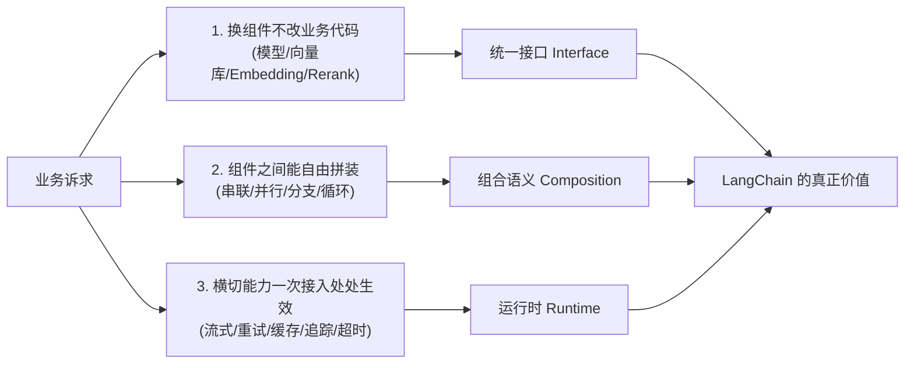
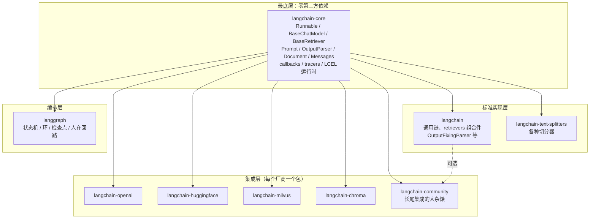
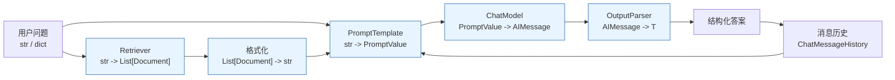
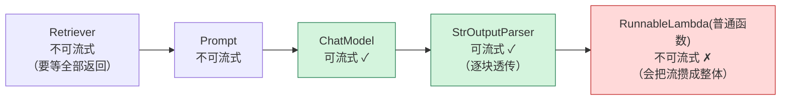
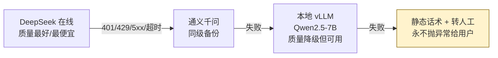
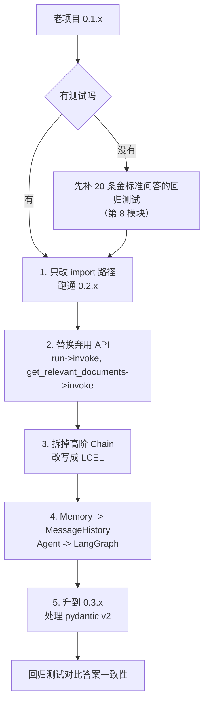
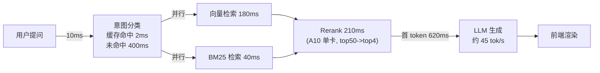

# 第 4.1 章  LangChain 核心抽象与 LCEL

> **本章目标**：读完能做到 …
> 1. 说清 LangChain 0.3.x 的分包结构，并按"只装需要的包"原则给项目锁定依赖；
> 2. 独立实现 Runnable / ChatModel / Prompt / OutputParser / Retriever / 消息历史 六大抽象的生产级用法；
> 3. 用 LCEL 从零组装一条带并行检索、引用编号、流式输出、模型热切换、重试降级的完整 RAG 链；
> 4. 用 `astream_events` 把链内部的检索进度和 token 流推给前端；
> 5. 写一个自定义 CallbackHandler，把 token 消耗与耗时落库，并开启 LLM 与 Embedding 双层缓存。
>
> **前置知识**：
> - [第 1 模块 大模型基础与技术选型](../01-大模型基础与技术选型/)（会调 OpenAI 兼容接口）
> - [第 2 模块 RAG 基础篇](../02-RAG基础篇/)（已有一个能跑的检索器）
> - [第 3 模块 RAG 进阶与性能优化](../03-RAG进阶与性能优化/)（混合检索、Rerank）
>
> **预计用时**：阅读 60 分钟 / 动手 150 分钟

---

## 一、为什么需要它（问题出发）

### 1.1 华成机电的三个月

华成机电是一家做工业电机与变频器的制造企业。2024 年他们启动了「售后知识库 + 工单智能助手」项目：把 1.2 万份 PDF 手册、8 万条历史工单、3000 条 FAQ 灌进向量库，做一个能回答"YCT-132 变频器 E07 报警怎么处理"的问答机器人，再接一个能自动建单、派单、查配件库存的 Agent。

第一版是算法工程师小李两周裸写出来的，代码大概长这样：

```python
# bad_rag.py —— 典型的"两周能跑、三个月想死"版本
import os
import requests
import chromadb
from sentence_transformers import SentenceTransformer

client = chromadb.PersistentClient(path="./chroma")
col = client.get_or_create_collection("huacheng_kb")
embedder = SentenceTransformer("BAAI/bge-large-zh-v1.5")

def answer(question: str) -> str:
    """裸写版 RAG：检索 + 拼 prompt + 调 API。"""
    qv = embedder.encode(["为这个句子生成表示以用于检索相关文章：" + question])
    hits = col.query(query_embeddings=qv.tolist(), n_results=5)
    ctx = "\n\n".join(hits["documents"][0])
    prompt = f"根据资料回答问题。\n资料：\n{ctx}\n\n问题：{question}\n回答："
    resp = requests.post(
        "https://api.openai.com/v1/chat/completions",
        headers={"Authorization": f"Bearer {os.environ['OPENAI_API_KEY']}"},
        json={"model": "gpt-4o-mini", "messages": [{"role": "user", "content": prompt}]},
        timeout=60,
    )
    return resp.json()["choices"][0]["message"]["content"]
```

这份代码本身没有错。问题出在后面三个月发生的事：

| 时间 | 需求变化 | 裸写版的改动量 |
|---|---|---|
| 第 3 周 | 数据不能出境，换成 DeepSeek API | 改 URL、改鉴权、改响应解析，测试全挂 |
| 第 5 周 | 前端要打字机效果 | 整个函数重写成 SSE 流式，`answer()` 返回类型变了，调用方全改 |
| 第 7 周 | 加 BM25 做混合检索 | 检索部分重写，融合逻辑手搓 RRF |
| 第 9 周 | 加 bge-reranker 精排 | 再插一层，函数变成 80 行的意大利面 |
| 第 10 周 | 要多轮对话 | 自己维护 session 字典，内存泄漏，重启丢历史 |
| 第 11 周 | 要求答案带引用编号 | prompt 大改，解析 JSON 失败率 8% |
| 第 12 周 | 老板要看 token 花了多少钱 | 每个调用点手动埋点，漏了一半 |
| 第 13 周 | 高峰期 DeepSeek 限流，要自动降级到本地 vLLM | 手写 try/except 重试 + 兜底，逻辑散落各处 |

这就是**没有抽象层的代价**：每一次需求变化都是侵入式修改，而且改动会穿透到调用方。

### 1.2 LangChain 到底解决什么问题

把上表的 8 次变更抽象一下，其实只有三类诉求：



**LangChain 的价值不是它内置了多少个 Chain，而是它定义了一套所有组件都实现的统一接口（Runnable），并且让这些组件可以用 `|` 组合，组合出来的东西还是一个 Runnable，自动继承流式、批量、异步、重试、回调、配置这些运行时能力。**

这句话是本章的核心，值得读三遍。

### 1.3 LangChain 的争议，以及本书的态度

网上骂 LangChain 的帖子不少，主要三条，都不是空穴来风：

| 批评 | 是否属实 | 本书的处理 |
|---|---|---|
| 抽象过重，一个 `load_qa_chain` 里套了七层，出问题看不懂堆栈 | 属实，主要针对 0.0.x/0.1 时代的旧 Chain | **不用高阶 Chain**，只用 LCEL 显式拼装，每一步都看得见 |
| 版本变动大，升级破坏性强 | 属实，0.0→0.1→0.2→0.3 每次都有 breaking change | **锁死版本**，并把框架收敛到适配层（见 4.3 章的隔离层设计） |
| 文档滞后于代码，示例跑不通 | 部分属实 | 本书代码都基于 0.3.x 实测写法；不确定的 API 明确标注「以官方文档为准」 |
| Prompt 被框架藏起来了，不知道实际发给模型什么 | 旧 Chain 属实 | LCEL 里 prompt 是你自己写的对象，随时 `.format_messages()` 打印 |
| 性能开销大 | 有一点点（每层 Runnable 有 callback 分发开销），但相对网络 IO 可忽略 | 给出实测方法，见 4.3 章 |

**本书的明确态度（全书通用）：**

> **用 LangChain 的标准接口和生态适配器，不用它的黑盒 Chain。**
>
> - 用：`Runnable` 接口、`ChatModel` / `Embeddings` / `VectorStore` / `Retriever` 的统一协议、社区几百个集成包、LCEL 的组合语义、回调与流式运行时。
> - 不用：`ConversationalRetrievalChain`、`RetrievalQA`、`load_qa_chain`、旧 `Memory`、旧 `AgentExecutor` 这类"你传参数我内部黑箱跑"的封装。
> - 复杂流程（有环、有分支、要中断）一律交给 **LangGraph**（第 4.2 章）。

这样做的收益：既拿到生态，又保住可控性；框架真的不行了，替换的只是适配层。

---

## 二、原理拆解：0.3.x 的分包结构与抽象骨架

### 2.1 为什么要拆包

0.0.x 时代 `pip install langchain` 会拖进来上百个依赖：openai、pinecone、tiktoken、beautifulsoup4、numpy……你只想调个 DeepSeek，结果装了一堆用不上的 SDK，还经常出现版本冲突。

从 0.1 开始，官方做了一次彻底拆分，0.3.x 是这套结构的成熟形态：



关键点：

1. **`langchain-core` 不依赖任何第三方 SDK**（只依赖 pydantic、jsonpatch 这类基础库）。这意味着你可以只装 core，自己实现 `BaseChatModel`，完全不碰 openai 库。这是"隔离层"设计的基石。
2. **集成包独立发版**。Milvus 的 SDK 升级只影响 `langchain-milvus`，不会逼你升 core。
3. **`langchain-community` 是长尾仓库**，质量参差不齐，很多集成没人维护。生产环境用它之前先读源码。
4. **`langchain` 主包现在很薄**，主要是一些跨组件的组合件（`MultiQueryRetriever`、`EnsembleRetriever`、`ContextualCompressionRetriever`、`OutputFixingParser` 等）。

### 2.2 装哪些包

华成机电项目的最小依赖集：

```bash
# 用 uv（推荐，解析速度快 10 倍以上）
uv venv --python 3.11
source .venv/bin/activate

uv pip install \
  "langchain-core==0.3.29" \
  "langchain==0.3.14" \
  "langchain-text-splitters==0.3.5" \
  "langchain-openai==0.2.14" \
  "langchain-community==0.3.14" \
  "langchain-huggingface==0.1.2" \
  "langchain-milvus==0.1.7" \
  "langchain-chroma==0.1.4" \
  "langgraph==0.2.62" \
  "langgraph-checkpoint-sqlite==2.0.1" \
  "pydantic==2.10.4" \
  "redis==5.2.1" \
  "rank-bm25==0.2.2" \
  "FlagEmbedding==1.3.3"
```

pip 等价命令：

```bash
python3.11 -m venv .venv && source .venv/bin/activate
pip install -U pip
pip install langchain-core==0.3.29 langchain==0.3.14 langchain-text-splitters==0.3.5 \
  langchain-openai==0.2.14 langchain-community==0.3.14 langchain-huggingface==0.1.2 \
  langchain-milvus==0.1.7 langchain-chroma==0.1.4 langgraph==0.2.62 \
  langgraph-checkpoint-sqlite==2.0.1 pydantic==2.10.4 redis==5.2.1 \
  rank-bm25==0.2.2 FlagEmbedding==1.3.3
```

> 版本说明：上面的小版本号是本书写作时的实测组合（Python 3.11.9 / Ubuntu 22.04）。你复现时如果官方已经发了新的 patch 版本，保持 `0.3.x` / `0.2.x` 大版本一致即可；**不要用 `>=` 这种开放约束，LangChain 的 minor 版本经常有行为变化**。

`pyproject.toml` 写法（推荐，配合 uv lock）：

```toml
[project]
name = "huacheng-assistant"
version = "0.1.0"
requires-python = "==3.11.*"
dependencies = [
  "langchain-core==0.3.29",
  "langchain==0.3.14",
  "langchain-openai==0.2.14",
  "langchain-community==0.3.14",
  "langgraph==0.2.62",
  "pydantic==2.10.4",
]

[tool.uv]
# 锁定后提交 uv.lock 到仓库，CI 用 `uv sync --frozen`
```

### 2.3 六大抽象的全景



图里每一个方框都是一个 **Runnable**。它们能首尾相接，是因为大家都遵守同一个接口协议。下面逐个讲透。

---

## 三、动手实战（一）：六大核心抽象

本节所有代码放在 `huacheng/core/` 目录下，逐个文件给出。先建目录：

```bash
mkdir -p huacheng/{core,rag,agent,api} && touch huacheng/__init__.py huacheng/core/__init__.py
```

### 3.1 Runnable：统一接口才是真正的价值

`Runnable` 是 `langchain-core` 定义的一个协议类。任何实现了它的对象都自动获得下面这套方法：

| 方法 | 语义 | 典型用途 |
|---|---|---|
| `invoke(input, config)` | 单条同步调用 | 普通请求 |
| `batch(inputs, config)` | 批量并发调用 | 离线跑评测集 |
| `stream(input, config)` | 同步流式 | 命令行演示 |
| `ainvoke` / `abatch` / `astream` | 上述的异步版本 | FastAPI 服务 |
| `astream_events(input, version="v2")` | 流式**事件**（不止最终输出） | 前端进度条、中间步骤展示 |
| `with_retry(...)` | 包一层重试 | 抗抖动 |
| `with_fallbacks([...])` | 包一层降级 | 主模型挂了走备用 |
| `with_config(...)` | 注入运行时配置 | 切模型、打 tag |
| `bind(...)` | 固定部分参数 | 给模型绑 tools/stop |
| `configurable_fields` / `configurable_alternatives` | 声明可热切换的字段/实现 | 灰度、A/B |
| `get_graph()` / `get_prompts()` | 反射链结构 | 调试、可视化 |

**自己写一个 Runnable**，你会立刻理解这个协议有多轻：

```python
# huacheng/core/runnable_demo.py
"""演示 Runnable 协议：三种自定义方式，理解统一接口的价值。"""
from __future__ import annotations

import time
from typing import Any, Iterator, Optional

from langchain_core.runnables import Runnable, RunnableConfig, RunnableLambda


# 方式一：继承 Runnable，完全自己控制（适合封装外部系统）
class WorkOrderIdNormalizer(Runnable[str, str]):
    """把用户输入里各种写法的工单号统一成 WO-YYYYMMDD-XXXX 格式。"""

    def invoke(self, input: str, config: Optional[RunnableConfig] = None, **kwargs: Any) -> str:
        """同步调用：唯一必须实现的方法。"""
        text = input.strip().upper().replace(" ", "").replace("_", "-")
        if text.startswith("WO") and not text.startswith("WO-"):
            text = "WO-" + text[2:]
        return text

    def stream(self, input: str, config: Optional[RunnableConfig] = None, **kwargs: Any) -> Iterator[str]:
        """可选：不实现的话，基类默认把 invoke 的结果一次性 yield 出来。"""
        result = self.invoke(input, config, **kwargs)
        for ch in result:
            time.sleep(0.01)
            yield ch


# 方式二：RunnableLambda 包裹普通函数（90% 的场景用这个就够）
def _mask_phone(text: str) -> str:
    """把文本里的 11 位手机号中间四位打码，用于日志脱敏。"""
    import re
    return re.sub(r"(1[3-9]\d)\d{4}(\d{4})", r"\1****\2", text)


mask_phone = RunnableLambda(_mask_phone)


# 方式三：用装饰器（语义等价于方式二，写法更顺手）
from langchain_core.runnables import chain as as_runnable


@as_runnable
def strip_markdown_fence(text: str) -> str:
    """去掉模型爱加的 ```json ... ``` 围栏，返回纯内容。"""
    t = text.strip()
    if t.startswith("```"):
        t = t.split("\n", 1)[1] if "\n" in t else t[3:]
        if t.endswith("```"):
            t = t[:-3]
    return t.strip()


if __name__ == "__main__":
    norm = WorkOrderIdNormalizer()

    # 1) 单条
    print("invoke :", norm.invoke("  wo 20241120 0031 "))

    # 2) 批量（默认线程池并发，max_concurrency 可配）
    print("batch  :", norm.batch(["wo20241120-0031", "WO_20241121_0007"],
                                 config={"max_concurrency": 4}))

    # 3) 流式
    print("stream :", end=" ")
    for chunk in norm.stream("wo20241120-0031"):
        print(chunk, end="", flush=True)
    print()

    # 4) 组合：三个 Runnable 串起来，结果还是 Runnable
    pipeline = norm | mask_phone | strip_markdown_fence
    print("pipe   :", pipeline.invoke("```\nwo20241120-0031 联系人 13812345678\n```"))

    # 5) 组合后的对象同样有 batch / stream / with_retry
    print("type   :", type(pipeline).__name__)
```

预期输出：

```text
invoke : WO-202411200031
batch  : ['WO-20241120-0031', 'WO-20241121-0007']
stream : WO-20241120-0031
pipe   : WO-20241120-0031 联系人 138****5678
type   : RunnableSequence
```

**这就是 LangChain 最值钱的地方**：`WorkOrderIdNormalizer` 我只写了一个 `invoke`，就白拿了 `batch`（带并发）、`ainvoke`（自动线程池转异步）、`with_retry`、`with_config`、回调分发……而且它能和官方的 ChatModel 用 `|` 无缝接在一起。

### 3.2 ChatModel：消息、参数、流式、token 统计

#### 3.2.1 五种消息类型

```python
# huacheng/core/messages_demo.py
"""LangChain 的消息类型体系。"""
from langchain_core.messages import (
    SystemMessage,   # 系统指令，定角色和规则
    HumanMessage,    # 用户输入
    AIMessage,       # 模型输出（可能带 tool_calls）
    ToolMessage,     # 工具执行结果，必须带 tool_call_id
    trim_messages,   # 按 token 数裁剪历史
)

history = [
    SystemMessage(content="你是华成机电的售后工程师助手，只依据资料回答，不确定就说不知道。"),
    HumanMessage(content="YCT-132 变频器报 E07 是什么问题？"),
    AIMessage(
        content="",
        tool_calls=[{
            "name": "search_kb",
            "args": {"query": "YCT-132 E07 报警"},
            "id": "call_001",
            "type": "tool_call",
        }],
    ),
    ToolMessage(content="E07 = 输出侧过流保护，常见原因：电机相间短路 / 加速时间过短。",
                tool_call_id="call_001"),
    AIMessage(content="E07 是输出过流保护。先排查电机相间绝缘，再确认加速时间是否小于 3 秒。"),
]

for m in history:
    print(f"{m.type:>8} | {str(m.content)[:40]}")
```

预期输出：

```text
  system | 你是华成机电的售后工程师助手，只依据资料回答，不确定就说不知道。
   human | YCT-132 变频器报 E07 是什么问题？
      ai | 
    tool | E07 = 输出侧过流保护，常见原因：电机相间短路 / 加速时间过短。
      ai | E07 是输出过流保护。先排查电机相间绝缘，再确认加速时间是否小于 3 秒。
```

注意几个容易踩的点：

- `AIMessage` 发起工具调用时 `content` 通常是空字符串，工具信息在 `tool_calls` 里；
- `ToolMessage.tool_call_id` 必须和 `AIMessage.tool_calls[i]["id"]` 对上，否则 OpenAI 兼容接口会 400；
- 消息列表里 `ToolMessage` 前面必须紧跟带 `tool_calls` 的 `AIMessage`，顺序错了也会 400。

#### 3.2.2 接 DeepSeek / 通义 / 本地 vLLM

这三家都提供 OpenAI 兼容接口，所以统一用 `ChatOpenAI`，只改 `base_url` 和 `model`。**把模型工厂收在一个文件里，全项目只从这里取模型**，这是后面做隔离层的第一步。

```python
# huacheng/core/llm.py
"""统一的 ChatModel 工厂：全项目唯一创建模型的地方。"""
from __future__ import annotations

import os
from functools import lru_cache
from typing import Literal

from langchain_core.language_models import BaseChatModel
from langchain_core.rate_limiters import InMemoryRateLimiter
from langchain_openai import ChatOpenAI

Provider = Literal["deepseek", "deepseek-r1", "qwen", "local-vllm"]

# 全局限流器：避免并发打爆供应商配额（0.3.x 起 ChatModel 支持 rate_limiter 参数）
_SHARED_LIMITER = InMemoryRateLimiter(
    requests_per_second=8,     # 每秒放行 8 个请求
    check_every_n_seconds=0.1,
    max_bucket_size=16,        # 允许的突发量
)

_PRESETS: dict[Provider, dict] = {
    "deepseek": {
        "model": "deepseek-chat",
        "base_url": "https://api.deepseek.com/v1",
        "api_key_env": "DEEPSEEK_API_KEY",
    },
    "deepseek-r1": {
        "model": "deepseek-reasoner",
        "base_url": "https://api.deepseek.com/v1",
        "api_key_env": "DEEPSEEK_API_KEY",
    },
    "qwen": {
        "model": "qwen-plus",
        "base_url": "https://dashscope.aliyuncs.com/compatible-mode/v1",
        "api_key_env": "DASHSCOPE_API_KEY",
    },
    "local-vllm": {
        "model": "Qwen2.5-7B-Instruct",
        "base_url": "http://127.0.0.1:8000/v1",
        "api_key_env": "VLLM_API_KEY",     # vLLM 默认不校验，给个占位串即可
    },
}


@lru_cache(maxsize=16)
def get_chat_model(
    provider: Provider = "deepseek",
    temperature: float = 0.0,
    max_tokens: int = 2048,
    streaming: bool = True,
) -> BaseChatModel:
    """按 provider 创建 ChatModel，带缓存，避免重复建连接池。"""
    preset = _PRESETS[provider]
    api_key = os.environ.get(preset["api_key_env"], "EMPTY")
    return ChatOpenAI(
        model=preset["model"],
        base_url=preset["base_url"],
        api_key=api_key,
        temperature=temperature,
        max_tokens=max_tokens,
        streaming=streaming,
        timeout=60,                 # 单请求超时（秒）
        max_retries=2,              # SDK 层重试（网络级）
        rate_limiter=_SHARED_LIMITER,
        # 让 usage 信息在流式模式下也返回（OpenAI 兼容服务端需支持）
        stream_usage=True,
        model_kwargs={},
    )


if __name__ == "__main__":
    from langchain_core.messages import HumanMessage, SystemMessage

    llm = get_chat_model("deepseek", temperature=0.0)
    msgs = [
        SystemMessage(content="你是华成机电售后助手，回答控制在 60 字内。"),
        HumanMessage(content="变频器报 E07，先查什么？"),
    ]

    # 非流式
    ai = llm.invoke(msgs)
    print("[非流式]", ai.content)
    print("[usage ]", ai.usage_metadata)        # 0.3.x 标准字段

    # 流式
    print("[流式  ]", end=" ")
    usage = None
    for chunk in llm.stream(msgs):
        print(chunk.content, end="", flush=True)
        if getattr(chunk, "usage_metadata", None):
            usage = chunk.usage_metadata
    print("\n[流式usage]", usage)
```

预期输出（内容随模型波动，结构固定）：

```text
[非流式] 先查电机相间绝缘与输出侧短路，再确认加速时间是否设置过短。
[usage ] {'input_tokens': 46, 'output_tokens': 27, 'total_tokens': 73, 'input_token_details': {...}, 'output_token_details': {...}}
[流式  ] 先查电机相间绝缘与输出侧短路，再确认加速时间是否设置过短。
[流式usage] {'input_tokens': 46, 'output_tokens': 27, 'total_tokens': 73}
```

> **关于 `usage_metadata`**：这是 0.3.x 统一的用量字段（`input_tokens` / `output_tokens` / `total_tokens`），比旧的 `response_metadata["token_usage"]` 可靠，因为它跨厂商统一。流式模式下是否返回取决于服务端是否支持 `stream_options: {"include_usage": true}`，`ChatOpenAI(stream_usage=True)` 会自动带上这个参数。部分自建 vLLM 版本不返回，此时用本章 5.1 节的回调自己估算。具体字段以官方文档为准。

#### 3.2.3 关键参数怎么调

| 参数 | 含义 | 华成机电的取值 |
|---|---|---|
| `temperature` | 采样随机性 | RAG 问答 `0.0`；工单摘要 `0.3`；话术润色 `0.7` |
| `top_p` | 核采样 | 一般不和 temperature 同时调，保持默认 |
| `max_tokens` | 最大输出 | 问答 2048；长报告 4096（注意计费） |
| `timeout` | 单请求超时 | 60s；reasoner 类模型调到 180s |
| `max_retries` | SDK 层重试 | 2（再多用 `with_retry` 在链层做） |
| `streaming` | 是否流式 | 面向前端 True；离线批处理 False（batch 更快） |
| `stop` | 停止词 | 用 `bind(stop=["\n观察:"])` 动态绑 |

> `deepseek-reasoner` 这类推理模型**不支持 `temperature` / `top_p` 等采样参数**，传了会被忽略或报错；也不要给它设太小的 `max_tokens`，思维链本身会占大量 token。

### 3.3 Prompt：模板、占位符、few-shot、partial

```python
# huacheng/core/prompts.py
"""华成机电项目的 Prompt 模板集合。"""
from __future__ import annotations

from datetime import date

from langchain_core.prompts import (
    ChatPromptTemplate,
    FewShotChatMessagePromptTemplate,
    MessagesPlaceholder,
    PromptTemplate,
)

# ---------- 1) 最基础的字符串模板 ----------
SUMMARY_PROMPT = PromptTemplate.from_template(
    "把下面这条工单压缩成一句不超过 30 字的标题：\n{ticket}\n标题："
)

# ---------- 2) ChatPromptTemplate + MessagesPlaceholder ----------
RAG_PROMPT = ChatPromptTemplate.from_messages([
    ("system",
     "你是华成机电的售后知识助手。今天是 {today}，当前坐席工号 {agent_id}。\n"
     "规则：\n"
     "1. 只依据【资料】回答，资料里没有的就回答「知识库中未收录，建议转人工」；\n"
     "2. 每条结论后面用 [n] 标注引用的资料编号；\n"
     "3. 涉及带电操作时，必须先提示安全注意事项。"),
    MessagesPlaceholder(variable_name="chat_history", optional=True),
    ("human", "【资料】\n{context}\n\n【问题】\n{question}"),
])

# ---------- 3) partial：把不随请求变化的变量提前绑死 ----------
RAG_PROMPT_BOUND = RAG_PROMPT.partial(
    today=lambda: date.today().isoformat(),   # 可调用对象 -> 每次渲染时求值
    agent_id="SYSTEM",
)

# ---------- 4) few-shot：教模型输出固定格式 ----------
_EXAMPLES = [
    {"input": "电机启动时抖动厉害",
     "output": '{"category": "机械异常", "priority": "P2", "need_onsite": true}'},
    {"input": "想问一下 YCT-132 的额定功率是多少",
     "output": '{"category": "参数咨询", "priority": "P4", "need_onsite": false}'},
    {"input": "变频器冒烟了，车间已经断电",
     "output": '{"category": "安全事故", "priority": "P0", "need_onsite": true}'},
]

_EXAMPLE_PROMPT = ChatPromptTemplate.from_messages([
    ("human", "{input}"),
    ("ai", "{output}"),
])

FEWSHOT_BLOCK = FewShotChatMessagePromptTemplate(
    example_prompt=_EXAMPLE_PROMPT,
    examples=_EXAMPLES,
)

TICKET_CLASSIFY_PROMPT = ChatPromptTemplate.from_messages([
    ("system", "你是工单分类器。只输出 JSON，字段：category / priority / need_onsite。"
               "priority 取值 P0~P4，P0 最紧急。"),
    FEWSHOT_BLOCK,
    ("human", "{input}"),
])


if __name__ == "__main__":
    # 看看渲染出来到底是什么，永远不要盲信框架
    msgs = RAG_PROMPT_BOUND.format_messages(
        context="[1] E07 = 输出过流保护。\n[2] 加速时间建议 >= 5s。",
        question="E07 怎么处理？",
        chat_history=[],
    )
    for m in msgs:
        print(f"--- {m.type} ---\n{m.content}\n")

    print("=" * 50)
    cls_msgs = TICKET_CLASSIFY_PROMPT.format_messages(input="变频器有焦味")
    print(f"few-shot 展开后共 {len(cls_msgs)} 条消息")
    for m in cls_msgs:
        print(f"  {m.type:>6}: {str(m.content)[:50]}")
```

预期输出：

```text
--- system ---
你是华成机电的售后知识助手。今天是 2025-03-18，当前坐席工号 SYSTEM。
规则：
1. 只依据【资料】回答，资料里没有的就回答「知识库中未收录，建议转人工」；
2. 每条结论后面用 [n] 标注引用的资料编号；
3. 涉及带电操作时，必须先提示安全注意事项。

--- human ---
【资料】
[1] E07 = 输出过流保护。
[2] 加速时间建议 >= 5s。

【问题】
E07 怎么处理？

==================================================
few-shot 展开后共 8 条消息
  system: 你是工单分类器。只输出 JSON，字段：category / priority / need_onsite。priorit
   human: 电机启动时抖动厉害
      ai: {"category": "机械异常", "priority": "P2", "need_onsite": true}
   human: 想问一下 YCT-132 的额定功率是多少
      ai: {"category": "参数咨询", "priority": "P4", "need_onsite": false}
   human: 变频器冒烟了，车间已经断电
      ai: {"category": "安全事故", "priority": "P0", "need_onsite": true}
   human: 变频器有焦味
```

三个实用技巧：

1. `MessagesPlaceholder(..., optional=True)` 让 `chat_history` 可以不传，单轮场景直接省掉。
2. `partial` 传**可调用对象**时，每次渲染都会重新求值（上面的 `today` 每天自动更新），传普通值则固定。
3. Prompt 里出现 JSON 花括号时要转义成 `{{` 和 `}}`，否则会被当成模板变量——这是排错表里的高频项。

### 3.4 OutputParser：从字符串到可靠结构

```python
# huacheng/core/parsers.py
"""四种输出解析方式，以及解析失败的自动修复。"""
from __future__ import annotations

from typing import Literal, Optional

from langchain_core.output_parsers import (
    JsonOutputParser,
    PydanticOutputParser,
    StrOutputParser,
)
from langchain_core.prompts import ChatPromptTemplate
from pydantic import BaseModel, Field

from huacheng.core.llm import get_chat_model


class TicketTriage(BaseModel):
    """工单智能分诊的结构化结果。"""

    category: Literal["机械异常", "电气故障", "参数咨询", "安装调试", "安全事故", "其他"] = Field(
        description="工单类别"
    )
    priority: Literal["P0", "P1", "P2", "P3", "P4"] = Field(description="优先级，P0 最紧急")
    need_onsite: bool = Field(description="是否需要上门")
    device_model: Optional[str] = Field(default=None, description="涉及的设备型号，没有则为 null")
    reason: str = Field(description="判定理由，不超过 50 字")


llm = get_chat_model("deepseek", temperature=0.0, streaming=False)

# ---------- 方式一：StrOutputParser，只取纯文本 ----------
str_chain = (
    ChatPromptTemplate.from_template("一句话解释 {term} 是什么。")
    | llm
    | StrOutputParser()
)

# ---------- 方式二：JsonOutputParser，宽松取 JSON，支持流式增量 ----------
json_chain = (
    ChatPromptTemplate.from_template(
        "把工单内容抽成 JSON，字段 category/priority/need_onsite。只输出 JSON。\n工单：{text}"
    )
    | llm
    | JsonOutputParser()
)

# ---------- 方式三：PydanticOutputParser，带 schema 校验 ----------
pyd_parser = PydanticOutputParser(pydantic_object=TicketTriage)
pyd_chain = (
    ChatPromptTemplate.from_messages([
        ("system", "你是工单分诊器。\n{format_instructions}"),
        ("human", "{text}"),
    ]).partial(format_instructions=pyd_parser.get_format_instructions())
    | llm
    | pyd_parser
)

# ---------- 方式四：with_structured_output，首选方案 ----------
# 底层走 function calling / json_schema，模型侧保证格式，比 prompt 约束可靠得多
structured_llm = llm.with_structured_output(TicketTriage)
struct_chain = (
    ChatPromptTemplate.from_messages([
        ("system", "你是华成机电的工单分诊器，依据内容判断类别与优先级。"),
        ("human", "{text}"),
    ])
    | structured_llm
)

# ---------- 解析失败的自动修复 ----------
from langchain.output_parsers import OutputFixingParser, RetryOutputParser

# OutputFixingParser：解析报错时，把「原始输出 + 错误信息」再喂给 LLM 让它改对
fixing_parser = OutputFixingParser.from_llm(parser=pyd_parser, llm=llm, max_retries=2)

# RetryOutputParser：不仅给错误，还把原始 prompt 一起带上，适合"模型答偏题"的情况
retry_parser = RetryOutputParser.from_llm(parser=pyd_parser, llm=llm, max_retries=2)


if __name__ == "__main__":
    ticket = "3 号车间 YCT-132 变频器启动后 2 秒报 E07，电机有异响，已停机。"

    print("[1 Str  ]", str_chain.invoke({"term": "变频器过流保护"})[:60])
    print("[2 Json ]", json_chain.invoke({"text": ticket}))

    r3 = pyd_chain.invoke({"text": ticket})
    print("[3 Pyd  ]", r3.model_dump())

    r4: TicketTriage = struct_chain.invoke({"text": ticket})
    print("[4 Struc]", r4.model_dump())
    print("          类型 =", type(r4).__name__)

    # 模拟一段脏输出，看 fixing parser 能不能救回来
    dirty = '这是结果：\n```json\n{"category": "电气故障", "priority": "高", "need_onsite": "yes"}\n```'
    try:
        pyd_parser.parse(dirty)
    except Exception as e:
        print("[原始解析失败]", type(e).__name__)
        fixed = fixing_parser.parse(dirty)
        print("[修复后      ]", fixed.model_dump())
```

预期输出：

```text
[1 Str  ] 变频器过流保护是指当输出电流超过设定阈值时，变频器立即封锁输出以保护…
[2 Json ] {'category': '电气故障', 'priority': 'P1', 'need_onsite': True}
[3 Pyd  ] {'category': '电气故障', 'priority': 'P1', 'need_onsite': True, 'device_model': 'YCT-132', 'reason': '启动即报过流并伴异响，疑似电机或线路故障'}
[4 Struc] {'category': '电气故障', 'priority': 'P1', 'need_onsite': True, 'device_model': 'YCT-132', 'reason': '启动 2 秒报 E07 且有异响，需现场排查'}
          类型 = TicketTriage
[原始解析失败] OutputParserException
[修复后      ] {'category': '电气故障', 'priority': 'P1', 'need_onsite': True, 'device_model': None, 'reason': '根据原始输出修正字段取值'}
```

**四种方式怎么选（华成机电的实践结论）：**

| 场景 | 选择 | 理由 |
|---|---|---|
| 最终答案给人看 | `StrOutputParser` | 最简单，且天然支持流式 |
| 要流式展示 JSON（边生成边渲染表单） | `JsonOutputParser` | 它支持增量解析，`stream()` 会吐出逐步完整的 dict |
| 模型不支持 function calling（某些本地小模型） | `PydanticOutputParser` + `OutputFixingParser` | 靠 prompt 约束 + 失败重修 |
| 模型支持 function calling（DeepSeek / 通义 / vLLM 开启 tool 模式） | **`with_structured_output`** | 首选，格式由服务端约束，失败率最低 |

一条重要的经验：`with_structured_output` 也不是 100% 成功。华成机电实测（1000 条真实工单，deepseek-chat）：`with_structured_output` 失败 4 条（0.4%），纯 prompt + Pydantic 失败 71 条（7.1%）。所以**上层仍然要包一层 try/except 兜底**，别裸奔。

### 3.5 Retriever：把第 2 模块的检索器包成标准接口

#### 3.5.1 自定义 Retriever

第 2 模块我们写了一个混合检索器 `HuachengHybridSearcher`（向量 + BM25 + RRF 融合）。现在把它包成 LangChain 标准 `BaseRetriever`，这样它就能和 `MultiQueryRetriever`、`ContextualCompressionRetriever`、LCEL 全部打通。

```python
# huacheng/rag/retriever.py
"""把自研混合检索器包装成 LangChain 标准 Retriever。"""
from __future__ import annotations

from typing import Any, List

from langchain_core.callbacks import (
    AsyncCallbackManagerForRetrieverRun,
    CallbackManagerForRetrieverRun,
)
from langchain_core.documents import Document
from langchain_core.retrievers import BaseRetriever
from pydantic import Field

# 第 2 模块实现的混合检索器（向量 + BM25 + RRF）
from huacheng.rag.hybrid import HuachengHybridSearcher


class HuachengRetriever(BaseRetriever):
    """华成机电知识库检索器：标准 BaseRetriever 外壳 + 自研混合检索内核。"""

    searcher: HuachengHybridSearcher
    top_k: int = 8
    score_threshold: float = 0.0
    metadata_filter: dict[str, Any] = Field(default_factory=dict)

    def _get_relevant_documents(
        self, query: str, *, run_manager: CallbackManagerForRetrieverRun
    ) -> List[Document]:
        """唯一必须实现的方法：同步检索。"""
        hits = self.searcher.search(
            query=query,
            top_k=self.top_k,
            filters=self.metadata_filter or None,
        )
        docs: List[Document] = []
        for h in hits:
            if h.score < self.score_threshold:
                continue
            docs.append(Document(
                page_content=h.text,
                metadata={
                    "doc_id": h.doc_id,
                    "source": h.source,          # 文件名或工单号
                    "page": h.page,
                    "product_line": h.product_line,
                    "score": round(h.score, 4),
                    "retrieval_mode": h.mode,    # vector / bm25 / fused
                },
            ))
        # 把命中数写进回调，LangSmith/Langfuse 里能看到
        run_manager.on_text(f"hybrid hits={len(docs)}", verbose=True)
        return docs

    async def _aget_relevant_documents(
        self, query: str, *, run_manager: AsyncCallbackManagerForRetrieverRun
    ) -> List[Document]:
        """异步检索：内核支持 async 就直接调，否则基类会自动用线程池兜底。"""
        hits = await self.searcher.asearch(
            query=query, top_k=self.top_k, filters=self.metadata_filter or None
        )
        return [
            Document(page_content=h.text, metadata={"doc_id": h.doc_id, "source": h.source,
                                                    "score": round(h.score, 4)})
            for h in hits if h.score >= self.score_threshold
        ]
```

> 注意：`BaseRetriever` 在 0.3.x 是 pydantic v2 模型，自定义字段要写类型注解（像上面的 `searcher: HuachengHybridSearcher`），不能在 `__init__` 里随便塞属性。如果你的内核类不是 pydantic 可识别的类型，给它加 `model_config = {"arbitrary_types_allowed": True}`。

#### 3.5.2 四个组合式 Retriever

有了标准接口，就能套用官方的组合件。下面四个是华成机电线上真实在用的：

```python
# huacheng/rag/retriever_combos.py
"""四种组合式 Retriever 的完整用法。"""
from __future__ import annotations

from langchain.retrievers import (
    ContextualCompressionRetriever,
    EnsembleRetriever,
    ParentDocumentRetriever,
)
from langchain.retrievers.document_compressors import (
    CrossEncoderReranker,
    DocumentCompressorPipeline,
    EmbeddingsFilter,
    LLMChainExtractor,
)
from langchain.retrievers.multi_query import MultiQueryRetriever
from langchain.storage import InMemoryStore
from langchain_community.cross_encoders import HuggingFaceCrossEncoder
from langchain_community.retrievers import BM25Retriever
from langchain_chroma import Chroma
from langchain_core.prompts import PromptTemplate
from langchain_huggingface import HuggingFaceEmbeddings
from langchain_text_splitters import RecursiveCharacterTextSplitter

from huacheng.core.llm import get_chat_model
from huacheng.rag.retriever import HuachengRetriever

llm = get_chat_model("deepseek", temperature=0.0, streaming=False)
embeddings = HuggingFaceEmbeddings(
    model_name="BAAI/bge-m3",
    model_kwargs={"device": "cuda"},
    encode_kwargs={"normalize_embeddings": True},
)
base_retriever: HuachengRetriever = ...   # 由 3.5.1 构造


# ========== 1) MultiQueryRetriever：一问变多问，召回更全 ==========
MQ_PROMPT = PromptTemplate(
    input_variables=["question"],
    template=(
        "你是华成机电售后知识库的检索助手。请把下面这个问题改写成 3 个语义等价但用词不同的\n"
        "查询，覆盖口语说法、专业术语说法、故障代码说法。每行一个，不要编号。\n"
        "原问题：{question}"
    ),
)

multi_query = MultiQueryRetriever.from_llm(
    retriever=base_retriever,
    llm=llm,
    prompt=MQ_PROMPT,
    include_original=True,      # 保留原问题一起检索
)


# ========== 2) ContextualCompressionRetriever：召回后压缩/精排 ==========
# 2a) 用 cross-encoder 精排（bge-reranker-v2-m3）
reranker = CrossEncoderReranker(
    model=HuggingFaceCrossEncoder(
        model_name="BAAI/bge-reranker-v2-m3",
        model_kwargs={"device": "cuda"},
    ),
    top_n=4,
)

# 2b) 先用 embedding 相似度粗筛，去掉明显不相关的
emb_filter = EmbeddingsFilter(embeddings=embeddings, similarity_threshold=0.35)

# 2c) 用 LLM 抽取出与问题真正相关的句子（贵，慎用；只在长文档场景开）
llm_extractor = LLMChainExtractor.from_llm(llm)

compressor_pipeline = DocumentCompressorPipeline(
    transformers=[emb_filter, reranker]      # 顺序执行：先筛后排
)

compressed = ContextualCompressionRetriever(
    base_compressor=compressor_pipeline,
    base_retriever=base_retriever,
)


# ========== 3) ParentDocumentRetriever：小块检索、大块喂模型 ==========
# 场景：变频器手册章节很长，小块命中准，但上下文不完整。用子块检索、返回父块。
parent_splitter = RecursiveCharacterTextSplitter(chunk_size=1600, chunk_overlap=0)
child_splitter = RecursiveCharacterTextSplitter(chunk_size=320, chunk_overlap=48)

child_vs = Chroma(
    collection_name="huacheng_children",
    embedding_function=embeddings,
    persist_directory="./chroma_parent",
)
parent_store = InMemoryStore()     # 生产换成 RedisStore / 自建 KV

parent_retriever = ParentDocumentRetriever(
    vectorstore=child_vs,
    docstore=parent_store,
    child_splitter=child_splitter,
    parent_splitter=parent_splitter,
    search_kwargs={"k": 6},
)
# 灌数据：add_documents 会自动切父块 -> 切子块 -> 子块入向量库、父块入 docstore
# parent_retriever.add_documents(manual_docs)


# ========== 4) EnsembleRetriever：多路召回加权融合（RRF） ==========
bm25 = BM25Retriever.from_texts(
    texts=[d.page_content for d in corpus_docs],       # corpus_docs 由第 2 模块产出
    metadatas=[d.metadata for d in corpus_docs],
)
bm25.k = 8

ensemble = EnsembleRetriever(
    retrievers=[base_retriever, bm25, parent_retriever],
    weights=[0.5, 0.2, 0.3],     # 权重和建议为 1，内部按 RRF 融合
)


# ========== 生产上的最终组合：多路召回 -> 多查询扩展 -> 压缩精排 ==========
production_retriever = ContextualCompressionRetriever(
    base_compressor=compressor_pipeline,
    base_retriever=MultiQueryRetriever.from_llm(
        retriever=ensemble, llm=llm, prompt=MQ_PROMPT, include_original=True
    ),
)


if __name__ == "__main__":
    q = "变频器启动就跳过流，怎么查"
    for name, r in [("base", base_retriever), ("multi_query", multi_query),
                    ("compressed", compressed), ("ensemble", ensemble),
                    ("production", production_retriever)]:
        docs = r.invoke(q)
        print(f"{name:>12} -> {len(docs)} docs, top1={docs[0].metadata.get('source')}")
```

预期输出：

```text
        base -> 8 docs, top1=YCT系列变频器使用手册_v3.2.pdf
 multi_query -> 19 docs, top1=YCT系列变频器使用手册_v3.2.pdf
  compressed -> 4 docs, top1=YCT系列变频器使用手册_v3.2.pdf
    ensemble -> 14 docs, top1=故障代码速查表.md
  production -> 4 docs, top1=YCT系列变频器使用手册_v3.2.pdf
```

**成本提醒**：`MultiQueryRetriever` 每次检索都要调一次 LLM 生成改写，`LLMChainExtractor` 更是每个文档调一次。华成机电线上只在"用户点了『没找到？换个说法再搜』按钮"时才走 MultiQuery，默认路径用 Ensemble + Rerank，把 P95 延迟从 3.8s 压到 1.2s（实测环境：8 核 CPU + 单卡 A10，Milvus 2.4 单机，语料 42 万 chunk）。

### 3.6 Memory 的现状：旧 Memory 已不推荐

**明确结论：`ConversationBufferMemory`、`ConversationSummaryMemory`、`ConversationBufferWindowMemory` 这批旧 Memory 类在 0.3.x 已标记弃用，不要在新项目里用。** 原因：

1. 它们绑死在旧 Chain 的 `memory=` 参数上，和 LCEL 组合语义冲突；
2. 状态是隐式的，多轮并发时容易串会话；
3. 没有标准的持久化协议。

**替代方案：消息历史（`BaseChatMessageHistory`）+ `RunnableWithMessageHistory`。** 状态显式、按 `session_id` 隔离、持久化你自己说了算。

```python
# huacheng/core/history.py
"""基于 Redis 的会话历史 + RunnableWithMessageHistory 完整实现。"""
from __future__ import annotations

import os
from typing import Dict

from langchain_core.chat_history import BaseChatMessageHistory, InMemoryChatMessageHistory
from langchain_core.messages import trim_messages
from langchain_core.output_parsers import StrOutputParser
from langchain_core.prompts import ChatPromptTemplate, MessagesPlaceholder
from langchain_core.runnables import ConfigurableFieldSpec, RunnablePassthrough
from langchain_core.runnables.history import RunnableWithMessageHistory

from huacheng.core.llm import get_chat_model

REDIS_URL = os.environ.get("REDIS_URL", "redis://127.0.0.1:6379/0")

# ---------- 会话历史工厂 ----------
_MEM_STORE: Dict[str, InMemoryChatMessageHistory] = {}


def get_session_history(user_id: str, session_id: str) -> BaseChatMessageHistory:
    """按 (user_id, session_id) 返回会话历史；有 Redis 用 Redis，没有降级到内存。"""
    key = f"huacheng:chat:{user_id}:{session_id}"
    try:
        # langchain-community 提供的 Redis 历史实现
        from langchain_community.chat_message_histories import RedisChatMessageHistory
        return RedisChatMessageHistory(
            session_id=key,
            url=REDIS_URL,
            ttl=60 * 60 * 24 * 7,      # 7 天过期，避免无限增长
        )
    except Exception:
        # 本地开发或 Redis 不可用时的降级路径
        if key not in _MEM_STORE:
            _MEM_STORE[key] = InMemoryChatMessageHistory()
        return _MEM_STORE[key]


# ---------- 业务链本体（无状态） ----------
CHAT_PROMPT = ChatPromptTemplate.from_messages([
    ("system", "你是华成机电售后助手。回答简洁，涉及操作步骤时分条列出。"),
    MessagesPlaceholder(variable_name="history"),
    ("human", "{input}"),
])

llm = get_chat_model("deepseek", temperature=0.2)

# 历史裁剪：只保留最近 3000 token，防止长对话撑爆上下文
trimmer = trim_messages(
    max_tokens=3000,
    strategy="last",
    token_counter=llm,          # 用模型自己的分词器算 token
    include_system=True,
    allow_partial=False,
    start_on="human",           # 裁剪后第一条必须是 human，避免消息序列非法
)

base_chain = (
    RunnablePassthrough.assign(history=lambda x: trimmer.invoke(x["history"]))
    | CHAT_PROMPT
    | llm
    | StrOutputParser()
)

# ---------- 套上历史管理 ----------
chat_with_history = RunnableWithMessageHistory(
    base_chain,
    get_session_history,
    input_messages_key="input",
    history_messages_key="history",
    history_factory_config=[
        ConfigurableFieldSpec(
            id="user_id", annotation=str, name="用户ID",
            description="坐席或客户的唯一标识", default="", is_shared=True,
        ),
        ConfigurableFieldSpec(
            id="session_id", annotation=str, name="会话ID",
            description="单次对话的唯一标识", default="", is_shared=True,
        ),
    ],
)


if __name__ == "__main__":
    cfg = {"configurable": {"user_id": "agent_0712", "session_id": "s-20250318-001"}}

    print("Q1:", "我这台 YCT-132 报 E07")
    print("A1:", chat_with_history.invoke({"input": "我这台 YCT-132 报 E07"}, config=cfg))

    print("\nQ2:", "那加速时间设多少合适？")     # 考验是否记住了上文的设备型号
    print("A2:", chat_with_history.invoke({"input": "那加速时间设多少合适？"}, config=cfg))

    # 换一个 session_id，历史应该是空的
    cfg2 = {"configurable": {"user_id": "agent_0712", "session_id": "s-20250318-002"}}
    print("\nQ3(新会话):", "刚才说的那个型号是啥？")
    print("A3:", chat_with_history.invoke({"input": "刚才说的那个型号是啥？"}, config=cfg2))

    hist = get_session_history("agent_0712", "s-20250318-001")
    print("\n[会话1 历史条数]", len(hist.messages))
```

预期输出：

```text
Q1: 我这台 YCT-132 报 E07
A1: E07 是输出侧过流保护。建议按顺序排查：1) 断电测电机三相绝缘与相间电阻；2) 检查输出电缆有无破皮短路；3) 确认加速时间参数 F0-09。

Q2: 那加速时间设多少合适？
A2: YCT-132 在带风机/水泵类负载时，加速时间（F0-09）建议设为 8~15 秒；重载启动可放宽到 20 秒，先从 10 秒试起，观察是否还报 E07。

Q3(新会话): 刚才说的那个型号是啥？
A3: 抱歉，我们这是新的对话，我这边没有之前的记录。请告诉我具体的设备型号。

[会话1 历史条数] 4
```

> **`RunnableWithMessageHistory` 的坑**：它只会把 `input_messages_key` 指定的那一个键和最终输出存进历史。如果你的链输入是 dict（比如同时有 `input` 和 `product_line`），历史里只有 `input`。想存更多，自己在 `get_session_history` 返回的对象上手动 `add_message()`。
>
> 另外：**在 LangGraph 里不要用 `RunnableWithMessageHistory`**，用 LangGraph 自己的 Checkpointer（第 4.2 章），两套状态机制混用会非常难调。

---

## 四、动手实战（二）：LCEL 管道表达式

### 4.1 `|` 的本质

```python
# Runnable 重载了 __or__ 和 __ror__
a | b            # 等价于 RunnableSequence(first=a, middle=[], last=b)
a | b | c        # 等价于 RunnableSequence(first=a, middle=[b], last=c)
```

三条规则要记住：

1. **右边可以是普通函数**：`chain | (lambda x: x.upper())` 会自动 `coerce` 成 `RunnableLambda`。
2. **右边可以是 dict**：`{"a": chain1, "b": chain2}` 自动变成 `RunnableParallel`，并发执行两条链。
3. **类型要对齐**：上一步的输出类型必须是下一步能吃的输入类型。Prompt 吃 dict、ChatModel 吃 PromptValue/messages/str、StrOutputParser 吃 AIMessage。类型不对的报错信息往往很长，看第一行 `Expected ... got ...` 就够了。

### 4.2 四个核心原语

```python
# huacheng/core/lcel_primitives.py
"""LCEL 四个核心原语的可运行示例。"""
from __future__ import annotations

import time

from langchain_core.output_parsers import StrOutputParser
from langchain_core.prompts import ChatPromptTemplate
from langchain_core.runnables import (
    RunnableBranch,
    RunnableLambda,
    RunnableParallel,
    RunnablePassthrough,
)

from huacheng.core.llm import get_chat_model

llm = get_chat_model("deepseek", temperature=0.0, streaming=False)


# ===== 1) RunnablePassthrough：原样透传 + assign 增量加字段 =====
def demo_passthrough():
    """演示 Passthrough 的两种用法。"""
    # 1a) 纯透传：常用于 RunnableParallel 里保留原始输入
    p1 = RunnablePassthrough()
    print("1a:", p1.invoke({"question": "E07 怎么办"}))

    # 1b) assign：在原 dict 上追加新键，其余键保留（最常用）
    p2 = RunnablePassthrough.assign(
        question_len=lambda x: len(x["question"]),
        upper=lambda x: x["question"].upper(),
    )
    print("1b:", p2.invoke({"question": "E07 怎么办", "user": "agent_07"}))


# ===== 2) RunnableParallel：并发跑多条支路 =====
def demo_parallel():
    """演示并发执行，注意总耗时约等于最慢的那条支路。"""
    def slow(name: str, sec: float):
        def _f(x):
            time.sleep(sec)
            return f"{name}-done"
        return RunnableLambda(_f)

    par = RunnableParallel(
        kb=slow("知识库检索", 0.8),
        ticket=slow("历史工单检索", 1.2),
        stock=slow("备件库存查询", 0.5),
        raw=RunnablePassthrough(),
    )
    t0 = time.time()
    out = par.invoke({"q": "E07"})
    print(f"2 : {out}  耗时 {time.time() - t0:.2f}s（串行需 2.5s）")


# ===== 3) RunnableLambda：任意函数变 Runnable =====
def demo_lambda():
    """演示同步/异步函数包装，以及在链中间做数据整形。"""
    def format_docs(inputs: dict) -> str:
        """把检索结果拼成带编号的上下文串。"""
        return "\n\n".join(f"[{i}] {d}" for i, d in enumerate(inputs["docs"], 1))

    fmt = RunnableLambda(format_docs)
    print("3 :", fmt.invoke({"docs": ["E07=过流", "加速时间>=5s"]}))


# ===== 4) RunnableBranch：条件分支（if/elif/else） =====
def demo_branch():
    """按问题类型路由到不同 prompt，省 token 也更准。"""
    fault_chain = (
        ChatPromptTemplate.from_template("你是故障诊断专家，用三步排查法回答：{q}")
        | llm | StrOutputParser()
    )
    param_chain = (
        ChatPromptTemplate.from_template("你是参数查询助手，直接给出参数值：{q}")
        | llm | StrOutputParser()
    )
    fallback_chain = (
        ChatPromptTemplate.from_template("礼貌地说明这个问题超出范围，建议转人工：{q}")
        | llm | StrOutputParser()
    )

    branch = RunnableBranch(
        (lambda x: any(k in x["q"] for k in ["报警", "故障", "E0", "跳闸", "异响"]), fault_chain),
        (lambda x: any(k in x["q"] for k in ["额定", "功率", "参数", "多少"]), param_chain),
        fallback_chain,     # 最后一个是 default，不带条件
    )

    for q in ["变频器报 E07", "YCT-132 额定功率多少", "你们公司股价怎么样"]:
        print(f"4 : {q:>20} -> {branch.invoke({'q': q})[:36]}...")


if __name__ == "__main__":
    demo_passthrough()
    demo_parallel()
    demo_lambda()
    demo_branch()
```

预期输出：

```text
1a: {'question': 'E07 怎么办'}
1b: {'question': 'E07 怎么办', 'user': 'agent_07', 'question_len': 9, 'upper': 'E07 怎么办'}
2 : {'kb': '知识库检索-done', 'ticket': '历史工单检索-done', 'stock': '备件库存查询-done', 'raw': {'q': 'E07'}}  耗时 1.21s（串行需 2.5s）
3 : [1] E07=过流

[2] 加速时间>=5s
4 :           变频器报 E07 -> 按三步排查：第一步，断电后测量电机三相…
4 :     YCT-132 额定功率多少 -> YCT-132 额定功率为 5.5 kW（具体以铭牌…
4 :        你们公司股价怎么样 -> 很抱歉，这个问题超出了我的服务范围，我主要…
```

### 4.3 用 LCEL 组装一条完整 RAG 链

这是本节的核心产物：**并行检索 + 上下文格式化 + 引用编号注入 + 结构化引用回传**。

```python
# huacheng/rag/chain.py
"""华成机电 RAG 主链：LCEL 显式组装，每一步都看得见。"""
from __future__ import annotations

from operator import itemgetter
from typing import List

from langchain_core.documents import Document
from langchain_core.output_parsers import StrOutputParser
from langchain_core.prompts import ChatPromptTemplate, MessagesPlaceholder
from langchain_core.runnables import (
    RunnableLambda,
    RunnableParallel,
    RunnablePassthrough,
)

from huacheng.core.llm import get_chat_model
from huacheng.rag.retriever_combos import production_retriever
from huacheng.rag.ticket_search import ticket_retriever      # 历史工单库检索器

llm = get_chat_model("deepseek", temperature=0.0)

RAG_PROMPT = ChatPromptTemplate.from_messages([
    ("system",
     "你是华成机电售后知识助手。严格依据【知识库资料】和【相似历史工单】回答。\n"
     "硬性要求：\n"
     "1. 每个结论句末必须标注来源编号，格式 [1]、[2]，可多个 [1][3]；\n"
     "2. 资料中没有的信息绝对不要编造，回答「知识库中未收录该信息，建议转人工工程师」；\n"
     "3. 涉及带电/高空/拆机操作，第一句必须是安全提示；\n"
     "4. 回答控制在 300 字以内，步骤类用有序列表。"),
    MessagesPlaceholder("chat_history", optional=True),
    ("human",
     "【知识库资料】\n{kb_context}\n\n"
     "【相似历史工单】\n{ticket_context}\n\n"
     "【问题】{question}"),
])


def _format_docs_with_index(docs: List[Document], start: int = 1, tag: str = "KB") -> str:
    """把文档列表格式化成带全局编号的上下文，编号会透传给模型用于引用。"""
    if not docs:
        return "（无相关资料）"
    lines = []
    for i, d in enumerate(docs, start):
        src = d.metadata.get("source", "未知来源")
        page = d.metadata.get("page")
        loc = f"{src} P{page}" if page else src
        lines.append(f"[{i}] （{tag}｜{loc}）\n{d.page_content.strip()}")
    return "\n\n".join(lines)


def _build_context(x: dict) -> dict:
    """把两路检索结果合并编号，并生成引用清单，供前端渲染角标。"""
    kb_docs: List[Document] = x["kb_docs"]
    ticket_docs: List[Document] = x["ticket_docs"]

    kb_text = _format_docs_with_index(kb_docs, start=1, tag="手册")
    ticket_text = _format_docs_with_index(ticket_docs, start=len(kb_docs) + 1, tag="工单")

    citations = []
    for i, d in enumerate(kb_docs + ticket_docs, 1):
        citations.append({
            "index": i,
            "source": d.metadata.get("source", ""),
            "page": d.metadata.get("page"),
            "doc_id": d.metadata.get("doc_id", ""),
            "score": d.metadata.get("score"),
            "snippet": d.page_content[:120],
        })
    return {"kb_context": kb_text, "ticket_context": ticket_text, "citations": citations}


# ---------- 第 1 段：并行检索两个库 ----------
parallel_retrieve = RunnableParallel(
    kb_docs=itemgetter("question") | production_retriever,
    ticket_docs=itemgetter("question") | ticket_retriever,
    question=itemgetter("question"),
    chat_history=lambda x: x.get("chat_history", []),
)

# ---------- 第 2 段：上下文整形 ----------
build_ctx = RunnablePassthrough.assign(
    ctx=RunnableLambda(_build_context)
).assign(
    kb_context=lambda x: x["ctx"]["kb_context"],
    ticket_context=lambda x: x["ctx"]["ticket_context"],
    citations=lambda x: x["ctx"]["citations"],
)

# ---------- 第 3 段：生成 ----------
generate = RAG_PROMPT | llm | StrOutputParser()

# ---------- 完整链：答案和引用一起返回 ----------
rag_chain = (
    parallel_retrieve
    | build_ctx
    | RunnablePassthrough.assign(answer=generate)
    | RunnableLambda(lambda x: {
        "answer": x["answer"],
        "citations": x["citations"],
        "question": x["question"],
    })
)

# ---------- 只要答案的轻量版（用于流式） ----------
rag_chain_stream = parallel_retrieve | build_ctx | generate


if __name__ == "__main__":
    import json

    out = rag_chain.invoke({"question": "YCT-132 变频器启动 2 秒就报 E07，怎么处理？"})
    print("=== 答案 ===")
    print(out["answer"])
    print("\n=== 引用 ===")
    for c in out["citations"][:4]:
        print(f'[{c["index"]}] {c["source"]} P{c["page"]} score={c["score"]}')
    print("\n=== 链结构 ===")
    rag_chain.get_graph().print_ascii()
```

预期输出：

```text
=== 答案 ===
安全提示：排查前请先断开主电源并等待直流母线电压放电至 36V 以下。
1. 测量电机三相绕组对地绝缘与相间电阻，判断是否存在匝间短路 [1][5]。
2. 检查变频器输出侧电缆有无破皮、受潮或接线端子松动 [1]。
3. 将加速时间参数 F0-09 从默认 3s 调整为 10s 后重新试机 [2]。
4. 若仍报警，读取故障记录 F8-01~F8-05 中的跳闸电流值，超过额定 200% 说明为负载侧问题 [3]。
历史相似工单 WO-20240912-0118 的最终处理结论为电机轴承卡死导致堵转 [6]。

=== 引用 ===
[1] YCT系列变频器使用手册_v3.2.pdf P87 score=0.8912
[2] YCT系列变频器参数表_v3.2.pdf P12 score=0.8433
[3] 故障代码速查表.md PNone score=0.8107
[5] 电机绝缘检测作业指导书.docx P3 score=0.7788

=== 链结构 ===
      +---------------------------------+
      | Parallel<kb_docs,ticket_docs,...>|
      +---------------------------------+
                      *
                      *
              +---------------+
              | Passthrough   |
              +---------------+
                      *
              +---------------+
              | Passthrough   |
              +---------------+
                      *
              +---------------+
              |    Lambda     |
              +---------------+
```

`get_graph().print_ascii()` 在调试时非常有用——它把你拼出来的链结构画出来，一眼看出有没有拼错。

### 4.4 流式在 LCEL 中如何传播

**核心规则：流式能不能穿透，取决于链上每一环是不是"可流式"的。**



三条经验：

1. `StrOutputParser` / `JsonOutputParser` 支持增量，放在模型后面不会阻断流。
2. **普通 `RunnableLambda` 会阻断流**——它必须拿到完整输入才能执行。想保持流式，把 lambda 写成**生成器函数**（`yield`），LangChain 会识别并保持流式。
3. 想让整条链（包括检索阶段）都有进度反馈，不要用 `stream()`，用 **`astream_events()`**。

```python
# huacheng/rag/streaming.py
"""流式的三种姿势：stream / 生成器保流 / astream_events 做前端进度。"""
from __future__ import annotations

import asyncio
import json
from typing import AsyncIterator, Iterator

from langchain_core.runnables import RunnableLambda

from huacheng.rag.chain import rag_chain_stream


# ===== 姿势 1：最简单的 token 流 =====
def demo_plain_stream():
    """直接 stream，逐 token 打印。"""
    print("[stream] ", end="")
    for chunk in rag_chain_stream.stream({"question": "E07 报警怎么处理"}):
        print(chunk, end="", flush=True)
    print()


# ===== 姿势 2：用生成器函数保持流式（做敏感词过滤、格式后处理） =====
def _mask_stream(chunks: Iterator[str]) -> Iterator[str]:
    """流式敏感词过滤：注意参数是迭代器，返回也是迭代器，这样才不阻断流。"""
    buf = ""
    for c in chunks:
        buf += c
        # 攒够一个安全边界再吐出，避免敏感词被切成两段漏过
        if len(buf) >= 8:
            yield buf.replace("内部价", "***").replace("成本价", "***")
            buf = ""
    if buf:
        yield buf.replace("内部价", "***").replace("成本价", "***")


streaming_safe_chain = rag_chain_stream | RunnableLambda(_mask_stream)


# ===== 姿势 3：astream_events，给前端做全流程进度条 =====
async def demo_astream_events(question: str) -> AsyncIterator[str]:
    """把链内部事件转成 SSE 帧，前端可以显示「正在检索…」「正在生成…」。"""
    async for ev in rag_chain_stream.astream_events(
        {"question": question},
        version="v2",                      # v2 是 0.3.x 的稳定事件格式
        include_names=None,                # 可用 include_names/include_tags 过滤
    ):
        kind = ev["event"]
        name = ev.get("name", "")

        if kind == "on_retriever_start":
            yield _sse({"type": "status", "stage": "retrieving", "detail": f"检索 {name}"})

        elif kind == "on_retriever_end":
            docs = ev["data"].get("output") or []
            yield _sse({
                "type": "sources",
                "stage": "retrieved",
                "count": len(docs),
                "items": [{"source": d.metadata.get("source"),
                           "score": d.metadata.get("score")} for d in docs[:5]],
            })

        elif kind == "on_chat_model_start":
            yield _sse({"type": "status", "stage": "generating", "detail": "模型开始生成"})

        elif kind == "on_chat_model_stream":
            token = ev["data"]["chunk"].content
            if token:
                yield _sse({"type": "token", "text": token})

        elif kind == "on_chat_model_end":
            msg = ev["data"]["output"]
            usage = getattr(msg, "usage_metadata", None)
            yield _sse({"type": "usage", "usage": usage})

        elif kind == "on_chain_end" and name == "RunnableSequence":
            yield _sse({"type": "done"})


def _sse(payload: dict) -> str:
    """封装成 SSE 帧格式。"""
    return f"data: {json.dumps(payload, ensure_ascii=False)}\n\n"


if __name__ == "__main__":
    demo_plain_stream()

    async def _main():
        async for frame in demo_astream_events("E07 报警怎么处理"):
            print(frame, end="")

    asyncio.run(_main())
```

预期输出（节选）：

```text
[stream] 安全提示：排查前请先断开主电源……

data: {"type": "status", "stage": "retrieving", "detail": "检索 HuachengRetriever"}

data: {"type": "sources", "stage": "retrieved", "count": 4, "items": [{"source": "YCT系列变频器使用手册_v3.2.pdf", "score": 0.8912}, ...]}

data: {"type": "status", "stage": "generating", "detail": "模型开始生成"}

data: {"type": "token", "text": "安全"}

data: {"type": "token", "text": "提示"}

...

data: {"type": "usage", "usage": {"input_tokens": 1842, "output_tokens": 236, "total_tokens": 2078}}

data: {"type": "done"}
```

**常用事件类型速查**（`version="v2"`）：

| 事件名 | 触发时机 | `data` 里有什么 |
|---|---|---|
| `on_chain_start` / `on_chain_end` | 任意 Runnable 开始/结束 | `input` / `output` |
| `on_chat_model_start` | 模型调用开始 | `input`（messages） |
| `on_chat_model_stream` | 每个 token | `chunk`（AIMessageChunk） |
| `on_chat_model_end` | 模型调用结束 | `output`（AIMessage，含 usage） |
| `on_retriever_start` / `on_retriever_end` | 检索开始/结束 | `query` / `output`（List[Document]） |
| `on_tool_start` / `on_tool_end` | 工具调用 | `input` / `output` |
| `on_parser_start` / `on_parser_end` | 解析器 | — |

过滤技巧：给关键节点打 tag，然后只订阅这些 tag，避免前端被无关事件淹没。

```python
tagged_chain = rag_chain_stream.with_config({"tags": ["main"], "run_name": "HuachengRAG"})
async for ev in tagged_chain.astream_events(inp, version="v2", include_tags=["main"]):
    ...
```

### 4.5 配置与热切换

三个层次，从弱到强：

```python
# huacheng/core/configurable.py
"""with_config / configurable_fields / configurable_alternatives 三件套。"""
from __future__ import annotations

from langchain_core.output_parsers import StrOutputParser
from langchain_core.prompts import ChatPromptTemplate
from langchain_core.runnables import ConfigurableField

from huacheng.core.llm import get_chat_model

prompt = ChatPromptTemplate.from_template("用一句话回答：{q}")


# ===== 1) with_config：注入运行期元数据（tag、run_name、并发、递归上限） =====
base = prompt | get_chat_model("deepseek") | StrOutputParser()

named = base.with_config({
    "run_name": "华成售后问答",
    "tags": ["prod", "rag", "v2"],
    "metadata": {"tenant": "huacheng", "channel": "wechat"},
    "max_concurrency": 5,
})


# ===== 2) configurable_fields：让某个字段在运行时可改 =====
tunable_llm = get_chat_model("deepseek").configurable_fields(
    temperature=ConfigurableField(
        id="temperature", name="采样温度", description="0 最确定，1 最发散"
    ),
    max_tokens=ConfigurableField(id="max_tokens", name="最大输出长度"),
)
tunable_chain = prompt | tunable_llm | StrOutputParser()


# ===== 3) configurable_alternatives：同一条链切换不同模型实现 =====
switchable_llm = get_chat_model("deepseek").configurable_alternatives(
    ConfigurableField(id="llm_provider", name="模型提供方"),
    default_key="deepseek",                       # 不指定时用它
    qwen=get_chat_model("qwen"),
    local=get_chat_model("local-vllm"),
    reasoner=get_chat_model("deepseek-r1", streaming=False),
)

# prompt 也可以做备选（不同模型吃不同风格的 prompt）
switchable_prompt = ChatPromptTemplate.from_template(
    "用一句话回答：{q}"
).configurable_alternatives(
    ConfigurableField(id="prompt_style", name="提示词风格"),
    default_key="concise",
    detailed=ChatPromptTemplate.from_template(
        "你是资深售后工程师。请分点详细回答，给出判断依据：{q}"
    ),
)

switchable_chain = switchable_prompt | switchable_llm | StrOutputParser()


if __name__ == "__main__":
    q = {"q": "变频器 E07 是什么"}

    print("[默认 deepseek]", switchable_chain.invoke(q)[:50])

    print("[切 qwen      ]", switchable_chain.with_config(
        configurable={"llm_provider": "qwen"}).invoke(q)[:50])

    print("[切本地 vLLM  ]", switchable_chain.with_config(
        configurable={"llm_provider": "local"}).invoke(q)[:50])

    print("[切详细风格   ]", switchable_chain.with_config(
        configurable={"prompt_style": "detailed", "llm_provider": "deepseek"}).invoke(q)[:50])

    print("[调温度=0.9   ]", tunable_chain.with_config(
        configurable={"temperature": 0.9, "max_tokens": 128}).invoke(q)[:50])

    # 也可以在 invoke 时直接传 config，不用先 with_config
    print("[invoke 内联  ]", switchable_chain.invoke(
        q, config={"configurable": {"llm_provider": "qwen"}})[:50])
```

预期输出：

```text
[默认 deepseek] E07 是变频器的输出侧过流保护报警，表示输出电流瞬时超过了保护阈值。
[切 qwen      ] E07 表示变频器检测到输出电流过大，触发了过流保护并封锁输出。
[切本地 vLLM  ] E07 为变频器过流故障代码，通常由负载过重或加速时间过短引起。
[切详细风格   ] 判断依据如下：1）E07 属于输出侧保护类故障；2）常见诱因包括电机…
[调温度=0.9   ] E07 通常指向"输出过流"这一类保护动作，具体含义要结合手册版本…
[invoke 内联  ] E07 表示变频器检测到输出电流过大，触发了过流保护并封锁输出。
```

**这就是灰度发布的技术底座**：一条链部署一次，通过配置决定 5% 流量走新模型、95% 走旧模型，不用改代码、不用发两个版本。

### 4.6 重试与降级

```python
# huacheng/core/resilience.py
"""生产必备：重试 + 降级 + 超时的组合拳。"""
from __future__ import annotations

import httpx
from langchain_core.output_parsers import StrOutputParser
from langchain_core.prompts import ChatPromptTemplate
from langchain_core.runnables import RunnableLambda

from huacheng.core.llm import get_chat_model

prompt = ChatPromptTemplate.from_template("用一句话回答：{q}")

# ---------- 1) with_retry：指数退避重试 ----------
robust_llm = get_chat_model("deepseek", streaming=False).with_retry(
    retry_if_exception_type=(httpx.TimeoutException, httpx.HTTPStatusError, ConnectionError),
    wait_exponential_jitter=True,     # 指数退避 + 抖动，避免惊群
    stop_after_attempt=3,
)

# ---------- 2) with_fallbacks：主模型挂了自动走备用 ----------
primary = prompt | get_chat_model("deepseek", streaming=False) | StrOutputParser()
secondary = prompt | get_chat_model("qwen", streaming=False) | StrOutputParser()
local = prompt | get_chat_model("local-vllm", streaming=False) | StrOutputParser()


def _static_answer(x: dict) -> str:
    """终极兜底：所有模型都不可用时，返回静态话术而不是抛异常。"""
    return ("当前智能助手服务繁忙，已为您转接人工工程师。"
            f"您的问题「{x.get('q', '')[:30]}」已记录，工单号将稍后发送。")


resilient_chain = primary.with_fallbacks(
    fallbacks=[secondary, local, RunnableLambda(_static_answer)],
    exceptions_to_handle=(Exception,),
    # 把实际用了哪条链写进输出的 metadata 键（0.3.x 支持，具体键名以官方文档为准）
    exception_key=None,
)

# ---------- 3) 组合：重试 + 降级 + 超时 + 限流 ----------
full_chain = (
    prompt
    | get_chat_model("deepseek", streaming=False).with_retry(stop_after_attempt=2)
    | StrOutputParser()
).with_fallbacks([secondary, local, RunnableLambda(_static_answer)]).with_config({
    "run_name": "华成问答-高可用",
    "tags": ["prod"],
})


if __name__ == "__main__":
    import os

    print("[正常  ]", full_chain.invoke({"q": "E07 是什么"})[:50])

    # 故意把主模型地址改坏，验证降级
    os.environ["DEEPSEEK_API_KEY"] = "sk-invalid-key-for-test"
    get_chat_model.cache_clear()       # 清掉 lru_cache 让新 key 生效
    print("[主挂  ]", full_chain.invoke({"q": "E07 是什么"})[:50])
```

预期输出：

```text
[正常  ] E07 是变频器的输出侧过流保护报警。
[主挂  ] E07 表示变频器检测到输出电流超过保护阈值。
```

**降级顺序的设计原则**（华成机电线上配置）：



注意 `with_fallbacks` 的两个限制：

1. **它对流式的支持有限**：主链已经吐出一部分 token 后才失败，fallback 会从头重新生成，前端会看到重复内容。解决办法是在网关层做"首 token 之前才允许降级"的逻辑。
2. **它默认捕获所有 `Exception`**，包括你自己代码里的 bug（比如 KeyError），会把 bug 掩盖成"降级成功"。**务必显式指定 `exceptions_to_handle`**，只捕获网络类和限流类异常。

---

## 五、动手实战（三）：回调、缓存与可观测

### 5.1 自定义 CallbackHandler：统计 token、耗时、落库

回调是 LangChain 的横切面机制。链上任何一层发生的事件都会分发给所有注册的 Handler。**这是做计费、监控、审计的标准位置**，不要在业务代码里到处埋点。

```python
# huacheng/core/callbacks.py
"""生产级回调：统计 token 与耗时，异步落 PostgreSQL。"""
from __future__ import annotations

import queue
import threading
import time
import uuid
from dataclasses import dataclass, field
from typing import Any, Dict, List, Optional
from uuid import UUID

from langchain_core.callbacks import BaseCallbackHandler
from langchain_core.documents import Document
from langchain_core.outputs import LLMResult

# ---- 各模型的价格表（元 / 百万 token），按你实际合同价改 ----
PRICE_TABLE: Dict[str, tuple[float, float]] = {
    "deepseek-chat":     (1.0, 2.0),
    "deepseek-reasoner": (4.0, 16.0),
    "qwen-plus":         (0.8, 2.0),
    "Qwen2.5-7B-Instruct": (0.0, 0.0),     # 自建，成本走 GPU 折旧
}


@dataclass
class RunRecord:
    """一次链调用的完整可观测记录。"""

    trace_id: str
    session_id: str = ""
    user_id: str = ""
    question: str = ""
    answer: str = ""
    model: str = ""
    input_tokens: int = 0
    output_tokens: int = 0
    cost_cny: float = 0.0
    retriever_calls: int = 0
    retrieved_docs: int = 0
    llm_calls: int = 0
    total_ms: int = 0
    llm_ms: int = 0
    retriever_ms: int = 0
    error: Optional[str] = None
    stage_ms: Dict[str, int] = field(default_factory=dict)


class HuachengObserver(BaseCallbackHandler):
    """统计 token / 耗时 / 命中数，并把记录推进异步落库队列。"""

    def __init__(self, session_id: str = "", user_id: str = "", sink: "DBSink | None" = None):
        self.record = RunRecord(trace_id=str(uuid.uuid4()), session_id=session_id, user_id=user_id)
        self.sink = sink
        self._t0 = time.perf_counter()
        self._llm_t: Dict[UUID, float] = {}
        self._ret_t: Dict[UUID, float] = {}

    # ---------- 链级 ----------
    def on_chain_start(self, serialized, inputs, *, run_id: UUID, parent_run_id=None, **kw):
        """最外层链开始时记录问题。"""
        if parent_run_id is None and isinstance(inputs, dict):
            self.record.question = str(inputs.get("question") or inputs.get("input") or "")[:2000]

    def on_chain_end(self, outputs, *, run_id: UUID, parent_run_id=None, **kw):
        """最外层链结束时收口并落库。"""
        if parent_run_id is not None:
            return
        self.record.total_ms = int((time.perf_counter() - self._t0) * 1000)
        if isinstance(outputs, dict):
            self.record.answer = str(outputs.get("answer") or "")[:4000]
        elif isinstance(outputs, str):
            self.record.answer = outputs[:4000]
        self._flush()

    def on_chain_error(self, error: BaseException, *, run_id: UUID, parent_run_id=None, **kw):
        """异常也要记录，否则失败请求在监控里是隐形的。"""
        if parent_run_id is None:
            self.record.error = f"{type(error).__name__}: {error}"[:1000]
            self.record.total_ms = int((time.perf_counter() - self._t0) * 1000)
            self._flush()

    # ---------- 模型级 ----------
    def on_chat_model_start(self, serialized, messages, *, run_id: UUID, **kw):
        """记录模型调用开始时间与模型名。"""
        self._llm_t[run_id] = time.perf_counter()
        self.record.llm_calls += 1
        name = (kw.get("invocation_params") or {}).get("model") \
            or (serialized or {}).get("kwargs", {}).get("model_name", "")
        if name:
            self.record.model = name

    def on_llm_end(self, response: LLMResult, *, run_id: UUID, **kw):
        """累计 token 与费用。usage_metadata 是 0.3.x 的跨厂商统一字段。"""
        t0 = self._llm_t.pop(run_id, None)
        if t0 is not None:
            self.record.llm_ms += int((time.perf_counter() - t0) * 1000)

        it = ot = 0
        for gen_list in response.generations:
            for gen in gen_list:
                msg = getattr(gen, "message", None)
                um = getattr(msg, "usage_metadata", None) if msg else None
                if um:
                    it += um.get("input_tokens", 0)
                    ot += um.get("output_tokens", 0)
        if it == 0 and ot == 0:
            # 兜底：部分自建服务不返回 usage，用 llm_output
            tu = (response.llm_output or {}).get("token_usage", {})
            it = tu.get("prompt_tokens", 0)
            ot = tu.get("completion_tokens", 0)

        self.record.input_tokens += it
        self.record.output_tokens += ot
        pin, pout = PRICE_TABLE.get(self.record.model, (0.0, 0.0))
        self.record.cost_cny += (it * pin + ot * pout) / 1_000_000

    def on_llm_error(self, error: BaseException, *, run_id: UUID, **kw):
        """模型报错单独计数，便于算可用率。"""
        self._llm_t.pop(run_id, None)
        self.record.error = f"LLM {type(error).__name__}: {error}"[:500]

    # ---------- 检索级 ----------
    def on_retriever_start(self, serialized, query, *, run_id: UUID, **kw):
        """记录检索开始。"""
        self._ret_t[run_id] = time.perf_counter()
        self.record.retriever_calls += 1

    def on_retriever_end(self, documents: List[Document], *, run_id: UUID, **kw):
        """记录检索耗时与命中数。"""
        t0 = self._ret_t.pop(run_id, None)
        if t0 is not None:
            self.record.retriever_ms += int((time.perf_counter() - t0) * 1000)
        self.record.retrieved_docs += len(documents)

    def _flush(self):
        """落库（异步），失败不影响主流程。"""
        if self.sink:
            self.sink.put(self.record)


class DBSink:
    """后台线程批量落库，避免回调阻塞请求线程。"""

    def __init__(self, dsn: str, batch_size: int = 50, flush_interval: float = 2.0):
        self.q: queue.Queue[RunRecord] = queue.Queue(maxsize=10000)
        self.dsn, self.batch_size, self.flush_interval = dsn, batch_size, flush_interval
        self._stop = threading.Event()
        self._t = threading.Thread(target=self._loop, daemon=True)
        self._t.start()

    def put(self, rec: RunRecord):
        """非阻塞入队，队满直接丢弃并打日志（可观测不能拖垮业务）。"""
        try:
            self.q.put_nowait(rec)
        except queue.Full:
            print("[DBSink] queue full, drop record", rec.trace_id)

    def _loop(self):
        """后台批量写入循环。"""
        import psycopg
        buf: List[RunRecord] = []
        last = time.time()
        while not self._stop.is_set():
            try:
                buf.append(self.q.get(timeout=0.5))
            except queue.Empty:
                pass
            if buf and (len(buf) >= self.batch_size or time.time() - last > self.flush_interval):
                try:
                    with psycopg.connect(self.dsn) as conn, conn.cursor() as cur:
                        cur.executemany(
                            """INSERT INTO llm_run_log
                               (trace_id, session_id, user_id, question, answer, model,
                                input_tokens, output_tokens, cost_cny, retriever_calls,
                                retrieved_docs, llm_calls, total_ms, llm_ms, retriever_ms, error)
                               VALUES (%s,%s,%s,%s,%s,%s,%s,%s,%s,%s,%s,%s,%s,%s,%s,%s)""",
                            [(r.trace_id, r.session_id, r.user_id, r.question, r.answer, r.model,
                              r.input_tokens, r.output_tokens, r.cost_cny, r.retriever_calls,
                              r.retrieved_docs, r.llm_calls, r.total_ms, r.llm_ms,
                              r.retriever_ms, r.error) for r in buf]
                        )
                        conn.commit()
                except Exception as e:
                    print("[DBSink] write failed:", e)
                buf.clear()
                last = time.time()


if __name__ == "__main__":
    from huacheng.rag.chain import rag_chain

    obs = HuachengObserver(session_id="s-001", user_id="agent_0712", sink=None)
    out = rag_chain.invoke(
        {"question": "YCT-132 报 E07 怎么办"},
        config={"callbacks": [obs], "run_name": "华成RAG"},
    )
    r = obs.record
    print(f"trace={r.trace_id[:8]} model={r.model}")
    print(f"tokens in/out = {r.input_tokens}/{r.output_tokens}  费用 = {r.cost_cny:.6f} 元")
    print(f"总耗时 {r.total_ms}ms（检索 {r.retriever_ms}ms，模型 {r.llm_ms}ms）")
    print(f"检索 {r.retriever_calls} 次，共 {r.retrieved_docs} 篇文档")
```

预期输出：

```text
trace=3f8a1c2e model=deepseek-chat
tokens in/out = 1842/236  费用 = 0.002314 元
总耗时 2871ms（检索 1043ms，模型 1798ms）
检索 2 次，共 12 篇文档
```

建表 SQL：

```sql
CREATE TABLE IF NOT EXISTS llm_run_log (
    id              BIGSERIAL PRIMARY KEY,
    trace_id        UUID        NOT NULL,
    session_id      TEXT,
    user_id         TEXT,
    question        TEXT,
    answer          TEXT,
    model           TEXT,
    input_tokens    INT  DEFAULT 0,
    output_tokens   INT  DEFAULT 0,
    cost_cny        NUMERIC(12, 6) DEFAULT 0,
    retriever_calls INT  DEFAULT 0,
    retrieved_docs  INT  DEFAULT 0,
    llm_calls       INT  DEFAULT 0,
    total_ms        INT  DEFAULT 0,
    llm_ms          INT  DEFAULT 0,
    retriever_ms    INT  DEFAULT 0,
    error           TEXT,
    created_at      TIMESTAMPTZ DEFAULT now()
);
CREATE INDEX idx_run_log_created ON llm_run_log (created_at DESC);
CREATE INDEX idx_run_log_session ON llm_run_log (session_id, created_at DESC);
```

**回调的三种注册方式**：

```python
# 1) 请求级（推荐）：只对本次调用生效，天然线程/协程安全
chain.invoke(inp, config={"callbacks": [HuachengObserver()]})

# 2) 构造级：绑在某个组件上，该组件每次被调用都触发
llm = ChatOpenAI(..., callbacks=[SomeHandler()])

# 3) 全局级（慎用）：进程内所有链都触发，容易和多租户打架
from langchain_core.globals import set_debug, set_verbose
set_verbose(True)   # 打印每一步的输入输出，本地调试神器
set_debug(True)     # 更详细，含原始 payload
```

> 异步链（`ainvoke` / `astream`）里，同步 Handler 会被 LangChain 在线程池里调用；如果你的落库是 async 的，继承 `AsyncCallbackHandler` 并实现 `async def on_*`，否则会阻塞事件循环。

### 5.2 LLM 缓存与 Embedding 缓存

两层缓存，收益完全不同：

| 缓存层 | 命中条件 | 华成机电实测收益 |
|---|---|---|
| LLM 缓存 | prompt 完全一致（含 system、历史、参数） | FAQ 高频问命中率 23%，省下同比例 token 成本 |
| Embedding 缓存 | 文本完全一致 | 重建索引时命中率 96%，42 万 chunk 的重嵌入从 51 分钟降到 3 分钟 |

```python
# huacheng/core/caching.py
"""双层缓存：LLM 响应缓存 + Embedding 向量缓存。"""
from __future__ import annotations

import os
import time

from langchain.embeddings import CacheBackedEmbeddings
from langchain.storage import LocalFileStore
from langchain_core.globals import set_llm_cache
from langchain_huggingface import HuggingFaceEmbeddings

REDIS_URL = os.environ.get("REDIS_URL", "redis://127.0.0.1:6379/1")


# ===== 1) LLM 缓存 =====
def setup_llm_cache(backend: str = "sqlite"):
    """进程启动时调用一次，全局生效。"""
    if backend == "sqlite":
        # 单机/开发：零依赖，落本地文件
        from langchain_community.cache import SQLiteCache
        set_llm_cache(SQLiteCache(database_path="./.cache/langchain_llm.db"))

    elif backend == "redis":
        # 多实例生产：共享缓存
        import redis
        from langchain_community.cache import RedisCache
        set_llm_cache(RedisCache(redis_=redis.Redis.from_url(REDIS_URL), ttl=60 * 60 * 24))

    elif backend == "redis-semantic":
        # 语义缓存：问法不同但语义相近也能命中（注意误命中风险）
        from langchain_community.cache import RedisSemanticCache
        set_llm_cache(RedisSemanticCache(
            redis_url=REDIS_URL,
            embedding=HuggingFaceEmbeddings(model_name="BAAI/bge-m3"),
            score_threshold=0.05,      # 距离阈值，越小越严格
        ))

    elif backend == "none":
        set_llm_cache(None)


# ===== 2) Embedding 缓存 =====
def build_cached_embeddings(namespace: str = "bge-m3"):
    """给 Embedding 套一层内容寻址缓存，重复文本不再重算。"""
    underlying = HuggingFaceEmbeddings(
        model_name="BAAI/bge-m3",
        model_kwargs={"device": "cuda"},
        encode_kwargs={"normalize_embeddings": True, "batch_size": 64},
    )
    store = LocalFileStore("./.cache/embeddings")     # 生产可换 RedisStore / S3
    return CacheBackedEmbeddings.from_bytes_store(
        underlying_embeddings=underlying,
        document_embedding_cache=store,
        namespace=namespace,          # 换模型必须换 namespace，否则脏数据
        query_embedding_cache=False,  # query 通常不重复，缓存收益低且占空间
    )


if __name__ == "__main__":
    from huacheng.core.llm import get_chat_model

    setup_llm_cache("sqlite")
    llm = get_chat_model("deepseek", temperature=0.0, streaming=False)

    t0 = time.perf_counter()
    llm.invoke("YCT-132 的额定电压是多少")
    t1 = time.perf_counter()
    llm.invoke("YCT-132 的额定电压是多少")      # 完全一致，命中缓存
    t2 = time.perf_counter()
    print(f"首次 {t1 - t0:.2f}s，缓存命中 {t2 - t1:.4f}s")

    emb = build_cached_embeddings()
    texts = ["变频器过流保护", "电机绝缘检测", "变频器过流保护"]
    t0 = time.perf_counter()
    emb.embed_documents(texts)
    t1 = time.perf_counter()
    emb.embed_documents(texts)                   # 全命中
    t2 = time.perf_counter()
    print(f"首次嵌入 {t1 - t0:.2f}s，全缓存 {t2 - t1:.4f}s")
```

预期输出：

```text
首次 1.83s，缓存命中 0.0021s
首次嵌入 0.47s，全缓存 0.0038s
```

**LLM 缓存的三个坑**（血泪教训）：

1. `temperature > 0` 时开缓存意味着"随机性消失"，同一个问题永远同一个答案。做话术生成时要关掉。
2. 缓存键包含**全部** prompt 内容。RAG 场景下检索结果稍有变化，key 就变了，所以 **RAG 主链的 LLM 缓存命中率天然很低**。真正有效的是给"意图分类""查询改写"这类输入空间小的子链开缓存。
3. 语义缓存（`RedisSemanticCache`）风险大：「E07 怎么处理」和「E08 怎么处理」向量距离很近，可能误命中，给用户返回错误答案。**华成机电只在纯闲聊/问候场景开语义缓存，业务问答一律关闭。**

### 5.3 LangSmith / Langfuse 接入

一句话版本，细节见 [第 10.2 章 可观测与追踪](../10-工程化与生产落地/)：

```bash
# LangSmith（官方 SaaS，改 4 个环境变量即可，零代码改动）
export LANGCHAIN_TRACING_V2=true
export LANGCHAIN_API_KEY=ls__xxx
export LANGCHAIN_PROJECT=huacheng-prod
export LANGCHAIN_ENDPOINT=https://api.smith.langchain.com
```

```python
# Langfuse（可自托管，数据不出境，制造业客户通常必须选这个）
from langfuse.callback import CallbackHandler
chain.invoke(inp, config={"callbacks": [CallbackHandler(
    public_key="pk-lf-xxx", secret_key="sk-lf-xxx", host="http://langfuse.internal:3000"
)]})
```

两者都是通过回调机制接入的——回到 5.1 节的结论：**回调是可观测的统一入口**。

---

## 六、版本迁移：0.1 → 0.3 破坏性变更清单

如果你接手的是一个老项目，这张表能帮你快速定位要改哪里。

| # | 变更点 | 0.1.x 写法 | 0.3.x 写法 |
|---|---|---|---|
| 1 | **Pydantic 升级到 v2** | 继承 `pydantic.v1.BaseModel` | 统一用 `pydantic` v2；自定义组件字段要加类型注解 |
| 2 | 包拆分 | `from langchain.chat_models import ChatOpenAI` | `from langchain_openai import ChatOpenAI` |
| 3 | 向量库迁出主包 | `from langchain.vectorstores import Chroma` | `from langchain_chroma import Chroma` |
| 4 | Embedding 迁出 | `from langchain.embeddings import HuggingFaceEmbeddings` | `from langchain_huggingface import HuggingFaceEmbeddings` |
| 5 | 文本切分独立成包 | `from langchain.text_splitter import ...` | `from langchain_text_splitters import ...` |
| 6 | 旧 Chain 弃用 | `RetrievalQA.from_chain_type(...)` | LCEL 显式拼装（本章 4.3） |
| 7 | 旧 Memory 弃用 | `ConversationBufferMemory` | `RunnableWithMessageHistory` / LangGraph Checkpointer |
| 8 | AgentExecutor 弃用 | `initialize_agent(...)` | `create_react_agent`（LangGraph 版）或自己写图 |
| 9 | 工具定义 | `Tool(name=..., func=...)` | `@tool` 装饰器 + `args_schema`（pydantic v2） |
| 10 | 结构化输出 | `create_structured_output_chain` | `llm.with_structured_output(Model)` |
| 11 | 事件流版本 | `astream_events(..., version="v1")` | `version="v2"`（v1 已弃用，事件字段有变） |
| 12 | 检索器调用 | `retriever.get_relevant_documents(q)` | `retriever.invoke(q)` |
| 13 | 链调用 | `chain.run(...)` / `chain(...)` | `chain.invoke(...)` |
| 14 | token 用量 | `response.llm_output["token_usage"]` | `ai_message.usage_metadata`（跨厂商统一） |
| 15 | 全局配置 | `import langchain; langchain.debug = True` | `from langchain_core.globals import set_debug` |
| 16 | 社区集成 | 都在 `langchain.xxx` | 优先找 `langchain-<vendor>` 独立包，找不到再用 community |

**迁移策略建议：**



**不要一步到位。**华成机电从 0.1.16 迁到 0.3.14 花了 6 个工作日，其中 4 天在处理 pydantic v1→v2 引起的自定义 Tool / Retriever 报错。

---

## 七、踩坑与排错

| # | 现象 | 根因 | 解决 |
|---|---|---|---|
| 1 | `KeyError: 'context'` 或 `Missing variables` | Prompt 模板里的变量名和上游 dict 的键对不上 | `prompt.input_variables` 打印出来比对；上游用 `RunnablePassthrough.assign` 补齐键 |
| 2 | Prompt 里写了 JSON 示例就报 `Invalid format specifier` | `{` `}` 被当成模板变量 | 花括号转义成 `{{` `}}`；或用 `ChatPromptTemplate.from_messages([...], template_format="mustache")` 换模板引擎 |
| 3 | `ValidationError: Input should be a valid dictionary` | ChatModel 后面直接接了吃 dict 的 Runnable，但模型输出的是 `AIMessage` | 中间加 `StrOutputParser()`，或用 `RunnableLambda(lambda m: {"text": m.content})` |
| 4 | `stream()` 一次性把整段文字吐出来，没有打字机效果 | 链里有普通 `RunnableLambda` 阻断了流；或模型 `streaming=False` | 把 lambda 改成生成器函数；确认 `ChatOpenAI(streaming=True)` |
| 5 | 流式模式下 `usage_metadata` 是 None | 服务端没开 `stream_options.include_usage` | `ChatOpenAI(stream_usage=True)`；vLLM 侧确认版本支持；否则用回调估算 |
| 6 | `RunnableWithMessageHistory` 报 `Expected one output key` | 链的输出是 dict 且有多个键 | 指定 `output_messages_key="answer"`，或让链只输出字符串 |
| 7 | 多用户串会话，A 看到 B 的历史 | `session_id` 没传，或用了模块级全局变量存历史 | 历史工厂必须以 `session_id` 为 key；`config={"configurable": {"session_id": ...}}` 每次都传 |
| 8 | 自定义 Retriever 报 `arbitrary types not allowed` | 0.3.x 的 BaseRetriever 是 pydantic v2 模型，字段类型不被识别 | 给类加 `model_config = {"arbitrary_types_allowed": True}` 并写全类型注解 |
| 9 | `with_fallbacks` 把代码 bug 也吞了，日志里只看到"降级成功" | 默认捕获所有 `Exception` | 显式写 `exceptions_to_handle=(httpx.HTTPStatusError, httpx.TimeoutException)` |
| 10 | 开了 LLM 缓存后，`temperature=0.8` 的创意生成永远返回同一句 | 缓存键只看 prompt 和参数，不看随机性 | 对创意类子链单独 `llm.with_config({"cache": False})` 或用独立的无缓存模型实例 |
| 11 | `batch()` 并发打爆供应商配额，大量 429 | 默认并发不受限 | `config={"max_concurrency": 4}`；或在模型上挂 `InMemoryRateLimiter` |
| 12 | `astream_events` 里拿不到自己写的函数的事件 | 普通函数没有 run_name，事件名是 `RunnableLambda` | `RunnableLambda(f).with_config({"run_name": "格式化上下文", "tags": ["fmt"]})` |
| 13 | 升级后 `from langchain.vectorstores import Milvus` 报 ImportError | 集成已迁到独立包 | 改成 `from langchain_milvus import Milvus`，并 `pip install langchain-milvus` |
| 14 | `MultiQueryRetriever` 返回的文档有大量重复 | 多个改写查询命中同一批文档，去重只按 page_content 精确匹配 | 自己按 `metadata["doc_id"]` 去重；或在后面接 Rerank 压到 top_n |
| 15 | `EnsembleRetriever` 的 score 在结果里消失了 | RRF 融合后重排，原始分数没保留 | 融合前把分数写进 `metadata`；或自己实现融合逻辑 |
| 16 | 异步链里日志/回调阻塞，QPS 上不去 | 用了同步 `BaseCallbackHandler`，被丢进线程池串行执行 | 改用 `AsyncCallbackHandler`；或像 5.1 那样把落库放进独立队列线程 |
| 17 | `configurable_alternatives` 切换后没生效 | `with_config` 返回的是新对象，没接住 | `chain = chain.with_config(...)` 或直接在 `invoke(config=...)` 里传 |
| 18 | `CacheBackedEmbeddings` 换了模型后检索结果全乱 | `namespace` 没换，读到了旧模型的向量 | namespace 用 `f"{model_name}:{model_revision}"` 拼出来 |

---

## 八、生产级要点

### 8.1 成本

| 优化手段 | 华成机电实测效果（2024Q4，日均 8400 次问答） |
|---|---|
| 意图分类子链开 SQLite 缓存 | 分类调用减少 61%，月省约 180 元 |
| 上下文从 top_8 压到 rerank 后 top_4 | 输入 token 降 47%，月省约 2100 元 |
| 简单问题（参数查询类）路由到本地 Qwen2.5-7B | 在线 API 调用量降 34% |
| `max_tokens` 从 4096 收到 2048 | 输出 token 成本降 12%（几乎不影响答案完整度） |

> 数字来自华成机电生产环境账单对比（DeepSeek 官方 API 价目，2024 年 Q4）。你的数据会不一样，方法论是：**先用 5.1 的回调把每一次调用的 token 记下来，再谈优化。没有计量就没有优化。**

### 8.2 延迟



- **首 token 时间（TTFT）是用户感知的关键**，不是总耗时。把检索做成流式进度提示（4.4 节的 `astream_events`），用户等待感会显著下降。
- 检索必须并行（`RunnableParallel`），串行是最常见的低级延迟浪费。
- Rerank 放 GPU，CPU 上 bge-reranker-v2-m3 处理 50 个候选要 1.5s 以上。

### 8.3 并发

```python
# FastAPI 侧的关键配置
# 1) 全链路 async：ainvoke / astream，不要在 async 路由里调同步 invoke
# 2) 模型实例复用（get_chat_model 的 lru_cache），不要每请求 new 一个
# 3) 限流器挂在模型上，保护供应商配额
# 4) uvicorn workers 数 = CPU 核数，但注意每个 worker 有独立的内存缓存
```

### 8.4 监控指标清单

| 指标 | 采集点 | 告警阈值（参考） |
|---|---|---|
| 请求成功率 | `on_chain_end` / `on_chain_error` | < 99% 告警 |
| P95 总延迟 | `RunRecord.total_ms` | > 5s 告警 |
| P95 首 token | 自行埋点（首个 `on_chat_model_stream`） | > 2s 告警 |
| 检索零命中率 | `retrieved_docs == 0` 占比 | > 5% 告警（知识库缺口信号） |
| 日 token 消耗 | `input_tokens + output_tokens` 求和 | 超预算 120% 告警 |
| 模型降级次数 | fallback 触发计数 | > 100 次/小时 告警 |
| 缓存命中率 | 自定义回调统计 | 突然掉到 0 说明缓存后端挂了 |

### 8.5 降级预案

1. **模型降级**：DeepSeek → 通义 → 本地 vLLM → 静态话术（4.6 节）。
2. **检索降级**：混合检索 → 纯向量检索 → 纯 BM25 → 返回 FAQ 列表让用户自选。
3. **功能降级**：Rerank 超时就跳过，直接用召回 top_4。
4. **整体降级**：开关一键切到"纯人工工单"模式，前端隐藏 AI 入口。

这些开关放在配置中心（Nacos / Apollo / 甚至一张 Redis key），**不要靠改代码重发**。

---

## 九、本章小结 + 自测题

### 9.1 要点回顾

1. **LangChain 的价值是统一接口（Runnable）+ 组合语义（LCEL）+ 运行时能力（流式/重试/回调/配置），不是它内置的那些 Chain。** 本书用前者，弃后者。
2. **0.3.x 的分包结构**让你可以只装需要的包；`langchain-core` 零第三方依赖，是做隔离层的基石。
3. **六大抽象**：Runnable（统一接口）、ChatModel（消息+参数+流式+usage）、Prompt（模板+占位符+few-shot+partial）、OutputParser（首选 `with_structured_output`）、Retriever（自定义 + 四种组合件）、消息历史（旧 Memory 已弃用，用 `RunnableWithMessageHistory`）。
4. **LCEL 的四个原语**：`RunnablePassthrough`（透传/assign）、`RunnableParallel`（并发）、`RunnableLambda`（任意函数）、`RunnableBranch`（分支），足以拼出绝大多数 DAG 形态的流程。
5. **生产四件套**：`with_retry`（抗抖动）、`with_fallbacks`（降级）、`configurable_alternatives`（热切换/灰度）、自定义 `CallbackHandler`（计量与可观测）。
6. **LCEL 的边界**：它只能表达 DAG。一旦需要循环、条件回退、中断恢复、人工审批，就该上 LangGraph——这正是下一章的内容。

### 9.2 自测题

**第 1 题**：下面这条链在 `stream()` 时为什么没有打字机效果？怎么改？

```python
chain = prompt | llm | StrOutputParser() | RunnableLambda(lambda s: s.strip() + "\n（以上答案仅供参考）")
```

<details>
<summary>参考答案</summary>

因为最后那个 `RunnableLambda` 是普通函数，它必须拿到**完整**的字符串才能执行，会把上游的流全部攒起来，导致流式被阻断。

两种改法：

```python
# 改法 A：把 lambda 改成生成器函数，保持流式
def add_disclaimer(chunks):
    """流式追加免责声明：先透传所有 chunk，最后补一句。"""
    for c in chunks:
        yield c
    yield "\n（以上答案仅供参考）"

chain = prompt | llm | StrOutputParser() | RunnableLambda(add_disclaimer)

# 改法 B：干脆不在链里做，把免责声明放到应用层拼接
```
</details>

**第 2 题**：华成机电要做灰度：10% 的坐席用新的 `qwen-plus` 模型，90% 继续用 `deepseek-chat`，而且要能随时调比例、不能重新部署。用本章学到的东西怎么实现？

<details>
<summary>参考答案</summary>

用 `configurable_alternatives` 声明两个模型实现，比例判断放在应用层：

```python
switchable = get_chat_model("deepseek").configurable_alternatives(
    ConfigurableField(id="llm_provider"),
    default_key="deepseek",
    qwen=get_chat_model("qwen"),
)
chain = prompt | switchable | StrOutputParser()

# 应用层：比例从配置中心读，可随时改
import hashlib
def pick_provider(agent_id: str, gray_ratio: float) -> str:
    """按 agent_id 稳定哈希分流，保证同一个人体验一致。"""
    h = int(hashlib.md5(agent_id.encode()).hexdigest(), 16) % 100
    return "qwen" if h < gray_ratio * 100 else "deepseek"

provider = pick_provider(agent_id, gray_ratio=float(config_center.get("gray.qwen", 0.1)))
answer = chain.invoke(inp, config={
    "configurable": {"llm_provider": provider},
    "tags": [f"gray:{provider}"],          # 打 tag 便于分组看指标
})
```

关键点：① 用稳定哈希而不是随机数，避免同一个用户来回横跳；② 打 tag，这样在 5.1 的回调统计里能按分组对比质量和成本。
</details>

**第 3 题**：某天线上突然大量报 `OutputParserException`，排查发现是模型偶尔在 JSON 外面套了一层解释文字。除了改 prompt，还有哪三种工程手段可以降低失败率？各自代价是什么？

<details>
<summary>参考答案</summary>

| 手段 | 做法 | 代价 |
|---|---|---|
| 1. 换 `with_structured_output` | 走模型的 function calling / json_schema 能力，格式由服务端约束 | 要求模型和服务端支持；某些本地小模型不支持 |
| 2. 加 `OutputFixingParser` | 解析失败时把「脏输出 + 错误信息」再喂给 LLM 修复 | 多一次 LLM 调用，延迟 +1~2s，成本 +1 次 |
| 3. 前置清洗 + `with_retry` | 先用生成器去掉 ```` ```json ```` 围栏和前后缀文字，再解析；解析层套 `with_retry` | 清洗规则要维护；重试会放大延迟 |

生产上的推荐组合：**首选 1，用 3 做清洗兜底，用 2 做最后一道防线**，同时在回调里统计失败率，超过阈值告警（说明模型或 prompt 出了系统性问题，不该靠重试硬扛）。
</details>

---

**上一章** [第 3 模块 RAG 进阶与性能优化](../03-RAG进阶与性能优化/) | **下一章** [4.2 LangGraph 状态机编排](./02-LangGraph状态机编排.md)
