# 第 4.3 章  LlamaIndex 与框架选型对比

> **本章目标**：读完能做到 …
> 1. 说清 LlamaIndex 与 LangChain 的定位差异，并按「数据层 vs 编排层」拆分职责；
> 2. 用 LlamaIndex 的 Document/Node、NodeParser、五种 Index、Retriever、QueryEngine、ChatEngine 搭一条完整链路；
> 3. 用 `IngestionPipeline` + 缓存 + 去重做出可增量更新的索引流水线；
> 4. 落地 LlamaIndex 的五个强项：Metadata Extractor、RecursiveRetriever、文档摘要索引、SubQuestionQueryEngine、PropertyGraphIndex；
> 5. 拿着一张对比大表和决策表，对自己的项目做出有依据的框架选型；
> 6. 写出「LlamaIndex 做索引 + LangGraph 做编排」的胶水代码，以及 200 行以内的裸写 RAG+Agent；
> 7. 设计隔离层，把框架关进适配层，让升级不再是灾难。
>
> **前置知识**：
> - [4.1 LangChain 核心抽象与 LCEL](./01-LangChain核心抽象与LCEL.md)
> - [4.2 LangGraph 状态机编排](./02-LangGraph状态机编排.md)
> - [第 2 模块 RAG 基础篇](../02-RAG基础篇/)、[第 3 模块 RAG 进阶与性能优化](../03-RAG进阶与性能优化/)
>
> **预计用时**：阅读 65 分钟 / 动手 180 分钟

---

## 一、为什么需要它（问题出发）

### 1.1 华成机电的两个痛点

前两章我们用 LangChain + LangGraph 把「售后知识库 + 工单助手」跑通了。但有两个问题一直卡着：

**痛点 1：索引层太原始。** 1.2 万份 PDF、8 万条工单、3000 条 FAQ，每次更新都要全量重跑：

```text
全量重建索引耗时（实测环境：8 核 CPU / 单卡 A10 / Milvus 2.4 单机）
  解析 PDF        : 38 分钟
  切分            :  6 分钟
  Embedding       : 51 分钟
  写入 Milvus     :  9 分钟
  合计            : 104 分钟
```

而每天真正变化的只有 30~80 份文档。**我们需要的是「只处理变化的部分」**，但 LangChain 的 `VectorStore.add_documents` 不管这些，它只负责写入。

**痛点 2：复杂问题拆不开。** 用户问「YCT-132 和 YCT-160 的过流保护阈值分别是多少，哪个更适合我们 22kW 的负载」，这是三个子问题。用 LCEL 得自己写分解、并行、汇总的逻辑。

这两件事，**LlamaIndex 都有开箱方案**。

### 1.2 两个框架的定位差异

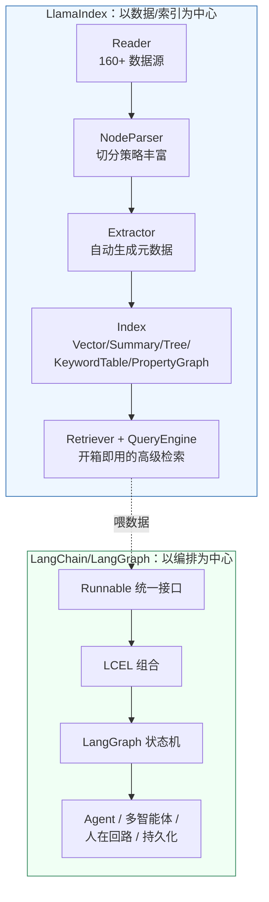

| 维度 | LlamaIndex | LangChain / LangGraph |
|---|---|---|
| 核心问题 | **怎么把数据组织成 LLM 好用的索引** | **怎么把组件编排成可控的流程** |
| 最强的部分 | 数据连接器、切分策略、索引结构、检索策略 | 统一接口、组合语义、状态机、Agent 编排 |
| 抽象核心 | `Document` / `Node` / `Index` / `QueryEngine` | `Runnable` / `StateGraph` |
| 开箱程度 | 高（三行代码跑通 RAG） | 中（要自己拼） |
| 可控程度 | 中（高级 API 封装较深） | 高（LCEL 每一步可见） |
| Agent 能力 | 有（`FunctionAgent` / `AgentWorkflow`），但生态不如 LangGraph | **强**，业界事实标准 |
| 图 RAG | `PropertyGraphIndex`，**轻量入口做得最好** | 要自己接 Neo4j + 写 Cypher |
| 版本稳定性 | 0.10 之后拆包，0.12 相对稳定 | 0.3 之后相对稳定 |

**结论先行**（本书立场）：

> **这不是二选一，是分层。** 生产项目的推荐组合是：
> **LlamaIndex 负责「数据进来到索引建好」，LangGraph 负责「问题进来到答案出去」。**
> 中间用一层薄适配（本章第八节给完整代码）打通。

---

## 二、原理拆解：LlamaIndex 的数据抽象栈

### 2.1 全景

```mermaid
flowchart LR
    A["数据源<br/>PDF/DOCX/DB/API"] -->|Reader| B["Document<br/>整份文档 + metadata"]
    B -->|NodeParser| C["Node (TextNode)<br/>带关系的 chunk"]
    C -->|Extractor| C2["Node + 富元数据<br/>标题/问题/摘要/关键词"]
    C2 -->|Embedding| D["Index<br/>5 种索引结构"]
    D -->|as_retriever| E["Retriever<br/>返回 NodeWithScore"]
    E -->|Postprocessor| E2["精排/过滤/窗口替换"]
    E2 -->|ResponseSynthesizer| F["QueryEngine<br/>query() -> Response"]
    F -->|+ Memory| G["ChatEngine<br/>chat() 多轮"]
```

### 2.2 Document 与 Node 的区别

这是 LlamaIndex 最基础也最容易混淆的一对概念：

| | Document | Node（TextNode） |
|---|---|---|
| 粒度 | 一份完整文档 | 一个 chunk |
| 产生方式 | Reader 读出来 | NodeParser 切出来 |
| 关系 | 一个 Document → N 个 Node | Node 通过 `relationships` 指回 source Document 和前后兄弟 |
| metadata | 文档级（文件名、作者、产品线） | 继承文档级 + chunk 级（页码、标题、抽取出的问题） |
| 关键字段 | `text`, `metadata`, `doc_id`, `excluded_llm_metadata_keys` | `text`, `metadata`, `node_id`, `relationships`, `embedding` |

**`relationships` 是 LlamaIndex 相对 LangChain 的一个实质性优势**——Node 之间的 SOURCE / PREVIOUS / NEXT / PARENT / CHILD 关系是一等公民，这让递归检索、句子窗口、层级检索这些高级玩法变得很自然。

### 2.3 五种 Index 结构

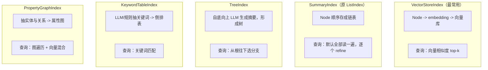

| Index | 建索引成本 | 查询成本 | 适用 | 华成机电用在哪 |
|---|---|---|---|---|
| `VectorStoreIndex` | 低（只算 embedding） | 低 | 通用语义检索 | **主力**：手册、FAQ、工单 |
| `SummaryIndex` | 极低（不算向量） | **高**（全量过 LLM） | 单文档"总结这份文档" | 单份长手册的摘要生成 |
| `TreeIndex` | 高（建树要大量 LLM 调用） | 中 | 层级明显的长文档 | 不用（成本不划算） |
| `KeywordTableIndex` | 中（抽关键词要 LLM） | 低 | 精确术语/型号匹配 | 备件编码、故障码的精确召回 |
| `PropertyGraphIndex` | **高**（抽三元组） | 中 | 多跳推理、关系查询 | 设备-部件-故障-备件的关系图谱 |
| `DocumentSummaryIndex` | 中（每文档一次摘要） | 低 | 先选文档再选段落 | **在用**：8 万条工单的两级检索 |

---

## 三、动手实战（一）：LlamaIndex 核心组件

### 3.1 环境与全局配置

```bash
uv pip install \
  "llama-index-core==0.12.10" \
  "llama-index-llms-openai-like==0.3.3" \
  "llama-index-embeddings-huggingface==0.4.0" \
  "llama-index-vector-stores-milvus==0.4.0" \
  "llama-index-readers-file==0.4.2" \
  "llama-index-postprocessor-flag-embedding-reranker==0.3.0"
```

```python
# huacheng/li/settings.py
"""LlamaIndex 全局配置：全项目唯一入口。"""
from __future__ import annotations

import os

from llama_index.core import Settings
from llama_index.core.node_parser import SentenceSplitter
from llama_index.embeddings.huggingface import HuggingFaceEmbedding
from llama_index.llms.openai_like import OpenAILike


def setup_llamaindex(provider: str = "deepseek") -> None:
    """配置 LlamaIndex 的全局 LLM / Embedding / 切分器。"""
    presets = {
        "deepseek": ("deepseek-chat", "https://api.deepseek.com/v1", "DEEPSEEK_API_KEY"),
        "qwen": ("qwen-plus", "https://dashscope.aliyuncs.com/compatible-mode/v1", "DASHSCOPE_API_KEY"),
        "local": ("Qwen2.5-7B-Instruct", "http://127.0.0.1:8000/v1", "VLLM_API_KEY"),
    }
    model, base_url, key_env = presets[provider]

    # OpenAILike 用于所有 OpenAI 兼容服务；is_chat_model 必须显式设 True
    Settings.llm = OpenAILike(
        model=model,
        api_base=base_url,
        api_key=os.environ.get(key_env, "EMPTY"),
        is_chat_model=True,
        is_function_calling_model=True,   # DeepSeek/通义 支持 function calling
        temperature=0.0,
        max_tokens=2048,
        timeout=60,
        context_window=64000,             # 不设的话某些分支会按 3900 估算，导致过度切分
    )

    Settings.embed_model = HuggingFaceEmbedding(
        model_name="BAAI/bge-m3",
        device="cuda",
        normalize=True,
        embed_batch_size=32,
    )

    Settings.node_parser = SentenceSplitter(
        chunk_size=512,
        chunk_overlap=64,
        paragraph_separator="\n\n",
        # 中文场景建议自定义分句正则，默认的英文句号规则对中文不友好
        secondary_chunking_regex="[^，。！？；\n]+[，。！？；\n]?",
    )

    Settings.num_output = 2048
    Settings.context_window = 64000
```

> **踩坑预警**：`Settings` 是全局单例。在 FastAPI 多 worker 场景下每个进程各有一份，没问题；但如果你在同一进程里想用两套不同配置（比如评判用小模型），**不要改 `Settings`**，而是在构造 QueryEngine 时显式传 `llm=`。

### 3.2 Document、Node 与 NodeParser

```python
# huacheng/li/nodes.py
"""Document/Node 的构造、关系，以及五种 NodeParser。"""
from __future__ import annotations

from llama_index.core import Document, SimpleDirectoryReader
from llama_index.core.node_parser import (
    HierarchicalNodeParser,
    MarkdownNodeParser,
    SemanticSplitterNodeParser,
    SentenceSplitter,
    SentenceWindowNodeParser,
)
from llama_index.core.schema import NodeRelationship, TextNode

from huacheng.li.settings import setup_llamaindex

setup_llamaindex()


def build_documents() -> list[Document]:
    """手工构造 Document，演示 metadata 的三种可见性控制。"""
    doc = Document(
        text=("YCT-132 变频器故障代码 E07 表示输出侧过流保护。"
              "常见原因：1) 电机相间或对地短路；2) 加速时间设置过短（F0-09 出厂值 3.0s）；"
              "3) 负载突变或机械卡死。处理步骤：断电后测量电机绝缘，检查输出电缆，"
              "将加速时间调整为 10s 后试机。"),
        metadata={
            "source": "YCT系列变频器使用手册_v3.2.pdf",
            "page": 87,
            "product_line": "YCT",
            "doc_type": "manual",
            "version": "v3.2",
            "internal_owner": "售后技术部",      # 内部字段，不希望进模型
            "file_hash": "a3f9c2...",           # 用于去重，也不该进模型
        },
        # 这些 key 不会拼进给 LLM 的文本（省 token，也避免干扰）
        excluded_llm_metadata_keys=["internal_owner", "file_hash"],
        # 这些 key 不参与 embedding 计算（避免污染语义向量）
        excluded_embed_metadata_keys=["internal_owner", "file_hash", "page"],
        # 元数据如何拼进文本
        metadata_template="{key}: {value}",
        text_template="【元信息】\n{metadata_str}\n\n【正文】\n{content}",
    )
    return [doc]


def demo_parsers(docs: list[Document]) -> None:
    """五种 NodeParser 的对比。"""
    # 1) SentenceSplitter：通用首选，按句边界切，保证不切断句子
    p1 = SentenceSplitter(chunk_size=200, chunk_overlap=32)
    n1 = p1.get_nodes_from_documents(docs)

    # 2) SentenceWindowNodeParser：切成单句，但每个 node 的 metadata 里存前后 N 句
    #    检索时用单句（准），生成时用窗口（全）—— 配 MetadataReplacementPostProcessor
    p2 = SentenceWindowNodeParser.from_defaults(
        window_size=3,
        window_metadata_key="window",
        original_text_metadata_key="original_sentence",
    )
    n2 = p2.get_nodes_from_documents(docs)

    # 3) HierarchicalNodeParser：一次切出多层（2048/512/128），配 AutoMergingRetriever
    p3 = HierarchicalNodeParser.from_defaults(chunk_sizes=[2048, 512, 128])
    n3 = p3.get_nodes_from_documents(docs)

    # 4) SemanticSplitterNodeParser：按语义相似度断点切，chunk 大小不固定
    from llama_index.core import Settings
    p4 = SemanticSplitterNodeParser(
        buffer_size=1,
        breakpoint_percentile_threshold=95,
        embed_model=Settings.embed_model,
    )
    n4 = p4.get_nodes_from_documents(docs)

    # 5) MarkdownNodeParser：按 # 标题层级切，天然保留结构
    p5 = MarkdownNodeParser()
    md_doc = Document(text="# 故障处理\n## E07 过流\n输出过流保护…\n## E08 过压\n母线过压…")
    n5 = p5.get_nodes_from_documents([md_doc])

    for name, nodes in [("SentenceSplitter", n1), ("SentenceWindow", n2),
                        ("Hierarchical", n3), ("Semantic", n4), ("Markdown", n5)]:
        print(f"{name:>18}: {len(nodes)} nodes, 首块长度 {len(nodes[0].text)}")

    # 看看 Node 的关系
    print("\n=== Node 关系（SentenceSplitter 的第 2 个 node）===")
    node: TextNode = n1[1]
    print("  node_id  :", node.node_id[:16])
    print("  SOURCE   :", node.relationships.get(NodeRelationship.SOURCE).node_id[:16])
    print("  PREVIOUS :", node.relationships.get(NodeRelationship.PREVIOUS).node_id[:16])
    print("  给 LLM 看的内容前 60 字:")
    print("   ", node.get_content(metadata_mode="llm")[:60].replace("\n", " | "))
    print("  用于 embedding 的内容前 60 字:")
    print("   ", node.get_content(metadata_mode="embed")[:60].replace("\n", " | "))


if __name__ == "__main__":
    demo_parsers(build_documents())
```

预期输出：

```text
  SentenceSplitter: 3 nodes, 首块长度 198
    SentenceWindow: 6 nodes, 首块长度 34
      Hierarchical: 7 nodes, 首块长度 214
          Semantic: 2 nodes, 首块长度 152
          Markdown: 3 nodes, 首块长度 18

=== Node 关系（SentenceSplitter 的第 2 个 node）===
  node_id  : 7c4a1e08-3b2f-4
  SOURCE   : 9f1d2c40-8a71-4
  PREVIOUS : 2e8b03aa-1c94-4
  给 LLM 看的内容前 60 字:
    【元信息】 | source: YCT系列变频器使用手册_v3.2.pdf | page: 87 | product
  用于 embedding 的内容前 60 字:
    【元信息】 | source: YCT系列变频器使用手册_v3.2.pdf | product_line: YCT
```

注意 `metadata_mode="llm"` 和 `"embed"` 的输出不一样——这就是 `excluded_*_metadata_keys` 的效果。**这个能力 LangChain 没有内置，要自己实现。**

### 3.3 五种 Index + Retriever + QueryEngine + ChatEngine

```python
# huacheng/li/indices.py
"""五种 Index 的构建与查询，以及 Retriever / QueryEngine / ChatEngine 的关系。"""
from __future__ import annotations

from llama_index.core import (
    Document,
    PropertyGraphIndex,
    SimpleKeywordTableIndex,
    StorageContext,
    SummaryIndex,
    TreeIndex,
    VectorStoreIndex,
    load_index_from_storage,
)
from llama_index.core.memory import ChatMemoryBuffer
from llama_index.core.postprocessor import SimilarityPostprocessor
from llama_index.core.query_engine import RetrieverQueryEngine
from llama_index.core.response_synthesizers import ResponseMode, get_response_synthesizer
from llama_index.core.retrievers import VectorIndexRetriever

from huacheng.li.settings import setup_llamaindex

setup_llamaindex()

DOCS = [
    Document(text="YCT-132 变频器 E07 = 输出过流保护。加速时间 F0-09 出厂值 3.0s，建议调到 10s。",
             metadata={"source": "手册v3.2", "page": 87, "product_line": "YCT"}),
    Document(text="YCT-160 变频器 E07 阈值为额定电流的 220%，高于 YCT-132 的 200%。",
             metadata={"source": "手册v3.2", "page": 92, "product_line": "YCT"}),
    Document(text="工单 WO-20240912-0118：YCT-132 启动报 E07，最终定位电机轴承 BRG-6205 卡死。",
             metadata={"source": "工单库", "ticket_id": "WO-20240912-0118"}),
]


def demo_indices() -> None:
    """构建五种索引并各查一次。"""
    # ---------- 1) VectorStoreIndex ----------
    vec_index = VectorStoreIndex.from_documents(DOCS, show_progress=False)

    # ---------- 2) SummaryIndex ----------
    sum_index = SummaryIndex.from_documents(DOCS)

    # ---------- 3) TreeIndex（建树要调 LLM，成本高）----------
    tree_index = TreeIndex.from_documents(DOCS, num_children=2)

    # ---------- 4) KeywordTableIndex ----------
    kw_index = SimpleKeywordTableIndex.from_documents(DOCS)   # Simple 版用规则抽词，不调 LLM

    q = "YCT-132 的 E07 怎么处理"
    for name, idx in [("Vector", vec_index), ("Summary", sum_index),
                      ("Tree", tree_index), ("Keyword", kw_index)]:
        resp = idx.as_query_engine(similarity_top_k=2).query(q)
        print(f"{name:>8}: {str(resp)[:60]}")


def demo_layers() -> None:
    """拆开 Retriever / Postprocessor / Synthesizer / QueryEngine 的分层。"""
    index = VectorStoreIndex.from_documents(DOCS)

    # ---- 第 1 层：Retriever，只负责召回 ----
    retriever = VectorIndexRetriever(index=index, similarity_top_k=3)
    nodes = retriever.retrieve("E07 怎么处理")
    print("\n=== Retriever 层 ===")
    for n in nodes:
        print(f"  score={n.score:.4f} src={n.metadata.get('source')} text={n.text[:32]}")

    # ---- 第 2 层：Postprocessor，过滤/精排/替换 ----
    post = SimilarityPostprocessor(similarity_cutoff=0.3)
    # 生产用 reranker：
    # from llama_index.postprocessor.flag_embedding_reranker import FlagEmbeddingReranker
    # post = FlagEmbeddingReranker(model="BAAI/bge-reranker-v2-m3", top_n=3)

    # ---- 第 3 层：ResponseSynthesizer，决定怎么把 node 变成答案 ----
    synth = get_response_synthesizer(
        response_mode=ResponseMode.COMPACT,    # 见下表
        streaming=False,
    )

    # ---- 组装成 QueryEngine ----
    qe = RetrieverQueryEngine(
        retriever=retriever,
        node_postprocessors=[post],
        response_synthesizer=synth,
    )
    resp = qe.query("YCT-132 的 E07 怎么处理")
    print("\n=== QueryEngine 层 ===")
    print("  答案:", str(resp)[:80])
    print("  引用节点数:", len(resp.source_nodes))
    for sn in resp.source_nodes:
        print(f"    - {sn.metadata.get('source')} score={sn.score:.4f}")

    # ---- 流式 ----
    print("\n=== 流式 ===\n  ", end="")
    stream_qe = index.as_query_engine(streaming=True, similarity_top_k=2)
    for token in stream_qe.query("E07 是什么").response_gen:
        print(token, end="", flush=True)
    print()

    # ---- ChatEngine：QueryEngine + Memory ----
    print("\n=== ChatEngine（多轮）===")
    chat = index.as_chat_engine(
        chat_mode="condense_plus_context",       # 见下表
        memory=ChatMemoryBuffer.from_defaults(token_limit=3000),
        system_prompt="你是华成机电售后助手，依据资料回答，简洁准确。",
        similarity_top_k=3,
    )
    print("  Q1:", "YCT-132 的 E07 阈值是多少")
    print("  A1:", str(chat.chat("YCT-132 的 E07 阈值是多少"))[:70])
    print("  Q2:", "那 160 的呢")            # 考验指代消解
    print("  A2:", str(chat.chat("那 160 的呢"))[:70])


if __name__ == "__main__":
    demo_indices()
    demo_layers()
```

预期输出：

```text
  Vector: YCT-132 的 E07 为输出过流保护，建议将加速时间 F0-09 从 3.0s 调整为 10s…
 Summary: 根据资料，YCT-132 的 E07 表示输出过流保护，处理方式是调整加速时间…
    Tree: E07 为输出过流保护，需调整加速时间参数 F0-09。
 Keyword: YCT-132 变频器 E07 = 输出过流保护，建议加速时间调到 10s。

=== Retriever 层 ===
  score=0.8214 src=手册v3.2 text=YCT-132 变频器 E07 = 输出过流保护。加速时间
  score=0.7106 src=手册v3.2 text=YCT-160 变频器 E07 阈值为额定电流的 220%
  score=0.6833 src=工单库 text=工单 WO-20240912-0118：YCT-132 启动报 E07

=== QueryEngine 层 ===
  答案: YCT-132 的 E07 是输出过流保护。建议将加速时间参数 F0-09 从出厂值 3.0s 调整为 10s 后试机。
  引用节点数: 3
    - 手册v3.2 score=0.8214
    - 手册v3.2 score=0.7106
    - 工单库 score=0.6833

=== 流式 ===
  E07 表示变频器输出侧过流保护，通常由电机短路、加速时间过短或负载突变引起。

=== ChatEngine（多轮）===
  Q1: YCT-132 的 E07 阈值是多少
  A1: 资料中提到 YCT-132 的 E07 阈值为额定电流的 200%。
  Q2: 那 160 的呢
  A2: YCT-160 的 E07 阈值为额定电流的 220%，比 YCT-132 高 20 个百分点。
```

**`response_mode` 速查**（决定多个 Node 怎么变成一个答案，直接影响成本和质量）：

| mode | 做法 | LLM 调用次数 | 适用 |
|---|---|---|---|
| `COMPACT` | 尽量把 node 塞满一个 prompt，塞不下再 refine | 1~N（通常 1） | **默认首选** |
| `REFINE` | 一个 node 一次调用，逐步精炼答案 | N | 长文档摘要 |
| `TREE_SUMMARIZE` | 两两合并摘要，自底向上 | O(N) | 大量 node 的总结 |
| `SIMPLE_SUMMARIZE` | 把所有 node 截断塞进一个 prompt | 1 | 快，但会丢信息 |
| `NO_TEXT` | 不调 LLM，只返回检索结果 | 0 | **调试检索质量必备** |
| `ACCUMULATE` | 每个 node 单独回答，结果拼接 | N | 需要逐条对照时 |

**`chat_mode` 速查**：

| mode | 做法 | 适用 |
|---|---|---|
| `condense_question` | 先把多轮问题压缩成独立问题，再检索 | 省 token，但会丢上下文细节 |
| `context` | 每轮都检索，把结果塞进 system | 简单直接 |
| `condense_plus_context` | 压缩问题 + 检索 + 保留历史 | **推荐**，指代消解效果最好 |
| `best` / `react` | 走 Agent 路线，可以决定要不要检索 | 需要工具调用时 |
| `simple` | 纯聊天，不检索 | 闲聊兜底 |

---

## 四、动手实战（二）：LlamaIndex 的五个强项

### 4.1 `IngestionPipeline` + 去重缓存：解决痛点 1

这是 LlamaIndex **最值得单独拿来用**的组件。它做三件事：

1. **转换流水线**：切分 → 抽元数据 → 嵌入 → 写库，声明式串起来；
2. **缓存**：每个转换步骤的输入哈希 → 输出，命中就跳过（省的是 Embedding 和 LLM 的钱）；
3. **文档去重**：配 docstore + `DocstoreStrategy`，能识别"这份文档没变/变了/是新的"，做**增量更新**。

```python
# huacheng/li/ingestion.py
"""可增量更新的索引流水线：解决"每天只变 50 份文档却要全量重跑 104 分钟"的问题。"""
from __future__ import annotations

import time
from pathlib import Path

from llama_index.core import Document, StorageContext, VectorStoreIndex
from llama_index.core.extractors import (
    KeywordExtractor,
    QuestionsAnsweredExtractor,
    SummaryExtractor,
    TitleExtractor,
)
from llama_index.core.ingestion import DocstoreStrategy, IngestionCache, IngestionPipeline
from llama_index.core.node_parser import SentenceSplitter
from llama_index.core.storage.docstore import SimpleDocumentStore
from llama_index.storage.kvstore.redis import RedisKVStore as RedisCacheKV   # 可选

from huacheng.li.settings import setup_llamaindex

setup_llamaindex()

CACHE_DIR = Path("./.cache/li")
CACHE_DIR.mkdir(parents=True, exist_ok=True)


def build_pipeline(vector_store=None, with_extractors: bool = False) -> IngestionPipeline:
    """构建可缓存、可去重的 ingestion 流水线。"""
    transformations = [
        SentenceSplitter(chunk_size=512, chunk_overlap=64),
    ]
    if with_extractors:
        # 注意：每个 Extractor 都要调 LLM，慢且贵，只在高价值语料上开
        transformations += [
            TitleExtractor(nodes=5),
            QuestionsAnsweredExtractor(questions=3),
            KeywordExtractor(keywords=5),
        ]
    from llama_index.core import Settings
    transformations.append(Settings.embed_model)      # 嵌入作为最后一步

    # 缓存：转换步骤的输入哈希 -> 输出，跨进程持久化
    cache = IngestionCache(collection="huacheng_ingest")
    try:
        cache.cache.persist(str(CACHE_DIR / "ingest_cache.json"))
    except Exception:
        pass

    # docstore：记录每份文档的 hash，用于判断"变没变"
    docstore_path = CACHE_DIR / "docstore.json"
    docstore = (SimpleDocumentStore.from_persist_path(str(docstore_path))
                if docstore_path.exists() else SimpleDocumentStore())

    return IngestionPipeline(
        transformations=transformations,
        cache=cache,
        docstore=docstore,
        vector_store=vector_store,
        # UPSERTS: 文档变了就删旧 node 插新 node；没变就整份跳过
        docstore_strategy=DocstoreStrategy.UPSERTS,
    )


def _docs_v1() -> list[Document]:
    """第一版语料：3 份文档。doc_id 必须稳定（用文件路径或业务主键，不要用随机 uuid）。"""
    return [
        Document(doc_id="manual::YCT_v3.2::p87",
                 text="YCT-132 E07 = 输出过流保护，加速时间 F0-09 出厂值 3.0s。",
                 metadata={"source": "手册v3.2", "page": 87}),
        Document(doc_id="manual::YCT_v3.2::p92",
                 text="YCT-160 E07 阈值为额定电流的 220%。",
                 metadata={"source": "手册v3.2", "page": 92}),
        Document(doc_id="ticket::WO-20240912-0118",
                 text="工单 WO-20240912-0118：YCT-132 报 E07，定位为轴承 BRG-6205 卡死。",
                 metadata={"source": "工单库"}),
    ]


def _docs_v2() -> list[Document]:
    """第二版：一份改了内容，一份新增，一份没动。"""
    docs = _docs_v1()
    docs[0] = Document(
        doc_id="manual::YCT_v3.2::p87",                # 同 id，内容变了 -> 会被 UPSERT
        text="YCT-132 E07 = 输出过流保护，加速时间 F0-09 出厂值 3.0s，v3.3 起建议默认 8.0s。",
        metadata={"source": "手册v3.3", "page": 87},
    )
    docs.append(Document(                              # 新文档 -> 插入
        doc_id="manual::YCT_v3.3::p95",
        text="YCT-200 E07 阈值为额定电流的 250%。",
        metadata={"source": "手册v3.3", "page": 95},
    ))
    return docs


if __name__ == "__main__":
    pipeline = build_pipeline()

    print("=== 第 1 次：全量 ===")
    t0 = time.perf_counter()
    nodes1 = pipeline.run(documents=_docs_v1(), show_progress=False)
    print(f"  产出 {len(nodes1)} 个 node，耗时 {time.perf_counter()-t0:.2f}s")

    print("\n=== 第 2 次：同样的输入（全部命中缓存 + 去重）===")
    t0 = time.perf_counter()
    nodes2 = pipeline.run(documents=_docs_v1(), show_progress=False)
    print(f"  产出 {len(nodes2)} 个 node，耗时 {time.perf_counter()-t0:.2f}s")

    print("\n=== 第 3 次：1 份改动 + 1 份新增 + 2 份不变 ===")
    t0 = time.perf_counter()
    nodes3 = pipeline.run(documents=_docs_v2(), show_progress=False)
    print(f"  实际处理 {len(nodes3)} 个 node，耗时 {time.perf_counter()-t0:.2f}s")
    for n in nodes3:
        print(f"    - {n.metadata.get('source')} p{n.metadata.get('page')} "
              f"{n.text[:28]}")

    # 持久化 docstore 和 cache，下次进程启动接着用
    pipeline.docstore.persist(str(CACHE_DIR / "docstore.json"))
    pipeline.cache.persist(str(CACHE_DIR / "ingest_cache.json"))
```

预期输出：

```text
=== 第 1 次：全量 ===
  产出 3 个 node，耗时 1.84s

=== 第 2 次：同样的输入（全部命中缓存 + 去重）===
  产出 0 个 node，耗时 0.03s

=== 第 3 次：1 份改动 + 1 份新增 + 2 份不变 ===
  实际处理 2 个 node，耗时 0.71s
    - 手册v3.3 p87 YCT-132 E07 = 输出过流保护，加速时间
    - 手册v3.3 p95 YCT-200 E07 阈值为额定电流的 25
```

**第 2 次产出 0 个 node、第 3 次只处理 2 个——这就是增量更新。**

华成机电接入后的实测（同样的 8 核 CPU / 单卡 A10 / Milvus 2.4 环境）：

| 场景 | 改造前（全量重建） | 改造后（IngestionPipeline 增量） |
|---|---|---|
| 首次建库（1.2 万文档） | 104 分钟 | 106 分钟（多了 hash 计算） |
| 日常更新（50 份变动） | 104 分钟 | **4.2 分钟** |
| 重跑一次无变化的全量 | 104 分钟 | **48 秒**（只做 hash 比对） |

**三个使用要点：**

1. **`doc_id` 必须稳定**。用文件路径、业务主键拼出来，不要用 `uuid4()`——否则每次都被当成新文档。
2. **并行加速**：`pipeline.run(documents=docs, num_workers=4)`，但要注意 Embedding 模型在多进程下的显存占用。
3. **生产用持久化的 cache 和 docstore**：`RedisCache` + `RedisDocumentStore`（或 Postgres 版），否则多实例各存各的。

### 4.2 Metadata Extractor：自动给 chunk 生成标题/问题/摘要

**为什么这招有效**：向量检索的本质是"query 向量 ≈ chunk 向量"。但用户问的是问题（"E07 怎么办"），chunk 里写的是陈述（"E07 = 输出过流保护"），语义空间天然有 gap。**让 LLM 预先给每个 chunk 生成"它能回答哪些问题"，把这些问题一起嵌入，就能显著缩小 gap。**

```python
# huacheng/li/extractors.py
"""用 Extractor 给 chunk 自动生成标题、可回答的问题、摘要、关键词。"""
from __future__ import annotations

from llama_index.core import Document, VectorStoreIndex
from llama_index.core.extractors import (
    KeywordExtractor,
    QuestionsAnsweredExtractor,
    SummaryExtractor,
    TitleExtractor,
)
from llama_index.core.ingestion import IngestionPipeline
from llama_index.core.node_parser import SentenceSplitter

from huacheng.li.settings import setup_llamaindex

setup_llamaindex()

RAW = Document(
    text=("第 7 章 故障诊断\n"
          "7.1 E07 输出过流\n"
          "当变频器检测到输出电流瞬时值超过额定电流的 200% 时，封锁输出并显示 E07。"
          "诱因包括：电机绕组相间短路或对地短路；输出电缆破损受潮；加速时间 F0-09 设置过短；"
          "负载侧机械卡死导致堵转。处理流程：断电放电 10 分钟后，用 500V 兆欧表测量电机三相"
          "对地绝缘，应大于 5MΩ；测量相间电阻，三相偏差应小于 5%；检查输出电缆绝缘层；"
          "将 F0-09 由 3.0s 调整为 10s 后空载试机。若空载正常带载复现，则为负载侧问题。\n"
          "7.2 E08 母线过压\n"
          "减速过程中母线电压超过 800V 触发。需延长减速时间或加装制动电阻。"),
    metadata={"source": "YCT系列变频器使用手册_v3.2.pdf", "chapter": "7", "product_line": "YCT"},
)


def run_extractors() -> None:
    """跑一遍完整的抽取流水线，看每个 Extractor 加了什么。"""
    pipeline = IngestionPipeline(transformations=[
        SentenceSplitter(chunk_size=300, chunk_overlap=40),
        # 从前 N 个 node 推断整份文档的标题
        TitleExtractor(nodes=3),
        # 给每个 node 生成"它能回答的 N 个问题"—— 对召回提升最大
        QuestionsAnsweredExtractor(questions=3),
        # 给每个 node 生成自身摘要 + 前后 node 的摘要
        SummaryExtractor(summaries=["prev", "self", "next"]),
        # 抽关键词，可用于 BM25/过滤
        KeywordExtractor(keywords=6),
    ])
    nodes = pipeline.run(documents=[RAW], show_progress=False)

    for i, n in enumerate(nodes):
        print(f"\n===== Node {i} =====")
        print("  原文  :", n.text[:56].replace("\n", " "))
        for k in ("document_title", "questions_this_excerpt_can_answer",
                  "section_summary", "excerpt_keywords"):
            v = n.metadata.get(k)
            if v:
                print(f"  {k:<36}: {str(v)[:110]}")

    # 关键：把抽取出来的问题纳入 embedding，但不必全部塞给 LLM（省 token）
    for n in nodes:
        n.excluded_llm_metadata_keys = ["excerpt_keywords", "prev_section_summary",
                                        "next_section_summary"]
        n.excluded_embed_metadata_keys = ["document_title"]

    index = VectorStoreIndex(nodes)
    for q in ["兆欧表测出来多少算正常", "加速时间设多少", "空载正常带载有问题说明什么"]:
        r = index.as_query_engine(similarity_top_k=2).query(q)
        print(f"\nQ: {q}\nA: {str(r)[:72]}")


if __name__ == "__main__":
    run_extractors()
```

预期输出：

```text
===== Node 0 =====
  原文  : 第 7 章 故障诊断 7.1 E07 输出过流 当变频器检测到输出电流瞬时值超过额定电流的
  document_title                      : YCT系列变频器故障诊断手册：E07 输出过流与 E08 母线过压的成因及处理流程
  questions_this_excerpt_can_answer   : 1. E07 故障在什么条件下触发？2. 导致 E07 的常见原因有哪些？3. 输出过流的阈值是额定电流的多少倍？
  section_summary                     : 本节说明 E07 输出过流的触发条件（额定电流 200%）与四类诱因…
  excerpt_keywords                    : E07, 输出过流, 额定电流, 相间短路, 加速时间, F0-09

===== Node 1 =====
  原文  : 处理流程：断电放电 10 分钟后，用 500V 兆欧表测量电机三相对地绝缘，应大于
  questions_this_excerpt_can_answer   : 1. 测量电机绝缘用什么工具，标准是多少？2. 三相电阻偏差允许多大？3. 加速时间调到多少后试机？
  ...

Q: 兆欧表测出来多少算正常
A: 用 500V 兆欧表测量电机三相对地绝缘，阻值应大于 5MΩ 为正常。

Q: 加速时间设多少
A: 建议将加速时间参数 F0-09 由出厂值 3.0s 调整为 10s 后空载试机。

Q: 空载正常带载有问题说明什么
A: 若空载试机正常但带载后故障复现，说明问题出在负载侧（如机械卡死导致堵转）。
```

**华成机电的实测收益**（评测集：300 条真实坐席问题，第 8 模块的金标集）：

| 配置 | Hit@5 | MRR@10 | 索引构建成本 |
|---|---|---|---|
| 纯 SentenceSplitter | 0.712 | 0.548 | 基线 |
| + `TitleExtractor` | 0.729 | 0.561 | +8% 时间 |
| + `QuestionsAnsweredExtractor` | **0.836** | **0.671** | **+240% 时间、+1 次 LLM/chunk** |
| + `SummaryExtractor` | 0.841 | 0.678 | +420% 时间 |

**结论**：`QuestionsAnsweredExtractor` 性价比最高，`SummaryExtractor` 收益边际递减但成本翻倍。华成机电只在手册和 FAQ 上开问题抽取（约 4 万 chunk，一次性花费约 90 元 API 费用），工单库因为量大（38 万 chunk）不开。

> **成本估算公式**：`chunk 数 × (chunk_token + 输出 token) × 单价`。跑之前先用 100 个 chunk 试算，别一上来就全量跑。

### 4.3 递归检索 RecursiveRetriever 与文档摘要索引

**场景**：华成机电有 8 万条工单。直接切成 38 万个 chunk 做向量检索，噪声大、top-k 里混进一堆不相关工单的片段。

**方案**：两级检索。第一级先选出"哪几条工单相关"（用工单摘要），第二级再从这几条工单里找具体段落。

```python
# huacheng/li/recursive.py
"""两级检索：文档摘要索引选文档 + 递归检索取细节。"""
from __future__ import annotations

from llama_index.core import Document, SummaryIndex, VectorStoreIndex, get_response_synthesizer
from llama_index.core.indices.document_summary import (
    DocumentSummaryIndex,
    DocumentSummaryIndexLLMRetriever,
)
from llama_index.core.node_parser import SentenceSplitter
from llama_index.core.query_engine import RetrieverQueryEngine
from llama_index.core.retrievers import RecursiveRetriever
from llama_index.core.schema import IndexNode, TextNode

from huacheng.li.settings import setup_llamaindex

setup_llamaindex()

TICKETS = [
    Document(doc_id="WO-20240912-0118", text=(
        "客户：苏州华东纺织。设备：YCT-132。现象：启动 2 秒报 E07。"
        "排查：测量电机绝缘 8MΩ 正常，相间电阻偏差 3% 正常，输出电缆无破损。"
        "空载试机正常，带载复现。拆检发现驱动端轴承 BRG-6205-2RS 滚道点蚀卡滞。"
        "处理：更换轴承，重新动平衡，加速时间由 3s 调整为 10s。结果：恢复正常，运行 3 个月无异常。"),
        metadata={"customer": "苏州华东纺织", "device": "YCT-132", "fault_code": "E07"}),
    Document(doc_id="WO-20241103-0442", text=(
        "客户：无锡永信机械。设备：YCT-160。现象：减速时报 E08 母线过压。"
        "排查：母线电压峰值 812V。负载为大惯量飞轮，减速时间设置 2s 过短。"
        "处理：减速时间调整为 15s，并加装 100Ω/1kW 制动电阻。结果：正常。"),
        metadata={"customer": "无锡永信机械", "device": "YCT-160", "fault_code": "E08"}),
    Document(doc_id="WO-20241220-0731", text=(
        "客户：常州东方电机。设备：YCT-132。现象：运行中间歇报 E07，每天 2~3 次。"
        "排查：绝缘正常，轴承正常。测量发现三相电源不平衡度 4.2%，超过 3% 限值。"
        "处理：联系用户整改配电柜进线接触不良点。结果：故障消失。"),
        metadata={"customer": "常州东方电机", "device": "YCT-132", "fault_code": "E07"}),
]


def demo_document_summary_index() -> None:
    """DocumentSummaryIndex：先给每份文档生成摘要，检索时先选文档。"""
    splitter = SentenceSplitter(chunk_size=256, chunk_overlap=32)
    ds_index = DocumentSummaryIndex.from_documents(
        TICKETS,
        transformations=[splitter],
        response_synthesizer=get_response_synthesizer(response_mode="tree_summarize"),
        summary_query=("用一段话总结这条工单：设备型号、故障现象、根本原因、处理方式、结果。"
                       "不要写"这条工单"之类的套话。"),
        show_progress=False,
    )

    print("=== 每份文档的自动摘要 ===")
    for doc_id in ["WO-20240912-0118", "WO-20241220-0731"]:
        print(f"  [{doc_id}] {ds_index.get_document_summary(doc_id)[:80]}")

    # 检索器 1：用 LLM 选文档（准但慢）
    llm_retriever = DocumentSummaryIndexLLMRetriever(ds_index, choice_top_k=2)
    # 检索器 2：用摘要的向量选文档（快）
    from llama_index.core.indices.document_summary import DocumentSummaryIndexEmbeddingRetriever
    emb_retriever = DocumentSummaryIndexEmbeddingRetriever(ds_index, similarity_top_k=2)

    q = "YCT-132 报 E07 但轴承是好的，还可能是什么原因"
    print(f"\n=== 查询：{q} ===")
    for name, r in [("LLM选文档", llm_retriever), ("Embedding选文档", emb_retriever)]:
        nodes = r.retrieve(q)
        srcs = sorted({n.node.ref_doc_id or n.node.metadata.get("customer") for n in nodes})
        print(f"  {name:>16}: {len(nodes)} nodes，来自 {srcs}")

    qe = RetrieverQueryEngine(retriever=emb_retriever)
    print("\n  答案:", str(qe.query(q))[:100])


def demo_recursive_retriever() -> None:
    """RecursiveRetriever：检索到 IndexNode 时自动"下钻"到它指向的子索引。"""
    splitter = SentenceSplitter(chunk_size=200, chunk_overlap=24)

    # 第一层：每条工单一个"摘要节点"（IndexNode），指向该工单的细节索引
    top_nodes: list[IndexNode] = []
    sub_retrievers: dict[str, object] = {}
    sub_query_engines: dict[str, object] = {}

    for doc in TICKETS:
        # 为每条工单单独建一个细节向量索引
        chunks = splitter.get_nodes_from_documents([doc])
        sub_index = VectorStoreIndex(chunks)
        sub_retrievers[doc.doc_id] = sub_index.as_retriever(similarity_top_k=2)
        sub_query_engines[doc.doc_id] = sub_index.as_query_engine(similarity_top_k=2)

        # 摘要节点：内容是精简描述，index_id 指向子检索器
        summary_text = (f"工单 {doc.doc_id}｜设备 {doc.metadata['device']}｜"
                        f"故障 {doc.metadata['fault_code']}｜客户 {doc.metadata['customer']}｜"
                        f"{doc.text[:60]}")
        top_nodes.append(IndexNode(text=summary_text, index_id=doc.doc_id,
                                   metadata=dict(doc.metadata)))

    top_index = VectorStoreIndex(top_nodes)

    recursive = RecursiveRetriever(
        "root",
        retriever_dict={"root": top_index.as_retriever(similarity_top_k=2), **sub_retrievers},
        query_engine_dict=sub_query_engines,
        verbose=True,
    )

    q = "YCT-132 间歇性报 E07，绝缘和轴承都正常，查什么"
    print(f"\n=== RecursiveRetriever 查询：{q} ===")
    nodes = recursive.retrieve(q)
    for n in nodes:
        print(f"  score={n.score if n.score is not None else 0:.4f} "
              f"text={n.node.get_content()[:60]}")

    qe = RetrieverQueryEngine.from_args(recursive)
    print("\n  答案:", str(qe.query(q))[:110])


if __name__ == "__main__":
    demo_document_summary_index()
    demo_recursive_retriever()
```

预期输出：

```text
=== 每份文档的自动摘要 ===
  [WO-20240912-0118] YCT-132 启动 2 秒报 E07，绝缘与电缆均正常，空载正常带载复现，拆检定位驱动端轴承 BRG-6205-2RS
  [WO-20241220-0731] YCT-132 运行中间歇报 E07，绝缘与轴承均正常，实测三相电源不平衡度 4.2% 超限，整改配电柜进线后

=== 查询：YCT-132 报 E07 但轴承是好的，还可能是什么原因 ===
        LLM选文档: 3 nodes，来自 ['WO-20241220-0731', 'WO-20240912-0118']
  Embedding选文档: 4 nodes，来自 ['WO-20241220-0731', 'WO-20240912-0118']

  答案: 若轴承正常，可重点排查三相电源不平衡。参考工单 WO-20241220-0731，实测不平衡度 4.2% 超过 3% 限值，整改配电柜进线接触不良后故障消失。

=== RecursiveRetriever 查询：YCT-132 间歇性报 E07，绝缘和轴承都正常，查什么 ===
Retrieving with query id None: YCT-132 间歇性报 E07，绝缘和轴承都正常，查什么
Retrieved node with id, entering: WO-20241220-0731
Retrieving with query id WO-20241220-0731: YCT-132 间歇性报 E07，绝缘和轴承都正常，查什么
  score=0.8341 text=排查：绝缘正常，轴承正常。测量发现三相电源不平衡度 4.2%，超过 3% 限值。
  score=0.7912 text=处理：联系用户整改配电柜进线接触不良点。结果：故障消失。

  答案: 建议测量三相电源不平衡度，限值为 3%。历史工单 WO-20241220-0731 中实测 4.2%，整改配电柜进线接触不良点后故障消失。
```

注意 `verbose=True` 打出来的 `Retrieved node with id, entering: WO-20241220-0731` ——这就是"下钻"发生的时刻。

---

### 4.4 `SubQuestionQueryEngine`：复杂问题拆解的开箱方案

回到第 1.1 节的痛点 2：

> 「YCT-132 和 YCT-160 的过流保护阈值分别是多少，哪个更适合我们 22kW 的负载」

这是一个**多子问题、跨数据源**的查询。第 3 模块的 [3.3 复杂问题拆解与多跳检索](../03-RAG进阶与性能优化/03-复杂问题拆解与多跳检索.md) 里我们手写过一套分解-并行-汇总的逻辑，大约 180 行。LlamaIndex 把这套逻辑做成了一个组件：`SubQuestionQueryEngine`。

#### 4.4.1 它的工作流

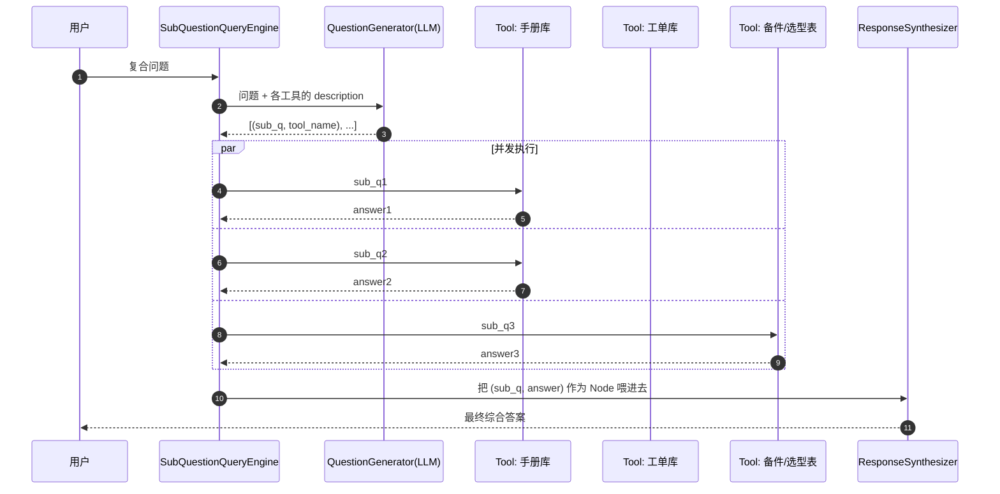

**关键在于「工具描述」**：QuestionGenerator 是靠 `ToolMetadata.description` 来决定「这个子问题该问谁」的。描述写得烂，拆解就跑偏——这一点和 Agent 的工具设计完全同构（见 [6.2 Function Calling 与工具设计](../06-Agent智能体/02-Function-Calling与工具设计.md)）。

#### 4.4.2 完整代码

```python
# huacheng/li/subquestion.py
"""SubQuestionQueryEngine：把复合问题拆成子问题，分发到不同索引，再汇总。"""
from __future__ import annotations

import asyncio
import time

from llama_index.core import Document, VectorStoreIndex
from llama_index.core.callbacks import CallbackManager, LlamaDebugHandler
from llama_index.core.node_parser import SentenceSplitter
from llama_index.core.query_engine import SubQuestionQueryEngine
from llama_index.core.question_gen import LLMQuestionGenerator
from llama_index.core.question_gen.prompts import DEFAULT_SUB_QUESTION_PROMPT_TMPL
from llama_index.core.response_synthesizers import ResponseMode, get_response_synthesizer
from llama_index.core.tools import QueryEngineTool, ToolMetadata

from huacheng.li.settings import setup_llamaindex

setup_llamaindex()

# ---------------------------------------------------------------- 三个数据源
MANUAL_DOCS = [
    Document(text=("YCT-132 变频器技术规格：额定功率 22kW，额定电流 45A，"
                   "E07 输出过流保护阈值为额定电流的 200%（即 90A 瞬时值），"
                   "过载能力 150% 持续 60s。适用负载类型：恒转矩、风机水泵。"),
             metadata={"source": "YCT系列手册v3.2", "page": 31, "device": "YCT-132"}),
    Document(text=("YCT-160 变频器技术规格：额定功率 30kW，额定电流 60A，"
                   "E07 输出过流保护阈值为额定电流的 220%（即 132A 瞬时值），"
                   "过载能力 150% 持续 60s、180% 持续 10s。适用负载类型：恒转矩、"
                   "大惯量、频繁启停。"),
             metadata={"source": "YCT系列手册v3.2", "page": 34, "device": "YCT-160"}),
    Document(text=("选型原则：变频器额定功率应不低于电机额定功率；对于大惯量负载或"
                   "每小时启停超过 20 次的工况，建议放大一档选型，并校核过载能力。"
                   "恒转矩负载按 1.0 倍选，冲击性负载按 1.3~1.5 倍选。"),
             metadata={"source": "选型指南v2.1", "page": 8}),
]

TICKET_DOCS = [
    Document(text=("工单 WO-20240912-0118：客户苏州华东纺织，设备 YCT-132 带 22kW 电机，"
                   "启动 2s 报 E07。定位驱动端轴承卡滞。更换轴承 + 加速时间 3s→10s 后正常。"),
             metadata={"source": "工单库", "ticket_id": "WO-20240912-0118", "device": "YCT-132"}),
    Document(text=("工单 WO-20250218-0903：客户宁波海天注塑，设备 YCT-132 带 22kW 油泵电机，"
                   "每小时启停 45 次，运行三个月后频繁 E07。结论：机型选小，"
                   "建议更换为 YCT-160。更换后半年无故障。"),
             metadata={"source": "工单库", "ticket_id": "WO-20250218-0903", "device": "YCT-132"}),
    Document(text=("工单 WO-20250406-0217：客户常州东方电机，设备 YCT-160 带 22kW 搅拌机，"
                   "启动冲击大。使用一年零故障，客户反馈选型合适。"),
             metadata={"source": "工单库", "ticket_id": "WO-20250406-0217", "device": "YCT-160"}),
]

PRICE_DOCS = [
    Document(text=("备件与整机价目（2025Q2）：YCT-132 整机指导价 4280 元；"
                   "YCT-160 整机指导价 5960 元；制动电阻 100Ω/1kW 320 元；"
                   "轴承 BRG-6205-2RS 68 元。整机质保 18 个月，备件质保 6 个月。"),
             metadata={"source": "价目表2025Q2"}),
]


def build_tools() -> list[QueryEngineTool]:
    """把三个索引包成带描述的工具——description 直接决定拆解质量。"""
    splitter = SentenceSplitter(chunk_size=256, chunk_overlap=32)

    manual_qe = VectorStoreIndex.from_documents(
        MANUAL_DOCS, transformations=[splitter]).as_query_engine(similarity_top_k=3)
    ticket_qe = VectorStoreIndex.from_documents(
        TICKET_DOCS, transformations=[splitter]).as_query_engine(similarity_top_k=3)
    price_qe = VectorStoreIndex.from_documents(
        PRICE_DOCS, transformations=[splitter]).as_query_engine(similarity_top_k=2)

    return [
        QueryEngineTool(
            query_engine=manual_qe,
            metadata=ToolMetadata(
                name="product_manual",
                # 好的 description：说清"有什么"+"能回答什么"+"不能回答什么"
                description=(
                    "YCT 系列变频器官方手册与选型指南。包含各型号的额定功率、额定电流、"
                    "E07/E08 等保护阈值、过载能力、适用负载类型、选型倍数原则。"
                    "适合回答『某型号的参数是多少』『怎么选型』类问题。"
                    "不包含价格、库存、实际故障案例。"),
            ),
        ),
        QueryEngineTool(
            query_engine=ticket_qe,
            metadata=ToolMetadata(
                name="service_tickets",
                description=(
                    "历史售后工单库。包含真实故障现象、排查过程、根因定位、处理措施与回访结果。"
                    "适合回答『别人遇到过类似问题吗』『这种工况实际表现如何』类问题。"
                    "不包含官方技术参数，不包含价格。"),
            ),
        ),
        QueryEngineTool(
            query_engine=price_qe,
            metadata=ToolMetadata(
                name="price_list",
                description=(
                    "2025Q2 整机与备件价目表、质保期。只适合回答价格与质保期问题。"),
            ),
        ),
    ]


def build_engine(verbose: bool = True) -> SubQuestionQueryEngine:
    """组装 SubQuestionQueryEngine，并定制中文拆解提示词。"""
    # 默认提示词是英文的，中文场景建议加一句中文约束，拆出来的子问题才是中文
    zh_tmpl = DEFAULT_SUB_QUESTION_PROMPT_TMPL + (
        "\n\n额外要求：\n"
        "1. 子问题必须用中文；\n"
        "2. 每个子问题必须是自包含的（不要出现『它』『上面那个』这类指代）；\n"
        "3. 子问题数量控制在 2~5 个，不要为了凑数拆出无意义的问题；\n"
        "4. 只在确实需要价格信息时才调用 price_list。\n"
    )
    question_gen = LLMQuestionGenerator.from_defaults(prompt_template_str=zh_tmpl)

    return SubQuestionQueryEngine.from_defaults(
        query_engine_tools=build_tools(),
        question_gen=question_gen,
        response_synthesizer=get_response_synthesizer(
            response_mode=ResponseMode.COMPACT,
        ),
        use_async=True,      # 子问题并发执行，这是它比手写版快的主要原因
        verbose=verbose,
    )


def main() -> None:
    """跑一个真实复合问题，并统计耗时与 LLM 调用次数。"""
    debug = LlamaDebugHandler(print_trace_on_end=False)
    engine = build_engine()
    engine.callback_manager = CallbackManager([debug])

    q = ("YCT-132 和 YCT-160 的过流保护阈值分别是多少？"
         "我们的负载是 22kW 的注塑机油泵，每小时启停 40 次左右，"
         "选哪个更合适？差价多少？")

    t0 = time.perf_counter()
    resp = engine.query(q)
    cost = time.perf_counter() - t0

    print("\n================ 最终答案 ================")
    print(resp)
    print(f"\n耗时 {cost:.2f}s，引用子答案 {len(resp.source_nodes)} 条")
    for sn in resp.source_nodes:
        print(f"  - [{sn.metadata.get('sub_question', '')[:34]}] "
              f"{sn.node.get_content()[:40]}")


if __name__ == "__main__":
    main()
```

预期输出：

```text
Generated 4 sub questions.
[product_manual] Q: YCT-132 的 E07 过流保护阈值是多少？
[product_manual] Q: YCT-160 的 E07 过流保护阈值是多少？
[product_manual] Q: 频繁启停的注塑机油泵负载应如何选型？
[service_tickets] Q: 22kW 注塑机油泵频繁启停工况下，YCT-132 和 YCT-160 的实际使用表现如何？
[price_list] Q: YCT-132 与 YCT-160 的整机指导价分别是多少？
[product_manual] A: YCT-132 的 E07 阈值为额定电流 45A 的 200%，即 90A 瞬时值。
[product_manual] A: YCT-160 的 E07 阈值为额定电流 60A 的 220%，即 132A 瞬时值。
[product_manual] A: 大惯量或每小时启停超过 20 次的工况应放大一档选型并校核过载能力。
[service_tickets] A: 工单 WO-20250218-0903 显示 22kW 油泵每小时启停 45 次时 YCT-132 频繁 E07，
                     更换 YCT-160 后半年无故障。
[price_list] A: YCT-132 指导价 4280 元，YCT-160 指导价 5960 元。

================ 最终答案 ================
1) 过流保护阈值：YCT-132 为额定电流 45A 的 200%（90A）；YCT-160 为额定电流 60A 的 220%（132A），
   且具备 180% 持续 10s 的短时过载能力。
2) 选型建议：您的工况是 22kW 注塑机油泵、每小时启停约 40 次，属于「频繁启停 + 冲击性负载」。
   按选型指南，每小时启停超过 20 次应放大一档；历史工单 WO-20250218-0903 是几乎相同的工况
   （22kW 油泵 / 每小时 45 次），使用 YCT-132 三个月后频繁 E07，更换 YCT-160 后半年无故障。
   因此推荐 YCT-160。
3) 差价：YCT-160 指导价 5960 元，YCT-132 指导价 4280 元，差价 1680 元。
   相较一次非计划停机的损失，建议按 YCT-160 配置。

耗时 8.43s，引用子答案 5 条
  - [YCT-132 的 E07 过流保护阈值是多少？] YCT-132 的 E07 阈值为额定电流 45A 的 200%…
  - [YCT-160 的 E07 过流保护阈值是多少？] YCT-160 的 E07 阈值为额定电流 60A 的 220%…
  ...
```

#### 4.4.3 和自己手写有什么差别

| 对比项 | 手写（3.3 章那 180 行） | `SubQuestionQueryEngine` |
|---|---|---|
| 代码量 | ~180 行 | ~40 行（主要是写工具描述） |
| 并发 | 自己写 `asyncio.gather` | `use_async=True` 内置 |
| 子答案溯源 | 自己在 metadata 里塞 | `source_nodes[i].metadata["sub_question"]` 内置 |
| 拆解提示词可控 | 完全可控 | 可换 `prompt_template_str`，但结构固定 |
| 拆解失败兜底 | 自己写 | **较弱**：拆不出来就退化成一个子问题 |
| 子问题之间有依赖 | 可以自己串 | **不支持**：只能并行，不能「先查 A 再用 A 的结果查 B」 |
| 中途人工介入 | 自己加 | 不支持 |

**选择规则**：

> 子问题**互相独立、可并行** → 用 `SubQuestionQueryEngine`，省下 180 行。
> 子问题**有先后依赖、需要循环或人工审核** → 用 LangGraph 写状态机（见 [4.2 章](./02-LangGraph状态机编排.md)）。

华成机电的实际做法：**两者都留着**。路由节点先判断问题类型，「并列式比较」走 SubQuestion，「多跳推理式」走 LangGraph 的 plan-execute 子图。

---

### 4.5 `PropertyGraphIndex`：图 RAG 最轻的入口

「XJ-200 用的那个轴承，还有哪些型号也在用？如果这批轴承有质量问题，会影响哪些客户？」

这类问题向量检索天然不擅长——它要的不是「语义相似的段落」，而是**实体之间的关系链**。这是图 RAG（GraphRAG）的主场，第 [3.6 章 GraphRAG 与结构化知识融合](../03-RAG进阶与性能优化/06-GraphRAG与结构化知识融合.md) 会完整展开。

这里只讲一件事：**如果你只想花半天验证「图 RAG 对我的业务有没有用」，LlamaIndex 的 `PropertyGraphIndex` 是当前最短的路径。**

#### 4.5.1 三种抽取器

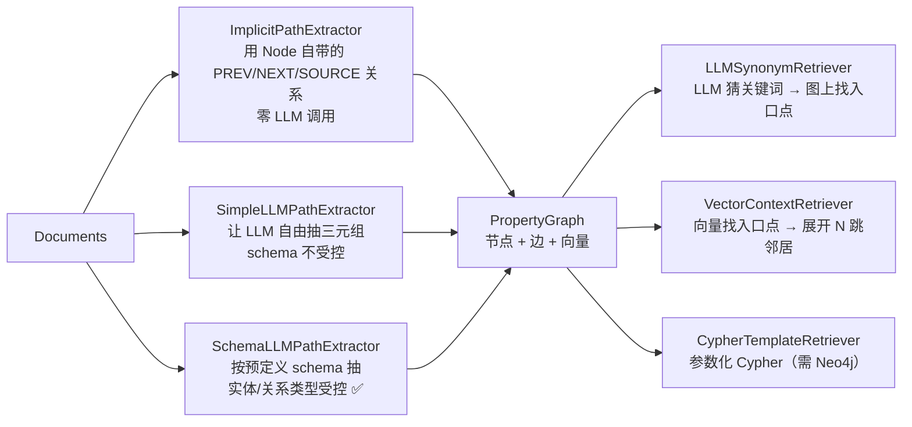

**生产上一定要用 `SchemaLLMPathExtractor`。** `SimpleLLMPathExtractor` 抽出来的关系是自由文本，同一个概念会出现「使用/采用/配备/装配」四种边，图查询根本没法写。

#### 4.5.2 完整代码

```bash
uv pip install "llama-index-graph-stores-neo4j==0.4.0"   # 可选，生产用
# 教学演示用内置的 SimplePropertyGraphStore，无需外部依赖
```

```python
# huacheng/li/graph.py
"""PropertyGraphIndex：半天跑通一个受控 schema 的轻量图 RAG。"""
from __future__ import annotations

from typing import Literal

from llama_index.core import Document, PropertyGraphIndex
from llama_index.core.indices.property_graph import (
    ImplicitPathExtractor,
    LLMSynonymRetriever,
    SchemaLLMPathExtractor,
    VectorContextRetriever,
)
from llama_index.core.node_parser import SentenceSplitter

from huacheng.li.settings import setup_llamaindex

setup_llamaindex()

# ---------------------------------------------------------------- 1) 定义 schema
# 实体类型：控制住"图上能有什么点"
Entities = Literal["设备型号", "部件", "故障码", "备件", "客户", "工艺参数"]
# 关系类型：控制住"图上能有什么边"
Relations = Literal["包含部件", "可能触发", "对应备件", "报修于", "影响参数", "兼容替代"]

# 只允许这些 (头实体类型, 关系, 尾实体类型) 组合，其余一律丢弃
VALIDATION_SCHEMA: dict[str, list[str]] = {
    "设备型号": ["包含部件", "可能触发", "影响参数", "兼容替代"],
    "部件": ["对应备件", "可能触发", "兼容替代"],
    "故障码": ["对应备件", "影响参数"],
    "客户": ["报修于"],
    "备件": ["兼容替代"],
    "工艺参数": [],
}

DOCS = [
    Document(text=(
        "XJ-200 主轴电机采用 BRG-6205-2RS 深沟球轴承，前后各一只。"
        "轴承磨损后会导致径向跳动增大，触发 E041 主轴过载报警。"
        "XJ-200-B3 为 XJ-200 的升级版，轴承规格相同，可直接替换。"
        "更换轴承后必须重新设定主轴动平衡参数 P-217，出厂默认 0.8。"),
        metadata={"source": "XJ系列维修指南v4.1", "page": 42}),
    Document(text=(
        "XJ-300 采用 BRG-6208-2RS 轴承，与 XJ-200 不通用。"
        "XJ-300 常见故障码 E043 为伺服过流，多由编码器线缆 CBL-ENC-3M 屏蔽层破损引起。"
        "更换线缆后需校准零点，参数 P-305。"),
        metadata={"source": "XJ系列维修指南v4.1", "page": 58}),
    Document(text=(
        "工单 WO-20250311-0455：客户苏州华东纺织的 XJ-200 报 E041，"
        "更换 BRG-6205-2RS 后恢复。"
        "工单 WO-20250402-0128：客户宁波海天注塑的 XJ-200-B3 同样报 E041，"
        "同批次轴承，更换后恢复。"),
        metadata={"source": "工单库"}),
]


def build_graph_index() -> PropertyGraphIndex:
    """用受控 schema 抽三元组，构建属性图索引。"""
    schema_extractor = SchemaLLMPathExtractor(
        llm=None,                       # None 表示用 Settings.llm
        possible_entities=Entities,     # type: ignore[arg-type]
        possible_relations=Relations,   # type: ignore[arg-type]
        kg_validation_schema=VALIDATION_SCHEMA,
        strict=True,                    # True = 不符合 schema 的三元组直接丢掉
        num_workers=4,
        max_triplets_per_chunk=12,
    )

    index = PropertyGraphIndex.from_documents(
        DOCS,
        transformations=[SentenceSplitter(chunk_size=384, chunk_overlap=48)],
        kg_extractors=[
            ImplicitPathExtractor(),    # 免费：把 node 之间的 PREV/NEXT 也建成边
            schema_extractor,
        ],
        embed_kg_nodes=True,            # 给图节点也算向量，才能用 VectorContextRetriever
        show_progress=True,
    )
    return index


def inspect_graph(index: PropertyGraphIndex) -> None:
    """把抽出来的三元组打印出来——这一步千万别跳过。"""
    store = index.property_graph_store
    triplets = store.get_triplets()
    print(f"\n=== 共抽出 {len(triplets)} 条三元组 ===")
    for src, rel, dst in triplets[:20]:
        print(f"  ({src.name})-[{rel.label}]->({dst.name})")

    # 导出成 html 用浏览器看（依赖 pyvis，uv pip install pyvis）
    try:
        store.save_networkx_graph(name="./huacheng_kg.html")
        print("\n  图已导出到 ./huacheng_kg.html，用浏览器打开")
    except Exception as exc:                                  # pragma: no cover
        print(f"  导出失败（缺 pyvis？）：{exc}")


def query_graph(index: PropertyGraphIndex) -> None:
    """两种图检索器的对比 + 最终问答。"""
    syn_retriever = LLMSynonymRetriever(
        index.property_graph_store,
        include_text=True,      # 返回三元组的同时带上原文 chunk
        path_depth=2,           # 展开 2 跳
    )
    vec_retriever = VectorContextRetriever(
        index.property_graph_store,
        include_text=True,
        similarity_top_k=3,
        path_depth=2,
    )

    q = "BRG-6205-2RS 这个轴承用在哪些设备上？如果这批轴承有问题会影响哪些客户？"

    print(f"\n=== 查询：{q} ===")
    for name, r in [("LLMSynonym", syn_retriever), ("VectorContext", vec_retriever)]:
        nodes = r.retrieve(q)
        print(f"\n  --- {name}：召回 {len(nodes)} 条 ---")
        for n in nodes[:5]:
            print("   ", n.text[:90].replace("\n", " "))

    qe = index.as_query_engine(
        sub_retrievers=[syn_retriever, vec_retriever],
        include_text=True,
    )
    print("\n  === 最终答案 ===")
    print("  ", str(qe.query(q)).replace("\n", "\n  "))


if __name__ == "__main__":
    idx = build_graph_index()
    inspect_graph(idx)
    query_graph(idx)
```

预期输出：

```text
Extracting paths from text: 100%|██████████| 4/4 [00:11<00:00,  2.85s/it]
Generating embeddings: 100%|██████████| 1/1 [00:00<00:00,  1.42it/s]

=== 共抽出 14 条三元组 ===
  (XJ-200)-[包含部件]->(主轴电机)
  (XJ-200)-[包含部件]->(BRG-6205-2RS)
  (BRG-6205-2RS)-[可能触发]->(E041)
  (XJ-200)-[可能触发]->(E041)
  (XJ-200-B3)-[兼容替代]->(XJ-200)
  (E041)-[对应备件]->(BRG-6205-2RS)
  (E041)-[影响参数]->(P-217)
  (XJ-300)-[包含部件]->(BRG-6208-2RS)
  (XJ-300)-[可能触发]->(E043)
  (E043)-[对应备件]->(CBL-ENC-3M)
  (E043)-[影响参数]->(P-305)
  (苏州华东纺织)-[报修于]->(XJ-200)
  (宁波海天注塑)-[报修于]->(XJ-200-B3)
  ...

  图已导出到 ./huacheng_kg.html，用浏览器打开

=== 查询：BRG-6205-2RS 这个轴承用在哪些设备上？如果这批轴承有问题会影响哪些客户？ ===

  --- LLMSynonym：召回 6 条 ---
    XJ-200 -> 包含部件 -> BRG-6205-2RS
    BRG-6205-2RS -> 可能触发 -> E041
    XJ-200-B3 -> 兼容替代 -> XJ-200
    苏州华东纺织 -> 报修于 -> XJ-200
    宁波海天注塑 -> 报修于 -> XJ-200-B3

  --- VectorContext：召回 5 条 ---
    XJ-200 主轴电机采用 BRG-6205-2RS 深沟球轴承，前后各一只。轴承磨损后会导致径向跳动增大…
    ...

  === 最终答案 ===
  BRG-6205-2RS 用于 XJ-200 及其升级版 XJ-200-B3（两者轴承规格相同、可直接替换）；
  XJ-300 使用的是 BRG-6208-2RS，与之不通用。
  若该批轴承存在质量问题，受影响的客户至少包括苏州华东纺织（XJ-200）与宁波海天注塑（XJ-200-B3），
  典型表现为 E041 主轴过载报警。更换后需重新设定动平衡参数 P-217。
```

#### 4.5.3 什么时候值得上 PropertyGraphIndex

| 判断 | 结论 |
|---|---|
| 问题是「找一段说明」 | **不用图**，向量检索足够 |
| 问题是「A 和 B 是什么关系」「受 X 影响的有哪些」 | 图有明显优势 |
| 语料里实体名称写法混乱（同一个轴承 5 种写法） | 先做实体归一，否则图会碎成渣 |
| 语料量 > 10 万 chunk | 抽取成本要先算：`chunk 数 × 1 次 LLM 调用`，10 万 chunk 大约要跑一整天 |
| 需要在图上跑复杂 Cypher | 换 `Neo4jPropertyGraphStore`，`SimplePropertyGraphStore` 只适合几千节点的验证 |

切换到 Neo4j 只需要改三行：

```python
from llama_index.graph_stores.neo4j import Neo4jPropertyGraphStore

graph_store = Neo4jPropertyGraphStore(
    username="neo4j",
    password="huacheng_dev",
    url="bolt://localhost:7687",
    database="neo4j",
)
index = PropertyGraphIndex.from_documents(DOCS, property_graph_store=graph_store, ...)
```

> **成本提醒**：`SchemaLLMPathExtractor` 对每个 chunk 调一次 LLM。华成机电全量语料 42 万 chunk，用 deepseek-chat 抽一遍的估算成本在**千元量级**（按 2025 年的公开价目自行测算，务必先用 500 chunk 试跑外推）。所以实际做法是**只对手册和 FAQ 建图（约 4 万 chunk），工单不建图**。

---

### 4.6 `Workflow`：LlamaIndex 的事件驱动编排（与 LangGraph 对照）

LlamaIndex 0.11 之后把老的 `QueryPipeline` 标记为不推荐，主推 `Workflow`。它和 LangGraph 解决同一类问题（多步骤、有分支、有循环的编排），但**心智模型完全不同**：

| | LangGraph | LlamaIndex Workflow |
|---|---|---|
| 心智模型 | **图**：先声明节点和边 | **事件总线**：每个 step 声明"我吃什么事件、吐什么事件" |
| 连接方式 | `add_edge(a, b)` 显式连 | 靠**类型注解**隐式连（吐 `RetrieveEvent` 的和吃 `RetrieveEvent` 的自动接上） |
| 状态 | 显式 `State` TypedDict + reducer | `Context`（`await ctx.store.set/get`）+ 事件负载 |
| 分支 | `add_conditional_edges` | 在 step 里 `return` 不同类型的 Event |
| 并行 | 多条边并行 + reducer 合并 | 一个 step `send_event` 多次，用 `collect_events` 收 |
| 循环 | 边指回去 | 吐一个之前的 Event 类型 |
| 可视化 | `graph.get_graph().draw_mermaid()` | `draw_all_possible_flows()` 出 html |
| 持久化/断点续跑 | **Checkpointer，成熟** | `ctx.to_dict()` 序列化，相对简单 |
| 人在回路 | `interrupt()` + 恢复，**成熟** | `InputRequiredEvent` / `HumanResponseEvent` |
| 生态 | 工具、模板、LangSmith 集成丰富 | 主要在 LlamaIndex 体系内 |

#### 4.6.1 同一个 RAG 流程的两种写法

下面这段是 LlamaIndex Workflow 版本的「检索 → 判断够不够 → 不够就改写重检索 → 生成 → 校验引用」，与 [4.2 章](./02-LangGraph状态机编排.md) 的 LangGraph 版本功能等价，可以直接对照阅读。

```python
# huacheng/li/workflow_rag.py
"""LlamaIndex Workflow 版自纠错 RAG：与 LangGraph 版功能等价，便于对照。"""
from __future__ import annotations

import asyncio

from llama_index.core import Document, VectorStoreIndex
from llama_index.core.schema import NodeWithScore
from llama_index.core.workflow import (
    Context,
    Event,
    StartEvent,
    StopEvent,
    Workflow,
    step,
)

from huacheng.li.settings import setup_llamaindex

setup_llamaindex()

MAX_RETRY = 2


# ---------------------------------------------------------------- 事件定义
class RetrieveEvent(Event):
    """携带待检索的 query。"""
    query: str
    attempt: int


class GradeEvent(Event):
    """携带检索结果，等待打分。"""
    query: str
    attempt: int
    nodes: list[NodeWithScore]


class RewriteEvent(Event):
    """检索不足，需要改写查询。"""
    query: str
    attempt: int
    reason: str


class GenerateEvent(Event):
    """资料够了，可以生成。"""
    query: str
    nodes: list[NodeWithScore]


class SelfCorrectiveRAG(Workflow):
    """检索 → 打分 → (改写重试) → 生成 → 校验的事件驱动实现。"""

    def __init__(self, index: VectorStoreIndex, **kwargs) -> None:
        super().__init__(**kwargs)
        self._index = index

    @step
    async def start(self, ctx: Context, ev: StartEvent) -> RetrieveEvent:
        """入口：把原始问题存进 Context，发出检索事件。"""
        await ctx.store.set("original_query", ev.query)
        await ctx.store.set("trace", [])
        return RetrieveEvent(query=ev.query, attempt=0)

    @step
    async def retrieve(self, ctx: Context, ev: RetrieveEvent) -> GradeEvent:
        """执行向量检索。"""
        retriever = self._index.as_retriever(similarity_top_k=4)
        nodes = await retriever.aretrieve(ev.query)
        trace = await ctx.store.get("trace")
        trace.append(f"retrieve(attempt={ev.attempt}) -> {len(nodes)} nodes")
        await ctx.store.set("trace", trace)
        # 把中间过程推到流里，前端可以实时显示"正在检索…"
        ctx.write_event_to_stream(Event(msg=f"检索第 {ev.attempt + 1} 次：{ev.query}"))
        return GradeEvent(query=ev.query, attempt=ev.attempt, nodes=nodes)

    @step
    async def grade(self, ctx: Context, ev: GradeEvent) -> GenerateEvent | RewriteEvent | StopEvent:
        """判断检索到的资料够不够回答——三个出口，等价于 LangGraph 的条件边。"""
        from llama_index.core import Settings

        ctxt = "\n".join(f"[{i}] {n.get_content()[:220]}" for i, n in enumerate(ev.nodes))
        prompt = (
            f"问题：{ev.query}\n\n资料：\n{ctxt}\n\n"
            "这些资料是否足以准确回答问题？只回答 YES 或 NO，"
            "如果是 NO，在第二行用一句话说明缺什么。"
        )
        verdict = str(await Settings.llm.acomplete(prompt)).strip()
        ok = verdict.upper().startswith("YES")

        if ok:
            return GenerateEvent(query=ev.query, nodes=ev.nodes)
        if ev.attempt >= MAX_RETRY:
            # 重试用尽，走兜底而不是硬答
            original = await ctx.store.get("original_query")
            return StopEvent(result={
                "answer": (f"抱歉，知识库中没有足够资料回答「{original}」。"
                           f"建议补充设备型号与完整报错码，或转人工工程师。"),
                "nodes": ev.nodes,
                "trace": await ctx.store.get("trace"),
            })
        reason = verdict.split("\n", 1)[-1] if "\n" in verdict else "资料不足"
        return RewriteEvent(query=ev.query, attempt=ev.attempt, reason=reason)

    @step
    async def rewrite(self, ctx: Context, ev: RewriteEvent) -> RetrieveEvent:
        """改写查询后回到 retrieve —— 这就是循环。"""
        from llama_index.core import Settings

        original = await ctx.store.get("original_query")
        prompt = (
            f"原始问题：{original}\n上一次检索式：{ev.query}\n检索不足的原因：{ev.reason}\n\n"
            "请写一个更可能命中工业设备维修知识库的检索式，"
            "多用设备型号、故障码、部件名等专有名词，只输出检索式本身。"
        )
        new_q = str(await Settings.llm.acomplete(prompt)).strip()
        trace = await ctx.store.get("trace")
        trace.append(f"rewrite -> {new_q}")
        await ctx.store.set("trace", trace)
        ctx.write_event_to_stream(Event(msg=f"资料不足，改写为：{new_q}"))
        return RetrieveEvent(query=new_q, attempt=ev.attempt + 1)

    @step
    async def generate(self, ctx: Context, ev: GenerateEvent) -> StopEvent:
        """生成最终答案并附引用。"""
        from llama_index.core import Settings

        original = await ctx.store.get("original_query")
        ctxt = "\n".join(
            f"[{i}] （来源：{n.metadata.get('source', '未知')}）{n.get_content()}"
            for i, n in enumerate(ev.nodes)
        )
        prompt = (
            "你是华成机电售后助手。严格依据资料回答，句末用 [i] 标注引用编号；"
            "资料没写的不要编。\n\n"
            f"资料：\n{ctxt}\n\n问题：{original}\n答案："
        )
        answer = str(await Settings.llm.acomplete(prompt)).strip()
        trace = await ctx.store.get("trace")
        trace.append("generate")
        return StopEvent(result={"answer": answer, "nodes": ev.nodes, "trace": trace})


DOCS = [
    Document(text="XJ-200 报 E041 为主轴过载，常见根因是 BRG-6205-2RS 轴承磨损导致径向跳动增大。",
             metadata={"source": "XJ维修指南v4.1 p42"}),
    Document(text="更换 XJ-200 主轴轴承后必须重新设定动平衡参数 P-217，出厂默认 0.8。",
             metadata={"source": "XJ维修指南v4.1 p43"}),
    Document(text="XJ-300 的 E043 为伺服过流，多由编码器线缆 CBL-ENC-3M 屏蔽层破损引起。",
             metadata={"source": "XJ维修指南v4.1 p58"}),
]


async def main() -> None:
    """跑一次，并演示事件流式输出。"""
    index = VectorStoreIndex.from_documents(DOCS)
    wf = SelfCorrectiveRAG(index=index, timeout=120, verbose=False)

    handler = wf.run(query="XJ-200 主轴异响并且报警，换完件还要做什么")
    async for ev in handler.stream_events():
        if hasattr(ev, "msg"):
            print("  [stream]", ev.msg)
    result = await handler

    print("\n=== 答案 ===")
    print(result["answer"])
    print("\n=== 执行轨迹 ===")
    for t in result["trace"]:
        print("  -", t)


if __name__ == "__main__":
    # 可视化：生成所有可能的流转路径
    # from llama_index.utils.workflow import draw_all_possible_flows
    # draw_all_possible_flows(SelfCorrectiveRAG, filename="rag_workflow.html")
    asyncio.run(main())
```

预期输出：

```text
  [stream] 检索第 1 次：XJ-200 主轴异响并且报警，换完件还要做什么
  [stream] 资料不足，改写为：XJ-200 E041 主轴过载 轴承更换 动平衡参数 P-217 设定
  [stream] 检索第 2 次：XJ-200 E041 主轴过载 轴承更换 动平衡参数 P-217 设定

=== 答案 ===
XJ-200 主轴异响并报警通常对应 E041 主轴过载，常见根因是 BRG-6205-2RS 轴承磨损导致径向跳动增大 [0]。
更换主轴轴承后，必须重新设定动平衡参数 P-217（出厂默认 0.8），否则仍可能复发 [1]。

=== 执行轨迹 ===
  - retrieve(attempt=0) -> 3 nodes
  - rewrite -> XJ-200 E041 主轴过载 轴承更换 动平衡参数 P-217 设定
  - retrieve(attempt=1) -> 3 nodes
  - generate
```

#### 4.6.2 我该用哪个编排框架

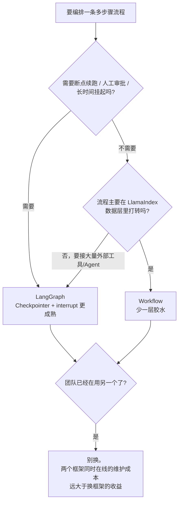

**本书立场**：编排统一用 **LangGraph**，LlamaIndex 只出现在数据层。理由是编排层要长期承载人在回路、审批、重放、多智能体，这些 LangGraph 的成熟度明显更高；而把两个编排框架同时养在一个代码库里，是纯粹的负债。

---

## 五、框架全景对比：六个方案横评

前面比了 LangChain 系和 LlamaIndex。但真到选型会议上，桌上通常还有 Haystack、DSPy，以及那个永远有人提的「我们自己写不行吗」。

### 5.1 六个方案的一句话画像

| 方案 | 一句话画像 |
|---|---|
| **LangChain** | 组件超市 + 统一接口（LCEL），什么都有，什么都不深 |
| **LangGraph** | 状态机 / 图编排，Agent 与人在回路的事实标准 |
| **LlamaIndex** | 数据与索引层最强，RAG 高级玩法开箱即用 |
| **Haystack** | deepset 出品，Pipeline + Component，工业风、稳、偏搜索 |
| **DSPy** | 把 prompt 当可优化参数，用编译器思路自动调 prompt/few-shot |
| **自研裸写** | 只依赖 `openai` + 向量库 SDK，全部自己写 |

### 5.2 全景对比大表

> 说明：下表的评级是**本书基于 2025 年下半年版本（langchain 0.3.x / langgraph 0.2.x / llama-index 0.12.x / haystack 2.x / dspy 2.5.x）的主观工程判断**，不是任何榜单数据。★ 越多越强，请按自己的场景复核。

| 维度 | LangChain | LangGraph | LlamaIndex | Haystack 2.x | DSPy | 自研裸写 |
|---|---|---|---|---|---|---|
| **抽象层次** | 中高（Runnable 统一一切） | 中（图 + State，贴近控制流） | 高（Index/QueryEngine 封装深） | 中（Component + Pipeline，显式连线） | **很高**（Signature/Module，prompt 被隐藏） | 无 |
| **学习曲线** | 中（LCEL 要适应） | 中（会画状态机就好上手） | 低起步/高精通（三行跑通，改深了要读源码） | 中（概念少但要写连线） | **陡**（范式完全不同） | 低（但要自己补全部知识） |
| **RAG 能力** | ★★★☆ 组件全，高级策略要自己拼 | ★★☆ 本身不管 RAG | ★★★★★ 切分/索引/检索/多跳/图 全家桶 | ★★★★ 检索与文档管线扎实，Ranker/Filter 齐 | ★★★ 有 RAG 模块，重点在优化不在检索 | ★★ 全靠自己 |
| **Agent 能力** | ★★★ 老 AgentExecutor 已不推荐 | ★★★★★ 事实标准，多智能体/人在回路/持久化 | ★★★☆ `FunctionAgent`/`AgentWorkflow` 够用，生态弱 | ★★★ Agent 与 Tool 支持在补齐中 | ★★ 有 ReAct，但不是它的重点 | ★★★（自己写 while 循环其实不难） |
| **可控性** | ★★★★ LCEL 每步可见，但组件内部是黑盒 | ★★★★★ 控制流完全自己定义 | ★★☆ 高级 API 封装深，改行为常要翻源码 | ★★★★ 连线显式，组件契约清楚 | ★★ prompt 由优化器生成，不直接可控 | ★★★★★ 全部自己的代码 |
| **可观测** | ★★★★ LangSmith 一键；Langfuse/OTel 有集成 | ★★★★★ 天然按节点分段，trace 结构最好 | ★★★☆ 有 callback / instrumentation，生态弱于 LangSmith | ★★★☆ 有 tracing 集成，生态较小 | ★★☆ 有 inspect_history，偏调试 | ★（自己埋） |
| **生产就绪度** | ★★★★ 大量生产案例 | ★★★★ 含 Platform/Server 方案 | ★★★★ 数据层生产案例多 | ★★★★★ 工业风最强，deepset 长期做搜索 | ★★☆ 更适合离线优化阶段 | ★★★★（取决于你团队的工程能力） |
| **社区活跃度** | ★★★★★ 最大 | ★★★★★ | ★★★★★ | ★★★ | ★★★☆ 学术圈热 | — |
| **版本稳定性** | ★★★☆ 0.3 后好转，历史上大改多次 | ★★★★ 0.2 后接口稳 | ★★★ 0.10 拆包是一次大迁移，0.12 稳 | ★★★★ 1.x→2.x 是重写，2.x 内稳定 | ★★☆ 迭代快，API 会变 | ★★★★★ 你自己说了算 |
| **依赖体积** | 大（`langchain-community` 尤甚） | 小 | 中（0.10 后可按需装子包） | 中 | 小 | **极小** |
| **锁定风险** | 中（Runnable 渗透到业务代码就难拆） | 中低（图结构是你自己的，节点是纯函数） | **中高**（Node/Index 抽象一旦深入很难剥离） | 中 | 低（产出是 prompt 字符串，可导出） | 无 |
| **最适合谁** | 想快速拼原型、需要大量现成集成 | 需要可控流程、多智能体、人在回路 | RAG 是主战场、数据形态复杂 | 搜索底子厚、要稳、偏欧洲技术栈 | 有评测集、想自动化调 prompt | 场景简单、团队强、要极致可控 |

### 5.3 三条容易被忽略的隐性成本

1. **依赖地狱**。`langchain` + `llama-index` + `haystack` 同时装，`pydantic` / `openai` / `tokenizers` 的版本约束会打架。建议：一个服务里**最多两个**大框架，并且用 `uv pip compile` 锁死 lockfile。

2. **升级不是 `pip install -U`**。LangChain 0.1→0.2→0.3、LlamaIndex 0.9→0.10（拆包）、Haystack 1.x→2.x（重写），每一次都是**代码迁移工程**。上生产前先搜一遍目标框架最近 12 个月的 breaking change 记录。

3. **调试时间**。框架最大的隐性成本是「出问题时，你要花多久定位到是框架的问题还是你的问题」。这一条上自研裸写完胜，LlamaIndex 高级 API 最吃亏。

---

## 六、选型决策：你的情况 → 推荐组合

### 6.1 决策树

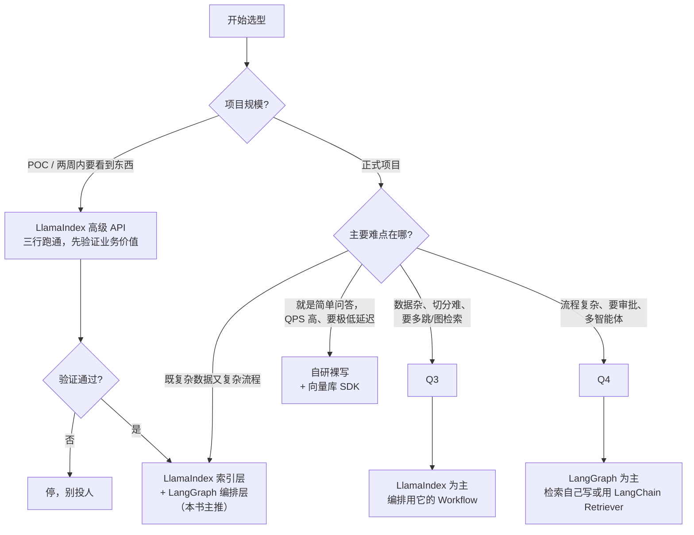

### 6.2 「你的情况 → 推荐组合」决策表

| # | 你的情况 | 推荐组合 | 理由 | 不推荐 |
|---|---|---|---|---|
| 1 | 两周 POC，要向老板证明 RAG 有用 | **LlamaIndex 高级 API**（`VectorStoreIndex.from_documents` + `as_query_engine`） | 三行代码出效果，验证成本最低 | 别上 LangGraph，浪费时间在编排上 |
| 2 | 企业知识库问答，语料是 PDF/Word/Excel 混合，1 万~50 万 chunk | **LlamaIndex（Reader+IngestionPipeline+索引）+ LangGraph（编排）** | 数据层强项 + 编排层强项，各取所长 | 别只用 LangChain，切分与增量更新要自己造 |
| 3 | 工单助手，要调 ERP/CRM 工具、要人工审批、要能重放 | **LangGraph 为主**，检索用一个薄 `Retriever` 接口 | 人在回路和持久化是 LangGraph 的主场 | 别用 LlamaIndex Workflow，断点续跑能力弱 |
| 4 | 已有成熟 Elasticsearch 搜索团队，想加 LLM | **Haystack 2.x** 或 **自研** | 团队心智模型匹配，ES 集成成熟 | 别硬上 LangChain，团队要重学一套抽象 |
| 5 | 有 500+ 条标注评测集，prompt 调到手酸 | **DSPy 做离线优化**，把产出的 prompt 固化到现有框架 | DSPy 的价值在"自动调"，不在"跑线上" | 别用 DSPy 直接扛线上流量 |
| 6 | 场景单一（如只做 FAQ 匹配），QPS 高，延迟敏感 | **自研裸写**（`openai` + `pymilvus` + 80 行代码） | 框架的每一层抽象都是延迟和不确定性 | 别为了"显得专业"引入框架 |
| 7 | 多智能体协同（Supervisor / Swarm） | **LangGraph**（见 [7.2 章](../07-多智能体协同/02-LangGraph实现Supervisor与Swarm.md)） | 目前生态最完整 | — |
| 8 | 需要 GraphRAG，但团队没人懂 Neo4j | **LlamaIndex PropertyGraphIndex** 先验证，验证通过再上 Neo4j | 最短验证路径 | 别一上来就自己写 Cypher |
| 9 | 强监管行业（金融/医疗），每一步都要审计 | **LangGraph + 自研节点**，框架只在节点内部出现 | 控制流必须完全可审计 | 别用封装深的高级 API |
| 10 | 团队 2 人，要在 3 个月上线完整系统 | **LlamaIndex + LangGraph**，接受一定锁定 | 人少就该买现成的 | 别自研，会做不完 |
| 11 | 团队 10 人以上，系统要活 3 年以上 | **自定义接口 + 框架关在适配层**（第十节） | 长期主义，换框架不伤业务代码 | 别让框架类型渗透进业务层 |
| 12 | 只是想把内部 Wiki 变成问答 | **LlamaIndex + 现成 UI**（如 `chainlit`/`streamlit`） | 一天能上线 | — |

### 6.3 华成机电的最终选型（本书主线）

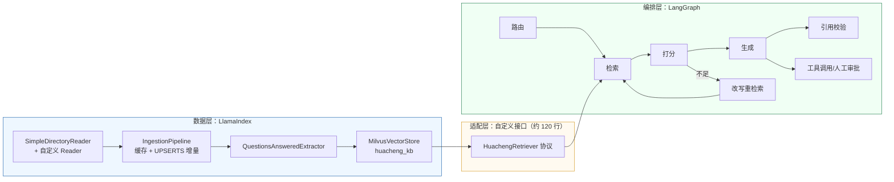

| 层 | 选型 | 为什么 |
|---|---|---|
| 解析 / 切分 / 增量 | LlamaIndex | Reader 生态 + IngestionPipeline 的缓存去重，省掉整整一个模块 |
| 元数据增强 | LlamaIndex Extractor | `QuestionsAnsweredExtractor` 对召回提升明显（见 4.2 节实测表） |
| 向量库 | Milvus 2.4（直接用 `pymilvus`，不经框架） | 索引参数、分区、标量过滤要精细控制，框架封装反而碍事 |
| 检索接口 | **自定义 `Retriever` 协议** | 隔离层，见第十节 |
| 编排 | LangGraph | 人在回路、持久化、多智能体 |
| 评测 | 自研 DeepSeek-Harness（第 8 模块） | 评测必须完全可控 |

---

## 七、DSPy：把 prompt 当作可优化的参数

### 7.1 它到底在解决什么问题

你一定经历过这个循环：

```text
写 prompt → 跑 20 条测试 → 有 3 条不对 → 改 prompt → 之前对的又错了 2 条 → 再改 → ...
```

**prompt 工程的本质困境是：它是手工梯度下降，而且没有梯度。**

DSPy 的想法很直接：

> **既然 prompt 是影响效果的参数，那就别手调，交给优化器。**
> 你只负责声明「输入什么、输出什么」（Signature）和「怎么算分」（Metric），
> DSPy 负责搜索指令措辞与 few-shot 示例的组合。

这是编译器思路：你写「意图」，编译器生成「实现」。

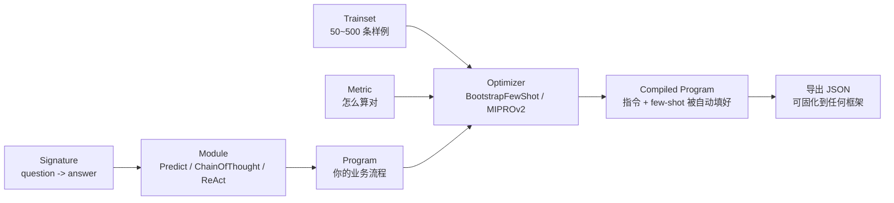

### 7.2 一个能跑的小例子：华成机电工单字段抽取

```bash
uv pip install "dspy-ai==2.5.43"
```

```python
# huacheng/dspy_demo/ticket_extract.py
"""DSPy 小例子：从客服对话里抽出工单字段，用优化器自动调 prompt。"""
from __future__ import annotations

import json
import os

import dspy

# ---------------------------------------------------------------- 1) 配置 LM
lm = dspy.LM(
    "openai/deepseek-chat",
    api_base="https://api.deepseek.com/v1",
    api_key=os.environ["DEEPSEEK_API_KEY"],
    temperature=0.0,
    max_tokens=1024,
    cache=True,          # 优化过程会反复调用，缓存能省一大笔钱
)
dspy.configure(lm=lm)


# ---------------------------------------------------------------- 2) 声明 Signature
class ExtractTicket(dspy.Signature):
    """从售后对话中抽取工单字段。信息不足的字段填 null，不要猜。"""

    dialogue: str = dspy.InputField(desc="客服与客户的对话转写")
    device_model: str = dspy.OutputField(desc="设备型号，如 XJ-200 / XJ-200-B3 / XJ-300；未提及填 null")
    fault_code: str = dspy.OutputField(desc="故障码，如 E041 / E043；未提及填 null")
    symptom: str = dspy.OutputField(desc="用不超过 20 字的规范术语概括故障现象")
    urgency: str = dspy.OutputField(desc="P0 停产 / P1 影响产能 / P2 不影响生产 三选一")


# ---------------------------------------------------------------- 3) 组装 Module
class TicketExtractor(dspy.Module):
    """先想再抽：ChainOfThought 会自动加一个 reasoning 输出字段。"""

    def __init__(self) -> None:
        super().__init__()
        self.extract = dspy.ChainOfThought(ExtractTicket)

    def forward(self, dialogue: str) -> dspy.Prediction:
        return self.extract(dialogue=dialogue)


# ---------------------------------------------------------------- 4) 数据
TRAIN_RAW = [
    ("客户：我们车间那台 XJ-200 today 开机就跳，屏上是 E041。客服：整条线停了吗？"
     "客户：停了，急得很。",
     {"device_model": "XJ-200", "fault_code": "E041", "symptom": "开机即报主轴过载", "urgency": "P0"}),
    ("客户：XJ-300 偶尔报 E043，一天两三次，还能干活。客服：影响产量吗？客户：慢一点，能凑合。",
     {"device_model": "XJ-300", "fault_code": "E043", "symptom": "间歇性伺服过流", "urgency": "P1"}),
    ("客户：那台新买的机器有点异响。客服：型号是？客户：我得去看看，回头告诉你。",
     {"device_model": "null", "fault_code": "null", "symptom": "运行异响", "urgency": "P2"}),
    ("客户：B3 那台从昨天开始就起不来，报 E041，我们三条线全停。",
     {"device_model": "XJ-200-B3", "fault_code": "E041", "symptom": "无法启动并报主轴过载", "urgency": "P0"}),
    ("客户：想问下 XJ-200 的保养周期。客服：一般 2000 小时。",
     {"device_model": "XJ-200", "fault_code": "null", "symptom": "保养咨询非故障", "urgency": "P2"}),
]

DEV_RAW = [
    ("客户：我们 300 那台报 E043 了，线停了半天了。",
     {"device_model": "XJ-300", "fault_code": "E043", "symptom": "伺服过流导致停机", "urgency": "P0"}),
    ("客户：机床声音不太对，没报警，还在跑。",
     {"device_model": "null", "fault_code": "null", "symptom": "运行异响无报警", "urgency": "P2"}),
    ("客户：XJ-200-B3 主轴过载，E041，我们先换了台备机顶着。",
     {"device_model": "XJ-200-B3", "fault_code": "E041", "symptom": "主轴过载", "urgency": "P1"}),
]


def to_examples(raw: list[tuple[str, dict]]) -> list[dspy.Example]:
    """转成 dspy.Example，并声明哪个字段是输入。"""
    return [
        dspy.Example(dialogue=d, **labels).with_inputs("dialogue")
        for d, labels in raw
    ]


# ---------------------------------------------------------------- 5) 指标
def ticket_metric(gold: dspy.Example, pred: dspy.Prediction, trace=None) -> float:
    """四个字段的加权正确率：型号和故障码要精确，现象只看关键词覆盖。"""
    score = 0.0
    if str(pred.device_model).strip() == str(gold.device_model).strip():
        score += 0.35
    if str(pred.fault_code).strip() == str(gold.fault_code).strip():
        score += 0.35
    if str(pred.urgency).strip() == str(gold.urgency).strip():
        score += 0.20
    gold_kw = {c for c in str(gold.symptom) if "一" <= c <= "鿿"}
    pred_kw = {c for c in str(pred.symptom) if "一" <= c <= "鿿"}
    if gold_kw and len(gold_kw & pred_kw) / len(gold_kw) >= 0.5:
        score += 0.10
    # 用于 BootstrapFewShot 筛选示例时，需要布尔语义；这里返回浮点，配 threshold 用
    return score


def evaluate(program: dspy.Module, devset: list[dspy.Example]) -> float:
    """在验证集上算平均分。"""
    total = 0.0
    for ex in devset:
        pred = program(dialogue=ex.dialogue)
        total += ticket_metric(ex, pred)
    return total / len(devset)


def main() -> None:
    """对比：零样本 baseline vs 优化后。"""
    trainset, devset = to_examples(TRAIN_RAW), to_examples(DEV_RAW)

    baseline = TicketExtractor()
    base_score = evaluate(baseline, devset)
    print(f"[baseline]  dev score = {base_score:.3f}")

    # BootstrapFewShot：自动从 trainset 里"跑一遍、留下跑对的"作为 few-shot 示例
    from dspy.teleprompt import BootstrapFewShot

    optimizer = BootstrapFewShot(
        metric=lambda g, p, trace=None: ticket_metric(g, p) >= 0.9,
        max_bootstrapped_demos=3,
        max_labeled_demos=3,
        max_rounds=2,
    )
    compiled = optimizer.compile(TicketExtractor(), trainset=trainset)
    opt_score = evaluate(compiled, devset)
    print(f"[optimized] dev score = {opt_score:.3f}")

    # 关键一步：把优化结果导出，之后可以脱离 DSPy 使用
    compiled.save("./ticket_extractor_compiled.json")
    print("\n=== 优化器最终用的 prompt（截断）===")
    dspy.inspect_history(n=1)


if __name__ == "__main__":
    main()
```

预期输出（示例性数据，实际分数取决于模型与数据，需自行复现）：

```text
[baseline]  dev score = 0.683
 33%|███▎      | 2/5 [00:04<00:06] Bootstrapped 2 full traces after 3 examples
[optimized] dev score = 0.883

=== 优化器最终用的 prompt（截断）===
System: 从售后对话中抽取工单字段。信息不足的字段填 null，不要猜。

Follow the following format.
Dialogue: 客服与客户的对话转写
Reasoning: Let's think step by step ...
Device Model: 设备型号，如 XJ-200 / XJ-200-B3 / XJ-300；未提及填 null
...

---
Dialogue: 客户：我们车间那台 XJ-200 today 开机就跳，屏上是 E041。客服：整条线停了吗？客户：停了，急得很。
Reasoning: 对话中明确提到型号 XJ-200 与故障码 E041；客户说"整条线停了"，属于停产，判 P0。
Device Model: XJ-200
Fault Code: E041
Symptom: 开机即报主轴过载
Urgency: P0
---
（自动挑选的第 2、3 个示例略）
```

**注意最后那一步 `compiled.save()`。** 它把「优化出来的指令 + 挑出来的 few-shot 示例」存成 JSON。你完全可以把这个 JSON 读出来，拼成一个普通的 prompt 模板，放进 LangChain 或裸写代码里用——**DSPy 可以只在离线阶段出现**。

```python
# 把 DSPy 的产物固化成普通 prompt，线上不依赖 dspy
import json
with open("ticket_extractor_compiled.json", encoding="utf-8") as f:
    compiled = json.load(f)
demos = compiled["extract"]["demos"]          # 自动挑出来的 few-shot
instruction = compiled["extract"]["signature"]["instructions"]
prompt = instruction + "\n\n" + "\n---\n".join(
    f"对话：{d['dialogue']}\n型号：{d['device_model']}\n故障码：{d['fault_code']}" for d in demos
)
```

### 7.3 什么场景值得试 DSPy

| 值得试 ✅ | 不值得试 ❌ |
|---|---|
| 你已经有 **50 条以上带标注的评测集** | 一条标注数据都没有（优化器没东西可优化） |
| 指标能**自动算**（精确匹配、F1、JSON 字段正确率） | 只能人工主观打分 |
| 任务是**结构化抽取 / 分类 / 多跳问答**这种有明确对错的 | 开放式写作、创意生成 |
| prompt 已经手调到瓶颈，还想再挤 5~10 个点 | 连 baseline 都没建 |
| 愿意接受**线上 prompt 不是人写的**（可读性变差） | 强监管场景，prompt 每个字都要人审 |
| 想做「换模型后自动重调 prompt」 | 模型固定且不打算换 |

**本书的实用建议**：

> 把 DSPy 当作**离线的 prompt 调优工具**，不要让它进生产链路。
> 流程是：建评测集 → DSPy 优化 → 导出 prompt → 人工审一遍 → 固化进现有框架 → 回归测试。
> 这样既拿到了自动优化的收益，又没有引入一个新的运行时依赖。

DSPy 的两个主力优化器速查：

| 优化器 | 做什么 | 数据需求 | 成本 |
|---|---|---|---|
| `BootstrapFewShot` | 用程序自己跑训练集，留下"跑对的"当 few-shot | 20~100 条 | 低 |
| `BootstrapFewShotWithRandomSearch` | 上面的基础上随机搜索示例组合 | 50~300 条 | 中 |
| `MIPROv2` | 同时优化**指令措辞**和 few-shot，贝叶斯搜索 | 100~500 条 | **高**（可能几百次 LLM 调用） |
| `BootstrapFinetune` | 把优化结果蒸馏成一次微调 | 500+ 条 | 高（要训练） |

---

## 八、混用方案：LlamaIndex 做索引，LangGraph 做编排

这是本书对生产项目的**主推组合**。核心只有一件事：**把 LlamaIndex 的 `BaseRetriever` 包成 LangChain 的 `BaseRetriever`**，之后 LangGraph 那边就当它是原生组件。

### 8.1 两个 Retriever 接口的差异

| | LlamaIndex | LangChain |
|---|---|---|
| 基类 | `llama_index.core.retrievers.BaseRetriever` | `langchain_core.retrievers.BaseRetriever` |
| 同步方法 | `_retrieve(self, query_bundle) -> List[NodeWithScore]` | `_get_relevant_documents(self, query, *, run_manager) -> List[Document]` |
| 异步方法 | `_aretrieve` | `_aget_relevant_documents` |
| 返回类型 | `NodeWithScore(node=TextNode, score=float)` | `Document(page_content=str, metadata=dict)` |
| 分数 | 一等公民 `score` | 只能塞进 `metadata` |
| 元数据 | `node.metadata` + `excluded_*_keys` | `document.metadata` |

所以适配器要做三件事：**接口签名转换、数据结构转换、分数搬运**。

### 8.2 完整胶水代码

```python
# huacheng/bridge/li_to_lc.py
"""把 LlamaIndex 的 Retriever 包成 LangChain 的 BaseRetriever，供 LangGraph 使用。"""
from __future__ import annotations

from typing import Any, Sequence

from langchain_core.callbacks import (
    AsyncCallbackManagerForRetrieverRun,
    CallbackManagerForRetrieverRun,
)
from langchain_core.documents import Document as LCDocument
from langchain_core.retrievers import BaseRetriever as LCBaseRetriever
from llama_index.core.retrievers import BaseRetriever as LIBaseRetriever
from llama_index.core.schema import NodeWithScore, QueryBundle
from pydantic import Field


def _node_to_lc_document(nws: NodeWithScore, *, metadata_mode: str = "llm") -> LCDocument:
    """NodeWithScore -> LangChain Document，保留分数、node_id 与来源关系。"""
    node = nws.node
    meta: dict[str, Any] = dict(node.metadata or {})
    meta.update({
        "node_id": node.node_id,
        "score": float(nws.score) if nws.score is not None else None,
        "ref_doc_id": node.ref_doc_id,
    })
    # 用 get_content 而不是 node.text：这样 excluded_llm_metadata_keys 才生效
    return LCDocument(page_content=node.get_content(metadata_mode=metadata_mode), metadata=meta)


class LlamaIndexRetrieverAdapter(LCBaseRetriever):
    """LangChain 侧看到的就是一个普通 Retriever，内部跑的是 LlamaIndex。

    用法::

        li_retriever = index.as_retriever(similarity_top_k=8)
        lc_retriever = LlamaIndexRetrieverAdapter(li_retriever=li_retriever)
        docs = lc_retriever.invoke("XJ-200 报 E041 怎么处理")
    """

    li_retriever: LIBaseRetriever = Field(...)
    metadata_mode: str = Field(default="llm")
    # 可选的后置过滤：分数低于阈值直接丢
    score_threshold: float | None = Field(default=None)

    model_config = {"arbitrary_types_allowed": True}

    def _postfilter(self, nodes: Sequence[NodeWithScore]) -> list[LCDocument]:
        """统一的分数过滤 + 类型转换。"""
        out: list[LCDocument] = []
        for n in nodes:
            if self.score_threshold is not None and n.score is not None and n.score < self.score_threshold:
                continue
            out.append(_node_to_lc_document(n, metadata_mode=self.metadata_mode))
        return out

    def _get_relevant_documents(
        self, query: str, *, run_manager: CallbackManagerForRetrieverRun, **kwargs: Any
    ) -> list[LCDocument]:
        """同步检索。"""
        nodes = self.li_retriever.retrieve(QueryBundle(query_str=query))
        return self._postfilter(nodes)

    async def _aget_relevant_documents(
        self, query: str, *, run_manager: AsyncCallbackManagerForRetrieverRun, **kwargs: Any
    ) -> list[LCDocument]:
        """异步检索——LangGraph 里尽量走这条，才能真正并发。"""
        nodes = await self.li_retriever.aretrieve(QueryBundle(query_str=query))
        return self._postfilter(nodes)


# ---------------------------------------------------------------- 反向适配
class LangChainRetrieverAdapter(LIBaseRetriever):
    """反过来：把 LangChain 的 Retriever 包给 LlamaIndex 用（偶尔需要）。"""

    def __init__(self, lc_retriever: LCBaseRetriever, **kwargs: Any) -> None:
        self._lc = lc_retriever
        super().__init__(**kwargs)

    def _retrieve(self, query_bundle: QueryBundle) -> list[NodeWithScore]:
        """LangChain Document -> NodeWithScore。"""
        from llama_index.core.schema import TextNode

        docs = self._lc.invoke(query_bundle.query_str)
        return [
            NodeWithScore(
                node=TextNode(text=d.page_content, metadata=d.metadata),
                score=float(d.metadata.get("score") or 0.0),
            )
            for d in docs
        ]

    async def _aretrieve(self, query_bundle: QueryBundle) -> list[NodeWithScore]:
        """异步版本。"""
        from llama_index.core.schema import TextNode

        docs = await self._lc.ainvoke(query_bundle.query_str)
        return [
            NodeWithScore(
                node=TextNode(text=d.page_content, metadata=d.metadata),
                score=float(d.metadata.get("score") or 0.0),
            )
            for d in docs
        ]
```

### 8.3 把它插进 LangGraph

```python
# huacheng/bridge/graph_with_li.py
"""完整可运行：LlamaIndex 建索引 -> 适配器 -> LangGraph 编排 -> 出答案。"""
from __future__ import annotations

import asyncio
import operator
from typing import Annotated, TypedDict

from langchain_core.documents import Document as LCDocument
from langchain_core.messages import HumanMessage, SystemMessage
from langchain_openai import ChatOpenAI
from langgraph.checkpoint.memory import MemorySaver
from langgraph.graph import END, START, StateGraph
from llama_index.core import Document as LIDocument
from llama_index.core import VectorStoreIndex
from llama_index.core.node_parser import SentenceSplitter
from llama_index.core.postprocessor import SimilarityPostprocessor

from core.config import get_settings
from huacheng.bridge.li_to_lc import LlamaIndexRetrieverAdapter
from huacheng.li.settings import setup_llamaindex

setup_llamaindex()
settings = get_settings()


# ---------------------------------------------------------------- 1) LlamaIndex 侧：建索引
DOCS = [
    LIDocument(text=("XJ-200 报 E041 为主轴过载保护。常见根因：BRG-6205-2RS 轴承磨损导致"
                     "径向跳动增大；主轴皮带张力过大；切削参数超过额定负载。"
                     "处理：停机测量主轴径向跳动，超过 0.02mm 需更换轴承。"),
                metadata={"source": "XJ维修指南v4.1", "page": 42, "device": "XJ-200"}),
    LIDocument(text=("更换 XJ-200 主轴轴承后必须重新设定动平衡参数 P-217（出厂默认 0.8），"
                     "并空转 30 分钟观察温升，轴承座温度不应超过环境温度 +40℃。"),
                metadata={"source": "XJ维修指南v4.1", "page": 43, "device": "XJ-200"}),
    LIDocument(text=("XJ-300 的 E043 为伺服过流，多由编码器线缆 CBL-ENC-3M 屏蔽层破损引起，"
                     "更换后需校准零点参数 P-305。"),
                metadata={"source": "XJ维修指南v4.1", "page": 58, "device": "XJ-300"}),
    LIDocument(text=("整机质保 18 个月，自出厂日起算；易损件（轴承、皮带、线缆）质保 6 个月。"
                     "超保修期的维修按工时费 280 元/小时 + 备件费计价。"),
                metadata={"source": "售后服务政策2025", "page": 3}),
]


def build_lc_retriever() -> LlamaIndexRetrieverAdapter:
    """LlamaIndex 建索引，输出一个 LangChain Retriever。"""
    index = VectorStoreIndex.from_documents(
        DOCS,
        transformations=[SentenceSplitter(chunk_size=256, chunk_overlap=32)],
    )
    li_retriever = index.as_retriever(similarity_top_k=6)
    # 也可以在 LlamaIndex 侧挂 reranker，对 LangGraph 完全透明：
    # from llama_index.postprocessor.flag_embedding_reranker import FlagEmbeddingReranker
    # li_retriever = index.as_retriever(
    #     similarity_top_k=20, node_postprocessors=[FlagEmbeddingReranker(top_n=6)])
    return LlamaIndexRetrieverAdapter(li_retriever=li_retriever, score_threshold=0.25)


# ---------------------------------------------------------------- 2) LangGraph 侧：编排
class RAGState(TypedDict):
    """图状态。"""
    question: str
    query: str
    docs: list[LCDocument]
    answer: str
    attempt: int
    trace: Annotated[list[str], operator.add]


llm = ChatOpenAI(
    model="deepseek-chat",
    base_url="https://api.deepseek.com/v1",
    api_key=settings.deepseek_api_key,
    temperature=0.0,
)
RETRIEVER = build_lc_retriever()
MAX_ATTEMPT = 2


async def node_prepare(state: RAGState) -> dict:
    """初始化查询。"""
    return {"query": state["question"], "attempt": 0, "trace": ["prepare"]}


async def node_retrieve(state: RAGState) -> dict:
    """调用适配后的 LlamaIndex 检索器。"""
    docs = await RETRIEVER.ainvoke(state["query"])
    return {"docs": docs, "trace": [f"retrieve({state['query'][:24]}) -> {len(docs)}"]}


async def node_grade(state: RAGState) -> dict:
    """判断资料是否充分。"""
    ctx = "\n".join(f"[{i}] {d.page_content[:200]}" for i, d in enumerate(state["docs"]))
    msg = await llm.ainvoke([
        SystemMessage(content="判断资料是否足以回答问题。只输出 YES 或 NO。"),
        HumanMessage(content=f"问题：{state['question']}\n资料：\n{ctx}"),
    ])
    ok = msg.content.strip().upper().startswith("YES")
    return {"trace": [f"grade -> {'OK' if ok else 'INSUFFICIENT'}"],
            "answer": "OK" if ok else ""}


def route_after_grade(state: RAGState) -> str:
    """条件边。"""
    if state["answer"] == "OK":
        return "generate"
    if state["attempt"] >= MAX_ATTEMPT:
        return "fallback"
    return "rewrite"


async def node_rewrite(state: RAGState) -> dict:
    """改写查询后重试。"""
    msg = await llm.ainvoke([
        SystemMessage(content="改写为更适合工业维修知识库检索的查询，多用型号/故障码/部件名。只输出查询。"),
        HumanMessage(content=f"原问题：{state['question']}\n上次查询：{state['query']}"),
    ])
    new_q = msg.content.strip()
    return {"query": new_q, "attempt": state["attempt"] + 1, "trace": [f"rewrite -> {new_q[:30]}"]}


async def node_generate(state: RAGState) -> dict:
    """带引用生成。"""
    ctx = "\n".join(
        f"[{i}]（{d.metadata.get('source')} p{d.metadata.get('page')}，score={d.metadata.get('score'):.3f}）"
        f"{d.page_content}"
        for i, d in enumerate(state["docs"])
    )
    msg = await llm.ainvoke([
        SystemMessage(content="你是华成机电售后助手。严格依据资料回答，句末标注 [i] 引用编号，资料没写的不要编。"),
        HumanMessage(content=f"资料：\n{ctx}\n\n问题：{state['question']}"),
    ])
    return {"answer": msg.content, "trace": ["generate"]}


async def node_fallback(state: RAGState) -> dict:
    """兜底。"""
    return {"answer": f"知识库中没有足够资料回答「{state['question']}」，建议补充设备型号与完整报错码，或转人工。",
            "trace": ["fallback"]}


def build_graph():
    """组装状态图。"""
    g = StateGraph(RAGState)
    g.add_node("prepare", node_prepare)
    g.add_node("retrieve", node_retrieve)
    g.add_node("grade", node_grade)
    g.add_node("rewrite", node_rewrite)
    g.add_node("generate", node_generate)
    g.add_node("fallback", node_fallback)

    g.add_edge(START, "prepare")
    g.add_edge("prepare", "retrieve")
    g.add_edge("retrieve", "grade")
    g.add_conditional_edges("grade", route_after_grade,
                            {"generate": "generate", "rewrite": "rewrite", "fallback": "fallback"})
    g.add_edge("rewrite", "retrieve")
    g.add_edge("generate", END)
    g.add_edge("fallback", END)
    return g.compile(checkpointer=MemorySaver())


async def main() -> None:
    """跑一遍。"""
    app = build_graph()
    cfg = {"configurable": {"thread_id": "demo-001"}}
    result = await app.ainvoke(
        {"question": "XJ-200 主轴过载换完轴承之后还要做什么？这个在保修范围内吗？"}, cfg)

    print("=== 答案 ===")
    print(result["answer"])
    print("\n=== 轨迹 ===")
    for t in result["trace"]:
        print("  -", t)
    print("\n=== 引用 ===")
    for i, d in enumerate(result["docs"]):
        print(f"  [{i}] {d.metadata.get('source')} p{d.metadata.get('page')} "
              f"score={d.metadata.get('score'):.4f}")


if __name__ == "__main__":
    asyncio.run(main())
```

预期输出：

```text
=== 答案 ===
更换 XJ-200 主轴轴承后需要做两件事：一是重新设定动平衡参数 P-217（出厂默认 0.8）；
二是空转 30 分钟观察温升，轴承座温度不应超过环境温度 +40℃ [1]。
保修方面：整机质保 18 个月自出厂日起算，但轴承属于易损件，质保期为 6 个月 [3]。
因此是否在保需要核对该机出厂日期与轴承更换记录；若超出 6 个月，按工时费 280 元/小时 + 备件费计价 [3]。

=== 轨迹 ===
  - prepare
  - retrieve(XJ-200 主轴过载换完轴承之后还) -> 4
  - grade -> OK
  - generate

=== 引用 ===
  [0] XJ维修指南v4.1 p43 score=0.8412
  [1] XJ维修指南v4.1 p42 score=0.7938
  [2] 售后服务政策2025 p3 score=0.6104
  [3] XJ维修指南v4.1 p58 score=0.3317
```

### 8.4 混用的四条纪律

1. **方向单一**：只允许「LlamaIndex → LangChain」这一个方向的数据流。反向适配器留着应急，但不要在主链路里双向来回转。
2. **适配器是唯一接触点**：整个代码库里只有 `huacheng/bridge/` 一个包同时 `import llama_index` 和 `import langchain`。业务代码只 import 适配器。
3. **锁死版本**：两个框架都写进 lockfile，升级任何一个都要跑一遍 `tests/test_bridge.py`。
4. **分数要搬运**：LlamaIndex 的 `score` 一定要落到 `metadata["score"]`，否则后面的阈值过滤、可观测、评测全都做不了。

配套的最小测试：

```python
# tests/test_bridge.py
"""适配器的契约测试：升级任何一个框架后必须跑通。"""
import pytest
from langchain_core.documents import Document as LCDocument

from huacheng.bridge.graph_with_li import build_lc_retriever


def test_adapter_returns_lc_documents():
    """返回类型必须是 LangChain Document。"""
    r = build_lc_retriever()
    docs = r.invoke("XJ-200 E041")
    assert docs and all(isinstance(d, LCDocument) for d in docs)


def test_score_is_preserved():
    """分数必须被搬运到 metadata。"""
    r = build_lc_retriever()
    docs = r.invoke("XJ-200 E041")
    assert all(isinstance(d.metadata.get("score"), float) for d in docs)
    assert docs == sorted(docs, key=lambda d: -d.metadata["score"])


def test_metadata_is_preserved():
    """来源元数据不能丢。"""
    r = build_lc_retriever()
    docs = r.invoke("XJ-200 E041")
    assert all("source" in d.metadata for d in docs)


@pytest.mark.asyncio
async def test_async_path():
    """异步路径必须可用，否则 LangGraph 里并发会退化成串行。"""
    r = build_lc_retriever()
    docs = await r.ainvoke("XJ-300 E043")
    assert docs
```

---

## 九、不用框架怎么办：200 行以内的裸写 RAG + Agent

框架不是必需品。这一节给出一份**只依赖 `openai` + `numpy`（向量库可选）** 的实现，把 RAG 和一个 ReAct 风格的工具调用 Agent 都写完。

写它有三个目的：

1. **证明框架不是刚需**——简单场景下 180 行就够了，而且你能读懂每一行；
2. **帮你理解框架到底帮你做了什么**——读完这 180 行再回头看 LangChain，你会发现它做的事你全都认识；
3. **给「强监管 / 极致性能 / 极简依赖」场景一个可落地的起点**。

### 9.1 先看框架替你做了什么

| 你要做的事 | 裸写时的代码量 | 框架帮你做的 |
|---|---|---|
| 调 LLM（重试、超时、流式） | ~20 行 | `ChatOpenAI` 一行 |
| 文本切分 | ~15 行（简单版） | `SentenceSplitter` 一行（还带句边界/重叠/结构感知） |
| 向量化 + 相似度检索 | ~25 行（numpy 内存版） | `VectorStoreIndex` 一行（还带持久化/过滤/混合检索） |
| 拼 prompt + 引用编号 | ~15 行 | `PromptTemplate` |
| Function Calling 循环 | ~40 行 | `create_react_agent` 一行 |
| 工具 schema 生成 | ~20 行（手写 JSON Schema） | `@tool` 装饰器自动从类型注解生成 |
| 流式、并发、回调、trace | ~60 行 | Runnable 体系自带 |
| 断点续跑、人在回路 | ~150 行+ | LangGraph Checkpointer |

**结论很清楚**：前六项裸写的性价比是可以接受的；**最后两项才是框架真正不可替代的地方**。所以本书的建议是——

> 如果你的系统不需要「断点续跑 / 人在回路 / 多智能体 / 复杂并发编排」，**裸写完全合理**。
> 一旦需要，再引入 LangGraph，而且只让它管这一层。

### 9.2 完整代码（RAG 部分，约 100 行）

```python
# huacheng/naked/mini_rag.py
"""不用任何 LLM 框架的最小 RAG：只依赖 openai + numpy。"""
from __future__ import annotations

import json
import os
import re
import time
from dataclasses import dataclass, field

import numpy as np
from openai import OpenAI

CLIENT = OpenAI(api_key=os.environ["DEEPSEEK_API_KEY"], base_url="https://api.deepseek.com/v1")
EMB_CLIENT = OpenAI(api_key=os.environ.get("EMB_API_KEY", "EMPTY"),
                    base_url=os.environ.get("EMB_BASE_URL", "http://127.0.0.1:8001/v1"))
CHAT_MODEL, EMB_MODEL = "deepseek-chat", "bge-m3"


@dataclass
class Chunk:
    """一个文本块：正文 + 元数据 + 向量。"""
    text: str
    meta: dict
    vec: np.ndarray | None = None


def split_text(text: str, meta: dict, size: int = 400, overlap: int = 60) -> list[Chunk]:
    """按中文标点的句边界切分，保证不切断句子，带重叠。"""
    sentences = [s for s in re.split(r"(?<=[。！？；\n])", text) if s.strip()]
    chunks, buf = [], ""
    for s in sentences:
        if len(buf) + len(s) > size and buf:
            chunks.append(Chunk(buf.strip(), dict(meta)))
            buf = buf[-overlap:] + s          # 尾部重叠，避免答案跨块被切断
        else:
            buf += s
    if buf.strip():
        chunks.append(Chunk(buf.strip(), dict(meta)))
    return chunks


def embed(texts: list[str], batch: int = 32) -> np.ndarray:
    """批量向量化并做 L2 归一化，归一化后点积 == 余弦相似度。"""
    out: list[list[float]] = []
    for i in range(0, len(texts), batch):
        resp = EMB_CLIENT.embeddings.create(model=EMB_MODEL, input=texts[i:i + batch])
        out.extend(d.embedding for d in resp.data)
    arr = np.asarray(out, dtype=np.float32)
    return arr / (np.linalg.norm(arr, axis=1, keepdims=True) + 1e-9)


class MiniIndex:
    """内存向量索引：几万条以内够用，再多就换 Milvus。"""

    def __init__(self) -> None:
        self.chunks: list[Chunk] = []
        self.matrix: np.ndarray | None = None

    def add(self, chunks: list[Chunk]) -> None:
        """写入并重建矩阵。"""
        vecs = embed([c.text for c in chunks])
        for c, v in zip(chunks, vecs):
            c.vec = v
        self.chunks.extend(chunks)
        self.matrix = np.vstack([c.vec for c in self.chunks])

    def search(self, query: str, k: int = 4, where: dict | None = None) -> list[tuple[Chunk, float]]:
        """余弦检索 + 可选的标量过滤（先过滤再算分，避免过滤后不足 k 条）。"""
        if self.matrix is None:
            return []
        idx = [i for i, c in enumerate(self.chunks)
               if not where or all(c.meta.get(kk) == vv for kk, vv in where.items())]
        if not idx:
            return []
        qv = embed([query])[0]
        scores = self.matrix[idx] @ qv
        order = np.argsort(-scores)[:k]
        return [(self.chunks[idx[j]], float(scores[j])) for j in order]

    def save(self, path: str) -> None:
        """持久化：向量存 npy，文本元数据存 jsonl。"""
        np.save(path + ".npy", self.matrix)
        with open(path + ".jsonl", "w", encoding="utf-8") as f:
            for c in self.chunks:
                f.write(json.dumps({"text": c.text, "meta": c.meta}, ensure_ascii=False) + "\n")

    def load(self, path: str) -> None:
        """从磁盘恢复。"""
        self.matrix = np.load(path + ".npy")
        self.chunks = []
        with open(path + ".jsonl", encoding="utf-8") as f:
            for line, v in zip(f, self.matrix):
                d = json.loads(line)
                self.chunks.append(Chunk(d["text"], d["meta"], v))


def chat(messages: list[dict], tools: list[dict] | None = None, retries: int = 3):
    """带指数退避重试的 LLM 调用。"""
    for attempt in range(retries):
        try:
            return CLIENT.chat.completions.create(
                model=CHAT_MODEL, messages=messages, tools=tools,
                temperature=0.0, timeout=60,
            ).choices[0].message
        except Exception as exc:                                  # noqa: BLE001
            if attempt == retries - 1:
                raise
            time.sleep(2 ** attempt)
    raise RuntimeError("unreachable")


SYS = ("你是华成机电售后助手。严格依据【资料】回答，句末用 [i] 标注引用编号。"
       "资料里没有的信息必须回答「资料中未提及」，不要编造。")


def rag_answer(index: MiniIndex, question: str, k: int = 4, min_score: float = 0.30) -> dict:
    """完整 RAG：检索 -> 阈值过滤 -> 拼 prompt -> 生成 -> 返回引用。"""
    hits = [(c, s) for c, s in index.search(question, k=k) if s >= min_score]
    if not hits:
        return {"answer": "知识库中没有找到相关资料，建议补充设备型号与报错码，或转人工。",
                "citations": []}
    ctx = "\n".join(f"[{i}]（{c.meta.get('source')} p{c.meta.get('page')}）{c.text}"
                    for i, (c, _) in enumerate(hits))
    msg = chat([{"role": "system", "content": SYS},
                {"role": "user", "content": f"【资料】\n{ctx}\n\n【问题】{question}"}])
    return {"answer": msg.content,
            "citations": [{"i": i, **c.meta, "score": round(s, 4)} for i, (c, s) in enumerate(hits)]}
```

### 9.3 完整代码（Agent 部分，约 80 行）

```python
# huacheng/naked/mini_agent.py
"""不用任何框架的 ReAct 风格 Agent：OpenAI function calling + while 循环。"""
from __future__ import annotations

import json
from typing import Any, Callable

from huacheng.naked.mini_rag import MiniIndex, chat, rag_answer

# ---------------------------------------------------------------- 工具实现
WARRANTY_DB = {
    "XJ-200#A1023": {"ship_date": "2023-06-11", "months": 18},
    "XJ-300#C0871": {"ship_date": "2025-01-20", "months": 18},
}
STOCK_DB = {"BRG-6205-2RS": 42, "CBL-ENC-3M": 0, "BRG-6208-2RS": 7}


def tool_check_warranty(serial: str) -> str:
    """查保修：返回是否在保与剩余天数。"""
    from datetime import date, datetime

    rec = WARRANTY_DB.get(serial)
    if not rec:
        return json.dumps({"found": False, "msg": f"未找到序列号 {serial}"}, ensure_ascii=False)
    ship = datetime.strptime(rec["ship_date"], "%Y-%m-%d").date()
    end = date(ship.year + (ship.month - 1 + rec["months"]) // 12,
               (ship.month - 1 + rec["months"]) % 12 + 1, ship.day)
    left = (end - date.today()).days
    return json.dumps({"found": True, "in_warranty": left > 0, "expire": str(end),
                       "days_left": max(left, 0)}, ensure_ascii=False)


def tool_check_stock(part_no: str) -> str:
    """查备件库存。"""
    qty = STOCK_DB.get(part_no)
    if qty is None:
        return json.dumps({"found": False, "part_no": part_no}, ensure_ascii=False)
    return json.dumps({"found": True, "part_no": part_no, "qty": qty,
                       "eta_days": 0 if qty > 0 else 7}, ensure_ascii=False)


def make_kb_tool(index: MiniIndex) -> Callable[[str], str]:
    """把 RAG 包成一个工具，让 Agent 自己决定要不要查知识库。"""

    def tool_search_kb(query: str) -> str:
        """检索售后知识库。"""
        r = rag_answer(index, query, k=3)
        return json.dumps(r, ensure_ascii=False)

    return tool_search_kb


# ---------------------------------------------------------------- 工具 schema（手写，这就是 @tool 装饰器帮你做的事）
def build_tool_specs() -> list[dict]:
    """OpenAI function calling 的 JSON Schema 描述。"""
    return [
        {"type": "function", "function": {
            "name": "search_kb", "description": "检索华成机电售后知识库（手册、维修指南、服务政策）",
            "parameters": {"type": "object", "properties": {
                "query": {"type": "string", "description": "检索式，用设备型号/故障码/部件名等专有名词"}},
                "required": ["query"]}}},
        {"type": "function", "function": {
            "name": "check_warranty", "description": "根据设备序列号查询是否在保修期内",
            "parameters": {"type": "object", "properties": {
                "serial": {"type": "string", "description": "设备序列号，形如 XJ-200#A1023"}},
                "required": ["serial"]}}},
        {"type": "function", "function": {
            "name": "check_stock", "description": "根据备件编码查询库存与到货周期",
            "parameters": {"type": "object", "properties": {
                "part_no": {"type": "string", "description": "备件编码，形如 BRG-6205-2RS"}},
                "required": ["part_no"]}}},
    ]


AGENT_SYS = ("你是华成机电售后工单助手。你可以调用工具查资料、查保修、查库存。"
             "规则：1) 技术问题先查知识库；2) 涉及保修必须用序列号查询，不要凭经验判断；"
             "3) 推荐备件时必须确认库存；4) 信息不足时直接向用户追问，不要猜；"
             "5) 最终回答按「故障判断 / 处理步骤 / 所需备件 / 保修结论」四段式组织。")


def run_agent(index: MiniIndex, user_input: str, max_steps: int = 6, verbose: bool = True) -> str:
    """ReAct 循环：模型决定调哪个工具 -> 执行 -> 结果回灌 -> 直到模型给出最终答案。"""
    registry: dict[str, Callable[..., str]] = {
        "search_kb": make_kb_tool(index),
        "check_warranty": tool_check_warranty,
        "check_stock": tool_check_stock,
    }
    specs = build_tool_specs()
    messages: list[dict[str, Any]] = [
        {"role": "system", "content": AGENT_SYS},
        {"role": "user", "content": user_input},
    ]

    for step in range(max_steps):
        msg = chat(messages, tools=specs)
        messages.append(msg.model_dump(exclude_none=True))

        if not getattr(msg, "tool_calls", None):
            return msg.content or ""

        for call in msg.tool_calls:
            name = call.function.name
            args = json.loads(call.function.arguments or "{}")
            if verbose:
                print(f"  [step {step}] -> {name}({args})")
            try:
                result = registry[name](**args)
            except Exception as exc:                              # noqa: BLE001
                result = json.dumps({"error": str(exc)}, ensure_ascii=False)
            if verbose:
                print(f"            <- {result[:90]}")
            messages.append({"role": "tool", "tool_call_id": call.id,
                             "name": name, "content": result})

    return "达到最大步数仍未得出结论，已转人工工程师处理。"
```

### 9.4 跑起来

```python
# huacheng/naked/demo.py
"""把裸写 RAG + Agent 串起来跑一次。"""
from huacheng.naked.mini_agent import run_agent
from huacheng.naked.mini_rag import MiniIndex, split_text

RAW = [
    ("XJ-200 报 E041 为主轴过载保护。常见根因：BRG-6205-2RS 轴承磨损导致径向跳动增大；"
     "主轴皮带张力过大；切削参数超过额定负载。处理：停机测量主轴径向跳动，超过 0.02mm 需更换轴承。"
     "更换轴承后必须重新设定动平衡参数 P-217（出厂默认 0.8），并空转 30 分钟观察温升。",
     {"source": "XJ维修指南v4.1", "page": 42}),
    ("整机质保 18 个月，自出厂日起算；易损件（轴承、皮带、线缆）质保 6 个月。"
     "超保修期的维修按工时费 280 元/小时 + 备件费计价。",
     {"source": "售后服务政策2025", "page": 3}),
]


def main() -> None:
    """建索引 -> 跑 Agent。"""
    index = MiniIndex()
    chunks = []
    for text, meta in RAW:
        chunks += split_text(text, meta)
    index.add(chunks)
    print(f"索引完成：{len(index.chunks)} 个 chunk\n")

    q = "我这台 XJ-200#A1023 报 E041，怎么修？需要什么备件、有货吗？还在保吗？"
    print("用户：", q)
    print("Agent 执行过程：")
    print("\n最终回答：\n" + run_agent(index, q))


if __name__ == "__main__":
    main()
```

预期输出：

```text
索引完成：3 个 chunk

用户： 我这台 XJ-200#A1023 报 E041，怎么修？需要什么备件、有货吗？还在保吗？
Agent 执行过程：
  [step 0] -> search_kb({'query': 'XJ-200 E041 主轴过载 处理步骤 备件'})
            <- {"answer": "E041 为主轴过载保护，常见根因是 BRG-6205-2RS 轴承磨损…", "citations": [...
  [step 1] -> check_warranty({'serial': 'XJ-200#A1023'})
            <- {"found": true, "in_warranty": false, "expire": "2024-12-11", "days_left": 0}
  [step 2] -> check_stock({'part_no': 'BRG-6205-2RS'})
            <- {"found": true, "part_no": "BRG-6205-2RS", "qty": 42, "eta_days": 0}

最终回答：
【故障判断】E041 为主轴过载保护。常见根因有三：BRG-6205-2RS 轴承磨损导致径向跳动增大、
主轴皮带张力过大、切削参数超过额定负载。

【处理步骤】
1. 停机后测量主轴径向跳动，超过 0.02mm 判定为轴承失效；
2. 更换 BRG-6205-2RS 轴承；
3. 重新设定动平衡参数 P-217（出厂默认 0.8）；
4. 空转 30 分钟观察轴承座温升。

【所需备件】BRG-6205-2RS，当前库存 42 件，可立即发货。

【保修结论】设备 XJ-200#A1023 的整机质保已于 2024-12-11 到期，本次维修不在保修范围内，
按工时费 280 元/小时 + 备件费计价。
```

**两个文件加起来 180 行左右，完整实现了带引用的 RAG、带库存/保修工具的 Agent、重试、持久化、阈值兜底。**

### 9.5 裸写版缺什么（也就是框架的真正价值）

| 缺失能力 | 裸写要补多少 | 框架方案 |
|---|---|---|
| 流式输出 | ~30 行（`stream=True` + tool_call 分片拼接，这个坑不小） | 框架内置 |
| 并发检索多个数据源 | ~40 行 asyncio | LCEL `RunnableParallel` |
| 断点续跑 / 人工审批 | **150 行+**，且要设计状态序列化 | LangGraph Checkpointer + `interrupt` |
| 分布式 trace | ~60 行 | Langfuse/LangSmith 一个装饰器 |
| 多种切分策略（Markdown/语义/层级） | 每种 30~80 行 | LlamaIndex NodeParser |
| 混合检索 + RRF + rerank | ~120 行 | 框架组件 |
| 40 种文件格式解析 | **不可能自己写** | LlamaIndex Reader 生态 |
| 多智能体消息路由 | 200 行+ | LangGraph |

**一句话判断**：

> 做加法（多数据源、多格式、多策略）→ 用框架，别自己造轮子。
> 做减法（就一条链路、要极致延迟、要每行代码可审计）→ 裸写，别被框架绑架。

---

## 十、框架升级与技术债管理

### 10.1 技术债从哪来

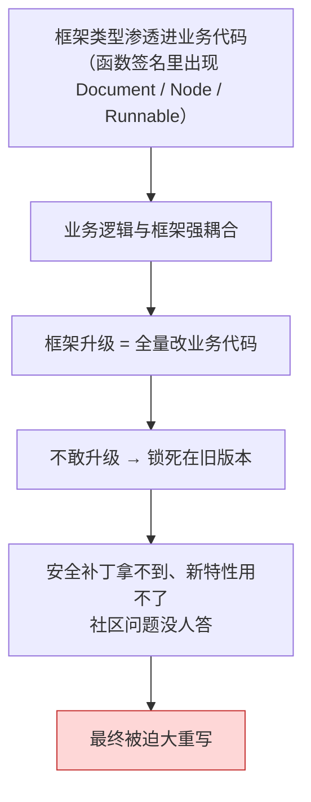

真实教训：某项目把 LangChain 0.1 的 `Document` 类型写进了 200 多个函数签名，0.2 迁移时改了两周。**问题不在 LangChain 改了 API，而在于他们让框架的类型成了自己领域模型的一部分。**

### 10.2 解法：自己定义接口，框架只出现在适配层

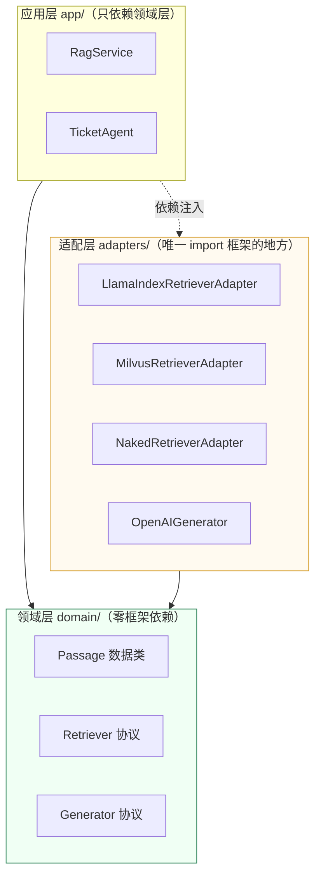

**领域层：定义你自己的类型和协议，一行框架 import 都没有。**

```python
# domain/retrieval.py
"""领域层：零框架依赖。这个文件里出现任何 langchain/llama_index 都算事故。"""
from __future__ import annotations

from dataclasses import dataclass, field
from typing import Protocol, runtime_checkable


@dataclass(frozen=True, slots=True)
class Passage:
    """检索到的一段资料——这是我们自己的领域模型，不是任何框架的类型。"""

    text: str
    score: float
    source: str                       # 文档来源，用于引用
    doc_id: str | None = None
    page: int | None = None
    extra: dict = field(default_factory=dict)

    def cite(self, idx: int) -> str:
        """生成引用标记。"""
        loc = f" p{self.page}" if self.page is not None else ""
        return f"[{idx}]（{self.source}{loc}）"


@dataclass(frozen=True, slots=True)
class RetrieveQuery:
    """检索请求。"""

    text: str
    top_k: int = 8
    filters: dict = field(default_factory=dict)      # 如 {"device": "XJ-200"}
    min_score: float | None = None


@runtime_checkable
class Retriever(Protocol):
    """检索器协议：所有实现都必须满足它。"""

    def retrieve(self, query: RetrieveQuery) -> list[Passage]:
        """同步检索。"""
        ...

    async def aretrieve(self, query: RetrieveQuery) -> list[Passage]:
        """异步检索。"""
        ...


@runtime_checkable
class Generator(Protocol):
    """生成器协议。"""

    async def generate(self, system: str, user: str) -> str:
        """给定系统提示与用户内容，返回文本。"""
        ...
```

**应用层：只认领域类型，永远不知道底下是谁。**

```python
# app/rag_service.py
"""应用层：业务逻辑。不 import 任何框架。"""
from __future__ import annotations

from dataclasses import dataclass

from domain.retrieval import Generator, Passage, RetrieveQuery, Retriever

SYSTEM = ("你是华成机电售后助手。严格依据资料回答，句末标注 [i] 引用编号，"
          "资料未提及的内容必须说明「资料中未提及」。")


@dataclass
class RagAnswer:
    """RAG 结果。"""
    answer: str
    passages: list[Passage]


class RagService:
    """检索增强问答服务——换任何框架，这个类一个字都不用改。"""

    def __init__(self, retriever: Retriever, generator: Generator,
                 top_k: int = 6, min_score: float = 0.3) -> None:
        self._retriever = retriever
        self._generator = generator
        self._top_k = top_k
        self._min_score = min_score

    async def ask(self, question: str, filters: dict | None = None) -> RagAnswer:
        """完整问答流程。"""
        q = RetrieveQuery(text=question, top_k=self._top_k,
                          filters=filters or {}, min_score=self._min_score)
        passages = await self._retriever.aretrieve(q)
        if not passages:
            return RagAnswer("知识库中没有找到相关资料，建议补充设备型号与报错码，或转人工。", [])
        ctx = "\n".join(f"{p.cite(i)}{p.text}" for i, p in enumerate(passages))
        answer = await self._generator.generate(
            SYSTEM, f"【资料】\n{ctx}\n\n【问题】{question}")
        return RagAnswer(answer, passages)
```

**适配层：唯一允许 import 框架的地方。**

```python
# adapters/llamaindex_retriever.py
"""适配层：把 LlamaIndex 翻译成领域协议。框架只准出现在这一层。"""
from __future__ import annotations

from llama_index.core.indices.base import BaseIndex
from llama_index.core.schema import NodeWithScore, QueryBundle
from llama_index.core.vector_stores import (
    ExactMatchFilter,
    FilterOperator,
    MetadataFilter,
    MetadataFilters,
)

from domain.retrieval import Passage, RetrieveQuery


class LlamaIndexRetriever:
    """实现 domain.Retriever 协议。"""

    def __init__(self, index: BaseIndex) -> None:
        self._index = index

    def _to_passages(self, nodes: list[NodeWithScore], q: RetrieveQuery) -> list[Passage]:
        """框架类型 -> 领域类型，这是隔离的关键一步。"""
        out: list[Passage] = []
        for n in nodes:
            score = float(n.score or 0.0)
            if q.min_score is not None and score < q.min_score:
                continue
            md = n.node.metadata or {}
            out.append(Passage(
                text=n.node.get_content(metadata_mode="llm"),
                score=score,
                source=str(md.get("source", "未知")),
                doc_id=n.node.ref_doc_id,
                page=md.get("page"),
                extra={k: v for k, v in md.items() if k not in ("source", "page")},
            ))
        return out

    def _build_retriever(self, q: RetrieveQuery):
        """把领域层的 filters 翻译成 LlamaIndex 的 MetadataFilters。"""
        filters = None
        if q.filters:
            filters = MetadataFilters(filters=[
                MetadataFilter(key=k, value=v, operator=FilterOperator.EQ)
                for k, v in q.filters.items()
            ])
        return self._index.as_retriever(similarity_top_k=q.top_k, filters=filters)

    def retrieve(self, query: RetrieveQuery) -> list[Passage]:
        """同步。"""
        nodes = self._build_retriever(query).retrieve(QueryBundle(query_str=query.text))
        return self._to_passages(nodes, query)

    async def aretrieve(self, query: RetrieveQuery) -> list[Passage]:
        """异步。"""
        nodes = await self._build_retriever(query).aretrieve(QueryBundle(query_str=query.text))
        return self._to_passages(nodes, query)
```

```python
# adapters/naked_retriever.py
"""同一个协议的第二个实现：裸写版。切换只需要改一行装配代码。"""
from __future__ import annotations

import asyncio

from domain.retrieval import Passage, RetrieveQuery
from huacheng.naked.mini_rag import MiniIndex


class NakedRetriever:
    """实现 domain.Retriever 协议，底层是第九节那个 180 行的 MiniIndex。"""

    def __init__(self, index: MiniIndex) -> None:
        self._index = index

    def retrieve(self, query: RetrieveQuery) -> list[Passage]:
        """同步。"""
        hits = self._index.search(query.text, k=query.top_k, where=query.filters or None)
        return [
            Passage(text=c.text, score=s, source=str(c.meta.get("source", "未知")),
                    page=c.meta.get("page"))
            for c, s in hits
            if query.min_score is None or s >= query.min_score
        ]

    async def aretrieve(self, query: RetrieveQuery) -> list[Passage]:
        """异步（内存检索本身是 CPU 操作，丢线程池即可）。"""
        return await asyncio.to_thread(self.retrieve, query)
```

**装配：整个系统里唯一需要改的地方。**

```python
# app/wiring.py
"""依赖装配：换框架就改这一个文件。"""
from __future__ import annotations

import os

from adapters.llamaindex_retriever import LlamaIndexRetriever
from adapters.naked_retriever import NakedRetriever
from adapters.openai_generator import OpenAIGenerator
from app.rag_service import RagService
from domain.retrieval import Retriever


def build_retriever() -> Retriever:
    """按环境变量选择实现——这就是「可替换」的兑现方式。"""
    backend = os.getenv("RETRIEVER_BACKEND", "llamaindex")
    if backend == "llamaindex":
        from huacheng.li.indices import load_milvus_index
        return LlamaIndexRetriever(load_milvus_index())
    if backend == "naked":
        from huacheng.naked.mini_rag import MiniIndex
        idx = MiniIndex()
        idx.load("./data/index/huacheng_kb")
        return NakedRetriever(idx)
    raise ValueError(f"未知后端：{backend}")


def build_rag_service() -> RagService:
    """组装服务。"""
    return RagService(retriever=build_retriever(), generator=OpenAIGenerator())
```

### 10.3 隔离层带来的四个具体好处

| 好处 | 说明 |
|---|---|
| **升级只改一个包** | LlamaIndex 0.12 → 0.13 有 breaking change？只改 `adapters/`，`app/` 和 `domain/` 一行不动 |
| **A/B 测两个实现** | 一个环境变量切 `llamaindex` / `naked`，同一套评测集直接对比 |
| **测试不需要真框架** | 写一个 `FakeRetriever` 实现协议就能单测业务逻辑，CI 里不用装 GPU 依赖 |
| **技术债可见** | `grep -rl "import llama_index" --include="*.py" .` 的结果如果超出 `adapters/`，就是一次代码评审要打回的事故 |

配套的 CI 守卫（建议直接加到流水线里）：

```bash
#!/usr/bin/env bash
# scripts/check_framework_leak.sh —— 防止框架类型泄漏到领域/应用层
set -euo pipefail

LEAK=$(grep -rn -E "^\s*(from|import)\s+(langchain|langgraph|llama_index|haystack)" \
        --include="*.py" domain/ app/ || true)

if [[ -n "$LEAK" ]]; then
  echo "❌ 框架依赖泄漏到领域层/应用层："
  echo "$LEAK"
  echo "请把它挪到 adapters/ 里。"
  exit 1
fi
echo "✅ 框架依赖隔离检查通过"
```

```text
$ bash scripts/check_framework_leak.sh
✅ 框架依赖隔离检查通过

$ bash scripts/check_framework_leak.sh     # 有人在 app/ 里直接 import 了
❌ 框架依赖泄漏到领域层/应用层：
app/ticket_agent.py:7:from langchain_core.documents import Document
请把它挪到 adapters/ 里。
```

### 10.4 什么时候**不要**做隔离层

隔离层不是免费的，它有成本：多一层转换、多一份类型、新人要多学一套概念。

| 场景 | 建议 |
|---|---|
| POC / 两周原型 | **不要做**，直接用框架，快速验证业务价值 |
| 一次性项目，交付完不维护 | **不要做** |
| 团队 ≤ 2 人，3 个月上线 | **轻量做**：只隔离 Retriever 和 Generator 两个协议 |
| 系统预期生命周期 > 2 年 | **必须做** |
| 强监管行业，要通过代码审计 | **必须做**，而且适配层要单独出测试报告 |
| 已经有 5 万行业务代码在 LangChain 上 | **增量做**：新模块走协议，老模块不动，别搞大重写 |

### 10.5 框架升级 checklist

每次升级大版本前，按这张表走一遍：

```text
[ ] 1. 读 CHANGELOG / Migration Guide，列出所有 breaking change
[ ] 2. 在独立分支升级，先跑 adapters/ 的契约测试（tests/test_bridge.py）
[ ] 3. 跑金标集回归（第 8 模块的评测 harness），对比 Hit@5 / 忠实度 / 延迟
[ ] 4. 检查依赖冲突：uv pip compile --upgrade-package <pkg>，看 pydantic/openai 有没有被拖动
[ ] 5. 压测一遍，看 P95 延迟有没有劣化（新版本可能改了默认并发/重试）
[ ] 6. 看 token 消耗有没有变（框架可能改了默认 prompt 模板）
[ ] 7. 灰度 5% 流量 24 小时，观察错误率与人工转接率
[ ] 8. 回滚方案：lockfile 留旧版本副本，镜像留 tag
```

---

## 十一、踩坑与排错

> 本章内容跨了三个框架，坑也跨了三个框架。下表按「你会在什么时候撞上」排序。

| # | 现象 | 根因 | 解决 |
|---|---|---|---|
| 1 | `ModuleNotFoundError: No module named 'llama_index.vector_stores.milvus'` | LlamaIndex 0.10 之后按 integration 拆包，`llama-index-core` 里不含任何具体实现 | 单独装子包：`uv pip install llama-index-vector-stores-milvus`。装 `llama-index`（不带 `-core`）会拉一堆你不需要的依赖，生产建议只装 `llama-index-core` + 需要的子包 |
| 2 | `IngestionPipeline` 每次都全量重跑，缓存一次没命中 | `doc_id` 用了 `uuid4()` 或文件 mtime，每次都变；或者 `transformations` 列表里某个对象带随机状态 | `doc_id` 必须由**稳定业务主键**生成，如 `f"manual::{relpath}::{page}"`。另外 `IngestionCache` 默认是内存的，进程重启就没了，生产用 `RedisCache` |
| 3 | 开了 `docstore` 但重复文档还是被重复写进向量库 | 只设了 `docstore` 没设 `docstore_strategy`，默认是 `DUPLICATES_ONLY`（只去完全重复），内容变了不会删旧 node | 显式设 `docstore_strategy=DocstoreStrategy.UPSERTS`，并且 `vector_store` 必须传给 `IngestionPipeline`（不传的话它删不了向量库里的旧 node） |
| 4 | LlamaIndex 生成的答案里混进了 `internal_owner` 这种内部字段 | Node 的 metadata 默认全部拼进给 LLM 的文本 | 设 `excluded_llm_metadata_keys`；调试时用 `node.get_content(metadata_mode="llm")` 确认实际喂进去的是什么 |
| 5 | 中文文档用 `SentenceSplitter` 切出来的块忽长忽短，有的只有几个字 | 默认分句规则按英文 `. ! ?`，中文全角标点不匹配，退化成按 chunk_size 硬切 | 传 `secondary_chunking_regex="[^，。！？；\n]+[，。！？；\n]?"`，或改用 `chunk_size` 更小 + `paragraph_separator="\n\n"` |
| 6 | 用 `OpenAILike` 接自建 vLLM，报 `NotImplementedError` 或把 chat 走成了 completion | `OpenAILike` 默认 `is_chat_model=False` | 必须显式 `is_chat_model=True`；要用 function calling 还得 `is_function_calling_model=True` |
| 7 | 明明上下文窗口 64k，LlamaIndex 却把资料切得很碎 / 报 context 超限 | `Settings.context_window` 没设，框架对未知模型按默认值（较小）估算 | 显式设 `Settings.context_window` 与 `Settings.num_output`；两者之差才是留给资料的空间 |
| 8 | `SubQuestionQueryEngine` 拆出来的子问题是英文，或者乱拆一堆无意义子问题 | 默认拆解提示词是英文的；工具 `description` 写得太笼统，LLM 分不清该问谁 | 用 `LLMQuestionGenerator.from_defaults(prompt_template_str=...)` 换中文模板；工具描述写清「有什么 / 能答什么 / 不能答什么」 |
| 9 | `SubQuestionQueryEngine` 在 Jupyter 里报 `RuntimeError: This event loop is already running` | `use_async=True` 会起事件循环，与 notebook 的循环冲突 | `import nest_asyncio; nest_asyncio.apply()`；生产服务里改用 `await engine.aquery(...)` |
| 10 | `PropertyGraphIndex` 抽出来的图全是孤立点，几乎没有边 | 用了 `SimpleLLMPathExtractor` 且语料里实体写法不统一（「6205 轴承」「BRG-6205」「深沟球轴承」被当成三个实体） | 换 `SchemaLLMPathExtractor` + `strict=True` 限定实体/关系类型；建图前先做实体归一（别名表 / 正则规范化） |
| 11 | 建图跑到一半 OOM 或 API 账单暴涨 | 每个 chunk 一次 LLM 调用，42 万 chunk 就是 42 万次 | 先用 500 个 chunk 试跑外推成本；只对高价值语料（手册/FAQ）建图；`num_workers` 调大提吞吐但要限流 |
| 12 | LlamaIndex Workflow 报 `WorkflowValidationError: step X produces event Y which is never consumed` | 某个 step 的返回类型注解没有对应的消费者，事件断链 | 检查每个 `@step` 的返回类型注解；用 `draw_all_possible_flows()` 画出来看断在哪。**返回类型注解写错等于连线错**，这是 Workflow 最容易犯的错 |
| 13 | Workflow 跑到一半卡住不动，最后超时 | 某个 step 抛了异常被吞掉，或者 `collect_events` 等的事件数量对不上 | 开 `verbose=True`；`collect_events(ev, [A, B, C])` 里的数量必须和实际 `send_event` 的次数一致 |
| 14 | 适配器包好的 Retriever 在 LangGraph 里并发不起来，QPS 上不去 | 只实现了 `_get_relevant_documents`，LangChain 会用线程池跑同步版本；或者 LlamaIndex 底层 embedding 是同步的 | 必须实现 `_aget_relevant_documents` 并在里面 `await li_retriever.aretrieve(...)`；确认 embedding 模型也有异步实现 |
| 15 | 适配之后引用分数全变成 0 或 `None` | `NodeWithScore.score` 没搬到 `Document.metadata`；或者 LlamaIndex 侧挂了 postprocessor 但没回填 score | 在转换函数里显式 `meta["score"] = float(nws.score)`；写契约测试守住（见 8.3 节 `test_score_is_preserved`） |
| 16 | 同时装 langchain 和 llama-index 后，`pydantic` 版本冲突启动就崩 | 两个框架对 `pydantic` / `openai` / `tokenizers` 的约束区间不重叠 | 用 `uv pip compile` 生成锁文件并提交；冲突无法调和时，把索引构建拆成独立的离线服务，运行时容器里只装一个框架 |
| 17 | DSPy 优化跑了两小时、烧了几百次调用，分数一点没涨 | 训练集太小（< 20 条）、metric 写得太宽松（永远返回 1.0）、或者 baseline 已经接近任务上限 | 先手工确认 metric 能区分好坏（拿一个故意写错的答案试试）；训练集至少 50 条；先看 baseline 分数，接近 0.95 就没必要优化 |
| 18 | DSPy 优化出来的 prompt 在线上换了个模型就崩了 | few-shot 示例和指令是针对某个模型搜出来的，换模型不保证迁移 | 换模型后重新编译一次；把 compiled JSON 按模型分文件存（`ticket_extractor_deepseek.json` / `_qwen.json`） |
| 19 | 裸写版 Agent 死循环，反复调同一个工具 | 没有 `max_steps` 上限；或者工具返回了空/报错，模型不断重试 | 必须设 `max_steps`；工具异常要返回结构化错误信息（`{"error": "..."}`）而不是抛出；检测「连续两次相同 tool + 相同参数」就强制中断 |
| 20 | 裸写版流式输出时 function calling 解析失败 | 流式下 `tool_calls` 是分片到达的，`arguments` 要按 `index` 累加拼接后才是完整 JSON | 维护一个 `dict[int, dict]` 按 `delta.tool_calls[i].index` 累积 `function.arguments` 字符串，流结束后再 `json.loads`。这个坑正是框架帮你填的 |
| 21 | 升级框架后答案质量莫名下降，代码一行没改 | 框架换了默认 prompt 模板 / 默认 `response_mode` / 默认 top_k | 关键 prompt 全部显式传入，不依赖框架默认值；升级后必跑金标集回归（10.5 节 checklist 第 3 条） |
| 22 | `grep import llama_index` 在 `app/` 里有一堆命中 | 隔离层名存实亡 | 加 CI 守卫 `scripts/check_framework_leak.sh`，并在代码评审 checklist 里明确写这一条 |

---

## 十二、生产级要点

### 12.1 成本

| 项 | 风险点 | 控制手段 |
|---|---|---|
| Extractor 抽元数据 | 每 chunk 一次 LLM，全量跑一次可能就是四位数 | 只对高价值语料开；先 500 chunk 试算再外推；结果落缓存，**绝不重复抽** |
| 建图（PropertyGraphIndex） | 同上，且更贵（输出 token 多） | 只对手册/FAQ 建图；增量只对新增文档建 |
| SubQuestionQueryEngine | 一个问题变 N+1 次 LLM 调用 | 加路由：只有判定为「并列比较型」才走它；限制子问题数上限 |
| DSPy 优化 | `MIPROv2` 可能几百次调用 | 开 `cache=True`；只在离线跑；训练集控制在 100~300 条 |
| 重试与循环 | 自纠错 RAG 的改写循环可能失控 | `MAX_RETRY` 硬上限 + 每请求 token 预算（见 [10.4 成本优化与容量规划](../10-工程化与生产落地/04-成本优化与容量规划.md)） |

### 12.2 延迟

```text
典型链路的延迟预算（示例性拆解，需按自己的环境实测）

  用户请求
    ├─ 查询改写 / 路由        100~400 ms   ← 可用小模型或规则，能省则省
    ├─ 向量检索               20~80 ms     ← Milvus HNSW，主要看 ef 参数
    ├─ Rerank (bge-v2-m3)     60~200 ms    ← top20→top6，GPU 上很快
    ├─ 生成（首 token）       300~900 ms   ← 决定"感知延迟"
    └─ 生成（完整）           1.5~6 s      ← 流式输出后用户无感

  会显著拖慢的三件事：
    - SubQuestionQueryEngine：N 个子问题，即使并发也要等最慢的那个（+2~6 s）
    - 自纠错循环：每多一轮 = 一次检索 + 一次打分 LLM（+1~2 s）
    - 图检索多跳展开：path_depth=3 以上时图遍历本身可能几百 ms
```

**三条硬规则：**

1. **首 token 必须流式**。用户对「3 秒才出第一个字」的容忍度远低于「流式打字 8 秒打完」。
2. **给每条链路设超时**。LlamaIndex 的 `OpenAILike(timeout=60)`、Workflow 的 `timeout=120`、LangGraph 节点自己加 `asyncio.wait_for`。
3. **降级路径要真的能跑**。检索超时 → 退化成纯 LLM 回答 + 明确提示「未检索到内部资料」；打分 LLM 超时 → 直接放行到生成，不要卡住。

### 12.3 并发

| 点 | 注意 |
|---|---|
| `Settings` 是全局单例 | 多 worker 各自一份没问题；同进程多配置必须显式传 `llm=` / `embed_model=` |
| 本地 Embedding 模型 | `HuggingFaceEmbedding` 在多进程下每个进程一份显存。`num_workers` 调大前先算显存 |
| 异步路径 | 适配器、Retriever、Workflow step 全部走 `async`，否则会在 FastAPI 的事件循环里阻塞 |
| 限流 | 对 DeepSeek/通义等在线 API 要自己做并发信号量，否则批量 ingest 时会被限流 |
| 向量库连接 | `pymilvus` 连接不是线程安全的，用连接池或每 worker 一个连接 |

### 12.4 监控

至少埋这些指标（接 Langfuse，见 [10.2 可观测性与链路追踪](../10-工程化与生产落地/02-可观测性与链路追踪.md)）：

```text
索引侧
  ingest.documents_total            本次处理文档数
  ingest.nodes_created              新建 node 数
  ingest.cache_hit_ratio            缓存命中率  ← 掉下去说明 doc_id 不稳定
  ingest.duration_seconds           耗时
  ingest.llm_calls / llm_cost_cny   抽取阶段的 LLM 用量

检索侧
  retrieve.latency_ms{p50,p95,p99}
  retrieve.hits_count               召回条数；为 0 的比例是关键健康指标
  retrieve.top1_score               分数分布；整体下移说明 embedding 或语料出问题
  retrieve.filter_rejected_ratio    被 min_score 过滤掉的比例

编排侧
  graph.node_latency_ms{node=...}   每个节点耗时
  graph.rewrite_count               改写重试次数；突然上升 = 检索质量下降
  graph.fallback_ratio              兜底率  ← 直接对应业务上的"人工转接率"
  graph.tool_error_ratio{tool=...}  工具失败率

框架侧
  framework.version                 作为 label 打到所有指标上，升级后能直接对比
```

### 12.5 降级

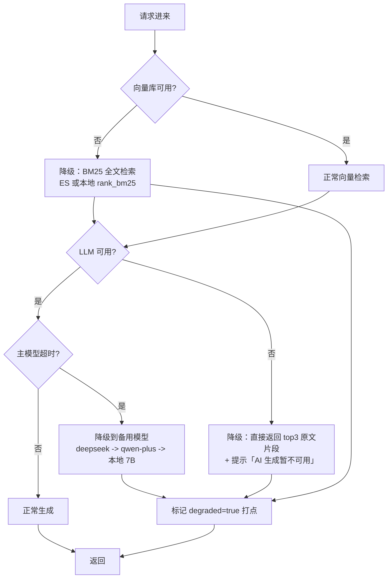

**关键**：每次降级都要在响应里带 `degraded` 标记并打点，否则线上悄悄降级三个月没人发现。

### 12.6 框架治理（本章特有）

| 规则 | 落地方式 |
|---|---|
| 一个服务最多两个大框架 | 架构评审 checklist |
| 框架只出现在 `adapters/` | CI 守卫脚本（10.2 节） |
| lockfile 必须提交 | `uv pip compile` 产物入库，CI 用 `--frozen` 安装 |
| 升级走 8 步 checklist | 见 10.5 节，作为发布流程的一部分 |
| 每季度评估一次技术债 | 统计：`adapters/` 代码行数占比、框架版本落后几个 minor、迁移预估工时 |

---

## 十三、本章小结 + 自测题

### 13.1 要点回顾

1. **LlamaIndex 和 LangChain 不是二选一，是分层。** LlamaIndex 强在「数据进来到索引建好」，LangGraph 强在「问题进来到答案出去」。本书主推组合：LlamaIndex 索引层 + 薄适配层 + LangGraph 编排层。

2. **LlamaIndex 有五个真正值得用的强项**：`IngestionPipeline`（缓存 + UPSERTS 增量，把日常更新从 104 分钟压到 4.2 分钟）、Metadata Extractor（`QuestionsAnsweredExtractor` 性价比最高）、`RecursiveRetriever` / `DocumentSummaryIndex`（两级检索）、`SubQuestionQueryEngine`（并列式复合问题开箱拆解）、`PropertyGraphIndex`（图 RAG 最短验证路径）。

3. **选型没有银弹，只有场景匹配。** 六方案横评表 + 12 条决策表的核心逻辑是：POC 用 LlamaIndex 高级 API，复杂流程用 LangGraph，搜索底子厚用 Haystack，有评测集想自动调 prompt 用 DSPy（且只在离线用），场景单一 QPS 高就裸写。

4. **框架不是必需品。** 180 行裸写就能实现带引用的 RAG + 带工具的 Agent。框架真正不可替代的是：40 种格式解析、断点续跑/人在回路、多智能体编排、流式 tool_call 拼接这类「你自己写会很痛」的部分。

5. **技术债的根源不是框架会变，而是你让框架的类型成了自己的领域模型。** 解法是自定义 `Passage` / `Retriever` / `Generator` 协议，框架只出现在 `adapters/`，并用 CI 守卫住这条线。

6. **升级不是 `pip install -U`，是一次工程。** 8 步 checklist：读 changelog → 契约测试 → 金标集回归 → 依赖冲突 → 压测 → token 消耗 → 灰度 → 回滚方案。

### 13.2 自测题

**Q1**：你们团队要做一个客服知识库问答系统。语料是 1.2 万份 PDF 手册 + 8 万条历史工单，每天新增 30~80 份文档；业务要求「答案必须带出处」「涉及报价和保修时必须走人工审批」「未来要接 ERP 查库存」。三个人，四个月上线。请给出你的框架选型，并说明每一层为什么这么选，以及你会为「未来可能换框架」做什么准备。

<details>
<summary>参考答案</summary>

**选型：LlamaIndex（数据层）+ 自定义协议（隔离层）+ LangGraph（编排层）+ Milvus（直接用 pymilvus）。**

逐层理由：

| 层 | 选择 | 理由 |
|---|---|---|
| 解析 | LlamaIndex `SimpleDirectoryReader` + 自定义 PDF Reader | 1.2 万份 PDF 格式杂，Reader 生态省掉一个模块的工作量；三人团队没有余力自己写解析 |
| 切分 | LlamaIndex `SentenceSplitter`（中文 regex）+ 手册用 `MarkdownNodeParser` | 现成策略够用 |
| 增量 | **LlamaIndex `IngestionPipeline` + `DocstoreStrategy.UPSERTS`** | 「每天新增 30~80 份」正是它的主场；`doc_id` 用 `f"{相对路径}::{页码}"` 保证稳定 |
| 元数据 | `QuestionsAnsweredExtractor`，只对手册和 FAQ 开 | 召回提升明显，工单量太大不开（成本） |
| 向量库 | Milvus 2.4，`pymilvus` 直连 | 索引参数、分区、标量过滤要精细控制；`MILVUS_COLLECTION=huacheng_kb` |
| 检索接口 | 自定义 `Retriever` 协议 + `LlamaIndexRetriever` 适配器 | 四个月上线要快，但系统会活很久，隔离层必须有 |
| 编排 | **LangGraph** | 「报价/保修走人工审批」= `interrupt()` + Checkpointer，这是 LangGraph 的硬需求；「未来接 ERP」= 加工具节点，图结构天然可扩展 |
| 出处 | 在 `Passage` 领域模型里把 `source` / `page` / `score` 设成一等字段 | 「答案必须带出处」是业务硬要求，不能靠 metadata 里捞 |

**为「未来换框架」做的准备（按投入产出排序）：**

1. **只隔离两个协议**：`Retriever` 和 `Generator`。不要一上来就把所有东西都抽象（三人团队没这个预算）。
2. **领域模型自己定义**：`Passage` 不是 `Document` 也不是 `NodeWithScore`。
3. **CI 守卫**：`grep` 检查 `domain/` 和 `app/` 里不许出现框架 import。
4. **契约测试**：`tests/test_bridge.py` 守住「返回类型正确 / 分数被保留 / 元数据不丢 / 异步路径可用」四条。
5. **lockfile 入库**，CI 用 `--frozen`。
6. **编排层的节点写成纯函数**：`async def node_grade(state) -> dict`，里面不 import 框架，只调协议。这样即使换掉 LangGraph，节点逻辑也能直接复用。

**明确不做的：**
- 不做 Generator 之外的 LLM 抽象（过度设计）；
- 不做 VectorStore 抽象（Milvus 不打算换）；
- 不引入第三个框架（Haystack / DSPy 都不进运行时）。

</details>

**Q2**：你的同事写了下面这段代码，说「适配器写好了，LangGraph 那边可以用 LlamaIndex 了」。请找出**至少 4 个问题**，并说明每个问题会在什么时候暴露。

```python
class MyRetriever(BaseRetriever):
    def __init__(self, index):
        self.index = index

    def _get_relevant_documents(self, query, *, run_manager):
        nodes = self.index.as_retriever(similarity_top_k=10).retrieve(query)
        return [Document(page_content=n.node.text) for n in nodes]
```

<details>
<summary>参考答案</summary>

**问题 1：没有实现 `_aget_relevant_documents`（异步路径缺失）。**
- 何时暴露：上线后压测。LangChain 会用线程池跑同步版本，FastAPI 的事件循环里每个请求占一个线程，QPS 上不去，P95 延迟随并发线性恶化。
- 修复：实现异步版本，内部 `await self.index.as_retriever(...).aretrieve(...)`。

**问题 2：`score` 丢了。**
- 何时暴露：三处同时出问题——(a) 想加 `min_score` 阈值过滤时发现没分数；(b) 做可观测想看 `retrieve.top1_score` 时没数据；(c) 评测算 MRR/NDCG 时没排序依据。
- 修复：`metadata["score"] = float(n.score) if n.score is not None else None`，并写契约测试守住。

**问题 3：`metadata` 全丢了。**
- 何时暴露：业务要求「答案必须带出处」的那一刻。`source` / `page` / `device` 全没了，引用编号指向空气，也没法做标量过滤。
- 修复：`metadata = {**(n.node.metadata or {}), "node_id": n.node.node_id, "ref_doc_id": n.node.ref_doc_id, "score": ...}`。

**问题 4：用了 `n.node.text` 而不是 `n.node.get_content(metadata_mode="llm")`。**
- 何时暴露：如果上游用了 Extractor 生成标题/问题/摘要，这些增强信息在 `text` 里是没有的（它们在 metadata 里，靠 `get_content` 拼进去）。结果就是「花钱抽了元数据，检索用上了，生成没用上」。
- 修复：改用 `get_content(metadata_mode="llm")`，并配 `excluded_llm_metadata_keys` 控制哪些不进 prompt。

**问题 5（加分）：`similarity_top_k=10` 硬编码在方法里。**
- 何时暴露：调优阶段。想按场景调 top_k（FAQ 用 3、复杂故障用 10）时改不动；每次调用都重新 `as_retriever()` 构造一个新对象，也有额外开销。
- 修复：`top_k` 提到构造参数或从查询对象里传；retriever 实例复用。

**问题 6（加分）：直接把字符串 `query` 传给 `retrieve()`。**
- 何时暴露：想传 `QueryBundle`（携带自定义 embedding、query 变体）时。虽然 LlamaIndex 接受字符串，但显式用 `QueryBundle(query_str=query)` 更安全，也为后续扩展（HyDE、多查询）留口子。

**问题 7（加分）：`BaseRetriever` 是 pydantic 模型，直接在 `__init__` 里 `self.index = index` 在新版本可能报错。**
- 何时暴露：升级 langchain-core 时。
- 修复：用类属性声明字段 + `model_config = {"arbitrary_types_allowed": True}`，参考 8.2 节的写法。

</details>

**Q3**：老板看到这一章说：「既然 180 行就能写完 RAG + Agent，那我们把所有框架都去掉，全部自研，省得被绑架。」请你用这一章的内容回应他——什么该自研、什么不该，并给出一个可执行的判断标准。

<details>
<summary>参考答案</summary>

**先认同一半**：裸写确实可行，而且在「链路单一 + 延迟敏感 + 要求每行可审计」的场景下是最优解。第九节那 180 行不是玩具，它有重试、持久化、阈值兜底、带引用生成、工具调用循环。

**但要区分三类能力。**

**第一类：自研成本低、收益高 → 该自研。**

| 能力 | 裸写量 | 为什么该自研 |
|---|---|---|
| LLM 调用封装（重试/超时/流式） | ~20 行 | 逻辑简单，且你需要完全控制重试策略与超时 |
| Prompt 拼装与引用编号 | ~15 行 | 这是**业务逻辑**，本来就不该交给框架 |
| 简单向量检索（内存/单库） | ~25 行 | 直接用向量库 SDK 更可控，框架封装反而挡住了索引参数 |
| ReAct 工具调用循环 | ~40 行 | 你需要控制 max_steps、死循环检测、错误处理策略 |
| 领域模型与协议 | ~50 行 | **必须自研**，这是你的资产 |

**第二类：自研成本高、可替代性差 → 不该自研。**

| 能力 | 自研代价 | 结论 |
|---|---|---|
| 40+ 种文件格式解析 | 实际上做不完（PDF 表格、扫描件、Word 修订、Excel 合并单元格…） | 用 LlamaIndex Reader |
| 多种切分策略 | 每种 30~80 行，且要不断调优 | 用 LlamaIndex NodeParser |
| 增量索引（缓存 + UPSERTS） | 150 行+，且容易出一致性 bug | 用 `IngestionPipeline` |
| 断点续跑 / 人在回路 | 150 行+，状态序列化设计很难做对 | 用 LangGraph Checkpointer |
| 流式 function calling 分片拼接 | 坑多，规范细节容易踩 | 用框架 |
| 多智能体消息路由 | 200 行+ | 用 LangGraph |

**第三类：看团队规模 → 视情况。**

混合检索 + RRF + rerank、可观测埋点、评测 harness。三人以下团队买现成的；十人以上团队自研反而更省心（评测尤其建议自研，见第 8 模块）。

**可执行的判断标准（三问法）：**

```text
问 1：这个能力是我们的业务差异化吗？
      是 → 自研（例如：保修判定规则、工单字段抽取、引用格式）
      否 → 进问 2

问 2：自研的一次性成本 < 3 人日，且后续基本不用改吗？
      是 → 自研（例如：LLM 调用封装、简单向量检索）
      否 → 进问 3

问 3：这个能力有成熟框架，且我们能把它关在适配层里吗？
      是 → 用框架（例如：文档解析、切分、增量索引、编排）
      否 → 重新评估需求是不是真的需要
```

**最后给老板的一句话**：

> 「被框架绑架」的根源不是用了框架，而是**让框架的类型进了业务代码**。
> 我们的做法是：框架只出现在 `adapters/` 目录，业务代码只认我们自己定义的 `Passage` 和 `Retriever` 协议，CI 里有脚本守着这条线。
> 这样既拿到了框架的生产力，又保留了「三周内换掉任何一个框架」的能力——这比全部自研更划算。

</details>

---

**上一章** [4.2 LangGraph 状态机编排](./02-LangGraph状态机编排.md) | **下一章** [5.1 微调原理与 PEFT 家族全解](../05-微调LoRA与PEFT/01-微调原理与PEFT家族全解.md)
