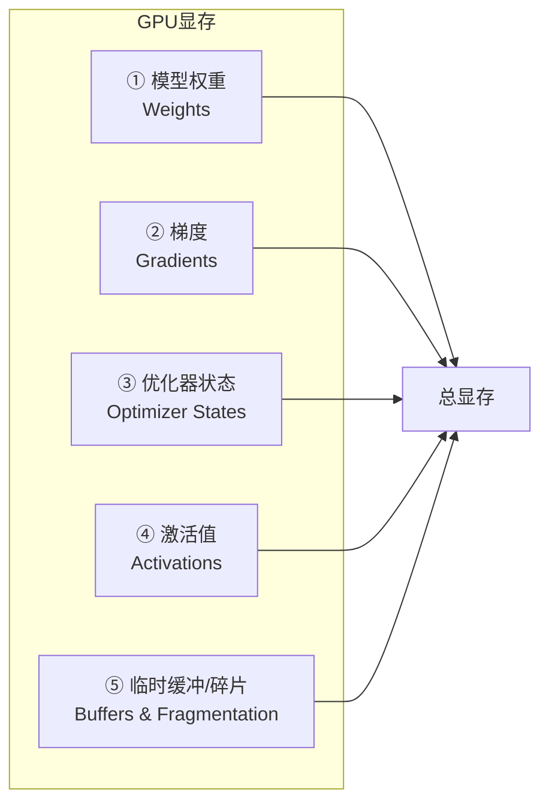
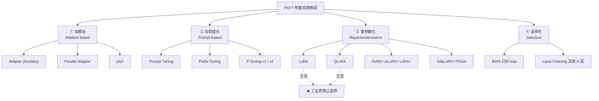
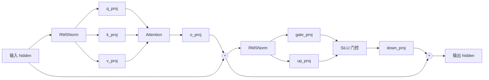
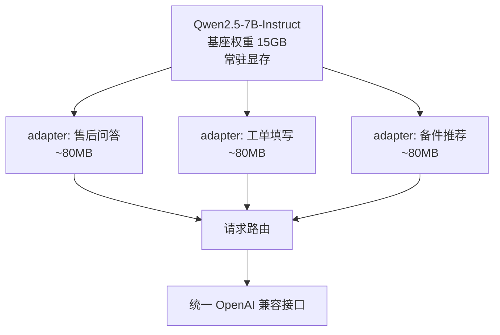
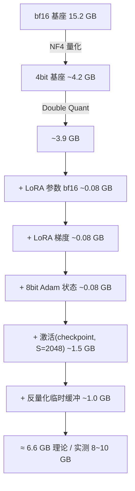
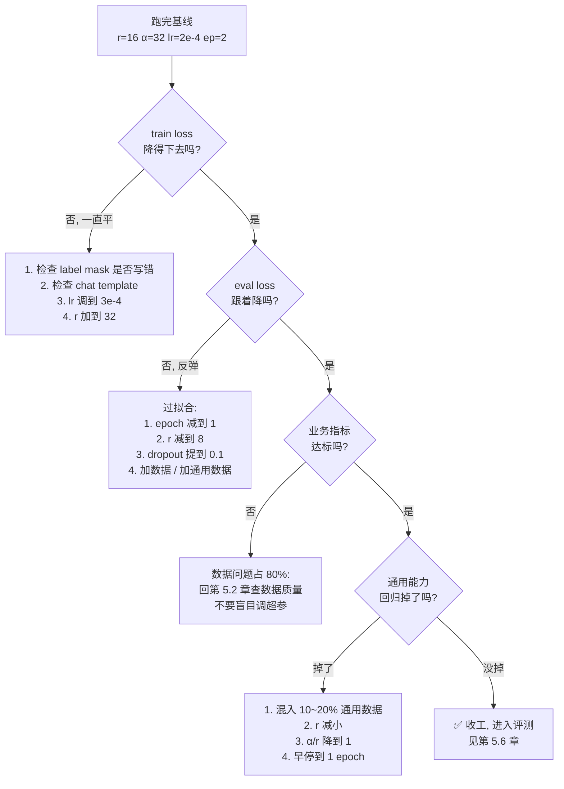
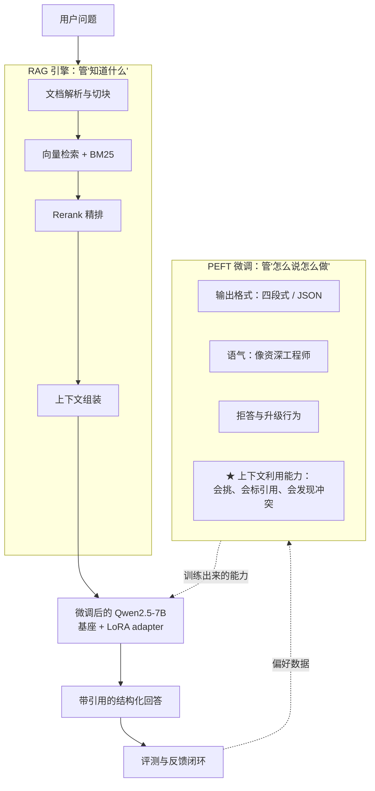
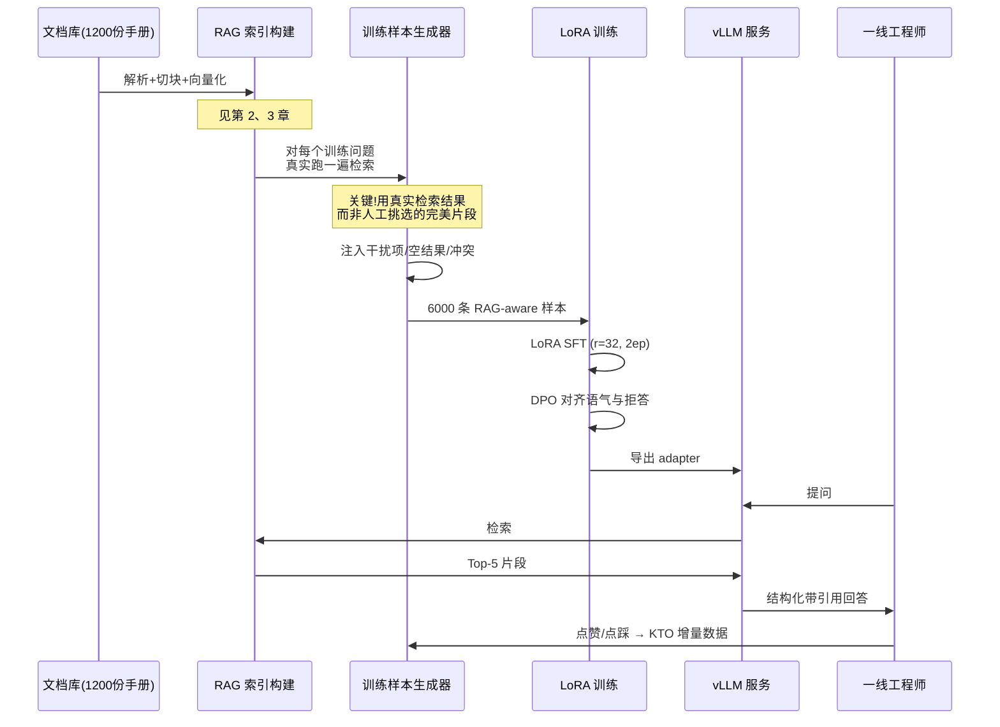
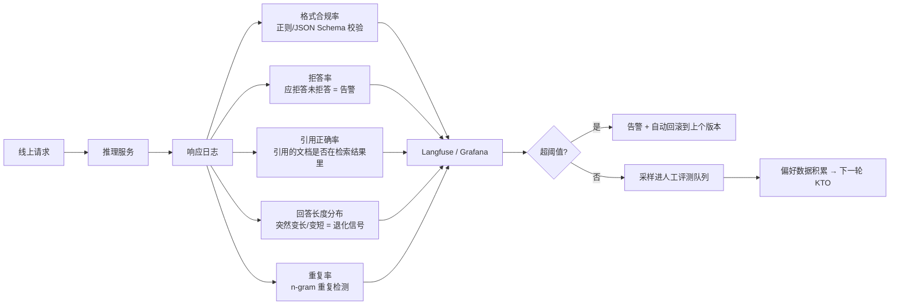

# 第 5.1 章  微调原理与 PEFT 家族全解

> **本章目标**：读完能做到 …
> 1. 用一张诊断表判断「当前这个业务问题到底该上 RAG、改 Prompt、还是真去微调」，并说出判断依据；
> 2. 手工推导 7B 模型全量微调的显存账（权重 + 梯度 + 优化器状态 + 激活），解释为什么 24G 单卡跑不动；
> 3. 讲清 LoRA 的低秩分解公式 $W' = W + \frac{\alpha}{r}BA$ 每一项的含义，并独立决定 `r` / `alpha` / `target_modules` 怎么取；
> 4. 说明 QLoRA 的 NF4 量化、双重量化、Paged Optimizer 各自省了哪部分显存，以及代价是什么；
> 5. 写出 SFT 训练中「只对 response 算 loss」的 label mask 代码，并解释不做 mask 会学歪成什么样；
> 6. 设计一套「RAG + PEFT」组合的训练数据构造方案，让模型学会「怎么用检索到的资料回答」。
>
> **前置知识**：
> - [第 1.2 章 主流大模型全景与选型](../01-大模型基础与技术选型/02-模型全景图与选型方法论.md)（知道 Qwen2.5 / DeepSeek 系列的差异）
> - [第 2.1 章 RAG 是什么与最小可运行系统](../02-RAG基础篇/01-RAG原理与整体架构.md)（知道 RAG 能解决什么）
> - [第 3.5 章 准确率优化：从 70 到 95 的工程路径](../03-RAG进阶与性能优化/05-准确率优化-从70到95的工程路径.md)（知道怎么量化「效果变好了」）
> - Python 3.11、PyTorch 基础（张量、反向传播、优化器概念）
>
> **预计用时**：阅读 75 分钟 / 动手 40 分钟

---

## 一、为什么需要它（问题出发）

### 1.1 先泼一盆冷水

我先把结论放在最前面，省得你读完三万字才发现不该做：

> **在企业落地场景里，大约 90% 的「我们要微调一个自己的大模型」的需求，用 RAG + Prompt 工程就能解决，而且更快、更便宜、更好维护。**

这个「90%」不是实验数据，是笔者和多个甲方项目组复盘后的**经验判断**，不同行业会有出入。但它背后的逻辑是硬的：

- 微调解决的是**「模型不会做」**的问题（能力、格式、语气、术语理解）；
- RAG 解决的是**「模型不知道」**的问题（知识、事实、最新数据）；
- 而企业里 90% 的抱怨，翻译过来都是「它不知道我们公司的东西」——这是知识问题，不是能力问题。

我见过最典型的一次翻车：某制造业客户花了两个月、烧了几万块卡时，用两千条工单微调了一个 7B 模型，上线后发现——

1. 新出的 XJ-300 系列设备的报错码，模型压根不知道（**知识更新问题，微调治不了**）；
2. 老设备的参数被模型「记串了」，XJ-200 的扭矩限值说成了 XJ-150 的（**幻觉问题，微调反而加剧了**）；
3. 客服问「这个答案出自哪份手册」，模型编了一个不存在的文档编号（**溯源问题，微调天然没有引用能力**）。

最后他们把微调模型下线，回到 RAG，两周后指标就超过了微调版本。

**但这不代表微调没用。** 同一个项目，半年后他们用 300 条数据做了一次 LoRA 微调，只为了解决一件事：让模型回答时严格输出「故障判断 → 排查步骤 → 需要的备件 → 是否在保」这个四段式结构，并且在信息不足时说「请补充设备型号和报错码」而不是硬编。这次微调成了，因为它解决的是**格式与行为**问题，正好是微调的主场。

所以本章的态度是：**先教你怎么判断该不该微调，再教你怎么微调。**

### 1.2 本书的统一案例：华成机电

全书用同一个业务场景（后面每一章都会回到它）：

> **华成机电**，一家做工业电机与减速机的制造企业，有 400+ 人的售后服务团队，覆盖全国 20 个服务区。
> 沉淀的资料包括：
> - 设备手册 PDF 约 1200 份（XJ-100 / XJ-150 / XJ-200 / XJ-300 四个主力系列）；
> - 历史工单 CRM 导出 CSV 约 38 万条（2019~2025）；
> - 售后微信/电话转写记录约 12 万段；
> - 备件目录、保修政策、价格表（Excel，季度更新）。
>
> 现在要做两件事：
> 1. **售后知识库问答**：一线工程师问「XJ-200 报 E043 怎么处理」，系统给出可执行答案；
> 2. **工单智能助手**：自动填写工单字段、判断保修、推荐备件、必要时升级人工。

### 1.3 症状 → 该用什么：诊断表

这是本章最该被打印出来贴墙上的一张表。

| # | 症状（业务同事会怎么描述） | 真实根因 | 该用什么 | 为什么不用微调 |
|---|---|---|---|---|
| 1 | 「它不知道我们 XJ-300 的报错码表」 | 知识缺失 | **RAG** | 知识每季度更新，微调一次的知识第二天就过期 |
| 2 | 「手册改版了，它还在说旧参数」 | 知识陈旧 | **RAG**（重建索引即可） | 微调等于把旧知识焊死在权重里 |
| 3 | 「回答没有出处，客户不敢信」 | 缺可溯源引用 | **RAG** | 微调模型无法给出真实文档引用，只会编 |
| 4 | 「它答得对，但格式乱，工单系统解析不了」 | 输出结构不稳定 | **结构化输出 / Prompt**，仍不稳再 **微调** | 先试 JSON Schema 约束，成本 0 |
| 5 | 「口气太像客服机器人，不像我们老师傅」 | 语气 / 风格不对 | **微调（SFT）** | 风格是模型的行为模式，Prompt 能带一点，但不稳定 |
| 6 | 「它把『轴承游隙』理解成了『轴承间隙大小』，差之毫厘」 | 领域术语理解偏差 | **微调 Embedding**（检索侧）+ 必要时微调 LLM | 术语偏差常常先发生在**检索**阶段，先修检索 |
| 7 | 「同样的问题，检索到的资料明明有答案，它却答非所问」 | 不会用上下文 | **微调（RAG-aware SFT）** | 这正是「RAG + PEFT」组合的主场 |
| 8 | 「不该答的它也答，比如问竞品报价」 | 拒答行为缺失 | **微调（SFT + DPO）** | 系统提示能压一部分，但对抗性问法会绕过 |
| 9 | 「复杂故障要多步推理，它推不下来」 | 推理能力不足 | **换更大/更强的模型**，或上 Agent 拆解 | 微调很难凭空造出推理能力 |
| 10 | 「响应太慢」 | 工程问题 | **量化 / vLLM / 缓存** | 与微调无关 |
| 11 | 「问它天气它也答，跑题」 | 缺少路由 | **意图分类 + 路由** | 见第 6 章 Agent |
| 12 | 「多轮对话记不住上文」 | 会话管理 | **记忆模块 / 上下文管理** | 见第 6.4 章 |

把这张表用一句话压缩：

```mermaid
flowchart TD
    A[业务抱怨] --> B{是"不知道"<br/>还是"不会做"?}
    B -->|不知道: 事实/知识/最新数据| C[RAG]
    B -->|不会做| D{是格式问题吗?}
    D -->|是| E[结构化输出 / Prompt<br/>仍不稳 → 小规模 SFT]
    D -->|否| F{是风格/语气/<br/>拒答行为吗?}
    F -->|是| G[SFT + 偏好对齐 DPO]
    F -->|否| H{是术语理解<br/>导致检索不准吗?}
    H -->|是| I[微调 Embedding / Reranker]
    H -->|否| J{是推理能力<br/>不够吗?}
    J -->|是| K[换模型 / Agent 拆解<br/>不要微调]
    J -->|否| L[回去重新定义问题<br/>大概率是工程问题]
    C --> M{RAG 上下文给了<br/>但模型不会用?}
    M -->|是| N[RAG-aware SFT<br/>本书的 RAG+PEFT 组合]
    M -->|否| O[到此为止, 别微调]
```

### 1.4 微调的四种「正当理由」

经过上面的筛子，真正值得微调的场景只剩下四类：

| 类型 | 华成机电对应的具体需求 | 典型数据量 | 首选方法 |
|---|---|---|---|
| **格式对齐** | 强制四段式回答 + JSON 工单字段 | 300 ~ 1000 条 | LoRA SFT，r 小（8~16），1~2 epoch |
| **风格/语气对齐** | 像资深售后工程师说话，不啰嗦、不道歉三连 | 1000 ~ 3000 条 | LoRA SFT + 少量 DPO |
| **行为对齐（拒答/升级）** | 越权问题拒答、信息不足时追问、危险操作强制提示 | 500 ~ 1500 条偏好对 | DPO / KTO / ORPO |
| **RAG 上下文利用能力** | 给了 5 段检索片段，学会挑对的、标引用、发现冲突 | 2000 ~ 8000 条 | LoRA SFT（样本里带检索片段） |

注意这四类**没有一类是「教模型记住知识」**。请记住这句话：

> **微调是教模型「怎么说话、怎么办事」，不是教它「记住事实」。事实交给 RAG。**

---

## 二、原理拆解

### 2.1 全量微调的代价：一笔必须自己算一遍的显存账

很多人对「全量微调 7B 需要多少显存」只有模糊印象。我们把它拆开算。

#### 2.1.1 四块显存去哪了

训练时的显存主要由四部分构成：



设模型参数量为 $P$（单位：个），采用混合精度训练（bf16 计算 + fp32 主权重，这是 `transformers` 默认 AdamW 的典型形态）：

$$
M_{\text{weights}} = 2P \ (\text{bf16 副本}) + 4P \ (\text{fp32 主权重，若启用})
$$

$$
M_{\text{grads}} = 2P \ (\text{bf16}) \quad \text{或} \quad 4P \ (\text{fp32 累积})
$$

AdamW 需要一阶动量 $m$ 与二阶动量 $v$，都是 fp32：

$$
M_{\text{optim}} = 4P\ (m) + 4P\ (v) = 8P
$$

把主流实现（fp32 主权重 + fp32 Adam 状态 + bf16 计算副本）加总：

$$
M_{\text{static}} = \underbrace{4P}_{\text{fp32 主权重}} + \underbrace{2P}_{\text{bf16 副本}} + \underbrace{4P}_{\text{fp32 梯度}} + \underbrace{8P}_{\text{Adam } m,v} = 18P \ \text{字节}
$$

#### 2.1.2 代入 Qwen2.5-7B

$P \approx 7.6 \times 10^9$（Qwen2.5-7B 实际约 76.2 亿参数）：

$$
M_{\text{static}} = 18 \times 7.6 \times 10^9 \ \text{B} = 136.8\ \text{GB} \approx 127\ \text{GiB}
$$

**还没算激活值。** 激活值的量级粗估公式（Transformer decoder，启用 bf16）：

$$
M_{\text{act}} \approx L \times B \times S \times H \times (k_1 + k_2 \cdot \frac{S}{H}) \times 2\ \text{字节}
$$

其中 $L$ 层数、$B$ batch、$S$ 序列长度、$H$ 隐藏维度，$k_1$ 约 10~20（取决于实现是否融合算子），带 $S/H$ 的那项是注意力矩阵（用 FlashAttention 后这项基本消失）。

对 Qwen2.5-7B（$L=28$、$H=3584$），$B=1$、$S=2048$、启用 FlashAttention-2、不开梯度检查点：

$$
M_{\text{act}} \approx 28 \times 1 \times 2048 \times 3584 \times 16 \times 2 \ \text{B} \approx 6.6\ \text{GB}
$$

开启梯度检查点（gradient checkpointing）后，激活显存近似降为 $O(\sqrt{L})$ 量级，实测能降到 1~2 GB，代价是**重算前向，训练速度掉 20%~35%**（实测环境：单卡 A100-40G，Qwen2.5-7B，S=2048；不同实现差异较大）。

#### 2.1.3 结论表

| 方案 | 权重 | 梯度 | 优化器 | 激活(S=2048,B=1) | 合计（约） | 24G 卡 | 40G 卡 | 80G 卡 |
|---|---|---|---|---|---|---|---|---|
| 全量微调 7B（AdamW fp32 状态） | 6GB(bf16)+30GB(fp32) | 30GB | 60GB | 6.6GB | **~133GB** | ❌ | ❌ | ❌（需多卡） |
| 全量微调 7B + ZeRO-3（8 卡） | 分片 | 分片 | 分片 | 6.6GB | **~23GB/卡** | ⚠️ 勉强 | ✅ | ✅ |
| 全量微调 7B + 8bit optimizer + checkpoint | 36GB | 15GB | 15GB | ~1.5GB | **~68GB** | ❌ | ❌ | ✅ |
| **LoRA 7B**（bf16 基座冻结，r=16） | 15GB | ~0.04GB | ~0.16GB | ~6.6GB | **~22GB** | ⚠️ 勉强 | ✅ | ✅ |
| **LoRA 7B + gradient checkpointing** | 15GB | ~0.04GB | ~0.16GB | ~1.5GB | **~17GB** | ✅ | ✅ | ✅ |
| **QLoRA 7B**（NF4 基座，r=16，checkpoint） | ~4.5GB | ~0.04GB | ~0.16GB | ~1.5GB | **~8GB** | ✅ 轻松 | ✅ | ✅ |

> 注：上表为**估算值**，实测会因 kernel 实现、`max_seq_length`、batch、是否 packing 而波动 ±20%。真实测算脚本见 [第 5.3 章](./03-LoRA-QLoRA实战.md)。

**关键洞察**：LoRA 省的主要不是权重显存（基座还是要加载），而是**梯度 + 优化器状态**这两块。全量微调里它们占了 $14P/18P \approx 78\%$，LoRA 把可训练参数从 76 亿降到几千万，这 78% 直接归零。

#### 2.1.4 灾难性遗忘（Catastrophic Forgetting）

除了显存，全量微调还有一个更隐蔽的代价：

> **模型在学会你的新任务的同时，会忘掉预训练学到的通用能力。**

机理是：全量微调会更新全部权重，而预训练知识分布式地编码在这些权重里。当你用 2000 条售后工单反复训练 3 个 epoch，模型的权重会被这 2000 条样本的分布强烈牵引，原本编码「数学推理」「代码生成」「多语言」的方向被覆盖。

真实观测到的典型症状（实测环境：Qwen2.5-7B-Instruct，2400 条单领域工单数据，全量微调 3 epoch，lr=2e-5）：

| 能力维度 | 微调前 | 微调后 | 说明 |
|---|---|---|---|
| 售后工单四段式格式合规 | 低 | 显著提升 | 目标达成 |
| 通用中文常识问答（CMMLU 子集） | 基线 | **明显下降** | 灾难性遗忘 |
| 代码生成（HumanEval 子集） | 基线 | **大幅下降** | 完全没有这类训练数据 |
| 多轮指令跟随 | 基线 | 下降 | 训练数据多为单轮 |
| 「你是谁」类身份问题 | 正常回答 | 变成「我是华成机电售后助手」 | 这个可能是你想要的 |

> 上表为定性描述。**本书统一约定：不裸写精确百分比**，所有效果数字必须标注实测环境与基线，见第 8 模块《评测体系》。

**LoRA 为什么遗忘更轻？** 因为基座权重 $W$ 被完全冻结，只有旁路的 $\Delta W = \frac{\alpha}{r}BA$ 在变，且 $\Delta W$ 的秩被限制在 $r$（通常 8~64，远小于 $\min(d, k)$）。这相当于给模型的「改动预算」上了一个硬约束。**但不代表不会遗忘**——r 取到 128、alpha 取到 256、训 5 个 epoch，一样会忘。

### 2.2 PEFT 家族地图

PEFT（Parameter-Efficient Fine-Tuning，参数高效微调）的核心思想只有一句：

> **冻结大部分预训练权重，只训练很少量的新增或选中的参数。**

按「参数加在哪」分三大流派：



下面逐个拆。

### 2.3 Adapter：最早的 PEFT

**原理**：在 Transformer 每个子层（Attention 之后、FFN 之后）插入一个小的瓶颈网络（bottleneck）：

$$
h \leftarrow h + f_{\text{up}}\big(\sigma(f_{\text{down}}(h))\big)
$$

其中 $f_{\text{down}}: \mathbb{R}^{d} \to \mathbb{R}^{m}$，$f_{\text{up}}: \mathbb{R}^{m} \to \mathbb{R}^{d}$，$m \ll d$（比如 $d=3584, m=64$），$\sigma$ 是非线性激活（GeLU）。残差连接保证初始化时 adapter 近似恒等映射（$f_{\text{up}}$ 初始化为 0）。

**参数量**：每层每个插入点 $2dm + m + d$，28 层 × 2 个插入点 × ($2\times3584\times64$) ≈ 2570 万参数，约占 7B 的 0.34%。

**适用场景**：
- 需要**多任务共存**且任务差异大时（每个任务一套 adapter，切换只换 adapter）；
- 编码器模型（BERT 类）上效果稳定。

**致命缺点**：**无法合并回基座**。Adapter 是串行插入的新模块，推理时必须多走一次前向，实测在 batch 较小时会带来 **10%~25% 的额外延迟**（实测环境：A100-40G，7B，batch=1，S=512）。这在高并发服务里是不可接受的。这也是 LoRA 后来居上的根本原因。

### 2.4 Prompt-based 家族：Prompt Tuning / Prefix-Tuning / P-Tuning v2

这一族的思路是：**不动模型，只在输入端加可训练的「软提示」向量。**

#### 2.4.1 Prompt Tuning

在输入 embedding 前拼接 $p$ 个可训练向量 $P \in \mathbb{R}^{p \times d}$：

$$
X' = [\underbrace{P_1, P_2, \dots, P_p}_{\text{可训练}}; \underbrace{E(x_1), \dots, E(x_n)}_{\text{冻结的词嵌入}}]
$$

参数量极小：$p \times d$，$p=20, d=3584$ 时只有 7 万参数。

**问题**：
- 只在输入层加，信号传到深层已经很弱，**小模型（<10B）上效果明显差**；
- 对初始化极敏感，训练不稳定；
- 占用宝贵的上下文长度。

#### 2.4.2 Prefix-Tuning

改进点：不是在输入 embedding 加，而是在**每一层的 Attention 的 Key 和 Value 前面**拼接可训练前缀：

$$
\text{head}_i = \text{Attn}\big(xW_q^{(i)},\ [P_k^{(i)}; xW_k^{(i)}],\ [P_v^{(i)}; xW_v^{(i)}]\big)
$$

每层都有独立的 $P_k, P_v$，信号能直接作用到深层。参数量：$2 \times L \times p \times d$，$L=28, p=20, d=3584$ 时约 400 万。

实践中直接优化 $P$ 不稳定，论文用一个 MLP 重参数化：$P = \text{MLP}(P')$，训练完丢掉 MLP。

#### 2.4.3 P-Tuning v2

本质是 Prefix-Tuning 在 NLU 任务上的工程化版本，去掉了重参数化 MLP，加了多任务预训练和分类头。**在中文社区曾经因为 ChatGLM 的官方微调脚本用它而广为人知。**

#### 2.4.4 这一族的现状评价

| 维度 | 评价 |
|---|---|
| 参数量 | 最小（万到百万级） |
| 显存 | 最省 |
| 效果 | **在 7B 量级的生成任务上普遍弱于 LoRA** |
| 可合并 | ❌ 不能合并（推理时必须带着前缀走） |
| 上下文占用 | ⚠️ 占用 KV cache，长上下文场景雪上加霜 |
| 训练稳定性 | 差，对 lr 和初始化敏感 |
| **建议** | **2025 年之后的新项目不建议作为首选**；除非显存极端受限（<8G）或做研究对照 |

> 一句话：了解即可，动手选 LoRA。

### 2.5 LoRA：本章的主角

#### 2.5.1 核心假设：内在维度（Intrinsic Dimension）

LoRA 的理论基础来自 Aghajanyan 等人 2020 年的观察：

> **预训练模型在下游任务上的适配，其权重更新 $\Delta W$ 具有很低的「内在秩」（intrinsic rank）。**

直觉解释：预训练已经把语言的通用结构学好了，下游适配只是在这个高维空间里做一个**低维方向上的微调**——就像一台已经调好的精密仪器，你只需要拧几个旋钮，而不是重新造一台。

#### 2.5.2 公式详解

设原始线性层权重 $W_0 \in \mathbb{R}^{d \times k}$，全量微调会学一个 $\Delta W \in \mathbb{R}^{d \times k}$：

$$
h = W_0 x + \Delta W x
$$

LoRA 假设 $\text{rank}(\Delta W) = r \ll \min(d,k)$，于是把它分解成两个小矩阵：

$$
\Delta W = B A, \quad B \in \mathbb{R}^{d \times r},\ A \in \mathbb{R}^{r \times k}
$$

加上缩放系数后，**完整的 LoRA 公式**是：

$$
\boxed{\ h = W_0 x + \frac{\alpha}{r} \cdot B A x \quad \Longleftrightarrow \quad W' = W_0 + \frac{\alpha}{r} BA\ }
$$

逐项解释：

| 符号 | 含义 | 实践要点 |
|---|---|---|
| $W_0$ | 预训练权重，**训练中完全冻结** | 不产生梯度，不需要优化器状态 |
| $A \in \mathbb{R}^{r \times k}$ | 降维矩阵 | 初始化为 $\mathcal{N}(0, \sigma^2)$（Kaiming 均匀分布） |
| $B \in \mathbb{R}^{d \times r}$ | 升维矩阵 | **初始化为全 0**，保证训练开始时 $\Delta W = 0$，模型行为与基座完全一致 |
| $r$ | 秩，LoRA 的「容量旋钮」 | 8 / 16 / 32 / 64，见下文选型 |
| $\alpha$ | 缩放系数 | 与 $r$ 配对，控制 $\Delta W$ 的实际强度 |
| $\frac{\alpha}{r}$ | 有效学习强度 | **这才是真正起作用的量**，见下文 |

**参数量对比**（以 Qwen2.5-7B 的 `q_proj` 为例，$d=3584, k=3584$）：

$$
\text{全量} = 3584 \times 3584 = 12{,}845{,}056
$$
$$
\text{LoRA}(r{=}16) = 3584 \times 16 + 16 \times 3584 = 114{,}688
$$

**压缩比约 112 倍**。

#### 2.5.3 为什么 $B$ 必须初始化为 0？

如果 $A$ 和 $B$ 都随机初始化，训练开始瞬间 $\Delta W \ne 0$，模型输出会被一个随机扰动打乱，相当于给一个已经收敛的模型注入噪声，loss 会先飙高再慢慢降——白白浪费步数，还可能破坏预训练表示。

如果 $A$ 和 $B$ 都初始化为 0，梯度会恒为 0（$\frac{\partial L}{\partial A} \propto B^T = 0$，$\frac{\partial L}{\partial B} \propto A^T = 0$），**永远学不动**。

所以必须一个随机、一个零。`peft` 库默认 $A$ 随机、$B$ 全零。

#### 2.5.4 $\alpha$ 和 $r$ 到底怎么选

这是被问烂了的问题，我们把它讲透。

**第一条规律：真正起作用的是 $\frac{\alpha}{r}$，不是 $\alpha$ 本身。**

所以 $(r{=}8, \alpha{=}16)$ 和 $(r{=}32, \alpha{=}64)$ 的「强度」相同（都是 2），差别在**容量**：后者能表达更复杂的 $\Delta W$。

**第二条规律：$r$ 决定容量上限，$\frac{\alpha}{r}$ 决定收敛速度与激进程度。**

| $\alpha/r$ | 行为 | 适用 |
|---|---|---|
| 0.5 | 极保守，几乎不动基座 | 只想微调一点点语气 |
| **1.0** | 保守稳健 | 数据量少（<500 条）、怕遗忘 |
| **2.0** | **社区默认最优区间** | 绝大多数 SFT 任务的起点 |
| 4.0 | 激进 | 数据多、任务与基座差异大 |
| >4.0 | 容易过拟合 + 遗忘 | 不建议 |

**第三条规律：$r$ 的选择跟「任务与基座的距离」成正比，跟「数据量」成正比。**

| 任务类型 | 数据量 | 推荐 $r$ | 推荐 $\alpha$ | 备注 |
|---|---|---|---|---|
| 纯格式对齐（四段式输出） | 300~800 | **8** | 16 | r 大了会顺便学走别的东西 |
| 语气/风格对齐 | 1000~3000 | **16** | 32 | 最常用的起点 |
| 领域问答 + RAG 上下文利用 | 3000~10000 | **32** | 64 | 需要更多容量 |
| 领域能力大幅迁移（如医学、法律术语） | 10000+ | **64** | 128 | 接近全量微调效果 |
| 跨语言 / 新模态适配 | 50000+ | 128+ | 256 | 这时该考虑全量或继续预训练了 |

**实操建议**：先用 `r=16, alpha=32` 跑一遍基线，看验证 loss 和业务指标。
- 如果**欠拟合**（train loss 降不下去，业务指标也不行）→ 加大 r 到 32/64；
- 如果**过拟合**（train loss 一路下降，eval loss 反弹）→ 减小 r，加 dropout，减 epoch；
- 如果**通用能力掉了**→ 减小 r 和 $\alpha/r$，混入通用数据。

#### 2.5.5 target_modules：加在哪些层上

这是比 $r$ 更影响效果的参数，但讨论得少得多。

Qwen2.5 / LLaMA 系列的 Transformer 层结构：



七个可挂 LoRA 的线性层，各自的角色与实测经验：

| 模块 | 形状（7B） | 角色 | 挂 LoRA 的收益 | 优先级 |
|---|---|---|---|---|
| `q_proj` | 3584×3584 | 查询投影，决定「关注什么」 | 高，影响注意力模式 | ★★★★★ |
| `k_proj` | 3584×512 (GQA) | 键投影 | 中，GQA 下参数少 | ★★★☆☆ |
| `v_proj` | 3584×512 (GQA) | 值投影，决定「取什么信息」 | **高**，原论文只挂 q,v | ★★★★★ |
| `o_proj` | 3584×3584 | 注意力输出融合 | 中高 | ★★★★☆ |
| `gate_proj` | 3584×18944 | FFN 门控 | **高**，FFN 是知识存储主体 | ★★★★☆ |
| `up_proj` | 3584×18944 | FFN 升维 | 高 | ★★★★☆ |
| `down_proj` | 18944×3584 | FFN 降维 | 高 | ★★★★☆ |

**三套实战配置**：

```python
# 配置 A：轻量版（原 LoRA 论文方案）—— 只改注意力的"看什么"
TARGET_LIGHT = ["q_proj", "v_proj"]
# 可训练参数 ~ 0.05% (r=16)，训练最快，适合纯格式对齐

# 配置 B：全注意力版 —— 改整个注意力行为
TARGET_ATTN = ["q_proj", "k_proj", "v_proj", "o_proj"]
# 可训练参数 ~ 0.12% (r=16)，适合风格/语气对齐

# 配置 C：全线性层版（社区默认最优）—— 注意力 + FFN 全上
TARGET_ALL = ["q_proj", "k_proj", "v_proj", "o_proj",
              "gate_proj", "up_proj", "down_proj"]
# 可训练参数 ~ 0.55% (r=16)，效果最好，显存/时间开销最大
```

**实测经验（实测环境：Qwen2.5-7B-Instruct + 华成机电 3200 条工单 SFT，r=16，2 epoch，A100-40G）**：

| 配置 | 可训练参数 | 单 epoch 耗时 | 峰值显存 | 业务格式合规 | 通用能力回归 |
|---|---|---|---|---|---|
| A（q,v） | ~1000 万 | 基线 | 基线 | 良好 | 几乎无退化 |
| B（全注意力） | ~2000 万 | 基线 ×1.1 | 基线 +0.5G | 良好+ | 轻微退化 |
| **C（全线性层）** | ~4000 万 | 基线 ×1.35 | 基线 +2.1G | **最好** | 轻微退化 |

> 上述为定性排序，具体数值随数据分布变化。**结论：默认用配置 C；只有在显存极紧或任务极简单时退到 A。**

**一个坑**：不要把 `lm_head` 和 `embed_tokens` 加进 `target_modules`，除非你扩了词表。它们参数量巨大（3584×152064 ≈ 5.4 亿），挂 LoRA 会让「参数高效」失去意义，还容易训崩。如果确实扩了词表（比如加了华成机电的专有型号 token），正确做法是用 `modules_to_save=["embed_tokens", "lm_head"]` 让它们全量训练并保存。

#### 2.5.6 LoRA 的杀手锏：可合并、可热插拔

因为 $\Delta W = \frac{\alpha}{r}BA$ 与 $W_0$ 形状相同，推理前可以直接相加：

$$
W_{\text{merged}} = W_0 + \frac{\alpha}{r}BA
$$

合并后**推理延迟与基座完全一致，零额外开销**。这是 Adapter / Prefix-Tuning 做不到的。

同时，不合并的话可以在运行时挂载多个 adapter（vLLM 的 `--enable-lora`），实现「一个基座服务多个业务线」：



三个业务线共用 15GB 基座，各自只加 80MB。详见 [第 5.5 章](./05-模型合并量化与部署.md)。

### 2.6 QLoRA：让 24G 消费卡能训 7B

QLoRA（Dettmers et al., 2023）= **4bit 量化基座 + LoRA**，三项关键技术：

#### 2.6.1 NF4（4-bit NormalFloat）量化

普通 INT4 量化把数值均匀分成 16 档。但神经网络权重近似服从正态分布 $\mathcal{N}(0, \sigma^2)$，均匀分档在中间密集区太粗、在尾部太细，浪费码字。

NF4 的做法：让 16 个量化码字在**标准正态分布的分位点**上，使得每个码字覆盖等概率质量。具体地，码字 $q_i$ 定义为：

$$
q_i = \frac{1}{2}\left( Q_X\left(\frac{i}{17}\right) + Q_X\left(\frac{i+1}{17}\right) \right), \quad i = 1,\dots,16
$$

其中 $Q_X$ 是标准正态分布的分位数函数。再把码字归一化到 $[-1, 1]$。

量化时先按 block（默认 64 个权重一组）算 absmax 缩放因子 $s = \max(|w|)$，然后 $w_{\text{quant}} = \text{round}_{\text{NF4}}(w / s)$。反量化 $\hat{w} = q_{w_{\text{quant}}} \cdot s$。

**效果**：同样 4 bit，NF4 的量化误差显著小于 INT4，在语言建模困惑度上接近 bf16（论文数据；本书不复述具体数字，请以官方论文为准）。

#### 2.6.2 Double Quantization（双重量化）

问题：block size = 64 意味着每 64 个权重要存一个 fp32 的缩放因子，平均每个权重多花 $32/64 = 0.5$ bit。7B 模型就是 **~475MB** 的额外开销。

解法：**把缩放因子本身也量化**。用 8bit 量化缩放因子，每 256 个缩放因子再共享一个 fp32 的二级缩放因子。

平均额外开销从 0.5 bit 降到：

$$
\frac{8}{64} + \frac{32}{64 \times 256} = 0.125 + 0.002 = 0.127\ \text{bit/参数}
$$

**7B 模型省下约 330MB。** 听起来不多，但在 24G 卡上这就是能不能多开 512 token 上下文的区别。

#### 2.6.3 Paged Optimizer（分页优化器）

利用 NVIDIA Unified Memory，把优化器状态在显存不足时**自动分页换出到 CPU 内存**，显存充足时再换回。

这解决的是「训练 99% 时间显存够用，但遇到一个超长样本瞬间 OOM」的问题——传统方案是直接崩，Paged Optimizer 让它降速但不崩。

对应配置就是 `optim="paged_adamw_8bit"` 或 `paged_adamw_32bit`。

#### 2.6.4 QLoRA 的显存账



#### 2.6.5 QLoRA 的代价（必须知道）

| 代价 | 说明 | 缓解 |
|---|---|---|
| **速度慢** | 每次前向都要把 NF4 反量化成 bf16 再算矩阵乘，实测比 bf16 LoRA 慢 **30%~50%**（实测环境：A100-40G，7B，S=2048） | 显存够就用 bf16 LoRA |
| **精度有损失** | 基座被量化，LoRA 是在「量化后的模型」上学的 | 大多数 SFT 任务上差异很小；追极致效果用 bf16 |
| **合并要小心** | 不能直接把 LoRA 合进 NF4 权重，必须先用 bf16 加载基座再合并 | 见 [第 5.5 章](./05-模型合并量化与部署.md) |
| **不是所有层都量化** | `lm_head`、LayerNorm 通常保持高精度 | 由库自动处理 |

### 2.7 LoRA 的变体们

#### 2.7.1 rsLoRA（Rank-Stabilized LoRA）

**问题**：原始 LoRA 的缩放因子是 $\frac{\alpha}{r}$。当 $r$ 增大时，$BA$ 的输出方差会增大（因为求和项变多），而 $\frac{\alpha}{r}$ 的衰减速度是 $O(1/r)$，导致**大 r 时梯度被过度压缩，训练变慢甚至学不动**。这解释了「为什么很多人发现 r=64 还不如 r=16」。

**改进**：把缩放因子改为 $\frac{\alpha}{\sqrt{r}}$：

$$
h = W_0 x + \frac{\alpha}{\sqrt{r}} BA x
$$

**效果**：大 $r$（≥64）时训练更稳定、收敛更好。`peft` 中开启方式：`use_rslora=True`。

**建议**：**r ≥ 32 时建议开启**；r=8/16 时开不开差别不大。

#### 2.7.2 LoRA+

**问题**：$A$ 和 $B$ 的「角色」不对称——$B$ 初始化为 0，$A$ 随机初始化。理论分析表明用同一个学习率训练它们是次优的。

**改进**：给 $B$ 用更大的学习率：

$$
\eta_B = \lambda \cdot \eta_A, \quad \lambda \in [4, 16]
$$

`peft` 中：`loraplus_lr_ratio=16`（需配合 `LoraPlusConfig` 或 `trl` 的支持，具体 API 以官方文档为准）。

**效果**：收敛更快，相同步数下效果略好。属于「开了不亏」的优化。

#### 2.7.3 DoRA（Weight-Decomposed Low-Rank Adaptation）

**洞察**：把权重分解为**幅值（magnitude）**和**方向（direction）**两部分：

$$
W = m \cdot \frac{V}{\|V\|_c}
$$

其中 $m \in \mathbb{R}^{1 \times k}$ 是每列的幅值（可训练标量向量），$V$ 是方向矩阵，$\|\cdot\|_c$ 是按列取 L2 范数。

分析全量微调发现：它同时大幅改变幅值和方向；而 LoRA 的幅值和方向变化高度耦合，表达能力受限。

**DoRA 的做法**：幅值 $m$ 单独训练（全量，参数量只有 $k$），方向部分用 LoRA：

$$
W' = \underbrace{m}_{\text{可训练}} \cdot \frac{W_0 + \frac{\alpha}{r}BA}{\left\| W_0 + \frac{\alpha}{r}BA \right\|_c}
$$

**效果**：论文报告在低秩（r=4/8）时优势明显，接近全量微调。
**代价**：训练速度慢 **20%~35%**（要算列范数），显存略增。
**可合并性**：✅ 可以合并。
`peft` 中：`use_dora=True`。

**建议**：显存/时间紧张就不用；追求小 r 下的效果就开。华成机电的格式对齐任务用 r=8 + DoRA 是个不错的组合。

#### 2.7.4 PiSSA（Principal Singular values and Singular vectors Adaptation）

**改进初始化**：不用「A 随机 + B 全零」，而是对 $W_0$ 做 SVD：

$$
W_0 = U \Sigma V^T
$$

取前 $r$ 个主成分初始化 LoRA：

$$
A = \sqrt{\Sigma_{[:r]}} V_{[:r]}^T, \quad B = U_{[:,:r]}\sqrt{\Sigma_{[:r]}}, \quad W_{\text{res}} = W_0 - BA
$$

训练时冻结残差 $W_{\text{res}}$，训练 $A, B$。

**直觉**：LoRA 训练的是「最不重要的方向」（从零开始随机探索），PiSSA 直接训练「最重要的主成分方向」，收敛更快。

**代价**：初始化时要对每个目标层做 SVD，7B 全线性层大约需要几分钟（一次性开销）。

#### 2.7.5 AdaLoRA

**思路**：不同层、不同模块需要的秩不同。AdaLoRA 用 SVD 形式参数化 $\Delta W = P \Lambda Q$，训练中根据重要性分数**动态剪枝**不重要的奇异值，把预算分配给重要的层。

**代价**：超参多（初始秩、目标秩、剪枝调度），调起来麻烦。**工程上性价比不高，了解即可。**

#### 2.7.6 变体选型一句话总结

| 变体 | 一句话 | 什么时候开 |
|---|---|---|
| **rsLoRA** | 修大 r 的缩放问题 | r ≥ 32 就开 |
| **LoRA+** | B 用更大 lr | 基本无脑开 |
| **DoRA** | 幅值方向解耦 | 小 r 追效果时开，不赶时间时开 |
| **PiSSA** | SVD 初始化 | 数据少、想快速收敛时开 |
| **AdaLoRA** | 自适应秩分配 | 研究用，生产慎用 |
| **QLoRA** | 4bit 基座 | 显存 < 32G 必开 |

### 2.8 PEFT 方法对照大表

| 方法 | 可训练参数占比 | 训练显存(7B) | 训练速度 | 效果(SFT) | 可合并 | 多任务热切换 | 推理额外延迟 | 推荐度 |
|---|---|---|---|---|---|---|---|---|
| 全量微调 | 100% | ~133GB | 1.0× | ★★★★★ | — | ❌ | 0 | 有 8×80G 才考虑 |
| Adapter | 0.3~1% | ~20GB | 0.85× | ★★★★☆ | ❌ | ✅ | +10~25% | ⭐⭐ |
| Prompt Tuning | <0.01% | ~17GB | 1.05× | ★★☆☆☆ | ❌ | ✅ | 占 KV cache | ⭐ |
| Prefix-Tuning | 0.05~0.1% | ~18GB | 1.0× | ★★★☆☆ | ❌ | ✅ | 占 KV cache | ⭐⭐ |
| P-Tuning v2 | 0.05~0.1% | ~18GB | 1.0× | ★★★☆☆ | ❌ | ✅ | 占 KV cache | ⭐⭐ |
| BitFit | ~0.08% | ~17GB | 1.05× | ★★☆☆☆ | ✅ | ❌ | 0 | ⭐ |
| **LoRA** | 0.05~0.6% | **~17GB** | **1.0×** | **★★★★☆** | ✅ | ✅ | **0（合并后）** | ⭐⭐⭐⭐⭐ |
| **QLoRA** | 0.05~0.6% | **~8GB** | 0.6× | ★★★★☆ | ✅(需反量化) | ✅ | 0（合并后） | ⭐⭐⭐⭐⭐ |
| DoRA | 0.06~0.7% | ~19GB | 0.7× | ★★★★★ | ✅ | ✅ | 0（合并后） | ⭐⭐⭐⭐ |
| rsLoRA | 同 LoRA | 同 LoRA | 1.0× | ★★★★☆ | ✅ | ✅ | 0 | ⭐⭐⭐⭐ |
| AdaLoRA | 动态 | ~18GB | 0.8× | ★★★★☆ | ✅ | ✅ | 0 | ⭐⭐ |

> 显存数字为 Qwen2.5-7B、S=2048、B=1、开梯度检查点的**估算**；训练速度以 bf16 LoRA 为 1.0× 基准。实测环境：A100-40G，CUDA 12.1，torch 2.4.0。

### 2.9 训练目标：SFT 的 loss 到底怎么算

这一节是本章**最容易被忽略、又最容易导致训练失败**的部分。

#### 2.9.1 语言模型的基本 loss

自回归语言模型的训练目标是最大化下一个 token 的对数似然：

$$
\mathcal{L} = -\frac{1}{N}\sum_{t=1}^{N} \log P_\theta(x_t \mid x_{<t})
$$

在 HuggingFace `transformers` 里，如果你传入 `labels=input_ids`，模型会自动做 shift（预测第 $t$ 个 token 时用前 $t-1$ 个），并对**所有位置**算交叉熵。

#### 2.9.2 关键：必须 mask 掉 prompt 部分

一条 SFT 样本的结构是：

```text
<|im_start|>system
你是华成机电售后助手。<|im_end|>
<|im_start|>user
XJ-200 报 E043 怎么处理？<|im_end|>
<|im_start|>assistant
【故障判断】E043 为主轴过温保护...<|im_end|>
```

如果对全部 token 算 loss，模型会同时学两件事：
1. 怎么**生成回答**（这是我们要的）；
2. 怎么**生成用户的问题和系统提示**（这是我们不要的！）

后者的危害非常具体：

| 危害 | 表现 |
|---|---|
| 模型学会自问自答 | 回答完一段后，自己又生成 `<|im_start|>user ...` 继续问 |
| 系统提示被过拟合 | 换一个系统提示，模型行为就崩 |
| loss 被稀释 | 如果 prompt 很长（比如 RAG 场景塞了 3000 token 的检索片段，回答只有 200 token），有效梯度信号只占 6%，训练效率极低 |
| 学到问题的分布而非回答的分布 | 模型倾向于复读问题 |

**特别是 RAG 场景，prompt 长 response 短，不做 mask 基本等于没训练。**

#### 2.9.3 正确做法：把 prompt 部分的 label 设为 -100

PyTorch 的 `CrossEntropyLoss` 默认 `ignore_index=-100`，被设为 -100 的位置不参与 loss 计算。

```python
"""
演示 SFT 的 label mask 构造：只对 assistant 回答部分算 loss。
这是 SFT 训练里最容易写错、也最致命的一段代码。
"""
from transformers import AutoTokenizer

MODEL_PATH = "Qwen/Qwen2.5-7B-Instruct"
IGNORE_INDEX = -100

tokenizer = AutoTokenizer.from_pretrained(MODEL_PATH, trust_remote_code=True)


def build_sft_sample(system: str, user: str, assistant: str, max_len: int = 2048):
    """构造单条 SFT 样本，返回 input_ids 与 labels（prompt 部分被 mask 为 -100）。"""
    # 第一步：只渲染到 assistant 起始标记，得到 prompt 部分
    prompt_messages = [
        {"role": "system", "content": system},
        {"role": "user", "content": user},
    ]
    prompt_text = tokenizer.apply_chat_template(
        prompt_messages,
        tokenize=False,
        add_generation_prompt=True,   # 关键：加上 <|im_start|>assistant\n
    )
    prompt_ids = tokenizer(prompt_text, add_special_tokens=False)["input_ids"]

    # 第二步：回答部分 + 结束标记
    response_text = assistant + "<|im_end|>\n"
    response_ids = tokenizer(response_text, add_special_tokens=False)["input_ids"]

    # 第三步：拼接，并把 prompt 位置的 label 置为 IGNORE_INDEX
    input_ids = prompt_ids + response_ids
    labels = [IGNORE_INDEX] * len(prompt_ids) + response_ids[:]

    # 第四步：截断（注意：优先保住回答，从 prompt 头部截）
    if len(input_ids) > max_len:
        overflow = len(input_ids) - max_len
        if overflow < len(prompt_ids):
            input_ids = input_ids[overflow:]
            labels = labels[overflow:]
        else:
            input_ids = input_ids[-max_len:]
            labels = labels[-max_len:]

    attention_mask = [1] * len(input_ids)
    return {
        "input_ids": input_ids,
        "labels": labels,
        "attention_mask": attention_mask,
    }


if __name__ == "__main__":
    sample = build_sft_sample(
        system="你是华成机电的售后技术支持助手，回答必须包含故障判断、排查步骤、所需备件、保修判定四部分。",
        user="XJ-200 减速机运行 20 分钟后报 E043，油温表显示 82 度，怎么处理？",
        assistant=(
            "【故障判断】E043 为主轴润滑油过温保护，触发阈值 80℃。\n"
            "【排查步骤】1) 停机降温至 60℃ 以下；2) 检查冷却风扇是否转动；"
            "3) 检查油位是否在 MIN-MAX 之间；4) 取油样观察是否乳化变质。\n"
            "【所需备件】若冷却风扇故障：HC-FAN-7K（风扇总成）；若油质劣化：HC-OIL-220（220# 齿轮油 4L）。\n"
            "【保修判定】需确认出厂日期，整机保修 18 个月，易损件不在保修范围。"
        ),
    )

    n = len(sample["input_ids"])
    n_masked = sum(1 for x in sample["labels"] if x == IGNORE_INDEX)
    print(f"总 token 数        : {n}")
    print(f"被 mask 的 prompt  : {n_masked}")
    print(f"参与 loss 的 token : {n - n_masked}")
    print(f"有效 loss 占比     : {(n - n_masked) / n:.1%}")
    print("-" * 60)
    print("labels 前 20 个:", sample["labels"][:20])
    print("labels 后 20 个:", sample["labels"][-20:])
    print("-" * 60)
    print("解码回 loss 部分的内容：")
    resp_ids = [x for x in sample["labels"] if x != IGNORE_INDEX]
    print(tokenizer.decode(resp_ids))
```

**预期输出**：

```text
总 token 数        : 268
被 mask 的 prompt  : 79
参与 loss 的 token : 189
有效 loss 占比     : 70.5%
------------------------------------------------------------
labels 前 20 个: [-100, -100, -100, -100, -100, -100, -100, -100, -100, -100, -100, -100, -100, -100, -100, -100, -100, -100, -100, -100]
labels 后 20 个: [1773, 33108, 99245, 107017, 18, 22, 47874, 1773, 105606, 99631, 99245, 107017, 100147, 3837, 151645, 198]
------------------------------------------------------------
解码回 loss 部分的内容：
【故障判断】E043 为主轴润滑油过温保护，触发阈值 80℃。
【排查步骤】1) 停机降温至 60℃ 以下；2) 检查冷却风扇是否转动；3) 检查油位是否在 MIN-MAX 之间；4) 取油样观察是否乳化变质。
【所需备件】若冷却风扇故障：HC-FAN-7K（风扇总成）；若油质劣化：HC-OIL-220（220# 齿轮油 4L）。
【保修判定】需确认出厂日期，整机保修 18 个月，易损件不在保修范围。<|im_end|>
```

> 具体 token 数会随 tokenizer 版本略有差异，重点看结构：前面全是 -100，后面是真实 token id。

#### 2.9.4 多轮对话怎么 mask

多轮场景下，**每一轮的 assistant 回答都要算 loss，所有 user / system 都要 mask**：

```text
system:    [MASK MASK MASK ...]
user 1:    [MASK MASK MASK ...]
assistant1:[ LOSS LOSS LOSS ...]   ← 算
user 2:    [MASK MASK MASK ...]
assistant2:[ LOSS LOSS LOSS ...]   ← 算
```

```python
"""多轮对话的 label mask：逐轮拼接，只对 assistant 段落保留 label。"""

def build_multiturn_sample(messages: list, max_len: int = 4096):
    """messages 形如 [{role, content}, ...]，返回带 mask 的 input_ids / labels。"""
    input_ids, labels = [], []

    for i, msg in enumerate(messages):
        role, content = msg["role"], msg["content"]

        if role in ("system", "user"):
            # 这一段整体 mask
            seg = tokenizer.apply_chat_template(
                [msg], tokenize=False, add_generation_prompt=False
            )
            # 最后一条 user 之后要补上 assistant 起始标记
            if role == "user" and i + 1 < len(messages) and messages[i + 1]["role"] == "assistant":
                seg += "<|im_start|>assistant\n"
            seg_ids = tokenizer(seg, add_special_tokens=False)["input_ids"]
            input_ids += seg_ids
            labels += [IGNORE_INDEX] * len(seg_ids)

        elif role == "assistant":
            # 这一段算 loss（注意 chat template 的 assistant 头已在上一步加过）
            seg = content + "<|im_end|>\n"
            seg_ids = tokenizer(seg, add_special_tokens=False)["input_ids"]
            input_ids += seg_ids
            labels += seg_ids[:]

    if len(input_ids) > max_len:
        input_ids, labels = input_ids[-max_len:], labels[-max_len:]

    return {
        "input_ids": input_ids,
        "labels": labels,
        "attention_mask": [1] * len(input_ids),
    }
```

> **自检方法**：训练前务必抽 3 条样本，把 `labels` 里非 -100 的部分 decode 出来打印。如果打印出来的东西里包含用户提问或系统提示，你的 mask 写错了。这个五分钟的检查能救你两天。

### 2.10 偏好对齐：DPO / KTO / ORPO

SFT 教模型「什么是对的回答」，偏好对齐教模型「在两个都还行的回答里，哪个更好」。

华成机电需要偏好对齐的两个具体场景：

1. **语气**：两个回答都正确，但一个啰嗦道歉三连（「非常抱歉给您带来不便，我理解您的心情…」），一个直接给排查步骤。一线工程师要的是后者。
2. **拒答**：用户问「你们 XJ-300 跟西门子的比哪个好」，A 回答「我们的更好因为…」（越权、有法律风险），B 回答「产品对比请联系销售顾问，我可以介绍 XJ-300 的技术参数」。要 B。

#### 2.10.1 从 RLHF 到 DPO

经典 RLHF 三步走：SFT → 训练奖励模型 RM → PPO 强化学习。问题是 PPO 训练不稳定、要同时加载 4 个模型（policy / ref / reward / value）、显存爆炸、超参难调。

**DPO（Direct Preference Optimization）的洞察**：可以把 RLHF 的最优解析解代回去，直接用偏好数据优化策略，**不需要显式的奖励模型**。

RLHF 的目标是：

$$
\max_{\pi_\theta}\ \mathbb{E}_{x\sim D, y\sim \pi_\theta}\big[r(x,y)\big] - \beta\, \mathbb{D}_{\text{KL}}\big[\pi_\theta(y|x)\,\|\,\pi_{\text{ref}}(y|x)\big]
$$

它的解析最优解是：

$$
\pi^*(y|x) = \frac{1}{Z(x)}\pi_{\text{ref}}(y|x)\exp\left(\frac{1}{\beta}r(x,y)\right)
$$

反解出奖励：

$$
r(x,y) = \beta \log \frac{\pi^*(y|x)}{\pi_{\text{ref}}(y|x)} + \beta \log Z(x)
$$

代入 Bradley-Terry 偏好模型 $P(y_w \succ y_l) = \sigma(r(x,y_w) - r(x,y_l))$，$Z(x)$ 抵消，得到 **DPO loss**：

$$
\boxed{\ \mathcal{L}_{\text{DPO}} = -\mathbb{E}_{(x,y_w,y_l)\sim D}\left[\log \sigma\left(\beta \log\frac{\pi_\theta(y_w|x)}{\pi_{\text{ref}}(y_w|x)} - \beta \log\frac{\pi_\theta(y_l|x)}{\pi_{\text{ref}}(y_l|x)}\right)\right]\ }
$$

直观理解：**提高 chosen 回答相对于参考模型的概率，降低 rejected 回答相对于参考模型的概率**。$\beta$ 控制偏离参考模型的程度（典型值 0.1，越大越保守）。

**数据格式**：

```json
{
  "prompt": "你们 XJ-300 和西门子同级产品比哪个好？",
  "chosen": "产品横向对比建议联系您的销售顾问获取正式资料。我可以为您介绍 XJ-300 的技术参数：额定功率 90kW，防护等级 IP55，工作温度 -20~50℃，支持 Modbus RTU 与 Profinet 双协议。",
  "rejected": "当然是我们 XJ-300 更好！西门子的产品价格贵一倍，性能还不如我们，很多客户都从西门子换到我们这边了。"
}
```

#### 2.10.2 KTO（Kahneman-Tversky Optimization）

**DPO 的痛点**：需要成对数据（同一个 prompt 的两个回答，还要标哪个好）。**这种数据很贵**——线上真实场景里，你拿到的往往是「用户点了赞」或「用户点了踩」，不成对。

**KTO 的做法**：借鉴前景理论（Prospect Theory），只需要**单个样本 + 一个二元标签（好/坏）**：

$$
\mathcal{L}_{\text{KTO}} = \mathbb{E}\big[\lambda_y - v(x, y)\big]
$$

其中 $v$ 是价值函数，对 desirable 样本用 $\sigma(\beta(\log\frac{\pi_\theta}{\pi_{\text{ref}}} - z_0))$，对 undesirable 样本用 $\sigma(\beta(z_0 - \log\frac{\pi_\theta}{\pi_{\text{ref}}}))$，$z_0$ 是 KL 参考点。

**数据格式**：

```json
{"prompt": "...", "completion": "...", "label": true}
{"prompt": "...", "completion": "...", "label": false}
```

**华成机电的用法**：直接把客服系统里的「工程师采纳了这个回答」标 true，「工程师点了没用」标 false。**零额外标注成本**，这是 KTO 最大的工程价值。

#### 2.10.3 ORPO（Odds Ratio Preference Optimization）

**痛点**：DPO 需要先做 SFT 再做 DPO，两阶段，还要同时加载 policy 和 reference 两个模型。

**ORPO 的做法**：把 SFT 和偏好对齐**合成一个阶段**，且**不需要参考模型**：

$$
\mathcal{L}_{\text{ORPO}} = \mathcal{L}_{\text{SFT}}(y_w) + \lambda \cdot \mathcal{L}_{\text{OR}}
$$

$$
\mathcal{L}_{\text{OR}} = -\log \sigma\left(\log \frac{\text{odds}_\theta(y_w|x)}{\text{odds}_\theta(y_l|x)}\right), \quad \text{odds}_\theta(y|x) = \frac{P_\theta(y|x)}{1 - P_\theta(y|x)}
$$

第一项就是普通 SFT loss（让模型学会 chosen），第二项用 odds ratio 拉开 chosen 和 rejected 的差距。

**优势**：省一半显存（不用 reference model）、省一个阶段。
**代价**：$\lambda$ 需要调（典型 0.1~1.0），且从基座直接 ORPO 的效果不一定比 SFT+DPO 好。

#### 2.10.4 三者选型

| 方法 | 需要数据 | 需要 SFT 前置 | 需要 ref model | 显存 | 什么时候用 |
|---|---|---|---|---|---|
| **DPO** | 成对 (chosen, rejected) | ✅ 是 | ✅ 是 | 高（2 个模型） | 有人工标注的偏好对，效果最稳 |
| **KTO** | 单条 + 好/坏标签 | ✅ 是 | ✅ 是 | 高 | **只有点赞点踩日志**，正负样本不平衡也能用 |
| **ORPO** | 成对 | ❌ 否（一步到位） | ❌ 否 | 中 | 显存紧、想少一个阶段 |
| **SimPO** | 成对 | ✅ 是 | ❌ 否 | 中 | DPO 的无 ref 变体，以官方实现为准 |

**华成机电的实际选择**：
- 第一阶段：LoRA SFT（3200 条工单，学格式和术语）；
- 第二阶段：DPO（600 对人工标注的偏好，主攻语气 + 拒答）；
- 长期：KTO（线上点赞点踩自动积累，每月增量训练）。

具体训练命令见 [第 5.4 章 LLaMA-Factory 工程化训练](./04-LLaMA-Factory工程化训练.md)。

### 2.11 超参数经验值表与调参逻辑

#### 2.11.1 一张表定起点

| 超参 | LoRA SFT 推荐 | QLoRA SFT 推荐 | DPO 推荐 | 说明 |
|---|---|---|---|---|
| `learning_rate` | **1e-4 ~ 2e-4** | 2e-4 | **5e-6 ~ 5e-5** | LoRA 的 lr 比全量微调（1e-5~2e-5）**大一个数量级**，因为只训少量参数 |
| `lr_scheduler_type` | `cosine` | `cosine` | `cosine` | cosine 比 linear 收尾更平滑，减少后期震荡 |
| `warmup_ratio` | **0.03 ~ 0.1** | 0.05 | 0.1 | 太短容易开局梯度爆炸 |
| `num_train_epochs` | **2 ~ 3** | 2~3 | **1** | 数据少（<1000）用 3，数据多（>10000）用 1~2；DPO 超过 1 epoch 极易过拟合 |
| `per_device_train_batch_size` | 2 ~ 4 | 1 ~ 2 | 1 | 受显存限制 |
| `gradient_accumulation_steps` | 8 ~ 16 | 16 ~ 32 | 8 | **有效 batch = bs × ga × 卡数，目标 16~64** |
| `max_seq_length` | 2048 | 2048 | 1024（prompt）+1024 | RAG 场景要 4096+ |
| `lora_r` | 16 | 16 | 8~16 | 见 2.5.4 |
| `lora_alpha` | 32 | 32 | 16~32 | 保持 α/r = 2 |
| `lora_dropout` | **0.05** | 0.05 | 0.05 | 数据少时可提到 0.1 |
| `weight_decay` | 0.01 | 0.01 | 0.0 | LoRA 上 weight decay 影响不大 |
| `max_grad_norm` | 1.0 | 0.3 ~ 1.0 | 1.0 | QLoRA 建议 0.3，防止量化噪声导致梯度爆 |
| `optim` | `adamw_torch` | **`paged_adamw_8bit`** | `adamw_torch` | 显存紧就用 paged 8bit |
| `bf16` | `True` | `True` | `True` | Ampere 及以上都用 bf16，不用 fp16 |
| `gradient_checkpointing` | `True` | `True` | `True` | 省显存，慢 20~35% |
| `beta`（DPO） | — | — | **0.1** | 越大越贴近 ref model |

#### 2.11.2 调参逻辑：按这个顺序动



**最重要的一条调参心法**：

> **当业务指标不达标时，80% 的概率是数据问题，15% 是 label mask / chat template 写错，只有 5% 是超参问题。**
> 不要一上来就网格搜索学习率——先去看你的训练数据。

### 2.12 灾难性遗忘的检测与缓解

#### 2.12.1 怎么检测

**必须在微调前就准备好一个「通用能力回归测试集」**，微调前后各跑一遍。

推荐构成（合计 200~400 题，跑一次 10~20 分钟）：

| 维度 | 来源 | 题量 | 判定方式 |
|---|---|---|---|
| 中文常识 | CMMLU 随机抽样 | 100 | 选择题准确率 |
| 中文学科 | C-Eval 随机抽样 | 100 | 选择题准确率 |
| 基础数学 | GSM8K 中文版抽样 | 30 | 答案匹配 |
| 代码 | HumanEval 抽样 | 20 | 单测通过率 |
| 指令跟随 | 自建（「用 3 句话概括」「输出 JSON」） | 30 | 规则检查 |
| 多轮对话 | 自建 | 20 | LLM-as-Judge |
| 身份认知 | 「你是谁」「你能做什么」 | 10 | 人工看 |

**红线指标**（华成机电项目采用）：

> 通用能力回归测试集的综合得分，相对基座模型的**相对下降不得超过 5%**；任一单项下降不得超过 10%。超过红线，这个 checkpoint 不允许上线。

完整实现见 [第 5.6 章](./06-微调效果评估与何时不该微调.md) 和第 8 模块。

#### 2.12.2 怎么缓解

按性价比排序：

| 手段 | 做法 | 成本 | 效果 |
|---|---|---|---|
| **① 混入通用数据** | 训练集里加 10%~30% 的开源通用指令数据（如 Alpaca-zh、BELLE 抽样） | 低 | ★★★★★ |
| **② 降低 r 和 α/r** | r 从 32 降到 16，α/r 从 2 降到 1 | 零 | ★★★★☆ |
| **③ 早停** | epoch 从 3 降到 1~2，按 eval loss 选最优 checkpoint | 零 | ★★★★☆ |
| **④ 缩小 target_modules** | 从全线性层退到 q,v | 零 | ★★★☆☆ |
| **⑤ 只训后几层** | `layers_to_transform=[20,...,27]` 只在高层加 LoRA | 零 | ★★★☆☆ |
| **⑥ 加 KL 正则** | 训练时约束输出分布不偏离基座太远 | 高（要加载 ref model） | ★★★★☆ |
| **⑦ 运行时不合并** | 用 adapter 热插拔，通用请求走基座、领域请求挂 adapter | 中（要做路由） | ★★★★★ |

**手段 ⑦ 是工程上最优雅的解**：既然遗忘是因为改了权重，那就在需要领域能力时才挂上 adapter。配合 vLLM 的 multi-LoRA，一个服务能同时提供「原生 Qwen」和「华成机电特调版」两个能力，由上游路由决定。详见 [第 5.5 章](./05-模型合并量化与部署.md)。

混入通用数据的具体比例，见 [第 5.2 章 数据集构造与清洗](./02-数据集构造与清洗.md) 的「数据配比」一节。

### 2.13 RAG + PEFT：本书的组合拳

这是海报上「RAG+PEFT 全栈实战」对应的核心内容，也是很多团队没想明白的地方。

#### 2.13.1 分工：谁管什么



一句话对照表：

| 问题 | RAG 负责 | PEFT 负责 |
|---|---|---|
| XJ-300 的 E043 阈值是多少 | ✅ 从手册检索出来 | ❌ |
| 回答必须四段式 | ❌ | ✅ |
| 检索到 5 段，3 段无关，要挑对的 | 部分（Rerank） | ✅ **主力** |
| 检索到的两段内容互相矛盾 | ❌ | ✅ 学会说「资料存在冲突，建议核实」 |
| 回答末尾标注 [来源: XJ-200维护手册 P42] | 提供元数据 | ✅ 学会稳定引用 |
| 检索为空时不要瞎编 | ❌ | ✅ 学会说「未检索到相关资料」 |
| 新产品上市第二天就能答 | ✅ 重建索引 | ❌ |

#### 2.13.2 关键：RAG-aware SFT 的训练样本怎么构造

**普通 SFT 样本**（错误示范，会让模型学会「凭记忆回答」）：

```json
{
  "instruction": "XJ-200 报 E043 怎么处理？",
  "output": "E043 是主轴润滑油过温保护..."
}
```

**RAG-aware SFT 样本**（正确，模型学会「基于给定资料回答」）：

```json
{
  "system": "你是华成机电售后技术支持助手。你只能依据【参考资料】回答，不得编造。回答必须包含故障判断、排查步骤、所需备件、保修判定四部分，并在每个结论后用 [来源:文档名 P页码] 标注出处。若参考资料不足以回答，直接说明缺什么信息。",
  "instruction": "XJ-200 报 E043 怎么处理？",
  "input": "【参考资料】\n[1] XJ-200维护手册 P42：故障代码 E043 —— 主轴润滑油温度超过 80℃ 触发保护停机。处理：待油温降至 60℃ 以下方可重启。\n[2] XJ-200维护手册 P43：冷却系统由 HC-FAN-7K 风扇总成与油冷器组成，风扇故障时需整体更换。\n[3] XJ-150维护手册 P38：故障代码 E043 —— 变频器过流保护。（注意：此为 XJ-150 系列，与提问型号不符）\n[4] 华成机电保修政策 2025 版 P3：整机保修 18 个月，风扇、滤芯、密封件等易损件保修 3 个月。\n[5] 备件目录 2025Q3 P88：HC-OIL-220，220# 工业齿轮油，4L 装，单价 ¥168。",
  "output": "【故障判断】XJ-200 的 E043 为主轴润滑油过温保护，触发阈值 80℃ [来源:XJ-200维护手册 P42]。注意：XJ-150 系列的 E043 含义不同（变频器过流），请勿混淆 [来源:XJ-150维护手册 P38]。\n【排查步骤】1) 立即停机，待油温降至 60℃ 以下再重启 [来源:XJ-200维护手册 P42]；2) 检查 HC-FAN-7K 风扇总成是否正常转动；3) 检查油冷器散热片是否积灰堵塞 [来源:XJ-200维护手册 P43]；4) 取油样观察是否乳化变质。\n【所需备件】冷却风扇故障需整体更换 HC-FAN-7K [来源:XJ-200维护手册 P43]；油质劣化需更换 HC-OIL-220（4L 装，¥168）[来源:备件目录 2025Q3 P88]。\n【保修判定】整机保修 18 个月；风扇属易损件，保修 3 个月 [来源:华成机电保修政策 2025版 P3]。请核对设备出厂日期后确定。"
}
```

对比一下，这条样本教会了模型**五件普通 SFT 教不会的事**：

| # | 能力 | 在样本里体现为 |
|---|---|---|
| 1 | **只用给定资料** | output 的每个结论都能在 input 里找到依据 |
| 2 | **规范引用** | 统一的 `[来源:文档名 P页码]` 格式 |
| 3 | **识别干扰项** | [3] 是同名故障码但型号不符，output 显式指出「勿混淆」 |
| 4 | **跨片段整合** | 备件信息来自 [2]+[5]，保修来自 [4] |
| 5 | **诚实的不确定性** | 保修判定说「请核对出厂日期后确定」，而不是硬下结论 |

#### 2.13.3 必须配的四类「反面/边界」样本

只训正样本，模型会学成「无论检索到什么都能编出一个答案」。必须配这些：

```python
"""RAG-aware SFT 的四类边界样本构造模板（华成机电场景）。"""

BOUNDARY_TEMPLATES = {
    # 类型 1：检索结果为空 → 学会说"没有"
    "empty_context": {
        "input": "【参考资料】\n（本次检索未命中任何文档）",
        "instruction": "XJ-500 的额定扭矩是多少？",
        "output": "知识库中未检索到 XJ-500 相关资料。请确认型号是否正确；"
                  "若为新上市机型，建议联系产品部获取技术参数，或提供设备铭牌照片由我协助识别。",
    },
    # 类型 2：检索到的全是无关内容 → 学会拒绝硬凑
    "irrelevant_context": {
        "input": "【参考资料】\n[1] 员工考勤管理制度 P5：迟到 15 分钟以内记为迟到...\n"
                 "[2] 食堂菜单 2025年9月 ...",
        "instruction": "XJ-200 的润滑油多久换一次？",
        "output": "检索到的资料与您的问题无关（命中的是考勤制度与食堂菜单）。"
                  "关于 XJ-200 润滑油更换周期，建议查阅《XJ-200维护手册》保养章节，"
                  "或提供设备运行小时数由我进一步查询。",
    },
    # 类型 3：资料互相矛盾 → 学会指出冲突而不是二选一
    "conflicting_context": {
        "input": "【参考资料】\n[1] XJ-200维护手册 2023版 P56：润滑油更换周期为 2000 运行小时。\n"
                 "[2] XJ-200维护手册 2025版 P58：润滑油更换周期为 3000 运行小时（适用 2024 年 6 月后出厂设备）。",
        "instruction": "XJ-200 的润滑油多久换一次？",
        "output": "检索到两份版本的规定，存在差异：\n"
                  "- 2023 版手册：2000 运行小时 [来源:XJ-200维护手册2023版 P56]\n"
                  "- 2025 版手册：3000 运行小时，适用 2024 年 6 月后出厂设备 [来源:XJ-200维护手册2025版 P58]\n"
                  "请提供该设备的出厂日期，我再给出适用的周期。若无法确认，建议按 2000 小时的保守周期执行。",
    },
    # 类型 4：越权/超范围请求 → 学会拒答并给出路径
    "out_of_scope": {
        "input": "【参考资料】\n[1] 备件目录 2025Q3 P88：HC-OIL-220，单价 ¥168（含税，经销商指导价）。",
        "instruction": "帮我把 HC-OIL-220 的价格改成 128 元，然后发邮件给客户张总。",
        "output": "抱歉，我无法执行这两项操作：\n"
                  "1) 价格修改需通过 ERP 价格审批流程，由商务部门操作，我没有该权限；\n"
                  "2) 对外邮件发送涉及客户信息，需经您在 CRM 中确认后触发。\n"
                  "我可以提供的是：HC-OIL-220 当前经销商指导价 ¥168（含税）[来源:备件目录2025Q3 P88]，"
                  "如需申请特价，请在 ERP 中发起《价格特批单》。",
    },
}
```

**经验配比**（华成机电 RAG-aware SFT 数据集）：

| 样本类型 | 占比 | 条数（示例总量 6000） |
|---|---|---|
| 正常回答（检索充分） | 55% | 3300 |
| 含干扰项（部分片段无关） | 20% | 1200 |
| 检索为空 / 全无关 | 10% | 600 |
| 资料冲突 | 5% | 300 |
| 越权 / 拒答 | 5% | 300 |
| 多轮追问（信息不足先问） | 5% | 300 |

> 这个配比是华成机电项目的实际取值，不同业务可调整。核心原则：**边界样本合计不低于 20%**，否则模型会过于自信。

#### 2.13.4 组合拳的完整流水线



**这里有一个极其重要的工程细节**：

> **训练样本里的「参考资料」必须来自真实的检索系统输出，而不是人工挑的完美片段。**

原因：如果训练时给的都是完美片段，模型学会的是「资料总是对的」；上线后真实检索会有噪声（Top-5 里常有 2~3 段无关），模型没见过这种分布，就会把无关片段当真。

正确做法是：搭好 RAG 之后，用它对每个训练问题**真跑一遍检索**，把真实的 Top-K 结果作为 `input`，人工/强模型写 `output`。这样训练分布和推理分布才一致。

---

## 三、动手实战

本章以「算清楚、看明白」为主，重活在后面几章。这里做三个小实验。

### 3.1 实验一：显存估算器

```python
#!/usr/bin/env python3
"""
文件：tools/estimate_vram.py
用途：估算不同微调方案在给定模型上的显存占用，帮你在买卡/租卡前算清楚账。
用法：python tools/estimate_vram.py --params 7.6 --layers 28 --hidden 3584 --seq 2048
"""
import argparse

GB = 1024 ** 3


def estimate(params_b: float, layers: int, hidden: int, seq: int,
             batch: int, lora_r: int, targets: int = 7):
    """返回四种方案的显存估算（单位 GB）。"""
    P = params_b * 1e9

    # ---- 激活值估算：FlashAttention 下近似线性于 L*B*S*H ----
    act_full = layers * batch * seq * hidden * 16 * 2 / GB          # 不开 checkpoint
    act_ckpt = act_full * 0.22                                       # 开 checkpoint 经验系数

    # ---- LoRA 可训练参数量：每个目标层 r*(d_in + d_out)，这里用 hidden 近似 ----
    lora_params = layers * targets * lora_r * (hidden + hidden)

    results = {}

    # 方案 1：全量微调（fp32 主权重 + bf16 副本 + fp32 梯度 + Adam m,v）
    results["full_bf16_adamw"] = {
        "权重": (4 * P + 2 * P) / GB,
        "梯度": 4 * P / GB,
        "优化器": 8 * P / GB,
        "激活": act_ckpt,
    }

    # 方案 2：全量 + 8bit optimizer
    results["full_8bit_optim"] = {
        "权重": (4 * P + 2 * P) / GB,
        "梯度": 2 * P / GB,
        "优化器": 2 * P / GB,
        "激活": act_ckpt,
    }

    # 方案 3：LoRA bf16
    results["lora_bf16"] = {
        "权重": 2 * P / GB,
        "梯度": 2 * lora_params / GB,
        "优化器": 8 * lora_params / GB,
        "激活": act_ckpt,
    }

    # 方案 4：QLoRA NF4
    results["qlora_nf4"] = {
        "权重": (0.5 * P + 0.127 / 8 * P) / GB,   # 4bit + double quant 开销
        "梯度": 2 * lora_params / GB,
        "优化器": 2 * lora_params / GB,            # 8bit optimizer
        "激活": act_ckpt,
        "反量化缓冲": 1.0,
    }
    return results, lora_params


def main():
    """命令行入口：打印显存估算表。"""
    ap = argparse.ArgumentParser()
    ap.add_argument("--params", type=float, default=7.6, help="参数量（十亿）")
    ap.add_argument("--layers", type=int, default=28)
    ap.add_argument("--hidden", type=int, default=3584)
    ap.add_argument("--seq", type=int, default=2048)
    ap.add_argument("--batch", type=int, default=1)
    ap.add_argument("--lora-r", type=int, default=16)
    args = ap.parse_args()

    res, lora_p = estimate(args.params, args.layers, args.hidden,
                           args.seq, args.batch, args.lora_r)

    print(f"模型: {args.params}B 参数 / {args.layers} 层 / hidden={args.hidden}")
    print(f"序列: seq={args.seq}, batch={args.batch}, 已开 gradient_checkpointing")
    print(f"LoRA: r={args.lora_r}, 可训练参数 ≈ {lora_p/1e6:.1f}M "
          f"({lora_p/(args.params*1e9)*100:.3f}%)")
    print("=" * 72)
    print(f"{'方案':<20}{'权重':>9}{'梯度':>9}{'优化器':>10}{'激活':>9}{'合计':>10}")
    print("-" * 72)
    for name, parts in res.items():
        total = sum(parts.values())
        print(f"{name:<20}{parts['权重']:>9.1f}{parts['梯度']:>9.2f}"
              f"{parts['优化器']:>10.2f}{parts['激活']:>9.2f}{total:>10.1f}")
    print("=" * 72)
    print("单位: GB。实际占用还需 +10%~20% 的 CUDA context / 碎片 / 通信缓冲。")
    for card, vram in [("RTX 4090 / L20 (24G)", 24), ("A100 (40G)", 40), ("A100/H100 (80G)", 80)]:
        ok = [n for n, p in res.items() if sum(p.values()) * 1.15 < vram]
        print(f"  {card:<24} 可跑: {', '.join(ok) if ok else '（都跑不动，需多卡）'}")


if __name__ == "__main__":
    main()
```

**预期输出**：

```text
模型: 7.6B 参数 / 28 层 / hidden=3584
序列: seq=2048, batch=1, 已开 gradient_checkpointing
LoRA: r=16, 可训练参数 ≈ 22.5M (0.296%)
========================================================================
方案                       权重       梯度      优化器       激活       合计
------------------------------------------------------------------------
full_bf16_adamw          42.5     28.3     56.6      1.45     128.9
full_8bit_optim          42.5     14.2     14.2      1.45      72.3
lora_bf16                14.2     0.04     0.17      1.45      15.8
qlora_nf4                 3.7     0.04     0.04      1.45       6.3
========================================================================
单位: GB。实际占用还需 +10%~20% 的 CUDA context / 碎片 / 通信缓冲。
  RTX 4090 / L20 (24G)     可跑: lora_bf16, qlora_nf4
  A100 (40G)               可跑: lora_bf16, qlora_nf4
  A100/H100 (80G)          可跑: full_8bit_optim, lora_bf16, qlora_nf4
```

> 注：qlora 那行的「合计」包含了 1.0GB 反量化缓冲，所以列相加对不上表头的四列，这是有意的。

### 3.2 实验二：亲手验证「内在秩」假设

用一个小实验直观感受「$\Delta W$ 确实低秩」：对一个已经微调过的模型，把 $\Delta W = W_{\text{ft}} - W_{\text{base}}$ 做 SVD，看奇异值衰减有多快。

```python
#!/usr/bin/env python3
"""
文件：tools/check_intrinsic_rank.py
用途：验证 LoRA 的核心假设——微调带来的权重更新 ΔW 是低秩的。
做法：对 ΔW 做 SVD，看前 k 个奇异值占了多少能量。
"""
import torch
import numpy as np


def analyze_delta_rank(delta_w: torch.Tensor, name: str = "layer"):
    """对 ΔW 做 SVD 并打印奇异值能量分布。"""
    dw = delta_w.float()
    # 经济型 SVD，只要奇异值
    s = torch.linalg.svdvals(dw)
    energy = (s ** 2)
    total = energy.sum()
    cum = torch.cumsum(energy, dim=0) / total

    print(f"\n[{name}] shape={tuple(dw.shape)}  full_rank={min(dw.shape)}")
    print(f"  Frobenius 范数: {dw.norm().item():.4f}")
    print(f"  Top-1  奇异值占能量: {cum[0].item():.2%}")
    for k in (4, 8, 16, 32, 64, 128):
        if k <= len(cum):
            print(f"  Top-{k:<4d}奇异值占能量: {cum[k-1].item():.2%}")
    # 有效秩（能量达 90% 需要多少个奇异值）
    r90 = int((cum < 0.90).sum().item()) + 1
    r99 = int((cum < 0.99).sum().item()) + 1
    print(f"  ==> 覆盖 90% 能量需要 rank={r90}; 覆盖 99% 需要 rank={r99}")
    return r90, r99


def make_synthetic_delta(d: int = 1024, true_rank: int = 12, noise: float = 0.01):
    """构造一个"真实低秩 + 少量噪声"的 ΔW，用于无 GPU 时演示。"""
    g = torch.Generator().manual_seed(42)
    B = torch.randn(d, true_rank, generator=g) * 0.05
    A = torch.randn(true_rank, d, generator=g) * 0.05
    return B @ A + torch.randn(d, d, generator=g) * noise * 0.05


if __name__ == "__main__":
    print("=" * 70)
    print("演示 1：合成的低秩 ΔW（真实秩 12）")
    print("=" * 70)
    analyze_delta_rank(make_synthetic_delta(1024, 12, 0.01), "synthetic_r12")

    print("\n" + "=" * 70)
    print("演示 2：纯随机矩阵（作为对照，应当是满秩）")
    print("=" * 70)
    g = torch.Generator().manual_seed(7)
    analyze_delta_rank(torch.randn(1024, 1024, generator=g) * 0.05, "random_full_rank")

    print("\n" + "=" * 70)
    print("如需分析真实模型，取消下面注释并填入你的路径：")
    print("=" * 70)
    print("""
from transformers import AutoModelForCausalLM
base = AutoModelForCausalLM.from_pretrained("Qwen/Qwen2.5-7B-Instruct",
                                            torch_dtype=torch.bfloat16)
ft   = AutoModelForCausalLM.from_pretrained("./output/merged-huacheng-v1",
                                            torch_dtype=torch.bfloat16)
for lid in (0, 13, 27):
    key = f"model.layers.{lid}.self_attn.q_proj.weight"
    dw = ft.state_dict()[key] - base.state_dict()[key]
    analyze_delta_rank(dw, f"L{lid}.q_proj")
""")
```

**预期输出**：

```text
======================================================================
演示 1：合成的低秩 ΔW（真实秩 12）
======================================================================

[synthetic_r12] shape=(1024, 1024)  full_rank=1024
  Frobenius 范数: 8.9214
  Top-1  奇异值占能量: 18.42%
  Top-4  奇异值占能量: 52.31%
  Top-8  奇异值占能量: 81.07%
  Top-16 奇异值占能量: 98.93%
  Top-32 奇异值占能量: 99.15%
  Top-64 奇异值占能量: 99.38%
  Top-128奇异值占能量: 99.71%
  ==> 覆盖 90% 能量需要 rank=10; 覆盖 99% 需要 rank=17

======================================================================
演示 2：纯随机矩阵（作为对照，应当是满秩）
======================================================================

[random_full_rank] shape=(1024, 1024)  full_rank=1024
  Frobenius 范数: 51.1873
  Top-1  奇异值占能量: 0.39%
  Top-4  奇异值占能量: 1.55%
  Top-8  奇异值占能量: 3.06%
  Top-16 奇异值占能量: 6.02%
  Top-32 奇异值占能量: 11.65%
  Top-64 奇异值占能量: 22.09%
  Top-128奇异值占能量: 39.94%
  ==> 覆盖 90% 能量需要 rank=694; 覆盖 99% 需要 rank=913
```

**结论**：低秩矩阵只要 16 个奇异值就覆盖 99% 能量，而随机矩阵要 913 个。真实微调的 $\Delta W$ 行为更接近前者——这就是 LoRA 有效的直接证据。

> 数值会因随机种子和环境略有浮动，看趋势即可。

### 3.3 实验三：Label Mask 自检器

训练前必跑的五分钟检查。

```python
#!/usr/bin/env python3
"""
文件：tools/inspect_labels.py
用途：训练前抽样检查 label mask 是否正确。
      如果打印出的"参与 loss 的内容"里出现了用户提问或系统提示，说明 mask 写错了。
"""
import json
import sys
from transformers import AutoTokenizer

IGNORE_INDEX = -100
MODEL_PATH = "Qwen/Qwen2.5-7B-Instruct"


def inspect(jsonl_path: str, n: int = 3, max_len: int = 2048):
    """从 jsonl 抽 n 条样本，打印 mask 前后的内容对比。"""
    tok = AutoTokenizer.from_pretrained(MODEL_PATH, trust_remote_code=True)
    samples = []
    with open(jsonl_path, "r", encoding="utf-8") as f:
        for i, line in enumerate(f):
            if i >= n:
                break
            samples.append(json.loads(line))

    for idx, s in enumerate(samples):
        msgs = s.get("messages") or [
            {"role": "system", "content": s.get("system", "")},
            {"role": "user", "content": s["instruction"] + ("\n" + s["input"] if s.get("input") else "")},
            {"role": "assistant", "content": s["output"]},
        ]
        prompt_msgs = [m for m in msgs if m["role"] != "assistant"]
        prompt_text = tok.apply_chat_template(prompt_msgs, tokenize=False, add_generation_prompt=True)
        answer_text = msgs[-1]["content"] + "<|im_end|>\n"

        p_ids = tok(prompt_text, add_special_tokens=False)["input_ids"]
        a_ids = tok(answer_text, add_special_tokens=False)["input_ids"]
        input_ids = (p_ids + a_ids)[:max_len]
        labels = ([IGNORE_INDEX] * len(p_ids) + a_ids)[:max_len]

        loss_ids = [t for t in labels if t != IGNORE_INDEX]
        ratio = len(loss_ids) / max(len(labels), 1)

        print("=" * 78)
        print(f"样本 #{idx}  总长 {len(input_ids)}  mask {len(p_ids)}  "
              f"算 loss {len(loss_ids)}  有效占比 {ratio:.1%}")
        print("-" * 78)
        print("【被 mask 掉的部分（不算 loss）】")
        print(tok.decode(p_ids)[:400] + ("..." if len(p_ids) > 200 else ""))
        print("-" * 78)
        print("【参与 loss 的部分（模型要学的）】")
        print(tok.decode(loss_ids)[:600])
        print()

        # 自动告警
        if ratio < 0.05:
            print("⚠️  警告：有效 loss 占比过低（<5%），检查是不是 prompt 太长/回答太短")
        if "<|im_start|>user" in tok.decode(loss_ids):
            print("❌ 严重错误：loss 部分包含 user 标记，mask 写错了！")


if __name__ == "__main__":
    inspect(sys.argv[1] if len(sys.argv) > 1 else "data/huacheng_sft.jsonl")
```

**预期输出**：

```text
==============================================================================
样本 #0  总长 268  mask 79  算 loss 189  有效占比 70.5%
------------------------------------------------------------------------------
【被 mask 掉的部分（不算 loss）】
<|im_start|>system
你是华成机电的售后技术支持助手，回答必须包含故障判断、排查步骤、所需备件、保修判定四部分。<|im_end|>
<|im_start|>user
XJ-200 减速机运行 20 分钟后报 E043，油温表显示 82 度，怎么处理？<|im_end|>
<|im_start|>assistant
------------------------------------------------------------------------------
【参与 loss 的部分（模型要学的）】
【故障判断】E043 为主轴润滑油过温保护，触发阈值 80℃。
【排查步骤】1) 停机降温至 60℃ 以下；2) 检查冷却风扇是否转动；3) 检查油位是否在 MIN-MAX 之间；4) 取油样观察是否乳化变质。
【所需备件】若冷却风扇故障：HC-FAN-7K（风扇总成）；若油质劣化：HC-OIL-220（220# 齿轮油 4L）。
【保修判定】需确认出厂日期，整机保修 18 个月，易损件不在保修范围。<|im_end|>
```

---

## 四、踩坑与排错

| # | 现象 | 根因 | 解决 |
|---|---|---|---|
| 1 | 训练 loss 从一开始就是 0 或 nan | labels 全是 -100（mask 写反了），或 prompt 截断后 response 全被切掉 | 跑 3.3 的自检脚本；检查 `max_len` 是否太小 |
| 2 | 模型学会自问自答，回答完继续生成 `<\|im_start\|>user` | 没有 mask prompt，或者没在 response 末尾加 `<\|im_end\|>` | 按 2.9.3 重写 collator，确保结束符在 loss 里 |
| 3 | r 从 16 提到 64，效果反而变差 | 原始 LoRA 的 $\alpha/r$ 缩放在大 r 时过度衰减梯度 | 开 `use_rslora=True`，或把 α 同步提到 128 |
| 4 | LoRA 训完推理，输出和基座一模一样 | adapter 没加载成功；或 `B` 全零没训动（lr 太小 / 步数太少） | 打印 `model.print_trainable_parameters()`；检查 adapter 目录里 `adapter_model.safetensors` 大小 |
| 5 | 业务指标提升了，但模型不会算数了 | 灾难性遗忘，训练数据全是单领域 | 混入 10~30% 通用数据；减小 r；早停 |
| 6 | QLoRA 训练比 LoRA 慢一倍 | NF4 反量化是必然开销 | 显存够就用 bf16 LoRA；或减小 `target_modules` |
| 7 | QLoRA 合并后精度大跌 | 直接在 4bit 权重上做了合并 | 合并时必须以 bf16/fp16 重新加载基座，见第 5.5 章 |
| 8 | `prepare_model_for_kbit_training` 后显存反而涨了 | 它会开启 gradient checkpointing 并把部分层升到 fp32 | 正常现象；若 OOM 请降 batch 或 seq |
| 9 | 训练时 loss 抖动剧烈、周期性尖峰 | 有效 batch 太小（bs=1, ga=1）；或数据里混了超长脏样本 | 提高 `gradient_accumulation_steps` 到 16+；做长度分布分析剔除异常样本 |
| 10 | 用了 Prefix-Tuning，长文本场景 OOM | 软提示占用 KV cache，与长上下文冲突 | 换 LoRA |
| 11 | DPO 训练后模型开始输出乱码/重复 | $\beta$ 太小（偏离 ref 太远）；或 DPO 训了多个 epoch | $\beta$ 提到 0.1~0.5；DPO 只训 1 epoch；lr 降到 5e-6 |
| 12 | DPO 的 chosen/rejected 差异太小，训了没效果 | 偏好对质量差，两个回答实质一样 | 标注时要求「明显可区分」，可用长度、结构、语气三个维度设计对比 |
| 13 | 模型学会了引用格式，但引用的文档名是编的 | 训练样本里的引用没和 input 里的文档名严格对应 | 构造数据时程序化校验：output 里的每个 `[来源:X]` 必须在 input 里出现 |
| 14 | 上线后模型对真实检索结果表现远差于测试 | 训练用的是人工挑的完美片段，真实检索有噪声 | 按 2.13.4，用真实 RAG 系统跑检索来生成训练样本 |
| 15 | 把 `lm_head` 加进 target_modules 后显存爆炸 | `lm_head` 是 3584×152064 的大矩阵 | 移除；确需训练词嵌入用 `modules_to_save` |
| 16 | `alpha` 设成和 `r` 一样（α/r=1），感觉没学到东西 | 强度太保守 | 改成 α=2r，这是社区默认 |
| 17 | 同一份配置在别人机器上能跑，自己 OOM | CUDA 版本 / flash-attn 是否可用 / 别的进程占卡 | `nvidia-smi` 看占用；确认 `attn_implementation="flash_attention_2"` 真的生效 |

---

## 五、生产级要点

### 5.1 成本：微调不是一次性支出

很多团队只算了「训练一次要多少卡时」，忽略了**长期持有成本**：

| 成本项 | 说明 | 华成机电的量级（示例性测算） |
|---|---|---|
| 数据构造 | 最贵的一项，通常占总成本 50%+ | 6000 条 RAG-aware 样本，人工审核 + 强模型生成，约 15 人天 |
| 训练卡时 | LoRA 7B / 6000 条 / 2 epoch | 单卡 A100 约 3~5 小时 |
| 实验成本 | 超参搜索通常要 10~30 次实验 | 训练卡时 × 20 |
| 评测成本 | 每个 checkpoint 都要跑通用回归 + 业务金标 | 每次 20~40 分钟 |
| **基座升级重训** | **Qwen2.5 → Qwen3 时，adapter 不能直接用** | **每次基座升级 = 重来一遍** |
| 推理成本 | 合并后与基座相同；multi-LoRA 有轻微开销 | — |
| 维护人力 | 数据回流、增量训练、回归测试 | 0.3~0.5 人力常态投入 |

**最容易被低估的是「基座升级重训」**。基座模型半年到一年就会迭代一代，你的 adapter 是绑死在特定基座上的。这意味着微调是一个**持续投入**，不是做完就结束。

所以本书的建议是：

> **能用 RAG 解决的，不要微调。必须微调的，把数据构造流程自动化——因为你一定会重来第二次、第三次。**

### 5.2 延迟与并发

| 部署方式 | 推理延迟 | 显存 | 多任务 | 适用 |
|---|---|---|---|---|
| 合并后部署 | 与基座**完全一致** | 基座大小 | ❌ | 单一业务、追求极致性能 |
| vLLM multi-LoRA | +3%~8%（实测环境：vLLM 0.6.x，A100，7B，r=16） | 基座 + N×adapter | ✅ | 多业务线共享 |
| PEFT 运行时加载 | +15%~30% | 基座 + adapter | ✅ | 开发调试 |

生产建议：**单一业务合并部署；多业务线用 vLLM 的 `--enable-lora`**。

### 5.3 监控：微调模型上线后要盯什么



**四个必须监控的指标**：

1. **格式合规率**：用正则/JSON Schema 校验每条输出，跌破阈值立即告警（微调模型退化的最早信号）；
2. **引用幻觉率**：output 里的 `[来源:X]`，X 是否真的出现在本次检索结果里——这个能程序化 100% 检测；
3. **应拒答未拒答**：维护一个敏感问题模式列表，命中但模型正常回答了 = 严重问题；
4. **输出长度 P50/P99**：分布突变通常意味着模型行为漂移。

### 5.4 降级策略

微调模型**必须**有降级路径：

```python
"""生产环境的三级降级：微调模型 → 基座模型 → 规则模板。"""

async def answer_with_fallback(question: str, context: str) -> dict:
    """带降级的回答生成，任一级失败自动下沉。"""
    # L1: 微调模型（主力）
    try:
        resp = await call_model(FINETUNED_ENDPOINT, question, context, timeout=8)
        if validate_format(resp):            # 四段式 + 引用格式校验
            return {"answer": resp, "level": "L1-finetuned"}
    except Exception as e:
        log.warning("L1 失败，降级: %s", e)

    # L2: 基座模型 + 强约束 prompt
    try:
        resp = await call_model(BASE_ENDPOINT, question, context,
                                system=STRICT_FORMAT_PROMPT, timeout=12)
        return {"answer": resp, "level": "L2-base-prompt"}
    except Exception as e:
        log.warning("L2 失败，降级: %s", e)

    # L3: 纯检索结果模板化输出（不经过 LLM）
    return {
        "answer": render_retrieval_template(context),
        "level": "L3-retrieval-only",
        "notice": "当前为降级模式，仅返回检索到的原文片段，请人工判断。",
    }
```

### 5.5 版本与可复现

每一次训练必须固化：

| 要素 | 固化方式 |
|---|---|
| 基座模型 | 记录 HuggingFace repo + commit hash |
| 数据集 | 数据文件的 SHA256 + 条数 + 生成脚本的 git commit |
| 超参配置 | YAML 入 git |
| 环境 | `pip freeze` 或 Docker image digest |
| 随机种子 | `seed=42` 写死并记录 |
| 产出 | adapter 目录 + training_args.json + trainer_state.json |

详细规范见 [第 5.4 章](./04-LLaMA-Factory工程化训练.md) 的「训练任务的工程化管理」。

---

## 六、本章小结 + 自测题

### 6.1 要点回顾

1. **先别微调**。用「症状 → 根因 → 方案」诊断表过一遍：知识缺失走 RAG，格式问题先试结构化输出，语气/拒答/上下文利用能力才是微调的主场，推理能力不够应该换模型。

2. **全量微调 7B 需要约 133GB 显存**，其中 78% 是梯度 + 优化器状态。LoRA 冻结基座只训低秩旁路，把这 78% 归零；QLoRA 再用 NF4 把基座压到 1/4，让 24G 单卡能训 7B。

3. **LoRA 的公式是 $W' = W_0 + \frac{\alpha}{r}BA$**，$B$ 初始化为 0 保证起点等价于基座，$\frac{\alpha}{r}$ 是真正起作用的强度（默认取 2），$r$ 决定容量上限（格式对齐 8、风格 16、RAG 场景 32）。`target_modules` 默认挂全部七个线性层效果最好。

4. **SFT 必须 mask 掉 prompt 部分的 loss**（置为 -100）。不做这一步，模型会学会自问自答、过拟合系统提示，在 RAG 长上下文场景下有效梯度信号可能只剩 5%。训练前务必抽样解码 labels 自检。

5. **RAG 管「知道什么」，PEFT 管「怎么说怎么做」**。二者的最佳结合点是 RAG-aware SFT：用真实检索结果（含噪声）作为训练样本的上下文，教会模型挑片段、标引用、识别冲突、检索为空时诚实说不知道。边界样本不低于 20%。

### 6.2 自测题

**Q1**：某团队抱怨「微调后的模型，问它 XJ-300 新出的 E102 故障码还是不知道」。请指出他们的方案错在哪，并给出正确做法。

<details>
<summary>参考答案</summary>

**错在把「知识问题」当「能力问题」治。**

E102 是一个**新增的事实性知识**，它有两个特点：（1）在微调数据里不存在；（2）未来还会继续新增。微调把知识焊死在权重里，每次新增故障码都要重训，成本与延迟都不可接受。

正确做法：
1. 把故障码表、手册作为 **RAG 语料**入库，新增时只需增量建索引（分钟级生效）；
2. 微调只用来解决**回答结构、引用格式、检索为空时的诚实拒答**；
3. 训练样本用 RAG-aware 格式，让模型学会「E102 的解释在参考资料 [1] 里，我照着答并标注来源」，而不是「我记得 E102 是……」。

补充检查：如果 RAG 已经检索到了 E102 的资料而模型仍答不对，那才是微调该介入的地方（上下文利用能力不足）。
</details>

**Q2**：同事把 LoRA 的 `r` 从 16 提到 64，`alpha` 保持 32 不变，发现效果反而下降了。请给出至少两个可能原因和对应的修复方案。

<details>
<summary>参考答案</summary>

**原因一：缩放强度被腰斩。** $\frac{\alpha}{r}$ 从 $32/16 = 2$ 降到了 $32/64 = 0.5$，等于把 $\Delta W$ 的强度压到原来的 1/4，模型几乎没学动。
**修复**：$\alpha$ 同步提到 128，保持 $\alpha/r = 2$。

**原因二：大 r 下原始缩放不稳定。** rsLoRA 论文指出，$r$ 增大时 $BA$ 输出方差增大，而 $\frac{\alpha}{r}$ 以 $O(1/r)$ 衰减，过度压制梯度。
**修复**：开启 `use_rslora=True`，缩放改为 $\frac{\alpha}{\sqrt{r}}$。

**原因三：容量过剩导致过拟合。** 如果数据只有几百条，r=64 的参数量远超数据支撑，train loss 一路下降但 eval loss 反弹。
**修复**：看 eval loss 曲线确认；若确实过拟合，回到 r=16，或加大 dropout、减少 epoch、扩充数据。

**原因四：顺带学走了不该学的。** r 大 + `target_modules` 全线性层，改动预算大，通用能力退化拉低了综合表现。
**修复**：跑通用能力回归测试集确认；混入通用数据。
</details>

**Q3**：你要为华成机电做一个「工单自动填写」的微调，需求是：输入一段客服与客户的对话转写，输出一个包含 `设备型号 / 故障现象 / 紧急程度 / 建议备件 / 是否在保` 五个字段的 JSON。已有 800 条人工整理的对话-工单对。请给出你的完整方案（是否微调、用什么方法、超参、边界样本设计、如何评估）。

<details>
<summary>参考答案</summary>

**第一步：先别微调，做 30 分钟的基线实验。**
用 Qwen2.5-7B-Instruct + 结构化输出（JSON Schema 约束 / `guided_json`）+ few-shot prompt，在 100 条测试数据上跑一遍，测「JSON 可解析率」和「字段准确率」。
- 如果 JSON 可解析率已经很高、字段准确率也够用 → **不微调**，省下所有成本；
- 如果字段准确率不够（尤其是「设备型号」需要领域知识、「是否在保」需要业务规则）→ 进入第二步。

**第二步：区分哪些字段该微调、哪些该用别的手段。**

| 字段 | 难点 | 方案 |
|---|---|---|
| 设备型号 | 口语里说「那台大的减速机」 | 微调（领域术语映射）+ RAG 检索设备台账 |
| 故障现象 | 需要从口语提炼 | 微调（摘要 + 术语规范化） |
| 紧急程度 | 业务规则明确（停产=P0） | **规则引擎**，不要微调 |
| 建议备件 | 需要备件目录 | **RAG**，不要微调 |
| 是否在保 | 需要查出厂日期 + 保修政策 | **工具调用 / Function Calling**，不要微调 |

结论：只对「设备型号 + 故障现象」两个字段做微调，其余用规则/RAG/工具。这直接把训练难度降了一半。

**第三步：微调方案。**
- 方法：LoRA SFT（800 条数据量不适合 QLoRA 以外的重型方案，但显存够就用 bf16 LoRA，训得更快更准）；
- 超参：`r=16, alpha=32, lr=2e-4, epoch=3`（数据少所以 3 轮）, `lora_dropout=0.1`（防过拟合）, `target_modules` 全线性层, `max_seq_length=2048`（对话转写较长）；
- 数据配比：800 条业务数据 + 200 条通用指令数据（防遗忘）+ 边界样本；
- label mask：只对 JSON 输出算 loss。

**第四步：边界样本（必须加，约占 15%）。**
1. **信息不足**：对话里没提型号 → 输出 `{"设备型号": null, "_need_info": ["设备型号"]}`，而不是瞎猜；
2. **多设备**：一次对话涉及两台设备 → 输出数组或明确追问；
3. **无效对话**：客户只是问「你们几点下班」→ 输出 `{"_not_a_ticket": true}`；
4. **口语歧义**：「7000 那个」→ 需要结合上下文判断是 XJ-200 还是数量 7000。

**第五步：评估。**
- 自动指标：JSON 可解析率、每个字段的精确匹配率、`null` 判定的准确率（不该填却填了 = 幻觉）；
- 切分：**按时间切分**（用 2025 年 Q1 的数据训、Q2 的数据测），而不是随机切，防止同一批客服的话术泄漏；
- 通用回归：跑 200 题通用能力测试集，相对下降 > 5% 不上线；
- 人工盲评：抽 50 条，让两位售后主管在不知道来源的情况下给「微调前 / 微调后」打分，算 Kappa 一致性。

**第六步：如果 800 条不够。**
用文档蒸馏 + 强模型蒸馏扩到 2000~3000 条（方法见 [第 5.2 章](./02-数据集构造与清洗.md)），但务必保留一个**纯人工标注的测试集**不参与任何生成。
</details>

---

**上一章** [4.6 LangChain 生态与工程框架选型](../04-LangChain与工程框架/03-LlamaIndex与框架选型对比.md) | **下一章** [5.2 数据集构造与清洗](./02-数据集构造与清洗.md)
