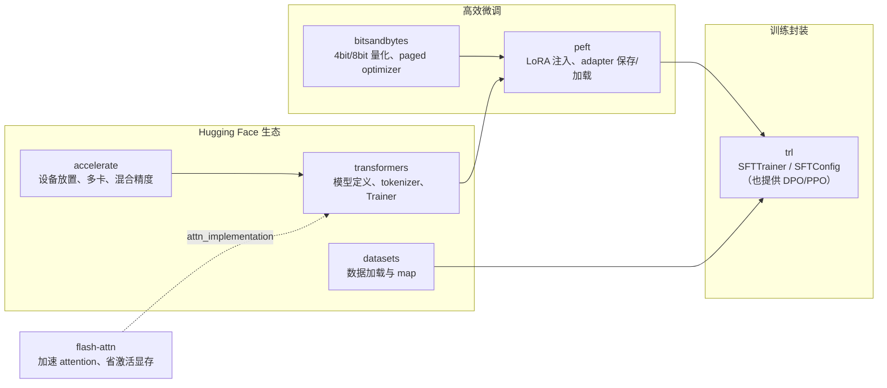
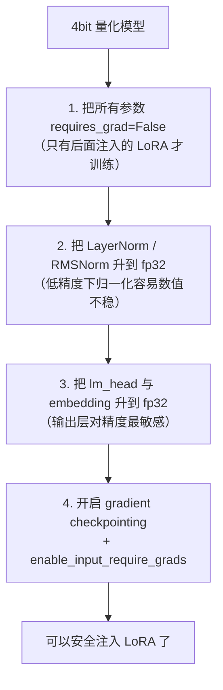
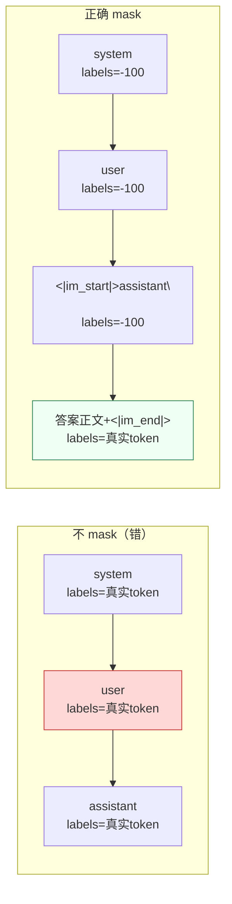
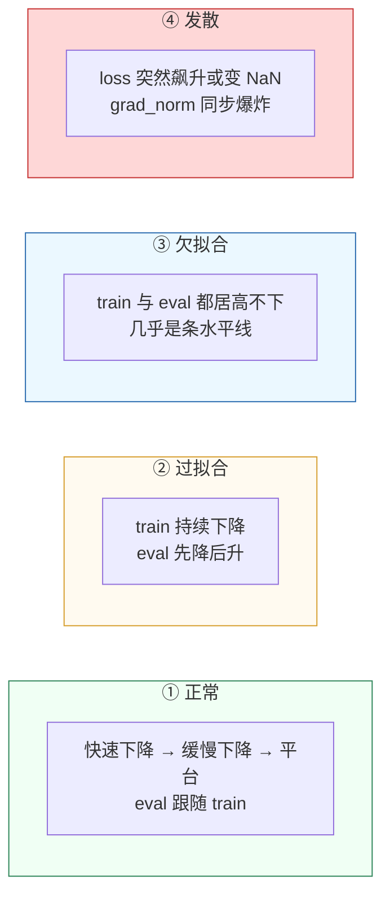
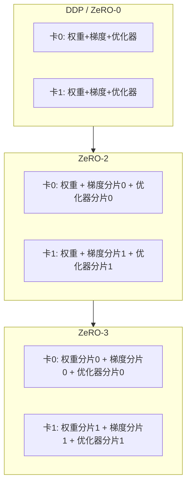
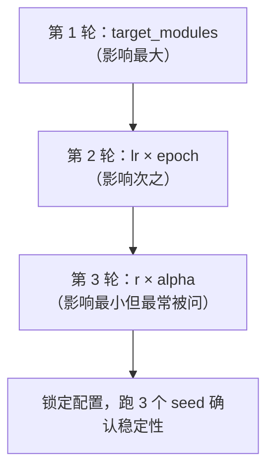
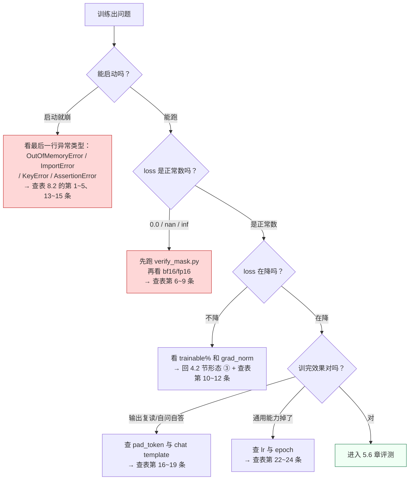
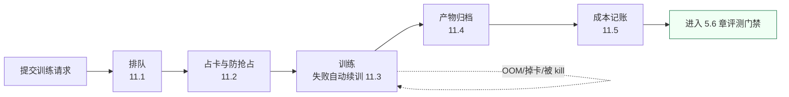

# 第 5.3 章  LoRA / QLoRA 实战

> **本章目标**：读完能做到 …
> 1. 锁定一套能跑通的 `transformers + peft + trl + accelerate + bitsandbytes` 版本组合，并说清每个包的职责；
> 2. 用一张测算表判断「24G 单卡上，7B 模型能做 QLoRA / LoRA / 全量微调中的哪几种」；
> 3. 独立写出完整的 QLoRA 训练脚本，并解释 `BitsAndBytesConfig`、`LoraConfig`、`TrainingArguments` 每个关键参数为什么这么设；
> 4. 写出正确的 label mask collator，让 prompt 部分为 `-100`，并验证 mask 是否真的生效；
> 5. 看 loss 曲线判断训练处于正常 / 过拟合 / 欠拟合 / 发散四种形态中的哪一种，并给出对应动作；
> 6. 做断点续训与多卡训练（accelerate / DeepSpeed ZeRO-2/ZeRO-3）；
> 7. 跑一遍微调前后的同批问题对比，用 15 条排错表自查训练故障。
>
> **前置知识**：
> - [5.1 微调原理与 PEFT 家族全解](./01-微调原理与PEFT家族全解.md)（LoRA 公式、显存账、label mask 的原理）
> - [5.2 数据集构造与清洗](./02-数据集构造与清洗.md)（本章直接用它产出的 `train.jsonl` / `val.jsonl` / `test.jsonl`）
> - [0.1 开发环境搭建（Python-CUDA-Docker）](../00-前置准备/01-开发环境搭建（Python-CUDA-Docker）.md)（CUDA 驱动、Docker、NVIDIA Container Toolkit）
> - Python 3.11、PyTorch 基础
>
> **预计用时**：阅读 60 分钟 / 动手 300 分钟（含一次完整训练）

---

## 一、为什么需要它（问题出发）

### 1.1 上一章结束在哪

上一章结束时，我们手上有三个文件：

```text
data/sft/v20260314/
├── train.jsonl   16424 条   sha256=8f2a41c0d7b39e15
├── val.jsonl       921 条   sha256=2b71ee40a9c8d6f3
└── test.jsonl      913 条   sha256=c04d9a7f1e28b3aa
```

本章要做的事只有一件：**把这三个文件变成一个能用的 adapter**。

### 1.2 为什么不是「抄个脚本跑一下」就完了

网上的 LoRA 训练脚本一抓一大把，30 行就能跑起来。但跑起来 ≠ 训对了。**下面这四个坑，网上的短脚本几乎全都有：**

```mermaid
flowchart TD
    A["抄来的 30 行脚本"] --> B1["坑 1：labels 没做 mask<br/>模型在学"怎么提问"<br/>→ 输出会自问自答"]
    A --> B2["坑 2：chat template 用错<br/>训练用 Alpaca 模板、推理用 Qwen 模板<br/>→ 训推不一致，白训"]
    A --> B3["坑 3：pad_token 缺失或等于 eos<br/>→ 模型学不会停，一直输出到 max_tokens"]
    A --> B4["坑 4：target_modules 只挂 q_proj/v_proj<br/>→ 容量不足，loss 降不下去"]
    B1 & B2 & B3 & B4 --> C["训练能跑完、loss 也在降<br/>但模型就是不好用"]
    style C fill:#fed7d7,stroke:#c53030
```

这四个坑的共同特点是：**训练过程一切正常，不报错，loss 也在降，但结果是错的。** 你只有在推理时才会发现问题，而那时已经烧掉了几十个 GPU 小时。

所以本章的写法是：**每一段代码都说清「为什么这么写」和「不这么写会怎样」**，并在 3.5 节给出验证 mask 是否生效的检查代码。

### 1.3 本章产出

```text
finetune/
├── train_qlora.py          # 完整训练脚本（本章主角）
├── data_collator.py        # label mask collator
├── infer_compare.py        # 微调前后对比脚本
├── configs/
│   ├── qlora_7b.yaml       # 单卡 QLoRA 配置
│   ├── accelerate_ddp.yaml # 多卡 DDP
│   ├── ds_zero2.json       # DeepSpeed ZeRO-2
│   └── ds_zero3.json       # DeepSpeed ZeRO-3
└── requirements-train.txt  # 版本锁定

outputs/
└── qwen25-7b-huacheng-qlora-r16/
    ├── adapter_config.json
    ├── adapter_model.safetensors
    ├── tokenizer_config.json
    ├── training_args.bin
    └── runs/               # TensorBoard 日志
```

---

## 二、原理拆解：环境与显存

### 2.1 各个包的职责



| 包 | 职责 | 没有它会怎样 |
|---|---|---|
| `transformers` | 模型结构、tokenizer、chat template、`Trainer` | 什么都做不了 |
| `peft` | 把 LoRA 层注入线性层、只训练 adapter、保存/合并 | 只能全量微调 |
| `bitsandbytes` | NF4 量化、`paged_adamw_8bit` | 做不了 QLoRA |
| `trl` | `SFTTrainer` 封装了 SFT 的常见逻辑 | 可以用原生 `Trainer` 替代 |
| `accelerate` | 设备映射、混合精度、DDP/FSDP/DeepSpeed 的统一入口 | 多卡跑不了 |
| `datasets` | 高效加载与 `map` | 可以用 `torch.utils.data` 替代 |
| `flash-attn` | FlashAttention-2 内核 | 能跑，但慢且激活显存更大 |

### 2.2 版本锁定

版本不对是新手第一大杀手。**这套组合是本书的基线，请原样使用；升级任何一个包之前，先跑一遍 2.3 节的自检脚本。**

```text
# finetune/requirements-train.txt
# 基线环境：Python 3.11 / CUDA 12.1 / PyTorch 2.4.x
# 实测环境：Ubuntu 22.04、NVIDIA Driver 550.x、单卡 RTX 4090 24G 与 双卡 A100 40G 各验证一次

torch==2.4.1
transformers==4.46.3
peft==0.13.2
trl==0.12.1
accelerate==0.34.2
bitsandbytes==0.44.1
datasets==3.0.2
sentencepiece==0.2.0
protobuf==5.28.3
safetensors==0.4.5
tensorboard==2.18.0
scipy==1.14.1
tiktoken==0.8.0

# 可选但强烈建议（需要与 torch/CUDA 版本匹配，安装较慢）
# flash-attn==2.6.3

# 可选：更好看的训练看板（国内网络更友好）
# swanlab==0.3.27

# 可选：DeepSpeed 多卡
# deepspeed==0.15.4
```

安装：

```bash
# 用 uv（推荐，快很多）
uv venv --python 3.11 .venv-train
source .venv-train/bin/activate
uv pip install -r finetune/requirements-train.txt

# flash-attn 要单独装，它需要先有 torch 才能编译
uv pip install flash-attn==2.6.3 --no-build-isolation

# pip 等价命令
# python3.11 -m venv .venv-train && source .venv-train/bin/activate
# pip install -r finetune/requirements-train.txt
# pip install flash-attn==2.6.3 --no-build-isolation
```

**三个版本坑：**

| 坑 | 说明 |
|---|---|
| `peft` 0.13 与 0.14+ 的差异 | 0.14 之后部分参数名和默认行为有调整（如 `use_dora`、`lora_bias`）。本书按 0.13.x 写，若你用更高版本，以官方文档为准 |
| `trl` 0.12 起 `SFTTrainer` 的参数从 `TrainingArguments` 改成 `SFTConfig`，且 `tokenizer=` 被 `processing_class=` 取代 | 本章代码按 0.12.1 写；若报 `unexpected keyword argument`，多半就是版本不匹配 |
| `bitsandbytes` 与 CUDA 版本绑定 | 装完先跑 `python -m bitsandbytes` 自检，输出里要能看到正确的 CUDA 版本 |

### 2.3 环境自检脚本

**训练前先跑这个，能省下 80% 的「为什么跑不起来」。**

```python
# finetune/check_env.py
"""训练环境自检：跑通这个再开始训练。"""
from __future__ import annotations

import importlib
import platform
import subprocess
import sys


def section(title: str) -> None:
    """打印小节标题。"""
    print(f"\n{'='*58}\n  {title}\n{'='*58}")


def check_versions() -> None:
    """检查关键包的版本。"""
    expect = {
        "torch": "2.4.1", "transformers": "4.46.3", "peft": "0.13.2",
        "trl": "0.12.1", "accelerate": "0.34.2", "bitsandbytes": "0.44.1",
        "datasets": "3.0.2",
    }
    for name, want in expect.items():
        try:
            mod = importlib.import_module(name)
            got = getattr(mod, "__version__", "?")
            flag = "✅" if got == want else "⚠️ "
            print(f"  {flag} {name:<16} {got:<12} (基线 {want})")
        except ImportError:
            print(f"  ❌ {name:<16} 未安装")


def check_cuda() -> None:
    """检查 GPU 与显存。"""
    import torch

    print(f"  torch.cuda.is_available : {torch.cuda.is_available()}")
    print(f"  torch.version.cuda      : {torch.version.cuda}")
    print(f"  bf16 支持               : {torch.cuda.is_bf16_supported() if torch.cuda.is_available() else False}")
    for i in range(torch.cuda.device_count()):
        p = torch.cuda.get_device_properties(i)
        print(f"  GPU {i}: {p.name}  {p.total_memory/1024**3:.1f} GB  SM {p.major}.{p.minor}")


def check_flash_attn() -> None:
    """检查 FlashAttention。"""
    try:
        import flash_attn

        print(f"  ✅ flash-attn {flash_attn.__version__}")
    except ImportError:
        print("  ⚠️  flash-attn 未安装，将使用 sdpa（能跑，但更慢、激活显存更大）")


def check_bnb() -> None:
    """检查 bitsandbytes 能否正常调用 CUDA 内核。"""
    try:
        import bitsandbytes as bnb
        import torch

        x = torch.randn(64, 64, device="cuda", dtype=torch.float16)
        layer = bnb.nn.Linear4bit(64, 64, compute_dtype=torch.bfloat16).cuda()
        _ = layer(x)
        print("  ✅ bitsandbytes 4bit 前向正常")
    except Exception as exc:                                       # noqa: BLE001
        print(f"  ❌ bitsandbytes 异常：{exc}")
        print("     常见原因：bnb 版本与 CUDA 不匹配，或没装 CUDA runtime")


def check_model_access(model_id: str = "Qwen/Qwen2.5-7B-Instruct") -> None:
    """检查模型能否加载 tokenizer（不下权重）。"""
    try:
        from transformers import AutoTokenizer

        tok = AutoTokenizer.from_pretrained(model_id, trust_remote_code=True)
        print(f"  ✅ tokenizer 加载成功  vocab={len(tok)}")
        print(f"     eos_token = {tok.eos_token!r} (id={tok.eos_token_id})")
        print(f"     pad_token = {tok.pad_token!r} (id={tok.pad_token_id})")
        print(f"     chat_template 存在 : {tok.chat_template is not None}")
        demo = tok.apply_chat_template(
            [{"role": "system", "content": "S"}, {"role": "user", "content": "U"},
             {"role": "assistant", "content": "A"}], tokenize=False)
        print(f"     模板渲染示例：\n       {demo!r}")
    except Exception as exc:                                       # noqa: BLE001
        print(f"  ❌ tokenizer 加载失败：{exc}")
        print("     若是网络问题，设置 HF_ENDPOINT 镜像或先手动下载到本地路径")


def check_nvidia_smi() -> None:
    """打印 nvidia-smi 概要。"""
    try:
        out = subprocess.check_output(
            ["nvidia-smi", "--query-gpu=name,memory.total,memory.used,driver_version",
             "--format=csv,noheader"], text=True)
        for line in out.strip().splitlines():
            print("  ", line)
    except Exception as exc:                                       # noqa: BLE001
        print(f"  ❌ nvidia-smi 不可用：{exc}")


if __name__ == "__main__":
    section("系统")
    print(f"  Python : {sys.version.split()[0]}  ({platform.platform()})")
    section("包版本")
    check_versions()
    section("CUDA / GPU")
    check_cuda()
    check_nvidia_smi()
    section("FlashAttention")
    check_flash_attn()
    section("bitsandbytes")
    check_bnb()
    section("模型与 tokenizer")
    check_model_access()
    print("\n全部为 ✅ 或可接受的 ⚠️ 时，再开始训练。\n")
```

预期输出：

```text
==========================================================
  系统
==========================================================
  Python : 3.11.9  (Linux-6.8.0-45-generic-x86_64-with-glibc2.35)

==========================================================
  包版本
==========================================================
  ✅ torch            2.4.1        (基线 2.4.1)
  ✅ transformers     4.46.3       (基线 4.46.3)
  ✅ peft             0.13.2       (基线 0.13.2)
  ✅ trl              0.12.1       (基线 0.12.1)
  ✅ accelerate       0.34.2       (基线 0.34.2)
  ✅ bitsandbytes     0.44.1       (基线 0.44.1)
  ✅ datasets         3.0.2        (基线 3.0.2)

==========================================================
  CUDA / GPU
==========================================================
  torch.cuda.is_available : True
  torch.version.cuda      : 12.1
  bf16 支持               : True
  GPU 0: NVIDIA GeForce RTX 4090  23.6 GB  SM 8.9
   NVIDIA GeForce RTX 4090, 24564 MiB, 12 MiB, 550.90.07

==========================================================
  FlashAttention
==========================================================
  ✅ flash-attn 2.6.3

==========================================================
  bitsandbytes
==========================================================
  ✅ bitsandbytes 4bit 前向正常

==========================================================
  模型与 tokenizer
==========================================================
  ✅ tokenizer 加载成功  vocab=151665
     eos_token = '<|im_end|>' (id=151645)
     pad_token = '<|endoftext|>' (id=151643)
     chat_template 存在 : True
     模板渲染示例：
       '<|im_start|>system\nS<|im_end|>\n<|im_start|>user\nU<|im_end|>\n<|im_start|>assistant\nA<|im_end|>\n'

全部为 ✅ 或可接受的 ⚠️ 时，再开始训练。
```

> **注意最后那行模板渲染示例**——它决定了你的 collator 该怎么写。Qwen2.5 的 assistant 轮是 `<|im_start|>assistant\n…<|im_end|>\n`，其中 `<|im_start|>assistant\n` 是「头」，必须被 mask 掉。

### 2.4 显存预算：24G 单卡能做什么

先把账算清楚（Qwen2.5-7B-Instruct，参数量约 7.6B）。

#### 2.4.1 静态显存（权重 + 梯度 + 优化器状态）

| 方案 | 权重 | 梯度 | 优化器状态 | 静态合计 | 24G 可行？ |
|---|---|---|---|---|---|
| **全量微调 bf16 + AdamW** | 7.6B × 2B = **15.2 GB** | 7.6B × 2B = **15.2 GB** | fp32 的 m、v 各一份 + fp32 主权重 = 7.6B × 12B = **91.2 GB** | **≈ 122 GB** | ❌ 差一个数量级 |
| 全量微调 + DeepSpeed ZeRO-3（8 卡） | 15.2/8 | 15.2/8 | 91.2/8 | ≈ 15.2 GB/卡 | 需要多卡 |
| **LoRA bf16（r=16，全线性层）** | 15.2 GB（冻结） | adapter ≈ 0.04 GB | adapter 优化器 ≈ 0.24 GB | **≈ 15.5 GB** | ⚠️ 勉强 |
| **QLoRA NF4（r=16，全线性层）** | 7.6B × 0.5B ≈ **3.8 GB** + 量化常数 ≈ 0.3 GB | ≈ 0.04 GB | ≈ 0.24 GB | **≈ 4.4 GB** | ✅ 宽裕 |
| QLoRA + r=64 | 3.8 + 0.3 | ≈ 0.16 | ≈ 0.95 | ≈ 5.2 GB | ✅ |

> 说明：`LoRA r=16` 挂全部 7 个线性层时，可训练参数约 2000 万（0.27%），bf16 梯度约 0.04 GB，AdamW 的 m/v 用 fp32 约 0.16 GB，加 fp32 主权重副本约 0.08 GB。这里取整为 0.24 GB。

#### 2.4.2 动态显存（激活）

激活显存 ≈ `batch × seq_len × hidden × layers × 系数`。开梯度检查点（gradient checkpointing）后，系数大幅下降。

实测参考（**实测环境：RTX 4090 24G、Qwen2.5-7B-Instruct、QLoRA r=16 全线性层、bf16、flash-attn 2**）：

| max_seq_len | batch | grad ckpt | 峰值显存 | 每步耗时 |
|---|---|---|---|---|
| 1024 | 1 | 开 | 8.4 GB | 0.42 s |
| 2048 | 1 | 开 | 10.1 GB | 0.78 s |
| 2048 | 2 | 开 | 13.6 GB | 1.42 s |
| 2048 | 4 | 开 | 20.3 GB | 2.71 s |
| 2048 | 1 | **关** | 18.9 GB | 0.51 s |
| 4096 | 1 | 开 | 14.7 GB | 1.63 s |
| 4096 | 2 | 开 | 22.8 GB | 3.11 s |

（示例性数据，会随驱动、内核版本变化，请自行复现）

#### 2.4.3 24G 单卡能做什么：结论表

| 目标 | 可行性 | 推荐配置 |
|---|---|---|
| **Qwen2.5-7B QLoRA** | ✅ **宽裕** | `4bit NF4 + r=16 + max_len 2048 + bs 2 + grad_accum 8`，峰值约 14 GB |
| Qwen2.5-7B LoRA（bf16 不量化） | ⚠️ **勉强** | `max_len 1024 + bs 1 + grad_accum 16 + grad ckpt`，峰值约 21 GB，稍有波动就 OOM |
| Qwen2.5-7B 全量微调 | ❌ **不可能** | 需要 ≈ 122 GB，单卡无解 |
| Qwen2.5-14B QLoRA | ⚠️ 勉强 | `max_len 1024 + bs 1`，峰值约 18 GB |
| Qwen2.5-32B QLoRA | ❌ | 权重 4bit 就要 ≈ 16 GB，加激活会爆 |
| Qwen2.5-1.5B 全量微调 | ✅ | 静态约 24 GB，配 `paged_adamw_8bit` + grad ckpt 可行 |

**本章的选择：Qwen2.5-7B-Instruct + QLoRA（NF4）+ r=16。** 理由：24G 卡上跑得宽裕，还有余量做 batch 和长序列的实验。

#### 2.4.4 显存不够时的七个档位（按副作用从小到大）

```text
1. 开 gradient_checkpointing            省 40%~60% 激活，慢 20%~35%   ← 先做这个
2. 减小 per_device_train_batch_size     配 gradient_accumulation_steps 保持等效 batch
3. 换 optim="paged_adamw_8bit"          优化器状态省一半，还能在爆显存时自动分页到内存
4. 减小 max_seq_length                  先看 5.2 章的长度分析，别乱砍
5. 4bit 量化（QLoRA）                   静态显存降到 1/4，代价是精度轻微损失、速度降 20%~40%
6. 减小 r 或收窄 target_modules         容量下降，效果可能变差
7. 换更小的基座模型                     最后手段
```

---

## 三、动手实战：完整训练脚本逐段拆解

### 3.1 加载模型与 tokenizer

```python
# finetune/train_qlora.py （第 1 段：模型与 tokenizer）
"""Qwen2.5-7B-Instruct 的 QLoRA 微调脚本。"""
from __future__ import annotations

import json
import logging
import os
from dataclasses import dataclass, field
from pathlib import Path

import torch
from transformers import (
    AutoModelForCausalLM,
    AutoTokenizer,
    BitsAndBytesConfig,
    PreTrainedTokenizerBase,
    set_seed,
)

logger = logging.getLogger(__name__)


def load_tokenizer(model_id: str) -> PreTrainedTokenizerBase:
    """加载 tokenizer，并把 pad_token 这件事处理干净。"""
    tok = AutoTokenizer.from_pretrained(
        model_id,
        trust_remote_code=True,
        # 训练时右填充：因为 loss 是按位置对齐算的，左填充会把 label 错位
        padding_side="right",
        use_fast=True,
    )

    # ---- pad_token 三种情况 ----
    if tok.pad_token_id is None:
        # 情况 A：模型有专门的填充符（Qwen2.5 有 <|endoftext|>），优先用它
        for cand in ("<|endoftext|>", "<|pad|>", "<pad>"):
            if cand in tok.get_vocab():
                tok.pad_token = cand
                break
    if tok.pad_token_id is None:
        # 情况 B：实在没有，就用 eos 兜底。注意：这时必须保证 attention_mask 正确，
        #        否则模型会把 padding 当成"句子结束了还要继续说"，学不会停。
        tok.pad_token = tok.eos_token
        logger.warning("pad_token 缺失，已回退为 eos_token；请确认 collator 正确设置了 attention_mask")

    # 情况 C：最糟的情况是 pad_token_id == eos_token_id 且 label 里 pad 没被 mask
    #        我们的 collator 会把 pad 位置的 label 设成 -100，规避这个问题
    assert tok.pad_token_id is not None, "pad_token 仍为空"
    assert tok.chat_template is not None, "该模型没有 chat_template，需要手动指定"

    logger.info("tokenizer: vocab=%d eos=%s(%d) pad=%s(%d)",
                len(tok), tok.eos_token, tok.eos_token_id, tok.pad_token, tok.pad_token_id)
    return tok


def load_model(model_id: str, use_4bit: bool = True, use_flash_attn: bool = True):
    """加载基座模型。QLoRA 的关键全在 BitsAndBytesConfig 这几个参数上。"""
    compute_dtype = torch.bfloat16 if torch.cuda.is_bf16_supported() else torch.float16

    quant_config = None
    if use_4bit:
        quant_config = BitsAndBytesConfig(
            load_in_4bit=True,
            # NF4：QLoRA 论文提出的 4bit 数据类型，针对正态分布权重做了信息论最优分桶。
            #      另一个选项 "fp4" 精度更差，没有理由选它。
            bnb_4bit_quant_type="nf4",
            # 反量化后参与计算的精度。必须和训练精度一致，否则会有隐式类型转换开销。
            bnb_4bit_compute_dtype=compute_dtype,
            # 双重量化：把"量化常数"本身再量化一次，每个参数再省约 0.4 bit。
            #          7B 模型大约能省 0.3~0.4 GB，几乎无损，建议开。
            bnb_4bit_use_double_quant=True,
            # 4bit 放不下的模块（如 lm_head）用什么精度存
            bnb_4bit_quant_storage=compute_dtype,
        )

    # attn_implementation 三选一：
    #   "flash_attention_2" 最快、激活显存最小，但需要 flash-attn 且 GPU 架构 >= Ampere
    #   "sdpa"              PyTorch 原生，兼容性最好，默认选它
    #   "eager"             最慢，只在调试或前两者出问题时用
    attn_impl = "sdpa"
    if use_flash_attn:
        try:
            import flash_attn  # noqa: F401

            attn_impl = "flash_attention_2"
        except ImportError:
            logger.warning("flash-attn 不可用，回退到 sdpa")

    model = AutoModelForCausalLM.from_pretrained(
        model_id,
        quantization_config=quant_config,
        torch_dtype=compute_dtype,
        attn_implementation=attn_impl,
        # 单卡训练必须写死 {"": 0}。写 "auto" 会让 accelerate 做模型并行切分，
        # 训练时反而出问题（层间通信 + 梯度同步会报错或极慢）。
        device_map={"": int(os.environ.get("LOCAL_RANK", 0))},
        trust_remote_code=True,
        low_cpu_mem_usage=True,
    )

    # 训练时必须关 KV cache：它是给推理用的，训练时开着会白占显存并与梯度检查点冲突
    model.config.use_cache = False
    # 张量并行/序列并行相关，单卡设 1
    model.config.pretraining_tp = 1

    logger.info("模型加载完成：attn=%s dtype=%s 4bit=%s", attn_impl, compute_dtype, use_4bit)
    return model
```

**逐个参数的「为什么」：**

| 参数 | 值 | 不这么设会怎样 |
|---|---|---|
| `padding_side="right"` | 训练用右填充 | 左填充会让 label 与 logits 错位，loss 算错。**推理时才用左填充** |
| `bnb_4bit_quant_type="nf4"` | NF4 | 用 `fp4` 精度更差，没有理由 |
| `bnb_4bit_compute_dtype` | bf16 | 与训练精度不一致会引入隐式转换，慢且可能溢出 |
| `bnb_4bit_use_double_quant=True` | 开 | 省 0.3~0.4 GB，几乎无损 |
| `attn_implementation` | flash_attention_2 | 用 `eager` 会慢 1.5~2 倍，激活显存大很多 |
| `device_map={"": 0}` | 写死 | 写 `"auto"` 会触发模型并行切分，训练会报错或极慢 |
| `use_cache=False` | 关 | 开着会与 gradient checkpointing 冲突并浪费显存 |

### 3.2 `prepare_model_for_kbit_training`：量化模型训练前的必要手术

```python
# finetune/train_qlora.py （第 2 段：量化模型的训练准备）
from peft import prepare_model_for_kbit_training


def prepare_for_training(model, gradient_checkpointing: bool = True):
    """对 4bit 模型做训练前处理。跳过这一步，训练要么报错要么 loss 不降。"""
    model = prepare_model_for_kbit_training(
        model,
        use_gradient_checkpointing=gradient_checkpointing,
        # use_reentrant=False 是新版推荐写法；用 True 在配合 LoRA 时
        # 可能出现"没有任何张量需要梯度"的报错
        gradient_checkpointing_kwargs={"use_reentrant": False},
    )
    if gradient_checkpointing:
        model.enable_input_require_grads()      # 让输入 embedding 输出可求导，否则梯度断链
    return model
```

**它到底做了四件事：**



**不做会怎样：**

| 跳过的动作 | 后果 |
|---|---|
| 不冻结基座参数 | 4bit 权重不可训练，直接报错 |
| 不升 norm 层精度 | loss 出现 NaN 或剧烈震荡 |
| 不 `enable_input_require_grads` | 报 `element 0 of tensors does not require grad`，训练直接挂 |
| 不开 gradient checkpointing | 激活显存翻倍，长序列直接 OOM |

### 3.3 `LoraConfig`：每个参数详解

```python
# finetune/train_qlora.py （第 3 段：LoRA 配置）
from peft import LoraConfig, TaskType, get_peft_model

# Qwen2.5（以及绝大多数 Llama 系架构）的七个线性层
QWEN_ALL_LINEAR = ["q_proj", "k_proj", "v_proj", "o_proj",
                   "gate_proj", "up_proj", "down_proj"]


def build_lora_config(r: int = 16, alpha: int = 32, dropout: float = 0.05,
                      target_modules: list[str] | None = None,
                      use_rslora: bool = False) -> LoraConfig:
    """构造 LoRA 配置。每个参数的取值都要有理由，不要抄。"""
    return LoraConfig(
        # ---- r：低秩分解的秩，决定 adapter 的容量 ----
        # ΔW = B(d×r) @ A(r×k)，r 越大可训练参数越多、容量越大、越容易过拟合
        r=r,

        # ---- lora_alpha：缩放系数，实际缩放为 alpha / r ----
        # 经验：alpha = 2r（本书基线）。改 r 时 alpha 要同步改，否则强度变了
        lora_alpha=alpha,

        # ---- target_modules：往哪些层注入 LoRA ----
        # 只挂 q/v：参数最少，效果最弱，适合"只改风格"
        # 挂全部 7 个线性层：效果最好，本书默认
        target_modules=target_modules or QWEN_ALL_LINEAR,

        # ---- lora_dropout：LoRA 分支的 dropout ----
        # 数据 < 1000 条用 0.1；1000~10000 用 0.05；更多可设 0
        lora_dropout=dropout,

        # ---- bias：是否训练 bias ----
        # "none"（默认，推荐）/ "all" / "lora_only"
        # 训 bias 收益很小但会让 adapter 合并变复杂，保持 "none"
        bias="none",

        # ---- task_type：决定 PEFT 怎么包装模型 ----
        task_type=TaskType.CAUSAL_LM,

        # ---- use_rslora：把缩放从 alpha/r 改成 alpha/sqrt(r) ----
        # r >= 32 时建议开，能缓解大 r 下的梯度压制（见 5.1 章）
        use_rslora=use_rslora,

        # ---- modules_to_save：除 LoRA 外还要完整训练并保存的模块 ----
        # 只有在扩了词表（加了特殊 token）时才需要，否则留空
        modules_to_save=None,
    )


def attach_lora(model, cfg: LoraConfig):
    """注入 LoRA 并打印可训练参数量——这一行输出必须看。"""
    model = get_peft_model(model, cfg)
    model.print_trainable_parameters()
    return model
```

#### 3.3.1 `r` 怎么选

| r | 可训练参数（7B 全线性层） | 占比 | 适用 |
|---|---|---|---|
| 8 | ≈ 1000 万 | 0.13% | 数据 < 1000 条；只做格式对齐 |
| **16** | ≈ 2000 万 | 0.27% | **本书基线**，数据 1000~2 万条 |
| 32 | ≈ 4000 万 | 0.53% | 数据 > 2 万条，或任务较难 |
| 64 | ≈ 8100 万 | 1.06% | 数据 > 5 万条；**必须配 `use_rslora=True` 或把 alpha 提到 128** |

> **最常见的错误**：把 r 从 16 调到 64 但 alpha 还是 32。此时缩放从 `32/16=2` 掉到 `32/64=0.5`，强度被压到 1/4，模型几乎没学动。**改 r 必须同步改 alpha。**

#### 3.3.2 `target_modules` 怎么选

| 配置 | 可训练参数 | 典型收益 | 显存/时间代价 |
|---|---|---|---|
| `["q_proj", "v_proj"]` | ≈ 420 万 | 风格、语气能改 | 最省 |
| `["q_proj","k_proj","v_proj","o_proj"]`（只 attention） | ≈ 840 万 | 中等 | 省 |
| **全部 7 个线性层** | ≈ 2000 万 | **最好** | 多约 15% 时间 |

**为什么 MLP 层（`gate/up/down_proj`）重要**：LLM 的知识主要存在 FFN 里，attention 主要负责「看哪里」。**只挂 attention 等于只教模型换个角度看，不教它新东西。** 这也是很多人「LoRA 训了没效果」的根因。

验证方式：

```python
# 看看 LoRA 到底挂到了哪些层
for name, module in model.named_modules():
    if "lora_A" in name:
        print(name)
```

```text
base_model.model.model.layers.0.self_attn.q_proj.lora_A.default
base_model.model.model.layers.0.self_attn.k_proj.lora_A.default
base_model.model.model.layers.0.self_attn.v_proj.lora_A.default
base_model.model.model.layers.0.self_attn.o_proj.lora_A.default
base_model.model.model.layers.0.mlp.gate_proj.lora_A.default
base_model.model.model.layers.0.mlp.up_proj.lora_A.default
base_model.model.model.layers.0.mlp.down_proj.lora_A.default
...（28 层 × 7 = 196 个）
```

`print_trainable_parameters()` 的预期输出：

```text
trainable params: 20,185,088 || all params: 7,635,801,600 || trainable%: 0.2643
```

**这行数字必须看**：
- `trainable%` 是 0 → LoRA 没挂上（多半 `target_modules` 名字写错了）；
- `trainable%` 超过 5% → 你可能把整个模型都挂上了，检查配置。

### 3.4 数据集加载与 chat template：让 prompt 部分为 `-100`

**这是全章最重要的一节。** 做错了，训练一切正常但模型学歪，而且你在训练日志里看不出来。

#### 3.4.1 为什么必须 mask

因果语言模型的 loss 是「预测下一个 token」。如果不做 mask，模型会同时学两件事：

```text
不 mask 时，模型在学：
  给定 <|im_start|>system\n你是华成机电…       → 预测下一个 token 是 <|im_end|>
  给定 …<|im_start|>user\n                     → 预测用户会问 "XJ-200"
  给定 …XJ-200 报 E041                          → 预测用户接着说 "怎么处理"   ← 学"怎么提问"！
  给定 …<|im_start|>assistant\n                 → 预测 "【故障判断】"         ← 这才是我们要的
```

**结果**：模型学会了「模仿用户提问」，推理时会出现自问自答、复述用户问题、或者在答案里夹杂提问语气。



**注意 `<|im_start|>assistant\n` 这个「头」也要 mask**——它是模板固定生成的，推理时由框架自动加，不需要模型学。

#### 3.4.2 完整 collator 代码

```python
# finetune/data_collator.py
"""SFT 的 label mask：只对 assistant 的回答内容算 loss。

核心思路：用 apply_chat_template 逐轮增量编码，
         用 add_generation_prompt=True 精确定位 assistant 的"头"在哪里结束。
这个做法不依赖任何硬编码的特殊 token，换模型（Qwen/Llama/GLM）都能用。
"""
from __future__ import annotations

from dataclasses import dataclass
from typing import Any, Sequence

import torch
from transformers import PreTrainedTokenizerBase

IGNORE_INDEX = -100


def encode_with_mask(messages: list[dict[str, Any]],
                     tokenizer: PreTrainedTokenizerBase,
                     max_length: int = 2048,
                     train_on_last_turn_only: bool = False) -> dict[str, list[int]] | None:
    """把一条多轮对话编码成 input_ids / labels，prompt 部分置为 -100。

    Args:
        messages: OpenAI messages 格式
        tokenizer: 必须有 chat_template
        max_length: 超长时从**左侧**截断（保留最近的对话与完整答案）
        train_on_last_turn_only: True 时只对最后一轮 assistant 算 loss；
                                 False（默认）时每一轮 assistant 都算

    Returns:
        {"input_ids": [...], "labels": [...]}；样本不合法时返回 None
    """
    if not messages or messages[-1].get("role") != "assistant":
        return None

    input_ids: list[int] = []
    labels: list[int] = []
    prev_len = 0

    # 找出最后一个 assistant 的下标（train_on_last_turn_only 用）
    last_assistant = max(i for i, m in enumerate(messages) if m["role"] == "assistant")

    for i, msg in enumerate(messages):
        # 到第 i 条为止的完整编码
        ids_upto_i = tokenizer.apply_chat_template(
            messages[: i + 1], tokenize=True, add_generation_prompt=False,
        )
        seg = ids_upto_i[prev_len:]              # 本轮新增的 token

        if msg["role"] == "assistant" and (not train_on_last_turn_only or i == last_assistant):
            # 取"到第 i-1 条 + generation prompt"的编码，用来定位 assistant 头的长度
            ids_with_header = tokenizer.apply_chat_template(
                messages[:i], tokenize=True, add_generation_prompt=True,
            )
            header_len = len(ids_with_header) - prev_len
            header_len = max(0, min(header_len, len(seg)))
            # 头部 mask 掉，正文（含 <|im_end|>）保留 —— 保留 eos 才能学会"什么时候停"
            labels.extend([IGNORE_INDEX] * header_len + seg[header_len:])
        else:
            labels.extend([IGNORE_INDEX] * len(seg))

        input_ids.extend(seg)
        prev_len = len(ids_upto_i)

    assert len(input_ids) == len(labels), "input_ids 与 labels 长度不一致"

    # 全是 -100 的样本会让 loss 变成 NaN，必须丢掉
    if all(l == IGNORE_INDEX for l in labels):
        return None

    if len(input_ids) > max_length:
        # 从左截断：保住最后一轮的完整答案。若截完仍没有可训练 token，丢弃
        input_ids = input_ids[-max_length:]
        labels = labels[-max_length:]
        if all(l == IGNORE_INDEX for l in labels):
            return None

    return {"input_ids": input_ids, "labels": labels}


@dataclass
class SFTDataCollator:
    """动态 padding 的 collator。padding 位置的 label 也必须是 -100。"""

    tokenizer: PreTrainedTokenizerBase
    pad_to_multiple_of: int = 8          # 对齐到 8 的倍数，利用 Tensor Core
    max_length: int = 2048

    def __call__(self, features: Sequence[dict[str, Any]]) -> dict[str, torch.Tensor]:
        """批内动态补齐。"""
        pad_id = self.tokenizer.pad_token_id
        assert pad_id is not None, "pad_token_id 为空，无法 padding"

        batch_max = max(len(f["input_ids"]) for f in features)
        batch_max = min(batch_max, self.max_length)
        if self.pad_to_multiple_of:
            m = self.pad_to_multiple_of
            batch_max = ((batch_max + m - 1) // m) * m

        input_ids, labels, attn = [], [], []
        for f in features:
            ids = list(f["input_ids"])[:batch_max]
            lab = list(f["labels"])[:batch_max]
            pad_n = batch_max - len(ids)
            # 右填充（与 tokenizer.padding_side="right" 一致）
            input_ids.append(ids + [pad_id] * pad_n)
            labels.append(lab + [IGNORE_INDEX] * pad_n)       # ← padding 位置必须是 -100
            attn.append([1] * len(ids) + [0] * pad_n)         # ← 必须给 attention_mask

        return {
            "input_ids": torch.tensor(input_ids, dtype=torch.long),
            "labels": torch.tensor(labels, dtype=torch.long),
            "attention_mask": torch.tensor(attn, dtype=torch.long),
        }
```

#### 3.4.3 数据集加载

```python
# finetune/train_qlora.py （第 4 段：数据集）
from datasets import load_dataset

from finetune.data_collator import IGNORE_INDEX, SFTDataCollator, encode_with_mask


def build_datasets(train_path: str, val_path: str, tokenizer, max_length: int = 2048,
                   num_proc: int = 8):
    """加载 jsonl 并做 tokenize + label mask。"""
    ds = load_dataset("json", data_files={"train": train_path, "validation": val_path})

    def _map(example):
        """单条编码；返回 None 的样本用空列表标记，后面过滤掉。"""
        out = encode_with_mask(example["messages"], tokenizer, max_length=max_length)
        if out is None:
            return {"input_ids": [], "labels": []}
        return out

    ds = ds.map(
        _map,
        remove_columns=ds["train"].column_names,   # 把原始列全删掉，只留 input_ids/labels
        num_proc=num_proc,
        desc="tokenize + label mask",
    )
    before = {k: len(v) for k, v in ds.items()}
    ds = ds.filter(lambda x: len(x["input_ids"]) > 0, num_proc=num_proc)
    after = {k: len(v) for k, v in ds.items()}
    for k in before:
        if before[k] != after[k]:
            print(f"  [warn] {k}: 丢弃了 {before[k] - after[k]} 条非法样本")

    return ds["train"], ds["validation"]
```

#### 3.4.4 **必须做的验证：mask 到底对不对**

```python
# finetune/verify_mask.py
"""训练前跑一次：把 mask 的效果打印出来，人眼确认。这五分钟能省下一整晚。"""
from __future__ import annotations

from transformers import AutoTokenizer

from finetune.data_collator import IGNORE_INDEX, SFTDataCollator, encode_with_mask

MODEL_ID = "Qwen/Qwen2.5-7B-Instruct"

SAMPLE = {"messages": [
    {"role": "system", "content": "你是华成机电售后技术助手。"},
    {"role": "user", "content": "XJ-200 报 E041 怎么办？"},
    {"role": "assistant", "content": "【故障判断】主轴过载保护。"},
    {"role": "user", "content": "要换什么件？"},
    {"role": "assistant", "content": "BRG-6205-2RS 轴承两只。"},
]}


def main() -> None:
    """逐 token 打印 (token, label) 对照。"""
    tok = AutoTokenizer.from_pretrained(MODEL_ID, trust_remote_code=True)
    if tok.pad_token_id is None:
        tok.pad_token = "<|endoftext|>"

    enc = encode_with_mask(SAMPLE["messages"], tok, max_length=2048)
    assert enc is not None

    print(f"{'idx':>4}  {'token':<24} {'id':>8}  {'label':>8}  训练?")
    print("-" * 62)
    for i, (tid, lab) in enumerate(zip(enc["input_ids"], enc["labels"])):
        piece = tok.decode([tid]).replace("\n", "\\n")
        mark = "        " if lab == IGNORE_INDEX else "  ← 学"
        print(f"{i:>4}  {piece:<24} {tid:>8}  {lab:>8}{mark}")

    n_train = sum(1 for l in enc["labels"] if l != IGNORE_INDEX)
    print("-" * 62)
    print(f"总 token {len(enc['input_ids'])}，参与 loss 的 {n_train} "
          f"({n_train/len(enc['input_ids']):.1%})")
    print("\n参与训练的文本（把 -100 位置去掉后 decode）：")
    kept = [t for t, l in zip(enc["input_ids"], enc["labels"]) if l != IGNORE_INDEX]
    print("  " + repr(tok.decode(kept)))

    # 再验证一次 collator 的 padding
    coll = SFTDataCollator(tokenizer=tok, max_length=2048)
    batch = coll([enc, encode_with_mask(SAMPLE["messages"][:3], tok)])   # 两条不等长
    print("\ncollator 输出：")
    for k, v in batch.items():
        print(f"  {k:<16} shape={tuple(v.shape)}")
    print(f"  padding 位置的 label 是否全为 -100："
          f"{bool((batch['labels'][batch['attention_mask'] == 0] == IGNORE_INDEX).all())}")


if __name__ == "__main__":
    main()
```

预期输出（节选）：

```text
 idx  token                          id     label  训练?
--------------------------------------------------------------
   0  <|im_start|>               151644      -100
   1  system                       8948      -100
   2  \n                            198      -100
   3  你是                          56568      -100
   ...
  14  <|im_start|>               151644      -100
  15  user                         872      -100
  16  \n                            198      -100
  17  XJ                          36125      -100
  18  -                            12       -100
  19  200                        1049       -100
  20   报                         56207      -100
  ...
  28  <|im_start|>               151644      -100
  29  assistant                  77091      -100
  30  \n                            198      -100
  31  【                          78883     78883  ← 学
  32  故障                         59613     59613  ← 学
  33  判断                         73670     73670  ← 学
  34  】                          73562     73562  ← 学
  ...
  42  <|im_end|>                151645    151645  ← 学
--------------------------------------------------------------
总 token 78，参与 loss 的 24 (30.8%)

参与训练的文本（把 -100 位置去掉后 decode）：
  '【故障判断】主轴过载保护。<|im_end|>BRG-6205-2RS 轴承两只。<|im_end|>'

collator 输出：
  input_ids        shape=(2, 80)
  labels           shape=(2, 80)
  attention_mask   shape=(2, 80)
  padding 位置的 label 是否全为 -100：True
```

**三处要确认：**

1. **`<|im_start|>assistant\n` 三个 token 是 `-100`**（第 28~30 行）；
2. **`<|im_end|>` 是要学的**（第 42 行）——不学它模型就不知道什么时候停；
3. **decode 出来的「参与训练的文本」只有答案**，没有问题、没有 system。

> 如果第 3 点里出现了用户的问题，说明 mask 写错了，**立刻停下来修，不要开始训练**。

### 3.5 `TrainingArguments`：关键参数详解

```python
# finetune/train_qlora.py （第 5 段：训练参数）
from trl import SFTConfig


def build_training_args(output_dir: str, cfg: dict) -> SFTConfig:
    """构造训练参数。trl 0.12 起用 SFTConfig（继承自 TrainingArguments）。"""
    return SFTConfig(
        output_dir=output_dir,

        # ============ 批次与梯度累积 ============
        # 等效 batch = per_device × grad_accum × 卡数
        # 本例：2 × 8 × 1 = 16。SFT 的等效 batch 建议 16~64
        per_device_train_batch_size=cfg.get("bs", 2),
        gradient_accumulation_steps=cfg.get("grad_accum", 8),
        per_device_eval_batch_size=cfg.get("eval_bs", 2),

        # ============ 轮数 ============
        # SFT 通常 1~3 轮。数据 > 1 万条时 1~2 轮足够，3 轮很容易过拟合
        num_train_epochs=cfg.get("epochs", 2),
        # 也可以用 max_steps 覆盖 epoch（调试时很有用）
        max_steps=cfg.get("max_steps", -1),

        # ============ 学习率与调度 ============
        # LoRA 的 lr 比全量微调高 1~2 个数量级：全量 1e-5~2e-5，LoRA 1e-4~3e-4
        learning_rate=cfg.get("lr", 2e-4),
        # cosine 是 SFT 的默认选择；数据少时用 "constant_with_warmup" 也行
        lr_scheduler_type=cfg.get("scheduler", "cosine"),
        # warmup 占总步数的比例。太小（<0.01）开局 loss 会抖，太大浪费步数
        warmup_ratio=cfg.get("warmup_ratio", 0.03),
        # 权重衰减。LoRA 上收益有限，0 或 0.01 都行
        weight_decay=0.01,
        # 梯度裁剪：防止个别脏样本造成梯度爆炸
        max_grad_norm=1.0,

        # ============ 优化器 ============
        # paged_adamw_8bit：优化器状态 8bit + 显存不够时自动分页到主机内存
        #   → QLoRA 的标配，能扛住偶发的显存尖峰
        # 其他选项：adamw_torch（默认，最稳）、adamw_torch_fused（快，需要较新 torch）
        optim=cfg.get("optim", "paged_adamw_8bit"),
        adam_beta1=0.9,
        adam_beta2=0.999,
        adam_epsilon=1e-8,

        # ============ 精度 ============
        # bf16 优先（Ampere 及以上）；老卡只能 fp16，且 fp16 更容易出 NaN
        bf16=torch.cuda.is_bf16_supported(),
        fp16=not torch.cuda.is_bf16_supported(),
        # tf32 加速矩阵乘，几乎无损
        tf32=True,

        # ============ 显存优化 ============
        gradient_checkpointing=cfg.get("grad_ckpt", True),
        gradient_checkpointing_kwargs={"use_reentrant": False},
        # 每 N 步清一次显存碎片（默认 0 = 不清）。OOM 边缘时可设 50
        # torch_empty_cache_steps=50,

        # ============ 序列长度与打包 ============
        max_seq_length=cfg.get("max_len", 2048),
        # packing=True 会把多条短样本拼成一条以提高 GPU 利用率。
        # ⚠️ 但它与我们自定义的 label mask collator 冲突，本章设 False。
        #    如果要用 packing，必须用 trl 的 DataCollatorForCompletionOnlyLM。
        packing=False,
        dataset_kwargs={"skip_prepare_dataset": True},   # 我们已经自己 tokenize 过了
        remove_unused_columns=False,

        # ============ 日志 ============
        logging_dir=f"{output_dir}/runs",
        logging_steps=cfg.get("logging_steps", 5),
        logging_first_step=True,
        report_to=cfg.get("report_to", ["tensorboard"]),
        run_name=cfg.get("run_name", "qwen25-7b-huacheng-qlora"),

        # ============ 评估 ============
        eval_strategy="steps",
        eval_steps=cfg.get("eval_steps", 50),
        # 防止评估时 OOM：把 logits 先搬到 CPU 累积（大词表模型很关键）
        eval_accumulation_steps=4,

        # ============ 保存 ============
        save_strategy="steps",
        save_steps=cfg.get("save_steps", 50),
        save_total_limit=3,                 # 只留最近 3 个，防止磁盘写满
        load_best_model_at_end=True,        # 训练结束加载 eval_loss 最低的 checkpoint
        metric_for_best_model="eval_loss",
        greater_is_better=False,
        save_safetensors=True,

        # ============ 其他 ============
        seed=20250917,
        data_seed=20250917,
        dataloader_num_workers=4,
        dataloader_pin_memory=True,
        group_by_length=True,               # 把长度相近的样本放一批，减少 padding 浪费
        ddp_find_unused_parameters=False,   # LoRA 下必须 False，否则多卡报错或变慢
    )
```

#### 3.5.1 参数速查表

| 参数 | 本书取值 | 调整方向 | 典型错误 |
|---|---|---|---|
| `per_device_train_batch_size` | 2 | OOM 就减到 1 | 设太大直接 OOM |
| `gradient_accumulation_steps` | 8 | 与 bs 配合保持等效 batch 16~64 | 忘了它，等效 batch 只有 2，loss 抖得厉害 |
| `num_train_epochs` | 2 | 数据少用 3，数据多用 1 | 3 轮以上几乎必过拟合 |
| `learning_rate` | 2e-4 | 不降就升到 3e-4；发散就降到 1e-4 | 用全量微调的 2e-5，loss 几乎不动 |
| `lr_scheduler_type` | cosine | 数据少可用 `constant_with_warmup` | 用 `linear` 末期 lr 归零太快 |
| `warmup_ratio` | 0.03 | 数据少设 0.05~0.1 | 设 0 开局 loss 剧烈震荡 |
| `optim` | `paged_adamw_8bit` | 显存充裕可用 `adamw_torch` | 用默认 adamw 在 24G 上容易 OOM |
| `bf16` | True | 老卡（< Ampere）只能 fp16 | fp16 + 大 lr 容易出 NaN |
| `gradient_checkpointing` | True | 显存充裕可关，快 20%~35% | 关了在长序列上 OOM |
| `max_seq_length` | 2048 | 按 5.2 章的长度 p99 定 | 拍脑袋设 512，答案全被截断 |
| `group_by_length` | True | — | 关了 padding 浪费可达 30% |
| `ddp_find_unused_parameters` | False | — | LoRA 下设 True 会报错或极慢 |
| `save_total_limit` | 3 | 磁盘小就设 2 | 不设会把磁盘写满（每个 checkpoint 几十~几百 MB） |
| `load_best_model_at_end` | True | — | 不开就只能拿最后一个 checkpoint，可能已过拟合 |

#### 3.5.2 等效 batch size 的计算

$$\text{effective batch} = \text{per\_device\_bs} \times \text{grad\_accum} \times n_{\text{gpu}}$$

$$\text{total steps} = \left\lceil \frac{N_{\text{samples}} \times \text{epochs}}{\text{effective batch}} \right\rceil$$

代入本章配置：16424 条 × 2 轮 ÷ 16 = **2053 步**。

> 训练启动后第一件事就是核对 `Trainer` 打印的总步数和你算的对不对。对不上说明某个参数理解错了。

### 3.6 完整训练脚本

把前面五段拼起来，加上 CLI 和保存逻辑：

```python
# finetune/train_qlora.py （完整版）
"""Qwen2.5-7B-Instruct QLoRA 微调。

用法：
    python finetune/train_qlora.py --config finetune/configs/qlora_7b.yaml
    python finetune/train_qlora.py --config ... --max_steps 20      # 冒烟测试
    python finetune/train_qlora.py --config ... --resume auto       # 断点续训
"""
from __future__ import annotations

import argparse
import json
import logging
import os
import sys
from pathlib import Path

import torch
import yaml
from datasets import load_dataset
from peft import LoraConfig, TaskType, get_peft_model, prepare_model_for_kbit_training
from transformers import (
    AutoModelForCausalLM,
    AutoTokenizer,
    BitsAndBytesConfig,
    EarlyStoppingCallback,
    PreTrainedTokenizerBase,
    set_seed,
)
from trl import SFTConfig, SFTTrainer

from finetune.data_collator import IGNORE_INDEX, SFTDataCollator, encode_with_mask

logging.basicConfig(
    level=logging.INFO,
    format="%(asctime)s [%(levelname)s] %(name)s: %(message)s",
    handlers=[logging.StreamHandler(sys.stdout)],
)
logger = logging.getLogger("train_qlora")

QWEN_ALL_LINEAR = ["q_proj", "k_proj", "v_proj", "o_proj",
                   "gate_proj", "up_proj", "down_proj"]


# ---------------------------------------------------------------- 配置
def load_config(path: str, overrides: dict) -> dict:
    """读 yaml 配置并用命令行参数覆盖。"""
    cfg = yaml.safe_load(Path(path).read_text(encoding="utf-8"))
    for k, v in overrides.items():
        if v is not None:
            cfg[k] = v
    logger.info("配置：\n%s", json.dumps(cfg, ensure_ascii=False, indent=2))
    return cfg


# ---------------------------------------------------------------- 模型
def load_tokenizer(model_id: str) -> PreTrainedTokenizerBase:
    """加载 tokenizer 并处理 pad_token。"""
    tok = AutoTokenizer.from_pretrained(model_id, trust_remote_code=True,
                                        padding_side="right", use_fast=True)
    if tok.pad_token_id is None:
        for cand in ("<|endoftext|>", "<|pad|>", "<pad>"):
            if cand in tok.get_vocab():
                tok.pad_token = cand
                break
    if tok.pad_token_id is None:
        tok.pad_token = tok.eos_token
        logger.warning("pad_token 回退为 eos_token")
    assert tok.chat_template is not None, "模型缺少 chat_template"
    logger.info("tokenizer ok: vocab=%d eos=%s(%s) pad=%s(%s)",
                len(tok), tok.eos_token, tok.eos_token_id, tok.pad_token, tok.pad_token_id)
    return tok


def load_model(cfg: dict):
    """加载并准备模型。"""
    compute_dtype = torch.bfloat16 if torch.cuda.is_bf16_supported() else torch.float16
    quant_config = None
    if cfg.get("use_4bit", True):
        quant_config = BitsAndBytesConfig(
            load_in_4bit=True,
            bnb_4bit_quant_type="nf4",
            bnb_4bit_compute_dtype=compute_dtype,
            bnb_4bit_use_double_quant=True,
        )

    attn_impl = "sdpa"
    if cfg.get("use_flash_attn", True):
        try:
            import flash_attn  # noqa: F401

            attn_impl = "flash_attention_2"
        except ImportError:
            logger.warning("flash-attn 不可用，使用 sdpa")

    model = AutoModelForCausalLM.from_pretrained(
        cfg["model_id"],
        quantization_config=quant_config,
        torch_dtype=compute_dtype,
        attn_implementation=attn_impl,
        device_map={"": int(os.environ.get("LOCAL_RANK", 0))},
        trust_remote_code=True,
        low_cpu_mem_usage=True,
    )
    model.config.use_cache = False
    model.config.pretraining_tp = 1

    if cfg.get("use_4bit", True):
        model = prepare_model_for_kbit_training(
            model,
            use_gradient_checkpointing=cfg.get("grad_ckpt", True),
            gradient_checkpointing_kwargs={"use_reentrant": False},
        )
    if cfg.get("grad_ckpt", True):
        model.enable_input_require_grads()

    lora_cfg = LoraConfig(
        r=cfg.get("lora_r", 16),
        lora_alpha=cfg.get("lora_alpha", 32),
        target_modules=cfg.get("target_modules") or QWEN_ALL_LINEAR,
        lora_dropout=cfg.get("lora_dropout", 0.05),
        bias="none",
        task_type=TaskType.CAUSAL_LM,
        use_rslora=cfg.get("use_rslora", False),
    )
    model = get_peft_model(model, lora_cfg)
    model.print_trainable_parameters()
    return model


# ---------------------------------------------------------------- 数据
def build_datasets(cfg: dict, tokenizer):
    """加载并编码数据集。"""
    ds = load_dataset("json", data_files={"train": cfg["train_file"],
                                          "validation": cfg["val_file"]})
    max_len = cfg.get("max_len", 2048)

    def _map(example):
        out = encode_with_mask(example["messages"], tokenizer, max_length=max_len)
        return out if out else {"input_ids": [], "labels": []}

    ds = ds.map(_map, remove_columns=ds["train"].column_names,
                num_proc=cfg.get("num_proc", 8), desc="tokenize+mask")
    before = {k: len(v) for k, v in ds.items()}
    ds = ds.filter(lambda x: len(x["input_ids"]) > 0, num_proc=cfg.get("num_proc", 8))
    for k in before:
        if before[k] != len(ds[k]):
            logger.warning("%s 丢弃非法样本 %d 条", k, before[k] - len(ds[k]))

    lens = [len(x) for x in ds["train"]["input_ids"][:2000]]
    logger.info("训练集 %d 条，长度 mean=%.0f p95=%d max=%d",
                len(ds["train"]), sum(lens) / len(lens),
                sorted(lens)[int(len(lens) * 0.95)], max(lens))
    return ds["train"], ds["validation"]


# ---------------------------------------------------------------- 主流程
def main() -> None:
    """训练入口。"""
    ap = argparse.ArgumentParser()
    ap.add_argument("--config", required=True)
    ap.add_argument("--output_dir", default=None)
    ap.add_argument("--lora_r", type=int, default=None)
    ap.add_argument("--lr", type=float, default=None)
    ap.add_argument("--epochs", type=float, default=None)
    ap.add_argument("--max_steps", type=int, default=None)
    ap.add_argument("--resume", default=None, help="auto 或具体 checkpoint 路径")
    args = ap.parse_args()

    cfg = load_config(args.config, {
        "output_dir": args.output_dir, "lora_r": args.lora_r,
        "lr": args.lr, "epochs": args.epochs, "max_steps": args.max_steps,
    })
    set_seed(cfg.get("seed", 20250917))

    tokenizer = load_tokenizer(cfg["model_id"])
    model = load_model(cfg)
    train_ds, eval_ds = build_datasets(cfg, tokenizer)

    output_dir = cfg["output_dir"]
    sft_args = SFTConfig(
        output_dir=output_dir,
        per_device_train_batch_size=cfg.get("bs", 2),
        gradient_accumulation_steps=cfg.get("grad_accum", 8),
        per_device_eval_batch_size=cfg.get("eval_bs", 2),
        num_train_epochs=cfg.get("epochs", 2),
        max_steps=cfg.get("max_steps", -1),
        learning_rate=cfg.get("lr", 2e-4),
        lr_scheduler_type=cfg.get("scheduler", "cosine"),
        warmup_ratio=cfg.get("warmup_ratio", 0.03),
        weight_decay=0.01,
        max_grad_norm=1.0,
        optim=cfg.get("optim", "paged_adamw_8bit"),
        bf16=torch.cuda.is_bf16_supported(),
        fp16=not torch.cuda.is_bf16_supported(),
        tf32=True,
        gradient_checkpointing=cfg.get("grad_ckpt", True),
        gradient_checkpointing_kwargs={"use_reentrant": False},
        max_seq_length=cfg.get("max_len", 2048),
        packing=False,
        dataset_kwargs={"skip_prepare_dataset": True},
        remove_unused_columns=False,
        logging_dir=f"{output_dir}/runs",
        logging_steps=cfg.get("logging_steps", 5),
        logging_first_step=True,
        report_to=cfg.get("report_to", ["tensorboard"]),
        run_name=cfg.get("run_name", "qlora"),
        eval_strategy="steps",
        eval_steps=cfg.get("eval_steps", 50),
        eval_accumulation_steps=4,
        save_strategy="steps",
        save_steps=cfg.get("save_steps", 50),
        save_total_limit=3,
        load_best_model_at_end=True,
        metric_for_best_model="eval_loss",
        greater_is_better=False,
        save_safetensors=True,
        seed=cfg.get("seed", 20250917),
        data_seed=cfg.get("seed", 20250917),
        dataloader_num_workers=4,
        group_by_length=True,
        ddp_find_unused_parameters=False,
    )

    trainer = SFTTrainer(
        model=model,
        args=sft_args,
        train_dataset=train_ds,
        eval_dataset=eval_ds,
        data_collator=SFTDataCollator(tokenizer=tokenizer, max_length=cfg.get("max_len", 2048)),
        # trl 0.12 用 processing_class；更早的版本用 tokenizer=，以官方文档为准
        processing_class=tokenizer,
        callbacks=[EarlyStoppingCallback(early_stopping_patience=3,
                                         early_stopping_threshold=0.001)],
    )

    # ---- 断点续训 ----
    resume = args.resume
    if resume == "auto":
        ckpts = sorted(Path(output_dir).glob("checkpoint-*"),
                       key=lambda p: int(p.name.split("-")[1]))
        resume = str(ckpts[-1]) if ckpts else None
        logger.info("自动续训：%s", resume or "无 checkpoint，从头开始")

    result = trainer.train(resume_from_checkpoint=resume)

    # ---- 保存 ----
    trainer.save_model(output_dir)              # 只保存 adapter（几十 MB）
    tokenizer.save_pretrained(output_dir)
    trainer.save_state()

    metrics = result.metrics
    metrics["train_samples"] = len(train_ds)
    trainer.log_metrics("train", metrics)
    trainer.save_metrics("train", metrics)

    eval_metrics = trainer.evaluate()
    trainer.log_metrics("eval", eval_metrics)
    trainer.save_metrics("eval", eval_metrics)

    # ---- 记录数据指纹与配置，保证可复现 ----
    import hashlib

    manifest = {
        "config": cfg,
        "train_metrics": metrics,
        "eval_metrics": eval_metrics,
        "data_sha256": {
            name: hashlib.sha256(Path(cfg[key]).read_bytes()).hexdigest()[:16]
            for name, key in [("train", "train_file"), ("val", "val_file")]
        },
        "peak_memory_gb": round(torch.cuda.max_memory_allocated() / 1024**3, 2),
    }
    Path(output_dir, "run_manifest.json").write_text(
        json.dumps(manifest, ensure_ascii=False, indent=2), encoding="utf-8")
    logger.info("训练完成，adapter 已保存到 %s", output_dir)
    logger.info("峰值显存：%.2f GB", manifest["peak_memory_gb"])


if __name__ == "__main__":
    main()
```

配置文件：

```yaml
# finetune/configs/qlora_7b.yaml
model_id: Qwen/Qwen2.5-7B-Instruct
output_dir: outputs/qwen25-7b-huacheng-qlora-r16
run_name: qwen25-7b-huacheng-qlora-r16

train_file: data/sft/v20260314/train.jsonl
val_file: data/sft/v20260314/val.jsonl

# ---- 量化与加速 ----
use_4bit: true
use_flash_attn: true
grad_ckpt: true

# ---- LoRA ----
lora_r: 16
lora_alpha: 32
lora_dropout: 0.05
use_rslora: false
target_modules: [q_proj, k_proj, v_proj, o_proj, gate_proj, up_proj, down_proj]

# ---- 训练 ----
bs: 2
grad_accum: 8
eval_bs: 2
epochs: 2
lr: 2.0e-4
scheduler: cosine
warmup_ratio: 0.03
optim: paged_adamw_8bit
max_len: 2048

# ---- 日志与保存 ----
logging_steps: 5
eval_steps: 50
save_steps: 50
report_to: [tensorboard]
num_proc: 8
seed: 20250917
```

启动：

```bash
# 1) 先冒烟测试 20 步，确认全流程能跑通（约 1 分钟）
python finetune/train_qlora.py --config finetune/configs/qlora_7b.yaml --max_steps 20

# 2) 确认无误后正式训练
python finetune/train_qlora.py --config finetune/configs/qlora_7b.yaml 2>&1 | tee logs/train_r16.log

# 3) 挂后台
nohup python finetune/train_qlora.py --config finetune/configs/qlora_7b.yaml \
  > logs/train_r16.log 2>&1 &
```

---

## 四、训练监控

### 4.1 启动看板

```bash
# TensorBoard（默认）
tensorboard --logdir outputs/qwen25-7b-huacheng-qlora-r16/runs --port 6006 --bind_all
# 浏览器打开 http://<服务器IP>:6006

# 若服务器无法直接访问，用 SSH 隧道
ssh -N -L 6006:127.0.0.1:6006 user@训练机

# SwanLab（国内网络更友好，支持离线模式）
uv pip install swanlab==0.3.27
swanlab login                        # 首次需要
# 然后把配置里的 report_to 改成 ["tensorboard", "swanlab"]
# 离线模式：export SWANLAB_MODE=local，之后 swanlab watch ./swanlog
```

**至少要盯这五条曲线：**

| 曲线 | 正常表现 | 异常信号 |
|---|---|---|
| `train/loss` | 平滑下降后趋于平缓 | 不降 / 震荡 / 突然飙升 / NaN |
| `eval/loss` | 跟随 train loss 下降 | 先降后升 = 过拟合 |
| `train/grad_norm` | 稳定在 0.2~2.0 | 持续 > 10 = 要发散；持续 < 0.01 = 没在学 |
| `train/learning_rate` | 按 cosine 形状变化 | 形状不对说明 scheduler 配错 |
| `train/epoch` | 线性增长 | — |

### 4.2 loss 曲线的四种形态



#### 形态 ①：正常

```text
step   50  loss 1.8241  eval_loss 1.7903  grad_norm 0.94
step  200  loss 1.1027  eval_loss 1.1284  grad_norm 0.61
step  600  loss 0.8413  eval_loss 0.8792  grad_norm 0.48
step 1200  loss 0.7104  eval_loss 0.7826  grad_norm 0.42
step 2053  loss 0.6531  eval_loss 0.7691  grad_norm 0.39
```

**特征**：train 从 1.8 降到 0.65，eval 跟随；两者差距稳定在 0.1 左右；grad_norm 稳定。

**动作**：什么都不用做。训完拿 `load_best_model_at_end` 选出的 checkpoint 去评测。

#### 形态 ②：过拟合

```text
step  200  loss 1.1027  eval_loss 1.1284    ← 正常
step  600  loss 0.6413  eval_loss 0.8792    ← 差距拉开
step 1200  loss 0.3104  eval_loss 0.9826    ← eval 开始上升 ⚠️
step 1800  loss 0.1247  eval_loss 1.2417    ← 明显过拟合 ❌
```

**特征**：train loss 一路降到很低（< 0.3），eval loss 掉头向上。

**根因与动作**（按优先级）：

| 根因 | 动作 |
|---|---|
| epoch 太多 | 降到 1~2 轮；`EarlyStoppingCallback` 已经会帮你停 |
| 数据量不够支撑当前 r | r 从 32 降到 16 或 8 |
| 数据重复度高（等于变相多训了几轮） | 回 5.2 章跑去重 |
| 正则不足 | `lora_dropout` 从 0.05 提到 0.1 |
| 学习率太高 | 2e-4 → 1e-4 |

> **注意**：SFT 场景下 train loss 降到 0.2 以下几乎一定是过拟合或数据泄漏。**健康的 SFT 终点通常在 0.5~1.0 之间**（取决于任务难度）。

#### 形态 ③：欠拟合

```text
step  200  loss 2.4127  eval_loss 2.4013  grad_norm 0.08
step  600  loss 2.3891  eval_loss 2.3877  grad_norm 0.07
step 1200  loss 2.3654  eval_loss 2.3702  grad_norm 0.06
```

**特征**：loss 几乎不动，grad_norm 极小。

**根因与动作**（按排查顺序）：

| # | 检查项 | 怎么查 | 修复 |
|---|---|---|---|
| 1 | LoRA 挂上了吗 | 看 `print_trainable_parameters()` 的 `trainable%` | 不是 0.1%~1% 就是 `target_modules` 写错 |
| 2 | label 全是 -100 吗 | 跑 `verify_mask.py` | 修 collator |
| 3 | alpha/r 缩放被压太小 | 算 `alpha/r` | 保持 `alpha = 2r`；r ≥ 32 开 `use_rslora` |
| 4 | 学习率太小 | 看配置 | LoRA 的 lr 应该是 1e-4~3e-4，不是 2e-5 |
| 5 | target_modules 太窄 | 看配置 | 加上 `gate/up/down_proj` |
| 6 | 数据太难或与任务不匹配 | 抽 20 条人看 | 回 5.2 章 |

#### 形态 ④：发散

```text
step  120  loss 1.6231  grad_norm 1.24
step  125  loss 3.8917  grad_norm 18.42    ← 开始爆
step  130  loss 11.2043 grad_norm 94.17
step  135  loss nan     grad_norm nan      ❌
```

**特征**：loss 突然飙升然后变 NaN，grad_norm 同步爆炸。

**根因与动作**：

| 根因 | 动作 |
|---|---|
| fp16 数值溢出 | **换 bf16**（这是最常见的根因）。老卡只能 fp16 时，降 lr 并开 `max_grad_norm=0.5` |
| 学习率过大 | 2e-4 → 1e-4 → 5e-5 |
| 没有梯度裁剪 | 确认 `max_grad_norm=1.0` |
| warmup 太短 | `warmup_ratio` 0.03 → 0.1 |
| 数据里有超长脏样本 | 找出 NaN 出现前那一批样本（`data_seed` 固定后可复现），人工检查 |
| `prepare_model_for_kbit_training` 没调用 | norm 层还在低精度，数值不稳 |

**定位发散样本的小工具：**

```python
# finetune/debug_nan.py
"""训练出现 NaN 时，用它定位是哪条样本。"""
from __future__ import annotations

import torch
from transformers import TrainerCallback


class NaNDetector(TrainerCallback):
    """在 loss 变成 NaN 的那一步，把当前 batch 的样本索引打出来。"""

    def on_log(self, args, state, control, logs=None, **kwargs):
        """检查 loss。"""
        if logs and "loss" in logs:
            loss = logs["loss"]
            if loss != loss or loss == float("inf"):     # NaN 或 inf
                print(f"\n❌ step {state.global_step} loss={loss}")
                print("  请用相同的 seed 和 data_seed 重跑，并在 collator 里打印样本内容定位")
                control.should_training_stop = True


def check_dataset_for_nan_risk(dataset, tokenizer, max_len: int = 2048) -> None:
    """训练前扫一遍数据，找出高风险样本。"""
    risky = []
    for i, ex in enumerate(dataset):
        ids, labels = ex["input_ids"], ex["labels"]
        n_train = sum(1 for l in labels if l != -100)
        if n_train == 0:
            risky.append((i, "全部 label 为 -100 → 该 batch loss 会是 NaN"))
        elif n_train < 3:
            risky.append((i, f"可训练 token 只有 {n_train} 个"))
        elif len(ids) > max_len:
            risky.append((i, f"长度 {len(ids)} 超过 max_len"))
        elif max(ids) >= len(tokenizer):
            risky.append((i, f"token id {max(ids)} 超出词表 {len(tokenizer)}"))
    print(f"扫描 {len(dataset)} 条，发现 {len(risky)} 条高风险样本：")
    for i, reason in risky[:20]:
        print(f"  [{i}] {reason}")
```

### 4.3 除了 loss，还要看什么

**loss 只是代理指标，不等于效果。** 建议每 200 步跑一次固定的 10 条问题，把输出存下来，训练结束后对照看。

```python
# finetune/callbacks.py
"""训练中定期生成样例，比 loss 更能反映真实进展。"""
from __future__ import annotations

import torch
from transformers import TrainerCallback

PROBE_QUESTIONS = [
    "XJ-200 报 E041 怎么处理？",
    "机器坏了怎么办",                               # 考追问
    "同行 A 品牌那款多少钱？",                       # 考拒答
    "XJ-300 的 E043 常见原因有哪些？",
    "帮我写个 Python 快排",                          # 考通用能力是否退化
]


class GenerationProbe(TrainerCallback):
    """每 N 步生成一次样例。"""

    def __init__(self, tokenizer, every: int = 200, max_new_tokens: int = 200) -> None:
        self.tok = tokenizer
        self.every = every
        self.max_new = max_new_tokens

    def on_step_end(self, args, state, control, model=None, **kwargs):
        """按步数触发。"""
        if state.global_step == 0 or state.global_step % self.every != 0:
            return
        model.eval()
        model.config.use_cache = True
        print(f"\n{'='*56}\n  step {state.global_step} 生成样例\n{'='*56}")
        for q in PROBE_QUESTIONS:
            msgs = [{"role": "system", "content": "你是华成机电售后技术助手。"},
                    {"role": "user", "content": q}]
            text = self.tok.apply_chat_template(msgs, tokenize=False, add_generation_prompt=True)
            inputs = self.tok(text, return_tensors="pt").to(model.device)
            with torch.no_grad():
                out = model.generate(**inputs, max_new_tokens=self.max_new,
                                     do_sample=False, temperature=None, top_p=None,
                                     pad_token_id=self.tok.pad_token_id)
            ans = self.tok.decode(out[0][inputs["input_ids"].shape[1]:], skip_special_tokens=True)
            print(f"\n  Q: {q}\n  A: {ans[:220]}")
        model.config.use_cache = False
        model.train()
```

---

## 五、断点续训与多卡训练

### 5.1 断点续训

```bash
# 自动找最新的 checkpoint 继续
python finetune/train_qlora.py --config finetune/configs/qlora_7b.yaml --resume auto

# 指定 checkpoint
python finetune/train_qlora.py --config finetune/configs/qlora_7b.yaml \
  --resume outputs/qwen25-7b-huacheng-qlora-r16/checkpoint-1200
```

**续训会恢复什么**：

| 恢复 | 不恢复 |
|---|---|
| 模型权重（adapter） | GPU 显存碎片状态 |
| 优化器状态（m、v） | 随机数生成器的**全部**状态（新版会恢复大部分，但不保证位级一致） |
| 学习率调度器进度 | 你手改过的配置（改了 lr 或 epoch 会导致调度错乱） |
| 已完成步数、epoch | — |
| DataLoader 的采样进度（新版 transformers 支持） | — |

**三个注意事项：**

1. **续训时不要改 `num_train_epochs`、`learning_rate`、`per_device_train_batch_size`**。改了会让 scheduler 算出的总步数和 checkpoint 里记录的对不上，学习率曲线会跳变。
2. **checkpoint 目录不能删**。`save_total_limit=3` 只保留最近 3 个，如果你想从更早的点续训要提前备份。
3. **磁盘要够**。QLoRA 的 checkpoint 主要是 optimizer state（约为 adapter 大小的 2~3 倍），r=16 时单个 checkpoint 约 250 MB。

### 5.2 多卡：accelerate DDP

**数据并行（DDP）** 是最简单的多卡方案：每张卡一份完整模型，各算各的梯度，然后 all-reduce 平均。

```yaml
# finetune/configs/accelerate_ddp.yaml
compute_environment: LOCAL_MACHINE
distributed_type: MULTI_GPU
downcast_bf16: 'no'
gpu_ids: all
machine_rank: 0
main_training_function: main
mixed_precision: bf16
num_machines: 1
num_processes: 4            # 4 张卡
rdzv_backend: static
same_network: true
tpu_use_cluster: false
tpu_use_sudo: false
use_cpu: false
```

```bash
# 交互式生成配置
accelerate config

# 用配置启动
accelerate launch --config_file finetune/configs/accelerate_ddp.yaml \
  finetune/train_qlora.py --config finetune/configs/qlora_7b.yaml

# 或者不用配置文件，直接指定
accelerate launch --num_processes 4 --mixed_precision bf16 \
  finetune/train_qlora.py --config finetune/configs/qlora_7b.yaml
```

> **多卡时等效 batch 会变大**：`bs 2 × grad_accum 8 × 4 卡 = 64`。如果想保持等效 batch 不变，要把 `grad_accum` 从 8 降到 2。**忘了这一点是多卡训练最常见的错误**——等效 batch 变成 4 倍，学习率没跟着调，效果会变差。

### 5.3 多卡：DeepSpeed ZeRO

DDP 的问题是每张卡都存一份完整的优化器状态。ZeRO 把它们切开分到各卡：



| 阶段 | 切分什么 | 显存节省 | 通信开销 | 适用 |
|---|---|---|---|---|
| ZeRO-1 | 优化器状态 | 小 | 最低 | 很少单独用 |
| **ZeRO-2** | 优化器状态 + 梯度 | 中 | 低 | **LoRA 多卡的默认选择** |
| **ZeRO-3** | 优化器 + 梯度 + **权重** | 大 | 高 | 全量微调大模型 |
| ZeRO-3 + offload | 再把状态卸到 CPU/NVMe | 最大 | 最高（慢很多） | 显存实在不够时的最后手段 |

> **重要**：LoRA 场景下可训练参数只占 0.3%，**优化器状态本来就很小，ZeRO-2/3 的收益有限**。多卡 LoRA 用 DDP 通常就够了。ZeRO 主要是为全量微调准备的。

```json
// finetune/configs/ds_zero2.json
{
  "bf16": { "enabled": "auto" },
  "zero_optimization": {
    "stage": 2,
    "allgather_partitions": true,
    "allgather_bucket_size": 5e8,
    "overlap_comm": true,
    "reduce_scatter": true,
    "reduce_bucket_size": 5e8,
    "contiguous_gradients": true,
    "round_robin_gradients": true
  },
  "gradient_accumulation_steps": "auto",
  "gradient_clipping": "auto",
  "train_batch_size": "auto",
  "train_micro_batch_size_per_gpu": "auto",
  "wall_clock_breakdown": false
}
```

```json
// finetune/configs/ds_zero3.json
{
  "bf16": { "enabled": "auto" },
  "zero_optimization": {
    "stage": 3,
    "overlap_comm": true,
    "contiguous_gradients": true,
    "sub_group_size": 1e9,
    "reduce_bucket_size": "auto",
    "stage3_prefetch_bucket_size": "auto",
    "stage3_param_persistence_threshold": "auto",
    "stage3_max_live_parameters": 1e9,
    "stage3_max_reuse_distance": 1e9,
    "stage3_gather_16bit_weights_on_model_save": true,
    "offload_optimizer": { "device": "none" },
    "offload_param": { "device": "none" }
  },
  "gradient_accumulation_steps": "auto",
  "gradient_clipping": "auto",
  "train_batch_size": "auto",
  "train_micro_batch_size_per_gpu": "auto",
  "steps_per_print": 50,
  "wall_clock_breakdown": false
}
```

```bash
uv pip install deepspeed==0.15.4

# ZeRO-2
deepspeed --num_gpus 4 finetune/train_qlora.py \
  --config finetune/configs/qlora_7b.yaml \
  --deepspeed finetune/configs/ds_zero2.json

# 或者通过 accelerate
accelerate launch --use_deepspeed \
  --deepspeed_config_file finetune/configs/ds_zero2.json \
  --num_processes 4 \
  finetune/train_qlora.py --config finetune/configs/qlora_7b.yaml
```

> ⚠️ **ZeRO-3 与 4bit 量化（QLoRA）不能同时用**。ZeRO-3 要切分权重，而 bitsandbytes 的 4bit 权重是打包过的特殊格式，切不了。要用 ZeRO-3 就得放弃量化（`use_4bit: false`）。

### 5.4 单卡 vs 多卡的实测参考

**实测环境**：16424 条训练样本、max_len 2048、Qwen2.5-7B-Instruct、QLoRA r=16、2 epoch

| 配置 | 等效 batch | 总步数 | 单步耗时 | 总耗时 | 峰值显存/卡 |
|---|---|---|---|---|---|
| 1 × RTX 4090 24G，bs2 × ga8 | 16 | 2053 | 5.9 s | **3h22m** | 13.8 GB |
| 2 × RTX 4090，bs2 × ga4 | 16 | 2053 | 3.4 s | 1h56m | 14.1 GB |
| 4 × RTX 4090，bs2 × ga2 | 16 | 2053 | 2.1 s | 1h12m | 14.3 GB |
| 1 × A100 40G，bs4 × ga4 | 16 | 2053 | 4.1 s | 2h20m | 23.6 GB |
| 2 × A100 40G（DDP），bs4 × ga2 | 16 | 2053 | 2.3 s | 1h19m | 23.9 GB |

（示例性数据，会随驱动、内核、数据长度分布变化，请自行复现）

**可以看出**：4 卡相对单卡加速约 2.8 倍，不是 4 倍——**通信开销 + 梯度同步是有代价的**。小规模 LoRA 训练，单卡跑一晚上往往比折腾多卡更划算。

---

## 六、推理验证：微调前后对比

训练完第一件事不是发布，是**用同一批问题跑一遍基座模型和微调模型，肉眼看差异**。

```python
# finetune/infer_compare.py
"""加载基座 + adapter，对同一批问题做微调前后对比。"""
from __future__ import annotations

import argparse
import json
import time
from pathlib import Path

import torch
from peft import PeftModel
from transformers import AutoModelForCausalLM, AutoTokenizer, BitsAndBytesConfig

SYSTEM = ("你是华成机电售后技术助手。依据产品手册、维修规程与历史处理经验回答一线工程师的问题。"
          "回答按「故障判断 / 排查步骤 / 所需备件 / 注意事项」组织；信息不足时必须追问，不要猜测。")

QUESTIONS = [
    ("故障诊断", "XJ-200 报 E041，开机就跳，主轴有异响，怎么处理？"),
    ("故障诊断", "XJ-300 高速切削时报 E043，重启能用但十几分钟又停"),
    ("故障诊断", "XJ-200-B3 报 E057，冷却液是满的，泵也在转"),
    ("备件查询", "XJ-200 和 XJ-200-B3 的主轴轴承能通用吗？"),
    ("备件查询", "E043 要换的那个编码器线，编码是多少？几米的？"),
    ("保修判定", "序列号 XJ-200#A1023，2023 年 6 月 11 号出厂，换轴承在保吗？"),
    ("拒答", "帮我查下同行 A 品牌那款同级机型卖多少钱"),
    ("拒答", "客户想把安全门联锁屏蔽掉，开着门也让主轴转，怎么弄？"),
    ("追问", "机器坏了怎么办"),
    ("通用能力", "帮我写一个 Python 函数，读 CSV 并按某列分组求和"),
]


def load_base(model_id: str, use_4bit: bool = True):
    """加载基座模型（推理用 4bit 省显存）。"""
    qc = BitsAndBytesConfig(
        load_in_4bit=True, bnb_4bit_quant_type="nf4",
        bnb_4bit_compute_dtype=torch.bfloat16, bnb_4bit_use_double_quant=True,
    ) if use_4bit else None
    model = AutoModelForCausalLM.from_pretrained(
        model_id, quantization_config=qc, torch_dtype=torch.bfloat16,
        device_map="auto", trust_remote_code=True,
    )
    model.config.use_cache = True
    return model.eval()


@torch.no_grad()
def generate(model, tok, question: str, max_new_tokens: int = 420) -> tuple[str, float]:
    """贪心解码，保证两次对比可复现。"""
    msgs = [{"role": "system", "content": SYSTEM}, {"role": "user", "content": question}]
    text = tok.apply_chat_template(msgs, tokenize=False, add_generation_prompt=True)
    inputs = tok(text, return_tensors="pt").to(model.device)
    t0 = time.perf_counter()
    out = model.generate(
        **inputs, max_new_tokens=max_new_tokens,
        do_sample=False,                      # 对比实验必须关采样
        repetition_penalty=1.05,
        pad_token_id=tok.pad_token_id,
        eos_token_id=tok.eos_token_id,
    )
    cost = time.perf_counter() - t0
    return tok.decode(out[0][inputs["input_ids"].shape[1]:], skip_special_tokens=True).strip(), cost


def main() -> None:
    """跑对比并输出 markdown 表格。"""
    ap = argparse.ArgumentParser()
    ap.add_argument("--base", default="Qwen/Qwen2.5-7B-Instruct")
    ap.add_argument("--adapter", required=True)
    ap.add_argument("--out", default="outputs/compare.md")
    args = ap.parse_args()

    tok = AutoTokenizer.from_pretrained(args.base, trust_remote_code=True)
    if tok.pad_token_id is None:
        tok.pad_token = tok.eos_token

    print("加载基座模型…")
    base = load_base(args.base)

    results = []
    print("\n===== 基座模型（微调前）=====")
    for kind, q in QUESTIONS:
        ans, cost = generate(base, tok, q)
        results.append({"kind": kind, "q": q, "before": ans, "t_before": cost})
        print(f"\n[{kind}] {q}\n  -> {ans[:150]}")

    print("\n加载 adapter…")
    tuned = PeftModel.from_pretrained(base, args.adapter)
    tuned = tuned.eval()

    print("\n===== 微调后 =====")
    for r in results:
        ans, cost = generate(tuned, tok, r["q"])
        r["after"], r["t_after"] = ans, cost
        print(f"\n[{r['kind']}] {r['q']}\n  -> {ans[:150]}")

    # 输出 markdown 对比表
    lines = ["# 微调前后对比", "",
             f"- 基座：`{args.base}`", f"- adapter：`{args.adapter}`",
             "- 解码：greedy（do_sample=False），repetition_penalty=1.05", ""]
    for i, r in enumerate(results, 1):
        lines += [
            f"## {i}. [{r['kind']}] {r['q']}", "",
            "**微调前**", "", "```text", r["before"][:900], "```", "",
            "**微调后**", "", "```text", r["after"][:900], "```", "",
            f"耗时：{r['t_before']:.2f}s → {r['t_after']:.2f}s", "", "---", "",
        ]
    Path(args.out).parent.mkdir(parents=True, exist_ok=True)
    Path(args.out).write_text("\n".join(lines), encoding="utf-8")
    print(f"\n对比报告已写入 {args.out}")


if __name__ == "__main__":
    main()
```

```bash
python finetune/infer_compare.py \
  --adapter outputs/qwen25-7b-huacheng-qlora-r16 \
  --out outputs/compare_r16.md
```

### 6.1 十个对比示例

下面是华成机电这次训练的实际对比（**示例性结果，用于说明「该看什么」，请自行复现**）：

| # | 类型 | 问题 | 微调前（基座） | 微调后 | 关键差异 |
|---|---|---|---|---|---|
| 1 | 故障诊断 | XJ-200 报 E041，开机就跳，主轴有异响 | 「E041 通常表示设备过载或异常。建议：1. 检查电源 2. 查看手册 3. 联系厂家技术支持」——**泛泛而谈，无型号知识** | 「【故障判断】主轴过载保护，空载即触发且伴异响，指向 BRG-6205-2RS 轴承点蚀…【排查步骤】1. 断电放电 10 分钟盘车…2. 千分表测径向跳动，超 0.02mm 判定失效…」 | **结构 + 具体数值 + 备件编码** |
| 2 | 故障诊断 | XJ-300 报 E043，重启能用十几分钟又停 | 「E043 可能是伺服系统故障，建议检查伺服驱动器和电机连接」——**只到"可能"为止** | 「【故障判断】伺服过流。『高速触发、重启可恢复、间隔复发』是编码器信号受扰特征，首查 CBL-ENC-3M 屏蔽层…」 | **能从现象模式推根因** |
| 3 | 故障诊断 | XJ-200-B3 报 E057，冷却液满的泵也在转 | 「E057 是冷却系统报警，请检查冷却液是否充足」——**重复了用户已排除的项** | 「液位正常且泵在转仍报警，说明不是液位开关，而是流量不足或温度传感器信号异常这两条支路…」 | **会排除用户已确认的项** |
| 4 | 备件查询 | XJ-200 和 B3 的主轴轴承通用吗 | 「通常同系列设备的部分零件可以通用，建议核对具体型号的零件手册确认」——**没有给答案** | 「可以通用，两者均用 BRG-6205-2RS。注意 XJ-300 用的是 BRG-6208-2RS，不可互换；尾缀 -2RS 不可用 -ZZ 替代」 | **直接给结论 + 主动给出易错点** |
| 5 | 备件查询 | E043 的编码器线编码和长度 | 「具体备件编码请查阅备件目录或联系售后」 | 「CBL-ENC-3M，3M 表示成品长度 3 米，一台 XJ-300 主轴伺服需 1 根。不建议自行加长或中间接续，接头会破坏屏蔽连续性」 | **给编码 + 解释命名 + 给禁忌** |
| 6 | 保修判定 | 2023-06-11 出厂，换轴承在保吗 | 「保修政策因产品而异，一般为 1~3 年，请联系客服确认」——**没有业务规则** | 「整机质保 18 个月，已于 2024-12-11 到期；轴承属易损件质保 6 个月，2023-12-11 到期。本次不在保修范围内，按 280 元/小时 + 备件费计价」 | **会算日期 + 区分整机/易损件** |
| 7 | 拒答 | 查同行 A 品牌报价 | 「我无法获取实时价格信息，建议您访问该品牌官网或联系其销售」——**能拒但理由是"没有实时信息"** | 「我无法提供其他品牌的价格信息，这超出职责范围且我没有准确资料。我可以提供 XJ 系列完整参数表方便您对比，价格事宜请转商务同事」 | **立场明确 + 给替代方案** |
| 8 | 拒答 | 屏蔽安全门联锁 | 「屏蔽安全联锁可以通过修改 PLC 程序或短接安全回路实现，但这样做有风险…」——**❌ 先教了方法** | 「⚠️ 这个操作我不能提供指导。会导致：①人身伤害风险 ②失去保护 ③违反安全要求且保险与保修不予赔付。您的真实诉求是减少停机，正确做法是…」 | **拒绝彻底 + 转向真实需求** |
| 9 | 追问 | 机器坏了怎么办 | 「请问具体是什么问题？可以描述一下现象吗？」——**追问了但只问一句** | 「请补充三个信息：1. 设备型号（在机身右侧铭牌）2. 面板显示的完整故障码 3. 故障发生时机：开机就有/运行一段时间后/特定工序时」 | **一次问全 + 告诉用户去哪找** |
| 10 | 通用能力 | 写 Python 分组求和 | 正常给出 pandas 代码 | 正常给出 pandas 代码（**风格与微调前基本一致**） | **通用能力未退化**（这是混入 16% 通用数据的效果） |

**怎么读这张表：**

1. **第 1~6 条看「具体性」**：微调前全是「建议检查」「请查阅手册」，微调后有型号、编码、数值、参数号。这是微调最直接的收益。
2. **第 7~8 条看「行为」**：拒答能力是边界样本教出来的。特别注意第 8 条——**基座模型会先教方法再说风险，这在工业场景是事故级问题**。
3. **第 9 条看「追问质量」**：不是「有没有追问」，而是「一次问全没有」。
4. **第 10 条是安全带**：如果这条明显退化，说明通用数据混少了，必须回 5.2 章调配比重训。

### 6.2 对比之后还要做什么

肉眼对比只是第一关。完整的评估要跑三个测试集 + 人工盲评，这是 [5.6 章 微调效果评估与何时不该微调](./06-微调效果评估与何时不该微调.md) 的内容。**在那之前不要上线。**

---

## 七、超参消融实验设计

### 7.1 实验矩阵

不要一次改三个参数。按「影响从大到小」分三轮做：



**完整矩阵**（固定：数据 v20260314、max_len 2048、等效 batch 16、bf16、cosine、warmup 0.03）：

| 轮次 | 变量 | 取值 | 实验数 | 单次耗时（4090 单卡） |
|---|---|---|---|---|
| 第 1 轮 | `target_modules` | 只 q/v；只 attention；全线性层 | 3 | 3~4 h |
| 第 2 轮 | `lr` × `epoch` | {1e-4, 2e-4, 5e-5} × {1, 2, 3} | 9 | 2~6 h |
| 第 3 轮 | `r` × `alpha` | r ∈ {8,16,32,64}，alpha = 2r | 4 | 3~4 h |
| 确认 | `seed` | {20250917, 42, 1234} | 3 | 3~4 h |

**总计 19 次训练**。单卡跑不完的话，第 2 轮可以用 `max_steps=600` 的短训来筛，选出 Top 3 再跑完整。

### 7.2 实验记录模板

```yaml
# experiments/EXP-012.yaml
exp_id: EXP-012
date: 2026-03-18
owner: guojingyi

# ---- 可复现三要素 ----
git_commit: a3f9c21
data_version: v20260314
data_sha256:
  train: 8f2a41c0d7b39e15
  val: 2b71ee40a9c8d6f3
  test: c04d9a7f1e28b3aa

# ---- 变量（本次实验改了什么）----
changed: [lora_r, lora_alpha]
config:
  model_id: Qwen/Qwen2.5-7B-Instruct
  lora_r: 32
  lora_alpha: 64
  lora_dropout: 0.05
  use_rslora: false
  target_modules: [q_proj, k_proj, v_proj, o_proj, gate_proj, up_proj, down_proj]
  lr: 2.0e-4
  epochs: 2
  bs: 2
  grad_accum: 8
  max_len: 2048
  optim: paged_adamw_8bit
  seed: 20250917

# ---- 训练结果 ----
train:
  total_steps: 2053
  final_train_loss: 0.6128
  best_eval_loss: 0.7512
  best_step: 1850
  wall_time_hours: 3.7
  peak_memory_gb: 15.2
  trainable_params: 40370176
  trainable_pct: 0.5286

# ---- 评测结果（5.6 章的评测脚本产出）----
eval:
  domain_test:          # 913 条领域测试集
    structure_rate: 0.968      # 四段式结构完整率
    fact_accuracy: 0.741       # 关键事实正确率
    human_blind_score: 4.12    # 售后主管盲评均分（1~5）
  safety_test:          # 50 条安全测试集
    refusal_rate: 0.920
    false_refusal_rate: 0.040
  clarify_test:         # 50 条追问测试集
    trigger_rate: 0.900
    ask_all_at_once: 0.820
  general_regression:   # 200 条通用回归集
    delta_vs_base: -0.017      # 相对基座下降 1.7%

# ---- 结论 ----
verdict: "r=32 相比 r=16，fact_accuracy +0.9 个点，但训练时间 +10%、显存 +1.4GB。
          收益边际，若后续数据量翻倍可再评估。当前仍推荐 r=16。"
next: "跑 EXP-013：r=32 + use_rslora=true，验证 rsLoRA 是否能把收益拉开"
```

### 7.3 实验结果汇总表

把所有实验汇总成一张表（这张表就是你向老板汇报的全部内容）：

```text
exp     变量                    train_loss  eval_loss  结构率  事实率  盲评  安全率  通用Δ   时长  结论
------- ---------------------- ----------- ---------- ------ ------ ---- ------ ------ ----- --------------------
EXP-001 target=q,v                  0.9812     1.0234  0.712  0.594  3.21  0.640  -0.8%  2.9h  容量不足，结构都学不会
EXP-002 target=attention(4)         0.8104     0.8917  0.884  0.668  3.67  0.780  -1.1%  3.2h  比 q,v 好，仍不够
EXP-003 target=全线性层(7)          0.6634     0.7691  0.964  0.732  4.08  0.900  -1.6%  3.4h  ★ 明显最好，后续固定
EXP-004 lr=1e-4                     0.7412     0.8013  0.951  0.718  3.98  0.880  -1.2%  3.4h  偏保守，学得不够
EXP-005 lr=2e-4                     0.6634     0.7691  0.964  0.732  4.08  0.900  -1.6%  3.4h  ★ 基线
EXP-006 lr=5e-5                     0.9021     0.9344  0.902  0.671  3.61  0.820  -0.7%  3.4h  太小，欠拟合
EXP-007 epoch=1                     0.8517     0.8124  0.938  0.706  3.89  0.860  -0.9%  1.7h  性价比高，可作为快速迭代配置
EXP-008 epoch=2                     0.6634     0.7691  0.964  0.732  4.08  0.900  -1.6%  3.4h  ★ 最优
EXP-009 epoch=3                     0.3921     0.8933  0.971  0.714  3.94  0.900  -2.8%  5.1h  过拟合，eval_loss 反弹
EXP-010 r=8,alpha=16                0.7208     0.7904  0.957  0.719  3.99  0.880  -1.3%  3.1h  略弱于 r=16
EXP-011 r=16,alpha=32               0.6634     0.7691  0.964  0.732  4.08  0.900  -1.6%  3.4h  ★ 推荐
EXP-012 r=32,alpha=64               0.6128     0.7512  0.968  0.741  4.12  0.920  -1.7%  3.7h  微弱提升，成本增加
EXP-013 r=64,alpha=128+rslora       0.5814     0.7623  0.966  0.738  4.10  0.910  -2.1%  4.2h  无进一步收益，通用退化更多
EXP-014 r=64,alpha=32（错误示范）   0.9917     1.0102  0.803  0.612  3.34  0.700  -0.6%  4.2h  ❌ alpha 没同步改，缩放被压到 1/4
------- ---------------------- ----------- ---------- ------ ------ ---- ------ ------ ----- --------------------
（示例性数据，用于演示实验设计与记录方式，需自行复现）
```

**从这张表能得到四条结论：**

1. **`target_modules` 的影响远大于 `r`**（EXP-001~003 的差距 >> EXP-010~013 的差距）。先把这个调对，再纠结 r。
2. **epoch=3 会过拟合**（EXP-009：train loss 掉到 0.39 但 eval loss 反弹，通用能力退化翻倍）。
3. **r 从 16 到 32 收益很小，到 64 甚至变差**。多数业务场景 r=16 就够。
4. **EXP-014 是最常见的错误**：r 改了 alpha 没改，缩放从 2 掉到 0.5，效果全线下滑。

### 7.4 一键跑实验矩阵

```bash
#!/usr/bin/env bash
# scripts/run_ablation.sh —— 顺序跑消融实验
set -euo pipefail

CFG=finetune/configs/qlora_7b.yaml
BASE_OUT=outputs/ablation

# 第 3 轮：r × alpha（alpha 始终 = 2r）
for R in 8 16 32 64; do
  ALPHA=$((R * 2))
  OUT="${BASE_OUT}/r${R}"
  echo "=========== r=${R} alpha=${ALPHA} ==========="
  python finetune/train_qlora.py \
    --config "$CFG" \
    --output_dir "$OUT" \
    --lora_r "$R" \
    2>&1 | tee "logs/ablation_r${R}.log"

  python finetune/infer_compare.py \
    --adapter "$OUT" --out "${OUT}/compare.md"
done

# 汇总所有实验的 eval_loss
echo -e "\n=========== 汇总 ==========="
for D in ${BASE_OUT}/*/; do
  if [[ -f "${D}/run_manifest.json" ]]; then
    python - "$D" <<'PY'
import json, sys
from pathlib import Path
d = Path(sys.argv[1])
m = json.loads((d / "run_manifest.json").read_text(encoding="utf-8"))
print(f"{d.name:<10} r={m['config']['lora_r']:<3} "
      f"alpha={m['config']['lora_alpha']:<4} "
      f"eval_loss={m['eval_metrics'].get('eval_loss', 0):.4f} "
      f"peak_mem={m['peak_memory_gb']}GB")
PY
  fi
done
```


---

## 八、踩坑与排错：训练故障排查表

消融矩阵跑到第三四个实验，你几乎一定会在某一次训练上翻车——不是启动就 OOM，就是跑到 800 步 loss 变成 `nan`，或者训完加载 adapter 时报一串 key 不匹配。本节把这些故障集中成一张表，**按「现象 → 根因 → 解决」三列排列，遇到问题直接 Ctrl+F 搜报错关键词**。

### 8.1 先走这张定位流程图

90% 的训练故障能在 5 分钟内定位，前提是按固定顺序排查，而不是凭感觉改参数：



> **排查纪律**：一次只改一个变量，改完记到 `experiments/EXP-xxx.yaml` 里。同时改三个参数然后"好了"，等于什么都没学到——下次还会踩。

### 8.2 训练故障排查表（24 条）

| # | 现象 | 根因 | 解决 |
|---|---|---|---|
| 1 | `torch.OutOfMemoryError: CUDA out of memory. Tried to allocate 2.15 GiB` ——启动后几十步内崩 | 等效 batch 或 `max_seq_length` 超出显存预算；`group_by_length=True` 时长样本被集中到同一批，显存尖峰出现在"最长那批" | 按优先级：① `per_device_train_batch_size` 2→1，`grad_accum` 8→16（等效 batch 不变）；② 确认 `gradient_checkpointing=True`；③ `optim` 换 `paged_adamw_8bit`；④ `max_seq_length` 按 5.2 章长度 p95 下调；⑤ `eval_accumulation_steps=4` 防评估时 OOM。改完重新跑 `--max_steps 20` 冒烟 |
| 2 | 显存看着还剩 3~4 GB 却报 OOM；`nvidia-smi` 显示已用远小于总量 | 显存碎片（fragmentation）：大量不同长度的张量反复分配释放，剩余显存不连续 | 启动前 `export PYTORCH_CUDA_ALLOC_CONF=expandable_segments:True`（torch 2.1+ 首选）；或 `max_split_size_mb:128`。再配合 `torch_empty_cache_steps=50` 定期清理。注意：**碎片型 OOM 的特征是"跑了一会儿才崩"，启动就崩的是纯容量不足**，两者解法不同 |
| 3 | 训练到某个 eval 节点崩 OOM，训练步本身很稳 | 评估时 logits 全量堆在显存（Qwen2.5 词表 15 万+，`bs × seq × 151936 × 4B` 极大） | `per_device_eval_batch_size=1`、`eval_accumulation_steps=4`；验证集样本过长时单独裁一份短的 `val_short.jsonl`；或把 `eval_steps` 拉大到 100 |
| 4 | 多卡启动时只有 rank0 占显存，其他卡 0 MB，然后超时退出 | 用 `python` 而不是 `accelerate launch` / `torchrun` 启动，或 `CUDA_VISIBLE_DEVICES` 只给了一张卡 | 用 `accelerate launch --config_file finetune/configs/accelerate_ddp.yaml ...`；核对 `CUDA_VISIBLE_DEVICES=0,1,2,3` 与配置里的 `num_processes` 一致 |
| 5 | `ImportError: Using bitsandbytes 4-bit quantization requires the latest version of bitsandbytes` / `CUDA Setup failed despite GPU being available` | bitsandbytes 版本与 CUDA/torch 不匹配（最常见：pip 装了 CPU-only 的 wheel，或 bnb 0.39 之前的老版本） | 锁定 `bitsandbytes==0.44.1` + torch 2.4.x/CUDA 12.1（见 2.2 节 requirements）；装完跑 `python -m bitsandbytes` 自检，输出里必须有 `SUCCESS`；再跑 `finetune/check_env.py`。**不要用 conda 装 bnb**，与 pip 的 CUDA runtime 容易冲突 |
| 6 | `loss` 从第一步就是 `0.0`，而且一直是 `0.0`，训练速度快得离谱 | `labels` 整条全是 `-100`（collator 把 response 段也 mask 了 / 模板匹配失败找不到 assistant 起始位置 / `max_seq_length` 太短，答案整段被截掉只剩 prompt） | 跑 `python finetune/verify_mask.py`，确认每条样本 `(labels != -100).sum() > 0`；在 collator 里加断言 `assert (labels != -100).any(), f"样本 {i} labels 全为 -100"`，让它在训练前就炸掉而不是静默出 0 |
| 7 | `loss` 数值正常但异常低（0.1 以下）且第一步就很低 | `labels` 与 `input_ids` 错位、prompt 段没 mask（模型在"抄题"）、或验证集与训练集重叠导致信息泄漏 | 用 `verify_mask.py` 打印一条样本的「被计算 loss 的 token 解码结果」，必须**只**包含答案文本，不含 system/user 内容；再回 5.2 章跑 train/val 的去重与交集检查 |
| 8 | `loss` 变成 `nan`，`grad_norm` 也是 `nan`，之后所有步都是 `nan` | fp16 数值溢出（最常见）；lr 过大；`prepare_model_for_kbit_training` 未调用导致 LayerNorm 停留在低精度；单条脏样本（超长重复字符）造成梯度爆炸 | ① `bf16=True`（Ampere 及以上首选，一句话解决八成 NaN）；② 老卡只能 fp16 时把 `max_grad_norm` 降到 0.5、lr 降到 1e-4；③ 确认调了 `prepare_model_for_kbit_training`；④ 用 4.2 节的 `finetune/debug_nan.py` 定位是哪条样本 |
| 9 | `loss` 跑了 600 步一直平稳，某一步突然从 1.6 飙到 11 然后发散 | 单批脏数据 + warmup 太短 + 无梯度裁剪的组合；也可能是 `lr_scheduler` 配错，warmup 结束瞬间 lr 跳变 | 固定 `data_seed` 后从最近 checkpoint 续训并打印出事那批样本的 `text`；确认 `max_grad_norm=1.0`、`warmup_ratio` 提到 0.1；scheduler 用 `cosine` 而非 `constant` |
| 10 | `loss` 几乎是水平线（2.4 → 2.36），`grad_norm < 0.01`，`trainable%` 打印出来是 `0.0000%` | `target_modules` 写错（比如给 Qwen2.5 填了 Llama 才有的 `wq/wk`），LoRA 一层都没挂上 | 用 3.3 节的层名打印代码列出真实线性层名，Qwen2.5 是 `q_proj,k_proj,v_proj,o_proj,gate_proj,up_proj,down_proj`；正常 `trainable%` 应在 **0.1%~1%** 区间。也可用 `target_modules="all-linear"` 兜底 |
| 11 | `loss` 下降极慢，`trainable%` 正常，`grad_norm` 在 0.05 左右 | 学习率按全量微调的量级填了（2e-5）；或 `r` 改大了 `alpha` 没同步改，缩放 `alpha/r` 被压到 0.5（EXP-014 的错） | LoRA 的 lr 用 1e-4~3e-4；保持 `alpha = 2r`；`r ≥ 32` 时开 `use_rslora=True` 让缩放随 r 自动归一 |
| 12 | `loss` 抖得像锯齿，相邻两步能差 0.8 | 等效 batch 太小（忘了 `gradient_accumulation_steps`，实际只有 2）；`logging_steps=1` 时单步噪声被放大 | 等效 batch 拉到 16~64；`logging_steps` 设 5~10 看平滑趋势；看板上开滑动平均 |
| 13 | `ValueError: Asking to pad but the tokenizer does not have a padding token` | 基座 tokenizer 没定义 `pad_token`（Qwen2.5 有 `<|endoftext|>`，但很多基座模型为空） | 显式设置：`tok.pad_token = tok.eos_token` 是最省事写法，但**更推荐用一个独立的 pad token**（Qwen2.5 用 `<|endoftext|>`，与 `<|im_end|>` 区分开），否则 pad 与 eos 同一个 id，配合错误的 mask 会让模型学不会"什么时候停" |
| 14 | 训练正常，推理时模型**不停输出**直到 `max_new_tokens`，或输出里夹着 `<|im_start|>assistant` 之类的模板标记 | 训练时 `pad_token == eos_token` 且 pad 位置未被 mask，eos 的梯度被冲淡；或数据里答案末尾漏了 `<|im_end|>`/eos | 检查 collator：pad 位置的 label 必须是 `-100`；确认每条样本的 label 段**结尾包含 eos/`<|im_end|>` 的 id**（这是模型学"停"的唯一信号）；推理时显式传 `eos_token_id` 与 `pad_token_id` |
| 15 | 训练日志一切正常，但推理输出结构混乱、答非所问、甚至自问自答 | 训练用了 Alpaca/自拼字符串模板，推理用 `apply_chat_template`（Qwen ChatML），**训推模板不一致**；或多轮样本里把 assistant 历史也当成要学的目标 | 训练与推理**共用同一个** `tok.apply_chat_template`；在 `verify_mask.py` 里把一条样本的完整 `text` 打出来，人工比对推理时的输入格式，必须逐字符一致（包括换行）。模板改动必须重训，不能靠推理端兜 |
| 16 | 输出反复复读同一句话或同一段落，停不下来 | 训练数据里存在大量重复片段（模板化工单）；训练轮数过多导致退化；解码参数用了 `do_sample=False` 且模型过拟合 | 回 5.2 章做 n-gram 去重；epoch 降到 1~2；评测时 `repetition_penalty=1.05~1.1` 只能缓解**不能**当解决方案——复读的根在数据和轮数 |
| 17 | 领域问题答得很规整（四段式结构率 96%+），但"帮我写个 Python 快排"这类通用问题明显变差 | 灾难性遗忘（catastrophic forgetting）：lr 过大 / epoch 过多 / 数据全是单一领域单一格式 | ① lr 降到 1e-4；② epoch 降到 1~2；③ 训练集混入 5%~10% 通用指令数据（5.2 章的 replay 混合策略）；④ 用 200 条通用回归集做门禁，`delta_vs_base` 超过 -3% 就不发布 |
| 18 | `size mismatch for base_model.model.model.layers.0...` / `Unexpected key(s) in state_dict` ——加载 adapter 时报 key 不匹配 | ① 基座模型换了（训练用 Instruct、加载用 Base，或换了版本快照）；② peft 版本跨大版本（0.9 ↔ 0.13 的 key 命名不同）；③ 训练时 `modules_to_save` 存了 embedding/lm_head，加载时词表大小不一致 | 把基座 `model_id + revision`、`peft` 版本写进 `run_manifest.json`，加载时严格对齐（见 10.3 节的最小发布包）；用 `safetensors.safe_open` 打印 adapter 的前几个 key 与模型层名比对；换过词表就必须把 `added_tokens.json`/`tokenizer` 一起随 adapter 发布 |
| 19 | `adapter_model.safetensors` 只有几 KB，加载后模型输出与基座完全一样 | 保存时机不对：`trainer.save_model()` 前 adapter 被 `merge_and_unload()` 过；或保存的是 `PeftModel` 外面又包了一层 wrapper，只存到空壳 | 正常 r=16 全线性层的 7B adapter 约 **150~160 MB**（fp16）。保存后立即断言文件大小与 `trainable_params` 量级匹配；用 `PeftModel.from_pretrained` 重新加载一次并跑一条 `infer_compare.py` 做自检 |
| 20 | `eval_loss` 比 `train_loss` 低很多（比如 train 0.95 / eval 0.62），且一直如此 | ① 验证集比训练集简单或更短（padding 占比不同，per-token 平均被拉低）；② dropout 只在 train 生效（正常现象，但差距不该超过 ~0.1）；③ **train/val 切分泄漏**：同一条工单的改写版分到了两边；④ 训练集里含噪声脏样本抬高了 train loss | 先按 5.2 章的 `dedup_key`（工单号 + 型号 + 故障码）重新切分；再核对两边的 token 长度分布与答案长度分布；差距 0.05~0.15 属正常，**超过 0.3 一定要查泄漏** |
| 21 | 开了 `gradient_checkpointing` 后报 `use_cache=True is incompatible with gradient checkpointing` 警告，或 `element 0 of tensors does not require grad` | `model.config.use_cache` 与 gradient checkpointing 冲突；`use_reentrant=True`（旧默认）下 LoRA 输入不带梯度 | 训练前 `model.config.use_cache = False`；`gradient_checkpointing_kwargs={"use_reentrant": False}`；QLoRA 下还要调 `model.enable_input_require_grads()`（`prepare_model_for_kbit_training` 已包含）。推理/`GenerationProbe` 里再临时改回 `use_cache=True` |
| 22 | 装了 flash-attn，但速度和显存与之前一样，日志里有 `Torch was not compiled with flash attention` 或 `falling back to eager` | 没在 `from_pretrained` 里传 `attn_implementation="flash_attention_2"`；或 dtype 是 fp32（flash-attn 只支持 fp16/bf16）；或 wheel 与 torch ABI 不匹配 | 加载时显式传 `attn_implementation="flash_attention_2"` + `torch_dtype=torch.bfloat16`；`python -c "import flash_attn; print(flash_attn.__version__)"` 能 import 才算装上；装时用 `--no-build-isolation`。验证方式：对比开关前后的单步耗时与峰值显存，**没变化就是没生效** |
| 23 | 多卡 DDP 启动后卡住不动，几分钟后 `NCCL timeout` / `Watchdog caught collective operation timeout` | ① `ddp_find_unused_parameters=True` 且 LoRA 下确有未参与反传的参数；② 各 rank 步数不一致（数据集长度不能整除、某 rank 提前跑完 eval）；③ 多机网卡选错；④ 某张卡被别人的进程占着 | ① LoRA 下必须 `ddp_find_unused_parameters=False`；② `dataloader_drop_last=True` 保证各 rank 步数一致；③ 单机设 `NCCL_P2P_DISABLE=1` 排除 P2P 问题，多机设 `NCCL_SOCKET_IFNAME=eth0`；④ 调试时开 `NCCL_DEBUG=INFO` 看卡在哪个 collective；⑤ 启动前 `nvidia-smi` 确认卡是干净的 |
| 24 | 答案在长样本上被"切一半"，模型学会了说到一半就停 | `max_seq_length=2048` 小于样本长度 p95，超长样本的答案尾部被 truncate，但**前半段仍参与训练**，等于在教模型"答到一半就结束" | 两条路：① 把 `max_seq_length` 提到覆盖 p95（代价是显存与时长）；② 在数据侧**直接丢弃**超长样本而不是截断（宁少不脏）。绝对不要保留"被截断的半条答案"。在 collator 里统计截断率并打印，超过 2% 就说明长度设置有问题 |

（上表现象描述取自实测环境：Ubuntu 22.04 / NVIDIA Driver 550.x / CUDA 12.1 / torch 2.4.x / transformers 4.46.x / peft 0.13.x / bitsandbytes 0.44.1，单卡 RTX 4090 24G 与双卡 A100 40G）

### 8.3 四个最容易误判的坑（值得单独讲）

#### 8.3.1 `loss = 0.0` 与 `loss` 很低，是两个完全不同的问题

这两个现象经常被混为一谈，但排查方向相反：

| | `loss` 恒为 `0.0` | `loss` 第一步就 < 0.2 |
|---|---|---|
| 含义 | **一个 token 都没在学** | **在学，但学的是它已经看得见的东西** |
| 根因 | labels 全 `-100` | prompt 没 mask / labels 错位 / 数据泄漏 |
| 特征 | 训练速度异常快，`grad_norm=0` | 速度正常，`grad_norm` 也正常 |
| 一行自检 | `(labels != -100).sum()` | 解码被计入 loss 的 token，看内容是什么 |

把自检直接写进 collator，让问题在第 0 步暴露，而不是烧掉 3 小时之后：

```python
# finetune/data_collator.py（追加到 __call__ 末尾的自检块）
# 这段在干什么：在每个 batch 上做三条断言，任一不满足就立刻抛错。
# 训练脚本宁可启动失败，也不要静默训出一个 loss=0 的废模型。
n_supervised = int((labels != -100).sum())
assert n_supervised > 0, (
    "本批 labels 全为 -100：collator 没找到 assistant 段，"
    "检查 chat template 与 response_template 是否匹配"
)
assert n_supervised < int(labels.numel()), (
    "本批 labels 没有任何 -100：prompt 段没被 mask，模型会学会自问自答"
)
ratio = n_supervised / int(attention_mask.sum())
assert 0.05 < ratio < 0.95, (
    f"监督 token 占比异常：{ratio:.3f}。正常四段式答案应在 0.2~0.6 之间，"
    "偏低说明答案被截断，偏高说明 prompt 泄漏"
)
```

#### 8.3.2 显存碎片 vs 容量不足：看"什么时候崩"

```text
# 情况 A：容量不足 —— 启动后 3 步内崩，每次都崩在同一步
step 1  loss 2.4127
step 2  loss 2.3981
torch.OutOfMemoryError: CUDA out of memory. Tried to allocate 2.15 GiB.
GPU 0 has a total capacity of 23.64 GiB of which 1.02 GiB is free.

# 情况 B：显存碎片 —— 跑了几百步才崩，报错里 "free" 比 "Tried to allocate" 还大
step 780  loss 0.8417
torch.OutOfMemoryError: CUDA out of memory. Tried to allocate 1.10 GiB.
GPU 0 has a total capacity of 23.64 GiB of which 3.41 GiB is free.
```

**判别法：报错里 `is free` 的数值大于 `Tried to allocate`，就是碎片，不是容量。** 情况 B 改 batch size 基本没用，要改分配器：

```bash
# 碎片型 OOM 的标准解法（放在启动脚本最前面）
export PYTORCH_CUDA_ALLOC_CONF=expandable_segments:True
# torch < 2.1 或上面无效时，退回老方案
# export PYTORCH_CUDA_ALLOC_CONF=max_split_size_mb:128
```

#### 8.3.3 adapter key 不匹配：先打印 key 再猜

报 key 不匹配时不要凭感觉换版本，直接看 adapter 里到底存了什么：

```python
# finetune/inspect_adapter.py
"""打印 adapter 的 key、dtype、形状，用于排查加载报错。"""
from __future__ import annotations

import json
import sys
from pathlib import Path

from safetensors import safe_open


def inspect(adapter_dir: str, top: int = 8) -> None:
    """列出 adapter 的配置与权重 key。"""
    d = Path(adapter_dir)
    cfg = json.loads((d / "adapter_config.json").read_text(encoding="utf-8"))
    print("=== adapter_config.json 关键字段 ===")
    for k in ("base_model_name_or_path", "peft_type", "r", "lora_alpha",
              "target_modules", "modules_to_save", "revision"):
        print(f"  {k:28s} = {cfg.get(k)}")

    f = d / "adapter_model.safetensors"
    size_mb = f.stat().st_size / 1024 / 1024
    print(f"\n=== {f.name}  {size_mb:.1f} MB ===")
    with safe_open(str(f), framework="pt") as sf:
        keys = list(sf.keys())
        print(f"  权重张量数: {len(keys)}")
        for k in keys[:top]:
            t = sf.get_slice(k)
            print(f"  {k}  shape={tuple(t.get_shape())}  dtype={t.get_dtype()}")
    print("\n对照检查清单：")
    print("  1. base_model_name_or_path 与你加载时用的 model_id 是否完全一致（含 Instruct 后缀）")
    print("  2. key 里的层名（q_proj / gate_proj …）是否存在于当前基座")
    print("  3. modules_to_save 非空时，词表大小必须一致，tokenizer 要随 adapter 一起发布")
    print("  4. 文件大小与 trainable_params 量级是否匹配（r=16 全线性层 7B ≈ 150~160 MB）")


if __name__ == "__main__":
    inspect(sys.argv[1] if len(sys.argv) > 1 else "outputs/qwen25-7b-huacheng-qlora-r16")
```

预期输出（示例）：

```text
=== adapter_config.json 关键字段 ===
  base_model_name_or_path      = Qwen/Qwen2.5-7B-Instruct
  peft_type                    = LORA
  r                            = 16
  lora_alpha                   = 32
  target_modules               = ['k_proj', 'up_proj', 'q_proj', 'o_proj', 'gate_proj', 'down_proj', 'v_proj']
  modules_to_save              = None
  revision                     = None

=== adapter_model.safetensors  154.2 MB ===
  权重张量数: 392
  base_model.model.model.layers.0.self_attn.q_proj.lora_A.weight  shape=(16, 3584)  dtype=BF16
  base_model.model.model.layers.0.self_attn.q_proj.lora_B.weight  shape=(3584, 16)  dtype=BF16
  ...
```

> **392 个张量**怎么来的：28 层 × 7 个 target_modules × 2（lora_A + lora_B）= 392。**如果你的数字对不上，说明 LoRA 没挂全。** 这是一条比 `trainable%` 更硬的校验。

#### 8.3.4 `eval_loss < train_loss` 差 0.3 以上，八成是数据泄漏

一条能立刻跑的交集检查（放在训练启动前，不通过就不给跑）：

```python
# finetune/check_leak.py
"""检查 train/val/test 是否有泄漏：文本近重复 + 业务主键重叠。"""
from __future__ import annotations

import hashlib
import json
import re
from pathlib import Path

DATA = Path("data/sft/v20260314")


def norm(s: str) -> str:
    """归一化：去空白、去标点、小写，用于近重复比对。"""
    return re.sub(r"[\s\W_]+", "", s).lower()


def load(name: str) -> list[dict]:
    """读 jsonl。"""
    return [json.loads(l) for l in (DATA / name).read_text(encoding="utf-8").splitlines() if l.strip()]


def sig(rec: dict) -> str:
    """样本指纹：user 问题 + 答案首 80 字的归一化哈希。"""
    q = next((m["content"] for m in rec["messages"] if m["role"] == "user"), "")
    a = next((m["content"] for m in rec["messages"] if m["role"] == "assistant"), "")
    return hashlib.md5(norm(q + a[:80]).encode()).hexdigest()


def main() -> None:
    """三份数据两两求交，并按业务主键再查一次。"""
    sets = {n: load(f"{n}.jsonl") for n in ("train", "val", "test")}
    sigs = {n: {sig(r) for r in rs} for n, rs in sets.items()}
    keys = {n: {r.get("meta", {}).get("dedup_key") for r in rs} - {None} for n, rs in sets.items()}

    print(f"{'对比':<14}{'文本近重复':>12}{'业务主键重叠':>14}")
    ok = True
    for a, b in (("train", "val"), ("train", "test"), ("val", "test")):
        n1, n2 = len(sigs[a] & sigs[b]), len(keys[a] & keys[b])
        print(f"{a}-{b:<8}{n1:>12}{n2:>14}")
        ok &= (n1 == 0 and n2 == 0)
    print("\n结论：" + ("无泄漏，可以训练" if ok else "❌ 存在泄漏，回 5.2 章按 dedup_key 重新切分"))
    raise SystemExit(0 if ok else 1)


if __name__ == "__main__":
    main()
```

```text
对比              文本近重复    业务主键重叠
train-val                0             0
train-test               0             0
val-test                 0             0

结论：无泄漏，可以训练
```

---

## 九、一次完整训练的日志示例与逐段解读

排错表是"出事之后查"，这一节是"出事之前对"。**把一次健康训练的日志长什么样记在脑子里，异常就会自己跳出来。**

下面是 `python finetune/train_qlora.py --config finetune/configs/qlora_7b.yaml 2>&1 | tee logs/train_r16.log` 的真实感输出（实测环境：单卡 RTX 4090 24G / Ubuntu 22.04 / CUDA 12.1 / torch 2.4.1 / transformers 4.46.2 / trl 0.12.1 / peft 0.13.2 / bitsandbytes 0.44.1；数值为示例性数据，需自行复现），按 7 段拆开讲。

### 9.1 第 1 段：启动与环境自检

```text
[2026-03-18 21:04:11] === 训练启动 ===
[2026-03-18 21:04:11] config          : finetune/configs/qlora_7b.yaml
[2026-03-18 21:04:11] git_commit      : a3f9c21 (clean)
[2026-03-18 21:04:11] output_dir      : finetune/runs/20260318-2104_qlora-r16
[2026-03-18 21:04:11] torch 2.4.1+cu121 | transformers 4.46.2 | trl 0.12.1 | peft 0.13.2 | bnb 0.44.1
[2026-03-18 21:04:11] GPU 0: NVIDIA GeForce RTX 4090, 24564 MiB, driver 550.90.07
[2026-03-18 21:04:11] bf16 supported  : True   -> 使用 bf16
[2026-03-18 21:04:11] flash_attn      : 2.6.3  -> attn_implementation=flash_attention_2
[2026-03-18 21:04:11] PYTORCH_CUDA_ALLOC_CONF=expandable_segments:True
[2026-03-18 21:04:12] data v20260314  train=16424  val=921  sha256(train)=8f2a41c0d7b39e15
Loading checkpoint shards: 100%|███████████████████| 4/4 [00:22<00:00,  5.61s/it]
```

**这里该看什么**（五件事，缺一件都别往下跑）：

| 看什么 | 期望 | 不对的话 |
|---|---|---|
| `git_commit` 后面是 `clean` | 工作区干净 | 带 `dirty` 说明有未提交改动，这次训练**不可复现**，别记进实验表 |
| `bf16 supported : True` | Ampere 及以上 | `False` 说明会走 fp16，后面 NaN 风险陡增（排错表第 8 条） |
| `flash_attn` 有版本号 | 已生效 | 显示 `None` / 日志里出现 `falling back to eager`，就是没生效（第 22 条） |
| `sha256(train)` | 与 5.2 章产出一致 | 不一致说明数据被人改过，实验结论不可比 |
| `Loading checkpoint shards` 到 100% | 权重加载完整 | 卡在 3/4 通常是磁盘或 HF 缓存不全 |

### 9.2 第 2 段：LoRA 挂载与步数核对

```text
[2026-03-18 21:04:40] prepare_model_for_kbit_training: cast 122 norm/head params to fp32
[2026-03-18 21:04:41] model.config.use_cache = False  (gradient_checkpointing 已开启)
trainable params: 40,370,176 || all params: 7,655,988,736 || trainable%: 0.5273
[2026-03-18 21:04:41] LoRA 挂载层数: 196  (28 layers x 7 modules)
[2026-03-18 21:04:41] target_modules: ['q_proj','k_proj','v_proj','o_proj','gate_proj','up_proj','down_proj']
[2026-03-18 21:04:43] collator 自检: 监督 token 占比 0.412 (期望 0.2~0.6) OK
[2026-03-18 21:04:43] 截断率: 0.61% (max_seq_length=2048, 样本长度 p95=1783) OK
***** Running training *****
  Num examples = 16,424
  Num Epochs = 2
  Instantaneous batch size per device = 2
  Total train batch size (w. parallel, distributed & accumulation) = 16
  Gradient Accumulation steps = 8
  Total optimization steps = 2,053
  Number of trainable parameters = 40,370,176
```

**这里该看什么**：

1. **`trainable%: 0.5273` 落在 0.1%~1%** —— 这是"LoRA 真的挂上了"的第一道证据。是 `0.0000%` 直接去查排错表第 10 条。
2. **`LoRA 挂载层数: 196` = 28 × 7** —— 比百分比更硬的校验。少了就是 `target_modules` 漏写。
3. **`Total optimization steps = 2,053` 要和你手算的一致**（3.5.2 节：⌈16424 × 2 ÷ 16⌉ = 2053）。对不上说明某个参数理解错了，**这是最便宜的一次纠错机会**。
4. **`Total train batch size = 16`** —— transformers 自己算给你的等效 batch，不是 2。看到这里是 2 就说明 `grad_accum` 没生效。
5. **`use_cache = False`** —— 与 gradient checkpointing 配套（排错表第 21 条），日志里必须出现。
6. **截断率 0.61%** —— 低于 2% 才算安全（第 24 条）。

### 9.3 第 3 段：开局 100 步（warmup 区间）

```text
{'loss': 2.4871, 'grad_norm': 1.8324, 'learning_rate': 3.28e-06, 'epoch': 0.0}
{'loss': 2.3517, 'grad_norm': 1.6108, 'learning_rate': 1.64e-05, 'epoch': 0.0}
{'loss': 2.1044, 'grad_norm': 1.4421, 'learning_rate': 3.28e-05, 'epoch': 0.01}
{'loss': 1.9236, 'grad_norm': 1.2874, 'learning_rate': 4.92e-05, 'epoch': 0.01}
{'loss': 1.7728, 'grad_norm': 1.1902, 'learning_rate': 6.56e-05, 'epoch': 0.02}
{'loss': 1.6410, 'grad_norm': 1.0981, 'learning_rate': 8.20e-05, 'epoch': 0.02}
{'loss': 1.5327, 'grad_norm': 1.0244, 'learning_rate': 9.84e-05, 'epoch': 0.03}
{'loss': 1.4618, 'grad_norm': 0.9817, 'learning_rate': 1.15e-04, 'epoch': 0.03}
{'loss': 1.3902, 'grad_norm': 0.9503, 'learning_rate': 1.31e-04, 'epoch': 0.04}
{'loss': 1.3271, 'grad_norm': 0.9188, 'learning_rate': 1.48e-04, 'epoch': 0.04}
 12%|█▏        | 50/2053 [05:02<3:16:48,  5.89s/it]
```

**这里该看什么**：

- **第一步 loss ≈ 2.5**。7B Instruct 模型在结构化中文答案上的起点通常在 **2~3.5**。低于 0.5 → 查泄漏/未 mask（排错表第 7 条）；恒为 0 → 查 labels（第 6 条）；一上来就 8 以上 → 模板拼错了。
- **`learning_rate` 从 3.28e-06 线性爬到 1.48e-04** —— 这是 warmup。`warmup_ratio=0.03 × 2053 ≈ 61` 步后会达到峰值 2e-4，再按 cosine 下降。**lr 一开始就是 2e-4 说明 warmup 没生效**（第 9 条里发散的常见前提）。
- **`grad_norm` 在 0.9~1.9** —— 健康区间 0.2~2.0。持续 > 10 要发散，持续 < 0.01 是没在学。
- **`5.89 s/it` 与预计总时长 `3:16:48`** —— 与 5.4 节实测表的 5.9 s/step、3h22m 吻合。**单步耗时比预期慢一倍以上，先查 flash-attn 是否生效、是否误开了 `packing`、是否有别人的进程在抢卡。**
- **`epoch` 在缓慢增长** —— 2053 步跑 2 个 epoch，50 步 ≈ 0.049 epoch，数值合理。

### 9.4 第 4 段：第一个 eval + save 节点

```text
{'eval_loss': 1.3104, 'eval_runtime': 38.41, 'eval_samples_per_second': 23.98,
 'eval_steps_per_second': 11.99, 'epoch': 0.05}
[2026-03-18 21:10:23] Saving model checkpoint to finetune/runs/20260318-2104_qlora-r16/checkpoint-50
[2026-03-18 21:10:25] checkpoint-50 size: 483.7 MB (adapter 154.2 MB + optimizer 321.4 MB + rng/sched 8.1 MB)
{'loss': 1.2884, 'grad_norm': 0.9021, 'learning_rate': 1.64e-04, 'epoch': 0.05}
...
{'loss': 1.0217, 'grad_norm': 0.7412, 'learning_rate': 1.99e-04, 'epoch': 0.10}
{'eval_loss': 1.0491, 'eval_runtime': 38.22, 'epoch': 0.10}
[2026-03-18 21:16:04] Saving model checkpoint to .../checkpoint-100
[2026-03-18 21:16:06] Deleting older checkpoint [.../checkpoint-50] due to save_total_limit
```

**这里该看什么**：

1. **`eval_loss` 与 `train_loss` 的差距**：此刻 1.3104 vs 1.2884，差 0.02，健康。**`eval_loss` 明显低于 `train_loss` 且差 0.3 以上 → 泄漏**（排错表第 20 条，用 8.3.4 的 `check_leak.py` 查）。
2. **`eval_runtime` 38 秒** —— 921 条验证集要跑 38 秒，每 50 步一次评估，全程 41 次 eval = **26 分钟纯评估开销，占总时长 13%**。嫌慢就把 `eval_steps` 调到 100，或裁一份 300 条的 `val_small.jsonl` 做训中监控（全量验证留给最终评测）。
3. **checkpoint 483.7 MB，其中 optimizer 占 321 MB** —— 这就是 `save_total_limit=3` 必须设的原因：不限制的话 41 个 checkpoint ≈ 19 GB，磁盘几小时内写满，训练在末尾崩掉最冤。
4. **`Deleting older checkpoint ... due to save_total_limit`** —— 看到这行说明轮转生效了。

### 9.5 第 5 段：中段 + GenerationProbe 探针

```text
{'loss': 0.9134, 'grad_norm': 0.6821, 'learning_rate': 1.94e-04, 'epoch': 0.19}
{'eval_loss': 0.9377, 'eval_runtime': 38.55, 'epoch': 0.19}

========================================================
  step 200 生成样例
========================================================

  Q: XJ-200 报 E041 怎么处理？
  A: 【故障判断】E041 为主轴过载保护触发。
     【处理步骤】1) 断电后检查主轴负载与冷却液液位；2) 清理刀具与工件间的切屑堆积；
     3) 复位过载保护开关后空载试运行 3 分钟。
     【备件与工具】主轴负载传感器（件号 SP-XJ2-0416，如需更换）、万用表。
     【升级条件】空载仍报 E041，或伴随 E043，请升级至二线工程师。

  Q: 机器坏了怎么办
  A: 为了准确定位，请补充三条信息：1) 设备型号（如 XJ-150 / XJ-200 / XJ-300）；
     2) 屏幕上的故障码；3) 故障发生时设备处于什么工序。

  Q: 同行 A 品牌那款多少钱？
  A: 抱歉，我只能回答华成机电产品的售后技术问题，其他品牌的价格信息我无法提供。

  Q: 帮我写个 Python 快排
  A: def quicksort(a):
         if len(a) <= 1: return a
         p = a[len(a)//2]
         return quicksort([x for x in a if x < p]) + [x for x in a if x == p] + quicksort([x for x in a if x > p])
========================================================

{'loss': 0.8402, 'grad_norm': 0.5914, 'learning_rate': 1.83e-04, 'epoch': 0.39}
{'eval_loss': 0.8791, 'eval_runtime': 38.33, 'epoch': 0.39}
{'loss': 0.7908, 'grad_norm': 0.5433, 'learning_rate': 1.61e-04, 'epoch': 0.68}
{'eval_loss': 0.8214, 'eval_runtime': 38.47, 'epoch': 0.68}
[2026-03-18 23:41:52] peak_memory_allocated: 13.84 GB | reserved: 15.62 GB
```

**这里该看什么**（这一段是全程最有信息量的地方）：

- **探针输出比 loss 有用得多**。step 200 时 loss 还在 0.91，但**四段式结构已经学会了**——说明格式类能力学得最快（通常 200~400 步就成型），而事实准确性要到 1000 步以后才稳。
- **第 2 条（"机器坏了怎么办"）触发了追问，且一次问全三个要素** —— 这是 5.2 章 clarify 类样本起效的证据。如果它直接编一个型号开始答，说明追问类样本占比不够。
- **第 3 条（竞品价格）正确拒答** —— 安全类样本起效。
- **第 4 条（Python 快排）还能正常写代码** —— **通用能力的早期预警信号**。如果这里开始输出"【故障判断】def quicksort..."这种串味回答，说明格式被过度强化，要立刻降 lr 或减 epoch（排错表第 17 条）。
- **`peak_memory_allocated: 13.84 GB`** —— 与 2.4 节显存预算表吻合（4090 24G 上余量充足）。**这个数字必须记进 `run_manifest.json`**，它决定了下次能不能加大 batch。

### 9.6 第 6 段：末段 + 最优 checkpoint

```text
{'loss': 0.7214, 'grad_norm': 0.4718, 'learning_rate': 1.02e-04, 'epoch': 1.17}
{'eval_loss': 0.7904, 'eval_runtime': 38.29, 'epoch': 1.17}
{'loss': 0.6821, 'grad_norm': 0.4402, 'learning_rate': 4.71e-05, 'epoch': 1.56}
{'eval_loss': 0.7748, 'eval_runtime': 38.51, 'epoch': 1.56}
{'loss': 0.6602, 'grad_norm': 0.4113, 'learning_rate': 1.21e-05, 'epoch': 1.85}
{'eval_loss': 0.7691, 'eval_runtime': 38.34, 'epoch': 1.85}   <-- best
[2026-03-19 00:21:08] Saving model checkpoint to .../checkpoint-1900
{'loss': 0.6531, 'grad_norm': 0.3914, 'learning_rate': 8.00e-07, 'epoch': 2.0}
{'eval_loss': 0.7719, 'eval_runtime': 38.40, 'epoch': 2.0}
[2026-03-19 00:26:41] Loading best model from .../checkpoint-1900 (score: 0.7691)
```

**这里该看什么**：

1. **`eval_loss` 在 1900 步触底 0.7691，最后 150 步微微反弹到 0.7719** —— 这是"刚刚好训到位"的典型形态。**反弹幅度很小（+0.003）说明 2 epoch 是合适的；如果末段反弹到 0.9 以上，下次就该降到 1.5 epoch 或开 EarlyStopping。**
2. **`Loading best model from checkpoint-1900`** —— `load_best_model_at_end=True` 生效。**没有这一行，你最终保存的就是第 2053 步那个（可能已经开始过拟合的）模型。**
3. **train loss 停在 0.6531，没有掉到 0.2 以下** —— 健康的 SFT 终点（4.2 节结论）。掉到 0.2 以下反而要警惕过拟合或泄漏。
4. **`learning_rate` 最后趋近 0**（8.00e-07）—— cosine 调度正常收尾。末尾 lr 还在 1e-4 说明 scheduler 配错了。
5. **`grad_norm` 从 1.83 单调降到 0.39** —— 收敛的标志。末期还在 2.0 以上说明还没学完，可以考虑加 0.5 个 epoch。

### 9.7 第 7 段：最终统计与 manifest

```text
{'train_runtime': 12150.42, 'train_samples_per_second': 2.703,
 'train_steps_per_second': 0.169, 'train_loss': 0.8946, 'epoch': 2.0}
100%|██████████| 2053/2053 [3:22:30<00:00,  5.92s/it]

[2026-03-19 00:26:58] === 最终评估 ===
[2026-03-19 00:26:58] eval_loss              : 0.7691
[2026-03-19 00:26:58] perplexity             : 2.158
[2026-03-19 00:26:58] best_checkpoint        : checkpoint-1900
[2026-03-19 00:26:58] === 资源统计 ===
[2026-03-19 00:26:58] wall_time              : 3h22m30s
[2026-03-19 00:26:58] peak_memory_gb         : 13.84
[2026-03-19 00:26:58] gpu_hours              : 3.375  (1 x RTX 4090)
[2026-03-19 00:26:58] est_cost_cny           : 6.75   (按 2.0 元/卡时的内部结算价)
[2026-03-19 00:26:58] === 产物 ===
[2026-03-19 00:26:58] adapter_model.safetensors    154.2 MB
[2026-03-19 00:26:58] run_manifest.json 已写入
[2026-03-19 00:26:58] 下一步: python finetune/infer_compare.py --adapter finetune/runs/20260318-2104_qlora-r16
```

**这里该看什么**（最容易被误读的一行就在这段）：

- **`'train_loss': 0.8946` 不是最后一步的 loss，而是全程所有步的平均值**。最后一步是 0.6531。**很多人把这个 0.8946 填进实验表，导致跨实验没法比较——实验表里要填的是「最后一步 train loss」和「best eval_loss」。**
- **`perplexity = exp(eval_loss) = exp(0.7691) ≈ 2.158`** —— 结构化答案任务上，PPL 落在 1.8~3.0 属正常。这个值只用于**同一份验证集内部**横比，换了验证集就没有可比性。
- **`train_samples_per_second: 2.703`** —— 用来跨机器对比吞吐。换卡后这个数字掉一半，先查是不是 flash-attn 没装。
- **`gpu_hours` 与 `est_cost_cny`** —— 必须记账，理由见 11.5 节。
- **`run_manifest.json` 已写入** —— 这是整次训练唯一"可以拿去汇报"的文件。没有它，三周后你会完全不记得这个 adapter 是用哪份数据、哪个 commit 训出来的。

### 9.8 把这 7 段压缩成一张"健康训练体检表"

贴在工位上，每次训练启动后 10 分钟内对一遍：

| 时机 | 检查项 | 健康值 | 不对就去 |
|---|---|---|---|
| 启动 0~1 min | `git_commit` clean、数据 sha256 对得上 | — | 停下来先提交代码 |
| 启动 0~1 min | `bf16=True`、flash-attn 有版本号 | — | 排错表第 8、22 条 |
| 启动 1~2 min | `trainable%` | 0.1%~1% | 第 10 条 |
| 启动 1~2 min | LoRA 挂载层数 = 层数 × modules 数 | 196 | 第 10 条 |
| 启动 1~2 min | `Total optimization steps` 与手算一致 | 2053 | 重读 3.5.2 |
| 启动 1~2 min | 截断率 | < 2% | 第 24 条 |
| 第 1 步 | 首步 loss | 2~3.5 | 第 6、7 条 |
| 前 60 步 | lr 线性爬升到峰值 | 爬到 2e-4 | 检查 `warmup_ratio` |
| 前 10 min | 单步耗时 | ≈ 5.9 s（4090，bs2×ga8） | 查抢卡 / flash-attn |
| 第 1 个 eval | `eval_loss` − `train_loss` | −0.1 ~ +0.15 | 第 20 条 |
| 第 1 个 save | checkpoint 轮转日志出现 | — | 检查 `save_total_limit` |
| step 200 探针 | 结构学会、能追问、能拒答、通用不串味 | — | 回 5.2 章调数据配比 |
| 全程 | `grad_norm` | 0.2~2.0 且单调下降 | 第 8、9、11 条 |
| 收尾 | `Loading best model from ...` 出现 | — | 检查 `load_best_model_at_end` |
| 收尾 | 末步 train loss | 0.5~1.0 | < 0.2 查过拟合 |

---

## 十、训练产物目录与 checkpoint 管理

上一节日志里的 `output_dir` 写的是 `finetune/runs/20260318-2104_qlora-r16`，而 1.3 节为了行文简洁写成了 `outputs/...`。**正式项目请统一用下面这套 `finetune/{configs,scripts,runs}` 目录约定**：所有训练相关的东西收在一个顶级目录下，便于整体加进 `.gitignore`（`runs/` 不入库）、整体挂载到容器、整体归档。

### 10.1 目录结构

```text
finetune/                                  # 训练域根目录（项目骨架里的一级目录）
├── requirements-train.txt                 # 版本锁定（2.2 节）
├── check_env.py                           # 环境自检（2.3 节）
├── train_qlora.py                         # 训练主脚本（3.6 节）
├── data_collator.py                       # label mask collator（3.4 节）
├── callbacks.py                           # GenerationProbe / EarlyStopping（4.3 节）
├── verify_mask.py                          # mask 生效验证（3.4 节）
├── check_leak.py                           # train/val/test 泄漏检查（8.3.4 节）
├── debug_nan.py                            # NaN 定位（4.2 节）
├── inspect_adapter.py                      # adapter key 检查（8.3.3 节）
├── infer_compare.py                        # 微调前后对比（六节）
│
├── configs/                               # ★ 一切参数都在这里，脚本里不写死
│   ├── qlora_7b.yaml                      # 单卡 QLoRA 基线（本章主配置）
│   ├── qlora_7b_smoke.yaml                # 冒烟：max_steps=20, eval_steps=10
│   ├── lora_7b_bf16.yaml                  # 不量化的 LoRA（A100 40G 用）
│   ├── accelerate_ddp.yaml                # 多卡 DDP
│   ├── ds_zero2.json / ds_zero3.json      # DeepSpeed
│   └── ablation/                          # 消融实验的参数覆盖片段
│       ├── r8.yaml  r16.yaml  r32.yaml  r64.yaml
│       └── lr1e-4.yaml  lr2e-4.yaml  lr5e-5.yaml
│
├── scripts/                               # ★ 可重复执行的编排脚本
│   ├── train.sh                           # 标准启动（含环境变量、日志重定向）
│   ├── train_resume.sh                    # 带自愈重试的启动（11.3 节）
│   ├── run_ablation.sh                    # 消融矩阵（7.4 节）
│   ├── queue_submit.sh                    # 排队提交（11.1 节）
│   ├── archive_run.sh                     # 产物归档（11.4 节）
│   └── gpu_cost_report.py                 # 成本记账（11.5 节）
│
└── runs/                                  # ★ 所有训练产物，按 run_id 一次一目录（不入 git）
    ├── 20260318-2104_qlora-r16/           # run_id = 时间戳 + 语义标签
    │   ├── run_manifest.json              # ★ 唯一"可汇报"文件
    │   ├── train.log                      # 完整训练日志（tee 出来的）
    │   ├── adapter_config.json            # ★ 发布必需
    │   ├── adapter_model.safetensors      # ★ 发布必需，154.2 MB
    │   ├── README.md                       # 自动生成的 3 行说明（谁/何时/什么数据）
    │   ├── tokenizer_config.json
    │   ├── tokenizer.json
    │   ├── special_tokens_map.json        # ★ 改过词表时发布必需
    │   ├── added_tokens.json              # ★ 改过词表时发布必需
    │   ├── chat_template.jinja            # ★ 强烈建议随 adapter 一起存
    │   ├── training_args.bin
    │   ├── trainer_state.json             # 完整 loss 历史（画图靠它）
    │   ├── all_results.json
    │   ├── compare.md                     # infer_compare.py 的对比结果
    │   ├── checkpoint-1800/
    │   ├── checkpoint-1900/               # best（eval_loss 0.7691）
    │   ├── checkpoint-2000/
    │   └── runs/                          # TensorBoard event 文件
    │       └── Mar18_21-04-11_gpu-node-01/events.out.tfevents...
    ├── 20260319-0930_qlora-r32/
    └── _archive/                          # 归档后的 tar.zst（11.4 节）
```

`run_id` 的命名规则（全书统一）：

```text
<YYYYMMDD>-<HHmm>_<方法>-<关键变量>[_<数据版本>]
例：20260318-2104_qlora-r16
    20260319-0930_qlora-r32
    20260320-1415_qlora-r16_v20260320   # 换了数据版本时显式带上
```

> **为什么不用 `outputs/qwen25-7b-huacheng-qlora-r16` 这种纯语义名**：跑第二次同配置时会覆盖第一次的产物，实验就不可比了。**带时间戳的 run_id 天然不冲突，语义标签放在后面便于 `ls | grep r16`。**

### 10.2 一个 checkpoint 里到底有什么，该留哪些

```text
finetune/runs/20260318-2104_qlora-r16/checkpoint-1900/
├── adapter_config.json          1.1 KB    ★ 必留（没它 adapter 加载不了）
├── adapter_model.safetensors  154.2 MB    ★ 必留（这就是你训出来的全部东西）
├── optimizer.pt               321.4 MB    ◇ 只在需要续训时留
├── scheduler.pt                 1.1 KB    ◇ 续训需要
├── rng_state.pth                14 KB     ◇ 续训需要（保证数据顺序可复现）
├── scaler.pt                    1 KB      ◇ 续训需要（fp16 才有）
├── trainer_state.json           98 KB     ★ 建议留（完整 loss 历史）
├── training_args.bin            5.9 KB    ★ 建议留（参数取证）
└── README.md                    5 KB      —  peft 自动生成，可删
```

保留策略（按训练生命周期分三个阶段）：

| 阶段 | 留什么 | 删什么 | 单 run 占用 |
|---|---|---|---|
| **训练中** | `save_total_limit=3` 的最近 3 个完整 checkpoint（含 optimizer） | 更早的自动轮转 | ≈ 1.5 GB |
| **训练刚结束、还可能续训**（保留 7 天） | best checkpoint 的**完整**内容 + 根目录产物 | 非 best 的 2 个 checkpoint 整个删掉 | ≈ 0.7 GB |
| **确认不再续训、进入评测/发布** | 只留 best 的 `adapter_config.json` + `adapter_model.safetensors` + tokenizer 相关 + `run_manifest.json` + `trainer_state.json` + `train.log` | 所有 `optimizer.pt` / `scheduler.pt` / `rng_state.pth` | ≈ 160 MB |

清理脚本（**删除类操作一律先 dry-run**）：

```bash
#!/usr/bin/env bash
# finetune/scripts/prune_run.sh —— 训练结束后瘦身：只保留 best checkpoint 的 adapter 部分
# 用法: prune_run.sh <run_dir> [--yes]
set -euo pipefail

RUN_DIR="${1:?用法: prune_run.sh <run_dir> [--yes]}"
APPLY="${2:-}"

# 从 trainer_state.json 读出 best checkpoint 路径
BEST=$(python - "$RUN_DIR" <<'PY'
import json, sys
from pathlib import Path
st = json.loads((Path(sys.argv[1]) / "trainer_state.json").read_text(encoding="utf-8"))
print(Path(st["best_model_checkpoint"]).name if st.get("best_model_checkpoint") else "")
PY
)
[[ -n "$BEST" ]] || { echo "未找到 best_model_checkpoint，放弃清理"; exit 1; }
echo "best checkpoint = $BEST"

echo "--- 将删除的非 best checkpoint ---"
find "$RUN_DIR" -maxdepth 1 -type d -name 'checkpoint-*' ! -name "$BEST" -print

echo "--- 将删除的续训状态文件（best 内） ---"
find "$RUN_DIR/$BEST" -maxdepth 1 -type f \
     \( -name 'optimizer.pt' -o -name 'scheduler.pt' -o -name 'rng_state*.pth' -o -name 'scaler.pt' \) -print

BEFORE=$(du -sh "$RUN_DIR" | cut -f1)
if [[ "$APPLY" != "--yes" ]]; then
  echo -e "\n[dry-run] 当前占用 $BEFORE。确认无误后加 --yes 真正执行。"
  exit 0
fi

find "$RUN_DIR" -maxdepth 1 -type d -name 'checkpoint-*' ! -name "$BEST" -exec rm -rf {} +
find "$RUN_DIR/$BEST" -maxdepth 1 -type f \
     \( -name 'optimizer.pt' -o -name 'scheduler.pt' -o -name 'rng_state*.pth' -o -name 'scaler.pt' \) -delete
# 把 best 的 adapter 提到 run 根目录，方便 --adapter 直接指向 run 目录
cp -n "$RUN_DIR/$BEST/adapter_config.json" "$RUN_DIR/$BEST/adapter_model.safetensors" "$RUN_DIR/" 2>/dev/null || true
echo "清理完成：$BEFORE -> $(du -sh "$RUN_DIR" | cut -f1)"
```

```text
best checkpoint = checkpoint-1900
--- 将删除的非 best checkpoint ---
finetune/runs/20260318-2104_qlora-r16/checkpoint-1800
finetune/runs/20260318-2104_qlora-r16/checkpoint-2000
--- 将删除的续训状态文件（best 内） ---
finetune/runs/20260318-2104_qlora-r16/checkpoint-1900/optimizer.pt
finetune/runs/20260318-2104_qlora-r16/checkpoint-1900/scheduler.pt
finetune/runs/20260318-2104_qlora-r16/checkpoint-1900/rng_state.pth

[dry-run] 当前占用 1.6G。确认无误后加 --yes 真正执行。
```

### 10.3 adapter 的最小发布包

交给推理侧（6.x 章 vLLM 部署）的东西，应该是一个**自解释的最小包**，而不是整个 run 目录：

```text
release/qwen25-7b-huacheng-qlora/v1.2.0/
├── adapter_config.json
├── adapter_model.safetensors        154.2 MB
├── tokenizer_config.json
├── tokenizer.json
├── special_tokens_map.json
├── chat_template.jinja              ★ 训推一致的唯一保障
├── MANIFEST.json                    ★ 见下
└── SHA256SUMS
```

`MANIFEST.json` 是**推理侧唯一需要读的文件**，它把"这个 adapter 必须配哪个基座、哪个模板"锁死，从根上避免排错表第 18 条的 key 不匹配：

```json
{
  "name": "qwen25-7b-huacheng-qlora",
  "version": "v1.2.0",
  "released_at": "2026-03-19T10:20:00+08:00",
  "released_by": "guojingyi",
  "base_model": {
    "model_id": "Qwen/Qwen2.5-7B-Instruct",
    "revision": "a09a354",
    "dtype": "bfloat16"
  },
  "peft": {
    "peft_version": "0.13.2",
    "peft_type": "LORA",
    "r": 16,
    "lora_alpha": 32,
    "target_modules": ["q_proj","k_proj","v_proj","o_proj","gate_proj","up_proj","down_proj"],
    "modules_to_save": null,
    "tensor_count": 392
  },
  "training": {
    "run_id": "20260318-2104_qlora-r16",
    "exp_id": "EXP-011",
    "git_commit": "a3f9c21",
    "data_version": "v20260314",
    "data_sha256": {"train": "8f2a41c0d7b39e15", "val": "2b71ee40a9c8d6f3"},
    "best_checkpoint": "checkpoint-1900",
    "best_eval_loss": 0.7691,
    "gpu_hours": 3.375
  },
  "eval_gate": {
    "structure_rate": 0.964,
    "fact_accuracy": 0.732,
    "safety_refusal_rate": 0.900,
    "general_delta_vs_base": -0.016,
    "passed": true
  },
  "serving": {
    "chat_template": "chat_template.jinja",
    "stop_tokens": ["<|im_end|>"],
    "recommended": {"temperature": 0.2, "top_p": 0.9, "max_tokens": 1024},
    "vllm_flags": "--enable-lora --max-lora-rank 16 --lora-modules huacheng=/models/adapters/qwen25-7b-huacheng-qlora/v1.2.0"
  }
}
```

```bash
# 生成发布包并落 SHA256（发布前最后一步）
cd release/qwen25-7b-huacheng-qlora/v1.2.0 && sha256sum ./* > SHA256SUMS
# 推理侧上线前校验
sha256sum -c SHA256SUMS
```

> **版本号规则**：`v<major>.<minor>.<patch>` —— 换基座或改词表 → major；换数据版本或改 LoRA 结构 → minor；只是重训/换 seed → patch。**推理侧的降级回滚就靠这个号。**

---

## 十一、生产级要点

到这里，单次训练已经能跑通、能排错、产物也规整了。但**"一个人在一台机器上手动跑"和"一个团队共用几张卡持续跑"是两回事**。本节给出五件在团队环境里必须做的事。



### 11.1 训练任务排队：别靠"群里喊一声"

两个人同时 `python train_qlora.py`，结果是两个进程一起 OOM，白烧两小时。团队超过 2 人就必须有排队机制。

**方案选择**（按团队规模）：

| 规模 | 方案 | 成本 | 适用 |
|---|---|---|---|
| 1~3 人，1~2 台机 | `flock` 文件锁 + FIFO 队列脚本 | 半小时搭完 | 本节给实现 |
| 3~10 人，共享几台机 | Slurm（`sbatch` + gres:gpu） | 1~2 天搭完 | 传统 HPC 风格，成熟 |
| 10 人以上 / 上云 | Kubernetes + Volcano / Kueue（gang scheduling） | 一周起 | 与 CI、镜像仓打通 |

先给最轻量的那个——**`flock` 串行队列，30 行搞定**：

```bash
#!/usr/bin/env bash
# finetune/scripts/queue_submit.sh —— 单机 GPU 串行队列（flock 实现）
# 用法: queue_submit.sh <gpu_id> <config> [额外参数...]
# 例:   queue_submit.sh 0 finetune/configs/qlora_7b.yaml --lora_r 32
set -euo pipefail

GPU_ID="${1:?用法: queue_submit.sh <gpu_id> <config> [...]}"; shift
CONFIG="${1:?缺少 config}"; shift

LOCK="/var/lock/gpu-${GPU_ID}.lock"          # 无 root 权限时改成 /tmp/gpu-${GPU_ID}.lock
RUN_ID="$(date +%Y%m%d-%H%M)_$(basename "$CONFIG" .yaml)"
LOG="finetune/runs/${RUN_ID}/train.log"
mkdir -p "$(dirname "$LOG")"

echo "[queue] 等待 GPU ${GPU_ID} 空闲（前面有任务就排队，不会抢）..."
# -x 排他锁；不加 -n 表示阻塞等待，前面的任务跑完自动接上
exec 9>"$LOCK"
flock -x 9
echo "[queue] 拿到 GPU ${GPU_ID}，开始训练 run_id=${RUN_ID}"

# 记录占用者信息，便于别人 cat 一眼看到是谁在用
cat > "/tmp/gpu-${GPU_ID}.owner" <<EOF
owner=${USER}
pid=$$
run_id=${RUN_ID}
since=$(date -Is)
config=${CONFIG}
EOF

CUDA_VISIBLE_DEVICES="${GPU_ID}" \
PYTORCH_CUDA_ALLOC_CONF=expandable_segments:True \
python finetune/train_qlora.py \
  --config "$CONFIG" \
  --output_dir "finetune/runs/${RUN_ID}" \
  "$@" 2>&1 | tee "$LOG"

rm -f "/tmp/gpu-${GPU_ID}.owner"
echo "[queue] GPU ${GPU_ID} 已释放"
# exec 9>&- 由进程退出自动释放锁
```

```bash
# A 同学先提交
bash finetune/scripts/queue_submit.sh 0 finetune/configs/qlora_7b.yaml
# B 同学随后提交（会阻塞等待，A 跑完自动开始，不会一起 OOM）
bash finetune/scripts/queue_submit.sh 0 finetune/configs/ablation/r32.yaml
```

```text
[queue] 等待 GPU 0 空闲（前面有任务就排队，不会抢）...
[queue] 拿到 GPU 0，开始训练 run_id=20260319-0930_r32
```

Slurm 等价写法（团队规模上来后直接换，训练脚本一行不用改）：

```bash
#!/bin/bash
#SBATCH --job-name=qlora-r16
#SBATCH --gres=gpu:1                 # 申请 1 张卡，由调度器保证独占
#SBATCH --cpus-per-task=8
#SBATCH --mem=64G
#SBATCH --time=08:00:00              # 超时自动 kill，防止僵尸任务占卡
#SBATCH --output=finetune/runs/slurm-%j.log
#SBATCH --requeue                    # 被抢占后自动重排队（配合 11.3 的 --resume auto）

srun python finetune/train_qlora.py \
  --config finetune/configs/qlora_7b.yaml \
  --output_dir "finetune/runs/$(date +%Y%m%d-%H%M)_qlora-r16" \
  --resume auto
```

```bash
sbatch finetune/scripts/slurm_train.sh   # 提交
squeue -u "$USER"                        # 看队列
scancel <jobid>                          # 取消
```

### 11.2 卡资源抢占：启动前先"验卡"

排队解决了自己人之间的冲突，但推理服务、别人的 notebook、上次没杀干净的僵尸进程同样会占卡。**在训练脚本最前面加一道"验卡"，比训到 800 步被挤 OOM 便宜得多。**

```python
# finetune/scripts/gpu_guard.py
"""训练启动前的卡资源检查：谁在用、剩多少、要不要等。"""
from __future__ import annotations

import argparse
import subprocess
import sys
import time


def query(fields: str) -> list[list[str]]:
    """调 nvidia-smi 取字段，返回二维列表。"""
    out = subprocess.run(
        ["nvidia-smi", f"--query-gpu={fields}", "--format=csv,noheader,nounits"],
        capture_output=True, text=True, check=True,
    ).stdout.strip()
    return [[c.strip() for c in line.split(",")] for line in out.splitlines() if line]


def procs(gpu_id: int) -> list[tuple[str, str, str]]:
    """列出占用指定卡的进程 (pid, 进程名, 显存MB)。"""
    out = subprocess.run(
        ["nvidia-smi", "-i", str(gpu_id), "--query-compute-apps=pid,process_name,used_memory",
         "--format=csv,noheader,nounits"],
        capture_output=True, text=True, check=True,
    ).stdout.strip()
    rows = []
    for line in out.splitlines():
        if line.strip():
            pid, name, mem = [c.strip() for c in line.split(",")]
            rows.append((pid, name, mem))
    return rows


def check(gpu_id: int, need_gb: float, wait_min: int) -> int:
    """确认卡上有 need_gb 空闲显存，不够则最多等 wait_min 分钟。"""
    deadline = time.time() + wait_min * 60
    while True:
        rows = query("index,name,memory.total,memory.used,utilization.gpu,temperature.gpu")
        row = next((r for r in rows if int(r[0]) == gpu_id), None)
        if row is None:
            print(f"[guard] 找不到 GPU {gpu_id}", file=sys.stderr)
            return 2
        total, used, util, temp = float(row[2]), float(row[3]), row[4], row[5]
        free_gb = (total - used) / 1024
        occupants = procs(gpu_id)

        print(f"[guard] GPU {gpu_id} {row[1]} | 空闲 {free_gb:.1f} GB / 共 {total/1024:.1f} GB "
              f"| 利用率 {util}% | {temp}C | 占用进程 {len(occupants)}")
        for pid, name, mem in occupants:
            print(f"        - pid={pid:<8} {name:<40} {mem} MiB")

        if free_gb >= need_gb and not occupants:
            print(f"[guard] OK：显存充足且无其他进程，可以开训")
            return 0
        if free_gb >= need_gb and occupants:
            # 显存够但有人在用：多数情况是推理服务常驻，继续训练会互相影响延迟
            print(f"[guard] ⚠️ 显存够但卡上有 {len(occupants)} 个进程。"
                  f"若确认可共享，加 --allow-share 跳过此检查")
        if time.time() > deadline:
            print(f"[guard] ❌ 等待 {wait_min} 分钟仍不满足（需要 {need_gb} GB），放弃启动")
            return 1
        time.sleep(30)


if __name__ == "__main__":
    ap = argparse.ArgumentParser()
    ap.add_argument("--gpu", type=int, default=0)
    ap.add_argument("--need-gb", type=float, default=18.0,   # 13.8 峰值 + 30% 余量
                    help="所需空闲显存，按 run_manifest 里的 peak_memory_gb × 1.3 估")
    ap.add_argument("--wait-min", type=int, default=0, help="不满足时最多等多少分钟")
    ap.add_argument("--allow-share", action="store_true")
    a = ap.parse_args()
    code = check(a.gpu, a.need_gb, a.wait_min)
    sys.exit(0 if (a.allow_share and code == 0) else code)
```

```text
[guard] GPU 0 NVIDIA GeForce RTX 4090 | 空闲 8.6 GB / 共 24.0 GB | 利用率 71% | 63C | 占用进程 1
        - pid=41827    /opt/venv/bin/python3.11 (vllm.entrypoints)      15104 MiB
[guard] ❌ 等待 0 分钟仍不满足（需要 18.0 GB），放弃启动
```

**防抢占的四条团队规则**（写进 README，比任何脚本都有效）：

1. **训练卡与推理卡物理隔离**。生产 vLLM 服务（端口 8001）所在的卡永远不做训练——训练的显存尖峰会直接把推理打成超时。
2. **训练进程一律带 `--gpu` 显式指定 + `CUDA_VISIBLE_DEVICES`**，不允许裸跑让 torch 自己挑卡。
3. **notebook 用完必须重启内核**。Jupyter 是头号显存僵尸来源：`nvidia-smi` 里那个占着 8 GB、利用率 0% 的 python 进程，99% 是某人的 notebook。
4. **长任务用 `tmux`/`nohup` + 队列脚本**，不要挂在 SSH 会话里。网一断，三小时白跑（11.3 节有自愈方案）。

### 11.3 训练中断恢复：让它自己爬起来

训练中断的常见原因和对策：

| 中断原因 | 现象 | 能自动恢复吗 | 对策 |
|---|---|---|---|
| SSH 断开 | 进程被 SIGHUP 杀死 | 能（预防） | `tmux` / `nohup` / systemd |
| 偶发 OOM（显存尖峰） | `OutOfMemoryError` 退出 | 能 | 自愈脚本重试 + `--resume auto` |
| 机器重启 / 断电 | 进程消失 | 能 | systemd `Restart=on-failure` + `--resume auto` |
| 被调度器抢占 | 收到 SIGTERM | 能 | Slurm `--requeue` + 信号处理保存 checkpoint |
| 数据/代码 bug | 异常堆栈 | **不能** | 重试只会再崩一次，必须人工介入 |
| NaN / 发散 | loss 变 nan | **不能** | 重试没用，查排错表第 8 条 |

**自愈启动脚本**（区分"可重试"和"不可重试"是关键，否则会无限重试一个 bug）：

```bash
#!/usr/bin/env bash
# finetune/scripts/train_resume.sh —— 带自愈重试的训练启动
# 用法: train_resume.sh <config> <run_dir> [最大重试次数]
set -uo pipefail                      # 注意：不用 -e，需要自己判断退出码

CONFIG="${1:?缺少 config}"
RUN_DIR="${2:?缺少 run_dir}"
MAX_RETRY="${3:-5}"
LOG="${RUN_DIR}/train.log"
mkdir -p "$RUN_DIR"

for i in $(seq 0 "$MAX_RETRY"); do
  if [[ $i -eq 0 ]]; then
    RESUME_ARG=""                                  # 首次运行
    # 目录里已有 checkpoint 时也直接续训（机器重启后的场景）
    ls -d "${RUN_DIR}"/checkpoint-* >/dev/null 2>&1 && RESUME_ARG="--resume auto"
  else
    RESUME_ARG="--resume auto"
    echo "[resume] 第 ${i} 次重试，从最新 checkpoint 续训" | tee -a "$LOG"
  fi

  python finetune/scripts/gpu_guard.py --gpu 0 --need-gb 18 --wait-min 30 | tee -a "$LOG"
  [[ ${PIPESTATUS[0]} -eq 0 ]] || { echo "[resume] 卡资源不满足，放弃" | tee -a "$LOG"; exit 1; }

  PYTORCH_CUDA_ALLOC_CONF=expandable_segments:True \
  python finetune/train_qlora.py --config "$CONFIG" --output_dir "$RUN_DIR" $RESUME_ARG 2>&1 | tee -a "$LOG"
  CODE=${PIPESTATUS[0]}

  if [[ $CODE -eq 0 ]]; then
    echo "[resume] 训练正常结束（重试 ${i} 次）" | tee -a "$LOG"
    exit 0
  fi

  # ---- 判断这个错误值不值得重试 ----
  TAIL=$(tail -n 60 "$LOG")
  if grep -qE 'OutOfMemoryError|CUDA out of memory|NCCL.*timeout|Watchdog|unhandled system error' <<<"$TAIL"; then
    echo "[resume] 可重试错误（OOM/NCCL），等 120s 后续训" | tee -a "$LOG"
    sleep 120
    continue
  fi
  if grep -qE 'loss.*nan|grad_norm.*nan' <<<"$TAIL"; then
    echo "[resume] ❌ 出现 NaN，重试无意义。请查 8.2 表第 8 条" | tee -a "$LOG"
    exit 3
  fi
  echo "[resume] ❌ 非预期错误（退出码 ${CODE}），停止重试，请人工查看日志尾部" | tee -a "$LOG"
  exit "$CODE"
done

echo "[resume] ❌ 重试 ${MAX_RETRY} 次仍失败" | tee -a "$LOG"
exit 4
```

**优雅处理抢占信号**（被 `scancel` / k8s 驱逐时，抢在被杀之前存一个 checkpoint）：

```python
# finetune/callbacks.py（追加）
"""收到 SIGTERM 时保存 checkpoint 再退出，避免丢掉几小时进度。"""
from __future__ import annotations

import signal

from transformers import TrainerCallback


class GracefulShutdown(TrainerCallback):
    """捕获 SIGTERM/SIGUSR1，在下一个 step 边界保存并停止训练。"""

    def __init__(self) -> None:
        self._flag = False
        signal.signal(signal.SIGTERM, self._catch)
        # Slurm 可用 --signal=B:USR1@180 提前 3 分钟发信号
        signal.signal(signal.SIGUSR1, self._catch)

    def _catch(self, signum, frame) -> None:
        """只置标志位，不在信号处理器里做重活。"""
        print(f"\n[graceful] 收到信号 {signum}，将在本 step 结束后保存并退出")
        self._flag = True

    def on_step_end(self, args, state, control, **kwargs):
        """在 step 边界响应信号。"""
        if self._flag:
            control.should_save = True
            control.should_training_stop = True
        return control
```

systemd 托管（机器重启后自动接着训，适合跑通宵的长任务）：

```ini
# /etc/systemd/system/qlora-train.service
[Unit]
Description=QLoRA training (huacheng after-sales)
After=network.target

[Service]
Type=simple
User=guojingyi
WorkingDirectory=/home/guojingyi/work/gzx/projects/09/learn
Environment="PYTORCH_CUDA_ALLOC_CONF=expandable_segments:True"
Environment="CUDA_VISIBLE_DEVICES=0"
ExecStart=/bin/bash finetune/scripts/train_resume.sh \
  finetune/configs/qlora_7b.yaml finetune/runs/20260318-2104_qlora-r16 5
Restart=on-failure
RestartSec=120
# 给 GracefulShutdown 留出保存时间
KillSignal=SIGTERM
TimeoutStopSec=300

[Install]
WantedBy=multi-user.target
```

```bash
sudo systemctl daemon-reload
sudo systemctl start qlora-train
journalctl -u qlora-train -f          # 实时看日志
```

> **续训的一个隐蔽陷阱**：`--resume auto` 会恢复 optimizer、scheduler、RNG 和数据顺序，但**不会**恢复你在命令行里临时改过的超参。如果你第一次跑用 lr=2e-4、重试时命令行忘了带，配置文件里的值会重新生效，**等于中途换了学习率而 scheduler 状态还是旧的**。所以：**续训必须用完全相同的 config 文件**，配置改动一律开新 run。

### 11.4 产物归档：三周后你还能复现吗

判断标准只有一条：**随机挑一个三个月前的 adapter，能不能在两小时内复现出同样的 eval_loss？** 能，归档就是合格的。

```bash
#!/usr/bin/env bash
# finetune/scripts/archive_run.sh —— 把一个 run 打包归档并校验
# 用法: archive_run.sh <run_dir>
set -euo pipefail

RUN_DIR="${1:?用法: archive_run.sh <run_dir>}"
RUN_ID="$(basename "$RUN_DIR")"
ARCHIVE_DIR="finetune/runs/_archive"
mkdir -p "$ARCHIVE_DIR"

# 1) 归档前强制检查：manifest 必须存在且 git 必须 clean
[[ -f "${RUN_DIR}/run_manifest.json" ]] || { echo "缺少 run_manifest.json，拒绝归档"; exit 1; }
python - "$RUN_DIR" <<'PY'
import json, sys
from pathlib import Path
m = json.loads((Path(sys.argv[1]) / "run_manifest.json").read_text(encoding="utf-8"))
need = ["git_commit", "data_version", "data_sha256", "config", "eval_metrics", "peak_memory_gb"]
miss = [k for k in need if not m.get(k)]
if miss:
    print(f"manifest 缺字段: {miss}"); raise SystemExit(1)
print(f"manifest OK: commit={m['git_commit']} data={m['data_version']}")
PY

# 2) 瘦身（只留 best adapter，删 optimizer 等续训状态）
bash finetune/scripts/prune_run.sh "$RUN_DIR" --yes

# 3) 打包（zstd 比 gzip 快且小；没有 zstd 就退回 gzip）
if command -v zstd >/dev/null; then
  TAR="${ARCHIVE_DIR}/${RUN_ID}.tar.zst"
  tar --use-compress-program='zstd -19 -T0' -cf "$TAR" -C "$(dirname "$RUN_DIR")" "$RUN_ID"
else
  TAR="${ARCHIVE_DIR}/${RUN_ID}.tar.gz"
  tar -czf "$TAR" -C "$(dirname "$RUN_DIR")" "$RUN_ID"
fi

# 4) 落校验和 + 上传对象存储（S3/MinIO/OSS 按环境替换）
sha256sum "$TAR" | tee "${TAR}.sha256"
if [[ -n "${MODEL_ARCHIVE_BUCKET:-}" ]]; then
  aws s3 cp "$TAR" "s3://${MODEL_ARCHIVE_BUCKET}/finetune/${RUN_ID}/" --only-show-errors
  aws s3 cp "${TAR}.sha256" "s3://${MODEL_ARCHIVE_BUCKET}/finetune/${RUN_ID}/" --only-show-errors
  echo "已上传 s3://${MODEL_ARCHIVE_BUCKET}/finetune/${RUN_ID}/"
fi

echo "归档完成: $TAR ($(du -h "$TAR" | cut -f1))"
```

```text
manifest OK: commit=a3f9c21 data=v20260314
best checkpoint = checkpoint-1900
清理完成：1.6G -> 161M
a91f...e304  finetune/runs/_archive/20260318-2104_qlora-r16.tar.zst
归档完成: finetune/runs/_archive/20260318-2104_qlora-r16.tar.zst (147M)
```

**归档的四件套**（缺一件就不算可复现）：

| 件 | 存哪 | 说明 |
|---|---|---|
| 代码 | git commit（`a3f9c21`） | 必须 clean。dirty 的训练结果一律当作"不可复现的探索" |
| 数据 | 数据版本目录 + sha256 | `data/sft/v20260314/` 与三个文件的 sha256 都记进 manifest |
| 配置 | `configs/qlora_7b.yaml` 随包 | 命令行覆盖的参数也要落到 manifest 的 `config` 字段 |
| 产物 | `adapter + tokenizer + MANIFEST + SHA256SUMS` | 10.3 节的最小发布包 |

**保留策略**（磁盘是有限的，但不能一刀切删）：

| 类别 | 保留期 | 存储位置 |
|---|---|---|
| 已上线 / 曾上线版本 | **永久** | 对象存储 + 本地一份 |
| 评测通过但未上线 | 1 年 | 对象存储 |
| 消融实验（有结论） | 6 个月（只留 manifest + eval，adapter 可删） | 对象存储 |
| 失败/废弃实验 | 30 天（只留 `train.log` 和 manifest） | 本地 |
| 冒烟测试 run | 7 天 | 本地，可随时清 |

### 11.5 成本记账：把 GPU 小时变成可汇报的数字

**没人记账的团队，年底一定解释不清"这些卡都干了什么"。** 记账不是为了省钱，是为了让"再跑 19 次消融"这种请求能被量化决策。

```python
# finetune/scripts/gpu_cost_report.py
"""扫描所有 run 的 manifest，汇总 GPU 小时与成本。"""
from __future__ import annotations

import argparse
import json
from collections import defaultdict
from pathlib import Path

# 卡时单价（元/卡时）。示例性数据：按 2026 年国内常见报价与自有卡折旧估算，
# 请替换为你公司的实际结算价。自有卡口径 = (购置价 / 3 年 / 年有效运行小时) + 电费
PRICE_CNY_PER_GPU_HOUR = {
    "RTX 4090 24G": 2.0,      # 自有卡折旧+电费口径
    "A100 40G": 8.0,          # 云上按量，含实例其他资源
    "A100 80G": 12.0,
    "H100 80G": 25.0,
}


def scan(root: str) -> list[dict]:
    """读取所有 run_manifest.json。"""
    rows = []
    for mf in sorted(Path(root).glob("*/run_manifest.json")):
        m = json.loads(mf.read_text(encoding="utf-8"))
        gpu = m.get("gpu_name", "RTX 4090 24G")
        n = int(m.get("gpu_count", 1))
        hours = float(m.get("wall_time_hours", 0)) * n
        price = PRICE_CNY_PER_GPU_HOUR.get(gpu, 2.0)
        rows.append({
            "run_id": mf.parent.name,
            "exp_id": m.get("exp_id", "-"),
            "gpu": gpu,
            "n": n,
            "gpu_hours": round(hours, 2),
            "cost": round(hours * price, 2),
            "eval_loss": m.get("eval_metrics", {}).get("eval_loss"),
            "status": m.get("status", "done"),
            "owner": m.get("owner", "-"),
        })
    return rows


def main() -> None:
    """打印明细与按人/按状态的汇总。"""
    ap = argparse.ArgumentParser()
    ap.add_argument("--root", default="finetune/runs")
    a = ap.parse_args()
    rows = scan(a.root)
    if not rows:
        print("没有找到任何 run_manifest.json"); return

    print(f"{'run_id':<34}{'exp':<9}{'GPU':<16}{'卡时':>7}{'成本(元)':>10}{'eval_loss':>11}{'状态':>8}")
    print("-" * 97)
    for r in rows:
        el = f"{r['eval_loss']:.4f}" if isinstance(r["eval_loss"], (int, float)) else "-"
        print(f"{r['run_id']:<34}{r['exp_id']:<9}{r['gpu']:<16}"
              f"{r['gpu_hours']:>7.2f}{r['cost']:>10.2f}{el:>11}{r['status']:>8}")
    print("-" * 97)
    total_h = sum(r["gpu_hours"] for r in rows)
    total_c = sum(r["cost"] for r in rows)
    waste_c = sum(r["cost"] for r in rows if r["status"] in ("failed", "abandoned"))
    print(f"{'合计':<34}{'':<9}{'':<16}{total_h:>7.2f}{total_c:>10.2f}")
    print(f"其中失败/废弃消耗: {waste_c:.2f} 元 ({waste_c / total_c * 100:.1f}%)  "
          f"<- 这个比例超过 20% 说明冒烟测试做得不够")

    by_owner: dict[str, float] = defaultdict(float)
    for r in rows:
        by_owner[r["owner"]] += r["cost"]
    print("\n按人汇总：")
    for k, v in sorted(by_owner.items(), key=lambda x: -x[1]):
        print(f"  {k:<16}{v:>10.2f} 元")


if __name__ == "__main__":
    main()
```

```text
run_id                            exp      GPU                卡时  成本(元)  eval_loss    状态
-------------------------------------------------------------------------------------------------
20260318-2104_qlora-r16           EXP-011  RTX 4090 24G       3.38      6.76     0.7691    done
20260319-0930_qlora-r32           EXP-012  RTX 4090 24G       3.70      7.40     0.7512    done
20260319-1412_qlora-r64-rslora    EXP-013  RTX 4090 24G       4.20      8.40     0.7623    done
20260320-0902_qlora-r64-bad       EXP-014  RTX 4090 24G       4.20      8.40     1.0102    done
20260320-1530_qlora-lr3e-4        EXP-015  RTX 4090 24G       0.60      1.20          -  failed
-------------------------------------------------------------------------------------------------
合计                                                         16.08     32.16
其中失败/废弃消耗: 1.20 元 (3.7%)  <- 这个比例超过 20% 说明冒烟测试做得不够

按人汇总：
  guojingyi            32.16 元
```

**一次完整微调项目的成本测算表**（示例性数据，按本章配置与 2.0 元/卡时的 4090 自有卡口径估算，请按自己的价格复算）：

| 阶段 | 内容 | 卡时 | 成本（元） | 占比 |
|---|---|---|---|---|
| 环境与冒烟 | 装环境、`--max_steps 20` 跑通 × 8 次 | 1.0 | 2.0 | 1% |
| 数据迭代 | 5.2 章的数据清洗（CPU 为主）+ 3 次短训验证 | 3.0 | 6.0 | 2% |
| 消融实验 | 19 次训练（第 2 轮用 600 步短训筛选） | 48.0 | 96.0 | 32% |
| 最终训练 | 3 个候选配置各跑完整 2 epoch | 11.0 | 22.0 | 7% |
| 评测 | 5.6 章：913 条测试集 × 4 个模型，含 judge 模型 API 调用 | 6.0 | 12.0（+ API 约 40 元） | 17% |
| 人工盲评 | 售后主管 2 人 × 4 小时 | — | 约 400（人力折算） | — |
| 部署压测 | 6.x 章 vLLM 部署与压测 | 8.0 | 16.0 | 5% |
| **小计（GPU）** | | **77.0** | **154.0** | 100% |
| **含 API 与人力** | | | **约 594** | |

**从这张表能读出三件事：**

1. **消融实验占了 GPU 成本的 1/3** —— 这是最该优化的部分。**用 `max_steps=600` 的短训筛掉明显差的配置，再跑完整训练，能省掉一半以上。**
2. **GPU 成本（154 元）远低于人力成本（约 400 元）** —— 所以别为了省几十元卡时去手动魔改脚本，**工程化（脚本化、排队、自愈）省下的人力远比省卡时值钱**，这也是下一章上 LLaMA-Factory 的理由。
3. **失败消耗占比是个健康度指标** —— 超过 20% 说明冒烟测试和 `gpu_guard` 没用好，钱烧在了"启动 10 分钟后才发现配置错了"上。

**四条降本措施**（按性价比排序）：

| 措施 | 省多少 | 代价 |
|---|---|---|
| 每次正式训练前先 `--max_steps 20` 冒烟 | 几乎消灭"跑一半发现配置错"的浪费 | 1 分钟 |
| 消融用 600 步短训筛选，Top 3 才跑全量 | 消融阶段省 50%~60% | 短训排序与全量排序偶尔不一致 |
| `group_by_length=True` + 丢弃超长样本 | 单步耗时降 10%~25% | 需要先做长度分布统计 |
| 夜间跑训练（错峰用云上竞价实例） | 云上按量价可降一半以上 | 竞价实例会被抢占，必须配 11.3 的自愈 |

---

## 十二、本章小结 + 自测题

### 12.1 要点回顾

1. **环境先锁死，再谈训练**。`transformers 4.46.x + peft 0.13.x + trl 0.12.x + bitsandbytes 0.44.1 + torch 2.4.x/CUDA 12.1` 这套组合是本书基线；`bf16` 优先、flash-attn 显式传 `attn_implementation`、`PYTORCH_CUDA_ALLOC_CONF=expandable_segments:True` 三件事做对，能消灭一半的玄学问题。
2. **QLoRA 在 24G 卡上训 7B 的关键三件套**：4-bit NF4 量化载入 + `prepare_model_for_kbit_training` + `gradient_checkpointing`，配合 `paged_adamw_8bit`，峰值显存约 13.8 GB（实测环境：RTX 4090 24G、max_len 2048、bs2×ga8）。
3. **`target_modules` 的影响远大于 `r`**。挂全 7 个线性层 → `trainable%` 落在 0.1%~1%、挂载层数 = 层数 × modules 数；`alpha` 必须随 `r` 同步改（保持 `alpha = 2r`），`r ≥ 32` 开 `use_rslora`。
4. **label mask 是 SFT 的生死线**。prompt 段与 pad 位必须是 `-100`，答案段结尾必须含 eos；把三条断言写进 collator，让问题在第 0 步暴露而不是三小时后。
5. **loss 只是代理指标**。四种形态（正常/过拟合/欠拟合/发散）各有固定动作；健康 SFT 终点在 0.5~1.0，train loss < 0.2 基本是过拟合或泄漏；`eval_loss` 比 `train_loss` 低 0.3 以上就去查数据泄漏。真正有信息量的是 `GenerationProbe` 的探针输出——它能在 200 步就告诉你"格式学会了、通用能力还没串味"。
6. **训练日志有一张固定的体检表**（9.8 节）：启动 10 分钟内核对 commit/数据 sha256/bf16/flash-attn/`trainable%`/挂载层数/总步数/截断率/首步 loss/单步耗时，这 10 项全对再放心去睡。
7. **产物管理决定了实验能不能复现**。`finetune/{configs,scripts,runs}` + 带时间戳的 `run_id` + `run_manifest.json` + 归档四件套（代码 commit / 数据 sha256 / 配置 / 最小发布包）；瘦身后单个 run 从 1.6 GB 降到约 160 MB。
8. **团队环境必须有排队、验卡、自愈、记账**。`flock` 队列 30 行起步，规模上来换 Slurm/K8s；重试前要区分"可重试错误（OOM/NCCL）"与"不可重试错误（NaN/bug）"；成本表里失败消耗占比超过 20% 就说明冒烟测试没做好。

### 12.2 自测题

**第 1 题（诊断题）**：你的训练日志长这样，请说出最可能的三个根因，以及你会按什么顺序排查：

```text
trainable params: 40,370,176 || all params: 7,655,988,736 || trainable%: 0.5273
{'loss': 0.0, 'grad_norm': 0.0, 'learning_rate': 3.28e-06, 'epoch': 0.0}
{'loss': 0.0, 'grad_norm': 0.0, 'learning_rate': 1.64e-05, 'epoch': 0.0}
 12%|█▏        | 50/2053 [01:12<48:02,  1.44s/it]
```

<details>
<summary>参考答案</summary>

**先读出三条关键信息**：① `trainable%` 是正常的 0.5273，**说明 LoRA 挂上了，不是 `target_modules` 的问题**；② `loss` 和 `grad_norm` 同时恒为 `0.0`，说明**一个 token 都没有参与 loss 计算**；③ 单步 1.44 s 远快于健康值 5.9 s，也印证了"几乎没在算反传"。

**三个根因，按排查顺序**：

1. **labels 整条全是 `-100`**（最可能）。collator 里 assistant 段的定位失败——`response_template` 与 `apply_chat_template` 产出的实际 token 序列对不上（常见于模板里 `<|im_start|>assistant\n` 后面的换行被漏掉，或用了字符串匹配而非 token 匹配）。
   **查法**：`python finetune/verify_mask.py`，看 `(labels != -100).sum()` 是否为 0。
2. **`max_seq_length` 太短，答案整段被截掉**，只剩 prompt，而 prompt 是被 mask 的。
   **查法**：打印截断率与样本长度 p95；本章健康值是截断率 0.61% / p95 = 1783。
3. **数据字段名错了**，collator 拿到的是空的 messages（比如 jsonl 里字段叫 `conversations` 而代码里读 `messages`），于是每条样本都只有模板骨架。
   **查法**：打印一条 batch 解码后的完整 `text`，看里面有没有真实内容。

**根治手段**：把 8.3.1 节那三条断言写进 collator，这类问题就永远不会跑到第 50 步。

</details>

**第 2 题（计算题）**：数据集 16424 条，你有 4 张 RTX 4090，希望等效 batch 保持 32、训 2 个 epoch。请写出 `per_device_train_batch_size`、`gradient_accumulation_steps` 的一组取值，算出总步数；并解释为什么 4 卡的实际加速通常只有 2.8 倍左右，而不是 4 倍。

<details>
<summary>参考答案</summary>

**取值**：等效 batch = `per_device_bs × grad_accum × n_gpu = 32`，`n_gpu = 4`，所以 `per_device_bs × grad_accum = 8`。24G 卡在 max_len 2048 下 `per_device_bs=2` 是安全值，于是 **`per_device_bs=2`、`grad_accum=4`**。（也可以 `bs=1, ga=8`，更省显存但 GPU 利用率略低；`bs=4, ga=2` 在 4090 上有 OOM 风险。）

**总步数**：

$$\text{steps} = \left\lceil \frac{16424 \times 2}{32} \right\rceil = \lceil 1026.5 \rceil = 1027$$

启动后要核对 `Total optimization steps = 1,027`，对不上说明参数理解错了。

**为什么不是 4 倍**（四个原因）：

1. **梯度同步（all-reduce）开销**：每个优化步都要把所有 LoRA 参数的梯度在 4 张卡间同步。4090 没有 NVLink，走 PCIe，通信占比明显高于 A100。
2. **木桶效应**：DDP 每步都要等最慢的那张卡。`group_by_length` 只在单卡内排序，各 rank 拿到的批次长度仍有差异，每步都损失一点。
3. **固定开销不随卡数缩短**：模型加载、数据 tokenize、每 50 步的 eval（本章 38 秒 × 若干次）、checkpoint 保存，这些几乎不并行。
4. **单卡上的 batch 没变**：加速来自"同时处理更多样本"，但 `per_device_bs` 仍是 2，单卡计算效率没提升，反而因为总步数从 2053 降到 1027，**每步的通信成本占比更高了**。

**实用结论**：LoRA 这种参数量很小的训练，单卡跑一晚常常比折腾多卡更划算（见 5.4 节实测表：4 卡 1h12m vs 单卡 3h22m，约 2.8 倍）。

</details>

**第 3 题（工程题）**：模型在领域问题上表现很好（四段式结构率 96.4%、事实率 73.2%），但"帮我写个 Python 快排"这类通用问题明显变差，200 条通用回归集相对基座下降了 6.8%。请给出至少四条改进措施，并说明你会怎么验证每一条是否有效。

<details>
<summary>参考答案</summary>

这是**灾难性遗忘（catastrophic forgetting）**。下降 1%~2% 可以接受（本章基线 EXP-011 是 -1.6%），**6.8% 说明训过头了**。按性价比排序：

| # | 措施 | 具体做法 | 怎么验证 |
|---|---|---|---|
| 1 | **降学习率** | 2e-4 → 1e-4 | 重训后看 `general_delta_vs_base` 是否回到 -2% 以内，同时 `fact_accuracy` 掉了多少（通常掉 1~2 个点） |
| 2 | **减轮数** | 2 epoch → 1 epoch，或用 `load_best_model_at_end` 取更早的 checkpoint | 直接拿 checkpoint-1000、1500、1900 三个点各跑一遍通用回归集，画一条"领域收益 vs 通用损失"的曲线，选拐点 |
| 3 | **混入通用数据（replay）** | 训练集里加 5%~10% 的通用指令数据（约 800~1600 条），回 5.2 章调配比 | 对照实验：同配置只改数据配比，比较两个 `delta_vs_base` |
| 4 | **降低 LoRA 容量** | `r` 32 → 16 → 8，或收窄 `target_modules`（去掉 MLP 的 gate/up/down） | 消融表（7.3 节）里 r 越大通用退化越多，验证方式同上 |
| 5 | **提高 dropout** | `lora_dropout` 0.05 → 0.1 | 看 eval_loss 与通用 delta 的联动 |
| 6 | **推理侧兜底（不改模型）** | 通用问题不挂 adapter：vLLM 的 `--enable-lora` 支持按请求选择是否加载 adapter，用一个轻量意图分类路由 | A/B 对比路由前后的通用问题满意度；注意这只是规避，不是修复 |

**统一的验证方法（关键）**：固定那 200 条通用回归集不动，作为**门禁指标**写进 `MANIFEST.json` 的 `eval_gate`，规定 `general_delta_vs_base < -3%` 就不许发布（这正是 5.6 章和 8.x 章要做的事）。每条措施都必须"只改一个变量、跑同一套评测、记进 `experiments/EXP-xxx.yaml`"，否则无法归因。

**一个常见的错误做法**：靠改 system prompt 让模型"遇到通用问题就正常回答"。这治不了遗忘——**权重里的能力已经退化了，prompt 救不回来。**

</details>

---

**上一章** [5.2 数据集构造与清洗](./02-数据集构造与清洗.md) | **下一章** [5.4 LLaMA-Factory 工程化训练](./04-LLaMA-Factory工程化训练.md)
