# 第 6.1 章  Agent 原理与思维链

> **本章目标**：读完能做到 …
> 1. 用一句话说清 Agent 与 Workflow 的界线，并拿出一张决策表拒绝掉团队里"什么都上 Agent"的提案；
> 2. 手写一个不依赖任何框架、200 行以内、能打印完整轨迹的 ReAct 循环；
> 3. 分别实现 CoT / Self-Consistency / ReAct / Plan-and-Execute / Reflexion / ToT / ReWOO 七种思维链范式，并说出各自的 LLM 调用次数、延迟、成本量级；
> 4. 在 DeepSeek-R1 这类推理模型面前，判断哪些外部 CoT 提示该删、哪些必须留；
> 5. 识别 Agent 的六种典型失败模式，并对每一种给出可落地的防护手段；
> 6. 画出 Agentic RAG 的架构图，说清它和第 2 篇那个"一次检索一次回答"的 RAG 差在哪。
>
> **前置知识**：
> - [第 2.1 章 RAG 原理与整体架构](../02-RAG基础篇/01-RAG原理与整体架构.md)（华成机电案例、RAG 基本链路）
> - [第 3 篇 RAG 进阶与性能优化](../03-RAG进阶与性能优化/)（查询改写、重排）
> - [第 4 篇 LangChain 与工程框架](../04-LangChain与工程框架/)（LCEL、消息对象、LangGraph 状态图）
>
> **预计用时**：阅读 70 分钟 / 动手 90 分钟

---

## 零、从「知道」到「怎么办」

第 2 篇和第 3 篇我们把华成机电的**售后知识库问答**做出来了。它能回答：

> 问：XJ-200 报 E043 是什么意思？
> 答：E043 是液压卡盘压力低报警，触发阈值 3.5 MPa……（附出处：《XJ-200 故障代码手册》P47）

这很好。但客服小林在真实工位上接到的电话，长这样：

> 「你好，我是江苏宏泰的设备科王工，我们厂那台 XJ-200，序列号 XJ200-2021-0873，昨天开始报 E043。我先问一下，这台机器还在保修期内吗？如果要换液压泵总成，你们有货吗？多少钱？要是能修，你们派人过来大概什么时候到？帮我开个工单吧。」

这一个电话里塞了 **6 个不同的信息需求 + 1 个写操作**：

| 需求 | 数据在哪 | RAG 能搞定吗 |
|---|---|---|
| E043 是什么 | 故障代码手册（文档） | ✅ 能 |
| 这台机器是什么配置 | 设备台账（数据库） | ❌ 不能 |
| 还在保修期吗 | 台账 + 保修政策 + 今天日期 | ❌ 不能（需要计算） |
| 液压泵总成有货吗 | 备件库存系统（数据库） | ❌ 不能 |
| 多少钱 | 备件价目表（数据库） | ❌ 不能 |
| 派人什么时候到 | 工程师排班 + 地理位置 | ❌ 不能 |
| 帮我开个工单 | 工单系统（**写操作**） | ❌ 绝对不能 |

RAG 引擎解决的是**「知道」**——从静态语料里找答案。
Agent 引擎解决的是**「怎么办」**——决定调用哪些系统、按什么顺序调、调完发现信息不够要不要再调、什么时候可以停、什么时候必须叫人。

这就是海报上「**RAG + Agent 双引擎**」的完整含义：

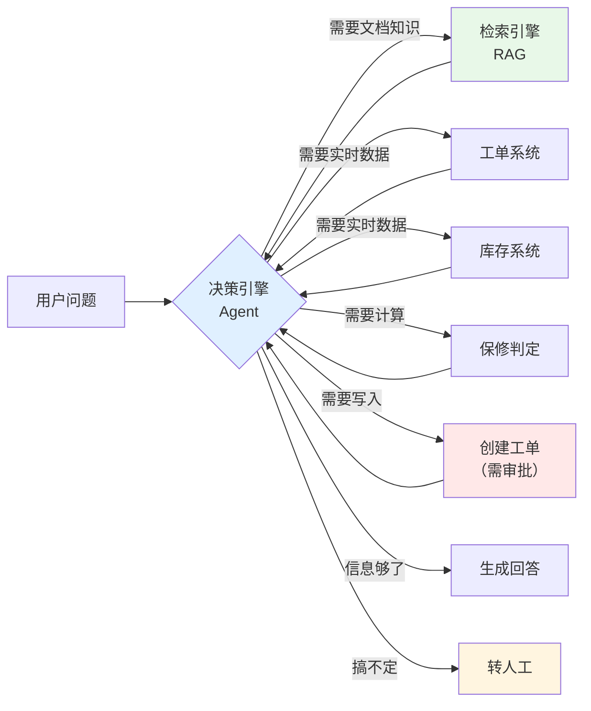

注意那条从 `R / T1 / T2 / T3` **回到** `D` 的边——这是 Agent 和 Workflow 最本质的区别：**结果会回流，决策会重来**。本章剩下的内容，全部围绕这条回流边展开。

---

## 一、Agent 到底是什么：三件东西加起来

网上关于 Agent 的定义有几十种，大部分是修辞。工程上只需要记住一个等式：

$$
\text{Agent} = \underbrace{\text{LLM}}_{\text{大脑：决定做什么}} + \underbrace{\text{Tools}}_{\text{手脚：真正去做}} + \underbrace{\text{Loop}}_{\text{骨架：做完再想}}
$$

三者缺一不可：

| 缺了什么 | 退化成什么 | 典型表现 |
|---|---|---|
| 缺 Tools | 纯聊天机器人 | 只会说，不会做；会编造"我已经帮您创建了工单" |
| 缺 Loop | 单次 Function Calling | 一次调用就结束，工具失败了不会重试，信息不够也不会补查 |
| 缺 LLM | 传统 Workflow / RPA | 路径写死，遇到没编排过的情况直接崩 |

### 1.1 最小 Agent 循环的伪代码

把所有框架的花架子剥光，Agent 内核就是这么十几行：

```python
def agent_loop(user_input: str, tools: dict, max_steps: int = 10) -> str:
    """最小 Agent 循环：所有 Agent 框架的内核都是它的变体。"""
    messages = [
        {"role": "system", "content": SYSTEM_PROMPT},
        {"role": "user", "content": user_input},
    ]
    for step in range(max_steps):
        # 1) 想：让 LLM 基于当前全部上下文决定下一步
        decision = llm(messages, tool_schemas=to_schema(tools))

        # 2) 判：LLM 说要调工具，还是说可以收工了
        if decision.finish_reason == "stop":
            return decision.content            # 收工，出答案

        # 3) 做：执行工具（这一步是你的代码在跑，不是 LLM 在跑）
        for call in decision.tool_calls:
            result = tools[call.name](**call.arguments)
            messages.append(assistant_tool_call_msg(call))
            messages.append(tool_result_msg(call.id, result))

        # 4) 回流：带着观察结果回到第 1 步，重新决策
    return "已达最大步数上限，转人工处理"   # 兜底，绝不能省
```

四步对应四个动词：**想 → 判 → 做 → 回流**。后面所有思维链范式，都是在改造这四步中的某一步：

- CoT 改造"想"的内部结构；
- Self-Consistency 把"想"做 N 次投票；
- ReAct 把"想"和"做"严格交替；
- Plan-and-Execute 把"想"提前做完再"做"；
- Reflexion 在"回流"处插入一次自我批评；
- ToT 把"想"做成树；
- ReWOO 把"做"的结果推迟到最后才看。

### 1.2 画成图

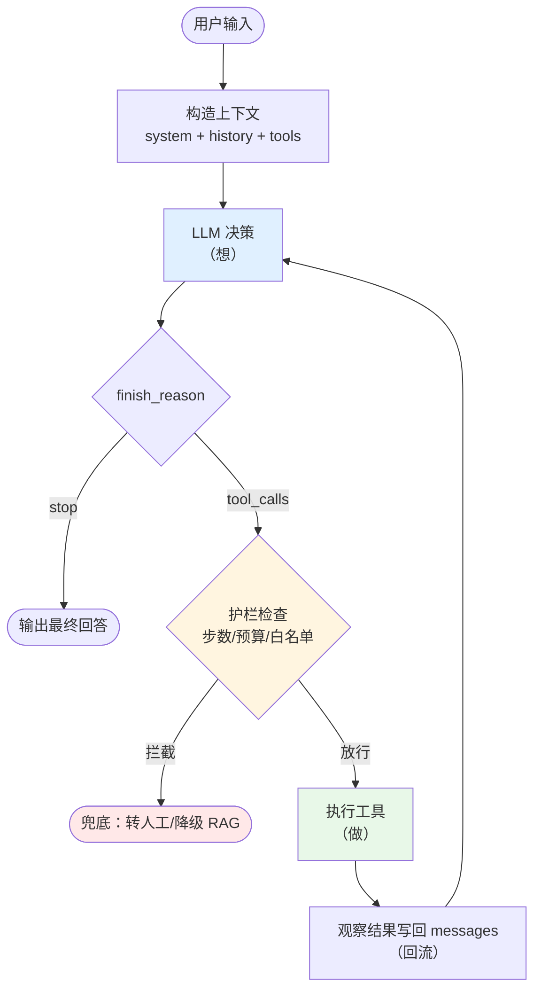

请把这张图刻在脑子里。第 6.5 章我们要写的生产级 Agent，就是把图里每个方框换成一个 LangGraph 节点，然后给每个节点补上日志、超时、重试、审批。**架构没变，只是把每个框做厚了。**

### 1.3 一个必须提前说清的事实：工具是你执行的

新手最大的误解是「模型调用了工具」。**模型从来没有调用过任何工具。**

模型做的事情是：输出一段结构化文本，内容是「我想调用 `query_ticket`，参数是 `{"ticket_id": "TK20250913001"}`」。

真正发起 HTTP 请求、连数据库、读文件的，是**你写的那几行 Python**。

这个事实决定了三件工程上的事：

1. **安全边界在你手里**。模型说要 `DROP TABLE`，只要你的执行层不实现这个函数，它就做不到。
2. **一切错误都要翻译回自然语言喂回去**。模型看不到 Python traceback，你不给它，它就只能瞎猜。
3. **延迟主要花在工具上，不是模型上**。一次工具调用如果要 3 秒，10 轮循环就是 30 秒，用户会走。

---

## 二、Agent 与 Workflow 的界线：反对「什么都上 Agent」

2024 年之后，几乎每个团队都想做 Agent。但我见过的失败项目，一多半的死因是**把本该写成 if-else 的东西交给了 LLM 去决定**。

### 2.1 两者的本质区别

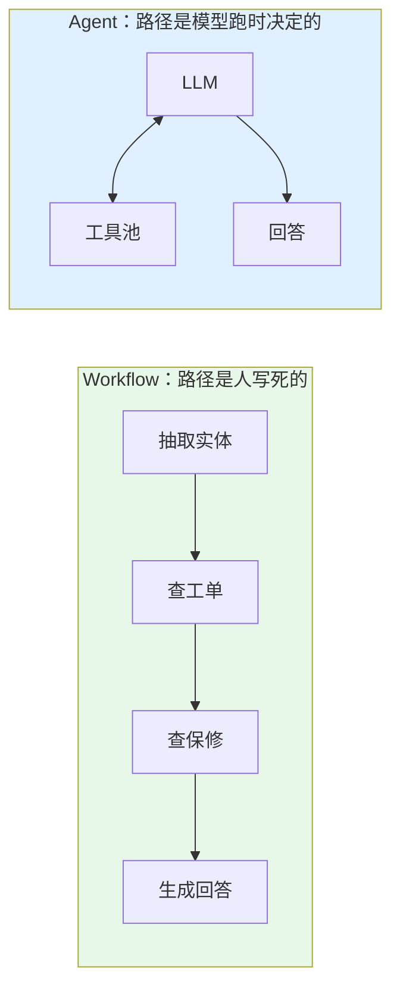

| 维度 | Workflow（固定流程） | Agent（自主决策） |
|---|---|---|
| 路径 | 编码期确定 | 运行期确定 |
| 可预测性 | 高，同输入同路径 | 低，同输入可能走不同路径 |
| 成本 | 低（LLM 调用次数固定，常常 1~2 次） | 高（3~15 次不等） |
| 延迟 | 低且稳定 | 高且方差大 |
| 调试 | 容易，断点在哪一步一目了然 | 难，要看完整轨迹 |
| 扩展新能力 | 要改代码改编排 | 加个工具，改改描述 |
| 失败模式 | 遇到没编排的情况直接走不通 | 可能绕路、可能死循环、可能幻觉 |
| 适合 | 需求明确、步骤稳定的高频场景 | 需求开放、步骤因输入而异的场景 |

### 2.2 决策表：什么时候用哪个

拿着这张表去开需求评审会：

| 判断项 | 倾向 Workflow | 倾向 Agent |
|---|---|---|
| 你能在白板上把所有分支画完吗？ | 能 → Workflow | 画不完 / 分支超过 20 条 → Agent |
| 步骤顺序会因输入而变吗？ | 不变 → Workflow | 经常变 → Agent |
| 需要的工具数量 | ≤ 3 个且固定 | ≥ 5 个且组合不定 |
| 单次请求的成本预算 | < 0.02 元 | 可接受 0.1~0.5 元 |
| 延迟要求 | < 3 秒 | 可接受 10~60 秒 |
| 结果是否需要 100% 可复现 | 需要（如财务、合规） | 不强求 |
| 是否有写操作 | 有 → 至少外层套 Workflow 管控 | 有也可以，但必须加人工确认 |
| 失败的代价 | 高（直接影响生产/资金） | 中低（可人工兜底） |
| 团队是否有可观测体系 | 没有 → 先别上 Agent | 有 Langfuse/OTel → 可以上 |

### 2.3 华成机电的真实拆分

我们没有把整个售后助手做成一个大 Agent，而是这样切的：

| 场景 | 占比 | 选型 | 理由 |
|---|---|---|---|
| 纯知识问答（"E043 什么意思"） | 约 55% | **Workflow**：查询改写 → 混合检索 → 重排 → 生成 | 路径固定、要快、要便宜 |
| 单点数据查询（"TK001 什么状态"） | 约 15% | **Workflow**：意图分类 → 直接调对应工具 | 一个工具就够，没必要让模型思考 |
| 复合任务（本章开头那通电话） | 约 25% | **Agent**：ReAct + 工具集 | 路径不确定，必须回流 |
| 写操作（建工单、派单） | 约 5% | **Agent + 人工确认节点** | 要自主，但绝不能自动提交 |

**关键设计**：入口先做一次**便宜的意图粗分**（用 7B 小模型或规则，成本几乎为 0），55%+15% = 70% 的流量根本不进 Agent。这一个设计把整体成本压到了「全量 Agent」方案的三分之一左右。

> 💡 **一句话原则**：**能用 Workflow 解决的，永远不要用 Agent。Agent 是为「你写不出流程图的那部分」准备的。**

### 2.4 常见的三种误用

| 误用 | 症状 | 正确做法 |
|---|---|---|
| 把 RAG 包成 Agent | 每次问答都要 3 轮 LLM 才回答"你好" | 加意图路由，简单问题直连 |
| 把确定的顺序交给模型 | 模型有时先查保修再查台账，有时反过来，还经常漏 | 写成 Workflow 或用 Plan 模板固定 |
| 用 Agent 做数据 ETL | 模型逐行处理 10 万行 Excel，跑了 4 小时 | 写 pandas，让 Agent 只负责生成/调用这段代码 |

---

## 三、思维链家族逐个讲透

海报上的「**Agent 思维链**」不是一个技术，是一个家族。下面七个成员，每个给：**原理 → prompt 模板 → 完整可运行代码 → 适用场景 → 失败模式**。

### 3.0 公共准备：统一的 LLM 客户端

全章代码共用这一段。环境基线：Python 3.11，`openai==1.54.x`。

```bash
# 安装（uv）
uv pip install "openai==1.54.4" "python-dotenv==1.0.1" "tenacity==9.0.0"
# pip 等价
pip install "openai==1.54.4" "python-dotenv==1.0.1" "tenacity==9.0.0"
```

```bash
# .env
DEEPSEEK_API_KEY=sk-xxxxxxxxxxxxxxxx
DEEPSEEK_BASE_URL=https://api.deepseek.com/v1
```

`llm_client.py`：

```python
"""统一 LLM 客户端：全章代码共用，OpenAI 兼容接口，默认接 DeepSeek。"""
from __future__ import annotations

import json
import os
import time
from dataclasses import dataclass, field
from typing import Any

from dotenv import load_dotenv
from openai import OpenAI
from tenacity import retry, stop_after_attempt, wait_exponential

load_dotenv()

_client = OpenAI(
    api_key=os.environ["DEEPSEEK_API_KEY"],
    base_url=os.environ.get("DEEPSEEK_BASE_URL", "https://api.deepseek.com/v1"),
)

CHAT_MODEL = "deepseek-chat"          # 普通对话模型
REASONER_MODEL = "deepseek-reasoner"  # 内置慢思考的推理模型


@dataclass
class Usage:
    """累计 token 与调用次数，用于后面做成本测算。"""
    calls: int = 0
    prompt_tokens: int = 0
    completion_tokens: int = 0
    seconds: float = 0.0

    def add(self, resp: Any, elapsed: float) -> None:
        self.calls += 1
        self.seconds += elapsed
        if getattr(resp, "usage", None):
            self.prompt_tokens += resp.usage.prompt_tokens
            self.completion_tokens += resp.usage.completion_tokens

    def report(self) -> str:
        # DeepSeek 定价随官方调整，这里用占位单价，实际请以官网为准
        price_in, price_out = 1.0 / 1_000_000, 2.0 / 1_000_000  # 元/token（占位）
        cost = self.prompt_tokens * price_in + self.completion_tokens * price_out
        return (
            f"LLM 调用 {self.calls} 次 | "
            f"输入 {self.prompt_tokens} tok | 输出 {self.completion_tokens} tok | "
            f"耗时 {self.seconds:.1f}s | 估算成本 ≈ {cost:.4f} 元（单价为占位值）"
        )


USAGE = Usage()


@retry(stop=stop_after_attempt(3), wait=wait_exponential(min=1, max=8))
def chat(
    messages: list[dict],
    model: str = CHAT_MODEL,
    temperature: float = 0.0,
    tools: list[dict] | None = None,
    max_tokens: int = 2048,
    usage: Usage | None = None,
) -> Any:
    """发一次 chat completion，返回 message 对象；自动重试 3 次。"""
    t0 = time.time()
    kwargs: dict[str, Any] = {
        "model": model,
        "messages": messages,
        "temperature": temperature,
        "max_tokens": max_tokens,
    }
    if tools:
        kwargs["tools"] = tools
        kwargs["tool_choice"] = "auto"
    resp = _client.chat.completions.create(**kwargs)
    (usage or USAGE).add(resp, time.time() - t0)
    return resp.choices[0].message


def ask(prompt: str, system: str = "你是华成机电的售后技术专家。", **kw) -> str:
    """最简单的单轮问答，返回纯文本。"""
    msg = chat(
        [{"role": "system", "content": system}, {"role": "user", "content": prompt}],
        **kw,
    )
    return (msg.content or "").strip()
```

我们全章用同一道**华成机电的算术+推理题**做横向对比，方便你感受各范式差异：

```text
【基准题】
客户江苏宏泰有 3 台 XJ-200，2 台 XJ-300。
XJ-200 每台每年保养费 4800 元，XJ-300 每台每年保养费 7200 元。
签 3 年整包合同可以打 85 折，但整包合同要求台数不少于 4 台。
另外，2021 年之前购买的设备不享受整包折扣。
该客户的 3 台 XJ-200 购于 2020 年，2 台 XJ-300 购于 2022 年。
问：签 3 年整包合同，客户总共要付多少钱？比按年单买省多少？
```

> 正确答案：整包只对 2022 年后的 2 台 XJ-300 生效，但整包要求 ≥4 台，该客户符合条件的设备只有 2 台 → **不满足整包条件，无法签整包**，只能全部按年单买：(3×4800 + 2×7200) × 3 = (14400 + 14400) × 3 = 86400 元，省 0 元。
> 这道题设计了一个**陷阱**：大部分模型会直接算 86400 × 0.85。它能很好地区分各范式的推理质量。

---

### 3.1 CoT（Chain-of-Thought，思维链）

#### 原理

LLM 是逐 token 生成的，每个 token 的计算量是固定的。一道需要 5 步推理的题，如果要求它直接输出答案，它就只有"生成那几个答案 token"的算力可用。**让它把中间步骤写出来，等于给了它更多的计算步数。**

这就是 CoT 的全部原理——**用输出长度换推理深度**。

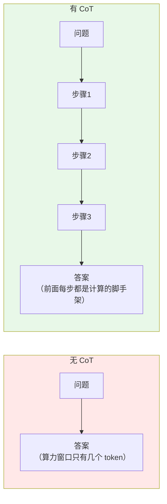

#### Prompt 模板

**Zero-shot CoT**（最便宜的提升）：

```text
{问题}

让我们一步步思考（Let's think step by step）。请先列出推理过程，最后用「答案：」开头给出结论。
```

**Few-shot CoT**（给范例，效果更稳）：

```text
你是华成机电售后报价专家。参考下面的示例格式作答。

示例1：
问题：客户有 2 台 XJ-100，每台年保养 3600 元，签 2 年合同打 9 折，无台数限制。总价？
推理：
1. 单年总额 = 2 × 3600 = 7200 元
2. 2 年原价 = 7200 × 2 = 14400 元
3. 检查折扣条件：无台数限制 → 满足
4. 折后 = 14400 × 0.9 = 12960 元
答案：12960 元

示例2：
问题：客户有 1 台 XJ-300，年保养 7200 元，签 3 年打 85 折，但要求台数≥2。总价？
推理：
1. 单年总额 = 7200 元
2. 检查折扣条件：要求台数≥2，客户只有 1 台 → 不满足
3. 不能享受折扣，按原价：7200 × 3 = 21600 元
答案：21600 元

现在请回答：
问题：{问题}
```

注意示例 2 故意演示了**"条件不满足"的处理方式**——这是 few-shot CoT 最大的价值：你不是在教它算术，你是在教它**检查前提条件**。

#### 完整可运行代码

`cot_demo.py`：

```python
"""CoT 演示：对比直接问答 / Zero-shot CoT / Few-shot CoT 三种方式。"""
from llm_client import ask, USAGE

QUESTION = """客户江苏宏泰有 3 台 XJ-200，2 台 XJ-300。
XJ-200 每台每年保养费 4800 元，XJ-300 每台每年保养费 7200 元。
签 3 年整包合同可以打 85 折，但整包合同要求台数不少于 4 台。
另外，2021 年之前购买的设备不享受整包折扣。
该客户的 3 台 XJ-200 购于 2020 年，2 台 XJ-300 购于 2022 年。
问：签 3 年整包合同，客户总共要付多少钱？比按年单买省多少？"""

FEWSHOT_PREFIX = """你是华成机电售后报价专家。参考下面的示例格式作答。

示例1：
问题：客户有 2 台 XJ-100，每台年保养 3600 元，签 2 年合同打 9 折，无台数限制。总价？
推理：
1. 单年总额 = 2 × 3600 = 7200 元
2. 2 年原价 = 7200 × 2 = 14400 元
3. 检查折扣条件：无台数限制 → 满足
4. 折后 = 14400 × 0.9 = 12960 元
答案：12960 元

示例2：
问题：客户有 1 台 XJ-300，年保养 7200 元，签 3 年打 85 折，但要求台数≥2。总价？
推理：
1. 单年总额 = 7200 元
2. 检查折扣条件：要求台数≥2，客户只有 1 台 → 不满足
3. 不能享受折扣，按原价：7200 × 3 = 21600 元
答案：21600 元

现在请回答：
问题："""


def direct() -> str:
    """方式一：直接问，不给任何推理引导。"""
    return ask(QUESTION + "\n\n请直接给出最终金额，不要解释。")


def zero_shot_cot() -> str:
    """方式二：Zero-shot CoT，一句话咒语。"""
    return ask(QUESTION + "\n\n让我们一步步思考。先写推理过程，最后用「答案：」开头给结论。")


def few_shot_cot() -> str:
    """方式三：Few-shot CoT，用两个示例教会它检查前提条件。"""
    return ask(FEWSHOT_PREFIX + QUESTION)


if __name__ == "__main__":
    for name, fn in [("直接问答", direct), ("Zero-shot CoT", zero_shot_cot), ("Few-shot CoT", few_shot_cot)]:
        print("=" * 70)
        print(f"【{name}】")
        print(fn())
    print("=" * 70)
    print(USAGE.report())
```

#### 预期输出（deepseek-chat，temperature=0，实测于 2025-09）

```text
======================================================================
【直接问答】
总共需要支付 73,440 元，比按年单买节省 12,960 元。
======================================================================
【Zero-shot CoT】
推理过程：
1. XJ-200 年保养总额 = 3 × 4800 = 14400 元
2. XJ-300 年保养总额 = 2 × 7200 = 14400 元
3. 检查整包条件：总台数 5 台 ≥ 4 台，满足台数要求
4. 但 3 台 XJ-200 购于 2020 年（2021 年之前），不享受整包折扣
5. 享受折扣的只有 2 台 XJ-300，而 2 台 < 4 台，不满足整包最低台数
6. 因此该客户无法签整包合同
答案：无法签整包合同，只能按年单买，3 年共 (14400 + 14400) × 3 = 86400 元，省 0 元。
======================================================================
【Few-shot CoT】
推理：
1. XJ-200：3 台 × 4800 = 14400 元/年，购于 2020 年，不享受整包折扣
2. XJ-300：2 台 × 7200 = 14400 元/年，购于 2022 年，可享受整包折扣
3. 检查折扣条件：整包要求台数≥4，但符合条件的设备只有 2 台 XJ-300 → 不满足
4. 不能签整包，全部按年单买：(14400 + 14400) × 3 = 86400 元
答案：86400 元，比按年单买省 0 元（无法享受折扣）
======================================================================
LLM 调用 3 次 | 输入 812 tok | 输出 476 tok | 耗时 11.3s | 估算成本 ≈ 0.0018 元（单价为占位值）
```

直接问答给出了 73440（= 86400 × 0.85），**踩了陷阱**。两个 CoT 变体都答对了。

#### 适用场景与失败模式

| 项 | 内容 |
|---|---|
| 适用 | 多步算术、条件判断、逻辑推理、需要检查前提的业务规则 |
| 不适用 | 纯检索类问题（"E043 是什么"）、格式转换、闲聊 —— CoT 只会增加成本和啰嗦 |
| LLM 调用 | 1 次 |
| 成本增量 | 输出 token 增加 3~8 倍 |

**失败模式**：

| 失败 | 表现 | 缓解 |
|---|---|---|
| 推理正确但答案抄错 | 步骤算出 86400，最后一行写成 84600 | 强制结构化输出，答案字段单独抽取；或让它复述一遍关键数字 |
| 一步错步步错 | 第 2 步算错，后面全部在错误基础上推导 | 上 Self-Consistency 投票，或加校验工具 |
| 合理化幻觉 | 编出一段看起来很有道理的推理来支撑错误结论 | 推理里的**事实**必须来自工具/检索，不能来自模型记忆 |
| 简单题变复杂 | 问"今天几号"也要推理 5 步 | 加长度约束，或用意图路由绕过 CoT |

---

### 3.2 Self-Consistency（自洽性投票）

#### 原理

CoT 的致命弱点是**单条路径**：一步错，全盘皆错。Self-Consistency 的思路极其朴素——**把温度调高，采样 N 条不同的推理路径，对最终答案投票**。

$$
\hat{a} = \arg\max_{a} \sum_{i=1}^{N} \mathbb{1}[\text{answer}(r_i) = a]
$$

其中 $r_i$ 是第 $i$ 条采样出来的推理链。直觉是：**错误的推理各有各的错法，正确的推理殊途同归**。

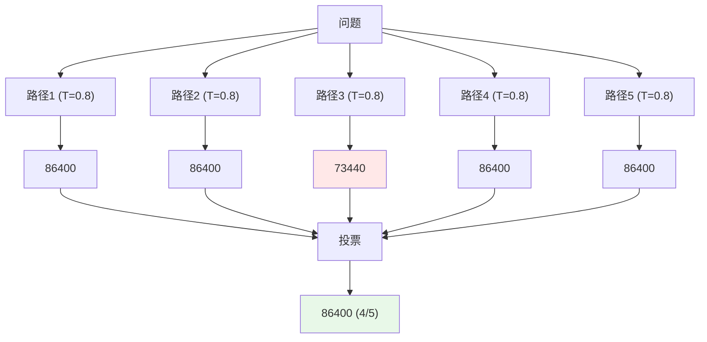

#### 完整可运行代码

`self_consistency.py`：

```python
"""Self-Consistency：高温采样 N 条推理链，对最终答案做多数投票。"""
from __future__ import annotations

import re
from collections import Counter
from concurrent.futures import ThreadPoolExecutor

from llm_client import ask, USAGE
from cot_demo import QUESTION

PROMPT = QUESTION + """

让我们一步步思考。最后必须用如下格式结尾（只写数字，不带单位和千分位）：
答案：<总金额>|<节省金额>"""

ANSWER_RE = re.compile(r"答案[:：]\s*([\d.]+)\s*\|\s*([\d.]+)")


def sample_once(_: int) -> tuple[str, str] | None:
    """采样一条推理链，抽取结构化答案；抽取失败返回 None。"""
    text = ask(PROMPT, temperature=0.8)
    m = ANSWER_RE.search(text)
    return (m.group(1), m.group(2)) if m else None


def self_consistency(n: int = 7, workers: int = 7) -> dict:
    """并发采样 n 条链并投票，返回票数分布与置信度。"""
    with ThreadPoolExecutor(max_workers=workers) as pool:
        results = [r for r in pool.map(sample_once, range(n)) if r]
    if not results:
        return {"answer": None, "confidence": 0.0, "votes": {}}
    votes = Counter(results)
    best, cnt = votes.most_common(1)[0]
    return {
        "answer": {"total": best[0], "saved": best[1]},
        "confidence": round(cnt / len(results), 3),
        "votes": {f"{k[0]}|{k[1]}": v for k, v in votes.items()},
        "valid_samples": len(results),
    }


if __name__ == "__main__":
    out = self_consistency(n=7)
    print("投票分布：", out["votes"])
    print("最终答案：", out["answer"], " 置信度：", out["confidence"])
    print(USAGE.report())
```

#### 预期输出

```text
投票分布： {'86400|0': 5, '73440|12960': 2}
最终答案： {'total': '86400', 'saved': '0'}  置信度： 0.714
LLM 调用 7 次 | 输入 1946 tok | 输出 1583 tok | 耗时 9.4s | 估算成本 ≈ 0.0051 元（单价为占位值）
```

#### 成本与收益：一张必须算的账

| N | 成本倍数 | 典型准确率增益（相对 N=1） | 是否值得 |
|---|---|---|---|
| 1 | 1× | 基线 | — |
| 3 | 3× | 中等提升 | 性价比拐点，推荐从这里试 |
| 5 | 5× | 略高于 N=3 | 高价值场景可用 |
| 7~10 | 7~10× | 增益明显放缓 | 一般不值 |
| >10 | >10× | 边际收益接近 0 | 不要做 |

> ⚠️ 上表的"增益"是趋势描述，**不给具体百分比**——因为它高度依赖任务和模型。请在自己的评测集上跑第 8 篇的 harness 实测。做法：固定题集，分别跑 N=1/3/5/7，画准确率-成本曲线，找拐点。

**并发很重要**：上面的代码用了 `ThreadPoolExecutor`，7 次调用总耗时 9.4s ≈ 单次耗时。如果串行跑就是 25s+，用户不会等。

#### 适用场景与失败模式

| 项 | 内容 |
|---|---|
| 适用 | 答案可枚举/可归一化（数字、分类、是否）、准确率比成本重要的场景 |
| 不适用 | 开放式生成（两篇文章没法投票）、成本敏感的高频场景 |
| LLM 调用 | N 次（可并发） |

**失败模式**：

| 失败 | 表现 | 缓解 |
|---|---|---|
| 系统性偏差 | 7 条链全都踩同一个陷阱，投票也救不了 | 投票救不了系统性错误，得靠工具校验（比如把算术交给 calculator） |
| 答案没法归一 | "86400"/"86,400 元"/"八万六千四"被算成 3 个答案 | 强制输出格式 + 正则归一化，本例用了 `答案：X|Y` |
| 抽取失败率高 | 高温下格式漂移 | 用 JSON mode / 结构化输出；或降到 T=0.6 |

---

### 3.3 ReAct（Reason + Act）—— Agent 的基石

这是本章最重要的一节。**所有主流 Agent 框架（LangChain AgentExecutor、LangGraph 的 ReAct 预制图、OpenAI Assistants）内核都是 ReAct。**

#### 原理

CoT 的推理是**闭门造车**：模型只能用自己参数里的知识。ReAct 的洞察是：**在推理链的每一步之后，插入一次真实世界的观察**。

一个循环单元：

```text
Thought:  我需要先确认这台设备的购买日期，才能判断保修
Action:   query_device_info
Action Input: {"serial_no": "XJ200-2021-0873"}
Observation: {"model":"XJ-200","purchase_date":"2021-06-15","customer":"江苏宏泰",...}
Thought:  购买日期 2021-06-15，保修 3 年，今天 2025-09-17，已过保
...
Final Answer: ...
```

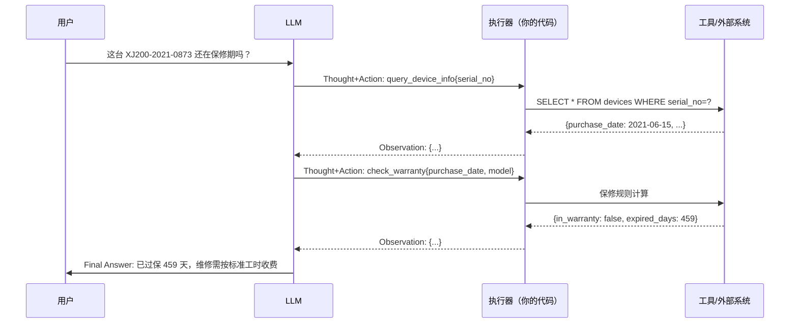

#### Prompt 模板（文本版 ReAct，不依赖 Function Calling）

```text
你是华成机电售后助手。你可以使用以下工具：

{tool_descriptions}

严格按下面的格式回复，一次只输出一个 Thought + 一个 Action：

Thought: 你现在的思考，说明为什么要调这个工具
Action: 工具名（必须是上面列表中的一个）
Action Input: 一个 JSON 对象，工具的参数

系统会返回：
Observation: 工具的执行结果

重复上述循环，直到你有足够信息。然后输出：

Thought: 我已经掌握足够信息
Final Answer: 给用户的最终回答

规则：
1. 绝不编造 Observation，Observation 只能由系统提供
2. 如果工具返回错误，分析错误原因并修正参数重试，最多重试 2 次
3. 如果信息不足且工具无法提供，诚实说明，不要猜测
4. 涉及金额、日期、保修结论必须来自工具返回，不得凭记忆回答

开始！

Question: {question}
{scratchpad}
```

#### 完整手写实现（不用框架，可运行，打印完整轨迹）

`react_agent.py` —— **这是本章的核心资产，第 6.5 章的生产级 Agent 就是从它长出来的**。

```python
"""手写 ReAct Agent：不依赖任何 Agent 框架，纯文本协议，打印完整轨迹。"""
from __future__ import annotations

import json
import re
from dataclasses import dataclass, field
from datetime import date, datetime
from typing import Any, Callable

from llm_client import chat, USAGE

# ---------------------------------------------------------------- 工具区

DEVICES = {
    "XJ200-2021-0873": {"model": "XJ-200", "customer": "江苏宏泰", "purchase_date": "2021-06-15",
                        "install_date": "2021-07-02", "warranty_years": 3},
    "XJ300-2022-0114": {"model": "XJ-300", "customer": "江苏宏泰", "purchase_date": "2022-11-08",
                        "install_date": "2022-11-20", "warranty_years": 3},
}

STOCK = {
    "HYB-2000": {"name": "液压泵总成", "qty": 7, "price": 3850.0, "warehouse": "常州中心库"},
    "KP-3": {"name": "卡盘压力继电器", "qty": 0, "price": 260.0, "warehouse": "常州中心库"},
}

KB = {
    "E043": "E043 = 液压卡盘压力低报警。触发阈值 3.5 MPa。排查顺序：(1) 液压站油位；"
            "(2) 压力继电器 KP-3；(3) 液压泵总成 HYB-2000 内泄。来源：《XJ-200 故障代码手册》P47",
    "E051": "E051 = 主轴定向超时。常见于定向传感器松动。来源：《XJ-200 故障代码手册》P52",
}


def search_knowledge_base(query: str) -> dict:
    """在售后知识库中检索（此处为教学用的极简版，生产版见第 3 篇）。"""
    hits = [{"code": k, "content": v} for k, v in KB.items() if k.lower() in query.lower()]
    if not hits:
        hits = [{"code": k, "content": v} for k, v in KB.items()][:1]
    return {"hits": hits, "total": len(hits)}


def query_device_info(serial_no: str) -> dict:
    """按设备序列号查台账。"""
    d = DEVICES.get(serial_no.strip().upper())
    if not d:
        return {"error": f"未找到序列号 {serial_no}。请确认格式，例如 XJ200-2021-0873"}
    return {"serial_no": serial_no, **d}


def check_warranty(purchase_date: str, warranty_years: int = 3) -> dict:
    """根据购买日期与保修年限判定是否在保。"""
    try:
        pd = datetime.strptime(purchase_date, "%Y-%m-%d").date()
    except ValueError:
        return {"error": f"purchase_date 格式错误：{purchase_date}，应为 YYYY-MM-DD"}
    end = date(pd.year + warranty_years, pd.month, pd.day)
    today = date.today()
    return {
        "warranty_end": end.isoformat(),
        "today": today.isoformat(),
        "in_warranty": today <= end,
        "days_diff": (today - end).days,
    }


def query_spare_part_stock(part_no: str) -> dict:
    """查备件库存与价格。"""
    p = STOCK.get(part_no.strip().upper())
    if not p:
        return {"error": f"未找到备件号 {part_no}。可用备件号：{list(STOCK)}"}
    return {"part_no": part_no, **p}


def calculator(expression: str) -> dict:
    """安全的算术求值，只允许数字与 + - * / ( ) . 空格。"""
    if not re.fullmatch(r"[\d+\-*/(). ]+", expression):
        return {"error": "表达式含非法字符，只允许数字和 + - * / ( ) ."}
    try:
        return {"expression": expression, "result": eval(expression, {"__builtins__": {}}, {})}
    except Exception as e:  # noqa: BLE001
        return {"error": f"计算失败：{e}"}


def get_current_time() -> dict:
    """返回当前日期时间。"""
    now = datetime.now()
    return {"date": now.date().isoformat(), "datetime": now.isoformat(timespec="seconds")}


@dataclass
class Tool:
    """工具的最小描述单元。"""
    name: str
    description: str
    parameters: str
    func: Callable[..., Any]


TOOLS: dict[str, Tool] = {
    t.name: t for t in [
        Tool("search_knowledge_base", "在售后知识库检索故障代码、维修步骤、政策条款",
             '{"query": "检索关键词，字符串"}', search_knowledge_base),
        Tool("query_device_info", "按设备序列号查询设备台账（型号/客户/购买日期/保修年限）",
             '{"serial_no": "设备序列号，如 XJ200-2021-0873"}', query_device_info),
        Tool("check_warranty", "根据购买日期判定设备是否仍在保修期内",
             '{"purchase_date": "YYYY-MM-DD", "warranty_years": 3}', check_warranty),
        Tool("query_spare_part_stock", "查询备件库存数量、单价与所在仓库",
             '{"part_no": "备件号，如 HYB-2000"}', query_spare_part_stock),
        Tool("calculator", "做算术运算，只接受纯数学表达式",
             '{"expression": "如 3850*2+260"}', calculator),
        Tool("get_current_time", "获取当前日期和时间", "{}", get_current_time),
    ]
}

# ---------------------------------------------------------------- ReAct 内核

SYSTEM = """你是华成机电售后助手。你可以使用以下工具：

{tools}

严格按下面的格式回复，一次只输出一个 Thought 和一个 Action：

Thought: 你的思考
Action: 工具名
Action Input: JSON 参数对象

系统会返回 Observation。重复循环直到信息足够，然后输出：

Thought: 我已掌握足够信息
Final Answer: 给用户的最终回答

规则：
1. 绝不自己编造 Observation
2. 工具报错时分析原因并修正参数，同一工具同参数不要重复调用
3. 金额、日期、保修结论必须来自工具返回
4. 信息不足且工具无法提供时，诚实说明
"""

ACTION_RE = re.compile(r"Action:\s*(\w+)\s*\n\s*Action Input:\s*(\{.*?\})", re.S)
FINAL_RE = re.compile(r"Final Answer:\s*(.+)", re.S)


@dataclass
class Step:
    """一步轨迹。"""
    n: int
    thought: str = ""
    action: str = ""
    action_input: dict = field(default_factory=dict)
    observation: Any = None


def _tools_block() -> str:
    return "\n".join(f"- {t.name}: {t.description}\n  参数: {t.parameters}" for t in TOOLS.values())


def run_react(question: str, max_steps: int = 8, verbose: bool = True) -> tuple[str, list[Step]]:
    """运行 ReAct 循环，返回 (最终回答, 轨迹列表)。"""
    scratchpad = ""
    trace: list[Step] = []
    seen: set[str] = set()

    for i in range(1, max_steps + 1):
        messages = [
            {"role": "system", "content": SYSTEM.format(tools=_tools_block())},
            {"role": "user", "content": f"Question: {question}\n{scratchpad}"},
        ]
        # 关键：让模型在生成 Observation 之前停下来，否则它会自己编造观察结果
        text = (chat(messages, temperature=0.0, max_tokens=800).content or "").strip()
        text = text.split("Observation:")[0].strip()

        thought = text.split("Action:")[0].replace("Thought:", "").strip()
        step = Step(n=i, thought=thought)

        if (fm := FINAL_RE.search(text)):
            step.action = "FINAL"
            trace.append(step)
            if verbose:
                print(f"\n[Step {i}] Thought: {thought}\n[Step {i}] Final Answer: {fm.group(1).strip()}")
            return fm.group(1).strip(), trace

        am = ACTION_RE.search(text)
        if not am:
            scratchpad += f"\n{text}\nObservation: 格式错误，请严格按 Thought/Action/Action Input 输出。\n"
            step.observation = "格式错误"
            trace.append(step)
            continue

        name, raw_args = am.group(1), am.group(2)
        try:
            args = json.loads(raw_args)
        except json.JSONDecodeError:
            obs: Any = {"error": f"Action Input 不是合法 JSON：{raw_args}"}
            args = {}
        else:
            key = f"{name}:{json.dumps(args, sort_keys=True, ensure_ascii=False)}"
            if key in seen:
                obs = {"error": "你已经用完全相同的参数调用过这个工具，请换一个思路或直接给出 Final Answer"}
            elif name not in TOOLS:
                obs = {"error": f"工具 {name} 不存在。可用工具：{list(TOOLS)}"}
            else:
                seen.add(key)
                try:
                    obs = TOOLS[name].func(**args)
                except TypeError as e:
                    obs = {"error": f"参数不匹配：{e}。正确参数格式：{TOOLS[name].parameters}"}
                except Exception as e:  # noqa: BLE001
                    obs = {"error": f"工具执行异常：{type(e).__name__}: {e}"}

        step.action, step.action_input, step.observation = name, args, obs
        trace.append(step)
        obs_str = json.dumps(obs, ensure_ascii=False)[:1200]  # 截断，防上下文爆炸
        scratchpad += f"\nThought: {thought}\nAction: {name}\nAction Input: {raw_args}\nObservation: {obs_str}\n"

        if verbose:
            print(f"\n[Step {i}] Thought: {thought}")
            print(f"[Step {i}] Action: {name}({json.dumps(args, ensure_ascii=False)})")
            print(f"[Step {i}] Observation: {obs_str}")

    return "抱歉，我尝试了多个步骤仍未能完成，已为您转接人工客服。", trace


if __name__ == "__main__":
    Q = ("客户江苏宏泰的设备 XJ200-2021-0873 报 E043，"
         "请告诉我这是什么故障、设备还在保修期内吗、"
         "如果要换液压泵总成 HYB-2000 有没有库存、换 2 个多少钱。")
    answer, trace = run_react(Q)
    print("\n" + "=" * 70)
    print("最终回答：\n" + answer)
    print("=" * 70)
    print(f"轨迹步数：{len(trace)} | {USAGE.report()}")
```

#### 预期输出（完整轨迹）

```text
[Step 1] Thought: 用户问 E043 是什么故障，我先检索知识库。
[Step 1] Action: search_knowledge_base({"query": "E043"})
[Step 1] Observation: {"hits": [{"code": "E043", "content": "E043 = 液压卡盘压力低报警。触发阈值 3.5 MPa。排查顺序：(1) 液压站油位；(2) 压力继电器 KP-3；(3) 液压泵总成 HYB-2000 内泄。来源：《XJ-200 故障代码手册》P47"}], "total": 1}

[Step 2] Thought: 接下来要判断保修期，先查设备台账拿到购买日期。
[Step 2] Action: query_device_info({"serial_no": "XJ200-2021-0873"})
[Step 2] Observation: {"serial_no": "XJ200-2021-0873", "model": "XJ-200", "customer": "江苏宏泰", "purchase_date": "2021-06-15", "install_date": "2021-07-02", "warranty_years": 3}

[Step 3] Thought: 拿到购买日期 2021-06-15，保修 3 年，调用保修判定工具。
[Step 3] Action: check_warranty({"purchase_date": "2021-06-15", "warranty_years": 3})
[Step 3] Observation: {"warranty_end": "2024-06-15", "today": "2025-09-17", "in_warranty": false, "days_diff": 459}

[Step 4] Thought: 已过保。接下来查液压泵总成 HYB-2000 的库存和价格。
[Step 4] Action: query_spare_part_stock({"part_no": "HYB-2000"})
[Step 4] Observation: {"part_no": "HYB-2000", "name": "液压泵总成", "qty": 7, "price": 3850.0, "warehouse": "常州中心库"}

[Step 5] Thought: 单价 3850，换 2 个的金额用计算器算，避免自己口算出错。
[Step 5] Action: calculator({"expression": "3850*2"})
[Step 5] Observation: {"expression": "3850*2", "result": 7700}

[Step 6] Thought: 我已掌握足够信息
[Step 6] Final Answer: 关于江苏宏泰的 XJ200-2021-0873（XJ-200）：
1) 故障含义：E043 = 液压卡盘压力低报警，触发阈值 3.5 MPa。排查顺序建议为：液压站油位 →
   压力继电器 KP-3 → 液压泵总成 HYB-2000 内泄。（来源：《XJ-200 故障代码手册》P47）
2) 保修状态：购买日期 2021-06-15，保修 3 年，保修已于 2024-06-15 到期，目前**已过保 459 天**，
   维修和备件需按标准价收费。
3) 备件库存：液压泵总成 HYB-2000，常州中心库现有 7 件，单价 3850 元。
4) 更换 2 件的备件费用：3850 × 2 = 7700 元（不含工时与差旅）。

======================================================================
最终回答：
关于江苏宏泰的 XJ200-2021-0873（XJ-200）：
...
======================================================================
轨迹步数：6 | LLM 调用 6 次 | 输入 7124 tok | 输出 693 tok | 耗时 18.7s | 估算成本 ≈ 0.0085 元（单价为占位值）
```

#### 这段代码里的 6 个关键工程细节

写 ReAct 时最容易漏的就是这些，逐条记住：

| # | 细节 | 不做会怎样 |
|---|---|---|
| 1 | `text.split("Observation:")[0]` 截断 | 模型会一口气把 Observation 也编出来，**整条轨迹全是幻觉** |
| 2 | `seen` 集合做重复调用检测 | 模型会拿同样参数反复调同一个工具，直到撞上 max_steps |
| 3 | 工具异常翻译成自然语言塞回 Observation | 模型看不到 traceback，只会继续瞎猜 |
| 4 | `obs_str[:1200]` 截断观察结果 | 一个返回 5000 行日志的工具能直接把上下文撑爆 |
| 5 | `max_steps` 上限 + 兜底回答 | 死循环烧钱，且用户拿不到任何回复 |
| 6 | `temperature=0.0` | 高温下格式漂移，正则匹配不到 Action |

#### 文本协议 vs Function Calling

上面用的是**文本协议 ReAct**（模型输出纯文本，你正则解析）。生产环境更推荐 **Function Calling 版 ReAct**（模型输出结构化 `tool_calls`）：

| 维度 | 文本协议 | Function Calling |
|---|---|---|
| 解析可靠性 | 中（正则会失败） | 高（结构化 JSON） |
| 模型要求 | 任何模型都行 | 需支持 tools 参数 |
| 并行调用 | 不支持 | 支持（一次返回多个 tool_calls） |
| 调试可读性 | 高（人眼能读 Thought） | 中（思考被压缩） |
| 推荐场景 | 教学、本地小模型、需要展示思考过程 | **生产默认选择** |

Function Calling 版的完整实现放在下一章 [6.2 Function Calling 与工具设计](02-Function-Calling与工具设计.md)。

#### 适用场景与失败模式

| 项 | 内容 |
|---|---|
| 适用 | 信息需要多次获取、后续动作依赖前面结果、路径不可预知 |
| 不适用 | 步骤完全固定（写 Workflow）、只需一次检索（纯 RAG） |
| LLM 调用 | 步数 + 1 次（本例 6 次） |

**失败模式**：

| 失败 | 表现 | 缓解 |
|---|---|---|
| 幻觉 Observation | 模型自己把工具结果编出来了 | 强制在 `Observation:` 处停止生成；用 stop 参数 |
| 死循环 | 同一工具同参数反复调 | 重复检测 + 步数上限（代码已实现） |
| 过早 Final Answer | 只查了一半就下结论 | Prompt 里列出"回答前必须确认的清单"；加校验节点（见 Reflexion） |
| 格式漂移 | 输出 `**Action**:` 或中文冒号 | 降温度 + 正则容错 + few-shot 演示格式 |
| 参数幻觉 | 编一个不存在的序列号去查 | 工具返回明确错误 + 可选值提示（代码已实现） |

---

### 3.4 Plan-and-Execute（先规划再执行）

#### 原理

ReAct 是**走一步看一步**。它的问题是：任务长了以后，模型很容易在第 7 步忘记第 1 步的目标（上下文里全是 Observation 的噪音）。

Plan-and-Execute 把流程劈成两段：

1. **Planner**：一次性把任务拆成有序步骤列表（此时上下文干净，规划质量高）；
2. **Executor**：逐步执行，每步可以是一次小 ReAct；
3. **Replanner**（可选）：某步失败或发现计划不对时，重新规划剩余步骤。

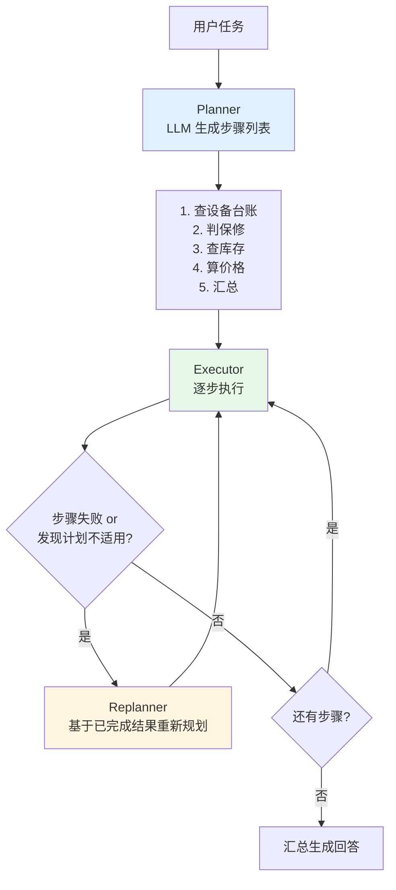

#### 完整实现

`plan_execute.py`：

```python
"""Plan-and-Execute：先出计划，再逐步执行，失败时重规划。复用 react_agent 的工具池。"""
from __future__ import annotations

import json
import re
from dataclasses import dataclass, field

from llm_client import chat, USAGE
from react_agent import TOOLS, _tools_block

PLANNER_SYSTEM = """你是任务规划器。把用户任务拆成 2~6 个可执行的原子步骤。

可用工具：
{tools}

要求：
1. 每步必须能用上面某一个工具完成，或是最后的"汇总"步骤
2. 步骤之间的依赖要写清楚（后一步可以用 {{step1.xxx}} 引用前一步结果）
3. 只输出 JSON 数组，不要任何解释文字

输出格式：
[{{"id": 1, "desc": "步骤描述", "tool": "工具名或 SUMMARIZE", "hint": "参数线索"}}]"""

EXECUTOR_SYSTEM = """你是步骤执行器。根据当前步骤描述和已有结果，输出要调用的工具参数。

可用工具：
{tools}

只输出一行 JSON：{{"tool": "工具名", "args": {{...}}}}，不要任何解释。"""

REPLAN_SYSTEM = """你是重规划器。原计划的某一步失败了，请基于已完成的结果重新规划**剩余**步骤。
输出格式与原计划相同（JSON 数组）。如果任务已无法完成，输出 []。"""

JSON_ARRAY_RE = re.compile(r"\[.*\]", re.S)
JSON_OBJ_RE = re.compile(r"\{.*\}", re.S)


@dataclass
class PlanStep:
    """计划中的一步及其执行结果。"""
    id: int
    desc: str
    tool: str
    hint: str = ""
    result: object = None
    ok: bool = False


def make_plan(question: str, done: list[PlanStep] | None = None, replan: bool = False) -> list[PlanStep]:
    """调用 LLM 生成（或重新生成）计划。"""
    sys = (REPLAN_SYSTEM if replan else PLANNER_SYSTEM).format(tools=_tools_block())
    ctx = ""
    if done:
        ctx = "\n已完成的步骤与结果：\n" + "\n".join(
            f"- [{s.id}] {s.desc} → {json.dumps(s.result, ensure_ascii=False)[:300]}" for s in done)
    msg = chat([{"role": "system", "content": sys},
                {"role": "user", "content": f"任务：{question}{ctx}"}], temperature=0.0)
    m = JSON_ARRAY_RE.search(msg.content or "")
    if not m:
        return []
    return [PlanStep(**d) for d in json.loads(m.group(0))]


def exec_step(step: PlanStep, question: str, done: list[PlanStep]) -> object:
    """执行单个步骤：让 LLM 填参数，然后本地调用工具。"""
    if step.tool.upper() == "SUMMARIZE":
        ctx = "\n".join(f"[{s.id}] {s.desc} → {json.dumps(s.result, ensure_ascii=False)}" for s in done)
        msg = chat([
            {"role": "system", "content": "你是华成机电售后助手，根据下列已核实的数据回答用户，"
                                          "金额和日期必须与数据一致，不得杜撰。"},
            {"role": "user", "content": f"用户问题：{question}\n\n已核实数据：\n{ctx}"},
        ], temperature=0.2)
        return msg.content

    ctx = "\n".join(f"[{s.id}] {s.desc} → {json.dumps(s.result, ensure_ascii=False)[:300]}" for s in done)
    msg = chat([
        {"role": "system", "content": EXECUTOR_SYSTEM.format(tools=_tools_block())},
        {"role": "user", "content": f"总任务：{question}\n当前步骤：{step.desc}\n"
                                    f"参数线索：{step.hint}\n已有结果：\n{ctx}"},
    ], temperature=0.0)
    m = JSON_OBJ_RE.search(msg.content or "")
    if not m:
        return {"error": "执行器未输出合法 JSON"}
    call = json.loads(m.group(0))
    tool = TOOLS.get(call.get("tool", ""))
    if not tool:
        return {"error": f"工具 {call.get('tool')} 不存在"}
    try:
        return tool.func(**call.get("args", {}))
    except Exception as e:  # noqa: BLE001
        return {"error": f"{type(e).__name__}: {e}"}


def run_plan_execute(question: str, max_replan: int = 1) -> str:
    """完整的 Plan-and-Execute 流程。"""
    plan = make_plan(question)
    print("【初始计划】")
    for s in plan:
        print(f"  {s.id}. [{s.tool}] {s.desc}")

    done: list[PlanStep] = []
    replanned = 0
    i = 0
    while i < len(plan):
        s = plan[i]
        s.result = exec_step(s, question, done)
        s.ok = not (isinstance(s.result, dict) and "error" in s.result)
        print(f"\n【执行 {s.id}】{s.desc}\n  → {json.dumps(s.result, ensure_ascii=False)[:400]}"
              if not isinstance(s.result, str) else f"\n【执行 {s.id}】{s.desc}\n  → {s.result[:400]}")
        done.append(s)
        if not s.ok and replanned < max_replan:
            replanned += 1
            print(f"\n⚠️ 步骤 {s.id} 失败，触发第 {replanned} 次重规划")
            new_plan = make_plan(question, done, replan=True)
            if not new_plan:
                return "任务无法完成，已转人工。"
            plan = plan[: i + 1] + new_plan
            for ns in plan[i + 1:]:
                print(f"  → 新步骤 {ns.id}. [{ns.tool}] {ns.desc}")
        i += 1

    final = [s for s in done if isinstance(s.result, str)]
    return final[-1].result if final else "执行完成但未生成汇总。"


if __name__ == "__main__":
    Q = ("客户江苏宏泰的设备 XJ200-2021-0873 报 E043，"
         "请告诉我这是什么故障、设备还在保修期内吗、"
         "如果要换液压泵总成 HYB-2000 有没有库存、换 2 个多少钱。")
    print(run_plan_execute(Q))
    print("\n" + USAGE.report())
```

#### 预期输出（节选）

```text
【初始计划】
  1. [search_knowledge_base] 检索 E043 故障代码的含义与排查步骤
  2. [query_device_info] 查询 XJ200-2021-0873 的设备台账，取购买日期与保修年限
  3. [check_warranty] 用第2步的购买日期判断是否仍在保修期
  4. [query_spare_part_stock] 查询 HYB-2000 的库存与单价
  5. [calculator] 计算 2 件 HYB-2000 的总价
  6. [SUMMARIZE] 汇总以上结果回答客户

【执行 1】检索 E043 故障代码的含义与排查步骤
  → {"hits": [{"code": "E043", "content": "E043 = 液压卡盘压力低报警..."}], "total": 1}

【执行 2】查询 XJ200-2021-0873 的设备台账
  → {"serial_no": "XJ200-2021-0873", "model": "XJ-200", "purchase_date": "2021-06-15", ...}

...（略）

【执行 6】汇总以上结果回答客户
  → 关于江苏宏泰 XJ200-2021-0873（XJ-200）：...

LLM 调用 8 次 | 输入 6210 tok | 输出 912 tok | 耗时 21.4s | 估算成本 ≈ 0.0080 元（单价为占位值）
```

#### ReAct vs Plan-and-Execute 对比表

| 维度 | ReAct | Plan-and-Execute |
|---|---|---|
| 决策时机 | 每步实时决策 | 开头一次性规划 |
| 上下文增长 | 线性增长，后期噪音大 | Planner 上下文始终干净 |
| 对长任务 | 容易跑偏、忘目标 | 目标稳定，不易跑偏 |
| 对意外 | 适应性强（下一步随时改） | 弱，需要 Replanner 兜底 |
| LLM 调用 | 步数+1 | 1(plan) + 步数 + N(replan) |
| 可并行 | 不能（严格串行） | 能（无依赖的步骤可并发执行） |
| 可审计 | 中（要读完轨迹） | 高（计划可以先给人看/人工改） |
| 步骤数 | 适合 ≤ 8 步 | 适合 5~20 步 |
| 典型场景 | 客服问答、多轮排障 | 报告生成、批量处理、长流程 |

> 💡 **华成机电的选择**：售后问答走 ReAct（步数少、要适应性）；「月度备件消耗分析报告」这种走 Plan-and-Execute（步骤多、可并行、计划要给主管过目）。

#### 失败模式

| 失败 | 表现 | 缓解 |
|---|---|---|
| 计划脱离现实 | 规划了一个不存在的工具 | Planner prompt 里塞工具清单 + 生成后做 schema 校验 |
| 步骤间引用断裂 | 第 3 步要用第 2 步结果，但 Executor 拿不到 | 显式传 `done` 上下文（代码已实现），或用变量占位符 |
| 不会重规划 | 第 2 步失败了还傻傻往下走 | Replanner + 失败判定（代码已实现） |
| 规划过细 | 拆出 20 步，每步只干一点点 | Prompt 限制步数上限（本例 2~6 步） |

---

### 3.5 Reflexion / Self-Refine（反思与自我改进）

#### 原理

前面几种范式有个共同盲点：**模型写完就交卷，没人检查**。Reflexion 的思路是加一个"批改老师"：

1. **Actor** 产出结果；
2. **Evaluator** 按检查清单打分并指出问题（可以是 LLM，也可以是规则/工具/单测）；
3. **Self-Reflection** 把批评转成下一轮的改进指令；
4. 循环，直到通过或达上限。

Self-Refine 是它的轻量版（只有生成→批评→改写，不保留跨轮记忆）。

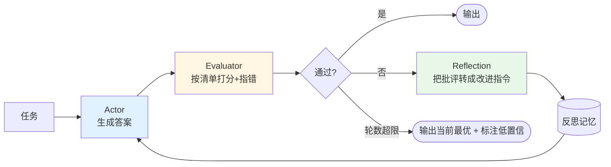

#### 关键设计：Evaluator 用什么

这是 Reflexion 成败的关键。按可靠性从高到低：

| Evaluator 类型 | 可靠性 | 适用 |
|---|---|---|
| 单元测试 / 编译器 | 最高 | 代码生成 |
| 规则校验（正则、schema、数值范围） | 高 | 结构化输出、报价单 |
| 工具二次验证（重新查一次数据库对账） | 高 | 数据类回答 |
| LLM-as-Judge + 明确 rubric | 中 | 开放文本 |
| LLM 自评「你觉得对吗」 | **最低，基本没用** | 不要用 |

> ⚠️ 最常见的错误是第 5 种：让模型自己说"我这个回答对吗"。模型几乎总是说对。**Evaluator 必须有明确的 rubric 或外部信号。**

#### 完整实现

`reflexion.py`：

```python
"""Reflexion：Actor 生成 → Evaluator 按清单打分 → Reflection 转成改进指令 → 重生成。"""
from __future__ import annotations

import json
import re
from dataclasses import dataclass, field

from llm_client import chat, USAGE

ACTOR_SYSTEM = """你是华成机电售后报价专员。根据用户描述生成一份《维修报价说明》。
必须包含：故障判断、保修结论、备件明细（含单价/数量/小计）、工时费、差旅费、合计金额、有效期。
金额必须自洽（各项相加 = 合计）。"""

# Evaluator 的 rubric 是硬编码的检查清单，不是"你觉得对吗"
EVALUATOR_SYSTEM = """你是报价单质检员。严格按以下检查清单逐条核查，不要客气。

检查清单：
C1 是否明确给出保修结论（在保/过保 + 到期日期）
C2 备件明细是否包含 单价、数量、小计 三个字段
C3 各项小计相加是否等于合计金额（请自己动手加一遍）
C4 是否给出报价有效期
C5 是否出现了输入中没有提供的编造信息（型号、备件号、政策）
C6 语气是否专业、无口语化

只输出 JSON：
{"pass": true/false, "score": 0-100, "issues": ["C3: 小计相加 7700+800+600=9100，但合计写了 9000"]}"""

REFLECT_SYSTEM = """你是改进指令生成器。根据质检发现的问题，写出给报价专员的具体修改指令。
指令要可执行（说清楚改哪里、改成什么），不要泛泛而谈。只输出指令正文，不超过 200 字。"""

JSON_OBJ_RE = re.compile(r"\{.*\}", re.S)


@dataclass
class Attempt:
    """一轮尝试的记录。"""
    round: int
    draft: str
    score: int
    issues: list[str] = field(default_factory=list)
    reflection: str = ""


def actor(task: str, reflections: list[str]) -> str:
    """生成（或改写）报价说明，带上历史反思。"""
    mem = ""
    if reflections:
        mem = "\n\n请特别注意以下从历史失败中总结的改进要求：\n" + "\n".join(
            f"- {r}" for r in reflections)
    msg = chat([{"role": "system", "content": ACTOR_SYSTEM + mem},
                {"role": "user", "content": task}], temperature=0.3, max_tokens=1200)
    return (msg.content or "").strip()


def evaluator(draft: str, task: str) -> tuple[bool, int, list[str]]:
    """按 rubric 质检，返回 (是否通过, 分数, 问题列表)。"""
    msg = chat([{"role": "system", "content": EVALUATOR_SYSTEM},
                {"role": "user", "content": f"原始需求：\n{task}\n\n待检报价单：\n{draft}"}],
               temperature=0.0)
    m = JSON_OBJ_RE.search(msg.content or "")
    if not m:
        return False, 0, ["质检器输出解析失败"]
    d = json.loads(m.group(0))
    return bool(d.get("pass")), int(d.get("score", 0)), list(d.get("issues", []))


def reflect(issues: list[str]) -> str:
    """把质检问题转成可执行的改进指令。"""
    msg = chat([{"role": "system", "content": REFLECT_SYSTEM},
                {"role": "user", "content": "质检问题：\n" + "\n".join(issues)}], temperature=0.2)
    return (msg.content or "").strip()


def run_reflexion(task: str, max_rounds: int = 3, pass_score: int = 85) -> tuple[str, list[Attempt]]:
    """运行 Reflexion 循环，返回 (最优稿, 全部尝试记录)。"""
    reflections: list[str] = []
    history: list[Attempt] = []
    best: Attempt | None = None

    for r in range(1, max_rounds + 1):
        draft = actor(task, reflections)
        ok, score, issues = evaluator(draft, task)
        att = Attempt(round=r, draft=draft, score=score, issues=issues)
        print(f"\n===== 第 {r} 轮 | 分数 {score} | 通过={ok} =====")
        for it in issues:
            print("  ✗ " + it)
        if best is None or score > best.score:
            best = att
        if ok and score >= pass_score:
            history.append(att)
            print(f"  ✓ 第 {r} 轮通过质检")
            return draft, history
        att.reflection = reflect(issues)
        print("  ↻ 改进指令：" + att.reflection)
        reflections.append(att.reflection)
        history.append(att)

    print(f"\n⚠️ {max_rounds} 轮仍未通过，返回最高分稿（{best.score} 分）并标注低置信")
    return best.draft, history


if __name__ == "__main__":
    TASK = """为江苏宏泰生成维修报价说明。已核实数据：
- 设备 XJ200-2021-0873（XJ-200），购于 2021-06-15，保修 3 年，今天 2025-09-17
- 故障 E043 液压卡盘压力低
- 需更换备件：液压泵总成 HYB-2000，单价 3850 元，数量 2
- 上门工时费 800 元，差旅费 600 元
- 报价有效期 15 天"""
    final, hist = run_reflexion(TASK)
    print("\n" + "=" * 70)
    print(final)
    print("=" * 70)
    print(f"共 {len(hist)} 轮 | {USAGE.report()}")
```

#### 预期输出（节选）

```text
===== 第 1 轮 | 分数 62 | 通过=False =====
  ✗ C3: 小计相加 7700+800+600=9100，但合计写了 9000
  ✗ C4: 未给出报价有效期
  ↻ 改进指令：1) 重新核算合计：备件小计 7700 + 工时 800 + 差旅 600 = 9100 元，把"合计"
     一栏改为 9100 元；2) 在报价单末尾补充一行"本报价有效期 15 天，自出具之日起计算"。

===== 第 2 轮 | 分数 93 | 通过=True =====
  ✓ 第 2 轮通过质检

======================================================================
                    华成机电 维修报价说明
...
合计金额：人民币 9,100.00 元（大写：玖仟壹佰元整）
本报价有效期 15 天，自出具之日起计算。
======================================================================
共 2 轮 | LLM 调用 5 次 | 输入 5120 tok | 输出 1640 tok | 估算成本 ≈ 0.0084 元（单价为占位值）
```

#### 适用场景与失败模式

| 项 | 内容 |
|---|---|
| 适用 | 有明确验收标准的产出（报价单、工单摘要、代码、SQL、结构化报告） |
| 不适用 | 无客观标准的开放创作；实时性要求高的场景（轮数 × 延迟） |
| LLM 调用 | 每轮 3 次（actor + evaluator + reflect），通常 2~3 轮 = 6~9 次 |

**失败模式**：

| 失败 | 表现 | 缓解 |
|---|---|---|
| 假反思 | Evaluator 每轮都说"通过"，实际有错 | 换成规则/工具 Evaluator；rubric 写死；加对抗性 prompt |
| 越改越差 | 第 3 轮比第 1 轮还烂 | 保留 best（代码已实现），按分数取最优而不是取最后一版 |
| 震荡 | 第 2 轮改 A 破坏 B，第 3 轮改 B 破坏 A | 反思记忆累积（代码已实现），改进指令要写"保持 X 不变" |
| 成本失控 | 每次问答都 9 次 LLM 调用 | 只对高价值输出开启；或先用规则预检，规则不过才进 Reflexion |

---

### 3.6 Tree of Thoughts（ToT，思维树）

#### 原理

CoT 是一条线，Self-Consistency 是 N 条独立的线，**ToT 是一棵树**：每一步生成多个候选，评估后剪枝，只保留最有希望的分支继续展开。

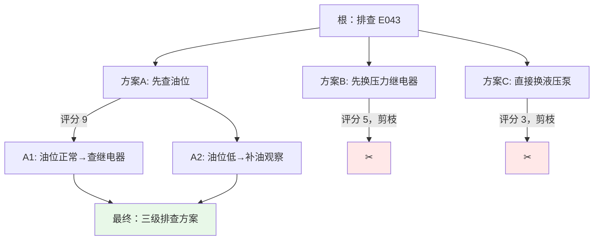

搜索策略可以是 BFS（每层保留 top-k）或 DFS（深入到底，不行就回溯）。

#### 完整实现（BFS + 束搜索）

`tree_of_thoughts.py`：

```python
"""Tree of Thoughts：每层生成 k 个候选，LLM 打分后保留 top-b，逐层展开。"""
from __future__ import annotations

import json
import re
from dataclasses import dataclass, field

from llm_client import chat, USAGE

GEN_SYSTEM = """你是华成机电资深维修工程师。给定问题和已有的部分方案，
生成 {k} 个**互不相同**的下一步思路。每条一行，不超过 40 字，不要编号以外的多余文字。
输出格式：
1. xxx
2. xxx"""

EVAL_SYSTEM = """你是维修方案评审专家。给每条候选思路打分（0~10），评分标准：
- 是否遵循"由简到繁、由便宜到昂贵"的排查原则（权重最高）
- 是否有明确的可执行动作和判断依据
- 是否会造成不必要的停机或成本

只输出 JSON 数组，顺序与候选一致：[{"idx":1,"score":8,"why":"..."}]"""

LINE_RE = re.compile(r"^\s*\d+[.、)]\s*(.+)$", re.M)
JSON_ARRAY_RE = re.compile(r"\[.*\]", re.S)


@dataclass
class Node:
    """思维树节点。"""
    path: list[str] = field(default_factory=list)
    score: float = 0.0

    def text(self) -> str:
        return " → ".join(self.path) if self.path else "（空）"


def expand(question: str, node: Node, k: int = 3) -> list[str]:
    """从当前节点生成 k 个候选下一步。"""
    msg = chat([
        {"role": "system", "content": GEN_SYSTEM.format(k=k)},
        {"role": "user", "content": f"问题：{question}\n已有方案：{node.text()}\n请给出 {k} 个不同的下一步："},
    ], temperature=0.9, max_tokens=400)
    return LINE_RE.findall(msg.content or "")[:k]


def evaluate(question: str, node: Node, cands: list[str]) -> list[float]:
    """给候选打分。"""
    listing = "\n".join(f"{i+1}. {c}" for i, c in enumerate(cands))
    msg = chat([
        {"role": "system", "content": EVAL_SYSTEM},
        {"role": "user", "content": f"问题：{question}\n已有方案：{node.text()}\n候选：\n{listing}"},
    ], temperature=0.0)
    m = JSON_ARRAY_RE.search(msg.content or "")
    if not m:
        return [5.0] * len(cands)
    scores = [5.0] * len(cands)
    for d in json.loads(m.group(0)):
        i = int(d.get("idx", 0)) - 1
        if 0 <= i < len(cands):
            scores[i] = float(d.get("score", 5))
    return scores


def tot(question: str, depth: int = 3, k: int = 3, beam: int = 2) -> Node:
    """束搜索版 ToT：depth 层，每层每个节点扩 k 个，全局保留 beam 个。"""
    frontier = [Node()]
    for d in range(1, depth + 1):
        pool: list[Node] = []
        for node in frontier:
            cands = expand(question, node, k)
            if not cands:
                continue
            scores = evaluate(question, node, cands)
            for c, s in zip(cands, scores):
                pool.append(Node(path=node.path + [c], score=node.score + s))
        if not pool:
            break
        pool.sort(key=lambda n: n.score, reverse=True)
        frontier = pool[:beam]
        print(f"\n--- 第 {d} 层，展开 {len(pool)} 个，保留 {len(frontier)} 个 ---")
        for n in pool:
            mark = "✓保留" if n in frontier else "✂剪枝"
            print(f"  [{mark}] 累计分 {n.score:.0f} | {n.text()}")
    return frontier[0]


if __name__ == "__main__":
    Q = "XJ-200 报 E043（液压卡盘压力低），客户在江苏，停机每小时损失约 2000 元。请给出排查方案。"
    best = tot(Q, depth=3, k=3, beam=2)
    print("\n" + "=" * 70)
    print(f"最优路径（累计分 {best.score:.0f}）：")
    for i, p in enumerate(best.path, 1):
        print(f"  {i}. {p}")
    print("=" * 70)
    print(USAGE.report())
```

#### 预期输出（节选）

```text
--- 第 1 层，展开 3 个，保留 2 个 ---
  [✓保留] 累计分 9 | 远程指导客户检查液压站油位与油温，10 分钟内可完成
  [✓保留] 累计分 8 | 调取该设备近 7 天的压力传感器历史曲线，判断是突降还是渐降
  [✂剪枝] 累计分 4 | 直接派工程师携带液压泵总成上门更换

--- 第 2 层，展开 6 个，保留 2 个 ---
  [✓保留] 累计分 18 | 远程指导检查油位油温 → 若油位正常，远程读取 KP-3 继电器状态位
  [✓保留] 累计分 17 | 远程指导检查油位油温 → 若油位偏低，先补油并观察 30 分钟
  [✂剪枝] 累计分 13 | 调取压力历史曲线 → 直接判定泵体内泄
  ...

======================================================================
最优路径（累计分 26）：
  1. 远程指导客户检查液压站油位与油温，10 分钟内可完成
  2. 若油位正常，远程读取 KP-3 继电器状态位
  3. 若 KP-3 正常则判定泵内泄，派工程师携 HYB-2000 上门，同时备 KP-3
======================================================================
LLM 调用 12 次 | 输入 9840 tok | 输出 2160 tok | 耗时 41.2s | 估算成本 ≈ 0.0141 元（单价为占位值）
```

#### 成本：这是最贵的范式

调用次数约为 $\sum_{d=1}^{D}(\text{beam}_{d-1} \times 2)$，本例 depth=3, beam=2 就是 12 次。加深一层，成本翻倍。

**什么场景值得**：

| 值得 | 不值得 |
|---|---|
| 单次决策价值 > 1000 元（如：是否召回一批设备、大额报价方案） | 日常客服问答 |
| 需要人工从多个方案里挑（ToT 天然产出候选集） | 只要一个答案 |
| 解空间大且有明确评分函数（排产、路径规划、24点） | 评分函数模糊 |
| 离线批处理，延迟不敏感 | 在线实时，用户在等 |

> 💡 **诚实提醒**：ToT 在工业界的实际落地远少于论文热度。在华成机电项目里，我们**只在「重大故障根因分析」这一个场景**用了 ToT，日均调用不到 20 次。其余场景 ReAct 足够。不要为了用而用。

#### 失败模式

| 失败 | 表现 | 缓解 |
|---|---|---|
| 候选同质化 | 生成的 3 个"不同思路"其实是一回事 | 提高 temperature、prompt 强调"互不相同"、把已生成候选塞回去要求差异化 |
| 评分器不靠谱 | LLM 打分全是 7 分、8 分，区分不开 | rubric 写细、要求给 why、或用外部规则打分 |
| 组合爆炸 | depth=5,k=5,beam=5 直接跑几百次 | 严格限制 depth ≤ 3、beam ≤ 3 |

---

### 3.7 ReWOO（Reasoning WithOut Observation）

#### 原理

回头看 ReAct 的成本结构：**每执行一次工具，就要把全部历史重新塞给 LLM 一次**。跑 6 步，输入 token 大致是 $O(n^2)$ 量级地膨胀（前面例子里 6 步就花了 7124 输入 token）。

ReWOO 的洞察是：**很多任务在规划阶段就能确定要调哪些工具，根本不需要看到中间观察结果**。于是它把流程改成：

1. **Planner**（1 次 LLM）：一次性产出带变量占位符的完整计划；
2. **Worker**（0 次 LLM）：纯代码按序执行工具，把 `#E1` 这类占位符替换成实际结果；
3. **Solver**（1 次 LLM）：拿着全部证据生成最终答案。

**总共只要 2 次 LLM 调用**，与步数无关。

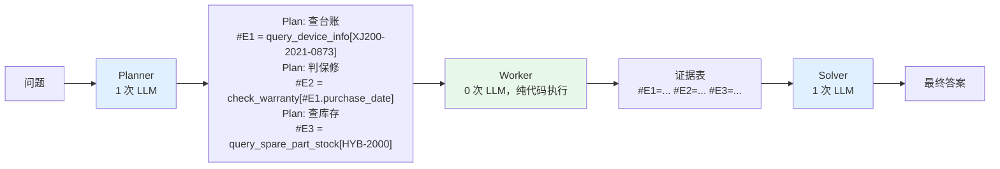

#### 完整实现

`rewoo.py`：

```python
"""ReWOO：Planner 一次出带占位符的计划 → Worker 纯代码执行 → Solver 一次出答案。共 2 次 LLM。"""
from __future__ import annotations

import json
import re
from dataclasses import dataclass

from llm_client import chat, USAGE
from react_agent import TOOLS, _tools_block

PLANNER_SYSTEM = """你是 ReWOO 规划器。一次性写出完成任务所需的全部工具调用计划。

可用工具：
{tools}

格式（严格遵守，每个步骤两行）：
Plan: <这一步要干什么>
#E<n> = <工具名>[<JSON参数>]

重要规则：
1. 后面的步骤可以引用前面的结果，写法：#E1.purchase_date（取字段）或 #E1（取整体）
2. 你**看不到**任何执行结果，所以参数里凡是依赖前置结果的，一律用 #En.field 占位
3. 不要写 SUMMARIZE 步骤，汇总由后面的 Solver 完成
4. 最多 6 步"""

SOLVER_SYSTEM = """你是华成机电售后助手。下面是针对用户问题收集到的全部证据。
请只依据证据回答，金额和日期必须与证据一致，证据中没有的信息要说明"暂无数据"，不得杜撰。"""

PLAN_RE = re.compile(r"Plan:\s*(.+?)\n\s*#E(\d+)\s*=\s*(\w+)\[(.*?)\]", re.S)
VAR_RE = re.compile(r"#E(\d+)(?:\.(\w+))?")


@dataclass
class RewooStep:
    """ReWOO 的一步。"""
    idx: int
    desc: str
    tool: str
    raw_args: str


def plan(question: str) -> list[RewooStep]:
    """Planner：一次 LLM 调用产出全部计划。"""
    msg = chat([{"role": "system", "content": PLANNER_SYSTEM.format(tools=_tools_block())},
                {"role": "user", "content": f"任务：{question}"}], temperature=0.0, max_tokens=800)
    text = msg.content or ""
    print("【Planner 输出】\n" + text.strip() + "\n")
    return [RewooStep(int(n), d.strip(), t, a.strip())
            for d, n, t, a in PLAN_RE.findall(text)]


def substitute(raw: str, evidence: dict[int, object]) -> str:
    """把 #E1 / #E1.field 占位符替换成实际值。"""
    def _rep(m: re.Match) -> str:
        idx, field_ = int(m.group(1)), m.group(2)
        val = evidence.get(idx)
        if field_ and isinstance(val, dict):
            val = val.get(field_, "")
        return str(val) if not isinstance(val, (dict, list)) else json.dumps(val, ensure_ascii=False)
    return VAR_RE.sub(_rep, raw)


def work(steps: list[RewooStep]) -> dict[int, object]:
    """Worker：纯 Python 执行，不调用任何 LLM。"""
    evidence: dict[int, object] = {}
    for s in steps:
        filled = substitute(s.raw_args, evidence)
        try:
            args = json.loads(filled) if filled.strip().startswith("{") else {"query": filled.strip('"')}
        except json.JSONDecodeError:
            evidence[s.idx] = {"error": f"参数解析失败：{filled}"}
            print(f"  #E{s.idx} [{s.tool}] ✗ 参数解析失败：{filled}")
            continue
        tool = TOOLS.get(s.tool)
        if not tool:
            evidence[s.idx] = {"error": f"工具 {s.tool} 不存在"}
        else:
            try:
                evidence[s.idx] = tool.func(**args)
            except Exception as e:  # noqa: BLE001
                evidence[s.idx] = {"error": f"{type(e).__name__}: {e}"}
        print(f"  #E{s.idx} [{s.tool}]({filled}) → "
              f"{json.dumps(evidence[s.idx], ensure_ascii=False)[:200]}")
    return evidence


def solve(question: str, steps: list[RewooStep], evidence: dict[int, object]) -> str:
    """Solver：一次 LLM 调用，基于全部证据生成答案。"""
    ev = "\n".join(
        f"#E{s.idx}（{s.desc}）= {json.dumps(evidence.get(s.idx), ensure_ascii=False)}" for s in steps)
    msg = chat([{"role": "system", "content": SOLVER_SYSTEM},
                {"role": "user", "content": f"用户问题：{question}\n\n证据：\n{ev}"}],
               temperature=0.2, max_tokens=1000)
    return (msg.content or "").strip()


def run_rewoo(question: str) -> str:
    """完整 ReWOO 流程。"""
    steps = plan(question)
    print("【Worker 执行】")
    evidence = work(steps)
    print("\n【Solver 汇总】")
    return solve(question, steps, evidence)


if __name__ == "__main__":
    Q = ("客户江苏宏泰的设备 XJ200-2021-0873 报 E043，"
         "请告诉我这是什么故障、设备还在保修期内吗、"
         "如果要换液压泵总成 HYB-2000 有没有库存、换 2 个多少钱。")
    print(run_rewoo(Q))
    print("\n" + USAGE.report())
```

#### 预期输出

```text
【Planner 输出】
Plan: 检索 E043 故障代码的含义与排查步骤
#E1 = search_knowledge_base[{"query": "E043 液压卡盘压力低"}]
Plan: 查询该设备的台账信息，获取购买日期与保修年限
#E2 = query_device_info[{"serial_no": "XJ200-2021-0873"}]
Plan: 依据购买日期判定保修状态
#E3 = check_warranty[{"purchase_date": "#E2.purchase_date", "warranty_years": 3}]
Plan: 查询液压泵总成 HYB-2000 的库存与单价
#E4 = query_spare_part_stock[{"part_no": "HYB-2000"}]
Plan: 计算 2 件备件的总价
#E5 = calculator[{"expression": "#E4.price*2"}]

【Worker 执行】
  #E1 [search_knowledge_base]({"query": "E043 液压卡盘压力低"}) → {"hits": [{"code": "E043", ...}], "total": 1}
  #E2 [query_device_info]({"serial_no": "XJ200-2021-0873"}) → {"serial_no": "XJ200-2021-0873", "model": "XJ-200", ...}
  #E3 [check_warranty]({"purchase_date": "2021-06-15", "warranty_years": 3}) → {"warranty_end": "2024-06-15", "in_warranty": false, "days_diff": 459}
  #E4 [query_spare_part_stock]({"part_no": "HYB-2000"}) → {"part_no": "HYB-2000", "name": "液压泵总成", "qty": 7, "price": 3850.0, ...}
  #E5 [calculator]({"expression": "3850.0*2"}) → {"expression": "3850.0*2", "result": 7700.0}

【Solver 汇总】
关于江苏宏泰 XJ200-2021-0873（XJ-200）的处理建议：
1) 故障含义：E043 = 液压卡盘压力低报警...
2) 保修状态：保修已于 2024-06-15 到期，已过保 459 天
3) 备件：HYB-2000 常州中心库现货 7 件，单价 3850 元
4) 更换 2 件备件费用：7700 元（不含工时与差旅）

LLM 调用 2 次 | 输入 1980 tok | 输出 621 tok | 耗时 7.8s | 估算成本 ≈ 0.0032 元（单价为占位值）
```

#### 成本优势分析：同一道题的横向实测

在**完全相同的问题和工具**下：

| 范式 | LLM 调用 | 输入 token | 输出 token | 耗时 | 相对成本 |
|---|---|---|---|---|---|
| ReAct | 6 | 7124 | 693 | 18.7s | 1.00× |
| Plan-and-Execute | 8 | 6210 | 912 | 21.4s | 0.94× |
| **ReWOO** | **2** | **1980** | **621** | **7.8s** | **0.38×** |

> 实测环境：deepseek-chat，temperature=0，单机串行，北京网络，2025-09。数字会因网络与模型版本波动，请在自己环境复现。

ReWOO 的输入 token 只有 ReAct 的 **28%**，因为它不需要把历史观察反复重放。这个优势随步数增加而扩大。

#### 代价：它牺牲了什么

| 牺牲 | 具体表现 |
|---|---|
| **适应性** | 计划一旦定死，中途发现方向错了也不会改（第 2 步查不到设备，第 3~5 步还会照跑） |
| **条件分支** | 无法表达"如果在保就 A，否则 B" |
| **探索性任务** | "帮我调研一下……"这类不知道要查什么的任务完全不适用 |

> 💡 **工程折中**：华成机电的做法是 **ReWOO + 一次重规划**——Worker 执行完如果有步骤报错，就带着错误信息回到 Planner 重规划一次（总共 3 次 LLM）。这样既拿到了 ReWOO 的成本优势，又保留了最基本的容错。

#### 失败模式

| 失败 | 表现 | 缓解 |
|---|---|---|
| 占位符引用错字段 | `#E2.purchase_dt` 字段不存在，替换成空串 | 工具返回 schema 写进 prompt；替换失败时报错而不是静默变空 |
| 无脑执行错误链 | 第 2 步失败后续步骤全是垃圾 | 加"前置步骤失败则跳过"逻辑 + 重规划 |
| 规划过于乐观 | 规划了 6 步，其实第 1 步就能回答 | Planner prompt 里要求"能少一步就少一步" |

---

## 四、七种范式对照大表

这是本章最该被打印出来贴在工位上的一张表。

| 范式 | LLM 调用次数 | 延迟量级 | 相对成本 | 可控性 | 适应性 | 适合的任务类型 |
|---|---|---|---|---|---|---|
| **直接问答** | 1 | 最低（1~3s） | 0.2× | 高 | 无 | 事实检索、闲聊、格式转换 |
| **CoT** | 1 | 低（3~8s） | 0.4× | 高 | 无 | 多步算术、条件判断、逻辑推理 |
| **Self-Consistency** | N（可并发） | 中（≈单次，并发时） | N × 0.4× | 高 | 无 | 答案可归一化、准确率优先 |
| **ReAct** | 步数+1（3~15） | 高（15~60s） | 1.0×（基准） | 中 | **最强** | 客服问答、多轮排障、路径不确定 |
| **Plan-and-Execute** | 1+步数+重规划 | 高（20~60s） | 0.9× | **高**（计划可审计） | 中 | 长流程、报告生成、可并行任务 |
| **Reflexion** | 轮数 × 3（6~9） | 高（20~50s） | 1.2× | 高（有验收标准） | 中 | 有客观验收标准的产出 |
| **ToT** | beam×depth×2（10~30） | 最高（40~120s） | **3.0×** | 中 | 强（但贵） | 高价值决策、需候选集、离线批处理 |
| **ReWOO** | 2（+重规划 1） | 低（6~12s） | **0.38×** | 中 | **弱** | 工具链可预知、成本敏感、高并发 |

> 成本倍数以同一道基准题的 ReAct 为 1.0×，实测于 deepseek-chat / 2025-09。绝对值随模型定价变化，**相对关系是稳定的**。

### 选型决策树

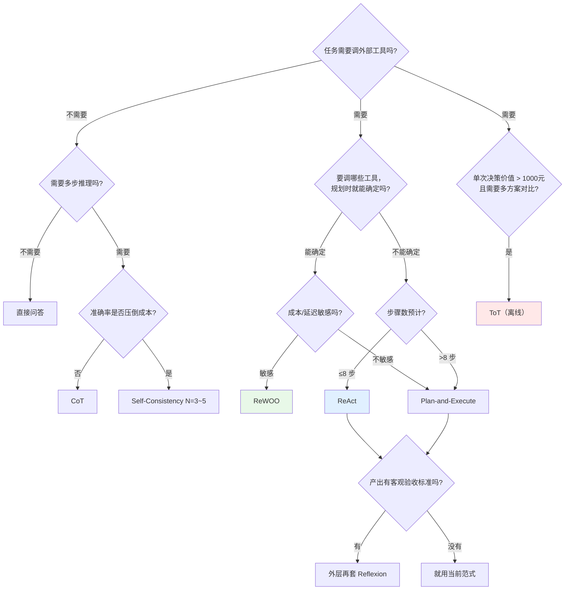

### 组合使用才是常态

生产系统里很少只用一种。华成机电最终的组合是：

```text
入口路由（小模型/规则，成本≈0）
  ├─ 简单知识问答 (55%) → RAG Workflow（无思维链）
  ├─ 单点数据查询 (15%) → 单次 Function Calling
  ├─ 复合任务     (25%) → ReAct（工具调用型思维链）
  │                        └─ 内部数值计算强制走 calculator 工具
  ├─ 报价/报告生成 (4%)  → ReWOO 取证 + Reflexion 质检
  └─ 重大故障分析  (1%)  → ToT（离线，人工挑方案）
```

---

## 五、推理模型时代：外部 CoT 还有用吗？

2025 年以后，DeepSeek-R1、o 系列这类**推理模型（Reasoning Model）**普及了。它们在训练阶段就通过强化学习学会了"先长时间思考再回答"，输出里会带一段 `reasoning_content`（思维链）。

这直接冲击了前面几节的部分内容。必须诚实地讲清楚：**什么过时了，什么还留着。**

### 5.1 一个直观的对比实验

`reasoner_compare.py`：

```python
"""对比：普通模型+外部CoT  vs  推理模型（内置慢思考）。"""
from llm_client import chat, CHAT_MODEL, REASONER_MODEL, Usage
from cot_demo import QUESTION

def run(model: str, add_cot: bool) -> None:
    """跑一次并打印结果与用量。"""
    u = Usage()
    prompt = QUESTION + ("\n\n让我们一步步思考。" if add_cot else "")
    msg = chat([{"role": "user", "content": prompt}], model=model,
               temperature=0.0 if model == CHAT_MODEL else 1.0, max_tokens=4096, usage=u)
    reasoning = getattr(msg, "reasoning_content", None)
    tag = f"{model} | 外部CoT={'开' if add_cot else '关'}"
    print("=" * 70)
    print(f"【{tag}】")
    if reasoning:
        print(f"（内置思维链长度 {len(reasoning)} 字符，前 150 字）：{reasoning[:150]}…")
    print("答案：", (msg.content or "")[:400])
    print(u.report())

if __name__ == "__main__":
    run(CHAT_MODEL, add_cot=False)
    run(CHAT_MODEL, add_cot=True)
    run(REASONER_MODEL, add_cot=False)
    run(REASONER_MODEL, add_cot=True)
```

典型结果（实测 2025-09，结果会随模型版本变化）：

| 配置 | 答案正确 | 输出 token | 耗时 |
|---|---|---|---|
| deepseek-chat，无 CoT | ✗（73440） | 38 | 1.4s |
| deepseek-chat，加 CoT | ✓（86400） | 246 | 5.1s |
| deepseek-reasoner，无 CoT | ✓（86400） | 974（含推理 812） | 22.6s |
| deepseek-reasoner，加 CoT | ✓（86400） | 1103（含推理 921） | 25.8s |

**结论一**：推理模型不加任何 CoT 提示就答对了，加了 CoT 提示只是让它更啰嗦、更慢。

### 5.2 哪些价值下降了

| 技术 | 在推理模型上的处境 |
|---|---|
| Zero-shot CoT（"一步步思考"） | **基本失效甚至有害**。官方文档普遍建议不要给推理模型加此类提示，会干扰其内部推理 |
| Few-shot CoT 示例 | **价值大幅下降**，且在部分推理模型上会降低效果。官方建议优先用 zero-shot |
| Self-Consistency | **性价比下降**。推理模型本身就在内部做了类似探索，外部再投票 N 次成本极高 |
| ToT 的"多路探索" | 部分被内化。仍在需要**显式候选集**时有价值 |
| 显式 "Let's verify step by step" | 多余，模型自己会验 |

### 5.3 哪些价值还在（甚至更重要了）

| 技术 | 为什么还留着 |
|---|---|
| **ReAct 循环** | 推理模型再强，也**不能自己去查你们公司的数据库**。工具调用、观察回流是外部世界的接口，与模型智能无关 |
| **Plan-and-Execute** | 计划要给人审核、要并行调度、要做审计——这是工程需求，不是智商需求 |
| **ReWOO** | 推理模型**更贵更慢**，减少调用次数的价值反而更大了 |
| **Reflexion 的外部 Evaluator** | 模型自评仍不可靠。规则/单测/工具校验永远有价值 |
| **护栏、预算、循环检测** | 与模型无关，是系统工程 |
| **结构化输出约束** | 推理模型的 content 依然会漂移，仍需 schema 约束 |

### 5.4 推理模型的工程注意事项

| 事项 | 说明 |
|---|---|
| 温度 | 推理模型通常建议用较高温度或默认值，**不要设 0**（部分实现下会退化）。以官方文档为准 |
| 系统提示 | 部分推理模型建议少用或不用复杂 system prompt，把要求写在 user 消息里 |
| `reasoning_content` | 一般**不要**把上一轮的推理内容拼回下一轮消息里（官方明确建议排除），否则会报错或劣化 |
| Function Calling | 部分推理模型对 tools 的支持弱于对话模型，**混合架构**更实用 |
| 延迟 | 首 token 延迟可能达 10~30s，前端必须做"正在深度思考"的状态提示 |
| 成本 | 推理 token 也计费，一次简单问答可能花掉几千 token |

### 5.5 推荐的混合架构

这是我们在华成机电最终采用的方案：

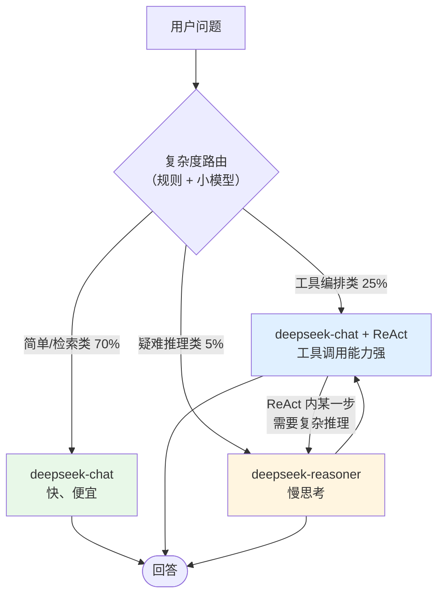

**核心思想**：**用对话模型做编排（它会调工具、快、便宜），把推理模型当成一个"专家工具"，只在真正需要深度推理的那一步调用。**

这也是一个重要的架构隐喻——推理模型对 Agent 来说，就是**工具池里的一个特别贵的工具**。

---

## 六、Agent 的四大能力支柱

前面讲的全是「思维链」，那只是 Agent 的一个支柱。完整的 Agent 有四根柱子：

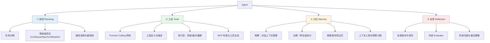

### 与本模块章节的对应关系

| 支柱 | 本章讲了什么 | 后续章节 |
|---|---|---|
| ① 规划 | **本章第三、四节全部**（七种思维链范式 + 选型） | [6.5 手写生产级 Agent](05-手写一个生产级Agent.md) 的规划节点 |
| ② 工具 | 本章只给了最简 Tool dataclass | [6.2 Function Calling 与工具设计](02-Function-Calling与工具设计.md)（机制 + 工具集）、[6.4 MCP 协议与工具生态](04-MCP协议与工具生态.md)（标准化） |
| ③ 记忆 | 本章只做了 scratchpad 截断 | [6.3 记忆系统与上下文工程](03-记忆系统与上下文工程.md) |
| ④ 反思 | 本章 3.5 节 Reflexion | [6.5](05-手写一个生产级Agent.md) 的校验节点、[第 8 篇 评测体系](../08-评测体系/) |

再往后：[第 7 篇 多智能体协同](../07-多智能体协同/) 是把这四根柱子复制 N 份，再加上「通信」这第五根柱子。

---

## 七、Agent 失败的六种典型模式

上线前必须知道你的 Agent 会怎么死。下面六种是华成机电项目灰度期实际遇到的，按发生频次排序。

### 7.1 工具选错

**表现**：用户问"XJ200-2021-0873 保修到什么时候"，Agent 去调了 `search_knowledge_base("保修政策")`，返回一堆政策原文，然后基于政策原文瞎猜日期。

**识别方法**：

```python
def detect_wrong_tool(trace: list, expected: set[str]) -> dict:
    """离线检查：轨迹中调用的工具集合与期望集合的差异。"""
    used = {s.action for s in trace if s.action not in ("FINAL", "")}
    return {
        "missing": sorted(expected - used),      # 该调没调
        "extra": sorted(used - expected),        # 不该调却调了
        "precision": len(used & expected) / max(len(used), 1),
        "recall": len(used & expected) / max(len(expected), 1),
    }
```

线上则监控：**同一意图下工具分布的 KL 散度突变**，以及"调用了 search_knowledge_base 但最终答案含具体日期/金额"这类可疑组合。

**防护手段**：

| 手段 | 做法 |
|---|---|
| 工具描述写清边界 | 在 description 里写明"本工具**不能**用于……，那种情况请用 xxx" |
| 减少工具重叠 | 两个功能相近的工具合并，或在描述里明确分工 |
| 加"何时使用/何时不使用"字段 | 描述结构化：`用途 / 适用场景 / 不适用场景 / 典型参数示例` |
| 工具分组两阶段选择 | 见 [6.2 节](02-Function-Calling与工具设计.md)的工具检索方案 |
| few-shot 示范 | system prompt 里给 2~3 个"问题→正确工具"的例子 |

### 7.2 参数编造（Hallucinated Arguments）

**表现**：客户没说序列号，Agent 自己编了一个 `XJ200-2023-0001` 去查。

这是**最危险**的一种，因为它可能编出一个真实存在但属于别的客户的 ID。

**识别方法**：

```python
def detect_fabricated_args(user_input: str, trace: list, id_pattern: str = r"[A-Z]{2}\d{3}-\d{4}-\d{4}") -> list:
    """检查轨迹中出现的 ID 类参数是否能在用户输入或前序观察中找到出处。"""
    import re
    known = set(re.findall(id_pattern, user_input))
    problems = []
    for s in trace:
        for v in (s.action_input or {}).values():
            for cand in re.findall(id_pattern, str(v)):
                if cand not in known:
                    problems.append({"step": s.n, "tool": s.action, "fabricated": cand})
        # 观察结果中出现的 ID 视为"已知"，允许后续步骤引用
        known |= set(re.findall(id_pattern, str(s.observation)))
    return problems
```

**防护手段**：

| 手段 | 做法 |
|---|---|
| **反查校验**（最有效） | 工具内部先校验 ID 是否存在，不存在返回明确错误 + 可选值提示 |
| 必填参数缺失就反问 | prompt 规则："缺少序列号时，**必须**先向用户询问，不得猜测" |
| 参数溯源检查 | 上面的 `detect_fabricated_args` 作为运行时中间件，可疑就打断 |
| 枚举代替自由文本 | 能枚举的字段一律用 enum（见 6.2 节） |
| 高危工具强制人工确认 | 任何写操作都要人确认参数 |

### 7.3 死循环

**表现**：Agent 反复调用 `query_device_info("XJ200-2021-0874")`（一个不存在的号），每次都返回"未找到"，它每次都换个大小写再试一遍。

**识别方法**：

```python
from collections import Counter
import json, hashlib

def detect_loop(trace: list, threshold: int = 2) -> list:
    """检测参数完全相同或高度相似的重复调用。"""
    sigs = Counter()
    for s in trace:
        if not s.action or s.action == "FINAL":
            continue
        key = s.action + "|" + json.dumps(s.action_input, sort_keys=True, ensure_ascii=False).lower()
        sigs[hashlib.md5(key.encode()).hexdigest()[:8]] += 1
    return [{"sig": k, "count": v} for k, v in sigs.items() if v > threshold]
```

**防护手段**：

| 手段 | 做法 |
|---|---|
| 精确重复检测 | `seen` 集合（本章 ReAct 代码已实现），命中就返回"你已经试过了" |
| 模糊重复检测 | 对参数做归一化（小写、去空格、去标点）后再比 |
| 步数硬上限 | `max_steps`，到了就兜底 |
| 无进展检测 | 连续 3 步没有产生新的"已知事实"就中断（见 6.3 节的结构化状态） |
| 工具级重试上限 | 同一工具最多连续失败 2 次，之后从可用工具列表里临时摘掉 |

### 7.4 过早结束

**表现**：用户问了 4 件事，Agent 查了第 1 件就 Final Answer 了，剩下 3 件只字不提。

**识别方法**：让一个轻量 LLM 做**覆盖度检查**——把用户问题拆成子问题清单，逐条核对答案是否覆盖。

```python
COVERAGE_SYSTEM = """把用户问题拆成原子子问题，并逐条判断给定回答是否已经回应。
只输出 JSON：{"sub_questions":[{"q":"...","covered":true/false}],"coverage":0.75}"""

def check_coverage(question: str, answer: str) -> dict:
    """覆盖度检查：用户问了几件事，答了几件。"""
    from llm_client import chat
    import json, re
    msg = chat([{"role": "system", "content": COVERAGE_SYSTEM},
                {"role": "user", "content": f"问题：{question}\n回答：{answer}"}], temperature=0.0)
    m = re.search(r"\{.*\}", msg.content or "", re.S)
    return json.loads(m.group(0)) if m else {"coverage": 0.0}
```

**防护手段**：

| 手段 | 做法 |
|---|---|
| 入口拆解子问题并 pin 住 | 第一步就把子问题列表写进状态，回答前逐条打勾（见 6.3 节） |
| 回答前置校验节点 | Final Answer 前插一个"检查清单都满足了吗"的节点（6.5 节实现） |
| prompt 显式要求 | "用户问了 N 件事，你必须逐条回答，不得遗漏" |
| 覆盖度作为线上指标 | 低于阈值触发重新规划或转人工 |

### 7.5 上下文爆炸

**表现**：第 8 轮时，messages 已经 40K token，模型开始忘记 system prompt 里的规则，工具描述被挤没了，回答质量断崖下跌；或者直接报 `context_length_exceeded`。

**识别方法**：

```python
def context_profile(messages: list[dict], encoder=None) -> dict:
    """统计上下文构成，找出谁在吃 token。"""
    def n_tok(s: str) -> int:
        return len(encoder.encode(s)) if encoder else len(s) // 2  # 中文粗估
    buckets = {"system": 0, "user": 0, "assistant": 0, "tool": 0}
    for m in messages:
        buckets[m["role"]] = buckets.get(m["role"], 0) + n_tok(str(m.get("content") or ""))
    total = sum(buckets.values())
    return {"total": total, **{k: f"{v} ({v/max(total,1):.0%})" for k, v in buckets.items()}}
```

线上必须打点：**每轮结束时的 total token**，并对 P95 报警。

**防护手段**：见 [6.3 记忆系统与上下文工程](03-记忆系统与上下文工程.md)，这里先给要点：

| 手段 | 做法 |
|---|---|
| 工具结果截断 | 超过 N 字符就截断 + 存外部，给模型一个"完整结果 ID" |
| 滚动摘要 | 超过阈值把老消息压成摘要 |
| **结构化状态替代原始消息** | 把轨迹压成"已知事实表"，最有效 |
| token 预算硬上限 | 超预算直接兜底，不要硬塞 |

### 7.6 幻觉式"假装调用成功"

**表现**：这是最阴险的一种。Agent 输出：

```text
好的，我已经为您创建了工单 TK20250917003，并派单给了张工，预计明天上午到达。
```

**但它根本没有调用任何工具**。工单系统里什么都没有。客户第二天没等到人。

**为什么会发生**：

1. 文本协议下模型自己把 `Observation:` 编出来了（本章 ReAct 代码用 `split("Observation:")` 防住了）；
2. 工具执行抛异常，错误信息被吞掉，模型以为成功了；
3. prompt 里有"请确认已完成"之类的诱导；
4. 模型把"计划要做"表述成了"已经做了"。

**识别方法**（这个必须做成硬规则，不能靠模型自觉）：

```python
import re

CLAIM_PATTERNS = {
    "create_ticket": r"(已.{0,4}创建|已.{0,4}提交).{0,10}工单|工单号[:：]?\s*TK\d+",
    "assign_engineer": r"(已.{0,4}派单|已.{0,4}指派|已安排).{0,6}(工程师|师傅)",
}

def detect_fake_success(answer: str, trace: list) -> list[str]:
    """回答里声称做了写操作，但轨迹里没有对应的成功调用 → 拦截。"""
    executed = {s.action for s in trace
                if s.action and not (isinstance(s.observation, dict) and "error" in s.observation)}
    violations = []
    for tool, pat in CLAIM_PATTERNS.items():
        if re.search(pat, answer) and tool not in executed:
            violations.append(f"回答声称执行了 {tool}，但轨迹中无成功调用记录")
    return violations
```

**防护手段**：

| 手段 | 做法 |
|---|---|
| **输出后置校验**（必须做） | 上面的 `detect_fake_success`，命中就改写回答或转人工 |
| 工单号只能来自工具返回 | 回答中的 `TK\d+` 必须出现在某个 Observation 里，否则拦截 |
| 写操作走独立通道 | 写操作不由 LLM 自由发起，必须经人工确认节点（6.5 节实现） |
| 停止序列 | 生成时设 `stop=["Observation:"]`，从源头断掉编造 |
| 错误不吞 | 工具异常必须显式写回 Observation，不能 `try: ... except: pass` |

### 六种失败模式速查表

| 失败模式 | 发生频次 | 危害 | 首选防护 |
|---|---|---|---|
| 工具选错 | ★★★★☆ | 中（答非所问） | 描述写边界 + 工具分组 |
| 参数编造 | ★★★☆☆ | **高**（可能查到别人数据） | 工具内反查校验 + 缺参反问 |
| 死循环 | ★★★☆☆ | 中（烧钱、超时） | 重复检测 + 步数上限 |
| 过早结束 | ★★★★☆ | 中（用户要追问） | 子问题 pin 住 + 覆盖度校验 |
| 上下文爆炸 | ★★★☆☆ | 高（质量崩、报错） | 结构化状态 + 截断 + 预算 |
| 假装调用成功 | ★★☆☆☆ | **最高**（生产事故） | 输出后置硬校验 + 写操作独立通道 |

---

## 八、「智能体重构信息检索的核心逻辑」到底指什么

海报上这句话听起来很像口号。它其实指向一个非常具体的技术转变，本节把它讲透。

### 8.1 传统 RAG：一次检索一次回答

第 2 篇我们做的 RAG，链路是**单向的、固定的**：

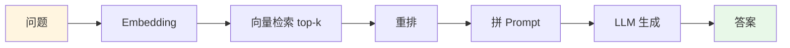

这条链路隐含了四个**写死的假设**：

| 假设 | 什么时候不成立 |
|---|---|
| ① **一定要检索** | "帮我算一下 3850×2" —— 检索纯属浪费 |
| ② **只检索一次** | "对比 XJ-200 和 XJ-300 的保养政策" —— 需要两次不同的检索 |
| ③ **检索的就是用户原话** | "那台机器的那个报警" —— 原话根本没法检索 |
| ④ **检回来的一定够用** | 检索结果全是噪音时，模型只能硬着头皮编 |

这四个假设就是传统 RAG 的天花板。

### 8.2 Agentic RAG：把检索变成一个「决策」

Agent 化之后，检索从"流水线上的一道固定工序"变成了"**模型可以自主决定是否调用、调用几次、怎么调、够不够**的工具"。

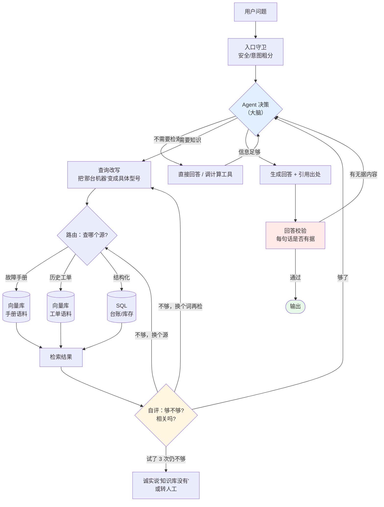

**这就是"重构"的具体含义**——四个写死的假设，全部变成了运行期的决策点：

| 原来写死的 | 现在由 Agent 决策 | 对应机制 |
|---|---|---|
| 一定检索 | **检不检索** | 工具选择 / 路由节点 |
| 只检一次 | **检几次** | ReAct 循环回流 |
| 检原话 | **检什么** | 查询改写 / 子问题拆解 |
| 检回来就用 | **够不够** | 自评节点（grade）+ 重检索 |
| 一个知识源 | **检哪个源** | 多源路由 |
| 生成就输出 | **答得对不对** | 回答校验节点 |

### 8.3 对比大表

| 维度 | 传统 RAG（第 2~3 篇） | Agentic RAG（本篇） |
|---|---|---|
| 检索次数 | 固定 1 次 | 0~N 次，运行期决定 |
| 是否检索 | 总是 | 由模型判断 |
| 查询内容 | 用户原话（或固定改写） | 动态改写、拆解、逐轮迭代 |
| 知识源 | 单一向量库 | 向量库 + SQL + API + 外部搜索，动态路由 |
| 结果不好时 | 硬着头皮生成 | 换词重检 / 换源 / 承认不知道 |
| 能否写操作 | 不能 | 能（需人工确认） |
| 多跳问题 | 差（"A 的供应商的联系人是谁"答不了） | 好（逐跳检索） |
| 延迟 | 1~3s | 5~40s |
| 成本 | 1× | 3~10× |
| 可预测性 | 高 | 中 |
| 失败模式 | 检不到就胡编 | 死循环、过早结束、成本失控 |
| 适合 | 高频、简单、事实型问答 | 低频、复杂、多跳、需实时数据、需动作 |

### 8.4 一个必须强调的工程判断

**不要把所有 RAG 都 Agent 化。**

回到 2.3 节华成机电的流量拆分：55% 的简单知识问答仍然走传统 RAG Workflow，因为：

- 它们的四个假设都成立（就是要检索、一次够、原话能检、检回来够用）；
- 延迟差 10 倍（1.8s vs 18s）；
- 成本差 5 倍以上。

**正确的架构是：传统 RAG 作为快速通道，Agentic RAG 作为复杂通道，中间用一个便宜的路由器分流。**

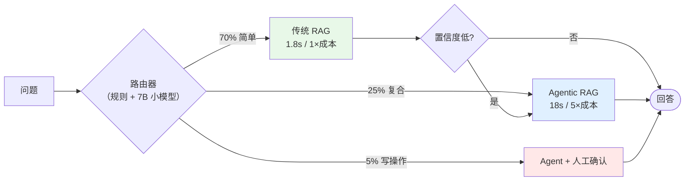

注意那条 `置信度低 → 升级到 Agentic RAG` 的边：**快速通道失败时自动升级**，这是性价比最高的设计。第 6.5 章我们会把它实现出来。

---

## 九、踩坑与排错

| 现象 | 根因 | 解决 |
|---|---|---|
| ReAct 输出里自带 `Observation: ...` 且内容完全是编的 | 没有在 `Observation:` 处截断生成 | 生成时设 `stop=["Observation:"]`，或代码里 `text.split("Observation:")[0]` |
| 正则匹配不到 `Action:` | 模型输出了 `**Action**:` 或中文冒号 `：` | temperature 降到 0；正则改成 `[Aa]ction\s*[:：]`；加 few-shot 演示格式 |
| Agent 跑 3 步就 Final Answer，信息明显不全 | system prompt 没写"必须逐条回答"；模型倾向于早收工 | 入口拆子问题 pin 在状态里；加回答前校验节点；prompt 写明检查清单 |
| 同一个工具被调 8 次，参数只差一个空格 | 没做参数归一化的重复检测 | 参数 JSON 排序 + 小写 + 去空格后哈希；命中返回"已试过"提示 |
| 第 6 轮开始模型忘了 system 里的规则 | 上下文太长，system 被稀释 | 每轮重新把关键规则拼在最后一条 user 消息里；用结构化状态替代原始消息 |
| `context_length_exceeded` | 工具返回了超大结果 | 工具返回值统一走截断中间件（≤1200 字符）；大结果存外部给 ID |
| Self-Consistency 投票结果全是 1 票 | 答案没归一化，"86400"/"86,400元"算两个 | 强制 `答案：X|Y` 格式 + 正则抽取 + 数值归一化 |
| ReWOO 的 `#E2.purchase_date` 替换成了空字符串 | 工具实际返回字段名不同或那步失败了 | 把工具返回 schema 写进 Planner prompt；替换失败时抛错而非静默 |
| Plan-and-Execute 规划了不存在的工具 | Planner prompt 里工具列表不全或过时 | 工具列表自动从注册表生成；生成后做工具名白名单校验 |
| Reflexion 每轮都"通过"，但结果明显有错 | Evaluator 是"你觉得对吗"式自评 | 换成硬 rubric + 数值核对 + 规则/工具校验 |
| Reflexion 第 3 轮比第 1 轮差 | 只取最后一版 | 保留 best（按分数），并累积反思记忆避免震荡 |
| ToT 生成的 3 个候选一模一样 | temperature 太低 / prompt 没强调差异 | T 提到 0.9；把已生成候选塞回 prompt 要求"与以上都不同" |
| 推理模型加了 "let's think step by step" 反而变差 | 干扰了模型内置推理 | 推理模型不要加外部 CoT 提示；system prompt 尽量简短 |
| 推理模型第二轮报错 | 把上一轮的 `reasoning_content` 拼回消息了 | 多轮时只保留 `content`，丢弃 `reasoning_content` |
| Agent 说"已创建工单 TK202509001"但系统里没有 | 幻觉式假装成功 | 输出后置硬校验（`detect_fake_success`）；写操作走独立确认通道 |
| Agent 编造了一个序列号去查，居然查到了别人的设备 | 参数编造 + 工具没做归属校验 | 工具内校验"该设备是否属于当前会话客户"；缺参必须反问 |
| 成本比预算高 10 倍 | 所有流量都进了 Agent | 加意图路由，把简单流量分流到 Workflow |
| 并发 20 就超时 | 串行的 N 次 LLM 调用 + 工具 IO 阻塞 | Self-Consistency 用线程池；工具调用改 async；ReWOO 无依赖步骤并行 |

---

## 十、生产级要点

### 10.1 成本

一次典型 ReAct 会话（6 步）的成本构成（deepseek-chat，实测环境见前文）：

| 项 | token | 占比 |
|---|---|---|
| system prompt（含工具描述）× 6 轮重放 | ≈ 4200 | 54% |
| 用户问题 × 6 轮重放 | ≈ 600 | 8% |
| scratchpad（累积的 Thought/Observation） | ≈ 2300 | 29% |
| 输出（Thought + Action + Final） | ≈ 693 | 9% |

**优化优先级**（按 ROI 排序）：

1. **减少轮数**（ReWOO / 更好的工具设计）—— 收益最大，system 重放次数直接减少；
2. **压缩工具描述** —— 20 个工具的 schema 可能占 3000+ token，用工具检索只注入相关的 5 个；
3. **Prompt Caching** —— system prompt 固定不变，开启缓存后重放部分成本大幅下降（DeepSeek 等厂商支持上下文硬盘缓存，以官方文档为准）；
4. **截断 Observation** —— 直接砍 scratchpad；
5. **路由分流** —— 让 70% 的流量根本不进 Agent。

### 10.2 延迟

| 环节 | 典型耗时 | 优化 |
|---|---|---|
| LLM 单次调用 | 1.5~4s | 流式输出（首字节 <1s），用户感知延迟大降 |
| 工具调用（DB） | 20~200ms | 连接池、索引 |
| 工具调用（外部 API） | 0.3~3s | 超时 2s + 缓存 + 降级 |
| 总计（6 步 ReAct） | 15~25s | **必须做流式中间态推送**（见 6.5 节 SSE） |

> 💡 用户能忍受 20 秒，**前提是这 20 秒里一直有东西在动**。"正在查询设备台账…""正在核对保修期…"这类中间态推送，比任何性能优化都更能提升体验。

### 10.3 并发

| 事项 | 建议 |
|---|---|
| LLM 客户端 | 用 `AsyncOpenAI`，配连接池；单进程别超过 LLM 厂商的 QPS 限制 |
| 工具执行 | 全部 async；同步工具用 `run_in_executor` 包一层 |
| 无依赖的并行 | Plan-and-Execute / ReWOO 中无依赖的步骤用 `asyncio.gather` |
| 限流 | 每用户并发会话数上限；全局令牌桶 |
| 超时 | 单工具 5s、单轮 30s、整会话 120s，三级超时 |

### 10.4 监控（上 Agent 前必须先有这些指标）

| 指标 | 含义 | 报警阈值建议 |
|---|---|---|
| `agent.steps` | 每会话步数分布 | P95 > 8 报警（可能有死循环） |
| `agent.tokens` | 每会话 token | P95 > 20K 报警 |
| `agent.latency` | 端到端耗时 | P95 > 45s 报警 |
| `tool.error_rate` | 分工具的错误率 | 单工具 > 5% 报警 |
| `agent.fallback_rate` | 兜底/转人工比例 | > 10% 说明能力不足 |
| `agent.max_steps_hit` | 撞上限的比例 | > 3% 说明有死循环或任务过难 |
| `answer.coverage` | 子问题覆盖度 | < 0.8 报警 |
| `fake_success.hits` | 假装成功拦截次数 | **> 0 就要人工复盘** |

全部通过 Langfuse 或 OpenTelemetry 打点，见 [第 10 篇 工程化与生产落地](../10-工程化与生产落地/)。

### 10.5 降级策略（三级）

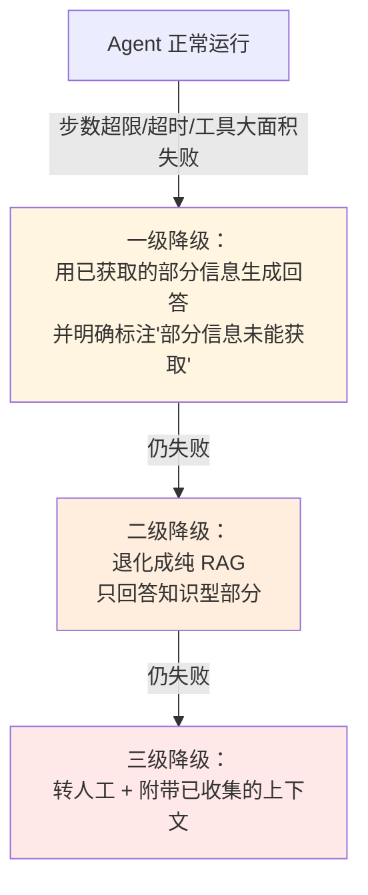

**关键**：降级到转人工时，**必须把 Agent 已经收集到的信息一并交给人工**（设备型号、保修状态、已查到的库存），否则人工要从头再问一遍，体验比不用 Agent 还差。

---

## 十一、本章小结

1. **Agent = LLM + Tools + Loop**。缺工具是聊天机器人，缺循环是单次函数调用，缺 LLM 是 Workflow。四个动词：想 → 判 → 做 → 回流。
2. **能用 Workflow 就别用 Agent**。华成机电 70% 的流量走固定流程，只有 25% 的复合任务和 5% 的写操作才值得上 Agent。
3. **七种思维链各有其位**：CoT 换推理深度、Self-Consistency 换稳定性、ReAct 换适应性、Plan-and-Execute 换可审计性、Reflexion 换正确性、ToT 换方案多样性、ReWOO 换成本。同一道基准题上，ReWOO 成本只有 ReAct 的 38%，但丧失了适应性。
4. **推理模型改变了一半格局**：外部 CoT 提示价值大降甚至有害，但 ReAct 的工具回流、外部 Evaluator、护栏、成本优化这些**工程能力一个都没过时**。最实用的是混合架构——对话模型做编排，推理模型当"贵工具"。
5. **Agent 有四根柱子**：规划（本章）、工具（6.2/6.4）、记忆（6.3）、反思（6.5）。
6. **六种失败模式必须提前防**：工具选错、参数编造、死循环、过早结束、上下文爆炸、假装调用成功。其中"假装调用成功"危害最高，必须做输出后置硬校验。
7. **"智能体重构信息检索"的具体含义**：把传统 RAG 里四个写死的假设（一定检索/只检一次/检原话/检回来就够）全部变成运行期决策点。但正确架构是快慢双通道 + 路由分流，不是全量 Agent 化。

## 十二、自测题

<details>
<summary><b>第 1 题：</b>同事说"我们把整个售后知识问答都做成 ReAct Agent，这样最智能"。请给出三条反对理由和一个替代方案。</summary>

**参考答案**：

三条反对理由：

1. **成本**：纯知识问答用 ReAct 要 3~6 次 LLM 调用，而 RAG Workflow 只要 1 次。按华成机电日均 3000 次问答算，成本差 5 倍以上，一年多花的钱够养一个工程师。
2. **延迟**：ReAct 端到端 15~25s，RAG Workflow 1.8s。客服在接电话时等 20 秒是不可接受的。
3. **不可预测**：同一个问题两次可能走不同路径、给不同答案，出了问题难复现难追责；而且引入了死循环、过早结束等本来不存在的失败模式。

替代方案：**快慢双通道 + 路由分流**。

- 入口用规则 + 7B 小模型做意图粗分（成本近似为 0）；
- 简单知识问答（约 55%）→ 传统 RAG Workflow；
- 单点数据查询（约 15%）→ 单次 Function Calling；
- 复合任务（约 25%）→ ReAct Agent；
- 写操作（约 5%）→ Agent + 人工确认；
- 再加一条**置信度低自动升级**的边：快速通道答得没底气时，自动升级到 Agentic RAG 重试。

</details>

<details>
<summary><b>第 2 题：</b>你的 ReAct Agent 上线后，运营反馈"有客户说 Agent 告诉他工单已创建，但系统里查不到"。请说出这属于哪种失败模式、最可能的三个技术根因、以及你要加的三道防线。</summary>

**参考答案**：

失败模式：**幻觉式"假装调用成功"**（第 7.6 节），这是危害最高的一种，属于生产事故级别。

三个最可能的技术根因：

1. **文本协议下模型自己编了 Observation**——没有在 `Observation:` 处截断生成，模型一口气把"工具返回工单号 TK20250917003"也写了出来；
2. **工具执行抛异常被吞**——`create_ticket` 里有 `try/except: pass`，数据库写失败了但返回的还是成功结构，或者错误信息没有回传给模型；
3. **模型把"计划做"表述成了"已经做"**——规划阶段说"接下来我将创建工单"，生成最终回答时变成了"我已经创建了工单"。

三道防线（从源头到出口）：

1. **源头**：生成时设 `stop=["Observation:"]`，代码里再做一次 `split("Observation:")[0]` 兜底；工具的所有异常必须显式翻译成自然语言写回 Observation，禁止 `except: pass`。
2. **通道**：写操作不允许 LLM 自由发起，必须经过独立的人工确认节点——模型只能产出"我想创建工单，参数是 X"，实际写入由确认后的代码执行，执行结果的工单号由代码回填。
3. **出口**：输出后置硬校验 `detect_fake_success`——扫描最终回答中的写操作声明（"已创建/已派单"）和工单号正则 `TK\d+`，凡是没有出现在任何成功 Observation 里的，一律拦截并改写为"抱歉，工单创建未成功，已为您转人工"。同时该拦截计数 > 0 就报警人工复盘。

</details>

<details>
<summary><b>第 3 题：</b>给定任务"每月 1 号自动生成上月备件消耗分析报告，需要查 5 个固定的数据源，汇总成一份 Word"。请在七种思维链范式中选型，说明理由，并指出你会额外加什么。</summary>

**参考答案**：

**选型：ReWOO（主）+ Reflexion（质检）**。

理由：

- **为什么不是 ReAct**：要查的 5 个数据源是**完全固定**的，路径在编码期就确定了，ReAct 的"走一步看一步"带来的适应性在这里毫无价值，却要付出 6 次 LLM 调用和 3 倍的输入 token。
- **为什么选 ReWOO**：工具链完全可预知，正是 ReWOO 的最佳场景。只需 2 次 LLM 调用（Planner + Solver），中间 5 次工具执行是纯代码，成本约为 ReAct 的 38%。而且 5 个数据源之间无依赖，Worker 层可以 `asyncio.gather` 并行执行，延迟进一步压缩。
- **为什么加 Reflexion**：报告要给管理层看，有明确的验收标准（各项小计是否等于合计、同比环比是否算对、是否有编造的备件号、格式是否完整）。用**规则型 Evaluator**（数值核对 + schema 校验，而不是 LLM 自评）做 1~2 轮质检，性价比很高。

**额外要加的东西**：

1. **其实应该先问：这个能不能干脆写成 Workflow？** 5 个固定数据源、固定汇总逻辑——如果报告结构也固定，那连 Planner 都不需要，直接写成定时任务 + 模板填充，只用 1 次 LLM 做"文字结论撰写"即可。LLM 的价值在于写分析结论，不在于决定查哪几张表。**这是最正确的答案**。
2. 如果确实需要 LLM 规划（比如报告章节会随数据情况变化），则：
   - 计划固化为模板，Planner 只在模板失效时触发（省掉一次 LLM）；
   - 所有数值计算强制走 `calculator` 工具，不允许模型口算；
   - 加幂等控制（同月重复触发不重复生成）；
   - 离线任务对延迟不敏感，可以把 Reflexion 轮数放宽到 3 轮；
   - 生成后必须有人工审批环节才能发送。

</details>

---

**上一章** [第 5 篇 微调 LoRA 与 PEFT](../05-微调LoRA与PEFT/) | **下一章** [6.2 Function Calling 与工具设计](02-Function-Calling与工具设计.md)
