# 第 7.1 章  多智能体架构模式全解

> **本章目标**：读完能做到 …
> 1. 说清楚单 Agent 的三个物理天花板，并能用自己项目的数据判断"我撞上哪一个了"；
> 2. 拿出一张「该不该拆多智能体」的判断清单，在架构评审上顶住"为什么不用一个 Agent 搞定"的追问；
> 3. 画出六种多智能体拓扑（流水线 / Supervisor / 分层 / Swarm / 辩论 / 生成-评审）的 mermaid 图，并说出各自的可控性、成本、延迟代价；
> 4. 按「职能 / 数据域 / 权限」三条线给一个真实业务切分 Agent 角色，产出华成机电那样的角色矩阵；
> 5. 用 token 成本模型算出「多智能体方案比单 Agent 贵多少倍」，并给出优化方向。
>
> **前置知识**：
> - [第 6 篇 Agent 智能体](../06-Agent智能体/)（ReAct、工具调用、LangGraph 的 StateGraph 基本用法）
> - [第 4 篇 LangChain 与工程框架](../04-LangChain与工程框架/)（LCEL、结构化输出）
> - [第 2 篇 RAG 基础](../02-RAG基础篇/)（检索链路，本章的"检索专家 Agent"就是它的封装）
>
> **预计用时**：阅读 60 分钟 / 动手 30 分钟（本章以设计为主，代码骨架为辅，完整可运行实现在 [7.2](./02-LangGraph实现Supervisor与Swarm.md)）

---

## 零、回到华成机电的现场

第 6 篇我们给华成机电做了一个 **工单智能助手**：一个 ReAct Agent，挂了 11 个工具。

它现在长这样：

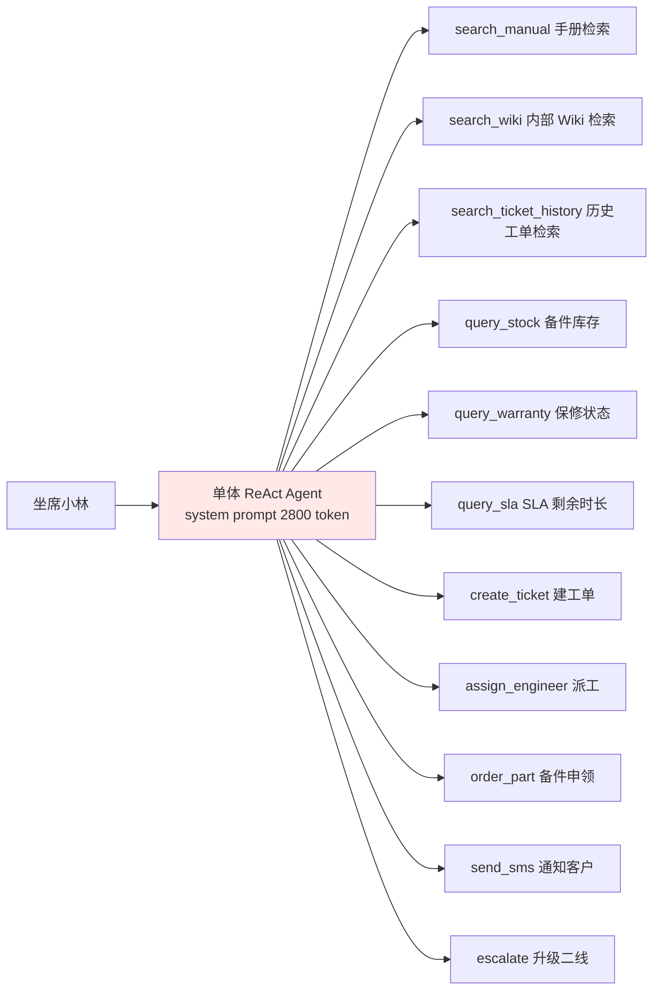

上线三周后，运维群里的反馈是这样的：

| 日期 | 问题 | 现象 |
|---|---|---|
| 3-04 | 选错工具 | 客户问"E043 什么意思"，Agent 去调了 `query_stock` |
| 3-07 | 上下文爆了 | 一个复杂故障排查走了 14 轮，第 15 轮报 `context_length_exceeded` |
| 3-09 | 越权写操作 | 客户只是"问问"，Agent 直接 `create_ticket` 建了工单，还 `send_sms` 通知了客户 |
| 3-12 | 风格分裂 | 同一次会话里，前半段像技术文档，后半段像客服话术，中间还夹了一段 SQL |
| 3-15 | 无法归因 | 答错了，但 trace 里 28 个步骤混在一条链上，查不出是检索错还是推理错 |

这五条，正是本章要解决的问题。它们不是 prompt 写得不好，是**单 Agent 的结构性天花板**。

---

## 一、为什么需要多智能体：单 Agent 的三个天花板

### 1.1 天花板一：工具太多，选不准

**现象**：工具数量超过某个阈值后，工具选择准确率断崖式下跌。

**根因**：工具选择本质上是一个「在 N 个候选里做分类」的任务，而候选描述全部塞在 system prompt 里，互相干扰。尤其是**语义相近的工具**。

看华成机电这三个工具的描述：

```python
tools = [
    {
        "name": "search_manual",
        "description": "检索产品操作手册和故障代码手册，输入故障现象或错误码，返回相关手册段落",
    },
    {
        "name": "search_wiki",
        "description": "检索内部技术 Wiki，输入技术问题，返回相关 Wiki 文章",
    },
    {
        "name": "search_ticket_history",
        "description": "检索历史工单，输入故障描述，返回相似的历史处理记录",
    },
]
```

对模型来说，"E043 怎么处理" 这个 query 对这三个工具的语义相似度几乎一样。它选哪个都"说得通"，于是它按 prompt 里的顺序、按温度采样，随机选。

**实测数据**（实测环境：DeepSeek-chat，华成机电 200 条真实 query 标注集，2025-03）：

| 挂载工具数 | 一次选对率 | 三次内选对率 | 平均轮数 |
|---|---|---|---|
| 3 个 | 91.0% | 98.5% | 1.9 |
| 6 个 | 83.5% | 95.0% | 2.6 |
| 11 个 | 68.0% | 88.5% | 4.3 |
| 20 个（加了 9 个 MCP 工具） | 51.5% | 76.0% | 6.8 |

> 注：这是**这一组工具、这个模型、这个 prompt** 的实测结果，换一组工具描述、换一个模型，绝对数值会变，但"随工具数单调下降"的趋势是稳定的。你自己的系统必须自己测一遍，方法见 [第 8 篇 评测体系](../08-评测体系/)。

**多智能体怎么解**：不是让一个 Agent 面对 20 个工具，而是让**主管面对 4 个 Agent**，每个 Agent 面对 3~5 个工具。分类问题从 1-of-20 拆成 1-of-4 再 1-of-5，每一级都在模型擅长的区间里。

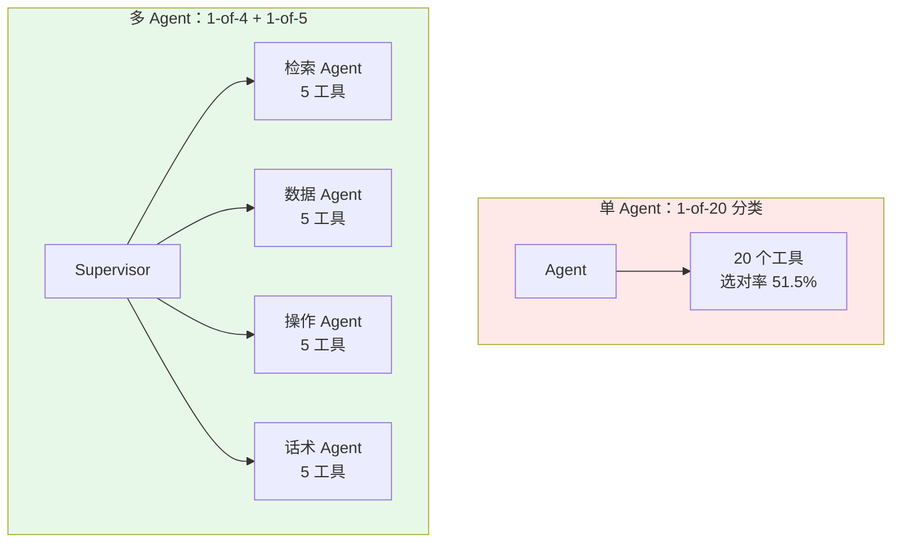

### 1.2 天花板二：上下文装不下

**现象**：多轮排查到后面，要么报错，要么模型"忘了"前面说过什么。

**根因**：ReAct 的上下文是**单调增长**的。每一轮都要把之前所有的 Thought / Action / Observation 拼回去。而 Observation 是最胖的——一次手册检索返回 5 个 chunk，每个 500 token，就是 2500 token。

我们来算一笔账。华成机电一次典型的复杂排查：

| 轮次 | 动作 | 新增 token | 累计上下文 |
|---|---|---|---|
| 0 | system prompt（含 11 个工具描述） | 2800 | 2800 |
| 1 | 检索手册 → 5 chunk | 2500 + 200 | 5500 |
| 2 | 检索 Wiki → 5 chunk | 2200 + 200 | 7900 |
| 3 | 查历史工单 → 8 条 | 3100 + 200 | 11200 |
| 4 | 查库存 | 300 + 150 | 11650 |
| 5 | 查保修 | 200 + 150 | 12000 |
| 6 | 再检索手册（换关键词） | 2500 + 200 | 14700 |
| 7 | 查 SLA | 200 + 150 | 15050 |
| ... | ... | ... | ... |
| 14 | 生成答复 | — | **31000+** |

上下文增长公式：

$$
C_n = C_{sys} + \sum_{i=1}^{n} \left( t_i^{think} + t_i^{act} + t_i^{obs} \right)
$$

其中 $t_i^{obs}$ 是主导项。而**每一轮的输入 token 都要重新计费**，所以总成本是：

$$
\text{Cost}_{total} = \sum_{n=1}^{N} \left( C_n \cdot p_{in} + o_n \cdot p_{out} \right)
$$

注意 $\sum C_n$ 是**平方级**增长（$O(N^2 \cdot \bar{t}_{obs})$），不是线性。14 轮的会话，累计输入 token 大约是 22 万，而不是 3.1 万。

**多智能体怎么解**：每个子 Agent 有**独立的上下文窗口**。检索 Agent 内部翻了 6 次手册、消耗 2 万 token，但它**只向主管返回一段 600 token 的结论**。主管的上下文里只有 4 条子 Agent 的摘要，不到 3000 token。

这叫 **上下文隔离（Context Isolation）**，是多智能体最实在的收益，比"角色扮演"实在得多。

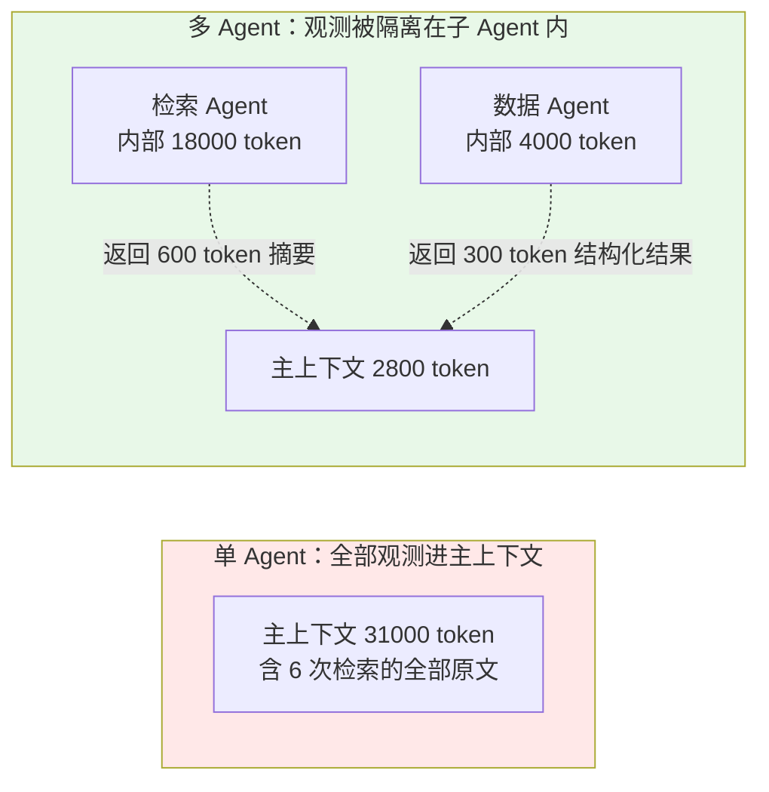

### 1.3 天花板三：角色指令互相冲突

**现象**：一个 system prompt 里塞了太多互相打架的要求。

华成机电的单体 Agent prompt 节选（真实的，删减前 2800 token）：

```text
你是华成机电的售后智能助手。

【检索纪律】回答必须严格基于检索到的手册原文，不得编造，
每条结论后面必须标注来源文件名和页码。找不到就说找不到。

【数据纪律】查询库存和保修时必须使用工具返回的实时数据，
不得使用你的先验知识。数值必须精确到个位。

【操作纪律】建工单前必须确认客户信息完整，缺失字段要追问。
派工前必须检查工程师排期。任何写操作前要复述一遍让用户确认。

【话术纪律】面向客户时语气要亲切、有同理心，避免使用技术黑话，
不要出现"chunk""向量""SQL"等词，控制在 3 句话以内，
先共情再给方案。

【安全纪律】不得透露内部成本价、不得承诺赔偿、不得给出维修工时报价。
```

冲突点：

| 冲突 | A 要求 | B 要求 | 模型的实际行为 |
|---|---|---|---|
| 溯源 vs 亲切 | 每条结论标注文件名页码 | 避免技术黑话、3 句话以内 | 随机二选一，或者两个都做一半 |
| 精确 vs 简洁 | 数值精确到个位 | 控制在 3 句话 | 经常丢掉数值 |
| 确认 vs 效率 | 写操作前复述确认 | 先共情再给方案 | 有时候跳过确认 |
| 找不到就说 | 找不到就说找不到 | 有同理心 | 变成"很抱歉呢，我这边暂时没有查到相关信息哦~"——把"找不到"这个关键事实软化掉了 |

这是 **指令稀释（Instruction Dilution）**：prompt 越长，每一条指令的实际权重越低。有研究和大量工程实践都观察到，超过 10 条并列硬约束后，模型对靠后指令的遵从率明显下降（具体数值随模型而异，建议用你自己的约束集做一次遵从率测试）。

**多智能体怎么解**：把冲突的指令拆到不同 Agent。

| Agent | system prompt 长度 | 只管一件事 |
|---|---|---|
| 检索专家 | ~400 token | 忠于原文 + 标注来源，**不管好不好听** |
| 数据分析师 | ~350 token | 数值精确 + 只用工具数据，**不管好不好听** |
| 工单操作员 | ~500 token | 参数校验 + 幂等 + 确认，**不管好不好听** |
| 质检员 | ~450 token | 只判断"有没有幻觉、有没有越权、有没有丢事实" |
| 客服话术专家 | ~300 token | 只管把前面的结论翻译成人话，**不许新增事实** |

每个 prompt 都短、都内部自洽。这比"写一个 2800 token 的完美 prompt"现实得多。

---

## 二、先泼一盆冷水：多智能体不是免费的

网上的多智能体文章 90% 只讲好处。但凡你真的上过生产，就知道代价在哪。

### 2.1 代价一：延迟叠加

单 Agent 的 14 轮 ReAct，延迟是 14 次 LLM 调用。

Supervisor 模式下，**主管本身也要调用 LLM**。每次路由决策是一次调用，子 Agent 内部的 ReAct 又是若干次调用。

$$
T_{multi} = \sum_{k=1}^{K}\left( T_{sup}^{(k)} + T_{agent}^{(k)} \right) + T_{final}
$$

实测对比（实测环境：DeepSeek-chat 官方 API，华成机电 50 条复杂 query，2025-03，P50）：

| 方案 | LLM 调用次数 | P50 端到端延迟 | P95 延迟 |
|---|---|---|---|
| 单 Agent ReAct | 5.8 次 | 11.4 s | 31.2 s |
| Supervisor（3 worker） | 9.2 次 | 19.8 s | 48.6 s |
| Supervisor + Critic 循环 | 12.7 次 | 27.3 s | 66.1 s |
| 并行 fan-out（3 路） | 7.0 次（3 路并发） | 14.1 s | 33.8 s |

**结论**：串行的多智能体延迟基本翻倍。只有并行 fan-out 能把延迟压回来。如果你的业务场景是"客服坐席一边打电话一边等答案"，19.8 秒是不可接受的——这时候你要么做流式、要么做并行、要么就别拆。

### 2.2 代价二：成本翻倍甚至更多

主管的每一次路由决策，都要重新看一遍完整的对话历史 + 所有 worker 的描述。K 次路由就是 K 次全量输入。

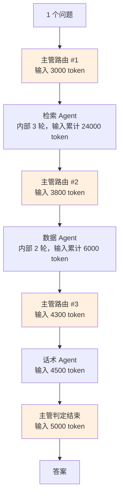

光是四次主管调用就吃掉 16100 输入 token，这部分在单 Agent 方案里是**不存在的**。第八节会给完整的成本模型。

### 2.3 代价三：调试困难

单 Agent 出错，你看一条 trace 就知道哪一步错了。

多 Agent 出错，你要问四个问题：
1. 主管路由对了吗？（路由错 → 后面全白干）
2. 子 Agent 拿到的任务描述完整吗？（上下文传丢了 → 子 Agent 答非所问）
3. 子 Agent 内部错了吗？
4. 子 Agent 返回给主管的摘要丢信息了吗？（**这是最隐蔽的一类 bug**）

第 4 类尤其阴险：检索 Agent 明明找到了"E043 在 V3 手册里的处理方式变了"，但它返回的摘要只写了处理步骤，没写"V3 变更"这个关键限定。主管和话术 Agent 全都不知道，最终答案错得理直气壮。

### 2.4 代价四：错误传播放大

串行链路上，第 k 步正确的前提是前 k-1 步都正确：

$$
P_{\text{success}} = \prod_{i=1}^{K} p_i
$$

每个 Agent 单独测试 92% 准确率，5 个串起来：

$$
0.92^5 = 0.659
$$

**65.9%**。这就是很多团队"每个 Agent 单测都挺好，一联调就崩"的数学原因。第七节专门讲怎么对抗。

### 2.5 代价五：状态一致性

多个 Agent 读写同一份状态，就有了并发问题。尤其是并行 fan-out 的时候：两个 Agent 同时往 `messages` 里 append，同时改 `ticket_draft`，谁覆盖谁？

LangGraph 用 reducer 解决 append 类冲突，但**业务字段的语义冲突它解决不了**——这需要你自己设计（7.3 章讲）。

### 2.6 「该不该拆」判断清单

在架构评审上，拿这张表逐条打分。**≥ 4 个 YES 才建议拆**：

| # | 判断项 | 怎么验证 | YES/NO |
|---|---|---|---|
| 1 | 工具数 > 8，且存在语义相近的工具组 | 数一数；跑一次工具选择准确率测试 | |
| 2 | 单次会话上下文 P95 > 模型窗口的 60% | 打点统计 | |
| 3 | system prompt 里存在**互相矛盾**的硬约束 | 人工逐条读，画冲突矩阵 | |
| 4 | 不同环节需要**不同模型**（比如检索用 7B、推理用 R1） | 看成本/质量测算 | |
| 5 | 不同环节需要**不同权限**（只读 vs 可写生产库） | 看安全评审要求 | |
| 6 | 存在天然可并行的子任务 | 画依赖图看有没有独立分支 | |
| 7 | 需要"一个角色审另一个角色"的质量门 | 看 badcase 里幻觉占比 | |
| 8 | 单 Agent 的 badcase 中 > 30% 是"路由/选工具错" | 归因分析 | |

**反向否决项**（任意一条为 YES，先别拆）：

| # | 否决项 | 说明 |
|---|---|---|
| A | 端到端延迟 SLA < 5s | 串行多 Agent 基本做不到 |
| B | 单 Agent 准确率已 > 90% 且无质量投诉 | 没有拆的收益 |
| C | 团队没有 trace/评测基础设施 | 拆了会瞎，先建 [第 8 篇](../08-评测体系/) 的评测 |
| D | 工具总数 ≤ 5 | 拆了纯属增加复杂度 |
| E | 需求还在天天变 | 多 Agent 的接口契约改起来比 prompt 贵 10 倍 |

> **一句话原则**：**先把单 Agent 做到准确率天花板，再拆。** 拆多智能体是为了突破天花板，不是为了跳过调优。

---

## 三、六种架构模式全解

下面六种模式，每种给：mermaid 图 + 原理 + 优缺点 + 适用场景 + 最小代码骨架。

代码骨架统一基于 **LangGraph 0.2.x**，环境：

```bash
# 版本基线（全书统一）
uv pip install "langgraph==0.2.74" "langchain==0.3.19" "langchain-openai==0.3.6" "pydantic==2.10.6"
# pip 等价
pip install "langgraph==0.2.74" "langchain==0.3.19" "langchain-openai==0.3.6" "pydantic==2.10.6"
```

```python
# common.py —— 六种模式共用的模型与状态定义
from typing import Annotated, TypedDict, Literal
import operator
import os

from langchain_openai import ChatOpenAI
from langchain_core.messages import BaseMessage, HumanMessage, AIMessage
from langgraph.graph import StateGraph, START, END
from langgraph.graph.message import add_messages

# 全书统一用 DeepSeek 的 OpenAI 兼容接口；换通义/本地 vLLM 只改 base_url 和 model
LLM = ChatOpenAI(
    model="deepseek-chat",
    base_url="https://api.deepseek.com/v1",
    api_key=os.environ["DEEPSEEK_API_KEY"],
    temperature=0,
    timeout=60,
)


class AgentState(TypedDict):
    """多智能体共享状态：messages 用 add_messages 做 reducer，其余字段按需覆盖。"""
    messages: Annotated[list[BaseMessage], add_messages]
    question: str
    # 每个 Agent 的产出单独落一个键，避免互相覆盖
    retrieval_result: str
    data_result: str
    draft_answer: str
    final_answer: str
    # 控制字段
    round_count: int
```

### 3.1 模式一：流水线 / Sequential（固定顺序，最可控）

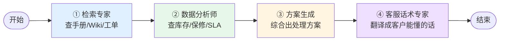

**原理**：把业务流程硬编码成有向无环图（DAG）。没有 LLM 参与路由决策，每个节点只负责自己那一段的转换。本质上是「把一个大 prompt 拆成 N 个小 prompt 串起来」。

**优点**：
- **可控性最高**：走哪条路径是你写死的，不会跑飞
- **零路由成本**：省掉了主管的 LLM 调用
- **好调试**：每个节点的输入输出都是确定的，可以单独回放
- **好评测**：每一段可以单独打分（检索命中率、数值准确率、话术得分）

**缺点**：
- **不灵活**：客户只是问"E043 什么意思"，也要走完整个四步，白花 3 倍成本
- **不能自适应**：某一步失败了，后面照样跑
- **顺序耦合**：加一个环节要改图

**适用场景**：
- 业务流程本身就是固定的（合同审查：抽取 → 比对 → 风险评级 → 出报告）
- 对可控性、可审计性要求极高的场景（金融、政务）
- 作为**多智能体的入门方案**——绝大部分团队第一版应该做这个

**最小代码骨架**：

```python
# pipeline.py —— 流水线模式最小骨架
from common import AgentState, LLM
from langgraph.graph import StateGraph, START, END
from langchain_core.messages import HumanMessage, SystemMessage


def retriever_node(state: AgentState) -> dict:
    """检索专家：只管找原文，不管好不好听。"""
    # 真实实现里这里调 7.2 章封装好的 RAG 检索器
    docs = fake_search(state["question"])
    prompt = [
        SystemMessage(content=(
            "你是华成机电的检索专家。严格基于给定文档段落回答，"
            "每条结论后标注 [来源:文件名 p.页码]。找不到就明确说'手册中未收录'。"
            "不要加安慰语，不要润色。"
        )),
        HumanMessage(content=f"问题：{state['question']}\n\n文档：\n{docs}"),
    ]
    out = LLM.invoke(prompt)
    return {"retrieval_result": out.content}


def analyst_node(state: AgentState) -> dict:
    """数据分析师：只管查实时数据，数值必须来自工具。"""
    stock = fake_query_stock("XJ-200")
    warranty = fake_query_warranty(state["question"])
    prompt = [
        SystemMessage(content=(
            "你是数据分析师。只能使用给定的结构化数据，禁止使用先验知识。"
            "输出格式：每行一个事实，形如 `字段=值（数据源）`。"
        )),
        HumanMessage(content=f"库存：{stock}\n保修：{warranty}"),
    ]
    out = LLM.invoke(prompt)
    return {"data_result": out.content}


def solution_node(state: AgentState) -> dict:
    """方案生成：综合检索结论和数据事实，产出处理方案。"""
    prompt = [
        SystemMessage(content="你是二线技术支持。综合以下信息给出可执行的处理方案，分步骤列出。"),
        HumanMessage(content=(
            f"检索结论：\n{state['retrieval_result']}\n\n"
            f"实时数据：\n{state['data_result']}"
        )),
    ]
    out = LLM.invoke(prompt)
    return {"draft_answer": out.content}


def tone_node(state: AgentState) -> dict:
    """客服话术专家：只做措辞翻译，禁止新增事实。"""
    prompt = [
        SystemMessage(content=(
            "你是 400 坐席话术专家。把技术方案改写成客户能听懂的话。"
            "硬约束：① 不得新增任何原文没有的事实；② 不得删掉数值和型号；"
            "③ 不出现 chunk/向量/SQL 等词；④ 先共情一句再给方案。"
        )),
        HumanMessage(content=state["draft_answer"]),
    ]
    out = LLM.invoke(prompt)
    return {"final_answer": out.content}


def build_pipeline():
    """把四个节点串成固定流水线。"""
    g = StateGraph(AgentState)
    g.add_node("retriever", retriever_node)
    g.add_node("analyst", analyst_node)
    g.add_node("solution", solution_node)
    g.add_node("tone", tone_node)

    g.add_edge(START, "retriever")
    g.add_edge("retriever", "analyst")
    g.add_edge("analyst", "solution")
    g.add_edge("solution", "tone")
    g.add_edge("tone", END)
    return g.compile()


if __name__ == "__main__":
    app = build_pipeline()
    res = app.invoke({"question": "XJ-200 报 E043 怎么处理？", "messages": [], "round_count": 0})
    print(res["final_answer"])
```

> `fake_search` / `fake_query_stock` 等桩函数在 7.2 章会替换成真实实现，这里只为骨架可跑。

### 3.2 模式二：主管 Supervisor（中心调度，最常用）

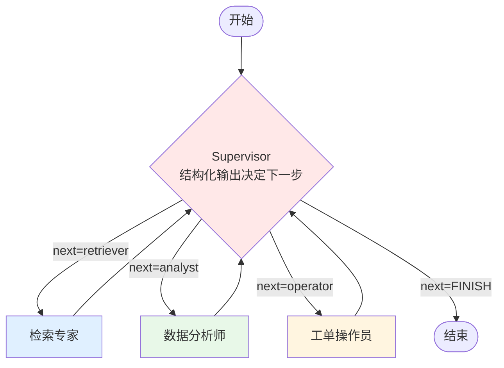

**原理**：一个 Supervisor 节点持有全局对话历史和 worker 清单，每一轮用**结构化输出**（不是自由文本）决定"下一步交给谁"或"结束"。worker 干完活把结果写回共享状态，再回到 Supervisor。这是一个**星型拓扑 + 循环**。

关键在于 Supervisor 的输出必须是受限的枚举值，不能让它自由发挥：

```python
from pydantic import BaseModel, Field
from typing import Literal

class Route(BaseModel):
    """Supervisor 的结构化路由决策。"""
    next: Literal["retriever", "analyst", "operator", "FINISH"] = Field(
        description="下一个执行的 worker；信息已足够时返回 FINISH"
    )
    task: str = Field(description="交给该 worker 的具体任务描述，一句话说清要它干什么")
    reason: str = Field(description="为什么选它，用于 trace 审计")
```

**优点**：
- **灵活**：简单问题一轮就 FINISH，复杂问题多轮调度，成本随复杂度自适应
- **易扩展**：加一个 worker 只要在枚举里加一项 + 加一个节点
- **有全局视角**：主管知道所有 worker 的产出，能做综合判断
- **责任清晰**：路由错了查主管，内容错了查 worker

**缺点**：
- **主管是瓶颈**：每一轮都要重看全部历史，token 成本高
- **主管是单点**：主管的 prompt 写不好，整个系统废掉
- **可能死循环**：主管反复在两个 worker 之间横跳（必须设 `max_rounds`）
- **延迟高**：worker 之间的每次切换都插一次主管调用

**适用场景**：
- **企业内最常用的默认选择**。华成机电的工单助手就用这个
- 任务组合不确定、需要按需调度的场景
- 需要审计"为什么调用了这个 Agent"的场景（`reason` 字段落审计日志）

**最小代码骨架**：

```python
# supervisor.py —— Supervisor 模式最小骨架（完整版见 7.2）
from typing import Literal
from pydantic import BaseModel, Field
from langchain_core.messages import SystemMessage, HumanMessage, AIMessage
from langgraph.graph import StateGraph, START, END
from common import AgentState, LLM

WORKERS = {
    "retriever": "检索专家：查产品手册、故障代码手册、内部 Wiki、历史工单。只读。",
    "analyst":   "数据分析师：查备件库存、保修状态、SLA 剩余时长、工程师排期。只读。",
    "operator":  "工单操作员：创建工单、派工、申领备件、发送短信。有写权限，需人工审批。",
}

MAX_ROUNDS = 8


class Route(BaseModel):
    next: Literal["retriever", "analyst", "operator", "FINISH"]
    task: str = Field(default="", description="交给该 worker 的具体任务")
    reason: str = Field(default="", description="路由理由，用于审计")


SUP_PROMPT = """你是华成机电售后智能体团队的主管（Supervisor）。

可调度的成员：
{workers}

你的职责：
1. 阅读用户问题和已有的成员产出，判断**还缺什么信息**；
2. 缺信息就派给对应成员，并写清楚具体要它做什么（task 字段）；
3. 信息已经足够回答用户，或者已经无法再推进，返回 FINISH；
4. 涉及写操作（建单/派工/申领/短信）时，必须先确认已经拿到了检索结论和数据事实，
   不要一上来就派给 operator。

硬性纪律：
- 不要重复派同一个成员做同一件事。已经有结果的，不要再查一遍。
- 用户只是「问问」而没有明确要求操作时，不要派 operator。
- 最多 {max_rounds} 轮，超过必须 FINISH。
"""


def supervisor_node(state: AgentState) -> dict:
    """主管：结构化输出决定路由。"""
    if state.get("round_count", 0) >= MAX_ROUNDS:
        return {"messages": [AIMessage(content="[SUP] 达到最大轮次，强制结束", name="supervisor")],
                "next": "FINISH", "round_count": state.get("round_count", 0) + 1}

    worker_desc = "\n".join(f"- {k}: {v}" for k, v in WORKERS.items())
    router = LLM.with_structured_output(Route)
    decision = router.invoke([
        SystemMessage(content=SUP_PROMPT.format(workers=worker_desc, max_rounds=MAX_ROUNDS)),
        *state["messages"],
    ])
    return {
        "next": decision.next,
        "messages": [AIMessage(
            content=f"[SUP] → {decision.next}｜任务：{decision.task}｜理由：{decision.reason}",
            name="supervisor",
        )],
        "round_count": state.get("round_count", 0) + 1,
    }


def route_edge(state: AgentState) -> str:
    """条件边：读主管写下的 next 字段。"""
    nxt = state.get("next", "FINISH")
    return END if nxt == "FINISH" else nxt
```

### 3.3 模式三：分层 Hierarchical（主管的主管，团队的团队）

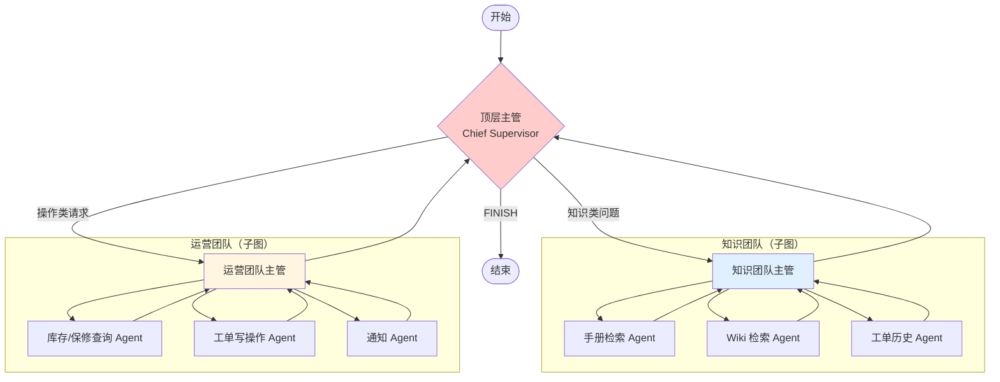

**原理**：Supervisor 的递归应用。顶层主管只认识 2~4 个"团队"，每个团队内部又是一个完整的 Supervisor 图（在 LangGraph 里表现为**子图 subgraph**）。顶层主管看不到子团队内部的细节，只看到团队返回的结论。

**优点**：
- **上下文隔离做到极致**：顶层上下文只有团队级摘要
- **可扩展到 10+ Agent**：单层 Supervisor 管 3~5 个还行，管 12 个就退化成"工具太多选不准"
- **组织映射**：跟企业真实组织架构对齐，好讲给老板听（知识团队 = 技术支持部，运营团队 = 服务调度中心）
- **权限分层**：整个运营团队统一挂写权限审批，不用每个 Agent 单独配

**缺点**：
- **延迟最高**：一次调度要穿两层主管
- **信息损失两次**：worker → 团队主管（摘要一次）→ 顶层主管（再摘要一次）
- **调试最难**：trace 是嵌套的
- **过度设计风险最高**：< 8 个 Agent 基本不需要分层

**适用场景**：
- Agent 数量 ≥ 8，且能天然分成 2~4 组
- 不同团队归属不同业务部门、要分别演进和发布
- 不同团队要用不同模型/不同成本档

**最小代码骨架**（子图封装）：

```python
# hierarchical.py —— 分层模式骨架：把 Supervisor 图当节点用
from langgraph.graph import StateGraph, START, END
from common import AgentState, LLM

def build_knowledge_team():
    """知识团队子图：内部是一个完整的 Supervisor 循环。"""
    g = StateGraph(AgentState)
    g.add_node("k_supervisor", knowledge_supervisor_node)
    g.add_node("manual", manual_agent)
    g.add_node("wiki", wiki_agent)
    g.add_node("history", history_agent)
    g.add_edge(START, "k_supervisor")
    g.add_conditional_edges("k_supervisor", knowledge_route,
                            {"manual": "manual", "wiki": "wiki",
                             "history": "history", "FINISH": END})
    for n in ("manual", "wiki", "history"):
        g.add_edge(n, "k_supervisor")
    return g.compile()


def build_ops_team():
    """运营团队子图，结构同上，略。"""
    g = StateGraph(AgentState)
    g.add_node("o_supervisor", ops_supervisor_node)
    g.add_node("query", ops_query_agent)
    g.add_node("write", ops_write_agent)
    g.add_edge(START, "o_supervisor")
    g.add_conditional_edges("o_supervisor", ops_route,
                            {"query": "query", "write": "write", "FINISH": END})
    g.add_edge("query", "o_supervisor")
    g.add_edge("write", "o_supervisor")
    return g.compile()


def build_hierarchical():
    """顶层图：把两个已编译的子图直接当作节点加进来。"""
    knowledge_team = build_knowledge_team()
    ops_team = build_ops_team()

    top = StateGraph(AgentState)
    top.add_node("chief", chief_supervisor_node)
    # 关键：编译好的子图可以直接作为节点，状态 schema 兼容即可
    top.add_node("knowledge_team", knowledge_team)
    top.add_node("ops_team", ops_team)

    top.add_edge(START, "chief")
    top.add_conditional_edges("chief", chief_route,
                              {"knowledge_team": "knowledge_team",
                               "ops_team": "ops_team", "FINISH": END})
    top.add_edge("knowledge_team", "chief")
    top.add_edge("ops_team", "chief")
    return top.compile()
```

> 子图与父图共享同一个 State schema 时可以直接挂；schema 不同时需要写入/输出转换函数。具体以 LangGraph 官方文档的 subgraph 章节为准。

### 3.4 模式四：群体 Swarm / Handoff（对等交接，无中心）

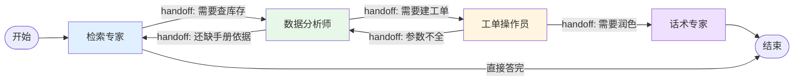

**原理**：没有主管。每个 Agent 自己决定"我能不能搞定"，搞不定就**直接把控制权交给另一个 Agent**（handoff）。在 LangGraph 里用 `Command(goto="xxx", update={...})` 实现——节点返回值同时指定了"下一步去哪"和"状态怎么改"。

**优点**：
- **省掉主管开销**：没有中心节点的重复全量输入，成本比 Supervisor 低 30%~40%
- **延迟低**：少一半 LLM 调用
- **局部知识更准**：检索专家最清楚"我这个结果够不够"，比主管隔着摘要判断准
- **没有单点**：某个 Agent 逻辑改了，不影响别人

**缺点**：
- **可控性最差**：可能绕圈（A→B→A→B...），必须设全局轮次上限和访问计数
- **没有全局视角**：没人对"整体答完了没有"负责，容易提前结束或过度探索
- **难审计**：路径是涌现出来的，事后解释成本高
- **prompt 难写**：每个 Agent 都要知道"别人能干什么"，这部分描述在每个 Agent 里重复一遍

**适用场景**：
- 角色边界非常清晰、交接条件可以用规则表达（如"发现需要写操作 → 交给操作员"）
- 对成本和延迟敏感
- 客服场景的"转接"语义天然契合（一线转二线转专家）

**最小代码骨架**：

```python
# swarm.py —— Handoff 模式最小骨架
from typing import Literal
from langgraph.types import Command
from langgraph.graph import StateGraph, START, END
from langchain_core.messages import AIMessage, SystemMessage
from pydantic import BaseModel, Field
from common import AgentState, LLM

PEERS = {
    "retriever": "检索专家，查手册/Wiki/工单历史",
    "analyst":   "数据分析师，查库存/保修/SLA",
    "operator":  "工单操作员，建单/派工/申领备件",
    "tone":      "话术专家，把技术结论翻译成客户能懂的话",
}


class Handoff(BaseModel):
    """每个 Agent 干完活后的交接决策。"""
    answer: str = Field(description="我这一步的产出")
    goto: Literal["retriever", "analyst", "operator", "tone", "DONE"] = Field(
        description="下一步交给谁；已经可以直接回复用户则填 DONE"
    )
    handoff_note: str = Field(default="", description="给下一个 Agent 的任务说明")


def make_agent(name: str, role_prompt: str):
    """工厂函数：生成一个带 handoff 能力的对等 Agent 节点。"""
    peer_desc = "\n".join(f"- {k}: {v}" for k, v in PEERS.items() if k != name)

    def node(state: AgentState) -> Command:
        sys = SystemMessage(content=(
            f"{role_prompt}\n\n"
            f"你的同事：\n{peer_desc}\n\n"
            "干完你份内的事之后，判断是否还需要同事补充。"
            "需要就填 goto=同事名，并在 handoff_note 里写清楚要它做什么；"
            "已经可以回复用户就填 goto=DONE。"
            "不要把你自己能做的事交出去。"
        ))
        out = LLM.with_structured_output(Handoff).invoke([sys, *state["messages"]])
        msg = AIMessage(content=f"[{name}] {out.answer}", name=name)
        if out.goto == "DONE":
            return Command(goto=END, update={"messages": [msg], "final_answer": out.answer})
        note = AIMessage(content=f"[handoff {name}→{out.goto}] {out.handoff_note}", name=name)
        return Command(
            goto=out.goto,
            update={"messages": [msg, note], "round_count": state.get("round_count", 0) + 1},
        )
    return node


def build_swarm():
    """构建对等交接图：注意每个节点都可能 goto 任意其他节点。"""
    g = StateGraph(AgentState)
    g.add_node("retriever", make_agent("retriever", "你是华成机电检索专家，忠于原文并标注来源。"))
    g.add_node("analyst",   make_agent("analyst", "你是数据分析师，数值只能来自工具，精确到个位。"))
    g.add_node("operator",  make_agent("operator", "你是工单操作员，写操作前必须参数齐全并确认。"))
    g.add_node("tone",      make_agent("tone", "你是话术专家，只做措辞翻译，禁止新增事实。"))
    g.add_edge(START, "retriever")   # 入口固定为检索专家
    return g.compile()
```

> 注意：使用 `Command(goto=...)` 时，目标节点必须在图里已注册。LangGraph 0.2.x 中若节点可能跳到任意节点，建议在 `add_node` 时用 `destinations` 参数声明（或直接不声明，运行期解析），并在编译后用 `get_graph().draw_mermaid()` 检查可达性。

### 3.5 模式五：辩论 Debate / 多数投票（提高质量，成本高）

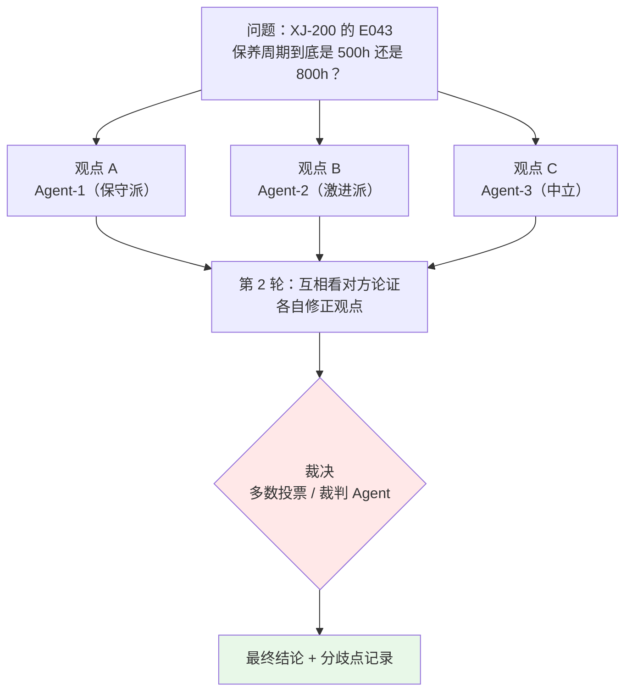

**原理**：让多个 Agent（可以是同一个模型不同温度/不同 persona，也可以是不同模型）独立给出答案，然后：
- **多数投票（Self-Consistency）**：取出现次数最多的答案，不做第二轮
- **辩论（Multi-Agent Debate）**：每个 Agent 看到别人的答案后修正自己的，迭代 2~3 轮再收敛
- **裁判制**：额外一个 Judge Agent 看所有论证，给出终裁

**优点**：
- **质量提升明显**，尤其在推理类、有唯一答案的任务上
- **能暴露分歧**：三个 Agent 答案不一致本身就是强信号——**这个问题知识库里有冲突**，应该转人工
- **不需要额外训练**，纯推理侧手段

**缺点**：
- **成本乘以 N（甚至 N × 轮数）**：3 Agent × 2 轮 = 6 倍推理成本
- **延迟高**（除非并行）
- **对开放性任务无效**：问"怎么安抚客户情绪"，三个答案都对，投票没有意义
- **会集体犯错**：同模型同知识库，三个 Agent 可能一致地错

**适用场景**：
- 有客观正确答案的判断题：故障根因定位、是否在保、数值计算
- 高风险决策：是否要免费更换核心部件（涉及成本）
- **知识冲突检测**：华成机电手册 V2/V3 对保养周期说法不一，辩论能把这个冲突顶出来

**最小代码骨架**：

```python
# debate.py —— 多数投票 + 辩论骨架（并行 fan-out 见 7.2 的 Send 用法）
from collections import Counter
from concurrent.futures import ThreadPoolExecutor
from langchain_core.messages import SystemMessage, HumanMessage
from pydantic import BaseModel, Field
from common import LLM

PERSONAS = [
    ("保守派", "你倾向于严格遵循手册最新版本，宁可保守也不冒险。"),
    ("经验派", "你更相信历史工单里的实际处理经验，手册可能滞后。"),
    ("中立派", "你不偏向任何一方，只看证据强弱。"),
]


class Opinion(BaseModel):
    """单个 Agent 的观点，带置信度和依据，便于后续加权。"""
    conclusion: str = Field(description="一句话结论")
    evidence: str = Field(description="支撑依据，必须引用来源")
    confidence: float = Field(ge=0, le=1, description="0~1 的置信度")


def one_round(persona: tuple[str, str], question: str, context: str, peers: str = "") -> Opinion:
    """让一个 persona 给出观点；peers 非空时是第二轮辩论。"""
    name, style = persona
    extra = f"\n\n其他专家的观点：\n{peers}\n请指出你认同/不认同的地方，并修正你自己的结论。" if peers else ""
    return LLM.with_structured_output(Opinion).invoke([
        SystemMessage(content=f"你是华成机电技术专家（{name}）。{style}"),
        HumanMessage(content=f"问题：{question}\n\n可用资料：\n{context}{extra}"),
    ])


def debate(question: str, context: str, rounds: int = 2) -> dict:
    """多轮辩论 + 置信度加权投票。"""
    opinions: list[Opinion] = []
    peers_text = ""
    for r in range(rounds):
        with ThreadPoolExecutor(max_workers=len(PERSONAS)) as ex:
            opinions = list(ex.map(lambda p: one_round(p, question, context, peers_text), PERSONAS))
        peers_text = "\n".join(
            f"- {PERSONAS[i][0]}：{o.conclusion}（依据：{o.evidence}，置信 {o.confidence:.2f}）"
            for i, o in enumerate(opinions)
        )

    # 置信度加权投票：结论文本做归一化后聚合
    bucket: dict[str, float] = {}
    for o in opinions:
        key = o.conclusion.strip()
        bucket[key] = bucket.get(key, 0.0) + o.confidence
    winner = max(bucket.items(), key=lambda kv: kv[1])

    # 分歧检测：如果最高分不足总分的 60%，标记为「存在实质分歧」
    total = sum(bucket.values())
    disputed = (winner[1] / total) < 0.6 if total else True
    return {
        "conclusion": winner[0],
        "score": winner[1],
        "disputed": disputed,
        "all_opinions": peers_text,
        "action": "转人工复核" if disputed else "可直接答复",
    }
```

### 3.6 模式六：反思 Generator-Critic（生成者 + 评审者，最实用的双 Agent 模式）

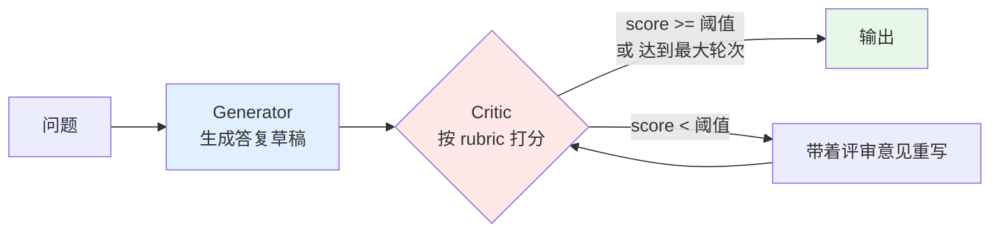

**原理**：两个角色，一个写一个改。Critic 不是"再问一遍模型对不对"——那没用（模型会附和自己）。Critic 必须：
1. 有**明确的 rubric**（评分维度 + 每个维度的扣分点）
2. 能访问**原始证据**（检索到的原文），而不是只看 Generator 的输出
3. 输出**可操作的修改意见**，不是"写得不错，可以更好"

**优点**：
- **投入产出比最高的多智能体模式**。只加一个 Agent，质量提升最明显
- **实现简单**：不需要路由，就是个循环
- **可以直接复用评测 rubric**（[第 8 篇](../08-评测体系/) 的 LLM-as-Judge 维度拿过来当 Critic）
- **可控**：`max_rounds=2` 就能覆盖绝大多数改进，成本可预期

**缺点**：
- **成本约 2.2~2.8 倍**（生成 + 评审 + 可能的重写）
- **Critic 可能过于严格**：反复打回，浪费轮次（要设 `max_rounds` 和"接受阈值"）
- **Critic 可能敷衍**：如果 rubric 写得模糊，它会一律给 8 分放行
- **改写可能引入新问题**：重写时丢掉了原来对的部分（对策：让 Generator 做**最小修改**而不是整篇重写）

**适用场景**：
- **几乎所有对外输出的场景都该加**。华成机电给客户的答复、生成的工单描述、发出去的短信
- 幻觉敏感场景：Critic 专门检查"每句话有没有出处"
- 合规敏感场景：Critic 专门检查"有没有承诺赔偿、有没有报价"

**最小代码骨架**：

```python
# reflect.py —— Generator-Critic 循环最小骨架（完整版见 7.2 第六节）
from typing import Literal
from pydantic import BaseModel, Field
from langchain_core.messages import SystemMessage, HumanMessage
from langgraph.graph import StateGraph, START, END
from common import AgentState, LLM

MAX_REVISION = 2
PASS_SCORE = 8.0

CRITIC_RUBRIC = """你是华成机电的答复质检员。按以下 rubric 给草稿打分（每项 0~10）：

1. 事实一致性：草稿里的每一个事实（型号、错误码、数值、步骤）是否都能在「证据」里找到原文支持？
   - 出现证据里没有的具体数值 → 该项直接 ≤ 3
   - 出现「一般来说」「通常」等模糊兜底替代具体依据 → 扣 2 分
2. 完整性：用户问题的每一个子问题是否都回答了？漏答一个扣 3 分。
3. 可执行性：给客户的步骤是否具体可操作？出现「联系技术人员」这种甩锅 → 扣 3 分。
4. 合规性：有无承诺赔偿、有无报价、有无泄露内部成本？出现任意一项 → 该项 0 分。
5. 话术：是否先共情、是否避免技术黑话、是否控制在合理长度。

总分取五项最小值（木桶原则），不是平均值。
必须给出**具体到句子**的修改意见，禁止输出「整体不错，可以优化表达」这类无效意见。
"""


class Critique(BaseModel):
    scores: dict[str, float] = Field(description="五个维度的分数")
    final_score: float = Field(description="五项最小值")
    issues: list[str] = Field(description="具体问题清单，每条指明是草稿的哪一句")
    fix_instructions: str = Field(description="给 Generator 的最小修改指令")


def generator_node(state: AgentState) -> dict:
    """生成/修订答复草稿。有评审意见时做最小修改，不整篇重写。"""
    feedback = state.get("critic_feedback", "")
    instruct = (
        f"以下是上一版草稿和质检意见，请**只修改被指出的问题**，其余部分保持原样：\n"
        f"上一版：{state['draft_answer']}\n质检意见：{feedback}"
        if feedback else "请基于证据生成客户答复。"
    )
    out = LLM.invoke([
        SystemMessage(content="你是华成机电售后答复生成器。所有事实必须来自给定证据。"),
        HumanMessage(content=f"问题：{state['question']}\n证据：{state['retrieval_result']}\n\n{instruct}"),
    ])
    return {"draft_answer": out.content, "round_count": state.get("round_count", 0) + 1}


def critic_node(state: AgentState) -> dict:
    """质检员：按 rubric 打分并给出可操作意见。必须能看到原始证据。"""
    c = LLM.with_structured_output(Critique).invoke([
        SystemMessage(content=CRITIC_RUBRIC),
        HumanMessage(content=(
            f"用户问题：{state['question']}\n\n"
            f"证据原文：\n{state['retrieval_result']}\n\n"
            f"待审草稿：\n{state['draft_answer']}"
        )),
    ])
    return {
        "critic_score": c.final_score,
        "critic_feedback": c.fix_instructions + "\n问题清单：" + "；".join(c.issues),
    }


def should_revise(state: AgentState) -> Literal["generator", "__end__"]:
    """决定是否再来一轮：达标或超轮次就结束。"""
    if state.get("critic_score", 0) >= PASS_SCORE:
        return "__end__"
    if state.get("round_count", 0) >= MAX_REVISION + 1:
        return "__end__"
    return "generator"


def build_reflect():
    g = StateGraph(AgentState)
    g.add_node("generator", generator_node)
    g.add_node("critic", critic_node)
    g.add_edge(START, "generator")
    g.add_edge("generator", "critic")
    g.add_conditional_edges("critic", should_revise, {"generator": "generator", "__end__": END})
    return g.compile()
```

### 3.7 六种模式大对照表

| 维度 | 流水线 Sequential | 主管 Supervisor | 分层 Hierarchical | 群体 Swarm | 辩论 Debate | 生成-评审 Gen-Critic |
|---|---|---|---|---|---|---|
| **可控性** | ★★★★★ 路径写死 | ★★★★ 主管受结构化输出约束 | ★★★ 两层不确定性 | ★★ 路径涌现 | ★★★★ 流程固定 | ★★★★★ 就一个循环 |
| **相对成本**（以单 Agent = 1.0） | 1.3~1.8× | 2.0~3.0× | 2.8~4.5× | 1.5~2.2× | 3.0~6.0× | 2.2~2.8× |
| **相对延迟** | 1.5× 串行 | 2.0× | 2.5× | 1.4× | 1.2×（并行）/ 4×（串行） | 2.3× |
| **可扩展性** | ★★ 加环节要改图 | ★★★★ 加 worker 很容易 | ★★★★★ 能撑 15+ Agent | ★★★ peer 描述要同步改 | ★★ 加 persona 成本线性涨 | ★★ 就两个角色 |
| **调试难度** | ★ 最简单 | ★★★ | ★★★★★ 最难 | ★★★★ 路径不定 | ★★ 并行独立好查 | ★ 最简单 |
| **上下文隔离** | 中 | 强 | 最强 | 中 | 强 | 弱（Critic 要看全部） |
| **典型适用任务** | 固定业务流程、合规审查 | 通用企业助手（默认选择） | 大型平台、跨部门 | 客服转接、成本敏感 | 有唯一答案的判断、冲突检测 | 对外输出质量把关 |
| **华成机电用在哪** | 夜间批量生成工单摘要 | 白天在线工单助手主链路 | 未来接入生产/供应链团队后 | 一线到二线的转接 | 保修判定、保养周期冲突 | 所有对客户可见的输出 |
| **最小 Agent 数** | 2 | 3（含主管） | 6（含 3 主管） | 2 | 3 | 2 |
| **是否需要 max_rounds** | 否 | **必须** | **必须（每层都要）** | **必须** | 否（固定轮数） | **必须** |

> **选型建议**：绝大多数企业项目的演进路径是
> **单 Agent → 加 Generator-Critic（质量）→ 改 Supervisor（能力）→ 有需要再上分层**。
> 不要一上来就做分层 Swarm 辩论全家桶。

---

## 四、角色设计方法论：怎么切分才合理

模式选好了，下一个问题是：**到底切几个 Agent，每个 Agent 管什么？**

这是多智能体项目最容易拍脑袋的地方。下面给三条正交的切分线，以及华成机电的实际方案。

### 4.1 三条切分线

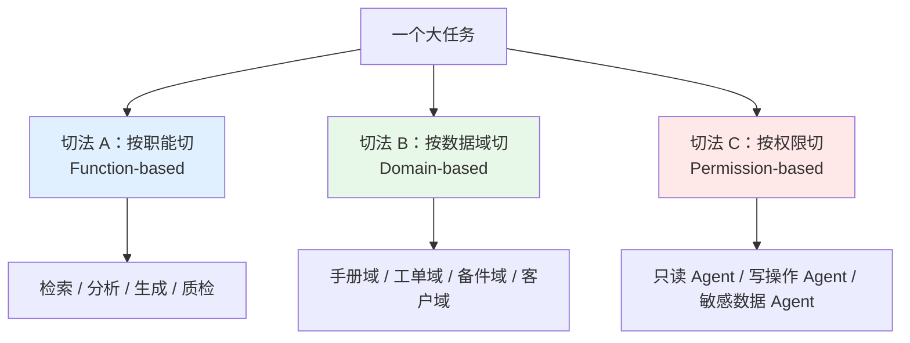

#### 切法 A：按职能切（Function-based）

按「做什么动作」划分：检索者、分析者、生成者、评审者、执行者。

- **优点**：符合认知直觉，prompt 好写（每个角色的纪律天然不冲突）；复用性高，检索 Agent 换个业务也能用
- **缺点**：一个业务问题往往要穿越所有职能，链路长；职能之间的接口是自然语言，信息容易丢
- **什么时候用**：流程型任务、Generator-Critic 模式

#### 切法 B：按数据域切（Domain-based）

按「碰哪份数据」划分：手册 Agent、工单 Agent、备件 Agent、客户 Agent。

- **优点**：每个 Agent 的知识边界清晰，检索 prompt 可以高度定制（手册 Agent 知道手册的章节结构，工单 Agent 知道工单字段含义）；**天然支持并行**（互不依赖）；权限好切（不同数据域对应不同数据库账号）
- **缺点**：跨域问题需要额外聚合层；域之间可能有重叠（工单里也提到了备件型号）
- **什么时候用**：数据源异构且各自复杂的场景。华成机电的 6 类知识资产就是典型

#### 切法 C：按权限切（Permission-based）

按「能不能改数据、能不能看敏感字段」划分：

| 层级 | 能做什么 | 审批要求 |
|---|---|---|
| L0 只读公开 | 检索公开手册、公开 FAQ | 无 |
| L1 只读内部 | 检索内部 Wiki、历史工单、库存 | 记审计日志 |
| L2 只读敏感 | 查客户合同金额、成本价 | 记审计 + 字段脱敏 |
| L3 写业务 | 建工单、派工、申领备件 | **人工审批** |
| L4 写外部 | 发短信给客户、对外承诺 | **人工审批 + 二次确认** |

- **优点**：安全评审一次过。把「危险动作」集中到 1~2 个 Agent，审批和审计只要盯着它们
- **缺点**：权限边界和业务边界不一定重合，可能造成一个 Agent 职责杂糅
- **什么时候用**：**企业落地必用**。这是 7.4 章的重点

#### 三条线怎么组合

实践中是**主次组合**，不是三选一：

```text
主线：按权限切（决定 Agent 的粗粒度分组和审批策略）
  └─ 次线：按数据域切（决定只读组内部怎么分）
       └─ 补充：按职能切（补一个跨域的质检 Agent 和话术 Agent）
```

### 4.2 华成机电的角色划分方案

综合三条线，最终方案是 **5 个 Agent + 1 个主管**：

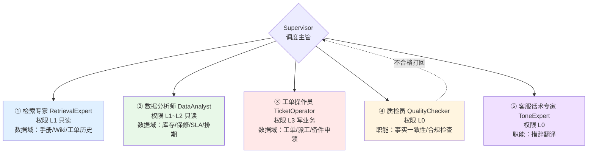

完整的角色卡片（**这张表就是你的接口契约，落到代码注释和设计文档里**）：

| 字段 | ① 检索专家 | ② 数据分析师 | ③ 工单操作员 | ④ 质检员 | ⑤ 话术专家 |
|---|---|---|---|---|---|
| **一句话职责** | 从非结构化知识中找原文依据 | 从结构化系统中取实时事实 | 在业务系统里做写操作 | 判断答复能不能发出去 | 把技术结论翻译成人话 |
| **输入** | 问题 + 产品型号上下文 | 问题 + 设备 SN/客户 ID | 结构化工单参数 | 问题 + 证据 + 草稿 | 通过质检的草稿 |
| **输出** | 带来源标注的证据段落 | `字段=值（数据源，时间戳）` 列表 | 操作回执（工单号/派工号） | 分数 + 问题清单 + 修改指令 | 最终客户可见文本 |
| **工具** | `search_manual` `search_wiki` `search_ticket_history` `rerank` | `query_stock` `query_warranty` `query_sla` `query_engineer_schedule` | `create_ticket` `assign_engineer` `order_part` `send_sms` | 无（纯推理） | 无（纯推理） |
| **权限层级** | L1 | L1~L2 | L3~L4 | L0 | L0 |
| **模型选型** | Qwen2.5-7B-Instruct（量大、任务简单） | deepseek-chat（要算数、要严谨） | deepseek-chat（参数校验要准） | deepseek-chat（判断要严） | Qwen2.5-7B-Instruct（改写而已） |
| **是否需要人审** | 否 | 否 | **是（L3 及以上必审）** | 否 | 否 |
| **超时** | 15s | 10s | 30s | 15s | 10s |
| **失败降级** | 降级到纯 BM25 检索 | 返回「数据暂不可用」并标注 | 转人工建单 | 跳过质检但标记 `unverified` | 直接输出草稿 |
| **禁止事项** | 禁止润色、禁止推测 | 禁止使用先验知识、禁止估算 | 禁止无审批执行、禁止重复提交 | 禁止修改草稿（只给意见） | **禁止新增任何事实** |

### 4.3 角色划分的四条硬规则

1. **单一职责能用一句话说清**。说不清就是切错了。如果你写角色描述时出现了「以及」「同时还要」，回去重切。
2. **任意两个角色的工具集交集为空**。两个 Agent 都能调 `search_manual`，主管就会随机选，等于没拆。
3. **写操作必须收敛到最少的 Agent**。华成机电所有写操作只在 ③ 号 Agent，审批逻辑只写一处。
4. **每个角色必须能被单独评测**。给它 20 条输入，能算出一个准确率。算不出来说明输出没结构化，回去改 schema。

---

## 五、任务分解与分配：静态编排 vs 动态规划

### 5.1 两种范式对比

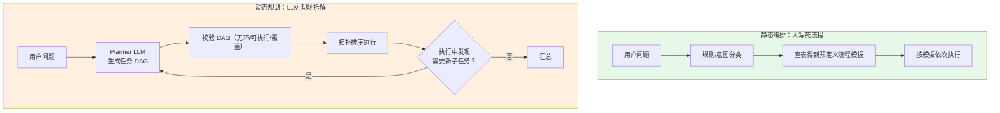

| 维度 | 静态编排 | 动态规划 |
|---|---|---|
| 可控性 | 高 | 低 |
| 覆盖长尾 | 差（模板外的问题处理不了） | 好 |
| 成本 | 低（不花 LLM 做规划） | 高（规划本身一次调用，且 prompt 长） |
| 上线速度 | 快（前 20 个高频场景一周搞定） | 慢（要调 planner prompt、要做 DAG 校验） |
| 可解释 | 完美（模板 ID 就是解释） | 需要把 plan 落审计日志 |
| 失败模式 | 走不通就兜底 | 规划本身可能错（拆出无法执行的子任务） |

### 5.2 实现思路一：静态编排（意图路由 + 流程模板）

适合先上线。华成机电统计了 3 个月的坐席问题分布，前 8 类意图覆盖了 **81%** 的 query（实测环境：2024-12~2025-02 共 4.7 万条坐席会话，人工抽样 2000 条标注）：

```python
# static_plan.py —— 意图分类 + 流程模板
from typing import Literal
from pydantic import BaseModel, Field
from langchain_core.messages import SystemMessage, HumanMessage
from common import LLM

# 流程模板：意图 → 有序的 Agent 调用序列
PLAN_TEMPLATES: dict[str, list[str]] = {
    "错误码咨询":     ["retriever", "critic", "tone"],
    "保养周期咨询":   ["retriever", "critic", "tone"],
    "备件库存查询":   ["analyst", "tone"],
    "保修状态查询":   ["analyst", "critic", "tone"],
    "报修建单":       ["retriever", "analyst", "operator", "tone"],
    "催单查询":       ["analyst", "tone"],
    "投诉":           ["retriever", "analyst", "ESCALATE_HUMAN"],
    "操作指导":       ["retriever", "critic", "tone"],
    "_FALLBACK":      ["retriever", "analyst", "critic", "tone"],   # 兜底走全链路
}


class Intent(BaseModel):
    """意图分类结果，低置信度时走兜底模板。"""
    intent: Literal[
        "错误码咨询", "保养周期咨询", "备件库存查询", "保修状态查询",
        "报修建单", "催单查询", "投诉", "操作指导", "其他",
    ]
    confidence: float = Field(ge=0, le=1)
    slots: dict[str, str] = Field(default_factory=dict,
                                  description="抽到的槽位，如 model=XJ-200, error_code=E043")


def plan_statically(question: str) -> list[str]:
    """静态编排：分类 → 查模板。低置信度或未知意图走兜底全链路。"""
    r = LLM.with_structured_output(Intent).invoke([
        SystemMessage(content=(
            "你是华成机电售后意图分类器。判断用户意图并抽取槽位"
            "（model 产品型号、error_code 错误码、sn 设备序列号、ticket_id 工单号）。"
        )),
        HumanMessage(content=question),
    ])
    if r.confidence < 0.6 or r.intent == "其他":
        return PLAN_TEMPLATES["_FALLBACK"]
    return PLAN_TEMPLATES[r.intent]
```

**上线策略**：先用静态编排覆盖前 8 类意图（81% 流量），剩下 19% 走兜底的 Supervisor 动态调度。这样 81% 的请求省掉了主管的 LLM 调用，成本和延迟都好看。

### 5.3 实现思路二：动态规划（LLM 生成任务 DAG）

```python
# dynamic_plan.py —— LLM 生成任务 DAG + 校验
from typing import Literal
from pydantic import BaseModel, Field
from langchain_core.messages import SystemMessage, HumanMessage
from common import LLM

AGENTS = ["retriever", "analyst", "operator", "critic", "tone"]


class SubTask(BaseModel):
    """DAG 中的一个节点。deps 声明依赖，用于拓扑排序和并行度计算。"""
    id: str = Field(description="任务 id，形如 t1/t2")
    agent: Literal["retriever", "analyst", "operator", "critic", "tone"]
    goal: str = Field(description="这个子任务要达成什么，一句话")
    deps: list[str] = Field(default_factory=list, description="依赖的任务 id 列表")


class Plan(BaseModel):
    """完整计划。coverage_check 让 Planner 自证覆盖了原问题的所有子问题。"""
    subtasks: list[SubTask]
    coverage_check: str = Field(description="逐条说明原问题的每个子问题由哪个 task 负责")


PLANNER_PROMPT = """你是华成机电智能体团队的规划器。把用户问题拆成子任务 DAG。

可用 Agent：
- retriever：检索手册/Wiki/历史工单，产出带来源的证据
- analyst：查库存/保修/SLA/工程师排期，产出结构化事实
- operator：建工单/派工/申领备件/发短信（写操作，需审批）
- critic：质检答复的事实一致性与合规性
- tone：把技术结论改写成客户话术

规则：
1. 只用上面 5 个 agent，不要发明新的；
2. 互不依赖的任务不要写 deps，让它们并行；
3. critic 必须依赖所有产出事实的任务；
4. tone 必须是最后一个（除非涉及写操作，则 tone 在 operator 之后）；
5. 用户只是询问、没有明确要求操作时，**不要**生成 operator 任务；
6. 子任务总数不超过 6 个；
7. 在 coverage_check 里逐条对照原问题，证明没有遗漏。
"""


def plan_dynamically(question: str) -> Plan:
    """让 LLM 生成任务 DAG。"""
    return LLM.with_structured_output(Plan).invoke([
        SystemMessage(content=PLANNER_PROMPT),
        HumanMessage(content=f"用户问题：{question}"),
    ])


def validate_plan(plan: Plan) -> list[str]:
    """DAG 校验：检查 id 唯一、依赖存在、无环、agent 合法。返回问题列表，空表示通过。"""
    problems: list[str] = []
    ids = [t.id for t in plan.subtasks]
    if len(ids) != len(set(ids)):
        problems.append("存在重复的任务 id")
    idset = set(ids)
    for t in plan.subtasks:
        if t.agent not in AGENTS:
            problems.append(f"{t.id} 使用了未知 agent: {t.agent}")
        for d in t.deps:
            if d not in idset:
                problems.append(f"{t.id} 依赖了不存在的任务 {d}")

    # 环检测：Kahn 算法
    indeg = {t.id: len([d for d in t.deps if d in idset]) for t in plan.subtasks}
    graph: dict[str, list[str]] = {i: [] for i in ids}
    for t in plan.subtasks:
        for d in t.deps:
            if d in graph:
                graph[d].append(t.id)
    queue = [i for i, v in indeg.items() if v == 0]
    visited = 0
    while queue:
        cur = queue.pop(0)
        visited += 1
        for nxt in graph[cur]:
            indeg[nxt] -= 1
            if indeg[nxt] == 0:
                queue.append(nxt)
    if visited != len(ids):
        problems.append("任务图中存在环，无法拓扑排序")
    return problems


def topo_layers(plan: Plan) -> list[list[SubTask]]:
    """把 DAG 切成一层一层，同一层内可并行执行。"""
    by_id = {t.id: t for t in plan.subtasks}
    remaining = set(by_id)
    done: set[str] = set()
    layers: list[list[SubTask]] = []
    while remaining:
        layer = [by_id[i] for i in remaining if set(by_id[i].deps) <= done]
        if not layer:
            raise RuntimeError("依赖无法满足，可能存在环")
        layers.append(layer)
        for t in layer:
            remaining.discard(t.id)
            done.add(t.id)
    return layers
```

**预期输出**（问题："XJ-200 报 E043，车间还等着开工，顺便看下这个件还有没有货"）：

```text
Plan(
  subtasks=[
    SubTask(id='t1', agent='retriever', goal='检索 XJ-200 E043 错误码的含义与处理步骤', deps=[]),
    SubTask(id='t2', agent='analyst',   goal='查询 E043 关联备件的实时库存与保修状态', deps=[]),
    SubTask(id='t3', agent='critic',    goal='核对答复中的事实是否有证据支撑、是否合规', deps=['t1','t2']),
    SubTask(id='t4', agent='tone',      goal='改写成 400 坐席可直接读给客户的话术', deps=['t3'])
  ],
  coverage_check='「E043 怎么处理」→t1；「这个件还有没有货」→t2；「车间等着开工」隐含 SLA 紧急度→t2 中一并查询'
)

校验结果：通过（0 个问题）
并行分层：[[t1, t2], [t3], [t4]]   # 第一层两个任务并行，端到端从 4 步压到 3 步
```

---

## 六、结果汇聚：四种方式与代码

多个 Agent 的产出怎么合成一个答案？这一步做不好，前面全白搭。

### 6.1 四种汇聚方式

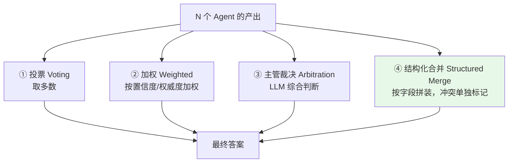

| 方式 | 适用 | 优点 | 缺点 |
|---|---|---|---|
| ① 投票 | 同一问题多个 Agent 独立作答，答案离散 | 简单、无额外 LLM 成本 | 只适合封闭答案；平票没法处理 |
| ② 加权 | 不同 Agent 权威度不同（手册 > 工单历史） | 能编码领域先验 | 权重靠拍脑袋，要靠评测调 |
| ③ 主管裁决 | 答案是开放文本、需要综合 | 最灵活 | 多一次 LLM 调用；主管可能自己编 |
| ④ 结构化合并 | **不同 Agent 负责不同字段**（最常见） | 零 LLM 成本、无幻觉、冲突可显式暴露 | 要求每个 Agent 输出 schema 化 |

> **企业落地首选 ④**，其次 ③。① ② 只在辩论模式里用。

### 6.2 结构化合并的完整实现

```python
# aggregate.py —— 四种汇聚方式的实现
from collections import Counter
from typing import Any
from pydantic import BaseModel, Field
from langchain_core.messages import SystemMessage, HumanMessage
from common import LLM


# ---------- 统一的 Agent 产出结构 ----------
class Evidence(BaseModel):
    """一条事实 + 它的来源和可信度，是所有汇聚方式的输入原子。"""
    key: str = Field(description="事实的字段名，如 error_meaning / stock_qty / warranty_status")
    value: str = Field(description="事实的值")
    source: str = Field(description="来源标识，如 manual:XJ200维修手册V3.pdf#p47 / db:erp.stock")
    source_type: str = Field(description="original_doc / database / ticket_history / model_knowledge")
    confidence: float = Field(ge=0, le=1, default=0.8)
    as_of: str = Field(default="", description="数据时间戳，ISO 格式")


class AgentOutput(BaseModel):
    """每个 Agent 必须返回这个结构，汇聚器才能无 LLM 地合并。"""
    agent: str
    facts: list[Evidence] = Field(default_factory=list)
    narrative: str = Field(default="", description="自然语言补充说明，不参与字段合并")
    failed: bool = False
    error: str = ""


# ---------- ① 投票 ----------
def aggregate_by_vote(outputs: list[AgentOutput], key: str) -> tuple[str, bool]:
    """对同一个 key 做多数投票，返回 (值, 是否存在分歧)。"""
    values = [f.value.strip() for o in outputs for f in o.facts if f.key == key]
    if not values:
        return "", False
    c = Counter(values)
    top, cnt = c.most_common(1)[0]
    disputed = cnt <= len(values) / 2 or len(c) > 1
    return top, disputed


# ---------- ② 加权 ----------
# 来源权威度：原始文档 > 数据库 > 工单历史 > 模型先验
SOURCE_WEIGHT = {
    "original_doc": 1.0,
    "database": 0.95,
    "ticket_history": 0.6,
    "model_knowledge": 0.2,
}


def aggregate_by_weight(outputs: list[AgentOutput], key: str) -> tuple[str, dict[str, float]]:
    """按 来源权威度 × Agent 置信度 加权，返回胜出值和全部得分。"""
    scores: dict[str, float] = {}
    for o in outputs:
        for f in o.facts:
            if f.key != key:
                continue
            w = SOURCE_WEIGHT.get(f.source_type, 0.3) * f.confidence
            scores[f.value.strip()] = scores.get(f.value.strip(), 0.0) + w
    if not scores:
        return "", {}
    return max(scores.items(), key=lambda kv: kv[1])[0], scores


# ---------- ③ 主管裁决 ----------
ARBITER_PROMPT = """你是华成机电的技术裁决者。下面是多个 Agent 对同一问题的产出。
请综合出一个答案。硬性纪律：
1. 只能使用给定产出里出现过的事实，禁止补充你自己知道的内容；
2. 如果两个产出矛盾，优先级：原始手册 > 数据库实时数据 > 历史工单 > 模型先验；
3. 如果矛盾无法用优先级消解（比如两份手册版本不同都说自己对），
   **不要强行选一个**，明确写出「存在冲突，需人工确认」并列出双方依据；
4. 每个事实后面保留来源标识。
"""


def aggregate_by_arbiter(outputs: list[AgentOutput], question: str) -> str:
    """LLM 裁决：适合开放文本，但必须强约束「不许新增事实」。"""
    payload = "\n\n".join(
        f"【{o.agent}】\n"
        + "\n".join(f"- {f.key} = {f.value}（来源 {f.source}，类型 {f.source_type}，"
                    f"置信 {f.confidence:.2f}，时间 {f.as_of or 'N/A'}）" for f in o.facts)
        + (f"\n补充：{o.narrative}" if o.narrative else "")
        for o in outputs
    )
    return LLM.invoke([
        SystemMessage(content=ARBITER_PROMPT),
        HumanMessage(content=f"用户问题：{question}\n\n各 Agent 产出：\n{payload}"),
    ]).content


# ---------- ④ 结构化合并（推荐） ----------
class MergedResult(BaseModel):
    """合并结果：确定的事实 + 冲突清单 + 缺失清单 + 失败的 Agent。"""
    facts: dict[str, Evidence] = Field(default_factory=dict)
    conflicts: dict[str, list[Evidence]] = Field(default_factory=dict)
    missing_keys: list[str] = Field(default_factory=list)
    failed_agents: list[str] = Field(default_factory=list)


def structured_merge(outputs: list[AgentOutput], required_keys: list[str]) -> MergedResult:
    """零 LLM 的结构化合并：同 key 多值时按权威度排序，差距小则记为冲突。"""
    res = MergedResult()
    bucket: dict[str, list[Evidence]] = {}
    for o in outputs:
        if o.failed:
            res.failed_agents.append(o.agent)
            continue
        for f in o.facts:
            bucket.setdefault(f.key, []).append(f)

    for key, evs in bucket.items():
        if len(evs) == 1:
            res.facts[key] = evs[0]
            continue
        # 值完全相同则直接合并，只保留权威度最高的那条
        distinct = {e.value.strip() for e in evs}
        ranked = sorted(evs, key=lambda e: SOURCE_WEIGHT.get(e.source_type, 0.3) * e.confidence,
                        reverse=True)
        if len(distinct) == 1:
            res.facts[key] = ranked[0]
            continue
        top_w = SOURCE_WEIGHT.get(ranked[0].source_type, 0.3) * ranked[0].confidence
        second_w = SOURCE_WEIGHT.get(ranked[1].source_type, 0.3) * ranked[1].confidence
        # 权威度差距明显（>0.25）才敢自动取胜者，否则升级为冲突交给人/裁决 Agent
        if top_w - second_w > 0.25:
            res.facts[key] = ranked[0]
        else:
            res.conflicts[key] = ranked

    res.missing_keys = [k for k in required_keys if k not in res.facts and k not in res.conflicts]
    return res
```

**预期输出**（华成机电保养周期冲突的例子）：

```text
>>> outs = [
...   AgentOutput(agent='retriever', facts=[
...       Evidence(key='maintain_cycle', value='500 小时',
...                source='manual:XJ200维护手册V2.pdf#p12',
...                source_type='original_doc', confidence=0.9, as_of='2019-06-01'),
...       Evidence(key='maintain_cycle', value='800 小时',
...                source='manual:XJ200维护手册V3.pdf#p15',
...                source_type='original_doc', confidence=0.9, as_of='2023-11-20')]),
...   AgentOutput(agent='analyst', facts=[
...       Evidence(key='stock_qty', value='23',
...                source='db:erp.stock.PN-88012',
...                source_type='database', confidence=1.0, as_of='2025-03-18T10:22:31')]),
... ]
>>> r = structured_merge(outs, required_keys=['maintain_cycle','stock_qty','warranty_status'])
>>> r.facts.keys()
dict_keys(['stock_qty'])
>>> r.conflicts.keys()
dict_keys(['maintain_cycle'])          # V2 和 V3 权威度一样，自动判不了，显式暴露
>>> r.missing_keys
['warranty_status']                    # 没人查保修，暴露出规划遗漏
>>> r.failed_agents
[]
```

**这就是结构化合并的价值**：它不会假装知道答案。`conflicts` 和 `missing_keys` 是**两个最重要的产物**，后者能直接反查出你的任务分解漏了什么。冲突的完整消解策略在 [7.3 章](./03-通信-任务分解-冲突消解.md) 展开。

---

## 七、错误传播与放大：检查点和熔断

### 7.1 问题有多严重

回到第 2.4 节的公式。假设华成机电五个 Agent 的单点准确率是（实测环境：各 Agent 独立评测集各 200 条，2025-03）：

| Agent | 单点准确率 |
|---|---|
| 检索专家 | 0.94 |
| 数据分析师 | 0.97 |
| 工单操作员 | 0.91 |
| 质检员 | 0.89 |
| 话术专家 | 0.96 |

串行全链路：$0.94 \times 0.97 \times 0.91 \times 0.89 \times 0.96 = 0.709$

**70.9%**。而单 Agent 方案的端到端准确率是 76%。**拆完反而更差了。**

这不是假想，这是很多多智能体项目上线后的真实结果。

### 7.2 三个对抗手段

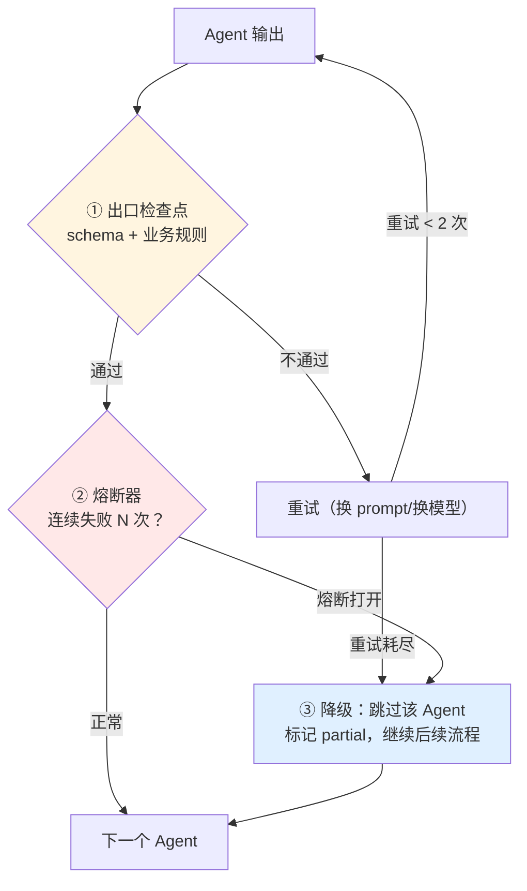

#### 手段一：出口检查点（Checkpoint / Guard）

**每个 Agent 的输出，在流转到下一个 Agent 之前，必须过一道校验。** 这道校验是**规则**，不是 LLM（LLM 校验太贵且自己也会错）。

```python
# guard.py —— Agent 出口检查点
import re
from dataclasses import dataclass, field


@dataclass
class GuardResult:
    """校验结果：通过与否 + 违规项 + 是否可重试。"""
    ok: bool
    violations: list[str] = field(default_factory=list)
    retryable: bool = True


# 各 Agent 的出口规则
def guard_retriever(out: "AgentOutput") -> GuardResult:
    """检索专家出口：必须有证据、每条证据必须有来源、不许出现无依据的数字。"""
    v = []
    if not out.facts:
        v.append("未产出任何事实")
    for f in out.facts:
        if not f.source or f.source == "unknown":
            v.append(f"事实 {f.key} 缺少来源标识")
        if f.source_type == "model_knowledge":
            v.append(f"事实 {f.key} 来自模型先验，检索专家不允许")
    return GuardResult(ok=not v, violations=v)


def guard_analyst(out: "AgentOutput") -> GuardResult:
    """数据分析师出口：数值必须是纯数字或带单位，必须有 as_of 时间戳。"""
    v = []
    for f in out.facts:
        if not f.as_of:
            v.append(f"事实 {f.key} 缺少数据时间戳 as_of")
        if f.source_type != "database":
            v.append(f"事实 {f.key} 不是来自数据库（实际 {f.source_type}）")
        if f.key.endswith("_qty") and not re.fullmatch(r"\d+", f.value.strip()):
            v.append(f"数量字段 {f.key} 不是整数：{f.value}")
    return GuardResult(ok=not v, violations=v)


FORBIDDEN_PATTERNS = [
    (r"(赔偿|索赔|包赔)", "出现赔偿承诺"),
    (r"(免费更换|免费维修|不收费)", "出现免费承诺"),
    (r"(\d+\s*元|\d+\s*块钱|报价)", "出现价格信息"),
    (r"(chunk|embedding|向量|SQL|select\s+\*)", "出现技术黑话"),
]


def guard_tone(out_text: str) -> GuardResult:
    """话术专家出口：合规词黑名单 + 长度。命中合规词不可重试，直接转人工。"""
    v, retryable = [], True
    for pat, desc in FORBIDDEN_PATTERNS:
        if re.search(pat, out_text, flags=re.I):
            v.append(desc)
            if desc in ("出现赔偿承诺", "出现免费承诺", "出现价格信息"):
                retryable = False
    if len(out_text) > 600:
        v.append(f"话术过长：{len(out_text)} 字")
    return GuardResult(ok=not v, violations=v, retryable=retryable)
```

#### 手段二：熔断器（Circuit Breaker）

某个 Agent 连续失败，不要再试了——大概率是下游服务挂了。

```python
# breaker.py —— 针对 Agent 的熔断器
import time
from dataclasses import dataclass


@dataclass
class CircuitBreaker:
    """三态熔断器：closed 正常 / open 熔断 / half_open 试探恢复。"""
    fail_threshold: int = 3
    recovery_seconds: float = 60.0
    _fails: int = 0
    _opened_at: float = 0.0
    state: str = "closed"

    def allow(self) -> bool:
        """是否允许本次调用。open 状态下超过恢复时间转 half_open 放一个请求试探。"""
        if self.state == "open":
            if time.time() - self._opened_at >= self.recovery_seconds:
                self.state = "half_open"
                return True
            return False
        return True

    def on_success(self) -> None:
        """成功则重置。"""
        self._fails = 0
        self.state = "closed"

    def on_failure(self) -> None:
        """失败计数；达到阈值则打开熔断。half_open 下失败立即重新打开。"""
        self._fails += 1
        if self.state == "half_open" or self._fails >= self.fail_threshold:
            self.state = "open"
            self._opened_at = time.time()


BREAKERS: dict[str, CircuitBreaker] = {
    "retriever": CircuitBreaker(fail_threshold=3, recovery_seconds=60),
    "analyst":   CircuitBreaker(fail_threshold=3, recovery_seconds=30),
    "operator":  CircuitBreaker(fail_threshold=2, recovery_seconds=120),  # 写操作更保守
    "critic":    CircuitBreaker(fail_threshold=5, recovery_seconds=30),
    "tone":      CircuitBreaker(fail_threshold=5, recovery_seconds=30),
}
```

#### 手段三：优雅降级而不是整链失败

关键认知：**一个 Agent 失败 ≠ 整个请求失败**。

| 失败的 Agent | 降级策略 | 用户看到什么 |
|---|---|---|
| 检索专家 | 降级到纯 BM25 关键词检索；再失败则跳过 | 「暂时无法查到手册依据，以下是基于工单历史的建议」 |
| 数据分析师 | 跳过，标记 `stock=unknown` | 「库存信息暂时无法查询，请稍后致电 400」 |
| 工单操作员 | 不重试！转人工建单 | 「已为您登记，坐席将在 5 分钟内致电确认」 |
| 质检员 | 跳过质检，但结果标记 `unverified`，**只对内部坐席可见，不直接发客户** | 坐席看到「未经质检」水印 |
| 话术专家 | 直接输出技术版草稿 | 稍微生硬但信息完整 |

```python
# degrade.py —— 带检查点、熔断、降级的 Agent 执行包装器
from typing import Callable

MAX_RETRY = 2


def run_agent_safely(
    name: str,
    fn: Callable[[dict], "AgentOutput"],
    state: dict,
    guard: Callable[["AgentOutput"], "GuardResult"],
    fallback: Callable[[dict], "AgentOutput"],
) -> tuple["AgentOutput", list[str]]:
    """带熔断、重试、出口校验、降级的统一执行入口。返回 (输出, 事件日志)。"""
    events: list[str] = []
    br = BREAKERS[name]

    if not br.allow():
        events.append(f"{name}: 熔断开启，直接降级")
        return fallback(state), events

    last_violations: list[str] = []
    for attempt in range(MAX_RETRY + 1):
        try:
            out = fn({**state, "_guard_feedback": last_violations})
        except Exception as e:                      # 下游异常
            br.on_failure()
            events.append(f"{name}: 第 {attempt + 1} 次调用异常 {type(e).__name__}: {e}")
            continue

        g = guard(out)
        if g.ok:
            br.on_success()
            events.append(f"{name}: 第 {attempt + 1} 次通过出口校验")
            return out, events

        last_violations = g.violations
        events.append(f"{name}: 第 {attempt + 1} 次出口校验失败 {g.violations}")
        if not g.retryable:
            events.append(f"{name}: 不可重试违规，直接降级/转人工")
            br.on_failure()
            return fallback(state), events

    br.on_failure()
    events.append(f"{name}: 重试耗尽，降级")
    return fallback(state), events
```

### 7.3 加上检查点后的准确率

$$
p_i^{\text{guarded}} = p_i + (1 - p_i) \cdot r_i \cdot p_i^{\text{retry}}
$$

其中 $r_i$ 是「错误能被规则检查点捕获的比例」，$p_i^{\text{retry}}$ 是重试成功率。

华成机电实测（同一评测集，加检查点后重跑，2025-03）：

| 方案 | 端到端准确率 | 平均成本倍数 |
|---|---|---|
| 单 Agent | 76.0% | 1.0× |
| 多 Agent 裸跑 | 70.9%（实测 71.5%） | 2.4× |
| 多 Agent + 出口检查点 | 84.5% | 2.9× |
| 多 Agent + 检查点 + Critic 循环 | **89.0%** | 3.6× |

> **这张表是本章最重要的结论**：多智能体的收益不是"拆了就有"，而是"拆了 + 每个接缝加校验 + 加质检循环"才有。**只拆不校验，一定比单 Agent 差。**

---

## 八、成本模型：多智能体到底贵多少

### 8.1 测算公式

单 Agent（ReAct，N 轮）：

$$
\text{Cost}_{single} = \sum_{n=1}^{N}\Big[ \big( C_{sys} + \sum_{i<n}(t_i^{th} + t_i^{ac} + t_i^{ob}) \big) p_{in} + o_n\, p_{out} \Big]
$$

Supervisor 模式（K 轮调度，第 k 轮调度的 worker 内部走 $m_k$ 轮）：

$$
\text{Cost}_{multi} = \underbrace{\sum_{k=1}^{K+1}\big(C_{sup} + k \cdot \bar{s}\big)p_{in}}_{\text{主管开销}} \;+\; \underbrace{\sum_{k=1}^{K}\sum_{j=1}^{m_k}\big(C_{w_k} + j\cdot \bar{t}_{ob}\big)p_{in}}_{\text{worker 开销}} \;+\; \text{输出成本}
$$

其中 $\bar{s}$ 是每个 worker 返回给主管的摘要平均长度。**$\bar{s}$ 是最关键的可优化变量**——把摘要从 1500 token 压到 500 token，主管开销直接降 2/3。

### 8.2 华成机电实例测算

假设：DeepSeek-chat 定价按 $p_{in}$ = 1 元 / 百万 token（缓存未命中）、$p_{out}$ = 2 元 / 百万 token 估算（**以官方最新定价为准，这里只做量级对比**）。

一个典型复杂 query（"XJ-200 报 E043，顺便看下备件库存，如果没货帮我下单"）：

**方案 A：单 Agent ReAct**

| 项 | 数值 |
|---|---|
| system prompt | 2800 token |
| 轮数 N | 7 |
| 每轮平均新增 observation | 1400 token |
| 累计输入 token | $\sum_{n=1}^{7}(2800 + (n-1) \times 1600) \approx 53200$ |
| 输出 token | 7 × 220 = 1540 |
| **成本** | 53200×1e-6 + 1540×2e-6 ≈ **0.0562 元** |

**方案 B：Supervisor 多智能体**

| 项 | 数值 |
|---|---|
| 主管 system prompt | 900 token |
| 调度轮数 K | 4（retriever → analyst → operator → FINISH） |
| worker 返回摘要 $\bar{s}$ | 500 token |
| 主管累计输入 | $\sum_{k=1}^{5}(900 + k \times 500 + 400_{\text{用户问题}}) \approx 14000$ |
| retriever 内部 | sys 600 + 3 轮，累计输入 ≈ 11400，输出 700 |
| analyst 内部 | sys 500 + 2 轮，累计输入 ≈ 2800，输出 300 |
| operator 内部 | sys 700 + 2 轮，累计输入 ≈ 3200，输出 400 |
| 总输入 | ≈ 31400 |
| 总输出 | ≈ 1400 + 主管 4×120 = 1880 |
| **成本** | 31400×1e-6 + 1880×2e-6 ≈ **0.0352 元** |

**咦，多智能体反而更便宜？**

是的，在**这个场景下**是。因为上下文隔离切断了 $O(N^2)$ 增长。这是多智能体被低估的一个好处：**当单 Agent 的上下文已经很胖时，拆开反而省钱**。

但加上质检和话术：

**方案 C：Supervisor + Critic + Tone（华成机电实际生产配置）**

| 项 | 数值 |
|---|---|
| 方案 B 的全部 | 31400 in / 1880 out |
| Critic 第 1 轮 | 输入 3200（问题+证据+草稿），输出 350 |
| Generator 修订 | 输入 3600，输出 400 |
| Critic 第 2 轮 | 输入 3600，输出 200 |
| Tone | 输入 900，输出 260 |
| 总计 | 42700 in / 3090 out |
| **成本** | **0.0489 元** |

### 8.3 对比表

| 方案 | 输入 token | 输出 token | 成本（元） | 相对成本 | 端到端准确率 | 每提升 1 个百分点的边际成本 |
|---|---|---|---|---|---|---|
| 单 Agent ReAct | 53200 | 1540 | 0.0562 | 1.00× | 76.0% | — |
| 单 Agent + 强 prompt 调优 | 55000 | 1600 | 0.0582 | 1.04× | 79.5% | 0.0006 元/pp |
| Supervisor 裸跑 | 31400 | 1880 | 0.0352 | 0.63× | 71.5% | 成本降但质量降 |
| Supervisor + 检查点 | 34000 | 2100 | 0.0382 | 0.68× | 84.5% | **负成本增益** |
| Supervisor + 检查点 + Critic | 42700 | 3090 | 0.0489 | 0.87× | 89.0% | 0.0008 元/pp |
| + 三路辩论（高风险问题才开） | 78000 | 5400 | 0.0888 | 1.58× | 91.5% | **0.016 元/pp（贵 20 倍）** |

> **关键洞察**：
> 1. 多智能体不必然更贵。上下文隔离带来的节省常常被忽略；
> 2. Supervisor + 检查点 + Critic 是**性价比最优点**；
> 3. 辩论模式的边际成本是前者的 20 倍，**只对高风险问题开启**（华成机电只对"保修判定"和"免费更换判定"开）。

### 8.4 三条降本手段

1. **压缩 worker → 主管的摘要**。这是最大杠杆。强制 worker 返回结构化 `AgentOutput`（第六节），而不是自由文本。摘要从 1500 → 500 token，主管成本降 60%。
2. **给不同 Agent 配不同模型**。检索专家和话术专家用 Qwen2.5-7B（本地 vLLM，边际成本近似 0），只有主管、数据分析师、质检员用 deepseek-chat。华成机电这么做后单次成本从 0.0489 降到 0.0261 元。
3. **开启 prompt caching**。主管的 system prompt + worker 描述是固定前缀，每轮都重复。开缓存后这部分按缓存价计费（具体折扣以模型服务商文档为准）。

---

## 九、九种常见反模式

### 9.1 反模式一：角色重叠

**症状**：两个 Agent 的工具集有交集，主管随机选，同一个问题两次跑出不同路径。

```text
❌ 错误设计
  KnowledgeAgent:  tools = [search_manual, search_wiki, search_ticket]
  SupportAgent:    tools = [search_manual, query_warranty, create_ticket]
                             ^^^^^^^^^^^^^ 重叠
```

**修法**：工具集做**严格分区**。任何工具只能挂在一个 Agent 上。需要交叉的场景，让主管派两次，或者用 handoff。

### 9.2 反模式二：无限互相调用

**症状**：A 觉得信息不够交给 B，B 觉得信息不够交回 A，无限循环，直到超时或烧光预算。

```text
[retriever] → handoff → [analyst] → handoff → [retriever] → handoff → [analyst] → ...
```

**修法**：三重保险
```python
MAX_TOTAL_ROUNDS = 10          # ① 全局轮次上限
MAX_VISITS_PER_AGENT = 3       # ② 单 Agent 访问次数上限
FORBID_IMMEDIATE_BOUNCE = True # ③ 禁止立即回传给刚交给我的那个 Agent
```
外加 **token 预算硬上限**（7.3 章给实现）。

### 9.3 反模式三：状态不一致

**症状**：并行的两个 Agent 都往 `state["facts"]` 写，一个覆盖了另一个。

**修法**：所有并行写的字段必须定义 reducer：
```python
class State(TypedDict):
    facts: Annotated[list[Evidence], operator.add]   # ✅ 追加而非覆盖
    final_answer: str                                 # ⚠️ 只允许单一节点写
```

### 9.4 反模式四：没有终止条件

**症状**：主管永远觉得"还可以再查查"，跑了 20 轮还在 FINISH 和派活之间纠结。

**修法**：
- 硬轮次上限（代码层，不是 prompt 层——prompt 说「最多 8 轮」模型会不听）
- 在主管 prompt 里给**明确的 FINISH 判据**：「已获得回答用户问题所必需的全部字段」，并列出必需字段清单
- 每轮把「还缺哪些字段」算出来（`missing_keys`）喂给主管，而不是让它自己判断

### 9.5 反模式五：为拆而拆

**症状**：五个 Agent，其中三个的 prompt 几乎一样，只是换了个名字。

**自检**：把任意两个 Agent 的 system prompt 做 diff，如果差异 < 30%，合并它们。

### 9.6 反模式六：摘要黑洞

**症状**：worker 返回的摘要丢掉了关键限定词，主管在错误前提上继续决策。

```text
worker 内部找到：「V3 手册 p.15 指出，2023 年 11 月后出厂的 XJ-200 保养周期改为 800 小时，
                  之前出厂的仍为 500 小时」
worker 返回摘要：「保养周期 800 小时」          ← 丢了全部限定条件
```

**修法**：摘要必须结构化（`Evidence` 带 `source` / `as_of` / 条件字段），禁止自由文本摘要。并在 guard 里检查「原文里出现了条件词（如果/当/自...起/仅限）但摘要里没有」。

### 9.7 反模式七：主管替 worker 干活

**症状**：主管的 prompt 里塞了业务知识，它自己就把答案编出来了，根本不派活。

**修法**：主管 prompt 里明确写「**你不掌握任何业务知识，禁止自己回答问题**」，并且主管用**结构化输出**（只能吐 `next` / `task` / `reason` 三个字段），从结构上就不给它写答案的机会。

### 9.8 反模式八：Critic 是橡皮图章

**症状**：质检员对什么都给 9 分。

**修法**：
- rubric 必须有**具体的扣分触发条件**（"出现证据里没有的数值 → ≤3 分"）
- 总分取**最小值**不取平均（木桶原则）
- 定期抽查：造 20 条已知有问题的草稿喂给 Critic，看它能揪出几条（这是 Critic 的召回率测试）

### 9.9 反模式九：把 RAG 拆成多个 Agent

**症状**：query 改写一个 Agent、检索一个 Agent、rerank 一个 Agent、压缩一个 Agent。

**为什么错**：这些是**确定性的流水线步骤**，不需要 LLM 做决策。用 LCEL 链或者 LangGraph 的普通节点就行，套 Agent 壳只是白白多花 4 次路由的钱。

**判据**：**只有需要"自主决定下一步做什么"的环节才配叫 Agent**。不需要决策的，就是个函数。

---

## 十、踩坑与排错

| 现象 | 根因 | 解决 |
|---|---|---|
| 主管反复调用同一个 worker | 主管看不到该 worker 已经返回过结果（消息被覆盖/未写回状态） | worker 产出写入独立 state key，并在主管 prompt 里渲染「已完成任务清单」 |
| 主管直接自己回答，不派活 | 主管 prompt 里混入了业务知识 | 主管用 `with_structured_output(Route)`，只允许输出路由字段 |
| 结构化输出偶发解析失败 | 模型返回了非法 JSON / 多余的 markdown 包裹 | 加 `max_retries`；降温到 0；用 `Literal` 收窄枚举；兜底走正则抽取 + 默认 FINISH |
| Swarm 模式跑飞，两个 Agent 互踢 | 没有访问计数和禁止立即回弹 | 加 `MAX_VISITS_PER_AGENT` 与 `FORBID_IMMEDIATE_BOUNCE` |
| 并行 Agent 结果被覆盖 | State 字段没有 reducer | 用 `Annotated[list, operator.add]` 或自定义 reducer |
| 端到端准确率比单 Agent 还低 | 错误传播，且接缝无校验 | 每个 Agent 出口加 guard（第七节），先把接缝焊死 |
| 成本比预估高 3 倍 | worker 返回自由文本长摘要，主管每轮重读 | 强制结构化 `AgentOutput`；限制 `narrative` 长度 |
| 延迟 P95 爆到 60s+ | 全串行 + 无超时 | 每个 Agent 设超时；可并行的用 `Send` fan-out；对用户做流式反馈 |
| 质检员总是给高分 | rubric 无具体扣分触发条件 | 改成最小值聚合 + 显式扣分规则 + Critic 召回率测试 |
| 工单被重复创建 | 重试时没有幂等键 | 写操作带 `idempotency_key`（7.3 章） |
| 答复里出现手册没有的数值 | 话术 Agent 在"润色"时补全了数字 | 话术 Agent prompt 硬约束 + 出口做「数值集合是否为草稿子集」校验 |
| trace 里看不出是哪个 Agent 错的 | 日志没有打 agent 维度标签 | 每条 message 带 `name=<agent>`，trace 按 agent 分组（7.2 章给实现） |
| 换了个模型后路由全乱 | 路由 prompt 过拟合到原模型 | 路由 prompt 尽量简短 + 强 schema；换模型必须重跑路由评测集 |
| 分层模式下子图状态没传上去 | 父子图 State schema 不兼容 | 保持同一 schema，或显式写 input/output 转换函数 |
| 上线后某个 Agent 一直超时拖垮全链路 | 没有熔断 | 加 `CircuitBreaker`（第七节），熔断后走降级 |

---

## 十一、生产级要点

1. **先量化再拆**。上线前必须有单 Agent 的基线指标（准确率、P50/P95 延迟、单次成本）。没有基线，拆完你不知道是好了还是坏了。
2. **拆的顺序**：先加 Critic（质量，收益最大），再拆只读 Agent（安全风险低），最后才拆写操作 Agent（风险最高）。
3. **每个接缝都要有 guard**。这是多智能体不退化的**必要条件**，不是可选优化。
4. **所有跨 Agent 传递的内容都要结构化**。自由文本摘要是万恶之源。
5. **轮次上限写在代码里，不要写在 prompt 里**。
6. **成本预算写在代码里**。单次会话 token 硬上限，超了强制 FINISH 并降级。
7. **写操作永远单独一个 Agent，永远走人审**（7.4 章展开）。
8. **trace 必须按 Agent 分维度**。Langfuse 里每个 Agent 一个 span，带 `agent_name` / `round` / `tokens` / `latency` 标签。
9. **准备降级到单 Agent 的开关**。多智能体链路挂了，要能一键切回单 Agent 兜底。
10. **模型分层**：便宜模型干简单活。检索、话术用 7B 本地模型，主管、质检用强模型。这是最直接的降本手段。

---

## 十二、本章小结 + 自测题

### 小结

1. **单 Agent 有三个结构性天花板**：工具太多选不准（1-of-20 分类问题）、上下文 $O(N^2)$ 增长装不下、system prompt 里的指令互相冲突被稀释。多智能体解决的是这三个，不是"让 AI 更聪明"。
2. **多智能体不是免费的**：延迟叠加、调试困难、错误传播 $\prod p_i$ 放大、状态一致性问题。**只拆不加校验，一定比单 Agent 差**——这是本章最重要的结论。
3. **六种模式各有定位**：流水线最可控、Supervisor 最常用、分层最能扩展、Swarm 最省、辩论最贵但能揪冲突、Generator-Critic 性价比最高。企业演进路径是 **单 Agent → + Critic → Supervisor → 分层**。
4. **角色切分有三条线**：按职能、按数据域、按权限。企业落地以**权限**为主线，数据域为次线，职能做补充。四条硬规则：职责一句话说清、工具集不重叠、写操作收敛到最少 Agent、每个角色能单独评测。
5. **结果汇聚首选结构化合并**：零 LLM 成本、无幻觉，而且 `conflicts` 和 `missing_keys` 两个产物能直接反查出规划遗漏和知识冲突。
6. **成本模型里最大的可优化变量是 worker → 主管的摘要长度**。上下文隔离甚至可能让多智能体比单 Agent 更便宜。

### 自测题

**第 1 题**：华成机电的单 Agent 助手挂了 11 个工具，工具选择准确率 68%，端到端准确率 76%，P50 延迟 11.4 秒，SLA 要求 P95 < 30 秒。现在有人提议拆成 5 个 Agent 的 Supervisor 架构。请用第 2.6 节的判断清单给出你的评审意见。

<details>
<summary>参考答案</summary>

逐条打分：
- ① 工具数 11 > 8，且 `search_manual`/`search_wiki`/`search_ticket_history` 语义相近 → **YES**
- ② 上下文 P95 是否超窗口 60%：题目没给，**必须先补这个数据**再评审
- ③ prompt 冲突：第 1.3 节已证明存在溯源 vs 亲切、精确 vs 简洁的冲突 → **YES**
- ④ 需要不同模型：检索和话术可以用 7B，主管要强模型 → **YES**
- ⑤ 需要不同权限：`create_ticket`/`send_sms` 是写操作，其余只读 → **YES**
- ⑥ 可并行子任务：检索和查库存互不依赖 → **YES**
- ⑦ 需要质量门：有 badcase 说明答复里有幻觉 → 需要看 badcase 归因数据
- ⑧ badcase 中路由错占比 > 30%：工具选对率只有 68%，很可能满足，**需要归因数据确认**

否决项检查：
- A：SLA P95 < 30s，而单 Agent 当前 P95 已是 31.2s，串行 Supervisor 会到 48.6s → **这是最大风险，必须先解决**
- B：76% 不算高，没有否决
- C/D/E：需要确认团队有没有 trace 和评测

**评审结论**：同意拆，但**不同意直接上全串行 Supervisor**。分三步：
1. 先加 Generator-Critic（成本 2.2×，准确率能到 85% 左右），同时把检索和数据查询改成**并行 fan-out**（第 3 章 `Send` 用法），把延迟压回来；
2. 补齐 trace 和评测集，拿到 P95 上下文占比、badcase 归因两个缺失数据；
3. 再决定是否拆成完整 Supervisor。

同时必须先建立基线指标看板，否则拆完无法验证收益。
</details>

**第 2 题**：某团队把五个 Agent 串成流水线，每个单独评测准确率都在 0.92~0.95，上线后端到端准确率只有 70%。请给出至少三个可能的根因和对应的排查动作。

<details>
<summary>参考答案</summary>

根因一：**错误传播的数学必然**。$0.93^5 \approx 0.695$，这跟 70% 完全吻合。
- 排查动作：把每一步的输出留档，人工标注 100 条，算出**条件准确率**（在前序都对的前提下，本步的准确率），看是否接近单测值。如果接近，说明就是纯粹的连乘效应。
- 解决：在每个接缝加规则 guard + 重试（第七节）。

根因二：**接口信息损失**。上一个 Agent 的输出格式不是下一个 Agent 期望的，关键限定词在摘要时丢了（第 9.6 节的摘要黑洞）。
- 排查动作：对比「Agent 内部的完整发现」和「它传给下一个 Agent 的内容」，看丢了什么。特别关注条件词（如果/仅限/自...起）。
- 解决：改成结构化 `AgentOutput` 传递，guard 里检查条件词丢失。

根因三：**单测的输入分布和线上不一致**。单测时给的是干净的标准输入，线上拿到的是上一个 Agent 的脏输出。
- 排查动作：用上游 Agent 的**真实输出**作为下游 Agent 的评测输入，重跑单测。准确率大概率会掉。
- 解决：评测集要用「链式真实输入」构造，而不是每个 Agent 各造各的。

根因四（附加）：**没有终止/降级**，某个 Agent 失败后后面照跑，产出垃圾。
- 排查动作：看有多少条 badcase 里存在上游为空/异常。
- 解决：加熔断和降级路径。
</details>

**第 3 题**：华成机电要回答"XJ-200 的保养周期是多少"，检索 Agent 找到了两条证据：V2 手册（2019）说 500 小时，V3 手册（2023）说 800 小时。请说明：(a) 用第六节哪种汇聚方式最合适？(b) 这种方式会输出什么？(c) 下一步应该怎么处理？

<details>
<summary>参考答案</summary>

**(a)** 用 **④ 结构化合并**。理由：
- 投票无效——只有两条证据，1:1；
- 加权也判不了——两条都是 `original_doc` 类型，权威度权重相同（1.0），置信度也一样，`top_w - second_w = 0 < 0.25`；
- 主管裁决可以用，但**不应该让它强行选一个**——这正是它容易犯错的地方（模型倾向于选"更新的"，但没有依据证明客户的设备适用 V3）。

**(b)** `structured_merge` 会输出：
```text
facts:      {}                                  # maintain_cycle 没有进 facts
conflicts:  {'maintain_cycle': [Evidence(800小时, V3, as_of=2023-11-20),
                                Evidence(500小时, V2, as_of=2019-06-01)]}
missing_keys: [...]
```
即**显式暴露冲突，不假装知道答案**。

**(c)** 下一步有三条路，按优先级：
1. **补充判别信息**：冲突的根因是缺少「设备出厂日期」这个槽位。正确做法是回到主管，派数据分析师去查这台设备的 SN 对应的出厂日期，用它来选择适用版本。这是**把知识冲突转化为数据查询**，最优解。
2. **时间新鲜度 + 适用条件消解**：如果能确认 V3 手册明确写了"适用于 2023-11 后出厂设备"，则按条件匹配。这需要检索 Agent 返回的 Evidence 带上适用条件字段。
3. **升级人工**：以上都拿不到时，答复里明确写"手册 V2/V3 对此有不同规定，已为您转接技术专员确认"，并触发人工工单。**绝不能随便挑一个数字告诉客户**——保养周期报错会导致设备损坏，是高风险场景。

完整的冲突消解机制见 [7.3 章](./03-通信-任务分解-冲突消解.md) 的 `ConflictResolver`。
</details>

---

**上一章** [第 6 篇 Agent 智能体](../06-Agent智能体/) | **下一章** [7.2 LangGraph 实现 Supervisor 与 Swarm](./02-LangGraph实现Supervisor与Swarm.md)
