# 第 7.3 章  通信、任务分解与冲突消解

> **本章目标**：读完能做到 …
> 1. 在自然语言消息 / 结构化任务单 / 共享黑板三种通信粒度里做出有依据的选择，并写出三者的完整数据结构；
> 2. 设计并实现一张企业级的结构化任务单（Task Spec），让下游 Agent 拿到就能干活、干完能被验收；
> 3. 用 LLM 生成任务 DAG 并做三项质量校验（覆盖度 / 可执行性 / 无环），再用拓扑排序调度器并发执行；
> 4. 写出一个 `ConflictResolver`，按「证据类型 → 时间新鲜度 → 置信度 → 裁决 Agent → 升级人工」五级处理两个 Agent 的矛盾结论；
> 5. 给所有写操作加上幂等键与去重表，并用 Saga 模式实现多步写操作的补偿回滚；
> 6. 做出全局 token 预算的分配与抢占，并能检测和打破多 Agent 之间的死锁与活锁。
>
> **前置知识**：
> - [7.1 多智能体架构模式全解](./01-多智能体架构模式全解.md)（角色划分、结果汇聚、错误传播）
> - [7.2 LangGraph 实现 Supervisor 与 Swarm](./02-LangGraph实现Supervisor与Swarm.md)（`HCState`、`Evidence`、`TaskSpec` 雏形、幂等工具）
> - [第 2 篇 RAG 基础](../02-RAG基础篇/)（检索结果的来源标注）
>
> **预计用时**：阅读 55 分钟 / 动手 150 分钟

---

## 零、三个翻车现场

7.2 章把图跑通了。但把系统交给业务之后，问题从"跑不通"变成了"跑通了但结论是错的"。华成机电试点期真实发生过的三件事：

**现场一：交接把条件弄丢了。**
`retriever` 查到"XJ-200 保养周期 800 小时（2023 年 11 月后出厂机型）"，交接给 `tone` 时写了一句摘要："保养周期 800 小时"。客户按 800 小时保养，但设备是 2022 年的老批次，实际应该 500 小时，主轴抱死，停产 3 天。

**现场二：两个 Agent 说了两套话。**
`retriever` 从 V3 手册查到"更换驱动板 PN-88012"，`analyst` 从 ERP 查到"PN-88012 已停产，替代件 PN-88012A"。两条事实都进了 `facts`，`generator` 随机挑了一个写进答复，客户订到停产件。

**现场三：一个任务被干了三遍。**
用户连点三次"帮我建单"，三张工单，三个工程师被派到同一个客户现场。

这三件事的共同点：**它们都不是模型能力问题**。模型都答对了，是**Agent 之间的协作协议**没设计好。

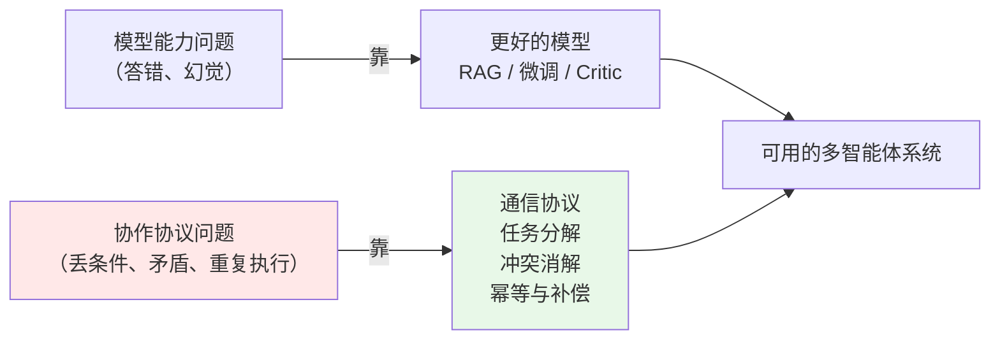

本章讲的全是右边那条线。这些东西在单 Agent 系统里不存在，在多 Agent 系统里**每一条都会咬人**。

---

## 一、通信协议设计：Agent 之间到底传什么

### 1.1 三种粒度

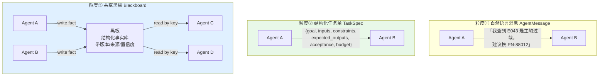

| 维度 | ① 自然语言消息 | ② 结构化任务单 | ③ 共享黑板 |
|---|---|---|---|
| 传输内容 | 一段话 | 一个带 schema 的任务对象 | 一条条带元数据的事实 |
| 方向 | 点对点 | 点对点（有向、可验收） | 多对多（发布/订阅） |
| token 成本 | 低（200~600） | 中（400~900） | 低（按 key 取用） |
| 歧义 | **高**（限定条件最易丢） | 低（字段强制） | 低（结构化） |
| 可验收 | 不可 | **可**（acceptance 字段） | 可（schema 校验） |
| 可审计 | 差 | **好** | **好**（有版本历史） |
| 冗余 | 高（N 个 Agent 要传 N 次） | 中 | **低**（写一次，谁要谁读） |
| 实现成本 | 最低 | 中 | 中高 |
| 适用 | 原型验证、Agent ≤ 2 | **有明确交接关系的流水线 / Supervisor** | **多 Agent 并发共享事实、辩论、分层团队** |

**生产上的标准组合**：**任务单管"要干什么"，黑板管"已知什么"，自然语言只用于最终面向人的输出。**

### 1.2 粒度①：自然语言消息 `AgentMessage`

即使用自然语言，也不要直接传裸字符串。至少要有信封（envelope）：

```python
# protocol/message.py —— 自然语言消息的最小信封
from __future__ import annotations
import time
import uuid
from typing import Any, Literal

from pydantic import BaseModel, Field

MsgType = Literal["inform", "request", "propose", "reject", "confirm", "escalate"]


class AgentMessage(BaseModel):
    """Agent 之间的自然语言消息。哪怕内容是一段话，信封也必须结构化。

    信封字段的作用：
    - msg_id / reply_to：串起对话链，排查时能还原谁回的谁
    - sender / receiver：trace 按 Agent 归因的依据
    - msg_type：让接收方知道这是「告知」还是「请求」，避免把通报当成指令
    - refs：引用了哪些黑板事实，断掉「凭空说话」
    """
    msg_id: str = Field(default_factory=lambda: uuid.uuid4().hex[:12])
    session_id: str
    sender: str
    receiver: str
    msg_type: MsgType = "inform"
    content: str
    refs: list[str] = Field(default_factory=list, description="引用的事实 key，如 ['error_meaning']")
    reply_to: str = ""
    ts: float = Field(default_factory=time.time)

    def render(self) -> str:
        """渲染成给 LLM 看的紧凑文本。"""
        r = f"（引用：{', '.join(self.refs)}）" if self.refs else ""
        return f"[{self.sender} → {self.receiver}｜{self.msg_type}] {self.content}{r}"
```

> **为什么连自然语言也要 `refs`**：7.2 的"串味"问题里，`analyst` 越权给建议时引用的是 `retriever` 的原话。
> 强制 `refs` 之后，任何没有事实支撑的发言在渲染时都会暴露（`refs` 为空），审计脚本能直接扫出来。

**自然语言消息的致命伤**（第 0 节现场一）：限定条件在"转述"时丢失。下面这段是真实可复现的：

```text
原文（手册 V3 p.15）：
  "自 2023 年 11 月起出厂的 XJ-200（SN 以 B3 开头），主轴润滑保养周期调整为 800 运行小时；
   此前出厂机型仍按 500 运行小时执行。"

retriever 的自然语言结论（完整）：
  "XJ-200 保养周期：2023-11 后出厂（SN 以 B3 开头）为 800 小时，此前为 500 小时 [手册V3 p.15]"

交接给 tone 时，tone 的输入是「上游的一段话 + 用户问题」，它输出：
  "您的 XJ-200 建议每 800 运行小时做一次主轴润滑保养。"     ← ❌ 条件没了

→ 在我们的 120 条回归集上，纯自然语言交接的「条件保留率」约 61.7%
  （实测环境：deepseek-chat，2025-03，示例性数据，需自行复现）。
  改成任务单 + 黑板之后这个数字能提到 90% 以上（7.2 表 7.4 的对照）。
```

**根因不是模型笨，是自然语言没有"必填字段"这个概念。** 条件是可选的修饰语，模型在压缩时天然会先丢修饰语。

### 1.3 选型决策树

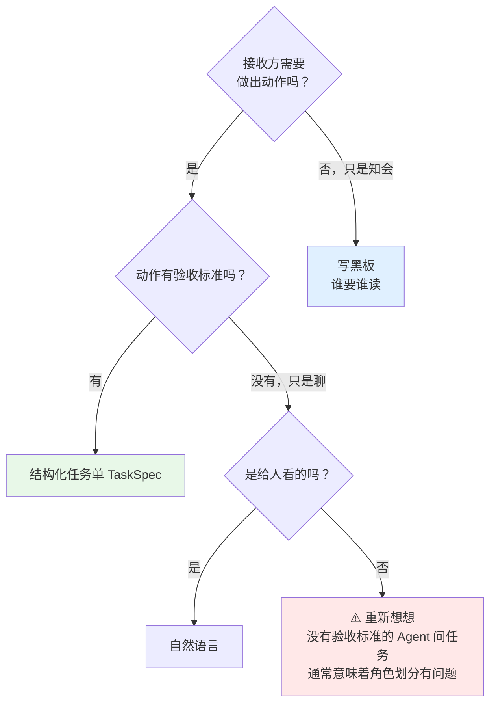

---

## 二、结构化任务单（Task Spec）设计

这是企业级多智能体方案里**最值钱的一个数据结构**。7.2 章 4.3 节给了一个最小版 `TaskSpec`（`goal / inputs / constraints / expected_keys / why`），这一节把它补全到可以直接上生产。

### 2.1 一张任务单必须回答七个问题

| # | 问题 | 字段 | 不写会怎样 |
|---|---|---|---|
| 1 | 这是哪个任务 | `task_id` / `parent_id` / `session_id` | 无法追溯、无法幂等、无法做 DAG |
| 2 | 要达成什么 | `goal` | 下游自由发挥，做了一堆不相干的事 |
| 3 | 给了什么输入 | `inputs` | 下游自己去猜参数，或者重新查一遍（重复成本） |
| 4 | 不许做什么 | `constraints` | 越权、超范围、重复调工具 |
| 5 | 要产出什么格式 | `expected_outputs` | 上游拿到一段散文，没法解析 |
| 6 | 怎么算做完了 | `acceptance` | **没法自动验收，只能人看**——这是最常被省略也最致命的一条 |
| 7 | 能花多少 | `budget` | 一个 Agent 把全会话预算烧光 |

> **第 6 条是分水岭**。有 `acceptance` 的任务单，系统能自己判断"做完了没有""做得对不对"，
> 才可能有自动重试、自动降级、自动升级人工。没有它，多智能体系统永远需要人盯着。

### 2.2 完整 schema

```python
# protocol/taskspec.py —— 企业级结构化任务单
from __future__ import annotations
import hashlib
import json
import time
import uuid
from typing import Any, Literal

from pydantic import BaseModel, Field, field_validator

Priority = Literal["P0", "P1", "P2", "P3"]
TaskStatus = Literal["pending", "ready", "running", "succeeded",
                     "failed", "rejected", "cancelled", "escalated"]


class Budget(BaseModel):
    """单个任务的资源上限。超了就失败，不要"稍微超一点没关系"。"""
    max_tokens: int = Field(default=8000, ge=0, description="本任务允许消耗的总 token")
    max_llm_calls: int = Field(default=6, ge=0)
    max_tool_calls: int = Field(default=8, ge=0)
    max_seconds: float = Field(default=30.0, gt=0)
    max_retries: int = Field(default=1, ge=0)
    cost_cny_cap: float = Field(default=0.05, ge=0, description="成本上限，按当期单价折算")


class AcceptanceCriteria(BaseModel):
    """验收标准。设计原则：每一条都必须能被一段代码判定，不能是"质量要好"。"""
    required_keys: list[str] = Field(
        default_factory=list, description="必须产出的事实 key，如 ['stock_qty','warranty_status']")
    required_source_types: list[str] = Field(
        default_factory=list, description="这些 key 必须来自指定证据类型，如 ['original_doc']")
    must_cite_source: bool = Field(default=True, description="每条事实必须带来源标识")
    must_keep_conditions: bool = Field(
        default=True, description="原文有适用条件时必须保留（现场一的根因）")
    forbid_patterns: list[str] = Field(
        default_factory=lambda: ["一般来说", "通常情况下", "建议联系专业"],
        description="出现即判不通过的表述")
    min_confidence: float = Field(default=0.6, ge=0, le=1)
    custom_check: str = Field(
        default="", description="自定义校验函数名，在 CHECK_REGISTRY 里注册")


class OutputSpec(BaseModel):
    """期望输出格式。不写这个，上游就得写解析代码去猜。"""
    format: Literal["evidence_list", "json", "markdown", "plain"] = "evidence_list"
    json_schema_name: str = Field(default="", description="format=json 时指定 pydantic 模型名")
    max_chars: int = Field(default=2000, gt=0)
    language: Literal["zh", "en"] = "zh"


class TaskSpec(BaseModel):
    """结构化任务单：Agent 之间传递任务的唯一合法载体。

    设计原则：
    1. **自包含**——接收方不需要回头去问上游任何事；
    2. **可验收**——acceptance 能被代码判定；
    3. **可追溯**——task_id / parent_id 构成 DAG，写进审计日志；
    4. **可幂等**——fingerprint() 相同即视为同一任务，重复派发不重复执行。
    """
    # ---- 身份与血缘 ----
    task_id: str = Field(default_factory=lambda: "T" + uuid.uuid4().hex[:10])
    parent_id: str = Field(default="", description="父任务 id，根任务为空")
    session_id: str = ""
    depends_on: list[str] = Field(default_factory=list, description="依赖的 task_id 列表")

    # ---- 派发 ----
    assignee: str = Field(description="执行者 Agent 名，如 retriever / analyst / operator")
    created_by: str = Field(default="planner")
    priority: Priority = "P2"
    created_at: float = Field(default_factory=time.time)
    deadline_ts: float = Field(default=0.0, description="0 表示不限；调度器据此算关键路径")

    # ---- 任务本体（七问） ----
    goal: str = Field(description="动词开头，一句话说清要达成什么")
    context: str = Field(default="", description="必要背景，不要把整段对话塞进来")
    inputs: dict[str, Any] = Field(
        default_factory=dict, description="下游需要的参数，如 {'device_sn':'B3-2023-8871'}")
    constraints: list[str] = Field(
        default_factory=list, description="硬约束，如『只查手册不查 Wiki』『不许调写工具』")
    expected_outputs: OutputSpec = Field(default_factory=OutputSpec)
    acceptance: AcceptanceCriteria = Field(default_factory=AcceptanceCriteria)
    budget: Budget = Field(default_factory=Budget)

    # ---- 运行时 ----
    status: TaskStatus = "pending"
    attempt: int = 0
    result_keys: list[str] = Field(default_factory=list)
    error: str = ""
    why: str = Field(default="", description="为什么派这个任务，写入审计")

    @field_validator("goal")
    @classmethod
    def goal_must_be_actionable(cls, v: str) -> str:
        """goal 必须是动作，不能是名词短语。挡住『关于 E043 的信息』这类废话任务。"""
        if len(v) < 6:
            raise ValueError("goal 太短，说不清要干什么")
        vague = ("了解", "关于", "看一下", "处理一下", "研究")
        if any(v.startswith(w) for w in vague):
            raise ValueError(f"goal 过于笼统：{v}。请写成可验收的动作，如『查询 X 的 Y 并给出来源』")
        return v

    def fingerprint(self) -> str:
        """任务指纹：同一 session 内，assignee + goal + inputs 相同即同一个任务。

        用途：① 幂等派发（重复分解不会重复执行）；② 缓存命中；③ 冲突检测。
        """
        payload = json.dumps(
            {"s": self.session_id, "a": self.assignee, "g": self.goal.strip(),
             "i": {k: str(v) for k, v in sorted(self.inputs.items())}},
            ensure_ascii=False, sort_keys=True)
        return hashlib.sha256(payload.encode()).hexdigest()[:20]

    def render_for_llm(self) -> str:
        """渲染成给执行 Agent 看的提示文本。控制在 400 token 以内。"""
        lines = [f"## 你的任务（{self.task_id}，优先级 {self.priority}）",
                 f"目标：{self.goal}"]
        if self.context:
            lines.append(f"背景：{self.context}")
        if self.inputs:
            lines.append("输入参数：" + "；".join(f"{k}={v}" for k, v in self.inputs.items()))
        if self.constraints:
            lines.append("硬约束（违反即判失败）：\n" + "\n".join(f"  - {c}" for c in self.constraints))
        acc = self.acceptance
        if acc.required_keys:
            lines.append("必须产出这些字段：" + "、".join(acc.required_keys))
        if acc.must_keep_conditions:
            lines.append("⚠ 原文若带适用条件（批次/时间/型号范围），**必须原样保留**，这是硬性验收项。")
        if acc.must_cite_source:
            lines.append("⚠ 每条结论必须带来源标识（文件名 + 页码 / 表名 + 时间戳）。")
        lines.append(f"输出格式：{self.expected_outputs.format}，不超过 "
                     f"{self.expected_outputs.max_chars} 字")
        lines.append(f"资源上限：最多 {self.budget.max_tool_calls} 次工具调用、"
                     f"{self.budget.max_seconds:.0f} 秒；超限请立即收口给出已有结论。")
        return "\n".join(lines)
```

### 2.3 验收：让代码判定"做完了没有"

```python
# protocol/acceptance.py —— 任务验收器
from __future__ import annotations
import re
from typing import Callable

from state import Evidence           # 复用 7.2 的事实原子
from protocol.taskspec import TaskSpec

# 自定义校验注册表：acceptance.custom_check 填这里的 key
CHECK_REGISTRY: dict[str, Callable[[TaskSpec, list[Evidence], str], tuple[bool, str]]] = {}


def register_check(name: str):
    """注册自定义验收函数的装饰器。"""
    def deco(fn):
        CHECK_REGISTRY[name] = fn
        return fn
    return deco


class AcceptResult:
    """验收结果：过 / 不过 + 原因 + 是否值得重试。"""

    def __init__(self, ok: bool, reasons: list[str], retriable: bool = True):
        self.ok, self.reasons, self.retriable = ok, reasons, retriable

    def __bool__(self) -> bool:
        return self.ok

    def __repr__(self) -> str:
        return f"<Accept ok={self.ok} retriable={self.retriable} reasons={self.reasons}>"


def accept(spec: TaskSpec, facts: list[Evidence], text: str = "") -> AcceptResult:
    """按任务单的 acceptance 逐条校验产出。全部通过才算任务成功。"""
    acc = spec.acceptance
    got = {f.key: f for f in facts}
    reasons: list[str] = []

    # ① 必需字段
    missing = [k for k in acc.required_keys if k not in got]
    if missing:
        reasons.append(f"缺少必需字段：{missing}")

    # ② 证据类型约束（例如故障结论必须来自原始手册，不许来自模型先验）
    if acc.required_source_types:
        for k in acc.required_keys:
            f = got.get(k)
            if f and f.source_type not in acc.required_source_types:
                reasons.append(
                    f"字段 {k} 的来源类型 {f.source_type} 不在允许列表 {acc.required_source_types} 中")

    # ③ 来源标注
    if acc.must_cite_source:
        no_src = [f.key for f in facts if not f.source or f.source in ("unknown", "unstructured")]
        if no_src:
            reasons.append(f"以下事实没有来源标注：{no_src}")

    # ④ 置信度
    low = [f.key for f in facts if f.confidence < acc.min_confidence]
    if low:
        reasons.append(f"以下事实置信度低于 {acc.min_confidence}：{low}")

    # ⑤ 禁用表述
    blob = text + " " + " ".join(f"{f.key}{f.value}{f.conditions}" for f in facts)
    hit = [p for p in acc.forbid_patterns if re.search(p, blob)]
    if hit:
        reasons.append(f"出现禁用表述：{hit}")

    # ⑥ 自定义
    if acc.custom_check:
        fn = CHECK_REGISTRY.get(acc.custom_check)
        if fn is None:
            reasons.append(f"自定义校验 {acc.custom_check} 未注册")
        else:
            ok, msg = fn(spec, facts, text)
            if not ok:
                reasons.append(msg)

    # 缺字段可以重试（换个工具再查一遍）；来源类型不对基本重试也没用
    retriable = not any("来源类型" in r for r in reasons)
    return AcceptResult(not reasons, reasons, retriable)


@register_check("conditions_preserved")
def _check_conditions(spec: TaskSpec, facts: list[Evidence], text: str) -> tuple[bool, str]:
    """校验：涉及批次/时间范围的字段必须带 conditions。专治第 0 节的现场一。"""
    SENSITIVE = {"maintain_cycle", "warranty_period", "torque_spec", "part_no"}
    bad = [f.key for f in facts
           if f.key in SENSITIVE
           and re.search(r"(20\d{2}|批次|B3|以后|之前|起)", f.value)
           and not f.conditions]
    if bad:
        return False, (f"字段 {bad} 的值里出现了批次/时间限定，但 conditions 为空，"
                       f"说明限定条件被压进了 value 或被丢弃，必须拆出来")
    return True, ""
```

### 2.4 三张真实任务单

```python
# examples/specs.py —— 华成机电场景下的三张任务单
from protocol.taskspec import AcceptanceCriteria, Budget, OutputSpec, TaskSpec

# ① 检索类：最常见，约束重点在「保留条件 + 带来源」
spec_retrieve = TaskSpec(
    session_id="sess-7f3a",
    assignee="retriever",
    created_by="planner",
    priority="P1",
    goal="查询 XJ-200 错误码 E043 的含义、触发条件与官方处理步骤，并给出所需备件号",
    context="客户设备 SN B3-2023-8871，现场停机中",
    inputs={"product_model": "XJ-200", "error_code": "E043", "device_sn": "B3-2023-8871"},
    constraints=[
        "只使用 search_manual 和 search_wiki，不要查历史工单（本任务只要官方口径）",
        "手册查不到就明确回答『手册中未收录』，禁止用先验知识补",
        "若 V2 与 V3 手册说法不一致，两条都列出并标记冲突，不要自行挑选",
    ],
    expected_outputs=OutputSpec(format="evidence_list", max_chars=1200),
    acceptance=AcceptanceCriteria(
        required_keys=["error_meaning", "repair_steps", "part_no"],
        required_source_types=["original_doc"],
        must_cite_source=True,
        must_keep_conditions=True,
        custom_check="conditions_preserved",
        min_confidence=0.7,
    ),
    budget=Budget(max_tokens=6000, max_llm_calls=4, max_tool_calls=4, max_seconds=20),
    why="建单与答复都依赖故障结论，这是根任务",
)

# ② 数据类：依赖 ①（要先知道 part_no 才能查库存）
spec_data = TaskSpec(
    session_id="sess-7f3a",
    assignee="analyst",
    depends_on=[spec_retrieve.task_id],
    goal="查询指定备件的实时库存、该设备保修状态与华东区工程师最近可用时段",
    inputs={"part_no": "${T_retrieve.part_no}",       # 占位符，调度器在依赖完成后回填
            "device_sn": "B3-2023-8871", "region": "华东"},
    constraints=["只报数，不做业务判断，不给处置建议", "数值必须带数据源与时间戳"],
    expected_outputs=OutputSpec(format="evidence_list", max_chars=600),
    acceptance=AcceptanceCriteria(
        required_keys=["stock_qty", "warranty_status", "engineer_available"],
        required_source_types=["database"],
        min_confidence=0.9,          # 数据库数据置信度应该很高，低了说明查错了
        forbid_patterns=["大约", "估计", "应该有"],
    ),
    budget=Budget(max_tokens=3000, max_llm_calls=3, max_tool_calls=4, max_seconds=12),
    why="答复中要告诉客户能不能马上换件、要不要收费、什么时候能上门",
)

# ③ 写操作类：预算最紧、约束最多、必须过审批
spec_write = TaskSpec(
    session_id="sess-7f3a",
    assignee="operator",
    depends_on=[spec_retrieve.task_id, spec_data.task_id],
    priority="P1",
    goal="为该设备创建 E043 故障工单并派给华东区可用工程师",
    inputs={"device_sn": "B3-2023-8871",
            "fault_desc": "${T_retrieve.error_meaning}",
            "priority": "P2", "region": "华东"},
    constraints=[
        "一次只执行一个写操作，做完立即汇报",
        "参数不全时禁止执行，直接报告缺哪个字段",
        "不得对客户承诺任何时间以外的内容（时间必须来自系统返回的 eta）",
        "必须使用调度器下发的 action_id 作为幂等键",
    ],
    expected_outputs=OutputSpec(format="json", json_schema_name="TicketResult", max_chars=400),
    acceptance=AcceptanceCriteria(
        required_keys=["ticket_id", "assigned_engineer", "eta"],
        required_source_types=["database"],
        forbid_patterns=["免费", "赔偿", "元"],
    ),
    budget=Budget(max_tokens=2500, max_llm_calls=2, max_tool_calls=2,
                  max_seconds=30, max_retries=0),   # ★ 写操作不自动重试
    why="用户明确要求建单派工",
)
```

> **注意 `spec_write` 的 `max_retries=0`**。
> 读操作失败可以重试，**写操作的重试必须由幂等机制保证，而不是由调度器盲目重试**（详见第七节）。

### 2.5 让 LLM 生成任务单

任务单可以手写（静态流程模板），也可以让 LLM 生成（动态规划）。生成时的关键是**把 schema 交给模型，并对生成结果做校验**：

```python
# planner/generate_spec.py —— LLM 生成任务单 + 校验
from __future__ import annotations
from pydantic import BaseModel, Field, ValidationError

from config import LLM_STRONG
from protocol.taskspec import TaskSpec

PLANNER_SYS = """你是华成机电多智能体系统的任务规划器。

把用户问题拆成若干张**任务单**，交给下列 Agent 执行：
- retriever：查手册 / Wiki / 历史工单，产出带来源的原文依据（只读）
- analyst：查 ERP 库存 / 保修 / SLA / 工程师排期，产出实时数值（只读）
- operator：建单 / 派工 / 申领备件 / 发短信（**写操作，需人工审批**）
- tone：把技术结论改写成客户能听懂的话（不查任何资料）

## 硬性纪律
1. 每张任务单的 goal 必须是**动词开头的可验收动作**，禁止「了解 X」「关于 X 的信息」；
2. 有依赖关系的任务必须填 depends_on，并在 inputs 里用 `${任务id.字段}` 占位；
3. 用户只是询问、没有明确要求「帮我建单/派工/下单」时，**不得生成 operator 任务**；
4. acceptance.required_keys 必须填，这是验收依据；
5. 任务数控制在 1~5 张。能一张完成的别拆两张——拆得越碎越慢越贵；
6. 不要生成「汇总」「整理」这类任务，汇总由系统固定流程完成。
"""


class TaskPlan(BaseModel):
    """一次规划的产物。"""
    tasks: list[TaskSpec] = Field(default_factory=list)
    rationale: str = Field(default="", description="拆解思路，写入审计")


def plan_tasks(question: str, session_id: str, known: str = "") -> TaskPlan:
    """生成任务 DAG。失败时退化为单任务，保证系统不会因为规划失败而挂掉。"""
    try:
        plan = LLM_STRONG.with_structured_output(TaskPlan).invoke([
            {"role": "system", "content": PLANNER_SYS},
            {"role": "user", "content":
                f"用户问题：{question}\n已知事实：\n{known or '（无）'}\n请输出任务单列表。"},
        ])
    except (ValidationError, Exception) as e:
        # 兜底：退化成一张最朴素的检索任务，绝不让规划失败导致整个会话失败
        return TaskPlan(tasks=[TaskSpec(
            session_id=session_id, assignee="retriever",
            goal=f"检索与以下问题相关的手册原文并给出带来源的结论：{question[:60]}",
            why=f"规划器异常降级：{type(e).__name__}")],
            rationale=f"planner_fallback: {e}")

    for t in plan.tasks:
        t.session_id = session_id
    return plan
```

### 2.6 任务单的版本兼容

任务单是**跨团队契约**，上线后一定会改。三条规矩：

| 规矩 | 做法 |
|---|---|
| 只增不改不删 | 新增字段必须有默认值；旧字段即使不用了也保留（标 `deprecated`） |
| 带 schema 版本号 | `spec_version: str = "1.2"`，执行器按版本走不同分支 |
| 未知字段不报错 | pydantic 默认忽略额外字段（`model_config = ConfigDict(extra="ignore")`），保证新版规划器产出的单子老版执行器也能跑 |

```python
# 在 TaskSpec 里加上
from pydantic import ConfigDict

class TaskSpec(BaseModel):
    model_config = ConfigDict(extra="ignore")     # 前向兼容：忽略未知字段
    spec_version: str = "1.2"
    # ... 其余字段
```

---

## 三、黑板模式（Blackboard）：共享事实库

### 3.1 消息传递撑不住的时候

Supervisor 模式里有 3 个 worker 时，消息传递还行。变成分层结构、8 个 Agent 时会出现这个局面：

```text
retriever 查到 part_no = PN-88012
  → 要告诉 analyst（查库存）
  → 要告诉 operator（申领备件）
  → 要告诉 tone（写进答复）
  → 要告诉 critic（核对事实）

消息传递：4 条消息，同一条事实被序列化 4 次，token × 4，且每次转述都有丢失风险
黑板：写 1 次，4 个 Agent 各自按 key 读，token × 1，零转述损失
```

黑板（Blackboard）是一种经典的 AI 架构模式：**一块所有 Agent 都能读写的共享结构化存储**，
Agent 不直接对话，而是"往黑板上写发现，从黑板上读别人的发现"。

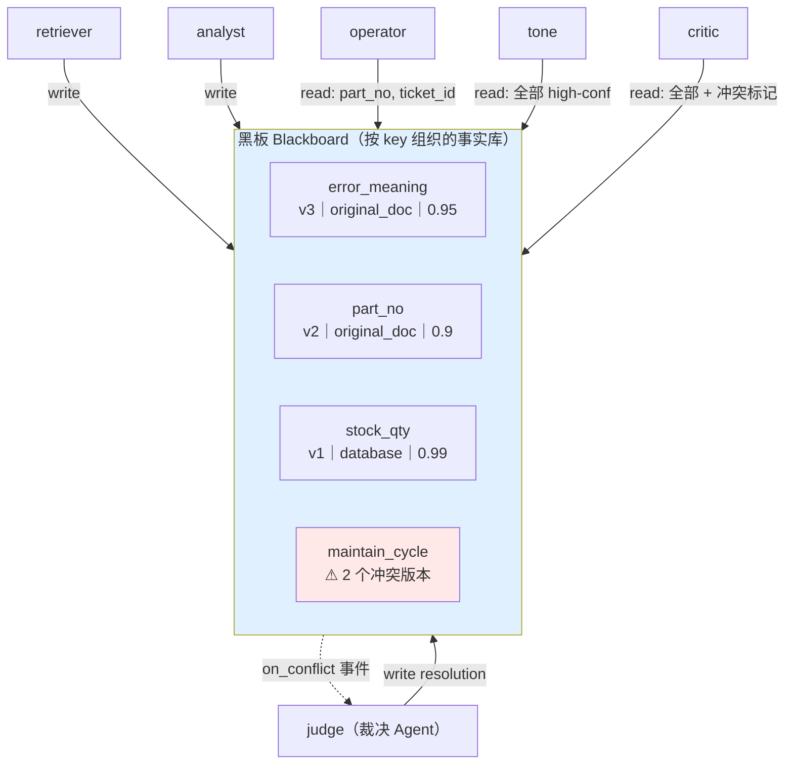

### 3.2 完整实现

```python
# protocol/blackboard.py —— 共享事实黑板
from __future__ import annotations
import threading
import time
from collections import defaultdict
from typing import Any, Callable, Iterable

from pydantic import BaseModel, Field

from state import Evidence          # 复用 7.2 的事实原子


class FactVersion(BaseModel):
    """黑板上一条事实的一个版本。写入永不覆盖，只追加版本。"""
    version: int
    evidence: Evidence
    written_by: str
    written_at: float = Field(default_factory=time.time)
    superseded_by: int = 0          # 被哪个版本取代，0 表示仍有效
    note: str = ""


class Blackboard:
    """线程安全的共享事实库。

    设计要点：
    1. **只追加不覆盖**：写同一个 key 产生新版本，历史可查——这是审计和冲突消解的基础；
    2. **按 key 读**：读者只取自己关心的字段，不会被无关信息污染（解决 7.2 的"串味"）；
    3. **自动冲突检测**：同一 key 出现语义不同的值时打冲突标记并触发订阅回调；
    4. **订阅机制**：Agent 可以订阅某个 key，有新值时被唤醒（实现事件驱动的协作）。
    """

    def __init__(self, session_id: str):
        self.session_id = session_id
        self._facts: dict[str, list[FactVersion]] = defaultdict(list)
        self._conflicts: dict[str, list[int]] = {}       # key -> 冲突的版本号列表
        self._subs: dict[str, list[Callable[[str, FactVersion], None]]] = defaultdict(list)
        self._lock = threading.RLock()
        self._write_log: list[dict] = []

    # ---------- 写 ----------
    def write(self, ev: Evidence, by: str, note: str = "") -> FactVersion:
        """写入一条事实。返回新版本对象；若与现有版本矛盾会打冲突标记。"""
        with self._lock:
            versions = self._facts[ev.key]
            # 幂等：完全相同的 (value, source) 不产生新版本，只提升置信度
            for v in versions:
                if v.evidence.value.strip() == ev.value.strip() and v.evidence.source == ev.source:
                    if ev.confidence > v.evidence.confidence:
                        v.evidence.confidence = ev.confidence
                    return v

            fv = FactVersion(version=len(versions) + 1, evidence=ev, written_by=by, note=note)
            versions.append(fv)
            self._write_log.append({"ts": fv.written_at, "key": ev.key, "by": by,
                                    "version": fv.version, "value": ev.value[:80]})

            # 冲突检测：同 key 存在有效版本且值不等价
            actives = [v for v in versions if not v.superseded_by]
            if len(actives) > 1 and self._is_conflicting(actives):
                self._conflicts[ev.key] = [v.version for v in actives]

            for cb in self._subs.get(ev.key, []) + self._subs.get("*", []):
                try:
                    cb(ev.key, fv)
                except Exception:
                    pass                # 订阅回调不许影响写入主流程
            return fv

    def write_many(self, evs: Iterable[Evidence], by: str) -> list[FactVersion]:
        """批量写入。"""
        return [self.write(e, by) for e in evs]

    @staticmethod
    def _is_conflicting(actives: list[FactVersion]) -> bool:
        """判断多个有效版本是否互相矛盾。

        规则（从便宜到贵）：
        1. 值归一化后完全相同 → 不冲突；
        2. 值里的数字不同 → 冲突（保养周期 500 vs 800）；
        3. 其余情况交给上层的语义判断（ConflictResolver 第六节），这里保守地标为冲突。
        """
        import re
        norm = {re.sub(r"\s+", "", v.evidence.value) for v in actives}
        if len(norm) == 1:
            return False
        nums = [tuple(re.findall(r"\d+(?:\.\d+)?", v.evidence.value)) for v in actives]
        if len({n for n in nums if n}) > 1:
            return True
        return True

    # ---------- 读 ----------
    def get(self, key: str, strategy: str = "best") -> Evidence | None:
        """读一个 key 的当前值。

        strategy：
        - best     ：置信度最高的有效版本（默认）
        - latest   ：最后写入的有效版本
        - authoritative：按证据类型权威度排序（原始文档 > 数据库 > 工单 > 模型）
        """
        with self._lock:
            actives = [v for v in self._facts.get(key, []) if not v.superseded_by]
            if not actives:
                return None
            if strategy == "latest":
                return max(actives, key=lambda v: v.written_at).evidence
            if strategy == "authoritative":
                return max(actives, key=lambda v: (SOURCE_RANK.get(v.evidence.source_type, 0),
                                                   v.evidence.confidence)).evidence
            return max(actives, key=lambda v: v.evidence.confidence).evidence

    def get_all(self, key: str) -> list[Evidence]:
        """读一个 key 的全部有效版本（冲突消解时用）。"""
        with self._lock:
            return [v.evidence for v in self._facts.get(key, []) if not v.superseded_by]

    def view(self, keys: list[str] | None = None, min_conf: float = 0.0,
             include_conflicts: bool = True) -> str:
        """给 Agent 的投影视图：只渲染它关心的 key。这是控制上下文成本的关键函数。"""
        with self._lock:
            ks = keys or sorted(self._facts)
            lines = []
            for k in ks:
                if include_conflicts and k in self._conflicts:
                    lines.append(f"- ⚠ {k}：**存在 {len(self._conflicts[k])} 个冲突版本**")
                    for e in self.get_all(k):
                        cond = f"，条件：{e.conditions}" if e.conditions else ""
                        lines.append(f"    · {e.value}（{e.source}，{e.as_of or '无时间'}"
                                     f"{cond}，conf={e.confidence:.2f}，by {e.produced_by}）")
                    continue
                e = self.get(k)
                if e is None or e.confidence < min_conf:
                    continue
                cond = f"，条件：{e.conditions}" if e.conditions else ""
                stamp = f"，时间：{e.as_of}" if e.as_of else ""
                lines.append(f"- {k} = {e.value}（来源 {e.source}{stamp}{cond}）")
            return "\n".join(lines) or "（黑板为空）"

    def missing(self, required: list[str]) -> list[str]:
        """还缺哪些 key。主管据此决定派谁——比让 LLM 自己判断可靠得多。"""
        return [k for k in required if self.get(k) is None]

    # ---------- 冲突 ----------
    def conflicts(self) -> dict[str, list[Evidence]]:
        """当前所有冲突：key -> 互相矛盾的事实列表。"""
        return {k: self.get_all(k) for k in self._conflicts}

    def resolve(self, key: str, winner: Evidence, by: str, reason: str) -> None:
        """裁决：把非胜出版本标记为 superseded，并追加一条裁决记录。"""
        with self._lock:
            for v in self._facts.get(key, []):
                same = (v.evidence.value.strip() == winner.value.strip()
                        and v.evidence.source == winner.source)
                if not same and not v.superseded_by:
                    v.superseded_by = len(self._facts[key]) + 1
                    v.note = f"被 {by} 裁决取代：{reason}"
            self._conflicts.pop(key, None)
            self._write_log.append({"ts": time.time(), "key": key, "by": by,
                                    "version": -1, "value": f"RESOLVED → {winner.value[:60]}",
                                    "reason": reason})

    # ---------- 订阅 ----------
    def subscribe(self, key: str, cb: Callable[[str, FactVersion], None]) -> None:
        """订阅某个 key 的写入事件。key='*' 订阅全部。"""
        with self._lock:
            self._subs[key].append(cb)

    # ---------- 审计 ----------
    def audit_trail(self) -> list[dict]:
        """完整写入流水。直接可以入审计表（第 7.4 章）。"""
        return list(self._write_log)


# 证据类型权威度：全书统一（7.1 第 6.1 节已定义，这里复用同一套）
SOURCE_RANK = {"original_doc": 4, "database": 3, "ticket_history": 2, "model_knowledge": 1}
```

### 3.3 接进 LangGraph

黑板是**进程内对象**，而 LangGraph 的 state 需要可序列化。两种接法：

```python
# protocol/bb_bridge.py —— 黑板与 LangGraph state 的桥接
from __future__ import annotations
from protocol.blackboard import Blackboard

# 方案 A（教学 / 单机）：黑板放进程内注册表，state 里只存 session_id
_REGISTRY: dict[str, Blackboard] = {}


def get_board(session_id: str) -> Blackboard:
    """按 session 取黑板，没有则新建。"""
    if session_id not in _REGISTRY:
        _REGISTRY[session_id] = Blackboard(session_id)
    return _REGISTRY[session_id]


# 方案 B（生产 / 多副本）：黑板落 Redis，进程无状态
#   - 事实：HSET bb:{session}:{key} {version} {json}
#   - 冲突：SADD bb:{session}:conflicts {key}
#   - 订阅：Redis Pub/Sub 频道 bb:{session}:events
#   接口与上面的 Blackboard 完全一致，替换实现即可，调用方不用改。


def node_with_board(fn):
    """装饰器：给节点函数注入黑板，并把新产出的事实自动写回黑板 + state。"""
    def wrapper(state: dict, *a, **kw):
        bb = get_board(state.get("session_id", "default"))
        out = fn(state, bb, *a, **kw) or {}
        if out.get("facts"):
            bb.write_many(out["facts"], by=getattr(fn, "__name__", "unknown"))
        return out
    wrapper.__name__ = getattr(fn, "__name__", "node")
    return wrapper
```

用法（把 7.2 的 worker 改成读黑板视图）：

```python
# workers_bb.py —— worker 从黑板取投影，而不是拿全量 facts
from protocol.bb_bridge import node_with_board

# 每个 Agent 只看它需要的 key —— 这一行就是"避免消息冗余 + 避免串味"的全部秘密
AGENT_VIEW_KEYS = {
    "retriever": ["error_meaning", "repair_steps", "part_no", "maintain_cycle"],
    "analyst":   ["part_no", "device_sn", "warranty_status", "stock_qty", "engineer_available"],
    "operator":  ["ticket_id", "part_no", "device_sn", "error_meaning", "engineer_available"],
    "tone":      ["error_meaning", "repair_steps", "stock_qty", "warranty_status", "eta"],
    "critic":    None,      # 质检员看全部，包括冲突
}


@node_with_board
def analyst_node_bb(state: dict, bb) -> dict:
    """数据分析师：只读自己关心的 key，产出写回黑板。"""
    view = bb.view(AGENT_VIEW_KEYS["analyst"])
    task = state.get("current_task", "")
    # ...（ReAct 部分复用 7.2 的 _run_react，此处略去重复代码）
    facts = []   # 从工具返回抽取的 Evidence
    return {"facts": facts, "messages": [...]}
```

### 3.4 黑板 vs 消息：什么时候用哪个

| 场景 | 用消息 | 用黑板 |
|---|---|---|
| A 要 B 去做一件事 | ✓（任务单） | ✗ |
| A 发现了一个事实，可能好几个 Agent 都用得上 | ✗（要发 N 次） | ✓ |
| 需要保留"谁在什么时候说了什么" | 勉强 | ✓（版本 + 审计流水） |
| 需要检测两个 Agent 的结论冲突 | ✗（消息是流水，难比对） | ✓（同 key 多版本，天然可比） |
| Agent 之间要"讨价还价"（协商、辩论） | ✓ | ✗ |
| 跨进程 / 多副本部署 | 靠 MQ | 靠 Redis（方案 B） |

> **一句话**：**任务用消息，事实用黑板。** 把事实塞进消息里，就是在给自己埋冲突和冗余的雷。

---

## 四、任务分解：从一句话到一张 DAG

### 4.1 两种分解时机

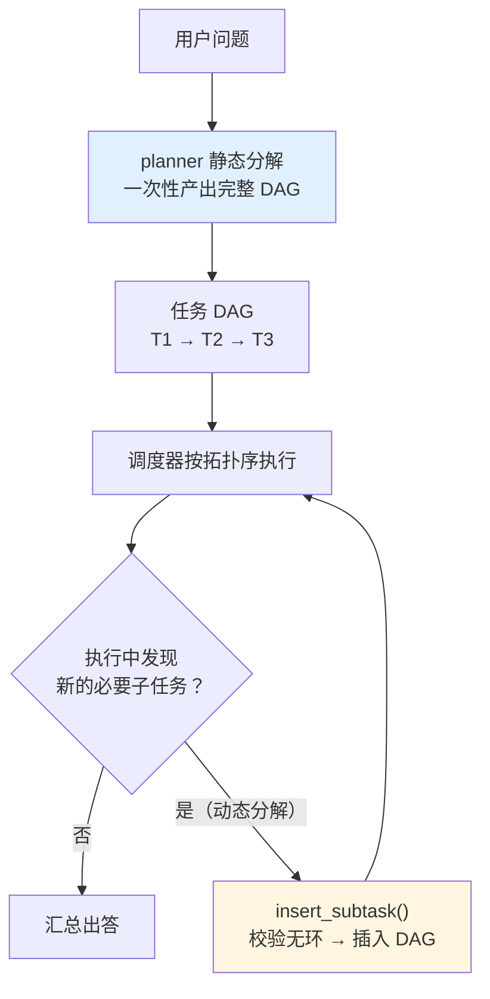

| | 静态分解 | 动态分解 |
|---|---|---|
| 何时决定 | 开始前一次性 | 执行中随时 |
| 优点 | 可预测、可估成本、可并行编排、可提前审批 | 能应对"查了才知道还要查什么" |
| 缺点 | 遇到意外无法调整 | 成本不可控、容易发散、可能引入环 |
| 生产做法 | **默认静态** | **允许动态插入，但要限深度、限数量、必须校验** |

华成机电的实际配置：静态分解产出 1~5 张任务单；动态插入**最多 2 层、最多 3 张**，超了直接转人工。

### 4.2 任务 DAG 与拓扑排序执行器

```python
# scheduler/dag.py —— 任务 DAG 与拓扑排序
from __future__ import annotations
from collections import defaultdict, deque

from protocol.taskspec import TaskSpec


class TaskDAG:
    """任务有向无环图。负责：建图、查环、拓扑分层、算就绪集合、算关键路径。"""

    def __init__(self, tasks: list[TaskSpec]):
        self.tasks: dict[str, TaskSpec] = {t.task_id: t for t in tasks}
        self._validate_refs()

    def _validate_refs(self) -> None:
        """依赖必须指向存在的任务。悬空依赖会让任务永远处于 pending。"""
        for t in self.tasks.values():
            for d in t.depends_on:
                if d not in self.tasks:
                    raise ValueError(f"任务 {t.task_id} 依赖了不存在的任务 {d}")

    def add(self, t: TaskSpec) -> None:
        """动态插入任务。插入后立即查环，有环就拒绝。"""
        if t.task_id in self.tasks:
            raise ValueError(f"任务 id 重复：{t.task_id}")
        self.tasks[t.task_id] = t
        try:
            self._validate_refs()
            cyc = self.find_cycle()
            if cyc:
                raise ValueError(f"插入 {t.task_id} 会形成环：{' → '.join(cyc)}")
        except Exception:
            self.tasks.pop(t.task_id, None)      # 回滚插入
            raise

    def find_cycle(self) -> list[str]:
        """用 DFS 三色标记找环，返回环上的节点序列（空表示无环）。"""
        WHITE, GRAY, BLACK = 0, 1, 2
        color = {k: WHITE for k in self.tasks}
        stack: list[str] = []
        found: list[str] = []

        def dfs(u: str) -> bool:
            color[u] = GRAY
            stack.append(u)
            for v in self.tasks[u].depends_on:
                if color[v] == GRAY:
                    found.extend(stack[stack.index(v):] + [v])
                    return True
                if color[v] == WHITE and dfs(v):
                    return True
            color[u] = BLACK
            stack.pop()
            return False

        for n in self.tasks:
            if color[n] == WHITE and dfs(n):
                return found
        return []

    def layers(self) -> list[list[str]]:
        """Kahn 算法分层。同一层的任务之间没有依赖，**可以并行执行**。"""
        indeg = {k: len(t.depends_on) for k, t in self.tasks.items()}
        children = defaultdict(list)
        for k, t in self.tasks.items():
            for d in t.depends_on:
                children[d].append(k)

        q = deque(sorted(k for k, d in indeg.items() if d == 0))
        out: list[list[str]] = []
        seen = 0
        while q:
            layer = list(q)
            q.clear()
            out.append(layer)
            for u in layer:
                seen += 1
                for v in children[u]:
                    indeg[v] -= 1
                    if indeg[v] == 0:
                        q.append(v)
        if seen != len(self.tasks):
            raise ValueError(f"DAG 有环，无法拓扑排序（已排 {seen}/{len(self.tasks)}）")
        return out

    def ready(self, done: set[str]) -> list[TaskSpec]:
        """当前可执行的任务：依赖全部完成且自身还没跑。"""
        return [t for t in self.tasks.values()
                if t.status in ("pending", "ready") and set(t.depends_on) <= done]

    def critical_path(self, cost_fn=None) -> tuple[list[str], float]:
        """关键路径：决定整体耗时的那条链。cost_fn 默认用 budget.max_seconds 估算。"""
        cost = cost_fn or (lambda t: t.budget.max_seconds)
        memo: dict[str, tuple[float, list[str]]] = {}

        def longest(u: str) -> tuple[float, list[str]]:
            if u in memo:
                return memo[u]
            best_c, best_p = 0.0, []
            for d in self.tasks[u].depends_on:
                c, p = longest(d)
                if c > best_c:
                    best_c, best_p = c, p
            res = (best_c + cost(self.tasks[u]), best_p + [u])
            memo[u] = res
            return res

        best = max((longest(k) for k in self.tasks), key=lambda x: x[0], default=(0.0, []))
        return best[1], best[0]

    def to_mermaid(self) -> str:
        """导出 mermaid，方便把分解结果画给人看（也便于写进审计）。"""
        lines = ["flowchart LR"]
        for k, t in self.tasks.items():
            lines.append(f'    {k}["{k}<br/>{t.assignee}<br/>{t.goal[:22]}"]')
        for k, t in self.tasks.items():
            for d in t.depends_on:
                lines.append(f"    {d} --> {k}")
        return "\n".join(lines)
```

### 4.3 分解质量校验：三道闸

LLM 生成的分解经常有三类问题：**没覆盖原问题**、**任务没法执行**、**有环**。三道闸逐一挡：

```python
# planner/validate.py —— 分解质量三闸
from __future__ import annotations
import re

from pydantic import BaseModel

from config import LLM_STRONG
from planner.generate_spec import TaskPlan
from protocol.taskspec import TaskSpec
from scheduler.dag import TaskDAG

AGENT_CAPABILITY = {
    "retriever": {"search_manual", "search_wiki", "search_ticket_history"},
    "analyst": {"query_stock", "query_warranty", "query_sla", "query_engineer_schedule"},
    "operator": {"create_ticket", "assign_engineer", "order_part", "send_sms"},
    "tone": set(),
}
WRITE_AGENTS = {"operator"}


class PlanIssue(Exception):
    """分解质量不合格。"""


def check_no_cycle(plan: TaskPlan) -> list[str]:
    """闸①：无环 + 依赖存在 + 无自依赖。结构性错误，最便宜先查。"""
    errs = []
    ids = {t.task_id for t in plan.tasks}
    for t in plan.tasks:
        if t.task_id in t.depends_on:
            errs.append(f"{t.task_id} 自依赖")
        for d in t.depends_on:
            if d not in ids:
                errs.append(f"{t.task_id} 依赖了不存在的 {d}")
    if not errs:
        try:
            cyc = TaskDAG(plan.tasks).find_cycle()
            if cyc:
                errs.append(f"存在环：{' → '.join(cyc)}")
        except ValueError as e:
            errs.append(str(e))
    return errs


def check_executable(plan: TaskPlan, user_asked_write: bool) -> list[str]:
    """闸②：可执行性。每张单子都能被某个 Agent 用它有的工具完成。"""
    errs = []
    for t in plan.tasks:
        if t.assignee not in AGENT_CAPABILITY:
            errs.append(f"{t.task_id} 指派给了不存在的 Agent：{t.assignee}")
            continue
        if t.assignee in WRITE_AGENTS and not user_asked_write:
            errs.append(f"{t.task_id} 生成了写操作任务，但用户并未要求执行写操作")
        if not t.acceptance.required_keys:
            errs.append(f"{t.task_id} 没有 required_keys，无法验收")
        if t.assignee == "tone" and t.acceptance.required_source_types:
            errs.append(f"{t.task_id} 要求话术 Agent 提供证据来源，但它不查资料，任务不可完成")
        # 占位符必须指向已声明的依赖
        for k, v in t.inputs.items():
            for ref in re.findall(r"\$\{(\w+)\.", str(v)):
                if ref not in t.depends_on:
                    errs.append(f"{t.task_id} 的输入 {k} 引用了 {ref}，但没有声明依赖")
    return errs


COVERAGE_SYS = """你是任务分解的覆盖度审核员。

给你「用户原始问题」和「拆出的任务列表」，判断这些任务**全部完成后**，
是否足以完整回答用户的每一个子问题。

严格标准：
- 用户问了 N 件事，就必须有对应的任务覆盖这 N 件事；
- 「隐含需求」也算：问「有没有货」隐含要知道换什么件；问「怎么修」隐含要知道故障原因；
- 只输出 JSON：{"covered": true/false, "uncovered": ["漏掉的子问题"], "redundant": ["多余的任务id"]}
"""


class Coverage(BaseModel):
    covered: bool
    uncovered: list[str] = []
    redundant: list[str] = []


def check_coverage(question: str, plan: TaskPlan) -> Coverage:
    """闸③：覆盖度。这一闸要调 LLM，所以放最后——前两闸不过就不用花这个钱。"""
    brief = "\n".join(f"- {t.task_id}｜{t.assignee}｜{t.goal}" for t in plan.tasks)
    return LLM_STRONG.with_structured_output(Coverage).invoke([
        {"role": "system", "content": COVERAGE_SYS},
        {"role": "user", "content": f"用户问题：{question}\n\n任务列表：\n{brief}"},
    ])


def validate_plan(question: str, plan: TaskPlan, user_asked_write: bool) -> TaskPlan:
    """三闸串联。不通过则带着具体错误让规划器重来一次（最多一次）。"""
    errs = check_no_cycle(plan) + check_executable(plan, user_asked_write)
    if errs:
        raise PlanIssue("；".join(errs))

    cov = check_coverage(question, plan)
    if not cov.covered:
        raise PlanIssue(f"分解未覆盖以下子问题：{cov.uncovered}")
    if cov.redundant:
        plan.tasks = [t for t in plan.tasks if t.task_id not in cov.redundant]
    return plan
```

```python
# planner/replan.py —— 带一次重试的规划
from planner.generate_spec import plan_tasks
from planner.validate import PlanIssue, validate_plan


def plan_with_retry(question: str, session_id: str, user_asked_write: bool) -> "TaskPlan":
    """规划 → 校验 → （失败则带错误重规划一次）→ 仍失败则降级为单检索任务。"""
    plan = plan_tasks(question, session_id)
    try:
        return validate_plan(question, plan, user_asked_write)
    except PlanIssue as e1:
        plan2 = plan_tasks(question, session_id,
                           known=f"上一版分解被驳回，原因：{e1}。请修正后重新分解。")
        try:
            return validate_plan(question, plan2, user_asked_write)
        except PlanIssue as e2:
            # 两次都不过，说明问题可能本身就不适合拆。降级为最朴素的单任务。
            from protocol.taskspec import AcceptanceCriteria, TaskPlan, TaskSpec
            return TaskPlan(tasks=[TaskSpec(
                session_id=session_id, assignee="retriever",
                goal=f"检索并回答：{question[:60]}",
                acceptance=AcceptanceCriteria(required_keys=["answer_evidence"]),
                why=f"分解两次不通过，降级单任务：{e2}")],
                rationale=f"degraded: {e1} | {e2}")
```

### 4.4 动态分解：执行中发现新子任务

```python
# scheduler/dynamic.py —— 动态插入子任务
from __future__ import annotations

from protocol.taskspec import TaskSpec
from scheduler.dag import TaskDAG

MAX_DYNAMIC_DEPTH = 2      # 动态任务最多再生成 2 层
MAX_DYNAMIC_TASKS = 3      # 单次会话最多插入 3 张动态任务单


class DynamicInsertRejected(Exception):
    """动态插入被拒。原因写进 message，会回给发起的 Agent。"""


def depth_of(dag: TaskDAG, task_id: str) -> int:
    """算一个任务在血缘链上的深度（根任务为 0）。"""
    d, cur = 0, dag.tasks[task_id]
    while cur.parent_id and cur.parent_id in dag.tasks:
        d += 1
        cur = dag.tasks[cur.parent_id]
    return d


def insert_subtask(dag: TaskDAG, parent_id: str, sub: TaskSpec,
                   dynamic_count: int, seen_fingerprints: set[str]) -> TaskSpec:
    """执行中插入新子任务。五道检查，任何一道不过就拒绝。"""
    if dynamic_count >= MAX_DYNAMIC_TASKS:
        raise DynamicInsertRejected(
            f"动态任务数已达上限 {MAX_DYNAMIC_TASKS}，请基于现有信息收口给出结论")
    if depth_of(dag, parent_id) + 1 > MAX_DYNAMIC_DEPTH:
        raise DynamicInsertRejected(
            f"动态分解深度已达上限 {MAX_DYNAMIC_DEPTH}，不再展开")

    sub.parent_id = parent_id
    sub.session_id = dag.tasks[parent_id].session_id
    if parent_id not in sub.depends_on:
        sub.depends_on = list({*sub.depends_on, parent_id})

    fp = sub.fingerprint()
    if fp in seen_fingerprints:
        raise DynamicInsertRejected("该任务已经执行过（指纹重复），不要重复派发")

    # 子任务预算不能超过父任务剩余预算的一半，防止预算被子任务吃光
    parent = dag.tasks[parent_id]
    if sub.budget.max_tokens > parent.budget.max_tokens // 2:
        sub.budget.max_tokens = parent.budget.max_tokens // 2

    if sub.assignee in {"operator"}:
        raise DynamicInsertRejected("动态分解不得生成写操作任务，写操作必须走静态规划 + 人工审批")

    dag.add(sub)            # add() 内部会查环并在失败时回滚
    seen_fingerprints.add(fp)
    return sub
```

> **五道检查的顺序是按成本排的**：数量 → 深度 → 指纹 → 预算 → 权限 → 查环。
> 最贵的查环放最后，前面任何一道拦下都不用建图。

---

## 五、依赖与调度：完整的任务调度器

有了 DAG，还需要一个调度器来：控制并行度、回填依赖产出、处理失败重试、接受部分成功。

### 5.1 调度器要解决的五件事

| 问题 | 做法 |
|---|---|
| 同一层任务能并行，但不能无限并行 | 全局信号量 `max_parallel`，按 Agent 再设分项上限（写 Agent 恒为 1） |
| 下游要用上游的产出 | `${T1.part_no}` 占位符，任务出队时从黑板回填 |
| 某个任务失败了 | 按 `budget.max_retries` 重试；**写任务不重试**；重试用指数退避 |
| 失败之后后面的任务还跑不跑 | 区分"关键任务"和"可选任务"：关键失败 → 整体降级；可选失败 → 标记缺失继续 |
| 总耗时不可控 | 算关键路径，超过 deadline 时砍掉可选任务 |

### 5.2 完整实现

```python
# scheduler/scheduler.py —— 任务调度器
from __future__ import annotations
import asyncio
import random
import re
import time
from dataclasses import dataclass, field
from typing import Awaitable, Callable

from protocol.acceptance import accept
from protocol.blackboard import Blackboard
from protocol.taskspec import TaskSpec
from scheduler.dag import TaskDAG
from state import Evidence

# 执行器签名：给一张任务单和黑板，返回 (事实列表, 原始文本)
Executor = Callable[[TaskSpec, Blackboard], Awaitable[tuple[list[Evidence], str]]]


@dataclass
class TaskResult:
    """一个任务的最终结局。"""
    task_id: str
    status: str                      # succeeded / failed / skipped / escalated
    attempts: int = 0
    elapsed_s: float = 0.0
    keys: list[str] = field(default_factory=list)
    reasons: list[str] = field(default_factory=list)
    error: str = ""


class Scheduler:
    """DAG 任务调度器：拓扑并发执行 + 占位符回填 + 验收 + 重试 + 部分成功。"""

    # 每个 Agent 的并发上限。写 Agent 必须是 1，避免并发建单。
    AGENT_PARALLEL = {"retriever": 3, "analyst": 3, "tone": 2, "operator": 1}

    def __init__(self, dag: TaskDAG, bb: Blackboard, executors: dict[str, Executor],
                 max_parallel: int = 4, deadline_s: float = 90.0,
                 critical_tasks: set[str] | None = None):
        self.dag = dag
        self.bb = bb
        self.executors = executors
        self.sem = asyncio.Semaphore(max_parallel)
        self.agent_sems = {a: asyncio.Semaphore(n) for a, n in self.AGENT_PARALLEL.items()}
        self.deadline = time.time() + deadline_s
        self.critical = critical_tasks or set()
        self.results: dict[str, TaskResult] = {}
        self.done: set[str] = set()
        self.failed: set[str] = set()

    # ---------- 占位符回填 ----------
    def _fill_inputs(self, spec: TaskSpec) -> TaskSpec:
        """把 ${T1.part_no} 换成黑板上的真实值。取不到就置空并记进 constraints。"""
        filled = dict(spec.inputs)
        for k, v in spec.inputs.items():
            if not isinstance(v, str):
                continue
            def sub(m: re.Match) -> str:
                key = m.group(2)
                ev = self.bb.get(key, strategy="authoritative")
                return ev.value if ev else ""
            new = re.sub(r"\$\{(\w+)\.(\w+)\}", sub, v)
            filled[k] = new
            if "${" in v and not new.strip():
                spec.constraints.append(f"注意：参数 {k} 的上游值缺失，若无法继续请如实报告缺失")
        spec.inputs = filled
        return spec

    # ---------- 单任务执行（含重试与验收） ----------
    async def _run_one(self, spec: TaskSpec) -> TaskResult:
        """执行一张任务单：预算 → 执行 → 验收 → 重试。"""
        t0 = time.time()
        res = TaskResult(task_id=spec.task_id, status="failed")
        exe = self.executors.get(spec.assignee)
        if exe is None:
            res.error = f"没有 {spec.assignee} 的执行器"
            return res

        last_reasons: list[str] = []
        for attempt in range(spec.budget.max_retries + 1):
            res.attempts = attempt + 1
            spec.attempt = attempt
            if time.time() > self.deadline:
                res.status, res.error = "skipped", "超过会话 deadline"
                break
            try:
                async with self.sem, self.agent_sems.get(
                        spec.assignee, asyncio.Semaphore(1)):
                    facts, text = await asyncio.wait_for(
                        exe(self._fill_inputs(spec), self.bb),
                        timeout=spec.budget.max_seconds)
            except asyncio.TimeoutError:
                last_reasons = [f"执行超时（>{spec.budget.max_seconds}s）"]
                await self._backoff(attempt)
                continue
            except Exception as e:
                last_reasons = [f"{type(e).__name__}: {e}"]
                await self._backoff(attempt)
                continue

            # 先写黑板（哪怕验收不过，已经查到的东西也不该丢）
            self.bb.write_many(facts, by=spec.assignee)

            ok = accept(spec, facts, text)
            if ok:
                res.status = "succeeded"
                res.keys = [f.key for f in facts]
                break
            last_reasons = ok.reasons
            if not ok.retriable:
                break
            # 把验收失败原因写进约束，让下一次尝试知道错在哪
            spec.constraints.append(f"上次未通过验收：{'；'.join(ok.reasons)}，请针对性修正")
            await self._backoff(attempt)

        res.reasons = last_reasons
        res.elapsed_s = round(time.time() - t0, 2)
        if res.status == "failed" and not res.error:
            res.error = "；".join(last_reasons)[:300]
        return res

    @staticmethod
    async def _backoff(attempt: int) -> None:
        """指数退避 + 抖动。避免所有失败任务同时重试把下游打垮。"""
        await asyncio.sleep(min(2 ** attempt * 0.5, 4.0) * (0.5 + random.random()))

    # ---------- 主循环 ----------
    async def run(self) -> dict[str, TaskResult]:
        """按拓扑层并发执行，直到无任务可跑。"""
        while True:
            ready = [t for t in self.dag.ready(self.done)
                     if t.task_id not in self.results]
            ready = [t for t in ready if not (set(t.depends_on) & self.failed)]
            if not ready:
                break

            # 同层按优先级排序，P0/P1 先拿并发槽（"P0" < "P1" < "P2" < "P3" 字典序即优先级）
            ready.sort(key=lambda t: t.priority)
            outs = await asyncio.gather(*[self._run_one(t) for t in ready])

            for t, r in zip(ready, outs):
                self.results[t.task_id] = r
                t.status = r.status
                if r.status == "succeeded":
                    self.done.add(t.task_id)
                else:
                    self.failed.add(t.task_id)
                    if t.task_id in self.critical:
                        # 关键任务失败：不再往下跑，交给上层降级
                        return self.results

            # 被依赖失败连累的任务标 skipped，不要让它们永远 pending
            for t in self.dag.tasks.values():
                if (t.task_id not in self.results
                        and set(t.depends_on) & self.failed):
                    self.results[t.task_id] = TaskResult(
                        task_id=t.task_id, status="skipped",
                        error=f"上游任务失败：{sorted(set(t.depends_on) & self.failed)}")
        return self.results

    # ---------- 部分成功 ----------
    def outcome(self, required_keys: list[str]) -> dict:
        """汇总结局：完全成功 / 部分成功 / 失败。部分成功是多 Agent 的常态，必须显式建模。"""
        missing = self.bb.missing(required_keys)
        n_ok = sum(1 for r in self.results.values() if r.status == "succeeded")
        n_all = len(self.dag.tasks)
        if not missing and n_ok == n_all:
            level = "complete"
        elif not missing:
            level = "complete_with_warnings"      # 有任务失败但关键字段齐了
        elif n_ok > 0:
            level = "partial"
        else:
            level = "failed"
        return {
            "level": level,
            "missing_keys": missing,
            "succeeded": n_ok, "total": n_all,
            "failed_tasks": {k: v.error for k, v in self.results.items()
                             if v.status in ("failed", "skipped")},
            "advice": {
                "complete": "直接生成答复",
                "complete_with_warnings": "生成答复，但在内部日志标记降级",
                "partial": "生成答复时必须显式说明「以下信息暂未取到」，并提供人工兜底入口",
                "failed": "不要生成答复，直接转人工",
            }[level],
        }
```

> **`partial` 这一档是多智能体系统的灵魂**。
> 单 Agent 只有"成功/失败"，多 Agent 有大量"查到了 3 项里的 2 项"的情况。
> 把它当失败，可用性会很差；把它当成功，就会出现"库存没查到但答复里说有货"的事故。
> **正确做法是显式建模 partial，并在答复里如实说明缺什么。**

### 5.3 并行度、关键路径与 deadline

```python
# scheduler/plan_report.py —— 执行前先把账算清楚
def preflight(dag: TaskDAG) -> str:
    """执行前打印分层、关键路径与预算，让人（和日志）提前看到这次会花多少。"""
    layers = dag.layers()
    path, span = dag.critical_path()
    tok = sum(t.budget.max_tokens for t in dag.tasks.values())
    lines = [f"任务数：{len(dag.tasks)}｜拓扑层数：{len(layers)}",
             "并行分层：" + " → ".join("[" + ",".join(l) + "]" for l in layers),
             f"关键路径：{' → '.join(path)}（最坏 {span:.0f}s）",
             f"串行最坏耗时：{sum(t.budget.max_seconds for t in dag.tasks.values()):.0f}s",
             f"并行后最坏耗时：{span:.0f}s",
             f"token 预算上限合计：{tok}"]
    return "\n".join(lines)
```

```text
$ python -c "from scheduler.plan_report import preflight; print(preflight(dag))"

任务数：4｜拓扑层数：3
并行分层：[T_retrieve] → [T_data,T_history] → [T_write]
关键路径：T_retrieve → T_data → T_write（最坏 62s）
串行最坏耗时：74s
并行后最坏耗时：62s
token 预算上限合计：19500
```

**读这份报告要看三件事**：
1. **层数**越多，串行链越长，延迟越高 → 能并行的尽量并行；
2. **关键路径**上的任务优先优化（换模型、减工具轮次），非关键路径上优化了也不省时间；
3. **token 预算上限合计**要和 `MAX_SESSION_TOKENS` 对齐，超了说明分解太碎。

---

## 六、冲突消解：两个 Agent 说了两套话

### 6.1 一个真实的冲突

华成机电的手册有历史包袱：V2（2021 年版）和 V3（2023 年版）都在流通，而且**都在知识库里**。

```text
retriever 从两份手册各查到一条：

  证据 A：XJ-200 主轴润滑保养周期 500 运行小时
          来源：XJ200维护手册V2.pdf p.12
          source_type=original_doc，as_of=2021-06-30，conditions=""，confidence=0.9

  证据 B：XJ-200 主轴润滑保养周期 800 运行小时
          来源：XJ200维护手册V3.pdf p.15
          source_type=original_doc，as_of=2023-11-20
          conditions="自 2023-11 起出厂机型（SN 以 B3 开头）"，confidence=0.92

黑板检测到 maintain_cycle 有两个有效版本且数字不同 → 标记冲突
```

**注意这个冲突的微妙之处**：A 和 B **都不是错的**。它们适用于不同批次。
一个只会"挑置信度高的"的系统会选 B，然后对一台 2022 年的老设备给出 800 小时——就是第 0 节的现场一。

**正确结论应该是**：两条都保留，按设备 SN 选择适用的那条；SN 未知时**两条都告诉用户并说明区分方法**。

### 6.2 五级消解策略

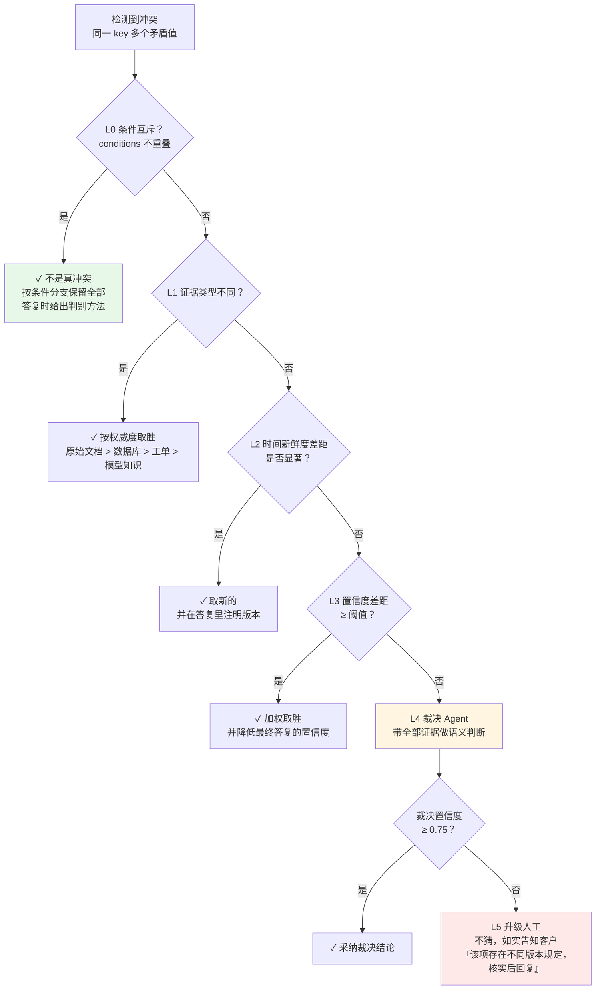

**为什么是这个顺序**：从**便宜且确定**到**贵且不确定**。L0~L3 是纯规则，零 LLM 成本、结果确定、可审计；
L4 才调模型；L5 承认系统搞不定。**绝大多数冲突在 L0~L2 就解决了**——这也是本节最重要的工程结论。

### 6.3 `ConflictResolver` 完整实现

```python
# resolver/conflict.py —— 冲突消解器
from __future__ import annotations
import re
import time
from datetime import datetime
from typing import Literal

from pydantic import BaseModel, Field

from config import LLM_STRONG
from protocol.blackboard import SOURCE_RANK, Blackboard
from state import Evidence

# ---------- 可调参数（写在代码里，便于回归测试固定） ----------
FRESHNESS_SIGNIFICANT_DAYS = 365      # 时间差超过这个天数才认为"新鲜度显著"
CONFIDENCE_GAP = 0.15                 # 置信度差超过这个值才认为"显著"
JUDGE_MIN_CONFIDENCE = 0.75           # 裁决 Agent 低于这个置信度就升级人工

ResolveLevel = Literal["L0_conditional", "L1_source", "L2_freshness",
                       "L3_confidence", "L4_judge", "L5_human"]


class Resolution(BaseModel):
    """一次冲突消解的完整结果。整个对象要写进审计日志。"""
    key: str
    level: ResolveLevel
    winner: Evidence | None = None
    kept_all: list[Evidence] = Field(default_factory=list,
                                     description="L0 条件互斥时保留的全部分支")
    reason: str = ""
    confidence: float = 0.0
    needs_human: bool = False
    customer_note: str = Field(default="", description="需要在答复里向客户说明的话")


class ConflictResolver:
    """按 L0→L5 逐级消解冲突。每一级都是纯函数，便于单测。"""

    def __init__(self, bb: Blackboard, device_sn: str = "", product_model: str = ""):
        self.bb = bb
        self.device_sn = device_sn
        self.product_model = product_model

    # ---------- 入口 ----------
    def resolve(self, key: str, evs: list[Evidence]) -> Resolution:
        """对一个 key 的多条矛盾证据做消解。"""
        if len(evs) < 2:
            return Resolution(key=key, level="L1_source",
                              winner=evs[0] if evs else None,
                              reason="无冲突", confidence=1.0)

        for fn in (self._l0_conditional, self._l1_source, self._l2_freshness,
                   self._l3_confidence):
            r = fn(key, evs)
            if r is not None:
                return r
        return self._l4_judge(key, evs)

    def resolve_all(self) -> dict[str, Resolution]:
        """消解黑板上的全部冲突，并把结果写回黑板。"""
        out = {}
        for key, evs in self.bb.conflicts().items():
            r = self.resolve(key, evs)
            out[key] = r
            if r.winner is not None and r.level != "L0_conditional":
                self.bb.resolve(key, r.winner, by="ConflictResolver",
                                reason=f"{r.level}: {r.reason}")
        return out

    # ---------- L0：条件互斥 ----------
    def _l0_conditional(self, key: str, evs: list[Evidence]) -> Resolution | None:
        """条件互斥的不是冲突，是分支。这是最容易被做错的一级。"""
        conds = [e.conditions.strip() for e in evs]
        if sum(1 for c in conds if c) < len(evs) - 1:
            return None                       # 至少 n-1 条要有条件才可能是分支

        # 尝试用当前设备信息直接选出适用分支
        pick = self._match_condition(evs)
        if pick is not None:
            return Resolution(
                key=key, level="L0_conditional", winner=pick, kept_all=evs,
                reason=(f"各版本适用条件互斥，按当前设备（SN={self.device_sn or '未知'}，"
                        f"型号={self.product_model or '未知'}）匹配到：{pick.conditions or '默认分支'}"),
                confidence=0.9)

        # 设备信息不足，无法选择 → 全部保留，让答复层说明判别方法
        return Resolution(
            key=key, level="L0_conditional", winner=None, kept_all=evs,
            reason="各版本适用条件互斥，但当前设备信息不足以判断属于哪一支",
            confidence=0.6, needs_human=False,
            customer_note=self._render_branches(key, evs))

    def _match_condition(self, evs: list[Evidence]) -> Evidence | None:
        """用设备 SN / 型号去匹配 conditions。规则化，不调 LLM。"""
        sn = (self.device_sn or "").upper()
        if not sn:
            return None
        # 规则 ①：SN 前缀（B3 = 2023-11 后出厂批次）
        for e in evs:
            m = re.findall(r"SN\s*以\s*([A-Z0-9]+)\s*开头", e.conditions)
            if m and any(sn.startswith(p.upper()) for p in m):
                return e
        # 规则 ②：出厂年月。SN 形如 B3-2023-8871，取中间的年份
        ym = re.search(r"(20\d{2})", sn)
        if ym:
            year = int(ym.group(1))
            for e in evs:
                mm = re.search(r"自\s*(20\d{2})[-年](\d{1,2})?", e.conditions)
                if mm and year >= int(mm.group(1)):
                    return e
            for e in evs:
                mm = re.search(r"(20\d{2})[-年](\d{1,2})?\s*(之前|以前|前)", e.conditions)
                if mm and year < int(mm.group(1)):
                    return e
        return None

    @staticmethod
    def _render_branches(key: str, evs: list[Evidence]) -> str:
        """把互斥分支渲染成能直接写进客户答复的话。"""
        parts = []
        for e in evs:
            cond = e.conditions or "其他情况"
            parts.append(f"{cond}：{e.value}（依据 {e.source}）")
        return (f"该项与设备批次有关，存在以下情况：\n" + "\n".join("· " + p for p in parts)
                + "\n您可以查看设备铭牌上的 SN 确认属于哪一种；也可以把 SN 发给我，我为您核实。")

    # ---------- L1：证据类型权威度 ----------
    def _l1_source(self, key: str, evs: list[Evidence]) -> Resolution | None:
        """不同证据类型的冲突，按权威度定胜负。"""
        ranks = {SOURCE_RANK.get(e.source_type, 0) for e in evs}
        if len(ranks) < 2:
            return None
        best = max(evs, key=lambda e: SOURCE_RANK.get(e.source_type, 0))
        losers = [e for e in evs if e is not best]
        return Resolution(
            key=key, level="L1_source", winner=best,
            reason=(f"证据类型权威度：{best.source_type}({SOURCE_RANK[best.source_type]}) > "
                    + "、".join(f"{e.source_type}({SOURCE_RANK.get(e.source_type,0)})" for e in losers)),
            confidence=0.85)

    # ---------- L2：时间新鲜度 ----------
    def _l2_freshness(self, key: str, evs: list[Evidence]) -> Resolution | None:
        """同类型证据，取时间更新的。差距不显著则不在这一级决胜。"""
        dated = [(self._parse_date(e.as_of), e) for e in evs]
        dated = [(d, e) for d, e in dated if d is not None]
        if len(dated) < len(evs) or len(dated) < 2:
            return None
        dated.sort(key=lambda x: x[0], reverse=True)
        gap_days = (dated[0][0] - dated[1][0]) / 86400
        if gap_days < FRESHNESS_SIGNIFICANT_DAYS:
            return None
        return Resolution(
            key=key, level="L2_freshness", winner=dated[0][1],
            reason=(f"同为 {dated[0][1].source_type} 类型证据，"
                    f"{dated[0][1].source}（{dated[0][1].as_of}）比 "
                    f"{dated[1][1].source}（{dated[1][1].as_of}）新 {gap_days:.0f} 天"),
            confidence=0.8,
            customer_note=f"（以 {dated[0][1].source} 最新版为准）")

    @staticmethod
    def _parse_date(s: str) -> float | None:
        """宽松解析日期。解析不出来返回 None，不要抛异常。"""
        if not s:
            return None
        s = s.strip()
        for fmt, n in (("%Y-%m-%d", 10), ("%Y/%m/%d", 10), ("%Y-%m", 7), ("%Y", 4)):
            try:
                return datetime.strptime(s[:n], fmt).timestamp()
            except ValueError:
                continue
        m = re.search(r"(20\d{2})", s)
        return datetime(int(m.group(1)), 1, 1).timestamp() if m else None

    # ---------- L3：置信度加权 ----------
    def _l3_confidence(self, key: str, evs: list[Evidence]) -> Resolution | None:
        """置信度差距显著才用它决胜。差距小的时候置信度是噪声，不是信号。"""
        s = sorted(evs, key=lambda e: e.confidence, reverse=True)
        if s[0].confidence - s[1].confidence < CONFIDENCE_GAP:
            return None
        return Resolution(
            key=key, level="L3_confidence", winner=s[0],
            reason=f"置信度 {s[0].confidence:.2f} 显著高于 {s[1].confidence:.2f}",
            confidence=s[0].confidence * 0.9,     # ★ 靠置信度决胜，最终置信度要打折
            customer_note="")

    # ---------- L4：裁决 Agent ----------
    def _l4_judge(self, key: str, evs: list[Evidence]) -> Resolution:
        """规则判不了，交给裁决 Agent 做语义判断。它只做判断，不产生新事实。"""

        class Verdict(BaseModel):
            winner_index: int = Field(description="胜出证据的序号，从 0 开始；无法判断填 -1")
            is_really_conflict: bool = Field(description="两者是否真的互斥；适用条件不同则为 false")
            reason: str
            confidence: float = Field(ge=0, le=1)
            customer_note: str = Field(default="", description="需要向客户说明的一句话")

        listing = "\n".join(
            f"[{i}] 值：{e.value}\n    来源：{e.source}（类型 {e.source_type}）\n"
            f"    时间：{e.as_of or '未知'}｜条件：{e.conditions or '无'}｜"
            f"置信度：{e.confidence:.2f}｜产出者：{e.produced_by}"
            for i, e in enumerate(evs))

        sys = """你是华成机电售后知识的冲突裁决员（Judge）。

你**只做判断，不产生任何新知识**。禁止用你自己的先验知识补充证据中没有的内容。

判断顺序：
1. 先判断这是不是**真冲突**：如果两条证据适用条件不同（不同批次/型号/时间段），
   它们不冲突，is_really_conflict=false，winner_index=-1；
2. 若是真冲突，按以下优先级选一条：
   原始手册 > 业务数据库 > 历史工单 > 模型先验；同类型取更新的版本；
3. 若证据不足以判断，**必须** confidence < 0.75 并说明缺什么，不要硬选。

输出 customer_note 时，用客户能听懂的话，不许出现内部系统名、文件路径、技术黑话。
"""
        v = LLM_STRONG.with_structured_output(Verdict).invoke([
            {"role": "system", "content": sys},
            {"role": "user", "content":
                f"冲突字段：{key}\n设备信息：SN={self.device_sn or '未知'}，"
                f"型号={self.product_model or '未知'}\n\n候选证据：\n{listing}"},
        ])

        if not v.is_really_conflict:
            return Resolution(key=key, level="L0_conditional", winner=None, kept_all=evs,
                              reason=f"裁决员判定非真冲突：{v.reason}",
                              confidence=v.confidence,
                              customer_note=v.customer_note or self._render_branches(key, evs))

        if v.confidence < JUDGE_MIN_CONFIDENCE or not (0 <= v.winner_index < len(evs)):
            return self._l5_human(key, evs, f"裁决置信度不足（{v.confidence:.2f}）：{v.reason}")

        return Resolution(key=key, level="L4_judge", winner=evs[v.winner_index],
                          reason=f"裁决员：{v.reason}", confidence=v.confidence,
                          customer_note=v.customer_note)

    # ---------- L5：升级人工 ----------
    @staticmethod
    def _l5_human(key: str, evs: list[Evidence], why: str) -> Resolution:
        """系统搞不定，如实上报。**绝不允许随便挑一个**。"""
        return Resolution(
            key=key, level="L5_human", winner=None, kept_all=evs,
            reason=f"升级人工：{why}", confidence=0.0, needs_human=True,
            customer_note=("该项目前存在不同版本的规定，为避免给您错误信息，"
                           "我们将为您核实后尽快回复。"))
```

### 6.4 接进图：冲突消解节点

```python
# resolver/node.py —— 把消解器做成一个图节点，放在生成答复之前
from protocol.bb_bridge import get_board
from resolver.conflict import ConflictResolver
from state import HCState, public_say


def conflict_node(state: HCState) -> dict:
    """消解黑板上的全部冲突。有需要人工的，走升级通道。"""
    bb = get_board(state.get("session_id", "default"))
    cr = ConflictResolver(bb, device_sn=state.get("device_sn", ""),
                          product_model=state.get("product_model", ""))
    res = cr.resolve_all()
    if not res:
        return {"messages": [public_say("resolver", "[消解] 无冲突")]}

    notes, need_human, lines = [], False, []
    for k, r in res.items():
        lines.append(f"{k}: {r.level}｜{r.reason}")
        if r.customer_note:
            notes.append(r.customer_note)
        need_human |= r.needs_human

    return {
        "conflict_notes": notes,            # generator 必须把这些话写进答复
        "needs_human": need_human,
        "messages": [public_say("resolver", "[消解]\n" + "\n".join(lines))],
        "trace": [{"agent": "resolver", "resolved": {k: r.level for k, r in res.items()},
                   "needs_human": need_human}],
    }
```

### 6.5 执行轨迹

```text
$ python run_conflict.py --q "XJ-200 多久保养一次？" --sn ""

[retriever ] 查到两条保养周期记录：
             · 500 运行小时 [XJ200维护手册V2.pdf p.12]（2021-06-30）
             · 800 运行小时 [XJ200维护手册V3.pdf p.15]（2023-11-20，条件：自 2023-11 起出厂，SN 以 B3 开头）
[blackboard] ⚠ maintain_cycle 检测到 2 个有效版本，数字不同 → 标记冲突
[resolver  ] [消解]
             maintain_cycle: L0_conditional｜各版本适用条件互斥，但当前设备信息不足以判断属于哪一支
[generator ] 您好，XJ-200 的主轴润滑保养周期与设备出厂批次有关：
             · 自 2023 年 11 月起出厂的机型（SN 以 B3 开头）：每 800 运行小时
             · 此前出厂的机型：每 500 运行小时
             您可以查看设备铭牌上的 SN 确认属于哪一种；也可以把 SN 发给我，我为您核实。
             保养时建议同时记录当前运行小时数，便于推算下次时间。
[critic    ] [质检 9.0 分] 条件完整保留，未擅自选择版本，通过

--- 同一个问题，带上 SN ---
$ python run_conflict.py --q "XJ-200 多久保养一次？" --sn "B3-2023-8871"

[resolver  ] [消解]
             maintain_cycle: L0_conditional｜各版本适用条件互斥，按当前设备（SN=B3-2023-8871，
             型号=XJ-200）匹配到：自 2023-11 起出厂机型（SN 以 B3 开头）
[generator ] 您好，您这台 XJ-200（SN B3-2023-8871）属于 2023 年 11 月后出厂的批次，
             主轴润滑保养周期为每 800 运行小时（依据 XJ200维护手册 V3 p.15）。…
```

**对比一下没有消解器时会发生什么**：

| 系统 | SN 未知时的回答 | 后果 |
|---|---|---|
| 无消解，取置信度最高 | "每 800 小时保养一次" | 老批次设备按 800 小时保养 → 主轴损坏 |
| 无消解，取最新文档 | "每 800 小时保养一次" | 同上 |
| 无消解，两条都塞给 generator | 模型随机挑一条，或者自相矛盾地都说 | 不可预测 |
| **有 L0 条件分支** | **两个分支都说 + 给出判别方法** | **正确** |

> **这一节最重要的一句话**：**冲突消解的第一步不是"选一个"，是"判断它们是不是真的冲突"。**
> 企业知识库里绝大多数"矛盾"其实是适用条件不同。直接做加权投票的系统，会系统性地丢掉条件。

### 6.6 冲突消解的审计

每一次消解都必须留痕，因为它是**系统替人做了一个判断**：

```python
# 消解审计记录的字段（表结构见 7.4 章）
{
    "session_id": "sess-7f3a", "ts": 1741657123.4,
    "key": "maintain_cycle",
    "candidates": [
        {"value": "500 运行小时", "source": "XJ200维护手册V2.pdf p.12",
         "source_type": "original_doc", "as_of": "2021-06-30", "conditions": "", "conf": 0.90},
        {"value": "800 运行小时", "source": "XJ200维护手册V3.pdf p.15",
         "source_type": "original_doc", "as_of": "2023-11-20",
         "conditions": "自 2023-11 起出厂，SN 以 B3 开头", "conf": 0.92},
    ],
    "level": "L0_conditional", "winner": None, "kept_all": 2,
    "reason": "各版本适用条件互斥，当前设备信息不足",
    "customer_note": "该项与设备批次有关…",
    "needs_human": False,
    "resolver_version": "v1.2",
}
```

**用这份日志能做三件事**：
1. **发现知识库问题**：某个 key 反复冲突 → 说明源文档该清理了（把 V2 下架或打上批次标签）；
2. **回归测试**：把典型冲突固化成用例，改消解规则后跑一遍看结论有没有变；
3. **责任界定**：出了事能说清楚"系统当时基于哪些证据、按哪条规则做的判断"。

---

## 七、一致性与幂等：重复派单怎么办

### 7.1 重复从哪来

多智能体系统里，**同一个写操作被执行多次**是必然会发生的，来源至少有六个：

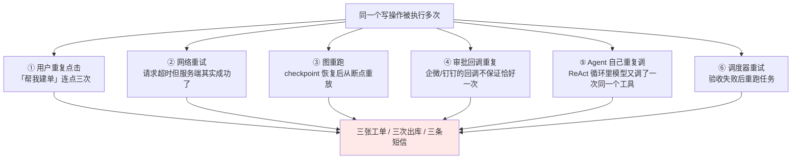

> **分布式系统的铁律**：网络上做不到"恰好一次（exactly-once）"投递，
> 只能做到"至少一次投递 + 幂等执行"。**幂等的责任在被调方**，不在调用方。

### 7.2 幂等键怎么设计

| 方案 | 做法 | 问题 |
|---|---|---|
| ❌ 每次 `uuid4()` | 调用方每次生成新 id | 根本不是幂等键，重试时 id 变了 |
| ❌ 用时间戳 | `f"{session}-{int(time.time())}"` | 一秒内两次调用撞车，跨秒的重试又不去重 |
| ⚠ 调用方传入 | 客户端生成并保证重试时不变 | 依赖调用方自觉，多 Agent 场景下 Agent 未必"自觉" |
| ✓ **业务参数派生** | `uuid5(NAMESPACE, session + tool + 规范化参数)` | **同一意图恒等**，谁调都一样 |

```python
# idem/key.py —— 幂等键生成
from __future__ import annotations
import json
import uuid

# 参与幂等键计算的参数白名单：只放「决定业务唯一性」的字段。
# 反例：把 fault_desc（自由文本）放进去，模型措辞稍微一变就成了新单子。
IDEM_FIELDS = {
    "create_ticket":   ["device_sn", "error_code"],
    "assign_engineer": ["ticket_id"],
    "order_part":      ["ticket_id", "part_no"],
    "send_sms":        ["phone", "template_id"],
}


def make_action_id(session_id: str, tool: str, args: dict) -> str:
    """业务参数派生的幂等键。同一会话内，同一意图恒等。"""
    fields = IDEM_FIELDS.get(tool)
    if fields is None:
        raise ValueError(f"工具 {tool} 未登记幂等字段，禁止执行写操作")
    picked = {k: str(args.get(k, "")).strip().upper() for k in fields}
    raw = json.dumps({"s": session_id, "t": tool, "a": picked},
                     ensure_ascii=False, sort_keys=True)
    return uuid.uuid5(uuid.NAMESPACE_OID, raw).hex[:20]
```

> **关键设计决策：幂等键要不要带 `session_id`？**
> - **带**：同一会话内去重，不同会话（比如客户第二天又来报同一个故障）可以再建单。**这是默认选择。**
> - **不带**：全局去重。适合"绝对只能有一条"的操作（如同一设备同一故障码 24 小时内只建一单），
>   这时应该用**业务唯一索引**而不是幂等表：`UNIQUE(device_sn, error_code, date)`。

### 7.3 去重表实现

```python
# idem/store.py —— 幂等执行：去重表 + 结果缓存
from __future__ import annotations
import json
import time
from typing import Any, Callable, Protocol


class IdemStore(Protocol):
    """去重存储接口。生产用 Redis 或数据库，教学用内存。"""

    def try_begin(self, action_id: str, ttl: int) -> tuple[bool, Any]: ...
    def commit(self, action_id: str, result: Any, ttl: int) -> None: ...
    def rollback(self, action_id: str) -> None: ...


class MemoryIdemStore:
    """内存实现。**只能用于单进程教学环境**——进程重启就失效，正是 7.2 第 3 题里那个坑。"""

    def __init__(self):
        self._d: dict[str, dict] = {}

    def try_begin(self, action_id: str, ttl: int = 86400) -> tuple[bool, Any]:
        """返回 (是否抢到执行权, 已有结果)。抢到才执行，没抢到直接返回旧结果。"""
        rec = self._d.get(action_id)
        now = time.time()
        if rec and rec["expire"] > now:
            if rec["state"] == "done":
                return False, rec["result"]
            if rec["state"] == "running":
                # 别的执行者正在跑。等它，或者直接报「处理中」，绝不能自己再跑一遍
                return False, {"status": "in_progress",
                               "message": "该操作正在处理中，请稍候"}
        self._d[action_id] = {"state": "running", "result": None,
                              "expire": now + ttl, "started": now}
        return True, None

    def commit(self, action_id: str, result: Any, ttl: int = 86400) -> None:
        """执行成功，落结果。后续同 id 请求直接返回这个结果。"""
        self._d[action_id] = {"state": "done", "result": result,
                              "expire": time.time() + ttl, "started": time.time()}

    def rollback(self, action_id: str) -> None:
        """执行失败，释放执行权，允许重试。"""
        self._d.pop(action_id, None)


class RedisIdemStore:
    """Redis 实现。生产用这个。核心是 SET NX 的原子性。"""

    def __init__(self, r, prefix: str = "idem:"):
        self.r, self.p = r, prefix

    def try_begin(self, action_id: str, ttl: int = 86400) -> tuple[bool, Any]:
        """SET NX 抢锁。抢到返回 (True, None)，没抢到读已有结果。"""
        k = self.p + action_id
        ok = self.r.set(k, json.dumps({"state": "running", "ts": time.time()}),
                        nx=True, ex=ttl)
        if ok:
            return True, None
        raw = self.r.get(k)
        rec = json.loads(raw) if raw else {}
        if rec.get("state") == "done":
            return False, rec.get("result")
        return False, {"status": "in_progress", "message": "该操作正在处理中，请稍候"}

    def commit(self, action_id: str, result: Any, ttl: int = 86400) -> None:
        """写入最终结果。"""
        self.r.set(self.p + action_id,
                   json.dumps({"state": "done", "result": result, "ts": time.time()}), ex=ttl)

    def rollback(self, action_id: str) -> None:
        """删除锁，允许重试。"""
        self.r.delete(self.p + action_id)


STORE: IdemStore = MemoryIdemStore()


def idempotent(tool_name: str, ttl: int = 86400):
    """装饰器：给写工具加幂等。被装饰函数第一个参数必须是 args dict。

    用法：
        @idempotent("create_ticket")
        def create_ticket(args: dict, session_id: str) -> dict: ...
    """
    from idem.key import make_action_id

    def deco(fn: Callable[..., Any]):
        def wrapper(args: dict, session_id: str = "", **kw):
            aid = args.get("action_id") or make_action_id(session_id, tool_name, args)
            got, cached = STORE.try_begin(aid, ttl)
            if not got:
                # ★ 关键：返回缓存结果时必须标注，否则上游以为又建了一张新单
                return {**(cached if isinstance(cached, dict) else {"result": cached}),
                        "idempotent_hit": True, "action_id": aid}
            try:
                out = fn(args, session_id=session_id, **kw)
            except Exception:
                STORE.rollback(aid)
                raise
            result = {**(out if isinstance(out, dict) else {"result": out}),
                      "action_id": aid, "idempotent_hit": False}
            STORE.commit(aid, result, ttl)
            return result
        wrapper.__name__ = fn.__name__
        return wrapper
    return deco
```

用法与验证：

```python
# tools_ops.py 里的写工具全部套上
@idempotent("create_ticket")
def create_ticket(args: dict, session_id: str = "") -> dict:
    """在工单系统创建工单。真实项目替换成业务系统 API 调用。"""
    tid = f"T-{time.strftime('%Y-%m')}-{random.randint(1000, 9999)}"
    TICKET_DB[tid] = {**args, "created_at": time.time()}
    return {"ticket_id": tid, "status": "created"}
```

```text
$ python -m tests.test_idempotent

第 1 次调用：{'ticket_id': 'T-2025-03-0912', 'status': 'created',
             'action_id': 'a3f1...', 'idempotent_hit': False}
第 2 次调用（同参数）：{'ticket_id': 'T-2025-03-0912', 'status': 'created',
             'action_id': 'a3f1...', 'idempotent_hit': True}      ← 没有新建
第 3 次调用（fault_desc 措辞不同，但 device_sn/error_code 相同）：
             {'ticket_id': 'T-2025-03-0912', ..., 'idempotent_hit': True}  ← 正确去重
第 4 次调用（换一台设备）：{'ticket_id': 'T-2025-03-0913', ..., 'idempotent_hit': False}

工单表里一共 2 条记录。✓
```

> **`idempotent_hit` 这个字段必须返回给上游**。
> 如果不返回，Agent 会以为自己成功建了三张单，然后在答复里写"已为您创建三张工单"。
> 这是真实发生过的一个 bug——**幂等做对了，但没告诉上游**。

### 7.4 幂等之外：读的一致性

写操作幂等之后，还有一个更隐蔽的问题：**同一个会话里，两个 Agent 读到的数据不一致**。

```text
T0  analyst 查库存 → stock_qty = 1
T1  另一个客服的会话下单，把这件备件领走了
T2  operator 申领备件 → 失败（无库存）
T3  generator 已经按 stock_qty=1 写好了答复 "库存充足，马上为您安排"

→ 客户收到"马上安排"，实际没货
```

**三个处理层次**：

| 层次 | 做法 | 代价 |
|---|---|---|
| 最低：标注时效 | 每条事实带 `as_of`，答复里说"截至 08:12 显示有货" | 零成本，**必须做** |
| 中：写前复核 | `operator` 执行前重新查一次库存，不一致则回到 supervisor | 多一次查询 |
| 高：预占 | 查到有货时立即预占（`reserve_part`，TTL 15 分钟），审批通过转正式出库，超时释放 | 需要业务系统支持预占接口 |

华成机电用的是**中 + 高**：低价值备件写前复核，高价值备件（单价 > 2000 元）走预占。

---

## 八、事务与补偿：Saga 模式在 Agent 系统里的落地

### 8.1 为什么不能用两阶段提交

一次"故障处理"可能包含四个写操作，分布在四个系统里：

```text
① 工单系统：创建工单            （HTTP API）
② 调度系统：派工给工程师        （HTTP API）
③ 库存系统：申领备件            （ERP，SAP 接口）
④ 通知系统：给客户发短信        （第三方短信网关）

如果 ③ 失败了，① 和 ② 已经做了。怎么办？
```

传统方案是分布式事务（2PC/XA），但在 Agent 系统里**行不通**：

| 2PC 的前提 | Agent 系统的现实 |
|---|---|
| 所有参与者支持 prepare/commit 协议 | 短信网关、第三方 ERP 根本没有这种接口 |
| 事务期间持有锁，时间短 | 中间夹着**人工审批**，可能几小时 |
| 参与者可信、同构 | 参与者是异构外部系统，随时可能挂 |
| 有全局协调者 | LangGraph 图会中断、会重放、会分支 |

**所以用 Saga**：把长事务拆成一串本地事务，每个本地事务配一个**补偿操作**，失败时按相反顺序补偿。

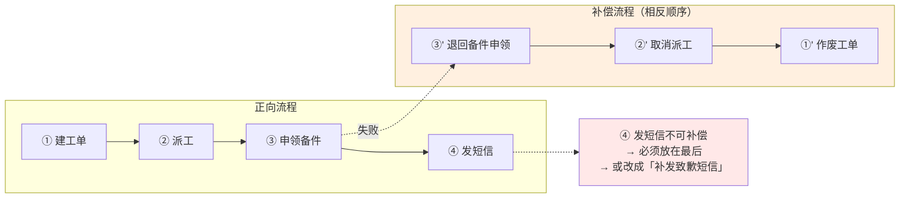

### 8.2 Saga 的两个铁律

1. **不可补偿的操作放最后**。发短信、付款、出库这类"泼出去的水"，一旦执行就收不回来。
   把它们排在 Saga 的最末端，前面全成功了才做。
2. **补偿操作本身也必须幂等，而且必须"能失败但不能出错"**。
   补偿失败要进死信队列 + 告警 + 人工介入，绝不能静默吞掉。

### 8.3 完整代码骨架

```python
# saga/saga.py —— Agent 系统里的 Saga 编排器
from __future__ import annotations
import time
import uuid
from dataclasses import dataclass, field
from enum import Enum
from typing import Any, Callable

from idem.key import make_action_id
from idem.store import STORE


class StepState(str, Enum):
    PENDING = "pending"
    DONE = "done"
    FAILED = "failed"
    COMPENSATED = "compensated"
    COMPENSATE_FAILED = "compensate_failed"


@dataclass
class SagaStep:
    """一个 Saga 步骤：正向动作 + 补偿动作。

    compensate 为 None 表示**不可补偿**——编排器会强制把它排到最后，
    并且在它之前插入一个「不可逆确认点」。
    """
    name: str
    tool: str
    action: Callable[[dict], dict]
    args: dict
    compensate: Callable[[dict, dict], dict] | None = None
    retriable: bool = True
    state: StepState = StepState.PENDING
    result: dict = field(default_factory=dict)
    error: str = ""
    action_id: str = ""


@dataclass
class SagaLog:
    """Saga 执行日志。必须持久化——进程挂了要能接着补偿。"""
    saga_id: str
    session_id: str
    steps: list[dict] = field(default_factory=list)
    status: str = "running"          # running / committed / compensated / broken
    created_at: float = field(default_factory=time.time)


class Saga:
    """Saga 编排器：顺序执行，失败则反向补偿。"""

    def __init__(self, session_id: str, steps: list[SagaStep], persist=None):
        self.saga_id = "SAGA-" + uuid.uuid4().hex[:10]
        self.session_id = session_id
        self.steps = self._order(steps)
        self.persist = persist or (lambda log: None)     # 生产：写数据库
        self.log = SagaLog(saga_id=self.saga_id, session_id=session_id)

    @staticmethod
    def _order(steps: list[SagaStep]) -> list[SagaStep]:
        """铁律①：不可补偿的步骤强制排到最后，保持相对顺序。"""
        compensable = [s for s in steps if s.compensate is not None]
        irreversible = [s for s in steps if s.compensate is None]
        return compensable + irreversible

    def _record(self) -> None:
        """把当前状态写进日志并持久化。每一步都要写，不能只在结束时写。"""
        self.log.steps = [{"name": s.name, "tool": s.tool, "state": s.state.value,
                           "action_id": s.action_id, "error": s.error,
                           "result_brief": str(s.result)[:200]} for s in self.steps]
        self.persist(self.log)

    def execute(self) -> dict:
        """正向执行。任一步失败则触发补偿。"""
        done: list[SagaStep] = []
        for i, s in enumerate(self.steps):
            s.action_id = make_action_id(self.session_id, s.tool, s.args)
            try:
                got, cached = STORE.try_begin(s.action_id)
                if not got:
                    s.result, s.state = (cached or {}), StepState.DONE
                else:
                    s.result = s.action({**s.args, "action_id": s.action_id})
                    STORE.commit(s.action_id, s.result)
                    s.state = StepState.DONE
                done.append(s)
                self._record()
            except Exception as e:
                s.state, s.error = StepState.FAILED, f"{type(e).__name__}: {e}"
                STORE.rollback(s.action_id)
                self._record()
                # 从已完成的步骤里反向补偿
                comp_ok = self.compensate(done)
                self.log.status = "compensated" if comp_ok else "broken"
                self._record()
                return {"ok": False, "failed_step": s.name, "error": s.error,
                        "compensated": comp_ok, "saga_id": self.saga_id,
                        "next": ("已回滚，可重新发起" if comp_ok
                                 else "⚠ 回滚未完成，已转人工处理，勿重复操作")}

        self.log.status = "committed"
        self._record()
        return {"ok": True, "saga_id": self.saga_id,
                "results": {s.name: s.result for s in self.steps}}

    def compensate(self, done: list[SagaStep]) -> bool:
        """反向补偿。返回是否全部补偿成功。"""
        all_ok = True
        for s in reversed(done):
            if s.compensate is None:
                # 不可补偿的步骤已经执行了 → 这是设计问题，必须人工介入
                s.state = StepState.COMPENSATE_FAILED
                s.error = "该操作不可补偿，需人工处理"
                all_ok = False
                dead_letter(self.saga_id, s)
                continue
            for attempt in range(3):                     # 补偿必须重试
                try:
                    comp_args = {**s.args, "action_id": f"comp-{s.action_id}"}
                    s.result = s.compensate(comp_args, s.result)
                    s.state = StepState.COMPENSATED
                    break
                except Exception as e:
                    s.error = f"补偿失败({attempt + 1}/3)：{e}"
                    time.sleep(2 ** attempt)
            else:
                s.state = StepState.COMPENSATE_FAILED
                all_ok = False
                dead_letter(self.saga_id, s)             # ★ 进死信 + 告警
            self._record()
        return all_ok


def dead_letter(saga_id: str, step: SagaStep) -> None:
    """补偿失败进死信队列。生产环境要同时触发告警（企微/PagerDuty）。"""
    from core.logger import logger
    logger.error("SAGA_DEAD_LETTER saga={} step={} tool={} action_id={} error={}",
                 saga_id, step.name, step.tool, step.action_id, step.error)
    # 生产：写 saga_dead_letter 表 + 推告警，由人工在后台页面处理
```

### 8.4 华成机电的实际 Saga

```python
# saga/ticket_saga.py —— "建单 + 派工 + 申领备件 + 通知" 的 Saga
from saga.saga import Saga, SagaStep
from tools_ops import (assign_engineer, cancel_ticket, create_ticket,
                       order_part, return_part, send_sms, unassign_engineer)


def build_ticket_saga(session_id: str, device_sn: str, fault_desc: str,
                      part_no: str, qty: int, region: str, phone: str) -> Saga:
    """组装工单处理 Saga。注意 send_sms 没有补偿函数，会被自动排到最后。"""
    steps = [
        SagaStep(
            name="创建工单", tool="create_ticket",
            action=lambda a: create_ticket(a, session_id=session_id),
            args={"device_sn": device_sn, "fault_desc": fault_desc,
                  "error_code": "E043", "priority": "P2"},
            compensate=lambda a, r: cancel_ticket({"ticket_id": r["ticket_id"],
                                                   "reason": "saga 回滚"}),
        ),
        SagaStep(
            name="派工", tool="assign_engineer",
            action=lambda a: assign_engineer(a, session_id=session_id),
            args={"region": region},                 # ticket_id 由编排器在运行时注入
            compensate=lambda a, r: unassign_engineer({"ticket_id": r.get("ticket_id", "")}),
        ),
        SagaStep(
            name="申领备件", tool="order_part",
            action=lambda a: order_part(a, session_id=session_id),
            args={"part_no": part_no, "qty": qty},
            compensate=lambda a, r: return_part({"order_id": r.get("order_id", ""),
                                                 "reason": "saga 回滚"}),
        ),
        SagaStep(
            name="通知客户", tool="send_sms",
            action=lambda a: send_sms(a, session_id=session_id),
            args={"phone": phone, "template_id": "TPL_TICKET_CREATED"},
            compensate=None,          # ★ 短信发出去收不回，编排器会把它排到最后
        ),
    ]
    return Saga(session_id, steps)
```

```text
$ python -m saga.demo --fail-at 申领备件

[saga SAGA-9f2c41ab77] 步骤 1/4 创建工单 … done  ticket_id=T-2025-03-0912
[saga SAGA-9f2c41ab77] 步骤 2/4 派工     … done  engineer=张工 eta=2025-03-12 09:00
[saga SAGA-9f2c41ab77] 步骤 3/4 申领备件 … FAILED  StockError: PN-88012 华东仓可用数不足（需 1，可用 0）
[saga SAGA-9f2c41ab77] 开始补偿（反向）
[saga SAGA-9f2c41ab77]   补偿 派工     … compensated  （已释放张工 03-12 上午排期）
[saga SAGA-9f2c41ab77]   补偿 创建工单 … compensated  （工单 T-2025-03-0912 已作废）
[saga SAGA-9f2c41ab77] 状态：compensated

返回给 Agent：
{'ok': False, 'failed_step': '申领备件',
 'error': 'StockError: PN-88012 华东仓可用数不足（需 1，可用 0）',
 'compensated': True, 'saga_id': 'SAGA-9f2c41ab77',
 'next': '已回滚，可重新发起'}

Agent 拿到这个结果后的正确行为（写进 OPERATOR_PROMPT）：
  不要重试同一个 Saga；把失败原因如实汇报给主管，由主管决定是
  ① 改从华北仓调货  ② 改派带备件的工程师  ③ 告知客户需等待到货
```

**注意最后一步**：短信**没有发出去**。因为它被排在最后，前面失败就轮不到它。
这正是"不可补偿操作排最后"这条铁律的价值——客户没有收到一条"工程师明天上门"然后又被取消的短信。

### 8.5 Saga 与人工审批的配合

审批发生在 Saga **之前**，不是中间：

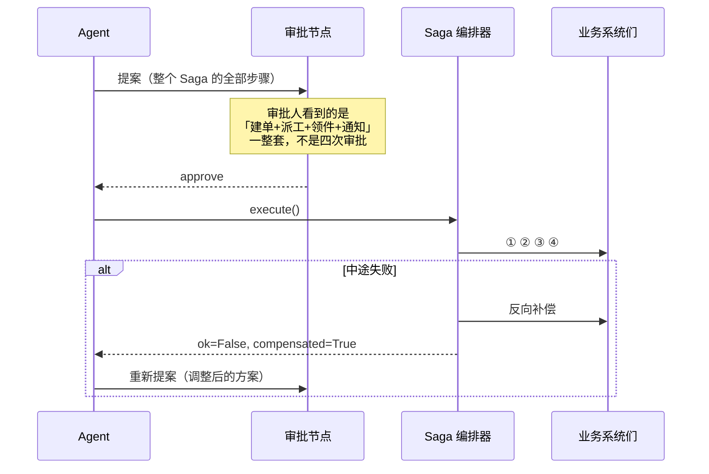

> **为什么审批整套而不是逐步审批**：逐步审批会出现"批了建单、没批派工"的半成品状态，
> 而且审批人看不到全貌无法判断。**审批的粒度应该等于 Saga 的粒度。**

---

## 九、预算与配额：token 在多 Agent 间怎么分

### 9.1 问题

7.2 章有一个 `MAX_SESSION_TOKENS = 80_000` 的全局刹车，但它太粗了：

```text
实际发生的情况：
  retriever 因为手册检索返回了 8 个长 chunk，一个人吃掉 62,000 token
  → 轮到 analyst 时预算只剩 18,000
  → analyst 勉强跑完
  → generator 和 critic 没预算了，被强制跳过
  → 最终输出的是 analyst 的原始数据，客户看到一堆字段名

问题：先到先得，没有优先级，关键环节被饿死
```

### 9.2 三种分配策略

| 策略 | 做法 | 优点 | 缺点 |
|---|---|---|---|
| 静态配额 | 开始就按比例切好：retriever 35%、analyst 15%、generator 25%、critic 20%、余量 5% | 简单、可预测、不会饿死 | 用不完的浪费；用超的直接失败 |
| 按需申领 | Agent 执行前向预算管理器申请，批了才跑 | 利用率高 | 需要 Agent 配合；先申请的占便宜 |
| **配额 + 可抢占余量** | 每个 Agent 有保底配额（不可被抢），余量池先到先得，**高优先级 Agent 可以抢占余量** | 兼顾公平和利用率 | 实现稍复杂 |

生产推荐第三种。核心思想：**保底配额保证关键环节不被饿死，余量池提高利用率。**

### 9.3 `BudgetManager` 完整实现

```python
# budget/manager.py —— 全局 token 预算分配与抢占
from __future__ import annotations
import threading
import time
from dataclasses import dataclass, field


@dataclass
class Grant:
    """一次预算授权。"""
    agent: str
    granted: int
    from_reserved: int      # 来自保底配额的部分
    from_pool: int          # 来自公共余量池的部分
    ok: bool
    reason: str = ""


class BudgetExceeded(Exception):
    """预算耗尽。调用方应该降级而不是重试。"""


class BudgetManager:
    """会话级 token 预算管理器。

    三层结构：
    - reserved[agent]：保底配额，只能自己用，用不完在会话末尾归还余量池
    - pool：公共余量池，先到先得
    - priority[agent]：抢占优先级。余量池不足时，高优先级可以抢低优先级**尚未使用**的保底
    """

    def __init__(self, total: int = 80_000,
                 quota: dict[str, float] | None = None,
                 priority: dict[str, int] | None = None):
        # 比例配置。经验值：检索最费（要塞 chunk），主管最省（只做路由）
        self.ratio = quota or {
            "retriever": 0.30, "analyst": 0.12, "operator": 0.06,
            "supervisor": 0.07, "generator": 0.20, "critic": 0.18, "resolver": 0.02,
        }
        # 优先级：数字越大越优先。critic 和 generator 必须高——它们在最后，最容易被饿死
        self.priority = priority or {
            "critic": 90, "generator": 85, "operator": 80, "resolver": 70,
            "supervisor": 60, "analyst": 50, "retriever": 40,
        }
        self.total = total
        self.reserved = {a: int(total * r) for a, r in self.ratio.items()}
        self.used: dict[str, int] = {a: 0 for a in self.ratio}
        self.pool = total - sum(self.reserved.values())
        self._lock = threading.RLock()
        self.log: list[dict] = []

    # ---------- 申领 ----------
    def request(self, agent: str, need: int, allow_preempt: bool = True) -> Grant:
        """申请 need 个 token。优先扣保底，再扣余量池，最后考虑抢占。"""
        with self._lock:
            if agent not in self.reserved:
                self.reserved[agent] = 0
                self.used[agent] = 0
                self.priority.setdefault(agent, 30)

            avail_reserved = max(0, self.reserved[agent] - self.used[agent])
            from_res = min(need, avail_reserved)
            rest = need - from_res

            from_pool = min(rest, self.pool)
            self.pool -= from_pool
            rest -= from_pool

            preempted = 0
            if rest > 0 and allow_preempt:
                preempted = self._preempt(agent, rest)
                rest -= preempted

            granted = from_res + from_pool + preempted
            self.used[agent] += granted
            g = Grant(agent=agent, granted=granted, from_reserved=from_res,
                      from_pool=from_pool + preempted, ok=(rest <= 0),
                      reason="" if rest <= 0 else f"预算不足，还差 {rest} token")
            self.log.append({"ts": time.time(), "agent": agent, "need": need,
                             "granted": granted, "pool_left": self.pool,
                             "preempted": preempted, "ok": g.ok})
            return g

    def _preempt(self, agent: str, need: int) -> int:
        """从优先级更低、且**尚未使用**的保底配额里抢。已用掉的抢不回来。"""
        my_p = self.priority.get(agent, 0)
        victims = sorted(
            [a for a in self.reserved
             if a != agent and self.priority.get(a, 0) < my_p],
            key=lambda a: self.priority.get(a, 0))
        got = 0
        for v in victims:
            free = max(0, self.reserved[v] - self.used[v])
            take = min(free, need - got)
            if take <= 0:
                continue
            self.reserved[v] -= take
            got += take
            self.log.append({"ts": time.time(), "agent": agent, "preempt_from": v,
                             "amount": take})
            if got >= need:
                break
        return got

    # ---------- 记账 ----------
    def settle(self, agent: str, actual: int, granted: int) -> None:
        """结算：实际用量少于授权，把差额还给余量池。"""
        with self._lock:
            diff = granted - actual
            if diff > 0:
                self.pool += diff
                self.used[agent] -= diff

    def remaining(self) -> int:
        """全局剩余（余量池 + 所有未用的保底）。"""
        with self._lock:
            unused = sum(max(0, self.reserved[a] - self.used[a]) for a in self.reserved)
            return self.pool + unused

    def report(self) -> str:
        """预算使用报表。"""
        rows = []
        for a in sorted(self.ratio, key=lambda x: -self.used.get(x, 0)):
            res, use = self.reserved.get(a, 0), self.used.get(a, 0)
            rows.append(f"  {a:<12} 保底 {res:>7,}  已用 {use:>7,}  "
                        f"占比 {use / max(self.total, 1) * 100:>5.1f}%")
        return (f"预算总额 {self.total:,}｜余量池 {self.pool:,}｜"
                f"全局剩余 {self.remaining():,}\n" + "\n".join(rows))


# ---------- 接进节点 ----------
def budgeted(agent: str, estimate: int = 4000):
    """装饰器：节点执行前申领预算，执行后按实际用量结算。"""
    def deco(fn):
        def wrapper(state: dict, *a, **kw):
            bm: BudgetManager = state["_budget"]
            g = bm.request(agent, estimate)
            if not g.ok:
                # ★ 预算不足要降级，不要抛异常炸掉整个会话
                return {"messages": [{"role": "assistant",
                                      "content": f"[{agent}] 预算不足，跳过本步骤"}],
                        "errors": [f"{agent} 预算不足：{g.reason}"],
                        "trace": [{"agent": agent, "status": "skipped_budget"}]}
            out = fn(state, *a, **kw) or {}
            actual = sum((out.get("token_used") or {}).values()) or estimate
            bm.settle(agent, actual, g.granted)
            return out
        wrapper.__name__ = getattr(fn, "__name__", agent)
        return wrapper
    return deco
```

```text
$ python -m budget.demo

预算总额 80,000｜余量池 4,000｜全局剩余 4,000
  retriever    保底  24,000  已用  24,000  占比  30.0%
  generator    保底  16,000  已用  12,400  占比  15.5%
  critic       保底  14,400  已用  13,900  占比  17.4%
  analyst      保底   9,600  已用   3,226  占比   4.0%
  supervisor   保底   5,600  已用   3,330  占比   4.2%
  operator     保底   4,800  已用       0  占比   0.0%
  resolver     保底   1,600  已用     820  占比   1.0%

[preempt] critic 从 retriever 抢占 0（retriever 保底已用尽，抢不到）
[preempt] critic 从 operator 抢占 2,400（operator 本次未参与）
→ critic 拿到了完整的两轮质检预算，没有被饿死 ✓
```

### 9.4 超预算的降级顺序

预算快用完时，**砍谁**是有讲究的：

| 剩余预算 | 动作 |
|---|---|
| > 40% | 正常运行 |
| 20%~40% | 关闭"可选"Agent（多视角并行分析降为单视角、关闭 Wiki 检索只查手册） |
| 10%~20% | Critic 从 2 轮修订降为 1 轮；generator 输出长度上限从 400 字降到 250 字 |
| 5%~10% | 跳过 Critic，直接用规则硬检查（`hard_rule_check` 零成本）兜底合规 |
| < 5% | **停止生成，转人工**。不要用剩下的一点预算硬憋一个残缺答复 |

> **最后一条最重要**：预算耗尽时给一个残缺答复，比直接说"转人工"危害大得多。
> 残缺答复看起来像个答复，客户会信。

---

## 十、死锁与活锁

### 10.1 四种表现

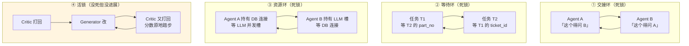

**死锁**是"都不动了"，**活锁**是"都在动但没进展"。活锁在 Agent 系统里**更常见也更贵**，因为它一直在烧 token。

### 10.2 检测

```python
# deadlock/detector.py —— 死锁与活锁检测
from __future__ import annotations
import hashlib
import json
from collections import defaultdict


class WaitForGraph:
    """等待图：谁在等谁。检测环即检测死锁。"""

    def __init__(self):
        self.edges: dict[str, set[str]] = defaultdict(set)

    def wait(self, who: str, for_whom: str) -> None:
        """登记一条等待关系。"""
        self.edges[who].add(for_whom)

    def release(self, who: str) -> None:
        """who 不再等待任何人。"""
        self.edges.pop(who, None)

    def find_cycle(self) -> list[str]:
        """DFS 找环。返回环上节点，空表示无死锁。"""
        WHITE, GRAY, BLACK = 0, 1, 2
        color: dict[str, int] = defaultdict(int)
        stack: list[str] = []
        found: list[str] = []

        def dfs(u: str) -> bool:
            color[u] = GRAY
            stack.append(u)
            for v in self.edges.get(u, ()):
                if color[v] == GRAY:
                    found.extend(stack[stack.index(v):] + [v])
                    return True
                if color[v] == WHITE and dfs(v):
                    return True
            color[u] = BLACK
            stack.pop()
            return False

        for n in list(self.edges):
            if color[n] == WHITE and dfs(n):
                return found
        return []


class ProgressMonitor:
    """活锁检测：看「系统状态」是否在变。不变就是没进展。"""

    def __init__(self, window: int = 3):
        self.window = window
        self.history: list[str] = []
        self.scores: list[float] = []

    @staticmethod
    def _sig(state: dict) -> str:
        """系统状态指纹：只取会影响后续决策的字段。"""
        payload = {
            "facts": sorted(f"{f.key}={f.value}" for f in state.get("facts", [])),
            "missing": sorted(state.get("missing_keys", [])),
            "task": state.get("current_task", ""),
            "next": state.get("next", ""),
        }
        return hashlib.md5(json.dumps(payload, ensure_ascii=False,
                                      sort_keys=True).encode()).hexdigest()[:12]

    def tick(self, state: dict) -> tuple[bool, str]:
        """每一步调用一次。返回 (是否活锁, 原因)。"""
        sig = self._sig(state)
        self.history.append(sig)
        if len(self.history) >= self.window and len(set(self.history[-self.window:])) == 1:
            return True, (f"连续 {self.window} 步系统状态完全未变"
                          f"（事实没新增、缺口没缩小、任务没变）")

        # Critic 分数原地踏步也是活锁
        sc = state.get("critic_score")
        if sc is not None:
            self.scores.append(float(sc))
            if len(self.scores) >= 3:
                last3 = self.scores[-3:]
                if max(last3) - min(last3) < 0.5 and max(last3) < 8.0:
                    return True, f"Critic 分数连续 3 轮在 {min(last3):.1f}~{max(last3):.1f} 之间无进展"
        return False, ""
```

### 10.3 打破

| 类型 | 打破手段 | 代码位置 |
|---|---|---|
| 交接环 | 记 `handoff_path`，同一对 Agent 互跳 2 次强制 `DONE`；交接必须带 `expected_keys`，跳回时校验上次要的东西给了没 | 7.2 第 11.1 表第 12 条 |
| 等待环 | `TaskDAG.add()` 插入时查环，有环直接拒绝；调度器发现 `ready` 为空但仍有 pending 任务 → 报死锁 | 本章 4.2 / 5.2 |
| 资源环 | **统一加锁顺序**（所有 Agent 都先拿 LLM 槽再拿 DB 连接）+ 超时（`asyncio.wait_for`） | 本章 5.2 |
| 活锁（Critic） | 分数无进展提前收口；`MAX_REVISION_ROUNDS` 硬上限 | 7.2 第 7.2 节 |
| 活锁（主管打转） | `missing_keys` 连续两轮不变 → 强制 FINISH，如实告知缺什么 | 下面的代码 |

```python
# deadlock/breaker.py —— 打破手段接进图
from deadlock.detector import ProgressMonitor, WaitForGraph

MONITORS: dict[str, ProgressMonitor] = {}


def with_progress_check(fn):
    """装饰主管节点：检测到活锁就强制收口。"""
    def wrapper(state: dict, *a, **kw):
        sid = state.get("session_id", "default")
        mon = MONITORS.setdefault(sid, ProgressMonitor(window=3))
        stuck, why = mon.tick(state)
        if stuck:
            return {
                "next": "FINISH",
                "errors": [f"活锁保护触发：{why}"],
                "messages": [{"role": "assistant",
                              "content": f"[强制收口] {why}，基于已有信息作答并标注缺口"}],
                "trace": [{"agent": "supervisor", "decision": "FINISH",
                           "reason": "livelock_guard", "detail": why}],
            }
        return fn(state, *a, **kw)
    wrapper.__name__ = getattr(fn, "__name__", "supervisor_node")
    return wrapper
```

```text
$ python run_livelock_demo.py --q "XJ-500 的保养周期是多久？"     # XJ-500 是不存在的型号

[supervisor] → retriever｜任务：查询 XJ-500 保养周期
[retriever ] 手册中未收录 XJ-500 型号的保养周期。
[supervisor] → retriever｜任务：查询 XJ-500 保养周期（换个关键词再查一次）
[retriever ] 手册中未收录 XJ-500 型号。
[supervisor] → retriever｜任务：查询 XJ-500 保养周期
[monitor   ] ⚠ 连续 3 步系统状态完全未变（事实没新增、缺口没缩小、任务没变）
[supervisor] [强制收口] 活锁保护触发，基于已有信息作答并标注缺口
[generator ] 您好，我们的产品手册中暂未收录 XJ-500 这个型号。
             请您确认一下设备铭牌上的型号（我们常见的型号有 XJ-200、XJ-200-B3、XJ-300），
             或者把铭牌照片发给我，我帮您核实。

没有活锁保护时：主管会一直派 retriever 直到 MAX_VISITS_PER_AGENT 或 recursion_limit，
多烧约 3 万 token 才停（实测环境：deepseek-chat，2025-03，示例性数据）。
```

> **活锁保护比轮次上限更早生效，省的就是这 3 万 token。**
> 轮次上限是"最后一道保险丝"，活锁检测是"及时止损"。两个都要有。

---

## 十一、踩坑与排错

| # | 现象 | 根因 | 解决 |
|---|---|---|---|
| 1 | 交接后下游把限定条件弄丢了 | 用自然语言摘要交接，条件是修饰语，压缩时优先被丢 | 用 `TaskSpec` + 黑板；`acceptance.must_keep_conditions=True`；注册 `conditions_preserved` 自定义校验 |
| 2 | 任务单里 `goal` 写成"了解 E043 的相关信息" | 规划器没有约束，生成了名词短语 | `TaskSpec.goal` 上加 `field_validator`，笼统开头直接抛错，让规划器重来 |
| 3 | 任务跑完了但不知道算不算成功 | `acceptance` 没填 | `check_executable` 里把"没有 required_keys"列为硬错误，分解阶段就拦住 |
| 4 | 占位符 `${T1.part_no}` 原样传给了 Agent | 调度器没做回填，或依赖没声明 | `_fill_inputs` 在任务出队时回填；`check_executable` 校验占位符引用的任务在 `depends_on` 里 |
| 5 | LLM 生成的 DAG 有环，调度器死等 | 规划器不理解依赖方向 | `check_no_cycle` 三色 DFS 查环；`TaskDAG.add()` 插入即查环并回滚 |
| 6 | 分解出 12 个任务，跑了 3 分钟 | 规划器"拆得越细越好"的倾向 | prompt 里写死"任务数 1~5，能一张完成的别拆两张"；`preflight` 打印关键路径让人提前看到代价 |
| 7 | 动态分解无限展开 | 子任务又生成子任务 | `MAX_DYNAMIC_DEPTH=2` + `MAX_DYNAMIC_TASKS=3` + 指纹去重 |
| 8 | 动态分解生成了写操作任务，绕过了审批 | 没限制动态任务的 assignee | `insert_subtask` 里硬拒 `operator`；写操作只能走静态规划 + 人工审批 |
| 9 | 上游任务失败，下游永远 pending | 调度器只处理成功不处理失败 | 被失败依赖连累的任务显式标 `skipped`；`outcome()` 汇总部分成功 |
| 10 | 某个任务失败后整个会话失败 | 没有区分关键任务和可选任务 | `critical_tasks` 集合 + `outcome()` 的四档结局（complete / complete_with_warnings / partial / failed） |
| 11 | 写任务失败后被自动重试，建了两张单 | 调度器对所有任务一视同仁地重试 | 写任务 `budget.max_retries=0`；重复执行的安全由**幂等**保证而不是靠"不重试" |
| 12 | 两个 Agent 结论矛盾，`generator` 随机挑了一个 | 没有冲突检测，两条事实平等地进了上下文 | 黑板同 key 多版本自动标冲突；`conflict_node` 放在 `generator` 之前 |
| 13 | 冲突消解直接取置信度最高的，给老设备用了新周期 | 把"适用条件不同"当成"互相矛盾" | **L0 条件互斥优先于一切**；`_match_condition` 用 SN/型号匹配分支；匹配不上就两条都说 |
| 14 | 裁决 Agent 硬选了一个，但其实证据不足 | 没给裁决器"我判断不了"的出口 | `Verdict.confidence` + `JUDGE_MIN_CONFIDENCE=0.75`，低于阈值走 L5 升级人工 |
| 15 | 裁决 Agent 自己编了新知识 | prompt 没禁止 | 裁决 prompt 第一句写死"只做判断，不产生任何新知识"；输出 schema 里只有 `winner_index` 没有 `value` 字段 |
| 16 | 幂等键用 `uuid4()` 生成，等于没做 | 混淆了"追踪 id"和"幂等键" | 幂等键必须由业务参数派生（`uuid5`）；`make_action_id` 只认白名单字段 |
| 17 | 幂等键把 `fault_desc` 算进去了，措辞一变就重复建单 | 把自由文本放进了幂等字段 | `IDEM_FIELDS` 白名单只放结构化的、决定业务唯一性的字段 |
| 18 | 幂等表在进程内存，重启后失效 | `MemoryIdemStore` 上了生产 | 生产必须 Redis（`SET NX`）或数据库唯一索引 |
| 19 | 幂等生效了，但 Agent 说"已为您创建三张工单" | 去重结果没返回 `idempotent_hit` 标记 | 装饰器返回值里带 `idempotent_hit`，并在 `OPERATOR_PROMPT` 里说明看到它要怎么表述 |
| 20 | Saga 中途失败，短信已经发出去了 | 不可补偿操作排在了中间 | `Saga._order()` 强制把 `compensate is None` 的步骤排到最后 |
| 21 | 补偿操作自己失败了，静默吞掉 | 补偿只跑一次且没告警 | 补偿重试 3 次 + 指数退避；仍失败进死信队列 + 告警，状态标 `broken` |
| 22 | 补偿被执行了两次，备件退了两回 | 补偿没做幂等 | 补偿也要 `action_id`（用 `comp-{原id}`），同样走去重表 |
| 23 | retriever 一个人吃掉 80% 预算，critic 被跳过 | 全局 token 上限先到先得 | `BudgetManager` 保底配额 + 可抢占余量池；critic/generator 优先级要高 |
| 24 | 预算耗尽时硬憋出一个残缺答复 | 降级策略只有"继续"和"报错" | 分档降级表（9.4）；< 5% 预算直接转人工，不输出残缺答复 |
| 25 | 主管在 XJ-500（不存在的型号）上打转烧了 3 万 token | 只有轮次上限没有进展检测 | `ProgressMonitor` 状态指纹连续 3 步不变即强制收口 |
| 26 | Critic 分数在 7.5 附近反复横跳，改了 5 轮 | 活锁：修订带不来分数提升 | 连续 3 轮分差 < 0.5 且未达标 → 提前 finalize 并标 unverified |
| 27 | 黑板越写越大，`view()` 输出 3000 token | 所有 key 都渲染给所有 Agent | `AGENT_VIEW_KEYS` 按 Agent 投影；`view(min_conf=0.6)` 过滤低置信；超 600 token 就该聚合 |
| 28 | 黑板写入触发的订阅回调抛异常，把写入搞挂了 | 回调没隔离 | `write()` 里回调包 `try/except`，回调失败不影响主流程 |
| 29 | 多副本部署后黑板数据对不上 | 黑板是进程内对象 | 生产换 Redis 实现（方案 B），接口不变 |
| 30 | 答复里说"库存充足"，实际客户下单时没货了 | 读到的库存是 T0 的快照，写在 T2 | 事实必须带 `as_of` 并在答复里说明时点；高价值备件走预占（7.4） |

---

## 十二、生产级要点

### 12.1 上线前检查

| 类别 | 检查项 | 达标线 |
|---|---|---|
| 协议 | 所有跨 Agent 传递都走 `TaskSpec` 或黑板，没有裸字符串 | 代码里 grep 不到 `agent_b(some_string)` 这种调用 |
| 验收 | 每张任务单都有 `required_keys` | `check_executable` 在 CI 里对全部模板跑一遍 |
| 分解 | 三闸（无环 / 可执行 / 覆盖）全开，失败降级为单任务 | 用 50 条真实问题跑分解，人工抽检 10 条 |
| 冲突 | `conflict_node` 在 `generator` 之前 | 图边断言：`generator` 的入边必须经过 `resolver` |
| 条件 | 带批次/时间限定的事实，`conditions` 字段非空 | `conditions_preserved` 校验通过率 > 95% |
| 幂等 | 所有写工具套 `@idempotent`，去重表在 Redis | 同参数调 5 次，业务系统只有 1 条记录；重启服务后仍然去重 |
| 事务 | 多步写操作走 Saga，不可补偿操作在最后 | `Saga._order()` 单测；演练一次中途失败 |
| 预算 | `BudgetManager` 接入，critic/generator 有保底 | 构造超长检索场景，验证 critic 仍能跑 |
| 活锁 | `ProgressMonitor` 接在主管节点上 | 用不存在的型号提问，验证 3 步内收口 |
| 审计 | 冲突消解、幂等命中、Saga 补偿全部落库 | 随便抽一个 session_id 能还原完整决策链 |

### 12.2 关键参数的经验值

| 参数 | 经验值 | 依据 |
|---|---|---|
| 单次分解任务数 | 1~5 | 超过 5 张，关键路径长度和调度开销的收益就变负了 |
| 动态分解深度 / 数量 | ≤ 2 层 / ≤ 3 张 | 再多基本是模型在发散，不是真的需要 |
| `Blackboard.view()` 输出 | ≤ 600 token | 与 7.2 的 `render_facts` 保持同一约束 |
| `FRESHNESS_SIGNIFICANT_DAYS` | 365 | 手册大版本间隔约一年；同年内的文档不该靠时间决胜 |
| `CONFIDENCE_GAP` | 0.15 | 小于这个差距时置信度是噪声。LLM 给的置信度本身精度就有限 |
| `JUDGE_MIN_CONFIDENCE` | 0.75 | 低于这个值裁决错误率明显上升，宁可升级人工 |
| 幂等键 TTL | 24 小时 | 覆盖一次完整的客服会话 + 审批周期 |
| Saga 补偿重试 | 3 次，退避 1/2/4 秒 | 再多就该人工介入了 |
| 预算保底比例 | 检索 30%、生成 20%、质检 18% | 实测环境：华成机电 120 条回归集，deepseek-chat，2025-03；示例性数据，需按自己的场景重测 |

> 以上除最后一行外都是**设计经验值**，不是实测结论。落到你自己的场景要用自己的回归集重新校准。

### 12.3 什么时候不要用这一套

这一章的东西加起来大概 1500 行工程代码。**不是每个项目都需要。**

| 场景 | 要不要上 |
|---|---|
| Agent ≤ 2，纯只读问答 | **不要**。7.2 的 `facts` + reducer 就够了 |
| 有写操作 | 幂等**必须**上；Saga 看写操作是否跨系统 |
| 知识库有多版本文档（手册 V2/V3 并存） | 冲突消解**必须**上，否则一定出事故 |
| Agent ≥ 4 且有并发 | 黑板 + 任务单**建议**上 |
| 日调用量 > 1 万 | 预算管理**建议**上，不然成本不可控 |
| 只是做 Demo / POC | 全都不要。先把效果跑出来，这些是"从能用到敢用"的东西 |

**判断标准**：这一章每个组件的存在都是为了防某一类具体事故。
**你没遇到过的事故，可以先不防**——但要知道它存在，并且在设计时留出接口。

### 12.4 演进路线

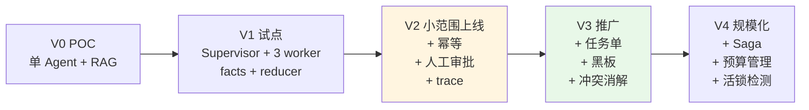

**V2 是不可跳过的一步**：只要有写操作，幂等和审批就必须在第一次真实上线前做完。
V3 和 V4 可以按遇到的问题逐步补。

---

## 十三、本章小结 + 自测题

### 小结

1. **任务用消息，事实用黑板，自然语言只给人看**。
   把事实塞进自然语言消息里传递，限定条件必然丢失——这不是模型的问题，是自然语言没有"必填字段"。

2. **结构化任务单要回答七个问题**：是哪个任务、要达成什么、给了什么输入、不许做什么、
   产出什么格式、**怎么算做完了**、能花多少。其中"怎么算做完了"（`acceptance`）是分水岭：
   有它系统才能自动验收、自动重试、自动降级。

3. **分解要过三闸**：无环（结构）、可执行（能力匹配 + 权限）、覆盖（子问题不漏）。
   三闸按成本从低到高排，前两闸是纯代码，第三闸才调 LLM。分解失败要能降级成单任务，不能让规划失败拖垮会话。

4. **调度器必须显式建模"部分成功"**。多 Agent 系统里"查到 3 项里的 2 项"是常态，
   把它当成功会出事故，当失败会没法用。正确做法是标注缺口并在答复里如实说明。

5. **冲突消解的第一步是判断"是不是真冲突"**。企业知识库里绝大多数矛盾其实是适用条件不同（批次、型号、时间段）。
   L0 条件互斥 → L1 证据权威度 → L2 时间新鲜度 → L3 置信度 → L4 裁决 Agent → L5 升级人工，
   从便宜确定到贵且不确定，绝大多数在前三级就解决了。

6. **写操作的幂等不是优化项，是上线前置条件**。幂等键必须由业务参数派生，去重表必须在 Redis 或数据库，
   去重命中必须回传给上游。多步跨系统写操作用 Saga，不可补偿的操作排最后，补偿本身也要幂等。

7. **预算要有保底配额**，否则排在后面的 Critic 和 Generator 会被前面的检索饿死。
   预算耗尽时宁可转人工，也不要憋一个看起来像答复的残缺答复。

8. **活锁比死锁更常见也更贵**。用"系统状态指纹连续 N 步不变"检测，比等轮次上限早得多，省的就是中间那几万 token。

### 自测题

**第 1 题**：`retriever` 从手册查到"E057 需更换编码器 PN-77031"，`analyst` 从 ERP 查到
"PN-77031 已于 2024-06 停产，替代件 PN-77031A"。你的系统该输出什么？请说明走的是哪一级消解、为什么。

<details>
<summary>参考答案</summary>

**先判断：这是不是真冲突？**

严格说**不是**。两条证据说的不是同一件事：
- 手册说的是"这个故障需要换编码器，型号 PN-77031"（技术结论）
- ERP 说的是"PN-77031 这个料号已停产，用 PN-77031A 替代"（供应状态）

所以**第一优先做的不是消解，是发现这两条事实的 `key` 设计错了**。
如果两条都写进 `part_no`，就会被黑板判成冲突；正确的建模是：
```python
part_no          = "PN-77031"      # source_type=original_doc, source=手册
part_status      = "已停产(2024-06)" # source_type=database
part_substitute  = "PN-77031A"      # source_type=database
```
这样根本不会产生冲突，`generator` 能自然地组织出完整答复。

**如果确实两条都写进了 `part_no`（现实中很常见），消解走哪一级？**

- L0 条件互斥：不适用。ERP 那条没有 `conditions`。
- **L1 证据类型权威度**：`original_doc(4) > database(3)`，按规则会选手册的 PN-77031 —— **这是错的**。
  权威度规则的适用前提是"两者说的是同一件事的不同版本"，这里前提不成立。
- 所以会走到 **L4 裁决 Agent**，它应该判定 `is_really_conflict=false`
  （两条不互斥，是"原型号 + 替代件"的关系），保留两条。

**正确的最终输出**：

> 您好，E057 对应编码器故障，需更换编码器（原型号 PN-77031，依据 XJ 维修手册 V3 p.62）。
> 该料号已于 2024 年 6 月停产，现由 PN-77031A 替代，功能兼容。
> 我已为您确认 PN-77031A 的库存情况…

**这道题真正的考点**：**证据权威度规则有适用边界**。
它只在"同一件事的不同说法"之间有效。生产上要在 `_l1_source` 之前先判断"是不是在说同一件事"，
这也是为什么 L0（条件互斥）必须排在 L1 之前，以及为什么 L4 裁决器的第一个输出字段是 `is_really_conflict`。

**衍生的工程动作**：`key` 命名规范应该进团队规约，并在 `_extract_facts` 的 schema_hint 里给出枚举，
避免不同 Agent 给同一类事实起不同的 key、给不同类事实起同一个 key。
</details>

**第 2 题**：下面这段调度器代码有什么问题？会导致什么后果？

```python
async def run(self):
    for task in self.dag.tasks.values():
        for attempt in range(3):
            try:
                result = await self.executors[task.assignee](task, self.bb)
                break
            except Exception:
                continue
```

<details>
<summary>参考答案</summary>

至少有**六个**问题：

1. **忽略依赖关系**。直接遍历 `tasks.values()`，没有拓扑排序。
   下游任务可能在上游之前执行，拿到的 `${T1.part_no}` 是空的。
   → 必须用 `dag.layers()` 或 `dag.ready(done)`。

2. **没有并发**。同一层可以并行的任务被串行执行，延迟白白翻倍。
   → 同层用 `asyncio.gather`，并用信号量控制并发上限。

3. **写操作也重试 3 次**。`create_ticket` 失败重试，如果失败是"超时但服务端已成功"，
   就会建出多张工单。
   → 重试次数读 `task.budget.max_retries`，写任务设 0；安全由幂等保证。

4. **没有退避**。三次重试瞬间打完，下游服务正在抖动时等于在 DDoS 它。
   → 指数退避 + 抖动。

5. **没有超时**。某个执行器卡住，整个会话无限期挂起。
   → `asyncio.wait_for(..., timeout=task.budget.max_seconds)`。

6. **没有验收，也没有记录结果**。`result` 拿到就扔了，既不写黑板也不判断"做对了没有"。
   `except Exception: continue` 更是把错误全吞了——三次都失败后，代码静默地进入下一个任务，
   上层完全不知道发生过什么。
   → 执行后 `bb.write_many(facts)` + `accept(spec, facts)`；失败要记 `TaskResult` 并标记依赖它的任务为 `skipped`。

**后果排序**（按危害）：
写操作重复执行（真金白银的损失） > 错误被静默吞掉（排查不出来） > 依赖顺序错乱（结果错） > 无超时（会话挂死） > 串行（慢）。
</details>

**第 3 题**：你的 Saga 是"建工单 → 派工 → 申领备件 → 发短信"。某次执行到"申领备件"失败，
补偿"派工"时调度系统返回 500，重试 3 次都失败。此时系统应该做什么？给出具体动作清单。

<details>
<summary>参考答案</summary>

**状态盘点**：
- ✓ 工单已创建（可补偿，还没补偿）
- ✗ 派工已执行，补偿失败（工程师的排期被占着）
- ✗ 申领备件失败（没执行，无需补偿）
- — 发短信没执行（在最后，轮不到，**这是对的**）

**具体动作清单**：

1. **停止继续补偿**。补偿是反向顺序的，派工补偿失败后**不要**接着补偿工单。
   因为"工单没了但工程师排期还占着"是更糟的状态——排期上挂着一个不存在的工单，
   调度系统里会变成一条永远处理不掉的脏数据。
   → `Saga.compensate()` 应该在遇到 `COMPENSATE_FAILED` 时把 `all_ok=False` 并**保留**后续步骤的状态，
   让人工看到"工单 + 派工都还在"这个一致的中间态。

2. **进死信队列 + 告警**。`dead_letter()` 写 `saga_dead_letter` 表，字段至少包括：
   `saga_id / step_name / tool / action_id / args / 原始结果 / 失败原因 / 重试次数 / 发生时间`。
   同时推企微告警给运维值班。

3. **Saga 状态标 `broken`**，**不是** `compensated`。这两个状态的区别决定了后续行为：
   - `compensated`：系统干净了，可以告诉用户"已回滚，可以重新发起"；
   - `broken`：系统处于不一致状态，**必须禁止用户重新发起同一操作**，
     否则会在脏数据上再叠一层。

4. **给 Agent 返回明确的指令性结果**，而不是一个异常：
   ```python
   {"ok": False, "compensated": False, "saga_id": "...",
    "next": "⚠ 回滚未完成，已转人工处理，勿重复操作"}
   ```
   并在 `OPERATOR_PROMPT` 里写死："收到 `compensated=False` 时，
   **绝对不要重试**，直接告知客户'您的请求正在人工核实中'并结束。"

5. **给客户的话术要诚实但不暴露内部细节**：
   > "您的工单已创建（单号 T-2025-03-0912），但备件申领遇到问题，我们的同事正在人工处理，
   > 稍后会主动联系您确认上门时间。"

   不要说"系统回滚失败"。也不要说"已为您安排工程师明天上门"——因为这一步的状态是不确定的。

6. **人工处理台账**。后台要有一个 `broken` Saga 的处理页面，展示：
   当前各步骤状态、涉及的业务单据 id、建议的人工操作（取消排期 / 作废工单 / 或者干脆手工补全备件申领）。
   处理完标记 `manually_resolved` 并记录处理人。

7. **事后复盘**：调度系统返回 500 且重试 3 次都失败，说明它当时是真的挂了。
   要检查：补偿的退避时间是不是太短（1/2/4 秒，总共才 7 秒）？
   对于补偿这种"必须成功"的操作，更合理的是**进延迟队列，按分钟级重试几小时**，
   而不是在请求线程里同步重试 3 次就放弃。

**这道题的核心考点**：**补偿失败是一种必须被显式建模的状态**。
很多人的 Saga 实现里只有"成功"和"已回滚"两态，遇到补偿失败就抛异常，
结果系统处于不一致状态而没有任何人知道。
</details>

---

**上一章** [7.2 LangGraph 实现 Supervisor 与 Swarm](./02-LangGraph实现Supervisor与Swarm.md) | **下一章** [7.4 企业级多智能体解决方案](./04-企业级多智能体解决方案.md)
