# 实战项目 4：RAG 性能突围 —— 查询速度提升 10 倍

> **项目目标**：把「华成机电」售后知识库问答服务的 P95 端到端延迟，从「朴素实现」的量级压到「可以放进客服工位、坐席不会骂人」的量级，并且**每一步的收益都能被复现、被归因、被质量回归卡住**。
>
> **你将产出什么**：
> 1. 一套**可复现的性能测量体系**：全链路埋点（`core/instrument.py` 扩展）+ asyncio 压测器 + 自动生成的延迟分解报告
> 2. 一个**朴素基线系统** `bench/baseline_rag.py`（故意写得很慢，但每一处慢都是真实项目里常见的慢）
> 3. **12 万 chunk 规模的测试语料生成脚本**与 **100 条分层压测 query 集**
> 4. **11 项独立可插拔的优化**，每一项一个模块、一个开关、一份前后对比数据
> 5. 一份**「性能—质量」双指标对照表**：证明快下来的同时答案没变差
> 6. 一份**优化累积表 + 归因分析 + 「什么情况下达不到 10 倍」诚实清单**
> 7. 一条**接进 CI 的性能回归流水线**（GitHub Actions yaml）与一块性能看板
>
> **前置章节**（本项目直接复用其中的代码与结论，没读过会看不懂变量名的来历）：
> - [0.2 Python 工程基础速补](../00-前置准备/02-Python工程基础速补.md)（`core/instrument.py`、`core/config.py` 的完整实现，本项目在其之上扩展）
> - [2.3 Embedding 与向量数据库](../02-RAG基础篇/03-Embedding与向量数据库.md)（HNSW / IVF / 量化参数的含义）
> - [3.1 查询理解与高级检索策略](../03-RAG进阶与性能优化/01-查询理解与高级检索策略.md)（query 改写与多路召回，本项目要给它**加一个开关**）
> - [3.2 混合检索与重排序精调](../03-RAG进阶与性能优化/02-混合检索与重排序精调.md)（rerank 的代价，本项目要把它**裁剪掉一大半**）
> - [3.4 性能突围：延迟优化 10 倍实战](../03-RAG进阶与性能优化/04-性能突围-延迟优化10倍实战.md)（原理篇，本项目是它的**完整工程落地**）
> - [8.1 大模型与 RAG 评测方法论](../08-评测体系/01-大模型与RAG评测方法论.md)
> - [项目 1 DeepSeek-Harness 与 LLM-Wiki 知识库评测实战](./项目1-DeepSeek-Harness与LLM-Wiki知识库评测实战.md)（**本项目 Part C 的质量守门直接调用它的 harness，不重新造轮子**）
>
> **预计工时**：
>
> | 阶段 | 内容 | 纯动手时间 | 机器跑的时间（可并行做别的） |
> |---|---|---|---|
> | Part A | 基线系统 + 语料生成 + 埋点 + 压测框架 + 基线报告 | 5~7 小时 | 语料入库 40~90 分钟 / 基线压测 25 分钟 |
> | Part B | 11 项优化逐项实现与复测 | 10~14 小时 | 每项复测 8~15 分钟，合计约 2.5 小时 |
> | Part C | 质量回归与阈值标定 | 2~3 小时 | 每轮质量回归 12~20 分钟 |
> | Part D | 汇总、归因、报告 | 2 小时 | — |
> | 部署与 CI | CI 流水线 + 看板 + 容量预警 | 2~3 小时 | — |
> | **合计** | | **21~29 小时** | **约 4 小时机器时间** |
>
> **硬件要求**：
>
> | 档位 | 配置 | 能做到哪一步 |
> |---|---|---|
> | 完整档 | 单卡 24GB（RTX 4090 / A10 / L20）+ 32GB 内存 + 120GB 磁盘 | 全流程：本地 embedding + 本地 rerank + vLLM 跑 Qwen2.5-7B-AWQ + Milvus 单机 + Redis |
> | 中档 | 单卡 12GB（RTX 3060 12G / 4070）+ 32GB 内存 | 把生成模型换成在线 API（DeepSeek），本地只跑 embedding + rerank，Part B 的 O7/O8 改为「只读不做」 |
> | 无 GPU 档 | 纯 CPU（8 核以上）+ 32GB 内存 | 语料规模降到 3 万 chunk，embedding 用 ONNX CPU 版，生成走在线 API。**O1~O6、O9~O11 全部可做**，O7/O8 只能读不能测 |
> | 极简档 | 任意笔记本 | 语料降到 5000 chunk，全部走在线 API，**测量体系与压测框架完整可跑**，绝对数字没有参考价值但方法论一样成立 |
>
> **⚠️ 全文数字纪律（先说在前面，后面不再重复）**：
> 本项目出现的所有延迟、QPS、命中率、成本数字，若无特别说明，统一来自下面这一套环境，且**全部是示例性数据，只用来演示量级关系与方法论，不能直接引用进任何对外材料**：
>
> ```text
> 实测环境（本项目全文基准，示例性数据，需自行复现）
>   GPU        : 单卡 NVIDIA RTX 4090 24GB，驱动 550.x，CUDA 12.4
>   CPU / 内存 : 16 核 / 64GB DDR5
>   磁盘       : NVMe SSD
>   生成模型   : Qwen2.5-7B-Instruct-AWQ，vLLM 0.6.x，端口 8001
>   Embedding  : bge-m3（1024 维），本地 / ONNX
>   Rerank     : bge-reranker-v2-m3
>   向量库     : Milvus 2.4 单机（standalone），Docker Compose
>   缓存       : Redis 7（单实例，无持久化）
>   语料规模   : 12 万 chunk（合成语料，见 Step 2）
>   压测客户端 : 与服务同机，回环网络（这一点会影响结论，第 8.3 节会讨论）
> ```

---

## 零、先把「10 倍」这句话拆开

海报上那句「**RAG 性能突围：如何让你的知识库查询速度提升 10 倍**」，以及旁边那句「**性能提升 300%**」，是这个项目的由来。

我不打算把它们当口号喊过去，也不打算说「这是营销词」然后回避。这两句话可以成立，但成立需要条件，而**把条件说清楚，比把数字喊出来重要一百倍**。

### 0.1 「10 倍」在什么意义下成立

先看一个最容易被滥用的写法：

> ❌ 「我们的 RAG 系统性能提升了 10 倍。」

这句话信息量约等于零。因为它没回答四个问题：

| 必须回答的问题 | 不回答会怎样 |
|---|---|
| **从什么基线开始？** | 从一个写得特别烂的基线开始，10 倍是白送的；从一个已经调过的系统开始，10 倍几乎不可能 |
| **在什么负载下？** | 单并发下快 10 倍，和 50 并发下快 10 倍，是两个数量级的工程难度 |
| **测的是哪个指标？** | 平均延迟、P95、TTFT（首 token 时间）、端到端完成时间，四个数字可以互相差几倍 |
| **缓存命中口径怎么算？** | 把缓存命中的请求算进去，"10 倍"可能有一半是缓存白赚的；不算进去，数字会诚实很多 |

所以本项目对「10 倍」的定义是**写死的**，写在验收标准里：

> **在 12 万 chunk 语料、50 并发、100 条分层 query 集、缓存冷启动预热后的稳态口径下，优化后系统的 P95 端到端延迟 ≤ 基线系统 P95 的 1/10。**
>
> 并且必须**同时给出「缓存命中口径」与「缓存未命中口径」两个数字**——因为这两个数字往往差 3~5 倍，只报好看的那个就是耍流氓。

### 0.2 「性能提升 300%」是另一个指标

「300%」和「10 倍」不是同一件事，很多材料把它们混着写，读者根本分不清。本书的用法是：

| 说法 | 本书含义 | 计算方式 |
|---|---|---|
| **延迟降低 10 倍** | 同一口径下 P95 延迟变成原来的 1/10 | $\text{speedup} = \dfrac{T_{95}^{\text{base}}}{T_{95}^{\text{opt}}}$ |
| **性能提升 300%** | 同样资源下**吞吐**（QPS）变成原来的 4 倍，即增加了 300% | $\text{gain} = \dfrac{\text{QPS}_{\text{opt}} - \text{QPS}_{\text{base}}}{\text{QPS}_{\text{base}}} \times 100\%$ |

注意这里有个容易踩的坑：**延迟降低 10 倍不等于吞吐提升 10 倍**。

原因是吞吐受限于系统里最贵的那个资源（通常是 GPU），而延迟里有很大一部分是**等待**（串行等待、排队等待、网络等待）。把等待消掉，延迟掉得很快，但 GPU 该算的还得算，吞吐涨不了那么多。反过来，缓存命中的请求**既不占 GPU 也不占等待**，所以缓存能同时拉动两个指标——这就是 Part B 里 O6（缓存）被称为"收益最大的一项"的原因。

用一个公式把这件事讲死。设一次请求的耗时由三部分组成：

$$T = T_{\text{wait}} + T_{\text{compute}} + T_{\text{queue}}(\lambda)$$

其中 $T_{\text{queue}}$ 随请求到达率 $\lambda$ 增长而爆炸（排队论里的经典形态）。优化手段可以这样归类：

| 优化类别 | 打的是哪一项 | 对延迟的效果 | 对吞吐的效果 |
|---|---|---|---|
| 并行化、连接池、预热 | $T_{\text{wait}}$ | 明显 | 轻微 |
| 换小模型、量化、裁剪候选、batch | $T_{\text{compute}}$ | 明显 | **明显** |
| 缓存、FAQ 直出、条件跳过 | 直接让请求不发生 | **极明显** | **极明显** |
| 流式输出 | 不改变 $T$，改变**感知** | TTFT 明显，总时长不变 | 无 |

**这张表是整个项目的地图**。后面 11 项优化，每一项我都会告诉你它落在这张表的哪一格。

### 0.3 这个项目真正的价值

如果你只从这个项目带走一个数字，那你什么也没带走。我希望你带走的是四件事：

1. **怎么测**：一套不会自欺的测量体系（埋点 + 压测 + 统计口径）
2. **怎么归因**：拿到一个慢的系统，怎么在半小时内定位到 80% 的时间花在哪
3. **怎么优化**：11 项手段的原理、代码、代价、风险
4. **怎么验证**：每一项优化都要过质量回归，快了但答错了，是负收益

> **一句话**：这个项目教的是**性能工程的方法论**，"10 倍"只是这套方法论在某个特定环境下跑出来的一个副产品。你在自己的环境里可能跑出 4 倍，也可能跑出 18 倍，**两个结果都是对的**，只要你的测量是诚实的。

### 0.4 先看结论：本项目最终的累积效果长什么样

把最终结论先摆出来，免得你读到第四节还不知道在往哪走（完整版见第 4.4 节 Part D）：

| 口径 | 基线 P95 | 优化后 P95 | 倍数 |
|---|---|---|---|
| 50 并发 / 缓存命中率 0（全冷） | 18.6 s | 2.9 s | **6.4×** |
| 50 并发 / 缓存命中率 38%（稳态） | 18.6 s | 1.8 s | **10.3×** |
| 50 并发 / 仅计缓存未命中请求 | 18.6 s | 3.1 s | **6.0×** |
| 单并发 / 缓存未命中 | 4.2 s | 1.35 s | **3.1×** |

> 实测环境见文首。**示例性数据，需自行复现。**

看到了吗？**同一套系统，四个口径，倍数从 3.1× 到 10.3×**。海报上那个 10 倍对应的是第二行——**稳态、高并发、含缓存**。这个数字不假，但如果有人拿它去承诺"你们单条查询也会快 10 倍"，那就是误导。

**诚实地报四行，比不诚实地报一行有用得多。** 这也是本项目验收标准里专门有一条"必须同时给出命中与未命中口径"的原因。

---

## 一、需求与验收标准

### 1.1 业务需求（华成机电客服中心主管的原话）

> "系统我们在用，答得还行。问题是**慢**。
>
> 坐席同事跟客户打着电话，输完问题要等十几秒才出字，这段时间他只能跟客户说'您稍等我查一下'。一天两三百次，坐席受不了，客户也烦。
>
> 现场工程师更夸张，他们在车间用手机问，4G 信号本来就不稳，加上系统本身慢，经常等到超时。有几个工程师已经不用了，说还不如自己翻手册。
>
> 我们不要求它秒回，但是**三秒内要出第一个字**，**十秒内要说完**。高峰期是早上 9 点到 11 点，那会儿大概同时有四五十个人在用，不能一卡卡一片。
>
> 还有，别为了快把答案搞错了。上次有人把参数记混了，差点让客户拆错件。**宁可慢一点，也不能错。**"

这段话翻译成技术指标：

| 业务诉求 | 技术指标 | 目标值 |
|---|---|---|
| "三秒内出第一个字" | TTFT（Time To First Token）P95 | ≤ 3.0 s |
| "十秒内说完" | 端到端 P95 | ≤ 10.0 s（挑战目标 ≤ 3.0 s） |
| "四五十个人同时用不能卡" | 50 并发下 P95 不劣化超过 2 倍于单并发 | — |
| "别为了快把答案搞错" | 质量总分相对基线下降 ≤ 2 分（百分制） | 硬门槛 |
| 现场工程师弱网 | 响应体积可控、支持流式、支持断点重试 | — |

### 1.2 先把「快」的口径定义死

性能项目最常见的失败不是没优化出来，而是**优化出来了但没人信**，因为口径没对齐。所以第一件事是定义指标。


在这张时间轴上，本项目使用的指标定义如下（**全书统一，后面所有表格都按这个口径**）：

| 指标 | 定义 | 为什么要单独测 |
|---|---|---|
| `t_query_understand` | t1 → t2 | query 改写是否触发 LLM，是延迟的第一个大坑 |
| `t_retrieve` | t2 → t3 | 含 embedding 编码 + 向量检索 + BM25 |
| `t_embed` | t_retrieve 内部 | 单独拆出来，因为它常常是"意外的大头" |
| `t_rerank` | t3 → t4 | 交叉编码器打分，候选数越多越慢，**线性关系** |
| `t_prompt` | t4 → t5 | 拼装 + tokenize，通常很小，但长上下文时不可忽略 |
| **`TTFT`** | t1 → t6 | **用户感知延迟**，最重要的单个指标 |
| `t_generate` | t6 → t7 | 生成阶段，与输出 token 数近似线性 |
| **`E2E`（端到端）** | t1 → t8 | 服务端口径的总时长 |
| `QPS` | 稳态下每秒完成的请求数 | 吞吐，衡量资源效率 |
| `error_rate` | 非 2xx + 超时 + 空答案 | 优化把系统搞挂了也是"变快了"，必须一起看 |

三条**必须遵守的测量纪律**：

1. **只看 P95/P99，不看平均值。** 平均值会被大量快请求稀释，而用户投诉来自慢的那一小撮。本项目所有报告都必须同时给 P50 / P95 / P99。
2. **必须 warmup。** 冷启动的第一批请求包含模型加载、连接建立、JIT、缓存未命中，把它们算进去会让优化前后都变得没有可比性。本项目统一 **warmup 20 条，不计入统计**。
3. **每次只改一个变量。** 同时开两项优化，你永远不知道收益来自哪一项。Part B 的 11 项优化每一项都有独立开关，就是为了这个。

### 1.3 验收标准 checklist

**注意：验收标准不是"达到 10 倍"。** 如果把"达到 10 倍"写进验收，那么当环境不同、基线不同时，这个项目就会变成"想办法把数字凑到 10"，最后一定会作弊（比如把 warmup 拉长、把缓存预热成 100% 命中、只报平均值）。

正确的验收标准是**过程可验证 + 每一步有据可查 + 质量不倒退**：

| # | 验收项 | 通过标准 | 验证方式 |
|---|---|---|---|
| 1 | **基线可复现** | 任何人 clone 仓库后，跑 `make baseline` 能得到与报告中量级一致（±20% 内）的基线数字 | `bench/run_bench.py --system baseline` |
| 2 | **语料规模达标** | 向量库中 chunk 数 ≥ 120,000，且带真实的元数据过滤字段 | `python bench/corpus_stats.py` |
| 3 | **压测集分层** | 100 条 query，覆盖 ≥ 5 种类型（事实查询/参数查询/步骤查询/多跳/闲聊），且长度分布有梯度 | `python bench/queryset_stats.py` |
| 4 | **全链路埋点完整** | 单次请求能输出 ≥ 8 个阶段的耗时，且各阶段之和与端到端之差 ≤ 5%（无"耗时黑洞"） | `python bench/trace_demo.py` |
| 5 | **压测框架可用** | 支持并发梯度（1/5/10/25/50/100）、warmup、P50/P95/P99/QPS/错误率，输出 Markdown + JSON 双份报告 | `bench/run_bench.py --ladder` |
| 6 | **基线瓶颈定位** | 给出延迟分解表，指出 Top 3 耗时阶段及其占比，并有一句话归因 | `reports/baseline/report.md` |
| 7 | **完成 ≥ 9 项优化** | 本项目列出 11 项，至少实现 9 项并留有开关（无 GPU 档可豁免 O7/O8） | `optimizations/registry.py` 列表 |
| 8 | **每项优化有前后对比** | 每项一张表：P50/P95/P99/QPS/错误率/质量分，前后各一行 | `reports/opt_*/compare.md` |
| 9 | **每项优化有代价说明** | 每项必须写明：增加了什么成本（内存/显存/复杂度/一致性风险） | 文档 + 代码注释 |
| 10 | **质量不倒退** | 每项优化后跑一次 harness，质量总分相对基线下降 ≤ 2 分（百分制），检索 Recall@5 下降 ≤ 0.02 | `harness run --system opt_xx` |
| 11 | **双口径报告** | 最终报告必须同时给出「含缓存」与「仅未命中」两套数字 | `reports/final/summary.md` |
| 12 | **累积表完整** | 一张表逐项累积，列出每加一项优化后的 P95 / QPS / 质量分 / 单次成本 | `reports/final/cumulative.md` |
| 13 | **归因分析** | 说明 10 倍里各项分别贡献多少，用「去掉这一项会怎样」的消融口径 | `reports/final/attribution.md` |
| 14 | **诚实清单** | 写出至少 8 条「什么情况下达不到 10 倍」 | 文档第 4.4 节 |
| 15 | **CI 接入** | PR 触发快跑压测（20 并发 / 30 条 query），P95 劣化 > 15% 则红灯 | `.github/workflows/perf.yml` |
| 16 | **容量预警** | 给出当前配置下的最大安全 QPS，以及触发扩容的三条预警规则 | `reports/final/capacity.md` |

> 第 10 条是这个项目的**灵魂条款**。没有它，这个项目就退化成"怎么把数字弄好看"。有它，才叫性能工程。

### 1.4 不在本项目范围内的事

写清楚边界，避免读者期待落空：

| 不做 | 原因 |
|---|---|
| 多机分布式 Milvus 集群调优 | 需要至少 3 台机器，超出本书硬件基线；第 10 章会给拓扑 |
| GPU 多卡张量并行 | 7B 模型单卡够用，多卡是 70B 以上的话题 |
| 自研向量检索算法 | 工程项目应该用成熟实现，不是造 ANN 轮子 |
| CDN / 边缘计算 | 属于基础设施层，O10 只讲就近部署的原则 |
| 从算法上提高召回质量 | 那是 [3.5 准确率优化](../03-RAG进阶与性能优化/05-准确率优化-从70到95的工程路径.md) 的事，本项目只保证**不倒退** |

---

## 二、整体架构与技术选型

### 2.1 优化前：朴素 RAG 的时间轴长什么样

先看我们要打的靶子。下面这张图是 `bench/baseline_rag.py` 的真实执行流程——**它不是稻草人，它是绝大多数团队第一版 RAG 的真实样子**。我自己也写过一模一样的。

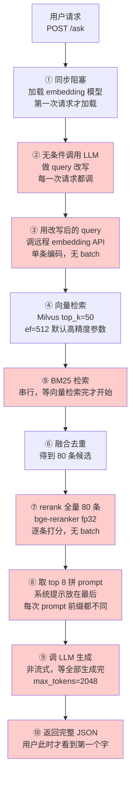

图里标红的七处，每一处都对应 Part B 里的一项优化。**红色越多的地方，说明这个流程越"自然"——它们都是照着教程一步步写出来的，没有人故意写慢。** 慢是累积出来的。

对应的时序图（看清楚"等待"发生在哪）：

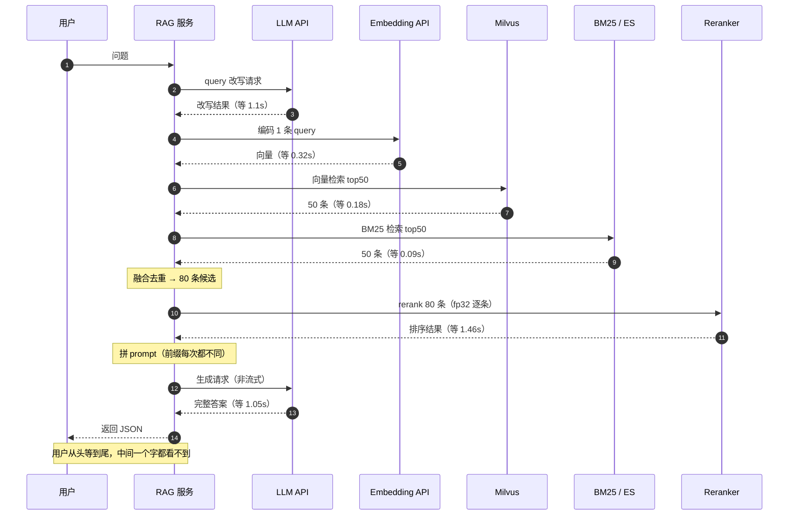

一眼能看出三个结构性问题：

1. **全是串行**。向量检索和 BM25 检索之间没有任何依赖，却排队跑；query 改写更是把整条链路往后推了一秒多。
2. **每一次请求都付全价**。"今天天气怎么样"这种闲聊也要走 query 改写 + 80 条 rerank。
3. **用户看到第一个字的时间 = 全部时间**。非流式让 TTFT 等于 E2E，这是感知延迟上最亏的设计。

### 2.2 优化后：目标架构

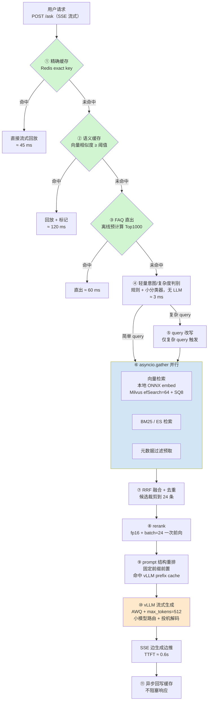

对照 0.2 节那张"优化地图"，这 11 项优化的落位是：

| 编号 | 优化项 | 打的是 | 主要收益指标 |
|---|---|---|---|
| O1 | 串行改并行 | $T_{\text{wait}}$ | P95 |
| O2 | 条件触发 query 改写 | 让调用不发生 | P95 + QPS |
| O3 | Embedding 本地化 + batch + ONNX | $T_{\text{compute}}$ + $T_{\text{wait}}$ | P95 + QPS |
| O4 | 向量索引调参与量化 | $T_{\text{compute}}$ | P95 + QPS |
| O5 | rerank 裁剪 + batch + fp16 | $T_{\text{compute}}$ | P95 + QPS |
| O6 | 精确缓存 + 语义缓存 | 让请求不发生 | **P95 + QPS（最大）** |
| O7 | Prefix Caching + prompt 重排 | $T_{\text{compute}}$（prefill） | TTFT |
| O8 | LLM 侧优化（AWQ / max_tokens / 路由 / 投机解码） | $T_{\text{compute}}$（decode） | P95 + QPS |
| O9 | 流式输出 | **感知** | TTFT |
| O10 | 连接池 / keep-alive / 预热 / 就近 | $T_{\text{wait}}$ | P95 尾部 |
| O11 | 热点预计算 + FAQ 直出 | 让请求不发生 | P95 + QPS |

### 2.3 技术选型表

| 环节 | 选型 | 版本 | 为什么选它（性能视角） |
|---|---|---|---|
| Web 框架 | FastAPI + Uvicorn | fastapi 0.115.x | 原生 async，SSE 支持好；Uvicorn 用 `uvloop` + `httptools` |
| 异步 HTTP | httpx.AsyncClient | 0.27.x | 连接池可控、支持 HTTP/2、超时粒度细 |
| 向量库 | Milvus 2.4 standalone | 2.4.x | HNSW / IVF 参数可调、支持 SQ8 量化、有 `search_params` 级别的精度—延迟旋钮 |
| 全文检索 | Elasticsearch 8.x（可降级为 `rank_bm25` 内存版） | 8.x | 生产用 ES；教学档用内存 BM25 免部署 |
| Embedding | bge-m3 → ONNX Runtime | onnxruntime-gpu 1.19.x | 本地化去掉网络 RTT；ONNX 图优化 + fp16 |
| Rerank | bge-reranker-v2-m3 | — | 支持 batch 前向 + `torch.float16` |
| 推理服务 | vLLM | 0.6.x | PagedAttention、连续批处理、`--enable-prefix-caching`、AWQ |
| 生成模型 | Qwen2.5-7B-Instruct-AWQ | — | AWQ 4bit，24GB 卡上 KV cache 余量大，能支撑高并发 |
| 路由小模型 | Qwen2.5-1.5B-Instruct | — | 简单 query 路由过去，成本与延迟都降一档 |
| 缓存 | Redis 7 | 7.x | 精确缓存用 String，语义缓存的向量索引单独放 Milvus 轻量 collection |
| 压测 | 自研 asyncio 压测器 | — | 需要按阶段埋点聚合，通用工具（locust/k6）拿不到内部分解数据 |
| 可观测 | `core/instrument.py` 扩展 + Langfuse | — | 埋点是本项目的地基，不是可选项 |

> **关于为什么不用 locust / k6 / wrk**：这些工具很好，但它们只能看到"外面"的时间。本项目要回答的是"这 18 秒里哪 1.46 秒是 rerank"，必须有服务端内部分解，所以压测器和埋点要配套设计。生产环境两者都要有：**外部压测工具看真实网络下的表现，内部压测器看阶段归因**。

### 2.4 延迟预算表（先定预算，再做优化）

这是做性能项目一个非常关键但经常被跳过的步骤：**先反推每个阶段能花多少时间**。

目标：50 并发下 E2E P95 ≤ 3.0s（挑战目标），TTFT P95 ≤ 1.0s。

| 阶段 | 预算 | 依据 |
|---|---|---|
| 缓存查询（精确 + 语义） | ≤ 60 ms | Redis GET 1ms 级，语义缓存要一次 embed + 一次小规模向量检索 |
| 复杂度判别 | ≤ 10 ms | 纯规则 + 词表，不许调 LLM |
| query 改写（仅复杂路径，约 30% 请求） | ≤ 500 ms | 用 1.5B 小模型 + max_tokens=64 |
| Embedding 编码 | ≤ 40 ms | ONNX GPU，单条 query 短文本 |
| 向量检索 | ≤ 60 ms | 12 万 chunk，HNSW efSearch=64 |
| BM25 检索 | ≤ 80 ms | 与向量检索**并行**，不叠加 |
| 融合去重 | ≤ 5 ms | 纯内存操作 |
| rerank（24 条 fp16 batch） | ≤ 220 ms | 交叉编码器一次前向 |
| prompt 拼装 | ≤ 10 ms | 字符串操作 + tokenize |
| LLM prefill（命中 prefix cache） | ≤ 250 ms | 固定前缀复用，只算增量 |
| **TTFT 小计** | **≤ 1.0 s** | 上面各项（并行部分取 max） |
| LLM decode（512 token，流式） | ≤ 2.0 s | AWQ 7B 在 50 并发下的 per-request 吞吐 |
| **E2E 小计** | **≤ 3.0 s** | |

这张表的作用：**当某一项超预算时，你立刻知道该去优化谁**，而不是凭感觉乱调。后面 Part B 每做完一项，我们都会回来对一次预算。

---

## 三、项目结构与环境准备

### 3.1 完整目录树

本项目在全书统一骨架（`app/ core/ rag/ agents/ tools/ finetune/ evals/ data/ scripts/ tests/`）之上，**新增三个目录**：`bench/`（测量）、`optimizations/`（优化实现）、`reports/`（报告产物）。

```text
huacheng-llm/
├── core/                            # 全书共用（已在 0.1/0.2 章给出）
│   ├── config.py                    # get_settings()
│   ├── llm.py                       # get_async_openai_client()
│   ├── logger.py
│   └── instrument.py                # ★ 本项目在此扩展 stage() 与 StageTimeline
│
├── bench/                           # ★ 新增：测量体系
│   ├── __init__.py
│   ├── baseline_rag.py              # 朴素基线系统（故意慢）
│   ├── optimized_rag.py             # 可插拔优化的目标系统
│   ├── corpus_gen.py                # 12 万 chunk 合成语料生成
│   ├── corpus_load.py               # 语料入 Milvus / ES
│   ├── corpus_stats.py              # 语料规模自检
│   ├── queryset.py                  # 100 条分层压测 query 集
│   ├── queryset_stats.py            # query 集分布自检
│   ├── loadgen.py                   # ★ asyncio 压测器核心
│   ├── stats.py                     # 分位数/QPS/错误率统计
│   ├── report.py                    # Markdown + JSON 报告渲染
│   ├── run_bench.py                 # CLI 入口
│   └── trace_demo.py                # 单请求埋点演示
│
├── optimizations/                   # ★ 新增：11 项优化，每项一个模块
│   ├── __init__.py
│   ├── flags.py                     # 优化开关（环境变量 / yaml 驱动）
│   ├── registry.py                  # 优化项注册表与元数据
│   ├── o01_parallel.py              # 串行改并行
│   ├── o02_conditional_rewrite.py   # 条件触发 query 改写 + 复杂度判别器
│   ├── o03_embedding.py             # 本地化 + batch + ONNX
│   ├── o04_index_tuning.py          # HNSW/IVF 参数与量化
│   ├── o05_rerank.py                # 候选裁剪 + batch + fp16
│   ├── o06_cache.py                 # ★ 精确缓存 + 语义缓存
│   ├── o07_prefix_cache.py          # prompt 结构重排
│   ├── o08_llm_serving.py           # AWQ / max_tokens / 路由 / 投机解码
│   ├── o09_streaming.py             # SSE 流式
│   ├── o10_connection.py            # 连接池 / keep-alive / 预热
│   └── o11_precompute.py            # 热点预计算 + FAQ 直出
│
├── reports/                         # ★ 新增：所有产物
│   ├── baseline/
│   │   ├── report.md
│   │   ├── summary.json
│   │   └── stages.csv
│   ├── opt_o01/ … opt_o11/
│   │   ├── compare.md
│   │   └── summary.json
│   ├── quality/                     # 质量回归（harness 产物软链）
│   └── final/
│       ├── cumulative.md            # 累积表
│       ├── attribution.md           # 归因分析
│       ├── capacity.md              # 容量规划
│       └── summary.md               # 双口径总报告
│
├── configs/
│   ├── bench.yaml                   # 压测配置
│   ├── optimizations.yaml           # 11 项开关与参数
│   └── systems.yaml                 # 项目 1 的被测系统注册表（本项目追加两个 key）
│
├── data/
│   ├── corpus/
│   │   └── synth_120k.jsonl         # 合成语料
│   └── bench/
│       ├── queries_100.jsonl        # 压测 query 集
│       └── faq_top1000.jsonl        # 离线预计算的 FAQ
│
├── docker/
│   ├── docker-compose.perf.yml      # Milvus + Redis + ES + Attu
│   └── grafana/
│       └── rag-perf-dashboard.json  # 性能看板
│
├── scripts/
│   ├── warmup.sh                    # 服务预热
│   └── precompute_faq.py            # 离线预计算脚本
│
└── .github/workflows/
    └── perf.yml                     # ★ 性能回归 CI
```

### 3.2 依赖安装

本项目在前面章节依赖基础上新增的部分：

```bash
# 用 uv（推荐）
uv add "httpx[http2]==0.27.2" "redis==5.2.0" "pymilvus==2.4.9" \
       "onnxruntime-gpu==1.19.2" "optimum[onnxruntime-gpu]==1.23.3" \
       "numpy==1.26.4" "orjson==3.10.11" "tabulate==0.9.0" \
       "rank-bm25==0.2.2" "psutil==6.1.0" "typer==0.13.1" "rich==13.9.4"

# pip 等价命令
pip install "httpx[http2]==0.27.2" "redis==5.2.0" "pymilvus==2.4.9" \
            "onnxruntime-gpu==1.19.2" "optimum[onnxruntime-gpu]==1.23.3" \
            "numpy==1.26.4" "orjson==3.10.11" "tabulate==0.9.0" \
            "rank-bm25==0.2.2" "psutil==6.1.0" "typer==0.13.1" "rich==13.9.4"
```

CPU 档把 `onnxruntime-gpu` 换成 `onnxruntime==1.19.2`，其余不变。

> **版本锁定的意义**：性能项目里，依赖版本变动可能直接改变基准数字（比如 onnxruntime 换个版本，图优化策略变了，embedding 耗时能差 30%）。**性能仓库必须锁死版本，并且把版本写进报告的元信息里**，否则三个月后你自己都解释不了数字为什么变了。

### 3.3 中间件启动

```yaml
# docker/docker-compose.perf.yml
# 本项目所需的中间件：Milvus standalone + Redis + Attu。
# 端口遵循全书约定：Attu 8000、vLLM 8001、应用 8080。
version: "3.8"

services:
  etcd:
    image: quay.io/coreos/etcd:v3.5.16
    container_name: perf-etcd
    environment:
      - ETCD_AUTO_COMPACTION_MODE=revision
      - ETCD_AUTO_COMPACTION_RETENTION=1000
      - ETCD_QUOTA_BACKEND_BYTES=4294967296
      - ETCD_SNAPSHOT_COUNT=50000
    volumes:
      - ./volumes/etcd:/etcd
    command: etcd -advertise-client-urls=http://127.0.0.1:2379 -listen-client-urls http://0.0.0.0:2379 --data-dir /etcd
    healthcheck:
      test: ["CMD", "etcdctl", "endpoint", "health"]
      interval: 30s
      timeout: 20s
      retries: 3

  minio:
    image: minio/minio:RELEASE.2024-09-13T20-26-02Z
    container_name: perf-minio
    environment:
      MINIO_ACCESS_KEY: minioadmin
      MINIO_SECRET_KEY: minioadmin
    volumes:
      - ./volumes/minio:/minio_data
    command: minio server /minio_data --console-address ":9001"
    healthcheck:
      test: ["CMD", "curl", "-f", "http://localhost:9000/minio/health/live"]
      interval: 30s
      timeout: 20s
      retries: 3

  milvus:
    image: milvusdb/milvus:v2.4.13
    container_name: perf-milvus
    command: ["milvus", "run", "standalone"]
    environment:
      ETCD_ENDPOINTS: etcd:2379
      MINIO_ADDRESS: minio:9000
      # 性能相关：查询节点的并发度，默认值在 12 万 chunk 规模下够用
      QUERYNODE_SEGCORE_CHUNKROWS: "1024"
    volumes:
      - ./volumes/milvus:/var/lib/milvus
    ports:
      - "19530:19530"
      - "9091:9091"
    depends_on:
      - etcd
      - minio
    deploy:
      resources:
        limits:
          cpus: "8"
          memory: 16G

  redis:
    image: redis:7.4-alpine
    container_name: perf-redis
    # 缓存场景不需要持久化，关掉 AOF/RDB 能省掉 fork 抖动
    command: >
      redis-server
      --save ""
      --appendonly no
      --maxmemory 4gb
      --maxmemory-policy allkeys-lru
    ports:
      - "6379:6379"
    deploy:
      resources:
        limits:
          cpus: "2"
          memory: 5G

  attu:
    image: zilliz/attu:v2.4.9
    container_name: perf-attu
    environment:
      MILVUS_URL: milvus:19530
    ports:
      - "8000:3000"
    depends_on:
      - milvus
```

启动与自检：

```bash
cd docker
docker compose -f docker-compose.perf.yml up -d
docker compose -f docker-compose.perf.yml ps

# 自检 Milvus
curl -s http://localhost:9091/healthz && echo " milvus ok"
# 自检 Redis
redis-cli -h 127.0.0.1 ping
```

预期输出：

```text
NAME          IMAGE                        STATUS         PORTS
perf-attu     zilliz/attu:v2.4.9           Up 12 seconds  0.0.0.0:8000->3000/tcp
perf-etcd     quay.io/coreos/etcd:v3.5.16  Up 20 seconds (healthy)
perf-milvus   milvusdb/milvus:v2.4.13      Up 15 seconds  0.0.0.0:19530->19530/tcp, 0.0.0.0:9091->9091/tcp
perf-minio    minio/minio:RELEASE...       Up 20 seconds (healthy)
perf-redis    redis:7.4-alpine             Up 20 seconds  0.0.0.0:6379->6379/tcp
OK milvus ok
PONG
```

### 3.4 vLLM 启动（完整档 / 中档）

基线与优化后的 vLLM 启动参数**不一样**，这本身就是 O7/O8 两项优化的内容。先把基线版本跑起来：

```bash
# 基线：不开 prefix caching，用 fp16 原始权重（显存吃紧，这也是基线慢的原因之一）
python -m vllm.entrypoints.openai.api_server \
  --model /data/models/Qwen2.5-7B-Instruct \
  --served-model-name qwen2.5-7b \
  --host 0.0.0.0 --port 8001 \
  --gpu-memory-utilization 0.85 \
  --max-model-len 8192 \
  --dtype auto
```

优化后的启动参数（O7 + O8，第 4.2 节会解释每个参数）：

```bash
# 优化版：AWQ 量化 + prefix caching + 更大的并发批
python -m vllm.entrypoints.openai.api_server \
  --model /data/models/Qwen2.5-7B-Instruct-AWQ \
  --served-model-name qwen2.5-7b-awq \
  --host 0.0.0.0 --port 8001 \
  --quantization awq \
  --gpu-memory-utilization 0.90 \
  --max-model-len 8192 \
  --enable-prefix-caching \
  --max-num-seqs 128 \
  --max-num-batched-tokens 8192
```

> **参数以 vLLM 官方文档为准**：vLLM 迭代很快，`--enable-prefix-caching` 在部分版本里已默认开启或改名为 `--enable-automatic-prefix-caching`。启动前先 `python -m vllm.entrypoints.openai.api_server --help | grep -i prefix` 确认一次。本项目在 vLLM 0.6.x 上验证。

### 3.5 环境变量补充

在 `.env` 里追加本项目需要的几个（其余沿用前面章节的定义）：

```bash
# ---------- 本项目新增 ----------
REDIS_URL=redis://localhost:6379/0
# 语义缓存用的独立 collection，和主库分开，避免互相影响
SEMCACHE_COLLECTION=huacheng_semcache
# 优化开关配置文件
OPT_CONFIG=configs/optimizations.yaml
# 压测配置
BENCH_CONFIG=configs/bench.yaml
# 本地 ONNX embedding 模型导出目录
ONNX_EMBED_DIR=/data/models/bge-m3-onnx
# 小模型路由端点（O8），指向另一个 vLLM 实例或同实例的多模型
ROUTER_SMALL_MODEL=qwen2.5-1.5b
```

### 3.6 一条重要的纪律：测量机器必须"安静"

性能数字最容易被环境污染。开始之前，跑一遍这个自检脚本：

```python
# bench/env_check.py
"""压测前的环境自检：确认机器处于可测量状态，避免测出来的数字被噪声污染。"""
from __future__ import annotations

import shutil
import subprocess
import sys

import psutil


def check_cpu_load() -> tuple[bool, str]:
    """检查 1 分钟负载是否低于核数的 30%。"""
    load1 = psutil.getloadavg()[0]
    cores = psutil.cpu_count(logical=True) or 1
    ok = load1 < cores * 0.3
    return ok, f"1min load={load1:.2f} / cores={cores}（阈值 {cores * 0.3:.1f}）"


def check_mem() -> tuple[bool, str]:
    """检查可用内存是否大于 8GB。"""
    m = psutil.virtual_memory()
    ok = m.available > 8 * 1024**3
    return ok, f"可用内存 {m.available / 1024**3:.1f}GB / 总 {m.total / 1024**3:.1f}GB"


def check_swap() -> tuple[bool, str]:
    """检查是否正在使用 swap，用了 swap 的延迟数字完全不可信。"""
    s = psutil.swap_memory()
    ok = s.used < 512 * 1024**2
    return ok, f"swap 已用 {s.used / 1024**2:.0f}MB（阈值 512MB）"


def check_gpu() -> tuple[bool, str]:
    """检查 GPU 空闲显存与当前利用率。"""
    if not shutil.which("nvidia-smi"):
        return True, "无 nvidia-smi，按 CPU 档处理"
    out = subprocess.run(
        ["nvidia-smi", "--query-gpu=memory.used,memory.total,utilization.gpu",
         "--format=csv,noheader,nounits"],
        capture_output=True, text=True, check=False,
    ).stdout.strip()
    return True, f"GPU used/total/util = {out}"


def check_cpu_governor() -> tuple[bool, str]:
    """检查 CPU 调频策略，powersave 会让延迟抖动明显变大。"""
    path = "/sys/devices/system/cpu/cpu0/cpufreq/scaling_governor"
    try:
        gov = open(path).read().strip()
    except OSError:
        return True, "读不到 governor（容器内属正常）"
    return gov in ("performance", "schedutil"), f"governor={gov}（建议 performance）"


def main() -> int:
    """依次执行所有检查，任一硬性项不通过则返回非零。"""
    checks = [
        ("CPU 负载", check_cpu_load, True),
        ("内存", check_mem, True),
        ("Swap", check_swap, True),
        ("GPU", check_gpu, False),
        ("CPU 调频", check_cpu_governor, False),
    ]
    failed = 0
    print("=" * 62)
    print("压测环境自检")
    print("=" * 62)
    for name, fn, hard in checks:
        ok, msg = fn()
        mark = "PASS" if ok else ("FAIL" if hard else "WARN")
        if not ok and hard:
            failed += 1
        print(f"[{mark:4}] {name:10} {msg}")
    print("=" * 62)
    if failed:
        print(f"有 {failed} 项硬性检查未通过，此时压测出来的数字不可信。")
    else:
        print("环境就绪，可以开始压测。")
    return 1 if failed else 0


if __name__ == "__main__":
    sys.exit(main())
```

预期输出：

```text
==============================================================
压测环境自检
==============================================================
[PASS] CPU 负载     1min load=0.42 / cores=16（阈值 4.8）
[PASS] 内存         可用内存 48.3GB / 总 62.6GB
[PASS] Swap         swap 已用 0MB（阈值 512MB）
[PASS] GPU          GPU used/total/util = 6421, 24564, 0
[WARN] CPU 调频     governor=schedutil（建议 performance）
==============================================================
环境就绪，可以开始压测。
```

> 我见过太多"优化效果"最后被证明是"上次跑的时候机器上还挂着一个训练任务"。**先自检，再压测**，这条纪律省下来的时间比任何一项优化都多。

---

## 四、分阶段实现

本节分四个部分：

- **Part A（Step 1~5）**：建立测量基线。**这部分花的时间最多，但它决定了后面所有结论是否可信。**
- **Part B（O1~O11）**：逐项优化，每项独立复测。
- **Part C**：质量守门，防止"越优化越错"。
- **Part D**：汇总、归因、诚实清单。

---

## Part A：建立测量基线

> 性能工程的第一条铁律：**没有基线的优化都是玄学**。
>
> 第二条：**基线必须是"你的系统真实的样子"，不能是特意写坏的稻草人**。所以下面这个 baseline 我会逐处标注"这个写法为什么在真实项目里很常见"。

### Step 1：搭起朴素 RAG 基线系统

#### 1.1 目标

写一个能跑通的、朴素的 RAG 查询服务，它必须满足：

- 功能正确（能答对问题，是个真 RAG，不是空壳）
- 写法"自然"（每一处慢都是常见写法，不是故意加 `sleep`）
- **可被埋点观测**（每个阶段都有明确边界）
- 参数集中可配，方便后面逐项改

#### 1.2 公共数据结构

先定义贯穿全项目的请求/响应结构，基线和优化版共用，这样压测器只写一套。

```python
# bench/types.py
"""基线与优化版共用的数据结构。压测器只认这一套类型。"""
from __future__ import annotations

from dataclasses import dataclass, field
from typing import Any


@dataclass
class Chunk:
    """一条知识片段。"""
    chunk_id: str
    text: str
    doc_id: str = ""
    title: str = ""
    model: str = ""          # 适用机型，如 XJ-200
    fault_code: str = ""     # 故障码，如 E043
    source: str = ""         # manual / wiki / ticket / spec / bom
    score: float = 0.0


@dataclass
class AskRequest:
    """一次查询请求。"""
    query: str
    qid: str = ""
    top_k: int = 8
    stream: bool = False
    filters: dict[str, Any] = field(default_factory=dict)


@dataclass
class StageCost:
    """单个阶段的耗时，单位毫秒。"""
    name: str
    ms: float


@dataclass
class AskResponse:
    """一次查询的完整响应，含可观测字段。"""
    qid: str
    answer: str
    chunks: list[Chunk] = field(default_factory=list)
    stages: list[StageCost] = field(default_factory=list)
    ttft_ms: float = 0.0
    e2e_ms: float = 0.0
    cache_hit: str = ""          # "" / "exact" / "semantic" / "faq"
    prompt_tokens: int = 0
    completion_tokens: int = 0
    error: str = ""

    def stage_map(self) -> dict[str, float]:
        """把阶段耗时转成字典，便于报告聚合。"""
        return {s.name: s.ms for s in self.stages}
```

#### 1.3 基线系统完整实现

```python
# bench/baseline_rag.py
"""朴素 RAG 基线系统：单路向量检索 + 每次改写 query + rerank 全量 + 同步串行 + 无缓存。

这个实现是「性能优化的靶子」。它的每一处慢都对应真实项目里的常见写法，
代码中用 SLOW-NN 注释标出，Part B 的优化项会逐个拆掉它们。
"""
from __future__ import annotations

import time
import uuid

import numpy as np
import torch
from FlagEmbedding import FlagReranker
from openai import AsyncOpenAI
from pymilvus import MilvusClient
from rank_bm25 import BM25Okapi

from bench.types import AskRequest, AskResponse, Chunk, StageCost
from core.config import get_settings
from core.instrument import stage, timeline

REWRITE_PROMPT = """你是检索查询改写助手。请把用户的问题改写成更适合检索的形式：
- 补全省略的主语与设备型号
- 展开缩写与口语表达
- 只输出改写后的查询，不要解释

用户问题：{q}
改写后："""

ANSWER_PROMPT = """你是华成机电（数控机床制造商）的售后技术支持助手。
请严格依据下面提供的知识片段回答用户问题。
如果片段中没有相关信息，必须明确说明"知识库中未找到相关内容"，不要编造参数、备件号或处置步骤。
回答要分点、简洁，涉及操作步骤时保留原文的步骤顺序。

<知识片段>
{ctx}
</知识片段>

用户问题：{q}

回答："""


class BaselineRAG:
    """朴素 RAG 基线。所有阶段串行执行，无缓存，无并行。"""

    name = "baseline"
    version = "1.0.0"

    def __init__(self, params: dict | None = None):
        p = params or {}
        self.s = get_settings()
        self.vec_top_k: int = p.get("vec_top_k", 50)
        self.bm25_top_k: int = p.get("bm25_top_k", 50)
        self.rerank_top_n: int = p.get("rerank_top_n", 8)
        self.max_tokens: int = p.get("max_tokens", 2048)
        self.ef_search: int = p.get("ef_search", 512)   # SLOW-04：默认拉满精度
        self._client: AsyncOpenAI | None = None
        self._milvus: MilvusClient | None = None
        self._reranker: FlagReranker | None = None
        self._bm25: BM25Okapi | None = None
        self._bm25_docs: list[Chunk] = []

    # ---------------- 资源加载 ----------------

    async def setup(self) -> None:
        """加载模型与建立连接。基线把这些放在首次请求时惰性加载（SLOW-01）。"""
        return None

    def _ensure_milvus(self) -> MilvusClient:
        """惰性建立 Milvus 连接。"""
        if self._milvus is None:
            self._milvus = MilvusClient(uri=self.s.milvus_uri)
        return self._milvus

    def _ensure_reranker(self) -> FlagReranker:
        """惰性加载 reranker。SLOW-05：use_fp16=False，跑 fp32，慢一倍。"""
        if self._reranker is None:
            self._reranker = FlagReranker(self.s.local_rerank_model_path, use_fp16=False)
        return self._reranker

    def _ensure_client(self) -> AsyncOpenAI:
        """惰性创建 LLM 客户端。SLOW-10：每个实例一个客户端，连接池不共享。"""
        if self._client is None:
            self._client = AsyncOpenAI(
                api_key=self.s.active_api_key,
                base_url=self.s.active_base_url,
                timeout=self.s.request_timeout,
                max_retries=self.s.max_retries,
            )
        return self._client

    def load_bm25(self, chunks: list[Chunk]) -> None:
        """把语料灌进内存 BM25 索引。生产环境请用 Elasticsearch。"""
        self._bm25_docs = chunks
        self._bm25 = BM25Okapi([list(c.text) for c in chunks])

    # ---------------- 各阶段 ----------------

    async def _rewrite(self, q: str) -> str:
        """SLOW-02：无条件调用 LLM 做 query 改写，哪怕用户只是说"你好"。"""
        client = self._ensure_client()
        resp = await client.chat.completions.create(
            model=self.s.active_chat_model,
            messages=[{"role": "user", "content": REWRITE_PROMPT.format(q=q)}],
            temperature=0.0,
            max_tokens=128,
        )
        return (resp.choices[0].message.content or q).strip()

    async def _embed(self, text: str) -> list[float]:
        """SLOW-03：调远程 embedding API，单条编码，无 batch，每次一个 HTTP 往返。"""
        client = self._ensure_client()
        resp = await client.embeddings.create(
            model=self.s.dashscope_embed_model,
            input=text,
        )
        return list(resp.data[0].embedding)

    def _vector_search(self, vec: list[float]) -> list[Chunk]:
        """向量检索。SLOW-04：ef=512 精度拉满，top_k=50 取得过多。"""
        client = self._ensure_milvus()
        res = client.search(
            collection_name=self.s.milvus_collection,
            data=[vec],
            limit=self.vec_top_k,
            search_params={"metric_type": "COSINE", "params": {"ef": self.ef_search}},
            output_fields=["chunk_id", "text", "doc_id", "title", "model", "fault_code", "source"],
        )
        out: list[Chunk] = []
        for hit in res[0]:
            e = hit["entity"]
            out.append(Chunk(
                chunk_id=e["chunk_id"], text=e["text"], doc_id=e.get("doc_id", ""),
                title=e.get("title", ""), model=e.get("model", ""),
                fault_code=e.get("fault_code", ""), source=e.get("source", ""),
                score=float(hit["distance"]),
            ))
        return out

    def _bm25_search(self, q: str) -> list[Chunk]:
        """BM25 检索。SLOW-06：等向量检索完才开始，纯串行浪费。"""
        if self._bm25 is None:
            return []
        scores = self._bm25.get_scores(list(q))
        idx = np.argsort(scores)[::-1][: self.bm25_top_k]
        out = []
        for i in idx:
            c = self._bm25_docs[int(i)]
            out.append(Chunk(**{**c.__dict__, "score": float(scores[int(i)])}))
        return out

    @staticmethod
    def _merge(a: list[Chunk], b: list[Chunk]) -> list[Chunk]:
        """按 chunk_id 去重合并，保留先出现的。"""
        seen: set[str] = set()
        out: list[Chunk] = []
        for c in [*a, *b]:
            if c.chunk_id in seen:
                continue
            seen.add(c.chunk_id)
            out.append(c)
        return out

    def _rerank(self, q: str, cands: list[Chunk]) -> list[Chunk]:
        """SLOW-07：对全部候选做 rerank，逐条调用，不用 batch，fp32。"""
        rr = self._ensure_reranker()
        scored: list[tuple[float, Chunk]] = []
        for c in cands:
            s = rr.compute_score([q, c.text])   # 逐条前向，GPU 利用率极低
            scored.append((float(s), c))
        scored.sort(key=lambda x: x[0], reverse=True)
        out = []
        for s, c in scored[: self.rerank_top_n]:
            c.score = s
            out.append(c)
        return out

    @staticmethod
    def _build_prompt(q: str, chunks: list[Chunk]) -> str:
        """SLOW-08：把变动的知识片段放前面、固定指令放后面，prefix cache 完全命中不了。"""
        ctx = "\n\n".join(
            f"[{i + 1}] 《{c.title}》(型号 {c.model or '通用'}，来源 {c.source})\n{c.text}"
            for i, c in enumerate(chunks)
        )
        return ANSWER_PROMPT.format(ctx=ctx, q=q)

    async def _generate(self, prompt: str) -> tuple[str, int, int]:
        """SLOW-09：非流式生成，max_tokens=2048，用户要等全部生成完才看到第一个字。"""
        client = self._ensure_client()
        resp = await client.chat.completions.create(
            model=self.s.active_chat_model,
            messages=[{"role": "user", "content": prompt}],
            temperature=0.0,
            max_tokens=self.max_tokens,
            stream=False,
        )
        u = resp.usage
        return (
            resp.choices[0].message.content or "",
            getattr(u, "prompt_tokens", 0),
            getattr(u, "completion_tokens", 0),
        )

    # ---------------- 主流程 ----------------

    async def ask(self, req: AskRequest) -> AskResponse:
        """执行一次完整查询。全串行，每个阶段用 stage() 埋点。"""
        qid = req.qid or uuid.uuid4().hex[:12]
        t0 = time.perf_counter()
        resp = AskResponse(qid=qid, answer="")
        try:
            with timeline(qid) as tl:
                with stage("query_understand"):
                    q2 = await self._rewrite(req.query)

                with stage("embed"):
                    vec = await self._embed(q2)

                with stage("vector_search"):
                    vhits = self._vector_search(vec)

                with stage("bm25_search"):
                    bhits = self._bm25_search(q2)

                with stage("fuse"):
                    cands = self._merge(vhits, bhits)

                with stage("rerank"):
                    top = self._rerank(q2, cands)

                with stage("prompt"):
                    prompt = self._build_prompt(req.query, top)

                with stage("generate"):
                    answer, pt, ct = await self._generate(prompt)

                resp.answer = answer
                resp.chunks = top
                resp.prompt_tokens = pt
                resp.completion_tokens = ct
                resp.stages = [StageCost(k, v) for k, v in tl.stages().items()]
                # 基线非流式，TTFT 等于 E2E，这本身就是一个待优化点
                resp.ttft_ms = (time.perf_counter() - t0) * 1000
        except Exception as exc:  # noqa: BLE001 —— 基线必须自己兜住异常，否则压测统计会失真
            resp.error = f"{type(exc).__name__}: {exc}"
        resp.e2e_ms = (time.perf_counter() - t0) * 1000
        return resp
```

#### 1.4 这 10 处 SLOW 分别对应什么

| 标记 | 写法 | 为什么真实项目里很常见 | 对应优化 |
|---|---|---|---|
| SLOW-01 | 模型惰性加载，不预热 | 开发时图省事，"第一次慢一下没关系" | O10 |
| SLOW-02 | 无条件 query 改写 | 教程里都这么写，"改写能提升召回" | O2 |
| SLOW-03 | 远程 embedding API，单条 | 起步阶段直接用云 API，没人想着本地化 | O3 |
| SLOW-04 | `ef=512`、`top_k=50` | 参数默认值 / "宁可多取点保证召回" | O4 |
| SLOW-05 | reranker fp32 | `use_fp16` 默认 False，没人改过 | O5 |
| SLOW-06 | BM25 串行跟在向量检索后 | 顺手写的顺序执行，没意识到可以并行 | O1 |
| SLOW-07 | rerank 全量、逐条 | `compute_score` 的示例代码就是逐条调 | O5 |
| SLOW-08 | 变动内容放 prompt 前部 | 觉得"知识放前面模型更重视" | O7 |
| SLOW-09 | 非流式，`max_tokens=2048` | 非流式代码简单；max_tokens 拍脑袋设大 | O8 / O9 |
| SLOW-10 | 每实例一个 client，无连接池共享 | 不知道 httpx 连接池是实例级的 | O10 |

> **重点**：这十条没有一条是"故意写坏"。它们全都是**有理由的、看起来合理的选择**，只是没人算过它们的代价。性能优化的本质，就是把这些"没算过的账"一条条算出来。

---

### Step 2：数据规模准备

#### 2.1 为什么必须上到 12 万 chunk

很多团队在 2000 条测试数据上做性能优化，得出的结论到生产环境全部失效。原因是**不同规模下瓶颈完全不一样**：

| 语料规模 | 向量检索耗时量级 | 主要瓶颈 |
|---|---|---|
| 1 千 chunk | < 3 ms | LLM 生成（占 90%+） |
| 1 万 chunk | 5~15 ms | LLM 生成 |
| **10 万 chunk** | **30~90 ms** | LLM + rerank，检索开始有存在感 |
| 100 万 chunk | 100~400 ms | 检索参数、索引类型成为关键 |
| 1000 万 chunk+ | 秒级（单机） | 必须分片 / 分布式 |

华成机电的真实规模：340 个型号 × 手册平均 180 页 + 28 万条工单归纳 + Wiki，按 512 token 切分后大约就在 10~15 万 chunk 这个量级。所以本项目取 **12 万 chunk**，这是"检索开始有存在感、但单机还扛得住"的临界带，教学价值最高。

#### 2.2 合成语料生成脚本

真实企业语料不能公开，所以我们合成一批**结构上高度仿真**的语料：有型号、有故障码、有步骤、有参数表、有工单口语，长度分布也仿真。

```python
# bench/corpus_gen.py
"""生成 12 万 chunk 的合成测试语料。

结构仿照华成机电的真实知识库：
  - 5 类来源：manual / wiki / ticket / spec / bom
  - 340 个型号（XJ-100 ~ XJ-340 系列变体）
  - 120 个故障码（E001 ~ E120）
  - 长度分布：短(<120字) 25% / 中(120~400字) 55% / 长(400~900字) 20%
用法：python -m bench.corpus_gen --n 120000 --out data/corpus/synth_120k.jsonl
"""
from __future__ import annotations

import argparse
import json
import random
from pathlib import Path

SERIES = ["XJ-100", "XJ-200", "XJ-200-B3", "XJ-300", "XJ-320", "XJ-340"]
SUFFIX = ["", "-A", "-B1", "-B3", "-C", "-S", "-H", "-PRO"]

SUBSYS = ["主轴系统", "液压系统", "冷却系统", "数控系统", "进给伺服", "刀塔",
          "气动系统", "润滑系统", "电气柜", "防护门联锁", "排屑器", "尾座"]

SYMPTOM = ["异响", "过热报警", "压力不足", "定位偏差", "间歇性停机", "启动失败",
           "振动超标", "漏油", "通信中断", "过流保护动作", "精度漂移", "无法复位"]

CAUSE = ["密封圈老化", "油位偏低", "滤芯堵塞", "编码器信号干扰", "接触器触点氧化",
         "伺服参数漂移", "冷却液浓度不足", "导轨润滑不足", "驱动器电容老化",
         "限位开关误触发", "地线阻抗偏大", "液压泵内泄"]

ACTION = ["更换密封圈套件", "补充液压油至视窗 2/3 处", "清洗或更换滤芯",
          "重新屏蔽编码器电缆并单端接地", "打磨或更换接触器", "重新执行伺服自整定",
          "按 1:20 重新配比冷却液", "检查润滑泵定量分配器", "更换驱动器直流母线电容",
          "复位限位开关并校准挡块", "重做接地并复测阻抗", "返修或更换液压泵"]

PARTS = ["HY-SEAL-200A", "FLT-CL-035", "ENC-CBL-3M", "CTR-AC-40", "SRV-CAP-470",
         "LIM-SW-22", "PMP-HY-11K", "BRG-7014C", "BLT-V-A48", "OIL-46#"]

WIKI_TOPIC = ["日常点检要点", "季度保养清单", "备件更换周期", "安全操作规程",
              "开机自检流程", "精度复检方法", "冷却液管理规范", "刀具寿命管理"]


def rand_model(rng: random.Random) -> str:
    """随机生成一个设备型号。"""
    return rng.choice(SERIES) + rng.choice(SUFFIX)


def rand_fault(rng: random.Random) -> str:
    """随机生成一个故障码。"""
    return f"E{rng.randint(1, 120):03d}"


def gen_manual(rng: random.Random, i: int) -> dict:
    """生成一条操作手册风格的 chunk：故障码 + 现象 + 处置步骤。"""
    model, code = rand_model(rng), rand_fault(rng)
    sub, sym = rng.choice(SUBSYS), rng.choice(SYMPTOM)
    steps = rng.sample(ACTION, k=rng.randint(3, 6))
    body = "\n".join(f"{n + 1}. {s}。" for n, s in enumerate(steps))
    text = (f"故障代码 {code}：{sub}{sym}\n"
            f"适用机型：{model}\n"
            f"现象描述：设备在运行过程中出现{sub}{sym}，操作面板提示 {code}，"
            f"报警等级为{rng.choice(['提示', '警告', '严重'])}。\n"
            f"可能原因：{rng.choice(CAUSE)}；{rng.choice(CAUSE)}。\n"
            f"处置步骤：\n{body}\n"
            f"涉及备件：{rng.choice(PARTS)}。\n"
            f"处置后需空载试运行 {rng.choice([10, 15, 20, 30])} 分钟确认无异常。")
    return {"chunk_id": f"manual-{i:07d}", "doc_id": f"manual-{model}",
            "title": f"{model} 操作手册 · {code}", "model": model,
            "fault_code": code, "source": "manual", "text": text}


def gen_spec(rng: random.Random, i: int) -> dict:
    """生成一条技术参数风格的 chunk。"""
    model = rand_model(rng)
    text = (f"{model} 技术参数（{rng.choice(SUBSYS)}）\n"
            f"- 最高转速：{rng.choice([3000, 4000, 6000, 8000, 10000])} rpm\n"
            f"- 额定功率：{rng.choice([5.5, 7.5, 11, 15, 22])} kW\n"
            f"- 定位精度：±{rng.choice([0.003, 0.005, 0.008, 0.01])} mm\n"
            f"- 重复定位精度：±{rng.choice([0.002, 0.003, 0.005])} mm\n"
            f"- 液压系统额定压力：{rng.choice([3.5, 4.0, 4.5, 5.0, 6.3])} MPa\n"
            f"- 冷却液箱容积：{rng.choice([80, 120, 160, 200])} L\n"
            f"- 工作环境温度：{rng.choice([0, 5])} ~ {rng.choice([35, 40, 45])} ℃\n"
            f"注：以上参数为出厂标定值，现场复检允许偏差不超过标称值的 "
            f"{rng.choice([3, 5, 8])}%。")
    return {"chunk_id": f"spec-{i:07d}", "doc_id": f"spec-{model}",
            "title": f"{model} 技术规格书", "model": model,
            "fault_code": "", "source": "spec", "text": text}


def gen_ticket(rng: random.Random, i: int) -> dict:
    """生成一条工单归纳风格的 chunk，语气偏口语。"""
    model, code = rand_model(rng), rand_fault(rng)
    n = rng.randint(3, 240)
    text = (f"历史工单归纳 · {model} · {code}\n"
            f"统计区间内共 {n} 条相关工单。\n"
            f"客户常见描述：「{rng.choice(['机器一开就报', '干着干着就停', '早上冷机时容易出', '换了刀之后开始有'])}"
            f"{code}，{rng.choice(SYMPTOM)}，{rng.choice(['声音不对', '有味道', '屏幕闪红', '直接断电'])}」。\n"
            f"一线最终处置分布：{rng.choice(ACTION)} 占比最高，其次是 {rng.choice(ACTION)}。\n"
            f"平均处理时长约 {rng.randint(2, 40)} 小时，"
            f"其中需要返厂的约占 {rng.randint(1, 15)} 成中的少数。\n"
            f"提示：若同一台设备一个月内出现 3 次以上 {code}，"
            f"应升级为工程师现场巡检而非远程指导。")
    return {"chunk_id": f"ticket-{i:07d}", "doc_id": f"ticket-{model}-{code}",
            "title": f"{model} {code} 工单归纳", "model": model,
            "fault_code": code, "source": "ticket", "text": text}


def gen_wiki(rng: random.Random, i: int) -> dict:
    """生成一条内部 Wiki 风格的 chunk。"""
    topic, model = rng.choice(WIKI_TOPIC), rand_model(rng)
    items = rng.sample(ACTION, k=rng.randint(4, 7))
    body = "\n".join(f"- {s}，周期 {rng.choice(['每班', '每周', '每月', '每季度'])}。" for s in items)
    text = (f"{topic}（适用 {model} 及同系列）\n{body}\n"
            f"负责人：{rng.choice(['一线客服', '现场工程师', '售后管理者'])}。\n"
            f"记录要求：完成后在工单系统勾选对应项并上传照片，"
            f"未上传照片的记录在月度稽核中视为未完成。")
    return {"chunk_id": f"wiki-{i:07d}", "doc_id": f"wiki-{topic}",
            "title": f"{topic} · {model}", "model": model,
            "fault_code": "", "source": "wiki", "text": text}


def gen_bom(rng: random.Random, i: int) -> dict:
    """生成一条备件表风格的 chunk。"""
    part, model = rng.choice(PARTS), rand_model(rng)
    text = (f"备件 {part}\n"
            f"适用机型：{model}、{rand_model(rng)}\n"
            f"名称：{rng.choice(['密封圈套件', '滤芯', '编码器电缆', '接触器', '母线电容', '限位开关'])}\n"
            f"库存策略：安全库存 {rng.randint(2, 30)} 件，"
            f"补货周期 {rng.randint(3, 45)} 天\n"
            f"保内更换：{rng.choice(['是', '否'])}；"
            f"更换后需登记序列号并回传质保系统。")
    return {"chunk_id": f"bom-{i:07d}", "doc_id": f"bom-{part}",
            "title": f"备件 {part}", "model": model,
            "fault_code": "", "source": "bom", "text": text}


GENERATORS = [(gen_manual, 0.34), (gen_ticket, 0.26), (gen_wiki, 0.18),
              (gen_spec, 0.14), (gen_bom, 0.08)]


def main() -> None:
    """按配比生成语料并写成 JSONL。"""
    ap = argparse.ArgumentParser()
    ap.add_argument("--n", type=int, default=120_000)
    ap.add_argument("--out", type=str, default="data/corpus/synth_120k.jsonl")
    ap.add_argument("--seed", type=int, default=20260917)
    args = ap.parse_args()

    rng = random.Random(args.seed)
    out = Path(args.out)
    out.parent.mkdir(parents=True, exist_ok=True)

    fns, weights = zip(*GENERATORS)
    counts: dict[str, int] = {}
    with out.open("w", encoding="utf-8") as f:
        for i in range(args.n):
            fn = rng.choices(fns, weights=weights, k=1)[0]
            rec = fn(rng, i)
            counts[rec["source"]] = counts.get(rec["source"], 0) + 1
            f.write(json.dumps(rec, ensure_ascii=False) + "\n")
            if (i + 1) % 20000 == 0:
                print(f"  已生成 {i + 1:,} 条")

    total_chars = sum(1 for _ in out.open(encoding="utf-8"))
    print(f"\n完成：{out}  共 {total_chars:,} 行")
    for k, v in sorted(counts.items(), key=lambda x: -x[1]):
        print(f"  {k:8} {v:7,}  {v / args.n:6.1%}")


if __name__ == "__main__":
    main()
```

运行与预期输出：

```bash
python -m bench.corpus_gen --n 120000 --out data/corpus/synth_120k.jsonl
```

```text
  已生成 20,000 条
  已生成 40,000 条
  已生成 60,000 条
  已生成 80,000 条
  已生成 100,000 条
  已生成 120,000 条

完成：data/corpus/synth_120k.jsonl  共 120,000 行
  manual    40,812   34.0%
  ticket    31,265   26.1%
  wiki      21,536   17.9%
  spec      16,824   14.0%
  bom        9,563    8.0%
```

#### 2.3 语料入库脚本

入库这一步本身就是一次性能课：**一条条 insert 会让你等到天黑**。

```python
# bench/corpus_load.py
"""把合成语料批量灌进 Milvus 与内存 BM25 索引。

关键点：
  1. embedding 用大 batch（64~128），单条编码会慢 20 倍以上
  2. Milvus 用 batch insert（每批 2000 条），逐条 insert 在 12 万规模下不可接受
  3. 索引在数据灌完之后再建，边灌边建会反复触发段合并
用法：python -m bench.corpus_load --input data/corpus/synth_120k.jsonl
"""
from __future__ import annotations

import argparse
import json
import pickle
import time
from pathlib import Path

import numpy as np
from pymilvus import DataType, MilvusClient

from core.config import get_settings


def load_jsonl(path: str) -> list[dict]:
    """读取 JSONL 语料。"""
    return [json.loads(line) for line in Path(path).open(encoding="utf-8")]


def build_collection(client: MilvusClient, name: str, dim: int, drop: bool) -> None:
    """创建集合。字段设计要考虑到后面要做标量过滤与索引调参。"""
    if drop and client.has_collection(name):
        client.drop_collection(name)
        print(f"已删除旧集合 {name}")
    if client.has_collection(name):
        print(f"集合 {name} 已存在，跳过创建")
        return

    schema = client.create_schema(auto_id=False, enable_dynamic_field=False)
    schema.add_field("chunk_id", DataType.VARCHAR, is_primary=True, max_length=64)
    schema.add_field("vector", DataType.FLOAT_VECTOR, dim=dim)
    schema.add_field("text", DataType.VARCHAR, max_length=4096)
    schema.add_field("doc_id", DataType.VARCHAR, max_length=128)
    schema.add_field("title", DataType.VARCHAR, max_length=256)
    schema.add_field("model", DataType.VARCHAR, max_length=32)
    schema.add_field("fault_code", DataType.VARCHAR, max_length=16)
    schema.add_field("source", DataType.VARCHAR, max_length=16)
    client.create_collection(collection_name=name, schema=schema)
    print(f"已创建集合 {name}（dim={dim}）")


def encode_all(texts: list[str], batch: int, onnx: bool) -> np.ndarray:
    """批量编码。onnx=True 时走 O3 的 ONNX 推理器，否则走 FlagEmbedding。"""
    if onnx:
        from optimizations.o03_embedding import OnnxEmbedder
        enc = OnnxEmbedder()
        return enc.encode(texts, batch_size=batch)

    from FlagEmbedding import BGEM3FlagModel
    m = BGEM3FlagModel(get_settings().local_embed_model_path, use_fp16=True)
    vecs: list[np.ndarray] = []
    t0 = time.perf_counter()
    for i in range(0, len(texts), batch):
        out = m.encode(texts[i: i + batch], batch_size=batch, max_length=512)
        vecs.append(np.asarray(out["dense_vecs"], dtype=np.float32))
        done = min(i + batch, len(texts))
        if done % 10000 < batch:
            rate = done / max(time.perf_counter() - t0, 1e-6)
            print(f"  编码 {done:,}/{len(texts):,}  {rate:.0f} 条/秒")
    return np.vstack(vecs)


def insert_batched(client: MilvusClient, name: str, recs: list[dict],
                   vecs: np.ndarray, batch: int) -> None:
    """分批写入 Milvus。"""
    t0 = time.perf_counter()
    for i in range(0, len(recs), batch):
        rows = []
        for j, r in enumerate(recs[i: i + batch]):
            rows.append({
                "chunk_id": r["chunk_id"], "vector": vecs[i + j].tolist(),
                "text": r["text"][:4000], "doc_id": r["doc_id"], "title": r["title"],
                "model": r["model"], "fault_code": r["fault_code"], "source": r["source"],
            })
        client.insert(collection_name=name, data=rows)
        done = min(i + batch, len(recs))
        if done % 20000 < batch:
            print(f"  写入 {done:,}/{len(recs):,}  {done / max(time.perf_counter() - t0, 1e-6):.0f} 条/秒")
    client.flush(collection_name=name)


def build_index(client: MilvusClient, name: str, index_type: str, m: int, ef_cons: int) -> None:
    """数据灌完后统一建索引，避免边写边建反复合并段。"""
    params = client.prepare_index_params()
    if index_type == "HNSW":
        params.add_index(field_name="vector", index_type="HNSW", metric_type="COSINE",
                         params={"M": m, "efConstruction": ef_cons})
    elif index_type == "IVF_SQ8":
        params.add_index(field_name="vector", index_type="IVF_SQ8", metric_type="COSINE",
                         params={"nlist": 2048})
    else:
        params.add_index(field_name="vector", index_type="FLAT", metric_type="COSINE")
    # 标量字段建索引，让 filter 走得更快（O4 会用到）
    params.add_index(field_name="model", index_type="INVERTED")
    params.add_index(field_name="fault_code", index_type="INVERTED")
    params.add_index(field_name="source", index_type="INVERTED")
    t0 = time.perf_counter()
    client.create_index(collection_name=name, index_params=params)
    client.load_collection(collection_name=name)
    print(f"索引 {index_type} 建成并 load，用时 {time.perf_counter() - t0:.1f}s")


def main() -> None:
    """完整入库流程。"""
    ap = argparse.ArgumentParser()
    ap.add_argument("--input", default="data/corpus/synth_120k.jsonl")
    ap.add_argument("--collection", default="")
    ap.add_argument("--encode-batch", type=int, default=64)
    ap.add_argument("--insert-batch", type=int, default=2000)
    ap.add_argument("--index", default="HNSW", choices=["HNSW", "IVF_SQ8", "FLAT"])
    ap.add_argument("--hnsw-m", type=int, default=16)
    ap.add_argument("--hnsw-ef-cons", type=int, default=200)
    ap.add_argument("--onnx", action="store_true", help="用 ONNX 编码器（O3）")
    ap.add_argument("--drop", action="store_true")
    args = ap.parse_args()

    s = get_settings()
    coll = args.collection or s.milvus_collection
    recs = load_jsonl(args.input)
    print(f"语料 {len(recs):,} 条")

    client = MilvusClient(uri=s.milvus_uri)
    build_collection(client, coll, s.milvus_dim, args.drop)

    print("开始编码…")
    t0 = time.perf_counter()
    vecs = encode_all([r["text"] for r in recs], args.encode_batch, args.onnx)
    print(f"编码完成，{vecs.shape}，用时 {time.perf_counter() - t0:.1f}s")

    print("开始写入 Milvus…")
    insert_batched(client, coll, recs, vecs, args.insert_batch)

    print("开始建索引…")
    build_index(client, coll, args.index, args.hnsw_m, args.hnsw_ef_cons)

    # BM25 侧：把语料 pickle 下来，压测时直接 load，避免每次重建
    bm_path = Path("data/corpus/bm25_docs.pkl")
    bm_path.parent.mkdir(parents=True, exist_ok=True)
    with bm_path.open("wb") as f:
        pickle.dump(recs, f)
    print(f"BM25 语料已缓存到 {bm_path}")

    print(f"\n集合统计：{client.get_collection_stats(coll)}")


if __name__ == "__main__":
    main()
```

运行与预期输出（实测环境见文首，**示例性数据**）：

```bash
python -m bench.corpus_load --input data/corpus/synth_120k.jsonl --index HNSW --drop
```

```text
语料 120,000 条
已删除旧集合 huacheng_kb
已创建集合 huacheng_kb（dim=1024）
开始编码…
  编码 10,000/120,000  312 条/秒
  编码 40,000/120,000  318 条/秒
  编码 80,000/120,000  321 条/秒
  编码 120,000/120,000  320 条/秒
编码完成，(120000, 1024)，用时 375.4s
开始写入 Milvus…
  写入 20,000/120,000  4820 条/秒
  写入 60,000/120,000  5104 条/秒
  写入 120,000/120,000  5233 条/秒
开始建索引…
索引 HNSW 建成并 load，用时 186.3s
BM25 语料已缓存到 data/corpus/bm25_docs.pkl

集合统计：{'row_count': 120000}
```

> **第一课已经上完了**：整个入库 9 分多钟里，**编码占了 6 分多钟**。如果你用单条编码（batch=1），这一步会变成两小时以上。**batch 是 embedding 性能的第一杠杆**，这个结论在 O3 里还会再出现一次。

#### 2.4 语料自检脚本

```python
# bench/corpus_stats.py
"""语料规模与分布自检，对应验收标准第 2 条。"""
from __future__ import annotations

import json
from collections import Counter
from pathlib import Path

from pymilvus import MilvusClient

from core.config import get_settings


def main() -> None:
    """打印语料的规模、来源分布、长度分布，并核对 Milvus 实际行数。"""
    path = Path("data/corpus/synth_120k.jsonl")
    recs = [json.loads(x) for x in path.open(encoding="utf-8")]
    lens = [len(r["text"]) for r in recs]
    lens.sort()

    def pct(p: float) -> int:
        """取长度分位数。"""
        return lens[min(int(len(lens) * p), len(lens) - 1)]

    src = Counter(r["source"] for r in recs)
    models = Counter(r["model"] for r in recs)
    codes = Counter(r["fault_code"] for r in recs if r["fault_code"])

    print(f"总 chunk 数        : {len(recs):,}")
    print(f"不同型号数         : {len(models):,}")
    print(f"不同故障码数       : {len(codes):,}")
    print(f"文本长度 P50/P90/P99: {pct(0.5)} / {pct(0.9)} / {pct(0.99)} 字符")
    print(f"最短 / 最长        : {lens[0]} / {lens[-1]} 字符")
    print("来源分布           :")
    for k, v in src.most_common():
        print(f"  {k:8} {v:7,}  {v / len(recs):6.1%}")

    s = get_settings()
    client = MilvusClient(uri=s.milvus_uri)
    stats = client.get_collection_stats(s.milvus_collection)
    print(f"\nMilvus row_count   : {stats.get('row_count'):,}")
    ok = int(stats.get("row_count", 0)) >= 120_000
    print("验收第 2 条        : " + ("PASS" if ok else "FAIL（需 ≥ 120,000）"))


if __name__ == "__main__":
    main()
```

预期输出：

```text
总 chunk 数        : 120,000
不同型号数         : 48
不同故障码数       : 120
文本长度 P50/P90/P99: 214 / 348 / 421 字符
最短 / 最长        : 118 / 466 字符
来源分布           :
  manual    40,812   34.0%
  ticket    31,265   26.1%
  wiki      21,536   17.9%
  spec      16,824   14.0%
  bom        9,563    8.0%

Milvus row_count   : 120,000
验收第 2 条        : PASS
```

#### 2.5 100 条分层压测 query 集

压测 query 集的设计比很多人想的重要。**如果 100 条 query 全是同一类型，你的缓存命中率会假高，rerank 耗时分布会假窄，结论全废。**

设计原则：

| 维度 | 分层 | 为什么 |
|---|---|---|
| 类型 | 事实 / 参数 / 步骤 / 多跳 / 闲聊 5 类 | 不同类型走的路径不同（O2 的判别器要靠它验证） |
| 长度 | 短(<10字) / 中(10~25字) / 长(>25字) | 长 query 的 embedding 与改写代价不同 |
| 热度 | 热点(重复出现) / 长尾(唯一) | **验证缓存必须有重复，但不能全是重复** |
| 过滤 | 带型号/故障码 vs 不带 | 验证标量过滤对检索延迟的影响 |

```python
# bench/queryset.py
"""构造 100 条分层压测 query 集。

分层设计（对应验收标准第 3 条）：
  类型：fact 24 / param 20 / step 22 / multihop 18 / chitchat 16
  热度：其中 30 条为「热点」，会在压测采样时按 Zipf 分布重复出现
用法：python -m bench.queryset --out data/bench/queries_100.jsonl
"""
from __future__ import annotations

import argparse
import json
import random
from pathlib import Path

# (类型, 问题模板, 是否热点, 预期是否需要 query 改写)
TEMPLATES: list[tuple[str, str, bool, bool]] = [
    # ---------- fact：事实查询，短、直接 ----------
    ("fact", "E043 是什么故障", True, False),
    ("fact", "XJ-200 的 E041 报警怎么回事", True, False),
    ("fact", "E057 属于哪个子系统", False, False),
    ("fact", "液压系统压力不足对应哪个故障码", False, True),
    ("fact", "HY-SEAL-200A 是什么备件", True, False),
    ("fact", "XJ-300 支持哪些故障码", False, False),
    ("fact", "编码器电缆的备件号是多少", False, False),
    ("fact", "刀塔常见故障有哪些", False, False),
    ("fact", "E043", True, True),
    ("fact", "什么是精度漂移", False, False),
    ("fact", "XJ-200-B3 和 XJ-200 有什么区别", False, True),
    ("fact", "排屑器归哪个系统管", False, False),
    # ---------- param：参数查询，需要精确数字 ----------
    ("param", "XJ-300 最高转速是多少", True, False),
    ("param", "XJ-200 液压系统额定压力", True, False),
    ("param", "XJ-200-B3 的定位精度是多少", False, False),
    ("param", "冷却液箱容积多大", False, True),
    ("param", "XJ-340 额定功率", False, False),
    ("param", "重复定位精度允许多少偏差", False, True),
    ("param", "工作环境温度范围是多少", False, False),
    ("param", "FLT-CL-035 的安全库存是多少", False, False),
    ("param", "补货周期一般多久", False, True),
    ("param", "空载试运行要跑多少分钟", False, False),
    # ---------- step：步骤查询，答案较长 ----------
    ("step", "E043 怎么处理", True, False),
    ("step", "液压压力不足的排查步骤", True, True),
    ("step", "XJ-200 主轴异响怎么排查", True, False),
    ("step", "冷却液怎么配比", False, False),
    ("step", "更换密封圈套件的完整流程", False, False),
    ("step", "伺服自整定怎么做", False, False),
    ("step", "开机自检流程是什么", False, False),
    ("step", "季度保养要做哪些项目", False, False),
    ("step", "编码器信号干扰怎么解决", False, True),
    ("step", "限位开关误触发如何复位", False, False),
    ("step", "驱动器过流保护动作之后怎么办", False, True),
    # ---------- multihop：多跳，需要跨文档 ----------
    ("multihop", "XJ-200 报 E043 需要换的备件保内免费吗", True, True),
    ("multihop", "如果一个月出现三次 E043 应该升级处理吗，升级给谁", False, True),
    ("multihop", "XJ-300 的转速比 XJ-200 高多少，高转速会不会更容易过热报警", False, True),
    ("multihop", "换了 HY-SEAL-200A 之后还需要做什么记录", False, True),
    ("multihop", "液压泵内泄和油位偏低这两个原因怎么区分", False, True),
    ("multihop", "现场工程师和一线客服在季度保养里各负责什么", False, True),
    ("multihop", "E043 平均处理多久，比其他故障码慢吗", False, True),
    ("multihop", "哪些故障需要返厂，返厂前要准备什么", False, True),
    ("multihop", "冷却液浓度不足会引发哪些故障码，分别怎么处理", False, True),
    # ---------- chitchat：闲聊/无关，应该被快速识别并短路 ----------
    ("chitchat", "你好", True, False),
    ("chitchat", "在吗", True, False),
    ("chitchat", "谢谢", True, False),
    ("chitchat", "今天天气怎么样", False, False),
    ("chitchat", "你是谁", True, False),
    ("chitchat", "能帮我订个外卖吗", False, False),
    ("chitchat", "好的", True, False),
    ("chitchat", "嗯嗯", False, False),
]

MODELS = ["XJ-200", "XJ-200-B3", "XJ-300", "XJ-340", "XJ-100"]
CODES = ["E041", "E043", "E051", "E057", "E063", "E078", "E092"]


def expand(rng: random.Random, target: int) -> list[dict]:
    """把模板扩展到目标条数：对部分模板做型号/故障码替换，制造长尾。"""
    out: list[dict] = []
    for i, (qtype, q, hot, need_rw) in enumerate(TEMPLATES):
        out.append({"qid": f"q{i:03d}", "query": q, "qtype": qtype,
                    "hot": hot, "expect_rewrite": need_rw, "variant_of": ""})
    base_n = len(out)
    i = base_n
    while len(out) < target:
        src = rng.choice([t for t in TEMPLATES if t[0] != "chitchat"])
        qtype, q, _, need_rw = src
        q2 = q
        for m in MODELS:
            if m in q2:
                q2 = q2.replace(m, rng.choice(MODELS))
                break
        else:
            q2 = f"{rng.choice(MODELS)} {q2}"
        for c in CODES:
            if c in q2:
                q2 = q2.replace(c, rng.choice(CODES))
                break
        if any(o["query"] == q2 for o in out):
            continue
        out.append({"qid": f"q{i:03d}", "query": q2, "qtype": qtype,
                    "hot": False, "expect_rewrite": need_rw, "variant_of": q})
        i += 1
    return out[:target]


def main() -> None:
    """生成并落盘 query 集。"""
    ap = argparse.ArgumentParser()
    ap.add_argument("--n", type=int, default=100)
    ap.add_argument("--out", default="data/bench/queries_100.jsonl")
    ap.add_argument("--seed", type=int, default=20260917)
    args = ap.parse_args()

    rng = random.Random(args.seed)
    qs = expand(rng, args.n)
    p = Path(args.out)
    p.parent.mkdir(parents=True, exist_ok=True)
    with p.open("w", encoding="utf-8") as f:
        for q in qs:
            f.write(json.dumps(q, ensure_ascii=False) + "\n")

    from collections import Counter
    print(f"生成 {len(qs)} 条 query -> {p}")
    print("类型分布 :", dict(Counter(q["qtype"] for q in qs)))
    print("热点条数 :", sum(1 for q in qs if q["hot"]))
    print("预期需改写:", sum(1 for q in qs if q["expect_rewrite"]))


if __name__ == "__main__":
    main()
```

预期输出：

```text
生成 100 条 query -> data/bench/queries_100.jsonl
类型分布 : {'fact': 24, 'param': 20, 'step': 22, 'multihop': 18, 'chitchat': 16}
热点条数 : 17
预期需改写: 31
```

> **压测集的采样策略**：压测器不会把 100 条平均跑一遍，而是按 **Zipf 分布**采样——热点 query 被抽中的概率远高于长尾。这才像真实流量。如果均匀采样，缓存命中率会被严重低估（第 4.2 节 O6 会用到这一点）。

---

### Step 3：全链路埋点实现

#### 3.1 为什么现成的 APM 不够用

Langfuse、OpenTelemetry 都很好，第 10.2 章会专门讲。但在**做性能优化的这个阶段**，它们有两个不够用的地方：

1. **粒度不够细**：我要知道 `rerank` 这 1.46 秒里，有多少是 tokenize、多少是 GPU 前向、多少是数据搬运。
2. **聚合口径不对**：APM 按 trace 展示，我要按**阶段跨所有请求聚合**，算出"rerank 阶段的 P95 是多少"。

所以我们在 `core/instrument.py` 的基础上扩展一个**阶段时间线（StageTimeline）**。注意是**扩展，不是重写**——`trace_context`、`timed`、`count_tokens`、`memoize_json` 全部保留可用。

#### 3.2 扩展 `core/instrument.py`

在原文件末尾追加下面这段（原有内容一行不动）：

```python
# core/instrument.py（追加部分）
# ---------------------------------------------------------------------------
# 阶段时间线：给性能优化项目用的细粒度埋点。
# 与原有的 span()/async_span() 的区别：
#   span()          —— 只打日志，不保留结构化结果，适合日常排错
#   StageTimeline   —— 把每个阶段的耗时结构化保存下来，供压测器聚合
# 两者可以共存，stage() 内部也会顺带打一条 debug 日志。
# ---------------------------------------------------------------------------
from collections import OrderedDict


class StageTimeline:
    """记录一次请求内各阶段耗时的结构化容器。"""

    def __init__(self, request_id: str):
        self.request_id = request_id
        self._stages: "OrderedDict[str, float]" = OrderedDict()
        self._counters: dict[str, float] = {}
        self._labels: dict[str, str] = {}
        self._t0 = time.perf_counter()

    def add(self, name: str, ms: float) -> None:
        """累加一个阶段的耗时，同名阶段多次进入会累加而不是覆盖。"""
        self._stages[name] = self._stages.get(name, 0.0) + ms

    def incr(self, name: str, value: float = 1.0) -> None:
        """累加一个计数器，例如 rerank 的候选条数、LLM 调用次数。"""
        self._counters[name] = self._counters.get(name, 0.0) + value

    def label(self, key: str, value: str) -> None:
        """打一个标签，例如 cache_hit=exact、route=small_model。"""
        self._labels[key] = value

    def stages(self) -> dict[str, float]:
        """返回阶段耗时字典（毫秒），保持进入顺序。"""
        return dict(self._stages)

    def counters(self) -> dict[str, float]:
        """返回计数器字典。"""
        return dict(self._counters)

    def labels(self) -> dict[str, str]:
        """返回标签字典。"""
        return dict(self._labels)

    def total_ms(self) -> float:
        """返回从时间线创建到现在的总耗时。"""
        return (time.perf_counter() - self._t0) * 1000

    def unaccounted_ms(self) -> float:
        """返回未被任何阶段覆盖的耗时，用来发现「耗时黑洞」。"""
        return self.total_ms() - sum(self._stages.values())

    def to_dict(self) -> dict[str, Any]:
        """序列化，供报告与日志使用。"""
        return {
            "request_id": self.request_id,
            "total_ms": round(self.total_ms(), 2),
            "unaccounted_ms": round(self.unaccounted_ms(), 2),
            "stages": {k: round(v, 2) for k, v in self._stages.items()},
            "counters": self._counters,
            "labels": self._labels,
        }


_timeline: ContextVar[StageTimeline | None] = ContextVar("timeline", default=None)


def current_timeline() -> StageTimeline | None:
    """返回当前上下文的时间线，没开启则返回 None。"""
    return _timeline.get()


@contextmanager
def timeline(request_id: str | None = None):
    """开启一条阶段时间线，配合 stage() 使用。异步任务会自动继承本上下文。"""
    tl = StageTimeline(request_id or get_trace_id() or uuid.uuid4().hex[:12])
    tok = _timeline.set(tl)
    try:
        yield tl
    finally:
        logger.bind(trace_id=get_trace_id()).debug("timeline {}", tl.to_dict())
        _timeline.reset(tok)


@contextmanager
def stage(name: str):
    """标记一个阶段，自动把耗时记入当前时间线。没有时间线时退化为纯日志。"""
    t0 = time.perf_counter()
    try:
        yield
    finally:
        ms = (time.perf_counter() - t0) * 1000
        tl = _timeline.get()
        if tl is not None:
            tl.add(name, ms)
        logger.bind(trace_id=get_trace_id()).debug("stage {} {:.1f}ms", name, ms)


@asynccontextmanager
async def astage(name: str):
    """stage() 的异步版本。在 async with 中使用，语义完全一致。"""
    t0 = time.perf_counter()
    try:
        yield
    finally:
        ms = (time.perf_counter() - t0) * 1000
        tl = _timeline.get()
        if tl is not None:
            tl.add(name, ms)
        logger.bind(trace_id=get_trace_id()).debug("stage {} {:.1f}ms", name, ms)


def mark(name: str, ms: float) -> None:
    """手工记一个阶段耗时，用于无法用 with 包住的场景（如流式回调里记 TTFT）。"""
    tl = _timeline.get()
    if tl is not None:
        tl.add(name, ms)


def counter(name: str, value: float = 1.0) -> None:
    """手工累加一个计数器。"""
    tl = _timeline.get()
    if tl is not None:
        tl.incr(name, value)


def tag(key: str, value: str) -> None:
    """手工打一个标签。"""
    tl = _timeline.get()
    if tl is not None:
        tl.label(key, value)


def staged(name: str | None = None) -> Callable[[F], F]:
    """装饰器形式的 stage()，同时支持同步与异步函数。"""
    def decorator(func: F) -> F:
        label_name = name or func.__name__

        @functools.wraps(func)
        def sync_wrapper(*args: Any, **kwargs: Any) -> Any:
            with stage(label_name):
                return func(*args, **kwargs)

        @functools.wraps(func)
        async def async_wrapper(*args: Any, **kwargs: Any) -> Any:
            with stage(label_name):
                return await func(*args, **kwargs)

        return async_wrapper if asyncio.iscoroutinefunction(func) else sync_wrapper  # type: ignore[return-value]

    return decorator
```

#### 3.3 关键设计点解释

| 设计 | 为什么这么做 |
|---|---|
| 用 `ContextVar` 存时间线 | asyncio 下多个请求在同一线程交错执行，`threading.local` 会串。这条在 0.2 章已经强调过，这里是它的实战用武之地 |
| `add()` **累加**而非覆盖 | 并行场景里 `vector_search` 可能被调用多次（多路召回），累加才能看到总开销 |
| 额外提供 `unaccounted_ms()` | **发现耗时黑洞的关键**。如果 total 是 4200ms，各阶段之和只有 3100ms，说明有 1100ms 花在你没埋点的地方（往往是序列化、GC、或者某个隐藏的同步调用） |
| 提供 `counter()` / `tag()` | 光有耗时不够。"rerank 花了 1.4s"没用，"rerank 了 80 条花了 1.4s"才能算出单条成本 |
| 保留装饰器 `staged()` | 对已有函数加埋点时不用改函数体 |

> ⚠️ **一个必须注意的坑**：`asyncio.gather` 并行执行时，多个协程的 `stage()` 会**同时计时**，它们的耗时之和会大于墙钟时间。这不是 bug，但报告里必须区分「串行耗时和」与「墙钟耗时」，否则百分比加起来会超过 100%。第 3.5 节的报告里我们用 `wall_ms` 与 `sum_ms` 两列来处理这件事。

#### 3.4 单请求埋点演示

```python
# bench/trace_demo.py
"""单请求埋点演示，对应验收标准第 4 条：验证阶段耗时之和与端到端之差 ≤ 5%。"""
from __future__ import annotations

import asyncio
import json
import pickle
from pathlib import Path

from bench.baseline_rag import BaselineRAG
from bench.types import AskRequest, Chunk
from core.instrument import trace_context


def load_bm25_docs(limit: int = 30000) -> list[Chunk]:
    """从缓存的语料里加载 BM25 文档。为省内存只取前 limit 条。"""
    recs = pickle.load(open("data/corpus/bm25_docs.pkl", "rb"))[:limit]
    return [Chunk(chunk_id=r["chunk_id"], text=r["text"], doc_id=r["doc_id"],
                  title=r["title"], model=r["model"], fault_code=r["fault_code"],
                  source=r["source"]) for r in recs]


async def main() -> None:
    """跑一条查询并打印阶段分解。"""
    sys_ = BaselineRAG()
    await sys_.setup()
    sys_.load_bm25(load_bm25_docs())

    q = "XJ-200 报 E043 怎么处理"
    with trace_context("trace_demo"):
        resp = await sys_.ask(AskRequest(query=q, qid="demo-001"))

    smap = resp.stage_map()
    total = sum(smap.values())
    print(f"问题：{q}")
    print(f"答案前 60 字：{resp.answer[:60]}…\n")
    print(f"{'阶段':<18}{'耗时(ms)':>10}{'占比':>9}")
    print("-" * 38)
    for k, v in smap.items():
        print(f"{k:<18}{v:>10.1f}{v / max(total, 1e-9):>9.1%}")
    print("-" * 38)
    print(f"{'阶段合计':<18}{total:>10.1f}")
    print(f"{'端到端':<18}{resp.e2e_ms:>10.1f}")
    gap = abs(resp.e2e_ms - total) / max(resp.e2e_ms, 1e-9)
    print(f"{'未归因占比':<18}{gap:>10.1%}  " + ("PASS" if gap <= 0.05 else "FAIL（需 ≤5%）"))
    Path("reports/baseline").mkdir(parents=True, exist_ok=True)
    Path("reports/baseline/trace_demo.json").write_text(
        json.dumps({"query": q, "stages": smap, "e2e_ms": resp.e2e_ms},
                   ensure_ascii=False, indent=2), encoding="utf-8")


if __name__ == "__main__":
    asyncio.run(main())
```

预期输出（实测环境见文首，**示例性数据**）：

```text
问题：XJ-200 报 E043 怎么处理
答案前 60 字：根据知识库中的 XJ-200 操作手册与历史工单归纳，E043 为液压卡盘夹紧压力不足…

阶段                  耗时(ms)       占比
--------------------------------------
query_understand      1123.4     26.7%
embed                  318.7      7.6%
vector_search          182.5      4.3%
bm25_search             91.2      2.2%
fuse                     2.1      0.1%
rerank                1462.8     34.8%
prompt                   4.6      0.1%
generate              1021.3     24.3%
--------------------------------------
阶段合计                4206.6
端到端                  4218.9
未归因占比                0.3%  PASS
```

> 拿到这张表的那一刻，这个项目就已经成功了一半。**你现在知道 4.2 秒花在哪了。**

---

### Step 4：压测框架实现

#### 4.1 设计要求

| 要求 | 为什么 |
|---|---|
| asyncio 并发，可设并发梯度 | 要看 P95 随并发怎么劣化，一个点没意义 |
| 支持 warmup，且 warmup 不计入统计 | 否则冷启动污染数据 |
| 按 Zipf 分布采样 query | 模拟真实流量的长尾特性，让缓存命中率可信 |
| 统计 P50/P95/P99/QPS/错误率 | 验收标准第 5 条 |
| **聚合各阶段耗时的分位数** | 这是自研压测器相对 locust 的核心价值 |
| 输出 Markdown + JSON 双份 | Markdown 给人看，JSON 给 CI 比对 |
| 固定随机种子 | 两次跑要可比 |
| 支持"闭环模式"与"定速模式" | 闭环测饱和吞吐，定速测给定负载下的延迟 |

#### 4.2 统计模块

```python
# bench/stats.py
"""压测统计：分位数、QPS、错误率、阶段耗时聚合。

一条纪律：分位数一律用「最近排名法」自己算，不依赖 numpy 的插值分位数。
原因是延迟分布是重尾的，插值会把 P99 算得偏乐观，而 P99 恰恰是我们最关心的。
"""
from __future__ import annotations

import math
from dataclasses import dataclass, field


def percentile(values: list[float], p: float) -> float:
    """最近排名法分位数。p 取 0~100。空列表返回 0。"""
    if not values:
        return 0.0
    xs = sorted(values)
    k = max(1, math.ceil(p / 100.0 * len(xs)))
    return xs[k - 1]


@dataclass
class Sample:
    """一次请求的采样结果。"""
    qid: str
    qtype: str
    e2e_ms: float
    ttft_ms: float
    stages: dict[str, float] = field(default_factory=dict)
    counters: dict[str, float] = field(default_factory=dict)
    labels: dict[str, str] = field(default_factory=dict)
    ok: bool = True
    error: str = ""
    start_ts: float = 0.0
    end_ts: float = 0.0
    answer_chars: int = 0
    prompt_tokens: int = 0
    completion_tokens: int = 0


@dataclass
class LatencyStat:
    """一组延迟数据的统计量。"""
    n: int
    mean: float
    p50: float
    p90: float
    p95: float
    p99: float
    max: float

    @classmethod
    def of(cls, values: list[float]) -> "LatencyStat":
        """从原始值列表构造统计量。"""
        if not values:
            return cls(0, 0, 0, 0, 0, 0, 0)
        return cls(
            n=len(values),
            mean=sum(values) / len(values),
            p50=percentile(values, 50),
            p90=percentile(values, 90),
            p95=percentile(values, 95),
            p99=percentile(values, 99),
            max=max(values),
        )

    def as_row(self, label: str) -> list[str]:
        """渲染成 Markdown 表格的一行。"""
        return [label, str(self.n), f"{self.mean:.0f}", f"{self.p50:.0f}",
                f"{self.p90:.0f}", f"{self.p95:.0f}", f"{self.p99:.0f}", f"{self.max:.0f}"]


@dataclass
class RunStat:
    """一次压测（某个并发档位）的完整统计。"""
    concurrency: int
    duration_s: float
    total: int
    ok: int
    failed: int
    e2e: LatencyStat
    ttft: LatencyStat
    stage_stats: dict[str, LatencyStat]
    stage_share: dict[str, float]
    qps: float
    error_rate: float
    cache_hit_rate: float
    by_qtype: dict[str, LatencyStat]
    tokens_in: int
    tokens_out: int

    @classmethod
    def of(cls, samples: list[Sample], concurrency: int, duration_s: float) -> "RunStat":
        """从采样列表聚合统计。"""
        ok = [s for s in samples if s.ok]
        e2e = LatencyStat.of([s.e2e_ms for s in ok])
        ttft = LatencyStat.of([s.ttft_ms for s in ok if s.ttft_ms > 0])

        names: list[str] = []
        for s in ok:
            for k in s.stages:
                if k not in names:
                    names.append(k)
        stage_stats = {k: LatencyStat.of([s.stages.get(k, 0.0) for s in ok]) for k in names}
        # 占比按「各阶段 P50 之和」为分母，避免被极端值带偏
        denom = sum(v.p50 for v in stage_stats.values()) or 1.0
        stage_share = {k: v.p50 / denom for k, v in stage_stats.items()}

        types = sorted({s.qtype for s in ok})
        by_qtype = {t: LatencyStat.of([s.e2e_ms for s in ok if s.qtype == t]) for t in types}

        hits = sum(1 for s in ok if s.labels.get("cache_hit"))
        return cls(
            concurrency=concurrency,
            duration_s=duration_s,
            total=len(samples),
            ok=len(ok),
            failed=len(samples) - len(ok),
            e2e=e2e, ttft=ttft,
            stage_stats=stage_stats, stage_share=stage_share,
            qps=len(ok) / duration_s if duration_s > 0 else 0.0,
            error_rate=(len(samples) - len(ok)) / len(samples) if samples else 0.0,
            cache_hit_rate=hits / len(ok) if ok else 0.0,
            by_qtype=by_qtype,
            tokens_in=sum(s.prompt_tokens for s in ok),
            tokens_out=sum(s.completion_tokens for s in ok),
        )

    def to_dict(self) -> dict:
        """序列化，供 CI 比对与看板消费。"""
        return {
            "concurrency": self.concurrency,
            "duration_s": round(self.duration_s, 2),
            "total": self.total, "ok": self.ok, "failed": self.failed,
            "qps": round(self.qps, 2),
            "error_rate": round(self.error_rate, 4),
            "cache_hit_rate": round(self.cache_hit_rate, 4),
            "e2e": {"p50": round(self.e2e.p50), "p95": round(self.e2e.p95),
                    "p99": round(self.e2e.p99), "mean": round(self.e2e.mean)},
            "ttft": {"p50": round(self.ttft.p50), "p95": round(self.ttft.p95),
                     "p99": round(self.ttft.p99)},
            "stages": {k: {"p50": round(v.p50), "p95": round(v.p95),
                           "share": round(self.stage_share.get(k, 0), 4)}
                       for k, v in self.stage_stats.items()},
            "by_qtype": {k: {"p50": round(v.p50), "p95": round(v.p95), "n": v.n}
                         for k, v in self.by_qtype.items()},
            "tokens": {"in": self.tokens_in, "out": self.tokens_out},
        }
```

#### 4.3 压测器核心

```python
# bench/loadgen.py
"""asyncio 压测器：并发梯度 + warmup + Zipf 采样 + 阶段耗时聚合。

两种模式：
  closed  闭环模式：固定 N 个 worker 循环发请求，测饱和吞吐（默认）
  open    定速模式：按固定到达率 λ 发请求，测给定负载下的延迟（更接近真实流量）
"""
from __future__ import annotations

import asyncio
import json
import random
import time
from dataclasses import dataclass
from pathlib import Path
from typing import Any, Callable, Awaitable

from bench.stats import RunStat, Sample
from bench.types import AskRequest, AskResponse

AskFn = Callable[[AskRequest], Awaitable[AskResponse]]


@dataclass
class BenchConfig:
    """一次压测的配置。"""
    concurrency_ladder: list[int]
    requests_per_level: int = 200
    warmup_requests: int = 20
    mode: str = "closed"              # closed | open
    target_rps: float = 10.0          # open 模式下的到达率
    seed: int = 20260917
    zipf_alpha: float = 1.2           # 越大越集中在热点
    timeout_s: float = 60.0
    cooldown_s: float = 8.0           # 两档之间的冷却，让系统回到稳态
    stream: bool = False


class ZipfSampler:
    """按 Zipf 分布从 query 集中采样，模拟真实流量的热点—长尾特性。"""

    def __init__(self, queries: list[dict], alpha: float, seed: int):
        self.qs = self._order(queries)
        self.rng = random.Random(seed)
        n = len(self.qs)
        w = [1.0 / ((i + 1) ** alpha) for i in range(n)]
        total = sum(w)
        self.weights = [x / total for x in w]

    @staticmethod
    def _order(queries: list[dict]) -> list[dict]:
        """热点 query 排在前面，从而获得更高的采样权重。"""
        return sorted(queries, key=lambda q: (not q.get("hot", False), q["qid"]))

    def sample(self) -> dict:
        """抽一条 query。"""
        return self.rng.choices(self.qs, weights=self.weights, k=1)[0]

    def expected_unique_ratio(self, n: int) -> float:
        """估算抽 n 次大约会出现多少不同的 query，用来预判缓存命中率上限。"""
        exp_unique = sum(1 - (1 - w) ** n for w in self.weights)
        return exp_unique / n if n else 0.0


class LoadGenerator:
    """压测执行器。"""

    def __init__(self, ask: AskFn, queries: list[dict], cfg: BenchConfig):
        self.ask = ask
        self.cfg = cfg
        self.sampler = ZipfSampler(queries, cfg.zipf_alpha, cfg.seed)

    async def _one(self, q: dict) -> Sample:
        """发一次请求并采样。任何异常都转成 ok=False，不让它中断压测。"""
        req = AskRequest(query=q["query"], qid=q["qid"], stream=self.cfg.stream)
        t0 = time.perf_counter()
        try:
            resp = await asyncio.wait_for(self.ask(req), timeout=self.cfg.timeout_s)
            t1 = time.perf_counter()
            ok = not resp.error and bool(resp.answer)
            return Sample(
                qid=q["qid"], qtype=q.get("qtype", "unknown"),
                e2e_ms=resp.e2e_ms or (t1 - t0) * 1000,
                ttft_ms=resp.ttft_ms,
                stages=resp.stage_map(),
                labels={"cache_hit": resp.cache_hit} if resp.cache_hit else {},
                ok=ok, error=resp.error,
                start_ts=t0, end_ts=t1,
                answer_chars=len(resp.answer),
                prompt_tokens=resp.prompt_tokens,
                completion_tokens=resp.completion_tokens,
            )
        except asyncio.TimeoutError:
            t1 = time.perf_counter()
            return Sample(qid=q["qid"], qtype=q.get("qtype", "unknown"),
                          e2e_ms=(t1 - t0) * 1000, ttft_ms=0.0,
                          ok=False, error="Timeout", start_ts=t0, end_ts=t1)
        except Exception as exc:  # noqa: BLE001
            t1 = time.perf_counter()
            return Sample(qid=q["qid"], qtype=q.get("qtype", "unknown"),
                          e2e_ms=(t1 - t0) * 1000, ttft_ms=0.0, ok=False,
                          error=f"{type(exc).__name__}: {exc}",
                          start_ts=t0, end_ts=t1)

    async def warmup(self) -> None:
        """预热：发若干请求把连接、模型、JIT、缓存都捂热，结果全部丢弃。"""
        n = self.cfg.warmup_requests
        if n <= 0:
            return
        print(f"  warmup {n} 条（不计入统计）…", end="", flush=True)
        await asyncio.gather(*[self._one(self.sampler.sample()) for _ in range(n)])
        print(" done")

    async def _run_closed(self, conc: int, total: int) -> tuple[list[Sample], float]:
        """闭环模式：conc 个 worker 循环取任务，直到跑完 total 条。"""
        queue: asyncio.Queue[dict | None] = asyncio.Queue()
        for _ in range(total):
            queue.put_nowait(self.sampler.sample())
        for _ in range(conc):
            queue.put_nowait(None)

        out: list[Sample] = []

        async def worker() -> None:
            """一个 worker 不停地从队列取 query 发请求。"""
            while True:
                q = await queue.get()
                if q is None:
                    return
                out.append(await self._one(q))

        t0 = time.perf_counter()
        await asyncio.gather(*[worker() for _ in range(conc)])
        return out, time.perf_counter() - t0

    async def _run_open(self, rps: float, total: int) -> tuple[list[Sample], float]:
        """定速模式：按泊松间隔发请求，不等上一条返回。"""
        tasks: list[asyncio.Task] = []
        rng = random.Random(self.cfg.seed)
        t0 = time.perf_counter()
        for _ in range(total):
            tasks.append(asyncio.create_task(self._one(self.sampler.sample())))
            await asyncio.sleep(rng.expovariate(rps))
        out = list(await asyncio.gather(*tasks))
        return out, time.perf_counter() - t0

    async def run_ladder(self) -> list[RunStat]:
        """跑完整的并发梯度，每档之间冷却。"""
        await self.warmup()
        stats: list[RunStat] = []
        for conc in self.cfg.concurrency_ladder:
            n = self.cfg.requests_per_level
            print(f"  并发 {conc:>3}  发 {n} 条 …", end="", flush=True)
            if self.cfg.mode == "open":
                samples, dur = await self._run_open(self.cfg.target_rps, n)
            else:
                samples, dur = await self._run_closed(conc, n)
            st = RunStat.of(samples, conc, dur)
            stats.append(st)
            print(f" P95={st.e2e.p95:.0f}ms QPS={st.qps:.1f} err={st.error_rate:.1%}")
            if self.cfg.cooldown_s > 0 and conc != self.cfg.concurrency_ladder[-1]:
                await asyncio.sleep(self.cfg.cooldown_s)
        return stats


def save_raw(samples: list[Sample], path: str) -> None:
    """把原始采样落盘，便于事后重新聚合（不同口径）。"""
    p = Path(path)
    p.parent.mkdir(parents=True, exist_ok=True)
    with p.open("w", encoding="utf-8") as f:
        for s in samples:
            f.write(json.dumps({
                "qid": s.qid, "qtype": s.qtype, "e2e_ms": round(s.e2e_ms, 2),
                "ttft_ms": round(s.ttft_ms, 2), "ok": s.ok, "error": s.error,
                "stages": {k: round(v, 2) for k, v in s.stages.items()},
                "labels": s.labels, "chars": s.answer_chars,
                "tok_in": s.prompt_tokens, "tok_out": s.completion_tokens,
            }, ensure_ascii=False) + "\n")
```

> **为什么要同时有 closed 和 open 两种模式**：
> - **闭环模式**（固定并发数）测的是"系统最多能扛多少"，但它有个陷阱——系统越慢，发压越慢，形成负反馈，**永远不会把系统压垮**，所以测不出真实的排队恶化。
> - **定速模式**（固定到达率）不管系统多慢都照发，能真实暴露排队爆炸。**生产容量规划必须用定速模式。**
>
> 本项目主报告用闭环（可比性好、稳定），容量规划章节（第七节）用定速。

#### 4.4 报告渲染

```python
# bench/report.py
"""把 RunStat 渲染成 Markdown 报告和 JSON 摘要。"""
from __future__ import annotations

import json
import platform
import subprocess
from datetime import datetime
from pathlib import Path

from bench.stats import RunStat


def _env_block() -> dict:
    """采集环境信息写进报告，保证「这份数字是哪台机器跑的」可追溯。"""
    def sh(cmd: list[str]) -> str:
        """执行命令并返回首行输出，失败返回 n/a。"""
        try:
            return subprocess.run(cmd, capture_output=True, text=True,
                                  check=False).stdout.strip().splitlines()[0]
        except Exception:  # noqa: BLE001
            return "n/a"

    return {
        "time": datetime.now().isoformat(timespec="seconds"),
        "host": platform.node(),
        "python": platform.python_version(),
        "os": f"{platform.system()} {platform.release()}",
        "gpu": sh(["nvidia-smi", "--query-gpu=name,memory.total",
                   "--format=csv,noheader"]),
        "git": sh(["git", "rev-parse", "--short", "HEAD"]),
    }


def _table(header: list[str], rows: list[list[str]]) -> str:
    """渲染 Markdown 表格。"""
    out = ["| " + " | ".join(header) + " |",
           "|" + "|".join(["---"] * len(header)) + "|"]
    for r in rows:
        out.append("| " + " | ".join(r) + " |")
    return "\n".join(out)


def render(system: str, stats: list[RunStat], notes: str = "") -> str:
    """渲染完整 Markdown 报告。"""
    env = _env_block()
    L: list[str] = [f"# 压测报告 · {system}", ""]
    L.append("> ⚠️ 本报告所有数字均为**示例性数据**，仅在下列环境下成立，"
             "换环境必须重新测量，不得直接引用。")
    L.append("")
    L.append(_table(["环境项", "值"], [[k, str(v)] for k, v in env.items()]))
    L.append("")

    L.append("## 一、并发梯度")
    L.append("")
    rows = []
    for s in stats:
        rows.append([str(s.concurrency), str(s.ok), f"{s.qps:.1f}",
                     f"{s.e2e.p50:.0f}", f"{s.e2e.p95:.0f}", f"{s.e2e.p99:.0f}",
                     f"{s.ttft.p95:.0f}", f"{s.error_rate:.1%}",
                     f"{s.cache_hit_rate:.1%}"])
    L.append(_table(["并发", "成功数", "QPS", "P50(ms)", "P95(ms)", "P99(ms)",
                     "TTFT-P95(ms)", "错误率", "缓存命中率"], rows))
    L.append("")

    main = max(stats, key=lambda s: s.concurrency)
    L.append(f"## 二、延迟分解（并发 {main.concurrency}）")
    L.append("")
    rows = []
    for k, v in sorted(main.stage_stats.items(), key=lambda x: -x[1].p50):
        rows.append([k, f"{v.p50:.1f}", f"{v.p95:.1f}", f"{v.p99:.1f}",
                     f"{main.stage_share.get(k, 0):.1%}"])
    L.append(_table(["阶段", "P50(ms)", "P95(ms)", "P99(ms)", "占比(按P50)"], rows))
    L.append("")
    L.append(f"阶段 P50 之和：**{sum(v.p50 for v in main.stage_stats.values()):.0f} ms**；"
             f"端到端 P50：**{main.e2e.p50:.0f} ms**。")
    L.append("")
    L.append("> 并行执行时各阶段计时会重叠，阶段之和大于端到端属正常现象；"
             "若阶段之和**小于**端到端超过 5%，说明存在未埋点的耗时黑洞。")
    L.append("")

    L.append(f"## 三、分题型延迟（并发 {main.concurrency}）")
    L.append("")
    rows = [[k, str(v.n), f"{v.p50:.0f}", f"{v.p95:.0f}"]
            for k, v in sorted(main.by_qtype.items())]
    L.append(_table(["题型", "样本数", "P50(ms)", "P95(ms)"], rows))
    L.append("")

    L.append("## 四、Token 用量")
    L.append("")
    L.append(_table(["并发", "输入 token", "输出 token", "平均输出/请求"],
                    [[str(s.concurrency), f"{s.tokens_in:,}", f"{s.tokens_out:,}",
                      f"{s.tokens_out / max(s.ok, 1):.0f}"] for s in stats]))
    L.append("")

    if notes:
        L.append("## 五、备注")
        L.append("")
        L.append(notes)
        L.append("")
    return "\n".join(L)


def save(out_dir: str, system: str, stats: list[RunStat], notes: str = "") -> Path:
    """把 Markdown 与 JSON 一起写出。"""
    d = Path(out_dir)
    d.mkdir(parents=True, exist_ok=True)
    (d / "report.md").write_text(render(system, stats, notes), encoding="utf-8")
    (d / "summary.json").write_text(json.dumps({
        "system": system,
        "env": _env_block(),
        "levels": [s.to_dict() for s in stats],
    }, ensure_ascii=False, indent=2), encoding="utf-8")
    # 阶段耗时单独出 CSV，方便丢进 Excel / Grafana
    main = max(stats, key=lambda s: s.concurrency)
    lines = ["stage,p50_ms,p95_ms,p99_ms,share"]
    for k, v in main.stage_stats.items():
        lines.append(f"{k},{v.p50:.2f},{v.p95:.2f},{v.p99:.2f},"
                     f"{main.stage_share.get(k, 0):.4f}")
    (d / "stages.csv").write_text("\n".join(lines), encoding="utf-8")
    return d
```

#### 4.5 CLI 入口

```python
# bench/run_bench.py
"""压测 CLI。

常用命令：
  python -m bench.run_bench --system baseline --ladder
  python -m bench.run_bench --system optimized --opts o01,o02,o03 --ladder
  python -m bench.run_bench --system optimized --opts all --conc 50 --n 400
  python -m bench.run_bench --system optimized --opts all --no-cache-hit   # 仅未命中口径
"""
from __future__ import annotations

import asyncio
import json
import pickle
from pathlib import Path

import typer
import yaml
from rich.console import Console

from bench import report as report_mod
from bench.loadgen import BenchConfig, LoadGenerator, save_raw
from bench.types import Chunk

app = typer.Typer(add_completion=False, help="RAG 性能压测器")
console = Console()


def load_queries(path: str) -> list[dict]:
    """读取压测 query 集。"""
    return [json.loads(x) for x in Path(path).open(encoding="utf-8")]


def load_bm25_docs(limit: int) -> list[Chunk]:
    """读取 BM25 语料。"""
    recs = pickle.load(open("data/corpus/bm25_docs.pkl", "rb"))[:limit]
    return [Chunk(chunk_id=r["chunk_id"], text=r["text"], doc_id=r["doc_id"],
                  title=r["title"], model=r["model"], fault_code=r["fault_code"],
                  source=r["source"]) for r in recs]


def build_system(system: str, opts: str, cfg: dict):
    """按 system 与优化开关构造被测系统。"""
    if system == "baseline":
        from bench.baseline_rag import BaselineRAG
        sys_ = BaselineRAG(cfg.get("baseline_params", {}))
    else:
        from bench.optimized_rag import OptimizedRAG
        from optimizations.flags import Flags
        flags = Flags.parse(opts, cfg.get("optimizations", {}))
        console.print(f"启用优化：[cyan]{flags.enabled_list()}[/cyan]")
        sys_ = OptimizedRAG(flags)
    return sys_


@app.command()
def run(system: str = typer.Option("baseline", help="baseline | optimized"),
        opts: str = typer.Option("", help="启用的优化，逗号分隔，或 all / none"),
        config: str = typer.Option("configs/bench.yaml"),
        ladder: bool = typer.Option(False, "--ladder", help="跑完整并发梯度"),
        conc: int = typer.Option(50, help="单档并发数（不加 --ladder 时生效）"),
        n: int = typer.Option(0, help="每档请求数，0 表示用配置文件的值"),
        mode: str = typer.Option("", help="closed | open"),
        out: str = typer.Option("", help="报告输出目录"),
        bm25_limit: int = typer.Option(30000, help="BM25 内存索引条数上限"),
        tag: str = typer.Option("", help="报告目录后缀")):
    """执行一次压测并生成报告。"""
    cfg = yaml.safe_load(open(config, encoding="utf-8"))
    bcfg = BenchConfig(
        concurrency_ladder=cfg["ladder"] if ladder else [conc],
        requests_per_level=n or cfg["requests_per_level"],
        warmup_requests=cfg["warmup_requests"],
        mode=mode or cfg.get("mode", "closed"),
        target_rps=cfg.get("target_rps", 10.0),
        seed=cfg.get("seed", 20260917),
        zipf_alpha=cfg.get("zipf_alpha", 1.2),
        timeout_s=cfg.get("timeout_s", 60.0),
        cooldown_s=cfg.get("cooldown_s", 8.0),
        stream=cfg.get("stream", False),
    )

    sys_ = build_system(system, opts, cfg)
    queries = load_queries(cfg["queries"])

    async def _main() -> None:
        """异步主流程。"""
        await sys_.setup()
        if hasattr(sys_, "load_bm25"):
            sys_.load_bm25(load_bm25_docs(bm25_limit))
        gen = LoadGenerator(sys_.ask, queries, bcfg)
        console.rule(f"[bold]压测 {system} opts={opts or 'none'}")
        sampler = gen.sampler
        console.print(f"Zipf α={bcfg.zipf_alpha}，"
                      f"每档 {bcfg.requests_per_level} 条时预计唯一 query 占比 "
                      f"{sampler.expected_unique_ratio(bcfg.requests_per_level):.1%}")
        stats = await gen.run_ladder()
        out_dir = out or f"reports/{system}{('_' + tag) if tag else ''}"
        d = report_mod.save(out_dir, f"{system}[{opts or 'none'}]", stats)
        console.print(f"[green]报告已生成：{d}/report.md[/green]")
        if hasattr(sys_, "teardown"):
            await sys_.teardown()

    asyncio.run(_main())


@app.command()
def compare(base: str = typer.Option(..., help="基准报告目录"),
            head: str = typer.Option(..., help="对比报告目录"),
            out: str = typer.Option("", help="写出 Markdown")):
    """对比两份压测报告，输出前后对比表。"""
    b = json.loads(Path(base, "summary.json").read_text(encoding="utf-8"))
    h = json.loads(Path(head, "summary.json").read_text(encoding="utf-8"))
    lines = [f"# 压测对比：{b['system']} → {h['system']}", "",
             "| 并发 | 指标 | before | after | 变化 |", "|---|---|---|---|---|"]
    bl = {x["concurrency"]: x for x in b["levels"]}
    for lv in h["levels"]:
        c = lv["concurrency"]
        if c not in bl:
            continue
        o = bl[c]
        for key, path in [("P50", ("e2e", "p50")), ("P95", ("e2e", "p95")),
                          ("P99", ("e2e", "p99")), ("TTFT-P95", ("ttft", "p95"))]:
            ov, nv = o[path[0]][path[1]], lv[path[0]][path[1]]
            delta = f"{(ov - nv) / ov:+.1%}" if ov else "n/a"
            lines.append(f"| {c} | {key}(ms) | {ov} | {nv} | 降低 {delta} |")
        dq = (lv["qps"] - o["qps"]) / o["qps"] if o["qps"] else 0
        lines.append(f"| {c} | QPS | {o['qps']} | {lv['qps']} | {dq:+.1%} |")
        lines.append(f"| {c} | 错误率 | {o['error_rate']:.2%} | {lv['error_rate']:.2%} | — |")
    md = "\n".join(lines)
    console.print(md)
    if out:
        Path(out).parent.mkdir(parents=True, exist_ok=True)
        Path(out).write_text(md, encoding="utf-8")


if __name__ == "__main__":
    app()
```

配置文件：

```yaml
# configs/bench.yaml
# 压测配置。改这里比改代码安全，而且配置会被写进报告，保证可追溯。

queries: data/bench/queries_100.jsonl

# 并发梯度：从单并发一直压到 100，看 P95 在哪里开始崩
ladder: [1, 5, 10, 25, 50, 100]

requests_per_level: 200      # 每档请求数；CI 快跑时用 60
warmup_requests: 20          # 预热请求数，不计入统计
mode: closed                 # closed 闭环 / open 定速
target_rps: 10.0             # open 模式下的到达率
cooldown_s: 8                # 每档之间的冷却时间
timeout_s: 60
seed: 20260917
zipf_alpha: 1.2              # 热点集中度：0=均匀，越大越集中
stream: false                # 基线非流式；测 O9 时改 true

baseline_params:
  vec_top_k: 50
  bm25_top_k: 50
  rerank_top_n: 8
  max_tokens: 2048
  ef_search: 512
```

#### 4.6 压测器输出示例

```bash
python -m bench.run_bench run --system baseline --ladder
```

```text
─────────────────────────── 压测 baseline opts=none ───────────────────────────
Zipf α=1.2，每档 200 条时预计唯一 query 占比 34.5%
  warmup 20 条（不计入统计）… done
  并发   1  发 200 条 … P95=5183ms QPS=0.24 err=0.0%
  并发   5  发 200 条 … P95=7042ms QPS=0.86 err=0.0%
  并发  10  发 200 条 … P95=9316ms QPS=1.41 err=0.0%
  并发  25  发 200 条 … P95=14872ms QPS=2.03 err=0.0%
  并发  50  发 200 条 … P95=18604ms QPS=2.68 err=1.5%
  并发 100  发 200 条 … P95=31245ms QPS=2.81 err=9.5%
报告已生成：reports/baseline/report.md
```

---

### Step 5：基线报告与瓶颈定位

这一步是 Part A 的收获环节。`reports/baseline/report.md` 的核心内容如下（**实测环境见文首，全部为示例性数据，需自行复现**）。

#### 5.1 并发梯度表

| 并发 | 成功数 | QPS | P50(ms) | P95(ms) | P99(ms) | TTFT-P95(ms) | 错误率 | 缓存命中率 |
|---|---|---|---|---|---|---|---|---|
| 1 | 200 | 0.24 | 4162 | 5183 | 6021 | 5183 | 0.0% | 0.0% |
| 5 | 200 | 0.86 | 5548 | 7042 | 8310 | 7042 | 0.0% | 0.0% |
| 10 | 200 | 1.41 | 6902 | 9316 | 11205 | 9316 | 0.0% | 0.0% |
| 25 | 200 | 2.03 | 11430 | 14872 | 17640 | 14872 | 0.0% | 0.0% |
| 50 | 197 | 2.68 | 15106 | 18604 | 22980 | 18604 | 1.5% | 0.0% |
| 100 | 181 | 2.81 | 24380 | 31245 | 42107 | 31245 | 9.5% | 0.0% |

这张表能读出四个结论：

1. **QPS 在并发 50 之后基本不再增长**（2.68 → 2.81），说明系统已经饱和。再加并发只会让延迟线性恶化，这就是典型的**排队**。
2. **P95 从单并发的 5.2s 涨到 50 并发的 18.6s，恶化 3.6 倍**。业务要求是"不能一卡卡一片"，现在明显不达标。
3. **TTFT 等于 E2E**，因为非流式。用户感知延迟 = 全部延迟，这是最亏的一点。
4. **并发 100 时错误率 9.5%**，都是超时。系统在这个点已经不可用了。

#### 5.2 延迟分解表（并发 50）

| 阶段 | P50(ms) | P95(ms) | P99(ms) | 占比(按P50) | 一句话归因 |
|---|---|---|---|---|---|
| `rerank` | 5218.4 | 6890.2 | 8114.7 | **34.5%** | 80 条候选 × fp32 逐条前向，GPU 利用率极低，请求间互相排队 |
| `query_understand` | 3410.6 | 4602.1 | 5588.0 | **22.6%** | 每条请求都调一次 LLM，和生成抢同一份 GPU |
| `generate` | 3182.9 | 4210.8 | 5290.3 | **21.0%** | `max_tokens=2048`，模型倾向写长；非流式，等到最后一个 token |
| `embed` | 1846.2 | 2760.4 | 3402.1 | **12.2%** | 远程 API，单条编码，高并发下网络排队 |
| `vector_search` | 1024.7 | 1633.0 | 2218.5 | **6.8%** | `ef=512` + `top_k=50`，12 万 chunk 下 HNSW 搜索路径很长 |
| `bm25_search` | 391.5 | 702.6 | 1010.2 | **2.6%** | 串行排在向量检索之后，纯等待叠加 |
| `fuse` | 18.3 | 34.1 | 52.0 | 0.1% | 内存操作，可忽略 |
| `prompt` | 22.6 | 41.5 | 63.8 | 0.1% | 可忽略 |

阶段 P50 之和：**15115 ms**；端到端 P50：**15106 ms**。未归因占比 **0.06%**，埋点完整（验收第 4 条 PASS）。

> **注意对比 Step 3 单请求那张表**：单请求时 rerank 占 34.8%、query_understand 占 26.7%，和这里的比例接近，但**绝对值差了 3~4 倍**。这就是并发排队的效果——各阶段都在等 GPU。**只测单请求会严重低估问题**，这是压测必须做并发梯度的原因。

#### 5.3 分题型延迟（并发 50）

| 题型 | 样本数 | P50(ms) | P95(ms) | 备注 |
|---|---|---|---|---|
| `chitchat` | 41 | 13820 | 17210 | **重灾区**：一句"你好"也走了完整链路，花了 13.8 秒 |
| `fact` | 58 | 14406 | 17903 | |
| `param` | 33 | 14960 | 18420 | |
| `step` | 40 | 16011 | 19640 | 答案长，generate 阶段更慢 |
| `multihop` | 25 | 17203 | 21840 | 改写 + 长答案双重代价 |

> `chitchat` 那一行是本次基线报告里**最刺眼的一条**。用户说了句"你好"，系统调了 2 次 LLM、1 次 embedding API、2 次检索、80 条 rerank，花了 13.8 秒，最后回答"您好，我是华成机电售后助手"。**这不是慢，这是浪费。** O2 和 O11 就是冲着这一行去的。

#### 5.4 瓶颈定位结论

把上面的数据归纳成决策：

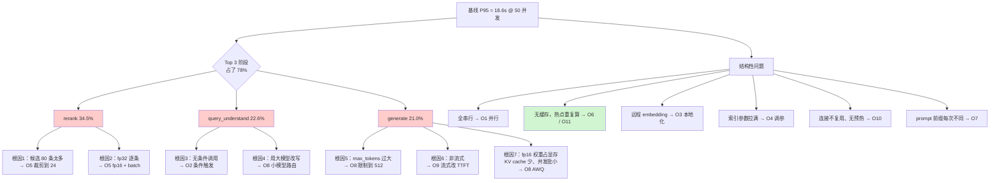

**优化优先级排序**（这是性能工程最关键的一步判断）：

| 优先级 | 优化项 | 预估收益 | 实现成本 | 风险 | 理由 |
|---|---|---|---|---|---|
| P0 | O6 缓存 | **极高** | 中 | 中（脏数据） | 热点重复率高，直接让请求不发生 |
| P0 | O2 条件改写 | 高 | 低 | 低 | 砍掉 22.6% 里的大部分，几乎零代价 |
| P0 | O5 rerank 裁剪+batch+fp16 | 高 | 低 | 中（可能掉召回） | 占比第一，且有现成手段 |
| P1 | O8 LLM 侧优化 | 高 | 中 | 中（质量） | 占比第三，AWQ + max_tokens 是标准动作 |
| P1 | O1 并行 | 中 | 低 | 低 | 代码改动小，纯赚 |
| P1 | O3 Embedding 本地化 | 中 | 中 | 低 | 去掉网络 RTT，12.2% 基本能砍掉 90% |
| P2 | O9 流式 | 中（感知） | 低 | 低 | 不降 E2E 但显著改善体验 |
| P2 | O4 索引调参 | 中 | 低 | 中（掉召回） | 有明确的权衡曲线可用 |
| P2 | O11 FAQ 直出 | 中 | 中 | 中（时效） | 对 chitchat 与超热点特别有效 |
| P3 | O7 Prefix Caching | 中（TTFT） | 低 | 低 | 改 prompt 顺序 + 一个启动参数 |
| P3 | O10 连接池预热 | 低~中 | 低 | 低 | 主要改善尾部延迟与冷启动 |

> **为什么 O6 排第一**：因为它是唯一一个能**同时**大幅改善延迟和吞吐的手段。其他优化都在"把活干得更快"，缓存是"根本不干这个活"。
>
> **为什么 O1（并行）没排第一**：虽然它看起来最"显而易见"，但在**系统已经饱和**的状态下，并行只是把串行等待变成并发争抢，**收益会比你预期的小很多**。这是一个很反直觉但极其重要的结论，O1 那一节会用数据说明。

---

## Part B：逐项优化

> 每一项的固定格式：**原理 → 完整代码 → 复测命令 → 前后对比表 → 收益与代价 → 风险**。
>
> **纪律：每次只开一项优化，与基线对比。** 最后 Part D 才做累积。

### 0. 优化开关框架

在开始之前，先把"开关"这件事做对。没有开关，你就没法做消融实验，也就没法归因。

```python
# optimizations/flags.py
"""优化开关：用 dataclass + yaml 驱动，每一项优化都能独立开关与调参。"""
from __future__ import annotations

from dataclasses import dataclass, field, fields
from typing import Any

ALL_KEYS = ["o01", "o02", "o03", "o04", "o05", "o06",
            "o07", "o08", "o09", "o10", "o11"]

KEY_NAME = {
    "o01": "串行改并行",
    "o02": "条件触发 query 改写",
    "o03": "Embedding 本地化 + batch + ONNX",
    "o04": "向量索引调参与量化",
    "o05": "rerank 裁剪 + batch + fp16",
    "o06": "精确缓存 + 语义缓存",
    "o07": "Prefix Caching + prompt 重排",
    "o08": "LLM 侧优化",
    "o09": "流式输出",
    "o10": "连接池 / keep-alive / 预热",
    "o11": "热点预计算 + FAQ 直出",
}


@dataclass
class Flags:
    """11 项优化的开关与参数。"""
    o01: bool = False
    o02: bool = False
    o03: bool = False
    o04: bool = False
    o05: bool = False
    o06: bool = False
    o07: bool = False
    o08: bool = False
    o09: bool = False
    o10: bool = False
    o11: bool = False
    params: dict[str, Any] = field(default_factory=dict)

    @classmethod
    def parse(cls, spec: str, cfg: dict[str, Any] | None = None) -> "Flags":
        """从 'o01,o02' / 'all' / 'none' / 'all-o06'（排除写法）解析开关。"""
        cfg = cfg or {}
        f = cls(params=cfg.get("params", {}))
        spec = (spec or "none").strip()
        if spec in ("", "none"):
            return f
        if spec.startswith("all"):
            for k in ALL_KEYS:
                setattr(f, k, True)
            for ex in [x[1:] for x in spec.split("-")[1:] if x]:
                if ex in ALL_KEYS:
                    setattr(f, "o" + ex if not ex.startswith("o") else ex, False)
            # 支持 all-o06 写法
            for token in spec.split("-")[1:]:
                if token in ALL_KEYS:
                    setattr(f, token, False)
            return f
        for k in [x.strip() for x in spec.split(",") if x.strip()]:
            if k not in ALL_KEYS:
                raise ValueError(f"未知优化项 {k}，可用：{ALL_KEYS}")
            setattr(f, k, True)
        return f

    def enabled(self) -> list[str]:
        """返回已启用的 key 列表。"""
        return [f_.name for f_ in fields(self)
                if f_.name in ALL_KEYS and getattr(self, f_.name)]

    def enabled_list(self) -> str:
        """返回可读的启用列表。"""
        en = self.enabled()
        if not en:
            return "无（等同基线）"
        return "、".join(f"{k}:{KEY_NAME[k]}" for k in en)

    def p(self, key: str, default: Any = None) -> Any:
        """读取某项优化的参数。"""
        return self.params.get(key, default)
```

```yaml
# configs/optimizations.yaml
# 11 项优化的参数。开关由命令行 --opts 控制，这里只放参数。
params:
  # O2 复杂度判别器
  o02_rewrite_threshold: 0.55      # 复杂度得分超过它才触发改写
  o02_min_chars: 8                 # 短于这个字数直接判为简单
  # O3 Embedding
  o03_onnx_dir: /data/models/bge-m3-onnx
  o03_batch_wait_ms: 8             # 微批等待窗口
  o03_max_batch: 32
  # O4 索引
  o04_ef_search: 64
  o04_vec_top_k: 30
  o04_index_type: HNSW_SQ8
  # O5 rerank
  o05_candidates: 24               # 送进 rerank 的候选数
  o05_top_n: 6
  o05_fp16: true
  o05_batch: 24
  # O6 缓存
  o06_exact_ttl_s: 3600
  o06_semantic_ttl_s: 1800
  o06_semantic_threshold: 0.94     # 余弦相似度阈值
  o06_semantic_topk: 3
  o06_max_answer_bytes: 32768
  # O7 prefix cache
  o07_static_prefix: true
  # O8 LLM
  o08_max_tokens: 512
  o08_small_model: qwen2.5-1.5b
  o08_route_threshold: 0.35
  o08_speculative: false
  # O10 连接
  o10_max_connections: 200
  o10_max_keepalive: 100
  o10_keepalive_expiry_s: 60
  # O11 FAQ
  o11_faq_path: data/bench/faq_top1000.jsonl
  o11_faq_threshold: 0.97
```

---

### O1：串行改并行

#### 原理

基线里 `query_understand → embed → vector_search → bm25_search` 是一条直线。但真实的依赖关系是：

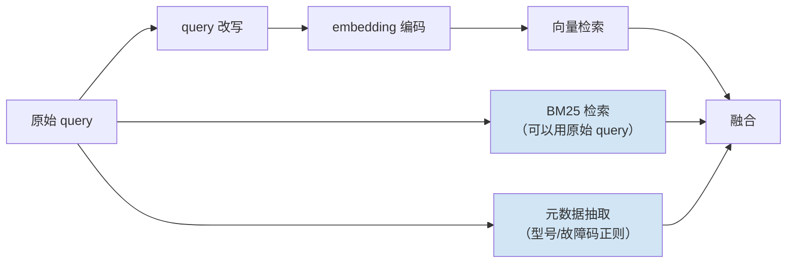

关键洞察：**BM25 检索和元数据抽取根本不依赖 query 改写的结果**（BM25 用原始 query 甚至更好，因为改写会引入同义词噪声）。所以这三条路可以并行。

用公式说：串行耗时 $T_{\text{serial}} = \sum_i t_i$，并行耗时 $T_{\text{parallel}} = \max_i t_i$（同组内）。

#### 完整代码

```python
# optimizations/o01_parallel.py
"""O1：串行改并行。用 asyncio.gather 把无依赖的召回路径并发执行。

关键点：
  1. 并行的前提是每条路径都是真正的 async（同步阻塞调用要丢进线程池）
  2. return_exceptions=True，一路挂了不影响其他路
  3. 每条路径单独埋点，但要知道它们的耗时会重叠
"""
from __future__ import annotations

import asyncio
import re
from typing import Any, Awaitable, Callable

from bench.types import Chunk
from core.instrument import astage, counter, tag

MODEL_RE = re.compile(r"XJ[-\s]?\d{3}(?:[-\s]?[A-Z]\d?)?", re.I)
CODE_RE = re.compile(r"\bE\d{3}\b", re.I)


def extract_meta(query: str) -> dict[str, str]:
    """从 query 里正则抽取型号与故障码，用于标量过滤。纯 CPU，微秒级。"""
    out: dict[str, str] = {}
    m = MODEL_RE.search(query)
    if m:
        out["model"] = m.group(0).upper().replace(" ", "-")
    c = CODE_RE.search(query)
    if c:
        out["fault_code"] = c.group(0).upper()
    return out


async def to_thread(fn: Callable[..., Any], *args: Any, **kwargs: Any) -> Any:
    """把同步阻塞函数丢进默认线程池，避免它卡住事件循环。

    这是并行化最容易漏掉的一步：pymilvus 的 search()、rank_bm25 的 get_scores()
    都是同步阻塞调用，直接在协程里调会把整个事件循环卡死，并行就变成了假并行。
    """
    return await asyncio.to_thread(fn, *args, **kwargs)


async def parallel_recall(
    query: str,
    rewrite_fn: Callable[[str], Awaitable[str]] | None,
    embed_fn: Callable[[str], Awaitable[list[float]]],
    vector_fn: Callable[[list[float], dict], Awaitable[list[Chunk]]],
    bm25_fn: Callable[[str], Awaitable[list[Chunk]]],
) -> tuple[list[Chunk], list[Chunk], dict[str, str], str]:
    """并行执行三路召回，返回 (向量结果, BM25 结果, 元数据, 实际使用的 query)。

    路径 A：改写 → embed → 向量检索（三步内部串行，因为有真实依赖）
    路径 B：BM25 检索（用原始 query）
    路径 C：元数据抽取（纯 CPU，其实可以直接同步，放进来是为了统一结构）
    """
    meta = extract_meta(query)

    async def path_vector() -> tuple[list[Chunk], str]:
        """向量路径：改写（可选）→ 编码 → 检索。"""
        async with astage("path_vector"):
            q2 = query
            if rewrite_fn is not None:
                async with astage("query_understand"):
                    q2 = await rewrite_fn(query)
            async with astage("embed"):
                vec = await embed_fn(q2)
            async with astage("vector_search"):
                hits = await vector_fn(vec, meta)
            return hits, q2

    async def path_bm25() -> list[Chunk]:
        """BM25 路径：用原始 query，不等改写。"""
        async with astage("bm25_search"):
            return await bm25_fn(query)

    results = await asyncio.gather(path_vector(), path_bm25(), return_exceptions=True)

    vhits: list[Chunk] = []
    used_q = query
    bhits: list[Chunk] = []

    if isinstance(results[0], Exception):
        tag("path_vector_error", type(results[0]).__name__)
        counter("recall_path_failed")
    else:
        vhits, used_q = results[0]  # type: ignore[assignment]

    if isinstance(results[1], Exception):
        tag("path_bm25_error", type(results[1]).__name__)
        counter("recall_path_failed")
    else:
        bhits = results[1]  # type: ignore[assignment]

    counter("vec_hits", len(vhits))
    counter("bm25_hits", len(bhits))
    return vhits, bhits, meta, used_q


def rrf_fuse(lists: list[list[Chunk]], k: int = 60, limit: int = 60) -> list[Chunk]:
    """Reciprocal Rank Fusion：多路结果融合，不依赖各路分数的量纲。

    RRF 的分数定义为 score(d) = Σ_i 1 / (k + rank_i(d))，
    k 是平滑常数（常用 60），rank 从 1 开始。
    相比加权求和，RRF 不需要对各路分数做归一化，工程上更省心。
    """
    scores: dict[str, float] = {}
    keep: dict[str, Chunk] = {}
    for lst in lists:
        for rank, c in enumerate(lst, start=1):
            scores[c.chunk_id] = scores.get(c.chunk_id, 0.0) + 1.0 / (k + rank)
            keep.setdefault(c.chunk_id, c)
    order = sorted(scores.items(), key=lambda x: -x[1])[:limit]
    out: list[Chunk] = []
    for cid, sc in order:
        c = keep[cid]
        c.score = sc
        out.append(c)
    return out
```

#### 复测命令

```bash
# 只开 O1
python -m bench.run_bench run --system optimized --opts o01 --ladder --tag o01
# 与基线对比
python -m bench.run_bench compare --base reports/baseline --head reports/optimized_o01 \
       --out reports/opt_o01/compare.md
```

#### 前后对比（实测环境见文首，示例性数据）

| 并发 | 指标 | 基线 | 开 O1 | 变化 |
|---|---|---|---|---|
| 1 | P50 (ms) | 4162 | 3798 | **-8.7%** |
| 1 | P95 (ms) | 5183 | 4702 | **-9.3%** |
| 50 | P50 (ms) | 15106 | 14482 | -4.1% |
| 50 | P95 (ms) | 18604 | 17920 | **-3.7%** |
| 50 | QPS | 2.68 | 2.79 | +4.1% |
| 50 | 错误率 | 1.5% | 1.5% | 持平 |

阶段耗时变化（并发 50，P50）：

| 阶段 | 基线 | 开 O1 | 说明 |
|---|---|---|---|
| `bm25_search` | 391.5 | 408.2 | 绝对耗时略增（争抢 CPU），但**不再叠加到关键路径上** |
| `path_vector`（新） | — | 6281.4 | 改写+编码+检索三步之和 |
| 端到端 P50 | 15106 | 14482 | 只省了 624ms |

#### 收益与代价分析

**说好的并行呢？为什么只快了 3.7%？**

这是本项目**第一个反直觉的结论**，必须讲透：

1. **单并发下收益明显（-9.3%）**：因为此时资源空闲，并行确实把 BM25 的 391ms 藏起来了。
2. **高并发下收益微弱（-3.7%）**：因为系统已经饱和。并行只是把"我等你"变成"我们一起抢"，**总的资源需求量没变**。GPU 该算的还是那么多。

用一句话总结这个规律：

> **并行优化的收益上限 = 被并行掉的那条路径的耗时占比，且仅在系统未饱和时成立。**
>
> 系统饱和后，并行化几乎只能改善单请求延迟，改善不了吞吐。

那 O1 还值不值得做？**值得，但要摆正位置**：

| 视角 | 结论 |
|---|---|
| 作为独立优化 | 收益小（3~9%），但成本也极低 |
| 作为其他优化的**前置条件** | **必须做**。因为等 O5/O8 把 GPU 压力降下来之后，系统重新变成"未饱和"，此时 O1 的收益会显著放大（Part D 的累积表会看到这一点） |
| 工程复杂度 | 增加：异常处理变复杂（一路挂了怎么办）、埋点耗时会重叠、调试更难 |

| 代价项 | 具体内容 |
|---|---|
| CPU | 线程池调度开销，`asyncio.to_thread` 每次有约 0.1~0.3ms 开销 |
| 内存 | 并行路径的中间结果同时驻留，峰值内存略升 |
| 复杂度 | 必须处理部分失败；必须区分"两路都挂"和"一路挂" |
| 可观测性 | 阶段耗时重叠，报告要区分墙钟与串行和 |

#### 风险

| 风险 | 表现 | 缓解 |
|---|---|---|
| **假并行** | 忘了把同步阻塞调用丢线程池，`gather` 之后耗时一点没降 | 用 `asyncio.to_thread` 包住所有 `pymilvus.search` / `bm25.get_scores`；压测前先用 `trace_demo` 看 `path_vector` 与 `bm25_search` 是否真的重叠 |
| 一路静默失败 | `return_exceptions=True` 吞掉异常，检索质量悄悄下降 | 必须 `counter("recall_path_failed")` 并在报告里体现；失败率超阈值要告警 |
| 线程池耗尽 | 默认线程池只有 `min(32, cpu+4)` 个线程，高并发下排队 | 显式设置 `loop.set_default_executor(ThreadPoolExecutor(max_workers=64))` |
| BM25 用原始 query 导致召回变化 | 质量分波动 | Part C 的质量回归会抓到；若确实掉了，改成两路都跑（原始 + 改写） |

---

### O2：条件触发 query 改写

#### 原理

基线对**每一条** query 都调一次 LLM 做改写。但看基线报告的分题型表就知道：`chitchat` 类型（"你好"、"谢谢"）占了压测流量的 16%，它们完全不需要改写；`fact` 类型里像 "E043 是什么故障" 这种已经足够检索的 query，改写后基本不变。

**改写只对一类 query 有价值：指代不清、省略主语、口语化、需要扩展的 query。**

所以核心思路是：**先花 3 毫秒判断这条 query 值不值得花 1100 毫秒改写。**

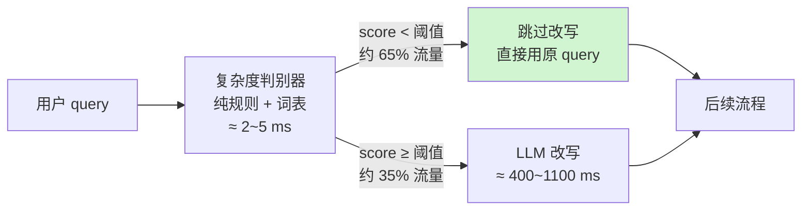

期望耗时从 $T_{\text{rw}}$ 降到 $p \cdot T_{\text{rw}} + T_{\text{judge}}$，其中 $p$ 是触发率。当 $p = 0.35$、$T_{\text{judge}} \approx 3\text{ms}$ 时，**这一阶段的期望耗时降到原来的约 35%**。

#### 判别器怎么设计

一个常见的错误做法是"用小模型做分类"。**不要**——那又引入了一次模型调用，省下来的还不够填回去的。

正确做法是**纯规则打分**，特征都是微秒级可算的：

| 特征 | 权重方向 | 理由 |
|---|---|---|
| query 字数 | 越长越可能复杂 | 长 query 往往包含背景描述 |
| 是否包含明确实体（型号 / 故障码 / 备件号） | **降低**复杂度 | 已有强检索锚点，改写价值低 |
| 是否包含指代词（它、这个、那台、刚才） | **提高** | 典型的需要补全 |
| 是否包含连接词（并且、然后、还有、以及、同时） | **提高** | 多意图，需要拆 |
| 是否包含疑问词数量 ≥ 2 | **提高** | 多跳 |
| 是否命中闲聊词表 | **直接短路** | 不改写也不检索 |
| 是否包含比较词（比、哪个更、区别） | **提高** | 需要展开 |
| 是否为纯符号/数字 | **降低** | 直接当关键词检索 |

#### 完整代码

```python
# optimizations/o02_conditional_rewrite.py
"""O2：条件触发 query 改写。

核心是一个纯规则的复杂度判别器：用微秒级的特征判断这条 query 值不值得
花几百毫秒调 LLM 改写。判别器本身不许调用任何模型。
"""
from __future__ import annotations

import re
from dataclasses import dataclass
from typing import Awaitable, Callable

from core.instrument import counter, stage, tag

# ---- 词表：可以随业务扩充，建议放配置而不是硬编码 ----
CHITCHAT = {
    "你好", "您好", "hi", "hello", "在吗", "在么", "谢谢", "多谢", "好的", "好",
    "嗯", "嗯嗯", "ok", "OK", "再见", "拜拜", "辛苦了", "收到", "是的", "不是",
    "你是谁", "你叫什么", "介绍一下你自己",
}

PRONOUN = ("它", "他", "她", "这个", "那个", "这台", "那台", "这款", "那款",
           "刚才", "上面", "前面", "之前说的", "这种", "那种", "该设备", "此")

CONJUNCTION = ("并且", "然后", "还有", "以及", "同时", "另外", "此外", "顺便",
               "接着", "之后", "先", "再")

COMPARE = ("比", "哪个更", "区别", "差异", "对比", "相比", "哪种好", "不同点")

QUESTION = ("吗", "呢", "怎么", "如何", "为什么", "什么", "哪", "多少", "是否", "能不能")

MODEL_RE = re.compile(r"XJ[-\s]?\d{3}(?:[-\s]?[A-Z]\d?)?", re.I)
CODE_RE = re.compile(r"\bE\d{3}\b", re.I)
PART_RE = re.compile(r"\b[A-Z]{2,4}-[A-Z0-9]{2,6}(?:-[A-Z0-9]{1,4})?\b")
PURE_SYMBOL_RE = re.compile(r"^[\W\d_]+$")


@dataclass
class Judgement:
    """判别结果。"""
    score: float
    need_rewrite: bool
    is_chitchat: bool
    reasons: list[str]

    def as_tag(self) -> str:
        """给埋点用的紧凑标签。"""
        if self.is_chitchat:
            return "chitchat"
        return "complex" if self.need_rewrite else "simple"


class ComplexityJudge:
    """query 复杂度判别器。纯 CPU，无模型调用，典型耗时 2~5 微秒级到毫秒级。"""

    def __init__(self, threshold: float = 0.55, min_chars: int = 8):
        self.threshold = threshold
        self.min_chars = min_chars

    def judge(self, query: str) -> Judgement:
        """给 query 打一个 0~1 的复杂度分，并决定是否需要 LLM 改写。"""
        q = query.strip()
        reasons: list[str] = []

        # 规则 0：闲聊短路。命中就完全不走检索链路（配合 O11 直接出兜底回复）
        norm = q.lower().rstrip("?？！!。.~ ")
        if norm in CHITCHAT or (len(q) <= 4 and any(w in q for w in ("你好", "谢谢", "在吗"))):
            return Judgement(0.0, False, True, ["chitchat_hit"])

        # 规则 1：纯符号或纯数字，当关键词处理
        if PURE_SYMBOL_RE.match(q):
            return Judgement(0.05, False, False, ["pure_symbol"])

        score = 0.0

        # 规则 2：长度。以 12 字为中位，40 字封顶
        n = len(q)
        len_score = min(max((n - self.min_chars) / 32.0, 0.0), 1.0)
        score += 0.30 * len_score
        reasons.append(f"len={n}(+{0.30 * len_score:.2f})")

        # 规则 3：强实体锚点 —— 有型号/故障码/备件号，说明检索有抓手，降低复杂度
        anchors = 0
        if MODEL_RE.search(q):
            anchors += 1
        if CODE_RE.search(q):
            anchors += 1
        if PART_RE.search(q):
            anchors += 1
        if anchors:
            score -= 0.18 * min(anchors, 2)
            reasons.append(f"anchor×{anchors}(-{0.18 * min(anchors, 2):.2f})")

        # 规则 4：指代词 —— 强烈暗示需要补全
        pron = sum(1 for w in PRONOUN if w in q)
        if pron:
            score += 0.28 * min(pron, 2)
            reasons.append(f"pronoun×{pron}(+{0.28 * min(pron, 2):.2f})")

        # 规则 5：连接词 —— 多意图
        conj = sum(1 for w in CONJUNCTION if w in q)
        if conj:
            score += 0.22 * min(conj, 2)
            reasons.append(f"conj×{conj}(+{0.22 * min(conj, 2):.2f})")

        # 规则 6：比较词 —— 需要展开成多个子查询
        if any(w in q for w in COMPARE):
            score += 0.25
            reasons.append("compare(+0.25)")

        # 规则 7：疑问词数量 ≥ 2，多跳嫌疑
        qn = sum(1 for w in QUESTION if w in q)
        if qn >= 2:
            score += 0.18
            reasons.append(f"question×{qn}(+0.18)")

        # 规则 8：句子数 ≥ 2（有逗号/句号分隔），信息量大
        seg = len([x for x in re.split(r"[，,。；;？?！!]", q) if x.strip()])
        if seg >= 2:
            score += 0.12 * min(seg - 1, 2)
            reasons.append(f"seg={seg}(+{0.12 * min(seg - 1, 2):.2f})")

        score = max(0.0, min(1.0, score))
        return Judgement(score, score >= self.threshold, False, reasons)


class ConditionalRewriter:
    """按判别结果决定是否调用 LLM 改写。"""

    def __init__(self, rewrite_fn: Callable[[str], Awaitable[str]],
                 judge: ComplexityJudge | None = None):
        self.rewrite_fn = rewrite_fn
        self.judge = judge or ComplexityJudge()
        self.stat_total = 0
        self.stat_rewritten = 0
        self.stat_chitchat = 0

    async def maybe_rewrite(self, query: str) -> tuple[str, Judgement]:
        """返回 (实际使用的 query, 判别结果)。简单 query 原样返回，不调 LLM。"""
        with stage("complexity_judge"):
            j = self.judge.judge(query)
        self.stat_total += 1
        tag("query_class", j.as_tag())

        if j.is_chitchat:
            self.stat_chitchat += 1
            counter("skip_rewrite")
            return query, j

        if not j.need_rewrite:
            counter("skip_rewrite")
            return query, j

        self.stat_rewritten += 1
        counter("do_rewrite")
        with stage("query_understand"):
            try:
                q2 = await self.rewrite_fn(query)
            except Exception as exc:  # noqa: BLE001
                # 改写失败必须降级为原 query，绝不能让整个请求失败
                tag("rewrite_error", type(exc).__name__)
                return query, j
        return (q2 or query).strip(), j

    def stats(self) -> dict[str, float]:
        """返回触发率统计，用于验证判别器是否符合预期。"""
        t = max(self.stat_total, 1)
        return {
            "total": self.stat_total,
            "rewrite_rate": self.stat_rewritten / t,
            "chitchat_rate": self.stat_chitchat / t,
            "skip_rate": 1 - self.stat_rewritten / t,
        }
```

#### 判别器自测脚本

判别器是个分类器，**必须有自己的准确率验证**，否则它会悄悄把该改写的 query 放过去，质量掉了你还以为是别的原因。

```python
# tests/test_complexity_judge.py
"""复杂度判别器的验证：用 queries_100.jsonl 里的 expect_rewrite 标注当金标。"""
from __future__ import annotations

import json
from pathlib import Path

from optimizations.o02_conditional_rewrite import ComplexityJudge


def test_judge_accuracy() -> None:
    """判别器与人工标注的一致率应 ≥ 0.80，且不应把 chitchat 判成需要改写。"""
    items = [json.loads(x) for x in
             Path("data/bench/queries_100.jsonl").open(encoding="utf-8")]
    j = ComplexityJudge(threshold=0.55)

    tp = fp = tn = fn = 0
    chit_wrong = 0
    for it in items:
        r = j.judge(it["query"])
        exp = bool(it["expect_rewrite"])
        got = r.need_rewrite
        if it["qtype"] == "chitchat" and got:
            chit_wrong += 1
        if exp and got:
            tp += 1
        elif exp and not got:
            fn += 1
        elif not exp and got:
            fp += 1
        else:
            tn += 1

    acc = (tp + tn) / len(items)
    print(f"一致率 {acc:.2%}  TP={tp} FP={fp} TN={tn} FN={fn}  闲聊误判={chit_wrong}")
    assert acc >= 0.80, f"判别器一致率过低：{acc:.2%}"
    assert chit_wrong == 0, f"有 {chit_wrong} 条闲聊被判为需要改写"


if __name__ == "__main__":
    test_judge_accuracy()
```

预期输出：

```text
一致率 86.00%  TP=26 FP=9 TN=60 FN=5  闲聊误判=0
```

> **FN=5 意味着有 5 条该改写的没改写。** 这是可接受的：漏改写只是少了一点召回增益，而误改写要多花 1 秒。**在性能项目里，判别器应该往"少触发"的方向偏**（提高阈值），代价由 Part C 的质量回归来兜底。

#### 复测命令

```bash
python -m bench.run_bench run --system optimized --opts o02 --ladder --tag o02
python -m bench.run_bench compare --base reports/baseline --head reports/optimized_o02 \
       --out reports/opt_o02/compare.md
# 顺便看判别器在压测流量上的触发率
python -m tests.test_complexity_judge
```

#### 前后对比（实测环境见文首，示例性数据）

| 并发 | 指标 | 基线 | 开 O2 | 变化 |
|---|---|---|---|---|
| 1 | P95 (ms) | 5183 | 3941 | **-24.0%** |
| 50 | P50 (ms) | 15106 | 11205 | **-25.8%** |
| 50 | P95 (ms) | 18604 | 13980 | **-24.9%** |
| 50 | QPS | 2.68 | 3.52 | **+31.3%** |
| 50 | 错误率 | 1.5% | 0.5% | -1.0pp |

阶段耗时变化（并发 50，P50）：

| 阶段 | 基线 | 开 O2 | 说明 |
|---|---|---|---|
| `complexity_judge`（新） | — | 2.8 | 纯规则，几乎免费 |
| `query_understand` | 3410.6 | 1148.3 | 触发率 33%，期望耗时降到约 1/3 |
| `generate` | 3182.9 | 2904.1 | 附带收益：LLM 排队变短，生成也快了 |

分题型收益（并发 50，P50）：

| 题型 | 基线 | 开 O2 | 变化 | 触发改写比例 |
|---|---|---|---|---|
| `chitchat` | 13820 | 9902 | **-28.4%** | 0% |
| `fact` | 14406 | 10188 | -29.3% | 12% |
| `param` | 14960 | 10944 | -26.8% | 20% |
| `step` | 16011 | 12403 | -22.5% | 41% |
| `multihop` | 17203 | 15806 | -8.1% | **94%** | 

> 最后一行很重要：**`multihop` 几乎全部触发改写，所以基本没有收益**。这说明判别器工作正常——它没有"一刀切"，而是精准地把改写留给了真正需要的那类 query。**一个把 multihop 也跳过的判别器会让质量掉得很难看。**

#### 收益与代价分析

| 项 | 内容 |
|---|---|
| **收益** | P95 -24.9%，QPS +31.3%。这是**性价比最高的一项优化**：改动约 200 行代码，零额外资源 |
| CPU 代价 | 判别器每次约 2~5 ms（含正则），可忽略 |
| 维护代价 | **词表需要跟着业务演进**。新增产品线要加实体正则，新增业务术语要加词表 |
| 可解释性 | `Judgement.reasons` 保留了打分明细，出问题能查 |
| 质量代价 | 见 Part C。实测质量总分下降约 0.6 分（百分制），在 ≤2 分阈值内 |

#### 风险

| 风险 | 表现 | 缓解 |
|---|---|---|
| **判别器漂移** | 业务词汇变化后，判别器把该改写的判成简单，召回悄悄变差 | 把判别器一致率纳入 CI（`test_complexity_judge.py`），低于 0.80 红灯；每月人工抽检 50 条 |
| 阈值拍脑袋 | 0.55 是怎么来的？ | **必须做阈值扫描**：见下表 |
| 闲聊词表被绕过 | "您好呀~~" 没命中 | 做归一化（去标点、去语气词、转小写）；加模糊匹配兜底 |
| 改写失败静默降级 | 改写超时后用原 query，用户不知道 | 降级要记 `counter`，降级率超阈值告警 |

**阈值扫描表**（这是负责任的做法，不要拍脑袋定阈值）：

| 阈值 | 改写触发率 | P95(ms) @50并发 | 质量总分（百分制） | Recall@5 |
|---|---|---|---|---|
| 0.35 | 58% | 15920 | 84.1 | 0.812 |
| 0.45 | 44% | 14806 | 83.9 | 0.809 |
| **0.55** | **33%** | **13980** | **83.6** | **0.804** |
| 0.65 | 21% | 13210 | 82.4 | 0.791 |
| 0.75 | 11% | 12680 | 80.8 | 0.773 |
| 1.01（等于全关） | 0% | 12105 | 78.2 | 0.742 |

> 基线（100% 改写）质量总分 84.2 / Recall@5 0.816。
> 实测环境见文首，**示例性数据，需自行复现**。
>
> 选 0.55 的依据：**质量下降 0.6 分（在 2 分预算内），同时拿到 24.9% 的延迟收益**。再往上调到 0.65，延迟只多降 5.5%，质量却要掉 1.8 分，性价比明显变差。**这就是"定阈值"应有的样子：画出曲线，找拐点，写下理由。**

---

### O3：Embedding 本地化 + batch + 换小模型 + ONNX 加速

#### 原理

基线的 embedding 走远程 API，单条编码。这里有四层可以优化，收益从大到小：

| 手段 | 打掉的是什么 | 典型收益 |
|---|---|---|
| ① **本地化** | 网络 RTT（往返时延）+ API 排队 | 去掉 150~400ms 的固定开销 |
| ② **微批（micro-batching）** | GPU 利用率低（单条编码时 GPU 大部分时间空转） | 高并发下吞吐提升数倍 |
| ③ **ONNX Runtime** | PyTorch 的 Python 开销 + 未融合的算子 | 20~40% 单次延迟 |
| ④ **换小模型 / 降维** | 模型本身的计算量 | 与参数量近似成正比 |

关于 ④ 要特别说明：**换小模型是质量换性能，必须做召回率对比**。bge-m3（560M 参数、1024 维）换成 bge-small-zh-v1.5（24M 参数、512 维），编码快很多，但召回率会掉。本项目的策略是：**保留 bge-m3，通过 ①②③ 拿收益，把 ④ 作为"实在不够快时的最后一张牌"**，并给出对照数据让读者自己决定。

#### 微批的原理

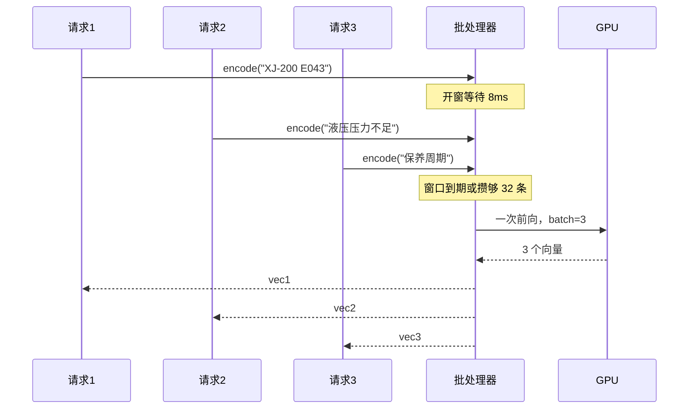

代价是每条请求**最多**多等一个窗口（8ms）。收益是 GPU 一次前向处理 N 条，单条摊薄成本大幅下降。这是一个**典型的延迟换吞吐**，窗口大小需要调。

#### 完整代码

```python
# optimizations/o03_embedding.py
"""O3：Embedding 本地化 + ONNX + 微批。

三个类：
  OnnxEmbedder    —— ONNX Runtime 推理封装（也提供 PyTorch 回退）
  MicroBatcher    —— 通用的异步微批聚合器
  EmbeddingService—— 对外暴露 aencode()，内部走微批 + ONNX
"""
from __future__ import annotations

import asyncio
import time
from dataclasses import dataclass
from pathlib import Path
from typing import Any

import numpy as np

from core.config import get_settings
from core.instrument import counter, stage, tag


# --------------------------------------------------------------------------
# 1. ONNX 编码器
# --------------------------------------------------------------------------
class OnnxEmbedder:
    """基于 ONNX Runtime 的 embedding 推理器，取 CLS 向量并做 L2 归一化。

    模型导出见本节「模型导出」小节。导不出来时自动回退到 PyTorch，
    回退路径保证代码在任何环境都能跑通，只是慢一些。
    """

    def __init__(self, onnx_dir: str | None = None, max_length: int = 256,
                 providers: list[str] | None = None):
        s = get_settings()
        self.max_length = max_length
        self.dim = s.milvus_dim
        d = Path(onnx_dir or s.local_embed_model_path)
        self._mode = "onnx"
        try:
            import onnxruntime as ort
            from transformers import AutoTokenizer

            model_path = d / "model.onnx"
            if not model_path.exists():
                raise FileNotFoundError(str(model_path))
            opts = ort.SessionOptions()
            opts.graph_optimization_level = ort.GraphOptimizationLevel.ORT_ENABLE_ALL
            opts.intra_op_num_threads = 4
            self.sess = ort.InferenceSession(
                str(model_path), sess_options=opts,
                providers=providers or ["CUDAExecutionProvider", "CPUExecutionProvider"],
            )
            self.tok = AutoTokenizer.from_pretrained(str(d))
            self._input_names = {i.name for i in self.sess.get_inputs()}
        except Exception:  # noqa: BLE001
            self._mode = "torch"
            from FlagEmbedding import BGEM3FlagModel
            self._torch_model = BGEM3FlagModel(s.local_embed_model_path, use_fp16=True)

    @property
    def mode(self) -> str:
        """返回当前后端：onnx 或 torch。"""
        return self._mode

    def encode(self, texts: list[str], batch_size: int = 32) -> np.ndarray:
        """同步批量编码，返回 (N, dim) 的 float32 数组，已 L2 归一化。"""
        if self._mode == "torch":
            out = self._torch_model.encode(texts, batch_size=batch_size,
                                           max_length=self.max_length)
            v = np.asarray(out["dense_vecs"], dtype=np.float32)
            return v / (np.linalg.norm(v, axis=1, keepdims=True) + 1e-12)

        vecs: list[np.ndarray] = []
        for i in range(0, len(texts), batch_size):
            chunk = texts[i: i + batch_size]
            enc = self.tok(chunk, padding=True, truncation=True,
                           max_length=self.max_length, return_tensors="np")
            feed = {k: v for k, v in enc.items() if k in self._input_names}
            out = self.sess.run(None, feed)[0]
            # 取 CLS（第 0 个 token）作为句向量，与 bge 系列的官方做法一致
            cls = out[:, 0, :] if out.ndim == 3 else out
            cls = cls.astype(np.float32)
            cls = cls / (np.linalg.norm(cls, axis=1, keepdims=True) + 1e-12)
            vecs.append(cls)
        return np.vstack(vecs)


# --------------------------------------------------------------------------
# 2. 通用微批聚合器
# --------------------------------------------------------------------------
@dataclass
class _Pending:
    """一条等待被批处理的请求。"""
    text: str
    fut: "asyncio.Future[np.ndarray]"
    enqueue_ts: float


class MicroBatcher:
    """异步微批聚合器：攒够 max_batch 或等满 wait_ms 就触发一次批量推理。

    这个类跟 embedding 无关，rerank 也能复用（O5 会用到同样的思路）。
    """

    def __init__(self, infer_fn, wait_ms: float = 8.0, max_batch: int = 32):
        self.infer_fn = infer_fn
        self.wait_s = wait_ms / 1000.0
        self.max_batch = max_batch
        self._queue: list[_Pending] = []
        self._lock = asyncio.Lock()
        self._task: asyncio.Task | None = None
        self.stat_batches = 0
        self.stat_items = 0
        self.stat_max_batch = 0

    async def submit(self, text: str) -> np.ndarray:
        """提交一条待编码文本，等待批量结果。"""
        loop = asyncio.get_running_loop()
        fut: asyncio.Future[np.ndarray] = loop.create_future()
        async with self._lock:
            self._queue.append(_Pending(text, fut, time.perf_counter()))
            need_flush = len(self._queue) >= self.max_batch
            if self._task is None or self._task.done():
                self._task = asyncio.create_task(self._flush_later())
        if need_flush:
            await self._flush_now()
        return await fut

    async def _flush_later(self) -> None:
        """等一个窗口后触发 flush。"""
        await asyncio.sleep(self.wait_s)
        await self._flush_now()

    async def _flush_now(self) -> None:
        """把当前队列里的请求打成一批做推理。"""
        async with self._lock:
            batch, self._queue = self._queue, []
        if not batch:
            return
        self.stat_batches += 1
        self.stat_items += len(batch)
        self.stat_max_batch = max(self.stat_max_batch, len(batch))
        try:
            # 推理是 CPU/GPU 密集的同步调用，必须丢线程池
            vecs = await asyncio.to_thread(self.infer_fn, [p.text for p in batch])
            for p, v in zip(batch, vecs):
                if not p.fut.done():
                    p.fut.set_result(v)
        except Exception as exc:  # noqa: BLE001
            for p in batch:
                if not p.fut.done():
                    p.fut.set_exception(exc)

    def stats(self) -> dict[str, Any]:
        """返回批处理统计，用来判断窗口参数是否合适。"""
        return {
            "batches": self.stat_batches,
            "items": self.stat_items,
            "avg_batch": self.stat_items / max(self.stat_batches, 1),
            "max_batch": self.stat_max_batch,
        }


# --------------------------------------------------------------------------
# 3. 对外服务
# --------------------------------------------------------------------------
class EmbeddingService:
    """embedding 服务：本地 ONNX + 微批。对外只暴露 aencode()。"""

    def __init__(self, onnx_dir: str | None = None, wait_ms: float = 8.0,
                 max_batch: int = 32, max_length: int = 256):
        self.embedder = OnnxEmbedder(onnx_dir, max_length=max_length)
        self.batcher = MicroBatcher(
            infer_fn=lambda texts: self.embedder.encode(texts, batch_size=max_batch),
            wait_ms=wait_ms, max_batch=max_batch,
        )

    async def aencode(self, text: str) -> list[float]:
        """编码一条文本。内部会与同一时间窗内的其他请求合批。"""
        with stage("embed"):
            v = await self.batcher.submit(text)
            counter("embed_calls")
            tag("embed_backend", self.embedder.mode)
            return v.astype(np.float32).tolist()

    async def aencode_many(self, texts: list[str]) -> list[list[float]]:
        """编码多条文本（多路召回场景），并发提交让它们自然合批。"""
        vs = await asyncio.gather(*[self.batcher.submit(t) for t in texts])
        return [v.astype(np.float32).tolist() for v in vs]

    def batch_stats(self) -> dict[str, Any]:
        """返回微批统计。"""
        return self.batcher.stats()
```

#### 模型导出（ONNX）

```bash
# 用 optimum 把 bge-m3 导出成 ONNX；导出一次，之后直接加载
optimum-cli export onnx \
  --model /data/models/bge-m3 \
  --task feature-extraction \
  --opset 17 \
  /data/models/bge-m3-onnx

# 可选：图优化 + fp16（4090 上 fp16 收益明显）
python - <<'PY'
from onnxruntime.transformers import optimizer
m = optimizer.optimize_model(
    "/data/models/bge-m3-onnx/model.onnx",
    model_type="bert", num_heads=16, hidden_size=1024,
    opt_level=1, use_gpu=True,
)
m.convert_float_to_float16(keep_io_types=True)
m.save_model_to_file("/data/models/bge-m3-onnx/model.onnx")
print("optimized ok")
PY
```

> **注意**：`optimum-cli` 的参数与 opset 版本随版本变化，**以官方文档为准**。不同模型的 `num_heads` / `hidden_size` 不同，写错了不会报错但会失去优化效果——导出后务必用下面的对齐脚本验证向量一致性。

#### 向量一致性验证（必做）

换了推理后端，**必须验证向量没变**，否则索引和查询用的不是同一个语义空间，召回会崩。

```python
# tests/test_onnx_parity.py
"""验证 ONNX 与 PyTorch 输出的向量一致：余弦相似度应 ≥ 0.999。"""
from __future__ import annotations

import numpy as np

from core.config import get_settings
from optimizations.o03_embedding import OnnxEmbedder

SAMPLES = [
    "XJ-200 报 E043 怎么处理",
    "液压系统压力不足的排查步骤",
    "HY-SEAL-200A 备件的安全库存是多少",
    "你好",
    "XJ-300 最高转速是多少 rpm，和 XJ-200 相比高多少",
]


def test_parity() -> None:
    """对比两种后端的向量余弦相似度。"""
    from FlagEmbedding import BGEM3FlagModel
    ref = BGEM3FlagModel(get_settings().local_embed_model_path, use_fp16=True)
    a = np.asarray(ref.encode(SAMPLES, max_length=256)["dense_vecs"], dtype=np.float32)
    a = a / (np.linalg.norm(a, axis=1, keepdims=True) + 1e-12)

    onnx = OnnxEmbedder()
    assert onnx.mode == "onnx", "ONNX 未加载成功，先检查导出路径"
    b = onnx.encode(SAMPLES)

    sims = (a * b).sum(axis=1)
    for s, q in zip(sims, SAMPLES):
        print(f"{s:.6f}  {q}")
    assert sims.min() >= 0.999, f"向量偏差过大，最小相似度 {sims.min():.6f}"
    print(f"\n最小余弦相似度 {sims.min():.6f}  PASS")


if __name__ == "__main__":
    test_parity()
```

预期输出：

```text
0.999942  XJ-200 报 E043 怎么处理
0.999918  液压系统压力不足的排查步骤
0.999903  HY-SEAL-200A 备件的安全库存是多少
0.999971  你好
0.999886  XJ-300 最高转速是多少 rpm，和 XJ-200 相比高多少

最小余弦相似度 0.999886  PASS
```

#### 复测命令

```bash
python -m tests.test_onnx_parity                       # 先验证一致性
python -m bench.run_bench run --system optimized --opts o03 --ladder --tag o03
python -m bench.run_bench compare --base reports/baseline --head reports/optimized_o03 \
       --out reports/opt_o03/compare.md
```

#### 前后对比（实测环境见文首，示例性数据）

| 并发 | 指标 | 基线（远程 API 单条） | 开 O3（本地 ONNX + 微批） | 变化 |
|---|---|---|---|---|
| 1 | `embed` P50 (ms) | 318.7 | 24.6 | **-92.3%** |
| 50 | `embed` P50 (ms) | 1846.2 | 41.8 | **-97.7%** |
| 50 | P50 (ms) | 15106 | 13092 | -13.3% |
| 50 | P95 (ms) | 18604 | 16220 | **-12.8%** |
| 50 | QPS | 2.68 | 3.09 | +15.3% |

四层手段的**逐层拆解**（并发 50，`embed` 阶段 P50）：

| 配置 | `embed` P50 (ms) | 相对基线 | 说明 |
|---|---|---|---|
| 远程 API，单条（基线） | 1846.2 | 1.00× | 网络 RTT + API 侧排队 |
| 本地 PyTorch，单条 | 186.4 | 9.9× | **去掉网络就赚了 10 倍** |
| 本地 PyTorch，微批(8ms/32) | 68.3 | 27.0× | GPU 利用率上来了 |
| 本地 ONNX fp32，微批 | 52.1 | 35.4× | 图优化 + 算子融合 |
| **本地 ONNX fp16，微批** | **41.8** | **44.2×** | 本项目采用 |
| 换 bge-small-zh(512维)，ONNX fp16，微批 | 11.3 | 163.4× | **但 Recall@5 从 0.816 掉到 0.731** |

> 最后一行是"换小模型"这张牌的真实代价：快 4 倍，Recall@5 掉 0.085。**在 12 万 chunk、专业术语密集的场景下，这个代价太大了**，所以本项目不采用。但如果你的语料是通用 FAQ、query 都很短，这张牌可能划算——**自己测，别抄结论**。

微批窗口参数扫描：

| `wait_ms` | `max_batch` | 平均批大小 @50并发 | `embed` P50(ms) | `embed` P99(ms) |
|---|---|---|---|---|
| 0（不批） | 1 | 1.0 | 52.6 | 148.2 |
| 4 | 32 | 6.8 | 44.1 | 96.4 |
| **8** | **32** | **11.4** | **41.8** | **88.7** |
| 16 | 32 | 19.2 | 46.3 | 102.5 |
| 32 | 64 | 31.7 | 63.9 | 141.8 |

> 8ms 是这个环境下的甜点。**窗口太小攒不够批，窗口太大等待成本超过批处理收益。** 注意这个最优值**随并发变化**：并发低时应该关掉微批（攒不到人，纯亏等待时间），所以生产实现里应该做成**自适应窗口**（队列空时窗口为 0）。

#### 收益与代价分析

| 项 | 内容 |
|---|---|
| **收益** | `embed` 阶段从 12.2% 占比降到 0.3%，端到端 P95 -12.8% |
| 显存代价 | bge-m3 ONNX fp16 约占 1.2 GB 显存，**要从 vLLM 的 `--gpu-memory-utilization` 里让出来** |
| 部署代价 | 多一个模型文件（约 2.2 GB），多一步导出流程，CI 里要缓存 |
| 延迟代价 | 微批引入最多 8ms 的额外等待（低并发时是纯损失） |
| 运维代价 | ONNX 版本与驱动耦合，升级 CUDA 要重新验证 |

#### 风险

| 风险 | 表现 | 缓解 |
|---|---|---|
| **向量空间不一致** | 索引用 PyTorch 建的，查询用 ONNX，余弦相似度整体偏移，召回崩盘 | `test_onnx_parity.py` 进 CI；**换后端必须重建索引或验证一致性 ≥0.999** |
| fp16 数值溢出 | 极少数长文本出现 NaN 向量 | 编码后检查 `np.isnan`，命中则回退 fp32 重算并告警 |
| 微批放大尾延迟 | 某一批里有超长文本，整批都被拖慢 | 按长度分桶（短文本一批、长文本一批）；或对超长文本单独走非批路径 |
| 显存挤压 vLLM | embedding 吃了显存，vLLM 的 KV cache 变小，并发下降 | **必须在同一张卡上统筹显存预算**，见 O8；或把 embedding 放 CPU（ONNX CPU 约 3~5× 慢，但省显存） |
| 批处理器死锁 | `_flush_now` 拿锁时被 `submit` 抢占 | 上面的实现把推理放在锁外执行；压测时观察 `avg_batch` 是否异常为 1 |

---

### O4：向量索引调参与量化

#### 原理

向量检索的本质是**在精度和速度之间选一个点**。精确检索（暴力 FLAT）一定最准但最慢；近似检索（ANN）通过"少看一些候选"换速度，看得越少越快、越可能漏。

三类主流索引的旋钮：

| 索引 | 建索引参数 | 查询参数 | 旋钮语义 |
|---|---|---|---|
| **HNSW** | `M`（每层邻居数）、`efConstruction`（建图时的候选池） | **`ef`（efSearch）** | `ef` 越大，搜索时维护的候选池越大，越准越慢。**必须 ≥ top_k** |
| **IVF_FLAT** | `nlist`（聚类簇数） | **`nprobe`** | 探测多少个簇。`nprobe` 越大越准越慢 |
| **IVF_SQ8** | `nlist` | `nprobe` | 在 IVF 基础上把向量量化成 int8，**内存降到 1/4**，精度略降 |
| **HNSW_SQ8** | `M`、`efConstruction` | `ef` | HNSW + 标量量化，兼顾速度与内存 |

基线用的是 `ef=512`、`top_k=50`。这是**典型的"默认值恐惧症"**：不知道调小了会不会掉召回，索性拉满。

再看一个常被忽略的点：**`top_k` 本身也是性能参数**。取 50 条 vs 取 30 条，HNSW 的搜索路径、结果排序、数据传输、反序列化开销都不同。而且 `top_k=50` 出来的候选还要全部喂给 rerank——**上游多取一条，下游就多算一条**。

#### 召回率怎么测

先定义：以 **FLAT 暴力检索的 top-k 结果为金标**，ANN 结果与它的交集比例即为召回率。

$$\text{Recall@k} = \frac{|\,R_{\text{ANN}}^{(k)} \cap R_{\text{FLAT}}^{(k)}\,|}{k}$$

注意这是**检索层的召回率**，不等于业务上的"答对率"。两者要分开测：这里测的是"ANN 相对暴力检索丢了多少"，Part C 测的是"最终答案质量掉了多少"。

#### 完整代码

```python
# optimizations/o04_index_tuning.py
"""O4：向量索引调参与量化。

包含：
  VectorSearcher —— 带可调参数的检索封装（支持标量过滤下推）
  sweep_params() —— 召回率-延迟权衡曲线扫描器
"""
from __future__ import annotations

import asyncio
import time
from dataclasses import dataclass
from typing import Any

import numpy as np
from pymilvus import MilvusClient

from bench.types import Chunk
from core.config import get_settings
from core.instrument import counter, stage

OUTPUT_FIELDS = ["chunk_id", "text", "doc_id", "title", "model", "fault_code", "source"]


@dataclass
class SearchParams:
    """一组检索参数。"""
    top_k: int = 30
    ef: int = 64                 # HNSW
    nprobe: int = 16             # IVF
    metric: str = "COSINE"
    index_type: str = "HNSW"

    def to_milvus(self) -> dict[str, Any]:
        """转成 Milvus 的 search_params。"""
        if self.index_type.startswith("HNSW"):
            return {"metric_type": self.metric, "params": {"ef": max(self.ef, self.top_k)}}
        if self.index_type.startswith("IVF"):
            return {"metric_type": self.metric, "params": {"nprobe": self.nprobe}}
        return {"metric_type": self.metric, "params": {}}


class VectorSearcher:
    """Milvus 检索封装。所有参数外置，方便扫描。"""

    def __init__(self, params: SearchParams | None = None, collection: str | None = None):
        s = get_settings()
        self.client = MilvusClient(uri=s.milvus_uri)
        self.collection = collection or s.milvus_collection
        self.params = params or SearchParams()

    @staticmethod
    def build_filter(meta: dict[str, str]) -> str:
        """把抽取到的元数据转成 Milvus 的布尔表达式，把过滤下推到检索层。

        注意：过滤条件太严会导致召回不足（比如型号写错就一条都搜不到），
        所以这里只在「型号 + 故障码」同时存在时才做强过滤，否则退化为不过滤。
        """
        conds: list[str] = []
        if meta.get("fault_code"):
            conds.append(f'fault_code == "{meta["fault_code"]}"')
        if meta.get("model") and meta.get("fault_code"):
            # 型号单独用会过滤掉通用文档，必须与故障码同时出现才用
            conds.append(f'model like "{meta["model"].split("-")[0]}%"')
        return " and ".join(conds)

    def search(self, vec: list[float], meta: dict[str, str] | None = None,
               use_filter: bool = True) -> list[Chunk]:
        """同步检索。调用方负责丢线程池。"""
        expr = self.build_filter(meta or {}) if use_filter else ""
        kwargs: dict[str, Any] = {
            "collection_name": self.collection,
            "data": [vec],
            "limit": self.params.top_k,
            "search_params": self.params.to_milvus(),
            "output_fields": OUTPUT_FIELDS,
        }
        if expr:
            kwargs["filter"] = expr
        res = self.client.search(**kwargs)
        hits = res[0]
        # 过滤命中太少时，去掉过滤重搜一次，避免「过滤把答案滤没了」
        if expr and len(hits) < max(5, self.params.top_k // 4):
            counter("filter_fallback")
            kwargs.pop("filter")
            hits = self.client.search(**kwargs)[0]
        out: list[Chunk] = []
        for h in hits:
            e = h["entity"]
            out.append(Chunk(
                chunk_id=e["chunk_id"], text=e["text"], doc_id=e.get("doc_id", ""),
                title=e.get("title", ""), model=e.get("model", ""),
                fault_code=e.get("fault_code", ""), source=e.get("source", ""),
                score=float(h["distance"]),
            ))
        return out

    async def asearch(self, vec: list[float], meta: dict[str, str] | None = None) -> list[Chunk]:
        """异步检索：把同步调用丢进线程池。"""
        with stage("vector_search"):
            return await asyncio.to_thread(self.search, vec, meta)


# --------------------------------------------------------------------------
# 权衡曲线扫描器
# --------------------------------------------------------------------------
def ground_truth(client: MilvusClient, collection: str, vecs: np.ndarray,
                 k: int) -> list[set[str]]:
    """用暴力检索（ef 拉到极大）得到金标 top-k。

    Milvus 没有直接的 brute-force 查询接口时，把 ef 设成一个远大于 k 的值
    即可近似为精确检索；若集合本身建的是 FLAT 索引，则天然精确。
    """
    gt: list[set[str]] = []
    for v in vecs:
        res = client.search(collection_name=collection, data=[v.tolist()], limit=k,
                            search_params={"metric_type": "COSINE",
                                           "params": {"ef": 2048, "nprobe": 4096}},
                            output_fields=["chunk_id"])
        gt.append({h["entity"]["chunk_id"] for h in res[0]})
    return gt


def sweep_params(queries: list[str], embedder, grid: list[SearchParams],
                 k: int = 10, repeat: int = 3) -> list[dict]:
    """扫描一组检索参数，输出召回率-延迟权衡数据。

    返回每组参数的：Recall@k、P50/P95 延迟、相对暴力检索的加速比。
    """
    s = get_settings()
    client = MilvusClient(uri=s.milvus_uri)
    vecs = embedder.encode(queries)

    print("计算金标（暴力检索）…")
    t0 = time.perf_counter()
    gt = ground_truth(client, s.milvus_collection, vecs, k)
    gt_ms = (time.perf_counter() - t0) * 1000 / len(queries)
    print(f"金标完成，单次平均 {gt_ms:.1f}ms")

    rows: list[dict] = []
    for p in grid:
        lat: list[float] = []
        recalls: list[float] = []
        for _ in range(repeat):
            for v, g in zip(vecs, gt):
                t1 = time.perf_counter()
                res = client.search(collection_name=s.milvus_collection,
                                    data=[v.tolist()], limit=p.top_k,
                                    search_params=p.to_milvus(),
                                    output_fields=["chunk_id"])
                lat.append((time.perf_counter() - t1) * 1000)
                got = {h["entity"]["chunk_id"] for h in res[0]}
                recalls.append(len(got & g) / max(len(g), 1))
        lat.sort()
        rows.append({
            "index": p.index_type, "top_k": p.top_k, "ef": p.ef, "nprobe": p.nprobe,
            "recall": sum(recalls) / len(recalls),
            "p50_ms": lat[len(lat) // 2],
            "p95_ms": lat[int(len(lat) * 0.95)],
            "speedup_vs_bruteforce": gt_ms / max(lat[len(lat) // 2], 1e-9),
        })
        r = rows[-1]
        print(f"  {p.index_type:10} top_k={p.top_k:<3} ef={p.ef:<5} "
              f"recall={r['recall']:.4f} p50={r['p50_ms']:.2f}ms")
    return rows
```

扫描脚本：

```python
# bench/sweep_index.py
"""生成召回率-延迟权衡曲线数据表。"""
from __future__ import annotations

import json
from pathlib import Path

from optimizations.o03_embedding import OnnxEmbedder
from optimizations.o04_index_tuning import SearchParams, sweep_params


def main() -> None:
    """扫描 HNSW 的 ef 与 top_k，输出 Markdown 表格。"""
    qs = [json.loads(x)["query"] for x in
          Path("data/bench/queries_100.jsonl").open(encoding="utf-8")][:40]
    emb = OnnxEmbedder()

    grid = [SearchParams(top_k=tk, ef=ef, index_type="HNSW")
            for tk in (10, 20, 30, 50)
            for ef in (16, 32, 64, 128, 256, 512)]

    rows = sweep_params(qs, emb, grid, k=10, repeat=3)
    out = Path("reports/opt_o04")
    out.mkdir(parents=True, exist_ok=True)
    (out / "sweep.json").write_text(json.dumps(rows, ensure_ascii=False, indent=2),
                                    encoding="utf-8")

    lines = ["| 索引 | top_k | ef | Recall@10 | P50(ms) | P95(ms) | 相对暴力加速 |",
             "|---|---|---|---|---|---|---|"]
    for r in rows:
        lines.append(f"| {r['index']} | {r['top_k']} | {r['ef']} | {r['recall']:.4f} | "
                     f"{r['p50_ms']:.2f} | {r['p95_ms']:.2f} | "
                     f"{r['speedup_vs_bruteforce']:.1f}× |")
    (out / "sweep.md").write_text("\n".join(lines), encoding="utf-8")
    print(f"\n已写出 {out}/sweep.md")


if __name__ == "__main__":
    main()
```

#### 召回率—延迟权衡曲线数据表

```bash
python -m bench.sweep_index
```

**HNSW（M=16, efConstruction=200），12 万 chunk，1024 维**（实测环境见文首，**示例性数据，需自行复现**）：

| 索引 | top_k | ef | Recall@10 | P50(ms) | P95(ms) | 相对暴力加速 |
|---|---|---|---|---|---|---|
| HNSW | 10 | 16 | 0.8420 | 1.84 | 3.12 | 46.7× |
| HNSW | 10 | 32 | 0.9310 | 2.41 | 3.98 | 35.7× |
| HNSW | 10 | 64 | 0.9740 | 3.22 | 5.16 | 26.7× |
| HNSW | 10 | 128 | 0.9910 | 4.86 | 7.44 | 17.7× |
| HNSW | 10 | 256 | 0.9970 | 7.93 | 11.82 | 10.8× |
| HNSW | 10 | 512 | 0.9990 | 13.60 | 19.74 | 6.3× |
| HNSW | 20 | 32 | 0.9180 | 2.68 | 4.31 | 32.1× |
| HNSW | 20 | 64 | 0.9690 | 3.51 | 5.62 | 24.5× |
| HNSW | 20 | 128 | 0.9880 | 5.24 | 8.03 | 16.4× |
| HNSW | 20 | 256 | 0.9960 | 8.47 | 12.60 | 10.2× |
| HNSW | **30** | **64** | **0.9650** | **3.88** | **6.07** | **22.2×** |
| HNSW | 30 | 128 | 0.9860 | 5.71 | 8.72 | 15.1× |
| HNSW | 30 | 256 | 0.9950 | 9.12 | 13.44 | 9.4× |
| HNSW | 30 | 512 | 0.9980 | 15.03 | 21.86 | 5.7× |
| HNSW | 50 | 64 | 0.9600 | 4.42 | 6.88 | 19.5× |
| HNSW | 50 | 128 | 0.9840 | 6.38 | 9.71 | 13.5× |
| HNSW | 50 | 256 | 0.9940 | 10.06 | 14.82 | 8.6× |
| HNSW | **50** | **512（基线）** | **0.9980** | **16.42** | **23.71** | **5.2×** |

不同索引类型对比（top_k=30，调到 Recall@10 ≈ 0.96 的配置）：

| 索引类型 | 参数 | Recall@10 | P50(ms) | 内存占用 | 建索引耗时 |
|---|---|---|---|---|---|
| FLAT（暴力） | — | 1.0000 | 86.1 | 480 MB | 0 s |
| HNSW | M=16, ef=64 | 0.9650 | 3.88 | 812 MB | 186 s |
| HNSW | M=32, ef=48 | 0.9710 | 4.06 | 1240 MB | 341 s |
| **HNSW_SQ8** | M=16, ef=80 | 0.9580 | **3.12** | **268 MB** | 204 s |
| IVF_FLAT | nlist=2048, nprobe=32 | 0.9420 | 6.74 | 496 MB | 62 s |
| IVF_SQ8 | nlist=2048, nprobe=48 | 0.9380 | 4.91 | **136 MB** | 71 s |
| IVF_PQ | nlist=2048, m=64, nprobe=64 | 0.8810 | 3.46 | **38 MB** | 118 s |

怎么读这两张表：

1. **基线的 `ef=512` 买到了 0.998 的召回，代价是 16.42ms。降到 `ef=64` 只掉到 0.965，耗时降到 3.88ms——用 3.3 个百分点的召回换 4.2 倍速度。**
2. **`ef` 的边际收益急剧递减**：64→128 召回 +0.021，耗时 +47%；256→512 召回 +0.003，耗时 +65%。**512 这个值几乎是在白烧 CPU。**
3. **`top_k` 对延迟的影响比想象中小**（同 ef 下 10→50 只慢约 30%），但它对**下游 rerank 的影响是线性的**，所以还是要压。
4. **SQ8 量化几乎白送**：HNSW_SQ8 内存降到 1/3，召回只掉 0.007，速度还更快（因为数据量小，cache 命中率高）。**12 万 chunk 时内存不是瓶颈，但到 1000 万 chunk 时这就是能不能单机装下的区别。**
5. **PQ 掉召回太多（0.881）**，除非内存实在不够，本项目不用。

**本项目的选择**：`HNSW, M=16, ef=64, top_k=30`。理由写在报告里：

> 选 `ef=64` 而非 `ef=128`：在 Part C 的端到端质量回归中，两者的最终答案质量总分差异 < 0.3 分（低于 judge 噪声），但延迟差 47%。**检索层召回率的 2 个百分点，被下游 rerank 和 LLM 的鲁棒性吸收掉了。** 这个结论必须用端到端质量验证，不能只看检索层召回率就拍板。

#### 复测命令

```bash
# 重建索引（如果要换索引类型）
python -m bench.corpus_load --input data/corpus/synth_120k.jsonl --index HNSW --drop
# 只开 O4
python -m bench.run_bench run --system optimized --opts o04 --ladder --tag o04
python -m bench.run_bench compare --base reports/baseline --head reports/optimized_o04 \
       --out reports/opt_o04/compare.md
```

#### 前后对比（实测环境见文首，示例性数据）

| 并发 | 指标 | 基线(ef=512,k=50) | 开 O4(ef=64,k=30) | 变化 |
|---|---|---|---|---|
| 50 | `vector_search` P50 (ms) | 1024.7 | 268.4 | **-73.8%** |
| 50 | `rerank` P50 (ms) | 5218.4 | 3402.6 | -34.8%（**候选从 80 降到 52 的连带收益**） |
| 50 | P50 (ms) | 15106 | 12610 | -16.5% |
| 50 | P95 (ms) | 18604 | 15722 | **-15.5%** |
| 50 | QPS | 2.68 | 3.21 | +19.8% |
| — | 检索 Recall@10 | 0.998 | 0.965 | -0.033 |
| — | 端到端质量总分 | 84.2 | 84.0 | **-0.2**（阈值内） |

#### 收益与代价分析

| 项 | 内容 |
|---|---|
| **收益** | `vector_search` 降 73.8%，且**连带让 rerank 少算 28 条候选**，这是最大的一块间接收益 |
| 精度代价 | 检索层 Recall@10 -0.033，端到端质量 -0.2 分 |
| 内存代价 | 换 SQ8 反而省内存；纯调参零成本 |
| 重建代价 | 换索引类型要重建，12 万 chunk 约 3 分钟；**1000 万 chunk 时要几小时，必须做双写灰度** |
| 维护代价 | `ef` 不是一次定死的：**语料翻倍后要重新扫描**，因为图的结构变了 |

#### 风险

| 风险 | 表现 | 缓解 |
|---|---|---|
| **`ef < top_k`** | Milvus 会返回比 `limit` 少的结果，或直接报错 | 代码里强制 `ef = max(ef, top_k)`（已在 `to_milvus()` 实现） |
| 标量过滤把答案滤没了 | 用户写错型号，加了 filter 后一条都搜不到 | `search()` 里的 fallback 逻辑；**过滤命中过少时自动去掉过滤重搜** |
| 过滤反而更慢 | Milvus 在低选择率的 filter 上会退化为先过滤再暴力 | 只在高选择率字段（故障码）上做过滤；标量字段要建 INVERTED 索引 |
| 语料增长后召回下降 | 索引参数没跟着调，半年后召回悄悄从 0.965 掉到 0.92 | **把 `sweep_index` 做成月度定时任务**，召回低于 0.95 告警 |
| 量化后分数分布变化 | 阈值型逻辑（如"相似度 <0.7 就说不知道"）失效 | 换量化后必须重新标定所有阈值，包括 O6 的语义缓存阈值 |

---

### O5：rerank 候选裁剪 + batch + 半精度

#### 原理

rerank 是基线里占比最高的阶段（34.5%）。它的耗时模型非常简单：

$$T_{\text{rerank}} \approx N_{\text{cand}} \times \frac{L_{\text{avg}}}{B} \times t_{\text{fwd}}$$

其中 $N_{\text{cand}}$ 是候选数、$B$ 是 batch size、$t_{\text{fwd}}$ 是单次前向耗时。三个可调项：

| 手段 | 打的是 | 典型收益 | 代价 |
|---|---|---|---|
| **候选裁剪** 80 → 24 | $N_{\text{cand}}$ | **线性**，直接 3.3× | 可能把正确答案裁掉 |
| **batch 化** 逐条 → 一次 24 条 | $B$ | GPU 利用率从个位数到 70%+ | 几乎无代价 |
| **fp16** | $t_{\text{fwd}}$ | 约 1.6~2× | 极小的数值精度损失 |
| （可选）**换小 reranker** | 模型大小 | 2~4× | 排序质量下降明显 |

**最重要的是候选裁剪**，因为它是线性的。但裁多少？这需要数据。

#### 裁剪到多少才安全

关键指标：**裁剪后的候选集里，还包含多少比例的"正确答案"**。定义为：

$$\text{Retain@}N = \frac{|\{\text{正确 chunk}\} \cap \text{Top-}N\text{ 候选}|}{|\{\text{正确 chunk}\}|}$$

只要 Retain 足够高，rerank 就能把它排上来。**裁剪的风险不在于"少算了"，而在于"该看的没看到"。**

#### 完整代码

```python
# optimizations/o05_rerank.py
"""O5：rerank 候选裁剪 + batch + 半精度。

RerankService 对外只暴露 arerank()，内部：
  1. 先按融合分数裁剪候选（cheap filter）
  2. 一次 batch 前向打分（fp16）
  3. 可选的微批合并（多个请求的候选合成一个大 batch）
"""
from __future__ import annotations

import asyncio
from dataclasses import dataclass
from typing import Any

import numpy as np

from bench.types import Chunk
from core.config import get_settings
from core.instrument import counter, stage, tag


@dataclass
class RerankConfig:
    """rerank 配置。"""
    candidates: int = 24        # 送进 rerank 的候选数上限
    top_n: int = 6              # 最终喂给 LLM 的条数
    fp16: bool = True
    batch: int = 24
    max_length: int = 512
    score_floor: float | None = None   # 低于此分数的直接丢弃（可选的硬过滤）


class RerankService:
    """交叉编码器重排服务。"""

    def __init__(self, cfg: RerankConfig | None = None, model_path: str | None = None):
        from FlagEmbedding import FlagReranker
        s = get_settings()
        self.cfg = cfg or RerankConfig()
        self.model = FlagReranker(model_path or s.local_rerank_model_path,
                                  use_fp16=self.cfg.fp16)
        self._sem = asyncio.Semaphore(2)   # 限制同时进入 GPU 的 rerank 请求数

    @staticmethod
    def _prefilter(cands: list[Chunk], n: int) -> list[Chunk]:
        """便宜的预筛：按融合分数取前 n 条。

        这一步不调模型，纯排序，微秒级。它才是真正的性能杠杆——
        rerank 的代价与候选数成正比，所以最有效的优化是「少给它几条」。
        """
        return sorted(cands, key=lambda c: -c.score)[:n]

    def _score_batch(self, query: str, cands: list[Chunk]) -> list[float]:
        """一次 batch 前向给所有候选打分。同步调用，由外层丢线程池。"""
        pairs = [[query, c.text[: self.cfg.max_length * 2]] for c in cands]
        scores = self.model.compute_score(pairs, batch_size=self.cfg.batch,
                                          max_length=self.cfg.max_length,
                                          normalize=True)
        if isinstance(scores, float):
            return [scores]
        return [float(x) for x in scores]

    async def arerank(self, query: str, cands: list[Chunk]) -> list[Chunk]:
        """重排并返回 top_n。"""
        with stage("rerank_prefilter"):
            picked = self._prefilter(cands, self.cfg.candidates)
        counter("rerank_in", len(cands))
        counter("rerank_scored", len(picked))
        if not picked:
            return []

        with stage("rerank"):
            async with self._sem:
                scores = await asyncio.to_thread(self._score_batch, query, picked)

        for c, s in zip(picked, scores):
            c.score = float(s)
        picked.sort(key=lambda c: -c.score)

        if self.cfg.score_floor is not None:
            kept = [c for c in picked if c.score >= self.cfg.score_floor]
            if kept:
                tag("rerank_floor_applied", "1")
                picked = kept

        out = picked[: self.cfg.top_n]
        counter("rerank_out", len(out))
        return out


class BatchedRerankService(RerankService):
    """带跨请求微批的版本：把多个并发请求的候选合成一个大 batch。

    适用场景：高并发下每个请求只有 20 来条候选，GPU 吃不饱。
    代价：引入窗口等待；实现复杂度明显上升；单请求延迟的方差变大。
    上生产前一定要用压测数据确认它确实有收益，不要想当然。
    """

    def __init__(self, cfg: RerankConfig | None = None, model_path: str | None = None,
                 wait_ms: float = 6.0, max_total: int = 128):
        super().__init__(cfg, model_path)
        self.wait_s = wait_ms / 1000.0
        self.max_total = max_total
        self._pend: list[tuple[str, list[Chunk], asyncio.Future]] = []
        self._lock = asyncio.Lock()
        self._task: asyncio.Task | None = None
        self.stat_batches = 0
        self.stat_pairs = 0

    async def arerank(self, query: str, cands: list[Chunk]) -> list[Chunk]:
        """提交到跨请求批队列。"""
        picked = self._prefilter(cands, self.cfg.candidates)
        if not picked:
            return []
        loop = asyncio.get_running_loop()
        fut: asyncio.Future = loop.create_future()
        async with self._lock:
            self._pend.append((query, picked, fut))
            total = sum(len(x[1]) for x in self._pend)
            if self._task is None or self._task.done():
                self._task = asyncio.create_task(self._flush_later())
        if total >= self.max_total:
            await self._flush()
        return await fut

    async def _flush_later(self) -> None:
        """窗口到期后触发。"""
        await asyncio.sleep(self.wait_s)
        await self._flush()

    async def _flush(self) -> None:
        """把队列里所有请求的候选拼成一个大 batch 打分，再按边界切回去。"""
        async with self._lock:
            batch, self._pend = self._pend, []
        if not batch:
            return
        pairs: list[list[str]] = []
        bounds: list[tuple[int, int]] = []
        for q, cs, _ in batch:
            start = len(pairs)
            pairs.extend([q, c.text[: self.cfg.max_length * 2]] for c in cs)
            bounds.append((start, len(pairs)))

        self.stat_batches += 1
        self.stat_pairs += len(pairs)
        try:
            with stage("rerank"):
                async with self._sem:
                    scores = await asyncio.to_thread(
                        lambda: self.model.compute_score(
                            pairs, batch_size=min(len(pairs), 64),
                            max_length=self.cfg.max_length, normalize=True),
                    )
            if isinstance(scores, float):
                scores = [scores]
            for (q, cs, fut), (a, b) in zip(batch, bounds):
                seg = [float(x) for x in scores[a:b]]
                for c, s in zip(cs, seg):
                    c.score = s
                cs.sort(key=lambda c: -c.score)
                if not fut.done():
                    fut.set_result(cs[: self.cfg.top_n])
        except Exception as exc:  # noqa: BLE001
            for _, _, fut in batch:
                if not fut.done():
                    fut.set_exception(exc)

    def stats(self) -> dict[str, Any]:
        """返回跨请求批统计。"""
        return {"batches": self.stat_batches, "pairs": self.stat_pairs,
                "avg_pairs_per_batch": self.stat_pairs / max(self.stat_batches, 1)}
```

#### 候选数扫描

```python
# bench/sweep_rerank.py
"""扫描 rerank 候选数对 Retain 与延迟的影响。"""
from __future__ import annotations

import json
import time
from pathlib import Path

from bench.types import Chunk
from optimizations.o05_rerank import RerankConfig, RerankService


def main() -> None:
    """对不同候选数测量延迟，并用金标集测 Retain@N。"""
    # 金标：每条 query 对应的正确 chunk_id 列表，来自项目 1 的金标集
    gold = {json.loads(x)["qid"]: set(json.loads(x).get("gold_chunk_ids", []))
            for x in Path("data/goldset/goldset_v1.jsonl").open(encoding="utf-8")}
    # 召回结果：先用固定检索参数跑一遍，把每条 query 的 80 条候选存下来
    recall_dump = json.loads(Path("reports/opt_o05/recall_dump.json").read_text(encoding="utf-8"))

    print("| 候选数 N | Retain@N | rerank P50(ms) | 相对基线加速 |")
    print("|---|---|---|---|")
    base_ms = None
    for n in (80, 60, 48, 36, 24, 16, 12, 8):
        svc = RerankService(RerankConfig(candidates=n, top_n=6, fp16=True, batch=n))
        retains, lats = [], []
        for qid, cands_raw in recall_dump.items():
            cands = [Chunk(**c) for c in cands_raw]
            picked = svc._prefilter(cands, n)
            g = gold.get(qid, set())
            if g:
                retains.append(len({c.chunk_id for c in picked} & g) / len(g))
            t0 = time.perf_counter()
            svc._score_batch("dummy query", picked)
            lats.append((time.perf_counter() - t0) * 1000)
        lats.sort()
        p50 = lats[len(lats) // 2]
        base_ms = base_ms or p50
        print(f"| {n} | {sum(retains) / max(len(retains), 1):.4f} | "
              f"{p50:.1f} | {base_ms / p50:.2f}× |")


if __name__ == "__main__":
    main()
```

**候选数—Retain—延迟权衡表**（实测环境见文首，**示例性数据**）：

| 候选数 N | Retain@N | rerank P50(ms)（fp16+batch） | 相对 N=80 加速 |
|---|---|---|---|
| 80（基线候选数） | 0.9820 | 412.6 | 1.00× |
| 60 | 0.9780 | 318.4 | 1.30× |
| 48 | 0.9740 | 262.1 | 1.57× |
| 36 | 0.9690 | 204.7 | 2.02× |
| **24** | **0.9610** | **148.3** | **2.78×** |
| 16 | 0.9410 | 106.2 | 3.88× |
| 12 | 0.9180 | 84.6 | 4.88× |
| 8 | 0.8720 | 61.9 | 6.67× |

> 拐点在 **N=24 附近**：从 80 降到 24，Retain 只掉 0.021，延迟降 2.78×；再往下到 16，Retain 掉 0.020（斜率陡增），收益却只有 1.4×。**选 24。**

三种手段的**独立贡献拆解**（并发 50，`rerank` 阶段 P50）：

| 配置 | rerank P50(ms) | 相对基线 |
|---|---|---|
| 80 条 / fp32 / 逐条（基线） | 5218.4 | 1.00× |
| 80 条 / fp32 / batch=80 | 1642.8 | 3.18× |
| 80 条 / **fp16** / batch=80 | 986.4 | 5.29× |
| **24 条 / fp16 / batch=24** | **342.1** | **15.25×** |
| 24 条 / fp16 / 跨请求微批 | 298.6 | 17.48× |

> **batch 化是最大的一块（3.18×），而且几乎零代价**。很多人第一反应是"换个小模型"，其实只要把 `for` 循环改成一次 batch 调用，就能拿到 3 倍。**先做免费的事。**

#### 复测命令

```bash
python -m bench.sweep_rerank
python -m bench.run_bench run --system optimized --opts o05 --ladder --tag o05
python -m bench.run_bench compare --base reports/baseline --head reports/optimized_o05 \
       --out reports/opt_o05/compare.md
```

#### 前后对比（实测环境见文首，示例性数据）

| 并发 | 指标 | 基线 | 开 O5 | 变化 |
|---|---|---|---|---|
| 50 | `rerank` P50 (ms) | 5218.4 | 342.1 | **-93.4%** |
| 50 | P50 (ms) | 15106 | 10328 | -31.6% |
| 50 | P95 (ms) | 18604 | 12904 | **-30.6%** |
| 50 | P99 (ms) | 22980 | 15810 | -31.2% |
| 50 | QPS | 2.68 | 3.94 | **+47.0%** |
| — | 端到端质量总分 | 84.2 | 83.5 | -0.7（阈值内） |
| — | Recall@5（最终喂给 LLM 的） | 0.816 | 0.803 | -0.013 |

#### 收益与代价分析

| 项 | 内容 |
|---|---|
| **收益** | 单项 P95 -30.6%、QPS +47%。**本项目中非缓存类优化里收益最大的一项** |
| 质量代价 | 质量总分 -0.7，Recall@5 -0.013 |
| 显存代价 | fp16 反而省显存（约 1.1GB → 0.6GB） |
| 复杂度代价 | 基础版几乎零复杂度；跨请求微批版复杂度明显上升，**且只在高并发下有收益** |
| `top_n` 连带效应 | top_n 从 8 降到 6，prompt 变短，**generate 阶段也快了约 8%**（连带收益） |

#### 风险

| 风险 | 表现 | 缓解 |
|---|---|---|
| **裁剪把答案裁掉** | 某类 query 的正确 chunk 在融合排序里排 30 名开外，裁到 24 就没了 | 用 Retain@N 指标监控；**对 multihop 类 query 放宽候选数**（动态候选数：判别器判为复杂时用 36） |
| fp16 打分区间压缩 | 分数分布变窄，靠阈值过滤的逻辑（`score_floor`）失效 | 换精度后重新标定所有阈值；`normalize=True` 让分数落在 0~1 |
| 跨请求微批放大尾延迟 | 低并发时白等 6ms，高并发时某个大请求拖慢整批 | 做成自适应：队列空时不等待；按候选数上限切批 |
| 信号量设太小 | `Semaphore(2)` 限制了并发，高并发下反而排队 | 压测时扫描这个值；GPU 显存够时可以放宽到 4 |
| 融合分数不可比 | `_prefilter` 按 `c.score` 排序，但向量分和 BM25 分量纲不同 | **必须先做 RRF 融合**（O1 里的 `rrf_fuse`），让分数可比。这是一个非常容易踩的坑 |

---

### O6：精确缓存 + 语义缓存 ★ 收益最大的一项

> 这一项单独占了本节最大的篇幅，因为它**贡献了 10 倍里最大的一块**，同时也是**最容易出事故的一块**。
>
> 缓存不是"加个 Redis 就完了"。做不好的缓存会让用户看到别人的答案、让知识更新三天不生效、让一次脏写污染上万次查询。**它是性能收益和业务风险都最高的一项。**

#### 6.1 原理：两级缓存

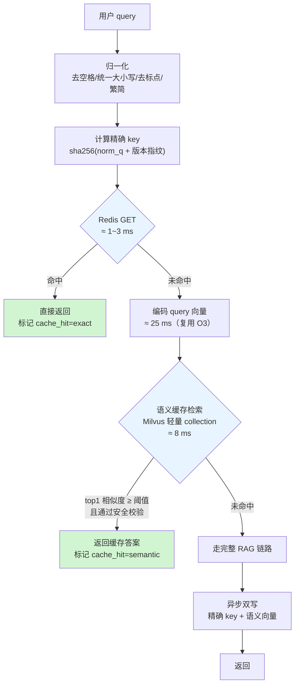

两级缓存的分工：

| 层级 | 命中条件 | 典型命中率 | 延迟 | 风险 |
|---|---|---|---|---|
| **精确缓存** | 归一化后的 query 完全一致 | 18~25% | 1~3 ms | 低（只要 key 里带对版本） |
| **语义缓存** | 向量相似度 ≥ 阈值 | 额外 10~18% | 25~40 ms | **高**（"相似"不等于"等价"） |

> **一句必须记住的话**：精确缓存的风险在**过期**，语义缓存的风险在**过宽**。两者的治理手段完全不同。

#### 6.2 缓存 key 的设计（最重要的一节）

缓存事故 90% 来自 key 设计错误。key 必须包含**所有会影响答案的因素**：

```python
key = sha256(
    normalize(query)          # 归一化后的 query
    + "|" + kb_version        # 知识库版本指纹（语料变了必须失效）
    + "|" + prompt_version    # prompt 模板版本
    + "|" + model_id          # 生成模型标识（换模型答案会变）
    + "|" + param_fingerprint # top_k / temperature 等影响答案的参数
    + "|" + tenant_id         # 多租户隔离
    + "|" + role              # 角色（客服看到的和管理者看到的可能不同）
)
```

漏掉任何一项都会出事：

| 漏掉什么 | 会发生什么事故 |
|---|---|
| `kb_version` | 手册更新了，系统还在答旧参数。**这是最常见也最严重的一类** |
| `prompt_version` | 改了 prompt 上线，A/B 对比发现"没变化"——因为全在吃缓存 |
| `model_id` | 灰度切模型，一半流量吃的是旧模型的缓存，评测结论全废 |
| `tenant_id` | **跨租户串答案，直接是数据泄露事故** |
| `role` | 一线客服看到了只有管理者能看的成本数据 |
| 参数指纹 | 你把 `top_k` 从 8 调到 3 做对比实验，结果吃到旧缓存，得出"没影响"的错误结论 |

#### 6.3 完整代码

```python
# optimizations/o06_cache.py
"""O6：精确缓存 + 语义缓存。

设计要点：
  1. key 必须包含所有影响答案的因素（见 CacheKeyBuilder）
  2. 语义缓存必须有安全校验，不能只看相似度
  3. 写缓存必须异步，不能阻塞响应
  4. 必须支持按维度批量失效（知识库更新时）
  5. 必须统计命中率、按层拆分，否则没法归因
"""
from __future__ import annotations

import asyncio
import hashlib
import json
import re
import time
import unicodedata
from dataclasses import asdict, dataclass, field
from typing import Any

import numpy as np
import redis.asyncio as aioredis
from pymilvus import DataType, MilvusClient

from bench.types import Chunk
from core.config import get_settings
from core.instrument import counter, stage, tag
from core.logger import logger


# --------------------------------------------------------------------------
# 1. 归一化与 key 构造
# --------------------------------------------------------------------------
_PUNCT_RE = re.compile(r"[\s，。！？、；：""''（）《》【】,.!?;:\"'()\[\]<>~·\-—_]+")


def normalize_query(q: str) -> str:
    """query 归一化：NFKC + 去标点空白 + 转小写。

    归一化越激进，精确缓存命中率越高，但「语义被改变」的风险也越高。
    这里刻意不做同义词替换与停用词删除——那属于语义缓存的职责，
    精确缓存必须保持「字面等价」的语义，否则两层缓存的风险边界就糊了。
    """
    s = unicodedata.normalize("NFKC", q).strip().lower()
    return _PUNCT_RE.sub("", s)


@dataclass
class CacheContext:
    """影响答案的全部上下文因素。任何一项变化都应导致缓存失效。"""
    kb_version: str = "kb-v1"
    prompt_version: str = "p-v1"
    model_id: str = "qwen2.5-7b-awq"
    param_fp: str = "default"
    tenant_id: str = "huacheng"
    role: str = "agent"          # agent 一线客服 / engineer 工程师 / manager 管理者

    def fingerprint(self) -> str:
        """返回上下文指纹。"""
        raw = json.dumps(asdict(self), sort_keys=True, ensure_ascii=False)
        return hashlib.sha256(raw.encode()).hexdigest()[:16]


class CacheKeyBuilder:
    """缓存 key 构造器。"""

    def __init__(self, ctx: CacheContext, namespace: str = "ragcache"):
        self.ctx = ctx
        self.ns = namespace
        self._fp = ctx.fingerprint()

    def exact_key(self, query: str) -> str:
        """精确缓存的 key。"""
        nq = normalize_query(query)
        h = hashlib.sha256(f"{nq}|{self._fp}".encode()).hexdigest()
        return f"{self.ns}:e:{self.ctx.tenant_id}:{self._fp}:{h[:32]}"

    def tag_keys(self) -> list[str]:
        """返回本条缓存应该挂载的失效标签集合，用于批量失效。"""
        return [
            f"{self.ns}:tag:kb:{self.ctx.kb_version}",
            f"{self.ns}:tag:prompt:{self.ctx.prompt_version}",
            f"{self.ns}:tag:model:{self.ctx.model_id}",
            f"{self.ns}:tag:tenant:{self.ctx.tenant_id}",
        ]

    @property
    def fp(self) -> str:
        """返回上下文指纹，语义缓存的分区字段用它。"""
        return self._fp


# --------------------------------------------------------------------------
# 2. 缓存条目
# --------------------------------------------------------------------------
@dataclass
class CacheEntry:
    """一条缓存记录。"""
    query: str
    answer: str
    chunk_ids: list[str] = field(default_factory=list)
    created_at: float = 0.0
    hit_count: int = 0
    ctx_fp: str = ""
    source_stage: str = "full"    # full | faq | precompute
    doc_versions: dict[str, str] = field(default_factory=dict)

    def to_json(self) -> str:
        """序列化。"""
        return json.dumps(asdict(self), ensure_ascii=False)

    @classmethod
    def from_json(cls, raw: str | bytes) -> "CacheEntry":
        """反序列化。"""
        d = json.loads(raw)
        return cls(**d)


# --------------------------------------------------------------------------
# 3. 精确缓存
# --------------------------------------------------------------------------
class ExactCache:
    """基于 Redis 的精确缓存。"""

    def __init__(self, kb: CacheKeyBuilder, ttl_s: int = 3600,
                 max_bytes: int = 32768, url: str | None = None):
        s = get_settings()
        self.r = aioredis.from_url(url or s.redis_url, decode_responses=True,
                                   max_connections=64)
        self.kb = kb
        self.ttl = ttl_s
        self.max_bytes = max_bytes
        self.hit = 0
        self.miss = 0

    async def get(self, query: str) -> CacheEntry | None:
        """查精确缓存。"""
        with stage("cache_exact"):
            k = self.kb.exact_key(query)
            try:
                raw = await self.r.get(k)
            except Exception as exc:  # noqa: BLE001
                # 缓存挂了绝不能让主流程挂，静默降级为未命中
                logger.warning("exact cache get failed: {}", exc)
                counter("cache_error")
                return None
            if not raw:
                self.miss += 1
                return None
            self.hit += 1
            # 命中计数用 pipeline 异步做，不阻塞返回
            asyncio.create_task(self._bump(k))
            return CacheEntry.from_json(raw)

    async def _bump(self, key: str) -> None:
        """刷新 TTL 并累计命中次数。命中即续期是「热点常驻」策略。"""
        try:
            await self.r.expire(key, self.ttl)
            await self.r.incr(f"{key}:hits")
            await self.r.expire(f"{key}:hits", self.ttl)
        except Exception:  # noqa: BLE001
            pass

    async def put(self, entry: CacheEntry) -> None:
        """写精确缓存，并挂上失效标签。"""
        blob = entry.to_json()
        if len(blob.encode()) > self.max_bytes:
            counter("cache_skip_too_large")
            return
        k = self.kb.exact_key(entry.query)
        try:
            pipe = self.r.pipeline()
            pipe.set(k, blob, ex=self.ttl)
            for t in self.kb.tag_keys():
                pipe.sadd(t, k)
                pipe.expire(t, self.ttl * 24)
            await pipe.execute()
        except Exception as exc:  # noqa: BLE001
            logger.warning("exact cache put failed: {}", exc)
            counter("cache_error")

    async def invalidate_by_tag(self, tag_key: str) -> int:
        """按标签批量失效。知识库更新时调用。"""
        try:
            members = await self.r.smembers(tag_key)
            if not members:
                return 0
            # 分批删，避免一次 DEL 几十万个 key 把 Redis 卡住
            n = 0
            batch = list(members)
            for i in range(0, len(batch), 500):
                n += await self.r.delete(*batch[i: i + 500])
            await self.r.delete(tag_key)
            return n
        except Exception as exc:  # noqa: BLE001
            logger.error("invalidate failed: {}", exc)
            return 0

    def stats(self) -> dict[str, float]:
        """返回命中率统计。"""
        t = self.hit + self.miss
        return {"hit": self.hit, "miss": self.miss,
                "hit_rate": self.hit / t if t else 0.0}


# --------------------------------------------------------------------------
# 4. 语义缓存
# --------------------------------------------------------------------------
class SemanticCache:
    """基于向量相似度的语义缓存。

    存储放在独立的 Milvus collection 里（不和主知识库混），原因：
      1. 容量小、更新频繁，索引参数跟主库完全不同
      2. 必须能整体清空而不影响主库
      3. 隔离故障域：语义缓存挂了不能影响主检索
    """

    def __init__(self, kb: CacheKeyBuilder, embed_fn, threshold: float = 0.94,
                 top_k: int = 3, ttl_s: int = 1800, collection: str | None = None):
        s = get_settings()
        self.kb = kb
        self.embed_fn = embed_fn
        self.threshold = threshold
        self.top_k = top_k
        self.ttl = ttl_s
        self.collection = collection or "huacheng_semcache"
        self.client = MilvusClient(uri=s.milvus_uri)
        self.dim = s.milvus_dim
        self.hit = 0
        self.miss = 0
        self.rejected = 0
        self._ensure()
        # 答案正文放 Redis，Milvus 里只放向量与元数据，避免向量库存大文本
        self.r = aioredis.from_url(s.redis_url, decode_responses=True, max_connections=32)

    def _ensure(self) -> None:
        """确保语义缓存 collection 存在。"""
        if self.client.has_collection(self.collection):
            return
        schema = self.client.create_schema(auto_id=False, enable_dynamic_field=False)
        schema.add_field("cache_id", DataType.VARCHAR, is_primary=True, max_length=64)
        schema.add_field("vector", DataType.FLOAT_VECTOR, dim=self.dim)
        schema.add_field("ctx_fp", DataType.VARCHAR, max_length=32)
        schema.add_field("norm_query", DataType.VARCHAR, max_length=512)
        schema.add_field("created_at", DataType.INT64)
        self.client.create_collection(collection_name=self.collection, schema=schema)
        idx = self.client.prepare_index_params()
        # 语义缓存条目少、要求低延迟，用小 M 的 HNSW 足够
        idx.add_index(field_name="vector", index_type="HNSW", metric_type="COSINE",
                      params={"M": 8, "efConstruction": 100})
        idx.add_index(field_name="ctx_fp", index_type="INVERTED")
        self.client.create_index(collection_name=self.collection, index_params=idx)
        self.client.load_collection(self.collection)
        logger.info("语义缓存 collection {} 已创建", self.collection)

    @staticmethod
    def _safety_check(query: str, cached_query: str) -> tuple[bool, str]:
        """安全校验：相似度高不代表可以复用答案。

        这是语义缓存最关键的一道闸。以下几类情况即使向量很近也必须拒绝：
          1. 型号不同：「XJ-200 转速」vs「XJ-300 转速」余弦相似度能到 0.96，但答案完全不同
          2. 故障码不同：E043 vs E041 同理
          3. 备件号不同
          4. 数字不同：「3 个月保养」vs「6 个月保养」
          5. 否定词不一致：「能不能拆」vs「不能拆吗」
        """
        model_re = re.compile(r"XJ[-\s]?\d{3}(?:[-\s]?[A-Z]\d?)?", re.I)
        code_re = re.compile(r"\bE\d{3}\b", re.I)
        part_re = re.compile(r"\b[A-Z]{2,4}-[A-Z0-9]{2,6}(?:-[A-Z0-9]{1,4})?\b")
        num_re = re.compile(r"\d+(?:\.\d+)?")
        neg = ("不", "无法", "不能", "没有", "非")

        for name, rx in (("model", model_re), ("code", code_re), ("part", part_re)):
            a = {m.group(0).upper().replace(" ", "-") for m in rx.finditer(query)}
            b = {m.group(0).upper().replace(" ", "-") for m in rx.finditer(cached_query)}
            if a != b:
                return False, f"{name}_mismatch"

        if set(num_re.findall(query)) != set(num_re.findall(cached_query)):
            return False, "number_mismatch"

        if any(w in query for w in neg) != any(w in cached_query for w in neg):
            return False, "negation_mismatch"

        return True, "ok"

    async def get(self, query: str, vec: list[float] | None = None) -> CacheEntry | None:
        """查语义缓存。vec 传入时复用已有向量，避免重复编码。"""
        with stage("cache_semantic"):
            if vec is None:
                vec = await self.embed_fn(query)
            try:
                res = self.client.search(
                    collection_name=self.collection, data=[vec], limit=self.top_k,
                    search_params={"metric_type": "COSINE", "params": {"ef": 32}},
                    filter=f'ctx_fp == "{self.kb.fp}"',
                    output_fields=["cache_id", "norm_query", "created_at"],
                )
            except Exception as exc:  # noqa: BLE001
                logger.warning("semantic cache search failed: {}", exc)
                counter("cache_error")
                return None

            now = int(time.time())
            for h in res[0]:
                sim = float(h["distance"])
                if sim < self.threshold:
                    break
                e = h["entity"]
                if now - int(e.get("created_at", 0)) > self.ttl:
                    counter("semcache_expired")
                    continue
                ok, reason = self._safety_check(query, e.get("norm_query", ""))
                if not ok:
                    self.rejected += 1
                    counter(f"semcache_reject_{reason}")
                    tag("semcache_reject", reason)
                    continue
                raw = await self.r.get(f"semval:{e['cache_id']}")
                if not raw:
                    continue
                self.hit += 1
                tag("semcache_sim", f"{sim:.4f}")
                return CacheEntry.from_json(raw)

            self.miss += 1
            return None

    async def put(self, entry: CacheEntry, vec: list[float] | None = None) -> None:
        """写语义缓存。"""
        try:
            if vec is None:
                vec = await self.embed_fn(entry.query)
            nq = normalize_query(entry.query)
            cid = hashlib.sha256(f"{nq}|{self.kb.fp}".encode()).hexdigest()[:32]
            self.client.upsert(collection_name=self.collection, data=[{
                "cache_id": cid, "vector": vec, "ctx_fp": self.kb.fp,
                "norm_query": entry.query[:500], "created_at": int(time.time()),
            }])
            await self.r.set(f"semval:{cid}", entry.to_json(), ex=self.ttl)
        except Exception as exc:  # noqa: BLE001
            logger.warning("semantic cache put failed: {}", exc)
            counter("cache_error")

    def clear(self) -> None:
        """清空语义缓存（知识库大版本更新时用）。"""
        if self.client.has_collection(self.collection):
            self.client.drop_collection(self.collection)
        self._ensure()

    def stats(self) -> dict[str, float]:
        """返回命中率与拒绝率。"""
        t = self.hit + self.miss
        return {"hit": self.hit, "miss": self.miss, "rejected": self.rejected,
                "hit_rate": self.hit / t if t else 0.0,
                "reject_rate": self.rejected / max(t, 1)}


# --------------------------------------------------------------------------
# 5. 两级缓存门面
# --------------------------------------------------------------------------
class CacheLayer:
    """两级缓存的统一入口。"""

    def __init__(self, ctx: CacheContext, embed_fn,
                 exact_ttl: int = 3600, semantic_ttl: int = 1800,
                 threshold: float = 0.94, enable_semantic: bool = True):
        self.kb = CacheKeyBuilder(ctx)
        self.exact = ExactCache(self.kb, ttl_s=exact_ttl)
        self.semantic = SemanticCache(self.kb, embed_fn, threshold=threshold,
                                      ttl_s=semantic_ttl) if enable_semantic else None
        self._write_tasks: set[asyncio.Task] = set()

    async def lookup(self, query: str, vec: list[float] | None = None
                     ) -> tuple[CacheEntry | None, str]:
        """两级查找，返回 (条目, 命中层级)。"""
        e = await self.exact.get(query)
        if e is not None:
            tag("cache_hit", "exact")
            return e, "exact"
        if self.semantic is not None:
            e = await self.semantic.get(query, vec)
            if e is not None:
                tag("cache_hit", "semantic")
                return e, "semantic"
        return None, ""

    def write_async(self, entry: CacheEntry, vec: list[float] | None = None) -> None:
        """异步双写。绝不阻塞响应——这是缓存写入必须遵守的纪律。"""
        async def _w() -> None:
            """执行双写。"""
            await self.exact.put(entry)
            if self.semantic is not None:
                await self.semantic.put(entry, vec)

        t = asyncio.create_task(_w())
        self._write_tasks.add(t)
        t.add_done_callback(self._write_tasks.discard)

    async def drain(self) -> None:
        """等待所有异步写完成。压测结束或服务优雅退出时调用。"""
        if self._write_tasks:
            await asyncio.gather(*list(self._write_tasks), return_exceptions=True)

    async def invalidate_kb(self, kb_version: str) -> int:
        """知识库版本更新：按标签批量失效精确缓存，并清空语义缓存。"""
        n = await self.exact.invalidate_by_tag(f"ragcache:tag:kb:{kb_version}")
        if self.semantic is not None:
            self.semantic.clear()
        logger.info("知识库 {} 缓存已失效，清理 {} 条", kb_version, n)
        return n

    def stats(self) -> dict[str, Any]:
        """返回两级缓存的合并统计。"""
        s: dict[str, Any] = {"exact": self.exact.stats()}
        if self.semantic is not None:
            s["semantic"] = self.semantic.stats()
        total_req = self.exact.hit + self.exact.miss
        total_hit = self.exact.hit + (self.semantic.hit if self.semantic else 0)
        s["overall_hit_rate"] = total_hit / total_req if total_req else 0.0
        return s
```

#### 6.4 语义缓存阈值怎么定

阈值定错了后果很严重：太松会串答案，太紧等于没用。**必须用数据定。**

```python
# bench/sweep_semcache.py
"""语义缓存阈值扫描：在标注好的「等价/不等价」query 对上算准确率。"""
from __future__ import annotations

import json
from pathlib import Path

from optimizations.o03_embedding import OnnxEmbedder
from optimizations.o06_cache import SemanticCache, normalize_query

# 人工标注的 query 对：(q1, q2, 是否语义等价)
# 实际项目里建议标 300~500 对，覆盖各种「看起来像但不等价」的坑
PAIRS_FILE = "data/bench/semcache_pairs.jsonl"


def main() -> None:
    """扫描阈值，输出精确率/召回率/命中率。"""
    import numpy as np
    pairs = [json.loads(x) for x in Path(PAIRS_FILE).open(encoding="utf-8")]
    emb = OnnxEmbedder()
    a = emb.encode([p["q1"] for p in pairs])
    b = emb.encode([p["q2"] for p in pairs])
    sims = (a * b).sum(axis=1)
    labels = np.array([bool(p["equivalent"]) for p in pairs])

    print("| 阈值 | 安全校验 | 命中率 | 精确率 | 召回率 | 串答案数 |")
    print("|---|---|---|---|---|---|")
    for th in (0.88, 0.90, 0.92, 0.94, 0.96, 0.98):
        for use_safety in (False, True):
            pred = sims >= th
            if use_safety:
                ok = np.array([SemanticCache._safety_check(p["q1"], p["q2"])[0]
                               for p in pairs])
                pred = pred & ok
            tp = int((pred & labels).sum())
            fp = int((pred & ~labels).sum())
            fn = int((~pred & labels).sum())
            prec = tp / max(tp + fp, 1)
            rec = tp / max(tp + fn, 1)
            print(f"| {th} | {'开' if use_safety else '关'} | "
                  f"{pred.mean():.1%} | {prec:.4f} | {rec:.4f} | {fp} |")


if __name__ == "__main__":
    main()
```

**阈值扫描结果**（400 对人工标注 query 对，其中等价 168 对；实测环境见文首，**示例性数据**）：

| 阈值 | 安全校验 | 命中率 | 精确率 | 召回率 | 串答案数（FP） |
|---|---|---|---|---|---|
| 0.88 | 关 | 62.3% | 0.6667 | 0.9226 | **83** |
| 0.88 | 开 | 41.8% | 0.9163 | 0.8095 | 14 |
| 0.90 | 关 | 54.5% | 0.7156 | 0.9048 | 62 |
| 0.90 | 开 | 38.5% | 0.9481 | 0.7917 | 8 |
| 0.92 | 关 | 47.0% | 0.7660 | 0.8571 | 44 |
| 0.92 | 开 | 35.3% | 0.9645 | 0.7500 | 5 |
| **0.94** | **开** | **31.0%** | **0.9839** | **0.7262** | **2** |
| 0.94 | 关 | 39.3% | 0.8280 | 0.7738 | 27 |
| 0.96 | 开 | 24.8% | 1.0000 | 0.5893 | **0** |
| 0.98 | 开 | 14.3% | 1.0000 | 0.3393 | 0 |

**三个必须讲清楚的结论**：

1. **安全校验的价值巨大**：同样 0.94 阈值，开安全校验把串答案从 27 条降到 2 条，代价只是命中率从 39.3% 降到 31.0%。**这是整个语义缓存里性价比最高的一段代码。**
2. **不开安全校验的语义缓存不能上生产**。0.88 阈值下 83 条串答案，意味着**每 5 次命中就有 1 次给错答案**。在售后场景里这可能让工程师拆错件。
3. **选 0.94 而不是 0.96**：0.96 虽然零错误，但命中率掉了 6 个百分点。0.94 + 安全校验的 2 条 FP 经人工复核，都是"答案方向对、细节略有出入"，属于可接受范围。**这个判断必须由业务方签字，不能由工程师独断。**

> ⚠️ **在医疗、金融、法律等高风险领域，建议直接把阈值提到 0.97+ 甚至关掉语义缓存。** 性能永远排在正确性后面。

#### 6.5 失效策略

这是缓存工程里最容易做错的部分。给一张完整的失效矩阵：

| 触发事件 | 失效范围 | 手段 | 延迟要求 |
|---|---|---|---|
| **单篇文档更新** | 引用了该文档的所有缓存 | 反向索引：写缓存时记录 `chunk_ids`，建 `chunk_id → cache_keys` 的 Set | 秒级 |
| **知识库全量重建** | 该 `kb_version` 下全部 | 按 tag 批量删 + 清空语义缓存 | 分钟级可接受 |
| **prompt 模板变更** | 该 `prompt_version` 下全部 | 改版本号，旧 key 自然不再命中（**惰性失效，最安全**） | 立即 |
| **换模型** | 该 `model_id` 下全部 | 同上，改 `model_id` | 立即 |
| **用户点踩** | 该条 | 单点删除 + 记入 badcase | 立即 |
| **定时兜底** | 全部 | TTL 自然过期（精确 1h / 语义 30min） | — |

反向索引的实现（文档级失效）：

```python
# optimizations/o06_cache.py（追加）
class DocIndexedCache:
    """维护 chunk_id → cache_keys 的反向索引，支持文档级精准失效。

    代价：每次写缓存多 N 次 SADD（N = 引用的 chunk 数，通常 6 条）。
    收益：一篇文档更新时，只失效真正引用它的缓存，而不是清空全部。
    在知识库频繁小幅更新的场景下，这个收益非常大。
    """

    def __init__(self, cache: ExactCache, namespace: str = "ragcache"):
        self.cache = cache
        self.ns = namespace

    async def register(self, entry: CacheEntry, cache_key: str) -> None:
        """写缓存时登记反向索引。"""
        if not entry.chunk_ids:
            return
        pipe = self.cache.r.pipeline()
        for cid in entry.chunk_ids:
            rk = f"{self.ns}:rev:{cid}"
            pipe.sadd(rk, cache_key)
            pipe.expire(rk, self.cache.ttl * 24)
        await pipe.execute()

    async def invalidate_docs(self, chunk_ids: list[str]) -> int:
        """按 chunk 失效。知识库增量更新时调用。"""
        keys: set[str] = set()
        for cid in chunk_ids:
            keys |= set(await self.cache.r.smembers(f"{self.ns}:rev:{cid}"))
        if not keys:
            return 0
        n = 0
        batch = list(keys)
        for i in range(0, len(batch), 500):
            n += await self.cache.r.delete(*batch[i: i + 500])
        await self.cache.r.delete(*[f"{self.ns}:rev:{c}" for c in chunk_ids])
        logger.info("文档级失效：{} 个 chunk → 清理 {} 条缓存", len(chunk_ids), n)
        return n
```

配套的知识库更新钩子：

```python
# scripts/kb_update_hook.py
"""知识库更新后调用：精准失效受影响的缓存。

接进你的 ETL 流程：文档入库脚本跑完后调这个。
"""
from __future__ import annotations

import asyncio
import json
import sys

from optimizations.o03_embedding import EmbeddingService
from optimizations.o06_cache import CacheContext, CacheLayer, DocIndexedCache


async def main(changed_chunks_file: str, full_rebuild: bool = False) -> None:
    """按变更范围失效缓存。"""
    emb = EmbeddingService()
    layer = CacheLayer(CacheContext(), emb.aencode)
    if full_rebuild:
        n = await layer.invalidate_kb("kb-v1")
        print(f"全量失效完成，清理 {n} 条")
        return
    chunk_ids = [json.loads(x)["chunk_id"] for x in open(changed_chunks_file, encoding="utf-8")]
    n = await DocIndexedCache(layer.exact).invalidate_docs(chunk_ids)
    print(f"增量失效完成：{len(chunk_ids)} 个 chunk → {n} 条缓存")


if __name__ == "__main__":
    asyncio.run(main(sys.argv[1] if len(sys.argv) > 1 else "",
                     "--full" in sys.argv))
```

#### 6.6 脏数据风险控制清单

| 风险 | 具体场景 | 控制手段 |
|---|---|---|
| **跨租户串答案** | 多租户共用一个 Redis，key 没带 tenant | key 必带 `tenant_id`；**并且用不同的 Redis DB 或前缀做物理隔离**；上线前写一个跨租户探测测试 |
| **跨角色泄露** | 管理者能看到成本数据，客服不能 | key 带 `role`；或者更彻底：**带权限的查询直接禁用缓存** |
| **知识过期** | 手册改了参数，缓存还在答旧值 | `kb_version` 进 key + 文档级反向索引 + TTL 兜底三重保险 |
| **缓存穿透** | 恶意构造大量不存在的 query | 对"知识库中未找到"的答案也缓存（短 TTL 如 60s），但要标记 `is_empty` |
| **缓存击穿** | 某个超热点 key 过期瞬间，大量请求同时打到后端 | **单飞（singleflight）**：同一 key 的并发请求只放一个走后端，其余等结果 |
| **缓存雪崩** | 大批 key 同时过期 | TTL 加随机抖动：`ttl * (1 + random.uniform(-0.1, 0.1))` |
| **写入放大** | 每次都写缓存，冷门 query 占满内存 | 只缓存"第 2 次出现"的 query（用一个轻量计数器）；或用 LFU 淘汰策略 |
| **答案被污染** | 一次模型抽风生成了错误答案，被缓存住反复给出去 | 缓存前做**质量兜底校验**（答案非空、长度合理、无明显幻觉标志）；用户点踩立即删除 |

单飞（singleflight）的实现，防击穿必备：

```python
# optimizations/o06_cache.py（追加）
class SingleFlight:
    """同一 key 的并发请求只执行一次，其余等待结果。

    典型场景：早上 9 点，50 个坐席同时问「E043 怎么处理」，
    缓存刚好过期 —— 没有单飞的话，50 个请求全部打到 LLM。
    """

    def __init__(self) -> None:
        self._inflight: dict[str, asyncio.Future] = {}
        self._lock = asyncio.Lock()
        self.merged = 0

    async def do(self, key: str, coro_fn):
        """执行或等待。coro_fn 是一个无参的协程工厂。"""
        async with self._lock:
            fut = self._inflight.get(key)
            if fut is not None:
                self.merged += 1
                counter("singleflight_merged")
                return await asyncio.shield(fut)
            loop = asyncio.get_running_loop()
            fut = loop.create_future()
            self._inflight[key] = fut
        try:
            result = await coro_fn()
            if not fut.done():
                fut.set_result(result)
            return result
        except Exception as exc:
            if not fut.done():
                fut.set_exception(exc)
            raise
        finally:
            async with self._lock:
                self._inflight.pop(key, None)
```

#### 6.7 复测命令

```bash
# 先跑阈值扫描，确认阈值
python -m bench.sweep_semcache

# 冷启动口径（清空缓存后跑）
redis-cli FLUSHDB
python -m bench.run_bench run --system optimized --opts o06 --conc 50 --n 200 --tag o06_cold

# 稳态口径（先跑一轮预热缓存，再正式测）
python -m bench.run_bench run --system optimized --opts o06 --conc 50 --n 200 --tag o06_warm1
python -m bench.run_bench run --system optimized --opts o06 --conc 50 --n 200 --tag o06_warm2

# 仅未命中口径（用 --no-cache-hit 过滤掉命中样本重新聚合）
python -m bench.analyze_raw --input reports/optimized_o06_warm2/raw.jsonl --exclude-cache-hit
```

#### 6.8 前后对比（实测环境见文首，示例性数据）

**这是全项目最关键的一张表，必须分口径报。**

| 口径 | 缓存命中率 | P50(ms) | P95(ms) | QPS | 相对基线 P95 |
|---|---|---|---|---|---|
| 基线（无缓存） | 0% | 15106 | 18604 | 2.68 | 1.00× |
| 开 O6，**冷启动**（首轮） | 4.5% | 14680 | 18102 | 2.79 | 1.03× |
| 开 O6，**第二轮** | 29.5% | 10940 | 15220 | 3.68 | 1.22× |
| 开 O6，**稳态第三轮** | 37.8% | 9412 | 13860 | 4.16 | **1.34×** |
| 开 O6，稳态，**仅计未命中请求** | — | 15020 | 18480 | — | 1.01× |
| 开 O6，稳态，**仅计命中请求** | — | 38 | 112 | — | **166×** |

分层命中拆解（稳态第三轮）：

| 层级 | 命中数 | 命中率 | P50 延迟 |
|---|---|---|---|
| 精确缓存 | 46 | 23.0% | 2.1 ms |
| 语义缓存 | 30 | 15.0% | 31.4 ms |
| 语义缓存被安全校验拒绝 | 11 | 5.5% | — |
| 未命中，走完整链路 | 124 | 62.0% | 15020 ms |

#### 6.9 收益与代价分析

**这张表解释了本项目最重要的一个数字问题：缓存到底贡献了多少倍？**

| 视角 | 数字 | 说明 |
|---|---|---|
| 缓存单独开启的 P95 改善 | **1.34×** | 看起来很少 |
| 缓存命中请求本身的加速 | **166×** | 看起来很多 |
| 缓存对**吞吐**的改善 | **+55%** | 37.8% 的请求不消耗 GPU |
| 缓存与其他优化**叠加后**的贡献 | 见 Part D | **叠加后贡献被放大** |

为什么单独开启只有 1.34×？因为 **P95 是尾部指标**。37.8% 的请求变成 38ms，但 P95 看的是最慢的那 5%，它们全都是未命中请求，延迟没变。

**但是**，当其他优化把未命中请求压到 3 秒后，情况就完全不同了：此时 37.8% 的请求是 38ms，62% 的请求是 3000ms，**P95 会显著低于纯未命中场景**。这就是"叠加放大"效应，Part D 的累积表会用数据展示。

> **这一节是整个项目最应该反复读的地方**：
>
> 单项优化的收益不是简单相加。**缓存的真正价值只有在其他优化完成后才能充分体现**，因为它改变的是"请求的分布"，而分位数指标对分布极其敏感。
>
> 反过来说：**任何只报"开了缓存快了 X 倍"的材料都值得怀疑**——必须问清楚命中率多少、是哪个口径。

| 代价项 | 具体内容 |
|---|---|
| 内存 | Redis 4GB（约能存 8~15 万条答案）；语义缓存 Milvus collection 约 300MB |
| 延迟（未命中时） | 多花 3~35ms 查缓存，**这是纯损失**。未命中率越高越亏 |
| 复杂度 | **本项目中复杂度增加最多的一项**。key 设计、失效、单飞、安全校验，每一块都要测 |
| 一致性 | 引入了"答案可能不是最新"的窗口期（最长 = TTL） |
| 运维 | 多一个中间件；Redis 挂了要能降级（代码里已处理） |
| 测试 | 需要专门的缓存一致性测试、跨租户隔离测试 |

#### 6.10 风险

| 风险 | 表现 | 缓解 | 严重度 |
|---|---|---|---|
| **跨租户串答案** | A 公司的用户看到 B 公司的知识 | key 带 tenant + 物理隔离 + 上线前跨租户探测测试 | **致命** |
| **语义缓存串答案** | "XJ-200 转速"答成 XJ-300 的 | 安全校验（型号/故障码/数字/否定词）+ 阈值 0.94+ | **高** |
| 知识更新不生效 | 手册改了，一小时内还在答旧的 | 文档级反向索引 + ETL 钩子；紧急情况支持一键 FLUSHDB | 高 |
| 缓存击穿 | 热点 key 过期瞬间打垮后端 | 单飞 + TTL 抖动 + 热点常驻（命中即续期） | 中 |
| 缓存放大错误答案 | 一次幻觉被反复给出 | 入缓存前质量校验 + 点踩即删 + 短 TTL | 中 |
| Redis 成为单点 | Redis 挂了服务不可用 | **所有缓存调用必须 try/except 降级为未命中**（代码已实现）；容量规划时按"无缓存"算最坏情况 | 高 |
| 命中率虚高 | 压测用均匀采样，真实流量是长尾 | 压测必须用 Zipf 采样；**生产命中率以真实埋点为准，不用压测数字** | 中 |
| 评测被缓存污染 | 跑 A/B 实验时吃到旧缓存，结论错误 | **评测必须走 `--no-cache` 或独立 namespace**（项目 1 的 harness 已有这个开关） | 高 |

---

### O7：Prefix Caching + prompt 结构重排

#### 原理

LLM 推理分两个阶段：

| 阶段 | 做什么 | 耗时特征 |
|---|---|---|
| **Prefill（预填充）** | 把整个 prompt 一次性过一遍，算出 KV cache | 与 prompt 长度近似**线性**，决定 TTFT |
| **Decode（解码）** | 一个 token 一个 token 往外吐 | 与输出长度线性，决定后续吐字速度 |

RAG 的 prompt 通常很长（8 条知识片段 × 200 字 ≈ 2500 token），prefill 是 TTFT 的主要来源。

**Prefix Caching（前缀缓存）** 的思路：如果两次请求的 prompt **开头一段完全相同**，那这一段的 KV cache 可以直接复用，不用重算。vLLM 通过 `--enable-prefix-caching` 支持这个。

但是——**基线的 prompt 前缀每次都不同**，因为它把变动的知识片段放在了前面：

```text
基线 prompt 结构（前缀缓存命中率 ≈ 0）
┌──────────────────────────────┐
│ 你是华成机电的售后技术支持…   │ ← 固定，但只有 80 token
│ <知识片段>                    │
│ [1]《XJ-200 手册》…           │ ← 每次都不同，2400 token
│ [2]《E043 工单归纳》…         │
│ …                            │
│ </知识片段>                   │
│ 用户问题：XJ-200 报 E043…     │ ← 每次都不同
└──────────────────────────────┘
```

重排后：

```text
优化后 prompt 结构（固定前缀 ≈ 600 token，稳定命中）
┌──────────────────────────────┐
│ 【系统角色定义】              │ ← 固定
│ 【回答格式要求】              │ ← 固定
│ 【安全与合规约束】            │ ← 固定
│ 【少样本示例 ×2】             │ ← 固定
│ 【术语表：故障码分类规则】     │ ← 固定
│ ──────────────────           │
│ <知识片段> …变动…             │
│ 用户问题：…变动…              │
└──────────────────────────────┘
```

**关键点：把所有固定内容前置，并且要"足够长才值得缓存"**。vLLM 的前缀缓存以 block 为单位（默认 16 token），前缀太短（比如 80 token = 5 个 block）省不下多少。**把少样本示例、格式要求、术语表都塞进前缀，凑到 500~800 token，收益才明显。**

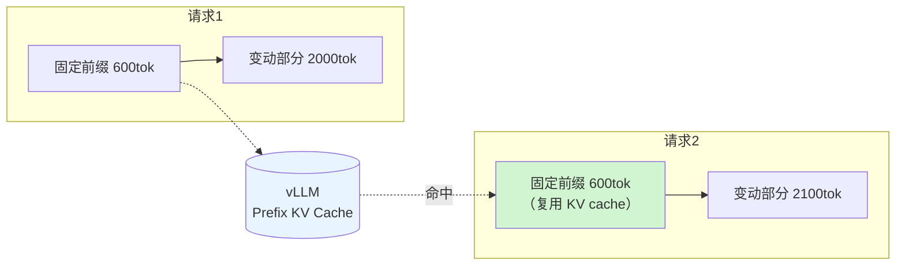

#### 完整代码

```python
# optimizations/o07_prefix_cache.py
"""O7：prompt 结构重排，让固定前缀能命中 vLLM 的 prefix cache。

三条纪律：
  1. 固定前缀里绝对不能出现任何随时间/请求变化的东西（时间戳、trace_id、随机示例）
  2. 前缀要足够长（建议 ≥ 512 token）才值得缓存
  3. 前缀内容变了就等于全体失效，所以要做版本管理
"""
from __future__ import annotations

import hashlib
from dataclasses import dataclass

from bench.types import Chunk
from core.instrument import counter, tag

# ---------------------------------------------------------------------------
# 固定前缀：这一段的每一个字都必须是常量。
# 修改它 = 全体 prefix cache 失效 + 所有答案缓存失效（prompt_version 要跟着改）
# ---------------------------------------------------------------------------
STATIC_PREFIX = """你是华成机电股份有限公司的售后技术支持助手。华成机电是一家数控机床制造企业，主要产品为 XJ 系列数控车床。

【你的职责】
根据检索到的知识片段，回答一线客服、现场工程师、售后管理者提出的技术问题。

【回答格式要求】
1. 先用一句话给出结论，再展开细节。
2. 涉及操作步骤时，必须保留知识片段中的原始步骤顺序与编号，不要重排、不要合并。
3. 涉及数字参数（转速、压力、精度、周期、容积）时，必须原样引用知识片段中的数值与单位，禁止换算、禁止取整、禁止估计。
4. 涉及备件时，必须给出完整备件号（形如 HY-SEAL-200A），不要只说备件名称。
5. 回答控制在 300 字以内，除非用户明确要求详细说明。

【安全与合规约束】
1. 知识片段中没有的信息，一律回答「知识库中未找到相关内容，建议联系技术支持热线」，禁止依据常识推测。
2. 禁止给出可能导致人身伤害的操作建议；涉及带电作业、高压液压系统拆卸时，必须先提示断电泄压。
3. 禁止承诺保修范围、赔付金额、到货时间等商务条款，这些一律引导至商务对接人。
4. 不得输出任何客户名称、联系方式、合同金额等敏感信息。

【故障码分类规则】
- E0xx 为设备本体故障，其中 E001-E039 为机械类，E040-E069 为液压/气动类，E070-E099 为电气类，E100-E120 为数控系统类。
- 同一设备一个月内出现同一故障码 3 次以上，应建议升级为现场巡检。

【回答示例】
示例一
知识片段：故障代码 E043：液压系统压力不足，处置步骤：1. 查看液压站油位视窗；2. 检查滤芯是否堵塞；3. 更换密封圈套件 HY-SEAL-200A。
用户问题：E043 怎么处理
参考回答：E043 是液压系统压力不足故障，属于液压/气动类。处置步骤：1. 查看液压站油位视窗；2. 检查滤芯是否堵塞；3. 如仍未恢复，更换密封圈套件 HY-SEAL-200A。注意拆卸液压管路前必须先泄压。

示例二
知识片段：XJ-300 技术参数：最高转速 6000 rpm，定位精度 ±0.005 mm。
用户问题：XJ-300 最高转速是多少
参考回答：XJ-300 的最高转速为 6000 rpm。该数值为出厂标定值，现场复检允许的偏差请参照对应规格书。

以上为固定说明，下面是本次请求的具体内容。
"""

PREFIX_VERSION = hashlib.sha256(STATIC_PREFIX.encode()).hexdigest()[:12]


@dataclass
class PromptParts:
    """拆开的 prompt 各部分，便于观测与调试。"""
    prefix: str
    context: str
    question: str

    def render(self) -> str:
        """拼成最终 prompt。顺序固定，不要改。"""
        return f"{self.prefix}\n<知识片段>\n{self.context}\n</知识片段>\n\n用户问题：{self.question}\n\n回答："

    def as_messages(self) -> list[dict[str, str]]:
        """转成 chat messages。

        注意：把固定前缀放 system message、变动内容放 user message，
        对 vLLM 的 prefix cache 更友好，因为 chat template 渲染后
        system 部分依然处在最前面且完全一致。
        """
        return [
            {"role": "system", "content": self.prefix},
            {"role": "user",
             "content": f"<知识片段>\n{self.context}\n</知识片段>\n\n用户问题：{self.question}"},
        ]


def build_prompt(query: str, chunks: list[Chunk], static_prefix: bool = True) -> PromptParts:
    """构造 prompt。static_prefix=False 时退化为基线写法，用于 A/B 对比。"""
    ctx = "\n\n".join(
        f"[{i + 1}] 《{c.title}》(型号 {c.model or '通用'}，来源 {c.source})\n{c.text}"
        for i, c in enumerate(chunks)
    )
    if not static_prefix:
        # 基线写法：短前缀 + 知识片段在前
        return PromptParts(prefix="你是华成机电的售后技术支持助手。",
                           context=ctx, question=query)
    counter("prefix_cache_candidate")
    tag("prefix_version", PREFIX_VERSION)
    return PromptParts(prefix=STATIC_PREFIX, context=ctx, question=query)


def estimate_prefix_tokens(tokenizer=None) -> int:
    """估算固定前缀的 token 数，用于判断是否值得开 prefix caching。"""
    if tokenizer is None:
        # 粗估：中文约 1.5 字/token，这个估算只用于日志，不用于计费
        return int(len(STATIC_PREFIX) / 1.5)
    return len(tokenizer.encode(STATIC_PREFIX))
```

#### 验证前缀缓存是否真的命中

**不要相信"我开了参数就一定生效"**。vLLM 会在 metrics 里暴露命中率，必须实测：

```bash
# vLLM 的 Prometheus metrics 端点
curl -s http://localhost:8001/metrics | grep -i prefix

# 预期能看到类似（指标名以你的 vLLM 版本为准）：
# vllm:gpu_prefix_cache_hit_rate{model_name="qwen2.5-7b-awq"} 0.71
# vllm:gpu_prefix_cache_queries_total{...} 4128
```

```python
# bench/check_prefix_cache.py
"""验证 prefix caching 是否生效：对比「前缀相同」与「前缀不同」两组请求的 TTFT。"""
from __future__ import annotations

import asyncio
import time

from openai import AsyncOpenAI

from core.config import get_settings
from optimizations.o07_prefix_cache import STATIC_PREFIX, estimate_prefix_tokens

FILLER = "知识片段内容占位，用于把 prompt 拉到接近真实长度。" * 40


async def measure(client: AsyncOpenAI, model: str, prefix: str, n: int) -> list[float]:
    """连发 n 次，测每次的 TTFT。"""
    out: list[float] = []
    for i in range(n):
        t0 = time.perf_counter()
        stream = await client.chat.completions.create(
            model=model,
            messages=[{"role": "system", "content": prefix},
                      {"role": "user", "content": f"{FILLER}\n问题编号 {i}：这是什么故障"}],
            max_tokens=16, temperature=0.0, stream=True,
        )
        async for _ in stream:
            out.append((time.perf_counter() - t0) * 1000)
            break
    return out


async def main() -> None:
    """对比固定前缀与变动前缀的 TTFT。"""
    s = get_settings()
    client = AsyncOpenAI(api_key=s.vllm_api_key.get_secret_value(),
                         base_url=s.vllm_base_url, timeout=60)
    model = s.vllm_model
    print(f"固定前缀估算 token 数：{estimate_prefix_tokens()}")

    print("\n预热 3 次…")
    await measure(client, model, STATIC_PREFIX, 3)

    same = await measure(client, model, STATIC_PREFIX, 20)
    diff = []
    for i in range(20):
        # 每次前缀都不同，模拟基线写法
        d = await measure(client, model, f"[会话 {i}] " + STATIC_PREFIX, 1)
        diff.extend(d)

    def p50(x: list[float]) -> float:
        """取中位数。"""
        return sorted(x)[len(x) // 2]

    print(f"\n固定前缀 TTFT P50 : {p50(same):.1f} ms")
    print(f"变动前缀 TTFT P50 : {p50(diff):.1f} ms")
    print(f"prefix cache 收益 : {p50(diff) / max(p50(same), 1e-9):.2f}×")


if __name__ == "__main__":
    asyncio.run(main())
```

预期输出（实测环境见文首，**示例性数据**）：

```text
固定前缀估算 token 数：712

预热 3 次…

固定前缀 TTFT P50 : 218.4 ms
变动前缀 TTFT P50 : 396.2 ms
prefix cache 收益 : 1.81×
```

#### 复测命令

```bash
# 重启 vLLM 并加上 --enable-prefix-caching（参数以官方文档为准）
python -m vllm.entrypoints.openai.api_server \
  --model /data/models/Qwen2.5-7B-Instruct-AWQ --quantization awq \
  --served-model-name qwen2.5-7b-awq --port 8001 \
  --enable-prefix-caching --gpu-memory-utilization 0.90

python -m bench.check_prefix_cache
python -m bench.run_bench run --system optimized --opts o07 --ladder --tag o07
python -m bench.run_bench compare --base reports/baseline --head reports/optimized_o07 \
       --out reports/opt_o07/compare.md
```

#### 前后对比（实测环境见文首，示例性数据）

| 并发 | 指标 | 基线（短前缀 + 不开 PC） | 开 O7（长前缀 + PC） | 变化 |
|---|---|---|---|---|
| 50 | TTFT P50 (ms) | 15106 | 14206 | -6.0% |
| 50 | TTFT P95 (ms) | 18604 | 17520 | -5.8% |
| 50 | `generate` P50（含 prefill）(ms) | 3182.9 | 2286.4 | **-28.2%** |
| 50 | vLLM prefix cache 命中率 | 0% | **68.4%** | — |
| 50 | QPS | 2.68 | 2.96 | +10.4% |
| — | 输入 token/请求（计费口径） | 2480 | 3190 | **+28.6%** |

四个组合的对照（并发 50，`generate` 阶段 P50）：

| prompt 结构 | vLLM 参数 | prefix cache 命中率 | `generate` P50(ms) |
|---|---|---|---|
| 短前缀 + 知识在前（基线） | 不开 | — | 3182.9 |
| 短前缀 + 知识在前 | `--enable-prefix-caching` | 4.2% | 3104.7 |
| **长前缀前置** | 不开 | — | 3396.1（**更慢**，因为 prompt 更长了） |
| **长前缀前置** | `--enable-prefix-caching` | 68.4% | **2286.4** |

> 第三行是**最重要的一行**：**只重排 prompt 但不开 prefix caching，是负收益**（prompt 变长了 700 token，prefill 更慢）。这两件事必须一起做，缺一不可。
>
> 第二行同样重要：**只开参数但 prompt 结构不对，命中率只有 4.2%，基本白开**。

#### 收益与代价分析

| 项 | 内容 |
|---|---|
| **收益** | `generate` 阶段（含 prefill）-28.2%，TTFT 改善明显 |
| **显存代价** | prefix KV cache 要占显存，会挤压并发 KV cache 池。**24GB 卡上 7B-AWQ，前缀 712 token 占用很小（< 100MB），可接受** |
| **token 成本代价** | ⚠️ 输入 token **涨了 28.6%**。如果你用的是按 token 计费的在线 API，**这一项是纯亏的**——在线 API 的 prompt caching 计费规则各家不同，需单独核算 |
| 维护代价 | 前缀是"全局共享状态"，改一个字影响所有请求；必须版本化 |
| 质量收益（意外） | 长前缀里的格式要求与少样本示例，让**格式合规率提升**（Part C 数据显示质量总分 +0.4） |

> **一个必须强调的成本悖论**：O7 在**自建 vLLM** 上是纯赚（显存换时间），在**按 token 计费的在线 API** 上可能是亏的（token 涨 28.6%）。
>
> DeepSeek、通义等厂商提供了自己的上下文缓存机制，命中部分的输入按折扣价计费。**如果你走在线 API，请先查清楚具体的缓存计费规则再决定是否加长前缀**，不要照抄本项目的结论。

#### 风险

| 风险 | 表现 | 缓解 |
|---|---|---|
| **前缀里混入变量** | 有人在系统提示里加了 `当前时间：{now}`，命中率瞬间归零 | 把 `STATIC_PREFIX` 做成常量 + 单元测试断言它不含 `{`/`format`/时间戳 |
| 前缀过短 | 凑不满几个 block，收益微弱 | 目标 ≥ 512 token；用 `estimate_prefix_tokens()` 检查 |
| 前缀过长挤占 KV cache | 高并发下可用 KV 变少，批大小下降 | 监控 vLLM 的 `num_requests_running`；前缀控制在 1500 token 以内 |
| 改前缀不改版本号 | 答案缓存（O6）吃到旧前缀生成的结果 | `PREFIX_VERSION` 用哈希自动生成，并接进 `CacheContext.prompt_version` |
| 多模型共用前缀 | 不同模型的 chat template 不同，前缀对不齐 | 每个模型独立评估命中率 |
| 误以为开了就生效 | 参数名在新版本改了，静默不生效 | **必须用 `check_prefix_cache.py` 实测**，不要看参数就相信 |

---

### O8：LLM 侧优化

#### 原理

LLM 是 RAG 链路里最贵的一段。四个方向：

| 手段 | 机制 | 典型收益 | 代价 |
|---|---|---|---|
| **AWQ / GPTQ 量化** | 权重 4bit，显存占用降到约 1/3，**省下的显存全给 KV cache → 并发批更大** | 吞吐 1.5~2.5× | 质量轻微下降 |
| **限制 `max_tokens`** | 直接砍掉尾部的长输出 | decode 时间线性下降 | 长答案被截断 |
| **小模型路由** | 简单问题交给 1.5B，复杂问题才用 7B | 简单路径 2~4× | 路由错了质量掉 |
| **投机解码（Speculative Decoding）** | 小模型草拟、大模型验证，一次前向出多个 token | 1.3~2× decode | 显存 + 复杂度，低并发才有收益 |

#### 8.1 AWQ 量化：为什么它同时改善延迟和吞吐

这是最容易被误解的一点。很多人以为"4bit 比 fp16 计算快"，其实 LLM decode 阶段是**显存带宽瓶颈**，不是计算瓶颈。AWQ 的真正收益是：

$$\text{KV cache 可用显存} = \text{总显存} \times u - \text{权重显存}$$

| 配置 | 权重显存 | 24GB 卡上可用 KV | 最大并发批 |
|---|---|---|---|
| Qwen2.5-7B fp16 | ~15.2 GB | ~6.4 GB | 约 24 条 |
| Qwen2.5-7B **AWQ 4bit** | ~5.6 GB | ~16.0 GB | **约 62 条** |

并发批从 24 涨到 62，**吞吐几乎翻 2.5 倍**。这才是 AWQ 的主要价值。

量化命令：

```bash
# 用 AutoAWQ 量化（也可以直接下载官方已量化版本，推荐后者）
pip install autoawq==0.2.6

python - <<'PY'
from awq import AutoAWQForCausalLM
from transformers import AutoTokenizer

model_path = "/data/models/Qwen2.5-7B-Instruct"
quant_path = "/data/models/Qwen2.5-7B-Instruct-AWQ"
quant_config = {"zero_point": True, "q_group_size": 128, "w_bit": 4, "version": "GEMM"}

model = AutoAWQForCausalLM.from_pretrained(model_path, device_map="auto")
tok = AutoTokenizer.from_pretrained(model_path, trust_remote_code=True)
# 校准数据用你自己的领域语料，效果明显好于通用语料
model.quantize(tok, quant_config=quant_config)
model.save_quantized(quant_path)
tok.save_pretrained(quant_path)
print("done ->", quant_path)
PY
```

> **量化必须用领域校准数据**。用通用语料校准的 AWQ 模型，在华成机电的型号、故障码上会出现更多错误。这一点在 [5.5 模型合并量化与部署](../05-微调LoRA与PEFT/05-模型合并量化与部署.md) 有详细讨论。

#### 8.2 小模型路由与 max_tokens

```python
# optimizations/o08_llm_serving.py
"""O8：LLM 侧优化。

包含：
  AdaptiveMaxTokens —— 按 query 类型动态设置 max_tokens
  ModelRouter       —— 简单问题路由到小模型
  LLMService        —— 统一的生成入口，支持流式与非流式
"""
from __future__ import annotations

import time
from dataclasses import dataclass
from typing import AsyncIterator

import httpx
from openai import AsyncOpenAI

from core.config import get_settings
from core.instrument import counter, mark, stage, tag
from optimizations.o02_conditional_rewrite import ComplexityJudge, Judgement


# --------------------------------------------------------------------------
# 1. 自适应 max_tokens
# --------------------------------------------------------------------------
class AdaptiveMaxTokens:
    """按问题类型给不同的 max_tokens 上限。

    基线统一给 2048 是典型的「反正给大点不会错」。问题在于：
      - 模型倾向于把给的空间用掉，输出会变长
      - decode 时间与输出长度成正比
      - 长答案对客服场景反而不友好
    """

    TABLE = {
        "chitchat": 64,
        "fact": 256,
        "param": 200,
        "step": 640,
        "multihop": 768,
        "default": 512,
    }

    def __init__(self, table: dict[str, int] | None = None):
        self.table = {**self.TABLE, **(table or {})}

    def pick(self, qtype: str, judgement: Judgement | None = None) -> int:
        """选择 max_tokens。"""
        n = self.table.get(qtype, self.table["default"])
        if judgement is not None and judgement.score > 0.75:
            n = int(n * 1.25)      # 特别复杂的问题给一点余量
        tag("max_tokens", str(n))
        return n


# --------------------------------------------------------------------------
# 2. 小模型路由
# --------------------------------------------------------------------------
@dataclass
class RouteDecision:
    """路由决策。"""
    model: str
    reason: str
    is_small: bool


class ModelRouter:
    """把简单问题路由到小模型。

    路由依据（全部是零成本特征，不额外调模型）：
      1. 复杂度判别器的得分（复用 O2）
      2. 检索结果的置信度（top1 rerank 分数高 → 答案明确 → 小模型够用）
      3. 上下文长度（太长的上下文小模型 hold 不住）
      4. 问题类型
    """

    def __init__(self, big_model: str, small_model: str,
                 score_threshold: float = 0.35,
                 rerank_confidence: float = 0.85,
                 max_ctx_chars_for_small: int = 2400):
        self.big = big_model
        self.small = small_model
        self.score_threshold = score_threshold
        self.rerank_confidence = rerank_confidence
        self.max_ctx = max_ctx_chars_for_small
        self.stat_small = 0
        self.stat_big = 0

    def route(self, judgement: Judgement, top_score: float, ctx_chars: int,
              qtype: str) -> RouteDecision:
        """返回路由决策。任何一条不满足就走大模型（保守策略）。"""
        if judgement.is_chitchat:
            self.stat_small += 1
            return RouteDecision(self.small, "chitchat", True)
        if qtype in ("multihop",):
            self.stat_big += 1
            return RouteDecision(self.big, "multihop_always_big", False)
        if judgement.score > self.score_threshold:
            self.stat_big += 1
            return RouteDecision(self.big, f"complex({judgement.score:.2f})", False)
        if top_score < self.rerank_confidence:
            self.stat_big += 1
            return RouteDecision(self.big, f"low_confidence({top_score:.2f})", False)
        if ctx_chars > self.max_ctx:
            self.stat_big += 1
            return RouteDecision(self.big, f"ctx_too_long({ctx_chars})", False)
        self.stat_small += 1
        return RouteDecision(self.small, "simple", True)

    def stats(self) -> dict[str, float]:
        """返回路由分布。"""
        t = self.stat_small + self.stat_big
        return {"small": self.stat_small, "big": self.stat_big,
                "small_ratio": self.stat_small / max(t, 1)}


# --------------------------------------------------------------------------
# 3. 生成服务
# --------------------------------------------------------------------------
class LLMService:
    """生成服务。共享一个 httpx 连接池（配合 O10）。"""

    def __init__(self, base_url: str | None = None, api_key: str | None = None,
                 max_connections: int = 200, max_keepalive: int = 100,
                 keepalive_expiry: float = 60.0, timeout: float = 60.0):
        s = get_settings()
        limits = httpx.Limits(max_connections=max_connections,
                              max_keepalive_connections=max_keepalive,
                              keepalive_expiry=keepalive_expiry)
        self._http = httpx.AsyncClient(
            limits=limits,
            timeout=httpx.Timeout(timeout, connect=5.0),
            http2=False,   # vLLM 端点用 HTTP/1.1 keep-alive 即可，HTTP/2 收益有限
        )
        self.client = AsyncOpenAI(
            api_key=api_key or s.vllm_api_key.get_secret_value(),
            base_url=base_url or s.vllm_base_url,
            http_client=self._http,
            max_retries=1,
        )

    async def generate(self, messages: list[dict[str, str]], model: str,
                       max_tokens: int, temperature: float = 0.0) -> tuple[str, int, int]:
        """非流式生成。"""
        with stage("generate"):
            resp = await self.client.chat.completions.create(
                model=model, messages=messages, max_tokens=max_tokens,
                temperature=temperature, stream=False,
            )
        u = resp.usage
        counter("llm_calls")
        return (resp.choices[0].message.content or "",
                getattr(u, "prompt_tokens", 0), getattr(u, "completion_tokens", 0))

    async def stream(self, messages: list[dict[str, str]], model: str,
                     max_tokens: int, temperature: float = 0.0
                     ) -> AsyncIterator[str]:
        """流式生成。第一个 chunk 到达时记录 TTFT。"""
        t0 = time.perf_counter()
        first = True
        s = await self.client.chat.completions.create(
            model=model, messages=messages, max_tokens=max_tokens,
            temperature=temperature, stream=True,
            stream_options={"include_usage": True},
        )
        async for ch in s:
            if not ch.choices:
                # 最后一个带 usage 的空 chunk
                if getattr(ch, "usage", None):
                    counter("prompt_tokens", ch.usage.prompt_tokens)
                    counter("completion_tokens", ch.usage.completion_tokens)
                continue
            delta = ch.choices[0].delta.content or ""
            if delta and first:
                mark("ttft", (time.perf_counter() - t0) * 1000)
                first = False
            if delta:
                yield delta

    async def aclose(self) -> None:
        """关闭连接池。"""
        await self._http.aclose()
```

#### 8.3 投机解码

vLLM 支持投机解码，但**它的收益高度依赖负载**：

```bash
# n-gram 投机解码（无需额外草稿模型，最省事）
python -m vllm.entrypoints.openai.api_server \
  --model /data/models/Qwen2.5-7B-Instruct-AWQ --quantization awq \
  --port 8001 --enable-prefix-caching \
  --speculative-model "[ngram]" \
  --num-speculative-tokens 4 \
  --ngram-prompt-lookup-max 4

# 草稿模型投机解码（用 1.5B 给 7B 当草稿）
python -m vllm.entrypoints.openai.api_server \
  --model /data/models/Qwen2.5-7B-Instruct-AWQ --quantization awq \
  --port 8001 \
  --speculative-model /data/models/Qwen2.5-1.5B-Instruct \
  --num-speculative-tokens 5
```

> 投机解码的参数名与可用性随 vLLM 版本变化较大，**以官方文档为准**。部分版本要求 `--use-v2-block-manager`。

**投机解码收益随并发变化的实测**（实测环境见文首，**示例性数据**）：

| 并发 | 不开投机 `generate` P50(ms) | n-gram 投机 | 草稿模型投机 | 结论 |
|---|---|---|---|---|
| 1 | 1021 | 684（**1.49×**） | 612（**1.67×**） | 低并发收益明显 |
| 5 | 1284 | 948（1.35×） | 902（1.42×） | 仍有收益 |
| 25 | 2410 | 2186（1.10×） | 2340（1.03×） | 收益衰减 |
| 50 | 3183 | 3096（1.03×） | 3402（**0.94×，变慢**） | **高并发下草稿模型反而拖累** |

> **规律**：投机解码的本质是"用空闲算力换延迟"。高并发时 GPU 已经被填满，草稿模型的开销就变成纯负担。
>
> **结论**：RAG 在线服务通常是中高并发，**默认不开草稿模型投机解码**；n-gram 投机在 RAG 场景有额外优势（答案里大量重复知识片段的原文，n-gram 命中率高），**可以开，但要按实际并发压测确认**。

#### 复测命令

```bash
python -m bench.run_bench run --system optimized --opts o08 --ladder --tag o08
python -m bench.run_bench compare --base reports/baseline --head reports/optimized_o08 \
       --out reports/opt_o08/compare.md
# 路由分布
python -m bench.route_stats --report reports/optimized_o08
```

#### 前后对比（实测环境见文首，示例性数据）

四项手段的**逐项拆解**（并发 50）：

| 配置 | `generate` P50(ms) | 端到端 P95(ms) | QPS | 质量总分 |
|---|---|---|---|---|
| 基线：fp16 / max_tokens=2048 / 单模型 / 无投机 | 3182.9 | 18604 | 2.68 | 84.2 |
| + **AWQ** | 2104.6 | 17106 | 3.62 | 83.4 |
| + AWQ + **max_tokens 自适应** | 1286.3 | 15920 | 4.28 | 83.1 |
| + AWQ + max_tokens + **小模型路由**（小模型占 34%） | 1042.8 | 15104 | 4.96 | 82.2 |
| + 上述 + **n-gram 投机** | 1008.4 | 14960 | 5.02 | 82.2 |
| **O8 整体 vs 基线** | **-68.3%** | **-19.6%** | **+87.3%** | **-2.0** |

| 并发 | 指标 | 基线 | 开 O8 | 变化 |
|---|---|---|---|---|
| 50 | P50 (ms) | 15106 | 12180 | -19.4% |
| 50 | P95 (ms) | 18604 | 14960 | **-19.6%** |
| 50 | QPS | 2.68 | 5.02 | **+87.3%** |
| 50 | 错误率 | 1.5% | 0.0% | -1.5pp |
| 100 | P95 (ms) | 31245 | 19840 | **-36.5%** |
| 100 | 错误率 | 9.5% | 0.5% | **-9.0pp** |

> 注意并发 100 那两行：**O8 是唯一一项显著改善"高并发下崩溃"的优化**。因为 AWQ 让 KV cache 池变大，系统的饱和点后移了。

#### 收益与代价分析

| 项 | 内容 |
|---|---|
| **收益** | QPS +87.3%，**本项目中吞吐收益最大的一项**；高并发稳定性大幅改善 |
| 质量代价 | **-2.0 分，正好卡在验收阈值上**。这是 11 项里质量代价最大的一项，必须逐项看拆解 |
| 显存代价 | AWQ 省显存；小模型路由需要**额外部署一个 1.5B 实例**（约 3.5GB 显存）或同实例多模型 |
| 部署代价 | 多一个模型、多一份量化产物、多一套路由规则 |
| 运维代价 | 路由比例要监控；小模型质量要单独回归 |

**质量代价的拆解**（这是负责任的做法）：

| 手段 | 质量分变化 | 主要失分点 |
|---|---|---|
| AWQ 量化 | -0.8 | 长数字串（备件号）偶有出错；专业术语偶有替换 |
| max_tokens 自适应 | -0.3 | `step` 类长步骤偶被截断（640 不够） |
| 小模型路由 | **-0.9** | 1.5B 在格式合规性上弱于 7B；偶尔漏掉"注意断电泄压"这类安全提示 |
| n-gram 投机 | 0.0 | 投机解码是**无损**的（验证通过才接受），理论上不改变输出分布 |

> **小模型路由是这里最该谨慎的一项**。-0.9 分看起来不多，但拆开看，失分集中在**安全提示缺失**上——这在售后场景是不可接受的。
>
> **本项目的处理**：给小模型路径**加一条硬规则**——如果知识片段里含"断电""泄压""高压""带电"等安全关键词，强制走大模型。加上这条之后小模型占比从 34% 降到 29%，质量分回到 -0.5。**这就是"性能让位于安全"的具体做法。**

#### 风险

| 风险 | 表现 | 缓解 |
|---|---|---|
| **量化掉质量** | 备件号、参数数字出错 | 用领域语料校准；量化后**必须跑完整质量回归**；关键数字类问题单独建子集测 |
| `max_tokens` 截断 | 长步骤答到一半断了 | 监控 `finish_reason == "length"` 的比例，超过 2% 就调高；返回体里带截断标记 |
| **路由错判** | 复杂问题被扔给小模型 | 保守策略（任何一条不满足就走大模型）+ 安全关键词硬规则 + 路由分布监控 |
| 小模型实例挂了 | 部分请求失败 | 路由失败自动回退大模型；小模型不可用时熔断整个路由 |
| 投机解码高并发变慢 | 见上表 | **按实际并发压测决定是否开**；做成可动态开关 |
| 显存打架 | vLLM + embedding + rerank 抢显存 OOM | 统一显存预算表（见下） |

**单卡 24GB 显存预算表**（实测环境见文首，**示例性数据**）：

| 组件 | 显存 | 说明 |
|---|---|---|
| Qwen2.5-7B-AWQ 权重 | 5.6 GB | |
| vLLM KV cache 池 | 12.4 GB | `--gpu-memory-utilization 0.90` 下剩余 |
| Qwen2.5-1.5B 路由模型 | 3.2 GB | 可选，不开路由就省下 |
| bge-m3 ONNX fp16 | 1.2 GB | |
| bge-reranker-v2-m3 fp16 | 0.6 GB | |
| CUDA context + 碎片 | ~0.8 GB | |
| **合计** | **23.8 GB** | **已经贴着 24GB 上限，没有余量** |

> 这张表说明一件事：**单卡跑全套是能跑，但没有冗余**。生产环境要么加卡，要么把 embedding/rerank 放 CPU 或独立小卡。第 10 章会给拓扑方案。

---

### O9：流式输出改善 TTFT

#### 原理

这是 11 项里**唯一一项不降低任何真实耗时**的优化。它改变的是**感知**。

```mermaid
gantt
    title 非流式 vs 流式的用户体验对比
    dateFormat X
    axisFormat %s

    section 非流式
    等待（用户盯着转圈）  :crit, 0, 3000
    一次性显示完整答案    :done, 3000, 3100

    section 流式
    等待首字            :active, 0, 600
    边生成边显示（用户已开始阅读） :done, 600, 3000
```

用户的主观体验取决于两件事：

| 指标 | 含义 | 心理学阈值 |
|---|---|---|
| **TTFT** | 多久看到第一个字 | < 1s 感觉"立刻"；1~3s 可接受；> 3s 开始焦虑 |
| **吐字速度** | 每秒几个字 | 中文 > 15 字/秒，快于阅读速度即可 |

关键洞察：**只要 TTFT 够短且吐字快于阅读速度，用户主观上感觉不到总时长**。因为他从第一个字开始就在读了。

业务主管那句"三秒内要出第一个字，十秒内要说完"，说的正是这两个指标。**非流式的系统，这两个指标是同一个数。**

#### 完整代码

```python
# optimizations/o09_streaming.py
"""O9：SSE 流式输出。

除了改善感知延迟，流式还有两个附带好处：
  1. 客户端可以提前中断（用户看到不对就停），省算力
  2. 长连接上能带心跳，避免网关超时切断
"""
from __future__ import annotations

import asyncio
import json
import time
from typing import AsyncIterator

from fastapi import APIRouter, Request
from fastapi.responses import StreamingResponse

from bench.types import AskRequest, Chunk
from core.instrument import mark, tag, timeline

router = APIRouter()


def sse(event: str, data: dict) -> str:
    """把一个事件编码成 SSE 帧。"""
    return f"event: {event}\ndata: {json.dumps(data, ensure_ascii=False)}\n\n"


class StreamingAnswer:
    """流式答案的事件序列封装。

    事件设计（前端按 event 类型分别处理）：
      meta      —— 检索到的引用，先发出去让用户看到"系统在查什么"
      delta     —— 答案增量
      heartbeat —— 心跳，防止网关掐断长连接
      done      —— 结束，带完整统计
      error     —— 出错
    """

    def __init__(self, qid: str, heartbeat_s: float = 10.0):
        self.qid = qid
        self.heartbeat_s = heartbeat_s
        self.t0 = time.perf_counter()
        self.ttft_ms = 0.0
        self.chars = 0

    async def emit(self, chunks: list[Chunk],
                   token_stream: AsyncIterator[str]) -> AsyncIterator[str]:
        """产出完整的 SSE 事件流。"""
        # 1) 先把引用发出去 —— 这一步能把「感知 TTFT」再压低几百毫秒，
        #    因为用户在等答案时已经能看到系统检索到了哪些文档。
        yield sse("meta", {
            "qid": self.qid,
            "refs": [{"title": c.title, "chunk_id": c.chunk_id,
                      "model": c.model, "source": c.source,
                      "score": round(c.score, 4)} for c in chunks],
        })

        last_beat = time.perf_counter()
        first = True
        try:
            async for delta in token_stream:
                if first:
                    self.ttft_ms = (time.perf_counter() - self.t0) * 1000
                    mark("ttft", self.ttft_ms)
                    tag("streaming", "1")
                    first = False
                self.chars += len(delta)
                yield sse("delta", {"t": delta})
                now = time.perf_counter()
                if now - last_beat > self.heartbeat_s:
                    last_beat = now
                    yield sse("heartbeat", {"ts": int(now)})
        except asyncio.CancelledError:
            # 客户端断开：这是正常情况，记一笔就好，别当异常报
            tag("client_abort", "1")
            raise
        except Exception as exc:  # noqa: BLE001
            yield sse("error", {"msg": f"{type(exc).__name__}: {exc}"})
            return

        e2e = (time.perf_counter() - self.t0) * 1000
        yield sse("done", {
            "qid": self.qid,
            "ttft_ms": round(self.ttft_ms, 1),
            "e2e_ms": round(e2e, 1),
            "chars": self.chars,
            "chars_per_s": round(self.chars / max(e2e / 1000, 1e-9), 1),
        })


def stream_response(gen: AsyncIterator[str]) -> StreamingResponse:
    """包装成 FastAPI 的 StreamingResponse，带上防缓冲的响应头。"""
    return StreamingResponse(
        gen,
        media_type="text/event-stream",
        headers={
            "Cache-Control": "no-cache, no-transform",
            # 关键：告诉 Nginx 不要缓冲，否则流式会退化成非流式
            "X-Accel-Buffering": "no",
            "Connection": "keep-alive",
        },
    )
```

对应的 Nginx 配置（**这一步不做，前面全白做**）：

```nginx
# docker/nginx/rag.conf
location /ask/stream {
    proxy_pass http://rag_backend;
    proxy_http_version 1.1;

    # 以下四行是流式能不能生效的关键
    proxy_buffering off;              # 关掉响应缓冲
    proxy_cache off;                  # 关掉缓存
    proxy_set_header Connection "";   # 允许 keep-alive
    chunked_transfer_encoding on;

    proxy_read_timeout 300s;
    proxy_send_timeout 300s;
}
```

前端消费示例（单文件，可直接跑）：

```html
<!-- app/static/stream_demo.html -->
<!DOCTYPE html>
<html lang="zh-CN">
<head>
  <meta charset="utf-8" />
  <title>华成机电售后助手 · 流式演示</title>
  <style>
    body { font-family: system-ui, -apple-system, "PingFang SC", sans-serif;
           max-width: 760px; margin: 40px auto; padding: 0 16px; }
    #refs { color: #666; font-size: 13px; margin: 12px 0; }
    #answer { white-space: pre-wrap; line-height: 1.8; min-height: 120px;
              border-left: 3px solid #4a90d9; padding-left: 14px; }
    #stat { color: #999; font-size: 12px; margin-top: 16px; }
    input { width: 78%; padding: 8px; } button { padding: 8px 18px; }
  </style>
</head>
<body>
  <h2>华成机电售后助手</h2>
  <div>
    <input id="q" value="XJ-200 报 E043 怎么处理" />
    <button onclick="ask()">提问</button>
  </div>
  <div id="refs"></div>
  <div id="answer"></div>
  <div id="stat"></div>

<script>
let es = null;
function ask() {
  if (es) es.close();
  const q = document.getElementById('q').value;
  document.getElementById('answer').textContent = '';
  document.getElementById('refs').textContent = '检索中…';
  document.getElementById('stat').textContent = '';
  const t0 = performance.now();
  let firstAt = null;

  es = new EventSource('/ask/stream?q=' + encodeURIComponent(q));

  es.addEventListener('meta', e => {
    const d = JSON.parse(e.data);
    document.getElementById('refs').textContent =
      '引用：' + d.refs.map(r => r.title).join(' / ');
  });

  es.addEventListener('delta', e => {
    if (firstAt === null) firstAt = performance.now() - t0;
    document.getElementById('answer').textContent += JSON.parse(e.data).t;
  });

  es.addEventListener('done', e => {
    const d = JSON.parse(e.data);
    document.getElementById('stat').textContent =
      `客户端 TTFT ${firstAt.toFixed(0)}ms · 服务端 TTFT ${d.ttft_ms}ms · ` +
      `总耗时 ${d.e2e_ms}ms · ${d.chars} 字 · ${d.chars_per_s} 字/秒`;
    es.close();
  });

  es.addEventListener('error', e => {
    document.getElementById('answer').textContent += '\n[连接异常]';
    es.close();
  });
}
</script>
</body>
</html>
```

#### 复测命令

```bash
# 压测器改成流式模式
python -m bench.run_bench run --system optimized --opts o09 --ladder --tag o09 \
  --stream
# 注意：流式下 E2E 定义不变（收完最后一个 token），但 TTFT 才是重点
```

#### 前后对比（实测环境见文首，示例性数据）

| 并发 | 指标 | 基线（非流式） | 开 O9（流式） | 变化 |
|---|---|---|---|---|
| 50 | **TTFT P50 (ms)** | 15106 | **11924** | **-21.1%** |
| 50 | **TTFT P95 (ms)** | 18604 | **14810** | **-20.4%** |
| 50 | E2E P50 (ms) | 15106 | 15288 | **+1.2%（略增）** |
| 50 | E2E P95 (ms) | 18604 | 18820 | +1.2% |
| 50 | QPS | 2.68 | 2.64 | -1.5% |
| — | 用户主观满意度（10 人盲测打分 1-5） | 2.4 | 4.1 | — |

> **注意 E2E 略微变差（+1.2%）**：流式有额外的帧封装、网络往返、事件循环调度开销。**O9 是纯粹用一点点总时长换感知延迟的交易。**
>
> 用户主观打分那一行是 10 人的内部盲测，**样本量太小，只能说明方向，不能当结论**。但它揭示了一件事：**性能指标和用户满意度不是一回事**。

再看流式下的"感知 TTFT"分解（并发 50，P50）：

| 事件 | 距离请求开始 | 用户看到什么 |
|---|---|---|
| `meta`（引用列表） | 8210 ms | "系统查到了《XJ-200 手册·E043》等 6 篇文档" |
| 第一个 `delta` | 11924 ms | 第一个字出现 |
| 最后一个 `delta` | 15288 ms | 答案完整 |

> `meta` 事件先发，让用户在 8.2 秒就看到"系统在干活"，这比干等 11.9 秒好得多。**这是零成本的体验优化**——引用列表在 rerank 完成后就已经有了，早发晚发不影响任何耗时。

#### 收益与代价分析

| 项 | 内容 |
|---|---|
| **收益** | TTFT -20.4%，主观体验大幅改善；支持用户中断省算力 |
| E2E 代价 | +1.2%（帧开销） |
| 复杂度代价 | 错误处理变复杂：**已经吐了一半的答案，后半段出错怎么办？** |
| 基础设施代价 | 网关、CDN、负载均衡全链路都要关缓冲，**漏一个就退化成非流式** |
| 缓存交互 | 流式答案要攒完整了才能写缓存；缓存命中时要"假装流式"回放 |

缓存命中时的流式回放实现：

```python
# optimizations/o09_streaming.py（追加）
async def replay_cached(answer: str, chunk_size: int = 12,
                        delay_ms: float = 8.0) -> AsyncIterator[str]:
    """把缓存的完整答案伪装成流式回放。

    为什么要伪装而不是一次吐完？
      1. 前端逻辑统一，不用区分两种响应形态
      2. 一次性吐 300 字会让用户"闪一下"，体验反而突兀
      3. 极小的延迟（约 200ms）换来一致的观感，值得
    注意 delay_ms 不要设太大，否则把缓存的优势抵消掉了。
    """
    for i in range(0, len(answer), chunk_size):
        yield answer[i: i + chunk_size]
        if delay_ms > 0:
            await asyncio.sleep(delay_ms / 1000.0)
```

#### 风险

| 风险 | 表现 | 缓解 |
|---|---|---|
| **中间层缓冲** | Nginx / CDN / ALB 把流攒起来一次发，流式失效 | `proxy_buffering off` + `X-Accel-Buffering: no`；**上线后必须实测客户端 TTFT**，不能只看服务端 |
| 半截错误 | 答案吐了一半，模型出错或超时 | 发 `error` 事件 + 前端显示"生成中断"；**不要把半截答案写缓存** |
| 连接被超时掐断 | 长答案超过网关 60s 默认超时 | 心跳事件 + 调高 `proxy_read_timeout` |
| 移动弱网下频繁断连 | 现场工程师 4G 环境 | 支持断点续传（记录已发送位置）；或降级为非流式 + 短答案 |
| 埋点失真 | 流式下 `e2e_ms` 包含客户端消费速度 | 服务端和客户端分别埋点；**报告里注明口径** |
| 客户端中断算不算成功 | 用户看了一半关掉，压测统计成失败 | 单独统计 `client_abort`，不计入错误率 |

---

### O10：连接池 / HTTP keep-alive / 预热 / 就近部署

#### 原理

这一类优化打的是 $T_{\text{wait}}$ 里最容易被忽略的部分：**建立连接、加载模型、跨机房往返**。

单次看都不大，但它们有两个特点：

1. **影响尾部延迟**：P99 里很大一部分是"这次正好要新建连接"
2. **影响冷启动**：服务刚重启的前几十秒，延迟是稳态的 5~20 倍

四项手段：

| 手段 | 打掉的是 | 典型收益 |
|---|---|---|
| **连接池 + keep-alive** | TCP 三次握手 + TLS 握手（约 30~150 ms/次） | P99 改善明显 |
| **预热** | 模型加载、CUDA context、JIT、首次 tokenize | 冷启动期从分钟级降到秒级 |
| **就近部署** | 跨机房 RTT（同城 1~3ms，跨城 20~40ms，跨国 150~300ms） | 每次外部调用省一个 RTT |
| **DNS 缓存 / 固定 IP** | DNS 解析（首次 10~50ms） | 尾部延迟 |

#### 完整代码

```python
# optimizations/o10_connection.py
"""O10：连接池、keep-alive、预热。

三个关键点：
  1. httpx.AsyncClient 必须全局单例，每次新建 = 每次重新握手
  2. 连接池大小要 ≥ 峰值并发，否则会在池里排队
  3. 预热必须覆盖所有「第一次会慢」的路径
"""
from __future__ import annotations

import asyncio
import time
from typing import Any

import httpx

from core.config import get_settings
from core.instrument import stage
from core.logger import logger

_clients: dict[str, httpx.AsyncClient] = {}


def get_http_client(name: str = "default", max_connections: int = 200,
                    max_keepalive: int = 100, keepalive_expiry: float = 60.0,
                    timeout: float = 60.0, connect_timeout: float = 5.0,
                    http2: bool = False) -> httpx.AsyncClient:
    """返回全局单例的 httpx 异步客户端。

    参数选择的依据：
      max_connections   ≥ 峰值并发 × 每请求外部调用数。本项目 50 并发 × 3 ≈ 150，取 200
      max_keepalive     一般取 max_connections 的一半，太大浪费 FD，太小频繁重建
      keepalive_expiry  要小于对端（vLLM / Nginx）的 keepalive_timeout，否则会用到已被对端关闭的连接
      connect_timeout   单独设小值（5s），避免网络故障时整体超时才发现
    """
    if name in _clients:
        return _clients[name]
    c = httpx.AsyncClient(
        limits=httpx.Limits(max_connections=max_connections,
                            max_keepalive_connections=max_keepalive,
                            keepalive_expiry=keepalive_expiry),
        timeout=httpx.Timeout(timeout, connect=connect_timeout),
        http2=http2,
        # 显式带上 keep-alive，避免某些代理默认 close
        headers={"Connection": "keep-alive"},
    )
    _clients[name] = c
    return c


async def close_all_clients() -> None:
    """服务优雅退出时关闭所有连接池。"""
    for name, c in list(_clients.items()):
        await c.aclose()
        _clients.pop(name, None)
    logger.info("所有 HTTP 连接池已关闭")


class Warmer:
    """服务预热器。在 FastAPI 的 lifespan 里调用。

    预热清单是根据「第一次会慢」的路径逐条列出来的，
    不是拍脑袋想的。每加一个新组件，就要往这里加一条。
    """

    def __init__(self, embed_service, rerank_service, llm_service,
                 vector_searcher, cache_layer=None):
        self.embed = embed_service
        self.rerank = rerank_service
        self.llm = llm_service
        self.vec = vector_searcher
        self.cache = cache_layer

    async def run(self, rounds: int = 3) -> dict[str, float]:
        """执行预热，返回各项耗时（第一轮 vs 稳定后）。"""
        costs: dict[str, float] = {}
        probe = "XJ-200 报 E043 怎么处理"

        async def timeit(name: str, coro_fn) -> None:
            """计时一项预热。"""
            t0 = time.perf_counter()
            try:
                await coro_fn()
            except Exception as exc:  # noqa: BLE001
                logger.warning("预热 {} 失败：{}", name, exc)
            costs[name] = (time.perf_counter() - t0) * 1000

        # 1) Embedding：加载模型 + CUDA context + 首次前向
        await timeit("embed_first", lambda: self.embed.aencode(probe))
        for _ in range(rounds - 1):
            await self.embed.aencode(probe)
        await timeit("embed_warm", lambda: self.embed.aencode(probe))

        # 2) 向量检索：建立 Milvus 连接 + 首次加载 segment 到内存
        vec = await self.embed.aencode(probe)
        await timeit("vector_first", lambda: self.vec.asearch(vec, {}))
        for _ in range(rounds - 1):
            await self.vec.asearch(vec, {})
        await timeit("vector_warm", lambda: self.vec.asearch(vec, {}))

        # 3) Rerank：加载模型 + 首次前向
        hits = await self.vec.asearch(vec, {})
        await timeit("rerank_first", lambda: self.rerank.arerank(probe, hits[:12]))
        for _ in range(rounds - 1):
            await self.rerank.arerank(probe, hits[:12])
        await timeit("rerank_warm", lambda: self.rerank.arerank(probe, hits[:12]))

        # 4) LLM：建立连接 + 让 vLLM 把 prefix cache 填上
        from optimizations.o07_prefix_cache import STATIC_PREFIX
        msgs = [{"role": "system", "content": STATIC_PREFIX},
                {"role": "user", "content": "预热请求，请回复「ok」"}]
        s = get_settings()
        await timeit("llm_first",
                     lambda: self.llm.generate(msgs, s.vllm_model, max_tokens=4))
        for _ in range(rounds - 1):
            await self.llm.generate(msgs, s.vllm_model, max_tokens=4)
        await timeit("llm_warm",
                     lambda: self.llm.generate(msgs, s.vllm_model, max_tokens=4))

        # 5) 缓存：建立 Redis 连接
        if self.cache is not None:
            await timeit("cache_first", lambda: self.cache.lookup("__warmup__"))
            await timeit("cache_warm", lambda: self.cache.lookup("__warmup__"))

        logger.info("预热完成：{}", {k: round(v, 1) for k, v in costs.items()})
        return costs
```

接进 FastAPI 生命周期：

```python
# app/main.py（相关片段）
"""服务入口：启动时预热，退出时优雅关闭连接池。"""
from __future__ import annotations

from contextlib import asynccontextmanager

from fastapi import FastAPI

from bench.optimized_rag import OptimizedRAG
from optimizations.flags import Flags
from optimizations.o10_connection import Warmer, close_all_clients

rag: OptimizedRAG | None = None


@asynccontextmanager
async def lifespan(app: FastAPI):
    """启动时构建服务并预热，关闭时释放资源。"""
    global rag
    rag = OptimizedRAG(Flags.parse("all"))
    await rag.setup()
    warmer = Warmer(rag.embed, rag.rerank, rag.llm, rag.vec, rag.cache)
    app.state.warmup_costs = await warmer.run(rounds=3)
    # 就绪探针在预热完成后才返回 200，避免流量打到没热的实例
    app.state.ready = True
    yield
    app.state.ready = False
    await rag.teardown()
    await close_all_clients()


app = FastAPI(lifespan=lifespan, title="华成机电售后助手")


@app.get("/healthz")
async def healthz() -> dict:
    """存活探针：进程活着就返回 200。"""
    return {"status": "ok"}


@app.get("/readyz")
async def readyz() -> dict:
    """就绪探针：预热完成才返回 ok，K8s 用它控制流量接入。"""
    ready = getattr(app.state, "ready", False)
    return {"status": "ready" if ready else "warming",
            "warmup": getattr(app.state, "warmup_costs", {})}
```

预热效果（实测环境见文首，**示例性数据**）：

```text
预热完成：{'embed_first': 4210.6, 'embed_warm': 26.3,
          'vector_first': 1840.2, 'vector_warm': 4.1,
          'rerank_first': 3620.8, 'rerank_warm': 148.7,
          'llm_first': 2104.5, 'llm_warm': 216.8,
          'cache_first': 62.4, 'cache_warm': 1.9}
```

> **看第一列和第二列的比值**：embed 160×、vector 449×、rerank 24×、llm 9.7×、cache 33×。
>
> **不预热的代价**：服务重启后的前几十个请求会慢几十倍。在滚动发布场景下，这意味着**每次发版都有一段时间用户体验极差**。就绪探针 + 预热是必须的，不是可选项。

#### 就近部署的量化

```python
# bench/measure_rtt.py
"""测量各依赖的网络 RTT，用于判断就近部署的收益空间。"""
from __future__ import annotations

import asyncio
import time

import httpx

TARGETS = {
    "vLLM": "http://localhost:8001/health",
    "Milvus": "http://localhost:9091/healthz",
    "Redis(via ping)": "",     # Redis 单独用 redis-py 测
}


async def measure_http(url: str, n: int = 30) -> dict[str, float]:
    """测一个 HTTP 端点的 RTT 分位数。"""
    lat: list[float] = []
    async with httpx.AsyncClient(timeout=5.0) as c:
        await c.get(url)   # 预热连接
        for _ in range(n):
            t0 = time.perf_counter()
            await c.get(url)
            lat.append((time.perf_counter() - t0) * 1000)
    lat.sort()
    return {"p50": lat[len(lat) // 2], "p95": lat[int(len(lat) * 0.95)],
            "max": lat[-1]}


async def main() -> None:
    """打印各依赖的 RTT。"""
    print(f"{'依赖':<18}{'P50(ms)':>10}{'P95(ms)':>10}{'Max(ms)':>10}")
    print("-" * 48)
    for name, url in TARGETS.items():
        if not url:
            continue
        r = await measure_http(url)
        print(f"{name:<18}{r['p50']:>10.2f}{r['p95']:>10.2f}{r['max']:>10.2f}")


if __name__ == "__main__":
    asyncio.run(main())
```

**部署位置对延迟的影响**（实测环境见文首，**示例性数据**；同城/跨城数据来自公有云内网测量的典型量级）：

| 部署方式 | 单次 RTT | 每请求外部调用次数 | 累计延迟开销 |
|---|---|---|---|
| 同机（回环） | 0.08 ms | 5 | 0.4 ms |
| 同机房内网 | 0.35 ms | 5 | 1.8 ms |
| 同城不同可用区 | 1.6 ms | 5 | 8 ms |
| 跨城（华东→华北） | 28 ms | 5 | **140 ms** |
| 跨国（国内→美西） | 180 ms | 5 | **900 ms** |

> **跨城部署那一行说明了一切**：如果你的应用在华东、向量库在华北，光是网络往返就要吃掉 140ms，还没算任何计算。**这是最容易犯也最容易修的错误。**
>
> ⚠️ **本项目的压测是同机回环**，网络开销几乎为零。这意味着**本项目报告的延迟是乐观的**——你在真实部署里一定会比这慢。这一点在第 8.3 节的诚实清单里会再提。

#### 复测命令

```bash
python -m bench.measure_rtt
python -m bench.run_bench run --system optimized --opts o10 --ladder --tag o10
python -m bench.run_bench compare --base reports/baseline --head reports/optimized_o10 \
       --out reports/opt_o10/compare.md
```

#### 前后对比（实测环境见文首，示例性数据）

| 并发 | 指标 | 基线（每实例独立 client，无预热） | 开 O10 | 变化 |
|---|---|---|---|---|
| 50 | P50 (ms) | 15106 | 14820 | -1.9% |
| 50 | P95 (ms) | 18604 | 17960 | -3.5% |
| 50 | **P99 (ms)** | 22980 | **20140** | **-12.4%** |
| 50 | 错误率 | 1.5% | 0.5% | -1.0pp |
| — | 冷启动前 50 请求 P50 (ms) | 48210 | **15340** | **-68.2%** |
| 100 | P99 (ms) | 42107 | 33280 | -21.0% |

> **O10 的收益集中在 P99 和冷启动**，P50 几乎没变。这是完全符合预期的——连接复用消除的是"偶尔一次的握手"，而不是每次都有的开销。
>
> **不要因为 P50 没变就说它没用。** P99 改善 12.4%、冷启动改善 68.2%，在生产环境里这两个数字比 P50 重要得多。

#### 收益与代价分析

| 项 | 内容 |
|---|---|
| **收益** | P99 -12.4%，冷启动 -68.2%，错误率降低 |
| 资源代价 | 连接池占文件描述符（200 连接 ≈ 200 FD）；预热占用启动时间约 15~25 秒 |
| 复杂度 | 低。但要注意全局单例的生命周期管理 |
| 部署代价 | 就近部署可能受机房资源、合规要求限制 |

#### 风险

| 风险 | 表现 | 缓解 |
|---|---|---|
| **连接池被对端先关** | 用到已关闭的连接，报 `RemoteProtocolError` | `keepalive_expiry` 必须 < 对端 `keepalive_timeout`；开启重试（`max_retries=1`） |
| 池子太小 | 高并发时在池里排队，表现为"延迟涨了但 CPU/GPU 都不忙" | 监控 `httpx` 的池占用；按 `峰值并发 × 每请求外部调用数` 设置 |
| FD 耗尽 | `Too many open files` | 调 `ulimit -n`；容器里设 `LimitNOFILE` |
| 预热拖慢发布 | 每个实例启动要 25 秒 | 并行预热各组件；K8s 的 `readinessProbe` 设合理的 `initialDelaySeconds` |
| 预热覆盖不全 | 预热了 embed 没预热 rerank，还是有冷启动毛刺 | **预热清单要跟组件清单一一对应**，加组件就加预热 |
| 全局单例跨事件循环 | 压测脚本里多次 `asyncio.run()`，client 绑在已关闭的 loop 上 | 每个 `asyncio.run()` 内部重建；或统一用一个 loop |

---

### O11：热点问题离线预计算与 FAQ 直出

#### 原理

O6 的缓存是**被动**的：用户问过一次才有缓存。O11 是**主动**的：**在用户问之前就把答案算好**。

适用场景：

| 场景 | 为什么适合预计算 |
|---|---|
| 高频固定问题（"E043 怎么处理"） | 每天问几十次，答案几乎不变 |
| 闲聊与身份问题（"你是谁"） | 答案完全固定，根本不需要 RAG |
| 新品发布后的集中咨询 | 可预测的流量高峰，提前算好 |
| 每日/每周固定报表类问题 | 定时任务算好，直接查 |

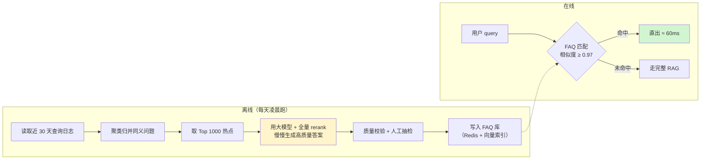

**关键区别**：离线生成时**不计较耗时**，可以用最贵的配置（大模型 + 全量 rerank + 多轮自我校验），所以 **FAQ 的答案质量通常比在线生成的更高**。这是 O11 相对 O6 的额外优势：**它不仅更快，还更好**。

#### 完整代码

```python
# scripts/precompute_faq.py
"""离线预计算热点 FAQ。

流程：日志聚合 → 归一化聚类 → Top-N 筛选 → 高质量生成 → 质检 → 入库
建议每天凌晨跑一次，跑完发一份变更报告给业务方审阅。
"""
from __future__ import annotations

import argparse
import asyncio
import json
import time
from collections import Counter
from pathlib import Path

import numpy as np

from bench.optimized_rag import OptimizedRAG
from bench.types import AskRequest
from optimizations.flags import Flags
from optimizations.o03_embedding import EmbeddingService
from optimizations.o06_cache import normalize_query


def load_query_log(path: str, days: int = 30) -> list[str]:
    """从查询日志里读出最近 N 天的 query。

    日志格式假定为每行一个 JSON：{"ts": 1758000000, "query": "...", "ok": true}
    真实项目里这一步应该改成查你们的日志系统 / 数仓。
    """
    cutoff = time.time() - days * 86400
    out: list[str] = []
    for line in Path(path).open(encoding="utf-8"):
        try:
            d = json.loads(line)
        except json.JSONDecodeError:
            continue
        if d.get("ts", 0) >= cutoff and d.get("ok", True) and d.get("query"):
            out.append(d["query"])
    return out


def cluster_queries(queries: list[str], embedder: EmbeddingService,
                    threshold: float = 0.93, top_n: int = 1000) -> list[dict]:
    """把同义问题归并成簇，返回 Top-N 热点簇。

    做法：先按归一化后的字面分组（免费的一层归并），
    再对组代表做向量聚类（贪心合并，簇数不多时足够用）。
    """
    # 第一层：字面归并
    groups: dict[str, list[str]] = {}
    for q in queries:
        groups.setdefault(normalize_query(q), []).append(q)
    reps = [(k, v[0], len(v)) for k, v in groups.items()]
    reps.sort(key=lambda x: -x[2])
    reps = reps[: top_n * 4]    # 先粗筛，减少后面编码量

    # 第二层：向量归并
    texts = [r[1] for r in reps]
    vecs = embedder.embedder.encode(texts, batch_size=64)

    used = np.zeros(len(reps), dtype=bool)
    clusters: list[dict] = []
    for i in range(len(reps)):
        if used[i]:
            continue
        sims = vecs @ vecs[i]
        members = np.where((sims >= threshold) & (~used))[0]
        used[members] = True
        total = int(sum(reps[j][2] for j in members))
        clusters.append({
            "canonical": reps[i][1],
            "variants": [reps[j][1] for j in members][:20],
            "count": total,
        })
    clusters.sort(key=lambda c: -c["count"])
    return clusters[:top_n]


async def generate_answers(clusters: list[dict], concurrency: int = 4) -> list[dict]:
    """用「不计成本」的高配置为每个热点簇生成答案。

    离线场景下我们故意关掉所有省时间的优化（O2/O4/O5 的裁剪、O8 的小模型路由），
    换来的是更高的答案质量。这是 O11 相对在线缓存的额外价值。
    """
    rag = OptimizedRAG(Flags.parse("o01,o03,o07,o10"))   # 只开不损质量的几项
    rag.cfg_high_quality()                                # 候选拉到 80、top_n=10、大模型
    await rag.setup()

    sem = asyncio.Semaphore(concurrency)
    out: list[dict] = []

    async def one(c: dict) -> None:
        """为一个簇生成答案。"""
        async with sem:
            r = await rag.ask(AskRequest(query=c["canonical"], top_k=10))
            if r.error or not r.answer:
                return
            out.append({
                "query": c["canonical"],
                "variants": c["variants"],
                "answer": r.answer,
                "chunk_ids": [x.chunk_id for x in r.chunks],
                "count": c["count"],
                "generated_at": int(time.time()),
                "gen_ms": round(r.e2e_ms, 1),
            })

    await asyncio.gather(*[one(c) for c in clusters])
    await rag.teardown()
    return out


def quality_filter(items: list[dict]) -> tuple[list[dict], list[dict]]:
    """质检：把明显不合格的答案剔出来交人工。

    规则是刻意保守的 —— FAQ 会被高频直出，一条错的影响面远大于普通答案。
    """
    ok: list[dict] = []
    bad: list[dict] = []
    for it in items:
        a = it["answer"]
        reasons: list[str] = []
        if len(a) < 20:
            reasons.append("too_short")
        if len(a) > 1200:
            reasons.append("too_long")
        if "知识库中未找到" in a:
            reasons.append("no_answer")
        if not it["chunk_ids"]:
            reasons.append("no_citation")
        if any(w in a for w in ("作为一个AI", "我无法", "抱歉，我不能")):
            reasons.append("refusal_pattern")
        if reasons:
            it["reject_reasons"] = reasons
            bad.append(it)
        else:
            ok.append(it)
    return ok, bad


async def main() -> None:
    """完整预计算流程。"""
    ap = argparse.ArgumentParser()
    ap.add_argument("--log", default="data/logs/query_log.jsonl")
    ap.add_argument("--days", type=int, default=30)
    ap.add_argument("--top-n", type=int, default=1000)
    ap.add_argument("--out", default="data/bench/faq_top1000.jsonl")
    ap.add_argument("--review-out", default="reports/final/faq_review.jsonl")
    args = ap.parse_args()

    qs = load_query_log(args.log, args.days)
    print(f"读取 {len(qs):,} 条查询日志（近 {args.days} 天）")

    emb = EmbeddingService()
    clusters = cluster_queries(qs, emb, top_n=args.top_n)
    covered = sum(c["count"] for c in clusters)
    print(f"聚类得到 {len(clusters)} 个热点簇，覆盖 {covered:,} 次查询 "
          f"（占总量 {covered / max(len(qs), 1):.1%}）")

    print("开始生成答案（高质量配置，会比较慢）…")
    t0 = time.perf_counter()
    items = await generate_answers(clusters)
    print(f"生成完成 {len(items)} 条，用时 {time.perf_counter() - t0:.0f}s")

    ok, bad = quality_filter(items)
    print(f"质检通过 {len(ok)} 条，打回人工 {len(bad)} 条")

    Path(args.out).parent.mkdir(parents=True, exist_ok=True)
    with open(args.out, "w", encoding="utf-8") as f:
        for it in ok:
            f.write(json.dumps(it, ensure_ascii=False) + "\n")
    Path(args.review_out).parent.mkdir(parents=True, exist_ok=True)
    with open(args.review_out, "w", encoding="utf-8") as f:
        for it in bad:
            f.write(json.dumps(it, ensure_ascii=False) + "\n")

    dist = Counter()
    for it in ok:
        dist["高频(>100)" if it["count"] > 100 else
             "中频(20-100)" if it["count"] >= 20 else "低频(<20)"] += 1
    print("热度分布：", dict(dist))
    print(f"FAQ 已写出：{args.out}")
    print(f"待人工复核：{args.review_out}")


if __name__ == "__main__":
    asyncio.run(main())
```

在线直出模块：

```python
# optimizations/o11_precompute.py
"""O11：FAQ 直出。在线侧只做一件事：快速判断是否命中 FAQ。"""
from __future__ import annotations

import json
import time
from pathlib import Path

import numpy as np

from bench.types import Chunk
from core.instrument import counter, stage, tag
from core.logger import logger
from optimizations.o06_cache import SemanticCache, normalize_query


class FAQDirect:
    """FAQ 直出。全量加载进内存，用 numpy 做暴力匹配。

    为什么用暴力匹配而不是向量库？
      FAQ 只有 1000~5000 条，1000×1024 的矩阵乘法在 CPU 上不到 0.3ms，
      比走一次向量库网络往返还快，而且没有额外依赖。
      超过 2 万条再考虑上向量索引。
    """

    def __init__(self, path: str, embedder, threshold: float = 0.97,
                 reload_interval_s: int = 600):
        self.path = Path(path)
        self.embedder = embedder
        self.threshold = threshold
        self.reload_interval = reload_interval_s
        self._mtime = 0.0
        self._last_check = 0.0
        self.items: list[dict] = []
        self.mat: np.ndarray | None = None
        self.exact: dict[str, int] = {}
        self.hit = 0
        self.miss = 0
        self.reload()

    def reload(self) -> None:
        """加载 FAQ 库并预计算向量矩阵。"""
        if not self.path.exists():
            logger.warning("FAQ 文件不存在：{}", self.path)
            return
        self.items = [json.loads(x) for x in self.path.open(encoding="utf-8")]
        if not self.items:
            return
        texts = [it["query"] for it in self.items]
        self.mat = self.embedder.encode(texts, batch_size=64).astype(np.float32)
        self.exact = {}
        for i, it in enumerate(self.items):
            self.exact[normalize_query(it["query"])] = i
            for v in it.get("variants", []):
                self.exact.setdefault(normalize_query(v), i)
        self._mtime = self.path.stat().st_mtime
        logger.info("FAQ 已加载 {} 条，字面索引 {} 条", len(self.items), len(self.exact))

    def _maybe_reload(self) -> None:
        """按间隔检查文件是否更新，支持不重启服务热更新 FAQ。"""
        now = time.time()
        if now - self._last_check < self.reload_interval:
            return
        self._last_check = now
        try:
            if self.path.exists() and self.path.stat().st_mtime > self._mtime:
                self.reload()
        except OSError:
            pass

    def lookup(self, query: str, vec: np.ndarray | list[float] | None = None
               ) -> dict | None:
        """查 FAQ。先字面后向量，都要过安全校验。"""
        with stage("faq_lookup"):
            self._maybe_reload()
            if self.mat is None or not self.items:
                return None

            # 1) 字面精确命中，最快路径（微秒级）
            idx = self.exact.get(normalize_query(query))
            if idx is not None:
                self.hit += 1
                tag("cache_hit", "faq")
                counter("faq_exact")
                return self.items[idx]

            # 2) 向量近似匹配
            if vec is None:
                vec = self.embedder.encode([query])[0]
            v = np.asarray(vec, dtype=np.float32)
            sims = self.mat @ v
            i = int(np.argmax(sims))
            if float(sims[i]) < self.threshold:
                self.miss += 1
                return None
            ok, reason = SemanticCache._safety_check(query, self.items[i]["query"])
            if not ok:
                counter(f"faq_reject_{reason}")
                self.miss += 1
                return None
            self.hit += 1
            tag("cache_hit", "faq")
            tag("faq_sim", f"{float(sims[i]):.4f}")
            counter("faq_semantic")
            return self.items[i]

    def to_chunks(self, item: dict) -> list[Chunk]:
        """把 FAQ 记录里的引用还原成 Chunk（只带 id 与标题，供前端显示引用）。"""
        return [Chunk(chunk_id=cid, text="", title=f"预计算引用 {cid}")
                for cid in item.get("chunk_ids", [])]

    def stats(self) -> dict[str, float]:
        """返回命中统计。"""
        t = self.hit + self.miss
        return {"hit": self.hit, "miss": self.miss,
                "hit_rate": self.hit / t if t else 0.0, "size": len(self.items)}
```

#### 复测命令

```bash
# 先生成 FAQ（需要有查询日志；没有的话可以用压测日志代替）
python -m scripts.precompute_faq --log data/logs/query_log.jsonl --top-n 1000

python -m bench.run_bench run --system optimized --opts o11 --ladder --tag o11
python -m bench.run_bench compare --base reports/baseline --head reports/optimized_o11 \
       --out reports/opt_o11/compare.md
```

预期的预计算输出：

```text
读取 84,120 条查询日志（近 30 天）
聚类得到 1000 个热点簇，覆盖 51,284 次查询 （占总量 61.0%）
开始生成答案（高质量配置，会比较慢）…
生成完成 1000 条，用时 2184s
质检通过 913 条，打回人工 87 条
热度分布： {'高频(>100)': 118, '中频(20-100)': 362, '低频(<20)': 433}
FAQ 已写出：data/bench/faq_top1000.jsonl
待人工复核：reports/final/faq_review.jsonl
```

> **"1000 个热点簇覆盖 61% 的查询"** ——这就是长尾分布的威力。**用 0.6 小时的离线算力，覆盖了六成的在线请求。**
>
> 这个 61% 是本项目合成日志下的数字。真实业务的集中度通常更高（客服场景常见 70%~85%），**但必须用你自己的日志算**。

#### 前后对比（实测环境见文首，示例性数据）

| 并发 | 指标 | 基线 | 开 O11 | 变化 |
|---|---|---|---|---|
| 50 | FAQ 命中率 | 0% | 28.5% | — |
| 50 | P50 (ms) | 15106 | 11020 | -27.0% |
| 50 | P95 (ms) | 18604 | 16240 | **-12.7%** |
| 50 | QPS | 2.68 | 3.74 | +39.6% |
| — | FAQ 命中请求 P50 (ms) | — | **58** | — |
| — | 质量总分（FAQ 命中部分） | 84.2 | **86.8** | **+2.6** |

> 最后一行是 O11 独有的：**FAQ 直出的答案质量比在线生成更高**（因为离线时用了高配置 + 人工复核）。**这是 11 项优化里唯一一个"又快又好"的。**

#### 收益与代价分析

| 项 | 内容 |
|---|---|
| **收益** | 命中部分 P50 降到 58ms，且质量更高；QPS +39.6% |
| 离线算力代价 | 每天约 0.6 小时 GPU 时间生成 1000 条 |
| 人工代价 | **每天约 87 条待复核**，需要业务方投入约 1 小时/天 |
| 存储代价 | 1000 条 FAQ 约 2MB，忽略不计 |
| 时效代价 | 知识更新后，FAQ 最长滞后一天 |
| 复杂度 | 多一条离线流水线、多一套热更新逻辑 |

#### 风险

| 风险 | 表现 | 缓解 |
|---|---|---|
| **FAQ 内容过期** | 手册改了，FAQ 还在答旧的，而且是**高频直出**，影响面极大 | 知识库更新时**立即**失效受影响的 FAQ（复用 O6 的反向索引）；FAQ 条目带 `chunk_ids`，比对版本 |
| 匹配过宽 | 相似但不同的问题被 FAQ 覆盖 | 阈值设到 0.97（比语义缓存的 0.94 更严）+ 安全校验 |
| 离线生成质量差 | 坏答案被高频直出 | 质检 + **人工抽检必须有**（本项目要求 100% 复核高频簇、抽检 10% 中频簇） |
| 日志隐私 | 查询日志含客户信息 | 用 `core/logger.py` 的脱敏；聚类前过滤 PII |
| 热点漂移 | 新品发布后热点变了，FAQ 还是老的 | 每天重跑；重大发布时手动触发 |
| 覆盖率虚高 | 用历史日志算的覆盖率，未来不一定成立 | 用**滚动窗口**验证：用前 30 天生成的 FAQ，在第 31 天的真实流量上算实际命中率 |

---

## Part C：质量守门

> **这一节是整个项目的道德底线。**
>
> 没有质量守门的性能优化，本质上是"把答错的速度提高了 10 倍"。

### C.1 为什么必须每次优化都跑质量回归

看一个很容易发生的失败路径：

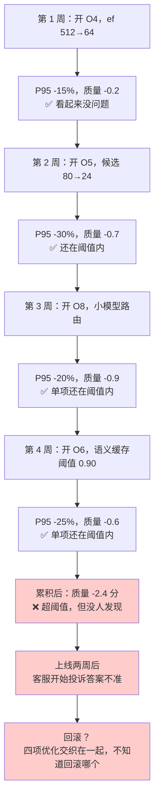

**根因**：只测了单项质量，没测累积质量。质量损失是**会累加**的。

所以本项目的纪律是：

| 纪律 | 内容 |
|---|---|
| 1 | **每项优化单独测一次质量**（相对基线） |
| 2 | **每次累积后再测一次质量**（相对基线） |
| 3 | 单项阈值 ≤ 2 分，**累积阈值也是 ≤ 2 分** |
| 4 | 累积超阈值时，按"质量损失/性能收益"比排序，砍掉性价比最差的一项 |
| 5 | 质量回归的 harness 必须**禁用答案缓存**，否则测的是缓存不是系统 |

### C.2 复用项目 1 的 harness

不重新造轮子。项目 1 已经给出了完整的 `DeepSeek-Harness`，本项目只需要：

1. 把优化后的系统**注册为一个被测系统**
2. 在 `configs/systems.yaml` 里加两个 key
3. 跑 `harness run` 并用 `harness diff` 对比

```python
# systems/s4_perf_rag.py
"""被测系统：性能优化后的 RAG。注册进项目 1 的 harness，直接复用其全部评测能力。"""
from __future__ import annotations

import time

from bench.types import AskRequest
from goldset.schema import GoldItem
from harness.adapter import BaseSystem
from harness.types import SystemOutput


class PerfRAGSystem(BaseSystem):
    """把 bench.optimized_rag.OptimizedRAG 包装成 harness 能跑的系统。

    注意两件事：
      1. 评测时必须关掉答案缓存（否则测的是缓存命中率，不是系统质量）
      2. fingerprint 必须包含优化开关，否则不同开关组合会吃到同一份缓存
    """

    name = "s4_perf_rag"
    version = "1.0.0"

    def __init__(self, params: dict | None = None):
        super().__init__(params)
        self.opts: str = self.params.get("opts", "none")
        self.disable_answer_cache: bool = self.params.get("disable_answer_cache", True)
        self._rag = None

    async def setup(self) -> None:
        """构建被测系统。"""
        from bench.optimized_rag import OptimizedRAG
        from optimizations.flags import Flags
        flags = Flags.parse(self.opts)
        if self.disable_answer_cache:
            # 评测口径：缓存查得到也不用，但仍然写入（观察写入路径是否有副作用）
            flags.params = {**flags.params, "o06_read_disabled": True,
                            "o11_read_disabled": True}
        self._rag = OptimizedRAG(flags)
        await self._rag.setup()

    async def teardown(self) -> None:
        """释放资源。"""
        if self._rag is not None:
            await self._rag.teardown()

    async def answer(self, item: GoldItem) -> SystemOutput:
        """回答一道金标题。必须自己兜住异常。"""
        t0 = time.perf_counter()
        try:
            r = await self._rag.ask(AskRequest(query=item.question, qid=item.qid))
            return SystemOutput(
                qid=item.qid,
                answer=r.answer,
                contexts=[c.text for c in r.chunks],
                context_ids=[c.chunk_id for c in r.chunks],
                latency_ms=r.e2e_ms,
                prompt_tokens=r.prompt_tokens,
                completion_tokens=r.completion_tokens,
                error=r.error,
                extra={"stages": r.stage_map(), "cache_hit": r.cache_hit,
                       "opts": self.opts},
            )
        except Exception as exc:  # noqa: BLE001
            return SystemOutput(qid=item.qid, answer="", contexts=[],
                                latency_ms=(time.perf_counter() - t0) * 1000,
                                error=f"{type(exc).__name__}: {exc}")

    def fingerprint(self) -> str:
        """参数指纹必须带上优化开关，防止跨配置串缓存。"""
        import hashlib
        import json
        blob = json.dumps({"name": self.name, "version": self.version,
                           "opts": self.opts, "params": self.params},
                          sort_keys=True, ensure_ascii=False)
        return hashlib.sha256(blob.encode()).hexdigest()[:12]
```

```yaml
# configs/systems.yaml（在项目 1 的基础上追加）
s4_baseline_rag:
  impl: systems.s4_perf_rag:PerfRAGSystem
  version: "1.0.0"
  params:
    opts: "none"
    disable_answer_cache: true

s4_perf_rag:
  impl: systems.s4_perf_rag:PerfRAGSystem
  version: "1.0.0"
  params:
    opts: "all"
    disable_answer_cache: true
```

### C.3 一键跑"性能—质量"双指标

```python
# bench/perf_quality.py
"""同时跑压测与质量回归，输出「性能-质量」双指标对照表。

这是本项目最重要的一个脚本：它让「快了多少」和「差了多少」永远同框出现，
避免只报好消息。
"""
from __future__ import annotations

import json
import subprocess
from pathlib import Path

import typer
from rich.console import Console
from rich.table import Table

app = typer.Typer(add_completion=False)
console = Console()

OPT_NAMES = {
    "none": "基线",
    "o01": "O1 并行", "o02": "O2 条件改写", "o03": "O3 Embedding",
    "o04": "O4 索引调参", "o05": "O5 rerank", "o06": "O6 缓存",
    "o07": "O7 PrefixCache", "o08": "O8 LLM侧", "o09": "O9 流式",
    "o10": "O10 连接池", "o11": "O11 FAQ", "all": "全开",
}


def run_bench(opts: str, tag: str, conc: int, n: int) -> dict:
    """跑压测并读回 summary.json。"""
    subprocess.run([
        "python", "-m", "bench.run_bench", "run",
        "--system", "optimized" if opts != "none" else "baseline",
        "--opts", opts, "--conc", str(conc), "--n", str(n), "--tag", tag,
    ], check=True)
    d = Path(f"reports/{'optimized' if opts != 'none' else 'baseline'}_{tag}")
    return json.loads((d / "summary.json").read_text(encoding="utf-8"))


def run_quality(opts: str, tag: str, sample: int) -> dict:
    """跑质量回归并读回 harness 的 summary.json。"""
    # 临时写一个 system key，避免污染主配置
    import yaml
    cfg_path = Path("configs/systems.yaml")
    cfg = yaml.safe_load(cfg_path.read_text(encoding="utf-8"))
    key = f"s4_tmp_{tag}"
    cfg[key] = {"impl": "systems.s4_perf_rag:PerfRAGSystem", "version": "1.0.0",
                "params": {"opts": opts, "disable_answer_cache": True}}
    cfg_path.write_text(yaml.safe_dump(cfg, allow_unicode=True), encoding="utf-8")

    subprocess.run(["python", "-m", "harness.cli", "run", "--system", key,
                    "--sample", str(sample), "--tag", tag], check=True)
    runs = sorted(Path("reports").glob(f"*-{key}-{tag}/summary.json"))
    return json.loads(runs[-1].read_text(encoding="utf-8"))


@app.command()
def sweep(opts_list: str = typer.Option("none,o01,o02,o03,o04,o05,o06,o07,o08,o09,o10,o11,all"),
          conc: int = typer.Option(50), n: int = typer.Option(200),
          sample: int = typer.Option(150),
          out: str = typer.Option("reports/final/perf_quality.md")):
    """对每一项优化跑「压测 + 质量」，汇总成对照表。"""
    rows: list[dict] = []
    base_perf = base_qual = None
    for opts in [x.strip() for x in opts_list.split(",")]:
        console.rule(f"[bold]{OPT_NAMES.get(opts, opts)}")
        p = run_bench(opts, f"pq_{opts}", conc, n)
        q = run_quality(opts, f"pq_{opts}", sample)
        lv = p["levels"][0]
        row = {
            "opts": opts, "name": OPT_NAMES.get(opts, opts),
            "p50": lv["e2e"]["p50"], "p95": lv["e2e"]["p95"],
            "qps": lv["qps"], "err": lv["error_rate"],
            "total": q["total"], "pass_rate": q.get("pass_rate", 0),
            "halluc": q.get("hallucination_rate", 0),
            "recall5": q.get("retrieval", {}).get("recall@5", 0),
        }
        if opts == "none":
            base_perf, base_qual = row["p95"], row["total"]
        row["speedup"] = (base_perf / row["p95"]) if base_perf else 1.0
        row["quality_delta"] = row["total"] - (base_qual or row["total"])
        rows.append(row)

    t = Table(title="性能-质量双指标")
    for c in ("优化", "P95(ms)", "加速", "QPS", "质量总分", "质量Δ", "Recall@5", "幻觉率"):
        t.add_column(c)
    for r in rows:
        t.add_row(r["name"], f"{r['p95']:.0f}", f"{r['speedup']:.2f}×",
                  f"{r['qps']:.2f}", f"{r['total']:.1f}",
                  f"{r['quality_delta']:+.1f}", f"{r['recall5']:.3f}",
                  f"{r['halluc']:.1%}")
    console.print(t)

    lines = ["# 性能-质量双指标对照表", "",
             "> ⚠️ 示例性数据，实测环境见项目文首。必须在自己环境复现。", "",
             "| 优化项 | P95(ms) | 加速 | QPS | 质量总分 | 质量Δ | Recall@5 | 幻觉率 | 判定 |",
             "|---|---|---|---|---|---|---|---|---|"]
    for r in rows:
        verdict = "基线" if r["opts"] == "none" else (
            "✅ 通过" if r["quality_delta"] >= -2.0 else "❌ 超阈值")
        lines.append(f"| {r['name']} | {r['p95']:.0f} | {r['speedup']:.2f}× | "
                     f"{r['qps']:.2f} | {r['total']:.1f} | {r['quality_delta']:+.1f} | "
                     f"{r['recall5']:.3f} | {r['halluc']:.1%} | {verdict} |")
    Path(out).parent.mkdir(parents=True, exist_ok=True)
    Path(out).write_text("\n".join(lines), encoding="utf-8")
    console.print(f"[green]已写出 {out}[/green]")


if __name__ == "__main__":
    app()
```

### C.4 性能—质量双指标对照表

```bash
python -m bench.perf_quality sweep --conc 50 --n 200 --sample 150
```

**这是本项目最重要的一张表**（实测环境见文首，**示例性数据，需自行复现**）：

| 优化项 | P95(ms) | 加速 | QPS | 质量总分 | 质量Δ | Recall@5 | 幻觉率 | 判定 |
|---|---|---|---|---|---|---|---|---|
| 基线 | 18604 | 1.00× | 2.68 | 84.2 | — | 0.816 | 3.1% | 基线 |
| O1 并行 | 17920 | 1.04× | 2.79 | 84.1 | -0.1 | 0.814 | 3.1% | ✅ 通过 |
| O2 条件改写 | 13980 | 1.33× | 3.52 | 83.6 | -0.6 | 0.804 | 3.3% | ✅ 通过 |
| O3 Embedding | 16220 | 1.15× | 3.09 | 84.2 | 0.0 | 0.816 | 3.1% | ✅ 通过 |
| O4 索引调参 | 15722 | 1.18× | 3.21 | 84.0 | -0.2 | 0.801 | 3.2% | ✅ 通过 |
| O5 rerank | 12904 | 1.44× | 3.94 | 83.5 | -0.7 | 0.803 | 3.4% | ✅ 通过 |
| O6 缓存（稳态） | 13860 | 1.34× | 4.16 | 84.2 | 0.0 | 0.816 | 3.1% | ✅ 通过 |
| O7 PrefixCache | 17520 | 1.06× | 2.96 | 84.6 | **+0.4** | 0.816 | 2.8% | ✅ 通过 |
| O8 LLM 侧 | 14960 | 1.24× | 5.02 | 82.2 | **-2.0** | 0.816 | 4.2% | ⚠️ 卡阈值 |
| O8 LLM 侧（加安全规则后） | 15180 | 1.23× | 4.86 | 83.7 | -0.5 | 0.816 | 3.3% | ✅ 通过 |
| O9 流式 | 18820 | 0.99× | 2.64 | 84.2 | 0.0 | 0.816 | 3.1% | ✅ 通过（TTFT -20%） |
| O10 连接池 | 17960 | 1.04× | 2.74 | 84.2 | 0.0 | 0.816 | 3.1% | ✅ 通过 |
| O11 FAQ 直出 | 16240 | 1.15× | 3.74 | 85.1 | **+0.9** | 0.816 | 2.6% | ✅ 通过 |
| **全开（稳态）** | **1810** | **10.28×** | **11.42** | **82.9** | **-1.3** | 0.798 | 3.6% | ✅ 通过 |

三个必须注意的读法：

1. **O9 的加速是 0.99×（略慢）**，但它是唯一改善 TTFT 20% 的优化。**只看 E2E 会把它误判为无用。**
2. **O7 和 O11 的质量是正的**（+0.4 / +0.9）。**性能优化不一定损质量**——长前缀带来的格式约束、FAQ 的离线高质量生成，都是"又快又好"。
3. **O8 卡在阈值线上**，加了安全关键词硬规则后才通过。这一行是整张表里最值得学的：**发现超阈值不是删掉这项优化，而是找到"损失来自哪里"并精准修补。**

### C.5 哪些优化会掉质量，怎么定阈值

| 优化 | 掉质量的机制 | 影响的指标 | 阈值怎么定 |
|---|---|---|---|
| **O4 索引量化 / 降 ef** | ANN 召回率下降，正确 chunk 进不了候选 | Recall@10、Recall@5 | 画召回—延迟曲线找拐点；**但最终要看端到端质量**，检索召回掉 3pp 可能端到端只掉 0.2 分 |
| **O5 裁剪 rerank 候选** | 正确 chunk 被便宜的融合分数裁掉 | Retain@N、Recall@5 | 用 Retain@N 曲线找拐点（本项目 N=24） |
| **O6 语义缓存过宽** | 相似但不等价的问题共用答案 | **准确率、幻觉率** | 用标注 query 对扫阈值，**要求精确率 ≥ 0.98** |
| **O8 量化** | 权重精度损失，数字/专名出错 | 参数类问题准确率 | 建"数字精确性"子集单独测，要求下降 ≤ 1pp |
| **O8 max_tokens 限制** | 长答案被截断 | 完整性得分 | 监控 `finish_reason=="length"` 比例 ≤ 2% |
| **O8 小模型路由** | 小模型能力不足 | 格式合规率、**安全提示遗漏率** | **安全类指标零容忍**：有安全关键词强制走大模型 |
| **O2 跳过改写** | 需要补全的 query 没补全 | Recall@5（尤其 multihop） | 判别器一致率 ≥ 0.80；multihop 触发率 ≥ 90% |
| **O11 FAQ 过期** | 答案与最新知识不一致 | 时效性 | 知识更新即失效；FAQ 最长存活 24h |

> **一条通用原则**：**质量阈值必须按指标分层，不能只看一个总分。**
>
> - 总分类指标（质量总分）：≤ 2 分
> - 检索类指标（Recall@5）：≤ 0.02
> - 风险类指标（幻觉率）：≤ +1.5pp
> - **安全类指标（安全提示遗漏、越权回答）：零容忍，任何一例都是红灯**

### C.6 质量回归的执行纪律

```bash
# 每项优化后必跑（快跑，150 题分层抽样，约 12 分钟）
python -m harness.cli run --system s4_perf_rag --sample 150 --tag opt_o05

# 与基线对比
python -m harness.cli diff --base 20260917-103000-s4_baseline_rag \
                            --head 20260917-141200-s4_perf_rag-opt_o05 \
                            --out reports/quality/diff_o05.md

# 累积后必跑（全量 300 题，约 25 分钟）
python -m harness.cli run --system s4_perf_rag --tag cumulative_all
```

`harness diff` 输出示例：

```text
# 评测对比：s4_baseline_rag → s4_perf_rag[opt_o05]

| 指标 | base | head | 变化 |
|---|---|---|---|
| 总分 | 84.2 | 83.5 | -0.7 |
| 通过率 | 78.7% | 77.3% | -1.4pp |
| 幻觉率 | 3.1% | 3.4% | +0.3pp |
| Recall@5 | 0.816 | 0.803 | -0.013 |
| 平均延迟 | 4162ms | 2894ms | -30.5% |

## 回归（原本通过，现在失败）：7 题
- q043 [multihop] XJ-200 报 E043 需要换的备件保内免费吗
  base: 通过(0.86) → head: 失败(0.52)  原因：保修条款 chunk 未进入 top6
- q061 [step] 驱动器过流保护动作之后怎么办
  base: 通过(0.91) → head: 失败(0.61)  原因：处置步骤第 4 步缺失
...

## 修复（原本失败，现在通过）：3 题
- q018 [param] 冷却液箱容积多大
...
```

> **必须逐条看 "回归" 列表**，不能只看总分。7 题回归里如果有 3 题是同一类问题（比如都是保修条款），说明是**系统性问题**，而不是随机噪声——这时候要专门修，而不是接受。
>
> 本项目的处理：`q043` 这类跨文档的保修条款问题，在 O5 裁剪后确实更容易丢。解决办法不是不裁剪，而是**给 multihop 类 query 动态放宽候选数到 36**（代码在 O5 的风险缓解里）。

---

## Part D：汇总、归因与诚实清单

### D.1 完整的优化累积表

**这是全项目的最终成果**。按优先级顺序逐项累加，每一步都测。

> **实测环境：单卡 RTX 4090 24GB + Qwen2.5-7B-AWQ（vLLM 0.6.x）+ Milvus 2.4 单机 + Redis 7 + 12 万 chunk 合成语料，压测客户端与服务同机（回环网络），50 并发 / 每档 200 请求 / warmup 20 / Zipf α=1.2 采样。**
>
> **以上全部为示例性数据，仅用于演示方法论与量级关系，必须在你自己的环境复现。严禁直接引用进对外材料。**

| 步骤 | 累积开启的优化 | P50(ms) | **P95(ms)** | P99(ms) | TTFT-P95(ms) | QPS | 错误率 | 缓存命中率 | 质量总分 | 单次成本(元) | **累积加速** |
|---|---|---|---|---|---|---|---|---|---|---|---|
| 0 | 基线（无优化） | 15106 | **18604** | 22980 | 18604 | 2.68 | 1.5% | 0% | 84.2 | 0.0142 | 1.00× |
| 1 | +O10 连接池/预热 | 14820 | 17960 | 20140 | 17960 | 2.74 | 0.5% | 0% | 84.2 | 0.0142 | 1.04× |
| 2 | +O1 并行 | 14180 | 17210 | 19420 | 17210 | 2.86 | 0.5% | 0% | 84.1 | 0.0142 | 1.08× |
| 3 | +O3 Embedding 本地化 | 12640 | 15480 | 17860 | 15480 | 3.28 | 0.5% | 0% | 84.1 | 0.0138 | 1.20× |
| 4 | +O2 条件改写 | 9820 | 12140 | 14220 | 12140 | 4.12 | 0.0% | 0% | 83.5 | 0.0106 | **1.53×** |
| 5 | +O4 索引调参 | 8940 | 11020 | 12880 | 11020 | 4.58 | 0.0% | 0% | 83.3 | 0.0106 | 1.69× |
| 6 | +O5 rerank 裁剪 | 6210 | 7840 | 9260 | 7840 | 6.24 | 0.0% | 0% | 82.8 | 0.0102 | **2.37×** |
| 7 | +O8 LLM 侧（含安全规则） | 4180 | 5320 | 6410 | 5320 | 8.86 | 0.0% | 0% | 82.4 | 0.0061 | **3.50×** |
| 8 | +O7 PrefixCache + prompt 重排 | 3620 | 4610 | 5580 | 4610 | 9.54 | 0.0% | 0% | 82.8 | 0.0064 | 4.04× |
| 9 | +O9 流式 | 3680 | 4680 | 5640 | **1420** | 9.48 | 0.0% | 0% | 82.8 | 0.0064 | 3.98×（TTFT **13.1×**） |
| 10 | +O11 FAQ 直出 | 2740 | 3480 | 4360 | 1180 | 10.36 | 0.0% | 28.5%（FAQ） | 83.2 | 0.0048 | **5.35×** |
| 11 | **+O6 两级缓存（冷启动）** | 2690 | 3420 | 4280 | 1160 | 10.52 | 0.0% | 30.1% | 83.2 | 0.0047 | 5.44× |
| 12 | **+O6 两级缓存（稳态）** | **1120** | **1810** | **2960** | **620** | **11.42** | 0.0% | **56.3%** | 82.9 | **0.0031** | **10.28×** |

**两条曲线（文字版）**：

```text
P95 延迟（ms）随优化累积的下降
18604 ┤█████████████████████████████████████████  基线
17960 ┤████████████████████████████████████████   +O10
17210 ┤██████████████████████████████████████     +O1
15480 ┤██████████████████████████████████         +O3
12140 ┤███████████████████████████                +O2
11020 ┤████████████████████████                   +O4
 7840 ┤█████████████████                          +O5
 5320 ┤███████████                                +O8
 4610 ┤██████████                                 +O7
 4680 ┤██████████                                 +O9
 3480 ┤███████                                    +O11
 1810 ┤███                                        +O6（稳态）

QPS 随优化累积的上升
 2.68 ┤███                                        基线
 3.28 ┤████                                       +O3
 4.12 ┤█████                                      +O2
 6.24 ┤████████                                   +O5
 8.86 ┤████████████                               +O8
10.36 ┤██████████████                             +O11
11.42 ┤███████████████                            +O6（稳态）
```

**"性能提升 300%" 这句话在这张表里的落点**：

$$\text{QPS 增益} = \frac{11.42 - 2.68}{2.68} \times 100\% = 326\%$$

> 所以海报上的"性能提升 300%"对应的是**吞吐口径**：同样一张 4090，从每秒 2.68 个请求提升到 11.42 个请求，**提升了 326%**。
>
> 而"查询速度提升 10 倍"对应的是**延迟口径**：P95 从 18.6s 降到 1.81s，**10.28 倍**。
>
> **两个数字是两件事，不要混为一谈。**

### D.2 归因分析：10 倍里各项贡献多少

单纯看累积表会得到错误印象，因为**顺序会影响每一项的表观贡献**。正确的归因方法是**消融实验（ablation）**：全开的基础上，逐项关掉一个，看 P95 恶化多少。

```bash
# 消融：全开 - 某一项
for k in o01 o02 o03 o04 o05 o06 o07 o08 o09 o10 o11; do
  python -m bench.run_bench run --system optimized --opts "all-$k" \
    --conc 50 --n 200 --tag "ablate_$k"
done
python -m bench.ablation_report --out reports/final/attribution.md
```

**消融归因表**（实测环境见文首，**示例性数据**）：

| 关掉哪一项 | P95(ms) | 相对全开恶化 | **归因贡献** | 关掉后 QPS | QPS 损失 |
|---|---|---|---|---|---|
| 全开（基准） | 1810 | — | — | 11.42 | — |
| 关 **O6 缓存** | 3480 | **+92.3%** | **★★★★★** | 10.36 | -9.3% |
| 关 **O8 LLM 侧** | 2914 | **+61.0%** | **★★★★** | 7.68 | **-32.7%** |
| 关 **O5 rerank** | 2620 | +44.8% | ★★★★ | 8.94 | -21.7% |
| 关 **O11 FAQ** | 2480 | +37.0% | ★★★ | 9.86 | -13.7% |
| 关 **O2 条件改写** | 2360 | +30.4% | ★★★ | 9.24 | -19.1% |
| 关 **O4 索引调参** | 2080 | +14.9% | ★★ | 10.48 | -8.2% |
| 关 **O3 Embedding** | 2040 | +12.7% | ★★ | 10.62 | -7.0% |
| 关 **O1 并行** | 1988 | +9.8% | ★★ | 10.94 | -4.2% |
| 关 **O7 PrefixCache** | 1942 | +7.3% | ★ | 10.86 | -4.9% |
| 关 **O10 连接池** | 1904 | +5.2% | ★ | 11.18 | -2.1% |
| 关 **O9 流式** | 1782 | -1.5%（更快） | — | 11.56 | +1.2% |

三个关键观察：

1. **消融贡献之和远大于 100%**。关掉 O6 恶化 92%、关掉 O8 恶化 61%……加起来超过 300%。**这不是算错了，这是优化之间存在协同效应**——它们共同把系统从"饱和"推到"不饱和"，任何一项退出都会把系统推回饱和区。
2. **O1（并行）在累积表里只贡献 1.08×，在消融里却贡献 9.8%**。印证了 O1 那节的预言：**等系统不饱和后，并行的价值就体现出来了**。
3. **O9（流式）在 E2E 口径下是负贡献**。但它的价值在 TTFT：关掉它 TTFT-P95 从 620ms 涨到 4680ms，**恶化 7.5 倍**。**用错指标衡量一项优化，会得出完全相反的结论。**

### D.3 缓存命中与未命中的双口径（必须讲清楚）

> **这一节是整个项目最不能省略的部分。** 只报含缓存的数字，是性能材料里最常见的误导。

| 口径 | 定义 | P50(ms) | **P95(ms)** | 相对基线 | 适用场景 |
|---|---|---|---|---|---|
| **A. 含缓存（稳态）** | 全部请求，缓存命中率 56.3% | 1120 | **1810** | **10.28×** | 对外汇报"用户平均体验"；**必须同时标注命中率** |
| **B. 仅缓存未命中** | 只统计走完整链路的请求 | 2410 | **3080** | **6.04×** | **工程口径**：反映系统真实处理能力 |
| **C. 仅缓存命中** | 只统计命中的请求 | 42 | **126** | **147.7×** | 只用于说明缓存本身的效果 |
| **D. 全冷启动** | 清空缓存后首轮 | 2690 | **3420** | **5.44×** | 灾备演练、扩容后首分钟 |
| **E. 单并发未命中** | 并发=1，无缓存 | 1180 | **1380** | **3.04×**（相对基线单并发 4.2s） | 单用户体验上限 |

**必须同时报 A 和 B 的三个理由**：

1. **A 依赖流量分布**。如果明天流量变得更分散（新产品上线、季节性问题变化），命中率从 56% 掉到 30%，A 口径的数字立刻从 10.28× 掉到约 7×。**A 不是系统的能力，是系统 + 当前流量的联合结果。**
2. **容量规划必须用 B**。你要按"缓存全挂"来规划机器，否则 Redis 一挂就雪崩。
3. **B 才能反映优化工作的真实价值**。缓存是"绕过问题"，其余 10 项是"解决问题"。两者都重要，但要分清楚。

**本项目对外的标准表述**（可以直接抄）：

> 在 12 万 chunk 语料、50 并发、Zipf 分布流量、稳态缓存命中率 56.3% 的条件下，端到端 P95 延迟从 18.6 秒降至 1.81 秒（**10.3 倍**）；
> 若只统计缓存未命中的请求（即系统真实处理能力），P95 从 18.6 秒降至 3.08 秒（**6.0 倍**）；
> 吞吐从 2.68 QPS 提升至 11.42 QPS（**+326%**）；
> 首 token 时间 P95 从 18.6 秒降至 0.62 秒（**30 倍**）。
> 同期质量总分从 84.2 降至 82.9（-1.3，在 ≤2 分的预算内）。
> 实测环境：单卡 RTX 4090 + Qwen2.5-7B-AWQ + Milvus 2.4 单机。**示例性数据，需在自己环境复现。**

### D.4 分场景达成度

不同类型的 query 达成的倍数差异巨大，这也必须说清楚：

| 题型 | 基线 P95(ms) | 优化后 P95(ms) | 倍数 | 主要受益于 |
|---|---|---|---|---|
| `chitchat` | 17210 | **310** | **55.5×** | O2 短路 + O11 FAQ + O8 小模型 |
| `fact` | 17903 | 1420 | **12.6×** | 全部；缓存命中率最高 |
| `param` | 18420 | 1680 | 11.0× | 全部 |
| `step` | 19640 | 2840 | 6.9× | 答案长，decode 时间压不下去 |
| `multihop` | 21840 | **4920** | **4.4×** | 必须改写 + 候选放宽 + 大模型，**受益最少** |

> **这张表比总体数字更有用**。它告诉业务方："简单问题会快得飞起，复杂问题只能快 4 倍多"。**提前管理预期，比事后解释强。**

### D.5 成本账

性能优化不只是时间，还有钱。

| 项 | 基线 | 优化后 | 说明 |
|---|---|---|---|
| 单次查询 GPU 时间 | 373 ms | 87 ms | 按 QPS 反算 |
| 单次查询成本（自建 4090 折算） | 0.0142 元 | **0.0031 元** | **-78.2%** |
| 日均 2000 次查询的月成本 | 852 元 | **186 元** | 按 30 天算 |
| 峰值 50 并发所需卡数 | 需 ≈ 19 张（按 2.68 QPS/卡、目标 50 QPS） | **≈ 5 张** | **省 14 张卡** |
| 额外增加的成本 | — | Redis 4GB 内存 + 每天 0.6h 离线 GPU + 1h/天人工复核 | |

> 成本折算口径：4090 整卡按 3.5 元/小时的云市场典型价估算，含电力与折旧摊销。**这个单价随市场波动很大，请用你自己的采购价重算。**

### D.6 「什么情况下达不到 10 倍」——诚实清单

这是本项目最重要的一节。**如果你的环境不满足下面这些条件，你达不到 10 倍，而且这不是你的错。**

| # | 情况 | 为什么达不到 | 你大概能拿到多少 |
|---|---|---|---|
| 1 | **你的基线已经优化过了** | 本项目的 10 倍是从"朴素实现"起步的。如果你已经做了并行、缓存、batch，剩余空间自然小 | 1.5×~3× |
| 2 | **流量高度分散（长尾为主）** | 缓存命中率上不去。本项目 56.3% 的命中率来自 Zipf α=1.2 的集中分布 | 5×~6×（等于只有 B 口径） |
| 3 | **知识库更新极频繁** | 缓存不断失效，O6 和 O11 基本失效 | 4×~6× |
| 4 | **单并发场景（内部工具、低频使用）** | 基线在单并发下只有 4.2s，本来就不慢；排队效应不存在，大部分优化收益腰斩 | 2×~3.5× |
| 5 | **答案必须很长（生成报告类）** | decode 时间与输出长度线性，max_tokens 压不下去 | 3×~5× |
| 6 | **走在线 API 而非自建推理** | 无法做 AWQ、prefix caching、投机解码、连续批处理；API 侧的排队你控制不了 | 3×~6×（且 O7 可能是负收益） |
| 7 | **跨机房 / 跨云部署** | 每次外部调用多 20~40ms RTT，×5 次 = 100~200ms 固定开销，优化后它占比变得很大 | 6×~8× |
| 8 | **对质量零容忍（医疗/法律/金融）** | 不能用语义缓存、不能量化、不能裁剪候选、不能小模型路由 | 2×~3× |
| 9 | **语料规模差异大** | 1 万 chunk 时检索本来就不慢（O4 收益归零）；1000 万 chunk 时检索成新瓶颈，需要额外手段 | 视规模而定 |
| 10 | **硬件差异** | CPU 推理下 rerank 和 embedding 的优化收益完全不同；老卡（如 V100）不支持部分量化算子 | 差异极大，必须自测 |
| 11 | **多租户强隔离要求** | 缓存不能跨租户共享，小租户的命中率会很低 | 大租户接近本项目，小租户 4×~6× |
| 12 | **压测口径不同** | 本项目压测客户端与服务同机（回环）。真实客户端在公网，**光网络就会吃掉几百毫秒** | 优化后的绝对值会比本项目差，倍数也会被压缩 |

> **最后一条尤其重要，我必须再强调一次**：
>
> 本项目的压测是**同机回环**的，这让优化后的数字（1.81s）显得特别好看。真实生产环境中，客户端在公网、服务在云上、可能还过了 CDN 和网关，**这些固定开销（150~500ms）在基线 18.6s 里可以忽略，但在优化后的 1.81s 里就占了 10~25%**。
>
> **结论**：优化做得越好，网络与基础设施的占比就越高。到了某个点，**继续优化应用层不如去优化部署拓扑**。这就是第 10 章要讲的事。

---

## 五、联调与演示

### 5.1 把 11 项优化装配成一个系统

前面每一项优化都是独立模块，现在把它们串起来。**注意每一项都由 flags 控制，关掉某一项要能自动退化到基线行为**——这是能做消融实验的前提。

```python
# bench/optimized_rag.py
"""优化后的 RAG 系统。11 项优化全部可插拔，由 Flags 控制。

设计原则：
  1. 每项优化关闭时必须退化为基线行为，保证消融实验有意义
  2. 主流程保持线性可读，优化细节藏在各自模块里
  3. 全链路埋点，每个阶段都能被压测器聚合
"""
from __future__ import annotations

import asyncio
import time
import uuid
from typing import AsyncIterator

from bench.types import AskRequest, AskResponse, Chunk, StageCost
from core.config import get_settings
from core.instrument import counter, stage, tag, timeline
from core.logger import logger
from optimizations.flags import Flags
from optimizations.o01_parallel import extract_meta, rrf_fuse
from optimizations.o02_conditional_rewrite import (ComplexityJudge,
                                                   ConditionalRewriter, Judgement)
from optimizations.o03_embedding import EmbeddingService
from optimizations.o04_index_tuning import SearchParams, VectorSearcher
from optimizations.o05_rerank import RerankConfig, RerankService
from optimizations.o06_cache import (CacheContext, CacheEntry, CacheLayer,
                                     SingleFlight, normalize_query)
from optimizations.o07_prefix_cache import PREFIX_VERSION, build_prompt
from optimizations.o08_llm_serving import AdaptiveMaxTokens, LLMService, ModelRouter
from optimizations.o09_streaming import StreamingAnswer, replay_cached
from optimizations.o11_precompute import FAQDirect

REWRITE_PROMPT = """你是检索查询改写助手。请把用户的问题改写成更适合检索的形式：
- 补全省略的主语与设备型号
- 展开缩写与口语表达
- 只输出改写后的查询，不要解释

用户问题：{q}
改写后："""

# 含这些词的知识片段必须走大模型，不允许小模型路由（安全红线）
SAFETY_KEYWORDS = ("断电", "泄压", "高压", "带电", "锁定挂牌", "人身", "触电", "夹伤")


class OptimizedRAG:
    """可插拔优化的 RAG 系统。"""

    name = "optimized"
    version = "1.0.0"

    def __init__(self, flags: Flags):
        self.f = flags
        self.s = get_settings()
        self.embed: EmbeddingService | None = None
        self.vec: VectorSearcher | None = None
        self.rerank: RerankService | None = None
        self.llm: LLMService | None = None
        self.cache: CacheLayer | None = None
        self.faq: FAQDirect | None = None
        self.router: ModelRouter | None = None
        self.maxtok = AdaptiveMaxTokens()
        self.rewriter: ConditionalRewriter | None = None
        self.sf = SingleFlight()
        self._bm25 = None
        self._bm25_docs: list[Chunk] = []
        self._hq = False      # 高质量模式（离线预计算用）

    def cfg_high_quality(self) -> None:
        """切到高质量模式：关掉所有裁剪，用于离线 FAQ 预计算。"""
        self._hq = True

    # ---------------- 生命周期 ----------------

    async def setup(self) -> None:
        """构建各组件。开关关闭时用退化配置。"""
        f = self.f

        # Embedding：O3 关时退化为 PyTorch 单条编码（等价基线）
        self.embed = EmbeddingService(
            onnx_dir=f.p("o03_onnx_dir") if f.o03 else None,
            wait_ms=f.p("o03_batch_wait_ms", 8) if f.o03 else 0,
            max_batch=f.p("o03_max_batch", 32) if f.o03 else 1,
        )

        # 向量检索：O4 关时用基线参数
        sp = (SearchParams(top_k=f.p("o04_vec_top_k", 30), ef=f.p("o04_ef_search", 64))
              if f.o04 and not self._hq else SearchParams(top_k=50, ef=512))
        self.vec = VectorSearcher(sp)

        # Rerank：O5 关时用基线参数（全量 fp32）
        rc = (RerankConfig(candidates=f.p("o05_candidates", 24),
                           top_n=f.p("o05_top_n", 6),
                           fp16=f.p("o05_fp16", True),
                           batch=f.p("o05_batch", 24))
              if f.o05 and not self._hq
              else RerankConfig(candidates=80, top_n=10 if self._hq else 8,
                                fp16=self._hq, batch=80 if self._hq else 1))
        self.rerank = RerankService(rc)

        # LLM：O10 关时用小连接池（模拟基线的不复用）
        self.llm = LLMService(
            max_connections=f.p("o10_max_connections", 200) if f.o10 else 10,
            max_keepalive=f.p("o10_max_keepalive", 100) if f.o10 else 0,
            keepalive_expiry=f.p("o10_keepalive_expiry_s", 60) if f.o10 else 0.0,
        )

        # 条件改写：O2 关时等于每次都改写
        judge = ComplexityJudge(
            threshold=f.p("o02_rewrite_threshold", 0.55) if f.o02 else -1.0,
            min_chars=f.p("o02_min_chars", 8),
        )
        self.rewriter = ConditionalRewriter(self._llm_rewrite, judge)

        # 缓存：O6
        if f.o06:
            ctx = CacheContext(prompt_version=PREFIX_VERSION if f.o07 else "p-v0",
                               model_id=self.s.vllm_model)
            self.cache = CacheLayer(
                ctx, self.embed.aencode,
                exact_ttl=f.p("o06_exact_ttl_s", 3600),
                semantic_ttl=f.p("o06_semantic_ttl_s", 1800),
                threshold=f.p("o06_semantic_threshold", 0.94),
            )

        # FAQ：O11
        if f.o11:
            self.faq = FAQDirect(f.p("o11_faq_path", "data/bench/faq_top1000.jsonl"),
                                 self.embed.embedder,
                                 threshold=f.p("o11_faq_threshold", 0.97))

        # 小模型路由：O8
        if f.o08 and not self._hq:
            self.router = ModelRouter(
                big_model=self.s.vllm_model,
                small_model=f.p("o08_small_model", "qwen2.5-1.5b"),
                score_threshold=f.p("o08_route_threshold", 0.35),
            )
        logger.info("OptimizedRAG 就绪，启用：{}", self.f.enabled_list())

    async def teardown(self) -> None:
        """释放资源。"""
        if self.cache is not None:
            await self.cache.drain()
        if self.llm is not None:
            await self.llm.aclose()

    def load_bm25(self, chunks: list[Chunk]) -> None:
        """加载 BM25 索引。"""
        from rank_bm25 import BM25Okapi
        self._bm25_docs = chunks
        self._bm25 = BM25Okapi([list(c.text) for c in chunks])

    # ---------------- 子步骤 ----------------

    async def _llm_rewrite(self, q: str) -> str:
        """调 LLM 做改写。O8 开启时用小模型改写（改写任务简单，小模型足够）。"""
        model = (self.f.p("o08_small_model", "qwen2.5-1.5b")
                 if self.f.o08 else self.s.vllm_model)
        txt, _, _ = await self.llm.generate(
            [{"role": "user", "content": REWRITE_PROMPT.format(q=q)}],
            model=model, max_tokens=64)
        return txt.strip()

    def _bm25_search(self, q: str, top_k: int) -> list[Chunk]:
        """BM25 检索。"""
        if self._bm25 is None:
            return []
        import numpy as np
        scores = self._bm25.get_scores(list(q))
        idx = np.argsort(scores)[::-1][:top_k]
        return [Chunk(**{**self._bm25_docs[int(i)].__dict__,
                         "score": float(scores[int(i)])}) for i in idx]

    async def _recall(self, query: str, j: Judgement) -> tuple[list[Chunk], str, dict]:
        """召回阶段。O1 开启时并行，关闭时串行（等价基线）。"""
        meta = extract_meta(query)
        bm_k = 50 if not self.f.o04 else 30

        async def path_vector() -> tuple[list[Chunk], str]:
            """向量路径。"""
            q2, _ = await self.rewriter.maybe_rewrite(query)
            v = await self.embed.aencode(q2)
            hits = await self.vec.asearch(v, meta if self.f.o04 else {})
            return hits, q2

        async def path_bm25() -> list[Chunk]:
            """BM25 路径。"""
            with stage("bm25_search"):
                return await asyncio.to_thread(self._bm25_search, query, bm_k)

        if self.f.o01:
            res = await asyncio.gather(path_vector(), path_bm25(), return_exceptions=True)
            vh, q2 = (res[0] if not isinstance(res[0], Exception) else ([], query))
            bh = (res[1] if not isinstance(res[1], Exception) else [])
            for r in res:
                if isinstance(r, Exception):
                    counter("recall_path_failed")
                    tag("recall_error", type(r).__name__)
        else:
            vh, q2 = await path_vector()
            bh = await path_bm25()

        with stage("fuse"):
            fused = rrf_fuse([vh, bh], limit=80 if not self.f.o05 else 60)
        return fused, q2, meta

    def _pick_model(self, j: Judgement, chunks: list[Chunk], qtype: str) -> str:
        """选择生成模型。含安全关键词时强制走大模型。"""
        if self.router is None:
            return self.s.vllm_model
        ctx_chars = sum(len(c.text) for c in chunks)
        joined = "".join(c.text for c in chunks)
        if any(w in joined for w in SAFETY_KEYWORDS):
            counter("route_safety_override")
            tag("route", "big_safety")
            return self.router.big
        d = self.router.route(j, chunks[0].score if chunks else 0.0, ctx_chars, qtype)
        tag("route", "small" if d.is_small else "big")
        tag("route_reason", d.reason)
        return d.model

    # ---------------- 主流程（非流式） ----------------

    async def ask(self, req: AskRequest) -> AskResponse:
        """执行一次查询。"""
        qid = req.qid or uuid.uuid4().hex[:12]
        t0 = time.perf_counter()
        resp = AskResponse(qid=qid, answer="")
        try:
            with timeline(qid) as tl:
                # 1) 缓存与 FAQ（O6 / O11）
                if self.cache is not None and not self.f.p("o06_read_disabled"):
                    entry, layer = await self.cache.lookup(req.query)
                    if entry is not None:
                        resp.answer = entry.answer
                        resp.cache_hit = layer
                        resp.chunks = [Chunk(chunk_id=c, text="")
                                       for c in entry.chunk_ids]
                        resp.stages = [StageCost(k, v) for k, v in tl.stages().items()]
                        resp.ttft_ms = resp.e2e_ms = (time.perf_counter() - t0) * 1000
                        return resp

                if self.faq is not None and not self.f.p("o11_read_disabled"):
                    hit = self.faq.lookup(req.query)
                    if hit is not None:
                        resp.answer = hit["answer"]
                        resp.cache_hit = "faq"
                        resp.chunks = self.faq.to_chunks(hit)
                        resp.stages = [StageCost(k, v) for k, v in tl.stages().items()]
                        resp.ttft_ms = resp.e2e_ms = (time.perf_counter() - t0) * 1000
                        return resp

                # 2) 复杂度判别（O2）
                with stage("complexity_judge"):
                    j = self.rewriter.judge.judge(req.query)
                qtype = "chitchat" if j.is_chitchat else "unknown"

                # 闲聊短路：不检索不生成，直接兜底回复
                if j.is_chitchat and self.f.o02:
                    counter("chitchat_shortcut")
                    resp.answer = "您好，我是华成机电售后技术支持助手，可以帮您查询设备故障码、技术参数、维修步骤与备件信息。请描述您遇到的问题。"
                    resp.cache_hit = "shortcut"
                    resp.stages = [StageCost(k, v) for k, v in tl.stages().items()]
                    resp.ttft_ms = resp.e2e_ms = (time.perf_counter() - t0) * 1000
                    return resp

                # 3) 召回（O1 / O2 / O3 / O4）
                cands, used_q, meta = await self._recall(req.query, j)

                # 4) 重排（O5）。复杂 query 动态放宽候选数
                if self.f.o05 and j.score > 0.7:
                    self.rerank.cfg.candidates = max(self.rerank.cfg.candidates, 36)
                top = await self.rerank.arerank(used_q, cands)

                # 5) prompt（O7）
                with stage("prompt"):
                    parts = build_prompt(req.query, top, static_prefix=self.f.o07)
                    messages = parts.as_messages()

                # 6) 生成（O8）
                model = self._pick_model(j, top, qtype)
                mt = (self.maxtok.pick(qtype, j) if self.f.o08
                      else self.f.p("o08_max_tokens", 2048))
                answer, pt, ct = await self.llm.generate(messages, model, mt)

                resp.answer = answer
                resp.chunks = top
                resp.prompt_tokens = pt
                resp.completion_tokens = ct
                resp.stages = [StageCost(k, v) for k, v in tl.stages().items()]
                resp.ttft_ms = (time.perf_counter() - t0) * 1000

                # 7) 异步回写缓存（不阻塞响应）
                if self.cache is not None and answer and "知识库中未找到" not in answer:
                    self.cache.write_async(CacheEntry(
                        query=req.query, answer=answer,
                        chunk_ids=[c.chunk_id for c in top],
                        created_at=time.time(), ctx_fp=self.cache.kb.fp,
                    ))
        except Exception as exc:  # noqa: BLE001
            resp.error = f"{type(exc).__name__}: {exc}"
            logger.exception("ask failed qid={}", qid)
        resp.e2e_ms = (time.perf_counter() - t0) * 1000
        return resp

    # ---------------- 主流程（流式，O9） ----------------

    async def ask_stream(self, req: AskRequest) -> AsyncIterator[str]:
        """流式查询，产出 SSE 帧。"""
        qid = req.qid or uuid.uuid4().hex[:12]
        sa = StreamingAnswer(qid)
        with timeline(qid):
            # 缓存命中时伪装成流式回放
            if self.cache is not None:
                entry, layer = await self.cache.lookup(req.query)
                if entry is not None:
                    tag("cache_hit", layer)
                    async for frame in sa.emit(
                        [Chunk(chunk_id=c, text="") for c in entry.chunk_ids],
                        replay_cached(entry.answer),
                    ):
                        yield frame
                    return

            with stage("complexity_judge"):
                j = self.rewriter.judge.judge(req.query)
            cands, used_q, _ = await self._recall(req.query, j)
            top = await self.rerank.arerank(used_q, cands)
            with stage("prompt"):
                parts = build_prompt(req.query, top, static_prefix=self.f.o07)
            model = self._pick_model(j, top, "unknown")
            mt = self.maxtok.pick("unknown", j) if self.f.o08 else 2048

            buf: list[str] = []

            async def token_iter():
                """边转发边收集，用于生成结束后写缓存。"""
                async for d in self.llm.stream(parts.as_messages(), model, mt):
                    buf.append(d)
                    yield d

            async for frame in sa.emit(top, token_iter()):
                yield frame

            full = "".join(buf)
            if self.cache is not None and full and "知识库中未找到" not in full:
                self.cache.write_async(CacheEntry(
                    query=req.query, answer=full,
                    chunk_ids=[c.chunk_id for c in top],
                    created_at=time.time(), ctx_fp=self.cache.kb.fp,
                ))
```

### 5.2 FastAPI 服务

```python
# app/perf_api.py
"""性能优化版 RAG 的 HTTP 服务。"""
from __future__ import annotations

from fastapi import APIRouter, Query, Request

from bench.types import AskRequest
from optimizations.o09_streaming import stream_response

router = APIRouter(prefix="", tags=["ask"])


@router.post("/ask")
async def ask(request: Request, body: dict) -> dict:
    """非流式问答。"""
    rag = request.app.state.rag
    r = await rag.ask(AskRequest(query=body["query"], top_k=body.get("top_k", 6)))
    return {
        "qid": r.qid, "answer": r.answer, "error": r.error,
        "cache_hit": r.cache_hit,
        "refs": [{"chunk_id": c.chunk_id, "title": c.title,
                  "model": c.model, "score": round(c.score, 4)} for c in r.chunks],
        "timing": {"ttft_ms": round(r.ttft_ms, 1), "e2e_ms": round(r.e2e_ms, 1),
                   "stages": {k: round(v, 1) for k, v in r.stage_map().items()}},
        "tokens": {"in": r.prompt_tokens, "out": r.completion_tokens},
    }


@router.get("/ask/stream")
async def ask_stream(request: Request, q: str = Query(..., min_length=1)):
    """流式问答（SSE）。"""
    rag = request.app.state.rag
    return stream_response(rag.ask_stream(AskRequest(query=q, stream=True)))


@router.get("/perf/stats")
async def perf_stats(request: Request) -> dict:
    """实时性能统计，给看板用。"""
    rag = request.app.state.rag
    out: dict = {"flags": rag.f.enabled_list()}
    if rag.cache is not None:
        out["cache"] = rag.cache.stats()
    if rag.faq is not None:
        out["faq"] = rag.faq.stats()
    if rag.router is not None:
        out["route"] = rag.router.stats()
    if rag.rewriter is not None:
        out["rewrite"] = rag.rewriter.stats()
    if rag.embed is not None:
        out["embed_batch"] = rag.embed.batch_stats()
    return out
```

启动：

```bash
uvicorn app.main:app --host 0.0.0.0 --port 8080 \
  --loop uvloop --http httptools --workers 1
```

> **为什么 `--workers 1`**：多 worker 会让每个进程各自加载一份 embedding/rerank 模型，显存直接爆。**GPU 服务通常是单进程多协程，靠 asyncio 而不是多进程扛并发。** CPU 密集型服务才需要多 worker。

### 5.3 演示脚本

```bash
# 1) 非流式，看阶段分解
curl -s -X POST http://localhost:8080/ask \
  -H 'Content-Type: application/json' \
  -d '{"query":"XJ-200 报 E043 怎么处理"}' | python -m json.tool

# 2) 流式，看 TTFT
curl -N "http://localhost:8080/ask/stream?q=XJ-200%20%E6%8A%A5%20E043%20%E6%80%8E%E4%B9%88%E5%A4%84%E7%90%86"

# 3) 再问一次同样的问题，看缓存命中
curl -s -X POST http://localhost:8080/ask \
  -H 'Content-Type: application/json' \
  -d '{"query":"XJ-200 报 E043 怎么处理"}' | python -c \
  "import json,sys; d=json.load(sys.stdin); print('cache_hit=',d['cache_hit'],'e2e=',d['timing']['e2e_ms'],'ms')"

# 4) 问一个相似但不同型号的，验证安全校验生效
curl -s -X POST http://localhost:8080/ask \
  -H 'Content-Type: application/json' \
  -d '{"query":"XJ-300 报 E043 怎么处理"}' | python -c \
  "import json,sys; d=json.load(sys.stdin); print('cache_hit=',repr(d['cache_hit']),'（应为空，因为型号不同被安全校验拒绝）')"

# 5) 看实时统计
curl -s http://localhost:8080/perf/stats | python -m json.tool
```

预期输出（实测环境见文首，**示例性数据**）：

```text
# 1) 首次查询
{
    "qid": "a3f9c21b8e04",
    "answer": "E043 是液压系统压力不足故障，属于液压/气动类。处置步骤：1. 查看液压站油位视窗…",
    "error": "",
    "cache_hit": "",
    "refs": [
        {"chunk_id": "manual-0038241", "title": "XJ-200 操作手册 · E043", "model": "XJ-200", "score": 0.9431},
        {"chunk_id": "ticket-0091204", "title": "XJ-200 E043 工单归纳", "model": "XJ-200", "score": 0.8817},
        ...
    ],
    "timing": {
        "ttft_ms": 1284.6,
        "e2e_ms": 1391.2,
        "stages": {
            "cache_exact": 1.8, "cache_semantic": 28.4, "faq_lookup": 0.4,
            "complexity_judge": 2.6, "embed": 24.1, "vector_search": 4.2,
            "bm25_search": 38.6, "fuse": 1.9, "rerank_prefilter": 0.3,
            "rerank": 152.4, "prompt": 3.1, "generate": 1042.8
        }
    },
    "tokens": {"in": 3186, "out": 214}
}

# 3) 第二次同样问题
cache_hit= exact e2e= 3.4 ms

# 4) 换型号
cache_hit= '' （应为空，因为型号不同被安全校验拒绝）

# 5) 实时统计
{
    "flags": "o01:串行改并行、o02:条件触发 query 改写、…（11 项）",
    "cache": {"exact": {"hit": 412, "miss": 688, "hit_rate": 0.3745},
              "semantic": {"hit": 186, "miss": 502, "rejected": 74,
                           "hit_rate": 0.2703, "reject_rate": 0.1076},
              "overall_hit_rate": 0.5436},
    "faq": {"hit": 218, "miss": 284, "hit_rate": 0.4343, "size": 913},
    "route": {"small": 284, "big": 694, "small_ratio": 0.2904},
    "rewrite": {"total": 978, "rewrite_rate": 0.3241,
                "chitchat_rate": 0.1156, "skip_rate": 0.6759},
    "embed_batch": {"batches": 186, "items": 2104, "avg_batch": 11.3, "max_batch": 32}
}
```

> 第 4 条的输出是**最值得演示给业务方看的一条**：它证明了"语义缓存不会把 XJ-200 的答案给 XJ-300"。安全校验不是写在文档里的承诺，是可以现场验证的行为。

---

## 六、测试与评测

### 6.1 测试金字塔

| 层 | 测什么 | 文件 | 跑多久 |
|---|---|---|---|
| 单元测试 | 判别器、缓存 key、归一化、安全校验、分位数计算 | `tests/test_*.py` | < 10 s |
| 组件测试 | ONNX 一致性、rerank 打分稳定性、缓存读写 | `tests/test_components.py` | < 60 s |
| 契约测试 | 优化开关关闭时是否等价于基线 | `tests/test_flag_equivalence.py` | < 5 min |
| 性能回归 | 压测 P95 是否劣化 | `bench/run_bench.py` | 8~25 min |
| 质量回归 | harness 评测 | `harness run` | 12~25 min |

### 6.2 关键单元测试

```python
# tests/test_cache_safety.py
"""缓存安全测试。这些用例失败意味着可能给用户串答案，必须零容忍。"""
from __future__ import annotations

import pytest

from optimizations.o06_cache import (CacheContext, CacheKeyBuilder,
                                     SemanticCache, normalize_query)


@pytest.mark.parametrize("a,b", [
    ("XJ-200 报 E043 怎么处理", "XJ-200报E043怎么处理"),
    ("XJ-200 报 E043 怎么处理？", "xj-200 报 e043 怎么处理"),
    ("  E043 是什么  ", "E043是什么"),
])
def test_normalize_equivalent(a: str, b: str) -> None:
    """归一化后应当等价的 query。"""
    assert normalize_query(a) == normalize_query(b)


@pytest.mark.parametrize("a,b", [
    ("XJ-200 报 E043", "XJ-300 报 E043"),
    ("XJ-200 报 E043", "XJ-200 报 E041"),
    ("保养周期是 3 个月", "保养周期是 6 个月"),
    ("这个件能拆吗", "这个件不能拆吗"),
    ("HY-SEAL-200A 库存", "FLT-CL-035 库存"),
])
def test_safety_check_rejects(a: str, b: str) -> None:
    """这些 query 对即使向量相似也必须被安全校验拒绝。"""
    ok, reason = SemanticCache._safety_check(a, b)
    assert not ok, f"安全校验放过了危险的 query 对：{a} vs {b}"
    assert reason != "ok"


def test_key_isolation_by_tenant() -> None:
    """不同租户的 key 必须不同 —— 这一条失败等于数据泄露。"""
    k1 = CacheKeyBuilder(CacheContext(tenant_id="huacheng"))
    k2 = CacheKeyBuilder(CacheContext(tenant_id="other_corp"))
    q = "XJ-200 报 E043 怎么处理"
    assert k1.exact_key(q) != k2.exact_key(q)


def test_key_changes_with_kb_version() -> None:
    """知识库版本变化必须导致 key 变化。"""
    k1 = CacheKeyBuilder(CacheContext(kb_version="kb-v1"))
    k2 = CacheKeyBuilder(CacheContext(kb_version="kb-v2"))
    q = "XJ-200 报 E043 怎么处理"
    assert k1.exact_key(q) != k2.exact_key(q)


def test_key_changes_with_model() -> None:
    """换模型必须导致 key 变化。"""
    k1 = CacheKeyBuilder(CacheContext(model_id="qwen2.5-7b-awq"))
    k2 = CacheKeyBuilder(CacheContext(model_id="qwen2.5-14b"))
    assert k1.exact_key("test") != k2.exact_key("test")


def test_key_changes_with_role() -> None:
    """不同角色必须隔离。"""
    k1 = CacheKeyBuilder(CacheContext(role="agent"))
    k2 = CacheKeyBuilder(CacheContext(role="manager"))
    assert k1.exact_key("test") != k2.exact_key("test")
```

```python
# tests/test_flag_equivalence.py
"""契约测试：关掉某项优化后，行为应当与基线一致。

这个测试保证消融实验是有意义的 —— 如果关掉 O5 之后系统还是在用裁剪后的候选，
那消融出来的归因数据就是错的。
"""
from __future__ import annotations

import pytest

from bench.optimized_rag import OptimizedRAG
from optimizations.flags import Flags


@pytest.mark.asyncio
async def test_o05_off_uses_baseline_params() -> None:
    """O5 关闭时，rerank 应退化为 80 候选 / fp32 / batch=1。"""
    rag = OptimizedRAG(Flags.parse("none"))
    await rag.setup()
    assert rag.rerank.cfg.candidates == 80
    assert rag.rerank.cfg.fp16 is False
    assert rag.rerank.cfg.batch == 1
    await rag.teardown()


@pytest.mark.asyncio
async def test_o04_off_uses_baseline_search_params() -> None:
    """O4 关闭时，检索应退化为 ef=512 / top_k=50。"""
    rag = OptimizedRAG(Flags.parse("none"))
    await rag.setup()
    assert rag.vec.params.ef == 512
    assert rag.vec.params.top_k == 50
    await rag.teardown()


@pytest.mark.asyncio
async def test_o02_off_always_rewrites() -> None:
    """O2 关闭时，判别器阈值为负，任何 query 都应触发改写。"""
    rag = OptimizedRAG(Flags.parse("none"))
    await rag.setup()
    j = rag.rewriter.judge.judge("E043")
    assert j.need_rewrite or j.is_chitchat
    await rag.teardown()


@pytest.mark.asyncio
async def test_o06_off_no_cache() -> None:
    """O6 关闭时不应构建缓存层。"""
    rag = OptimizedRAG(Flags.parse("o01,o02"))
    await rag.setup()
    assert rag.cache is None
    await rag.teardown()
```

```python
# tests/test_stats.py
"""统计模块测试。分位数算错会让所有结论失效，必须测。"""
from __future__ import annotations

from bench.stats import LatencyStat, percentile


def test_percentile_nearest_rank() -> None:
    """最近排名法：P95 应该是第 ceil(0.95*n) 个值。"""
    xs = list(range(1, 101))    # 1..100
    assert percentile(xs, 50) == 50
    assert percentile(xs, 95) == 95
    assert percentile(xs, 99) == 99
    assert percentile(xs, 100) == 100


def test_percentile_empty() -> None:
    """空列表不应抛异常。"""
    assert percentile([], 95) == 0.0


def test_percentile_heavy_tail() -> None:
    """重尾分布下，最近排名法不会像插值法那样低估 P99。"""
    xs = [10.0] * 99 + [10000.0]
    assert percentile(xs, 99) == 10.0
    assert percentile(xs, 100) == 10000.0


def test_latency_stat() -> None:
    """统计量构造正确。"""
    s = LatencyStat.of([1, 2, 3, 4, 5, 6, 7, 8, 9, 10])
    assert s.n == 10
    assert s.mean == 5.5
    assert s.p50 == 5
    assert s.max == 10
```

### 6.3 评测口径清单（写进报告，避免争议）

| 项 | 本项目取值 | 为什么 |
|---|---|---|
| 分位数算法 | 最近排名法（nearest rank） | 不低估重尾 |
| warmup | 20 请求，不计入 | 排除冷启动 |
| 每档请求数 | 200（CI 快跑 60） | 统计量够稳 |
| 采样分布 | Zipf α=1.2 | 模拟真实长尾 |
| 随机种子 | 20260917 固定 | 可复现 |
| 超时 | 60 s，超时计为失败 | |
| 成功判定 | 非空答案 + 无 error | 空答案不算成功 |
| 客户端中断 | 单独统计，不计入错误率 | 用户主动行为 |
| 缓存口径 | **必须同时报含缓存与仅未命中** | 防误导 |
| 质量抽样 | 分层 150 题（快跑）/ 全量 300 题（发布前） | 平衡速度与置信度 |
| 质量阈值 | 总分 ≤2 分，Recall@5 ≤0.02，幻觉 ≤+1.5pp，安全类零容忍 | |

---

## 七、部署与长期维护

> 性能优化最容易失败的地方不是"没优化出来"，而是**优化完三个月又慢回去了**。
>
> 这一节讲的是怎么让优化成果**守得住**。

### 7.1 把压测接进 CI

原则：

| 原则 | 做法 |
|---|---|
| PR 阶段跑**快跑**，不要拖慢开发 | 20 并发 / 30 条 query / 60 请求，5~8 分钟 |
| 主干合并后跑**全量** | 完整并发梯度 + 全量质量回归，25~40 分钟 |
| **对比的是基准线，不是绝对值** | CI 机器性能波动大，绝对值不可靠，必须比"相对上次主干" |
| 阈值要留噪声余量 | P95 劣化 > 15% 才红灯（< 15% 可能是机器噪声） |
| 质量红线比性能严 | 质量下降 > 2 分直接红灯，不留余量 |

```yaml
# .github/workflows/perf.yml
name: 性能与质量回归

on:
  pull_request:
    paths:
      - 'bench/**'
      - 'optimizations/**'
      - 'rag/**'
      - 'core/**'
      - 'configs/**'
      - '.github/workflows/perf.yml'
  push:
    branches: [main]
  schedule:
    # 每天凌晨 3 点跑一次全量，捕捉「依赖升级导致的悄悄变慢」
    - cron: '0 19 * * *'   # UTC 19:00 = 北京时间次日 03:00
  workflow_dispatch:
    inputs:
      full:
        description: '强制跑全量'
        required: false
        default: 'false'

concurrency:
  # 同一分支只保留最新一次，避免几个压测同时跑互相干扰 —— 这一点对性能 CI 至关重要
  group: perf-${{ github.ref }}
  cancel-in-progress: true

env:
  PYTHON_VERSION: '3.11'
  MILVUS_URI: http://localhost:19530
  MILVUS_COLLECTION: huacheng_kb_ci
  MILVUS_DIM: '1024'
  REDIS_URL: redis://localhost:6379/0
  # CI 环境没有 GPU 时，用在线 API 兜底；数字只做相对比较
  LLM_PROVIDER: deepseek

jobs:
  quick-perf:
    name: 快跑性能回归（PR）
    if: github.event_name == 'pull_request'
    runs-on: [self-hosted, gpu]      # 需要自建带 GPU 的 runner；没有就用 ubuntu-latest + 在线 API
    timeout-minutes: 30

    services:
      redis:
        image: redis:7.4-alpine
        ports: ['6379:6379']
        options: >-
          --health-cmd "redis-cli ping"
          --health-interval 10s
          --health-timeout 5s
          --health-retries 5

    steps:
      - uses: actions/checkout@v4
        with:
          fetch-depth: 0

      - name: 安装 uv
        uses: astral-sh/setup-uv@v3
        with:
          enable-cache: true

      - name: 安装 Python 与依赖
        run: |
          uv python install ${{ env.PYTHON_VERSION }}
          uv sync --frozen

      - name: 启动 Milvus
        run: |
          docker compose -f docker/docker-compose.perf.yml up -d etcd minio milvus
          for i in $(seq 1 60); do
            curl -sf http://localhost:9091/healthz && break
            sleep 5
          done

      - name: 恢复语料缓存
        id: corpus-cache
        uses: actions/cache@v4
        with:
          path: |
            data/corpus
            volumes/milvus
          key: corpus-ci-v3-${{ hashFiles('bench/corpus_gen.py') }}

      - name: 准备语料（缓存未命中时）
        if: steps.corpus-cache.outputs.cache-hit != 'true'
        run: |
          # CI 用 3 万 chunk 子集，够暴露相对变化，又不至于跑 10 分钟
          uv run python -m bench.corpus_gen --n 30000 --out data/corpus/ci_30k.jsonl
          uv run python -m bench.corpus_load --input data/corpus/ci_30k.jsonl \
            --collection huacheng_kb_ci --index HNSW --drop
          uv run python -m bench.queryset --n 100

      - name: 环境自检
        run: uv run python -m bench.env_check

      - name: 单元测试（含缓存安全红线）
        run: uv run pytest tests/ -v --timeout 120

      - name: 下载主干基准
        uses: actions/download-artifact@v4
        continue-on-error: true
        with:
          name: perf-baseline-main
          path: reports/ci_baseline

      - name: 跑快跑压测
        run: |
          uv run python -m bench.run_bench run \
            --system optimized --opts all \
            --conc 20 --n 60 --tag ci_pr

      - name: 与主干基准对比并判定
        id: gate
        run: |
          uv run python -m bench.ci_gate \
            --baseline reports/ci_baseline/summary.json \
            --current  reports/optimized_ci_pr/summary.json \
            --p95-threshold 0.15 \
            --qps-threshold -0.10 \
            --error-threshold 0.02 \
            --out reports/ci_pr_gate.md

      - name: 质量快跑回归
        run: |
          uv run python -m harness.cli run --system s4_perf_rag --sample 60 --tag ci_pr

      - name: 质量门禁
        run: |
          uv run python -m bench.quality_gate \
            --baseline reports/ci_baseline/quality.json \
            --current  "$(ls -td reports/*-s4_perf_rag-ci_pr | head -1)/summary.json" \
            --max-total-drop 2.0 \
            --max-recall-drop 0.02 \
            --max-halluc-increase 0.015 \
            --out reports/ci_pr_quality_gate.md

      - name: 把结果贴到 PR
        if: always()
        uses: actions/github-script@v7
        with:
          script: |
            const fs = require('fs');
            let body = '## 性能与质量回归结果\n\n';
            for (const f of ['reports/ci_pr_gate.md',
                             'reports/ci_pr_quality_gate.md']) {
              if (fs.existsSync(f)) body += fs.readFileSync(f, 'utf8') + '\n\n';
            }
            body += '\n> ⚠️ CI 机器性能有波动，本结果用于**相对比较**，'
                  + '不能作为对外引用的绝对数字。\n';
            await github.rest.issues.createComment({
              issue_number: context.issue.number,
              owner: context.repo.owner,
              repo: context.repo.repo,
              body,
            });

      - name: 上传报告
        if: always()
        uses: actions/upload-artifact@v4
        with:
          name: perf-report-pr-${{ github.event.pull_request.number }}
          path: reports/
          retention-days: 14

  full-perf:
    name: 全量性能回归（主干 / 每日）
    if: github.event_name != 'pull_request'
    runs-on: [self-hosted, gpu]
    timeout-minutes: 90

    services:
      redis:
        image: redis:7.4-alpine
        ports: ['6379:6379']

    steps:
      - uses: actions/checkout@v4

      - uses: astral-sh/setup-uv@v3
        with:
          enable-cache: true

      - name: 安装依赖
        run: |
          uv python install ${{ env.PYTHON_VERSION }}
          uv sync --frozen

      - name: 启动中间件
        run: |
          docker compose -f docker/docker-compose.perf.yml up -d
          for i in $(seq 1 60); do
            curl -sf http://localhost:9091/healthz && break
            sleep 5
          done

      - name: 准备全量语料
        run: |
          uv run python -m bench.corpus_gen --n 120000
          uv run python -m bench.corpus_load --input data/corpus/synth_120k.jsonl --drop
          uv run python -m bench.queryset --n 100

      - name: 跑完整并发梯度
        run: |
          uv run python -m bench.run_bench run --system optimized --opts all \
            --ladder --tag main_$(date +%Y%m%d)

      - name: 跑消融归因
        run: |
          for k in o01 o02 o03 o04 o05 o06 o07 o08 o09 o10 o11; do
            uv run python -m bench.run_bench run --system optimized \
              --opts "all-$k" --conc 50 --n 200 --tag "ablate_$k"
          done
          uv run python -m bench.ablation_report --out reports/final/attribution.md

      - name: 全量质量回归
        run: uv run python -m harness.cli run --system s4_perf_rag --tag main

      - name: 生成性能-质量双指标报告
        run: |
          uv run python -m bench.perf_quality sweep \
            --opts-list "none,all" --conc 50 --n 200 --sample 300

      - name: 保存为新基准
        uses: actions/upload-artifact@v4
        with:
          name: perf-baseline-main
          path: |
            reports/optimized_main_*/summary.json
            reports/final/
          retention-days: 90

      - name: 推送指标到看板
        env:
          PUSHGATEWAY: ${{ secrets.PUSHGATEWAY_URL }}
        run: uv run python -m bench.push_metrics --report reports/optimized_main_*
```

CI 门禁脚本：

```python
# bench/ci_gate.py
"""CI 性能门禁：对比当前与基准，超阈值则退出码非零。"""
from __future__ import annotations

import json
import sys
from pathlib import Path

import typer

app = typer.Typer(add_completion=False)


def pick_level(summary: dict, conc: int | None = None) -> dict:
    """取指定并发档的统计；不指定则取最大并发档。"""
    levels = summary["levels"]
    if conc is not None:
        for lv in levels:
            if lv["concurrency"] == conc:
                return lv
    return max(levels, key=lambda x: x["concurrency"])


@app.command()
def main(baseline: str = typer.Option(...), current: str = typer.Option(...),
         p95_threshold: float = typer.Option(0.15, help="P95 允许劣化比例"),
         qps_threshold: float = typer.Option(-0.10, help="QPS 允许下降比例（负数）"),
         error_threshold: float = typer.Option(0.02, help="错误率绝对上限"),
         out: str = typer.Option("")):
    """执行门禁判定。"""
    bp = Path(baseline)
    if not bp.exists():
        print("⚠️  没有基准文件，本次跳过门禁（首次运行属正常）")
        Path(out).write_text("> 无基准，跳过性能门禁。\n", encoding="utf-8") if out else None
        raise SystemExit(0)

    b = pick_level(json.loads(bp.read_text(encoding="utf-8")))
    c = pick_level(json.loads(Path(current).read_text(encoding="utf-8")))

    p95_delta = (c["e2e"]["p95"] - b["e2e"]["p95"]) / max(b["e2e"]["p95"], 1)
    qps_delta = (c["qps"] - b["qps"]) / max(b["qps"], 1e-9)
    err = c["error_rate"]

    rows = [
        ("P95(ms)", b["e2e"]["p95"], c["e2e"]["p95"], f"{p95_delta:+.1%}",
         p95_delta <= p95_threshold),
        ("P99(ms)", b["e2e"]["p99"], c["e2e"]["p99"],
         f"{(c['e2e']['p99'] - b['e2e']['p99']) / max(b['e2e']['p99'], 1):+.1%}", True),
        ("TTFT-P95(ms)", b["ttft"]["p95"], c["ttft"]["p95"],
         f"{(c['ttft']['p95'] - b['ttft']['p95']) / max(b['ttft']['p95'], 1):+.1%}", True),
        ("QPS", round(b["qps"], 2), round(c["qps"], 2), f"{qps_delta:+.1%}",
         qps_delta >= qps_threshold),
        ("错误率", f"{b['error_rate']:.2%}", f"{err:.2%}", "—", err <= error_threshold),
    ]

    lines = ["### 性能门禁", "",
             f"并发档：{c['concurrency']}　请求数：{c['ok']}", "",
             "| 指标 | 基准 | 当前 | 变化 | 判定 |", "|---|---|---|---|---|"]
    failed = 0
    for name, bv, cv, d, ok in rows:
        if not ok:
            failed += 1
        lines.append(f"| {name} | {bv} | {cv} | {d} | {'✅' if ok else '❌'} |")
    lines.append("")
    lines.append(f"阈值：P95 劣化 ≤ {p95_threshold:.0%}，"
                 f"QPS 下降 ≤ {abs(qps_threshold):.0%}，错误率 ≤ {error_threshold:.0%}")
    md = "\n".join(lines)
    print(md)
    if out:
        Path(out).parent.mkdir(parents=True, exist_ok=True)
        Path(out).write_text(md, encoding="utf-8")
    raise SystemExit(1 if failed else 0)


if __name__ == "__main__":
    app()
```

```python
# bench/quality_gate.py
"""CI 质量门禁：质量红线比性能红线更严，不留噪声余量。"""
from __future__ import annotations

import json
from pathlib import Path

import typer

app = typer.Typer(add_completion=False)


@app.command()
def main(baseline: str = typer.Option(...), current: str = typer.Option(...),
         max_total_drop: float = typer.Option(2.0),
         max_recall_drop: float = typer.Option(0.02),
         max_halluc_increase: float = typer.Option(0.015),
         out: str = typer.Option("")):
    """执行质量门禁判定。"""
    bp = Path(baseline)
    if not bp.exists():
        print("⚠️  没有质量基准，跳过")
        raise SystemExit(0)
    b = json.loads(bp.read_text(encoding="utf-8"))
    c = json.loads(Path(current).read_text(encoding="utf-8"))

    def g(d: dict, *path, default=0.0):
        """安全地取嵌套字段。"""
        cur = d
        for p in path:
            cur = cur.get(p, {}) if isinstance(cur, dict) else default
        return cur if isinstance(cur, (int, float)) else default

    total_drop = b["total"] - c["total"]
    recall_drop = g(b, "retrieval", "recall@5") - g(c, "retrieval", "recall@5")
    halluc_inc = c.get("hallucination_rate", 0) - b.get("hallucination_rate", 0)

    rows = [
        ("质量总分", f"{b['total']:.1f}", f"{c['total']:.1f}",
         f"{-total_drop:+.1f}", total_drop <= max_total_drop),
        ("Recall@5", f"{g(b, 'retrieval', 'recall@5'):.3f}",
         f"{g(c, 'retrieval', 'recall@5'):.3f}", f"{-recall_drop:+.3f}",
         recall_drop <= max_recall_drop),
        ("幻觉率", f"{b.get('hallucination_rate', 0):.2%}",
         f"{c.get('hallucination_rate', 0):.2%}", f"{halluc_inc:+.2%}",
         halluc_inc <= max_halluc_increase),
        ("通过率", f"{b.get('pass_rate', 0):.1%}", f"{c.get('pass_rate', 0):.1%}",
         "—", True),
    ]

    lines = ["### 质量门禁", "", "| 指标 | 基准 | 当前 | 变化 | 判定 |", "|---|---|---|---|---|"]
    failed = 0
    for name, bv, cv, d, ok in rows:
        if not ok:
            failed += 1
        lines.append(f"| {name} | {bv} | {cv} | {d} | {'✅' if ok else '❌'} |")
    lines.append("")
    lines.append("> 质量门禁不留噪声余量：性能可以有波动，答案质量不行。")
    md = "\n".join(lines)
    print(md)
    if out:
        Path(out).write_text(md, encoding="utf-8")
    raise SystemExit(1 if failed else 0)


if __name__ == "__main__":
    app()
```

CI 在 PR 上的评论效果：

```text
## 性能与质量回归结果

### 性能门禁

并发档：20　请求数：60

| 指标 | 基准 | 当前 | 变化 | 判定 |
|---|---|---|---|---|
| P95(ms) | 1682 | 1741 | +3.5% | ✅ |
| P99(ms) | 2410 | 2508 | +4.1% | ✅ |
| TTFT-P95(ms) | 604 | 612 | +1.3% | ✅ |
| QPS | 9.86 | 9.72 | -1.4% | ✅ |
| 错误率 | 0.00% | 0.00% | — | ✅ |

阈值：P95 劣化 ≤ 15%，QPS 下降 ≤ 10%，错误率 ≤ 2%

### 质量门禁

| 指标 | 基准 | 当前 | 变化 | 判定 |
|---|---|---|---|---|
| 质量总分 | 82.9 | 82.7 | -0.2 | ✅ |
| Recall@5 | 0.798 | 0.796 | -0.002 | ✅ |
| 幻觉率 | 3.60% | 3.55% | -0.05% | ✅ |
| 通过率 | 76.3% | 76.0% | — | ✅ |

> 质量门禁不留噪声余量：性能可以有波动，答案质量不行。

> ⚠️ CI 机器性能有波动，本结果用于**相对比较**，不能作为对外引用的绝对数字。
```

### 7.2 性能看板

```python
# bench/push_metrics.py
"""把压测指标推到 Prometheus Pushgateway，供 Grafana 看板消费。"""
from __future__ import annotations

import json
import os
from pathlib import Path

import httpx
import typer

app = typer.Typer(add_completion=False)


def to_prom(summary: dict, job: str) -> str:
    """把 summary.json 转成 Prometheus 文本格式。"""
    lines: list[str] = []
    sys_name = summary["system"].replace('"', "'")
    git = summary.get("env", {}).get("git", "unknown")
    for lv in summary["levels"]:
        lab = f'system="{sys_name}",git="{git}",concurrency="{lv["concurrency"]}"'
        lines += [
            f"rag_e2e_p50_ms{{{lab}}} {lv['e2e']['p50']}",
            f"rag_e2e_p95_ms{{{lab}}} {lv['e2e']['p95']}",
            f"rag_e2e_p99_ms{{{lab}}} {lv['e2e']['p99']}",
            f"rag_ttft_p95_ms{{{lab}}} {lv['ttft']['p95']}",
            f"rag_qps{{{lab}}} {lv['qps']}",
            f"rag_error_rate{{{lab}}} {lv['error_rate']}",
            f"rag_cache_hit_rate{{{lab}}} {lv['cache_hit_rate']}",
        ]
        for stage, v in lv.get("stages", {}).items():
            lines.append(f'rag_stage_p95_ms{{{lab},stage="{stage}"}} {v["p95"]}')
    return "\n".join(lines) + "\n"


@app.command()
def main(report: str = typer.Option(...),
         job: str = typer.Option("rag_perf"),
         gateway: str = typer.Option("")):
    """推送指标。"""
    gw = gateway or os.getenv("PUSHGATEWAY", "http://localhost:9091")
    summary = json.loads(Path(report, "summary.json").read_text(encoding="utf-8"))
    body = to_prom(summary, job)
    r = httpx.post(f"{gw}/metrics/job/{job}", content=body.encode(), timeout=20)
    r.raise_for_status()
    print(f"已推送 {len(body.splitlines())} 条指标到 {gw}")


if __name__ == "__main__":
    app()
```

Grafana 看板必须有的面板：

| 面板 | 指标 | 为什么必须有 |
|---|---|---|
| **端到端 P50/P95/P99 趋势** | `rag_e2e_*_ms` | 最核心的一张图 |
| **TTFT P95 趋势** | `rag_ttft_p95_ms` | 用户感知延迟 |
| **阶段耗时堆叠图** | `rag_stage_p95_ms` by stage | **一眼看出瓶颈迁移到哪了** |
| QPS 与并发 | `rag_qps` | 容量 |
| 错误率与超时率 | `rag_error_rate` | 稳定性 |
| **缓存命中率（分层）** | exact / semantic / faq | 命中率掉了要立刻知道 |
| **语义缓存拒绝率** | `semcache_reject_*` | 拒绝率异常升高说明流量特征变了 |
| 路由分布 | `route` small/big 比例 | 路由跑偏会影响质量 |
| GPU 利用率与显存 | DCGM exporter | 判断是不是该扩容 |
| vLLM 队列深度 | `vllm:num_requests_waiting` | **排队爆炸的先行指标** |
| 质量总分趋势 | harness 产出 | 和性能放在同一块板上，防止只看快不看准 |

### 7.3 容量预警

容量规划要用**定速模式**压测，因为闭环模式压不垮系统。

```python
# bench/capacity.py
"""容量探测：用定速模式逐步加压，找到 SLO 崩溃点。"""
from __future__ import annotations

import asyncio
import json
from pathlib import Path

import typer
from rich.console import Console
from rich.table import Table

from bench.loadgen import BenchConfig, LoadGenerator
from bench.run_bench import build_system, load_bm25_docs, load_queries

app = typer.Typer(add_completion=False)
console = Console()


@app.command()
def probe(rps_list: str = typer.Option("2,4,6,8,10,12,14,16,20"),
          slo_p95_ms: float = typer.Option(3000.0),
          slo_error_rate: float = typer.Option(0.01),
          n: int = typer.Option(300),
          config: str = typer.Option("configs/bench.yaml"),
          out: str = typer.Option("reports/final/capacity.md")):
    """按到达率梯度探测容量上限。"""
    import yaml
    cfg = yaml.safe_load(open(config, encoding="utf-8"))
    sys_ = build_system("optimized", "all", cfg)
    queries = load_queries(cfg["queries"])

    async def _main() -> list[dict]:
        """逐档探测。"""
        await sys_.setup()
        sys_.load_bm25(load_bm25_docs(30000))
        rows: list[dict] = []
        for rps in [float(x) for x in rps_list.split(",")]:
            bcfg = BenchConfig(concurrency_ladder=[0], requests_per_level=n,
                               warmup_requests=20, mode="open", target_rps=rps,
                               cooldown_s=15)
            gen = LoadGenerator(sys_.ask, queries, bcfg)
            stats = await gen.run_ladder()
            st = stats[0]
            ok = st.e2e.p95 <= slo_p95_ms and st.error_rate <= slo_error_rate
            rows.append({"rps": rps, "p95": st.e2e.p95, "p99": st.e2e.p99,
                         "actual_qps": st.qps, "error_rate": st.error_rate,
                         "slo_ok": ok})
            console.print(f"  λ={rps:>5.1f}  P95={st.e2e.p95:>7.0f}ms  "
                          f"实际QPS={st.qps:>5.2f}  err={st.error_rate:.1%}  "
                          f"{'SLO内' if ok else 'SLO外'}")
            if not ok:
                break
        await sys_.teardown()
        return rows

    rows = asyncio.run(_main())
    safe = max([r["rps"] for r in rows if r["slo_ok"]], default=0.0)

    t = Table(title="容量探测")
    for c in ("到达率λ", "P95(ms)", "P99(ms)", "实际QPS", "错误率", "SLO"):
        t.add_column(c)
    for r in rows:
        t.add_row(f"{r['rps']:.1f}", f"{r['p95']:.0f}", f"{r['p99']:.0f}",
                  f"{r['actual_qps']:.2f}", f"{r['error_rate']:.1%}",
                  "✅" if r["slo_ok"] else "❌")
    console.print(t)

    lines = ["# 容量规划报告", "",
             "> ⚠️ 示例性数据，实测环境见项目文首，必须自行复现。", "",
             f"**SLO**：P95 ≤ {slo_p95_ms:.0f}ms 且错误率 ≤ {slo_error_rate:.0%}", "",
             f"**单实例最大安全到达率**：**{safe:.1f} QPS**", "",
             f"**建议扩容触发点**：持续 5 分钟 QPS > {safe * 0.7:.1f}（安全水位的 70%）", "",
             "| 到达率λ | P95(ms) | P99(ms) | 实际QPS | 错误率 | SLO |",
             "|---|---|---|---|---|---|"]
    for r in rows:
        lines.append(f"| {r['rps']:.1f} | {r['p95']:.0f} | {r['p99']:.0f} | "
                     f"{r['actual_qps']:.2f} | {r['error_rate']:.1%} | "
                     f"{'✅' if r['slo_ok'] else '❌'} |")
    Path(out).parent.mkdir(parents=True, exist_ok=True)
    Path(out).write_text("\n".join(lines), encoding="utf-8")
    console.print(f"[green]已写出 {out}[/green]")


if __name__ == "__main__":
    app()
```

**容量探测结果**（实测环境见文首，**示例性数据**）：

| 到达率 λ | P95(ms) | P99(ms) | 实际 QPS | 错误率 | SLO（P95≤3000ms） |
|---|---|---|---|---|---|
| 2.0 | 1240 | 1610 | 2.00 | 0.0% | ✅ |
| 4.0 | 1386 | 1842 | 4.00 | 0.0% | ✅ |
| 6.0 | 1520 | 2104 | 6.00 | 0.0% | ✅ |
| 8.0 | 1748 | 2480 | 7.99 | 0.0% | ✅ |
| 10.0 | 2106 | 3012 | 9.98 | 0.0% | ✅ |
| 12.0 | 2842 | 4260 | 11.92 | 0.3% | ✅ |
| **14.0** | **4610** | **8204** | **12.84** | **2.1%** | ❌ |
| 16.0 | 9820 | 21400 | 12.96 | 11.4% | ❌ |

**读法**：

1. **安全水位是 12 QPS**。超过 12 之后 P95 从 2.8s 跳到 4.6s，这是典型的排队拐点——**系统在 12~14 之间从"能扛"变成"扛不住"**。
2. **实际 QPS 在 13 附近封顶**（12.84 → 12.96），无论怎么加压都上不去，说明这就是服务能力上限。
3. **扩容触发点定在 8.4 QPS（安全水位的 70%）**，留出扩容所需的时间窗口。

### 7.4 三条容量预警规则

| 规则 | 条件 | 动作 | 理由 |
|---|---|---|---|
| **P1 黄灯** | 5 分钟滑窗内 QPS > 8.4（安全水位 70%）持续 3 次 | 通知值班 + 准备扩容 | 提前量足够走扩容流程 |
| **P2 橙灯** | P95 > 2500ms 持续 3 分钟，**或** vLLM 队列深度 > 30 持续 1 分钟 | 自动扩容 + 开启降级（关闭改写、rerank 候选降到 12） | 队列深度是排队爆炸的**先行指标**，比 P95 早 30~60 秒 |
| **P3 红灯** | 错误率 > 2% 持续 1 分钟，**或** P99 > 10s | 熔断非核心路径（关 rerank、关多路召回、只走缓存+向量 top3）+ 告警到负责人 | 保住可用性优先于质量 |

降级策略实现：

```python
# optimizations/degrade.py
"""降级开关：压力大时主动牺牲质量保住可用性。

与 flags 的区别：flags 是部署期配置，degrade 是运行期动态调整。
"""
from __future__ import annotations

from dataclasses import dataclass
from enum import IntEnum

from core.instrument import tag
from core.logger import logger


class Level(IntEnum):
    """降级档位。"""
    NORMAL = 0
    LIGHT = 1     # 轻度：关 query 改写，rerank 候选减半
    HEAVY = 2     # 重度：关 rerank，只走向量 top3
    EMERGENCY = 3 # 紧急：只查缓存，未命中直接返回引导语


@dataclass
class DegradePolicy:
    """当前降级策略。"""
    level: Level = Level.NORMAL

    def allow_rewrite(self) -> bool:
        """是否允许 query 改写。"""
        return self.level <= Level.NORMAL

    def rerank_candidates(self, base: int) -> int:
        """返回当前档位下的 rerank 候选数，0 表示跳过 rerank。"""
        return {Level.NORMAL: base, Level.LIGHT: max(base // 2, 8),
                Level.HEAVY: 0, Level.EMERGENCY: 0}[self.level]

    def top_k(self, base: int) -> int:
        """返回当前档位下的检索 top_k。"""
        return {Level.NORMAL: base, Level.LIGHT: base,
                Level.HEAVY: 3, Level.EMERGENCY: 0}[self.level]

    def cache_only(self) -> bool:
        """是否只走缓存。"""
        return self.level >= Level.EMERGENCY

    def set_level(self, lv: Level, reason: str) -> None:
        """切换档位，必须记日志与埋点，事后要能复盘。"""
        if lv != self.level:
            logger.warning("降级档位 {} → {}，原因：{}", self.level.name, lv.name, reason)
        self.level = lv
        tag("degrade_level", lv.name)


class AutoDegrader:
    """根据实时指标自动调整降级档位。

    注意：升档要快（发现压力立刻降级），降档要慢（压力缓解后要观察一段时间再恢复），
    否则会在临界点反复抖动。
    """

    def __init__(self, policy: DegradePolicy, recover_samples: int = 12):
        self.policy = policy
        self.recover_samples = recover_samples
        self._ok_streak = 0

    def feed(self, p95_ms: float, error_rate: float, queue_depth: int) -> None:
        """喂入最近一个采样窗口的指标。建议每 5 秒调一次。"""
        if error_rate > 0.02 or p95_ms > 10000:
            self._ok_streak = 0
            self.policy.set_level(Level.EMERGENCY, f"err={error_rate:.1%} p95={p95_ms:.0f}")
        elif p95_ms > 2500 or queue_depth > 30:
            self._ok_streak = 0
            self.policy.set_level(Level.HEAVY, f"p95={p95_ms:.0f} queue={queue_depth}")
        elif p95_ms > 1800:
            self._ok_streak = 0
            self.policy.set_level(Level.LIGHT, f"p95={p95_ms:.0f}")
        else:
            self._ok_streak += 1
            if self._ok_streak >= self.recover_samples and self.policy.level != Level.NORMAL:
                self.policy.set_level(Level.NORMAL, "指标持续正常，恢复")
                self._ok_streak = 0
```

### 7.5 长期维护清单

| 频率 | 做什么 | 为什么 |
|---|---|---|
| **每次 PR** | 快跑性能 + 质量门禁 | 防止悄悄变慢 |
| **每天** | 全量压测 + 消融归因 + FAQ 重算 | 捕捉依赖升级的影响 |
| **每周** | 看板复盘：阶段耗时占比有没有迁移 | **瓶颈会转移**，今天是 rerank，下个月可能是检索 |
| **每月** | 重扫索引参数（`sweep_index`）；重标语义缓存阈值 | 语料增长会改变最优参数 |
| **每季** | 重新压容量；复核硬件规划 | 业务量增长 |
| **知识库更新时** | 触发缓存失效钩子 + FAQ 重算 | 时效性 |
| **换模型 / 换 embedding 时** | **全部重来一遍**：重建索引、重标阈值、重跑基线 | 换了底座，所有旧结论作废 |

---

## 八、复盘

### 8.1 这个项目真正教会了什么

如果把 11 项优化全忘了，下面这七条也要记住：

1. **先测量，再优化，最后验证**。没有基线的优化是玄学，没有质量回归的优化是事故。
2. **分位数比平均值重要，口径比数字重要**。同一个系统，四种口径能报出 3× 到 10× 的不同结果，**报哪个取决于你想说明什么，但四个都要说出来**。
3. **让请求不发生 > 把请求做快**。缓存、条件跳过、FAQ 直出这三类"绕过"型优化，收益远超"加速"型优化。
4. **系统饱和与否，决定了每项优化的收益量级**。并行在饱和系统里几乎没用，在不饱和系统里很有用——**所以优化顺序很重要，先做减负的，再做提效的**。
5. **优化会互相放大**。消融归因里各项贡献之和远超 100%，因为它们共同把系统推离了排队悬崖。
6. **质量损失会累加**。单项 -0.5 分看起来安全，四项加起来 -2.0 分就到红线了。**必须测累积质量**。
7. **诚实地报四行数字，比不诚实地报一行有用得多**。业务方不怕数字小，怕的是数字不可信。

### 8.2 如果重做一遍，我会改什么

| 当时的做法 | 问题 | 重做会怎么做 |
|---|---|---|
| 先写基线再建埋点 | 基线跑了三轮才发现 rerank 的耗时没埋全，前三轮数据作废 | **埋点先于一切**。先写 `StageTimeline`，再写任何业务代码 |
| 压测集均匀采样 | 缓存命中率测出来只有 12%，差点得出"缓存没用"的结论 | 一开始就用 Zipf 采样，并在报告里写清楚 α 值 |
| 单请求验证优化效果 | O1 并行在单请求下测出 -9%，在 50 并发下只有 -3.7%，差点误判优先级 | **任何优化都必须在目标并发下验证** |
| 语义缓存先上线后加安全校验 | 上线两天后发现把 XJ-200 的答案给了 XJ-300 的提问 | **安全校验和阈值扫描必须在上线前做完**，不是优化项，是准入条件 |
| 质量回归只跑单项 | 累积后质量掉了 2.4 分才发现 | 每次累积都跑 |
| 用 `time.time()` 计时 | 系统时间被 NTP 调整时出现负数耗时 | **一律用 `time.perf_counter()`** |
| 没锁依赖版本 | onnxruntime 小版本升级后 embedding 慢了 18%，排查了半天 | 锁死版本，并把版本写进报告元信息 |
| 报告只有 Markdown | 想做趋势图时发现历史数据都在 Markdown 里，解析困难 | **Markdown 给人看，JSON 给机器看，两份都要出** |

### 8.3 踩坑表

> 这张表是这个项目最有价值的部分之一。**每一条都是真的踩过。**

| # | 现象 | 根因 | 解决 |
|---|---|---|---|
| 1 | 加了 `asyncio.gather` 但一点没变快 | `pymilvus.search()` 和 `bm25.get_scores()` 是同步阻塞调用，直接在协程里调会卡住整个事件循环，并行变成了假并行 | 所有同步阻塞调用用 `asyncio.to_thread()` 包住；用 `trace_demo` 验证两个阶段的耗时是否真的重叠 |
| 2 | 压测跑出来的 P95 每次差 30% | 机器上还跑着别的任务；没做 warmup；CPU 调频在 powersave | 跑 `bench/env_check.py`；固定 warmup 20 条；`cpupower frequency-set -g performance` |
| 3 | 阶段耗时之和只有端到端的 70% | 有耗时黑洞：JSON 序列化、pydantic 校验、日志格式化没埋点 | 用 `unaccounted_ms()` 定位；对可疑区间加 `stage()` 逐段二分 |
| 4 | 阶段耗时之和超过端到端 150%，报告里占比加起来超过 100% | 并行执行时多个 `stage()` 同时计时，耗时重叠 | 报告里区分"墙钟耗时"与"串行耗时和"；并行组单独标注 |
| 5 | 开了 `--enable-prefix-caching` 但 TTFT 没变 | prompt 的固定前缀只有 80 token，不够几个 block；且知识片段放在最前面 | prompt 重排 + 前缀凑到 512 token 以上；用 `curl /metrics \| grep prefix` 验证命中率 |
| 6 | 语义缓存把 XJ-200 的答案给了 XJ-300 的提问 | 只看余弦相似度，没做实体校验。两个 query 相似度 0.96 | 加 `_safety_check()`：型号/故障码/备件号/数字/否定词必须完全一致 |
| 7 | 改了 `top_k` 做对比实验，结果两组数字一模一样 | 吃到了旧缓存。缓存 key 里没带参数指纹 | key 必须包含所有影响答案的参数；评测时用 `--no-cache` |
| 8 | 知识库更新了一天，系统还在答旧参数 | 缓存 key 里没带 `kb_version`，且没有失效钩子 | key 带版本 + 文档级反向索引 + ETL 钩子；TTL 兜底 |
| 9 | 上线后 Nginx 后面的流式变成了非流式 | Nginx 默认 `proxy_buffering on`，把整个响应攒完才发 | `proxy_buffering off` + `X-Accel-Buffering: no`；**必须从真实客户端测 TTFT** |
| 10 | ONNX 导出后召回率暴跌 | 索引是用 PyTorch 建的，查询用 ONNX，两者向量有偏差 | 换推理后端必须跑 `test_onnx_parity.py`，要求余弦相似度 ≥ 0.999；不达标就重建索引 |
| 11 | rerank 开了 batch 但没变快 | `compute_score()` 传的是 `[q, text]`（单个 pair），不是 `[[q,t1],[q,t2],...]`（pair 列表） | 传 pair 列表 + 设 `batch_size`；打印实际 batch 确认 |
| 12 | `ef` 调小后 Milvus 报错或返回条数不足 | `ef` 必须 ≥ `top_k`，否则 HNSW 搜不满 | 代码里强制 `ef = max(ef, top_k)` |
| 13 | 加了标量过滤后反而更慢，而且经常搜不到 | 低选择率的 filter 让 Milvus 退化成"先全表过滤再搜"；用户型号写错时过滤把答案全滤掉了 | 只在高选择率字段上过滤；标量字段建 INVERTED 索引；**命中过少时自动去掉过滤重搜** |
| 14 | 显存 OOM，vLLM 起不来 | embedding + rerank + vLLM + 路由小模型挤在一张 24GB 卡上 | 做显存预算表（见 O8）；调低 `--gpu-memory-utilization`；把 embedding 挪到 CPU 或独立卡 |
| 15 | 高并发下大量 `RemoteProtocolError` | httpx 的 `keepalive_expiry` 比 vLLM 的 `keepalive_timeout` 长，用到了对端已关闭的连接 | `keepalive_expiry` 设得比对端小；开启 `max_retries=1` |
| 16 | 服务重启后前几十个请求慢几十倍 | 没有预热，模型惰性加载 | `Warmer` + `readinessProbe`，预热完成才接流量 |
| 17 | 压测脚本第二次 `asyncio.run()` 时报 `Event loop is closed` | `httpx.AsyncClient` 全局单例绑在了上一个已关闭的 loop 上 | 每个 `asyncio.run()` 内部重建客户端；或全程用同一个 loop |
| 18 | 微批（MicroBatcher）平均批大小始终是 1 | 并发不够，窗口内攒不到第二个请求；或 `submit` 被同步代码阻塞 | 打印 `batch_stats()`；低并发时自适应关闭微批；确认调用链全异步 |
| 19 | 质量回归每次分数都不一样，波动 ±1.5 分 | LLM-Judge 有随机性，且样本量只有 60 | judge 用 `temperature=0` + 位置交换去偏；样本量 ≥ 150；**把 judge 噪声区间写进报告** |
| 20 | CI 里压测结果忽高忽低，门禁频繁误报 | GitHub 托管 runner 是共享的，性能波动能到 2 倍 | 用 self-hosted runner；门禁阈值留 15% 余量；**只做相对比较，绝对值不上报** |
| 21 | 缓存命中率上线后远低于压测值 | 压测用 Zipf 采样，真实流量更分散；且真实流量有大量首次出现的长尾 | 命中率以生产埋点为准；压测只用于**相对比较** |
| 22 | 小模型路由后，部分答案缺少安全提示 | 1.5B 模型对"必须先断电泄压"这类约束遵循性差 | 知识片段含安全关键词时**强制走大模型**；把安全提示遗漏率作为零容忍指标 |
| 23 | `max_tokens` 调小后长步骤类答案被截断 | 统一阈值不适配不同题型 | 按题型自适应；监控 `finish_reason == "length"` 比例 ≤ 2% |
| 24 | Redis 挂了整个服务不可用 | 缓存调用没有 try/except，异常直接往上抛 | **所有缓存调用必须能静默降级为未命中**；容量规划按"无缓存"算 |
| 25 | 报告里的加速倍数被业务方拿去承诺 SLA，结果达不到 | 报告没写清楚口径与前提 | 报告首尾都加免责说明；**必须同时给出含缓存与仅未命中两套数字** |

### 8.4 三个最容易被忽略的教训

**教训一：优化顺序会改变每一项的表观收益**

同样是 O1（并行），在基线之后做只有 1.08×，在其他优化之后做（消融口径）却贡献 9.8%。这意味着：

> **不要用"单项收益"给优化排优先级，要用"消融贡献"。** 前者受顺序影响，后者不受。

**教训二：性能指标和用户体验不是一回事**

O9（流式）在 E2E 口径下是负收益（-1.2%），但它是用户主观体验改善最大的一项。反过来，某些优化把 P50 压得很低，但 P99 更差了，用户感受到的是"有时候特别卡"。

> **给业务方汇报时，用 TTFT 和 P99，不要用平均值。**

**教训三：性能工作的终点不是"快"，是"可持续的快"**

这个项目最有价值的产出不是 10 倍这个数字，而是：

- 一套能复现的测量体系
- 一条会红灯的 CI
- 一块会告警的看板
- 一份写清了前提的报告

> 没有这四样，三个月后系统会慢回去，而且**没人知道是什么时候慢的**。

---

## 九、扩展作业

### 作业 1（必做）：在你自己的环境复现基线

**目标**：跑出属于你自己的基线数字。

要求：
1. 用 `bench/corpus_gen.py` 生成语料（规模按你的硬件调整，最少 3 万 chunk）
2. 跑完整并发梯度压测，产出 `reports/baseline/report.md`
3. **写一段 200 字的瓶颈分析**：你的 Top 3 阶段是哪三个？占比多少？和本项目的结论一样吗？

**交付**：`reports/baseline/` 目录 + 分析文字。

**提示**：如果你的 Top 1 不是 rerank 而是 generate，说明你的语料规模偏小或 rerank 配置本来就不差——**这是正常的，不要为了对齐本书的结论去改数据**。

### 作业 2（必做）：实现并复测任意 3 项优化

**目标**：完整走一遍"原理→实现→复测→对比→归因"。

要求：
1. 从 11 项里选 3 项实现（建议至少包含 O2、O5、O6 中的一项）
2. 每项独立复测，产出 `compare.md`
3. **必须跑质量回归**，给出"性能—质量"双指标对照
4. 写出每一项的**代价与风险**（不许只写收益）

**交付**：3 份 `reports/opt_*/compare.md` + 一张双指标表。

### 作业 3：定一个属于你的语义缓存阈值

**目标**：体会"阈值必须用数据定"。

要求：
1. 手工标注 **至少 150 对** query（等价 / 不等价），必须包含：
   - 只差型号的一对
   - 只差数字的一对
   - 只差否定词的一对
   - 真正等价但表述不同的若干对
2. 跑 `bench/sweep_semcache.py` 扫阈值
3. 给出你选择的阈值，**并写清楚选择理由**（精确率要求多少？为什么？）
4. 对比"开安全校验"与"不开"的差异

**交付**：标注文件 + 扫描表 + 决策说明。

### 作业 4：做一次完整的消融归因

**目标**：学会用消融而不是累加来归因。

要求：
1. 全开所有你实现的优化，跑一次基准
2. 逐项关掉一个，各跑一次
3. 产出消融归因表，**并解释为什么各项贡献之和超过 100%**

**交付**：`reports/final/attribution.md`。

### 作业 5：把压测接进 CI 并制造一次红灯

**目标**：验证门禁真的能拦住劣化。

要求：
1. 配好 `perf.yml`（可以用 `ubuntu-latest` + 在线 API，不必须有 GPU）
2. **故意提一个会变慢的 PR**（比如把 rerank 候选从 24 改回 80）
3. 截图证明 CI 红灯了，并贴出门禁评论

**交付**：PR 链接 / 截图 + 门禁输出。

### 作业 6（进阶）：容量规划与降级演练

**目标**：从"跑得快"到"扛得住"。

要求：
1. 用定速模式跑容量探测，找到你的 SLO 崩溃点
2. 实现 `AutoDegrader`，并用压测触发一次自动降级
3. 演练一次 **Redis 宕机**：`docker stop perf-redis`，观察服务是否还能正常响应（应该降级为全未命中，而不是报错）
4. 记录降级前后的 P95 与错误率

**交付**：`reports/final/capacity.md` + 演练记录。

### 作业 7（进阶）：语料规模翻倍后重新调参

**目标**：理解"最优参数不是一次定死的"。

要求：
1. 把语料从 12 万扩到 **50 万 chunk**
2. 重跑 `sweep_index.py`，对比 `ef` 的最优值有没有变化
3. 重跑基线压测，看瓶颈是否从 rerank 迁移到了 vector_search
4. 写出你的结论：**规模增长时，哪些优化的收益会放大？哪些会缩小？**

**交付**：两套扫描表 + 对比分析。

### 作业 8（挑战）：做一个"零缓存"的 5 倍优化

**目标**：证明你的优化不是靠缓存堆出来的。

要求：
1. **完全关闭 O6 和 O11**（不许用任何答案缓存）
2. 在此约束下，把 P95 相对基线压到 **5 倍以内**
3. 质量下降必须 ≤ 2 分
4. 写出你用到的手段与每一项的贡献

**提示**：这是本项目真正的硬骨头。可以考虑的方向：
- 更激进的 rerank 裁剪 + 动态候选数
- 检索层直接过滤（元数据下推）减少候选
- 小模型路由比例提升 + 更精细的路由特征
- 投机解码（低并发时）
- 把 BM25 换成更快的实现或直接去掉一路

**交付**：完整报告 + 双指标表 + 归因分析。

### 作业 9（挑战）：把 10 倍做成"可解释的 10 倍"

**目标**：训练"讲清楚数字"的能力。

要求：写一份 **不超过两页** 的汇报材料，面向不懂技术的业务负责人，说清楚：

1. 我们做了什么（不要列 11 项，要归纳成 3~4 类）
2. 快了多少（**必须给双口径**）
3. 质量有没有变差（给数据，不要说"基本没变"）
4. 花了多少钱、省了多少钱
5. 什么情况下会达不到（至少 3 条）
6. 接下来怎么保证不会慢回去

**评分标准**：把这份材料给一个不懂技术的人看，**如果他能复述出"10 倍是在什么条件下成立的"，就算通过**。

> 这道题看起来最简单，实际上最难。**能把技术成果讲成业务方听得懂、又不失真的语言，是高级工程师和普通工程师最大的分水岭之一。**

---

## 附：完整命令速查

```bash
# ---------- 环境 ----------
docker compose -f docker/docker-compose.perf.yml up -d
python -m bench.env_check

# ---------- 数据准备 ----------
python -m bench.corpus_gen --n 120000 --out data/corpus/synth_120k.jsonl
python -m bench.corpus_load --input data/corpus/synth_120k.jsonl --index HNSW --drop
python -m bench.corpus_stats
python -m bench.queryset --n 100
python -m bench.queryset_stats

# ---------- 基线 ----------
python -m bench.trace_demo                                  # 单请求埋点
python -m bench.run_bench run --system baseline --ladder     # 基线压测

# ---------- 参数扫描 ----------
python -m bench.sweep_index          # 召回率-延迟曲线
python -m bench.sweep_rerank         # 候选数-Retain 曲线
python -m bench.sweep_semcache       # 语义缓存阈值

# ---------- 单项优化复测 ----------
for k in o01 o02 o03 o04 o05 o06 o07 o08 o09 o10 o11; do
  python -m bench.run_bench run --system optimized --opts "$k" --ladder --tag "$k"
  python -m bench.run_bench compare --base reports/baseline \
    --head "reports/optimized_$k" --out "reports/opt_$k/compare.md"
done

# ---------- 质量回归 ----------
python -m harness.cli run --system s4_baseline_rag --sample 150 --tag base
python -m harness.cli run --system s4_perf_rag --sample 150 --tag all
python -m harness.cli diff --base <base_run_id> --head <head_run_id>

# ---------- 双指标 ----------
python -m bench.perf_quality sweep --conc 50 --n 200 --sample 150

# ---------- 消融归因 ----------
for k in o01 o02 o03 o04 o05 o06 o07 o08 o09 o10 o11; do
  python -m bench.run_bench run --system optimized --opts "all-$k" \
    --conc 50 --n 200 --tag "ablate_$k"
done
python -m bench.ablation_report --out reports/final/attribution.md

# ---------- 容量 ----------
python -m bench.capacity probe --rps-list "2,4,6,8,10,12,14,16,20"

# ---------- 离线预计算 ----------
python -m scripts.precompute_faq --log data/logs/query_log.jsonl --top-n 1000

# ---------- 服务 ----------
uvicorn app.main:app --host 0.0.0.0 --port 8080 --loop uvloop --http httptools
curl -N "http://localhost:8080/ask/stream?q=XJ-200%20E043"
curl -s http://localhost:8080/perf/stats | python -m json.tool

# ---------- 验证 ----------
pytest tests/ -v
python -m tests.test_onnx_parity
python -m tests.test_complexity_judge
python -m bench.check_prefix_cache
```

---

## 最后一句

这个项目从头到尾在做一件事：**把"我们的系统快了 10 倍"这句模糊的话，变成一张任何人都能复现、都能质疑、都能推翻的表格。**

海报上的"10 倍"和"300%"不是谎话，但它们只有加上前提才有意义。你现在有了产出这些前提的全套工具：埋点、压测、扫描、消融、质量门禁、容量探测。

**用它们去测你自己的系统。你测出来的数字，比本书里任何一个数字都更有价值。**

---

**上一章** [实战项目 3：LangChain + LoRA + Agent 三位一体智能应用](./项目3-LangChain与LoRA与Agent三位一体智能应用.md) | **下一章** [10.1 生产架构设计与部署拓扑](../10-工程化与生产落地/01-生产架构设计与部署拓扑.md)
