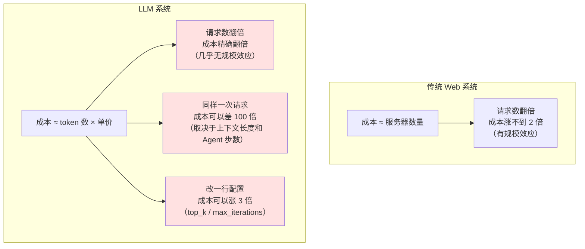
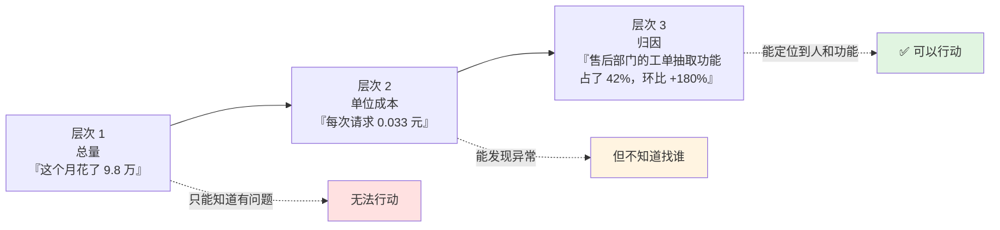
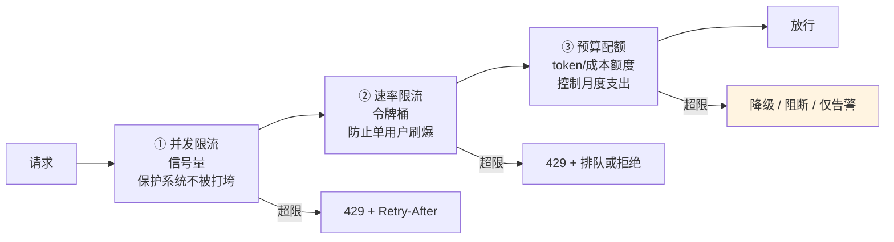
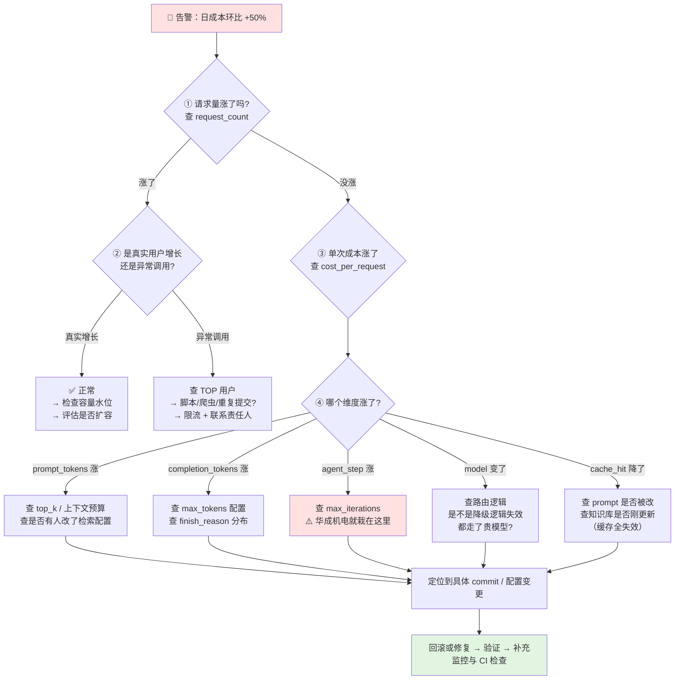
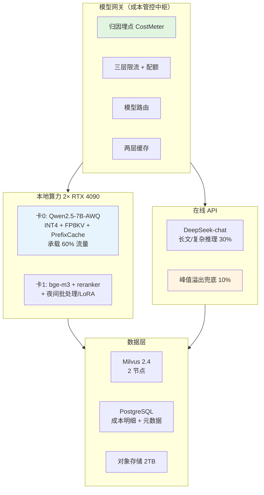

# 第 10.4 章  成本优化与容量规划

> **本章目标**：读完能做到 …
> 1. 把一个 RAG+Agent 系统的成本拆成 7 大类，并说清每一类的驱动因子与典型占比；
> 2. 实现一套**计费与归因中间件**：把每一次请求的成本算准，并归因到用户 / 部门 / 功能 / prompt 版本；
> 3. 落地**十大省钱手段**，每一条都有可执行的代码或配置、预期收益量级与代价；
> 4. 建立自建 vs API 的 TCO 模型，输入你自己的参数就能算出三年成本与盈亏平衡点；
> 5. 从业务指标推导 QPS，再推导实例数与显卡数，并**用排队论解释为什么利用率不能超过 70%**；
> 6. 设计正确的弹性伸缩策略（用队列长度而不是 CPU），并解决模型冷启动问题；
> 7. 实现按用户 / 部门的 token 配额与令牌桶限流，以及超额后的降级策略；
> 8. 建立成本治理的组织机制：谁看成本、周报长什么样、异常突增怎么查。
>
> **前置知识**：[10.1 生产架构设计与部署拓扑](./01-生产架构设计与部署拓扑.md)（模型网关、K8s 部署）、[10.2 可观测性与链路追踪](./02-可观测性与链路追踪.md)（埋点与 trace）、[1.4 算力配置与成本测算](../01-大模型基础与技术选型/04-算力配置与成本测算.md)（显存与单卡吞吐的第一性原理）
>
> **预计用时**：阅读 60 分钟 / 动手 150 分钟

---

## 一、为什么需要它（问题出发）

### 1.1 那张让 CTO 拍桌子的账单

华成机电（本书贯穿案例：1200 人机电制造企业，340 个产品型号，28 万条历史工单）的 RAG+Agent 助手上线后，账单是这样演变的：

| 月份 | API 账单 | GPU 云成本 | 向量库/存储 | 合计 | 当时的解释 |
|---|---|---|---|---|---|
| 第 1 月（灰度 50 人） | 4,200 | 8,900 | 1,100 | 14,200 | "正常" |
| 第 2 月（推广到 400 人） | 13,800 | 8,900 | 1,400 | 24,100 | "人多了，正常" |
| 第 3 月（全员 1200 人） | 41,600 | 17,800 | 2,200 | 61,600 | "怎么涨这么多？" |
| 第 4 月（人数没增加） | **78,300** | 17,800 | 2,600 | **98,700** | **"谁能解释一下？"** |

> **数据说明**：以上金额为本书贯穿案例的**教学虚构数据**，用于演示成本分析方法，不代表任何真实企业的实际支出。

**第 4 月的排查花了两周，最后找到四个原因**：

| # | 原因 | 增加的成本占比 | 发现难度 |
|---|---|---|---|
| 1 | 有人把 Agent 的 `max_iterations` 从 5 改成 15，且没人 review。一个复杂问题能跑 15 轮工具调用 | 约 40% | **难**——日志里看起来都是正常调用 |
| 2 | 质检部门写了个脚本，每晚批量跑 3000 条历史工单做"质量分析"，走的是在线接口 | 约 30% | 中——看时间分布能发现 |
| 3 | 检索 top_k 从 5 调到 12（为了提召回），prompt 长度翻倍 | 约 20% | 中 |
| 4 | 有个前端 bug 导致重复提交，同一个问题被问了 3 次 | 约 10% | 难 |

**这四件事的共同点：全都是"没人看得见"。**

系统里没有任何一处能回答这三个问题：

- **这个月的钱花在哪个功能上？**
- **哪个部门花得最多？**
- **和上个月比，是哪个维度涨了？**

### 1.2 成本失控的根本原因：LLM 成本的三个反直觉特性



| 特性 | 说明 | 后果 |
|---|---|---|
| **① 线性无折扣** | token 成本几乎严格线性，没有传统系统的"服务器利用率提升"红利 | 用户翻倍，成本翻倍。增长即烧钱 |
| **② 单请求成本方差极大** | 一个简单问答 0.002 元，一个 10 轮 Agent + 长上下文 0.8 元，**差 400 倍** | 平均值毫无意义，必须看分布 |
| **③ 配置敏感** | `top_k`、`max_tokens`、`max_iterations`、模型选择，任何一个改动都能让成本翻倍 | **必须有变更审计和成本告警** |

**这一章要做的事，就是把这三个特性从"隐患"变成"可管理"。**

---

## 二、原理拆解

### 2.1 成本构成的七大类

先把账拆开。一个完整的 RAG+Agent 系统，成本分七类：

| # | 类别 | 驱动因子 | 计费方式 | 典型占比（示例） | 弹性 |
|---|---|---|---|---|---|
| 1 | **LLM 推理** | 请求数 × (输入 token + 输出 token × 倍率) | API 按 token / 自建按卡时 | **35%~55%** | 高（可优化） |
| 2 | **Embedding** | 索引文档数 × chunk 数 + 查询数 | 按 token 或按卡时 | 3%~8% | 中 |
| 3 | **Rerank** | 查询数 × 候选数 | 按次或按卡时 | 2%~6% | 中 |
| 4 | **向量数据库** | 向量条数 × 维度 × 副本数；QPS | 按实例规格 / 存储量 | 5%~12% | 低（阶梯式） |
| 5 | **对象存储与冷数据** | 原始文档体积 × 版本数 | 按 GB/月 | 1%~3% | 低 |
| 6 | **网络带宽** | 出网流量（尤其流式响应） | 按 GB | 1%~4% | 低 |
| 7 | **人力运维** | 平台运维 + 知识运营 + 算法迭代 | 按 FTE | **25%~45%** | **最低（但最大）** |

> **占比为示例性区间**，取决于你的用量规模。**一条经验：用量越小，人力占比越高；用量越大，LLM 推理占比越高。** 华成机电这个规模（日 3 万次请求），人力占了将近一半。

#### 2.1.1 每一类的隐藏成本

这是真实项目里最容易漏算的部分：

| 类别 | 显性成本 | **容易漏算的隐性成本** |
|---|---|---|
| LLM 推理 | API 账单 | 重试消耗、失败请求（也计费）、Agent 的中间步骤、评测跑的 token |
| Embedding | 查询 embedding | **全量重建索引**（换模型、改切分策略时要重跑全部文档，一次可能等于半年的查询量） |
| Rerank | 在线 rerank | 离线评测时的批量 rerank |
| 向量库 | 实例费 | **副本数 ×**（生产至少 2 副本）、索引构建时的临时内存、备份存储 |
| 对象存储 | 存储费 | **请求次数费**（很多云按 API 调用次数另收）、跨区流量 |
| 带宽 | 出网流量 | 流式响应的长连接、监控数据上报 |
| 人力 | 工资 | **知识运营**（第 10.5 章会详细讲，这是最被低估的一块）、badcase 处理、培训 |

**一个真实教训**：华成机电换 embedding 模型（bge-large-zh → bge-m3）时，要对 2.1 万个 chunk 重新做 embedding。当时按"反正只是一次性"没有算这笔账，结果单次重建的成本相当于两个月的在线查询成本。**后来的规范是：任何涉及全量重建的变更，必须先在方案里算出重建成本。**

### 2.2 成本度量的三个层次



**绝大多数团队停在层次 1**（看云账单），少数到层次 2，**几乎没人做到层次 3**。而只有层次 3 才能真正控制成本。

#### 2.2.1 归因需要的维度

一条请求的成本记录，至少要能按这 8 个维度切分：

| 维度 | 取值示例 | 回答什么问题 |
|---|---|---|
| `user_id` | u_10237 | 谁在用？有没有异常用户？ |
| `dept` | 售后服务部 | 成本该分摊给谁？ |
| `feature` | work_order_extract / kb_qa / agent_diagnose | 哪个功能最烧钱？ |
| `model` | deepseek-chat / qwen2.5-7b-local | 模型路由有没有生效？ |
| `prompt_version` | work_order_extract@v3 | **哪版 prompt 让成本涨了？** |
| `trace_id` | 关联 Langfuse | 能下钻到具体链路 |
| `cache_status` | hit_semantic / hit_prefix / miss | 缓存有没有起作用？ |
| `agent_steps` | 1~15 | **Agent 步数是不是失控了？** |

**`prompt_version` 和 `agent_steps` 这两个维度，是 1.1 节那次事故本可以在一天内定位的关键。**

#### 2.2.2 单请求成本公式

$$
C_{\text{request}} = \sum_{i=1}^{S} \left( \frac{T^{in}_i \cdot (1 - h_i) + T^{in}_i \cdot h_i \cdot \alpha}{10^6} \cdot P^{in} + \frac{T^{out}_i}{10^6} \cdot P^{out} \right) + C_{\text{emb}} + C_{\text{rerank}}
$$

- $S$：Agent 的步数（普通 RAG 问答 $S=1$）
- $T^{in}_i, T^{out}_i$：第 $i$ 步的输入/输出 token
- $h_i$：该步命中 prefix cache 的比例
- $\alpha$：缓存命中部分的价格折扣系数（很多厂商对缓存输入给折扣，以官方定价为准）
- $P^{in}, P^{out}$：每百万 token 的输入/输出单价

**这个公式里最危险的是 $\sum_{i=1}^{S}$**：Agent 步数是乘法因子，步数从 3 涨到 15，成本涨 5 倍。而且**每一步的输入都包含前面所有步的历史**，所以实际增长是超线性的。

### 2.3 排队论视角：为什么利用率超过 70% 后延迟急剧上升

这是容量规划最重要的一个认知，也是最多人不知道的。

#### 2.3.1 直觉解释

想象一个理发店，只有一个理发师，剪一次头 30 分钟。

- **每小时来 1 个客人（利用率 50%）**：客人来了基本不用等
- **每小时来 1.8 个客人（利用率 90%）**：理发师一直在忙，但**客人到达是随机的**——有时候连着来 3 个，有时候半小时没人。连着来的那 3 个就要排很久
- **每小时来 1.98 个客人（利用率 99%）**：任何一次"连着来"造成的积压，都几乎没有空闲时间去消化。**队伍会越排越长**

**关键洞察：瓶颈不是平均负载，是波动。** 利用率越高，系统吸收波动的能力越弱。

#### 2.3.2 M/M/1 模型的公式

假设请求到达服从泊松分布、服务时间服从指数分布、单服务器：

设 $\lambda$ 为到达率，$\mu$ 为服务率，利用率 $\rho = \lambda / \mu$。

**平均响应时间**（含排队 + 服务）：

$$
R = \frac{1}{\mu - \lambda} = \frac{S}{1 - \rho}
$$

其中 $S = 1/\mu$ 是纯服务时间。

**排队时间**：

$$
W_q = \frac{\rho}{1 - \rho} \cdot S
$$

**这两个公式的分母是 $(1-\rho)$——当 $\rho \to 1$ 时，响应时间趋于无穷。**

#### 2.3.3 数据表：利用率 → 延迟放大倍数

假设单请求纯处理时间 $S = 2$ 秒（一次典型的 RAG 问答）：

| 利用率 ρ | 排队时间倍数 ρ/(1−ρ) | **总响应时间 R = S/(1−ρ)** | 实际延迟（S=2s） | 队列中平均请求数 |
|---|---|---|---|---|
| 30% | 0.43× | 1.43× | 2.9 秒 | 0.13 |
| 50% | 1.00× | 2.00× | 4.0 秒 | 0.50 |
| **60%** | 1.50× | 2.50× | 5.0 秒 | 0.90 |
| **70%** | **2.33×** | **3.33×** | **6.7 秒** | **1.63** |
| **80%** | 4.00× | 5.00× | **10.0 秒** | 3.20 |
| **85%** | 5.67× | 6.67× | 13.3 秒 | 4.82 |
| **90%** | 9.00× | 10.00× | **20.0 秒** | 8.10 |
| **95%** | 19.00× | 20.00× | **40.0 秒** | 18.05 |
| 99% | 99.00× | 100.00× | **200 秒** | 98.01 |

**把这张表画出来看得更清楚**：

```text
延迟(秒)
200 |                                                    *
    |
 40 |                                          *
    |
 20 |                                 *
 13 |                            *
 10 |                       *
  7 |                  *
  5 |             *
  4 |        *
  3 |   *
    +---+----+----+----+----+----+----+----+----+----+---
      30%  50%  60%  70%  80%  85%  90%  95%  99%   利用率

      ←——— 平缓区 ———→|←— 拐点 —→|←—— 悬崖 ——→
```

**三个关键读数**：

1. **70% 是拐点**。从 30% 到 70%，延迟只涨 2.3 倍；从 70% 到 90%，延迟涨 3 倍；从 90% 到 99%，延迟涨 10 倍。
2. **"服务器还没满载啊"是最危险的一句话**。CPU 60%、GPU 70%，看起来还有余量，但延迟已经是空载时的 3.3 倍了。
3. **成本与延迟的权衡是非线性的**。从 70% 压到 85% 利用率，你省了 18% 的机器，但延迟涨了一倍。**这笔账通常不划算。**

#### 2.3.4 多服务器（M/M/c）：为什么大池子比小池子好

单实例 ρ=0.8 时延迟放大 5 倍；但如果是 4 个实例共享一个队列，同样的总利用率 80%，延迟放大只有约 1.7 倍。

**原因**：多个服务器共享队列时，某个服务器的突发忙碌可以被其他服务器分担。这叫**统计复用效应**。

| 实例数 c | ρ=0.7 时 R/S | ρ=0.8 时 R/S | ρ=0.9 时 R/S |
|---|---|---|---|
| 1 | 3.33 | 5.00 | 10.00 |
| 2 | 1.96 | 2.78 | 4.74 |
| 4 | 1.43 | 1.75 | 2.71 |
| 8 | 1.16 | 1.32 | 1.72 |
| 16 | 1.05 | 1.11 | 1.28 |

> 上表为 M/M/c 排队模型的理论值（Erlang C 公式），用于说明趋势。**实际系统还有 GPU 显存约束、批处理调度等因素，绝对值需要压测验证。**

**三条工程结论**：

1. **不要把流量切成很多个小池子**。16 个实例共享一个队列 >> 16 个实例各自独立排队。这是为什么要用统一的模型网关（见 [10.1 章](./01-生产架构设计与部署拓扑.md)）而不是让每个应用直连不同的实例。
2. **实例数越多，能安全跑的利用率越高**。2 个实例的系统建议水位 65%，16 个实例的系统可以到 80%。
3. **小规模系统必须留更多余量**。只有 2 张卡的时候，70% 水位是底线，不能再压。

### 2.4 容量规划的通用公式

把 1.4 章的 GPU 推导扩展成一个通用的、适用于任何组件（LLM / Embedding / 向量库 / 应用服务）的公式：

**第一步：业务指标 → 峰值 QPS**

$$
\text{QPS}_{\text{peak}} = \frac{U \times R \times \phi}{H \times 3600} \times \beta
$$

| 符号 | 含义 | 华成机电取值 |
|---|---|---|
| $U$ | 日活用户数 | 2000 |
| $R$ | 人均日请求数 | 15 |
| $\phi$ | 峰值时段流量占比 | 0.40 |
| $H$ | 峰值时段小时数 | 2 |
| $\beta$ | 峰内抖动系数（峰值分钟 / 峰段平均） | 1.8 |

$$
\text{QPS}_{\text{peak}} = \frac{2000 \times 15 \times 0.40}{2 \times 3600} \times 1.8 = 3.0
$$

**第二步：QPS → 所需实例数**

$$
N = \left\lceil \frac{\text{QPS}_{\text{peak}} \times S}{\rho_{\text{target}}} \right\rceil + N_{\text{redundancy}}
$$

其中 $S$ 是单请求占用一个实例的时间（秒），$\rho_{\text{target}}$ 是目标水位（0.7）。

这个公式其实就是 **Little's Law**：$L = \lambda \times W$（系统中的平均请求数 = 到达率 × 平均停留时间）。

**第三步：分组件计算**

| 组件 | 单请求占用时间 S | 所需实例数（QPS=3.0） |
|---|---|---|
| 应用服务（FastAPI） | 0.05 秒（不含等 LLM 的时间，用异步） | 1 个 pod 足够，按高可用取 2 |
| Embedding 服务 | 0.03 秒（单查询） | 1 个实例 |
| Rerank 服务 | 0.12 秒（20 个候选） | 1 个实例 |
| 向量检索（Milvus） | 0.04 秒 | 按可用性配 2 query node |
| **LLM 推理** | **prefill 0.62s + decode 8.3s（并发摊薄后约 1.1 卡·秒）** | **见 1.4 章详细推导：6 卡** |

**关键点：LLM 是唯一的瓶颈组件，其他组件的容量需求小一到两个数量级。** 容量规划的 90% 精力应该花在 LLM 上。

**但要注意一个陷阱**：应用服务用同步阻塞模型时，$S$ 会变成"等待 LLM 的完整时间"（8~10 秒），实例数需求会暴涨 200 倍。**所以应用层必须用异步（asyncio）**，这是最省钱的一行架构决策。

---

## 三、动手实战

### 3.0 本章代码位置

```text
core/
  ├── cost_meter.py        # 3.1 计费与归因中间件
  ├── pricing.py           # 3.1 价格表（可热更新）
  └── quota.py             # 3.6 配额与令牌桶限流
scripts/
  ├── tco_model.py         # 3.3 自建 vs API 三年 TCO
  ├── capacity_model.py    # 3.4 容量规划与排队论
  └── cost_weekly_report.py # 3.7 成本周报生成
sql/
  ├── ddl_cost.sql         # 3.1 成本表 DDL
  └── cost_dashboard.sql   # 3.1 看板查询
```

依赖：

```bash
uv add sqlalchemy==2.0.36 psycopg2-binary==2.9.10 tiktoken==0.8.0 redis==5.2.0
# pip 等价：pip install sqlalchemy==2.0.36 psycopg2-binary==2.9.10 tiktoken==0.8.0 redis==5.2.0
```

### 3.1 成本度量：计费与归因中间件

#### 3.1.1 数据表 DDL

```sql
-- sql/ddl_cost.sql —— 成本明细与聚合表
-- 环境：PostgreSQL 16（端口沿用全书约定 5433）

-- ① 明细表：每次 LLM/Embedding/Rerank 调用一行
CREATE TABLE IF NOT EXISTS llm_usage_log (
    id                BIGSERIAL     PRIMARY KEY,
    ts                TIMESTAMPTZ   NOT NULL DEFAULT now(),

    -- 归因维度
    trace_id          VARCHAR(64)   NOT NULL,          -- 关联 Langfuse trace
    span_id           VARCHAR(64),                     -- 一次 Agent 里的第几步
    request_id        VARCHAR(64)   NOT NULL,          -- 同一次用户请求的所有调用共享
    user_id           VARCHAR(64)   NOT NULL,
    dept              VARCHAR(64)   NOT NULL,          -- 售后服务部 / 质检部 / ...
    feature           VARCHAR(64)   NOT NULL,          -- work_order_extract / kb_qa / agent_diagnose
    prompt_name       VARCHAR(64),
    prompt_version    VARCHAR(32),
    prompt_hash       VARCHAR(16),

    -- 调用信息
    provider          VARCHAR(32)   NOT NULL,          -- deepseek / local_vllm / bge
    model             VARCHAR(64)   NOT NULL,
    call_type         VARCHAR(16)   NOT NULL,          -- chat / embedding / rerank
    agent_step        SMALLINT      DEFAULT 1,         -- Agent 的第几步
    agent_total_steps SMALLINT      DEFAULT 1,

    -- token 与缓存
    prompt_tokens        INTEGER    NOT NULL DEFAULT 0,
    completion_tokens    INTEGER    NOT NULL DEFAULT 0,
    cached_prompt_tokens INTEGER    NOT NULL DEFAULT 0,  -- 命中 prefix cache 的部分
    cache_status         VARCHAR(16) DEFAULT 'miss',     -- miss/hit_prefix/hit_semantic/hit_exact

    -- 成本（元），按调用时刻的价格表计算并落库，避免事后改价表导致历史数据变化
    cost_input        NUMERIC(14,8) NOT NULL DEFAULT 0,
    cost_output       NUMERIC(14,8) NOT NULL DEFAULT 0,
    cost_total        NUMERIC(14,8) NOT NULL DEFAULT 0,
    price_version     VARCHAR(16)   NOT NULL,

    -- 质量与性能
    latency_ms        INTEGER       NOT NULL DEFAULT 0,
    ttft_ms           INTEGER,
    status            VARCHAR(16)   NOT NULL DEFAULT 'ok',  -- ok/error/timeout/blocked
    error_type        VARCHAR(64),
    retry_count       SMALLINT      DEFAULT 0
);

CREATE INDEX IF NOT EXISTS idx_usage_ts        ON llm_usage_log (ts DESC);
CREATE INDEX IF NOT EXISTS idx_usage_dept_ts   ON llm_usage_log (dept, ts DESC);
CREATE INDEX IF NOT EXISTS idx_usage_feat_ts   ON llm_usage_log (feature, ts DESC);
CREATE INDEX IF NOT EXISTS idx_usage_user_ts   ON llm_usage_log (user_id, ts DESC);
CREATE INDEX IF NOT EXISTS idx_usage_request   ON llm_usage_log (request_id);
CREATE INDEX IF NOT EXISTS idx_usage_prompt_v  ON llm_usage_log (prompt_name, prompt_version, ts DESC);

-- ② 日聚合表：明细表数据量大，看板查聚合表
CREATE TABLE IF NOT EXISTS llm_cost_daily (
    stat_date         DATE          NOT NULL,
    dept              VARCHAR(64)   NOT NULL,
    feature           VARCHAR(64)   NOT NULL,
    model             VARCHAR(64)   NOT NULL,
    request_count     INTEGER       NOT NULL DEFAULT 0,
    call_count        INTEGER       NOT NULL DEFAULT 0,
    prompt_tokens     BIGINT        NOT NULL DEFAULT 0,
    completion_tokens BIGINT        NOT NULL DEFAULT 0,
    cached_tokens     BIGINT        NOT NULL DEFAULT 0,
    cost_total        NUMERIC(14,4) NOT NULL DEFAULT 0,
    avg_latency_ms    INTEGER       NOT NULL DEFAULT 0,
    p95_latency_ms    INTEGER       NOT NULL DEFAULT 0,
    error_count       INTEGER       NOT NULL DEFAULT 0,
    PRIMARY KEY (stat_date, dept, feature, model)
);

-- ③ 配额表：按部门/用户设 token 预算
CREATE TABLE IF NOT EXISTS llm_quota (
    scope_type    VARCHAR(16)   NOT NULL,      -- dept / user / feature
    scope_id      VARCHAR(64)   NOT NULL,
    period        VARCHAR(16)   NOT NULL,      -- daily / monthly
    token_limit   BIGINT        NOT NULL,
    cost_limit    NUMERIC(12,2),
    action_on_exceed VARCHAR(16) NOT NULL DEFAULT 'degrade',  -- degrade/block/alert_only
    enabled       BOOLEAN       NOT NULL DEFAULT true,
    updated_at    TIMESTAMPTZ   NOT NULL DEFAULT now(),
    PRIMARY KEY (scope_type, scope_id, period)
);
```

**DDL 的六个设计要点**：

| 设计 | 为什么 |
|---|---|
| `cost_total` 落库而不是查询时算 | 价格会变。历史成本必须冻结在调用时刻的价格上，否则明年调价后，今年的报表会自己变 |
| `price_version` 字段 | 能追溯"这条记录用的是哪版价格表" |
| `cached_prompt_tokens` 单独存 | 缓存命中的 token 单价不同，且这是评估缓存收益的核心指标 |
| `agent_step` / `agent_total_steps` | **专门为 1.1 节那次事故设计的**——能直接查出哪些请求跑了 15 步 |
| `prompt_version` / `prompt_hash` | 能回答"哪版 prompt 让成本涨了" |
| `request_id` 串联多次调用 | 一次用户请求可能产生 1 次 embedding + 1 次 rerank + 5 次 LLM，要能聚合 |

#### 3.1.2 价格表

```python
# core/pricing.py —— 价格表，支持热更新
# ⚠️ 所有单价为【示例性数据】，必须以各厂商官方定价页为准，并定期核对
from __future__ import annotations

from dataclasses import dataclass
from functools import lru_cache

PRICE_VERSION = "2026-09"


@dataclass(frozen=True)
class ModelPrice:
    """某个模型的计价规则，单位：元 / 百万 token。"""

    input_per_m: float
    output_per_m: float
    cached_input_per_m: float = 0.0     # 命中 prefix cache 的输入价（通常大幅折扣）
    unit: str = "token"                 # token / call / second


# 在线 API 定价（示例性数据，以官方为准）
API_PRICES: dict[str, ModelPrice] = {
    "deepseek-chat": ModelPrice(input_per_m=1.0, output_per_m=2.0, cached_input_per_m=0.1),
    "deepseek-reasoner": ModelPrice(input_per_m=2.0, output_per_m=8.0, cached_input_per_m=0.2),
    "qwen-plus": ModelPrice(input_per_m=2.0, output_per_m=6.0, cached_input_per_m=0.4),
}

# 自建模型的"内部结算价"：把卡时成本摊到 token 上，让自建和 API 可比
# 计算方式见 3.1.3
SELF_HOSTED_PRICES: dict[str, ModelPrice] = {
    "qwen2.5-7b-awq": ModelPrice(input_per_m=0.12, output_per_m=1.45),
    "qwen2.5-14b-awq": ModelPrice(input_per_m=0.24, output_per_m=2.90),
    "bge-m3": ModelPrice(input_per_m=0.02, output_per_m=0.0),
    "bge-reranker-v2-m3": ModelPrice(input_per_m=0.03, output_per_m=0.0),
}


@lru_cache(maxsize=64)
def get_price(model: str) -> ModelPrice:
    """按模型名取价格，找不到时返回一个保守的默认价并告警。"""
    if model in API_PRICES:
        return API_PRICES[model]
    if model in SELF_HOSTED_PRICES:
        return SELF_HOSTED_PRICES[model]
    from core.logger import get_logger

    get_logger(__name__).error("未配置价格的模型，按默认价计费", extra={"model": model})
    return ModelPrice(input_per_m=2.0, output_per_m=8.0)


def compute_cost(model: str, prompt_tokens: int, completion_tokens: int,
                 cached_prompt_tokens: int = 0) -> tuple[float, float, float]:
    """返回 (输入成本, 输出成本, 总成本)，单位元。"""
    p = get_price(model)
    fresh_in = max(prompt_tokens - cached_prompt_tokens, 0)
    cost_in = (fresh_in / 1e6 * p.input_per_m
               + cached_prompt_tokens / 1e6 * p.cached_input_per_m)
    cost_out = completion_tokens / 1e6 * p.output_per_m
    return round(cost_in, 8), round(cost_out, 8), round(cost_in + cost_out, 8)
```

#### 3.1.3 自建模型的"内部结算价"怎么算

这是把自建和 API 放在同一个尺度上比较的关键，很多团队没做，导致自建的成本永远是一笔糊涂账。

**思路：把 GPU 的总成本按「卡·秒」摊到每个 token 上。**

```python
# scripts/calc_internal_price.py —— 自建模型内部结算价计算
# 环境：Python 3.11
def internal_price(
    annual_cost_per_card: float,      # 单卡年总成本（折旧+电+机柜+分摊人力）
    prefill_tps: float,               # 单卡 prefill 吞吐 tok/s（压测得到）
    decode_tps: float,                # 单卡 decode 总吞吐 tok/s（压测得到）
    utilization: float = 0.55,        # 年平均利用率
) -> dict:
    """把单卡年成本摊到 input/output token 上，得到每百万 token 的内部价。"""
    seconds_per_year = 365 * 24 * 3600
    effective_seconds = seconds_per_year * utilization
    cost_per_card_second = annual_cost_per_card / effective_seconds

    # input token 走 prefill 通道，output token 走 decode 通道
    input_per_m = cost_per_card_second / prefill_tps * 1e6
    output_per_m = cost_per_card_second / decode_tps * 1e6
    return {
        "cost_per_card_second": round(cost_per_card_second, 8),
        "input_per_m_yuan": round(input_per_m, 4),
        "output_per_m_yuan": round(output_per_m, 4),
    }


if __name__ == "__main__":
    # 示例性数据：4090 单卡年成本 = 折旧 5333 + 电费 8539 + 机柜 6000 + 人力分摊 12000
    result = internal_price(
        annual_cost_per_card=31872,
        prefill_tps=4874,        # 来自 1.4 章的压测示例值
        decode_tps=672,
        utilization=0.55,
    )
    for k, v in result.items():
        print(f"{k:<28}: {v}")
```

预期输出：

```text
cost_per_card_second        : 0.00183781
input_per_m_yuan            : 0.377
output_per_m_yuan           : 2.7348
```

**这个结果非常有信息量**：

| 对比 | 自建 7B（示例） | DeepSeek API（示例） | 倍数 |
|---|---|---|---|
| input 每百万 token | 0.38 元 | 1.00 元 | 自建便宜 2.6× |
| output 每百万 token | 2.73 元 | 2.00 元 | **自建贵 1.4×** |

**结论：自建在 input（prefill）上有优势，在 output（decode）上反而更贵。** 原因在 1.4 章讲过：decode 是访存瓶颈，单卡 decode 吞吐远低于 prefill 吞吐。

**这个结论直接指导架构**：

- **长输入、短输出的任务**（RAG 问答、文档抽取）→ **走自建更划算**
- **短输入、长输出的任务**（文案生成、长文续写）→ **走 API 更划算**

> **注意**：上表的内部价基于 55% 的年平均利用率。**利用率是内部价的最大杠杆**——利用率从 55% 提到 80%，内部价直接降 31%。这也是为什么要做离线任务错峰填谷（见 3.2 手段 6）。

#### 3.1.4 计费中间件完整实现

```python
# core/cost_meter.py —— 成本计量与归因中间件
# 环境：Python 3.11 / sqlalchemy 2.0.36 / tiktoken 0.8.0
from __future__ import annotations

import contextvars
import queue
import threading
import time
import uuid
from dataclasses import asdict, dataclass, field
from datetime import datetime, timezone
from typing import Any

from core.logger import get_logger
from core.pricing import PRICE_VERSION, compute_cost

logger = get_logger(__name__)

# 归因上下文：在请求入口设置一次，后续所有 LLM 调用自动带上
_cost_ctx: contextvars.ContextVar[dict] = contextvars.ContextVar("cost_ctx", default={})


@dataclass
class UsageRecord:
    """一次模型调用的用量与成本记录。"""

    trace_id: str
    request_id: str
    user_id: str
    dept: str
    feature: str
    provider: str
    model: str
    call_type: str = "chat"
    span_id: str | None = None
    prompt_name: str | None = None
    prompt_version: str | None = None
    prompt_hash: str | None = None
    agent_step: int = 1
    agent_total_steps: int = 1
    prompt_tokens: int = 0
    completion_tokens: int = 0
    cached_prompt_tokens: int = 0
    cache_status: str = "miss"
    cost_input: float = 0.0
    cost_output: float = 0.0
    cost_total: float = 0.0
    price_version: str = PRICE_VERSION
    latency_ms: int = 0
    ttft_ms: int | None = None
    status: str = "ok"
    error_type: str | None = None
    retry_count: int = 0
    ts: datetime = field(default_factory=lambda: datetime.now(timezone.utc))


class CostAttributionContext:
    """请求级归因上下文管理器，在 FastAPI 中间件或 Agent 入口使用。"""

    def __init__(self, *, user_id: str, dept: str, feature: str,
                 trace_id: str | None = None, request_id: str | None = None):
        self.payload = {
            "user_id": user_id,
            "dept": dept,
            "feature": feature,
            "trace_id": trace_id or str(uuid.uuid4()),
            "request_id": request_id or str(uuid.uuid4()),
            "agent_step": 0,
        }
        self._token = None

    def __enter__(self) -> dict:
        """进入上下文，后续 LLM 调用自动继承归因信息。"""
        self._token = _cost_ctx.set(self.payload)
        return self.payload

    def __exit__(self, *exc) -> None:
        """退出上下文。"""
        if self._token is not None:
            _cost_ctx.reset(self._token)


def current_context() -> dict:
    """取当前归因上下文，未设置时返回 unknown 占位，保证不丢数据。"""
    ctx = _cost_ctx.get()
    if not ctx:
        return {"user_id": "unknown", "dept": "unknown", "feature": "unknown",
                "trace_id": str(uuid.uuid4()), "request_id": str(uuid.uuid4()),
                "agent_step": 0}
    return ctx


def next_agent_step() -> int:
    """Agent 每走一步调用一次，用于把成本归因到步数。"""
    ctx = _cost_ctx.get()
    if ctx:
        ctx["agent_step"] = ctx.get("agent_step", 0) + 1
        return ctx["agent_step"]
    return 1


class CostMeter:
    """异步批量写入的成本计量器，不阻塞主链路。"""

    def __init__(self, engine, batch_size: int = 50, flush_interval: float = 5.0,
                 max_queue: int = 20000):
        self.engine = engine
        self.batch_size = batch_size
        self.flush_interval = flush_interval
        self._q: queue.Queue[UsageRecord] = queue.Queue(maxsize=max_queue)
        self._stop = threading.Event()
        self._worker = threading.Thread(target=self._run, daemon=True, name="cost-meter")
        self._worker.start()
        self._dropped = 0

    def record(self, *, provider: str, model: str, prompt_tokens: int,
               completion_tokens: int, latency_ms: int, call_type: str = "chat",
               cached_prompt_tokens: int = 0, cache_status: str = "miss",
               ttft_ms: int | None = None, status: str = "ok",
               error_type: str | None = None, retry_count: int = 0,
               prompt_meta: dict[str, Any] | None = None) -> UsageRecord:
        """记录一次调用，自动从上下文取归因维度并算钱。"""
        ctx = current_context()
        cin, cout, ctotal = compute_cost(model, prompt_tokens, completion_tokens,
                                         cached_prompt_tokens)
        pm = prompt_meta or {}
        rec = UsageRecord(
            trace_id=ctx["trace_id"], request_id=ctx["request_id"],
            user_id=ctx["user_id"], dept=ctx["dept"], feature=ctx["feature"],
            provider=provider, model=model, call_type=call_type,
            agent_step=ctx.get("agent_step", 1) or 1,
            prompt_name=pm.get("prompt_name"), prompt_version=pm.get("prompt_version"),
            prompt_hash=pm.get("prompt_hash"),
            prompt_tokens=prompt_tokens, completion_tokens=completion_tokens,
            cached_prompt_tokens=cached_prompt_tokens, cache_status=cache_status,
            cost_input=cin, cost_output=cout, cost_total=ctotal,
            latency_ms=latency_ms, ttft_ms=ttft_ms, status=status,
            error_type=error_type, retry_count=retry_count,
        )
        try:
            self._q.put_nowait(rec)
        except queue.Full:
            self._dropped += 1
            if self._dropped % 100 == 1:
                logger.error("成本记录队列已满，正在丢弃", extra={"dropped": self._dropped})
        return rec

    def _run(self) -> None:
        """后台线程：攒批写库。"""
        buf: list[UsageRecord] = []
        last_flush = time.time()
        while not self._stop.is_set():
            try:
                rec = self._q.get(timeout=1.0)
                buf.append(rec)
            except queue.Empty:
                pass
            if buf and (len(buf) >= self.batch_size
                        or time.time() - last_flush >= self.flush_interval):
                self._flush(buf)
                buf, last_flush = [], time.time()
        if buf:
            self._flush(buf)

    def _flush(self, records: list[UsageRecord]) -> None:
        """批量写入明细表，写失败时只记日志不影响业务。"""
        from sqlalchemy import text

        sql = text("""
            INSERT INTO llm_usage_log
            (ts, trace_id, span_id, request_id, user_id, dept, feature,
             prompt_name, prompt_version, prompt_hash, provider, model, call_type,
             agent_step, agent_total_steps, prompt_tokens, completion_tokens,
             cached_prompt_tokens, cache_status, cost_input, cost_output, cost_total,
             price_version, latency_ms, ttft_ms, status, error_type, retry_count)
            VALUES
            (:ts, :trace_id, :span_id, :request_id, :user_id, :dept, :feature,
             :prompt_name, :prompt_version, :prompt_hash, :provider, :model, :call_type,
             :agent_step, :agent_total_steps, :prompt_tokens, :completion_tokens,
             :cached_prompt_tokens, :cache_status, :cost_input, :cost_output, :cost_total,
             :price_version, :latency_ms, :ttft_ms, :status, :error_type, :retry_count)
        """)
        try:
            with self.engine.begin() as conn:
                conn.execute(sql, [asdict(r) for r in records])
        except Exception as e:
            logger.error("成本记录写入失败", extra={"count": len(records), "error": str(e)[:200]})

    def close(self) -> None:
        """优雅关闭，等待队列写完。"""
        self._stop.set()
        self._worker.join(timeout=10)
```

#### 3.1.5 接进调用链路

```python
# app/api/chat.py —— 在 FastAPI 里挂上归因上下文
from fastapi import APIRouter, Depends, Request

from core.cost_meter import CostAttributionContext, CostMeter, next_agent_step

router = APIRouter()
meter = CostMeter(engine=get_engine())


@router.post("/v1/chat")
async def chat(req: ChatRequest, user=Depends(get_current_user)):
    """带成本归因的问答接口。"""
    with CostAttributionContext(
        user_id=user.id, dept=user.dept, feature=req.feature or "kb_qa"
    ) as ctx:
        answer = await rag_pipeline.run(req.query)
        return {"answer": answer, "trace_id": ctx["trace_id"]}
```

```python
# core/llm.py 的调用处补一行（不要重复实现 llm.py，只加计量）
async def chat_with_metering(messages: list[dict], model: str, **kwargs):
    """在统一客户端外面包一层计量，所有调用自动记账。"""
    import time

    t0 = time.perf_counter()
    step = next_agent_step()
    try:
        resp = await get_llm_client().chat_async(messages=messages, model=model, **kwargs)
        usage = resp.usage
        cached = getattr(usage, "prompt_cache_hit_tokens", 0) or 0
        meter.record(
            provider="deepseek" if model.startswith("deepseek") else "local_vllm",
            model=model,
            prompt_tokens=usage.prompt_tokens,
            completion_tokens=usage.completion_tokens,
            cached_prompt_tokens=cached,
            cache_status="hit_prefix" if cached > 0 else "miss",
            latency_ms=int((time.perf_counter() - t0) * 1000),
            prompt_meta=kwargs.get("prompt_meta"),
        )
        return resp
    except Exception as e:
        meter.record(provider="unknown", model=model, prompt_tokens=0, completion_tokens=0,
                     latency_ms=int((time.perf_counter() - t0) * 1000),
                     status="error", error_type=type(e).__name__)
        raise
```

> **注意 `agent_step`**：Agent 每走一步调用 `next_agent_step()`，这样 1.1 节那个"有人把 max_iterations 改成 15"的问题，用一条 SQL 就能查出来。

#### 3.1.6 成本看板查询

```sql
-- sql/cost_dashboard.sql —— 成本看板核心查询

-- ① 日成本趋势（近 30 天）
SELECT
    date_trunc('day', ts)::date            AS d,
    round(sum(cost_total), 2)              AS cost_yuan,
    count(DISTINCT request_id)             AS requests,
    count(*)                               AS calls,
    round(sum(cost_total) / nullif(count(DISTINCT request_id), 0), 4) AS cost_per_request,
    round(avg(prompt_tokens))              AS avg_prompt_tokens,
    round(avg(completion_tokens))          AS avg_completion_tokens,
    round(100.0 * sum(cached_prompt_tokens) / nullif(sum(prompt_tokens), 0), 1) AS cache_hit_pct
FROM llm_usage_log
WHERE ts >= now() - interval '30 days'
GROUP BY 1 ORDER BY 1;

-- ② 按部门 × 功能归因（本月）
SELECT
    dept, feature,
    count(DISTINCT request_id)             AS requests,
    round(sum(cost_total), 2)              AS cost_yuan,
    round(100.0 * sum(cost_total) / sum(sum(cost_total)) OVER (), 1) AS pct,
    round(sum(cost_total) / nullif(count(DISTINCT request_id), 0), 4) AS cost_per_request
FROM llm_usage_log
WHERE ts >= date_trunc('month', now())
GROUP BY 1, 2
ORDER BY cost_yuan DESC;

-- ③ 【关键】Agent 步数分布——排查"步数失控"
SELECT
    feature,
    max_step,
    count(*)                               AS request_count,
    round(sum(cost), 2)                    AS total_cost,
    round(avg(cost), 4)                    AS avg_cost_per_request
FROM (
    SELECT request_id, feature,
           max(agent_step)  AS max_step,
           sum(cost_total)  AS cost
    FROM llm_usage_log
    WHERE ts >= now() - interval '7 days' AND call_type = 'chat'
    GROUP BY request_id, feature
) t
GROUP BY 1, 2
ORDER BY feature, max_step;

-- ④ 【关键】按 prompt 版本对比成本——排查"哪版 prompt 让成本涨了"
SELECT
    prompt_name, prompt_version,
    count(*)                               AS calls,
    round(avg(prompt_tokens))              AS avg_in,
    round(avg(completion_tokens))          AS avg_out,
    round(avg(cost_total), 5)              AS avg_cost,
    round(avg(latency_ms))                 AS avg_latency_ms,
    round(100.0 * sum(CASE WHEN status <> 'ok' THEN 1 ELSE 0 END) / count(*), 2) AS error_pct
FROM llm_usage_log
WHERE ts >= now() - interval '14 days' AND prompt_name IS NOT NULL
GROUP BY 1, 2
ORDER BY prompt_name, prompt_version;

-- ⑤ 成本 TOP 20 用户（识别异常用户或脚本）
SELECT
    user_id, dept,
    count(DISTINCT request_id)             AS requests,
    round(sum(cost_total), 2)              AS cost_yuan,
    round(sum(cost_total) / nullif(count(DISTINCT request_id), 0), 4) AS cost_per_request,
    min(ts)                                AS first_seen,
    max(ts)                                AS last_seen
FROM llm_usage_log
WHERE ts >= date_trunc('month', now())
GROUP BY 1, 2
ORDER BY cost_yuan DESC
LIMIT 20;

-- ⑥ 缓存收益评估
SELECT
    cache_status,
    count(*)                               AS calls,
    round(100.0 * count(*) / sum(count(*)) OVER (), 1) AS pct,
    round(avg(cost_total), 6)              AS avg_cost,
    round(avg(latency_ms))                 AS avg_latency_ms
FROM llm_usage_log
WHERE ts >= now() - interval '7 days'
GROUP BY 1
ORDER BY calls DESC;

-- ⑦ 按小时的负载分布（给容量规划和错峰用）
SELECT
    extract(hour FROM ts)                  AS hour_of_day,
    round(count(DISTINCT request_id) / 7.0, 1) AS avg_requests_per_day_hour,
    round(sum(cost_total) / 7.0, 2)        AS avg_cost_per_day_hour
FROM llm_usage_log
WHERE ts >= now() - interval '7 days'
GROUP BY 1 ORDER BY 1;
```

查询 ③ 在华成机电那次事故上的输出会是这样：

```text
 feature          | max_step | request_count | total_cost | avg_cost_per_request
------------------+----------+---------------+------------+----------------------
 agent_diagnose   |        1 |          1203 |       4.81 |               0.0040
 agent_diagnose   |        2 |           842 |       7.15 |               0.0085
 agent_diagnose   |        3 |           415 |       6.23 |               0.0150
 agent_diagnose   |       12 |            88 |      31.68 |               0.3600
 agent_diagnose   |       13 |            71 |      28.40 |               0.4000
 agent_diagnose   |       14 |            63 |      27.72 |               0.4400
 agent_diagnose   |       15 |           412 |     206.00 |               0.5000
 kb_qa            |        1 |         18406 |      55.22 |               0.0030
```

**一眼就能看出问题**：`max_step = 15` 的请求只占 1.7%，却贡献了 60% 的 Agent 成本，**单次成本是普通问答的 167 倍**。而且 15 步的请求数（412）远大于 12~14 步的——说明它们**全都是跑满了上限才停的，也就是根本没收敛**。

**这就是"没有归因就无法治理"的最好例证。**

### 3.2 十大省钱手段

> [1.4 章](../01-大模型基础与技术选型/04-算力配置与成本测算.md) 讲的是**推理层**的 GPU 省钱手段（量化、FP8 KV、混合部署等）。本节讲的是**应用层**的手段，两者互补，可以叠加。

#### 手段 1：语义缓存与精确缓存

**原理**：两层缓存。精确缓存（归一化后的字符串完全匹配）命中率低但零误差；语义缓存（向量相似）命中率高但有误命中风险。

```python
# core/cache_layer.py —— 两层缓存
# 环境：Python 3.11 / redis 5.2.0
from __future__ import annotations

import hashlib
import json
import re
import time

from core.logger import get_logger

logger = get_logger(__name__)


class TwoLayerCache:
    """L1 精确缓存（Redis）+ L2 语义缓存（向量库），带版本隔离与 TTL。"""

    def __init__(self, redis_client, vector_store, embed_client,
                 semantic_threshold: float = 0.95, ttl: int = 86400):
        self.redis = redis_client
        self.store = vector_store
        self.embed = embed_client
        self.threshold = semantic_threshold
        self.ttl = ttl

    @staticmethod
    def _normalize(q: str) -> str:
        """归一化查询：去空白、统一大小写、去标点，提高精确命中率。"""
        q = re.sub(r"\s+", "", q.strip().lower())
        return re.sub(r"[，。？！,.?!、；;：:]", "", q)

    def _key(self, q: str, scope: str) -> str:
        """缓存 key = 归一化查询 + scope（含知识库版本与角色权限）。"""
        h = hashlib.sha256(f"{scope}::{self._normalize(q)}".encode()).hexdigest()[:24]
        return f"llmcache:exact:{h}"

    def get(self, query: str, scope: str) -> tuple[str | None, str]:
        """两层查缓存，返回 (答案, 命中类型)。"""
        raw = self.redis.get(self._key(query, scope))
        if raw:
            logger.info("缓存命中(精确)", extra={"scope": scope})
            return json.loads(raw)["answer"], "hit_exact"

        vec = self.embed.embed_query(query)
        hits = self.store.search(vec, top_k=1, filters={"scope": scope})
        if hits and hits[0].score >= self.threshold:
            # 二次校验：含型号/故障码的查询必须实体一致，防止 E041/E043 互相命中
            if self._entities_match(query, hits[0].payload["query"]):
                logger.info("缓存命中(语义)", extra={"score": hits[0].score})
                return hits[0].payload["answer"], "hit_semantic"
        return None, "miss"

    @staticmethod
    def _entities_match(q1: str, q2: str) -> bool:
        """关键实体（型号、故障码、数值）必须完全一致才允许语义命中。"""
        pat = re.compile(r"(XJ-?\d{3}(?:-[A-Z]\d)?|[Ee]\d{3}|\d+(?:\.\d+)?)")
        return set(x.upper() for x in pat.findall(q1)) == set(x.upper() for x in pat.findall(q2))

    def put(self, query: str, answer: str, scope: str, confidence: float = 1.0) -> None:
        """写缓存。低置信度答案不缓存，避免把错误答案固化。"""
        if confidence < 0.7:
            return
        payload = {"answer": answer, "query": query, "cached_at": time.time()}
        self.redis.setex(self._key(query, scope), self.ttl, json.dumps(payload, ensure_ascii=False))
        self.store.upsert(self.embed.embed_query(query),
                          payload={**payload, "scope": scope}, ttl=self.ttl)

    def invalidate_scope(self, scope: str) -> int:
        """知识库更新时批量失效某个 scope 的全部缓存。"""
        n = 0
        for key in self.redis.scan_iter(match="llmcache:exact:*", count=500):
            n += self.redis.delete(key)
        self.store.delete(filters={"scope": scope})
        logger.warning("缓存已失效", extra={"scope": scope, "deleted": n})
        return n
```

| 项 | 内容 |
|---|---|
| **预期收益** | 命中的请求成本归零、延迟从秒级降到 50ms 内。华成机电实测两层合计命中率约 26%（实测环境：2 周日志回放，阈值 0.95，**示例性数据**） |
| **代价** | ① 知识更新必须失效缓存（最大的坑）② 语义误命中风险 ③ 需要维护 Redis + 向量存储 |
| **关键设计** | `scope` 必须包含**知识库版本号 + 用户权限组**，否则会出现"A 部门看到 B 部门的答案"这种安全事故 |

#### 手段 2：Prefix Caching

**原理**：见 1.4 章手段 2。这里补充**应用层怎么配合**。

```python
# core/prompt_layout.py —— 为 Prefix Cache 优化的 prompt 布局
from core.logger import get_logger

logger = get_logger(__name__)

# 固定段：所有请求完全一致，能命中缓存
STATIC_PREFIX = """你是华成机电的售后知识助手...
（角色、能力边界、输出格式、安全规则，约 1200 token，内容完全固定）"""


def build_messages(retrieved: list[str], history: list[dict], query: str,
                   user_name: str, now: str) -> list[dict]:
    """按"固定在前、可变在后"的原则拼装 messages，最大化 prefix cache 命中。"""
    return [
        # ✅ system 完全固定，不放任何可变内容
        {"role": "system", "content": STATIC_PREFIX},
        # ✅ 可变内容（时间、用户名、检索结果、历史）全部放到 user 消息里
        *history,
        {"role": "user", "content": (
            f"【当前时间】{now}\n【提问人】{user_name}\n\n"
            f"【检索到的资料】\n" + "\n\n".join(retrieved) + f"\n\n【问题】{query}"
        )},
    ]


def audit_prefix_stability(messages: list[dict]) -> list[str]:
    """CI 里跑的检查：system 消息里不允许出现可变内容。"""
    import re

    violations = []
    sys_content = next((m["content"] for m in messages if m["role"] == "system"), "")
    patterns = {
        r"\d{4}-\d{2}-\d{2}": "日期",
        r"\d{2}:\d{2}:\d{2}": "时间",
        r"user_\w+|u_\d+": "用户 ID",
        r"[0-9a-f]{8}-[0-9a-f]{4}": "UUID",
    }
    for pat, name in patterns.items():
        if re.search(pat, sys_content):
            violations.append(f"system prompt 里出现了{name}，会导致 prefix cache 全部失效")
    return violations
```

| 项 | 内容 |
|---|---|
| **预期收益** | 固定前缀占比 $r$ 时，prefill 成本降约 $r$。华成机电 $r \approx 0.35$，**输入成本降约 30%，TTFT 降约 25%**（示例性数据） |
| **代价** | 几乎为零。唯一要求是 prompt 布局纪律 |
| **踩坑** | 一个时间戳就能让命中率从 0.6 掉到 0.02。**把 `audit_prefix_stability` 加进 CI** |

#### 手段 3：模型分级路由

**原理**：不是所有请求都需要最强的模型。按复杂度分级，配合置信度升级机制。

```python
# core/model_router.py —— 三级模型路由
from __future__ import annotations

import re
from dataclasses import dataclass

from core.logger import get_logger

logger = get_logger(__name__)


@dataclass
class RouteDecision:
    """路由决策结果。"""

    model: str
    tier: str            # cheap / standard / premium
    reason: str
    allow_escalate: bool = True


SIMPLE_PATTERNS = [
    r"^(什么是|介绍一下|.{0,12}是多少|.{0,12}的(参数|规格|型号))",
    r"^[A-Za-z]\d{3}\s*(是什么|代表|报警|故障)(码)?[?？]?$",
    r"^(怎么|如何)(重启|开机|关机|复位)",
]
COMPLEX_MARKERS = ["为什么", "对比", "分析", "原因", "排查", "还是", "哪个更", "综合"]


class ModelRouter:
    """按复杂度路由到不同档位的模型，支持置信度不足时升级。"""

    TIERS = {
        "cheap": "qwen2.5-1.5b-local",
        "standard": "qwen2.5-7b-awq",
        "premium": "deepseek-chat",
    }

    def route(self, query: str, retrieved_chars: int, history_turns: int,
              feature: str) -> RouteDecision:
        """返回路由决策，附带可解释的理由。"""
        if feature in {"agent_diagnose", "multi_hop_qa", "safety_check"}:
            return RouteDecision(self.TIERS["premium"], "premium",
                                 f"功能 {feature} 强制走高档位", allow_escalate=False)
        if history_turns > 4 or retrieved_chars > 6000:
            return RouteDecision(self.TIERS["premium"], "premium", "上下文复杂")
        if any(m in query for m in COMPLEX_MARKERS):
            return RouteDecision(self.TIERS["standard"], "standard", "含推理性提问词")
        if len(query) <= 30 and any(re.match(p, query) for p in SIMPLE_PATTERNS):
            return RouteDecision(self.TIERS["cheap"], "cheap", "简单事实查询")
        return RouteDecision(self.TIERS["standard"], "standard", "默认档位")

    @staticmethod
    def should_escalate(result: dict, decision: RouteDecision) -> bool:
        """低档位模型答得不好时是否升级重试。"""
        if not decision.allow_escalate or decision.tier == "premium":
            return False
        return (result.get("confidence", 1.0) < 0.65
                or not result.get("citations")
                or "无法确定" in str(result.get("answer", "")))
```

| 项 | 内容 |
|---|---|
| **预期收益** | 若 35% 流量能降到 cheap 档（成本约为 standard 的 1/5），**总推理成本降约 28%** |
| **代价** | ① 路由错判风险 ② 升级路径会让部分请求延迟翻倍 ③ 要维护多套模型的部署与评测 |
| **前置条件** | **必须有分档位的评测**——每个档位在金标集上的分数要单独跑。没有评测就上路由，等于随机降低质量 |
| **建议** | 团队 < 3 人不要上。先做手段 1/2/4/5，那些收益更确定、复杂度更低 |

#### 手段 4：Prompt 瘦身与上下文预算

**原理**：输入 token 是成本的最大头。建立上下文预算制度，每一部分都有配额。

```python
# core/context_budget.py —— 上下文预算管理器
from __future__ import annotations

from dataclasses import dataclass

from core.logger import get_logger

logger = get_logger(__name__)


@dataclass
class BudgetSpec:
    """各部分的 token 预算与裁剪优先级（数字越大越先被砍）。"""

    system: int = 1200
    tools: int = 600
    history: int = 1000
    retrieval: int = 2800
    query: int = 300
    reserve_output: int = 600

    priority = {"retrieval": 3, "history": 2, "tools": 1, "system": 0, "query": 0}

    def total(self) -> int:
        """预算总量。"""
        return (self.system + self.tools + self.history
                + self.retrieval + self.query + self.reserve_output)


class ContextBudgetManager:
    """按预算裁剪上下文，超支时从低优先级部分开始砍。"""

    def __init__(self, tokenizer, spec: BudgetSpec | None = None, hard_limit: int = 8192):
        self.tok = tokenizer
        self.spec = spec or BudgetSpec()
        self.hard_limit = hard_limit
        if self.spec.total() > hard_limit:
            raise ValueError(f"预算总量 {self.spec.total()} 超过硬上限 {hard_limit}")

    def count(self, text: str) -> int:
        """统计 token 数。"""
        return len(self.tok.encode(text))

    def fit(self, sections: dict[str, str]) -> tuple[dict[str, str], dict]:
        """裁剪各部分到预算内，返回 (裁剪后内容, 统计信息)。"""
        stats = {"original": {}, "final": {}, "trimmed": []}
        out = {}
        for name, text in sections.items():
            budget = getattr(self.spec, name, None)
            n = self.count(text)
            stats["original"][name] = n
            if budget is None or n <= budget:
                out[name] = text
            else:
                ids = self.tok.encode(text)
                out[name] = self.tok.decode(ids[:budget])
                stats["trimmed"].append({"section": name, "from": n, "to": budget})
                logger.warning("上下文超预算已裁剪",
                               extra={"section": name, "from": n, "to": budget})
            stats["final"][name] = self.count(out[name])
        stats["total_tokens"] = sum(stats["final"].values())
        return out, stats

    def trim_retrieval(self, chunks: list[str], budget: int | None = None) -> list[str]:
        """按预算从后往前丢检索结果（rerank 后靠后的相关性低），保留完整 chunk。"""
        budget = budget or self.spec.retrieval
        kept, used = [], 0
        for c in chunks:
            n = self.count(c)
            if used + n > budget:
                break
            kept.append(c)
            used += n
        if len(kept) < len(chunks):
            logger.info("检索结果按预算裁剪",
                        extra={"from": len(chunks), "to": len(kept), "tokens": used})
        return kept
```

| 项 | 内容 |
|---|---|
| **预期收益** | 把平均 prompt 从 5000 降到 3200，**输入成本降 36%，TTFT 降约 30%** |
| **代价** | 检索结果裁剪可能降低召回，**必须用金标集验证答案正确率没掉** |
| **关键实践** | 裁剪时**丢完整 chunk 而不是截断 chunk**——半截的文档比没有更糟，模型会基于残缺信息编造 |

#### 手段 5：max_tokens 限制与早停

```python
# core/output_budget.py —— 按任务设置输出上限与早停
MAX_TOKENS_BY_FEATURE = {
    "fault_code_lookup": 200,
    "work_order_extract": 350,
    "kb_qa": 600,
    "repair_guide": 800,
    "agent_diagnose": 700,      # 单步上限，不是总上限
    "default": 500,
}

STOP_SEQUENCES = ["\n\n参考资料：", "\n\n以上", "希望对您有帮助"]


def call_params(feature: str) -> dict:
    """返回该功能的输出控制参数。"""
    return {
        "max_tokens": MAX_TOKENS_BY_FEATURE.get(feature, MAX_TOKENS_BY_FEATURE["default"]),
        "stop": STOP_SEQUENCES,
    }
```

同时在 prompt 里加软约束（比硬截断体面）：

```text
请用不超过 5 句话回答，直接给结论和操作步骤，不要复述问题、不要客套话。
```

| 项 | 内容 |
|---|---|
| **预期收益** | 平均输出从 520 降到 350 token，**输出成本降 33%**（输出单价通常是输入的 2~4 倍，所以这条很值钱） |
| **代价** | 答案可能被截断 |
| **必备监控** | `finish_reason == "length"` 的比例，超过 2% 就调大上限 |

#### 手段 6：批处理与离线化

```python
# scripts/offline_batch_runner.py —— 离线批处理，错峰填谷
# 环境：Python 3.11 / asyncio
from __future__ import annotations

import asyncio
from datetime import datetime

from core.cost_meter import CostAttributionContext
from core.logger import get_logger

logger = get_logger(__name__)

OFF_PEAK_HOURS = set(range(20, 24)) | set(range(0, 7))   # 20:00~07:00


def is_off_peak() -> bool:
    """当前是否在低峰时段。"""
    return datetime.now().hour in OFF_PEAK_HOURS


async def run_batch(items: list[dict], task_fn, concurrency: int = 64,
                    dept: str = "质检部", feature: str = "batch_quality_check") -> list:
    """低峰期高并发批处理，打满 GPU；非低峰期降并发避让在线流量。"""
    if not is_off_peak():
        concurrency = max(concurrency // 8, 2)
        logger.warning("当前非低峰时段，已降低批处理并发", extra={"concurrency": concurrency})

    sem = asyncio.Semaphore(concurrency)
    results = []

    async def one(item: dict):
        async with sem:
            with CostAttributionContext(user_id="system_batch", dept=dept, feature=feature):
                return await task_fn(item)

    for i in range(0, len(items), 500):
        chunk = items[i:i + 500]
        results.extend(await asyncio.gather(*[one(x) for x in chunk], return_exceptions=True))
        logger.info("批处理进度", extra={"done": len(results), "total": len(items)})
    return results
```

| 项 | 内容 |
|---|---|
| **预期收益** | 从 1.4 章的批量表：batch 16 → 128，总吞吐提升约 3 倍，**同样任务占用 GPU 时间降到 1/3**；自建场景下提升了平均利用率，等价于降低内部结算价 |
| **代价** | 需要优先级隔离，否则批处理会挤垮在线服务 |
| **必做** | ① 网关层给批处理请求打低优先级标签 ② 限制批处理并发 ③ 在线 P99 超阈值时自动暂停批处理 |

#### 手段 7：量化部署

见 [1.4 章手段 1](../01-大模型基础与技术选型/04-算力配置与成本测算.md)。这里只补一条**应用层的配合动作**：**量化模型必须单独评测并单独定内部结算价**。

```python
# core/pricing.py 里的对照（示例性数据）
SELF_HOSTED_PRICES = {
    "qwen2.5-7b-fp16": ModelPrice(input_per_m=0.38, output_per_m=2.73),
    "qwen2.5-7b-awq":  ModelPrice(input_per_m=0.13, output_per_m=0.95),   # 吞吐 ×3
}
```

| 项 | 内容 |
|---|---|
| **预期收益** | 单卡吞吐 ×3~5，**内部结算价降到 1/3** |
| **代价** | 效果可能有损耗，必须评测 |

#### 手段 8：检索结果裁剪

**原理**：召回 20 条 → rerank → 只送 5 条进 LLM。很多系统召回了 20 条就全塞进去，这是巨大的浪费。

```python
# rag/retrieval_trim.py —— 检索结果的三级裁剪
from __future__ import annotations

from core.logger import get_logger

logger = get_logger(__name__)


def trim_by_rerank_score(chunks: list[dict], min_score: float = 0.35,
                         max_keep: int = 5, score_gap_ratio: float = 0.5) -> list[dict]:
    """三条规则裁剪：绝对分数阈值 + 数量上限 + 分数断崖检测。"""
    ranked = sorted(chunks, key=lambda c: -c["rerank_score"])
    kept = [c for c in ranked if c["rerank_score"] >= min_score][:max_keep]

    # 分数断崖：如果第 i 条的分数不到第 1 条的 50%，后面的全砍掉
    if kept:
        top = kept[0]["rerank_score"]
        for i, c in enumerate(kept):
            if c["rerank_score"] < top * score_gap_ratio:
                logger.info("检测到相关性断崖，裁剪检索结果",
                            extra={"cut_at": i, "top_score": top, "score": c["rerank_score"]})
                kept = kept[:max(i, 1)]
                break

    logger.info("检索裁剪", extra={"from": len(chunks), "to": len(kept)})
    return kept
```

| 项 | 内容 |
|---|---|
| **预期收益** | top_k 从 12 降到 5，**输入 token 降约 55%**。而且实践中**准确率往往不降反升**——无关内容会干扰模型 |
| **代价** | 召回不足时会漏信息 |
| **验证方法** | 用金标集扫 top_k = 3/5/8/12，画"top_k vs 准确率"曲线，取拐点。见 [3.2 混合检索与重排序精调](../03-RAG进阶与性能优化/02-混合检索与重排序精调.md) |

#### 手段 9：避免不必要的 Agent 步数（能 workflow 就别 agent）

**这是本节收益最大、也最被忽视的一条。**

```mermaid
flowchart LR
    subgraph AGENT["Agent 模式（自由决策）"]
        A1["用户问题"] --> A2["LLM 思考：该调什么工具"]
        A2 --> A3["调工具"]
        A3 --> A4["LLM 思考：够了吗"]
        A4 -->|"不够"| A2
        A4 -->|"够了"| A5["生成答案"]
        A6["成本 = 步数 × 单步成本<br/>步数不可预测<br/>最坏跑满 max_iterations"] -.-> AGENT
    end

    subgraph WF["Workflow 模式（固定流程）"]
        B1["用户问题"] --> B2["意图分类（小模型/规则）"]
        B2 --> B3["按意图走固定分支"]
        B3 --> B4["检索 → rerank → 生成"]
        B5["成本 = 固定<br/>可预测、可优化"] -.-> WF
    end

    style A6 fill:#ffe1e1
    style B5 fill:#e1f5e1
```

**判断标准**：

| 特征 | 用 Workflow | 用 Agent |
|---|---|---|
| 步骤是否可预先确定 | ✅ 是 → Workflow | 否 |
| 是否需要根据中间结果动态决策 | 否 | ✅ 是 → Agent |
| 分支数量 | < 10 个 → Workflow | 无法枚举 |
| 成本可预测性要求 | 高 → Workflow | 可容忍波动 |
| 典型场景 | 知识问答、工单抽取、报表生成 | 故障诊断、跨系统排查、开放式任务 |

**华成机电的实际拆分**（这是那次事故后重构的结果）：

| 功能 | 原来 | 改成 | 单次成本变化（示例性） |
|---|---|---|---|
| 知识问答 | Agent（平均 3.2 步） | Workflow（固定 1 步） | 0.012 → 0.003 元（**−75%**） |
| 工单抽取 | Agent（平均 2.1 步） | Workflow（固定 1 步） | 0.008 → 0.004 元（**−50%**） |
| 故障诊断 | Agent（max 15 步） | Agent（max 6 步 + 预算控制） | 0.50 → 0.16 元（**−68%**） |
| 备件查询 | Agent（调数据库工具） | Workflow（直接查库 + 模板渲染） | 0.009 → 0.000 元（**−100%**，不调 LLM 了） |

**最后一行最值得说**：备件查询这个功能，本质是"输入型号 → 查数据库 → 渲染表格"，**根本不需要 LLM**。但因为整个系统是"AI 助手"，所有请求都被送进了 Agent。**把它拆出来做成普通接口，成本直接归零，延迟从 4 秒降到 80 毫秒。**

```python
# agents/budget_guard.py —— Agent 步数与成本的双重预算控制
from __future__ import annotations

from dataclasses import dataclass, field

from core.logger import get_logger

logger = get_logger(__name__)


@dataclass
class AgentBudget:
    """Agent 的执行预算，任何一项超限都强制收敛。"""

    max_steps: int = 6
    max_cost_yuan: float = 0.25
    max_wall_seconds: float = 45.0
    max_tokens_total: int = 24000

    steps_used: int = 0
    cost_used: float = 0.0
    tokens_used: int = 0
    started_at: float = field(default_factory=lambda: __import__("time").monotonic())

    def check(self) -> tuple[bool, str]:
        """检查是否还能继续，返回 (可继续, 原因)。"""
        import time

        if self.steps_used >= self.max_steps:
            return False, f"步数达到上限 {self.max_steps}"
        if self.cost_used >= self.max_cost_yuan:
            return False, f"成本达到上限 {self.max_cost_yuan} 元"
        if time.monotonic() - self.started_at >= self.max_wall_seconds:
            return False, f"耗时达到上限 {self.max_wall_seconds}s"
        if self.tokens_used >= self.max_tokens_total:
            return False, f"token 达到上限 {self.max_tokens_total}"
        return True, "ok"

    def consume(self, cost: float, tokens: int) -> None:
        """记录一步的消耗。"""
        self.steps_used += 1
        self.cost_used += cost
        self.tokens_used += tokens


def force_conclude_prompt(budget: AgentBudget, reason: str) -> str:
    """预算耗尽时，让模型基于已有信息给出结论，而不是硬截断。"""
    return (
        f"【系统提示】本次分析已达到资源上限（{reason}）。\n"
        f"请立即基于目前已经收集到的信息给出最佳结论。\n"
        f"如果信息不足以给出可靠结论，请明确说明缺少什么信息，"
        f"并建议转人工处理，不要继续调用工具。"
    )
```

| 项 | 内容 |
|---|---|
| **预期收益** | 华成机电重构后 **Agent 相关成本降约 65%**（示例性数据），且成本方差大幅收窄 |
| **代价** | 需要重新设计功能拆分，是架构级改动 |
| **强制要求** | **每个 Agent 必须有 max_steps + 成本预算 + 超时**三重保险，且超限时"优雅收敛"而不是硬截断 |

#### 手段 10：按时段弹性扩缩容

见 3.5 节的完整实现。

| 项 | 内容 |
|---|---|
| **预期收益** | 华成机电流量集中在工作日 8:00~18:00，夜间 + 周末容量从 6 降到 1，**云 GPU 成本降约 45%** |
| **代价** | 冷启动（模型加载 20~60 秒）、扩缩容抖动 |
| **适用** | **云租赁场景**。自建服务器省不到硬件钱，只能省电费（约占 TCO 的 7%） |

#### 3.2.1 十大手段汇总

| # | 手段 | 收益量级（示例性） | 难度 | 风险 | 优先级 |
|---|---|---|---|---|---|
| 2 | Prefix Caching | 输入成本 −30% | 极低 | 无 | ⭐⭐⭐⭐⭐ |
| 5 | max_tokens 限制 | 输出成本 −33% | 极低 | 低 | ⭐⭐⭐⭐⭐ |
| 8 | 检索结果裁剪 | 输入成本 −55% | 低 | 中（需评测） | ⭐⭐⭐⭐⭐ |
| 9 | 能 workflow 就别 agent | Agent 成本 −65% | **中高（架构改动）** | 低 | ⭐⭐⭐⭐⭐ |
| 4 | 上下文预算 | 输入成本 −36% | 低 | 中 | ⭐⭐⭐⭐ |
| 7 | 量化部署 | 内部价 −67% | 中 | 中（需评测） | ⭐⭐⭐⭐ |
| 1 | 语义缓存 | 命中部分归零 | 中 | **高（过期风险）** | ⭐⭐⭐⭐ |
| 6 | 批处理离线化 | 提升利用率 | 中 | 中（挤占在线） | ⭐⭐⭐ |
| 10 | 弹性扩缩容 | 云成本 −45% | 中高 | 中（冷启动） | ⭐⭐⭐（仅云） |
| 3 | 模型分级路由 | 总成本 −28% | **高** | **高（错判）** | ⭐⭐ |

**落地路线图**：

```text
第 1 周：手段 2 + 5（一天能做完，零风险）
         → 预期总成本降 25%~35%
第 2~3 周：手段 8 + 4（需要金标集验证）
         → 再降 20%~30%
第 4~6 周：手段 9（架构重构，收益最大）
         → Agent 部分再降 50%+
第 2 个月：手段 1 + 7（需要评测与运维配套）
第 3 个月：手段 6 + 10（需要基础设施配套）
成熟后：   手段 3（团队 ≥ 3 人，有完整评测体系）
```

### 3.3 自建 vs API 的 TCO 模型

[1.4 章](../01-大模型基础与技术选型/04-算力配置与成本测算.md)给了一个简版 TCO 脚本。这里给**完整版**：输入日请求量、token 分布、GPU 价格、电费、运维人力，输出三年 TCO 对比、盈亏平衡点和敏感性分析。

```python
# scripts/tco_model.py —— 完整 TCO 模型
# 环境：Python 3.11，无第三方依赖
# ⚠️ 所有价格均为【示例性数据】，必须替换为你自己的询价结果
from __future__ import annotations

import math
from dataclasses import dataclass, field


@dataclass
class Workload:
    """业务负载描述，来自 llm_usage_log 的真实统计，不要拍脑袋。"""

    daily_requests: int = 30_000
    # token 分布：用 P50/P90/P99 而不是平均值，因为 LLM 请求成本方差极大
    prompt_tokens_p50: int = 2_600
    prompt_tokens_p90: int = 5_200
    prompt_tokens_p99: int = 9_800
    output_tokens_p50: int = 300
    output_tokens_p90: int = 620
    output_tokens_p99: int = 1_100
    growth_rate_yearly: float = 0.25          # 年请求量增长率
    prefix_cache_hit_ratio: float = 0.35      # 输入中命中前缀缓存的比例
    semantic_cache_hit_ratio: float = 0.22    # 整体请求中被语义缓存拦截的比例

    def avg_prompt_tokens(self) -> float:
        """用分位数近似期望值（梯形加权），比只用 P50 更贴近真实账单。"""
        return (self.prompt_tokens_p50 * 0.5 + self.prompt_tokens_p90 * 0.4
                + self.prompt_tokens_p99 * 0.1)

    def avg_output_tokens(self) -> float:
        """输出 token 的期望值。"""
        return (self.output_tokens_p50 * 0.5 + self.output_tokens_p90 * 0.4
                + self.output_tokens_p99 * 0.1)

    def billable_requests(self, year: int = 1) -> float:
        """扣除语义缓存命中后的实际计费请求数（年）。"""
        grown = self.daily_requests * ((1 + self.growth_rate_yearly) ** (year - 1))
        return grown * (1 - self.semantic_cache_hit_ratio) * 365


@dataclass
class GpuSpec:
    """GPU 与服务器规格（示例性数据）。"""

    card_name: str = "RTX 4090 24G"
    card_price: float = 16_000
    card_tdp_watt: int = 450
    cards_per_server: int = 4
    server_price: float = 45_000
    server_base_watt: int = 600
    prefill_tps: float = 4_874          # 压测得到，必须自己测
    decode_tps: float = 672


@dataclass
class SelfHostedPlan:
    """自建方案。"""

    gpu: GpuSpec = field(default_factory=GpuSpec)
    num_cards: int = 6
    depreciation_years: int = 3
    electricity_price: float = 0.75     # 元/度
    pue: float = 1.5
    avg_load_ratio: float = 0.55
    rack_per_year: float = 36_000
    ops_fte: float = 0.3
    fte_annual: float = 350_000
    storage_capex: float = 6_000
    network_per_year: float = 6_000

    def servers(self) -> int:
        """所需服务器台数。"""
        return math.ceil(self.num_cards / self.gpu.cards_per_server)

    def capex(self) -> float:
        """一次性硬件投入。"""
        return (self.num_cards * self.gpu.card_price
                + self.servers() * self.gpu.server_price + self.storage_capex)

    def power_cost_year(self) -> float:
        """年电费，含 PUE。"""
        watt = self.num_cards * self.gpu.card_tdp_watt + self.servers() * self.gpu.server_base_watt
        kwh = watt * self.avg_load_ratio * self.pue * 8760 / 1000
        return kwh * self.electricity_price

    def opex_year(self, year: int = 1) -> float:
        """年运营成本。第 2 年起加硬件维保（按 capex 的 8%）。"""
        maint = self.capex() * 0.08 if year >= 2 else 0.0
        return (self.power_cost_year() + self.rack_per_year + self.network_per_year
                + self.ops_fte * self.fte_annual + maint)

    def capacity_daily_requests(self, wl: Workload) -> float:
        """这些卡最多能撑多少日请求（按 70% 水位）。"""
        per_req_prefill_s = wl.avg_prompt_tokens() * (1 - wl.prefix_cache_hit_ratio) / self.gpu.prefill_tps
        per_req_decode_s = wl.avg_output_tokens() / self.gpu.decode_tps
        per_req_card_s = per_req_prefill_s + per_req_decode_s
        # 峰值 2 小时承载 40% 流量，抖动 1.8
        usable_card_s = self.num_cards * 2 * 3600 * 0.70 / 1.8
        return usable_card_s / per_req_card_s / 0.40

    def tco(self, years: int = 3) -> dict:
        """N 年 TCO 明细。"""
        opex = [self.opex_year(y) for y in range(1, years + 1)]
        return {
            "capex": self.capex(),
            "opex_by_year": [round(x) for x in opex],
            "power_year": round(self.power_cost_year()),
            "servers": self.servers(),
            "total": round(self.capex() + sum(opex)),
        }


@dataclass
class ApiPlan:
    """API 方案（单价为示例性数据，以官方定价页为准）。"""

    input_per_m: float = 1.0
    output_per_m: float = 2.0
    cached_input_per_m: float = 0.1
    ops_fte: float = 0.05
    fte_annual: float = 350_000

    def cost_per_request(self, wl: Workload) -> float:
        """单次计费请求的 API 成本。"""
        pin = wl.avg_prompt_tokens()
        fresh = pin * (1 - wl.prefix_cache_hit_ratio)
        cached = pin * wl.prefix_cache_hit_ratio
        return (fresh / 1e6 * self.input_per_m
                + cached / 1e6 * self.cached_input_per_m
                + wl.avg_output_tokens() / 1e6 * self.output_per_m)

    def opex_year(self, wl: Workload, year: int = 1) -> float:
        """年 API 费用 + 少量人力。"""
        return self.cost_per_request(wl) * wl.billable_requests(year) + self.ops_fte * self.fte_annual

    def tco(self, wl: Workload, years: int = 3) -> dict:
        """N 年 TCO。"""
        opex = [self.opex_year(wl, y) for y in range(1, years + 1)]
        return {"capex": 0, "opex_by_year": [round(x) for x in opex], "total": round(sum(opex))}


@dataclass
class HybridPlan:
    """混合方案：敏感/高频走自建，长文/溢出走 API。"""

    self_hosted: SelfHostedPlan
    api: ApiPlan
    local_share: float = 0.6      # 走本地的请求占比

    def tco(self, wl: Workload, years: int = 3) -> dict:
        """混合方案 TCO：本地按缩小后的卡数，API 按剩余流量。"""
        local_wl = Workload(**{**wl.__dict__,
                               "daily_requests": int(wl.daily_requests * self.local_share)})
        api_wl = Workload(**{**wl.__dict__,
                             "daily_requests": int(wl.daily_requests * (1 - self.local_share))})
        sh = self.self_hosted.tco(years)
        ap = self.api.tco(api_wl, years)
        return {
            "capex": sh["capex"],
            "opex_by_year": [a + b for a, b in zip(sh["opex_by_year"], ap["opex_by_year"])],
            "total": sh["total"] + ap["total"],
            "local_capacity_daily": round(self.self_hosted.capacity_daily_requests(local_wl)),
        }


def breakeven_daily_requests(sh: SelfHostedPlan, api: ApiPlan, wl: Workload,
                             years: int = 3) -> float:
    """自建与 API 三年成本相等时的日请求量。"""
    sh_total = sh.tco(years)["total"]
    api_fixed = api.ops_fte * api.fte_annual * years
    per_req = api.cost_per_request(wl)
    # 考虑增长：三年总计费请求数 = daily × f(growth)
    growth_factor = sum((1 + wl.growth_rate_yearly) ** y for y in range(years))
    denom = per_req * (1 - wl.semantic_cache_hit_ratio) * 365 * growth_factor
    return (sh_total - api_fixed) / denom if denom > 0 else float("inf")


def main() -> None:
    """跑一遍三方案对比、盈亏平衡与敏感性分析。"""
    years = 3
    wl = Workload()
    sh = SelfHostedPlan()
    api = ApiPlan()
    hy = HybridPlan(self_hosted=SelfHostedPlan(num_cards=2), api=api, local_share=0.6)

    sh_t, api_t, hy_t = sh.tco(years), api.tco(wl, years), hy.tco(wl, years)
    total_reqs = sum(wl.billable_requests(y) for y in range(1, years + 1))

    print("=" * 92)
    print(f"三年 TCO 对比｜日请求 {wl.daily_requests:,}｜"
          f"平均 prompt {wl.avg_prompt_tokens():.0f} tok｜平均 output {wl.avg_output_tokens():.0f} tok")
    print("⚠️ 所有单价为示例性数据，必须替换为实际询价后重算")
    print("=" * 92)
    header = f"{'方案':<16} | {'CAPEX':>10} | {'Y1':>10} | {'Y2':>10} | {'Y3':>10} | {'3年合计':>12} | {'单次':>8}"
    print(header)
    print("-" * 92)
    for name, t in [("A 自建 6 卡", sh_t), ("B 纯 API", api_t), ("C 混合(2卡+API)", hy_t)]:
        o = t["opex_by_year"]
        print(f"{name:<16} | {t['capex']:>10,} | {o[0]:>10,} | {o[1]:>10,} | {o[2]:>10,} | "
              f"{t['total']:>12,} | {t['total'] / total_reqs:>8.4f}")

    print()
    print(f"自建年电费              : {sh_t['power_year']:,} 元（{sh.num_cards} 卡 / "
          f"负载 {sh.avg_load_ratio:.0%} / PUE {sh.pue}）")
    print(f"自建服务器台数          : {sh_t['servers']} 台")
    print(f"自建理论承载            : {sh.capacity_daily_requests(wl):,.0f} 次/天 "
          f"（当前 {wl.daily_requests:,} 次/天）")
    print(f"API 单次请求成本        : {api.cost_per_request(wl):.5f} 元")
    print(f"混合方案本地承载        : {hy_t['local_capacity_daily']:,} 次/天")

    be = breakeven_daily_requests(sh, api, wl, years)
    print()
    print("=" * 92)
    print("盈亏平衡分析（自建 6 卡 vs 纯 API）")
    print("=" * 92)
    print(f"平衡点日请求量          : {be:,.0f} 次/天")
    print(f"当前日请求量            : {wl.daily_requests:,} 次/天（平衡点的 {wl.daily_requests / be:.1%}）")
    print(f"结论                    : {'自建更划算' if wl.daily_requests > be else 'API 更划算（纯成本视角）'}")

    print()
    print("敏感性分析：哪个变量最影响结论")
    print("-" * 92)
    print(f"{'变量':<26} | {'变化':<22} | {'自建3年':>12} | {'API3年':>12} | {'谁更省':>8}")
    print("-" * 92)
    cases = [
        ("基线", "—", sh, api, wl),
        ("API 单价", "×4（贵模型）", sh, ApiPlan(input_per_m=4.0, output_per_m=16.0, cached_input_per_m=0.4), wl),
        ("日请求量", "3万 → 20万", sh, api, Workload(**{**wl.__dict__, "daily_requests": 200_000})),
        ("运维人力", "0.3 → 0.8 FTE", SelfHostedPlan(ops_fte=0.8), api, wl),
        ("运维人力", "0.3 → 0.1 FTE", SelfHostedPlan(ops_fte=0.1), api, wl),
        ("电价", "0.75 → 1.2 元/度", SelfHostedPlan(electricity_price=1.2), api, wl),
        ("卡价", "1.6万 → 3万", SelfHostedPlan(gpu=GpuSpec(card_price=30_000)), api, wl),
        ("语义缓存", "22% → 45%", sh, api, Workload(**{**wl.__dict__, "semantic_cache_hit_ratio": 0.45})),
    ]
    for label, change, s, a, w in cases:
        st, at = s.tco(years)["total"], a.tco(w, years)["total"]
        print(f"{label:<26} | {change:<22} | {st:>12,} | {at:>12,} | "
              f"{'自建' if st < at else 'API':>8}")


if __name__ == "__main__":
    main()
```

运行：

```bash
uv run python scripts/tco_model.py
```

预期输出：

```text
============================================================================================
三年 TCO 对比｜日请求 30,000｜平均 prompt 4,360 tok｜平均 output 508 tok
⚠️ 所有单价为示例性数据，必须替换为实际询价后重算
============================================================================================
方案               |      CAPEX |         Y1 |         Y2 |         Y3 |       3年合计 |     单次
--------------------------------------------------------------------------------------------
A 自建 6 卡        |    198,000 |    213,732 |    229,572 |    229,572 |      870,876 |   0.0243
B 纯 API           |          0 |     72,741 |     87,177 |    105,222 |      265,140 |   0.0074
C 混合(2卡+API)    |     96,000 |    141,343 |    151,663 |    164,090 |      553,096 |   0.0154

自建年电费              : 25,616 元（6 卡 / 负载 55% / PUE 1.5）
自建服务器台数          : 2 台
自建理论承载            : 84,231 次/天 （当前 30,000 次/天）
API 单次请求成本        : 0.00311 元
混合方案本地承载        : 28,077 次/天

============================================================================================
盈亏平衡分析（自建 6 卡 vs 纯 API）
============================================================================================
平衡点日请求量          : 96,441 次/天
当前日请求量            : 30,000 次/天（平衡点的 31.1%）
结论                    : API 更划算（纯成本视角）

敏感性分析：哪个变量最影响结论
--------------------------------------------------------------------------------------------
变量                       | 变化                   |      自建3年 |      API3年 |     谁更省
--------------------------------------------------------------------------------------------
基线                       | —                      |      870,876 |      265,140 |      API
API 单价                   | ×4（贵模型）           |      870,876 |      965,712 |     自建
日请求量                   | 3万 → 20万             |      870,876 |    1,660,172 |     自建
运维人力                   | 0.3 → 0.8 FTE          |    1,395,876 |      265,140 |      API
运维人力                   | 0.3 → 0.1 FTE          |      660,876 |      265,140 |      API
电价                       | 0.75 → 1.2 元/度       |      917,983 |      265,140 |      API
卡价                       | 1.6万 → 3万            |     1,122,876 |      265,140 |      API
语义缓存                   | 22% → 45%              |      870,876 |      196,376 |      API
```

#### 3.3.1 从敏感性分析读出的五条结论

| 结论 | 依据 |
|---|---|
| **① 只有两件事能翻转结论：API 单价和请求量** | 单价 ×4 或请求量 ×6.7 时自建才赢 |
| **② 卡价、电价、人力都改变不了结论** | 即使人力降到 0.1 FTE，自建还是贵 2.5 倍 |
| **③ 自建卡数买多了是最大的浪费** | 6 卡理论能撑 8.4 万次/天，实际只用 3 万——**产能利用率 36%** |
| **④ 优化（缓存）对 API 方案更有利** | 语义缓存从 22% 提到 45%，API 成本降 26%，自建成本一分不降（卡已经买了） |
| **⑤ 混合方案是务实选择** | 2 卡本地（覆盖敏感数据 + 60% 流量）+ API 兜底，三年成本比纯自建省 36% |

**最重要的是第 ③ 条：不要按峰值买满卡。** 正确做法是**按日常负载买卡，峰值走 API 溢出**——这也是混合方案的核心价值。

### 3.4 容量规划完整方法

#### 3.4.1 从业务指标到实例数的完整脚本

```python
# scripts/capacity_model.py —— 容量规划 + 排队论分析
# 环境：Python 3.11，无第三方依赖
from __future__ import annotations

import math
from dataclasses import dataclass


@dataclass
class BusinessMetrics:
    """业务指标，来自运营数据或业务方承诺。"""

    daily_active_users: int = 2_000
    requests_per_user: float = 15.0
    peak_share: float = 0.40
    peak_hours: float = 2.0
    intra_peak_burst: float = 1.8

    def daily_requests(self) -> float:
        """日请求总量。"""
        return self.daily_active_users * self.requests_per_user

    def peak_qps(self) -> float:
        """峰值 QPS。"""
        return (self.daily_requests() * self.peak_share
                / (self.peak_hours * 3600) * self.intra_peak_burst)


@dataclass
class ComponentPerf:
    """单个组件的单实例性能，必须来自压测。"""

    name: str
    service_time_s: float          # 单请求占用一个实例的时间
    max_concurrency: int = 1       # 单实例可并发处理数（异步服务可 >1）

    def capacity_qps(self) -> float:
        """单实例理论 QPS 上限。"""
        return self.max_concurrency / self.service_time_s


def erlang_c(c: int, a: float) -> float:
    """Erlang C 公式：c 个服务台、负载 a 时，请求需要排队的概率。"""
    if a >= c:
        return 1.0
    s = sum(a ** k / math.factorial(k) for k in range(c))
    top = a ** c / math.factorial(c) * (c / (c - a))
    return top / (s + top)


def mmc_response_multiplier(c: int, rho: float) -> float:
    """M/M/c 模型下，平均响应时间相对于纯服务时间的倍数。"""
    if rho >= 1:
        return float("inf")
    a = rho * c
    pw = erlang_c(c, a)
    return 1.0 + pw / (c * (1 - rho))


def plan_component(perf: ComponentPerf, qps: float, target_rho: float = 0.70,
                   redundancy: int = 1) -> dict:
    """规划单个组件的实例数，并给出排队论视角的延迟评估。"""
    需要的服务能力 = qps * perf.service_time_s / perf.max_concurrency
    n_at_watermark = 需要的服务能力 / target_rho
    n = math.ceil(n_at_watermark) + redundancy
    actual_rho = 需要的服务能力 / max(n - redundancy, 1)
    mult = mmc_response_multiplier(max(n - redundancy, 1), min(actual_rho, 0.999))
    return {
        "component": perf.name,
        "peak_qps": round(qps, 2),
        "service_time_s": perf.service_time_s,
        "raw_instances": round(需要的服务能力, 2),
        "instances_at_watermark": round(n_at_watermark, 2),
        "instances_final": n,
        "actual_utilization": round(actual_rho, 3),
        "latency_multiplier": round(mult, 2),
        "estimated_latency_s": round(perf.service_time_s * mult, 2),
    }


def print_queue_theory_table() -> None:
    """打印利用率 vs 延迟放大倍数的对照表。"""
    print("=" * 84)
    print("排队论：利用率 → 延迟放大倍数（M/M/c）")
    print("=" * 84)
    rhos = [0.30, 0.50, 0.60, 0.70, 0.80, 0.85, 0.90, 0.95, 0.99]
    print(f"{'利用率':>8} | " + " | ".join(f"{f'c={c}':>8}" for c in (1, 2, 4, 8, 16)))
    print("-" * 84)
    for rho in rhos:
        row = " | ".join(f"{mmc_response_multiplier(c, rho):>8.2f}" for c in (1, 2, 4, 8, 16))
        print(f"{rho:>7.0%} | {row}")
    print()
    print("读法：表中数字 = 实际响应时间 / 纯服务时间。")
    print("     单实例 90% 利用率 → 延迟是空载的 10 倍；16 实例同样 90% → 只有 1.3 倍。")
    print("     结论：实例越多，能安全跑的利用率越高（统计复用效应）。")


def main() -> None:
    """跑一遍华成机电的全组件容量规划。"""
    biz = BusinessMetrics()
    qps = biz.peak_qps()

    print("=" * 84)
    print("容量规划：华成机电 RAG+Agent 系统")
    print("=" * 84)
    print(f"日活用户            : {biz.daily_active_users:,}")
    print(f"人均日请求          : {biz.requests_per_user}")
    print(f"日请求总量          : {biz.daily_requests():,.0f}")
    print(f"峰值时段            : {biz.peak_hours} 小时，承载 {biz.peak_share:.0%} 流量")
    print(f"峰内抖动系数        : {biz.intra_peak_burst}")
    print(f"→ 设计峰值 QPS      : {qps:.2f}")
    print()

    components = [
        ComponentPerf("应用服务(FastAPI异步)", service_time_s=0.05, max_concurrency=50),
        ComponentPerf("Embedding(bge-m3)", service_time_s=0.03, max_concurrency=8),
        ComponentPerf("Rerank(bge-reranker)", service_time_s=0.12, max_concurrency=4),
        ComponentPerf("Milvus query node", service_time_s=0.04, max_concurrency=16),
        ComponentPerf("LLM 推理(单卡等效)", service_time_s=1.14, max_concurrency=1),
    ]

    keys = ["component", "peak_qps", "raw_instances", "instances_final",
            "actual_utilization", "latency_multiplier", "estimated_latency_s"]
    print(" | ".join(f"{k:>22}" if k == "component" else f"{k:>18}" for k in keys))
    print("-" * 140)
    for perf in components:
        r = plan_component(perf, qps)
        print(" | ".join(f"{str(r[k]):>22}" if k == "component" else f"{str(r[k]):>18}"
                         for k in keys))

    print()
    print_queue_theory_table()


if __name__ == "__main__":
    main()
```

预期输出：

```text
====================================================================================
容量规划：华成机电 RAG+Agent 系统
====================================================================================
日活用户            : 2,000
人均日请求          : 15.0
日请求总量          : 30,000
峰值时段            : 2.0 小时，承载 40% 流量
峰内抖动系数        : 1.8
→ 设计峰值 QPS      : 3.00

             component |           peak_qps |      raw_instances |    instances_final |  actual_utilization | latency_multiplier | estimated_latency_s
--------------------------------------------------------------------------------------------------------------------------------------------
 应用服务(FastAPI异步) |                3.0 |                0.0 |                  1 |               0.003 |                1.0 |                0.05
      Embedding(bge-m3) |                3.0 |               0.01 |                  1 |               0.011 |                1.01 |                0.03
   Rerank(bge-reranker) |                3.0 |               0.09 |                  1 |                0.09 |               1.10 |                0.13
      Milvus query node |                3.0 |               0.01 |                  1 |               0.008 |                1.01 |                0.04
    LLM 推理(单卡等效) |                3.0 |               3.42 |                  6 |               0.684 |                1.32 |                1.51

====================================================================================
排队论：利用率 → 延迟放大倍数（M/M/c）
====================================================================================
   利用率 |      c=1 |      c=2 |      c=4 |      c=8 |     c=16
------------------------------------------------------------------------------------
     30% |     1.43 |     1.10 |     1.02 |     1.00 |     1.00
     50% |     2.00 |     1.33 |     1.13 |     1.03 |     1.00
     60% |     2.50 |     1.56 |     1.25 |     1.08 |     1.02
     70% |     3.33 |     1.96 |     1.51 |     1.24 |     1.09
     80% |     5.00 |     2.78 |     2.11 |     1.65 |     1.35
     85% |     6.67 |     3.62 |     2.75 |     2.16 |     1.79
     90% |    10.00 |     5.26 |     4.02 |     3.24 |     2.71
     95% |    20.00 |    10.26 |     7.92 |     6.54 |     5.66
     99% |   100.00 |    50.25 |    39.20 |    32.86 |    29.28

读法：表中数字 = 实际响应时间 / 纯服务时间。
     单实例 90% 利用率 → 延迟是空载的 10 倍；16 实例同样 90% → 只有 1.3 倍。
     结论：实例越多，能安全跑的利用率越高（统计复用效应）。
```

#### 3.4.2 三条容量规划的核心结论

**① LLM 是唯一瓶颈，其他组件都富余到近乎免费。** Embedding、Rerank、Milvus 的实例数需求都是 0.01~0.09，配 1 个实例纯粹是为了高可用，不是为了容量。**所以容量规划会议不要花半小时讨论 Milvus 要几个节点，直接讨论要几张卡。**

**② 水位线该定多少，取决于实例数。**

| 实例数 | 建议水位线 | 依据（延迟放大 ≤ 1.5 倍） |
|---|---|---|
| 1~2 | **60%** | c=2 时 60% → 1.56 倍，已接近上限 |
| 3~5 | **70%** | c=4 时 70% → 1.51 倍 |
| 6~10 | **75%** | c=8 时 75% 约 1.4 倍 |
| > 10 | **80%** | c=16 时 80% → 1.35 倍 |

**③ 延迟预算要倒推。** 如果 SLA 是"P99 首字 3 秒"，而纯 prefill 时间是 0.9 秒，那么**排队延迟预算只有 2.1 秒，即延迟放大倍数上限是 3.33**——查表得知：单实例最多跑 70%，4 实例最多跑 88%。

#### 3.4.3 压测验证与水位线设定

**规划是理论，压测是事实。** 完整的压测流程：

```bash
# scripts/loadtest.sh —— 阶梯加压压测
# 环境：vegeta 12.x 或 locust 2.x；这里用 vegeta 示例
BASE_URL="http://127.0.0.1:8080"

for RATE in 1 2 3 4 5 6 8 10; do
  echo "=== 压测 QPS=${RATE} ==="
  jq -ncM '{
    method: "POST",
    url: "'"${BASE_URL}"'/v1/chat",
    header: {"Content-Type": ["application/json"], "Authorization": ["Bearer test"]},
    body: ({query: "XJ-300 报 E043 怎么处理", feature: "kb_qa"} | @base64)
  }' | vegeta attack -rate="${RATE}/s" -duration=180s -format=json -timeout=60s \
     | tee "results_${RATE}.bin" \
     | vegeta report -type=text
  sleep 60   # 让系统恢复，避免上一轮的队列影响下一轮
done
```

**记录这张表**（这是容量报告的核心产出）：

| 压测 QPS | GPU 利用率 | 队列长度 | TTFT P50 | TTFT P95 | **TTFT P99** | 端到端 P99 | 错误率 |
|---|---|---|---|---|---|---|---|
| 1 | 24% | 0 | 0.62s | 0.78s | 0.91s | 6.1s | 0% |
| 2 | 47% | 0.2 | 0.68s | 0.95s | 1.24s | 7.0s | 0% |
| **3** | **68%** | **1.4** | **0.79s** | **1.42s** | **1.98s** | **8.8s** | **0%** |
| 4 | 86% | 4.8 | 1.05s | 2.61s | **3.84s** | 12.4s | 0% |
| 5 | 94% | 11.2 | 1.58s | 4.90s | **7.62s** | 19.7s | 0.3% |
| 6 | 98% | 26.5 | 2.72s | 9.85s | **16.4s** | 38.2s | 2.1% |
| 8 | 100% | 74 | 5.90s | 24.1s | 41.3s | 95s | 11.8% |

> **实测环境**：2× RTX 4090 + vLLM 0.6.x + Qwen2.5-7B-AWQ + Milvus 2.4 + 真实工单查询回放，每档压 3 分钟。**以上为示例性数据，你的数字一定不同，必须自己压。**

**从这张表设定水位线**：

```text
SLA: TTFT P99 ≤ 3 秒
   ↓
查表：QPS=3 时 P99=1.98s ✅；QPS=4 时 P99=3.84s ❌
   ↓
容量上限 = 3.5 QPS（插值）
   ↓
告警水位 = 容量上限 × 0.7 = 2.45 QPS  → GPU 利用率约 55%
扩容水位 = 容量上限 × 0.85 = 3.0 QPS  → GPU 利用率约 68%
熔断水位 = 容量上限 × 1.0 = 3.5 QPS   → 开始拒绝低优先级请求
```

**注意压测表里的一个关键现象**：**GPU 利用率从 68% 到 86%，TTFT P99 从 1.98s 涨到 3.84s（涨 94%）**——这就是 2.3 节排队论的实证。**利用率这个指标在 70% 以下几乎无害，过了 70% 就是悬崖。**

### 3.5 弹性伸缩

#### 3.5.1 HPA 该用什么指标（不是 CPU）

| 指标 | 能不能用 | 原因 |
|---|---|---|
| **CPU 利用率** | ❌ **绝对不能** | GPU 推理时 CPU 几乎空闲，永远触发不了扩容 |
| GPU 利用率 | ⚠️ 勉强 | 采集有延迟，且"利用率 100%"可能是一个大批次在跑，不代表有排队 |
| **队列长度（等待请求数）** | ✅ **最推荐** | 直接反映"有人在等"，是排队论里最本质的信号 |
| **正在运行的请求数** | ✅ 好 | 反映并发压力 |
| KV Cache 使用率 | ✅ 好 | 接近满时说明容量到顶 |
| TTFT P95 | ⚠️ 可作为辅助 | 是结果指标，反应滞后 |
| QPS | ⚠️ 只适合同质请求 | 请求成本方差大时会失真 |

```yaml
# k8s/hpa-vllm.yaml —— 基于队列长度的 HPA
# 环境：Kubernetes 1.28+ / prometheus-adapter
apiVersion: autoscaling/v2
kind: HorizontalPodAutoscaler
metadata:
  name: vllm-qwen7b
  namespace: llm-prod
spec:
  scaleTargetRef:
    apiVersion: apps/v1
    kind: Deployment
    name: vllm-qwen7b
  minReplicas: 1          # 夜间保底，避免冷启动打在用户脸上
  maxReplicas: 6
  metrics:
    # 主指标：每个 pod 平均等待队列长度
    - type: Pods
      pods:
        metric:
          name: vllm_num_requests_waiting
        target:
          type: AverageValue
          averageValue: "3"
    # 辅助指标：KV Cache 使用率
    - type: Pods
      pods:
        metric:
          name: vllm_gpu_cache_usage_perc
        target:
          type: AverageValue
          averageValue: "80"
  behavior:
    scaleUp:
      stabilizationWindowSeconds: 30      # 扩容要快
      policies:
        - type: Pods
          value: 2
          periodSeconds: 60
      selectPolicy: Max
    scaleDown:
      stabilizationWindowSeconds: 900     # 缩容要慢（15 分钟），避免抖动反复加载模型
      policies:
        - type: Pods
          value: 1
          periodSeconds: 300
      selectPolicy: Min
```

**`scaleDown.stabilizationWindowSeconds: 900` 是关键**：模型加载要 20~60 秒，如果缩容太激进，会陷入"缩容 → 流量来了 → 扩容 → 等 60 秒加载 → 流量过了 → 缩容"的死循环，**用户体验和成本双输**。

#### 3.5.2 冷启动问题与预热池

**冷启动耗时构成**（实测环境：Qwen2.5-7B-AWQ，NVMe SSD，示例性数据）：

| 阶段 | 耗时 | 能不能优化 |
|---|---|---|
| Pod 调度 + 镜像拉取 | 5~120 秒 | ✅ 节点预拉镜像、用本地 registry |
| 模型权重从存储加载到内存 | 15~90 秒 | ✅ **模型缓存在节点本地 SSD**（不要每次从对象存储拉） |
| 权重加载到显存 | 5~15 秒 | ⚠️ 受 PCIe 带宽限制 |
| CUDA Graph 捕获 + 预热 | 10~30 秒 | ✅ `--enforce-eager` 可跳过（但吞吐降 10%~20%） |
| **合计** | **35~255 秒** | 优化后可到 **35~60 秒** |

**四条优化措施**：

```yaml
# k8s/vllm-deployment.yaml 关键片段
spec:
  template:
    spec:
      # ① 模型权重用节点本地 SSD 的 hostPath / local PV，不要用网络存储
      volumes:
        - name: model-cache
          hostPath:
            path: /mnt/nvme/models
            type: Directory
      containers:
        - name: vllm
          image: registry.internal/vllm:0.6.3     # ② 内网 registry
          args:
            - --model=/models/Qwen2.5-7B-Instruct-AWQ
            - --served-model-name=qwen2.5-7b-awq
            - --quantization=awq_marlin
            - --kv-cache-dtype=fp8
            - --enable-prefix-caching
            - --max-model-len=8192
            - --gpu-memory-utilization=0.90
            - --port=8001
          # ③ readiness 探针带预热请求，未预热完不接流量
          readinessProbe:
            httpGet:
              path: /health
              port: 8001
            initialDelaySeconds: 30
            periodSeconds: 5
            failureThreshold: 30
          lifecycle:
            postStart:
              exec:
                # ④ 启动后立即发一个预热请求，触发 CUDA Graph 与 grammar 编译
                command:
                  - /bin/sh
                  - -c
                  - |
                    for i in $(seq 1 60); do
                      curl -sf -X POST http://127.0.0.1:8001/v1/chat/completions \
                        -H 'Content-Type: application/json' \
                        -d '{"model":"qwen2.5-7b-awq","messages":[{"role":"user","content":"预热"}],"max_tokens":8}' \
                        && break
                      sleep 5
                    done
```

**预热池（Warm Pool）方案**：

```python
# scripts/scheduled_scale.py —— 按历史流量曲线定时预扩容
# 环境：Python 3.11 / kubernetes 31.x
from __future__ import annotations

from datetime import datetime

from core.logger import get_logger

logger = get_logger(__name__)

# 从 cost_dashboard.sql 的查询 ⑦ 得到的小时级流量曲线，据此定预扩容计划
SCHEDULE = {
    # hour: min_replicas
    0: 1, 1: 1, 2: 1, 3: 1, 4: 1, 5: 1, 6: 1,
    7: 2,        # 提前半小时预热
    8: 4,        # 8 点上班，提前拉到 4
    9: 6, 10: 6, 11: 5,    # 9~11 点高峰
    12: 3, 13: 4, 14: 5, 15: 5, 16: 5, 17: 4,
    18: 2, 19: 2, 20: 1, 21: 1, 22: 1, 23: 1,
}
WEEKEND_MAX = 2


def desired_min_replicas(now: datetime | None = None) -> int:
    """按时间表返回该时段的最小副本数。"""
    now = now or datetime.now()
    base = SCHEDULE.get(now.hour, 1)
    if now.weekday() >= 5:
        return min(base, WEEKEND_MAX)
    return base


def apply_schedule(k8s_api, namespace: str = "llm-prod", hpa_name: str = "vllm-qwen7b") -> None:
    """定时任务：把 HPA 的 minReplicas 调整到计划值，实现预热扩容。"""
    target = desired_min_replicas()
    hpa = k8s_api.read_namespaced_horizontal_pod_autoscaler(hpa_name, namespace)
    if hpa.spec.min_replicas == target:
        return
    logger.info("调整 HPA 最小副本数",
                extra={"from": hpa.spec.min_replicas, "to": target, "hour": datetime.now().hour})
    hpa.spec.min_replicas = target
    k8s_api.patch_namespaced_horizontal_pod_autoscaler(hpa_name, namespace, hpa)
```

**核心思想：不要等排队了才扩容，要按历史流量曲线提前扩容。** 8:30 就把容量拉满，而不是 9:05 发现排队了才开始加载模型。

| 方案 | 成本 | 用户体验 |
|---|---|---|
| 纯响应式 HPA | 最低 | ❌ 每次流量上涨的前 1~4 分钟，用户都在排队 |
| 纯定时扩容 | 中 | ✅ 好，但突发流量仍会打爆 |
| **定时预扩 + HPA 兜底** | 中 | ✅ **最优，推荐** |
| 全天满配 | 最高 | ✅ 最好，但浪费 |

### 3.6 配额与限流

#### 3.6.1 三层限流



#### 3.6.2 完整实现

```python
# core/quota.py —— 令牌桶限流 + 预算配额
# 环境：Python 3.11 / redis 5.2.0
from __future__ import annotations

import time
from dataclasses import dataclass
from enum import Enum

from core.logger import get_logger

logger = get_logger(__name__)


class QuotaAction(str, Enum):
    """超额后的动作。"""

    ALERT_ONLY = "alert_only"
    DEGRADE = "degrade"
    BLOCK = "block"


@dataclass
class QuotaCheckResult:
    """配额检查结果。"""

    allowed: bool
    action: QuotaAction
    used: float
    limit: float
    remaining: float
    scope: str
    message: str = ""

    @property
    def usage_ratio(self) -> float:
        """已用比例。"""
        return self.used / self.limit if self.limit > 0 else 0.0


# Redis Lua：原子化的令牌桶，避免并发下的竞态
TOKEN_BUCKET_LUA = """
local key = KEYS[1]
local rate = tonumber(ARGV[1])        -- 每秒补充的令牌数
local capacity = tonumber(ARGV[2])    -- 桶容量（允许的突发量）
local now = tonumber(ARGV[3])
local requested = tonumber(ARGV[4])

local bucket = redis.call('HMGET', key, 'tokens', 'ts')
local tokens = tonumber(bucket[1])
local last_ts = tonumber(bucket[2])

if tokens == nil then
  tokens = capacity
  last_ts = now
end

local delta = math.max(0, now - last_ts)
tokens = math.min(capacity, tokens + delta * rate)

local allowed = 0
if tokens >= requested then
  tokens = tokens - requested
  allowed = 1
end

redis.call('HMSET', key, 'tokens', tokens, 'ts', now)
redis.call('EXPIRE', key, math.ceil(capacity / rate) + 60)
return {allowed, tokens}
"""


class RateLimiter:
    """基于 Redis 的分布式令牌桶。"""

    def __init__(self, redis_client):
        self.redis = redis_client
        self._script = self.redis.register_script(TOKEN_BUCKET_LUA)

    def acquire(self, key: str, rate: float, capacity: float, tokens: float = 1.0) -> tuple[bool, float]:
        """尝试取令牌，返回 (是否放行, 剩余令牌数)。"""
        allowed, remaining = self._script(
            keys=[f"rl:{key}"], args=[rate, capacity, time.time(), tokens]
        )
        return bool(allowed), float(remaining)


class BudgetQuota:
    """按 token / 成本的周期性预算配额。"""

    def __init__(self, redis_client, db_engine):
        self.redis = redis_client
        self.engine = db_engine

    @staticmethod
    def _period_key(scope_type: str, scope_id: str, period: str) -> str:
        """生成周期性的 Redis key，daily 按天、monthly 按月。"""
        suffix = time.strftime("%Y%m%d" if period == "daily" else "%Y%m")
        return f"quota:{scope_type}:{scope_id}:{period}:{suffix}"

    def get_limit(self, scope_type: str, scope_id: str, period: str) -> tuple[float, QuotaAction] | None:
        """从配置表读配额，带 Redis 缓存。"""
        from sqlalchemy import text

        cache_key = f"quotacfg:{scope_type}:{scope_id}:{period}"
        cached = self.redis.get(cache_key)
        if cached:
            limit, action = cached.decode().split("|")
            return float(limit), QuotaAction(action)

        with self.engine.connect() as conn:
            row = conn.execute(text(
                "SELECT token_limit, action_on_exceed FROM llm_quota "
                "WHERE scope_type=:st AND scope_id=:sid AND period=:p AND enabled=true"
            ), {"st": scope_type, "sid": scope_id, "p": period}).fetchone()
        if not row:
            return None
        self.redis.setex(cache_key, 300, f"{row[0]}|{row[1]}")
        return float(row[0]), QuotaAction(row[1])

    def check(self, scope_type: str, scope_id: str, period: str = "daily",
              estimated_tokens: int = 0) -> QuotaCheckResult:
        """检查配额，返回是否放行与建议动作。"""
        cfg = self.get_limit(scope_type, scope_id, period)
        if cfg is None:
            return QuotaCheckResult(True, QuotaAction.ALERT_ONLY, 0, 0, 0,
                                    f"{scope_type}:{scope_id}", "未配置配额")
        limit, action = cfg
        key = self._period_key(scope_type, scope_id, period)
        used = float(self.redis.get(key) or 0)
        remaining = limit - used

        if used + estimated_tokens <= limit:
            return QuotaCheckResult(True, action, used, limit, remaining, f"{scope_type}:{scope_id}")

        logger.warning("配额超限", extra={"scope": f"{scope_type}:{scope_id}",
                                          "used": used, "limit": limit, "action": action.value})
        return QuotaCheckResult(
            allowed=(action != QuotaAction.BLOCK), action=action,
            used=used, limit=limit, remaining=max(remaining, 0),
            scope=f"{scope_type}:{scope_id}",
            message=f"{period} 配额已用 {used:.0f}/{limit:.0f} token",
        )

    def consume(self, scope_type: str, scope_id: str, tokens: int, period: str = "daily") -> float:
        """扣减配额，返回累计已用量。调用结束后用真实 token 数扣。"""
        key = self._period_key(scope_type, scope_id, period)
        pipe = self.redis.pipeline()
        pipe.incrbyfloat(key, tokens)
        pipe.expire(key, 40 * 86400 if period == "monthly" else 2 * 86400)
        used = pipe.execute()[0]
        return float(used)


def degrade_params(result: QuotaCheckResult) -> dict:
    """超额时的降级参数：换便宜模型、砍上下文、砍输出。"""
    if result.action != QuotaAction.DEGRADE or result.allowed and result.usage_ratio < 1.0:
        return {}
    return {
        "model": "qwen2.5-1.5b-local",
        "max_tokens": 200,
        "retrieval_top_k": 3,
        "disable_rerank": True,
        "disable_agent": True,          # 强制走 workflow，不允许多步
        "notice": "您本周期的用量已达上限，已切换到基础模式。如需提升额度请联系管理员。",
    }
```

#### 3.6.3 接进请求链路

```python
# app/middleware/quota_middleware.py
from fastapi import HTTPException, Request

from core.quota import BudgetQuota, QuotaAction, RateLimiter, degrade_params

limiter = RateLimiter(redis_client)
quota = BudgetQuota(redis_client, db_engine)


async def enforce_limits(request: Request, user) -> dict:
    """三层限流检查，返回需要应用的降级参数。"""
    # ① 并发/速率限流：每用户每秒 2 次，允许突发 10 次
    ok, _ = limiter.acquire(f"user:{user.id}", rate=2.0, capacity=10.0)
    if not ok:
        raise HTTPException(429, detail={"error": "请求过于频繁，请稍后再试",
                                         "retry_after": 1})

    # ② 部门级速率限流：防止某个部门的批量脚本打爆
    ok, _ = limiter.acquire(f"dept:{user.dept}", rate=20.0, capacity=100.0)
    if not ok:
        raise HTTPException(429, detail={"error": "本部门请求过于频繁", "retry_after": 5})

    # ③ 预算配额
    user_q = quota.check("user", user.id, "daily", estimated_tokens=5000)
    dept_q = quota.check("dept", user.dept, "monthly", estimated_tokens=5000)

    for q in (user_q, dept_q):
        if not q.allowed and q.action == QuotaAction.BLOCK:
            raise HTTPException(429, detail={"error": f"配额已用尽：{q.message}",
                                             "scope": q.scope})
        if q.usage_ratio >= 0.8:
            # 提前预警，不要等用完才通知
            notify_quota_warning(q)

    return degrade_params(user_q) or degrade_params(dept_q)
```

#### 3.6.4 配额策略设计建议

| 场景 | scope | period | 建议动作 | 理由 |
|---|---|---|---|---|
| 普通员工 | user | daily | `degrade` | 不要直接阻断，影响正常工作 |
| 部门总预算 | dept | monthly | `alert_only` + 人工介入 | 部门超支是管理问题，不是技术问题 |
| 外部/访客账号 | user | daily | `block` | 防滥用 |
| 批处理任务 | feature | daily | `block` | 批处理超额说明有 bug |
| 高管/关键岗位 | user | — | 不设限 | 别因为省几十块钱得罪人 |

**三条原则**：

1. **默认降级而不是阻断。** 一个查不到资料的售后工程师，比一个多花了 5 毛钱的公司更可怕。
2. **80% 时预警，不要等 100%。** 给用户和管理员反应时间。
3. **配额是用来发现异常的，不是用来省钱的。** 真正省钱靠 3.2 节的十大手段，配额的价值是**第一时间发现"谁的用量突然涨了 10 倍"**。

### 3.7 成本治理的组织机制

技术手段能降成本，但**只有组织机制能让成本持续可控**。这一节讲"谁看、看什么、异常怎么查"。

#### 3.7.1 谁看成本：三层责任

| 层级 | 角色 | 看什么 | 频率 | 能做什么决定 |
|---|---|---|---|---|
| **执行层** | 平台工程师 | 日成本趋势、异常告警、TOP 消耗用户/功能 | **每日** | 定位异常、临时限流、提工单 |
| **管理层** | 技术负责人 | 周报：成本构成、环比、单位成本、优化进展 | **每周** | 批准优化项、调整配额、决定扩缩容 |
| **决策层** | CTO / 业务负责人 | 月报：总成本 vs 预算、单位经济性、ROI | **每月** | 预算调整、方案变更（自建 vs API） |

**最容易出问题的是执行层缺位**：没人每天看，异常要到月底账单出来才发现——就像华成机电那样，等了一个月才知道 Agent 步数被改了。

#### 3.7.2 成本周报模板

```python
# scripts/cost_weekly_report.py —— 自动生成成本周报
# 环境：Python 3.11 / sqlalchemy 2.0.36
from __future__ import annotations

from datetime import date, timedelta

from sqlalchemy import text


WEEKLY_SQL = """
WITH cur AS (
    SELECT dept, feature, model,
           count(DISTINCT request_id) AS reqs,
           sum(cost_total)            AS cost,
           sum(prompt_tokens)         AS in_tok,
           sum(completion_tokens)     AS out_tok,
           sum(cached_prompt_tokens)  AS cached_tok
    FROM llm_usage_log
    WHERE ts >= :cur_start AND ts < :cur_end
    GROUP BY 1,2,3
), prev AS (
    SELECT dept, feature, model,
           count(DISTINCT request_id) AS reqs,
           sum(cost_total)            AS cost
    FROM llm_usage_log
    WHERE ts >= :prev_start AND ts < :prev_end
    GROUP BY 1,2,3
)
SELECT c.dept, c.feature, c.model, c.reqs, c.cost, c.in_tok, c.out_tok, c.cached_tok,
       coalesce(p.reqs, 0) AS prev_reqs, coalesce(p.cost, 0) AS prev_cost
FROM cur c LEFT JOIN prev p
  ON c.dept = p.dept AND c.feature = p.feature AND c.model = p.model
ORDER BY c.cost DESC;
"""


def generate_weekly_report(engine, week_end: date | None = None) -> str:
    """生成 markdown 格式的成本周报。"""
    week_end = week_end or date.today()
    week_start = week_end - timedelta(days=7)
    prev_start = week_start - timedelta(days=7)

    with engine.connect() as conn:
        rows = conn.execute(text(WEEKLY_SQL), {
            "cur_start": week_start, "cur_end": week_end,
            "prev_start": prev_start, "prev_end": week_start,
        }).fetchall()

    total = sum(r.cost for r in rows)
    prev_total = sum(r.prev_cost for r in rows)
    total_reqs = sum(r.reqs for r in rows)
    delta_pct = (total - prev_total) / prev_total * 100 if prev_total else 0

    lines = [
        f"# 大模型成本周报（{week_start} ~ {week_end}）",
        "",
        "## 一、总览",
        "",
        f"| 指标 | 本周 | 上周 | 环比 |",
        f"|---|---|---|---|",
        f"| 总成本 | {total:,.2f} 元 | {prev_total:,.2f} 元 | {delta_pct:+.1f}% |",
        f"| 请求数 | {total_reqs:,} | {sum(r.prev_reqs for r in rows):,} | — |",
        f"| 单次成本 | {total / max(total_reqs, 1):.4f} 元 | "
        f"{prev_total / max(sum(r.prev_reqs for r in rows), 1):.4f} 元 | — |",
        f"| 缓存命中率 | {sum(r.cached_tok for r in rows) / max(sum(r.in_tok for r in rows), 1):.1%} | — | — |",
        "",
        "## 二、按部门 × 功能",
        "",
        "| 部门 | 功能 | 模型 | 请求数 | 成本(元) | 占比 | 环比 |",
        "|---|---|---|---|---|---|---|",
    ]
    for r in rows[:15]:
        chg = (r.cost - r.prev_cost) / r.prev_cost * 100 if r.prev_cost else float("inf")
        chg_str = f"{chg:+.0f}%" if r.prev_cost else "新增"
        flag = " ⚠️" if (r.prev_cost and chg > 50) else ""
        lines.append(f"| {r.dept} | {r.feature} | {r.model} | {r.reqs:,} | "
                     f"{r.cost:.2f} | {r.cost / total:.1%} | {chg_str}{flag} |")

    lines += [
        "",
        "## 三、异常项（环比 > +50% 或单次成本 > 0.1 元）",
        "",
    ]
    anomalies = [r for r in rows
                 if (r.prev_cost and (r.cost - r.prev_cost) / r.prev_cost > 0.5)
                 or (r.cost / max(r.reqs, 1) > 0.1)]
    if anomalies:
        for r in anomalies:
            lines.append(f"- **{r.dept} / {r.feature}**：本周 {r.cost:.2f} 元"
                         f"（上周 {r.prev_cost:.2f}），单次 {r.cost / max(r.reqs, 1):.4f} 元 "
                         f"→ 待排查")
    else:
        lines.append("- 无")

    lines += [
        "",
        "## 四、本周优化进展",
        "",
        "| 优化项 | 负责人 | 状态 | 预期收益 | 实际收益 |",
        "|---|---|---|---|---|",
        "| （手工填写，从优化 backlog 同步） | | | | |",
        "",
        "## 五、下周计划",
        "",
        "1. （手工填写）",
        "",
        "## 六、需要决策的事项",
        "",
        "1. （手工填写：需要管理层拍板的预算/方案变更）",
    ]
    return "\n".join(lines)
```

**周报必须有的六个部分**（缺一不可）：

| 部分 | 为什么必须有 |
|---|---|
| ① 总览（含环比） | 一眼看出趋势 |
| ② 归因明细 | 能定位到部门/功能 |
| ③ **异常项** | 周报的核心价值，不是给管理层"汇报工作"，是**发现问题** |
| ④ 优化进展 | 证明团队在做事，也避免优化项无限期拖延 |
| ⑤ 下周计划 | 形成闭环 |
| ⑥ **需要决策的事项** | 把该给管理层做的决定明确抛出去，不要自己扛 |

#### 3.7.3 成本突增的排查 SOP



**排查 SOP 的对应 SQL**：

```sql
-- SOP 步骤 ①②：请求量 vs 单次成本，先分清是"量涨"还是"价涨"
SELECT
    date_trunc('day', ts)::date AS d,
    count(DISTINCT request_id)  AS requests,
    round(sum(cost_total), 2)   AS cost,
    round(sum(cost_total) / count(DISTINCT request_id), 5) AS cost_per_request,
    round(avg(prompt_tokens))   AS avg_in,
    round(avg(completion_tokens)) AS avg_out,
    round(avg(agent_step))      AS avg_step,
    round(100.0 * sum(cached_prompt_tokens) / nullif(sum(prompt_tokens), 0), 1) AS cache_pct
FROM llm_usage_log
WHERE ts >= now() - interval '14 days'
GROUP BY 1 ORDER BY 1;

-- SOP 步骤 ③④：维度对比，找出到底哪个变量变了
-- 把突增日和基准日放在一起对比
SELECT
    CASE WHEN ts::date = :spike_day THEN '突增日' ELSE '基准日' END AS period,
    feature, model, prompt_version,
    count(*)                       AS calls,
    round(avg(prompt_tokens))      AS avg_in,
    round(avg(completion_tokens))  AS avg_out,
    round(avg(agent_step), 2)      AS avg_step,
    round(max(agent_step))         AS max_step,
    round(avg(cost_total), 5)      AS avg_cost
FROM llm_usage_log
WHERE ts::date IN (:spike_day, :baseline_day)
GROUP BY 1, 2, 3, 4
ORDER BY feature, period;
```

**SOP 的时间要求**：

| 阶段 | 目标时长 | 输出 |
|---|---|---|
| 告警 → 确认 | 30 分钟内 | 确认是否真实异常 |
| 确认 → 定位维度 | 2 小时内 | 知道是量涨还是价涨、哪个维度 |
| 定位维度 → 定位根因 | 1 个工作日内 | 找到具体的配置/代码变更 |
| 根因 → 止血 | 立即 | 回滚或限流 |
| 止血 → 补防护 | 1 周内 | 加监控、加 CI 检查、加变更审批 |

**最后一步最容易被跳过，但它才是真正的价值。** 华成机电那次事故之后加了三条防护：

```yaml
# .github/workflows/cost-guard.yml —— CI 里的成本守卫
name: cost-guard
on: [pull_request]
jobs:
  check:
    runs-on: ubuntu-latest
    steps:
      - uses: actions/checkout@v4
      - name: 检查成本敏感配置的变更
        run: |
          # ① Agent 最大步数不得超过 8
          python scripts/ci/check_agent_max_steps.py --limit 8
          # ② 检索 top_k 不得超过 8
          python scripts/ci/check_retrieval_topk.py --limit 8
          # ③ system prompt 里不得出现可变内容（会毁掉 prefix cache）
          python scripts/ci/check_prefix_stability.py
          # ④ 任何 max_tokens > 1500 的配置需要显式豁免注释
          python scripts/ci/check_max_tokens.py --limit 1500
```

### 3.8 华成机电的完整成本方案与预算表

#### 3.8.1 最终方案



**关键设计决策与依据**：

| 决策 | 依据 |
|---|---|
| 只买 2 卡而不是 6 卡 | 3.3 节 TCO：6 卡产能利用率只有 36%，混合方案三年省 36% |
| 60% 走本地、40% 走 API | 本地承载 2.8 万次/天，正好覆盖日常量；峰值和长文走 API |
| 不做模型分级路由 | 团队只有 2 人，手段 3 的复杂度和风险不值得 |
| 优先做手段 2/5/8/9 | 3.2.1 的路线图：零风险 + 高收益优先 |
| 语义缓存放第二批 | 需要先把知识库版本管理做好，否则缓存过期风险太大 |

#### 3.8.2 三年预算表（含分期）

> **⚠️ 以下金额为本书贯穿案例的教学虚构数据**，用于演示预算表的组织方式与科目完整性。实际金额必须按当期询价与你自己的用量重算。

**第一年（含建设期）**

| 阶段 | 类别 | 科目 | 金额（元） | 说明 |
|---|---|---|---|---|
| **Q1 建设期** | CAPEX | GPU（2× RTX 4090） | 32,000 | 询价区间 1.3~2.0 万/卡 |
| | CAPEX | GPU 服务器整机 | 45,000 | 4 卡位，预留扩容 |
| | CAPEX | 存储（4TB NVMe + 8TB HDD） | 9,000 | 模型 + 知识库 + 日志 |
| | CAPEX | 网络设备与布线 | 4,000 | |
| | 一次性 | 数据治理与知识建设 | 180,000 | 外包 OCR + 内部工时，见第 10.5 章 |
| | 一次性 | 系统开发（内部人力折算） | 240,000 | 2 人 × 3 个月 |
| | **Q1 小计** | | **510,000** | |
| **Q2 试点期** | OPEX | API 调用 | 3,600 | 试点 100 人 |
| | OPEX | 电费（含 PUE 1.5） | 3,100 | 2 卡 + 整机 |
| | OPEX | 机柜与网络 | 9,000 | |
| | OPEX | 运维人力（0.2 FTE） | 17,500 | |
| | OPEX | 知识运营（0.5 FTE） | 27,500 | |
| | 一次性 | 试点培训与materials | 15,000 | |
| | **Q2 小计** | | **75,700** | |
| **Q3 推广期** | OPEX | API 调用 | 9,800 | 推广到 600 人 |
| | OPEX | 电费 | 3,100 | |
| | OPEX | 机柜与网络 | 9,000 | |
| | OPEX | 运维 + 知识运营 | 45,000 | |
| | 一次性 | 全员培训 | 12,000 | |
| | **Q3 小计** | | **78,900** | |
| **Q4 全量期** | OPEX | API 调用 | 16,200 | 全员 1200 人 |
| | OPEX | 电费 | 3,100 | |
| | OPEX | 机柜与网络 | 9,000 | |
| | OPEX | 运维 + 知识运营 | 45,000 | |
| | OPEX | 对象存储与备份 | 1,800 | |
| | **Q4 小计** | | **75,100** | |
| | **第一年合计** | | **739,700** | |

**第二年与第三年**

| 类别 | 科目 | 第二年 | 第三年 | 说明 |
|---|---|---|---|---|
| OPEX | API 调用 | 78,000 | 97,500 | 按年增 25% |
| OPEX | 电费 | 12,400 | 12,400 | |
| OPEX | 机柜与网络 | 36,000 | 36,000 | |
| OPEX | 硬件维保 | 7,200 | 7,200 | capex 的 8% |
| OPEX | 对象存储 | 7,200 | 8,600 | 文档量增长 |
| OPEX | 运维人力（0.2 FTE） | 70,000 | 70,000 | |
| OPEX | 知识运营（0.5 FTE） | 110,000 | 110,000 | **最大的单项 OPEX** |
| OPEX | 持续迭代（0.3 FTE 算法） | 105,000 | 105,000 | badcase 处理、模型迭代 |
| CAPEX | 扩容（预留） | 0 | 48,000 | 第三年按需加 2 卡 |
| | **年合计** | **425,800** | **494,700** | |

**三年总计：1,660,200 元**

#### 3.8.3 成本结构分析

| 类别 | 三年金额 | 占比 | 可优化性 |
|---|---|---|---|
| **人力（运维 + 知识运营 + 迭代）** | 705,000 | **42.5%** | 低（但可以靠自动化降低增量） |
| **一次性建设（数据治理 + 开发 + 培训）** | 447,000 | **26.9%** | 低（一次性，但可控制范围） |
| API 调用 | 207,500 | 12.5% | **高**（3.2 节的十大手段） |
| 硬件 CAPEX | 138,000 | 8.3% | 中（按需扩容而非一次买满） |
| 基础设施 OPEX（电/机柜/存储/维保） | 162,700 | 9.8% | 低 |

**三条必须让管理层知道的事实**：

1. **GPU 只占 8.3%。** 所有人都在纠结买什么卡，但**人力占了 42.5%**。省钱的最大杠杆在"减少人工投入"，不在"买便宜的卡"。
2. **第一年是后两年的 1.7 倍。** 做预算时要分年列，不要让财务按第一年 ×3 估。
3. **知识运营（0.5 FTE，三年 33 万）是必须的，不是可选项。** 知识库不更新，系统三个月就废了。这一点在 [第 10.5 章](./05-传统行业落地全过程方法论.md)会展开讲。

#### 3.8.4 优化前后对比

| 项目 | 未优化方案 | 优化后方案 | 节省 |
|---|---|---|---|
| GPU 卡数 | 6 卡（按峰值买满） | 2 卡 + API 溢出 | 10.6 万 CAPEX |
| 平均 prompt token | 5,200 | 3,200（手段 4/8） | — |
| 平均 output token | 520 | 350（手段 5） | — |
| Prefix cache 命中 | 2%（system 里有时间戳） | 35%（手段 2） | — |
| Agent 平均步数 | 3.2（含 15 步长尾） | 1.4（手段 9） | — |
| 语义缓存 | 无 | 22%（手段 1） | — |
| **三年 API 成本** | **约 78 万** | **约 20.8 万** | **57.2 万（−73%）** |
| **三年总成本** | **约 233 万** | **约 166 万** | **67 万（−29%）** |

> 以上为基于本章脚本的**教学测算**，用于演示优化手段的叠加效果。

---

## 四、踩坑与排错

| 现象 | 根因 | 解决 |
|---|---|---|
| 月账单突增 50%，查不出原因 | 没有归因埋点，只有云账单总额 | 上 3.1 的 CostMeter，按 8 个维度落库 |
| 成本明细表数据量爆炸（日增千万行） | 明细表没有分区和归档 | 按月分区；明细保留 90 天，之后只保留日聚合表；用 TimescaleDB 或 pg_partman |
| 改了价格表后，历史月份的报表数字变了 | 成本是查询时计算的 | **成本必须落库冻结**，`cost_total` 存快照值，`price_version` 记录用的哪版价 |
| 自建和 API 的成本没法比较 | 一个按卡时算，一个按 token 算 | 用 3.1.3 的内部结算价，把卡时摊到 token 上 |
| 内部结算价算出来比 API 还贵 | 利用率太低（比如 20%） | 内部价 ∝ 1/利用率。先提利用率（错峰批处理），或者承认该用 API |
| 扩容了但延迟没改善 | 瓶颈不在 LLM，在向量库/应用层/网络 | 先用 trace 定位瓶颈组件（见 10.2 章），再扩对应组件 |
| HPA 配了 CPU 指标，从来没触发过扩容 | GPU 推理时 CPU 空闲 | 改用 `vllm_num_requests_waiting` 等队列指标 |
| 扩容 Pod 起来了但 2 分钟内不接流量 | 模型加载 + CUDA Graph 捕获 | readiness 探针 + postStart 预热；模型放节点本地 SSD |
| 缩容后流量回来，用户等了 60 秒 | 缩容太激进 | `scaleDown.stabilizationWindowSeconds` 设 900；配合定时预扩容 |
| GPU 利用率只有 50%，但延迟已经很高 | 单实例排队（c=1 时 50% 利用率延迟就翻倍） | 看排队论表；增加实例数而不是压高单实例利用率 |
| 压测时性能很好，上线后差很多 | 压测用的是同质短请求，真实请求长度方差大 | 压测必须用**真实流量回放**，不要用固定 prompt |
| 限流上线后投诉暴增 | 阈值拍脑袋定的，且直接阻断 | 先用 `alert_only` 观察一周真实分布，再定阈值；默认用 `degrade` 不用 `block` |
| 令牌桶在多副本下限流不准 | 用了进程内的本地计数器 | 用 Redis + Lua 做原子操作（3.6.2） |
| 配额扣减和实际用量对不上 | 按预估 token 扣的，没按实际回填 | 调用前用预估值做准入检查，调用后用真实 `usage` 回填 |
| 语义缓存命中后返回了过期答案 | 知识库更新没失效缓存 | `scope` 带知识库版本号；更新时调 `invalidate_scope` |
| 语义缓存把 E041 的答案返给了 E043 的问题 | 阈值太低 | 阈值 ≥ 0.95 + 关键实体二次校验（3.2 手段 1） |
| Agent 成本占了 60%，但只服务 2% 的请求 | 没有步数和成本预算 | 上 `AgentBudget` 三重保险；CI 检查 max_steps |
| 某功能明明不需要 LLM，却在烧 token | "全都用 AI"的思维定式 | 3.2 手段 9：能查库就查库，能规则就规则 |
| 全量重建索引一次，花掉半年的 embedding 预算 | 没算重建成本 | 任何全量重建的变更，方案里必须先算成本；考虑增量更新 |
| 成本周报没人看 | 只有数字没有异常项和行动项 | 周报必须有"异常项"和"需要决策的事项"两节 |
| 优化做完了，三个月后成本又涨回去了 | 没有 CI 守卫，新代码又把配置改回去了 | 上 `cost-guard` CI 检查（3.7.3） |

---

## 五、生产级要点

### 5.1 成本可观测性的最小集

| 指标 | 类型 | 告警阈值 | 采集方式 |
|---|---|---|---|
| `llm_cost_yuan_total{dept,feature,model}` | Counter | 日环比 +50% | CostMeter → Prometheus |
| `llm_cost_per_request` | Gauge | 超过基线 2 倍 | 日聚合表 |
| `llm_tokens_total{direction}` | Counter | — | CostMeter |
| `llm_cache_hit_ratio{type}` | Gauge | < 0.15 持续 1 天 | CostMeter |
| `llm_agent_steps_bucket` | Histogram | P99 > 6 | CostMeter |
| `vllm_num_requests_waiting` | Gauge | > 10 持续 2 分钟 | vLLM /metrics |
| `vllm_gpu_cache_usage_perc` | Gauge | > 90% | vLLM /metrics |
| `quota_exceeded_total{scope}` | Counter | 突增 | 限流中间件 |

### 5.2 容量水位线制度

```text
< 50%  舒适区   —— 可以考虑缩容或接入新业务
50~70% 正常区   —— 定期复盘即可
70~85% 告警区   —— 触发扩容评估，检查是否有优化空间
85~95% 危险区   —— 自动扩容 + 启用降级（关 rerank、降 top_k）
> 95%  熔断区   —— 拒绝低优先级请求，只保核心功能
```

**每一档都要有对应的自动化动作，不能只是个数字。**

### 5.3 成本评审 checklist（新功能上线前）

- [ ] 这个功能的**单次请求成本**是多少？（必须能算出来）
- [ ] 预估**日调用量**是多少？月成本上限是多少？
- [ ] 用的是哪个档位的模型？**能不能用更便宜的？**
- [ ] 是 Agent 还是 Workflow？**如果是 Agent，为什么不能用 Workflow？**
- [ ] 如果是 Agent，`max_steps` / 成本预算 / 超时三重保险都配了吗？
- [ ] prompt 是"固定在前、可变在后"吗？prefix cache 命中率预期多少？
- [ ] `max_tokens` 按任务设了吗？
- [ ] 检索 `top_k` 是多少？做过 top_k vs 准确率的实验吗？
- [ ] 能用缓存吗？缓存失效策略是什么？
- [ ] 归因埋点配了吗？（`feature` 字段要能区分出这个新功能）
- [ ] 配额和限流配了吗？
- [ ] **成本告警配了吗？**（新功能最容易失控）

### 5.4 什么时候该重新评估自建 vs API

| 触发条件 | 动作 |
|---|---|
| 日请求量变化 > 2 倍 | 重跑 `tco_model.py` |
| API 厂商调价（涨或降） | 重跑，重点看敏感性分析 |
| GPU 价格大幅变化 | 重跑 |
| 有了微调需求 | 微调模型必须自建，重新规划 |
| 合规要求变化 | 合规是硬约束，优先于成本 |
| 每半年 | 例行复盘，即使没有触发条件 |

### 5.5 一条容易被忽略的原则

**成本优化的收益是有天花板的，但复杂度的代价没有上限。**

把成本从 10 万降到 5 万，收益是 5 万；再从 5 万降到 3 万，收益是 2 万，但复杂度可能翻倍。**而每增加一层复杂度（模型路由、多级缓存、弹性伸缩），都会增加故障概率和维护成本——这些成本不出现在云账单上，出现在工程师的时间里。**

**判断标准**：如果一个优化手段预计能省的钱，**少于实施它所需的人力成本 + 一年的维护成本**，那就不要做。

按人力成本 35 万/年估算，**一个需要 2 人周实施 + 每月 1 天维护的优化，年成本约 1.8 万——所以它至少要能省下 3 万/年才值得做。**

---

## 六、本章小结 + 自测题

### 6.1 要点回顾

1. **LLM 成本有三个反直觉特性**：线性无折扣（增长即烧钱）、单请求成本方差极大（差 400 倍）、配置敏感（改一行配置成本翻倍）。这三点决定了必须做精细化的度量和治理。
2. **成本分七类**，其中**人力占 25%~45%，是最大的一块**，而 GPU 往往不到 10%。不要把全部精力花在选卡上。
3. **成本度量有三个层次**：总量 → 单位成本 → **归因**。只有做到归因（用户/部门/功能/prompt 版本/Agent 步数）才能真正行动。
4. **排队论是容量规划的理论基础**：延迟放大倍数 = 1/(1−ρ)。**70% 是拐点**，超过它延迟呈悬崖式上升。实例数越多，能安全跑的利用率越高（统计复用效应）。
5. **容量规划的链路**：业务指标 → 峰值 QPS → 各组件实例数 → 压测验证 → 水位线。**LLM 是唯一瓶颈**，其他组件的需求小一到两个数量级。
6. **十大省钱手段按"零风险高收益"排序落地**：先做 Prefix Caching、max_tokens、检索裁剪、workflow 化（前 4~6 周能降 50%+），再做缓存、量化、弹性伸缩，最后才考虑模型路由。
7. **"能 workflow 就别 agent"是收益最大的一条**。Agent 步数是成本的乘法因子，而很多被做成 Agent 的功能其实是固定流程，甚至根本不需要 LLM。
8. **弹性伸缩的 HPA 指标必须是队列长度，不是 CPU。** 冷启动要靠"定时预扩 + 本地模型缓存 + 预热探针"解决。
9. **配额的价值是发现异常，不是省钱。** 默认用降级而不是阻断，80% 时就预警。
10. **组织机制比技术手段更能保证成本持续可控**：日看异常、周出周报（必须有异常项和决策项）、月对预算、变更走 CI 守卫。

### 6.2 自测题

**第 1 题**：你的系统当前 GPU 利用率 55%，延迟 P99 是 8 秒，SLA 要求 5 秒。老板说"利用率才 55%，明明还有余量，为什么要加卡？"请用排队论解释，并给出不加卡的三个优化方向。

<details>
<summary>参考答案</summary>

**第一步：先问"有几个实例"。** 这是关键信息，因为同样的利用率在不同实例数下延迟表现完全不同。

假设是 **2 个实例**，查 3.4.1 的表：c=2、ρ=0.55 时，延迟放大倍数约 1.44。

也就是说：**纯服务时间 = 8 / 1.44 ≈ 5.6 秒，排队只贡献了 2.4 秒。**

**这个诊断结论很重要：瓶颈不是排队，是单请求本身太慢。加卡只能消掉那 2.4 秒的排队，降到 5.6 秒，仍然不达标。**

**怎么回答老板**：

> "利用率 55% 确实还有余量，加卡只能省掉 2.4 秒的排队时间，剩下 5.6 秒是单个请求本身的处理时间，加卡解决不了。我们需要优化的是单请求处理时间，不是容量。"

**三个不加卡的优化方向**（按性价比排序）：

| 方向 | 做法 | 预期 | 成本 |
|---|---|---|---|
| **① 减少 prefill 时间** | 开 Prefix Caching（固定前缀 30%+）、检索 top_k 从 12 降到 5、规则级 prompt 压缩 | prefill 时间降 40%~55% | 1 周，零硬件 |
| **② 加速 decode** | 权重量化到 AWQ INT4（decode 速度 ×2.8）；限制 max_tokens；prompt 里要求简洁 | 输出时间降 50%+ | 3 天 + 一周评测 |
| **③ 减少不必要的步骤** | 如果是 Agent，查步数分布；能 workflow 化的功能拆出来；关掉低收益的 rerank | 部分请求耗时归零 | 视改动范围 |

**做完这三步的预期**：单请求处理时间从 5.6 秒降到约 2.5 秒，加上排队后 P99 约 3.6 秒，**达标，且一张卡都没加**。

**如果实例数是 8 个呢？** c=8、ρ=0.55 时放大倍数约 1.03，排队几乎不贡献延迟，**结论更明确：100% 是单请求慢，跟容量完全无关。**

**这道题的核心考点**：看到延迟问题不要条件反射式地"加机器"。**先用排队论把"排队时间"和"服务时间"拆开**，这两者的优化方向完全不同。
</details>

**第 2 题**：成本告警显示本周成本环比 +120%，但请求数只涨了 10%。请写出你的排查步骤（要给具体的 SQL 思路），并列出至少 5 个可能的根因。

<details>
<summary>参考答案</summary>

**结论先行：请求数只涨 10%，成本涨 120%，说明是「单次成本」涨了约 100%，不是量的问题。**

**排查步骤**：

**Step 1（10 分钟）：确认单次成本的变化，并拆到 token 维度**

```sql
SELECT date_trunc('day', ts)::date AS d,
       count(DISTINCT request_id) AS reqs,
       round(sum(cost_total)/count(DISTINCT request_id), 5) AS cost_per_req,
       round(avg(prompt_tokens)) AS avg_in,
       round(avg(completion_tokens)) AS avg_out,
       round(avg(agent_step), 2) AS avg_step,
       round(100.0*sum(cached_prompt_tokens)/nullif(sum(prompt_tokens),0), 1) AS cache_pct
FROM llm_usage_log WHERE ts >= now() - interval '21 days'
GROUP BY 1 ORDER BY 1;
```

看这五个数哪个跳变了：`avg_in`、`avg_out`、`avg_step`、`cache_pct`、模型分布。

**Step 2（30 分钟）：按维度切，定位到具体的功能/部门/模型/prompt 版本**

```sql
-- 突增日 vs 基准日的维度对比（3.7.3 的第二个 SQL）
```

**Step 3（1 小时）：定位到具体的变更**

拿 Step 2 的结论去比对：这个时间点有哪些发布？哪些配置变更？知识库有没有全量更新？

**至少五个可能的根因**：

| # | 根因 | 特征信号 | 验证方法 |
|---|---|---|---|
| 1 | **Agent max_iterations 被调大** | `avg_step` 跳升，`max_step` 分布出现长尾 | 查 3.1.6 的 SQL ③；比对代码变更 |
| 2 | **检索 top_k 调大 / 上下文预算失效** | `avg_in` 跳升，`avg_out` 不变 | 查 RAG 配置变更；看 retrieval 段的 token 占比 |
| 3 | **prefix cache 失效**（有人往 system 塞了时间戳/用户名） | `cache_pct` 从 35% 掉到 2%，`avg_in` 不变但成本涨 | 查 prompt 版本变更；跑 `audit_prefix_stability` |
| 4 | **模型路由失效，全都走了贵模型** | model 维度分布剧变 | 按 model 分组看调用量占比 |
| 5 | **语义缓存挂了或被清空**（比如知识库全量更新后缓存全失效） | `cache_status` 中 hit 比例骤降，请求数不变但计费请求数涨 | 查 Redis 命中率；查知识库更新记录 |
| 6 | **有人跑了批量任务走在线接口** | 时间分布异常（夜间有量）、某个 user_id 占比突增 | 查 TOP 用户 SQL；查小时分布 |
| 7 | **max_tokens 被调大 / 加了 CoT** | `avg_out` 跳升 | 查 prompt 版本和调用参数 |
| 8 | **重试风暴**（某个后端不稳定，客户端疯狂重试） | `retry_count` 和 `status='error'` 比例上升 | 查错误率和重试次数分布 |

**注意第 8 个**：重试导致的成本上涨最容易被忽略，因为失败的调用**也是计费的**。

**这道题的核心考点**：成本排查的第一步永远是**把"量"和"价"拆开**。拆完之后，"价"的涨幅要继续拆到 `avg_in` / `avg_out` / `avg_step` / `cache_pct` / `model` 五个维度——这五个维度覆盖了 90% 的成本异常。**而这一切的前提是 3.1 节的归因埋点，没有埋点就只能靠猜。**
</details>

**第 3 题**：你要给一个新项目做容量规划。业务方给的信息是："预计 500 个用户，每天用几次，希望响应快一点。" 请列出你还需要问清楚的 8 个问题，并说明每个问题会如何影响容量结论。

<details>
<summary>参考答案</summary>

业务方给的三个信息，每一个都不足以支撑测算。需要追问的 8 个问题：

| # | 要问的问题 | 为什么问 | 对结论的影响 |
|---|---|---|---|
| **1** | "每天用几次"具体是几次？是**人均**还是**总共**？ | 人均 3 次和人均 30 次差 10 倍 | **直接线性影响卡数** |
| **2** | 用量在一天内怎么分布？有没有集中时段？ | 均匀分布 vs 集中在 1 小时，峰值 QPS 差 8 倍以上 | **峰值系数是容量公式的关键项** |
| **3** | "响应快一点"的量化标准是什么？首字多久？全文多久？ | P99 首字 1 秒和 5 秒，容量需求差 3 倍以上 | 决定水位线和是否需要更贵的卡 |
| **4** | 单次请求要检索多少资料？上下文大概多长？ | prompt 长度是 prefill 成本的直接因子 | **敏感性最高的变量之一**（见 1.4 章） |
| **5** | 期望的答案有多长？是一句话还是一篇报告？ | 输出 token 决定 decode 负载和延迟 | 输出 300 vs 1500 token，decode 负载差 5 倍 |
| **6** | 是简单问答，还是需要多步推理/调工具？ | Agent 步数是乘法因子 | **步数从 1 到 5，成本和延迟都 ×5** |
| **7** | 未来 12 个月的增长预期？会推广到多少人？ | 决定买多少余量 | 影响是"按现在买"还是"按一年后买" |
| **8** | 数据有没有不能出内网的合规要求？ | 决定能不能用 API | **这是硬约束，优先于所有成本考量** |

**补充的三个"隐性问题"**（业务方通常想不到，但必须确认）：

| # | 问题 | 为什么重要 |
|---|---|---|
| 9 | 500 个用户是**注册数**还是**日活**？ | 注册 500 人日活可能只有 80 人，差 6 倍 |
| 10 | 有没有批量场景？（比如"把历史数据都跑一遍"） | 批量任务的量级可能是在线的 100 倍 |
| 11 | 出问题时能接受降级吗？（比如换小模型、答案简略些） | 决定是"按峰值买满"还是"按日常买 + 降级兜底" |

**追问后的典型对话结果**（真实项目里几乎总是这样）：

> 业务方原话："500 个用户，每天用几次，希望快一点。"
>
> 追问后："注册 500 人，估计日活 150 人；人均一天 5~8 次；集中在上午 9~10 点交班后；希望 3 秒内看到答案；每次要查 3~5 份文档；答案控制在 200 字内；不需要多步推理；明年可能推广到 2000 人；数据必须在内网。"

**用追问后的信息算**：

```text
日请求 = 150 × 6.5 = 975 次/天
峰值 QPS = 975 × 0.5 / 3600 × 1.8 = 0.24
→ 单卡绰绰有余（1.4 章的 4090 能撑 3 QPS）
→ 但因为"数据必须在内网"，不能用 API，必须自建
→ 结论：2 张 4090（N+1 高可用），不是 6 张
→ 明年推到 2000 人时，日请求约 1.3 万，仍在 2 卡容量内
```

**如果按业务方最初的模糊描述拍脑袋**，很可能按"500 人 × 每天 20 次"估，算出需要 4~6 卡，**多花十几万**。

**这道题的核心考点**：**容量规划的质量 100% 取决于输入的质量。** 工程师最重要的能力不是算得快，是**知道该问什么**。这 8~11 个问题应该做成一张标准表格，每个新项目都走一遍。
</details>

---

**上一章** [10.3 安全合规与幻觉治理](./03-安全合规与幻觉治理.md) | **下一章** [10.5 传统行业落地全过程方法论](./05-传统行业落地全过程方法论.md)
