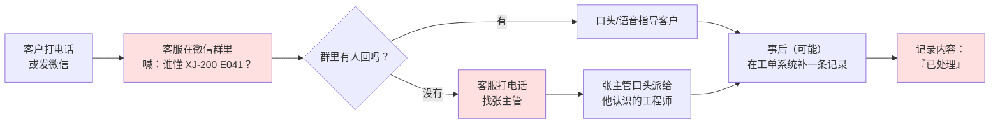
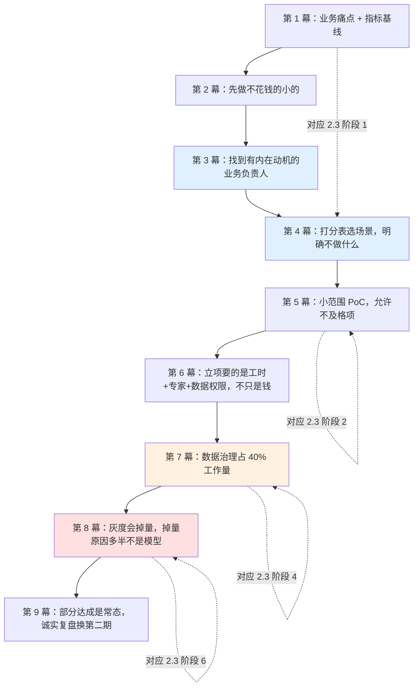
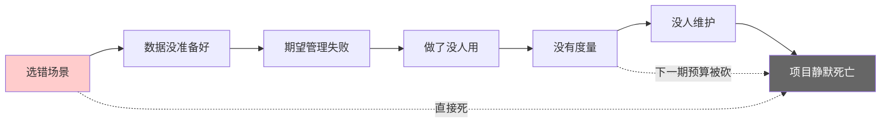
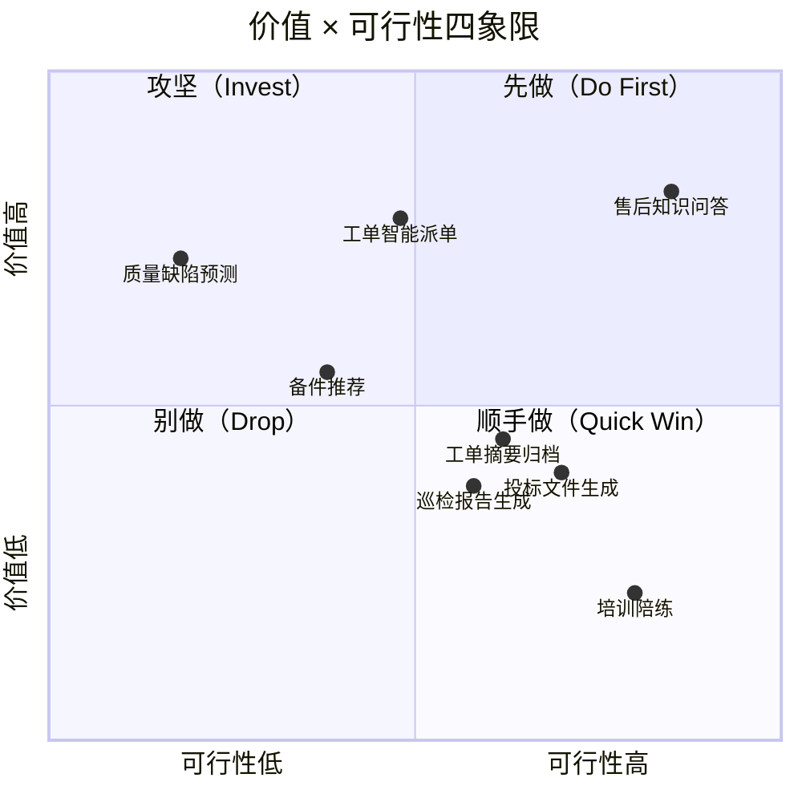
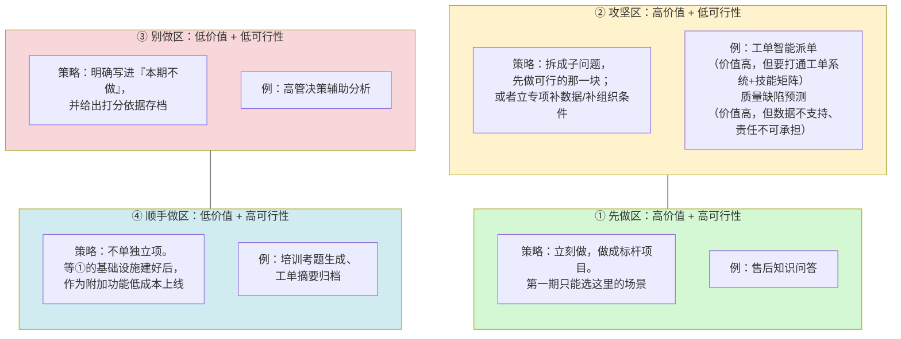
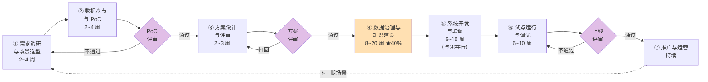
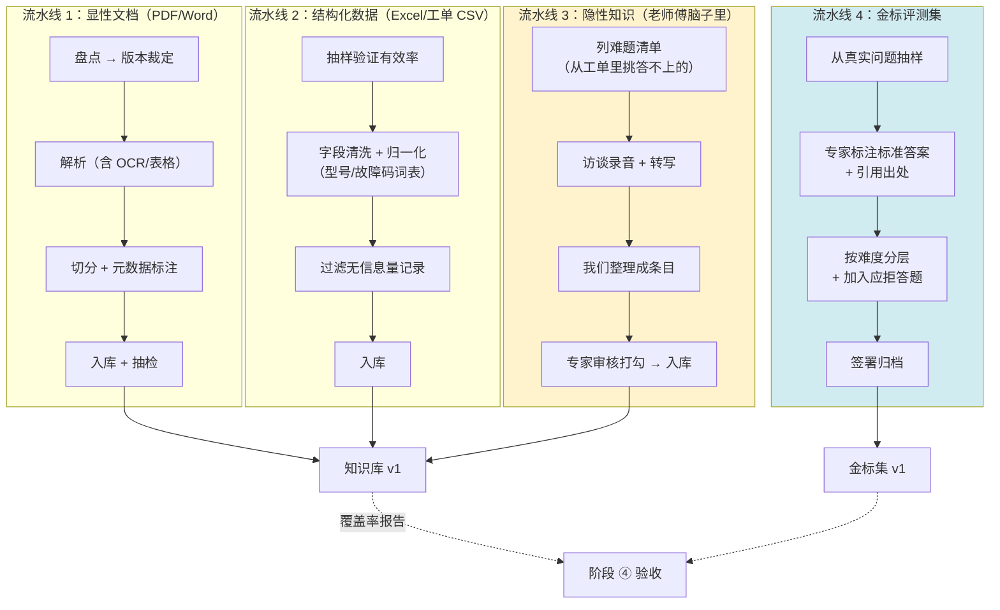
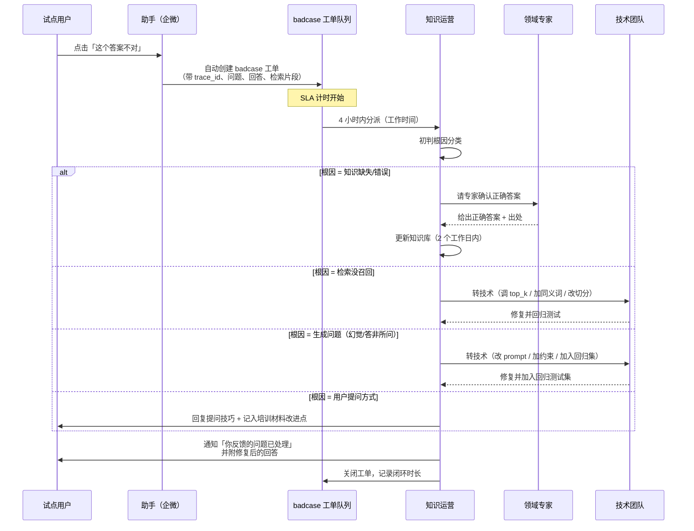

# 第 10.5 章  传统行业落地全过程方法论

> **本章目标**：读完能做到 …
> 1. 用**价值 × 可行性四象限**与**七维加权打分表**，从一堆"老板想做的 AI"里筛出真正该先做的那一个场景，并能说清为什么不做其他的；
> 2. 按**七阶段落地流程**组织一个大模型项目：每个阶段的目标、参与角色、交付物、时长、验收标准、常见坑都能讲明白；
> 3. 直接复用本章 7 套模板（30 问调研提纲、数据盘点表、PoC 验收标准、方案评审 checklist、试点周报、培训大纲、ROI 测算表）开工，不用从零设计；
> 4. 给业务方和老板做**期望管理**：讲清"它会出错"，并用产品形态（建议而非结论 / 引用 / 转人工 / 反馈按钮）承接这份不确定性；
> 5. 在只有 3 人或 6 人的最小团队下配置角色分工，并设计知识更新责任人制度与 badcase 处理 SOP；
> 6. 算出一个可以拿去过预算会的三年 ROI 模型，并诚实标注哪些参数是假设、哪些是实测。
>
> **前置知识**：[10.1 生产架构设计与部署拓扑](./01-生产架构设计与部署拓扑.md)（部署形态与模型网关）、[10.3 安全合规与幻觉治理](./03-安全合规与幻觉治理.md)（不确定性的技术承接手段）、[10.4 成本优化与容量规划](./04-成本优化与容量规划.md)（ROI 模型的成本侧输入）、[8.1 大模型与 RAG 评测方法论](../08-评测体系/01-大模型与RAG评测方法论.md)（"可度量性"这个维度的技术前提）
>
> **预计用时**：阅读 75 分钟 / 动手 180 分钟（动手 = 把本章模板填成你自己公司的版本）

---

> **本章定位说明**
>
> 前面 40 章教的是"怎么把系统做出来"。这一章教的是"怎么让这个系统在一家传统企业里活下来"。
>
> 这两件事的失败率完全不同。技术上做不出来的项目是少数——RAG+Agent 的工程路径在 2024 年之后已经相当成熟；**绝大多数企业大模型项目死在非技术原因上**：选错了场景、数据要不到、业务方不用、没人维护、老板换了方向。
>
> 所以本章不是"讲道理"章。每一节都会落到**可执行的表格、清单、模板**上。你应该做的事是：把本章的模板复制到你公司的 Wiki 里，替换成你自己的参数，然后照着走。

---

## 一、为什么需要它（问题出发）

### 1.1 传统行业的真实底色

如果你此前只在互联网公司待过，那么在传统制造业、能源、政务、医疗、建筑这类行业推大模型项目时，会遇到一套完全不同的物理规律。先把这套规律摆明白，后面所有方法论才能讲通。

**底色一：数据不在数据库里，在共享盘和老员工脑子里。**

互联网公司的默认假设是"数据都在数仓，写个 SQL 就能取"。传统企业的真实情况是：

```text
\\192.168.1.50\售后共享\
├── 技术资料\
│   ├── XJ-200操作手册\
│   │   ├── XJ-200操作手册V2.1.pdf
│   │   ├── XJ-200操作手册V2.3(勿用).pdf
│   │   ├── XJ-200操作手册V3.0-王工修订.pdf
│   │   └── 新建文件夹\XJ-200操作手册最终版.pdf
│   ├── 维修指南（老）\
│   └── 维修指南2023\
├── 故障案例\
│   ├── E041处理办法.docx
│   ├── E041处理办法-李师傅补充.docx
│   └── 疑难杂症汇总(张主管整理).xlsx
└── 备件\
    └── 备件价格表20220815.xlsx
```

这不是段子，这是华成机电售后部共享盘的真实截图脱敏后的样子。它带来三个直接后果：

| 后果 | 具体表现 | 对项目的影响 |
|---|---|---|
| **版本冲突** | 同一个故障码 `E041` 有 4 份处理办法，互相矛盾 | RAG 检索出两条冲突证据，模型要么胡编、要么给出过时方案 |
| **权威缺失** | 没人能说清哪份是"官方口径" | 无法建立金标准集，评测没有基准 |
| **隐性知识** | 最难的 20% 问题答案只在 3 位老师傅脑子里，从来没写过 | 这部分知识必须先"采集"，而采集需要老师傅配合 |

> 一句必须记住的判断：**传统行业大模型项目的第一难点不是模型，是"把知识从人和共享盘里搬到可检索的介质上"。** 这件事在项目里通常占 40% 的工作量，而 90% 的项目计划里给它留的时间是 10%。

**底色二：流程靠人盯，不是靠系统跑。**

华成机电有工单系统（一套 2016 年上线的国产 CRM 的售后模块），但真实流程是这样的：



红色的三个环节说明了三件事：**真实流程跑在微信群和电话里；工单系统是事后补录的账本；补录的内容质量极差**。这意味着：

- 你以为有 28 万条工单可以当训练/评测语料，实际上其中大量记录的"解决方案"字段只有「已处理」「已修复」「客户满意」这类无信息量的文本；
- 你把 AI 助手做成一个网页，业务方不会用——因为他们的工作流在微信/企微里；
- 你想度量"处理时长"，会发现时间戳是补录时填的，不是真实发生时间。

**底色三：IT 团队只有几个人，而且已经满负荷。**

华成机电的信息中心编制：主任 1 人、ERP 运维 2 人、网络与硬件 1 人、开发 2 人（主要做报表和小工具），共 6 人。这 6 人要支撑 1200 人的公司。所以：

- 你要一个工单系统的接口，排期回复是"下季度"；
- 你要在企微里加一个应用，需要走"信息安全审批"，审批人是主任，主任在忙 ERP 升级；
- 你想要一台 GPU 服务器进机房，机房空调容量不够，要走基建申请。

**底色四：预算审批链长，且节奏由财年决定。**

```text
需求提出（售后部）
  → 部门内部立项（售后总监签）
  → 信息中心技术评估（主任签）
  → 预算归口（财务部，看是否在年度预算内）
  → 若超 30 万：报总经理办公会
  → 若超 100 万：报董事会 / 集团投委会
  → 采购流程（招标或比价，3 家以上报价）
  → 合同评审（法务）
  → 付款（分期，通常 3:4:3 或验收后付）
```

这条链走完，**最快 6 周，常见 3~5 个月**。而且如果年度预算里没有这一项，大概率要等下一个财年。这对项目节奏的影响是决定性的：**你必须设计一个"不花钱也能先跑起来"的第一步**，否则项目在启动前就会死在流程里。

**底色五：老板既期待"AI 降本"，又怀疑"是不是噱头"。**

这两种情绪同时存在，而且会在不同场合切换：

| 场合 | 老板的话 | 潜台词 |
|---|---|---|
| 行业峰会回来 | "人家某某集团用 AI 把客服减了一半，我们呢？" | 期待：我不能落后 |
| 看到预算表 | "花这么多钱，能省几个人？" | 怀疑：这是不是买了个玩具 |
| 看到 demo 答错 | "这不是还不如人吗？" | 怀疑：AI 不靠谱 |
| 听说竞争对手在做 | "这个月能不能先搞个能看的？" | 期待：我要有东西可讲 |
| 半年后没看到数字 | "这个项目到底谁在负责？" | 怀疑：要砍了 |

你的任务不是消除这两种情绪（消除不了），而是**给这两种情绪各自一个出口**：给期待一个可以对外讲的阶段性成果，给怀疑一个可以查看的量化仪表盘。这就是本章后面"期望管理"一节要解决的问题。

---

### 1.2 华成机电的立项过程：一个具体的故事

下面这个过程是本书贯穿案例的"第 0 章"——在你读到的所有 RAG 代码之前，真实发生的是这些事。**建议对照你自己公司的情况读，很多环节会有既视感。**

> **说明**：以下时间线、人名、数字均为本书教学设定的虚构案例，用于演示方法论的实际运转方式。

#### 第 1 幕：起因不是技术，是一次客户投诉（3 月）

3 月中，一家大客户的 XJ-200-B3 生产线报 `E043`，客户报修后等了 2 天才有工程师到现场，到了发现带错了备件，又等 1 天。客户把投诉发到了总经理邮箱。

总经理在月度经营会上问了一句：**"我们的售后到底慢在哪？"**

售后总监拉了一组数据（这是华成机电第一次认真统计售后指标）：

| 指标 | 现状 | 说明 |
|---|---|---|
| 首次解决率 FCR | **61.3%** | 38.7% 的工单需要二次甚至三次处理 |
| 平均处理时长 AHT | **19.4 h** | 从客户报修到确认解决（含等待） |
| 人工转接率 | **34.7%** | 一线客服答不上来、需要转二线专家或工程师的比例 |
| 一线客服平均查资料时长 | 11 分钟/单 | 翻共享盘、翻微信群、打电话问 |
| 新入职客服独立上岗周期 | 约 5 个月 | 主要瓶颈是"记不住那么多型号和故障码" |

> **数据说明**：以上为本书贯穿案例的教学虚构数据，与全书其他章节保持一致（FCR 61.3%、AHT 19.4h、人工转接率 34.7%）。你在自己公司做这一步时，这几个数必须是真实统计出来的，且**必须在项目启动前就统计完**——否则项目结束时你没有基线可以对比。

注意这一幕的关键：**项目的起点是一个业务痛点和一组业务指标，不是"我们要用大模型"。** 这个顺序如果反了（先有技术冲动，再找场景），失败概率会高一个量级。

#### 第 2 幕：第一版方案被否了（4 月）

信息中心主任接到任务后，第一反应是找供应商。3 家供应商给了方案：

| 供应商 | 方案 | 报价 | 结局 |
|---|---|---|---|
| A（大厂云） | 私有化部署一整套"企业智能中台"，含知识库、Agent 平台、低代码编排 | 一次性 180 万 + 年服务费 36 万 | **被财务否**：超 100 万要上董事会，且年度预算没这一项 |
| B（本地集成商） | 采购一体机（含 2 卡），部署开源大模型 + 知识库 | 一次性 95 万 | **被技术否**：问"能达到多少准确率"答不出来；问"知识怎么更新"答"我们帮你维护"，但维护条款只包 1 年 |
| C（初创公司） | SaaS 版行业问答，按坐席收费 | 每坐席每月 300 元 × 90 坐席 = 32.4 万/年 | **被安全否**：设备图纸和客户信息不能出内网 |

三个方案全否了。会议结论是一句很典型的话：**"先自己搞个小的看看效果。"**

这句话是很多传统企业大模型项目真正的起点。它的好处是：**不用走大额预算流程**（用现有服务器 + API 按量付费，几千块一个月，部门自己的办公费就能出）。它的坏处是：**没有正式立项，就没有正式的资源承诺**，项目容易变成某个工程师的"业余项目"。

#### 第 3 幕：找到了那个"业务负责人"（4 月底）

信息中心的一位开发（就是本书假设的"你"）被指派做这件事。第一件事不是写代码，是找人。

他做了一件后来被证明最关键的事：**在售后部找到了一位愿意投时间的业务负责人——售后技术支持组的张主管**。

为什么张主管愿意？因为他有自己的痛点：

- 他手机里有 14 个技术支持微信群，每天被 @ 上百次，一半问题是重复的；
- 他带的 3 个老师傅快退休了，他一直在跟领导要"把经验沉淀下来"的资源，但一直没人给；
- 他每季度要写"售后质量分析报告"，靠手工翻工单，写一次要两天。

**所以他不是被安排来配合项目的，他是想借这个项目解决自己的问题。** 这是"业务负责人"这个角色唯一可靠的来源。

> **方法论要点**：一个大模型项目能不能活下来，第一个判据是**你能不能找到一个业务侧的人，他的个人 KPI / 个人痛点与这个项目正相关**。找不到这个人，项目就是 IT 部门的自娱自乐，无论技术做得多好。

#### 第 4 幕：8 个候选场景，砍到 1 个（5 月）

张主管一开口就是一长串需求："能不能自动派单""能不能预测哪批货会出问题""能不能自动写分析报告""投标文件也能不能自动生成"……信息中心这边也有自己的想法。

两边凑出 8 个候选场景。如果按"老板最感兴趣的"来选，会选"质量缺陷预测"（听起来最高级）；如果按"张主管最想要的"来选，会选"自动写分析报告"。

最后用的是本章 2.2 节要讲的**七维加权打分表**，结论是：

```text
第一期：售后知识问答（客服 + 现场工程师）   → 加权得分 4.62，第 1 名
第二期：工单智能派单                        → 加权得分 3.69，第 2 名
明确不做：质量缺陷预测                      → 加权得分 2.22，最后一名
```

"明确不做"这三个字很重要。**方法论的一半价值在于让你有理由拒绝一件事**，而且这个理由是打分表，不是"我觉得做不了"。当老板问"为什么不做缺陷预测"时，你可以把那张表给他看。

#### 第 5 幕：4 周 PoC，一个"不及格但通过"的结果（6 月）

PoC 的范围被压得很小：**只覆盖 XJ-200 / XJ-200-B3 两个型号、只覆盖 E041 / E043 / E057 三个高频故障码、只服务 6 位试点客服**。

4 周后的 PoC 结果：

| 指标 | PoC 目标 | 实测 | 判定 |
|---|---|---|---|
| 覆盖问题的回答准确率（人工评 120 题） | ≥ 70% | **73.3%** | 通过 |
| 有引用且引用正确的比例 | ≥ 80% | **81.7%** | 通过 |
| P95 响应时延 | ≤ 8 s | 6.4 s | 通过 |
| 试点客服"愿意继续用"比例 | ≥ 4/6 | **6/6** | 通过 |
| 拒答率（该拒答时拒答） | ≥ 60% | 41.7% | **不通过** |

> **实测环境**：PoC 阶段用 DeepSeek API（deepseek-chat）+ bge-m3 Embedding + Chroma 本地向量库，语料为 2 个型号的手册与 380 条清洗后工单，评测集 120 题由张主管与 2 位老师傅共同标注。样本量小，仅用于决策"是否继续投入"，不代表上线后表现。

注意"拒答率不通过"这一项：模型在不知道答案时倾向于编一个。这个问题在 PoC 里暴露出来是**好事**——它变成了正式方案设计里的一条硬要求（后来的实现见 [10.3 安全合规与幻觉治理](./03-安全合规与幻觉治理.md)）。

PoC 评审会的结论是：**继续，转正式立项，但拒答与引用必须做到产品形态里**。

#### 第 6 幕：正式立项，并且要到了一样东西（7 月）

有了 PoC 的数字，正式立项就好谈多了。这一次要到的不是钱（预算只批了 GPU 服务器一台 + API 费用），而是**三样更重要的东西**：

1. **张主管 30% 的工时**被正式写进他的季度目标（这一条比预算重要）；
2. **3 位老师傅每周 4 小时**的知识评审时间，由售后总监签字保障；
3. **工单系统的只读数据库账号**，以及企微应用的开发权限（信息中心主任签）。

**这三样东西，比 180 万的供应商方案更能决定项目成败。**

#### 第 7 幕：数据治理花了 5 个月，比预计多了 3 个月（7–11 月）

原计划 2 个月完成知识建设，实际 5 个月。多出来的 3 个月花在：

| 意外 | 耗时 | 后来学到的 |
|---|---|---|
| 共享盘里 340 个型号的手册，只有 213 个能找到最新版；其余 127 个要么缺失、要么版本无法判定 | +6 周 | 数据盘点必须在 PoC 阶段就做完，且要盘"缺什么"而不只是"有什么" |
| 28 万条工单里，"解决方案"字段有效（长度 > 20 字且含技术内容）的只有约 3.1 万条 | +3 周 | 工单数据的可用率要先抽样验证，别按总条数做计划 |
| 3 位老师傅的隐性知识采集，最初用"你把经验写下来"的方式，一个月只收到 4 页 | +4 周 | 换成"访谈 + 我们整理 + 你审核"后，两周产出 62 篇 |
| 密级划分没人拍板（哪些图纸能进知识库），卡了 | +2 周 | 密级规则必须在方案评审阶段就定，且要有签字人 |

> 这一幕是本章最想让你记住的：**数据治理与知识建设是最耗时的阶段，通常占整个项目 40% 的工作量。** 如果你的项目计划里这一阶段只占 10%，那份计划是错的。

#### 第 8 幕：灰度 50 人，两周后使用量掉到 12 人（12 月）

系统上线灰度，第一周 50 人里有 43 人用过，第二周只有 12 人还在用。原因调研（一对一访谈 15 人）：

| 原因 | 提及人数 | 性质 |
|---|---|---|
| "要单独开个网页，不如直接在群里问" | 9 | **产品形态错了** |
| "答错过一次，就不太敢信了" | 7 | 期望管理 + 引用展示不够 |
| "我问的型号它说没资料"（正是那 127 个缺手册的型号） | 5 | 数据覆盖不足 |
| "不知道怎么问才问得好" | 4 | 培训缺失 |
| "反馈了没人管" | 3 | 运营机制缺失 |

四条改动之后（**接入企微、每条回答强制带可点开的原文引用、缺资料的型号明确提示"本型号资料未入库，请联系 XX"、发布 1 页"怎么提问"图解、badcase 承诺 48 小时内回复**），第 6 周活跃回到 38 人并稳定。

#### 第 9 幕：一年后的数字（次年 6 月）

| 指标 | 基线 | 目标 | 一年后 | 达成 |
|---|---|---|---|---|
| 首次解决率 FCR | 61.3% | 75% | **71.8%** | 部分达成 |
| 平均处理时长 AHT | 19.4 h | 12 h | **13.6 h** | 部分达成 |
| 人工转接率 | 34.7% | 20% | **22.4%** | 部分达成 |
| 一线客服查资料时长 | 11 min/单 | — | 4.2 min/单 | — |
| 新客服独立上岗周期 | 5 个月 | — | 3.5 个月 | — |

> **数据说明**：教学虚构数据。请注意三个"部分达成"——**这才是真实项目的常态**。如果你的项目汇报里所有指标都超额完成，评审的人第一反应会是"这数据是怎么算的"。诚实地报"部分达成 + 差距原因 + 下一步"，比报满分更能拿到第二期预算。

三个指标都没打满的原因写在复盘里：127 个型号资料仍未补齐（影响 FCR）、现场工程师的移动端体验差（影响 AHT）、部分老客服习惯性直接转接（影响转接率）。这三条成了第二年的工作项。

---

### 1.3 从这个故事里能抽出什么

把上面 9 幕压缩成方法论，就是本章剩下的内容：



九条可以浓缩成三句：

1. **选对场景 > 做好技术。** 场景错了，技术做到 100 分也没用。
2. **人的承诺 > 钱的承诺。** 业务负责人的工时、领域专家的评审时间、数据权限，这三样拿不到，钱再多也没用。
3. **上线是中点，不是终点。** 灰度掉量、badcase 无人处理、知识不更新，是三大杀手，全都发生在"技术上线"之后。

---

## 二、原理拆解（方法论主体）

本节是全章的骨架，分三块：

- **2.1** 先讲清楚项目会怎么死（六个典型死因 + 预防动作）；
- **2.2** 再讲最重要的一步——场景选择（四象限 + 七维打分表 + 华成机电完整打分示例）；
- **2.3** 最后给完整的七阶段落地流程（每阶段的目标/角色/交付物/时长/验收/坑）。

---

### 2.1 落地失败的六个典型原因

下面六个死因不是并列的，它们有先后顺序，而且**前面的死因会导致后面的死因**：



注意最常见的死法是最右边那个：**静默死亡**。没有人宣布项目失败，服务还在跑，只是没人用、没人看指标、没人维护，一年后服务器回收时才被发现。

#### 死因 1：做了没人用（Adoption Failure）

**具体案例场景**

某工程机械企业花 7 个月做了一套"售后智能助手"，功能非常全：多轮对话、图片识别、工单联动、报表分析。上线后做了全员培训，第一个月 DAU 峰值 210 人。第三个月 DAU 是 **9 人**，其中 6 人是项目组自己。

复盘时发现真实原因非常朴素：

| 表面原因 | 真实原因 |
|---|---|
| "员工习惯没培养起来" | 助手在一个独立网页上，而客服日常工作在 CRM 里，要切窗口、要重新登录 |
| "回答不够准" | 准确率其实有 74%，但员工**不知道哪 26% 不准**，所以每条答案都要自己再核一遍，等于没省时间 |
| "功能太多不会用" | 首页给了 8 个入口，而 90% 的真实需求只是"查一个故障码怎么处理" |

**预防动作**

| # | 动作 | 什么时候做 | 验收方式 |
|---|---|---|---|
| 1 | **入口嵌进现有工作流**：企微/钉钉/CRM 内嵌，不做独立网页（或独立网页只作为管理端） | 方案设计阶段 | 方案评审 checklist 里有"入口在哪"这一项且填写具体 |
| 2 | **让不确定性可见**：每条回答带置信度提示 + 可点开的原文引用，让用户能在 5 秒内判断该不该信 | 方案设计 + 开发阶段 | 抽查 20 条回答，100% 带可点开引用 |
| 3 | **首屏只留一个主功能**，其他功能藏进二级 | 方案设计阶段 | 首屏入口 ≤ 3 个 |
| 4 | **灰度期做一对一访谈**（不是问卷），至少访谈 10 位真实用户 | 试点阶段 | 访谈记录 ≥ 10 份，每份含"你为什么不用" |
| 5 | **盯"周留存"而不是"累计用户数"** | 试点 + 推广阶段 | 周报里有 W1/W2/W4 留存曲线 |

> **一条硬规矩**：如果你的助手需要用户**多开一个窗口 + 多记一个密码**才能用，那么它的留存上限大约是 15%。传统行业员工的耐心比互联网用户低得多，因为他们的工作节奏是被电话和客户催着走的。

#### 死因 2：选错场景（Scenario Failure）

**具体案例场景**

某化工企业的第一个大模型项目选的是"安全生产规程智能问答"。听起来完美：规程文档齐全（有 1400 页的标准化文档）、高频使用（每天班前会都要查）、领导重视（安全是一号工程）。

做完之后推不动，原因是安全监管部门的一句话：**"安全规程的回答如果错一个字，出了事故谁负责？"**

这个场景的致命特征是**容错度为零**。任何"大概对"的回答在安全领域都是负债。最后这个项目被降级成"规程原文全文检索 + 高亮"，大模型的部分被砍掉了。

另一个反例是某集团做的"高管决策辅助分析"：老板亲自提的需求，但使用频次是每月 2~3 次，且每次问题都不一样，无法形成可复用的知识检索模式，最后做了 4 个月只被用了 5 次。

**预防动作**

| # | 动作 | 说明 |
|---|---|---|
| 1 | 强制走 **2.2 节的七维打分表**，得分 < 3.2 的场景不立项 | 打分表最大的作用是让"拒绝"有依据 |
| 2 | 第一个场景必须满足"**容错度 ≥ 3 分**"（即错了不会造成安全/资金/法律后果） | 第一个场景的目标是建立信任，不是创造最大价值 |
| 3 | 明确写下"**本期不做什么**"，并让业务方签字确认 | 防止范围蔓延和后续"当初不是说要做 XX 吗" |
| 4 | 做"**假 demo 先验**"：用 1 天时间手工构造 10 条问答，拿给真实用户看，问"这东西你会用吗" | 成本极低，能提前砍掉一半烂场景 |

#### 死因 3：数据没准备好（Data Failure）

**具体案例场景**

某电网单位的知识问答项目，立项时 IT 部门说"我们有完整的规章制度库，8000 多份文档"。开发进行到第 6 周才发现：

- 8000 份里有 5200 份是扫描件 PDF（图片，没有文字层），需要 OCR；
- OCR 之后表格全乱（规章里大量是"处理时限对照表"这类结构化内容）；
- 1800 份文档已作废但没有标记作废，与现行版本混在一起；
- 文档里大量引用"详见附件 3"，而附件不在库里。

结果：原计划 3 个月的项目做了 9 个月，其中 5 个月在做文档工程。

**预防动作**

| # | 动作 | 说明 |
|---|---|---|
| 1 | **PoC 阶段必须做数据抽样体检**：随机抽 30 份文档，逐份检查（有文字层吗？版本能判定吗？表格结构完整吗？） | 用 3.2 节的数据盘点表模板 |
| 2 | 盘点表里必须有"**可获取性**"和"**预估治理工时**"两列，且工时要乘 2 的系数 | 文档工程的估时误差是所有环节里最大的 |
| 3 | **先算"可用率"再定范围**：可用文档数 / 总文档数。可用率 < 40% 的域，本期不纳入 | 华成机电的做法：340 个型号里先只做 213 个有最新版手册的 |
| 4 | 对"隐性知识"（在人脑里的部分），**在方案阶段就排出访谈计划**，而不是等到开发完发现知识库答不上难题 | 访谈产出的效率是"让专家自己写"的 5~10 倍 |
| 5 | 把"**数据不齐时系统怎么表现**"写进需求：明确提示"本型号资料未入库"，而不是硬答 | 这一条直接决定用户信任度 |

#### 死因 4：期望管理失败（Expectation Failure）

**具体案例场景**

某银行分行的合规问答助手，项目组在汇报时说了一句"**准确率 95%**"。这句话后来成了项目的墓志铭。

行长听到的是"100 次里错 5 次，可以接受"。合规部听到的是"错 5 次就是 5 次合规风险"。三个月后合规部抽查出 3 条错误回答，写了一份《关于智能助手合规风险的提示函》，项目被暂停整改，再没恢复。

问题不在 95% 这个数字，在于：

- 没说清"95%"是在什么题集上、怎么判定的（是人工评分？还是关键词匹配？）；
- 没说清剩下 5% 长什么样（是"答错"还是"答不全"？是"编造条款号"还是"表述不严谨"？）；
- 没有给出"错了之后的兜底机制"（谁发现、多久修、期间怎么办）。

**预防动作**

| # | 动作 | 说明 |
|---|---|---|
| 1 | **永远不要单独报一个准确率数字**。报数字时必须同时给出：题集来源、题集规模、评判方式、评判人、错误类型分布 | 见 [8.1 大模型与 RAG 评测方法论](../08-评测体系/01-大模型与RAG评测方法论.md) 的评测报告格式 |
| 2 | 把"它会出错"**提前变成产品特性**：定位为"助手/建议"，不是"答案/结论"。见 5.1 节的 UI 文案示例 | 术语上从第一天起就说"参考建议" |
| 3 | 给业务方做一次**"错误展示会"**：主动挑 10 条最难看的 badcase 给他们看，并给出每条的处置方案 | 主动暴露比被动被抓到强 100 倍 |
| 4 | 签**服务级别说明（不是 SLA，是"能力说明书"）**：写清楚覆盖范围、不覆盖范围、错误上报通道、修复时限 | 把口头承诺变成文档 |
| 5 | 汇报模板固定为"**基线 → 目标 → 当前 → 差距原因 → 下一步**"五段 | 防止只报好消息 |

#### 死因 5：没有度量（Measurement Failure）

**具体案例场景**

某汽车零部件企业的助手上线一年，问项目负责人"效果怎么样"，回答是"大家反馈还不错"。追问具体数字，拿不出来：

- 不知道日活多少（没埋点）；
- 不知道回答准确率（上线后没再评测过）；
- 不知道 FCR 有没有提升（**上线前没统计基线**，现在也无法回溯）；
- 不知道成本多少（API 账单和公司其他项目混在一个账号里）。

结果：第二年预算评审时，财务问"去年那个 AI 项目产生了什么效益"，没人答得上来，项目预算归零。

**这是六个死因里最冤的一个**——技术可能做得不错，但因为没数字，无法证明自己活着。

**预防动作**

| # | 动作 | 说明 |
|---|---|---|
| 1 | **基线必须在项目启动前统计完**（FCR / AHT / 转接率 / 查资料时长 / 上岗周期）。没有基线就没有效果 | 华成机电是在第 1 幕就统计了 |
| 2 | 埋点与 Langfuse 接入是**第一期范围内的必做项**，不能"以后再加" | 见 [10.2 可观测性与链路追踪](./02-可观测性与链路追踪.md) |
| 3 | 建立三层指标：**技术指标**（准确率/引用率/时延）、**使用指标**（DAU/留存/采纳率）、**业务指标**（FCR/AHT/转接率） | 三层都要，缺一层就说不清价值链条 |
| 4 | **固定的月度评测**（同一套金标集，跑同一套 harness），结果存档可对比 | 见 [8.3 DeepSeek-Harness 自研评测框架](../08-评测体系/03-DeepSeek-Harness自研评测框架.md) |
| 5 | 指标要有**指定的看的人**和**固定的看的时间**（例：每月第一个周二售后例会上过一遍） | 没人看的仪表盘等于没有仪表盘 |
| 6 | 成本独立账号 / 独立 tag，可单独出账 | 见 [10.4 成本优化与容量规划](./04-成本优化与容量规划.md) |

#### 死因 6：没人维护（Maintenance Failure）

**具体案例场景**

某政务服务中心的办事咨询助手，上线时效果很好（首月满意度 4.3/5）。半年后满意度掉到 2.9。原因是这半年里：

- 出台了 2 项新政策、修改了 5 项办事指南，知识库一条都没更新；
- 助手仍在按旧政策回答"需要提供户口本原件"，而新政已经取消了这项材料；
- 用户反馈按钮点击了 137 次，**没有人处理过**（反馈进了一个没人订阅的邮箱）；
- 原项目的开发已经调岗，接手的人不知道知识库怎么更新。

**预防动作**

| # | 动作 | 说明 |
|---|---|---|
| 1 | **知识域责任人制度**：每个知识域（型号/政策/流程）指定一个业务侧责任人，写进他的岗位职责 | 见 5.4 节 |
| 2 | 知识变更**卡在源头**：制度/手册发布流程里加一步"同步更新知识库"，由发布人触发 | 从"事后同步"改成"发布即同步" |
| 3 | **badcase 处理 SOP + SLA**：谁接、多久响应、多久修复、修完怎么通知反馈人 | 见 5.4 节，含 SLA 表 |
| 4 | **知识新鲜度监控**：知识条目的 `last_reviewed_at` 超过阈值自动告警 | 可用定时任务 + 企微机器人 |
| 5 | 运维手册 + 交接清单是**上线验收的必交交付物**，不是可选项 | 防止人一走就黑盒 |
| 6 | 预算里**必须有"年度运营费"这一项**（人力 + API + 知识维护），不能只列建设费 | 见 3.7 节 ROI 表的成本侧 |

#### 六个死因的自查表

把这张表贴到项目周会的白板上，每月过一遍：

| # | 死因 | 自查问题（能答"是"才算通过） | 当前状态 |
|---|---|---|---|
| 1 | 做了没人用 | 上周有多少**不同的**真实业务用户用过？W4 留存是多少？ | ☐ 是 ☐ 否 |
| 2 | 选错场景 | 场景打分表在吗？分数 ≥ 3.2 吗？"本期不做什么"有业务方签字吗？ | ☐ 是 ☐ 否 |
| 3 | 数据没准备好 | 数据盘点表填完了吗？可用率算出来了吗？隐性知识访谈排期了吗？ | ☐ 是 ☐ 否 |
| 4 | 期望管理失败 | 最近一次对外汇报里，有没有主动给出 badcase 和差距原因？ | ☐ 是 ☐ 否 |
| 5 | 没有度量 | 三层指标（技术/使用/业务）都有当月数吗？有人看吗？基线在吗？ | ☐ 是 ☐ 否 |
| 6 | 没人维护 | 每个知识域都有责任人姓名吗？上月 badcase 闭环率多少？ | ☐ 是 ☐ 否 |

---

### 2.2 场景选择方法论（最重要的一步）

**如果本章你只能记住一节，记这一节。**

场景选择是整个项目里**杠杆率最高**的决策：它花掉的时间大约是项目总时长的 3%，但决定了项目 70% 的成败概率。选对了场景，即使技术做得平庸，也能产生可见价值；选错了场景，技术做到极致也推不动。

#### 2.2.1 第一层筛子：价值 × 可行性四象限

先用两个维度做粗筛，把候选场景扔进四个格子里：

- **价值（Value）**：做成了能带来多大的业务收益？用"年化节省工时 × 工时单价 + 可量化的业务指标改善"估。
- **可行性（Feasibility）**：以现有的数据、技术、组织条件，多大概率能做成？包含数据可得性、技术成熟度、集成难度、组织阻力。



> 如果你的 Markdown 渲染器不支持 `quadrantChart`，用下面这张等价的 flowchart 版本：



**四个象限分别该怎么办**

| 象限 | 特征 | 该做的动作 | 不该做的动作 |
|---|---|---|---|
| **① 先做区**<br/>高价值 + 高可行 | 数据齐、痛点明确、有人要 | 立刻立项，配最好的资源，**当成标杆项目做**，做完到处宣传 | 不要贪多加功能。第一期只做一个场景 |
| **② 攻坚区**<br/>高价值 + 低可行 | 价值看得见，但缺数据/缺接口/缺组织授权 | **拆解**：把不可行的部分单独列成前置任务（补数据、打通接口、要授权），排到第二期；或者先做一个"只覆盖 20% 场景"的最小版本验证 | 不要在第一期硬做。第一期失败会让整个方向失去信任 |
| **③ 别做区**<br/>低价值 + 低可行 | 通常是领导拍脑袋或技术人员自嗨 | **明确记录"本期不做"及打分依据**，存档。当被问起时拿出来 | 不要含糊地说"以后再说"——含糊会变成半年后的"当初不是说要做吗" |
| **④ 顺手做区**<br/>低价值 + 高可行 | 容易做但收益小 | 等 ① 的基础设施（知识库、网关、埋点）建好后，**当作附加功能顺手上线**，成本极低 | 不要单独立项、单独配人。单独做的话投入产出比很差 |

> **一个容易犯的错**：把"② 攻坚区"的场景当成"① 先做区"来做，因为价值诱人。华成机电如果第一期做"工单智能派单"，会卡在三个地方：工单系统的写接口要不到（信息中心排期）、工程师技能矩阵根本没有电子化（只在张主管脑子里）、派错单的责任谁背没人拍板。这三个问题都不是技术问题，但都能让项目停摆。

#### 2.2.2 好场景的五个特征

粗筛之后，用下面五条特征做定性判断。**五条全中的场景很少，中 4 条就可以做，中 3 条要谨慎，中 2 条以下别做。**

| # | 特征 | 为什么重要 | 怎么验证（具体动作） |
|---|---|---|---|
| 1 | **高频** | 频次决定价值上限，也决定用户能否形成习惯。每天发生几十上百次的事，才值得做系统 | 从现有系统导出近 3 个月的发生次数；或让业务方连续记录 5 个工作日 |
| 2 | **有明确的知识载体** | RAG 的本质是把已有文本变得可检索。如果知识从来没被写下来，第一步是"写下来"，那不是 RAG 项目 | 抽 30 个真实问题，逐个问："这个问题的答案，现在写在哪份文档的第几页？" 能答出来的比例 ≥ 60% 才算有载体 |
| 3 | **容错可接受** | 大模型必然出错。场景必须允许"错了可以纠正、纠正成本低" | 问业务方一个问题："如果它 10 次里错 2 次，但每次都给了原文引用让你能核对，你还愿意用吗？" 答"愿意"才算容错可接受 |
| 4 | **有人愿意当业务负责人** | 这是最强的信号。有人愿意押上自己的工时，说明痛点是真的 | 找到一个具体的人，他愿意：每周投 ≥ 4 小时、参加评审、组织试点用户、在例会上替项目说话 |
| 5 | **效果可度量** | 没有数字就没有第二期预算 | 在项目启动前，能写出 ≥ 3 个指标的**当前基线值**（不是"大概"，是有统计口径的数） |

#### 2.2.3 坏场景的五个特征

见到下面任意 2 条，就要认真考虑放弃：

| # | 特征 | 典型话术（听到这些话要警惕） | 为什么是坏场景 |
|---|---|---|---|
| 1 | **低频** | "这个虽然一个月就用几次，但很重要" | 频次低 → 用户记不住入口 → 忘记有这个工具 → 自然死亡。而且样本少，无法评测与迭代 |
| 2 | **需要 100% 准确** | "这个绝对不能出错" / "涉及安全的一个字都不能差" | 大模型给不了 100%。硬做的结果是要么被叫停，要么退化成全文检索 |
| 3 | **知识在人脑里没沉淀** | "老师傅都知道，就是没写下来" / "你去问他们就知道了" | 项目会变成"知识采集项目"，工期翻 2~3 倍。可以做，但必须**在计划里明确写出知识采集阶段**，不能当成隐藏工作量 |
| 4 | **涉及重大决策责任** | "帮领导做投资决策参考" / "自动审批" / "自动定价" | 责任无法归属。人不敢用（怕担责），也不敢不用（怕被说不配合），最后无人使用 |
| 5 | **无法度量** | "提升员工的工作体验" / "增强企业的智能化水平" | 无法度量 = 无法证明价值 = 第二期预算归零。这类目标可以作为**附带收益**写，不能作为主要目标 |

**一个特别要小心的组合：低频 + 领导亲自提。** 这类需求拒绝成本高，但做了几乎注定没人用。处理办法不是硬拒，而是：**把它做成 ④ 象限的附加功能**——等主场景的基础设施建好后，用 2 天时间做一个简版，成本低到失败也无所谓。

#### 2.2.4 第二层筛子：20 个候选场景七维加权打分表（模板）

四象限是定性的，容易吵架（"我觉得价值高"）。真正能在评审会上定案的是**加权打分表**。

**七个维度的定义与打分标准（1~5 分）**

| 维度 | 权重 | 1 分 | 2 分 | 3 分 | 4 分 | 5 分 |
|---|---|---|---|---|---|---|
| **A. 频次** | 0.20 | 每月 < 5 次 | 每月 5~30 次 | 每周 10~50 次 | 每天 10~50 次 | 每天 > 50 次 |
| **B. 单次耗时** | 0.15 | < 2 分钟 | 2~5 分钟 | 5~15 分钟 | 15~60 分钟 | > 1 小时 |
| **C. 知识可获得性** | 0.20 | 知识全在人脑里，无文档 | 有零散文档，版本混乱，< 30% 可用 | 有文档但需大量清洗，30~60% 可用 | 文档较齐全，60~85% 可用 | 文档齐全且有权威版本，> 85% 可用 |
| **D. 容错度** | 0.15 | 错一次即重大后果（安全/法律/资金） | 错误需专人复核并追责 | 错误可被用户自行发现并纠正，有成本 | 错误易发现、纠正成本低 | 错误几乎无成本（仅作参考/草稿） |
| **E. 可度量性** | 0.10 | 无任何可量化指标 | 只有主观满意度 | 有间接指标，需人工统计 | 有系统内可采集的指标 | 已有基线数据且系统自动采集 |
| **F. 业务方意愿** | 0.12 | 业务方明确抵触 | 业务方无所谓，配合但不投入 | 业务方口头支持 | 有明确业务负责人，愿投 ≥ 4h/周 | 业务负责人主动推动，已写进其 KPI |
| **G. 集成难度**<br/>（分数越高 = 越容易） | 0.08 | 需改造核心系统（ERP/MES），跨部门 | 需新建接口，依赖外部排期 > 1 季度 | 需新建接口，排期可控 | 有现成 API 或只读库，权限可申请 | 完全独立，无需集成 |

**加权公式**

$$
S = 0.20 A + 0.15 B + 0.20 C + 0.15 D + 0.10 E + 0.12 F + 0.08 G
$$

其中 $A \sim G \in \{1,2,3,4,5\}$，权重之和为 $1.00$，故 $S \in [1.00, 5.00]$。

**决策阈值（建议值，可按企业调整）**

| 得分区间 | 判定 | 动作 |
|---|---|---|
| $S \ge 4.20$ | 优先做 | 第一期候选，通常就是它了 |
| $3.60 \le S < 4.20$ | 可做 | 第二期候选；若第一名 < 4.20 则可作第一期，但要压缩范围 |
| $3.20 \le S < 3.60$ | 观察 | 作为 ④ 象限附加功能，或等前置条件改善 |
| $S < 3.20$ | 不做 | 明确记录"本期不做"及理由，存档 |

**一条否决规则（Veto Rule）**：**无论总分多高，只要 D（容错度）= 1 分 或 F（业务方意愿）= 1 分，直接否决。**

- D=1 意味着这是一个不允许出错的场景，大模型在这类场景里是负债；
- F=1 意味着没有人要，做出来也是摆设。

**空白模板（可容纳 20 个候选场景，直接复制去填）**

```markdown
## 候选场景打分表（填表人：____  日期：____  评分人：业务方 ___ + 技术方 ___）

| # | 候选场景 | 提出人 | A 频次 | B 耗时 | C 知识 | D 容错 | E 度量 | F 意愿 | G 集成 | 加权得分 | 否决? | 判定 | 备注 |
|---|---|---|---|---|---|---|---|---|---|---|---|---|---|
| 1  |  |  |  |  |  |  |  |  |  |  |  |  |  |
| 2  |  |  |  |  |  |  |  |  |  |  |  |  |  |
| 3  |  |  |  |  |  |  |  |  |  |  |  |  |  |
| 4  |  |  |  |  |  |  |  |  |  |  |  |  |  |
| 5  |  |  |  |  |  |  |  |  |  |  |  |  |  |
| 6  |  |  |  |  |  |  |  |  |  |  |  |  |  |
| 7  |  |  |  |  |  |  |  |  |  |  |  |  |  |
| 8  |  |  |  |  |  |  |  |  |  |  |  |  |  |
| 9  |  |  |  |  |  |  |  |  |  |  |  |  |  |
| 10 |  |  |  |  |  |  |  |  |  |  |  |  |  |
| 11 |  |  |  |  |  |  |  |  |  |  |  |  |  |
| 12 |  |  |  |  |  |  |  |  |  |  |  |  |  |
| 13 |  |  |  |  |  |  |  |  |  |  |  |  |  |
| 14 |  |  |  |  |  |  |  |  |  |  |  |  |  |
| 15 |  |  |  |  |  |  |  |  |  |  |  |  |  |
| 16 |  |  |  |  |  |  |  |  |  |  |  |  |  |
| 17 |  |  |  |  |  |  |  |  |  |  |  |  |  |
| 18 |  |  |  |  |  |  |  |  |  |  |  |  |  |
| 19 |  |  |  |  |  |  |  |  |  |  |  |  |  |
| 20 |  |  |  |  |  |  |  |  |  |  |  |  |  |

**评分规则**：每个维度由业务方与技术方各打一次，取两方均值（分歧 ≥ 2 分的维度必须当场讨论并记录原因）。
**加权公式**：S = 0.20A + 0.15B + 0.20C + 0.15D + 0.10E + 0.12F + 0.08G
**否决规则**：D=1 或 F=1 → 直接否决，不看总分。
**签字**：业务方负责人 ________  技术负责人 ________  日期 ________
```

**配套的打分计算脚本**（避免手算出错，Python 3.11，无第三方依赖）

```python
"""场景打分表加权计算与排序（scripts/score_scenarios.py）。"""
from __future__ import annotations

from dataclasses import dataclass, field

# 七个维度的权重，和必须为 1.0
WEIGHTS = {
    "freq": 0.20,       # A 频次
    "duration": 0.15,   # B 单次耗时
    "knowledge": 0.20,  # C 知识可获得性
    "tolerance": 0.15,  # D 容错度
    "measurable": 0.10, # E 可度量性
    "sponsor": 0.12,    # F 业务方意愿
    "integration": 0.08 # G 集成难度（越高越容易）
}

# 否决规则：这些维度打 1 分则直接否决
VETO_DIMENSIONS = ("tolerance", "sponsor")

THRESHOLDS = [(4.20, "优先做"), (3.60, "可做"), (3.20, "观察"), (0.0, "不做")]


@dataclass
class Scenario:
    """一个候选场景及其七维评分。"""
    name: str
    scores: dict[str, int] = field(default_factory=dict)

    def weighted(self) -> float:
        """返回加权总分，保留两位小数。"""
        total = sum(WEIGHTS[k] * self.scores[k] for k in WEIGHTS)
        return round(total, 2)

    def vetoed(self) -> str | None:
        """若命中否决规则，返回被否决的维度名，否则返回 None。"""
        for dim in VETO_DIMENSIONS:
            if self.scores.get(dim) == 1:
                return dim
        return None

    def verdict(self) -> str:
        """返回判定结论。"""
        vetoed = self.vetoed()
        if vetoed:
            return f"否决（{vetoed}=1）"
        score = self.weighted()
        for bar, label in THRESHOLDS:
            if score >= bar:
                return label
        return "不做"


def rank(scenarios: list[Scenario]) -> list[Scenario]:
    """按加权得分降序排序，被否决的场景排在最后。"""
    return sorted(scenarios, key=lambda s: (s.vetoed() is not None, -s.weighted()))


def render(scenarios: list[Scenario]) -> str:
    """把排序结果渲染成 Markdown 表格文本。"""
    header = "| 排名 | 场景 | 加权得分 | 判定 |\n|---|---|---|---|"
    rows = [
        f"| {i} | {s.name} | {s.weighted():.2f} | {s.verdict()} |"
        for i, s in enumerate(rank(scenarios), start=1)
    ]
    return "\n".join([header, *rows])


def _sanity_check_weights() -> None:
    """启动时校验权重之和为 1.0，防止改权重时忘记调整其他项。"""
    total = round(sum(WEIGHTS.values()), 6)
    if total != 1.0:
        raise ValueError(f"权重之和必须为 1.0，当前为 {total}")


if __name__ == "__main__":
    _sanity_check_weights()
    huacheng = [
        Scenario("售后知识问答", dict(freq=5, duration=4, knowledge=5, tolerance=4,
                                     measurable=5, sponsor=5, integration=4)),
        Scenario("工单智能派单", dict(freq=5, duration=2, knowledge=4, tolerance=3,
                                     measurable=5, sponsor=4, integration=2)),
        Scenario("工单摘要与自动归档", dict(freq=5, duration=2, knowledge=4, tolerance=4,
                                           measurable=3, sponsor=3, integration=3)),
        Scenario("备件推荐与库存查询", dict(freq=4, duration=2, knowledge=3, tolerance=2,
                                           measurable=4, sponsor=4, integration=2)),
        Scenario("质量缺陷预测", dict(freq=1, duration=5, knowledge=2, tolerance=1,
                                     measurable=2, sponsor=3, integration=2)),
        Scenario("投标文件自动生成", dict(freq=2, duration=5, knowledge=3, tolerance=3,
                                         measurable=3, sponsor=5, integration=4)),
        Scenario("设备巡检报告生成", dict(freq=3, duration=3, knowledge=4, tolerance=4,
                                         measurable=3, sponsor=3, integration=3)),
        Scenario("培训考题生成与新人陪练", dict(freq=2, duration=3, knowledge=5, tolerance=5,
                                               measurable=2, sponsor=2, integration=5)),
    ]
    print(render(huacheng))
```

**预期输出**

```text
| 排名 | 场景 | 加权得分 | 判定 |
|---|---|---|---|
| 1 | 售后知识问答 | 4.62 | 优先做 |
| 2 | 工单智能派单 | 3.69 | 可做 |
| 3 | 工单摘要与自动归档 | 3.60 | 可做 |
| 4 | 培训考题生成与新人陪练 | 3.44 | 观察 |
| 5 | 投标文件自动生成 | 3.42 | 观察 |
| 6 | 设备巡检报告生成 | 3.35 | 观察 |
| 7 | 备件推荐与库存查询 | 3.04 | 不做 |
| 8 | 质量缺陷预测 | 2.22 | 否决（tolerance=1） |
```

#### 2.2.5 华成机电 8 个候选场景的完整打分示例

这是 5 月那次评审会的完整记录。**每一格的分数后面都写了理由**——评审会上真正花时间的是理由，不是数字。

| # | 候选场景 | A 频次<br/>(0.20) | B 耗时<br/>(0.15) | C 知识<br/>(0.20) | D 容错<br/>(0.15) | E 度量<br/>(0.10) | F 意愿<br/>(0.12) | G 集成<br/>(0.08) | **加权得分** | 判定 |
|---|---|---|---|---|---|---|---|---|---|---|
| 1 | **售后知识问答** | 5 | 4 | 5 | 4 | 5 | 5 | 4 | **4.62** | **优先做** |
| 2 | **工单智能派单** | 5 | 2 | 4 | 3 | 5 | 4 | 2 | **3.69** | 可做（第二期） |
| 3 | 工单摘要与自动归档 | 5 | 2 | 4 | 4 | 3 | 3 | 3 | **3.60** | 可做（第二期） |
| 4 | 培训考题生成与新人陪练 | 2 | 3 | 5 | 5 | 2 | 2 | 5 | **3.44** | 观察（④ 象限） |
| 5 | 投标文件自动生成 | 2 | 5 | 3 | 3 | 3 | 5 | 4 | **3.42** | 观察（归市场部） |
| 6 | 设备巡检报告生成 | 3 | 3 | 4 | 4 | 3 | 3 | 3 | **3.35** | 观察 |
| 7 | 备件推荐与库存查询 | 4 | 2 | 3 | 2 | 4 | 4 | 2 | **3.04** | 不做（本期） |
| 8 | **质量缺陷预测** | 1 | 5 | 2 | **1** | 2 | 3 | 2 | **2.22** | **否决（D=1）** |

**逐个场景的打分理由（这是评审会记录的核心内容）**

**① 售后知识问答 —— 4.62，优先做**

| 维度 | 分数 | 理由 |
|---|---|---|
| A 频次 | 5 | 一线客服日均接单约 200 次，其中 60% 以上需要查资料；现场工程师日均查阅手册 3~5 次 × 62 人。日发生量远超 50 次 |
| B 耗时 | 4 | 单次查资料平均 11 分钟（统计自 5 个工作日的人工记录，样本 n=214） |
| C 知识 | 5 | 340 个型号中 213 个有可判定的最新版手册；维修指南 Word 齐全；28 万条工单中约 3.1 万条有有效解决方案文本。可用率 > 85%（在"限定 213 个型号"的范围内） |
| D 容错 | 4 | 回答错了客服会自己发现（现场一试就知道），且带引用可自行核对；不涉及人身安全（安全操作类问题单独走强制引用原文路径） |
| E 度量 | 5 | FCR / AHT / 转接率三个指标已有基线（61.3% / 19.4h / 34.7%），且工单系统可自动采集 |
| F 意愿 | 5 | 张主管主动推动，已写进其季度目标；3 位老师傅评审时间由总监签字保障 |
| G 集成 | 4 | 一期只需工单系统**只读**库账号 + 企微应用权限，均已获批；不需要改造任何核心系统 |

**② 工单智能派单 —— 3.69，第二期**

| 维度 | 分数 | 理由 |
|---|---|---|
| A 频次 | 5 | 日均派单约 200 次 |
| B 耗时 | 2 | 张主管派一单平均 3 分钟（凭经验，很快），所以单次节省的时间有限 |
| C 知识 | 4 | 历史工单里有"故障描述 → 实际处理人"的对应关系，可以学；但**工程师技能矩阵没有电子化**，扣 1 分 |
| D 容错 | 3 | 派错单会导致工程师白跑一趟（差旅成本 + 客户不满），纠正成本不低，但可以在派单后由人复核 |
| E 度量 | 5 | 派单准确率、二次转派率、响应时长均可从工单系统采集 |
| F 意愿 | 4 | 张主管非常想要（这是他每天最累的事），但他也担心"系统派错了算谁的" |
| G 集成 | 2 | **需要工单系统的写接口**，信息中心排期在"下季度"；且需要打通企微通知。这是最大的阻塞项 |

> **为什么不放第一期**：G=2 是硬伤。写接口拿不到就什么都做不了，而接口排期不在项目组控制范围内。正确的做法是：**第一期做知识问答的同时，把"工单系统写接口"作为前置任务提给信息中心**，等接口就绪再启动第二期。

**③ 工单摘要与自动归档 —— 3.60，第二期**

| 维度 | 分数 | 理由 |
|---|---|---|
| A 频次 | 5 | 每单都要写归档记录，日均 200 次 |
| B 耗时 | 2 | 现状是很多人只写"已处理"三个字，实际耗时接近 0，所以"节省时间"这个价值不成立 |
| C 知识 | 4 | 输入是对话记录和处理过程，属于生成类任务，不强依赖知识库 |
| D 容错 | 4 | 摘要错了影响归档质量，但不影响当期业务 |
| E 度量 | 3 | 可度量"归档记录有效率"（长度 + 关键字段完整度），但这个指标目前没人关心 |
| F 意愿 | 3 | 张主管支持（他要靠这些记录写季度报告），但一线客服的意愿是**负的**——他们本来不想写 |
| G 集成 | 3 | 需要工单系统写接口，同 ② |

> **这个场景的隐藏价值**：它是"提升工单数据质量"的手段，而工单数据质量直接决定后续所有 AI 能力的上限。所以它的真实价值被低估了。评审会的结论是：**第二期与派单一起做，并明确它的目标是"数据资产建设"而不是"省时间"**。

**④ 培训考题生成与新人陪练 —— 3.44，观察（④ 象限顺手做）**

| 维度 | 分数 | 理由 |
|---|---|---|
| A 频次 | 2 | 每年新入职售后人员约 14 人，培训是集中式的，每季度一批 |
| B 耗时 | 3 | 出一套培训题目人工要 1 天左右 |
| C 知识 | 5 | 输入就是手册和工单，知识载体最好的一个场景 |
| D 容错 | 5 | 出的题不好就重新生成，几乎零成本 |
| E 度量 | 2 | "培训效果"很难量化（上岗周期是个滞后指标） |
| F 意愿 | 2 | 人力资源部不知道这回事，没人要 |
| G 集成 | 5 | 完全独立，不需要对接任何系统 |

> **处理方式**：不单独立项。等第一期知识库建好后，用 2 天时间做一个"从知识库自动出题"的小工具，挂在管理端。成本极低，成功了是加分项，失败了也无所谓。**这是 ④ 象限的标准处理方式。**

**⑤ 投标文件自动生成 —— 3.42，观察（不归本项目）**

| 维度 | 分数 | 理由 |
|---|---|---|
| A 频次 | 2 | 每月投标 3~6 次 |
| B 耗时 | 5 | 一份技术标 2~3 人写 3~5 天，这是单次耗时最高的场景 |
| C 知识 | 3 | 历史标书在市场部各人电脑里，没有统一库；产品参数散落在多处 |
| D 容错 | 3 | 标书写错参数可能导致废标，但有人工终审 |
| E 度量 | 3 | 可度量"编写工时"，但中标率与 AI 无关 |
| F 意愿 | 5 | 市场部总监听说后非常积极，说"这个我马上给人" |
| G 集成 | 4 | 独立场景，只需文档存储 |

> **为什么"观察"而不是"做"**：F=5 很诱人，但这个场景**属于市场部，不属于售后体系**。第一期项目的组织边界是售后部 + 信息中心，跨部门会引入新的协调成本、新的数据密级问题（标书含报价，密级高）。评审结论：**记录在案，作为第三期候选，由市场部自己提立项**。
>
> **这是一条重要的组织经验**：不要在第一期跨部门。第一期的目标是在**一个部门内**做出可复制的成功案例。

**⑥ 设备巡检报告生成 —— 3.35，观察**

| 维度 | 分数 | 理由 |
|---|---|---|
| A 频次 | 3 | 巡检是周期性的，月均约 120 次 |
| B 耗时 | 3 | 工程师现场填表 + 回来整理报告，约 40 分钟 |
| C 知识 | 4 | 巡检标准有文档 |
| D 容错 | 4 | 报告是记录性质，错了可改 |
| E 度量 | 3 | 可度量报告提交及时率 |
| F 意愿 | 3 | 工程师想要（少写报告），但没人愿意当负责人 |
| G 集成 | 3 | 需要移动端 + 拍照上传，前端工作量不小 |

> 主要短板是"没人愿意当业务负责人"（F=3）和前端工作量。挂到第三期。

**⑦ 备件推荐与库存查询 —— 3.04，本期不做**

| 维度 | 分数 | 理由 |
|---|---|---|
| A 频次 | 4 | 日均约 60 次备件查询 |
| B 耗时 | 2 | 查库存本身很快，主要慢在"确定该用哪个备件" |
| C 知识 | 3 | 备件表是 Excel（`备件价格表20220815.xlsx`，两年没更新），BOM 在 ERP 里但结构复杂 |
| D 容错 | 2 | **推荐错备件会导致工程师带错件白跑一趟**，这正是 3 月那次投诉的直接原因。纠正成本高（一次上门约 1100 元） |
| E 度量 | 4 | 备件准确率、二次上门率可采集 |
| F 意愿 | 4 | 售后和仓储都想要 |
| G 集成 | 2 | **需要打通 ERP 的库存与 BOM**，这是整个公司最敏感、最难动的系统 |

> **为什么不做**：D=2 + G=2 的组合很危险——错误成本高，且需要碰 ERP。但注意 F=4，业务方是想要的。所以正确的说法不是"这个不重要"，而是：**"这个很重要，但它依赖 ERP 集成和备件数据治理两个前置条件，我们把它排在第三期，同时现在就启动备件主数据治理。"**

**⑧ 质量缺陷预测 —— 2.22，否决**

| 维度 | 分数 | 理由 |
|---|---|---|
| A 频次 | 1 | 批次质量分析每季度做一次，年均 4 次 |
| B 耗时 | 5 | 一次分析要质量部 2 人干一周 |
| C 知识 | 2 | 需要"工单 ↔ 生产批次 ↔ 物料批次"的关联数据，而工单里根本没记录批次号 |
| D 容错 | **1** | **预测"某批次会有缺陷"意味着可能要停线、召回、通知客户。预测错了的后果是直接经济损失和客户关系损失，且责任无法归属** |
| E 度量 | 2 | 缺陷率本身波动大，样本少（年均 4 次分析），无法统计显著地证明预测有效 |
| F 意愿 | 3 | 质量部总监感兴趣，但明确说"这个结论我不敢直接用" |
| G 集成 | 2 | 需要 MES + ERP + 工单三方数据打通 |

> **否决理由（写进评审记录的原文）**：
>
> "质量缺陷预测的容错度为 1 分，命中否决规则。原因：一是数据链条不完整——工单未记录生产批次号，无法建立因果关联；二是决策后果不可承担——预测结论会触发停线/召回决策，而模型无法承担该责任，业务方也明确表示不会直接采用；三是无法度量——年均 4 次分析的样本量不足以验证预测有效性。
>
> **建议替代方案**：先做『工单质量问题自动分类与趋势看板』（把 28 万条工单按故障模式聚类，看趋势），这是描述性分析而非预测，容错度高、可度量，且能为将来的预测建模积累标注数据。此项列入第三期。"
>
> **注意这段话的写法**：否决一个领导感兴趣的场景时，**必须给出替代方案**。"不做"很容易被理解为"技术做不到"或"不想干"，"不做 A，但建议先做 A'" 才是专业回答。

#### 2.2.6 最终结论与对外口径

评审会的三句话结论：

```text
第一期（Q3–Q4）：售后知识问答
  范围：213 个有最新版手册的型号 + 3.1 万条有效工单
  服务对象：一线客服 24 人 + 现场工程师 62 人
  目标：FCR 61.3% → 70%+，AHT 19.4h → 15h 以内，转接率 34.7% → 25% 以内
  （注：目标值按第一期 6 个月设定，低于全项目终态目标 75% / 12h / 20%）

第二期（次年 Q1–Q2）：工单智能派单 + 工单摘要归档
  前置条件：工单系统写接口（已提需求，信息中心承诺 Q4 交付）
           工程师技能矩阵电子化（张主管负责，Q4 完成）

明确本期不做：质量缺陷预测（容错度否决）
            备件推荐（依赖 ERP 集成与备件主数据治理，列第三期）
            投标文件生成（跨部门，建议市场部自行立项）
```

**对外口径（给老板的一页话）**

> 我们评估了 8 个候选场景，用七个维度加权打分。第一期选择"售后知识问答"，因为它在**频次、知识现成度、容错度、业务方意愿**四个关键维度上都是最高分，且**不需要改造任何核心系统**——这意味着它是风险最低、见效最快的一个。
>
> 大家最关心的"质量缺陷预测"我们暂不做，原因是工单里没有记录生产批次号，数据链条断了，而且预测结论会触发停线决策，模型承担不了这个责任。我们建议先做"工单质量趋势看板"，把 28 万条工单的故障模式聚类出来看趋势，这件事现在的数据就能支撑，也为将来做预测积累标注。
>
> 打分表全文附后，8 个场景每一个维度的打分理由都有记录，随时可以复议。

---

### 2.3 完整落地流程（七阶段）

#### 2.3.0 总览



**甘特式总览表**（以华成机电第一期为例，从 4 月底启动到次年 1 月全量推广）

| 阶段 | 名称 | 时长 | 4月 | 5月 | 6月 | 7月 | 8月 | 9月 | 10月 | 11月 | 12月 | 1月 | 工作量占比 |
|---|---|---|---|---|---|---|---|---|---|---|---|---|---|
| ① | 需求调研与场景选型 | 3 周 | ██ | ██ | | | | | | | | | 6% |
| ② | 数据盘点与 PoC | 4 周 | | ░░ | ██ | | | | | | | | 10% |
| ③ | 方案设计与评审 | 3 周 | | | ░░ | ██ | | | | | | | 7% |
| ④ | **数据治理与知识建设** | **20 周** | | | | ██ | ██ | ██ | ██ | ██ | | | **40%** |
| ⑤ | 系统开发与联调 | 10 周 | | | | | ██ | ██ | ██ | ░░ | | | 22% |
| ⑥ | 试点运行与调优 | 8 周 | | | | | | | | ██ | ██ | ░░ | 12% |
| ⑦ | 推广与运营 | 持续 | | | | | | | | | ░░ | ██ | 3%+持续 |

> `██` = 主要投入期，`░░` = 收尾或准备期。注意 ④ 和 ⑤ **必须并行**——如果串行，项目周期会长到没人有耐心等。并行的前提是 ③ 阶段已经把数据 schema 和知识组织方式定下来。
>
> **一个常见的计划错误**：把 ④ 的 20 周压缩成 6 周写进计划，然后在第 7 周开始"延期汇报"。正确做法是**在计划里就给足 ④ 的时间**，并向管理层解释清楚为什么。

**阶段与 7 个"必须有人签字"的节点**

| 节点 | 在哪个阶段末 | 签字人 | 签什么 |
|---|---|---|---|
| N1 场景确认 | ① 末 | 业务部门负责人 + 技术负责人 | 场景打分表 + "本期不做什么"清单 |
| N2 PoC 结论 | ② 末 | 业务负责人 + 技术负责人 + IT 负责人 | PoC 验收报告（含不通过项及处置） |
| N3 方案通过 | ③ 末 | IT 负责人 + 安全/合规 + 财务（预算） | 方案评审 checklist + 预算 + 退出机制 |
| N4 知识库基线 | ④ 末 | 领域专家组 + 业务负责人 | 知识库覆盖率报告 + 金标集签署 |
| N5 测试通过 | ⑤ 末 | 测试负责人 + 技术负责人 | 测试报告 + 评测报告 + 运维手册 |
| N6 试点结论 | ⑥ 末 | 业务部门负责人 + 试点用户代表 | 试点报告（含指标对比与用户访谈） |
| N7 上线/推广 | ⑦ 初 | 分管领导 | 推广计划 + 运营机制 + 年度运营预算 |

> **为什么强调签字**：在传统企业里，**没有签字的承诺等于没有承诺**。人会调岗、领导会换、优先级会变。签过字的文档是你半年后唯一能拿出来的依据。

---

#### 2.3.1 阶段 ①：需求调研与场景选型

| 项目 | 内容 |
|---|---|
| **目标** | 1) 搞清业务现状与真实痛点（而不是业务方转述的"需求"）；2) 统计出**指标基线**；3) 产出候选场景打分表并定案第一期场景；4) 找到业务负责人并获得其工时承诺 |
| **参与角色** | 技术负责人（主导）、业务负责人、一线用户代表 5~10 人、领域专家 2~3 人、IT 负责人（了解系统与权限现状） |
| **交付物** | ① 需求调研记录（每位受访者一份，用 3.1 节的 30 问提纲）<br/>② **指标基线报告**（至少 3 个指标的统计口径 + 当前值 + 数据来源）<br/>③ 候选场景打分表（2.2.4 模板）<br/>④ 一期范围说明书（含"本期不做什么"清单）<br/>⑤ 现有系统与数据源清单（系统名 / 厂商 / 是否有 API / 权限归属人） |
| **时长** | **2~4 周**。少于 2 周通常意味着调研不充分；多于 4 周说明在纠结场景，应该用打分表强行定案 |
| **验收标准** | ☑ 访谈了 ≥ 5 位真实一线用户（不是只访谈管理者）<br/>☑ 至少 3 个业务指标有明确统计口径和当前值<br/>☑ 打分表覆盖 ≥ 5 个候选场景，第一名得分 ≥ 3.6<br/>☑ 业务负责人**姓名明确**，且其工时承诺有书面记录<br/>☑ "本期不做什么"清单有业务方签字 |
| **常见坑** | ⚠ **只访谈管理者**：管理者描述的流程与一线实际做法常有很大差异（华成机电的例子：管理者以为流程走工单系统，实际走微信群）<br/>⚠ **没统计基线**：等项目结束才想起来要对比，已经来不及<br/>⚠ **把"需求"当"痛点"**：业务方说"我要一个能自动派单的系统"是方案，不是痛点。痛点是"我每天被 @ 上百次"<br/>⚠ **场景纠结不决**：三次会还定不下来。解决办法：宣布用打分表，当场打分，当场定案<br/>⚠ **忽略 IT 现状调研**：等到开发阶段才发现工单系统没有 API，只有一个 2016 年的 SOAP 接口且文档丢了 |

**这一阶段最值得花时间的事：现场观察（Shadowing）。**

不要只做访谈，要**坐在一线客服旁边看他工作 2 小时**（华成机电项目组做了 3 次，每次 2 小时）。你会看到访谈里永远听不到的东西：

```text
14:06  接电话，客户说 XJ-200-B3 报 E043
14:07  在 CRM 里搜客户，确认在保
14:08  切到浏览器，打开共享盘网页版
14:09  搜 "E043"，出来 7 个结果，3 个是 Excel
14:12  打开其中一个 Word，Ctrl+F 找 E043，翻到第 4 页
14:14  发现这份是 XJ-200 的，不是 B3 的，不确定通用不通用
14:15  在微信群里 @张主管："B3 的 E043 和 200 一样吗？"
14:19  张主管回："不一样，B3 的要先看液压压力"
14:20  回电话告诉客户
14:23  通话结束，没有在工单系统记录任何内容
```

这 17 分钟的观察比 1 小时访谈信息量大得多。它直接告出了四个关键设计约束：**必须区分型号变体（XJ-200 vs XJ-200-B3）、必须在客服现有窗口附近、必须比"@张主管"更快、必须自动帮他把过程记下来**。

---

#### 2.3.2 阶段 ②：数据盘点与可行性验证（PoC）

| 项目 | 内容 |
|---|---|
| **目标** | 1) 把数据现状盘清（有什么 / 缺什么 / 能不能拿到 / 治理要多久）；2) 用最小成本验证"技术路径走得通"；3) 产出可信的量化结论用于决策"是否继续投入" |
| **参与角色** | 技术负责人 + 1 名算法/开发（2 人足够）、领域专家 2~3 人（负责标注评测集与评判答案）、业务负责人（组织试点用户）、数据/系统 owner（提供数据） |
| **交付物** | ① **数据盘点表**（3.2 节模板，逐个知识域填完）<br/>② 数据可用率报告（抽样 ≥ 30 份文档的逐份体检结果）<br/>③ PoC 原型（能跑起来给人用，哪怕是 Streamlit 单页）<br/>④ **金标评测集 v0**（≥ 100 题，由领域专家标注）<br/>⑤ PoC 验收报告（3.3 节模板，含不通过项及处置方案） |
| **时长** | **2~4 周**。这是硬约束——PoC 超过 4 周就不叫 PoC 了，会变成"小项目"，失去"快速验证"的意义 |
| **验收标准** | ☑ 数据盘点表填完，每个知识域都有责任人姓名和预估治理工时<br/>☑ 评测集 ≥ 100 题且由领域专家签署<br/>☑ 至少 5 位真实用户实际用过原型并给了反馈<br/>☑ 验收报告的每一项指标都有"目标值 / 实测值 / 判定"三列<br/>☑ 报告里明确写了"PoC 通过 ≠ 可上线"，并列出上线前必须补齐的能力 |
| **常见坑** | ⚠ **PoC 范围不收敛**：想覆盖所有型号所有问题，4 周做不完。正确做法是**砍到 2 个型号 + 3 个故障码**（华成机电就是这么做的）<br/>⚠ **PoC 做成了 demo**：只给领导演示 5 个精心挑选的问题。这种 PoC 零信息量<br/>⚠ **评测集是自己出的**：技术人员出的题往往避开了真正难的问题。评测集必须由领域专家出<br/>⚠ **只盘"有什么"不盘"缺什么"**：华成机电的教训——127 个型号缺手册这件事，如果 PoC 阶段发现，第一期范围就会直接定为 213 个型号，不会在灰度期被用户抱怨<br/>⚠ **PoC 代码想直接上生产**：PoC 是为了验证，代码质量不做要求，但**要明确它会被丢掉**，别让它变成技术债 |

**PoC 阶段最重要的一个动作：算"可用率"。**

```python
"""数据可用率抽样体检（scripts/data_audit_sample.py）。"""
from __future__ import annotations

import random
from dataclasses import dataclass

SAMPLE_SIZE = 30  # 每个知识域抽样份数，30 份是成本与置信度的平衡点


@dataclass
class DocCheck:
    """一份文档的人工体检结果，每一项由人工确认后填写。"""
    path: str
    has_text_layer: bool      # PDF 是否有文字层（否则需 OCR）
    version_identifiable: bool # 能否判定是否为最新版
    tables_intact: bool        # 表格结构是否可解析
    attachments_present: bool  # 引用的附件是否在库内
    sensitivity_cleared: bool  # 密级是否已判定且允许入库

    def usable(self) -> bool:
        """五项全通过才算『可直接使用』。"""
        return all([
            self.has_text_layer,
            self.version_identifiable,
            self.tables_intact,
            self.attachments_present,
            self.sensitivity_cleared,
        ])

    def blockers(self) -> list[str]:
        """返回该文档不可用的原因列表，用于统计治理工作量分布。"""
        checks = {
            "缺文字层(需OCR)": self.has_text_layer,
            "版本不可判定": self.version_identifiable,
            "表格结构破损": self.tables_intact,
            "附件缺失": self.attachments_present,
            "密级未判定": self.sensitivity_cleared,
        }
        return [name for name, ok in checks.items() if not ok]


def usable_rate(checks: list[DocCheck]) -> float:
    """返回可用率，即可直接使用的文档占抽样总数的比例。"""
    if not checks:
        return 0.0
    return sum(1 for c in checks if c.usable()) / len(checks)


def blocker_distribution(checks: list[DocCheck]) -> dict[str, int]:
    """统计各类阻塞原因出现的次数，按次数降序返回。"""
    counter: dict[str, int] = {}
    for c in checks:
        for b in c.blockers():
            counter[b] = counter.get(b, 0) + 1
    return dict(sorted(counter.items(), key=lambda kv: -kv[1]))


def decide_scope(rate: float) -> str:
    """根据可用率给出本期是否纳入该知识域的建议。"""
    if rate >= 0.85:
        return "纳入本期，按标准流程治理"
    if rate >= 0.60:
        return "纳入本期，但治理工时按 1.5 倍估算"
    if rate >= 0.40:
        return "缩小范围纳入（只做可用部分），其余列入下期"
    return "本期不纳入，先做专项文档补齐"


if __name__ == "__main__":
    # 实际使用时把人工体检结果填进来；这里用随机数演示输出格式
    random.seed(42)
    sampled = [
        DocCheck(
            path=f"XJ-{100 + i}_manual.pdf",
            has_text_layer=random.random() > 0.15,
            version_identifiable=random.random() > 0.20,
            tables_intact=random.random() > 0.25,
            attachments_present=random.random() > 0.10,
            sensitivity_cleared=random.random() > 0.05,
        )
        for i in range(SAMPLE_SIZE)
    ]
    rate = usable_rate(sampled)
    print(f"抽样份数: {len(sampled)}")
    print(f"可用率: {rate:.1%}")
    print(f"建议: {decide_scope(rate)}")
    print("阻塞原因分布:")
    for name, n in blocker_distribution(sampled).items():
        print(f"  {name}: {n} 份 ({n / len(sampled):.0%})")
```

**预期输出**（`random.seed(42)` 下可复现；真实项目请替换为人工体检结果）

```text
抽样份数: 30
可用率: 43.3%
建议: 缩小范围纳入（只做可用部分），其余列入下期
阻塞原因分布:
  版本不可判定: 9 份 (30%)
  表格结构破损: 5 份 (17%)
  密级未判定: 4 份 (13%)
  缺文字层(需OCR): 2 份 (7%)
  附件缺失: 1 份 (3%)
```

> **这段脚本的价值不在代码，在于它强制你做一件事：逐份打开 30 个文档亲手检查。** 很多项目跳过了这一步，代价是在开发阶段用 5 倍的时间偿还。

---

#### 2.3.3 阶段 ③：方案设计与评审

| 项目 | 内容 |
|---|---|
| **目标** | 1) 把技术方案、数据方案、安全方案、成本方案、运维方案写成一份可评审的文档；2) 通过评审拿到预算与资源；3) **确定退出机制**（什么情况下停止项目） |
| **参与角色** | 技术负责人（主写）、架构师、安全/合规负责人、IT 负责人、财务代表、业务负责人、（如涉及采购）采购与法务 |
| **交付物** | ① 技术方案文档（架构图、部署拓扑、技术选型与理由、容量估算）<br/>② 数据方案（知识组织结构、切分策略、更新机制、密级与权限模型）<br/>③ 安全与合规方案（数据不出域论证、脱敏、审计、幻觉治理手段）<br/>④ **成本方案**（建设费 + 三年运营费，见 3.7 ROI 表）<br/>⑤ 运维方案（监控指标、告警、值班、降级、备份）<br/>⑥ **退出机制文档**（明确的停止条件）<br/>⑦ 项目计划（WBS + 甘特图 + 里程碑 + 风险登记册）<br/>⑧ 评审 checklist 的逐项回答（3.4 节模板） |
| **时长** | **2~3 周**（含 1 次预评审 + 1 次正式评审）。预评审是为了先把明显的问题暴露掉，避免正式评审被打回 |
| **验收标准** | ☑ 3.4 节的 30+ 项评审 checklist 每一项都有明确回答（不允许留空或"待定"）<br/>☑ 架构图能画到组件级，每个组件标明技术选型与版本<br/>☑ 三年成本有具体数字，且区分"一次性"与"经常性"<br/>☑ **年度运营预算被明确批准**（不只批建设费）<br/>☑ 退出机制写明"若 X 指标在 Y 时间内未达 Z，则项目转入 W 状态"<br/>☑ 安全/合规负责人签字 |
| **常见坑** | ⚠ **只写技术不写运营**：方案里没有"上线后谁维护知识库"，评审通过了但埋了死因 6<br/>⚠ **预算只算建设不算运营**：第二年没钱付 API 费用，项目停摆<br/>⚠ **没有退出机制**：项目变成"只能成功不能失败"，导致后期数据造假、指标注水<br/>⚠ **安全方案临时补**：等开发完了才发现"客户信息不能进 prompt"，要返工<br/>⚠ **方案写太厚没人看**：80 页的方案没人读完。正确做法是**一页摘要 + 一页架构图 + 一页成本 + 附件详细方案**<br/>⚠ **供应商锁定**：如果要采购，方案里必须写清"数据和知识库的导出方式"与"更换供应商的迁移路径"，否则三年后被绑死 |

**退出机制怎么写（很多项目缺这一页，这是专业与业余的分水岭）**

```markdown
## 项目退出与降级机制

### 触发条件（任一满足即触发评估会）
1. 试点阶段（阶段⑥）结束时，试点用户 W4 周留存 < 40%
2. 试点阶段结束时，回答准确率 < 65%（同一金标集，人工评判）
3. 月度 badcase 闭环率连续 2 个月 < 60%
4. 累计成本超出批准预算 30% 且无法通过优化收回
5. 核心业务负责人离职/调岗且 4 周内无人接任
6. 知识库 90 天内无任何更新（视为业务侧已放弃）

### 三档处置（评估会决定）
| 档位 | 含义 | 动作 |
|---|---|---|
| A. 继续 | 问题可在 1 个 sprint 内修复 | 制定整改计划，4 周后复评 |
| B. 降级维持 | 价值存在但不足以支撑当前投入 | 缩减到只保留检索+引用功能（关闭生成），运维人力降到 0.2 人 |
| C. 终止 | 场景判断有误或前置条件不具备 | 归档知识库与评测集（这是资产，必须保留），撰写复盘报告，资源释放

### 资产保留要求（无论哪一档）
- 知识库（已治理的结构化知识）必须完整导出并移交业务部门
- 金标评测集必须归档（下一个场景可复用）
- 复盘报告必须写明"如果重做一次，前三件该改的事"
```

> **为什么退出机制反而能让项目活得更久**：它把"失败"从一件丢人的事变成一个有预案的选项。评审会上主动给出退出机制，管理层的风险感知会下降，反而更容易批预算。**没有退出机制的项目，管理层的默认退出机制就是"某天突然砍掉"。**

---

#### 2.3.4 阶段 ④：数据治理与知识建设（最耗时，约占 40% 工作量）

| 项目 | 内容 |
|---|---|
| **目标** | 1) 把散乱的文档与隐性知识变成**有权威版本、有密级、有责任人、可检索**的知识库；2) 建立知识更新机制（不只是一次性搬运）；3) 产出金标评测集正式版 |
| **参与角色** | **领域专家（主力，工作量的一半在他们身上）**、知识运营（1 人，全职，这个角色最常被漏掉）、数据工程（清洗、解析、切分、入库）、业务负责人（协调专家时间、拍板密级与权威版本） |
| **交付物** | ① 知识库（结构化、带元数据：型号 / 故障码 / 版本 / 生效日期 / 密级 / 责任人 / last_reviewed_at）<br/>② 知识覆盖率报告（按知识域列出已入库 / 缺失 / 待定）<br/>③ **权威版本裁定记录**（哪份是官方口径，谁裁定的，何时裁定）<br/>④ 隐性知识访谈记录 + 整理后的知识条目（专家已审核签署）<br/>⑤ 金标评测集 v1（≥ 300 题，分难度分层，专家签署）<br/>⑥ 密级与权限矩阵（哪些角色能看哪些知识域）<br/>⑦ **知识更新 SOP**（新文档发布时怎么同步、谁触发、多久生效） |
| **时长** | **8~20 周**，取决于知识域数量与数据可用率。华成机电用了 20 周（原计划 8 周）。<br/>**经验公式（粗估，误差大，仅用于第一版计划）**：$T_{周} \approx \dfrac{N_{文档} \times H_{单份}}{5 \times 8 \times P_{人}} \times 1.8$，其中 $H_{单份}$ 为单份文档平均治理工时（可用率高时 0.5~1h，低时 2~4h），$1.8$ 为经验修正系数 |
| **验收标准** | ☑ 目标范围内知识域覆盖率 ≥ 90%（不在范围内的明确标注"未入库"）<br/>☑ 每条知识都有责任人姓名与 `last_reviewed_at`<br/>☑ 冲突知识已裁定（同一故障码不存在两份互相矛盾且都标"有效"的条目）<br/>☑ 金标集 ≥ 300 题，含 ≥ 20% 的"应拒答"题<br/>☑ 密级矩阵有安全负责人签字<br/>☑ 知识更新 SOP 已在一次真实的文档发布中跑通过（**不是纸面流程**） |
| **常见坑** | ⚠ **低估工作量 4~5 倍**（最普遍的坑）。对策：按上面公式估完再乘 1.8，并在计划里把它作为最长的阶段<br/>⚠ **没有"知识运营"这个专职角色**，指望数据工程兼任。结果是技术做完了知识没人组织<br/>⚠ **让专家"自己写"**：华成机电的教训——一个月只收到 4 页。对策：改成"我们访谈 → 我们整理成条目 → 专家只做审核打勾"，效率提升 5~10 倍<br/>⚠ **权威版本没人拍板**：技术人员不敢裁定哪份文档是官方版。对策：**把裁定权明确授予某个岗位**（华成机电是售后技术支持组主管），并做成一条一条的裁定记录<br/>⚠ **只搬运不建机制**：第一批知识入库了，但没有更新机制，半年后知识全过期（死因 6）<br/>⚠ **密级问题拖到最后**：图纸、客户信息、报价能不能进库，必须在阶段 ③ 定，④ 阶段执行<br/>⚠ **金标集里没有"应拒答"题**：导致模型的拒答能力无法度量（华成机电 PoC 时拒答率不达标就是因为这个） |

**知识建设的四条流水线（并行推进）**



**流水线 3（隐性知识采集）的具体做法** —— 这是最容易失败也最有价值的一条：

| 步骤 | 做法 | 华成机电的实际数字 |
|---|---|---|
| 1. 列难题清单 | 从历史工单里筛出"转接给专家""处理时长 > 48h""二次上门"的工单，按故障模式聚类，得到"难题 Top N" | 从 3.1 万条有效工单中筛出 1,847 条难单，聚成 78 个难题模式 |
| 2. 结构化访谈 | 每次 90 分钟，1 位专家 + 1 位技术 + 1 位记录。**拿着具体工单问**"这一单你会怎么判断"，而不是问"你有什么经验" | 3 位专家 × 8 次访谈 = 24 场，共 36 小时 |
| 3. 我们整理 | 技术方把访谈内容整理成标准条目：`现象 / 判断步骤 / 可能原因（按概率排序）/ 处置 / 注意事项 / 适用型号` | 产出 62 篇条目，平均每篇 700 字 |
| 4. 专家审核 | 专家只需读并打勾/批注，不用动笔写 | 每篇审核约 8 分钟，总计约 8 小时 |

> **对比数据**：改成"访谈 + 整理 + 审核"之前，"让专家自己写"的方式在 4 周内产出 4 页；改成这套流程后，2 周产出 62 篇。**关键洞察是：专家的稀缺资源是"写作时间"，不是"知识"。把写作从专家身上移走，效率就上来了。**（教学虚构数据，但这个数量级差异在真实项目中很常见）

---

#### 2.3.5 阶段 ⑤：系统开发与联调

| 项目 | 内容 |
|---|---|
| **目标** | 1) 把方案实现为可上线的系统；2) 完成与现有系统（工单/CRM/企微）的集成与联调；3) 通过测试与评测 |
| **参与角色** | 后端、前端、算法、测试、运维、IT 系统对接人（外部依赖，最容易卡） |
| **交付物** | ① 可部署的系统（代码 + Docker Compose / K8s 编排 + CI）<br/>② 集成联调报告（每个外部系统一份：接口、鉴权、限流、失败重试、联调通过记录）<br/>③ 测试报告（功能 / 性能 / 安全 / 兼容）<br/>④ **评测报告**（跑金标集 v1，含准确率、引用正确率、拒答率、时延分布）<br/>⑤ 可观测性接入（Langfuse trace + 业务埋点，见 [10.2](./02-可观测性与链路追踪.md)）<br/>⑥ **运维手册 + 交接清单**（部署、回滚、扩容、常见故障处置、联系人）<br/>⑦ 灰度开关与降级开关（见 [10.1](./01-生产架构设计与部署拓扑.md)） |
| **时长** | **6~10 周**，与阶段 ④ 并行。并行的接口是：④ 先交付"知识库 schema + 前 20% 样本数据"，⑤ 就可以开工 |
| **验收标准** | ☑ 金标集 v1 上的准确率、引用正确率、拒答率三项均达到方案设定的门槛<br/>☑ P95 时延 ≤ 方案约定值（华成机电约定 ≤ 8 s，含检索与生成）<br/>☑ 每一条回答都能追溯到 trace，且 trace 里能看到检索到的原文片段<br/>☑ 降级路径实测通过（拔掉 LLM，系统能退化为纯检索并明确提示用户）<br/>☑ 外部系统集成全部联调通过并有记录<br/>☑ 运维手册由一位**没参与开发的人**照着做一遍部署并成功 |
| **常见坑** | ⚠ **被 IT 排期卡死**（最常见）。对策：阶段 ③ 就提接口需求并拿到排期承诺；同时设计"接口没到位时的降级路径"（如先用只读库直连或手工导出 CSV）<br/>⚠ **埋点"以后再加"**：上线后发现什么都统计不了（死因 5）。埋点必须在第一期范围内<br/>⚠ **只在管理端做功能，用户端很粗糙**：用户端的体验决定留存<br/>⚠ **没有降级**：LLM 服务抖动时整个系统白屏，用户一次就不再来<br/>⚠ **企微/钉钉的集成坑**：消息长度限制、Markdown 渲染差异、卡片消息的交互限制、回调超时（通常 5 s）。必须早做原型验证<br/>⚠ **PoC 代码直接进生产**：没有配置管理、没有日志脱敏、写死了 API Key |

---

#### 2.3.6 阶段 ⑥：试点运行与调优

| 项目 | 内容 |
|---|---|
| **目标** | 1) 在小范围真实使用中暴露问题；2) 建立并跑通反馈闭环；3) 用真实数据验证业务指标是否在改善；4) 沉淀培训材料与运营机制 |
| **参与角色** | 业务负责人（主导试点人群）、试点用户 20~60 人、技术团队（快速响应 badcase）、知识运营（修知识）、领域专家（判定 badcase 对错） |
| **交付物** | ① 试点周报（3.5 节模板，每周一份，不间断）<br/>② badcase 库（每条含：问题、模型回答、正确答案、根因分类、处置、闭环时间）<br/>③ 业务指标对比报告（试点组 vs 对照组，或试点前 vs 试点后）<br/>④ 用户访谈记录 ≥ 10 份（含"你为什么不用"）<br/>⑤ 培训材料 v1（3.6 节大纲）<br/>⑥ 试点报告（N6 签字用） |
| **时长** | **6~10 周**。少于 6 周看不出留存（W4 留存需要至少 5 周数据）；超过 10 周会失去推广窗口 |
| **验收标准** | ☑ W4 留存 ≥ 60%（试点用户中，第 4 周仍在使用的比例）<br/>☑ 采纳率 ≥ 50%（用户看到回答后实际采用的比例，需埋点）<br/>☑ badcase 闭环率 ≥ 80%，平均闭环时长 ≤ 5 个工作日<br/>☑ 至少 1 个业务指标出现可观测的改善方向（试点期样本量通常不足以做统计显著性检验，**这一点要在报告里诚实写明**）<br/>☑ 试点用户中 ≥ 70% 在访谈中表示"愿意继续使用"<br/>☑ 反馈闭环跑通：用户点反馈 → 进工单 → 有人处理 → 修完通知用户，全链路实测通过 |
| **常见坑** | ⚠ **灰度人群选错**：选了"最配合的人"（项目组熟人），测不出真实问题。正确做法见下<br/>⚠ **灰度掉量不追原因**：以为是"习惯问题"，实际是产品形态问题（华成机电第 8 幕）<br/>⚠ **badcase 没人处理**：反馈进了没人订阅的邮箱。必须有 SOP + SLA（见 5.4 节）<br/>⚠ **只看满意度不看留存**：满意度是问卷问出来的，留存是行为数据。**行为数据永远比问卷可信**<br/>⚠ **试点期就大张旗鼓宣传**：第一印象差会毁掉后续推广。试点期应低调<br/>⚠ **没有对照组**：无法区分"指标改善"是 AI 带来的还是季节性波动 |

**灰度人群怎么选（这一步决定试点的信息量）**

| 选择原则 | 具体做法 | 反面做法 |
|---|---|---|
| **覆盖角色多样性** | 一线客服 + 现场工程师 + 管理者三类都要有，各占一定比例 | 只选客服，上线后发现工程师的移动端场景完全没验证 |
| **覆盖能力分布** | 要有资深、中等、新手三档。**新手是最重要的一档**——他们最需要助手，也最能暴露"回答不清楚"的问题 | 只选资深人员，他们靠经验绕过了所有坑 |
| **包含 2~3 个"怀疑者"** | 主动找 2~3 位对 AI 持怀疑态度的人参与，他们的 badcase 质量最高 | 只选支持者，反馈全是"挺好的" |
| **有对照组** | 同类角色里留一组不用助手的人，用于指标对比 | 全员上线，无法归因 |
| **规模 20~60 人** | 太少看不出留存规律，太多则 badcase 处理跟不上 | 一次上 500 人，badcase 积压，口碑崩塌 |

华成机电的试点人群配置（共 50 人）：

| 角色 | 人数 | 其中新手 | 其中怀疑者 | 对照组 |
|---|---|---|---|---|
| 一线客服 | 18 | 6 | 2 | 6 |
| 现场工程师 | 26 | 8 | 1 | 12 |
| 售后管理者 | 6 | 0 | 1 | 2 |
| **合计** | **50** | **14** | **4** | **20** |

**反馈闭环的设计（这是试点阶段的核心机制）**



> **"通知用户已处理"这一步千万不能省。** 华成机电的数据：加上这一步之后，用户主动反馈率从每周 6 条涨到每周 41 条。原因很简单——**用户发现反馈有用，才愿意继续反馈**；而反馈量是项目最宝贵的改进燃料。

---

#### 2.3.7 阶段 ⑦：推广与运营

| 项目 | 内容 |
|---|---|
| **目标** | 1) 从试点人群扩到目标全量人群；2) 把临时的项目机制转成常态化运营机制；3) 建立持续迭代节奏；4) 用数字换到下一期资源 |
| **参与角色** | 业务部门负责人（主导推广）、培训讲师（通常由业务负责人或种子用户担任）、知识运营（转为常设岗）、技术团队（转为 0.5~1 人的运维迭代投入）、分管领导（站台） |
| **交付物** | ① 分批推广计划（批次、人群、时间、培训安排、负责人）<br/>② 培训材料正式版 + 培训记录（签到、考核结果）<br/>③ **运营机制文档**：知识更新责任人清单、badcase SOP+SLA、月度评测计划、复盘会议程<br/>④ 月度运营报告（固定格式，固定送达人）<br/>⑤ 年度运营预算与人力配置<br/>⑥ 下一期场景的候选打分表（回到阶段 ①） |
| **时长** | **持续**。推广动作通常 4~8 周完成，运营是长期的 |
| **验收标准** | ☑ 目标人群覆盖率 ≥ 80%（培训 + 账号开通 + 至少使用过 3 次）<br/>☑ 全量后 W4 留存 ≥ 50%（比试点期略低是正常的）<br/>☑ 每个知识域都有**具名**责任人，且写进其岗位职责或季度目标<br/>☑ 月度评测已连续跑 ≥ 2 次，结果有存档、有对比<br/>☑ 月度运营报告已连续发 ≥ 2 期，且分管领导确认收到并看过<br/>☑ 年度运营预算已批准（含 API/推理成本、人力、知识维护） |
| **常见坑** | ⚠ **推广太快**：一次全量，badcase 井喷，支持跟不上，口碑崩掉。正确做法是分 3~4 批，每批间隔 2 周<br/>⚠ **培训一次就完**：新人不断进来，培训必须周期化（华成机电：每月一次新人培训，纳入入职流程）<br/>⚠ **项目组解散**：项目验收后人全部回原岗位，系统进入无人维护状态（死因 6）。**必须在 N7 节点明确常设运营编制**<br/>⚠ **指标停止采集**：项目结束后仪表盘没人看。对策：把关键指标塞进业务部门**已有的**月度例会材料里，而不是另开一个会<br/>⚠ **不做下一期规划**：项目成功了但没有下一步，团队解散，能力流失。推广期就该启动下一期的场景打分<br/>⚠ **老板换方向**：新领导上任要看新东西。对策：运营报告里持续强调业务指标（FCR/AHT）而不是技术指标，业务语言的成果更抗得住领导更替 |

**七阶段的资源投入曲线（提前让管理层看到这条曲线，能避免很多误解）**

| 阶段 | 技术人力 | 业务人力 | 专家人力 | 资金投入 | 管理层关注度 |
|---|---|---|---|---|---|
| ① 需求调研 | 0.5 人 | 0.5 人 | 0.2 人 | 几乎为 0 | 低 |
| ② 数据盘点+PoC | 2 人 | 0.5 人 | 0.5 人 | 小（API 按量，数千元） | **高**（要看 PoC 结果） |
| ③ 方案设计 | 1.5 人 | 0.3 人 | 0.2 人 | 0 | **高**（要批预算） |
| ④ 数据治理 | 1.5 人 | **1 人（知识运营）** | **0.5 人** | 小 | **低**（最危险：投入最大但关注度最低） |
| ⑤ 系统开发 | 3~4 人 | 0.3 人 | 0.2 人 | 中（硬件/API） | 中 |
| ⑥ 试点调优 | 2 人 | **1 人** | 0.3 人 | 中 | **高**（要看试点结果） |
| ⑦ 推广运营 | 0.5~1 人 | 0.5 人（常设） | 0.2 人（常设） | 经常性 | 中→低 |

> **看这张表最该注意的一行是 ④**：投入最大（占 40% 工作量）而管理层关注度最低。这就是为什么 ④ 阶段最容易被"为什么这么慢"质疑。**对策：在 ③ 阶段评审时就把这条曲线讲清楚，并在 ④ 阶段用"知识覆盖率"这个可视化指标做周报**——让不可见的工作变可见。

---

## 三、动手实战：可直接复用的模板

本节 7 套模板是本章的主要产出物。**用法**：复制到你公司的 Wiki / 共享盘，把括号里的占位符换成你自己的内容，然后照着走。每套模板都给了华成机电的填写示例，方便你对照"填到什么颗粒度算合格"。

| # | 模板 | 用在哪个阶段 | 页数量级 |
|---|---|---|---|
| 1 | 需求调研提纲（30 问） | ① | 2 页/受访者 |
| 2 | 数据盘点表 | ② | 1 行/知识域 |
| 3 | PoC 验收标准 | ② | 2 页 |
| 4 | 方案评审 checklist（36 项） | ③ | 3 页 |
| 5 | 试点运营周报 | ⑥ | 1 页/周 |
| 6 | 培训材料大纲 | ⑥⑦ | 2 份大纲 |
| 7 | ROI 测算表 | ③（初版）⑦（复核） | 3 页 |

---

### 3.1 模板 1：需求调研提纲（30 问）

**使用说明**

- **对象**：一线用户 5~10 人、领域专家 2~3 人、业务管理者 1~2 人、IT 负责人 1 人。**不同对象问不同组**（见下表）。
- **时长**：单人 45~60 分钟。超过 60 分钟受访者会开始敷衍。
- **形式**：面谈优先，必须有一位专职记录人。**录音需事先征得同意。**
- **原则三条**：① 问"你上次是怎么做的"而不是"你一般怎么做"（具体事件比概括可靠）；② 追问数字（"大概多久" → "上次具体多久"）；③ 不要在调研时讨论方案，只收集事实。

| 问题组 | 主要问谁 | 题号 |
|---|---|---|
| A. 业务现状 | 一线用户、管理者 | 1–6 |
| B. 痛点量化 | 一线用户、管理者 | 7–13 |
| C. 数据现状 | 领域专家、IT 负责人 | 14–21 |
| D. 期望 | 所有人 | 22–26 |
| E. 约束 | IT 负责人、管理者 | 27–30 |

---

```markdown
# 需求调研记录

受访者：________  岗位：________  工龄：____ 年
调研人：________  记录人：________  日期：________  时长：____ 分钟
是否录音：☐ 是（已获同意）☐ 否

---

## A 组｜业务现状（6 问）

**A1.** 请按时间顺序讲一下你昨天（或最近一个完整工作日）从上班到下班都做了什么？
   （追问：每件事大概花多久？）
   记录：

**A2.** 你这个岗位一天要处理多少件 ____（工单/咨询/报修）？一周呢？旺季和淡季差多少？
   记录：

**A3.** 处理一件 ____ 的完整步骤是什么？请一步步说。
   （追问每一步：这一步用什么系统？需要查什么资料？要问谁？）
   记录：

**A4.** 这个流程里，哪一步是在系统里做的，哪一步是在微信/电话/纸上做的？
   （这一问非常重要，直接决定产品入口设计）
   记录：

**A5.** 遇到你答不上来的问题，你会怎么办？上一次发生是什么时候，具体怎么解决的？
   记录：

**A6.** 你们组里，谁是"什么都知道"的那个人？大家一般什么情况下会去找他？
   （这一问在找隐性知识的位置）
   记录：

---

## B 组｜痛点量化（7 问）

**B7.** 这份工作里最让你烦的三件事是什么？按烦的程度排序。
   记录：

**B8.** 【查资料耗时】你上一次需要查资料才能回答的问题，从开始查到查到，花了多长时间？
   （追问：查了哪几个地方？）
   记录：

**B9.** 你一天里大概有多少时间花在"找资料/问人"上？（请给一个分钟数，不要说"挺多的"）
   记录：____ 分钟/天

**B10.** 【重复劳动】有哪些问题是你每周都要回答好几遍的？请举 3 个具体的。
   记录：

**B11.** 【返工】上个月有几次是处理完了又被打回来重做的？最近一次是什么原因？
   记录：

**B12.** 【等待】你的工作里有哪些环节是在"等"？等什么？一般等多久？
   记录：

**B13.** 如果给你一个助手（真人），你最想让他帮你做什么？
   （这一问往往能问出最真实的需求）
   记录：

---

## C 组｜数据现状（8 问）

**C14.** 你工作中会用到哪些资料？请逐个说：叫什么名字、放在哪里、谁负责维护。
   记录（列表）：

**C15.** 这些资料里，哪一份是最权威的？如果两份资料说的不一样，你信哪个？为什么？
   （这一问在找"权威版本裁定权"归谁）
   记录：

**C16.** 【版本】资料多久更新一次？更新了你怎么知道？上一次更新是什么时候？
   记录：

**C17.** 【格式】这些资料是什么格式？（PDF/Word/Excel/纸质/扫描件/系统里）
   （追问 PDF：是能选中文字的，还是扫出来的图片？）
   记录：

**C18.** 【缺失】有没有你觉得"应该有但找不到"的资料？具体是哪些？
   （这一问是数据盘点里最容易被漏掉的：盘"缺什么"）
   记录：

**C19.** 【系统数据】你在 ____（工单系统/CRM）里会填哪些字段？哪些字段你觉得没用、随便填的？
   （这一问直接决定哪些字段的数据不可信）
   记录：

**C20.** 【隐性知识】有哪些判断是"凭经验"的，说不清规则、但你一看就知道？
   记录：

**C21.** 【密级】这些资料里有哪些是不能外传的？（图纸/报价/客户信息）谁能定这个？
   记录：

---

## D 组｜期望（5 问）

**D22.** 如果有个工具能帮你回答 ____ 类问题，你希望它在哪里？
   （给选项：企微/钉钉里、CRM 里面、单独网页、手机 App、其他）
   记录：

**D23.** 这个工具答对多少比例你才愿意用？如果它答错了但告诉你"这条我不确定"，你能接受吗？
   （这一问是期望管理的起点，一定要问，而且要记录原话）
   记录：

**D24.** 它给你答案的时候，你需要看到什么才敢用？（原文出处？页码？截图？谁写的？）
   记录：

**D25.** 你希望它多快给你答案？等 10 秒可以吗？等 30 秒呢？
   记录：

**D26.** 如果它答错了，你会怎么做？愿意点一下"这个不对"吗？
   （追问：你反馈了之后，希望多久收到回音？）
   记录：

---

## E 组｜约束（4 问）

**E27.** 【系统】____（工单系统/CRM/ERP）是哪家做的？还有维保吗？有 API 文档吗？谁管账号权限？
   记录：

**E28.** 【流程】要在企微里加一个应用，需要走什么审批？谁签字？一般多久？
   记录：

**E29.** 【合规】公司对数据出内网有什么规定？能不能调用外部大模型 API？哪个部门定这个？
   记录：

**E30.** 【预算与节奏】这类项目的预算走什么口子？多少钱以下不用上会？年度预算什么时候定？
   记录：

---

## 调研人小结（访谈结束后 24 小时内填写）

1. 本次访谈最重要的三个发现：
2. 与之前受访者说法矛盾的地方：
3. 需要进一步核实的数字：
4. 对场景打分表的影响（哪个维度的分数要调整）：
```

**华成机电的填写示例（节选，一线客服王某，工龄 2 年）**

| 题号 | 回答要点 | 对项目的影响 |
|---|---|---|
| A4 | "接电话在 CRM，查资料在共享盘网页，问人在微信群，记录在 CRM（下班前补）" | **确认入口必须在企微**；确认工单记录是事后补录、时间戳不可信 |
| B9 | "一天大概 2 小时在找资料和问人" | 用于 ROI 测算的关键输入 |
| B10 | "E041 怎么处理、B3 和 200 哪里不一样、某个备件还有没有货" | 前两个是知识问答，第三个是备件场景（打分表第 7 名） |
| C15 | "信张主管说的。文档我不确定哪份是新的" | **权威裁定权 → 张主管**，写进阶段 ④ 的裁定流程 |
| C18 | "XJ-150 的手册我一直没找到过" | 命中"127 个型号缺手册"这个后来的大坑，**如果当时重视了就不会有第 8 幕** |
| C19 | "『解决方案』那一栏我一般写『已处理』，因为要赶下一个电话" | 直接解释了为什么 28 万条工单只有 3.1 万条有效 |
| D23 | "答对七八成就行，但它得告诉我哪条它不确定，我自己再核一下" | **期望管理的锚点**：用户要的不是 100% 准确，是"知道什么时候该核对" |
| D24 | "得看到是哪份文件第几页，最好能点开" | 直接定义了引用展示的产品要求 |

> **这张表说明了 30 问提纲的真正价值**：它不是问卷，是**把设计约束一条条挖出来的工具**。上面 8 条回答里，有 5 条直接变成了系统的硬性设计要求。

---

### 3.2 模板 2：数据盘点表

**使用说明**

- **粒度**：一行一个"知识域"。知识域的划分建议按"用户找资料时的心智分类"来，而不是按文件夹结构。
- **谁填**：技术方主填，领域专家补充，业务负责人确认"责任人"和"权威等级"两列。
- **必须包含"缺失"行**：盘点表里要有专门的行记录"应该有但没有"的知识域，否则会重演华成机电第 8 幕。

**字段定义**

| 字段 | 说明 | 取值 |
|---|---|---|
| 知识域 | 一类知识的名称 | 文本，如"XJ 系列操作手册" |
| 载体形式 | 现在存在什么介质里 | PDF（文字层）/ PDF（扫描）/ Word / Excel / 数据库表 / Wiki / 纸质 / **人脑** |
| 数量 | 文档份数 / 记录条数 / 专家人数 | 数字 + 单位 |
| 责任人 | **具体姓名**，不是部门名 | 姓名 + 岗位 |
| 更新频率 | 实际更新频率（不是制度规定的） | 实时 / 周 / 月 / 季 / 年 / 已停更 |
| 权威等级 | 冲突时以谁为准 | A=官方唯一权威 / B=部门认可 / C=个人整理 / D=待裁定 |
| 密级 | 能否入库、谁能看 | 公开 / 内部 / 受限（列出可见角色）/ 禁止入库 |
| 可获取性 | 技术上能不能拿到 | 直接可取 / 需申请权限（预估天数）/ 需开发接口（预估周数）/ 需人工导出 / 不可获取 |
| 预估治理工时 | 从原始到可入库的人工工时 | 人时（**记得乘 1.8 修正系数**） |

**空白模板**

```markdown
# 数据盘点表

项目：________  填表人：________  日期：________
业务负责人确认：________（签字）  安全负责人确认密级：________（签字）

| # | 知识域 | 载体形式 | 数量 | 责任人 | 更新频率 | 权威等级 | 密级 | 可获取性 | 预估治理工时 | 本期纳入 | 备注 |
|---|---|---|---|---|---|---|---|---|---|---|---|
| 1 |  |  |  |  |  |  |  |  |  | ☐是 ☐否 |  |
| 2 |  |  |  |  |  |  |  |  |  | ☐是 ☐否 |  |
| … |  |  |  |  |  |  |  |  |  | ☐是 ☐否 |  |

## 缺失清单（"应该有但没有"的知识）
| # | 缺失的知识域 | 谁需要它 | 影响的问题类型 | 补齐方式 | 负责人 | 预计完成 |
|---|---|---|---|---|---|---|
| 1 |  |  |  |  |  |  |

## 汇总
- 纳入本期的知识域数：____ 个，合计预估治理工时：____ 人时（≈ ____ 人周）
- 加权可用率：____%
- 最大风险项：____
```

**华成机电的完整填写示例**

| # | 知识域 | 载体形式 | 数量 | 责任人 | 更新频率 | 权威等级 | 密级 | 可获取性 | 预估治理工时 | 本期纳入 |
|---|---|---|---|---|---|---|---|---|---|---|
| 1 | XJ 系列操作手册（213 个有最新版型号） | PDF（文字层） | 213 份 | 张主管（售后技术支持组） | 随新品发布，约季度 | A | 内部 | 直接可取（共享盘） | 213 × 0.8 × 1.8 ≈ **307 人时** | ☑ 是 |
| 2 | XJ 系列操作手册（127 个缺最新版型号） | 缺失 / 仅有旧版 | 127 份 | 产品部（待指定） | — | D | 内部 | **不可获取** | — | ☐ 否（列缺失清单） |
| 3 | 维修指南 | Word | 86 份 | 张主管 | 不定期，实际约半年 | B | 内部 | 直接可取 | 86 × 1.2 × 1.8 ≈ **186 人时** | ☑ 是 |
| 4 | 故障码处置说明（E0xx 系列） | Word + Excel 混杂，**存在 4 份冲突** | 涉及 142 个故障码 | 张主管（新授予裁定权） | 已停更 | **D（待裁定）** | 内部 | 直接可取 | 142 × 1.5 × 1.8 ≈ **383 人时**（含裁定会议） | ☑ 是 |
| 5 | 备件对照表 | Excel（`备件价格表20220815.xlsx`） | 4,182 行 | 仓储部李某 | **已停更 2 年** | C | 受限（不含价格才可入库） | 直接可取 | 本期只入型号-备件对照，不入价格：**40 人时** | ☑ 部分 |
| 6 | 历史工单（有效解决方案） | 数据库表（CRM 售后模块） | 28 万条中约 **3.1 万条有效** | 信息中心（只读账号已批） | 实时 | C | 受限（需脱敏客户信息） | 直接可取（只读库） | 清洗脚本 + 抽检：**120 人时** | ☑ 是 |
| 7 | 历史工单（无效记录） | 同上 | 约 24.9 万条 | — | — | — | — | — | 不治理，仅做统计分析 | ☐ 否 |
| 8 | 内部 Wiki（售后空间） | Wiki（Confluence） | 312 篇 | 各组自维护 | 活跃 | B | 内部 | 需申请 API 权限（约 5 天） | 312 × 0.4 × 1.8 ≈ **225 人时** | ☑ 是 |
| 9 | **老师傅隐性知识** | **人脑**（3 位，其中 2 位 2 年内退休） | 3 人 / 预计 60~80 条知识 | 张主管组织 | — | A（经审核后） | 内部 | 需访谈（36 人时访谈 + 整理） | 访谈 36 + 整理 130 + 审核 8 ≈ **174 人时** | ☑ 是（**最高优先级**） |
| 10 | 设备图纸 | PDF（CAD 导出） | 约 1,900 份 | 技术部 | 随设计变更 | A | **禁止入库**（安全负责人裁定） | — | — | ☐ 否 |
| 11 | 客户合同与报价 | PDF + ERP | — | 商务部 | — | A | **禁止入库** | — | — | ☐ 否 |
| 12 | 培训课件 | PPT | 47 份 | 人力资源部 | 年 | C | 内部 | 需申请 | 47 × 0.5 × 1.8 ≈ **42 人时** | ☐ 否（第二期） |

**缺失清单**

| # | 缺失的知识域 | 谁需要它 | 影响的问题类型 | 补齐方式 | 负责人 | 预计完成 |
|---|---|---|---|---|---|---|
| 1 | 127 个型号的最新版操作手册 | 客服 + 现场工程师 | 这些型号的所有问题都答不了（约占咨询量 18%） | 产品部逐个确认最新版并归档；无法确认的重新整理 | 产品部王经理（新指定） | 次年 Q2 |
| 2 | XJ-150 / XJ-100 的故障码对照表 | 客服 | 老型号故障码咨询 | 从历史工单反向整理 + 专家审核 | 张主管 | 次年 Q1 |
| 3 | 工程师技能矩阵 | 派单场景（第二期前置条件） | 无法做智能派单 | 张主管按人整理，HR 系统录入 | 张主管 | 当年 Q4 |
| 4 | 备件当前库存与价格的可信数据源 | 备件推荐场景（第三期前置） | 无法做备件推荐 | 备件主数据治理专项（独立立项） | 仓储部 + 信息中心 | 待定 |

**汇总**

```text
纳入本期的知识域数：6 个（含 1 个部分纳入）
合计预估治理工时：307 + 186 + 383 + 40 + 120 + 225 + 174 = 1,435 人时
                ≈ 1,435 / 8 = 179 人日 ≈ 36 人周
按 2 人投入（1 名知识运营 + 1 名数据工程）→ 约 18 周
  → 与阶段 ④ 实际耗时 20 周基本吻合（原计划 8 周是拍脑袋的结果）

加权可用率（按目标范围内的文档数加权）：约 71%
最大风险项：127 个型号缺手册（影响约 18% 咨询量，且不在项目组控制范围内）
次大风险项：3 位老师傅中 2 位 2 年内退休 —— 隐性知识采集必须最高优先级
```

> **这张表最有价值的地方**：它把"阶段 ④ 要 20 周"这件事从"感觉"变成了**可以拿去评审的算式**。当管理层问"为什么知识建设要 5 个月"，你给的不是解释，是这张表。
>
> 另外注意第 9 行——**"3 位老师傅中 2 位 2 年内退休"这条备注，是整个盘点表里最重要的一句话**。它把一个技术项目的优先级排序改变了：隐性知识采集从"后面再说"变成了第一优先。

---

### 3.3 模板 3：PoC 验收标准

**使用说明**

- PoC 验收标准必须**在 PoC 开始之前**写完并由双方签字。事后定标准等于没有标准。
- 指标分三档：**必达项**（不达标 = PoC 不通过）、**目标项**（不达标不阻塞，但要写处置方案）、**观测项**（只记录，不判定）。
- 必须包含"**PoC 通过 ≠ 可上线**"章节，列出上线前必须补齐的能力清单。

```markdown
# PoC 验收标准与结论报告

项目：________  PoC 周期：____ 至 ____（共 ____ 周）
范围限定：________（型号/业务范围/用户范围，必须明确收窄）
业务方签字：________  技术方签字：________  签字日期：____（PoC 开始前）

---

## 一、评测方法说明（必须在 PoC 开始前确定）

| 项 | 内容 |
|---|---|
| 评测集来源 | ☐ 从真实历史问题抽样  ☐ 专家出题  ☐ 混合 |
| 评测集规模 | ____ 题（建议 ≥ 100；其中应拒答题 ≥ 20%） |
| 评测集标注人 | ____（必须是领域专家，不能是技术人员） |
| 判定方式 | ☐ 人工逐题评分  ☐ LLM-as-Judge + 人工抽检 ____%  ☐ 关键词匹配（不推荐） |
| 评分标准 | 完全正确=1 / 部分正确=0.5 / 错误=0 / 应拒答而未拒答=0（且单独统计） |
| 评判人 | ____（≥ 2 人，分歧题由第三人裁定） |
| 抽样是否盲评 | ☐ 是（推荐：评判人不知道哪条是模型答的） ☐ 否 |

> **样本量说明**：100~150 题的样本量，在准确率 70% 附近的 95% 置信区间约为 ±8 个百分点
> （按正态近似 $\pm 1.96\sqrt{p(1-p)/n}$，$p=0.7$、$n=120$ 时约 ±8.2pp）。
> 这意味着 **PoC 的数字只能用于"能不能继续投"的量级判断，不能用于对外承诺准确率。**

---

## 二、验收指标

### 必达项（任一不达标 → PoC 不通过）

| # | 指标 | 目标值 | 实测值 | 判定 | 备注 |
|---|---|---|---|---|---|
| M1 | 回答准确率（人工评分均值） | ≥ ____% |  | ☐通过 ☐不通过 |  |
| M2 | 引用正确率（引用的原文确实支持答案的比例） | ≥ ____% |  | ☐通过 ☐不通过 |  |
| M3 | P95 端到端响应时延 | ≤ ____ s |  | ☐通过 ☐不通过 |  |
| M4 | 试点用户"愿意继续用"比例 | ≥ ____/____ |  | ☐通过 ☐不通过 | 一对一访谈，不用问卷 |
| M5 | 严重错误（可能导致安全/资金损失的回答）数量 | = 0 |  | ☐通过 ☐不通过 | **这一项是红线** |

### 目标项（不达标不阻塞，但必须写处置方案）

| # | 指标 | 目标值 | 实测值 | 判定 | 未达标时的处置方案 |
|---|---|---|---|---|---|
| T1 | 拒答率（应拒答题中正确拒答的比例） | ≥ ____% |  | ☐达成 ☐未达成 |  |
| T2 | 多轮对话中的上下文保持正确率 | ≥ ____% |  | ☐达成 ☐未达成 |  |
| T3 | 单次问答平均成本 | ≤ ____ 元 |  | ☐达成 ☐未达成 |  |
| T4 | 型号/变体识别正确率 | ≥ ____% |  | ☐达成 ☐未达成 |  |

### 观测项（只记录，不判定）

| # | 观测内容 | 记录 |
|---|---|---|
| O1 | 错误类型分布（检索未召回 / 知识缺失 / 生成幻觉 / 理解偏差 / 知识冲突） |  |
| O2 | 用户实际提问的句式分布（关键词式 / 完整句 / 口语化 / 带方言词） |  |
| O3 | 用户最常问但知识库没有的问题 Top 10 |  |
| O4 | 单条回答的平均 token 消耗与延迟分解（检索 / rerank / 生成） |  |

---

## 三、PoC 结论

☐ **通过** —— 建议转正式立项
☐ **有条件通过** —— 以下问题必须在方案设计阶段解决：____
☐ **不通过** —— 原因：____，建议：☐ 更换场景 ☐ 补齐前置条件后重做 PoC ☐ 终止

---

## 四、⚠ PoC 通过 ≠ 可上线

**本节必须逐项填写，这是 PoC 报告里最重要的一节。**

PoC 验证的是"技术路径可行"，它在以下方面**刻意做了简化**，上线前必须补齐：

| # | PoC 中简化/缺失的能力 | 上线前必须做到 | 归属阶段 | 负责人 |
|---|---|---|---|---|
| 1 | 范围只覆盖 ____，真实使用会遇到全量范围的问题 | 知识覆盖率 ≥ 90%，范围外明确提示 | ④ |  |
| 2 | 评测集只有 ____ 题，统计置信区间宽 | 金标集扩到 ≥ 300 题并分层 | ④ |  |
| 3 | 没有权限与密级控制（PoC 用单一账号） | 角色-知识域权限矩阵落地 | ⑤ |  |
| 4 | 没有埋点与可观测性 | trace + 三层指标埋点齐备 | ⑤ |  |
| 5 | 没有降级路径（LLM 挂了就白屏） | 降级到纯检索 + 明确提示 | ⑤ |  |
| 6 | 没有并发与容量验证（PoC 只有个位数用户） | 按容量规划做压测，见 10.4 章 | ⑤ |  |
| 7 | 没有 badcase 处理流程 | SOP + SLA + 责任人落地 | ⑥ |  |
| 8 | 没有知识更新机制（PoC 数据是一次性导入的） | 更新 SOP 跑通一次真实发布 | ④ |  |
| 9 | 没有日志脱敏（PoC 日志含客户信息） | 脱敏落地，见 10.3 章 | ⑤ |  |
| 10 | 没有成本治理（PoC 成本可忽略） | 配额、限流、成本归因，见 10.4 章 | ⑤ |  |

**结论一句话**：PoC 的通过意味着"值得投入"，不意味着"快做完了"。**按经验，PoC 完成时，整个项目的工作量大约完成了 10%。**
```

**华成机电 PoC 验收报告（实际填写结果）**

| 项 | 内容 |
|---|---|
| 范围限定 | 仅 XJ-200 / XJ-200-B3 两个型号；仅 E041 / E043 / E057 三个故障码；仅 6 位试点客服 |
| 评测集 | 120 题，从近 6 个月真实咨询记录抽样 96 题 + 专家补充难题 24 题；其中应拒答题 24 题（20%） |
| 标注人 | 张主管 + 2 位老师傅 |
| 判定方式 | 人工逐题盲评，2 人独立评分，分歧题（共 9 题）由第三位专家裁定 |

| # | 指标 | 目标 | 实测 | 判定 |
|---|---|---|---|---|
| M1 | 回答准确率 | ≥ 70% | **73.3%**（88/120，按 0/0.5/1 计分） | 通过 |
| M2 | 引用正确率 | ≥ 80% | **81.7%** | 通过 |
| M3 | P95 时延 | ≤ 8 s | 6.4 s | 通过 |
| M4 | 愿意继续用 | ≥ 4/6 | **6/6** | 通过 |
| M5 | 严重错误数 | = 0 | 0 | 通过 |
| T1 | 拒答率 | ≥ 60% | **41.7%**（24 题应拒答中仅 10 题正确拒答） | **未达成** |
| T2 | 多轮上下文保持 | ≥ 75% | 68% | 未达成 |
| T3 | 单次问答成本 | ≤ 0.08 元 | 0.049 元 | 达成 |
| T4 | 型号/变体识别 | ≥ 90% | **76%**（XJ-200 与 XJ-200-B3 经常混淆） | **未达成** |

> **实测环境**：DeepSeek API（`deepseek-chat`）+ bge-m3 Embedding（本地 CPU 推理）+ Chroma 0.5.x 本地持久化；语料为 2 个型号手册（共 214 页）+ 380 条清洗后工单；单机 16C/32G，无 GPU。评测时间 6 月第 3 周。样本量 120 题，95% 置信区间约 ±8pp。**教学虚构数据，仅用于演示报告格式。**

**三项未达成的处置方案（写进正式方案）**

| 未达成项 | 根因 | 处置方案 | 落到哪一章 |
|---|---|---|---|
| T1 拒答率 41.7% | prompt 里没有"不知道就说不知道"的强约束；检索到低相关片段时仍强行作答 | ① prompt 加拒答指令与判据；② 检索相似度低于阈值直接走拒答模板；③ 金标集固定保留 ≥ 20% 应拒答题做回归 | [10.3 安全合规与幻觉治理](./03-安全合规与幻觉治理.md) |
| T2 多轮上下文 68% | PoC 未做对话状态管理，每轮独立检索 | 引入查询改写（把指代还原成完整问题）+ 会话级型号锁定 | [3.1 查询理解与高级检索策略](../03-RAG进阶与性能优化/01-查询理解与高级检索策略.md) |
| T4 型号识别 76% | `XJ-200` 是 `XJ-200-B3` 的前缀，BM25 与向量检索都会混淆 | ① 建型号词表做精确抽取；② 元数据过滤（先定型号再检索）；③ 型号不明确时反问用户 | [3.2 混合检索与重排序精调](../03-RAG进阶与性能优化/02-混合检索与重排序精调.md) |

**PoC 评审会结论原文**

> "PoC 通过，转正式立项。但三项未达成必须在正式方案中给出明确技术方案，其中**拒答能力（T1）列为上线红线指标**——上线前拒答率必须 ≥ 75%，否则不允许灰度。
>
> 特别提醒：本次准确率 73.3% 是在**只有 2 个型号、3 个故障码**的极小范围上测得的，全量范围下这个数字**一定会下降**。正式立项后的第一次全量评测预期在 60% 左右，这是正常的，不要因此判断项目失败。"

> **最后这段话是期望管理的教科书级示范**：在最乐观的时刻（PoC 刚通过），主动说出"这个数字将来会变差以及为什么"。这样做的收益是：三个月后全量评测得到 62% 时，没有人惊慌。

---

### 3.4 模板 4：方案评审 checklist（36 项）

**使用说明**

- **每一项必须有明确回答**。允许答"不适用"，但必须写理由；**不允许留空、不允许写"待定"**。
- 建议先开一次内部预评审，把答不上来的项先补齐，再上正式评审会。
- 评审结论三档：通过 / 有条件通过（列出条件与期限）/ 打回。
- 分六组：架构（7 项）、数据（7 项）、安全合规（6 项）、成本（5 项）、运维（6 项）、退出机制与组织（5 项）。

```markdown
# 大模型项目方案评审 checklist

项目：________  方案版本：v____  评审日期：________
评审人：架构 ____ / 数据 ____ / 安全 ____ / 财务 ____ / 运维 ____ / 业务 ____

判定图例：☑ 通过　⚠ 有条件通过（须填条件与期限）　✗ 打回　N/A 不适用（须填理由）

---

## A 组｜架构（7 项）

- [ ] **A1 部署形态已确定且有理由**：公有云 API / 私有化部署 / 混合。理由必须与数据合规要求对应。
      回答：____________________  判定：☐☑ ☐⚠ ☐✗ ☐N/A

- [ ] **A2 架构图画到组件级**：每个组件标明技术选型 + 版本号（如 Milvus 2.4 / vLLM 0.6.x）。
      回答：____________________  判定：☐☑ ☐⚠ ☐✗ ☐N/A

- [ ] **A3 模型选型有对比依据**：至少对比 2 个候选模型，给出在本项目金标集上的实测结果，而非引用公开榜单。
      回答：____________________  判定：☐☑ ☐⚠ ☐✗ ☐N/A

- [ ] **A4 容量估算有算式**：从业务量（日请求数）推到峰值 QPS，再推到实例数/显卡数，算式可复核。
      回答：____________________  判定：☐☑ ☐⚠ ☐✗ ☐N/A

- [ ] **A5 降级路径已设计**：LLM 不可用时系统如何表现？向量库不可用时？检索为空时？每种情况都有明确行为。
      回答：____________________  判定：☐☑ ☐⚠ ☐✗ ☐N/A

- [ ] **A6 集成方式已确认可行**：每个外部系统（工单/CRM/ERP/企微）都已确认接口存在、鉴权方式、限流约束，并有联系人与排期承诺。
      回答：____________________  判定：☐☑ ☐⚠ ☐✗ ☐N/A

- [ ] **A7 技术栈可维护性**：所选技术在本公司是否有第二个人会维护？若只有一人会，是否有替代方案或知识转移计划？
      回答：____________________  判定：☐☑ ☐⚠ ☐✗ ☐N/A

---

## B 组｜数据（7 项）

- [ ] **B1 数据盘点表已完成**：每个知识域有责任人姓名、权威等级、可获取性、预估治理工时。
      回答：____________________  判定：☐☑ ☐⚠ ☐✗ ☐N/A

- [ ] **B2 缺失清单已明确**："应该有但没有"的知识已列出，且每条有补齐方式、负责人、时间。
      回答：____________________  判定：☐☑ ☐⚠ ☐✗ ☐N/A

- [ ] **B3 权威版本裁定权已授予具体岗位**：谁有权决定"以哪份文档为准"，并已建立裁定记录机制。
      回答：____________________  判定：☐☑ ☐⚠ ☐✗ ☐N/A

- [ ] **B4 知识更新机制已设计并可执行**：新文档发布时谁触发同步、经过什么流程、多久生效。必须是"发布即同步"，不是"事后补"。
      回答：____________________  判定：☐☑ ☐⚠ ☐✗ ☐N/A

- [ ] **B5 隐性知识采集已排期**：涉及人脑知识的部分，访谈计划、专家工时、产出目标已明确。
      回答：____________________  判定：☐☑ ☐⚠ ☐✗ ☐N/A

- [ ] **B6 金标评测集方案已明确**：规模、来源、标注人、分层方式、应拒答题占比、版本管理。
      回答：____________________  判定：☐☑ ☐⚠ ☐✗ ☐N/A

- [ ] **B7 数据覆盖不足时的产品行为已定义**：范围外的问题系统怎么回答（必须明确提示，不允许硬答）。
      回答：____________________  判定：☐☑ ☐⚠ ☐✗ ☐N/A

---

## C 组｜安全与合规（6 项）

- [ ] **C1 数据不出域要求已论证**：哪些数据绝对不能出内网？当前方案如何保证？若用外部 API，出去的是什么内容？
      回答：____________________  判定：☐☑ ☐⚠ ☐✗ ☐N/A

- [ ] **C2 密级与权限矩阵已定稿**：角色 × 知识域的可见性矩阵，安全负责人签字。
      回答：____________________  判定：☐☑ ☐⚠ ☐✗ ☐N/A

- [ ] **C3 敏感信息脱敏方案已落地**：客户名、联系方式、合同金额、身份证号等在入库前/日志中/送模型前的处理方式。
      回答：____________________  判定：☐☑ ☐⚠ ☐✗ ☐N/A

- [ ] **C4 审计日志已设计**：谁在什么时间问了什么、看到了哪些知识，可追溯并保留 ____ 天。
      回答：____________________  判定：☐☑ ☐⚠ ☐✗ ☐N/A

- [ ] **C5 幻觉治理手段已明确**：拒答机制、引用强制、置信度提示、高风险问题拦截规则。
      回答：____________________  判定：☐☑ ☐⚠ ☐✗ ☐N/A

- [ ] **C6 免责与用户告知已设计**：产品内的免责说明文案、首次使用引导、高风险场景的额外提示。
      回答：____________________  判定：☐☑ ☐⚠ ☐✗ ☐N/A

---

## D 组｜成本（5 项）

- [ ] **D1 一次性成本已列明**：硬件、软件许可、外采服务、内部人力（人月 × 单价）。
      回答：____________________  判定：☐☑ ☐⚠ ☐✗ ☐N/A

- [ ] **D2 经常性成本已列明并纳入年度预算**：API/推理、存储、运维人力、知识维护人力。**这一项最常被漏**。
      回答：____________________  判定：☐☑ ☐⚠ ☐✗ ☐N/A

- [ ] **D3 成本随规模的增长曲线已估算**：用户数翻倍时成本变化多少？有没有非线性风险？
      回答：____________________  判定：☐☑ ☐⚠ ☐✗ ☐N/A

- [ ] **D4 成本治理手段已设计**：配额、限流、成本归因（按部门/功能）、异常突增告警。
      回答：____________________  判定：☐☑ ☐⚠ ☐✗ ☐N/A

- [ ] **D5 ROI 测算已完成且参数可追溯**：每个输入参数标明来源（实测 / 业务方提供 / 假设），假设项已标注。
      回答：____________________  判定：☐☑ ☐⚠ ☐✗ ☐N/A

---

## E 组｜运维（6 项）

- [ ] **E1 监控指标与告警阈值已定义**：技术指标、使用指标、业务指标三层，每层有阈值和告警接收人。
      回答：____________________  判定：☐☑ ☐⚠ ☐✗ ☐N/A

- [ ] **E2 可观测性方案已确定**：trace 方案、埋点清单、留存期限、查询入口。埋点必须在一期范围内。
      回答：____________________  判定：☐☑ ☐⚠ ☐✗ ☐N/A

- [ ] **E3 值班与响应机制已明确**：谁值班、响应时间、升级路径、非工作时间怎么办。
      回答：____________________  判定：☐☑ ☐⚠ ☐✗ ☐N/A

- [ ] **E4 备份与恢复已设计并演练过**：知识库、向量索引、评测集、配置的备份频率与恢复步骤（RTO/RPO）。
      回答：____________________  判定：☐☑ ☐⚠ ☐✗ ☐N/A

- [ ] **E5 badcase 处理 SOP 与 SLA 已定稿**：反馈入口、分派规则、根因分类、修复时限、闭环通知。
      回答：____________________  判定：☐☑ ☐⚠ ☐✗ ☐N/A

- [ ] **E6 月度评测机制已安排**：跑哪套金标集、谁跑、结果给谁看、在哪个会上过。
      回答：____________________  判定：☐☑ ☐⚠ ☐✗ ☐N/A

---

## F 组｜退出机制与组织（5 项）

- [ ] **F1 退出/降级机制已写明**：触发条件（量化）、三档处置、资产保留要求。
      回答：____________________  判定：☐☑ ☐⚠ ☐✗ ☐N/A

- [ ] **F2 业务负责人已明确且有工时承诺**：姓名 + 每周投入小时数 + 是否已写进其考核目标。
      回答：____________________  判定：☐☑ ☐⚠ ☐✗ ☐N/A

- [ ] **F3 知识域责任人清单已定**：每个知识域对应具体姓名，且已与其主管确认。
      回答：____________________  判定：☐☑ ☐⚠ ☐✗ ☐N/A

- [ ] **F4 上线后的常设运营编制已确认**：运维迭代 ____ 人、知识运营 ____ 人，来自哪个部门，谁批的。
      回答：____________________  判定：☐☑ ☐⚠ ☐✗ ☐N/A

- [ ] **F5 供应商锁定风险已评估**（若涉及采购）：知识库与向量数据的导出格式、迁移路径、合同中的数据所有权与退出条款。
      回答：____________________  判定：☐☑ ☐⚠ ☐✗ ☐N/A

---

## 评审结论

☐ **通过**
☐ **有条件通过**，条件如下（每条须有负责人与期限）：
   1. ____________________  负责人 ____  期限 ____
   2. ____________________  负责人 ____  期限 ____
☐ **打回**，主要原因：____________________

评审组签字：
架构 ________  数据 ________  安全 ________  财务 ________  运维 ________  业务 ________
```

**华成机电方案评审的实际结果（节选被打回和有条件通过的项）**

| 项 | 判定 | 评审意见 | 整改结果 |
|---|---|---|---|
| A6 集成方式 | ⚠ 有条件通过 | "工单系统只读账号已批，但企微应用的回调超时限制（5 s）与方案中的 P95 8 s 冲突" | 改为"企微内先返回『正在查询』占位消息，结果以第二条消息推送"；同时把 P95 目标压到 6 s |
| B2 缺失清单 | ✗ **打回** | "127 个型号缺手册这件事，方案里只写了『后续补齐』，没有负责人没有时间，等于没写" | 增补：产品部王经理负责，次年 Q2 完成；一期范围明确写死 213 个型号；系统对缺失型号给专门提示文案 |
| C3 脱敏 | ✗ **打回** | "历史工单里含客户名称和联系电话，方案里没写怎么处理" | 增补脱敏规则表 + 入库前脱敏脚本 + 日志脱敏（复用 `core/logger.py`） |
| D2 经常性成本 | ⚠ 有条件通过 | "只列了建设费和第一年 API 费，第二年起的运营人力没算" | 增补三年运营预算，明确 0.8 人运维 + 0.5 人知识运营，写进次年编制申请 |
| E5 badcase SOP | ✗ **打回** | "写了『用户可反馈』，但没写谁处理、多久处理" | 增补完整 SOP + SLA 表（见 5.4 节） |
| F4 常设编制 | ⚠ 有条件通过 | "项目结束后谁维护？售后部说信息中心管，信息中心说售后部管" | 拍板：知识内容由售后部张主管团队负责（0.5 人），系统运维由信息中心负责（0.5 人），写进两个部门的次年职责 |

> **注意有 3 项被打回。这是好事。** 第一次方案评审全部通过的项目，通常意味着评审人没认真看。被打回的 3 项（缺失清单无负责人、脱敏没方案、badcase 无 SOP）如果带到上线后，恰好会分别触发死因 3、合规事故、死因 6。

---

### 3.5 模板 5：试点运营周报

**使用说明**

- **固定格式、固定发送时间、固定接收人**。格式固定的价值在于可对比——第 6 周和第 2 周放在一起看才有意义。
- 长度控制在**一页**。超过一页领导不会看完。
- 必须包含"坏消息"。只报好消息的周报会在第 4 周开始失去可信度。
- 发送对象：业务部门负责人、IT 负责人、业务负责人、项目组全员。分管领导按月收合并版。

```markdown
# 【AI 助手试点周报】第 ____ 周（____/__/__ ~ ____/__/__）

发送人：____  接收人：____  试点人群规模：____ 人

---

## 一、使用量

| 指标 | 本周 | 上周 | 环比 | 试点期累计 | 说明 |
|---|---|---|---|---|---|
| 活跃用户数（周内至少用过 1 次） | | | | | |
| 活跃率（活跃/试点总人数） | | | | | |
| 提问总数 | | | | | |
| 人均提问数 | | | | | |
| **W1 / W2 / W4 留存** | | | | | 按用户加入周分组统计 |
| **采纳率**（用户采用了回答的比例） | | | | | 埋点：点了"有用"或复制了回答 |
| 转人工率（点击"转人工"的比例） | | | | | |
| P95 时延 | | | | | |
| 单周成本 | | | | | |

**一句话解读**：____________________

---

## 二、满意度

| 指标 | 本周 | 上周 | 说明 |
|---|---|---|---|
| 点赞数 / 点踩数 | | | |
| 好评率（赞 /（赞+踩）） | | | |
| 主动反馈条数 | | | 反馈量上升是健康信号，不是坏信号 |
| 本周一对一访谈人数 | | | 试点期建议每周访谈 2~3 人 |

**访谈里听到的原话（至少 2 条，含负面）**：
1. "____________________" —— ____（岗位）
2. "____________________" —— ____（岗位）

---

## 三、Top Badcase（本周新增，按影响面排序）

| # | 用户问题 | 系统回答（摘要） | 正确答案 | 根因分类 | 影响面 | 状态 |
|---|---|---|---|---|---|---|
| 1 | | | | ☐知识缺失 ☐知识错误 ☐检索未召回 ☐生成幻觉 ☐理解偏差 ☐知识冲突 ☐用户提问方式 | ____ 人次 | ☐待分派 ☐处理中 ☐已修复 ☐已验证 |
| 2 | | | | | | |
| 3 | | | | | | |
| 4 | | | | | | |
| 5 | | | | | | |

**根因分布（本周）**：知识缺失 ____% / 知识错误 ____% / 检索未召回 ____% / 生成幻觉 ____% / 理解偏差 ____% / 知识冲突 ____% / 提问方式 ____%

---

## 四、本周修复

| # | 修复内容 | 对应 badcase | 类型 | 已加入回归集 | 验证结果 |
|---|---|---|---|---|---|
| 1 | | | ☐知识更新 ☐检索调优 ☐prompt调整 ☐代码修复 ☐产品改动 | ☐是 ☐否 | |
| 2 | | | | | |

**badcase 闭环情况**：
- 本周新增 ____ 条，关闭 ____ 条，在办 ____ 条，超期 ____ 条
- 平均闭环时长 ____ 个工作日（SLA 目标：____ 个工作日）
- **超期原因说明**：____________________

---

## 五、知识库变化

| 指标 | 本周 | 累计 |
|---|---|---|
| 新增知识条目 | | |
| 修订知识条目 | | |
| 标记失效条目 | | |
| 知识覆盖率（目标范围内） | | |
| 超期未复核条目数（`last_reviewed_at` > 阈值） | | |

---

## 六、下周计划

| # | 事项 | 负责人 | 期望产出 |
|---|---|---|---|
| 1 | | | |
| 2 | | | |
| 3 | | | |

---

## 七、风险与需要支持

| # | 风险/阻塞 | 影响 | 需要谁支持 | 期望时间 |
|---|---|---|---|---|
| 1 | | | | |

---

## 八、本周一句话总结
（好消息 + 坏消息各一句，不许只写好消息）
- 好：____________________
- 待改进：____________________
```

**华成机电试点第 2 周与第 6 周周报对比（节选）——这是"数据怎么救了项目"的实例**

| 指标 | 第 2 周 | 第 6 周 | 说明 |
|---|---|---|---|
| 活跃用户数 | **12 / 50** | **38 / 50** | 第 2 周的 12 人是警报；第 6 周回升是四项改动的结果 |
| 活跃率 | 24% | 76% | |
| 人均提问数 | 3.1 | 9.4 | |
| W2 留存 | 28% | 74% | |
| 采纳率 | 37% | 68% | |
| 主动反馈条数 | 6 | 41 | **反馈量涨了 6.8 倍**——因为加上了"已处理"通知 |
| 好评率 | 61% | 83% | |
| badcase 平均闭环时长 | 未统计 | 3.2 个工作日 | 第 2 周还没有 SOP |

> **数据说明**：教学虚构数据，用于演示周报格式与"用数据发现问题"的过程。你自己的项目里这几行必须是真实埋点采集的。

**第 2 周周报里的"待改进"一句话**（原文）：

> "待改进：活跃只有 12/50，且在掉。已安排本周一对一访谈 15 人查原因。**初步判断不是模型准确率问题**（这批用户的采纳率 37%，说明答案本身可用），更可能是入口和信任问题。下周给结论。"

**第 3 周周报里的结论与四项改动**：

| 改动 | 对应访谈发现 | 落地方式 |
|---|---|---|
| 接入企微 | 9 人说"要单独开网页，不如群里问" | 做成企微应用 + 群机器人 @ 触发 |
| 强制原文引用可点开 | 7 人说"答错过一次就不敢信" | 每条回答底部给"依据：《XJ-200 维修指南》P.47"，点击展开原文 |
| 缺资料型号明确提示 | 5 人说"它说没资料" | 命中 127 个缺失型号时返回："本型号资料暂未入库，建议联系 XX（张主管），我们已记录你的需求" |
| 1 页提问图解 + 48h 反馈承诺 | 4 人说"不知道怎么问"，3 人说"反馈没人管" | 图解贴在工位 + 企微置顶；badcase SOP 上线 |

> **周报的真正价值在这里**：第 2 周就发现掉量，第 3 周就找到原因，第 6 周就恢复。**如果没有周报，这个问题很可能在第 10 周才被发现**——那时试点期已经结束，项目会带着"用户不爱用"的结论去上线评审。

---

### 3.6 模板 6：培训材料大纲

培训必须**分两套**，因为一线用户和管理者关心的完全不是一回事。把两套混在一起讲，结果是两边都听不进去。

| 维度 | 给一线用户的 | 给管理者的 |
|---|---|---|
| 核心问题 | 我怎么用它、什么时候别信它 | 我怎么知道它有没有用 |
| 时长 | 45 分钟（含 20 分钟实操） | 30 分钟 |
| 形式 | 小班（≤ 15 人）+ 现场实操 + 发一页纸 | 例会插入 + 一页仪表盘讲解 |
| 考核 | 现场实操 3 个真实问题 | 无 |
| 周期 | 每月一次（新人入职必修） | 季度一次（指标口径变更时加开） |

---

#### 3.6.1 给一线用户的培训大纲（45 分钟）

````markdown
# AI 售后助手使用培训（一线客服 / 现场工程师版）

时长：45 分钟（讲 25 分钟 + 实操 20 分钟）
班级规模：≤ 15 人
讲师：业务负责人 或 种子用户（**不建议让技术人员讲**，一线更信同行）
教材：本大纲 + 一页纸速查卡（工位张贴）

---

## 第 1 节｜它是什么、不是什么（5 分钟）

**它是**：一个帮你**快速找到资料并给出参考建议**的助手。
**它不是**：一个永远正确的专家，也不是来替代你的。

一句话定位（讲师原话照念）：
> "它的水平大概相当于一个**读过所有手册但没下过现场的新同事**。
> 手册里有的，它比你快；手册里没有的，它可能会猜——所以**你永远是最后拍板的人**。"

**必须讲清的三句话**：
1. 它会出错。大概每 10 个问题里有 2~3 个答得不够准。
2. 它每条回答都会给你**依据出处**，你点开就能看原文——这是你判断该不该信的主要方式。
3. 你的反馈会真的被处理，我们承诺 ____ 小时内回应。

---

## 第 2 节｜怎么问（10 分钟）—— 这一节最影响使用效果

### 黄金三要素：型号 + 现象/故障码 + 已做过的处理

| 不好的问法 | 好的问法 | 为什么 |
|---|---|---|
| "机器坏了怎么办" | "XJ-200-B3 报 E043，已重启过，还是报" | 没有型号和故障码，系统只能泛泛而谈 |
| "E041" | "XJ-300 的 E041 是什么原因，怎么排查" | 只给故障码，不同型号处理方式不同 |
| "液压有问题" | "XJ-200 液压压力上不到 12MPa，油温正常" | 具体现象 + 数值，检索才能命中 |
| "上次那个问题" | （重新描述完整问题） | 跨会话它记不住"上次" |

### 特别提醒：型号一定要写全

```text
❌ XJ-200        →  可能匹配到 XJ-200 或 XJ-200-B3 的资料，会答错
✅ XJ-200        →  如果你的设备确实是标准版 XJ-200，这样写是对的
✅ XJ-200-B3     →  B3 变体的处理方式和标准版不同，必须写全
```
**记住：B3 是不一样的。**（这是华成机电最高频的一类错误来源）

### 实操练习 1（3 分钟）
把你手上正在处理的一个真实问题，按"型号 + 现象 + 已做过的处理"重写一遍，问一次。

---

## 第 3 节｜怎么看引用（8 分钟）

每条回答下面都有一块"依据"：

```text
────────────────────────────
依据：
 📄 《XJ-200 维修指南》V3.0  第 47 页   [点击查看原文]
 📄 工单 #20240613-0892（相似案例）      [点击查看]
 更新时间：2024-03-12   责任人：张××
────────────────────────────
```

**三步判断法（教给用户的核心技能）**：

| 步骤 | 看什么 | 怎么判断 |
|---|---|---|
| 1 | **有没有依据** | 没有依据的回答 = 它在凭常识说话，**不要直接用** |
| 2 | **依据的型号对不对** | 你问 B3，依据是《XJ-200 维修指南》→ 可能不适用，要点开确认 |
| 3 | **依据的更新时间** | 超过 2 年没更新的资料，建议再找人确认 |

### 实操练习 2（5 分钟）
问一个问题，点开它给的依据，判断这条依据是否真的支持它的回答。

---

## 第 4 节｜什么时候别信它（7 分钟）—— 这一节是安全底线

**红线清单：以下情况，无论它怎么说，都必须按流程走人工确认**

| # | 情况 | 为什么 | 该怎么做 |
|---|---|---|---|
| 1 | 涉及**人身安全**的操作（带电作业、高压、吊装、密闭空间） | 错一步就是事故 | 必须查原始安全规程纸质件 + 主管确认 |
| 2 | 它说"**我不确定**"或"**建议联系技术支持**" | 这是它在诚实告诉你它不知道 | 直接转人工，别追问 |
| 3 | **没有给出依据**，或依据点开后对不上 | 可能是编的 | 当作"没查到"处理 |
| 4 | 涉及**报价、合同、质保范围**的判定 | 有商务和法律后果 | 转商务/售后管理 |
| 5 | 它的回答和你的经验**明显冲突** | 可能是知识库里的资料过期了 | **信你自己的经验**，并点"这个答案不对" |
| 6 | 客户已经很不满意、或事情已升级 | 这时不能有任何不确定性 | 直接走升级流程 |

**讲师要强调的一句话**：
> "第 5 条特别重要。**你的经验比它可靠。**如果它说的和你知道的不一样，请一定点『这个答案不对』——
> 那不是给我们添麻烦，那是在帮所有同事。上个月修好的 ____ 条知识，有一半是这样被发现的。"

---

## 第 5 节｜怎么反馈（5 分钟）

| 按钮 | 什么时候点 | 点了之后会怎样 |
|---|---|---|
| 👍 有用 | 答得对、帮到你了 | 帮我们知道哪类回答是好的 |
| 👎 这个答案不对 | 答错了 / 答得不全 / 型号不对 | **会自动创建工单**，____ 小时内有人看，修好会通知你 |
| 📝 补充正确答案（可选） | 你知道正确答案 | 专家审核后直接进知识库，**署名你的贡献** |
| 🙋 转人工 | 它答不了、或情况紧急 | 直接转到 ____（人工队列） |

**反馈的三个真实案例**（讲师用本公司的真实例子）：
1. ____ 反馈"XJ-150 的 E057 说明是错的" → 3 天后修复 → 后续 ____ 人次受益
2. ...

---

## 第 6 节｜实操考核（10 分钟）

每人用助手处理 3 个真实问题，讲师检查三件事：
- [ ] 提问是否包含"型号 + 现象 + 已做处理"
- [ ] 是否点开过依据核对
- [ ] 遇到不满意的回答时，是否点了反馈

**通过标准**：三项全做到。未通过的当场再练一遍。

---

## 附：一页纸速查卡（打印张贴在工位）

```text
┌─────────────────────────────────────────────┐
│  AI 售后助手 · 三步用好它                    │
│                                             │
│  1️⃣ 怎么问                                  │
│     型号（写全！B3 要带上）+ 现象/故障码     │
│     + 已做过的处理                          │
│     例：XJ-200-B3 报 E043，已重启，仍报      │
│                                             │
│  2️⃣ 怎么看                                  │
│     ① 有依据吗？没依据 → 别直接用            │
│     ② 依据的型号对吗？                      │
│     ③ 依据多久没更新了？                    │
│                                             │
│  3️⃣ 什么时候别信                            │
│     ⛔ 人身安全相关 → 查纸质规程 + 问主管     │
│     ⛔ 它说"不确定" → 转人工                 │
│     ⛔ 没给依据 → 当作没查到                 │
│     ⛔ 报价/合同/质保 → 转商务                │
│     ⛔ 和你的经验冲突 → 信自己，并点👎        │
│                                             │
│  👎 点了就有人管，____ 小时内回你            │
│  🙋 转人工：____                             │
│  有问题找：____（企微）                      │
└─────────────────────────────────────────────┘
```
````

---

#### 3.6.2 给管理者的培训大纲（30 分钟）

```markdown
# AI 售后助手 · 管理者指标解读培训

时长：30 分钟
对象：售后总监、各组主管、分管领导
形式：在月度例会上插入；发一页仪表盘说明

---

## 第 1 节｜你该看哪三层指标（10 分钟）

不要看技术指标（准确率、时延），**那是我们的事**。你该看下面三层，且从下往上看：

### 第 3 层：业务指标（你真正要的）

| 指标 | 基线 | 目标 | 当前 | 怎么解读 |
|---|---|---|---|---|
| 首次解决率 FCR | 61.3% | 75% | ____ | 上升说明一线能自己解决的变多了 |
| 平均处理时长 AHT | 19.4 h | 12 h | ____ | 下降说明流程变快了 |
| 人工转接率 | 34.7% | 20% | ____ | 下降说明一线不用老是找专家了 |

**⚠ 重要提醒**：这三个指标**不能全归功于 AI**。同期还有培训、人员变动、季节性因素。
看这三个指标时要同时看**对照组**（没用助手的那组人的同期指标）。

### 第 2 层：使用指标（判断"它有没有真的被用"）

| 指标 | 健康值 | 当前 | 怎么解读 |
|---|---|---|---|
| **W4 留存** | ≥ 50% | ____ | **这是最重要的一个数**。留存掉了，说明产品有问题，别信满意度问卷 |
| 采纳率 | ≥ 60% | ____ | 用户看了回答实际采用的比例。低说明答案质量不够 |
| 人均周提问数 | ≥ 5 | ____ | 太低说明没进入工作习惯 |
| 主动反馈条数 | 上升为好 | ____ | **反馈变多是好事**，说明用户相信反馈有用 |

### 第 1 层：健康度指标（判断"它还活着吗"）

| 指标 | 健康值 | 当前 | 为什么重要 |
|---|---|---|---|
| badcase 闭环率 | ≥ 80% | ____ | 低于 60% 说明运营机制失效（会死于死因 6） |
| 平均闭环时长 | ≤ 5 工作日 | ____ | |
| 知识库 30 天内更新条目数 | > 0 | ____ | **连续 90 天为 0 = 业务侧已放弃** |
| 超期未复核知识条目占比 | ≤ 10% | ____ | 高说明知识在腐烂 |

---

## 第 2 节｜怎么识别"数字被美化了"（8 分钟）

作为管理者，你要能识破四种常见的数字游戏：

| 症状 | 可能的问题 | 你该追问的问题 |
|---|---|---|
| 只报"累计用户数"不报留存 | 用累计数掩盖掉量 | "**上周有多少不同的人用过？W4 留存多少？**" |
| 准确率很高（>90%）但没说题集 | 题集是自己出的、或者避开了难题 | "题是谁出的？多少道？有多少道是应该拒答的？" |
| 满意度很高但提问量很低 | 只有少数支持者在用 | "人均提问数多少？采纳率多少？" |
| 业务指标改善很大 | 没有对照组，可能是季节性 | "对照组同期是多少？" |

---

## 第 3 节｜你需要做的四件事（7 分钟）

| # | 事情 | 频率 | 为什么只有你能做 |
|---|---|---|---|
| 1 | **确认每个知识域都有具名责任人**，并把这件事写进他们的岗位职责 | 一次 + 年度复核 | 只有你能给下属派工作 |
| 2 | **在例会上过一遍指标**（10 分钟就够） | 每月 | 只有你在例会上问，指标才会有人维护 |
| 3 | **公开表扬贡献知识和反馈 badcase 的人** | 每月 | 这是最便宜也最有效的运营手段 |
| 4 | **年度预算里保住运营费** | 每年 | 只有你能保住这笔钱 |

**最后一句**：
> 这个系统会不会在一年后还活着，**技术上的决定因素很少，主要取决于第 1 件和第 4 件事**。

---

## 第 4 节｜Q&A（5 分钟）

预设三个高频问题及标准答案：
1. **"它什么时候能达到 100% 准确？"** → 永远不会。我们的目标是"错的时候能被发现"，靠引用和拒答实现。
2. **"能不能因此减人？"** → 一期的目标是让现有人员处理更多工单、新人更快上手，不是减人。减人要看二期派单和摘要落地后的整体效率。
3. **"别的部门也想用怎么办？"** → 走场景打分表流程（2.2 节），我们会按打分排期，不接受插队。
```

---

### 3.7 模板 7：ROI 测算表 + 华成机电完整示例

> **⚠ 全节数据说明**：本节所有金额、工时、比例均为**示例性数据**，用于演示测算方法。
> **参数必须按本企业实际情况替换**。直接套用本节数字去做预算申请是不负责任的。

#### 3.7.1 为什么必须做 ROI 测算

三个理由，按重要性排序：

1. **拿预算**。传统企业的预算会上，"这个很有价值"没用，"三年净收益 168 万、第 18 个月回本"才有用。
2. **自己想清楚价值在哪**。很多项目做 ROI 时才发现：**主要价值不在自己以为的地方**。华成机电原以为价值在"客服省时间"，算完发现最大的一块是"减少二次上门"（占 55%）——这直接改变了第一期的功能优先级（把"型号/备件确认"的准确性提到了最高优先）。
3. **防止过度投入**。如果算出来年化收益只有 30 万，那就不该上 4 张卡的自建方案。

#### 3.7.2 ROI 测算的四条纪律

| # | 纪律 | 为什么 |
|---|---|---|
| 1 | **每个参数标来源**：实测 / 业务方提供 / 行业假设。假设项必须显式标注 | 评审时会被逐个追问 |
| 2 | **用"归因折扣系数"**：AI 不是指标改善的唯一原因，必须打折 | 不打折的 ROI 在评审会上一定被质疑，且质疑一次就失去可信度 |
| 3 | **成本算全**：一次性 + 三年经常性。**经常性成本最常被漏** | 第二年没预算 = 项目停摆 |
| 4 | **收益按爬坡计**：第一年只有部分时间在线且使用率在爬坡，不能按满年算 | 按满年算会被一眼看破 |

**归因折扣系数（Attribution Discount）怎么定**

$$
\text{折后收益} = \text{毛收益} \times \alpha, \quad \alpha \in (0, 1]
$$

| 收益类型 | 建议 $\alpha$ | 理由 |
|---|---|---|
| 直接可观测的工时节省（有前后对比实测） | 0.7 ~ 0.9 | 因果链最短，但仍有"节省的时间被别的事填满"的可能 |
| 因流程改善导致的次级指标（如转接率下降） | 0.6 ~ 0.8 | 培训、人员变动也会影响 |
| 长链条指标（如 FCR 提升 → 减少上门） | 0.4 ~ 0.6 | 受备件供应、客户配合度、人员技能等多因素影响 |
| 软性收益（员工满意度、知识资产） | 0（不计入） | 无法度量的不计入主表，作为定性说明单列 |

---

#### 3.7.3 ROI 测算公式

**收益侧**

单项收益毛值：

$$
B_i = W \times r_i \times \Delta t_i \times c_i
$$

| 符号 | 含义 | 单位 |
|---|---|---|
| $W$ | 年业务量（工单数 / 咨询数） | 件/年 |
| $r_i$ | 该项收益的覆盖率（助手能影响的业务占比） | 比例 |
| $\Delta t_i$ | 单件节省的工时（或减少的次数比例） | 小时/件 |
| $c_i$ | 相关角色的综合人力单位成本 | 元/小时 |

角色的小时综合成本：

$$
c = \frac{C_{\text{年综合人力成本}}}{H_{\text{年有效工时}}}
$$

> **注意分母用"年有效工时"而不是"年日历工时"**。年有效工时 = 工作日 × 每日有效工作小时，通常取 1,700~1,900 小时。用 2,000 以上会高估节省价值。

年化折后总收益：

$$
B_{\text{年}} = \sum_{i} B_i \times \alpha_i
$$

**成本侧**

$$
\text{Cost}_{\text{Y1}} = C_{\text{一次性}} + C_{\text{经常性}} \times f_{\text{Y1}}
$$
$$
\text{Cost}_{\text{Yn}} = C_{\text{经常性}} + C_{\text{追加}}^{(n)}, \quad n \ge 2
$$

其中 $f_{\text{Y1}}$ 为第一年经常性成本的在线时间占比（如上线在第 7 个月，则 $f_{\text{Y1}} \approx 0.5$）。

**三年评价指标**

$$
\text{ROI}_{3y} = \frac{\sum_{n=1}^{3} (B_n - \text{Cost}_n)}{\sum_{n=1}^{3}\text{Cost}_n}
$$

$$
\text{NPV} = \sum_{n=1}^{3} \frac{B_n - \text{Cost}_n}{(1+d)^n}
$$

$d$ 为折现率，传统企业内部项目常用 8%~12%，本例取 **10%**。

回本月数（在第 $k$ 年内回本时）：

$$
\text{Payback} = 12(k-1) + \frac{\left|\sum_{n=1}^{k-1}(B_n - \text{Cost}_n)\right|}{(B_k - \text{Cost}_k)/12}
$$

---

#### 3.7.4 输入参数表（空白模板）

```markdown
# ROI 测算 · 输入参数表

项目：________  测算人：________  日期：________  审核（业务方）：________

## A. 业务量与人力参数

| 代号 | 参数 | 取值 | 单位 | 来源 | 备注 |
|---|---|---|---|---|---|
| W | 年业务量 |  | 件/年 | ☐实测 ☐业务方 ☐假设 |  |
| N_cs | 一线人员数 |  | 人 | ☐实测 ☐业务方 ☐假设 |  |
| N_fe | 现场/二线人员数 |  | 人 | ☐实测 ☐业务方 ☐假设 |  |
| C_cs | 一线人员年综合人力成本 |  | 元/人/年 | ☐实测 ☐业务方 ☐假设 | 含社保公积金等 |
| C_fe | 现场/二线年综合人力成本 |  | 元/人/年 | ☐实测 ☐业务方 ☐假设 |  |
| H | 年有效工时 |  | h/人/年 | ☐实测 ☐假设 | 建议 1700~1900 |
| c_cs | 一线小时成本 = C_cs / H |  | 元/h | 计算 |  |
| c_fe | 现场小时成本 = C_fe / H |  | 元/h | 计算 |  |

## B. 收益项

| 代号 | 收益项 | W | r（覆盖率） | Δt | c | 毛收益 | α | 折后收益 | 来源 |
|---|---|---|---|---|---|---|---|---|---|
| B1 |  |  |  |  |  |  |  |  |  |
| B2 |  |  |  |  |  |  |  |  |  |
| B3 |  |  |  |  |  |  |  |  |  |
| B4 |  |  |  |  |  |  |  |  |  |
| **合计** | | | | | | | | **B_年** | |

## C. 一次性成本（Y1）

| 代号 | 成本项 | 数量 | 单价 | 金额 | 来源 |
|---|---|---|---|---|---|
| C1 | 内部人力（人月） |  |  |  |  |
| C2 | 领域专家投入（人时） |  |  |  |  |
| C3 | 硬件 |  |  |  |  |
| C4 | 软件许可 / 外采服务 |  |  |  |  |
| C5 | 其他（培训、差旅） |  |  |  |  |
| **合计** | | | | **C_一次性** | |

## D. 年度经常性成本

| 代号 | 成本项 | 数量 | 单价 | 金额/年 | 来源 |
|---|---|---|---|---|---|
| R1 | 模型推理 / API |  |  |  |  |
| R2 | 向量库 / 存储 / 托管 |  |  |  |  |
| R3 | 运维与迭代人力 |  |  |  |  |
| R4 | 知识维护人力 |  |  |  |  |
| **合计** | | | | **C_经常性** | |

## E. 三年现金流

| 年 | 收益爬坡系数 | 收益 | 一次性 | 经常性 | 追加 | 年成本 | 年净 | 累计净 |
|---|---|---|---|---|---|---|---|---|
| Y1 |  |  |  |  |  |  |  |  |
| Y2 |  |  |  |  |  |  |  |  |
| Y3 |  |  |  |  |  |  |  |  |
| 合计 | | | | | | | | |

## F. 评价指标
- 三年 ROI = ____%
- NPV（折现率 ____%）= ____ 万元
- 回本时点 = 项目启动后第 ____ 个月

## G. 敏感性分析（必做）
| 变动的参数 | 基准值 | 悲观值 | 乐观值 | 三年净收益（悲观/基准/乐观） |
|---|---|---|---|---|
|  |  |  |  |  |

## H. 未计入的定性收益（单列，不进主表）
1.
2.
```

---

#### 3.7.5 华成机电完整测算示例

**A. 业务量与人力参数**

| 代号 | 参数 | 取值 | 来源 |
|---|---|---|---|
| $W$ | 年售后工单/咨询量 | **52,000 件/年** | 实测（CRM 近 12 个月统计） |
| $N_{cs}$ | 一线客服 | 24 人 | 实测（HR 编制） |
| $N_{fe}$ | 现场服务工程师 | 62 人 | 实测 |
| $C_{cs}$ | 客服年综合人力成本 | 145,000 元/人/年 | 业务方提供（HR 口径，含社保公积金） |
| $C_{fe}$ | 工程师年综合人力成本 | 220,000 元/人/年 | 业务方提供 |
| $H$ | 年有效工时 | 1,800 h/人/年 | 假设（按 225 工作日 × 8 h，扣除会议培训） |
| $c_{cs}$ | 客服小时成本 | **80.6 元/h** | 计算：145,000 / 1,800 |
| $c_{fe}$ | 工程师小时成本 | **122.2 元/h** | 计算：220,000 / 1,800 |

**B. 收益项（四项）**

**B1｜一线客服查资料工时节省**

| 参数 | 值 | 来源 |
|---|---|---|
| 覆盖率 $r_1$ | 60% | 实测（PoC + 试点：助手能给出可用答案的问题占比） |
| 单件节省 $\Delta t_1$ | 7 分钟 = 0.1167 h | 实测（11 min → 4.2 min，见第 9 幕） |
| 单位成本 $c_{cs}$ | 80.6 元/h | 计算 |
| 毛收益 | $52{,}000 \times 0.60 \times 0.1167 \times 80.6 =$ **29.3 万元/年** | 节省工时 3,640 h |
| 归因系数 $\alpha_1$ | **0.8** | 直接可观测，但节省的时间部分被其他工作填补 |
| **折后收益** | **23.5 万元/年** | |

**B2｜人工转接率下降（34.7% → 20%）**

| 参数 | 值 | 来源 |
|---|---|---|
| 转接率下降 $r_2$ | 14.7 个百分点 | 目标值（基线 34.7%，目标 20%） |
| 减少转接单量 | $52{,}000 \times 14.7\% =$ 7,644 单/年 | 计算 |
| 单次转接的二线成本 $\Delta t_2 \times c_{fe}$ | 45 min × 122.2 = **91.7 元/单** | 实测（二线专家处理一单平均 45 分钟） |
| 毛收益 | $7{,}644 \times 91.7 =$ **70.1 万元/年** | |
| 归因系数 $\alpha_2$ | **0.7** | 转接率也受一线培训水平影响 |
| **折后收益** | **49.0 万元/年** | |

**B3｜首次解决率提升带来的二次上门减少（FCR 61.3% → 75%）**

| 参数 | 值 | 来源 |
|---|---|---|
| 需现场处理的工单占比 | 25% → $52{,}000 \times 25\% =$ 13,000 单/年 | 实测 |
| 二次上门率下降 | $(1-61.3\%) - (1-75\%) = 13.7$ 个百分点 | 目标值 |
| 减少二次上门次数 | $13{,}000 \times 13.7\% =$ **1,781 次/年** | 计算 |
| 单次上门成本 | $6\,\text{h} \times 122.2 + 380\,(\text{差旅}) =$ **1,113 元/次** | 实测（工程师单次出勤含路途 6 h；差旅 380 元为近 12 个月均值） |
| 毛收益 | $1{,}781 \times 1{,}113 =$ **198.3 万元/年** | |
| 归因系数 $\alpha_3$ | **0.5** | 链条最长：FCR 还受备件供应、技能培训、客户配合影响。**这里打了最狠的折** |
| **折后收益** | **99.1 万元/年** | |

> **B3 是最大的一块（占折后总收益 55%），也是最该保守估计的一块。** 评审会上被追问最多的就是这一项。华成机电的做法是：把 $\alpha_3$ 压到 0.5，并在报告里写明"若实际归因仅 0.3，三年净收益降至约 110 万，仍为正"——即在敏感性分析里主动给出悲观情形。

**B4｜新员工上手周期缩短（5 个月 → 3.5 个月）**

| 参数 | 值 | 来源 |
|---|---|---|
| 年新增售后人员 | 14 人/年 | 实测（近 3 年均值） |
| 缩短周期 | 1.5 个月 | 实测（第 9 幕） |
| 月人力成本 | 145,000 / 12 = 12,083 元/月 | 计算 |
| 产能折算系数 | 50% | 假设（培训期并非完全无产出） |
| 毛收益 | $14 \times 1.5 \times 12{,}083 \times 50\% =$ **12.7 万元/年** | |
| 归因系数 $\alpha_4$ | **0.6** | 也受培训体系改进影响 |
| **折后收益** | **7.6 万元/年** | |

**收益汇总**

| 代号 | 收益项 | 毛收益（万元/年） | $\alpha$ | 折后（万元/年） | 占比 |
|---|---|---|---|---|---|
| B1 | 客服查资料工时节省 | 29.3 | 0.8 | **23.5** | 13% |
| B2 | 人工转接率下降 | 70.1 | 0.7 | **49.0** | 27% |
| B3 | 二次上门减少 | 198.3 | 0.5 | **99.1** | **55%** |
| B4 | 新人上手周期缩短 | 12.7 | 0.6 | **7.6** | 4% |
| **合计** | | **310.4** | — | **179.3** | 100% |

> **看这张表得到的第一个洞察**：毛收益 310 万，折后 179 万——**归因折扣砍掉了 42%**。这个折扣不是保守，是诚实。一个没有折扣的 310 万 ROI 在评审会上会被要求解释到底，而 179 万 + 明确的折扣理由是可辩护的。
>
> **第二个洞察（更重要）**：最大的收益来自 B3（减少二次上门），而不是项目组最初以为的 B1（客服省时间）。**这直接改变了第一期的功能优先级**——"型号识别正确性"和"备件确认准确性"从"nice to have" 变成了最高优先级，因为这两件事直接决定工程师会不会白跑一趟。

**C. 一次性成本（Y1）**

| 代号 | 成本项 | 数量 | 单价 | 金额（万元） | 来源 |
|---|---|---|---|---|---|
| C1 | 内部人力 | 21.5 人月<br/>（数据治理 2人×5月=10、算法 1×5=5、后端 1×4=4、前端 0.5×3=1.5、测试 0.5×2=1） | 2.2 万元/人月 | **47.3** | HR 口径全成本 |
| C2 | 领域专家投入 | 384 人时<br/>（4 位 × 4 h/周 × 24 周） | 150 元/h | **5.8** | 按工程师小时成本上浮 |
| C3 | 硬件 | 1 台（2 × RTX 4090 + 128G） | 9.5 万元 | **9.5** | 询价（3 家比价均值） |
| C4 | 外采服务 | 数据标注外包 + 一次架构咨询 | — | **8.0** | 询价 |
| **合计** | | | | **70.6** | |

**D. 年度经常性成本**

| 代号 | 成本项 | 计算 | 金额（万元/年） | 来源 |
|---|---|---|---|---|
| R1 | 模型推理 / API | 1.8 万/月 × 12 | **21.6** | 实测（见 [10.4](./04-成本优化与容量规划.md) 治理后的稳定水位） |
| R2 | 向量库 / 存储 / 机房托管 | — | **4.3** | 实测 |
| R3 | 运维与迭代人力 | 0.8 人 × 12 月 × 2.2 万 | **21.1** | 编制申请 |
| R4 | 知识维护人力（知识运营 + 专家审核） | 0.5 人 × 12 月 × 1.8 万 | **10.8** | 编制申请 |
| **合计** | | | **57.8** | |

> **R3 + R4 = 31.9 万元/年，占经常性成本的 55%。** 这就是为什么"运营人力"是最不能漏的一项——它比 API 费用更贵。方案评审 checklist 的 D2 项专门查这个。

**E. 三年现金流**

| 年 | 收益爬坡系数 | 收益（万元） | 一次性 | 经常性 | 追加 | 年成本（万元） | 年净（万元） | 累计净（万元） |
|---|---|---|---|---|---|---|---|---|
| **Y1** | 0.30<br/>（第 7 月上线，含 6 个月爬坡） | **53.8** | 70.6 | 28.9<br/>（57.8 × 0.5） | 0 | **99.5** | **−45.7** | **−45.7** |
| **Y2** | 0.90<br/>（全量但仍在爬坡） | **161.3** | 0 | 57.8 | 18.0<br/>（二期派单场景一次性投入） | **75.8** | **+85.5** | **+39.8** |
| **Y3** | 1.05<br/>（二期场景贡献增量） | **188.2** | 0 | 57.8 | 2.8<br/>（硬件扩容） | **60.6** | **+127.6** | **+167.4** |
| **合计** | — | **403.3** | 70.6 | 144.5 | 20.8 | **235.9** | **+167.4** | — |

**F. 评价指标**

```text
三年总收益       403.3 万元
三年总成本       235.9 万元
三年净收益       167.4 万元
三年 ROI         167.4 / 235.9 = 71.0%
NPV（d = 10%）   −45.7/1.10 + 85.5/1.21 + 127.6/1.331
                = −41.6 + 70.7 + 95.9
                = 125.0 万元
回本时点         Y1 末累计 −45.7 万；Y2 月均净 +7.13 万
                → 45.7 / 7.13 ≈ 6.4 个月
                → 项目启动后第 18~19 个月回本
```

**G. 敏感性分析（这一节决定评审会顺不顺）**

每次只变动一个参数，其余保持基准，观察三年净收益的变化（单位：万元）：

| 变动的参数 | 悲观值 | 基准值 | 乐观值 | 三年净收益<br/>（悲观 / 基准 / 乐观） | 敏感度 |
|---|---|---|---|---|---|
| $\alpha_3$（二次上门归因系数） | 0.3 | 0.5 | 0.7 | **+78 / +167 / +257** | **高** |
| FCR 达成度 | 只到 68%<br/>（+6.7pp） | 75%<br/>（+13.7pp） | 78%<br/>（+16.7pp） | **+53 / +167 / +216** | **最高** |
| 经常性成本 | +30% | 基准 | −20% | +124 / +167 / +196 | 中 |
| 上线延期 | 延期 4 个月<br/>（Y1 爬坡系数 0.12） | 基准<br/>（0.30） | 提前 2 个月<br/>（0.40） | +135 / +167 / +185 | 低 |
| 覆盖率 $r_1$（助手可答问题占比） | 45% | 60% | 75% | +154 / +167 / +181 | **低** |
| **最坏组合**<br/>（$\alpha_3$=0.3 且 FCR 只到 68% 且 成本 +30% 且 延期 4 月） | — | — | — | **约 −53（亏损）** | — |

**这张表要读出三个结论，缺一个都不算做完敏感性分析：**

| # | 结论 | 含义与应对 |
|---|---|---|
| 1 | **风险高度集中在 B3 单一收益项** | $\alpha_3$ 与 FCR 达成度这两行都作用于 B3，而 B3 占折后收益 55%。这是**单点风险**。应对：把"二次上门率"设为月度必看指标，一旦连续两月无改善即触发退出机制评估（见 2.3.3 的退出机制） |
| 2 | **覆盖率反而不敏感（+154 ~ +181）** | 这个结论很反直觉：项目组最初认为"助手能答多少比例的问题"是核心，算完发现它对 ROI 影响最小。**因为它只作用于 B1，而 B1 只占 13%。** 应对：不要为了把覆盖率从 60% 推到 75% 而牺牲准确性——后者影响 B3 |
| 3 | **最坏组合会亏损（约 −53 万）** | **必须诚实写出来。** 四个不利因素同时发生时项目是亏的。应对：这正是方案里必须有退出机制的原因——退出机制把"最坏情形"从 −53 万截断在更小的损失上（Y1 末评估若不达标即转降级维持，可省下 Y2 的 18 万追加与部分运营成本） |

> **不要为了让方案好看而编一个"最坏情形也赚钱"的结论。** 评审人（尤其是财务）看过很多 ROI 表，一眼就能看出哪些数字是倒推出来的。**主动说"最坏会亏 53 万，但我们有退出机制把损失截断"，比声称"最坏也赚 32 万"可信得多**，也更容易过审——因为后者一旦被追问就会崩塌。

**H. 未计入主表的定性收益（单列说明）**

| # | 定性收益 | 为什么不计入 | 说明 |
|---|---|---|---|
| 1 | **老师傅经验沉淀为企业资产**（62 篇结构化知识条目） | 无法货币化 | 3 位专家中 2 位 2 年内退休，这部分知识若不采集将永久流失。**这可能是本项目最大的实际价值，但无法进表** |
| 2 | 知识库与金标集成为后续所有 AI 场景的基础设施 | 收益归属于未来项目 | 第二期派单、第三期备件推荐可直接复用，二期一次性投入因此从估算的 45 万降到 18 万 |
| 3 | 客户满意度与投诉率改善 | 缺基线数据 | 项目启动前未系统统计投诉率，无法对比。**教训：基线要一次统计全** |
| 4 | 团队 AI 工程能力建设 | 无法货币化 | 4 人具备了独立交付 RAG 系统的能力 |
| 5 | 工单数据质量提升（二期摘要场景） | 归属二期 | — |

#### 3.7.6 ROI 测算脚本

把上面的测算写成脚本，好处是改一个参数能立刻看到全表变化——**评审会现场被追问"如果归因只有 0.3 呢"，你能当场给出答案。**

```python
"""ROI 三年现金流测算（scripts/roi_model.py）。所有金额单位：万元。"""
from __future__ import annotations

from dataclasses import dataclass

DISCOUNT_RATE = 0.10  # 折现率，传统企业内部项目常用 8%~12%


@dataclass
class Benefit:
    """一项收益：毛收益由业务量口径算出，再乘归因系数。"""
    name: str
    gross_wan: float      # 毛收益（万元/年）
    attribution: float    # 归因折扣系数 α ∈ (0, 1]

    def net_wan(self) -> float:
        """返回折后年化收益（万元）。"""
        return self.gross_wan * self.attribution


@dataclass
class YearPlan:
    """某一年的收益爬坡系数与成本构成。"""
    label: str
    ramp: float            # 收益爬坡系数
    onetime: float         # 当年一次性成本
    recurring_factor: float  # 经常性成本的在线时间占比
    extra: float = 0.0     # 当年追加投入


def hourly_cost(annual_cost_yuan: float, effective_hours: float) -> float:
    """由年综合人力成本与年有效工时计算小时成本（元/小时）。"""
    return annual_cost_yuan / effective_hours


def benefit_from_time_saving(volume: int, coverage: float,
                             minutes_saved: float, cost_per_hour: float) -> float:
    """按『业务量 × 覆盖率 × 单件节省工时 × 小时成本』计算毛收益（万元/年）。"""
    return volume * coverage * (minutes_saved / 60) * cost_per_hour / 10_000


def cashflow(benefits: list[Benefit], years: list[YearPlan],
             recurring_wan: float) -> list[dict[str, float]]:
    """逐年计算收益、成本、净额与累计净额。"""
    annual_net_benefit = sum(b.net_wan() for b in benefits)
    rows: list[dict[str, float]] = []
    cumulative = 0.0
    for y in years:
        revenue = annual_net_benefit * y.ramp
        cost = y.onetime + recurring_wan * y.recurring_factor + y.extra
        net = revenue - cost
        cumulative += net
        rows.append({"label": y.label, "revenue": revenue, "cost": cost,
                     "net": net, "cumulative": cumulative})
    return rows


def npv(rows: list[dict[str, float]], rate: float = DISCOUNT_RATE) -> float:
    """按给定折现率计算净现值（万元）。"""
    return sum(r["net"] / (1 + rate) ** (i + 1) for i, r in enumerate(rows))


def payback_month(rows: list[dict[str, float]]) -> float | None:
    """返回回本时点（项目启动后的第几个月），若三年内不回本返回 None。"""
    for i, r in enumerate(rows):
        if r["cumulative"] >= 0:
            if i == 0:
                return 12 * r["cost"] / r["revenue"] if r["revenue"] else None
            deficit = -rows[i - 1]["cumulative"]
            monthly = r["net"] / 12
            return 12 * i + deficit / monthly if monthly > 0 else None
    return None


def build_huacheng_model() -> tuple[list[Benefit], list[YearPlan], float]:
    """构造华成机电示例的收益项、年度计划与经常性成本。"""
    volume = 52_000
    c_cs = hourly_cost(145_000, 1_800)   # 客服 ≈ 80.6 元/h
    c_fe = hourly_cost(220_000, 1_800)   # 工程师 ≈ 122.2 元/h

    b1 = benefit_from_time_saving(volume, 0.60, 7.0, c_cs)          # 查资料节省
    b2 = volume * 0.147 * (0.75 * c_fe) / 10_000                    # 转接率下降
    onsite = volume * 0.25
    b3 = onsite * 0.137 * (6 * c_fe + 380) / 10_000                 # 二次上门减少
    b4 = 14 * 1.5 * (145_000 / 12) * 0.5 / 10_000                   # 上手周期缩短

    benefits = [
        Benefit("客服查资料工时节省", b1, 0.8),
        Benefit("人工转接率下降", b2, 0.7),
        Benefit("二次上门减少", b3, 0.5),
        Benefit("新人上手周期缩短", b4, 0.6),
    ]
    years = [
        YearPlan("Y1", ramp=0.30, onetime=70.6, recurring_factor=0.5),
        YearPlan("Y2", ramp=0.90, onetime=0.0, recurring_factor=1.0, extra=18.0),
        YearPlan("Y3", ramp=1.05, onetime=0.0, recurring_factor=1.0, extra=2.8),
    ]
    return benefits, years, 57.8


if __name__ == "__main__":
    benefits, years, recurring = build_huacheng_model()
    print("=== 收益项（万元/年）===")
    for b in benefits:
        print(f"{b.name:<16} 毛 {b.gross_wan:6.1f}  α={b.attribution:.1f}  折后 {b.net_wan():6.1f}")
    print(f"{'年化折后合计':<16} {sum(b.net_wan() for b in benefits):6.1f}")

    rows = cashflow(benefits, years, recurring)
    print("\n=== 三年现金流（万元）===")
    print(f"{'年':<4}{'收益':>9}{'成本':>9}{'年净':>9}{'累计净':>10}")
    for r in rows:
        print(f"{r['label']:<4}{r['revenue']:>9.1f}{r['cost']:>9.1f}"
              f"{r['net']:>+9.1f}{r['cumulative']:>+10.1f}")

    total_rev = sum(r["revenue"] for r in rows)
    total_cost = sum(r["cost"] for r in rows)
    print(f"\n三年 ROI = {(total_rev - total_cost) / total_cost:.1%}")
    print(f"NPV（{DISCOUNT_RATE:.0%}）= {npv(rows):.1f} 万元")
    pb = payback_month(rows)
    print(f"回本时点 = 项目启动后第 {pb:.0f} 个月" if pb else "三年内不回本")
```

**预期输出**

```text
=== 收益项（万元/年）===
客服查资料工时节省      毛   29.3  α=0.8  折后   23.5
人工转接率下降          毛   70.1  α=0.7  折后   49.0
二次上门减少            毛  198.3  α=0.5  折后   99.1
新人上手周期缩短        毛   12.7  α=0.6  折后    7.6
年化折后合计             179.3

=== 三年现金流（万元）===
年          收益       成本       年净       累计净
Y1       53.8     99.5    -45.7     -45.7
Y2      161.3     75.8    +85.5     +39.8
Y3      188.2     60.6   +127.6    +167.4

三年 ROI = 71.0%
NPV（10%）= 125.0 万元
回本时点 = 项目启动后第 18 个月
```

> **再强调一次：以上全部为示例性数据。** $W=52{,}000$、$C_{cs}=145{,}000$、单次上门 1,113 元、α 系数等参数**必须按你所在企业的实际情况替换**。脚本的价值在于结构和纪律（标来源、打折扣、算全成本、做敏感性分析），不在于这些具体数字。

---

## 四、踩坑与排错

本节 26 条坑全部是**非技术坑**——技术坑在前面 40 章里讲过了。这些坑的共同特点是：**它们不会让代码报错，只会让项目慢慢死掉。**

### 4.1 组织与人的坑

| # | 现象 | 根因 | 解决 |
|---|---|---|---|
| 1 | **业务方不配合**：约的评审会三次改期，要的资料一周没给 | 业务方没有内在动机，他是被领导安排来"配合 IT 项目"的；这个项目对他的 KPI 没有任何贡献，纯属额外工作 | ① 停下来，别硬推。找到那个"有痛点的人"（2.2.2 特征 4）；② 把项目目标改写成业务方的语言（不是"上线 RAG 系统"，而是"让你不用每天被 @ 上百次"）；③ 把业务负责人的投入**写进他的季度目标**，由其主管签字；④ 如果找不到任何有动机的人，**这个场景应该换掉** |
| 2 | **业务负责人离职/调岗**，接手的人完全不了解也不关心 | 项目依赖单点人物，没有第二个知情人 | ① 从一开始培养 2 个业务侧知情人（一个正、一个备）；② 所有决策记录在共享文档而非口头；③ 出现这种情况时，**立即触发退出机制的评估**（这是 F1 项里的触发条件之一），而不是硬着头皮做完 |
| 3 | **领域专家给的答案互相矛盾**，两位老师傅对同一个故障码说法不同 | 企业内本来就没有"官方口径"，两种做法都能用，或一种是新工艺一种是老工艺 | ① 不要让技术人员裁定——**把裁定权明确授予某个岗位**（华成机电是售后技术支持组主管）；② 建立"裁定记录"：谁在何时裁定了什么，为什么；③ 若确实两种都对，知识库里写成"情况 A 用方法 1，情况 B 用方法 2"，并写清判别条件 |
| 4 | **老板换了方向**：新分管领导上任，要看"多智能体"、"数字员工"，对现有项目不感兴趣 | 汇报语言是技术语言，价值没有沉淀成业务共识 | ① 运营报告**只讲业务指标**（FCR/AHT/转接率），技术指标放附件。业务成果抗领导更替；② 让业务部门负责人（而不是 IT）去汇报成果；③ 把新方向的诉求接进来：用打分表评估"数字员工"场景，并说明它依赖现有知识库——**把新项目建成现有项目的延续，而不是替代** |
| 5 | **项目组解散**：验收后人全部回原岗位，系统无人维护 | 方案里没有常设运营编制（checklist F4 项被跳过） | ① F4 项在方案评审时就必须有答案，且要有部门和人名；② 验收的交付物里包含"运维手册 + 交接清单"，并由**未参与开发的人**照着演练一遍；③ 把"知识维护"塞进业务部门已有岗位的职责，而不是指望新增编制 |
| 6 | **一线用户把助手当成"要来替代我的东西"**，暗中抵触，故意问刁难问题然后到处说它不行 | 沟通时用了"降本""减人"这类词，或者项目由 IT 单方面推动 | ① **对内沟通永远不说"减人"**，说"让你少干重复的事""让新人少问你"；② 培训由业务方的种子用户来讲，不由 IT 讲；③ 把"故意问刁难问题"变成正向机制：搞一个"找 bug 排行榜"，公开表扬提交 badcase 最多的人 |

### 4.2 数据与知识的坑

| # | 现象 | 根因 | 解决 |
|---|---|---|---|
| 7 | **数据要不到**：申请了一个月，数据 owner 一直说"在走审批" | 数据 owner 没有义务给你，给了还要担风险（万一泄露算谁的） | ① 降低对方风险：只要**只读账号 + 脱敏字段 + 限定表**，不要全库；② 把审批链具体化——问清"卡在谁那里"，然后让你的领导去推那一个人；③ 给对方好处：承诺把清洗后的数据质量报告反馈给他（很多数据 owner 自己也不知道自己的数据有多烂）；④ 设计**降级路径**：先用人工导出的 CSV 跑起来（虽然不能自动更新，但能证明价值，反过来推动审批） |
| 8 | **知识没人维护**：上线三个月后知识库一条都没更新 | 更新是"事后同步"模式——需要有人额外做一件事，而这件事不在任何人的职责里 | ① 改成"**发布即同步**"：在文档发布流程里加一步，由发布人触发；② 知识域责任人写进岗位职责；③ `last_reviewed_at` 超期自动告警到责任人 + 其主管；④ 月度运营报告里公开"各知识域的更新情况"（社会压力比流程有效） |
| 9 | **关键知识只在要退休的人脑子里**，而他半年后就走了 | 隐性知识采集被排在了"后面再说" | ① 数据盘点表里标注每位专家的"剩余在职时间"，这是**优先级排序的第一依据**；② 用"访谈 + 我们整理 + 专家审核"模式，不要让专家自己写（效率差 5~10 倍）；③ 采集本身就是独立价值，即使 AI 项目失败，这批知识也是企业资产 |
| 10 | **知识库里有冲突知识**，检索出两条互相矛盾的证据，模型答得很离谱 | 共享盘里多个版本并存，入库时没做版本裁定 | ① 入库前必做版本裁定，同一主题只允许一条"有效"条目，其余标记 `superseded`；② 检索层按 `status=active` 过滤；③ 建立冲突检测：同一故障码 + 同一型号存在多条 active 条目时告警 |
| 11 | **工单数据大量无效**（"解决方案"字段只写"已处理"） | 一线在电话压力下没时间写；系统没有质量校验 | ① 按总条数做计划是错的，**先抽样算有效率**；② 短期：只用有效那部分；③ 中期：做"工单摘要自动生成"（第二期场景），从根上解决数据质量；④ 系统侧加软校验（少于 20 字时提示，但不强制——强制会导致复制粘贴造假） |
| 12 | **OCR 后表格全乱**，检索出来的片段是一堆错位的数字 | 扫描件 PDF 的表格结构在 OCR 后丢失 | ① 数据盘点阶段就要逐份检查"有没有文字层"；② 表格密集的文档用专门的表格识别方案，或**人工重录关键表格**（往往比调 OCR 更快更准）；③ 把表格转成结构化数据单独存，检索时整表返回而不是切碎 |
| 13 | **密级问题卡住进度**：图纸能不能进知识库，两周没人拍板 | 没有明确的密级裁定人；各部门都不愿承担风险 | ① 在方案评审阶段（checklist C2 项）就要拿到密级矩阵的签字；② 默认策略要保守：**拿不到裁定的，一期先不入库**，不要等；③ 把裁定问题拆细——不问"图纸能不能入库"，问"XJ-200 的外形尺寸图能不能给售后工程师看"（细化后更容易拍板） |

### 4.3 产品与用户的坑

| # | 现象 | 根因 | 解决 |
|---|---|---|---|
| 14 | **试点用户不用**：第一周 43 人，第二周 12 人 | 多半不是准确率问题，而是入口、信任、缺资料提示、培训、反馈闭环这五件事（华成机电第 8 幕） | ① **立即做一对一访谈**（≥ 10 人），问"你为什么不用"而不是"你觉得怎么样"；② 按访谈结论逐条改，不要拍脑袋；③ 入口一定要嵌进现有工作流；④ 每条回答带可点开的引用 |
| 15 | **用户问的问题和我们测的完全不一样**：评测集里都是完整句，用户实际输入是"200 b3 e43" | 评测集由技术人员或专家出题，脱离真实输入分布 | ① 评测集必须从**真实历史问题**抽样，不能全靠专家出题；② 上线后持续把真实 query 采样进评测集（每月补 30~50 题）；③ 查询改写层要能处理缩写、错别字、缺空格 |
| 16 | **回答"正确但没用"**：答案是对的，但太长、太学术，用户看不下去 | prompt 没有约束输出形态；没有按角色定制 | ① 输出格式硬约束：先给一句结论，再给 3 步操作，再给引用；② 按角色差异化（客服要"怎么跟客户说"，工程师要"怎么动手"）；③ 评测时把"可用性"作为独立维度打分，不只看正确性 |
| 17 | **用户不点反馈按钮**，badcase 收集不到 | 反馈过一次没反应，就不再反馈了 | ① **闭环通知是关键**：修完必须通知反馈人（华成机电加上这一步后反馈量从每周 6 条涨到 41 条）；② 反馈按钮要在显眼位置，且点击成本低（一键，不弹表单）；③ 公开表扬贡献者 |
| 18 | **用户过度信任**：不看引用，直接把 AI 的话转给客户，出了问题 | 产品形态把它呈现成了"答案"而不是"建议" | ① 全部文案改为"参考建议"口径（见 5.1 节）；② 高风险问题（安全、报价、质保）强制插入确认提示；③ 培训第 4 节的"红线清单"必须讲到、考到 |
| 19 | **企微/钉钉里体验很差**：消息被截断、Markdown 渲染乱、点引用打不开 | 移动端 IM 的消息长度、渲染能力、跳转能力都有限制，且与 PC 端不同 | ① 早做原型验证（方案阶段就要做），不要等开发完；② 长回答改为"摘要 + 查看详情链接"；③ 引用做成卡片消息的可点击区域；④ 注意回调超时（通常 5 s）——先回占位消息，结果异步推送 |

### 4.4 度量与汇报的坑

| # | 现象 | 根因 | 解决 |
|---|---|---|---|
| 20 | **指标没人看**：仪表盘做得很漂亮，三个月没人打开过 | 看指标不是任何人的工作；仪表盘是一个独立入口 | ① 把关键指标塞进业务部门**已有的**月度例会材料里，不要另开会；② 指定"看的人"和"看的时间"（例：每月第一个周二售后例会，售后总监过一遍）；③ 关键指标每月用企微机器人主动推送，不等人来看 |
| 21 | **无法证明效果**：业务指标改善了，但说不清是不是 AI 带来的 | 没有对照组；上线前没统计基线 | ① 基线必须在启动前统计（阶段 ① 交付物）；② 试点期保留对照组（华成机电留了 20 人）；③ 报告里诚实写"本期样本量不足以做统计显著性检验，仅呈现趋势"；④ 补充过程指标做因果链（查资料时长 ↓ → 转接率 ↓ → AHT ↓） |
| 22 | **报了准确率之后被抓住不放**：说了 95%，然后每发现一个错误都被拿来质疑 | 单独报一个百分比，没给题集、判定方式、错误类型 | ① 永远不要单独报数字。格式固定为"在 XXX 题集（N=___，由___标注）上，人工盲评准确率 ___%，95% 置信区间 ±___pp；错误类型分布为 ___"；② 主动开一次"错误展示会"，把最难看的 10 条 badcase 和处置方案一起给出 |
| 23 | **PoC 数字很漂亮，全量上线后大幅下滑**（73% → 62%），被认为项目失败 | PoC 范围极小（2 个型号 3 个故障码），样本不可外推 | ① **在 PoC 通过的那一刻就预告下滑**（华成机电 PoC 评审会原文就这么写的）；② 报告里写明 PoC 的置信区间；③ 全量后的第一次评测结果要作为"新基线"，之后看的是相对这个基线的改善 |

### 4.5 流程与外部依赖的坑

| # | 现象 | 根因 | 解决 |
|---|---|---|---|
| 24 | **集成被 IT 卡住**：要的接口排期在"下季度" | IT 团队只有几个人且已满负荷；你的项目在他们的优先级里排不上 | ① 方案阶段（checklist A6）就提接口需求并拿到书面排期承诺；② 设计**不依赖该接口的第一版**（只读库直连 / 人工导出 / 前端嵌入而非后端集成）；③ 把接口需求变成 IT 自己的收益（例："这个接口做完，你们就不用每月帮售后导数据了"）；④ 让业务部门负责人去提，而不是你去提——业务部门的需求优先级更高 |
| 25 | **预算被砍**：年中预算收紧，AI 项目第一个被砍 | 项目的价值没有沉淀成管理层共识，且成本看起来是纯支出 | ① 在被砍之前就要有数字（死因 5）；② 把成本拆成"已花的沉没成本"和"继续所需"，说明停掉的损失；③ 准备一个"降级维持版"预算（只保留检索 + 引用，关闭生成，成本降到 20%），给管理层一个不是"全停"的选项；④ 长期解法：把 API 成本治理好（见 [10.4](./04-成本优化与容量规划.md)），成本低的项目不容易成为砍的目标 |
| 26 | **供应商方案锁定**：知识库数据在供应商的私有格式里，换供应商要重做 | 合同里没有数据所有权与导出条款 | ① 采购前在方案评审（checklist F5）就要问清：知识库导出格式、向量数据导出方式、prompt 与配置的归属；② 合同必须写明"数据与知识资产归甲方所有，乙方须提供标准格式（如 JSONL / Markdown）的完整导出能力"；③ 自己保留一份**原始知识源文件**（治理后的结构化文本），不要只有供应商系统里那一份；④ 评测集必须自己持有 |

### 4.6 二十六条坑的优先级

如果你时间有限，只能防三个坑，防这三个：

| 优先级 | 坑 | 为什么 |
|---|---|---|
| **P0** | #1 业务方不配合 | 这是唯一一个"无法用技术手段弥补"的坑。其他坑都能靠加班和调优缓解，这个不能 |
| **P0** | #21 无法证明效果（基线没统计） | 这个坑的特点是**过了时间窗就再也补不回来**。项目启动后第一周没统计基线，一年后永远说不清效果 |
| **P1** | #8 知识没人维护 | 这个坑决定项目能否活过第二年。而且它的解决成本极低（几次沟通 + 几行告警代码），只是常被忘记 |

---

## 五、生产级要点

### 5.1 期望管理：怎么跟业务方讲清楚"它会出错"

#### 5.1.1 三个不能说与三个要说

期望管理的核心不是"降低期望"，而是**把期望从"它有多准"转移到"它错的时候你能不能发现"**。这个转移做成了，项目就有了长期生存空间。

| 不能说 | 为什么 | 改成说 |
|---|---|---|
| "准确率 95%" | 数字会被当作承诺；且不同人对"5% 错误"的接受度天差地别（死因 4 的银行案例） | "在我们和张主管一起标注的 320 道题上，人工盲评的正确率是 ___%。这 320 道题里有 ___ 道是'应该拒答'的，它答对了 ___ 道。剩下答错的主要是 ___ 这三类" |
| "它能替代人工客服" | 一旦这么定位，任何错误都是"不合格" | "它的定位是**新人的助手 + 老手的加速器**。水平大概相当于一个读过所有手册但没下过现场的新同事" |
| "以后就不用查手册了" | 承诺了"完全替代"，用户就不会再核对，错误会直接传给客户 | "它帮你把手册翻到那一页，**你还是要看一眼那一页**——但从翻 11 分钟变成看 30 秒" |

**三个必须说的**：

1. **它一定会出错，而且我们知道它会在哪些地方出错。**（然后列出错误类型分布）
2. **每条回答都会告诉你依据在哪，这是你判断该不该信的主要方式。**
3. **它不确定的时候会说"我不确定"，那个时候请直接转人工。**（这一条能建立的信任度，比提高 5 个点的准确率更高）

#### 5.1.2 "错误展示会"：主动暴露的具体做法

在灰度之前开一次 60 分钟的会，参会人是业务部门负责人 + 主管们 + 试点用户代表。议程：

| 时段 | 内容 | 目的 |
|---|---|---|
| 0–10 min | 讲它能做什么（3 个真实的好例子） | 建立基本信心 |
| 10–35 min | **讲它会怎么错（10 个真实 badcase）**，每条给：问题、错误回答、正确答案、根因、我们的处置手段 | 这是核心环节。让所有人对"错误"有具体的心理画面 |
| 35–45 min | 讲我们怎么让错误可发现：引用、拒答、置信提示、反馈按钮 | 把不确定性的承接手段讲清楚 |
| 45–55 min | 讲 badcase 处理 SOP 与 SLA（谁处理、多久） | 建立"出错有人管"的预期 |
| 55–60 min | 明确红线清单（什么情况绝对不能用它的回答） | 划定安全边界 |

> **这个会的效果**：华成机电开完这个会之后，灰度期的管理层质疑从"怎么又错了"变成了"这条错误属于哪一类，闭环了吗"。**同样的错误，在不同的预期框架下会得到完全不同的反应。**

#### 5.1.3 用产品形态承接不确定性（含 UI 文案示例）

光靠沟通不够。不确定性必须**做进产品形态**，有四个手段：

**手段 1：给建议而非结论 —— 文案的措辞**

| 场景 | ❌ 错误文案 | ✅ 正确文案 |
|---|---|---|
| 正常回答的开头 | "答案：更换液压传感器" | "**建议排查方向**（基于《XJ-200 维修指南》）：优先检查液压传感器" |
| 给出步骤 | "按以下步骤操作：" | "**参考处理步骤**（请结合现场实际情况判断）：" |
| 给出原因 | "故障原因是油路堵塞" | "**最可能的原因**（依据 3 条相似历史工单）：油路堵塞（出现 2/3 次）" |
| 涉及安全 | （直接给操作步骤） | "⚠ **此操作涉及带电作业，请务必以纸质版《安全操作规程》为准，并按流程取得主管确认。** 以下内容仅供参考：" |
| 涉及商务 | "该故障在质保范围内" | "⚠ **质保范围判定需由售后管理确认，本助手不提供质保结论。** 相关条款原文见下方引用。" |

**手段 2：给引用 —— 引用区的完整设计**

```text
┌─────────────────────────────────────────────────────┐
│ 💡 建议排查方向                                      │
│                                                     │
│ XJ-200-B3 报 E043，优先按以下顺序排查：              │
│  1. 检查液压压力是否达到 12 MPa（B3 与标准版不同）   │
│  2. 若压力正常，检查 3 号位传感器接线                │
│  3. 若仍报警，参考下方相似工单的处理方式             │
│                                                     │
│ ─────────────────────────────────────────────────── │
│ 📚 依据（点击查看原文）                              │
│                                                     │
│  📄 《XJ-200-B3 维修指南》V3.0 · 第 47 页            │
│     更新：2024-03-12 · 责任人：张××                  │
│     [查看原文片段 ▾]                                 │
│                                                     │
│  📋 相似工单 #20240613-0892（相似度 0.87）           │
│     [查看处理过程 ▾]                                 │
│                                                     │
│ ─────────────────────────────────────────────────── │
│ 👍 有用    👎 这个答案不对    📝 补充答案    🙋 转人工 │
└─────────────────────────────────────────────────────┘
```

引用区的四条设计要求：

| 要求 | 具体做法 | 为什么 |
|---|---|---|
| 必须可点开看原文 | 点击后展示检索到的原文片段（高亮匹配部分），而不是只给个文件名 | 只给文件名等于没给——用户还是要自己去共享盘找 |
| 必须显示更新时间 | 每条引用带 `更新：YYYY-MM-DD` | 让用户能自己判断资料新鲜度 |
| 必须显示责任人 | 带上知识域责任人姓名 | 用户可以直接去问那个人；同时对责任人形成正向压力 |
| **没有引用时必须明说** | 见手段 3 的"无依据"文案 | 无引用的回答是最危险的 |

**手段 3：拒答与低置信提示 —— 三档文案**

| 档位 | 触发条件 | UI 文案 |
|---|---|---|
| **A 档：完全拒答** | 检索无结果，或问题在范围外 | "🚫 **这个问题我没有找到可靠依据，不便给出建议。**<br/>可能的原因：本型号资料暂未入库 / 这类问题超出我的知识范围。<br/>建议：[🙋 转技术支持]（当前排队 2 人）<br/>另外，我已记录你的这个问题，会反馈给知识维护人。" |
| **B 档：低置信提示** | 检索到结果但相关性低于阈值 | "⚠ **以下内容置信度较低，请务必核对原文后再使用。**<br/>我找到的资料与你的问题相关性不高（可能是型号或故障码对不上）。<br/>[以下为参考内容...]<br/>如果不对，请点 👎，我们会补充这部分资料。" |
| **C 档：型号不明确时反问** | 用户未指明型号，或型号有变体歧义 | "❓ **先确认一下型号：**你说的是 XJ-200（标准版）还是 XJ-200-B3？<br/>**这两个型号的 E043 处理方式不同**，我需要确认后才能给准确建议。<br/>[XJ-200] [XJ-200-B3] [我不确定，看两个的对比]" |

> **C 档的反问机制非常重要。** 华成机电 PoC 时 T4（型号识别）只有 76%，主要错误就是 XJ-200 / XJ-200-B3 混淆。**技术上很难做到 100% 区分，但产品上"不确定就问一句"能把这个问题消掉 90%。** 这是一个"用产品形态解决技术难题"的典型例子。

**手段 4：转人工与反馈入口 —— 降低点击成本**

| 入口 | 位置 | 文案 | 点击后 |
|---|---|---|---|
| 转人工 | 每条回答底部固定位置 + 拒答时突出显示 | "🙋 转技术支持（当前排队 ___ 人）" | 直接进人工队列，**并把对话上下文一起带过去**（不要让用户重新描述一遍，这是最伤体验的事） |
| 反馈错误 | 每条回答底部 | "👎 这个答案不对" | **一键提交**，不弹表单。可选二级：让用户勾选原因（型号不对 / 步骤不全 / 完全错误 / 资料过期） |
| 补充答案 | 每条回答底部（次要位置） | "📝 我知道正确答案" | 弹出简单输入框，提交后进专家审核队列，**审核通过后署名贡献者** |
| 首次使用引导 | 首次打开时的一次性弹窗 | 见下方文案 | 一次性，可跳过，但要能从菜单重新打开 |

**首次使用引导弹窗文案（完整示例）**

```text
┌───────────────────────────────────────────────┐
│  👋 你好，我是售后知识助手                     │
│                                               │
│  我能做什么                                   │
│  • 帮你在 340 个型号的手册和 3 万条工单里      │
│    快速找到相关资料                           │
│  • 给出参考排查方向，并告诉你依据在哪一页      │
│                                               │
│  ⚠️ 请一定知道三件事                           │
│                                               │
│  1. 我会出错。大约每 10 个问题里，有 2~3 个     │
│     答得不够准。所以请看一下我给的依据。       │
│                                               │
│  2. 我不确定的时候会直接说"我不确定"。         │
│     那时候请转人工，不要追问我。               │
│                                               │
│  3. 涉及人身安全、报价、质保的问题，           │
│     请务必按正式流程走，不要用我的回答。       │
│                                               │
│  💡 怎么问效果最好                             │
│     型号（写全，B3 要带上）+ 现象/故障码        │
│     + 你已经做过的处理                        │
│     例：XJ-200-B3 报 E043，已重启，仍报        │
│                                               │
│  🙏 答错了请点 👎                              │
│     我们承诺 48 小时内回应，修好会通知你。     │
│     上个月修复的 ___ 条知识，一半来自同事反馈。│
│                                               │
│           [ 知道了，开始使用 ]  [ 看图解 ]      │
└───────────────────────────────────────────────┘
```

> **注意这段文案里"我会出错"是放在最显眼位置的，而不是藏在免责声明里。** 这看起来是在自贬，实际效果相反：**主动承认局限会提高用户的信任度和使用意愿**，因为它让用户知道该怎么用这个工具。反之，把自己说得完美无缺的产品，用户遇到第一个错误时就会彻底放弃。

---

### 5.2 组织与角色

#### 5.2.1 一个落地项目需要哪些人

| 角色 | 职责 | 必须具备 | 可以由谁兼任 | 缺了会怎样 |
|---|---|---|---|---|
| **业务负责人**（Sponsor/Owner） | 定义需求、组织试点、协调专家时间、在例会上替项目说话、拍板业务规则 | 业务威望 + 内在动机 + 每周 ≥ 4 h | **不可兼任，不可缺** | 项目变成 IT 自娱自乐（死因 1） |
| **领域专家**（Domain Expert） | 提供知识、裁定权威版本、标注金标集、判定 badcase 对错 | 真懂业务的老手，2~4 人 | 可由资深一线兼任 | 知识库质量无保障，评测没有基准 |
| **知识运营**（Knowledge Ops） | 组织知识治理、处理 badcase、维护知识更新、出周报 | 细致、懂一点业务、会用工具 | 可由业务侧的助理/内勤转型 | **最常被漏的角色**。缺了它，阶段 ④ 会拖垂，上线后知识会腐烂（死因 6） |
| **数据工程** | 文档解析、清洗、切分、入库、数据管道 | Python + 文档处理经验 | 可与后端合并 | 数据治理进度失控 |
| **算法/RAG 工程** | 检索链路、prompt、评测、调优 | 本书前 9 个模块的能力 | 可与后端合并 | — |
| **后端** | API、集成、权限、网关、部署 | FastAPI + Docker + 集成经验 | 可与算法合并 | — |
| **前端** | 用户界面、企微/钉钉集成、引用展示 | 前端 + IM 开放平台经验 | 可外包或用 Streamlit 过渡 | 用户端体验差 → 留存低 |
| **运维/SRE** | 部署、监控、告警、备份、值班 | K8s 或 Docker Compose + 监控 | 可由公司现有运维兼任 | 上线后无人处理故障 |
| **测试** | 功能测试、评测执行、回归 | 会写测试 + 有耐心跑评测 | 可由算法兼任（但**评测集标注不能由技术人员做**） | 上线带缺陷 |

#### 5.2.2 最小可行团队：3 人怎么干

**适用场景**：第一期、单一场景、知识域 ≤ 5 个、目标用户 ≤ 100 人、允许 6~9 个月周期。

| 人 | 角色合并 | 每周投入 | 具体分工 |
|---|---|---|---|
| **A：全栈工程师**（你） | 算法 + 后端 + 数据工程 + 运维 | 全职 | 检索链路、API、部署、监控、文档解析管道、评测执行 |
| **B：业务负责人**（业务侧） | 业务负责人 + 领域专家 + 知识运营 | **≥ 10 h/周**（比标配的 4 h 更多，因为要兼知识运营） | 需求、知识裁定、badcase 判定、组织试点、写周报 |
| **C：兼职前端 / 或不设** | 前端 | 2~4 周集中投入 | 企微应用 + 引用展示；**若实在没有，用 Streamlit 做管理端 + 企微机器人做用户端** |

**3 人配置的四条生存法则**：

| # | 法则 | 说明 |
|---|---|---|
| 1 | **范围压到极限**：1 个场景、≤ 5 个知识域、≤ 100 用户 | 3 人团队的失败原因 90% 是范围太大 |
| 2 | **能用现成的绝不自研**：向量库用 Chroma/Milvus Standalone，可观测用 Langfuse 自托管，前端用 Streamlit，不自己写 | 每自研一个组件就多一份维护负担 |
| 3 | **B 的 10 h/周是硬约束**，谈不下来就不要开始 | 3 人配置里 A 承担了所有技术工作，**知识工作必须由 B 承担**，否则 A 一定崩 |
| 4 | **周期给到 9 个月**，不要承诺 3 个月 | 3 人做 3 个月上线的承诺，结局是数据治理没做完就上线，然后用户不用 |

**3 人配置的时间分配（A 的全职 9 个月）**

| 阶段 | A 的工作 | 周数 |
|---|---|---|
| ①② | 调研支持 + 数据体检 + PoC | 5 周 |
| ③ | 方案（简版，10 页以内） | 2 周 |
| ④ | 解析管道 + 入库 + 评测集工具（**知识内容由 B 做**） | 6 周（与 ⑤ 并行） |
| ⑤ | 系统开发 + 集成 + 埋点 | 10 周 |
| ⑥ | 试点支持 + badcase 修复 | 8 周 |
| ⑦ | 推广 + 转运维 | 4 周 |
| — | 缓冲（必留） | 5 周 |
| **合计** | | **约 36 周 ≈ 9 个月** |

#### 5.2.3 最小可行团队：6 人怎么干

**适用场景**：第一期覆盖较大范围（如华成机电的 213 个型号）、目标用户 ≤ 500 人、周期 6~8 个月。

| 人 | 角色 | 投入 | 分工 |
|---|---|---|---|
| **A：技术负责人** | 架构 + 算法 + 项目管理 | 全职 | 架构决策、检索链路与 prompt、评测体系、对外汇报、进度管理 |
| **B：后端工程师** | 后端 + 集成 + 运维 | 全职 | API、网关、权限、外部系统集成、部署、监控 |
| **C：数据工程师** | 数据工程 | 全职（前 5 个月） | 文档解析管道、OCR、表格处理、工单清洗、入库、数据质量报告 |
| **D：前端工程师** | 前端 | 全职（中间 3 个月）+ 后续维护 | 企微应用、管理端、引用展示、反馈组件 |
| **E：知识运营**（业务侧） | 知识运营 + 测试 | 全职 | 知识治理执行、金标集组织、badcase 处理、周报、培训材料 |
| **F：业务负责人**（业务侧） | 业务负责人 + 领域专家协调 | ≥ 6 h/周 | 需求、裁定、组织专家与试点、例会汇报 |
| （+）**领域专家 3~4 人** | 领域专家 | 每人 4 h/周 | 知识审核、金标集标注、badcase 判定 |

**6 人配置与 3 人配置的关键差别**

| 差别 | 3 人 | 6 人 | 影响 |
|---|---|---|---|
| 是否有专职知识运营 | 无（业务负责人兼） | **有（E）** | 这是最大的差别。专职知识运营能把阶段 ④ 从 20 周压到 12~14 周 |
| 是否有专职数据工程 | 无 | 有（C） | 决定能处理的知识域数量上限 |
| 是否有专职前端 | 可能没有 | 有（D） | 直接影响留存 |
| 可承载的用户规模 | ≤ 100 | ≤ 500 | |
| 可承载的知识域 | ≤ 5 | ≤ 15 | |
| 周期 | 9 个月 | 6~8 个月 | |

> **一个反直觉的经验**：从 3 人加到 6 人，**最该加的第一个人不是工程师，是知识运营（E）**。因为阶段 ④ 占 40% 工作量，而这 40% 里绝大部分是知识组织工作，不是编码工作。很多团队的第一反应是加算法或加后端，结果技术做完了知识还没准备好。

#### 5.2.4 上线后的常设配置

项目转运营后，人力可以大幅下降，但**不能为零**：

| 角色 | 常设投入 | 做什么 |
|---|---|---|
| 系统运维与迭代 | **0.5 ~ 1 人** | 监控、故障处理、检索/prompt 调优、月度评测、季度小迭代 |
| 知识运营 | **0.3 ~ 0.5 人** | badcase 处理、知识更新、周报/月报、培训 |
| 领域专家 | **0.1 人**（每人每周 1~2 h） | badcase 判定、知识审核 |
| 业务负责人 | **0.05 人**（每月 2 h） | 月度指标审阅、优先级决策 |

> 华成机电的常设配置是 **0.8 人（信息中心）+ 0.5 人（售后部知识运营）**，对应 ROI 表里的 R3 + R4 = 31.9 万元/年。**如果这笔钱没进年度预算，前面所有的投入都会在 12~18 个月内归零。**

---

### 5.3 与现有系统集成

#### 5.3.1 四类系统的集成方式与阻力

| 系统 | 集成目的 | 推荐集成方式 | 常见阻力 | 破解办法 |
|---|---|---|---|---|
| **工单系统 / CRM** | 读：历史工单作为语料、当前工单上下文<br/>写：回写处理建议、自动归档 | **一期只要只读**：只读数据库账号或只读 API<br/>二期再要写接口 | ① 写接口需开发，排期长<br/>② 老系统（如 2016 年的国产 CRM）可能只有 SOAP 且文档丢失<br/>③ 数据含客户信息，DBA 不愿给 | ① **一期坚决只要只读**，把写接口作为二期前置任务提前半年提出<br/>② 老系统直接连只读库视图（让 DBA 建视图，只暴露需要的字段并脱敏）<br/>③ 给 DBA 一份"我们只读这 6 张表的这 14 个字段"的清单，降低他的风险感 |
| **ERP** | 读：BOM、备件库存、物料主数据 | **尽量不集成**。一期避开 ERP | ① ERP 是公司最敏感的系统，动它需要最高层审批<br/>② 数据结构复杂，需要 ERP 顾问支持（通常要付费）<br/>③ 主数据质量往往很差（华成机电的备件表两年没更新） | ① 一期用**导出的快照文件**（Excel/CSV）而非实时接口<br/>② 如果场景强依赖 ERP 实时数据（如备件推荐），**说明该场景应该排到后期**（华成机电就是这么处理的）<br/>③ 先推动"主数据治理"作为独立前置项目 |
| **企微 / 钉钉** | 用户入口（最重要的集成） | **自建应用 + 群机器人双入口** | ① 需走信息安全审批（企业应用需管理员授权）<br/>② 回调超时限制（通常 5 s）<br/>③ 消息长度与 Markdown 渲染受限<br/>④ 移动端与 PC 端表现不一致 | ① 审批要早提（方案阶段），并说明"不涉及外发数据"<br/>② **先回占位消息，结果异步推送**（解决 5 s 超时）<br/>③ 长回答改"摘要 + 详情链接"<br/>④ 开发前先做一个最小原型在真机上验证渲染 |
| **内部 Wiki / 文档系统** | 读：知识源；写：知识条目回写 | API 拉取 + 增量同步（webhook 优先） | ① API 权限申请<br/>② 没有 webhook 时只能定时全量扫描<br/>③ 权限模型复杂（不同空间不同可见性） | ① 用 webhook 做"发布即同步"（这也是解决死因 6 的技术基础）<br/>② 没有 webhook 时定时增量扫描（按 `updated_at`）<br/>③ 同步时**必须带上源系统的权限信息**，否则会出现越权检索 |

#### 5.3.2 集成的四条原则

| # | 原则 | 说明 |
|---|---|---|
| 1 | **一期只读，二期才写** | 只读的申请阻力小一个量级。写接口涉及数据一致性、责任归属、审计，审批和开发都慢得多 |
| 2 | **每个集成都要有降级路径** | 外部系统挂了、限流了、超时了，你的系统必须还能用（退化到不带上下文的纯知识问答）。这一条在 checklist A5 里 |
| 3 | **集成点越少越好** | 每个集成点都是一个故障源和一个排期依赖。一期能砍掉的集成都砍掉 |
| 4 | **权限必须在集成时传递** | 如果 Wiki 里某个空间只有管理层可见，同步到知识库后也必须只有管理层能检索到。**越权检索是最容易踩的合规事故** |

#### 5.3.3 集成阻力的三个破解招式

**招式 1：把你的需求变成对方的收益**

```text
❌ "我需要工单系统的只读账号，麻烦帮我开一下。"

✅ "我们想做的这个助手，要读工单的历史记录。
    顺便说一下，我们清洗数据时会产出一份《工单数据质量报告》
    ——比如哪些字段填写率低、哪些必填项实际上是空的。
    这份报告我们会给你们一份，应该对你们评估系统使用情况有帮助。
    我们只需要这 6 张表的只读权限，字段清单在附件里。"
```

**招式 2：让业务部门去提，而不是 IT 去提**

在传统企业里，同一个需求由不同部门提出，优先级完全不同：

| 提出方 | IT 排期的感受 | 实际排期 |
|---|---|---|
| 信息中心内部的某个开发 | "自己人，可以等" | 下季度 |
| 售后部（业务部门）正式发文 | "业务需求，要给个说法" | 4~6 周 |
| 售后总监在经营会上提 | "领导关注" | 2 周内给方案 |

**所以：接口需求应该由业务负责人以业务部门的名义提出，你负责提供技术清单。**

**招式 3：设计"接口没到位也能跑"的第一版**

| 理想方案 | 接口没到位时的降级方案 | 代价 |
|---|---|---|
| 实时读取工单上下文 | 用户手动粘贴工单号，系统从人工导出的 CSV 快照里查 | 数据不实时（T+1） |
| 自动回写处理建议 | 提供"复制到剪贴板"按钮，用户自己粘到工单里 | 多两次点击 |
| 从 ERP 实时查库存 | 展示"库存数据截至 __ 日，请以 ERP 实时数据为准"并给 ERP 跳转链接 | 用户要多看一个系统 |
| Wiki webhook 实时同步 | 每晚 2:00 定时全量扫描 | 知识更新延迟 1 天 |

> **降级方案的价值远超它的"低级"**：它让项目**不被外部排期绑死**。华成机电一期就是用"只读库直连 + 复制到剪贴板"跑起来的，写接口到二期才用上。**如果当时等写接口，项目会晚半年，而半年后领导的注意力可能已经转移了。**

---

### 5.4 运营机制

运营机制是项目活过第二年的唯一保障。四个机制，每一个都要落到"谁、多久、做什么"。

#### 5.4.1 机制一：知识更新责任人制度

**三条规则**

| 规则 | 内容 |
|---|---|
| R1 | **每个知识域必须有且仅有一个具名责任人**（姓名，不是部门名）。有备份责任人，但只有一个第一责任人 |
| R2 | **责任人的职责必须写进其岗位职责或季度目标**，由其主管确认。口头承诺无效 |
| R3 | **"发布即同步"**：源文档发布/修订时，由发布人触发知识库同步，而不是等人来发现 |

**责任人清单模板 + 华成机电示例**

| 知识域 | 第一责任人 | 备份责任人 | 更新触发方式 | 复核周期 | 上月更新条目数 |
|---|---|---|---|---|---|
| XJ-200 系列手册 | 张××（售后技术支持组主管） | 李××（技术支持工程师） | 产品部发布新版 → 邮件通知 + 知识运营同步 | 季度 | 4 |
| XJ-300 系列手册 | 王××（产品部工程师） | 张×× | 同上 | 季度 | 2 |
| 故障码处置库（E0xx） | 张×× | 陈××（老师傅） | badcase 触发 / 专家主动补充 | **月度** | 11 |
| 备件型号对照 | 李××（仓储部） | — | 仓储部主数据变更时 | 季度 | 0 ⚠ |
| 工单最佳实践 | 知识运营（专职） | 张×× | 每月从优质工单中筛选 | 月度 | 7 |
| 内部 Wiki 售后空间 | 各组自维护 | 知识运营 | **Wiki webhook 自动同步** | 自动 | 23 |

> 注意"备件型号对照"上月更新 0 条并标了 ⚠。**这一列的存在本身就是一种治理手段**——把它放进月度运营报告，连续两月为 0 就会有人问。

**知识新鲜度监控（技术实现要点）**

| 监控项 | 阈值 | 告警对象 | 告警方式 |
|---|---|---|---|
| 单条知识 `last_reviewed_at` 超期 | > 复核周期 × 1.5 | 该知识域责任人 | 企微机器人，每周一推送超期清单 |
| 某知识域连续无更新 | > 90 天 | 责任人 + 其主管 | 企微 + 月报中标红 |
| 全库超期条目占比 | > 10% | 业务负责人 | 月报首页 |
| 存在冲突条目（同型号同故障码多条 active） | > 0 | 知识运营 | 实时告警 |

#### 5.4.2 机制二：badcase 处理 SOP（含 SLA）

**根因分类（七类，分类决定处理路径）**

| 代号 | 根因 | 处理人 | 典型修复动作 |
|---|---|---|---|
| K1 | 知识缺失（库里没有这条知识） | 知识运营 + 专家 | 补充知识条目 |
| K2 | 知识错误/过期（库里有但是错的） | 知识域责任人 | 修订条目，标记旧版 superseded |
| R1 | 检索未召回（知识在库里但没检索到） | 算法 | 调 top_k / 加同义词 / 改切分 / 调元数据过滤 |
| R2 | 检索召回但排序靠后 | 算法 | rerank 调优 |
| G1 | 生成幻觉（编造了不存在的内容） | 算法 | prompt 约束 / 提高拒答阈值 / 加入回归集 |
| G2 | 理解偏差（答非所问、型号搞错） | 算法 | 查询改写 / 型号词表 / 反问机制 |
| U1 | 用户提问方式（问法确实无法理解） | 知识运营 | 回复提问技巧，改进培训材料 |

**SLA 表**

| 严重级 | 判定标准 | 首次响应 | 分派 | 修复完成 | 闭环通知 | 升级路径 |
|---|---|---|---|---|---|---|
| **P0 严重** | 可能导致人身安全、重大资金损失、合规风险的错误回答 | **1 h 内**（工作时间）<br/>非工作时间 4 h | 立即 | **24 h 内**（必要时先下线该类问题的回答能力） | 立即 | 技术负责人 + 业务负责人 + 安全负责人 |
| **P1 高** | 高频问题答错（影响 > 20 人次/周），或涉及商务判定 | 4 h 内 | 当日 | **3 个工作日** | 修复后当日 | 技术负责人 |
| **P2 中** | 一般错误，影响 3~20 人次/周 | 1 个工作日 | 2 个工作日 | **5 个工作日** | 修复后 2 日内 | 知识运营 |
| **P3 低** | 偶发、影响 < 3 人次，或属于 U1 类 | 2 个工作日 | 3 个工作日 | **10 个工作日**（可合并进月度迭代） | 月报中统一说明 | — |

**SOP 流程（八步）**

```text
1. 【触发】用户点"👎 这个答案不对" → 系统自动创建 badcase 工单
           工单自动带上：trace_id、原问题、系统回答、检索到的片段、时间、用户角色
           ⚠ 关键：trace_id 必须带上，否则后面无法定位根因（见 10.2 章）

2. 【分级】知识运营在 SLA 首次响应时限内判定严重级（P0~P3）
           P0 立即拉群（技术负责人 + 业务负责人 + 安全负责人）

3. 【判对错】若不确定系统回答是否真的错了 → 转领域专家判定
           专家判定结果有三种：系统错了 / 系统没错（用户理解有误） / 两者都对但表述不清

4. 【定根因】按七类根因分类（K1/K2/R1/R2/G1/G2/U1）
           分类必须填，这是月度复盘的数据来源

5. 【分派修复】
           K1/K2 → 知识域责任人（内容修复）
           R1/R2/G1/G2 → 算法（技术修复）
           U1 → 知识运营（用户沟通 + 培训材料改进）

6. 【修复+回归】修复后必须：
           ① 用原问题重新提问，确认已修复
           ② 把这条加入回归测试集（防止以后被改回去）
           ③ 若是 K 类，检查是否有同类知识也需要修

7. 【闭环通知】通知反馈人：
           "你在 __ 反馈的问题已处理。修复后的回答是：___。感谢你的反馈。"
           ⚠ 这一步不能省（华成机电：加上后反馈量涨 6.8 倍）

8. 【记录】关闭工单，记录：根因分类、修复动作、闭环时长、是否入回归集
```

**badcase 月度统计模板**

| 指标 | 本月 | 上月 | 目标 |
|---|---|---|---|
| 新增 badcase 数 | | | 上升是健康信号 |
| 闭环率 | | | ≥ 80% |
| 平均闭环时长 | | | ≤ 5 工作日 |
| 超 SLA 数（按级别） | P0:_ P1:_ P2:_ P3:_ | | P0/P1 必须为 0 |
| 根因分布 | K1:_% K2:_% R1:_% R2:_% G1:_% G2:_% U1:_% | | 见下方解读 |
| 已入回归集比例 | | | ≥ 90% |

**根因分布怎么解读（这是最有价值的一张图）**

| 分布特征 | 说明什么 | 该做什么 |
|---|---|---|
| K1（知识缺失）占比高（> 40%） | 知识覆盖率不够 | 把资源投到知识建设，不是调技术 |
| K2（知识错误）占比高 | 知识在腐烂，更新机制失效 | 检查责任人制度是否落地 |
| R1/R2（检索）占比高 | 检索链路需要调优 | 见 [3.2 混合检索与重排序精调](../03-RAG进阶与性能优化/02-混合检索与重排序精调.md) |
| G1（幻觉）占比高 | 拒答机制不够强 | 见 [10.3 安全合规与幻觉治理](./03-安全合规与幻觉治理.md) |
| G2（理解偏差）占比高 | 查询理解需加强 | 见 [3.1 查询理解与高级检索策略](../03-RAG进阶与性能优化/01-查询理解与高级检索策略.md) |
| U1（提问方式）占比高（> 25%） | **培训不到位，不是技术问题** | 加强培训，优化一页纸速查卡 |

> **一个常见的判断错误**：看到准确率不高就去调检索和 prompt。**但如果根因分布里 K1 占 45%，调技术是徒劳的——库里根本没有那条知识。** 根因分布的价值就是防止把资源投错方向。

#### 5.4.3 机制三：月度评测与复盘会

**月度评测（技术动作，由运维迭代人员执行）**

| 项 | 要求 |
|---|---|
| 评测集 | 固定金标集（≥ 300 题）+ 本月新增回归题。**金标集必须版本化**，换版本时要同时跑新旧两版做桥接 |
| 执行方式 | 自建 harness 自动跑（见 [8.3 DeepSeek-Harness 自研评测框架](../08-评测体系/03-DeepSeek-Harness自研评测框架.md)）+ 人工抽检 10% |
| 产出 | 评测报告（准确率、引用正确率、拒答率、分难度/分知识域的细分结果、与上月对比） |
| 时间 | 每月最后 3 个工作日内完成 |
| 存档 | 报告 + 原始结果 + 使用的模型版本/prompt 版本/知识库快照，全部存档可追溯 |

**月度复盘会议程（60 分钟，固定议程）**

| 时段 | 议题 | 谁讲 | 产出 |
|---|---|---|---|
| 0–10 min | **业务指标回顾**：FCR / AHT / 转接率，对比基线与对照组 | 业务负责人 | 无 |
| 10–20 min | **使用指标回顾**：DAU、W4 留存、采纳率、人均提问数、按角色/部门拆分 | 知识运营 | 识别使用量异常的人群 |
| 20–30 min | **评测结果**：本月评测 vs 上月，退化项专项说明 | 技术负责人 | 若有退化，定位原因 |
| 30–40 min | **badcase 分析**：闭环率、超 SLA 项、**根因分布**、Top 5 badcase | 知识运营 | 下月资源投向决策 |
| 40–50 min | **知识库健康度**：更新条目数、超期占比、各知识域责任人履职情况 | 知识运营 | 点名跟进未更新的知识域 |
| 50–60 min | **下月行动项**：每项有负责人和期限，不超过 5 项 | 全体 | **行动项清单**（这是会议唯一的硬产出） |

> **议程的三条设计原则**：① 业务指标放最前（让所有人记住这个项目是为业务服务的）；② 根因分布必须讲（决定资源投向）；③ **行动项不超过 5 项**（超过 5 项等于没有优先级，一个都做不完）。

#### 5.4.4 机制四：用户培训周期

| 培训类型 | 对象 | 频率 | 时长 | 讲师 | 是否强制 |
|---|---|---|---|---|---|
| **新人入职培训** | 新入职的售后人员 | **每月一次**（纳入入职流程） | 45 min | 业务方种子用户 | **强制**，含实操考核 |
| 存量用户复训 | 全体使用者 | 每半年 | 30 min | 种子用户 | 建议参加 |
| 能力更新通知 | 全体使用者 | 有重要变更时（新增知识域、新功能） | 企微推送 + 1 页说明 | 知识运营 | — |
| 管理者指标培训 | 主管及以上 | 每季度 / 指标口径变更时 | 30 min | 技术负责人 + 业务负责人 | 建议参加 |
| 知识域责任人培训 | 各知识域责任人 | 上任时 + 每年一次 | 60 min | 知识运营 | **强制** |

> **"纳入入职流程"这四个字是关键。** 培训如果依赖"想起来就办一次"，三个月后就不办了。挂进 HR 的入职 checklist，它就会自动持续下去。这是**用组织流程替代个人努力**的典型做法——凡是依赖个人记性的机制都会失效，凡是挂进既有流程的机制都能存活。

---

### 5.5 三个行业的落地要点速写

同一套方法论在不同行业有不同的约束。下面三个行业各给：架构要点、角色划分、关键指标、特殊约束。

#### 5.5.1 制造业售后（本书主线案例）

| 维度 | 要点 |
|---|---|
| **架构要点** | ① **型号维度是第一等公民**：型号/变体必须作为元数据强过滤，不能只靠语义相似（XJ-200 vs XJ-200-B3 的教训）<br/>② 多模态需求真实存在：现场工程师会拍照问"这个零件是什么"，一期可不做但架构要留口<br/>③ 移动端优先：现场工程师主要用手机，企微/钉钉是主入口<br/>④ 离线场景：部分工厂现场无网络，需要考虑"提前下载相关手册片段"<br/>⑤ 语料以 PDF 手册 + 工单为主，表格多，表格解析是重点 |
| **角色划分** | 业务负责人 = 售后技术支持主管（不是售后总监——总监太忙）<br/>领域专家 = 老师傅（**注意退休时间，这是优先级依据**）<br/>用户分三类：一线客服（PC、高频、重速度）、现场工程师（手机、重准确）、售后管理者（看报表） |
| **关键指标** | 首次解决率 FCR（**最核心**）、平均处理时长 AHT、人工转接率、二次上门率、备件准确率、新人上岗周期 |
| **特殊约束** | ① **设备图纸通常禁止入库**（涉及知识产权与竞争）<br/>② 安全操作类问题必须强制引用原文，不允许模型改写<br/>③ 质保/报价判定必须转人工，模型不给结论<br/>④ 老型号资料缺失是普遍现象，必须有明确的"未入库"提示<br/>⑤ 工单数据质量普遍很差，别按总条数做计划 |

#### 5.5.2 金融合规问答

| 维度 | 要点 |
|---|---|
| **架构要点** | ① **必须私有化部署**，数据绝对不出内网（这是监管要求，不是偏好）<br/>② **条款级引用是硬要求**：必须精确到"《XX管理办法》第X条第X款"，不能只给文件名<br/>③ **时效性管理是核心**：法规有生效日期和废止日期，检索必须按"提问时间点有效的版本"过滤。这一点比制造业复杂得多<br/>④ 必须区分"外规"（监管规定）与"内规"（行内制度），且内规不得与外规冲突——建议建立冲突检测<br/>⑤ 审计日志要求最严：谁在何时问了什么、系统引用了哪条法规，需长期留存 |
| **角色划分** | 业务负责人 = 合规部或法务的中层（**必须是合规口的人，不能是 IT**）<br/>领域专家 = 合规经理、法务<br/>**必须有一个"最终解释权"岗位**：模型的回答永远是"参考"，正式口径由该岗位出<br/>用户：分行合规岗、客户经理、柜面人员（不同角色可见的内规范围不同，权限模型必须严格） |
| **关键指标** | 条款引用准确率（**第一指标，远比"回答流畅度"重要**）、法规版本时效正确率、拒答率（**这个场景拒答率越高越安全**）、合规咨询平均耗时、二次咨询率 |
| **特殊约束** | ① **绝对不能定位成"给结论"**，只能是"帮你找到相关条款"。定位错了会被监管质疑<br/>② 容错度低于制造业，所以**拒答阈值要调得非常保守**：宁可拒答，不可编造<br/>③ 不能编造条款号——这是最严重的错误类型，必须有专门的检测（生成的条款号必须能在库中精确匹配到）<br/>④ 法规更新频繁且有明确生效日，"发布即同步"机制的时效要求最高（建议 T+1 内）<br/>⑤ 可能需要过监管的科技应用备案/评估，时间要算进项目计划 |

#### 5.5.3 政务办事咨询

| 维度 | 要点 |
|---|---|
| **架构要点** | ① **信创与国产化要求**：模型、数据库、操作系统、芯片可能都有国产化清单要求，选型自由度受限，必须在方案阶段确认清单<br/>② 面向公众的场景需要**内容安全过滤**（前置 + 后置双层），这是刚性要求<br/>③ 高并发有明显波峰（政策发布后、办事截止日前），容量规划要按峰值而非均值<br/>④ 多渠道：政务网站、APP、小程序、12345 热线坐席辅助，需统一知识底座<br/>⑤ 办事指南是**强结构化**的（材料清单、办理时限、办理地点、收费标准），建议结构化存储 + 模板化生成，而非纯文本 RAG |
| **角色划分** | 业务负责人 = 政务服务中心的业务科长<br/>领域专家 = 各条线的窗口业务骨干（**注意：不同条线的专家不能互相代替**，医保的专家不懂社保细则）<br/>用户分两类：**公众**（对外，容错要求高、表达口语化、需要极简的引导）和**窗口坐席**（对内，可接受更专业的表述）<br/>**建议先做对内的坐席辅助，后做对外的公众问答**——对内容错度高得多，是更好的第一场景 |
| **关键指标** | 办事指南回答准确率、材料清单完整率（**漏一项材料就会导致群众白跑一趟，这个指标最重要**）、12345 热线一次解答率、坐席平均通话时长、投诉率、公众满意度 |
| **特殊约束** | ① **政策时效性极强**：政策调整频繁，且新政常有过渡期（"6 月 1 日前按旧政，之后按新政"）。必须支持"按时间点查询"<br/>② **绝对不能给出错误的材料清单或办理时限**——这直接影响群众办事，是最高风险项<br/>③ 面向公众时必须有明确的免责与引导："以窗口正式答复为准，咨询电话 ___"<br/>④ 口语化与方言输入普遍（"我要办那个退休的东西"），查询理解压力最大<br/>⑤ 无障碍要求：字号、朗读、简易模式<br/>⑥ 政策解读的"口径"必须由业务部门统一，**不同区县口径可能不同**，需要按地域分库或分元数据 |

#### 5.5.4 三个行业的对比速查

| 维度 | 制造业售后 | 金融合规 | 政务办事 |
|---|---|---|---|
| 第一关键指标 | 首次解决率 FCR | 条款引用准确率 | 材料清单完整率 |
| 容错度 | 中（3~4 分） | **低（2 分）** | 低（2 分，对公众）/ 中（对坐席） |
| 拒答策略 | 平衡 | **极保守（宁拒不编）** | 保守 + 明确引导人工 |
| 部署形态 | 私有化优先，可用内网 API | **必须私有化** | 私有化 + 信创合规 |
| 时效性管理复杂度 | 中（型号版本） | **高（法规生效/废止日）** | **高（政策过渡期）** |
| 最大的数据难点 | 手册缺失 + 工单质量差 | 内外规冲突 + 版本时效 | 多地口径不一 + 政策频变 |
| 建议的第一场景 | 售后知识问答（对内） | 合规条款检索（对内） | **坐席辅助（对内），不要先做对公众** |
| 特殊审批 | 图纸密级 | 监管科技应用备案 | 信创清单 + 内容安全 |

> **三个行业的共同规律**：**第一个场景都应该是"对内"的。** 对内场景的容错度高、用户可培训、出错可控。等对内跑稳了、知识库建好了、运营机制成熟了，再考虑对外。**直接做对外场景的项目，失败率显著更高。**

---

## 六、本章小结 + 自测题

### 6.1 小结

**六条要点回顾**

1. **传统行业的真实底色决定了方法论的形状**：数据在共享盘和人脑里、流程跑在微信群里、IT 只有几个人、预算审批链 3~5 个月、老板同时抱有期待与怀疑。**任何忽略这五条现实的方案都会失败**，无论技术多好。

2. **六个死因里只有一个是技术问题**：做了没人用、选错场景、数据没准备好、期望管理失败、没有度量、没人维护。最常见的死法是"静默死亡"——没人宣布失败，只是没人用、没人看、没人维护。

3. **场景选择是杠杆率最高的决策**：它花掉项目总时长的 3%，决定 70% 的成败。用**价值 × 可行性四象限**做粗筛，用**七维加权打分表**（频次 0.20 / 耗时 0.15 / 知识 0.20 / 容错 0.15 / 度量 0.10 / 意愿 0.12 / 集成 0.08）定案，并设置**否决规则**（容错度=1 或 业务方意愿=1 直接否决）。打分表最大的价值是**让"拒绝"有依据**。

4. **七阶段流程里，第四阶段（数据治理与知识建设）占 40% 工作量**，而它的管理层关注度最低——这是最危险的组合。计划里必须给足时间，并用"知识覆盖率"这类可视化指标让不可见的工作变可见。

5. **人的承诺比钱的承诺更重要**：业务负责人的工时（写进其考核目标）、领域专家的评审时间（主管签字）、数据权限（只读账号）。这三样拿不到，180 万的方案也救不了项目。而**业务负责人必须有内在动机**——他的个人痛点与项目正相关。

6. **上线是中点不是终点**：灰度一定会掉量（华成机电从 43 人掉到 12 人），而掉量原因通常不是准确率，是入口、信任、缺资料提示、培训、反馈闭环这五件事。项目能否活过第二年，取决于知识更新责任人制度、badcase 处理 SOP+SLA、月度评测复盘、周期化培训这四个运营机制，以及**年度运营预算有没有批下来**。

**三句话版本**

```text
选对场景 > 做好技术
人的承诺 > 钱的承诺
上线是中点，不是终点
```

**本章产出的可复用资产清单**

| 资产 | 位置 | 何时用 |
|---|---|---|
| 场景七维加权打分表 + 计算脚本 | 2.2.4 | 立项前 |
| 七阶段流程表（目标/角色/交付物/时长/验收/坑） | 2.3 | 写项目计划时 |
| 需求调研提纲（30 问） | 3.1 | 阶段 ① |
| 数据盘点表（含缺失清单） | 3.2 | 阶段 ② |
| PoC 验收标准（含"PoC 通过≠可上线"清单） | 3.3 | 阶段 ② |
| 方案评审 checklist（36 项） | 3.4 | 阶段 ③ |
| 退出机制模板 | 2.3.3 | 阶段 ③ |
| 试点运营周报 | 3.5 | 阶段 ⑥ |
| 培训大纲（一线版 + 管理者版 + 一页纸速查卡） | 3.6 | 阶段 ⑥⑦ |
| ROI 测算表 + 脚本 + 敏感性分析 | 3.7 | 阶段 ③（初版）、⑦（复核） |
| badcase SOP + SLA 表 + 七类根因 | 5.4.2 | 阶段 ⑥⑦ |
| 月度复盘会固定议程 | 5.4.3 | 阶段 ⑦ |
| 实施 checklist（152 项 + 24 项阶段门禁） | 附录 | 全程 |

---

### 6.2 自测题

**第 1 题（场景选择，难度：中）**

你所在的能源集团要做第一个大模型项目。领导班子会上，三位副总各提了一个场景，都很坚持：

- **副总 A（生产口）**："做设备故障预测。我们有 SCADA 系统 5 年的传感器数据，预测出来能避免停机，一次非计划停机损失上百万。"
- **副总 B（安全口）**："做安全规程问答。我们有 1,400 页标准化安全规程，每天班前会都要查，全集团 8,000 人都要用。"
- **副总 C（人力口）**："做员工政策问答。就是社保、报销、请假这些，HR 每天被问烦了。政策文档都在 OA 上，齐全。"

请你：① 用本章七维打分表给三个场景各打一次分（列出你给每个维度打的分和理由）；② 给出你的建议以及**你会怎么向三位副总解释你的选择**。

<details>
<summary>参考答案</summary>

**① 打分**

| 维度（权重） | A 设备故障预测 | B 安全规程问答 | C 员工政策问答 |
|---|---|---|---|
| A 频次（0.20） | **1**（非计划停机本身低频，一年几次） | **5**（8,000 人每天班前会） | **4**（HR 每天被问，但单人频次不高） |
| B 耗时（0.15） | **5**（一次停机损失巨大） | **2**（查规程通常几分钟） | **3**（HR 答一次约 5~10 分钟） |
| C 知识（0.20） | **2**（传感器时序数据不是文本知识，这不是 RAG 问题；且故障标注样本极少） | **5**（1,400 页标准化文档，权威版本明确） | **4**（OA 上齐全，但政策版本可能混乱） |
| D 容错（0.15） | **2**（误报导致无谓停机，漏报导致事故；责任难归属） | **1 ⚠**（**安全规程错一个字就是事故责任**） | **4**（答错了员工会自己去问 HR，成本低） |
| E 度量（0.10） | **1**（一年几次停机，样本量根本不足以验证预测有效性） | **3**（可度量查询耗时，但"安全事故减少"无法归因） | **4**（HR 咨询工单量、答复耗时可采集） |
| F 意愿（0.12） | **5**（副总 A 强推） | **5**（副总 B 强推） | **4**（HR 想要） |
| G 集成（0.08） | **2**（需接 SCADA，工控网络与办公网隔离，跨网难度大） | **5**（独立，无需集成） | **4**（OA 有接口） |
| **加权得分** | **2.51** | **3.75** | **3.85** |
| **判定** | 不做 | **否决（D=1）** | **优先做** |

得分计算（可用 2.2.4 的脚本复核）：
- A：0.2×1+0.15×5+0.2×2+0.15×2+0.1×1+0.12×5+0.08×2 = **2.51**
- B：0.2×5+0.15×2+0.2×5+0.15×1+0.1×3+0.12×5+0.08×5 = **3.75**，但 **D=1 命中否决规则**
- C：0.2×4+0.15×3+0.2×4+0.15×4+0.1×4+0.12×4+0.08×4 = **3.85**

**② 建议：第一期做 C（员工政策问答）**

**这是本题的关键考点**：得分最高的 B（3.75）被否决规则拦下了，而看起来"最不重要"的 C 成了答案。

**怎么向三位副总解释（三段话）**

> **给副总 B（安全）**："安全规程问答在频次、知识现成度、使用面上都是最高分——**这个场景本身是最好的**。但它的容错度是 1 分：安全规程如果答错一个字，出了事故责任无法归属，而大模型无法保证 100% 准确。所以我们建议把这个场景**改造成不依赖模型生成的形态**：做**规程原文的精准检索 + 原文片段高亮呈现**，一个字都不改写，也不做总结。这样既解决了'查得慢'的问题，又不引入任何表述风险。这个我们可以和 C 一起做，**因为它复用同一套检索底座，增量成本很低**。"
>
> **给副总 A（生产）**："设备故障预测的价值确实最高，我们完全认同。但它有两个硬障碍：第一，它不是一个语言模型问题——SCADA 的传感器时序数据需要的是时序预测模型，而且非计划停机一年只有几次，**标注样本量根本不足以训练和验证**；第二，工控网络与办公网是隔离的，跨网取数本身就是一个独立项目。我们建议先做一件现在就能做的事：**把 5 年的检修记录和故障处理工单做成故障模式分析看板**，先把'过去都坏在哪'看清楚——这是做预测的前置条件，而且现在的数据就够。"
>
> **给副总 C（人力）**："我们建议第一期先做员工政策问答。理由不是它最重要，而是它**最适合作为第一个项目**：8,000 人都会用（覆盖面大、见效可见）、答错了员工自己会去找 HR 核实（容错度高）、HR 的咨询量和答复耗时是现成的可度量指标、OA 有接口不需要改造任何核心系统。**它的作用是让全集团在 3~4 个月内看到一个能用的东西，并让我们把知识库、评测体系、运营机制这套底座建起来。** 这套底座建好之后，安全规程检索和故障模式看板的增量成本都会低很多。"

**答对这道题的三个要点**：
1. 识别出 B 命中否决规则（D=1），且知道**否决不等于放弃场景，而是改造场景形态**（去掉生成，只做检索）；
2. 识别出 A 根本不是 RAG 问题（时序数据 + 样本量不足），且给出**"先做描述性分析再做预测"**的替代路径；
3. 理解**第一个场景的目标是建立信任和基础设施，不是创造最大价值**——所以"最不重要"的 C 是正确选择。

</details>

---

**第 2 题（ROI 与期望管理，难度：中高）**

你做完了 ROI 测算，准备上预算会。你的表显示：三年净收益 +167 万、ROI 71%、第 18 个月回本。其中最大的一块收益是"减少二次上门"，占折后总收益的 55%。

财务总监在会上问了三个问题：

1. "你说减少二次上门能省 99 万，凭什么说这是你们这个系统的功劳？"
2. "如果达不到你说的 FCR 75%，只到 68% 呢？"
3. "最坏的情况会怎样？"

请写出你的三个回答，并说明**为什么第 3 个问题的答案最关键**。

<details>
<summary>参考答案</summary>

**回答 1（归因问题）**

> "不能全算我们的功劳，所以我们**已经打了折**。这一项的毛收益是 198 万，我们乘了 0.5 的归因系数，只计入 99 万。
>
> 为什么是 0.5：首次解决率的改善链条比较长，除了'工程师能查到正确的排查步骤和备件型号'之外，还受备件供应及时性、工程师技能培训、客户现场配合度影响。我们保守假设这四个因素里我们只占一半。
>
> 另外三项收益也都打了折：客服工时节省乘 0.8、转接率下降乘 0.7、新人上手周期乘 0.6。**整张表的毛收益是 310 万，折后是 179 万，折掉了 42%。**
>
> 更重要的是：这一项在上线后是**可以单独验证**的。'二次上门率'是工单系统里现成的字段，我们会按月看，并且**试点期留了 20 人的对照组**做对比。如果实际改善远低于预期，我们会在月度复盘里报出来，而不是等到年底。"

**回答 2（敏感性问题）**

> "我们做过这个测算。FCR 如果只到 68%（即只提升 6.7 个百分点，而不是 13.7 个），三年净收益从 167 万降到 **53 万**，仍然是正的，但回本时间会推到第 30 个月左右。
>
> FCR 达成度是整张表里**最敏感的一个参数**，所以我们把它设成了退出机制的触发条件之一：如果试点结束时 FCR 改善不足 5 个百分点，我们就触发评估会，可能转成降级维持（只保留检索和引用功能，关闭生成，运营成本降到 20%）。"

**回答 3（最坏情况）**

> "**最坏的情况是亏钱的。**
>
> 如果四件事同时发生——归因系数只有 0.3、FCR 只到 68%、经常性成本超支 30%、上线延期 4 个月——三年净收益是 **−53 万**。
>
> 我不想说'最坏也能赚钱'，因为那不是真的。我想说的是三件事：
>
> 第一，**这四个不利因素有三个都作用在同一项收益上（减少二次上门）**。这说明我们的风险是高度集中的单点风险，而不是分散的。所以我们的应对措施也是集中的：把'二次上门率'设为月度必看指标，连续两个月无改善就触发评估。
>
> 第二，**我们有退出机制，它能把最坏情形截断**。−53 万是'四个坏事都发生且我们还硬做到第三年'的结果。而按退出机制，第一年末（Y1 评估点）如果指标不达标，我们会转降级维持——这样能省掉第二年 18 万的追加投入和大部分运营成本，实际最大损失会控制在 **70~80 万** 左右，也就是一次性投入的量级。
>
> 第三，**一次性投入 70.6 万里有 53 万是内部人力**，这部分即使项目失败也不是纯损失：治理好的知识库（尤其是三位快退休的老师傅的 62 篇经验）和评测集会完整留下来，而且团队具备了做下一个场景的能力。"

**为什么第 3 个问题的答案最关键**

| 原因 | 说明 |
|---|---|
| **这是财务真正想知道的** | 财务的职责是控制下行风险，不是追求上行收益。他问"最好能赚多少"是礼貌，问"最坏会亏多少"是本职 |
| **诚实回答建立可信度，进而让前两个回答也被相信** | 如果你说"最坏也赚 32 万"，财务会追问怎么算的，一追就崩，然后**前面两个回答的可信度也一起归零** |
| **它把讨论从"能不能赚"转到"损失怎么控制"** | 后者是一个有解的工程问题（退出机制、月度监控、资产保留），而前者是一场无法结束的争论 |
| **它是退出机制存在的理由** | 没有"最坏情形"的测算，退出机制看起来像多余的悲观；有了它，退出机制变成风险控制工具 |

**本题的核心考点**：ROI 测算的专业性不在于把数字算大，而在于**诚实地标注假设、打归因折扣、做敏感性分析、承认最坏情形，并为最坏情形准备截断机制**。

</details>

---

**第 3 题（运营机制诊断，难度：高）**

你接手了一个别人做的项目。系统上线 8 个月，现状如下：

```text
技术指标：金标集准确率 76%（上线时 74%，略有提升）
使用指标：DAU 从峰值 180 掉到 34，W4 留存 22%
业务指标：无数据（没人统计）
badcase：反馈按钮累计被点击 312 次，工单系统里有 312 条，其中 289 条状态是"待分派"
知识库：最近一次更新是 5 个月前
根因分布：无（badcase 没有分类）
运营：原项目组已解散，一位运维兼管，每周花约 2 小时
预算：明年预算评审在 6 周后，财务已口头表示"效果不明显的项目要压缩"
```

你有 **6 周时间**，团队是**你 + 1 名兼职运维（每周 8 小时）**，目标是**在预算评审上保住这个项目**。请给出你的 6 周行动计划，并说明**为什么你不把提升准确率作为首要任务**。

<details>
<summary>参考答案</summary>

**先做诊断：这个项目同时命中了四个死因**

| 死因 | 证据 |
|---|---|
| 死因 5：没有度量 | 业务指标完全没有数据 —— **这是预算被砍的直接原因** |
| 死因 6：没人维护 | 知识库 5 个月没更新、289 条 badcase 待分派、项目组解散 |
| 死因 1：做了没人用 | DAU 180 → 34，W4 留存 22% |
| 死因 4：期望管理失败 | 无数据可汇报 → 财务只能靠"感觉"判断"效果不明显" |

**关键判断：准确率 76% 不是问题所在。** 上线时 74%，现在 76%，技术侧没有退化。而 DAU 掉了 81%、289 条反馈没人处理、知识库 5 个月没更新——**这是运营崩溃，不是技术崩溃**。把 6 周花在把 76% 调到 80% 上，DAU 不会回来，预算照样被砍。

**6 周行动计划**

| 周 | 首要任务 | 具体动作 | 产出 | 谁做 |
|---|---|---|---|---|
| **W1** | **抢救数据（最高优先级，因为过了时间窗就补不回来）** | ① 从工单/CRM 里回溯统计 FCR、AHT、转接率的**上线前 3 个月 vs 最近 3 个月**<br/>② 按"用助手的人 vs 没用的人"拆分（用埋点里的用户名单做自然对照组）<br/>③ 埋点补齐（若缺）：至少补上 DAU、采纳率 | **一份业务指标对比初稿** | 你（全周投入） |
| **W1–W2** | **清理 289 条 badcase 存量** | ① 全部快速过一遍，做七类根因分类（不修，只分类）<br/>② 统计根因分布 → 这直接告诉你资源该投哪<br/>③ 挑出影响面最大的 **Top 10** | **根因分布图 + Top 10 清单** | 你 + 运维 |
| **W2** | **一对一访谈流失用户** | 从 DAU 曾经用过、现在不用的用户里找 **12 人**，每人 20 分钟，只问一个问题："你为什么不用了" | **访谈记录 12 份 + 流失原因分布** | 你 |
| **W2–W3** | **修 Top 10 badcase + 建立最小闭环** | ① 修 Top 10（多数应是 K1 知识缺失，修起来快）<br/>② **给全部 312 位反馈人发通知**："你反馈的问题我们处理了/正在处理"——这一步成本极低、效果极大<br/>③ 上线最简 SOP：运维每周固定 2 小时处理 badcase，SLA 先只定 P1/P2 两档 | 闭环率从 7% 提到 ≥ 60% | 你 + 运维 |
| **W3–W4** | **按访谈结论做 1~2 个产品改动** | 只做投入产出比最高的（根据经验最可能是：入口没嵌进工作流、引用点不开、缺资料没提示）。**不要做多，6 周做不完** | 1~2 个上线改动 | 你 |
| **W4** | **重启运营机制（轻量版）** | ① 指定知识域责任人（先只定 3 个最高频的域，找业务侧主管谈）<br/>② 恢复周报（用 3.5 节模板，1 页）<br/>③ 跑一次月度评测并存档 | 责任人清单 + 第 1 期周报 | 你 |
| **W5** | **小范围重启 + 拿新数据** | 选 25~30 人（含 5~8 位流失用户）做两周的"重启灰度"，重新培训一次（45 分钟 + 一页纸速查卡） | 新的 DAU / 采纳率 / 留存数据 | 你 + 业务侧 |
| **W6** | **准备预算汇报** | 按"基线 → 目标 → 当前 → 差距原因 → 下一步"五段写。核心是给出**已修复的证据**和**可信的下一步**，并主动给出降级维持方案作为备选 | 汇报材料 + 两档预算方案 | 你 |

**预算汇报的核心叙事（这决定成败）**

> "这个项目的技术是可用的——金标集准确率 76%，上线以来没有退化。**它掉量的原因是运营中断，不是技术失效**：289 条用户反馈 8 个月没人处理，知识库 5 个月没更新，项目组解散后没有常设运营。
>
> 过去 6 周我们做了四件事：补齐了业务指标（这是第一次有数据）、清理了全部存量反馈并修复了影响面最大的 10 条、访谈了 12 位流失用户并做了 2 个产品改动、重启了 30 人灰度。
>
> **数据在这里**：[业务指标对比] [根因分布：K1 知识缺失占 ___%] [重启灰度的 DAU 与采纳率]
>
> 请注意根因分布：__% 的问题是知识缺失，也就是**库里根本没有那条知识**。这不是算法问题，是**没有人维护知识**的问题。
>
> 所以我们申请的不是开发预算，是 **0.5 个人的常设运营编制 + ___ 万运行费**。这笔钱（____ 万/年）对应的是让这个系统持续产生价值。
>
> 如果这笔预算无法批准，我们建议**明确转入降级维持**：关闭生成功能，只保留知识检索与原文引用，运营投入降到 0.1 人，年成本约 ____ 万。这样不会让系统在无人维护的状态下继续劣化并损害用户信任。**我们不建议维持现状**——现状是最坏的选项：花着钱，但没人用、没人管。"

**为什么不把提升准确率作为首要任务**

| # | 理由 |
|---|---|
| 1 | **数据已经证明准确率不是瓶颈**：上线 74% → 现在 76%，技术没退化，但 DAU 掉了 81%。两者不相关，说明流失原因在别处 |
| 2 | **准确率提升的边际收益在这个阶段极低**：76% → 82% 需要数周工作，但对一个"已经不用它的人"来说毫无意义。他不会因为准确率涨了 6 个点而回来 |
| 3 | **根因分布很可能指向知识缺失（K1）**：如果 K1 占比高，调算法根本无效——库里没有那条知识，再好的检索也检索不出来。**必须先看根因分布再决定投向**，这正是 5.4.2 节强调的 |
| 4 | **预算评审看的是业务指标和运营健康度，不是准确率**：财务不懂也不关心 76% 和 82% 的差别，他关心"有多少人在用""省了多少钱""明年这钱花得值不值" |
| 5 | **时间窗的不可逆性**：业务指标的回溯统计现在还能做（工单数据在），再拖下去数据归档或口径变更就补不回来了。**而准确率什么时候都能提升。优先做不可逆的事。** |

**本题的核心考点**：诊断一个垂死项目时，要能区分**技术故障**与**运营崩溃**，并按"不可逆性 × 对决策者的影响"排优先级，而不是按"技术人员最擅长/最想做什么"排优先级。

</details>

---

## 附：《大模型落地项目实施 checklist》（152 项）

> **使用说明**
>
> 1. **打印出来用**。这份清单设计成可直接打印（A4 约 6 页），贴在项目墙上或放进项目文件夹。
> 2. 按七阶段分组。**每个阶段末尾有"阶段门禁"**——门禁项未全部勾选，不得进入下一阶段。
> 3. 每项的勾选权在"验收人"，不在执行人。**自己勾自己的项等于没有 checklist。**
> 4. 标 ⭐ 的是**高危项**（共 22 项）：这些项被跳过时，项目的死亡概率显著上升。时间紧张时优先保这 22 项。
> 5. 标 N/A 的项必须写理由，不允许直接划掉。

```markdown
项目名称：__________________  项目编号：__________
技术负责人：__________  业务负责人：__________
启动日期：__________  当前阶段：__________
最近更新：__________  更新人：__________
```

---

### 阶段 ① 需求调研与场景选型（16 项）

- [ ] 1. ⭐ 已找到具名的**业务负责人**，并确认其有内在动机（他的个人痛点/KPI 与本项目正相关）
- [ ] 2. ⭐ 业务负责人的投入工时（≥ 4 h/周）已写进其季度目标或岗位职责，且有其主管签字
- [ ] 3. 已访谈 ≥ 5 位**真实一线用户**（不只是管理者）
- [ ] 4. 已做 ≥ 2 次**现场观察（shadowing）**，每次 ≥ 2 小时，有观察记录
- [ ] 5. 已用 3.1 节 30 问提纲完成调研，每位受访者一份记录
- [ ] 6. 已识别真实工作流跑在哪里（系统内 / 微信群 / 电话 / 纸上），并记录在案
- [ ] 7. ⭐ 已统计 ≥ 3 个**业务指标基线**，每个指标有明确统计口径、当前值、数据来源
- [ ] 8. ⭐ 基线统计的时间点在项目正式启动**之前**（过了这个时间窗无法回溯的已注明）
- [ ] 9. 已列出 ≥ 5 个候选场景，且有明确的提出人
- [ ] 10. ⭐ 已完成七维加权打分表，每个维度的分数都有书面理由
- [ ] 11. 打分由业务方与技术方**各打一次**，分歧 ≥ 2 分的维度已讨论并记录
- [ ] 12. ⭐ 第一期场景得分 ≥ 3.6，且未命中否决规则（容错度 ≠ 1，业务方意愿 ≠ 1）
- [ ] 13. ⭐ "**本期不做什么**"清单已写明，含不做的理由与替代方案，业务方已签字
- [ ] 14. 已完成现有系统与数据源清单（系统名 / 厂商 / 是否有 API / 权限归属人姓名）
- [ ] 15. 已了解预算审批链与门槛（多少钱以下不用上会、年度预算什么时候定）
- [ ] 16. 已了解数据出域的合规红线（能否调用外部 API，由哪个部门裁定）

**🚪 阶段 ① 门禁**（以下全部勾选才可进入阶段 ②）
- [ ] G1-1 第 1、2、7、10、12、13 项（全部 ⭐ 项）已完成
- [ ] G1-2 N1 节点已签字：业务部门负责人 + 技术负责人

---

### 阶段 ② 数据盘点与可行性验证（PoC）（18 项）

- [ ] 17. PoC 范围已收窄并书面确认（建议：≤ 3 个知识子域、≤ 10 位用户、≤ 4 周）
- [ ] 18. ⭐ 数据盘点表已逐行填完（3.2 节模板的全部 9 个字段）
- [ ] 19. ⭐ **缺失清单**已完成（"应该有但没有"的知识），每条有补齐方式、负责人、时间
- [ ] 20. ⭐ 已对 ≥ 30 份文档做**逐份人工体检**（文字层 / 版本可判定 / 表格完整 / 附件齐 / 密级已定）
- [ ] 21. 已算出加权**可用率**，并据此调整本期范围
- [ ] 22. 工单/结构化数据已**抽样验证有效率**（不按总条数做计划）
- [ ] 23. 已识别隐性知识的持有人，并记录其**剩余在职时间**（退休/调岗风险）
- [ ] 24. 每个知识域已指定具名责任人（盘点表"责任人"列无空缺）
- [ ] 25. 密级初判已完成，明确哪些知识域**禁止入库**
- [ ] 26. ⭐ PoC 验收标准已在**PoC 开始前**写完并双方签字（3.3 节模板）
- [ ] 27. ⭐ 评测集 ≥ 100 题，由**领域专家**标注（不是技术人员出题）
- [ ] 28. 评测集中"**应拒答**"题占比 ≥ 20%
- [ ] 29. 评测集抽样来源包含真实历史问题（不能全是专家新编的题）
- [ ] 30. 判定方式已明确（人工盲评 / LLM-as-Judge + 抽检比例），评判人 ≥ 2 人
- [ ] 31. PoC 原型已被 ≥ 5 位**真实用户**实际使用过，并有反馈记录
- [ ] 32. PoC 报告每项指标都有"目标值 / 实测值 / 判定"三列，未达标项有处置方案
- [ ] 33. PoC 报告已标注**样本量与置信区间**，并说明该数字不可外推
- [ ] 34. ⭐ PoC 报告含"**PoC 通过 ≠ 可上线**"章节，列出上线前必须补齐的能力（≥ 8 项）

**🚪 阶段 ② 门禁**
- [ ] G2-1 第 18、19、20、26、27、34 项（全部 ⭐ 项）已完成
- [ ] G2-2 N2 节点已签字：业务负责人 + 技术负责人 + IT 负责人
- [ ] G2-3 PoC 结论明确为"通过"或"有条件通过"（条件已列明并有期限）

---

### 阶段 ③ 方案设计与评审（20 项）

- [ ] 35. 部署形态已确定且理由与合规要求对应（公有云 API / 私有化 / 混合）
- [ ] 36. 架构图画到**组件级**，每个组件标明技术选型 + 版本号
- [ ] 37. 模型选型有 ≥ 2 个候选的对比，且对比基于**本项目金标集的实测**（不是公开榜单）
- [ ] 38. 容量估算有完整算式（业务量 → 峰值 QPS → 实例数/显卡数），可复核
- [ ] 39. ⭐ **降级路径**已设计：LLM 挂了 / 向量库挂了 / 检索为空 / 外部系统超时，四种情况各有明确行为
- [ ] 40. ⭐ 每个外部系统集成已确认可行（接口存在、鉴权方式、限流约束、联系人、**书面排期承诺**）
- [ ] 41. 已设计"接口未到位时的降级方案"（不被外部排期绑死）
- [ ] 42. 技术栈的可维护性已评估（公司里是否有第二个人会维护）
- [ ] 43. 知识组织结构与元数据 schema 已定稿（型号 / 故障码 / 版本 / 生效日期 / 密级 / 责任人 / last_reviewed_at）
- [ ] 44. ⭐ **权威版本裁定权**已授予具体岗位，裁定记录机制已建立
- [ ] 45. ⭐ **知识更新机制**已设计为"发布即同步"（不是事后补），且已明确触发人
- [ ] 46. 隐性知识采集已排期（访谈计划、专家工时、产出目标）
- [ ] 47. 金标评测集正式版方案已定（规模 ≥ 300、分层方式、应拒答占比、版本管理）
- [ ] 48. 数据覆盖不足时的产品行为已定义（范围外问题必须明确提示，不允许硬答）
- [ ] 49. ⭐ 数据不出域要求已论证；若用外部 API，明确了"出去的是什么内容"
- [ ] 50. ⭐ 密级与权限矩阵（角色 × 知识域）已定稿并由安全负责人签字
- [ ] 51. 敏感信息脱敏方案已落地（入库前 / 日志中 / 送模型前，三处都要）
- [ ] 52. 审计日志已设计（谁何时问了什么、看到了哪些知识、保留期限）
- [ ] 53. 幻觉治理手段已明确（拒答机制、引用强制、置信度提示、高风险拦截规则）
- [ ] 54. 免责与用户告知文案已设计（首次引导 + 高风险场景额外提示）

**（阶段 ③ 续：成本、运维、组织）**

- [ ] 55. 一次性成本已列明（硬件 / 软件 / 外采 / 内部人力人月 × 单价）
- [ ] 56. ⭐ **年度经常性成本**已列明并纳入年度预算（API / 存储 / 运维人力 / 知识维护人力）
- [ ] 57. 成本随规模的增长曲线已估算，非线性风险已标注
- [ ] 58. 成本治理手段已设计（配额、限流、成本归因、异常突增告警）
- [ ] 59. ⭐ ROI 测算完成，每个参数标明来源（实测 / 业务方 / 假设），已使用归因折扣系数
- [ ] 60. ⭐ ROI 含**敏感性分析**，并诚实给出**最坏组合情形**
- [ ] 61. 监控指标与告警阈值已定义（技术 / 使用 / 业务三层，每层有接收人）
- [ ] 62. ⭐ 可观测性方案已确定，且**埋点在一期范围内**（不是"以后再加"）
- [ ] 63. 值班与响应机制已明确（谁值班、响应时间、升级路径、非工作时间）
- [ ] 64. 备份与恢复方案已设计（知识库 / 向量索引 / 评测集 / 配置，含 RTO/RPO）
- [ ] 65. ⭐ badcase 处理 SOP + SLA 已定稿（入口、分派、根因分类、修复时限、闭环通知）
- [ ] 66. 月度评测机制已安排（跑哪套金标集、谁跑、给谁看、在哪个会上过）
- [ ] 67. ⭐ **退出/降级机制**已写明（量化触发条件、三档处置、资产保留要求）
- [ ] 68. ⭐ 上线后**常设运营编制**已确认（运维 ___ 人、知识运营 ___ 人、来自哪个部门、谁批的）
- [ ] 69. 知识域责任人清单已定，每条对应具体姓名且已与其主管确认
- [ ] 70. 供应商锁定风险已评估（若涉采购）：数据导出格式、迁移路径、合同中的数据所有权条款
- [ ] 71. 项目计划已完成（WBS + 甘特 + 里程碑 + 风险登记册），且阶段 ④ 的时长**未被压缩**
- [ ] 72. 方案文档结构为"一页摘要 + 一页架构 + 一页成本 + 附件详细方案"（不是 80 页无人读）
- [ ] 73. 已开过一次**内部预评审**，明显问题已在正式评审前补齐
- [ ] 74. 3.4 节 36 项评审 checklist 每项都有明确回答（无留空、无"待定"）

**🚪 阶段 ③ 门禁**
- [ ] G3-1 全部 ⭐ 项（39、40、44、45、49、50、56、59、60、62、65、67、68）已完成
- [ ] G3-2 N3 节点已签字：IT 负责人 + 安全/合规 + 财务
- [ ] G3-3 **年度运营预算已明确批准**（不只批建设费）
- [ ] G3-4 评审结论为"通过"或"有条件通过"（条件有负责人与期限）

---

### 阶段 ④ 数据治理与知识建设（17 项）

- [ ] 75. 四条流水线已并行启动（显性文档 / 结构化数据 / 隐性知识 / 金标集）
- [ ] 76. ⭐ 已配置**专职知识运营**（不是让数据工程兼任）
- [ ] 77. ⭐ 隐性知识采集已启动，且采用"**访谈 → 我们整理 → 专家审核打勾**"模式（不是让专家自己写）
- [ ] 78. 隐性知识采集的难题清单来自真实难单（转专家 / 处理 > 48h / 二次上门的工单聚类）
- [ ] 79. 领域专家的评审时间有保障（主管签字的固定时段，如每周 4 h）
- [ ] 80. ⭐ 权威版本裁定已执行，**裁定记录**完整（谁、何时、裁定了什么、为什么）
- [ ] 81. ⭐ 冲突知识已清零：同一主题不存在多条同时标记 `active` 的矛盾条目
- [ ] 82. 失效知识已标记 `superseded`（而非删除），检索层按 `status=active` 过滤
- [ ] 83. 每条知识都有具名责任人与 `last_reviewed_at`
- [ ] 84. 表格密集文档已单独处理（结构化存储或人工重录，不靠 OCR 硬切）
- [ ] 85. 工单数据清洗完成，有效率已复核，无效记录已排除
- [ ] 86. 脱敏已执行并抽检（客户名 / 电话 / 金额 / 身份证号）
- [ ] 87. ⭐ 目标范围内知识覆盖率 ≥ 90%，范围外的已明确标注"未入库"
- [ ] 88. ⭐ 金标集 ≥ 300 题，分难度分层，应拒答题 ≥ 20%，专家已签署
- [ ] 89. ⭐ 知识更新 SOP 已在**一次真实的文档发布中跑通**（不是纸面流程）
- [ ] 90. 知识新鲜度监控已上线（超期自动告警到责任人）
- [ ] 91. **周报中含"知识覆盖率"可视化指标**（让不可见的工作变可见）

**🚪 阶段 ④ 门禁**
- [ ] G4-1 全部 ⭐ 项（76、77、80、81、87、88、89）已完成
- [ ] G4-2 N4 节点已签字：领域专家组 + 业务负责人

---

### 阶段 ⑤ 系统开发与联调（16 项）

- [ ] 92. 配置管理已落地（无硬编码 API Key，复用 `core/config.py`）
- [ ] 93. 日志脱敏已落地（复用 `core/logger.py`）
- [ ] 94. ⭐ 埋点与 trace 已接入，且能从一条回答追溯到检索片段
- [ ] 95. ⭐ 三层指标埋点齐备（技术 / 使用 / 业务），使用指标含采纳率与留存所需字段
- [ ] 96. ⭐ **降级开关实测通过**：拔掉 LLM，系统退化为纯检索并明确提示用户
- [ ] 97. 灰度开关已实现（可按用户/部门灰度）
- [ ] 98. ⭐ 金标集评测达标：准确率 / 引用正确率 / **拒答率** 三项均达方案门槛
- [ ] 99. P95 时延达标（含检索 + rerank + 生成）
- [ ] 100. ⭐ 角色-知识域权限控制已实现并测试通过（**无越权检索**）
- [ ] 101. 引用展示符合四条要求（可点开原文 / 显示更新时间 / 显示责任人 / 无引用时明说）
- [ ] 102. 三档拒答与低置信文案已实现（完全拒答 / 低置信提示 / 型号不明确反问）
- [ ] 103. 反馈入口已实现且点击成本低（一键提交，自动带 trace_id 创建工单）
- [ ] 104. 转人工已实现且**自动携带对话上下文**（不让用户重新描述）
- [ ] 105. IM 集成已在**真机**验证（消息长度 / Markdown 渲染 / 回调超时 / 移动端与 PC 端差异）
- [ ] 106. 每个外部系统集成有联调记录（接口 / 鉴权 / 限流 / 失败重试 / 通过确认）
- [ ] 107. ⭐ 运维手册已由**未参与开发的人**照着完整部署一遍并成功

**🚪 阶段 ⑤ 门禁**
- [ ] G5-1 全部 ⭐ 项（94、95、96、98、100、107）已完成
- [ ] G5-2 N5 节点已签字：测试负责人 + 技术负责人
- [ ] G5-3 测试报告 + 评测报告 + 运维手册 + 交接清单，四份齐备

---

### 阶段 ⑥ 试点运行与调优（14 项）

- [ ] 108. ⭐ 灰度人群按五条原则选定（角色多样 / 含新手 / 含 2~3 位怀疑者 / **有对照组** / 规模 20~60 人）
- [ ] 109. 对照组已设定并记录名单（用于业务指标归因）
- [ ] 110. 已开过"**错误展示会**"（主动展示 10 条真实 badcase 及处置方案）
- [ ] 111. 首次使用引导已上线，含"它会出错"的显式说明
- [ ] 112. 培训已完成（45 分钟 + 实操考核 + 一页纸速查卡张贴到工位）
- [ ] 113. 培训中明确讲到并考核了"**红线清单**"（什么时候绝对别信它）
- [ ] 114. ⭐ **反馈闭环全链路实测通过**：点反馈 → 建工单 → 有人处理 → 修复 → **通知反馈人**
- [ ] 115. ⭐ badcase SOP 已运转，根因按七类分类（分类率 100%）
- [ ] 116. 修复的 badcase 已加入回归测试集（比例 ≥ 90%）
- [ ] 117. ⭐ **周报已连续发布，无中断**，且每期含"待改进"一句话（不只报好消息）
- [ ] 118. ⭐ 已做 ≥ 10 人一对一访谈，问题是"你**为什么不用**"（不是"你觉得怎么样"）
- [ ] 119. 若出现掉量，已按访谈结论逐条改（不靠拍脑袋）
- [ ] 120. 业务指标对比报告已完成（试点组 vs 对照组 / 试点前 vs 后），并**诚实说明样本量限制**
- [ ] 121. 试点期未对外大张旗鼓宣传（保护第一印象）

**🚪 阶段 ⑥ 门禁**
- [ ] G6-1 全部 ⭐ 项（108、114、115、117、118）已完成
- [ ] G6-2 W4 留存 ≥ 60%，采纳率 ≥ 50%
- [ ] G6-3 badcase 闭环率 ≥ 80%，平均闭环时长 ≤ 5 个工作日
- [ ] G6-4 试点用户中 ≥ 70% 在访谈中表示"愿意继续使用"
- [ ] G6-5 N6 节点已签字：业务部门负责人 + 试点用户代表

---

### 阶段 ⑦ 推广与运营（16 项）

- [ ] 122. ⭐ 分批推广（3~4 批，每批间隔 ≥ 2 周），**未一次全量**
- [ ] 123. 每批推广前完成培训 + 账号开通
- [ ] 124. ⭐ 新人培训已**纳入 HR 入职流程**（不依赖个人记性，每月一次）
- [ ] 125. 存量用户复训已排入日程（每半年）
- [ ] 126. 知识域责任人培训已完成（上任时 + 每年一次）
- [ ] 127. 管理者指标培训已完成（3.6.2 大纲，每季度）
- [ ] 128. ⭐ 每个知识域的责任人姓名已**写进其岗位职责或季度目标**
- [ ] 129. 责任人清单含备份责任人与更新触发方式
- [ ] 130. 知识新鲜度告警已生效并验证（收到过至少一次真实告警）
- [ ] 131. ⭐ 月度评测已**连续跑 ≥ 2 次**，结果存档且可与上月对比
- [ ] 132. 评测存档包含模型版本 / prompt 版本 / 知识库快照（可追溯）
- [ ] 133. ⭐ 月度运营报告已**连续发 ≥ 2 期**，且分管领导确认看过
- [ ] 134. ⭐ 关键指标已塞进业务部门**已有的**月度例会材料（未另开新会）
- [ ] 135. 月度复盘会按固定议程运行，**行动项 ≤ 5 项**且每项有负责人与期限
- [ ] 136. 已公开表扬贡献知识 / 提交 badcase 的用户（至少一次）
- [ ] 137. ⭐ 下一期场景的候选打分表已启动（回到阶段 ①，防止团队解散与能力流失）

**🚪 阶段 ⑦ 门禁（转运营验收）**
- [ ] G7-1 全部 ⭐ 项（122、124、128、131、133、134、137）已完成
- [ ] G7-2 目标人群覆盖率 ≥ 80%（培训 + 开通 + 至少用过 3 次）
- [ ] G7-3 全量后 W4 留存 ≥ 50%
- [ ] G7-4 **年度运营预算已批准且已落到具体编制**（运维 ___ 人 + 知识运营 ___ 人）
- [ ] G7-5 N7 节点已签字：分管领导

---

### 全程持续项（15 项，每月复核一次）

- [ ] 138. ⭐ 六死因自查表本月已过一遍（2.1 节末的表）
- [ ] 139. 业务指标三项本月有数（FCR / AHT / 转接率或等价指标）
- [ ] 140. W4 留存本月有数且 ≥ 门槛
- [ ] 141. badcase 闭环率 ≥ 80%，P0/P1 无超 SLA
- [ ] 142. **根因分布**本月已统计，并据此决定了下月资源投向
- [ ] 143. 知识库本月更新条目数 > 0（连续 90 天为 0 视为业务侧已放弃）
- [ ] 144. 超期未复核知识条目占比 ≤ 10%
- [ ] 145. 无冲突条目告警未闭环
- [ ] 146. 本月成本在预算内，无异常突增未解释
- [ ] 147. 业务负责人本月仍在岗且仍有工时投入（离职/调岗 → 触发退出机制评估）
- [ ] 148. 退出机制的 6 个触发条件本月逐条检查，均未命中（命中的已开评估会）
- [ ] 149. 备份可恢复性本季度已演练一次
- [ ] 150. 对外汇报本月采用"基线 → 目标 → 当前 → 差距原因 → 下一步"五段格式
- [ ] 151. 汇报中主动给出了 badcase 与差距原因（未只报好消息）
- [ ] 152. 运维手册与交接清单保持更新（人员变动后 2 周内更新）

---

### 22 项高危项汇总（时间紧张时优先保这些）

| # | 项号 | 高危项 | 跳过后的典型死法 |
|---|---|---|---|
| 1 | 1 | 找到有内在动机的业务负责人 | 死因 1：项目变成 IT 自娱自乐 |
| 2 | 2 | 业务负责人工时写进考核 | 死因 1：口头承诺在忙的时候第一个被放弃 |
| 3 | 7、8 | 启动前统计业务指标基线 | 死因 5：**时间窗不可逆**，一年后永远说不清效果 |
| 4 | 10、12 | 场景打分表 + 否决规则 | 死因 2：做了一个不该做的场景 |
| 5 | 13 | "本期不做什么"签字 | 范围蔓延 + 半年后"当初不是说要做吗" |
| 6 | 18、19、20 | 数据盘点表 + 缺失清单 + 逐份体检 | 死因 3：开发到第 6 周才发现数据不可用 |
| 7 | 26、27 | PoC 标准前置 + 专家标注评测集 | PoC 变成 demo，零信息量 |
| 8 | 34 | "PoC 通过 ≠ 可上线"清单 | 死因 4：管理层以为快做完了 |
| 9 | 39、96 | 降级路径设计 + 实测 | LLM 抖动一次，用户就不再回来 |
| 10 | 40 | 集成可行性 + 书面排期承诺 | 被 IT 排期卡死半年 |
| 11 | 44、80 | 权威版本裁定权 + 裁定记录 | 冲突知识让模型胡答 |
| 12 | 45、89 | "发布即同步" + 真实跑通 | 死因 6：半年后知识全过期 |
| 13 | 49、50 | 数据不出域论证 + 密级矩阵签字 | 合规事故 / 项目被叫停整改 |
| 14 | 56、68 | 经常性成本入预算 + 常设编制 | 死因 6：第二年没钱没人，静默死亡 |
| 15 | 59、60 | ROI 含来源标注 + 最坏情形 | 预算会被追问到崩 |
| 16 | 62、94、95 | 埋点在一期范围内 | 死因 5：什么都统计不了 |
| 17 | 65、115 | badcase SOP + SLA + 根因分类 | 死因 6：反馈进了没人订阅的邮箱 |
| 18 | 67 | 退出机制 | 项目变成"只能成功"，导致指标注水 |
| 19 | 87、88 | 知识覆盖率 ≥ 90% + 金标集 ≥ 300 题 | 用户问到就"没资料"，信任崩塌 |
| 20 | 100 | 权限控制无越权检索 | 最容易踩的合规事故 |
| 21 | 108、114、118 | 灰度选人 + 反馈闭环 + 问"为什么不用" | 死因 1：掉量却找不到原因 |
| 22 | 124、128、137 | 培训入 HR 流程 + 责任人入职责 + 启动下一期 | 死因 6：人一走，能力与机制全部流失 |

---

### checklist 使用节奏建议

| 时机 | 动作 |
|---|---|
| 项目启动日 | 打印全份，填好头部信息，贴到项目墙 |
| 每周项目会 | 过一遍当前阶段未勾选项，确认阻塞点与责任人 |
| 阶段切换前 | **逐项过门禁**，门禁未全绿不得进入下一阶段（这是这份清单最重要的用法） |
| 每月 | 过一遍"全程持续项"15 项 + 六死因自查表 |
| 人员变动时 | 交接时逐项走查，确认新接手人知晓每一项的状态 |
| 项目复盘 | 统计"被跳过的项"与"实际发生的问题"的对应关系，反过来改进这份清单 |

> **最后一句**：这份 152 项的清单看起来很重，但它每一项都对应一个真实项目里真实死过的地方。**你不需要一次做完所有项——你需要的是在跳过某一项时，知道自己在承担什么风险。**

---

**上一章** [10.4 成本优化与容量规划](./04-成本优化与容量规划.md) | **下一章** [11.1 大模型技术人才能力模型与市场分析](../11-能力模型与职业发展/01-大模型技术人才能力模型与市场分析.md)
