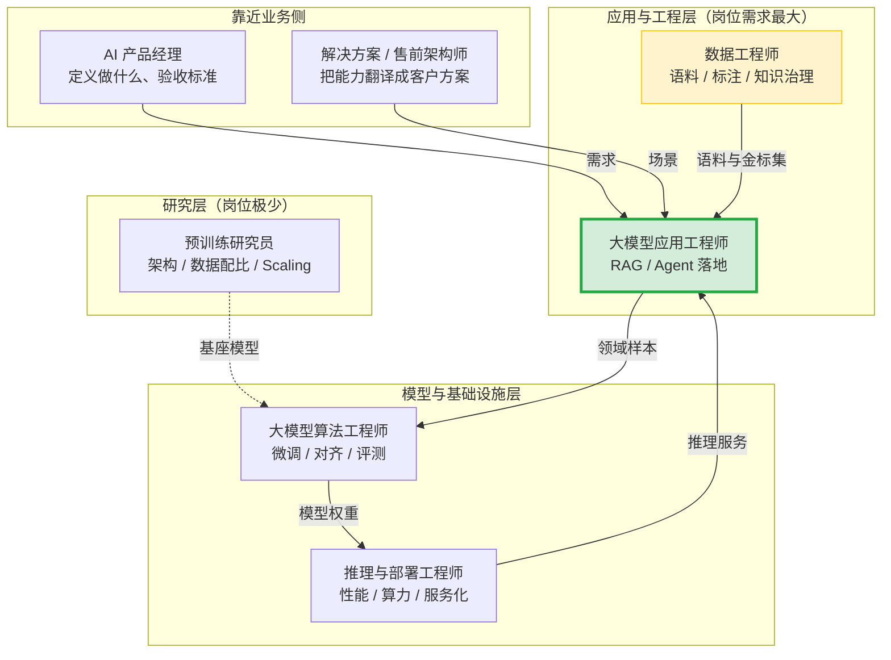
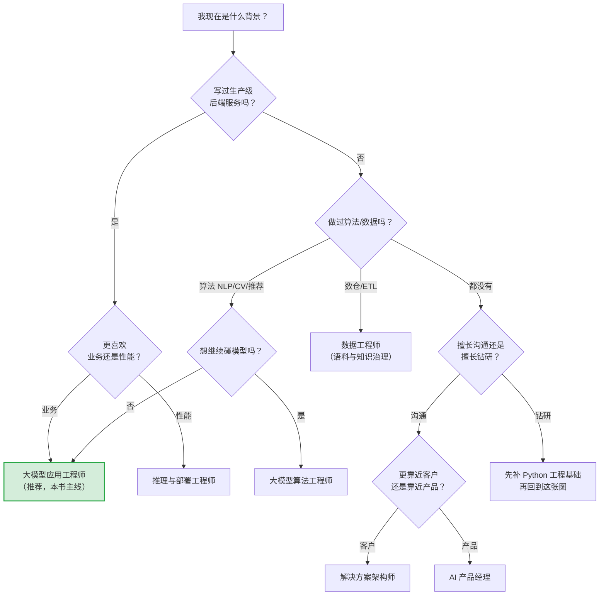
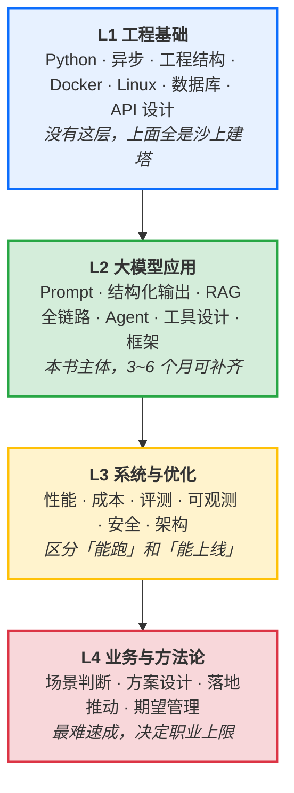
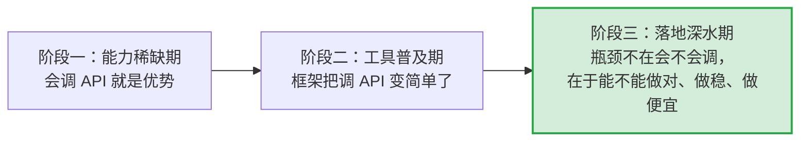

# 第 11.1 章  大模型技术人才能力模型与市场分析

> **本章目标**：读完能做到 …
> 1. 说清楚大模型相关的 7 类岗位各自做什么、要什么、天花板在哪，并判断自己适合切入哪一类；
> 2. 用本章的「四层能力金字塔 + 66 项自评表」给自己打一次分，得到一张可执行的能力缺口清单；
> 3. 按自己的出身（后端 / 算法 / 业务产品）选一条 12 个月成长路径，并把它拆成季度产出物；
> 4. 设计并完成一个能扛住技术面追问的作品集项目（有真实数据、有评测、有性能数字、有部署）；
> 5. 独立完成一次完整的面试准备：考点自查、10 类硬题的答题骨架、STAR 项目陈述、反向提问。
>
> **前置知识**：本章不依赖代码，但强烈建议在读完 [第 2 篇 RAG 基础](../02-RAG基础篇/)、[第 6 篇 Agent 智能体](../06-Agent智能体/)、[第 8 篇 评测体系](../08-评测体系/) 之后再读——很多能力项你得先动过手才知道自己几分。
>
> **预计用时**：阅读 60 分钟 / 动手（自评 + 计划制定）90 分钟

---

## 零、先说清楚：本章不提供什么

这是一本技术书，不是招聘广告。在开始之前，我必须把边界划清楚，否则你读到一半会失望，或者更糟——你信了一些不该信的东西。

**本章不提供精确薪资数字。**

原因有三条，每一条都足够充分：

1. **会过时**。大模型岗位的薪资结构在快速变化，任何写进书里的数字，在你读到它的时候大概率已经不准了。书的生命周期是 2~3 年，薪资数据的半衰期是 2~3 个季度。
2. **地区与公司性质差异极大**。同一个「大模型应用工程师」的 title，在一线城市的头部互联网公司、在二线城市的传统制造企业信息化部门、在一家 20 人的 AI 创业公司，薪资区间可能相差数倍。给一个「平均值」是误导。
3. **传播链条会失真**。书里写一个区间，读者截图传播时会只截上限，最后变成焦虑素材。这不是我想要的结果。

**那你该怎么获取薪资信息？** 直接去看一手数据：

| 渠道类型 | 怎么用 | 注意什么 |
|---|---|---|
| 主流招聘平台的岗位 JD | 搜「大模型应用」「RAG」「Agent」「LLM」等关键词，按城市 + 公司规模筛选，看**最近 30 天内**发布的 JD | JD 上标的区间通常是「愿意付的上限」，不是「大概率给的数」 |
| 岗位 JD 的技能要求词频 | 把 50 份 JD 的技能要求粘到一个文本里，统计词频 | 这比薪资数字有用得多——它告诉你市场在要什么能力 |
| 脉脉/职言等职场社区的薪资帖 | 看分布，不看单点 | 报喜不报忧的幸存者偏差极强 |
| 你的直接人脉 | 跟同等级、同城市、同行业的人私下对齐 | 样本最准，但样本量最小 |
| 猎头 | 主动接触 2~3 个垂直领域猎头，问「我这个背景，现在市场上大概什么档位」 | 猎头有动机高估以促成跳槽，但方向判断通常准 |

**一个方法论建议**：与其打听「大模型岗位值多少钱」，不如问「我现在这个水平，如果转过去，是平薪、涨薪还是降薪」。前者是无解的问题，后者有明确答案，而且直接指导你的决策。

**本章也不贩卖焦虑。** 你不需要「再不学大模型就被淘汰了」这种话。事实上，绝大多数后端工程师、数据工程师的存量工作在未来几年依然有需求。学大模型的正确动机是「我想做更有意思、杠杆更大的事」，而不是「我怕失业」。恐惧驱动的学习效率极低，而且容易让你做出糟糕的职业选择（比如为了一个虚高的 title 跳进一个没有真实业务的团队）。

**本章的市场判断来自什么？** 来自公开可观察的趋势：招聘网站的 JD 内容变化、开源社区的项目活跃度、主流框架的版本迭代方向、企业公开的技术分享。这些是「方向性判断」，不是「预测」。我会在每个判断后面标注它的依据和不确定性。

---

## 一、为什么需要一份能力模型（问题出发）

回到贯穿全书的案例：**华成机电**。

2024 年下半年，华成机电的 CTO 拍板要做「售后知识库 + 工单智能助手」。预算批了，服务器采购了，接下来要组队。IT 总监接到的任务是：**三个月内组建一个 3~5 人的小组，把这个系统做出来**。

他面临的第一个问题不是技术选型，而是：**招什么人？**

他的第一版想法是这样的：

```text
招 1 个算法专家（懂模型），2 个后端（写接口），1 个数据（整理文档）
```

这个配置看起来很合理，实际执行时出了一连串问题：

| 现象 | 实际根因 |
|---|---|
| 招来的「算法专家」简历上全是 CV/推荐系统，面试时聊 Transformer 很溜，但不知道 RAG 里 chunk 大小怎么定 | 混淆了「算法能力」和「大模型应用能力」——这是两套不同的技能栈 |
| 两个后端能把 FastAPI 接口写得很漂亮，但系统上线后答不准，没人知道该从哪儿查 | 缺少「评测能力」，没有人能把「答不准」拆成「召回不准 / 排序不准 / 生成跑偏」 |
| 数据工程师把 47 份 PDF 全部入库了，但一半的表格解析成了乱码 | 缺少「链路质量意识」——数据入库不等于数据可用 |
| 三个月后 demo 很惊艳，业务方一用就骂街 | 缺少「业务判断力」——demo 场景和真实场景的分布完全不同 |
| 每次改 prompt 都靠感觉，改完不知道是变好还是变坏 | 没有基线、没有金标集、没有回归测试 |

**这些坑的共同点是什么？** 不是「某个人技术不行」，而是**团队的能力结构有空洞**。而能力结构的空洞，源于招聘时没有一份清晰的能力模型。

所以这一章要解决两件事：

- **对个人**：给你一把尺子，量出自己现在在哪一格、缺哪一块、下一步该补什么。
- **对带团队的人**：给你一张岗位地图和能力矩阵，用它做 JD、做面试题、做团队盘点。

一句话概括本章的核心观点：

> **大模型落地不是「会调 API」，而是一套从数据到评测到生产的完整工程能力。市场对前者的溢价正在快速消失，对后者的需求还在上升。**

---

## 二、岗位地图：大模型相关岗位到底有哪几类

先看全景图。下面这张图按「离模型的距离」和「离业务的距离」两个维度铺开：



图里绿色高亮的 **大模型应用工程师** 是本书的主要目标岗位，也是当前市场缺口最明显、转型门槛最可控的一类。下面逐个拆。

---

### 2.1 大模型应用工程师（RAG / Agent 落地）

**一句话定位**：把「大模型 + 企业数据 + 业务流程」拼成一个能上线、能被人用、能被度量的系统。

**典型一天在做什么**（这是我见过的真实日程，脱敏后）：

```text
09:30  看昨天线上的 badcase 看板，挑出 top 10 差评 query
10:00  发现 6 条是检索没召回，2 条是 rerank 排序错，2 条是生成幻觉
10:30  针对召回问题，调整 chunk 策略，跑金标集回测，Recall@5 从 0.71 → 0.79
14:00  和产品对齐新需求：工单助手要能查备件库存 → 设计一个新工具（tool）
15:00  写工具的 schema、实现、单测，接进 Agent，跑 20 条 case 验收
17:00  发现 Agent 偶尔会连续调 5 次同一个工具 → 加去重与步数上限
19:00  提 PR，跑 CI 里的评测 gate，合并，灰度 10%
```

注意这一天里：**有评测、有回归、有数字、有灰度**。没有这些，这个岗位就退化成「改 prompt 的人」——而「改 prompt 的人」正在被工具和更强的模型快速替代。

**核心职责**：

| 职责 | 具体做什么 | 本书对应章节 |
|---|---|---|
| RAG 链路建设 | 文档解析、切分、embedding、向量库、混合检索、rerank、上下文组装 | 第 2、3 篇 |
| Agent 设计 | 工具定义、ReAct/Plan-Execute 循环、状态管理、错误恢复 | 第 6、7 篇 |
| Prompt 工程 | 系统提示词、few-shot、结构化输出、约束与护栏 | 第 1、4 篇 |
| 编排框架应用 | LangChain / LangGraph / LlamaIndex 的选型与二次封装 | 第 4 篇 |
| 评测体系 | 金标集构建、离线评测、在线反馈闭环、A/B | 第 8 篇 |
| 服务化与运维 | FastAPI 服务、流式输出、限流、缓存、可观测 | 第 10 篇 |

**必备技能**：Python 工程能力（不是脚本能力）、HTTP/异步、向量检索原理、至少一个编排框架的深度使用、评测思维、Docker。

**加分项**：懂一点模型侧（知道什么时候该微调）、懂一点推理侧（知道 vLLM 的关键参数）、写过前端 demo（Streamlit/Gradio 够用）、有 ES/搜索背景（BM25、召回排序的直觉迁移非常快）。

**天花板**：往上走是 **AI 应用架构师 / 技术负责人**——负责一条产品线的技术方案、多团队协作、成本与 SLA 承诺。再往上是 AI 平台负责人。天花板不低，但需要补齐系统设计与业务理解。

**最容易踩的坑**：只会用框架，不懂框架在干什么。LangChain 换个版本 API 变了就傻眼，或者遇到框架不支持的需求就卡死。

---

### 2.2 大模型算法工程师（微调、对齐、评测）

**一句话定位**：当「Prompt + RAG」解决不了问题时，通过改变模型本身来解决。

**核心职责**：

- 领域数据的构造与清洗（这部分工作量往往占 70%，远超训练本身）
- SFT / LoRA / QLoRA 训练，超参搜索，训练稳定性排查
- 偏好对齐（DPO 等），让模型输出风格符合业务要求
- 模型评测：自建评测集、对比实验设计、消融实验
- 模型选型与蒸馏：用大模型的输出训小模型，降成本

**必备技能**：PyTorch、transformers/PEFT/trl 生态、数据处理能力、显存与分布式训练的基本认知、实验管理（wandb/tensorboard）、统计与实验设计的基本素养。

**加分项**：有过完整的「数据构造 → 训练 → 评测 → 上线」闭环经验；懂 tokenizer 细节；能读懂并复现论文。

**天花板**：往上是模型团队负责人。但要注意一个现实判断：**纯微调岗位的绝对数量少于应用岗位**，因为一家公司通常只需要少数几个人做模型，却需要很多人做应用。

**关键判断**：很多同学以为「算法岗更高级」。这个认知在大模型时代需要修正——**微调不是万金油**。第 5 篇会详细讲什么时候该微调、什么时候微调是在浪费钱。一个只会训练不会判断的算法工程师，价值低于一个能准确判断「这个问题不该用微调解」的应用工程师。

---

### 2.3 推理与部署工程师（性能、算力）

**一句话定位**：让模型跑得更快、更便宜、更稳。

**核心职责**：

- 推理引擎部署与调优（vLLM / SGLang / TensorRT-LLM / llama.cpp）
- 量化方案落地（AWQ / GPTQ / INT8 / FP8），精度-性能权衡
- 吞吐与延迟优化：batch 策略、KV Cache 管理、PagedAttention、prefix caching
- GPU 资源调度、多卡/多机部署、弹性伸缩
- 成本核算：每千 token 的真实成本、GPU 利用率监控

**必备技能**：CUDA 生态基础认知、Linux 性能分析、容器与 K8s、推理引擎的参数含义（不是会启动，是知道每个参数动了会怎样）、压测方法论。

**加分项**：能读 CUDA kernel、懂算子融合、做过 Triton Inference Server、有网络/存储调优经验。

**天花板**：往上是 AI Infra 负责人，这是一个**技术纵深很深、稀缺度很高**的方向。

**转型优势者**：做过高并发后端、做过中间件、做过 SRE 的人，转这个方向的迁移成本最低——性能分析的方法论是通用的。

---

### 2.4 数据工程师（语料、标注、知识治理）

**一句话定位**：模型和检索的上限由数据决定，这个岗位负责抬高上限。

这是**最被低估**的岗位。我见过太多 RAG 项目，最后瓶颈不在模型也不在检索算法，而在「PDF 里的表格解析全错了」「同一个产品有三个不同的叫法」「知识库里有 40% 的文档已经过期但没标记」。

**核心职责**：

| 职责 | 具体内容 |
|---|---|
| 语料采集 | 从 Wiki、工单系统、文档库、数据库抽取原始内容 |
| 解析与清洗 | PDF/Word/Excel/扫描件的结构化解析，表格、公式、图片处理 |
| 知识治理 | 去重、版本管理、时效标记、权限标签、术语归一 |
| 标注体系 | 设计标注规范、管理标注团队、质检、一致性度量 |
| 金标集构建 | 构建评测用的 query-答案-证据三元组（第 9 篇的 LLM-Wiki 就是这件事） |
| 数据流水线 | 增量更新、变更检测、索引重建的自动化 |

**必备技能**：Python 数据处理、正则与文本清洗、至少一种文档解析工具链、SQL、调度工具（Airflow/Dagster）、对数据质量的洁癖。

**加分项**：有过知识图谱/主数据管理经验、懂 OCR、做过标注平台。

**天花板**：往上是数据平台负责人或知识工程负责人。在金融、医疗、法律这类强知识密集行业，这个岗位的价值极高。

---

### 2.5 AI 产品经理

**一句话定位**：决定「做什么、做到什么程度算完成」，并且这个判断必须建立在对技术边界的真实理解上。

**AI PM 和普通 PM 的核心区别**：普通 PM 定义的需求是确定性的（点这个按钮，出这个结果）；AI PM 定义的需求是**概率性的**（这个场景下，答对率要到 85%，答不出来时要能明确说不知道）。这意味着：

- 必须能定义「什么叫对」——这是评测标准的源头
- 必须能接受并管理不确定性——不能承诺 100%
- 必须懂成本——每次调用都在烧钱，功能设计要考虑单位经济学
- 必须会做期望管理——对上对下对客户

**核心职责**：场景选择与优先级、需求定义与验收标准、评测指标设计、badcase 分析与迭代、用户体验设计（尤其是「不确定性的呈现方式」）、成本与 ROI 测算。

**必备技能**：能看懂技术方案、能自己跑通一个 demo、数据分析能力、写清楚 PRD 的能力、跨部门推动力。

**加分项**：有过 B 端复杂业务产品经验、懂行业 know-how、能自己写 SQL 和简单 Python。

**天花板**：产品负责人 / 业务线负责人。在 To B 场景，懂行业的 AI PM 极其稀缺。

---

### 2.6 解决方案 / 售前架构师

**一句话定位**：把技术能力翻译成客户听得懂、买得起、验收得了的方案。

**核心职责**：客户需求挖掘与场景筛选、POC 方案设计与快速实现、技术方案书与报价、招投标技术支持、交付风险识别、客户现场问题应答。

**必备技能**：技术广度（每个技术栈都要知道能干什么、边界在哪）、方案写作、演讲与答辩、商务意识、快速原型能力。

**加分项**：有交付经验（知道哪些承诺会在交付时爆炸）、行业背景深、英语好（外企/出海场景）。

**天花板**：解决方案总监 / 大客户负责人 / 转型创业。

**这个岗位的隐藏价值**：它是**最快建立行业认知**的岗位。半年见 50 个客户，你对一个行业的理解会超过在一家公司待三年。很多优秀的 AI 创业者来自这个岗位。

---

### 2.7 预训练研究员（少数）

**一句话定位**：做基座模型本身——架构、数据配比、训练策略、Scaling 规律。

**现实判断**：这是**岗位数量最少、门槛最高**的一类。全国有能力做完整预训练的团队是个位数到两位数量级。要求通常是：顶会论文、博士学历或等价的研究产出、大规模分布式训练经验、对训练框架（Megatron/DeepSpeed）的深度掌握。

**对绝大多数读者的建议**：不要把这当作转型目标。这条路径通常是从学术界直接进入的，工程转研究的成功案例极少，且需要付出数年的沉没成本。

**但是**：了解预训练的基本原理对应用工程师是有价值的——它帮你理解模型能力的来源和边界，理解为什么某些任务微调也救不了。第 1 篇讲过的内容够用了。

---

### 2.8 七类岗位大对照表

这是本节的核心表，建议截图保存：

| 维度 | 应用工程师 | 算法工程师 | 推理部署 | 数据工程师 | AI 产品经理 | 解决方案架构师 | 预训练研究员 |
|---|---|---|---|---|---|---|---|
| **核心职责** | RAG/Agent 系统落地 | 微调、对齐、模型评测 | 推理性能与成本 | 语料与知识治理 | 场景定义与验收 | 方案设计与客户对接 | 基座模型研发 |
| **产出物** | 可上线的服务 | 模型权重 + 评测报告 | 推理服务 + 压测报告 | 干净的语料 + 金标集 | PRD + 验收标准 | 方案书 + POC | 模型 + 论文 |
| **必备技能** | Python 工程、RAG 全链路、编排框架、评测 | PyTorch、PEFT/trl、数据构造、实验设计 | CUDA 生态、vLLM、K8s、压测 | 文档解析、SQL、调度、标注体系 | 技术理解、指标设计、数据分析 | 技术广度、写作、演讲 | 分布式训练、论文、架构研究 |
| **加分项** | 懂模型侧与推理侧 | 完整闭环经验、能复现论文 | 会写 kernel、算子优化 | 知识图谱、OCR | 行业 know-how、会写代码 | 行业深度、交付经验 | 顶会一作 |
| **常见面试考点** | RAG 链路排障、Agent 循环控制、评测设计、成本优化 | 什么时候微调、数据构造、loss 异常排查、LoRA 参数 | 吞吐延迟权衡、量化精度损失、显存计算 | 解析质量保障、增量更新、去重策略 | 如何定义成功、如何做 badcase 分析 | 如何设计 POC、如何管理客户期望 | 论文细节、Scaling Law、架构取舍 |
| **转型来源（易→难）** | 后端、搜索、数据 | 传统算法（NLP/CV/推荐） | 后端、SRE、中间件、嵌入式 | 数仓、ETL、内容运营 | B 端产品、业务专家 | 售前、咨询、技术支持 | 学术界 |
| **转型周期（全职投入，参考）** | 3~6 个月出活 | 6~12 个月 | 6~12 个月 | 3~6 个月 | 3~6 个月 | 3~6 个月 | 不建议转 |
| **岗位数量（相对）** | 最多 | 中 | 中 | 中偏少但在增长 | 中 | 中 | 极少 |
| **天花板** | AI 应用架构师 / 技术负责人 | 模型团队负责人 | AI Infra 负责人 | 数据/知识平台负责人 | 产品负责人 | 解决方案总监 | 研究科学家 |
| **被工具替代的风险** | 低（如果有评测与系统能力）/ 高（如果只会改 prompt） | 中（AutoML 类工具在进步） | 低 | 中（解析工具在进步，但治理判断替代不了） | 低 | 低 | 极低 |

> **转型周期那一行的口径说明**：这里的「3~6 个月出活」指的是「能独立承担一个中等复杂度项目的开发任务」，不是「达到资深水平」。样本来自我观察到的转型案例，个体差异很大，不要当成承诺。

---

### 2.9 怎么选：一张决策树



**一条重要提醒**：不要因为「哪个岗位火」而选，要因为「哪个岗位用得上我已有的积累」而选。转型的本质是**复用存量优势 + 补齐增量缺口**，纯从零开始的转型成功率很低。

---

## 三、能力模型：四层能力金字塔

现在进入本章的核心。我把大模型工程能力拆成四层，下层是上层的地基，越往上越难以速成、越难以被工具替代。



### 3.1 四层的关系与常见误区

| 误区 | 表现 | 后果 | 纠正 |
|---|---|---|---|
| 跳过 L1 直接学 L2 | Python 只会写脚本，没写过包，不懂异步 | 代码没法上线，出问题不会调试，同事不敢 review | 先花 1 个月补工程基础，回报率最高 |
| 只学 L2 不碰 L3 | 能做 demo，做不出能扛并发的服务 | 面试时一问「怎么优化延迟」就哑火 | 每个 demo 都加一轮「评测 + 压测 + 成本核算」 |
| L2 只学框架不学原理 | 会用 LangChain，不知道 retriever 内部干了什么 | 框架换版本就崩，遇到框架不支持的需求就卡死 | 每用一个框架 API，去看一眼它的源码实现 |
| 忽视 L4 | 技术很好，但做的东西业务不用 | 项目被砍，简历上是「做过但没上线」 | 每个技术决策都问一句「这对业务指标的影响是什么」 |
| 只有 L4 没有 L1~L3 | 能讲方案，落不了地 | 被工程团队认为「只会画饼」 | 至少自己端到端跑通一个完整项目 |

### 3.2 自评标准：1~5 分的锚点定义

打分之前，先统一标尺。**这是整张自评表的关键**——没有明确锚点的自评就是自我安慰。

| 分数 | 名称 | 定义 | 验证方式 |
|---|---|---|---|
| **1 分** | 听说过 | 知道这个词，能说出大概是干什么的 | 能在对话中正确使用这个术语 |
| **2 分** | 跟着做过 | 照着教程/文档做过一遍，独立做会卡住 | 能复现教程里的结果，但换个场景就不会 |
| **3 分** | 能独立做 | 不看教程能独立完成，遇到常见问题能自己解决 | **能在 2 小时内从零做出一个可用版本** |
| **4 分** | 能做好 | 知道多种方案的取舍，能根据场景选型，能优化 | **能说清楚「为什么选 A 不选 B」，并有实测数据支撑** |
| **5 分** | 能教别人/能创新 | 踩过足够多的坑，能定规范、能培训、能解决别人解决不了的问题 | **能写出一份让新人照着就能做对的内部文档，或提出改进方案并验证有效** |

> **打分纪律**：
> 1. **没做过就是 1 分或 2 分，不要因为「我觉得我会」就打 3 分**。3 分的门槛是「2 小时内从零做出可用版本」，这是硬标准。
> 2. **4 分必须有实测数据**。你说你会优化检索，那 Recall@5 从多少提到多少？没数字就不是 4 分。
> 3. **5 分要非常吝啬**。一个工作 3 年的工程师，全表 66 项里有 5 个 5 分就已经很不错了。
> 4. 建议**间隔 3 个月重新打一次分**，对比变化。分数本身不重要，变化趋势才重要。

---

## 四、能力自评表（66 项，可直接打分）

使用方式：把下面四张表复制到表格工具里，逐项打分。每层算一个平均分，画一张四维雷达图。

### 4.1 L1 工程基础（18 项）

| # | 能力项 | 自评标准（3 分的具体含义） | 验证方式：能做出什么 | 你的分 |
|---|---|---|---|---|
| L1-01 | Python 语言特性 | 熟练使用装饰器、上下文管理器、生成器、类型注解 | 能读懂并修改 LangChain 源码中的一个类 | ___ |
| L1-02 | 面向对象与设计模式 | 能设计合理的类层次，会用策略/工厂/适配器模式 | 能设计一个可插拔的 Retriever 抽象（换向量库不改业务代码） | ___ |
| L1-03 | asyncio 异步编程 | 理解事件循环，会用 async/await、gather、Semaphore | 能写一个并发 50 路的 LLM 批量调用，且不打爆下游 | ___ |
| L1-04 | 同步/异步混用的陷阱 | 知道阻塞调用会卡死事件循环，会用 run_in_executor | 能定位「接口偶发超时但 CPU 不高」这类问题 | ___ |
| L1-05 | 项目工程结构 | 会组织包结构、配置管理、依赖注入、分层 | 能搭一个 src/ + tests/ + configs/ 的标准项目骨架 | ___ |
| L1-06 | 依赖与虚拟环境管理 | 熟练 uv/pip/poetry，理解版本锁定与冲突解决 | 能写出一份别人 clone 下来一条命令跑起来的 README | ___ |
| L1-07 | 单元测试与 mock | 会用 pytest，会 mock 外部 API 调用 | 能给一个调 LLM 的函数写出不真实请求的测试 | ___ |
| L1-08 | 日志与调试 | 结构化日志、日志级别、traceback 分析 | 能从生产日志里还原一次失败请求的完整链路 | ___ |
| L1-09 | Git 与协作 | 分支策略、rebase、冲突解决、code review | 能主导一个 3 人小组的分支规范 | ___ |
| L1-10 | Linux 命令行 | 文件/进程/网络/权限的常用命令，管道与脚本 | 能在没有 GUI 的服务器上独立排查一个服务故障 | ___ |
| L1-11 | Shell 脚本 | 会写部署脚本、批处理脚本 | 能写一个一键拉起 Milvus+ES+服务的脚本 | ___ |
| L1-12 | Docker 基础 | 写 Dockerfile、多阶段构建、镜像瘦身 | 能把一个 Python 服务打成 < 1GB 的可用镜像 | ___ |
| L1-13 | Docker Compose | 多服务编排、网络、数据卷、健康检查 | 能写出本书第 0 篇那套完整的 compose 文件 | ___ |
| L1-14 | 关系型数据库 | SQL、索引、事务、连接池 | 能设计工单系统的表结构并写出高效查询 | ___ |
| L1-15 | Redis / 缓存 | 数据结构、过期策略、缓存穿透/击穿/雪崩 | 能给 LLM 调用设计一层语义缓存 | ___ |
| L1-16 | HTTP 与 API 设计 | RESTful 规范、状态码、幂等、版本化 | 能设计一套对外的问答 API 并写出 OpenAPI 文档 | ___ |
| L1-17 | FastAPI / Web 框架 | 路由、依赖注入、中间件、流式响应（SSE） | 能实现一个带 SSE 流式输出的问答接口 | ___ |
| L1-18 | 并发与性能基础 | 理解 GIL、进程/线程/协程的适用场景、压测方法 | 能用 locust/wrk 给自己的服务压出 QPS 曲线 | ___ |

**L1 小计**：总分 ___ / 90，平均 ___ 分

> **L1 的及格线建议是平均 3.0**。低于 3.0 就先别急着学 L2——你会发现每学一个新东西都被基础问题绊住，效率极低。

---

### 4.2 L2 大模型应用（20 项）

| # | 能力项 | 自评标准（3 分的具体含义） | 验证方式：能做出什么 | 你的分 |
|---|---|---|---|---|
| L2-01 | 大模型基本原理 | 说得清 Token、上下文窗口、自回归生成、采样参数 | 能解释「为什么模型数不清字符数」 | ___ |
| L2-02 | 模型选型 | 知道主流开闭源模型的能力边界与成本差异 | 能给一个具体场景写出选型对比表并给结论 | ___ |
| L2-03 | Prompt 工程 | 角色设定、few-shot、CoT、分隔符、否定约束 | 能把一个准确率 60% 的任务通过改 prompt 提到 80% 并有测试集证明 | ___ |
| L2-04 | 结构化输出 | JSON Schema、function calling、Pydantic 校验、重试 | 能做到 1000 次调用解析失败率 < 1% | ___ |
| L2-05 | 文档解析 | PDF/Word/Excel/HTML 解析，表格与版面处理 | 能把一份带复杂表格的 PDF 解析成结构化文本且人工抽检合格 | ___ |
| L2-06 | 切分策略 | 固定/递归/语义/结构化切分，overlap，父子块 | 能针对同一批文档做 4 种切分并用评测选出最优 | ___ |
| L2-07 | Embedding 模型 | 原理、维度、归一化、中英文差异、领域适配 | 能在 3 个 embedding 模型间做出有数据支撑的选型 | ___ |
| L2-08 | 向量数据库 | 索引类型（HNSW/IVF）、参数、过滤、分片 | 能把百万级向量的检索 P99 压到可接受范围并说出调了什么 | ___ |
| L2-09 | 稀疏检索与混合检索 | BM25 原理、ES 使用、RRF 融合 | 能实现 dense+sparse 混合并证明比单路好多少 | ___ |
| L2-10 | 查询理解 | 改写、扩展、HyDE、意图识别、多路查询 | 能让一批「说不清楚的问题」的召回率明显提升 | ___ |
| L2-11 | Rerank | cross-encoder 原理、成本-收益权衡、top-k 选择 | 能给出「加 rerank 后指标涨多少、延迟涨多少」的实测表 | ___ |
| L2-12 | 上下文组装 | 去重、排序、压缩、引用标注、长度控制 | 能在固定 token 预算下把有效信息密度最大化 | ___ |
| L2-13 | RAG 全链路调试 | 拿到 badcase 能定位到具体环节 | 能对 50 条 badcase 做出归因分布表 | ___ |
| L2-14 | Agent 基本范式 | ReAct、Plan-and-Execute、Reflexion 的适用场景 | 能说清楚三者的区别并各实现一个 | ___ |
| L2-15 | 工具（Tool）设计 | schema 描述、参数校验、错误返回、粒度设计 | 能设计一组让模型 90%+ 调用正确的工具 | ___ |
| L2-16 | Agent 状态与记忆 | 短期/长期记忆、checkpoint、会话隔离 | 能实现一个可中断可恢复的多轮 Agent | ___ |
| L2-17 | Agent 循环控制 | 步数上限、去重、超时、死循环检测、兜底 | 能证明自己的 Agent 在异常输入下不会无限循环 | ___ |
| L2-18 | 多智能体协同 | Supervisor / Swarm / 流水线三种拓扑的取舍 | 能判断「这个需求该不该上多智能体」并说出理由 | ___ |
| L2-19 | LangChain / LCEL | 核心抽象、组合、流式、回调 | 能用 LCEL 写出一条带流式和 fallback 的链 | ___ |
| L2-20 | LangGraph / 状态机编排 | 图、节点、条件边、checkpointer、人在环 | 能实现一个带人工审批节点的工作流 | ___ |

**L2 小计**：总分 ___ / 100，平均 ___ 分

---

### 4.3 L3 系统与优化（16 项）

| # | 能力项 | 自评标准（3 分的具体含义） | 验证方式：能做出什么 | 你的分 |
|---|---|---|---|---|
| L3-01 | 评测集构建 | 知道怎么采样、怎么标注、怎么做一致性检查 | 能独立建一个 200 条的金标集并说清楚采样方法 | ___ |
| L3-02 | 检索指标 | Recall@k、MRR、NDCG、Hit Rate 的计算与解读 | 能写出一个检索评测脚本并解读结果 | ___ |
| L3-03 | 生成指标 | Faithfulness、Answer Relevancy、正确率的度量 | 能设计一套贴合业务的生成评测方案 | ___ |
| L3-04 | LLM-as-Judge | 打分 prompt 设计、偏差控制、与人工对齐 | 能证明自己的 judge 与人工标注的一致性达到可用水平 | ___ |
| L3-05 | 评测自动化 | CI 里的评测 gate、回归测试、报告生成 | 能做到每次 PR 自动跑评测并阻止指标下降的合并 | ___ |
| L3-06 | A/B 实验 | 分流、指标、统计显著性、实验周期 | 能设计一次线上 A/B 并给出可信结论 | ___ |
| L3-07 | 延迟优化 | TTFT/TPOT 拆解、瓶颈定位、并行化 | 能画出一条请求的延迟火焰图并砍掉最大的那块 | ___ |
| L3-08 | 吞吐与并发 | 批处理、连接池、限流、排队 | 能给出「并发 N 时 P99 是多少」的完整压测报告 | ___ |
| L3-09 | 成本核算与优化 | 单次调用成本拆解、缓存、模型分级、prompt 瘦身 | 能把一个场景的单位成本降下来并给出前后对比 | ___ |
| L3-10 | 缓存设计 | 精确缓存、语义缓存、prefix cache、失效策略 | 能实现一个命中率可观测的语义缓存 | ___ |
| L3-11 | 可观测性 | Trace、指标、日志三件套；Langfuse/OTel | 能在出问题时 5 分钟内定位到是哪个环节 | ___ |
| L3-12 | 推理服务部署 | vLLM 关键参数、显存计算、多卡、健康检查 | 能独立部署一个稳定跑一周不崩的推理服务 | ___ |
| L3-13 | 降级与容错 | 超时、重试、熔断、多模型 fallback、兜底回复 | 能设计一套「主模型挂了业务不停」的方案 | ___ |
| L3-14 | 安全与合规 | Prompt 注入、越狱、数据泄露、内容审核、权限隔离 | 能对自己的系统做一次红队测试并修复问题 | ___ |
| L3-15 | 架构设计 | 模块划分、接口定义、扩展性、技术债管理 | 能画出一张让新人看懂的系统架构图并讲清楚每个决策 | ___ |
| L3-16 | 容量规划 | 根据业务量倒推 GPU/存储/带宽需求 | 能给出一份有依据的资源采购建议 | ___ |

**L3 小计**：总分 ___ / 80，平均 ___ 分

> **L3 是「能跑」和「能上线」的分水岭**。很多人 L2 打 4 分、L3 打 1 分，这正是面试挂在第二轮的典型画像。

---

### 4.4 L4 业务与方法论（12 项）

| # | 能力项 | 自评标准（3 分的具体含义） | 验证方式：能做出什么 | 你的分 |
|---|---|---|---|---|
| L4-01 | 场景可行性判断 | 能判断一个需求「现在的技术能不能做、值不值得做」 | 能对 10 个候选需求做出排序并说明理由 | ___ |
| L4-02 | 技术选型决策 | 在 RAG / 微调 / 长上下文 / 规则之间做出有依据的选择 | 能写出一份选型对比文档并被评审通过 | ___ |
| L4-03 | 方案设计与文档 | 能写出让工程、产品、老板都看懂的技术方案 | 能独立写一份 15 页的项目技术方案 | ___ |
| L4-04 | 成本-收益测算 | 能算清楚投入产出，包括隐性成本 | 能给出一份带敏感性分析的 ROI 测算 | ___ |
| L4-05 | 需求拆解与排期 | 把模糊需求拆成可验收的任务并给出可信排期 | 能做到排期偏差在可接受范围内 | ___ |
| L4-06 | 期望管理 | 对上说清楚能做到什么、做不到什么 | 能在项目启动时就把「不能做的」写进文档并获得认可 | ___ |
| L4-07 | 跨部门推动 | 拿到数据、拿到人、拿到资源 | 能独立推动一次跨 3 个部门的数据打通 | ___ |
| L4-08 | 用户反馈闭环 | 设计反馈收集、分析、迭代机制 | 能建立一个「用户点踩 → 进 badcase 池 → 进评测集」的闭环 | ___ |
| L4-09 | 业务指标关联 | 能把技术指标翻译成业务指标 | 能说清楚「Recall@5 提升 8 个点」对客服人效意味着什么 | ___ |
| L4-10 | 行业知识 | 理解所在行业的业务流程与专业术语 | 能和业务专家无障碍讨论并识别出他们的隐含假设 | ___ |
| L4-11 | 团队协作与影响力 | 能带新人、能做技术分享、能推动规范落地 | 能写出被团队采纳的开发规范 | ___ |
| L4-12 | 持续学习方法 | 有稳定的信息摄入与消化机制 | 能说出自己每周的信息源清单并展示笔记 | ___ |

**L4 小计**：总分 ___ / 60，平均 ___ 分

---

### 4.5 总分解读与画像对照

| 层级 | 项数 | 满分 | 你的总分 | 你的均分 |
|---|---|---|---|---|
| L1 工程基础 | 18 | 90 | ___ | ___ |
| L2 大模型应用 | 20 | 100 | ___ | ___ |
| L3 系统与优化 | 16 | 80 | ___ | ___ |
| L4 业务与方法论 | 12 | 60 | ___ | ___ |
| **合计** | **66** | **330** | ___ | ___ |

下面这张对照表帮你定位自己现在处于哪个阶段。**注意这是能力画像，不是职级映射**——不同公司的职级标准差异极大。

| 画像 | L1 | L2 | L3 | L4 | 典型状态 | 下一步该做什么 |
|---|---|---|---|---|---|---|
| **刚起步** | 2~3 | 1~2 | 1 | 1~2 | 跟着教程做过 demo | 补 L1 到 3.0，同时把本书 L2 部分动手做完 |
| **能干活** | 3.0+ | 3.0+ | 1.5~2 | 2 | 能独立完成分配的模块 | **重点补 L3**，给每个项目加评测和压测 |
| **能负责** | 3.5+ | 3.5+ | 3.0+ | 2.5+ | 能独立负责一个子系统 | 补 L4，主动参与需求讨论和方案评审 |
| **能主导** | 4.0+ | 4.0+ | 3.5+ | 3.5+ | 能主导一个完整项目 | 深化某一方向到 4.5+，建立个人技术标签 |
| **偏科：只会 demo** | 2~3 | 3~4 | 1 | 1~2 | 框架用得溜，一上生产就崩 | **立刻补 L1 和 L3**，这是最危险的画像 |
| **偏科：只懂业务** | 1~2 | 2 | 1 | 4 | 方案讲得好，落不了地 | 端到端自己做一个项目，哪怕很小 |
| **偏科：只懂底层** | 4+ | 2 | 3 | 1 | 性能优化很强，不懂大模型场景 | 补 L2 和 L4，你的 L1/L3 优势很大 |

**怎么用这张表**：找到自己的画像行，只做「下一步该做什么」那一件事。**不要同时补四层**——同时补等于都没补。

---

### 4.6 缺口清单模板

打完分后，填这张表（只填分数最低且对目标岗位最关键的 5 项）：

| 能力项编号 | 能力项名称 | 当前分 | 目标分 | 差距的具体表现 | 补齐动作（可执行） | 验证方式 | 截止日期 |
|---|---|---|---|---|---|---|---|
| 例：L3-05 | 评测自动化 | 1 | 3 | 每次改 prompt 都靠手工抽查 10 条 | 用本书第 8 篇的 harness，给现有项目接一个 CI 评测 gate | PR 里能看到自动生成的评测报告 | ___ |
| | | | | | | | |
| | | | | | | | |
| | | | | | | | |
| | | | | | | | |
| | | | | | | | |

---

## 五、三条典型成长路径（各 12 个月）

下面三条路径都按「季度」组织，每个季度给**阶段目标 + 学习内容 + 产出物 + 自检问题**。产出物必须是**可展示的东西**（代码仓库、报告、文档），不是「看完了某某教程」。

> **前提说明**：这里假设你是**在职学习**，每周投入 10~15 小时（工作日每晚 1.5 小时 + 周末半天）。如果是全脱产，时间可以压缩到 1/2~1/3。如果每周投入不足 6 小时，请把周期拉长到 18~24 个月，不要压缩内容。

---

### 5.1 路径 A：后端工程师 → 大模型应用工程师

**存量优势**：Python/Java 工程能力、服务化经验、数据库、Docker、排障直觉。
**主要缺口**：大模型原理与边界、RAG 全链路、Agent 设计、评测思维。
**核心心态转变**：从「确定性系统」转向「概率性系统」——你要接受「同样的输入可能有不同输出」，并学会用统计方法而不是断点调试来解决问题。

```mermaid
gantt
    title 后端工程师 12 个月转型路线
    dateFormat  X
    axisFormat %s
    section Q1 打地基
    大模型原理与 API 熟练           :a1, 0, 1
    最小 RAG 闭环跑通               :a2, 1, 2
    section Q2 做全链路
    RAG 全链路工程化                :b1, 3, 2
    引入评测与金标集                :b2, 5, 1
    section Q3 上 Agent
    工具设计与 Agent 循环           :c1, 6, 2
    多智能体与工作流编排            :c2, 8, 1
    section Q4 上生产
    服务化 性能 成本 可观测         :d1, 9, 2
    完整项目交付与复盘              :d2, 11, 1
```



| 阶段 | 月份 | 阶段目标 | 学习内容（对应本书） | 产出物（必须有） | 自检问题 |
|---|---|---|---|---|---|
| **Q1** | 1 | 建立大模型的正确认知，破除「万能」和「没用」两种偏见 | 第 1 篇；OpenAI 兼容接口；采样参数实验 | 一份「同一个 prompt 在 5 个模型上的输出对比 + 成本对比」报告 | 能解释温度参数变化对输出分布的影响吗？ |
| | 2 | 跑通最小 RAG，建立全链路体感 | 第 2.1、2.2 章；Chroma + bge-m3 | 一个 200 行的最小 RAG，能回答自己领域的 20 个问题 | 你的 RAG 答错时，你知道是哪一步错了吗？ |
| | 3 | 掌握切分与解析，处理真实脏数据 | 第 2 篇全部；PDF/Word 解析 | 把自己公司/开源的 30 份真实文档入库，人工抽检解析质量 | 表格和公式解析对了吗？抽检合格率多少？ |
| **Q2** | 4 | 混合检索 + rerank，指标化 | 第 3 篇；ES/BM25、RRF、bge-reranker | 一张「5 种检索方案的 Recall@5 / MRR / 延迟」对比表 | 你的最优方案比 baseline 好多少？有数字吗？ |
| | 5 | 建立评测能力，这是分水岭 | 第 8 篇；金标集构建、RAGAS | 一个 150~200 条的金标集 + 一个可复跑的评测脚本 | 换一个参数重跑，指标变化能被稳定复现吗？ |
| | 6 | 查询理解与召回优化 | 第 3 篇；改写、HyDE、多路召回 | 优化报告：从 baseline 到优化版的完整实验记录 | 每个优化点的增量收益分别是多少？ |
| **Q3** | 7 | 工具设计与 function calling | 第 6 篇前半；结构化输出、Pydantic | 一组 5 个工具（查手册/查库存/查工单/开工单/转人工）+ 调用准确率测试 | 工具调用准确率多少？错误案例的模式是什么？ |
| | 8 | Agent 循环与状态管理 | 第 6 篇后半；ReAct、LangGraph | 一个能处理 20 类工单的 Agent，带步数上限与兜底 | 给它一个无解的问题，它会死循环吗？ |
| | 9 | 多智能体与工作流 | 第 7 篇 | 一个 Supervisor 拓扑的多智能体系统 + 「为什么值得上多智能体」的论证 | 单 Agent 做不到的部分具体是什么？ |
| **Q4** | 10 | 服务化与性能 | 第 10 篇；FastAPI 流式、vLLM、压测 | 一份压测报告：QPS-延迟曲线、瓶颈定位、优化前后对比 | P99 是多少？瓶颈在哪一环？ |
| | 11 | 成本、缓存、可观测、安全 | 第 10 篇；Langfuse、语义缓存、注入防护 | 成本核算表 + Trace 看板截图 + 一次红队测试报告 | 单次问答成本是多少？降了多少？ |
| | 12 | 端到端交付与复盘 | 第 9 篇实战项目 | 一个完整项目：README + 架构图 + 评测报告 + 部署文档 + 复盘 | 别人 clone 下来能在 30 分钟内跑起来吗？ |

**这条路径的最大陷阱**：第 5 个月的评测环节最枯燥，也最容易被跳过。**跳过它，你后面所有的「优化」都是自欺欺人**。请务必完成。

---

### 5.2 路径 B：算法工程师 → 大模型算法/微调工程师

**存量优势**：PyTorch、数据处理、实验设计、论文阅读能力、对指标的敏感度。
**主要缺口**：大模型特有的训练技巧（PEFT、显存管理）、工程化能力、对「什么时候不该微调」的判断。
**核心心态转变**：从「刷指标」转向「解决业务问题」。大模型时代，「微调提升 2 个点」经常打不过「把检索做对」。

| 阶段 | 月份 | 阶段目标 | 学习内容 | 产出物（必须有） | 自检问题 |
|---|---|---|---|---|---|
| **Q1** | 1 | 补齐大模型基础与生态 | 第 1 篇；transformers、tokenizer 细节、chat template | 一份「同一段文本在 5 个 tokenizer 下的 token 数对比」分析 | 你知道为什么中文的 token 效率比英文低吗？ |
| | 2 | 先做 RAG，建立「微调不是第一选择」的认知 | 第 2 篇；最小 RAG | 一个能回答领域问题的 RAG，并记录它答不了的问题类型 | 哪些问题 RAG 解决不了？为什么？ |
| | 3 | 跑通第一次 LoRA 微调 | 第 5 篇；PEFT、LLaMA-Factory | 一个 LoRA adapter + 训练日志 + loss 曲线 | loss 降了，但模型真的变好了吗？怎么证明？ |
| **Q2** | 4 | 数据构造（最重要的一环） | 第 5 篇数据部分；指令数据格式、去重、质量过滤 | 一个 2000 条的领域 SFT 数据集 + 构造流程文档 + 质量抽检报告 | 你的数据里有多少条是重复或低质的？ |
| | 5 | 训练调参与稳定性 | 学习率、warmup、batch、梯度累积、LoRA rank/alpha | 一份超参消融实验表（至少 8 组对比） | 哪个超参对结果影响最大？ |
| | 6 | 模型评测（分水岭） | 第 8 篇；领域评测集、LLM-as-Judge、人工对齐 | 一个 200 条的领域评测集 + 微调前后对比报告 | 提升是真实的还是过拟合评测集？ |
| **Q3** | 7 | QLoRA 与显存优化 | 第 5 篇；bitsandbytes、梯度检查点、显存计算 | 一份「不同配置下的显存占用与训练速度」实测表 | 24GB 显存能训多大的模型？怎么算出来的？ |
| | 8 | 偏好对齐入门 | DPO 等方法；偏好数据构造 | 一次 DPO 实验 + 与 SFT 版本的对比 | 对齐后风格变了，但能力有没有退化？ |
| | 9 | 合并、量化、部署 | 第 5、10 篇；adapter merge、AWQ/GPTQ、vLLM 加载 | 一个量化后可在 vLLM 上服务的模型 + 精度损失报告 | 量化后指标掉了多少？可接受吗？ |
| **Q4** | 10 | 微调 vs RAG 的对照实验 | 第 5 篇决策部分 | 一份「同一任务，RAG / 微调 / RAG+微调 三方案对比」报告 | 你的结论是什么？在什么条件下成立？ |
| | 11 | 工程化：训练流水线 | 数据版本、实验追踪、自动评测 | 一条可复跑的训练流水线（配置化，换数据只改 yaml） | 三个月后你还能复现今天的结果吗？ |
| | 12 | 完整交付与沉淀 | — | 一份「领域模型建设方法论」内部文档 + 完整项目仓库 | 新人照着这份文档能独立训出模型吗？ |

**这条路径的最大陷阱**：沉迷调参，忽视数据。**大模型微调 80% 的收益来自数据质量，20% 来自超参**。如果你发现自己花在 wandb 上的时间远超花在看数据上的时间，那就跑偏了。

---

### 5.3 路径 C：业务/产品 → AI 产品经理 / 解决方案

**存量优势**：业务理解、沟通能力、需求拆解、跨部门推动力。
**主要缺口**：技术边界认知、评测思维、成本意识、动手能力。
**核心心态转变**：从「定义功能」转向「定义概率」——你的验收标准不再是「点击后弹窗」，而是「在这类问题上正确率 ≥ 85%，且不确定时必须声明」。

| 阶段 | 月份 | 阶段目标 | 学习内容 | 产出物（必须有） | 自检问题 |
|---|---|---|---|---|---|
| **Q1** | 1 | 建立技术边界认知，会用 API | 第 1 篇；Python 基础（够用即可）；调通 API | 一个能跑的 Jupyter notebook：调 API 做 3 个任务 | 你能说清楚模型「做不到什么」吗？ |
| | 2 | 理解 RAG 是什么、能做什么 | 第 2.1 章；跟着做一个最小 RAG | 一份「RAG 能解决 / 不能解决的问题清单」 | 你的业务里有多少问题适合 RAG？ |
| | 3 | 场景筛选方法论 | 第 1 篇选型；ROI 测算 | 一份「本部门 15 个候选场景的可行性与优先级评估表」 | 排第一的场景，失败风险是什么？ |
| **Q2** | 4 | 需求定义与验收标准 | 第 8 篇评测思想 | 一份完整的 AI 功能 PRD，含**可量化的验收标准** | 验收标准能被工程师直接转成测试用例吗？ |
| | 5 | 亲手建一个金标集 | 第 8、9 篇 | 一个 100 条的业务金标集（自己标注） | 标注过程中你发现了哪些业务定义的模糊之处？ |
| | 6 | badcase 分析方法 | 第 2.1、8 篇 | 一份 50 条 badcase 的归因分析报告 | 多少是技术问题？多少是需求定义问题？ |
| **Q3** | 7 | 成本与单位经济学 | 第 10 篇成本部分 | 一份该功能的单位成本测算 + 规模化后的成本曲线 | 用户量涨 10 倍，成本涨几倍？ |
| | 8 | 用户体验：不确定性的呈现 | — | 一份「模型不确定时的 5 种 UI 方案」对比与选择 | 你的方案让用户能识别出「这个答案可能不对」吗？ |
| | 9 | Agent 与流程自动化的边界 | 第 6、7 篇 | 一份「哪些业务流程适合 Agent、哪些应该用规则」的判断框架 | 你的判断标准是什么？ |
| **Q4** | 10 | 方案设计与写作 | 第 9、10 篇 | 一份 15~20 页的完整解决方案文档（含架构图） | 工程师看完能直接开工吗？ |
| | 11 | 期望管理与风险沟通 | — | 一份项目风险清单 + 给管理层的汇报材料 | 你把「做不到的事」写进去了吗？ |
| | 12 | 端到端推动一次落地 | — | 一个真实上线的 AI 功能 + 上线后的数据复盘 | 业务指标动了吗？动了多少？ |

**这条路径的最大陷阱**：只学概念不动手。**AI PM 和普通 PM 最大的区别就是「能不能自己跑通一个 demo」**。不动手，你对技术边界的判断永远是二手的，而二手判断在 AI 领域的错误率极高。

---

### 5.4 三条路径的共性建议

无论走哪条路，下面这五件事都要做：

| 建议 | 为什么 | 具体怎么做 |
|---|---|---|
| **每个月产出一个可展示的东西** | 学习不产出等于没学 | 代码仓库、报告、内部分享任选其一 |
| **所有优化都要有前后对比数字** | 没数字的「优化」在面试时会被当场拆穿 | 建立基线 → 改动 → 重测 → 记录 |
| **写下来** | 写作逼你把模糊的理解变清晰 | 每个项目结束写一篇复盘，公开或内部都行 |
| **找到真实场景** | 玩具数据集学不到真问题 | 优先用自己公司的数据（脱敏）或真实开源数据 |
| **找一个同行者** | 独自学习的放弃率极高 | 结对学习、内部读书会、开源社区都可以 |

---

## 六、作品集：比证书有用得多

### 6.1 为什么作品集 > 证书

| 对比维度 | 证书 | 作品集 |
|---|---|---|
| 信息量 | 只说明你通过了某个考试 | 展示你解决真实问题的完整过程 |
| 可验证性 | 面试官无法追问细节 | 面试官可以从任何一个点深挖 |
| 区分度 | 同一批人证书相同 | 每个人的作品集都不同 |
| 有效期 | 技术迭代后迅速贬值 | 项目中体现的方法论长期有效 |
| 在面试中的作用 | 简历筛选阶段有一点用 | **贯穿整个技术面的话题主线** |

一个残酷但真实的观察：**技术面试官几乎不会问你的证书，但会花 30 分钟问你的项目**。所以投入产出比很清楚。

> **但也别走极端**：如果你是转行且没有任何相关背景，证书/课程结业可以帮你过 HR 初筛。它的作用是「拿到面试机会」，不是「通过面试」。

### 6.2 五个作品集项目选题建议

按难度递增排列。**不要五个都做，选 2~3 个做深，比五个都浅尝辄止有用得多**。

---

#### 项目一：垂直领域 RAG 问答系统（必做）

| 项 | 内容 |
|---|---|
| **一句话** | 针对一个具体领域（不要做「通用问答」），构建完整的 RAG 问答系统 |
| **数据来源** | 开源技术文档（如某个框架的全部文档）、政府公开文件、某个行业的公开标准、你自己公司的脱敏文档 |
| **关键差异化** | **必须有金标集和评测报告**——这是 90% 的候选人作品集里缺失的东西 |
| **技术要点** | 文档解析 → 切分实验 → embedding 选型 → 混合检索 → rerank → 引用标注 |
| **必须包含的数字** | 至少 3 种方案的 Recall@5 / MRR / 端到端准确率对比表；P50/P95 延迟；单次问答成本 |
| **加分做法** | 消融实验（去掉 rerank 掉多少？去掉 BM25 掉多少？）、badcase 归因表 |
| **反面教材** | 「我用 LangChain 做了一个 PDF 问答」+ 一张截图 + 没有任何数字 |

---

#### 项目二：企业工单 Agent（本书主线项目的个人版）

| 项 | 内容 |
|---|---|
| **一句话** | 一个能查知识库、查结构化数据、执行操作、必要时转人工的多工具 Agent |
| **数据来源** | 自造的工单数据 + 一份真实文档库；或用开源客服数据集 |
| **关键差异化** | **循环控制与失败处理**——展示你的 Agent 在异常输入下不会崩、不会死循环、会承认不知道 |
| **技术要点** | 工具 schema 设计、LangGraph 状态机、checkpointer、人在环审批、步数上限 |
| **必须包含的数字** | 工具调用准确率、任务完成率、平均步数、异常输入下的行为统计 |
| **加分做法** | 做一个「Agent vs 固定工作流」的对比实验，诚实说明什么场景下 Agent 反而更差 |
| **反面教材** | 一个只会调一个搜索工具的「Agent」 |

---

#### 项目三：领域小模型微调与对照实验

| 项 | 内容 |
|---|---|
| **一句话** | 在一个具体任务上做 LoRA 微调，并与 Prompt / RAG 方案做严格对照 |
| **数据来源** | 自建 1000~3000 条领域指令数据（构造过程本身就是亮点） |
| **关键差异化** | **对照实验的严谨性**——同一个评测集、同一个 judge、同一批 case |
| **技术要点** | 数据构造与清洗、LoRA/QLoRA 训练、超参消融、合并量化、vLLM 部署 |
| **必须包含的数字** | 三方案对比表、训练资源消耗（GPU 小时）、推理成本、量化前后精度损失 |
| **加分做法** | 诚实地给出「什么情况下微调不划算」的结论，附数据支撑 |
| **反面教材** | 只贴一条下降的 loss 曲线，没有任何下游评测 |

---

#### 项目四：评测框架 / 评测集（最被低估的选题）

| 项 | 内容 |
|---|---|
| **一句话** | 为某个领域构建一套评测集 + 一个可复跑的评测 harness（对应本书第 9 篇的 DeepSeek-Harness） |
| **数据来源** | 自己标注 + 半自动生成 + 人工校验 |
| **关键差异化** | 这个选题**极少有人做**，但它直接证明你有 L3 能力 |
| **技术要点** | 采样策略、标注规范、一致性检查（多人标注的一致率）、LLM-as-Judge 的偏差控制、CI 集成 |
| **必须包含的数字** | 评测集规模与分布、judge 与人工的一致率、评测一次的成本与耗时 |
| **加分做法** | 开源出来 + 写一篇方法论文章 |
| **反面教材** | 直接跑一遍 RAGAS 然后贴个分数 |

---

#### 项目五：推理服务性能优化报告

| 项 | 内容 |
|---|---|
| **一句话** | 把一个模型服务从「能跑」优化到「高吞吐低延迟」，全过程有据可查 |
| **数据来源** | 自建压测流量（要模拟真实的长度分布，不要全用同一条 query） |
| **关键差异化** | **完整的性能分析方法论**——瓶颈定位过程比结果更能体现水平 |
| **技术要点** | vLLM 参数调优、量化、批处理、prefix caching、并发控制、显存计算 |
| **必须包含的数字** | QPS-延迟曲线、TTFT/TPOT 拆解、GPU 利用率、每千 token 成本、优化前后对比 |
| **加分做法** | 说清楚每个优化动作带来的增量收益，以及它的代价（精度？内存？复杂度？） |
| **反面教材** | 「我部署了 vLLM，速度很快」 |

---

### 6.3 作品集评判标准（自查清单）

面试官看你的项目时，实际上在检查这些。逐条打勾：

| # | 检查项 | 不合格 | 合格 | 优秀 |
|---|---|---|---|---|
| 1 | **数据真实性** | 用 toy 数据（3 个 txt 文件） | 用了真实或规模化的数据 | 处理了真实数据的脏乱问题并有记录 |
| 2 | **问题定义** | 「做一个 XX 系统」 | 明确说了解决谁的什么问题 | 说明了为什么这个问题值得用 AI 解 |
| 3 | **基线** | 没有基线 | 有一个 naive 基线 | 基线合理且有说明为什么选它 |
| 4 | **评测** | 没有评测 | 有评测集和指标 | 评测集构建过程有方法论，指标选择有理由 |
| 5 | **对比实验** | 只有一个方案 | 有 2~3 个方案对比 | 有消融实验，能拆出每个组件的贡献 |
| 6 | **性能数字** | 没有 | 有平均延迟 | 有 P50/P95/P99、吞吐、并发曲线 |
| 7 | **成本核算** | 没有 | 算了 token 成本 | 算了完整 TCO（含 GPU、存储、人力） |
| 8 | **失败案例** | 只展示成功案例 | 提到了一些问题 | 有 badcase 归因表和改进记录 |
| 9 | **部署** | 只有 notebook | 有 Dockerfile / compose | 有健康检查、日志、监控、一键启动 |
| 10 | **代码质量** | 单文件几百行 | 有模块划分 | 有测试、有类型注解、有 lint 配置 |
| 11 | **README** | 只有一句话 | 有安装和运行说明 | 有架构图、有设计决策说明、有已知局限 |
| 12 | **可复现性** | 别人跑不起来 | 能跑起来 | 30 分钟内能跑起来并复现你的数字 |
| 13 | **诚实度** | 只吹优点 | 提了局限 | 明确写了「这个方案在什么情况下不适用」 |
| 14 | **迭代痕迹** | 一次性提交 | 有多次提交 | commit 历史能看出思考演进过程 |

**打分方法**：不合格 0 分，合格 1 分，优秀 2 分。**总分 ≥ 18 分（满分 28）的项目，足以支撑一场 45 分钟的深度技术面。**

### 6.4 README 模板

作品集的 README 是面试官看到的第一样东西。这个模板直接拿去用：

```markdown
# 项目名：一句话说清楚它解决什么问题

## 它解决什么问题
（2~3 句。谁的痛点？不用这个系统怎么办？）

## 效果（先给数字，不要让人翻到最后）
| 指标 | 基线 | 本方案 | 提升 |
|---|---|---|---|
| Recall@5 | 0.62 | 0.84 | +0.22 |
| 端到端准确率（200 条金标集） | 0.51 | 0.78 | +0.27 |
| P95 延迟 | 4.2s | 2.1s | -50% |
| 单次问答成本 | ¥0.032 | ¥0.011 | -66% |
> 实测环境：单卡 RTX 4090 / Qwen2.5-7B-Instruct(AWQ) / 数据集 XXX 共 N 篇文档

## 30 秒跑起来
（一条 docker compose 命令或一个脚本）

## 架构
（一张 mermaid 图 + 每个模块一句话）

## 关键设计决策
| 决策点 | 选择 | 备选方案 | 为什么这么选 |
|---|---|---|---|
| 切分策略 | 递归 + 结构感知，512 token | 固定长度 / 语义切分 | 实验表明在本数据集上 Recall@5 高 0.07，且解析成本低 |

## 评测方法
（金标集怎么来的、指标怎么算的、评测脚本在哪）

## 已知局限
（诚实列出 3~5 条。这一节最能体现专业度）

## 目录结构
## 环境与版本
```

> **README 的一个反直觉建议**：把「已知局限」写得越具体，面试官对你的评价越高。因为知道边界在哪，说明你真的深入过。只写优点的 README 反而显得像没做透。

---
## 七、面试准备

### 7.1 高频考点清单（按四层能力分组，66 题）

这份清单的用法：**逐条自问，能在 2 分钟内讲明白的打勾，讲不明白的标红**。标红的就是你的复习重点。

#### L1 工程基础考点（14 题）

| # | 问题 | 考察什么 | 本书出处 |
|---|---|---|---|
| Q1-01 | Python 的 GIL 是什么？它对 LLM 应用的并发有什么影响？ | 并发模型的真实理解 | 第 10 篇 |
| Q1-02 | async/await 和多线程的区别？什么场景用哪个？ | 异步模型 | 第 10 篇 |
| Q1-03 | 在 FastAPI 的 async 接口里调用了一个同步阻塞函数，会发生什么？怎么解决？ | 实战陷阱 | 第 10 篇 |
| Q1-04 | 怎么实现一个限制并发数的批量 LLM 调用？ | Semaphore / 任务池 | 第 4 篇 |
| Q1-05 | SSE 和 WebSocket 的区别？流式输出为什么常用 SSE？ | 流式实现 | 第 10 篇 |
| Q1-06 | 怎么给一个调用外部 LLM 的函数写单元测试？ | 可测性设计 | 第 10 篇 |
| Q1-07 | Docker 多阶段构建解决什么问题？ | 容器工程 | 第 0 篇 |
| Q1-08 | 容器里看不到 GPU，怎么排查？ | 实战排障 | 附录 A |
| Q1-09 | 数据库连接池耗尽的典型原因和排查方法？ | 生产问题 | 附录 A |
| Q1-10 | Redis 缓存穿透、击穿、雪崩的区别与应对？ | 缓存设计 | 第 10 篇 |
| Q1-11 | 怎么设计一个幂等的任务提交接口？ | API 设计 | 第 10 篇 |
| Q1-12 | 一个接口 P99 突然变高，你的排查顺序是什么？ | 性能排障方法论 | 第 10 篇 |
| Q1-13 | 你怎么组织一个 Python 项目的目录结构？为什么这么组织？ | 工程素养 | 第 0 篇 |
| Q1-14 | 依赖版本冲突怎么解决？怎么保证团队环境一致？ | 环境管理 | 第 0 篇 |

#### L2 大模型应用考点（26 题）

| # | 问题 | 考察什么 | 本书出处 |
|---|---|---|---|
| Q2-01 | Token 是什么？为什么中文的 token 数和字数不是 1:1？ | 基础概念 | 第 1 篇 |
| Q2-02 | temperature、top_p、top_k 分别控制什么？生产环境怎么设？ | 采样参数 | 第 1 篇 |
| Q2-03 | 上下文窗口越大越好吗？有什么代价？ | 边界认知 | 第 1、3 篇 |
| Q2-04 | 为什么模型会说「我不知道」很难？怎么让它该说不知道时说不知道？ | 幻觉治理 | 第 2、8 篇 |
| Q2-05 | 怎么保证模型输出严格合法的 JSON？ | 结构化输出 | 第 4 篇 |
| Q2-06 | function calling 和普通 prompt 让模型输出 JSON 有什么区别？ | 机制理解 | 第 6 篇 |
| Q2-07 | RAG 的完整链路有哪些环节？每个环节可能出什么问题？ | 全链路认知 | 第 2.1 章 |
| Q2-08 | chunk 大小怎么定？太大太小分别有什么问题？ | 切分策略 | 第 2.2 章 |
| Q2-09 | overlap 的作用是什么？设多少合适？ | 切分细节 | 第 2.2 章 |
| Q2-10 | 父子块（small-to-big）检索解决什么问题？ | 进阶切分 | 第 2、3 篇 |
| Q2-11 | 表格怎么切分和检索？ | 实战难点 | 第 2.2 章 |
| Q2-12 | embedding 模型怎么选？维度越高越好吗？ | 选型 | 第 2 篇 |
| Q2-13 | 为什么要对 embedding 做归一化？内积和余弦相似度什么关系？ | 原理 | 第 2 篇 |
| Q2-14 | HNSW 和 IVF 的区别？各自适合什么场景？ | 向量索引 | 第 2、3 篇 |
| Q2-15 | 向量检索里的 metadata 过滤是怎么实现的？前过滤和后过滤的区别？ | 工程细节 | 第 3 篇 |
| Q2-16 | BM25 的原理是什么？为什么它在某些场景比向量检索好？ | 稀疏检索 | 第 3 篇 |
| Q2-17 | 混合检索怎么融合两路结果？RRF 是什么？ | 融合策略 | 第 3 篇 |
| Q2-18 | rerank 模型和 embedding 模型有什么本质区别？ | 双塔 vs 交叉编码 | 第 3 篇 |
| Q2-19 | 什么是 HyDE？它解决什么问题？什么时候不该用？ | 查询理解 | 第 3 篇 |
| Q2-20 | 查询改写有哪些做法？怎么评估改写的效果？ | 查询理解 | 第 3 篇 |
| Q2-21 | ReAct 的循环是怎么跑的？和 Plan-and-Execute 有什么区别？ | Agent 范式 | 第 6 篇 |
| Q2-22 | 工具的 description 该怎么写？写不好会怎样？ | 工具设计 | 第 6 篇 |
| Q2-23 | 工具粒度怎么定？一个大工具还是十个小工具？ | 设计权衡 | 第 6 篇 |
| Q2-24 | Agent 的记忆怎么设计？短期记忆和长期记忆分别存什么？ | 状态管理 | 第 6 篇 |
| Q2-25 | LangGraph 相比 LangChain 的 AgentExecutor 好在哪？ | 框架理解 | 第 4、6 篇 |
| Q2-26 | 多智能体的三种拓扑分别适合什么场景？ | 架构选择 | 第 7 篇 |

#### L3 系统与优化考点（16 题）

| # | 问题 | 考察什么 | 本书出处 |
|---|---|---|---|
| Q3-01 | 你怎么评测一个 RAG 系统？评测集从哪来？ | 评测方法论 | 第 8 篇 |
| Q3-02 | Recall@k 和 Precision@k 分别衡量什么？RAG 更关心哪个？ | 指标理解 | 第 8 篇 |
| Q3-03 | MRR 和 NDCG 的区别？什么时候用哪个？ | 排序指标 | 第 8 篇 |
| Q3-04 | LLM-as-Judge 的偏差有哪些？怎么缓解？ | 评测可信度 | 第 8 篇 |
| Q3-05 | 怎么验证你的 judge 是靠谱的？ | 元评测 | 第 8 篇 |
| Q3-06 | Faithfulness 和 Answer Relevancy 分别测什么？ | RAGAS 指标 | 第 8 篇 |
| Q3-07 | 怎么在 CI 里加一个评测 gate？指标波动怎么处理？ | 工程化评测 | 第 8 篇 |
| Q3-08 | TTFT 和 TPOT 分别是什么？怎么分别优化？ | 延迟拆解 | 第 10 篇 |
| Q3-09 | vLLM 的 PagedAttention 解决什么问题？ | 推理原理 | 第 10 篇 |
| Q3-10 | 一个 7B 模型 FP16 推理需要多少显存？怎么算？ | 容量计算 | 第 10 篇 |
| Q3-11 | 量化会损失多少精度？怎么验证可接受？ | 量化权衡 | 第 5、10 篇 |
| Q3-12 | 怎么给 LLM 应用做缓存？语义缓存的风险是什么？ | 缓存设计 | 第 10 篇 |
| Q3-13 | 怎么把一个问答系统的成本降一半？列出所有可行手段。 | 成本优化 | 第 10 篇 |
| Q3-14 | Prompt 注入是什么？怎么防？ | 安全 | 第 10 篇 |
| Q3-15 | 多租户场景下怎么做知识库的权限隔离？ | 架构与安全 | 第 10 篇 |
| Q3-16 | 主模型不可用时怎么降级？降级后怎么让用户知道？ | 容错设计 | 第 10 篇 |

#### L4 业务与方法论考点（10 题）

| # | 问题 | 考察什么 | 本书出处 |
|---|---|---|---|
| Q4-01 | 业务方说「要做一个什么都能问的助手」，你怎么回应？ | 需求管理 | 第 9 篇 |
| Q4-02 | 怎么判断一个场景适不适合用大模型做？ | 场景判断 | 第 1、9 篇 |
| Q4-03 | 老板要求 99% 准确率，你怎么谈？ | 期望管理 | 第 8、9 篇 |
| Q4-04 | 项目上线了但没人用，你怎么排查？ | 业务闭环 | 第 9 篇 |
| Q4-05 | 怎么把「Recall@5 提升 10 个点」翻译成业务价值？ | 指标翻译 | 第 8 篇 |
| Q4-06 | 数据部门不给你数据，怎么办？ | 跨部门推动 | 第 9 篇 |
| Q4-07 | 你怎么决定这个项目该用开源模型还是 API？ | 技术决策 | 第 1 篇 |
| Q4-08 | 一个 AI 项目的主要风险有哪些？怎么提前识别？ | 风险管理 | 第 9、10 篇 |
| Q4-09 | 你最近学了什么新东西？怎么学的？ | 学习能力 | 本章 |
| Q4-10 | 你做过的项目里，哪个决策事后看是错的？为什么错？ | 反思能力 | — |

---

### 7.2 十道典型面试题的参考答题思路

下面这十题覆盖了应用工程师面试的大部分硬核考点。**注意：给的是「答题骨架」不是「标准答案」**——面试官要听的是你的思考结构，不是背诵。

---

#### 题 1：线上 RAG 召回不准，你怎么排查？

**这题考什么**：分层排障能力。答不好的典型表现是「我会调 chunk size」——直接跳到解法，没有诊断过程。

**答题骨架**：

```text
第一步：先量化，别凭感觉
  - 收集 30~50 条 badcase（用户点踩的、人工抽检的）
  - 对每条人工标注「正确答案应该在哪个文档/哪段」
  - 这就是一个临时金标集

第二步：分层定位，从后往前排除
  层 1｜文档在库吗？——直接查库，用关键词精确匹配
        不在 → 索引环节问题（解析失败/切分丢失/入库失败）
  层 2｜检索能召回吗？——把正确 chunk id 和 top-50 结果对比
        召不回 → 召回层问题
  层 3｜召回了但排序靠后吗？——看正确 chunk 在 top-50 的位置
        靠后 → 排序层问题（rerank / 融合权重）
  层 4｜召回且排序对了，但答错？——生成层问题（prompt / 上下文组装 / 模型）

第三步：对症下药
  索引问题 → 解析质量抽检、切分策略调整、检查入库完整性
  召回问题 → 加 BM25 混合、查询改写、换 embedding、加同义词
  排序问题 → 加 rerank、调 RRF 权重、调 top-k
  生成问题 → prompt 加约束、上下文去重压缩、加引用要求

第四步：回归验证
  - 每改一处，在金标集上重跑，记录指标变化
  - 一次只改一个变量
```

**加分点**：
- 主动说「先建金标集」——这是专业和业余的分界线
- 给出归因分布的例子：「我上次排查 50 条，结果是 24 条召回问题、11 条排序、9 条生成、6 条是问题本身有歧义」
- 提到「有些 badcase 是需求定义问题，不是技术问题」

**减分点**：一上来就说「我把 chunk 从 512 改成 1024」。

---

#### 题 2：什么时候该微调，什么时候不该？

**这题考什么**：技术判断力。这是区分「会训模型」和「懂什么时候训」的问题。

**答题骨架**：

| 症状 | 应该用的手段 | 为什么不是微调 |
|---|---|---|
| 模型不知道公司内部知识 | **RAG** | 微调灌知识效率极低、更新成本高、容易遗忘 |
| 知识频繁更新（日/周级） | **RAG** | 每次更新都要重训，不现实 |
| 需要引用溯源 | **RAG** | 微调后的知识无法溯源 |
| 输出格式老是不对 | **先试结构化输出 + few-shot** | 通常 prompt 能解决，成本低得多 |
| 特定领域的表达风格/术语用法不对 | **微调（SFT）** | 这是「能力」不是「知识」，prompt 难以稳定注入 |
| 需要一个稳定的分类/抽取任务，且量大 | **微调小模型** | 用小模型替代大模型，成本降一个数量级 |
| 需要遵循复杂的领域规则/流程 | **微调 + RAG 组合** | 规则内化靠微调，事实靠 RAG |
| 通用能力不足（推理、数学） | **换更强的基座** | 微调救不了基座能力短板 |

**决策顺序**（这个顺序本身就是答案）：

```text
1. Prompt 工程（最快，先做）
   ↓ 不够
2. Few-shot / 结构化输出约束
   ↓ 不够
3. RAG（知识类问题到这里通常就解决了）
   ↓ 还不够，且问题是「能力/风格」而非「知识」
4. 换更强的基座模型（先试，往往比微调便宜）
   ↓ 还不够，或成本不允许
5. SFT / LoRA 微调
   ↓ 风格对齐有要求
6. 偏好对齐（DPO 等）
```

**加分点**：
- 提到微调的隐性成本：数据构造（最贵）、训练资源、评测成本、模型版本管理、每次基座升级要重训
- 提到「微调最常见的收益场景其实是降本」——用微调后的 7B 替代 API 的大模型
- 提到判断方法：先做 RAG，收集它答不对的问题，如果这些问题**不是知识缺失而是能力/风格问题**，才考虑微调

---

#### 题 3：Agent 死循环怎么防？

**这题考什么**：生产意识。demo 不会死循环，生产会。

**答题骨架**：

```text
【预防层】设计阶段就减少循环概率
  1. 工具描述写清楚：什么时候用、返回什么、失败时什么含义
  2. 工具返回结构化且信息充分：失败要说明原因，不要只返回 "error"
  3. 明确的终止条件写进 system prompt：「找到答案后立即回答，不要重复检索」
  4. 工具粒度不要太细：细粒度工具会诱导模型多轮试探

【检测层】运行时识别异常模式
  5. 最大步数上限（典型 8~15 步，按任务复杂度定）
  6. 重复调用检测：同一个工具 + 同样的参数连续调用 N 次 → 中断
  7. 状态哈希：把 (已调工具序列 + 参数) 做哈希，出现环就中断
  8. 累计 token / 累计耗时 / 累计成本上限
  9. 无进展检测：连续 N 步没有新增有效信息 → 中断

【恢复层】中断后怎么办
  10. 不要直接报错，用已有信息让模型做一次「尽力回答」
  11. 或者降级到固定流程（比如直接走一次 RAG）
  12. 或者明确转人工，并把上下文交接过去
  13. 记录完整 trace 进 badcase 池，事后分析

【观测层】
  14. 上报每个会话的步数分布，P95 步数是重要健康指标
  15. 步数分布出现长尾 → 说明有一类问题 Agent 处理不了
```

**加分点**：说出「步数分布 P95」这个指标，并说明它突然变高意味着什么（通常是某个工具挂了，或者上游来了一类新问题）。

---

#### 题 4：你怎么评测一个 RAG 系统？

**这题考什么**：L3 的核心能力。这题答得好，面试基本稳了。

**答题骨架**：

```text
一、先分层，不要混在一起测
   检索层：Recall@k、MRR、NDCG、Hit Rate
   生成层：Faithfulness（有没有编）、Answer Relevancy（答没答到点上）
   端到端：业务正确率、拒答率、引用准确率

二、金标集怎么来（这是最难也最能体现水平的部分）
   来源 1：真实用户 query 日志（最有价值，但冷启动时没有）
   来源 2：业务专家出题（覆盖高价值场景）
   来源 3：从文档反向生成 query（用 LLM 生成 + 人工筛选，用于扩量）
   采样原则：按问题类型分层采样，不要全是简单问题
   规模：起步 100~200 条，稳定后 500~1000 条
   标注内容：query + 标准答案 + 证据 chunk id（必须有证据，否则检索没法评）
   质量控制：至少 2 人标注一部分，算一致率，不一致的讨论定标准

三、怎么评
   检索指标：脚本自动算，秒级，每次改动都跑
   生成指标：LLM-as-Judge + 人工抽检校准
   Judge 可信度验证：让 judge 和人工同时标 50 条，算一致率，
                     一致率不够就改 judge prompt 或换更强的模型

四、怎么用
   - 建基线，所有优化对比基线
   - 接进 CI，指标下降超过阈值就阻止合并
   - 分维度看，不要只看总分（比如按问题类型拆开看）
   - 线上反馈闭环：用户点踩 → badcase 池 → 定期筛选进评测集

五、注意什么
   - 评测集要防过拟合：留一个 holdout 集，不用于日常调优
   - 评测有成本，要控制（用小模型做初筛，大模型做精评）
   - 指标好不等于业务好，最终要看业务指标
```

**加分点**：主动提「怎么验证 judge 本身是对的」，以及「评测集会被过拟合」。

---

#### 题 5：怎么把成本降下来？

**这题考什么**：工程性价比意识。

**答题骨架**（按性价比从高到低）：

| 手段 | 典型收益方向 | 代价 | 优先级 |
|---|---|---|---|
| **缓存**（精确 + 语义） | 重复问题直接命中，成本归零 | 语义缓存有误命中风险，需要阈值调优 | ★★★★★ |
| **Prompt 瘦身** | 系统提示词往往有大量冗余；检索上下文去重压缩 | 需要评测验证不掉点 | ★★★★★ |
| **模型分级路由** | 简单问题走小模型/便宜模型，难题走大模型 | 需要一个路由分类器，且要评测 | ★★★★☆ |
| **控制检索 top-k** | top-10 降到 top-5，输入 token 直接减半 | 可能掉召回，要测 | ★★★★☆ |
| **限制输出长度** | 输出 token 通常比输入贵 | 影响回答完整性 | ★★★★☆ |
| **Prefix Caching** | 系统提示词部分复用 KV Cache | 需要推理引擎支持 | ★★★★☆ |
| **自建 + 量化** | 高并发下自建比 API 便宜 | 需要运维投入，低并发不划算 | ★★★☆☆ |
| **微调小模型替代大模型** | 固定任务上可大幅降本 | 数据构造与训练成本高，适合稳定高频场景 | ★★★☆☆ |
| **批处理** | 离线任务用批量接口 | 只适用于非实时场景 | ★★★☆☆ |
| **减少 Agent 步数** | 每一步都是一次调用 | 需要优化工具设计 | ★★★☆☆ |

**必须提到的方法论**：

```text
1. 先测量再优化：把成本拆到「每次请求 = 输入token × 单价 + 输出token × 单价 + 检索开销」
2. 找 top 消耗：通常 80% 的成本来自 20% 的请求（长上下文、多轮 Agent）
3. 每个优化都要配一次评测：降本不能掉质量，要给出「成本-质量」帕累托曲线
4. 算总账：包括 GPU、存储、带宽、运维人力，不要只算 token
```

**减分点**：只说「用便宜的模型」。

---

#### 题 6：长文本模型出来了，还需要 RAG 吗？

**这题考什么**：技术判断的独立性。这是个有陷阱的问题——非黑即白的回答都是错的。

**答题骨架**：

| 维度 | 长上下文直接塞 | RAG | 结论 |
|---|---|---|---|
| 数据规模 | 受限于窗口（百万 token 量级封顶） | 无上限 | 企业知识库通常远超窗口，RAG 必需 |
| 成本 | 每次请求都为全量 token 付费 | 只为召回的片段付费 | 高频场景 RAG 成本优势巨大 |
| 延迟 | prefill 时间随长度增长 | 检索 + 短上下文 | RAG 通常更快 |
| 准确率 | 信息在中间时召回下降（Lost in the Middle） | 取决于检索质量 | 各有失败模式 |
| 权限控制 | 全量塞入无法做行级权限 | 可在检索层过滤 | 企业场景 RAG 必需 |
| 数据更新 | 每次重新塞 | 增量更新索引 | RAG 更优 |
| 溯源 | 难以定位来源 | 天然有 chunk 来源 | RAG 更优 |
| 跨文档推理 | 全局视野，更强 | 受限于召回片段 | 长上下文更优 |
| 实现复杂度 | 极低 | 高（整条链路） | 长上下文更优 |

**该给的结论**：

```text
1. 两者不是替代关系，是互补的：
   长上下文提高了 RAG「召回后能塞多少」的上限，让 RAG 可以更粗粒度地召回
2. 真实系统往往是「粗召回 + 长上下文精读」
3. 什么时候可以不用 RAG：
   - 语料总量小（< 窗口的一半）
   - 低频调用（成本不敏感）
   - 需要跨全文的全局推理
   - POC 阶段，先用长上下文快速验证业务价值（这是个实用技巧：
     长上下文的效果可以作为「检索完美」时的效果上界参考）
4. 什么时候必须 RAG：
   - 语料规模大、更新频繁、要权限隔离、要溯源、高频调用
```

**加分点**：提到「用全文方案做 POC 的上界参考」这个实用技巧。

---

#### 题 7：幻觉怎么治？

**这题考什么**：对问题本质的理解。幻觉不能「消除」，只能「降低 + 可控」。

**答题骨架**：

```text
先分类，不同类型的幻觉治法不同：
  类型 A｜知识缺失型：模型不知道，但编了 → RAG 补知识 + 拒答机制
  类型 B｜上下文冲突型：检索到了但模型没用，或用错了 → 强制引用 + 上下文组装优化
  类型 C｜推理错误型：事实对，推理错 → CoT、拆步骤、用推理模型
  类型 D｜指令漂移型：多轮后忘了约束 → 约束前置/重申、结构化输出
  类型 E｜细节编造型：大方向对，数字/型号编了 → 强制逐条引用、事后校验

治理手段（按链路位置）：
  【输入侧】
    - 检索质量：召回不准是幻觉的最大来源（先解决这个）
    - 上下文组装：去重、去矛盾、标注来源、按相关性排序
  【生成侧】
    - Prompt 约束：「只依据提供的资料回答，资料中没有的必须说明」
    - 强制引用：每个论断后标注 [来源 N]，无来源的不许输出
    - 降低 temperature
    - 结构化输出：把答案拆成 {结论, 依据, 置信度, 引用}
  【输出侧】
    - 后校验：把答案和检索片段做一次 NLI/蕴含检查（可用小模型）
    - 数字/实体校验：抽取答案中的数字和型号，回查原文是否存在
    - 拒答阈值：检索最高分低于阈值时直接拒答
  【产品侧】
    - 展示引用原文，让用户自己核验
    - 明确标注「AI 生成，请核对」
    - 高风险场景强制人工复核

【度量】
  - Faithfulness 指标（答案是否被上下文支撑）
  - 引用准确率（引用的片段是否真的支持该论断）
  - 拒答率与误拒率（拒答太多也是问题）
```

**加分点**：强调「幻觉率必须被度量，否则所有治理都是盲改」；提到「拒答率」这个反向指标。

---

#### 题 8：多智能体什么时候值得上？

**这题考什么**：抗炒作能力。多智能体是被过度营销的方向。

**答题骨架**：

```text
先说默认立场：默认不上。单 Agent + 好的工具设计能解决 80% 的问题。

值得上的信号（满足 2 条以上再考虑）：
  1. 任务天然可并行，且并行能显著降延迟（比如同时检索 5 个不同数据源）
  2. 不同子任务需要差异极大的 prompt/工具/模型，混在一个 Agent 里互相干扰
  3. 单 Agent 的工具数量超过 15~20 个，模型选错工具的概率明显上升
  4. 需要「审查/批判」这种天然对抗性的角色（生成者 + 审查者）
  5. 流程本身在组织上就是分角色的，且需要可审计的分工

不该上的信号：
  1. 只是为了「看起来高级」
  2. 任务是线性的（那就是工作流，用 LangGraph 写死更好）
  3. 团队还没把单 Agent 调稳
  4. 对延迟和成本敏感（多智能体 = 多倍调用）

代价（必须主动说）：
  - 成本：N 个 Agent ≈ N 倍 token
  - 延迟：串行拓扑会累加
  - 调试难度：出错时要定位是哪个 Agent、哪一轮
  - 错误传播：上游 Agent 的错误会被下游放大
  - 可观测：需要更强的 trace 能力

三种拓扑的选择（第 7 篇详解）：
  流水线（Pipeline）：步骤固定、顺序明确 → 最稳定，优先选
  Supervisor：需要动态调度、路由到不同专家 → 次选
  Swarm/去中心化：真正需要协商、涌现 → 生产环境慎用
```

**加分点**：给一个「我们评估后决定不上多智能体」的真实案例，这比说「我做过多智能体」更能体现判断力。

---

#### 题 9：你的系统 P99 延迟 5 秒，怎么降到 2 秒？

**这题考什么**：性能优化的系统方法论。

**答题骨架**：

```text
第一步：拆解，不拆解就优化等于瞎猜
  一次请求的延迟 =
      查询理解（LLM 调用，可选）
    + 向量检索
    + 全文检索（并行）
    + rerank（模型推理）
    + 上下文组装
    + 生成（TTFT + TPOT × 输出长度）
    + 网络与序列化开销
  → 用 trace（Langfuse/OTel）打点，拿到每一段的 P50/P95/P99

第二步：找 top 贡献者
  经验分布（仅供参考，必须以自己的实测为准）：
    生成环节通常占大头，尤其是输出长
    rerank 在 top-k 大时可能是第二大
    查询改写这种「额外 LLM 调用」是隐形杀手

第三步：对症优化
  生成慢 →
    - 流式输出（TTFT 才是用户感知的关键，不是总时长）
    - 缩短输入（上下文压缩、减 top-k）
    - 限制输出长度
    - 换更快的模型 / 量化 / 提升推理引擎并发配置
    - prefix caching 复用系统提示词
  检索慢 →
    - 索引参数调优（HNSW 的 ef）
    - 向量库和全文检索并行发起
    - 过滤条件用前过滤而非后过滤
  rerank 慢 →
    - 减少候选数（50 → 20）
    - rerank 模型量化或换更小的
    - 批处理
  串行变并行 →
    - 多路检索并行、无依赖的 LLM 调用并行
  额外调用 →
    - 查询改写改成「只在必要时触发」（先用规则判断）

第四步：验证
  - 每个优化单独压测，记录增量收益
  - 同时跑质量评测，确保没有为了快而掉点
  - 给出「延迟-质量」的权衡曲线让业务方选

第五步：兜底
  - 超时降级：超过 X 秒直接返回已有的检索结果 + 提示
  - 缓存：热点问题直接命中
```

**加分点**：区分「TTFT」和「总时长」——对用户体验来说，流式输出下 TTFT 才是关键指标。

---

#### 题 10：介绍一个你做过的项目

**这题考什么**：表达结构 + 项目深度。这是必考题，也是最多人答砸的题。

**答砸的典型**：从头到尾讲用了什么技术栈，讲了 8 分钟，面试官不知道你到底解决了什么问题、你的贡献是什么。

**正确结构见下一节的 STAR 模板。**

---

### 7.3 项目介绍的 STAR 结构模板与示例

#### 模板

```text
【S｜Situation 背景】（30 秒）
  - 什么公司/什么业务/什么规模（给量级，不给具体名字也行）
  - 谁在用、用来干什么
  - 不做这件事的现状是什么（痛点要具体、可量化）

【T｜Task 任务】（20 秒）
  - 你的角色（是主导还是参与？负责哪部分？）
  - 目标是什么（要有明确的验收标准）
  - 约束是什么（时间、资源、数据、合规）

【A｜Action 行动】（3~4 分钟，重点）
  - 方案选型：考虑过哪几个方案，为什么选这个（体现判断力）
  - 关键设计：2~3 个最关键的技术决策，讲清楚取舍
  - 遇到的最大困难 + 怎么解决的（体现解决问题能力）
  - 怎么验证的（评测！这里最能区分水平）
  ⚠️ 全程用「我」不用「我们」来描述你自己做的部分，
     但对团队做的部分要诚实说明「这部分是同事负责的」

【R｜Result 结果】（40 秒）
  - 技术指标：前后对比，带数字
  - 业务指标：对业务的影响
  - 交付状态：上线了吗？多少用户在用？稳定跑了多久？
  - 反思：现在重做会怎么改？（这一条极加分）
```

#### 示例（基于本书主线案例的写法）

```text
【S】
我在一家数控机床制造商做售后知识助手。公司有 18 个 400 坐席和 62 个现场工程师，
知识散在 47 份产品手册、3000 多篇内部 Wiki 和 18 万条历史工单里。
在此之前，坐席接到一个错误码咨询，平均要翻 4 分半钟才能给出第一句有效回复，
现场工程师在车间里只能用手机翻 300 页 PDF。

【T】
我是这个项目的技术负责人，团队 3 个人，我负责整条 RAG 链路和评测体系，
另外两位分别负责数据接入和前端。
目标是：在高频的 20 类售后问题上，让首次回复时间降到 1 分钟以内，
且答案必须可溯源到具体手册页码。约束是只能用内网部署，不能走公有云 API。

【A】
方案选型上，我先评估了三个路线：全文塞进长上下文、微调一个领域模型、RAG。
长上下文因为语料总量远超窗口、且有经销商价格表这类需要权限隔离的内容被排除；
微调因为手册每季度更新、且答案必须溯源被排除；最终选 RAG。
但我保留了长上下文方案做 POC，用它的效果作为「检索完美」时的上界参考。

关键设计有三个：
第一，切分策略。手册是强结构的（章-节-故障码-处理步骤），
我没用固定长度切分，而是按文档结构切，父块保留整个故障码条目，
子块用于检索。这个改动让 Recall@5 从 0.62 提到 0.79。

第二，混合检索。错误码这类查询（比如 E043）是精确匹配问题，
纯向量检索经常召回语义相近但编号不同的条目。
我加了 BM25 做另一路，用 RRF 融合，Recall@5 到 0.86。

第三，也是我认为最关键的：先建金标集再做优化。
项目第三周我停下来，拉着两个资深坐席标了 200 条问题，
每条标注标准答案和证据在哪一段，两个人独立标了其中 60 条对一致率。
这套金标集后来支撑了所有优化决策，也接进了 CI，
任何一次 PR 如果 Recall@5 掉超过 2 个点就不许合并。

最大的困难是 PDF 里的表格。手册里大量的「故障码-现象-原因-处理」是表格形式，
通用解析器把它们打成了乱码。我最后是按版面做了表格区域检测，
表格单独转成 Markdown 保留结构，并且整表不切分。
这一项单独带来了 Recall@5 约 5 个点的提升。

【R】
最终在 200 条金标集上：Recall@5 从基线 0.62 到 0.86，
端到端答案正确率（人工评判）从 0.51 到 0.81，
P95 延迟 2.3 秒，单次问答的 GPU 成本折算下来在可接受范围。
业务侧，一线坐席的首次回复时间从 4 分半降到 1 分钟出头，
系统上线后连续稳定运行，日均调用量在千级。

反思：如果重做，我会更早建金标集——我是第三周才建的，
前两周的优化基本是凭感觉，回头看有一半是无效的甚至是负向的。
另外我的拒答机制做得太晚，上线初期有一批「不知道也硬答」的 badcase 伤了用户信任。
```

> **关于数字的诚实原则**：面试时报的数字必须是你真实测出来的。面试官很可能追问「这个 0.86 是怎么算的、金标集多大、怎么标的」。编数字的成本极高，一问就穿。如果某个数字你记不清，就说「大概在 0.85 左右，具体数记不清了，但方法是……」——这比报一个精确的假数字安全得多。

---

### 7.4 反向提问清单：判断这家公司是不是真在做事

面试最后的「你有什么想问的」不是走过场，这是你**唯一的尽调机会**。下面这些问题按杀伤力排序。

#### 第一梯队：直接暴露真实情况的问题

| 问题 | 好的信号 | 危险信号 |
|---|---|---|
| **「这个系统现在有多少真实用户在用？日均调用量大概什么量级？」** | 能说出具体量级，哪怕很小 | 「还在内测」「快上线了」（可能永远在快上线） |
| **「你们怎么判断一次改动是变好了还是变坏了？」** | 有评测集、有指标、有对比流程 | 「凭感觉」「业务方说好就行」 |
| **「有评测集吗？多大规模？怎么标的？」** | 有明确回答 | 支支吾吾、「正在建」 |
| **「线上出问题的时候，怎么定位？」** | 有 trace、有日志、有看板 | 「看日志」（没有结构化观测） |
| **「这个项目的业务方是谁？他们的 KPI 里有这个吗？」** | 有明确的业务 owner 和考核挂钩 | 「是老板要求做的」（没有业务拉力的项目最容易被砍） |

#### 第二梯队：判断团队工程水平

| 问题 | 想知道什么 |
|---|---|
| 「代码有 CI 吗？跑什么？」 | 工程规范程度 |
| 「上线流程是怎样的？有灰度吗？」 | 生产成熟度 |
| 「成本是怎么核算和监控的？」 | 有没有成本意识（很多团队完全没有） |
| 「模型是自建还是调 API？为什么这么选？」 | 技术决策的理性程度 |
| 「团队现在最大的技术债是什么？」 | 诚实度 + 你能不能接受 |
| 「你们怎么处理用户反馈的 badcase？」 | 有没有闭环 |

#### 第三梯队：判断你的发展空间

| 问题 | 想知道什么 |
|---|---|
| 「这个岗位是新增还是补位？上一个人去哪了？」 | 团队稳定性 |
| 「我进来第一个月大概会做什么？」 | 岗位是否清晰 |
| 「团队现在多少人？各自负责什么？」 | 你的定位和协作面 |
| 「技术方案是谁拍板？」 | 你有没有决策空间 |
| 「有多少时间是在做新东西，多少在维护？」 | 成长性 |
| 「团队有做技术分享/复盘的习惯吗？」 | 学习氛围 |
| 「GPU 资源怎么分配？申请要多久？」 | 资源是否受限（这直接影响你能不能干活） |

#### 危险信号汇总

如果面试中出现以下情况，请谨慎评估：

| 信号 | 可能意味着 |
|---|---|
| 讲不出任何具体指标，只说「效果很好」 | 没有评测体系，改动全凭感觉 |
| 强调「我们要做行业最强的 XX 大模型」但团队 < 10 人 | 目标与资源严重不匹配 |
| 问技术问题时对方明显答不上来 | 面试官不懂业务/技术，团队缺少技术把关的人 |
| 「我们什么都做，RAG、Agent、微调、预训练都在搞」 | 没有聚焦，大概率什么都没做深 |
| 反复强调「我们有大量数据」但说不清数据在哪、什么格式 | 数据可能不可用 |
| 对成本问题完全没概念 | 项目可能在某个季度因为账单被砍 |
| 项目已经做了一年多但还没上线 | 可能陷在 demo 循环里 |

---
## 八、市场趋势的客观分析

> **本节的方法论声明**：下面的每一条判断，我会标注它的**观察依据**和**不确定性**。你应该把它们当作「值得验证的假设」，而不是「已经发生的事实」。验证方法很简单：自己去招聘网站抓 50 份 JD 读一遍。

### 8.1 趋势一：需求从「会调 API」向「能落地 + 能优化 + 能评测」迁移

**观察依据**：
- 早期（大模型刚普及时）的 JD 大量出现「熟悉 ChatGPT/LangChain」「有 Prompt 工程经验」这类描述
- 后来的 JD 明显增加了「有 RAG 系统落地经验」「有评测体系建设经验」「有性能优化经验」「有生产环境运维经验」这类描述
- 面试环节从「你用过什么」变成「你的指标是多少、怎么测的」

**背后的逻辑**：



**对你的意味**：
- 简历上写「熟悉 LangChain」的边际价值在快速下降
- 简历上写「建立了 200 条金标集，Recall@5 从 0.62 优化到 0.86」的价值在上升
- **每一个能力都要能配上数字和方法**

**不确定性**：不同成熟度的公司处于不同阶段。刚起步的传统企业可能还在阶段一，头部互联网公司已经在阶段三。你要判断目标公司的阶段。

---

### 8.2 趋势二：岗位在向行业侧（制造、金融、医疗、政务）扩散

**观察依据**：
- 招聘平台上，非互联网行业（制造业、银行、保险、医院、政府信息化服务商）发布的大模型相关 JD 在增加
- 这类岗位的技术栈要求通常是「RAG + 私有化部署 + 数据合规」，而不是「预训练 + 超大规模」
- 招标公告和项目集成类需求在增加

**背后的逻辑**：通用大模型能力已经足够支撑行业应用，瓶颈从「模型行不行」转移到「数据、流程、合规行不行」。而行业数据和流程在行业里，不在模型公司里。

**对你的意味**：

| 如果你在 | 建议 |
|---|---|
| 互联网公司 | 竞争最激烈，但技术纵深最好。优势是能接触到规模化场景 |
| 传统行业信息化部门 | **这可能是被低估的机会**。你的行业 know-how 是稀缺的，补技术比技术人补行业快得多 |
| To B 软件/集成商 | 需求量大，能快速见多个客户场景，适合积累方案能力 |
| 想转行业 | 优先选你有存量认知的行业（家人在做、自己接触过、学过相关专业） |

**一个具体建议**：如果你现在在一家传统企业的 IT 部门，**不要急着跳槽去互联网公司做大模型**。先在本公司找一个真实场景把它做成，你会得到：真实数据、真实用户、真实业务指标、完整的端到端经验。这份经验的含金量高于在大厂做一个螺丝钉模块。

**不确定性**：行业侧的项目预算受经济周期影响较大，且很多是项目制而非产品制，对长期技术积累不一定友好。

---

### 8.3 趋势三：开源模型能力提升对岗位结构的影响

**观察依据**：开源模型的能力在持续提升，且中小参数量模型（7B~32B 量级）的可用性明显改善，私有化部署的可行性大幅提高。

**对岗位结构的三个影响**：

| 影响 | 具体表现 | 对岗位的意味 |
|---|---|---|
| **私有化部署需求上升** | 数据不能出企业的场景终于有了可用方案 | **推理与部署工程师**需求上升；应用工程师需要懂部署 |
| **「调 API」的技术壁垒进一步降低** | API 调用被封装得越来越简单 | 纯 API 调用能力贬值加速 |
| **微调的门槛降低但价值也在变化** | LoRA/QLoRA 让单卡微调成为可能；但更强的基座让很多原本需要微调的场景不需要了 | **微调岗位要求从「会训」变成「知道该不该训 + 数据构造」** |

**一个重要但容易被忽略的推论**：开源模型能力提升，会让「用小模型 + 好工程」替代「用大模型 API + 差工程」变得更划算。这提高了**工程能力的相对价值**——同样的模型，工程做得好的人能做出好三倍的系统。

**不确定性**：开源与闭源的能力差距是动态变化的，某些复杂推理任务上差距可能重新拉大。

---

### 8.4 什么能力会被工具替代，什么能力更值钱

这是本节最重要的部分。用一张表说清楚：

| 能力 | 被替代风险 | 理由 | 你该怎么做 |
|---|---|---|---|
| **写基础 prompt** | 🔴 极高 | 模型本身在变强，对 prompt 的敏感度下降；且有自动优化工具 | 不要把这当核心技能，但要懂原理 |
| **照着教程搭 RAG demo** | 🔴 极高 | 框架封装度越来越高，几十行代码就能跑通 | 往上走到「能优化、能评测」 |
| **调用 API 拼装功能** | 🔴 高 | 代码助手能直接生成 | 价值在于设计而非编写 |
| **写样板代码（CRUD、脚手架）** | 🔴 高 | AI 编程助手已经很擅长 | 把时间投到设计和排障上 |
| **基础文档解析** | 🟡 中 | 解析工具在进步 | 价值在于「判断解析质量 + 处理疑难格式」 |
| **调参** | 🟡 中 | 自动化搜索可以替代一部分 | 价值在于「知道该搜什么范围、怎么判断结果」 |
| **框架 API 的记忆** | 🟡 中 | 查文档 + AI 助手可解决 | 记 API 没价值，懂机制有价值 |
| **技术选型判断** | 🟢 低 | 需要结合具体业务约束，且要承担后果 | **重点投入** |
| **评测体系设计** | 🟢 低 | 「什么叫对」是业务问题，工具给不了答案 | **重点投入** |
| **系统架构设计** | 🟢 低 | 需要权衡多个维度的约束 | **重点投入** |
| **复杂问题的排障** | 🟢 低 | 生产环境的问题往往是多因素耦合 | **重点投入** |
| **业务理解与场景判断** | 🟢 极低 | 需要长期浸泡在业务里 | **重点投入** |
| **跨团队推动落地** | 🟢 极低 | 这是人的问题 | **重点投入** |
| **成本与 ROI 判断** | 🟢 低 | 需要完整的商业视角 | **重点投入** |

**一句话总结这张表**：

> **「执行」正在被替代，「判断」正在升值。**

你要把自己的时间从「怎么做」转移到「做什么、做到什么程度、怎么知道做对了」。

---

### 8.5 三年后仍然值钱的能力清单

下面这 10 项，我的判断是它们在三年后依然值钱。每一项都给出理由。

| # | 能力 | 为什么三年后依然值钱 |
|---|---|---|
| 1 | **定义「什么叫对」的能力**（评测设计） | 这是业务问题的技术表达。模型再强，也需要有人定义验收标准。而且每换一个业务场景就要重新定义 |
| 2 | **系统性排障能力** | 生产问题永远是多因素耦合的，需要人来做假设、验证、收敛。这是最难被自动化的认知过程 |
| 3 | **技术选型与权衡判断** | 选型要在成本、延迟、准确率、合规、团队能力多个维度上做权衡，且要为后果负责 |
| 4 | **系统架构设计** | 把一堆组件组织成可演进、可维护、可扩展的系统，这是经验密集型能力 |
| 5 | **业务理解与场景判断** | 知道哪个问题值得解、解到什么程度算好，这需要长期业务浸泡 |
| 6 | **数据质量的洞察力** | 「垃圾进垃圾出」永远成立。能看出数据有什么问题，是极难替代的直觉 |
| 7 | **成本意识与单位经济学** | 只要算力还要钱，能把单位成本降下来的人就有价值 |
| 8 | **跨团队推动与沟通** | 技术落地的最大障碍往往不是技术 |
| 9 | **快速学习与验证新技术的方法论** | 这个领域会持续变化，重要的不是你现在会什么，而是你多快能会 |
| 10 | **诚实的表达与期望管理** | 能准确说出「这个做不到」的人，在一个充满夸大的领域里极其稀缺 |

**这份清单的共同特征**：它们都是**元能力**——不依附于某个具体框架或模型，而是关于「怎么思考、怎么判断、怎么协作」。

**反过来说，不在这份清单上的东西**（具体框架 API、某个模型的调用方式、某个工具的使用技巧）不是不重要，而是**它们是通往这些元能力的载体，不是终点**。学 LangChain 的价值不在于会用 LangChain，而在于通过它理解编排的本质。

---

### 8.6 一个平衡的判断：也别把它想得太神

最后说几句可能不受欢迎但我认为必要的话：

1. **大模型不是所有问题的答案**。很多业务问题用规则、用搜索、用传统机器学习解决得更好、更便宜、更稳定。一个成熟的工程师应该能说出「这个场景不该用大模型」。
2. **很多 AI 项目会失败**，而且失败的原因大多不是技术。场景选错、数据不行、业务不买账、成本算不过来——这些是主要死因。你要有心理准备。
3. **不要为了转型而转型**。如果你现在的工作有积累、有成长、有价值，转型的机会成本要算清楚。最好的路径往往是「在现在的岗位上引入大模型能力」，而不是推倒重来。
4. **存量技能不会归零**。后端、数据、算法的功底在大模型场景里都能复用，而且往往是你相对新人的最大优势。
5. **这个领域的信息噪音极大**。你会看到大量「颠覆」「革命」「取代」的论调。保持独立判断，看代码、看数据、看真实落地案例，而不是看观点。

---

## 九、学习资源与持续跟进的方法

> 完整的资源清单见 [附录 C 学习资源与论文清单](../附录/C-学习资源与论文清单.md)，这里只讲**方法**。

### 9.1 信息源的分层

不是所有信息源都值得同等对待。按「信噪比」分层：

| 层级 | 信息源类型 | 信噪比 | 投入时间占比建议 | 用途 |
|---|---|---|---|---|
| **一手** | 官方文档、源码、论文原文 | 最高 | 40% | 深度理解，解决具体问题 |
| **一手** | 自己的实验数据 | 最高 | 30% | **这是最重要的信息源** |
| **准一手** | 框架 Release Notes、GitHub Issue/PR、技术博客（一线团队写的） | 高 | 20% | 跟进变化，学习实践 |
| **二手** | 论文解读、技术公众号、视频课程 | 中 | 10% | 快速建立索引，知道有什么 |
| **噪音** | 营销号、AI 资讯聚合、「震惊体」标题 | 极低 | 0% | 不要看 |

**一个具体的判断标准**：如果一篇内容里**没有一行代码、没有一个数字、没有一次实验**，它大概率是二手或噪音。

### 9.2 怎么跟踪这个领域（具体动作）

| 频率 | 做什么 | 时间预算 |
|---|---|---|
| **每天** | 扫一眼订阅的 3~5 个 GitHub 仓库的 Release/Commit | 10 分钟 |
| **每周** | 精读 1 篇论文或 1 个开源项目的核心代码 | 2 小时 |
| **每周** | 复现或实验 1 个小技术点，记录数据 | 1 小时 |
| **每月** | 回顾一次自己的技术栈是否需要升级（框架版本、模型选型） | 1 小时 |
| **每季度** | 重新跑一次能力自评表，更新缺口清单 | 1 小时 |
| **每半年** | 重新审视自己的技术方向是否还对 | 半天 |

详细的「每周 3 小时信息摄入模板」见 [附录 C](../附录/C-学习资源与论文清单.md)。

### 9.3 学习方法：怎么学才记得住

| 方法 | 具体做法 | 为什么有效 |
|---|---|---|
| **费曼式输出** | 每学一个概念，用自己的话写一段解释给「三个月前的自己」 | 写不清楚 = 没懂 |
| **对照实验** | 学一个新技术，做 A/B 对比，记录数据 | 数字比感觉记得牢 |
| **读源码** | 每用一个框架 API，去看一眼实现 | 破除黑盒恐惧，遇到问题能自己解 |
| **主动排障** | 故意制造故障（拔掉向量库、给超长输入），看系统怎么崩 | 生产经验的快速获取方式 |
| **复盘** | 每个项目结束写复盘，重点写「哪个决策事后看是错的」 | 错误的记忆比成功深刻 |
| **教别人** | 做内部分享、写博客、答疑 | 最高效的学习方式 |

---

## 十、避坑指南

### 坑 1：只学框架不学原理

**表现**：LangChain 用得很溜，但问「retriever 内部是怎么工作的」答不上来；框架升级到 0.3 后 import 路径变了就束手无策。

**后果**：
- 框架不支持的需求 → 卡死
- 出问题无法定位（不知道黑盒里发生了什么）
- 框架被淘汰 → 技能归零

**怎么纠正**：
1. **先手写一遍再用框架**。第一个 RAG 用 numpy 算余弦相似度手写，第一个 Agent 手写 ReAct 循环。这样你用框架时知道它省了什么。
2. **每用一个 API 看一眼源码**。不需要全看懂，看输入输出和关键逻辑。
3. **定期做「去框架」练习**：把一个用 LangChain 写的功能，用原生代码重写一遍。

### 坑 2：只做 demo 不做评测

**表现**：GitHub 上五个仓库，每个都是「XX 问答系统」，README 只有一张截图。

**后果**：
- 面试时一问「效果怎么样」就答不上来
- 自己也不知道系统好不好，所有优化都是自嗨
- 这是**最常见的、也是最致命的**问题

**怎么纠正**：
1. 任何项目，**第一周就建金标集**，哪怕只有 30 条
2. 任何优化，**必须有前后对比数字**
3. 把「评测」当作项目的第一个交付物，而不是最后一个

### 坑 3：追新不沉淀

**表现**：每周都在试新框架、新模型、新工具，收藏夹几百个链接，但没有一个项目做深。

**后果**：知识是碎片的，遇到复杂问题无法串联；简历上是一堆名词，没有一个能深聊。

**怎么纠正**：
1. **一个主线项目 + 少量探索**。把 70% 的时间投在一个项目上做深，30% 用于探索新东西。
2. **探索必须有产出**：试了一个新工具，至少写 200 字的评估结论（能干什么、边界在哪、值不值得用）。
3. **建立个人知识库**：把学到的东西写成结构化笔记，而不是收藏链接。

### 坑 4：忽视业务

**表现**：技术方案很漂亮，但业务方说「这不是我要的」；系统上线了没人用。

**后果**：项目被砍，简历上是「做过但没上线」——这在面试时是减分项。

**怎么纠正**：
1. **在写第一行代码前，先花两天去业务现场**。坐在客服旁边听他们接电话，跟着工程师去一趟客户现场。
2. **每个技术决策都问一句**：「这对用户的体验/效率有什么影响？」
3. **定义验收标准时拉业务方一起**，让他们说出「什么叫好」。

### 坑 5：忽视工程质量

**表现**：一个 2000 行的 `main.py`，没有测试，配置硬编码，日志是 print。

**后果**：
- 自己三个月后看不懂
- 团队没人敢改
- 出问题无法排查
- 在 code review 时暴露基本功不足

**怎么纠正**：
1. 从第一个项目就用标准结构：`src/` + `tests/` + `configs/` + `README.md`
2. 配置外置，绝不硬编码
3. 用结构化日志，每个关键节点打点
4. 至少给核心逻辑写测试

### 坑 6：用玩具数据自欺欺人

**表现**：用 3 个 txt 文件做的 RAG，效果「很好」。

**后果**：真实数据一进来全崩——真实数据有乱码、有重复、有过期、有矛盾、有表格、有扫描件。

**怎么纠正**：从一开始就用真实或规模化的数据。哪怕数据脏，处理脏数据的过程本身就是最有价值的经验。

### 坑 7：过早优化 / 优化错方向

**表现**：还没有评测集就在调 chunk size；系统瓶颈在检索却在优化 prompt。

**怎么纠正**：**测量 → 定位 → 优化 → 验证**，这个顺序不能变。没有测量的优化是赌博。

### 坑 8：简历写得像技术栈列表

**表现**：「熟悉 LangChain、LlamaIndex、Milvus、vLLM、LoRA……」

**后果**：面试官无法判断你的深度，只能逐个问，而你可能每个都只是「用过」。

**怎么纠正**：简历写**问题 + 方案 + 数字**，不写技术名词堆砌。

```text
❌ 熟悉 RAG 技术栈，使用 LangChain、Milvus 搭建了知识问答系统

✅ 主导售后知识问答系统建设（47 份手册 / 3000 篇 Wiki）：
   - 针对强结构手册设计父子块切分策略，Recall@5 从 0.62 → 0.79
   - 引入 BM25 + 向量混合检索（RRF 融合），Recall@5 → 0.86
   - 建立 200 条金标集并接入 CI 评测 gate，杜绝指标回退
   - P95 延迟 2.3s，一线坐席首次回复时间从 4.5 分钟降至 1 分钟
```

---

## 十一、90 天行动计划模板

这是一份**可直接填写执行**的模板。原则：**每 30 天一个可展示的产出物，每 7 天一次检查点**。

### 11.1 计划前的三个填空

在开始之前，先诚实地填这三项：

```text
【我的起点】
  当前岗位：____________
  能力自评总分：____ / 330（L1:__ L2:__ L3:__ L4:__）
  最大的三个缺口：1.________ 2.________ 3.________

【我的目标】
  90 天后我要能：____________（一句话，可验证）
  验证方式：____________（拿什么证明？）

【我的约束】
  每周可投入时间：____ 小时
  可用的算力：____________（本地 GPU？租用？只有 API？）
  可用的真实数据：____________（有？没有的话用什么替代？）
```

> **关于「每周可投入时间」的诚实建议**：填你**最差的那一周**能投入的时间，不是最好的那一周。按最差情况做计划，超额完成时的正反馈会推着你走；按最好情况做计划，第一周就会崩。

---

### 11.2 第 1~30 天：打通一条完整链路

**阶段目标**：从零到一，跑通一个端到端的最小系统。**宁可简陋，不可残缺。**

| 周 | 主题 | 具体任务 | 检查点（周日自查） | 完成 |
|---|---|---|---|---|
| **W1** | 环境与基线 | 1. 按第 0 篇搭好环境（Python 3.11 + uv + Docker）<br/>2. 跑通 Ollama / API 的第一次调用<br/>3. 确定项目主题和数据源 | 能用一条命令拉起环境；确定了要做什么 | ☐ |
| **W2** | 数据入库 | 1. 采集 30~100 份真实文档<br/>2. 解析 + 切分 + 入库（Chroma 起步）<br/>3. **人工抽检 20 个 chunk 的解析质量** | 能查询到内容；抽检合格率有数字 | ☐ |
| **W3** | 检索 + 生成 | 1. 实现 retrieve → prompt → generate 闭环<br/>2. 跑 20 个自己的问题，肉眼看效果<br/>3. 记录哪些答错了 | 能回答问题；有一份 badcase 记录 | ☐ |
| **W4** | 建金标集（关键周） | 1. 构造 50~100 条 query + 标准答案 + 证据 chunk<br/>2. 写评测脚本，算 Recall@5<br/>3. **记录基线数字** | **有基线数字**，能一条命令重跑评测 | ☐ |

**第 30 天交付物**：
- [ ] 一个能跑的 RAG 系统（代码在 Git 上，有 commit 历史）
- [ ] 一个 50+ 条的金标集
- [ ] 一个可复跑的评测脚本
- [ ] **一组基线数字**（Recall@5 = ___，端到端准确率 = ___，P95 延迟 = ___）

> **第 30 天的自我诊断**：如果你到这里还没有基线数字，**不要进入第二阶段**。回头补完。没有基线，后面 60 天的所有工作都无法被验证。

---

### 11.3 第 31~60 天：优化到能看

**阶段目标**：把基线提上去，每个优化都有数据支撑。

| 周 | 主题 | 具体任务 | 检查点 | 完成 |
|---|---|---|---|---|
| **W5** | 切分优化 | 1. 实现 3 种切分策略（固定/递归/结构感知）<br/>2. 各跑一次评测<br/>3. 选出最优并记录增量 | 有一张三方案对比表 | ☐ |
| **W6** | 检索优化 | 1. 接入 BM25 / ES<br/>2. 实现 RRF 融合<br/>3. 对比单路 vs 混合 | 混合检索的增量收益有数字 | ☐ |
| **W7** | 排序与查询理解 | 1. 接入 bge-reranker<br/>2. 实现查询改写<br/>3. 分别测增量收益和延迟代价 | 有「收益 vs 延迟」权衡表 | ☐ |
| **W8** | badcase 攻坚 | 1. 收集 50 条 badcase<br/>2. 做归因分布表<br/>3. 针对最大的一类做专项优化 | 有归因表 + 一次专项改进记录 | ☐ |

**第 60 天交付物**：
- [ ] 一份完整的优化实验记录（至少 8 组对比实验）
- [ ] 指标从基线提升了多少（Recall@5: ___ → ___，端到端: ___ → ___）
- [ ] 一份 badcase 归因分布表
- [ ] 一份消融实验表（去掉每个组件分别掉多少）

---

### 11.4 第 61~90 天：做到能上线

**阶段目标**：从「能跑」到「能上线」，补齐 L3 能力。

| 周 | 主题 | 具体任务 | 检查点 | 完成 |
|---|---|---|---|---|
| **W9** | 服务化 | 1. FastAPI 封装，支持 SSE 流式<br/>2. 加健康检查、结构化日志<br/>3. Docker 化 | 一条 compose 命令能拉起全套 | ☐ |
| **W10** | 性能与成本 | 1. 压测，画 QPS-延迟曲线<br/>2. 拆解延迟，找瓶颈并优化<br/>3. 核算单次问答成本 | 有压测报告 + 成本核算表 | ☐ |
| **W11** | 可观测与容错 | 1. 接入 Langfuse 或自建 trace<br/>2. 加超时、重试、降级、兜底<br/>3. 做一次故障演练（拔掉向量库） | 出故障时系统不崩，能看到 trace | ☐ |
| **W12** | 交付与复盘 | 1. 写完整 README（用 6.4 的模板）<br/>2. 补测试和类型注解<br/>3. 写一篇复盘文章<br/>4. **重新做一次能力自评** | 别人 30 分钟能跑起来；自评分有提升 | ☐ |

**第 90 天交付物**：
- [ ] 一个可部署的完整系统（Docker Compose 一键启动）
- [ ] 一份压测报告（QPS-延迟曲线、P50/P95/P99、瓶颈分析）
- [ ] 一份成本核算表
- [ ] 一份完整 README（含架构图、设计决策、已知局限）
- [ ] 一篇复盘文章（公开或内部）
- [ ] 一份更新后的能力自评（对比 Day 0）

---

### 11.5 进度追踪表

打印出来贴在显示器旁边：

| 周 | 计划投入(h) | 实际投入(h) | 本周产出 | 卡住的地方 | 下周调整 |
|---|---|---|---|---|---|
| W1 | | | | | |
| W2 | | | | | |
| W3 | | | | | |
| W4 | | | | | |
| W5 | | | | | |
| W6 | | | | | |
| W7 | | | | | |
| W8 | | | | | |
| W9 | | | | | |
| W10 | | | | | |
| W11 | | | | | |
| W12 | | | | | |

**使用纪律**：
1. 每周日晚上花 15 分钟填这张表，**不要跳过**
2. 连续两周「实际投入 < 计划投入的 60%」→ 说明计划不现实，**调低计划**而不是自责
3. 「卡住的地方」如果连续两周相同 → 说明你在硬扛，**去问人**
4. 允许调整计划，但**不允许不记录**

---

### 11.6 常见的计划失败模式与对策

| 失败模式 | 表现 | 对策 |
|---|---|---|
| **完美主义卡死** | 第二周还在纠结选哪个向量库 | 定 24 小时决策时限，选了就往前走，后面可以换 |
| **无限扩展需求** | 做着做着变成「我要做一个通用 AI 平台」 | 把新想法记在 backlog 里，90 天内不碰 |
| **跳过评测** | 觉得建金标集太枯燥，先做功能 | **这是最致命的**。第 4 周必须完成，否则停下来补 |
| **只做不写** | 代码写了一堆，README 只有一行 | 每周花 30 分钟更新文档，不要攒到最后 |
| **孤军奋战** | 卡住了自己憋一周 | 设定规则：卡超过 4 小时就去问人或换个方向 |
| **中途换题** | 第 6 周觉得这个题目不好，换一个 | 90 天内不许换题。做完一个完整的比做三个半截的强 |

---

## 十二、本章小结 + 自测题

### 12.1 要点回顾

1. **岗位不是一个，是七类**。应用工程师是本书的目标岗位，也是转型门槛最可控、需求最大的一类。选岗位的原则是「哪个能复用我的存量优势」，不是「哪个火」。

2. **能力是四层结构**：L1 工程基础 → L2 大模型应用 → L3 系统与优化 → L4 业务与方法论。L1 缺失会让上层全部打折；L3 是「能跑」和「能上线」的分水岭；L4 决定职业上限。

3. **自评要有硬锚点**。3 分 = 2 小时内从零做出可用版本；4 分 = 能说清取舍且有实测数据。没有锚点的自评是自我安慰。

4. **作品集 > 证书，而作品集的核心是评测和数字**。90% 的候选人作品集里没有评测集、没有基线、没有对比数字——这正是你的差异化机会。

5. **市场在从「会调 API」转向「能落地 + 能优化 + 能评测」**。执行在被替代，判断在升值。三年后值钱的是元能力：评测设计、排障、选型、架构、业务理解、成本意识。

6. **不要贩卖也不要接受焦虑**。存量技能不会归零，大模型不是所有问题的答案，很多 AI 项目会失败且大多不是因为技术。保持独立判断。

7. **90 天计划的核心纪律**：第 30 天必须有基线数字，第 60 天必须有对比实验，第 90 天必须能部署。跳过评测的计划等于没有计划。

### 12.2 自测题

<details>
<summary><b>第 1 题</b>：你的同事说「我要转大模型，准备先花三个月把 Transformer 论文和 LLaMA 源码吃透」。你怎么评价这个计划？（考察：路径判断）</summary>

**参考答案**：

这个计划的方向不能说错，但**投入产出比对大多数人是不合理的**，理由有三：

1. **岗位错配**。吃透 Transformer 架构和 LLaMA 源码，对应的是预训练研究员或算法工程师方向。而市场上数量最多、门槛最可控的是**应用工程师**岗位，这个岗位的面试很少深挖架构细节，更多问 RAG 链路排障、Agent 设计、评测方法、成本优化。

2. **顺序问题**。原理学习缺少「问题驱动」时，吸收率极低。更好的顺序是：**先动手做出一个端到端系统 → 遇到具体问题 → 回头补对应的原理**。比如做 RAG 时发现长文本效果差，这时去读「Lost in the Middle」相关的内容，理解会深刻得多。

3. **没有产出物**。三个月的「吃透」无法向面试官证明。同样三个月，做出一个带金标集和评测报告的 RAG 系统，产出物是可展示、可追问、可验证的。

**更好的建议**：
- 用**两周**建立 Transformer 的必要认知（够用即可：token、注意力、自回归、上下文窗口、KV Cache 的概念），不追求手推公式
- 剩下的时间走本章 11 节的 90 天计划
- 在过程中遇到具体问题时，针对性地回头深挖原理

**但有一个例外**：如果他的目标明确是算法/微调岗位，且已经有 PyTorch 和深度学习基础，那深入原理是合理的——但仍然建议「边做边学」而不是「学完再做」。
</details>

<details>
<summary><b>第 2 题</b>：面试官问「你们的 RAG 系统效果怎么样？」你说「效果挺好的，业务方很满意」。这个回答有什么问题？应该怎么答？（考察：L3 评测意识）</summary>

**参考答案**：

**问题在于：没有任何可验证的信息**。这个回答暴露了三个可能的事实：
1. 你没有评测体系（大概率）
2. 你有评测但记不住数字（说明你不是主要负责人）
3. 你在回避（面试官会追问）

面试官问「效果怎么样」，实际上想知道的是**「你有没有度量效果的能力」**，而不是「效果好不好」。

**应该怎么答**（结构）：

```text
1. 先给评测口径（证明你有体系）
   「我们建了一个 200 条的金标集，按问题类型分层采样，
     每条标注了标准答案和证据 chunk，其中 60 条做了双人标注对一致率。」

2. 再给分层指标（证明你懂分层）
   「检索层：Recall@5 从基线 0.62 到 0.86，MRR 0.71。
     生成层：用 LLM-as-Judge 测 Faithfulness，0.89，
     和人工标注的一致率我们验证过在 0.85 左右。
     端到端：人工评判正确率 0.81。」

3. 给业务指标（证明你懂业务）
   「业务侧，一线坐席的首次回复时间从 4.5 分钟降到 1 分钟出头。」

4. 主动说局限（证明你诚实且深入）
   「但有两类问题我们做得不好：一是需要跨多份手册对比的问题，
     召回经常只能拿到一边；二是涉及最新版本变更的问题，
     因为索引更新有延迟。这两类我们的正确率只有 0.5 左右。」
```

**第 4 点最加分**。能准确说出自己系统的失败边界，说明你真的深入分析过。
</details>

<details>
<summary><b>第 3 题</b>：你打完自评表，发现 L1=3.8、L2=3.5、L3=1.2、L4=1.8。你接下来三个月应该做什么？为什么？（考察：自我诊断与优先级）</summary>

**参考答案**：

**这是典型的「能干活但上不了生产」画像**，而且是最容易被面试第二轮刷掉的画像。

**诊断**：
- L1 3.8 + L2 3.5：工程基础扎实，大模型应用也能独立做，说明你能做出能跑的东西
- L3 1.2：**这是致命短板**。意味着你做的东西没有评测、没有性能数据、没有成本核算、不知道怎么上生产
- L4 1.8：偏低但不紧急

**接下来三个月：集中火力补 L3，不要碰别的**。

理由：
1. **边际收益最高**。L1/L2 从 3.5 提到 4.0 需要大量时间，而 L3 从 1.2 提到 3.0 可以在三个月内完成，且对你的整体画像改变最大。
2. **L3 是当前市场最稀缺的**。会做 demo 的人很多，能上生产的人少。
3. **L4 需要 L3 做支撑**。没有评测和成本数据，你根本没法跟业务方谈价值，L4 也提不上去。

**具体动作**（按优先级）：

| 优先级 | 动作 | 对应能力项 | 验证方式 |
|---|---|---|---|
| 1 | 给你现有的项目建一个 150 条的金标集 | L3-01 | 有金标集文件 |
| 2 | 写一个可复跑的评测脚本，算出基线 | L3-02、L3-03 | 一条命令出报告 |
| 3 | 接入 LLM-as-Judge 并验证它的可信度 | L3-04 | 有 judge-人工一致率数字 |
| 4 | 把评测接进 CI，做一个 gate | L3-05 | PR 里能看到评测结果 |
| 5 | 压测，画 QPS-延迟曲线，定位瓶颈 | L3-07、L3-08 | 有压测报告 |
| 6 | 核算单次调用成本，做一轮降本 | L3-09、L3-10 | 有成本前后对比 |
| 7 | 接入 trace（Langfuse/OTel） | L3-11 | 有 trace 看板 |

**不要做的事**：
- 不要去学新框架（L2 已经够用了）
- 不要开新项目（在现有项目上补 L3 效率最高）
- 不要同时补 L4（三个月同时补两层等于都没补）

三个月后重新自评，L3 到 3.0 左右时，你的整体画像会从「能干活」变成「能负责」。
</details>

---

**上一章** [第 10 篇 工程化与生产落地](../10-工程化与生产落地/) | **下一章** [附录 A 常见报错速查表](../附录/A-常见报错速查表.md)
